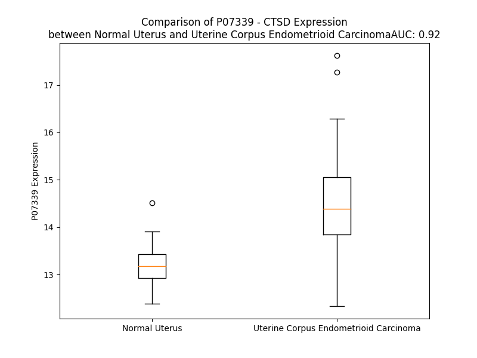

# Detailed Data for P07339

## Introduction to the Detailed Summary

### How to Interpret the Results

- **Summary & Metrics**: This section provides a quick reference to essential protein attributes, including expression changes, family classification, and biomarker applications. Regulation status (upregulated/downregulated) indicates the protein's behavior in a disease context. Some information comes from the original excel file with the proteins selected from literature, while others are derived from the analyses.
- **Expression Comparison**: A visual representation comparing protein expression between normal and disease states. It highlights significant changes in expression levels that might indicate diagnostic or therapeutic relevance. This is data coming from transcriptomics experiments and could not translate similarly to protein levels.
- **Isoform Alignment**: An interactive view of isoform alignments, revealing structural and functional differences between variants of the protein.
- **Interactors & Homologs**: Tables listing known interaction partners and homologous proteins, the more interactors and homologs, the more complex the protein is to design an antibody for.
- **Biological Assemblies**: Information about the structural arrangement of the protein in different assemblies, providing insights into its functional state but also the complexity of the protein to develop antibodies.
- **Combined Per-Residue Information**: A detailed table summarizing residue-level data. This includes predictions for epitope regions, aggregation tendencies, and modifications that might impact the protein's function. Each row corresponds to a residue in the protein, providing insights into specific sites that may be important for research or drug development.
## Summary & Metrics

- **UniProt Accession**: P07339
- **Gene Name**: CTSD
- **Protein Name**: Cathepsin D
- **Swiss Prot**: CATD_HUMAN
- **Family**: peptidase
- **Biomarker Application**: diagnosis,unspecified application
- **Number of Isoforms**: 0
- **Regulation**: -1
- **(transcriptomics) AUC**: 0.92
- **(transcriptomics) Fold Change**: 1.10
- **(transcriptomics) Regulation**: Upregulated
- **Discotope Epitope Count**: 77
- **Max n_uniprots (Homo)**: 4
- **Max n_uniprots (Hetero)**: N/A

## Expression Comparison

## Interactors

| preferredName_A   | preferredName_B   |   score |
|:------------------|:------------------|--------:|
| CTSD              | LAMP1             |   0.999 |
| CTSD              | CTSB              |   0.977 |
| CTSD              | BCL2              |   0.949 |
| CTSD              | BCL2L1            |   0.934 |
| CTSD              | BID               |   0.917 |
| CTSD              | AGT               |   0.909 |

## Homologs

| uniprot_id   | gene_id   |
|:-------------|:----------|
| P00797       | REN       |
| F5H0H6       | PGA4      |
| F5GWT0       | PGA5      |
| F5H0H6       | PGA4      |
| O96009       | NAPSA     |
| A0A7I2V648   | CTSE      |
| A0A7P0T924   | BACE1     |
| Q9Y5Z0       | BACE2     |
| P20142       | PGC       |

## Biological Assemblies

|   Unnamed: 0 |   assembly |   n_uniprots | composition   | crystal_id   |
|-------------:|-----------:|-------------:|:--------------|:-------------|
|            0 |          1 |            2 | Homo          | 1lyw         |
|            1 |          2 |            2 | Homo          | 1lyw         |
|            2 |          3 |            2 | Homo          | 1lyw         |
|            3 |          4 |            2 | Homo          | 1lyw         |
|            4 |          5 |            4 | Homo          | 1lyw         |
|            5 |          6 |            4 | Homo          | 1lyw         |
|            6 |          7 |            2 | Homo          | 1lyw         |
|            7 |          8 |            4 | Homo          | 1lyw         |
|            8 |          9 |            2 | Homo          | 1lyw         |
|            9 |         10 |            2 | Homo          | 1lyw         |
|           10 |         11 |            4 | Homo          | 1lyw         |
|           11 |         12 |            2 | Homo          | 1lyw         |
|            0 |          1 |            4 | Homo          | 1lya         |
|            1 |          2 |            4 | Homo          | 1lya         |
|            0 |          1 |            4 | Homo          | 4obz         |
|            0 |          1 |            4 | Homo          | 1lyb         |
|            1 |          2 |            2 | Homo          | 1lyb         |
|            2 |          3 |            2 | Homo          | 1lyb         |
|            0 |          1 |            2 | Homo          | 4oc6         |
|            0 |          1 |            4 | Homo          | 4od9         |

## Combined Per-Residue Information

|   res | aa   |   epitope_score | epitope   |   relative_surface_accessibility |   modeling_confidence |   Aggregation | modification   | glycosylation                   |
|------:|:-----|----------------:|:----------|---------------------------------:|----------------------:|--------------:|:---------------|:--------------------------------|
|     1 | M    |         0.17109 | False     |                          1.32128 |                 37.56 |         0     | N/A            | N/A                             |
|     2 | Q    |         0.23186 | True      |                          0.83437 |                 46.47 |         0     | N/A            | N/A                             |
|     3 | P    |         0.21259 | True      |                          0.88169 |                 44.68 |         0     | N/A            | N/A                             |
|     4 | S    |         0.23753 | True      |                          0.60059 |                 40.42 |         0     | N/A            | N/A                             |
|     5 | S    |         0.19359 | True      |                          0.90476 |                 43.59 |         0     | N/A            | N/A                             |
|     6 | L    |         0.17546 | False     |                          1.02767 |                 41.67 |         0     | N/A            | N/A                             |
|     7 | L    |         0.1658  | False     |                          0.94579 |                 42.06 |         0     | N/A            | N/A                             |
|     8 | P    |         0.13995 | False     |                          0.90331 |                 44.71 |         0     | N/A            | N/A                             |
|     9 | L    |         0.14996 | False     |                          0.91794 |                 45.01 |        14.912 | N/A            | N/A                             |
|    10 | A    |         0.11749 | False     |                          0.87274 |                 46.85 |        17.397 | N/A            | N/A                             |
|    11 | L    |         0.14228 | False     |                          0.83618 |                 45.68 |        18.743 | N/A            | N/A                             |
|    12 | C    |         0.08989 | False     |                          0.83159 |                 41.44 |        18.743 | N/A            | N/A                             |
|    13 | L    |         0.13122 | False     |                          0.94893 |                 44.38 |        18.743 | N/A            | N/A                             |
|    14 | L    |         0.162   | False     |                          1.03382 |                 42.34 |        17.396 | N/A            | N/A                             |
|    15 | A    |         0.14852 | False     |                          0.87664 |                 46.02 |         8.692 | N/A            | N/A                             |
|    16 | A    |         0.11985 | False     |                          0.78961 |                 43.37 |         0     | N/A            | N/A                             |
|    17 | P    |         0.13993 | False     |                          0.94036 |                 44.53 |         0     | N/A            | N/A                             |
|    18 | A    |         0.13575 | False     |                          0.91665 |                 52.45 |         0     | N/A            | N/A                             |
|    19 | S    |         0.06439 | False     |                          0.52258 |                 57.95 |         0     | N/A            | N/A                             |
|    20 | A    |         0.10094 | False     |                          0.3788  |                 75.49 |         0     | N/A            | N/A                             |
|    21 | L    |         0.05913 | False     |                          0.33368 |                 84.66 |         0     | N/A            | N/A                             |
|    22 | V    |         0.02054 | False     |                          0.03237 |                 89.52 |         0     | N/A            | N/A                             |
|    23 | R    |         0.11936 | False     |                          0.47931 |                 91.85 |         0     | N/A            | N/A                             |
|    24 | I    |         0.00543 | False     |                          0.0048  |                 92.11 |         0     | N/A            | N/A                             |
|    25 | P    |         0.0637  | False     |                          0.46531 |                 92.55 |         0     | N/A            | N/A                             |
|    26 | L    |         0.008   | False     |                          0.00989 |                 92.92 |         0     | N/A            | N/A                             |
|    27 | H    |         0.06387 | False     |                          0.32843 |                 91.1  |         0     | N/A            | N/A                             |
|    28 | K    |         0.07027 | False     |                          0.27496 |                 88.1  |         0     | N/A            | N/A                             |
|    29 | F    |         0.08186 | False     |                          0.10353 |                 85.86 |         0     | N/A            | N/A                             |
|    30 | T    |         0.13392 | False     |                          0.48179 |                 81.92 |         0     | N/A            | N/A                             |
|    31 | S    |         0.04436 | False     |                          0.06484 |                 78.76 |         0     | N/A            | N/A                             |
|    32 | I    |         0.02117 | False     |                          0.0016  |                 75.87 |         0     | N/A            | N/A                             |
|    33 | R    |         0.19164 | True      |                          0.07803 |                 77.09 |         0     | N/A            | N/A                             |
|    34 | R    |         0.151   | False     |                          0.07612 |                 76.03 |         0     | N/A            | N/A                             |
|    35 | T    |         0.13486 | False     |                          0.26887 |                 77.34 |         0     | N/A            | N/A                             |
|    36 | M    |         0.24344 | True      |                          0.3103  |                 72.13 |         0     | N/A            | N/A                             |
|    37 | S    |         0.0749  | False     |                          0.02742 |                 69.55 |         0     | N/A            | N/A                             |
|    38 | E    |         0.26727 | True      |                          0.42435 |                 65.19 |         0     | N/A            | N/A                             |
|    39 | V    |         0.4389  | True      |                          0.9272  |                 60.68 |         0     | N/A            | N/A                             |
|    40 | G    |         0.41768 | True      |                          0.54582 |                 54.56 |         0     | N/A            | N/A                             |
|    41 | G    |         0.24967 | True      |                          0.47825 |                 59.57 |         0     | N/A            | N/A                             |
|    42 | S    |         0.27768 | True      |                          0.39656 |                 60.54 |         0     | N/A            | N/A                             |
|    43 | V    |         0.16862 | False     |                          0.12827 |                 59.64 |         0     | N/A            | N/A                             |
|    44 | E    |         0.31337 | True      |                          0.54311 |                 66.71 |         0     | N/A            | N/A                             |
|    45 | D    |         0.32038 | True      |                          0.53537 |                 65.97 |         0     | N/A            | N/A                             |
|    46 | L    |         0.21566 | True      |                          0.10552 |                 67.04 |         0     | N/A            | N/A                             |
|    47 | I    |         0.24617 | True      |                          0.36225 |                 66.29 |         0     | N/A            | N/A                             |
|    48 | A    |         0.17422 | False     |                          0.14596 |                 66.77 |         0     | N/A            | N/A                             |
|    49 | K    |         0.25285 | True      |                          1.01075 |                 63.5  |         0     | N/A            | N/A                             |
|    50 | G    |         0.26201 | True      |                          0.4593  |                 49.67 |         0     | N/A            | N/A                             |
|    51 | P    |         0.23696 | True      |                          1.01553 |                 43.83 |         0     | N/A            | N/A                             |
|    52 | V    |         0.13672 | False     |                          0.33916 |                 44.13 |         0     | N/A            | N/A                             |
|    53 | S    |         0.21259 | True      |                          0.70689 |                 35.86 |         0     | N/A            | N/A                             |
|    54 | K    |         0.29809 | True      |                          0.71215 |                 35.63 |         0     | N/A            | N/A                             |
|    55 | Y    |         0.15183 | False     |                          0.36325 |                 35.71 |         0     | N/A            | N/A                             |
|    56 | S    |         0.18075 | False     |                          0.76308 |                 26.99 |         0     | N/A            | N/A                             |
|    57 | Q    |         0.27939 | True      |                          0.80293 |                 31.85 |         0     | N/A            | N/A                             |
|    58 | A    |         0.24435 | True      |                          0.88557 |                 26.44 |         0     | N/A            | N/A                             |
|    59 | V    |         0.17874 | False     |                          0.77118 |                 26.73 |         0     | N/A            | N/A                             |
|    60 | P    |         0.14126 | False     |                          0.80334 |                 26.29 |         0     | N/A            | N/A                             |
|    61 | A    |         0.21267 | True      |                          0.8596  |                 28.45 |         0     | N/A            | N/A                             |
|    62 | V    |         0.25041 | True      |                          0.82259 |                 29.41 |         0     | N/A            | N/A                             |
|    63 | T    |         0.2715  | True      |                          0.8003  |                 28.64 |         0     | N/A            | O-linked (GalNAc...) threonine  |
|    64 | E    |         0.35108 | True      |                          0.94519 |                 27.38 |         0     | N/A            | N/A                             |
|    65 | G    |         0.25452 | True      |                          0.58071 |                 32.01 |         0     | N/A            | N/A                             |
|    66 | P    |         0.18132 | False     |                          1.02617 |                 30.65 |         0     | N/A            | N/A                             |
|    67 | I    |         0.21379 | True      |                          0.63792 |                 36.28 |         0     | N/A            | N/A                             |
|    68 | P    |         0.1485  | False     |                          0.47884 |                 45.61 |         0     | N/A            | N/A                             |
|    69 | E    |         0.11396 | False     |                          0.18176 |                 46.9  |         0     | N/A            | N/A                             |
|    70 | V    |         0.0832  | False     |                          0.37306 |                 49.82 |         0     | N/A            | N/A                             |
|    71 | L    |         0.07118 | False     |                          0.10493 |                 46.53 |         0     | N/A            | N/A                             |
|    72 | K    |         0.1212  | False     |                          0.24914 |                 51.18 |         0     | N/A            | N/A                             |
|    73 | N    |         0.05019 | False     |                          0.0825  |                 53.09 |         0     | N/A            | N/A                             |
|    74 | Y    |         0.04981 | False     |                          0.05329 |                 54.8  |         0     | N/A            | N/A                             |
|    75 | M    |         0.09934 | False     |                          0.12379 |                 58.36 |         0     | N/A            | N/A                             |
|    76 | D    |         0.03224 | False     |                          0.02094 |                 61.86 |         0     | N/A            | N/A                             |
|    77 | A    |         0.00647 | False     |                          0       |                 65.18 |         0     | N/A            | N/A                             |
|    78 | Q    |         0.04843 | False     |                          0.12212 |                 79.56 |         0     | N/A            | N/A                             |
|    79 | Y    |         0.03291 | False     |                          0.03605 |                 91.26 |         0     | N/A            | N/A                             |
|    80 | Y    |         0.07519 | False     |                          0.20117 |                 92.93 |         0     | N/A            | N/A                             |
|    81 | G    |         0.0022  | False     |                          0       |                 92.98 |         0     | N/A            | N/A                             |
|    82 | E    |         0.03876 | False     |                          0.39801 |                 94.47 |         0     | N/A            | N/A                             |
|    83 | I    |         0.00309 | False     |                          0       |                 96.33 |         0     | N/A            | N/A                             |
|    84 | G    |         0.00289 | False     |                          0       |                 97.03 |         0     | N/A            | N/A                             |
|    85 | I    |         0.00334 | False     |                          0       |                 98.5  |         0     | N/A            | N/A                             |
|    86 | G    |         0.01507 | False     |                          0.0228  |                 98.07 |         0     | N/A            | N/A                             |
|    87 | T    |         0.10028 | False     |                          0.4007  |                 97.07 |         0     | N/A            | N/A                             |
|    88 | P    |         0.2106  | True      |                          0.69088 |                 96.45 |         0     | N/A            | N/A                             |
|    89 | P    |         0.04652 | False     |                          0.29866 |                 96.18 |         0     | N/A            | N/A                             |
|    90 | Q    |         0.04801 | False     |                          0.15624 |                 97.6  |         0.55  | N/A            | N/A                             |
|    91 | C    |         0.02111 | False     |                          0.34428 |                 96.57 |        14.58  | N/A            | N/A                             |
|    92 | F    |         0.0062  | False     |                          0.00978 |                 96.75 |        76.126 | N/A            | N/A                             |
|    93 | T    |         0.06964 | False     |                          0.15727 |                 94.7  |        76.126 | N/A            | N/A                             |
|    94 | V    |         0.0017  | False     |                          0       |                 95.04 |        76.126 | N/A            | N/A                             |
|    95 | V    |         0.00672 | False     |                          0.00571 |                 93.64 |        76.126 | N/A            | N/A                             |
|    96 | F    |         0.00765 | False     |                          0.03043 |                 96.09 |        75.024 | N/A            | N/A                             |
|    97 | D    |         0.03268 | False     |                          0.01869 |                 95.15 |         0     | N/A            | N/A                             |
|    98 | T    |         0.00789 | False     |                          0.00633 |                 96.46 |         0     | N/A            | N/A                             |
|    99 | G    |         0.03433 | False     |                          0.06619 |                 92.3  |         0     | N/A            | N/A                             |
|   100 | S    |         0.02727 | False     |                          0.11573 |                 92.29 |         0     | N/A            | N/A                             |
|   101 | S    |         0.00371 | False     |                          0.00843 |                 96.02 |         0     | N/A            | N/A                             |
|   102 | N    |         0.06711 | False     |                          0.09203 |                 96.19 |         0     | N/A            | N/A                             |
|   103 | L    |         0.00547 | False     |                          0.03019 |                 97.82 |         0     | N/A            | N/A                             |
|   104 | W    |         0.01578 | False     |                          0.00336 |                 97.04 |         0     | N/A            | N/A                             |
|   105 | V    |         0.00166 | False     |                          0       |                 96.74 |         0     | N/A            | N/A                             |
|   106 | P    |         0.00315 | False     |                          0       |                 95.53 |         0     | N/A            | N/A                             |
|   107 | S    |         0.01211 | False     |                          0       |                 97.07 |         0.129 | N/A            | N/A                             |
|   108 | I    |         0.20806 | True      |                          0.37109 |                 95.89 |         1.172 | N/A            | N/A                             |
|   109 | H    |         0.21792 | True      |                          0.54642 |                 94.86 |         1.172 | N/A            | N/A                             |
|   110 | C    |         0.07066 | False     |                          0.16987 |                 91.15 |         1.327 | N/A            | N/A                             |
|   111 | K    |         0.26189 | True      |                          0.60243 |                 85.71 |         2.25  | N/A            | N/A                             |
|   112 | L    |         0.34639 | True      |                          0.87875 |                 78.03 |         2.25  | N/A            | N/A                             |
|   113 | L    |         0.32989 | True      |                          1.00125 |                 79.4  |         2.25  | N/A            | N/A                             |
|   114 | D    |         0.16358 | False     |                          0.12731 |                 77.99 |         2.25  | N/A            | N/A                             |
|   115 | I    |         0.43132 | True      |                          0.63646 |                 79.01 |        18.421 | N/A            | N/A                             |
|   116 | A    |         0.03835 | False     |                          0.00711 |                 74.7  |        19.286 | N/A            | N/A                             |
|   117 | C    |         0.03403 | False     |                          0.01208 |                 79.95 |        19.286 | N/A            | N/A                             |
|   118 | W    |         0.39949 | True      |                          0.72574 |                 82.63 |        19.286 | N/A            | N/A                             |
|   119 | I    |         0.36031 | True      |                          0.58972 |                 85.47 |        19.286 | N/A            | N/A                             |
|   120 | H    |         0.11614 | False     |                          0.10053 |                 90.24 |        10.315 | N/A            | N/A                             |
|   121 | H    |         0.06002 | False     |                          0.59818 |                 94.73 |         0     | N/A            | N/A                             |
|   122 | K    |         0.19445 | True      |                          0.35759 |                 95.89 |         0     | N/A            | N/A                             |
|   123 | Y    |         0.00971 | False     |                          0       |                 98.28 |         0     | N/A            | N/A                             |
|   124 | N    |         0.09208 | False     |                          0.15972 |                 98.36 |         0     | N/A            | N/A                             |
|   125 | S    |         0.0494  | False     |                          0.0698  |                 98.34 |         0     | N/A            | N/A                             |
|   126 | D    |         0.29935 | True      |                          0.78886 |                 98.41 |         0     | N/A            | N/A                             |
|   127 | K    |         0.1814  | False     |                          0.67188 |                 98.11 |         0     | N/A            | N/A                             |
|   128 | S    |         0.08497 | False     |                          0.09149 |                 98.38 |         0     | N/A            | N/A                             |
|   129 | S    |         0.17476 | False     |                          0.7465  |                 98.43 |         0     | N/A            | N/A                             |
|   130 | T    |         0.10203 | False     |                          0.38616 |                 98.61 |         0     | N/A            | N/A                             |
|   131 | Y    |         0.10324 | False     |                          0.28564 |                 98.8  |         0     | N/A            | N/A                             |
|   132 | V    |         0.1305  | False     |                          0.56934 |                 98.77 |         0     | N/A            | N/A                             |
|   133 | K    |         0.28925 | True      |                          0.78099 |                 98.4  |         0     | N/A            | N/A                             |
|   134 | N    |         0.18295 | False     |                          0.4581  |                 98.13 |         0     | N/A            | N-linked (GlcNAc...) asparagine |
|   135 | G    |         0.19637 | True      |                          0.42517 |                 97.3  |         0     | N/A            | N/A                             |
|   136 | T    |         0.22908 | True      |                          0.51663 |                 98.22 |         0     | N/A            | N/A                             |
|   137 | S    |         0.1684  | False     |                          0.66492 |                 97.12 |         0     | N/A            | N/A                             |
|   138 | F    |         0.06528 | False     |                          0.05066 |                 94.66 |         0     | N/A            | N/A                             |
|   139 | D    |         0.14293 | False     |                          0.42324 |                 91.12 |         0     | N/A            | N/A                             |
|   140 | I    |         0.07913 | False     |                          0.064   |                 85.75 |         0     | N/A            | N/A                             |
|   141 | H    |         0.18579 | False     |                          0.54238 |                 77.46 |         0     | N/A            | N/A                             |
|   142 | Y    |         0.08879 | False     |                          0.09804 |                 69.65 |         0     | N/A            | N/A                             |
|   143 | G    |         0.14961 | False     |                          0.51761 |                 63.89 |         0     | N/A            | N/A                             |
|   144 | S    |         0.13741 | False     |                          0.21575 |                 65.26 |         0     | N/A            | N/A                             |
|   145 | G    |         0.1934  | True      |                          0.30145 |                 70.18 |         0     | N/A            | N/A                             |
|   146 | S    |         0.11905 | False     |                          0.20657 |                 81.2  |         0     | N/A            | N/A                             |
|   147 | L    |         0.03689 | False     |                          0.00842 |                 88.81 |         0     | N/A            | N/A                             |
|   148 | S    |         0.16477 | False     |                          0.19964 |                 93.06 |         0     | N/A            | N/A                             |
|   149 | G    |         0.06809 | False     |                          0.12449 |                 96.07 |         0     | N/A            | N/A                             |
|   150 | Y    |         0.0802  | False     |                          0.22851 |                 98.07 |         0     | N/A            | N/A                             |
|   151 | L    |         0.06781 | False     |                          0.06925 |                 98.61 |         0     | N/A            | N/A                             |
|   152 | S    |         0.00823 | False     |                          0.00316 |                 98.78 |         0     | N/A            | N/A                             |
|   153 | Q    |         0.16722 | False     |                          0.20048 |                 98.88 |         0     | N/A            | N/A                             |
|   154 | D    |         0.00543 | False     |                          0.00485 |                 98.8  |         0     | N/A            | N/A                             |
|   155 | T    |         0.05985 | False     |                          0.09572 |                 98.53 |         0     | N/A            | N/A                             |
|   156 | V    |         0.00197 | False     |                          0       |                 98.45 |         0     | N/A            | N/A                             |
|   157 | S    |         0.03006 | False     |                          0.04247 |                 96.34 |         0     | N/A            | N/A                             |
|   158 | V    |         0.00655 | False     |                          0.02272 |                 93.73 |         0     | N/A            | N/A                             |
|   159 | P    |         0.06804 | False     |                          0.20737 |                 91.62 |         0     | N/A            | N/A                             |
|   160 | C    |         0.02155 | False     |                          0.11622 |                 90.72 |         0     | N/A            | N/A                             |
|   161 | Q    |         0.05795 | False     |                          0.37015 |                 74.98 |         0     | N/A            | N/A                             |
|   162 | S    |         0.16682 | False     |                          0.40164 |                 56.81 |         0     | N/A            | N/A                             |
|   163 | A    |         0.15478 | False     |                          1.10606 |                 47.92 |         0     | N/A            | N/A                             |
|   164 | S    |         0.2214  | True      |                          0.79984 |                 40.9  |         0     | N/A            | N/A                             |
|   165 | S    |         0.09858 | False     |                          0.49327 |                 43.76 |         0     | N/A            | N/A                             |
|   166 | A    |         0.16812 | False     |                          0.99257 |                 35.03 |         0     | N/A            | N/A                             |
|   167 | S    |         0.10748 | False     |                          0.49895 |                 39.63 |         0     | N/A            | N/A                             |
|   168 | A    |         0.18314 | False     |                          0.98563 |                 42.18 |         0     | N/A            | N/A                             |
|   169 | L    |         0.13919 | False     |                          0.82529 |                 52.58 |         0     | N/A            | N/A                             |
|   170 | G    |         0.13573 | False     |                          0.58202 |                 69.07 |         0     | N/A            | N/A                             |
|   171 | G    |         0.05366 | False     |                          0.42221 |                 85.59 |         0     | N/A            | N/A                             |
|   172 | V    |         0.04611 | False     |                          0.06271 |                 92.69 |         0     | N/A            | N/A                             |
|   173 | K    |         0.10109 | False     |                          0.62976 |                 95.61 |         0     | N/A            | N/A                             |
|   174 | V    |         0.00343 | False     |                          0.0019  |                 97.95 |         0     | N/A            | N/A                             |
|   175 | E    |         0.10265 | False     |                          0.52476 |                 98.33 |         0     | N/A            | N/A                             |
|   176 | R    |         0.17718 | False     |                          0.73304 |                 98.48 |         0     | N/A            | N/A                             |
|   177 | Q    |         0.03379 | False     |                          0.01202 |                 98.85 |         0     | N/A            | N/A                             |
|   178 | V    |         0.05748 | False     |                          0.23181 |                 98.83 |         0     | N/A            | N/A                             |
|   179 | F    |         0.01257 | False     |                          0.00412 |                 98.74 |         0     | N/A            | N/A                             |
|   180 | G    |         0.01703 | False     |                          0.03636 |                 98.26 |         0     | N/A            | N/A                             |
|   181 | E    |         0.00353 | False     |                          0.00259 |                 98.11 |         0     | N/A            | N/A                             |
|   182 | A    |         0.00685 | False     |                          0.00283 |                 95.12 |         0     | N/A            | N/A                             |
|   183 | T    |         0.08391 | False     |                          0.15842 |                 94.51 |         0     | N/A            | N/A                             |
|   184 | K    |         0.22023 | True      |                          0.48511 |                 91.02 |         0     | N/A            | N/A                             |
|   185 | Q    |         0.10733 | False     |                          0.02817 |                 85.72 |         0     | N/A            | N/A                             |
|   186 | P    |         0.26308 | True      |                          0.54125 |                 78.41 |         0     | N/A            | N/A                             |
|   187 | G    |         0.2269  | True      |                          0.62082 |                 73.65 |         5.241 | N/A            | N/A                             |
|   188 | I    |         0.42489 | True      |                          0.60734 |                 73.79 |        30.306 | N/A            | N/A                             |
|   189 | T    |         0.08035 | False     |                          0.05231 |                 74.75 |        31.415 | N/A            | N/A                             |
|   190 | F    |         0.0502  | False     |                          0.02141 |                 76.12 |        31.837 | N/A            | N/A                             |
|   191 | I    |         0.38994 | True      |                          0.34242 |                 78.3  |        31.837 | N/A            | N/A                             |
|   192 | A    |         0.14041 | False     |                          0.16226 |                 76.04 |        28.646 | N/A            | N/A                             |
|   193 | A    |         0.0732  | False     |                          0.05884 |                 80.87 |        16.486 | N/A            | N/A                             |
|   194 | K    |         0.13617 | False     |                          0.62246 |                 85.21 |         5.438 | N/A            | N/A                             |
|   195 | F    |         0.04149 | False     |                          0.01343 |                 88.01 |         5.438 | N/A            | N/A                             |
|   196 | D    |         0.01699 | False     |                          0.04108 |                 92.22 |         5.438 | N/A            | N/A                             |
|   197 | G    |         0.00161 | False     |                          0       |                 93.18 |         4.926 | N/A            | N/A                             |
|   198 | I    |         0.00735 | False     |                          0.0008  |                 93.21 |         4.926 | N/A            | N/A                             |
|   199 | L    |         0.01442 | False     |                          0.02391 |                 96.67 |         4.423 | N/A            | N/A                             |
|   200 | G    |         0.00936 | False     |                          0.00476 |                 96.42 |         0.761 | N/A            | N/A                             |
|   201 | M    |         0.01    | False     |                          0.01885 |                 97.63 |         0.514 | N/A            | N/A                             |
|   202 | A    |         0.00318 | False     |                          0.00189 |                 96.98 |         0.236 | N/A            | N/A                             |
|   203 | Y    |         0.02511 | False     |                          0.03879 |                 97.81 |         0     | N/A            | N/A                             |
|   204 | P    |         0.13295 | False     |                          0.33889 |                 97.1  |         0     | N/A            | N/A                             |
|   205 | R    |         0.30384 | True      |                          0.64353 |                 95.36 |         0     | N/A            | N/A                             |
|   206 | I    |         0.12746 | False     |                          0.10467 |                 92.5  |         0     | N/A            | N/A                             |
|   207 | S    |         0.02999 | False     |                          0.06516 |                 94.28 |         0     | N/A            | N/A                             |
|   208 | V    |         0.09988 | False     |                          0.1274  |                 92.2  |         0     | N/A            | N/A                             |
|   209 | N    |         0.30001 | True      |                          0.42552 |                 94.77 |         0     | N/A            | N/A                             |
|   210 | N    |         0.35459 | True      |                          0.87494 |                 95.78 |         0     | N/A            | N/A                             |
|   211 | V    |         0.08558 | False     |                          0.08064 |                 97.27 |         0     | N/A            | N/A                             |
|   212 | L    |         0.10236 | False     |                          0.39685 |                 98.47 |         0     | N/A            | N/A                             |
|   213 | P    |         0.00565 | False     |                          0.00994 |                 98.58 |         0     | N/A            | N/A                             |
|   214 | V    |         0.01208 | False     |                          0.04734 |                 98.54 |         0     | N/A            | N/A                             |
|   215 | F    |         0.01677 | False     |                          0.01696 |                 98.24 |         0     | N/A            | N/A                             |
|   216 | D    |         0.0665  | False     |                          0.10231 |                 98.63 |         0     | N/A            | N/A                             |
|   217 | N    |         0.04995 | False     |                          0.09419 |                 98.54 |         0     | N/A            | N/A                             |
|   218 | L    |         0.05611 | False     |                          0.01401 |                 97.13 |         0     | N/A            | N/A                             |
|   219 | M    |         0.069   | False     |                          0.19998 |                 96.81 |         0     | N/A            | N/A                             |
|   220 | Q    |         0.35419 | True      |                          0.63293 |                 97.78 |         0     | N/A            | N/A                             |
|   221 | Q    |         0.09278 | False     |                          0.30232 |                 97.53 |         0     | N/A            | N/A                             |
|   222 | K    |         0.31551 | True      |                          0.8695  |                 96.03 |         0     | N/A            | N/A                             |
|   223 | L    |         0.1472  | False     |                          0.30263 |                 95.02 |         0     | N/A            | N/A                             |
|   224 | V    |         0.04955 | False     |                          0.05778 |                 93.84 |         0     | N/A            | N/A                             |
|   225 | D    |         0.15419 | False     |                          0.51032 |                 88.91 |         0     | N/A            | N/A                             |
|   226 | Q    |         0.11604 | False     |                          0.47378 |                 95.73 |         0.278 | N/A            | N/A                             |
|   227 | N    |         0.05213 | False     |                          0.1879  |                 97.89 |         7.905 | N/A            | N/A                             |
|   228 | I    |         0.04758 | False     |                          0.0944  |                 98.29 |        66.257 | N/A            | N/A                             |
|   229 | F    |         0.00423 | False     |                          0       |                 98.57 |        70.478 | N/A            | N/A                             |
|   230 | S    |         0.00746 | False     |                          0.00307 |                 98.57 |        70.641 | N/A            | N/A                             |
|   231 | F    |         0.01173 | False     |                          0.01401 |                 98.44 |        70.641 | N/A            | N/A                             |
|   232 | Y    |         0.02517 | False     |                          0.06572 |                 97.46 |        70.59  | N/A            | N/A                             |
|   233 | L    |         0.0138  | False     |                          0.01263 |                 95.43 |        58.186 | N/A            | N/A                             |
|   234 | S    |         0.03555 | False     |                          0.05913 |                 92.43 |        24.234 | N/A            | N/A                             |
|   235 | R    |         0.07836 | False     |                          0.26425 |                 88.11 |         0     | N/A            | N/A                             |
|   236 | D    |         0.11502 | False     |                          0.43715 |                 85.7  |         0     | N/A            | N/A                             |
|   237 | P    |         0.17797 | False     |                          0.7189  |                 79.32 |         0     | N/A            | N/A                             |
|   238 | D    |         0.27117 | True      |                          0.76161 |                 82.09 |         0     | N/A            | N/A                             |
|   239 | A    |         0.12675 | False     |                          0.22847 |                 84.74 |         0     | N/A            | N/A                             |
|   240 | Q    |         0.18971 | True      |                          0.72365 |                 83.92 |         0     | N/A            | N/A                             |
|   241 | P    |         0.28235 | True      |                          0.37485 |                 87.53 |         0     | N/A            | N/A                             |
|   242 | G    |         0.00875 | False     |                          0.00322 |                 90.56 |         0     | N/A            | N/A                             |
|   243 | G    |         0.0027  | False     |                          0       |                 94.46 |         0     | N/A            | N/A                             |
|   244 | E    |         0.06465 | False     |                          0.08508 |                 95.12 |         0     | N/A            | N/A                             |
|   245 | L    |         0.00362 | False     |                          0       |                 96.45 |         0     | N/A            | N/A                             |
|   246 | M    |         0.01655 | False     |                          0.01654 |                 95.63 |         0     | N/A            | N/A                             |
|   247 | L    |         0.03183 | False     |                          0.04781 |                 96.32 |         0     | N/A            | N/A                             |
|   248 | G    |         0.00319 | False     |                          0.00119 |                 95.91 |         0     | N/A            | N/A                             |
|   249 | G    |         0.01602 | False     |                          0.03702 |                 95.71 |         0     | N/A            | N/A                             |
|   250 | T    |         0.1061  | False     |                          0.29227 |                 96.65 |         0     | N/A            | N/A                             |
|   251 | D    |         0.08241 | False     |                          0.11008 |                 94.61 |         0     | N/A            | N/A                             |
|   252 | S    |         0.25262 | True      |                          0.6414  |                 94.97 |         0     | N/A            | N/A                             |
|   253 | K    |         0.23235 | True      |                          0.58602 |                 95.09 |         0     | N/A            | N/A                             |
|   254 | Y    |         0.04405 | False     |                          0.0489  |                 96.59 |         0     | N/A            | N/A                             |
|   255 | Y    |         0.08899 | False     |                          0.18584 |                 97.51 |         0     | N/A            | N/A                             |
|   256 | K    |         0.17562 | False     |                          0.5894  |                 96.5  |         0     | N/A            | N/A                             |
|   257 | G    |         0.14795 | False     |                          0.84613 |                 95.19 |         0     | N/A            | N/A                             |
|   258 | S    |         0.18742 | False     |                          0.6882  |                 95.89 |         0     | N/A            | N/A                             |
|   259 | L    |         0.11839 | False     |                          0.25421 |                 98.16 |         0.129 | N/A            | N/A                             |
|   260 | S    |         0.12095 | False     |                          0.24229 |                 98.33 |         0.129 | N/A            | N/A                             |
|   261 | Y    |         0.09875 | False     |                          0.35084 |                 98.69 |         0.129 | N/A            | N/A                             |
|   262 | L    |         0.03889 | False     |                          0.08985 |                 98.78 |         0.129 | N/A            | N/A                             |
|   263 | N    |         0.19279 | True      |                          0.73545 |                 98.67 |         0.129 | N/A            | N-linked (GlcNAc...) asparagine |
|   264 | V    |         0.06592 | False     |                          0.11823 |                 98.72 |         0.129 | N/A            | N/A                             |
|   265 | T    |         0.21632 | True      |                          0.51474 |                 98.16 |         0     | N/A            | N/A                             |
|   266 | R    |         0.15124 | False     |                          0.24679 |                 97.15 |         0     | N/A            | N/A                             |
|   267 | K    |         0.15147 | False     |                          0.52784 |                 96.82 |         0     | N/A            | N/A                             |
|   268 | A    |         0.01037 | False     |                          0       |                 94.19 |         0     | N/A            | N/A                             |
|   269 | Y    |         0.01856 | False     |                          0.00729 |                 95.28 |         0     | N/A            | N/A                             |
|   270 | W    |         0.00326 | False     |                          0.00051 |                 98.13 |         0     | N/A            | N/A                             |
|   271 | Q    |         0.05678 | False     |                          0.06018 |                 98.46 |         0     | N/A            | N/A                             |
|   272 | V    |         0.00394 | False     |                          0       |                 98.63 |         0     | N/A            | N/A                             |
|   273 | H    |         0.05505 | False     |                          0.42358 |                 98.61 |         0     | N/A            | N/A                             |
|   274 | L    |         0.00376 | False     |                          0       |                 98.58 |         0     | N/A            | N/A                             |
|   275 | D    |         0.08998 | False     |                          0.23093 |                 98.34 |         0     | N/A            | N/A                             |
|   276 | Q    |         0.10981 | False     |                          0.27412 |                 97.86 |         0     | N/A            | N/A                             |
|   277 | V    |         0.00211 | False     |                          0       |                 98.4  |         0     | N/A            | N/A                             |
|   278 | E    |         0.11814 | False     |                          0.26621 |                 98.16 |         0     | N/A            | N/A                             |
|   279 | V    |         0.01898 | False     |                          0.02111 |                 97.45 |         0.305 | N/A            | N/A                             |
|   280 | A    |         0.17548 | False     |                          0.74333 |                 90.96 |         0.305 | N/A            | N/A                             |
|   281 | S    |         0.21648 | True      |                          0.54517 |                 85.41 |         0.305 | N/A            | N/A                             |
|   282 | G    |         0.20378 | True      |                          0.86279 |                 93.64 |         0.305 | N/A            | N/A                             |
|   283 | L    |         0.23658 | True      |                          0.26892 |                 97.05 |         0.305 | N/A            | N/A                             |
|   284 | T    |         0.11457 | False     |                          0.29233 |                 97.86 |         0.305 | N/A            | N/A                             |
|   285 | L    |         0.07517 | False     |                          0.06265 |                 97.9  |         0.305 | N/A            | N/A                             |
|   286 | C    |         0.01699 | False     |                          0.05267 |                 97.09 |         0     | N/A            | N/A                             |
|   287 | K    |         0.31034 | True      |                          0.7115  |                 94.18 |         0     | N/A            | N/A                             |
|   288 | E    |         0.24403 | True      |                          0.91415 |                 94.32 |         0     | N/A            | N/A                             |
|   289 | G    |         0.11203 | False     |                          0.27812 |                 97.02 |         0     | N/A            | N/A                             |
|   290 | C    |         0.05915 | False     |                          0.21731 |                 98.01 |         0     | N/A            | N/A                             |
|   291 | E    |         0.05761 | False     |                          0.23529 |                 97.86 |         0     | N/A            | N/A                             |
|   292 | A    |         0.00239 | False     |                          0       |                 98.07 |         0     | N/A            | N/A                             |
|   293 | I    |         0.0108  | False     |                          0.0056  |                 97.69 |         0     | N/A            | N/A                             |
|   294 | V    |         0.00164 | False     |                          0.00352 |                 98.2  |         0     | N/A            | N/A                             |
|   295 | D    |         0.03828 | False     |                          0.02834 |                 96.01 |         0     | N/A            | N/A                             |
|   296 | T    |         0.01636 | False     |                          0.04057 |                 94.71 |         0     | N/A            | N/A                             |
|   297 | G    |         0.02396 | False     |                          0.04095 |                 89.96 |         0     | N/A            | N/A                             |
|   298 | T    |         0.02293 | False     |                          0.02534 |                 87.73 |         0.334 | N/A            | N/A                             |
|   299 | S    |         0.0186  | False     |                          0.01323 |                 86.47 |         0.334 | N/A            | N/A                             |
|   300 | L    |         0.0233  | False     |                          0.04864 |                 91.3  |         0.334 | N/A            | N/A                             |
|   301 | M    |         0.00239 | False     |                          0       |                 94.95 |         0.334 | N/A            | N/A                             |
|   302 | V    |         0.00747 | False     |                          0       |                 93.38 |         0.334 | N/A            | N/A                             |
|   303 | G    |         0.00588 | False     |                          0       |                 94.65 |         0     | N/A            | N/A                             |
|   304 | P    |         0.04315 | False     |                          0.1839  |                 94.43 |         0     | N/A            | N/A                             |
|   305 | V    |         0.0743  | False     |                          0.27038 |                 91.72 |         0     | N/A            | N/A                             |
|   306 | D    |         0.13777 | False     |                          0.56467 |                 94.43 |         0     | N/A            | N/A                             |
|   307 | E    |         0.06662 | False     |                          0.23216 |                 96.28 |         0     | N/A            | N/A                             |
|   308 | V    |         0.01129 | False     |                          0.00381 |                 95.89 |         0     | N/A            | N/A                             |
|   309 | R    |         0.11124 | False     |                          0.41839 |                 95.2  |         0     | N/A            | N/A                             |
|   310 | E    |         0.1332  | False     |                          0.37034 |                 96.38 |         0     | N/A            | N/A                             |
|   311 | L    |         0.00611 | False     |                          0       |                 97.58 |         0     | N/A            | N/A                             |
|   312 | Q    |         0.01677 | False     |                          0.00683 |                 96.53 |         0     | N/A            | N/A                             |
|   313 | K    |         0.21345 | True      |                          0.63349 |                 95.31 |         0     | N/A            | N/A                             |
|   314 | A    |         0.07068 | False     |                          0.3408  |                 95.83 |         0     | N/A            | N/A                             |
|   315 | I    |         0.06169 | False     |                          0.03842 |                 96.32 |         0     | N/A            | N/A                             |
|   316 | G    |         0.14135 | False     |                          0.58778 |                 93.99 |         0     | N/A            | N/A                             |
|   317 | A    |         0.04078 | False     |                          0.1103  |                 95.12 |         0     | N/A            | N/A                             |
|   318 | V    |         0.10877 | False     |                          0.42653 |                 90.7  |         0     | N/A            | N/A                             |
|   319 | P    |         0.09937 | False     |                          0.34892 |                 88.6  |         0     | N/A            | N/A                             |
|   320 | L    |         0.08693 | False     |                          0.06265 |                 81.24 |         0     | N/A            | N/A                             |
|   321 | I    |         0.28253 | True      |                          0.40417 |                 74.43 |         0     | N/A            | N/A                             |
|   322 | Q    |         0.19666 | True      |                          0.26051 |                 69.88 |         0     | N/A            | N/A                             |
|   323 | G    |         0.04795 | False     |                          0.10035 |                 74.98 |         0     | N/A            | N/A                             |
|   324 | E    |         0.08177 | False     |                          0.07804 |                 83.65 |         0     | N/A            | N/A                             |
|   325 | Y    |         0.07687 | False     |                          0.14462 |                 91.35 |         0     | N/A            | N/A                             |
|   326 | M    |         0.1914  | True      |                          0.15881 |                 92.58 |         0     | N/A            | N/A                             |
|   327 | I    |         0.02537 | False     |                          0.01405 |                 93.81 |         0     | N/A            | N/A                             |
|   328 | P    |         0.1339  | False     |                          0.40856 |                 91.98 |         0     | N/A            | N/A                             |
|   329 | C    |         0.07182 | False     |                          0.30918 |                 94.02 |         0     | N/A            | N/A                             |
|   330 | E    |         0.17506 | False     |                          0.75728 |                 94.92 |         0     | N/A            | N/A                             |
|   331 | K    |         0.17895 | False     |                          0.58206 |                 94.86 |         0     | N/A            | N/A                             |
|   332 | V    |         0.03463 | False     |                          0.0476  |                 96.34 |         0     | N/A            | N/A                             |
|   333 | S    |         0.18332 | False     |                          0.69639 |                 96    |         0     | N/A            | N/A                             |
|   334 | T    |         0.17983 | False     |                          0.74364 |                 95.82 |         0     | N/A            | N/A                             |
|   335 | L    |         0.04586 | False     |                          0.12541 |                 97.14 |         0     | N/A            | N/A                             |
|   336 | P    |         0.07642 | False     |                          0.19867 |                 97.66 |         0     | N/A            | N/A                             |
|   337 | A    |         0.05739 | False     |                          0.15919 |                 98.09 |         0     | N/A            | N/A                             |
|   338 | I    |         0.00437 | False     |                          0       |                 98.57 |         0     | N/A            | N/A                             |
|   339 | T    |         0.08852 | False     |                          0.19746 |                 98.57 |         0     | N/A            | N/A                             |
|   340 | L    |         0.00369 | False     |                          0.00165 |                 98.6  |         0     | N/A            | N/A                             |
|   341 | K    |         0.07085 | False     |                          0.33094 |                 98.45 |         0     | N/A            | N/A                             |
|   342 | L    |         0.01033 | False     |                          0.00427 |                 98.43 |         0     | N/A            | N/A                             |
|   343 | G    |         0.04493 | False     |                          0.6846  |                 96.27 |         0     | N/A            | N/A                             |
|   344 | G    |         0.1338  | False     |                          0.89876 |                 94.63 |         0     | N/A            | N/A                             |
|   345 | K    |         0.0964  | False     |                          0.43789 |                 97.43 |         0     | N/A            | N/A                             |
|   346 | G    |         0.15235 | False     |                          0.4989  |                 97.9  |         0     | N/A            | N/A                             |
|   347 | Y    |         0.01389 | False     |                          0.01299 |                 98.55 |         0     | N/A            | N/A                             |
|   348 | K    |         0.07876 | False     |                          0.5897  |                 98.19 |         0     | N/A            | N/A                             |
|   349 | L    |         0.00244 | False     |                          0       |                 98.29 |         0     | N/A            | N/A                             |
|   350 | S    |         0.03803 | False     |                          0.24205 |                 97.29 |         0     | N/A            | N/A                             |
|   351 | P    |         0.03032 | False     |                          0.10736 |                 97.19 |         0     | N/A            | N/A                             |
|   352 | E    |         0.07373 | False     |                          0.49686 |                 95.02 |         0     | N/A            | N/A                             |
|   353 | D    |         0.04777 | False     |                          0.0796  |                 95.69 |         0     | N/A            | N/A                             |
|   354 | Y    |         0.01465 | False     |                          0.00103 |                 96.46 |         0     | N/A            | N/A                             |
|   355 | T    |         0.05838 | False     |                          0.0688  |                 95.62 |         0     | N/A            | N/A                             |
|   356 | L    |         0.09051 | False     |                          0.14426 |                 91.72 |         0     | N/A            | N/A                             |
|   357 | K    |         0.1467  | False     |                          0.69921 |                 89.02 |         0     | N/A            | N/A                             |
|   358 | V    |         0.13721 | False     |                          0.2306  |                 84.26 |         0     | N/A            | N/A                             |
|   359 | S    |         0.16319 | False     |                          0.57615 |                 80.72 |         0     | N/A            | N/A                             |
|   360 | Q    |         0.06245 | False     |                          0.01208 |                 75.73 |         0     | N/A            | N/A                             |
|   361 | A    |         0.21561 | True      |                          0.90708 |                 75.58 |         0     | N/A            | N/A                             |
|   362 | G    |         0.25242 | True      |                          0.92273 |                 78.88 |         0     | N/A            | N/A                             |
|   363 | K    |         0.20582 | True      |                          0.60797 |                 82.89 |         0     | N/A            | N/A                             |
|   364 | T    |         0.18493 | False     |                          0.62013 |                 87.4  |         0     | N/A            | N/A                             |
|   365 | L    |         0.11657 | False     |                          0.08656 |                 89    |         0     | N/A            | N/A                             |
|   366 | C    |         0.01144 | False     |                          0.0043  |                 93.31 |         0     | N/A            | N/A                             |
|   367 | L    |         0.0367  | False     |                          0.02555 |                 93.09 |         0     | N/A            | N/A                             |
|   368 | S    |         0.0058  | False     |                          0.00384 |                 95.7  |         0     | N/A            | N/A                             |
|   369 | G    |         0.00184 | False     |                          0       |                 95.15 |         0     | N/A            | N/A                             |
|   370 | F    |         0.00435 | False     |                          0.00127 |                 95.53 |         0     | N/A            | N/A                             |
|   371 | M    |         0.01054 | False     |                          0       |                 90.59 |         0     | N/A            | N/A                             |
|   372 | G    |         0.06135 | False     |                          0.10829 |                 89.87 |         0     | N/A            | N/A                             |
|   373 | M    |         0.04292 | False     |                          0.02482 |                 86.86 |         0     | N/A            | N/A                             |
|   374 | D    |         0.16804 | False     |                          0.4947  |                 88.47 |         0     | N/A            | N/A                             |
|   375 | I    |         0.11842 | False     |                          0.0572  |                 86.62 |         0     | N/A            | N/A                             |
|   376 | P    |         0.15253 | False     |                          0.39988 |                 84.9  |         0     | N/A            | N/A                             |
|   377 | P    |         0.48295 | True      |                          0.78696 |                 87.04 |         0     | N/A            | N/A                             |
|   378 | P    |         0.43164 | True      |                          0.80714 |                 87.06 |         0     | N/A            | N/A                             |
|   379 | S    |         0.13701 | False     |                          0.13165 |                 85.96 |         0     | N/A            | N/A                             |
|   380 | G    |         0.15131 | False     |                          0.13609 |                 88.02 |         0     | N/A            | N/A                             |
|   381 | P    |         0.2538  | True      |                          0.72191 |                 93.51 |         0.999 | N/A            | N/A                             |
|   382 | L    |         0.03575 | False     |                          0.02161 |                 95.16 |        82.127 | N/A            | N/A                             |
|   383 | W    |         0.01392 | False     |                          0.00766 |                 97.46 |        96.98  | N/A            | N/A                             |
|   384 | I    |         0.00947 | False     |                          0.0008  |                 96.32 |        97.773 | N/A            | N/A                             |
|   385 | L    |         0.00135 | False     |                          0       |                 97.73 |        97.844 | N/A            | N/A                             |
|   386 | G    |         0.00858 | False     |                          0       |                 94.88 |        97.853 | N/A            | N/A                             |
|   387 | D    |         0.00144 | False     |                          0       |                 93.1  |        97.967 | N/A            | N/A                             |
|   388 | V    |         0.00513 | False     |                          0.00141 |                 95.01 |        98.021 | N/A            | N/A                             |
|   389 | F    |         0.00365 | False     |                          0       |                 98.17 |        98.025 | N/A            | N/A                             |
|   390 | I    |         0.00318 | False     |                          0.00177 |                 97.84 |        98.025 | N/A            | N/A                             |
|   391 | G    |         0.02378 | False     |                          0.08132 |                 95.8  |        98.025 | N/A            | N/A                             |
|   392 | R    |         0.04016 | False     |                          0.15698 |                 97.58 |        98.025 | N/A            | N/A                             |
|   393 | Y    |         0.04261 | False     |                          0.08673 |                 98.57 |        98.73  | N/A            | N/A                             |
|   394 | Y    |         0.00811 | False     |                          0.01212 |                 98.63 |        98.675 | N/A            | N/A                             |
|   395 | T    |         0.0027  | False     |                          0       |                 98.88 |        98.265 | N/A            | N/A                             |
|   396 | V    |         0.00452 | False     |                          0       |                 98.88 |        98.021 | N/A            | N/A                             |
|   397 | F    |         0.00302 | False     |                          0       |                 98.88 |        96.969 | N/A            | N/A                             |
|   398 | D    |         0.01734 | False     |                          0.0233  |                 98.75 |         0.063 | N/A            | N/A                             |
|   399 | R    |         0.05684 | False     |                          0.153   |                 98.32 |         0.006 | N/A            | N/A                             |
|   400 | D    |         0.13187 | False     |                          0.56141 |                 97.15 |         0     | N/A            | N/A                             |
|   401 | N    |         0.22154 | True      |                          0.52551 |                 98.36 |         0     | N/A            | N/A                             |
|   402 | N    |         0.06821 | False     |                          0.20653 |                 98.65 |         0     | N/A            | N/A                             |
|   403 | R    |         0.15733 | False     |                          0.28553 |                 98.81 |         0     | N/A            | N/A                             |
|   404 | V    |         0.00334 | False     |                          0       |                 98.88 |         0     | N/A            | N/A                             |
|   405 | G    |         0.00434 | False     |                          0       |                 98.75 |         0     | N/A            | N/A                             |
|   406 | F    |         0.0037  | False     |                          0.00051 |                 98.79 |         0     | N/A            | N/A                             |
|   407 | A    |         0.02204 | False     |                          0.02806 |                 98.36 |         0     | N/A            | N/A                             |
|   408 | E    |         0.04794 | False     |                          0.38775 |                 98.07 |         0     | N/A            | N/A                             |
|   409 | A    |         0.03586 | False     |                          0.05551 |                 97.3  |         0     | N/A            | N/A                             |
|   410 | A    |         0.05307 | False     |                          0.07854 |                 93.23 |         0     | N/A            | N/A                             |
|   411 | R    |         0.07868 | False     |                          0.70758 |                 82.18 |         0     | N/A            | N/A                             |
|   412 | L    |         0.06862 | False     |                          0.86588 |                 70.75 |         0     | N/A            | N/A                             |

