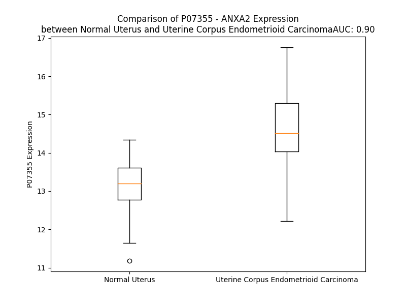

# Detailed Data for P07355

## Introduction to the Detailed Summary

### How to Interpret the Results

- **Summary & Metrics**: This section provides a quick reference to essential protein attributes, including expression changes, family classification, and biomarker applications. Regulation status (upregulated/downregulated) indicates the protein's behavior in a disease context. Some information comes from the original excel file with the proteins selected from literature, while others are derived from the analyses.
- **Expression Comparison**: A visual representation comparing protein expression between normal and disease states. It highlights significant changes in expression levels that might indicate diagnostic or therapeutic relevance. This is data coming from transcriptomics experiments and could not translate similarly to protein levels.
- **Isoform Alignment**: An interactive view of isoform alignments, revealing structural and functional differences between variants of the protein.
- **Interactors & Homologs**: Tables listing known interaction partners and homologous proteins, the more interactors and homologs, the more complex the protein is to design an antibody for.
- **Biological Assemblies**: Information about the structural arrangement of the protein in different assemblies, providing insights into its functional state but also the complexity of the protein to develop antibodies.
- **Combined Per-Residue Information**: A detailed table summarizing residue-level data. This includes predictions for epitope regions, aggregation tendencies, and modifications that might impact the protein's function. Each row corresponds to a residue in the protein, providing insights into specific sites that may be important for research or drug development.
## Summary & Metrics

- **UniProt Accession**: P07355
- **Gene Name**: ANXA2
- **Protein Name**: Annexin A2
- **Swiss Prot**: ANXA2_HUMAN
- **Family**: other
- **Biomarker Application**: diagnosis,unspecified application
- **Number of Isoforms**: 2
- **Regulation**: 1
- **(transcriptomics) AUC**: 0.78
- **(transcriptomics) Fold Change**: 1.06
- **(transcriptomics) Regulation**: Upregulated
- **Discotope Epitope Count**: 68
- **Max n_uniprots (Homo)**: 3
- **Max n_uniprots (Hetero)**: 5

## Expression Comparison

## Isoform Alignment

<pre style='font-size:14px; font-family:monospace;'>P07355-1 ------------------MSTVHEILCKLSLEGDHSTPPSAYGSVKAYTNFDAERDALNIETAIKTKGVDEVTIVNILTNRSNAQRQDIAFAYQRRTKKELASALKSALSGHLETVILGLLKTPAQYDASELKASMKGLGTDEDSLIEIICSRTNQELQEINRVYKEMYKTDLEKDIISDTSGDFRKLMVALAKGRRAEDGSVIDYELIDQDARDLYDAGVKRKGTDVPKWISIMTERSVPHLQKVFDRYKSYSPYDMLESIRKEVKGDLENAFLNLVQCIQNKPLYFADRLYDSMKGKGTRDKVLIRIMVSRSEVDMLKIRSEFKRKYGKSLYYYIQQDTKGDYQKALLYLCGGDD
P07355-2 MGRQLAGCGDAGKKASFKMSTVHEILCKLSLEGDHSTPPSAYGSVKAYTNFDAERDALNIETAIKTKGVDEVTIVNILTNRSNAQRQDIAFAYQRRTKKELASALKSALSGHLETVILGLLKTPAQYDASELKASMKGLGTDEDSLIEIICSRTNQELQEINRVYKEMYKTDLEKDIISDTSGDFRKLMVALAKGRRAEDGSVIDYELIDQDARDLYDAGVKRKGTDVPKWISIMTERSVPHLQKVFDRYKSYSPYDMLESIRKEVKGDLENAFLNLVQCIQNKPLYFADRLYDSMKGKGTRDKVLIRIMVSRSEVDMLKIRSEFKRKYGKSLYYYIQQDTKGDYQKALLYLCGGDD
</pre>

## Interactors

| preferredName_A   | preferredName_B   |   score |
|:------------------|:------------------|--------:|
| ANXA2             | S100A4            |   0.999 |
| ANXA2             | S100A10           |   0.999 |
| ANXA2             | AHNAK             |   0.999 |
| ANXA2             | PLAT              |   0.997 |
| ANXA2             | PLG               |   0.997 |
| ANXA2             | ANXA2R            |   0.997 |
| ANXA2             | S100A11           |   0.996 |
| ANXA2             | ANXA1             |   0.989 |
| ANXA2             | DYSF              |   0.989 |
| ANXA2             | CD63              |   0.985 |
| ANXA2             | CTSB              |   0.978 |
| ANXA2             | TP53              |   0.977 |
| ANXA2             | AHNAK2            |   0.971 |
| ANXA2             | TLR4              |   0.968 |
| ANXA2             | EGFR              |   0.958 |
| ANXA2             | S100A6            |   0.952 |
| ANXA2             | MYC               |   0.951 |
| ANXA2             | S100A1            |   0.947 |
| ANXA2             | APOH              |   0.943 |
| ANXA2             | CALR              |   0.923 |
| ANXA2             | CAV1              |   0.922 |
| ANXA2             | CDC42             |   0.921 |
| ANXA2             | ANXA6             |   0.91  |
| ANXA2             | RPS6KA1           |   0.904 |

## Homologs

| uniprot_id   | gene_id   |
|:-------------|:----------|
| O76027       | ANXA9     |
| E5RIN3       | ANXA13    |
| Q5TZZ9       | ANXA1     |
| A0A075B752   | ANXA8L1   |
| P13928       | ANXA8     |
| D6RAZ8       | ANXA3     |
| P50995       | ANXA11    |
| P08758       | ANXA5     |
| B9ZVT2       | ANXA7     |
| Q6P452       | ANXA4     |
| Q9UJ72       | ANXA10    |
| E5RK63       | ANXA6     |

## Biological Assemblies

|   Unnamed: 0 |   assembly |   n_uniprots | composition   | crystal_id   |
|-------------:|-----------:|-------------:|:--------------|:-------------|
|            0 |          1 |            3 | Hetero        | 4drw         |
|            1 |          2 |            3 | Hetero        | 4drw         |
|            0 |          1 |            4 | Hetero        | 5lpu         |
|            0 |          1 |            2 | Hetero        | 7pc8         |
|            1 |          2 |            2 | Hetero        | 7pc8         |
|            0 |          1 |            2 | Homo          | 6twq         |
|            1 |          2 |            2 | Homo          | 6twq         |
|            0 |          1 |            1 | Homo          | 7qqm         |
|            0 |          1 |            2 | Hetero        | 7p72         |
|            0 |          1 |            3 | Homo          | 7zvn         |
|            0 |          1 |            1 | Homo          | 6twu         |
|            1 |          2 |            2 | Hetero        | 6twu         |
|            0 |          1 |            2 | Homo          | 7zvx         |
|            1 |          2 |            2 | Homo          | 7zvx         |
|            0 |          1 |            2 | Homo          | 8ael         |
|            0 |          1 |            2 | Hetero        | 7p74         |
|            0 |          1 |            2 | Hetero        | 7qql         |
|            1 |          2 |            2 | Hetero        | 7qql         |
|            2 |          3 |            2 | Hetero        | 7qql         |
|            0 |          1 |            2 | Hetero        | 5n7g         |
|            1 |          2 |            1 | Homo          | 5n7g         |
|            0 |          1 |            4 | Hetero        | 4hrh         |
|            1 |          2 |            2 | Hetero        | 4hrh         |
|            2 |          3 |            2 | Hetero        | 4hrh         |
|            3 |          4 |            4 | Hetero        | 4hrh         |
|            0 |          1 |            2 | Hetero        | 7p70         |
|            0 |          1 |            1 | Homo          | 7pc9         |
|            1 |          2 |            2 | Hetero        | 7pc9         |
|            0 |          1 |            1 | Homo          | 2hyw         |
|            1 |          2 |            1 | Homo          | 2hyw         |
|            0 |          1 |            1 | Homo          | 7dto         |
|            0 |          1 |            1 | Homo          | 7pcb         |
|            0 |          1 |            2 | Homo          | 2hyv         |
|            0 |          1 |            2 | Hetero        | 7pc5         |
|            0 |          1 |            2 | Homo          | 2hyu         |
|            0 |          1 |            2 | Hetero        | 5n7d         |
|            1 |          2 |            1 | Homo          | 5n7d         |
|            0 |          1 |            2 | Hetero        | 7p73         |
|            0 |          1 |            2 | Hetero        | 7qqn         |
|            1 |          2 |            2 | Hetero        | 7qqn         |
|            0 |          1 |            1 | Homo          | 5lpx         |
|            0 |          1 |            2 | Hetero        | 7pc7         |
|            1 |          2 |            2 | Hetero        | 7pc7         |
|            0 |          1 |            2 | Hetero        | 7pc4         |
|            0 |          1 |            1 | Homo          | 1w7b         |
|            0 |          1 |            1 | Homo          | 5lq2         |
|            1 |          2 |            1 | Homo          | 5lq2         |
|            0 |          1 |            1 | Homo          | 7eq7         |
|            0 |          1 |            2 | Hetero        | 7p71         |
|            1 |          2 |            2 | Hetero        | 7p71         |
|            0 |          1 |            2 | Hetero        | 7pc3         |
|            0 |          1 |            1 | Homo          | 6twy         |
|            1 |          2 |            2 | Homo          | 6twy         |
|            0 |          1 |            5 | Hetero        | 4ftg         |
|            0 |          1 |            2 | Homo          | 6twx         |
|            1 |          2 |            2 | Homo          | 6twx         |
|            0 |          1 |            1 | Homo          | 5lq0         |
|            1 |          2 |            1 | Homo          | 5lq0         |
|            0 |          1 |            2 | Hetero        | 7nmi         |
|            0 |          1 |            2 | Hetero        | 5n7f         |
|            1 |          2 |            1 | Homo          | 5n7f         |
|            0 |          1 |            2 | Homo          | 1xjl         |

## Combined Per-Residue Information

|   res | aa   |   epitope_score | epitope   |   relative_surface_accessibility |   modeling_confidence |   Aggregation | modification               |
|------:|:-----|----------------:|:----------|---------------------------------:|----------------------:|--------------:|:---------------------------|
|     1 | M    |         0.11612 | False     |                          1.20284 |                 45.84 |         0     | N/A                        |
|     2 | S    |         0.16982 | False     |                          0.66077 |                 51.61 |         0     | N-acetylserine             |
|     3 | T    |         0.14789 | False     |                          0.66015 |                 59.56 |         0     | N/A                        |
|     4 | V    |         0.12801 | False     |                          0.66931 |                 48.73 |         0     | N/A                        |
|     5 | H    |         0.13486 | False     |                          0.71409 |                 45    |         0     | N/A                        |
|     6 | E    |         0.08807 | False     |                          0.61541 |                 51.35 |         0     | N/A                        |
|     7 | I    |         0.10945 | False     |                          0.61837 |                 50.15 |         0     | N/A                        |
|     8 | L    |         0.0918  | False     |                          0.60149 |                 41.11 |         0     | N/A                        |
|     9 | C    |         0.09294 | False     |                          0.57909 |                 43.13 |         0     | N/A                        |
|    10 | K    |         0.12255 | False     |                          0.67921 |                 47.65 |         0     | N/A                        |
|    11 | L    |         0.18786 | False     |                          0.65351 |                 40.03 |         0     | N/A                        |
|    12 | S    |         0.18058 | False     |                          0.76063 |                 39.28 |         0     | N/A                        |
|    13 | L    |         0.14979 | False     |                          0.68687 |                 42.97 |         0     | N/A                        |
|    14 | E    |         0.24085 | True      |                          0.81388 |                 36.95 |         0     | N/A                        |
|    15 | G    |         0.23895 | True      |                          0.69472 |                 30.57 |         0     | N/A                        |
|    16 | D    |         0.24669 | True      |                          0.74549 |                 34.35 |         0     | N/A                        |
|    17 | H    |         0.22377 | True      |                          0.9619  |                 33.87 |         0     | N/A                        |
|    18 | S    |         0.17141 | False     |                          0.58338 |                 47.17 |         0     | N/A                        |
|    19 | T    |         0.19445 | False     |                          0.6038  |                 53.28 |         0     | N/A                        |
|    20 | P    |         0.26296 | True      |                          0.84212 |                 60.87 |         0     | N/A                        |
|    21 | P    |         0.21539 | False     |                          0.97368 |                 75.41 |         0     | N/A                        |
|    22 | S    |         0.17887 | False     |                          0.33837 |                 88.54 |         0     | N/A                        |
|    23 | A    |         0.268   | True      |                          0.69882 |                 92.71 |         0     | N/A                        |
|    24 | Y    |         0.14993 | False     |                          0.48156 |                 96.7  |         0     | Phosphotyrosine; by SRC    |
|    25 | G    |         0.01144 | False     |                          0.00322 |                 97.28 |         0     | N/A                        |
|    26 | S    |         0.07965 | False     |                          0.18214 |                 97.88 |         0     | Phosphoserine; by PKC      |
|    27 | V    |         0.03555 | False     |                          0.07758 |                 97.72 |         0     | N/A                        |
|    28 | K    |         0.19607 | False     |                          0.55932 |                 95.68 |         0     | N/A                        |
|    29 | A    |         0.17178 | False     |                          0.64474 |                 97.16 |         0.144 | N/A                        |
|    30 | Y    |         0.16234 | False     |                          0.4414  |                 97.5  |         0.144 | N/A                        |
|    31 | T    |         0.17493 | False     |                          0.92702 |                 96.34 |         0.144 | N/A                        |
|    32 | N    |         0.23214 | True      |                          0.70312 |                 95.96 |         0.144 | N/A                        |
|    33 | F    |         0.19926 | False     |                          0.29072 |                 98.3  |         0.144 | N/A                        |
|    34 | D    |         0.19881 | False     |                          0.37963 |                 98.4  |         0     | N/A                        |
|    35 | A    |         0.05248 | False     |                          0.20014 |                 98.61 |         0     | N/A                        |
|    36 | E    |         0.20984 | False     |                          0.58173 |                 98.44 |         0     | N/A                        |
|    37 | R    |         0.37865 | True      |                          0.4761  |                 98.57 |         0     | N/A                        |
|    38 | D    |         0.03744 | False     |                          0.02221 |                 98.71 |         0     | N/A                        |
|    39 | A    |         0.00305 | False     |                          0       |                 98.76 |         0     | N/A                        |
|    40 | L    |         0.25755 | True      |                          0.50368 |                 98.59 |         0     | N/A                        |
|    41 | N    |         0.13983 | False     |                          0.36467 |                 98.6  |         0     | N/A                        |
|    42 | I    |         0.00936 | False     |                          0       |                 98.68 |         0     | N/A                        |
|    43 | E    |         0.13654 | False     |                          0.11677 |                 98.31 |         0     | N/A                        |
|    44 | T    |         0.27175 | True      |                          0.5572  |                 98.55 |         0     | N/A                        |
|    45 | A    |         0.02811 | False     |                          0.02497 |                 98.52 |         0     | N/A                        |
|    46 | I    |         0.23956 | True      |                          0.19133 |                 98.31 |         0     | N/A                        |
|    47 | K    |         0.15174 | False     |                          0.73945 |                 97.25 |         0     | N/A                        |
|    48 | T    |         0.14941 | False     |                          0.45136 |                 97.82 |         0     | N/A                        |
|    49 | K    |         0.33913 | True      |                          1.0211  |                 95.98 |         0     | N6-acetyllysine; alternate |
|    50 | G    |         0.21694 | False     |                          0.78063 |                 94.52 |         0     | N/A                        |
|    51 | V    |         0.10968 | False     |                          0.23372 |                 97.53 |         0     | N/A                        |
|    52 | D    |         0.22678 | True      |                          0.28072 |                 98.15 |         0     | N/A                        |
|    53 | E    |         0.06619 | False     |                          0.24637 |                 98.31 |         0     | N/A                        |
|    54 | V    |         0.18485 | False     |                          0.46747 |                 97.83 |        41.2   | N/A                        |
|    55 | T    |         0.13699 | False     |                          0.2888  |                 98.39 |        50.755 | N/A                        |
|    56 | I    |         0.00533 | False     |                          0.0008  |                 98.67 |        60.064 | N/A                        |
|    57 | V    |         0.00771 | False     |                          0.00857 |                 98.6  |        60.215 | N/A                        |
|    58 | N    |         0.17975 | False     |                          0.35128 |                 97.89 |        60.215 | N/A                        |
|    59 | I    |         0.06339 | False     |                          0.0936  |                 98.56 |        60.096 | N/A                        |
|    60 | L    |         0.00249 | False     |                          0       |                 98.67 |        58.491 | N/A                        |
|    61 | T    |         0.01058 | False     |                          0.01126 |                 98.52 |        42.171 | N/A                        |
|    62 | N    |         0.07867 | False     |                          0.3854  |                 98.19 |         1.576 | N/A                        |
|    63 | R    |         0.0786  | False     |                          0.06931 |                 98.42 |         0     | N/A                        |
|    64 | S    |         0.03468 | False     |                          0.10999 |                 98.36 |         0     | N/A                        |
|    65 | N    |         0.03181 | False     |                          0.12606 |                 98.44 |         0     | N/A                        |
|    66 | A    |         0.09179 | False     |                          0.6492  |                 98.14 |         0     | N/A                        |
|    67 | Q    |         0.08526 | False     |                          0.08847 |                 98.68 |         0     | N/A                        |
|    68 | R    |         0.03252 | False     |                          0.01639 |                 98.8  |         0     | N/A                        |
|    69 | Q    |         0.14699 | False     |                          0.28685 |                 98.72 |         0     | N/A                        |
|    70 | D    |         0.16321 | False     |                          0.43124 |                 98.64 |         0     | N/A                        |
|    71 | I    |         0.00921 | False     |                          0       |                 98.81 |        37.531 | N/A                        |
|    72 | A    |         0.06269 | False     |                          0.25715 |                 98.73 |        37.531 | N/A                        |
|    73 | F    |         0.26688 | True      |                          0.55267 |                 98.46 |        37.531 | N/A                        |
|    74 | A    |         0.08937 | False     |                          0.11091 |                 98.69 |        37.531 | N/A                        |
|    75 | Y    |         0.04477 | False     |                          0.03334 |                 98.7  |        37.531 | N/A                        |
|    76 | Q    |         0.18331 | False     |                          0.31395 |                 98.22 |         0.529 | N/A                        |
|    77 | R    |         0.33589 | True      |                          0.6366  |                 98    |         0     | N/A                        |
|    78 | R    |         0.30444 | True      |                          0.41444 |                 97.72 |         0     | N/A                        |
|    79 | T    |         0.24769 | True      |                          0.20588 |                 97.04 |         0     | N/A                        |
|    80 | K    |         0.20949 | False     |                          0.81782 |                 97.85 |         0     | N/A                        |
|    81 | K    |         0.15119 | False     |                          0.66989 |                 97.64 |         0     | N/A                        |
|    82 | E    |         0.12203 | False     |                          0.46445 |                 97.96 |         0     | N/A                        |
|    83 | L    |         0.01913 | False     |                          0.01239 |                 98.57 |         0.17  | N/A                        |
|    84 | A    |         0.06199 | False     |                          0.44712 |                 98.26 |         0.17  | N/A                        |
|    85 | S    |         0.17984 | False     |                          0.50496 |                 98.23 |         0.17  | N/A                        |
|    86 | A    |         0.15522 | False     |                          0.14788 |                 98.4  |         0.17  | N/A                        |
|    87 | L    |         0.00254 | False     |                          0.00069 |                 98.5  |         0.17  | N/A                        |
|    88 | K    |         0.22697 | True      |                          0.61883 |                 98.13 |         0     | N/A                        |
|    89 | S    |         0.18944 | False     |                          0.77672 |                 97.75 |         0     | N/A                        |
|    90 | A    |         0.12848 | False     |                          0.22759 |                 97.68 |         0     | N/A                        |
|    91 | L    |         0.05265 | False     |                          0.07181 |                 98.01 |         0     | N/A                        |
|    92 | S    |         0.19438 | False     |                          0.671   |                 97.54 |         0     | N/A                        |
|    93 | G    |         0.23489 | True      |                          0.62006 |                 97.91 |         0     | N/A                        |
|    94 | H    |         0.08259 | False     |                          0.46802 |                 98.29 |         0     | N/A                        |
|    95 | L    |         0.05371 | False     |                          0.10742 |                 98.51 |         0.122 | N/A                        |
|    96 | E    |         0.08151 | False     |                          0.18548 |                 98.56 |         0.144 | N/A                        |
|    97 | T    |         0.15731 | False     |                          0.48958 |                 98.49 |        32.294 | N/A                        |
|    98 | V    |         0.00395 | False     |                          0       |                 98.69 |        86.127 | N/A                        |
|    99 | I    |         0.00384 | False     |                          0       |                 98.66 |        86.645 | N/A                        |
|   100 | L    |         0.07342 | False     |                          0.17609 |                 98.67 |        86.645 | N/A                        |
|   101 | G    |         0.02614 | False     |                          0.02693 |                 98.7  |        86.645 | N/A                        |
|   102 | L    |         0.00526 | False     |                          0.00412 |                 98.71 |        86.523 | N/A                        |
|   103 | L    |         0.03258 | False     |                          0.08371 |                 98.67 |        73.236 | N/A                        |
|   104 | K    |         0.04813 | False     |                          0.31025 |                 98.63 |         0.144 | N/A                        |
|   105 | T    |         0.09599 | False     |                          0.28434 |                 98.59 |         0     | N/A                        |
|   106 | P    |         0.0824  | False     |                          0.66159 |                 98.57 |         0     | N/A                        |
|   107 | A    |         0.02502 | False     |                          0.08766 |                 98.65 |         0     | N/A                        |
|   108 | Q    |         0.09594 | False     |                          0.32564 |                 98.74 |         0     | N/A                        |
|   109 | Y    |         0.05093 | False     |                          0.05607 |                 98.78 |         0     | N/A                        |
|   110 | D    |         0.02351 | False     |                          0.04029 |                 98.78 |         0     | N/A                        |
|   111 | A    |         0.00251 | False     |                          0       |                 98.75 |         0     | N/A                        |
|   112 | S    |         0.06646 | False     |                          0.17826 |                 98.56 |         0     | N/A                        |
|   113 | E    |         0.05479 | False     |                          0.13253 |                 98.65 |         0     | N/A                        |
|   114 | L    |         0.00287 | False     |                          0       |                 98.63 |         0     | N/A                        |
|   115 | K    |         0.08793 | False     |                          0.26733 |                 98.31 |         0     | N/A                        |
|   116 | A    |         0.16502 | False     |                          0.47706 |                 97.5  |         0     | N/A                        |
|   117 | S    |         0.01309 | False     |                          0.01318 |                 97.53 |         0     | N/A                        |
|   118 | M    |         0.07222 | False     |                          0.06294 |                 97.31 |         0     | N/A                        |
|   119 | K    |         0.30276 | True      |                          0.78973 |                 92.29 |         0     | N/A                        |
|   120 | G    |         0.26237 | True      |                          0.74758 |                 89.75 |         0     | N/A                        |
|   121 | L    |         0.24145 | True      |                          1.17754 |                 84.47 |         0     | N/A                        |
|   122 | G    |         0.25764 | True      |                          0.69932 |                 89.03 |         0     | N/A                        |
|   123 | T    |         0.05976 | False     |                          0.19974 |                 93.23 |         0     | N/A                        |
|   124 | D    |         0.14098 | False     |                          0.26183 |                 96.54 |         0     | N/A                        |
|   125 | E    |         0.09241 | False     |                          0.27004 |                 97.41 |         0     | N/A                        |
|   126 | D    |         0.18102 | False     |                          0.3028  |                 97.35 |         0     | N/A                        |
|   127 | S    |         0.01332 | False     |                          0.01423 |                 97.84 |         0     | N/A                        |
|   128 | L    |         0.00277 | False     |                          0       |                 98.5  |         0     | N/A                        |
|   129 | I    |         0.01246 | False     |                          0.004   |                 98.67 |         0     | N/A                        |
|   130 | E    |         0.01974 | False     |                          0.00412 |                 98.69 |         0     | N/A                        |
|   131 | I    |         0.00522 | False     |                          0       |                 98.73 |         0     | N/A                        |
|   132 | I    |         0.00854 | False     |                          0.00769 |                 98.75 |         0     | N/A                        |
|   133 | C    |         0.02989 | False     |                          0.05848 |                 98.67 |         0     | N/A                        |
|   134 | S    |         0.00627 | False     |                          0.00406 |                 98.61 |         0     | N/A                        |
|   135 | R    |         0.07024 | False     |                          0.0682  |                 98.53 |         0     | N/A                        |
|   136 | T    |         0.1285  | False     |                          0.46097 |                 97.83 |         0     | N/A                        |
|   137 | N    |         0.1248  | False     |                          0.1804  |                 97.96 |         0     | N/A                        |
|   138 | Q    |         0.19153 | False     |                          0.4933  |                 97.29 |         0     | N/A                        |
|   139 | E    |         0.08108 | False     |                          0.27678 |                 98.26 |         0     | N/A                        |
|   140 | L    |         0.0252  | False     |                          0.0338  |                 98.62 |         0     | N/A                        |
|   141 | Q    |         0.17203 | False     |                          0.43576 |                 98.39 |         0     | N/A                        |
|   142 | E    |         0.10555 | False     |                          0.3457  |                 98.38 |         0     | N/A                        |
|   143 | I    |         0.02626 | False     |                          0.0088  |                 98.76 |         0     | N/A                        |
|   144 | N    |         0.09    | False     |                          0.23138 |                 98.69 |         0     | N/A                        |
|   145 | R    |         0.22406 | True      |                          0.35195 |                 98.71 |         0     | N/A                        |
|   146 | V    |         0.04233 | False     |                          0.05998 |                 98.61 |         0     | N/A                        |
|   147 | Y    |         0.00669 | False     |                          0       |                 98.67 |         0     | N/A                        |
|   148 | K    |         0.20157 | False     |                          0.54518 |                 98.52 |         0     | N/A                        |
|   149 | E    |         0.26575 | True      |                          0.46071 |                 98.4  |         0     | N/A                        |
|   150 | M    |         0.17414 | False     |                          0.40225 |                 98.13 |         0     | N/A                        |
|   151 | Y    |         0.15614 | False     |                          0.29155 |                 97.96 |         0     | N/A                        |
|   152 | K    |         0.33161 | True      |                          0.83526 |                 97.97 |         0     | N6-acetyllysine            |
|   153 | T    |         0.16165 | False     |                          0.25773 |                 98.03 |         0     | N/A                        |
|   154 | D    |         0.09192 | False     |                          0.24128 |                 98.18 |         0     | N/A                        |
|   155 | L    |         0.00814 | False     |                          0.00708 |                 98.42 |         0     | N/A                        |
|   156 | E    |         0.08377 | False     |                          0.28112 |                 98.25 |         0     | N/A                        |
|   157 | K    |         0.2484  | True      |                          0.62525 |                 97.97 |         0     | N/A                        |
|   158 | D    |         0.11468 | False     |                          0.13411 |                 97.98 |         0     | N/A                        |
|   159 | I    |         0.00718 | False     |                          0       |                 98.27 |         0     | N/A                        |
|   160 | I    |         0.28808 | True      |                          0.40868 |                 98.04 |         0     | N/A                        |
|   161 | S    |         0.27838 | True      |                          0.70148 |                 96.86 |         0     | N/A                        |
|   162 | D    |         0.20113 | False     |                          0.29489 |                 96.12 |         0     | N/A                        |
|   163 | T    |         0.08037 | False     |                          0.05786 |                 97.22 |         0     | N/A                        |
|   164 | S    |         0.30475 | True      |                          0.59345 |                 97.24 |         0     | N/A                        |
|   165 | G    |         0.22407 | True      |                          0.61461 |                 97.88 |         0     | N/A                        |
|   166 | D    |         0.08349 | False     |                          0.25447 |                 98.35 |         0     | N/A                        |
|   167 | F    |         0.04179 | False     |                          0.09    |                 98.53 |         0     | N/A                        |
|   168 | R    |         0.13932 | False     |                          0.32    |                 98.49 |         0     | N/A                        |
|   169 | K    |         0.20937 | False     |                          0.54367 |                 98.63 |         0     | N/A                        |
|   170 | L    |         0.00269 | False     |                          0       |                 98.73 |         1.734 | N/A                        |
|   171 | M    |         0.00187 | False     |                          0       |                 98.73 |         2.132 | N/A                        |
|   172 | V    |         0.06294 | False     |                          0.12091 |                 98.66 |         2.132 | N/A                        |
|   173 | A    |         0.09739 | False     |                          0.31038 |                 98.62 |         2.132 | N/A                        |
|   174 | L    |         0.03719 | False     |                          0.07566 |                 98.64 |         2.132 | N/A                        |
|   175 | A    |         0.00896 | False     |                          0.01309 |                 98.55 |         1.192 | N/A                        |
|   176 | K    |         0.06446 | False     |                          0.33256 |                 97.2  |         0     | N/A                        |
|   177 | G    |         0.03176 | False     |                          0.06767 |                 97.55 |         0     | N/A                        |
|   178 | R    |         0.33366 | True      |                          0.71801 |                 97.58 |         0     | N/A                        |
|   179 | R    |         0.12477 | False     |                          0.15156 |                 97.51 |         0     | N/A                        |
|   180 | A    |         0.1828  | False     |                          0.50934 |                 96.95 |         0     | N/A                        |
|   181 | E    |         0.22671 | True      |                          0.68268 |                 94.64 |         0     | N/A                        |
|   182 | D    |         0.25513 | True      |                          0.56139 |                 89.91 |         0     | N/A                        |
|   183 | G    |         0.29229 | True      |                          0.59785 |                 86.27 |         0     | N/A                        |
|   184 | S    |         0.36926 | True      |                          0.93767 |                 88.02 |         0     | Phosphoserine              |
|   185 | V    |         0.30572 | True      |                          0.88024 |                 91.92 |         0     | N/A                        |
|   186 | I    |         0.31747 | True      |                          0.47183 |                 95.03 |         0     | N/A                        |
|   187 | D    |         0.2227  | True      |                          0.40704 |                 96.23 |         0     | N/A                        |
|   188 | Y    |         0.34408 | True      |                          0.70833 |                 97.38 |         0     | N/A                        |
|   189 | E    |         0.27207 | True      |                          0.7624  |                 98.03 |         0     | N/A                        |
|   190 | L    |         0.11295 | False     |                          0.37203 |                 98.08 |         0     | N/A                        |
|   191 | I    |         0.15568 | False     |                          0.0648  |                 98.61 |         0     | N/A                        |
|   192 | D    |         0.21766 | False     |                          0.18068 |                 98.7  |         0     | N/A                        |
|   193 | Q    |         0.3221  | True      |                          0.458   |                 98.69 |         0     | N/A                        |
|   194 | D    |         0.06029 | False     |                          0.01594 |                 98.77 |         0     | N/A                        |
|   195 | A    |         0.00756 | False     |                          0       |                 98.77 |         0     | N/A                        |
|   196 | R    |         0.27539 | True      |                          0.44968 |                 98.43 |         0     | N/A                        |
|   197 | D    |         0.1191  | False     |                          0.19278 |                 98.66 |         0     | N/A                        |
|   198 | L    |         0.0028  | False     |                          0       |                 98.73 |         0     | N/A                        |
|   199 | Y    |         0.1284  | False     |                          0.20062 |                 98.54 |         0     | Phosphotyrosine            |
|   200 | D    |         0.20543 | False     |                          0.37535 |                 98.41 |         0     | N/A                        |
|   201 | A    |         0.02939 | False     |                          0.04994 |                 98.28 |         0     | N/A                        |
|   202 | G    |         0.00999 | False     |                          0       |                 98.09 |         0     | N/A                        |
|   203 | V    |         0.17256 | False     |                          0.24498 |                 97.4  |         0     | N/A                        |
|   204 | K    |         0.33072 | True      |                          0.59978 |                 97.37 |         0     | N/A                        |
|   205 | R    |         0.17364 | False     |                          0.5195  |                 96.06 |         0     | N/A                        |
|   206 | K    |         0.21736 | False     |                          1.00265 |                 93.81 |         0     | N/A                        |
|   207 | G    |         0.16727 | False     |                          0.59934 |                 93.65 |         0     | N/A                        |
|   208 | T    |         0.11301 | False     |                          0.22428 |                 95.98 |         0     | N/A                        |
|   209 | D    |         0.18234 | False     |                          0.29838 |                 98.03 |         0     | N/A                        |
|   210 | V    |         0.04104 | False     |                          0.08759 |                 98.09 |         0     | N/A                        |
|   211 | P    |         0.15799 | False     |                          0.5765  |                 98.48 |         0     | N/A                        |
|   212 | K    |         0.15978 | False     |                          0.38009 |                 98.52 |         0     | N/A                        |
|   213 | W    |         0.00886 | False     |                          0       |                 98.62 |        13.268 | N/A                        |
|   214 | I    |         0.10692 | False     |                          0.0792  |                 98.66 |        13.842 | N/A                        |
|   215 | S    |         0.17752 | False     |                          0.30574 |                 98.55 |        13.842 | N/A                        |
|   216 | I    |         0.04307 | False     |                          0.0176  |                 98.62 |        13.842 | N/A                        |
|   217 | M    |         0.0047  | False     |                          0       |                 98.59 |        13.842 | N/A                        |
|   218 | T    |         0.04497 | False     |                          0.077   |                 98.54 |         2.942 | N/A                        |
|   219 | E    |         0.16564 | False     |                          0.43977 |                 98.4  |         0     | N/A                        |
|   220 | R    |         0.21226 | False     |                          0.22479 |                 98.18 |         0     | N/A                        |
|   221 | S    |         0.04293 | False     |                          0.07544 |                 98.15 |         0     | N/A                        |
|   222 | V    |         0.05991 | False     |                          0.39881 |                 97.68 |         0     | N/A                        |
|   223 | P    |         0.27988 | True      |                          0.32256 |                 97.55 |         0     | N/A                        |
|   224 | H    |         0.08178 | False     |                          0.125   |                 98.36 |         0     | N/A                        |
|   225 | L    |         0.00499 | False     |                          0       |                 98.6  |         0     | N/A                        |
|   226 | Q    |         0.13481 | False     |                          0.3482  |                 98.28 |         0     | N/A                        |
|   227 | K    |         0.23965 | True      |                          0.35671 |                 98.43 |         0     | N6-acetyllysine            |
|   228 | V    |         0.00452 | False     |                          0       |                 98.71 |         0     | N/A                        |
|   229 | F    |         0.01344 | False     |                          0.00856 |                 98.64 |         0     | N/A                        |
|   230 | D    |         0.22194 | True      |                          0.54457 |                 98.38 |         0     | N/A                        |
|   231 | R    |         0.25944 | True      |                          0.3968  |                 98.57 |         0     | N/A                        |
|   232 | Y    |         0.01311 | False     |                          0       |                 98.7  |         0     | N/A                        |
|   233 | K    |         0.2062  | False     |                          0.5208  |                 98.07 |         0     | N/A                        |
|   234 | S    |         0.33213 | True      |                          0.54857 |                 98.03 |         0     | N/A                        |
|   235 | Y    |         0.18214 | False     |                          0.26401 |                 98.04 |         0     | N/A                        |
|   236 | S    |         0.11703 | False     |                          0.06344 |                 97.77 |         0     | N/A                        |
|   237 | P    |         0.32149 | True      |                          0.7379  |                 97.46 |         0     | N/A                        |
|   238 | Y    |         0.35984 | True      |                          0.37021 |                 97.8  |         0     | N/A                        |
|   239 | D    |         0.0773  | False     |                          0.37689 |                 98.3  |         0     | N/A                        |
|   240 | M    |         0.01343 | False     |                          0.00514 |                 98.49 |         0     | N/A                        |
|   241 | L    |         0.09968 | False     |                          0.24955 |                 98.39 |         0     | N/A                        |
|   242 | E    |         0.18846 | False     |                          0.3184  |                 98.31 |         0     | N/A                        |
|   243 | S    |         0.00259 | False     |                          0       |                 98.44 |         0     | N/A                        |
|   244 | I    |         0.01147 | False     |                          0       |                 98.54 |         0     | N/A                        |
|   245 | R    |         0.26272 | True      |                          0.51383 |                 98.32 |         0     | N/A                        |
|   246 | K    |         0.24083 | True      |                          0.48995 |                 97.85 |         0     | N/A                        |
|   247 | E    |         0.09503 | False     |                          0.21463 |                 97.88 |         0     | N/A                        |
|   248 | V    |         0.11    | False     |                          0.05948 |                 97.65 |         0     | N/A                        |
|   249 | K    |         0.3181  | True      |                          0.82607 |                 97.63 |         0     | N/A                        |
|   250 | G    |         0.27039 | True      |                          0.64078 |                 97.88 |         0     | N/A                        |
|   251 | D    |         0.04428 | False     |                          0.37549 |                 97.81 |         0     | N/A                        |
|   252 | L    |         0.04456 | False     |                          0.13969 |                 98.45 |         0     | N/A                        |
|   253 | E    |         0.09008 | False     |                          0.1931  |                 98.55 |         0     | N/A                        |
|   254 | N    |         0.16249 | False     |                          0.30761 |                 98.31 |         0     | N/A                        |
|   255 | A    |         0.00225 | False     |                          0       |                 98.73 |         3.162 | N/A                        |
|   256 | F    |         0.00361 | False     |                          0       |                 98.75 |        12.96  | N/A                        |
|   257 | L    |         0.09167 | False     |                          0.0981  |                 98.74 |        12.96  | N/A                        |
|   258 | N    |         0.04322 | False     |                          0.05952 |                 98.74 |        12.96  | N/A                        |
|   259 | L    |         0.01491 | False     |                          0.01484 |                 98.74 |        13.262 | N/A                        |
|   260 | V    |         0.00469 | False     |                          0       |                 98.69 |        13.017 | N/A                        |
|   261 | Q    |         0.08115 | False     |                          0.23932 |                 98.61 |         1.665 | N/A                        |
|   262 | C    |         0.03113 | False     |                          0.05049 |                 98.57 |         1.325 | N/A                        |
|   263 | I    |         0.03213 | False     |                          0.02508 |                 98.44 |         1.325 | N/A                        |
|   264 | Q    |         0.09592 | False     |                          0.33914 |                 98.03 |         0     | N/A                        |
|   265 | N    |         0.1411  | False     |                          0.28951 |                 98.16 |         0     | N/A                        |
|   266 | K    |         0.07108 | False     |                          0.23406 |                 98.48 |         0     | N/A                        |
|   267 | P    |         0.07305 | False     |                          0.168   |                 98.67 |         0.152 | N/A                        |
|   268 | L    |         0.13684 | False     |                          0.27369 |                 98.65 |         0.485 | N/A                        |
|   269 | Y    |         0.02398 | False     |                          0.01588 |                 98.74 |         0.485 | N/A                        |
|   270 | F    |         0.00725 | False     |                          0.00127 |                 98.83 |         0.485 | N/A                        |
|   271 | A    |         0.00353 | False     |                          0       |                 98.76 |         0.485 | N/A                        |
|   272 | D    |         0.19483 | False     |                          0.15955 |                 98.6  |         0.332 | N/A                        |
|   273 | R    |         0.09472 | False     |                          0.13124 |                 98.54 |         0.332 | N/A                        |
|   274 | L    |         0.00352 | False     |                          0       |                 98.67 |         0.332 | N/A                        |
|   275 | Y    |         0.13834 | False     |                          0.2517  |                 98.42 |         0.332 | N/A                        |
|   276 | D    |         0.1737  | False     |                          0.29457 |                 97.59 |         0     | N/A                        |
|   277 | S    |         0.01473 | False     |                          0.01416 |                 97.75 |         0     | N/A                        |
|   278 | M    |         0.04893 | False     |                          0.02889 |                 97.81 |         0     | N/A                        |
|   279 | K    |         0.28778 | True      |                          0.5025  |                 92.86 |         0     | N/A                        |
|   280 | G    |         0.28487 | True      |                          0.81783 |                 89.35 |         0     | N/A                        |
|   281 | K    |         0.27885 | True      |                          1.06482 |                 86.78 |         0     | N/A                        |
|   282 | G    |         0.2805  | True      |                          0.61836 |                 90.07 |         0     | N/A                        |
|   283 | T    |         0.11691 | False     |                          0.23974 |                 93.66 |         0     | N/A                        |
|   284 | R    |         0.28969 | True      |                          0.58203 |                 97.01 |         0     | N/A                        |
|   285 | D    |         0.11388 | False     |                          0.16934 |                 97.7  |         0     | N/A                        |
|   286 | K    |         0.12678 | False     |                          0.44954 |                 97.3  |         0     | N/A                        |
|   287 | V    |         0.03716 | False     |                          0.10282 |                 98.15 |         0     | N/A                        |
|   288 | L    |         0.00416 | False     |                          0       |                 98.66 |         0     | N/A                        |
|   289 | I    |         0.02982 | False     |                          0.0168  |                 98.74 |         0     | N/A                        |
|   290 | R    |         0.00891 | False     |                          0.00156 |                 98.76 |         0     | N/A                        |
|   291 | I    |         0.00473 | False     |                          0       |                 98.81 |         0     | N/A                        |
|   292 | M    |         0.00335 | False     |                          0       |                 98.81 |         0     | N/A                        |
|   293 | V    |         0.02729 | False     |                          0.09972 |                 98.76 |         0     | N/A                        |
|   294 | S    |         0.05212 | False     |                          0.17033 |                 98.62 |         0     | N/A                        |
|   295 | R    |         0.04184 | False     |                          0.02388 |                 98.65 |         0     | N/A                        |
|   296 | S    |         0.01751 | False     |                          0.00949 |                 98.5  |         0     | N/A                        |
|   297 | E    |         0.04794 | False     |                          0.24971 |                 98.16 |         0     | N/A                        |
|   298 | V    |         0.1967  | False     |                          0.36618 |                 98.13 |         0.216 | N/A                        |
|   299 | D    |         0.10809 | False     |                          0.07814 |                 97.71 |         0.216 | N/A                        |
|   300 | M    |         0.00439 | False     |                          0       |                 98.52 |         0.216 | N/A                        |
|   301 | L    |         0.10196 | False     |                          0.38417 |                 98.19 |         0.216 | N/A                        |
|   302 | K    |         0.37098 | True      |                          0.40311 |                 98.16 |         0.216 | N/A                        |
|   303 | I    |         0.0079  | False     |                          0       |                 98.69 |         0.216 | N/A                        |
|   304 | R    |         0.05764 | False     |                          0.07465 |                 98.45 |         0     | N/A                        |
|   305 | S    |         0.21912 | False     |                          0.55032 |                 98.07 |         0     | N/A                        |
|   306 | E    |         0.10009 | False     |                          0.08946 |                 98.49 |         0     | N/A                        |
|   307 | F    |         0.00605 | False     |                          0       |                 98.51 |         0     | N/A                        |
|   308 | K    |         0.13775 | False     |                          0.42009 |                 98.14 |         0     | N/A                        |
|   309 | R    |         0.42607 | True      |                          0.67034 |                 98.14 |         0     | N/A                        |
|   310 | K    |         0.25679 | True      |                          0.51595 |                 98.39 |         0     | N/A                        |
|   311 | Y    |         0.22067 | True      |                          0.20741 |                 97.55 |         0     | N/A                        |
|   312 | G    |         0.18924 | False     |                          0.69089 |                 96.86 |         0     | N/A                        |
|   313 | K    |         0.24776 | True      |                          0.49491 |                 96.79 |         0     | N/A                        |
|   314 | S    |         0.04611 | False     |                          0.07887 |                 98.13 |         5.264 | N/A                        |
|   315 | L    |         0.00423 | False     |                          0.00731 |                 98.49 |        45.667 | N/A                        |
|   316 | Y    |         0.0676  | False     |                          0.2113  |                 98.45 |        45.889 | N/A                        |
|   317 | Y    |         0.23834 | True      |                          0.34219 |                 97.61 |        45.889 | N/A                        |
|   318 | Y    |         0.14843 | False     |                          0.19752 |                 98.05 |        45.889 | N/A                        |
|   319 | I    |         0.00469 | False     |                          0       |                 98.14 |        45.541 | N/A                        |
|   320 | Q    |         0.1681  | False     |                          0.31967 |                 97.21 |        10.732 | N/A                        |
|   321 | Q    |         0.31806 | True      |                          0.50932 |                 96.29 |         0.353 | N/A                        |
|   322 | D    |         0.1207  | False     |                          0.26837 |                 96.28 |         0     | N/A                        |
|   323 | T    |         0.05997 | False     |                          0.03332 |                 97.22 |         0     | N/A                        |
|   324 | K    |         0.21421 | False     |                          0.64749 |                 97.34 |         0     | N/A                        |
|   325 | G    |         0.18966 | False     |                          0.61393 |                 97.56 |         0     | N/A                        |
|   326 | D    |         0.09647 | False     |                          0.21728 |                 97.77 |         0     | N/A                        |
|   327 | Y    |         0.05702 | False     |                          0.09196 |                 98.42 |         0     | N/A                        |
|   328 | Q    |         0.05274 | False     |                          0.16039 |                 98.23 |         0     | N/A                        |
|   329 | K    |         0.22689 | True      |                          0.41359 |                 98    |         0     | N/A                        |
|   330 | A    |         0.00228 | False     |                          0       |                 98.68 |        13.54  | N/A                        |
|   331 | L    |         0.00198 | False     |                          0       |                 98.68 |        17.063 | N/A                        |
|   332 | L    |         0.09343 | False     |                          0.10981 |                 98.48 |        17.063 | N/A                        |
|   333 | Y    |         0.13005 | False     |                          0.42423 |                 98.26 |        17.063 | N/A                        |
|   334 | L    |         0.00314 | False     |                          0       |                 98.6  |        17.063 | N/A                        |
|   335 | C    |         0.00317 | False     |                          0.00094 |                 98.48 |         6.502 | N/A                        |
|   336 | G    |         0.10202 | False     |                          0.54527 |                 95.83 |         2.611 | N/A                        |
|   337 | G    |         0.16862 | False     |                          0.27986 |                 93.06 |         0     | N/A                        |
|   338 | D    |         0.08182 | False     |                          0.54236 |                 88.07 |         0     | N/A                        |
|   339 | D    |         0.08578 | False     |                          0.75486 |                 70.31 |         0     | N/A                        |

