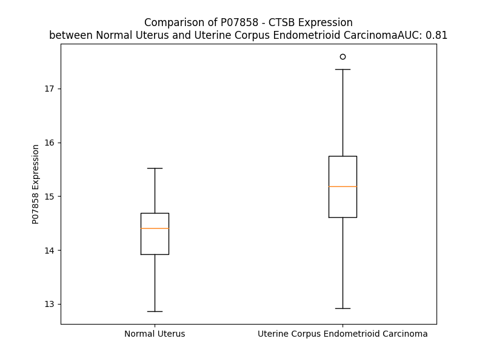

# Detailed Data for P07858

## Introduction to the Detailed Summary

### How to Interpret the Results

- **Summary & Metrics**: This section provides a quick reference to essential protein attributes, including expression changes, family classification, and biomarker applications. Regulation status (upregulated/downregulated) indicates the protein's behavior in a disease context. Some information comes from the original excel file with the proteins selected from literature, while others are derived from the analyses.
- **Expression Comparison**: A visual representation comparing protein expression between normal and disease states. It highlights significant changes in expression levels that might indicate diagnostic or therapeutic relevance. This is data coming from transcriptomics experiments and could not translate similarly to protein levels.
- **Isoform Alignment**: An interactive view of isoform alignments, revealing structural and functional differences between variants of the protein.
- **Interactors & Homologs**: Tables listing known interaction partners and homologous proteins, the more interactors and homologs, the more complex the protein is to design an antibody for.
- **Biological Assemblies**: Information about the structural arrangement of the protein in different assemblies, providing insights into its functional state but also the complexity of the protein to develop antibodies.
- **Combined Per-Residue Information**: A detailed table summarizing residue-level data. This includes predictions for epitope regions, aggregation tendencies, and modifications that might impact the protein's function. Each row corresponds to a residue in the protein, providing insights into specific sites that may be important for research or drug development.
## Summary & Metrics

- **UniProt Accession**: P07858
- **Gene Name**: CTSB
- **Protein Name**: cathepsin B
- **Swiss Prot**: CATB_HUMAN
- **Family**: peptidase
- **Biomarker Application**:  
- **Number of Isoforms**: 0
- **Regulation**: 1
- **(transcriptomics) AUC**: 0.81
- **(transcriptomics) Fold Change**: 1.07
- **(transcriptomics) Regulation**: Upregulated
- **Discotope Epitope Count**: 68
- **Max n_uniprots (Homo)**: 2
- **Max n_uniprots (Hetero)**: 2

## Expression Comparison

## Interactors

| preferredName_A   | preferredName_B   |   score |
|:------------------|:------------------|--------:|
| CTSB              | CSTA              |   0.998 |
| CTSB              | NLRP3             |   0.993 |
| CTSB              | CST3              |   0.982 |
| CTSB              | ANXA2             |   0.978 |
| CTSB              | CTSD              |   0.977 |
| CTSB              | CTSL              |   0.974 |
| CTSB              | CTSS              |   0.958 |
| CTSB              | CD74              |   0.954 |
| CTSB              | CSTB              |   0.948 |
| CTSB              | BCL2              |   0.947 |
| CTSB              | LGMN              |   0.944 |
| CTSB              | BCL2L1            |   0.938 |
| CTSB              | BID               |   0.921 |
| CTSB              | CASP1             |   0.917 |
| CTSB              | APP               |   0.902 |
| CTSB              | GABPB1            |   0.901 |

## Homologs

| uniprot_id   | gene_id   |
|:-------------|:----------|
| A0A7I2V440   | CTSB      |
| A0A7P0T9U1   | CTSZ      |
| A0A7I2YQ73   | CTSF      |
| E9PI30       | CTSW      |
| A0A7P0T898   | CTSO      |
| Q9UJW2       | TINAG     |
| A0A7I2V2V5   | CTSC      |
| A0A7P0TAQ0   | CTSS      |
| Q5QP40       | CTSK      |
| A0A7I2V5M3   | CTSL      |
| A0A804EQJ3   | CTSV      |
| A0A7I2V2E4   | CTSH      |
| F6SDV2       | TINAGL1   |

## Biological Assemblies

|   Unnamed: 0 |   assembly |   n_uniprots | composition   | crystal_id   |
|-------------:|-----------:|-------------:|:--------------|:-------------|
|            0 |          1 |            1 | Homo          | 6ay2         |
|            1 |          2 |            1 | Homo          | 6ay2         |
|            0 |          1 |            1 | Homo          | 5mbm         |
|            1 |          2 |            1 | Homo          | 5mbm         |
|            0 |          1 |            2 | Hetero        | 3cbk         |
|            0 |          1 |            1 | Homo          | 8b4t         |
|            0 |          1 |            2 | Hetero        | 3k9m         |
|            1 |          2 |            2 | Hetero        | 3k9m         |
|            0 |          1 |            2 | Homo          | 1csb         |
|            1 |          2 |            2 | Homo          | 1csb         |
|            0 |          1 |            2 | Homo          | 1huc         |
|            1 |          2 |            2 | Homo          | 1huc         |
|            0 |          1 |            1 | Homo          | 8hei         |
|            0 |          1 |            1 | Homo          | 2pbh         |
|            0 |          1 |            1 | Homo          | 8he9         |
|            0 |          1 |            1 | Homo          | 1gmy         |
|            1 |          2 |            1 | Homo          | 1gmy         |
|            2 |          3 |            1 | Homo          | 1gmy         |
|            0 |          1 |            1 | Homo          | 8b5f         |
|            0 |          1 |            2 | Homo          | 2ipp         |
|            0 |          1 |            1 | Homo          | 3ai8         |
|            1 |          2 |            1 | Homo          | 3ai8         |
|            0 |          1 |            1 | Homo          | 8hen         |
|            0 |          1 |            1 | Homo          | 1pbh         |
|            0 |          1 |            2 | Hetero        | 3cbj         |
|            1 |          2 |            2 | Hetero        | 3cbj         |
|            0 |          1 |            1 | Homo          | 5mbl         |
|            0 |          1 |            1 | Homo          | 3pbh         |

## Combined Per-Residue Information

|   res | aa   |   epitope_score | epitope   |   relative_surface_accessibility |   modeling_confidence |   Aggregation | modification    | glycosylation                   |
|------:|:-----|----------------:|:----------|---------------------------------:|----------------------:|--------------:|:----------------|:--------------------------------|
|     1 | M    |         0.16522 | False     |                          1.27231 |                 41.42 |         0.173 | N/A             | N/A                             |
|     2 | W    |         0.28154 | True      |                          1.10097 |                 35.53 |        34.017 | N/A             | N/A                             |
|     3 | Q    |         0.22013 | False     |                          0.87438 |                 38.7  |        34.718 | N/A             | N/A                             |
|     4 | L    |         0.20554 | False     |                          1.07185 |                 40.15 |        72.366 | N/A             | N/A                             |
|     5 | W    |         0.24312 | True      |                          1.05913 |                 39.25 |        79.241 | N/A             | N/A                             |
|     6 | A    |         0.14406 | False     |                          0.9264  |                 40.99 |        79.601 | N/A             | N/A                             |
|     7 | S    |         0.15645 | False     |                          0.76264 |                 43.07 |        80.009 | N/A             | N/A                             |
|     8 | L    |         0.20615 | False     |                          0.98877 |                 39.03 |        83.506 | N/A             | N/A                             |
|     9 | C    |         0.13852 | False     |                          0.86015 |                 37.77 |        84.069 | N/A             | N/A                             |
|    10 | C    |         0.13758 | False     |                          0.76543 |                 35.58 |        86.727 | N/A             | N/A                             |
|    11 | L    |         0.1442  | False     |                          0.9864  |                 39.02 |        92.862 | N/A             | N/A                             |
|    12 | L    |         0.14281 | False     |                          0.96515 |                 37.72 |        92.792 | N/A             | N/A                             |
|    13 | V    |         0.11498 | False     |                          0.92229 |                 41.61 |        92.178 | N/A             | N/A                             |
|    14 | L    |         0.153   | False     |                          1.00553 |                 39.29 |        84.743 | N/A             | N/A                             |
|    15 | A    |         0.16174 | False     |                          0.82569 |                 44.72 |        42.671 | N/A             | N/A                             |
|    16 | N    |         0.17023 | False     |                          0.88654 |                 39.22 |         1.195 | N/A             | N/A                             |
|    17 | A    |         0.16346 | False     |                          0.89382 |                 44.1  |         0.547 | N/A             | N/A                             |
|    18 | R    |         0.24345 | True      |                          0.89591 |                 48.98 |         0     | N/A             | N/A                             |
|    19 | S    |         0.19546 | False     |                          0.78404 |                 62.07 |         0     | N/A             | N/A                             |
|    20 | R    |         0.24309 | True      |                          0.62625 |                 64.78 |         0     | N/A             | N/A                             |
|    21 | P    |         0.16779 | False     |                          0.43506 |                 68.63 |         0     | N/A             | N/A                             |
|    22 | S    |         0.25154 | True      |                          0.88282 |                 73.74 |         0     | N/A             | N/A                             |
|    23 | F    |         0.20915 | False     |                          0.23885 |                 76.67 |         0     | N/A             | N/A                             |
|    24 | H    |         0.30427 | True      |                          0.61571 |                 80.82 |         0     | N/A             | N/A                             |
|    25 | P    |         0.07608 | False     |                          0.04573 |                 78.37 |         0     | N/A             | N/A                             |
|    26 | L    |         0.14506 | False     |                          0.17724 |                 83.06 |         0     | N/A             | N/A                             |
|    27 | S    |         0.12854 | False     |                          0.16223 |                 91.36 |         0     | N/A             | N/A                             |
|    28 | D    |         0.27637 | True      |                          0.57265 |                 94.39 |         0     | N/A             | N/A                             |
|    29 | E    |         0.22952 | True      |                          0.55662 |                 94.9  |         0     | N/A             | N/A                             |
|    30 | L    |         0.00988 | False     |                          0.00165 |                 93.33 |         7.389 | N/A             | N/A                             |
|    31 | V    |         0.10792 | False     |                          0.12091 |                 96.47 |         7.389 | N/A             | N/A                             |
|    32 | N    |         0.27887 | True      |                          0.492   |                 96.62 |         7.389 | N/A             | N/A                             |
|    33 | Y    |         0.27969 | True      |                          0.26474 |                 96.23 |         7.389 | N/A             | N/A                             |
|    34 | V    |         0.00638 | False     |                          0.00211 |                 96.37 |         7.389 | N/A             | N/A                             |
|    35 | N    |         0.18286 | False     |                          0.37807 |                 97.58 |         1.662 | N/A             | N/A                             |
|    36 | K    |         0.27104 | True      |                          0.83659 |                 97.23 |         0     | N/A             | N/A                             |
|    37 | R    |         0.29629 | True      |                          0.60411 |                 94.78 |         0     | N/A             | N/A                             |
|    38 | N    |         0.28049 | True      |                          0.88887 |                 92.83 |         0     | N/A             | N/A                             |
|    39 | T    |         0.32035 | True      |                          0.29191 |                 96.65 |         0     | N/A             | N/A                             |
|    40 | T    |         0.15872 | False     |                          0.33193 |                 98.39 |         0     | N/A             | N/A                             |
|    41 | W    |         0.04149 | False     |                          0.01937 |                 98.67 |         0     | N/A             | N/A                             |
|    42 | Q    |         0.12485 | False     |                          0.49369 |                 98.33 |         0     | N/A             | N/A                             |
|    43 | A    |         0.06644 | False     |                          0.09145 |                 97.91 |         0     | N/A             | N/A                             |
|    44 | G    |         0.09127 | False     |                          0.15451 |                 96.94 |         0     | N/A             | N/A                             |
|    45 | H    |         0.19796 | False     |                          0.20296 |                 95.09 |         0     | N/A             | N/A                             |
|    46 | N    |         0.01455 | False     |                          0       |                 94.21 |         0     | N/A             | N/A                             |
|    47 | F    |         0.03956 | False     |                          0.01471 |                 92.36 |         0     | N/A             | N/A                             |
|    48 | Y    |         0.25478 | True      |                          0.47564 |                 88.61 |         0     | N/A             | N/A                             |
|    49 | N    |         0.23932 | True      |                          0.98013 |                 82.22 |         0     | N/A             | N/A                             |
|    50 | V    |         0.12281 | False     |                          0.14809 |                 85.69 |         0     | N/A             | N/A                             |
|    51 | D    |         0.30095 | True      |                          0.48992 |                 83.96 |         0     | N/A             | N/A                             |
|    52 | M    |         0.16726 | False     |                          0.28738 |                 87.65 |         0     | N/A             | N/A                             |
|    53 | S    |         0.11832 | False     |                          0.39982 |                 89.57 |         0     | N/A             | N/A                             |
|    54 | Y    |         0.01643 | False     |                          0.00602 |                 92.19 |         0     | N/A             | N/A                             |
|    55 | L    |         0.01249 | False     |                          0.00082 |                 93.95 |         0     | N/A             | N/A                             |
|    56 | K    |         0.30039 | True      |                          0.51548 |                 93.83 |         0     | N/A             | N/A                             |
|    57 | R    |         0.24004 | True      |                          0.16269 |                 95.06 |         0     | N/A             | N/A                             |
|    58 | L    |         0.01551 | False     |                          0.00495 |                 96.19 |         0     | N/A             | N/A                             |
|    59 | C    |         0.06688 | False     |                          0.09993 |                 97.57 |         0     | N/A             | N/A                             |
|    60 | G    |         0.03107 | False     |                          0.06226 |                 98.01 |         0     | N/A             | N/A                             |
|    61 | T    |         0.02145 | False     |                          0.04489 |                 98.72 |         0     | N/A             | N/A                             |
|    62 | F    |         0.18642 | False     |                          0.41795 |                 98.37 |         0     | N/A             | N/A                             |
|    63 | L    |         0.24766 | True      |                          0.43159 |                 96.91 |         0     | N/A             | N/A                             |
|    64 | G    |         0.28115 | True      |                          0.73765 |                 94.79 |         0     | N/A             | N/A                             |
|    65 | G    |         0.15469 | False     |                          0.26525 |                 92.66 |         0     | N/A             | N/A                             |
|    66 | P    |         0.2125  | False     |                          0.48907 |                 94.35 |         0     | N/A             | N/A                             |
|    67 | K    |         0.13412 | False     |                          0.71331 |                 92.7  |         0     | N/A             | N/A                             |
|    68 | P    |         0.07503 | False     |                          0.09743 |                 92.88 |         0     | N/A             | N/A                             |
|    69 | P    |         0.16075 | False     |                          0.77283 |                 94.37 |         0     | N/A             | N/A                             |
|    70 | Q    |         0.09124 | False     |                          0.59086 |                 91.92 |         0     | N/A             | N/A                             |
|    71 | R    |         0.15438 | False     |                          0.28808 |                 90.46 |         0     | N/A             | N/A                             |
|    72 | V    |         0.15613 | False     |                          0.78843 |                 82.89 |         0     | N/A             | N/A                             |
|    73 | M    |         0.13159 | False     |                          0.15282 |                 81.56 |         0     | N/A             | N/A                             |
|    74 | F    |         0.25018 | True      |                          0.85535 |                 79.43 |         0     | N/A             | N/A                             |
|    75 | T    |         0.12763 | False     |                          0.1098  |                 79.9  |         0     | N/A             | N/A                             |
|    76 | E    |         0.28912 | True      |                          0.8681  |                 76.45 |         0     | N/A             | N/A                             |
|    77 | D    |         0.19039 | False     |                          0.86837 |                 81.45 |         0     | N/A             | N/A                             |
|    78 | L    |         0.17795 | False     |                          0.28309 |                 88.57 |         0     | N/A             | N/A                             |
|    79 | K    |         0.1985  | False     |                          0.9632  |                 93.6  |         0     | N/A             | N/A                             |
|    80 | L    |         0.13209 | False     |                          0.22292 |                 96.03 |         0     | N/A             | N/A                             |
|    81 | P    |         0.16116 | False     |                          0.35802 |                 97.66 |         0     | N/A             | N/A                             |
|    82 | A    |         0.14509 | False     |                          0.79617 |                 97.33 |         0     | N/A             | N/A                             |
|    83 | S    |         0.11085 | False     |                          0.49706 |                 98.72 |         0     | N/A             | N/A                             |
|    84 | F    |         0.10011 | False     |                          0.0883  |                 98.87 |         0     | N/A             | N/A                             |
|    85 | D    |         0.10964 | False     |                          0.14256 |                 98.89 |         0     | N/A             | N/A                             |
|    86 | A    |         0.00282 | False     |                          0       |                 98.85 |         0     | N/A             | N/A                             |
|    87 | R    |         0.11815 | False     |                          0.24809 |                 98.83 |         0     | N/A             | N/A                             |
|    88 | E    |         0.22322 | False     |                          0.74078 |                 98.7  |         0     | N/A             | N/A                             |
|    89 | Q    |         0.18008 | False     |                          0.47135 |                 98.57 |         0     | N/A             | N/A                             |
|    90 | W    |         0.15181 | False     |                          0.12879 |                 98.69 |         0     | N/A             | N/A                             |
|    91 | P    |         0.32864 | True      |                          0.59911 |                 98.36 |         0     | N/A             | N/A                             |
|    92 | Q    |         0.11719 | False     |                          0.48918 |                 98.35 |         0     | N/A             | N/A                             |
|    93 | C    |         0.0117  | False     |                          0.00577 |                 98.69 |         0     | N/A             | N/A                             |
|    94 | P    |         0.14312 | False     |                          0.58813 |                 98.33 |         0     | N/A             | N/A                             |
|    95 | T    |         0.04496 | False     |                          0.07818 |                 98.64 |         0     | N/A             | N/A                             |
|    96 | I    |         0.00949 | False     |                          0       |                 98.77 |         0     | N/A             | N/A                             |
|    97 | K    |         0.18068 | False     |                          0.51233 |                 98.67 |         0     | N/A             | N/A                             |
|    98 | E    |         0.10395 | False     |                          0.19409 |                 98.66 |         0     | N/A             | N/A                             |
|    99 | I    |         0.10081 | False     |                          0.08925 |                 98.6  |         0     | N/A             | N/A                             |
|   100 | R    |         0.05998 | False     |                          0.02329 |                 98.33 |         0     | N/A             | N/A                             |
|   101 | D    |         0.1781  | False     |                          0.09683 |                 97.41 |         0     | N/A             | N/A                             |
|   102 | Q    |         0.01672 | False     |                          0       |                 97.55 |         0     | N/A             | N/A                             |
|   103 | G    |         0.00408 | False     |                          0.00138 |                 95.23 |         0     | N/A             | N/A                             |
|   104 | S    |         0.10276 | False     |                          0.12437 |                 94.48 |         0     | N/A             | N/A                             |
|   105 | C    |         0.0306  | False     |                          0.00873 |                 96.95 |         0     | N/A             | N/A                             |
|   106 | G    |         0.00975 | False     |                          0.00483 |                 97.7  |         0     | N/A             | N/A                             |
|   107 | S    |         0.00694 | False     |                          0       |                 98.55 |         0.265 | N/A             | N/A                             |
|   108 | C    |         0.00417 | False     |                          0       |                 98.68 |         1.226 | N/A             | N/A                             |
|   109 | W    |         0.00856 | False     |                          0.00663 |                 98.79 |         2.018 | N/A             | N/A                             |
|   110 | A    |         0.0021  | False     |                          0       |                 98.87 |         2.209 | N/A             | N/A                             |
|   111 | F    |         0.01527 | False     |                          0.01539 |                 98.86 |         2.209 | N/A             | N/A                             |
|   112 | G    |         0.00956 | False     |                          0.0267  |                 98.79 |         1.945 | N/A             | N/A                             |
|   113 | A    |         0.00153 | False     |                          0       |                 98.91 |         1.737 | N/A             | N/A                             |
|   114 | V    |         0.00368 | False     |                          0       |                 98.92 |         1.737 | N/A             | N/A                             |
|   115 | E    |         0.01518 | False     |                          0.04438 |                 98.93 |         0     | N/A             | N/A                             |
|   116 | A    |         0.00136 | False     |                          0       |                 98.93 |         0     | N/A             | N/A                             |
|   117 | I    |         0.00157 | False     |                          0       |                 98.9  |         0     | N/A             | N/A                             |
|   118 | S    |         0.01024 | False     |                          0.0052  |                 98.9  |         0     | N/A             | N/A                             |
|   119 | D    |         0.00191 | False     |                          0       |                 98.89 |         0     | N/A             | N/A                             |
|   120 | R    |         0.00312 | False     |                          0       |                 98.78 |         0     | N/A             | N/A                             |
|   121 | I    |         0.00708 | False     |                          0.0016  |                 98.3  |         0.525 | N/A             | N/A                             |
|   122 | C    |         0.00267 | False     |                          0       |                 98.4  |         0.525 | N/A             | N/A                             |
|   123 | I    |         0.07726 | False     |                          0.1248  |                 98.38 |         0.525 | N/A             | N/A                             |
|   124 | H    |         0.09501 | False     |                          0.26841 |                 97.72 |         0.525 | N/A             | N/A                             |
|   125 | T    |         0.01957 | False     |                          0       |                 96.78 |         0.525 | N/A             | N/A                             |
|   126 | N    |         0.23628 | True      |                          0.69619 |                 95.55 |         0     | N/A             | N/A                             |
|   127 | A    |         0.09633 | False     |                          0.3423  |                 95.6  |         0     | N/A             | N/A                             |
|   128 | H    |         0.21341 | False     |                          0.58098 |                 94.86 |         0     | N/A             | N/A                             |
|   129 | V    |         0.15239 | False     |                          0.22278 |                 95.96 |         0     | N/A             | N/A                             |
|   130 | S    |         0.12926 | False     |                          0.43209 |                 97.06 |         0     | N/A             | N/A                             |
|   131 | V    |         0.10522 | False     |                          0.15138 |                 97.93 |         0     | N/A             | N/A                             |
|   132 | E    |         0.06713 | False     |                          0.19663 |                 98.82 |         0     | N/A             | N/A                             |
|   133 | V    |         0.00124 | False     |                          0       |                 98.84 |         0     | N/A             | N/A                             |
|   134 | S    |         0.00566 | False     |                          0.00208 |                 98.92 |         0     | N/A             | N/A                             |
|   135 | A    |         0.01163 | False     |                          0.02845 |                 98.88 |         0     | N/A             | N/A                             |
|   136 | E    |         0.01753 | False     |                          0.02617 |                 98.83 |         0     | N/A             | N/A                             |
|   137 | D    |         0.00837 | False     |                          0       |                 98.9  |         0     | N/A             | N/A                             |
|   138 | L    |         0.0033  | False     |                          0       |                 98.92 |         0     | N/A             | N/A                             |
|   139 | L    |         0.03404 | False     |                          0.02864 |                 98.84 |         0     | N/A             | N/A                             |
|   140 | T    |         0.09256 | False     |                          0.10345 |                 98.75 |         0     | N/A             | N/A                             |
|   141 | C    |         0.10852 | False     |                          0.15802 |                 98.83 |         0     | N/A             | N/A                             |
|   142 | C    |         0.04226 | False     |                          0.08935 |                 98.74 |         0     | N/A             | N/A                             |
|   143 | G    |         0.1678  | False     |                          0.51308 |                 98.1  |         0     | N/A             | N/A                             |
|   144 | S    |         0.33543 | True      |                          0.85277 |                 97.64 |         0     | N/A             | N/A                             |
|   145 | M    |         0.1493  | False     |                          0.34819 |                 97.69 |         0     | N/A             | N/A                             |
|   146 | C    |         0.01734 | False     |                          0.00701 |                 98.58 |         0     | N/A             | N/A                             |
|   147 | G    |         0.14218 | False     |                          0.21443 |                 98.13 |         0     | N/A             | N/A                             |
|   148 | D    |         0.33363 | True      |                          0.51219 |                 97.86 |         0     | N/A             | N/A                             |
|   149 | G    |         0.0653  | False     |                          0.10614 |                 98.16 |         0     | N/A             | N/A                             |
|   150 | C    |         0.01487 | False     |                          0.00735 |                 97.98 |         0     | N/A             | N/A                             |
|   151 | N    |         0.26382 | True      |                          0.52126 |                 97.39 |         0     | N/A             | N/A                             |
|   152 | G    |         0.00864 | False     |                          0.00161 |                 98.21 |         0     | N/A             | N/A                             |
|   153 | G    |         0.00419 | False     |                          0       |                 98.59 |         0     | N/A             | N/A                             |
|   154 | Y    |         0.10902 | False     |                          0.29218 |                 98.66 |         0     | N/A             | N/A                             |
|   155 | P    |         0.01886 | False     |                          0.05269 |                 98.73 |         0     | N/A             | N/A                             |
|   156 | A    |         0.01565 | False     |                          0.05322 |                 98.41 |         0     | N/A             | N/A                             |
|   157 | E    |         0.05243 | False     |                          0.12827 |                 98.63 |         0     | N/A             | N/A                             |
|   158 | A    |         0.00167 | False     |                          0       |                 98.84 |         1.381 | N/A             | N/A                             |
|   159 | W    |         0.00239 | False     |                          0       |                 98.78 |         1.672 | N/A             | N/A                             |
|   160 | N    |         0.06899 | False     |                          0.29325 |                 98.3  |         1.672 | N/A             | N/A                             |
|   161 | F    |         0.04933 | False     |                          0.06056 |                 98.75 |         1.672 | N/A             | N/A                             |
|   162 | W    |         0.00635 | False     |                          0       |                 98.8  |         1.672 | N/A             | N/A                             |
|   163 | T    |         0.10316 | False     |                          0.21949 |                 98.13 |         0.537 | N/A             | N/A                             |
|   164 | R    |         0.35086 | True      |                          0.6054  |                 97.75 |         0     | N/A             | N/A                             |
|   165 | K    |         0.1999  | False     |                          0.5809  |                 98.32 |         0     | N/A             | N/A                             |
|   166 | G    |         0.00435 | False     |                          0       |                 98.47 |         0     | N/A             | N/A                             |
|   167 | L    |         0.00271 | False     |                          0       |                 98.89 |         0.2   | N/A             | N/A                             |
|   168 | V    |         0.00984 | False     |                          0       |                 98.81 |         0.2   | N/A             | N/A                             |
|   169 | S    |         0.04623 | False     |                          0.03536 |                 98.87 |         0.2   | N/A             | N/A                             |
|   170 | G    |         0.02251 | False     |                          0.00833 |                 98.75 |         0.2   | N/A             | N/A                             |
|   171 | G    |         0.02255 | False     |                          0.03245 |                 98.5  |         0.2   | N/A             | N/A                             |
|   172 | L    |         0.24893 | True      |                          0.43279 |                 98.05 |         0.2   | N/A             | N/A                             |
|   173 | Y    |         0.35358 | True      |                          0.35463 |                 97.52 |         0.2   | N/A             | N/A                             |
|   174 | E    |         0.43636 | True      |                          0.63375 |                 96.12 |         0     | N/A             | N/A                             |
|   175 | S    |         0.28985 | True      |                          0.32384 |                 97.73 |         0     | N/A             | N/A                             |
|   176 | H    |         0.35705 | True      |                          0.77464 |                 97.84 |         0     | N/A             | N/A                             |
|   177 | V    |         0.24106 | True      |                          0.47889 |                 98.28 |         0     | N/A             | N/A                             |
|   178 | G    |         0.05446 | False     |                          0.11998 |                 98.35 |         0     | N/A             | N/A                             |
|   179 | C    |         0.00464 | False     |                          0       |                 98.78 |         0     | N/A             | N/A                             |
|   180 | R    |         0.14216 | False     |                          0.07232 |                 98.73 |         0     | N/A             | N/A                             |
|   181 | P    |         0.04607 | False     |                          0.06034 |                 98.69 |         0     | N/A             | N/A                             |
|   182 | Y    |         0.0361  | False     |                          0.04696 |                 98.57 |         0     | N/A             | N/A                             |
|   183 | S    |         0.18763 | False     |                          0.44537 |                 97.67 |         0     | N/A             | N/A                             |
|   184 | I    |         0.1983  | False     |                          0.14434 |                 96.64 |         0     | N/A             | N/A                             |
|   185 | P    |         0.21577 | False     |                          0.35398 |                 94.44 |         0     | N/A             | N/A                             |
|   186 | P    |         0.16413 | False     |                          0.21203 |                 92.87 |         0     | N/A             | N/A                             |
|   187 | C    |         0.05405 | False     |                          0.03578 |                 86.77 |         0     | N/A             | N/A                             |
|   188 | E    |         0.27554 | True      |                          0.1407  |                 79.13 |         0     | N/A             | N/A                             |
|   189 | H    |         0.10034 | False     |                          0.01075 |                 80.18 |         0     | N/A             | N/A                             |
|   190 | H    |         0.2015  | False     |                          0.26568 |                 72.91 |         0     | N/A             | N/A                             |
|   191 | V    |         0.33662 | True      |                          0.6367  |                 71.33 |         0     | N/A             | N/A                             |
|   192 | N    |         0.38394 | True      |                          0.95814 |                 69.38 |         0     | N/A             | N-linked (GlcNAc...) asparagine |
|   193 | G    |         0.46677 | True      |                          0.66874 |                 72.13 |         0     | N/A             | N/A                             |
|   194 | S    |         0.43472 | True      |                          0.91307 |                 76.9  |         0     | N/A             | N/A                             |
|   195 | R    |         0.54424 | True      |                          0.30096 |                 80.21 |         0     | N/A             | N/A                             |
|   196 | P    |         0.23824 | True      |                          0.47489 |                 82.12 |         0     | N/A             | N/A                             |
|   197 | P    |         0.31582 | True      |                          0.81849 |                 82.78 |         0     | N/A             | N/A                             |
|   198 | C    |         0.16068 | False     |                          0.06286 |                 83.98 |         0     | N/A             | N/A                             |
|   199 | T    |         0.19209 | False     |                          0.48321 |                 82.68 |         0     | N/A             | N/A                             |
|   200 | G    |         0.15343 | False     |                          0.1407  |                 77.82 |         0     | N/A             | N/A                             |
|   201 | E    |         0.23412 | True      |                          0.74491 |                 77.12 |         0     | N/A             | N/A                             |
|   202 | G    |         0.26234 | True      |                          0.49727 |                 84.42 |         0     | N/A             | N/A                             |
|   203 | D    |         0.35428 | True      |                          0.83915 |                 94.22 |         0     | N/A             | N/A                             |
|   204 | T    |         0.10821 | False     |                          0.33707 |                 97.82 |         0     | N/A             | N/A                             |
|   205 | P    |         0.16883 | False     |                          0.26356 |                 98.03 |         0     | N/A             | N/A                             |
|   206 | K    |         0.27438 | True      |                          0.8846  |                 98.08 |         0     | N/A             | N/A                             |
|   207 | C    |         0.25228 | True      |                          0.39599 |                 98.58 |         0     | N/A             | N/A                             |
|   208 | S    |         0.21081 | False     |                          0.37518 |                 98.35 |         0     | N/A             | N/A                             |
|   209 | K    |         0.29378 | True      |                          0.70479 |                 98.59 |         0     | N/A             | N/A                             |
|   210 | I    |         0.33711 | True      |                          0.74449 |                 98.6  |         0     | N/A             | N/A                             |
|   211 | C    |         0.16123 | False     |                          0.12133 |                 98.71 |         0     | N/A             | N/A                             |
|   212 | E    |         0.36949 | True      |                          0.35499 |                 97.98 |         0     | N/A             | N/A                             |
|   213 | P    |         0.42718 | True      |                          1.0141  |                 97.78 |         0     | N/A             | N/A                             |
|   214 | G    |         0.3512  | True      |                          1.06624 |                 97.23 |         0     | N/A             | N/A                             |
|   215 | Y    |         0.32642 | True      |                          0.31747 |                 98.12 |         0     | N/A             | N/A                             |
|   216 | S    |         0.36683 | True      |                          0.74672 |                 97.27 |         0     | N/A             | N/A                             |
|   217 | P    |         0.37818 | True      |                          0.39113 |                 96.59 |         0     | N/A             | N/A                             |
|   218 | T    |         0.29716 | True      |                          0.61402 |                 98.26 |         0     | N/A             | N/A                             |
|   219 | Y    |         0.10585 | False     |                          0.09309 |                 98.64 |         0     | N/A             | N/A                             |
|   220 | K    |         0.26613 | True      |                          0.85911 |                 97.76 |         0     | N6-acetyllysine | N/A                             |
|   221 | Q    |         0.26627 | True      |                          0.54938 |                 96.79 |         0     | N/A             | N/A                             |
|   222 | D    |         0.06625 | False     |                          0.0608  |                 97.72 |         0     | N/A             | N/A                             |
|   223 | K    |         0.08175 | False     |                          0.11035 |                 98.15 |         0     | N/A             | N/A                             |
|   224 | H    |         0.08093 | False     |                          0.10991 |                 98.29 |         0     | N/A             | N/A                             |
|   225 | Y    |         0.10196 | False     |                          0.26595 |                 98.39 |         0     | N/A             | N/A                             |
|   226 | G    |         0.04779 | False     |                          0.07019 |                 98.1  |         0     | N/A             | N/A                             |
|   227 | Y    |         0.18036 | False     |                          0.73781 |                 96.82 |         0     | N/A             | N/A                             |
|   228 | N    |         0.16603 | False     |                          0.37852 |                 96.14 |         0     | N/A             | N/A                             |
|   229 | S    |         0.04638 | False     |                          0.10807 |                 97.64 |         0     | N/A             | N/A                             |
|   230 | Y    |         0.06702 | False     |                          0.04332 |                 98.44 |         0     | N/A             | N/A                             |
|   231 | S    |         0.06041 | False     |                          0.11215 |                 98.12 |         0     | N/A             | N/A                             |
|   232 | V    |         0.04035 | False     |                          0.05328 |                 97.57 |         0     | N/A             | N/A                             |
|   233 | S    |         0.07883 | False     |                          0.14352 |                 96.25 |         0     | N/A             | N/A                             |
|   234 | N    |         0.13104 | False     |                          0.55606 |                 96.69 |         0     | N/A             | N/A                             |
|   235 | S    |         0.14969 | False     |                          0.28303 |                 96.78 |         0     | N/A             | N/A                             |
|   236 | E    |         0.06365 | False     |                          0.31035 |                 97.49 |         0     | N/A             | N/A                             |
|   237 | K    |         0.07176 | False     |                          0.4334  |                 96.66 |         0     | N/A             | N/A                             |
|   238 | D    |         0.06882 | False     |                          0.12104 |                 97.14 |         0     | N/A             | N/A                             |
|   239 | I    |         0.00396 | False     |                          0       |                 98.26 |         0.153 | N/A             | N/A                             |
|   240 | M    |         0.07553 | False     |                          0.1123  |                 98.25 |         0.153 | N/A             | N/A                             |
|   241 | A    |         0.00563 | False     |                          0       |                 97.76 |         0.153 | N/A             | N/A                             |
|   242 | E    |         0.00578 | False     |                          0       |                 98.21 |         0.153 | N/A             | N/A                             |
|   243 | I    |         0.01019 | False     |                          0       |                 98.64 |         0.153 | N/A             | N/A                             |
|   244 | Y    |         0.118   | False     |                          0.36874 |                 98.09 |         0.153 | N/A             | N/A                             |
|   245 | K    |         0.16547 | False     |                          0.42595 |                 96.72 |         0.153 | N/A             | N/A                             |
|   246 | N    |         0.10762 | False     |                          0.07476 |                 98.01 |         0     | N/A             | N/A                             |
|   247 | G    |         0.00177 | False     |                          0       |                 98.71 |         0     | N/A             | N/A                             |
|   248 | P    |         0.00202 | False     |                          0       |                 98.91 |         0     | N/A             | N/A                             |
|   249 | V    |         0.00162 | False     |                          0       |                 98.91 |         0     | N/A             | N/A                             |
|   250 | E    |         0.00182 | False     |                          0       |                 98.92 |         0     | N/A             | N/A                             |
|   251 | G    |         0.00702 | False     |                          0       |                 98.68 |         0     | N/A             | N/A                             |
|   252 | A    |         0.00687 | False     |                          0.00471 |                 98.74 |         0.815 | N/A             | N/A                             |
|   253 | F    |         0.01722 | False     |                          0.00206 |                 98.8  |         2.29  | N/A             | N/A                             |
|   254 | S    |         0.10524 | False     |                          0.11968 |                 98.75 |         2.29  | N/A             | N/A                             |
|   255 | V    |         0.014   | False     |                          0       |                 98.6  |         3.153 | N/A             | N/A                             |
|   256 | Y    |         0.12609 | False     |                          0.21053 |                 97.59 |         3.153 | N/A             | N/A                             |
|   257 | S    |         0.00689 | False     |                          0.00079 |                 96.49 |         2.744 | N/A             | N/A                             |
|   258 | D    |         0.00545 | False     |                          0       |                 97.38 |         2.58  | N/A             | N/A                             |
|   259 | F    |         0.00605 | False     |                          0       |                 98.37 |         2.58  | N/A             | N/A                             |
|   260 | L    |         0.00549 | False     |                          0       |                 96.93 |         2.58  | N/A             | N/A                             |
|   261 | L    |         0.00346 | False     |                          0       |                 97.39 |         2.58  | N/A             | N/A                             |
|   262 | Y    |         0.02651 | False     |                          0.00972 |                 98.38 |         2.58  | N/A             | N/A                             |
|   263 | K    |         0.29137 | True      |                          0.33861 |                 98.05 |         2.58  | N/A             | N/A                             |
|   264 | S    |         0.27178 | True      |                          0.36303 |                 98.69 |         0.799 | N/A             | N/A                             |
|   265 | G    |         0.03353 | False     |                          0.09232 |                 98.73 |         0.799 | N/A             | N/A                             |
|   266 | V    |         0.0111  | False     |                          0.00857 |                 98.87 |         0.799 | N/A             | N/A                             |
|   267 | Y    |         0.00789 | False     |                          0.00057 |                 98.88 |         0.799 | N/A             | N/A                             |
|   268 | Q    |         0.10135 | False     |                          0.25205 |                 98.68 |         0     | N/A             | N/A                             |
|   269 | H    |         0.11716 | False     |                          0.22749 |                 98.15 |         0     | N/A             | N/A                             |
|   270 | V    |         0.11736 | False     |                          0.13304 |                 96.37 |         0     | N/A             | N/A                             |
|   271 | T    |         0.04257 | False     |                          0.00865 |                 95.53 |         0     | N/A             | N/A                             |
|   272 | G    |         0.13625 | False     |                          0.32402 |                 93.59 |         0     | N/A             | N/A                             |
|   273 | E    |         0.28298 | True      |                          0.47995 |                 93.74 |         0     | N/A             | N/A                             |
|   274 | M    |         0.22125 | False     |                          0.59993 |                 95.6  |         0     | N/A             | N/A                             |
|   275 | M    |         0.1384  | False     |                          0.06135 |                 95.84 |         0     | N/A             | N/A                             |
|   276 | G    |         0.1689  | False     |                          0.25184 |                 97.13 |         0     | N/A             | N/A                             |
|   277 | G    |         0.05289 | False     |                          0.09954 |                 98.5  |         0     | N/A             | N/A                             |
|   278 | H    |         0.00913 | False     |                          0       |                 98.82 |         0     | N/A             | N/A                             |
|   279 | A    |         0.00619 | False     |                          0.00754 |                 98.81 |         0     | N/A             | N/A                             |
|   280 | I    |         0.05421 | False     |                          0.02    |                 98.86 |         0     | N/A             | N/A                             |
|   281 | R    |         0.00361 | False     |                          0.00234 |                 98.92 |         0     | N/A             | N/A                             |
|   282 | I    |         0.00431 | False     |                          0.0008  |                 98.95 |         4.059 | N/A             | N/A                             |
|   283 | L    |         0.00514 | False     |                          0       |                 98.93 |         4.402 | N/A             | N/A                             |
|   284 | G    |         0.00124 | False     |                          0       |                 98.91 |         4.402 | N/A             | N/A                             |
|   285 | W    |         0.0299  | False     |                          0.01101 |                 98.93 |         4.402 | N/A             | N/A                             |
|   286 | G    |         0.00529 | False     |                          0.00161 |                 98.86 |         4.402 | N/A             | N/A                             |
|   287 | V    |         0.10171 | False     |                          0.57054 |                 98.8  |         4.084 | N/A             | N/A                             |
|   288 | E    |         0.2373  | True      |                          0.2581  |                 98.62 |         0     | N/A             | N/A                             |
|   289 | N    |         0.28419 | True      |                          0.96582 |                 97.52 |         0     | N/A             | N/A                             |
|   290 | G    |         0.20555 | False     |                          0.78892 |                 98.07 |         0     | N/A             | N/A                             |
|   291 | T    |         0.10055 | False     |                          0.11809 |                 98.7  |         0     | N/A             | N/A                             |
|   292 | P    |         0.078   | False     |                          0.32208 |                 98.85 |         1.278 | N/A             | N/A                             |
|   293 | Y    |         0.19646 | False     |                          0.13848 |                 98.93 |        52.101 | N/A             | N/A                             |
|   294 | W    |         0.01075 | False     |                          0       |                 98.95 |        52.485 | N/A             | N/A                             |
|   295 | L    |         0.05323 | False     |                          0.0948  |                 98.96 |        52.485 | N/A             | N/A                             |
|   296 | V    |         0.00502 | False     |                          0       |                 98.96 |        52.485 | N/A             | N/A                             |
|   297 | A    |         0.01761 | False     |                          0.01037 |                 98.93 |        51.792 | N/A             | N/A                             |
|   298 | N    |         0.02194 | False     |                          0.00367 |                 98.62 |         3.428 | N/A             | N/A                             |
|   299 | S    |         0.03481 | False     |                          0.03388 |                 98.33 |         1.313 | N/A             | N/A                             |
|   300 | W    |         0.02893 | False     |                          0.00476 |                 97.05 |         1.083 | N/A             | N/A                             |
|   301 | N    |         0.16946 | False     |                          0.1167  |                 95.54 |         0     | N/A             | N/A                             |
|   302 | T    |         0.37967 | True      |                          0.52274 |                 95.81 |         0     | N/A             | N/A                             |
|   303 | D    |         0.21209 | False     |                          0.216   |                 93.72 |         0     | N/A             | N/A                             |
|   304 | W    |         0.0193  | False     |                          0       |                 96.06 |         0     | N/A             | N/A                             |
|   305 | G    |         0.14165 | False     |                          0.18678 |                 97.31 |         0     | N/A             | N/A                             |
|   306 | D    |         0.25757 | True      |                          0.37285 |                 98.26 |         0     | N/A             | N/A                             |
|   307 | N    |         0.19315 | False     |                          0.64375 |                 97.78 |         0     | N/A             | N/A                             |
|   308 | G    |         0.00435 | False     |                          0       |                 97.97 |         0     | N/A             | N/A                             |
|   309 | F    |         0.12308 | False     |                          0.09174 |                 98.86 |         0     | N/A             | N/A                             |
|   310 | F    |         0.03862 | False     |                          0.00618 |                 98.91 |         0     | N/A             | N/A                             |
|   311 | K    |         0.11625 | False     |                          0.20314 |                 98.93 |         0     | N/A             | N/A                             |
|   312 | I    |         0.00708 | False     |                          0       |                 98.9  |         0     | N/A             | N/A                             |
|   313 | L    |         0.02734 | False     |                          0.04781 |                 98.88 |         0     | N/A             | N/A                             |
|   314 | R    |         0.09767 | False     |                          0.06364 |                 98.81 |         0     | N/A             | N/A                             |
|   315 | G    |         0.13958 | False     |                          0.44677 |                 98.32 |         0     | N/A             | N/A                             |
|   316 | Q    |         0.24942 | True      |                          0.64328 |                 98.47 |         0     | N/A             | N/A                             |
|   317 | D    |         0.10894 | False     |                          0.27303 |                 98.6  |         0     | N/A             | N/A                             |
|   318 | H    |         0.09183 | False     |                          0.16474 |                 98.7  |         0     | N/A             | N/A                             |
|   319 | C    |         0.11308 | False     |                          0.18325 |                 98.52 |         0     | N/A             | N/A                             |
|   320 | G    |         0.11902 | False     |                          0.27074 |                 98.47 |         0     | N/A             | N/A                             |
|   321 | I    |         0.00348 | False     |                          0       |                 98.76 |         0     | N/A             | N/A                             |
|   322 | E    |         0.01886 | False     |                          0.03759 |                 98.72 |         0     | N/A             | N/A                             |
|   323 | S    |         0.16693 | False     |                          0.34546 |                 97.83 |         0     | N/A             | N/A                             |
|   324 | E    |         0.05232 | False     |                          0.17587 |                 97.13 |         0     | N/A             | N/A                             |
|   325 | V    |         0.01865 | False     |                          0.01147 |                 98.66 |         0.134 | N/A             | N/A                             |
|   326 | V    |         0.02197 | False     |                          0.06379 |                 98.65 |         0.134 | N/A             | N/A                             |
|   327 | A    |         0.00285 | False     |                          0       |                 98.71 |         0.134 | N/A             | N/A                             |
|   328 | G    |         0.00254 | False     |                          0       |                 98.11 |         0.134 | N/A             | N/A                             |
|   329 | I    |         0.06479 | False     |                          0.21919 |                 97.91 |         0.134 | N/A             | N/A                             |
|   330 | P    |         0.01831 | False     |                          0.02204 |                 97.75 |         0     | N/A             | N/A                             |
|   331 | R    |         0.11866 | False     |                          0.32389 |                 96.02 |         0     | N/A             | N/A                             |
|   332 | T    |         0.16681 | False     |                          0.25105 |                 89.96 |         0     | N/A             | N/A                             |
|   333 | D    |         0.21952 | False     |                          0.48729 |                 87.69 |         0     | N/A             | N/A                             |
|   334 | Q    |         0.1551  | False     |                          0.11936 |                 86.09 |         0     | N/A             | N/A                             |
|   335 | Y    |         0.05686 | False     |                          0.05779 |                 81.33 |         0     | N/A             | N/A                             |
|   336 | W    |         0.1936  | False     |                          0.50597 |                 74.46 |         0     | N/A             | N/A                             |
|   337 | E    |         0.25297 | True      |                          0.80381 |                 67.32 |         0     | N/A             | N/A                             |
|   338 | K    |         0.22278 | False     |                          0.76581 |                 60.03 |         0     | N/A             | N/A                             |
|   339 | I    |         0.1201  | False     |                          0.79864 |                 57.16 |         0     | N/A             | N/A                             |

