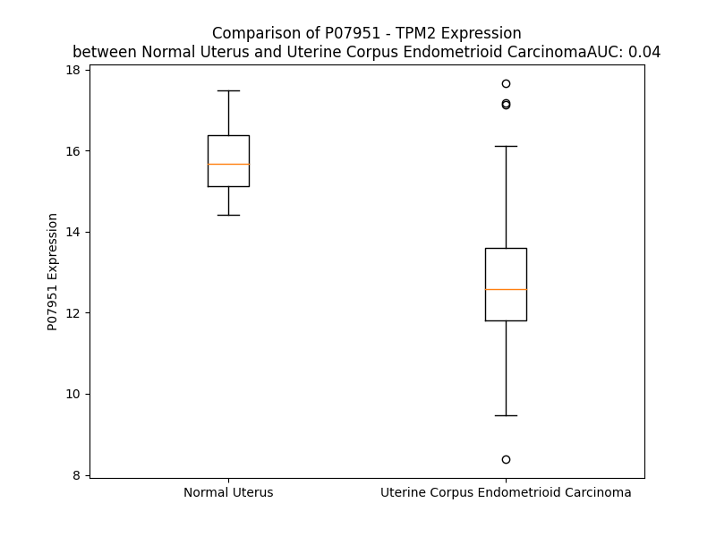

# Detailed Data for P07951

## Introduction to the Detailed Summary

### How to Interpret the Results

- **Summary & Metrics**: This section provides a quick reference to essential protein attributes, including expression changes, family classification, and biomarker applications. Regulation status (upregulated/downregulated) indicates the protein's behavior in a disease context. Some information comes from the original excel file with the proteins selected from literature, while others are derived from the analyses.
- **Expression Comparison**: A visual representation comparing protein expression between normal and disease states. It highlights significant changes in expression levels that might indicate diagnostic or therapeutic relevance. This is data coming from transcriptomics experiments and could not translate similarly to protein levels.
- **Isoform Alignment**: An interactive view of isoform alignments, revealing structural and functional differences between variants of the protein.
- **Interactors & Homologs**: Tables listing known interaction partners and homologous proteins, the more interactors and homologs, the more complex the protein is to design an antibody for.
- **Biological Assemblies**: Information about the structural arrangement of the protein in different assemblies, providing insights into its functional state but also the complexity of the protein to develop antibodies.
- **Combined Per-Residue Information**: A detailed table summarizing residue-level data. This includes predictions for epitope regions, aggregation tendencies, and modifications that might impact the protein's function. Each row corresponds to a residue in the protein, providing insights into specific sites that may be important for research or drug development.
## Summary & Metrics

- **UniProt Accession**: P07951
- **Gene Name**: TPM2
- **Protein Name**: Tropomyosin beta chain
- **Swiss Prot**: TPM2_HUMAN
- **Family**: other
- **Biomarker Application**: diagnosis
- **Number of Isoforms**: 3
- **Regulation**: 2
- **(transcriptomics) AUC**: 0.12
- **(transcriptomics) Fold Change**: 1.14
- **(transcriptomics) Regulation**: Downregulated
- **Discotope Epitope Count**: 13
- **Max n_uniprots (Homo)**: N/A
- **Max n_uniprots (Hetero)**: N/A

## Expression Comparison

## Isoform Alignment

<pre style='font-size:14px; font-family:monospace;'>P07951-1 ------MDAIKKKMQMLKLDKENAIDRAEQAEADKKQAEDRCKQLEEEQQALQKKLKGTEDEVEKYSESVKEAQEKLEQAEKKATDAEADVASLNRRIQLVEEELDRAQERLATALQKLEEAEKAADESERGMKVIENRAMKDEEKMELQEMQLKEAKHIAEDSDRKYEEVARKLVILEGELERSEERAEVAESKCGDLEEELKIVTNNLKSLEAQADKYSTKEDKYEEEIKLLEEKLKEAETRAEFAERSVAKLEKTIDDLEDEVYAQKMKYKAISEELDNALNDITSL
P07951-2 ------MDAIKKKMQMLKLDKENAIDRAEQAEADKKQAEDRCKQLEEEQQALQKKLKGTEDEVEKYSESVKEAQEKLEQAEKKATDAEADVASLNRRIQLVEEELDRAQERLATALQKLEEAEKAADESERGMKVIENRAMKDEEKMELQEMQLKEAKHIAEDSDRKYEEVARKLVILEGELERSEERAEVAESRARQLEEELRTMDQALKSLMASEEEYSTKEDKYEEEIKLLEEKLKEAETRAEFAERSVAKLEKTIDDLEETLASAKEENVEIHQTLDQTLLELNNL
P07951-3 MAGISSIDAVKKKIQSLQQVADEAEERAE------------------------------------------HLQREADAERQARERAEADVASLNRRIQLVEEELDRAQERLATALQKLEEAEKAADESERGMKVIENRAMKDEEKMELQEMQLKEAKHIAEDSDRKYEEVARKLVILEGELERSEERAEVAESRARQLEEELRTMDQALKSLMASEEEYSTKEDKYEEEIKLLEEKLKEAETRAEFAERSVAKLEKTIDDLEETLASAKEENVEIHQTLDQTLLELNNL
</pre>

## Interactors

| preferredName_A   | preferredName_B   |   score |
|:------------------|:------------------|--------:|
| TPM2              | TPM1              |   0.993 |
| TPM2              | TNNI2             |   0.988 |
| TPM2              | TPM4              |   0.986 |
| TPM2              | TNNT1             |   0.976 |
| TPM2              | TNNT3             |   0.972 |
| TPM2              | TNNT2             |   0.966 |
| TPM2              | MYH3              |   0.959 |
| TPM2              | ACTC1             |   0.954 |
| TPM2              | TNNI3             |   0.953 |
| TPM2              | TPM3              |   0.949 |
| TPM2              | ACTA1             |   0.939 |
| TPM2              | MYL1              |   0.928 |
| TPM2              | TNNI1             |   0.919 |
| TPM2              | NEB               |   0.908 |

## Homologs

| uniprot_id   | gene_id   |
|:-------------|:----------|
| A0A2R8Y5V9   | TPM4      |
| A0A494C0P6   | TPM3      |
| H0YL80       | TPM1      |

## Combined Per-Residue Information

|   res | aa   |   epitope_score | epitope   |   relative_surface_accessibility |   modeling_confidence |   Aggregation | modification             |
|------:|:-----|----------------:|:----------|---------------------------------:|----------------------:|--------------:|:-------------------------|
|     1 | M    |         0.10989 | False     |                          1.16417 |                 52.2  |         0     | N-acetylmethionine       |
|     2 | D    |         0.13942 | False     |                          0.75923 |                 53.15 |         0     | N/A                      |
|     3 | A    |         0.15615 | False     |                          0.77922 |                 58.19 |         0     | N/A                      |
|     4 | I    |         0.20704 | False     |                          0.75951 |                 57.5  |         0     | N/A                      |
|     5 | K    |         0.20681 | False     |                          0.75752 |                 59.48 |         0     | N/A                      |
|     6 | K    |         0.2059  | False     |                          0.77718 |                 66.87 |         0     | N/A                      |
|     7 | K    |         0.17021 | False     |                          0.72695 |                 69.12 |         0     | N/A                      |
|     8 | M    |         0.19624 | False     |                          0.72152 |                 73.46 |         0     | N/A                      |
|     9 | Q    |         0.16418 | False     |                          0.63211 |                 70.85 |         0     | N/A                      |
|    10 | M    |         0.19917 | False     |                          0.6996  |                 74.03 |         0     | N/A                      |
|    11 | L    |         0.22934 | True      |                          0.74742 |                 70.67 |         0     | N/A                      |
|    12 | K    |         0.16579 | False     |                          0.73151 |                 76.84 |         0     | N/A                      |
|    13 | L    |         0.22734 | True      |                          0.65961 |                 78.17 |         0     | N/A                      |
|    14 | D    |         0.10635 | False     |                          0.53016 |                 77.54 |         0     | N/A                      |
|    15 | K    |         0.13073 | False     |                          0.66841 |                 78.75 |         0     | N/A                      |
|    16 | E    |         0.16317 | False     |                          0.53555 |                 77.13 |         0     | N/A                      |
|    17 | N    |         0.14722 | False     |                          0.50451 |                 78.72 |         0     | N/A                      |
|    18 | A    |         0.1176  | False     |                          0.5749  |                 79.28 |         0     | N/A                      |
|    19 | I    |         0.18043 | False     |                          0.45507 |                 81.02 |         0     | N/A                      |
|    20 | D    |         0.13691 | False     |                          0.50055 |                 78.52 |         0     | N/A                      |
|    21 | R    |         0.18461 | False     |                          0.78462 |                 79.49 |         0     | N/A                      |
|    22 | A    |         0.09612 | False     |                          0.56901 |                 80.7  |         0     | N/A                      |
|    23 | E    |         0.10555 | False     |                          0.53944 |                 81.27 |         0     | N/A                      |
|    24 | Q    |         0.13464 | False     |                          0.56533 |                 82.24 |         0     | N/A                      |
|    25 | A    |         0.10572 | False     |                          0.57285 |                 82.19 |         0     | N/A                      |
|    26 | E    |         0.12913 | False     |                          0.64233 |                 83.7  |         0     | N/A                      |
|    27 | A    |         0.09278 | False     |                          0.5133  |                 84.96 |         0     | N/A                      |
|    28 | D    |         0.09028 | False     |                          0.47474 |                 84.57 |         0     | N/A                      |
|    29 | K    |         0.11502 | False     |                          0.62422 |                 87.84 |         0     | N/A                      |
|    30 | K    |         0.16054 | False     |                          0.66838 |                 86.74 |         0     | N/A                      |
|    31 | Q    |         0.19257 | False     |                          0.6633  |                 86.88 |         0     | N/A                      |
|    32 | A    |         0.14001 | False     |                          0.55898 |                 84.82 |         0     | N/A                      |
|    33 | E    |         0.11392 | False     |                          0.45215 |                 87.79 |         0     | N/A                      |
|    34 | D    |         0.08631 | False     |                          0.42626 |                 87.04 |         0     | N/A                      |
|    35 | R    |         0.1384  | False     |                          0.68616 |                 87.75 |         0     | N/A                      |
|    36 | C    |         0.07118 | False     |                          0.56674 |                 88.69 |         0     | N/A                      |
|    37 | K    |         0.13397 | False     |                          0.62228 |                 90.13 |         0     | N/A                      |
|    38 | Q    |         0.13537 | False     |                          0.58895 |                 89.15 |         0     | N/A                      |
|    39 | L    |         0.14311 | False     |                          0.64094 |                 89.36 |         0     | N/A                      |
|    40 | E    |         0.12566 | False     |                          0.54529 |                 89.45 |         0     | N/A                      |
|    41 | E    |         0.14212 | False     |                          0.61142 |                 89.65 |         0     | N/A                      |
|    42 | E    |         0.13005 | False     |                          0.53928 |                 90.33 |         0     | N/A                      |
|    43 | Q    |         0.08298 | False     |                          0.54625 |                 91.11 |         0     | N/A                      |
|    44 | Q    |         0.12679 | False     |                          0.63628 |                 91.25 |         0     | N/A                      |
|    45 | A    |         0.11302 | False     |                          0.49492 |                 91.6  |         0     | N/A                      |
|    46 | L    |         0.09714 | False     |                          0.72318 |                 92.48 |         0     | N/A                      |
|    47 | Q    |         0.11322 | False     |                          0.55089 |                 92.34 |         0     | N/A                      |
|    48 | K    |         0.20593 | False     |                          0.81257 |                 93.29 |         0     | N/A                      |
|    49 | K    |         0.14384 | False     |                          0.71336 |                 93.25 |         0     | N/A                      |
|    50 | L    |         0.10336 | False     |                          0.65455 |                 93.3  |         0     | N/A                      |
|    51 | K    |         0.11008 | False     |                          0.64379 |                 93.69 |         0     | N/A                      |
|    52 | G    |         0.09758 | False     |                          0.37755 |                 93.87 |         0     | N/A                      |
|    53 | T    |         0.14252 | False     |                          0.50265 |                 93.76 |         0     | Phosphothreonine         |
|    54 | E    |         0.102   | False     |                          0.50476 |                 94.19 |         0     | N/A                      |
|    55 | D    |         0.15222 | False     |                          0.47727 |                 94.47 |         0     | N/A                      |
|    56 | E    |         0.13264 | False     |                          0.51154 |                 94.81 |         0     | N/A                      |
|    57 | V    |         0.08832 | False     |                          0.74084 |                 95.12 |         0     | N/A                      |
|    58 | E    |         0.13836 | False     |                          0.57397 |                 95.12 |         0     | N/A                      |
|    59 | K    |         0.16651 | False     |                          0.71132 |                 95.38 |         0     | N/A                      |
|    60 | Y    |         0.10356 | False     |                          0.66958 |                 94.8  |         0     | N/A                      |
|    61 | S    |         0.08209 | False     |                          0.37793 |                 94.92 |         0     | Phosphoserine; by PIK3CG |
|    62 | E    |         0.13828 | False     |                          0.5393  |                 95.54 |         0     | N/A                      |
|    63 | S    |         0.14035 | False     |                          0.47513 |                 95.98 |         0     | N/A                      |
|    64 | V    |         0.0941  | False     |                          0.58419 |                 96.27 |         0     | N/A                      |
|    65 | K    |         0.12799 | False     |                          0.62069 |                 95.74 |         0     | N/A                      |
|    66 | E    |         0.17727 | False     |                          0.50597 |                 95.91 |         0     | N/A                      |
|    67 | A    |         0.08413 | False     |                          0.54675 |                 96.05 |         0     | N/A                      |
|    68 | Q    |         0.12878 | False     |                          0.55547 |                 96.4  |         0     | N/A                      |
|    69 | E    |         0.12089 | False     |                          0.54212 |                 96.34 |         0     | N/A                      |
|    70 | K    |         0.14047 | False     |                          0.66855 |                 96.43 |         0     | N/A                      |
|    71 | L    |         0.10855 | False     |                          0.64182 |                 96.31 |         0     | N/A                      |
|    72 | E    |         0.17519 | False     |                          0.62402 |                 96.06 |         0     | N/A                      |
|    73 | Q    |         0.17118 | False     |                          0.54689 |                 96.22 |         0     | N/A                      |
|    74 | A    |         0.09162 | False     |                          0.51695 |                 96.57 |         0     | N/A                      |
|    75 | E    |         0.09216 | False     |                          0.50686 |                 96.81 |         0     | N/A                      |
|    76 | K    |         0.16415 | False     |                          0.67678 |                 96.5  |         0     | N/A                      |
|    77 | K    |         0.14662 | False     |                          0.71294 |                 96.8  |         0     | N/A                      |
|    78 | A    |         0.08367 | False     |                          0.482   |                 96.69 |         0     | N/A                      |
|    79 | T    |         0.16051 | False     |                          0.57025 |                 96.58 |         0     | Phosphothreonine         |
|    80 | D    |         0.11133 | False     |                          0.49361 |                 96.77 |         0     | N/A                      |
|    81 | A    |         0.09109 | False     |                          0.4958  |                 96.65 |         0     | N/A                      |
|    82 | E    |         0.13339 | False     |                          0.62012 |                 96.26 |         0     | N/A                      |
|    83 | A    |         0.12828 | False     |                          0.59157 |                 96.71 |         0     | N/A                      |
|    84 | D    |         0.09169 | False     |                          0.55417 |                 97.5  |         0     | N/A                      |
|    85 | V    |         0.07921 | False     |                          0.60361 |                 97.82 |         0     | N/A                      |
|    86 | A    |         0.11804 | False     |                          0.45003 |                 97.21 |         0     | N/A                      |
|    87 | S    |         0.16245 | False     |                          0.52265 |                 97.48 |         0     | Phosphoserine            |
|    88 | L    |         0.10106 | False     |                          0.61063 |                 98.11 |         0     | N/A                      |
|    89 | N    |         0.12957 | False     |                          0.48554 |                 98.14 |         0     | N/A                      |
|    90 | R    |         0.23749 | True      |                          0.68812 |                 97.18 |         0     | N/A                      |
|    91 | R    |         0.1979  | False     |                          0.65489 |                 98    |         0     | N/A                      |
|    92 | I    |         0.11739 | False     |                          0.55177 |                 98.09 |         0     | N/A                      |
|    93 | Q    |         0.08835 | False     |                          0.56064 |                 97.82 |         0     | N/A                      |
|    94 | L    |         0.11424 | False     |                          0.68045 |                 97.78 |         0     | N/A                      |
|    95 | V    |         0.08807 | False     |                          0.58333 |                 98.3  |         0     | N/A                      |
|    96 | E    |         0.09316 | False     |                          0.48253 |                 98.11 |         0     | N/A                      |
|    97 | E    |         0.17737 | False     |                          0.45612 |                 97.4  |         0     | N/A                      |
|    98 | E    |         0.19181 | False     |                          0.58857 |                 98.12 |         0     | N/A                      |
|    99 | L    |         0.13587 | False     |                          0.59048 |                 98.19 |         0     | N/A                      |
|   100 | D    |         0.09645 | False     |                          0.50687 |                 98.07 |         0     | N/A                      |
|   101 | R    |         0.15619 | False     |                          0.56727 |                 97.68 |         0     | N/A                      |
|   102 | A    |         0.05424 | False     |                          0.50844 |                 98.18 |         0     | N/A                      |
|   103 | Q    |         0.0886  | False     |                          0.49666 |                 98.26 |         0     | N/A                      |
|   104 | E    |         0.13714 | False     |                          0.6211  |                 97.95 |         0     | N/A                      |
|   105 | R    |         0.22076 | False     |                          0.72947 |                 97.88 |         0     | N/A                      |
|   106 | L    |         0.10441 | False     |                          0.64571 |                 98.02 |         0.836 | N/A                      |
|   107 | A    |         0.11235 | False     |                          0.57092 |                 98.34 |         0.836 | N/A                      |
|   108 | T    |         0.15496 | False     |                          0.48669 |                 98.14 |         0.836 | Phosphothreonine         |
|   109 | A    |         0.08056 | False     |                          0.51614 |                 98.39 |         0.836 | N/A                      |
|   110 | L    |         0.08891 | False     |                          0.61551 |                 98.38 |         0.836 | N/A                      |
|   111 | Q    |         0.1058  | False     |                          0.5449  |                 98.4  |         0     | N/A                      |
|   112 | K    |         0.14761 | False     |                          0.65662 |                 98.37 |         0     | N/A                      |
|   113 | L    |         0.10581 | False     |                          0.60273 |                 98.25 |         0     | N/A                      |
|   114 | E    |         0.13166 | False     |                          0.45148 |                 98.2  |         0     | N/A                      |
|   115 | E    |         0.12025 | False     |                          0.48334 |                 97.94 |         0     | N/A                      |
|   116 | A    |         0.11268 | False     |                          0.54946 |                 98.18 |         0     | N/A                      |
|   117 | E    |         0.09093 | False     |                          0.50291 |                 98.22 |         0     | N/A                      |
|   118 | K    |         0.11055 | False     |                          0.56483 |                 98.16 |         0     | N/A                      |
|   119 | A    |         0.09154 | False     |                          0.55017 |                 97.81 |         0     | N/A                      |
|   120 | A    |         0.07332 | False     |                          0.57725 |                 98.05 |         0     | N/A                      |
|   121 | D    |         0.12446 | False     |                          0.49675 |                 97.95 |         0     | N/A                      |
|   122 | E    |         0.11731 | False     |                          0.61823 |                 97.81 |         0     | N/A                      |
|   123 | S    |         0.09867 | False     |                          0.59241 |                 97.8  |         0     | N/A                      |
|   124 | E    |         0.07438 | False     |                          0.41339 |                 98.19 |         0     | N/A                      |
|   125 | R    |         0.12589 | False     |                          0.67859 |                 98.08 |         0     | N/A                      |
|   126 | G    |         0.08365 | False     |                          0.38223 |                 98    |         0     | N/A                      |
|   127 | M    |         0.08622 | False     |                          0.62496 |                 98.07 |         0     | N/A                      |
|   128 | K    |         0.09042 | False     |                          0.50351 |                 98.19 |         0     | N/A                      |
|   129 | V    |         0.10218 | False     |                          0.71749 |                 98.31 |         0     | N/A                      |
|   130 | I    |         0.10379 | False     |                          0.72313 |                 97.6  |         0     | N/A                      |
|   131 | E    |         0.07241 | False     |                          0.57355 |                 97.86 |         0     | N/A                      |
|   132 | N    |         0.14229 | False     |                          0.54521 |                 98.09 |         0     | N/A                      |
|   133 | R    |         0.07587 | False     |                          0.6756  |                 98.42 |         0     | N/A                      |
|   134 | A    |         0.06153 | False     |                          0.54176 |                 98.28 |         0     | N/A                      |
|   135 | M    |         0.11144 | False     |                          0.62164 |                 98.22 |         0     | N/A                      |
|   136 | K    |         0.11943 | False     |                          0.68578 |                 98.25 |         0     | N/A                      |
|   137 | D    |         0.08974 | False     |                          0.48429 |                 98.34 |         0     | N/A                      |
|   138 | E    |         0.09505 | False     |                          0.51409 |                 98.25 |         0     | N/A                      |
|   139 | E    |         0.11103 | False     |                          0.49132 |                 98.13 |         0     | N/A                      |
|   140 | K    |         0.11193 | False     |                          0.59688 |                 98.27 |         0     | N/A                      |
|   141 | M    |         0.09341 | False     |                          0.56221 |                 98.08 |         0     | N/A                      |
|   142 | E    |         0.11981 | False     |                          0.49693 |                 98.42 |         0     | N/A                      |
|   143 | L    |         0.14295 | False     |                          0.55868 |                 98.36 |         0     | N/A                      |
|   144 | Q    |         0.08751 | False     |                          0.4984  |                 98.19 |         0     | N/A                      |
|   145 | E    |         0.09645 | False     |                          0.53804 |                 98.42 |         0     | N/A                      |
|   146 | M    |         0.09241 | False     |                          0.65349 |                 98.36 |         0     | N/A                      |
|   147 | Q    |         0.11505 | False     |                          0.50895 |                 98.4  |         0     | N/A                      |
|   148 | L    |         0.10302 | False     |                          0.61345 |                 98.25 |         0     | N/A                      |
|   149 | K    |         0.1435  | False     |                          0.65501 |                 98.44 |         0     | N/A                      |
|   150 | E    |         0.10008 | False     |                          0.5586  |                 98.01 |         0     | N/A                      |
|   151 | A    |         0.07708 | False     |                          0.5253  |                 98.31 |         0     | N/A                      |
|   152 | K    |         0.06785 | False     |                          0.56724 |                 98.48 |         0     | N/A                      |
|   153 | H    |         0.12545 | False     |                          0.52709 |                 98.06 |         0     | N/A                      |
|   154 | I    |         0.13146 | False     |                          0.64442 |                 98.26 |         0     | N/A                      |
|   155 | A    |         0.11714 | False     |                          0.50914 |                 98.38 |         0     | N/A                      |
|   156 | E    |         0.0992  | False     |                          0.44926 |                 97.95 |         0     | N/A                      |
|   157 | D    |         0.19916 | False     |                          0.42381 |                 98.23 |         0     | N/A                      |
|   158 | S    |         0.05665 | False     |                          0.32047 |                 98.31 |         0     | Phosphoserine            |
|   159 | D    |         0.09815 | False     |                          0.52855 |                 98.39 |         0     | N/A                      |
|   160 | R    |         0.18152 | False     |                          0.64133 |                 98.29 |         0     | N/A                      |
|   161 | K    |         0.12353 | False     |                          0.67436 |                 98.28 |         0     | N/A                      |
|   162 | Y    |         0.1563  | False     |                          0.71837 |                 97.98 |         0     | N/A                      |
|   163 | E    |         0.13343 | False     |                          0.49971 |                 98.12 |         0     | N/A                      |
|   164 | E    |         0.14495 | False     |                          0.45588 |                 98.29 |         0     | N/A                      |
|   165 | V    |         0.0719  | False     |                          0.65995 |                 98.38 |         0     | N/A                      |
|   166 | A    |         0.11097 | False     |                          0.50634 |                 98.3  |         0     | N/A                      |
|   167 | R    |         0.23337 | True      |                          0.66942 |                 98.22 |         0     | N/A                      |
|   168 | K    |         0.11294 | False     |                          0.54172 |                 98.5  |         1.392 | N/A                      |
|   169 | L    |         0.0854  | False     |                          0.59142 |                 98.3  |         1.392 | N/A                      |
|   170 | V    |         0.10974 | False     |                          0.72072 |                 98.65 |         1.392 | N/A                      |
|   171 | I    |         0.1219  | False     |                          0.62276 |                 98.34 |         1.392 | N/A                      |
|   172 | L    |         0.1157  | False     |                          0.65728 |                 98.45 |         1.392 | N/A                      |
|   173 | E    |         0.10404 | False     |                          0.48448 |                 98.26 |         1.392 | N/A                      |
|   174 | G    |         0.18627 | False     |                          0.27982 |                 98.4  |         0.115 | N/A                      |
|   175 | E    |         0.10744 | False     |                          0.4239  |                 98.43 |         0     | N/A                      |
|   176 | L    |         0.09566 | False     |                          0.64784 |                 98.43 |         0     | N/A                      |
|   177 | E    |         0.09892 | False     |                          0.55464 |                 98.49 |         0     | N/A                      |
|   178 | R    |         0.15582 | False     |                          0.51256 |                 98.11 |         0     | N/A                      |
|   179 | S    |         0.08498 | False     |                          0.48137 |                 98.55 |         0     | N/A                      |
|   180 | E    |         0.10117 | False     |                          0.52948 |                 98.43 |         0     | N/A                      |
|   181 | E    |         0.14007 | False     |                          0.51067 |                 98.37 |         0     | N/A                      |
|   182 | R    |         0.1844  | False     |                          0.73731 |                 98.08 |         0     | N/A                      |
|   183 | A    |         0.11818 | False     |                          0.47593 |                 98.19 |         0     | N/A                      |
|   184 | E    |         0.15691 | False     |                          0.64428 |                 98.27 |         0     | N/A                      |
|   185 | V    |         0.16725 | False     |                          0.75036 |                 98.33 |         0     | N/A                      |
|   186 | A    |         0.1077  | False     |                          0.50217 |                 97.68 |         0     | N/A                      |
|   187 | E    |         0.10009 | False     |                          0.65291 |                 98.28 |         0     | N/A                      |
|   188 | S    |         0.12692 | False     |                          0.54528 |                 98.09 |         0     | N/A                      |
|   189 | K    |         0.14376 | False     |                          0.63173 |                 98.22 |         0     | N/A                      |
|   190 | C    |         0.06224 | False     |                          0.53174 |                 97.93 |         0     | N/A                      |
|   191 | G    |         0.14939 | False     |                          0.44892 |                 97.72 |         0     | N/A                      |
|   192 | D    |         0.14551 | False     |                          0.53756 |                 97.99 |         0     | N/A                      |
|   193 | L    |         0.18691 | False     |                          0.58467 |                 98.05 |         0     | N/A                      |
|   194 | E    |         0.16277 | False     |                          0.63331 |                 98.11 |         0     | N/A                      |
|   195 | E    |         0.14485 | False     |                          0.58571 |                 97.89 |         0     | N/A                      |
|   196 | E    |         0.09321 | False     |                          0.52276 |                 97.64 |         0     | N/A                      |
|   197 | L    |         0.11356 | False     |                          0.72886 |                 97.93 |         0     | N/A                      |
|   198 | K    |         0.19718 | False     |                          0.69844 |                 98.08 |         0     | N/A                      |
|   199 | I    |         0.20837 | False     |                          0.55497 |                 98.21 |         0     | N/A                      |
|   200 | V    |         0.10056 | False     |                          0.64857 |                 98.23 |         0     | N/A                      |
|   201 | T    |         0.13251 | False     |                          0.37578 |                 98.22 |         0     | N/A                      |
|   202 | N    |         0.15875 | False     |                          0.5132  |                 98.17 |         0     | N/A                      |
|   203 | N    |         0.08436 | False     |                          0.52137 |                 98.09 |         0     | N/A                      |
|   204 | L    |         0.11578 | False     |                          0.59696 |                 97.76 |         0     | N/A                      |
|   205 | K    |         0.17978 | False     |                          0.62433 |                 97.2  |         0     | N/A                      |
|   206 | S    |         0.17853 | False     |                          0.45178 |                 97.08 |         0     | Phosphoserine            |
|   207 | L    |         0.17623 | False     |                          0.67347 |                 97.01 |         0     | N/A                      |
|   208 | E    |         0.14575 | False     |                          0.47599 |                 96.41 |         0     | N/A                      |
|   209 | A    |         0.12893 | False     |                          0.46834 |                 96.37 |         0     | N/A                      |
|   210 | Q    |         0.09229 | False     |                          0.42835 |                 96.23 |         0     | N/A                      |
|   211 | A    |         0.09935 | False     |                          0.5667  |                 95.99 |         0     | N/A                      |
|   212 | D    |         0.20015 | False     |                          0.59651 |                 95.13 |         0     | N/A                      |
|   213 | K    |         0.21108 | False     |                          0.65372 |                 95.88 |         0     | N/A                      |
|   214 | Y    |         0.11556 | False     |                          0.64902 |                 95.47 |         0     | N/A                      |
|   215 | S    |         0.13933 | False     |                          0.43199 |                 95.85 |         0     | Phosphoserine            |
|   216 | T    |         0.14986 | False     |                          0.54108 |                 95.55 |         0     | N/A                      |
|   217 | K    |         0.09566 | False     |                          0.51107 |                 95.91 |         0     | N/A                      |
|   218 | E    |         0.14772 | False     |                          0.54215 |                 95.65 |         0     | N/A                      |
|   219 | D    |         0.18807 | False     |                          0.49015 |                 95.62 |         0     | N/A                      |
|   220 | K    |         0.20014 | False     |                          0.64087 |                 95.81 |         0     | N/A                      |
|   221 | Y    |         0.16105 | False     |                          0.59522 |                 94.81 |         0     | N/A                      |
|   222 | E    |         0.11041 | False     |                          0.4536  |                 95.91 |         0     | N/A                      |
|   223 | E    |         0.17805 | False     |                          0.58172 |                 95.86 |         0     | N/A                      |
|   224 | E    |         0.10673 | False     |                          0.50316 |                 96.33 |         0     | N/A                      |
|   225 | I    |         0.12064 | False     |                          0.56617 |                 96.15 |         0     | N/A                      |
|   226 | K    |         0.13923 | False     |                          0.61277 |                 95.95 |         0     | N/A                      |
|   227 | L    |         0.22058 | False     |                          0.60732 |                 95.84 |         0     | N/A                      |
|   228 | L    |         0.15195 | False     |                          0.70077 |                 96.11 |         0     | N/A                      |
|   229 | E    |         0.13834 | False     |                          0.53683 |                 96.71 |         0     | N/A                      |
|   230 | E    |         0.14291 | False     |                          0.58425 |                 96.06 |         0     | N/A                      |
|   231 | K    |         0.19098 | False     |                          0.61216 |                 95.71 |         0     | N/A                      |
|   232 | L    |         0.15591 | False     |                          0.66032 |                 95.14 |         0     | N/A                      |
|   233 | K    |         0.22729 | True      |                          0.68875 |                 95.6  |         0     | N/A                      |
|   234 | E    |         0.20353 | False     |                          0.64486 |                 94.63 |         0     | N/A                      |
|   235 | A    |         0.11139 | False     |                          0.53085 |                 94.8  |         0     | N/A                      |
|   236 | E    |         0.1358  | False     |                          0.52266 |                 94.48 |         0     | N/A                      |
|   237 | T    |         0.15338 | False     |                          0.55693 |                 93.56 |         0     | N/A                      |
|   238 | R    |         0.17553 | False     |                          0.77668 |                 94.1  |         0     | N/A                      |
|   239 | A    |         0.11873 | False     |                          0.48962 |                 93.54 |         0     | N/A                      |
|   240 | E    |         0.11984 | False     |                          0.43859 |                 92.77 |         0     | N/A                      |
|   241 | F    |         0.23069 | True      |                          0.74815 |                 93.63 |         0     | N/A                      |
|   242 | A    |         0.09916 | False     |                          0.48218 |                 92.78 |         0     | N/A                      |
|   243 | E    |         0.14972 | False     |                          0.61473 |                 91.22 |         0     | N/A                      |
|   244 | R    |         0.28816 | True      |                          0.64918 |                 89.9  |         0     | N/A                      |
|   245 | S    |         0.10151 | False     |                          0.30201 |                 92.49 |         0     | N/A                      |
|   246 | V    |         0.10506 | False     |                          0.55696 |                 92    |         0     | N/A                      |
|   247 | A    |         0.1402  | False     |                          0.53372 |                 89.89 |         0     | N/A                      |
|   248 | K    |         0.20078 | False     |                          0.77409 |                 92.06 |         0     | N/A                      |
|   249 | L    |         0.14142 | False     |                          0.6979  |                 90.97 |         0     | N/A                      |
|   250 | E    |         0.14563 | False     |                          0.51091 |                 89.75 |         0     | N/A                      |
|   251 | K    |         0.18869 | False     |                          0.67866 |                 90.52 |         0     | N/A                      |
|   252 | T    |         0.17029 | False     |                          0.4863  |                 89.63 |         0     | Phosphothreonine         |
|   253 | I    |         0.1578  | False     |                          0.54958 |                 89.54 |         0     | N/A                      |
|   254 | D    |         0.12598 | False     |                          0.5445  |                 87.2  |         0     | N/A                      |
|   255 | D    |         0.15631 | False     |                          0.52741 |                 87.89 |         0     | N/A                      |
|   256 | L    |         0.1843  | False     |                          0.59649 |                 86.83 |         0     | N/A                      |
|   257 | E    |         0.11968 | False     |                          0.56904 |                 85.35 |         0     | N/A                      |
|   258 | D    |         0.21924 | False     |                          0.63936 |                 85.8  |         0     | N/A                      |
|   259 | E    |         0.14013 | False     |                          0.54598 |                 85.26 |         0     | N/A                      |
|   260 | V    |         0.08147 | False     |                          0.59834 |                 83.81 |         0     | N/A                      |
|   261 | Y    |         0.13112 | False     |                          0.61192 |                 83.31 |         0     | Phosphotyrosine          |
|   262 | A    |         0.15406 | False     |                          0.49699 |                 83.06 |         0     | N/A                      |
|   263 | Q    |         0.1511  | False     |                          0.54008 |                 78.57 |         0     | N/A                      |
|   264 | K    |         0.17155 | False     |                          0.69623 |                 79.68 |         0     | N/A                      |
|   265 | M    |         0.24317 | True      |                          0.53322 |                 80    |         0     | N/A                      |
|   266 | K    |         0.2931  | True      |                          0.64885 |                 78.23 |         0     | N/A                      |
|   267 | Y    |         0.13659 | False     |                          0.74148 |                 77.59 |         0     | N/A                      |
|   268 | K    |         0.15486 | False     |                          0.63307 |                 77.15 |         0     | N/A                      |
|   269 | A    |         0.17849 | False     |                          0.50747 |                 76.06 |         0     | N/A                      |
|   270 | I    |         0.14341 | False     |                          0.63135 |                 74.87 |         0     | N/A                      |
|   271 | S    |         0.11919 | False     |                          0.37419 |                 71.23 |         0     | Phosphoserine            |
|   272 | E    |         0.28319 | True      |                          0.52957 |                 70.93 |         0     | N/A                      |
|   273 | E    |         0.28778 | True      |                          0.63726 |                 73.62 |         0     | N/A                      |
|   274 | L    |         0.22846 | True      |                          0.69072 |                 65.11 |         0     | N/A                      |
|   275 | D    |         0.23486 | True      |                          0.52438 |                 66.9  |         0     | N/A                      |
|   276 | N    |         0.21944 | False     |                          0.61733 |                 67.09 |         0     | N/A                      |
|   277 | A    |         0.1412  | False     |                          0.47837 |                 65.72 |         0     | N/A                      |
|   278 | L    |         0.1515  | False     |                          0.6259  |                 57.14 |         0     | N/A                      |
|   279 | N    |         0.18735 | False     |                          0.65064 |                 58.85 |         0     | N/A                      |
|   280 | D    |         0.17785 | False     |                          0.62915 |                 60.39 |         0     | N/A                      |
|   281 | I    |         0.15752 | False     |                          0.77447 |                 56    |         0     | N/A                      |
|   282 | T    |         0.17892 | False     |                          0.82908 |                 55.49 |         0     | Phosphothreonine         |
|   283 | S    |         0.15976 | False     |                          0.72557 |                 53.78 |         0     | Phosphoserine            |
|   284 | L    |         0.12754 | False     |                          1.30417 |                 44.64 |         0     | N/A                      |

