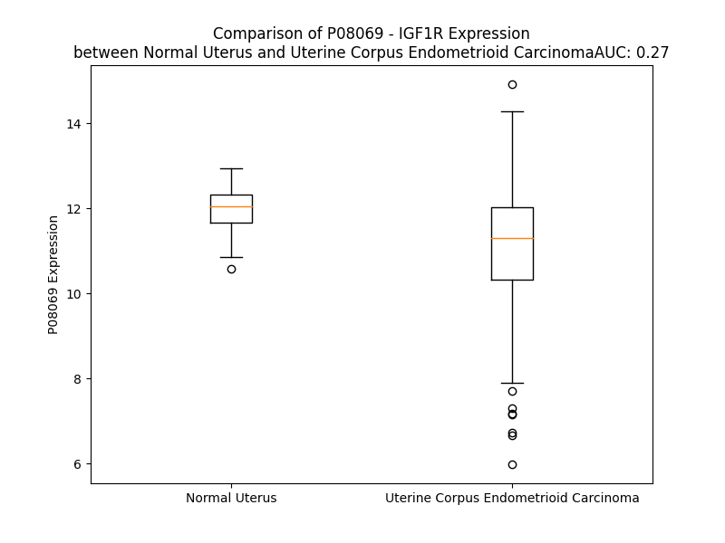

# Detailed Data for P08069

## Introduction to the Detailed Summary

### How to Interpret the Results

- **Summary & Metrics**: This section provides a quick reference to essential protein attributes, including expression changes, family classification, and biomarker applications. Regulation status (upregulated/downregulated) indicates the protein's behavior in a disease context. Some information comes from the original excel file with the proteins selected from literature, while others are derived from the analyses.
- **Expression Comparison**: A visual representation comparing protein expression between normal and disease states. It highlights significant changes in expression levels that might indicate diagnostic or therapeutic relevance. This is data coming from transcriptomics experiments and could not translate similarly to protein levels.
- **Isoform Alignment**: An interactive view of isoform alignments, revealing structural and functional differences between variants of the protein.
- **Interactors & Homologs**: Tables listing known interaction partners and homologous proteins, the more interactors and homologs, the more complex the protein is to design an antibody for.
- **Biological Assemblies**: Information about the structural arrangement of the protein in different assemblies, providing insights into its functional state but also the complexity of the protein to develop antibodies.
- **Combined Per-Residue Information**: A detailed table summarizing residue-level data. This includes predictions for epitope regions, aggregation tendencies, and modifications that might impact the protein's function. Each row corresponds to a residue in the protein, providing insights into specific sites that may be important for research or drug development.
## Summary & Metrics

- **UniProt Accession**: P08069
- **Gene Name**: IGF1R
- **Protein Name**: Insulin-like growth factor 1 receptor
- **Swiss Prot**: IGF1R_HUMAN
- **Family**: transmembrane receptor
- **Biomarker Application**: diagnosis,efficacy,prognosis,response to therapy
- **Number of Isoforms**: 0
- **Regulation**: 1
- **(transcriptomics) AUC**: 0.27
- **(transcriptomics) Fold Change**: 1.08
- **(transcriptomics) Regulation**: Downregulated
- **Discotope Epitope Count**: 362
- **Max n_uniprots (Homo)**: 8.0
- **Max n_uniprots (Hetero)**: 9.0

## Expression Comparison

## Interactors

| preferredName_A   | preferredName_B   |   score |
|:------------------|:------------------|--------:|
| IGF1R             | ESR1              |   0.999 |
| IGF1R             | SHC1              |   0.999 |
| IGF1R             | IGF1              |   0.999 |
| IGF1R             | INS               |   0.999 |
| IGF1R             | IGF2              |   0.999 |
| IGF1R             | IRS1              |   0.999 |
| IGF1R             | IRS2              |   0.998 |
| IGF1R             | EGF               |   0.997 |
| IGF1R             | INSR              |   0.997 |
| IGF1R             | SRC               |   0.996 |
| IGF1R             | GRB10             |   0.996 |
| IGF1R             | PIK3R1            |   0.994 |
| IGF1R             | PTPN1             |   0.993 |
| IGF1R             | ERBB2             |   0.993 |
| IGF1R             | PIK3R3            |   0.99  |
| IGF1R             | EGFR              |   0.989 |
| IGF1R             | GRB2              |   0.985 |
| IGF1R             | CTNNB1            |   0.985 |
| IGF1R             | APPL1             |   0.982 |
| IGF1R             | JAK2              |   0.981 |
| IGF1R             | MDM2              |   0.981 |
| IGF1R             | PIK3CA            |   0.978 |
| IGF1R             | PTK2              |   0.978 |
| IGF1R             | CAV1              |   0.971 |
| IGF1R             | PIK3CB            |   0.971 |
| IGF1R             | KRAS              |   0.971 |
| IGF1R             | IRS4              |   0.968 |
| IGF1R             | PIK3R2            |   0.964 |
| IGF1R             | JAK1              |   0.964 |
| IGF1R             | INSRR             |   0.96  |
| IGF1R             | NRAS              |   0.96  |
| IGF1R             | IGFBP3            |   0.96  |
| IGF1R             | HGF               |   0.955 |
| IGF1R             | TSHR              |   0.951 |
| IGF1R             | PIK3CD            |   0.95  |
| IGF1R             | SHC3              |   0.949 |
| IGF1R             | HRAS              |   0.949 |
| IGF1R             | KL                |   0.946 |
| IGF1R             | SHC4              |   0.945 |
| IGF1R             | INS-IGF2          |   0.937 |
| IGF1R             | GNAI1             |   0.937 |
| IGF1R             | GAB1              |   0.935 |
| IGF1R             | PTPN11            |   0.935 |
| IGF1R             | NEDD4             |   0.934 |
| IGF1R             | ERBB3             |   0.933 |
| IGF1R             | ITGB3             |   0.932 |
| IGF1R             | CRKL              |   0.931 |
| IGF1R             | GNAS              |   0.927 |
| IGF1R             | PRKACB            |   0.921 |
| IGF1R             | STAT3             |   0.921 |

## Homologs

| uniprot_id   | gene_id   |
|:-------------|:----------|
| E7EVR7       | FGFR2     |
| P29317       | EPHA2     |
| P09619       | PDGFRB    |
| E7ER61       | FLT3      |
| F8W9L4       | FGFR3     |
| X5D7M5       | NTRK3     |
| P35968       | KDR       |
| Q8IWU2       | LMTK2     |
| L7RSL3       | FLT1      |
| Q04912       | MST1R     |
| J3QLV2       | ERBB2     |
| Q96L35       | EPHB4     |
| J3KQG3       | EPHA10    |
| F8VP57       | EPHA5     |
| Q6NVW1       | EPHB2     |
| P21709       | EPHA1     |
| P29376       | LTK       |
| E7EQ23       | DDR1      |
| O15146       | MUSK      |
| A0A6Q8PHG5   | NTRK1     |
| P54764       | EPHA4     |
| B5A954       | TEK       |
| P35590       | TIE1      |
| E9PQ40       | FGFR1     |
| H7C3L9       | MERTK     |
| E9PEK4       | CSF1R     |
| H0YNK6       | TYRO3     |
| P34925       | RYK       |
| B5A927       | FLT4      |
| Q16832       | DDR2      |
| D6RJD4       | FGFR4     |
| Q01973       | ROR1      |
| Q01974       | ROR2      |
| P54762       | EPHB1     |
| Q5VWE5       | NTRK2     |
| P30530       | AXL       |
| A0A7P0T9L5   | EPHA7     |
| P08922       | ROS1      |
| Q504U8       | EGFR      |
| E9PDR1       | ERBB4     |
| A0A087WZL3   | ALK       |
| O75812       | ERBB3     |
| A0A087WTE3   | EPHB6     |
| P54753       | EPHB3     |
| H0Y8K5       | EPHA6     |
| P06213       | INSR      |
| P14616       | INSRR     |
| C9JXA2       | EPHA3     |
| E6Y365       | MET       |
| P29322       | EPHA8     |
| P16234       | PDGFRA    |
| A0A8J8Z860   | KIT       |
| A0A087WWB1   | RET       |

## Biological Assemblies

|   Unnamed: 0 |   assembly |   n_uniprots | composition   | crystal_id   |
|-------------:|-----------:|-------------:|:--------------|:-------------|
|            0 |          1 |            1 | Homo          | 3f5p         |
|            1 |          2 |            1 | Homo          | 3f5p         |
|            2 |          3 |            1 | Homo          | 3f5p         |
|            3 |          4 |            1 | Homo          | 3f5p         |
|            4 |          5 |            1 | Homo          | 3f5p         |
|            5 |          6 |            1 | Homo          | 3f5p         |
|            6 |          7 |            1 | Homo          | 3f5p         |
|            7 |          8 |            1 | Homo          | 3f5p         |
|            8 |          9 |            1 | Homo          | 3f5p         |
|            9 |         10 |            1 | Homo          | 3f5p         |
|           10 |         11 |            1 | Homo          | 3f5p         |
|           11 |         12 |            1 | Homo          | 3f5p         |
|           12 |         13 |            1 | Homo          | 3f5p         |
|           13 |         14 |            1 | Homo          | 3f5p         |
|           14 |         15 |            1 | Homo          | 3f5p         |
|           15 |         16 |            1 | Homo          | 3f5p         |
|           16 |         17 |            8 | Homo          | 3f5p         |
|            0 |          1 |            5 | Hetero        | 4xss         |
|            1 |          2 |            5 | Hetero        | 4xss         |
|            0 |          1 |            2 | Homo          | 6vwj         |
|            0 |          1 |            4 | Homo          | 7u23         |
|            0 |          1 |            1 | Homo          | 3i81         |
|            0 |          1 |            1 | Homo          | 3d94         |
|            0 |          1 |            3 | Homo          | 1igr         |
|            0 |          1 |            6 | Hetero        | 8tan         |
|            0 |          1 |            1 | Homo          | 1jqh         |
|            1 |          2 |            1 | Homo          | 1jqh         |
|            2 |          3 |            1 | Homo          | 1jqh         |
|            0 |          1 |            1 | Homo          | 1p4o         |
|            1 |          2 |            1 | Homo          | 1p4o         |
|            2 |          3 |            2 | Homo          | 1p4o         |
|            0 |          1 |            1 | Homo          | 5fxr         |
|            0 |          1 |            3 | Hetero        | 6vwg         |
|            0 |          1 |            2 | Homo          | 7xlc         |
|            0 |          1 |            1 | Homo          | 3nw5         |
|            0 |          1 |            5 | Hetero        | 7s8v         |
|            0 |          1 |            1 | Homo          | 2oj9         |
|            0 |          1 |            1 | Homo          | 5fxs         |
|            0 |          1 |            1 | Homo          | 3nw7         |
|            0 |          1 |            4 | Hetero        | 7yrr         |
|            0 |          1 |            6 | Hetero        | 7s0q         |
|            0 |          1 |            5 | Homo          | 5u8r         |
|            0 |          1 |            1 | Homo          | 7ph8         |
|            0 |          1 |            3 | Hetero        | 6vwi         |
|            0 |          1 |            2 | Hetero        | 1k3a         |
|            0 |          1 |            2 | Homo          | 6vwh         |
|            0 |          1 |            4 | Hetero        | 7v3p         |
|            0 |          1 |            1 | Homo          | 3o23         |
|            0 |          1 |            9 | Hetero        | 6jk8         |
|            0 |          1 |            1 | Homo          | 4d2r         |
|            0 |          1 |            1 | Homo          | 3lw0         |
|            1 |          2 |            1 | Homo          | 3lw0         |
|            2 |          3 |            1 | Homo          | 3lw0         |
|            3 |          4 |            1 | Homo          | 3lw0         |
|            0 |          1 |            1 | Homo          | 3lvp         |
|            1 |          2 |            1 | Homo          | 3lvp         |
|            2 |          3 |            1 | Homo          | 3lvp         |
|            3 |          4 |            1 | Homo          | 3lvp         |
|            0 |          1 |            1 | Homo          | 3qqu         |
|            1 |          2 |            1 | Homo          | 3qqu         |
|            2 |          3 |            1 | Homo          | 3qqu         |
|            3 |          4 |            1 | Homo          | 3qqu         |
|            0 |          1 |            1 | Homo          | 1m7n         |
|            1 |          2 |            1 | Homo          | 1m7n         |
|            0 |          1 |            1 | Homo          | 2zm3         |
|            1 |          2 |            1 | Homo          | 2zm3         |
|            2 |          3 |            1 | Homo          | 2zm3         |
|            3 |          4 |            1 | Homo          | 2zm3         |
|            4 |          5 |            4 | Homo          | 2zm3         |
|            0 |          1 |            7 | Hetero        | 5u8q         |
|            0 |          1 |            1 | Homo          | 5hzn         |
|            1 |          2 |            1 | Homo          | 5hzn         |
|            2 |          3 |            1 | Homo          | 5hzn         |
|            3 |          4 |            1 | Homo          | 5hzn         |
|            4 |          5 |            1 | Homo          | 5hzn         |
|            5 |          6 |            1 | Homo          | 5hzn         |
|            6 |          7 |            1 | Homo          | 5hzn         |
|            7 |          8 |            1 | Homo          | 5hzn         |
|            0 |          1 |            1 | Homo          | 5fxq         |
|            0 |          1 |            1 | Homo          | 3nw6         |
|            0 |          1 |            2 | Homo          | 7xgd         |

## Combined Per-Residue Information

|   res | aa   |   epitope_score | epitope   |   relative_surface_accessibility |   modeling_confidence |   Aggregation | modification                      | glycosylation                   |
|------:|:-----|----------------:|:----------|---------------------------------:|----------------------:|--------------:|:----------------------------------|:--------------------------------|
|     1 | M    |         0.13794 | True      |                          1.30841 |                 38.37 |         0     | N/A                               | N/A                             |
|     2 | K    |         0.12305 | True      |                          0.97698 |                 34.84 |         0     | N/A                               | N/A                             |
|     3 | S    |         0.13117 | True      |                          0.80636 |                 38.09 |         0     | N/A                               | N/A                             |
|     4 | G    |         0.10191 | True      |                          0.94924 |                 40.56 |         0     | N/A                               | N/A                             |
|     5 | S    |         0.15891 | True      |                          0.92524 |                 38.26 |         0     | N/A                               | N/A                             |
|     6 | G    |         0.11326 | True      |                          0.97508 |                 38.2  |         0     | N/A                               | N/A                             |
|     7 | G    |         0.15215 | True      |                          0.98513 |                 35.64 |         0     | N/A                               | N/A                             |
|     8 | G    |         0.12684 | True      |                          0.9883  |                 36.25 |         0     | N/A                               | N/A                             |
|     9 | S    |         0.14448 | True      |                          0.87174 |                 38.15 |         0     | N/A                               | N/A                             |
|    10 | P    |         0.1293  | True      |                          0.89782 |                 55.93 |         0.02  | N/A                               | N/A                             |
|    11 | T    |         0.17518 | True      |                          1.02173 |                 38.77 |         3.946 | N/A                               | N/A                             |
|    12 | S    |         0.12839 | True      |                          0.79809 |                 36.82 |        10.545 | N/A                               | N/A                             |
|    13 | L    |         0.22613 | True      |                          0.94727 |                 38.69 |        63.749 | N/A                               | N/A                             |
|    14 | W    |         0.17581 | True      |                          1.04965 |                 38.41 |        73.433 | N/A                               | N/A                             |
|    15 | G    |         0.15871 | True      |                          0.75823 |                 36.24 |        75.581 | N/A                               | N/A                             |
|    16 | L    |         0.18712 | True      |                          0.93428 |                 37.24 |        88.736 | N/A                               | N/A                             |
|    17 | L    |         0.25115 | True      |                          1.09194 |                 39.51 |        90.898 | N/A                               | N/A                             |
|    18 | F    |         0.17921 | True      |                          0.80195 |                 35.02 |        90.853 | N/A                               | N/A                             |
|    19 | L    |         0.16747 | True      |                          0.90073 |                 37.54 |        85.271 | N/A                               | N/A                             |
|    20 | S    |         0.14329 | True      |                          0.85296 |                 36.46 |        53.718 | N/A                               | N/A                             |
|    21 | A    |         0.15736 | True      |                          0.80382 |                 31.56 |        48.47  | N/A                               | N/A                             |
|    22 | A    |         0.2281  | True      |                          0.92791 |                 29.67 |        43.811 | N/A                               | N/A                             |
|    23 | L    |         0.21444 | True      |                          1.134   |                 27.47 |        39.839 | N/A                               | N/A                             |
|    24 | S    |         0.21274 | True      |                          0.77345 |                 28.4  |        18.141 | N/A                               | N/A                             |
|    25 | L    |         0.14427 | True      |                          1.13948 |                 25.05 |        15.452 | N/A                               | N/A                             |
|    26 | W    |         0.13806 | True      |                          0.98687 |                 25.36 |         0.758 | N/A                               | N/A                             |
|    27 | P    |         0.06389 | False     |                          0.93964 |                 27.44 |         0.353 | N/A                               | N/A                             |
|    28 | T    |         0.11879 | True      |                          1.0012  |                 31.47 |         0     | N/A                               | N/A                             |
|    29 | S    |         0.06166 | False     |                          0.72396 |                 50.71 |         0     | N/A                               | N/A                             |
|    30 | G    |         0.03536 | False     |                          0.49717 |                 63.5  |         0     | N/A                               | N/A                             |
|    31 | E    |         0.04523 | False     |                          0.48395 |                 89    |         0     | N/A                               | N/A                             |
|    32 | I    |         0.04828 | False     |                          0.41429 |                 92.14 |         0     | N/A                               | N/A                             |
|    33 | C    |         0.03712 | False     |                          0.18808 |                 93.79 |         0     | N/A                               | N/A                             |
|    34 | G    |         0.16711 | True      |                          0.53964 |                 87.39 |         0     | N/A                               | N/A                             |
|    35 | P    |         0.09685 | False     |                          0.91842 |                 82.91 |         0     | N/A                               | N/A                             |
|    36 | G    |         0.04532 | False     |                          0.26512 |                 86.83 |         0     | N/A                               | N/A                             |
|    37 | I    |         0.03531 | False     |                          0.0552  |                 93.76 |         0     | N/A                               | N/A                             |
|    38 | D    |         0.07517 | False     |                          0.25035 |                 91.96 |         0     | N/A                               | N/A                             |
|    39 | I    |         0.00571 | False     |                          0       |                 91.09 |         0     | N/A                               | N/A                             |
|    40 | R    |         0.10563 | True      |                          0.2653  |                 86.93 |         0     | N/A                               | N/A                             |
|    41 | N    |         0.13312 | True      |                          0.57155 |                 83.55 |         0     | N/A                               | N/A                             |
|    42 | D    |         0.14045 | True      |                          0.39324 |                 83.13 |         0     | N/A                               | N/A                             |
|    43 | Y    |         0.07925 | False     |                          0.2002  |                 83.9  |         0     | N/A                               | N/A                             |
|    44 | Q    |         0.20242 | True      |                          0.54732 |                 84.12 |         0     | N/A                               | N/A                             |
|    45 | Q    |         0.07904 | False     |                          0.31508 |                 88.45 |         0     | N/A                               | N/A                             |
|    46 | L    |         0.01696 | False     |                          0.01319 |                 88.77 |         0     | N/A                               | N/A                             |
|    47 | K    |         0.09293 | False     |                          0.59024 |                 89.5  |         0     | N/A                               | N/A                             |
|    48 | R    |         0.11039 | True      |                          0.498   |                 90.92 |         0     | N/A                               | N/A                             |
|    49 | L    |         0.00375 | False     |                          0.00348 |                 93.09 |         0     | N/A                               | N/A                             |
|    50 | E    |         0.12903 | True      |                          0.47406 |                 90.45 |         0     | N/A                               | N/A                             |
|    51 | N    |         0.03956 | False     |                          0.43187 |                 91.68 |         0     | N/A                               | N-linked (GlcNAc...) asparagine |
|    52 | C    |         0.01087 | False     |                          0.00187 |                 94.68 |         0     | N/A                               | N/A                             |
|    53 | T    |         0.01578 | False     |                          0.21237 |                 95.24 |         0     | N/A                               | N/A                             |
|    54 | V    |         0.03523 | False     |                          0.10282 |                 95.65 |         0     | N/A                               | N/A                             |
|    55 | I    |         0.005   | False     |                          0       |                 96.79 |         0     | N/A                               | N/A                             |
|    56 | E    |         0.02658 | False     |                          0.07852 |                 94.63 |         0     | N/A                               | N/A                             |
|    57 | G    |         0.01262 | False     |                          0.0598  |                 93.51 |         5.846 | N/A                               | N/A                             |
|    58 | Y    |         0.03622 | False     |                          0.31284 |                 94.52 |        70.942 | N/A                               | N/A                             |
|    59 | L    |         0.0023  | False     |                          0       |                 97.3  |        72.097 | N/A                               | N/A                             |
|    60 | H    |         0.06071 | False     |                          0.10949 |                 95.7  |        72.252 | N/A                               | N/A                             |
|    61 | I    |         0.0052  | False     |                          0.0032  |                 93.76 |        74.526 | N/A                               | N/A                             |
|    62 | L    |         0.01363 | False     |                          0.00082 |                 91.72 |        74.526 | N/A                               | N/A                             |
|    63 | L    |         0.13837 | True      |                          0.2531  |                 85.93 |        74.398 | N/A                               | N/A                             |
|    64 | I    |         0.03255 | False     |                          0.00358 |                 84    |        73.428 | N/A                               | N/A                             |
|    65 | S    |         0.21538 | True      |                          0.72742 |                 70.02 |        10.103 | N/A                               | N/A                             |
|    66 | K    |         0.07905 | False     |                          0.60032 |                 63.74 |         0     | N/A                               | N/A                             |
|    67 | A    |         0.208   | True      |                          0.78143 |                 55.27 |         0     | N/A                               | N/A                             |
|    68 | E    |         0.10209 | True      |                          0.43425 |                 59.35 |         0     | N/A                               | N/A                             |
|    69 | D    |         0.12278 | True      |                          0.51416 |                 60.03 |         0     | N/A                               | N/A                             |
|    70 | Y    |         0.0615  | False     |                          0.08843 |                 68.42 |         0     | N/A                               | N/A                             |
|    71 | R    |         0.1698  | True      |                          0.82077 |                 62.8  |         0     | N/A                               | N/A                             |
|    72 | S    |         0.16028 | True      |                          0.70887 |                 67.91 |         0     | N/A                               | N/A                             |
|    73 | Y    |         0.14075 | True      |                          0.21308 |                 82.63 |         0     | N/A                               | N/A                             |
|    74 | R    |         0.06496 | False     |                          0.53117 |                 90.8  |         0     | N/A                               | N/A                             |
|    75 | F    |         0.02132 | False     |                          0.04474 |                 93.54 |         0     | N/A                               | N/A                             |
|    76 | P    |         0.09697 | False     |                          0.52809 |                 93.27 |         0.009 | N/A                               | N/A                             |
|    77 | K    |         0.04334 | False     |                          0.4663  |                 94.55 |         2.425 | N/A                               | N/A                             |
|    78 | L    |         0.00284 | False     |                          0.0033  |                 96.51 |        48.369 | N/A                               | N/A                             |
|    79 | T    |         0.00974 | False     |                          0.14316 |                 96.03 |        56.616 | N/A                               | N/A                             |
|    80 | V    |         0.02577 | False     |                          0.05522 |                 96.41 |        70.904 | N/A                               | N/A                             |
|    81 | I    |         0.00153 | False     |                          0.0008  |                 97.43 |        72.118 | N/A                               | N/A                             |
|    82 | T    |         0.00759 | False     |                          0.00434 |                 95.66 |        72.227 | N/A                               | N/A                             |
|    83 | E    |         0.04289 | False     |                          0.06267 |                 95.5  |        71.499 | N/A                               | N/A                             |
|    84 | Y    |         0.0213  | False     |                          0.09349 |                 95.24 |        96.768 | N/A                               | N/A                             |
|    85 | L    |         0.00219 | False     |                          0       |                 97.78 |        96.769 | N/A                               | N/A                             |
|    86 | L    |         0.00978 | False     |                          0.0033  |                 96.53 |        96.753 | N/A                               | N/A                             |
|    87 | L    |         0.0025  | False     |                          0       |                 95.97 |        96.666 | N/A                               | N/A                             |
|    88 | F    |         0.01465 | False     |                          0.00255 |                 93.84 |        96.494 | N/A                               | N/A                             |
|    89 | R    |         0.22933 | True      |                          0.4482  |                 89.37 |        69.118 | N/A                               | N/A                             |
|    90 | V    |         0.01228 | False     |                          0.00733 |                 88.81 |        67.674 | N/A                               | N/A                             |
|    91 | A    |         0.06884 | False     |                          0.23286 |                 85.49 |        50.676 | N/A                               | N/A                             |
|    92 | G    |         0.04327 | False     |                          0.28333 |                 84.77 |        36.306 | N/A                               | N/A                             |
|    93 | L    |         0.00719 | False     |                          0.00885 |                 89    |        30.695 | N/A                               | N/A                             |
|    94 | E    |         0.04183 | False     |                          0.42864 |                 90.54 |         0.044 | N/A                               | N/A                             |
|    95 | S    |         0.04318 | False     |                          0.11361 |                 92.85 |         0.003 | N/A                               | N/A                             |
|    96 | L    |         0.0025  | False     |                          0       |                 93.56 |         0.003 | N/A                               | N/A                             |
|    97 | G    |         0.00975 | False     |                          0.07797 |                 91    |         0     | N/A                               | N/A                             |
|    98 | D    |         0.04503 | False     |                          0.39341 |                 87.94 |         0     | N/A                               | N/A                             |
|    99 | L    |         0.00858 | False     |                          0.00412 |                 91.73 |         0     | N/A                               | N/A                             |
|   100 | F    |         0.00347 | False     |                          0.00609 |                 95.34 |         0     | N/A                               | N/A                             |
|   101 | P    |         0.02368 | False     |                          0.05317 |                 94.45 |         0     | N/A                               | N/A                             |
|   102 | N    |         0.02741 | False     |                          0.3261  |                 95.55 |         0.219 | N/A                               | N-linked (GlcNAc...) asparagine |
|   103 | L    |         0.00242 | False     |                          0.00244 |                 97.56 |         0.219 | N/A                               | N/A                             |
|   104 | T    |         0.01089 | False     |                          0.04168 |                 96.35 |         0.219 | N/A                               | N/A                             |
|   105 | V    |         0.00179 | False     |                          0.00286 |                 96.46 |         0.219 | N/A                               | N/A                             |
|   106 | I    |         0.00162 | False     |                          0       |                 97.1  |         0.219 | N/A                               | N/A                             |
|   107 | R    |         0.04249 | False     |                          0.10396 |                 95.13 |         0     | N/A                               | N/A                             |
|   108 | G    |         0.00275 | False     |                          0       |                 90.23 |         0.137 | N/A                               | N/A                             |
|   109 | W    |         0.0467  | False     |                          0.42851 |                 89.78 |         1.663 | N/A                               | N/A                             |
|   110 | K    |         0.12255 | True      |                          0.53156 |                 85.65 |         1.886 | N/A                               | N/A                             |
|   111 | L    |         0.02739 | False     |                          0.28317 |                 83.12 |        83.166 | N/A                               | N/A                             |
|   112 | F    |         0.03518 | False     |                          0.0489  |                 81.59 |        98.052 | N/A                               | N/A                             |
|   113 | Y    |         0.10269 | True      |                          0.30189 |                 77.44 |        98.218 | N/A                               | N/A                             |
|   114 | N    |         0.1602  | True      |                          0.69607 |                 76.93 |        98.266 | N/A                               | N/A                             |
|   115 | Y    |         0.02064 | False     |                          0.02656 |                 83.81 |        99.476 | N/A                               | N/A                             |
|   116 | A    |         0.00085 | False     |                          0       |                 93.55 |        99.802 | N/A                               | N/A                             |
|   117 | L    |         0.00218 | False     |                          0       |                 97.45 |        99.801 | N/A                               | N/A                             |
|   118 | V    |         0.00275 | False     |                          0       |                 95.93 |        99.793 | N/A                               | N/A                             |
|   119 | I    |         0.00499 | False     |                          0       |                 97.29 |        99.7   | N/A                               | N/A                             |
|   120 | F    |         0.05205 | False     |                          0.01529 |                 93.25 |        92.351 | N/A                               | N/A                             |
|   121 | E    |         0.14582 | True      |                          0.15031 |                 91.7  |         1.919 | N/A                               | N/A                             |
|   122 | M    |         0.00818 | False     |                          0.00072 |                 92.26 |         1.334 | N/A                               | N/A                             |
|   123 | T    |         0.18641 | True      |                          0.56378 |                 83.29 |         0.666 | N/A                               | N/A                             |
|   124 | N    |         0.08386 | False     |                          0.35738 |                 89.54 |         0.269 | N/A                               | N/A                             |
|   125 | L    |         0.00179 | False     |                          0.00224 |                 93.5  |         0.264 | N/A                               | N/A                             |
|   126 | K    |         0.02513 | False     |                          0.48581 |                 92.57 |         0.033 | N/A                               | N/A                             |
|   127 | D    |         0.01244 | False     |                          0.10697 |                 95    |         0     | N/A                               | N/A                             |
|   128 | I    |         0.00705 | False     |                          0.0072  |                 96.28 |         0.209 | N/A                               | N/A                             |
|   129 | G    |         0.00223 | False     |                          0.00161 |                 94.52 |         0.209 | N/A                               | N/A                             |
|   130 | L    |         0.0041  | False     |                          0.00577 |                 96.82 |         0.209 | N/A                               | N/A                             |
|   131 | Y    |         0.03366 | False     |                          0.09049 |                 95.2  |         0.209 | N/A                               | N/A                             |
|   132 | N    |         0.01357 | False     |                          0.17534 |                 95.39 |         0.209 | N/A                               | N/A                             |
|   133 | L    |         0.01023 | False     |                          0.0319  |                 96.99 |         0.209 | N/A                               | N/A                             |
|   134 | R    |         0.05613 | False     |                          0.14387 |                 94.12 |         0     | N/A                               | N/A                             |
|   135 | N    |         0.03639 | False     |                          0.19644 |                 94.68 |         0     | N/A                               | N-linked (GlcNAc...) asparagine |
|   136 | I    |         0.01069 | False     |                          0.02247 |                 94.88 |         0     | N/A                               | N/A                             |
|   137 | T    |         0.04437 | False     |                          0.48111 |                 90.85 |         0     | N/A                               | N/A                             |
|   138 | R    |         0.0473  | False     |                          0.55499 |                 87.82 |         0     | N/A                               | N/A                             |
|   139 | G    |         0.01542 | False     |                          0.18874 |                 81.44 |         0     | N/A                               | N/A                             |
|   140 | A    |         0.0202  | False     |                          0.04065 |                 87.82 |         0     | N/A                               | N/A                             |
|   141 | I    |         0.00435 | False     |                          0       |                 93.76 |         0     | N/A                               | N/A                             |
|   142 | R    |         0.00874 | False     |                          0.00195 |                 93.14 |         0     | N/A                               | N/A                             |
|   143 | I    |         0.00545 | False     |                          0       |                 96.51 |         0     | N/A                               | N/A                             |
|   144 | E    |         0.08643 | False     |                          0.04806 |                 92.11 |         0     | N/A                               | N/A                             |
|   145 | K    |         0.11826 | True      |                          0.44334 |                 90.22 |         0     | N/A                               | N/A                             |
|   146 | N    |         0.00649 | False     |                          0       |                 94.34 |         0     | N/A                               | N/A                             |
|   147 | A    |         0.15867 | True      |                          0.68235 |                 88.68 |         0     | N/A                               | N/A                             |
|   148 | D    |         0.06378 | False     |                          0.33007 |                 91.77 |         0     | N/A                               | N/A                             |
|   149 | L    |         0.00276 | False     |                          0       |                 95.27 |         0.141 | N/A                               | N/A                             |
|   150 | C    |         0.03935 | False     |                          0.10734 |                 94.29 |         0.141 | N/A                               | N/A                             |
|   151 | Y    |         0.04828 | False     |                          0.13174 |                 94.51 |         0.478 | N/A                               | N/A                             |
|   152 | L    |         0.01754 | False     |                          0.14871 |                 93.02 |         0.478 | N/A                               | N/A                             |
|   153 | S    |         0.07799 | False     |                          0.42726 |                 90.31 |         0.478 | N/A                               | N/A                             |
|   154 | T    |         0.01526 | False     |                          0.07141 |                 92.7  |         0.478 | N/A                               | N/A                             |
|   155 | V    |         0.01146 | False     |                          0.01552 |                 94.19 |         0.478 | N/A                               | N/A                             |
|   156 | D    |         0.0172  | False     |                          0.02442 |                 93.99 |         0     | N/A                               | N/A                             |
|   157 | W    |         0.01352 | False     |                          0.08431 |                 93.31 |         1.393 | N/A                               | N/A                             |
|   158 | S    |         0.08394 | False     |                          0.57125 |                 90.84 |         1.393 | N/A                               | N/A                             |
|   159 | L    |         0.05525 | False     |                          0.57452 |                 90.37 |         1.393 | N/A                               | N/A                             |
|   160 | I    |         0.01438 | False     |                          0.02623 |                 93.33 |         1.393 | N/A                               | N/A                             |
|   161 | L    |         0.02706 | False     |                          0.0397  |                 90.92 |         1.393 | N/A                               | N/A                             |
|   162 | D    |         0.072   | False     |                          0.9178  |                 83.65 |         0     | N/A                               | N/A                             |
|   163 | A    |         0.05432 | False     |                          0.36078 |                 77.45 |         0     | N/A                               | N/A                             |
|   164 | V    |         0.03381 | False     |                          0.4135  |                 82.8  |         0     | N/A                               | N/A                             |
|   165 | S    |         0.06744 | False     |                          0.82677 |                 76.84 |         0     | N/A                               | N/A                             |
|   166 | N    |         0.05467 | False     |                          0.59817 |                 78.52 |         0     | N/A                               | N/A                             |
|   167 | N    |         0.05496 | False     |                          0.18905 |                 87.27 |         0     | N/A                               | N/A                             |
|   168 | Y    |         0.06918 | False     |                          0.12414 |                 86.42 |         0     | N/A                               | N/A                             |
|   169 | I    |         0.05367 | False     |                          0.35676 |                 91.98 |         0     | N/A                               | N/A                             |
|   170 | V    |         0.17587 | True      |                          0.38083 |                 87.18 |         0     | N/A                               | N/A                             |
|   171 | G    |         0.19733 | True      |                          0.64474 |                 83.89 |         0     | N/A                               | N/A                             |
|   172 | N    |         0.07047 | False     |                          0.1277  |                 92.46 |         0     | N/A                               | N/A                             |
|   173 | K    |         0.07363 | False     |                          0.28437 |                 90.5  |         0     | N/A                               | N/A                             |
|   174 | P    |         0.08242 | False     |                          0.45032 |                 86.49 |         0     | N/A                               | N/A                             |
|   175 | P    |         0.08941 | False     |                          0.65014 |                 83.94 |         0     | N/A                               | N/A                             |
|   176 | K    |         0.13201 | True      |                          1.00116 |                 81.77 |         0     | N/A                               | N/A                             |
|   177 | E    |         0.13705 | True      |                          0.62149 |                 84.87 |         0     | N/A                               | N/A                             |
|   178 | C    |         0.0508  | False     |                          0.21923 |                 85.79 |         0     | N/A                               | N/A                             |
|   179 | G    |         0.08083 | False     |                          0.62278 |                 80.61 |         0     | N/A                               | N/A                             |
|   180 | D    |         0.04995 | False     |                          0.23436 |                 85.65 |         0     | N/A                               | N/A                             |
|   181 | L    |         0.07817 | False     |                          0.552   |                 87.18 |         0     | N/A                               | N/A                             |
|   182 | C    |         0.05412 | False     |                          0.05816 |                 89.16 |         0     | N/A                               | N/A                             |
|   183 | P    |         0.05163 | False     |                          0.12149 |                 86.54 |         0     | N/A                               | N/A                             |
|   184 | G    |         0.06766 | False     |                          0.19439 |                 73.24 |         0     | N/A                               | N/A                             |
|   185 | T    |         0.15121 | True      |                          0.32087 |                 67.27 |         0     | N/A                               | N/A                             |
|   186 | M    |         0.16412 | True      |                          0.92242 |                 63.84 |         0     | N/A                               | N/A                             |
|   187 | E    |         0.19654 | True      |                          0.59799 |                 63.04 |         0     | N/A                               | N/A                             |
|   188 | E    |         0.12706 | True      |                          0.95527 |                 57.28 |         0     | N/A                               | N/A                             |
|   189 | K    |         0.16094 | True      |                          0.85016 |                 62.95 |         0     | N/A                               | N/A                             |
|   190 | P    |         0.14845 | True      |                          0.44734 |                 65.58 |         0     | N/A                               | N/A                             |
|   191 | M    |         0.18016 | True      |                          0.74203 |                 81.43 |         0     | N/A                               | N/A                             |
|   192 | C    |         0.07444 | False     |                          0.06066 |                 88.24 |         0     | N/A                               | N/A                             |
|   193 | E    |         0.08552 | False     |                          0.5291  |                 88.16 |         0     | N/A                               | N/A                             |
|   194 | K    |         0.1141  | True      |                          0.36112 |                 87.77 |         0     | N/A                               | N/A                             |
|   195 | T    |         0.05247 | False     |                          0.19803 |                 88.14 |         0     | N/A                               | N/A                             |
|   196 | T    |         0.11263 | True      |                          0.68246 |                 85.62 |         0     | N/A                               | N/A                             |
|   197 | I    |         0.06965 | False     |                          0.29126 |                 80.31 |         0     | N/A                               | N/A                             |
|   198 | N    |         0.2541  | True      |                          0.8825  |                 70.53 |         0     | N/A                               | N/A                             |
|   199 | N    |         0.18055 | True      |                          0.96736 |                 77.02 |         0     | N/A                               | N/A                             |
|   200 | E    |         0.11566 | True      |                          0.64419 |                 78.05 |         0     | N/A                               | N/A                             |
|   201 | Y    |         0.2949  | True      |                          0.6165  |                 83.5  |         0     | N/A                               | N/A                             |
|   202 | N    |         0.11067 | True      |                          0.50989 |                 86.82 |         0     | N/A                               | N/A                             |
|   203 | Y    |         0.0627  | False     |                          0.19835 |                 90.94 |         0     | N/A                               | N/A                             |
|   204 | R    |         0.06218 | False     |                          0.0282  |                 93.41 |         0     | N/A                               | N/A                             |
|   205 | C    |         0.00282 | False     |                          0       |                 94.29 |         0     | N/A                               | N/A                             |
|   206 | W    |         0.00363 | False     |                          0.00622 |                 95.48 |         0     | N/A                               | N/A                             |
|   207 | T    |         0.02114 | False     |                          0.08573 |                 93.18 |         0     | N/A                               | N/A                             |
|   208 | T    |         0.06914 | False     |                          0.54099 |                 90.41 |         0     | N/A                               | N/A                             |
|   209 | N    |         0.10899 | True      |                          0.75594 |                 90.62 |         0     | N/A                               | N/A                             |
|   210 | R    |         0.08685 | False     |                          0.36157 |                 93.61 |         0     | N/A                               | N/A                             |
|   211 | C    |         0.07911 | False     |                          0.23048 |                 93.61 |         0     | N/A                               | N/A                             |
|   212 | Q    |         0.03276 | False     |                          0.0531  |                 94.64 |         0     | N/A                               | N/A                             |
|   213 | K    |         0.062   | False     |                          0.35929 |                 92.68 |         0     | N/A                               | N/A                             |
|   214 | M    |         0.05329 | False     |                          0.15684 |                 91.22 |         0     | N/A                               | N/A                             |
|   215 | C    |         0.09404 | False     |                          0.36335 |                 91.85 |         0     | N/A                               | N/A                             |
|   216 | P    |         0.11625 | True      |                          0.33146 |                 91.84 |         0     | N/A                               | N/A                             |
|   217 | S    |         0.10816 | True      |                          0.86339 |                 89.45 |         0     | N/A                               | N/A                             |
|   218 | T    |         0.11342 | True      |                          0.8005  |                 93.02 |         0     | N/A                               | N/A                             |
|   219 | C    |         0.01997 | False     |                          0.00977 |                 92.36 |         0     | N/A                               | N/A                             |
|   220 | G    |         0.16554 | True      |                          0.77845 |                 89.17 |         0     | N/A                               | N/A                             |
|   221 | K    |         0.13247 | True      |                          1.00588 |                 86.56 |         0     | N/A                               | N/A                             |
|   222 | R    |         0.16021 | True      |                          0.44719 |                 91.8  |         0     | N/A                               | N/A                             |
|   223 | A    |         0.00862 | False     |                          0.10228 |                 92.53 |         0     | N/A                               | N/A                             |
|   224 | C    |         0.00334 | False     |                          0.00074 |                 94.36 |         0     | N/A                               | N/A                             |
|   225 | T    |         0.04714 | False     |                          0.06605 |                 93.44 |         0     | N/A                               | N/A                             |
|   226 | E    |         0.04868 | False     |                          0.6996  |                 86.85 |         0     | N/A                               | N/A                             |
|   227 | N    |         0.08896 | False     |                          0.77504 |                 89.65 |         0     | N/A                               | N/A                             |
|   228 | N    |         0.10416 | True      |                          0.52999 |                 89.85 |         0     | N/A                               | N/A                             |
|   229 | E    |         0.10659 | True      |                          0.4111  |                 95.52 |         0     | N/A                               | N/A                             |
|   230 | C    |         0.1286  | True      |                          0.28881 |                 96.07 |         0     | N/A                               | N/A                             |
|   231 | C    |         0.01638 | False     |                          0.00592 |                 96.34 |         0     | N/A                               | N/A                             |
|   232 | H    |         0.04537 | False     |                          0.26627 |                 96.99 |         0     | N/A                               | N/A                             |
|   233 | P    |         0.12193 | True      |                          0.43956 |                 95.63 |         0     | N/A                               | N/A                             |
|   234 | E    |         0.04615 | False     |                          0.10894 |                 95.98 |         0     | N/A                               | N/A                             |
|   235 | C    |         0.02876 | False     |                          0.02813 |                 96.03 |         0     | N/A                               | N/A                             |
|   236 | L    |         0.0199  | False     |                          0.15992 |                 93.01 |         0     | N/A                               | N/A                             |
|   237 | G    |         0.01291 | False     |                          0.07319 |                 89.54 |         0     | N/A                               | N/A                             |
|   238 | S    |         0.02153 | False     |                          0.20396 |                 93.36 |         0     | N/A                               | N/A                             |
|   239 | C    |         0.02204 | False     |                          0.05578 |                 94.19 |         0     | N/A                               | N/A                             |
|   240 | S    |         0.08005 | False     |                          0.7785  |                 92.51 |         0     | N/A                               | N/A                             |
|   241 | A    |         0.06211 | False     |                          0.33416 |                 93.77 |         0     | N/A                               | N/A                             |
|   242 | P    |         0.18889 | True      |                          0.44068 |                 94.44 |         0     | N/A                               | N/A                             |
|   243 | D    |         0.13977 | True      |                          0.64115 |                 94.01 |         0     | N/A                               | N/A                             |
|   244 | N    |         0.06832 | False     |                          0.34338 |                 95.09 |         0     | N/A                               | N-linked (GlcNAc...) asparagine |
|   245 | D    |         0.07167 | False     |                          0.29221 |                 93.75 |         0     | N/A                               | N/A                             |
|   246 | T    |         0.15865 | True      |                          0.60298 |                 95.06 |         0.153 | N/A                               | N/A                             |
|   247 | A    |         0.02766 | False     |                          0.10548 |                 94.39 |         0.153 | N/A                               | N/A                             |
|   248 | C    |         0.03961 | False     |                          0.18851 |                 94.24 |         0.153 | N/A                               | N/A                             |
|   249 | V    |         0.02018 | False     |                          0.35165 |                 93.05 |         0.153 | N/A                               | N/A                             |
|   250 | A    |         0.00798 | False     |                          0.09693 |                 93.36 |         0.153 | N/A                               | N/A                             |
|   251 | C    |         0.03782 | False     |                          0.10044 |                 94.96 |         0     | N/A                               | N/A                             |
|   252 | R    |         0.05511 | False     |                          0.43148 |                 92.47 |         0     | N/A                               | N/A                             |
|   253 | H    |         0.07793 | False     |                          0.33963 |                 93.83 |         0     | N/A                               | N/A                             |
|   254 | Y    |         0.02021 | False     |                          0.18517 |                 95.43 |         0.978 | N/A                               | N/A                             |
|   255 | Y    |         0.04516 | False     |                          0.29308 |                 95.55 |         1.665 | N/A                               | N/A                             |
|   256 | Y    |         0.19477 | True      |                          0.35757 |                 95.33 |         1.665 | N/A                               | N/A                             |
|   257 | A    |         0.11437 | True      |                          0.78954 |                 91.86 |         1.665 | N/A                               | N/A                             |
|   258 | G    |         0.02949 | False     |                          0.38014 |                 90.77 |         1.665 | N/A                               | N/A                             |
|   259 | V    |         0.07589 | False     |                          0.31514 |                 95.8  |         1.665 | N/A                               | N/A                             |
|   260 | C    |         0.05501 | False     |                          0.05804 |                 96.61 |         0.141 | N/A                               | N/A                             |
|   261 | V    |         0.20588 | True      |                          0.16267 |                 96.52 |         0     | N/A                               | N/A                             |
|   262 | P    |         0.14492 | True      |                          0.63937 |                 95.38 |         0     | N/A                               | N/A                             |
|   263 | A    |         0.12953 | True      |                          0.63344 |                 95.3  |         0     | N/A                               | N/A                             |
|   264 | C    |         0.10026 | True      |                          0.19568 |                 95    |         0     | N/A                               | N/A                             |
|   265 | P    |         0.10941 | True      |                          0.31184 |                 94.85 |         0     | N/A                               | N/A                             |
|   266 | P    |         0.15953 | True      |                          0.90986 |                 92.29 |         0     | N/A                               | N/A                             |
|   267 | N    |         0.11062 | True      |                          0.7932  |                 90.62 |         0     | N/A                               | N/A                             |
|   268 | T    |         0.08854 | False     |                          0.11752 |                 95.35 |         0     | N/A                               | N/A                             |
|   269 | Y    |         0.03124 | False     |                          0.14859 |                 94.65 |         0     | N/A                               | N/A                             |
|   270 | R    |         0.12047 | True      |                          0.28698 |                 95.47 |         0     | N/A                               | N/A                             |
|   271 | F    |         0.03498 | False     |                          0.06497 |                 93.65 |         0     | N/A                               | N/A                             |
|   272 | E    |         0.05159 | False     |                          0.22364 |                 88.72 |         0     | N/A                               | N/A                             |
|   273 | G    |         0.04008 | False     |                          0.06361 |                 87.61 |         0     | N/A                               | N/A                             |
|   274 | W    |         0.04989 | False     |                          0.08327 |                 93.71 |         0     | N/A                               | N/A                             |
|   275 | R    |         0.11023 | True      |                          0.10961 |                 94.88 |         0     | N/A                               | N/A                             |
|   276 | C    |         0.04085 | False     |                          0.07328 |                 95.96 |         0     | N/A                               | N/A                             |
|   277 | V    |         0.02556 | False     |                          0.04856 |                 94.61 |         0     | N/A                               | N/A                             |
|   278 | D    |         0.0649  | False     |                          0.42804 |                 93.46 |         0     | N/A                               | N/A                             |
|   279 | R    |         0.10221 | True      |                          0.50319 |                 91.46 |         0     | N/A                               | N/A                             |
|   280 | D    |         0.11673 | True      |                          0.44529 |                 91.11 |         0     | N/A                               | N/A                             |
|   281 | F    |         0.10008 | True      |                          0.39745 |                 91.61 |         0.944 | N/A                               | N/A                             |
|   282 | C    |         0.00288 | False     |                          0       |                 89.89 |         0.944 | N/A                               | N/A                             |
|   283 | A    |         0.07057 | False     |                          0.47083 |                 87.35 |         0.944 | N/A                               | N/A                             |
|   284 | N    |         0.14596 | True      |                          0.76423 |                 85.93 |         0.944 | N/A                               | N/A                             |
|   285 | I    |         0.06929 | False     |                          0.21637 |                 83.58 |         0.944 | N/A                               | N/A                             |
|   286 | L    |         0.23948 | True      |                          0.84904 |                 73.52 |         0.798 | N/A                               | N/A                             |
|   287 | S    |         0.06504 | False     |                          0.15644 |                 68.72 |         0     | N/A                               | N/A                             |
|   288 | A    |         0.13338 | True      |                          0.79849 |                 58.79 |         0     | N/A                               | N/A                             |
|   289 | E    |         0.21536 | True      |                          0.94774 |                 59.35 |         0     | N/A                               | N/A                             |
|   290 | S    |         0.15491 | True      |                          0.54645 |                 59.73 |         0     | N/A                               | N/A                             |
|   291 | S    |         0.1563  | True      |                          0.58533 |                 56.18 |         0     | N/A                               | N/A                             |
|   292 | D    |         0.09484 | False     |                          0.51868 |                 62.73 |         0     | N/A                               | N/A                             |
|   293 | S    |         0.12711 | True      |                          0.3054  |                 64.21 |         0     | N/A                               | N/A                             |
|   294 | E    |         0.08178 | False     |                          0.46856 |                 72.49 |         0     | N/A                               | N/A                             |
|   295 | G    |         0.1017  | True      |                          0.33914 |                 80.01 |         0     | N/A                               | N/A                             |
|   296 | F    |         0.05422 | False     |                          0.11349 |                 89.72 |         0     | N/A                               | N/A                             |
|   297 | V    |         0.00262 | False     |                          0.00095 |                 91.16 |         0     | N/A                               | N/A                             |
|   298 | I    |         0.04037 | False     |                          0.04083 |                 92.38 |         0     | N/A                               | N/A                             |
|   299 | H    |         0.15861 | True      |                          0.20925 |                 92.11 |         0     | N/A                               | N/A                             |
|   300 | D    |         0.20636 | True      |                          0.76473 |                 91.05 |         0     | N/A                               | N/A                             |
|   301 | G    |         0.01897 | False     |                          0.35072 |                 91.67 |         0     | N/A                               | N/A                             |
|   302 | E    |         0.03875 | False     |                          0.2261  |                 93.17 |         0     | N/A                               | N/A                             |
|   303 | C    |         0.01649 | False     |                          0.03627 |                 93.15 |         0     | N/A                               | N/A                             |
|   304 | M    |         0.11198 | True      |                          0.32151 |                 89.3  |         0     | N/A                               | N/A                             |
|   305 | Q    |         0.06346 | False     |                          0.43873 |                 85.49 |         0     | N/A                               | N/A                             |
|   306 | E    |         0.11135 | True      |                          0.5467  |                 85.4  |         0     | N/A                               | N/A                             |
|   307 | C    |         0.08586 | False     |                          0.19618 |                 87.24 |         0     | N/A                               | N/A                             |
|   308 | P    |         0.11964 | True      |                          0.29295 |                 85.61 |         0     | N/A                               | N/A                             |
|   309 | S    |         0.11933 | True      |                          0.93157 |                 78.88 |         0     | N/A                               | N/A                             |
|   310 | G    |         0.01983 | False     |                          0.42423 |                 84.14 |         0     | N/A                               | N/A                             |
|   311 | F    |         0.17295 | True      |                          0.32425 |                 88.99 |         0     | N/A                               | N/A                             |
|   312 | I    |         0.03943 | False     |                          0.32239 |                 87.27 |         0     | N/A                               | N/A                             |
|   313 | R    |         0.11629 | True      |                          0.22111 |                 87.16 |         0     | N/A                               | N/A                             |
|   314 | N    |         0.04751 | False     |                          0.19599 |                 81.94 |         0     | N/A                               | N-linked (GlcNAc...) asparagine |
|   315 | G    |         0.16219 | True      |                          1.06216 |                 73.27 |         0     | N/A                               | N/A                             |
|   316 | S    |         0.15161 | True      |                          0.77664 |                 70.24 |         0     | N/A                               | N/A                             |
|   317 | Q    |         0.16897 | True      |                          0.53309 |                 69.17 |         0     | N/A                               | N/A                             |
|   318 | S    |         0.09269 | False     |                          0.53228 |                 77.43 |         0     | N/A                               | N/A                             |
|   319 | M    |         0.06932 | False     |                          0.20452 |                 86.87 |         0     | N/A                               | N/A                             |
|   320 | Y    |         0.07315 | False     |                          0.36661 |                 90.82 |         0     | N/A                               | N/A                             |
|   321 | C    |         0.0627  | False     |                          0.10992 |                 90.63 |         0     | N/A                               | N/A                             |
|   322 | I    |         0.09973 | True      |                          0.47278 |                 90.5  |         0     | N/A                               | N/A                             |
|   323 | P    |         0.11581 | True      |                          0.70973 |                 89.65 |         0     | N/A                               | N/A                             |
|   324 | C    |         0.03115 | False     |                          0.20525 |                 86.1  |         0     | N/A                               | N/A                             |
|   325 | E    |         0.10806 | True      |                          0.94759 |                 81.31 |         0     | N/A                               | N/A                             |
|   326 | G    |         0.08027 | False     |                          0.69804 |                 79.57 |         0     | N/A                               | N/A                             |
|   327 | P    |         0.06468 | False     |                          0.89558 |                 78.3  |         0     | N/A                               | N/A                             |
|   328 | C    |         0.03231 | False     |                          0.28576 |                 82.02 |         0     | N/A                               | N/A                             |
|   329 | P    |         0.08061 | False     |                          0.3415  |                 85.07 |         0     | N/A                               | N/A                             |
|   330 | K    |         0.04859 | False     |                          0.5331  |                 84.23 |         0     | N/A                               | N/A                             |
|   331 | V    |         0.05533 | False     |                          0.43986 |                 85.9  |         0     | N/A                               | N/A                             |
|   332 | C    |         0.0153  | False     |                          0.10121 |                 87.02 |         0     | N/A                               | N/A                             |
|   333 | E    |         0.05787 | False     |                          0.39383 |                 82.41 |         0     | N/A                               | N/A                             |
|   334 | E    |         0.07041 | False     |                          0.26402 |                 74.5  |         0     | N/A                               | N/A                             |
|   335 | E    |         0.13715 | True      |                          0.86821 |                 75.41 |         0     | N/A                               | N/A                             |
|   336 | K    |         0.14898 | True      |                          0.72029 |                 77.38 |         0     | N/A                               | N/A                             |
|   337 | K    |         0.0652  | False     |                          0.70119 |                 81.83 |         0     | N/A                               | N/A                             |
|   338 | T    |         0.09932 | True      |                          0.30187 |                 91.47 |         0     | N/A                               | N/A                             |
|   339 | K    |         0.02185 | False     |                          0.05962 |                 92.47 |         0     | N/A                               | N/A                             |
|   340 | T    |         0.10546 | True      |                          0.3838  |                 92.74 |         0     | N/A                               | N/A                             |
|   341 | I    |         0.00136 | False     |                          0.0016  |                 91.49 |         0     | N/A                               | N/A                             |
|   342 | D    |         0.15217 | True      |                          0.46481 |                 86.18 |         0     | N/A                               | N/A                             |
|   343 | S    |         0.15682 | True      |                          0.33227 |                 79.08 |         0     | N/A                               | N/A                             |
|   344 | V    |         0.09107 | False     |                          0.41955 |                 77.16 |         0     | N/A                               | N/A                             |
|   345 | T    |         0.11614 | True      |                          0.63889 |                 76.66 |         0     | N/A                               | N/A                             |
|   346 | S    |         0.05819 | False     |                          0.13238 |                 85.33 |         0     | N/A                               | N/A                             |
|   347 | A    |         0.003   | False     |                          0       |                 85.85 |         0     | N/A                               | N/A                             |
|   348 | Q    |         0.07316 | False     |                          0.48685 |                 87.8  |         0     | N/A                               | N/A                             |
|   349 | M    |         0.07833 | False     |                          0.70819 |                 86.52 |         0     | N/A                               | N/A                             |
|   350 | L    |         0.00353 | False     |                          0.00824 |                 89.61 |         0     | N/A                               | N/A                             |
|   351 | Q    |         0.10915 | True      |                          0.42994 |                 89.84 |         0     | N/A                               | N/A                             |
|   352 | G    |         0.02876 | False     |                          0.29989 |                 86.32 |         0     | N/A                               | N/A                             |
|   353 | C    |         0.00461 | False     |                          0.00094 |                 91.06 |         0     | N/A                               | N/A                             |
|   354 | T    |         0.02215 | False     |                          0.18963 |                 91.56 |         0     | N/A                               | N/A                             |
|   355 | I    |         0.12447 | True      |                          0.30479 |                 92.47 |         0     | N/A                               | N/A                             |
|   356 | F    |         0.00548 | False     |                          0.00255 |                 94.04 |         0     | N/A                               | N/A                             |
|   357 | K    |         0.04767 | False     |                          0.41988 |                 92.26 |         0     | N/A                               | N/A                             |
|   358 | G    |         0.00918 | False     |                          0.16282 |                 93.01 |         0     | N/A                               | N/A                             |
|   359 | N    |         0.01398 | False     |                          0.0037  |                 95.57 |         0     | N/A                               | N/A                             |
|   360 | L    |         0.00132 | False     |                          0       |                 96    |         1.143 | N/A                               | N/A                             |
|   361 | L    |         0.22508 | True      |                          0.23329 |                 96.38 |         1.143 | N/A                               | N/A                             |
|   362 | I    |         0.00375 | False     |                          0.0008  |                 95.25 |         1.143 | N/A                               | N/A                             |
|   363 | N    |         0.23101 | True      |                          0.27159 |                 91.96 |         1.143 | N/A                               | N/A                             |
|   364 | I    |         0.03715 | False     |                          0.0128  |                 84.37 |         1.143 | N/A                               | N/A                             |
|   365 | R    |         0.3     | True      |                          0.51657 |                 77.52 |         0     | N/A                               | N/A                             |
|   366 | R    |         0.32752 | True      |                          0.85695 |                 69.11 |         0     | N/A                               | N/A                             |
|   367 | G    |         0.10364 | True      |                          0.34734 |                 62.42 |         0     | N/A                               | N/A                             |
|   368 | N    |         0.26926 | True      |                          0.64377 |                 62.88 |         0     | N/A                               | N/A                             |
|   369 | N    |         0.05218 | False     |                          0.48187 |                 67.1  |         0     | N/A                               | N/A                             |
|   370 | I    |         0.02007 | False     |                          0.016   |                 74.56 |         0     | N/A                               | N/A                             |
|   371 | A    |         0.0196  | False     |                          0.26075 |                 76.03 |         0     | N/A                               | N/A                             |
|   372 | S    |         0.05695 | False     |                          0.47536 |                 77.28 |         0     | N/A                               | N/A                             |
|   373 | E    |         0.0878  | False     |                          0.34365 |                 82.65 |         0     | N/A                               | N/A                             |
|   374 | L    |         0.00317 | False     |                          0.00082 |                 88.51 |         0     | N/A                               | N/A                             |
|   375 | E    |         0.02161 | False     |                          0.34715 |                 88.21 |         0     | N/A                               | N/A                             |
|   376 | N    |         0.10378 | True      |                          0.53639 |                 87.95 |         1.509 | N/A                               | N/A                             |
|   377 | F    |         0.03928 | False     |                          0.08089 |                 91.55 |        40.473 | N/A                               | N/A                             |
|   378 | M    |         0.00337 | False     |                          0       |                 94.04 |        40.86  | N/A                               | N/A                             |
|   379 | G    |         0.01189 | False     |                          0.04313 |                 91.8  |        41.2   | N/A                               | N/A                             |
|   380 | L    |         0.04328 | False     |                          0.52379 |                 93.15 |        45.338 | N/A                               | N/A                             |
|   381 | I    |         0.00406 | False     |                          0.0008  |                 94.96 |        46.096 | N/A                               | N/A                             |
|   382 | E    |         0.03197 | False     |                          0.21766 |                 94.78 |        45.944 | N/A                               | N/A                             |
|   383 | V    |         0.05387 | False     |                          0.23516 |                 95.77 |        64.698 | N/A                               | N/A                             |
|   384 | V    |         0.00105 | False     |                          0.00095 |                 96.71 |        66.17  | N/A                               | N/A                             |
|   385 | T    |         0.02126 | False     |                          0.14474 |                 95.58 |        66.17  | N/A                               | N/A                             |
|   386 | G    |         0.00637 | False     |                          0.02253 |                 95.4  |        66.17  | N/A                               | N/A                             |
|   387 | Y    |         0.03757 | False     |                          0.09092 |                 97.17 |        66.17  | N/A                               | N/A                             |
|   388 | V    |         0.00174 | False     |                          0       |                 97.6  |        64.701 | N/A                               | N/A                             |
|   389 | K    |         0.1729  | True      |                          0.17611 |                 97.75 |        45.944 | N/A                               | N/A                             |
|   390 | I    |         0.003   | False     |                          0.0024  |                 96.89 |        42.156 | N/A                               | N/A                             |
|   391 | R    |         0.52493 | True      |                          0.39968 |                 94.26 |         0     | N/A                               | N/A                             |
|   392 | H    |         0.18255 | True      |                          0.18482 |                 91.38 |         0     | N/A                               | N/A                             |
|   393 | S    |         0.01521 | False     |                          0       |                 91.33 |         0     | N/A                               | N/A                             |
|   394 | H    |         0.06676 | False     |                          0.2512  |                 86.66 |         0     | N/A                               | N/A                             |
|   395 | A    |         0.01353 | False     |                          0.0407  |                 82.52 |         8.023 | N/A                               | N/A                             |
|   396 | L    |         0.00971 | False     |                          0.03545 |                 87.68 |        15.485 | N/A                               | N/A                             |
|   397 | V    |         0.02686 | False     |                          0.09415 |                 86.45 |        16.963 | N/A                               | N/A                             |
|   398 | S    |         0.01386 | False     |                          0.06169 |                 89.71 |        17.07  | N/A                               | N/A                             |
|   399 | L    |         0.00169 | False     |                          0       |                 92.7  |        17.07  | N/A                               | N/A                             |
|   400 | S    |         0.0269  | False     |                          0.43279 |                 88.91 |        15.354 | N/A                               | N/A                             |
|   401 | F    |         0.00809 | False     |                          0.01765 |                 88.37 |        14.891 | N/A                               | N/A                             |
|   402 | L    |         0.00352 | False     |                          0.00387 |                 92.8  |        12.582 | N/A                               | N/A                             |
|   403 | K    |         0.04268 | False     |                          0.44944 |                 88.41 |         0     | N/A                               | N/A                             |
|   404 | N    |         0.01201 | False     |                          0.26044 |                 91.86 |         0     | N/A                               | N/A                             |
|   405 | L    |         0.00861 | False     |                          0.03068 |                 95.26 |         0     | N/A                               | N/A                             |
|   406 | R    |         0.04737 | False     |                          0.53222 |                 94.08 |         0     | N/A                               | N/A                             |
|   407 | L    |         0.11642 | True      |                          0.35942 |                 96.13 |         0     | N/A                               | N/A                             |
|   408 | I    |         0.00375 | False     |                          0       |                 97.07 |         0     | N/A                               | N/A                             |
|   409 | L    |         0.0754  | False     |                          0.2043  |                 96.39 |         0     | N/A                               | N/A                             |
|   410 | G    |         0.01461 | False     |                          0.03705 |                 93.51 |         0     | N/A                               | N/A                             |
|   411 | E    |         0.12055 | True      |                          0.68391 |                 93.7  |         0     | N/A                               | N/A                             |
|   412 | E    |         0.03824 | False     |                          0.3727  |                 93.38 |         0     | N/A                               | N/A                             |
|   413 | Q    |         0.05667 | False     |                          0.30272 |                 95.06 |         0     | N/A                               | N/A                             |
|   414 | L    |         0.20493 | True      |                          0.16508 |                 93.64 |         0     | N/A                               | N/A                             |
|   415 | E    |         0.27135 | True      |                          0.89385 |                 90.83 |         0     | N/A                               | N/A                             |
|   416 | G    |         0.14202 | True      |                          0.49797 |                 90.45 |         0     | N/A                               | N/A                             |
|   417 | N    |         0.06144 | False     |                          0.61838 |                 94.7  |         0.261 | N/A                               | N-linked (GlcNAc...) asparagine |
|   418 | Y    |         0.10356 | True      |                          0.11236 |                 96.8  |        21.954 | N/A                               | N/A                             |
|   419 | S    |         0.00241 | False     |                          0       |                 96.45 |        27.27  | N/A                               | N/A                             |
|   420 | F    |         0.00115 | False     |                          0       |                 97.3  |        27.27  | N/A                               | N/A                             |
|   421 | Y    |         0.19263 | True      |                          0.15732 |                 97.34 |        27.27  | N/A                               | N/A                             |
|   422 | V    |         0.00445 | False     |                          0       |                 96.7  |        27.27  | N/A                               | N/A                             |
|   423 | L    |         0.4041  | True      |                          0.23494 |                 95.68 |        23.891 | N/A                               | N/A                             |
|   424 | D    |         0.23807 | True      |                          0.19166 |                 94.29 |         0     | N/A                               | N/A                             |
|   425 | N    |         0.0355  | False     |                          0.00431 |                 92.72 |         0     | N/A                               | N/A                             |
|   426 | Q    |         0.138   | True      |                          0.29108 |                 89.56 |         0     | N/A                               | N/A                             |
|   427 | N    |         0.0331  | False     |                          0.32587 |                 89.05 |         0     | N/A                               | N/A                             |
|   428 | L    |         0.00342 | False     |                          0.00247 |                 91.46 |         0     | N/A                               | N/A                             |
|   429 | Q    |         0.02396 | False     |                          0.29941 |                 88.03 |         0     | N/A                               | N/A                             |
|   430 | Q    |         0.03161 | False     |                          0.19879 |                 89.12 |         0     | N/A                               | N/A                             |
|   431 | L    |         0.0032  | False     |                          0       |                 91.78 |         0     | N/A                               | N/A                             |
|   432 | W    |         0.00571 | False     |                          0.02981 |                 86.17 |         0     | N/A                               | N/A                             |
|   433 | D    |         0.04602 | False     |                          0.38144 |                 81.33 |         0     | N/A                               | N/A                             |
|   434 | W    |         0.05356 | False     |                          0.12887 |                 82.68 |         0     | N/A                               | N/A                             |
|   435 | D    |         0.13848 | True      |                          0.81098 |                 76.49 |         0     | N/A                               | N/A                             |
|   436 | H    |         0.13477 | True      |                          0.72823 |                 79.3  |         0     | N/A                               | N/A                             |
|   437 | R    |         0.07775 | False     |                          0.30823 |                 83.39 |         0     | N/A                               | N/A                             |
|   438 | N    |         0.07472 | False     |                          0.65671 |                 88.7  |         0     | N/A                               | N-linked (GlcNAc...) asparagine |
|   439 | L    |         0.01783 | False     |                          0.02297 |                 93.59 |         0     | N/A                               | N/A                             |
|   440 | T    |         0.05753 | False     |                          0.44872 |                 95.81 |         0     | N/A                               | N/A                             |
|   441 | I    |         0.00717 | False     |                          0.00355 |                 96.18 |         0     | N/A                               | N/A                             |
|   442 | K    |         0.14794 | True      |                          0.68589 |                 94.95 |         0     | N/A                               | N/A                             |
|   443 | A    |         0.05053 | False     |                          0.34691 |                 93.84 |         0     | N/A                               | N/A                             |
|   444 | G    |         0.02897 | False     |                          0.18918 |                 93.73 |         0     | N/A                               | N/A                             |
|   445 | K    |         0.05938 | False     |                          0.19763 |                 95.55 |         0     | N/A                               | N/A                             |
|   446 | M    |         0.0046  | False     |                          0       |                 96.57 |        10.219 | N/A                               | N/A                             |
|   447 | Y    |         0.17256 | True      |                          0.20615 |                 96.68 |        10.219 | N/A                               | N/A                             |
|   448 | F    |         0.00284 | False     |                          0.00051 |                 96.52 |        10.219 | N/A                               | N/A                             |
|   449 | A    |         0.27154 | True      |                          0.04209 |                 94.86 |        10.219 | N/A                               | N/A                             |
|   450 | F    |         0.20316 | True      |                          0.56353 |                 94.1  |        10.219 | N/A                               | N/A                             |
|   451 | N    |         0.01269 | False     |                          0       |                 94.07 |         0     | N/A                               | N/A                             |
|   452 | P    |         0.10097 | True      |                          0.00994 |                 90.07 |         0     | N/A                               | N/A                             |
|   453 | K    |         0.03395 | False     |                          0.38272 |                 88.71 |         0     | N/A                               | N/A                             |
|   454 | L    |         0.00152 | False     |                          0       |                 92.16 |         0     | N/A                               | N/A                             |
|   455 | C    |         0.03064 | False     |                          0.15283 |                 90.1  |         0     | N/A                               | N/A                             |
|   456 | V    |         0.02692 | False     |                          0.19017 |                 89.71 |         0     | N/A                               | N/A                             |
|   457 | S    |         0.0601  | False     |                          0.53665 |                 89.39 |         0     | N/A                               | N/A                             |
|   458 | E    |         0.04347 | False     |                          0.1402  |                 91.56 |         0     | N/A                               | N/A                             |
|   459 | I    |         0.01071 | False     |                          0       |                 92.77 |         0     | N/A                               | N/A                             |
|   460 | Y    |         0.07862 | False     |                          0.43979 |                 91.98 |         0     | N/A                               | N/A                             |
|   461 | R    |         0.10627 | True      |                          0.46313 |                 91.81 |         0     | N/A                               | N/A                             |
|   462 | M    |         0.00114 | False     |                          0       |                 94.09 |         0     | N/A                               | N/A                             |
|   463 | E    |         0.0375  | False     |                          0.10291 |                 92.58 |         0     | N/A                               | N/A                             |
|   464 | E    |         0.06803 | False     |                          0.40956 |                 91.68 |         0     | N/A                               | N/A                             |
|   465 | V    |         0.03087 | False     |                          0.26659 |                 91.86 |         0     | N/A                               | N/A                             |
|   466 | T    |         0.01553 | False     |                          0.00894 |                 92.05 |         0     | N/A                               | N/A                             |
|   467 | G    |         0.0827  | False     |                          0.61213 |                 90.95 |         0     | N/A                               | N/A                             |
|   468 | T    |         0.00312 | False     |                          0.00175 |                 92.78 |         0     | N/A                               | N/A                             |
|   469 | K    |         0.11833 | True      |                          0.60902 |                 91.23 |         0     | N/A                               | N/A                             |
|   470 | G    |         0.0837  | False     |                          0.86725 |                 90.55 |         0     | N/A                               | N/A                             |
|   471 | R    |         0.13648 | True      |                          0.3681  |                 93.87 |         0     | N/A                               | N/A                             |
|   472 | Q    |         0.05457 | False     |                          0.16091 |                 90.73 |         0     | N/A                               | N/A                             |
|   473 | S    |         0.07655 | False     |                          0.47166 |                 88.15 |         0     | N/A                               | N/A                             |
|   474 | K    |         0.08735 | False     |                          1.02796 |                 81.65 |         0     | N/A                               | N/A                             |
|   475 | G    |         0.1515  | True      |                          0.61397 |                 86.12 |         0     | N/A                               | N/A                             |
|   476 | D    |         0.0524  | False     |                          0.03617 |                 91.45 |         0     | N/A                               | N/A                             |
|   477 | I    |         0.05514 | False     |                          0.11697 |                 90.58 |         0     | N/A                               | N/A                             |
|   478 | N    |         0.08238 | False     |                          0.28101 |                 82.08 |         0     | N/A                               | N/A                             |
|   479 | T    |         0.10061 | True      |                          0.61606 |                 84.18 |         0     | N/A                               | N/A                             |
|   480 | R    |         0.29171 | True      |                          0.84751 |                 84.14 |         0     | N/A                               | N/A                             |
|   481 | N    |         0.13766 | True      |                          0.10084 |                 87.92 |         0     | N/A                               | N/A                             |
|   482 | N    |         0.01435 | False     |                          0.01018 |                 88.31 |         0     | N/A                               | N/A                             |
|   483 | G    |         0.02828 | False     |                          0.18017 |                 84.93 |         0     | N/A                               | N/A                             |
|   484 | E    |         0.165   | True      |                          0.4059  |                 81.35 |         0     | N/A                               | N/A                             |
|   485 | R    |         0.17233 | True      |                          0.44405 |                 80.21 |         0     | N/A                               | N/A                             |
|   486 | A    |         0.0442  | False     |                          0.09782 |                 77.01 |         0     | N/A                               | N/A                             |
|   487 | S    |         0.11561 | True      |                          0.36189 |                 75.25 |         0     | N/A                               | N/A                             |
|   488 | C    |         0.08114 | False     |                          0.49747 |                 75.36 |         0     | N/A                               | N/A                             |
|   489 | E    |         0.09149 | False     |                          0.53831 |                 72.02 |         0     | N/A                               | N/A                             |
|   490 | S    |         0.13102 | True      |                          0.48087 |                 73.34 |         0     | N/A                               | N/A                             |
|   491 | D    |         0.05258 | False     |                          0.34187 |                 85.69 |         0     | N/A                               | N/A                             |
|   492 | V    |         0.07186 | False     |                          0.61138 |                 88.54 |         0     | N/A                               | N/A                             |
|   493 | L    |         0.01787 | False     |                          0.03996 |                 91.44 |         0     | N/A                               | N/A                             |
|   494 | H    |         0.05266 | False     |                          0.6008  |                 93.69 |         0     | N/A                               | N/A                             |
|   495 | F    |         0.02995 | False     |                          0.24856 |                 94.94 |         0     | N/A                               | N/A                             |
|   496 | T    |         0.07888 | False     |                          0.47591 |                 93.02 |         0     | N/A                               | N/A                             |
|   497 | S    |         0.03749 | False     |                          0.40202 |                 92.71 |         0     | N/A                               | N/A                             |
|   498 | T    |         0.07554 | False     |                          0.42714 |                 94.13 |         0     | N/A                               | N/A                             |
|   499 | T    |         0.08754 | False     |                          0.56661 |                 95.19 |         0     | N/A                               | N/A                             |
|   500 | T    |         0.06185 | False     |                          0.3366  |                 95.73 |         0     | N/A                               | N/A                             |
|   501 | S    |         0.0758  | False     |                          0.36154 |                 93.53 |         0     | N/A                               | N/A                             |
|   502 | K    |         0.07536 | False     |                          0.56598 |                 91.67 |         0     | N/A                               | N/A                             |
|   503 | N    |         0.04104 | False     |                          0.39673 |                 91.89 |         0     | N/A                               | N/A                             |
|   504 | R    |         0.18413 | True      |                          0.50932 |                 95.24 |         0     | N/A                               | N/A                             |
|   505 | I    |         0.00429 | False     |                          0       |                 96.71 |        21.271 | N/A                               | N/A                             |
|   506 | I    |         0.20809 | True      |                          0.47415 |                 96.27 |        21.271 | N/A                               | N/A                             |
|   507 | I    |         0.00533 | False     |                          0       |                 95.49 |        21.271 | N/A                               | N/A                             |
|   508 | T    |         0.05965 | False     |                          0.198   |                 96.06 |        21.271 | N/A                               | N/A                             |
|   509 | W    |         0.01015 | False     |                          0.00119 |                 94.85 |        21.271 | N/A                               | N/A                             |
|   510 | H    |         0.07278 | False     |                          0.51183 |                 92.87 |         0.159 | N/A                               | N/A                             |
|   511 | R    |         0.09011 | False     |                          0.26489 |                 90.92 |         0     | N/A                               | N/A                             |
|   512 | Y    |         0.03808 | False     |                          0.1138  |                 88.58 |         0     | N/A                               | N/A                             |
|   513 | R    |         0.1174  | True      |                          0.78823 |                 83.93 |         0     | N/A                               | N/A                             |
|   514 | P    |         0.03646 | False     |                          0.15435 |                 78.23 |         0     | N/A                               | N/A                             |
|   515 | P    |         0.10467 | True      |                          0.62696 |                 75.42 |         0     | N/A                               | N/A                             |
|   516 | D    |         0.05207 | False     |                          0.29413 |                 73.34 |         0     | N/A                               | N/A                             |
|   517 | Y    |         0.14055 | True      |                          0.95597 |                 72.88 |         0.036 | N/A                               | N/A                             |
|   518 | R    |         0.23508 | True      |                          0.67975 |                 73.65 |         0.046 | N/A                               | N/A                             |
|   519 | D    |         0.07804 | False     |                          0.09224 |                 72.81 |         0.095 | N/A                               | N/A                             |
|   520 | L    |         0.108   | True      |                          0.68421 |                 75.53 |        89.274 | N/A                               | N/A                             |
|   521 | I    |         0.05122 | False     |                          0.12471 |                 83.68 |        92.986 | N/A                               | N/A                             |
|   522 | S    |         0.03815 | False     |                          0.12833 |                 87.52 |        93.516 | N/A                               | N/A                             |
|   523 | F    |         0.00459 | False     |                          0.00166 |                 91.59 |        97.626 | N/A                               | N/A                             |
|   524 | T    |         0.05043 | False     |                          0.09153 |                 90.35 |        97.626 | N/A                               | N/A                             |
|   525 | V    |         0.0016  | False     |                          0       |                 92.52 |        97.406 | N/A                               | N/A                             |
|   526 | Y    |         0.02552 | False     |                          0.14171 |                 91.11 |        94.785 | N/A                               | N/A                             |
|   527 | Y    |         0.03438 | False     |                          0.14551 |                 92.35 |        89.811 | N/A                               | N/A                             |
|   528 | K    |         0.06741 | False     |                          0.10957 |                 89.91 |         0.129 | N/A                               | N/A                             |
|   529 | E    |         0.03166 | False     |                          0.40207 |                 92.35 |         0.08  | N/A                               | N/A                             |
|   530 | A    |         0.00452 | False     |                          0.00383 |                 89.8  |         0     | N/A                               | N/A                             |
|   531 | P    |         0.07675 | False     |                          0.7182  |                 88.05 |         0     | N/A                               | N/A                             |
|   532 | F    |         0.1074  | True      |                          0.74684 |                 87.01 |         0     | N/A                               | N/A                             |
|   533 | K    |         0.10699 | True      |                          0.73328 |                 90.31 |         0     | N/A                               | N/A                             |
|   534 | N    |         0.17118 | True      |                          0.78147 |                 81.54 |         0     | N/A                               | N-linked (GlcNAc...) asparagine |
|   535 | V    |         0.02535 | False     |                          0.14273 |                 78.39 |         0     | N/A                               | N/A                             |
|   536 | T    |         0.07296 | False     |                          0.50343 |                 76.89 |         0     | N/A                               | N/A                             |
|   537 | E    |         0.03954 | False     |                          0.1962  |                 74.54 |         0     | N/A                               | N/A                             |
|   538 | Y    |         0.05602 | False     |                          0.26041 |                 66.33 |         0     | N/A                               | N/A                             |
|   539 | D    |         0.1174  | True      |                          0.2535  |                 60.63 |         0     | N/A                               | N/A                             |
|   540 | G    |         0.03424 | False     |                          0.2276  |                 56.78 |         0     | N/A                               | N/A                             |
|   541 | Q    |         0.03598 | False     |                          0.15949 |                 56.28 |         0     | N/A                               | N/A                             |
|   542 | D    |         0.057   | False     |                          0.04361 |                 59    |         0     | N/A                               | N/A                             |
|   543 | A    |         0.05642 | False     |                          0.51092 |                 51.44 |         0     | N/A                               | N/A                             |
|   544 | C    |         0.12788 | True      |                          0.53565 |                 49.29 |         0     | N/A                               | N/A                             |
|   545 | G    |         0.09182 | False     |                          0.4879  |                 48.84 |         0     | N/A                               | N/A                             |
|   546 | S    |         0.09022 | False     |                          0.30184 |                 48.65 |         0     | N/A                               | N/A                             |
|   547 | N    |         0.05722 | False     |                          0.21229 |                 57    |         0     | N/A                               | N/A                             |
|   548 | S    |         0.07746 | False     |                          0.4162  |                 69.61 |         0     | N/A                               | N/A                             |
|   549 | W    |         0.05457 | False     |                          0.01541 |                 79.82 |         0     | N/A                               | N/A                             |
|   550 | N    |         0.06967 | False     |                          0.49394 |                 86.84 |         0     | N/A                               | N/A                             |
|   551 | M    |         0.05601 | False     |                          0.49066 |                 87.63 |         0     | N/A                               | N/A                             |
|   552 | V    |         0.03956 | False     |                          0.33799 |                 90.22 |         0     | N/A                               | N/A                             |
|   553 | D    |         0.13316 | True      |                          0.66799 |                 90.69 |         0     | N/A                               | N/A                             |
|   554 | V    |         0.02916 | False     |                          0.11086 |                 91.49 |         0     | N/A                               | N/A                             |
|   555 | D    |         0.0897  | False     |                          0.68691 |                 89.48 |         0     | N/A                               | N/A                             |
|   556 | L    |         0.03242 | False     |                          0.2658  |                 88.25 |         0     | N/A                               | N/A                             |
|   557 | P    |         0.03391 | False     |                          0.19726 |                 88.18 |         0     | N/A                               | N/A                             |
|   558 | P    |         0.10401 | True      |                          1.02234 |                 84.36 |         0     | N/A                               | N/A                             |
|   559 | N    |         0.11001 | True      |                          0.49513 |                 88.1  |         0     | N/A                               | N/A                             |
|   560 | K    |         0.10392 | True      |                          0.83128 |                 85.43 |         0     | N/A                               | N/A                             |
|   561 | D    |         0.17101 | True      |                          0.81435 |                 87.68 |         0     | N/A                               | N/A                             |
|   562 | V    |         0.08873 | False     |                          0.52825 |                 88.88 |         0     | N/A                               | N/A                             |
|   563 | E    |         0.07006 | False     |                          0.29329 |                 91.85 |         0     | N/A                               | N/A                             |
|   564 | P    |         0.00181 | False     |                          0       |                 93.74 |         0     | N/A                               | N/A                             |
|   565 | G    |         0.04425 | False     |                          0.31976 |                 93.62 |         0     | N/A                               | N/A                             |
|   566 | I    |         0.05697 | False     |                          0.22817 |                 95.03 |         0     | N/A                               | N/A                             |
|   567 | L    |         0.11821 | True      |                          0.46534 |                 95.24 |         0     | N/A                               | N/A                             |
|   568 | L    |         0.00473 | False     |                          0.01896 |                 94.24 |         0     | N/A                               | N/A                             |
|   569 | H    |         0.15099 | True      |                          0.71301 |                 91.81 |         0     | N/A                               | N/A                             |
|   570 | G    |         0.07364 | False     |                          0.84027 |                 87.73 |         0     | N/A                               | N/A                             |
|   571 | L    |         0.01221 | False     |                          0.06305 |                 93.42 |         0     | N/A                               | N/A                             |
|   572 | K    |         0.05138 | False     |                          0.50588 |                 92.38 |         0     | N/A                               | N/A                             |
|   573 | P    |         0.01477 | False     |                          0.23668 |                 92.91 |         0.231 | N/A                               | N/A                             |
|   574 | W    |         0.0446  | False     |                          0.32902 |                 96.19 |        21.773 | N/A                               | N/A                             |
|   575 | T    |         0.03412 | False     |                          0.14097 |                 95.47 |        22.158 | N/A                               | N/A                             |
|   576 | Q    |         0.04643 | False     |                          0.11884 |                 96.45 |        22.803 | N/A                               | N/A                             |
|   577 | Y    |         0.03026 | False     |                          0.05918 |                 95.39 |        39.52  | N/A                               | N/A                             |
|   578 | A    |         0.00258 | False     |                          0       |                 93.98 |        41.266 | N/A                               | N/A                             |
|   579 | V    |         0.00172 | False     |                          0       |                 94.29 |        43.331 | N/A                               | N/A                             |
|   580 | Y    |         0.02808 | False     |                          0.01857 |                 93.48 |        43.435 | N/A                               | N/A                             |
|   581 | V    |         0.00168 | False     |                          0       |                 93.15 |        43.31  | N/A                               | N/A                             |
|   582 | K    |         0.03705 | False     |                          0.34001 |                 88.87 |        30.242 | N/A                               | N/A                             |
|   583 | A    |         0.01228 | False     |                          0.06505 |                 87.43 |        44.07  | N/A                               | N/A                             |
|   584 | V    |         0.05028 | False     |                          0.41721 |                 80.03 |        62.263 | N/A                               | N/A                             |
|   585 | T    |         0.02243 | False     |                          0.16547 |                 75.55 |        62.454 | N/A                               | N/A                             |
|   586 | L    |         0.14135 | True      |                          0.64651 |                 70.91 |        62.454 | N/A                               | N/A                             |
|   587 | T    |         0.18562 | True      |                          0.41551 |                 68.47 |        62.454 | N/A                               | N/A                             |
|   588 | M    |         0.08477 | False     |                          0.74103 |                 63.99 |        62.328 | N/A                               | N/A                             |
|   589 | V    |         0.11616 | True      |                          0.41559 |                 62.75 |        59.823 | N/A                               | N/A                             |
|   590 | E    |         0.17352 | True      |                          0.9433  |                 59.32 |        30.242 | N/A                               | N/A                             |
|   591 | N    |         0.08233 | False     |                          0.61255 |                 58.15 |         1.103 | N/A                               | N/A                             |
|   592 | D    |         0.08585 | False     |                          0.9052  |                 57.68 |         0     | N/A                               | N/A                             |
|   593 | H    |         0.13472 | True      |                          0.84638 |                 64.49 |         0     | N/A                               | N/A                             |
|   594 | I    |         0.10184 | True      |                          0.33273 |                 64.16 |         0     | N/A                               | N/A                             |
|   595 | R    |         0.12656 | True      |                          0.42994 |                 70.99 |         0     | N/A                               | N/A                             |
|   596 | G    |         0.05204 | False     |                          0.08047 |                 74.91 |         0     | N/A                               | N/A                             |
|   597 | A    |         0.00619 | False     |                          0.0144  |                 85.17 |         0     | N/A                               | N/A                             |
|   598 | K    |         0.06984 | False     |                          0.26617 |                 88.16 |         0     | N/A                               | N/A                             |
|   599 | S    |         0.00851 | False     |                          0.03    |                 91.96 |         0     | N/A                               | N/A                             |
|   600 | E    |         0.09186 | False     |                          0.72395 |                 91    |         0     | N/A                               | N/A                             |
|   601 | I    |         0.04197 | False     |                          0.26678 |                 91.61 |         0     | N/A                               | N/A                             |
|   602 | L    |         0.09018 | False     |                          0.37178 |                 94.5  |         0     | N/A                               | N/A                             |
|   603 | Y    |         0.0579  | False     |                          0.23206 |                 95.73 |         0     | N/A                               | N/A                             |
|   604 | I    |         0.01463 | False     |                          0.0728  |                 96.05 |         0     | N/A                               | N/A                             |
|   605 | R    |         0.08386 | False     |                          0.42591 |                 96.5  |         0     | N/A                               | N/A                             |
|   606 | T    |         0.00766 | False     |                          0.00493 |                 96.62 |         0     | N/A                               | N/A                             |
|   607 | N    |         0.0846  | False     |                          0.4591  |                 95.83 |         0     | N/A                               | N-linked (GlcNAc...) asparagine |
|   608 | A    |         0.02047 | False     |                          0.07406 |                 94.06 |         0     | N/A                               | N/A                             |
|   609 | S    |         0.03463 | False     |                          0.09336 |                 87.71 |         0     | N/A                               | N/A                             |
|   610 | V    |         0.08373 | False     |                          0.42192 |                 85.6  |         0     | N/A                               | N/A                             |
|   611 | P    |         0.00655 | False     |                          0.05154 |                 85.31 |         0     | N/A                               | N/A                             |
|   612 | S    |         0.02642 | False     |                          0.22434 |                 79.66 |         0     | N/A                               | N/A                             |
|   613 | I    |         0.08348 | False     |                          0.42079 |                 81.05 |         0     | N/A                               | N/A                             |
|   614 | P    |         0.00835 | False     |                          0       |                 86.42 |         0     | N/A                               | N/A                             |
|   615 | L    |         0.04922 | False     |                          0.39157 |                 81.15 |         0     | N/A                               | N/A                             |
|   616 | D    |         0.08695 | False     |                          0.54014 |                 85.69 |         0     | N/A                               | N/A                             |
|   617 | V    |         0.01332 | False     |                          0.13098 |                 86.35 |         0     | N/A                               | N/A                             |
|   618 | L    |         0.05227 | False     |                          0.57293 |                 87.3  |         0     | N/A                               | N/A                             |
|   619 | S    |         0.01716 | False     |                          0.15731 |                 88.18 |         0     | N/A                               | N/A                             |
|   620 | A    |         0.01861 | False     |                          0.03826 |                 87.99 |         0     | N/A                               | N/A                             |
|   621 | S    |         0.01544 | False     |                          0.02163 |                 89.9  |         0     | N/A                               | N/A                             |
|   622 | N    |         0.07029 | False     |                          0.4847  |                 85.57 |         0     | N/A                               | N-linked (GlcNAc...) asparagine |
|   623 | S    |         0.03337 | False     |                          0.28364 |                 90.61 |         0     | N/A                               | N/A                             |
|   624 | S    |         0.08548 | False     |                          0.22941 |                 91.67 |         0     | N/A                               | N/A                             |
|   625 | S    |         0.04578 | False     |                          0.31421 |                 93.5  |         0     | N/A                               | N/A                             |
|   626 | Q    |         0.08305 | False     |                          0.28289 |                 93.78 |         0     | N/A                               | N/A                             |
|   627 | L    |         0.00234 | False     |                          0.00082 |                 93.52 |         0     | N/A                               | N/A                             |
|   628 | I    |         0.03327 | False     |                          0.33599 |                 93.39 |         0     | N/A                               | N/A                             |
|   629 | V    |         0.00183 | False     |                          0       |                 91.92 |         0     | N/A                               | N/A                             |
|   630 | K    |         0.0405  | False     |                          0.23358 |                 93.09 |         0     | N/A                               | N/A                             |
|   631 | W    |         0.01676 | False     |                          0.00832 |                 92.86 |         0     | N/A                               | N/A                             |
|   632 | N    |         0.05635 | False     |                          0.38081 |                 91.52 |         0     | N/A                               | N/A                             |
|   633 | P    |         0.08377 | False     |                          0.46799 |                 91.42 |         0     | N/A                               | N/A                             |
|   634 | P    |         0.01033 | False     |                          0.04041 |                 87.91 |         0     | N/A                               | N/A                             |
|   635 | S    |         0.08587 | False     |                          0.57551 |                 83.72 |         0     | N/A                               | N/A                             |
|   636 | L    |         0.07517 | False     |                          0.61744 |                 87.32 |         0     | N/A                               | N/A                             |
|   637 | P    |         0.03115 | False     |                          0.35588 |                 90.11 |         0     | N/A                               | N/A                             |
|   638 | N    |         0.01191 | False     |                          0.12721 |                 92.17 |         0     | N/A                               | N/A                             |
|   639 | G    |         0.02353 | False     |                          0.06164 |                 93.53 |         0     | N/A                               | N/A                             |
|   640 | N    |         0.08555 | False     |                          0.57815 |                 94.46 |         0.67  | N/A                               | N-linked (GlcNAc...) asparagine |
|   641 | L    |         0.04057 | False     |                          0.38245 |                 93.01 |        19.344 | N/A                               | N/A                             |
|   642 | S    |         0.10205 | True      |                          0.3575  |                 91.75 |        22.548 | N/A                               | N/A                             |
|   643 | Y    |         0.07398 | False     |                          0.13345 |                 94.89 |        22.548 | N/A                               | N/A                             |
|   644 | Y    |         0.00877 | False     |                          0.03109 |                 95.17 |        22.548 | N/A                               | N/A                             |
|   645 | I    |         0.05153 | False     |                          0.17599 |                 94.43 |        22.548 | N/A                               | N/A                             |
|   646 | V    |         0.00157 | False     |                          0       |                 94.91 |        21.085 | N/A                               | N/A                             |
|   647 | R    |         0.18264 | True      |                          0.2435  |                 94.09 |         0     | N/A                               | N/A                             |
|   648 | W    |         0.0442  | False     |                          0.14691 |                 95.37 |         0     | N/A                               | N/A                             |
|   649 | Q    |         0.06462 | False     |                          0.13738 |                 93.35 |         0     | N/A                               | N/A                             |
|   650 | R    |         0.04351 | False     |                          0.27698 |                 94.53 |         0     | N/A                               | N/A                             |
|   651 | Q    |         0.0439  | False     |                          0.15953 |                 89.05 |         0     | N/A                               | N/A                             |
|   652 | P    |         0.10034 | True      |                          0.57125 |                 86.02 |         0     | N/A                               | N/A                             |
|   653 | Q    |         0.03035 | False     |                          0.13202 |                 85.03 |         0     | N/A                               | N/A                             |
|   654 | D    |         0.08584 | False     |                          0.26857 |                 77.4  |         0     | N/A                               | N/A                             |
|   655 | G    |         0.06131 | False     |                          0.53476 |                 79    |         0     | N/A                               | N/A                             |
|   656 | Y    |         0.10892 | True      |                          0.45466 |                 80.63 |         0     | N/A                               | N/A                             |
|   657 | L    |         0.02211 | False     |                          0.02158 |                 84.77 |         0     | N/A                               | N/A                             |
|   658 | Y    |         0.05341 | False     |                          0.43174 |                 87.22 |         0     | N/A                               | N/A                             |
|   659 | R    |         0.11384 | True      |                          0.66077 |                 85.4  |         0     | N/A                               | N/A                             |
|   660 | H    |         0.05593 | False     |                          0.41862 |                 84.58 |         0     | N/A                               | N/A                             |
|   661 | N    |         0.07891 | False     |                          0.41193 |                 90.84 |         0     | N/A                               | N/A                             |
|   662 | Y    |         0.02005 | False     |                          0.05587 |                 90.4  |         0     | N/A                               | N/A                             |
|   663 | C    |         0.02806 | False     |                          0.34043 |                 91.63 |         0     | N/A                               | N/A                             |
|   664 | S    |         0.08286 | False     |                          0.63868 |                 87.03 |         0     | N/A                               | N/A                             |
|   665 | K    |         0.13231 | True      |                          0.52739 |                 81.61 |         0     | N/A                               | N/A                             |
|   666 | D    |         0.0925  | False     |                          0.97941 |                 78.76 |         0     | N/A                               | N/A                             |
|   667 | K    |         0.13519 | True      |                          0.90055 |                 80.13 |         0     | N/A                               | N/A                             |
|   668 | I    |         0.06613 | False     |                          0.29379 |                 84.34 |         0     | N/A                               | N/A                             |
|   669 | P    |         0.09679 | False     |                          0.22438 |                 80.92 |         0     | N/A                               | N/A                             |
|   670 | I    |         0.07827 | False     |                          0.59261 |                 84.64 |         0     | N/A                               | N/A                             |
|   671 | R    |         0.06147 | False     |                          0.28592 |                 84.95 |         0     | N/A                               | N/A                             |
|   672 | K    |         0.10537 | True      |                          0.88244 |                 82.54 |         0     | N/A                               | N/A                             |
|   673 | Y    |         0.04802 | False     |                          0.34843 |                 84.98 |         0     | N/A                               | N/A                             |
|   674 | A    |         0.02445 | False     |                          0.17529 |                 71.95 |         0     | N/A                               | N/A                             |
|   675 | D    |         0.09856 | True      |                          0.61514 |                 64.6  |         0     | N/A                               | N/A                             |
|   676 | G    |         0.09952 | True      |                          0.6745  |                 52.36 |         0     | N/A                               | N/A                             |
|   677 | T    |         0.08136 | False     |                          0.91845 |                 50.41 |         0     | N/A                               | N/A                             |
|   678 | I    |         0.04025 | False     |                          0.24119 |                 51.02 |         0     | N/A                               | N/A                             |
|   679 | D    |         0.07922 | False     |                          0.45945 |                 36.42 |         0     | N/A                               | N/A                             |
|   680 | I    |         0.08091 | False     |                          1.03515 |                 36.17 |         0     | N/A                               | N/A                             |
|   681 | E    |         0.08957 | False     |                          0.80088 |                 32.4  |         0     | N/A                               | N/A                             |
|   682 | E    |         0.11222 | True      |                          0.91089 |                 27.94 |         0     | N/A                               | N/A                             |
|   683 | V    |         0.12048 | True      |                          0.85668 |                 30.55 |         0     | N/A                               | N/A                             |
|   684 | T    |         0.09626 | False     |                          0.87721 |                 27.68 |         0     | N/A                               | N/A                             |
|   685 | E    |         0.10839 | True      |                          0.85206 |                 30.66 |         0     | N/A                               | N/A                             |
|   686 | N    |         0.07502 | False     |                          0.83853 |                 25.73 |         0     | N/A                               | N/A                             |
|   687 | P    |         0.13021 | True      |                          0.97032 |                 31.66 |         0     | N/A                               | N/A                             |
|   688 | K    |         0.10485 | True      |                          0.87202 |                 30.74 |         0     | N/A                               | N/A                             |
|   689 | T    |         0.121   | True      |                          0.91987 |                 26.57 |         0     | N/A                               | N/A                             |
|   690 | E    |         0.09936 | True      |                          0.85687 |                 30.97 |         0     | N/A                               | N/A                             |
|   691 | V    |         0.10759 | True      |                          0.96155 |                 29.41 |         0     | N/A                               | N/A                             |
|   692 | C    |         0.10099 | True      |                          1.01765 |                 30.74 |         0     | N/A                               | N/A                             |
|   693 | G    |         0.1498  | True      |                          0.81695 |                 31.38 |         0     | N/A                               | N/A                             |
|   694 | G    |         0.15888 | True      |                          0.91608 |                 32.19 |         0     | N/A                               | N/A                             |
|   695 | E    |         0.13521 | True      |                          0.8814  |                 34.41 |         0     | N/A                               | N/A                             |
|   696 | K    |         0.12537 | True      |                          0.98122 |                 37.69 |         0     | N/A                               | N/A                             |
|   697 | G    |         0.07806 | False     |                          0.78692 |                 41.15 |         0     | N/A                               | N/A                             |
|   698 | P    |         0.10193 | True      |                          0.79423 |                 43.31 |         0     | N/A                               | N/A                             |
|   699 | C    |         0.12094 | True      |                          0.78467 |                 42.83 |         0     | N/A                               | N/A                             |
|   700 | C    |         0.07598 | False     |                          0.83906 |                 49.06 |         0     | N/A                               | N/A                             |
|   701 | A    |         0.09055 | False     |                          0.72858 |                 51.41 |         0     | N/A                               | N/A                             |
|   702 | C    |         0.10036 | True      |                          0.78991 |                 46.77 |         0     | N/A                               | N/A                             |
|   703 | P    |         0.07754 | False     |                          0.93491 |                 56.37 |         0     | N/A                               | N/A                             |
|   704 | K    |         0.08083 | False     |                          0.50067 |                 56.48 |         0     | N/A                               | N/A                             |
|   705 | T    |         0.1088  | True      |                          0.5503  |                 76.55 |         0     | N/A                               | N/A                             |
|   706 | E    |         0.12694 | True      |                          0.64863 |                 68.9  |         0     | N/A                               | N/A                             |
|   707 | A    |         0.08148 | False     |                          0.71795 |                 63    |         0     | N/A                               | N/A                             |
|   708 | E    |         0.11256 | True      |                          0.45065 |                 65.68 |         0     | N/A                               | N/A                             |
|   709 | K    |         0.0609  | False     |                          0.38109 |                 66.73 |         0     | N/A                               | N/A                             |
|   710 | Q    |         0.05971 | False     |                          0.42918 |                 66.71 |         0     | N/A                               | N/A                             |
|   711 | A    |         0.09574 | False     |                          0.53455 |                 65.82 |         0     | N/A                               | N/A                             |
|   712 | E    |         0.10721 | True      |                          0.41732 |                 67.98 |         0     | N/A                               | N/A                             |
|   713 | K    |         0.06655 | False     |                          0.50888 |                 66.94 |         0     | N/A                               | N/A                             |
|   714 | E    |         0.08512 | False     |                          0.47422 |                 68.61 |         0     | N/A                               | N/A                             |
|   715 | E    |         0.09424 | False     |                          0.36724 |                 68.23 |         0     | N/A                               | N/A                             |
|   716 | A    |         0.0472  | False     |                          0.53248 |                 63.04 |         0     | N/A                               | N/A                             |
|   717 | E    |         0.04676 | False     |                          0.4689  |                 64.82 |         0     | N/A                               | N/A                             |
|   718 | Y    |         0.06808 | False     |                          0.47068 |                 65.78 |         0     | N/A                               | N/A                             |
|   719 | R    |         0.11742 | True      |                          0.35237 |                 70.03 |         0     | N/A                               | N/A                             |
|   720 | K    |         0.07891 | False     |                          0.62713 |                 64.86 |         0     | N/A                               | N/A                             |
|   721 | V    |         0.03312 | False     |                          0.48042 |                 64.73 |         0     | N/A                               | N/A                             |
|   722 | F    |         0.01562 | False     |                          0.00069 |                 70.5  |         0     | N/A                               | N/A                             |
|   723 | E    |         0.07398 | False     |                          0.24913 |                 67.91 |         0     | N/A                               | N/A                             |
|   724 | N    |         0.04455 | False     |                          0.44978 |                 60.11 |         0     | N/A                               | N/A                             |
|   725 | F    |         0.04162 | False     |                          0.38485 |                 64.45 |         0     | N/A                               | N/A                             |
|   726 | L    |         0.01468 | False     |                          0.00082 |                 67.84 |         0     | N/A                               | N/A                             |
|   727 | H    |         0.07769 | False     |                          0.42698 |                 59.63 |         0     | N/A                               | N/A                             |
|   728 | N    |         0.11049 | True      |                          0.75478 |                 58.96 |         0     | N/A                               | N/A                             |
|   729 | S    |         0.05808 | False     |                          0.37345 |                 64.81 |         0     | N/A                               | N/A                             |
|   730 | I    |         0.02746 | False     |                          0.01377 |                 69.09 |         0     | N/A                               | N/A                             |
|   731 | F    |         0.14635 | True      |                          0.50907 |                 50.47 |         0     | N/A                               | N/A                             |
|   732 | V    |         0.05944 | False     |                          0.79457 |                 46.96 |         0     | N/A                               | N/A                             |
|   733 | P    |         0.09077 | False     |                          0.82227 |                 31.87 |         0     | N/A                               | N/A                             |
|   734 | R    |         0.11606 | True      |                          0.93427 |                 37.12 |         0     | N/A                               | N/A                             |
|   735 | P    |         0.09737 | False     |                          0.98993 |                 32.43 |         0     | N/A                               | N/A                             |
|   736 | E    |         0.17554 | True      |                          0.82243 |                 34.35 |         0     | N/A                               | N/A                             |
|   737 | R    |         0.15113 | True      |                          0.97029 |                 29.89 |         0     | N/A                               | N/A                             |
|   738 | K    |         0.0762  | False     |                          0.99042 |                 30.01 |         0     | N/A                               | N/A                             |
|   739 | R    |         0.08821 | False     |                          0.84057 |                 31.33 |         0     | N/A                               | N/A                             |
|   740 | R    |         0.09203 | False     |                          0.78762 |                 34.23 |         0     | N/A                               | N/A                             |
|   741 | D    |         0.11061 | True      |                          0.85025 |                 32.18 |         0     | N/A                               | N/A                             |
|   742 | V    |         0.07286 | False     |                          1.03089 |                 34.91 |         0.898 | N/A                               | N/A                             |
|   743 | M    |         0.10479 | True      |                          0.86892 |                 31.55 |         0.898 | N/A                               | N/A                             |
|   744 | Q    |         0.08832 | False     |                          0.73694 |                 32.59 |         0.898 | N/A                               | N/A                             |
|   745 | V    |         0.12017 | True      |                          1.03913 |                 34.66 |         0.898 | N/A                               | N/A                             |
|   746 | A    |         0.07826 | False     |                          0.77197 |                 32.21 |         0.898 | N/A                               | N/A                             |
|   747 | N    |         0.08907 | False     |                          0.91808 |                 31.15 |         0     | N/A                               | N-linked (GlcNAc...) asparagine |
|   748 | T    |         0.10151 | True      |                          0.93707 |                 35.57 |         0     | N/A                               | N/A                             |
|   749 | T    |         0.05498 | False     |                          0.85642 |                 32.61 |         0     | N/A                               | N/A                             |
|   750 | M    |         0.11059 | True      |                          0.95202 |                 35.2  |         0     | N/A                               | N/A                             |
|   751 | S    |         0.10476 | True      |                          0.55086 |                 32.39 |         0     | N/A                               | N/A                             |
|   752 | S    |         0.06891 | False     |                          0.65977 |                 34.58 |         0     | N/A                               | N/A                             |
|   753 | R    |         0.12216 | True      |                          0.87508 |                 33.15 |         0     | N/A                               | N/A                             |
|   754 | S    |         0.08595 | False     |                          0.62077 |                 34.01 |         0     | N/A                               | N/A                             |
|   755 | R    |         0.08889 | False     |                          0.869   |                 32.91 |         0     | N/A                               | N/A                             |
|   756 | N    |         0.0905  | False     |                          0.59577 |                 30.31 |         0     | N/A                               | N-linked (GlcNAc...) asparagine |
|   757 | T    |         0.05962 | False     |                          0.50625 |                 31.08 |         0     | N/A                               | N/A                             |
|   758 | T    |         0.05417 | False     |                          0.53902 |                 32.46 |         0     | N/A                               | N/A                             |
|   759 | A    |         0.07698 | False     |                          0.83284 |                 31.63 |         0     | N/A                               | N/A                             |
|   760 | A    |         0.05377 | False     |                          0.66457 |                 32.01 |         0     | N/A                               | N/A                             |
|   761 | D    |         0.09831 | True      |                          0.85294 |                 30.03 |         0     | N/A                               | N/A                             |
|   762 | T    |         0.06339 | False     |                          0.76781 |                 33.81 |         0     | N/A                               | N/A                             |
|   763 | Y    |         0.10926 | True      |                          1.00252 |                 31.64 |         0     | N/A                               | N/A                             |
|   764 | N    |         0.12395 | True      |                          0.75651 |                 31.36 |         0     | N/A                               | N-linked (GlcNAc...) asparagine |
|   765 | I    |         0.10489 | True      |                          0.8448  |                 33.7  |         0     | N/A                               | N/A                             |
|   766 | T    |         0.08137 | False     |                          0.79254 |                 33.75 |         0     | N/A                               | N/A                             |
|   767 | D    |         0.1246  | True      |                          0.84043 |                 32    |         0     | N/A                               | N/A                             |
|   768 | P    |         0.06685 | False     |                          0.79089 |                 38.17 |         0     | N/A                               | N/A                             |
|   769 | E    |         0.0826  | False     |                          0.73986 |                 34.26 |         0     | N/A                               | N/A                             |
|   770 | E    |         0.08455 | False     |                          0.68343 |                 37.84 |         0     | N/A                               | N/A                             |
|   771 | L    |         0.10512 | True      |                          0.91053 |                 39.46 |         0     | N/A                               | N/A                             |
|   772 | E    |         0.06515 | False     |                          0.85337 |                 52.77 |         0     | N/A                               | N/A                             |
|   773 | T    |         0.05419 | False     |                          0.57085 |                 62.79 |         0     | N/A                               | N/A                             |
|   774 | E    |         0.10175 | True      |                          0.80558 |                 66.8  |         0     | N/A                               | N/A                             |
|   775 | Y    |         0.03306 | False     |                          0.23441 |                 86.02 |         0     | N/A                               | N/A                             |
|   776 | P    |         0.0961  | False     |                          0.64276 |                 90.36 |         0     | N/A                               | N/A                             |
|   777 | F    |         0.11779 | True      |                          0.37976 |                 90.02 |         0     | N/A                               | N/A                             |
|   778 | F    |         0.05868 | False     |                          0.54448 |                 94.71 |         0     | N/A                               | N/A                             |
|   779 | E    |         0.16139 | True      |                          0.56839 |                 93.48 |         0     | N/A                               | N/A                             |
|   780 | S    |         0.04982 | False     |                          0.32184 |                 93.15 |         0     | N/A                               | N/A                             |
|   781 | R    |         0.13196 | True      |                          0.57931 |                 94.52 |         0     | N/A                               | N/A                             |
|   782 | V    |         0.02429 | False     |                          0.09711 |                 94.58 |         0     | N/A                               | N/A                             |
|   783 | D    |         0.10948 | True      |                          0.47637 |                 90.98 |         0     | N/A                               | N/A                             |
|   784 | N    |         0.13489 | True      |                          0.8944  |                 84.16 |         0     | N/A                               | N/A                             |
|   785 | K    |         0.09551 | False     |                          0.63334 |                 90.43 |         0     | N/A                               | N/A                             |
|   786 | E    |         0.05708 | False     |                          0.28514 |                 93.35 |         0     | N/A                               | N/A                             |
|   787 | R    |         0.07801 | False     |                          0.4957  |                 93.87 |         0     | N/A                               | N/A                             |
|   788 | T    |         0.05707 | False     |                          0.19143 |                 94.36 |         0     | N/A                               | N/A                             |
|   789 | V    |         0.04786 | False     |                          0.57963 |                 94.43 |         0     | N/A                               | N/A                             |
|   790 | I    |         0.01443 | False     |                          0.0296  |                 94.66 |         0     | N/A                               | N/A                             |
|   791 | S    |         0.08176 | False     |                          0.42214 |                 93.92 |         0     | N/A                               | N/A                             |
|   792 | N    |         0.08165 | False     |                          0.93591 |                 93.82 |         0     | N/A                               | N/A                             |
|   793 | L    |         0.00843 | False     |                          0.06322 |                 94.56 |         0     | N/A                               | N/A                             |
|   794 | R    |         0.08379 | False     |                          0.53635 |                 93.67 |         0     | N/A                               | N/A                             |
|   795 | P    |         0.01937 | False     |                          0.35264 |                 94.4  |         0     | N/A                               | N/A                             |
|   796 | F    |         0.00576 | False     |                          0.00764 |                 94.39 |         0.197 | N/A                               | N/A                             |
|   797 | T    |         0.02118 | False     |                          0.07104 |                 93.01 |         0.197 | N/A                               | N/A                             |
|   798 | L    |         0.03579 | False     |                          0.24884 |                 92    |         0.197 | N/A                               | N/A                             |
|   799 | Y    |         0.05212 | False     |                          0.04495 |                 94.23 |         0.197 | N/A                               | N/A                             |
|   800 | R    |         0.08833 | False     |                          0.2644  |                 92.19 |         0.197 | N/A                               | N/A                             |
|   801 | I    |         0.0026  | False     |                          0       |                 93.03 |         0.197 | N/A                               | N/A                             |
|   802 | D    |         0.01685 | False     |                          0.00694 |                 91.76 |         0.197 | N/A                               | N/A                             |
|   803 | I    |         0.00208 | False     |                          0       |                 90.62 |         0.197 | N/A                               | N/A                             |
|   804 | H    |         0.05112 | False     |                          0.14257 |                 90.59 |         0     | N/A                               | N/A                             |
|   805 | S    |         0.00273 | False     |                          0.00104 |                 89.75 |         0     | N/A                               | N/A                             |
|   806 | C    |         0.00758 | False     |                          0       |                 92.59 |         0     | N/A                               | N/A                             |
|   807 | N    |         0.00929 | False     |                          0.01082 |                 92.17 |         0     | N/A                               | N/A                             |
|   808 | H    |         0.07612 | False     |                          0.38195 |                 93.82 |         0     | N/A                               | N/A                             |
|   809 | E    |         0.06449 | False     |                          0.25725 |                 91.89 |         0     | N/A                               | N/A                             |
|   810 | A    |         0.02885 | False     |                          0.08313 |                 86.97 |         0     | N/A                               | N/A                             |
|   811 | E    |         0.1271  | True      |                          0.81987 |                 86.64 |         0     | N/A                               | N/A                             |
|   812 | K    |         0.16089 | True      |                          0.78234 |                 87.07 |         0     | N/A                               | N/A                             |
|   813 | L    |         0.07526 | False     |                          0.4478  |                 84.09 |         0     | N/A                               | N/A                             |
|   814 | G    |         0.05987 | False     |                          0.40733 |                 80.02 |         0     | N/A                               | N/A                             |
|   815 | C    |         0.04766 | False     |                          0.24379 |                 85.77 |         0     | N/A                               | N/A                             |
|   816 | S    |         0.00729 | False     |                          0.03678 |                 83.91 |         0     | N/A                               | N/A                             |
|   817 | A    |         0.1411  | True      |                          0.68217 |                 76.4  |         0.345 | N/A                               | N/A                             |
|   818 | S    |         0.07634 | False     |                          0.23639 |                 78.84 |         0.698 | N/A                               | N/A                             |
|   819 | N    |         0.0203  | False     |                          0.23511 |                 81.26 |         2.006 | N/A                               | N/A                             |
|   820 | F    |         0.10529 | True      |                          0.54112 |                 84.84 |         2.006 | N/A                               | N/A                             |
|   821 | V    |         0.03842 | False     |                          0.22659 |                 87.79 |         2.006 | N/A                               | N/A                             |
|   822 | F    |         0.07501 | False     |                          0.50962 |                 89.16 |         2.006 | N/A                               | N/A                             |
|   823 | A    |         0.00489 | False     |                          0.02041 |                 90.47 |         1.628 | N/A                               | N/A                             |
|   824 | R    |         0.03771 | False     |                          0.04298 |                 92.43 |         0     | N/A                               | N/A                             |
|   825 | T    |         0.00256 | False     |                          0       |                 94.71 |         0     | N/A                               | N/A                             |
|   826 | M    |         0.04353 | False     |                          0.27854 |                 93.28 |         0     | N/A                               | N/A                             |
|   827 | P    |         0.04088 | False     |                          0.33241 |                 93.25 |         0     | N/A                               | N/A                             |
|   828 | A    |         0.03388 | False     |                          0.2237  |                 93.9  |         0     | N/A                               | N/A                             |
|   829 | E    |         0.1132  | True      |                          0.93837 |                 89.97 |         0     | N/A                               | N/A                             |
|   830 | G    |         0.0856  | False     |                          0.55965 |                 91.39 |         0     | N/A                               | N/A                             |
|   831 | A    |         0.02719 | False     |                          0.26032 |                 93.84 |         0     | N/A                               | N/A                             |
|   832 | D    |         0.02749 | False     |                          0.05316 |                 94.3  |         0     | N/A                               | N/A                             |
|   833 | D    |         0.08732 | False     |                          0.26044 |                 95.35 |         0     | N/A                               | N/A                             |
|   834 | I    |         0.02287 | False     |                          0.11003 |                 95.5  |         0     | N/A                               | N/A                             |
|   835 | P    |         0.13571 | True      |                          0.60996 |                 93.28 |         0     | N/A                               | N/A                             |
|   836 | G    |         0.03483 | False     |                          0.29274 |                 90.99 |         0     | N/A                               | N/A                             |
|   837 | P    |         0.0823  | False     |                          0.81916 |                 92.64 |         0     | N/A                               | N/A                             |
|   838 | V    |         0.00918 | False     |                          0.11006 |                 94.81 |         0     | N/A                               | N/A                             |
|   839 | T    |         0.06068 | False     |                          0.47133 |                 94.82 |         0     | N/A                               | N/A                             |
|   840 | W    |         0.04047 | False     |                          0.30106 |                 94.18 |         0     | N/A                               | N/A                             |
|   841 | E    |         0.05418 | False     |                          0.36998 |                 92.84 |         0     | N/A                               | N/A                             |
|   842 | P    |         0.06775 | False     |                          0.67965 |                 89.13 |         0     | N/A                               | N/A                             |
|   843 | R    |         0.09439 | False     |                          0.35599 |                 88.17 |         0     | N/A                               | N/A                             |
|   844 | P    |         0.11062 | True      |                          0.83471 |                 84.36 |         0     | N/A                               | N/A                             |
|   845 | E    |         0.10406 | True      |                          0.59073 |                 80.2  |         0     | N/A                               | N/A                             |
|   846 | N    |         0.05388 | False     |                          0.33588 |                 83.76 |         0.607 | N/A                               | N/A                             |
|   847 | S    |         0.02583 | False     |                          0.02524 |                 90.27 |         0.607 | N/A                               | N/A                             |
|   848 | I    |         0.01675 | False     |                          0.0168  |                 93.21 |         0.607 | N/A                               | N/A                             |
|   849 | F    |         0.0428  | False     |                          0.10191 |                 95.61 |         0.607 | N/A                               | N/A                             |
|   850 | L    |         0.00266 | False     |                          0       |                 95.91 |         0.607 | N/A                               | N/A                             |
|   851 | K    |         0.09538 | False     |                          0.49783 |                 96.66 |         0     | N/A                               | N/A                             |
|   852 | W    |         0.011   | False     |                          0.02628 |                 96.41 |         0     | N/A                               | N/A                             |
|   853 | P    |         0.05259 | False     |                          0.36711 |                 96.45 |         0     | N/A                               | N/A                             |
|   854 | E    |         0.02503 | False     |                          0.24946 |                 94.78 |         0     | N/A                               | N/A                             |
|   855 | P    |         0.008   | False     |                          0.03229 |                 94.68 |         0     | N/A                               | N/A                             |
|   856 | E    |         0.11431 | True      |                          0.78917 |                 91.75 |         0     | N/A                               | N/A                             |
|   857 | N    |         0.06984 | False     |                          0.61387 |                 91.64 |         0     | N/A                               | N/A                             |
|   858 | P    |         0.01941 | False     |                          0.24016 |                 93.98 |         0     | N/A                               | N/A                             |
|   859 | N    |         0.02296 | False     |                          0.03224 |                 94.53 |         0     | N/A                               | N/A                             |
|   860 | G    |         0.02912 | False     |                          0.21759 |                 92.13 |         2.503 | N/A                               | N/A                             |
|   861 | L    |         0.01943 | False     |                          0.04287 |                 93.3  |        25.73  | N/A                               | N/A                             |
|   862 | I    |         0.00681 | False     |                          0.00366 |                 95.41 |        26.766 | N/A                               | N/A                             |
|   863 | L    |         0.00687 | False     |                          0.01007 |                 93.48 |        26.766 | N/A                               | N/A                             |
|   864 | M    |         0.03976 | False     |                          0.09503 |                 95.28 |        26.766 | N/A                               | N/A                             |
|   865 | Y    |         0.00159 | False     |                          0       |                 97.18 |        26.318 | N/A                               | N/A                             |
|   866 | E    |         0.05019 | False     |                          0.18289 |                 95.55 |         7.602 | N/A                               | N/A                             |
|   867 | I    |         0.00171 | False     |                          0       |                 95.79 |         7.602 | N/A                               | N/A                             |
|   868 | K    |         0.06089 | False     |                          0.37207 |                 94.86 |         7.602 | N/A                               | N/A                             |
|   869 | Y    |         0.04558 | False     |                          0.10174 |                 93.97 |         5.982 | N/A                               | N/A                             |
|   870 | G    |         0.01289 | False     |                          0.01875 |                 89.22 |         0.395 | N/A                               | N/A                             |
|   871 | S    |         0.07802 | False     |                          0.48195 |                 82.83 |         0     | N/A                               | N/A                             |
|   872 | Q    |         0.08822 | False     |                          0.92298 |                 77.87 |         0     | N/A                               | N/A                             |
|   873 | V    |         0.11427 | True      |                          0.77479 |                 79.2  |         0     | N/A                               | N/A                             |
|   874 | E    |         0.04207 | False     |                          0.13697 |                 76.55 |         0     | N/A                               | N/A                             |
|   875 | D    |         0.081   | False     |                          0.55418 |                 83.16 |         0     | N/A                               | N/A                             |
|   876 | Q    |         0.05141 | False     |                          0.4494  |                 88.4  |         0     | N/A                               | N/A                             |
|   877 | R    |         0.08989 | False     |                          0.66593 |                 91.92 |         0     | N/A                               | N/A                             |
|   878 | E    |         0.03299 | False     |                          0.33694 |                 92.59 |         0     | N/A                               | N/A                             |
|   879 | C    |         0.04079 | False     |                          0.34938 |                 95.33 |         0     | N/A                               | N/A                             |
|   880 | V    |         0.00195 | False     |                          0.0019  |                 95.84 |         0     | N/A                               | N/A                             |
|   881 | S    |         0.0125  | False     |                          0.02725 |                 94.73 |         0     | N/A                               | N/A                             |
|   882 | R    |         0.02855 | False     |                          0.18219 |                 93.54 |         0     | N/A                               | N/A                             |
|   883 | Q    |         0.04621 | False     |                          0.3113  |                 92.52 |         0     | N/A                               | N/A                             |
|   884 | E    |         0.0541  | False     |                          0.31136 |                 93.71 |         0     | N/A                               | N/A                             |
|   885 | Y    |         0.03456 | False     |                          0.08009 |                 96.16 |         0     | N/A                               | N/A                             |
|   886 | R    |         0.08523 | False     |                          0.70942 |                 93.19 |         0     | N/A                               | N/A                             |
|   887 | K    |         0.05813 | False     |                          0.71764 |                 93.03 |         0     | N/A                               | N/A                             |
|   888 | Y    |         0.10417 | True      |                          0.5033  |                 92.51 |         0     | N/A                               | N/A                             |
|   889 | G    |         0.0409  | False     |                          0.32901 |                 93.27 |         0     | N/A                               | N/A                             |
|   890 | G    |         0.00342 | False     |                          0       |                 93.77 |         0     | N/A                               | N/A                             |
|   891 | A    |         0.00951 | False     |                          0.01786 |                 94.58 |         0     | N/A                               | N/A                             |
|   892 | K    |         0.04317 | False     |                          0.46871 |                 92.85 |         0     | N/A                               | N/A                             |
|   893 | L    |         0.00303 | False     |                          0       |                 91.86 |         0     | N/A                               | N/A                             |
|   894 | N    |         0.0957  | False     |                          0.51919 |                 87.3  |         0     | N/A                               | N/A                             |
|   895 | R    |         0.26403 | True      |                          0.72236 |                 81.68 |         0     | N/A                               | N/A                             |
|   896 | L    |         0.01538 | False     |                          0.07229 |                 87.53 |         0     | N/A                               | N/A                             |
|   897 | N    |         0.07546 | False     |                          0.71121 |                 87.27 |         0     | N/A                               | N/A                             |
|   898 | P    |         0.0626  | False     |                          0.49906 |                 85.56 |         0     | N/A                               | N/A                             |
|   899 | G    |         0.02953 | False     |                          0.32061 |                 87.67 |         0     | N/A                               | N/A                             |
|   900 | N    |         0.08412 | False     |                          0.71036 |                 91.23 |         0     | N/A                               | N-linked (GlcNAc...) asparagine |
|   901 | Y    |         0.04151 | False     |                          0.10404 |                 92.95 |         0     | N/A                               | N/A                             |
|   902 | T    |         0.04185 | False     |                          0.23784 |                 94.26 |         0     | N/A                               | N/A                             |
|   903 | A    |         0.00185 | False     |                          0       |                 93.82 |         0     | N/A                               | N/A                             |
|   904 | R    |         0.13405 | True      |                          0.35227 |                 95.61 |         0     | N/A                               | N/A                             |
|   905 | I    |         0.00159 | False     |                          0       |                 96.59 |         0     | N/A                               | N/A                             |
|   906 | Q    |         0.05735 | False     |                          0.10076 |                 96.29 |         0     | N/A                               | N/A                             |
|   907 | A    |         0.00287 | False     |                          0.00329 |                 96.78 |         0     | N/A                               | N/A                             |
|   908 | T    |         0.01113 | False     |                          0.00674 |                 95.37 |         0     | N/A                               | N/A                             |
|   909 | S    |         0.00346 | False     |                          0       |                 94.92 |         0     | N/A                               | N/A                             |
|   910 | L    |         0.00354 | False     |                          0.00165 |                 92.85 |         0     | N/A                               | N/A                             |
|   911 | S    |         0.03803 | False     |                          0.23346 |                 91.9  |         0     | N/A                               | N/A                             |
|   912 | G    |         0.05076 | False     |                          0.21219 |                 91.87 |         0     | N/A                               | N/A                             |
|   913 | N    |         0.10774 | True      |                          0.51601 |                 92.98 |         0     | N/A                               | N-linked (GlcNAc...) asparagine |
|   914 | G    |         0.01904 | False     |                          0.13861 |                 92.35 |         0     | N/A                               | N/A                             |
|   915 | S    |         0.09005 | False     |                          0.48039 |                 94.56 |         0     | N/A                               | N/A                             |
|   916 | W    |         0.12642 | True      |                          0.40103 |                 94.84 |         0     | N/A                               | N/A                             |
|   917 | T    |         0.02428 | False     |                          0.14908 |                 95.57 |         0     | N/A                               | N/A                             |
|   918 | D    |         0.09349 | False     |                          0.77583 |                 93.07 |         0     | N/A                               | N/A                             |
|   919 | P    |         0.10159 | True      |                          0.35203 |                 92.52 |         1.224 | N/A                               | N/A                             |
|   920 | V    |         0.02567 | False     |                          0.14268 |                 93.81 |        95.851 | N/A                               | N/A                             |
|   921 | F    |         0.08353 | False     |                          0.71972 |                 93.19 |        96.267 | N/A                               | N/A                             |
|   922 | F    |         0.01432 | False     |                          0.0271  |                 92.18 |        96.281 | N/A                               | N/A                             |
|   923 | Y    |         0.10024 | True      |                          0.5459  |                 88.82 |        96.281 | N/A                               | N/A                             |
|   924 | V    |         0.01521 | False     |                          0.08533 |                 85.57 |        96.217 | N/A                               | N/A                             |
|   925 | Q    |         0.07931 | False     |                          0.66774 |                 79.53 |        34.015 | N/A                               | N/A                             |
|   926 | A    |         0.11584 | True      |                          0.71969 |                 69.53 |        15.623 | N/A                               | N/A                             |
|   927 | K    |         0.08117 | False     |                          0.95613 |                 57.8  |         0.06  | N/A                               | N/A                             |
|   928 | T    |         0.11765 | True      |                          1.01889 |                 44.77 |         0.06  | N/A                               | N/A                             |
|   929 | G    |         0.16074 | True      |                          0.81985 |                 44.96 |         0.06  | N/A                               | N/A                             |
|   930 | Y    |         0.09852 | True      |                          1.0135  |                 45.66 |         0.06  | N/A                               | N/A                             |
|   931 | E    |         0.1333  | True      |                          0.81184 |                 41.87 |         0.06  | N/A                               | N/A                             |
|   932 | N    |         0.10277 | True      |                          0.92285 |                 49.93 |         0.441 | N/A                               | N/A                             |
|   933 | F    |         0.11397 | True      |                          0.83525 |                 56.66 |        11.249 | N/A                               | N/A                             |
|   934 | I    |         0.12086 | True      |                          0.7242  |                 58.06 |        13.454 | N/A                               | N/A                             |
|   935 | H    |         0.13213 | True      |                          0.84153 |                 55.73 |        13.449 | N/A                               | N/A                             |
|   936 | L    |         0.11598 | True      |                          0.88168 |                 56.6  |        13.449 | N/A                               | N/A                             |
|   937 | I    |         0.11011 | True      |                          0.67482 |                 62.33 |        13.449 | N/A                               | N/A                             |
|   938 | I    |         0.11079 | True      |                          0.59257 |                 60.79 |        12.515 | N/A                               | N/A                             |
|   939 | A    |         0.12096 | True      |                          0.58775 |                 63.85 |         0.001 | N/A                               | N/A                             |
|   940 | L    |         0.10178 | True      |                          0.74717 |                 65.51 |         0     | N/A                               | N/A                             |
|   941 | P    |         0.11049 | True      |                          0.51797 |                 64.55 |         1.009 | N/A                               | N/A                             |
|   942 | V    |         0.07499 | False     |                          0.49889 |                 72.16 |        83.759 | N/A                               | N/A                             |
|   943 | A    |         0.05645 | False     |                          0.42257 |                 72.99 |        90.791 | N/A                               | N/A                             |
|   944 | V    |         0.09019 | False     |                          0.55791 |                 76.57 |        99.108 | N/A                               | N/A                             |
|   945 | L    |         0.12586 | True      |                          0.7643  |                 72.08 |        99.815 | N/A                               | N/A                             |
|   946 | L    |         0.12385 | True      |                          0.78761 |                 76.38 |        99.945 | N/A                               | N/A                             |
|   947 | I    |         0.09241 | False     |                          0.6567  |                 77.58 |        99.968 | N/A                               | N/A                             |
|   948 | V    |         0.06013 | False     |                          0.54363 |                 77.03 |        99.969 | N/A                               | N/A                             |
|   949 | G    |         0.05431 | False     |                          0.3205  |                 74.06 |        99.957 | N/A                               | N/A                             |
|   950 | G    |         0.04742 | False     |                          0.40948 |                 76.77 |        99.958 | N/A                               | N/A                             |
|   951 | L    |         0.09855 | True      |                          0.6098  |                 77.04 |        99.981 | N/A                               | N/A                             |
|   952 | V    |         0.07036 | False     |                          0.63685 |                 75.11 |        99.984 | N/A                               | N/A                             |
|   953 | I    |         0.08794 | False     |                          0.67197 |                 74.84 |        99.978 | N/A                               | N/A                             |
|   954 | M    |         0.14673 | True      |                          0.60551 |                 73.94 |        99.907 | N/A                               | N/A                             |
|   955 | L    |         0.09541 | False     |                          0.68239 |                 73.02 |        99.827 | N/A                               | N/A                             |
|   956 | Y    |         0.07218 | False     |                          0.57418 |                 71.49 |        99.389 | N/A                               | N/A                             |
|   957 | V    |         0.07982 | False     |                          0.51954 |                 71.91 |        97.88  | N/A                               | N/A                             |
|   958 | F    |         0.07156 | False     |                          0.5821  |                 67.22 |        80.119 | N/A                               | N/A                             |
|   959 | H    |         0.10746 | True      |                          0.70788 |                 63.41 |         0.576 | N/A                               | N/A                             |
|   960 | R    |         0.06967 | False     |                          0.62998 |                 59.88 |         0     | N/A                               | N/A                             |
|   961 | K    |         0.08676 | False     |                          0.83848 |                 56.95 |         0     | N/A                               | N/A                             |
|   962 | R    |         0.14973 | True      |                          0.81113 |                 52.76 |         0     | N/A                               | N/A                             |
|   963 | N    |         0.10666 | True      |                          0.72371 |                 41.99 |         0     | N/A                               | N/A                             |
|   964 | N    |         0.10088 | True      |                          0.77824 |                 39.32 |         0     | N/A                               | N/A                             |
|   965 | S    |         0.05734 | False     |                          0.73279 |                 38.41 |         0     | N/A                               | N/A                             |
|   966 | R    |         0.10199 | True      |                          0.94494 |                 29.78 |         0     | N/A                               | N/A                             |
|   967 | L    |         0.11302 | True      |                          0.93482 |                 31.18 |         0     | N/A                               | N/A                             |
|   968 | G    |         0.1036  | True      |                          0.95449 |                 29.59 |         0     | N/A                               | N/A                             |
|   969 | N    |         0.07692 | False     |                          0.7512  |                 32.96 |         0     | N/A                               | N/A                             |
|   970 | G    |         0.08096 | False     |                          0.54096 |                 29.95 |         2.175 | N/A                               | N/A                             |
|   971 | V    |         0.0814  | False     |                          0.82139 |                 29.43 |        16.996 | N/A                               | N/A                             |
|   972 | L    |         0.07054 | False     |                          0.60206 |                 27.35 |        18.157 | N/A                               | N/A                             |
|   973 | Y    |         0.13758 | True      |                          0.78165 |                 27.99 |        18.157 | N/A                               | N/A                             |
|   974 | A    |         0.07051 | False     |                          0.87544 |                 28.96 |        18.157 | N/A                               | N/A                             |
|   975 | S    |         0.06398 | False     |                          0.86498 |                 34.59 |        17.314 | N/A                               | N/A                             |
|   976 | V    |         0.10021 | True      |                          0.86994 |                 29.64 |        16.049 | N/A                               | N/A                             |
|   977 | N    |         0.07516 | False     |                          0.27873 |                 32.53 |         0     | N/A                               | N/A                             |
|   978 | P    |         0.04341 | False     |                          0.23328 |                 39.84 |         0     | N/A                               | N/A                             |
|   979 | E    |         0.12674 | True      |                          0.67124 |                 39.13 |         0     | N/A                               | N/A                             |
|   980 | Y    |         0.07277 | False     |                          0.59052 |                 37.33 |         0     | Phosphotyrosine                   | N/A                             |
|   981 | F    |         0.08781 | False     |                          0.6611  |                 34.71 |         0     | N/A                               | N/A                             |
|   982 | S    |         0.10967 | True      |                          0.3862  |                 38.73 |         0     | N/A                               | N/A                             |
|   983 | A    |         0.04257 | False     |                          0.17691 |                 38.92 |         0     | N/A                               | N/A                             |
|   984 | A    |         0.0794  | False     |                          0.80287 |                 45.41 |         0     | N/A                               | N/A                             |
|   985 | D    |         0.13272 | True      |                          0.55754 |                 51.28 |         0     | N/A                               | N/A                             |
|   986 | V    |         0.06323 | False     |                          0.34532 |                 55.47 |         0     | N/A                               | N/A                             |
|   987 | Y    |         0.02522 | False     |                          0.05882 |                 64.09 |         0     | N/A                               | N/A                             |
|   988 | V    |         0.05994 | False     |                          0.77206 |                 66.5  |         0     | N/A                               | N/A                             |
|   989 | P    |         0.06861 | False     |                          0.45876 |                 74.84 |         0     | N/A                               | N/A                             |
|   990 | D    |         0.08853 | False     |                          0.39867 |                 80.81 |         0     | N/A                               | N/A                             |
|   991 | E    |         0.10653 | True      |                          0.8797  |                 83.97 |         0     | N/A                               | N/A                             |
|   992 | W    |         0.07084 | False     |                          0.32534 |                 86.96 |         0     | N/A                               | N/A                             |
|   993 | E    |         0.059   | False     |                          0.22583 |                 89.55 |         0     | N/A                               | N/A                             |
|   994 | V    |         0.01622 | False     |                          0.09777 |                 89.6  |         0     | N/A                               | N/A                             |
|   995 | A    |         0.0479  | False     |                          0.52392 |                 88.66 |         0     | N/A                               | N/A                             |
|   996 | R    |         0.0551  | False     |                          0.27979 |                 90.66 |         0     | N/A                               | N/A                             |
|   997 | E    |         0.09542 | False     |                          0.75669 |                 90.42 |         0     | N/A                               | N/A                             |
|   998 | K    |         0.08618 | False     |                          0.39472 |                 91.73 |         0     | N/A                               | N/A                             |
|   999 | I    |         0.01026 | False     |                          0.12258 |                 91.67 |         0     | N/A                               | N/A                             |
|  1000 | T    |         0.06192 | False     |                          0.51778 |                 91.79 |         0     | N/A                               | N/A                             |
|  1001 | M    |         0.0602  | False     |                          0.44254 |                 88.5  |         0     | N/A                               | N/A                             |
|  1002 | S    |         0.10452 | True      |                          0.61236 |                 87.01 |         0     | N/A                               | N/A                             |
|  1003 | R    |         0.23372 | True      |                          0.54016 |                 89.14 |         0     | N/A                               | N/A                             |
|  1004 | E    |         0.06019 | False     |                          0.49518 |                 86.53 |         0     | N/A                               | N/A                             |
|  1005 | L    |         0.02558 | False     |                          0.41348 |                 82.03 |         0     | N/A                               | N/A                             |
|  1006 | G    |         0.0799  | False     |                          0.35151 |                 72.47 |         0     | N/A                               | N/A                             |
|  1007 | Q    |         0.09419 | False     |                          0.48911 |                 69.82 |         0     | N/A                               | N/A                             |
|  1008 | G    |         0.04759 | False     |                          0.16696 |                 57.65 |         0     | N/A                               | N/A                             |
|  1009 | S    |         0.02962 | False     |                          0.17473 |                 54.22 |         0.14  | N/A                               | N/A                             |
|  1010 | F    |         0.02113 | False     |                          0.14539 |                 58.4  |         1.508 | N/A                               | N/A                             |
|  1011 | G    |         0.02399 | False     |                          0.08517 |                 70.09 |         1.508 | N/A                               | N/A                             |
|  1012 | M    |         0.03559 | False     |                          0.25272 |                 81.53 |         1.723 | N/A                               | N/A                             |
|  1013 | V    |         0.02521 | False     |                          0.18375 |                 86.39 |         1.913 | N/A                               | N/A                             |
|  1014 | Y    |         0.0519  | False     |                          0.25383 |                 89.59 |         1.913 | N/A                               | N/A                             |
|  1015 | E    |         0.02441 | False     |                          0.09497 |                 92.19 |         0.641 | N/A                               | N/A                             |
|  1016 | G    |         0.00686 | False     |                          0.01153 |                 92.24 |         0.641 | N/A                               | N/A                             |
|  1017 | V    |         0.06116 | False     |                          0.31514 |                 93.92 |         0.641 | N/A                               | N/A                             |
|  1018 | A    |         0.00284 | False     |                          0       |                 92.11 |         0.641 | N/A                               | N/A                             |
|  1019 | K    |         0.05326 | False     |                          0.41402 |                 91.27 |         0.641 | N/A                               | N/A                             |
|  1020 | G    |         0.071   | False     |                          0.48525 |                 84.35 |         0.641 | N/A                               | N/A                             |
|  1021 | V    |         0.02059 | False     |                          0.23963 |                 84.19 |         0.641 | N/A                               | N/A                             |
|  1022 | V    |         0.03577 | False     |                          0.35314 |                 82.82 |         0.641 | N/A                               | N/A                             |
|  1023 | K    |         0.11704 | True      |                          0.8622  |                 77.16 |         0     | N/A                               | N/A                             |
|  1024 | D    |         0.13065 | True      |                          0.83781 |                 82.1  |         0     | N/A                               | N/A                             |
|  1025 | E    |         0.06446 | False     |                          0.40566 |                 83.7  |         0     | N/A                               | N/A                             |
|  1026 | P    |         0.08124 | False     |                          0.83748 |                 84.4  |         0     | N/A                               | N/A                             |
|  1027 | E    |         0.07219 | False     |                          0.50558 |                 89.24 |         0     | N/A                               | N/A                             |
|  1028 | T    |         0.0296  | False     |                          0.10949 |                 91.27 |         0     | N/A                               | N/A                             |
|  1029 | R    |         0.07715 | False     |                          0.51624 |                 93.41 |         0     | N/A                               | N/A                             |
|  1030 | V    |         0.00197 | False     |                          0       |                 93.72 |         0     | N/A                               | N/A                             |
|  1031 | A    |         0.01168 | False     |                          0.07142 |                 92.22 |         0     | N/A                               | N/A                             |
|  1032 | I    |         0.00327 | False     |                          0       |                 91.61 |         0     | N/A                               | N/A                             |
|  1033 | K    |         0.01551 | False     |                          0.05495 |                 88.65 |         0     | N/A                               | N/A                             |
|  1034 | T    |         0.02102 | False     |                          0.03543 |                 87.42 |         0     | N/A                               | N/A                             |
|  1035 | V    |         0.0068  | False     |                          0.01246 |                 77    |         0     | N/A                               | N/A                             |
|  1036 | N    |         0.17746 | True      |                          0.55708 |                 72.46 |         0     | N/A                               | N/A                             |
|  1037 | E    |         0.07177 | False     |                          0.65526 |                 70.34 |         0     | N/A                               | N/A                             |
|  1038 | A    |         0.11334 | True      |                          0.89919 |                 67.93 |         0     | N/A                               | N/A                             |
|  1039 | A    |         0.03485 | False     |                          0.15919 |                 64.89 |         0     | N/A                               | N/A                             |
|  1040 | S    |         0.08143 | False     |                          0.40529 |                 68.95 |         0     | N/A                               | N/A                             |
|  1041 | M    |         0.11251 | True      |                          0.53286 |                 66.52 |         0     | N/A                               | N/A                             |
|  1042 | R    |         0.12036 | True      |                          0.38614 |                 66.83 |         0     | N/A                               | N/A                             |
|  1043 | E    |         0.03673 | False     |                          0.20252 |                 70.38 |         0     | N/A                               | N/A                             |
|  1044 | R    |         0.03385 | False     |                          0.19302 |                 74.33 |         0     | N/A                               | N/A                             |
|  1045 | I    |         0.03306 | False     |                          0.0408  |                 70.72 |         0     | N/A                               | N/A                             |
|  1046 | E    |         0.03587 | False     |                          0.26212 |                 68.66 |         0     | N/A                               | N/A                             |
|  1047 | F    |         0.00698 | False     |                          0.00293 |                 78.58 |         0     | N/A                               | N/A                             |
|  1048 | L    |         0.0159  | False     |                          0.05763 |                 79.95 |         0     | N/A                               | N/A                             |
|  1049 | N    |         0.05545 | False     |                          0.41119 |                 71.9  |         0     | N/A                               | N/A                             |
|  1050 | E    |         0.03541 | False     |                          0.06861 |                 74.2  |         0     | N/A                               | N/A                             |
|  1051 | A    |         0.00258 | False     |                          0.00329 |                 80.84 |         0     | N/A                               | N/A                             |
|  1052 | S    |         0.04805 | False     |                          0.38573 |                 77.9  |         0     | N/A                               | N/A                             |
|  1053 | V    |         0.05105 | False     |                          0.35975 |                 71.91 |         0     | N/A                               | N/A                             |
|  1054 | M    |         0.0198  | False     |                          0.03549 |                 81.53 |         0     | N/A                               | N/A                             |
|  1055 | K    |         0.0503  | False     |                          0.21117 |                 83.16 |         0     | N/A                               | N/A                             |
|  1056 | E    |         0.13714 | True      |                          0.69138 |                 76.23 |         0     | N/A                               | N/A                             |
|  1057 | F    |         0.02139 | False     |                          0.06888 |                 82.53 |         0     | N/A                               | N/A                             |
|  1058 | N    |         0.07141 | False     |                          0.6988  |                 84.99 |         0     | N/A                               | N/A                             |
|  1059 | C    |         0.01733 | False     |                          0.06734 |                 88.06 |         0     | N/A                               | N/A                             |
|  1060 | H    |         0.04512 | False     |                          0.28346 |                 92.66 |         0     | N/A                               | N/A                             |
|  1061 | H    |         0.00528 | False     |                          0.00757 |                 94.85 |         0     | N/A                               | N/A                             |
|  1062 | V    |         0.0031  | False     |                          0.00571 |                 91.95 |         0     | N/A                               | N/A                             |
|  1063 | V    |         0.0162  | False     |                          0.05696 |                 91.57 |         0     | N/A                               | N/A                             |
|  1064 | R    |         0.05292 | False     |                          0.35403 |                 89.94 |         0     | N/A                               | N/A                             |
|  1065 | L    |         0.0167  | False     |                          0.04551 |                 90.08 |         8.784 | N/A                               | N/A                             |
|  1066 | L    |         0.01754 | False     |                          0.21376 |                 91.25 |         8.962 | N/A                               | N/A                             |
|  1067 | G    |         0.00297 | False     |                          0.00161 |                 90.68 |         8.962 | N/A                               | N/A                             |
|  1068 | V    |         0.00218 | False     |                          0       |                 90.68 |         8.962 | N/A                               | N/A                             |
|  1069 | V    |         0.00921 | False     |                          0.00952 |                 90.3  |         8.962 | N/A                               | N/A                             |
|  1070 | S    |         0.03129 | False     |                          0.16455 |                 85.78 |         1.147 | N/A                               | N/A                             |
|  1071 | Q    |         0.05325 | False     |                          0.58395 |                 81.16 |         0     | N/A                               | N/A                             |
|  1072 | G    |         0.06611 | False     |                          0.60034 |                 74.54 |         0     | N/A                               | N/A                             |
|  1073 | Q    |         0.20747 | True      |                          0.41738 |                 72.01 |         0     | N/A                               | N/A                             |
|  1074 | P    |         0.12484 | True      |                          0.17396 |                 81.78 |         0.121 | N/A                               | N/A                             |
|  1075 | T    |         0.02034 | False     |                          0.01448 |                 85.28 |         9.963 | N/A                               | N/A                             |
|  1076 | L    |         0.01259 | False     |                          0.01649 |                 90.22 |         9.963 | N/A                               | N/A                             |
|  1077 | V    |         0.0086  | False     |                          0.0238  |                 89.66 |         9.963 | N/A                               | N/A                             |
|  1078 | I    |         0.00309 | False     |                          0       |                 91.84 |         9.963 | N/A                               | N/A                             |
|  1079 | M    |         0.01745 | False     |                          0.13374 |                 91.25 |         9.963 | N/A                               | N/A                             |
|  1080 | E    |         0.03177 | False     |                          0.17601 |                 91.44 |         0     | N/A                               | N/A                             |
|  1081 | L    |         0.02587 | False     |                          0.13316 |                 91.76 |         0     | N/A                               | N/A                             |
|  1082 | M    |         0.0201  | False     |                          0.06353 |                 91.97 |         0     | N/A                               | N/A                             |
|  1083 | T    |         0.03443 | False     |                          0.32816 |                 88.68 |         0     | N/A                               | N/A                             |
|  1084 | R    |         0.04722 | False     |                          0.37329 |                 88.93 |         0     | N/A                               | N/A                             |
|  1085 | G    |         0.03769 | False     |                          0.33136 |                 88.26 |         0     | N/A                               | N/A                             |
|  1086 | D    |         0.04826 | False     |                          0.19606 |                 90.34 |         0     | N/A                               | N/A                             |
|  1087 | L    |         0.0017  | False     |                          0       |                 94.3  |         0     | N/A                               | N/A                             |
|  1088 | K    |         0.01556 | False     |                          0.13075 |                 92.22 |         0     | N/A                               | N/A                             |
|  1089 | S    |         0.05123 | False     |                          0.45589 |                 89.69 |         0     | N/A                               | N/A                             |
|  1090 | Y    |         0.03337 | False     |                          0.10512 |                 92.1  |         0     | N/A                               | N/A                             |
|  1091 | L    |         0.00254 | False     |                          0       |                 92.04 |         0     | N/A                               | N/A                             |
|  1092 | R    |         0.06051 | False     |                          0.36861 |                 89.66 |         0     | N/A                               | N/A                             |
|  1093 | S    |         0.05278 | False     |                          0.3899  |                 87.04 |         0     | N/A                               | N/A                             |
|  1094 | L    |         0.04496 | False     |                          0.03958 |                 86.75 |         0     | N/A                               | N/A                             |
|  1095 | R    |         0.07876 | False     |                          0.28875 |                 82.87 |         0     | N/A                               | N/A                             |
|  1096 | P    |         0.10997 | True      |                          0.83568 |                 68.6  |         0     | N/A                               | N/A                             |
|  1097 | E    |         0.1887  | True      |                          0.8358  |                 62.81 |         0     | N/A                               | N/A                             |
|  1098 | M    |         0.10573 | True      |                          0.58242 |                 56.69 |         0     | N/A                               | N/A                             |
|  1099 | E    |         0.21818 | True      |                          0.91708 |                 51.41 |         0     | N/A                               | N/A                             |
|  1100 | N    |         0.24789 | True      |                          0.90961 |                 52.85 |         0     | N/A                               | N/A                             |
|  1101 | N    |         0.07362 | False     |                          0.53839 |                 50.8  |         0     | N/A                               | N/A                             |
|  1102 | P    |         0.09913 | True      |                          0.99219 |                 50.16 |         0     | N/A                               | N/A                             |
|  1103 | V    |         0.14919 | True      |                          0.8805  |                 52.08 |         0     | N/A                               | N/A                             |
|  1104 | L    |         0.09912 | True      |                          0.55433 |                 58.24 |         0     | N/A                               | N/A                             |
|  1105 | A    |         0.08422 | False     |                          0.72287 |                 64.63 |         0     | N/A                               | N/A                             |
|  1106 | P    |         0.05791 | False     |                          0.55362 |                 70.16 |         0     | N/A                               | N/A                             |
|  1107 | P    |         0.05155 | False     |                          0.11696 |                 80.13 |         0     | N/A                               | N/A                             |
|  1108 | S    |         0.09009 | False     |                          0.53524 |                 84.34 |         0     | N/A                               | N/A                             |
|  1109 | L    |         0.0677  | False     |                          0.35694 |                 85.3  |         0     | N/A                               | N/A                             |
|  1110 | S    |         0.05574 | False     |                          0.35583 |                 89.12 |         0     | N/A                               | N/A                             |
|  1111 | K    |         0.07524 | False     |                          0.2978  |                 90.83 |         0     | N/A                               | N/A                             |
|  1112 | M    |         0.01922 | False     |                          0.1002  |                 92.47 |         0     | N/A                               | N/A                             |
|  1113 | I    |         0.01002 | False     |                          0.0112  |                 92.5  |         0     | N/A                               | N/A                             |
|  1114 | Q    |         0.02611 | False     |                          0.11071 |                 94.86 |         0     | N/A                               | N/A                             |
|  1115 | M    |         0.0126  | False     |                          0.01343 |                 95.05 |         0     | N/A                               | N/A                             |
|  1116 | A    |         0.00262 | False     |                          0.00638 |                 95.2  |         0     | N/A                               | N/A                             |
|  1117 | G    |         0.00204 | False     |                          0       |                 96.07 |         0     | N/A                               | N/A                             |
|  1118 | E    |         0.02715 | False     |                          0.04489 |                 97.11 |         0     | N/A                               | N/A                             |
|  1119 | I    |         0.00096 | False     |                          0       |                 97.21 |         0     | N/A                               | N/A                             |
|  1120 | A    |         0.00078 | False     |                          0       |                 97.17 |         0     | N/A                               | N/A                             |
|  1121 | D    |         0.003   | False     |                          0       |                 96.48 |         0     | N/A                               | N/A                             |
|  1122 | G    |         0.00105 | False     |                          0       |                 94.14 |         0     | N/A                               | N/A                             |
|  1123 | M    |         0.00147 | False     |                          0.00144 |                 94.87 |         0     | N/A                               | N/A                             |
|  1124 | A    |         0.01226 | False     |                          0.01447 |                 93.71 |         0     | N/A                               | N/A                             |
|  1125 | Y    |         0.02187 | False     |                          0.05385 |                 91.32 |         0     | N/A                               | N/A                             |
|  1126 | L    |         0.00264 | False     |                          0       |                 87.74 |         0     | N/A                               | N/A                             |
|  1127 | N    |         0.02319 | False     |                          0.2647  |                 85.4  |         0     | N/A                               | N/A                             |
|  1128 | A    |         0.04925 | False     |                          0.38214 |                 82.53 |         0     | N/A                               | N/A                             |
|  1129 | N    |         0.06773 | False     |                          0.45489 |                 77.82 |         0     | N/A                               | N/A                             |
|  1130 | K    |         0.07902 | False     |                          0.49531 |                 75.55 |         0     | N/A                               | N/A                             |
|  1131 | F    |         0.04043 | False     |                          0.15496 |                 75.41 |         0     | N/A                               | N/A                             |
|  1132 | V    |         0.02334 | False     |                          0.16537 |                 80.22 |         0     | N/A                               | N/A                             |
|  1133 | H    |         0.01405 | False     |                          0.03348 |                 85.47 |         0     | N/A                               | N/A                             |
|  1134 | R    |         0.06214 | False     |                          0.31205 |                 82.75 |         0     | N/A                               | N/A                             |
|  1135 | D    |         0.01848 | False     |                          0.05183 |                 85.21 |         0     | N/A                               | N/A                             |
|  1136 | L    |         0.00154 | False     |                          0       |                 92.44 |         0     | N/A                               | N/A                             |
|  1137 | A    |         0.00238 | False     |                          0       |                 93.01 |         0     | N/A                               | N/A                             |
|  1138 | A    |         0.00116 | False     |                          0       |                 94.12 |         0     | N/A                               | N/A                             |
|  1139 | R    |         0.05268 | False     |                          0.07388 |                 90.54 |         0     | N/A                               | N/A                             |
|  1140 | N    |         0.01237 | False     |                          0.05131 |                 90.58 |         0     | N/A                               | N/A                             |
|  1141 | C    |         0.00124 | False     |                          0       |                 93.7  |         0     | N/A                               | N/A                             |
|  1142 | M    |         0.02458 | False     |                          0.28621 |                 92.94 |         0     | N/A                               | N/A                             |
|  1143 | V    |         0.00355 | False     |                          0.00095 |                 94.54 |         0     | N/A                               | N/A                             |
|  1144 | A    |         0.02088 | False     |                          0.13519 |                 92.4  |         0     | N/A                               | N/A                             |
|  1145 | E    |         0.04938 | False     |                          0.56452 |                 90.38 |         0     | N/A                               | N/A                             |
|  1146 | D    |         0.09423 | False     |                          0.59878 |                 91.3  |         0     | N/A                               | N/A                             |
|  1147 | F    |         0.06389 | False     |                          0.38886 |                 91.02 |         0     | N/A                               | N/A                             |
|  1148 | T    |         0.04745 | False     |                          0.14431 |                 94.43 |         0     | N/A                               | N/A                             |
|  1149 | V    |         0.00206 | False     |                          0.00095 |                 96.39 |         0     | N/A                               | N/A                             |
|  1150 | K    |         0.0288  | False     |                          0.05473 |                 95.98 |         0     | N/A                               | N/A                             |
|  1151 | I    |         0.00196 | False     |                          0       |                 92.65 |         0     | N/A                               | N/A                             |
|  1152 | G    |         0.01303 | False     |                          0.03354 |                 85.62 |         0     | N/A                               | N/A                             |
|  1153 | D    |         0.05506 | False     |                          0.32121 |                 74.63 |         0     | N/A                               | N/A                             |
|  1154 | F    |         0.02176 | False     |                          0.10353 |                 64.31 |         0     | N/A                               | N/A                             |
|  1155 | G    |         0.03499 | False     |                          0.16717 |                 54.54 |         0     | N/A                               | N/A                             |
|  1156 | M    |         0.02741 | False     |                          0.43296 |                 45.7  |         0     | N/A                               | N/A                             |
|  1157 | T    |         0.0272  | False     |                          0.11061 |                 37.26 |         0     | N/A                               | N/A                             |
|  1158 | R    |         0.05982 | False     |                          0.49063 |                 32.64 |         0     | N/A                               | N/A                             |
|  1159 | D    |         0.07126 | False     |                          0.606   |                 30.11 |         0     | N/A                               | N/A                             |
|  1160 | I    |         0.05655 | False     |                          0.34572 |                 34.38 |         0     | N/A                               | N/A                             |
|  1161 | Y    |         0.10265 | True      |                          0.48145 |                 35.14 |         0     | Phosphotyrosine; by autocatalysis | N/A                             |
|  1162 | E    |         0.09246 | False     |                          0.76419 |                 35.35 |         0     | N/A                               | N/A                             |
|  1163 | T    |         0.09496 | False     |                          0.73714 |                 40.49 |         0     | N/A                               | N/A                             |
|  1164 | D    |         0.0409  | False     |                          0.05635 |                 43.31 |         0     | N/A                               | N/A                             |
|  1165 | Y    |         0.04185 | False     |                          0.05989 |                 45.47 |         0     | Phosphotyrosine; by autocatalysis | N/A                             |
|  1166 | Y    |         0.06091 | False     |                          0.21776 |                 37.51 |         0     | Phosphotyrosine; by autocatalysis | N/A                             |
|  1167 | R    |         0.13144 | True      |                          0.59964 |                 44.87 |         0     | N/A                               | N/A                             |
|  1168 | K    |         0.08806 | False     |                          0.45854 |                 43.3  |         0     | N/A                               | N/A                             |
|  1169 | G    |         0.05565 | False     |                          0.67604 |                 37.79 |         0     | N/A                               | N/A                             |
|  1170 | G    |         0.08269 | False     |                          0.84029 |                 35.2  |         0     | N/A                               | N/A                             |
|  1171 | K    |         0.12292 | True      |                          0.70191 |                 43.47 |         0     | N/A                               | N/A                             |
|  1172 | G    |         0.08733 | False     |                          0.61689 |                 48.98 |         0     | N/A                               | N/A                             |
|  1173 | L    |         0.03612 | False     |                          0.15426 |                 56.4  |         0     | N/A                               | N/A                             |
|  1174 | L    |         0.05624 | False     |                          0.25637 |                 68.66 |         0     | N/A                               | N/A                             |
|  1175 | P    |         0.00668 | False     |                          0.00795 |                 81.12 |         0     | N/A                               | N/A                             |
|  1176 | V    |         0.01486 | False     |                          0.00687 |                 87.18 |         0     | N/A                               | N/A                             |
|  1177 | R    |         0.03612 | False     |                          0.04249 |                 92.92 |         0     | N/A                               | N/A                             |
|  1178 | W    |         0.00705 | False     |                          0.00734 |                 94.05 |         0     | N/A                               | N/A                             |
|  1179 | M    |         0.02109 | False     |                          0.0343  |                 91.21 |         0     | N/A                               | N/A                             |
|  1180 | S    |         0.00197 | False     |                          0.00179 |                 92    |         0     | N/A                               | N/A                             |
|  1181 | P    |         0.00687 | False     |                          0.02951 |                 90.86 |         0     | N/A                               | N/A                             |
|  1182 | E    |         0.04369 | False     |                          0.12514 |                 86.79 |         0     | N/A                               | N/A                             |
|  1183 | S    |         0.00749 | False     |                          0.0385  |                 84.05 |         0     | N/A                               | N/A                             |
|  1184 | L    |         0.01923 | False     |                          0.03255 |                 83.68 |         0     | N/A                               | N/A                             |
|  1185 | K    |         0.13713 | True      |                          0.58139 |                 76.47 |         0     | N/A                               | N/A                             |
|  1186 | D    |         0.16206 | True      |                          0.51557 |                 71.07 |         0     | N/A                               | N/A                             |
|  1187 | G    |         0.07812 | False     |                          0.56554 |                 68.44 |         1.691 | N/A                               | N/A                             |
|  1188 | V    |         0.07236 | False     |                          0.50936 |                 66.32 |         3.151 | N/A                               | N/A                             |
|  1189 | F    |         0.05526 | False     |                          0.27448 |                 75.46 |         3.151 | N/A                               | N/A                             |
|  1190 | T    |         0.0447  | False     |                          0.35858 |                 80.08 |         3.151 | N/A                               | N/A                             |
|  1191 | T    |         0.01287 | False     |                          0.16151 |                 86.56 |         3.151 | N/A                               | N/A                             |
|  1192 | Y    |         0.06131 | False     |                          0.41207 |                 91.74 |         2.404 | N/A                               | N/A                             |
|  1193 | S    |         0.01626 | False     |                          0.02829 |                 87.8  |         0.053 | N/A                               | N/A                             |
|  1194 | D    |         0.00655 | False     |                          0.0037  |                 91.97 |         0     | N/A                               | N/A                             |
|  1195 | V    |         0.00293 | False     |                          0.0019  |                 97.24 |        50.197 | N/A                               | N/A                             |
|  1196 | W    |         0.00469 | False     |                          0.00315 |                 97.11 |        54.461 | N/A                               | N/A                             |
|  1197 | S    |         0.00693 | False     |                          0.03716 |                 95.7  |        57.262 | N/A                               | N/A                             |
|  1198 | F    |         0.00226 | False     |                          0       |                 97.78 |        77.859 | N/A                               | N/A                             |
|  1199 | G    |         0.00178 | False     |                          0       |                 97.33 |        79.211 | N/A                               | N/A                             |
|  1200 | V    |         0.00207 | False     |                          0       |                 97.26 |        79.179 | N/A                               | N/A                             |
|  1201 | V    |         0.0009  | False     |                          0       |                 96.95 |        78.771 | N/A                               | N/A                             |
|  1202 | L    |         0.00192 | False     |                          0       |                 96.75 |        73.719 | N/A                               | N/A                             |
|  1203 | W    |         0.02844 | False     |                          0.10005 |                 95.8  |        59.614 | N/A                               | N/A                             |
|  1204 | E    |         0.00196 | False     |                          0.00206 |                 95.99 |         0     | N/A                               | N/A                             |
|  1205 | I    |         0.00237 | False     |                          0       |                 94.41 |         0.056 | N/A                               | N/A                             |
|  1206 | A    |         0.01511 | False     |                          0.14053 |                 93.03 |         0.056 | N/A                               | N/A                             |
|  1207 | T    |         0.04204 | False     |                          0.11672 |                 91.98 |         0.056 | N/A                               | N/A                             |
|  1208 | L    |         0.04782 | False     |                          0.11294 |                 92.21 |         0.056 | N/A                               | N/A                             |
|  1209 | A    |         0.00595 | False     |                          0.00128 |                 92.13 |         0.056 | N/A                               | N/A                             |
|  1210 | E    |         0.05945 | False     |                          0.35695 |                 90.82 |         0     | N/A                               | N/A                             |
|  1211 | Q    |         0.03228 | False     |                          0.25859 |                 90.51 |         0     | N/A                               | N/A                             |
|  1212 | P    |         0.00431 | False     |                          0.00795 |                 93.32 |         0     | N/A                               | N/A                             |
|  1213 | Y    |         0.02122 | False     |                          0.06157 |                 92.68 |         0     | N/A                               | N/A                             |
|  1214 | Q    |         0.08914 | False     |                          0.67256 |                 85.03 |         0     | N/A                               | N/A                             |
|  1215 | G    |         0.06794 | False     |                          0.92207 |                 83.73 |         0     | N/A                               | N/A                             |
|  1216 | L    |         0.05255 | False     |                          0.35162 |                 87.57 |         0     | N/A                               | N/A                             |
|  1217 | S    |         0.07504 | False     |                          0.37649 |                 84.07 |         0     | N/A                               | N/A                             |
|  1218 | N    |         0.01866 | False     |                          0.11325 |                 80.47 |         0     | N/A                               | N/A                             |
|  1219 | E    |         0.03302 | False     |                          0.38942 |                 84.11 |         0     | N/A                               | N/A                             |
|  1220 | Q    |         0.09499 | False     |                          0.41646 |                 88.52 |         0     | N/A                               | N/A                             |
|  1221 | V    |         0.00349 | False     |                          0       |                 89.02 |         0.187 | N/A                               | N/A                             |
|  1222 | L    |         0.02355 | False     |                          0.16899 |                 85.22 |         0.187 | N/A                               | N/A                             |
|  1223 | R    |         0.09554 | False     |                          0.5506  |                 87.28 |         0.187 | N/A                               | N/A                             |
|  1224 | F    |         0.06978 | False     |                          0.41004 |                 91.14 |         0.187 | N/A                               | N/A                             |
|  1225 | V    |         0.00183 | False     |                          0.00571 |                 91.38 |         0.187 | N/A                               | N/A                             |
|  1226 | M    |         0.04277 | False     |                          0.35044 |                 86.53 |         0.187 | N/A                               | N/A                             |
|  1227 | E    |         0.07394 | False     |                          0.74633 |                 88.74 |         0.187 | N/A                               | N/A                             |
|  1228 | G    |         0.0499  | False     |                          0.45469 |                 88.92 |         0     | N/A                               | N/A                             |
|  1229 | G    |         0.05021 | False     |                          0.18242 |                 90.58 |         0     | N/A                               | N/A                             |
|  1230 | L    |         0.04408 | False     |                          0.40095 |                 92.8  |         0     | N/A                               | N/A                             |
|  1231 | L    |         0.01266 | False     |                          0.07079 |                 92.89 |         0     | N/A                               | N/A                             |
|  1232 | D    |         0.09785 | False     |                          0.76686 |                 90.34 |         0     | N/A                               | N/A                             |
|  1233 | K    |         0.04298 | False     |                          0.42098 |                 92.51 |         0     | N/A                               | N/A                             |
|  1234 | P    |         0.01236 | False     |                          0.10961 |                 87.97 |         0     | N/A                               | N/A                             |
|  1235 | D    |         0.12722 | True      |                          0.82978 |                 81.36 |         0     | N/A                               | N/A                             |
|  1236 | N    |         0.12374 | True      |                          0.96306 |                 77.79 |         0     | N/A                               | N/A                             |
|  1237 | C    |         0.01261 | False     |                          0.05692 |                 84.3  |         0     | N/A                               | N/A                             |
|  1238 | P    |         0.05426 | False     |                          0.31512 |                 84.64 |         0     | N/A                               | N/A                             |
|  1239 | D    |         0.10226 | True      |                          0.6205  |                 85.74 |         0     | N/A                               | N/A                             |
|  1240 | M    |         0.05299 | False     |                          0.44723 |                 87.17 |         0     | N/A                               | N/A                             |
|  1241 | L    |         0.00821 | False     |                          0.02226 |                 90.48 |         0     | N/A                               | N/A                             |
|  1242 | F    |         0.02523 | False     |                          0.16943 |                 92.44 |         0     | N/A                               | N/A                             |
|  1243 | E    |         0.06953 | False     |                          0.41479 |                 92.53 |         0     | N/A                               | N/A                             |
|  1244 | L    |         0.01279 | False     |                          0.05808 |                 93.75 |         0     | N/A                               | N/A                             |
|  1245 | M    |         0.00197 | False     |                          0       |                 96.28 |         0     | N/A                               | N/A                             |
|  1246 | R    |         0.05424 | False     |                          0.45303 |                 94.4  |         0     | N/A                               | N/A                             |
|  1247 | M    |         0.04225 | False     |                          0.51158 |                 95.35 |         0     | N/A                               | N/A                             |
|  1248 | C    |         0.0015  | False     |                          0       |                 97.13 |         0     | N/A                               | N/A                             |
|  1249 | W    |         0.01835 | False     |                          0.02147 |                 96.72 |         0     | N/A                               | N/A                             |
|  1250 | Q    |         0.03616 | False     |                          0.37141 |                 96.28 |         0     | N/A                               | N/A                             |
|  1251 | Y    |         0.07138 | False     |                          0.49333 |                 91.34 |         0     | N/A                               | N/A                             |
|  1252 | N    |         0.07322 | False     |                          0.4754  |                 90.32 |         0     | N/A                               | N/A                             |
|  1253 | P    |         0.02517 | False     |                          0.26343 |                 89.1  |         0     | N/A                               | N/A                             |
|  1254 | K    |         0.09286 | False     |                          0.8782  |                 88.18 |         0     | N/A                               | N/A                             |
|  1255 | M    |         0.07521 | False     |                          0.67445 |                 94.61 |         0     | N/A                               | N/A                             |
|  1256 | R    |         0.05028 | False     |                          0.02751 |                 96.44 |         0     | N/A                               | N/A                             |
|  1257 | P    |         0.05858 | False     |                          0.10026 |                 96.17 |         0     | N/A                               | N/A                             |
|  1258 | S    |         0.02919 | False     |                          0.23614 |                 93.01 |         0     | N/A                               | N/A                             |
|  1259 | F    |         0.00202 | False     |                          0.00196 |                 95.65 |         0     | N/A                               | N/A                             |
|  1260 | L    |         0.04204 | False     |                          0.37129 |                 94.09 |         0     | N/A                               | N/A                             |
|  1261 | E    |         0.08237 | False     |                          0.52996 |                 94.88 |         0     | N/A                               | N/A                             |
|  1262 | I    |         0.00485 | False     |                          0.0064  |                 95.69 |         1.259 | N/A                               | N/A                             |
|  1263 | I    |         0.00373 | False     |                          0       |                 95.28 |         1.259 | N/A                               | N/A                             |
|  1264 | S    |         0.04513 | False     |                          0.34558 |                 93.49 |         1.259 | N/A                               | N/A                             |
|  1265 | S    |         0.08265 | False     |                          0.53591 |                 92.35 |         1.259 | N/A                               | N/A                             |
|  1266 | I    |         0.0148  | False     |                          0.0456  |                 92.34 |         1.259 | N/A                               | N/A                             |
|  1267 | K    |         0.0772  | False     |                          0.34059 |                 90.13 |         0     | N/A                               | N/A                             |
|  1268 | E    |         0.08717 | False     |                          0.84284 |                 90.06 |         0     | N/A                               | N/A                             |
|  1269 | E    |         0.0467  | False     |                          0.45988 |                 87.21 |         0     | N/A                               | N/A                             |
|  1270 | M    |         0.01741 | False     |                          0.10774 |                 89.64 |         0     | N/A                               | N/A                             |
|  1271 | E    |         0.12483 | True      |                          0.52888 |                 89.45 |         0     | N/A                               | N/A                             |
|  1272 | P    |         0.10792 | True      |                          0.87963 |                 87.47 |         0     | N/A                               | N/A                             |
|  1273 | G    |         0.06587 | False     |                          0.49809 |                 87.06 |         0     | N/A                               | N/A                             |
|  1274 | F    |         0.01957 | False     |                          0.04252 |                 91.51 |         0     | N/A                               | N/A                             |
|  1275 | R    |         0.08558 | False     |                          0.66391 |                 89.81 |         0     | N/A                               | N/A                             |
|  1276 | E    |         0.11951 | True      |                          0.80813 |                 89.71 |         0     | N/A                               | N/A                             |
|  1277 | V    |         0.05179 | False     |                          0.45    |                 90.82 |        12.126 | N/A                               | N/A                             |
|  1278 | S    |         0.00918 | False     |                          0.04351 |                 92.09 |        12.126 | Phosphoserine; by GSK3-beta       | N/A                             |
|  1279 | F    |         0.03558 | False     |                          0.05774 |                 92.47 |        12.126 | N/A                               | N/A                             |
|  1280 | Y    |         0.05798 | False     |                          0.19845 |                 92.39 |        12.126 | N/A                               | N/A                             |
|  1281 | Y    |         0.06755 | False     |                          0.34913 |                 90.73 |        12.126 | N/A                               | N/A                             |
|  1282 | S    |         0.06838 | False     |                          0.28222 |                 86.22 |         0.526 | Phosphoserine                     | N/A                             |
|  1283 | E    |         0.07667 | False     |                          0.64363 |                 79.47 |         0     | N/A                               | N/A                             |
|  1284 | E    |         0.10208 | True      |                          0.64571 |                 75.86 |         0     | N/A                               | N/A                             |
|  1285 | N    |         0.02145 | False     |                          0.24095 |                 78.29 |         0     | N/A                               | N/A                             |
|  1286 | K    |         0.10076 | True      |                          0.62483 |                 65.71 |         0     | N/A                               | N/A                             |
|  1287 | L    |         0.09521 | False     |                          0.98939 |                 49.88 |         0     | N/A                               | N/A                             |
|  1288 | P    |         0.06665 | False     |                          0.88426 |                 42.99 |         0     | N/A                               | N/A                             |
|  1289 | E    |         0.08958 | False     |                          0.81943 |                 41.41 |         0     | N/A                               | N/A                             |
|  1290 | P    |         0.10471 | True      |                          0.9322  |                 41.41 |         0     | N/A                               | N/A                             |
|  1291 | E    |         0.0887  | False     |                          0.85538 |                 40.33 |         0     | N/A                               | N/A                             |
|  1292 | E    |         0.10157 | True      |                          0.92495 |                 35.05 |         0     | N/A                               | N/A                             |
|  1293 | L    |         0.08633 | False     |                          1.06602 |                 34.79 |         0     | N/A                               | N/A                             |
|  1294 | D    |         0.09279 | False     |                          0.75546 |                 34.68 |         0     | N/A                               | N/A                             |
|  1295 | L    |         0.06756 | False     |                          0.85522 |                 35.58 |         0     | N/A                               | N/A                             |
|  1296 | E    |         0.13334 | True      |                          0.8002  |                 34.48 |         0     | N/A                               | N/A                             |
|  1297 | P    |         0.08497 | False     |                          0.90191 |                 33.07 |         0     | N/A                               | N/A                             |
|  1298 | E    |         0.06743 | False     |                          0.83432 |                 36.58 |         0     | N/A                               | N/A                             |
|  1299 | N    |         0.07152 | False     |                          0.94754 |                 33.36 |         0     | N/A                               | N/A                             |
|  1300 | M    |         0.1086  | True      |                          1.02125 |                 30.32 |         0     | N/A                               | N/A                             |
|  1301 | E    |         0.07479 | False     |                          0.88369 |                 31.43 |         0     | N/A                               | N/A                             |
|  1302 | S    |         0.14977 | True      |                          0.7498  |                 35.98 |         0     | N/A                               | N/A                             |
|  1303 | V    |         0.05416 | False     |                          1.01539 |                 33.92 |         0     | N/A                               | N/A                             |
|  1304 | P    |         0.07081 | False     |                          0.8558  |                 29.22 |         0     | N/A                               | N/A                             |
|  1305 | L    |         0.06458 | False     |                          1.07856 |                 28.59 |         0     | N/A                               | N/A                             |
|  1306 | D    |         0.06594 | False     |                          0.81607 |                 30.27 |         0     | N/A                               | N/A                             |
|  1307 | P    |         0.10415 | True      |                          0.78769 |                 36.93 |         0     | N/A                               | N/A                             |
|  1308 | S    |         0.06716 | False     |                          0.82377 |                 29.95 |         0     | N/A                               | N/A                             |
|  1309 | A    |         0.06465 | False     |                          0.96144 |                 33.59 |         0     | N/A                               | N/A                             |
|  1310 | S    |         0.04596 | False     |                          0.87555 |                 33.18 |         0     | N/A                               | N/A                             |
|  1311 | S    |         0.05307 | False     |                          0.87872 |                 33.97 |         0     | N/A                               | N/A                             |
|  1312 | S    |         0.06796 | False     |                          0.79338 |                 35.55 |         0     | N/A                               | N/A                             |
|  1313 | S    |         0.10105 | True      |                          0.65309 |                 35.78 |         0     | N/A                               | N/A                             |
|  1314 | L    |         0.07245 | False     |                          0.98657 |                 38.6  |         0     | N/A                               | N/A                             |
|  1315 | P    |         0.12939 | True      |                          0.70645 |                 39.19 |         0     | N/A                               | N/A                             |
|  1316 | L    |         0.10718 | True      |                          1.00347 |                 38.37 |         0     | N/A                               | N/A                             |
|  1317 | P    |         0.14373 | True      |                          0.81604 |                 40.71 |         0     | N/A                               | N/A                             |
|  1318 | D    |         0.08734 | False     |                          0.7037  |                 36.75 |         0     | N/A                               | N/A                             |
|  1319 | R    |         0.10249 | True      |                          0.71866 |                 35.46 |         0     | N/A                               | N/A                             |
|  1320 | H    |         0.09061 | False     |                          0.95523 |                 38.98 |         0     | N/A                               | N/A                             |
|  1321 | S    |         0.07445 | False     |                          0.89309 |                 38.11 |         0     | N/A                               | N/A                             |
|  1322 | G    |         0.13772 | True      |                          0.88222 |                 35.52 |         0     | N/A                               | N/A                             |
|  1323 | H    |         0.07125 | False     |                          1.00595 |                 38.62 |         0     | N/A                               | N/A                             |
|  1324 | K    |         0.09518 | False     |                          0.79478 |                 35.8  |         0     | N/A                               | N/A                             |
|  1325 | A    |         0.07963 | False     |                          0.67864 |                 36.86 |         0     | N/A                               | N/A                             |
|  1326 | E    |         0.09187 | False     |                          0.69082 |                 36.17 |         0     | N/A                               | N/A                             |
|  1327 | N    |         0.09834 | True      |                          0.98927 |                 40.3  |         0     | N/A                               | N/A                             |
|  1328 | G    |         0.09789 | False     |                          0.8926  |                 33.22 |         0     | N/A                               | N/A                             |
|  1329 | P    |         0.08405 | False     |                          1.07875 |                 40.55 |         0     | N/A                               | N/A                             |
|  1330 | G    |         0.09961 | True      |                          0.83571 |                 34.58 |         0     | N/A                               | N/A                             |
|  1331 | P    |         0.09669 | False     |                          1.08615 |                 37.28 |         0     | N/A                               | N/A                             |
|  1332 | G    |         0.09264 | False     |                          0.72787 |                 32.49 |         7.793 | N/A                               | N/A                             |
|  1333 | V    |         0.05126 | False     |                          1.00962 |                 29.31 |         8.225 | N/A                               | N/A                             |
|  1334 | L    |         0.07223 | False     |                          0.95609 |                 30.09 |         8.225 | N/A                               | N/A                             |
|  1335 | V    |         0.08201 | False     |                          0.74465 |                 30.42 |         8.225 | N/A                               | N/A                             |
|  1336 | L    |         0.17064 | True      |                          1.1303  |                 30.06 |         8.225 | N/A                               | N/A                             |
|  1337 | R    |         0.17056 | True      |                          0.88629 |                 27.52 |         0.432 | N/A                               | N/A                             |
|  1338 | A    |         0.13111 | True      |                          0.95988 |                 28.99 |         0.432 | N/A                               | N/A                             |
|  1339 | S    |         0.09157 | False     |                          0.79995 |                 29.93 |         0.432 | N/A                               | N/A                             |
|  1340 | F    |         0.13486 | True      |                          1.056   |                 30.95 |         0.432 | N/A                               | N/A                             |
|  1341 | D    |         0.05111 | False     |                          0.75645 |                 33.47 |         0.432 | N/A                               | N/A                             |
|  1342 | E    |         0.04022 | False     |                          0.43195 |                 30.92 |         0     | N/A                               | N/A                             |
|  1343 | R    |         0.09846 | True      |                          0.57444 |                 29.38 |         0     | N/A                               | N/A                             |
|  1344 | Q    |         0.0659  | False     |                          0.67837 |                 26.9  |         0     | N/A                               | N/A                             |
|  1345 | P    |         0.08045 | False     |                          0.92493 |                 26.55 |         0     | N/A                               | N/A                             |
|  1346 | Y    |         0.15022 | True      |                          1.0225  |                 24.96 |         0     | N/A                               | N/A                             |
|  1347 | A    |         0.15278 | True      |                          0.77263 |                 29.21 |         0     | N/A                               | N/A                             |
|  1348 | H    |         0.06696 | False     |                          0.82746 |                 26.68 |         0     | N/A                               | N/A                             |
|  1349 | M    |         0.06855 | False     |                          1.06216 |                 25.63 |         0     | N/A                               | N/A                             |
|  1350 | N    |         0.0774  | False     |                          0.80115 |                 27.72 |         0     | N/A                               | N/A                             |
|  1351 | G    |         0.11704 | True      |                          0.86824 |                 26.99 |         0     | N/A                               | N/A                             |
|  1352 | G    |         0.11393 | True      |                          0.86369 |                 26.77 |         0     | N/A                               | N/A                             |
|  1353 | R    |         0.11125 | True      |                          0.90577 |                 28.87 |         0     | N/A                               | N/A                             |
|  1354 | K    |         0.17011 | True      |                          0.93046 |                 29.48 |         0     | N/A                               | N/A                             |
|  1355 | N    |         0.11583 | True      |                          0.92856 |                 32.23 |         0     | N/A                               | N/A                             |
|  1356 | E    |         0.11555 | True      |                          0.84428 |                 29.21 |         0     | N/A                               | N/A                             |
|  1357 | R    |         0.09781 | False     |                          0.89614 |                 29.74 |         0     | N/A                               | N/A                             |
|  1358 | A    |         0.09385 | False     |                          0.91251 |                 30.22 |         0     | N/A                               | N/A                             |
|  1359 | L    |         0.15141 | True      |                          1.01074 |                 29.47 |         0     | N/A                               | N/A                             |
|  1360 | P    |         0.09929 | True      |                          0.84946 |                 30.84 |         0     | N/A                               | N/A                             |
|  1361 | L    |         0.14452 | True      |                          0.93209 |                 31.62 |         0     | N/A                               | N/A                             |
|  1362 | P    |         0.10416 | True      |                          0.87021 |                 32.73 |         0     | N/A                               | N/A                             |
|  1363 | Q    |         0.0906  | False     |                          0.878   |                 28.79 |         0     | N/A                               | N/A                             |
|  1364 | S    |         0.11422 | True      |                          0.79984 |                 31.93 |         0     | N/A                               | N/A                             |
|  1365 | S    |         0.11222 | True      |                          0.85696 |                 27.27 |         0     | N/A                               | N/A                             |
|  1366 | T    |         0.15445 | True      |                          0.93268 |                 27.86 |         0     | N/A                               | N/A                             |
|  1367 | C    |         0.1175  | True      |                          1.43856 |                 29.24 |         0     | N/A                               | N/A                             |

