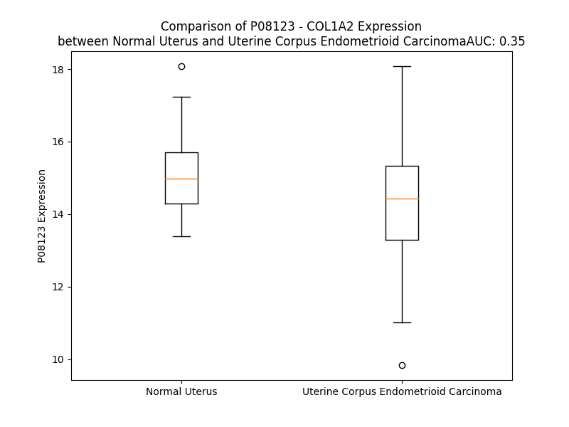

# Detailed Data for P08123

## Introduction to the Detailed Summary

### How to Interpret the Results

- **Summary & Metrics**: This section provides a quick reference to essential protein attributes, including expression changes, family classification, and biomarker applications. Regulation status (upregulated/downregulated) indicates the protein's behavior in a disease context. Some information comes from the original excel file with the proteins selected from literature, while others are derived from the analyses.
- **Expression Comparison**: A visual representation comparing protein expression between normal and disease states. It highlights significant changes in expression levels that might indicate diagnostic or therapeutic relevance. This is data coming from transcriptomics experiments and could not translate similarly to protein levels.
- **Isoform Alignment**: An interactive view of isoform alignments, revealing structural and functional differences between variants of the protein.
- **Interactors & Homologs**: Tables listing known interaction partners and homologous proteins, the more interactors and homologs, the more complex the protein is to design an antibody for.
- **Biological Assemblies**: Information about the structural arrangement of the protein in different assemblies, providing insights into its functional state but also the complexity of the protein to develop antibodies.
- **Combined Per-Residue Information**: A detailed table summarizing residue-level data. This includes predictions for epitope regions, aggregation tendencies, and modifications that might impact the protein's function. Each row corresponds to a residue in the protein, providing insights into specific sites that may be important for research or drug development.
## Summary & Metrics

- **UniProt Accession**: P08123
- **Gene Name**: COL1A2
- **Protein Name**: collagen, type I, alpha 2
- **Swiss Prot**: CO1A2_HUMAN
- **Family**: other
- **Biomarker Application**:  
- **Number of Isoforms**: 0
- **Regulation**: 2
- **(transcriptomics) AUC**: 0.7
- **(transcriptomics) Fold Change**: 1.07
- **(transcriptomics) Regulation**: Upregulated
- **Discotope Epitope Count**: 256
- **Max n_uniprots (Homo)**: N/A
- **Max n_uniprots (Hetero)**: 3.0

## Expression Comparison

## Interactors

| preferredName_A   | preferredName_B   |   score |
|:------------------|:------------------|--------:|
| COL1A2            | LUM               |   0.999 |
| COL1A2            | COL3A1            |   0.999 |
| COL1A2            | COL1A1            |   0.999 |
| COL1A2            | COL5A2            |   0.998 |
| COL1A2            | COL11A1           |   0.992 |
| COL1A2            | COL5A1            |   0.989 |
| COL1A2            | ITGB1             |   0.988 |
| COL1A2            | CD44              |   0.988 |
| COL1A2            | FN1               |   0.982 |
| COL1A2            | ITGA2             |   0.973 |
| COL1A2            | COL6A3            |   0.968 |
| COL1A2            | FBN1              |   0.965 |
| COL1A2            | CRTAP             |   0.964 |
| COL1A2            | PCOLCE            |   0.963 |
| COL1A2            | SPARC             |   0.959 |
| COL1A2            | COL11A2           |   0.953 |
| COL1A2            | ADAMTS2           |   0.946 |
| COL1A2            | P3H1              |   0.945 |
| COL1A2            | BGN               |   0.938 |
| COL1A2            | DCN               |   0.93  |
| COL1A2            | COL5A3            |   0.93  |
| COL1A2            | ITGA11            |   0.927 |
| COL1A2            | POSTN             |   0.918 |
| COL1A2            | COL6A2            |   0.908 |
| COL1A2            | GP6               |   0.908 |
| COL1A2            | MMP9              |   0.904 |

## Homologs

| uniprot_id   | gene_id   |
|:-------------|:----------|
| Q02388       | COL7A1    |
| A0A669KB28   | COL13A1   |
| A0A2R8YG47   | COL9A1    |
| P39059       | COL15A1   |
| Q8IZC6       | COL27A1   |
| A0A2R8Y760   | COL25A1   |
| Q9UMD9       | COL17A1   |
| P02458       | COL2A1    |
| A0A3B3ITQ8   | COL4A2    |
| H7C435       | COL3A1    |
| H7BXV5       | COL18A1   |
| Q49AM6       | COL4A5    |
| D6RA95       | EDA       |
| Q07092       | COL16A1   |
| F8WDX7       | EMID1     |
| P02452       | COL1A1    |
| A0A384P5H7   | COL6A1    |
| A0A804HI71   | COL4A4    |
| A8MXH5       | COL4A6    |
| A6PVD9       | COL21A1   |
| P20908       | COL5A1    |
| Q14055       | COL9A2    |
| C9JMN2       | COL11A1   |
| F8WDM8       | COL24A1   |
| H7C0M5       | COL6A2    |
| Q96A83       | COL26A1   |
| P25940       | COL5A3    |
| L8EAS4       | COL23A1   |
| Q9P218       | COL20A1   |
| Q8NFW1       | COL22A1   |
| Q9Y215       | COLQ      |
| A0A0C4DFS1   | COL11A2   |
| A0A0C4DG66   | COL28A1   |
| A0A3B3IRH9   | COL5A2    |
| H7BXM4       | COL4A3    |
| Q14050       | COL9A3    |
| P02462       | COL4A1    |

## Biological Assemblies

|   Unnamed: 0 |   assembly |   n_uniprots | composition   | crystal_id   |
|-------------:|-----------:|-------------:|:--------------|:-------------|
|            0 |          1 |            3 | Hetero        | 5cva         |
|            1 |          2 |            3 | Hetero        | 5cva         |
|            0 |          1 |            0 | Hetero        | 6jec         |
|            0 |          1 |            3 | Hetero        | 5cti         |

## Combined Per-Residue Information

|   res | aa   |   epitope_score | epitope   |   relative_surface_accessibility |   modeling_confidence |   Aggregation | modification                | glycosylation                              |
|------:|:-----|----------------:|:----------|---------------------------------:|----------------------:|--------------:|:----------------------------|:-------------------------------------------|
|     1 | M    |         0.03297 | False     |                          1.28831 |                 36.16 |         0     | N/A                         | N/A                                        |
|     2 | L    |         0.08048 | False     |                          0.95435 |                 33.4  |         1.68  | N/A                         | N/A                                        |
|     3 | S    |         0.05836 | False     |                          0.81428 |                 34.35 |         1.842 | N/A                         | N/A                                        |
|     4 | F    |         0.06039 | False     |                          1.02383 |                 39.47 |         4.58  | N/A                         | N/A                                        |
|     5 | V    |         0.02797 | False     |                          0.36846 |                 45.7  |         4.805 | N/A                         | N/A                                        |
|     6 | D    |         0.06019 | False     |                          0.49215 |                 51.56 |         4.821 | N/A                         | N/A                                        |
|     7 | T    |         0.06233 | False     |                          0.76974 |                 51.65 |         4.821 | N/A                         | N/A                                        |
|     8 | R    |         0.06782 | False     |                          0.74255 |                 57.9  |         4.821 | N/A                         | N/A                                        |
|     9 | T    |         0.03205 | False     |                          0.44936 |                 67.72 |        31.073 | N/A                         | N/A                                        |
|    10 | L    |         0.05486 | False     |                          0.62848 |                 65.11 |        74.922 | N/A                         | N/A                                        |
|    11 | L    |         0.04567 | False     |                          0.71543 |                 66.81 |        93.888 | N/A                         | N/A                                        |
|    12 | L    |         0.07778 | False     |                          0.72166 |                 69.55 |        97.101 | N/A                         | N/A                                        |
|    13 | L    |         0.03171 | False     |                          0.56052 |                 70.91 |        97.656 | N/A                         | N/A                                        |
|    14 | A    |         0.02156 | False     |                          0.52977 |                 68.69 |        97.525 | N/A                         | N/A                                        |
|    15 | V    |         0.04721 | False     |                          0.41687 |                 71.75 |        97.194 | N/A                         | N/A                                        |
|    16 | T    |         0.05375 | False     |                          0.51158 |                 70.92 |        90.858 | N/A                         | N/A                                        |
|    17 | L    |         0.05116 | False     |                          0.76596 |                 69.1  |        86.57  | N/A                         | N/A                                        |
|    18 | C    |         0.0264  | False     |                          0.45053 |                 69.18 |        63.001 | N/A                         | N/A                                        |
|    19 | L    |         0.03062 | False     |                          0.33968 |                 65.57 |        58.771 | N/A                         | N/A                                        |
|    20 | A    |         0.05851 | False     |                          0.54113 |                 58.24 |        35.634 | N/A                         | N/A                                        |
|    21 | T    |         0.04678 | False     |                          0.54981 |                 61.06 |        14.873 | N/A                         | N/A                                        |
|    22 | C    |         0.03779 | False     |                          0.24474 |                 56.19 |         2.547 | N/A                         | N/A                                        |
|    23 | Q    |         0.04324 | False     |                          0.44956 |                 54.09 |         0.405 | Pyrrolidone carboxylic acid | N/A                                        |
|    24 | S    |         0.04004 | False     |                          0.48415 |                 49.54 |         0.322 | N/A                         | N/A                                        |
|    25 | L    |         0.05862 | False     |                          0.67252 |                 48.01 |         0.312 | N/A                         | N/A                                        |
|    26 | Q    |         0.05072 | False     |                          0.42755 |                 48.52 |         0.003 | N/A                         | N/A                                        |
|    27 | E    |         0.05566 | False     |                          0.70507 |                 48.61 |         0     | N/A                         | N/A                                        |
|    28 | E    |         0.04513 | False     |                          0.68873 |                 44.12 |         0     | N/A                         | N/A                                        |
|    29 | T    |         0.04509 | False     |                          0.62793 |                 43.54 |         0     | N/A                         | N/A                                        |
|    30 | V    |         0.09392 | True      |                          0.85335 |                 41.45 |         0     | N/A                         | N/A                                        |
|    31 | R    |         0.09215 | True      |                          0.88717 |                 38.54 |         0     | N/A                         | N/A                                        |
|    32 | K    |         0.13386 | True      |                          0.92075 |                 34.43 |         0     | N/A                         | N/A                                        |
|    33 | G    |         0.07251 | False     |                          0.62123 |                 34.48 |         0     | N/A                         | N/A                                        |
|    34 | P    |         0.09142 | True      |                          0.95863 |                 37.29 |         0     | N/A                         | N/A                                        |
|    35 | A    |         0.06787 | False     |                          0.99466 |                 39.3  |         0     | N/A                         | N/A                                        |
|    36 | G    |         0.06581 | False     |                          0.83771 |                 39.38 |         0     | N/A                         | N/A                                        |
|    37 | D    |         0.08249 | True      |                          0.90371 |                 40.07 |         0     | N/A                         | N/A                                        |
|    38 | R    |         0.10708 | True      |                          0.95439 |                 44.36 |         0     | N/A                         | N/A                                        |
|    39 | G    |         0.08145 | False     |                          0.61855 |                 48.5  |         0     | N/A                         | N/A                                        |
|    40 | P    |         0.07569 | False     |                          0.9892  |                 46.7  |         0     | N/A                         | N/A                                        |
|    41 | R    |         0.10601 | True      |                          0.93197 |                 51.15 |         0     | N/A                         | N/A                                        |
|    42 | G    |         0.06381 | False     |                          0.73722 |                 52.7  |         0     | N/A                         | N/A                                        |
|    43 | E    |         0.08075 | False     |                          0.89564 |                 50.8  |         0     | N/A                         | N/A                                        |
|    44 | R    |         0.07992 | False     |                          0.90422 |                 57.78 |         0     | N/A                         | N/A                                        |
|    45 | G    |         0.10006 | True      |                          0.58306 |                 60.83 |         0     | N/A                         | N/A                                        |
|    46 | P    |         0.10749 | True      |                          0.90171 |                 62.98 |         0     | N/A                         | N/A                                        |
|    47 | P    |         0.10437 | True      |                          0.90116 |                 65.97 |         0     | 4-hydroxyproline            | N/A                                        |
|    48 | G    |         0.07447 | False     |                          0.71061 |                 64.87 |         0     | N/A                         | N/A                                        |
|    49 | P    |         0.06266 | False     |                          0.91425 |                 62.17 |         0     | N/A                         | N/A                                        |
|    50 | P    |         0.07738 | False     |                          0.91987 |                 63.89 |         0     | 4-hydroxyproline            | N/A                                        |
|    51 | G    |         0.0829  | True      |                          0.84089 |                 55.32 |         0     | N/A                         | N/A                                        |
|    52 | R    |         0.07283 | False     |                          0.96081 |                 50.6  |         0     | N/A                         | N/A                                        |
|    53 | D    |         0.08757 | True      |                          0.81835 |                 54.32 |         0     | N/A                         | N/A                                        |
|    54 | G    |         0.07547 | False     |                          1.00332 |                 48.63 |         0     | N/A                         | N/A                                        |
|    55 | E    |         0.05874 | False     |                          0.8659  |                 47.01 |         0     | N/A                         | N/A                                        |
|    56 | D    |         0.07345 | False     |                          0.96546 |                 50.23 |         0     | N/A                         | N/A                                        |
|    57 | G    |         0.03776 | False     |                          0.75927 |                 44.49 |         0     | N/A                         | N/A                                        |
|    58 | P    |         0.05692 | False     |                          1.03084 |                 46.84 |         0     | N/A                         | N/A                                        |
|    59 | T    |         0.05637 | False     |                          1.02431 |                 45.68 |         0     | N/A                         | N/A                                        |
|    60 | G    |         0.18118 | True      |                          0.84672 |                 43.28 |         0     | N/A                         | N/A                                        |
|    61 | P    |         0.09391 | True      |                          0.95177 |                 47.94 |         0     | N/A                         | N/A                                        |
|    62 | P    |         0.06251 | False     |                          0.98666 |                 50.75 |         0     | 4-hydroxyproline            | N/A                                        |
|    63 | G    |         0.06302 | False     |                          0.74806 |                 50.21 |         0     | N/A                         | N/A                                        |
|    64 | P    |         0.04789 | False     |                          0.9566  |                 55.71 |         0     | N/A                         | N/A                                        |
|    65 | P    |         0.06149 | False     |                          0.95793 |                 48.76 |         0     | 4-hydroxyproline            | N/A                                        |
|    66 | G    |         0.1059  | True      |                          0.77769 |                 46.47 |         0     | N/A                         | N/A                                        |
|    67 | P    |         0.07783 | False     |                          0.9374  |                 58.3  |         0     | N/A                         | N/A                                        |
|    68 | P    |         0.06388 | False     |                          0.96098 |                 49.23 |         0     | 4-hydroxyproline            | N/A                                        |
|    69 | G    |         0.05109 | False     |                          0.76013 |                 46.7  |         0     | N/A                         | N/A                                        |
|    70 | P    |         0.03921 | False     |                          0.9255  |                 50.35 |         0     | N/A                         | N/A                                        |
|    71 | P    |         0.0388  | False     |                          0.92087 |                 44.59 |         0     | 4-hydroxyproline            | N/A                                        |
|    72 | G    |         0.04264 | False     |                          0.77199 |                 34.14 |         0     | N/A                         | N/A                                        |
|    73 | L    |         0.04553 | False     |                          1.1806  |                 36.15 |         0     | N/A                         | N/A                                        |
|    74 | G    |         0.05194 | False     |                          0.99081 |                 35.05 |         0     | N/A                         | N/A                                        |
|    75 | G    |         0.03473 | False     |                          0.97272 |                 35.68 |         0     | N/A                         | N/A                                        |
|    76 | N    |         0.04911 | False     |                          0.88352 |                 34.74 |         0     | N/A                         | N/A                                        |
|    77 | F    |         0.04206 | False     |                          0.98851 |                 33.64 |         0     | N/A                         | N/A                                        |
|    78 | A    |         0.03164 | False     |                          0.82123 |                 33.5  |         0     | N/A                         | N/A                                        |
|    79 | A    |         0.05854 | False     |                          0.8947  |                 34.33 |         0     | N/A                         | N/A                                        |
|    80 | Q    |         0.04612 | False     |                          0.68441 |                 32.34 |         0     | Pyrrolidone carboxylic acid | N/A                                        |
|    81 | Y    |         0.04757 | False     |                          0.87818 |                 33.68 |         0     | N/A                         | N/A                                        |
|    82 | D    |         0.04429 | False     |                          0.90134 |                 33.74 |         0     | N/A                         | N/A                                        |
|    83 | G    |         0.04268 | False     |                          0.72726 |                 32.24 |         0     | N/A                         | N/A                                        |
|    84 | K    |         0.05167 | False     |                          1.03165 |                 31.86 |         0     | Allysine                    | N/A                                        |
|    85 | G    |         0.07372 | False     |                          0.83329 |                 34.09 |         0     | N/A                         | N/A                                        |
|    86 | V    |         0.05538 | False     |                          1.14593 |                 35.06 |         0     | N/A                         | N/A                                        |
|    87 | G    |         0.04209 | False     |                          0.79134 |                 36.35 |         0     | N/A                         | N/A                                        |
|    88 | L    |         0.05901 | False     |                          1.14699 |                 36.12 |         0     | N/A                         | N/A                                        |
|    89 | G    |         0.05421 | False     |                          0.85553 |                 36.73 |         0     | N/A                         | N/A                                        |
|    90 | P    |         0.04759 | False     |                          1.01371 |                 41.84 |         0     | N/A                         | N/A                                        |
|    91 | G    |         0.10596 | True      |                          0.88898 |                 38.86 |         0     | N/A                         | N/A                                        |
|    92 | P    |         0.05819 | False     |                          0.9262  |                 45.44 |         0     | N/A                         | N/A                                        |
|    93 | M    |         0.06014 | False     |                          1.04242 |                 41.05 |         0     | N/A                         | N/A                                        |
|    94 | G    |         0.0518  | False     |                          0.83271 |                 36.78 |         0     | N/A                         | N/A                                        |
|    95 | L    |         0.08239 | True      |                          1.10929 |                 46.06 |         0     | N/A                         | N/A                                        |
|    96 | M    |         0.07443 | False     |                          0.92121 |                 46.38 |         0     | N/A                         | N/A                                        |
|    97 | G    |         0.07351 | False     |                          0.65904 |                 55.26 |         0     | N/A                         | N/A                                        |
|    98 | P    |         0.08732 | True      |                          0.97986 |                 58.04 |         0     | N/A                         | N/A                                        |
|    99 | R    |         0.10823 | True      |                          0.8349  |                 54.23 |         0     | N/A                         | N/A                                        |
|   100 | G    |         0.07671 | False     |                          0.59427 |                 60.07 |         0     | N/A                         | N/A                                        |
|   101 | P    |         0.09497 | True      |                          0.92107 |                 64.92 |         0     | N/A                         | N/A                                        |
|   102 | P    |         0.08976 | True      |                          0.79954 |                 66.2  |         0     | 4-hydroxyproline            | N/A                                        |
|   103 | G    |         0.09009 | True      |                          0.83852 |                 61.9  |         0     | N/A                         | N/A                                        |
|   104 | A    |         0.07606 | False     |                          0.98519 |                 60.08 |         0     | N/A                         | N/A                                        |
|   105 | A    |         0.07358 | False     |                          0.93088 |                 59.37 |         0     | N/A                         | N/A                                        |
|   106 | G    |         0.0865  | True      |                          0.80818 |                 60.18 |         0     | N/A                         | N/A                                        |
|   107 | A    |         0.0675  | False     |                          0.88661 |                 61.45 |         0     | N/A                         | N/A                                        |
|   108 | P    |         0.10016 | True      |                          0.94835 |                 64.48 |         0     | 4-hydroxyproline            | N/A                                        |
|   109 | G    |         0.10102 | True      |                          0.69308 |                 63.02 |         0     | N/A                         | N/A                                        |
|   110 | P    |         0.08306 | True      |                          0.98799 |                 62.94 |         0     | N/A                         | N/A                                        |
|   111 | Q    |         0.10418 | True      |                          0.81018 |                 53.61 |         0     | N/A                         | N/A                                        |
|   112 | G    |         0.06799 | False     |                          0.70253 |                 52.56 |         0     | N/A                         | N/A                                        |
|   113 | F    |         0.09388 | True      |                          1.09645 |                 47.19 |         0     | N/A                         | N/A                                        |
|   114 | Q    |         0.10483 | True      |                          0.81599 |                 50.52 |         0     | N/A                         | N/A                                        |
|   115 | G    |         0.10222 | True      |                          0.59234 |                 58.95 |         0     | N/A                         | N/A                                        |
|   116 | P    |         0.10592 | True      |                          1.0046  |                 61.67 |         0     | N/A                         | N/A                                        |
|   117 | A    |         0.07233 | False     |                          0.92219 |                 54.8  |         0     | N/A                         | N/A                                        |
|   118 | G    |         0.08352 | True      |                          0.88693 |                 52.36 |         0     | N/A                         | N/A                                        |
|   119 | E    |         0.1078  | True      |                          0.84353 |                 55.9  |         0     | N/A                         | N/A                                        |
|   120 | P    |         0.11759 | True      |                          0.99607 |                 58.42 |         0     | N/A                         | N/A                                        |
|   121 | G    |         0.07637 | False     |                          0.84143 |                 50.14 |         0     | N/A                         | N/A                                        |
|   122 | E    |         0.12128 | True      |                          0.88197 |                 51.79 |         0     | N/A                         | N/A                                        |
|   123 | P    |         0.12934 | True      |                          1.03064 |                 54.84 |         0     | N/A                         | N/A                                        |
|   124 | G    |         0.04711 | False     |                          0.83256 |                 41.02 |         0     | N/A                         | N/A                                        |
|   125 | Q    |         0.08588 | True      |                          0.95831 |                 48.26 |         0     | N/A                         | N/A                                        |
|   126 | T    |         0.08298 | True      |                          0.99747 |                 49.04 |         0     | N/A                         | N/A                                        |
|   127 | G    |         0.08088 | False     |                          0.69336 |                 60.15 |         0     | N/A                         | N/A                                        |
|   128 | P    |         0.08714 | True      |                          0.99797 |                 52.82 |         0     | N/A                         | N/A                                        |
|   129 | A    |         0.06887 | False     |                          1.02849 |                 53.67 |         0     | N/A                         | N/A                                        |
|   130 | G    |         0.08116 | False     |                          0.8806  |                 54.12 |         0     | N/A                         | N/A                                        |
|   131 | A    |         0.07694 | False     |                          1.03162 |                 49.13 |         0     | N/A                         | N/A                                        |
|   132 | R    |         0.14015 | True      |                          0.92128 |                 62.45 |         0     | N/A                         | N/A                                        |
|   133 | G    |         0.08558 | True      |                          0.60314 |                 66.67 |         0     | N/A                         | N/A                                        |
|   134 | P    |         0.07999 | False     |                          1.00781 |                 61.71 |         0     | N/A                         | N/A                                        |
|   135 | A    |         0.10013 | True      |                          0.9108  |                 68.93 |         0     | N/A                         | N/A                                        |
|   136 | G    |         0.07881 | False     |                          0.71039 |                 65.35 |         0     | N/A                         | N/A                                        |
|   137 | P    |         0.07886 | False     |                          0.92    |                 66.17 |         0     | N/A                         | N/A                                        |
|   138 | P    |         0.11143 | True      |                          0.98501 |                 73.1  |         0     | N/A                         | N/A                                        |
|   139 | G    |         0.08943 | True      |                          0.83513 |                 62.46 |         0     | N/A                         | N/A                                        |
|   140 | K    |         0.06846 | False     |                          0.99659 |                 58.51 |         0     | N/A                         | N/A                                        |
|   141 | A    |         0.06298 | False     |                          0.96326 |                 65.15 |         0     | N/A                         | N/A                                        |
|   142 | G    |         0.08965 | True      |                          0.81635 |                 55.88 |         0     | N/A                         | N/A                                        |
|   143 | E    |         0.0764  | False     |                          0.90978 |                 52.23 |         0     | N/A                         | N/A                                        |
|   144 | D    |         0.08329 | True      |                          0.84699 |                 59.82 |         0     | N/A                         | N/A                                        |
|   145 | G    |         0.08725 | True      |                          0.81547 |                 51.18 |         0     | N/A                         | N/A                                        |
|   146 | H    |         0.09022 | True      |                          0.95424 |                 51.91 |         0     | N/A                         | N/A                                        |
|   147 | P    |         0.10654 | True      |                          0.94265 |                 66.66 |         0     | N/A                         | N/A                                        |
|   148 | G    |         0.08934 | True      |                          0.81928 |                 54.24 |         0     | N/A                         | N/A                                        |
|   149 | K    |         0.07927 | False     |                          0.95771 |                 54.25 |         0     | N/A                         | N/A                                        |
|   150 | P    |         0.0921  | True      |                          0.94377 |                 66.57 |         0     | N/A                         | N/A                                        |
|   151 | G    |         0.11077 | True      |                          0.79808 |                 56.14 |         0     | N/A                         | N/A                                        |
|   152 | R    |         0.14432 | True      |                          0.8712  |                 52.62 |         0     | N/A                         | N/A                                        |
|   153 | P    |         0.0946  | True      |                          0.90855 |                 67.54 |         0     | N/A                         | N/A                                        |
|   154 | G    |         0.07986 | False     |                          0.85638 |                 55.09 |         0     | N/A                         | N/A                                        |
|   155 | E    |         0.0871  | True      |                          0.83202 |                 48.98 |         0     | N/A                         | N/A                                        |
|   156 | R    |         0.10334 | True      |                          0.88661 |                 53.88 |         0     | N/A                         | N/A                                        |
|   157 | G    |         0.06662 | False     |                          0.71342 |                 54.72 |         0     | N/A                         | N/A                                        |
|   158 | V    |         0.1062  | True      |                          1.06157 |                 51.68 |         0     | N/A                         | N/A                                        |
|   159 | V    |         0.0645  | False     |                          0.89791 |                 60.37 |         0     | N/A                         | N/A                                        |
|   160 | G    |         0.08993 | True      |                          0.62183 |                 60.21 |         0     | N/A                         | N/A                                        |
|   161 | P    |         0.09567 | True      |                          1.0188  |                 59.81 |         0     | N/A                         | N/A                                        |
|   162 | Q    |         0.10718 | True      |                          0.90859 |                 60.61 |         0     | N/A                         | N/A                                        |
|   163 | G    |         0.08649 | True      |                          0.79968 |                 52.54 |         0     | N/A                         | N/A                                        |
|   164 | A    |         0.10643 | True      |                          1.08415 |                 41.85 |         0     | N/A                         | N/A                                        |
|   165 | R    |         0.08256 | True      |                          0.95876 |                 59.07 |         0     | N/A                         | N/A                                        |
|   166 | G    |         0.06711 | False     |                          0.76906 |                 47.16 |         0     | N/A                         | N/A                                        |
|   167 | F    |         0.06345 | False     |                          1.06476 |                 41.76 |         0     | N/A                         | N/A                                        |
|   168 | P    |         0.07776 | False     |                          0.94387 |                 66.44 |         0     | N/A                         | N/A                                        |
|   169 | G    |         0.06943 | False     |                          0.88743 |                 44.99 |         0     | N/A                         | N/A                                        |
|   170 | T    |         0.04414 | False     |                          0.9657  |                 42.79 |         0     | N/A                         | N/A                                        |
|   171 | P    |         0.05993 | False     |                          0.96996 |                 64.3  |         0     | N/A                         | N/A                                        |
|   172 | G    |         0.06488 | False     |                          0.89183 |                 43.14 |         0     | N/A                         | N/A                                        |
|   173 | L    |         0.04792 | False     |                          1.11876 |                 50.13 |         0     | N/A                         | N/A                                        |
|   174 | P    |         0.07526 | False     |                          0.96678 |                 57.13 |         0     | N/A                         | N/A                                        |
|   175 | G    |         0.06692 | False     |                          0.88268 |                 42.33 |         0     | N/A                         | N/A                                        |
|   176 | F    |         0.04894 | False     |                          1.06264 |                 44.28 |         0     | N/A                         | N/A                                        |
|   177 | K    |         0.07999 | False     |                          1.04234 |                 47.93 |         0     | 5-hydroxylysine; alternate  | O-linked (Gal...) hydroxylysine; alternate |
|   178 | G    |         0.05991 | False     |                          0.82095 |                 44.07 |         0     | N/A                         | N/A                                        |
|   179 | I    |         0.06132 | False     |                          1.08195 |                 40.81 |         0     | N/A                         | N/A                                        |
|   180 | R    |         0.06911 | False     |                          0.96986 |                 45.55 |         0     | N/A                         | N/A                                        |
|   181 | G    |         0.07114 | False     |                          0.83253 |                 42.96 |         0     | N/A                         | N/A                                        |
|   182 | H    |         0.06348 | False     |                          1.02058 |                 38.32 |         0     | N/A                         | N/A                                        |
|   183 | N    |         0.08696 | True      |                          0.98307 |                 38.17 |         0     | N/A                         | N/A                                        |
|   184 | G    |         0.06671 | False     |                          0.83913 |                 38.01 |         0     | N/A                         | N/A                                        |
|   185 | L    |         0.09144 | True      |                          1.07985 |                 37.45 |         0     | N/A                         | N/A                                        |
|   186 | D    |         0.07672 | False     |                          0.82683 |                 44.21 |         0     | N/A                         | N/A                                        |
|   187 | G    |         0.05125 | False     |                          0.83604 |                 43.01 |         0     | N/A                         | N/A                                        |
|   188 | L    |         0.10064 | True      |                          1.10994 |                 42.52 |         0     | N/A                         | N/A                                        |
|   189 | K    |         0.05379 | False     |                          0.94544 |                 49.57 |         0     | N/A                         | N/A                                        |
|   190 | G    |         0.06209 | False     |                          0.81614 |                 52.68 |         0     | N/A                         | N/A                                        |
|   191 | Q    |         0.0936  | True      |                          0.76586 |                 45.31 |         0     | N/A                         | N/A                                        |
|   192 | P    |         0.09992 | True      |                          0.96048 |                 54.83 |         0     | N/A                         | N/A                                        |
|   193 | G    |         0.07277 | False     |                          0.85878 |                 52.18 |         0     | N/A                         | N/A                                        |
|   194 | A    |         0.05975 | False     |                          0.92394 |                 54.74 |         0     | N/A                         | N/A                                        |
|   195 | P    |         0.07485 | False     |                          0.99446 |                 65.92 |         0     | N/A                         | N/A                                        |
|   196 | G    |         0.07661 | False     |                          0.88655 |                 56.53 |         0     | N/A                         | N/A                                        |
|   197 | V    |         0.07632 | False     |                          1.12183 |                 53.42 |         0     | N/A                         | N/A                                        |
|   198 | K    |         0.09883 | True      |                          0.92155 |                 55.29 |         0     | N/A                         | N/A                                        |
|   199 | G    |         0.08788 | True      |                          0.73954 |                 54.85 |         0     | N/A                         | N/A                                        |
|   200 | E    |         0.08141 | False     |                          0.87349 |                 49.33 |         0     | N/A                         | N/A                                        |
|   201 | P    |         0.10459 | True      |                          0.91742 |                 67.29 |         0     | N/A                         | N/A                                        |
|   202 | G    |         0.0968  | True      |                          0.87364 |                 50.08 |         0     | N/A                         | N/A                                        |
|   203 | A    |         0.07484 | False     |                          0.92165 |                 52.24 |         0     | N/A                         | N/A                                        |
|   204 | P    |         0.09665 | True      |                          1.00632 |                 67.68 |         0     | N/A                         | N/A                                        |
|   205 | G    |         0.06148 | False     |                          0.84953 |                 49.12 |         0     | N/A                         | N/A                                        |
|   206 | E    |         0.06442 | False     |                          0.92171 |                 40.09 |         0     | N/A                         | N/A                                        |
|   207 | N    |         0.07681 | False     |                          1.00614 |                 43.56 |         0     | N/A                         | N/A                                        |
|   208 | G    |         0.06026 | False     |                          0.81509 |                 44.61 |         0     | N/A                         | N/A                                        |
|   209 | T    |         0.06806 | False     |                          0.94522 |                 49.66 |         0     | N/A                         | N/A                                        |
|   210 | P    |         0.08752 | True      |                          0.98308 |                 59.63 |         0     | N/A                         | N/A                                        |
|   211 | G    |         0.06517 | False     |                          0.83244 |                 42.25 |         0     | N/A                         | N/A                                        |
|   212 | Q    |         0.09566 | True      |                          0.89071 |                 47.06 |         0     | N/A                         | N/A                                        |
|   213 | T    |         0.06799 | False     |                          0.9353  |                 45.62 |         0     | N/A                         | N/A                                        |
|   214 | G    |         0.06503 | False     |                          0.85279 |                 38.63 |         0     | N/A                         | N/A                                        |
|   215 | A    |         0.06619 | False     |                          0.98033 |                 35.48 |         0     | N/A                         | N/A                                        |
|   216 | R    |         0.04406 | False     |                          0.99821 |                 41.58 |         0     | N/A                         | N/A                                        |
|   217 | G    |         0.05977 | False     |                          0.86896 |                 41.35 |         0     | N/A                         | N/A                                        |
|   218 | L    |         0.05412 | False     |                          1.10064 |                 49.93 |         0     | N/A                         | N/A                                        |
|   219 | P    |         0.08301 | True      |                          0.9563  |                 48.06 |         0     | N/A                         | N/A                                        |
|   220 | G    |         0.06039 | False     |                          0.87701 |                 45.54 |         0     | N/A                         | N/A                                        |
|   221 | E    |         0.05796 | False     |                          0.69669 |                 40.89 |         0     | N/A                         | N/A                                        |
|   222 | R    |         0.08062 | False     |                          0.64915 |                 44.22 |         0     | N/A                         | N/A                                        |
|   223 | G    |         0.03517 | False     |                          0.87947 |                 46.56 |         0     | N/A                         | N/A                                        |
|   224 | R    |         0.09182 | True      |                          0.70313 |                 44.48 |         0     | N/A                         | N/A                                        |
|   225 | V    |         0.04859 | False     |                          1.01983 |                 44.77 |         0     | N/A                         | N/A                                        |
|   226 | G    |         0.05531 | False     |                          0.88524 |                 40.75 |         0     | N/A                         | N/A                                        |
|   227 | A    |         0.04212 | False     |                          0.94372 |                 41.41 |         0     | N/A                         | N/A                                        |
|   228 | P    |         0.09397 | True      |                          0.95014 |                 51.38 |         0     | N/A                         | N/A                                        |
|   229 | G    |         0.0548  | False     |                          0.75384 |                 44.49 |         0     | N/A                         | N/A                                        |
|   230 | P    |         0.06192 | False     |                          0.94678 |                 46.68 |         0     | N/A                         | N/A                                        |
|   231 | A    |         0.05259 | False     |                          1.00214 |                 47.02 |         0     | N/A                         | N/A                                        |
|   232 | G    |         0.0657  | False     |                          0.93586 |                 46.6  |         0     | N/A                         | N/A                                        |
|   233 | A    |         0.03725 | False     |                          1.01806 |                 35.29 |         0     | N/A                         | N/A                                        |
|   234 | R    |         0.08722 | True      |                          0.93853 |                 41.72 |         0     | N/A                         | N/A                                        |
|   235 | G    |         0.07958 | False     |                          0.87752 |                 45.11 |         0     | N/A                         | N/A                                        |
|   236 | S    |         0.04234 | False     |                          0.78374 |                 39.63 |         0     | N/A                         | N/A                                        |
|   237 | D    |         0.06349 | False     |                          0.91981 |                 40.81 |         0     | N/A                         | N/A                                        |
|   238 | G    |         0.06418 | False     |                          0.86388 |                 38.6  |         0     | N/A                         | N/A                                        |
|   239 | S    |         0.06307 | False     |                          0.86212 |                 40.34 |         0     | N/A                         | N/A                                        |
|   240 | V    |         0.05705 | False     |                          1.0102  |                 52.44 |         0     | N/A                         | N/A                                        |
|   241 | G    |         0.05684 | False     |                          0.76671 |                 47.34 |         0     | N/A                         | N/A                                        |
|   242 | P    |         0.06308 | False     |                          1.00578 |                 55.14 |         0     | N/A                         | N/A                                        |
|   243 | V    |         0.10931 | True      |                          1.06142 |                 60    |         0     | N/A                         | N/A                                        |
|   244 | G    |         0.07701 | False     |                          0.60162 |                 55.86 |         0     | N/A                         | N/A                                        |
|   245 | P    |         0.086   | True      |                          1.01785 |                 57.87 |         0     | N/A                         | N/A                                        |
|   246 | A    |         0.12191 | True      |                          0.99104 |                 52.2  |         0     | N/A                         | N/A                                        |
|   247 | G    |         0.07127 | False     |                          0.66594 |                 55.77 |         0     | N/A                         | N/A                                        |
|   248 | P    |         0.14186 | True      |                          0.99943 |                 49.34 |         0     | N/A                         | N/A                                        |
|   249 | I    |         0.12053 | True      |                          1.03443 |                 52.63 |         0     | N/A                         | N/A                                        |
|   250 | G    |         0.10906 | True      |                          0.75425 |                 52.44 |         0     | N/A                         | N/A                                        |
|   251 | S    |         0.12    | True      |                          0.87579 |                 48.79 |         0     | N/A                         | N/A                                        |
|   252 | A    |         0.09465 | True      |                          0.97487 |                 52.21 |         0     | N/A                         | N/A                                        |
|   253 | G    |         0.1062  | True      |                          0.73004 |                 52.41 |         0     | N/A                         | N/A                                        |
|   254 | P    |         0.14321 | True      |                          0.94021 |                 52.41 |         0     | N/A                         | N/A                                        |
|   255 | P    |         0.13017 | True      |                          0.96767 |                 55.13 |         0     | N/A                         | N/A                                        |
|   256 | G    |         0.09255 | True      |                          0.85416 |                 47.81 |         0     | N/A                         | N/A                                        |
|   257 | F    |         0.11107 | True      |                          1.02935 |                 39.46 |         0     | N/A                         | N/A                                        |
|   258 | P    |         0.11055 | True      |                          0.95232 |                 56.82 |         0     | N/A                         | N/A                                        |
|   259 | G    |         0.06819 | False     |                          0.86679 |                 47.43 |         0     | N/A                         | N/A                                        |
|   260 | A    |         0.08778 | True      |                          0.92928 |                 41.08 |         0     | N/A                         | N/A                                        |
|   261 | P    |         0.11906 | True      |                          0.97852 |                 55.51 |         0     | N/A                         | N/A                                        |
|   262 | G    |         0.12038 | True      |                          0.72874 |                 53.66 |         0     | N/A                         | N/A                                        |
|   263 | P    |         0.11355 | True      |                          1.01815 |                 43.6  |         0     | N/A                         | N/A                                        |
|   264 | K    |         0.12318 | True      |                          0.91511 |                 46.23 |         0     | N/A                         | N/A                                        |
|   265 | G    |         0.10424 | True      |                          0.71026 |                 51.64 |         0     | N/A                         | N/A                                        |
|   266 | E    |         0.11067 | True      |                          0.9322  |                 40.82 |         0     | N/A                         | N/A                                        |
|   267 | I    |         0.07088 | False     |                          0.89406 |                 44.09 |         0     | N/A                         | N/A                                        |
|   268 | G    |         0.08838 | True      |                          0.77636 |                 46.66 |         0     | N/A                         | N/A                                        |
|   269 | A    |         0.05552 | False     |                          1.01174 |                 41.89 |         0     | N/A                         | N/A                                        |
|   270 | V    |         0.05059 | False     |                          1.04319 |                 49.12 |         0     | N/A                         | N/A                                        |
|   271 | G    |         0.07088 | False     |                          0.73314 |                 44.86 |         0     | N/A                         | N/A                                        |
|   272 | N    |         0.08461 | True      |                          0.97097 |                 37.23 |         0     | N/A                         | N/A                                        |
|   273 | A    |         0.06972 | False     |                          0.99123 |                 42.36 |         0     | N/A                         | N/A                                        |
|   274 | G    |         0.06897 | False     |                          0.82477 |                 48.39 |         0     | N/A                         | N/A                                        |
|   275 | P    |         0.05947 | False     |                          1.0035  |                 47.32 |         0     | N/A                         | N/A                                        |
|   276 | A    |         0.04942 | False     |                          0.95121 |                 46.67 |         0     | N/A                         | N/A                                        |
|   277 | G    |         0.06399 | False     |                          0.91131 |                 44.27 |         0     | N/A                         | N/A                                        |
|   278 | P    |         0.04667 | False     |                          0.95994 |                 49.3  |         0     | N/A                         | N/A                                        |
|   279 | A    |         0.06967 | False     |                          0.99746 |                 49.31 |         0     | N/A                         | N/A                                        |
|   280 | G    |         0.07338 | False     |                          0.86166 |                 44.81 |         0     | N/A                         | N/A                                        |
|   281 | P    |         0.05978 | False     |                          0.98444 |                 52.74 |         0     | N/A                         | N/A                                        |
|   282 | R    |         0.07076 | False     |                          0.92738 |                 40.36 |         0     | N/A                         | N/A                                        |
|   283 | G    |         0.05188 | False     |                          0.84006 |                 42.56 |         0     | N/A                         | N/A                                        |
|   284 | E    |         0.06644 | False     |                          0.93201 |                 36.37 |         0     | N/A                         | N/A                                        |
|   285 | V    |         0.05763 | False     |                          0.97599 |                 49.48 |         0     | N/A                         | N/A                                        |
|   286 | G    |         0.04975 | False     |                          0.85718 |                 39.01 |         0     | N/A                         | N/A                                        |
|   287 | L    |         0.0458  | False     |                          1.04293 |                 43.17 |         0     | N/A                         | N/A                                        |
|   288 | P    |         0.05785 | False     |                          0.8958  |                 55.12 |         0     | N/A                         | N/A                                        |
|   289 | G    |         0.04619 | False     |                          0.82459 |                 39.99 |         0     | N/A                         | N/A                                        |
|   290 | L    |         0.08061 | False     |                          1.03458 |                 37.96 |         0     | N/A                         | N/A                                        |
|   291 | S    |         0.0621  | False     |                          0.97616 |                 45.82 |         0     | N/A                         | N/A                                        |
|   292 | G    |         0.03618 | False     |                          0.8147  |                 49.58 |         0     | N/A                         | N/A                                        |
|   293 | P    |         0.04714 | False     |                          0.94553 |                 50.51 |         0     | N/A                         | N/A                                        |
|   294 | V    |         0.05469 | False     |                          1.02714 |                 48.21 |         0     | N/A                         | N/A                                        |
|   295 | G    |         0.04472 | False     |                          0.72986 |                 42.88 |         0     | N/A                         | N/A                                        |
|   296 | P    |         0.04984 | False     |                          0.95936 |                 57.7  |         0     | N/A                         | N/A                                        |
|   297 | P    |         0.0463  | False     |                          1.00132 |                 56.96 |         0     | N/A                         | N/A                                        |
|   298 | G    |         0.07313 | False     |                          0.88936 |                 40.02 |         0     | N/A                         | N/A                                        |
|   299 | N    |         0.04028 | False     |                          0.97215 |                 49.37 |         0     | N/A                         | N/A                                        |
|   300 | P    |         0.0659  | False     |                          1.03932 |                 57.16 |         0     | N/A                         | N/A                                        |
|   301 | G    |         0.08053 | False     |                          0.93794 |                 41.5  |         0     | N/A                         | N/A                                        |
|   302 | A    |         0.03551 | False     |                          0.99083 |                 38.01 |         0     | N/A                         | N/A                                        |
|   303 | N    |         0.07966 | False     |                          0.90525 |                 39.83 |         0     | N/A                         | N/A                                        |
|   304 | G    |         0.08261 | True      |                          0.73075 |                 39.31 |         0     | N/A                         | N/A                                        |
|   305 | L    |         0.04012 | False     |                          0.9805  |                 37.14 |         0     | N/A                         | N/A                                        |
|   306 | T    |         0.06    | False     |                          0.92061 |                 44.97 |         0     | N/A                         | N/A                                        |
|   307 | G    |         0.03517 | False     |                          0.61655 |                 41.4  |         0     | N/A                         | N/A                                        |
|   308 | A    |         0.02524 | False     |                          0.7395  |                 40.69 |         0     | N/A                         | N/A                                        |
|   309 | K    |         0.05092 | False     |                          0.84511 |                 38.53 |         0     | N/A                         | N/A                                        |
|   310 | G    |         0.02572 | False     |                          0.42147 |                 42.04 |         0     | N/A                         | N/A                                        |
|   311 | A    |         0.01897 | False     |                          0.65585 |                 43.6  |         0     | N/A                         | N/A                                        |
|   312 | A    |         0.02284 | False     |                          0.48903 |                 41.19 |         0     | N/A                         | N/A                                        |
|   313 | G    |         0.03351 | False     |                          0.62072 |                 39.27 |         0     | N/A                         | N/A                                        |
|   314 | L    |         0.0358  | False     |                          1.07786 |                 40.98 |         0     | N/A                         | N/A                                        |
|   315 | P    |         0.08089 | False     |                          0.92357 |                 56.78 |         0     | N/A                         | N/A                                        |
|   316 | G    |         0.0758  | False     |                          0.90064 |                 47.79 |         0     | N/A                         | N/A                                        |
|   317 | V    |         0.07295 | False     |                          1.05646 |                 40.54 |         0     | N/A                         | N/A                                        |
|   318 | A    |         0.07212 | False     |                          0.89688 |                 46.95 |         0     | N/A                         | N/A                                        |
|   319 | G    |         0.09461 | True      |                          0.83277 |                 46.81 |         0     | N/A                         | N/A                                        |
|   320 | A    |         0.0739  | False     |                          0.89637 |                 45.18 |         0     | N/A                         | N/A                                        |
|   321 | P    |         0.12522 | True      |                          0.97053 |                 51.63 |         0     | N/A                         | N/A                                        |
|   322 | G    |         0.09712 | True      |                          0.78886 |                 43.56 |         0     | N/A                         | N/A                                        |
|   323 | L    |         0.07759 | False     |                          1.04056 |                 40.97 |         0     | N/A                         | N/A                                        |
|   324 | P    |         0.08205 | True      |                          0.96595 |                 52.12 |         0     | N/A                         | N/A                                        |
|   325 | G    |         0.07316 | False     |                          0.77767 |                 51.04 |         0     | N/A                         | N/A                                        |
|   326 | P    |         0.07899 | False     |                          0.99588 |                 39.55 |         0     | N/A                         | N/A                                        |
|   327 | R    |         0.05772 | False     |                          0.7825  |                 41.12 |         0     | N/A                         | N/A                                        |
|   328 | G    |         0.05606 | False     |                          0.92849 |                 39.85 |         0     | N/A                         | N/A                                        |
|   329 | I    |         0.04    | False     |                          0.75727 |                 41.58 |         0     | N/A                         | N/A                                        |
|   330 | P    |         0.05081 | False     |                          0.9029  |                 55.67 |         0     | N/A                         | N/A                                        |
|   331 | G    |         0.07593 | False     |                          0.88044 |                 42.28 |         0     | N/A                         | N/A                                        |
|   332 | P    |         0.05833 | False     |                          0.85715 |                 53.23 |         0     | N/A                         | N/A                                        |
|   333 | V    |         0.04065 | False     |                          1.02878 |                 44.44 |         0     | N/A                         | N/A                                        |
|   334 | G    |         0.0555  | False     |                          0.85286 |                 40.56 |         0     | N/A                         | N/A                                        |
|   335 | A    |         0.03788 | False     |                          1.00728 |                 35.97 |         0     | N/A                         | N/A                                        |
|   336 | A    |         0.04734 | False     |                          1.00605 |                 41.93 |         0     | N/A                         | N/A                                        |
|   337 | G    |         0.04694 | False     |                          0.90061 |                 39.18 |         0     | N/A                         | N/A                                        |
|   338 | A    |         0.04937 | False     |                          0.92565 |                 39.54 |         0     | N/A                         | N/A                                        |
|   339 | T    |         0.04624 | False     |                          1.00525 |                 43.13 |         0     | N/A                         | N/A                                        |
|   340 | G    |         0.05323 | False     |                          0.89034 |                 40.48 |         0     | N/A                         | N/A                                        |
|   341 | A    |         0.06958 | False     |                          0.9524  |                 44.73 |         0     | N/A                         | N/A                                        |
|   342 | R    |         0.0993  | True      |                          0.90896 |                 40.86 |         0     | N/A                         | N/A                                        |
|   343 | G    |         0.07006 | False     |                          0.77823 |                 46.79 |         0     | N/A                         | N/A                                        |
|   344 | L    |         0.12701 | True      |                          0.95885 |                 39.18 |         0     | N/A                         | N/A                                        |
|   345 | V    |         0.08343 | True      |                          1.02709 |                 45.69 |         0     | N/A                         | N/A                                        |
|   346 | G    |         0.04986 | False     |                          0.71471 |                 38.18 |         0     | N/A                         | N/A                                        |
|   347 | E    |         0.05139 | False     |                          0.86246 |                 47.96 |         0     | N/A                         | N/A                                        |
|   348 | P    |         0.06959 | False     |                          0.99037 |                 43.43 |         0     | N/A                         | N/A                                        |
|   349 | G    |         0.07587 | False     |                          0.70721 |                 43.4  |         0     | N/A                         | N/A                                        |
|   350 | P    |         0.03534 | False     |                          1.03251 |                 52.46 |         0     | N/A                         | N/A                                        |
|   351 | A    |         0.04508 | False     |                          1.05646 |                 42.88 |         0     | N/A                         | N/A                                        |
|   352 | G    |         0.07337 | False     |                          0.99782 |                 40.54 |         0     | N/A                         | N/A                                        |
|   353 | S    |         0.03761 | False     |                          0.88099 |                 36.93 |         0     | N/A                         | N/A                                        |
|   354 | K    |         0.0427  | False     |                          0.84781 |                 45.36 |         0     | N/A                         | N/A                                        |
|   355 | G    |         0.04222 | False     |                          0.89046 |                 40.64 |         0     | N/A                         | N/A                                        |
|   356 | E    |         0.04277 | False     |                          0.70089 |                 35.26 |         0     | N/A                         | N/A                                        |
|   357 | S    |         0.05509 | False     |                          0.89265 |                 42.23 |         0     | N/A                         | N/A                                        |
|   358 | G    |         0.05538 | False     |                          0.83746 |                 39.76 |         0     | N/A                         | N/A                                        |
|   359 | N    |         0.06971 | False     |                          0.98953 |                 40.11 |         0     | N/A                         | N/A                                        |
|   360 | K    |         0.04387 | False     |                          1.03656 |                 45.57 |         0     | N/A                         | N/A                                        |
|   361 | G    |         0.0823  | True      |                          0.81512 |                 43.88 |         0     | N/A                         | N/A                                        |
|   362 | E    |         0.03942 | False     |                          0.91901 |                 40.17 |         0     | N/A                         | N/A                                        |
|   363 | P    |         0.06985 | False     |                          0.99065 |                 58.16 |         0     | N/A                         | N/A                                        |
|   364 | G    |         0.07486 | False     |                          0.9169  |                 42.96 |         0     | N/A                         | N/A                                        |
|   365 | S    |         0.04752 | False     |                          0.90351 |                 41.67 |         0     | N/A                         | N/A                                        |
|   366 | A    |         0.05928 | False     |                          1.03679 |                 45.47 |         0     | N/A                         | N/A                                        |
|   367 | G    |         0.04683 | False     |                          0.73118 |                 47.71 |         0     | N/A                         | N/A                                        |
|   368 | P    |         0.06307 | False     |                          1.02946 |                 42.14 |         0     | N/A                         | N/A                                        |
|   369 | Q    |         0.0859  | True      |                          0.85166 |                 49.66 |         0     | N/A                         | N/A                                        |
|   370 | G    |         0.05659 | False     |                          0.57516 |                 46.66 |         0     | N/A                         | N/A                                        |
|   371 | P    |         0.06682 | False     |                          0.98687 |                 43.69 |         0     | N/A                         | N/A                                        |
|   372 | P    |         0.07698 | False     |                          0.86665 |                 56.55 |         0     | N/A                         | N/A                                        |
|   373 | G    |         0.06592 | False     |                          0.81612 |                 39.42 |         0     | N/A                         | N/A                                        |
|   374 | P    |         0.07034 | False     |                          1.01178 |                 59.92 |         0     | N/A                         | N/A                                        |
|   375 | S    |         0.04057 | False     |                          0.94682 |                 41.43 |         0     | N/A                         | N/A                                        |
|   376 | G    |         0.05922 | False     |                          0.90409 |                 37.46 |         0     | N/A                         | N/A                                        |
|   377 | E    |         0.05342 | False     |                          0.90049 |                 35.27 |         0     | N/A                         | N/A                                        |
|   378 | E    |         0.0848  | True      |                          0.80566 |                 40.88 |         0     | N/A                         | N/A                                        |
|   379 | G    |         0.04007 | False     |                          0.87294 |                 40.22 |         0     | N/A                         | N/A                                        |
|   380 | K    |         0.0427  | False     |                          0.86354 |                 34.69 |         0     | N/A                         | N/A                                        |
|   381 | R    |         0.08083 | False     |                          0.98526 |                 38.81 |         0     | N/A                         | N/A                                        |
|   382 | G    |         0.03258 | False     |                          0.84192 |                 44.08 |         0     | N/A                         | N/A                                        |
|   383 | P    |         0.0384  | False     |                          0.93364 |                 46.58 |         0     | N/A                         | N/A                                        |
|   384 | N    |         0.04391 | False     |                          0.97549 |                 40.2  |         0     | N/A                         | N/A                                        |
|   385 | G    |         0.04023 | False     |                          0.7514  |                 40.19 |         0     | N/A                         | N/A                                        |
|   386 | E    |         0.06302 | False     |                          0.88643 |                 37.91 |         0     | N/A                         | N/A                                        |
|   387 | A    |         0.03884 | False     |                          1.06091 |                 45.17 |         0     | N/A                         | N/A                                        |
|   388 | G    |         0.03516 | False     |                          1.00351 |                 37.13 |         0     | N/A                         | N/A                                        |
|   389 | S    |         0.05765 | False     |                          0.85837 |                 38.92 |         0     | N/A                         | N/A                                        |
|   390 | A    |         0.04601 | False     |                          0.98434 |                 40.12 |         0     | N/A                         | N/A                                        |
|   391 | G    |         0.06791 | False     |                          0.8614  |                 40.07 |         0     | N/A                         | N/A                                        |
|   392 | P    |         0.05929 | False     |                          0.90852 |                 47.62 |         0     | N/A                         | N/A                                        |
|   393 | P    |         0.11499 | True      |                          0.96913 |                 48.07 |         0     | N/A                         | N/A                                        |
|   394 | G    |         0.06965 | False     |                          0.6764  |                 46.15 |         0     | N/A                         | N/A                                        |
|   395 | P    |         0.08868 | True      |                          0.97505 |                 45.01 |         0     | N/A                         | N/A                                        |
|   396 | P    |         0.09209 | True      |                          0.95026 |                 53.28 |         0     | N/A                         | N/A                                        |
|   397 | G    |         0.07899 | False     |                          0.80813 |                 41.66 |         0     | N/A                         | N/A                                        |
|   398 | L    |         0.12091 | True      |                          1.18863 |                 35.21 |         0     | N/A                         | N/A                                        |
|   399 | R    |         0.13523 | True      |                          0.94454 |                 40.91 |         0     | N/A                         | N/A                                        |
|   400 | G    |         0.09044 | True      |                          0.7672  |                 40.37 |         0     | N/A                         | N/A                                        |
|   401 | S    |         0.09396 | True      |                          0.85063 |                 37.21 |         0     | N/A                         | N/A                                        |
|   402 | P    |         0.07501 | False     |                          0.95065 |                 51.4  |         0     | N/A                         | N/A                                        |
|   403 | G    |         0.0631  | False     |                          0.84752 |                 39.09 |         0     | N/A                         | N/A                                        |
|   404 | S    |         0.07703 | False     |                          0.90376 |                 35.46 |         0     | N/A                         | N/A                                        |
|   405 | R    |         0.13057 | True      |                          0.95769 |                 42.39 |         0     | N/A                         | N/A                                        |
|   406 | G    |         0.09618 | True      |                          0.71563 |                 38.93 |         0     | N/A                         | N/A                                        |
|   407 | L    |         0.09529 | True      |                          1.05169 |                 36.41 |         0     | N/A                         | N/A                                        |
|   408 | P    |         0.0848  | True      |                          0.92445 |                 47.09 |         0     | N/A                         | N/A                                        |
|   409 | G    |         0.10419 | True      |                          0.78121 |                 38.95 |         0     | N/A                         | N/A                                        |
|   410 | A    |         0.10303 | True      |                          1.01365 |                 38.31 |         0     | N/A                         | N/A                                        |
|   411 | D    |         0.08497 | True      |                          0.87185 |                 40.05 |         0     | N/A                         | N/A                                        |
|   412 | G    |         0.06551 | False     |                          0.82352 |                 36.6  |         0     | N/A                         | N/A                                        |
|   413 | R    |         0.14798 | True      |                          0.98827 |                 34.43 |         0     | N/A                         | N/A                                        |
|   414 | A    |         0.07852 | False     |                          0.92613 |                 39.73 |         0     | N/A                         | N/A                                        |
|   415 | G    |         0.06658 | False     |                          0.80516 |                 33.53 |         0     | N/A                         | N/A                                        |
|   416 | V    |         0.06801 | False     |                          1.0727  |                 36.81 |         0     | N/A                         | N/A                                        |
|   417 | M    |         0.17323 | True      |                          0.95848 |                 38.9  |         0     | N/A                         | N/A                                        |
|   418 | G    |         0.10618 | True      |                          0.59169 |                 44.28 |         0     | N/A                         | N/A                                        |
|   419 | P    |         0.0804  | False     |                          0.90669 |                 45.68 |         0     | N/A                         | N/A                                        |
|   420 | P    |         0.08059 | False     |                          0.99037 |                 49.78 |         0     | 4-hydroxyproline            | N/A                                        |
|   421 | G    |         0.06564 | False     |                          0.94067 |                 41.79 |         0     | N/A                         | N/A                                        |
|   422 | S    |         0.06866 | False     |                          0.82531 |                 36.99 |         0     | N/A                         | N/A                                        |
|   423 | R    |         0.14396 | True      |                          0.97109 |                 40.37 |         0     | N/A                         | N/A                                        |
|   424 | G    |         0.05524 | False     |                          0.82713 |                 36.21 |         0     | N/A                         | N/A                                        |
|   425 | A    |         0.05583 | False     |                          1.02607 |                 38.44 |         0     | N/A                         | N/A                                        |
|   426 | S    |         0.06558 | False     |                          0.93576 |                 44.32 |         0     | N/A                         | N/A                                        |
|   427 | G    |         0.04874 | False     |                          0.84498 |                 43.86 |         0     | N/A                         | N/A                                        |
|   428 | P    |         0.06156 | False     |                          1.00469 |                 46.28 |         0     | N/A                         | N/A                                        |
|   429 | A    |         0.03634 | False     |                          0.9759  |                 45.13 |         0     | N/A                         | N/A                                        |
|   430 | G    |         0.05619 | False     |                          0.79184 |                 45.85 |         0     | N/A                         | N/A                                        |
|   431 | V    |         0.03913 | False     |                          1.07675 |                 42.8  |         0     | N/A                         | N/A                                        |
|   432 | R    |         0.0921  | True      |                          0.94017 |                 41.97 |         0     | N/A                         | N/A                                        |
|   433 | G    |         0.08642 | True      |                          0.74247 |                 49.42 |         0     | N/A                         | N/A                                        |
|   434 | P    |         0.08155 | False     |                          1.01042 |                 44.29 |         0     | N/A                         | N/A                                        |
|   435 | N    |         0.08732 | True      |                          0.97407 |                 48.17 |         0     | N/A                         | N/A                                        |
|   436 | G    |         0.09319 | True      |                          0.89648 |                 40.15 |         0     | N/A                         | N/A                                        |
|   437 | D    |         0.11649 | True      |                          0.94349 |                 40.56 |         0     | N/A                         | N/A                                        |
|   438 | A    |         0.06521 | False     |                          0.96288 |                 46.86 |         0     | N/A                         | N/A                                        |
|   439 | G    |         0.07073 | False     |                          0.81431 |                 45.35 |         0     | N/A                         | N/A                                        |
|   440 | R    |         0.12771 | True      |                          0.94251 |                 45.88 |         0     | N/A                         | N/A                                        |
|   441 | P    |         0.09907 | True      |                          0.95942 |                 48.3  |         0     | 4-hydroxyproline            | N/A                                        |
|   442 | G    |         0.1058  | True      |                          0.79089 |                 46.38 |         0     | N/A                         | N/A                                        |
|   443 | E    |         0.128   | True      |                          0.8809  |                 42.41 |         0     | N/A                         | N/A                                        |
|   444 | P    |         0.11058 | True      |                          0.94408 |                 49.8  |         0     | 4-hydroxyproline            | N/A                                        |
|   445 | G    |         0.1192  | True      |                          0.83228 |                 44.41 |         0     | N/A                         | N/A                                        |
|   446 | L    |         0.10582 | True      |                          1.13389 |                 40.97 |         0     | N/A                         | N/A                                        |
|   447 | M    |         0.14712 | True      |                          0.9092  |                 48.66 |         0     | N/A                         | N/A                                        |
|   448 | G    |         0.13398 | True      |                          0.57321 |                 48.02 |         0     | N/A                         | N/A                                        |
|   449 | P    |         0.11221 | True      |                          1.03314 |                 41.72 |         0     | N/A                         | N/A                                        |
|   450 | R    |         0.14029 | True      |                          0.81358 |                 43.61 |         0     | N/A                         | N/A                                        |
|   451 | G    |         0.11783 | True      |                          0.72632 |                 39.69 |         0     | N/A                         | N/A                                        |
|   452 | L    |         0.10161 | True      |                          1.04142 |                 36.13 |         0     | N/A                         | N/A                                        |
|   453 | P    |         0.11085 | True      |                          0.80936 |                 44.1  |         0     | N/A                         | N/A                                        |
|   454 | G    |         0.11011 | True      |                          0.83622 |                 38.09 |         0     | N/A                         | N/A                                        |
|   455 | S    |         0.09414 | True      |                          0.78224 |                 34.32 |         0     | N/A                         | N/A                                        |
|   456 | P    |         0.09379 | True      |                          0.90362 |                 42.26 |         0     | N/A                         | N/A                                        |
|   457 | G    |         0.08614 | True      |                          0.79507 |                 39.55 |         0     | N/A                         | N/A                                        |
|   458 | N    |         0.0919  | True      |                          0.89651 |                 30.82 |         0     | N/A                         | N/A                                        |
|   459 | I    |         0.10088 | True      |                          0.83807 |                 44.11 |         0     | N/A                         | N/A                                        |
|   460 | G    |         0.05898 | False     |                          0.64373 |                 43.29 |         0     | N/A                         | N/A                                        |
|   461 | P    |         0.12169 | True      |                          1.03774 |                 36.12 |         0     | N/A                         | N/A                                        |
|   462 | A    |         0.07628 | False     |                          0.94268 |                 46.01 |         0     | N/A                         | N/A                                        |
|   463 | G    |         0.08629 | True      |                          0.88837 |                 41.98 |         0     | N/A                         | N/A                                        |
|   464 | K    |         0.05835 | False     |                          1.05662 |                 29.53 |         0     | N/A                         | N/A                                        |
|   465 | E    |         0.05781 | False     |                          0.9249  |                 40.25 |         0     | N/A                         | N/A                                        |
|   466 | G    |         0.05145 | False     |                          0.56847 |                 38.21 |         0     | N/A                         | N/A                                        |
|   467 | P    |         0.06944 | False     |                          1.05919 |                 38.8  |         0     | N/A                         | N/A                                        |
|   468 | V    |         0.05459 | False     |                          1.0311  |                 42.5  |         0     | N/A                         | N/A                                        |
|   469 | G    |         0.04165 | False     |                          0.60838 |                 36.05 |         0     | N/A                         | N/A                                        |
|   470 | L    |         0.06722 | False     |                          1.11662 |                 37.7  |         0     | N/A                         | N/A                                        |
|   471 | P    |         0.04403 | False     |                          0.94178 |                 43.97 |         0     | N/A                         | N/A                                        |
|   472 | G    |         0.0353  | False     |                          0.84737 |                 37.54 |         0     | N/A                         | N/A                                        |
|   473 | I    |         0.05738 | False     |                          1.03985 |                 38.28 |         0     | N/A                         | N/A                                        |
|   474 | D    |         0.04343 | False     |                          0.90505 |                 38.95 |         0     | N/A                         | N/A                                        |
|   475 | G    |         0.04203 | False     |                          0.76717 |                 33.71 |         0     | N/A                         | N/A                                        |
|   476 | R    |         0.08175 | True      |                          0.96704 |                 39.69 |         0     | N/A                         | N/A                                        |
|   477 | P    |         0.03762 | False     |                          0.9537  |                 45.03 |         0     | N/A                         | N/A                                        |
|   478 | G    |         0.04975 | False     |                          0.84282 |                 46.75 |         0     | N/A                         | N/A                                        |
|   479 | P    |         0.065   | False     |                          0.91176 |                 43.99 |         0     | N/A                         | N/A                                        |
|   480 | I    |         0.05122 | False     |                          1.05288 |                 50.96 |         0     | N/A                         | N/A                                        |
|   481 | G    |         0.06126 | False     |                          0.77669 |                 49.54 |         0     | N/A                         | N/A                                        |
|   482 | P    |         0.05979 | False     |                          0.97895 |                 41.61 |         0     | N/A                         | N/A                                        |
|   483 | A    |         0.04019 | False     |                          1.02102 |                 43.06 |         0     | N/A                         | N/A                                        |
|   484 | G    |         0.0457  | False     |                          0.9851  |                 45.59 |         0     | N/A                         | N/A                                        |
|   485 | A    |         0.04152 | False     |                          0.98347 |                 38.47 |         0     | N/A                         | N/A                                        |
|   486 | R    |         0.06129 | False     |                          0.92633 |                 42.44 |         0     | N/A                         | N/A                                        |
|   487 | G    |         0.04367 | False     |                          0.8392  |                 41.45 |         0     | N/A                         | N/A                                        |
|   488 | E    |         0.069   | False     |                          0.94685 |                 36.84 |         0     | N/A                         | N/A                                        |
|   489 | P    |         0.08189 | True      |                          0.95196 |                 46.2  |         0     | N/A                         | N/A                                        |
|   490 | G    |         0.04697 | False     |                          0.84809 |                 42    |         0     | N/A                         | N/A                                        |
|   491 | N    |         0.06818 | False     |                          1.05981 |                 34.51 |         0     | N/A                         | N/A                                        |
|   492 | I    |         0.06234 | False     |                          1.03797 |                 40.49 |         0     | N/A                         | N/A                                        |
|   493 | G    |         0.07182 | False     |                          0.67542 |                 42.53 |         0     | N/A                         | N/A                                        |
|   494 | F    |         0.08303 | True      |                          1.08892 |                 32.36 |         0     | N/A                         | N/A                                        |
|   495 | P    |         0.10363 | True      |                          0.92415 |                 57.75 |         0     | N/A                         | N/A                                        |
|   496 | G    |         0.10098 | True      |                          0.74008 |                 48.66 |         0     | N/A                         | N/A                                        |
|   497 | P    |         0.07986 | False     |                          1.03509 |                 47.22 |         0     | N/A                         | N/A                                        |
|   498 | K    |         0.10945 | True      |                          0.98425 |                 45.97 |         0     | N/A                         | N/A                                        |
|   499 | G    |         0.10734 | True      |                          0.61451 |                 51.86 |         0     | N/A                         | N/A                                        |
|   500 | P    |         0.08039 | False     |                          1.01341 |                 45.87 |         0     | N/A                         | N/A                                        |
|   501 | T    |         0.08232 | True      |                          0.97357 |                 46.87 |         0     | N/A                         | N/A                                        |
|   502 | G    |         0.07871 | False     |                          0.71493 |                 46.74 |         0     | N/A                         | N/A                                        |
|   503 | D    |         0.09299 | True      |                          0.86257 |                 42.32 |         0     | N/A                         | N/A                                        |
|   504 | P    |         0.0783  | False     |                          0.97455 |                 61.44 |         0     | N/A                         | N/A                                        |
|   505 | G    |         0.08952 | True      |                          0.90214 |                 47.33 |         0     | N/A                         | N/A                                        |
|   506 | K    |         0.09769 | True      |                          0.92869 |                 37.11 |         0     | N/A                         | N/A                                        |
|   507 | N    |         0.05561 | False     |                          0.92938 |                 44.09 |         0     | N/A                         | N/A                                        |
|   508 | G    |         0.01915 | False     |                          0.094   |                 48.06 |         0     | N/A                         | N/A                                        |
|   509 | D    |         0.02618 | False     |                          0.62009 |                 37.2  |         0     | N/A                         | N/A                                        |
|   510 | K    |         0.05893 | False     |                          0.7608  |                 43.33 |         0     | N/A                         | N/A                                        |
|   511 | G    |         0.0432  | False     |                          0.5444  |                 44.74 |         0     | N/A                         | N/A                                        |
|   512 | H    |         0.04235 | False     |                          1.05593 |                 40.98 |         0     | N/A                         | N/A                                        |
|   513 | A    |         0.04416 | False     |                          1.06979 |                 39.84 |         0     | N/A                         | N/A                                        |
|   514 | G    |         0.06663 | False     |                          0.81747 |                 40.43 |         0     | N/A                         | N/A                                        |
|   515 | L    |         0.08598 | True      |                          1.10485 |                 32.75 |         0     | N/A                         | N/A                                        |
|   516 | A    |         0.03552 | False     |                          1.04555 |                 36.51 |         0     | N/A                         | N/A                                        |
|   517 | G    |         0.05454 | False     |                          0.84448 |                 37.14 |         0     | N/A                         | N/A                                        |
|   518 | A    |         0.04801 | False     |                          0.97785 |                 33.38 |         0     | N/A                         | N/A                                        |
|   519 | R    |         0.04117 | False     |                          1.00423 |                 34.94 |         0     | N/A                         | N/A                                        |
|   520 | G    |         0.05471 | False     |                          0.75292 |                 34.58 |         0     | N/A                         | N/A                                        |
|   521 | A    |         0.04606 | False     |                          1.0252  |                 50.14 |         0     | N/A                         | N/A                                        |
|   522 | P    |         0.04784 | False     |                          0.94976 |                 37.26 |         0     | N/A                         | N/A                                        |
|   523 | G    |         0.06213 | False     |                          0.75214 |                 43.39 |         0     | N/A                         | N/A                                        |
|   524 | P    |         0.06531 | False     |                          0.93703 |                 48.62 |         0     | N/A                         | N/A                                        |
|   525 | D    |         0.06928 | False     |                          0.84521 |                 38.31 |         0     | N/A                         | N/A                                        |
|   526 | G    |         0.06835 | False     |                          0.7744  |                 35.45 |         0     | N/A                         | N/A                                        |
|   527 | N    |         0.05862 | False     |                          0.87116 |                 41.16 |         0     | N/A                         | N/A                                        |
|   528 | N    |         0.04358 | False     |                          0.92502 |                 42.65 |         0     | N/A                         | N/A                                        |
|   529 | G    |         0.05399 | False     |                          0.92128 |                 37.7  |         0     | N/A                         | N/A                                        |
|   530 | A    |         0.04391 | False     |                          0.85268 |                 32.09 |         0     | N/A                         | N/A                                        |
|   531 | Q    |         0.03949 | False     |                          0.96084 |                 38.39 |         0     | N/A                         | N/A                                        |
|   532 | G    |         0.04349 | False     |                          0.75174 |                 33.81 |         0     | N/A                         | N/A                                        |
|   533 | P    |         0.05888 | False     |                          0.95761 |                 47.93 |         0     | N/A                         | N/A                                        |
|   534 | P    |         0.07006 | False     |                          0.94519 |                 34.29 |         0     | N/A                         | N/A                                        |
|   535 | G    |         0.04347 | False     |                          0.7244  |                 42.72 |         0     | N/A                         | N/A                                        |
|   536 | P    |         0.06826 | False     |                          0.87275 |                 39.76 |         0     | N/A                         | N/A                                        |
|   537 | Q    |         0.04629 | False     |                          0.91469 |                 37.79 |         0     | N/A                         | N/A                                        |
|   538 | G    |         0.0631  | False     |                          0.82655 |                 40.86 |         0     | N/A                         | N/A                                        |
|   539 | V    |         0.03087 | False     |                          1.01503 |                 40.83 |         0     | N/A                         | N/A                                        |
|   540 | Q    |         0.06263 | False     |                          0.87301 |                 44.24 |         0     | N/A                         | N/A                                        |
|   541 | G    |         0.04113 | False     |                          0.90987 |                 45.93 |         0     | N/A                         | N/A                                        |
|   542 | G    |         0.04811 | False     |                          0.92025 |                 39.11 |         0     | N/A                         | N/A                                        |
|   543 | K    |         0.04649 | False     |                          1.03631 |                 43.74 |         0     | N/A                         | N/A                                        |
|   544 | G    |         0.04837 | False     |                          0.93689 |                 47.72 |         0     | N/A                         | N/A                                        |
|   545 | E    |         0.04982 | False     |                          0.94786 |                 35.36 |         0     | N/A                         | N/A                                        |
|   546 | Q    |         0.06025 | False     |                          0.97366 |                 37.43 |         0     | N/A                         | N/A                                        |
|   547 | G    |         0.07085 | False     |                          0.69275 |                 52.69 |         0     | N/A                         | N/A                                        |
|   548 | P    |         0.0865  | True      |                          0.95083 |                 49.54 |         0     | N/A                         | N/A                                        |
|   549 | P    |         0.09798 | True      |                          0.97736 |                 63.79 |         0     | N/A                         | N/A                                        |
|   550 | G    |         0.09091 | True      |                          0.67196 |                 60.23 |         0     | N/A                         | N/A                                        |
|   551 | P    |         0.09757 | True      |                          0.93483 |                 61.76 |         0     | N/A                         | N/A                                        |
|   552 | P    |         0.08602 | True      |                          0.99101 |                 63.18 |         0     | N/A                         | N/A                                        |
|   553 | G    |         0.0872  | True      |                          0.83511 |                 50.91 |         0     | N/A                         | N/A                                        |
|   554 | F    |         0.078   | False     |                          1.07688 |                 43.48 |         0     | N/A                         | N/A                                        |
|   555 | Q    |         0.09298 | True      |                          0.8777  |                 51.2  |         0     | N/A                         | N/A                                        |
|   556 | G    |         0.08615 | True      |                          0.77291 |                 49.97 |         0     | N/A                         | N/A                                        |
|   557 | L    |         0.11025 | True      |                          1.01377 |                 47.65 |         0     | N/A                         | N/A                                        |
|   558 | P    |         0.08978 | True      |                          0.95311 |                 62.1  |         0     | N/A                         | N/A                                        |
|   559 | G    |         0.08529 | True      |                          0.78554 |                 53.78 |         0     | N/A                         | N/A                                        |
|   560 | P    |         0.09244 | True      |                          0.97039 |                 48.87 |         0     | N/A                         | N/A                                        |
|   561 | S    |         0.07579 | False     |                          0.88939 |                 54.34 |         0     | N/A                         | N/A                                        |
|   562 | G    |         0.06733 | False     |                          0.78911 |                 55.48 |         0     | N/A                         | N/A                                        |
|   563 | P    |         0.08975 | True      |                          0.98616 |                 45.44 |         0     | N/A                         | N/A                                        |
|   564 | A    |         0.04512 | False     |                          0.95161 |                 47.22 |         0     | N/A                         | N/A                                        |
|   565 | G    |         0.05402 | False     |                          0.97043 |                 52.31 |         0     | N/A                         | N/A                                        |
|   566 | E    |         0.06837 | False     |                          0.87591 |                 41.29 |         0     | N/A                         | N/A                                        |
|   567 | V    |         0.02996 | False     |                          1.1029  |                 41.07 |         0     | N/A                         | N/A                                        |
|   568 | G    |         0.07412 | False     |                          0.86075 |                 41.84 |         0     | N/A                         | N/A                                        |
|   569 | K    |         0.04202 | False     |                          0.9885  |                 41.54 |         0     | N/A                         | N/A                                        |
|   570 | P    |         0.07218 | False     |                          1.01518 |                 45.57 |         0     | N/A                         | N/A                                        |
|   571 | G    |         0.05445 | False     |                          0.93698 |                 40.57 |         0     | N/A                         | N/A                                        |
|   572 | E    |         0.02995 | False     |                          0.8022  |                 35.24 |         0     | N/A                         | N/A                                        |
|   573 | R    |         0.04787 | False     |                          0.86104 |                 38.41 |         0     | N/A                         | N/A                                        |
|   574 | G    |         0.04076 | False     |                          0.60203 |                 39.45 |         0     | N/A                         | N/A                                        |
|   575 | L    |         0.02941 | False     |                          0.77048 |                 34.31 |         0     | N/A                         | N/A                                        |
|   576 | H    |         0.03764 | False     |                          0.74937 |                 40.83 |         0     | N/A                         | N/A                                        |
|   577 | G    |         0.02684 | False     |                          0.36536 |                 40.51 |         0     | N/A                         | N/A                                        |
|   578 | E    |         0.03733 | False     |                          0.64665 |                 37.76 |         0     | N/A                         | N/A                                        |
|   579 | F    |         0.02936 | False     |                          0.79087 |                 37.08 |         0     | N/A                         | N/A                                        |
|   580 | G    |         0.03297 | False     |                          0.79007 |                 38.06 |         0     | N/A                         | N/A                                        |
|   581 | L    |         0.03963 | False     |                          0.91286 |                 45.16 |         0     | N/A                         | N/A                                        |
|   582 | P    |         0.04754 | False     |                          1.02929 |                 49.68 |         0     | N/A                         | N/A                                        |
|   583 | G    |         0.07201 | False     |                          0.75914 |                 45.91 |         0     | N/A                         | N/A                                        |
|   584 | P    |         0.06022 | False     |                          0.92202 |                 39.76 |         0     | N/A                         | N/A                                        |
|   585 | A    |         0.05542 | False     |                          0.96735 |                 38.88 |         0     | N/A                         | N/A                                        |
|   586 | G    |         0.05821 | False     |                          0.82657 |                 46.42 |         0     | N/A                         | N/A                                        |
|   587 | P    |         0.07022 | False     |                          0.97436 |                 42.31 |         0     | N/A                         | N/A                                        |
|   588 | R    |         0.08954 | True      |                          0.95752 |                 36.76 |         0     | N/A                         | N/A                                        |
|   589 | G    |         0.06879 | False     |                          0.8122  |                 48.43 |         0     | N/A                         | N/A                                        |
|   590 | E    |         0.0839  | True      |                          0.91503 |                 35.67 |         0     | N/A                         | N/A                                        |
|   591 | R    |         0.07256 | False     |                          0.95624 |                 35.62 |         0     | N/A                         | N/A                                        |
|   592 | G    |         0.06649 | False     |                          0.68231 |                 43.23 |         0     | N/A                         | N/A                                        |
|   593 | P    |         0.07146 | False     |                          0.95044 |                 38.05 |         0     | N/A                         | N/A                                        |
|   594 | P    |         0.04741 | False     |                          1.01114 |                 51.89 |         0     | N/A                         | N/A                                        |
|   595 | G    |         0.05688 | False     |                          0.87602 |                 39.22 |         0     | N/A                         | N/A                                        |
|   596 | E    |         0.05021 | False     |                          0.96562 |                 33.55 |         0     | N/A                         | N/A                                        |
|   597 | S    |         0.04131 | False     |                          0.91613 |                 45.83 |         0     | N/A                         | N/A                                        |
|   598 | G    |         0.06797 | False     |                          0.95565 |                 38.25 |         0     | N/A                         | N/A                                        |
|   599 | A    |         0.04542 | False     |                          1.08876 |                 33.42 |         0     | N/A                         | N/A                                        |
|   600 | A    |         0.039   | False     |                          1.02985 |                 36.47 |         0     | N/A                         | N/A                                        |
|   601 | G    |         0.12178 | True      |                          0.86294 |                 48.85 |         0     | N/A                         | N/A                                        |
|   602 | P    |         0.04964 | False     |                          1.02701 |                 37.35 |         0     | N/A                         | N/A                                        |
|   603 | T    |         0.0465  | False     |                          0.95404 |                 44.46 |         0     | N/A                         | N/A                                        |
|   604 | G    |         0.0566  | False     |                          0.77853 |                 39.09 |         0     | N/A                         | N/A                                        |
|   605 | P    |         0.07025 | False     |                          0.89028 |                 39.48 |         0     | N/A                         | N/A                                        |
|   606 | I    |         0.0562  | False     |                          1.04963 |                 38.03 |         0     | N/A                         | N/A                                        |
|   607 | G    |         0.04225 | False     |                          0.87477 |                 35.75 |         0     | N/A                         | N/A                                        |
|   608 | S    |         0.05913 | False     |                          0.96564 |                 32.2  |         0     | N/A                         | N/A                                        |
|   609 | R    |         0.06362 | False     |                          0.96156 |                 34.89 |         0     | N/A                         | N/A                                        |
|   610 | G    |         0.06239 | False     |                          0.79926 |                 35.24 |         0     | N/A                         | N/A                                        |
|   611 | P    |         0.05485 | False     |                          1.05072 |                 35.79 |         0     | N/A                         | N/A                                        |
|   612 | S    |         0.04947 | False     |                          0.86818 |                 45.04 |         0     | N/A                         | N/A                                        |
|   613 | G    |         0.08166 | False     |                          0.86692 |                 32.91 |         0     | N/A                         | N/A                                        |
|   614 | P    |         0.06136 | False     |                          0.99361 |                 35.13 |         0     | N/A                         | N/A                                        |
|   615 | P    |         0.04117 | False     |                          0.98133 |                 50.07 |         0     | N/A                         | N/A                                        |
|   616 | G    |         0.06369 | False     |                          0.88014 |                 38.83 |         0     | N/A                         | N/A                                        |
|   617 | P    |         0.05602 | False     |                          0.99224 |                 39.27 |         0     | N/A                         | N/A                                        |
|   618 | D    |         0.02952 | False     |                          0.79406 |                 39.82 |         0     | N/A                         | N/A                                        |
|   619 | G    |         0.04871 | False     |                          0.72947 |                 34.76 |         0     | N/A                         | N/A                                        |
|   620 | N    |         0.02153 | False     |                          0.4526  |                 34.06 |         0     | N/A                         | N/A                                        |
|   621 | K    |         0.03119 | False     |                          0.49126 |                 46.44 |         0     | N/A                         | N/A                                        |
|   622 | G    |         0.02152 | False     |                          0.66194 |                 32.86 |         0     | N/A                         | N/A                                        |
|   623 | E    |         0.05312 | False     |                          0.70843 |                 39.61 |         0     | N/A                         | N/A                                        |
|   624 | P    |         0.06031 | False     |                          0.90318 |                 55.73 |         0     | N/A                         | N/A                                        |
|   625 | G    |         0.06412 | False     |                          0.83113 |                 36.11 |         0.227 | N/A                         | N/A                                        |
|   626 | V    |         0.0396  | False     |                          1.02041 |                 41.63 |         8.491 | N/A                         | N/A                                        |
|   627 | V    |         0.03086 | False     |                          1.09222 |                 41.39 |         8.491 | N/A                         | N/A                                        |
|   628 | G    |         0.0468  | False     |                          0.85879 |                 40.02 |         8.491 | N/A                         | N/A                                        |
|   629 | A    |         0.02754 | False     |                          1.01912 |                 42.52 |         8.491 | N/A                         | N/A                                        |
|   630 | V    |         0.04565 | False     |                          1.15053 |                 41.14 |         8.491 | N/A                         | N/A                                        |
|   631 | G    |         0.04689 | False     |                          0.72332 |                 40.6  |         1.302 | N/A                         | N/A                                        |
|   632 | T    |         0.04871 | False     |                          1.04938 |                 37.71 |         0.676 | N/A                         | N/A                                        |
|   633 | A    |         0.0589  | False     |                          1.03502 |                 35.49 |         0.31  | N/A                         | N/A                                        |
|   634 | G    |         0.04468 | False     |                          0.83415 |                 48.54 |         0     | N/A                         | N/A                                        |
|   635 | P    |         0.04341 | False     |                          0.98834 |                 46.88 |         0     | N/A                         | N/A                                        |
|   636 | S    |         0.04629 | False     |                          0.83611 |                 39    |         0     | N/A                         | N/A                                        |
|   637 | G    |         0.04446 | False     |                          0.80648 |                 47.53 |         0     | N/A                         | N/A                                        |
|   638 | P    |         0.05615 | False     |                          0.93272 |                 50.82 |         0     | N/A                         | N/A                                        |
|   639 | S    |         0.04907 | False     |                          0.81507 |                 42    |         0     | N/A                         | N/A                                        |
|   640 | G    |         0.04626 | False     |                          0.77893 |                 43.07 |         0     | N/A                         | N/A                                        |
|   641 | L    |         0.0611  | False     |                          1.00322 |                 36.54 |         0     | N/A                         | N/A                                        |
|   642 | P    |         0.04026 | False     |                          0.89195 |                 50.07 |         0     | N/A                         | N/A                                        |
|   643 | G    |         0.06518 | False     |                          0.87686 |                 37.77 |         0     | N/A                         | N/A                                        |
|   644 | E    |         0.05961 | False     |                          0.72845 |                 40.16 |         0     | N/A                         | N/A                                        |
|   645 | R    |         0.06987 | False     |                          0.87753 |                 38.32 |         0     | N/A                         | N/A                                        |
|   646 | G    |         0.04428 | False     |                          0.76781 |                 44.07 |         0     | N/A                         | N/A                                        |
|   647 | A    |         0.06564 | False     |                          1.03903 |                 32.62 |         0     | N/A                         | N/A                                        |
|   648 | A    |         0.08194 | True      |                          0.97862 |                 35.66 |         0     | N/A                         | N/A                                        |
|   649 | G    |         0.04822 | False     |                          0.7734  |                 35.12 |         0     | N/A                         | N/A                                        |
|   650 | I    |         0.07736 | False     |                          1.05174 |                 33.63 |         0     | N/A                         | N/A                                        |
|   651 | P    |         0.03779 | False     |                          0.93598 |                 41.02 |         0     | N/A                         | N/A                                        |
|   652 | G    |         0.06686 | False     |                          0.93709 |                 35.23 |         0     | N/A                         | N/A                                        |
|   653 | G    |         0.05805 | False     |                          0.90366 |                 38.73 |         0     | N/A                         | N/A                                        |
|   654 | K    |         0.06299 | False     |                          0.91781 |                 34.96 |         0     | N/A                         | N/A                                        |
|   655 | G    |         0.04301 | False     |                          0.78027 |                 36.23 |         0     | N/A                         | N/A                                        |
|   656 | E    |         0.08123 | False     |                          0.75056 |                 30.26 |         0     | N/A                         | N/A                                        |
|   657 | K    |         0.051   | False     |                          1.01306 |                 36.89 |         0     | N/A                         | N/A                                        |
|   658 | G    |         0.05447 | False     |                          0.83581 |                 35.63 |         0     | N/A                         | N/A                                        |
|   659 | E    |         0.07283 | False     |                          0.90583 |                 33.6  |         0     | N/A                         | N/A                                        |
|   660 | P    |         0.08022 | False     |                          0.80867 |                 47.3  |         0     | N/A                         | N/A                                        |
|   661 | G    |         0.068   | False     |                          0.9538  |                 33.61 |         0     | N/A                         | N/A                                        |
|   662 | L    |         0.0564  | False     |                          1.07705 |                 43.24 |         0     | N/A                         | N/A                                        |
|   663 | R    |         0.0634  | False     |                          0.94146 |                 35.56 |         0     | N/A                         | N/A                                        |
|   664 | G    |         0.06238 | False     |                          0.80113 |                 39.76 |         0     | N/A                         | N/A                                        |
|   665 | E    |         0.06409 | False     |                          0.89811 |                 33.7  |         0     | N/A                         | N/A                                        |
|   666 | I    |         0.06736 | False     |                          1.04189 |                 39.05 |         0     | N/A                         | N/A                                        |
|   667 | G    |         0.06146 | False     |                          0.70285 |                 36.19 |         0     | N/A                         | N/A                                        |
|   668 | N    |         0.05443 | False     |                          0.92545 |                 33.01 |         0     | N/A                         | N/A                                        |
|   669 | P    |         0.06981 | False     |                          0.93746 |                 43.94 |         0     | N/A                         | N/A                                        |
|   670 | G    |         0.06412 | False     |                          0.76689 |                 41.93 |         0     | N/A                         | N/A                                        |
|   671 | R    |         0.09431 | True      |                          0.93593 |                 34.72 |         0     | N/A                         | N/A                                        |
|   672 | D    |         0.0565  | False     |                          0.83946 |                 37.96 |         0     | N/A                         | N/A                                        |
|   673 | G    |         0.04341 | False     |                          0.88622 |                 34.94 |         0     | N/A                         | N/A                                        |
|   674 | A    |         0.05703 | False     |                          0.97309 |                 33.51 |         0     | N/A                         | N/A                                        |
|   675 | R    |         0.05883 | False     |                          0.98276 |                 41.99 |         0     | N/A                         | N/A                                        |
|   676 | G    |         0.09629 | True      |                          0.85588 |                 42.8  |         0     | N/A                         | N/A                                        |
|   677 | A    |         0.04292 | False     |                          0.93012 |                 36    |         0     | N/A                         | N/A                                        |
|   678 | P    |         0.06046 | False     |                          0.99026 |                 44    |         0     | N/A                         | N/A                                        |
|   679 | G    |         0.03357 | False     |                          0.91755 |                 38.29 |         0     | N/A                         | N/A                                        |
|   680 | A    |         0.05472 | False     |                          0.93548 |                 35.84 |         0     | N/A                         | N/A                                        |
|   681 | V    |         0.03562 | False     |                          1.09041 |                 35.03 |         0     | N/A                         | N/A                                        |
|   682 | G    |         0.05979 | False     |                          0.76558 |                 39.36 |         0     | N/A                         | N/A                                        |
|   683 | A    |         0.03521 | False     |                          1.01969 |                 34.88 |         0     | N/A                         | N/A                                        |
|   684 | P    |         0.05993 | False     |                          1.01302 |                 51.8  |         0     | N/A                         | N/A                                        |
|   685 | G    |         0.07833 | False     |                          0.84131 |                 40.39 |         0     | N/A                         | N/A                                        |
|   686 | P    |         0.05711 | False     |                          1.08706 |                 43.65 |         0     | N/A                         | N/A                                        |
|   687 | A    |         0.03825 | False     |                          0.97248 |                 44.85 |         0     | N/A                         | N/A                                        |
|   688 | G    |         0.05532 | False     |                          0.94304 |                 40.92 |         0     | N/A                         | N/A                                        |
|   689 | A    |         0.03786 | False     |                          0.9897  |                 37.89 |         0     | N/A                         | N/A                                        |
|   690 | T    |         0.04906 | False     |                          1.04434 |                 50.06 |         0     | N/A                         | N/A                                        |
|   691 | G    |         0.06034 | False     |                          0.75536 |                 42.81 |         0     | N/A                         | N/A                                        |
|   692 | D    |         0.04827 | False     |                          0.99324 |                 43.09 |         0     | N/A                         | N/A                                        |
|   693 | R    |         0.05872 | False     |                          0.97132 |                 41.13 |         0     | N/A                         | N/A                                        |
|   694 | G    |         0.05128 | False     |                          0.86725 |                 41.42 |         0     | N/A                         | N/A                                        |
|   695 | E    |         0.06054 | False     |                          0.94911 |                 40.95 |         0     | N/A                         | N/A                                        |
|   696 | A    |         0.03417 | False     |                          0.9615  |                 39.95 |         0     | N/A                         | N/A                                        |
|   697 | G    |         0.04774 | False     |                          0.85854 |                 45.08 |         0     | N/A                         | N/A                                        |
|   698 | A    |         0.04078 | False     |                          0.9959  |                 41.76 |         0     | N/A                         | N/A                                        |
|   699 | A    |         0.04339 | False     |                          1.01089 |                 41.86 |         0     | N/A                         | N/A                                        |
|   700 | G    |         0.0753  | False     |                          0.87281 |                 44.47 |         0     | N/A                         | N/A                                        |
|   701 | P    |         0.06161 | False     |                          1.02209 |                 49.65 |         0     | N/A                         | N/A                                        |
|   702 | A    |         0.03938 | False     |                          1.00094 |                 40.08 |         0     | N/A                         | N/A                                        |
|   703 | G    |         0.04423 | False     |                          0.8029  |                 41.78 |         0     | N/A                         | N/A                                        |
|   704 | P    |         0.08302 | True      |                          1.06041 |                 45.18 |         0     | N/A                         | N/A                                        |
|   705 | A    |         0.03312 | False     |                          1.02281 |                 44.62 |         0     | N/A                         | N/A                                        |
|   706 | G    |         0.05559 | False     |                          0.82299 |                 48.51 |         0     | N/A                         | N/A                                        |
|   707 | P    |         0.07398 | False     |                          1.05461 |                 44.49 |         0     | N/A                         | N/A                                        |
|   708 | R    |         0.06953 | False     |                          0.97563 |                 50.57 |         0     | N/A                         | N/A                                        |
|   709 | G    |         0.09034 | True      |                          0.83668 |                 46.4  |         0     | N/A                         | N/A                                        |
|   710 | S    |         0.05612 | False     |                          0.82461 |                 40.27 |         0     | N/A                         | N/A                                        |
|   711 | P    |         0.05685 | False     |                          0.98465 |                 58.87 |         0     | N/A                         | N/A                                        |
|   712 | G    |         0.08792 | True      |                          0.81466 |                 46.69 |         0     | N/A                         | N/A                                        |
|   713 | E    |         0.0776  | False     |                          0.96833 |                 36.67 |         0     | N/A                         | N/A                                        |
|   714 | R    |         0.0908  | True      |                          0.94324 |                 42.62 |         0     | N/A                         | N/A                                        |
|   715 | G    |         0.09483 | True      |                          0.80555 |                 49.1  |         0     | N/A                         | N/A                                        |
|   716 | E    |         0.09237 | True      |                          0.88985 |                 45.84 |         0     | N/A                         | N/A                                        |
|   717 | V    |         0.03822 | False     |                          1.10079 |                 38.37 |         0     | N/A                         | N/A                                        |
|   718 | G    |         0.05943 | False     |                          0.65115 |                 49.47 |         0     | N/A                         | N/A                                        |
|   719 | P    |         0.04515 | False     |                          1.0286  |                 44.71 |         0     | N/A                         | N/A                                        |
|   720 | A    |         0.06784 | False     |                          0.96786 |                 46.87 |         0     | N/A                         | N/A                                        |
|   721 | G    |         0.08746 | True      |                          0.67894 |                 51.23 |         0     | N/A                         | N/A                                        |
|   722 | P    |         0.09525 | True      |                          0.99813 |                 40.99 |         0     | N/A                         | N/A                                        |
|   723 | N    |         0.09286 | True      |                          0.95627 |                 45.39 |         0     | N/A                         | N/A                                        |
|   724 | G    |         0.06909 | False     |                          0.91988 |                 44.54 |         0     | N/A                         | N/A                                        |
|   725 | F    |         0.06878 | False     |                          1.05717 |                 33.37 |         0     | N/A                         | N/A                                        |
|   726 | A    |         0.03758 | False     |                          0.86924 |                 36.26 |         0     | N/A                         | N/A                                        |
|   727 | G    |         0.06939 | False     |                          0.86922 |                 43.5  |         0     | N/A                         | N/A                                        |
|   728 | P    |         0.09386 | True      |                          0.9498  |                 44.95 |         0     | N/A                         | N/A                                        |
|   729 | A    |         0.04824 | False     |                          0.98872 |                 44.93 |         0     | N/A                         | N/A                                        |
|   730 | G    |         0.06518 | False     |                          0.92977 |                 47.63 |         0     | N/A                         | N/A                                        |
|   731 | A    |         0.06337 | False     |                          1.00166 |                 37.68 |         0     | N/A                         | N/A                                        |
|   732 | A    |         0.04886 | False     |                          0.92816 |                 37.7  |         0     | N/A                         | N/A                                        |
|   733 | G    |         0.07771 | False     |                          0.92195 |                 43.89 |         0     | N/A                         | N/A                                        |
|   734 | Q    |         0.07091 | False     |                          0.87315 |                 38.57 |         0     | N/A                         | N/A                                        |
|   735 | P    |         0.07405 | False     |                          0.96101 |                 50.16 |         0     | N/A                         | N/A                                        |
|   736 | G    |         0.05619 | False     |                          0.89832 |                 42.96 |         0     | N/A                         | N/A                                        |
|   737 | A    |         0.05593 | False     |                          1.06801 |                 37.81 |         0     | N/A                         | N/A                                        |
|   738 | K    |         0.03645 | False     |                          0.55907 |                 50.26 |         0     | N/A                         | N/A                                        |
|   739 | G    |         0.03018 | False     |                          0.54413 |                 46.03 |         0     | N/A                         | N/A                                        |
|   740 | E    |         0.05336 | False     |                          0.54279 |                 37.79 |         0     | N/A                         | N/A                                        |
|   741 | R    |         0.03912 | False     |                          0.95867 |                 48.53 |         0     | N/A                         | N/A                                        |
|   742 | G    |         0.03642 | False     |                          0.84729 |                 40.41 |         0     | N/A                         | N/A                                        |
|   743 | A    |         0.05306 | False     |                          1.08629 |                 37.23 |         0     | N/A                         | N/A                                        |
|   744 | K    |         0.03458 | False     |                          1.04152 |                 45.32 |         0     | N/A                         | N/A                                        |
|   745 | G    |         0.08063 | False     |                          0.74384 |                 41.63 |         0     | N/A                         | N/A                                        |
|   746 | P    |         0.07153 | False     |                          1.07762 |                 40.62 |         0     | N/A                         | N/A                                        |
|   747 | K    |         0.05331 | False     |                          1.0154  |                 40.09 |         0     | N/A                         | N/A                                        |
|   748 | G    |         0.03993 | False     |                          0.83361 |                 40.79 |         0     | N/A                         | N/A                                        |
|   749 | E    |         0.05896 | False     |                          0.91292 |                 37.76 |         0     | N/A                         | N/A                                        |
|   750 | N    |         0.05208 | False     |                          0.74958 |                 39.38 |         0     | N/A                         | N/A                                        |
|   751 | G    |         0.07771 | False     |                          0.90769 |                 37.11 |         0     | N/A                         | N/A                                        |
|   752 | V    |         0.0515  | False     |                          1.02154 |                 43.27 |         0     | N/A                         | N/A                                        |
|   753 | V    |         0.05008 | False     |                          0.82792 |                 44.29 |         0     | N/A                         | N/A                                        |
|   754 | G    |         0.05817 | False     |                          0.77112 |                 45.53 |         0     | N/A                         | N/A                                        |
|   755 | P    |         0.06597 | False     |                          0.84726 |                 51.3  |         0     | N/A                         | N/A                                        |
|   756 | T    |         0.04258 | False     |                          0.99795 |                 41.29 |         0     | N/A                         | N/A                                        |
|   757 | G    |         0.04483 | False     |                          0.7189  |                 43.45 |         0     | N/A                         | N/A                                        |
|   758 | P    |         0.0765  | False     |                          1.0096  |                 45.84 |         0     | N/A                         | N/A                                        |
|   759 | V    |         0.03988 | False     |                          1.0282  |                 40.74 |         0     | N/A                         | N/A                                        |
|   760 | G    |         0.04878 | False     |                          0.8107  |                 41.17 |         0     | N/A                         | N/A                                        |
|   761 | A    |         0.04633 | False     |                          1.08821 |                 40.45 |         0     | N/A                         | N/A                                        |
|   762 | A    |         0.03182 | False     |                          1.04452 |                 38.79 |         0     | N/A                         | N/A                                        |
|   763 | G    |         0.04417 | False     |                          0.81782 |                 42.14 |         0     | N/A                         | N/A                                        |
|   764 | P    |         0.07477 | False     |                          1.0308  |                 39.99 |         0     | N/A                         | N/A                                        |
|   765 | A    |         0.04423 | False     |                          0.99515 |                 44.16 |         0     | N/A                         | N/A                                        |
|   766 | G    |         0.03975 | False     |                          0.81674 |                 46.54 |         0     | N/A                         | N/A                                        |
|   767 | P    |         0.07373 | False     |                          1.06386 |                 39.46 |         0     | N/A                         | N/A                                        |
|   768 | N    |         0.06038 | False     |                          1.00741 |                 42.5  |         0     | N/A                         | N/A                                        |
|   769 | G    |         0.04947 | False     |                          0.77636 |                 44.73 |         0     | N/A                         | N/A                                        |
|   770 | P    |         0.05994 | False     |                          0.96846 |                 42.97 |         0     | N/A                         | N/A                                        |
|   771 | P    |         0.05226 | False     |                          0.99169 |                 53.73 |         0     | N/A                         | N/A                                        |
|   772 | G    |         0.06121 | False     |                          0.8311  |                 46.47 |         0     | N/A                         | N/A                                        |
|   773 | P    |         0.06291 | False     |                          1.04712 |                 44.84 |         0     | N/A                         | N/A                                        |
|   774 | A    |         0.04545 | False     |                          0.99006 |                 40.22 |         0     | N/A                         | N/A                                        |
|   775 | G    |         0.05575 | False     |                          0.95083 |                 43.72 |         0     | N/A                         | N/A                                        |
|   776 | S    |         0.04437 | False     |                          0.95664 |                 37.66 |         0     | N/A                         | N/A                                        |
|   777 | R    |         0.07377 | False     |                          0.95715 |                 38.27 |         0     | N/A                         | N/A                                        |
|   778 | G    |         0.049   | False     |                          0.79407 |                 42.9  |         0     | N/A                         | N/A                                        |
|   779 | D    |         0.07527 | False     |                          0.9627  |                 37.23 |         0     | N/A                         | N/A                                        |
|   780 | G    |         0.0705  | False     |                          0.94107 |                 43.72 |         0     | N/A                         | N/A                                        |
|   781 | G    |         0.0597  | False     |                          0.88701 |                 46.78 |         0     | N/A                         | N/A                                        |
|   782 | P    |         0.06988 | False     |                          1.00089 |                 41.88 |         0     | N/A                         | N/A                                        |
|   783 | P    |         0.04704 | False     |                          1.01562 |                 49.08 |         0     | N/A                         | N/A                                        |
|   784 | G    |         0.05526 | False     |                          0.8596  |                 34.82 |         0     | N/A                         | N/A                                        |
|   785 | M    |         0.06922 | False     |                          1.03174 |                 32.44 |         0     | N/A                         | N/A                                        |
|   786 | T    |         0.0457  | False     |                          0.983   |                 38.41 |         0     | N/A                         | N/A                                        |
|   787 | G    |         0.04419 | False     |                          0.92764 |                 36.7  |         0     | N/A                         | N/A                                        |
|   788 | F    |         0.06512 | False     |                          1.0499  |                 35.45 |         0     | N/A                         | N/A                                        |
|   789 | P    |         0.07142 | False     |                          0.88559 |                 48.24 |         0     | N/A                         | N/A                                        |
|   790 | G    |         0.05604 | False     |                          0.90913 |                 38.86 |         0     | N/A                         | N/A                                        |
|   791 | A    |         0.04519 | False     |                          1.10194 |                 38.89 |         0     | N/A                         | N/A                                        |
|   792 | A    |         0.04305 | False     |                          0.9879  |                 44.42 |         0     | N/A                         | N/A                                        |
|   793 | G    |         0.04954 | False     |                          0.87671 |                 43.25 |         0     | N/A                         | N/A                                        |
|   794 | R    |         0.11042 | True      |                          0.99213 |                 36.77 |         0     | N/A                         | N/A                                        |
|   795 | T    |         0.0767  | False     |                          0.93555 |                 44.62 |         0     | N/A                         | N/A                                        |
|   796 | G    |         0.07151 | False     |                          0.59488 |                 48.98 |         0     | N/A                         | N/A                                        |
|   797 | P    |         0.08597 | True      |                          0.926   |                 49.21 |         0     | N/A                         | N/A                                        |
|   798 | P    |         0.08255 | True      |                          0.95492 |                 56.75 |         0     | N/A                         | N/A                                        |
|   799 | G    |         0.06551 | False     |                          0.72643 |                 48.77 |         0     | N/A                         | N/A                                        |
|   800 | P    |         0.07609 | False     |                          0.99385 |                 46.06 |         0     | N/A                         | N/A                                        |
|   801 | S    |         0.08208 | True      |                          0.84634 |                 48.11 |         0     | N/A                         | N/A                                        |
|   802 | G    |         0.07814 | False     |                          0.85632 |                 45.01 |         0     | N/A                         | N/A                                        |
|   803 | I    |         0.09073 | True      |                          1.04676 |                 38.34 |         0     | N/A                         | N/A                                        |
|   804 | S    |         0.09535 | True      |                          0.83843 |                 44.45 |         0     | N/A                         | N/A                                        |
|   805 | G    |         0.08471 | True      |                          0.71796 |                 47.19 |         0     | N/A                         | N/A                                        |
|   806 | P    |         0.08136 | False     |                          0.91844 |                 42.54 |         0     | N/A                         | N/A                                        |
|   807 | P    |         0.08653 | True      |                          0.96041 |                 49.16 |         0     | N/A                         | N/A                                        |
|   808 | G    |         0.10039 | True      |                          0.75414 |                 46.23 |         0     | N/A                         | N/A                                        |
|   809 | P    |         0.1121  | True      |                          0.74219 |                 39.67 |         0     | N/A                         | N/A                                        |
|   810 | P    |         0.09618 | True      |                          0.95683 |                 50.93 |         0     | N/A                         | N/A                                        |
|   811 | G    |         0.11023 | True      |                          0.74529 |                 50.94 |         0     | N/A                         | N/A                                        |
|   812 | P    |         0.10241 | True      |                          0.79465 |                 41.44 |         0     | N/A                         | N/A                                        |
|   813 | A    |         0.04944 | False     |                          0.92374 |                 47.07 |         0     | N/A                         | N/A                                        |
|   814 | G    |         0.07409 | False     |                          0.87168 |                 51.63 |         0     | N/A                         | N/A                                        |
|   815 | K    |         0.07836 | False     |                          0.98672 |                 34.56 |         0     | N/A                         | N/A                                        |
|   816 | E    |         0.08077 | False     |                          0.89409 |                 36.96 |         0     | N/A                         | N/A                                        |
|   817 | G    |         0.07515 | False     |                          0.77448 |                 45.38 |         0     | N/A                         | N/A                                        |
|   818 | L    |         0.0699  | False     |                          1.08496 |                 35.89 |         0     | N/A                         | N/A                                        |
|   819 | R    |         0.09705 | True      |                          0.95125 |                 40.92 |         0     | N/A                         | N/A                                        |
|   820 | G    |         0.07319 | False     |                          0.64547 |                 47.24 |         0     | N/A                         | N/A                                        |
|   821 | P    |         0.03433 | False     |                          0.9417  |                 39.75 |         0     | N/A                         | N/A                                        |
|   822 | R    |         0.08116 | False     |                          0.89404 |                 43.08 |         0     | N/A                         | N/A                                        |
|   823 | G    |         0.0258  | False     |                          0.49018 |                 47.57 |         0     | N/A                         | N/A                                        |
|   824 | D    |         0.02915 | False     |                          0.39184 |                 32.78 |         0     | N/A                         | N/A                                        |
|   825 | Q    |         0.02572 | False     |                          0.60305 |                 38.11 |         0     | N/A                         | N/A                                        |
|   826 | G    |         0.03991 | False     |                          0.60865 |                 40.79 |         0     | N/A                         | N/A                                        |
|   827 | P    |         0.04384 | False     |                          0.86025 |                 42.1  |         0     | N/A                         | N/A                                        |
|   828 | V    |         0.05107 | False     |                          1.06499 |                 46.73 |         0     | N/A                         | N/A                                        |
|   829 | G    |         0.07606 | False     |                          0.83229 |                 43.71 |         0     | N/A                         | N/A                                        |
|   830 | R    |         0.04013 | False     |                          0.93954 |                 40.2  |         0     | N/A                         | N/A                                        |
|   831 | T    |         0.04751 | False     |                          1.01306 |                 42.73 |         0     | N/A                         | N/A                                        |
|   832 | G    |         0.07209 | False     |                          0.80083 |                 43.62 |         0     | N/A                         | N/A                                        |
|   833 | E    |         0.06517 | False     |                          0.93393 |                 37.1  |         0     | N/A                         | N/A                                        |
|   834 | V    |         0.06952 | False     |                          1.05834 |                 41.96 |         0     | N/A                         | N/A                                        |
|   835 | G    |         0.08508 | True      |                          0.74475 |                 45.82 |         0     | N/A                         | N/A                                        |
|   836 | A    |         0.06423 | False     |                          1.07695 |                 33.44 |         0     | N/A                         | N/A                                        |
|   837 | V    |         0.06523 | False     |                          1.01304 |                 45.88 |         0     | N/A                         | N/A                                        |
|   838 | G    |         0.06202 | False     |                          0.64789 |                 48.6  |         0     | N/A                         | N/A                                        |
|   839 | P    |         0.06373 | False     |                          0.94091 |                 50.27 |         0     | N/A                         | N/A                                        |
|   840 | P    |         0.0713  | False     |                          0.92838 |                 51.88 |         0     | N/A                         | N/A                                        |
|   841 | G    |         0.08369 | True      |                          0.91275 |                 43.81 |         0     | N/A                         | N/A                                        |
|   842 | F    |         0.07511 | False     |                          1.06683 |                 41.08 |         0     | N/A                         | N/A                                        |
|   843 | A    |         0.06058 | False     |                          0.94564 |                 45.02 |         0     | N/A                         | N/A                                        |
|   844 | G    |         0.07283 | False     |                          0.96593 |                 44.68 |         0     | N/A                         | N/A                                        |
|   845 | E    |         0.07339 | False     |                          0.93459 |                 41.06 |         0     | N/A                         | N/A                                        |
|   846 | K    |         0.06571 | False     |                          0.9889  |                 37.96 |         0     | N/A                         | N/A                                        |
|   847 | G    |         0.07398 | False     |                          0.73718 |                 47.08 |         0     | N/A                         | N/A                                        |
|   848 | P    |         0.07376 | False     |                          0.99505 |                 41.54 |         0     | N/A                         | N/A                                        |
|   849 | S    |         0.05216 | False     |                          0.88183 |                 44.01 |         0     | N/A                         | N/A                                        |
|   850 | G    |         0.08212 | True      |                          0.9345  |                 40.67 |         0     | N/A                         | N/A                                        |
|   851 | E    |         0.0692  | False     |                          0.92018 |                 39.03 |         0     | N/A                         | N/A                                        |
|   852 | A    |         0.0502  | False     |                          0.94024 |                 37.93 |         0     | N/A                         | N/A                                        |
|   853 | G    |         0.06808 | False     |                          0.98051 |                 44.22 |         0     | N/A                         | N/A                                        |
|   854 | T    |         0.05845 | False     |                          0.97989 |                 40.17 |         0     | N/A                         | N/A                                        |
|   855 | A    |         0.04316 | False     |                          0.9902  |                 39.81 |         0     | N/A                         | N/A                                        |
|   856 | G    |         0.04852 | False     |                          0.76709 |                 43.98 |         0     | N/A                         | N/A                                        |
|   857 | P    |         0.06422 | False     |                          0.91151 |                 44.5  |         0     | N/A                         | N/A                                        |
|   858 | P    |         0.06983 | False     |                          0.9671  |                 45.04 |         0     | N/A                         | N/A                                        |
|   859 | G    |         0.04613 | False     |                          0.86202 |                 46.49 |         0     | N/A                         | N/A                                        |
|   860 | T    |         0.04952 | False     |                          0.93049 |                 39.13 |         0     | N/A                         | N/A                                        |
|   861 | P    |         0.07732 | False     |                          0.98086 |                 46.16 |         0     | N/A                         | N/A                                        |
|   862 | G    |         0.06801 | False     |                          0.67745 |                 45.26 |         0     | N/A                         | N/A                                        |
|   863 | P    |         0.07833 | False     |                          1.05083 |                 38.12 |         0     | N/A                         | N/A                                        |
|   864 | Q    |         0.05512 | False     |                          0.92682 |                 41.04 |         0     | N/A                         | N/A                                        |
|   865 | G    |         0.06195 | False     |                          0.84994 |                 40.77 |         0     | N/A                         | N/A                                        |
|   866 | L    |         0.04143 | False     |                          1.11661 |                 34.82 |         0     | N/A                         | N/A                                        |
|   867 | L    |         0.05084 | False     |                          1.15927 |                 37.14 |         0     | N/A                         | N/A                                        |
|   868 | G    |         0.05699 | False     |                          0.79238 |                 39.07 |         0     | N/A                         | N/A                                        |
|   869 | A    |         0.06939 | False     |                          0.96102 |                 34.07 |         0     | N/A                         | N/A                                        |
|   870 | P    |         0.08475 | True      |                          0.93787 |                 46.09 |         0     | N/A                         | N/A                                        |
|   871 | G    |         0.06758 | False     |                          0.79344 |                 41.32 |         0     | N/A                         | N/A                                        |
|   872 | I    |         0.08209 | True      |                          1.08018 |                 33.17 |         0     | N/A                         | N/A                                        |
|   873 | L    |         0.06036 | False     |                          1.07132 |                 39.63 |         0     | N/A                         | N/A                                        |
|   874 | G    |         0.06212 | False     |                          0.73583 |                 39.1  |         0     | N/A                         | N/A                                        |
|   875 | L    |         0.05732 | False     |                          1.0638  |                 35.72 |         0     | N/A                         | N/A                                        |
|   876 | P    |         0.0867  | True      |                          0.93742 |                 48.94 |         0     | N/A                         | N/A                                        |
|   877 | G    |         0.04826 | False     |                          0.84816 |                 43.58 |         0     | N/A                         | N/A                                        |
|   878 | S    |         0.07569 | False     |                          0.88414 |                 38.97 |         0     | N/A                         | N/A                                        |
|   879 | R    |         0.0975  | True      |                          0.96839 |                 40.37 |         0     | N/A                         | N/A                                        |
|   880 | G    |         0.06532 | False     |                          0.75161 |                 46.81 |         0     | N/A                         | N/A                                        |
|   881 | E    |         0.07127 | False     |                          0.92049 |                 35.78 |         0     | N/A                         | N/A                                        |
|   882 | R    |         0.10003 | True      |                          0.77737 |                 39.07 |         0     | N/A                         | N/A                                        |
|   883 | G    |         0.09361 | True      |                          0.70837 |                 41.54 |         0     | N/A                         | N/A                                        |
|   884 | L    |         0.0756  | False     |                          1.07801 |                 34.93 |         0     | N/A                         | N/A                                        |
|   885 | P    |         0.09465 | True      |                          0.93768 |                 51.44 |         0     | N/A                         | N/A                                        |
|   886 | G    |         0.05205 | False     |                          0.87078 |                 44.67 |         0     | N/A                         | N/A                                        |
|   887 | V    |         0.04616 | False     |                          1.04892 |                 33.42 |         0.199 | N/A                         | N/A                                        |
|   888 | A    |         0.05089 | False     |                          0.94298 |                 46.83 |         0.199 | N/A                         | N/A                                        |
|   889 | G    |         0.08573 | True      |                          0.88725 |                 43.33 |         0.199 | N/A                         | N/A                                        |
|   890 | A    |         0.06962 | False     |                          1.05509 |                 32.62 |         0.199 | N/A                         | N/A                                        |
|   891 | V    |         0.06869 | False     |                          1.04938 |                 44.72 |         0.199 | N/A                         | N/A                                        |
|   892 | G    |         0.07387 | False     |                          0.7964  |                 42.36 |         0     | N/A                         | N/A                                        |
|   893 | E    |         0.04427 | False     |                          0.9115  |                 36.32 |         0     | N/A                         | N/A                                        |
|   894 | P    |         0.06302 | False     |                          0.97226 |                 50.07 |         0     | N/A                         | N/A                                        |
|   895 | G    |         0.05955 | False     |                          0.79059 |                 45.17 |         0     | N/A                         | N/A                                        |
|   896 | P    |         0.03803 | False     |                          1.01813 |                 46.5  |         0     | N/A                         | N/A                                        |
|   897 | L    |         0.03894 | False     |                          1.14662 |                 41.1  |         0     | N/A                         | N/A                                        |
|   898 | G    |         0.0555  | False     |                          0.83351 |                 40.1  |         0     | N/A                         | N/A                                        |
|   899 | I    |         0.03957 | False     |                          1.11015 |                 47.82 |         0     | N/A                         | N/A                                        |
|   900 | A    |         0.03665 | False     |                          0.97478 |                 42.16 |         0     | N/A                         | N/A                                        |
|   901 | G    |         0.05438 | False     |                          0.72629 |                 45.61 |         0     | N/A                         | N/A                                        |
|   902 | P    |         0.03914 | False     |                          1.02715 |                 57.82 |         0     | N/A                         | N/A                                        |
|   903 | P    |         0.04625 | False     |                          0.97421 |                 47.06 |         0     | N/A                         | N/A                                        |
|   904 | G    |         0.05689 | False     |                          0.90868 |                 44.17 |         0     | N/A                         | N/A                                        |
|   905 | A    |         0.0388  | False     |                          1.0843  |                 39.35 |         0     | N/A                         | N/A                                        |
|   906 | R    |         0.06377 | False     |                          0.97309 |                 45.13 |         0     | N/A                         | N/A                                        |
|   907 | G    |         0.05588 | False     |                          0.68467 |                 49.96 |         0     | N/A                         | N/A                                        |
|   908 | P    |         0.03999 | False     |                          0.99394 |                 46.66 |         0     | N/A                         | N/A                                        |
|   909 | P    |         0.05406 | False     |                          0.99165 |                 59.47 |         0     | N/A                         | N/A                                        |
|   910 | G    |         0.04558 | False     |                          0.97529 |                 42.94 |         0     | N/A                         | N/A                                        |
|   911 | A    |         0.04121 | False     |                          0.93407 |                 39.89 |         0     | N/A                         | N/A                                        |
|   912 | V    |         0.03779 | False     |                          1.12635 |                 37.82 |         0     | N/A                         | N/A                                        |
|   913 | G    |         0.03771 | False     |                          0.9469  |                 38.94 |         0     | N/A                         | N/A                                        |
|   914 | S    |         0.03458 | False     |                          0.82258 |                 42.52 |         0     | N/A                         | N/A                                        |
|   915 | P    |         0.06092 | False     |                          0.9998  |                 49.26 |         0     | N/A                         | N/A                                        |
|   916 | G    |         0.04596 | False     |                          0.92595 |                 42.76 |         0     | N/A                         | N/A                                        |
|   917 | V    |         0.04776 | False     |                          0.97557 |                 41.32 |         0     | N/A                         | N/A                                        |
|   918 | N    |         0.06101 | False     |                          0.94965 |                 43.82 |         0     | N/A                         | N/A                                        |
|   919 | G    |         0.03294 | False     |                          0.93962 |                 42.98 |         0     | N/A                         | N/A                                        |
|   920 | A    |         0.04652 | False     |                          0.94174 |                 46.07 |         0     | N/A                         | N/A                                        |
|   921 | P    |         0.05673 | False     |                          0.98663 |                 52.32 |         0     | N/A                         | N/A                                        |
|   922 | G    |         0.05888 | False     |                          0.94154 |                 52.43 |         0     | N/A                         | N/A                                        |
|   923 | E    |         0.07041 | False     |                          0.93736 |                 44.66 |         0     | N/A                         | N/A                                        |
|   924 | A    |         0.06771 | False     |                          1.00609 |                 39.86 |         0     | N/A                         | N/A                                        |
|   925 | G    |         0.08466 | True      |                          0.88989 |                 51.16 |         0     | N/A                         | N/A                                        |
|   926 | R    |         0.08807 | True      |                          0.97282 |                 45.67 |         0     | N/A                         | N/A                                        |
|   927 | D    |         0.12213 | True      |                          0.93159 |                 44.27 |         0     | N/A                         | N/A                                        |
|   928 | G    |         0.06558 | False     |                          0.83152 |                 49.52 |         0     | N/A                         | N/A                                        |
|   929 | N    |         0.09191 | True      |                          0.93616 |                 42.35 |         0     | N/A                         | N/A                                        |
|   930 | P    |         0.11247 | True      |                          0.99737 |                 56.01 |         0     | N/A                         | N/A                                        |
|   931 | G    |         0.0681  | False     |                          0.84135 |                 53.51 |         0     | N/A                         | N/A                                        |
|   932 | N    |         0.08566 | True      |                          0.99243 |                 39.27 |         0     | N/A                         | N/A                                        |
|   933 | D    |         0.09023 | True      |                          0.90444 |                 56.14 |         0     | N/A                         | N/A                                        |
|   934 | G    |         0.06937 | False     |                          0.6667  |                 58.83 |         0     | N/A                         | N/A                                        |
|   935 | P    |         0.05387 | False     |                          0.94556 |                 50.96 |         0     | N/A                         | N/A                                        |
|   936 | P    |         0.09565 | True      |                          0.98687 |                 65.04 |         0     | N/A                         | N/A                                        |
|   937 | G    |         0.06761 | False     |                          0.88316 |                 53.46 |         0     | N/A                         | N/A                                        |
|   938 | R    |         0.07614 | False     |                          0.96735 |                 44.82 |         0     | N/A                         | N/A                                        |
|   939 | D    |         0.09457 | True      |                          0.92055 |                 58.72 |         0     | N/A                         | N/A                                        |
|   940 | G    |         0.0544  | False     |                          0.84084 |                 46.54 |         0     | N/A                         | N/A                                        |
|   941 | Q    |         0.05696 | False     |                          0.75633 |                 46.61 |         0     | N/A                         | N/A                                        |
|   942 | P    |         0.07748 | False     |                          0.96584 |                 68.33 |         0     | N/A                         | N/A                                        |
|   943 | G    |         0.04558 | False     |                          0.91753 |                 44.88 |         0     | N/A                         | N/A                                        |
|   944 | H    |         0.05769 | False     |                          1.04624 |                 44.68 |         0     | N/A                         | N/A                                        |
|   945 | K    |         0.05519 | False     |                          1.03081 |                 41.5  |         0     | N/A                         | N/A                                        |
|   946 | G    |         0.05669 | False     |                          0.83667 |                 44.27 |         0     | N/A                         | N/A                                        |
|   947 | E    |         0.03808 | False     |                          0.87006 |                 41.58 |         0     | N/A                         | N/A                                        |
|   948 | R    |         0.05577 | False     |                          0.98168 |                 40.88 |         0     | N/A                         | N/A                                        |
|   949 | G    |         0.06265 | False     |                          0.71884 |                 41.59 |         0     | N/A                         | N/A                                        |
|   950 | Y    |         0.0415  | False     |                          0.96792 |                 48.25 |         0     | N/A                         | N/A                                        |
|   951 | P    |         0.0632  | False     |                          0.946   |                 47.22 |         0     | N/A                         | N/A                                        |
|   952 | G    |         0.03602 | False     |                          0.81587 |                 40.53 |         0     | N/A                         | N/A                                        |
|   953 | N    |         0.06554 | False     |                          1.04168 |                 44.63 |         0     | N/A                         | N/A                                        |
|   954 | I    |         0.0555  | False     |                          1.02729 |                 49.54 |         0     | N/A                         | N/A                                        |
|   955 | G    |         0.07519 | False     |                          0.75807 |                 46.98 |         0     | N/A                         | N/A                                        |
|   956 | P    |         0.05866 | False     |                          0.92691 |                 51.15 |         0     | N/A                         | N/A                                        |
|   957 | V    |         0.03741 | False     |                          1.03    |                 45.99 |         0     | N/A                         | N/A                                        |
|   958 | G    |         0.04526 | False     |                          0.97592 |                 41.38 |         0     | N/A                         | N/A                                        |
|   959 | A    |         0.04154 | False     |                          0.89509 |                 45.91 |         0     | N/A                         | N/A                                        |
|   960 | A    |         0.03592 | False     |                          1.06956 |                 39.18 |         0     | N/A                         | N/A                                        |
|   961 | G    |         0.04136 | False     |                          0.92792 |                 37.22 |         0     | N/A                         | N/A                                        |
|   962 | A    |         0.03024 | False     |                          0.96562 |                 39.19 |         0     | N/A                         | N/A                                        |
|   963 | P    |         0.05671 | False     |                          1.06893 |                 49.31 |         0     | N/A                         | N/A                                        |
|   964 | G    |         0.05185 | False     |                          0.81593 |                 39.95 |         0     | N/A                         | N/A                                        |
|   965 | P    |         0.05588 | False     |                          0.95405 |                 38.78 |         0     | N/A                         | N/A                                        |
|   966 | H    |         0.04463 | False     |                          1.06127 |                 44.88 |         0     | N/A                         | N/A                                        |
|   967 | G    |         0.03763 | False     |                          0.7559  |                 44.71 |         0     | N/A                         | N/A                                        |
|   968 | P    |         0.04706 | False     |                          0.89755 |                 41.9  |         0     | N/A                         | N/A                                        |
|   969 | V    |         0.03224 | False     |                          1.06346 |                 36.72 |         0     | N/A                         | N/A                                        |
|   970 | G    |         0.03074 | False     |                          0.74128 |                 44.41 |         0     | N/A                         | N/A                                        |
|   971 | P    |         0.05428 | False     |                          0.96331 |                 44.77 |         0     | N/A                         | N/A                                        |
|   972 | A    |         0.03521 | False     |                          0.95012 |                 41.79 |         0     | N/A                         | N/A                                        |
|   973 | G    |         0.04182 | False     |                          0.88183 |                 43.7  |         0     | N/A                         | N/A                                        |
|   974 | K    |         0.03866 | False     |                          0.81967 |                 40    |         0     | N/A                         | N/A                                        |
|   975 | H    |         0.03994 | False     |                          0.88124 |                 52.13 |         0     | N/A                         | N/A                                        |
|   976 | G    |         0.03804 | False     |                          0.77032 |                 46.3  |         0     | N/A                         | N/A                                        |
|   977 | N    |         0.04879 | False     |                          0.9675  |                 45.36 |         0     | N/A                         | N/A                                        |
|   978 | R    |         0.06573 | False     |                          0.95481 |                 48.44 |         0     | N/A                         | N/A                                        |
|   979 | G    |         0.07168 | False     |                          0.71087 |                 47.39 |         0     | N/A                         | N/A                                        |
|   980 | E    |         0.03223 | False     |                          0.88862 |                 35.85 |         0     | N/A                         | N/A                                        |
|   981 | T    |         0.05591 | False     |                          1.03891 |                 49.41 |         0     | N/A                         | N/A                                        |
|   982 | G    |         0.06674 | False     |                          0.79971 |                 46.47 |         0     | N/A                         | N/A                                        |
|   983 | P    |         0.05192 | False     |                          1.02462 |                 48.91 |         0     | N/A                         | N/A                                        |
|   984 | S    |         0.05764 | False     |                          0.91916 |                 49.58 |         0     | N/A                         | N/A                                        |
|   985 | G    |         0.05338 | False     |                          0.78913 |                 49.97 |         0     | N/A                         | N/A                                        |
|   986 | P    |         0.02798 | False     |                          1.01542 |                 52.76 |         0     | N/A                         | N/A                                        |
|   987 | V    |         0.0344  | False     |                          1.0439  |                 49.96 |         0     | N/A                         | N/A                                        |
|   988 | G    |         0.04022 | False     |                          0.78233 |                 49.62 |         0     | N/A                         | N/A                                        |
|   989 | P    |         0.04828 | False     |                          1.02033 |                 54.04 |         0     | N/A                         | N/A                                        |
|   990 | A    |         0.0364  | False     |                          1.05774 |                 39.84 |         0     | N/A                         | N/A                                        |
|   991 | G    |         0.05761 | False     |                          0.94947 |                 43.55 |         0     | N/A                         | N/A                                        |
|   992 | A    |         0.03253 | False     |                          1.00878 |                 46.76 |         0     | N/A                         | N/A                                        |
|   993 | V    |         0.0318  | False     |                          1.0818  |                 47.84 |         0     | N/A                         | N/A                                        |
|   994 | G    |         0.02777 | False     |                          0.73599 |                 49.4  |         0     | N/A                         | N/A                                        |
|   995 | P    |         0.04786 | False     |                          1.01736 |                 46.25 |         0     | N/A                         | N/A                                        |
|   996 | R    |         0.05076 | False     |                          0.97834 |                 50.11 |         0     | N/A                         | N/A                                        |
|   997 | G    |         0.04858 | False     |                          0.75551 |                 52.84 |         0     | N/A                         | N/A                                        |
|   998 | P    |         0.04923 | False     |                          1.03736 |                 47.45 |         0     | N/A                         | N/A                                        |
|   999 | S    |         0.05286 | False     |                          0.85942 |                 57.5  |         0     | N/A                         | N/A                                        |
|  1000 | G    |         0.06291 | False     |                          0.74128 |                 57.07 |         0     | N/A                         | N/A                                        |
|  1001 | P    |         0.08535 | True      |                          1.04393 |                 56.46 |         0     | N/A                         | N/A                                        |
|  1002 | Q    |         0.06359 | False     |                          0.91912 |                 53.4  |         0     | N/A                         | N/A                                        |
|  1003 | G    |         0.05363 | False     |                          0.74377 |                 53.56 |         0     | N/A                         | N/A                                        |
|  1004 | I    |         0.06949 | False     |                          1.06443 |                 53.66 |         0     | N/A                         | N/A                                        |
|  1005 | R    |         0.1077  | True      |                          0.9453  |                 55.37 |         0     | N/A                         | N/A                                        |
|  1006 | G    |         0.06837 | False     |                          0.79262 |                 53.94 |         0     | N/A                         | N/A                                        |
|  1007 | D    |         0.07458 | False     |                          0.9381  |                 50.17 |         0     | N/A                         | N/A                                        |
|  1008 | K    |         0.11297 | True      |                          0.97026 |                 53.17 |         0     | N/A                         | N/A                                        |
|  1009 | G    |         0.06806 | False     |                          0.80586 |                 53.03 |         0     | N/A                         | N/A                                        |
|  1010 | E    |         0.06945 | False     |                          0.86379 |                 51.45 |         0     | N/A                         | N/A                                        |
|  1011 | P    |         0.08015 | False     |                          0.95016 |                 60.35 |         0     | N/A                         | N/A                                        |
|  1012 | G    |         0.06793 | False     |                          0.91801 |                 54.46 |         0     | N/A                         | N/A                                        |
|  1013 | E    |         0.04725 | False     |                          0.94192 |                 49.88 |         0     | N/A                         | N/A                                        |
|  1014 | K    |         0.05685 | False     |                          0.99259 |                 53.53 |         0     | N/A                         | N/A                                        |
|  1015 | G    |         0.0712  | False     |                          0.77409 |                 51.94 |         0     | N/A                         | N/A                                        |
|  1016 | P    |         0.05907 | False     |                          1.01617 |                 57.09 |         0     | N/A                         | N/A                                        |
|  1017 | R    |         0.07582 | False     |                          0.94685 |                 46.09 |         0     | N/A                         | N/A                                        |
|  1018 | G    |         0.04605 | False     |                          0.87478 |                 45.33 |         0     | N/A                         | N/A                                        |
|  1019 | L    |         0.05558 | False     |                          1.0491  |                 45.32 |         0     | N/A                         | N/A                                        |
|  1020 | P    |         0.06061 | False     |                          0.9211  |                 50.16 |         0     | N/A                         | N/A                                        |
|  1021 | G    |         0.07089 | False     |                          0.94751 |                 40.99 |         0     | N/A                         | N/A                                        |
|  1022 | L    |         0.0414  | False     |                          1.14176 |                 44.45 |         0     | N/A                         | N/A                                        |
|  1023 | K    |         0.06064 | False     |                          0.97491 |                 45.59 |         0     | N/A                         | N/A                                        |
|  1024 | G    |         0.04271 | False     |                          0.79869 |                 41.37 |         0     | N/A                         | N/A                                        |
|  1025 | H    |         0.03937 | False     |                          1.01224 |                 40.4  |         0     | N/A                         | N/A                                        |
|  1026 | N    |         0.04271 | False     |                          0.99715 |                 42.91 |         0     | N/A                         | N/A                                        |
|  1027 | G    |         0.04685 | False     |                          0.81898 |                 40.17 |         0     | N/A                         | N/A                                        |
|  1028 | L    |         0.03877 | False     |                          1.14648 |                 41.96 |         0     | N/A                         | N/A                                        |
|  1029 | Q    |         0.03991 | False     |                          0.89814 |                 46.09 |         0     | N/A                         | N/A                                        |
|  1030 | G    |         0.04991 | False     |                          0.68524 |                 38.82 |         0     | N/A                         | N/A                                        |
|  1031 | L    |         0.04228 | False     |                          1.09635 |                 40.71 |         0     | N/A                         | N/A                                        |
|  1032 | P    |         0.0526  | False     |                          0.86507 |                 48.4  |         0     | N/A                         | N/A                                        |
|  1033 | G    |         0.04982 | False     |                          0.89701 |                 37.39 |         0     | N/A                         | N/A                                        |
|  1034 | I    |         0.06731 | False     |                          1.09558 |                 46.43 |         0     | N/A                         | N/A                                        |
|  1035 | A    |         0.06253 | False     |                          0.81342 |                 46.74 |         0     | N/A                         | N/A                                        |
|  1036 | G    |         0.06131 | False     |                          0.83272 |                 38.2  |         0     | N/A                         | N/A                                        |
|  1037 | H    |         0.06929 | False     |                          0.8267  |                 49.07 |         0     | N/A                         | N/A                                        |
|  1038 | H    |         0.0511  | False     |                          0.89717 |                 50.39 |         0     | N/A                         | N/A                                        |
|  1039 | G    |         0.0615  | False     |                          0.88101 |                 49.53 |         0     | N/A                         | N/A                                        |
|  1040 | D    |         0.07704 | False     |                          0.94311 |                 46.09 |         0     | N/A                         | N/A                                        |
|  1041 | Q    |         0.08658 | True      |                          0.87868 |                 53.67 |         0     | N/A                         | N/A                                        |
|  1042 | G    |         0.0689  | False     |                          0.7459  |                 53.9  |         0     | N/A                         | N/A                                        |
|  1043 | A    |         0.05169 | False     |                          0.86711 |                 52.24 |         0     | N/A                         | N/A                                        |
|  1044 | P    |         0.0689  | False     |                          0.91365 |                 68.04 |         0     | N/A                         | N/A                                        |
|  1045 | G    |         0.07772 | False     |                          0.81348 |                 56.79 |         0     | N/A                         | N/A                                        |
|  1046 | S    |         0.06102 | False     |                          0.94308 |                 45.91 |         0     | N/A                         | N/A                                        |
|  1047 | V    |         0.05331 | False     |                          1.0384  |                 64.11 |         0     | N/A                         | N/A                                        |
|  1048 | G    |         0.06248 | False     |                          0.67501 |                 56.01 |         0     | N/A                         | N/A                                        |
|  1049 | P    |         0.03994 | False     |                          1.05046 |                 48.39 |         0     | N/A                         | N/A                                        |
|  1050 | A    |         0.04265 | False     |                          0.97336 |                 60.78 |         0     | N/A                         | N/A                                        |
|  1051 | G    |         0.05993 | False     |                          0.76234 |                 52.63 |         0     | N/A                         | N/A                                        |
|  1052 | P    |         0.05495 | False     |                          1.07979 |                 48.07 |         0     | N/A                         | N/A                                        |
|  1053 | R    |         0.05859 | False     |                          0.96345 |                 54.48 |         0     | N/A                         | N/A                                        |
|  1054 | G    |         0.06009 | False     |                          0.77406 |                 49.48 |         0     | N/A                         | N/A                                        |
|  1055 | P    |         0.05318 | False     |                          1.05271 |                 56.17 |         0     | N/A                         | N/A                                        |
|  1056 | A    |         0.0455  | False     |                          1.0477  |                 53.89 |         0     | N/A                         | N/A                                        |
|  1057 | G    |         0.05891 | False     |                          0.80121 |                 44.8  |         0     | N/A                         | N/A                                        |
|  1058 | P    |         0.04039 | False     |                          0.97121 |                 54.95 |         0     | N/A                         | N/A                                        |
|  1059 | S    |         0.03392 | False     |                          0.9274  |                 42.05 |         0     | N/A                         | N/A                                        |
|  1060 | G    |         0.06093 | False     |                          0.81015 |                 44.23 |         0     | N/A                         | N/A                                        |
|  1061 | P    |         0.03141 | False     |                          1.02376 |                 50.84 |         0     | N/A                         | N/A                                        |
|  1062 | A    |         0.04035 | False     |                          1.00385 |                 48.87 |         0     | N/A                         | N/A                                        |
|  1063 | G    |         0.04422 | False     |                          0.77381 |                 51.79 |         0     | N/A                         | N/A                                        |
|  1064 | K    |         0.05643 | False     |                          0.95765 |                 41.38 |         0     | N/A                         | N/A                                        |
|  1065 | D    |         0.0406  | False     |                          0.78839 |                 50.09 |         0     | N/A                         | N/A                                        |
|  1066 | G    |         0.06384 | False     |                          0.73552 |                 46.21 |         0     | N/A                         | N/A                                        |
|  1067 | R    |         0.08856 | True      |                          0.92213 |                 50.45 |         0     | N/A                         | N/A                                        |
|  1068 | T    |         0.04902 | False     |                          0.95029 |                 43.84 |         0     | N/A                         | N/A                                        |
|  1069 | G    |         0.0449  | False     |                          0.79506 |                 42.37 |         0     | N/A                         | N/A                                        |
|  1070 | H    |         0.04288 | False     |                          0.98934 |                 41.84 |         0     | N/A                         | N/A                                        |
|  1071 | P    |         0.07101 | False     |                          1.00038 |                 50.72 |         0     | N/A                         | N/A                                        |
|  1072 | G    |         0.0424  | False     |                          0.82467 |                 42.29 |         0     | N/A                         | N/A                                        |
|  1073 | T    |         0.0415  | False     |                          0.9493  |                 47.06 |         0     | N/A                         | N/A                                        |
|  1074 | V    |         0.03371 | False     |                          1.1442  |                 52.64 |         0     | N/A                         | N/A                                        |
|  1075 | G    |         0.06571 | False     |                          0.73137 |                 51.16 |         0     | N/A                         | N/A                                        |
|  1076 | P    |         0.02796 | False     |                          0.96901 |                 49.17 |         0     | N/A                         | N/A                                        |
|  1077 | A    |         0.02993 | False     |                          1.01618 |                 48.73 |         0     | N/A                         | N/A                                        |
|  1078 | G    |         0.03918 | False     |                          0.92975 |                 47.36 |         0     | N/A                         | N/A                                        |
|  1079 | I    |         0.06789 | False     |                          1.05475 |                 49.36 |         0     | N/A                         | N/A                                        |
|  1080 | R    |         0.05548 | False     |                          0.96225 |                 43.31 |         0     | N/A                         | N/A                                        |
|  1081 | G    |         0.05414 | False     |                          0.69292 |                 51.99 |         0     | N/A                         | N/A                                        |
|  1082 | P    |         0.04573 | False     |                          1.06448 |                 51.04 |         0     | N/A                         | N/A                                        |
|  1083 | Q    |         0.05419 | False     |                          0.92966 |                 55.35 |         0     | N/A                         | N/A                                        |
|  1084 | G    |         0.06532 | False     |                          0.7922  |                 52.9  |         0     | N/A                         | N/A                                        |
|  1085 | H    |         0.08648 | True      |                          1.08386 |                 45.41 |         0     | N/A                         | N/A                                        |
|  1086 | Q    |         0.06017 | False     |                          0.90166 |                 58.47 |         0     | N/A                         | N/A                                        |
|  1087 | G    |         0.06011 | False     |                          0.6121  |                 64.96 |         0     | N/A                         | N/A                                        |
|  1088 | P    |         0.0714  | False     |                          1.00987 |                 66.9  |         0     | N/A                         | N/A                                        |
|  1089 | A    |         0.04869 | False     |                          0.96105 |                 66.48 |         0     | N/A                         | N/A                                        |
|  1090 | G    |         0.05406 | False     |                          0.69035 |                 67.78 |         0     | N/A                         | N/A                                        |
|  1091 | P    |         0.06743 | False     |                          0.91796 |                 70.54 |         0     | N/A                         | N/A                                        |
|  1092 | P    |         0.11021 | True      |                          0.97589 |                 72.12 |         0     | N/A                         | N/A                                        |
|  1093 | G    |         0.07506 | False     |                          0.69441 |                 69.5  |         0     | N/A                         | N/A                                        |
|  1094 | P    |         0.07159 | False     |                          0.91113 |                 69.68 |         0     | N/A                         | N/A                                        |
|  1095 | P    |         0.101   | True      |                          0.98133 |                 72.05 |         0     | N/A                         | N/A                                        |
|  1096 | G    |         0.08298 | True      |                          0.70074 |                 66.1  |         0     | N/A                         | N/A                                        |
|  1097 | P    |         0.06694 | False     |                          0.91013 |                 65.54 |         0     | N/A                         | N/A                                        |
|  1098 | P    |         0.09571 | True      |                          0.97386 |                 67.28 |         0     | N/A                         | N/A                                        |
|  1099 | G    |         0.0852  | True      |                          0.7122  |                 59.84 |         0     | N/A                         | N/A                                        |
|  1100 | P    |         0.07495 | False     |                          0.85824 |                 57.89 |         0     | N/A                         | N/A                                        |
|  1101 | P    |         0.0732  | False     |                          0.94572 |                 59.06 |         0     | N/A                         | N/A                                        |
|  1102 | G    |         0.06029 | False     |                          0.80738 |                 47.57 |         0     | N/A                         | N/A                                        |
|  1103 | V    |         0.07242 | False     |                          0.86582 |                 50.58 |         0     | N/A                         | N/A                                        |
|  1104 | S    |         0.06702 | False     |                          0.92628 |                 47.46 |         0     | N/A                         | N/A                                        |
|  1105 | G    |         0.07887 | False     |                          0.83952 |                 41.84 |         0     | N/A                         | N/A                                        |
|  1106 | G    |         0.05575 | False     |                          0.74699 |                 36.27 |         0     | N/A                         | N/A                                        |
|  1107 | G    |         0.05985 | False     |                          0.96586 |                 40.76 |         0     | N/A                         | N/A                                        |
|  1108 | Y    |         0.06878 | False     |                          0.92194 |                 32.56 |         0     | N/A                         | N/A                                        |
|  1109 | D    |         0.05318 | False     |                          0.90044 |                 44.5  |         0     | N/A                         | N/A                                        |
|  1110 | F    |         0.0455  | False     |                          0.95742 |                 34.32 |         0     | N/A                         | N/A                                        |
|  1111 | G    |         0.03755 | False     |                          0.90091 |                 43.66 |         0     | N/A                         | N/A                                        |
|  1112 | Y    |         0.06464 | False     |                          0.9627  |                 34.17 |         0     | N/A                         | N/A                                        |
|  1113 | D    |         0.04766 | False     |                          0.90345 |                 41.23 |         0     | N/A                         | N/A                                        |
|  1114 | G    |         0.03752 | False     |                          0.74867 |                 35.46 |         0     | N/A                         | N/A                                        |
|  1115 | D    |         0.0471  | False     |                          0.80795 |                 40.02 |         0     | N/A                         | N/A                                        |
|  1116 | F    |         0.04209 | False     |                          0.968   |                 41.23 |         0     | N/A                         | N/A                                        |
|  1117 | Y    |         0.0598  | False     |                          1.00512 |                 41.71 |         0     | N/A                         | N/A                                        |
|  1118 | R    |         0.06052 | False     |                          0.9315  |                 39.32 |         0     | N/A                         | N/A                                        |
|  1119 | A    |         0.04775 | False     |                          0.83237 |                 36.76 |         0     | N/A                         | N/A                                        |
|  1120 | D    |         0.0568  | False     |                          0.85881 |                 38.74 |         0     | N/A                         | N/A                                        |
|  1121 | Q    |         0.04705 | False     |                          0.84305 |                 40.81 |         0     | N/A                         | N/A                                        |
|  1122 | P    |         0.06832 | False     |                          0.98943 |                 44    |         0     | N/A                         | N/A                                        |
|  1123 | R    |         0.04821 | False     |                          0.92084 |                 40.4  |         0     | N/A                         | N/A                                        |
|  1124 | S    |         0.03844 | False     |                          0.799   |                 40.27 |         0     | N/A                         | N/A                                        |
|  1125 | A    |         0.05376 | False     |                          0.91886 |                 42.53 |         0     | N/A                         | N/A                                        |
|  1126 | P    |         0.05925 | False     |                          0.74384 |                 48.17 |         0     | N/A                         | N/A                                        |
|  1127 | S    |         0.05108 | False     |                          0.8704  |                 50.54 |         0     | N/A                         | N/A                                        |
|  1128 | L    |         0.07304 | False     |                          0.65352 |                 53.31 |         0     | N/A                         | N/A                                        |
|  1129 | R    |         0.07172 | False     |                          0.72851 |                 59.54 |         0     | N/A                         | N/A                                        |
|  1130 | P    |         0.05471 | False     |                          0.89321 |                 61.07 |         0     | N/A                         | N/A                                        |
|  1131 | K    |         0.06474 | False     |                          0.76367 |                 62.8  |         0     | N/A                         | N/A                                        |
|  1132 | D    |         0.02973 | False     |                          0.35403 |                 76.99 |         0     | N/A                         | N/A                                        |
|  1133 | Y    |         0.05605 | False     |                          0.70496 |                 83.77 |         0     | N/A                         | N/A                                        |
|  1134 | E    |         0.02333 | False     |                          0.57763 |                 86.26 |         0     | N/A                         | N/A                                        |
|  1135 | V    |         0.02128 | False     |                          0.68023 |                 90.47 |         0     | N/A                         | N/A                                        |
|  1136 | D    |         0.02424 | False     |                          0.34497 |                 89.87 |         0     | N/A                         | N/A                                        |
|  1137 | A    |         0.01419 | False     |                          0.43267 |                 91.62 |         0     | N/A                         | N/A                                        |
|  1138 | T    |         0.01682 | False     |                          0.51358 |                 92.78 |         0     | N/A                         | N/A                                        |
|  1139 | L    |         0.02028 | False     |                          0.58624 |                 92.95 |         0     | N/A                         | N/A                                        |
|  1140 | K    |         0.02251 | False     |                          0.67316 |                 93.46 |         0     | N/A                         | N/A                                        |
|  1141 | S    |         0.0187  | False     |                          0.43641 |                 93.84 |         0     | N/A                         | N/A                                        |
|  1142 | L    |         0.02073 | False     |                          0.5925  |                 92.67 |         0     | N/A                         | N/A                                        |
|  1143 | N    |         0.01787 | False     |                          0.51371 |                 93.14 |         0     | N/A                         | N/A                                        |
|  1144 | N    |         0.01881 | False     |                          0.57935 |                 89.76 |         0     | N/A                         | N/A                                        |
|  1145 | Q    |         0.04025 | False     |                          0.50615 |                 89.27 |         0     | N/A                         | N/A                                        |
|  1146 | I    |         0.03194 | False     |                          0.55438 |                 91.26 |         0     | N/A                         | N/A                                        |
|  1147 | E    |         0.03959 | False     |                          0.56373 |                 87.37 |         0     | N/A                         | N/A                                        |
|  1148 | T    |         0.0223  | False     |                          0.22116 |                 85.78 |         0     | N/A                         | N/A                                        |
|  1149 | L    |         0.04289 | False     |                          0.54946 |                 83.8  |         0     | N/A                         | N/A                                        |
|  1150 | L    |         0.04165 | False     |                          0.84315 |                 86.85 |         0     | N/A                         | N/A                                        |
|  1151 | T    |         0.06347 | False     |                          0.34749 |                 88.28 |         0     | N/A                         | N/A                                        |
|  1152 | P    |         0.01916 | False     |                          0.2346  |                 89.32 |         0     | N/A                         | N/A                                        |
|  1153 | E    |         0.07785 | False     |                          0.35074 |                 90.65 |         0     | N/A                         | N/A                                        |
|  1154 | G    |         0.00826 | False     |                          0.03586 |                 92.4  |         0     | N/A                         | N/A                                        |
|  1155 | S    |         0.03084 | False     |                          0.27097 |                 92.99 |         0     | N/A                         | N/A                                        |
|  1156 | R    |         0.04941 | False     |                          0.45444 |                 91.2  |         0     | N/A                         | N/A                                        |
|  1157 | K    |         0.05679 | False     |                          0.81027 |                 91.11 |         0     | N/A                         | N/A                                        |
|  1158 | N    |         0.03152 | False     |                          0.24493 |                 92.81 |         0     | N/A                         | N/A                                        |
|  1159 | P    |         0.00713 | False     |                          0.09699 |                 94.61 |         0     | N/A                         | N/A                                        |
|  1160 | A    |         0.00291 | False     |                          0.0102  |                 94.12 |         0     | N/A                         | N/A                                        |
|  1161 | R    |         0.05766 | False     |                          0.37524 |                 93.64 |         0     | N/A                         | N/A                                        |
|  1162 | T    |         0.01677 | False     |                          0.0692  |                 93.97 |         0     | N/A                         | N/A                                        |
|  1163 | C    |         0.00326 | False     |                          0.001   |                 95.21 |         0     | N/A                         | N/A                                        |
|  1164 | R    |         0.02389 | False     |                          0.50243 |                 92.93 |         0     | N/A                         | N/A                                        |
|  1165 | D    |         0.04114 | False     |                          0.36202 |                 91.48 |         0     | N/A                         | N/A                                        |
|  1166 | L    |         0.00353 | False     |                          0.00153 |                 93.66 |         0     | N/A                         | N/A                                        |
|  1167 | R    |         0.03062 | False     |                          0.36207 |                 92.18 |         0     | N/A                         | N/A                                        |
|  1168 | L    |         0.03911 | False     |                          0.81052 |                 90.38 |         0     | N/A                         | N/A                                        |
|  1169 | S    |         0.03729 | False     |                          0.30898 |                 88.99 |         0     | N/A                         | N/A                                        |
|  1170 | H    |         0.03074 | False     |                          0.1612  |                 90.68 |         0     | N/A                         | N/A                                        |
|  1171 | P    |         0.05698 | False     |                          0.78591 |                 89.43 |         0     | N/A                         | N/A                                        |
|  1172 | E    |         0.12346 | True      |                          0.66866 |                 90.43 |         0     | N/A                         | N/A                                        |
|  1173 | W    |         0.03506 | False     |                          0.32288 |                 90.84 |         0     | N/A                         | N/A                                        |
|  1174 | S    |         0.02691 | False     |                          0.65705 |                 94.25 |         0     | N/A                         | N/A                                        |
|  1175 | S    |         0.0582  | False     |                          0.33709 |                 96.18 |         0.519 | N/A                         | N/A                                        |
|  1176 | G    |         0.02094 | False     |                          0.20118 |                 95.48 |         4.719 | N/A                         | N/A                                        |
|  1177 | Y    |         0.04056 | False     |                          0.50213 |                 95.09 |         4.719 | N/A                         | N/A                                        |
|  1178 | Y    |         0.03233 | False     |                          0.16752 |                 95.26 |         4.719 | N/A                         | N/A                                        |
|  1179 | W    |         0.02092 | False     |                          0.18415 |                 94.83 |         4.719 | N/A                         | N/A                                        |
|  1180 | I    |         0.00299 | False     |                          0       |                 94.96 |         4.719 | N/A                         | N/A                                        |
|  1181 | D    |         0.01792 | False     |                          0.0482  |                 95.36 |         0     | N/A                         | N/A                                        |
|  1182 | P    |         0.00175 | False     |                          0       |                 95.38 |         0     | N/A                         | N/A                                        |
|  1183 | N    |         0.02876 | False     |                          0.20055 |                 94.52 |         0     | N/A                         | N/A                                        |
|  1184 | Q    |         0.05208 | False     |                          0.43354 |                 91.88 |         0     | N/A                         | N/A                                        |
|  1185 | G    |         0.05568 | False     |                          0.29293 |                 90.21 |         0     | N/A                         | N/A                                        |
|  1186 | C    |         0.03694 | False     |                          0.45802 |                 90.13 |         0     | N/A                         | N/A                                        |
|  1187 | T    |         0.04584 | False     |                          0.25406 |                 90.68 |         0     | N/A                         | N/A                                        |
|  1188 | M    |         0.08714 | True      |                          0.72101 |                 88.28 |         0     | N/A                         | N/A                                        |
|  1189 | D    |         0.03067 | False     |                          0.15517 |                 92.46 |         0     | N/A                         | N/A                                        |
|  1190 | A    |         0.00367 | False     |                          0.00726 |                 93.69 |         0     | N/A                         | N/A                                        |
|  1191 | I    |         0.0016  | False     |                          0       |                 94.75 |         0     | N/A                         | N/A                                        |
|  1192 | K    |         0.03654 | False     |                          0.4732  |                 94.54 |         0     | N/A                         | N/A                                        |
|  1193 | V    |         0.00875 | False     |                          0.01428 |                 95.34 |         0     | N/A                         | N/A                                        |
|  1194 | Y    |         0.04461 | False     |                          0.3542  |                 95.6  |         0     | N/A                         | N/A                                        |
|  1195 | C    |         0.00135 | False     |                          0       |                 96.31 |         0     | N/A                         | N/A                                        |
|  1196 | D    |         0.01674 | False     |                          0.14766 |                 95.28 |         0     | N/A                         | N/A                                        |
|  1197 | F    |         0.02811 | False     |                          0.07968 |                 93.34 |         0     | N/A                         | N/A                                        |
|  1198 | S    |         0.05142 | False     |                          0.6673  |                 91.02 |         0     | N/A                         | N/A                                        |
|  1199 | T    |         0.03703 | False     |                          0.43466 |                 89.11 |         0     | N/A                         | N/A                                        |
|  1200 | G    |         0.0127  | False     |                          0.09111 |                 87.52 |         0     | N/A                         | N/A                                        |
|  1201 | E    |         0.01672 | False     |                          0.14437 |                 94.12 |         0     | N/A                         | N/A                                        |
|  1202 | T    |         0.00495 | False     |                          0.01737 |                 96.64 |         0     | N/A                         | N/A                                        |
|  1203 | C    |         0.02647 | False     |                          0.08875 |                 96.13 |         0     | N/A                         | N/A                                        |
|  1204 | I    |         0.00204 | False     |                          0.0016  |                 95.18 |         0     | N/A                         | N/A                                        |
|  1205 | R    |         0.06247 | False     |                          0.44221 |                 93.31 |         0     | N/A                         | N/A                                        |
|  1206 | A    |         0.00243 | False     |                          0.00237 |                 92.3  |         0     | N/A                         | N/A                                        |
|  1207 | Q    |         0.0341  | False     |                          0.40859 |                 88.36 |         0     | N/A                         | N/A                                        |
|  1208 | P    |         0.11648 | True      |                          0.56158 |                 88.13 |         0     | N/A                         | N/A                                        |
|  1209 | E    |         0.03133 | False     |                          0.39992 |                 89.7  |         0     | N/A                         | N/A                                        |
|  1210 | N    |         0.04012 | False     |                          0.54212 |                 91.35 |         0     | N/A                         | N/A                                        |
|  1211 | I    |         0.01426 | False     |                          0.06438 |                 90.99 |         0     | N/A                         | N/A                                        |
|  1212 | P    |         0.05077 | False     |                          0.53183 |                 90.7  |         0     | N/A                         | N/A                                        |
|  1213 | A    |         0.06607 | False     |                          0.50026 |                 88.24 |         0     | N/A                         | N/A                                        |
|  1214 | K    |         0.05505 | False     |                          0.50374 |                 86.81 |         0     | N/A                         | N/A                                        |
|  1215 | N    |         0.11412 | True      |                          0.35767 |                 89.07 |         0     | N/A                         | N/A                                        |
|  1216 | W    |         0.03512 | False     |                          0.12617 |                 84.39 |         0     | N/A                         | N/A                                        |
|  1217 | Y    |         0.0471  | False     |                          0.31238 |                 85.38 |         0     | N/A                         | N/A                                        |
|  1218 | R    |         0.08085 | False     |                          0.71728 |                 85.31 |         0     | N/A                         | N/A                                        |
|  1219 | S    |         0.02246 | False     |                          0.31586 |                 83.16 |         0     | N/A                         | N/A                                        |
|  1220 | S    |         0.08564 | True      |                          0.95371 |                 72.49 |         0     | N/A                         | N/A                                        |
|  1221 | K    |         0.04942 | False     |                          0.84893 |                 68.56 |         0     | N/A                         | N/A                                        |
|  1222 | D    |         0.10315 | True      |                          0.78261 |                 64.17 |         0     | N/A                         | N/A                                        |
|  1223 | K    |         0.15628 | True      |                          0.51563 |                 81.07 |         0     | N/A                         | N/A                                        |
|  1224 | K    |         0.07428 | False     |                          0.71243 |                 89.61 |         0     | N/A                         | N/A                                        |
|  1225 | H    |         0.06851 | False     |                          0.36127 |                 92.41 |         0     | N/A                         | N/A                                        |
|  1226 | V    |         0.02024 | False     |                          0.09426 |                 92.22 |         0     | N/A                         | N/A                                        |
|  1227 | W    |         0.03581 | False     |                          0.21228 |                 92.79 |         0     | N/A                         | N/A                                        |
|  1228 | L    |         0.00179 | False     |                          0       |                 91.24 |         0     | N/A                         | N/A                                        |
|  1229 | G    |         0.01394 | False     |                          0.24626 |                 87    |         0     | N/A                         | N/A                                        |
|  1230 | E    |         0.05089 | False     |                          0.70922 |                 85.47 |         0     | N/A                         | N/A                                        |
|  1231 | T    |         0.081   | False     |                          0.53403 |                 84.86 |         0     | N/A                         | N/A                                        |
|  1232 | I    |         0.02458 | False     |                          0.08007 |                 82.92 |         0     | N/A                         | N/A                                        |
|  1233 | N    |         0.09192 | True      |                          1.06939 |                 67.51 |         0     | N/A                         | N/A                                        |
|  1234 | A    |         0.04506 | False     |                          0.72134 |                 74.36 |         0     | N/A                         | N/A                                        |
|  1235 | G    |         0.02078 | False     |                          0.22884 |                 73.18 |         0     | N/A                         | N/A                                        |
|  1236 | S    |         0.02587 | False     |                          0.50033 |                 80.62 |         0     | N/A                         | N/A                                        |
|  1237 | Q    |         0.07655 | False     |                          0.4181  |                 85.9  |         0     | N/A                         | N/A                                        |
|  1238 | F    |         0.00966 | False     |                          0.03575 |                 90.93 |         0     | N/A                         | N/A                                        |
|  1239 | E    |         0.03093 | False     |                          0.41227 |                 89.28 |         0     | N/A                         | N/A                                        |
|  1240 | Y    |         0.0136  | False     |                          0.02991 |                 90.89 |         0     | N/A                         | N/A                                        |
|  1241 | N    |         0.05684 | False     |                          0.14561 |                 77.71 |         0     | N/A                         | N/A                                        |
|  1242 | V    |         0.03918 | False     |                          0.12081 |                 75.85 |         0     | N/A                         | N/A                                        |
|  1243 | E    |         0.1078  | True      |                          0.7233  |                 74.95 |         0     | N/A                         | N/A                                        |
|  1244 | G    |         0.06727 | False     |                          0.91024 |                 77.65 |         0     | N/A                         | N/A                                        |
|  1245 | V    |         0.01704 | False     |                          0.08247 |                 84.83 |         0     | N/A                         | N/A                                        |
|  1246 | T    |         0.03912 | False     |                          0.55971 |                 87.51 |         0     | N/A                         | N/A                                        |
|  1247 | S    |         0.03667 | False     |                          0.43508 |                 86.6  |         0     | N/A                         | N/A                                        |
|  1248 | K    |         0.03451 | False     |                          0.8262  |                 88.05 |         0     | N/A                         | N/A                                        |
|  1249 | E    |         0.0287  | False     |                          0.3388  |                 91.05 |         0     | N/A                         | N/A                                        |
|  1250 | M    |         0.00688 | False     |                          0.01654 |                 92.09 |         0     | N/A                         | N/A                                        |
|  1251 | A    |         0.01949 | False     |                          0.51989 |                 90.96 |         0.38  | N/A                         | N/A                                        |
|  1252 | T    |         0.01983 | False     |                          0.39916 |                 93.47 |         0.38  | N/A                         | N/A                                        |
|  1253 | Q    |         0.00363 | False     |                          0       |                 94.68 |         0.38  | N/A                         | N/A                                        |
|  1254 | L    |         0.01576 | False     |                          0.08491 |                 93.93 |         0.38  | N/A                         | N/A                                        |
|  1255 | A    |         0.01996 | False     |                          0.41751 |                 94.44 |         0.38  | N/A                         | N/A                                        |
|  1256 | F    |         0.02666 | False     |                          0.35161 |                 95.93 |         0.38  | N/A                         | N/A                                        |
|  1257 | M    |         0.00543 | False     |                          0.0187  |                 94.91 |         0.202 | N/A                         | N/A                                        |
|  1258 | R    |         0.04748 | False     |                          0.22196 |                 94.22 |         0     | N/A                         | N/A                                        |
|  1259 | L    |         0.03875 | False     |                          0.87204 |                 94.6  |         0     | N/A                         | N/A                                        |
|  1260 | L    |         0.0252  | False     |                          0.33227 |                 94.02 |         0     | N/A                         | N/A                                        |
|  1261 | A    |         0.01255 | False     |                          0.11459 |                 94.79 |         0     | N/A                         | N/A                                        |
|  1262 | N    |         0.03113 | False     |                          0.69224 |                 94.42 |         0     | N/A                         | N/A                                        |
|  1263 | Y    |         0.03577 | False     |                          0.33204 |                 95.95 |         0     | N/A                         | N/A                                        |
|  1264 | A    |         0.0014  | False     |                          0       |                 96.37 |         0     | N/A                         | N/A                                        |
|  1265 | S    |         0.01539 | False     |                          0.10887 |                 96.7  |         0     | N/A                         | N/A                                        |
|  1266 | Q    |         0.0165  | False     |                          0.01848 |                 97.11 |         0     | N/A                         | N/A                                        |
|  1267 | N    |         0.03198 | False     |                          0.37444 |                 96.06 |         0     | N/A                         | N-linked (GlcNAc...) asparagine            |
|  1268 | I    |         0.00305 | False     |                          0.008   |                 96.47 |         0     | N/A                         | N/A                                        |
|  1269 | T    |         0.01869 | False     |                          0.14347 |                 96.88 |         0     | N/A                         | N/A                                        |
|  1270 | Y    |         0.00294 | False     |                          0.00122 |                 96.74 |         0     | N/A                         | N/A                                        |
|  1271 | H    |         0.02983 | False     |                          0.13105 |                 96.63 |         0     | N/A                         | N/A                                        |
|  1272 | C    |         0.01187 | False     |                          0.03589 |                 95.5  |         0     | N/A                         | N/A                                        |
|  1273 | K    |         0.04559 | False     |                          0.24036 |                 95.91 |         0     | N/A                         | N/A                                        |
|  1274 | N    |         0.03022 | False     |                          0.05268 |                 93.97 |         0     | N/A                         | N/A                                        |
|  1275 | S    |         0.00614 | False     |                          0.00677 |                 95.06 |         0.257 | N/A                         | N/A                                        |
|  1276 | I    |         0.01374 | False     |                          0.01499 |                 95.14 |         0.257 | N/A                         | N/A                                        |
|  1277 | A    |         0.00182 | False     |                          0       |                 95.35 |         0.257 | N/A                         | N/A                                        |
|  1278 | Y    |         0.02205 | False     |                          0.1933  |                 96.23 |         0.257 | N/A                         | N/A                                        |
|  1279 | M    |         0.0591  | False     |                          0.37198 |                 95.03 |         0.257 | N/A                         | N/A                                        |
|  1280 | D    |         0.00438 | False     |                          0.00245 |                 94.77 |         0     | N/A                         | N/A                                        |
|  1281 | E    |         0.05656 | False     |                          0.48712 |                 92.3  |         0     | N/A                         | N/A                                        |
|  1282 | E    |         0.07247 | False     |                          0.68057 |                 90.31 |         0     | N/A                         | N/A                                        |
|  1283 | T    |         0.07231 | False     |                          0.57378 |                 91.08 |         0     | N/A                         | N/A                                        |
|  1284 | G    |         0.05794 | False     |                          0.72759 |                 92.03 |         0     | N/A                         | N/A                                        |
|  1285 | N    |         0.04742 | False     |                          0.24932 |                 92.95 |         0     | N/A                         | N/A                                        |
|  1286 | L    |         0.03055 | False     |                          0.16521 |                 94.41 |         0     | N/A                         | N/A                                        |
|  1287 | K    |         0.05865 | False     |                          0.78545 |                 92.42 |         0     | N/A                         | N/A                                        |
|  1288 | K    |         0.0442  | False     |                          0.22442 |                 93.63 |         0     | N/A                         | N/A                                        |
|  1289 | A    |         0.00827 | False     |                          0.0479  |                 96.14 |         0.181 | N/A                         | N/A                                        |
|  1290 | V    |         0.00405 | False     |                          0.00352 |                 96.32 |         0.181 | N/A                         | N/A                                        |
|  1291 | I    |         0.03764 | False     |                          0.15679 |                 96.44 |         0.181 | N/A                         | N/A                                        |
|  1292 | L    |         0.00143 | False     |                          0       |                 96.87 |         0.181 | N/A                         | N/A                                        |
|  1293 | Q    |         0.016   | False     |                          0.16193 |                 95.49 |         0.181 | N/A                         | N/A                                        |
|  1294 | G    |         0.00404 | False     |                          0       |                 94.19 |         0     | N/A                         | N/A                                        |
|  1295 | S    |         0.0164  | False     |                          0.20411 |                 91.82 |         0     | N/A                         | N/A                                        |
|  1296 | N    |         0.03762 | False     |                          0.43051 |                 89.4  |         0     | N/A                         | N/A                                        |
|  1297 | D    |         0.0553  | False     |                          0.70321 |                 89.96 |         0     | N/A                         | N/A                                        |
|  1298 | V    |         0.02314 | False     |                          0.19613 |                 93.27 |         0     | N/A                         | N/A                                        |
|  1299 | E    |         0.05826 | False     |                          0.50707 |                 95.53 |         0     | N/A                         | N/A                                        |
|  1300 | L    |         0.00185 | False     |                          0       |                 96.16 |         0     | N/A                         | N/A                                        |
|  1301 | V    |         0.07326 | False     |                          0.22088 |                 96.51 |         0     | N/A                         | N/A                                        |
|  1302 | A    |         0.01479 | False     |                          0.14227 |                 95.19 |         0     | N/A                         | N/A                                        |
|  1303 | E    |         0.08179 | True      |                          0.57978 |                 93.71 |         0     | N/A                         | N/A                                        |
|  1304 | G    |         0.05569 | False     |                          0.71553 |                 92.32 |         0     | N/A                         | N/A                                        |
|  1305 | N    |         0.04513 | False     |                          0.55606 |                 92.7  |         0     | N/A                         | N/A                                        |
|  1306 | S    |         0.05186 | False     |                          0.75846 |                 92.29 |         0     | N/A                         | N/A                                        |
|  1307 | R    |         0.06329 | False     |                          0.70542 |                 92.82 |         0.014 | N/A                         | N/A                                        |
|  1308 | F    |         0.05364 | False     |                          0.2831  |                 95.5  |        87.08  | N/A                         | N/A                                        |
|  1309 | T    |         0.04738 | False     |                          0.24773 |                 96.43 |        94.175 | N/A                         | N/A                                        |
|  1310 | Y    |         0.04643 | False     |                          0.03048 |                 96.85 |        95.645 | N/A                         | N/A                                        |
|  1311 | T    |         0.03939 | False     |                          0.54978 |                 96.4  |        95.645 | N/A                         | N/A                                        |
|  1312 | V    |         0.02268 | False     |                          0.26466 |                 96.52 |        95.645 | N/A                         | N/A                                        |
|  1313 | L    |         0.05374 | False     |                          0.62041 |                 94.88 |        95.478 | N/A                         | N/A                                        |
|  1314 | V    |         0.03184 | False     |                          0.52173 |                 95.16 |        88.117 | N/A                         | N/A                                        |
|  1315 | D    |         0.06562 | False     |                          0.29475 |                 95.21 |         0.014 | N/A                         | N/A                                        |
|  1316 | G    |         0.04301 | False     |                          0.47352 |                 94.81 |         0     | N/A                         | N/A                                        |
|  1317 | C    |         0.00214 | False     |                          0       |                 95.6  |         0     | N/A                         | N/A                                        |
|  1318 | S    |         0.04158 | False     |                          0.21809 |                 94.27 |         0     | N/A                         | N/A                                        |
|  1319 | K    |         0.06351 | False     |                          0.52561 |                 93.98 |         0     | N/A                         | N/A                                        |
|  1320 | K    |         0.11346 | True      |                          0.41678 |                 91.76 |         0     | N/A                         | N/A                                        |
|  1321 | T    |         0.04179 | False     |                          0.46352 |                 88.78 |         0     | N/A                         | N/A                                        |
|  1322 | N    |         0.08122 | False     |                          0.72783 |                 90.49 |         0     | N/A                         | N/A                                        |
|  1323 | E    |         0.05594 | False     |                          0.67134 |                 93.92 |         0     | N/A                         | N/A                                        |
|  1324 | W    |         0.06692 | False     |                          0.50597 |                 94.83 |         0     | N/A                         | N/A                                        |
|  1325 | G    |         0.01442 | False     |                          0.17245 |                 95.79 |         0     | N/A                         | N/A                                        |
|  1326 | K    |         0.05896 | False     |                          0.46892 |                 96.58 |         0     | N/A                         | N/A                                        |
|  1327 | T    |         0.0019  | False     |                          0       |                 97.57 |         0     | N/A                         | N/A                                        |
|  1328 | I    |         0.03203 | False     |                          0.20799 |                 97.35 |         0     | N/A                         | N/A                                        |
|  1329 | I    |         0.00217 | False     |                          0       |                 97.64 |         0     | N/A                         | N/A                                        |
|  1330 | E    |         0.03577 | False     |                          0.12336 |                 97.24 |         0     | N/A                         | N/A                                        |
|  1331 | Y    |         0.01977 | False     |                          0.02453 |                 97.49 |         0     | N/A                         | N/A                                        |
|  1332 | K    |         0.0545  | False     |                          0.52386 |                 96.05 |         0     | N/A                         | N/A                                        |
|  1333 | T    |         0.03121 | False     |                          0.03999 |                 95.92 |         0     | N/A                         | N/A                                        |
|  1334 | N    |         0.07101 | False     |                          0.72508 |                 95.37 |         0     | N/A                         | N/A                                        |
|  1335 | K    |         0.04814 | False     |                          0.59027 |                 95.19 |         0     | N/A                         | N/A                                        |
|  1336 | P    |         0.01376 | False     |                          0.07654 |                 94.91 |         0     | N/A                         | N/A                                        |
|  1337 | S    |         0.03996 | False     |                          0.42607 |                 94.37 |         0     | N/A                         | N/A                                        |
|  1338 | R    |         0.0579  | False     |                          0.11869 |                 95.16 |         0     | N/A                         | N/A                                        |
|  1339 | L    |         0.00163 | False     |                          0       |                 96.29 |         0     | N/A                         | N/A                                        |
|  1340 | P    |         0.01231 | False     |                          0.00795 |                 95.88 |         0     | N/A                         | N/A                                        |
|  1341 | F    |         0.00151 | False     |                          0       |                 95.7  |         0     | N/A                         | N/A                                        |
|  1342 | L    |         0.0377  | False     |                          0.27863 |                 93.68 |         0     | N/A                         | N/A                                        |
|  1343 | D    |         0.0145  | False     |                          0.00063 |                 94.63 |         0     | N/A                         | N/A                                        |
|  1344 | I    |         0.00232 | False     |                          0       |                 95.16 |         0     | N/A                         | N/A                                        |
|  1345 | A    |         0.00447 | False     |                          0       |                 94.87 |         0     | N/A                         | N/A                                        |
|  1346 | P    |         0.00376 | False     |                          0       |                 94.41 |         0     | N/A                         | N/A                                        |
|  1347 | L    |         0.0382  | False     |                          0.1838  |                 93.27 |         0     | N/A                         | N/A                                        |
|  1348 | D    |         0.01199 | False     |                          0.00245 |                 92.26 |         0     | N/A                         | N/A                                        |
|  1349 | I    |         0.01834 | False     |                          0.0535  |                 91.45 |         0     | N/A                         | N/A                                        |
|  1350 | G    |         0.03483 | False     |                          0.05628 |                 88.24 |         0     | N/A                         | N/A                                        |
|  1351 | G    |         0.0345  | False     |                          0.29804 |                 88.21 |         0     | N/A                         | N/A                                        |
|  1352 | A    |         0.05027 | False     |                          0.62867 |                 85.87 |         0     | N/A                         | N/A                                        |
|  1353 | D    |         0.12772 | True      |                          0.47657 |                 90.2  |         0     | N/A                         | N/A                                        |
|  1354 | Q    |         0.04104 | False     |                          0.04514 |                 91.95 |         0     | N/A                         | N/A                                        |
|  1355 | E    |         0.06134 | False     |                          0.21184 |                 93.54 |         0     | N/A                         | N/A                                        |
|  1356 | F    |         0.0116  | False     |                          0.0121  |                 94.46 |         0     | N/A                         | N/A                                        |
|  1357 | F    |         0.06645 | False     |                          0.24587 |                 93.73 |         0     | N/A                         | N/A                                        |
|  1358 | V    |         0.00146 | False     |                          0       |                 95.05 |         0     | N/A                         | N/A                                        |
|  1359 | D    |         0.05548 | False     |                          0.30529 |                 95.34 |         0     | N/A                         | N/A                                        |
|  1360 | I    |         0.01228 | False     |                          0.05097 |                 95.2  |         0     | N/A                         | N/A                                        |
|  1361 | G    |         0.0206  | False     |                          0.15797 |                 94.61 |         0     | N/A                         | N/A                                        |
|  1362 | P    |         0.04165 | False     |                          0.33853 |                 95.74 |         0     | N/A                         | N/A                                        |
|  1363 | V    |         0.00237 | False     |                          0       |                 96.41 |         0     | N/A                         | N/A                                        |
|  1364 | C    |         0.01515 | False     |                          0.12457 |                 96.72 |         0     | N/A                         | N/A                                        |
|  1365 | F    |         0.00516 | False     |                          0.01003 |                 96.76 |         0     | N/A                         | N/A                                        |
|  1366 | K    |         0.02634 | False     |                          0.38712 |                 93.09 |         0     | N/A                         | N/A                                        |

