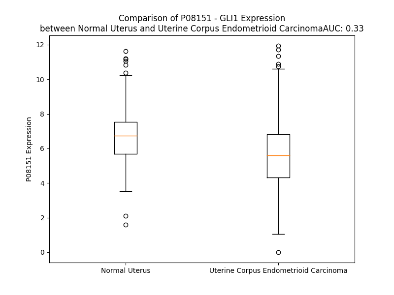

# Detailed Data for P08151

## Introduction to the Detailed Summary

### How to Interpret the Results

- **Summary & Metrics**: This section provides a quick reference to essential protein attributes, including expression changes, family classification, and biomarker applications. Regulation status (upregulated/downregulated) indicates the protein's behavior in a disease context. Some information comes from the original excel file with the proteins selected from literature, while others are derived from the analyses.
- **Expression Comparison**: A visual representation comparing protein expression between normal and disease states. It highlights significant changes in expression levels that might indicate diagnostic or therapeutic relevance. This is data coming from transcriptomics experiments and could not translate similarly to protein levels.
- **Isoform Alignment**: An interactive view of isoform alignments, revealing structural and functional differences between variants of the protein.
- **Interactors & Homologs**: Tables listing known interaction partners and homologous proteins, the more interactors and homologs, the more complex the protein is to design an antibody for.
- **Biological Assemblies**: Information about the structural arrangement of the protein in different assemblies, providing insights into its functional state but also the complexity of the protein to develop antibodies.
- **Combined Per-Residue Information**: A detailed table summarizing residue-level data. This includes predictions for epitope regions, aggregation tendencies, and modifications that might impact the protein's function. Each row corresponds to a residue in the protein, providing insights into specific sites that may be important for research or drug development.
## Summary & Metrics

- **UniProt Accession**: P08151
- **Gene Name**: GLI1
- **Protein Name**: Zinc finger protein GLI1
- **Swiss Prot**: GLI1_HUMAN
- **Family**: nan
- **Biomarker Application**: nan
- **Number of Isoforms**: 3
- **Regulation**: 2
- **(transcriptomics) AUC**: 0.33
- **(transcriptomics) Fold Change**: 1.22
- **(transcriptomics) Regulation**: Downregulated
- **Discotope Epitope Count**: 253
- **Max n_uniprots (Homo)**: 2
- **Max n_uniprots (Hetero)**: 2

## Expression Comparison

## Isoform Alignment

<pre style='font-size:14px; font-family:monospace;'>P08151-1 MFNSMTPPPISSYGEPCCLRPLPSQGAPSVGTEGLSGPPFCHQANLMSGPHSYGPARETNSCTEGPLFSSPRSAVKLTKKRALSISPLSDASLDLQTVIRTSPSSLVAFINSRCTSPGGSYGHLSIGTMSPSLGFPAQMNHQKGPSPSFGVQPCGPHDSARGGMIPHPQSRGPFPTCQLKSELDMLVGKCREEPLEGDMSSPNSTGIQDPLLGMLDGREDLEREEKREPESVYETDCRWDGCSQEFDSQEQLVHHINSEHIHGERKEFVCHWGGCSRELRPFKAQYMLVVHMRRHTGEKPHKCTFEGCRKSYSRLENLKTHLRSHTGEKPYMCEHEGCSKAFSNASDRAKHQNRTHSNEKPYVCKLPGCTKRYTDPSSLRKHVKTVHGPDAHVTKRHRGDGPLPRAPSISTVEPKREREGGPIREESRLTVPEGAMKPQPSPGAQSSCSSDHSPAGSAANTDSGVEMTGNAGGSTEDLSSLDEGPCIAGTGLSTLRRLENLRLDQLHQLRPIGTRGLKLPSLSHTGTTVSRRVGPPVSLERRSSSSSSISSAYTVSRRSSLASPFPPGSPPENGASSLPGLMPAQHYLLRARYASARGGGTSPTAASSLDRIGGLPMPPWRSRAEYPGYNPNAGVTRRASDPAQAADRPAPARVQRFKSLGCVHTPPTVAGGGQNFDPYLPTSVYSPQPPSITENAAMDARGLQEEPEVGTSMVGSGLNPYMDFPPTDTLGYGGPEGAAAEPYGARGPGSLPLGPGPPTNYGPNPCPQQASYPDPTQETWGEFPSHSGLYPGPKALGGTYSQCPRLEHYGQVQVKPEQGCPVGSDSTGLAPCLNAHPSEGPPHPQPLFSHYPQPSPPQYLQSGPYTQPPPDYLPSEPRPCLDFDSPTHSTGQLKAQLVCNYVQSQQELLWEGGGREDAPAQEPSYQSPKFLGGSQVSPSRAKAPVNTYGPGFGPNLPNHKSGSYPTPSPCHENFVVGANRASHRAAAPPRLLPPLPTCYGPLKVGGTNPSCGHPEVGRLGGGPALYPPPEGQVCNPLDSLDLDNTQLDFVAILDEPQGLSPPPSHDQRGSSGHTPPPSGPPNMAVGNMSVLLRSLPGETEFLNSSA
P08151-2 MFNSMTPPPISSYGEPCCLRPLPSQGAPSVGTE-----------------------------------------VKLTKKRALSISPLSDASLDLQTVIRTSPSSLVAFINSRCTSPGGSYGHLSIGTMSPSLGFPAQMNHQKGPSPSFGVQPCGPHDSARGGMIPHPQSRGPFPTCQLKSELDMLVGKCREEPLEGDMSSPNSTGIQDPLLGMLDGREDLEREEKREPESVYETDCRWDGCSQEFDSQEQLVHHINSEHIHGERKEFVCHWGGCSRELRPFKAQYMLVVHMRRHTGEKPHKCTFEGCRKSYSRLENLKTHLRSHTGEKPYMCEHEGCSKAFSNASDRAKHQNRTHSNEKPYVCKLPGCTKRYTDPSSLRKHVKTVHGPDAHVTKRHRGDGPLPRAPSISTVEPKREREGGPIREESRLTVPEGAMKPQPSPGAQSSCSSDHSPAGSAANTDSGVEMTGNAGGSTEDLSSLDEGPCIAGTGLSTLRRLENLRLDQLHQLRPIGTRGLKLPSLSHTGTTVSRRVGPPVSLERRSSSSSSISSAYTVSRRSSLASPFPPGSPPENGASSLPGLMPAQHYLLRARYASARGGGTSPTAASSLDRIGGLPMPPWRSRAEYPGYNPNAGVTRRASDPAQAADRPAPARVQRFKSLGCVHTPPTVAGGGQNFDPYLPTSVYSPQPPSITENAAMDARGLQEEPEVGTSMVGSGLNPYMDFPPTDTLGYGGPEGAAAEPYGARGPGSLPLGPGPPTNYGPNPCPQQASYPDPTQETWGEFPSHSGLYPGPKALGGTYSQCPRLEHYGQVQVKPEQGCPVGSDSTGLAPCLNAHPSEGPPHPQPLFSHYPQPSPPQYLQSGPYTQPPPDYLPSEPRPCLDFDSPTHSTGQLKAQLVCNYVQSQQELLWEGGGREDAPAQEPSYQSPKFLGGSQVSPSRAKAPVNTYGPGFGPNLPNHKSGSYPTPSPCHENFVVGANRASHRAAAPPRLLPPLPTCYGPLKVGGTNPSCGHPEVGRLGGGPALYPPPEGQVCNPLDSLDLDNTQLDFVAILDEPQGLSPPPSHDQRGSSGHTPPPSGPPNMAVGNMSVLLRSLPGETEFLNSSA
P08151-3 --------------------------------------------------------------------------------------------------------------------------------MSPSLGFPAQMNHQKGPSPSFGVQPCGPHDSARGGMIPHPQSRGPFPTCQLKSELDMLVGKCREEPLEGDMSSPNSTGIQDPLLGMLDGREDLEREEKREPESVYETDCRWDGCSQEFDSQEQLVHHINSEHIHGERKEFVCHWGGCSRELRPFKAQYMLVVHMRRHTGEKPHKCTFEGCRKSYSRLENLKTHLRSHTGEKPYMCEHEGCSKAFSNASDRAKHQNRTHSNEKPYVCKLPGCTKRYTDPSSLRKHVKTVHGPDAHVTKRHRGDGPLPRAPSISTVEPKREREGGPIREESRLTVPEGAMKPQPSPGAQSSCSSDHSPAGSAANTDSGVEMTGNAGGSTEDLSSLDEGPCIAGTGLSTLRRLENLRLDQLHQLRPIGTRGLKLPSLSHTGTTVSRRVGPPVSLERRSSSSSSISSAYTVSRRSSLASPFPPGSPPENGASSLPGLMPAQHYLLRARYASARGGGTSPTAASSLDRIGGLPMPPWRSRAEYPGYNPNAGVTRRASDPAQAADRPAPARVQRFKSLGCVHTPPTVAGGGQNFDPYLPTSVYSPQPPSITENAAMDARGLQEEPEVGTSMVGSGLNPYMDFPPTDTLGYGGPEGAAAEPYGARGPGSLPLGPGPPTNYGPNPCPQQASYPDPTQETWGEFPSHSGLYPGPKALGGTYSQCPRLEHYGQVQVKPEQGCPVGSDSTGLAPCLNAHPSEGPPHPQPLFSHYPQPSPPQYLQSGPYTQPPPDYLPSEPRPCLDFDSPTHSTGQLKAQLVCNYVQSQQELLWEGGGREDAPAQEPSYQSPKFLGGSQVSPSRAKAPVNTYGPGFGPNLPNHKSGSYPTPSPCHENFVVGANRASHRAAAPPRLLPPLPTCYGPLKVGGTNPSCGHPEVGRLGGGPALYPPPEGQVCNPLDSLDLDNTQLDFVAILDEPQGLSPPPSHDQRGSSGHTPPPSGPPNMAVGNMSVLLRSLPGETEFLNSSA
</pre>

## Interactors

| preferredName_A   | preferredName_B   |   score |
|:------------------|:------------------|--------:|
| GLI1              | SUFU              |   0.999 |
| GLI1              | KIF7              |   0.997 |
| GLI1              | SPOP              |   0.99  |
| GLI1              | SMO               |   0.988 |
| GLI1              | BTRC              |   0.983 |
| GLI1              | SHH               |   0.979 |
| GLI1              | PTCH1             |   0.978 |
| GLI1              | STK36             |   0.966 |
| GLI1              | PRKACA            |   0.966 |
| GLI1              | IHH               |   0.965 |
| GLI1              | GLI2              |   0.958 |
| GLI1              | FBXW11            |   0.957 |
| GLI1              | ARRB2             |   0.954 |
| GLI1              | PRKACG            |   0.954 |
| GLI1              | PRKACB            |   0.954 |
| GLI1              | SPOPL             |   0.952 |
| GLI1              | CUL3              |   0.945 |
| GLI1              | CUL1              |   0.934 |
| GLI1              | KAT2B             |   0.932 |
| GLI1              | ARRB1             |   0.93  |
| GLI1              | GLI3              |   0.923 |
| GLI1              | CDC73             |   0.92  |

## Homologs

| uniprot_id   | gene_id   |
|:-------------|:----------|
| O60481       | ZIC3      |
| A0A6Q8PH00   | GLI2      |
| P98168       | ZXDA      |
| P98169       | ZXDB      |
| A0A669KBC9   | AEBP2     |
| A0A7I2V3B8   | GLI3      |
| Q9BZE0       | GLIS2     |
| F8WEV9       | GLIS3     |
| Q96T25       | ZIC5      |
| C9J6T3       | ZIC4      |
| Q2QGD7       | ZXDC      |
| Q15915       | ZIC1      |
| O95409       | ZIC2      |
| A0A0D9SEX9   | GLIS1     |

## Biological Assemblies

|   Unnamed: 0 |   assembly |   n_uniprots | composition   | crystal_id   |
|-------------:|-----------:|-------------:|:--------------|:-------------|
|            0 |          1 |            2 | Homo          | 7t91         |
|            0 |          1 |            1 | Homo          | 2gli         |
|            0 |          1 |            2 | Hetero        | 4kmd         |
|            1 |          2 |            2 | Hetero        | 4kmd         |
|            0 |          1 |            2 | Hetero        | 4blb         |
|            1 |          2 |            2 | Hetero        | 4blb         |
|            2 |          3 |            2 | Hetero        | 4blb         |
|            3 |          4 |            2 | Hetero        | 4blb         |
|            0 |          1 |            2 | Homo          | 5om0         |
|            1 |          2 |            2 | Homo          | 5om0         |

## Combined Per-Residue Information

|   res | aa   |   epitope_score | epitope   |   relative_surface_accessibility |   modeling_confidence |   Aggregation | modification    |
|------:|:-----|----------------:|:----------|---------------------------------:|----------------------:|--------------:|:----------------|
|     1 | M    |         0.0911  | True      |                          1.29255 |                 38.13 |         0     | N/A             |
|     2 | F    |         0.13116 | True      |                          1.10005 |                 42.92 |         0     | N/A             |
|     3 | N    |         0.08581 | True      |                          0.92844 |                 41.92 |         0     | N/A             |
|     4 | S    |         0.08817 | True      |                          0.78016 |                 39.54 |         0     | N/A             |
|     5 | M    |         0.11655 | True      |                          0.99015 |                 49.01 |         0     | N/A             |
|     6 | T    |         0.097   | True      |                          0.87406 |                 60.2  |         0     | N/A             |
|     7 | P    |         0.09801 | True      |                          0.83358 |                 60.2  |         0     | N/A             |
|     8 | P    |         0.10143 | True      |                          0.78961 |                 48.53 |         0     | N/A             |
|     9 | P    |         0.07439 | False     |                          0.98357 |                 46.57 |         0     | N/A             |
|    10 | I    |         0.08021 | False     |                          1.03317 |                 47.6  |         0     | N/A             |
|    11 | S    |         0.0997  | True      |                          0.80934 |                 37.08 |         0     | N/A             |
|    12 | S    |         0.14978 | True      |                          0.76286 |                 37.66 |         0     | N/A             |
|    13 | Y    |         0.1733  | True      |                          1.06404 |                 41.58 |         0     | N/A             |
|    14 | G    |         0.1183  | True      |                          0.83888 |                 42.35 |         0     | N/A             |
|    15 | E    |         0.08266 | False     |                          0.94109 |                 43.75 |         0     | N/A             |
|    16 | P    |         0.13422 | True      |                          0.90654 |                 44.07 |         0     | N/A             |
|    17 | C    |         0.09625 | True      |                          0.93474 |                 41.57 |         0     | N/A             |
|    18 | C    |         0.11315 | True      |                          0.91242 |                 44.36 |         0     | N/A             |
|    19 | L    |         0.09905 | True      |                          1.05084 |                 40.47 |         0     | N/A             |
|    20 | R    |         0.19909 | True      |                          0.95912 |                 40.29 |         0     | N/A             |
|    21 | P    |         0.08352 | False     |                          0.89289 |                 42.57 |         0     | N/A             |
|    22 | L    |         0.10594 | True      |                          1.0197  |                 37.28 |         0     | N/A             |
|    23 | P    |         0.07237 | False     |                          0.89213 |                 54.65 |         0     | N/A             |
|    24 | S    |         0.09268 | True      |                          0.67212 |                 39.96 |         0     | N/A             |
|    25 | Q    |         0.12478 | True      |                          0.94593 |                 40.72 |         0     | N/A             |
|    26 | G    |         0.14101 | True      |                          0.85248 |                 39.56 |         0     | N/A             |
|    27 | A    |         0.10798 | True      |                          0.95598 |                 41.96 |         0     | N/A             |
|    28 | P    |         0.09513 | True      |                          1.00196 |                 44.72 |         0     | N/A             |
|    29 | S    |         0.14442 | True      |                          0.88273 |                 39.08 |         0     | N/A             |
|    30 | V    |         0.12254 | True      |                          1.03907 |                 39.47 |         0     | N/A             |
|    31 | G    |         0.13884 | True      |                          0.75196 |                 38.16 |         0     | N/A             |
|    32 | T    |         0.14202 | True      |                          0.8596  |                 38.36 |         0     | N/A             |
|    33 | E    |         0.11462 | True      |                          0.89093 |                 35.89 |         0     | N/A             |
|    34 | G    |         0.20589 | True      |                          0.79164 |                 36.16 |         0     | N/A             |
|    35 | L    |         0.13388 | True      |                          1.03635 |                 38.21 |         0     | N/A             |
|    36 | S    |         0.08793 | True      |                          0.91364 |                 37.76 |         0     | N/A             |
|    37 | G    |         0.12258 | True      |                          0.78084 |                 35.94 |         0     | N/A             |
|    38 | P    |         0.04903 | False     |                          0.74303 |                 38.48 |         0     | N/A             |
|    39 | P    |         0.12182 | True      |                          0.94937 |                 41.49 |         0     | N/A             |
|    40 | F    |         0.07997 | False     |                          0.80868 |                 33.68 |         0     | N/A             |
|    41 | C    |         0.082   | False     |                          0.74901 |                 32.31 |         0     | N/A             |
|    42 | H    |         0.12501 | True      |                          0.9124  |                 37.73 |         0     | N/A             |
|    43 | Q    |         0.1138  | True      |                          0.76615 |                 34.28 |         0     | N/A             |
|    44 | A    |         0.08331 | False     |                          0.99405 |                 38.64 |         0     | N/A             |
|    45 | N    |         0.13803 | True      |                          0.82845 |                 34.19 |         0     | N/A             |
|    46 | L    |         0.1665  | True      |                          0.97472 |                 37.88 |         0     | N/A             |
|    47 | M    |         0.15078 | True      |                          0.85213 |                 36.52 |         0     | N/A             |
|    48 | S    |         0.13796 | True      |                          0.80261 |                 36.13 |         0     | N/A             |
|    49 | G    |         0.12761 | True      |                          0.88456 |                 36.37 |         0     | N/A             |
|    50 | P    |         0.08952 | True      |                          0.8464  |                 44.9  |         0     | N/A             |
|    51 | H    |         0.12052 | True      |                          0.95569 |                 37.77 |         0     | N/A             |
|    52 | S    |         0.09446 | True      |                          0.62    |                 33.09 |         0     | N/A             |
|    53 | Y    |         0.1047  | True      |                          0.98061 |                 38.71 |         0     | N/A             |
|    54 | G    |         0.08829 | True      |                          0.79591 |                 33.71 |         0     | N/A             |
|    55 | P    |         0.10025 | True      |                          0.96447 |                 46.14 |         0     | N/A             |
|    56 | A    |         0.05433 | False     |                          0.86115 |                 36.13 |         0     | N/A             |
|    57 | R    |         0.097   | True      |                          0.79025 |                 36.83 |         0     | N/A             |
|    58 | E    |         0.05468 | False     |                          0.64788 |                 35.27 |         0     | N/A             |
|    59 | T    |         0.06211 | False     |                          0.78272 |                 35.43 |         0     | N/A             |
|    60 | N    |         0.09041 | True      |                          0.90044 |                 36.87 |         0     | N/A             |
|    61 | S    |         0.07127 | False     |                          0.72204 |                 34.48 |         0     | N/A             |
|    62 | C    |         0.08159 | False     |                          0.83983 |                 34.17 |         0     | N/A             |
|    63 | T    |         0.13572 | True      |                          0.82199 |                 35.93 |         0     | N/A             |
|    64 | E    |         0.10068 | True      |                          0.8806  |                 34.24 |         0     | N/A             |
|    65 | G    |         0.1195  | True      |                          0.87206 |                 38.08 |         0     | N/A             |
|    66 | P    |         0.07914 | False     |                          0.94213 |                 44.17 |         0     | N/A             |
|    67 | L    |         0.12401 | True      |                          1.09127 |                 35.4  |         0     | N/A             |
|    68 | F    |         0.17266 | True      |                          0.98922 |                 33.25 |         0     | N/A             |
|    69 | S    |         0.15086 | True      |                          0.8535  |                 34.71 |         0     | N/A             |
|    70 | S    |         0.09697 | True      |                          0.85131 |                 34.98 |         0     | N/A             |
|    71 | P    |         0.11581 | True      |                          0.904   |                 33.64 |         0     | N/A             |
|    72 | R    |         0.12416 | True      |                          0.94198 |                 33.81 |         0     | N/A             |
|    73 | S    |         0.08378 | False     |                          0.82935 |                 33.23 |         0     | N/A             |
|    74 | A    |         0.07972 | False     |                          0.79467 |                 30.54 |         0     | N/A             |
|    75 | V    |         0.06255 | False     |                          0.87181 |                 35.77 |         0     | N/A             |
|    76 | K    |         0.13808 | True      |                          0.88491 |                 31.18 |         0     | N/A             |
|    77 | L    |         0.09982 | True      |                          0.90151 |                 36.16 |         0     | N/A             |
|    78 | T    |         0.12059 | True      |                          0.8899  |                 29.92 |         0     | N/A             |
|    79 | K    |         0.05177 | False     |                          0.79905 |                 30.95 |         0     | N/A             |
|    80 | K    |         0.09666 | True      |                          0.94841 |                 28.28 |         0     | N/A             |
|    81 | R    |         0.08925 | True      |                          0.72532 |                 28.41 |         0     | N/A             |
|    82 | A    |         0.08502 | True      |                          0.76975 |                 27.11 |         0     | N/A             |
|    83 | L    |         0.10793 | True      |                          0.86401 |                 34.82 |         0     | N/A             |
|    84 | S    |         0.07878 | False     |                          0.67788 |                 26.93 |         0     | N/A             |
|    85 | I    |         0.07852 | False     |                          0.86663 |                 30.91 |         0     | N/A             |
|    86 | S    |         0.06852 | False     |                          0.88801 |                 36.29 |         0     | N/A             |
|    87 | P    |         0.05881 | False     |                          0.71377 |                 30.99 |         0     | N/A             |
|    88 | L    |         0.07635 | False     |                          0.91664 |                 33.94 |         0     | N/A             |
|    89 | S    |         0.14296 | True      |                          0.95047 |                 30.1  |         0     | N/A             |
|    90 | D    |         0.07974 | False     |                          0.76742 |                 30.25 |         0     | N/A             |
|    91 | A    |         0.06194 | False     |                          0.84137 |                 32.43 |         0     | N/A             |
|    92 | S    |         0.09678 | True      |                          0.85462 |                 36.09 |         0     | N/A             |
|    93 | L    |         0.08137 | False     |                          0.89437 |                 50.45 |         0     | N/A             |
|    94 | D    |         0.02799 | False     |                          0.42807 |                 62.29 |         0     | N/A             |
|    95 | L    |         0.09406 | True      |                          0.607   |                 66.28 |         2.626 | N/A             |
|    96 | Q    |         0.078   | False     |                          0.54774 |                 66.62 |         2.626 | N/A             |
|    97 | T    |         0.03452 | False     |                          0.4502  |                 68.55 |         2.626 | N/A             |
|    98 | V    |         0.01805 | False     |                          0.12377 |                 64.25 |         2.626 | N/A             |
|    99 | I    |         0.08087 | False     |                          0.50019 |                 67.14 |         2.626 | N/A             |
|   100 | R    |         0.09331 | True      |                          0.72239 |                 66.82 |         0     | N/A             |
|   101 | T    |         0.04553 | False     |                          0.72035 |                 65.26 |         0     | N/A             |
|   102 | S    |         0.03862 | False     |                          0.28901 |                 64.4  |         0     | N/A             |
|   103 | P    |         0.05427 | False     |                          0.64433 |                 63.57 |         0     | N/A             |
|   104 | S    |         0.04354 | False     |                          0.74349 |                 60.19 |         1.198 | N/A             |
|   105 | S    |         0.03889 | False     |                          0.38698 |                 62.9  |        10.988 | N/A             |
|   106 | L    |         0.03466 | False     |                          0.19372 |                 60.46 |        83.527 | N/A             |
|   107 | V    |         0.03777 | False     |                          0.61504 |                 64.1  |        83.74  | N/A             |
|   108 | A    |         0.05454 | False     |                          0.55416 |                 60.99 |        83.74  | N/A             |
|   109 | F    |         0.05424 | False     |                          0.29498 |                 64.02 |        83.74  | N/A             |
|   110 | I    |         0.05163 | False     |                          0.45198 |                 60.36 |        82.829 | N/A             |
|   111 | N    |         0.05295 | False     |                          0.60005 |                 54.92 |         1.5   | N/A             |
|   112 | S    |         0.05936 | False     |                          0.61111 |                 57.09 |         0.173 | N/A             |
|   113 | R    |         0.0545  | False     |                          0.69508 |                 49.7  |         0     | N/A             |
|   114 | C    |         0.08893 | True      |                          0.60608 |                 37.94 |         0     | N/A             |
|   115 | T    |         0.11345 | True      |                          0.82873 |                 38.46 |         0     | N/A             |
|   116 | S    |         0.1004  | True      |                          0.6775  |                 34.82 |         0     | N/A             |
|   117 | P    |         0.09377 | True      |                          0.99332 |                 40.45 |         0     | N/A             |
|   118 | G    |         0.10898 | True      |                          0.96471 |                 32.22 |         0     | N/A             |
|   119 | G    |         0.05434 | False     |                          0.96811 |                 31.65 |         0     | N/A             |
|   120 | S    |         0.05775 | False     |                          0.76351 |                 37.88 |         0     | N/A             |
|   121 | Y    |         0.05534 | False     |                          0.6524  |                 32.58 |         0     | N/A             |
|   122 | G    |         0.04148 | False     |                          0.77753 |                 38.93 |         0     | N/A             |
|   123 | H    |         0.04372 | False     |                          0.66581 |                 42.11 |         0     | N/A             |
|   124 | L    |         0.06094 | False     |                          0.99802 |                 36.82 |         0     | N/A             |
|   125 | S    |         0.03195 | False     |                          0.48356 |                 36.98 |         0     | N/A             |
|   126 | I    |         0.02618 | False     |                          0.72482 |                 35.79 |         0     | N/A             |
|   127 | G    |         0.02861 | False     |                          0.39153 |                 37.42 |         0     | N/A             |
|   128 | T    |         0.06453 | False     |                          0.71389 |                 37.94 |         0     | N/A             |
|   129 | M    |         0.05966 | False     |                          0.73686 |                 38.4  |         0     | N/A             |
|   130 | S    |         0.05169 | False     |                          0.81818 |                 37.65 |         0     | N/A             |
|   131 | P    |         0.10888 | True      |                          0.89703 |                 43.81 |         0     | N/A             |
|   132 | S    |         0.07485 | False     |                          0.77277 |                 37.41 |         0     | N/A             |
|   133 | L    |         0.08417 | True      |                          1.04814 |                 37.49 |         0     | N/A             |
|   134 | G    |         0.11277 | True      |                          0.81669 |                 43.76 |         0     | N/A             |
|   135 | F    |         0.06849 | False     |                          0.98841 |                 33.86 |         0     | N/A             |
|   136 | P    |         0.13197 | True      |                          0.86458 |                 48.92 |         0     | N/A             |
|   137 | A    |         0.09593 | True      |                          0.83939 |                 34.4  |         0     | N/A             |
|   138 | Q    |         0.07806 | False     |                          0.71155 |                 39.12 |         0     | N/A             |
|   139 | M    |         0.08937 | True      |                          0.85404 |                 32.68 |         0     | N/A             |
|   140 | N    |         0.06706 | False     |                          0.67284 |                 30.66 |         0     | N/A             |
|   141 | H    |         0.09317 | True      |                          0.8024  |                 34.61 |         0     | N/A             |
|   142 | Q    |         0.06135 | False     |                          0.69778 |                 32.59 |         0     | N/A             |
|   143 | K    |         0.11009 | True      |                          0.95722 |                 33.4  |         0     | N/A             |
|   144 | G    |         0.07859 | False     |                          0.82929 |                 33.86 |         0     | N/A             |
|   145 | P    |         0.08219 | False     |                          1.0151  |                 42.79 |         0     | N/A             |
|   146 | S    |         0.05257 | False     |                          0.76485 |                 35.44 |         0     | N/A             |
|   147 | P    |         0.06157 | False     |                          0.85182 |                 39.79 |         0     | N/A             |
|   148 | S    |         0.03902 | False     |                          0.65334 |                 36.12 |         0     | N/A             |
|   149 | F    |         0.0724  | False     |                          1.03734 |                 33.57 |         0     | N/A             |
|   150 | G    |         0.03937 | False     |                          0.85087 |                 34.55 |         0     | N/A             |
|   151 | V    |         0.05598 | False     |                          0.87643 |                 34.45 |         0     | N/A             |
|   152 | Q    |         0.05178 | False     |                          0.6901  |                 34.3  |         0     | N/A             |
|   153 | P    |         0.01995 | False     |                          0.36754 |                 42.12 |         0     | N/A             |
|   154 | C    |         0.02672 | False     |                          0.84735 |                 30.56 |         0     | N/A             |
|   155 | G    |         0.03031 | False     |                          0.58725 |                 35.09 |         0     | N/A             |
|   156 | P    |         0.03127 | False     |                          0.65704 |                 44.47 |         0     | N/A             |
|   157 | H    |         0.02524 | False     |                          0.61845 |                 38.01 |         0     | N/A             |
|   158 | D    |         0.03966 | False     |                          0.5764  |                 34.59 |         0     | N/A             |
|   159 | S    |         0.04438 | False     |                          0.49052 |                 38.9  |         0     | N/A             |
|   160 | A    |         0.05305 | False     |                          0.89487 |                 40.56 |         0     | N/A             |
|   161 | R    |         0.09315 | True      |                          0.94878 |                 39.16 |         0     | N/A             |
|   162 | G    |         0.06618 | False     |                          1.00746 |                 36.3  |         0     | N/A             |
|   163 | G    |         0.07256 | False     |                          0.87142 |                 37.49 |         0     | N/A             |
|   164 | M    |         0.06648 | False     |                          0.92459 |                 40.64 |         0     | N/A             |
|   165 | I    |         0.07116 | False     |                          0.89165 |                 42.6  |         0     | N/A             |
|   166 | P    |         0.08343 | False     |                          0.72534 |                 39.57 |         0     | N/A             |
|   167 | H    |         0.05162 | False     |                          0.75587 |                 39.2  |         0     | N/A             |
|   168 | P    |         0.02308 | False     |                          0.56653 |                 37.5  |         0     | N/A             |
|   169 | Q    |         0.02521 | False     |                          0.6308  |                 40.56 |         0     | N/A             |
|   170 | S    |         0.04009 | False     |                          0.49397 |                 38.67 |         0     | N/A             |
|   171 | R    |         0.03397 | False     |                          0.53508 |                 34.27 |         0     | N/A             |
|   172 | G    |         0.05475 | False     |                          0.55902 |                 37.51 |         0     | N/A             |
|   173 | P    |         0.07293 | False     |                          0.84493 |                 38.64 |         0     | N/A             |
|   174 | F    |         0.08017 | False     |                          0.98331 |                 35.16 |         0     | N/A             |
|   175 | P    |         0.1116  | True      |                          0.84965 |                 39.08 |         0     | N/A             |
|   176 | T    |         0.11602 | True      |                          0.90009 |                 37.26 |         0     | N/A             |
|   177 | C    |         0.07708 | False     |                          0.81324 |                 29.72 |         0     | N/A             |
|   178 | Q    |         0.0957  | True      |                          0.82258 |                 38.52 |         0     | N/A             |
|   179 | L    |         0.08158 | False     |                          0.88775 |                 32.8  |         0     | N/A             |
|   180 | K    |         0.0708  | False     |                          0.82119 |                 36.77 |         0     | N/A             |
|   181 | S    |         0.07854 | False     |                          0.74342 |                 37.74 |         0     | N/A             |
|   182 | E    |         0.11122 | True      |                          0.69588 |                 33.35 |         0     | N/A             |
|   183 | L    |         0.16341 | True      |                          0.99799 |                 34.33 |         0     | N/A             |
|   184 | D    |         0.08111 | False     |                          0.68778 |                 36.58 |         0     | N/A             |
|   185 | M    |         0.11529 | True      |                          0.77917 |                 36.09 |         0     | N/A             |
|   186 | L    |         0.0769  | False     |                          0.91232 |                 40.41 |         0     | N/A             |
|   187 | V    |         0.07494 | False     |                          0.98968 |                 37.14 |         0     | N/A             |
|   188 | G    |         0.07281 | False     |                          0.73998 |                 38.61 |         0     | N/A             |
|   189 | K    |         0.06378 | False     |                          0.99226 |                 40.07 |         0     | N/A             |
|   190 | C    |         0.04248 | False     |                          0.67656 |                 33.81 |         0     | N/A             |
|   191 | R    |         0.0724  | False     |                          0.6657  |                 35.42 |         0     | N/A             |
|   192 | E    |         0.0503  | False     |                          0.45898 |                 34.52 |         0     | N/A             |
|   193 | E    |         0.03847 | False     |                          0.48254 |                 34.24 |         0     | N/A             |
|   194 | P    |         0.05277 | False     |                          0.83358 |                 54.49 |         0     | N/A             |
|   195 | L    |         0.06977 | False     |                          0.95542 |                 42.91 |         0     | N/A             |
|   196 | E    |         0.08086 | False     |                          0.79695 |                 39.98 |         0     | N/A             |
|   197 | G    |         0.10672 | True      |                          0.81435 |                 45.83 |         0     | N/A             |
|   198 | D    |         0.0483  | False     |                          0.75768 |                 46.8  |         0     | N/A             |
|   199 | M    |         0.07023 | False     |                          0.61984 |                 38.79 |         0     | N/A             |
|   200 | S    |         0.08582 | True      |                          0.85613 |                 38.05 |         0     | N/A             |
|   201 | S    |         0.06946 | False     |                          0.81056 |                 39.5  |         0     | N/A             |
|   202 | P    |         0.09286 | True      |                          0.90874 |                 50.49 |         0     | N/A             |
|   203 | N    |         0.08007 | False     |                          0.88282 |                 33.91 |         0     | N/A             |
|   204 | S    |         0.06395 | False     |                          0.88057 |                 42.15 |         0     | N/A             |
|   205 | T    |         0.15968 | True      |                          1.01053 |                 41.37 |         0     | N/A             |
|   206 | G    |         0.16552 | True      |                          0.78325 |                 36.35 |         0     | N/A             |
|   207 | I    |         0.10996 | True      |                          0.98164 |                 37.01 |         0     | N/A             |
|   208 | Q    |         0.1583  | True      |                          0.84611 |                 33.06 |         0     | N/A             |
|   209 | D    |         0.10071 | True      |                          0.78426 |                 34.15 |         0     | N/A             |
|   210 | P    |         0.12468 | True      |                          0.72596 |                 38.28 |         0     | N/A             |
|   211 | L    |         0.11581 | True      |                          0.96169 |                 35.56 |         0.136 | N/A             |
|   212 | L    |         0.07751 | False     |                          1.09795 |                 36.5  |         0.136 | N/A             |
|   213 | G    |         0.05648 | False     |                          0.92062 |                 37.27 |         0.136 | N/A             |
|   214 | M    |         0.09027 | True      |                          0.99152 |                 35.95 |         0.136 | N/A             |
|   215 | L    |         0.04928 | False     |                          1.05535 |                 34.31 |         0.136 | N/A             |
|   216 | D    |         0.02832 | False     |                          0.51449 |                 33.23 |         0     | N/A             |
|   217 | G    |         0.09642 | True      |                          0.73829 |                 36.51 |         0     | N/A             |
|   218 | R    |         0.06947 | False     |                          0.91023 |                 39.15 |         0     | N/A             |
|   219 | E    |         0.09211 | True      |                          0.79945 |                 34.83 |         0     | N/A             |
|   220 | D    |         0.0879  | True      |                          0.7735  |                 37.33 |         0     | N/A             |
|   221 | L    |         0.09562 | True      |                          1.12201 |                 37.19 |         0     | N/A             |
|   222 | E    |         0.10131 | True      |                          0.85503 |                 38.44 |         0     | N/A             |
|   223 | R    |         0.12533 | True      |                          0.77817 |                 37.05 |         0     | N/A             |
|   224 | E    |         0.05011 | False     |                          0.64147 |                 35.77 |         0     | N/A             |
|   225 | E    |         0.06028 | False     |                          0.59003 |                 36.89 |         0     | N/A             |
|   226 | K    |         0.09909 | True      |                          0.87576 |                 33.23 |         0     | N/A             |
|   227 | R    |         0.10498 | True      |                          0.64592 |                 32.85 |         0     | N/A             |
|   228 | E    |         0.07829 | False     |                          0.52309 |                 40.08 |         0     | N/A             |
|   229 | P    |         0.10236 | True      |                          0.7976  |                 39.02 |         0     | N/A             |
|   230 | E    |         0.08794 | True      |                          0.70128 |                 38.2  |         0     | N/A             |
|   231 | S    |         0.0483  | False     |                          0.45095 |                 51.87 |         0     | N/A             |
|   232 | V    |         0.0762  | False     |                          1.05174 |                 54.47 |         0     | N/A             |
|   233 | Y    |         0.05111 | False     |                          0.3656  |                 65.51 |         0     | N/A             |
|   234 | E    |         0.07206 | False     |                          0.38845 |                 74.11 |         0     | N/A             |
|   235 | T    |         0.0418  | False     |                          0.29825 |                 82.68 |         0     | N/A             |
|   236 | D    |         0.03792 | False     |                          0.29012 |                 85.2  |         0     | N/A             |
|   237 | C    |         0.01681 | False     |                          0.01406 |                 88.48 |         0     | N/A             |
|   238 | R    |         0.07021 | False     |                          0.51294 |                 84.72 |         0     | N/A             |
|   239 | W    |         0.02114 | False     |                          0.03496 |                 85.1  |         0     | N/A             |
|   240 | D    |         0.11029 | True      |                          0.69003 |                 83.87 |         0     | N/A             |
|   241 | G    |         0.10334 | True      |                          1.08129 |                 79.67 |         0     | N/A             |
|   242 | C    |         0.04231 | False     |                          0.19606 |                 85.26 |         0     | N/A             |
|   243 | S    |         0.09884 | True      |                          0.7731  |                 83.38 |         0     | N/A             |
|   244 | Q    |         0.10647 | True      |                          0.46742 |                 86.3  |         0     | N/A             |
|   245 | E    |         0.11791 | True      |                          0.77019 |                 86.22 |         0     | N/A             |
|   246 | F    |         0.06967 | False     |                          0.23002 |                 87.36 |         0     | N/A             |
|   247 | D    |         0.11118 | True      |                          0.86123 |                 83.65 |         0     | N/A             |
|   248 | S    |         0.01949 | False     |                          0.26092 |                 85.14 |         0     | N/A             |
|   249 | Q    |         0.01107 | False     |                          0.07251 |                 84.47 |         0     | N/A             |
|   250 | E    |         0.0285  | False     |                          0.60454 |                 85.94 |         0     | N/A             |
|   251 | Q    |         0.03078 | False     |                          0.40175 |                 86.65 |         0     | N/A             |
|   252 | L    |         0.00174 | False     |                          0       |                 88.57 |         0     | N/A             |
|   253 | V    |         0.01044 | False     |                          0.17613 |                 86.37 |         0     | N/A             |
|   254 | H    |         0.0312  | False     |                          0.60504 |                 86.78 |         0     | N/A             |
|   255 | H    |         0.01666 | False     |                          0.06464 |                 88.69 |         0     | N/A             |
|   256 | I    |         0.00457 | False     |                          0.0144  |                 86.83 |         0     | N/A             |
|   257 | N    |         0.02835 | False     |                          0.23942 |                 85.28 |         0     | N/A             |
|   258 | S    |         0.04996 | False     |                          0.35114 |                 83.79 |         0     | N/A             |
|   259 | E    |         0.08641 | True      |                          0.55225 |                 83.6  |         0     | N/A             |
|   260 | H    |         0.03728 | False     |                          0.16876 |                 82.78 |         0     | N/A             |
|   261 | I    |         0.02301 | False     |                          0.03942 |                 80.08 |         0     | N/A             |
|   262 | H    |         0.14803 | True      |                          0.68232 |                 70.94 |         0     | N/A             |
|   263 | G    |         0.0884  | True      |                          0.49092 |                 64.36 |         0     | N/A             |
|   264 | E    |         0.1585  | True      |                          0.9757  |                 57.32 |         0     | N/A             |
|   265 | R    |         0.10038 | True      |                          0.50408 |                 62.51 |         0     | N/A             |
|   266 | K    |         0.17923 | True      |                          0.88193 |                 62.82 |         0     | N/A             |
|   267 | E    |         0.05938 | False     |                          0.54576 |                 76.62 |         0     | N/A             |
|   268 | F    |         0.07851 | False     |                          0.28464 |                 82.65 |        15.471 | N/A             |
|   269 | V    |         0.03792 | False     |                          0.12461 |                 84.39 |        15.471 | N/A             |
|   270 | C    |         0.01829 | False     |                          0.02566 |                 87.61 |        15.471 | N/A             |
|   271 | H    |         0.03052 | False     |                          0.20808 |                 84.19 |        15.471 | N/A             |
|   272 | W    |         0.03488 | False     |                          0.0717  |                 85.52 |        15.471 | N/A             |
|   273 | G    |         0.09225 | True      |                          0.61395 |                 81.88 |         1.192 | N/A             |
|   274 | G    |         0.08431 | True      |                          0.99194 |                 80.41 |         0     | N/A             |
|   275 | C    |         0.02935 | False     |                          0.08488 |                 86.38 |         0     | N/A             |
|   276 | S    |         0.06553 | False     |                          0.81297 |                 79.9  |         0     | N/A             |
|   277 | R    |         0.06604 | False     |                          0.09844 |                 80.78 |         0     | N/A             |
|   278 | E    |         0.07409 | False     |                          0.63122 |                 63.74 |         0     | N/A             |
|   279 | L    |         0.16246 | True      |                          0.673   |                 71.66 |         0     | N/A             |
|   280 | R    |         0.08969 | True      |                          0.61822 |                 80.23 |         0     | N/A             |
|   281 | P    |         0.11778 | True      |                          0.55029 |                 83.21 |         0     | N/A             |
|   282 | F    |         0.02106 | False     |                          0.05999 |                 85.57 |         0     | N/A             |
|   283 | K    |         0.05937 | False     |                          0.82674 |                 84.89 |         0     | N/A             |
|   284 | A    |         0.0376  | False     |                          0.25508 |                 84.15 |         0.83  | N/A             |
|   285 | Q    |         0.06167 | False     |                          0.24808 |                 85.64 |         1.812 | N/A             |
|   286 | Y    |         0.06632 | False     |                          0.6613  |                 85.94 |        65.718 | N/A             |
|   287 | M    |         0.0204  | False     |                          0.37607 |                 88.55 |        65.769 | N/A             |
|   288 | L    |         0.00415 | False     |                          0.01649 |                 89.13 |        65.769 | N/A             |
|   289 | V    |         0.02218 | False     |                          0.24862 |                 87.96 |        65.769 | N/A             |
|   290 | V    |         0.02066 | False     |                          0.33824 |                 89.11 |        65.627 | N/A             |
|   291 | H    |         0.01031 | False     |                          0.03207 |                 89.73 |         0.706 | N/A             |
|   292 | M    |         0.00341 | False     |                          0.02805 |                 88.3  |         0.193 | N/A             |
|   293 | R    |         0.02122 | False     |                          0.185   |                 90.13 |         0     | N/A             |
|   294 | R    |         0.05401 | False     |                          0.55472 |                 87.5  |         0     | N/A             |
|   295 | H    |         0.01593 | False     |                          0.13104 |                 87.26 |         0     | N/A             |
|   296 | T    |         0.00908 | False     |                          0.01562 |                 86.31 |         0     | N/A             |
|   297 | G    |         0.02762 | False     |                          0.29612 |                 86.16 |         0     | N/A             |
|   298 | E    |         0.019   | False     |                          0.12279 |                 86.99 |         0     | N/A             |
|   299 | K    |         0.08448 | True      |                          0.44483 |                 90.36 |         0     | N/A             |
|   300 | P    |         0.04201 | False     |                          0.42145 |                 88.12 |         0     | N/A             |
|   301 | H    |         0.03925 | False     |                          0.17102 |                 89.09 |         0     | N/A             |
|   302 | K    |         0.0539  | False     |                          0.68933 |                 90.26 |         0     | N/A             |
|   303 | C    |         0.03917 | False     |                          0.12238 |                 92.75 |         0     | N/A             |
|   304 | T    |         0.05608 | False     |                          0.71418 |                 90.16 |         0     | N/A             |
|   305 | F    |         0.05935 | False     |                          0.56437 |                 87.18 |         0     | N/A             |
|   306 | E    |         0.07668 | False     |                          0.82501 |                 86.85 |         0     | N/A             |
|   307 | G    |         0.07408 | False     |                          0.93395 |                 86.5  |         0     | N/A             |
|   308 | C    |         0.02374 | False     |                          0.14907 |                 88.23 |         0     | N/A             |
|   309 | R    |         0.12914 | True      |                          0.93129 |                 88.19 |         0     | N/A             |
|   310 | K    |         0.03979 | False     |                          0.44373 |                 89.72 |         0     | N/A             |
|   311 | S    |         0.02898 | False     |                          0.25455 |                 91.45 |         0     | N/A             |
|   312 | Y    |         0.05489 | False     |                          0.24618 |                 90.85 |         0     | N/A             |
|   313 | S    |         0.02325 | False     |                          0.25945 |                 90.03 |         0     | N/A             |
|   314 | R    |         0.05147 | False     |                          0.38266 |                 89.68 |         0     | N/A             |
|   315 | L    |         0.0337  | False     |                          0.4896  |                 89.99 |         0     | N/A             |
|   316 | E    |         0.04279 | False     |                          0.57406 |                 85.75 |         0     | N/A             |
|   317 | N    |         0.02399 | False     |                          0.39997 |                 89.37 |         0     | N/A             |
|   318 | L    |         0.00783 | False     |                          0.06183 |                 92.22 |         0     | N/A             |
|   319 | K    |         0.02458 | False     |                          0.40017 |                 88.88 |         0     | N/A             |
|   320 | T    |         0.01554 | False     |                          0.24879 |                 87.3  |         0     | N/A             |
|   321 | H    |         0.01557 | False     |                          0.11522 |                 90.09 |         0     | N/A             |
|   322 | L    |         0.0148  | False     |                          0.19169 |                 89.83 |         0     | N/A             |
|   323 | R    |         0.03925 | False     |                          0.24409 |                 88.8  |         0     | N/A             |
|   324 | S    |         0.03638 | False     |                          0.59259 |                 88.32 |         0     | N/A             |
|   325 | H    |         0.02938 | False     |                          0.32489 |                 88.1  |         0     | N/A             |
|   326 | T    |         0.03846 | False     |                          0.64779 |                 86.61 |         0     | N/A             |
|   327 | G    |         0.03479 | False     |                          0.55246 |                 84.52 |         0     | N/A             |
|   328 | E    |         0.04165 | False     |                          0.49112 |                 83.98 |         0     | N/A             |
|   329 | K    |         0.13918 | True      |                          0.58784 |                 87.21 |         0     | N/A             |
|   330 | P    |         0.05535 | False     |                          0.60426 |                 86.52 |         0     | N/A             |
|   331 | Y    |         0.06213 | False     |                          0.29797 |                 86.11 |         0     | N/A             |
|   332 | M    |         0.03086 | False     |                          0.68592 |                 86.81 |         0     | N/A             |
|   333 | C    |         0.04613 | False     |                          0.09475 |                 90.36 |         0     | N/A             |
|   334 | E    |         0.09433 | True      |                          0.59659 |                 84.45 |         0     | N/A             |
|   335 | H    |         0.02967 | False     |                          0.42892 |                 82.1  |         0     | N/A             |
|   336 | E    |         0.07425 | False     |                          0.8102  |                 81.66 |         0     | N/A             |
|   337 | G    |         0.07435 | False     |                          1.0635  |                 80.65 |         0     | N/A             |
|   338 | C    |         0.02672 | False     |                          0.1109  |                 85.83 |         0     | N/A             |
|   339 | S    |         0.06386 | False     |                          0.87792 |                 83.22 |         0     | N/A             |
|   340 | K    |         0.05285 | False     |                          0.46596 |                 86.8  |         0     | N/A             |
|   341 | A    |         0.02333 | False     |                          0.26887 |                 88.2  |         0     | N/A             |
|   342 | F    |         0.02756 | False     |                          0.23593 |                 87.07 |         0     | N/A             |
|   343 | S    |         0.01798 | False     |                          0.23424 |                 85.38 |         0     | N/A             |
|   344 | N    |         0.03303 | False     |                          0.17276 |                 85.43 |         0     | N/A             |
|   345 | A    |         0.02588 | False     |                          0.45817 |                 87.48 |         0     | N/A             |
|   346 | S    |         0.03567 | False     |                          0.45424 |                 85.33 |         0     | N/A             |
|   347 | D    |         0.03005 | False     |                          0.32725 |                 86.22 |         0     | N/A             |
|   348 | R    |         0.0254  | False     |                          0.21631 |                 90.18 |         0     | N/A             |
|   349 | A    |         0.02072 | False     |                          0.39008 |                 86.02 |         0     | N/A             |
|   350 | K    |         0.01877 | False     |                          0.44999 |                 84.59 |         0     | N/A             |
|   351 | H    |         0.01839 | False     |                          0.12287 |                 86.14 |         0     | N/A             |
|   352 | Q    |         0.01617 | False     |                          0.2425  |                 83.44 |         0     | N/A             |
|   353 | N    |         0.04692 | False     |                          0.67125 |                 81.33 |         0     | N/A             |
|   354 | R    |         0.04683 | False     |                          0.3408  |                 79.22 |         0     | N/A             |
|   355 | T    |         0.0518  | False     |                          0.56096 |                 80.45 |         0     | N/A             |
|   356 | H    |         0.02594 | False     |                          0.28902 |                 80.42 |         0     | N/A             |
|   357 | S    |         0.03647 | False     |                          0.27891 |                 72.57 |         0     | N/A             |
|   358 | N    |         0.08182 | False     |                          0.88205 |                 66.7  |         0     | N/A             |
|   359 | E    |         0.05771 | False     |                          0.60973 |                 75.96 |         0     | N/A             |
|   360 | K    |         0.11521 | True      |                          0.45512 |                 79.66 |         0     | N/A             |
|   361 | P    |         0.04325 | False     |                          0.3102  |                 80.38 |         0     | N/A             |
|   362 | Y    |         0.02721 | False     |                          0.10871 |                 82.09 |         0     | N/A             |
|   363 | V    |         0.02814 | False     |                          0.37149 |                 84.19 |         0     | N/A             |
|   364 | C    |         0.03565 | False     |                          0.03997 |                 88.84 |         0     | N/A             |
|   365 | K    |         0.04795 | False     |                          0.68666 |                 82.32 |         0     | N/A             |
|   366 | L    |         0.03747 | False     |                          0.16086 |                 80.47 |         0     | N/A             |
|   367 | P    |         0.07794 | False     |                          0.96721 |                 80.21 |         0     | N/A             |
|   368 | G    |         0.06644 | False     |                          1.08707 |                 77.81 |         0     | N/A             |
|   369 | C    |         0.03365 | False     |                          0.15072 |                 84.63 |         0     | N/A             |
|   370 | T    |         0.04132 | False     |                          0.8748  |                 83.64 |         0     | N/A             |
|   371 | K    |         0.02786 | False     |                          0.52408 |                 85.12 |         0     | N/A             |
|   372 | R    |         0.03974 | False     |                          0.53583 |                 86.33 |         0     | N/A             |
|   373 | Y    |         0.02613 | False     |                          0.13253 |                 84.26 |         0     | N/A             |
|   374 | T    |         0.01495 | False     |                          0.26993 |                 83.57 |         0     | N/A             |
|   375 | D    |         0.01848 | False     |                          0.14182 |                 82.13 |         0     | N/A             |
|   376 | P    |         0.01988 | False     |                          0.23162 |                 85.75 |         0     | N/A             |
|   377 | S    |         0.0338  | False     |                          0.52183 |                 85.6  |         0     | N/A             |
|   378 | S    |         0.01496 | False     |                          0.13821 |                 86.99 |         0     | N/A             |
|   379 | L    |         0.00812 | False     |                          0.15663 |                 89.98 |         0     | N/A             |
|   380 | R    |         0.04533 | False     |                          0.64838 |                 87.28 |         0     | N/A             |
|   381 | K    |         0.03754 | False     |                          0.6717  |                 87    |         0     | N/A             |
|   382 | H    |         0.00926 | False     |                          0.03607 |                 88.11 |         0     | N/A             |
|   383 | V    |         0.00951 | False     |                          0.08283 |                 87.85 |         0     | N/A             |
|   384 | K    |         0.05224 | False     |                          0.67778 |                 86.51 |         0     | N/A             |
|   385 | T    |         0.06605 | False     |                          0.77259 |                 87.23 |         0     | N/A             |
|   386 | V    |         0.0305  | False     |                          0.61936 |                 84.49 |         0     | N/A             |
|   387 | H    |         0.09896 | True      |                          0.31825 |                 84.66 |         0     | N/A             |
|   388 | G    |         0.02419 | False     |                          0.25644 |                 75.26 |         0     | N/A             |
|   389 | P    |         0.06512 | False     |                          0.71134 |                 68.4  |         0     | N/A             |
|   390 | D    |         0.08377 | False     |                          0.67239 |                 62.37 |         0     | N/A             |
|   391 | A    |         0.01998 | False     |                          0.16254 |                 60.17 |         0     | N/A             |
|   392 | H    |         0.09811 | True      |                          0.50575 |                 56.89 |         0     | N/A             |
|   393 | V    |         0.07599 | False     |                          0.66785 |                 47.86 |         0     | N/A             |
|   394 | T    |         0.10189 | True      |                          0.83336 |                 48.85 |         0     | N/A             |
|   395 | K    |         0.07462 | False     |                          0.72976 |                 47.14 |         0     | N/A             |
|   396 | R    |         0.10854 | True      |                          0.76925 |                 38.9  |         0     | N/A             |
|   397 | H    |         0.11254 | True      |                          1.01238 |                 35.8  |         0     | N/A             |
|   398 | R    |         0.15597 | True      |                          0.66513 |                 36.08 |         0     | N/A             |
|   399 | G    |         0.08929 | True      |                          1.00044 |                 34.38 |         0     | N/A             |
|   400 | D    |         0.17055 | True      |                          0.87127 |                 39.59 |         0     | N/A             |
|   401 | G    |         0.08664 | True      |                          0.72057 |                 38.79 |         0     | N/A             |
|   402 | P    |         0.10481 | True      |                          1.05396 |                 45.33 |         0     | N/A             |
|   403 | L    |         0.09043 | True      |                          1.01178 |                 38.84 |         0     | N/A             |
|   404 | P    |         0.11596 | True      |                          0.95351 |                 38.07 |         0     | N/A             |
|   405 | R    |         0.09628 | True      |                          0.95281 |                 35.41 |         0     | N/A             |
|   406 | A    |         0.04252 | False     |                          0.84187 |                 38.58 |         0     | N/A             |
|   407 | P    |         0.07957 | False     |                          0.9853  |                 37.3  |         0     | N/A             |
|   408 | S    |         0.09115 | True      |                          0.73923 |                 37.48 |         0     | N/A             |
|   409 | I    |         0.10263 | True      |                          1.04569 |                 42.18 |         0     | N/A             |
|   410 | S    |         0.07934 | False     |                          0.79395 |                 35.11 |         0     | N/A             |
|   411 | T    |         0.07999 | False     |                          1.00141 |                 37.89 |         0     | N/A             |
|   412 | V    |         0.03982 | False     |                          0.85647 |                 39.77 |         0     | N/A             |
|   413 | E    |         0.073   | False     |                          0.75612 |                 38.23 |         0     | N/A             |
|   414 | P    |         0.08664 | True      |                          0.89252 |                 45.54 |         0     | N/A             |
|   415 | K    |         0.10678 | True      |                          0.89091 |                 32.5  |         0     | N/A             |
|   416 | R    |         0.06937 | False     |                          0.85266 |                 39.29 |         0     | N/A             |
|   417 | E    |         0.09411 | True      |                          0.64663 |                 39.25 |         0     | N/A             |
|   418 | R    |         0.06523 | False     |                          0.80814 |                 41.54 |         0     | N/A             |
|   419 | E    |         0.07294 | False     |                          0.68881 |                 36.68 |         0     | N/A             |
|   420 | G    |         0.07191 | False     |                          0.91109 |                 36.87 |         0     | N/A             |
|   421 | G    |         0.12315 | True      |                          0.90295 |                 39.36 |         0     | N/A             |
|   422 | P    |         0.09729 | True      |                          0.90094 |                 39.18 |         0     | N/A             |
|   423 | I    |         0.09522 | True      |                          0.95359 |                 40.51 |         0     | N/A             |
|   424 | R    |         0.06949 | False     |                          0.73357 |                 38.13 |         0     | N/A             |
|   425 | E    |         0.05173 | False     |                          0.70213 |                 41.58 |         0     | N/A             |
|   426 | E    |         0.08993 | True      |                          0.83388 |                 39.07 |         0     | N/A             |
|   427 | S    |         0.03958 | False     |                          0.71483 |                 38.9  |         0     | N/A             |
|   428 | R    |         0.08433 | True      |                          0.84708 |                 37.31 |         0     | N/A             |
|   429 | L    |         0.0537  | False     |                          0.85697 |                 32.19 |         0     | N/A             |
|   430 | T    |         0.02602 | False     |                          0.67884 |                 37.06 |         0     | N/A             |
|   431 | V    |         0.02066 | False     |                          0.33106 |                 33.08 |         0     | N/A             |
|   432 | P    |         0.04719 | False     |                          0.59583 |                 38.11 |         0     | N/A             |
|   433 | E    |         0.03614 | False     |                          0.48656 |                 31.58 |         0     | N/A             |
|   434 | G    |         0.05154 | False     |                          0.7077  |                 32.2  |         0     | N/A             |
|   435 | A    |         0.02923 | False     |                          0.2936  |                 33.39 |         0     | N/A             |
|   436 | M    |         0.07828 | False     |                          0.89746 |                 36.1  |         0     | N/A             |
|   437 | K    |         0.07927 | False     |                          0.94691 |                 33.84 |         0     | N/A             |
|   438 | P    |         0.114   | True      |                          0.90769 |                 34.65 |         0     | N/A             |
|   439 | Q    |         0.10379 | True      |                          0.72886 |                 36.36 |         0     | N/A             |
|   440 | P    |         0.10037 | True      |                          0.88327 |                 39.12 |         0     | N/A             |
|   441 | S    |         0.08742 | True      |                          0.60146 |                 44.14 |         0     | N/A             |
|   442 | P    |         0.09225 | True      |                          0.72006 |                 42.03 |         0     | N/A             |
|   443 | G    |         0.0738  | False     |                          0.70399 |                 37.17 |         0     | N/A             |
|   444 | A    |         0.0449  | False     |                          0.75706 |                 35.05 |         0     | N/A             |
|   445 | Q    |         0.08313 | False     |                          0.90515 |                 35.52 |         0     | N/A             |
|   446 | S    |         0.08566 | True      |                          0.92705 |                 36.58 |         0     | N/A             |
|   447 | S    |         0.06082 | False     |                          0.81855 |                 35.92 |         0     | N/A             |
|   448 | C    |         0.11831 | True      |                          0.98135 |                 32.89 |         0     | N/A             |
|   449 | S    |         0.05915 | False     |                          0.77091 |                 34.51 |         0     | N/A             |
|   450 | S    |         0.09788 | True      |                          0.86595 |                 37.72 |         0     | N/A             |
|   451 | D    |         0.08261 | False     |                          0.81385 |                 36.51 |         0     | N/A             |
|   452 | H    |         0.12013 | True      |                          1.01973 |                 37.16 |         0     | N/A             |
|   453 | S    |         0.07427 | False     |                          0.82123 |                 44.08 |         0     | N/A             |
|   454 | P    |         0.13384 | True      |                          0.96711 |                 40.98 |         0     | N/A             |
|   455 | A    |         0.0592  | False     |                          0.96397 |                 34.79 |         0     | N/A             |
|   456 | G    |         0.06041 | False     |                          0.8842  |                 31.23 |         0     | N/A             |
|   457 | S    |         0.03544 | False     |                          0.87103 |                 37.44 |         0     | N/A             |
|   458 | A    |         0.07241 | False     |                          0.96411 |                 32.87 |         0     | N/A             |
|   459 | A    |         0.03833 | False     |                          0.89145 |                 37.89 |         0     | N/A             |
|   460 | N    |         0.10947 | True      |                          0.64351 |                 33.82 |         0     | N/A             |
|   461 | T    |         0.06742 | False     |                          0.80686 |                 42.66 |         0     | N/A             |
|   462 | D    |         0.13216 | True      |                          0.738   |                 39.55 |         0     | N/A             |
|   463 | S    |         0.08423 | True      |                          0.70294 |                 38.14 |         0     | N/A             |
|   464 | G    |         0.10056 | True      |                          0.8424  |                 35.07 |         0     | N/A             |
|   465 | V    |         0.07937 | False     |                          0.86909 |                 34.7  |         0     | N/A             |
|   466 | E    |         0.08484 | True      |                          0.8489  |                 36.38 |         0     | N/A             |
|   467 | M    |         0.1456  | True      |                          0.90878 |                 36.13 |         0     | N/A             |
|   468 | T    |         0.07071 | False     |                          1.01263 |                 34.37 |         0     | N/A             |
|   469 | G    |         0.11029 | True      |                          0.80078 |                 36.08 |         0     | N/A             |
|   470 | N    |         0.07243 | False     |                          1.01928 |                 40.11 |         0     | N/A             |
|   471 | A    |         0.04951 | False     |                          1.0164  |                 41.56 |         0     | N/A             |
|   472 | G    |         0.09143 | True      |                          0.94517 |                 37.22 |         0     | N/A             |
|   473 | G    |         0.06369 | False     |                          0.91421 |                 34.76 |         0     | N/A             |
|   474 | S    |         0.06329 | False     |                          0.86146 |                 35.53 |         0     | N/A             |
|   475 | T    |         0.09124 | True      |                          0.78787 |                 42.65 |         0     | N/A             |
|   476 | E    |         0.09088 | True      |                          0.73862 |                 40.23 |         0     | N/A             |
|   477 | D    |         0.08807 | True      |                          0.82274 |                 38.14 |         0     | N/A             |
|   478 | L    |         0.1172  | True      |                          1.06441 |                 37.24 |         0     | N/A             |
|   479 | S    |         0.06078 | False     |                          0.80115 |                 36.87 |         0     | N/A             |
|   480 | S    |         0.03858 | False     |                          0.78893 |                 37.91 |         0     | N/A             |
|   481 | L    |         0.04421 | False     |                          0.9075  |                 40.89 |         0     | N/A             |
|   482 | D    |         0.02987 | False     |                          0.62621 |                 41.33 |         0     | N/A             |
|   483 | E    |         0.03927 | False     |                          0.36456 |                 36.98 |         0     | N/A             |
|   484 | G    |         0.08816 | True      |                          0.83071 |                 41.64 |         0     | N/A             |
|   485 | P    |         0.05593 | False     |                          1.00901 |                 36.61 |         0     | N/A             |
|   486 | C    |         0.10488 | True      |                          0.92239 |                 35.15 |         0     | N/A             |
|   487 | I    |         0.09073 | True      |                          1.00449 |                 41    |         0     | N/A             |
|   488 | A    |         0.04494 | False     |                          1.04382 |                 38.43 |         0     | N/A             |
|   489 | G    |         0.04974 | False     |                          0.73521 |                 34.95 |         0     | N/A             |
|   490 | T    |         0.0545  | False     |                          1.0916  |                 38.85 |         0     | N/A             |
|   491 | G    |         0.082   | False     |                          0.93533 |                 32.79 |         0     | N/A             |
|   492 | L    |         0.07491 | False     |                          1.12144 |                 32.95 |         0     | N/A             |
|   493 | S    |         0.05527 | False     |                          0.78718 |                 33.25 |         0     | N/A             |
|   494 | T    |         0.05317 | False     |                          0.82178 |                 39.19 |         0     | N/A             |
|   495 | L    |         0.06524 | False     |                          1.1587  |                 31.84 |         0     | N/A             |
|   496 | R    |         0.06956 | False     |                          0.49293 |                 35.64 |         0     | N/A             |
|   497 | R    |         0.0653  | False     |                          0.95401 |                 38.9  |         0     | N/A             |
|   498 | L    |         0.04997 | False     |                          1.07177 |                 38.1  |         0     | N/A             |
|   499 | E    |         0.04617 | False     |                          0.54838 |                 33.93 |         0     | N/A             |
|   500 | N    |         0.02874 | False     |                          0.3365  |                 32.63 |         0     | N/A             |
|   501 | L    |         0.04096 | False     |                          0.98167 |                 40.11 |         0     | N/A             |
|   502 | R    |         0.09157 | True      |                          0.75974 |                 32.08 |         0     | N/A             |
|   503 | L    |         0.09658 | True      |                          1.01392 |                 40.8  |         0     | N/A             |
|   504 | D    |         0.08168 | False     |                          0.65365 |                 30.44 |         0     | N/A             |
|   505 | Q    |         0.08487 | True      |                          0.7751  |                 36.85 |         0     | N/A             |
|   506 | L    |         0.08831 | True      |                          0.97822 |                 38.24 |         0     | N/A             |
|   507 | H    |         0.10744 | True      |                          0.94055 |                 30.24 |         0     | N/A             |
|   508 | Q    |         0.0861  | True      |                          0.75306 |                 32.98 |         0     | N/A             |
|   509 | L    |         0.10054 | True      |                          1.0776  |                 35.81 |         0     | N/A             |
|   510 | R    |         0.07112 | False     |                          0.88034 |                 30.43 |         0     | N/A             |
|   511 | P    |         0.07304 | False     |                          0.87834 |                 32.69 |         0     | N/A             |
|   512 | I    |         0.05879 | False     |                          0.91901 |                 33.8  |         0     | N/A             |
|   513 | G    |         0.05458 | False     |                          0.8545  |                 29.75 |         0     | N/A             |
|   514 | T    |         0.0572  | False     |                          0.92537 |                 37.08 |         0     | N/A             |
|   515 | R    |         0.03938 | False     |                          0.45129 |                 34.39 |         0     | N/A             |
|   516 | G    |         0.05162 | False     |                          0.50279 |                 35.61 |         0     | N/A             |
|   517 | L    |         0.07665 | False     |                          1.14053 |                 40.46 |         0     | N/A             |
|   518 | K    |         0.06712 | False     |                          0.92185 |                 34.81 |         0     | N6-acetyllysine |
|   519 | L    |         0.06797 | False     |                          0.94865 |                 35.68 |         0     | N/A             |
|   520 | P    |         0.07089 | False     |                          0.9722  |                 34.35 |         0     | N/A             |
|   521 | S    |         0.04786 | False     |                          0.71787 |                 32.43 |         0     | N/A             |
|   522 | L    |         0.06751 | False     |                          1.03101 |                 36.78 |         0     | N/A             |
|   523 | S    |         0.0678  | False     |                          0.67671 |                 27.41 |         0     | N/A             |
|   524 | H    |         0.05756 | False     |                          0.78699 |                 33.65 |         0     | N/A             |
|   525 | T    |         0.05073 | False     |                          0.95355 |                 30.81 |         0     | N/A             |
|   526 | G    |         0.03726 | False     |                          0.8916  |                 33.11 |         0     | N/A             |
|   527 | T    |         0.06336 | False     |                          0.95117 |                 31.17 |         0     | N/A             |
|   528 | T    |         0.05065 | False     |                          0.85814 |                 28.7  |         0     | N/A             |
|   529 | V    |         0.04674 | False     |                          1.08408 |                 36.79 |         0     | N/A             |
|   530 | S    |         0.04378 | False     |                          0.69686 |                 31.36 |         0     | N/A             |
|   531 | R    |         0.05758 | False     |                          0.92977 |                 34.75 |         0     | N/A             |
|   532 | R    |         0.07583 | False     |                          0.89548 |                 32.43 |         0     | N/A             |
|   533 | V    |         0.05432 | False     |                          1.03069 |                 32.51 |         0     | N/A             |
|   534 | G    |         0.08019 | False     |                          0.7212  |                 31.59 |         0     | N/A             |
|   535 | P    |         0.10294 | True      |                          0.92159 |                 45.93 |         0     | N/A             |
|   536 | P    |         0.07824 | False     |                          0.91638 |                 36.64 |         0     | N/A             |
|   537 | V    |         0.0459  | False     |                          0.99456 |                 33.18 |         0     | N/A             |
|   538 | S    |         0.0962  | True      |                          0.77109 |                 32.53 |         0     | N/A             |
|   539 | L    |         0.04906 | False     |                          0.72624 |                 34.76 |         0     | N/A             |
|   540 | E    |         0.05036 | False     |                          0.6988  |                 33.49 |         0     | N/A             |
|   541 | R    |         0.06967 | False     |                          0.40596 |                 34.69 |         0     | N/A             |
|   542 | R    |         0.05399 | False     |                          0.8831  |                 34.9  |         0     | N/A             |
|   543 | S    |         0.0817  | False     |                          0.77651 |                 33.81 |         0     | N/A             |
|   544 | S    |         0.04279 | False     |                          0.90455 |                 35.08 |         0     | N/A             |
|   545 | S    |         0.0535  | False     |                          0.92506 |                 35.09 |         0     | N/A             |
|   546 | S    |         0.05385 | False     |                          0.84078 |                 33.44 |         0     | N/A             |
|   547 | S    |         0.06421 | False     |                          0.81003 |                 34.46 |         0     | N/A             |
|   548 | S    |         0.0462  | False     |                          0.7592  |                 32.74 |         0     | N/A             |
|   549 | I    |         0.08802 | True      |                          1.01883 |                 37.35 |         0     | N/A             |
|   550 | S    |         0.0469  | False     |                          0.81212 |                 32.4  |         0     | N/A             |
|   551 | S    |         0.0681  | False     |                          0.85233 |                 33.68 |         0     | N/A             |
|   552 | A    |         0.03313 | False     |                          0.90598 |                 34.65 |         0     | N/A             |
|   553 | Y    |         0.05085 | False     |                          0.92215 |                 35.29 |         0     | N/A             |
|   554 | T    |         0.04104 | False     |                          0.74463 |                 34.62 |         0     | N/A             |
|   555 | V    |         0.05465 | False     |                          0.98168 |                 35.83 |         0     | N/A             |
|   556 | S    |         0.05247 | False     |                          0.76423 |                 31.04 |         0     | N/A             |
|   557 | R    |         0.09254 | True      |                          0.8539  |                 33.01 |         0     | N/A             |
|   558 | R    |         0.08256 | False     |                          0.94335 |                 30.72 |         0     | N/A             |
|   559 | S    |         0.06126 | False     |                          0.72716 |                 30.72 |         0     | N/A             |
|   560 | S    |         0.04762 | False     |                          0.78829 |                 30.78 |         0     | N/A             |
|   561 | L    |         0.04384 | False     |                          1.06701 |                 33.92 |         0     | N/A             |
|   562 | A    |         0.06851 | False     |                          0.86462 |                 32.78 |         0     | N/A             |
|   563 | S    |         0.09316 | True      |                          0.67077 |                 33.1  |         0     | N/A             |
|   564 | P    |         0.06381 | False     |                          0.9596  |                 37.37 |         0     | N/A             |
|   565 | F    |         0.0479  | False     |                          0.92065 |                 34.12 |         0     | N/A             |
|   566 | P    |         0.10184 | True      |                          0.83769 |                 46.21 |         0     | N/A             |
|   567 | P    |         0.08129 | False     |                          0.96906 |                 39.47 |         0     | N/A             |
|   568 | G    |         0.05725 | False     |                          0.95966 |                 33.15 |         0     | N/A             |
|   569 | S    |         0.03878 | False     |                          0.81193 |                 33.18 |         0     | N/A             |
|   570 | P    |         0.05645 | False     |                          0.91149 |                 39.09 |         0     | N/A             |
|   571 | P    |         0.05914 | False     |                          0.83837 |                 33.04 |         0     | N/A             |
|   572 | E    |         0.05047 | False     |                          0.94906 |                 38.1  |         0     | N/A             |
|   573 | N    |         0.07356 | False     |                          0.90802 |                 34.24 |         0     | N/A             |
|   574 | G    |         0.04672 | False     |                          0.90503 |                 30.34 |         0     | N/A             |
|   575 | A    |         0.04437 | False     |                          0.94083 |                 35.52 |         0     | N/A             |
|   576 | S    |         0.04819 | False     |                          0.76323 |                 32.67 |         0     | N/A             |
|   577 | S    |         0.05594 | False     |                          0.73426 |                 33.03 |         0     | N/A             |
|   578 | L    |         0.05901 | False     |                          0.74495 |                 40.12 |         0     | N/A             |
|   579 | P    |         0.06654 | False     |                          1.04658 |                 41.11 |         0     | N/A             |
|   580 | G    |         0.05371 | False     |                          0.86608 |                 56.37 |         0     | N/A             |
|   581 | L    |         0.03555 | False     |                          0.42746 |                 59.82 |         0     | N/A             |
|   582 | M    |         0.06686 | False     |                          0.67499 |                 74.48 |         0     | N/A             |
|   583 | P    |         0.05644 | False     |                          0.77996 |                 68.33 |         0     | N/A             |
|   584 | A    |         0.03576 | False     |                          0.70216 |                 73.66 |         0     | N/A             |
|   585 | Q    |         0.05252 | False     |                          0.46194 |                 82.04 |         0     | N/A             |
|   586 | H    |         0.02986 | False     |                          0.56337 |                 76.1  |         0     | N/A             |
|   587 | Y    |         0.05609 | False     |                          0.79393 |                 69.51 |         0     | N/A             |
|   588 | L    |         0.04328 | False     |                          0.68871 |                 76.56 |         0     | N/A             |
|   589 | L    |         0.05102 | False     |                          0.54387 |                 77.73 |         0     | N/A             |
|   590 | R    |         0.03447 | False     |                          0.68033 |                 71.34 |         0     | N/A             |
|   591 | A    |         0.02495 | False     |                          0.49303 |                 69.08 |         0     | N/A             |
|   592 | R    |         0.07016 | False     |                          0.68678 |                 66.94 |         0     | N/A             |
|   593 | Y    |         0.04522 | False     |                          0.72629 |                 59.59 |         0     | N/A             |
|   594 | A    |         0.03204 | False     |                          0.70294 |                 58.81 |         0     | N/A             |
|   595 | S    |         0.05665 | False     |                          0.6715  |                 55.72 |         0     | N/A             |
|   596 | A    |         0.08109 | False     |                          0.77259 |                 52.07 |         0     | N/A             |
|   597 | R    |         0.11898 | True      |                          0.91404 |                 49.37 |         0     | N/A             |
|   598 | G    |         0.08931 | True      |                          0.79628 |                 38.36 |         0     | N/A             |
|   599 | G    |         0.08707 | True      |                          1.04167 |                 34.92 |         0     | N/A             |
|   600 | G    |         0.10257 | True      |                          0.78006 |                 34.95 |         0     | N/A             |
|   601 | T    |         0.0592  | False     |                          0.9733  |                 39.86 |         0     | N/A             |
|   602 | S    |         0.0477  | False     |                          0.66213 |                 35.02 |         0     | N/A             |
|   603 | P    |         0.02752 | False     |                          0.23469 |                 41.75 |         0     | N/A             |
|   604 | T    |         0.03406 | False     |                          0.47345 |                 41.43 |         0     | N/A             |
|   605 | A    |         0.04837 | False     |                          0.65827 |                 36.77 |         0     | N/A             |
|   606 | A    |         0.04153 | False     |                          0.88154 |                 37.96 |         0     | N/A             |
|   607 | S    |         0.08252 | False     |                          0.79122 |                 37.7  |         0     | N/A             |
|   608 | S    |         0.07008 | False     |                          0.77921 |                 38.29 |         0     | N/A             |
|   609 | L    |         0.1009  | True      |                          0.94708 |                 40.14 |         0     | N/A             |
|   610 | D    |         0.06556 | False     |                          0.5913  |                 37.84 |         0     | N/A             |
|   611 | R    |         0.1005  | True      |                          0.72412 |                 39.29 |         0     | N/A             |
|   612 | I    |         0.05543 | False     |                          0.92196 |                 39.73 |         0     | N/A             |
|   613 | G    |         0.10629 | True      |                          0.89695 |                 37.47 |         0     | N/A             |
|   614 | G    |         0.06731 | False     |                          0.89627 |                 38.18 |         0     | N/A             |
|   615 | L    |         0.04967 | False     |                          1.08891 |                 36.39 |         0     | N/A             |
|   616 | P    |         0.07183 | False     |                          0.87295 |                 39.83 |         0     | N/A             |
|   617 | M    |         0.03381 | False     |                          0.64993 |                 42.31 |         0     | N/A             |
|   618 | P    |         0.04004 | False     |                          0.63911 |                 37.67 |         0     | N/A             |
|   619 | P    |         0.02219 | False     |                          0.37368 |                 41.53 |         0     | N/A             |
|   620 | W    |         0.03962 | False     |                          0.63959 |                 30.78 |         0     | N/A             |
|   621 | R    |         0.06167 | False     |                          0.67289 |                 33.68 |         0     | N/A             |
|   622 | S    |         0.07043 | False     |                          0.6741  |                 33.91 |         0     | N/A             |
|   623 | R    |         0.06654 | False     |                          0.79219 |                 34.5  |         0     | N/A             |
|   624 | A    |         0.06314 | False     |                          0.9569  |                 35.85 |         0     | N/A             |
|   625 | E    |         0.06022 | False     |                          0.57216 |                 33.02 |         0     | N/A             |
|   626 | Y    |         0.06559 | False     |                          0.8729  |                 31.6  |         0     | N/A             |
|   627 | P    |         0.09375 | True      |                          0.97819 |                 38.88 |         0     | N/A             |
|   628 | G    |         0.06905 | False     |                          0.72704 |                 32.17 |         0     | N/A             |
|   629 | Y    |         0.06896 | False     |                          0.99702 |                 32.94 |         0     | N/A             |
|   630 | N    |         0.10299 | True      |                          0.79638 |                 35.74 |         0     | N/A             |
|   631 | P    |         0.0615  | False     |                          0.80158 |                 37.8  |         0     | N/A             |
|   632 | N    |         0.14742 | True      |                          0.99403 |                 35.19 |         0     | N/A             |
|   633 | A    |         0.07178 | False     |                          0.97708 |                 39.55 |         0     | N/A             |
|   634 | G    |         0.0935  | True      |                          0.84718 |                 34.77 |         0     | N/A             |
|   635 | V    |         0.09368 | True      |                          0.98737 |                 38.12 |         0     | N/A             |
|   636 | T    |         0.05923 | False     |                          0.89493 |                 35.98 |         0     | N/A             |
|   637 | R    |         0.09114 | True      |                          0.94582 |                 37.26 |         0     | N/A             |
|   638 | R    |         0.09168 | True      |                          0.96073 |                 31.53 |         0     | N/A             |
|   639 | A    |         0.0374  | False     |                          0.892   |                 35.81 |         0     | N/A             |
|   640 | S    |         0.06568 | False     |                          0.81666 |                 35.88 |         0     | N/A             |
|   641 | D    |         0.05095 | False     |                          0.90274 |                 34.79 |         0     | N/A             |
|   642 | P    |         0.07549 | False     |                          0.89061 |                 41.05 |         0     | N/A             |
|   643 | A    |         0.03493 | False     |                          0.80985 |                 35.73 |         0     | N/A             |
|   644 | Q    |         0.0409  | False     |                          0.90388 |                 35.53 |         0     | N/A             |
|   645 | A    |         0.06434 | False     |                          0.95147 |                 34.02 |         0     | N/A             |
|   646 | A    |         0.05172 | False     |                          0.93005 |                 34.37 |         0     | N/A             |
|   647 | D    |         0.0663  | False     |                          0.8806  |                 34    |         0     | N/A             |
|   648 | R    |         0.07629 | False     |                          0.869   |                 34.02 |         0     | N/A             |
|   649 | P    |         0.07936 | False     |                          0.95528 |                 39.4  |         0     | N/A             |
|   650 | A    |         0.04669 | False     |                          0.83891 |                 38.14 |         0     | N/A             |
|   651 | P    |         0.08561 | True      |                          0.93771 |                 38.53 |         0     | N/A             |
|   652 | A    |         0.06656 | False     |                          0.85965 |                 37.45 |         0     | N/A             |
|   653 | R    |         0.07629 | False     |                          0.95863 |                 33.13 |         0     | N/A             |
|   654 | V    |         0.07512 | False     |                          0.89549 |                 36.42 |         0     | N/A             |
|   655 | Q    |         0.09017 | True      |                          0.75085 |                 37.8  |         0     | N/A             |
|   656 | R    |         0.10252 | True      |                          0.76208 |                 34.09 |         0     | N/A             |
|   657 | F    |         0.08289 | False     |                          0.87815 |                 35.02 |         0     | N/A             |
|   658 | K    |         0.05926 | False     |                          0.94099 |                 35.95 |         0     | N/A             |
|   659 | S    |         0.03806 | False     |                          0.77074 |                 37.63 |         0     | N/A             |
|   660 | L    |         0.07128 | False     |                          1.04514 |                 40.92 |         0     | N/A             |
|   661 | G    |         0.09949 | True      |                          0.83391 |                 34.76 |         0     | N/A             |
|   662 | C    |         0.04553 | False     |                          0.91929 |                 33.62 |         0     | N/A             |
|   663 | V    |         0.05344 | False     |                          0.91362 |                 32.75 |         0     | N/A             |
|   664 | H    |         0.07714 | False     |                          0.95038 |                 32.97 |         0     | N/A             |
|   665 | T    |         0.05131 | False     |                          0.88394 |                 30.01 |         0     | N/A             |
|   666 | P    |         0.0944  | True      |                          0.83452 |                 35.77 |         0     | N/A             |
|   667 | P    |         0.07136 | False     |                          0.97788 |                 37.34 |         0     | N/A             |
|   668 | T    |         0.04639 | False     |                          0.85684 |                 29.96 |         0     | N/A             |
|   669 | V    |         0.05812 | False     |                          0.99106 |                 32.59 |         0     | N/A             |
|   670 | A    |         0.03994 | False     |                          0.93912 |                 36.29 |         0     | N/A             |
|   671 | G    |         0.06907 | False     |                          0.94299 |                 34.51 |         0     | N/A             |
|   672 | G    |         0.07799 | False     |                          1.02183 |                 38.65 |         0     | N/A             |
|   673 | G    |         0.11963 | True      |                          0.9196  |                 37.88 |         0     | N/A             |
|   674 | Q    |         0.06094 | False     |                          0.89406 |                 31.45 |         0     | N/A             |
|   675 | N    |         0.09256 | True      |                          0.83531 |                 29.59 |         0     | N/A             |
|   676 | F    |         0.07098 | False     |                          0.98879 |                 28.4  |         0     | N/A             |
|   677 | D    |         0.06292 | False     |                          0.76476 |                 29.3  |         0     | N/A             |
|   678 | P    |         0.09283 | True      |                          0.68954 |                 31.25 |         0     | N/A             |
|   679 | Y    |         0.0865  | True      |                          0.86525 |                 32.32 |         0     | N/A             |
|   680 | L    |         0.06035 | False     |                          1.02009 |                 33.5  |         0     | N/A             |
|   681 | P    |         0.07052 | False     |                          0.83324 |                 32.78 |         0     | N/A             |
|   682 | T    |         0.03954 | False     |                          0.83111 |                 30.12 |         0     | N/A             |
|   683 | S    |         0.06128 | False     |                          0.70493 |                 35.79 |         0     | N/A             |
|   684 | V    |         0.03823 | False     |                          0.83392 |                 33.59 |         0     | N/A             |
|   685 | Y    |         0.06597 | False     |                          0.89517 |                 27.78 |         0     | N/A             |
|   686 | S    |         0.05026 | False     |                          0.72816 |                 28.75 |         0     | N/A             |
|   687 | P    |         0.06116 | False     |                          0.87348 |                 35.72 |         0     | N/A             |
|   688 | Q    |         0.05677 | False     |                          0.80289 |                 30.86 |         0     | N/A             |
|   689 | P    |         0.07808 | False     |                          0.82349 |                 36.68 |         0     | N/A             |
|   690 | P    |         0.06689 | False     |                          0.92966 |                 30.34 |         0     | N/A             |
|   691 | S    |         0.05393 | False     |                          0.68357 |                 29.69 |         0     | N/A             |
|   692 | I    |         0.08086 | False     |                          1.07874 |                 37.27 |         0     | N/A             |
|   693 | T    |         0.04839 | False     |                          0.78601 |                 35.23 |         0     | N/A             |
|   694 | E    |         0.05806 | False     |                          0.88603 |                 29.27 |         0     | N/A             |
|   695 | N    |         0.07641 | False     |                          1.0454  |                 34.34 |         0     | N/A             |
|   696 | A    |         0.04316 | False     |                          0.90203 |                 30.55 |         0     | N/A             |
|   697 | A    |         0.04937 | False     |                          0.84685 |                 31.54 |         0     | N/A             |
|   698 | M    |         0.073   | False     |                          0.92539 |                 38.99 |         0     | N/A             |
|   699 | D    |         0.06037 | False     |                          0.77484 |                 36    |         0     | N/A             |
|   700 | A    |         0.06499 | False     |                          0.7608  |                 33.48 |         0     | N/A             |
|   701 | R    |         0.07946 | False     |                          0.97549 |                 35.06 |         0     | N/A             |
|   702 | G    |         0.0339  | False     |                          0.73352 |                 38.79 |         0     | N/A             |
|   703 | L    |         0.0575  | False     |                          0.64887 |                 35.01 |         0     | N/A             |
|   704 | Q    |         0.04167 | False     |                          0.51742 |                 30.51 |         0     | N/A             |
|   705 | E    |         0.02956 | False     |                          0.37003 |                 32.34 |         0     | N/A             |
|   706 | E    |         0.0365  | False     |                          0.6701  |                 34.24 |         0     | N/A             |
|   707 | P    |         0.04818 | False     |                          0.72578 |                 36.86 |         0     | N/A             |
|   708 | E    |         0.07861 | False     |                          0.82388 |                 32.23 |         0     | N/A             |
|   709 | V    |         0.05222 | False     |                          0.9702  |                 30.56 |         0     | N/A             |
|   710 | G    |         0.05351 | False     |                          0.74079 |                 33.55 |         0     | N/A             |
|   711 | T    |         0.04154 | False     |                          0.99429 |                 30.39 |         0     | N/A             |
|   712 | S    |         0.0828  | False     |                          0.68286 |                 33.63 |         0     | N/A             |
|   713 | M    |         0.06128 | False     |                          0.9777  |                 32.02 |         0     | N/A             |
|   714 | V    |         0.06042 | False     |                          1.08132 |                 36.02 |         0     | N/A             |
|   715 | G    |         0.07172 | False     |                          0.95013 |                 35.04 |         0     | N/A             |
|   716 | S    |         0.06486 | False     |                          0.97037 |                 37.11 |         0     | N/A             |
|   717 | G    |         0.05792 | False     |                          0.80169 |                 32.79 |         0     | N/A             |
|   718 | L    |         0.04826 | False     |                          1.1414  |                 33.59 |         0     | N/A             |
|   719 | N    |         0.06581 | False     |                          0.85867 |                 40.77 |         0     | N/A             |
|   720 | P    |         0.10925 | True      |                          0.91949 |                 37.18 |         0     | N/A             |
|   721 | Y    |         0.05946 | False     |                          0.77062 |                 32.2  |         0     | N/A             |
|   722 | M    |         0.0531  | False     |                          0.72541 |                 32.39 |         0     | N/A             |
|   723 | D    |         0.05465 | False     |                          0.74892 |                 33.23 |         0     | N/A             |
|   724 | F    |         0.04806 | False     |                          0.94945 |                 34.92 |         0     | N/A             |
|   725 | P    |         0.07498 | False     |                          0.60586 |                 50.72 |         0     | N/A             |
|   726 | P    |         0.07912 | False     |                          0.9058  |                 42.75 |         0     | N/A             |
|   727 | T    |         0.04748 | False     |                          0.66525 |                 33.85 |         0     | N/A             |
|   728 | D    |         0.08012 | False     |                          0.81465 |                 35.91 |         0     | N/A             |
|   729 | T    |         0.04552 | False     |                          0.65536 |                 34.11 |         0     | N/A             |
|   730 | L    |         0.044   | False     |                          1.0863  |                 33.07 |         0     | N/A             |
|   731 | G    |         0.04854 | False     |                          0.97247 |                 29.81 |         0     | N/A             |
|   732 | Y    |         0.07213 | False     |                          1.04846 |                 30.49 |         0     | N/A             |
|   733 | G    |         0.0595  | False     |                          0.86661 |                 29.68 |         0     | N/A             |
|   734 | G    |         0.09867 | True      |                          0.86773 |                 40.48 |         0     | N/A             |
|   735 | P    |         0.10108 | True      |                          0.85451 |                 48.16 |         0     | N/A             |
|   736 | E    |         0.03867 | False     |                          0.87833 |                 34.87 |         0     | N/A             |
|   737 | G    |         0.06595 | False     |                          0.78163 |                 36.42 |         0     | N/A             |
|   738 | A    |         0.03985 | False     |                          1.04602 |                 36.03 |         0     | N/A             |
|   739 | A    |         0.03669 | False     |                          0.92285 |                 33.76 |         0     | N/A             |
|   740 | A    |         0.07079 | False     |                          0.9569  |                 31.84 |         0     | N/A             |
|   741 | E    |         0.04977 | False     |                          0.66106 |                 39.33 |         0     | N/A             |
|   742 | P    |         0.06338 | False     |                          0.8777  |                 42.11 |         0     | N/A             |
|   743 | Y    |         0.03644 | False     |                          0.88918 |                 34.37 |         0     | N/A             |
|   744 | G    |         0.06005 | False     |                          0.78303 |                 40.35 |         0     | N/A             |
|   745 | A    |         0.03328 | False     |                          0.78772 |                 38.95 |         0     | N/A             |
|   746 | R    |         0.04521 | False     |                          0.87731 |                 33.36 |         0     | N/A             |
|   747 | G    |         0.03559 | False     |                          0.55719 |                 40.85 |         0     | N/A             |
|   748 | P    |         0.0641  | False     |                          0.85841 |                 44.69 |         0     | N/A             |
|   749 | G    |         0.02084 | False     |                          0.32146 |                 34.63 |         0     | N/A             |
|   750 | S    |         0.03376 | False     |                          0.65336 |                 36.56 |         0     | N/A             |
|   751 | L    |         0.05101 | False     |                          0.63578 |                 35.07 |         0     | N/A             |
|   752 | P    |         0.04337 | False     |                          0.56379 |                 45.25 |         0     | N/A             |
|   753 | L    |         0.05013 | False     |                          0.91291 |                 39.32 |         0     | N/A             |
|   754 | G    |         0.05742 | False     |                          0.83269 |                 41.57 |         0     | N/A             |
|   755 | P    |         0.06138 | False     |                          1.05448 |                 50.4  |         0     | N/A             |
|   756 | G    |         0.06632 | False     |                          0.90269 |                 43.51 |         0     | N/A             |
|   757 | P    |         0.07355 | False     |                          0.94644 |                 54.71 |         0     | N/A             |
|   758 | P    |         0.07338 | False     |                          0.83358 |                 50.31 |         0     | N/A             |
|   759 | T    |         0.06048 | False     |                          0.87851 |                 41.53 |         0     | N/A             |
|   760 | N    |         0.07494 | False     |                          0.79356 |                 40.5  |         0     | N/A             |
|   761 | Y    |         0.04586 | False     |                          0.95742 |                 39.86 |         0     | N/A             |
|   762 | G    |         0.06687 | False     |                          0.8261  |                 40.07 |         0     | N/A             |
|   763 | P    |         0.06119 | False     |                          0.94724 |                 46.46 |         0     | N/A             |
|   764 | N    |         0.05872 | False     |                          0.97896 |                 36.28 |         0     | N/A             |
|   765 | P    |         0.1023  | True      |                          0.82868 |                 42.58 |         0     | N/A             |
|   766 | C    |         0.03815 | False     |                          0.90018 |                 37.09 |         0     | N/A             |
|   767 | P    |         0.0683  | False     |                          0.92617 |                 45.18 |         0     | N/A             |
|   768 | Q    |         0.05619 | False     |                          0.76498 |                 39.73 |         0     | N/A             |
|   769 | Q    |         0.05118 | False     |                          0.82506 |                 36.85 |         0     | N/A             |
|   770 | A    |         0.04387 | False     |                          1.0666  |                 39.41 |         0     | N/A             |
|   771 | S    |         0.04113 | False     |                          0.83763 |                 33.25 |         0     | N/A             |
|   772 | Y    |         0.06191 | False     |                          0.91487 |                 31.72 |         0     | N/A             |
|   773 | P    |         0.09595 | True      |                          0.91979 |                 43.21 |         0     | N/A             |
|   774 | D    |         0.04615 | False     |                          0.69055 |                 36.4  |         0     | N/A             |
|   775 | P    |         0.061   | False     |                          0.83041 |                 44.71 |         0     | N/A             |
|   776 | T    |         0.04613 | False     |                          0.83787 |                 35.76 |         0     | N/A             |
|   777 | Q    |         0.05886 | False     |                          0.84923 |                 31.13 |         0     | N/A             |
|   778 | E    |         0.06579 | False     |                          0.82    |                 35.6  |         0     | N/A             |
|   779 | T    |         0.06195 | False     |                          0.81859 |                 31.94 |         0     | N/A             |
|   780 | W    |         0.07789 | False     |                          1.06519 |                 34.18 |         0     | N/A             |
|   781 | G    |         0.05604 | False     |                          0.95487 |                 36.45 |         0     | N/A             |
|   782 | E    |         0.04841 | False     |                          0.74465 |                 31.03 |         0     | N/A             |
|   783 | F    |         0.04287 | False     |                          0.89076 |                 31.45 |         0     | N/A             |
|   784 | P    |         0.07728 | False     |                          0.77835 |                 37.64 |         0     | N/A             |
|   785 | S    |         0.04521 | False     |                          0.78766 |                 29.2  |         0     | N/A             |
|   786 | H    |         0.07951 | False     |                          1.04319 |                 37.57 |         0     | N/A             |
|   787 | S    |         0.04561 | False     |                          0.7896  |                 30.12 |         0     | N/A             |
|   788 | G    |         0.0551  | False     |                          0.87294 |                 37.81 |         0     | N/A             |
|   789 | L    |         0.04321 | False     |                          0.97685 |                 34.86 |         0     | N/A             |
|   790 | Y    |         0.047   | False     |                          0.88887 |                 31.79 |         0     | N/A             |
|   791 | P    |         0.06168 | False     |                          0.98592 |                 41.63 |         0     | N/A             |
|   792 | G    |         0.05751 | False     |                          0.68013 |                 33.39 |         0     | N/A             |
|   793 | P    |         0.04968 | False     |                          0.94528 |                 45.53 |         0     | N/A             |
|   794 | K    |         0.04019 | False     |                          0.9591  |                 37.21 |         0     | N/A             |
|   795 | A    |         0.03919 | False     |                          0.84761 |                 32.09 |         0     | N/A             |
|   796 | L    |         0.08089 | False     |                          1.10402 |                 35.65 |         0     | N/A             |
|   797 | G    |         0.07112 | False     |                          0.92274 |                 31.35 |         0     | N/A             |
|   798 | G    |         0.04692 | False     |                          0.80744 |                 34.12 |         0     | N/A             |
|   799 | T    |         0.05684 | False     |                          0.99005 |                 30.96 |         0     | N/A             |
|   800 | Y    |         0.10429 | True      |                          0.8356  |                 28.86 |         0     | N/A             |
|   801 | S    |         0.03473 | False     |                          0.69357 |                 32.93 |         0     | N/A             |
|   802 | Q    |         0.05503 | False     |                          0.78226 |                 30.32 |         0     | N/A             |
|   803 | C    |         0.06826 | False     |                          0.86602 |                 31.78 |         0     | N/A             |
|   804 | P    |         0.05168 | False     |                          0.9497  |                 36.34 |         0     | N/A             |
|   805 | R    |         0.07588 | False     |                          0.81844 |                 28.78 |         0     | N/A             |
|   806 | L    |         0.05686 | False     |                          1.05687 |                 34.15 |         0     | N/A             |
|   807 | E    |         0.07241 | False     |                          0.57012 |                 28.84 |         0     | N/A             |
|   808 | H    |         0.08383 | False     |                          0.88273 |                 33.11 |         0     | N/A             |
|   809 | Y    |         0.04474 | False     |                          0.96503 |                 32.23 |         0     | N/A             |
|   810 | G    |         0.05904 | False     |                          0.7106  |                 33.88 |         0     | N/A             |
|   811 | Q    |         0.04648 | False     |                          0.93994 |                 30.03 |         0     | N/A             |
|   812 | V    |         0.05284 | False     |                          0.95546 |                 37.64 |         0     | N/A             |
|   813 | Q    |         0.0497  | False     |                          0.84314 |                 28.57 |         0     | N/A             |
|   814 | V    |         0.03619 | False     |                          0.92461 |                 39.77 |         0     | N/A             |
|   815 | K    |         0.04561 | False     |                          0.66989 |                 31.58 |         0     | N/A             |
|   816 | P    |         0.04261 | False     |                          0.96309 |                 31.99 |         0     | N/A             |
|   817 | E    |         0.03707 | False     |                          0.57194 |                 34.57 |         0     | N/A             |
|   818 | Q    |         0.08417 | True      |                          0.79607 |                 37.66 |         0     | N/A             |
|   819 | G    |         0.07299 | False     |                          0.79649 |                 35.72 |         0     | N/A             |
|   820 | C    |         0.05205 | False     |                          0.88824 |                 35.37 |         0     | N/A             |
|   821 | P    |         0.11589 | True      |                          0.83316 |                 49.44 |         0     | N/A             |
|   822 | V    |         0.0507  | False     |                          1.06585 |                 41.78 |         0     | N/A             |
|   823 | G    |         0.10128 | True      |                          0.75637 |                 41.1  |         0     | N/A             |
|   824 | S    |         0.04177 | False     |                          0.84686 |                 44.58 |         0     | N/A             |
|   825 | D    |         0.05336 | False     |                          0.77962 |                 40.6  |         0     | N/A             |
|   826 | S    |         0.08102 | False     |                          0.72536 |                 41.46 |         0     | N/A             |
|   827 | T    |         0.0477  | False     |                          1.01682 |                 37.51 |         0     | N/A             |
|   828 | G    |         0.11117 | True      |                          0.80581 |                 36.83 |         0     | N/A             |
|   829 | L    |         0.04353 | False     |                          1.07884 |                 34.67 |         0     | N/A             |
|   830 | A    |         0.0597  | False     |                          0.89795 |                 33.59 |         0     | N/A             |
|   831 | P    |         0.05712 | False     |                          0.84674 |                 43.24 |         0     | N/A             |
|   832 | C    |         0.04606 | False     |                          0.71662 |                 32.62 |         0     | N/A             |
|   833 | L    |         0.06595 | False     |                          0.96166 |                 34.93 |         0     | N/A             |
|   834 | N    |         0.04803 | False     |                          0.88589 |                 32.62 |         0     | N/A             |
|   835 | A    |         0.05057 | False     |                          0.98864 |                 34.69 |         0     | N/A             |
|   836 | H    |         0.07079 | False     |                          0.98485 |                 33.65 |         0     | N/A             |
|   837 | P    |         0.12382 | True      |                          0.86629 |                 38.49 |         0     | N/A             |
|   838 | S    |         0.03562 | False     |                          0.67815 |                 30.9  |         0     | N/A             |
|   839 | E    |         0.04979 | False     |                          0.89036 |                 30.66 |         0     | N/A             |
|   840 | G    |         0.07145 | False     |                          0.89611 |                 33.65 |         0     | N/A             |
|   841 | P    |         0.06354 | False     |                          0.92813 |                 42.37 |         0     | N/A             |
|   842 | P    |         0.08201 | False     |                          0.77266 |                 44.75 |         0     | N/A             |
|   843 | H    |         0.04433 | False     |                          0.9323  |                 37.82 |         0     | N/A             |
|   844 | P    |         0.06909 | False     |                          0.86544 |                 39.43 |         0     | N/A             |
|   845 | Q    |         0.09406 | True      |                          0.81083 |                 39.59 |         0     | N/A             |
|   846 | P    |         0.06179 | False     |                          0.90058 |                 37.72 |         0     | N/A             |
|   847 | L    |         0.07668 | False     |                          0.95997 |                 29.16 |         0     | N/A             |
|   848 | F    |         0.05525 | False     |                          1.0703  |                 35.98 |         0     | N/A             |
|   849 | S    |         0.06126 | False     |                          0.70612 |                 31.42 |         0     | N/A             |
|   850 | H    |         0.05387 | False     |                          1.02975 |                 37.36 |         0     | N/A             |
|   851 | Y    |         0.0711  | False     |                          0.90009 |                 32.72 |         0     | N/A             |
|   852 | P    |         0.08908 | True      |                          0.90464 |                 39.58 |         0     | N/A             |
|   853 | Q    |         0.05769 | False     |                          0.75521 |                 38.87 |         0     | N/A             |
|   854 | P    |         0.06386 | False     |                          0.90764 |                 43.99 |         0     | N/A             |
|   855 | S    |         0.05751 | False     |                          0.78435 |                 39.2  |         0     | N/A             |
|   856 | P    |         0.05848 | False     |                          0.80861 |                 38.75 |         0     | N/A             |
|   857 | P    |         0.06171 | False     |                          0.99845 |                 50.3  |         0     | N/A             |
|   858 | Q    |         0.08052 | False     |                          0.90512 |                 36.6  |         0     | N/A             |
|   859 | Y    |         0.1022  | True      |                          0.84061 |                 31.98 |         0     | N/A             |
|   860 | L    |         0.06052 | False     |                          1.02114 |                 33.82 |         0     | N/A             |
|   861 | Q    |         0.05715 | False     |                          0.70817 |                 34.68 |         0     | N/A             |
|   862 | S    |         0.02431 | False     |                          0.32143 |                 34.93 |         0     | N/A             |
|   863 | G    |         0.0419  | False     |                          0.40962 |                 40.77 |         0     | N/A             |
|   864 | P    |         0.03005 | False     |                          0.54965 |                 44.96 |         0     | N/A             |
|   865 | Y    |         0.05805 | False     |                          0.928   |                 38.4  |         0     | N/A             |
|   866 | T    |         0.0562  | False     |                          0.91797 |                 37.23 |         0     | N/A             |
|   867 | Q    |         0.09743 | True      |                          0.69313 |                 41.62 |         0     | N/A             |
|   868 | P    |         0.06776 | False     |                          0.91623 |                 39.3  |         0     | N/A             |
|   869 | P    |         0.11267 | True      |                          0.75612 |                 39.18 |         0     | N/A             |
|   870 | P    |         0.08591 | True      |                          0.84881 |                 46.75 |         0     | N/A             |
|   871 | D    |         0.06249 | False     |                          0.89204 |                 43.42 |         0     | N/A             |
|   872 | Y    |         0.07455 | False     |                          0.87005 |                 37.8  |         0     | N/A             |
|   873 | L    |         0.0687  | False     |                          0.90562 |                 36.95 |         0     | N/A             |
|   874 | P    |         0.14058 | True      |                          0.82828 |                 42.69 |         0     | N/A             |
|   875 | S    |         0.04873 | False     |                          0.79402 |                 35.37 |         0     | N/A             |
|   876 | E    |         0.04501 | False     |                          0.81722 |                 37.95 |         0     | N/A             |
|   877 | P    |         0.08312 | False     |                          0.69117 |                 40.48 |         0     | N/A             |
|   878 | R    |         0.07227 | False     |                          0.88525 |                 40.07 |         0     | N/A             |
|   879 | P    |         0.08285 | False     |                          0.93758 |                 37.4  |         0     | N/A             |
|   880 | C    |         0.04508 | False     |                          0.90687 |                 32.14 |         0     | N/A             |
|   881 | L    |         0.06287 | False     |                          1.07143 |                 36.97 |         0     | N/A             |
|   882 | D    |         0.05706 | False     |                          0.86243 |                 35.76 |         0     | N/A             |
|   883 | F    |         0.06056 | False     |                          0.99168 |                 34.4  |         0     | N/A             |
|   884 | D    |         0.05171 | False     |                          0.84644 |                 37.01 |         0     | N/A             |
|   885 | S    |         0.04937 | False     |                          0.55763 |                 41.03 |         0     | N/A             |
|   886 | P    |         0.05678 | False     |                          0.77145 |                 52.36 |         0     | N/A             |
|   887 | T    |         0.06946 | False     |                          0.97061 |                 43.41 |         0     | N/A             |
|   888 | H    |         0.06372 | False     |                          0.60739 |                 48.38 |         0     | N/A             |
|   889 | S    |         0.04451 | False     |                          0.51068 |                 62.95 |         0     | N/A             |
|   890 | T    |         0.03299 | False     |                          0.69327 |                 67.23 |         0     | N/A             |
|   891 | G    |         0.02314 | False     |                          0.56532 |                 68.85 |         0     | N/A             |
|   892 | Q    |         0.04111 | False     |                          0.49726 |                 68.39 |         0     | N/A             |
|   893 | L    |         0.03647 | False     |                          0.62865 |                 72.89 |         0     | N/A             |
|   894 | K    |         0.02824 | False     |                          0.57855 |                 75.88 |         0     | N/A             |
|   895 | A    |         0.02701 | False     |                          0.51444 |                 73.84 |         0     | N/A             |
|   896 | Q    |         0.04981 | False     |                          0.51422 |                 80.09 |         0     | N/A             |
|   897 | L    |         0.02891 | False     |                          0.7498  |                 82.38 |         1.203 | N/A             |
|   898 | V    |         0.02098 | False     |                          0.6606  |                 83.62 |         1.423 | N/A             |
|   899 | C    |         0.0519  | False     |                          0.54175 |                 75.98 |         1.423 | N/A             |
|   900 | N    |         0.03877 | False     |                          0.48617 |                 80.74 |         1.423 | N/A             |
|   901 | Y    |         0.02965 | False     |                          0.63067 |                 85.66 |         1.423 | N/A             |
|   902 | V    |         0.02906 | False     |                          0.44139 |                 82.16 |         1.423 | N/A             |
|   903 | Q    |         0.04354 | False     |                          0.55074 |                 79.13 |         0     | N/A             |
|   904 | S    |         0.02372 | False     |                          0.32503 |                 79.74 |         0     | N/A             |
|   905 | Q    |         0.03092 | False     |                          0.37196 |                 79.93 |         0     | N/A             |
|   906 | Q    |         0.02535 | False     |                          0.24711 |                 73.32 |         0     | N/A             |
|   907 | E    |         0.03413 | False     |                          0.48151 |                 74.92 |         0     | N/A             |
|   908 | L    |         0.04336 | False     |                          0.71768 |                 73.1  |         0     | N/A             |
|   909 | L    |         0.04232 | False     |                          0.62408 |                 67.55 |         0     | N/A             |
|   910 | W    |         0.04915 | False     |                          0.82114 |                 54.42 |         0     | N/A             |
|   911 | E    |         0.08082 | False     |                          0.7709  |                 52.12 |         0     | N/A             |
|   912 | G    |         0.08811 | True      |                          0.79564 |                 44.61 |         0     | N/A             |
|   913 | G    |         0.09124 | True      |                          0.85963 |                 36.94 |         0     | N/A             |
|   914 | G    |         0.04871 | False     |                          0.73328 |                 34.52 |         0     | N/A             |
|   915 | R    |         0.0696  | False     |                          0.95958 |                 38.36 |         0     | N/A             |
|   916 | E    |         0.06155 | False     |                          0.95438 |                 37.4  |         0     | N/A             |
|   917 | D    |         0.0723  | False     |                          0.86208 |                 33.77 |         0     | N/A             |
|   918 | A    |         0.03556 | False     |                          0.8163  |                 35.84 |         0     | N/A             |
|   919 | P    |         0.05273 | False     |                          0.96609 |                 35.52 |         0     | N/A             |
|   920 | A    |         0.03377 | False     |                          0.94521 |                 32.92 |         0     | N/A             |
|   921 | Q    |         0.05304 | False     |                          0.96051 |                 30.13 |         0     | N/A             |
|   922 | E    |         0.05692 | False     |                          0.79621 |                 31.89 |         0     | N/A             |
|   923 | P    |         0.06812 | False     |                          0.73215 |                 36.62 |         0     | N/A             |
|   924 | S    |         0.0363  | False     |                          0.64871 |                 31.27 |         0     | N/A             |
|   925 | Y    |         0.04742 | False     |                          0.70958 |                 31.08 |         0     | N/A             |
|   926 | Q    |         0.02796 | False     |                          0.19711 |                 29.76 |         0     | N/A             |
|   927 | S    |         0.02847 | False     |                          0.52116 |                 32.7  |         0     | N/A             |
|   928 | P    |         0.08336 | False     |                          0.66331 |                 34.89 |         0     | N/A             |
|   929 | K    |         0.05398 | False     |                          0.75427 |                 31.46 |         0     | N/A             |
|   930 | F    |         0.04214 | False     |                          0.87006 |                 31.27 |         0     | N/A             |
|   931 | L    |         0.04241 | False     |                          1.03166 |                 27.86 |         0     | N/A             |
|   932 | G    |         0.03958 | False     |                          0.95086 |                 28.89 |         0     | N/A             |
|   933 | G    |         0.04069 | False     |                          0.81461 |                 28.22 |         0     | N/A             |
|   934 | S    |         0.05116 | False     |                          0.87225 |                 32.57 |         0     | N/A             |
|   935 | Q    |         0.0699  | False     |                          0.81972 |                 29.04 |         0     | N/A             |
|   936 | V    |         0.09301 | True      |                          0.98365 |                 30.76 |         0     | N/A             |
|   937 | S    |         0.05578 | False     |                          0.73557 |                 31.15 |         0     | N/A             |
|   938 | P    |         0.08312 | False     |                          0.9864  |                 38.61 |         0     | N/A             |
|   939 | S    |         0.0798  | False     |                          0.84641 |                 36.65 |         0     | N/A             |
|   940 | R    |         0.05684 | False     |                          0.90503 |                 34.59 |         0     | N/A             |
|   941 | A    |         0.03918 | False     |                          0.79697 |                 37.19 |         0     | N/A             |
|   942 | K    |         0.05683 | False     |                          1.02511 |                 39.69 |         0     | N/A             |
|   943 | A    |         0.05703 | False     |                          0.88149 |                 33.3  |         0     | N/A             |
|   944 | P    |         0.1113  | True      |                          0.84244 |                 42.61 |         0     | N/A             |
|   945 | V    |         0.04512 | False     |                          0.87112 |                 30.92 |         0     | N/A             |
|   946 | N    |         0.0665  | False     |                          0.85095 |                 29.79 |         0     | N/A             |
|   947 | T    |         0.06089 | False     |                          0.73442 |                 32.89 |         0     | N/A             |
|   948 | Y    |         0.07383 | False     |                          0.97863 |                 35.03 |         0     | N/A             |
|   949 | G    |         0.06339 | False     |                          0.81399 |                 36.69 |         0     | N/A             |
|   950 | P    |         0.0777  | False     |                          0.99433 |                 51.55 |         0     | N/A             |
|   951 | G    |         0.04504 | False     |                          0.77804 |                 36.55 |         0     | N/A             |
|   952 | F    |         0.06212 | False     |                          1.07555 |                 37.61 |         0     | N/A             |
|   953 | G    |         0.07315 | False     |                          0.77632 |                 39.78 |         0     | N/A             |
|   954 | P    |         0.08089 | False     |                          0.91967 |                 50.91 |         0     | N/A             |
|   955 | N    |         0.0611  | False     |                          0.92392 |                 36.69 |         0     | N/A             |
|   956 | L    |         0.05499 | False     |                          0.87758 |                 38.07 |         0     | N/A             |
|   957 | P    |         0.03834 | False     |                          0.321   |                 50.87 |         0     | N/A             |
|   958 | N    |         0.03978 | False     |                          0.5739  |                 37.42 |         0     | N/A             |
|   959 | H    |         0.04073 | False     |                          0.53976 |                 42.29 |         0     | N/A             |
|   960 | K    |         0.04237 | False     |                          0.73482 |                 40.5  |         0     | N/A             |
|   961 | S    |         0.04226 | False     |                          0.80681 |                 39.21 |         0     | N/A             |
|   962 | G    |         0.04848 | False     |                          0.85268 |                 35.65 |         0     | N/A             |
|   963 | S    |         0.03997 | False     |                          0.87363 |                 36.04 |         0     | N/A             |
|   964 | Y    |         0.06876 | False     |                          0.94765 |                 32.5  |         0     | N/A             |
|   965 | P    |         0.05527 | False     |                          0.84279 |                 41.19 |         0     | N/A             |
|   966 | T    |         0.05464 | False     |                          0.88117 |                 35.08 |         0     | N/A             |
|   967 | P    |         0.04412 | False     |                          0.89945 |                 36    |         0     | N/A             |
|   968 | S    |         0.07494 | False     |                          0.7959  |                 30.28 |         0     | N/A             |
|   969 | P    |         0.11794 | True      |                          0.8575  |                 44.02 |         0     | N/A             |
|   970 | C    |         0.04208 | False     |                          0.8333  |                 30.04 |         0     | N/A             |
|   971 | H    |         0.05402 | False     |                          0.86348 |                 33.89 |         0     | N/A             |
|   972 | E    |         0.05314 | False     |                          0.70336 |                 31.56 |         0     | N/A             |
|   973 | N    |         0.07657 | False     |                          0.66544 |                 32.7  |         0.746 | N/A             |
|   974 | F    |         0.06973 | False     |                          0.92108 |                 29.21 |        18.996 | N/A             |
|   975 | V    |         0.07658 | False     |                          0.85375 |                 32.34 |        18.996 | N/A             |
|   976 | V    |         0.04698 | False     |                          1.01126 |                 31.66 |        18.996 | N/A             |
|   977 | G    |         0.05298 | False     |                          0.79918 |                 32.63 |        18.996 | N/A             |
|   978 | A    |         0.06208 | False     |                          0.82992 |                 34.84 |        18.86  | N/A             |
|   979 | N    |         0.05795 | False     |                          0.74573 |                 34.35 |         0.684 | N/A             |
|   980 | R    |         0.05467 | False     |                          0.88168 |                 33.54 |         0     | N/A             |
|   981 | A    |         0.06277 | False     |                          0.88428 |                 35.15 |         0     | N/A             |
|   982 | S    |         0.12888 | True      |                          0.6481  |                 35.78 |         0     | N/A             |
|   983 | H    |         0.07065 | False     |                          0.91674 |                 38.07 |         0     | N/A             |
|   984 | R    |         0.08351 | False     |                          0.88109 |                 33.94 |         0     | N/A             |
|   985 | A    |         0.03174 | False     |                          0.95791 |                 34.6  |         0     | N/A             |
|   986 | A    |         0.06737 | False     |                          1.0308  |                 34.99 |         0     | N/A             |
|   987 | A    |         0.03712 | False     |                          0.72766 |                 39.43 |         0     | N/A             |
|   988 | P    |         0.06113 | False     |                          0.83165 |                 48.26 |         0     | N/A             |
|   989 | P    |         0.06921 | False     |                          0.95908 |                 39.23 |         0     | N/A             |
|   990 | R    |         0.07939 | False     |                          0.89514 |                 36.08 |         0     | N/A             |
|   991 | L    |         0.06472 | False     |                          0.97535 |                 35.29 |         0     | N/A             |
|   992 | L    |         0.06338 | False     |                          0.94684 |                 38.3  |         0     | N/A             |
|   993 | P    |         0.05039 | False     |                          0.74725 |                 40.2  |         0     | N/A             |
|   994 | P    |         0.04927 | False     |                          0.98854 |                 48.85 |         0     | N/A             |
|   995 | L    |         0.05592 | False     |                          1.00703 |                 37.57 |         0     | N/A             |
|   996 | P    |         0.09726 | True      |                          0.84026 |                 36.95 |         0     | N/A             |
|   997 | T    |         0.05335 | False     |                          0.83501 |                 37.3  |         0     | N/A             |
|   998 | C    |         0.04118 | False     |                          0.75979 |                 30.57 |         0     | N/A             |
|   999 | Y    |         0.0618  | False     |                          1.00808 |                 35.73 |         0     | N/A             |
|  1000 | G    |         0.07817 | False     |                          0.79314 |                 31.39 |         0     | N/A             |
|  1001 | P    |         0.07543 | False     |                          0.86548 |                 41.55 |         0     | N/A             |
|  1002 | L    |         0.0427  | False     |                          0.97045 |                 32.73 |         0     | N/A             |
|  1003 | K    |         0.05826 | False     |                          0.82116 |                 37.67 |         0     | N/A             |
|  1004 | V    |         0.03834 | False     |                          0.93741 |                 39.2  |         0     | N/A             |
|  1005 | G    |         0.04785 | False     |                          0.75304 |                 37.69 |         0     | N/A             |
|  1006 | G    |         0.04236 | False     |                          0.54592 |                 41    |         0     | N/A             |
|  1007 | T    |         0.06742 | False     |                          0.84295 |                 44.12 |         0     | N/A             |
|  1008 | N    |         0.03796 | False     |                          0.49385 |                 33.4  |         0     | N/A             |
|  1009 | P    |         0.0353  | False     |                          0.71597 |                 46    |         0     | N/A             |
|  1010 | S    |         0.04416 | False     |                          0.30035 |                 39.58 |         0     | N/A             |
|  1011 | C    |         0.03988 | False     |                          0.64587 |                 37.48 |         0     | N/A             |
|  1012 | G    |         0.0959  | True      |                          0.91921 |                 35.65 |         0     | N/A             |
|  1013 | H    |         0.06068 | False     |                          0.92139 |                 33.87 |         0     | N/A             |
|  1014 | P    |         0.07864 | False     |                          0.87339 |                 40.37 |         0     | N/A             |
|  1015 | E    |         0.0463  | False     |                          0.71491 |                 37.29 |         0     | N/A             |
|  1016 | V    |         0.05248 | False     |                          0.90299 |                 38.78 |         0     | N/A             |
|  1017 | G    |         0.05491 | False     |                          0.79183 |                 36.42 |         0     | N/A             |
|  1018 | R    |         0.07286 | False     |                          0.85841 |                 37.1  |         0     | N/A             |
|  1019 | L    |         0.04152 | False     |                          1.01447 |                 39.83 |         0     | N/A             |
|  1020 | G    |         0.04431 | False     |                          0.95897 |                 34.79 |         0     | N/A             |
|  1021 | G    |         0.07698 | False     |                          0.99322 |                 34.84 |         0     | N/A             |
|  1022 | G    |         0.04899 | False     |                          0.95739 |                 33.74 |         0     | N/A             |
|  1023 | P    |         0.06035 | False     |                          1.00624 |                 36.26 |         0     | N/A             |
|  1024 | A    |         0.04172 | False     |                          0.87028 |                 32.87 |         0     | N/A             |
|  1025 | L    |         0.0523  | False     |                          1.06878 |                 29.59 |         0     | N/A             |
|  1026 | Y    |         0.06964 | False     |                          0.95554 |                 33.75 |         0     | N/A             |
|  1027 | P    |         0.06948 | False     |                          0.78852 |                 39.71 |         0     | N/A             |
|  1028 | P    |         0.06772 | False     |                          0.8464  |                 39.44 |         0     | N/A             |
|  1029 | P    |         0.07267 | False     |                          0.9525  |                 41.21 |         0     | N/A             |
|  1030 | E    |         0.07162 | False     |                          0.92684 |                 32.04 |         0     | N/A             |
|  1031 | G    |         0.06502 | False     |                          0.79278 |                 34.16 |         0     | N/A             |
|  1032 | Q    |         0.09066 | True      |                          0.86662 |                 35.34 |         0     | N/A             |
|  1033 | V    |         0.06736 | False     |                          0.77051 |                 36.99 |         0     | N/A             |
|  1034 | C    |         0.07055 | False     |                          0.76726 |                 32.72 |         0     | N/A             |
|  1035 | N    |         0.03055 | False     |                          0.20934 |                 40.08 |         0     | N/A             |
|  1036 | P    |         0.06277 | False     |                          0.60872 |                 40.43 |         0     | N/A             |
|  1037 | L    |         0.08769 | True      |                          0.45247 |                 42.55 |         0     | N/A             |
|  1038 | D    |         0.07503 | False     |                          0.51936 |                 39.84 |         0     | N/A             |
|  1039 | S    |         0.05975 | False     |                          0.80773 |                 38.61 |         0     | N/A             |
|  1040 | L    |         0.06371 | False     |                          0.55909 |                 34.98 |         0     | N/A             |
|  1041 | D    |         0.05267 | False     |                          0.35166 |                 35.39 |         0     | N/A             |
|  1042 | L    |         0.07175 | False     |                          0.82891 |                 47.89 |         0     | N/A             |
|  1043 | D    |         0.0518  | False     |                          0.08332 |                 45.81 |         0     | N/A             |
|  1044 | N    |         0.10067 | True      |                          0.49415 |                 36.91 |         0     | N/A             |
|  1045 | T    |         0.06014 | False     |                          0.60992 |                 42.79 |         0     | N/A             |
|  1046 | Q    |         0.05919 | False     |                          0.66687 |                 41.7  |         0     | N/A             |
|  1047 | L    |         0.08821 | True      |                          0.66266 |                 40.38 |         0     | N/A             |
|  1048 | D    |         0.05969 | False     |                          0.6409  |                 33.78 |         0     | N/A             |
|  1049 | F    |         0.09788 | True      |                          0.83043 |                 37.82 |        18.167 | N/A             |
|  1050 | V    |         0.07805 | False     |                          0.95596 |                 41.65 |        18.167 | N/A             |
|  1051 | A    |         0.0641  | False     |                          0.84001 |                 39.52 |        18.167 | N/A             |
|  1052 | I    |         0.07414 | False     |                          0.73867 |                 42.89 |        18.167 | N/A             |
|  1053 | L    |         0.07337 | False     |                          0.96617 |                 35.55 |        18.167 | N/A             |
|  1054 | D    |         0.08205 | False     |                          0.90755 |                 40.4  |         0     | N/A             |
|  1055 | E    |         0.06132 | False     |                          0.66389 |                 38.5  |         0     | N/A             |
|  1056 | P    |         0.09786 | True      |                          1.00347 |                 47.73 |         0     | N/A             |
|  1057 | Q    |         0.11514 | True      |                          0.78324 |                 37.4  |         0     | N/A             |
|  1058 | G    |         0.08469 | True      |                          0.79006 |                 32.33 |         0     | N/A             |
|  1059 | L    |         0.04869 | False     |                          1.14369 |                 37.17 |         0     | N/A             |
|  1060 | S    |         0.05773 | False     |                          0.80863 |                 34.57 |         0     | N/A             |
|  1061 | P    |         0.08278 | False     |                          0.88831 |                 37.82 |         0     | N/A             |
|  1062 | P    |         0.06999 | False     |                          0.854   |                 35.1  |         0     | N/A             |
|  1063 | P    |         0.04974 | False     |                          0.94344 |                 35.38 |         0     | N/A             |
|  1064 | S    |         0.03974 | False     |                          0.85857 |                 33.08 |         0     | N/A             |
|  1065 | H    |         0.04582 | False     |                          0.91123 |                 33.61 |         0     | N/A             |
|  1066 | D    |         0.04007 | False     |                          0.56633 |                 32.63 |         0     | N/A             |
|  1067 | Q    |         0.05285 | False     |                          0.72123 |                 33.61 |         0     | N/A             |
|  1068 | R    |         0.062   | False     |                          0.83398 |                 33.12 |         0     | N/A             |
|  1069 | G    |         0.02205 | False     |                          0.20362 |                 34.27 |         0     | N/A             |
|  1070 | S    |         0.04095 | False     |                          0.52023 |                 38.03 |         0     | N/A             |
|  1071 | S    |         0.02971 | False     |                          0.70827 |                 39.26 |         0     | N/A             |
|  1072 | G    |         0.10712 | True      |                          0.76315 |                 36.22 |         0     | N/A             |
|  1073 | H    |         0.05406 | False     |                          0.98814 |                 36.19 |         0     | N/A             |
|  1074 | T    |         0.03809 | False     |                          0.85426 |                 39.43 |         0     | N/A             |
|  1075 | P    |         0.05646 | False     |                          0.86245 |                 48.77 |         0     | N/A             |
|  1076 | P    |         0.06478 | False     |                          0.88828 |                 47.73 |         0     | N/A             |
|  1077 | P    |         0.09366 | True      |                          0.85012 |                 48.63 |         0     | N/A             |
|  1078 | S    |         0.06257 | False     |                          0.92975 |                 39.98 |         0     | N/A             |
|  1079 | G    |         0.07854 | False     |                          0.8146  |                 38.1  |         0     | N/A             |
|  1080 | P    |         0.08081 | False     |                          0.98275 |                 49.06 |         0     | N/A             |
|  1081 | P    |         0.0735  | False     |                          0.80264 |                 40.5  |         0     | N/A             |
|  1082 | N    |         0.04477 | False     |                          0.79501 |                 31.69 |         0     | N/A             |
|  1083 | M    |         0.05994 | False     |                          0.87092 |                 31.73 |         0     | N/A             |
|  1084 | A    |         0.02454 | False     |                          0.71491 |                 36.66 |         0     | N/A             |
|  1085 | V    |         0.05778 | False     |                          1.11525 |                 31.31 |         0     | N/A             |
|  1086 | G    |         0.0557  | False     |                          0.832   |                 30.28 |         0     | N/A             |
|  1087 | N    |         0.04588 | False     |                          0.66631 |                 30.02 |         0     | N/A             |
|  1088 | M    |         0.07405 | False     |                          0.96133 |                 34.9  |         1.082 | N/A             |
|  1089 | S    |         0.04409 | False     |                          0.62405 |                 36.44 |         1.082 | N/A             |
|  1090 | V    |         0.05766 | False     |                          0.78362 |                 37.32 |         1.082 | N/A             |
|  1091 | L    |         0.06556 | False     |                          0.98554 |                 39.16 |         1.082 | N/A             |
|  1092 | L    |         0.052   | False     |                          0.94155 |                 33.91 |         1.082 | N/A             |
|  1093 | R    |         0.10453 | True      |                          0.94965 |                 34.02 |         0     | N/A             |
|  1094 | S    |         0.05403 | False     |                          0.83041 |                 38.87 |         0     | N/A             |
|  1095 | L    |         0.04308 | False     |                          1.03162 |                 35.65 |         0     | N/A             |
|  1096 | P    |         0.05254 | False     |                          0.95012 |                 38.77 |         0     | N/A             |
|  1097 | G    |         0.04998 | False     |                          0.79573 |                 34.57 |         0     | N/A             |
|  1098 | E    |         0.08614 | True      |                          0.94271 |                 36.41 |         0     | N/A             |
|  1099 | T    |         0.04718 | False     |                          0.84918 |                 37.87 |         0     | N/A             |
|  1100 | E    |         0.05472 | False     |                          0.75371 |                 38.74 |         0     | N/A             |
|  1101 | F    |         0.06224 | False     |                          0.95922 |                 36.01 |         0     | N/A             |
|  1102 | L    |         0.05453 | False     |                          0.93997 |                 38.53 |         0     | N/A             |
|  1103 | N    |         0.04297 | False     |                          0.86365 |                 35.7  |         0     | N/A             |
|  1104 | S    |         0.03507 | False     |                          0.81363 |                 34.49 |         0     | N/A             |
|  1105 | S    |         0.03433 | False     |                          0.87203 |                 38.67 |         0     | N/A             |
|  1106 | A    |         0.03702 | False     |                          1.64618 |                 38.92 |         0     | N/A             |

