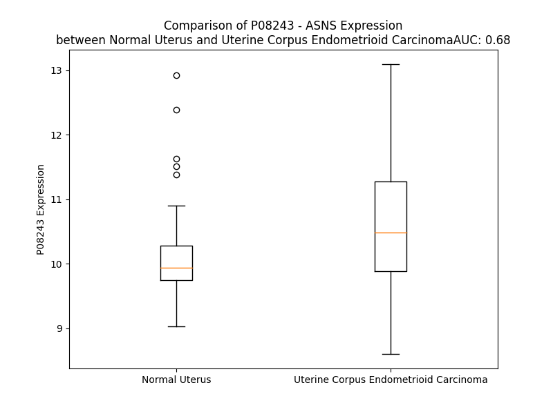

# Detailed Data for P08243

## Introduction to the Detailed Summary

### How to Interpret the Results

- **Summary & Metrics**: This section provides a quick reference to essential protein attributes, including expression changes, family classification, and biomarker applications. Regulation status (upregulated/downregulated) indicates the protein's behavior in a disease context. Some information comes from the original excel file with the proteins selected from literature, while others are derived from the analyses.
- **Expression Comparison**: A visual representation comparing protein expression between normal and disease states. It highlights significant changes in expression levels that might indicate diagnostic or therapeutic relevance. This is data coming from transcriptomics experiments and could not translate similarly to protein levels.
- **Isoform Alignment**: An interactive view of isoform alignments, revealing structural and functional differences between variants of the protein.
- **Interactors & Homologs**: Tables listing known interaction partners and homologous proteins, the more interactors and homologs, the more complex the protein is to design an antibody for.
- **Biological Assemblies**: Information about the structural arrangement of the protein in different assemblies, providing insights into its functional state but also the complexity of the protein to develop antibodies.
- **Combined Per-Residue Information**: A detailed table summarizing residue-level data. This includes predictions for epitope regions, aggregation tendencies, and modifications that might impact the protein's function. Each row corresponds to a residue in the protein, providing insights into specific sites that may be important for research or drug development.
## Summary & Metrics

- **UniProt Accession**: P08243
- **Gene Name**: ASNS
- **Protein Name**: Asparagine synthetase [glutamine-hydrolyzing]
- **Swiss Prot**: ASNS_HUMAN
- **Family**: nan
- **Biomarker Application**: nan
- **Number of Isoforms**: 3
- **Regulation**: 2
- **(transcriptomics) AUC**: 0.68
- **(transcriptomics) Fold Change**: 1.05
- **(transcriptomics) Regulation**: Upregulated
- **Discotope Epitope Count**: 105
- **Max n_uniprots (Homo)**: 2
- **Max n_uniprots (Hetero)**: N/A

## Expression Comparison

## Isoform Alignment

<pre style='font-size:14px; font-family:monospace;'>P08243-1 MCGIWALFGSDDCLSVQCLSAMKIAHRGPDAFRFENVNGYTNCCFGFHRLAVVDPLFGMQPIRVKKYPYLWLCYNGEIYNHKKMQQHFEFEYQTKVDGEIILHLYDKGGIEQTICMLDGVFAFVLLDTANKKVFLGRDTYGVRPLFKAMTEDGFLAVCSEAKGLVTLKHSATPFLKVEPFLPGHYEVLDLKPNGKVASVEMVKYHHCRDVPLHALYDNVEKLFPGFEIETVKNNLRILFNNAVKKRLMTDRRIGCLLSGGLDSSLVAATLLKQLKEAQVQYPLQTFAIGMEDSPDLLAARKVADHIGSEHYEVLFNSEEGIQALDEVIFSLETYDITTVRASVGMYLISKYIRKNTDSVVIFSGEGSDELTQGYIYFHKAPSPEKAEEESERLLRELYLFDVLRADRTTAAHGLELRVPFLDHRFSSYYLSLPPEMRIPKNGIEKHLLRETFEDSNLIPKEILWRPKEAFSDGITSVKNSWFKILQEYVEHQVDDAMMANAAQKFPFNTPKTKEGYYYRQVFERHYPGRADWLSHYWMPKWINATDPSARTLTHYKSAVKA
P08243-2 ---------------------MKIAHRGPDAFRFENVNGYTNCCFGFHRLAVVDPLFGMQPIRVKKYPYLWLCYNGEIYNHKKMQQHFEFEYQTKVDGEIILHLYDKGGIEQTICMLDGVFAFVLLDTANKKVFLGRDTYGVRPLFKAMTEDGFLAVCSEAKGLVTLKHSATPFLKVEPFLPGHYEVLDLKPNGKVASVEMVKYHHCRDVPLHALYDNVEKLFPGFEIETVKNNLRILFNNAVKKRLMTDRRIGCLLSGGLDSSLVAATLLKQLKEAQVQYPLQTFAIGMEDSPDLLAARKVADHIGSEHYEVLFNSEEGIQALDEVIFSLETYDITTVRASVGMYLISKYIRKNTDSVVIFSGEGSDELTQGYIYFHKAPSPEKAEEESERLLRELYLFDVLRADRTTAAHGLELRVPFLDHRFSSYYLSLPPEMRIPKNGIEKHLLRETFEDSNLIPKEILWRPKEAFSDGITSVKNSWFKILQEYVEHQVDDAMMANAAQKFPFNTPKTKEGYYYRQVFERHYPGRADWLSHYWMPKWINATDPSARTLTHYKSAVKA
P08243-3 -----------------------------------------------------------------------------------MQQHFEFEYQTKVDGEIILHLYDKGGIEQTICMLDGVFAFVLLDTANKKVFLGRDTYGVRPLFKAMTEDGFLAVCSEAKGLVTLKHSATPFLKVEPFLPGHYEVLDLKPNGKVASVEMVKYHHCRDVPLHALYDNVEKLFPGFEIETVKNNLRILFNNAVKKRLMTDRRIGCLLSGGLDSSLVAATLLKQLKEAQVQYPLQTFAIGMEDSPDLLAARKVADHIGSEHYEVLFNSEEGIQALDEVIFSLETYDITTVRASVGMYLISKYIRKNTDSVVIFSGEGSDELTQGYIYFHKAPSPEKAEEESERLLRELYLFDVLRADRTTAAHGLELRVPFLDHRFSSYYLSLPPEMRIPKNGIEKHLLRETFEDSNLIPKEILWRPKEAFSDGITSVKNSWFKILQEYVEHQVDDAMMANAAQKFPFNTPKTKEGYYYRQVFERHYPGRADWLSHYWMPKWINATDPSARTLTHYKSAVKA
</pre>

## Interactors

| preferredName_A   | preferredName_B   |   score |
|:------------------|:------------------|--------:|
| ASNS              | ASS1              |   0.976 |
| ASNS              | GOT2              |   0.973 |
| ASNS              | GOT1              |   0.969 |
| ASNS              | ASRGL1            |   0.959 |
| ASNS              | GOT1L1            |   0.949 |
| ASNS              | CAD               |   0.945 |
| ASNS              | NARS1             |   0.943 |
| ASNS              | ADSS2             |   0.937 |
| ASNS              | NAT8L             |   0.93  |
| ASNS              | ATF4              |   0.928 |
| ASNS              | ADSS1             |   0.926 |
| ASNS              | ALDH18A1          |   0.917 |
| ASNS              | IL4I1             |   0.913 |
| ASNS              | ASPA              |   0.908 |
| ASNS              | TRIB3             |   0.902 |
| ASNS              | UBE2I             |   0.901 |

## Homologs

| uniprot_id   | gene_id   |
|:-------------|:----------|
| C9J6C1       | ASNSD1    |

## Biological Assemblies

|   Unnamed: 0 |   assembly |   n_uniprots | composition   | crystal_id   |
|-------------:|-----------:|-------------:|:--------------|:-------------|
|            0 |          1 |            1 | Homo          | 6gq3         |
|            1 |          2 |            1 | Homo          | 6gq3         |
|            0 |          1 |            2 | Homo          | 8sue         |

## Combined Per-Residue Information

|   res | aa   |   epitope_score | epitope   |   relative_surface_accessibility |   modeling_confidence |   Aggregation | modification     |
|------:|:-----|----------------:|:----------|---------------------------------:|----------------------:|--------------:|:-----------------|
|     1 | M    |         0.0232  | False     |                          0.0244  |                 83.17 |         0     | N/A              |
|     2 | C    |         0.06666 | False     |                          0.13106 |                 96.36 |         7.593 | N/A              |
|     3 | G    |         0.00319 | False     |                          0       |                 97.87 |        11.289 | N/A              |
|     4 | I    |         0.00521 | False     |                          0       |                 98.53 |        64.665 | N/A              |
|     5 | W    |         0.00325 | False     |                          0       |                 98.39 |        64.833 | N/A              |
|     6 | A    |         0.00159 | False     |                          0       |                 98.19 |        64.833 | N/A              |
|     7 | L    |         0.00235 | False     |                          0.00082 |                 97.16 |        64.751 | N/A              |
|     8 | F    |         0.00296 | False     |                          0.00255 |                 97.01 |        64.072 | N/A              |
|     9 | G    |         0.00316 | False     |                          0.00357 |                 94.39 |         4.208 | N/A              |
|    10 | S    |         0.02202 | False     |                          0.07547 |                 89.51 |         0.147 | N/A              |
|    11 | D    |         0.14588 | True      |                          0.53987 |                 83.02 |         0     | N/A              |
|    12 | D    |         0.08925 | False     |                          0.22258 |                 83.19 |         0     | N/A              |
|    13 | C    |         0.07828 | False     |                          0.56201 |                 86    |         0     | N/A              |
|    14 | L    |         0.1046  | False     |                          0.58574 |                 86.48 |         0     | N/A              |
|    15 | S    |         0.11326 | False     |                          0.52231 |                 87.95 |         0     | N/A              |
|    16 | V    |         0.04219 | False     |                          0.34866 |                 88.62 |         0     | N/A              |
|    17 | Q    |         0.01615 | False     |                          0.03894 |                 92.09 |         0     | N/A              |
|    18 | C    |         0.07349 | False     |                          0.28511 |                 93.35 |         0     | N/A              |
|    19 | L    |         0.13419 | False     |                          0.76809 |                 94.45 |         0     | N/A              |
|    20 | S    |         0.01386 | False     |                          0.01073 |                 94.99 |         0     | N/A              |
|    21 | A    |         0.00232 | False     |                          0       |                 96.47 |         0     | N/A              |
|    22 | M    |         0.16728 | True      |                          0.45096 |                 96.73 |         0     | N/A              |
|    23 | K    |         0.06834 | False     |                          0.37352 |                 96.64 |         0     | N/A              |
|    24 | I    |         0.00603 | False     |                          0       |                 97.21 |         0     | N/A              |
|    25 | A    |         0.07432 | False     |                          0.27953 |                 97.27 |         0     | N/A              |
|    26 | H    |         0.09386 | False     |                          0.28828 |                 96.12 |         0     | N/A              |
|    27 | R    |         0.00651 | False     |                          0       |                 96.89 |         0     | N/A              |
|    28 | G    |         0.02172 | False     |                          0.02498 |                 95.5  |         0     | N/A              |
|    29 | P    |         0.15756 | True      |                          0.45015 |                 94.63 |         0     | N/A              |
|    30 | D    |         0.1874  | True      |                          0.40506 |                 95.61 |         0     | N/A              |
|    31 | A    |         0.09803 | False     |                          0.36954 |                 95.88 |         0     | N/A              |
|    32 | F    |         0.12709 | False     |                          0.39568 |                 96.79 |         0     | N/A              |
|    33 | R    |         0.17349 | True      |                          0.34126 |                 96.82 |         0     | N/A              |
|    34 | F    |         0.08631 | False     |                          0.23827 |                 95.89 |         0     | N/A              |
|    35 | E    |         0.12283 | False     |                          0.22142 |                 94.59 |         0     | N/A              |
|    36 | N    |         0.07407 | False     |                          0.37941 |                 93.24 |         0     | N/A              |
|    37 | V    |         0.02144 | False     |                          0.02618 |                 92.91 |         0     | N/A              |
|    38 | N    |         0.16283 | True      |                          0.71493 |                 87.18 |         0     | N/A              |
|    39 | G    |         0.18647 | True      |                          0.95978 |                 88.55 |         0     | N/A              |
|    40 | Y    |         0.06416 | False     |                          0.12339 |                 91.12 |         0     | N/A              |
|    41 | T    |         0.10529 | False     |                          0.91184 |                 85.87 |         0     | N/A              |
|    42 | N    |         0.04488 | False     |                          0.23309 |                 91.55 |         0     | N/A              |
|    43 | C    |         0.00467 | False     |                          0.00286 |                 96.06 |         0     | N/A              |
|    44 | C    |         0.00743 | False     |                          0.00975 |                 95.93 |         0     | N/A              |
|    45 | F    |         0.00244 | False     |                          0.00064 |                 97.27 |         0     | N/A              |
|    46 | G    |         0.00555 | False     |                          0       |                 97.31 |         0     | N/A              |
|    47 | F    |         0.00475 | False     |                          0.00064 |                 98.17 |         0     | N/A              |
|    48 | H    |         0.02562 | False     |                          0.01078 |                 98.02 |         0     | N/A              |
|    49 | R    |         0.07321 | False     |                          0.06844 |                 96.86 |         0     | N/A              |
|    50 | L    |         0.02307 | False     |                          0.04656 |                 95.97 |         0     | N/A              |
|    51 | A    |         0.08108 | False     |                          0.10743 |                 94.22 |         0     | N/A              |
|    52 | V    |         0.02973 | False     |                          0.07097 |                 92.85 |         0     | N/A              |
|    53 | V    |         0.08922 | False     |                          0.15965 |                 89.61 |         0     | N/A              |
|    54 | D    |         0.111   | False     |                          0.02159 |                 88.24 |         0     | N/A              |
|    55 | P    |         0.12805 | False     |                          0.56961 |                 83.8  |         0     | N/A              |
|    56 | L    |         0.3022  | True      |                          0.87884 |                 85.15 |         0     | N/A              |
|    57 | F    |         0.20784 | True      |                          0.67065 |                 85.1  |         0     | N/A              |
|    58 | G    |         0.0357  | False     |                          0.04976 |                 86.6  |         0     | N/A              |
|    59 | M    |         0.06861 | False     |                          0.16208 |                 94.87 |         0     | N/A              |
|    60 | Q    |         0.05445 | False     |                          0.03519 |                 96.41 |         0     | N/A              |
|    61 | P    |         0.05385 | False     |                          0.02131 |                 96.42 |         0     | N/A              |
|    62 | I    |         0.01813 | False     |                          0.036   |                 95.24 |         0     | N/A              |
|    63 | R    |         0.13271 | False     |                          0.3956  |                 94.26 |         0     | N/A              |
|    64 | V    |         0.05842 | False     |                          0.0182  |                 94.91 |         0     | N/A              |
|    65 | K    |         0.29781 | True      |                          0.90448 |                 95.33 |         0     | N/A              |
|    66 | K    |         0.20098 | True      |                          0.54361 |                 95.74 |         0     | N/A              |
|    67 | Y    |         0.07864 | False     |                          0.05203 |                 95.94 |         0     | N/A              |
|    68 | P    |         0.1761  | True      |                          0.66434 |                 95.15 |         0.291 | N/A              |
|    69 | Y    |         0.09371 | False     |                          0.30035 |                 95.8  |        45.028 | N/A              |
|    70 | L    |         0.00346 | False     |                          0       |                 97.83 |        55.225 | N/A              |
|    71 | W    |         0.02899 | False     |                          0.02569 |                 97.89 |        55.225 | N/A              |
|    72 | L    |         0.00366 | False     |                          0       |                 98.27 |        55.225 | N/A              |
|    73 | C    |         0.00466 | False     |                          0       |                 98.29 |        55.092 | N/A              |
|    74 | Y    |         0.02031 | False     |                          0.01977 |                 97.71 |        45.141 | N/A              |
|    75 | N    |         0.0564  | False     |                          0.01644 |                 97.9  |         0.632 | N/A              |
|    76 | G    |         0.04226 | False     |                          0.13212 |                 96.92 |         0     | N/A              |
|    77 | E    |         0.03661 | False     |                          0.03763 |                 97.23 |         0     | N/A              |
|    78 | I    |         0.00622 | False     |                          0       |                 97.69 |         0     | N/A              |
|    79 | Y    |         0.03498 | False     |                          0.11384 |                 96.64 |         0     | N/A              |
|    80 | N    |         0.04798 | False     |                          0.08702 |                 96.5  |         0     | N/A              |
|    81 | H    |         0.03758 | False     |                          0.03356 |                 96.33 |         0     | N/A              |
|    82 | K    |         0.15815 | True      |                          0.62736 |                 95.3  |         0     | N/A              |
|    83 | K    |         0.1517  | True      |                          0.37392 |                 94.31 |         0     | N/A              |
|    84 | M    |         0.01292 | False     |                          0.00216 |                 94.78 |         0     | N/A              |
|    85 | Q    |         0.12656 | False     |                          0.22313 |                 95.71 |         0     | N/A              |
|    86 | Q    |         0.27879 | True      |                          0.681   |                 95.64 |         0     | N/A              |
|    87 | H    |         0.32963 | True      |                          0.54046 |                 94.43 |         0     | N/A              |
|    88 | F    |         0.1166  | False     |                          0.20039 |                 95.32 |         0     | N/A              |
|    89 | E    |         0.26373 | True      |                          0.79186 |                 96.73 |         0     | N/A              |
|    90 | F    |         0.10021 | False     |                          0.11813 |                 97.14 |         0     | N/A              |
|    91 | E    |         0.23115 | True      |                          0.64294 |                 96    |         0     | N/A              |
|    92 | Y    |         0.13149 | False     |                          0.19289 |                 95.03 |         0     | N/A              |
|    93 | Q    |         0.15282 | True      |                          0.40622 |                 94.13 |         0     | N/A              |
|    94 | T    |         0.17105 | True      |                          0.17442 |                 93.19 |         0     | N/A              |
|    95 | K    |         0.27583 | True      |                          0.77369 |                 93.4  |         0     | N/A              |
|    96 | V    |         0.04822 | False     |                          0.04951 |                 95    |         0     | N/A              |
|    97 | D    |         0.04557 | False     |                          0.03065 |                 96.42 |         0     | N/A              |
|    98 | G    |         0.00332 | False     |                          0       |                 96.87 |         0     | N/A              |
|    99 | E    |         0.00455 | False     |                          0       |                 97.2  |         0     | N/A              |
|   100 | I    |         0.00694 | False     |                          0       |                 97.65 |        13.187 | N/A              |
|   101 | I    |         0.00304 | False     |                          0       |                 98.45 |        14.379 | N/A              |
|   102 | L    |         0.00402 | False     |                          0       |                 98.48 |        14.379 | N/A              |
|   103 | H    |         0.01541 | False     |                          0.00767 |                 98.3  |        14.379 | N/A              |
|   104 | L    |         0.00994 | False     |                          0.0043  |                 97.8  |        14.379 | N/A              |
|   105 | Y    |         0.06436 | False     |                          0.10296 |                 98.54 |        14.191 | N/A              |
|   106 | D    |         0.0746  | False     |                          0.39247 |                 97.6  |         0     | N/A              |
|   107 | K    |         0.37071 | True      |                          0.53396 |                 96.76 |         0     | N/A              |
|   108 | G    |         0.19427 | True      |                          0.37545 |                 96.02 |         0     | N/A              |
|   109 | G    |         0.06358 | False     |                          0.32705 |                 98.06 |         0     | N/A              |
|   110 | I    |         0.02468 | False     |                          0.09225 |                 98.38 |         0     | N/A              |
|   111 | E    |         0.06291 | False     |                          0.56671 |                 97.28 |         0     | N/A              |
|   112 | Q    |         0.06534 | False     |                          0.35037 |                 95.66 |         0     | N/A              |
|   113 | T    |         0.00307 | False     |                          0       |                 98.09 |         0     | N/A              |
|   114 | I    |         0.01178 | False     |                          0.00887 |                 97.74 |         0     | N/A              |
|   115 | C    |         0.03799 | False     |                          0.19024 |                 96.02 |         0     | N/A              |
|   116 | M    |         0.03091 | False     |                          0.02701 |                 95.92 |         0     | N/A              |
|   117 | L    |         0.02751 | False     |                          0.02176 |                 97.13 |         0     | N/A              |
|   118 | D    |         0.029   | False     |                          0.04391 |                 96.98 |         0     | N/A              |
|   119 | G    |         0.01457 | False     |                          0.02673 |                 96.71 |         6.764 | N/A              |
|   120 | V    |         0.05756 | False     |                          0.06093 |                 97.95 |        81.462 | N/A              |
|   121 | F    |         0.0116  | False     |                          0.00892 |                 98.38 |        97.56  | N/A              |
|   122 | A    |         0.0028  | False     |                          0       |                 98.74 |        98.67  | N/A              |
|   123 | F    |         0.00316 | False     |                          0       |                 98.79 |        98.67  | N/A              |
|   124 | V    |         0.00124 | False     |                          0       |                 98.8  |        98.629 | N/A              |
|   125 | L    |         0.00182 | False     |                          0       |                 98.77 |        92.773 | N/A              |
|   126 | L    |         0.00732 | False     |                          0       |                 98.59 |        78.589 | N/A              |
|   127 | D    |         0.0044  | False     |                          0.00126 |                 97.91 |         0.042 | N/A              |
|   128 | T    |         0.05284 | False     |                          0.27352 |                 96.46 |         0.042 | N/A              |
|   129 | A    |         0.08192 | False     |                          0.61817 |                 96.06 |         0.042 | N/A              |
|   130 | N    |         0.09493 | False     |                          0.62109 |                 97.2  |         0.042 | N/A              |
|   131 | K    |         0.14183 | True      |                          0.48503 |                 97.43 |         0.042 | N/A              |
|   132 | K    |         0.08496 | False     |                          0.24609 |                 98.23 |         0     | N/A              |
|   133 | V    |         0.00182 | False     |                          0       |                 98.7  |         0     | N/A              |
|   134 | F    |         0.02553 | False     |                          0.04522 |                 98.8  |         0     | N/A              |
|   135 | L    |         0.00249 | False     |                          0.00082 |                 98.87 |         0     | N/A              |
|   136 | G    |         0.00221 | False     |                          0       |                 98.64 |         0     | N/A              |
|   137 | R    |         0.01271 | False     |                          0.01545 |                 98.5  |         0     | N/A              |
|   138 | D    |         0.009   | False     |                          0.00678 |                 98.04 |         0     | N/A              |
|   139 | T    |         0.03385 | False     |                          0.10035 |                 96.64 |         0     | N/A              |
|   140 | Y    |         0.00954 | False     |                          0.02116 |                 97.15 |         0     | N/A              |
|   141 | G    |         0.00758 | False     |                          0.01309 |                 97.5  |         0     | N/A              |
|   142 | V    |         0.02501 | False     |                          0.04396 |                 98.19 |         0     | N/A              |
|   143 | R    |         0.0159  | False     |                          0.00983 |                 98.27 |         0     | N/A              |
|   144 | P    |         0.03093 | False     |                          0.05467 |                 97.99 |         0     | N/A              |
|   145 | L    |         0.00127 | False     |                          0       |                 98.62 |         0     | N/A              |
|   146 | F    |         0.03257 | False     |                          0.11529 |                 98.48 |         0     | N/A              |
|   147 | K    |         0.04018 | False     |                          0.17167 |                 97.83 |         0     | N/A              |
|   148 | A    |         0.00766 | False     |                          0.00638 |                 96.19 |         0     | N/A              |
|   149 | M    |         0.0439  | False     |                          0.34161 |                 95.15 |         0     | N/A              |
|   150 | T    |         0.0274  | False     |                          0.11272 |                 94.44 |         0     | N/A              |
|   151 | E    |         0.09681 | False     |                          0.97048 |                 91.54 |         0     | N/A              |
|   152 | D    |         0.09725 | False     |                          0.34479 |                 92.27 |         0     | N/A              |
|   153 | G    |         0.01061 | False     |                          0.00966 |                 94.88 |         0.465 | N/A              |
|   154 | F    |         0.00745 | False     |                          0.00318 |                 95.66 |         1.685 | N/A              |
|   155 | L    |         0.00254 | False     |                          0.00082 |                 97.35 |         1.685 | N/A              |
|   156 | A    |         0.00127 | False     |                          0       |                 97.42 |         1.685 | N/A              |
|   157 | V    |         0.00092 | False     |                          0       |                 98.56 |         1.685 | N/A              |
|   158 | C    |         0.00131 | False     |                          0       |                 98.61 |         1.221 | N/A              |
|   159 | S    |         0.00526 | False     |                          0       |                 98.55 |         0.135 | N/A              |
|   160 | E    |         0.00471 | False     |                          0.00258 |                 98.26 |         0     | N/A              |
|   161 | A    |         0.00296 | False     |                          0.00383 |                 97.61 |         0     | N/A              |
|   162 | K    |         0.01178 | False     |                          0.01546 |                 96.78 |         0     | N/A              |
|   163 | G    |         0.00166 | False     |                          0       |                 96.5  |         0.158 | N/A              |
|   164 | L    |         0.00274 | False     |                          0       |                 95.53 |         0.158 | N/A              |
|   165 | V    |         0.10346 | False     |                          0.29412 |                 92.08 |         0.158 | N/A              |
|   166 | T    |         0.07236 | False     |                          0.41783 |                 89.06 |         0.158 | N/A              |
|   167 | L    |         0.00926 | False     |                          0.01631 |                 91    |         0.158 | N/A              |
|   168 | K    |         0.18071 | True      |                          0.64995 |                 84.98 |         0     | N/A              |
|   169 | H    |         0.02962 | False     |                          0.0376  |                 84.4  |         0     | N/A              |
|   170 | S    |         0.263   | True      |                          0.75293 |                 80.1  |         0     | N/A              |
|   171 | A    |         0.32831 | True      |                          0.75602 |                 75.25 |         0     | N/A              |
|   172 | T    |         0.12007 | False     |                          0.25553 |                 77.8  |         0     | N/A              |
|   173 | P    |         0.22378 | True      |                          0.85844 |                 76.2  |         0     | N/A              |
|   174 | F    |         0.16395 | True      |                          0.52784 |                 85.67 |         0     | N/A              |
|   175 | L    |         0.02812 | False     |                          0.01803 |                 91.2  |         0     | N/A              |
|   176 | K    |         0.12289 | False     |                          0.59465 |                 93.7  |         0     | N/A              |
|   177 | V    |         0.02121 | False     |                          0.02661 |                 96.3  |         0     | N/A              |
|   178 | E    |         0.05938 | False     |                          0.38108 |                 96.49 |         0     | N/A              |
|   179 | P    |         0.02457 | False     |                          0.26693 |                 97.54 |         0     | N/A              |
|   180 | F    |         0.01137 | False     |                          0.00549 |                 98.19 |         0     | N/A              |
|   181 | L    |         0.06799 | False     |                          0.45728 |                 97.71 |         0     | N/A              |
|   182 | P    |         0.01963 | False     |                          0.11709 |                 97.75 |         0     | N/A              |
|   183 | G    |         0.0086  | False     |                          0.01288 |                 97.16 |         0     | N/A              |
|   184 | H    |         0.0725  | False     |                          0.14561 |                 98.22 |         0     | N/A              |
|   185 | Y    |         0.03877 | False     |                          0.03807 |                 98.66 |         0     | N/A              |
|   186 | E    |         0.03201 | False     |                          0.0165  |                 98.73 |         0     | N/A              |
|   187 | V    |         0.01995 | False     |                          0.07236 |                 98.72 |         0     | N/A              |
|   188 | L    |         0.00483 | False     |                          0.00082 |                 98.69 |         0     | N/A              |
|   189 | D    |         0.07184 | False     |                          0.33582 |                 98.44 |         0     | N/A              |
|   190 | L    |         0.02446 | False     |                          0.03403 |                 97.95 |         0     | N/A              |
|   191 | K    |         0.09269 | False     |                          0.35225 |                 97.02 |         0     | N/A              |
|   192 | P    |         0.1057  | False     |                          0.85559 |                 95.09 |         0     | N/A              |
|   193 | N    |         0.09547 | False     |                          0.53179 |                 94.37 |         0     | N/A              |
|   194 | G    |         0.00389 | False     |                          0       |                 96.11 |         0     | N/A              |
|   195 | K    |         0.07009 | False     |                          0.18584 |                 96.37 |         0     | N/A              |
|   196 | V    |         0.01152 | False     |                          0.00493 |                 97.83 |         0     | N/A              |
|   197 | A    |         0.12232 | False     |                          0.32013 |                 98.01 |         0     | N/A              |
|   198 | S    |         0.0917  | False     |                          0.42854 |                 97.45 |         0     | N/A              |
|   199 | V    |         0.11738 | False     |                          0.56291 |                 97.54 |         0     | N/A              |
|   200 | E    |         0.20501 | True      |                          0.43261 |                 97.94 |         0     | N/A              |
|   201 | M    |         0.12478 | False     |                          0.39554 |                 98.11 |         0     | N/A              |
|   202 | V    |         0.12347 | False     |                          0.30942 |                 98.37 |         0     | N/A              |
|   203 | K    |         0.12106 | False     |                          0.51312 |                 97.49 |         0     | N/A              |
|   204 | Y    |         0.086   | False     |                          0.17026 |                 96.69 |         0     | N/A              |
|   205 | H    |         0.1014  | False     |                          0.10595 |                 95.63 |         0     | N/A              |
|   206 | H    |         0.10594 | False     |                          0.31907 |                 92.61 |         0     | N/A              |
|   207 | C    |         0.04434 | False     |                          0.09682 |                 91.71 |         0     | N/A              |
|   208 | R    |         0.19846 | True      |                          0.3745  |                 90.16 |         0     | N/A              |
|   209 | D    |         0.17349 | True      |                          0.45669 |                 93.04 |         0     | N/A              |
|   210 | V    |         0.10658 | False     |                          0.73568 |                 92.57 |         0     | N/A              |
|   211 | P    |         0.03559 | False     |                          0.05498 |                 91.32 |         0     | N/A              |
|   212 | L    |         0.15067 | True      |                          0.56711 |                 91.7  |         0     | N/A              |
|   213 | H    |         0.04723 | False     |                          0.01795 |                 92.99 |         0     | N/A              |
|   214 | A    |         0.06489 | False     |                          0.15986 |                 90.56 |         0     | N/A              |
|   215 | L    |         0.21958 | True      |                          0.8439  |                 86.59 |         0     | N/A              |
|   216 | Y    |         0.13175 | False     |                          0.23329 |                 84.84 |         0     | N/A              |
|   217 | D    |         0.09289 | False     |                          0.22469 |                 82.5  |         0     | N/A              |
|   218 | N    |         0.18443 | True      |                          0.78286 |                 76.72 |         0     | N/A              |
|   219 | V    |         0.13107 | False     |                          0.17438 |                 82    |         0     | N/A              |
|   220 | E    |         0.21269 | True      |                          0.634   |                 78.97 |         0     | N/A              |
|   221 | K    |         0.27013 | True      |                          0.92998 |                 84.32 |         0     | N/A              |
|   222 | L    |         0.07584 | False     |                          0.23264 |                 91.51 |         0     | N/A              |
|   223 | F    |         0.28466 | True      |                          0.54315 |                 91.59 |         0     | N/A              |
|   224 | P    |         0.27474 | True      |                          0.88678 |                 92.59 |         0     | N/A              |
|   225 | G    |         0.13028 | False     |                          0.43889 |                 94.31 |         0     | N/A              |
|   226 | F    |         0.28629 | True      |                          0.49478 |                 95.37 |         0     | N/A              |
|   227 | E    |         0.22559 | True      |                          0.58395 |                 97.28 |         0     | N/A              |
|   228 | I    |         0.20976 | True      |                          0.44461 |                 97.1  |         0     | N/A              |
|   229 | E    |         0.18778 | True      |                          0.47754 |                 97.05 |         0     | N/A              |
|   230 | T    |         0.18143 | True      |                          0.15356 |                 97.82 |         0     | N/A              |
|   231 | V    |         0.00815 | False     |                          0       |                 98.17 |         0     | N/A              |
|   232 | K    |         0.03654 | False     |                          0.07977 |                 98.01 |         0     | N/A              |
|   233 | N    |         0.10692 | False     |                          0.34769 |                 97.02 |         0     | N/A              |
|   234 | N    |         0.00826 | False     |                          0.00074 |                 97.58 |         0     | N/A              |
|   235 | L    |         0.00143 | False     |                          0       |                 98    |         0     | N/A              |
|   236 | R    |         0.09221 | False     |                          0.269   |                 97.64 |         0     | N/A              |
|   237 | I    |         0.07224 | False     |                          0.2171  |                 96.97 |         0     | N/A              |
|   238 | L    |         0.00613 | False     |                          0.00509 |                 97.08 |         0     | N/A              |
|   239 | F    |         0.00342 | False     |                          0       |                 98.2  |         0     | N/A              |
|   240 | N    |         0.0402  | False     |                          0.21065 |                 97.53 |         0     | N/A              |
|   241 | N    |         0.04566 | False     |                          0.21779 |                 97.03 |         0     | N/A              |
|   242 | A    |         0.0016  | False     |                          0       |                 97.81 |         0     | N/A              |
|   243 | V    |         0.00153 | False     |                          0       |                 98.55 |         0     | N/A              |
|   244 | K    |         0.12411 | False     |                          0.53654 |                 97.54 |         0     | N/A              |
|   245 | K    |         0.03833 | False     |                          0.16303 |                 96.45 |         0     | N/A              |
|   246 | R    |         0.00939 | False     |                          0.01218 |                 97.76 |         0     | N/A              |
|   247 | L    |         0.056   | False     |                          0.18513 |                 97.72 |         0     | N/A              |
|   248 | M    |         0.0666  | False     |                          0.17498 |                 96.43 |         0     | N/A              |
|   249 | T    |         0.04849 | False     |                          0.22297 |                 95.9  |         0     | N/A              |
|   250 | D    |         0.2203  | True      |                          0.56512 |                 94.59 |         0     | N/A              |
|   251 | R    |         0.04576 | False     |                          0.32184 |                 95.63 |         0     | N/A              |
|   252 | R    |         0.04327 | False     |                          0.21222 |                 97.38 |         0     | N/A              |
|   253 | I    |         0.01142 | False     |                          0.0224  |                 98.56 |         0     | N/A              |
|   254 | G    |         0.00106 | False     |                          0       |                 98.64 |         0     | N/A              |
|   255 | C    |         0.00164 | False     |                          0       |                 98.82 |         0     | N/A              |
|   256 | L    |         0.01444 | False     |                          0.0981  |                 98.71 |         0     | N/A              |
|   257 | L    |         0.00458 | False     |                          0.00351 |                 98.51 |         0     | N/A              |
|   258 | S    |         0.0365  | False     |                          0.23465 |                 95.86 |         0     | N/A              |
|   259 | G    |         0.00208 | False     |                          0       |                 95.38 |         0     | N/A              |
|   260 | G    |         0.03061 | False     |                          0.26395 |                 95.84 |         0     | N/A              |
|   261 | L    |         0.01795 | False     |                          0.06225 |                 98.03 |         0     | N/A              |
|   262 | D    |         0.01612 | False     |                          0.09914 |                 98.18 |         0     | N/A              |
|   263 | S    |         0.02888 | False     |                          0.07425 |                 98.14 |         1.656 | N/A              |
|   264 | S    |         0.00292 | False     |                          0       |                 98.65 |        15.114 | N/A              |
|   265 | L    |         0.00183 | False     |                          0       |                 98.72 |        30.667 | N/A              |
|   266 | V    |         0.00108 | False     |                          0       |                 98.83 |        33.313 | N/A              |
|   267 | A    |         0.00127 | False     |                          0       |                 98.82 |        33.503 | N/A              |
|   268 | A    |         0.01668 | False     |                          0.03277 |                 98.68 |        33.503 | N/A              |
|   269 | T    |         0.00542 | False     |                          0.00865 |                 98.7  |        33.418 | N/A              |
|   270 | L    |         0.00136 | False     |                          0       |                 98.72 |        32.297 | N/A              |
|   271 | L    |         0.02557 | False     |                          0.11211 |                 98.18 |        27.328 | N/A              |
|   272 | K    |         0.12294 | False     |                          0.46733 |                 97.74 |         0     | N/A              |
|   273 | Q    |         0.02175 | False     |                          0.03504 |                 97.94 |         0     | N/A              |
|   274 | L    |         0.02064 | False     |                          0.02885 |                 98.15 |         0     | N/A              |
|   275 | K    |         0.172   | True      |                          0.66507 |                 97.22 |         0     | N/A              |
|   276 | E    |         0.15279 | True      |                          0.49173 |                 96.99 |         0     | N/A              |
|   277 | A    |         0.16465 | True      |                          0.54636 |                 97    |         0     | N/A              |
|   278 | Q    |         0.29637 | True      |                          0.7179  |                 97.05 |         0     | N/A              |
|   279 | V    |         0.11277 | False     |                          0.35087 |                 96.77 |         0     | N/A              |
|   280 | Q    |         0.22874 | True      |                          0.85136 |                 93.87 |         0     | N/A              |
|   281 | Y    |         0.19517 | True      |                          0.32571 |                 96.6  |         0     | N/A              |
|   282 | P    |         0.12679 | False     |                          0.53482 |                 96.68 |         0     | N/A              |
|   283 | L    |         0.01146 | False     |                          0.00991 |                 98.33 |         0.906 | N/A              |
|   284 | Q    |         0.02668 | False     |                          0.02112 |                 98.58 |         1.074 | N/A              |
|   285 | T    |         0.00179 | False     |                          0       |                 98.82 |         1.215 | N/A              |
|   286 | F    |         0.00284 | False     |                          0.00558 |                 98.79 |         1.215 | N/A              |
|   287 | A    |         0.00755 | False     |                          0.01403 |                 98.4  |         1.215 | N/A              |
|   288 | I    |         0.01884 | False     |                          0.02547 |                 98.19 |         1.215 | N/A              |
|   289 | G    |         0.0034  | False     |                          0       |                 96.92 |         0.141 | N/A              |
|   290 | M    |         0.03277 | False     |                          0.08626 |                 95.38 |         0     | N/A              |
|   291 | E    |         0.22374 | True      |                          0.72521 |                 88.58 |         0     | N/A              |
|   292 | D    |         0.18519 | True      |                          0.63862 |                 86.03 |         0     | N/A              |
|   293 | S    |         0.00774 | False     |                          0       |                 94.06 |         0     | N/A              |
|   294 | P    |         0.0505  | False     |                          0.27363 |                 93.76 |         0     | N/A              |
|   295 | D    |         0.03544 | False     |                          0.03445 |                 95.6  |         0     | N/A              |
|   296 | L    |         0.04226 | False     |                          0.03215 |                 96.77 |         0     | N/A              |
|   297 | L    |         0.13471 | False     |                          0.52225 |                 95.99 |         0     | N/A              |
|   298 | A    |         0.04501 | False     |                          0.06433 |                 97.69 |         0     | N/A              |
|   299 | A    |         0.00211 | False     |                          0       |                 98.18 |         0     | N/A              |
|   300 | R    |         0.14207 | True      |                          0.44623 |                 98    |         0     | N/A              |
|   301 | K    |         0.09217 | False     |                          0.46852 |                 98.27 |         0     | N/A              |
|   302 | V    |         0.00267 | False     |                          0       |                 98.68 |         0     | N/A              |
|   303 | A    |         0.01553 | False     |                          0.03393 |                 98.61 |         0     | N/A              |
|   304 | D    |         0.21516 | True      |                          0.67895 |                 98.46 |         0     | N/A              |
|   305 | H    |         0.09554 | False     |                          0.4227  |                 98.49 |         0     | N/A              |
|   306 | I    |         0.09465 | False     |                          0.11158 |                 97.73 |         0     | N/A              |
|   307 | G    |         0.13771 | False     |                          0.69105 |                 97.53 |         0     | N/A              |
|   308 | S    |         0.04222 | False     |                          0.12286 |                 98.11 |         0     | N/A              |
|   309 | E    |         0.07248 | False     |                          0.324   |                 98.14 |         0     | N/A              |
|   310 | H    |         0.0375  | False     |                          0.2539  |                 98.46 |         0     | N/A              |
|   311 | Y    |         0.11665 | False     |                          0.25837 |                 98.37 |         0     | N/A              |
|   312 | E    |         0.05545 | False     |                          0.27364 |                 97.99 |         0     | N/A              |
|   313 | V    |         0.03272 | False     |                          0.06664 |                 98.03 |         0     | N/A              |
|   314 | L    |         0.13167 | False     |                          0.689   |                 97.55 |         0     | N/A              |
|   315 | F    |         0.04952 | False     |                          0.05895 |                 96.87 |         0     | N/A              |
|   316 | N    |         0.10735 | False     |                          0.4983  |                 95.39 |         0     | N/A              |
|   317 | S    |         0.08505 | False     |                          0.29546 |                 94.95 |         0     | N/A              |
|   318 | E    |         0.18811 | True      |                          0.59352 |                 96.67 |         0     | N/A              |
|   319 | E    |         0.08372 | False     |                          0.40129 |                 97.64 |         0     | N/A              |
|   320 | G    |         0.00344 | False     |                          0       |                 97.22 |         0     | N/A              |
|   321 | I    |         0.08211 | False     |                          0.15902 |                 98.05 |         0     | N/A              |
|   322 | Q    |         0.13087 | False     |                          0.60138 |                 98.02 |         0     | N/A              |
|   323 | A    |         0.01822 | False     |                          0.05066 |                 98.26 |         0     | N/A              |
|   324 | L    |         0.00801 | False     |                          0.0033  |                 98.46 |         0     | N/A              |
|   325 | D    |         0.06226 | False     |                          0.29328 |                 98.46 |         0     | N/A              |
|   326 | E    |         0.05566 | False     |                          0.39422 |                 98.35 |         0     | N/A              |
|   327 | V    |         0.00194 | False     |                          0       |                 98.7  |         3.247 | N/A              |
|   328 | I    |         0.00365 | False     |                          0       |                 98.69 |         3.247 | N/A              |
|   329 | F    |         0.04789 | False     |                          0.40796 |                 98.31 |         3.247 | N/A              |
|   330 | S    |         0.01453 | False     |                          0.07648 |                 98.2  |         3.247 | N/A              |
|   331 | L    |         0.00245 | False     |                          0       |                 98.4  |         3.247 | N/A              |
|   332 | E    |         0.01512 | False     |                          0.0441  |                 98.29 |         0     | N/A              |
|   333 | T    |         0.01288 | False     |                          0.02666 |                 98.27 |         0.185 | N/A              |
|   334 | Y    |         0.00502 | False     |                          0.00057 |                 97.94 |         0.506 | N/A              |
|   335 | D    |         0.00693 | False     |                          0.00123 |                 97.65 |         0.506 | N/A              |
|   336 | I    |         0.031   | False     |                          0.0568  |                 95.76 |         0.506 | N/A              |
|   337 | T    |         0.01798 | False     |                          0.24419 |                 94.3  |         0.506 | N/A              |
|   338 | T    |         0.00531 | False     |                          0.02586 |                 97    |         0.506 | N/A              |
|   339 | V    |         0.00166 | False     |                          0       |                 97.93 |         0.506 | N/A              |
|   340 | R    |         0.02719 | False     |                          0.02706 |                 95.56 |         0.506 | N/A              |
|   341 | A    |         0.01621 | False     |                          0.08673 |                 94.61 |         0.698 | N/A              |
|   342 | S    |         0.00128 | False     |                          0       |                 97.95 |         0.926 | N/A              |
|   343 | V    |         0.00261 | False     |                          0       |                 98.05 |         7.922 | N/A              |
|   344 | G    |         0.0019  | False     |                          0       |                 97.41 |         8.355 | N/A              |
|   345 | M    |         0.01274 | False     |                          0.03308 |                 98.11 |         8.972 | N/A              |
|   346 | Y    |         0.02182 | False     |                          0.06492 |                 98.68 |         8.972 | N/A              |
|   347 | L    |         0.02443 | False     |                          0.15179 |                 98.64 |         8.972 | N/A              |
|   348 | I    |         0.01737 | False     |                          0.0264  |                 98.61 |         7.699 | N/A              |
|   349 | S    |         0.00315 | False     |                          0.00395 |                 98.66 |         1.26  | N/A              |
|   350 | K    |         0.03123 | False     |                          0.30828 |                 98.48 |         0     | N/A              |
|   351 | Y    |         0.12121 | False     |                          0.29289 |                 98.7  |         0     | N/A              |
|   352 | I    |         0.01062 | False     |                          0.0032  |                 98.63 |         0     | N/A              |
|   353 | R    |         0.07564 | False     |                          0.43052 |                 97.28 |         0     | N/A              |
|   354 | K    |         0.13633 | False     |                          0.73294 |                 97.86 |         0     | N/A              |
|   355 | N    |         0.18726 | True      |                          0.56173 |                 98.28 |         0     | N/A              |
|   356 | T    |         0.14398 | True      |                          0.16382 |                 97.69 |         0     | N/A              |
|   357 | D    |         0.09246 | False     |                          0.65095 |                 94.5  |         0     | N/A              |
|   358 | S    |         0.01618 | False     |                          0.00846 |                 97.87 |        31.392 | N/A              |
|   359 | V    |         0.0294  | False     |                          0.0676  |                 97.9  |        43.277 | N/A              |
|   360 | V    |         0.00251 | False     |                          0       |                 98.44 |        43.505 | N/A              |
|   361 | I    |         0.00138 | False     |                          0.0024  |                 98.76 |        43.505 | N/A              |
|   362 | F    |         0.00184 | False     |                          0       |                 98.8  |        43.505 | N/A              |
|   363 | S    |         0.01438 | False     |                          0.05139 |                 98.18 |        13.585 | N/A              |
|   364 | G    |         0.023   | False     |                          0.12656 |                 97.74 |         1.329 | N/A              |
|   365 | E    |         0.02644 | False     |                          0.09431 |                 97.57 |         0     | N/A              |
|   366 | G    |         0.00473 | False     |                          0.01383 |                 97.7  |         0     | N/A              |
|   367 | S    |         0.00432 | False     |                          0.00104 |                 98.24 |         0     | N/A              |
|   368 | D    |         0.02688 | False     |                          0.14559 |                 97.64 |         0     | N/A              |
|   369 | E    |         0.01812 | False     |                          0.02015 |                 97.93 |         0     | N/A              |
|   370 | L    |         0.00149 | False     |                          0       |                 98.33 |         1.046 | N/A              |
|   371 | T    |         0.00191 | False     |                          0       |                 98.27 |         1.574 | N/A              |
|   372 | Q    |         0.00266 | False     |                          0       |                 97.22 |         1.574 | N/A              |
|   373 | G    |         0.00626 | False     |                          0.0028  |                 95.89 |         4.783 | N/A              |
|   374 | Y    |         0.03699 | False     |                          0.13341 |                 94.59 |         6.617 | N/A              |
|   375 | I    |         0.03311 | False     |                          0.10397 |                 92.49 |         6.617 | N/A              |
|   376 | Y    |         0.06135 | False     |                          0.0152  |                 93.67 |         6.617 | N/A              |
|   377 | F    |         0.01872 | False     |                          0.01877 |                 95.41 |         6.617 | N/A              |
|   378 | H    |         0.16802 | True      |                          0.33505 |                 94.03 |         1.998 | N/A              |
|   379 | K    |         0.18698 | True      |                          0.4385  |                 94    |         0     | N/A              |
|   380 | A    |         0.10701 | False     |                          0.23479 |                 96    |         0     | N/A              |
|   381 | P    |         0.2347  | True      |                          0.71092 |                 96.69 |         0     | N/A              |
|   382 | S    |         0.12226 | False     |                          0.2812  |                 97.97 |         0     | N/A              |
|   383 | P    |         0.06121 | False     |                          0.23233 |                 98.17 |         0     | N/A              |
|   384 | E    |         0.12805 | False     |                          0.41556 |                 98.11 |         0     | N/A              |
|   385 | K    |         0.16559 | True      |                          0.43621 |                 98.06 |         0     | N6-acetyllysine  |
|   386 | A    |         0.0062  | False     |                          0       |                 98.02 |         0     | N/A              |
|   387 | E    |         0.06866 | False     |                          0.09732 |                 97.23 |         0     | N/A              |
|   388 | E    |         0.16132 | True      |                          0.43502 |                 97.27 |         0     | N/A              |
|   389 | E    |         0.00899 | False     |                          0.0007  |                 97.66 |         0     | N/A              |
|   390 | S    |         0.00594 | False     |                          0       |                 98.04 |         0     | N/A              |
|   391 | E    |         0.07166 | False     |                          0.11091 |                 96.94 |         0     | N/A              |
|   392 | R    |         0.2098  | True      |                          0.16345 |                 97.1  |         0.098 | N/A              |
|   393 | L    |         0.04718 | False     |                          0.03799 |                 97.57 |         1.478 | N/A              |
|   394 | L    |         0.01141 | False     |                          0.00743 |                 97.97 |         2.013 | N/A              |
|   395 | R    |         0.15824 | True      |                          0.54489 |                 96.21 |         2.013 | N/A              |
|   396 | E    |         0.08741 | False     |                          0.11718 |                 96.91 |         2.013 | N/A              |
|   397 | L    |         0.0152  | False     |                          0.01319 |                 97.64 |        12.824 | N/A              |
|   398 | Y    |         0.04626 | False     |                          0.13185 |                 97.04 |        13.055 | N/A              |
|   399 | L    |         0.06385 | False     |                          0.12971 |                 96.97 |        13.241 | N/A              |
|   400 | F    |         0.03029 | False     |                          0.03425 |                 97.05 |        13.154 | N/A              |
|   401 | D    |         0.04338 | False     |                          0.10492 |                 95.78 |        11.551 | N/A              |
|   402 | V    |         0.01002 | False     |                          0.03614 |                 96.04 |        11.551 | N/A              |
|   403 | L    |         0.02041 | False     |                          0.13355 |                 97.55 |        11.551 | N/A              |
|   404 | R    |         0.06448 | False     |                          0.08935 |                 96.95 |        11.454 | N/A              |
|   405 | A    |         0.0053  | False     |                          0.00893 |                 97.27 |         9.972 | N/A              |
|   406 | D    |         0.01284 | False     |                          0.04609 |                 97.8  |         0     | N/A              |
|   407 | R    |         0.00902 | False     |                          0.0153  |                 98.04 |         0     | N/A              |
|   408 | T    |         0.00135 | False     |                          0       |                 97.99 |         0     | N/A              |
|   409 | T    |         0.0053  | False     |                          0.01657 |                 98.19 |         0     | N/A              |
|   410 | A    |         0.0025  | False     |                          0.00383 |                 97.81 |         0     | N/A              |
|   411 | A    |         0.02378 | False     |                          0.17469 |                 97.77 |         0     | N/A              |
|   412 | H    |         0.04066 | False     |                          0.12661 |                 97.88 |         0     | N/A              |
|   413 | G    |         0.0076  | False     |                          0.01685 |                 96.75 |         0     | N/A              |
|   414 | L    |         0.00498 | False     |                          0.00473 |                 98.13 |         0     | N/A              |
|   415 | E    |         0.0037  | False     |                          0.00209 |                 97.82 |         0     | N/A              |
|   416 | L    |         0.02344 | False     |                          0.04754 |                 97.98 |         0     | N/A              |
|   417 | R    |         0.01638 | False     |                          0.00981 |                 98.4  |         0     | N/A              |
|   418 | V    |         0.0237  | False     |                          0.02041 |                 98.26 |         0     | N/A              |
|   419 | P    |         0.00194 | False     |                          0       |                 98.57 |         0     | N/A              |
|   420 | F    |         0.00155 | False     |                          0       |                 98.56 |         0     | N/A              |
|   421 | L    |         0.01155 | False     |                          0.01767 |                 97.97 |         0     | N/A              |
|   422 | D    |         0.01566 | False     |                          0.01219 |                 97.4  |         0     | N/A              |
|   423 | H    |         0.01652 | False     |                          0.07091 |                 95.42 |         0     | N/A              |
|   424 | R    |         0.03676 | False     |                          0.13251 |                 94.97 |         0     | N/A              |
|   425 | F    |         0.00419 | False     |                          0.00064 |                 96.69 |         0.251 | N/A              |
|   426 | S    |         0.00209 | False     |                          0.00158 |                 97.19 |         0.251 | N/A              |
|   427 | S    |         0.01035 | False     |                          0.019   |                 95.58 |         0.251 | N/A              |
|   428 | Y    |         0.14902 | True      |                          0.11889 |                 95.89 |         0.251 | N/A              |
|   429 | Y    |         0.00545 | False     |                          0.00046 |                 97.66 |         0.251 | N/A              |
|   430 | L    |         0.01069 | False     |                          0.02298 |                 96.8  |         0.251 | N/A              |
|   431 | S    |         0.14196 | True      |                          0.47041 |                 95.41 |         0     | N/A              |
|   432 | L    |         0.04098 | False     |                          0.01349 |                 97.35 |         0     | N/A              |
|   433 | P    |         0.1436  | True      |                          0.28715 |                 97.61 |         0     | N/A              |
|   434 | P    |         0.08468 | False     |                          0.2008  |                 97.75 |         0     | N/A              |
|   435 | E    |         0.21462 | True      |                          0.45546 |                 97.54 |         0     | N/A              |
|   436 | M    |         0.14092 | False     |                          0.23972 |                 97.75 |         0     | N/A              |
|   437 | R    |         0.01029 | False     |                          0.00538 |                 97.54 |         0     | N/A              |
|   438 | I    |         0.0746  | False     |                          0.26677 |                 96.94 |         0     | N/A              |
|   439 | P    |         0.08731 | False     |                          0.12981 |                 96.06 |         0     | N/A              |
|   440 | K    |         0.13781 | False     |                          0.38939 |                 95.16 |         0     | N/A              |
|   441 | N    |         0.26855 | True      |                          0.89513 |                 91.95 |         0     | N/A              |
|   442 | G    |         0.15176 | True      |                          0.8097  |                 91.38 |         0     | N/A              |
|   443 | I    |         0.08957 | False     |                          0.11839 |                 95.13 |         0     | N/A              |
|   444 | E    |         0.08614 | False     |                          0.04932 |                 96.16 |         0     | N/A              |
|   445 | K    |         0.04828 | False     |                          0.02308 |                 97.22 |         0     | N/A              |
|   446 | H    |         0.04541 | False     |                          0.14776 |                 97.41 |         0     | N/A              |
|   447 | L    |         0.02381 | False     |                          0.03605 |                 98.17 |         0     | N/A              |
|   448 | L    |         0.00204 | False     |                          0       |                 98.39 |         0     | N/A              |
|   449 | R    |         0.04027 | False     |                          0.02201 |                 98.22 |         0     | N/A              |
|   450 | E    |         0.08642 | False     |                          0.22378 |                 97.55 |         0     | N/A              |
|   451 | T    |         0.02203 | False     |                          0.00563 |                 98.27 |         0     | N/A              |
|   452 | F    |         0.0235  | False     |                          0.0339  |                 98.06 |         0     | N/A              |
|   453 | E    |         0.10262 | False     |                          0.31127 |                 96.34 |         0     | N/A              |
|   454 | D    |         0.22806 | True      |                          0.87082 |                 93.78 |         0     | N/A              |
|   455 | S    |         0.16153 | True      |                          0.40811 |                 93.98 |         0     | N/A              |
|   456 | N    |         0.11665 | False     |                          0.72955 |                 94.97 |         0     | N/A              |
|   457 | L    |         0.04827 | False     |                          0.20237 |                 96.51 |         0     | N/A              |
|   458 | I    |         0.05451 | False     |                          0.04196 |                 98.08 |         0     | N/A              |
|   459 | P    |         0.05392 | False     |                          0.14116 |                 97.79 |         0     | N/A              |
|   460 | K    |         0.10975 | False     |                          0.66437 |                 97.03 |         0     | N/A              |
|   461 | E    |         0.1591  | True      |                          0.50294 |                 96.45 |         0     | N/A              |
|   462 | I    |         0.01772 | False     |                          0.0272  |                 97.54 |         0     | N/A              |
|   463 | L    |         0.01795 | False     |                          0.02061 |                 97.99 |         0     | N/A              |
|   464 | W    |         0.08468 | False     |                          0.29695 |                 97.06 |         0     | N/A              |
|   465 | R    |         0.1777  | True      |                          0.15219 |                 94.38 |         0     | N/A              |
|   466 | P    |         0.10145 | False     |                          0.45961 |                 91.59 |         0     | N/A              |
|   467 | K    |         0.11025 | False     |                          0.24055 |                 90.97 |         0     | N/A              |
|   468 | E    |         0.12209 | False     |                          0.20467 |                 88.66 |         0     | N/A              |
|   469 | A    |         0.08277 | False     |                          0.25092 |                 89.6  |         0     | N/A              |
|   470 | F    |         0.03117 | False     |                          0.25443 |                 90.35 |         0     | N/A              |
|   471 | S    |         0.03353 | False     |                          0.10531 |                 90.11 |         0     | N/A              |
|   472 | D    |         0.05106 | False     |                          0.02837 |                 89.42 |         0     | N/A              |
|   473 | G    |         0.00507 | False     |                          0       |                 90.05 |         0.148 | N/A              |
|   474 | I    |         0.00366 | False     |                          0       |                 92.81 |         0.148 | N/A              |
|   475 | T    |         0.01048 | False     |                          0.00072 |                 91.45 |         0.148 | N/A              |
|   476 | S    |         0.09261 | False     |                          0.24969 |                 85.69 |         0.148 | N/A              |
|   477 | V    |         0.20792 | True      |                          0.71957 |                 76.08 |         0.148 | N/A              |
|   478 | K    |         0.31747 | True      |                          0.91616 |                 80.06 |         0     | N/A              |
|   479 | N    |         0.12772 | False     |                          0.51852 |                 83.73 |         0     | N/A              |
|   480 | S    |         0.02568 | False     |                          0.02205 |                 89.04 |         0.554 | N/A              |
|   481 | W    |         0.00358 | False     |                          0.00102 |                 92.51 |         1.153 | N/A              |
|   482 | F    |         0.07103 | False     |                          0.22967 |                 90.77 |         1.153 | N/A              |
|   483 | K    |         0.1278  | False     |                          0.49045 |                 91.24 |         1.153 | N/A              |
|   484 | I    |         0.06184 | False     |                          0.10167 |                 94.16 |         1.153 | N/A              |
|   485 | L    |         0.00554 | False     |                          0       |                 94.82 |         1.153 | N/A              |
|   486 | Q    |         0.11051 | False     |                          0.26658 |                 93.23 |         1.153 | N/A              |
|   487 | E    |         0.19046 | True      |                          0.60872 |                 94.84 |         1.153 | N/A              |
|   488 | Y    |         0.18694 | True      |                          0.28652 |                 96.76 |         1.153 | N/A              |
|   489 | V    |         0.01427 | False     |                          0.00571 |                 96.56 |         1.153 | N/A              |
|   490 | E    |         0.14163 | False     |                          0.483   |                 96.14 |         0     | N/A              |
|   491 | H    |         0.16852 | True      |                          0.85713 |                 95.65 |         0     | N/A              |
|   492 | Q    |         0.09029 | False     |                          0.38661 |                 97.28 |         0     | N/A              |
|   493 | V    |         0.01732 | False     |                          0.00327 |                 97.45 |         0     | N/A              |
|   494 | D    |         0.13905 | False     |                          0.46831 |                 96.77 |         0     | N/A              |
|   495 | D    |         0.22747 | True      |                          0.63612 |                 96.76 |         0     | N/A              |
|   496 | A    |         0.12617 | False     |                          0.69193 |                 97.34 |         0     | N/A              |
|   497 | M    |         0.15649 | True      |                          0.26957 |                 97.79 |         0     | N/A              |
|   498 | M    |         0.09906 | False     |                          0.22801 |                 97.37 |         0     | N/A              |
|   499 | A    |         0.1578  | True      |                          0.87504 |                 97.23 |         0     | N/A              |
|   500 | N    |         0.11449 | False     |                          0.41668 |                 96.95 |         0     | N/A              |
|   501 | A    |         0.02864 | False     |                          0.03316 |                 97.63 |         0     | N/A              |
|   502 | A    |         0.15087 | True      |                          0.60884 |                 97.25 |         0     | N/A              |
|   503 | Q    |         0.23908 | True      |                          0.75767 |                 97.38 |         0     | N/A              |
|   504 | K    |         0.17806 | True      |                          0.56663 |                 97.22 |         0     | N/A              |
|   505 | F    |         0.03128 | False     |                          0.01029 |                 97.49 |         0     | N/A              |
|   506 | P    |         0.15633 | True      |                          0.79673 |                 96.65 |         0     | N/A              |
|   507 | F    |         0.11214 | False     |                          0.43661 |                 97    |         0     | N/A              |
|   508 | N    |         0.08981 | False     |                          0.21339 |                 95.94 |         0     | N/A              |
|   509 | T    |         0.10431 | False     |                          0.16764 |                 96.97 |         0     | N/A              |
|   510 | P    |         0.00962 | False     |                          0.01841 |                 96.07 |         0     | N/A              |
|   511 | K    |         0.13678 | False     |                          0.72773 |                 93.81 |         0     | N/A              |
|   512 | T    |         0.07216 | False     |                          0.18756 |                 94.57 |         0     | N/A              |
|   513 | K    |         0.07147 | False     |                          0.1692  |                 96.52 |         0     | N/A              |
|   514 | E    |         0.0062  | False     |                          0.00123 |                 96.31 |         0     | N/A              |
|   515 | G    |         0.00455 | False     |                          0       |                 96.8  |         0     | N/A              |
|   516 | Y    |         0.05405 | False     |                          0.04213 |                 98.17 |         0     | N/A              |
|   517 | Y    |         0.0547  | False     |                          0.12022 |                 98.46 |         0     | N/A              |
|   518 | Y    |         0.00308 | False     |                          0       |                 98.44 |         0     | N/A              |
|   519 | R    |         0.01316 | False     |                          0.0192  |                 98.25 |         0     | N/A              |
|   520 | Q    |         0.10369 | False     |                          0.31864 |                 98.14 |         0     | N/A              |
|   521 | V    |         0.02477 | False     |                          0.01714 |                 98.52 |         0     | N/A              |
|   522 | F    |         0.00597 | False     |                          0.00064 |                 98.64 |         0     | N/A              |
|   523 | E    |         0.06372 | False     |                          0.23658 |                 97.76 |         0     | N/A              |
|   524 | R    |         0.25372 | True      |                          0.64875 |                 97.7  |         0     | N/A              |
|   525 | H    |         0.0758  | False     |                          0.32613 |                 97.6  |         0     | N/A              |
|   526 | Y    |         0.01979 | False     |                          0.02827 |                 96.42 |         0     | N/A              |
|   527 | P    |         0.19077 | True      |                          0.68578 |                 94.95 |         0     | N/A              |
|   528 | G    |         0.12006 | False     |                          0.63682 |                 93.45 |         0     | N/A              |
|   529 | R    |         0.03612 | False     |                          0.03363 |                 95.69 |         0     | N/A              |
|   530 | A    |         0.03195 | False     |                          0.12864 |                 96.28 |         0     | N/A              |
|   531 | D    |         0.11283 | False     |                          0.46817 |                 95.22 |         0     | N/A              |
|   532 | W    |         0.03278 | False     |                          0.14655 |                 96.76 |         0     | N/A              |
|   533 | L    |         0.03279 | False     |                          0.02544 |                 97.2  |         0     | N/A              |
|   534 | S    |         0.13061 | False     |                          0.46743 |                 95.51 |         0     | N/A              |
|   535 | H    |         0.30884 | True      |                          0.36149 |                 95.63 |         0     | N/A              |
|   536 | Y    |         0.04691 | False     |                          0.16986 |                 95.57 |         0     | N/A              |
|   537 | W    |         0.07469 | False     |                          0.09928 |                 94.51 |         0     | N/A              |
|   538 | M    |         0.09189 | False     |                          0.31635 |                 92.47 |         0     | N/A              |
|   539 | P    |         0.06014 | False     |                          0.07119 |                 91.33 |         0     | N/A              |
|   540 | K    |         0.2329  | True      |                          0.361   |                 91.23 |         0     | N/A              |
|   541 | W    |         0.15416 | True      |                          0.35946 |                 92.38 |         0.146 | N/A              |
|   542 | I    |         0.14816 | True      |                          0.27429 |                 85.84 |         0.146 | N/A              |
|   543 | N    |         0.19205 | True      |                          1.02419 |                 82.17 |         0.146 | N/A              |
|   544 | A    |         0.08347 | False     |                          0.22615 |                 82.84 |         0.146 | N/A              |
|   545 | T    |         0.1418  | True      |                          0.7521  |                 79.72 |         0.146 | Phosphothreonine |
|   546 | D    |         0.08806 | False     |                          0.08589 |                 83.07 |         0     | N/A              |
|   547 | P    |         0.03564 | False     |                          0.05791 |                 80.74 |         0     | N/A              |
|   548 | S    |         0.08241 | False     |                          0.0557  |                 75.01 |         0     | N/A              |
|   549 | A    |         0.08583 | False     |                          0.14399 |                 69.65 |         0     | N/A              |
|   550 | R    |         0.14195 | True      |                          0.19574 |                 70.8  |         0     | N/A              |
|   551 | T    |         0.18035 | True      |                          0.5335  |                 65.51 |         0     | N/A              |
|   552 | L    |         0.2135  | True      |                          0.06596 |                 65.89 |         0     | N/A              |
|   553 | T    |         0.24093 | True      |                          0.88599 |                 55.67 |         0     | N/A              |
|   554 | H    |         0.23403 | True      |                          0.33808 |                 54.34 |         0     | N/A              |
|   555 | Y    |         0.09013 | False     |                          0.15633 |                 50.99 |         0     | N/A              |
|   556 | K    |         0.16191 | True      |                          0.82087 |                 45.58 |         0     | N/A              |
|   557 | S    |         0.26069 | True      |                          0.53009 |                 40.62 |         0     | Phosphoserine    |
|   558 | A    |         0.19008 | True      |                          0.40469 |                 38.79 |         0     | N/A              |
|   559 | V    |         0.15628 | True      |                          0.84478 |                 31.99 |         0     | N/A              |
|   560 | K    |         0.17227 | True      |                          0.93774 |                 26.48 |         0     | N/A              |
|   561 | A    |         0.07862 | False     |                          1.35584 |                 31.79 |         0     | N/A              |

