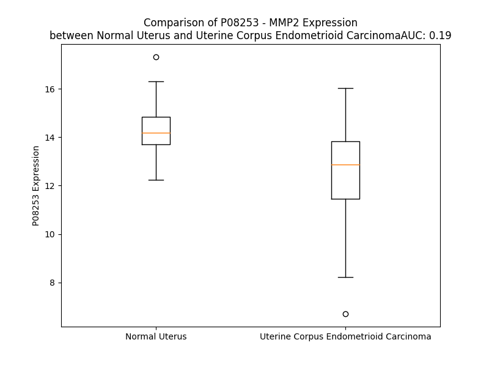

# Detailed Data for P08253

## Introduction to the Detailed Summary

### How to Interpret the Results

- **Summary & Metrics**: This section provides a quick reference to essential protein attributes, including expression changes, family classification, and biomarker applications. Regulation status (upregulated/downregulated) indicates the protein's behavior in a disease context. Some information comes from the original excel file with the proteins selected from literature, while others are derived from the analyses.
- **Expression Comparison**: A visual representation comparing protein expression between normal and disease states. It highlights significant changes in expression levels that might indicate diagnostic or therapeutic relevance. This is data coming from transcriptomics experiments and could not translate similarly to protein levels.
- **Isoform Alignment**: An interactive view of isoform alignments, revealing structural and functional differences between variants of the protein.
- **Interactors & Homologs**: Tables listing known interaction partners and homologous proteins, the more interactors and homologs, the more complex the protein is to design an antibody for.
- **Biological Assemblies**: Information about the structural arrangement of the protein in different assemblies, providing insights into its functional state but also the complexity of the protein to develop antibodies.
- **Combined Per-Residue Information**: A detailed table summarizing residue-level data. This includes predictions for epitope regions, aggregation tendencies, and modifications that might impact the protein's function. Each row corresponds to a residue in the protein, providing insights into specific sites that may be important for research or drug development.
## Summary & Metrics

- **UniProt Accession**: P08253
- **Gene Name**: MMP2
- **Protein Name**: Matrix metalloproteinase-2
- **Swiss Prot**: MMP2_HUMAN
- **Family**: peptidase
- **Biomarker Application**: diagnosis,disease progression,efficacy,prognosis,response to therapy,unspecified application
- **Number of Isoforms**: 3
- **Regulation**: 1
- **(transcriptomics) AUC**: 0.28
- **(transcriptomics) Fold Change**: 1.06
- **(transcriptomics) Regulation**: Downregulated
- **Discotope Epitope Count**: 150
- **Max n_uniprots (Homo)**: 3
- **Max n_uniprots (Hetero)**: 2

## Expression Comparison

## Isoform Alignment

<pre style='font-size:14px; font-family:monospace;'>P08253-1 MEALMARGALTGPLRALCLLGCLLSHAAAAPSPIIKFPGDVAPKTDKELAVQYLNTFYGCPKESCNLFVLKDTLKKMQKFFGLPQTGDLDQNTIETMRKPRCGNPDVANYNFFPRKPKWDKNQITYRIIGYTPDLDPETVDDAFARAFQVWSDVTPLRFSRIHDGEADIMINFGRWEHGDGYPFDGKDGLLAHAFAPGTGVGGDSHFDDDELWTLGEGQVVRVKYGNADGEYCKFPFLFNGKEYNSCTDTGRSDGFLWCSTTYNFEKDGKYGFCPHEALFTMGGNAEGQPCKFPFRFQGTSYDSCTTEGRTDGYRWCGTTEDYDRDKKYGFCPETAMSTVGGNSEGAPCVFPFTFLGNKYESCTSAGRSDGKMWCATTANYDDDRKWGFCPDQGYSLFLVAAHEFGHAMGLEHSQDPGALMAPIYTYTKNFRLSQDDIKGIQELYGASPDIDLGTGPTPTLGPVTPEICKQDIVFDGIAQIRGEIFFFKDRFIWRTVTPRDKPMGPLLVATFWPELPEKIDAVYEAPQEEKAVFFAGNEYWIYSASTLERGYPKPLTSLGLPPDVQRVDAAFNWSKNKKTYIFAGDKFWRYNEVKKKMDPGFPKLIADAWNAIPDNLDAVVDLQGGGHSYFFKGAYYLKLENQSLKSVKFGSIKSDWLGC
P08253-2 ----------------------------------------------------------------------------MQKFFGLPQTGDLDQNTIETMRKPRCGNPDVANYNFFPRKPKWDKNQITYRIIGYTPDLDPETVDDAFARAFQVWSDVTPLRFSRIHDGEADIMINFGRWEHGDGYPFDGKDGLLAHAFAPGTGVGGDSHFDDDELWTLGEGQVVRVKYGNADGEYCKFPFLFNGKEYNSCTDTGRSDGFLWCSTTYNFEKDGKYGFCPHEALFTMGGNAEGQPCKFPFRFQGTSYDSCTTEGRTDGYRWCGTTEDYDRDKKYGFCPETAMSTVGGNSEGAPCVFPFTFLGNKYESCTSAGRSDGKMWCATTANYDDDRKWGFCPDQGYSLFLVAAHEFGHAMGLEHSQDPGALMAPIYTYTKNFRLSQDDIKGIQELYGASPDIDLGTGPTPTLGPVTPEICKQDIVFDGIAQIRGEIFFFKDRFIWRTVTPRDKPMGPLLVATFWPELPEKIDAVYEAPQEEKAVFFAGNEYWIYSASTLERGYPKPLTSLGLPPDVQRVDAAFNWSKNKKTYIFAGDKFWRYNEVKKKMDPGFPKLIADAWNAIPDNLDAVVDLQGGGHSYFFKGAYYLKLENQSLKSVKFGSIKSDWLGC
P08253-3 --------------------------------------------------MQYLNTFYGCPKESCNLFVLKDTLKKMQKFFGLPQTGDLDQNTIETMRKPRCGNPDVANYNFFPRKPKWDKNQITYRIIGYTPDLDPETVDDAFARAFQVWSDVTPLRFSRIHDGEADIMINFGRWEHGDGYPFDGKDGLLAHAFAPGTGVGGDSHFDDDELWTLGEGQVVRVKYGNADGEYCKFPFLFNGKEYNSCTDTGRSDGFLWCSTTYNFEKDGKYGFCPHEALFTMGGNAEGQPCKFPFRFQGTSYDSCTTEGRTDGYRWCGTTEDYDRDKKYGFCPETAMSTVGGNSEGAPCVFPFTFLGNKYESCTSAGRSDGKMWCATTANYDDDRKWGFCPDQGYSLFLVAAHEFGHAMGLEHSQDPGALMAPIYTYTKNFRLSQDDIKGIQELYGASPDIDLGTGPTPTLGPVTPEICKQDIVFDGIAQIRGEIFFFKDRFIWRTVTPRDKPMGPLLVATFWPELPEKIDAVYEAPQEEKAVFFAGNEYWIYSASTLERGYPKPLTSLGLPPDVQRVDAAFNWSKNKKTYIFAGDKFWRYNEVKKKMDPGFPKLIADAWNAIPDNLDAVVDLQGGGHSYFFKGAYYLKLENQSLKSVKFGSIKSDWLGC
</pre>

## Interactors

| preferredName_A   | preferredName_B   |   score |
|:------------------|:------------------|--------:|
| MMP2              | TIMP2             |   0.999 |
| MMP2              | MMP14             |   0.997 |
| MMP2              | TIMP1             |   0.997 |
| MMP2              | TIMP3             |   0.996 |
| MMP2              | THBS1             |   0.985 |
| MMP2              | SRC               |   0.972 |
| MMP2              | CD44              |   0.971 |
| MMP2              | TIMP4             |   0.963 |
| MMP2              | TGFB1             |   0.962 |
| MMP2              | MMP7              |   0.961 |
| MMP2              | COL18A1           |   0.96  |
| MMP2              | EDN1              |   0.958 |
| MMP2              | CYBB              |   0.957 |
| MMP2              | A2M               |   0.953 |
| MMP2              | CYBA              |   0.949 |
| MMP2              | HBEGF             |   0.939 |
| MMP2              | IBSP              |   0.936 |
| MMP2              | MMP1              |   0.93  |
| MMP2              | NCF1              |   0.928 |
| MMP2              | MMP9              |   0.918 |
| MMP2              | NCF2              |   0.917 |
| MMP2              | STAT3             |   0.916 |
| MMP2              | NCF4              |   0.912 |
| MMP2              | LCN2              |   0.907 |

## Homologs

| uniprot_id   | gene_id   |
|:-------------|:----------|
| O60882       | MMP20     |
| P09238       | MMP10     |
| P09237       | MMP7      |
| E5RJA7       | MMP16     |
| P39900       | MMP12     |
| E9PJB3       | MMP8      |
| G5E971       | MMP13     |
| P51511       | MMP15     |
| P14780       | MMP9      |
| P50281       | MMP14     |
| Q9NRE1       | MMP26     |
| B4DNP3       | MMP19     |
| A0A087WZS5   | MMP25     |
| Q9ULZ9       | MMP17     |
| B4DMZ6       | MMP23B    |
| Q9Y5R2       | MMP24     |
| P02790       | HPX       |
| P03956       | MMP1      |
| E9PED7       | MMP11     |
| A0A087X1Y9   | MMP28     |
| Q8N119       | MMP21     |
| P08254       | MMP3      |
| Q9H306       | MMP27     |

## Biological Assemblies

|   Unnamed: 0 |   assembly |   n_uniprots | composition   | crystal_id   |
|-------------:|-----------:|-------------:|:--------------|:-------------|
|            0 |          1 |            2 | Hetero        | 1gxd         |
|            1 |          2 |            2 | Hetero        | 1gxd         |
|            0 |          1 |            1 | Homo          | 1gen         |
|            0 |          1 |            1 | Homo          | 1ck7         |
|            0 |          1 |            1 | Homo          | 1j7m         |
|            0 |          1 |            3 | Homo          | 1eak         |
|            1 |          2 |            3 | Homo          | 1eak         |
|            0 |          1 |            1 | Homo          | 1cxw         |
|            0 |          1 |            1 | Homo          | 1ks0         |
|            0 |          1 |            2 | Hetero        | 3ayu         |
|            0 |          1 |            1 | Hetero        | 8h78         |
|            1 |          2 |            1 | Hetero        | 8h78         |
|            0 |          1 |            1 | Homo          | 1hov         |
|            0 |          1 |            2 | Hetero        | 7xjo         |
|            1 |          2 |            2 | Hetero        | 7xjo         |
|            0 |          1 |            1 | Homo          | 1rtg         |
|            0 |          1 |            2 | Hetero        | 7xgj         |
|            1 |          2 |            2 | Hetero        | 7xgj         |
|            2 |          3 |            2 | Hetero        | 7xgj         |
|            0 |          1 |            1 | Homo          | 1qib         |

## Combined Per-Residue Information

|   res | aa   |   epitope_score | epitope   |   relative_surface_accessibility |   modeling_confidence |   Aggregation | modification   | glycosylation                   |
|------:|:-----|----------------:|:----------|---------------------------------:|----------------------:|--------------:|:---------------|:--------------------------------|
|     1 | M    |         0.1361  | True      |                          1.33883 |                 38.43 |         0     | N/A            | N/A                             |
|     2 | E    |         0.25575 | True      |                          0.92329 |                 35.19 |         0     | N/A            | N/A                             |
|     3 | A    |         0.18992 | True      |                          0.81851 |                 38.79 |         0     | N/A            | N/A                             |
|     4 | L    |         0.14003 | True      |                          0.94642 |                 41.11 |         0     | N/A            | N/A                             |
|     5 | M    |         0.20529 | True      |                          0.9527  |                 37.23 |         0     | N/A            | N/A                             |
|     6 | A    |         0.13835 | True      |                          0.87068 |                 40.31 |         0     | N/A            | N/A                             |
|     7 | R    |         0.2017  | True      |                          0.97666 |                 39.59 |         0     | N/A            | N/A                             |
|     8 | G    |         0.13901 | True      |                          0.96144 |                 39.39 |         0     | N/A            | N/A                             |
|     9 | A    |         0.14912 | True      |                          0.87286 |                 39.42 |         0     | N/A            | N/A                             |
|    10 | L    |         0.1346  | True      |                          1.00161 |                 37.18 |         0     | N/A            | N/A                             |
|    11 | T    |         0.18119 | True      |                          0.96315 |                 44.77 |         0     | N/A            | N/A                             |
|    12 | G    |         0.23203 | True      |                          0.91013 |                 39.26 |         0     | N/A            | N/A                             |
|    13 | P    |         0.12718 | False     |                          0.92268 |                 38.55 |         0     | N/A            | N/A                             |
|    14 | L    |         0.15347 | True      |                          1.13461 |                 36.14 |         0     | N/A            | N/A                             |
|    15 | R    |         0.11273 | False     |                          0.89563 |                 38.36 |         0     | N/A            | N/A                             |
|    16 | A    |         0.07753 | False     |                          0.94897 |                 35.44 |         0.99  | N/A            | N/A                             |
|    17 | L    |         0.09262 | False     |                          0.84719 |                 40.82 |         1.354 | N/A            | N/A                             |
|    18 | C    |         0.08772 | False     |                          0.91727 |                 31.96 |         1.537 | N/A            | N/A                             |
|    19 | L    |         0.12839 | False     |                          0.98627 |                 40.91 |         2.564 | N/A            | N/A                             |
|    20 | L    |         0.1141  | False     |                          1.07491 |                 37.56 |         2.724 | N/A            | N/A                             |
|    21 | G    |         0.08624 | False     |                          0.77733 |                 34.49 |         2.041 | N/A            | N/A                             |
|    22 | C    |         0.08907 | False     |                          0.90816 |                 35.83 |         2.041 | N/A            | N/A                             |
|    23 | L    |         0.13809 | True      |                          1.03604 |                 33.42 |         2.041 | N/A            | N/A                             |
|    24 | L    |         0.11367 | False     |                          0.97812 |                 36.43 |         1.882 | N/A            | N/A                             |
|    25 | S    |         0.10147 | False     |                          0.75351 |                 31.69 |         0     | N/A            | N/A                             |
|    26 | H    |         0.1375  | True      |                          0.94447 |                 33.45 |         0     | N/A            | N/A                             |
|    27 | A    |         0.13856 | True      |                          0.89657 |                 29.62 |         0     | N/A            | N/A                             |
|    28 | A    |         0.14127 | True      |                          0.92526 |                 35.96 |         0     | N/A            | N/A                             |
|    29 | A    |         0.15733 | True      |                          0.89842 |                 40.69 |         0     | N/A            | N/A                             |
|    30 | A    |         0.12091 | False     |                          0.79475 |                 47.55 |         0     | N/A            | N/A                             |
|    31 | P    |         0.17394 | True      |                          0.95799 |                 60.82 |         0     | N/A            | N/A                             |
|    32 | S    |         0.09659 | False     |                          0.38146 |                 61.66 |         0     | N/A            | N/A                             |
|    33 | P    |         0.1874  | True      |                          0.61931 |                 82.33 |         0     | N/A            | N/A                             |
|    34 | I    |         0.20373 | True      |                          0.74852 |                 83.45 |         0     | N/A            | N/A                             |
|    35 | I    |         0.20969 | True      |                          0.27142 |                 87.53 |         0     | N/A            | N/A                             |
|    36 | K    |         0.15922 | True      |                          0.80149 |                 88.73 |         0     | N/A            | N/A                             |
|    37 | F    |         0.03154 | False     |                          0.01256 |                 90.39 |         0     | N/A            | N/A                             |
|    38 | P    |         0.14768 | True      |                          0.38244 |                 89.92 |         0     | N/A            | N/A                             |
|    39 | G    |         0.13942 | True      |                          0.86805 |                 82.59 |         0     | N/A            | N/A                             |
|    40 | D    |         0.10005 | False     |                          0.22604 |                 80.68 |         0     | N/A            | N/A                             |
|    41 | V    |         0.11871 | False     |                          0.77118 |                 74.39 |         0     | N/A            | N/A                             |
|    42 | A    |         0.07964 | False     |                          0.62554 |                 73.63 |         0     | N/A            | N/A                             |
|    43 | P    |         0.1158  | False     |                          0.83689 |                 77.67 |         0     | N/A            | N/A                             |
|    44 | K    |         0.16036 | True      |                          0.4095  |                 82.13 |         0     | N/A            | N/A                             |
|    45 | T    |         0.16508 | True      |                          0.56234 |                 87.22 |         0     | N/A            | N/A                             |
|    46 | D    |         0.0973  | False     |                          0.43374 |                 89.14 |         0     | N/A            | N/A                             |
|    47 | K    |         0.17706 | True      |                          0.62064 |                 87.31 |         0     | N/A            | N/A                             |
|    48 | E    |         0.08713 | False     |                          0.50034 |                 88.38 |         0     | N/A            | N/A                             |
|    49 | L    |         0.03006 | False     |                          0.16652 |                 90.71 |        13.861 | N/A            | N/A                             |
|    50 | A    |         0.00209 | False     |                          0       |                 91.36 |        14.119 | N/A            | N/A                             |
|    51 | V    |         0.06259 | False     |                          0.32466 |                 89.35 |        14.637 | N/A            | N/A                             |
|    52 | Q    |         0.09779 | False     |                          0.37846 |                 89.93 |        14.637 | N/A            | N/A                             |
|    53 | Y    |         0.01878 | False     |                          0.04378 |                 93.64 |        15.767 | N/A            | N/A                             |
|    54 | L    |         0.00315 | False     |                          0       |                 92.63 |        15.003 | N/A            | N/A                             |
|    55 | N    |         0.05661 | False     |                          0.20755 |                 89.88 |         9.331 | N/A            | N/A                             |
|    56 | T    |         0.05974 | False     |                          0.3831  |                 90.93 |         9.116 | N/A            | N/A                             |
|    57 | F    |         0.02223 | False     |                          0.02542 |                 93.98 |         8.989 | N/A            | N/A                             |
|    58 | Y    |         0.02331 | False     |                          0.06888 |                 91.63 |         7.041 | N/A            | N/A                             |
|    59 | G    |         0.03695 | False     |                          0.38187 |                 84.83 |         0.447 | N/A            | N/A                             |
|    60 | C    |         0.01635 | False     |                          0.01977 |                 80.95 |         0     | N/A            | N/A                             |
|    61 | P    |         0.08222 | False     |                          0.52587 |                 75.01 |         0     | N/A            | N/A                             |
|    62 | K    |         0.17078 | True      |                          0.82476 |                 71.82 |         0     | N/A            | N/A                             |
|    63 | E    |         0.15785 | True      |                          0.93364 |                 71.85 |         0     | N/A            | N/A                             |
|    64 | S    |         0.14275 | True      |                          0.42459 |                 68.92 |         1.441 | N/A            | N/A                             |
|    65 | C    |         0.05306 | False     |                          0.15696 |                 69.48 |         3.778 | N/A            | N/A                             |
|    66 | N    |         0.15152 | True      |                          0.56847 |                 71.27 |        24.02  | N/A            | N/A                             |
|    67 | L    |         0.15492 | True      |                          0.91272 |                 74.02 |        24.494 | N/A            | N/A                             |
|    68 | F    |         0.15348 | True      |                          0.78026 |                 74.78 |        24.494 | N/A            | N/A                             |
|    69 | V    |         0.04805 | False     |                          0.37321 |                 80.44 |        24.494 | N/A            | N/A                             |
|    70 | L    |         0.05488 | False     |                          0.12365 |                 80.94 |        23.714 | N/A            | N/A                             |
|    71 | K    |         0.0565  | False     |                          0.3841  |                 88.31 |         0.474 | N/A            | N/A                             |
|    72 | D    |         0.13069 | True      |                          0.36973 |                 88.34 |         0.474 | N/A            | N/A                             |
|    73 | T    |         0.02482 | False     |                          0.06726 |                 90.65 |         0.166 | N/A            | N/A                             |
|    74 | L    |         0.00558 | False     |                          0.01072 |                 93.14 |         0.166 | N/A            | N/A                             |
|    75 | K    |         0.06296 | False     |                          0.33757 |                 94.18 |         0     | N/A            | N/A                             |
|    76 | K    |         0.08996 | False     |                          0.60197 |                 93.39 |         0     | N/A            | N/A                             |
|    77 | M    |         0.00295 | False     |                          0       |                 95.18 |         0     | N/A            | N/A                             |
|    78 | Q    |         0.00737 | False     |                          0       |                 95.47 |         0     | N/A            | N/A                             |
|    79 | K    |         0.09285 | False     |                          0.64236 |                 93.68 |         0     | N/A            | N/A                             |
|    80 | F    |         0.04751 | False     |                          0.09033 |                 94.1  |         0     | N/A            | N/A                             |
|    81 | F    |         0.02806 | False     |                          0.21217 |                 93.71 |         0     | N/A            | N/A                             |
|    82 | G    |         0.06209 | False     |                          0.69315 |                 90.28 |         0     | N/A            | N/A                             |
|    83 | L    |         0.03013 | False     |                          0.09707 |                 91.04 |         0     | N/A            | N/A                             |
|    84 | P    |         0.06232 | False     |                          0.60057 |                 89.17 |         0     | N/A            | N/A                             |
|    85 | Q    |         0.10401 | False     |                          0.5296  |                 93.16 |         0     | N/A            | N/A                             |
|    86 | T    |         0.08279 | False     |                          0.38772 |                 92.83 |         0     | N/A            | N/A                             |
|    87 | G    |         0.05737 | False     |                          0.07376 |                 92.05 |         0     | N/A            | N/A                             |
|    88 | D    |         0.09174 | False     |                          0.46676 |                 92.82 |         0     | N/A            | N/A                             |
|    89 | L    |         0.11142 | False     |                          0.36849 |                 90.96 |         0     | N/A            | N/A                             |
|    90 | D    |         0.04055 | False     |                          0.27662 |                 91.28 |         0     | N/A            | N/A                             |
|    91 | Q    |         0.09142 | False     |                          0.6211  |                 90.67 |         0     | N/A            | N/A                             |
|    92 | N    |         0.05227 | False     |                          0.37832 |                 88.94 |         0     | N/A            | N/A                             |
|    93 | T    |         0.00385 | False     |                          0.00072 |                 93.83 |         0     | N/A            | N/A                             |
|    94 | I    |         0.04861 | False     |                          0.0592  |                 93.47 |         0     | N/A            | N/A                             |
|    95 | E    |         0.05412 | False     |                          0.38128 |                 91.12 |         0     | N/A            | N/A                             |
|    96 | T    |         0.01652 | False     |                          0.09673 |                 93.99 |         0     | N/A            | N/A                             |
|    97 | M    |         0.01898 | False     |                          0.03774 |                 94.87 |         0     | N/A            | N/A                             |
|    98 | R    |         0.11643 | False     |                          0.4806  |                 92.87 |         0     | N/A            | N/A                             |
|    99 | K    |         0.02239 | False     |                          0.30122 |                 93.98 |         0     | N/A            | N/A                             |
|   100 | P    |         0.02364 | False     |                          0.24057 |                 96.88 |         0     | N/A            | N/A                             |
|   101 | R    |         0.03589 | False     |                          0.01254 |                 98.18 |         0     | N/A            | N/A                             |
|   102 | C    |         0.02163 | False     |                          0.05041 |                 98.28 |         0     | N/A            | N/A                             |
|   103 | G    |         0.01379 | False     |                          0.14689 |                 97.09 |         0     | N/A            | N/A                             |
|   104 | N    |         0.01561 | False     |                          0.05691 |                 95.15 |         0     | N/A            | N/A                             |
|   105 | P    |         0.02782 | False     |                          0.31971 |                 93.98 |         0     | N/A            | N/A                             |
|   106 | D    |         0.04146 | False     |                          0.10705 |                 92.66 |         0     | N/A            | N/A                             |
|   107 | V    |         0.05866 | False     |                          0.32733 |                 83.06 |         0     | N/A            | N/A                             |
|   108 | A    |         0.07418 | False     |                          0.75109 |                 61.55 |         0     | N/A            | N/A                             |
|   109 | N    |         0.09376 | False     |                          0.54135 |                 50.66 |         0     | N/A            | N/A                             |
|   110 | Y    |         0.06717 | False     |                          0.21286 |                 46.01 |         0     | N/A            | N/A                             |
|   111 | N    |         0.14927 | True      |                          0.90419 |                 36.66 |         0     | N/A            | N/A                             |
|   112 | F    |         0.18549 | True      |                          0.85417 |                 40.68 |         0     | N/A            | N/A                             |
|   113 | F    |         0.15315 | True      |                          0.38031 |                 44.3  |         0     | N/A            | N/A                             |
|   114 | P    |         0.14119 | True      |                          0.97013 |                 45.21 |         0     | N/A            | N/A                             |
|   115 | R    |         0.16054 | True      |                          0.81758 |                 59.76 |         0     | N/A            | N/A                             |
|   116 | K    |         0.14346 | True      |                          0.85045 |                 69.04 |         0     | N/A            | N/A                             |
|   117 | P    |         0.02876 | False     |                          0.17496 |                 82.57 |         0     | N/A            | N/A                             |
|   118 | K    |         0.10363 | False     |                          0.44697 |                 92.01 |         0     | N/A            | N/A                             |
|   119 | W    |         0.06325 | False     |                          0.09102 |                 95.66 |         0     | N/A            | N/A                             |
|   120 | D    |         0.17175 | True      |                          0.96427 |                 94.23 |         0     | N/A            | N/A                             |
|   121 | K    |         0.14964 | True      |                          0.43603 |                 96    |         0     | N/A            | N/A                             |
|   122 | N    |         0.12897 | True      |                          0.43219 |                 96.32 |         0     | N/A            | N/A                             |
|   123 | Q    |         0.08893 | False     |                          0.69764 |                 97.71 |         0     | N/A            | N/A                             |
|   124 | I    |         0.00341 | False     |                          0       |                 98.44 |         0     | N/A            | N/A                             |
|   125 | T    |         0.04788 | False     |                          0.25544 |                 98.57 |         0     | N/A            | N/A                             |
|   126 | Y    |         0.04259 | False     |                          0.07185 |                 98.76 |         0     | N/A            | N/A                             |
|   127 | R    |         0.04923 | False     |                          0.10586 |                 98.51 |         0     | N/A            | N/A                             |
|   128 | I    |         0.01548 | False     |                          0.04358 |                 98.54 |         0     | N/A            | N/A                             |
|   129 | I    |         0.07493 | False     |                          0.38979 |                 96.94 |         0     | N/A            | N/A                             |
|   130 | G    |         0.02851 | False     |                          0.11266 |                 96.15 |         0     | N/A            | N/A                             |
|   131 | Y    |         0.03418 | False     |                          0.07522 |                 98.35 |         0     | N/A            | N/A                             |
|   132 | T    |         0.01074 | False     |                          0.00215 |                 97.2  |         0     | N/A            | N/A                             |
|   133 | P    |         0.06297 | False     |                          0.18788 |                 95.37 |         0     | N/A            | N/A                             |
|   134 | D    |         0.01752 | False     |                          0.04173 |                 96.17 |         0     | N/A            | N/A                             |
|   135 | L    |         0.00412 | False     |                          0.00369 |                 98.05 |         0     | N/A            | N/A                             |
|   136 | D    |         0.03379 | False     |                          0.02342 |                 98.23 |         0     | N/A            | N/A                             |
|   137 | P    |         0.01736 | False     |                          0.14016 |                 98.17 |         0     | N/A            | N/A                             |
|   138 | E    |         0.07527 | False     |                          0.58061 |                 98.23 |         0     | N/A            | N/A                             |
|   139 | T    |         0.01908 | False     |                          0.04566 |                 98.57 |         0     | N/A            | N/A                             |
|   140 | V    |         0.00154 | False     |                          0       |                 98.77 |         0     | N/A            | N/A                             |
|   141 | D    |         0.03534 | False     |                          0.19043 |                 98.74 |         0     | N/A            | N/A                             |
|   142 | D    |         0.07382 | False     |                          0.41721 |                 98.66 |         0     | N/A            | N/A                             |
|   143 | A    |         0.00142 | False     |                          0       |                 98.71 |         0     | N/A            | N/A                             |
|   144 | F    |         0.00166 | False     |                          0       |                 98.81 |         0     | N/A            | N/A                             |
|   145 | A    |         0.02503 | False     |                          0.42896 |                 98.69 |         0     | N/A            | N/A                             |
|   146 | R    |         0.06842 | False     |                          0.36047 |                 98.45 |         0     | N/A            | N/A                             |
|   147 | A    |         0.00112 | False     |                          0       |                 98.75 |         3.163 | N/A            | N/A                             |
|   148 | F    |         0.00912 | False     |                          0.01922 |                 98.59 |         3.576 | N/A            | N/A                             |
|   149 | Q    |         0.04863 | False     |                          0.48183 |                 97.31 |         3.576 | N/A            | N/A                             |
|   150 | V    |         0.01731 | False     |                          0.14191 |                 97.09 |         3.576 | N/A            | N/A                             |
|   151 | W    |         0.00993 | False     |                          0       |                 97.45 |         3.576 | N/A            | N/A                             |
|   152 | S    |         0.0621  | False     |                          0.10758 |                 95.73 |         0.762 | N/A            | N/A                             |
|   153 | D    |         0.06913 | False     |                          0.53    |                 94.27 |         0     | N/A            | N/A                             |
|   154 | V    |         0.05542 | False     |                          0.16756 |                 93.5  |         0     | N/A            | N/A                             |
|   155 | T    |         0.01202 | False     |                          0       |                 94.73 |         0     | N/A            | N/A                             |
|   156 | P    |         0.06672 | False     |                          0.19566 |                 96.18 |         0     | N/A            | N/A                             |
|   157 | L    |         0.0033  | False     |                          0       |                 97.31 |         0     | N/A            | N/A                             |
|   158 | R    |         0.09611 | False     |                          0.47333 |                 97.79 |         0     | N/A            | N/A                             |
|   159 | F    |         0.03755 | False     |                          0.19228 |                 98.47 |         0     | N/A            | N/A                             |
|   160 | S    |         0.03663 | False     |                          0.43199 |                 98.4  |         0     | N/A            | N/A                             |
|   161 | R    |         0.07153 | False     |                          0.29412 |                 98.47 |         0     | N/A            | N/A                             |
|   162 | I    |         0.15372 | True      |                          0.29373 |                 98.36 |         0     | N/A            | N/A                             |
|   163 | H    |         0.11041 | False     |                          0.69672 |                 97.31 |         0     | N/A            | N/A                             |
|   164 | D    |         0.11998 | False     |                          0.71757 |                 95.47 |         0     | N/A            | N/A                             |
|   165 | G    |         0.07194 | False     |                          0.47806 |                 95.46 |         0     | N/A            | N/A                             |
|   166 | E    |         0.1228  | False     |                          0.68327 |                 96.69 |         0     | N/A            | N/A                             |
|   167 | A    |         0.03637 | False     |                          0.09279 |                 97.82 |         0     | N/A            | N/A                             |
|   168 | D    |         0.03217 | False     |                          0.14708 |                 98.18 |         0     | N/A            | N/A                             |
|   169 | I    |         0.0038  | False     |                          0       |                 98.62 |        10.877 | N/A            | N/A                             |
|   170 | M    |         0.02705 | False     |                          0.14507 |                 98.49 |        10.877 | N/A            | N/A                             |
|   171 | I    |         0.0029  | False     |                          0       |                 98.72 |        10.877 | N/A            | N/A                             |
|   172 | N    |         0.06311 | False     |                          0.30482 |                 98.16 |        10.877 | N/A            | N/A                             |
|   173 | F    |         0.03254 | False     |                          0.09519 |                 98.15 |        10.877 | N/A            | N/A                             |
|   174 | G    |         0.08771 | False     |                          0.1329  |                 94.57 |         0.896 | N/A            | N/A                             |
|   175 | R    |         0.20975 | True      |                          0.47426 |                 92.69 |         0     | N/A            | N/A                             |
|   176 | W    |         0.14815 | True      |                          0.53008 |                 92.1  |         0     | N/A            | N/A                             |
|   177 | E    |         0.15866 | True      |                          0.51745 |                 95.01 |         0     | N/A            | N/A                             |
|   178 | H    |         0.04368 | False     |                          0.23612 |                 94.58 |         0     | N/A            | N/A                             |
|   179 | G    |         0.16247 | True      |                          0.88568 |                 93.36 |         0     | N/A            | N/A                             |
|   180 | D    |         0.10731 | False     |                          0.21242 |                 93.33 |         0     | N/A            | N/A                             |
|   181 | G    |         0.11697 | False     |                          0.63122 |                 93.11 |         0     | N/A            | N/A                             |
|   182 | Y    |         0.10658 | False     |                          0.54731 |                 92.67 |         0     | N/A            | N/A                             |
|   183 | P    |         0.15147 | True      |                          0.54303 |                 94.57 |         0     | N/A            | N/A                             |
|   184 | F    |         0.03139 | False     |                          0.02917 |                 95.24 |         0     | N/A            | N/A                             |
|   185 | D    |         0.08739 | False     |                          0.27953 |                 91.31 |         0     | N/A            | N/A                             |
|   186 | G    |         0.03807 | False     |                          0.04346 |                 88.87 |         0     | N/A            | N/A                             |
|   187 | K    |         0.04912 | False     |                          0.23555 |                 88.68 |         0     | N/A            | N/A                             |
|   188 | D    |         0.0473  | False     |                          0.17254 |                 90.06 |         0     | N/A            | N/A                             |
|   189 | G    |         0.04345 | False     |                          0.26193 |                 93.25 |         0     | N/A            | N/A                             |
|   190 | L    |         0.04606 | False     |                          0.14426 |                 96.67 |         0     | N/A            | N/A                             |
|   191 | L    |         0.01001 | False     |                          0.01566 |                 98.41 |         0     | N/A            | N/A                             |
|   192 | A    |         0.00323 | False     |                          0       |                 98.58 |         0     | N/A            | N/A                             |
|   193 | H    |         0.01454 | False     |                          0.06175 |                 98.13 |         0     | N/A            | N/A                             |
|   194 | A    |         0.00272 | False     |                          0.00712 |                 97.34 |         0     | N/A            | N/A                             |
|   195 | F    |         0.0128  | False     |                          0.16165 |                 95.65 |         0     | N/A            | N/A                             |
|   196 | A    |         0.01769 | False     |                          0.06359 |                 93.86 |         0     | N/A            | N/A                             |
|   197 | P    |         0.02168 | False     |                          0.07459 |                 95.31 |         0     | N/A            | N/A                             |
|   198 | G    |         0.03708 | False     |                          0.33564 |                 92.17 |         0     | N/A            | N/A                             |
|   199 | T    |         0.10587 | False     |                          0.9544  |                 91.21 |         0     | N/A            | N/A                             |
|   200 | G    |         0.06607 | False     |                          0.5737  |                 92.37 |         0     | N/A            | N/A                             |
|   201 | V    |         0.05509 | False     |                          0.61112 |                 93.08 |         0     | N/A            | N/A                             |
|   202 | G    |         0.01782 | False     |                          0.05271 |                 94.13 |         0     | N/A            | N/A                             |
|   203 | G    |         0.00195 | False     |                          0       |                 96.07 |         0     | N/A            | N/A                             |
|   204 | D    |         0.04792 | False     |                          0.08254 |                 98.11 |         0     | N/A            | N/A                             |
|   205 | S    |         0.00125 | False     |                          0       |                 98.54 |         0     | N/A            | N/A                             |
|   206 | H    |         0.02782 | False     |                          0.12185 |                 98.65 |         0     | N/A            | N/A                             |
|   207 | F    |         0.00245 | False     |                          0       |                 98.76 |         0     | N/A            | N/A                             |
|   208 | D    |         0.0025  | False     |                          0       |                 97.84 |         0     | N/A            | N/A                             |
|   209 | D    |         0.04957 | False     |                          0.158   |                 95.5  |         0     | N/A            | N/A                             |
|   210 | D    |         0.06552 | False     |                          0.19389 |                 91.82 |         0     | N/A            | N/A                             |
|   211 | E    |         0.01261 | False     |                          0.02141 |                 94.76 |         0     | N/A            | N/A                             |
|   212 | L    |         0.00468 | False     |                          0.00247 |                 95.51 |         0     | N/A            | N/A                             |
|   213 | W    |         0.01012 | False     |                          0.00275 |                 98.11 |         0     | N/A            | N/A                             |
|   214 | T    |         0.0059  | False     |                          0       |                 98.01 |         0     | N/A            | N/A                             |
|   215 | L    |         0.05943 | False     |                          0.36032 |                 97.93 |         0     | N/A            | N/A                             |
|   216 | G    |         0.01373 | False     |                          0.02498 |                 96.15 |         0     | N/A            | N/A                             |
|   217 | E    |         0.06818 | False     |                          0.4983  |                 93.91 |         0     | N/A            | N/A                             |
|   218 | G    |         0.02956 | False     |                          0.10483 |                 93.6  |         0     | N/A            | N/A                             |
|   219 | Q    |         0.01558 | False     |                          0.08563 |                 95.34 |         0     | N/A            | N/A                             |
|   220 | V    |         0.03886 | False     |                          0.12314 |                 97.65 |         0     | N/A            | N/A                             |
|   221 | V    |         0.00405 | False     |                          0.00857 |                 97.95 |         0     | N/A            | N/A                             |
|   222 | R    |         0.08162 | False     |                          0.18247 |                 98.26 |         0     | N/A            | N/A                             |
|   223 | V    |         0.00384 | False     |                          0       |                 97.87 |         0     | N/A            | N/A                             |
|   224 | K    |         0.07604 | False     |                          0.13111 |                 97.51 |         0     | N/A            | N/A                             |
|   225 | Y    |         0.26986 | True      |                          0.52423 |                 96.13 |         0     | N/A            | N/A                             |
|   226 | G    |         0.11337 | False     |                          0.46211 |                 95.9  |         0     | N/A            | N/A                             |
|   227 | N    |         0.22127 | True      |                          0.62157 |                 97.78 |         0     | N/A            | N/A                             |
|   228 | A    |         0.05046 | False     |                          0.08928 |                 97.77 |         0     | N/A            | N/A                             |
|   229 | D    |         0.10873 | False     |                          0.58124 |                 97.35 |         0     | N/A            | N/A                             |
|   230 | G    |         0.05005 | False     |                          0.38871 |                 95.19 |         0     | N/A            | N/A                             |
|   231 | E    |         0.17398 | True      |                          0.51902 |                 98.17 |         0     | N/A            | N/A                             |
|   232 | Y    |         0.08572 | False     |                          0.39425 |                 98.38 |         0     | N/A            | N/A                             |
|   233 | C    |         0.01992 | False     |                          0.08439 |                 98.2  |         0     | N/A            | N/A                             |
|   234 | K    |         0.09448 | False     |                          0.5129  |                 97.42 |         0     | N/A            | N/A                             |
|   235 | F    |         0.0409  | False     |                          0.18629 |                 94.65 |         0     | N/A            | N/A                             |
|   236 | P    |         0.19535 | True      |                          0.37775 |                 92.94 |         0     | N/A            | N/A                             |
|   237 | F    |         0.01009 | False     |                          0       |                 95.35 |         0.442 | N/A            | N/A                             |
|   238 | L    |         0.1271  | False     |                          0.20197 |                 95.18 |         0.442 | N/A            | N/A                             |
|   239 | F    |         0.11135 | False     |                          0.12803 |                 96.13 |         0.442 | N/A            | N/A                             |
|   240 | N    |         0.27408 | True      |                          0.69206 |                 94.32 |         0.442 | N/A            | N/A                             |
|   241 | G    |         0.27782 | True      |                          0.79865 |                 91.85 |         0.442 | N/A            | N/A                             |
|   242 | K    |         0.22381 | True      |                          0.42957 |                 90.89 |         0     | N/A            | N/A                             |
|   243 | E    |         0.15367 | True      |                          0.30434 |                 91.33 |         0     | N/A            | N/A                             |
|   244 | Y    |         0.053   | False     |                          0.12107 |                 90.99 |         0     | N/A            | N/A                             |
|   245 | N    |         0.0757  | False     |                          0.62829 |                 91.08 |         0     | N/A            | N/A                             |
|   246 | S    |         0.04134 | False     |                          0.18842 |                 93.14 |         0     | N/A            | N/A                             |
|   247 | C    |         0.00957 | False     |                          0.04007 |                 94.25 |         0     | N/A            | N/A                             |
|   248 | T    |         0.08101 | False     |                          0.09389 |                 92.76 |         0     | N/A            | N/A                             |
|   249 | D    |         0.1544  | True      |                          0.42972 |                 92    |         0     | N/A            | N/A                             |
|   250 | T    |         0.21548 | True      |                          0.40853 |                 92.58 |         0     | N/A            | N/A                             |
|   251 | G    |         0.39711 | True      |                          0.82601 |                 92.9  |         0     | N/A            | N/A                             |
|   252 | R    |         0.30725 | True      |                          0.41012 |                 93.88 |         0     | N/A            | N/A                             |
|   253 | S    |         0.31521 | True      |                          0.95959 |                 93.53 |         0     | N/A            | N/A                             |
|   254 | D    |         0.20334 | True      |                          0.45145 |                 93.2  |         0     | N/A            | N/A                             |
|   255 | G    |         0.14789 | True      |                          0.41739 |                 89.36 |         0.481 | N/A            | N/A                             |
|   256 | F    |         0.1053  | False     |                          0.30435 |                 93.59 |         3.6   | N/A            | N/A                             |
|   257 | L    |         0.03114 | False     |                          0.0952  |                 94.92 |         4.009 | N/A            | N/A                             |
|   258 | W    |         0.1105  | False     |                          0.05139 |                 97.24 |         4.009 | N/A            | N/A                             |
|   259 | C    |         0.00192 | False     |                          0       |                 97.95 |         4.009 | N/A            | N/A                             |
|   260 | S    |         0.0065  | False     |                          0       |                 98.27 |         3.528 | N/A            | N/A                             |
|   261 | T    |         0.03716 | False     |                          0.14913 |                 97.92 |         2.863 | N/A            | N/A                             |
|   262 | T    |         0.11566 | False     |                          0.21041 |                 97    |         2.472 | N/A            | N/A                             |
|   263 | Y    |         0.18576 | True      |                          0.33932 |                 95.23 |         2.239 | N/A            | N/A                             |
|   264 | N    |         0.19555 | True      |                          0.30374 |                 95.14 |         1.257 | N/A            | N/A                             |
|   265 | F    |         0.12265 | False     |                          0.22392 |                 96.89 |         1.257 | N/A            | N/A                             |
|   266 | E    |         0.22483 | True      |                          0.64523 |                 95.16 |         0     | N/A            | N/A                             |
|   267 | K    |         0.36344 | True      |                          0.81626 |                 95.7  |         0     | N/A            | N/A                             |
|   268 | D    |         0.30263 | True      |                          0.38386 |                 97.05 |         0     | N/A            | N/A                             |
|   269 | G    |         0.38814 | True      |                          0.37524 |                 96.52 |         0     | N/A            | N/A                             |
|   270 | K    |         0.16217 | True      |                          0.51858 |                 98.24 |         0     | N/A            | N/A                             |
|   271 | Y    |         0.28242 | True      |                          0.29172 |                 98.39 |         0     | N/A            | N/A                             |
|   272 | G    |         0.00424 | False     |                          0       |                 98.22 |         0     | N/A            | N/A                             |
|   273 | F    |         0.06566 | False     |                          0.15703 |                 97.87 |         0     | N/A            | N/A                             |
|   274 | C    |         0.0025  | False     |                          0.00074 |                 97.29 |         0     | N/A            | N/A                             |
|   275 | P    |         0.00979 | False     |                          0.01889 |                 96.56 |         0     | N/A            | N/A                             |
|   276 | H    |         0.04756 | False     |                          0.24412 |                 94.86 |         0     | N/A            | N/A                             |
|   277 | E    |         0.0406  | False     |                          0.13123 |                 94.37 |         0     | N/A            | N/A                             |
|   278 | A    |         0.09869 | False     |                          0.53746 |                 92.8  |         1.095 | N/A            | N/A                             |
|   279 | L    |         0.09702 | False     |                          0.2219  |                 94.05 |         1.095 | N/A            | N/A                             |
|   280 | F    |         0.03401 | False     |                          0.06467 |                 97.1  |         1.095 | N/A            | N/A                             |
|   281 | T    |         0.01005 | False     |                          0.01205 |                 97.98 |         1.095 | N/A            | N/A                             |
|   282 | M    |         0.04446 | False     |                          0.30882 |                 97.33 |         1.095 | N/A            | N/A                             |
|   283 | G    |         0.16618 | True      |                          0.63583 |                 95.99 |         0     | N/A            | N/A                             |
|   284 | G    |         0.08174 | False     |                          0.4405  |                 96.32 |         0     | N/A            | N/A                             |
|   285 | N    |         0.16345 | True      |                          0.4084  |                 97.91 |         0     | N/A            | N/A                             |
|   286 | A    |         0.04447 | False     |                          0.03538 |                 97.36 |         0     | N/A            | N/A                             |
|   287 | E    |         0.23483 | True      |                          0.81038 |                 96.84 |         0     | N/A            | N/A                             |
|   288 | G    |         0.12839 | False     |                          0.2633  |                 95.83 |         0     | N/A            | N/A                             |
|   289 | Q    |         0.16155 | True      |                          0.5313  |                 97.57 |         0     | N/A            | N/A                             |
|   290 | P    |         0.07554 | False     |                          0.36007 |                 97.66 |         0     | N/A            | N/A                             |
|   291 | C    |         0.02938 | False     |                          0.09327 |                 97.73 |         0     | N/A            | N/A                             |
|   292 | K    |         0.14167 | True      |                          0.39835 |                 98.19 |         0     | N/A            | N/A                             |
|   293 | F    |         0.10676 | False     |                          0.30952 |                 95.96 |         0     | N/A            | N/A                             |
|   294 | P    |         0.30591 | True      |                          0.56184 |                 96.85 |         0     | N/A            | N/A                             |
|   295 | F    |         0.01474 | False     |                          0.00264 |                 98.09 |         0     | N/A            | N/A                             |
|   296 | R    |         0.27405 | True      |                          0.49614 |                 97.97 |         0     | N/A            | N/A                             |
|   297 | F    |         0.10428 | False     |                          0.09719 |                 97.75 |         0     | N/A            | N/A                             |
|   298 | Q    |         0.39363 | True      |                          0.74262 |                 95.75 |         0     | N/A            | N/A                             |
|   299 | G    |         0.22823 | True      |                          0.66033 |                 93.4  |         0     | N/A            | N/A                             |
|   300 | T    |         0.26494 | True      |                          0.4864  |                 96.82 |         0     | N/A            | N/A                             |
|   301 | S    |         0.25518 | True      |                          0.60721 |                 97.41 |         0     | N/A            | N/A                             |
|   302 | Y    |         0.11378 | False     |                          0.17427 |                 96.78 |         0     | N/A            | N/A                             |
|   303 | D    |         0.23614 | True      |                          0.64856 |                 94.96 |         0     | N/A            | N/A                             |
|   304 | S    |         0.14689 | True      |                          0.51526 |                 93.88 |         0     | N/A            | N/A                             |
|   305 | C    |         0.03456 | False     |                          0.10212 |                 96.23 |         0     | N/A            | N/A                             |
|   306 | T    |         0.14817 | True      |                          0.15214 |                 96.3  |         0     | N/A            | N/A                             |
|   307 | T    |         0.12048 | False     |                          0.40884 |                 96.67 |         0     | N/A            | N/A                             |
|   308 | E    |         0.20085 | True      |                          0.49875 |                 96.65 |         0     | N/A            | N/A                             |
|   309 | G    |         0.29602 | True      |                          0.87402 |                 94.91 |         0     | N/A            | N/A                             |
|   310 | R    |         0.18624 | True      |                          0.34909 |                 95.91 |         0     | N/A            | N/A                             |
|   311 | T    |         0.09634 | False     |                          0.70465 |                 94.88 |         0     | N/A            | N/A                             |
|   312 | D    |         0.06539 | False     |                          0.31379 |                 94.93 |         0     | N/A            | N/A                             |
|   313 | G    |         0.01199 | False     |                          0.05215 |                 94.91 |         0     | N/A            | N/A                             |
|   314 | Y    |         0.06341 | False     |                          0.36838 |                 97.38 |         0     | N/A            | N/A                             |
|   315 | R    |         0.03985 | False     |                          0.1404  |                 98.09 |         0     | N/A            | N/A                             |
|   316 | W    |         0.04966 | False     |                          0.04832 |                 98.42 |         0     | N/A            | N/A                             |
|   317 | C    |         0.00304 | False     |                          0       |                 98.5  |         0     | N/A            | N/A                             |
|   318 | G    |         0.00352 | False     |                          0       |                 98.28 |         0     | N/A            | N/A                             |
|   319 | T    |         0.04224 | False     |                          0.14202 |                 98.1  |         0     | N/A            | N/A                             |
|   320 | T    |         0.09024 | False     |                          0.23897 |                 97.86 |         0     | N/A            | N/A                             |
|   321 | E    |         0.20784 | True      |                          0.55236 |                 97.29 |         0     | N/A            | N/A                             |
|   322 | D    |         0.13457 | True      |                          0.17076 |                 97.57 |         0     | N/A            | N/A                             |
|   323 | Y    |         0.15199 | True      |                          0.23253 |                 97.47 |         0     | N/A            | N/A                             |
|   324 | D    |         0.18224 | True      |                          0.37523 |                 96.32 |         0     | N/A            | N/A                             |
|   325 | R    |         0.37083 | True      |                          0.65021 |                 97.58 |         0     | N/A            | N/A                             |
|   326 | D    |         0.16981 | True      |                          0.33347 |                 97.54 |         0     | N/A            | N/A                             |
|   327 | K    |         0.36223 | True      |                          0.67349 |                 97.4  |         0     | N/A            | N/A                             |
|   328 | K    |         0.07593 | False     |                          0.40824 |                 98.41 |         0     | N/A            | N/A                             |
|   329 | Y    |         0.16674 | True      |                          0.26274 |                 98.45 |         0     | N/A            | N/A                             |
|   330 | G    |         0.00293 | False     |                          0       |                 98.4  |         0     | N/A            | N/A                             |
|   331 | F    |         0.06068 | False     |                          0.21559 |                 98.49 |         0     | N/A            | N/A                             |
|   332 | C    |         0.02159 | False     |                          0.02251 |                 97.79 |         0     | N/A            | N/A                             |
|   333 | P    |         0.08458 | False     |                          0.20167 |                 96.81 |         0     | N/A            | N/A                             |
|   334 | E    |         0.01237 | False     |                          0.01239 |                 96.67 |         0     | N/A            | N/A                             |
|   335 | T    |         0.03303 | False     |                          0.12635 |                 94.21 |         0     | N/A            | N/A                             |
|   336 | A    |         0.0052  | False     |                          0.02502 |                 90.55 |         0     | N/A            | N/A                             |
|   337 | M    |         0.05008 | False     |                          0.22791 |                 81.45 |         0     | N/A            | N/A                             |
|   338 | S    |         0.01354 | False     |                          0.03497 |                 81.42 |         0     | N/A            | N/A                             |
|   339 | T    |         0.00531 | False     |                          0       |                 87.04 |         0     | N/A            | N/A                             |
|   340 | V    |         0.01893 | False     |                          0.0476  |                 85.25 |         0     | N/A            | N/A                             |
|   341 | G    |         0.19157 | True      |                          0.54345 |                 84.85 |         0     | N/A            | N/A                             |
|   342 | G    |         0.05849 | False     |                          0.37381 |                 86.5  |         0     | N/A            | N/A                             |
|   343 | N    |         0.09073 | False     |                          0.24611 |                 89.15 |         0     | N/A            | N/A                             |
|   344 | S    |         0.08736 | False     |                          0.07806 |                 88.77 |         0     | N/A            | N/A                             |
|   345 | E    |         0.2427  | True      |                          0.87885 |                 83.73 |         0     | N/A            | N/A                             |
|   346 | G    |         0.05984 | False     |                          0.14642 |                 82.28 |         0     | N/A            | N/A                             |
|   347 | A    |         0.09854 | False     |                          0.36568 |                 84.7  |         0     | N/A            | N/A                             |
|   348 | P    |         0.06454 | False     |                          0.48144 |                 86.99 |         0     | N/A            | N/A                             |
|   349 | C    |         0.02902 | False     |                          0.20802 |                 90.35 |         0     | N/A            | N/A                             |
|   350 | V    |         0.09163 | False     |                          0.37607 |                 91.75 |         0     | N/A            | N/A                             |
|   351 | F    |         0.06207 | False     |                          0.31481 |                 89.67 |         0     | N/A            | N/A                             |
|   352 | P    |         0.21314 | True      |                          0.38752 |                 93.74 |         0.374 | N/A            | N/A                             |
|   353 | F    |         0.01291 | False     |                          0.00332 |                 96.46 |         1.378 | N/A            | N/A                             |
|   354 | T    |         0.09901 | False     |                          0.28237 |                 97.55 |         1.378 | N/A            | N/A                             |
|   355 | F    |         0.0108  | False     |                          0.00064 |                 96.95 |         1.378 | N/A            | N/A                             |
|   356 | L    |         0.14701 | True      |                          0.42596 |                 95.05 |         1.378 | N/A            | N/A                             |
|   357 | G    |         0.15329 | True      |                          0.78712 |                 93.72 |         1.003 | N/A            | N/A                             |
|   358 | N    |         0.18169 | True      |                          0.53064 |                 95.66 |         0     | N/A            | N/A                             |
|   359 | K    |         0.1719  | True      |                          0.67234 |                 96.42 |         0     | N/A            | N/A                             |
|   360 | Y    |         0.09338 | False     |                          0.17921 |                 94.47 |         0     | N/A            | N/A                             |
|   361 | E    |         0.16667 | True      |                          0.50846 |                 91.59 |         0     | N/A            | N/A                             |
|   362 | S    |         0.12802 | False     |                          0.54429 |                 90.65 |         0     | N/A            | N/A                             |
|   363 | C    |         0.05177 | False     |                          0.24816 |                 92.86 |         0     | N/A            | N/A                             |
|   364 | T    |         0.09533 | False     |                          0.13196 |                 93.43 |         0     | N/A            | N/A                             |
|   365 | S    |         0.12258 | False     |                          0.33586 |                 92.81 |         0     | N/A            | N/A                             |
|   366 | A    |         0.05223 | False     |                          0.10169 |                 94.29 |         0     | N/A            | N/A                             |
|   367 | G    |         0.0248  | False     |                          0.02257 |                 91.7  |         0     | N/A            | N/A                             |
|   368 | R    |         0.10189 | False     |                          0.14533 |                 89.23 |         0     | N/A            | N/A                             |
|   369 | S    |         0.17231 | True      |                          0.63725 |                 83.42 |         0     | N/A            | N/A                             |
|   370 | D    |         0.16536 | True      |                          0.47229 |                 81    |         0     | N/A            | N/A                             |
|   371 | G    |         0.09968 | False     |                          0.5564  |                 83.76 |         0     | N/A            | N/A                             |
|   372 | K    |         0.09484 | False     |                          0.33231 |                 87.36 |         0     | N/A            | N/A                             |
|   373 | M    |         0.04369 | False     |                          0.48909 |                 92.25 |         0     | N/A            | N/A                             |
|   374 | W    |         0.0189  | False     |                          0       |                 94.19 |         0     | N/A            | N/A                             |
|   375 | C    |         0.00265 | False     |                          0       |                 95.71 |         0     | N/A            | N/A                             |
|   376 | A    |         0.0043  | False     |                          0       |                 96.74 |         0     | N/A            | N/A                             |
|   377 | T    |         0.03488 | False     |                          0.12283 |                 94.54 |         0     | N/A            | N/A                             |
|   378 | T    |         0.09946 | False     |                          0.25135 |                 95.66 |         0     | N/A            | N/A                             |
|   379 | A    |         0.12959 | True      |                          0.62141 |                 96.42 |         0     | N/A            | N/A                             |
|   380 | N    |         0.06741 | False     |                          0.25709 |                 97.13 |         0     | N/A            | N/A                             |
|   381 | Y    |         0.01335 | False     |                          0.0017  |                 97    |         0     | N/A            | N/A                             |
|   382 | D    |         0.13627 | True      |                          0.2805  |                 95.55 |         0     | N/A            | N/A                             |
|   383 | D    |         0.28643 | True      |                          0.67    |                 96.65 |         0     | N/A            | N/A                             |
|   384 | D    |         0.08666 | False     |                          0.44452 |                 96.55 |         0     | N/A            | N/A                             |
|   385 | R    |         0.26322 | True      |                          0.46242 |                 95.99 |         0     | N/A            | N/A                             |
|   386 | K    |         0.08904 | False     |                          0.42913 |                 96.74 |         0     | N/A            | N/A                             |
|   387 | W    |         0.0188  | False     |                          0.00276 |                 95.42 |         0     | N/A            | N/A                             |
|   388 | G    |         0.00291 | False     |                          0       |                 92.7  |         0     | N/A            | N/A                             |
|   389 | F    |         0.06483 | False     |                          0.10682 |                 92.45 |         0     | N/A            | N/A                             |
|   390 | C    |         0.02717 | False     |                          0.11789 |                 92.69 |         0     | N/A            | N/A                             |
|   391 | P    |         0.02149 | False     |                          0.26063 |                 92.13 |         0     | N/A            | N/A                             |
|   392 | D    |         0.131   | True      |                          0.39108 |                 91.69 |         0     | N/A            | N/A                             |
|   393 | Q    |         0.09174 | False     |                          0.56526 |                 93.15 |         0.02  | N/A            | N/A                             |
|   394 | G    |         0.03722 | False     |                          0.09847 |                 95.32 |         1.135 | N/A            | N/A                             |
|   395 | Y    |         0.03224 | False     |                          0.07217 |                 98.17 |        35.089 | N/A            | N/A                             |
|   396 | S    |         0.0186  | False     |                          0.01819 |                 98.61 |        44.553 | N/A            | N/A                             |
|   397 | L    |         0.00141 | False     |                          0       |                 98.83 |        84.709 | N/A            | N/A                             |
|   398 | F    |         0.03395 | False     |                          0.14254 |                 98.78 |        86.461 | N/A            | N/A                             |
|   399 | L    |         0.01375 | False     |                          0.06727 |                 98.71 |        86.461 | N/A            | N/A                             |
|   400 | V    |         0.01291 | False     |                          0.06284 |                 98.86 |        85.105 | N/A            | N/A                             |
|   401 | A    |         0.00078 | False     |                          0       |                 98.88 |        64.628 | N/A            | N/A                             |
|   402 | A    |         0.00115 | False     |                          0       |                 98.82 |        16.719 | N/A            | N/A                             |
|   403 | H    |         0.00852 | False     |                          0.06995 |                 98.76 |         0.151 | N/A            | N/A                             |
|   404 | E    |         0.00918 | False     |                          0.00309 |                 98.73 |         0     | N/A            | N/A                             |
|   405 | F    |         0.00106 | False     |                          0       |                 98.73 |         0     | N/A            | N/A                             |
|   406 | G    |         0.0016  | False     |                          0       |                 98.27 |         0     | N/A            | N/A                             |
|   407 | H    |         0.01414 | False     |                          0.02391 |                 97.48 |         0     | N/A            | N/A                             |
|   408 | A    |         0.00054 | False     |                          0       |                 97.68 |         0     | N/A            | N/A                             |
|   409 | M    |         0.00118 | False     |                          0       |                 97.03 |         0     | N/A            | N/A                             |
|   410 | G    |         0.02672 | False     |                          0.09541 |                 94.72 |         0     | N/A            | N/A                             |
|   411 | L    |         0.02958 | False     |                          0.11462 |                 95.06 |         0     | N/A            | N/A                             |
|   412 | E    |         0.04295 | False     |                          0.48382 |                 93.62 |         0     | N/A            | N/A                             |
|   413 | H    |         0.0156  | False     |                          0.11454 |                 95.99 |         0     | N/A            | N/A                             |
|   414 | S    |         0.02303 | False     |                          0.12617 |                 95.36 |         0     | N/A            | N/A                             |
|   415 | Q    |         0.06964 | False     |                          0.5736  |                 94.35 |         0     | N/A            | N/A                             |
|   416 | D    |         0.03547 | False     |                          0.18205 |                 94.3  |         0     | N/A            | N/A                             |
|   417 | P    |         0.02326 | False     |                          0.3577  |                 93.99 |         0     | N/A            | N/A                             |
|   418 | G    |         0.02567 | False     |                          0.08862 |                 94.57 |         0     | N/A            | N/A                             |
|   419 | A    |         0.01725 | False     |                          0.07487 |                 96.4  |         0     | N/A            | N/A                             |
|   420 | L    |         0.01828 | False     |                          0.13276 |                 97.72 |         0     | N/A            | N/A                             |
|   421 | M    |         0.00969 | False     |                          0.02157 |                 97.84 |         0     | N/A            | N/A                             |
|   422 | A    |         0.0341  | False     |                          0.16048 |                 96.82 |         0     | N/A            | N/A                             |
|   423 | P    |         0.0147  | False     |                          0.03925 |                 97.49 |         0     | N/A            | N/A                             |
|   424 | I    |         0.04569 | False     |                          0.19757 |                 97.51 |         1.034 | N/A            | N/A                             |
|   425 | Y    |         0.06165 | False     |                          0.19551 |                 97.95 |         1.034 | N/A            | N/A                             |
|   426 | T    |         0.03844 | False     |                          0.22189 |                 95.6  |         1.034 | N/A            | N/A                             |
|   427 | Y    |         0.0474  | False     |                          0.15374 |                 96    |         1.034 | N/A            | N/A                             |
|   428 | T    |         0.03266 | False     |                          0.16924 |                 91.7  |         1.034 | N/A            | N/A                             |
|   429 | K    |         0.05437 | False     |                          0.51292 |                 89.24 |         0     | N/A            | N/A                             |
|   430 | N    |         0.11193 | False     |                          0.54534 |                 88.45 |         0     | N/A            | N/A                             |
|   431 | F    |         0.08837 | False     |                          0.24048 |                 92.43 |         0     | N/A            | N/A                             |
|   432 | R    |         0.08755 | False     |                          0.41219 |                 92.7  |         0     | N/A            | N/A                             |
|   433 | L    |         0.04392 | False     |                          0.10367 |                 94.82 |         0     | N/A            | N/A                             |
|   434 | S    |         0.00538 | False     |                          0.00803 |                 95.26 |         0     | N/A            | N/A                             |
|   435 | Q    |         0.0561  | False     |                          0.23016 |                 93.77 |         0     | N/A            | N/A                             |
|   436 | D    |         0.04715 | False     |                          0.36425 |                 95.06 |         0     | N/A            | N/A                             |
|   437 | D    |         0.02267 | False     |                          0.02236 |                 96.25 |         0     | N/A            | N/A                             |
|   438 | I    |         0.04765 | False     |                          0.11919 |                 94.47 |         0     | N/A            | N/A                             |
|   439 | K    |         0.1404  | True      |                          0.58844 |                 92.68 |         0     | N/A            | N/A                             |
|   440 | G    |         0.07614 | False     |                          0.27944 |                 93.48 |         0     | N/A            | N/A                             |
|   441 | I    |         0.0042  | False     |                          0       |                 94.49 |         0     | N/A            | N/A                             |
|   442 | Q    |         0.07601 | False     |                          0.23336 |                 93.55 |         0     | N/A            | N/A                             |
|   443 | E    |         0.1456  | True      |                          0.62951 |                 91.8  |         0     | N/A            | N/A                             |
|   444 | L    |         0.08253 | False     |                          0.17    |                 93.13 |         0     | N/A            | N/A                             |
|   445 | Y    |         0.07814 | False     |                          0.0681  |                 94.21 |         0     | N/A            | N/A                             |
|   446 | G    |         0.08815 | False     |                          0.37878 |                 91.72 |         0     | N/A            | N/A                             |
|   447 | A    |         0.13907 | True      |                          0.50891 |                 91.07 |         0     | N/A            | N/A                             |
|   448 | S    |         0.04914 | False     |                          0.04351 |                 83.42 |         0     | N/A            | N/A                             |
|   449 | P    |         0.22021 | True      |                          0.52716 |                 75.17 |         0     | N/A            | N/A                             |
|   450 | D    |         0.1259  | False     |                          0.4638  |                 68.39 |         0     | N/A            | N/A                             |
|   451 | I    |         0.14341 | True      |                          0.31505 |                 59.34 |         0     | N/A            | N/A                             |
|   452 | D    |         0.21912 | True      |                          0.82784 |                 51.17 |         0     | N/A            | N/A                             |
|   453 | L    |         0.22933 | True      |                          0.80878 |                 50.85 |         0     | N/A            | N/A                             |
|   454 | G    |         0.23089 | True      |                          0.85423 |                 48.69 |         0     | N/A            | N/A                             |
|   455 | T    |         0.26136 | True      |                          0.92683 |                 50.49 |         0     | N/A            | N/A                             |
|   456 | G    |         0.17469 | True      |                          0.40211 |                 47.31 |         0     | N/A            | N/A                             |
|   457 | P    |         0.17064 | True      |                          0.90229 |                 41.45 |         0     | N/A            | N/A                             |
|   458 | T    |         0.23382 | True      |                          0.81393 |                 47.24 |         0     | N/A            | N/A                             |
|   459 | P    |         0.12953 | True      |                          0.56166 |                 50.63 |         0     | N/A            | N/A                             |
|   460 | T    |         0.20573 | True      |                          0.72319 |                 54.16 |         0     | N/A            | N/A                             |
|   461 | L    |         0.16614 | True      |                          0.8521  |                 69.87 |         0     | N/A            | N/A                             |
|   462 | G    |         0.04135 | False     |                          0.06788 |                 80.1  |         0     | N/A            | N/A                             |
|   463 | P    |         0.03687 | False     |                          0.19089 |                 89.23 |         0     | N/A            | N/A                             |
|   464 | V    |         0.10173 | False     |                          0.6834  |                 92.44 |         0     | N/A            | N/A                             |
|   465 | T    |         0.02623 | False     |                          0.14327 |                 93.22 |         0     | N/A            | N/A                             |
|   466 | P    |         0.05116 | False     |                          0.11255 |                 94.04 |         0     | N/A            | N/A                             |
|   467 | E    |         0.05675 | False     |                          0.38517 |                 92.11 |         0     | N/A            | N/A                             |
|   468 | I    |         0.08478 | False     |                          0.11635 |                 90.34 |         0     | N/A            | N/A                             |
|   469 | C    |         0.06418 | False     |                          0.28863 |                 89.86 |         0     | N/A            | N/A                             |
|   470 | K    |         0.18153 | True      |                          0.74162 |                 91.02 |         0     | N/A            | N/A                             |
|   471 | Q    |         0.22698 | True      |                          0.48478 |                 88.57 |         0     | N/A            | N/A                             |
|   472 | D    |         0.15349 | True      |                          0.72702 |                 88.91 |         0     | N/A            | N/A                             |
|   473 | I    |         0.10061 | False     |                          0.12805 |                 92.35 |         0     | N/A            | N/A                             |
|   474 | V    |         0.06199 | False     |                          0.51589 |                 95.67 |         0     | N/A            | N/A                             |
|   475 | F    |         0.04735 | False     |                          0.03444 |                 96.8  |         0     | N/A            | N/A                             |
|   476 | D    |         0.03272 | False     |                          0.07948 |                 97.18 |         0     | N/A            | N/A                             |
|   477 | G    |         0.00331 | False     |                          0.00966 |                 97.08 |         0     | N/A            | N/A                             |
|   478 | I    |         0.00862 | False     |                          0.01704 |                 97.22 |         0.316 | N/A            | N/A                             |
|   479 | A    |         0.00492 | False     |                          0.03699 |                 95.53 |         0.316 | N/A            | N/A                             |
|   480 | Q    |         0.02934 | False     |                          0.19663 |                 93.19 |         0.316 | N/A            | N/A                             |
|   481 | I    |         0.01329 | False     |                          0.05715 |                 92.15 |         2.731 | N/A            | N/A                             |
|   482 | R    |         0.06702 | False     |                          0.54436 |                 88.12 |         2.953 | N/A            | N/A                             |
|   483 | G    |         0.02283 | False     |                          0.44891 |                 88.42 |         3.207 | N/A            | N/A                             |
|   484 | E    |         0.0561  | False     |                          0.20632 |                 91.64 |         6.031 | N/A            | N/A                             |
|   485 | I    |         0.01232 | False     |                          0.0104  |                 94.44 |        11.044 | N/A            | N/A                             |
|   486 | F    |         0.01448 | False     |                          0.06179 |                 95.69 |        11.503 | N/A            | N/A                             |
|   487 | F    |         0.00217 | False     |                          0       |                 96.84 |        11.503 | N/A            | N/A                             |
|   488 | F    |         0.00128 | False     |                          0.00275 |                 97.47 |        11.503 | N/A            | N/A                             |
|   489 | K    |         0.03462 | False     |                          0.16894 |                 96.36 |         8.55  | N/A            | N/A                             |
|   490 | D    |         0.05645 | False     |                          0.32071 |                 93.56 |         5.472 | N/A            | N/A                             |
|   491 | R    |         0.04037 | False     |                          0.07742 |                 94.2  |         0     | N/A            | N/A                             |
|   492 | F    |         0.01186 | False     |                          0.01019 |                 96.44 |         0     | N/A            | N/A                             |
|   493 | I    |         0.00476 | False     |                          0.0008  |                 95.96 |         0     | N/A            | N/A                             |
|   494 | W    |         0.02398 | False     |                          0.00162 |                 95.13 |         0     | N/A            | N/A                             |
|   495 | R    |         0.04521 | False     |                          0.17855 |                 93.68 |         0     | N/A            | N/A                             |
|   496 | T    |         0.04536 | False     |                          0.09427 |                 92.29 |         0     | N/A            | N/A                             |
|   497 | V    |         0.14689 | True      |                          0.77353 |                 88.7  |         0     | N/A            | N/A                             |
|   498 | T    |         0.10739 | False     |                          0.48446 |                 83.97 |         0     | N/A            | N/A                             |
|   499 | P    |         0.05318 | False     |                          0.39392 |                 74.78 |         0     | N/A            | N/A                             |
|   500 | R    |         0.11596 | False     |                          0.68322 |                 78.27 |         0     | N/A            | N/A                             |
|   501 | D    |         0.07928 | False     |                          0.4836  |                 84.4  |         0     | N/A            | N/A                             |
|   502 | K    |         0.07723 | False     |                          0.70861 |                 87.58 |         0     | N/A            | N/A                             |
|   503 | P    |         0.01009 | False     |                          0.04214 |                 91.52 |         0     | N/A            | N/A                             |
|   504 | M    |         0.04849 | False     |                          0.25214 |                 89.19 |         0     | N/A            | N/A                             |
|   505 | G    |         0.0378  | False     |                          0.30981 |                 89.84 |         0     | N/A            | N/A                             |
|   506 | P    |         0.09608 | False     |                          0.22929 |                 93.72 |         0.735 | N/A            | N/A                             |
|   507 | L    |         0.02948 | False     |                          0.23082 |                 92.95 |        54.842 | N/A            | N/A                             |
|   508 | L    |         0.03025 | False     |                          0.13358 |                 94.07 |        64.025 | N/A            | N/A                             |
|   509 | V    |         0.00878 | False     |                          0.06093 |                 94.92 |        64.025 | N/A            | N/A                             |
|   510 | A    |         0.01707 | False     |                          0.15902 |                 94.08 |        64.025 | N/A            | N/A                             |
|   511 | T    |         0.05235 | False     |                          0.37372 |                 91.41 |        63.943 | N/A            | N/A                             |
|   512 | F    |         0.07222 | False     |                          0.26085 |                 91.37 |        59.885 | N/A            | N/A                             |
|   513 | W    |         0.02842 | False     |                          0.05472 |                 93.84 |         1.132 | N/A            | N/A                             |
|   514 | P    |         0.02811 | False     |                          0.26172 |                 91.73 |         0.527 | N/A            | N/A                             |
|   515 | E    |         0.03373 | False     |                          0.33155 |                 91.89 |         0     | N/A            | N/A                             |
|   516 | L    |         0.01176 | False     |                          0.09457 |                 94.61 |         0     | N/A            | N/A                             |
|   517 | P    |         0.12686 | False     |                          0.32048 |                 93.9  |         0     | N/A            | N/A                             |
|   518 | E    |         0.06083 | False     |                          0.29187 |                 88.89 |         0     | N/A            | N/A                             |
|   519 | K    |         0.07393 | False     |                          0.41739 |                 93.9  |         0     | N/A            | N/A                             |
|   520 | I    |         0.01636 | False     |                          0.01704 |                 97.02 |         0     | N/A            | N/A                             |
|   521 | D    |         0.01953 | False     |                          0.06727 |                 98.02 |         0     | N/A            | N/A                             |
|   522 | A    |         0.00294 | False     |                          0.01658 |                 98.26 |         0     | N/A            | N/A                             |
|   523 | V    |         0.00702 | False     |                          0.0205  |                 97.89 |         0     | N/A            | N/A                             |
|   524 | Y    |         0.02234 | False     |                          0.03664 |                 96.28 |         0     | N/A            | N/A                             |
|   525 | E    |         0.02049 | False     |                          0.19566 |                 94.24 |         0     | N/A            | N/A                             |
|   526 | A    |         0.03217 | False     |                          0.06887 |                 91.87 |         0     | N/A            | N/A                             |
|   527 | P    |         0.07561 | False     |                          0.38282 |                 81.43 |         0     | N/A            | N/A                             |
|   528 | Q    |         0.09286 | False     |                          0.58516 |                 77.35 |         0     | N/A            | N/A                             |
|   529 | E    |         0.07386 | False     |                          0.38237 |                 81.96 |         0     | N/A            | N/A                             |
|   530 | E    |         0.02834 | False     |                          0.55511 |                 89.22 |         0     | N/A            | N/A                             |
|   531 | K    |         0.06318 | False     |                          0.21067 |                 94.2  |         0.06  | N/A            | N/A                             |
|   532 | A    |         0.00962 | False     |                          0.05596 |                 96.14 |        64.483 | N/A            | N/A                             |
|   533 | V    |         0.01188 | False     |                          0.01999 |                 97.06 |        71.357 | N/A            | N/A                             |
|   534 | F    |         0.0009  | False     |                          0       |                 98    |        71.357 | N/A            | N/A                             |
|   535 | F    |         0.00224 | False     |                          0.00206 |                 98.39 |        71.357 | N/A            | N/A                             |
|   536 | A    |         0.02084 | False     |                          0.08163 |                 97.5  |        71.357 | N/A            | N/A                             |
|   537 | G    |         0.05403 | False     |                          0.40014 |                 96.79 |         9.06  | N/A            | N/A                             |
|   538 | N    |         0.06826 | False     |                          0.57832 |                 96.45 |         0.377 | N/A            | N/A                             |
|   539 | E    |         0.07645 | False     |                          0.31471 |                 97.82 |         0.06  | N/A            | N/A                             |
|   540 | Y    |         0.03313 | False     |                          0.03503 |                 98.03 |        15.669 | N/A            | N/A                             |
|   541 | W    |         0.08047 | False     |                          0.06324 |                 97.66 |        16.991 | N/A            | N/A                             |
|   542 | I    |         0.03064 | False     |                          0.15839 |                 96.64 |        17.206 | N/A            | N/A                             |
|   543 | Y    |         0.01652 | False     |                          0.011   |                 95.28 |        17.206 | N/A            | N/A                             |
|   544 | S    |         0.03555 | False     |                          0.29457 |                 91.33 |        17.145 | N/A            | N/A                             |
|   545 | A    |         0.04397 | False     |                          0.60073 |                 82.02 |        11.744 | N/A            | N/A                             |
|   546 | S    |         0.13052 | True      |                          0.46969 |                 81.51 |         6.578 | N/A            | N/A                             |
|   547 | T    |         0.11333 | False     |                          0.66565 |                 86.53 |         6.015 | N/A            | N/A                             |
|   548 | L    |         0.02125 | False     |                          0.23218 |                 92.47 |         5.893 | N/A            | N/A                             |
|   549 | E    |         0.04528 | False     |                          0.2538  |                 92.39 |         0     | N/A            | N/A                             |
|   550 | R    |         0.20858 | True      |                          0.62951 |                 87.71 |         0     | N/A            | N/A                             |
|   551 | G    |         0.08997 | False     |                          0.59801 |                 90.71 |         0     | N/A            | N/A                             |
|   552 | Y    |         0.107   | False     |                          0.20939 |                 94.19 |         0     | N/A            | N/A                             |
|   553 | P    |         0.1714  | True      |                          0.38968 |                 96.49 |         0     | N/A            | N/A                             |
|   554 | K    |         0.03805 | False     |                          0.33582 |                 96.67 |         0     | N/A            | N/A                             |
|   555 | P    |         0.08109 | False     |                          0.47815 |                 97.72 |         0     | N/A            | N/A                             |
|   556 | L    |         0.00944 | False     |                          0.02156 |                 97.23 |         0     | N/A            | N/A                             |
|   557 | T    |         0.08021 | False     |                          0.46623 |                 96.54 |         0     | N/A            | N/A                             |
|   558 | S    |         0.10336 | False     |                          0.52837 |                 95.42 |         0     | N/A            | N/A                             |
|   559 | L    |         0.02566 | False     |                          0.06506 |                 93.73 |         0     | N/A            | N/A                             |
|   560 | G    |         0.06255 | False     |                          0.52219 |                 95.13 |         0     | N/A            | N/A                             |
|   561 | L    |         0.01187 | False     |                          0.03268 |                 95.97 |         0     | N/A            | N/A                             |
|   562 | P    |         0.08707 | False     |                          0.32202 |                 95.03 |         0     | N/A            | N/A                             |
|   563 | P    |         0.24971 | True      |                          0.8161  |                 94.8  |         0     | N/A            | N/A                             |
|   564 | D    |         0.18737 | True      |                          0.72337 |                 94.32 |         0     | N/A            | N/A                             |
|   565 | V    |         0.05264 | False     |                          0.12145 |                 95.19 |         0     | N/A            | N/A                             |
|   566 | Q    |         0.11924 | False     |                          0.67053 |                 95    |         0     | N/A            | N/A                             |
|   567 | R    |         0.05554 | False     |                          0.46272 |                 96.84 |         0     | N/A            | N/A                             |
|   568 | V    |         0.00426 | False     |                          0.00259 |                 97.48 |         0     | N/A            | N/A                             |
|   569 | D    |         0.03361 | False     |                          0.15905 |                 97.75 |         0     | N/A            | N/A                             |
|   570 | A    |         0.00181 | False     |                          0.00765 |                 98.18 |         0.239 | N/A            | N/A                             |
|   571 | A    |         0.00333 | False     |                          0.01914 |                 97.72 |         0.239 | N/A            | N/A                             |
|   572 | F    |         0.014   | False     |                          0.02608 |                 96.49 |         0.239 | N/A            | N/A                             |
|   573 | N    |         0.0106  | False     |                          0.12351 |                 94.48 |         0.239 | N/A            | N-linked (GlcNAc...) asparagine |
|   574 | W    |         0.01896 | False     |                          0.05141 |                 92.46 |         0.239 | N/A            | N/A                             |
|   575 | S    |         0.05124 | False     |                          0.34378 |                 87.85 |         0     | N/A            | N/A                             |
|   576 | K    |         0.05805 | False     |                          0.53071 |                 87.89 |         0     | N/A            | N/A                             |
|   577 | N    |         0.13702 | True      |                          0.37778 |                 90.45 |         0     | N/A            | N/A                             |
|   578 | K    |         0.05835 | False     |                          0.56107 |                 91.07 |         0     | N/A            | N/A                             |
|   579 | K    |         0.05031 | False     |                          0.20028 |                 94.53 |         0     | N/A            | N/A                             |
|   580 | T    |         0.00201 | False     |                          0       |                 96.48 |        12.514 | N/A            | N/A                             |
|   581 | Y    |         0.02829 | False     |                          0.0451  |                 97.23 |        14.374 | N/A            | N/A                             |
|   582 | I    |         0.00446 | False     |                          0.0024  |                 97.97 |        14.374 | N/A            | N/A                             |
|   583 | F    |         0.00547 | False     |                          0.00549 |                 98.2  |        14.374 | N/A            | N/A                             |
|   584 | A    |         0.03118 | False     |                          0.13529 |                 97.7  |        14.374 | N/A            | N/A                             |
|   585 | G    |         0.04174 | False     |                          0.31872 |                 96.91 |         2.259 | N/A            | N/A                             |
|   586 | D    |         0.07523 | False     |                          0.39037 |                 96.94 |         0     | N/A            | N/A                             |
|   587 | K    |         0.08895 | False     |                          0.40579 |                 97.55 |         0     | N/A            | N/A                             |
|   588 | F    |         0.02195 | False     |                          0.01975 |                 97.66 |         0     | N/A            | N/A                             |
|   589 | W    |         0.04191 | False     |                          0.04946 |                 97.9  |         0     | N/A            | N/A                             |
|   590 | R    |         0.05717 | False     |                          0.28037 |                 97.26 |         0     | N/A            | N/A                             |
|   591 | Y    |         0.03763 | False     |                          0.06028 |                 96.52 |         0     | N/A            | N/A                             |
|   592 | N    |         0.02804 | False     |                          0.07761 |                 94.64 |         0     | N/A            | N/A                             |
|   593 | E    |         0.02058 | False     |                          0.04779 |                 91.97 |         0     | N/A            | N/A                             |
|   594 | V    |         0.16067 | True      |                          0.77181 |                 91.47 |         0     | N/A            | N/A                             |
|   595 | K    |         0.17206 | True      |                          0.72459 |                 92.39 |         0     | N/A            | N/A                             |
|   596 | K    |         0.08972 | False     |                          0.53672 |                 91.51 |         0     | N/A            | N/A                             |
|   597 | K    |         0.16589 | True      |                          0.70214 |                 94.77 |         0     | N/A            | N/A                             |
|   598 | M    |         0.02319 | False     |                          0.18856 |                 95.78 |         0     | N/A            | N/A                             |
|   599 | D    |         0.04833 | False     |                          0.12251 |                 96.41 |         0     | N/A            | N/A                             |
|   600 | P    |         0.10432 | False     |                          0.94746 |                 94.89 |         0     | N/A            | N/A                             |
|   601 | G    |         0.12662 | False     |                          0.69293 |                 92.46 |         0     | N/A            | N/A                             |
|   602 | F    |         0.08378 | False     |                          0.18326 |                 94.92 |         0     | N/A            | N/A                             |
|   603 | P    |         0.2747  | True      |                          0.43433 |                 96.84 |         0     | N/A            | N/A                             |
|   604 | K    |         0.06689 | False     |                          0.47306 |                 96.79 |         0     | N/A            | N/A                             |
|   605 | L    |         0.09921 | False     |                          0.46001 |                 97.17 |         0     | N/A            | N/A                             |
|   606 | I    |         0.00359 | False     |                          0.00149 |                 95.8  |         0     | N/A            | N/A                             |
|   607 | A    |         0.06633 | False     |                          0.72614 |                 93.58 |         0     | N/A            | N/A                             |
|   608 | D    |         0.12488 | False     |                          0.68987 |                 92.99 |         0     | N/A            | N/A                             |
|   609 | A    |         0.1434  | True      |                          0.37832 |                 90.36 |         0     | N/A            | N/A                             |
|   610 | W    |         0.02369 | False     |                          0.03571 |                 89.74 |         0     | N/A            | N/A                             |
|   611 | N    |         0.08624 | False     |                          0.71359 |                 86.79 |         0     | N/A            | N/A                             |
|   612 | A    |         0.14284 | True      |                          0.67673 |                 89.37 |         0     | N/A            | N/A                             |
|   613 | I    |         0.02499 | False     |                          0.06174 |                 93.27 |         0     | N/A            | N/A                             |
|   614 | P    |         0.08472 | False     |                          0.37463 |                 93.96 |         0     | N/A            | N/A                             |
|   615 | D    |         0.07601 | False     |                          0.36986 |                 96.42 |         0     | N/A            | N/A                             |
|   616 | N    |         0.10443 | False     |                          0.49632 |                 95.69 |         0     | N/A            | N/A                             |
|   617 | L    |         0.00935 | False     |                          0.00896 |                 95.47 |         0     | N/A            | N/A                             |
|   618 | D    |         0.02869 | False     |                          0.16333 |                 96.67 |         0     | N/A            | N/A                             |
|   619 | A    |         0.00327 | False     |                          0.03826 |                 97.71 |         0     | N/A            | N/A                             |
|   620 | V    |         0.00443 | False     |                          0.01324 |                 96.97 |         0     | N/A            | N/A                             |
|   621 | V    |         0.00439 | False     |                          0.01809 |                 94.41 |         0     | N/A            | N/A                             |
|   622 | D    |         0.01812 | False     |                          0.11548 |                 92.54 |         0     | N/A            | N/A                             |
|   623 | L    |         0.02316 | False     |                          0.13767 |                 88.36 |         0     | N/A            | N/A                             |
|   624 | Q    |         0.06947 | False     |                          0.8135  |                 81.11 |         0     | N/A            | N/A                             |
|   625 | G    |         0.10102 | False     |                          0.97856 |                 79.73 |         0     | N/A            | N/A                             |
|   626 | G    |         0.10123 | False     |                          0.43098 |                 78.54 |         0     | N/A            | N/A                             |
|   627 | G    |         0.02438 | False     |                          0.45054 |                 89.49 |         0     | N/A            | N/A                             |
|   628 | H    |         0.06297 | False     |                          0.23926 |                 92.81 |         0     | N/A            | N/A                             |
|   629 | S    |         0.00387 | False     |                          0       |                 94.38 |         0     | N/A            | N/A                             |
|   630 | Y    |         0.02055 | False     |                          0.11974 |                 95.37 |         0     | N/A            | N/A                             |
|   631 | F    |         0.00835 | False     |                          0.01286 |                 96.88 |         0     | N/A            | N/A                             |
|   632 | F    |         0.00569 | False     |                          0.00892 |                 97.09 |         0     | N/A            | N/A                             |
|   633 | K    |         0.07619 | False     |                          0.40384 |                 96.47 |         0     | N/A            | N/A                             |
|   634 | G    |         0.06455 | False     |                          0.28215 |                 95.12 |         0     | N/A            | N/A                             |
|   635 | A    |         0.05857 | False     |                          0.33514 |                 93.46 |         0     | N/A            | N/A                             |
|   636 | Y    |         0.15367 | True      |                          0.50549 |                 95.29 |         0     | N/A            | N/A                             |
|   637 | Y    |         0.02533 | False     |                          0.04218 |                 95.74 |         0     | N/A            | N/A                             |
|   638 | L    |         0.09312 | False     |                          0.17783 |                 96    |         0     | N/A            | N/A                             |
|   639 | K    |         0.04073 | False     |                          0.20833 |                 94.92 |         0     | N/A            | N/A                             |
|   640 | L    |         0.01421 | False     |                          0.00165 |                 93.19 |         0     | N/A            | N/A                             |
|   641 | E    |         0.05423 | False     |                          0.32814 |                 92.44 |         0     | N/A            | N/A                             |
|   642 | N    |         0.01349 | False     |                          0.04036 |                 91.04 |         0     | N/A            | N-linked (GlcNAc...) asparagine |
|   643 | Q    |         0.14469 | True      |                          0.81543 |                 88.24 |         0     | N/A            | N/A                             |
|   644 | S    |         0.11306 | False     |                          0.38762 |                 88.12 |         0     | N/A            | N/A                             |
|   645 | L    |         0.05493 | False     |                          0.3444  |                 85.42 |         0     | N/A            | N/A                             |
|   646 | K    |         0.13673 | True      |                          0.69985 |                 88.34 |         0     | N/A            | N/A                             |
|   647 | S    |         0.14862 | True      |                          0.36979 |                 85.17 |         0     | N/A            | N/A                             |
|   648 | V    |         0.16237 | True      |                          0.52756 |                 89.41 |         0     | N/A            | N/A                             |
|   649 | K    |         0.11969 | False     |                          0.39855 |                 92.21 |         0     | N/A            | N/A                             |
|   650 | F    |         0.13407 | True      |                          0.64583 |                 94.21 |         0     | N/A            | N/A                             |
|   651 | G    |         0.07476 | False     |                          0.08479 |                 94.22 |         0     | N/A            | N/A                             |
|   652 | S    |         0.08845 | False     |                          0.26957 |                 94.04 |         0     | N/A            | N/A                             |
|   653 | I    |         0.02003 | False     |                          0.0368  |                 93.88 |         0     | N/A            | N/A                             |
|   654 | K    |         0.04542 | False     |                          0.29799 |                 91.89 |         0     | N/A            | N/A                             |
|   655 | S    |         0.05619 | False     |                          0.49829 |                 90.79 |         0     | N/A            | N/A                             |
|   656 | D    |         0.10181 | False     |                          0.21207 |                 92.73 |         0     | N/A            | N/A                             |
|   657 | W    |         0.0229  | False     |                          0.03767 |                 92.64 |         0     | N/A            | N/A                             |
|   658 | L    |         0.01686 | False     |                          0.04204 |                 91.2  |         0     | N/A            | N/A                             |
|   659 | G    |         0.04194 | False     |                          0.40752 |                 87.12 |         0     | N/A            | N/A                             |
|   660 | C    |         0.04636 | False     |                          0.49541 |                 88.53 |         0     | N/A            | N/A                             |

