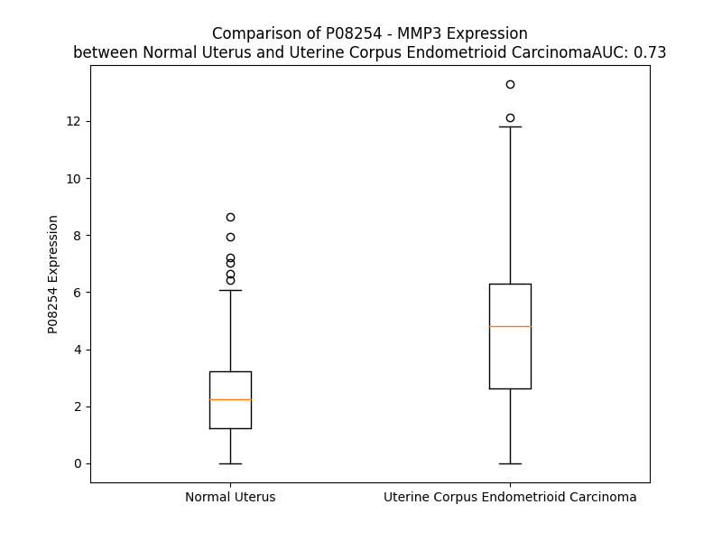

# Detailed Data for P08254

## Introduction to the Detailed Summary

### How to Interpret the Results

- **Summary & Metrics**: This section provides a quick reference to essential protein attributes, including expression changes, family classification, and biomarker applications. Regulation status (upregulated/downregulated) indicates the protein's behavior in a disease context. Some information comes from the original excel file with the proteins selected from literature, while others are derived from the analyses.
- **Expression Comparison**: A visual representation comparing protein expression between normal and disease states. It highlights significant changes in expression levels that might indicate diagnostic or therapeutic relevance. This is data coming from transcriptomics experiments and could not translate similarly to protein levels.
- **Isoform Alignment**: An interactive view of isoform alignments, revealing structural and functional differences between variants of the protein.
- **Interactors & Homologs**: Tables listing known interaction partners and homologous proteins, the more interactors and homologs, the more complex the protein is to design an antibody for.
- **Biological Assemblies**: Information about the structural arrangement of the protein in different assemblies, providing insights into its functional state but also the complexity of the protein to develop antibodies.
- **Combined Per-Residue Information**: A detailed table summarizing residue-level data. This includes predictions for epitope regions, aggregation tendencies, and modifications that might impact the protein's function. Each row corresponds to a residue in the protein, providing insights into specific sites that may be important for research or drug development.
## Summary & Metrics

- **UniProt Accession**: P08254
- **Gene Name**: MMP-3
- **Protein Name**: Stromelysin-1
- **Swiss Prot**: MMP3_HUMAN
- **Family**: peptidase
- **Biomarker Application**: diagnosis,efficacy
- **Number of Isoforms**: 0
- **Regulation**: -1
- **(transcriptomics) AUC**: 0.61
- **(transcriptomics) Fold Change**: 1.42
- **(transcriptomics) Regulation**: Upregulated
- **Discotope Epitope Count**: 91
- **Max n_uniprots (Homo)**: 2
- **Max n_uniprots (Hetero)**: 2

## Expression Comparison

## Interactors

| preferredName_A   | preferredName_B   |   score |
|:------------------|:------------------|--------:|
| MMP3              | TIMP1             |   0.999 |
| MMP3              | SPP1              |   0.997 |
| MMP3              | MMP1              |   0.985 |
| MMP3              | MMP10             |   0.973 |
| MMP3              | TIMP2             |   0.967 |
| MMP3              | MMP9              |   0.956 |
| MMP3              | FN1               |   0.936 |
| MMP3              | IBSP              |   0.922 |
| MMP3              | TIMP3             |   0.918 |
| MMP3              | ACAN              |   0.902 |

## Homologs

| uniprot_id   | gene_id   |
|:-------------|:----------|
| O60882       | MMP20     |
| P09238       | MMP10     |
| P09237       | MMP7      |
| E5RJA7       | MMP16     |
| P39900       | MMP12     |
| E9PJB3       | MMP8      |
| G5E971       | MMP13     |
| P51511       | MMP15     |
| P14780       | MMP9      |
| P50281       | MMP14     |
| Q9NRE1       | MMP26     |
| B4DNP3       | MMP19     |
| A0A087WZS5   | MMP25     |
| Q9ULZ9       | MMP17     |
| B4DMZ6       | MMP23B    |
| Q9Y5R2       | MMP24     |
| P08253       | MMP2      |
| P02790       | HPX       |
| P03956       | MMP1      |
| E9PED7       | MMP11     |
| A0A087X1Y9   | MMP28     |
| Q8N119       | MMP21     |
| Q9H306       | MMP27     |

## Biological Assemblies

|   Unnamed: 0 |   assembly |   n_uniprots | composition   | crystal_id   |
|-------------:|-----------:|-------------:|:--------------|:-------------|
|            0 |          1 |            1 | Homo          | 1hfs         |
|            0 |          1 |            1 | Homo          | 1g49         |
|            1 |          2 |            1 | Homo          | 1g49         |
|            0 |          1 |            1 | Homo          | 1ums         |
|            0 |          1 |            1 | Homo          | 1bm6         |
|            0 |          1 |            2 | Hetero        | 1uea         |
|            1 |          2 |            2 | Hetero        | 1uea         |
|            0 |          1 |            1 | Homo          | 1slm         |
|            0 |          1 |            1 | Homo          | 2d1o         |
|            1 |          2 |            1 | Homo          | 2d1o         |
|            0 |          1 |            1 | Homo          | 3usn         |
|            0 |          1 |            2 | Homo          | 1biw         |
|            0 |          1 |            1 | Homo          | 3oho         |
|            1 |          2 |            1 | Homo          | 3oho         |
|            2 |          3 |            1 | Homo          | 3oho         |
|            0 |          1 |            1 | Homo          | 1qia         |
|            1 |          2 |            1 | Homo          | 1qia         |
|            2 |          3 |            1 | Homo          | 1qia         |
|            3 |          4 |            1 | Homo          | 1qia         |
|            4 |          5 |            2 | Homo          | 1qia         |
|            5 |          6 |            2 | Homo          | 1qia         |
|            0 |          1 |            1 | Homo          | 2jnp         |
|            0 |          1 |            1 | Homo          | 1b8y         |
|            1 |          2 |            1 | Homo          | 1b8y         |
|            0 |          1 |            1 | Homo          | 1g4k         |
|            1 |          2 |            1 | Homo          | 1g4k         |
|            2 |          3 |            1 | Homo          | 1g4k         |
|            0 |          1 |            1 | Homo          | 4g9l         |
|            1 |          2 |            1 | Homo          | 4g9l         |
|            0 |          1 |            1 | Homo          | 4dpe         |
|            1 |          2 |            1 | Homo          | 4dpe         |
|            0 |          1 |            1 | Homo          | 2jt5         |
|            0 |          1 |            2 | Hetero        | 7s7l         |
|            0 |          1 |            2 | Homo          | 1bqo         |
|            1 |          2 |            2 | Homo          | 1bqo         |
|            2 |          3 |            2 | Homo          | 1bqo         |
|            0 |          1 |            1 | Homo          | 1d8m         |
|            1 |          2 |            1 | Homo          | 1d8m         |
|            0 |          1 |            1 | Homo          | 1hy7         |
|            1 |          2 |            1 | Homo          | 1hy7         |
|            2 |          3 |            2 | Homo          | 1hy7         |
|            3 |          4 |            2 | Homo          | 1hy7         |
|            0 |          1 |            1 | Homo          | 4ja1         |
|            1 |          2 |            1 | Homo          | 4ja1         |
|            0 |          1 |            1 | Homo          | 1usn         |
|            1 |          2 |            1 | Homo          | 1usn         |
|            2 |          3 |            1 | Homo          | 1usn         |
|            0 |          1 |            1 | Homo          | 2srt         |
|            0 |          1 |            2 | Hetero        | 6mav         |
|            0 |          1 |            2 | Hetero        | 7s7m         |
|            0 |          1 |            1 | Homo          | 1d8f         |
|            1 |          2 |            1 | Homo          | 1d8f         |
|            0 |          1 |            1 | Homo          | 1g05         |
|            1 |          2 |            1 | Homo          | 1g05         |
|            0 |          1 |            2 | Homo          | 1d7x         |
|            0 |          1 |            2 | Homo          | 1c8t         |
|            0 |          1 |            1 | Homo          | 1d5j         |
|            1 |          2 |            1 | Homo          | 1d5j         |
|            0 |          1 |            2 | Hetero        | 1oo9         |
|            0 |          1 |            1 | Homo          | 1caq         |
|            1 |          2 |            1 | Homo          | 1caq         |
|            0 |          1 |            1 | Homo          | 2usn         |
|            0 |          1 |            2 | Hetero        | 6n9d         |
|            0 |          1 |            1 | Homo          | 1qic         |
|            1 |          2 |            1 | Homo          | 1qic         |
|            2 |          3 |            1 | Homo          | 1qic         |
|            3 |          4 |            1 | Homo          | 1qic         |
|            0 |          1 |            1 | Homo          | 1ciz         |
|            1 |          2 |            1 | Homo          | 1ciz         |
|            0 |          1 |            1 | Homo          | 1umt         |
|            0 |          1 |            1 | Homo          | 1sln         |
|            0 |          1 |            2 | Homo          | 1b3d         |
|            0 |          1 |            1 | Homo          | 2jt6         |
|            0 |          1 |            2 | Homo          | 1c3i         |
|            1 |          2 |            2 | Homo          | 1c3i         |
|            0 |          1 |            1 | Homo          | 3ohl         |
|            1 |          2 |            1 | Homo          | 3ohl         |
|            0 |          1 |            1 | Homo          | 1cqr         |
|            1 |          2 |            1 | Homo          | 1cqr         |
|            2 |          3 |            2 | Homo          | 1cqr         |
|            3 |          4 |            2 | Homo          | 1cqr         |

## Combined Per-Residue Information

|   res | aa   |   epitope_score | epitope   |   relative_surface_accessibility |   modeling_confidence |   Aggregation | modification   |
|------:|:-----|----------------:|:----------|---------------------------------:|----------------------:|--------------:|:---------------|
|     1 | M    |         0.09853 | False     |                          1.30026 |                 42.85 |         0     | N/A            |
|     2 | K    |         0.28361 | True      |                          1.00454 |                 49    |         0     | N/A            |
|     3 | S    |         0.11951 | False     |                          0.71175 |                 50.67 |         0     | N/A            |
|     4 | L    |         0.12115 | False     |                          0.89819 |                 56.3  |         0     | N/A            |
|     5 | P    |         0.10877 | False     |                          0.64244 |                 53.55 |         1.095 | N/A            |
|     6 | I    |         0.1001  | False     |                          0.74873 |                 56.73 |        89.93  | N/A            |
|     7 | L    |         0.08934 | False     |                          0.80531 |                 55.9  |        97.823 | N/A            |
|     8 | L    |         0.08051 | False     |                          0.73507 |                 54.71 |        99.259 | N/A            |
|     9 | L    |         0.0879  | False     |                          0.8544  |                 55.04 |        99.502 | N/A            |
|    10 | L    |         0.09656 | False     |                          0.72556 |                 52.07 |        99.538 | N/A            |
|    11 | C    |         0.06544 | False     |                          0.57473 |                 50.26 |        96.934 | N/A            |
|    12 | V    |         0.09214 | False     |                          0.7482  |                 49.64 |        96.336 | N/A            |
|    13 | A    |         0.08428 | False     |                          0.70217 |                 49.97 |        89.181 | N/A            |
|    14 | V    |         0.10028 | False     |                          0.82504 |                 45.65 |        83.547 | N/A            |
|    15 | C    |         0.12079 | False     |                          0.8512  |                 42.93 |        17.199 | N/A            |
|    16 | S    |         0.0771  | False     |                          0.58411 |                 43.75 |         3.214 | N/A            |
|    17 | A    |         0.11846 | False     |                          0.80168 |                 45.09 |         1.496 | N/A            |
|    18 | Y    |         0.16525 | True      |                          0.85808 |                 42.54 |         0.043 | N/A            |
|    19 | P    |         0.13575 | False     |                          0.80495 |                 40.1  |         0.009 | N/A            |
|    20 | L    |         0.11894 | False     |                          0.95153 |                 41.44 |         0     | N/A            |
|    21 | D    |         0.10998 | False     |                          0.66364 |                 40.46 |         0     | N/A            |
|    22 | G    |         0.06975 | False     |                          0.67971 |                 37.38 |         0     | N/A            |
|    23 | A    |         0.05562 | False     |                          0.64901 |                 42.44 |         0     | N/A            |
|    24 | A    |         0.07865 | False     |                          0.57214 |                 41.13 |         0     | N/A            |
|    25 | R    |         0.14266 | False     |                          0.79279 |                 41.47 |         0     | N/A            |
|    26 | G    |         0.08018 | False     |                          0.45004 |                 51.61 |         0     | N/A            |
|    27 | E    |         0.11036 | False     |                          0.6402  |                 55.55 |         0     | N/A            |
|    28 | D    |         0.07081 | False     |                          0.4479  |                 57.36 |         0     | N/A            |
|    29 | T    |         0.07606 | False     |                          0.57945 |                 74.58 |         0     | N/A            |
|    30 | S    |         0.04216 | False     |                          0.16415 |                 76.66 |         0     | N/A            |
|    31 | M    |         0.03708 | False     |                          0.34189 |                 79.16 |         0     | N/A            |
|    32 | N    |         0.06559 | False     |                          0.58111 |                 83.19 |         0     | N/A            |
|    33 | L    |         0.05333 | False     |                          0.21553 |                 86.27 |         0     | N/A            |
|    34 | V    |         0.00484 | False     |                          0.00476 |                 88    |         0     | N/A            |
|    35 | Q    |         0.02527 | False     |                          0.29799 |                 83.95 |         0     | N/A            |
|    36 | K    |         0.07914 | False     |                          0.50029 |                 83.98 |         0     | N/A            |
|    37 | Y    |         0.02014 | False     |                          0.0248  |                 89.87 |         0     | N/A            |
|    38 | L    |         0.00369 | False     |                          0       |                 89.73 |         0     | N/A            |
|    39 | E    |         0.03802 | False     |                          0.10699 |                 80.64 |         0     | N/A            |
|    40 | N    |         0.05892 | False     |                          0.20836 |                 82.25 |         0     | N/A            |
|    41 | Y    |         0.03226 | False     |                          0.02781 |                 87.33 |         0     | N/A            |
|    42 | Y    |         0.01809 | False     |                          0.03165 |                 86.7  |         0     | N/A            |
|    43 | D    |         0.03226 | False     |                          0.34273 |                 77.16 |         0     | N/A            |
|    44 | L    |         0.01749 | False     |                          0.01935 |                 79.88 |         0     | N/A            |
|    45 | K    |         0.03564 | False     |                          0.42271 |                 66.43 |         0     | N/A            |
|    46 | K    |         0.05031 | False     |                          0.24374 |                 58.87 |         0     | N/A            |
|    47 | D    |         0.05229 | False     |                          0.43964 |                 54.63 |         0     | N/A            |
|    48 | V    |         0.02515 | False     |                          0.21453 |                 52.53 |         0     | N/A            |
|    49 | K    |         0.08145 | False     |                          0.72345 |                 46.97 |         0     | N/A            |
|    50 | Q    |         0.10508 | False     |                          0.73276 |                 46.72 |         0     | N/A            |
|    51 | F    |         0.06882 | False     |                          0.89129 |                 39.99 |         0     | N/A            |
|    52 | V    |         0.04204 | False     |                          0.3879  |                 44.94 |         0     | N/A            |
|    53 | R    |         0.06996 | False     |                          0.95697 |                 46.79 |         0     | N/A            |
|    54 | R    |         0.17698 | True      |                          0.91517 |                 46.87 |         0     | N/A            |
|    55 | K    |         0.08609 | False     |                          0.79244 |                 51.02 |         0     | N/A            |
|    56 | D    |         0.07759 | False     |                          0.68566 |                 60.84 |         0     | N/A            |
|    57 | S    |         0.07507 | False     |                          0.74085 |                 63.73 |         0     | N/A            |
|    58 | G    |         0.02842 | False     |                          0.17024 |                 77.7  |         0     | N/A            |
|    59 | P    |         0.03781 | False     |                          0.56954 |                 81.69 |         0     | N/A            |
|    60 | V    |         0.01298 | False     |                          0.11901 |                 85.6  |         0     | N/A            |
|    61 | V    |         0.0313  | False     |                          0.1133  |                 88.56 |         0     | N/A            |
|    62 | K    |         0.06683 | False     |                          0.65153 |                 89.2  |         0     | N/A            |
|    63 | K    |         0.04758 | False     |                          0.19926 |                 89.19 |         0     | N/A            |
|    64 | I    |         0.00774 | False     |                          0.024   |                 92.38 |         0     | N/A            |
|    65 | R    |         0.0807  | False     |                          0.37343 |                 93.1  |         0     | N/A            |
|    66 | E    |         0.04978 | False     |                          0.32872 |                 91.85 |         0     | N/A            |
|    67 | M    |         0.00408 | False     |                          0       |                 94.08 |         0     | N/A            |
|    68 | Q    |         0.01107 | False     |                          0.00117 |                 95.57 |         0     | N/A            |
|    69 | K    |         0.13758 | False     |                          0.76651 |                 93.78 |         0     | N/A            |
|    70 | F    |         0.04919 | False     |                          0.18468 |                 92.93 |         0     | N/A            |
|    71 | L    |         0.0196  | False     |                          0.03351 |                 94.04 |         0     | N/A            |
|    72 | G    |         0.14473 | False     |                          0.71599 |                 91.95 |         0     | N/A            |
|    73 | L    |         0.11305 | False     |                          0.24009 |                 93.98 |         0     | N/A            |
|    74 | E    |         0.16744 | True      |                          0.74104 |                 95.28 |         0     | N/A            |
|    75 | V    |         0.21168 | True      |                          0.54067 |                 94.86 |         0     | N/A            |
|    76 | T    |         0.09722 | False     |                          0.27333 |                 92.86 |         0     | N/A            |
|    77 | G    |         0.04758 | False     |                          0.05965 |                 90.44 |         0     | N/A            |
|    78 | K    |         0.13514 | False     |                          0.64897 |                 90.28 |         0     | N/A            |
|    79 | L    |         0.07988 | False     |                          0.33564 |                 88.22 |         0     | N/A            |
|    80 | D    |         0.09899 | False     |                          0.30389 |                 89.76 |         0     | N/A            |
|    81 | S    |         0.15343 | True      |                          0.6569  |                 91.57 |         0     | N/A            |
|    82 | D    |         0.12658 | False     |                          0.52697 |                 92.95 |         0     | N/A            |
|    83 | T    |         0.00557 | False     |                          0.00217 |                 93.09 |         0     | N/A            |
|    84 | L    |         0.03838 | False     |                          0.23316 |                 92.75 |         0     | N/A            |
|    85 | E    |         0.13642 | False     |                          0.50634 |                 92.55 |         0     | N/A            |
|    86 | V    |         0.03724 | False     |                          0.09426 |                 93.66 |         0     | N/A            |
|    87 | M    |         0.00399 | False     |                          0       |                 93.2  |         0     | N/A            |
|    88 | R    |         0.0965  | False     |                          0.52687 |                 92.97 |         0     | N/A            |
|    89 | K    |         0.06635 | False     |                          0.3516  |                 94.32 |         0     | N/A            |
|    90 | P    |         0.02475 | False     |                          0.31115 |                 96.33 |         0     | N/A            |
|    91 | R    |         0.01048 | False     |                          0.00164 |                 96.31 |         0     | N/A            |
|    92 | C    |         0.0277  | False     |                          0.04498 |                 96.41 |         0     | N/A            |
|    93 | G    |         0.0044  | False     |                          0.00161 |                 92.04 |         0     | N/A            |
|    94 | V    |         0.01916 | False     |                          0.05903 |                 89.04 |         0     | N/A            |
|    95 | P    |         0.02504 | False     |                          0.18192 |                 86.07 |         0     | N/A            |
|    96 | D    |         0.03788 | False     |                          0.04782 |                 86.9  |         0     | N/A            |
|    97 | V    |         0.06213 | False     |                          0.28212 |                 69.79 |         0     | N/A            |
|    98 | G    |         0.07502 | False     |                          0.28228 |                 56.61 |         0     | N/A            |
|    99 | H    |         0.1713  | True      |                          1.00087 |                 47.38 |         0     | N/A            |
|   100 | F    |         0.22444 | True      |                          0.68146 |                 44.56 |         0     | N/A            |
|   101 | R    |         0.12971 | False     |                          0.4921  |                 58.48 |         0     | N/A            |
|   102 | T    |         0.07828 | False     |                          0.07362 |                 49.9  |         0     | N/A            |
|   103 | F    |         0.03925 | False     |                          0.06609 |                 51.51 |         0     | N/A            |
|   104 | P    |         0.08746 | False     |                          0.33834 |                 54.75 |         0     | N/A            |
|   105 | G    |         0.11582 | False     |                          0.75247 |                 54.91 |         0     | N/A            |
|   106 | I    |         0.17091 | True      |                          0.61629 |                 68.4  |         0     | N/A            |
|   107 | P    |         0.04568 | False     |                          0.12227 |                 75.61 |         0     | N/A            |
|   108 | K    |         0.09859 | False     |                          0.48107 |                 85.92 |         0     | N/A            |
|   109 | W    |         0.04968 | False     |                          0.10025 |                 90.12 |         0     | N/A            |
|   110 | R    |         0.08483 | False     |                          0.42867 |                 84.68 |         0     | N/A            |
|   111 | K    |         0.06912 | False     |                          0.43806 |                 88.09 |         0     | N/A            |
|   112 | T    |         0.09215 | False     |                          0.24828 |                 91.8  |         0     | N/A            |
|   113 | H    |         0.08559 | False     |                          0.48127 |                 95.84 |         0     | N/A            |
|   114 | L    |         0.00281 | False     |                          0       |                 96.4  |         0     | N/A            |
|   115 | T    |         0.03163 | False     |                          0.16678 |                 95.02 |         0     | N/A            |
|   116 | Y    |         0.05284 | False     |                          0.06408 |                 97.55 |         0     | N/A            |
|   117 | R    |         0.08487 | False     |                          0.23031 |                 95.53 |         0     | N/A            |
|   118 | I    |         0.03829 | False     |                          0.082   |                 97.71 |         0     | N/A            |
|   119 | V    |         0.08597 | False     |                          0.53458 |                 94.84 |         0     | N/A            |
|   120 | N    |         0.15685 | True      |                          0.36791 |                 96.67 |         0     | N/A            |
|   121 | Y    |         0.10064 | False     |                          0.2291  |                 98.24 |         0     | N/A            |
|   122 | T    |         0.04561 | False     |                          0.02395 |                 98    |         0     | N/A            |
|   123 | P    |         0.36917 | True      |                          0.85519 |                 97.73 |         0     | N/A            |
|   124 | D    |         0.23568 | True      |                          0.41799 |                 97.75 |         0     | N/A            |
|   125 | L    |         0.11969 | False     |                          0.12273 |                 97.95 |         0     | N/A            |
|   126 | P    |         0.25159 | True      |                          0.58836 |                 98.1  |         0     | N/A            |
|   127 | K    |         0.15826 | True      |                          0.67018 |                 98.19 |         0     | N/A            |
|   128 | D    |         0.15295 | True      |                          0.57538 |                 98.06 |         0     | N/A            |
|   129 | A    |         0.07119 | False     |                          0.03538 |                 98.14 |         0     | N/A            |
|   130 | V    |         0.00483 | False     |                          0       |                 98.55 |         0     | N/A            |
|   131 | D    |         0.07389 | False     |                          0.20937 |                 98.51 |         0     | N/A            |
|   132 | S    |         0.11217 | False     |                          0.50963 |                 98.22 |         0     | N/A            |
|   133 | A    |         0.03605 | False     |                          0.12756 |                 97.98 |         0     | N/A            |
|   134 | V    |         0.00302 | False     |                          0.00286 |                 98.62 |         0     | N/A            |
|   135 | E    |         0.10094 | False     |                          0.57801 |                 98.24 |         0     | N/A            |
|   136 | K    |         0.06968 | False     |                          0.46673 |                 97.28 |         0     | N/A            |
|   137 | A    |         0.00316 | False     |                          0       |                 98.17 |         0     | N/A            |
|   138 | L    |         0.01892 | False     |                          0.02638 |                 98.45 |         0     | N/A            |
|   139 | K    |         0.10611 | False     |                          0.46908 |                 97.19 |         0     | N/A            |
|   140 | V    |         0.05508 | False     |                          0.13533 |                 96.96 |         0     | N/A            |
|   141 | W    |         0.00642 | False     |                          0       |                 97.9  |         0     | N/A            |
|   142 | E    |         0.06309 | False     |                          0.21293 |                 96.74 |         0     | N/A            |
|   143 | E    |         0.15664 | True      |                          0.58758 |                 95.81 |         0     | N/A            |
|   144 | V    |         0.05907 | False     |                          0.17613 |                 96.82 |         0     | N/A            |
|   145 | T    |         0.08168 | False     |                          0.01971 |                 96.29 |         0     | N/A            |
|   146 | P    |         0.02732 | False     |                          0.13349 |                 95.58 |         0     | N/A            |
|   147 | L    |         0.00951 | False     |                          0.00853 |                 96.48 |         0     | N/A            |
|   148 | T    |         0.0679  | False     |                          0.34908 |                 96.7  |         0     | N/A            |
|   149 | F    |         0.03715 | False     |                          0.15567 |                 97.89 |         0     | N/A            |
|   150 | S    |         0.0706  | False     |                          0.29428 |                 97.66 |         0     | N/A            |
|   151 | R    |         0.07015 | False     |                          0.24595 |                 97.77 |         0     | N/A            |
|   152 | L    |         0.15102 | True      |                          0.36798 |                 91.06 |         0     | N/A            |
|   153 | Y    |         0.18613 | True      |                          0.7353  |                 92.27 |         0     | N/A            |
|   154 | E    |         0.22406 | True      |                          0.73694 |                 84.09 |         0     | N/A            |
|   155 | G    |         0.18055 | True      |                          0.57696 |                 82.86 |         0     | N/A            |
|   156 | E    |         0.13542 | False     |                          0.66295 |                 86.27 |         0     | N/A            |
|   157 | A    |         0.03148 | False     |                          0.08248 |                 91.6  |         0     | N/A            |
|   158 | D    |         0.02912 | False     |                          0.14668 |                 91.34 |         0     | N/A            |
|   159 | I    |         0.00317 | False     |                          0       |                 96.23 |        53.779 | N/A            |
|   160 | M    |         0.04136 | False     |                          0.18228 |                 96.31 |        58.56  | N/A            |
|   161 | I    |         0.00813 | False     |                          0.0032  |                 98.22 |        67.84  | N/A            |
|   162 | S    |         0.05763 | False     |                          0.15202 |                 97.86 |        67.84  | N/A            |
|   163 | F    |         0.02279 | False     |                          0.03716 |                 98.36 |        67.84  | N/A            |
|   164 | A    |         0.06133 | False     |                          0.1658  |                 96.4  |        66.28  | N/A            |
|   165 | V    |         0.23719 | True      |                          0.5307  |                 95.83 |        55.54  | N/A            |
|   166 | R    |         0.27999 | True      |                          0.63766 |                 92.37 |         0     | N/A            |
|   167 | E    |         0.19633 | True      |                          0.44282 |                 89.2  |         0     | N/A            |
|   168 | H    |         0.11296 | False     |                          0.27051 |                 91.38 |         0     | N/A            |
|   169 | G    |         0.32822 | True      |                          0.55714 |                 82.35 |         0     | N/A            |
|   170 | D    |         0.05178 | False     |                          0.01481 |                 83.8  |         0     | N/A            |
|   171 | F    |         0.06405 | False     |                          0.03656 |                 79.07 |         0     | N/A            |
|   172 | Y    |         0.06619 | False     |                          0.13127 |                 82.89 |         0     | N/A            |
|   173 | P    |         0.11124 | False     |                          0.4457  |                 87.5  |         0     | N/A            |
|   174 | F    |         0.04276 | False     |                          0.04591 |                 93.66 |         0     | N/A            |
|   175 | D    |         0.20445 | True      |                          0.38474 |                 91.05 |         0     | N/A            |
|   176 | G    |         0.06628 | False     |                          0.03541 |                 92.56 |         0     | N/A            |
|   177 | P    |         0.17274 | True      |                          0.81344 |                 93.13 |         0     | N/A            |
|   178 | G    |         0.08173 | False     |                          0.31869 |                 88.1  |         0     | N/A            |
|   179 | N    |         0.10147 | False     |                          0.23076 |                 85.73 |         0     | N/A            |
|   180 | V    |         0.04594 | False     |                          0.0933  |                 95.59 |         0.199 | N/A            |
|   181 | L    |         0.01484 | False     |                          0.02308 |                 97.74 |         0.199 | N/A            |
|   182 | A    |         0.0055  | False     |                          0       |                 98.03 |         0.199 | N/A            |
|   183 | H    |         0.01851 | False     |                          0.01459 |                 95.26 |         0.199 | N/A            |
|   184 | A    |         0.01051 | False     |                          0.05683 |                 94.38 |         0.199 | N/A            |
|   185 | Y    |         0.01383 | False     |                          0.05618 |                 88.89 |         0.199 | N/A            |
|   186 | A    |         0.00859 | False     |                          0.01459 |                 87.43 |         0     | N/A            |
|   187 | P    |         0.01074 | False     |                          0.04245 |                 89.83 |         0     | N/A            |
|   188 | G    |         0.04015 | False     |                          0.24259 |                 81.93 |         0     | N/A            |
|   189 | P    |         0.10556 | False     |                          0.67114 |                 75.68 |         0     | N/A            |
|   190 | G    |         0.0865  | False     |                          0.36885 |                 77.49 |         0     | N/A            |
|   191 | I    |         0.03918 | False     |                          0.13626 |                 82.6  |         0     | N/A            |
|   192 | N    |         0.01069 | False     |                          0.01311 |                 84.55 |         0     | N/A            |
|   193 | G    |         0.00222 | False     |                          0       |                 91.35 |         0     | N/A            |
|   194 | D    |         0.03693 | False     |                          0.08697 |                 94.88 |         0     | N/A            |
|   195 | A    |         0.00279 | False     |                          0.00128 |                 97.67 |         0     | N/A            |
|   196 | H    |         0.02559 | False     |                          0.09048 |                 98.02 |         0     | N/A            |
|   197 | F    |         0.00595 | False     |                          0.00382 |                 98.43 |         0     | N/A            |
|   198 | D    |         0.00226 | False     |                          0       |                 98.2  |         0     | N/A            |
|   199 | D    |         0.06555 | False     |                          0.22862 |                 97.89 |         0     | N/A            |
|   200 | D    |         0.19812 | True      |                          0.28171 |                 97.25 |         0     | N/A            |
|   201 | E    |         0.06525 | False     |                          0.06568 |                 96.8  |         0     | N/A            |
|   202 | Q    |         0.16912 | True      |                          0.63204 |                 95.93 |         0     | N/A            |
|   203 | W    |         0.05144 | False     |                          0.01145 |                 97.76 |         0     | N/A            |
|   204 | T    |         0.14591 | False     |                          0.1128  |                 96.47 |         0     | N/A            |
|   205 | K    |         0.15248 | True      |                          0.59744 |                 93.98 |         0     | N/A            |
|   206 | D    |         0.16884 | True      |                          0.42844 |                 90.8  |         0     | N/A            |
|   207 | T    |         0.31191 | True      |                          0.47083 |                 88.3  |         0.255 | N/A            |
|   208 | T    |         0.34119 | True      |                          0.81173 |                 89.44 |         0.255 | N/A            |
|   209 | G    |         0.21728 | True      |                          0.22662 |                 90.94 |         0.519 | N/A            |
|   210 | T    |         0.04101 | False     |                          0.08705 |                 95.64 |         3.578 | N/A            |
|   211 | N    |         0.01312 | False     |                          0.00879 |                 96.46 |         8.52  | N/A            |
|   212 | L    |         0.00509 | False     |                          0.00659 |                 97.77 |        75.312 | N/A            |
|   213 | F    |         0.03936 | False     |                          0.06128 |                 96.91 |        78.197 | N/A            |
|   214 | L    |         0.02609 | False     |                          0.06844 |                 96.67 |        78.197 | N/A            |
|   215 | V    |         0.0119  | False     |                          0.05046 |                 97.88 |        78.078 | N/A            |
|   216 | A    |         0.00117 | False     |                          0       |                 98.43 |        74.091 | N/A            |
|   217 | A    |         0.00194 | False     |                          0       |                 98.04 |        19.797 | N/A            |
|   218 | H    |         0.02007 | False     |                          0.06723 |                 97.85 |         0.117 | N/A            |
|   219 | E    |         0.01498 | False     |                          0.00567 |                 98.23 |         0     | N/A            |
|   220 | I    |         0.00223 | False     |                          0.0024  |                 98.41 |         0     | N/A            |
|   221 | G    |         0.00273 | False     |                          0       |                 97.59 |         0     | N/A            |
|   222 | H    |         0.00324 | False     |                          0       |                 95.37 |         0     | N/A            |
|   223 | S    |         0.0011  | False     |                          0       |                 96.26 |         0.227 | N/A            |
|   224 | L    |         0.00192 | False     |                          0       |                 96.1  |         0.227 | N/A            |
|   225 | G    |         0.00486 | False     |                          0       |                 92    |         0.227 | N/A            |
|   226 | L    |         0.01194 | False     |                          0.02143 |                 93.47 |         0.227 | N/A            |
|   227 | F    |         0.01443 | False     |                          0.02567 |                 90.28 |         0.227 | N/A            |
|   228 | H    |         0.01405 | False     |                          0.03639 |                 93.67 |         0     | N/A            |
|   229 | S    |         0.02314 | False     |                          0.10072 |                 93.73 |         0     | N/A            |
|   230 | A    |         0.10604 | False     |                          0.51424 |                 92.63 |         0     | N/A            |
|   231 | N    |         0.10319 | False     |                          0.35766 |                 92.7  |         0     | N/A            |
|   232 | T    |         0.11997 | False     |                          0.61292 |                 91.59 |         0     | N/A            |
|   233 | E    |         0.1629  | True      |                          0.74725 |                 91.4  |         0     | N/A            |
|   234 | A    |         0.03309 | False     |                          0.07003 |                 94.72 |         0     | N/A            |
|   235 | L    |         0.02914 | False     |                          0.13924 |                 95.91 |         0     | N/A            |
|   236 | M    |         0.01268 | False     |                          0.01798 |                 95.97 |         0     | N/A            |
|   237 | Y    |         0.08972 | False     |                          0.11717 |                 95.25 |         0     | N/A            |
|   238 | P    |         0.011   | False     |                          0.01764 |                 95.25 |         0     | N/A            |
|   239 | L    |         0.08291 | False     |                          0.09164 |                 95.75 |         0     | N/A            |
|   240 | Y    |         0.09537 | False     |                          0.16306 |                 94.79 |         0     | N/A            |
|   241 | H    |         0.20591 | True      |                          0.61538 |                 89.8  |         0     | N/A            |
|   242 | S    |         0.15214 | True      |                          0.4027  |                 82.59 |         0     | N/A            |
|   243 | L    |         0.22247 | True      |                          0.90897 |                 81.15 |         0     | N/A            |
|   244 | T    |         0.12991 | False     |                          0.21726 |                 83.22 |         0     | N/A            |
|   245 | D    |         0.18922 | True      |                          0.42253 |                 83.87 |         0     | N/A            |
|   246 | L    |         0.19787 | True      |                          0.25439 |                 83.35 |         0     | N/A            |
|   247 | T    |         0.2599  | True      |                          0.90934 |                 82.8  |         0     | N/A            |
|   248 | R    |         0.40779 | True      |                          0.77956 |                 85.15 |         0     | N/A            |
|   249 | F    |         0.18625 | True      |                          0.21353 |                 90.66 |         0     | N/A            |
|   250 | R    |         0.3939  | True      |                          0.84032 |                 91.43 |         0     | N/A            |
|   251 | L    |         0.08436 | False     |                          0.11904 |                 95.45 |         0     | N/A            |
|   252 | S    |         0.06856 | False     |                          0.12138 |                 95.22 |         0     | N/A            |
|   253 | Q    |         0.17106 | True      |                          0.57685 |                 96.29 |         0     | N/A            |
|   254 | D    |         0.05299 | False     |                          0.14708 |                 95.53 |         0     | N/A            |
|   255 | D    |         0.03551 | False     |                          0.02196 |                 97.23 |         0     | N/A            |
|   256 | I    |         0.08488 | False     |                          0.20479 |                 97.63 |         0     | N/A            |
|   257 | N    |         0.20495 | True      |                          0.47621 |                 95.9  |         0     | N/A            |
|   258 | G    |         0.03681 | False     |                          0.02575 |                 93.59 |         0     | N/A            |
|   259 | I    |         0.00897 | False     |                          0       |                 95.4  |         0     | N/A            |
|   260 | Q    |         0.0804  | False     |                          0.25587 |                 95.68 |         0     | N/A            |
|   261 | S    |         0.16352 | True      |                          0.66635 |                 93.49 |         0     | N/A            |
|   262 | L    |         0.06294 | False     |                          0.05468 |                 91.44 |         0     | N/A            |
|   263 | Y    |         0.08072 | False     |                          0.12508 |                 94.45 |         0     | N/A            |
|   264 | G    |         0.06819 | False     |                          0.25782 |                 93.46 |         0     | N/A            |
|   265 | P    |         0.2358  | True      |                          0.65553 |                 94.61 |         0     | N/A            |
|   266 | P    |         0.12196 | False     |                          0.39275 |                 91.86 |         0     | N/A            |
|   267 | P    |         0.09193 | False     |                          0.3947  |                 85.74 |         0     | N/A            |
|   268 | D    |         0.24928 | True      |                          0.97053 |                 79.85 |         0     | N/A            |
|   269 | S    |         0.27722 | True      |                          0.33615 |                 70.75 |         0     | N/A            |
|   270 | P    |         0.22626 | True      |                          1.04738 |                 62.98 |         0     | N/A            |
|   271 | E    |         0.23893 | True      |                          0.80606 |                 56.33 |         0     | N/A            |
|   272 | T    |         0.16057 | True      |                          0.43925 |                 55.5  |         0     | N/A            |
|   273 | P    |         0.14293 | False     |                          0.77802 |                 51.5  |         0     | N/A            |
|   274 | L    |         0.09289 | False     |                          0.41507 |                 56.17 |         0     | N/A            |
|   275 | V    |         0.1005  | False     |                          0.85725 |                 50.72 |         0     | N/A            |
|   276 | P    |         0.12271 | False     |                          0.79107 |                 46.76 |         0     | N/A            |
|   277 | T    |         0.10788 | False     |                          0.5649  |                 48.18 |         0     | N/A            |
|   278 | E    |         0.13904 | False     |                          0.71437 |                 43.25 |         0     | N/A            |
|   279 | P    |         0.15072 | True      |                          1.00277 |                 44.57 |         0     | N/A            |
|   280 | V    |         0.12244 | False     |                          0.62418 |                 47.76 |         0     | N/A            |
|   281 | P    |         0.2443  | True      |                          0.70653 |                 48.73 |         0     | N/A            |
|   282 | P    |         0.16143 | True      |                          0.75173 |                 53.35 |         0     | N/A            |
|   283 | E    |         0.10168 | False     |                          0.38342 |                 52.88 |         0     | N/A            |
|   284 | P    |         0.17566 | True      |                          0.97135 |                 54.45 |         0     | N/A            |
|   285 | G    |         0.18027 | True      |                          0.64557 |                 62.57 |         0     | N/A            |
|   286 | T    |         0.08525 | False     |                          0.31976 |                 69.18 |         0     | N/A            |
|   287 | P    |         0.05715 | False     |                          0.13701 |                 75.92 |         0     | N/A            |
|   288 | A    |         0.07811 | False     |                          0.60883 |                 83.15 |         0     | N/A            |
|   289 | N    |         0.08541 | False     |                          0.29976 |                 85.5  |         0     | N/A            |
|   290 | C    |         0.06381 | False     |                          0.59406 |                 87.8  |         0     | N/A            |
|   291 | D    |         0.12234 | False     |                          0.36437 |                 89.8  |         0     | N/A            |
|   292 | P    |         0.16243 | True      |                          0.68191 |                 89.87 |         0     | N/A            |
|   293 | A    |         0.19568 | True      |                          0.69581 |                 92.44 |         0     | N/A            |
|   294 | L    |         0.08515 | False     |                          0.06583 |                 93.52 |         0     | N/A            |
|   295 | S    |         0.06858 | False     |                          0.2081  |                 94.52 |         0     | N/A            |
|   296 | F    |         0.00711 | False     |                          0.00668 |                 96.03 |         0     | N/A            |
|   297 | D    |         0.04214 | False     |                          0.21423 |                 96.73 |         0     | N/A            |
|   298 | A    |         0.00166 | False     |                          0.0051  |                 97.85 |         0.822 | N/A            |
|   299 | V    |         0.01148 | False     |                          0.01033 |                 97.6  |         0.986 | N/A            |
|   300 | S    |         0.00708 | False     |                          0.0104  |                 96.54 |         0.986 | N/A            |
|   301 | T    |         0.03142 | False     |                          0.06804 |                 93.83 |         1.294 | N/A            |
|   302 | L    |         0.00608 | False     |                          0       |                 92.18 |         1.812 | N/A            |
|   303 | R    |         0.12228 | False     |                          0.40782 |                 87.56 |         1.128 | N/A            |
|   304 | G    |         0.06689 | False     |                          0.61835 |                 86.71 |         1.128 | N/A            |
|   305 | E    |         0.04873 | False     |                          0.17675 |                 90.66 |         2.347 | N/A            |
|   306 | I    |         0.00481 | False     |                          0.0032  |                 93.4  |         4.508 | N/A            |
|   307 | L    |         0.00248 | False     |                          0       |                 95.17 |         4.706 | N/A            |
|   308 | I    |         0.00525 | False     |                          0.004   |                 96.41 |         4.706 | N/A            |
|   309 | F    |         0.00233 | False     |                          0.00275 |                 95.8  |         4.706 | N/A            |
|   310 | K    |         0.03537 | False     |                          0.17222 |                 94.79 |         3.578 | N/A            |
|   311 | D    |         0.09064 | False     |                          0.41311 |                 90.58 |         2.359 | N/A            |
|   312 | R    |         0.15704 | True      |                          0.45002 |                 87.86 |         0     | N/A            |
|   313 | H    |         0.03182 | False     |                          0.08416 |                 90.12 |         0     | N/A            |
|   314 | F    |         0.00727 | False     |                          0       |                 93.13 |         0     | N/A            |
|   315 | W    |         0.01289 | False     |                          0       |                 93.69 |         0     | N/A            |
|   316 | R    |         0.06661 | False     |                          0.05016 |                 91.1  |         0     | N/A            |
|   317 | K    |         0.0576  | False     |                          0.09093 |                 88.19 |         0     | N/A            |
|   318 | S    |         0.10728 | False     |                          0.15083 |                 82.26 |         0     | N/A            |
|   319 | L    |         0.26136 | True      |                          0.5524  |                 75.64 |         0     | N/A            |
|   320 | R    |         0.26671 | True      |                          0.94431 |                 71.7  |         0     | N/A            |
|   321 | K    |         0.23669 | True      |                          0.59364 |                 69.41 |         0     | N/A            |
|   322 | L    |         0.20643 | True      |                          0.91701 |                 71.49 |         0     | N/A            |
|   323 | E    |         0.1031  | False     |                          0.6922  |                 79.72 |         0     | N/A            |
|   324 | P    |         0.04585 | False     |                          0.15157 |                 86.45 |         0     | N/A            |
|   325 | E    |         0.0428  | False     |                          0.22903 |                 86.36 |         0     | N/A            |
|   326 | L    |         0.06983 | False     |                          0.18388 |                 88.24 |         0     | N/A            |
|   327 | H    |         0.01282 | False     |                          0.00882 |                 86.26 |         0     | N/A            |
|   328 | L    |         0.04194 | False     |                          0.2167  |                 83.26 |         0.638 | N/A            |
|   329 | I    |         0.01258 | False     |                          0.0192  |                 85.97 |         0.638 | N/A            |
|   330 | S    |         0.05316 | False     |                          0.23188 |                 80.31 |         0.638 | N/A            |
|   331 | S    |         0.04807 | False     |                          0.13061 |                 77.55 |         0.638 | N/A            |
|   332 | F    |         0.0624  | False     |                          0.02784 |                 82.89 |         0.638 | N/A            |
|   333 | W    |         0.01841 | False     |                          0.00119 |                 85.03 |         0     | N/A            |
|   334 | P    |         0.04213 | False     |                          0.27706 |                 75.98 |         0     | N/A            |
|   335 | S    |         0.05701 | False     |                          0.35388 |                 78.7  |         0     | N/A            |
|   336 | L    |         0.02032 | False     |                          0.07546 |                 85.4  |         0     | N/A            |
|   337 | P    |         0.10515 | False     |                          0.26671 |                 84.78 |         0     | N/A            |
|   338 | S    |         0.0561  | False     |                          0.43009 |                 88.49 |         0     | N/A            |
|   339 | G    |         0.06323 | False     |                          0.25612 |                 89.99 |         0     | N/A            |
|   340 | V    |         0.01782 | False     |                          0.01135 |                 95.59 |         0     | N/A            |
|   341 | D    |         0.02639 | False     |                          0.14549 |                 97.65 |         0     | N/A            |
|   342 | A    |         0.00129 | False     |                          0.00638 |                 98.23 |         0     | N/A            |
|   343 | A    |         0.00406 | False     |                          0.01457 |                 98.2  |         0     | N/A            |
|   344 | Y    |         0.03194 | False     |                          0.0354  |                 97.35 |         0     | N/A            |
|   345 | E    |         0.0201  | False     |                          0.04437 |                 96.02 |         0     | N/A            |
|   346 | V    |         0.03135 | False     |                          0.04094 |                 93.8  |         0.406 | N/A            |
|   347 | T    |         0.07289 | False     |                          0.48579 |                 89.99 |         0.44  | N/A            |
|   348 | S    |         0.16613 | True      |                          0.73782 |                 88.97 |         0.448 | N/A            |
|   349 | K    |         0.10459 | False     |                          0.35868 |                 89.64 |         0.511 | N/A            |
|   350 | D    |         0.04997 | False     |                          0.24759 |                 90.62 |         0.574 | N/A            |
|   351 | L    |         0.05068 | False     |                          0.12118 |                 94.21 |        98.496 | N/A            |
|   352 | V    |         0.00229 | False     |                          0       |                 96.18 |        98.496 | N/A            |
|   353 | F    |         0.02084 | False     |                          0.08535 |                 96.84 |        98.496 | N/A            |
|   354 | I    |         0.00147 | False     |                          0       |                 97.49 |        98.496 | N/A            |
|   355 | F    |         0.00332 | False     |                          0.00206 |                 97.92 |        98.458 | N/A            |
|   356 | K    |         0.04786 | False     |                          0.32758 |                 96.79 |         0.064 | N/A            |
|   357 | G    |         0.05155 | False     |                          0.3186  |                 95.59 |         0.005 | N/A            |
|   358 | N    |         0.08398 | False     |                          0.52639 |                 96.1  |         0     | N/A            |
|   359 | Q    |         0.08886 | False     |                          0.35622 |                 96.28 |         0.424 | N/A            |
|   360 | F    |         0.04144 | False     |                          0.01975 |                 96.26 |         0.424 | N/A            |
|   361 | W    |         0.04897 | False     |                          0.07968 |                 95.02 |         0.424 | N/A            |
|   362 | A    |         0.00241 | False     |                          0       |                 93.73 |         0.424 | N/A            |
|   363 | I    |         0.00505 | False     |                          0       |                 91.99 |         0.424 | N/A            |
|   364 | R    |         0.10389 | False     |                          0.37385 |                 88.39 |         0     | N/A            |
|   365 | G    |         0.02507 | False     |                          0.01931 |                 85.94 |         0     | N/A            |
|   366 | N    |         0.10033 | False     |                          0.12329 |                 80.02 |         0     | N/A            |
|   367 | E    |         0.06307 | False     |                          0.26751 |                 80.41 |         0     | N/A            |
|   368 | V    |         0.02989 | False     |                          0.2246  |                 83.55 |         0     | N/A            |
|   369 | R    |         0.06509 | False     |                          0.22577 |                 82.37 |         0     | N/A            |
|   370 | A    |         0.04307 | False     |                          0.08573 |                 76.11 |         0     | N/A            |
|   371 | G    |         0.05102 | False     |                          0.15787 |                 77.43 |         0     | N/A            |
|   372 | Y    |         0.07392 | False     |                          0.14288 |                 86.55 |         0     | N/A            |
|   373 | P    |         0.17165 | True      |                          0.31271 |                 92.28 |         0     | N/A            |
|   374 | R    |         0.11575 | False     |                          0.35872 |                 91.34 |         0     | N/A            |
|   375 | G    |         0.0668  | False     |                          0.34078 |                 94.74 |         0     | N/A            |
|   376 | I    |         0.00823 | False     |                          0       |                 96.33 |         0     | N/A            |
|   377 | H    |         0.15736 | True      |                          0.41824 |                 95.42 |         0     | N/A            |
|   378 | T    |         0.1726  | True      |                          0.66768 |                 94.23 |         0     | N/A            |
|   379 | L    |         0.04246 | False     |                          0.13541 |                 94.75 |         0     | N/A            |
|   380 | G    |         0.13312 | False     |                          0.59589 |                 94.31 |         0     | N/A            |
|   381 | F    |         0.03398 | False     |                          0.03507 |                 95.9  |         0     | N/A            |
|   382 | P    |         0.23416 | True      |                          0.38158 |                 95.32 |         0     | N/A            |
|   383 | P    |         0.26959 | True      |                          0.87158 |                 94.85 |         0     | N/A            |
|   384 | T    |         0.3063  | True      |                          0.82629 |                 95.54 |         0     | N/A            |
|   385 | V    |         0.13551 | False     |                          0.08569 |                 96.95 |         0     | N/A            |
|   386 | R    |         0.22854 | True      |                          0.77718 |                 96.31 |         0     | N/A            |
|   387 | K    |         0.07192 | False     |                          0.39452 |                 96.78 |         0     | N/A            |
|   388 | I    |         0.00748 | False     |                          0.00137 |                 97.8  |         0     | N/A            |
|   389 | D    |         0.01701 | False     |                          0.04532 |                 97.6  |         0     | N/A            |
|   390 | A    |         0.00277 | False     |                          0.0051  |                 98.17 |         0     | N/A            |
|   391 | A    |         0.00363 | False     |                          0.0094  |                 98.18 |         0     | N/A            |
|   392 | I    |         0.01167 | False     |                          0.0176  |                 97.01 |         0     | N/A            |
|   393 | S    |         0.02269 | False     |                          0.07847 |                 95.16 |         0     | N/A            |
|   394 | D    |         0.02523 | False     |                          0.0325  |                 93.08 |         0     | N/A            |
|   395 | K    |         0.06844 | False     |                          0.46393 |                 87.49 |         0     | N/A            |
|   396 | E    |         0.12553 | False     |                          0.81017 |                 87.92 |         0     | N/A            |
|   397 | K    |         0.13963 | False     |                          0.50355 |                 91.1  |         0     | N/A            |
|   398 | N    |         0.06115 | False     |                          0.29137 |                 92.25 |         0.05  | N/A            |
|   399 | K    |         0.13255 | False     |                          0.19422 |                 95.04 |         0.221 | N/A            |
|   400 | T    |         0.00312 | False     |                          0       |                 97.16 |        68.498 | N/A            |
|   401 | Y    |         0.04302 | False     |                          0.074   |                 97.57 |        68.617 | N/A            |
|   402 | F    |         0.00264 | False     |                          0       |                 98.14 |        68.617 | N/A            |
|   403 | F    |         0.00608 | False     |                          0.00549 |                 97.82 |        68.617 | N/A            |
|   404 | V    |         0.04256 | False     |                          0.1093  |                 96.57 |        68.617 | N/A            |
|   405 | E    |         0.12966 | False     |                          0.63557 |                 94.22 |         0.411 | N/A            |
|   406 | D    |         0.1602  | True      |                          0.43769 |                 94.44 |         0.19  | N/A            |
|   407 | K    |         0.11563 | False     |                          0.37997 |                 95.79 |         0.19  | N/A            |
|   408 | Y    |         0.04117 | False     |                          0.01158 |                 96.64 |         0.19  | N/A            |
|   409 | W    |         0.05345 | False     |                          0.06637 |                 97.64 |         0.19  | N/A            |
|   410 | R    |         0.09539 | False     |                          0.30536 |                 97.18 |         0.19  | N/A            |
|   411 | F    |         0.07022 | False     |                          0.02803 |                 97.22 |         0.19  | N/A            |
|   412 | D    |         0.04646 | False     |                          0.07588 |                 95.05 |         0     | N/A            |
|   413 | E    |         0.04836 | False     |                          0.07462 |                 91.31 |         0     | N/A            |
|   414 | K    |         0.14792 | False     |                          0.81236 |                 90.3  |         0     | N/A            |
|   415 | R    |         0.33448 | True      |                          0.66996 |                 91.57 |         0     | N/A            |
|   416 | N    |         0.26126 | True      |                          0.68182 |                 90.57 |         0     | N/A            |
|   417 | S    |         0.16991 | True      |                          0.31164 |                 94.48 |         0     | N/A            |
|   418 | M    |         0.06237 | False     |                          0.17678 |                 96.04 |         0     | N/A            |
|   419 | E    |         0.09027 | False     |                          0.14759 |                 95.64 |         0     | N/A            |
|   420 | P    |         0.29649 | True      |                          0.84595 |                 94.7  |         0     | N/A            |
|   421 | G    |         0.2394  | True      |                          0.7382  |                 94.26 |         0     | N/A            |
|   422 | F    |         0.26799 | True      |                          0.16707 |                 96    |         0     | N/A            |
|   423 | P    |         0.31072 | True      |                          0.45491 |                 96.58 |         0     | N/A            |
|   424 | K    |         0.12275 | False     |                          0.35387 |                 95.62 |         0     | N/A            |
|   425 | Q    |         0.11405 | False     |                          0.36916 |                 95.42 |         0     | N/A            |
|   426 | I    |         0.02438 | False     |                          0.02697 |                 95.33 |         0     | N/A            |
|   427 | A    |         0.0502  | False     |                          0.50991 |                 92.87 |         0     | N/A            |
|   428 | E    |         0.25397 | True      |                          0.56326 |                 92.35 |         0     | N/A            |
|   429 | D    |         0.19662 | True      |                          0.19378 |                 93.21 |         0     | N/A            |
|   430 | F    |         0.01961 | False     |                          0.04522 |                 95.37 |         0     | N/A            |
|   431 | P    |         0.15542 | True      |                          0.39402 |                 94.52 |         0     | N/A            |
|   432 | G    |         0.15126 | True      |                          0.52705 |                 92.54 |         0     | N/A            |
|   433 | I    |         0.05306 | False     |                          0.01322 |                 93.44 |         0     | N/A            |
|   434 | D    |         0.18567 | True      |                          0.76068 |                 83.77 |         0     | N/A            |
|   435 | S    |         0.12024 | False     |                          0.42901 |                 82.63 |         0     | N/A            |
|   436 | K    |         0.0505  | False     |                          0.47341 |                 89.55 |         0     | N/A            |
|   437 | I    |         0.02021 | False     |                          0.01018 |                 96.31 |         0     | N/A            |
|   438 | D    |         0.04612 | False     |                          0.27041 |                 96.12 |         0     | N/A            |
|   439 | A    |         0.00166 | False     |                          0.00893 |                 97.7  |         0     | N/A            |
|   440 | V    |         0.01171 | False     |                          0.01006 |                 97.71 |         0     | N/A            |
|   441 | F    |         0.02392 | False     |                          0.03137 |                 95.26 |         0     | N/A            |
|   442 | E    |         0.02524 | False     |                          0.13828 |                 93.32 |         0     | N/A            |
|   443 | E    |         0.03969 | False     |                          0.1392  |                 89.42 |         0     | N/A            |
|   444 | F    |         0.19137 | True      |                          0.71575 |                 87.14 |        12.597 | N/A            |
|   445 | G    |         0.05073 | False     |                          0.49127 |                 89.33 |        15.395 | N/A            |
|   446 | F    |         0.08219 | False     |                          0.32422 |                 94.01 |        96.372 | N/A            |
|   447 | F    |         0.00842 | False     |                          0.0242  |                 96.14 |        98.988 | N/A            |
|   448 | Y    |         0.02801 | False     |                          0.07169 |                 96.38 |        99.007 | N/A            |
|   449 | F    |         0.0024  | False     |                          0       |                 97.46 |        98.959 | N/A            |
|   450 | F    |         0.00254 | False     |                          0.0026  |                 97.08 |        98.239 | N/A            |
|   451 | T    |         0.0458  | False     |                          0.2037  |                 94.78 |        40.509 | N/A            |
|   452 | G    |         0.06355 | False     |                          0.40159 |                 93.41 |         3.789 | N/A            |
|   453 | S    |         0.06406 | False     |                          0.20759 |                 94.03 |         0.466 | N/A            |
|   454 | S    |         0.06    | False     |                          0.27126 |                 94.83 |         0.054 | N/A            |
|   455 | Q    |         0.02139 | False     |                          0.0254  |                 94.73 |         0.003 | N/A            |
|   456 | L    |         0.04683 | False     |                          0.15498 |                 96.29 |         0.003 | N/A            |
|   457 | E    |         0.04373 | False     |                          0.14884 |                 96.03 |         0     | N/A            |
|   458 | F    |         0.02025 | False     |                          0.00637 |                 96.88 |         0     | N/A            |
|   459 | D    |         0.06236 | False     |                          0.1718  |                 95.44 |         0     | N/A            |
|   460 | P    |         0.07754 | False     |                          0.19493 |                 92.35 |         0     | N/A            |
|   461 | N    |         0.10119 | False     |                          0.84841 |                 92.48 |         0     | N/A            |
|   462 | A    |         0.14974 | False     |                          0.49466 |                 94.26 |         0     | N/A            |
|   463 | K    |         0.1774  | True      |                          0.47726 |                 94.44 |         0     | N/A            |
|   464 | K    |         0.27304 | True      |                          0.54694 |                 96.26 |         0     | N/A            |
|   465 | V    |         0.0639  | False     |                          0.31066 |                 96.18 |         0     | N/A            |
|   466 | T    |         0.14968 | False     |                          0.33    |                 95.81 |         0     | N/A            |
|   467 | H    |         0.25173 | True      |                          0.58559 |                 93.64 |         0     | N/A            |
|   468 | T    |         0.17539 | True      |                          0.61902 |                 94.5  |         0     | N/A            |
|   469 | L    |         0.20085 | True      |                          0.57761 |                 93.39 |         0     | N/A            |
|   470 | K    |         0.12652 | False     |                          0.51033 |                 93.78 |         0     | N/A            |
|   471 | S    |         0.00367 | False     |                          0.00712 |                 92.34 |         0     | N/A            |
|   472 | N    |         0.05042 | False     |                          0.06679 |                 92.15 |         0     | N/A            |
|   473 | S    |         0.09835 | False     |                          0.26855 |                 90.35 |         0     | N/A            |
|   474 | W    |         0.0679  | False     |                          0.11809 |                 88.82 |         0     | N/A            |
|   475 | L    |         0.01811 | False     |                          0.03656 |                 89.92 |         0     | N/A            |
|   476 | N    |         0.05004 | False     |                          0.49387 |                 84.63 |         0     | N/A            |
|   477 | C    |         0.05157 | False     |                          0.53029 |                 85.42 |         0     | N/A            |

