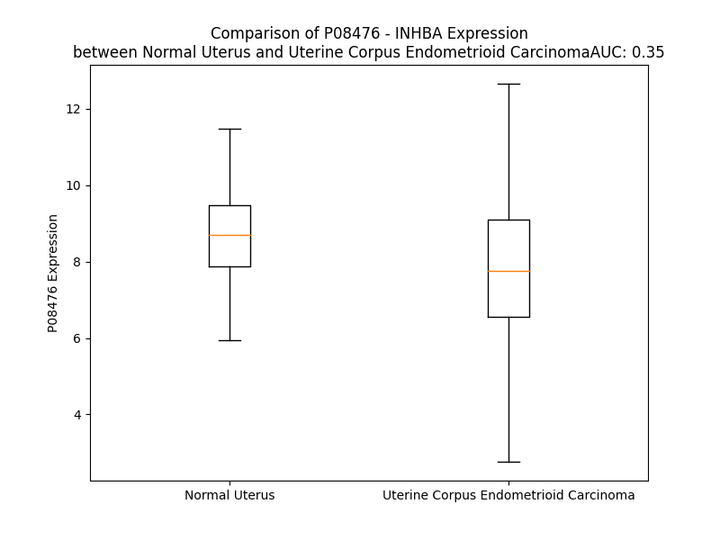

# Detailed Data for P08476

## Introduction to the Detailed Summary

### How to Interpret the Results

- **Summary & Metrics**: This section provides a quick reference to essential protein attributes, including expression changes, family classification, and biomarker applications. Regulation status (upregulated/downregulated) indicates the protein's behavior in a disease context. Some information comes from the original excel file with the proteins selected from literature, while others are derived from the analyses.
- **Expression Comparison**: A visual representation comparing protein expression between normal and disease states. It highlights significant changes in expression levels that might indicate diagnostic or therapeutic relevance. This is data coming from transcriptomics experiments and could not translate similarly to protein levels.
- **Isoform Alignment**: An interactive view of isoform alignments, revealing structural and functional differences between variants of the protein.
- **Interactors & Homologs**: Tables listing known interaction partners and homologous proteins, the more interactors and homologs, the more complex the protein is to design an antibody for.
- **Biological Assemblies**: Information about the structural arrangement of the protein in different assemblies, providing insights into its functional state but also the complexity of the protein to develop antibodies.
- **Combined Per-Residue Information**: A detailed table summarizing residue-level data. This includes predictions for epitope regions, aggregation tendencies, and modifications that might impact the protein's function. Each row corresponds to a residue in the protein, providing insights into specific sites that may be important for research or drug development.
## Summary & Metrics

- **UniProt Accession**: P08476
- **Gene Name**: INHBA
- **Protein Name**: Inhibin beta A chain
- **Swiss Prot**: INHBA_HUMAN
- **Family**: growth factor
- **Biomarker Application**: diagnosis
- **Number of Isoforms**: 0
- **Regulation**: 1
- **(transcriptomics) AUC**: 0.44
- **(transcriptomics) Fold Change**: 1.05
- **(transcriptomics) Regulation**: Downregulated
- **Discotope Epitope Count**: 104
- **Max n_uniprots (Homo)**: 4
- **Max n_uniprots (Hetero)**: 6

## Expression Comparison

## Interactors

| preferredName_A   | preferredName_B   |   score |
|:------------------|:------------------|--------:|
| INHBA             | ACVR2A            |   0.999 |
| INHBA             | FST               |   0.999 |
| INHBA             | ACVR2B            |   0.999 |
| INHBA             | ACVR1B            |   0.996 |
| INHBA             | FSTL3             |   0.989 |
| INHBA             | INHBB             |   0.986 |
| INHBA             | ACVR1C            |   0.982 |
| INHBA             | INHA              |   0.961 |
| INHBA             | TGFB3             |   0.946 |
| INHBA             | TGFB1             |   0.92  |
| INHBA             | NODAL             |   0.913 |

## Homologs

| uniprot_id   | gene_id   |
|:-------------|:----------|
| Q9UK05       | GDF2      |
| P22004       | BMP6      |
| Q96S42       | NODAL     |
| Q7Z4P5       | GDF7      |
| C8C060       | BMP2      |
| P55103       | INHBC     |
| B4DXG3       | GDF9      |
| P34820       | BMP8B     |
| Q7Z5Y6       | BMP8A     |
| Q53S46       | GDF8      |
| P55107       | GDF10     |
| A0A499FJK2   | TGFB1     |
| P05111       | INHA      |
| A0A0S2A5D6   | GDF6      |
| Q99988       | GDF15     |
| P12645       | BMP3      |
| P27539       | GDF1      |
| P61812       | TGFB2     |
| O95390       | GDF11     |
| P09529       | INHBB     |
| O95972       | BMP15     |
| V9GYF1       | BMP4      |
| F1T0J1       | GDF5      |
| Q9NR23       | GDF3      |
| P10600       | TGFB3     |
| O95393       | BMP10     |
| P18075       | BMP7      |
| M9VUD0       | BMP5      |
| O00292       | LEFTY2    |
| O75610       | LEFTY1    |
| P58166       | INHBE     |

## Biological Assemblies

|   Unnamed: 0 |   assembly |   n_uniprots | composition   | crystal_id   |
|-------------:|-----------:|-------------:|:--------------|:-------------|
|            0 |          1 |            4 | Homo          | 5hlz         |
|            1 |          2 |            4 | Homo          | 5hlz         |
|            0 |          1 |            2 | Homo          | 6y6n         |
|            0 |          1 |            5 | Hetero        | 2p6a         |
|            0 |          1 |            6 | Hetero        | 7oly         |
|            0 |          1 |            2 | Hetero        | 2arp         |
|            0 |          1 |            4 | Hetero        | 1nys         |
|            0 |          1 |            2 | Homo          | 6y6o         |
|            0 |          1 |            4 | Hetero        | 1nyu         |
|            0 |          1 |            4 | Hetero        | 1s4y         |
|            0 |          1 |            1 | Homo          | 5hly         |
|            0 |          1 |            2 | Homo          | 2arv         |
|            0 |          1 |            2 | Hetero        | 7u5p         |
|            1 |          2 |            2 | Hetero        | 7u5p         |
|            2 |          3 |            2 | Hetero        | 7u5p         |
|            3 |          4 |            2 | Hetero        | 7u5p         |
|            0 |          1 |            4 | Hetero        | 3b4v         |
|            1 |          2 |            4 | Hetero        | 3b4v         |
|            0 |          1 |            4 | Hetero        | 2b0u         |
|            0 |          1 |            1 | Hetero        | 4mid         |

## Combined Per-Residue Information

|   res | aa   |   epitope_score | epitope   |   relative_surface_accessibility |   modeling_confidence |   Aggregation | modification   | glycosylation                   |
|------:|:-----|----------------:|:----------|---------------------------------:|----------------------:|--------------:|:---------------|:--------------------------------|
|     1 | M    |         0.07722 | False     |                          1.28728 |                 43.4  |         0     | N/A            | N/A                             |
|     2 | P    |         0.1076  | False     |                          0.87123 |                 59.9  |         0.088 | N/A            | N/A                             |
|     3 | L    |         0.14364 | False     |                          0.94998 |                 45.75 |         0.088 | N/A            | N/A                             |
|     4 | L    |         0.13467 | False     |                          0.78295 |                 48.56 |         0.088 | N/A            | N/A                             |
|     5 | W    |         0.18379 | True      |                          0.87976 |                 47.19 |         0.088 | N/A            | N/A                             |
|     6 | L    |         0.19582 | True      |                          0.82706 |                 45.48 |         0.088 | N/A            | N/A                             |
|     7 | R    |         0.21819 | True      |                          0.94085 |                 44.78 |         0     | N/A            | N/A                             |
|     8 | G    |         0.24743 | True      |                          0.92326 |                 44.16 |         6.074 | N/A            | N/A                             |
|     9 | F    |         0.13461 | False     |                          0.88236 |                 47.9  |        73.303 | N/A            | N/A                             |
|    10 | L    |         0.14911 | False     |                          0.92092 |                 43.89 |        88.292 | N/A            | N/A                             |
|    11 | L    |         0.17182 | False     |                          0.96092 |                 44.39 |        91.037 | N/A            | N/A                             |
|    12 | A    |         0.12963 | False     |                          1.04219 |                 45.59 |        91.539 | N/A            | N/A                             |
|    13 | S    |         0.08383 | False     |                          0.79136 |                 43.23 |        92.094 | N/A            | N/A                             |
|    14 | C    |         0.15159 | False     |                          0.73842 |                 41.04 |        96.381 | N/A            | N/A                             |
|    15 | W    |         0.14643 | False     |                          1.01901 |                 40.83 |        96.375 | N/A            | N/A                             |
|    16 | I    |         0.11193 | False     |                          1.01233 |                 42.71 |        96.215 | N/A            | N/A                             |
|    17 | I    |         0.11005 | False     |                          0.89647 |                 44.21 |        94.46  | N/A            | N/A                             |
|    18 | V    |         0.11194 | False     |                          0.8768  |                 43.71 |        87.402 | N/A            | N/A                             |
|    19 | R    |         0.14038 | False     |                          0.97823 |                 40.14 |         0     | N/A            | N/A                             |
|    20 | S    |         0.10187 | False     |                          0.7884  |                 37.22 |         0     | N/A            | N/A                             |
|    21 | S    |         0.08741 | False     |                          0.86135 |                 43.88 |         0     | N/A            | N/A                             |
|    22 | P    |         0.11462 | False     |                          0.9137  |                 36.94 |         0     | N/A            | N/A                             |
|    23 | T    |         0.08113 | False     |                          0.99497 |                 34.56 |         0     | N/A            | N/A                             |
|    24 | P    |         0.12563 | False     |                          0.91203 |                 39.53 |         0     | N/A            | N/A                             |
|    25 | G    |         0.19541 | True      |                          0.96393 |                 33.69 |         0     | N/A            | N/A                             |
|    26 | S    |         0.12554 | False     |                          0.90823 |                 33.22 |         0     | N/A            | N/A                             |
|    27 | E    |         0.13236 | False     |                          0.91395 |                 33.04 |         0     | N/A            | N/A                             |
|    28 | G    |         0.12104 | False     |                          0.90659 |                 29.65 |         0     | N/A            | N/A                             |
|    29 | H    |         0.14689 | False     |                          1.03078 |                 36.59 |         0     | N/A            | N/A                             |
|    30 | S    |         0.17564 | True      |                          0.85055 |                 34.61 |         0     | N/A            | N/A                             |
|    31 | A    |         0.20788 | True      |                          1.04435 |                 41.48 |         0     | N/A            | N/A                             |
|    32 | A    |         0.17165 | False     |                          0.79803 |                 47.07 |         0     | N/A            | N/A                             |
|    33 | P    |         0.16149 | False     |                          0.94402 |                 44.16 |         0     | N/A            | N/A                             |
|    34 | D    |         0.19165 | True      |                          0.87442 |                 44.03 |         0     | N/A            | N/A                             |
|    35 | C    |         0.11561 | False     |                          0.4193  |                 47.79 |         0     | N/A            | N/A                             |
|    36 | P    |         0.09421 | False     |                          0.80597 |                 52.53 |         0     | N/A            | N/A                             |
|    37 | S    |         0.07384 | False     |                          0.38316 |                 51.09 |         0     | N/A            | N/A                             |
|    38 | C    |         0.08421 | False     |                          0.33561 |                 51.14 |         0     | N/A            | N/A                             |
|    39 | A    |         0.10649 | False     |                          0.56256 |                 50.22 |         0     | N/A            | N/A                             |
|    40 | L    |         0.07658 | False     |                          0.75344 |                 53.81 |         0     | N/A            | N/A                             |
|    41 | A    |         0.10932 | False     |                          0.76246 |                 51.37 |         0     | N/A            | N/A                             |
|    42 | A    |         0.12883 | False     |                          0.78858 |                 49.78 |         0     | N/A            | N/A                             |
|    43 | L    |         0.1726  | False     |                          0.70449 |                 51.14 |         0     | N/A            | N/A                             |
|    44 | P    |         0.17281 | False     |                          0.70925 |                 45.17 |         0     | N/A            | N/A                             |
|    45 | K    |         0.16458 | False     |                          0.72729 |                 51.76 |         0     | N/A            | N/A                             |
|    46 | D    |         0.25809 | True      |                          0.80329 |                 41.26 |         0     | N/A            | N/A                             |
|    47 | V    |         0.11444 | False     |                          0.52902 |                 37.59 |         0     | N/A            | N/A                             |
|    48 | P    |         0.20965 | True      |                          0.90855 |                 36.9  |         0     | N/A            | N/A                             |
|    49 | N    |         0.18581 | True      |                          0.86773 |                 41.06 |         0     | N/A            | N/A                             |
|    50 | S    |         0.10158 | False     |                          0.19952 |                 51.72 |         0     | N/A            | N/A                             |
|    51 | Q    |         0.1354  | False     |                          0.57714 |                 71.17 |         0     | N/A            | N/A                             |
|    52 | P    |         0.1122  | False     |                          0.73994 |                 83.69 |         0     | N/A            | N/A                             |
|    53 | E    |         0.10003 | False     |                          0.52006 |                 86.3  |         0     | N/A            | N/A                             |
|    54 | M    |         0.06165 | False     |                          0.27601 |                 86.6  |         0     | N/A            | N/A                             |
|    55 | V    |         0.05669 | False     |                          0.18185 |                 90.92 |         0     | N/A            | N/A                             |
|    56 | E    |         0.10756 | False     |                          0.45876 |                 92.54 |         0     | N/A            | N/A                             |
|    57 | A    |         0.05294 | False     |                          0.47062 |                 92.72 |         0     | N/A            | N/A                             |
|    58 | V    |         0.01973 | False     |                          0.10174 |                 92.51 |         0     | N/A            | N/A                             |
|    59 | K    |         0.03658 | False     |                          0.23849 |                 94.55 |         0     | N/A            | N/A                             |
|    60 | K    |         0.07402 | False     |                          0.57653 |                 94.7  |         0     | N/A            | N/A                             |
|    61 | H    |         0.06329 | False     |                          0.36295 |                 93.86 |         0     | N/A            | N/A                             |
|    62 | I    |         0.00355 | False     |                          0.0008  |                 94.15 |         0.291 | N/A            | N/A                             |
|    63 | L    |         0.052   | False     |                          0.13602 |                 94.73 |         0.291 | N/A            | N/A                             |
|    64 | N    |         0.08652 | False     |                          0.67565 |                 93.92 |         0.291 | N/A            | N/A                             |
|    65 | M    |         0.06008 | False     |                          0.2627  |                 92.99 |         0.291 | N/A            | N/A                             |
|    66 | L    |         0.02689 | False     |                          0.04631 |                 92.78 |         0.291 | N/A            | N/A                             |
|    67 | H    |         0.24139 | True      |                          0.80203 |                 92.21 |         0     | N/A            | N/A                             |
|    68 | L    |         0.06802 | False     |                          0.16854 |                 91.24 |         0     | N/A            | N/A                             |
|    69 | K    |         0.12932 | False     |                          1.03829 |                 90.92 |         0     | N/A            | N/A                             |
|    70 | K    |         0.15    | False     |                          0.50095 |                 92.75 |         0     | N/A            | N/A                             |
|    71 | R    |         0.05597 | False     |                          0.34884 |                 92.27 |         0     | N/A            | N/A                             |
|    72 | P    |         0.01434 | False     |                          0.02239 |                 90.98 |         0     | N/A            | N/A                             |
|    73 | D    |         0.17261 | False     |                          0.58353 |                 86.07 |         0     | N/A            | N/A                             |
|    74 | V    |         0.12291 | False     |                          0.22121 |                 81.25 |         0     | N/A            | N/A                             |
|    75 | T    |         0.25312 | True      |                          0.77448 |                 76.43 |         0     | N/A            | N/A                             |
|    76 | Q    |         0.23182 | True      |                          0.70008 |                 74.14 |         0     | N/A            | N/A                             |
|    77 | P    |         0.16209 | False     |                          0.56425 |                 76.61 |         0     | N/A            | N/A                             |
|    78 | V    |         0.12396 | False     |                          0.37184 |                 81.15 |         0     | N/A            | N/A                             |
|    79 | P    |         0.18444 | True      |                          0.7217  |                 88.28 |         0     | N/A            | N/A                             |
|    80 | K    |         0.18556 | True      |                          0.60761 |                 86.66 |         0     | N/A            | N/A                             |
|    81 | A    |         0.15196 | False     |                          0.78896 |                 88.66 |         0     | N/A            | N/A                             |
|    82 | A    |         0.13313 | False     |                          0.4784  |                 90.39 |         0     | N/A            | N/A                             |
|    83 | L    |         0.04726 | False     |                          0.09233 |                 88.66 |         0     | N/A            | N/A                             |
|    84 | L    |         0.0854  | False     |                          0.14673 |                 90.41 |         0     | N/A            | N/A                             |
|    85 | N    |         0.10021 | False     |                          0.50796 |                 90.48 |         0     | N/A            | N/A                             |
|    86 | A    |         0.072   | False     |                          0.37846 |                 90.11 |         0     | N/A            | N/A                             |
|    87 | I    |         0.02648 | False     |                          0.02686 |                 88.71 |         0     | N/A            | N/A                             |
|    88 | R    |         0.25371 | True      |                          0.51461 |                 89.89 |         0     | N/A            | N/A                             |
|    89 | K    |         0.15885 | False     |                          0.75488 |                 91.31 |         0     | N/A            | N/A                             |
|    90 | L    |         0.13619 | False     |                          0.79505 |                 89.68 |         0     | N/A            | N/A                             |
|    91 | H    |         0.17743 | True      |                          0.70214 |                 89.12 |         0     | N/A            | N/A                             |
|    92 | V    |         0.0786  | False     |                          0.2285  |                 87.1  |         0     | N/A            | N/A                             |
|    93 | G    |         0.0151  | False     |                          0.02498 |                 85.62 |         0     | N/A            | N/A                             |
|    94 | K    |         0.11223 | False     |                          0.55563 |                 90.4  |         0     | N/A            | N/A                             |
|    95 | V    |         0.06322 | False     |                          0.14421 |                 89.28 |         0     | N/A            | N/A                             |
|    96 | G    |         0.197   | True      |                          0.45112 |                 88.87 |         0     | N/A            | N/A                             |
|    97 | E    |         0.18578 | True      |                          0.96445 |                 87.97 |         0     | N/A            | N/A                             |
|    98 | N    |         0.13067 | False     |                          0.93586 |                 87.38 |         0     | N/A            | N/A                             |
|    99 | G    |         0.09164 | False     |                          0.19437 |                 84.23 |         0     | N/A            | N/A                             |
|   100 | Y    |         0.12042 | False     |                          0.54036 |                 88.54 |         0     | N/A            | N/A                             |
|   101 | V    |         0.05088 | False     |                          0.07732 |                 90.19 |         0     | N/A            | N/A                             |
|   102 | E    |         0.08789 | False     |                          0.32699 |                 91.21 |         0     | N/A            | N/A                             |
|   103 | I    |         0.05032 | False     |                          0.05796 |                 90.88 |         0     | N/A            | N/A                             |
|   104 | E    |         0.1115  | False     |                          0.30781 |                 87.95 |         0     | N/A            | N/A                             |
|   105 | D    |         0.11314 | False     |                          0.38067 |                 87.95 |         0     | N/A            | N/A                             |
|   106 | D    |         0.03634 | False     |                          0.21327 |                 89.46 |         0     | N/A            | N/A                             |
|   107 | I    |         0.06842 | False     |                          0.26136 |                 90.28 |         0     | N/A            | N/A                             |
|   108 | G    |         0.04784 | False     |                          0.07836 |                 86.1  |         0     | N/A            | N/A                             |
|   109 | R    |         0.11985 | False     |                          0.45338 |                 88.59 |         0     | N/A            | N/A                             |
|   110 | R    |         0.12663 | False     |                          0.53602 |                 88.98 |         0     | N/A            | N/A                             |
|   111 | A    |         0.05104 | False     |                          0.13761 |                 88.64 |         0     | N/A            | N/A                             |
|   112 | E    |         0.12291 | False     |                          0.35884 |                 86.86 |         0     | N/A            | N/A                             |
|   113 | M    |         0.06627 | False     |                          0.56181 |                 86.99 |         0     | N/A            | N/A                             |
|   114 | N    |         0.09222 | False     |                          0.53384 |                 87.9  |         0     | N/A            | N/A                             |
|   115 | E    |         0.11448 | False     |                          0.18023 |                 83.88 |         0     | N/A            | N/A                             |
|   116 | L    |         0.08077 | False     |                          0.62079 |                 83.38 |         0     | N/A            | N/A                             |
|   117 | M    |         0.19862 | True      |                          0.71112 |                 83.62 |         0     | N/A            | N/A                             |
|   118 | E    |         0.21575 | True      |                          0.59643 |                 81.83 |         0     | N/A            | N/A                             |
|   119 | Q    |         0.0794  | False     |                          0.2589  |                 79.27 |         0     | N/A            | N/A                             |
|   120 | T    |         0.07419 | False     |                          0.21958 |                 85.01 |         0     | N/A            | N/A                             |
|   121 | S    |         0.13819 | False     |                          0.29871 |                 87.66 |         0     | N/A            | N/A                             |
|   122 | E    |         0.13799 | False     |                          0.61096 |                 91.55 |         0     | N/A            | N/A                             |
|   123 | I    |         0.06166 | False     |                          0.12399 |                 90.77 |         5.964 | N/A            | N/A                             |
|   124 | I    |         0.11178 | False     |                          0.56699 |                 95.07 |         5.964 | N/A            | N/A                             |
|   125 | T    |         0.0309  | False     |                          0.09437 |                 94.97 |         5.964 | N/A            | N/A                             |
|   126 | F    |         0.11586 | False     |                          0.55617 |                 95.18 |         5.964 | N/A            | N/A                             |
|   127 | A    |         0.00237 | False     |                          0       |                 94.61 |         5.964 | N/A            | N/A                             |
|   128 | E    |         0.09237 | False     |                          0.503   |                 92.1  |         0     | N/A            | N/A                             |
|   129 | S    |         0.0994  | False     |                          0.66835 |                 89    |         0     | N/A            | N/A                             |
|   130 | G    |         0.03719 | False     |                          0.14157 |                 84.88 |         0     | N/A            | N/A                             |
|   131 | T    |         0.16547 | False     |                          1.00073 |                 83.88 |         0     | N/A            | N/A                             |
|   132 | A    |         0.0698  | False     |                          0.31911 |                 85.51 |         0     | N/A            | N/A                             |
|   133 | R    |         0.18611 | True      |                          0.92612 |                 87.43 |         0     | N/A            | N/A                             |
|   134 | K    |         0.11544 | False     |                          0.5248  |                 90.87 |         0     | N/A            | N/A                             |
|   135 | T    |         0.04493 | False     |                          0.069   |                 93.03 |         0     | N/A            | N/A                             |
|   136 | L    |         0.00601 | False     |                          0.00907 |                 94.3  |         0     | N/A            | N/A                             |
|   137 | H    |         0.06731 | False     |                          0.2508  |                 94.9  |         0     | N/A            | N/A                             |
|   138 | F    |         0.00159 | False     |                          0       |                 94.52 |         0     | N/A            | N/A                             |
|   139 | E    |         0.10234 | False     |                          0.45718 |                 93.11 |         0     | N/A            | N/A                             |
|   140 | I    |         0.00775 | False     |                          0.01757 |                 90.11 |         0     | N/A            | N/A                             |
|   141 | S    |         0.09865 | False     |                          0.44293 |                 86.33 |         0     | N/A            | N/A                             |
|   142 | K    |         0.15067 | False     |                          0.85843 |                 78.48 |         0     | N/A            | N/A                             |
|   143 | E    |         0.06096 | False     |                          0.37545 |                 72.19 |         0     | N/A            | N/A                             |
|   144 | G    |         0.01259 | False     |                          0       |                 65.74 |         0     | N/A            | N/A                             |
|   145 | S    |         0.11199 | False     |                          0.52246 |                 70.02 |         0     | N/A            | N/A                             |
|   146 | D    |         0.04698 | False     |                          0.36671 |                 70.42 |         0     | N/A            | N/A                             |
|   147 | L    |         0.02295 | False     |                          0.02359 |                 71.96 |         0     | N/A            | N/A                             |
|   148 | S    |         0.03562 | False     |                          0.14639 |                 76.37 |         0     | N/A            | N/A                             |
|   149 | V    |         0.06167 | False     |                          0.33799 |                 88.08 |         0.008 | N/A            | N/A                             |
|   150 | V    |         0.03301 | False     |                          0.11194 |                 91.92 |         0.008 | N/A            | N/A                             |
|   151 | E    |         0.05653 | False     |                          0.42614 |                 91.69 |         0.008 | N/A            | N/A                             |
|   152 | R    |         0.10232 | False     |                          0.43293 |                 94.85 |         0.085 | N/A            | N/A                             |
|   153 | A    |         0.00112 | False     |                          0.00094 |                 96.49 |         0.301 | N/A            | N/A                             |
|   154 | E    |         0.04802 | False     |                          0.08781 |                 97.87 |         0.333 | N/A            | N/A                             |
|   155 | V    |         0.00241 | False     |                          0.00095 |                 97.83 |        96.81  | N/A            | N/A                             |
|   156 | W    |         0.14896 | False     |                          0.29917 |                 97.77 |        96.81  | N/A            | N/A                             |
|   157 | L    |         0.00288 | False     |                          0       |                 96.89 |        96.81  | N/A            | N/A                             |
|   158 | F    |         0.05467 | False     |                          0.08408 |                 95.73 |        96.81  | N/A            | N/A                             |
|   159 | L    |         0.00433 | False     |                          0       |                 94.28 |        96.798 | N/A            | N/A                             |
|   160 | K    |         0.11989 | False     |                          0.36283 |                 92.64 |         0.256 | N/A            | N/A                             |
|   161 | V    |         0.10535 | False     |                          0.08635 |                 90.8  |         0.01  | N/A            | N/A                             |
|   162 | P    |         0.33556 | True      |                          0.7101  |                 85.48 |         0.004 | N/A            | N/A                             |
|   163 | K    |         0.3508  | True      |                          0.86242 |                 84.22 |         0     | N/A            | N/A                             |
|   164 | A    |         0.2987  | True      |                          0.78287 |                 76.7  |         0     | N/A            | N/A                             |
|   165 | N    |         0.20468 | True      |                          0.23734 |                 71.67 |         0     | N/A            | N-linked (GlcNAc...) asparagine |
|   166 | R    |         0.37545 | True      |                          0.89016 |                 73.84 |         0     | N/A            | N/A                             |
|   167 | T    |         0.29067 | True      |                          0.90416 |                 75.96 |         0     | N/A            | N/A                             |
|   168 | R    |         0.41609 | True      |                          0.31077 |                 73.33 |         0     | N/A            | N/A                             |
|   169 | T    |         0.15451 | False     |                          0.20001 |                 85.72 |         0     | N/A            | N/A                             |
|   170 | K    |         0.20371 | True      |                          0.63179 |                 92.2  |         0     | N/A            | N/A                             |
|   171 | V    |         0.0115  | False     |                          0.00476 |                 94.2  |         0     | N/A            | N/A                             |
|   172 | T    |         0.0694  | False     |                          0.17692 |                 96.54 |         0     | N/A            | N/A                             |
|   173 | I    |         0.00478 | False     |                          0       |                 97.06 |         0     | N/A            | N/A                             |
|   174 | R    |         0.17965 | True      |                          0.39375 |                 97.59 |         0     | N/A            | N/A                             |
|   175 | L    |         0.00464 | False     |                          0       |                 97.17 |         0     | N/A            | N/A                             |
|   176 | F    |         0.12813 | False     |                          0.18599 |                 96.08 |         0     | N/A            | N/A                             |
|   177 | Q    |         0.05093 | False     |                          0.07516 |                 93.94 |         0     | N/A            | N/A                             |
|   178 | Q    |         0.09435 | False     |                          0.13179 |                 88.73 |         0     | N/A            | N/A                             |
|   179 | Q    |         0.11689 | False     |                          0.31269 |                 81.08 |         0     | N/A            | N/A                             |
|   180 | K    |         0.14539 | False     |                          0.80966 |                 71.36 |         0     | N/A            | N/A                             |
|   181 | H    |         0.15937 | False     |                          0.82622 |                 60.05 |         0     | N/A            | N/A                             |
|   182 | P    |         0.14251 | False     |                          0.85251 |                 55.18 |         0     | N/A            | N/A                             |
|   183 | Q    |         0.14465 | False     |                          0.83918 |                 48.3  |         0     | N/A            | N/A                             |
|   184 | G    |         0.18166 | True      |                          0.82343 |                 39.18 |         0     | N/A            | N/A                             |
|   185 | S    |         0.15663 | False     |                          0.87912 |                 34.56 |         0     | N/A            | N/A                             |
|   186 | L    |         0.19669 | True      |                          0.9786  |                 43.37 |         0     | N/A            | N/A                             |
|   187 | D    |         0.22926 | True      |                          0.91964 |                 38.67 |         0     | N/A            | N/A                             |
|   188 | T    |         0.23598 | True      |                          0.88641 |                 41.76 |         0     | N/A            | N/A                             |
|   189 | G    |         0.3491  | True      |                          0.84576 |                 36.91 |         0     | N/A            | N/A                             |
|   190 | E    |         0.26435 | True      |                          0.88709 |                 41.96 |         0     | N/A            | N/A                             |
|   191 | E    |         0.25787 | True      |                          0.96138 |                 34.34 |         0     | N/A            | N/A                             |
|   192 | A    |         0.14996 | False     |                          0.97727 |                 40.57 |         0     | N/A            | N/A                             |
|   193 | E    |         0.22164 | True      |                          0.88845 |                 35.68 |         0     | N/A            | N/A                             |
|   194 | E    |         0.16698 | False     |                          0.92749 |                 32.67 |         0     | N/A            | N/A                             |
|   195 | V    |         0.15564 | False     |                          0.82177 |                 35.83 |         0     | N/A            | N/A                             |
|   196 | G    |         0.18476 | True      |                          0.92426 |                 29.71 |         0     | N/A            | N/A                             |
|   197 | L    |         0.17408 | False     |                          0.94132 |                 36.9  |         0     | N/A            | N/A                             |
|   198 | K    |         0.19033 | True      |                          0.95252 |                 38.78 |         0     | N/A            | N/A                             |
|   199 | G    |         0.14572 | False     |                          0.64608 |                 43.82 |         0     | N/A            | N/A                             |
|   200 | E    |         0.17672 | True      |                          0.80607 |                 56.7  |         0     | N/A            | N/A                             |
|   201 | R    |         0.21503 | True      |                          0.49959 |                 69.48 |         0     | N/A            | N/A                             |
|   202 | S    |         0.1008  | False     |                          0.47515 |                 84.8  |         0     | N/A            | N/A                             |
|   203 | E    |         0.14183 | False     |                          0.3306  |                 89.08 |         0     | N/A            | N/A                             |
|   204 | L    |         0.0712  | False     |                          0.42784 |                 92.41 |         0     | N/A            | N/A                             |
|   205 | L    |         0.10567 | False     |                          0.54427 |                 95.15 |         0     | N/A            | N/A                             |
|   206 | L    |         0.04515 | False     |                          0.08973 |                 95.32 |         0     | N/A            | N/A                             |
|   207 | S    |         0.06527 | False     |                          0.08862 |                 96.76 |         0     | N/A            | N/A                             |
|   208 | E    |         0.22859 | True      |                          0.48808 |                 96.56 |         0     | N/A            | N/A                             |
|   209 | K    |         0.1169  | False     |                          0.36616 |                 96.69 |         0     | N/A            | N/A                             |
|   210 | V    |         0.19028 | True      |                          0.60693 |                 96.41 |         0     | N/A            | N/A                             |
|   211 | V    |         0.04987 | False     |                          0.05081 |                 95.23 |         0     | N/A            | N/A                             |
|   212 | D    |         0.07576 | False     |                          0.34477 |                 93.2  |         0     | N/A            | N/A                             |
|   213 | A    |         0.00771 | False     |                          0.00283 |                 92.37 |         0     | N/A            | N/A                             |
|   214 | R    |         0.26163 | True      |                          0.50053 |                 89.7  |         0     | N/A            | N/A                             |
|   215 | K    |         0.16942 | False     |                          0.77556 |                 90.55 |         0     | N/A            | N/A                             |
|   216 | S    |         0.16043 | False     |                          0.40063 |                 92.7  |         0     | N/A            | N/A                             |
|   217 | T    |         0.13581 | False     |                          0.38494 |                 94.4  |         0     | N/A            | N/A                             |
|   218 | W    |         0.16456 | False     |                          0.33154 |                 96.52 |         0     | N/A            | N/A                             |
|   219 | H    |         0.06812 | False     |                          0.10611 |                 97.48 |         0     | N/A            | N/A                             |
|   220 | V    |         0.11943 | False     |                          0.31802 |                 97.78 |         0     | N/A            | N/A                             |
|   221 | F    |         0.00275 | False     |                          0       |                 97.97 |         0     | N/A            | N/A                             |
|   222 | P    |         0.07963 | False     |                          0.60328 |                 97.53 |         0     | N/A            | N/A                             |
|   223 | V    |         0.01301 | False     |                          0.03319 |                 96.7  |         0     | N/A            | N/A                             |
|   224 | S    |         0.06819 | False     |                          0.26773 |                 95.93 |         0     | N/A            | N/A                             |
|   225 | S    |         0.12556 | False     |                          0.65676 |                 94.1  |         0     | N/A            | N/A                             |
|   226 | S    |         0.03011 | False     |                          0.07235 |                 93.18 |         0     | N/A            | N/A                             |
|   227 | I    |         0.00438 | False     |                          0       |                 93.45 |         0     | N/A            | N/A                             |
|   228 | Q    |         0.05838 | False     |                          0.22357 |                 92.75 |         0     | N/A            | N/A                             |
|   229 | R    |         0.15517 | False     |                          0.35953 |                 91.52 |         0     | N/A            | N/A                             |
|   230 | L    |         0.02395 | False     |                          0.03086 |                 90.8  |         0     | N/A            | N/A                             |
|   231 | L    |         0.05747 | False     |                          0.13872 |                 89.47 |         0     | N/A            | N/A                             |
|   232 | D    |         0.13755 | False     |                          0.61011 |                 88.65 |         0     | N/A            | N/A                             |
|   233 | Q    |         0.12366 | False     |                          0.47943 |                 87.43 |         0     | N/A            | N/A                             |
|   234 | G    |         0.10875 | False     |                          0.84275 |                 86.24 |         0     | N/A            | N/A                             |
|   235 | K    |         0.15284 | False     |                          0.50801 |                 88.65 |         0     | N/A            | N/A                             |
|   236 | S    |         0.07502 | False     |                          0.20953 |                 89.99 |         0     | N/A            | N/A                             |
|   237 | S    |         0.11173 | False     |                          0.39798 |                 91.81 |         0     | N/A            | N/A                             |
|   238 | L    |         0.00568 | False     |                          0.00895 |                 92.87 |         0     | N/A            | N/A                             |
|   239 | D    |         0.07053 | False     |                          0.25672 |                 93.9  |         0     | N/A            | N/A                             |
|   240 | V    |         0.00178 | False     |                          0       |                 95.64 |         0     | N/A            | N/A                             |
|   241 | R    |         0.1604  | False     |                          0.24977 |                 95.15 |         0     | N/A            | N/A                             |
|   242 | I    |         0.02495 | False     |                          0.01551 |                 95.54 |         0     | N/A            | N/A                             |
|   243 | A    |         0.12671 | False     |                          0.14158 |                 95.65 |         0     | N/A            | N/A                             |
|   244 | C    |         0.10761 | False     |                          0.08875 |                 95.27 |         0     | N/A            | N/A                             |
|   245 | E    |         0.25831 | True      |                          0.60499 |                 91.74 |         0     | N/A            | N/A                             |
|   246 | Q    |         0.12296 | False     |                          0.28398 |                 91.04 |         0     | N/A            | N/A                             |
|   247 | C    |         0.04819 | False     |                          0.06302 |                 90.97 |         0     | N/A            | N/A                             |
|   248 | Q    |         0.27907 | True      |                          0.81489 |                 86.76 |         0     | N/A            | N/A                             |
|   249 | E    |         0.27244 | True      |                          0.61481 |                 86.58 |         0     | N/A            | N/A                             |
|   250 | S    |         0.0125  | False     |                          0       |                 86.4  |         0.323 | N/A            | N/A                             |
|   251 | G    |         0.2135  | True      |                          0.4807  |                 89.19 |         2.931 | N/A            | N/A                             |
|   252 | A    |         0.03264 | False     |                          0.0684  |                 91.63 |         8.891 | N/A            | N/A                             |
|   253 | S    |         0.21102 | True      |                          0.4952  |                 92.16 |        13.641 | N/A            | N/A                             |
|   254 | L    |         0.08394 | False     |                          0.16548 |                 92.52 |        14.864 | N/A            | N/A                             |
|   255 | V    |         0.05371 | False     |                          0.11139 |                 91.06 |        14.864 | N/A            | N/A                             |
|   256 | L    |         0.07142 | False     |                          0.19057 |                 85.2  |        14.864 | N/A            | N/A                             |
|   257 | L    |         0.12593 | False     |                          0.38954 |                 77.5  |        12.918 | N/A            | N/A                             |
|   258 | G    |         0.224   | True      |                          0.64338 |                 58.45 |         1.503 | N/A            | N/A                             |
|   259 | K    |         0.23365 | True      |                          0.98918 |                 51.82 |         0     | N/A            | N/A                             |
|   260 | K    |         0.17868 | True      |                          0.97797 |                 45.62 |         0     | N/A            | N/A                             |
|   261 | K    |         0.26656 | True      |                          0.7755  |                 38.87 |         0     | N/A            | N/A                             |
|   262 | K    |         0.19457 | True      |                          0.80101 |                 36.38 |         0     | N/A            | N/A                             |
|   263 | K    |         0.3087  | True      |                          0.9203  |                 35.94 |         0     | N/A            | N/A                             |
|   264 | E    |         0.26958 | True      |                          0.59031 |                 40.81 |         0     | N/A            | N/A                             |
|   265 | E    |         0.29571 | True      |                          0.88015 |                 36.94 |         0     | N/A            | N/A                             |
|   266 | E    |         0.25672 | True      |                          0.85027 |                 43.18 |         0     | N/A            | N/A                             |
|   267 | G    |         0.40663 | True      |                          0.81532 |                 41.52 |         0     | N/A            | N/A                             |
|   268 | E    |         0.26446 | True      |                          0.98935 |                 39.41 |         0     | N/A            | N/A                             |
|   269 | G    |         0.30817 | True      |                          0.87627 |                 40.31 |         0     | N/A            | N/A                             |
|   270 | K    |         0.28456 | True      |                          1.0059  |                 42.64 |         0     | N/A            | N/A                             |
|   271 | K    |         0.24904 | True      |                          1.00905 |                 38.49 |         0     | N/A            | N/A                             |
|   272 | K    |         0.31106 | True      |                          1.01397 |                 42.55 |         0     | N/A            | N/A                             |
|   273 | G    |         0.43057 | True      |                          0.94334 |                 35.72 |         0     | N/A            | N/A                             |
|   274 | G    |         0.29485 | True      |                          1.02576 |                 34.01 |         0     | N/A            | N/A                             |
|   275 | G    |         0.42056 | True      |                          0.90038 |                 36.67 |         0     | N/A            | N/A                             |
|   276 | E    |         0.292   | True      |                          0.98339 |                 36.18 |         0     | N/A            | N/A                             |
|   277 | G    |         0.31125 | True      |                          0.87727 |                 39.33 |         0     | N/A            | N/A                             |
|   278 | G    |         0.25363 | True      |                          0.63227 |                 43.71 |         0     | N/A            | N/A                             |
|   279 | A    |         0.15209 | False     |                          0.68464 |                 46.26 |         0     | N/A            | N/A                             |
|   280 | G    |         0.17765 | True      |                          0.53132 |                 47.92 |         0     | N/A            | N/A                             |
|   281 | A    |         0.07835 | False     |                          0.45484 |                 51.51 |         0     | N/A            | N/A                             |
|   282 | D    |         0.17395 | False     |                          0.51454 |                 56.85 |         0     | N/A            | N/A                             |
|   283 | E    |         0.08184 | False     |                          0.45578 |                 57.31 |         0     | N/A            | N/A                             |
|   284 | E    |         0.1358  | False     |                          0.62791 |                 63.15 |         0     | N/A            | N/A                             |
|   285 | K    |         0.11133 | False     |                          0.56409 |                 66.79 |         0     | N/A            | N/A                             |
|   286 | E    |         0.08352 | False     |                          0.33188 |                 71.73 |         0     | N/A            | N/A                             |
|   287 | Q    |         0.15244 | False     |                          0.6308  |                 81.71 |         0     | N/A            | N/A                             |
|   288 | S    |         0.17439 | False     |                          0.60616 |                 88.91 |         0     | N/A            | N/A                             |
|   289 | H    |         0.12469 | False     |                          0.23116 |                 93.36 |         0     | N/A            | N/A                             |
|   290 | R    |         0.06378 | False     |                          0.37763 |                 93.55 |         0     | N/A            | N/A                             |
|   291 | P    |         0.00255 | False     |                          0       |                 95.98 |         0     | N/A            | N/A                             |
|   292 | F    |         0.10447 | False     |                          0.18854 |                 96.77 |         0.142 | N/A            | N/A                             |
|   293 | L    |         0.00365 | False     |                          0.00082 |                 96.64 |         0.142 | N/A            | N/A                             |
|   294 | M    |         0.04301 | False     |                          0.06899 |                 96.67 |         0.142 | N/A            | N/A                             |
|   295 | L    |         0.00196 | False     |                          0       |                 94.23 |         0.142 | N/A            | N/A                             |
|   296 | Q    |         0.09555 | False     |                          0.27827 |                 92.7  |         0.142 | N/A            | N/A                             |
|   297 | A    |         0.01301 | False     |                          0       |                 89.75 |         0     | N/A            | N/A                             |
|   298 | R    |         0.21892 | True      |                          0.28796 |                 86.09 |         0     | N/A            | N/A                             |
|   299 | Q    |         0.13492 | False     |                          0.25214 |                 77.6  |         0     | N/A            | N/A                             |
|   300 | S    |         0.09564 | False     |                          0.1505  |                 68.36 |         0     | N/A            | N/A                             |
|   301 | E    |         0.22588 | True      |                          0.65748 |                 62.07 |         0     | N/A            | N/A                             |
|   302 | D    |         0.31097 | True      |                          0.70099 |                 54.56 |         0     | N/A            | N/A                             |
|   303 | H    |         0.13732 | False     |                          0.61388 |                 52.56 |         0     | N/A            | N/A                             |
|   304 | P    |         0.22449 | True      |                          0.69953 |                 48.45 |         0     | N/A            | N/A                             |
|   305 | H    |         0.2889  | True      |                          0.95811 |                 49.6  |         0     | N/A            | N/A                             |
|   306 | R    |         0.13879 | False     |                          0.54408 |                 48.77 |         0     | N/A            | N/A                             |
|   307 | R    |         0.21939 | True      |                          0.82141 |                 48.7  |         0     | N/A            | N/A                             |
|   308 | R    |         0.30064 | True      |                          0.58678 |                 51.44 |         0     | N/A            | N/A                             |
|   309 | R    |         0.20851 | True      |                          0.65643 |                 55.09 |         0     | N/A            | N/A                             |
|   310 | R    |         0.20925 | True      |                          0.59379 |                 61.54 |         0     | N/A            | N/A                             |
|   311 | G    |         0.07569 | False     |                          0.1581  |                 68.31 |         0     | N/A            | N/A                             |
|   312 | L    |         0.08843 | False     |                          0.46084 |                 83.74 |         0     | N/A            | N/A                             |
|   313 | E    |         0.07119 | False     |                          0.46965 |                 88.81 |         0     | N/A            | N/A                             |
|   314 | C    |         0.10447 | False     |                          0.30605 |                 88.3  |         0     | N/A            | N/A                             |
|   315 | D    |         0.15306 | False     |                          0.53017 |                 83.24 |         0     | N/A            | N/A                             |
|   316 | G    |         0.20674 | True      |                          0.95031 |                 77.64 |         0     | N/A            | N/A                             |
|   317 | K    |         0.20464 | True      |                          0.82019 |                 77.61 |         0     | N/A            | N/A                             |
|   318 | V    |         0.19531 | True      |                          0.68567 |                 74.47 |         0     | N/A            | N/A                             |
|   319 | N    |         0.13929 | False     |                          0.59106 |                 84.71 |         0     | N/A            | N/A                             |
|   320 | I    |         0.09023 | False     |                          0.20959 |                 86.32 |         0     | N/A            | N/A                             |
|   321 | C    |         0.004   | False     |                          0.00074 |                 89.39 |         0     | N/A            | N/A                             |
|   322 | C    |         0.01455 | False     |                          0.05451 |                 91.09 |         0     | N/A            | N/A                             |
|   323 | K    |         0.04242 | False     |                          0.11582 |                 92.23 |         0     | N/A            | N/A                             |
|   324 | K    |         0.11673 | False     |                          0.36703 |                 92.21 |         0     | N/A            | N/A                             |
|   325 | Q    |         0.20875 | True      |                          0.60742 |                 92.1  |         0.885 | N/A            | N/A                             |
|   326 | F    |         0.11185 | False     |                          0.1666  |                 92.45 |        64.205 | N/A            | N/A                             |
|   327 | F    |         0.26494 | True      |                          0.55597 |                 93.75 |        64.295 | N/A            | N/A                             |
|   328 | V    |         0.04406 | False     |                          0.03903 |                 93.32 |        64.295 | N/A            | N/A                             |
|   329 | S    |         0.11421 | False     |                          0.16768 |                 94.54 |        64.295 | N/A            | N/A                             |
|   330 | F    |         0.00731 | False     |                          0.00867 |                 95.08 |        64.295 | N/A            | N/A                             |
|   331 | K    |         0.15189 | False     |                          0.74844 |                 94.08 |         1.608 | N/A            | N/A                             |
|   332 | D    |         0.2138  | True      |                          0.7264  |                 92.17 |         1.608 | N/A            | N/A                             |
|   333 | I    |         0.09613 | False     |                          0.13087 |                 92.11 |         1.608 | N/A            | N/A                             |
|   334 | G    |         0.14066 | False     |                          0.43809 |                 92.63 |         1.116 | N/A            | N/A                             |
|   335 | W    |         0.04318 | False     |                          0.05608 |                 94.42 |         1.116 | N/A            | N/A                             |
|   336 | N    |         0.09756 | False     |                          0.53756 |                 92.29 |         0     | N/A            | N/A                             |
|   337 | D    |         0.06747 | False     |                          0.36156 |                 91.29 |         0     | N/A            | N/A                             |
|   338 | W    |         0.01024 | False     |                          0       |                 93.27 |         0     | N/A            | N/A                             |
|   339 | I    |         0.00905 | False     |                          0.02424 |                 94.52 |         0     | N/A            | N/A                             |
|   340 | I    |         0.0455  | False     |                          0.2073  |                 92.48 |         0     | N/A            | N/A                             |
|   341 | A    |         0.00764 | False     |                          0.00893 |                 94.18 |         0     | N/A            | N/A                             |
|   342 | P    |         0.06149 | False     |                          0.31668 |                 95.96 |         0     | N/A            | N/A                             |
|   343 | S    |         0.08149 | False     |                          0.53455 |                 94.15 |         0     | N/A            | N/A                             |
|   344 | G    |         0.09485 | False     |                          0.08681 |                 94.45 |         0     | N/A            | N/A                             |
|   345 | Y    |         0.04544 | False     |                          0.02527 |                 92.11 |         0     | N/A            | N/A                             |
|   346 | H    |         0.12143 | False     |                          0.50589 |                 93.71 |         0     | N/A            | N/A                             |
|   347 | A    |         0.02607 | False     |                          0.072   |                 93.12 |         0     | N/A            | N/A                             |
|   348 | N    |         0.03809 | False     |                          0.12278 |                 94.16 |         0     | N/A            | N/A                             |
|   349 | Y    |         0.11111 | False     |                          0.29077 |                 93.45 |         0     | N/A            | N/A                             |
|   350 | C    |         0.02805 | False     |                          0.21624 |                 92.18 |         0     | N/A            | N/A                             |
|   351 | E    |         0.13519 | False     |                          0.40157 |                 90.48 |         0     | N/A            | N/A                             |
|   352 | G    |         0.02725 | False     |                          0.23129 |                 87.55 |         0     | N/A            | N/A                             |
|   353 | E    |         0.07643 | False     |                          0.47218 |                 85.26 |         0     | N/A            | N/A                             |
|   354 | C    |         0.05786 | False     |                          0.12231 |                 81.28 |         0     | N/A            | N/A                             |
|   355 | P    |         0.08049 | False     |                          0.43044 |                 76.07 |         0     | N/A            | N/A                             |
|   356 | S    |         0.1556  | False     |                          0.5111  |                 64.92 |         0     | N/A            | N/A                             |
|   357 | H    |         0.17565 | True      |                          0.70657 |                 56.36 |         0     | N/A            | N/A                             |
|   358 | I    |         0.09181 | False     |                          0.52068 |                 52.9  |         0     | N/A            | N/A                             |
|   359 | A    |         0.09287 | False     |                          0.63972 |                 47.05 |         0     | N/A            | N/A                             |
|   360 | G    |         0.06137 | False     |                          0.29703 |                 50.41 |         0     | N/A            | N/A                             |
|   361 | T    |         0.04173 | False     |                          0.45209 |                 49.12 |         0     | N/A            | N/A                             |
|   362 | S    |         0.01991 | False     |                          0.05396 |                 48.3  |         0     | N/A            | N/A                             |
|   363 | G    |         0.0356  | False     |                          0.43108 |                 51.01 |         0     | N/A            | N/A                             |
|   364 | S    |         0.04015 | False     |                          0.20079 |                 50.79 |         0     | N/A            | N/A                             |
|   365 | S    |         0.11916 | False     |                          0.69894 |                 50.21 |         0     | N/A            | N/A                             |
|   366 | L    |         0.20761 | True      |                          0.81058 |                 55.74 |         0     | N/A            | N/A                             |
|   367 | S    |         0.1266  | False     |                          0.38002 |                 57.07 |         0     | N/A            | N/A                             |
|   368 | F    |         0.18117 | True      |                          0.83488 |                 62.83 |         0     | N/A            | N/A                             |
|   369 | H    |         0.17748 | True      |                          0.72267 |                 65.7  |         0     | N/A            | N/A                             |
|   370 | S    |         0.08984 | False     |                          0.22466 |                 64.28 |         0     | N/A            | N/A                             |
|   371 | T    |         0.0988  | False     |                          0.5742  |                 67.37 |         0     | N/A            | N/A                             |
|   372 | V    |         0.08852 | False     |                          0.39035 |                 71.59 |         0     | N/A            | N/A                             |
|   373 | I    |         0.11621 | False     |                          0.41118 |                 67.9  |         0     | N/A            | N/A                             |
|   374 | N    |         0.03846 | False     |                          0.17499 |                 65.06 |         0     | N/A            | N/A                             |
|   375 | H    |         0.08724 | False     |                          0.48246 |                 68.15 |         0     | N/A            | N/A                             |
|   376 | Y    |         0.15954 | False     |                          0.49859 |                 68.06 |         0     | N/A            | N/A                             |
|   377 | R    |         0.15384 | False     |                          0.2545  |                 66.5  |         0     | N/A            | N/A                             |
|   378 | M    |         0.09275 | False     |                          0.49108 |                 64.98 |         0     | N/A            | N/A                             |
|   379 | R    |         0.18334 | True      |                          0.62666 |                 70.62 |         0     | N/A            | N/A                             |
|   380 | G    |         0.15119 | False     |                          0.56312 |                 62.41 |         0     | N/A            | N/A                             |
|   381 | H    |         0.28452 | True      |                          0.53014 |                 61.43 |         0     | N/A            | N/A                             |
|   382 | S    |         0.32776 | True      |                          0.74423 |                 58.36 |         0     | N/A            | N/A                             |
|   383 | P    |         0.34727 | True      |                          0.77412 |                 61.69 |         0     | N/A            | N/A                             |
|   384 | F    |         0.24828 | True      |                          0.38458 |                 60.98 |         0     | N/A            | N/A                             |
|   385 | A    |         0.2939  | True      |                          0.57895 |                 56.4  |         0     | N/A            | N/A                             |
|   386 | N    |         0.24998 | True      |                          0.89749 |                 59.89 |         0     | N/A            | N/A                             |
|   387 | L    |         0.32836 | True      |                          0.64903 |                 65.91 |         0     | N/A            | N/A                             |
|   388 | K    |         0.21627 | True      |                          0.87771 |                 70.32 |         0     | N/A            | N/A                             |
|   389 | S    |         0.06724 | False     |                          0.17948 |                 76.19 |         0     | N/A            | N/A                             |
|   390 | C    |         0.06679 | False     |                          0.30954 |                 83.64 |         0     | N/A            | N/A                             |
|   391 | C    |         0.02041 | False     |                          0.16944 |                 88.61 |         0     | N/A            | N/A                             |
|   392 | V    |         0.02884 | False     |                          0.23135 |                 89.84 |         0     | N/A            | N/A                             |
|   393 | P    |         0.03281 | False     |                          0.36475 |                 92    |         0     | N/A            | N/A                             |
|   394 | T    |         0.06785 | False     |                          0.38183 |                 87.99 |         0     | N/A            | N/A                             |
|   395 | K    |         0.09149 | False     |                          0.29679 |                 90.04 |         0     | N/A            | N/A                             |
|   396 | L    |         0.15909 | False     |                          0.41999 |                 91.89 |         0     | N/A            | N/A                             |
|   397 | R    |         0.12223 | False     |                          0.20282 |                 93.47 |         0     | N/A            | N/A                             |
|   398 | P    |         0.07234 | False     |                          0.17072 |                 95.24 |         0     | N/A            | N/A                             |
|   399 | M    |         0.03553 | False     |                          0.07407 |                 94.04 |         1.167 | N/A            | N/A                             |
|   400 | S    |         0.02973 | False     |                          0.01704 |                 95.39 |         1.167 | N/A            | N/A                             |
|   401 | M    |         0.00154 | False     |                          0       |                 94.65 |         1.167 | N/A            | N/A                             |
|   402 | L    |         0.01275 | False     |                          0.00495 |                 94.04 |         1.167 | N/A            | N/A                             |
|   403 | Y    |         0.0442  | False     |                          0.03287 |                 93.39 |         1.167 | N/A            | N/A                             |
|   404 | Y    |         0.0238  | False     |                          0.02692 |                 91.29 |         0.65  | N/A            | N/A                             |
|   405 | D    |         0.07653 | False     |                          0.20762 |                 87.37 |         0     | N/A            | N/A                             |
|   406 | D    |         0.16924 | False     |                          0.58357 |                 78.44 |         0     | N/A            | N/A                             |
|   407 | G    |         0.14322 | False     |                          0.61223 |                 78.93 |         0     | N/A            | N/A                             |
|   408 | Q    |         0.06706 | False     |                          0.35998 |                 76.65 |         0     | N/A            | N/A                             |
|   409 | N    |         0.19654 | True      |                          0.56605 |                 87.41 |         0     | N/A            | N/A                             |
|   410 | I    |         0.12575 | False     |                          0.37177 |                 88.81 |         0     | N/A            | N/A                             |
|   411 | I    |         0.23507 | True      |                          0.35198 |                 91.73 |         0     | N/A            | N/A                             |
|   412 | K    |         0.0903  | False     |                          0.31109 |                 93.11 |         0     | N/A            | N/A                             |
|   413 | K    |         0.12658 | False     |                          0.24166 |                 93.53 |         0     | N/A            | N/A                             |
|   414 | D    |         0.08763 | False     |                          0.40043 |                 94.34 |         0     | N/A            | N/A                             |
|   415 | I    |         0.03641 | False     |                          0.0352  |                 93.84 |         0     | N/A            | N/A                             |
|   416 | Q    |         0.11983 | False     |                          0.66596 |                 93.9  |         0     | N/A            | N/A                             |
|   417 | N    |         0.08445 | False     |                          0.57311 |                 91.47 |         0     | N/A            | N/A                             |
|   418 | M    |         0.01991 | False     |                          0.02414 |                 93.51 |         0     | N/A            | N/A                             |
|   419 | I    |         0.07246 | False     |                          0.1016  |                 94.65 |         0     | N/A            | N/A                             |
|   420 | V    |         0.01158 | False     |                          0.08732 |                 93.51 |         0     | N/A            | N/A                             |
|   421 | E    |         0.07062 | False     |                          0.14257 |                 91.7  |         0     | N/A            | N/A                             |
|   422 | E    |         0.03666 | False     |                          0.25436 |                 90.6  |         0     | N/A            | N/A                             |
|   423 | C    |         0.01693 | False     |                          0.02887 |                 90.53 |         0     | N/A            | N/A                             |
|   424 | G    |         0.00737 | False     |                          0       |                 84.3  |         0     | N/A            | N/A                             |
|   425 | C    |         0.02478 | False     |                          0.09587 |                 80.26 |         0     | N/A            | N/A                             |
|   426 | S    |         0.09549 | False     |                          0.49619 |                 74.73 |         0     | N/A            | N/A                             |

