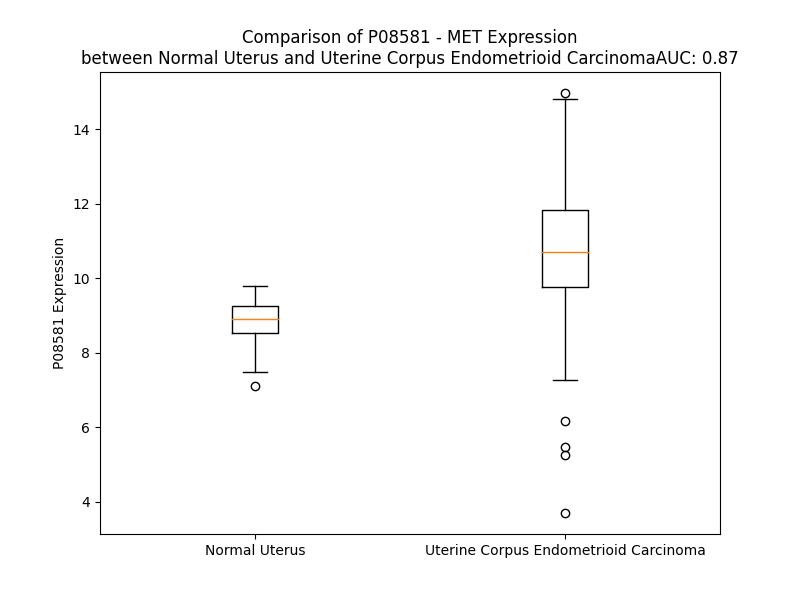

# Detailed Data for P08581

## Introduction to the Detailed Summary

### How to Interpret the Results

- **Summary & Metrics**: This section provides a quick reference to essential protein attributes, including expression changes, family classification, and biomarker applications. Regulation status (upregulated/downregulated) indicates the protein's behavior in a disease context. Some information comes from the original excel file with the proteins selected from literature, while others are derived from the analyses.
- **Expression Comparison**: A visual representation comparing protein expression between normal and disease states. It highlights significant changes in expression levels that might indicate diagnostic or therapeutic relevance. This is data coming from transcriptomics experiments and could not translate similarly to protein levels.
- **Isoform Alignment**: An interactive view of isoform alignments, revealing structural and functional differences between variants of the protein.
- **Interactors & Homologs**: Tables listing known interaction partners and homologous proteins, the more interactors and homologs, the more complex the protein is to design an antibody for.
- **Biological Assemblies**: Information about the structural arrangement of the protein in different assemblies, providing insights into its functional state but also the complexity of the protein to develop antibodies.
- **Combined Per-Residue Information**: A detailed table summarizing residue-level data. This includes predictions for epitope regions, aggregation tendencies, and modifications that might impact the protein's function. Each row corresponds to a residue in the protein, providing insights into specific sites that may be important for research or drug development.
## Summary & Metrics

- **UniProt Accession**: P08581
- **Gene Name**: MET
- **Protein Name**: Hepatocyte growth factor receptor
- **Swiss Prot**: MET_HUMAN
- **Family**: nan
- **Biomarker Application**: nan
- **Number of Isoforms**: 3
- **Regulation**: 1
- **(transcriptomics) AUC**: 0.9
- **(transcriptomics) Fold Change**: 1.18
- **(transcriptomics) Regulation**: Upregulated
- **Discotope Epitope Count**: 323
- **Max n_uniprots (Homo)**: 4
- **Max n_uniprots (Hetero)**: 8

## Expression Comparison

## Isoform Alignment

<pre style='font-size:14px; font-family:monospace;'>P08581-1 MKAPAVLAPGILVLLFTLVQRSNGECKEALAKSEMNVNMKYQLPNFTAETPIQNVILHEHHIFLGATNYIYVLNEEDLQKVAEYKTGPVLEHPDCFPCQDCSSKANLSGGVWKDNINMALVVDTYYDDQLISCGSVNRGTCQRHVFPHNHTADIQSEVHCIFSPQIEEPSQCPDCVVSALGAKVLSSVKDRFINFFVGNTINSSYFPDHPLHSISVRRLKETKDGFMFLTDQSYIDVLPEFRDSYPIKYVHAFESNNFIYFLTVQRETLDAQTFHTRIIRFCSINSGLHSYMEMPLECILTEKRKKRSTKKEVFNILQAAYVSKPGAQLARQIGASLNDDILFGVFAQSKPDSAEPMDRSAMCAFPIKYVNDFFNKIVNKNNVRCLQHFYGPNHEHCFNRTLLRNSSGCEARRDEYRTEFTTALQRVDLFMGQFSEVLLTSISTFIKGDLTIANLGTSEGRFMQVVVSRSGPSTPHVNFLLDSHPVSPEVIVEHTLNQNGYTLVITGKKITKIPLNGLGCRHFQSCSQCLSAPPFVQCGWCHDKCVRSEECLSGTWTQQICLPAIYKVFPNSAPLEGGTRLTICGWDFGFRRNNKFDLKKTRVLLGNESCTLTLSESTMNTLKCTVGPAMNKHFNMSIIISNGHGTTQYSTFSYVDPVITSISPKYGPMAGGTLLTLTGNYLNSGNSRHISIGGKTCTLKSVSNSILECYTPAQTISTEFAVKLKIDLANRETSIFSYREDPIVYEIHPTKSFI------------------SGGSTITGVGKNLNSVSVPRMVINVHEAGRNFTVACQHRSNSEIICCTTPSLQQLNLQLPLKTKAFFMLDGILSKYFDLIYVHNPVFKPFEKPVMISMGNENVLEIKGNDIDPEAVKGEVLKVGNKSCENIHLHSEAVLCTVPNDLLKLNSELNIEWKQAISSTVLGKVIVQPDQNFTGLIAGVVSISTALLLLLGFFLWLKKRKQIKDLGSELVRYDARVHTPHLDRLVSARSVSPTTEMVSNESVDYRATFPEDQFPNSSQNGSCRQVQYPLTDMSPILTSGDSDISSPLLQNTVHIDLSALNPELVQAVQHVVIGPSSLIVHFNEVIGRGHFGCVYHGTLLDNDGKKIHCAVKSLNRITDIGEVSQFLTEGIIMKDFSHPNVLSLLGICLRSEGSPLVVLPYMKHGDLRNFIRNETHNPTVKDLIGFGLQVAKGMKYLASKKFVHRDLAARNCMLDEKFTVKVADFGLARDMYDKEYYSVHNKTGAKLPVKWMALESLQTQKFTTKSDVWSFGVLLWELMTRGAPPYPDVNTFDITVYLLQGRRLLQPEYCPDPLYEVMLKCWHPKAEMRPSFSELVSRISAIFSTFIGEHYVHVNATYVNVKCVAPYPSLLSSEDNADDEVDTRPASFWETS
P08581-2 MKAPAVLAPGILVLLFTLVQRSNGECKEALAKSEMNVNMKYQLPNFTAETPIQNVILHEHHIFLGATNYIYVLNEEDLQKVAEYKTGPVLEHPDCFPCQDCSSKANLSGGVWKDNINMALVVDTYYDDQLISCGSVNRGTCQRHVFPHNHTADIQSEVHCIFSPQIEEPSQCPDCVVSALGAKVLSSVKDRFINFFVGNTINSSYFPDHPLHSISVRRLKETKDGFMFLTDQSYIDVLPEFRDSYPIKYVHAFESNNFIYFLTVQRETLDAQTFHTRIIRFCSINSGLHSYMEMPLECILTEKRKKRSTKKEVFNILQAAYVSKPGAQLARQIGASLNDDILFGVFAQSKPDSAEPMDRSAMCAFPIKYVNDFFNKIVNKNNVRCLQHFYGPNHEHCFNRTLLRNSSGCEARRDEYRTEFTTALQRVDLFMGQFSEVLLTSISTFIKGDLTIANLGTSEGRFMQVVVSRSGPSTPHVNFLLDSHPVSPEVIVEHTLNQNGYTLVITGKKITKIPLNGLGCRHFQSCSQCLSAPPFVQCGWCHDKCVRSEECLSGTWTQQICLPAIYKVFPNSAPLEGGTRLTICGWDFGFRRNNKFDLKKTRVLLGNESCTLTLSESTMNTLKCTVGPAMNKHFNMSIIISNGHGTTQYSTFSYVDPVITSISPKYGPMAGGTLLTLTGNYLNSGNSRHISIGGKTCTLKSVSNSILECYTPAQTISTEFAVKLKIDLANRETSIFSYREDPIVYEIHPTKSFISTWWKEPLNIVSFLFCFASGGSTITGVGKNLNSVSVPRMVINVHEAGRNFTVACQHRSNSEIICCTTPSLQQLNLQLPLKTKAFFMLDGILSKYFDLIYVHNPVFKPFEKPVMISMGNENVLEIKGNDIDPEAVKGEVLKVGNKSCENIHLHSEAVLCTVPNDLLKLNSELNIEWKQAISSTVLGKVIVQPDQNFTGLIAGVVSISTALLLLLGFFLWLKKRKQIKDLGSELVRYDARVHTPHLDRLVSARSVSPTTEMVSNESVDYRATFPEDQFPNSSQNGSCRQVQYPLTDMSPILTSGDSDISSPLLQNTVHIDLSALNPELVQAVQHVVIGPSSLIVHFNEVIGRGHFGCVYHGTLLDNDGKKIHCAVKSLNRITDIGEVSQFLTEGIIMKDFSHPNVLSLLGICLRSEGSPLVVLPYMKHGDLRNFIRNETHNPTVKDLIGFGLQVAKGMKYLASKKFVHRDLAARNCMLDEKFTVKVADFGLARDMYDKEYYSVHNKTGAKLPVKWMALESLQTQKFTTKSDVWSFGVLLWELMTRGAPPYPDVNTFDITVYLLQGRRLLQPEYCPDPLYEVMLKCWHPKAEMRPSFSELVSRISAIFSTFIGEHYVHVNATYVNVKCVAPYPSLLSSEDNADDEVDTRPASFWETS
P08581-3 MKAPAVLAPGILVLLFTLVQRSNGECKEALAKSEMNVNMKYQLPNFTAETPIQNVILHEHHIFLGATNYIYVLNEEDLQKVAEYKTGPVLEHPDCFPCQDCSSKANLSGGVWKDNINMALVVDTYYDDQLISCGSVNRGTCQRHVFPHNHTADIQSEVHCIFSPQIEEPSQCPDCVVSALGAKVLSSVKDRFINFFVGNTINSSYFPDHPLHSISVRRLKETKDGFMFLTDQSYIDVLPEFRDSYPIKYVHAFESNNFIYFLTVQRETLDAQTFHTRIIRFCSINSGLHSYMEMPLECILTEKRKKRSTKKEVFNILQAAYVSKPGAQLARQIGASLNDDILFGVFAQSKPDSAEPMDRSAMCAFPIKYVNDFFNKIVNKNNVRCLQHFYGPNHEHCFNRTLLRNSSGCEARRDEYRTEFTTALQRVDLFMGQFSEVLLTSISTFIKGDLTIANLGTSEGRFMQVVVSRSGPSTPHVNFLLDSHPVSPEVIVEHTLNQNGYTLVITGKKITKIPLNGLGCRHFQSCSQCLSAPPFVQCGWCHDKCVRSEECLSGTWTQQICLPAIYKVFPNSAPLEGGTRLTICGWDFGFRRNNKFDLKKTRVLLGNESCTLTLSESTMNTLKCTVGPAMNKHFNMSIIISNGHGTTQYSTFSYVDPVITSISPKYGPMAGGTLLTLTGNYLNSGNSRHISIGGKTCTLKSVSNSILECYTPAQTISTEFAVKLKIDLANRETSIFSYREDPIVYEIHPTKSFIRHVNIALIQR--------------------------------------------------------------------------------------------------------------------------------------------------------------------------------------------------------------------------------------------------------------------------------------------------------------------------------------------------------------------------------------------------------------------------------------------------------------------------------------------------------------------------------------------------------------------------------------------------------------------------------------------------------------------
</pre>

## Interactors

| preferredName_A   | preferredName_B   |   score |
|:------------------|:------------------|--------:|
| MET               | HGF               |   0.999 |
| MET               | CBL               |   0.999 |
| MET               | GRB2              |   0.999 |
| MET               | PLXNB1            |   0.996 |
| MET               | EGFR              |   0.996 |
| MET               | CD44              |   0.995 |
| MET               | SRC               |   0.993 |
| MET               | SHC1              |   0.992 |
| MET               | GAB1              |   0.99  |
| MET               | ERBB3             |   0.987 |
| MET               | DCN               |   0.986 |
| MET               | CTNNB1            |   0.985 |
| MET               | STAT3             |   0.981 |
| MET               | KRAS              |   0.979 |
| MET               | CTNND1            |   0.977 |
| MET               | LRIG1             |   0.976 |
| MET               | NRAS              |   0.966 |
| MET               | PLCG1             |   0.964 |
| MET               | HRAS              |   0.961 |
| MET               | PIK3CA            |   0.961 |
| MET               | CDH1              |   0.959 |
| MET               | PLXNB2            |   0.957 |
| MET               | PLXNB3            |   0.956 |
| MET               | PTPN1             |   0.954 |
| MET               | EGF               |   0.945 |
| MET               | PTPRJ             |   0.936 |
| MET               | PTK2              |   0.935 |
| MET               | S100A8            |   0.927 |
| MET               | PTPN11            |   0.927 |
| MET               | SHC2              |   0.925 |
| MET               | PIK3CB            |   0.925 |
| MET               | PIK3CD            |   0.922 |
| MET               | SHC3              |   0.922 |
| MET               | IL32              |   0.921 |
| MET               | LOC102723407      |   0.92  |
| MET               | SHC4              |   0.92  |
| MET               | JAK2              |   0.92  |
| MET               | SH3KBP1           |   0.919 |
| MET               | JAK1              |   0.917 |
| MET               | PLCG2             |   0.916 |
| MET               | CRK               |   0.91  |
| MET               | IGF1              |   0.908 |
| MET               | IGKV1-33          |   0.906 |
| MET               | IGKV1D-33         |   0.906 |
| MET               | FGF2              |   0.905 |
| MET               | SEMA4D            |   0.903 |
| MET               | FGF7              |   0.902 |
| MET               | CXCL12            |   0.902 |

## Homologs

| uniprot_id   | gene_id   |
|:-------------|:----------|
| E7EVR7       | FGFR2     |
| P29317       | EPHA2     |
| P09619       | PDGFRB    |
| E7ER61       | FLT3      |
| F8W9L4       | FGFR3     |
| X5D7M5       | NTRK3     |
| P35968       | KDR       |
| Q8IWU2       | LMTK2     |
| L7RSL3       | FLT1      |
| Q04912       | MST1R     |
| J3QLV2       | ERBB2     |
| Q96L35       | EPHB4     |
| J3KQG3       | EPHA10    |
| F8VP57       | EPHA5     |
| Q6NVW1       | EPHB2     |
| C9J5X1       | IGF1R     |
| P21709       | EPHA1     |
| P29376       | LTK       |
| E7EQ23       | DDR1      |
| O15146       | MUSK      |
| A0A6Q8PHG5   | NTRK1     |
| P54764       | EPHA4     |
| B5A954       | TEK       |
| P35590       | TIE1      |
| E9PQ40       | FGFR1     |
| H7C3L9       | MERTK     |
| E9PEK4       | CSF1R     |
| H0YNK6       | TYRO3     |
| P34925       | RYK       |
| B5A927       | FLT4      |
| Q16832       | DDR2      |
| D6RJD4       | FGFR4     |
| Q01973       | ROR1      |
| Q01974       | ROR2      |
| P54762       | EPHB1     |
| Q5VWE5       | NTRK2     |
| P30530       | AXL       |
| A0A7P0T9L5   | EPHA7     |
| P08922       | ROS1      |
| Q504U8       | EGFR      |
| E9PDR1       | ERBB4     |
| A0A087WZL3   | ALK       |
| O75812       | ERBB3     |
| A0A087WTE3   | EPHB6     |
| P54753       | EPHB3     |
| H0Y8K5       | EPHA6     |
| P06213       | INSR      |
| P14616       | INSRR     |
| C9JXA2       | EPHA3     |
| P29322       | EPHA8     |
| P16234       | PDGFRA    |
| A0A8J8Z860   | KIT       |
| A0A087WWB1   | RET       |
| Q15424       | SAFB      |
| Q14151       | SAFB2     |

## Biological Assemblies

|   Unnamed: 0 |   assembly |   n_uniprots | composition   | crystal_id   |
|-------------:|-----------:|-------------:|:--------------|:-------------|
|            0 |          1 |            1 | Homo          | 3bux         |
|            1 |          2 |            1 | Homo          | 3bux         |
|            2 |          3 |            1 | Homo          | 3bux         |
|            3 |          4 |            1 | Homo          | 3bux         |
|            4 |          5 |            2 | Hetero        | 3bux         |
|            5 |          6 |            2 | Hetero        | 3bux         |
|            0 |          1 |            4 | Hetero        | 1fyr         |
|            1 |          2 |            4 | Hetero        | 1fyr         |
|            2 |          3 |            8 | Hetero        | 1fyr         |
|            3 |          4 |            8 | Hetero        | 1fyr         |
|            4 |          5 |            6 | Hetero        | 1fyr         |
|            5 |          6 |            6 | Hetero        | 1fyr         |
|            0 |          1 |            1 | Homo          | 3f66         |
|            1 |          2 |            1 | Homo          | 3f66         |
|            0 |          1 |            1 | Homo          | 3c1x         |
|            0 |          1 |            1 | Homo          | 3cth         |
|            0 |          1 |            4 | Hetero        | 7mo7         |
|            0 |          1 |            1 | Homo          | 4gg7         |
|            0 |          1 |            1 | Homo          | 7b43         |
|            1 |          2 |            1 | Homo          | 7b43         |
|            0 |          1 |            4 | Homo          | 5lsp         |
|            0 |          1 |            1 | Homo          | 7b40         |
|            0 |          1 |            1 | Homo          | 3rhk         |
|            1 |          2 |            1 | Homo          | 3rhk         |
|            0 |          1 |            1 | Homo          | 4mxc         |
|            0 |          1 |            1 | Homo          | 7b41         |
|            0 |          1 |            3 | Hetero        | 7mo9         |
|            0 |          1 |            1 | Homo          | 3dkf         |
|            0 |          1 |            1 | Homo          | 7b3z         |
|            0 |          1 |            1 | Homo          | 3zc5         |
|            0 |          1 |            1 | Homo          | 4r1y         |
|            0 |          1 |            1 | Homo          | 5ho6         |
|            0 |          1 |            1 | Homo          | 8au3         |
|            1 |          2 |            1 | Homo          | 8au3         |
|            0 |          1 |            2 | Hetero        | 2uzx         |
|            1 |          2 |            2 | Hetero        | 2uzx         |
|            0 |          1 |            1 | Homo          | 4aoi         |
|            0 |          1 |            1 | Homo          | 3q6w         |
|            0 |          1 |            1 | Homo          | 5hti         |
|            0 |          1 |            1 | Homo          | 6wvz         |
|            0 |          1 |            1 | Homo          | 7v3r         |
|            0 |          1 |            1 | Homo          | 1r0p         |
|            0 |          1 |            1 | Homo          | 7v3s         |
|            0 |          1 |            1 | Homo          | 8ow3         |
|            0 |          1 |            1 | Homo          | 2rfs         |
|            0 |          1 |            1 | Homo          | 2rfn         |
|            1 |          2 |            1 | Homo          | 2rfn         |
|            0 |          1 |            1 | Homo          | 3zbx         |
|            0 |          1 |            1 | Homo          | 7b42         |
|            0 |          1 |            1 | Homo          | 3q6u         |
|            0 |          1 |            1 | Homo          | 7b3v         |
|            0 |          1 |            1 | Homo          | 2wgj         |
|            0 |          1 |            2 | Hetero        | 1shy         |
|            0 |          1 |            2 | Hetero        | 2uzy         |
|            1 |          2 |            2 | Hetero        | 2uzy         |
|            0 |          1 |            1 | Homo          | 3r7o         |
|            0 |          1 |            2 | Hetero        | 4k3j         |
|            0 |          1 |            1 | Homo          | 7b3t         |
|            0 |          1 |            1 | Homo          | 3vw8         |
|            0 |          1 |            1 | Homo          | 7b44         |
|            0 |          1 |            1 | Homo          | 7y4t         |
|            0 |          1 |            1 | Homo          | 2wkm         |
|            0 |          1 |            1 | Homo          | 3lq8         |
|            0 |          1 |            1 | Homo          | 3u6h         |
|            1 |          2 |            1 | Homo          | 3u6h         |
|            0 |          1 |            1 | Homo          | 4gg5         |
|            0 |          1 |            1 | Homo          | 7y4u         |
|            0 |          1 |            1 | Homo          | 6sdc         |
|            0 |          1 |            1 | Homo          | 8gvj         |
|            0 |          1 |            1 | Homo          | 4deg         |
|            0 |          1 |            2 | Homo          | 3efj         |
|            1 |          2 |            1 | Homo          | 3efj         |
|            2 |          3 |            1 | Homo          | 3efj         |
|            0 |          1 |            2 | Hetero        | 7mo8         |
|            0 |          1 |            1 | Homo          | 8ovz         |
|            1 |          2 |            1 | Homo          | 8ovz         |
|            0 |          1 |            1 | Homo          | 7b3q         |
|            0 |          1 |            1 | Homo          | 6ubw         |
|            0 |          1 |            1 | Homo          | 5uad         |
|            0 |          1 |            1 | Homo          | 8owg         |
|            1 |          2 |            1 | Homo          | 8owg         |
|            2 |          3 |            1 | Homo          | 8owg         |
|            0 |          1 |            0 | Hetero        | 2g15         |
|            0 |          1 |            1 | Homo          | 5eob         |
|            0 |          1 |            1 | Homo          | 8ouu         |
|            1 |          2 |            1 | Homo          | 8ouu         |
|            0 |          1 |            1 | Homo          | 3zcl         |
|            0 |          1 |            2 | Hetero        | 4o3u         |
|            0 |          1 |            1 | Homo          | 5eyc         |
|            0 |          1 |            1 | Homo          | 6sd9         |
|            0 |          1 |            1 | Homo          | 3cd8         |
|            0 |          1 |            1 | Homo          | 3qti         |
|            1 |          2 |            1 | Homo          | 3qti         |
|            0 |          1 |            1 | Homo          | 4knb         |
|            1 |          2 |            1 | Homo          | 4knb         |
|            2 |          3 |            1 | Homo          | 4knb         |
|            3 |          4 |            1 | Homo          | 4knb         |
|            0 |          1 |            1 | Homo          | 4ap7         |
|            0 |          1 |            1 | Homo          | 4iwd         |
|            0 |          1 |            1 | Homo          | 5hni         |
|            1 |          2 |            1 | Homo          | 5hni         |
|            0 |          1 |            1 | Homo          | 3dkg         |
|            0 |          1 |            1 | Homo          | 8ans         |
|            0 |          1 |            1 | Homo          | 8ov7         |
|            0 |          1 |            1 | Homo          | 3zze         |
|            0 |          1 |            1 | Homo          | 8ouv         |
|            1 |          2 |            1 | Homo          | 8ouv         |
|            0 |          1 |            1 | Homo          | 6sde         |
|            0 |          1 |            1 | Homo          | 5ya5         |
|            0 |          1 |            1 | Homo          | 5hlw         |
|            0 |          1 |            1 | Homo          | 3l8v         |
|            0 |          1 |            1 | Homo          | 4deh         |
|            0 |          1 |            1 | Homo          | 5hor         |
|            0 |          1 |            1 | Homo          | 4xmo         |
|            0 |          1 |            2 | Homo          | 3efk         |
|            1 |          2 |            1 | Homo          | 3efk         |
|            2 |          3 |            1 | Homo          | 3efk         |
|            0 |          1 |            1 | Homo          | 4dei         |
|            0 |          1 |            1 | Homo          | 6sdd         |
|            0 |          1 |            1 | Homo          | 8aw1         |
|            1 |          2 |            1 | Homo          | 8aw1         |
|            0 |          1 |            1 | Homo          | 4r1v         |
|            0 |          1 |            1 | Homo          | 1ssl         |
|            0 |          1 |            4 | Hetero        | 7mob         |
|            0 |          1 |            2 | Homo          | 5dg5         |
|            0 |          1 |            1 | Homo          | 3ccn         |
|            0 |          1 |            1 | Homo          | 5uab         |
|            0 |          1 |            1 | Homo          | 7b3w         |
|            0 |          1 |            1 | Homo          | 4xyf         |
|            0 |          1 |            1 | Homo          | 5eyd         |
|            0 |          1 |            1 | Homo          | 8an8         |
|            1 |          2 |            1 | Homo          | 8an8         |
|            0 |          1 |            1 | Homo          | 3zxz         |
|            0 |          1 |            1 | Homo          | 3dkc         |
|            0 |          1 |            2 | Hetero        | 4o3t         |
|            0 |          1 |            1 | Homo          | 1r1w         |
|            0 |          1 |            3 | Hetero        | 7moa         |
|            0 |          1 |            1 | Homo          | 3ctj         |
|            0 |          1 |            2 | Hetero        | 6gcu         |
|            1 |          2 |            2 | Hetero        | 6gcu         |
|            0 |          1 |            1 | Homo          | 3a4p         |
|            0 |          1 |            1 | Homo          | 3i5n         |
|            0 |          1 |            1 | Homo          | 5hoa         |
|            0 |          1 |            1 | Homo          | 3f82         |
|            0 |          1 |            1 | Homo          | 3ce3         |
|            0 |          1 |            1 | Homo          | 2wd1         |
|            0 |          1 |            1 | Homo          | 3u6i         |
|            1 |          2 |            1 | Homo          | 3u6i         |
|            0 |          1 |            1 | Homo          | 5t3q         |
|            0 |          1 |            1 | Homo          | 8au5         |
|            0 |          1 |            1 | Homo          | 4eev         |
|            0 |          1 |            1 | Homo          | 6i04         |
|            1 |          2 |            1 | Homo          | 6i04         |

## Combined Per-Residue Information

|   res | aa   |   epitope_score | epitope   |   relative_surface_accessibility |   modeling_confidence |   Aggregation | modification                      | glycosylation                   |
|------:|:-----|----------------:|:----------|---------------------------------:|----------------------:|--------------:|:----------------------------------|:--------------------------------|
|     1 | M    |         0.1661  | True      |                          1.27491 |                 30.77 |         0     | N/A                               | N/A                             |
|     2 | K    |         0.16678 | True      |                          1.07202 |                 35.07 |         0     | N/A                               | N/A                             |
|     3 | A    |         0.12911 | True      |                          0.85045 |                 31.86 |         0     | N/A                               | N/A                             |
|     4 | P    |         0.16902 | True      |                          0.98474 |                 32.22 |         0     | N/A                               | N/A                             |
|     5 | A    |         0.13142 | True      |                          0.89621 |                 32.69 |         0     | N/A                               | N/A                             |
|     6 | V    |         0.16329 | True      |                          0.91554 |                 32.18 |         0     | N/A                               | N/A                             |
|     7 | L    |         0.13477 | True      |                          0.94419 |                 28.11 |         0     | N/A                               | N/A                             |
|     8 | A    |         0.10236 | True      |                          0.95318 |                 29.52 |         0     | N/A                               | N/A                             |
|     9 | P    |         0.13169 | True      |                          0.8772  |                 28.16 |         0.092 | N/A                               | N/A                             |
|    10 | G    |         0.1161  | True      |                          0.53203 |                 32.6  |         7.597 | N/A                               | N/A                             |
|    11 | I    |         0.06691 | False     |                          0.54187 |                 36.52 |        90.933 | N/A                               | N/A                             |
|    12 | L    |         0.15859 | True      |                          0.8339  |                 34.05 |        98.528 | N/A                               | N/A                             |
|    13 | V    |         0.10066 | True      |                          0.73616 |                 36.4  |        99.847 | N/A                               | N/A                             |
|    14 | L    |         0.14369 | True      |                          0.77903 |                 35.81 |        99.956 | N/A                               | N/A                             |
|    15 | L    |         0.08663 | False     |                          0.59778 |                 34.44 |        99.966 | N/A                               | N/A                             |
|    16 | F    |         0.1037  | True      |                          0.77535 |                 32.76 |        99.585 | N/A                               | N/A                             |
|    17 | T    |         0.10682 | True      |                          0.59031 |                 32.06 |        94.513 | N/A                               | N/A                             |
|    18 | L    |         0.13964 | True      |                          0.97501 |                 31.15 |        91.454 | N/A                               | N/A                             |
|    19 | V    |         0.11922 | True      |                          0.75495 |                 29.72 |        74.729 | N/A                               | N/A                             |
|    20 | Q    |         0.13292 | True      |                          0.68433 |                 27.5  |         2.816 | N/A                               | N/A                             |
|    21 | R    |         0.14721 | True      |                          0.69622 |                 31.45 |         0     | N/A                               | N/A                             |
|    22 | S    |         0.11837 | True      |                          0.78002 |                 30.28 |         0     | N/A                               | N/A                             |
|    23 | N    |         0.08401 | False     |                          0.7217  |                 34.93 |         0     | N/A                               | N/A                             |
|    24 | G    |         0.07255 | False     |                          0.37754 |                 43.53 |         0     | N/A                               | N/A                             |
|    25 | E    |         0.04231 | False     |                          0.41444 |                 58.06 |         0     | N/A                               | N/A                             |
|    26 | C    |         0.04499 | False     |                          0.03071 |                 69.97 |         0     | N/A                               | N/A                             |
|    27 | K    |         0.15002 | True      |                          0.67824 |                 69.56 |         0     | N/A                               | N/A                             |
|    28 | E    |         0.1821  | True      |                          0.5134  |                 68.75 |         0     | N/A                               | N/A                             |
|    29 | A    |         0.0216  | False     |                          0.01572 |                 63.78 |         0     | N/A                               | N/A                             |
|    30 | L    |         0.12119 | True      |                          0.73508 |                 60.27 |         0     | N/A                               | N/A                             |
|    31 | A    |         0.1261  | True      |                          0.59411 |                 59.28 |         0     | N/A                               | N/A                             |
|    32 | K    |         0.12564 | True      |                          0.42776 |                 64.04 |         0     | N/A                               | N/A                             |
|    33 | S    |         0.0714  | False     |                          0.45555 |                 57.94 |         0     | N/A                               | N/A                             |
|    34 | E    |         0.10355 | True      |                          0.54883 |                 63.86 |         0     | N/A                               | N/A                             |
|    35 | M    |         0.04245 | False     |                          0.18481 |                 71.82 |         0     | N/A                               | N/A                             |
|    36 | N    |         0.09711 | False     |                          0.30505 |                 76.65 |         0     | N/A                               | N/A                             |
|    37 | V    |         0.11841 | True      |                          0.39938 |                 72.64 |         0     | N/A                               | N/A                             |
|    38 | N    |         0.11499 | True      |                          0.77844 |                 74.81 |         0     | N/A                               | N/A                             |
|    39 | M    |         0.07357 | False     |                          0.28759 |                 74.9  |         0     | N/A                               | N/A                             |
|    40 | K    |         0.18483 | True      |                          0.95797 |                 75.63 |         0     | N/A                               | N/A                             |
|    41 | Y    |         0.08002 | False     |                          0.21132 |                 78.89 |         0     | N/A                               | N/A                             |
|    42 | Q    |         0.13923 | True      |                          0.86409 |                 83.95 |         0     | N/A                               | N/A                             |
|    43 | L    |         0.01919 | False     |                          0.13253 |                 89.5  |         0     | N/A                               | N/A                             |
|    44 | P    |         0.05988 | False     |                          0.4242  |                 93.64 |         0     | N/A                               | N/A                             |
|    45 | N    |         0.04726 | False     |                          0.40448 |                 94.05 |         0     | N/A                               | N-linked (GlcNAc...) asparagine |
|    46 | F    |         0.0925  | False     |                          0.13813 |                 96.72 |         0     | N/A                               | N/A                             |
|    47 | T    |         0.09688 | False     |                          0.49086 |                 96.64 |         0     | N/A                               | N/A                             |
|    48 | A    |         0.02542 | False     |                          0.02488 |                 95.61 |         0     | N/A                               | N/A                             |
|    49 | E    |         0.1436  | True      |                          0.71974 |                 94.76 |         0     | N/A                               | N/A                             |
|    50 | T    |         0.05058 | False     |                          0.18375 |                 96.2  |         0     | N/A                               | N/A                             |
|    51 | P    |         0.08943 | False     |                          0.54276 |                 96.49 |         0     | N/A                               | N/A                             |
|    52 | I    |         0.03483 | False     |                          0.06091 |                 97.61 |         0.403 | N/A                               | N/A                             |
|    53 | Q    |         0.05571 | False     |                          0.21794 |                 95.79 |         0.403 | N/A                               | N/A                             |
|    54 | N    |         0.02733 | False     |                          0.11843 |                 96.2  |         0.403 | N/A                               | N/A                             |
|    55 | V    |         0.02026 | False     |                          0.14027 |                 96.72 |         0.403 | N/A                               | N/A                             |
|    56 | I    |         0.02563 | False     |                          0.24159 |                 95.08 |         0.403 | N/A                               | N/A                             |
|    57 | L    |         0.01696 | False     |                          0.2394  |                 94.23 |         0.269 | N/A                               | N/A                             |
|    58 | H    |         0.04531 | False     |                          0.16775 |                 92.26 |         0     | N/A                               | N/A                             |
|    59 | E    |         0.06381 | False     |                          0.5842  |                 87.56 |         0     | N/A                               | N/A                             |
|    60 | H    |         0.09086 | False     |                          0.71502 |                 90.52 |         0     | N/A                               | N/A                             |
|    61 | H    |         0.08    | False     |                          0.20961 |                 94.35 |         1.045 | N/A                               | N/A                             |
|    62 | I    |         0.00184 | False     |                          0       |                 96.43 |        57.191 | N/A                               | N/A                             |
|    63 | F    |         0.00286 | False     |                          0       |                 97.07 |        61.625 | N/A                               | N/A                             |
|    64 | L    |         0.00149 | False     |                          0       |                 97.54 |        61.93  | N/A                               | N/A                             |
|    65 | G    |         0.00183 | False     |                          0       |                 96.96 |        61.986 | N/A                               | N/A                             |
|    66 | A    |         0.00223 | False     |                          0.00094 |                 97.44 |        62.627 | N/A                               | N/A                             |
|    67 | T    |         0.0579  | False     |                          0.10493 |                 97.12 |        62.969 | N/A                               | N/A                             |
|    68 | N    |         0.04814 | False     |                          0.08382 |                 96.86 |        63.99  | N/A                               | N/A                             |
|    69 | Y    |         0.0727  | False     |                          0.23078 |                 97.39 |        85.512 | N/A                               | N/A                             |
|    70 | I    |         0.00505 | False     |                          0.0008  |                 97.36 |        85.574 | N/A                               | N/A                             |
|    71 | Y    |         0.03372 | False     |                          0.01974 |                 97.35 |        85.26  | N/A                               | N/A                             |
|    72 | V    |         0.00326 | False     |                          0       |                 96.88 |        84.141 | N/A                               | N/A                             |
|    73 | L    |         0.0036  | False     |                          0       |                 96.88 |        70.792 | N/A                               | N/A                             |
|    74 | N    |         0.04348 | False     |                          0.34533 |                 94.58 |         1.042 | N/A                               | N/A                             |
|    75 | E    |         0.05426 | False     |                          0.14522 |                 93.59 |         0     | N/A                               | N/A                             |
|    76 | E    |         0.09822 | True      |                          0.70229 |                 91.04 |         0     | N/A                               | N/A                             |
|    77 | D    |         0.0984  | True      |                          0.42489 |                 92.27 |         0     | N/A                               | N/A                             |
|    78 | L    |         0.01693 | False     |                          0.01627 |                 95.4  |         0     | N/A                               | N/A                             |
|    79 | Q    |         0.09827 | True      |                          0.6272  |                 95.51 |         0     | N/A                               | N/A                             |
|    80 | K    |         0.13721 | True      |                          0.43634 |                 96.1  |         0     | N/A                               | N/A                             |
|    81 | V    |         0.09199 | False     |                          0.54853 |                 94.61 |         0     | N/A                               | N/A                             |
|    82 | A    |         0.04444 | False     |                          0.24871 |                 94.94 |         0     | N/A                               | N/A                             |
|    83 | E    |         0.08488 | False     |                          0.3908  |                 95.04 |         0     | N/A                               | N/A                             |
|    84 | Y    |         0.07133 | False     |                          0.19178 |                 95.99 |         0     | N/A                               | N/A                             |
|    85 | K    |         0.1339  | True      |                          0.64188 |                 95.1  |         0     | N/A                               | N/A                             |
|    86 | T    |         0.04048 | False     |                          0.1415  |                 93.73 |         0     | N/A                               | N/A                             |
|    87 | G    |         0.04474 | False     |                          0.05769 |                 89.28 |         0     | N/A                               | N/A                             |
|    88 | P    |         0.22154 | True      |                          0.43744 |                 91.38 |         0     | N/A                               | N/A                             |
|    89 | V    |         0.04155 | False     |                          0.22945 |                 89.94 |         0     | N/A                               | N/A                             |
|    90 | L    |         0.09379 | False     |                          0.04824 |                 88.22 |         0     | N/A                               | N/A                             |
|    91 | E    |         0.05994 | False     |                          0.11074 |                 83.23 |         0     | N/A                               | N/A                             |
|    92 | H    |         0.13549 | True      |                          0.07694 |                 82.72 |         0     | N/A                               | N/A                             |
|    93 | P    |         0.13864 | True      |                          0.76084 |                 78.48 |         0     | N/A                               | N/A                             |
|    94 | D    |         0.35584 | True      |                          0.53154 |                 78.8  |         0     | N/A                               | N/A                             |
|    95 | C    |         0.05777 | False     |                          0.16046 |                 80.8  |         0     | N/A                               | N/A                             |
|    96 | F    |         0.17052 | True      |                          0.69267 |                 78.57 |         0     | N/A                               | N/A                             |
|    97 | P    |         0.01653 | False     |                          0.05788 |                 78.17 |         0     | N/A                               | N/A                             |
|    98 | C    |         0.08864 | False     |                          0.3439  |                 83.65 |         0     | N/A                               | N/A                             |
|    99 | Q    |         0.16792 | True      |                          0.46331 |                 82.61 |         0     | N/A                               | N/A                             |
|   100 | D    |         0.12967 | True      |                          0.65557 |                 78.89 |         0     | N/A                               | N/A                             |
|   101 | C    |         0.06193 | False     |                          0.07565 |                 80.85 |         0     | N/A                               | N/A                             |
|   102 | S    |         0.24193 | True      |                          0.5429  |                 77.27 |         0     | N/A                               | N/A                             |
|   103 | S    |         0.27499 | True      |                          0.7836  |                 79.85 |         0     | N/A                               | N/A                             |
|   104 | K    |         0.24221 | True      |                          0.22508 |                 80.08 |         0     | N/A                               | N/A                             |
|   105 | A    |         0.2987  | True      |                          0.45998 |                 76.72 |         0     | N/A                               | N/A                             |
|   106 | N    |         0.17467 | True      |                          0.96504 |                 77.17 |         0     | N/A                               | N-linked (GlcNAc...) asparagine |
|   107 | L    |         0.28684 | True      |                          0.59068 |                 75.97 |         0     | N/A                               | N/A                             |
|   108 | S    |         0.21842 | True      |                          0.91776 |                 76.77 |         0     | N/A                               | N/A                             |
|   109 | G    |         0.21989 | True      |                          0.58057 |                 75.5  |         0     | N/A                               | N/A                             |
|   110 | G    |         0.17195 | True      |                          0.3147  |                 77.71 |         0     | N/A                               | N/A                             |
|   111 | V    |         0.18059 | True      |                          0.60647 |                 86.06 |         0     | N/A                               | N/A                             |
|   112 | W    |         0.25452 | True      |                          0.66273 |                 88.54 |         0     | N/A                               | N/A                             |
|   113 | K    |         0.14336 | True      |                          0.4728  |                 90.61 |         0     | N/A                               | N/A                             |
|   114 | D    |         0.08904 | False     |                          0.48643 |                 94.3  |         0     | N/A                               | N/A                             |
|   115 | N    |         0.03794 | False     |                          0.06653 |                 94.67 |         0.625 | N/A                               | N/A                             |
|   116 | I    |         0.05733 | False     |                          0.37038 |                 96.58 |         2.957 | N/A                               | N/A                             |
|   117 | N    |         0.02072 | False     |                          0.05202 |                 96.74 |         3.495 | N/A                               | N/A                             |
|   118 | M    |         0.02056 | False     |                          0.15714 |                 95.7  |        17.346 | N/A                               | N/A                             |
|   119 | A    |         0.00708 | False     |                          0.05867 |                 95.76 |        17.346 | N/A                               | N/A                             |
|   120 | L    |         0.01414 | False     |                          0.11067 |                 96.12 |        17.346 | N/A                               | N/A                             |
|   121 | V    |         0.01564 | False     |                          0.09521 |                 95.02 |        17.346 | N/A                               | N/A                             |
|   122 | V    |         0.036   | False     |                          0.21268 |                 93.4  |        17.164 | N/A                               | N/A                             |
|   123 | D    |         0.01362 | False     |                          0.0445  |                 90.49 |         0     | N/A                               | N/A                             |
|   124 | T    |         0.06406 | False     |                          0.58547 |                 90.06 |         0     | N/A                               | N/A                             |
|   125 | Y    |         0.11713 | True      |                          0.41308 |                 90.88 |         0     | N/A                               | N/A                             |
|   126 | Y    |         0.05883 | False     |                          0.22791 |                 86.51 |         0     | N/A                               | N/A                             |
|   127 | D    |         0.03241 | False     |                          0.29553 |                 84.35 |         0     | N/A                               | N/A                             |
|   128 | D    |         0.05308 | False     |                          0.45692 |                 89.88 |         0     | N/A                               | N/A                             |
|   129 | Q    |         0.00414 | False     |                          0       |                 92.37 |         0     | N/A                               | N/A                             |
|   130 | L    |         0.00163 | False     |                          0       |                 95.03 |         0     | N/A                               | N/A                             |
|   131 | I    |         0.00215 | False     |                          0       |                 95.75 |         0     | N/A                               | N/A                             |
|   132 | S    |         0.01212 | False     |                          0.04826 |                 96.37 |         0     | N/A                               | N/A                             |
|   133 | C    |         0.00177 | False     |                          0.00169 |                 96.38 |         0     | N/A                               | N/A                             |
|   134 | G    |         0.02615 | False     |                          0.13301 |                 93.92 |         0     | N/A                               | N/A                             |
|   135 | S    |         0.03012 | False     |                          0.12467 |                 92.78 |         0     | N/A                               | N/A                             |
|   136 | V    |         0.02974 | False     |                          0.04226 |                 89.81 |         0     | N/A                               | N/A                             |
|   137 | N    |         0.04761 | False     |                          0.23109 |                 86.59 |         0     | N/A                               | N/A                             |
|   138 | R    |         0.12727 | True      |                          0.21782 |                 85.4  |         0     | N/A                               | N/A                             |
|   139 | G    |         0.00746 | False     |                          0.01543 |                 90.28 |         0     | N/A                               | N/A                             |
|   140 | T    |         0.03093 | False     |                          0.06652 |                 92.55 |         0     | N/A                               | N/A                             |
|   141 | C    |         0.00225 | False     |                          0.00086 |                 95.59 |         0     | N/A                               | N/A                             |
|   142 | Q    |         0.03251 | False     |                          0.21382 |                 94.77 |         0     | N/A                               | N/A                             |
|   143 | R    |         0.04355 | False     |                          0.08897 |                 94.33 |         0     | N/A                               | N/A                             |
|   144 | H    |         0.00599 | False     |                          0.00073 |                 95    |         0     | N/A                               | N/A                             |
|   145 | V    |         0.02045 | False     |                          0.11508 |                 93.87 |         0     | N/A                               | N/A                             |
|   146 | F    |         0.03072 | False     |                          0.06063 |                 92.21 |         0     | N/A                               | N/A                             |
|   147 | P    |         0.05603 | False     |                          0.34027 |                 87.89 |         0     | N/A                               | N/A                             |
|   148 | H    |         0.18064 | True      |                          0.9807  |                 80.11 |         0     | N/A                               | N/A                             |
|   149 | N    |         0.16012 | True      |                          0.97349 |                 79.27 |         0     | N/A                               | N-linked (GlcNAc...) asparagine |
|   150 | H    |         0.13447 | True      |                          0.67304 |                 85.48 |         0     | N/A                               | N/A                             |
|   151 | T    |         0.03864 | False     |                          0.20114 |                 83.98 |         0     | N/A                               | N/A                             |
|   152 | A    |         0.03397 | False     |                          0.16055 |                 87.12 |         0     | N/A                               | N/A                             |
|   153 | D    |         0.08254 | False     |                          0.29946 |                 89.56 |         0     | N/A                               | N/A                             |
|   154 | I    |         0.02202 | False     |                          0.01117 |                 92.28 |         0     | N/A                               | N/A                             |
|   155 | Q    |         0.08775 | False     |                          0.62805 |                 90.7  |         0     | N/A                               | N/A                             |
|   156 | S    |         0.18944 | True      |                          0.56026 |                 89.59 |         0     | N/A                               | N/A                             |
|   157 | E    |         0.07775 | False     |                          0.3916  |                 92.72 |         0     | N/A                               | N/A                             |
|   158 | V    |         0.06897 | False     |                          0.31606 |                 93.25 |         1.562 | N/A                               | N/A                             |
|   159 | H    |         0.06186 | False     |                          0.42063 |                 93.79 |         1.562 | N/A                               | N/A                             |
|   160 | C    |         0.04005 | False     |                          0.34734 |                 93.22 |         1.562 | N/A                               | N/A                             |
|   161 | I    |         0.00297 | False     |                          0.00358 |                 93.73 |         1.562 | N/A                               | N/A                             |
|   162 | F    |         0.09894 | True      |                          0.23269 |                 91.78 |         1.562 | N/A                               | N/A                             |
|   163 | S    |         0.04308 | False     |                          0.11659 |                 89.95 |         0     | N/A                               | N/A                             |
|   164 | P    |         0.13827 | True      |                          0.72771 |                 83.35 |         0     | N/A                               | N/A                             |
|   165 | Q    |         0.08374 | False     |                          0.33144 |                 81.17 |         0     | N/A                               | N/A                             |
|   166 | I    |         0.26079 | True      |                          0.9043  |                 76.9  |         0     | N/A                               | N/A                             |
|   167 | E    |         0.29849 | True      |                          0.84404 |                 79.8  |         0     | N/A                               | N/A                             |
|   168 | E    |         0.21348 | True      |                          0.49017 |                 81.73 |         0     | N/A                               | N/A                             |
|   169 | P    |         0.23691 | True      |                          0.67591 |                 79.37 |         0     | N/A                               | N/A                             |
|   170 | S    |         0.17573 | True      |                          0.53636 |                 81.57 |         0     | N/A                               | N/A                             |
|   171 | Q    |         0.1033  | True      |                          0.18025 |                 85.7  |         0     | N/A                               | N/A                             |
|   172 | C    |         0.02424 | False     |                          0.03193 |                 90.2  |         0     | N/A                               | N/A                             |
|   173 | P    |         0.01592 | False     |                          0.05766 |                 92.86 |         0     | N/A                               | N/A                             |
|   174 | D    |         0.0258  | False     |                          0.01951 |                 93.83 |         0     | N/A                               | N/A                             |
|   175 | C    |         0.00871 | False     |                          0.00544 |                 92.22 |         0.733 | N/A                               | N/A                             |
|   176 | V    |         0.00138 | False     |                          0.00095 |                 94.79 |         4.21  | N/A                               | N/A                             |
|   177 | V    |         0.00917 | False     |                          0.00704 |                 94.84 |         4.21  | N/A                               | N/A                             |
|   178 | S    |         0.02398 | False     |                          0.02214 |                 93.2  |         4.21  | N/A                               | N/A                             |
|   179 | A    |         0.08424 | False     |                          0.59129 |                 91.17 |         4.21  | N/A                               | N/A                             |
|   180 | L    |         0.0832  | False     |                          0.6089  |                 90.61 |         4.21  | N/A                               | N/A                             |
|   181 | G    |         0.03571 | False     |                          0.26878 |                 92.08 |         2.327 | N/A                               | N/A                             |
|   182 | A    |         0.01053 | False     |                          0.08587 |                 95.24 |         1.062 | N/A                               | N/A                             |
|   183 | K    |         0.02555 | False     |                          0.21372 |                 96    |         0     | N/A                               | N/A                             |
|   184 | V    |         0.00994 | False     |                          0.18398 |                 96.18 |         0.71  | N/A                               | N/A                             |
|   185 | L    |         0.02364 | False     |                          0.21351 |                 94.63 |         0.71  | N/A                               | N/A                             |
|   186 | S    |         0.01808 | False     |                          0.24641 |                 93.32 |         0.71  | N/A                               | N/A                             |
|   187 | S    |         0.02075 | False     |                          0.12365 |                 91.08 |         0.71  | N/A                               | N/A                             |
|   188 | V    |         0.05408 | False     |                          0.48083 |                 90.08 |         0.71  | N/A                               | N/A                             |
|   189 | K    |         0.06207 | False     |                          0.21395 |                 84.34 |         0     | N/A                               | N/A                             |
|   190 | D    |         0.11725 | True      |                          0.60943 |                 83.01 |         0     | N/A                               | N/A                             |
|   191 | R    |         0.14583 | True      |                          0.79604 |                 87.45 |         0     | N/A                               | N/A                             |
|   192 | F    |         0.03439 | False     |                          0.29301 |                 88.92 |        93.799 | N/A                               | N/A                             |
|   193 | I    |         0.00115 | False     |                          0.0024  |                 91.85 |        94.745 | N/A                               | N/A                             |
|   194 | N    |         0.01445 | False     |                          0.08473 |                 92.6  |        94.764 | N/A                               | N/A                             |
|   195 | F    |         0.00111 | False     |                          0       |                 94.55 |        94.919 | N/A                               | N/A                             |
|   196 | F    |         0.00263 | False     |                          0.00637 |                 95.05 |        94.929 | N/A                               | N/A                             |
|   197 | V    |         0.00185 | False     |                          0       |                 96.22 |        88.31  | N/A                               | N/A                             |
|   198 | G    |         0.00241 | False     |                          0       |                 96.52 |         9.576 | N/A                               | N/A                             |
|   199 | N    |         0.00638 | False     |                          0.00329 |                 96.11 |         2.471 | N/A                               | N/A                             |
|   200 | T    |         0.03727 | False     |                          0.12328 |                 94.33 |         2.179 | N/A                               | N/A                             |
|   201 | I    |         0.03688 | False     |                          0.09935 |                 91.04 |         2.006 | N/A                               | N/A                             |
|   202 | N    |         0.17627 | True      |                          0.35124 |                 88.07 |         0.078 | N/A                               | N-linked (GlcNAc...) asparagine |
|   203 | S    |         0.25161 | True      |                          0.466   |                 81.13 |         0.008 | N/A                               | N/A                             |
|   204 | S    |         0.20164 | True      |                          0.58692 |                 73.33 |         0     | N/A                               | N/A                             |
|   205 | Y    |         0.30201 | True      |                          0.60881 |                 57.39 |         0     | N/A                               | N/A                             |
|   206 | F    |         0.20269 | True      |                          0.50632 |                 66.48 |         0     | N/A                               | N/A                             |
|   207 | P    |         0.22874 | True      |                          0.59762 |                 59.86 |         0     | N/A                               | N/A                             |
|   208 | D    |         0.21642 | True      |                          0.54222 |                 67.19 |         0     | N/A                               | N/A                             |
|   209 | H    |         0.16204 | True      |                          0.25096 |                 77.07 |         0     | N/A                               | N/A                             |
|   210 | P    |         0.07136 | False     |                          0.21494 |                 85.15 |         0     | N/A                               | N/A                             |
|   211 | L    |         0.04881 | False     |                          0.3043  |                 90.04 |         0     | N/A                               | N/A                             |
|   212 | H    |         0.06775 | False     |                          0.03599 |                 92.67 |         0     | N/A                               | N/A                             |
|   213 | S    |         0.01175 | False     |                          0.026   |                 93.82 |         0     | N/A                               | N/A                             |
|   214 | I    |         0.00804 | False     |                          0.0088  |                 94.83 |         0     | N/A                               | N/A                             |
|   215 | S    |         0.00209 | False     |                          0       |                 94.66 |         0     | N/A                               | N/A                             |
|   216 | V    |         0.01686 | False     |                          0.03047 |                 94    |         0     | N/A                               | N/A                             |
|   217 | R    |         0.01    | False     |                          0.0014  |                 92.53 |         0     | N/A                               | N/A                             |
|   218 | R    |         0.08826 | False     |                          0.15545 |                 92.47 |         0     | N/A                               | N/A                             |
|   219 | L    |         0.00243 | False     |                          0       |                 93.17 |         0     | N/A                               | N/A                             |
|   220 | K    |         0.08044 | False     |                          0.20174 |                 92.08 |         0     | N/A                               | N/A                             |
|   221 | E    |         0.11287 | True      |                          0.65338 |                 90.03 |         0     | N/A                               | N/A                             |
|   222 | T    |         0.09368 | False     |                          0.74676 |                 91.35 |         0     | N/A                               | N/A                             |
|   223 | K    |         0.04703 | False     |                          0.22127 |                 91.76 |         0     | N/A                               | N/A                             |
|   224 | D    |         0.06926 | False     |                          0.37789 |                 91.1  |         0     | N/A                               | N/A                             |
|   225 | G    |         0.00406 | False     |                          0       |                 92.96 |         7.342 | N/A                               | N/A                             |
|   226 | F    |         0.00431 | False     |                          0.00939 |                 93.92 |        11.426 | N/A                               | N/A                             |
|   227 | M    |         0.23226 | True      |                          0.41607 |                 92.44 |        11.426 | N/A                               | N/A                             |
|   228 | F    |         0.06543 | False     |                          0.15422 |                 91.94 |        11.426 | N/A                               | N/A                             |
|   229 | L    |         0.111   | True      |                          0.3605  |                 87.67 |        11.426 | N/A                               | N/A                             |
|   230 | T    |         0.16917 | True      |                          0.4013  |                 88.07 |         6.823 | N/A                               | N/A                             |
|   231 | D    |         0.26253 | True      |                          0.66447 |                 85.46 |         0     | N/A                               | N/A                             |
|   232 | Q    |         0.06637 | False     |                          0.24997 |                 87.35 |         0     | N/A                               | N/A                             |
|   233 | S    |         0.00492 | False     |                          0       |                 91.08 |         0     | N/A                               | N/A                             |
|   234 | Y    |         0.07679 | False     |                          0.20299 |                 92.38 |         0     | N/A                               | N/A                             |
|   235 | I    |         0.03925 | False     |                          0.02539 |                 92.52 |         0     | N/A                               | N/A                             |
|   236 | D    |         0.07107 | False     |                          0.17336 |                 92.06 |         0     | N/A                               | N/A                             |
|   237 | V    |         0.02531 | False     |                          0.02043 |                 92.34 |         0     | N/A                               | N/A                             |
|   238 | L    |         0.17651 | True      |                          0.29677 |                 91.01 |         0     | N/A                               | N/A                             |
|   239 | P    |         0.24444 | True      |                          0.68358 |                 88.69 |         0     | N/A                               | N/A                             |
|   240 | E    |         0.30089 | True      |                          0.63073 |                 88.36 |         0     | N/A                               | N/A                             |
|   241 | F    |         0.14356 | True      |                          0.17262 |                 90.17 |         0     | N/A                               | N/A                             |
|   242 | R    |         0.13065 | True      |                          0.17427 |                 88.1  |         0     | N/A                               | N/A                             |
|   243 | D    |         0.3606  | True      |                          0.57522 |                 87.83 |         0     | N/A                               | N/A                             |
|   244 | S    |         0.13914 | True      |                          0.34695 |                 89.04 |         0     | N/A                               | N/A                             |
|   245 | Y    |         0.04073 | False     |                          0.01911 |                 89.63 |         0     | N/A                               | N/A                             |
|   246 | P    |         0.04711 | False     |                          0.34555 |                 89.83 |         0     | N/A                               | N/A                             |
|   247 | I    |         0.03696 | False     |                          0.03328 |                 94.93 |         0.009 | N/A                               | N/A                             |
|   248 | K    |         0.04923 | False     |                          0.62966 |                 95.44 |         0.009 | N/A                               | N/A                             |
|   249 | Y    |         0.02368 | False     |                          0.05533 |                 96.99 |         1.312 | N/A                               | N/A                             |
|   250 | V    |         0.02379 | False     |                          0.12775 |                 96.13 |         1.312 | N/A                               | N/A                             |
|   251 | H    |         0.02668 | False     |                          0.24054 |                 96.84 |         1.312 | N/A                               | N/A                             |
|   252 | A    |         0.02173 | False     |                          0.1473  |                 96.98 |         1.312 | N/A                               | N/A                             |
|   253 | F    |         0.03585 | False     |                          0.07269 |                 96.16 |         1.312 | N/A                               | N/A                             |
|   254 | E    |         0.0196  | False     |                          0.31174 |                 94.67 |         0.009 | N/A                               | N/A                             |
|   255 | S    |         0.02962 | False     |                          0.07384 |                 93.19 |         0.075 | N/A                               | N/A                             |
|   256 | N    |         0.0794  | False     |                          0.64417 |                 85.39 |         0.625 | N/A                               | N/A                             |
|   257 | N    |         0.12621 | True      |                          0.52533 |                 87.62 |         4.206 | N/A                               | N/A                             |
|   258 | F    |         0.03225 | False     |                          0.14395 |                 92    |        92.827 | N/A                               | N/A                             |
|   259 | I    |         0.00187 | False     |                          0       |                 94.71 |        98.58  | N/A                               | N/A                             |
|   260 | Y    |         0.00206 | False     |                          0       |                 97.17 |        99.027 | N/A                               | N/A                             |
|   261 | F    |         0.00156 | False     |                          0       |                 98.04 |        99.056 | N/A                               | N/A                             |
|   262 | L    |         0.00174 | False     |                          0.00165 |                 98.12 |        98.925 | N/A                               | N/A                             |
|   263 | T    |         0.00234 | False     |                          0       |                 97.53 |        80.125 | N/A                               | N/A                             |
|   264 | V    |         0.01641 | False     |                          0.04864 |                 95.82 |        68.064 | N/A                               | N/A                             |
|   265 | Q    |         0.00746 | False     |                          0       |                 93.58 |        15.307 | N/A                               | N/A                             |
|   266 | R    |         0.1365  | True      |                          0.23461 |                 91.44 |         0.009 | N/A                               | N/A                             |
|   267 | E    |         0.08499 | False     |                          0.44687 |                 87.17 |         0.009 | N/A                               | N/A                             |
|   268 | T    |         0.12243 | True      |                          0.38394 |                 85.69 |         0.005 | N/A                               | N/A                             |
|   269 | L    |         0.15353 | True      |                          0.10412 |                 86    |         0.005 | N/A                               | N/A                             |
|   270 | D    |         0.26116 | True      |                          0.84561 |                 82.63 |         0     | N/A                               | N/A                             |
|   271 | A    |         0.09183 | False     |                          0.172   |                 83.69 |         0     | N/A                               | N/A                             |
|   272 | Q    |         0.16572 | True      |                          0.58627 |                 83.28 |         0     | N/A                               | N/A                             |
|   273 | T    |         0.07248 | False     |                          0.44101 |                 87.23 |         0     | N/A                               | N/A                             |
|   274 | F    |         0.06043 | False     |                          0.13327 |                 91.17 |         0     | N/A                               | N/A                             |
|   275 | H    |         0.04505 | False     |                          0.12707 |                 91.69 |         0     | N/A                               | N/A                             |
|   276 | T    |         0.00134 | False     |                          0       |                 96.63 |         0     | N/A                               | N/A                             |
|   277 | R    |         0.0246  | False     |                          0.01124 |                 95.99 |         0     | N/A                               | N/A                             |
|   278 | I    |         0.00344 | False     |                          0       |                 96.97 |         0     | N/A                               | N/A                             |
|   279 | I    |         0.00573 | False     |                          0.0008  |                 95.78 |         0     | N/A                               | N/A                             |
|   280 | R    |         0.02532 | False     |                          0.04776 |                 93.25 |         0     | N/A                               | N/A                             |
|   281 | F    |         0.00403 | False     |                          0.00745 |                 91.06 |         0     | N/A                               | N/A                             |
|   282 | C    |         0.01756 | False     |                          0.0274  |                 88.71 |         0     | N/A                               | N/A                             |
|   283 | S    |         0.00424 | False     |                          0.00615 |                 86.58 |         0     | N/A                               | N/A                             |
|   284 | I    |         0.08984 | False     |                          0.54132 |                 75.4  |         0     | N/A                               | N/A                             |
|   285 | N    |         0.09599 | False     |                          0.23458 |                 70.73 |         0     | N/A                               | N/A                             |
|   286 | S    |         0.09088 | False     |                          0.37362 |                 70.51 |         0     | N/A                               | N/A                             |
|   287 | G    |         0.04591 | False     |                          0.01785 |                 74.43 |         0     | N/A                               | N/A                             |
|   288 | L    |         0.00593 | False     |                          0.02803 |                 85.27 |         0     | N/A                               | N/A                             |
|   289 | H    |         0.12078 | True      |                          0.29672 |                 78.89 |         0     | N/A                               | N/A                             |
|   290 | S    |         0.02658 | False     |                          0.0952  |                 81.88 |         0     | N/A                               | N/A                             |
|   291 | Y    |         0.01012 | False     |                          0.00648 |                 90.34 |         0     | N/A                               | N/A                             |
|   292 | M    |         0.01154 | False     |                          0.00403 |                 89.92 |         0     | N/A                               | N/A                             |
|   293 | E    |         0.00602 | False     |                          0       |                 92.62 |         0     | N/A                               | N/A                             |
|   294 | M    |         0.00418 | False     |                          0       |                 92.23 |         0     | N/A                               | N/A                             |
|   295 | P    |         0.0122  | False     |                          0.07456 |                 94.23 |         0     | N/A                               | N/A                             |
|   296 | L    |         0.00274 | False     |                          0.00674 |                 95.52 |         0     | N/A                               | N/A                             |
|   297 | E    |         0.03803 | False     |                          0.21567 |                 90.9  |         0     | N/A                               | N/A                             |
|   298 | C    |         0.00144 | False     |                          0       |                 94.71 |         0     | N/A                               | N/A                             |
|   299 | I    |         0.04635 | False     |                          0.0504  |                 92.54 |         0     | N/A                               | N/A                             |
|   300 | L    |         0.04535 | False     |                          0.17365 |                 87.56 |         0     | N/A                               | N/A                             |
|   301 | T    |         0.03515 | False     |                          0.21342 |                 75.36 |         0     | N/A                               | N/A                             |
|   302 | E    |         0.07327 | False     |                          0.59792 |                 61.79 |         0     | N/A                               | N/A                             |
|   303 | K    |         0.06361 | False     |                          0.47439 |                 52.81 |         0     | N/A                               | N/A                             |
|   304 | R    |         0.10433 | True      |                          0.90019 |                 43.03 |         0     | N/A                               | N/A                             |
|   305 | K    |         0.05892 | False     |                          0.3797  |                 38.03 |         0     | N/A                               | N/A                             |
|   306 | K    |         0.03669 | False     |                          0.52501 |                 39.39 |         0     | N/A                               | N/A                             |
|   307 | R    |         0.02894 | False     |                          0.00831 |                 39.48 |         0     | N/A                               | N/A                             |
|   308 | S    |         0.04865 | False     |                          0.22781 |                 42.72 |         0     | N/A                               | N/A                             |
|   309 | T    |         0.05744 | False     |                          0.31088 |                 47.66 |         0     | N/A                               | N/A                             |
|   310 | K    |         0.13102 | True      |                          0.8494  |                 55.63 |         0     | N/A                               | N/A                             |
|   311 | K    |         0.19284 | True      |                          0.45791 |                 72.02 |         0     | N/A                               | N/A                             |
|   312 | E    |         0.08844 | False     |                          0.14902 |                 87.28 |         0     | N/A                               | N/A                             |
|   313 | V    |         0.09223 | False     |                          0.3602  |                 90.54 |        46.77  | N/A                               | N/A                             |
|   314 | F    |         0.00854 | False     |                          0.00382 |                 94.22 |        49.788 | N/A                               | N/A                             |
|   315 | N    |         0.03531 | False     |                          0.1762  |                 92.4  |        49.788 | N/A                               | N/A                             |
|   316 | I    |         0.01167 | False     |                          0.0448  |                 95.54 |        50.81  | N/A                               | N/A                             |
|   317 | L    |         0.01654 | False     |                          0.02914 |                 97.41 |        50.879 | N/A                               | N/A                             |
|   318 | Q    |         0.03062 | False     |                          0.18491 |                 97.27 |        22.608 | N/A                               | N/A                             |
|   319 | A    |         0.00363 | False     |                          0.01148 |                 97.75 |        21.501 | N/A                               | N/A                             |
|   320 | A    |         0.00864 | False     |                          0.05697 |                 97.87 |        20.574 | N/A                               | N/A                             |
|   321 | Y    |         0.02534 | False     |                          0.20183 |                 97.59 |        19.791 | N/A                               | N/A                             |
|   322 | V    |         0.01668 | False     |                          0.26703 |                 97.04 |        16.913 | N/A                               | N/A                             |
|   323 | S    |         0.02934 | False     |                          0.16302 |                 95.14 |         1.858 | N/A                               | N/A                             |
|   324 | K    |         0.0386  | False     |                          0.33664 |                 94.84 |         0     | N/A                               | N/A                             |
|   325 | P    |         0.00956 | False     |                          0.00367 |                 94.67 |         0     | N/A                               | N/A                             |
|   326 | G    |         0.00864 | False     |                          0.01449 |                 92.86 |         0     | N/A                               | N/A                             |
|   327 | A    |         0.06923 | False     |                          0.30853 |                 93.07 |         0     | N/A                               | N/A                             |
|   328 | Q    |         0.05804 | False     |                          0.24791 |                 90.79 |         0     | N/A                               | N/A                             |
|   329 | L    |         0.00116 | False     |                          0       |                 92.55 |         0     | N/A                               | N/A                             |
|   330 | A    |         0.01033 | False     |                          0.04719 |                 93.39 |         0     | N/A                               | N/A                             |
|   331 | R    |         0.15674 | True      |                          0.76631 |                 91.5  |         0     | N/A                               | N/A                             |
|   332 | Q    |         0.08989 | False     |                          0.21539 |                 90.44 |         0     | N/A                               | N/A                             |
|   333 | I    |         0.09974 | True      |                          0.10157 |                 90.04 |         0     | N/A                               | N/A                             |
|   334 | G    |         0.08394 | False     |                          0.57466 |                 89.43 |         0     | N/A                               | N/A                             |
|   335 | A    |         0.02894 | False     |                          0.12628 |                 88.82 |         0     | N/A                               | N/A                             |
|   336 | S    |         0.10449 | True      |                          0.46811 |                 92.33 |         0     | N/A                               | N/A                             |
|   337 | L    |         0.08953 | False     |                          0.6744  |                 92.43 |         0     | N/A                               | N/A                             |
|   338 | N    |         0.11105 | True      |                          0.7241  |                 92.73 |         0     | N/A                               | N/A                             |
|   339 | D    |         0.05937 | False     |                          0.16867 |                 93.6  |         0     | N/A                               | N/A                             |
|   340 | D    |         0.03092 | False     |                          0.18999 |                 96.36 |         0     | N/A                               | N/A                             |
|   341 | I    |         0.00185 | False     |                          0       |                 96.88 |        53.498 | N/A                               | N/A                             |
|   342 | L    |         0.0052  | False     |                          0.00989 |                 97.71 |        66.431 | N/A                               | N/A                             |
|   343 | F    |         0.00216 | False     |                          0       |                 97.73 |        69.012 | N/A                               | N/A                             |
|   344 | G    |         0.00184 | False     |                          0.00483 |                 97.38 |        69.012 | N/A                               | N/A                             |
|   345 | V    |         0.00217 | False     |                          0       |                 97.55 |        69.012 | N/A                               | N/A                             |
|   346 | F    |         0.00125 | False     |                          0.00573 |                 97.38 |        67.032 | N/A                               | N/A                             |
|   347 | A    |         0.00234 | False     |                          0       |                 96.68 |        36.661 | N/A                               | N/A                             |
|   348 | Q    |         0.09919 | True      |                          0.17089 |                 93.57 |         8.403 | N/A                               | N/A                             |
|   349 | S    |         0.08136 | False     |                          0.11442 |                 91.27 |         0.927 | N/A                               | N/A                             |
|   350 | K    |         0.18794 | True      |                          0.44166 |                 89.58 |         0     | N/A                               | N/A                             |
|   351 | P    |         0.20161 | True      |                          0.86978 |                 82.33 |         0     | N/A                               | N/A                             |
|   352 | D    |         0.21248 | True      |                          0.59357 |                 80.37 |         0     | N/A                               | N/A                             |
|   353 | S    |         0.12002 | True      |                          0.22221 |                 85.64 |         0     | N/A                               | N/A                             |
|   354 | A    |         0.08388 | False     |                          0.40533 |                 84.41 |         0     | N/A                               | N/A                             |
|   355 | E    |         0.08208 | False     |                          0.4767  |                 91.48 |         0     | N/A                               | N/A                             |
|   356 | P    |         0.04091 | False     |                          0.30454 |                 94.14 |         0     | N/A                               | N/A                             |
|   357 | M    |         0.10846 | True      |                          0.36244 |                 93.36 |         0     | N/A                               | N/A                             |
|   358 | D    |         0.08974 | False     |                          0.53533 |                 94.14 |         0     | N/A                               | N/A                             |
|   359 | R    |         0.0918  | False     |                          0.26044 |                 93.97 |         0     | N/A                               | N/A                             |
|   360 | S    |         0.00503 | False     |                          0.00461 |                 96.03 |         0     | N/A                               | N/A                             |
|   361 | A    |         0.00463 | False     |                          0.01658 |                 94.78 |         0     | N/A                               | N/A                             |
|   362 | M    |         0.00176 | False     |                          0.00124 |                 95.3  |         0     | N/A                               | N/A                             |
|   363 | C    |         0.00116 | False     |                          0       |                 95.32 |         0     | N/A                               | N/A                             |
|   364 | A    |         0.01246 | False     |                          0.05301 |                 95.85 |         0     | N/A                               | N/A                             |
|   365 | F    |         0.00422 | False     |                          0.00539 |                 96.09 |         0     | N/A                               | N/A                             |
|   366 | P    |         0.00716 | False     |                          0.00545 |                 95.81 |         0     | N/A                               | N/A                             |
|   367 | I    |         0.00423 | False     |                          0.0048  |                 94.95 |         0     | N/A                               | N/A                             |
|   368 | K    |         0.05557 | False     |                          0.52128 |                 91.76 |         0     | N/A                               | N/A                             |
|   369 | Y    |         0.07643 | False     |                          0.28444 |                 92.02 |         0     | N/A                               | N/A                             |
|   370 | V    |         0.00125 | False     |                          0       |                 92.62 |         0     | N/A                               | N/A                             |
|   371 | N    |         0.03211 | False     |                          0.11425 |                 90.44 |         0     | N/A                               | N/A                             |
|   372 | D    |         0.05152 | False     |                          0.44227 |                 88.03 |         0     | N/A                               | N/A                             |
|   373 | F    |         0.02846 | False     |                          0.29252 |                 87.66 |         0     | N/A                               | N/A                             |
|   374 | F    |         0.00513 | False     |                          0       |                 85.21 |         0     | N/A                               | N/A                             |
|   375 | N    |         0.03004 | False     |                          0.44965 |                 79.48 |         0     | N/A                               | N/A                             |
|   376 | K    |         0.0367  | False     |                          0.81686 |                 73.05 |         0     | N/A                               | N/A                             |
|   377 | I    |         0.02784 | False     |                          0.07989 |                 57.13 |         0     | N/A                               | N/A                             |
|   378 | V    |         0.0475  | False     |                          0.48574 |                 52.1  |         0     | N/A                               | N/A                             |
|   379 | N    |         0.07048 | False     |                          0.89058 |                 48.11 |         0     | N/A                               | N/A                             |
|   380 | K    |         0.05813 | False     |                          0.6622  |                 53.37 |         0     | N/A                               | N/A                             |
|   381 | N    |         0.09778 | True      |                          0.76771 |                 59.03 |         0     | N/A                               | N/A                             |
|   382 | N    |         0.05453 | False     |                          0.22189 |                 67.66 |         0     | N/A                               | N/A                             |
|   383 | V    |         0.05388 | False     |                          0.20019 |                 73.29 |         0     | N/A                               | N/A                             |
|   384 | R    |         0.29137 | True      |                          0.4875  |                 76.95 |         0     | N/A                               | N/A                             |
|   385 | C    |         0.02086 | False     |                          0.11959 |                 81.96 |         0     | N/A                               | N/A                             |
|   386 | L    |         0.00412 | False     |                          0       |                 87.66 |         0     | N/A                               | N/A                             |
|   387 | Q    |         0.06445 | False     |                          0.16714 |                 86.26 |         0     | N/A                               | N/A                             |
|   388 | H    |         0.02837 | False     |                          0.0297  |                 90.37 |         0     | N/A                               | N/A                             |
|   389 | F    |         0.10078 | True      |                          0.28841 |                 90.93 |         0     | N/A                               | N/A                             |
|   390 | Y    |         0.1534  | True      |                          0.15837 |                 87.84 |         0     | N/A                               | N/A                             |
|   391 | G    |         0.09214 | False     |                          0.07886 |                 83.37 |         0     | N/A                               | N/A                             |
|   392 | P    |         0.18022 | True      |                          0.44358 |                 78.86 |         0     | N/A                               | N/A                             |
|   393 | N    |         0.22729 | True      |                          0.82251 |                 78.02 |         0     | N/A                               | N/A                             |
|   394 | H    |         0.20704 | True      |                          0.41155 |                 76.91 |         0     | N/A                               | N/A                             |
|   395 | E    |         0.18895 | True      |                          0.72561 |                 71.24 |         0     | N/A                               | N/A                             |
|   396 | H    |         0.24278 | True      |                          0.53653 |                 70.79 |         0     | N/A                               | N/A                             |
|   397 | C    |         0.04916 | False     |                          0.2357  |                 67.46 |         0     | N/A                               | N/A                             |
|   398 | F    |         0.19502 | True      |                          0.73526 |                 63.11 |         0     | N/A                               | N/A                             |
|   399 | N    |         0.1187  | True      |                          0.55773 |                 56.75 |         0     | N/A                               | N-linked (GlcNAc...) asparagine |
|   400 | R    |         0.185   | True      |                          0.74605 |                 54.42 |         0     | N/A                               | N/A                             |
|   401 | T    |         0.1471  | True      |                          0.85589 |                 50.46 |         0     | N/A                               | N/A                             |
|   402 | L    |         0.08047 | False     |                          0.52756 |                 50.19 |         0     | N/A                               | N/A                             |
|   403 | L    |         0.03354 | False     |                          0.27627 |                 51.82 |         0     | N/A                               | N/A                             |
|   404 | R    |         0.05212 | False     |                          0.80221 |                 46.18 |         0     | N/A                               | N/A                             |
|   405 | N    |         0.04614 | False     |                          0.79549 |                 45.74 |         0     | N/A                               | N-linked (GlcNAc...) asparagine |
|   406 | S    |         0.0278  | False     |                          0.24564 |                 48.54 |         0     | N/A                               | N/A                             |
|   407 | S    |         0.05515 | False     |                          0.77574 |                 49.89 |         0     | N/A                               | N/A                             |
|   408 | G    |         0.06982 | False     |                          0.46269 |                 60.31 |         0     | N/A                               | N/A                             |
|   409 | C    |         0.06616 | False     |                          0.25301 |                 67.35 |         0     | N/A                               | N/A                             |
|   410 | E    |         0.13973 | True      |                          0.85944 |                 59.69 |         0     | N/A                               | N/A                             |
|   411 | A    |         0.15216 | True      |                          0.97471 |                 48.75 |         0     | N/A                               | N/A                             |
|   412 | R    |         0.11017 | True      |                          0.84392 |                 51.2  |         0     | N/A                               | N/A                             |
|   413 | R    |         0.2358  | True      |                          0.97709 |                 50.35 |         0     | N/A                               | N/A                             |
|   414 | D    |         0.0666  | False     |                          0.33942 |                 51.83 |         0     | N/A                               | N/A                             |
|   415 | E    |         0.16513 | True      |                          0.41208 |                 60.86 |         0     | N/A                               | N/A                             |
|   416 | Y    |         0.03235 | False     |                          0.11982 |                 66.51 |         0     | N/A                               | N/A                             |
|   417 | R    |         0.07253 | False     |                          0.06121 |                 83.37 |         0     | N/A                               | N/A                             |
|   418 | T    |         0.04351 | False     |                          0.06188 |                 83.74 |         0     | N/A                               | N/A                             |
|   419 | E    |         0.0174  | False     |                          0.06542 |                 86.84 |         0     | N/A                               | N/A                             |
|   420 | F    |         0.02171 | False     |                          0.05244 |                 86.52 |         3.454 | N/A                               | N/A                             |
|   421 | T    |         0.08306 | False     |                          0.46199 |                 80.14 |         3.454 | N/A                               | N/A                             |
|   422 | T    |         0.06281 | False     |                          0.34439 |                 84.76 |         3.454 | N/A                               | N/A                             |
|   423 | A    |         0.04737 | False     |                          0.26099 |                 89.25 |         3.454 | N/A                               | N/A                             |
|   424 | L    |         0.0273  | False     |                          0.0981  |                 91.85 |         3.454 | N/A                               | N/A                             |
|   425 | Q    |         0.04031 | False     |                          0.30483 |                 91.78 |         0.13  | N/A                               | N/A                             |
|   426 | R    |         0.08621 | False     |                          0.24071 |                 92.7  |         0     | N/A                               | N/A                             |
|   427 | V    |         0.02456 | False     |                          0.27979 |                 91.2  |         0     | N/A                               | N/A                             |
|   428 | D    |         0.02772 | False     |                          0.02661 |                 92.56 |         0     | N/A                               | N/A                             |
|   429 | L    |         0.01658 | False     |                          0.05226 |                 91.43 |         0     | N/A                               | N/A                             |
|   430 | F    |         0.0109  | False     |                          0.01882 |                 89.28 |         0     | N/A                               | N/A                             |
|   431 | M    |         0.06527 | False     |                          0.35013 |                 84.06 |         0     | N/A                               | N/A                             |
|   432 | G    |         0.0686  | False     |                          0.20892 |                 84.2  |         0     | N/A                               | N/A                             |
|   433 | Q    |         0.05391 | False     |                          0.30161 |                 86.18 |         0     | N/A                               | N/A                             |
|   434 | F    |         0.02412 | False     |                          0.05469 |                 90.88 |         0.036 | N/A                               | N/A                             |
|   435 | S    |         0.10316 | True      |                          0.19245 |                 85.41 |         0.036 | N/A                               | N/A                             |
|   436 | E    |         0.16217 | True      |                          0.80191 |                 88.88 |         0.06  | N/A                               | N/A                             |
|   437 | V    |         0.10611 | True      |                          0.25611 |                 93.16 |        77.975 | N/A                               | N/A                             |
|   438 | L    |         0.0238  | False     |                          0.1372  |                 96.89 |        84.565 | N/A                               | N/A                             |
|   439 | L    |         0.00169 | False     |                          0       |                 97.48 |        84.711 | N/A                               | N/A                             |
|   440 | T    |         0.02583 | False     |                          0.12456 |                 97.34 |        84.738 | N/A                               | N/A                             |
|   441 | S    |         0.00286 | False     |                          0.01889 |                 97.59 |        84.783 | N/A                               | N/A                             |
|   442 | I    |         0.00507 | False     |                          0.004   |                 97.51 |        85.059 | N/A                               | N/A                             |
|   443 | S    |         0.00722 | False     |                          0.01179 |                 96.31 |        84.024 | N/A                               | N/A                             |
|   444 | T    |         0.00583 | False     |                          0.02041 |                 95.37 |        83.906 | N/A                               | N/A                             |
|   445 | F    |         0.01043 | False     |                          0.0143  |                 93.59 |        83.836 | N/A                               | N/A                             |
|   446 | I    |         0.03708 | False     |                          0.28813 |                 92.16 |        76.867 | N/A                               | N/A                             |
|   447 | K    |         0.0712  | False     |                          0.10148 |                 88.38 |         0.15  | N/A                               | N/A                             |
|   448 | G    |         0.0699  | False     |                          0.60265 |                 86.71 |         0.09  | N/A                               | N/A                             |
|   449 | D    |         0.16345 | True      |                          0.56994 |                 89.31 |         0.09  | N/A                               | N/A                             |
|   450 | L    |         0.04849 | False     |                          0.21021 |                 90.23 |         0.232 | N/A                               | N/A                             |
|   451 | T    |         0.00496 | False     |                          0.00491 |                 93.28 |         0.232 | N/A                               | N/A                             |
|   452 | I    |         0.00385 | False     |                          0       |                 93.16 |         0.232 | N/A                               | N/A                             |
|   453 | A    |         0.00177 | False     |                          0       |                 94.9  |         0.184 | N/A                               | N/A                             |
|   454 | N    |         0.0086  | False     |                          0.01996 |                 95.55 |         0.142 | N/A                               | N/A                             |
|   455 | L    |         0.00222 | False     |                          0.00386 |                 96.27 |         0.142 | N/A                               | N/A                             |
|   456 | G    |         0.00508 | False     |                          0.01659 |                 96.06 |         0     | N/A                               | N/A                             |
|   457 | T    |         0.01496 | False     |                          0.00286 |                 96.39 |         0     | N/A                               | N/A                             |
|   458 | S    |         0.0268  | False     |                          0.25049 |                 95.72 |         0     | N/A                               | N/A                             |
|   459 | E    |         0.04677 | False     |                          0.53228 |                 93.21 |         0     | N/A                               | N/A                             |
|   460 | G    |         0.00219 | False     |                          0       |                 92.91 |         0     | N/A                               | N/A                             |
|   461 | R    |         0.1001  | True      |                          0.14791 |                 92.25 |         0     | N/A                               | N/A                             |
|   462 | F    |         0.00645 | False     |                          0.01975 |                 93.17 |         8.905 | N/A                               | N/A                             |
|   463 | M    |         0.03845 | False     |                          0.07115 |                 91.63 |         9.442 | N/A                               | N/A                             |
|   464 | Q    |         0.00364 | False     |                          0.00351 |                 91.87 |         9.602 | N/A                               | N/A                             |
|   465 | V    |         0.00296 | False     |                          0       |                 91.35 |         9.602 | N/A                               | N/A                             |
|   466 | V    |         0.01474 | False     |                          0.15399 |                 90.81 |         9.602 | N/A                               | N/A                             |
|   467 | V    |         0.00607 | False     |                          0.00422 |                 92.15 |         8.075 | N/A                               | N/A                             |
|   468 | S    |         0.03711 | False     |                          0.08927 |                 86.01 |         0.974 | N/A                               | N/A                             |
|   469 | R    |         0.11034 | True      |                          0.35833 |                 80.36 |         0     | N/A                               | N/A                             |
|   470 | S    |         0.16858 | True      |                          0.76832 |                 70.28 |         0     | N/A                               | N/A                             |
|   471 | G    |         0.14307 | True      |                          0.24839 |                 59.44 |         0     | N/A                               | N/A                             |
|   472 | P    |         0.08142 | False     |                          0.71756 |                 64.7  |         0     | N/A                               | N/A                             |
|   473 | S    |         0.0988  | True      |                          0.19088 |                 72.6  |         0     | N/A                               | N/A                             |
|   474 | T    |         0.13328 | True      |                          0.75662 |                 76.97 |         0     | N/A                               | N/A                             |
|   475 | P    |         0.03379 | False     |                          0.19272 |                 84.43 |         0     | N/A                               | N/A                             |
|   476 | H    |         0.04008 | False     |                          0.04516 |                 84.09 |         0     | N/A                               | N/A                             |
|   477 | V    |         0.01338 | False     |                          0.00762 |                 84.86 |         4.605 | N/A                               | N/A                             |
|   478 | N    |         0.06817 | False     |                          0.19395 |                 87.32 |         4.605 | N/A                               | N/A                             |
|   479 | F    |         0.08798 | False     |                          0.06028 |                 86.92 |         4.605 | N/A                               | N/A                             |
|   480 | L    |         0.08571 | False     |                          0.59305 |                 89.84 |         4.605 | N/A                               | N/A                             |
|   481 | L    |         0.02654 | False     |                          0.14035 |                 88.8  |         4.605 | N/A                               | N/A                             |
|   482 | D    |         0.10062 | True      |                          0.22051 |                 87.4  |         0     | N/A                               | N/A                             |
|   483 | S    |         0.13865 | True      |                          0.71571 |                 90.25 |         0     | N/A                               | N/A                             |
|   484 | H    |         0.05081 | False     |                          0.48322 |                 94.89 |         0     | N/A                               | N/A                             |
|   485 | P    |         0.04558 | False     |                          0.53118 |                 96.17 |         0     | N/A                               | N/A                             |
|   486 | V    |         0.00531 | False     |                          0.01722 |                 97.21 |         0     | N/A                               | N/A                             |
|   487 | S    |         0.01257 | False     |                          0.14844 |                 97.2  |         0     | N/A                               | N/A                             |
|   488 | P    |         0.01759 | False     |                          0.43571 |                 96.63 |         0     | N/A                               | N/A                             |
|   489 | E    |         0.03544 | False     |                          0.23324 |                 95.38 |         0     | N/A                               | N/A                             |
|   490 | V    |         0.02207 | False     |                          0.15453 |                 95.1  |         0     | N/A                               | N/A                             |
|   491 | I    |         0.02727 | False     |                          0.19359 |                 95.32 |         0     | N/A                               | N/A                             |
|   492 | V    |         0.02923 | False     |                          0.12119 |                 94.3  |         0     | N/A                               | N/A                             |
|   493 | E    |         0.09574 | False     |                          0.30195 |                 93.09 |         0     | N/A                               | N/A                             |
|   494 | H    |         0.08914 | False     |                          0.50834 |                 87.8  |         0     | N/A                               | N/A                             |
|   495 | T    |         0.12149 | True      |                          0.47494 |                 82.15 |         0     | N/A                               | N/A                             |
|   496 | L    |         0.1312  | True      |                          1.00101 |                 75.79 |         0     | N/A                               | N/A                             |
|   497 | N    |         0.19059 | True      |                          0.84452 |                 72.91 |         0     | N/A                               | N/A                             |
|   498 | Q    |         0.10037 | True      |                          0.4551  |                 69.18 |         0     | N/A                               | N/A                             |
|   499 | N    |         0.08066 | False     |                          0.35211 |                 76.47 |         0.134 | N/A                               | N/A                             |
|   500 | G    |         0.01989 | False     |                          0.16625 |                 89.72 |         4.648 | N/A                               | N/A                             |
|   501 | Y    |         0.0434  | False     |                          0.05797 |                 93.61 |        51.575 | N/A                               | N/A                             |
|   502 | T    |         0.00415 | False     |                          0.00453 |                 94.69 |        54.147 | N/A                               | N/A                             |
|   503 | L    |         0.00213 | False     |                          0.00069 |                 96.44 |        54.288 | N/A                               | N/A                             |
|   504 | V    |         0.00375 | False     |                          0.00546 |                 96.45 |        54.288 | N/A                               | N/A                             |
|   505 | I    |         0.00365 | False     |                          0.0032  |                 97.25 |        53.972 | N/A                               | N/A                             |
|   506 | T    |         0.00671 | False     |                          0.00565 |                 95.98 |        12.07  | N/A                               | N/A                             |
|   507 | G    |         0.03457 | False     |                          0.28769 |                 94.69 |         0.497 | N/A                               | N/A                             |
|   508 | K    |         0.05186 | False     |                          0.43874 |                 95.5  |         0     | N/A                               | N/A                             |
|   509 | K    |         0.07522 | False     |                          0.21557 |                 96.35 |         0     | N/A                               | N/A                             |
|   510 | I    |         0.00346 | False     |                          0       |                 96.74 |         0     | N/A                               | N/A                             |
|   511 | T    |         0.01198 | False     |                          0.03607 |                 95.47 |         0     | N/A                               | N/A                             |
|   512 | K    |         0.02783 | False     |                          0.14195 |                 94.85 |         0     | N/A                               | N/A                             |
|   513 | I    |         0.00335 | False     |                          0.00337 |                 92.78 |         0     | N/A                               | N/A                             |
|   514 | P    |         0.04864 | False     |                          0.34381 |                 91.1  |         0     | N/A                               | N/A                             |
|   515 | L    |         0.00269 | False     |                          0.00153 |                 89.25 |         0     | N/A                               | N/A                             |
|   516 | N    |         0.04214 | False     |                          0.30387 |                 82.27 |         0     | N/A                               | N/A                             |
|   517 | G    |         0.0159  | False     |                          0.02022 |                 77.56 |         0     | N/A                               | N/A                             |
|   518 | L    |         0.04103 | False     |                          0.12911 |                 80.2  |         0     | N/A                               | N/A                             |
|   519 | G    |         0.02928 | False     |                          0.06921 |                 81.72 |         0     | N/A                               | N/A                             |
|   520 | C    |         0.00687 | False     |                          0.00172 |                 88.61 |         0     | N/A                               | N/A                             |
|   521 | R    |         0.18075 | True      |                          0.5734  |                 86.9  |         0     | N/A                               | N/A                             |
|   522 | H    |         0.0238  | False     |                          0.03003 |                 85.01 |         0     | N/A                               | N/A                             |
|   523 | F    |         0.01361 | False     |                          0.06974 |                 85.49 |         0     | N/A                               | N/A                             |
|   524 | Q    |         0.05298 | False     |                          0.34407 |                 82.91 |         0     | N/A                               | N/A                             |
|   525 | S    |         0.01642 | False     |                          0.05217 |                 83.48 |         0     | N/A                               | N/A                             |
|   526 | C    |         0.00616 | False     |                          0.02576 |                 87.59 |         0     | N/A                               | N/A                             |
|   527 | S    |         0.01659 | False     |                          0.04086 |                 82.21 |         0     | N/A                               | N/A                             |
|   528 | Q    |         0.04598 | False     |                          0.15378 |                 81.97 |         0     | N/A                               | N/A                             |
|   529 | C    |         0.00487 | False     |                          0.00444 |                 88.2  |         0     | N/A                               | N/A                             |
|   530 | L    |         0.01284 | False     |                          0.02369 |                 87.4  |         0     | N/A                               | N/A                             |
|   531 | S    |         0.04382 | False     |                          0.48952 |                 81.88 |         0     | N/A                               | N/A                             |
|   532 | A    |         0.01464 | False     |                          0.08062 |                 83.65 |         0     | N/A                               | N/A                             |
|   533 | P    |         0.03367 | False     |                          0.10429 |                 82.86 |         0     | N/A                               | N/A                             |
|   534 | P    |         0.08368 | False     |                          0.64322 |                 82.27 |         0     | N/A                               | N/A                             |
|   535 | F    |         0.06686 | False     |                          0.16852 |                 84.93 |         0     | N/A                               | N/A                             |
|   536 | V    |         0.00849 | False     |                          0.00683 |                 85.98 |         0     | N/A                               | N/A                             |
|   537 | Q    |         0.07891 | False     |                          0.57099 |                 87.54 |         0     | N/A                               | N/A                             |
|   538 | C    |         0.02675 | False     |                          0.0556  |                 90.41 |         0     | N/A                               | N/A                             |
|   539 | G    |         0.00348 | False     |                          0       |                 91.76 |         0     | N/A                               | N/A                             |
|   540 | W    |         0.02801 | False     |                          0.15173 |                 91.26 |         0     | N/A                               | N/A                             |
|   541 | C    |         0.01216 | False     |                          0.01734 |                 91.52 |         0     | N/A                               | N/A                             |
|   542 | H    |         0.1048  | True      |                          0.77473 |                 85.92 |         0     | N/A                               | N/A                             |
|   543 | D    |         0.18803 | True      |                          0.62044 |                 86    |         0     | N/A                               | N/A                             |
|   544 | K    |         0.12917 | True      |                          0.46024 |                 89.41 |         0     | N/A                               | N/A                             |
|   545 | C    |         0.00674 | False     |                          0.00688 |                 91.1  |         0     | N/A                               | N/A                             |
|   546 | V    |         0.02398 | False     |                          0.02475 |                 92.14 |         0     | N/A                               | N/A                             |
|   547 | R    |         0.05125 | False     |                          0.21947 |                 90.45 |         0     | N/A                               | N/A                             |
|   548 | S    |         0.07082 | False     |                          0.50243 |                 90.16 |         0     | N/A                               | N/A                             |
|   549 | E    |         0.13117 | True      |                          0.74584 |                 89.06 |         0     | N/A                               | N/A                             |
|   550 | E    |         0.05079 | False     |                          0.2683  |                 89.53 |         0     | N/A                               | N/A                             |
|   551 | C    |         0.03665 | False     |                          0.14701 |                 90.47 |         0     | N/A                               | N/A                             |
|   552 | L    |         0.18623 | True      |                          1.11489 |                 87.16 |         0     | N/A                               | N/A                             |
|   553 | S    |         0.11304 | True      |                          0.37234 |                 81.85 |         0     | N/A                               | N/A                             |
|   554 | G    |         0.14893 | True      |                          1.13268 |                 82.88 |         0     | N/A                               | N/A                             |
|   555 | T    |         0.10398 | True      |                          0.49383 |                 88.13 |         0     | N/A                               | N/A                             |
|   556 | W    |         0.0779  | False     |                          0.34399 |                 91.16 |         0     | N/A                               | N/A                             |
|   557 | T    |         0.04583 | False     |                          0.21381 |                 89.92 |         0     | N/A                               | N/A                             |
|   558 | Q    |         0.10167 | True      |                          0.322   |                 86.11 |         0     | N/A                               | N/A                             |
|   559 | Q    |         0.14676 | True      |                          0.59294 |                 81.32 |         0     | N/A                               | N/A                             |
|   560 | I    |         0.14011 | True      |                          0.52645 |                 81.78 |         0     | N/A                               | N/A                             |
|   561 | C    |         0.01752 | False     |                          0.02456 |                 85.54 |         0     | N/A                               | N/A                             |
|   562 | L    |         0.06869 | False     |                          0.68289 |                 86.33 |         0     | N/A                               | N/A                             |
|   563 | P    |         0.00956 | False     |                          0.05217 |                 90.6  |         0     | N/A                               | N/A                             |
|   564 | A    |         0.03431 | False     |                          0.35584 |                 89.54 |         0     | N/A                               | N/A                             |
|   565 | I    |         0.0591  | False     |                          0.16307 |                 90.86 |         0     | N/A                               | N/A                             |
|   566 | Y    |         0.07162 | False     |                          0.28803 |                 90.14 |         0     | N/A                               | N/A                             |
|   567 | K    |         0.09101 | False     |                          0.48638 |                 90.91 |         0     | N/A                               | N/A                             |
|   568 | V    |         0.0132  | False     |                          0.05423 |                 91.56 |         0     | N/A                               | N/A                             |
|   569 | F    |         0.0488  | False     |                          0.44059 |                 91.54 |         0     | N/A                               | N/A                             |
|   570 | P    |         0.02796 | False     |                          0.02883 |                 92.02 |         0     | N/A                               | N/A                             |
|   571 | N    |         0.04964 | False     |                          0.4457  |                 91.76 |         0     | N/A                               | N/A                             |
|   572 | S    |         0.03586 | False     |                          0.16508 |                 93.5  |         0     | N/A                               | N/A                             |
|   573 | A    |         0.00723 | False     |                          0       |                 93.55 |         0     | N/A                               | N/A                             |
|   574 | P    |         0.00208 | False     |                          0       |                 94.77 |         0     | N/A                               | N/A                             |
|   575 | L    |         0.03447 | False     |                          0.19943 |                 93.9  |         0     | N/A                               | N/A                             |
|   576 | E    |         0.0565  | False     |                          0.31198 |                 92.81 |         0     | N/A                               | N/A                             |
|   577 | G    |         0.00397 | False     |                          0       |                 90.83 |         0     | N/A                               | N/A                             |
|   578 | G    |         0.04201 | False     |                          0.30081 |                 88.79 |         0     | N/A                               | N/A                             |
|   579 | T    |         0.00254 | False     |                          0.00095 |                 93.08 |         0     | N/A                               | N/A                             |
|   580 | R    |         0.05928 | False     |                          0.36873 |                 93.09 |         0     | N/A                               | N/A                             |
|   581 | L    |         0.00138 | False     |                          0.00082 |                 93.52 |         1.941 | N/A                               | N/A                             |
|   582 | T    |         0.01443 | False     |                          0.02404 |                 93.5  |         2.298 | N/A                               | O-linked (Man) threonine        |
|   583 | I    |         0.00299 | False     |                          0       |                 93.15 |         2.298 | N/A                               | N/A                             |
|   584 | C    |         0.01293 | False     |                          0.0131  |                 91.82 |         2.298 | N/A                               | N/A                             |
|   585 | G    |         0.00422 | False     |                          0       |                 89.55 |         2.298 | N/A                               | N/A                             |
|   586 | W    |         0.05056 | False     |                          0.20983 |                 85.58 |         2.298 | N/A                               | N/A                             |
|   587 | D    |         0.00906 | False     |                          0.08135 |                 85.04 |         0     | N/A                               | N/A                             |
|   588 | F    |         0.00173 | False     |                          0       |                 88.94 |         0     | N/A                               | N/A                             |
|   589 | G    |         0.01251 | False     |                          0.01071 |                 82.89 |         0     | N/A                               | N/A                             |
|   590 | F    |         0.03182 | False     |                          0.24597 |                 82.78 |         0     | N/A                               | N/A                             |
|   591 | R    |         0.0631  | False     |                          0.18433 |                 79.27 |         0     | N/A                               | N/A                             |
|   592 | R    |         0.11061 | True      |                          0.67652 |                 74.33 |         0     | N/A                               | N/A                             |
|   593 | N    |         0.23269 | True      |                          0.91449 |                 70.23 |         0     | N/A                               | N/A                             |
|   594 | N    |         0.09201 | False     |                          0.63621 |                 67.11 |         0     | N/A                               | N/A                             |
|   595 | K    |         0.09648 | False     |                          0.72487 |                 70.13 |         0     | N/A                               | N/A                             |
|   596 | F    |         0.04538 | False     |                          0.15753 |                 76.02 |         0     | N/A                               | N/A                             |
|   597 | D    |         0.04641 | False     |                          0.2605  |                 80.87 |         0     | N/A                               | N/A                             |
|   598 | L    |         0.03164 | False     |                          0.114   |                 85.89 |         0     | N/A                               | N/A                             |
|   599 | K    |         0.12693 | True      |                          0.71779 |                 84.37 |         0     | N/A                               | N/A                             |
|   600 | K    |         0.08852 | False     |                          0.57127 |                 85.6  |         0     | N/A                               | N/A                             |
|   601 | T    |         0.00783 | False     |                          0.01267 |                 91.22 |         0     | N/A                               | N/A                             |
|   602 | R    |         0.07791 | False     |                          0.51709 |                 91.76 |         0     | N/A                               | N/A                             |
|   603 | V    |         0.01486 | False     |                          0.0213  |                 93.54 |         0.205 | N/A                               | N/A                             |
|   604 | L    |         0.08415 | False     |                          0.44185 |                 92.32 |         0.205 | N/A                               | N/A                             |
|   605 | L    |         0.01752 | False     |                          0.03677 |                 89.74 |         0.205 | N/A                               | N/A                             |
|   606 | G    |         0.04319 | False     |                          0.39141 |                 83.83 |         0.205 | N/A                               | N/A                             |
|   607 | N    |         0.12733 | True      |                          0.9224  |                 82.22 |         0.205 | N/A                               | N-linked (GlcNAc...) asparagine |
|   608 | E    |         0.08178 | False     |                          0.5277  |                 85.11 |         0     | N/A                               | N/A                             |
|   609 | S    |         0.09189 | False     |                          0.55188 |                 85.73 |         0     | N/A                               | N/A                             |
|   610 | C    |         0.02862 | False     |                          0.0481  |                 90.71 |         0     | N/A                               | N/A                             |
|   611 | T    |         0.05508 | False     |                          0.61546 |                 92.15 |         0     | N/A                               | N/A                             |
|   612 | L    |         0.03597 | False     |                          0.24916 |                 92.63 |         0     | N/A                               | N/A                             |
|   613 | T    |         0.03788 | False     |                          0.25434 |                 91.19 |         0     | N/A                               | N/A                             |
|   614 | L    |         0.11003 | True      |                          0.61974 |                 87.23 |         0     | N/A                               | N/A                             |
|   615 | S    |         0.12464 | True      |                          0.83395 |                 82.17 |         0     | N/A                               | N/A                             |
|   616 | E    |         0.05032 | False     |                          0.40111 |                 84.11 |         0     | N/A                               | N/A                             |
|   617 | S    |         0.04173 | False     |                          0.09929 |                 87.47 |         0     | N/A                               | N/A                             |
|   618 | T    |         0.05585 | False     |                          0.54075 |                 85.78 |         0     | N/A                               | N/A                             |
|   619 | M    |         0.02162 | False     |                          0.22238 |                 83.55 |         0     | N/A                               | N/A                             |
|   620 | N    |         0.013   | False     |                          0.03844 |                 86.16 |         0     | N/A                               | N/A                             |
|   621 | T    |         0.01997 | False     |                          0.14519 |                 90.44 |         0     | N/A                               | N/A                             |
|   622 | L    |         0.00158 | False     |                          0       |                 92.85 |         0     | N/A                               | N/A                             |
|   623 | K    |         0.02852 | False     |                          0.20768 |                 93.19 |         0     | N/A                               | N/A                             |
|   624 | C    |         0.00861 | False     |                          0.00785 |                 93.94 |         0     | N/A                               | N/A                             |
|   625 | T    |         0.02699 | False     |                          0.30468 |                 94.16 |         0     | N/A                               | N/A                             |
|   626 | V    |         0.01258 | False     |                          0.03647 |                 92.79 |         0     | N/A                               | N/A                             |
|   627 | G    |         0.05017 | False     |                          0.35373 |                 90.29 |         0     | N/A                               | N/A                             |
|   628 | P    |         0.06867 | False     |                          0.76144 |                 91.38 |         0     | N/A                               | N/A                             |
|   629 | A    |         0.03282 | False     |                          0.25178 |                 89.55 |         0     | N/A                               | N/A                             |
|   630 | M    |         0.13025 | True      |                          0.98503 |                 85.04 |         0     | N/A                               | N/A                             |
|   631 | N    |         0.12697 | True      |                          0.59474 |                 88.77 |         0     | N/A                               | N/A                             |
|   632 | K    |         0.07118 | False     |                          0.49442 |                 89.38 |         0     | N/A                               | N/A                             |
|   633 | H    |         0.07911 | False     |                          0.51028 |                 89.3  |         0     | N/A                               | N/A                             |
|   634 | F    |         0.06784 | False     |                          0.55073 |                 90.08 |         1.838 | N/A                               | N/A                             |
|   635 | N    |         0.08414 | False     |                          0.66775 |                 89.03 |         2.176 | N/A                               | N-linked (GlcNAc...) asparagine |
|   636 | M    |         0.02652 | False     |                          0.15088 |                 89.88 |        13.099 | N/A                               | N/A                             |
|   637 | S    |         0.07618 | False     |                          0.22481 |                 91.33 |        14.155 | N/A                               | N/A                             |
|   638 | I    |         0.0026  | False     |                          0.0008  |                 92.68 |        14.486 | N/A                               | N/A                             |
|   639 | I    |         0.03326 | False     |                          0.30235 |                 93.59 |        14.486 | N/A                               | N/A                             |
|   640 | I    |         0.00475 | False     |                          0       |                 93.28 |        14.347 | N/A                               | N/A                             |
|   641 | S    |         0.07406 | False     |                          0.2395  |                 92.68 |         2.778 | N/A                               | N/A                             |
|   642 | N    |         0.00407 | False     |                          0.00074 |                 88.18 |         0.33  | N/A                               | N/A                             |
|   643 | G    |         0.06466 | False     |                          0.52788 |                 84.28 |         0     | N/A                               | N/A                             |
|   644 | H    |         0.08378 | False     |                          0.37991 |                 84.07 |         0     | N/A                               | N/A                             |
|   645 | G    |         0.04982 | False     |                          0.22679 |                 87.77 |         0     | N/A                               | N/A                             |
|   646 | T    |         0.15085 | True      |                          0.68537 |                 92.01 |         0     | N/A                               | N/A                             |
|   647 | T    |         0.05772 | False     |                          0.17789 |                 93.06 |         0     | N/A                               | N/A                             |
|   648 | Q    |         0.1422  | True      |                          0.57456 |                 92.7  |         0     | N/A                               | N/A                             |
|   649 | Y    |         0.06569 | False     |                          0.23059 |                 91.65 |         0.349 | N/A                               | N/A                             |
|   650 | S    |         0.12769 | True      |                          0.45208 |                 89.11 |         0.349 | N/A                               | N/A                             |
|   651 | T    |         0.07066 | False     |                          0.40243 |                 89.47 |         1.17  | N/A                               | N/A                             |
|   652 | F    |         0.00453 | False     |                          0.00132 |                 92.18 |         1.17  | N/A                               | N/A                             |
|   653 | S    |         0.0351  | False     |                          0.08521 |                 93.78 |         1.17  | N/A                               | N/A                             |
|   654 | Y    |         0.00912 | False     |                          0.03886 |                 93.76 |         1.17  | N/A                               | N/A                             |
|   655 | V    |         0.01105 | False     |                          0.03618 |                 94.35 |         1.17  | N/A                               | N/A                             |
|   656 | D    |         0.04469 | False     |                          0.14726 |                 93.98 |         0     | N/A                               | N/A                             |
|   657 | P    |         0.00183 | False     |                          0.00099 |                 93.86 |         0     | N/A                               | N/A                             |
|   658 | V    |         0.05328 | False     |                          0.47604 |                 93.5  |         2.327 | N/A                               | N/A                             |
|   659 | I    |         0.02565 | False     |                          0.13185 |                 93.73 |         2.327 | N/A                               | N/A                             |
|   660 | T    |         0.10223 | True      |                          0.70179 |                 94.1  |         2.327 | N/A                               | N/A                             |
|   661 | S    |         0.04399 | False     |                          0.38234 |                 94.43 |         2.327 | N/A                               | N/A                             |
|   662 | I    |         0.03256 | False     |                          0.03939 |                 94.76 |         2.327 | N/A                               | N/A                             |
|   663 | S    |         0.0452  | False     |                          0.52619 |                 94.34 |         0     | N/A                               | N/A                             |
|   664 | P    |         0.0673  | False     |                          0.18092 |                 93.76 |         0     | N/A                               | N/A                             |
|   665 | K    |         0.04516 | False     |                          0.59571 |                 93.91 |         0     | N/A                               | N/A                             |
|   666 | Y    |         0.04007 | False     |                          0.29245 |                 93.63 |         0     | N/A                               | N/A                             |
|   667 | G    |         0.00139 | False     |                          0       |                 93.43 |         0     | N/A                               | N/A                             |
|   668 | P    |         0.00109 | False     |                          0.00073 |                 94.06 |         0     | N/A                               | N/A                             |
|   669 | M    |         0.0735  | False     |                          0.21382 |                 92.7  |         0     | N/A                               | N/A                             |
|   670 | A    |         0.04217 | False     |                          0.33579 |                 91.19 |         0     | N/A                               | N/A                             |
|   671 | G    |         0.00446 | False     |                          0       |                 92.38 |         0     | N/A                               | N/A                             |
|   672 | G    |         0.02118 | False     |                          0.30578 |                 91.56 |         0.459 | N/A                               | N/A                             |
|   673 | T    |         0.01059 | False     |                          0.02262 |                 93.09 |         5.855 | N/A                               | N/A                             |
|   674 | L    |         0.03135 | False     |                          0.39143 |                 94.06 |         9.545 | N/A                               | N/A                             |
|   675 | L    |         0.00337 | False     |                          0       |                 94.45 |         9.545 | N/A                               | N/A                             |
|   676 | T    |         0.04561 | False     |                          0.24715 |                 95.79 |         9.545 | N/A                               | O-linked (Man) threonine        |
|   677 | L    |         0.00214 | False     |                          0       |                 95.22 |         9.545 | N/A                               | N/A                             |
|   678 | T    |         0.02145 | False     |                          0.37203 |                 96.07 |         6.056 | N/A                               | N/A                             |
|   679 | G    |         0.02568 | False     |                          0.12625 |                 94.44 |         0.779 | N/A                               | N/A                             |
|   680 | N    |         0.066   | False     |                          0.3805  |                 94.64 |         0.324 | N/A                               | N/A                             |
|   681 | Y    |         0.02679 | False     |                          0.28529 |                 94.48 |         0.324 | N/A                               | N/A                             |
|   682 | L    |         0.00179 | False     |                          0       |                 93.83 |         0.324 | N/A                               | N/A                             |
|   683 | N    |         0.0467  | False     |                          0.45513 |                 92.68 |         0     | N/A                               | N/A                             |
|   684 | S    |         0.00472 | False     |                          0.00416 |                 92.89 |         0     | N/A                               | N/A                             |
|   685 | G    |         0.0037  | False     |                          0       |                 90.74 |         0     | N/A                               | N/A                             |
|   686 | N    |         0.04135 | False     |                          0.31978 |                 88.83 |         0     | N/A                               | N/A                             |
|   687 | S    |         0.04896 | False     |                          0.5724  |                 85.19 |         0     | N/A                               | N/A                             |
|   688 | R    |         0.04687 | False     |                          0.14201 |                 91.92 |         0     | N/A                               | N/A                             |
|   689 | H    |         0.02092 | False     |                          0.44025 |                 93.81 |         0     | N/A                               | N/A                             |
|   690 | I    |         0.00271 | False     |                          0.00275 |                 94.22 |         0     | N/A                               | N/A                             |
|   691 | S    |         0.03317 | False     |                          0.12299 |                 94.16 |         0     | N/A                               | N/A                             |
|   692 | I    |         0.00362 | False     |                          0.0016  |                 94.34 |         0     | N/A                               | N/A                             |
|   693 | G    |         0.0309  | False     |                          0.35739 |                 88.57 |         0     | N/A                               | N/A                             |
|   694 | G    |         0.07071 | False     |                          0.73672 |                 88.92 |         0     | N/A                               | N/A                             |
|   695 | K    |         0.03681 | False     |                          0.56286 |                 91.88 |         0     | N/A                               | N/A                             |
|   696 | T    |         0.04974 | False     |                          0.50271 |                 94.65 |         0     | N/A                               | N/A                             |
|   697 | C    |         0.00673 | False     |                          0.01184 |                 94.36 |         0     | N/A                               | N/A                             |
|   698 | T    |         0.08192 | False     |                          0.57349 |                 93.98 |         0     | N/A                               | N/A                             |
|   699 | L    |         0.03677 | False     |                          0.3181  |                 92.78 |         0     | N/A                               | N/A                             |
|   700 | K    |         0.06382 | False     |                          0.51196 |                 91.82 |         0     | N/A                               | N/A                             |
|   701 | S    |         0.04412 | False     |                          0.38684 |                 91.79 |         0     | N/A                               | N/A                             |
|   702 | V    |         0.02221 | False     |                          0.32566 |                 91.27 |         0     | N/A                               | N/A                             |
|   703 | S    |         0.05881 | False     |                          0.39039 |                 92.21 |         0     | N/A                               | N/A                             |
|   704 | N    |         0.0541  | False     |                          0.36157 |                 92.21 |         0     | N/A                               | N/A                             |
|   705 | S    |         0.0818  | False     |                          0.37642 |                 94.96 |         0     | N/A                               | N/A                             |
|   706 | I    |         0.063   | False     |                          0.44172 |                 94.99 |         0     | N/A                               | N/A                             |
|   707 | L    |         0.00236 | False     |                          0       |                 95.37 |         0     | N/A                               | N/A                             |
|   708 | E    |         0.04035 | False     |                          0.17885 |                 95.65 |         0     | N/A                               | N/A                             |
|   709 | C    |         0.00332 | False     |                          0       |                 95.56 |         0     | N/A                               | N/A                             |
|   710 | Y    |         0.08331 | False     |                          0.41679 |                 95.23 |         0     | N/A                               | N/A                             |
|   711 | T    |         0.00775 | False     |                          0.03873 |                 94.59 |         0     | N/A                               | N/A                             |
|   712 | P    |         0.01448 | False     |                          0.13321 |                 94.35 |         0     | N/A                               | N/A                             |
|   713 | A    |         0.03442 | False     |                          0.60643 |                 92.82 |         0     | N/A                               | N/A                             |
|   714 | Q    |         0.02855 | False     |                          0.10333 |                 91.06 |         0     | N/A                               | N/A                             |
|   715 | T    |         0.0765  | False     |                          0.53552 |                 85.48 |         0     | N/A                               | N/A                             |
|   716 | I    |         0.11354 | True      |                          0.66283 |                 86.61 |         0     | N/A                               | N/A                             |
|   717 | S    |         0.07678 | False     |                          0.43372 |                 86.67 |         0     | N/A                               | N/A                             |
|   718 | T    |         0.07056 | False     |                          0.35524 |                 90.05 |         0     | N/A                               | N/A                             |
|   719 | E    |         0.09568 | False     |                          0.55428 |                 92.62 |         0     | N/A                               | N/A                             |
|   720 | F    |         0.05286 | False     |                          0.27454 |                 93.34 |         0     | N/A                               | N/A                             |
|   721 | A    |         0.04593 | False     |                          0.34614 |                 93.09 |         0     | N/A                               | N/A                             |
|   722 | V    |         0.00143 | False     |                          0       |                 94.55 |         0     | N/A                               | N/A                             |
|   723 | K    |         0.04539 | False     |                          0.49175 |                 94.56 |         0     | N/A                               | N/A                             |
|   724 | L    |         0.00915 | False     |                          0.00848 |                 94.67 |         0     | N/A                               | N/A                             |
|   725 | K    |         0.03857 | False     |                          0.46024 |                 93.92 |         0     | N/A                               | N/A                             |
|   726 | I    |         0.00479 | False     |                          0.00537 |                 93.41 |         0     | N/A                               | N/A                             |
|   727 | D    |         0.05694 | False     |                          0.1638  |                 91.11 |         0     | N/A                               | N/A                             |
|   728 | L    |         0.07212 | False     |                          0.61927 |                 92.18 |         0     | N/A                               | N/A                             |
|   729 | A    |         0.00578 | False     |                          0.00599 |                 92.12 |         0     | N/A                               | N/A                             |
|   730 | N    |         0.04985 | False     |                          0.59228 |                 93.08 |         0     | N/A                               | N/A                             |
|   731 | R    |         0.03687 | False     |                          0.1896  |                 92.89 |         0     | N/A                               | N/A                             |
|   732 | E    |         0.08463 | False     |                          0.56473 |                 87.84 |         0     | N/A                               | N/A                             |
|   733 | T    |         0.04306 | False     |                          0.19152 |                 84.5  |         1.9   | N/A                               | N/A                             |
|   734 | S    |         0.04009 | False     |                          0.33125 |                 82.83 |         2.331 | N/A                               | N/A                             |
|   735 | I    |         0.06899 | False     |                          0.55371 |                 91.66 |         2.331 | N/A                               | N/A                             |
|   736 | F    |         0.00277 | False     |                          0.00064 |                 94.09 |         2.331 | N/A                               | N/A                             |
|   737 | S    |         0.04507 | False     |                          0.21956 |                 94.38 |         2.331 | N/A                               | N/A                             |
|   738 | Y    |         0.01454 | False     |                          0.01485 |                 94.05 |         2.331 | N/A                               | N/A                             |
|   739 | R    |         0.04407 | False     |                          0.35559 |                 92.78 |         0     | N/A                               | N/A                             |
|   740 | E    |         0.10338 | True      |                          0.45956 |                 90.96 |         0     | N/A                               | N/A                             |
|   741 | D    |         0.03362 | False     |                          0.31084 |                 91.84 |         0     | N/A                               | N/A                             |
|   742 | P    |         0.00534 | False     |                          0.01617 |                 91.93 |         0     | N/A                               | N/A                             |
|   743 | I    |         0.05253 | False     |                          0.52398 |                 91    |         0     | N/A                               | N/A                             |
|   744 | V    |         0.01907 | False     |                          0.03996 |                 92.34 |         0     | N/A                               | N/A                             |
|   745 | Y    |         0.07229 | False     |                          0.49016 |                 90.92 |         0     | N/A                               | N/A                             |
|   746 | E    |         0.08185 | False     |                          0.50624 |                 92.71 |         0     | N/A                               | N/A                             |
|   747 | I    |         0.03117 | False     |                          0.06631 |                 93.64 |         0     | N/A                               | N/A                             |
|   748 | H    |         0.04512 | False     |                          0.4539  |                 91.99 |         0     | N/A                               | N/A                             |
|   749 | P    |         0.03319 | False     |                          0.01591 |                 92.98 |         0     | N/A                               | N/A                             |
|   750 | T    |         0.06435 | False     |                          0.4247  |                 94.1  |         0     | N/A                               | N/A                             |
|   751 | K    |         0.0219  | False     |                          0.2424  |                 94.35 |         0     | N/A                               | N/A                             |
|   752 | S    |         0.00127 | False     |                          0       |                 94.55 |         0     | N/A                               | N/A                             |
|   753 | F    |         0.0031  | False     |                          0.00265 |                 94.07 |         0     | N/A                               | N/A                             |
|   754 | I    |         0.02615 | False     |                          0.1128  |                 93.1  |         0     | N/A                               | N/A                             |
|   755 | S    |         0.02803 | False     |                          0.01531 |                 91.79 |         0     | N/A                               | N/A                             |
|   756 | G    |         0.00911 | False     |                          0.00595 |                 92.08 |         0     | N/A                               | N/A                             |
|   757 | G    |         0.00203 | False     |                          0       |                 91.47 |         0     | N/A                               | N/A                             |
|   758 | S    |         0.00197 | False     |                          0       |                 92.74 |         0     | N/A                               | N/A                             |
|   759 | T    |         0.03617 | False     |                          0.09367 |                 93.44 |         0     | N/A                               | N/A                             |
|   760 | I    |         0.00137 | False     |                          0       |                 94.29 |         0     | N/A                               | N/A                             |
|   761 | T    |         0.03037 | False     |                          0.21471 |                 92.72 |         0     | N/A                               | O-linked (Man) threonine        |
|   762 | G    |         0.0033  | False     |                          0       |                 92.04 |         0     | N/A                               | N/A                             |
|   763 | V    |         0.04413 | False     |                          0.33989 |                 91.96 |         0     | N/A                               | N/A                             |
|   764 | G    |         0.02304 | False     |                          0.06305 |                 91.67 |         0     | N/A                               | N/A                             |
|   765 | K    |         0.11529 | True      |                          0.46707 |                 91.15 |         0     | N/A                               | N/A                             |
|   766 | N    |         0.01431 | False     |                          0.15033 |                 90.11 |         0     | N/A                               | N/A                             |
|   767 | L    |         0.00564 | False     |                          0.00742 |                 89.94 |         0     | N/A                               | N/A                             |
|   768 | N    |         0.06446 | False     |                          0.38534 |                 89.11 |         0     | N/A                               | N/A                             |
|   769 | S    |         0.0036  | False     |                          0.00936 |                 90.06 |         0     | N/A                               | N/A                             |
|   770 | V    |         0.00353 | False     |                          0.00352 |                 90.44 |         0     | N/A                               | N/A                             |
|   771 | S    |         0.0269  | False     |                          0.33214 |                 86.97 |         0     | N/A                               | N/A                             |
|   772 | V    |         0.05288 | False     |                          0.55392 |                 88.94 |         0     | N/A                               | N/A                             |
|   773 | P    |         0.00367 | False     |                          0.00895 |                 91.58 |         0     | N/A                               | N/A                             |
|   774 | R    |         0.07382 | False     |                          0.45443 |                 93.51 |         0     | N/A                               | N/A                             |
|   775 | M    |         0.00197 | False     |                          0       |                 94.52 |        10.208 | N/A                               | N/A                             |
|   776 | V    |         0.01935 | False     |                          0.02856 |                 94.38 |        10.208 | N/A                               | N/A                             |
|   777 | I    |         0.00347 | False     |                          0       |                 94.01 |        10.208 | N/A                               | N/A                             |
|   778 | N    |         0.04699 | False     |                          0.19041 |                 92.07 |        10.208 | N/A                               | N/A                             |
|   779 | V    |         0.00405 | False     |                          0.0019  |                 91.42 |        10.208 | N/A                               | N/A                             |
|   780 | H    |         0.11907 | True      |                          0.67533 |                 84.8  |         0     | N/A                               | N/A                             |
|   781 | E    |         0.10101 | True      |                          0.54911 |                 80.62 |         0     | N/A                               | N/A                             |
|   782 | A    |         0.07772 | False     |                          0.32185 |                 80.86 |         0     | N/A                               | N/A                             |
|   783 | G    |         0.0959  | False     |                          0.87405 |                 83.47 |         0     | N/A                               | N/A                             |
|   784 | R    |         0.18647 | True      |                          0.59116 |                 86.78 |         0     | N/A                               | N/A                             |
|   785 | N    |         0.12121 | True      |                          0.60413 |                 89.61 |         0     | N/A                               | N-linked (GlcNAc...) asparagine |
|   786 | F    |         0.05579 | False     |                          0.26367 |                 92.42 |         0.319 | N/A                               | N/A                             |
|   787 | T    |         0.05256 | False     |                          0.49818 |                 92.71 |         0.319 | N/A                               | N/A                             |
|   788 | V    |         0.02868 | False     |                          0.19517 |                 92.85 |         0.319 | N/A                               | N/A                             |
|   789 | A    |         0.06783 | False     |                          0.65744 |                 92.77 |         0.319 | N/A                               | N/A                             |
|   790 | C    |         0.01737 | False     |                          0.06884 |                 91.55 |         0.319 | N/A                               | N/A                             |
|   791 | Q    |         0.07526 | False     |                          0.7154  |                 90.62 |         0     | N/A                               | N/A                             |
|   792 | H    |         0.05841 | False     |                          0.40187 |                 85.26 |         0     | N/A                               | N/A                             |
|   793 | R    |         0.1557  | True      |                          0.62354 |                 79.09 |         0     | N/A                               | N/A                             |
|   794 | S    |         0.08846 | False     |                          0.30011 |                 70.07 |         0     | N/A                               | N/A                             |
|   795 | N    |         0.14576 | True      |                          0.87526 |                 68.95 |         0     | N/A                               | N/A                             |
|   796 | S    |         0.06798 | False     |                          0.31238 |                 77.17 |         0     | N/A                               | N/A                             |
|   797 | E    |         0.12742 | True      |                          0.48722 |                 86.3  |         0     | N/A                               | N/A                             |
|   798 | I    |         0.06335 | False     |                          0.30725 |                 90.54 |         0     | N/A                               | N/A                             |
|   799 | I    |         0.00323 | False     |                          0       |                 92.74 |         0     | N/A                               | N/A                             |
|   800 | C    |         0.02298 | False     |                          0.13757 |                 92.92 |         0     | N/A                               | N/A                             |
|   801 | C    |         0.00375 | False     |                          0.00885 |                 93.8  |         0     | N/A                               | N/A                             |
|   802 | T    |         0.02728 | False     |                          0.40098 |                 94.12 |         0     | N/A                               | N/A                             |
|   803 | T    |         0.0031  | False     |                          0.00633 |                 94.37 |         0     | N/A                               | N/A                             |
|   804 | P    |         0.04879 | False     |                          0.17595 |                 93.61 |         0     | N/A                               | N/A                             |
|   805 | S    |         0.06402 | False     |                          0.21802 |                 93.26 |         0     | N/A                               | N/A                             |
|   806 | L    |         0.00932 | False     |                          0.0086  |                 91.56 |         0     | N/A                               | N/A                             |
|   807 | Q    |         0.06159 | False     |                          0.4913  |                 86.86 |         0     | N/A                               | N/A                             |
|   808 | Q    |         0.11784 | True      |                          0.84421 |                 86.16 |         0     | N/A                               | N/A                             |
|   809 | L    |         0.09239 | False     |                          0.23609 |                 85.63 |         0     | N/A                               | N/A                             |
|   810 | N    |         0.18725 | True      |                          0.90727 |                 84.87 |         0     | N/A                               | N/A                             |
|   811 | L    |         0.05407 | False     |                          0.28743 |                 86.17 |         0     | N/A                               | N/A                             |
|   812 | Q    |         0.10951 | True      |                          0.80406 |                 88.24 |         0     | N/A                               | N/A                             |
|   813 | L    |         0.07885 | False     |                          0.1938  |                 87.53 |         0     | N/A                               | N/A                             |
|   814 | P    |         0.16976 | True      |                          0.64404 |                 89.4  |         0     | N/A                               | N/A                             |
|   815 | L    |         0.0061  | False     |                          0.00742 |                 91.07 |         0     | N/A                               | N/A                             |
|   816 | K    |         0.0672  | False     |                          0.70952 |                 91.52 |         0     | N/A                               | N/A                             |
|   817 | T    |         0.00704 | False     |                          0.01036 |                 92.77 |         0     | N/A                               | N/A                             |
|   818 | K    |         0.04137 | False     |                          0.35208 |                 92.96 |         0.088 | N/A                               | N/A                             |
|   819 | A    |         0.00109 | False     |                          0       |                 93.82 |        55.66  | N/A                               | N/A                             |
|   820 | F    |         0.02457 | False     |                          0.10196 |                 94.34 |        58.207 | N/A                               | N/A                             |
|   821 | F    |         0.00117 | False     |                          0       |                 94.32 |        58.207 | N/A                               | N/A                             |
|   822 | M    |         0.04967 | False     |                          0.29589 |                 91.24 |        58.207 | N/A                               | N/A                             |
|   823 | L    |         0.00441 | False     |                          0.00495 |                 91.03 |        58.207 | N/A                               | N/A                             |
|   824 | D    |         0.04051 | False     |                          0.26695 |                 89.6  |         4.788 | N/A                               | N/A                             |
|   825 | G    |         0.06685 | False     |                          0.52265 |                 80.33 |         5.708 | N/A                               | N/A                             |
|   826 | I    |         0.04165 | False     |                          0.20959 |                 86.18 |        24.325 | N/A                               | N/A                             |
|   827 | L    |         0.10538 | True      |                          0.70117 |                 88.67 |        28.985 | N/A                               | N/A                             |
|   828 | S    |         0.01964 | False     |                          0.10872 |                 89.3  |        29.719 | N/A                               | N/A                             |
|   829 | K    |         0.09115 | False     |                          0.59727 |                 89.19 |        36.628 | N/A                               | N/A                             |
|   830 | Y    |         0.1412  | True      |                          0.59935 |                 92.47 |        36.628 | N/A                               | N/A                             |
|   831 | F    |         0.01499 | False     |                          0.08659 |                 94.03 |        36.272 | N/A                               | N/A                             |
|   832 | D    |         0.04194 | False     |                          0.48154 |                 93.54 |        31.928 | N/A                               | N/A                             |
|   833 | L    |         0.00136 | False     |                          0       |                 94.6  |        32.572 | N/A                               | N/A                             |
|   834 | I    |         0.03185 | False     |                          0.26399 |                 94.57 |        32.572 | N/A                               | N/A                             |
|   835 | Y    |         0.00176 | False     |                          0       |                 94.58 |        31.933 | N/A                               | N/A                             |
|   836 | V    |         0.03351 | False     |                          0.10378 |                 93.75 |        29.573 | N/A                               | N/A                             |
|   837 | H    |         0.07022 | False     |                          0.56734 |                 92.04 |         2.104 | N/A                               | N/A                             |
|   838 | N    |         0.02889 | False     |                          0.23981 |                 91.48 |         0     | N/A                               | N/A                             |
|   839 | P    |         0.00961 | False     |                          0.05757 |                 89.19 |         0     | N/A                               | N/A                             |
|   840 | V    |         0.07535 | False     |                          0.66773 |                 88.3  |         0     | N/A                               | N/A                             |
|   841 | F    |         0.02273 | False     |                          0.12468 |                 86.44 |         0     | N/A                               | N/A                             |
|   842 | K    |         0.10281 | True      |                          0.5549  |                 83.14 |         0     | N/A                               | N/A                             |
|   843 | P    |         0.07868 | False     |                          0.77845 |                 77.48 |         0     | N/A                               | N/A                             |
|   844 | F    |         0.04261 | False     |                          0.2496  |                 78.71 |         0     | N/A                               | N/A                             |
|   845 | E    |         0.13295 | True      |                          0.8904  |                 75.79 |         0     | N/A                               | N/A                             |
|   846 | K    |         0.14223 | True      |                          0.79068 |                 76.01 |         0     | N/A                               | N/A                             |
|   847 | P    |         0.09303 | False     |                          0.47818 |                 77.25 |         0     | N/A                               | N/A                             |
|   848 | V    |         0.04808 | False     |                          0.31323 |                 78.95 |         0.782 | N/A                               | N/A                             |
|   849 | M    |         0.0559  | False     |                          0.53573 |                 73.95 |         0.782 | N/A                               | N/A                             |
|   850 | I    |         0.0139  | False     |                          0.03038 |                 74.2  |         0.782 | N/A                               | N/A                             |
|   851 | S    |         0.05795 | False     |                          0.33008 |                 65.24 |         0.782 | N/A                               | N/A                             |
|   852 | M    |         0.07319 | False     |                          0.55205 |                 61.11 |         0.782 | N/A                               | N/A                             |
|   853 | G    |         0.0991  | True      |                          0.618   |                 58.63 |         0.315 | N/A                               | N/A                             |
|   854 | N    |         0.1342  | True      |                          0.93866 |                 58.43 |         0     | N/A                               | N/A                             |
|   855 | E    |         0.12735 | True      |                          0.67804 |                 65.82 |         0     | N/A                               | N/A                             |
|   856 | N    |         0.06375 | False     |                          0.23181 |                 78.04 |         0     | N/A                               | N/A                             |
|   857 | V    |         0.08953 | False     |                          0.47729 |                 81.54 |         0     | N/A                               | N/A                             |
|   858 | L    |         0.00467 | False     |                          0.00824 |                 84.38 |         0     | N/A                               | N/A                             |
|   859 | E    |         0.04574 | False     |                          0.38075 |                 85.92 |         0     | N/A                               | N/A                             |
|   860 | I    |         0.00175 | False     |                          0.0016  |                 86.22 |         0     | N/A                               | N/A                             |
|   861 | K    |         0.05407 | False     |                          0.47918 |                 84.79 |         0     | N/A                               | N/A                             |
|   862 | G    |         0.01043 | False     |                          0.02222 |                 83.66 |         0     | N/A                               | N/A                             |
|   863 | N    |         0.07988 | False     |                          0.48842 |                 83.69 |         0     | N/A                               | N/A                             |
|   864 | D    |         0.06849 | False     |                          0.5745  |                 83.72 |         0     | N/A                               | N/A                             |
|   865 | I    |         0.02642 | False     |                          0.1157  |                 85.95 |         0     | N/A                               | N/A                             |
|   866 | D    |         0.02857 | False     |                          0.1411  |                 88.31 |         0     | N/A                               | N/A                             |
|   867 | P    |         0.09138 | False     |                          0.51659 |                 86.07 |         0     | N/A                               | N/A                             |
|   868 | E    |         0.01903 | False     |                          0.14375 |                 89.36 |         0     | N/A                               | N/A                             |
|   869 | A    |         0.00168 | False     |                          0       |                 90.24 |         0     | N/A                               | N/A                             |
|   870 | V    |         0.00402 | False     |                          0.00095 |                 88.71 |         0     | N/A                               | N/A                             |
|   871 | K    |         0.0386  | False     |                          0.44483 |                 87.62 |         0     | N/A                               | N/A                             |
|   872 | G    |         0.00429 | False     |                          0.00483 |                 88.86 |         0     | N/A                               | N/A                             |
|   873 | E    |         0.02422 | False     |                          0.22859 |                 88.38 |         0     | N/A                               | N/A                             |
|   874 | V    |         0.00515 | False     |                          0.00476 |                 88.97 |         0     | N/A                               | N/A                             |
|   875 | L    |         0.00372 | False     |                          0.0044  |                 88.29 |         0     | N/A                               | N/A                             |
|   876 | K    |         0.04589 | False     |                          0.27977 |                 87.37 |         0     | N/A                               | N/A                             |
|   877 | V    |         0.00555 | False     |                          0.00286 |                 86.08 |         0     | N/A                               | N/A                             |
|   878 | G    |         0.02123 | False     |                          0.26435 |                 83.04 |         0     | N/A                               | N/A                             |
|   879 | N    |         0.0982  | True      |                          0.74649 |                 82.52 |         0     | N/A                               | N-linked (GlcNAc...) asparagine |
|   880 | K    |         0.08606 | False     |                          0.43373 |                 83.58 |         0     | N/A                               | N/A                             |
|   881 | S    |         0.03457 | False     |                          0.2278  |                 84.49 |         0     | N/A                               | N/A                             |
|   882 | C    |         0.02196 | False     |                          0.1094  |                 82.81 |         0     | N/A                               | N/A                             |
|   883 | E    |         0.06046 | False     |                          0.53362 |                 78.72 |         0     | N/A                               | N/A                             |
|   884 | N    |         0.10887 | True      |                          0.52594 |                 77.56 |         0     | N/A                               | N/A                             |
|   885 | I    |         0.03108 | False     |                          0.22114 |                 79.68 |         0     | N/A                               | N/A                             |
|   886 | H    |         0.10393 | True      |                          0.58132 |                 80.43 |         0     | N/A                               | N/A                             |
|   887 | L    |         0.03531 | False     |                          0.38973 |                 72.69 |         0     | N/A                               | N/A                             |
|   888 | H    |         0.09147 | False     |                          0.64642 |                 73.4  |         0     | N/A                               | N/A                             |
|   889 | S    |         0.09422 | False     |                          0.84713 |                 69.66 |         0     | N/A                               | N/A                             |
|   890 | E    |         0.08527 | False     |                          0.57119 |                 76.78 |         0     | N/A                               | N/A                             |
|   891 | A    |         0.02678 | False     |                          0.04575 |                 82.24 |         0.145 | N/A                               | N/A                             |
|   892 | V    |         0.00265 | False     |                          0       |                 85.62 |         0.145 | N/A                               | N/A                             |
|   893 | L    |         0.04305 | False     |                          0.3258  |                 87.12 |         0.145 | N/A                               | N/A                             |
|   894 | C    |         0.00343 | False     |                          0.00187 |                 86.52 |         0.145 | N/A                               | N/A                             |
|   895 | T    |         0.02721 | False     |                          0.15749 |                 86.02 |         0.145 | N/A                               | N/A                             |
|   896 | V    |         0.00482 | False     |                          0       |                 83.75 |         0     | N/A                               | N/A                             |
|   897 | P    |         0.03255 | False     |                          0.07157 |                 82.79 |         0     | N/A                               | N/A                             |
|   898 | N    |         0.21603 | True      |                          0.51946 |                 78.62 |         0     | N/A                               | N/A                             |
|   899 | D    |         0.0765  | False     |                          0.36961 |                 78.93 |         0     | N/A                               | N/A                             |
|   900 | L    |         0.03225 | False     |                          0.03792 |                 78.14 |         0     | N/A                               | N/A                             |
|   901 | L    |         0.01996 | False     |                          0.05104 |                 71.84 |         0     | N/A                               | N/A                             |
|   902 | K    |         0.11611 | True      |                          0.76993 |                 67.93 |         0     | N/A                               | N/A                             |
|   903 | L    |         0.15242 | True      |                          0.55974 |                 66.27 |         0     | N/A                               | N/A                             |
|   904 | N    |         0.10834 | True      |                          0.77237 |                 64.24 |         0     | N/A                               | N/A                             |
|   905 | S    |         0.0776  | False     |                          0.33756 |                 71.84 |         0     | N/A                               | N/A                             |
|   906 | E    |         0.06622 | False     |                          0.48406 |                 81    |         0     | N/A                               | N/A                             |
|   907 | L    |         0.02987 | False     |                          0.10717 |                 84.49 |         0     | N/A                               | N/A                             |
|   908 | N    |         0.05251 | False     |                          0.34227 |                 88.39 |         0     | N/A                               | N/A                             |
|   909 | I    |         0.00335 | False     |                          0.0032  |                 88.05 |         0     | N/A                               | N/A                             |
|   910 | E    |         0.03539 | False     |                          0.21469 |                 89.13 |         0     | N/A                               | N/A                             |
|   911 | W    |         0.01701 | False     |                          0.08326 |                 89.58 |         0     | N/A                               | N/A                             |
|   912 | K    |         0.03073 | False     |                          0.23658 |                 88.83 |         0     | N/A                               | N/A                             |
|   913 | Q    |         0.04966 | False     |                          0.16856 |                 89.95 |         0     | N/A                               | N/A                             |
|   914 | A    |         0.02914 | False     |                          0.33436 |                 85.61 |         0     | N/A                               | N/A                             |
|   915 | I    |         0.11859 | True      |                          0.88985 |                 85.51 |         0.145 | N/A                               | N/A                             |
|   916 | S    |         0.07292 | False     |                          0.45032 |                 88.56 |         0.145 | N/A                               | N/A                             |
|   917 | S    |         0.07965 | False     |                          0.48928 |                 85.05 |         0.145 | N/A                               | N/A                             |
|   918 | T    |         0.04071 | False     |                          0.42149 |                 86.26 |         0.145 | N/A                               | N/A                             |
|   919 | V    |         0.06531 | False     |                          0.58845 |                 87.22 |         0.145 | N/A                               | N/A                             |
|   920 | L    |         0.0223  | False     |                          0.08578 |                 86.68 |         0.145 | N/A                               | N/A                             |
|   921 | G    |         0.01811 | False     |                          0.11221 |                 85.34 |         0     | N/A                               | N/A                             |
|   922 | K    |         0.06395 | False     |                          0.40992 |                 85.17 |         0     | N/A                               | N/A                             |
|   923 | V    |         0.00326 | False     |                          0       |                 83.35 |         0     | N/A                               | N/A                             |
|   924 | I    |         0.09303 | False     |                          0.35118 |                 79.64 |         0     | N/A                               | N/A                             |
|   925 | V    |         0.02212 | False     |                          0.07545 |                 71.1  |         0     | N/A                               | N/A                             |
|   926 | Q    |         0.07523 | False     |                          0.50705 |                 65.85 |         0     | N/A                               | N/A                             |
|   927 | P    |         0.09849 | True      |                          0.72209 |                 57.78 |         0     | N/A                               | N/A                             |
|   928 | D    |         0.0827  | False     |                          0.48328 |                 54.62 |         0     | N/A                               | N/A                             |
|   929 | Q    |         0.08284 | False     |                          0.81499 |                 50.25 |         0     | N/A                               | N/A                             |
|   930 | N    |         0.17324 | True      |                          0.73106 |                 46.03 |         0     | N/A                               | N-linked (GlcNAc...) asparagine |
|   931 | F    |         0.19122 | True      |                          0.90848 |                 53.24 |         0.111 | N/A                               | N/A                             |
|   932 | T    |         0.10676 | True      |                          0.70755 |                 52.09 |         0.158 | N/A                               | N/A                             |
|   933 | G    |         0.1641  | True      |                          0.9126  |                 52.77 |         0.243 | N/A                               | N/A                             |
|   934 | L    |         0.13179 | True      |                          0.90722 |                 54.77 |         1.98  | N/A                               | N/A                             |
|   935 | I    |         0.09634 | False     |                          0.59357 |                 56.6  |         4.071 | N/A                               | N/A                             |
|   936 | A    |         0.10185 | True      |                          0.66023 |                 54.82 |         5.148 | N/A                               | N/A                             |
|   937 | G    |         0.13233 | True      |                          0.5604  |                 55.94 |         8.006 | N/A                               | N/A                             |
|   938 | V    |         0.0947  | False     |                          0.6869  |                 62.03 |        74.883 | N/A                               | N/A                             |
|   939 | V    |         0.11212 | True      |                          0.55887 |                 61.8  |        80.566 | N/A                               | N/A                             |
|   940 | S    |         0.126   | True      |                          0.56837 |                 61.05 |        81.045 | N/A                               | N/A                             |
|   941 | I    |         0.07241 | False     |                          0.68734 |                 70.7  |        84.938 | N/A                               | N/A                             |
|   942 | S    |         0.07108 | False     |                          0.37394 |                 68.31 |        85.289 | N/A                               | N/A                             |
|   943 | T    |         0.08504 | False     |                          0.47224 |                 65.77 |        88.161 | N/A                               | N/A                             |
|   944 | A    |         0.08242 | False     |                          0.50525 |                 74.06 |        92.99  | N/A                               | N/A                             |
|   945 | L    |         0.09039 | False     |                          0.64033 |                 74.98 |        98.699 | N/A                               | N/A                             |
|   946 | L    |         0.0934  | False     |                          0.72154 |                 72.26 |        99.741 | N/A                               | N/A                             |
|   947 | L    |         0.0958  | False     |                          0.83742 |                 72.88 |        99.922 | N/A                               | N/A                             |
|   948 | L    |         0.1031  | True      |                          0.75643 |                 74.58 |        99.902 | N/A                               | N/A                             |
|   949 | L    |         0.10782 | True      |                          0.61073 |                 74.73 |        99.606 | N/A                               | N/A                             |
|   950 | G    |         0.07074 | False     |                          0.43179 |                 72.27 |        98.417 | N/A                               | N/A                             |
|   951 | F    |         0.0952  | False     |                          0.61058 |                 74.1  |        98.32  | N/A                               | N/A                             |
|   952 | F    |         0.12606 | True      |                          0.74443 |                 70.72 |        97.117 | N/A                               | N/A                             |
|   953 | L    |         0.10718 | True      |                          0.6295  |                 69.01 |        92.055 | N/A                               | N/A                             |
|   954 | W    |         0.08025 | False     |                          0.58828 |                 66.31 |        74.097 | N/A                               | N/A                             |
|   955 | L    |         0.10529 | True      |                          0.54666 |                 63.75 |        48.31  | N/A                               | N/A                             |
|   956 | K    |         0.08954 | False     |                          0.71621 |                 59.91 |         0     | N/A                               | N/A                             |
|   957 | K    |         0.10895 | True      |                          0.84345 |                 54.72 |         0     | N/A                               | N/A                             |
|   958 | R    |         0.11188 | True      |                          0.73208 |                 54.32 |         0     | N/A                               | N/A                             |
|   959 | K    |         0.10607 | True      |                          0.8996  |                 47.27 |         0     | N/A                               | N/A                             |
|   960 | Q    |         0.09545 | False     |                          0.68557 |                 42.19 |         0     | N/A                               | N/A                             |
|   961 | I    |         0.09064 | False     |                          0.89272 |                 39.97 |         0     | N/A                               | N/A                             |
|   962 | K    |         0.08289 | False     |                          0.88294 |                 32.09 |         0     | N/A                               | N/A                             |
|   963 | D    |         0.12959 | True      |                          0.74564 |                 36.87 |         0     | N/A                               | N/A                             |
|   964 | L    |         0.10568 | True      |                          1.11071 |                 37.45 |         0     | N/A                               | N/A                             |
|   965 | G    |         0.15318 | True      |                          0.86163 |                 33.04 |         0     | N/A                               | N/A                             |
|   966 | S    |         0.07742 | False     |                          0.82727 |                 30.49 |         0     | Phosphoserine                     | N/A                             |
|   967 | E    |         0.09365 | False     |                          0.73597 |                 32.03 |         0     | N/A                               | N/A                             |
|   968 | L    |         0.06062 | False     |                          0.85669 |                 30.8  |         0     | N/A                               | N/A                             |
|   969 | V    |         0.11625 | True      |                          0.6976  |                 29.71 |         0     | N/A                               | N/A                             |
|   970 | R    |         0.11006 | True      |                          0.78798 |                 30.55 |         0     | N/A                               | N/A                             |
|   971 | Y    |         0.11898 | True      |                          0.82778 |                 30.92 |         0     | N/A                               | N/A                             |
|   972 | D    |         0.06088 | False     |                          0.78267 |                 31.02 |         0     | N/A                               | N/A                             |
|   973 | A    |         0.07448 | False     |                          0.68545 |                 27.8  |         0     | N/A                               | N/A                             |
|   974 | R    |         0.09637 | False     |                          0.89244 |                 29.72 |         0     | N/A                               | N/A                             |
|   975 | V    |         0.07464 | False     |                          0.75206 |                 28.31 |         0     | N/A                               | N/A                             |
|   976 | H    |         0.09366 | False     |                          0.95768 |                 31.81 |         0     | N/A                               | N/A                             |
|   977 | T    |         0.05831 | False     |                          0.84859 |                 31.87 |         0     | Phosphothreonine                  | N/A                             |
|   978 | P    |         0.09706 | False     |                          0.77001 |                 36.49 |         0     | N/A                               | N/A                             |
|   979 | H    |         0.08067 | False     |                          0.8379  |                 32.1  |         0     | N/A                               | N/A                             |
|   980 | L    |         0.14839 | True      |                          0.95824 |                 33.66 |         0     | N/A                               | N/A                             |
|   981 | D    |         0.08922 | False     |                          0.66265 |                 30.7  |         0     | N/A                               | N/A                             |
|   982 | R    |         0.14448 | True      |                          0.83588 |                 31.65 |         0     | N/A                               | N/A                             |
|   983 | L    |         0.07415 | False     |                          0.86922 |                 29.43 |         0     | N/A                               | N/A                             |
|   984 | V    |         0.10269 | True      |                          0.85692 |                 29.11 |         0     | N/A                               | N/A                             |
|   985 | S    |         0.08535 | False     |                          0.75307 |                 30.21 |         0     | N/A                               | N/A                             |
|   986 | A    |         0.12262 | True      |                          0.86058 |                 29.7  |         0     | N/A                               | N/A                             |
|   987 | R    |         0.11724 | True      |                          0.93996 |                 29.11 |         0     | N/A                               | N/A                             |
|   988 | S    |         0.11642 | True      |                          0.80571 |                 30.08 |         0     | N/A                               | N/A                             |
|   989 | V    |         0.06811 | False     |                          0.99669 |                 31.34 |         0     | N/A                               | N/A                             |
|   990 | S    |         0.08038 | False     |                          0.74487 |                 28.56 |         0     | Phosphoserine                     | N/A                             |
|   991 | P    |         0.07547 | False     |                          0.78839 |                 37.07 |         0     | N/A                               | N/A                             |
|   992 | T    |         0.14071 | True      |                          0.83082 |                 30.75 |         0     | N/A                               | N/A                             |
|   993 | T    |         0.08369 | False     |                          0.9152  |                 27.76 |         0     | N/A                               | N/A                             |
|   994 | E    |         0.15284 | True      |                          0.82344 |                 28.19 |         0     | N/A                               | N/A                             |
|   995 | M    |         0.13076 | True      |                          0.98279 |                 29.04 |         0     | N/A                               | N/A                             |
|   996 | V    |         0.08765 | False     |                          1.06678 |                 29.55 |         0     | N/A                               | N/A                             |
|   997 | S    |         0.10828 | True      |                          0.4851  |                 27.94 |         0     | Phosphoserine                     | N/A                             |
|   998 | N    |         0.11687 | True      |                          0.94936 |                 28.95 |         0     | N/A                               | N/A                             |
|   999 | E    |         0.10079 | True      |                          0.72035 |                 30.75 |         0     | N/A                               | N/A                             |
|  1000 | S    |         0.1438  | True      |                          0.86825 |                 27.96 |         0     | Phosphoserine                     | N/A                             |
|  1001 | V    |         0.0612  | False     |                          0.99778 |                 26.84 |         0     | N/A                               | N/A                             |
|  1002 | D    |         0.04936 | False     |                          0.27433 |                 30.59 |         0     | N/A                               | N/A                             |
|  1003 | Y    |         0.08634 | False     |                          0.46581 |                 30.49 |         0     | Phosphotyrosine                   | N/A                             |
|  1004 | R    |         0.08889 | False     |                          0.34904 |                 30.58 |         0     | N/A                               | N/A                             |
|  1005 | A    |         0.08091 | False     |                          0.79586 |                 28.35 |         0     | N/A                               | N/A                             |
|  1006 | T    |         0.07449 | False     |                          0.74821 |                 26.79 |         0     | N/A                               | N/A                             |
|  1007 | F    |         0.07107 | False     |                          0.90388 |                 25.22 |         0     | N/A                               | N/A                             |
|  1008 | P    |         0.05843 | False     |                          0.91025 |                 31.35 |         0     | N/A                               | N/A                             |
|  1009 | E    |         0.10922 | True      |                          0.44965 |                 25.27 |         0     | N/A                               | N/A                             |
|  1010 | D    |         0.10796 | True      |                          0.74286 |                 28.17 |         0     | N/A                               | N/A                             |
|  1011 | Q    |         0.15627 | True      |                          0.68038 |                 25.16 |         0     | N/A                               | N/A                             |
|  1012 | F    |         0.09925 | True      |                          0.91122 |                 26.09 |         0     | N/A                               | N/A                             |
|  1013 | P    |         0.10606 | True      |                          0.76358 |                 27.49 |         0     | N/A                               | N/A                             |
|  1014 | N    |         0.15248 | True      |                          0.89883 |                 23.39 |         0     | N/A                               | N/A                             |
|  1015 | S    |         0.08527 | False     |                          0.79304 |                 24.52 |         0     | N/A                               | N/A                             |
|  1016 | S    |         0.09089 | False     |                          0.70997 |                 24.16 |         0     | N/A                               | N/A                             |
|  1017 | Q    |         0.10328 | True      |                          0.80302 |                 24.87 |         0     | N/A                               | N/A                             |
|  1018 | N    |         0.17335 | True      |                          0.89024 |                 25.07 |         0     | N/A                               | N/A                             |
|  1019 | G    |         0.08323 | False     |                          0.93382 |                 24.54 |         0     | N/A                               | N/A                             |
|  1020 | S    |         0.15167 | True      |                          0.80147 |                 24.59 |         0     | N/A                               | N/A                             |
|  1021 | C    |         0.04754 | False     |                          0.64604 |                 23.08 |         0     | N/A                               | N/A                             |
|  1022 | R    |         0.12103 | True      |                          0.86956 |                 24.63 |         0     | N/A                               | N/A                             |
|  1023 | Q    |         0.08555 | False     |                          0.61364 |                 25.7  |         0     | N/A                               | N/A                             |
|  1024 | V    |         0.06242 | False     |                          0.81965 |                 25.1  |         0     | N/A                               | N/A                             |
|  1025 | Q    |         0.09268 | False     |                          0.76174 |                 25.93 |         0     | N/A                               | N/A                             |
|  1026 | Y    |         0.0812  | False     |                          0.59355 |                 27.83 |         0     | N/A                               | N/A                             |
|  1027 | P    |         0.07278 | False     |                          0.62528 |                 34.65 |         0     | N/A                               | N/A                             |
|  1028 | L    |         0.03483 | False     |                          0.38669 |                 29.81 |         0     | N/A                               | N/A                             |
|  1029 | T    |         0.08914 | False     |                          0.86909 |                 30.55 |         0     | N/A                               | N/A                             |
|  1030 | D    |         0.08144 | False     |                          0.74059 |                 30.15 |         0     | N/A                               | N/A                             |
|  1031 | M    |         0.07678 | False     |                          0.87896 |                 29.89 |         0     | N/A                               | N/A                             |
|  1032 | S    |         0.10107 | True      |                          0.74934 |                 31.55 |         0     | N/A                               | N/A                             |
|  1033 | P    |         0.10477 | True      |                          0.82387 |                 37.13 |         0     | N/A                               | N/A                             |
|  1034 | I    |         0.13055 | True      |                          0.84464 |                 31.73 |         0     | N/A                               | N/A                             |
|  1035 | L    |         0.08782 | False     |                          0.95924 |                 27.87 |         0     | N/A                               | N/A                             |
|  1036 | T    |         0.11854 | True      |                          0.77953 |                 29.49 |         0     | N/A                               | N/A                             |
|  1037 | S    |         0.05953 | False     |                          0.67657 |                 29.68 |         0     | N/A                               | N/A                             |
|  1038 | G    |         0.13457 | True      |                          0.76152 |                 27.66 |         0     | N/A                               | N/A                             |
|  1039 | D    |         0.11502 | True      |                          0.82733 |                 27.24 |         0     | N/A                               | N/A                             |
|  1040 | S    |         0.0909  | False     |                          0.86662 |                 29.66 |         0     | N/A                               | N/A                             |
|  1041 | D    |         0.1184  | True      |                          0.85611 |                 26.43 |         0     | N/A                               | N/A                             |
|  1042 | I    |         0.10071 | True      |                          0.99188 |                 29.43 |         0     | N/A                               | N/A                             |
|  1043 | S    |         0.0821  | False     |                          0.94748 |                 28.9  |         0     | N/A                               | N/A                             |
|  1044 | S    |         0.0715  | False     |                          0.66236 |                 30.05 |         0     | N/A                               | N/A                             |
|  1045 | P    |         0.0766  | False     |                          0.67322 |                 28.64 |         0     | N/A                               | N/A                             |
|  1046 | L    |         0.08513 | False     |                          0.88389 |                 27.75 |         0     | N/A                               | N/A                             |
|  1047 | L    |         0.09079 | False     |                          0.98887 |                 29.26 |         0     | N/A                               | N/A                             |
|  1048 | Q    |         0.06667 | False     |                          0.82641 |                 32.2  |         0     | N/A                               | N/A                             |
|  1049 | N    |         0.06057 | False     |                          0.50775 |                 35.43 |         0     | N/A                               | N/A                             |
|  1050 | T    |         0.04685 | False     |                          0.43381 |                 38.99 |         0     | N/A                               | N/A                             |
|  1051 | V    |         0.05349 | False     |                          0.60972 |                 43.19 |         0     | N/A                               | N/A                             |
|  1052 | H    |         0.06036 | False     |                          0.74385 |                 49.82 |         0     | N/A                               | N/A                             |
|  1053 | I    |         0.03707 | False     |                          0.18286 |                 52.62 |         0     | N/A                               | N/A                             |
|  1054 | D    |         0.11612 | True      |                          0.55741 |                 61.05 |         0     | N/A                               | N/A                             |
|  1055 | L    |         0.09131 | False     |                          0.39325 |                 61.27 |         0     | N/A                               | N/A                             |
|  1056 | S    |         0.13304 | True      |                          0.74716 |                 64.15 |         0     | N/A                               | N/A                             |
|  1057 | A    |         0.11061 | True      |                          0.63612 |                 66    |         0     | N/A                               | N/A                             |
|  1058 | L    |         0.02713 | False     |                          0.05776 |                 67.87 |         0     | N/A                               | N/A                             |
|  1059 | N    |         0.14019 | True      |                          0.50021 |                 75.65 |         0     | N/A                               | N/A                             |
|  1060 | P    |         0.13487 | True      |                          0.78912 |                 76.14 |         0     | N/A                               | N/A                             |
|  1061 | E    |         0.0775  | False     |                          0.65428 |                 75.75 |         0     | N/A                               | N/A                             |
|  1062 | L    |         0.04452 | False     |                          0.12802 |                 77.28 |         0.807 | N/A                               | N/A                             |
|  1063 | V    |         0.05286 | False     |                          0.34887 |                 76.58 |         0.807 | N/A                               | N/A                             |
|  1064 | Q    |         0.08655 | False     |                          0.58814 |                 80.07 |         0.807 | N/A                               | N/A                             |
|  1065 | A    |         0.01904 | False     |                          0.21355 |                 79.05 |         1.073 | N/A                               | N/A                             |
|  1066 | V    |         0.01375 | False     |                          0.03618 |                 80.46 |         1.388 | N/A                               | N/A                             |
|  1067 | Q    |         0.12339 | True      |                          0.5908  |                 78.63 |         0.825 | N/A                               | N/A                             |
|  1068 | H    |         0.13447 | True      |                          0.81847 |                 79.5  |         0.825 | N/A                               | N/A                             |
|  1069 | V    |         0.0604  | False     |                          0.18296 |                 85.24 |         0.825 | N/A                               | N/A                             |
|  1070 | V    |         0.03769 | False     |                          0.46818 |                 86.44 |         0.825 | N/A                               | N/A                             |
|  1071 | I    |         0.02423 | False     |                          0.13199 |                 86.89 |         0.825 | N/A                               | N/A                             |
|  1072 | G    |         0.06123 | False     |                          0.40468 |                 83.82 |         0     | N/A                               | N/A                             |
|  1073 | P    |         0.0519  | False     |                          0.57413 |                 82.5  |         0     | N/A                               | N/A                             |
|  1074 | S    |         0.11907 | True      |                          0.79483 |                 83.51 |         0.661 | N/A                               | N/A                             |
|  1075 | S    |         0.04516 | False     |                          0.27905 |                 86.99 |         0.837 | N/A                               | N/A                             |
|  1076 | L    |         0.03054 | False     |                          0.08294 |                 90.67 |         2.259 | N/A                               | N/A                             |
|  1077 | I    |         0.01439 | False     |                          0.31599 |                 90.54 |         2.259 | N/A                               | N/A                             |
|  1078 | V    |         0.01353 | False     |                          0.16152 |                 88.45 |         2.259 | N/A                               | N/A                             |
|  1079 | H    |         0.02445 | False     |                          0.28283 |                 89.35 |         1.599 | N/A                               | N/A                             |
|  1080 | F    |         0.04875 | False     |                          0.40685 |                 83.54 |         1.599 | N/A                               | N/A                             |
|  1081 | N    |         0.07107 | False     |                          0.62754 |                 79.29 |         0     | N/A                               | N/A                             |
|  1082 | E    |         0.06793 | False     |                          0.42772 |                 82.07 |         0     | N/A                               | N/A                             |
|  1083 | V    |         0.04621 | False     |                          0.38202 |                 82.47 |         0     | N/A                               | N/A                             |
|  1084 | I    |         0.05668 | False     |                          0.19809 |                 77.47 |         0     | N/A                               | N/A                             |
|  1085 | G    |         0.02172 | False     |                          0.02092 |                 68.06 |         0     | N/A                               | N/A                             |
|  1086 | R    |         0.13085 | True      |                          0.48233 |                 69.34 |         0     | N/A                               | N/A                             |
|  1087 | G    |         0.08124 | False     |                          0.5461  |                 56.34 |         0     | N/A                               | N/A                             |
|  1088 | H    |         0.1086  | True      |                          0.72527 |                 50.59 |         0     | N/A                               | N/A                             |
|  1089 | F    |         0.11686 | True      |                          0.70514 |                 57.07 |         0.603 | N/A                               | N/A                             |
|  1090 | G    |         0.04248 | False     |                          0.10039 |                 69.61 |         0.603 | N/A                               | N/A                             |
|  1091 | C    |         0.02307 | False     |                          0.09293 |                 78.17 |         0.603 | N/A                               | N/A                             |
|  1092 | V    |         0.02168 | False     |                          0.25896 |                 84.32 |         0.603 | N/A                               | N/A                             |
|  1093 | Y    |         0.01596 | False     |                          0.16085 |                 89.03 |         0.603 | N/A                               | N/A                             |
|  1094 | H    |         0.02456 | False     |                          0.12334 |                 91.13 |         0.133 | N/A                               | N/A                             |
|  1095 | G    |         0.0017  | False     |                          0       |                 91.93 |         0     | N/A                               | N/A                             |
|  1096 | T    |         0.01883 | False     |                          0.07813 |                 93.75 |         0     | N/A                               | N/A                             |
|  1097 | L    |         0.02078 | False     |                          0.10304 |                 92.22 |         0     | N/A                               | N/A                             |
|  1098 | L    |         0.04166 | False     |                          0.35695 |                 89.98 |         0     | N/A                               | N/A                             |
|  1099 | D    |         0.10812 | True      |                          0.36181 |                 79.75 |         0     | N/A                               | N/A                             |
|  1100 | N    |         0.14488 | True      |                          1.01169 |                 77.69 |         0     | N/A                               | N/A                             |
|  1101 | D    |         0.26501 | True      |                          0.83321 |                 80.43 |         0     | N/A                               | N/A                             |
|  1102 | G    |         0.13592 | True      |                          0.59848 |                 76.54 |         0     | N/A                               | N/A                             |
|  1103 | K    |         0.12206 | True      |                          0.68647 |                 84.65 |         0     | N/A                               | N/A                             |
|  1104 | K    |         0.07029 | False     |                          0.56878 |                 88.13 |         0     | N/A                               | N/A                             |
|  1105 | I    |         0.04182 | False     |                          0.33679 |                 88.57 |         0     | N/A                               | N/A                             |
|  1106 | H    |         0.04324 | False     |                          0.57533 |                 91.33 |         0     | N/A                               | N/A                             |
|  1107 | C    |         0.00198 | False     |                          0       |                 92.72 |         0     | N/A                               | N/A                             |
|  1108 | A    |         0.00858 | False     |                          0.09915 |                 91.02 |         0     | N/A                               | N/A                             |
|  1109 | V    |         0.00159 | False     |                          0       |                 90.26 |         0     | N/A                               | N/A                             |
|  1110 | K    |         0.01787 | False     |                          0.24049 |                 87.69 |         0     | N/A                               | N/A                             |
|  1111 | S    |         0.03053 | False     |                          0.08768 |                 84.66 |         0     | N/A                               | N/A                             |
|  1112 | L    |         0.04667 | False     |                          0.1361  |                 75.3  |         0     | N/A                               | N/A                             |
|  1113 | N    |         0.11247 | True      |                          0.49755 |                 64.22 |         0     | N/A                               | N/A                             |
|  1114 | R    |         0.14333 | True      |                          0.68038 |                 64.1  |         0     | N/A                               | N/A                             |
|  1115 | I    |         0.03679 | False     |                          0.2205  |                 63.96 |         0     | N/A                               | N/A                             |
|  1116 | T    |         0.09832 | True      |                          0.77948 |                 59.94 |         0     | N/A                               | N/A                             |
|  1117 | D    |         0.14705 | True      |                          0.47192 |                 66.95 |         0     | N/A                               | N/A                             |
|  1118 | I    |         0.06355 | False     |                          0.38965 |                 70.45 |         0     | N/A                               | N/A                             |
|  1119 | G    |         0.08883 | False     |                          0.4033  |                 68.69 |         0     | N/A                               | N/A                             |
|  1120 | E    |         0.0591  | False     |                          0.34179 |                 69.55 |         0     | N/A                               | N/A                             |
|  1121 | V    |         0.00732 | False     |                          0       |                 74.94 |         0     | N/A                               | N/A                             |
|  1122 | S    |         0.03295 | False     |                          0.23057 |                 76.64 |         0     | N/A                               | N/A                             |
|  1123 | Q    |         0.0804  | False     |                          0.53159 |                 73.63 |         0     | N/A                               | N/A                             |
|  1124 | F    |         0.02963 | False     |                          0.05998 |                 78.16 |         0     | N/A                               | N/A                             |
|  1125 | L    |         0.00472 | False     |                          0.00412 |                 83.48 |         0     | N/A                               | N/A                             |
|  1126 | T    |         0.08121 | False     |                          0.40287 |                 79.15 |         0     | N/A                               | N/A                             |
|  1127 | E    |         0.02897 | False     |                          0.12349 |                 76.42 |         0     | N/A                               | N/A                             |
|  1128 | G    |         0.00373 | False     |                          0.00299 |                 79.45 |         0     | N/A                               | N/A                             |
|  1129 | I    |         0.05167 | False     |                          0.12086 |                 84.07 |         0     | N/A                               | N/A                             |
|  1130 | I    |         0.03642 | False     |                          0.21495 |                 80.47 |         0     | N/A                               | N/A                             |
|  1131 | M    |         0.01055 | False     |                          0.0177  |                 81.14 |         0     | N/A                               | N/A                             |
|  1132 | K    |         0.06934 | False     |                          0.40255 |                 83.13 |         0     | N/A                               | N/A                             |
|  1133 | D    |         0.0668  | False     |                          0.54659 |                 80.53 |         0     | N/A                               | N/A                             |
|  1134 | F    |         0.02255 | False     |                          0.06928 |                 87.48 |         0     | N/A                               | N/A                             |
|  1135 | S    |         0.09236 | False     |                          0.72225 |                 88.47 |         0     | N/A                               | N/A                             |
|  1136 | H    |         0.03594 | False     |                          0.25833 |                 94.05 |         0     | N/A                               | N/A                             |
|  1137 | P    |         0.06449 | False     |                          0.66493 |                 94.3  |         0     | N/A                               | N/A                             |
|  1138 | N    |         0.04153 | False     |                          0.04822 |                 96.2  |         0.913 | N/A                               | N/A                             |
|  1139 | V    |         0.0096  | False     |                          0.02393 |                 94.3  |        26.444 | N/A                               | N/A                             |
|  1140 | L    |         0.00404 | False     |                          0.01154 |                 91.62 |        27.591 | N/A                               | N/A                             |
|  1141 | S    |         0.02183 | False     |                          0.26417 |                 89.91 |        27.739 | N/A                               | N/A                             |
|  1142 | L    |         0.01488 | False     |                          0.12466 |                 90.54 |        28.335 | N/A                               | N/A                             |
|  1143 | L    |         0.04083 | False     |                          0.38349 |                 90.03 |        28.428 | N/A                               | N/A                             |
|  1144 | G    |         0.00781 | False     |                          0.01288 |                 89.92 |        17.631 | N/A                               | N/A                             |
|  1145 | I    |         0.00176 | False     |                          0       |                 90.32 |        16.759 | N/A                               | N/A                             |
|  1146 | C    |         0.00596 | False     |                          0.01403 |                 88.34 |         5.866 | N/A                               | N/A                             |
|  1147 | L    |         0.02524 | False     |                          0.26    |                 83.85 |         5.041 | N/A                               | N/A                             |
|  1148 | R    |         0.0564  | False     |                          0.26809 |                 74.15 |         0     | N/A                               | N/A                             |
|  1149 | S    |         0.09509 | False     |                          0.82237 |                 65.25 |         0     | N/A                               | N/A                             |
|  1150 | E    |         0.04706 | False     |                          0.42207 |                 61.44 |         0     | N/A                               | N/A                             |
|  1151 | G    |         0.03786 | False     |                          0.45535 |                 64.25 |         0     | N/A                               | N/A                             |
|  1152 | S    |         0.02541 | False     |                          0.10966 |                 71.76 |         0     | N/A                               | N/A                             |
|  1153 | P    |         0.01051 | False     |                          0.04304 |                 80.86 |         0     | N/A                               | N/A                             |
|  1154 | L    |         0.00705 | False     |                          0.02968 |                 88.37 |         1.79  | N/A                               | N/A                             |
|  1155 | V    |         0.00912 | False     |                          0.03142 |                 88.92 |         1.79  | N/A                               | N/A                             |
|  1156 | V    |         0.00223 | False     |                          0       |                 91.25 |         1.79  | N/A                               | N/A                             |
|  1157 | L    |         0.00981 | False     |                          0.10717 |                 91.42 |         1.79  | N/A                               | N/A                             |
|  1158 | P    |         0.0235  | False     |                          0.19203 |                 91.31 |         1.79  | N/A                               | N/A                             |
|  1159 | Y    |         0.02818 | False     |                          0.3046  |                 90.93 |         0     | N/A                               | N/A                             |
|  1160 | M    |         0.01899 | False     |                          0.04491 |                 92.08 |         0     | N/A                               | N/A                             |
|  1161 | K    |         0.08556 | False     |                          0.49865 |                 88.06 |         0     | N/A                               | N/A                             |
|  1162 | H    |         0.05181 | False     |                          0.26019 |                 87.88 |         0     | N/A                               | N/A                             |
|  1163 | G    |         0.00954 | False     |                          0.03473 |                 88    |         0     | N/A                               | N/A                             |
|  1164 | D    |         0.01941 | False     |                          0.09562 |                 89.06 |         0     | N/A                               | N/A                             |
|  1165 | L    |         0.00109 | False     |                          0       |                 91.94 |         0     | N/A                               | N/A                             |
|  1166 | R    |         0.02288 | False     |                          0.1856  |                 89.31 |         0     | N/A                               | N/A                             |
|  1167 | N    |         0.02863 | False     |                          0.1689  |                 84.88 |         0     | N/A                               | N/A                             |
|  1168 | F    |         0.04333 | False     |                          0.07307 |                 90.79 |         0     | N/A                               | N/A                             |
|  1169 | I    |         0.00659 | False     |                          0       |                 89.2  |         0     | N/A                               | N/A                             |
|  1170 | R    |         0.07104 | False     |                          0.38547 |                 85.66 |         0     | N/A                               | N/A                             |
|  1171 | N    |         0.02537 | False     |                          0.23564 |                 80.25 |         0     | N/A                               | N/A                             |
|  1172 | E    |         0.05321 | False     |                          0.79365 |                 75.18 |         0     | N/A                               | N/A                             |
|  1173 | T    |         0.08108 | False     |                          0.38398 |                 77.26 |         0     | N/A                               | N/A                             |
|  1174 | H    |         0.0575  | False     |                          0.22696 |                 79.31 |         0     | N/A                               | N/A                             |
|  1175 | N    |         0.08507 | False     |                          0.51959 |                 76.13 |         0     | N/A                               | N/A                             |
|  1176 | P    |         0.0512  | False     |                          0.14173 |                 83.39 |         0     | N/A                               | N/A                             |
|  1177 | T    |         0.03375 | False     |                          0.26187 |                 83.68 |         0     | N/A                               | N/A                             |
|  1178 | V    |         0.02169 | False     |                          0.22843 |                 86.16 |         0     | N/A                               | N/A                             |
|  1179 | K    |         0.03257 | False     |                          0.3543  |                 88.43 |         0     | N/A                               | N/A                             |
|  1180 | D    |         0.05698 | False     |                          0.37128 |                 90.32 |         0     | N/A                               | N/A                             |
|  1181 | L    |         0.00866 | False     |                          0.04153 |                 92.39 |         7.656 | N/A                               | N/A                             |
|  1182 | I    |         0.00901 | False     |                          0.0072  |                 93.47 |         8.552 | N/A                               | N/A                             |
|  1183 | G    |         0.02989 | False     |                          0.15285 |                 94.02 |         8.552 | N/A                               | N/A                             |
|  1184 | F    |         0.01407 | False     |                          0.07898 |                 96.2  |         8.552 | N/A                               | N/A                             |
|  1185 | G    |         0.00164 | False     |                          0       |                 96.81 |         8.552 | N/A                               | N/A                             |
|  1186 | L    |         0.02894 | False     |                          0.08079 |                 97.48 |         7.636 | N/A                               | N/A                             |
|  1187 | Q    |         0.05065 | False     |                          0.19821 |                 97.81 |         2.514 | N/A                               | N/A                             |
|  1188 | V    |         0.00077 | False     |                          0       |                 97.76 |         2.319 | N/A                               | N/A                             |
|  1189 | A    |         0.00106 | False     |                          0       |                 97.97 |         1.059 | N/A                               | N/A                             |
|  1190 | K    |         0.03427 | False     |                          0.41111 |                 98.07 |         0     | N/A                               | N/A                             |
|  1191 | G    |         0.0016  | False     |                          0       |                 96.36 |         0     | N/A                               | N/A                             |
|  1192 | M    |         0.00371 | False     |                          0.00575 |                 97.15 |         0     | N/A                               | N/A                             |
|  1193 | K    |         0.07831 | False     |                          0.45645 |                 97.4  |         0     | N/A                               | N/A                             |
|  1194 | Y    |         0.10481 | True      |                          0.16204 |                 95.8  |         0     | N/A                               | N/A                             |
|  1195 | L    |         0.00295 | False     |                          0.00082 |                 92.45 |         0     | N/A                               | N/A                             |
|  1196 | A    |         0.02075 | False     |                          0.24776 |                 91.85 |         0     | N/A                               | N/A                             |
|  1197 | S    |         0.06502 | False     |                          0.63511 |                 92.24 |         0     | N/A                               | N/A                             |
|  1198 | K    |         0.05738 | False     |                          0.46273 |                 88.24 |         0     | N/A                               | N/A                             |
|  1199 | K    |         0.04179 | False     |                          0.62533 |                 85.66 |         0     | N/A                               | N/A                             |
|  1200 | F    |         0.01398 | False     |                          0.03881 |                 84.86 |         0     | N/A                               | N/A                             |
|  1201 | V    |         0.00779 | False     |                          0.00952 |                 88.19 |         0     | N/A                               | N/A                             |
|  1202 | H    |         0.00652 | False     |                          0.00163 |                 89.98 |         0     | N/A                               | N/A                             |
|  1203 | R    |         0.0492  | False     |                          0.09799 |                 87.91 |         0     | N/A                               | N/A                             |
|  1204 | D    |         0.02966 | False     |                          0.10421 |                 88.51 |         0     | N/A                               | N/A                             |
|  1205 | L    |         0.00157 | False     |                          0       |                 94.32 |         0     | N/A                               | N/A                             |
|  1206 | A    |         0.00252 | False     |                          0       |                 93.74 |         0     | N/A                               | N/A                             |
|  1207 | A    |         0.00125 | False     |                          0       |                 93.33 |         0     | N/A                               | N/A                             |
|  1208 | R    |         0.09001 | False     |                          0.28523 |                 91.02 |         0     | N/A                               | N/A                             |
|  1209 | N    |         0.00909 | False     |                          0.06156 |                 91.68 |         0     | N/A                               | N/A                             |
|  1210 | C    |         0.0013  | False     |                          0       |                 94.68 |         0     | N/A                               | N/A                             |
|  1211 | M    |         0.02471 | False     |                          0.26708 |                 92.26 |         0     | N/A                               | N/A                             |
|  1212 | L    |         0.00487 | False     |                          0       |                 92.88 |         0     | N/A                               | N/A                             |
|  1213 | D    |         0.01941 | False     |                          0.15084 |                 90.95 |         0     | N/A                               | N/A                             |
|  1214 | E    |         0.11771 | True      |                          0.55765 |                 88.63 |         0     | N/A                               | N/A                             |
|  1215 | K    |         0.10438 | True      |                          0.86337 |                 90.72 |         0     | N/A                               | N/A                             |
|  1216 | F    |         0.09237 | False     |                          0.48048 |                 89.54 |         6.728 | N/A                               | N/A                             |
|  1217 | T    |         0.04045 | False     |                          0.22301 |                 94.67 |         6.728 | N/A                               | N/A                             |
|  1218 | V    |         0.00398 | False     |                          0       |                 96.47 |         7.019 | N/A                               | N/A                             |
|  1219 | K    |         0.01824 | False     |                          0.18202 |                 95.64 |         7.019 | N/A                               | N/A                             |
|  1220 | V    |         0.00165 | False     |                          0       |                 94.79 |         7.019 | N/A                               | N/A                             |
|  1221 | A    |         0.00147 | False     |                          0.00128 |                 88.8  |         7.019 | N/A                               | N/A                             |
|  1222 | D    |         0.05315 | False     |                          0.4275  |                 78.15 |         7.019 | N/A                               | N/A                             |
|  1223 | F    |         0.00673 | False     |                          0.00457 |                 72.87 |         6.798 | N/A                               | N/A                             |
|  1224 | G    |         0.10758 | True      |                          0.33798 |                 58.32 |         3.95  | N/A                               | N/A                             |
|  1225 | L    |         0.07506 | False     |                          0.38936 |                 53.09 |         3.707 | N/A                               | N/A                             |
|  1226 | A    |         0.02363 | False     |                          0.05468 |                 53.69 |         3.221 | N/A                               | N/A                             |
|  1227 | R    |         0.10546 | True      |                          0.43501 |                 56.12 |         0     | N/A                               | N/A                             |
|  1228 | D    |         0.11445 | True      |                          0.5219  |                 49.52 |         0     | N/A                               | N/A                             |
|  1229 | M    |         0.05446 | False     |                          0.30396 |                 44.92 |         0     | N/A                               | N/A                             |
|  1230 | Y    |         0.21126 | True      |                          0.85238 |                 44.89 |         0     | Phosphotyrosine                   | N/A                             |
|  1231 | D    |         0.12573 | True      |                          0.80675 |                 39.42 |         0     | N/A                               | N/A                             |
|  1232 | K    |         0.1013  | True      |                          0.73273 |                 32.85 |         0     | N/A                               | N/A                             |
|  1233 | E    |         0.07624 | False     |                          0.77069 |                 35.45 |         0     | N/A                               | N/A                             |
|  1234 | Y    |         0.08458 | False     |                          0.61259 |                 39.05 |         0     | Phosphotyrosine; by autocatalysis | N/A                             |
|  1235 | Y    |         0.06395 | False     |                          0.28852 |                 31.08 |         0     | Phosphotyrosine; by autocatalysis | N/A                             |
|  1236 | S    |         0.06514 | False     |                          0.39321 |                 39.28 |         0     | N/A                               | N/A                             |
|  1237 | V    |         0.06411 | False     |                          0.17887 |                 48.06 |         0     | N/A                               | N/A                             |
|  1238 | H    |         0.29991 | True      |                          0.84044 |                 39.59 |         0     | N/A                               | N/A                             |
|  1239 | N    |         0.13938 | True      |                          0.95078 |                 38.7  |         0     | N/A                               | N/A                             |
|  1240 | K    |         0.07794 | False     |                          0.66777 |                 38.52 |         0     | N/A                               | N/A                             |
|  1241 | T    |         0.16754 | True      |                          1.08033 |                 32.59 |         0     | N/A                               | N/A                             |
|  1242 | G    |         0.09745 | False     |                          0.9164  |                 40.3  |         0     | N/A                               | N/A                             |
|  1243 | A    |         0.08894 | False     |                          0.50708 |                 47.75 |         0     | N/A                               | N/A                             |
|  1244 | K    |         0.07552 | False     |                          0.57265 |                 55.61 |         0     | N/A                               | N/A                             |
|  1245 | L    |         0.07907 | False     |                          0.35346 |                 69.76 |         0     | N/A                               | N/A                             |
|  1246 | P    |         0.02302 | False     |                          0.0997  |                 82.96 |         0     | N/A                               | N/A                             |
|  1247 | V    |         0.05705 | False     |                          0.22473 |                 85.85 |         0     | N/A                               | N/A                             |
|  1248 | K    |         0.04136 | False     |                          0.17842 |                 89.58 |         0     | N/A                               | N/A                             |
|  1249 | W    |         0.03442 | False     |                          0.14806 |                 93.73 |         0     | N/A                               | N/A                             |
|  1250 | M    |         0.01569 | False     |                          0.03711 |                 91.99 |         0     | N/A                               | N/A                             |
|  1251 | A    |         0.00279 | False     |                          0.00438 |                 94.35 |         0     | N/A                               | N/A                             |
|  1252 | L    |         0.0238  | False     |                          0.03133 |                 92.07 |         0     | N/A                               | N/A                             |
|  1253 | E    |         0.04051 | False     |                          0.17246 |                 90.59 |         0     | N/A                               | N/A                             |
|  1254 | S    |         0.00322 | False     |                          0.00543 |                 89.54 |         0     | N/A                               | N/A                             |
|  1255 | L    |         0.0268  | False     |                          0.20549 |                 87.82 |         0     | N/A                               | N/A                             |
|  1256 | Q    |         0.13748 | True      |                          0.48704 |                 83.85 |         0     | N/A                               | N/A                             |
|  1257 | T    |         0.25382 | True      |                          0.56085 |                 80.27 |         0     | N/A                               | N/A                             |
|  1258 | Q    |         0.08905 | False     |                          0.28445 |                 75.75 |         0     | N/A                               | N/A                             |
|  1259 | K    |         0.08879 | False     |                          0.39687 |                 77.34 |         0     | N/A                               | N/A                             |
|  1260 | F    |         0.02524 | False     |                          0.05596 |                 82.64 |         0.608 | N/A                               | N/A                             |
|  1261 | T    |         0.01923 | False     |                          0.19887 |                 90.47 |         0.608 | N/A                               | N/A                             |
|  1262 | T    |         0.02444 | False     |                          0.2821  |                 92.47 |         0.608 | N/A                               | N/A                             |
|  1263 | K    |         0.03658 | False     |                          0.27024 |                 95.42 |         0.608 | N/A                               | N/A                             |
|  1264 | S    |         0.0095  | False     |                          0.02467 |                 93.97 |         0.608 | N/A                               | N/A                             |
|  1265 | D    |         0.00388 | False     |                          0.00433 |                 95.25 |         0.608 | N/A                               | N/A                             |
|  1266 | V    |         0.00498 | False     |                          0.01238 |                 97.93 |        38.989 | N/A                               | N/A                             |
|  1267 | W    |         0.00377 | False     |                          0.00563 |                 97.56 |        42.228 | N/A                               | N/A                             |
|  1268 | S    |         0.00548 | False     |                          0.03242 |                 96.85 |        44.338 | N/A                               | N/A                             |
|  1269 | F    |         0.00245 | False     |                          0       |                 98.13 |        59.964 | N/A                               | N/A                             |
|  1270 | G    |         0.002   | False     |                          0       |                 97.48 |        60.983 | N/A                               | N/A                             |
|  1271 | V    |         0.00241 | False     |                          0       |                 97.05 |        61.023 | N/A                               | N/A                             |
|  1272 | L    |         0.0009  | False     |                          0       |                 97.37 |        60.359 | N/A                               | N/A                             |
|  1273 | L    |         0.00691 | False     |                          0.01462 |                 97.21 |        56.555 | N/A                               | N/A                             |
|  1274 | W    |         0.01174 | False     |                          0.02101 |                 95.61 |        45.815 | N/A                               | N/A                             |
|  1275 | E    |         0.00485 | False     |                          0.00618 |                 94.85 |         0.415 | N/A                               | N/A                             |
|  1276 | L    |         0.00252 | False     |                          0.00742 |                 93.95 |         0.415 | N/A                               | N/A                             |
|  1277 | M    |         0.01319 | False     |                          0.02274 |                 92.43 |         0.415 | N/A                               | N/A                             |
|  1278 | T    |         0.0306  | False     |                          0.04939 |                 88.77 |         0.415 | N/A                               | N/A                             |
|  1279 | R    |         0.05379 | False     |                          0.15773 |                 87.65 |         0.415 | N/A                               | N/A                             |
|  1280 | G    |         0.01299 | False     |                          0.01494 |                 84.53 |         0     | N/A                               | N/A                             |
|  1281 | A    |         0.04423 | False     |                          0.29252 |                 84.2  |         0     | N/A                               | N/A                             |
|  1282 | P    |         0.04249 | False     |                          0.51493 |                 82.14 |         0     | N/A                               | N/A                             |
|  1283 | P    |         0.00498 | False     |                          0.00497 |                 87.31 |         0     | N/A                               | N/A                             |
|  1284 | Y    |         0.0063  | False     |                          0.02475 |                 86.09 |         0     | N/A                               | N/A                             |
|  1285 | P    |         0.0526  | False     |                          0.45521 |                 77.78 |         0     | N/A                               | N/A                             |
|  1286 | D    |         0.08034 | False     |                          0.60261 |                 79.09 |         0     | N/A                               | N/A                             |
|  1287 | V    |         0.01972 | False     |                          0.05406 |                 76.68 |         0     | N/A                               | N/A                             |
|  1288 | N    |         0.03421 | False     |                          0.45843 |                 71.64 |         0     | N/A                               | N/A                             |
|  1289 | T    |         0.05866 | False     |                          0.2861  |                 71.33 |         0     | Phosphothreonine                  | N/A                             |
|  1290 | F    |         0.09599 | False     |                          0.91725 |                 72.61 |         0     | N/A                               | N/A                             |
|  1291 | D    |         0.02886 | False     |                          0.08001 |                 82.96 |         0     | N/A                               | N/A                             |
|  1292 | I    |         0.01259 | False     |                          0.00686 |                 83.16 |        67.484 | N/A                               | N/A                             |
|  1293 | T    |         0.04761 | False     |                          0.24017 |                 87.05 |        72.899 | N/A                               | N/A                             |
|  1294 | V    |         0.03448 | False     |                          0.19327 |                 84.91 |        73.172 | N/A                               | N/A                             |
|  1295 | Y    |         0.02444 | False     |                          0.11654 |                 87.03 |        73.172 | N/A                               | N/A                             |
|  1296 | L    |         0.0052  | False     |                          0.00409 |                 91.24 |        73.172 | N/A                               | N/A                             |
|  1297 | L    |         0.03905 | False     |                          0.1014  |                 88.63 |        64.845 | N/A                               | N/A                             |
|  1298 | Q    |         0.02052 | False     |                          0.20129 |                 86.29 |        15.256 | N/A                               | N/A                             |
|  1299 | G    |         0.00504 | False     |                          0.00644 |                 88.09 |         0.477 | N/A                               | N/A                             |
|  1300 | R    |         0.05078 | False     |                          0.2689  |                 89.67 |         0     | N/A                               | N/A                             |
|  1301 | R    |         0.01833 | False     |                          0.02333 |                 92.41 |         0     | N/A                               | N/A                             |
|  1302 | L    |         0.01417 | False     |                          0.03889 |                 91.93 |         0     | N/A                               | N/A                             |
|  1303 | L    |         0.03847 | False     |                          0.3472  |                 89.01 |         0     | N/A                               | N/A                             |
|  1304 | Q    |         0.02289 | False     |                          0.24752 |                 91.17 |         0     | N/A                               | N/A                             |
|  1305 | P    |         0.0078  | False     |                          0.02152 |                 86.79 |         0     | N/A                               | N/A                             |
|  1306 | E    |         0.06054 | False     |                          0.45132 |                 77.23 |         0     | N/A                               | N/A                             |
|  1307 | Y    |         0.0412  | False     |                          0.36107 |                 78.43 |         0     | N/A                               | N/A                             |
|  1308 | C    |         0.0151  | False     |                          0.05032 |                 87.16 |         0     | N/A                               | N/A                             |
|  1309 | P    |         0.04912 | False     |                          0.24782 |                 89.18 |         0     | N/A                               | N/A                             |
|  1310 | D    |         0.10195 | True      |                          0.5973  |                 88.6  |         0     | N/A                               | N/A                             |
|  1311 | P    |         0.08851 | False     |                          0.56855 |                 92.81 |         0     | N/A                               | N/A                             |
|  1312 | L    |         0.00533 | False     |                          0.00495 |                 94.22 |         0.269 | N/A                               | N/A                             |
|  1313 | Y    |         0.02864 | False     |                          0.14826 |                 94.69 |         0.404 | N/A                               | N/A                             |
|  1314 | E    |         0.03933 | False     |                          0.39357 |                 94.13 |         0.404 | N/A                               | N/A                             |
|  1315 | V    |         0.01051 | False     |                          0.04475 |                 96.65 |         0.404 | N/A                               | N/A                             |
|  1316 | M    |         0.00191 | False     |                          0       |                 96.99 |         0.404 | N/A                               | N/A                             |
|  1317 | L    |         0.01839 | False     |                          0.15168 |                 95.35 |         0.404 | N/A                               | N/A                             |
|  1318 | K    |         0.03451 | False     |                          0.38785 |                 96.4  |         0.404 | N/A                               | N/A                             |
|  1319 | C    |         0.00208 | False     |                          0       |                 97.85 |         0.404 | N/A                               | N/A                             |
|  1320 | W    |         0.00237 | False     |                          0       |                 96.72 |         0.404 | N/A                               | N/A                             |
|  1321 | H    |         0.04334 | False     |                          0.2061  |                 95.46 |         0     | N/A                               | N/A                             |
|  1322 | P    |         0.01724 | False     |                          0.1144  |                 91.3  |         0     | N/A                               | N/A                             |
|  1323 | K    |         0.10031 | True      |                          0.61044 |                 91.52 |         0     | N/A                               | N/A                             |
|  1324 | A    |         0.03163 | False     |                          0.2247  |                 92.54 |         0     | N/A                               | N/A                             |
|  1325 | E    |         0.10485 | True      |                          0.62839 |                 92.99 |         0     | N/A                               | N/A                             |
|  1326 | M    |         0.07203 | False     |                          0.65043 |                 95.09 |         0     | N/A                               | N/A                             |
|  1327 | R    |         0.04833 | False     |                          0.01088 |                 96.88 |         0     | N/A                               | N/A                             |
|  1328 | P    |         0.05433 | False     |                          0.05567 |                 97.3  |         0     | N/A                               | N/A                             |
|  1329 | S    |         0.04581 | False     |                          0.31379 |                 96.87 |         0.063 | N/A                               | N/A                             |
|  1330 | F    |         0.00997 | False     |                          0.03327 |                 97.55 |         0.13  | N/A                               | N/A                             |
|  1331 | S    |         0.05071 | False     |                          0.44352 |                 96.66 |         0.13  | N/A                               | N/A                             |
|  1332 | E    |         0.08938 | False     |                          0.36985 |                 97.11 |         0.175 | N/A                               | N/A                             |
|  1333 | L    |         0.00179 | False     |                          0       |                 97.85 |         0.175 | N/A                               | N/A                             |
|  1334 | V    |         0.02711 | False     |                          0.1609  |                 97.93 |         0.175 | N/A                               | N/A                             |
|  1335 | S    |         0.0824  | False     |                          0.55736 |                 96.43 |         0.175 | N/A                               | N/A                             |
|  1336 | R    |         0.07687 | False     |                          0.40258 |                 96.33 |         0.175 | N/A                               | N/A                             |
|  1337 | I    |         0.00236 | False     |                          0       |                 96.1  |        58.632 | N/A                               | N/A                             |
|  1338 | S    |         0.041   | False     |                          0.32882 |                 95.12 |        63.905 | N/A                               | N/A                             |
|  1339 | A    |         0.05687 | False     |                          0.58779 |                 93.82 |        70.939 | N/A                               | N/A                             |
|  1340 | I    |         0.02548 | False     |                          0.09588 |                 92.08 |        79.135 | N/A                               | N/A                             |
|  1341 | F    |         0.04779 | False     |                          0.32776 |                 90.28 |        79.746 | N/A                               | N/A                             |
|  1342 | S    |         0.06669 | False     |                          0.63449 |                 88.74 |        79.037 | N/A                               | N/A                             |
|  1343 | T    |         0.13563 | True      |                          0.71484 |                 84.78 |        78.949 | N/A                               | N/A                             |
|  1344 | F    |         0.08145 | False     |                          0.31534 |                 74.12 |        78.792 | N/A                               | N/A                             |
|  1345 | I    |         0.15406 | True      |                          0.94568 |                 58.82 |        75.269 | N/A                               | N/A                             |
|  1346 | G    |         0.11116 | True      |                          0.62111 |                 50.78 |         6.2   | N/A                               | N/A                             |
|  1347 | E    |         0.12118 | True      |                          0.71163 |                 44.36 |         0     | N/A                               | N/A                             |
|  1348 | H    |         0.12765 | True      |                          0.96284 |                 40.19 |         0     | N/A                               | N/A                             |
|  1349 | Y    |         0.13079 | True      |                          0.59812 |                 39.32 |         2.15  | Phosphotyrosine; by autocatalysis | N/A                             |
|  1350 | V    |         0.09188 | False     |                          0.69863 |                 42.34 |         2.15  | N/A                               | N/A                             |
|  1351 | H    |         0.11519 | True      |                          0.80999 |                 41.14 |         2.15  | N/A                               | N/A                             |
|  1352 | V    |         0.04889 | False     |                          0.23253 |                 42.65 |         2.656 | N/A                               | N/A                             |
|  1353 | N    |         0.10112 | True      |                          1.02487 |                 35.6  |         2.656 | N/A                               | N/A                             |
|  1354 | A    |         0.06231 | False     |                          0.37922 |                 43.71 |         2.896 | N/A                               | N/A                             |
|  1355 | T    |         0.0787  | False     |                          0.91756 |                 34.75 |         3.18  | N/A                               | N/A                             |
|  1356 | Y    |         0.10963 | True      |                          0.29685 |                 41.02 |         3.18  | Phosphotyrosine; by autocatalysis | N/A                             |
|  1357 | V    |         0.11582 | True      |                          0.73412 |                 39.43 |         3.18  | N/A                               | N/A                             |
|  1358 | N    |         0.07446 | False     |                          0.36479 |                 49.11 |         2.113 | N/A                               | N/A                             |
|  1359 | V    |         0.07662 | False     |                          0.69654 |                 47.61 |         2.113 | N/A                               | N/A                             |
|  1360 | K    |         0.15149 | True      |                          0.9333  |                 37.22 |         0     | N/A                               | N/A                             |
|  1361 | C    |         0.08029 | False     |                          0.79709 |                 48.87 |         0     | N/A                               | N/A                             |
|  1362 | V    |         0.11883 | True      |                          0.92213 |                 55.42 |         0     | N/A                               | N/A                             |
|  1363 | A    |         0.05568 | False     |                          0.36908 |                 62.23 |         0     | N/A                               | N/A                             |
|  1364 | P    |         0.09881 | True      |                          0.41025 |                 76.24 |         0     | N/A                               | N/A                             |
|  1365 | Y    |         0.01791 | False     |                          0.15198 |                 81.42 |         0     | Phosphotyrosine                   | N/A                             |
|  1366 | P    |         0.07531 | False     |                          0.77358 |                 73.83 |         0     | N/A                               | N/A                             |
|  1367 | S    |         0.11316 | True      |                          0.49621 |                 78.05 |         0     | N/A                               | N/A                             |
|  1368 | L    |         0.10234 | True      |                          0.56346 |                 71.61 |         0     | N/A                               | N/A                             |
|  1369 | L    |         0.11462 | True      |                          0.42702 |                 69.49 |         0     | N/A                               | N/A                             |
|  1370 | S    |         0.14641 | True      |                          0.74911 |                 46.66 |         0     | N/A                               | N/A                             |
|  1371 | S    |         0.11743 | True      |                          0.76649 |                 38.59 |         0     | N/A                               | N/A                             |
|  1372 | E    |         0.18681 | True      |                          0.65397 |                 36.65 |         0     | N/A                               | N/A                             |
|  1373 | D    |         0.09066 | False     |                          0.57758 |                 32.9  |         0     | N/A                               | N/A                             |
|  1374 | N    |         0.08493 | False     |                          0.86175 |                 31.61 |         0     | N/A                               | N/A                             |
|  1375 | A    |         0.08441 | False     |                          0.85756 |                 29.73 |         0     | N/A                               | N/A                             |
|  1376 | D    |         0.14038 | True      |                          0.92219 |                 34.05 |         0     | N/A                               | N/A                             |
|  1377 | D    |         0.14519 | True      |                          0.86826 |                 36.24 |         0     | N/A                               | N/A                             |
|  1378 | E    |         0.09547 | False     |                          0.85138 |                 33.16 |         0     | N/A                               | N/A                             |
|  1379 | V    |         0.13287 | True      |                          0.9717  |                 35.41 |         0     | N/A                               | N/A                             |
|  1380 | D    |         0.09713 | False     |                          0.84131 |                 34.3  |         0     | N/A                               | N/A                             |
|  1381 | T    |         0.10456 | True      |                          0.8966  |                 32.36 |         0     | N/A                               | N/A                             |
|  1382 | R    |         0.11742 | True      |                          0.96344 |                 31.94 |         0     | N/A                               | N/A                             |
|  1383 | P    |         0.12481 | True      |                          0.95875 |                 38.35 |         0     | N/A                               | N/A                             |
|  1384 | A    |         0.13006 | True      |                          0.98697 |                 32.75 |         0     | N/A                               | N/A                             |
|  1385 | S    |         0.12785 | True      |                          0.72305 |                 32.72 |         0     | N/A                               | N/A                             |
|  1386 | F    |         0.19502 | True      |                          0.92637 |                 34.06 |         0     | N/A                               | N/A                             |
|  1387 | W    |         0.10651 | True      |                          0.88794 |                 33.54 |         0     | N/A                               | N/A                             |
|  1388 | E    |         0.15346 | True      |                          0.72121 |                 33.85 |         0     | N/A                               | N/A                             |
|  1389 | T    |         0.14991 | True      |                          0.88499 |                 37.52 |         0     | N/A                               | N/A                             |
|  1390 | S    |         0.11713 | True      |                          1.41887 |                 36.05 |         0     | N/A                               | N/A                             |

