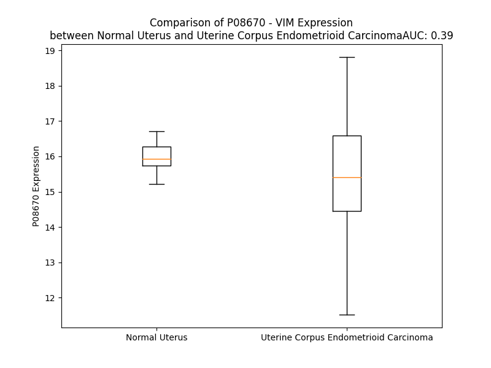

# Detailed Data for P08670

## Introduction to the Detailed Summary

### How to Interpret the Results

- **Summary & Metrics**: This section provides a quick reference to essential protein attributes, including expression changes, family classification, and biomarker applications. Regulation status (upregulated/downregulated) indicates the protein's behavior in a disease context. Some information comes from the original excel file with the proteins selected from literature, while others are derived from the analyses.
- **Expression Comparison**: A visual representation comparing protein expression between normal and disease states. It highlights significant changes in expression levels that might indicate diagnostic or therapeutic relevance. This is data coming from transcriptomics experiments and could not translate similarly to protein levels.
- **Isoform Alignment**: An interactive view of isoform alignments, revealing structural and functional differences between variants of the protein.
- **Interactors & Homologs**: Tables listing known interaction partners and homologous proteins, the more interactors and homologs, the more complex the protein is to design an antibody for.
- **Biological Assemblies**: Information about the structural arrangement of the protein in different assemblies, providing insights into its functional state but also the complexity of the protein to develop antibodies.
- **Combined Per-Residue Information**: A detailed table summarizing residue-level data. This includes predictions for epitope regions, aggregation tendencies, and modifications that might impact the protein's function. Each row corresponds to a residue in the protein, providing insights into specific sites that may be important for research or drug development.
## Summary & Metrics

- **UniProt Accession**: P08670
- **Gene Name**: VIM
- **Protein Name**: Vimentin
- **Swiss Prot**: VIME_HUMAN
- **Family**: other
- **Biomarker Application**: diagnosis,efficacy,prognosis
- **Number of Isoforms**: 0
- **Regulation**: 2
- **(transcriptomics) AUC**: 0.59
- **(transcriptomics) Fold Change**: 1.01
- **(transcriptomics) Regulation**: Upregulated
- **Discotope Epitope Count**: 80
- **Max n_uniprots (Homo)**: 8.0
- **Max n_uniprots (Hetero)**: 3.0

## Expression Comparison

## Interactors

| preferredName_A   | preferredName_B   |   score |
|:------------------|:------------------|--------:|
| VIM               | DES               |   0.957 |
| VIM               | HLA-DRA           |   0.934 |
| VIM               | HLA-DRB1          |   0.932 |
| VIM               | CASP7             |   0.927 |
| VIM               | PLEC              |   0.923 |
| VIM               | ZEB1              |   0.916 |
| VIM               | GAN               |   0.915 |
| VIM               | CASP3             |   0.908 |

## Homologs

| uniprot_id   | gene_id      |
|:-------------|:-------------|
| P05783       | KRT18        |
| Q7RTS7       | KRT74        |
| A0A1B0GVI3   | KRT10        |
| Q7Z3Z0       | KRT25        |
| P08727       | KRT19        |
| P19012       | KRT15        |
| Q03252       | LMNB2        |
| Q2M2I5       | KRT24        |
| P35908       | KRT2         |
| P02533       | KRT14        |
| P08779       | KRT16        |
| A0A0D9SFE5   | LMNB1        |
| Q7Z3Y7       | KRT28        |
| P35527       | KRT9         |
| H0YFE3       | LMNTD1       |
| Q8N1A0       | KRT222       |
| Q14CN4       | KRT72        |
| O76013       | KRT36        |
| Q92764       | KRT35        |
| Q5XKE5       | KRT79        |
| P78386       | KRT85        |
| F8VUG2       | KRT8         |
| O76009       | KRT33A       |
| A0A1X7SCE1   | GFAP         |
| O76011       | KRT34        |
| Q7Z3Y9       | KRT26        |
| P08729       | KRT7         |
| O76015       | KRT38        |
| O76014       | KRT37        |
| O43790       | KRT86        |
| P78385       | KRT83        |
| Q14533       | KRT81        |
| Q7Z3Y8       | KRT27        |
| E7ESP9       | NEFM         |
| Q16352       | INA          |
| P04259       | KRT6B        |
| A0A0S2Z428   | KRT6A        |
| P48668       | KRT6C        |
| Q6KB66       | KRT80        |
| P48681       | NES          |
| P35900       | KRT20        |
| K7EMJ2       | KRT13        |
| O95678       | KRT75        |
| Q04695       | KRT17        |
| Q13515       | BFSP2        |
| J3QR55       | KRT23        |
| Q53SB5       | tmp_locus_29 |
| F8W0C6       | KRT5         |
| Q01546       | KRT76        |
| Q7Z794       | KRT77        |
| Q9NSB2       | KRT84        |
| Q9NSB4       | KRT82        |
| P04264       | KRT1         |
| P07196       | NEFL         |
| Q14532       | KRT32        |
| Q6A162       | KRT40        |
| O15061       | SYNM         |
| Q8N1N4       | KRT78        |
| Q6A163       | KRT39        |
| F8VZR6       | KRT4         |
| Q3SY84       | KRT71        |
| Q14525       | KRT33B       |
| Q15323       | KRT31        |
| A0A6Q8PHQ9   | LMNA         |
| Q99456       | KRT12        |
| P12035       | KRT3         |
| Q86Y46       | KRT73        |
| P41219       | PRPH         |

## Biological Assemblies

|   Unnamed: 0 |   assembly |   n_uniprots | composition   | crystal_id   |
|-------------:|-----------:|-------------:|:--------------|:-------------|
|            0 |          1 |            3 | Hetero        | 4mcz         |
|            0 |          1 |            3 | Hetero        | 4md5         |
|            0 |          1 |            4 | Homo          | 3klt         |
|            1 |          2 |            2 | Homo          | 3klt         |
|            2 |          3 |            2 | Homo          | 3klt         |
|            0 |          1 |            3 | Hetero        | 4mcy         |
|            0 |          1 |            2 | Homo          | 1gk4         |
|            1 |          2 |            2 | Homo          | 1gk4         |
|            2 |          3 |            2 | Homo          | 1gk4         |
|            0 |          1 |            1 | Homo          | 4ypc         |
|            0 |          1 |            3 | Homo          | 4yv3         |
|            0 |          1 |            3 | Hetero        | 4mdi         |
|            0 |          1 |            1 | Homo          | 1gk7         |
|            0 |          1 |            2 | Homo          | 3ssu         |
|            0 |          1 |            8 | Homo          | 5whf         |
|            0 |          1 |            2 | Hetero        | 6ati         |
|            1 |          2 |            2 | Hetero        | 6ati         |
|            0 |          1 |            2 | Homo          | 3s4r         |
|            0 |          1 |            2 | Homo          | 3g1e         |
|            0 |          1 |            2 | Homo          | 3swk         |
|            0 |          1 |            2 | Homo          | 3uf1         |
|            1 |          2 |            2 | Homo          | 3uf1         |
|            0 |          1 |            2 | Homo          | 1gk6         |
|            0 |          1 |            1 | Homo          | 6yxk         |
|            0 |          1 |            2 | Homo          | 3trt         |
|            0 |          1 |            2 | Hetero        | 6bir         |
|            0 |          1 |            3 | Hetero        | 4mdj         |
|            0 |          1 |            3 | Hetero        | 4md0         |
|            0 |          1 |            2 | Hetero        | 6atf         |
|            1 |          2 |            2 | Hetero        | 6atf         |

## Combined Per-Residue Information

|   res | aa   |   epitope_score | epitope   |   relative_surface_accessibility |   modeling_confidence |   Aggregation | modification                                | glycosylation                       |
|------:|:-----|----------------:|:----------|---------------------------------:|----------------------:|--------------:|:--------------------------------------------|:------------------------------------|
|     1 | M    |         0.0612  | False     |                          1.29792 |                 44.63 |         0     | N/A                                         | N/A                                 |
|     2 | S    |         0.06372 | False     |                          0.87745 |                 44.88 |         0     | N-acetylserine                              | N/A                                 |
|     3 | T    |         0.08314 | False     |                          0.94879 |                 50.57 |         0     | N/A                                         | N/A                                 |
|     4 | R    |         0.11895 | False     |                          0.90757 |                 44.46 |         0     | N/A                                         | N/A                                 |
|     5 | S    |         0.08713 | False     |                          0.84152 |                 47.9  |         0     | Phosphoserine                               | N/A                                 |
|     6 | V    |         0.08176 | False     |                          0.9421  |                 53.78 |         0     | N/A                                         | N/A                                 |
|     7 | S    |         0.09979 | False     |                          0.87374 |                 47.88 |         0     | Phosphoserine; by PKA and PKC; alternate    | O-linked (GlcNAc) serine; alternate |
|     8 | S    |         0.09257 | False     |                          0.65688 |                 49.08 |         0     | Phosphoserine                               | N/A                                 |
|     9 | S    |         0.11309 | False     |                          0.61322 |                 53.89 |         0     | Phosphoserine; by PKC                       | N/A                                 |
|    10 | S    |         0.13926 | True      |                          0.68042 |                 57.86 |         0     | Phosphoserine; by PKC                       | N/A                                 |
|    11 | Y    |         0.18636 | True      |                          0.76722 |                 51.56 |         0     | N/A                                         | N/A                                 |
|    12 | R    |         0.15828 | True      |                          0.83688 |                 53.73 |         0     | N/A                                         | N/A                                 |
|    13 | R    |         0.22293 | True      |                          0.83904 |                 58.95 |         0     | N/A                                         | N/A                                 |
|    14 | M    |         0.26933 | True      |                          0.82434 |                 54.03 |         0     | N/A                                         | N/A                                 |
|    15 | F    |         0.19954 | True      |                          0.81586 |                 61.58 |         0     | N/A                                         | N/A                                 |
|    16 | G    |         0.08269 | False     |                          0.67629 |                 41.32 |         0     | N/A                                         | N/A                                 |
|    17 | G    |         0.1335  | True      |                          0.75635 |                 45.89 |         0     | N/A                                         | N/A                                 |
|    18 | P    |         0.16159 | True      |                          1.00785 |                 45.5  |         0     | N/A                                         | N/A                                 |
|    19 | G    |         0.106   | False     |                          0.93966 |                 42.33 |         0     | N/A                                         | N/A                                 |
|    20 | T    |         0.1224  | False     |                          0.97172 |                 42.54 |         0     | Phosphothreonine                            | N/A                                 |
|    21 | A    |         0.10216 | False     |                          0.993   |                 37.77 |         0     | N/A                                         | N/A                                 |
|    22 | S    |         0.09529 | False     |                          0.80333 |                 40.31 |         0     | N/A                                         | N/A                                 |
|    23 | R    |         0.11975 | False     |                          0.96292 |                 35.01 |         0     | N/A                                         | N/A                                 |
|    24 | P    |         0.10566 | False     |                          0.89727 |                 46.59 |         0     | N/A                                         | N/A                                 |
|    25 | S    |         0.09147 | False     |                          0.85684 |                 37.5  |         0     | Phosphoserine                               | N/A                                 |
|    26 | S    |         0.10967 | False     |                          0.86628 |                 40.75 |         0     | Phosphoserine                               | N/A                                 |
|    27 | S    |         0.09554 | False     |                          0.80988 |                 38.66 |         0     | N/A                                         | N/A                                 |
|    28 | R    |         0.10695 | False     |                          0.81139 |                 35.73 |         0     | N/A                                         | N/A                                 |
|    29 | S    |         0.11544 | False     |                          0.76272 |                 38.89 |         0     | N/A                                         | N/A                                 |
|    30 | Y    |         0.17479 | True      |                          0.77729 |                 36.48 |         0     | N/A                                         | N/A                                 |
|    31 | V    |         0.17323 | True      |                          0.89879 |                 42.95 |         0     | N/A                                         | N/A                                 |
|    32 | T    |         0.13677 | True      |                          0.92773 |                 38.19 |         0     | N/A                                         | N/A                                 |
|    33 | T    |         0.12069 | False     |                          0.83191 |                 37.31 |         0     | N/A                                         | O-linked (GlcNAc) threonine         |
|    34 | S    |         0.09026 | False     |                          0.76818 |                 40.21 |         0     | Phosphoserine; by PKC; alternate            | O-linked (GlcNAc) serine; alternate |
|    35 | T    |         0.09892 | False     |                          0.94955 |                 38.93 |         0     | N/A                                         | N/A                                 |
|    36 | R    |         0.18545 | True      |                          0.86372 |                 39.85 |         0     | N/A                                         | N/A                                 |
|    37 | T    |         0.16405 | True      |                          0.94986 |                 37.86 |         0     | N/A                                         | N/A                                 |
|    38 | Y    |         0.14462 | True      |                          0.85503 |                 42.13 |         0     | N/A                                         | N/A                                 |
|    39 | S    |         0.11168 | False     |                          0.88914 |                 37.74 |         0     | Phosphoserine; by CaMK2, PKA, PKC and ROCK2 | N/A                                 |
|    40 | L    |         0.14575 | True      |                          1.0004  |                 40.55 |         0     | N/A                                         | N/A                                 |
|    41 | G    |         0.11892 | False     |                          0.8854  |                 36.76 |         0     | N/A                                         | N/A                                 |
|    42 | S    |         0.11762 | False     |                          0.90773 |                 39.78 |         0     | Phosphoserine; by PKC                       | N/A                                 |
|    43 | A    |         0.11312 | False     |                          0.8678  |                 39.2  |         0     | N/A                                         | N/A                                 |
|    44 | L    |         0.19356 | True      |                          0.9859  |                 35.82 |         0     | N/A                                         | N/A                                 |
|    45 | R    |         0.1328  | True      |                          0.87543 |                 34.67 |         0     | N/A                                         | N/A                                 |
|    46 | P    |         0.13749 | True      |                          0.71027 |                 43.53 |         0     | N/A                                         | N/A                                 |
|    47 | S    |         0.11611 | False     |                          0.82642 |                 36.46 |         0     | Phosphoserine                               | N/A                                 |
|    48 | T    |         0.10562 | False     |                          0.93262 |                 41.27 |         0     | N/A                                         | N/A                                 |
|    49 | S    |         0.11212 | False     |                          0.83132 |                 38.59 |         0     | Phosphoserine                               | N/A                                 |
|    50 | R    |         0.14663 | True      |                          0.94144 |                 41.11 |         0     | N/A                                         | N/A                                 |
|    51 | S    |         0.0922  | False     |                          0.63766 |                 35.78 |         0     | Phosphoserine                               | N/A                                 |
|    52 | L    |         0.12847 | False     |                          1.08814 |                 40.13 |         0     | N/A                                         | N/A                                 |
|    53 | Y    |         0.1007  | False     |                          0.89682 |                 36.41 |         0     | Phosphotyrosine                             | N/A                                 |
|    54 | A    |         0.131   | False     |                          1.02648 |                 38.48 |         0     | N/A                                         | N/A                                 |
|    55 | S    |         0.13159 | False     |                          0.81009 |                 37.25 |         0     | Phosphoserine                               | N/A                                 |
|    56 | S    |         0.11363 | False     |                          0.82774 |                 36.87 |         0     | Phosphoserine; by CDK5 and CDK1             | N/A                                 |
|    57 | P    |         0.11813 | False     |                          0.9753  |                 48.44 |         0     | N/A                                         | N/A                                 |
|    58 | G    |         0.09787 | False     |                          0.87143 |                 37.32 |         0     | N/A                                         | N/A                                 |
|    59 | G    |         0.0846  | False     |                          0.83217 |                 37.88 |         0     | N/A                                         | N/A                                 |
|    60 | V    |         0.10556 | False     |                          1.02475 |                 37.52 |         0     | N/A                                         | N/A                                 |
|    61 | Y    |         0.09569 | False     |                          0.94961 |                 39.38 |         0     | Phosphotyrosine                             | N/A                                 |
|    62 | A    |         0.06927 | False     |                          0.91845 |                 38.03 |         0     | N/A                                         | N/A                                 |
|    63 | T    |         0.10196 | False     |                          0.93974 |                 40.35 |         0     | N/A                                         | N/A                                 |
|    64 | R    |         0.1649  | True      |                          0.93551 |                 37.81 |         0     | N/A                                         | N/A                                 |
|    65 | S    |         0.11139 | False     |                          0.90512 |                 38.77 |         0     | N/A                                         | N/A                                 |
|    66 | S    |         0.10003 | False     |                          0.79859 |                 42.92 |         0     | Phosphoserine                               | N/A                                 |
|    67 | A    |         0.0967  | False     |                          0.9475  |                 42.32 |         0     | N/A                                         | N/A                                 |
|    68 | V    |         0.13648 | True      |                          0.95474 |                 44.23 |         0     | N/A                                         | N/A                                 |
|    69 | R    |         0.16466 | True      |                          0.90078 |                 39.83 |         0     | N/A                                         | N/A                                 |
|    70 | L    |         0.15121 | True      |                          1.06368 |                 42.74 |         0     | N/A                                         | N/A                                 |
|    71 | R    |         0.16802 | True      |                          0.95728 |                 38.25 |         0     | N/A                                         | N/A                                 |
|    72 | S    |         0.12978 | False     |                          0.74145 |                 40.66 |         0     | Phosphoserine; by AURKB and ROCK2           | N/A                                 |
|    73 | S    |         0.14076 | True      |                          0.83758 |                 42.83 |         0     | Phosphoserine                               | N/A                                 |
|    74 | V    |         0.1905  | True      |                          0.92375 |                 47.73 |         0     | N/A                                         | N/A                                 |
|    75 | P    |         0.14586 | True      |                          0.90118 |                 43.49 |         0     | N/A                                         | N/A                                 |
|    76 | G    |         0.12732 | False     |                          0.8701  |                 42.17 |         0     | N/A                                         | N/A                                 |
|    77 | V    |         0.13799 | True      |                          1.00845 |                 42.1  |         0     | N/A                                         | N/A                                 |
|    78 | R    |         0.31643 | True      |                          0.94982 |                 41.22 |         0     | N/A                                         | N/A                                 |
|    79 | L    |         0.16187 | True      |                          1.05715 |                 43.12 |         0     | N/A                                         | N/A                                 |
|    80 | L    |         0.15993 | True      |                          0.96628 |                 43.01 |         0     | N/A                                         | N/A                                 |
|    81 | Q    |         0.19511 | True      |                          0.81106 |                 40.87 |         0     | N/A                                         | N/A                                 |
|    82 | D    |         0.17619 | True      |                          0.83959 |                 43.42 |         0     | N/A                                         | N/A                                 |
|    83 | S    |         0.21547 | True      |                          0.87392 |                 46.83 |         0     | Phosphoserine                               | N/A                                 |
|    84 | V    |         0.12418 | False     |                          0.74471 |                 49.67 |         0     | N/A                                         | N/A                                 |
|    85 | D    |         0.17402 | True      |                          0.81957 |                 53.43 |         0     | N/A                                         | N/A                                 |
|    86 | F    |         0.13059 | False     |                          0.67087 |                 57.67 |         0     | N/A                                         | N/A                                 |
|    87 | S    |         0.13829 | True      |                          0.62305 |                 67.03 |         0     | Phosphoserine                               | N/A                                 |
|    88 | L    |         0.09796 | False     |                          0.82853 |                 66.68 |         0     | N/A                                         | N/A                                 |
|    89 | A    |         0.07448 | False     |                          0.51631 |                 67.6  |         0     | N/A                                         | N/A                                 |
|    90 | D    |         0.05403 | False     |                          0.49956 |                 71.64 |         0     | N/A                                         | N/A                                 |
|    91 | A    |         0.06565 | False     |                          0.47213 |                 76.76 |         0     | N/A                                         | N/A                                 |
|    92 | I    |         0.07735 | False     |                          0.60851 |                 77.13 |         0     | N/A                                         | N/A                                 |
|    93 | N    |         0.05245 | False     |                          0.44868 |                 78.78 |         0     | N/A                                         | N/A                                 |
|    94 | T    |         0.03738 | False     |                          0.4568  |                 80.48 |         0     | N/A                                         | N/A                                 |
|    95 | E    |         0.06086 | False     |                          0.62488 |                 82.03 |         0     | N/A                                         | N/A                                 |
|    96 | F    |         0.0382  | False     |                          0.67868 |                 82.07 |         0     | N/A                                         | N/A                                 |
|    97 | K    |         0.03951 | False     |                          0.55647 |                 82.39 |         0     | N/A                                         | N/A                                 |
|    98 | N    |         0.05603 | False     |                          0.57258 |                 84.36 |         0     | N/A                                         | N/A                                 |
|    99 | T    |         0.06286 | False     |                          0.5762  |                 85.9  |         0     | N/A                                         | N/A                                 |
|   100 | R    |         0.04738 | False     |                          0.65664 |                 84.89 |         0     | N/A                                         | N/A                                 |
|   101 | T    |         0.02745 | False     |                          0.52629 |                 87.33 |         0     | N/A                                         | N/A                                 |
|   102 | N    |         0.03966 | False     |                          0.59909 |                 87.37 |         0     | N/A                                         | N/A                                 |
|   103 | E    |         0.03928 | False     |                          0.54348 |                 89.41 |         0     | N/A                                         | N/A                                 |
|   104 | K    |         0.02206 | False     |                          0.67746 |                 89.75 |         0     | N/A                                         | N/A                                 |
|   105 | V    |         0.0488  | False     |                          0.56363 |                 90.5  |         0     | N/A                                         | N/A                                 |
|   106 | E    |         0.06327 | False     |                          0.61027 |                 91.71 |         0     | N/A                                         | N/A                                 |
|   107 | L    |         0.03472 | False     |                          0.64139 |                 90.12 |         0     | N/A                                         | N/A                                 |
|   108 | Q    |         0.04694 | False     |                          0.5157  |                 91.65 |         0     | N/A                                         | N/A                                 |
|   109 | E    |         0.0493  | False     |                          0.47242 |                 92.2  |         0     | N/A                                         | N/A                                 |
|   110 | L    |         0.03426 | False     |                          0.52536 |                 92.57 |         0     | N/A                                         | N/A                                 |
|   111 | N    |         0.03152 | False     |                          0.59083 |                 92.28 |         0     | N/A                                         | N/A                                 |
|   112 | D    |         0.04403 | False     |                          0.46373 |                 92.32 |         0     | N/A                                         | N/A                                 |
|   113 | R    |         0.07507 | False     |                          0.60142 |                 93.94 |         0     | N/A                                         | N/A                                 |
|   114 | F    |         0.03614 | False     |                          0.55279 |                 94.59 |         6.599 | N/A                                         | N/A                                 |
|   115 | A    |         0.0403  | False     |                          0.45169 |                 94.53 |         6.599 | N/A                                         | N/A                                 |
|   116 | N    |         0.06626 | False     |                          0.64668 |                 94.94 |         6.599 | N/A                                         | N/A                                 |
|   117 | Y    |         0.04647 | False     |                          0.67347 |                 96.1  |         6.599 | Phosphotyrosine                             | N/A                                 |
|   118 | I    |         0.04467 | False     |                          0.52866 |                 94.82 |         6.599 | N/A                                         | N/A                                 |
|   119 | D    |         0.04967 | False     |                          0.48196 |                 95.37 |         0     | N/A                                         | N/A                                 |
|   120 | K    |         0.04995 | False     |                          0.52793 |                 95.5  |         0     | N6-acetyllysine; alternate                  | N/A                                 |
|   120 | K    |         0.04995 | False     |                          0.52793 |                 95.5  |         0     | N6-succinyllysine; alternate                | N/A                                 |
|   121 | V    |         0.03431 | False     |                          0.55125 |                 96.98 |         0     | N/A                                         | N/A                                 |
|   122 | R    |         0.0444  | False     |                          0.61398 |                 95.37 |         0     | N/A                                         | N/A                                 |
|   123 | F    |         0.0588  | False     |                          0.58471 |                 96.22 |         0     | N/A                                         | N/A                                 |
|   124 | L    |         0.04401 | False     |                          0.48651 |                 96.68 |         0     | N/A                                         | N/A                                 |
|   125 | E    |         0.02399 | False     |                          0.46104 |                 96.09 |         0     | N/A                                         | N/A                                 |
|   126 | Q    |         0.03934 | False     |                          0.58688 |                 96.31 |         0     | N/A                                         | N/A                                 |
|   127 | Q    |         0.04665 | False     |                          0.40179 |                 96.2  |         0     | N/A                                         | N/A                                 |
|   128 | N    |         0.04044 | False     |                          0.54494 |                 95.32 |         0     | N/A                                         | N/A                                 |
|   129 | K    |         0.04045 | False     |                          0.70343 |                 96.41 |         0     | N6-acetyllysine; alternate                  | N/A                                 |
|   129 | K    |         0.04045 | False     |                          0.70343 |                 96.41 |         0     | N6-succinyllysine; alternate                | N/A                                 |
|   130 | I    |         0.07888 | False     |                          0.62874 |                 96.05 |         0     | N/A                                         | N/A                                 |
|   131 | L    |         0.08248 | False     |                          0.52282 |                 94.83 |         0     | N/A                                         | N/A                                 |
|   132 | L    |         0.05966 | False     |                          0.71936 |                 94.27 |         0     | N/A                                         | N/A                                 |
|   133 | A    |         0.04168 | False     |                          0.60153 |                 89.84 |         0     | N/A                                         | N/A                                 |
|   134 | E    |         0.04087 | False     |                          0.44476 |                 90.95 |         0     | N/A                                         | N/A                                 |
|   135 | L    |         0.05158 | False     |                          0.54572 |                 85.84 |         0     | N/A                                         | N/A                                 |
|   136 | E    |         0.03831 | False     |                          0.61123 |                 85.48 |         0     | N/A                                         | N/A                                 |
|   137 | Q    |         0.05487 | False     |                          0.4551  |                 84.24 |         0     | N/A                                         | N/A                                 |
|   138 | L    |         0.07839 | False     |                          0.66852 |                 80.61 |         0     | N/A                                         | N/A                                 |
|   139 | K    |         0.06234 | False     |                          0.49921 |                 78.72 |         0     | N6-acetyllysine; alternate                  | N/A                                 |
|   140 | G    |         0.06939 | False     |                          0.57553 |                 73.49 |         0     | N/A                                         | N/A                                 |
|   141 | Q    |         0.05522 | False     |                          0.30612 |                 71.86 |         0     | N/A                                         | N/A                                 |
|   142 | G    |         0.0824  | False     |                          0.49141 |                 64.9  |         0     | N/A                                         | N/A                                 |
|   143 | K    |         0.09636 | False     |                          0.69809 |                 70.51 |         0     | N/A                                         | N/A                                 |
|   144 | S    |         0.051   | False     |                          0.44969 |                 76.45 |         0     | Phosphoserine                               | N/A                                 |
|   145 | R    |         0.07233 | False     |                          0.71392 |                 81.17 |         0     | N/A                                         | N/A                                 |
|   146 | L    |         0.06084 | False     |                          0.58718 |                 81.53 |         0     | N/A                                         | N/A                                 |
|   147 | G    |         0.04396 | False     |                          0.35499 |                 85.95 |         0     | N/A                                         | N/A                                 |
|   148 | D    |         0.05404 | False     |                          0.54856 |                 88.67 |         0     | N/A                                         | N/A                                 |
|   149 | L    |         0.06676 | False     |                          0.60553 |                 91.32 |         0     | N/A                                         | N/A                                 |
|   150 | Y    |         0.11809 | False     |                          0.5332  |                 90.93 |         0     | N/A                                         | N/A                                 |
|   151 | E    |         0.06706 | False     |                          0.50794 |                 94.15 |         0     | N/A                                         | N/A                                 |
|   152 | E    |         0.0635  | False     |                          0.45406 |                 95.16 |         0     | N/A                                         | N/A                                 |
|   153 | E    |         0.08334 | False     |                          0.52423 |                 96.09 |         0     | N/A                                         | N/A                                 |
|   154 | M    |         0.08005 | False     |                          0.5181  |                 95.63 |         0     | N/A                                         | N/A                                 |
|   155 | R    |         0.06735 | False     |                          0.50209 |                 96.57 |         0     | N/A                                         | N/A                                 |
|   156 | E    |         0.05888 | False     |                          0.33237 |                 97.41 |         0     | N/A                                         | N/A                                 |
|   157 | L    |         0.07579 | False     |                          0.65302 |                 97.77 |         0     | N/A                                         | N/A                                 |
|   158 | R    |         0.07421 | False     |                          0.64448 |                 98.01 |         0     | N/A                                         | N/A                                 |
|   159 | R    |         0.03608 | False     |                          0.54092 |                 97.76 |         0     | N/A                                         | N/A                                 |
|   160 | Q    |         0.04573 | False     |                          0.38567 |                 98.23 |         0     | N/A                                         | N/A                                 |
|   161 | V    |         0.04634 | False     |                          0.64952 |                 97.98 |         0     | N/A                                         | N/A                                 |
|   162 | D    |         0.04434 | False     |                          0.54263 |                 97.59 |         0     | N/A                                         | N/A                                 |
|   163 | Q    |         0.0397  | False     |                          0.44348 |                 97.53 |         0     | N/A                                         | N/A                                 |
|   164 | L    |         0.09576 | False     |                          0.74317 |                 97.23 |         0     | N/A                                         | N/A                                 |
|   165 | T    |         0.08219 | False     |                          0.54902 |                 97.05 |         0     | N/A                                         | N/A                                 |
|   166 | N    |         0.03384 | False     |                          0.60492 |                 97.75 |         0     | N/A                                         | N/A                                 |
|   167 | D    |         0.03371 | False     |                          0.37684 |                 97.55 |         0     | N/A                                         | N/A                                 |
|   168 | K    |         0.04791 | False     |                          0.62402 |                 95.18 |         0     | N6-acetyllysine                             | N/A                                 |
|   169 | A    |         0.0431  | False     |                          0.46267 |                 95.55 |         0     | N/A                                         | N/A                                 |
|   170 | R    |         0.06379 | False     |                          0.67594 |                 96.88 |         0     | N/A                                         | N/A                                 |
|   171 | V    |         0.04967 | False     |                          0.65618 |                 94.19 |         0     | N/A                                         | N/A                                 |
|   172 | E    |         0.06455 | False     |                          0.36783 |                 96.17 |         0     | N/A                                         | N/A                                 |
|   173 | V    |         0.02602 | False     |                          0.63857 |                 95.62 |         0     | N/A                                         | N/A                                 |
|   174 | E    |         0.02843 | False     |                          0.39939 |                 93.62 |         0     | N/A                                         | N/A                                 |
|   175 | R    |         0.09111 | False     |                          0.5865  |                 91.82 |         0     | N/A                                         | N/A                                 |
|   176 | D    |         0.05394 | False     |                          0.37648 |                 93.66 |         0     | N/A                                         | N/A                                 |
|   177 | N    |         0.03125 | False     |                          0.49254 |                 90.1  |         0     | N/A                                         | N/A                                 |
|   178 | L    |         0.05616 | False     |                          0.67988 |                 90.71 |         0     | N/A                                         | N/A                                 |
|   179 | A    |         0.03446 | False     |                          0.42607 |                 90.49 |         0     | N/A                                         | N/A                                 |
|   180 | E    |         0.02699 | False     |                          0.37269 |                 90.81 |         0     | N/A                                         | N/A                                 |
|   181 | D    |         0.03408 | False     |                          0.37623 |                 90.12 |         0     | N/A                                         | N/A                                 |
|   182 | I    |         0.04782 | False     |                          0.52137 |                 88.33 |         0     | N/A                                         | N/A                                 |
|   183 | M    |         0.08501 | False     |                          0.61464 |                 89.06 |         0     | N/A                                         | N/A                                 |
|   184 | R    |         0.05353 | False     |                          0.47479 |                 87.15 |         0     | N/A                                         | N/A                                 |
|   185 | L    |         0.08823 | False     |                          0.71567 |                 85.69 |         0     | N/A                                         | N/A                                 |
|   186 | R    |         0.08381 | False     |                          0.66375 |                 90.45 |         0     | N/A                                         | N/A                                 |
|   187 | E    |         0.0738  | False     |                          0.5611  |                 89.61 |         0     | N/A                                         | N/A                                 |
|   188 | K    |         0.06813 | False     |                          0.61431 |                 90.85 |         0     | N6-succinyllysine; alternate                | N/A                                 |
|   188 | K    |         0.06813 | False     |                          0.61431 |                 90.85 |         0     | N6-acetyllysine; alternate                  | N/A                                 |
|   189 | L    |         0.0479  | False     |                          0.68363 |                 87.89 |         0     | N/A                                         | N/A                                 |
|   190 | Q    |         0.07567 | False     |                          0.58307 |                 90.03 |         0     | N/A                                         | N/A                                 |
|   191 | E    |         0.03361 | False     |                          0.4445  |                 87.71 |         0     | N/A                                         | N/A                                 |
|   192 | E    |         0.07938 | False     |                          0.55523 |                 91.55 |         0     | N/A                                         | N/A                                 |
|   193 | M    |         0.0674  | False     |                          0.64694 |                 86.79 |         0     | N/A                                         | N/A                                 |
|   194 | L    |         0.08255 | False     |                          0.59146 |                 89.74 |         0     | N/A                                         | N/A                                 |
|   195 | Q    |         0.04221 | False     |                          0.54302 |                 88.23 |         0     | N/A                                         | N/A                                 |
|   196 | R    |         0.06978 | False     |                          0.58721 |                 86.98 |         0     | N/A                                         | N/A                                 |
|   197 | E    |         0.04716 | False     |                          0.50258 |                 91.66 |         0     | N/A                                         | N/A                                 |
|   198 | E    |         0.05191 | False     |                          0.57567 |                 89.3  |         0     | N/A                                         | N/A                                 |
|   199 | A    |         0.07667 | False     |                          0.55848 |                 87.74 |         0     | N/A                                         | N/A                                 |
|   200 | E    |         0.08366 | False     |                          0.41659 |                 92.09 |         0     | N/A                                         | N/A                                 |
|   201 | N    |         0.0802  | False     |                          0.57443 |                 91.94 |         0     | N/A                                         | N/A                                 |
|   202 | T    |         0.05517 | False     |                          0.49533 |                 91.35 |         0     | N/A                                         | N/A                                 |
|   203 | L    |         0.04862 | False     |                          0.52753 |                 88.67 |         0     | N/A                                         | N/A                                 |
|   204 | Q    |         0.08607 | False     |                          0.54019 |                 92.76 |         0     | N/A                                         | N/A                                 |
|   205 | S    |         0.07306 | False     |                          0.43352 |                 92.75 |         0     | N/A                                         | N/A                                 |
|   206 | F    |         0.10208 | False     |                          0.69355 |                 93.7  |         0     | N/A                                         | N/A                                 |
|   207 | R    |         0.13009 | False     |                          0.57076 |                 95.86 |         0     | N/A                                         | N/A                                 |
|   208 | Q    |         0.09351 | False     |                          0.48612 |                 95.55 |         0     | N/A                                         | N/A                                 |
|   209 | D    |         0.04255 | False     |                          0.49182 |                 95.03 |         0     | N/A                                         | N/A                                 |
|   210 | V    |         0.06131 | False     |                          0.71109 |                 96.73 |         0     | N/A                                         | N/A                                 |
|   211 | D    |         0.08325 | False     |                          0.4858  |                 95.79 |         0     | N/A                                         | N/A                                 |
|   212 | N    |         0.07177 | False     |                          0.46017 |                 95.3  |         0     | N/A                                         | N/A                                 |
|   213 | A    |         0.05138 | False     |                          0.58828 |                 95.26 |         0     | N/A                                         | N/A                                 |
|   214 | S    |         0.06942 | False     |                          0.41746 |                 96.07 |         0     | Phosphoserine                               | N/A                                 |
|   215 | L    |         0.17011 | True      |                          0.69532 |                 96.62 |         0     | N/A                                         | N/A                                 |
|   216 | A    |         0.03736 | False     |                          0.5012  |                 96.39 |         0     | N/A                                         | N/A                                 |
|   217 | R    |         0.14042 | True      |                          0.63498 |                 95.92 |         0     | N/A                                         | N/A                                 |
|   218 | L    |         0.1071  | False     |                          0.45587 |                 97.89 |         0     | N/A                                         | N/A                                 |
|   219 | D    |         0.08644 | False     |                          0.42115 |                 97.03 |         0     | N/A                                         | N/A                                 |
|   220 | L    |         0.04115 | False     |                          0.66408 |                 96.97 |         0     | N/A                                         | N/A                                 |
|   221 | E    |         0.1157  | False     |                          0.39306 |                 97.71 |         0     | N/A                                         | N/A                                 |
|   222 | R    |         0.16478 | True      |                          0.57979 |                 97.22 |         0     | N/A                                         | N/A                                 |
|   223 | K    |         0.03793 | False     |                          0.60094 |                 97.56 |         0     | N6-acetyllysine; alternate                  | N/A                                 |
|   224 | V    |         0.05401 | False     |                          0.55742 |                 97.61 |         0     | N/A                                         | N/A                                 |
|   225 | E    |         0.13185 | False     |                          0.52661 |                 97.55 |         0     | N/A                                         | N/A                                 |
|   226 | S    |         0.07431 | False     |                          0.46436 |                 97.34 |         0     | Phosphoserine                               | N/A                                 |
|   227 | L    |         0.06311 | False     |                          0.61085 |                 97.71 |         0     | N/A                                         | N/A                                 |
|   228 | Q    |         0.06661 | False     |                          0.54876 |                 97.75 |         0     | N/A                                         | N/A                                 |
|   229 | E    |         0.08737 | False     |                          0.64896 |                 97.52 |         0     | N/A                                         | N/A                                 |
|   230 | E    |         0.05767 | False     |                          0.47677 |                 97.4  |         0.268 | N/A                                         | N/A                                 |
|   231 | I    |         0.07754 | False     |                          0.54937 |                 95.78 |         0.268 | N/A                                         | N/A                                 |
|   232 | A    |         0.05595 | False     |                          0.45988 |                 96.93 |         0.268 | N/A                                         | N/A                                 |
|   233 | F    |         0.12786 | False     |                          0.66054 |                 96.6  |         0.268 | N/A                                         | N/A                                 |
|   234 | L    |         0.04303 | False     |                          0.44433 |                 97.66 |         0.268 | N/A                                         | N/A                                 |
|   235 | K    |         0.07564 | False     |                          0.69653 |                 96.26 |         0.268 | N6-acetyllysine                             | N/A                                 |
|   236 | K    |         0.10568 | False     |                          0.68857 |                 97.05 |         0     | N/A                                         | N/A                                 |
|   237 | L    |         0.04135 | False     |                          0.40889 |                 96.99 |         0     | N/A                                         | N/A                                 |
|   238 | H    |         0.06535 | False     |                          0.49339 |                 94.38 |         0     | N/A                                         | N/A                                 |
|   239 | E    |         0.06355 | False     |                          0.47545 |                 95.57 |         0     | N/A                                         | N/A                                 |
|   240 | E    |         0.08084 | False     |                          0.56736 |                 95.36 |         0     | N/A                                         | N/A                                 |
|   241 | E    |         0.03952 | False     |                          0.39591 |                 94.56 |         0     | N/A                                         | N/A                                 |
|   242 | I    |         0.08355 | False     |                          0.52516 |                 93.31 |         0     | N/A                                         | N/A                                 |
|   243 | Q    |         0.08895 | False     |                          0.5052  |                 92.86 |         0     | N/A                                         | N/A                                 |
|   244 | E    |         0.05632 | False     |                          0.54883 |                 93.13 |         0     | N/A                                         | N/A                                 |
|   245 | L    |         0.05229 | False     |                          0.61909 |                 90.72 |         0     | N/A                                         | N/A                                 |
|   246 | Q    |         0.0574  | False     |                          0.50421 |                 88.31 |         0     | N/A                                         | N/A                                 |
|   247 | A    |         0.05636 | False     |                          0.54316 |                 87.07 |         0     | N/A                                         | N/A                                 |
|   248 | Q    |         0.03822 | False     |                          0.39447 |                 86.26 |         0     | N/A                                         | N/A                                 |
|   249 | I    |         0.05929 | False     |                          0.67357 |                 81.19 |         0     | N/A                                         | N/A                                 |
|   250 | Q    |         0.12135 | False     |                          0.69932 |                 76.83 |         0     | N/A                                         | N/A                                 |
|   251 | E    |         0.18675 | True      |                          0.64469 |                 72.17 |         0     | N/A                                         | N/A                                 |
|   252 | Q    |         0.07565 | False     |                          0.52323 |                 62.52 |         0     | N/A                                         | N/A                                 |
|   253 | H    |         0.24435 | True      |                          0.89472 |                 46.51 |         0     | N/A                                         | N/A                                 |
|   254 | V    |         0.16468 | True      |                          0.84703 |                 47.45 |         0     | N/A                                         | N/A                                 |
|   255 | Q    |         0.25639 | True      |                          0.71004 |                 35.14 |         0     | N/A                                         | N/A                                 |
|   256 | I    |         0.19746 | True      |                          0.85847 |                 41.9  |         0     | N/A                                         | N/A                                 |
|   257 | D    |         0.19539 | True      |                          0.90056 |                 27.98 |         0     | N/A                                         | N/A                                 |
|   258 | V    |         0.13781 | True      |                          0.85689 |                 42.53 |         0     | N/A                                         | N/A                                 |
|   259 | D    |         0.1655  | True      |                          0.89342 |                 29.11 |         0     | N/A                                         | N/A                                 |
|   260 | V    |         0.16258 | True      |                          0.8749  |                 39.79 |         0     | N/A                                         | N/A                                 |
|   261 | S    |         0.15119 | True      |                          0.7166  |                 37.87 |         0     | N/A                                         | N/A                                 |
|   262 | K    |         0.18314 | True      |                          0.98399 |                 37.18 |         0     | N/A                                         | N/A                                 |
|   263 | P    |         0.10716 | False     |                          0.64192 |                 57    |         0     | N/A                                         | N/A                                 |
|   264 | D    |         0.14308 | True      |                          0.66791 |                 56.13 |         0     | N/A                                         | N/A                                 |
|   265 | L    |         0.26095 | True      |                          0.59497 |                 63.19 |         0.774 | N/A                                         | N/A                                 |
|   266 | T    |         0.09282 | False     |                          0.60326 |                 79.36 |         0.774 | N/A                                         | N/A                                 |
|   267 | A    |         0.08534 | False     |                          0.47532 |                 78.56 |         0.774 | N/A                                         | N/A                                 |
|   268 | A    |         0.04799 | False     |                          0.46536 |                 83.16 |         0.774 | N/A                                         | N/A                                 |
|   269 | L    |         0.03848 | False     |                          0.47695 |                 82.55 |         0.774 | N/A                                         | N/A                                 |
|   270 | R    |         0.1156  | False     |                          0.61254 |                 86.34 |         0     | N/A                                         | N/A                                 |
|   271 | D    |         0.06457 | False     |                          0.43989 |                 87.78 |         0     | N/A                                         | N/A                                 |
|   272 | V    |         0.02516 | False     |                          0.47128 |                 89.6  |         0     | N/A                                         | N/A                                 |
|   273 | R    |         0.05301 | False     |                          0.68075 |                 90.82 |         0     | N/A                                         | N/A                                 |
|   274 | Q    |         0.08462 | False     |                          0.62729 |                 92.23 |         0     | N/A                                         | N/A                                 |
|   275 | Q    |         0.02614 | False     |                          0.50383 |                 92.51 |         0     | N/A                                         | N/A                                 |
|   276 | Y    |         0.03526 | False     |                          0.71098 |                 91.21 |         0     | N/A                                         | N/A                                 |
|   277 | E    |         0.04642 | False     |                          0.65159 |                 94.59 |         0     | N/A                                         | N/A                                 |
|   278 | S    |         0.02274 | False     |                          0.35437 |                 94.58 |         0     | N/A                                         | N/A                                 |
|   279 | V    |         0.03356 | False     |                          0.66285 |                 93.84 |         0     | N/A                                         | N/A                                 |
|   280 | A    |         0.03148 | False     |                          0.5766  |                 93.62 |         0     | N/A                                         | N/A                                 |
|   281 | A    |         0.04407 | False     |                          0.55456 |                 94.8  |         0     | N/A                                         | N/A                                 |
|   282 | K    |         0.03781 | False     |                          0.59975 |                 95.79 |         0     | N/A                                         | N/A                                 |
|   283 | N    |         0.02936 | False     |                          0.60652 |                 92.78 |         0     | N/A                                         | N/A                                 |
|   284 | L    |         0.04113 | False     |                          0.69765 |                 95.42 |         0     | N/A                                         | N/A                                 |
|   285 | Q    |         0.03532 | False     |                          0.5259  |                 96.25 |         0     | N/A                                         | N/A                                 |
|   286 | E    |         0.03897 | False     |                          0.57973 |                 95    |         0     | N/A                                         | N/A                                 |
|   287 | A    |         0.01432 | False     |                          0.36734 |                 94.76 |         0     | N/A                                         | N/A                                 |
|   288 | E    |         0.03459 | False     |                          0.40626 |                 95.48 |         0     | N/A                                         | N/A                                 |
|   289 | E    |         0.03895 | False     |                          0.46666 |                 96.47 |         0     | N/A                                         | N/A                                 |
|   290 | W    |         0.04814 | False     |                          0.68523 |                 95.03 |         0     | N/A                                         | N/A                                 |
|   291 | Y    |         0.06269 | False     |                          0.55239 |                 94.35 |         0     | N/A                                         | N/A                                 |
|   292 | K    |         0.06415 | False     |                          0.62343 |                 96.66 |         0     | N/A                                         | N/A                                 |
|   293 | S    |         0.04738 | False     |                          0.47894 |                 95.69 |         0     | N/A                                         | N/A                                 |
|   294 | K    |         0.02644 | False     |                          0.49677 |                 96.66 |         0     | N6-acetyllysine; alternate                  | N/A                                 |
|   294 | K    |         0.02644 | False     |                          0.49677 |                 96.66 |         0     | N6-succinyllysine; alternate                | N/A                                 |
|   295 | F    |         0.07151 | False     |                          0.70722 |                 96.17 |         0     | N/A                                         | N/A                                 |
|   296 | A    |         0.04842 | False     |                          0.55265 |                 96.58 |         0     | N/A                                         | N/A                                 |
|   297 | D    |         0.02958 | False     |                          0.47815 |                 95.44 |         0     | N/A                                         | N/A                                 |
|   298 | L    |         0.03598 | False     |                          0.63383 |                 95.43 |         0     | N/A                                         | N/A                                 |
|   299 | S    |         0.06024 | False     |                          0.46772 |                 95.77 |         0     | Phosphoserine                               | N/A                                 |
|   300 | E    |         0.04419 | False     |                          0.4425  |                 95.91 |         0     | N/A                                         | N/A                                 |
|   301 | A    |         0.02803 | False     |                          0.48948 |                 95.24 |         0     | N/A                                         | N/A                                 |
|   302 | A    |         0.03237 | False     |                          0.48029 |                 94.72 |         0     | N/A                                         | N/A                                 |
|   303 | N    |         0.05801 | False     |                          0.54186 |                 95.64 |         0     | N/A                                         | N/A                                 |
|   304 | R    |         0.04092 | False     |                          0.55256 |                 95.78 |         0     | N/A                                         | N/A                                 |
|   305 | N    |         0.02908 | False     |                          0.66912 |                 93.51 |         0     | N/A                                         | N/A                                 |
|   306 | N    |         0.05531 | False     |                          0.44463 |                 95.41 |         0     | N/A                                         | N/A                                 |
|   307 | D    |         0.04579 | False     |                          0.42549 |                 95.8  |         0     | N/A                                         | N/A                                 |
|   308 | A    |         0.02661 | False     |                          0.52684 |                 94.15 |         0     | N/A                                         | N/A                                 |
|   309 | L    |         0.03705 | False     |                          0.57942 |                 95.09 |         0     | N/A                                         | N/A                                 |
|   310 | R    |         0.0997  | False     |                          0.5574  |                 95.61 |         0     | N/A                                         | N/A                                 |
|   311 | Q    |         0.05513 | False     |                          0.54757 |                 94.95 |         0     | N/A                                         | N/A                                 |
|   312 | A    |         0.05341 | False     |                          0.51927 |                 93.36 |         0     | N/A                                         | N/A                                 |
|   313 | K    |         0.04721 | False     |                          0.61232 |                 95.19 |         0     | N/A                                         | N/A                                 |
|   314 | Q    |         0.05639 | False     |                          0.55836 |                 96.18 |         0     | N/A                                         | N/A                                 |
|   315 | E    |         0.06224 | False     |                          0.47177 |                 94.51 |         0     | N/A                                         | N/A                                 |
|   316 | S    |         0.03922 | False     |                          0.53396 |                 93.19 |         0     | N/A                                         | N/A                                 |
|   317 | T    |         0.08036 | False     |                          0.38511 |                 94.23 |         0     | N/A                                         | N/A                                 |
|   318 | E    |         0.03628 | False     |                          0.48102 |                 96.06 |         0     | N/A                                         | N/A                                 |
|   319 | Y    |         0.06428 | False     |                          0.65067 |                 92.48 |         0     | N/A                                         | N/A                                 |
|   320 | R    |         0.08183 | False     |                          0.57332 |                 94.61 |         0     | N/A                                         | N/A                                 |
|   321 | R    |         0.11247 | False     |                          0.52142 |                 93.6  |         0     | N/A                                         | N/A                                 |
|   322 | Q    |         0.06562 | False     |                          0.5165  |                 95.26 |         0     | N/A                                         | N/A                                 |
|   323 | V    |         0.06988 | False     |                          0.67999 |                 92.75 |         0     | N/A                                         | N/A                                 |
|   324 | Q    |         0.09109 | False     |                          0.6061  |                 93.82 |         0     | N/A                                         | N/A                                 |
|   325 | S    |         0.07219 | False     |                          0.54665 |                 91.11 |         0     | Phosphoserine                               | N/A                                 |
|   326 | L    |         0.06296 | False     |                          0.58421 |                 90.21 |         0     | N/A                                         | N/A                                 |
|   327 | T    |         0.04106 | False     |                          0.50639 |                 92.99 |         0     | N/A                                         | N/A                                 |
|   328 | C    |         0.05365 | False     |                          0.63451 |                 92.56 |         0     | N/A                                         | N/A                                 |
|   329 | E    |         0.0441  | False     |                          0.48426 |                 92.43 |         0     | N/A                                         | N/A                                 |
|   330 | V    |         0.08614 | False     |                          0.50741 |                 88.19 |         0     | N/A                                         | N/A                                 |
|   331 | D    |         0.07831 | False     |                          0.47903 |                 92.72 |         0     | N/A                                         | N/A                                 |
|   332 | A    |         0.05682 | False     |                          0.55659 |                 89.52 |         0     | N/A                                         | N/A                                 |
|   333 | L    |         0.04572 | False     |                          0.67147 |                 85.71 |         0     | N/A                                         | N/A                                 |
|   334 | K    |         0.05433 | False     |                          0.56155 |                 91.93 |         0     | N/A                                         | N/A                                 |
|   335 | G    |         0.04308 | False     |                          0.41832 |                 88.32 |         0     | N/A                                         | N/A                                 |
|   336 | T    |         0.04735 | False     |                          0.53578 |                 91.41 |         0     | N/A                                         | N/A                                 |
|   337 | N    |         0.04943 | False     |                          0.51299 |                 80.29 |         0     | N/A                                         | N/A                                 |
|   338 | E    |         0.06116 | False     |                          0.48396 |                 91.14 |         0     | N/A                                         | N/A                                 |
|   339 | S    |         0.05096 | False     |                          0.28301 |                 88.9  |         0     | N/A                                         | N/A                                 |
|   340 | L    |         0.04564 | False     |                          0.63185 |                 87.77 |         0     | N/A                                         | N/A                                 |
|   341 | E    |         0.08493 | False     |                          0.42007 |                 91.79 |         0     | N/A                                         | N/A                                 |
|   342 | R    |         0.07803 | False     |                          0.4473  |                 90.92 |         0     | N/A                                         | N/A                                 |
|   343 | Q    |         0.06031 | False     |                          0.4693  |                 92.73 |         0     | N/A                                         | N/A                                 |
|   344 | M    |         0.11853 | False     |                          0.63389 |                 87.11 |         0     | N/A                                         | N/A                                 |
|   345 | R    |         0.08456 | False     |                          0.57871 |                 95.35 |         0     | N/A                                         | N/A                                 |
|   346 | E    |         0.0646  | False     |                          0.52093 |                 94.5  |         0     | N/A                                         | N/A                                 |
|   347 | M    |         0.03766 | False     |                          0.52397 |                 91.78 |         0     | N/A                                         | N/A                                 |
|   348 | E    |         0.05155 | False     |                          0.55572 |                 94.88 |         0     | N/A                                         | N/A                                 |
|   349 | E    |         0.07827 | False     |                          0.6095  |                 95.86 |         0     | N/A                                         | N/A                                 |
|   350 | N    |         0.04988 | False     |                          0.50171 |                 94.84 |         0     | N/A                                         | N/A                                 |
|   351 | F    |         0.094   | False     |                          0.60687 |                 93.69 |         0     | N/A                                         | N/A                                 |
|   352 | A    |         0.03918 | False     |                          0.58806 |                 94.27 |         0     | N/A                                         | N/A                                 |
|   353 | V    |         0.07092 | False     |                          0.58705 |                 96.69 |         0     | N/A                                         | N/A                                 |
|   354 | E    |         0.03161 | False     |                          0.42673 |                 97.13 |         0     | N/A                                         | N/A                                 |
|   355 | A    |         0.02852 | False     |                          0.55392 |                 95.73 |         0     | N/A                                         | N/A                                 |
|   356 | A    |         0.05143 | False     |                          0.4885  |                 97.16 |         0     | N/A                                         | N/A                                 |
|   357 | N    |         0.08719 | False     |                          0.52284 |                 97.5  |         0     | N/A                                         | N/A                                 |
|   358 | Y    |         0.06493 | False     |                          0.67316 |                 96.68 |         0     | N/A                                         | N/A                                 |
|   359 | Q    |         0.04372 | False     |                          0.59947 |                 97.11 |         0     | N/A                                         | N/A                                 |
|   360 | D    |         0.06773 | False     |                          0.62889 |                 98.16 |         0     | N/A                                         | N/A                                 |
|   361 | T    |         0.02923 | False     |                          0.42214 |                 98.13 |         0     | N/A                                         | N/A                                 |
|   362 | I    |         0.03899 | False     |                          0.49097 |                 97.37 |         0     | N/A                                         | N/A                                 |
|   363 | G    |         0.06878 | False     |                          0.32303 |                 97.92 |         0     | N/A                                         | N/A                                 |
|   364 | R    |         0.06762 | False     |                          0.50301 |                 98.34 |         0     | N/A                                         | N/A                                 |
|   365 | L    |         0.08558 | False     |                          0.49748 |                 98.14 |         0     | N/A                                         | N/A                                 |
|   366 | Q    |         0.04406 | False     |                          0.56198 |                 98.29 |         0     | N/A                                         | N/A                                 |
|   367 | D    |         0.08573 | False     |                          0.56478 |                 98.34 |         0     | N/A                                         | N/A                                 |
|   368 | E    |         0.04113 | False     |                          0.38524 |                 98.39 |         0     | N/A                                         | N/A                                 |
|   369 | I    |         0.07182 | False     |                          0.57704 |                 98.11 |         0     | N/A                                         | N/A                                 |
|   370 | Q    |         0.0652  | False     |                          0.47874 |                 98    |         0     | N/A                                         | N/A                                 |
|   371 | N    |         0.1014  | False     |                          0.52569 |                 98.2  |         0     | N/A                                         | N/A                                 |
|   372 | M    |         0.09339 | False     |                          0.65644 |                 98.09 |         0     | N/A                                         | N/A                                 |
|   373 | K    |         0.09312 | False     |                          0.55092 |                 97.86 |         0     | N6-acetyllysine; alternate                  | N/A                                 |
|   374 | E    |         0.09832 | False     |                          0.53639 |                 98.21 |         0     | N/A                                         | N/A                                 |
|   375 | E    |         0.057   | False     |                          0.41491 |                 98.26 |         0     | N/A                                         | N/A                                 |
|   376 | M    |         0.11077 | False     |                          0.60399 |                 97.72 |         0     | N/A                                         | N/A                                 |
|   377 | A    |         0.08555 | False     |                          0.42771 |                 97.4  |         0     | N/A                                         | N/A                                 |
|   378 | R    |         0.1073  | False     |                          0.39813 |                 98.08 |         0     | N/A                                         | N/A                                 |
|   379 | H    |         0.05636 | False     |                          0.53999 |                 97.42 |         0     | N/A                                         | N/A                                 |
|   380 | L    |         0.10046 | False     |                          0.6957  |                 98.06 |         0     | N/A                                         | N/A                                 |
|   381 | R    |         0.07233 | False     |                          0.62237 |                 97.84 |         0     | N/A                                         | N/A                                 |
|   382 | E    |         0.09402 | False     |                          0.41761 |                 98.16 |         0     | N/A                                         | N/A                                 |
|   383 | Y    |         0.08879 | False     |                          0.64778 |                 97.69 |         0     | N/A                                         | N/A                                 |
|   384 | Q    |         0.09789 | False     |                          0.44946 |                 97.45 |         0     | N/A                                         | N/A                                 |
|   385 | D    |         0.14992 | True      |                          0.52888 |                 97.4  |         0     | N/A                                         | N/A                                 |
|   386 | L    |         0.07002 | False     |                          0.72956 |                 97.8  |         0     | N/A                                         | N/A                                 |
|   387 | L    |         0.05543 | False     |                          0.4083  |                 97.38 |         0     | N/A                                         | N/A                                 |
|   388 | N    |         0.08315 | False     |                          0.47175 |                 96.77 |         0     | N/A                                         | N/A                                 |
|   389 | V    |         0.09367 | False     |                          0.5911  |                 97.66 |         0     | N/A                                         | N/A                                 |
|   390 | K    |         0.04929 | False     |                          0.3735  |                 97.58 |         0     | N/A                                         | N/A                                 |
|   391 | M    |         0.0904  | False     |                          0.58111 |                 96.39 |         0     | N/A                                         | N/A                                 |
|   392 | A    |         0.09618 | False     |                          0.47166 |                 97.19 |         0     | N/A                                         | N/A                                 |
|   393 | L    |         0.09296 | False     |                          0.5482  |                 96.47 |         0     | N/A                                         | N/A                                 |
|   394 | D    |         0.02673 | False     |                          0.20434 |                 97.02 |         0     | N/A                                         | N/A                                 |
|   395 | I    |         0.06755 | False     |                          0.67026 |                 94.75 |         0     | N/A                                         | N/A                                 |
|   396 | E    |         0.09417 | False     |                          0.42601 |                 96.17 |         0     | N/A                                         | N/A                                 |
|   397 | I    |         0.05415 | False     |                          0.39358 |                 93.53 |         0     | N/A                                         | N/A                                 |
|   398 | A    |         0.03419 | False     |                          0.52961 |                 95.1  |         0     | N/A                                         | N/A                                 |
|   399 | T    |         0.07743 | False     |                          0.49205 |                 93.94 |         0     | N/A                                         | N/A                                 |
|   400 | Y    |         0.07023 | False     |                          0.60215 |                 93.56 |         0     | N/A                                         | N/A                                 |
|   401 | R    |         0.05363 | False     |                          0.43877 |                 92.65 |         0     | N/A                                         | N/A                                 |
|   402 | K    |         0.05344 | False     |                          0.77506 |                 92.54 |         0     | N/A                                         | N/A                                 |
|   403 | L    |         0.10862 | False     |                          0.73207 |                 90.68 |         0     | N/A                                         | N/A                                 |
|   404 | L    |         0.09651 | False     |                          0.72723 |                 89.44 |         0     | N/A                                         | N/A                                 |
|   405 | E    |         0.0514  | False     |                          0.55018 |                 84.75 |         0     | N/A                                         | N/A                                 |
|   406 | G    |         0.03784 | False     |                          0.43294 |                 81.92 |         0     | N/A                                         | N/A                                 |
|   407 | E    |         0.08134 | False     |                          0.3949  |                 78.77 |         0     | N/A                                         | N/A                                 |
|   408 | E    |         0.07845 | False     |                          0.61083 |                 73.42 |         0     | N/A                                         | N/A                                 |
|   409 | S    |         0.06653 | False     |                          0.4804  |                 69.31 |         0     | Phosphoserine                               | N/A                                 |
|   410 | R    |         0.14226 | True      |                          0.67008 |                 72.99 |         0     | N/A                                         | N/A                                 |
|   411 | I    |         0.21759 | True      |                          0.78404 |                 65.72 |         0     | N/A                                         | N/A                                 |
|   412 | S    |         0.11531 | False     |                          0.63627 |                 60.65 |         0     | Phosphoserine                               | N/A                                 |
|   413 | L    |         0.08093 | False     |                          0.75335 |                 53.11 |         0     | N/A                                         | N/A                                 |
|   414 | P    |         0.11783 | False     |                          0.84851 |                 50.59 |         0     | N/A                                         | N/A                                 |
|   415 | L    |         0.1467  | True      |                          1.00197 |                 41.97 |         0     | N/A                                         | N/A                                 |
|   416 | P    |         0.1291  | False     |                          0.80935 |                 50    |         0     | N/A                                         | N/A                                 |
|   417 | N    |         0.13955 | True      |                          0.88587 |                 40.12 |         0     | N/A                                         | N/A                                 |
|   418 | F    |         0.16274 | True      |                          1.07149 |                 39.5  |         0     | N/A                                         | N/A                                 |
|   419 | S    |         0.13691 | True      |                          0.73791 |                 38.3  |         0     | Phosphoserine                               | N/A                                 |
|   420 | S    |         0.10873 | False     |                          0.73721 |                 36.89 |         0     | Phosphoserine                               | N/A                                 |
|   421 | L    |         0.1727  | True      |                          1.06283 |                 33    |         0     | N/A                                         | N/A                                 |
|   422 | N    |         0.15516 | True      |                          0.98415 |                 36.84 |         0     | N/A                                         | N/A                                 |
|   423 | L    |         0.18154 | True      |                          1.08642 |                 32.88 |         0     | N/A                                         | N/A                                 |
|   424 | R    |         0.17019 | True      |                          0.87923 |                 36.07 |         0     | N/A                                         | N/A                                 |
|   425 | E    |         0.19867 | True      |                          0.73114 |                 33.91 |         0     | N/A                                         | N/A                                 |
|   426 | T    |         0.12885 | False     |                          0.86842 |                 37.92 |         0     | Phosphothreonine                            | N/A                                 |
|   427 | N    |         0.13723 | True      |                          0.94309 |                 35.18 |         0     | N/A                                         | N/A                                 |
|   428 | L    |         0.16759 | True      |                          1.04504 |                 34.01 |         0     | N/A                                         | N/A                                 |
|   429 | D    |         0.16016 | True      |                          0.73712 |                 36.73 |         0     | N/A                                         | N/A                                 |
|   430 | S    |         0.12946 | False     |                          0.82955 |                 37.72 |         0     | Phosphoserine                               | N/A                                 |
|   431 | L    |         0.12136 | False     |                          0.97093 |                 39.81 |         0     | N/A                                         | N/A                                 |
|   432 | P    |         0.12902 | False     |                          0.85172 |                 43.23 |         0     | N/A                                         | N/A                                 |
|   433 | L    |         0.18121 | True      |                          1.00335 |                 38.99 |         0     | N/A                                         | N/A                                 |
|   434 | V    |         0.12874 | False     |                          0.8599  |                 44.26 |         0     | N/A                                         | N/A                                 |
|   435 | D    |         0.16978 | True      |                          0.58905 |                 40.49 |         0     | N/A                                         | N/A                                 |
|   436 | T    |         0.14742 | True      |                          0.88773 |                 44.87 |         0     | Phosphothreonine                            | N/A                                 |
|   437 | H    |         0.14743 | True      |                          0.7892  |                 47.92 |         0     | N/A                                         | N/A                                 |
|   438 | S    |         0.13863 | True      |                          0.68252 |                 50.8  |         0     | Phosphoserine                               | N/A                                 |
|   439 | K    |         0.12546 | False     |                          0.77754 |                 55.49 |         0     | N/A                                         | N/A                                 |
|   440 | R    |         0.11373 | False     |                          0.46604 |                 56.1  |         0     | N/A                                         | N/A                                 |
|   441 | T    |         0.10473 | False     |                          0.51883 |                 66.57 |         0     | N/A                                         | N/A                                 |
|   442 | L    |         0.039   | False     |                          0.43361 |                 68.79 |         0.216 | N/A                                         | N/A                                 |
|   443 | L    |         0.12056 | False     |                          0.5577  |                 75.83 |         0.216 | N/A                                         | N/A                                 |
|   444 | I    |         0.05718 | False     |                          0.54057 |                 77.88 |         0.216 | N/A                                         | N/A                                 |
|   445 | K    |         0.14833 | True      |                          0.59605 |                 76.97 |         0.216 | N6-acetyllysine; alternate                  | N/A                                 |
|   445 | K    |         0.14833 | True      |                          0.59605 |                 76.97 |         0.216 | N6-succinyllysine; alternate                | N/A                                 |
|   446 | T    |         0.05426 | False     |                          0.59653 |                 82.21 |         0.216 | Phosphothreonine                            | N/A                                 |
|   447 | V    |         0.12986 | False     |                          0.55471 |                 80.67 |         0.216 | N/A                                         | N/A                                 |
|   448 | E    |         0.05639 | False     |                          0.50645 |                 78.86 |         0.216 | N/A                                         | N/A                                 |
|   449 | T    |         0.0902  | False     |                          0.575   |                 81.6  |         0.216 | N/A                                         | N/A                                 |
|   450 | R    |         0.20134 | True      |                          0.70781 |                 74.37 |         0     | N/A                                         | N/A                                 |
|   451 | D    |         0.14862 | True      |                          0.8979  |                 79.31 |         0     | N/A                                         | N/A                                 |
|   452 | G    |         0.1735  | True      |                          0.93402 |                 75.52 |         0     | N/A                                         | N/A                                 |
|   453 | Q    |         0.18971 | True      |                          0.69752 |                 74.35 |         0     | N/A                                         | N/A                                 |
|   454 | V    |         0.19134 | True      |                          0.65044 |                 77.5  |         0     | N/A                                         | N/A                                 |
|   455 | I    |         0.16547 | True      |                          0.56434 |                 81.17 |         0     | N/A                                         | N/A                                 |
|   456 | N    |         0.1272  | False     |                          0.50753 |                 73.86 |         0     | N/A                                         | N/A                                 |
|   457 | E    |         0.13627 | True      |                          0.52017 |                 79.69 |         0     | N/A                                         | N/A                                 |
|   458 | T    |         0.07212 | False     |                          0.56977 |                 81.29 |         0     | Phosphothreonine                            | N/A                                 |
|   459 | S    |         0.11089 | False     |                          0.4444  |                 77.8  |         0     | Phosphoserine                               | N/A                                 |
|   460 | Q    |         0.09515 | False     |                          0.41559 |                 72.77 |         0     | N/A                                         | N/A                                 |
|   461 | H    |         0.09493 | False     |                          0.49737 |                 68.54 |         0     | N/A                                         | N/A                                 |
|   462 | H    |         0.09175 | False     |                          0.51183 |                 59.17 |         0     | N/A                                         | N/A                                 |
|   463 | D    |         0.11028 | False     |                          0.47447 |                 63.33 |         0     | N/A                                         | N/A                                 |
|   464 | D    |         0.06434 | False     |                          0.45766 |                 53.41 |         0     | N/A                                         | N/A                                 |
|   465 | L    |         0.09224 | False     |                          0.97908 |                 52.58 |         0     | N/A                                         | N/A                                 |
|   466 | E    |         0.0681  | False     |                          1.18142 |                 43.87 |         0     | N/A                                         | N/A                                 |

