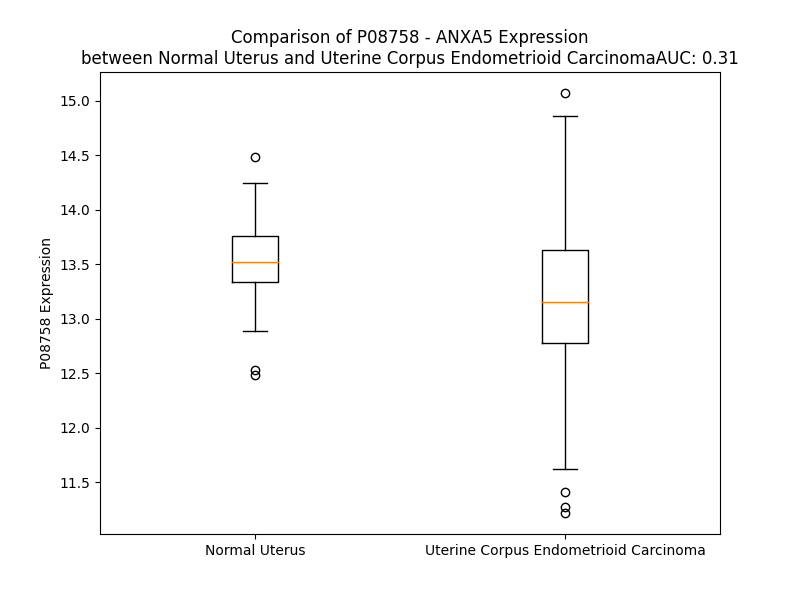

# Detailed Data for P08758

## Introduction to the Detailed Summary

### How to Interpret the Results

- **Summary & Metrics**: This section provides a quick reference to essential protein attributes, including expression changes, family classification, and biomarker applications. Regulation status (upregulated/downregulated) indicates the protein's behavior in a disease context. Some information comes from the original excel file with the proteins selected from literature, while others are derived from the analyses.
- **Expression Comparison**: A visual representation comparing protein expression between normal and disease states. It highlights significant changes in expression levels that might indicate diagnostic or therapeutic relevance. This is data coming from transcriptomics experiments and could not translate similarly to protein levels.
- **Isoform Alignment**: An interactive view of isoform alignments, revealing structural and functional differences between variants of the protein.
- **Interactors & Homologs**: Tables listing known interaction partners and homologous proteins, the more interactors and homologs, the more complex the protein is to design an antibody for.
- **Biological Assemblies**: Information about the structural arrangement of the protein in different assemblies, providing insights into its functional state but also the complexity of the protein to develop antibodies.
- **Combined Per-Residue Information**: A detailed table summarizing residue-level data. This includes predictions for epitope regions, aggregation tendencies, and modifications that might impact the protein's function. Each row corresponds to a residue in the protein, providing insights into specific sites that may be important for research or drug development.
## Summary & Metrics

- **UniProt Accession**: P08758
- **Gene Name**: PP4
- **Protein Name**: placental protein 4
- **Swiss Prot**: nan
- **Family**: nan
- **Biomarker Application**: nan
- **Number of Isoforms**: 0
- **Regulation**: 1
- **(transcriptomics) AUC**: 0.23
- **(transcriptomics) Fold Change**: 1.04
- **(transcriptomics) Regulation**: Downregulated
- **Discotope Epitope Count**: 47
- **Max n_uniprots (Homo)**: 2
- **Max n_uniprots (Hetero)**: N/A

## Expression Comparison

## Interactors

| preferredName_A   | preferredName_B   |   score |
|:------------------|:------------------|--------:|
| ANXA5             | ACTB              |   0.95  |
| ANXA5             | GAPDH             |   0.943 |
| ANXA5             | CASP3             |   0.921 |

## Homologs

| uniprot_id   | gene_id   |
|:-------------|:----------|
| O76027       | ANXA9     |
| E5RIN3       | ANXA13    |
| Q5TZZ9       | ANXA1     |
| A0A075B752   | ANXA8L1   |
| P13928       | ANXA8     |
| D6RAZ8       | ANXA3     |
| P50995       | ANXA11    |
| B9ZVT2       | ANXA7     |
| Q6P452       | ANXA4     |
| Q9UJ72       | ANXA10    |
| E5RK63       | ANXA6     |
| H0YLV6       | ANXA2     |

## Biological Assemblies

|   Unnamed: 0 |   assembly |   n_uniprots | composition   | crystal_id   |
|-------------:|-----------:|-------------:|:--------------|:-------------|
|            0 |          1 |            2 | Homo          | 1hak         |
|            0 |          1 |            1 | Homo          | 1hvd         |
|            0 |          1 |            1 | Homo          | 8h9z         |
|            0 |          1 |            1 | Homo          | 1hvg         |
|            0 |          1 |            1 | Homo          | 1sav         |
|            0 |          1 |            1 | Homo          | 1anw         |
|            1 |          2 |            1 | Homo          | 1anw         |
|            0 |          1 |            1 | Homo          | 1hvf         |
|            0 |          1 |            1 | Homo          | 6k22         |
|            0 |          1 |            1 | Homo          | 2xo2         |
|            0 |          1 |            1 | Homo          | 1avr         |
|            0 |          1 |            1 | Homo          | 1anx         |
|            1 |          2 |            1 | Homo          | 1anx         |
|            2 |          3 |            1 | Homo          | 1anx         |
|            0 |          1 |            2 | Homo          | 8gyc         |
|            0 |          1 |            1 | Homo          | 8h0j         |
|            0 |          1 |            1 | Homo          | 1hve         |
|            0 |          1 |            1 | Homo          | 6k25         |
|            0 |          1 |            1 | Homo          | 2xo3         |
|            0 |          1 |            1 | Homo          | 1avh         |
|            1 |          2 |            1 | Homo          | 1avh         |
|            2 |          3 |            2 | Homo          | 1avh         |
|            3 |          4 |            2 | Homo          | 1avh         |

## Combined Per-Residue Information

|   res | aa   |   epitope_score | epitope   |   relative_surface_accessibility |   modeling_confidence |   Aggregation | modification      |
|------:|:-----|----------------:|:----------|---------------------------------:|----------------------:|--------------:|:------------------|
|     1 | M    |         0.20506 | False     |                          1.30581 |                 42.87 |         0     | N/A               |
|     2 | A    |         0.25265 | True      |                          0.93809 |                 65.46 |         0     | N-acetylalanine   |
|     3 | Q    |         0.20219 | False     |                          0.4888  |                 75.38 |         0     | N/A               |
|     4 | V    |         0.23645 | True      |                          0.90187 |                 89.38 |         0     | N/A               |
|     5 | L    |         0.20218 | False     |                          0.56042 |                 94.3  |         0     | N/A               |
|     6 | R    |         0.19753 | False     |                          0.56994 |                 96.88 |         0     | N/A               |
|     7 | G    |         0.06296 | False     |                          0.10627 |                 97.21 |         0     | N/A               |
|     8 | T    |         0.07818 | False     |                          0.26847 |                 97.99 |         0     | N/A               |
|     9 | V    |         0.02286 | False     |                          0.05762 |                 97.92 |         0     | N/A               |
|    10 | T    |         0.17201 | False     |                          0.66464 |                 96.9  |         0     | N/A               |
|    11 | D    |         0.14329 | False     |                          0.57921 |                 98.02 |         0     | N/A               |
|    12 | F    |         0.14855 | False     |                          0.39966 |                 98.04 |         0     | N/A               |
|    13 | P    |         0.23793 | True      |                          0.84247 |                 97.86 |         0     | N/A               |
|    14 | G    |         0.21415 | False     |                          0.95498 |                 97.22 |         0     | N/A               |
|    15 | F    |         0.18582 | False     |                          0.23852 |                 98.23 |         0     | N/A               |
|    16 | D    |         0.16466 | False     |                          0.42787 |                 98.6  |         0     | N/A               |
|    17 | E    |         0.11151 | False     |                          0.31118 |                 98.49 |         0     | N/A               |
|    18 | R    |         0.24661 | True      |                          0.5763  |                 98.61 |         0     | N/A               |
|    19 | A    |         0.16215 | False     |                          0.44117 |                 98.55 |         0     | N/A               |
|    20 | D    |         0.04735 | False     |                          0.06812 |                 98.74 |         0     | N/A               |
|    21 | A    |         0.00255 | False     |                          0       |                 98.66 |         0     | N/A               |
|    22 | E    |         0.21024 | False     |                          0.50434 |                 98.4  |         0     | N/A               |
|    23 | T    |         0.12692 | False     |                          0.40762 |                 98.52 |         0     | N/A               |
|    24 | L    |         0.00348 | False     |                          0.00165 |                 98.55 |         0     | N/A               |
|    25 | R    |         0.13331 | False     |                          0.23412 |                 98.02 |         0     | N/A               |
|    26 | K    |         0.24641 | True      |                          0.80526 |                 97.95 |         0     | N/A               |
|    27 | A    |         0.02838 | False     |                          0.06652 |                 97.94 |         0     | N/A               |
|    28 | M    |         0.06048 | False     |                          0.05502 |                 97.63 |         0     | N/A               |
|    29 | K    |         0.29533 | True      |                          0.72272 |                 92.91 |         0     | N/A               |
|    30 | G    |         0.23243 | True      |                          0.80235 |                 90.22 |         0     | N/A               |
|    31 | L    |         0.25667 | True      |                          1.17556 |                 84.63 |         0     | N/A               |
|    32 | G    |         0.20661 | False     |                          0.59397 |                 91.04 |         0     | N/A               |
|    33 | T    |         0.0896  | False     |                          0.19411 |                 95.66 |         0     | N/A               |
|    34 | D    |         0.14926 | False     |                          0.40082 |                 97.43 |         0     | N/A               |
|    35 | E    |         0.08348 | False     |                          0.29302 |                 97.75 |         0     | N/A               |
|    36 | E    |         0.20738 | False     |                          0.43235 |                 97.62 |         0     | N/A               |
|    37 | S    |         0.11535 | False     |                          0.27453 |                 97.79 |         2.679 | Phosphoserine     |
|    38 | I    |         0.00542 | False     |                          0       |                 98.52 |        59.848 | N/A               |
|    39 | L    |         0.00776 | False     |                          0.00247 |                 97.73 |        60.431 | N/A               |
|    40 | T    |         0.14001 | False     |                          0.46015 |                 97.85 |        60.431 | N/A               |
|    41 | L    |         0.02642 | False     |                          0.04781 |                 98.54 |        60.431 | N/A               |
|    42 | L    |         0.00277 | False     |                          0       |                 98.6  |        60.351 | N/A               |
|    43 | T    |         0.01756 | False     |                          0.03118 |                 98.32 |        50.347 | N/A               |
|    44 | S    |         0.04685 | False     |                          0.30529 |                 97.6  |         5.557 | N/A               |
|    45 | R    |         0.07994 | False     |                          0.10958 |                 98.36 |         0     | N/A               |
|    46 | S    |         0.01913 | False     |                          0.04472 |                 98.37 |         0     | N/A               |
|    47 | N    |         0.04438 | False     |                          0.14253 |                 98.35 |         0     | N/A               |
|    48 | A    |         0.11525 | False     |                          0.59091 |                 98.3  |         0     | N/A               |
|    49 | Q    |         0.06449 | False     |                          0.05958 |                 98.75 |         0     | N/A               |
|    50 | R    |         0.02374 | False     |                          0.01358 |                 98.72 |         0     | N/A               |
|    51 | Q    |         0.11146 | False     |                          0.29794 |                 98.66 |         0     | N/A               |
|    52 | E    |         0.20776 | False     |                          0.44375 |                 98.75 |         0     | N/A               |
|    53 | I    |         0.01074 | False     |                          0       |                 98.8  |         2.046 | N/A               |
|    54 | S    |         0.08678 | False     |                          0.25045 |                 98.62 |         2.046 | N/A               |
|    55 | A    |         0.15465 | False     |                          0.58561 |                 98.67 |         2.046 | N/A               |
|    56 | A    |         0.07756 | False     |                          0.09167 |                 98.75 |         2.046 | N/A               |
|    57 | F    |         0.00899 | False     |                          0       |                 98.67 |         2.046 | N/A               |
|    58 | K    |         0.13953 | False     |                          0.54302 |                 98.5  |         0     | N/A               |
|    59 | T    |         0.33572 | True      |                          0.77441 |                 98.41 |         0     | N/A               |
|    60 | L    |         0.24112 | True      |                          0.43065 |                 98.24 |         0     | N/A               |
|    61 | F    |         0.404   | True      |                          0.34281 |                 97.72 |         0     | N/A               |
|    62 | G    |         0.23633 | True      |                          0.62058 |                 97.58 |         0     | N/A               |
|    63 | R    |         0.32268 | True      |                          0.4515  |                 97.7  |         0     | N/A               |
|    64 | D    |         0.12223 | False     |                          0.40106 |                 97.95 |         0     | N/A               |
|    65 | L    |         0.02068 | False     |                          0.01357 |                 98.29 |         0     | N/A               |
|    66 | L    |         0.09234 | False     |                          0.24921 |                 97.65 |         0     | N/A               |
|    67 | D    |         0.18165 | False     |                          0.50662 |                 97.93 |         0     | N/A               |
|    68 | D    |         0.15691 | False     |                          0.07312 |                 97.97 |         0     | N/A               |
|    69 | L    |         0.00358 | False     |                          0       |                 97.99 |         0     | N/A               |
|    70 | K    |         0.23668 | True      |                          0.42713 |                 97.46 |         0     | N6-acetyllysine   |
|    71 | S    |         0.19166 | False     |                          0.66029 |                 96.53 |         0     | N/A               |
|    72 | E    |         0.2131  | False     |                          0.32371 |                 97.09 |         0     | N/A               |
|    73 | L    |         0.029   | False     |                          0.02444 |                 97.09 |         0     | N/A               |
|    74 | T    |         0.29389 | True      |                          0.7906  |                 96.49 |         0     | N/A               |
|    75 | G    |         0.25859 | True      |                          0.51544 |                 97.68 |         0     | N/A               |
|    76 | K    |         0.16424 | False     |                          0.48617 |                 98.12 |         0     | N6-acetyllysine   |
|    77 | F    |         0.04318 | False     |                          0.08471 |                 98.32 |         0.497 | N/A               |
|    78 | E    |         0.09979 | False     |                          0.22635 |                 98.38 |         0.497 | N/A               |
|    79 | K    |         0.15552 | False     |                          0.65309 |                 98.4  |         0.497 | N6-acetyllysine   |
|    80 | L    |         0.00228 | False     |                          0       |                 98.68 |        80.471 | N/A               |
|    81 | I    |         0.00449 | False     |                          0       |                 98.59 |        81.515 | N/A               |
|    82 | V    |         0.08559 | False     |                          0.15043 |                 98.34 |        81.515 | N/A               |
|    83 | A    |         0.01664 | False     |                          0.04267 |                 98.54 |        81.424 | N/A               |
|    84 | L    |         0.0032  | False     |                          0.00082 |                 98.23 |        81.347 | N/A               |
|    85 | M    |         0.01934 | False     |                          0.04587 |                 98.53 |        43.84  | N/A               |
|    86 | K    |         0.08783 | False     |                          0.16492 |                 97.89 |         0     | N/A               |
|    87 | P    |         0.08186 | False     |                          0.39167 |                 97.66 |         0     | N/A               |
|    88 | S    |         0.04788 | False     |                          0.32559 |                 93.41 |         0     | N/A               |
|    89 | R    |         0.1257  | False     |                          0.23175 |                 96.05 |         0     | N/A               |
|    90 | L    |         0.1312  | False     |                          0.22376 |                 97.6  |         0     | N/A               |
|    91 | Y    |         0.03209 | False     |                          0.02999 |                 98.24 |         0     | N/A               |
|    92 | D    |         0.01311 | False     |                          0.01147 |                 98.3  |         0     | N/A               |
|    93 | A    |         0.00291 | False     |                          0       |                 98.28 |         0     | N/A               |
|    94 | Y    |         0.15378 | False     |                          0.30319 |                 97.77 |         0     | N/A               |
|    95 | E    |         0.01715 | False     |                          0.0266  |                 98.25 |         0     | N/A               |
|    96 | L    |         0.00252 | False     |                          0       |                 98.35 |         0     | N/A               |
|    97 | K    |         0.08916 | False     |                          0.24542 |                 97.57 |         0     | N6-acetyllysine   |
|    98 | H    |         0.17515 | False     |                          0.4509  |                 95.98 |         0     | N/A               |
|    99 | A    |         0.02687 | False     |                          0.04954 |                 96.66 |         0     | N/A               |
|   100 | L    |         0.04754 | False     |                          0.06346 |                 96.26 |         0     | N/A               |
|   101 | K    |         0.28559 | True      |                          0.71331 |                 87.37 |         0     | N6-acetyllysine   |
|   102 | G    |         0.27156 | True      |                          0.68594 |                 80.42 |         0     | N/A               |
|   103 | A    |         0.1868  | False     |                          1.13293 |                 73.55 |         0     | N/A               |
|   104 | G    |         0.25837 | True      |                          0.66203 |                 80.89 |         0     | N/A               |
|   105 | T    |         0.09793 | False     |                          0.19797 |                 89.47 |         0     | N/A               |
|   106 | N    |         0.16846 | False     |                          0.40516 |                 94.51 |         0     | N/A               |
|   107 | E    |         0.14652 | False     |                          0.25334 |                 96.47 |         0     | N/A               |
|   108 | K    |         0.14876 | False     |                          0.49946 |                 96.5  |         2.069 | N/A               |
|   109 | V    |         0.01631 | False     |                          0.01714 |                 97.89 |         2.069 | N/A               |
|   110 | L    |         0.00263 | False     |                          0       |                 97.74 |         2.069 | N/A               |
|   111 | T    |         0.0601  | False     |                          0.05964 |                 98.46 |         2.069 | N/A               |
|   112 | E    |         0.01812 | False     |                          0.01449 |                 98.56 |         2.069 | N/A               |
|   113 | I    |         0.00322 | False     |                          0       |                 98.67 |         2.069 | N/A               |
|   114 | I    |         0.0061  | False     |                          0.00828 |                 98.54 |         2.069 | N/A               |
|   115 | A    |         0.02823 | False     |                          0.11219 |                 98.23 |         1.809 | N/A               |
|   116 | S    |         0.00432 | False     |                          0.0051  |                 97.81 |         0.173 | N/A               |
|   117 | R    |         0.06443 | False     |                          0.05207 |                 97.05 |         0     | N/A               |
|   118 | T    |         0.09338 | False     |                          0.41976 |                 94.22 |         0     | N/A               |
|   119 | P    |         0.05565 | False     |                          0.27933 |                 95.23 |         0     | N/A               |
|   120 | E    |         0.18358 | False     |                          0.69506 |                 95.32 |         0     | N/A               |
|   121 | E    |         0.1021  | False     |                          0.12608 |                 96.7  |         0     | N/A               |
|   122 | L    |         0.0263  | False     |                          0.0305  |                 98    |         0     | N/A               |
|   123 | R    |         0.16807 | False     |                          0.48637 |                 98.11 |         0     | N/A               |
|   124 | A    |         0.16191 | False     |                          0.34879 |                 98.03 |         0     | N/A               |
|   125 | I    |         0.00769 | False     |                          0       |                 98.48 |         0     | N/A               |
|   126 | K    |         0.06425 | False     |                          0.24646 |                 98.41 |         0     | N/A               |
|   127 | Q    |         0.279   | True      |                          0.55347 |                 98.43 |         0     | N/A               |
|   128 | V    |         0.07702 | False     |                          0.26323 |                 98.13 |         0     | N/A               |
|   129 | Y    |         0.00739 | False     |                          0       |                 98.57 |         0     | N/A               |
|   130 | E    |         0.15566 | False     |                          0.52716 |                 98.27 |         0     | N/A               |
|   131 | E    |         0.2476  | True      |                          0.64858 |                 98.23 |         0     | N/A               |
|   132 | E    |         0.14342 | False     |                          0.50654 |                 97.73 |         0     | N/A               |
|   133 | Y    |         0.2086  | False     |                          0.29121 |                 96.96 |         0     | N/A               |
|   134 | G    |         0.43518 | True      |                          0.83834 |                 96.84 |         0     | N/A               |
|   135 | S    |         0.19104 | False     |                          0.26548 |                 96.4  |         0     | N/A               |
|   136 | S    |         0.11191 | False     |                          0.28535 |                 97.64 |         0     | N/A               |
|   137 | L    |         0.00836 | False     |                          0.00708 |                 98.2  |         0     | N/A               |
|   138 | E    |         0.08883 | False     |                          0.1948  |                 98.03 |         0     | N/A               |
|   139 | D    |         0.22044 | False     |                          0.58819 |                 97.54 |         0     | N/A               |
|   140 | D    |         0.10401 | False     |                          0.16691 |                 97.65 |         0     | N/A               |
|   141 | V    |         0.00245 | False     |                          0       |                 97.94 |         0     | N/A               |
|   142 | V    |         0.24198 | True      |                          0.50634 |                 97.48 |         0     | N/A               |
|   143 | G    |         0.34664 | True      |                          0.79237 |                 95.73 |         0     | N/A               |
|   144 | D    |         0.18701 | False     |                          0.3559  |                 96.13 |         0     | N/A               |
|   145 | T    |         0.13307 | False     |                          0.12471 |                 96.04 |         0     | N/A               |
|   146 | S    |         0.33826 | True      |                          0.66107 |                 96.19 |         0     | N/A               |
|   147 | G    |         0.22069 | False     |                          0.66113 |                 96.65 |         0     | N/A               |
|   148 | Y    |         0.15754 | False     |                          0.37395 |                 97.26 |         0     | N/A               |
|   149 | Y    |         0.04901 | False     |                          0.06969 |                 97.73 |         0     | N/A               |
|   150 | Q    |         0.08452 | False     |                          0.18252 |                 98    |         0     | N/A               |
|   151 | R    |         0.25302 | True      |                          0.39705 |                 97.99 |         0     | N/A               |
|   152 | M    |         0.00356 | False     |                          0       |                 98.1  |        52.372 | N/A               |
|   153 | L    |         0.00257 | False     |                          0       |                 98.47 |        91.477 | N/A               |
|   154 | V    |         0.13105 | False     |                          0.21612 |                 98.24 |        92.496 | N/A               |
|   155 | V    |         0.0702  | False     |                          0.25251 |                 98.16 |        92.515 | N/A               |
|   156 | L    |         0.02804 | False     |                          0.07939 |                 98.25 |        92.515 | N/A               |
|   157 | L    |         0.00418 | False     |                          0.00082 |                 98.33 |        84.768 | N/A               |
|   158 | Q    |         0.10553 | False     |                          0.39044 |                 97.72 |         5.383 | N/A               |
|   159 | A    |         0.01593 | False     |                          0.02551 |                 96.05 |         1.544 | N/A               |
|   160 | N    |         0.16834 | False     |                          0.63963 |                 94.77 |         0.342 | N/A               |
|   161 | R    |         0.09423 | False     |                          0.15971 |                 94.65 |         0     | N/A               |
|   162 | D    |         0.16569 | False     |                          0.36973 |                 94.72 |         0     | N/A               |
|   163 | P    |         0.19273 | False     |                          0.79435 |                 91.52 |         0     | N/A               |
|   164 | D    |         0.27513 | True      |                          0.57287 |                 90.55 |         0     | N/A               |
|   165 | A    |         0.19692 | False     |                          0.71009 |                 86.5  |         0     | N/A               |
|   166 | G    |         0.26794 | True      |                          0.96336 |                 88.51 |         0     | N/A               |
|   167 | I    |         0.18368 | False     |                          0.33604 |                 92.13 |         0     | N/A               |
|   168 | D    |         0.27366 | True      |                          0.51246 |                 94.92 |         0     | N/A               |
|   169 | E    |         0.178   | False     |                          0.53127 |                 96.67 |         0     | N/A               |
|   170 | A    |         0.22595 | False     |                          0.56617 |                 97.31 |         0     | N/A               |
|   171 | Q    |         0.11681 | False     |                          0.24878 |                 97.64 |         0     | N/A               |
|   172 | V    |         0.02865 | False     |                          0.03142 |                 98.32 |         0     | N/A               |
|   173 | E    |         0.17905 | False     |                          0.26653 |                 98.16 |         0     | N/A               |
|   174 | Q    |         0.23549 | True      |                          0.52116 |                 98.08 |         0     | N/A               |
|   175 | D    |         0.07319 | False     |                          0.04721 |                 98.37 |         0     | N/A               |
|   176 | A    |         0.00452 | False     |                          0       |                 98.11 |         0     | N/A               |
|   177 | Q    |         0.13906 | False     |                          0.36658 |                 97.07 |         0     | N/A               |
|   178 | A    |         0.10092 | False     |                          0.16739 |                 96.62 |         0     | N/A               |
|   179 | L    |         0.00236 | False     |                          0       |                 96.62 |         0     | N/A               |
|   180 | F    |         0.10443 | False     |                          0.20383 |                 94.81 |         0     | N/A               |
|   181 | Q    |         0.24766 | True      |                          0.53942 |                 94.49 |         0     | N/A               |
|   182 | A    |         0.03407 | False     |                          0.05211 |                 92.02 |         0     | N/A               |
|   183 | G    |         0.0059  | False     |                          0.00238 |                 88.75 |         0     | N/A               |
|   184 | E    |         0.18705 | False     |                          0.26109 |                 84.46 |         0     | N/A               |
|   185 | L    |         0.3388  | True      |                          0.70812 |                 77.17 |         0     | N/A               |
|   186 | K    |         0.18826 | False     |                          0.57709 |                 78.06 |         0     | N/A               |
|   187 | W    |         0.27375 | True      |                          1.09725 |                 70    |         0     | N/A               |
|   188 | G    |         0.14825 | False     |                          0.47651 |                 79.15 |         0     | N/A               |
|   189 | T    |         0.09884 | False     |                          0.15296 |                 82.24 |         0     | N/A               |
|   190 | D    |         0.16798 | False     |                          0.31719 |                 89.56 |         0     | N/A               |
|   191 | E    |         0.07016 | False     |                          0.18251 |                 92.78 |         0     | N/A               |
|   192 | E    |         0.20704 | False     |                          0.38356 |                 93.9  |         0.019 | N/A               |
|   193 | K    |         0.2056  | False     |                          0.41985 |                 95    |         0.019 | N/A               |
|   194 | F    |         0.00492 | False     |                          0.00255 |                 95.97 |        95.094 | N/A               |
|   195 | I    |         0.02037 | False     |                          0.0088  |                 96.8  |        95.145 | N/A               |
|   196 | T    |         0.19772 | False     |                          0.4805  |                 96.15 |        95.145 | N/A               |
|   197 | I    |         0.06554 | False     |                          0.0432  |                 97.67 |        95.145 | N/A               |
|   198 | F    |         0.00389 | False     |                          0       |                 97.7  |        95.145 | N/A               |
|   199 | G    |         0.02651 | False     |                          0.04402 |                 96.01 |         4.786 | N/A               |
|   200 | T    |         0.08897 | False     |                          0.3142  |                 95.22 |         1.783 | N/A               |
|   201 | R    |         0.13931 | False     |                          0.2827  |                 97.08 |         0     | N/A               |
|   202 | S    |         0.02421 | False     |                          0.06944 |                 96.61 |         0     | N/A               |
|   203 | V    |         0.04214 | False     |                          0.30277 |                 96.03 |         0     | N/A               |
|   204 | S    |         0.0927  | False     |                          0.2263  |                 95.74 |         0     | N/A               |
|   205 | H    |         0.02921 | False     |                          0.07249 |                 97.64 |         0     | N/A               |
|   206 | L    |         0.00388 | False     |                          0       |                 98.21 |         0     | N/A               |
|   207 | R    |         0.16835 | False     |                          0.43197 |                 97.66 |         0     | N/A               |
|   208 | K    |         0.17032 | False     |                          0.36665 |                 98.08 |         0     | N/A               |
|   209 | V    |         0.0028  | False     |                          0       |                 98.47 |         0.166 | N/A               |
|   210 | F    |         0.0073  | False     |                          0.00553 |                 98.4  |         0.166 | N/A               |
|   211 | D    |         0.20065 | False     |                          0.57086 |                 98.04 |         0.166 | N/A               |
|   212 | K    |         0.21341 | False     |                          0.30904 |                 98.42 |         0.166 | N/A               |
|   213 | Y    |         0.00862 | False     |                          0       |                 98.21 |         1.321 | N/A               |
|   214 | M    |         0.1847  | False     |                          0.39505 |                 97.61 |         1.321 | N/A               |
|   215 | T    |         0.25295 | True      |                          0.75111 |                 97.78 |         1.321 | N/A               |
|   216 | I    |         0.21532 | False     |                          0.31356 |                 96.09 |         1.321 | N/A               |
|   217 | S    |         0.18735 | False     |                          0.13033 |                 94.22 |         1.321 | N/A               |
|   218 | G    |         0.18241 | False     |                          0.55075 |                 95.29 |         0.772 | N/A               |
|   219 | F    |         0.29022 | True      |                          0.37581 |                 94.98 |         0.772 | N/A               |
|   220 | Q    |         0.1862  | False     |                          0.33628 |                 96.99 |         0.166 | N/A               |
|   221 | I    |         0.00296 | False     |                          0.00069 |                 97.57 |         0.166 | N/A               |
|   222 | E    |         0.09751 | False     |                          0.16118 |                 97.33 |         0     | N/A               |
|   223 | E    |         0.21359 | False     |                          0.39914 |                 95.58 |         0     | N/A               |
|   224 | T    |         0.00796 | False     |                          0       |                 95.06 |         0     | N/A               |
|   225 | I    |         0.00766 | False     |                          0.0008  |                 95.61 |         0     | N/A               |
|   226 | D    |         0.21    | False     |                          0.47697 |                 94.65 |         0     | N/A               |
|   227 | R    |         0.30595 | True      |                          0.46535 |                 92.49 |         0     | N/A               |
|   228 | E    |         0.13042 | False     |                          0.24779 |                 91.22 |         0     | N/A               |
|   229 | T    |         0.09454 | False     |                          0.10546 |                 91.68 |         0     | N/A               |
|   230 | S    |         0.37191 | True      |                          0.69086 |                 93.27 |         0     | N/A               |
|   231 | G    |         0.29063 | True      |                          0.53368 |                 96.12 |         0     | N/A               |
|   232 | N    |         0.10826 | False     |                          0.40742 |                 97.06 |         0     | N/A               |
|   233 | L    |         0.05076 | False     |                          0.11967 |                 96.99 |         0.025 | N/A               |
|   234 | E    |         0.09872 | False     |                          0.15272 |                 97.45 |         0.025 | N/A               |
|   235 | Q    |         0.14287 | False     |                          0.5002  |                 98.17 |         3.606 | N/A               |
|   236 | L    |         0.00184 | False     |                          0       |                 98.6  |        95.066 | N/A               |
|   237 | L    |         0.00328 | False     |                          0.00165 |                 98.28 |        97.132 | N/A               |
|   238 | L    |         0.07738 | False     |                          0.12365 |                 98.46 |        97.132 | N/A               |
|   239 | A    |         0.01471 | False     |                          0.03099 |                 98.71 |        97.132 | N/A               |
|   240 | V    |         0.01185 | False     |                          0.01594 |                 98.54 |        97.132 | N/A               |
|   241 | V    |         0.00516 | False     |                          0       |                 98.44 |        89.69  | N/A               |
|   242 | K    |         0.08753 | False     |                          0.28575 |                 98.35 |         0.025 | N/A               |
|   243 | S    |         0.02644 | False     |                          0.07089 |                 98.04 |         0.008 | N/A               |
|   244 | I    |         0.04876 | False     |                          0.03897 |                 97.41 |         0.008 | N/A               |
|   245 | R    |         0.10384 | False     |                          0.33319 |                 96.62 |         0     | N/A               |
|   246 | S    |         0.12255 | False     |                          0.20363 |                 96.98 |         0     | N/A               |
|   247 | I    |         0.0487  | False     |                          0.23716 |                 97.69 |         0     | N/A               |
|   248 | P    |         0.02636 | False     |                          0.05666 |                 98.22 |         0     | N/A               |
|   249 | A    |         0.10127 | False     |                          0.23031 |                 98.23 |         0     | N/A               |
|   250 | Y    |         0.05109 | False     |                          0.11447 |                 98.59 |         0     | N/A               |
|   251 | L    |         0.00652 | False     |                          0.00412 |                 98.7  |         0     | N/A               |
|   252 | A    |         0.00306 | False     |                          0       |                 98.64 |         0     | N/A               |
|   253 | E    |         0.27596 | True      |                          0.2329  |                 98.6  |         0     | N/A               |
|   254 | T    |         0.08575 | False     |                          0.11742 |                 98.68 |         9.721 | N/A               |
|   255 | L    |         0.00281 | False     |                          0       |                 98.7  |        18.416 | N/A               |
|   256 | Y    |         0.157   | False     |                          0.19213 |                 98.55 |        18.416 | N/A               |
|   257 | Y    |         0.18161 | False     |                          0.56379 |                 98.05 |        18.416 | N/A               |
|   258 | A    |         0.01551 | False     |                          0.02767 |                 98.15 |        18.416 | N/A               |
|   259 | M    |         0.01887 | False     |                          0.00797 |                 98.27 |        13.87  | N/A               |
|   260 | K    |         0.344   | True      |                          0.55845 |                 96.59 |         0     | N/A               |
|   261 | G    |         0.34582 | True      |                          0.71865 |                 93.3  |         0     | N/A               |
|   262 | A    |         0.20903 | False     |                          1.10231 |                 90.13 |         0     | N/A               |
|   263 | G    |         0.25736 | True      |                          0.64339 |                 93.1  |         0     | N/A               |
|   264 | T    |         0.12897 | False     |                          0.21841 |                 96.97 |         0     | N/A               |
|   265 | D    |         0.14763 | False     |                          0.31523 |                 97.71 |         0     | N/A               |
|   266 | D    |         0.09588 | False     |                          0.12836 |                 98.09 |         0     | N/A               |
|   267 | H    |         0.16542 | False     |                          0.45951 |                 97.63 |         0     | N/A               |
|   268 | T    |         0.01851 | False     |                          0.01231 |                 98.21 |         0     | N/A               |
|   269 | L    |         0.00303 | False     |                          0       |                 98.75 |         0     | N/A               |
|   270 | I    |         0.03139 | False     |                          0.0456  |                 98.75 |         0     | N/A               |
|   271 | R    |         0.0095  | False     |                          0       |                 98.57 |         0     | N/A               |
|   272 | V    |         0.00654 | False     |                          0.00762 |                 98.73 |         0     | N/A               |
|   273 | M    |         0.00313 | False     |                          0       |                 98.72 |         0     | N/A               |
|   274 | V    |         0.03488 | False     |                          0.12369 |                 98.59 |         0     | N/A               |
|   275 | S    |         0.02747 | False     |                          0.07431 |                 98    |         0     | N/A               |
|   276 | R    |         0.04236 | False     |                          0.03067 |                 98.27 |         0     | N/A               |
|   277 | S    |         0.00982 | False     |                          0.00316 |                 98.36 |         0     | N/A               |
|   278 | E    |         0.0625  | False     |                          0.31663 |                 98.06 |         0     | N/A               |
|   279 | I    |         0.1881  | False     |                          0.28903 |                 97.29 |         0     | N/A               |
|   280 | D    |         0.00997 | False     |                          0.00189 |                 97.64 |         0     | N/A               |
|   281 | L    |         0.00278 | False     |                          0       |                 98.52 |         0     | N/A               |
|   282 | F    |         0.09196 | False     |                          0.23382 |                 97.89 |         0     | N/A               |
|   283 | N    |         0.04677 | False     |                          0.03181 |                 97.9  |         0     | N/A               |
|   284 | I    |         0.00567 | False     |                          0       |                 98.51 |         0     | N/A               |
|   285 | R    |         0.03428 | False     |                          0.06064 |                 98.15 |         0     | N/A               |
|   286 | K    |         0.20057 | False     |                          0.50019 |                 97.03 |         0     | N/A               |
|   287 | E    |         0.09714 | False     |                          0.12328 |                 97.58 |         0     | N/A               |
|   288 | F    |         0.00718 | False     |                          0       |                 98.35 |         0     | N/A               |
|   289 | R    |         0.13358 | False     |                          0.44915 |                 97.35 |         0     | N/A               |
|   290 | K    |         0.41051 | True      |                          0.73665 |                 96.79 |         0     | N6-succinyllysine |
|   291 | N    |         0.26497 | True      |                          0.46934 |                 97    |         0     | N/A               |
|   292 | F    |         0.16129 | False     |                          0.16699 |                 96.07 |         0.515 | N/A               |
|   293 | A    |         0.14205 | False     |                          1.0768  |                 92.57 |         0.515 | N/A               |
|   294 | T    |         0.22904 | True      |                          0.29396 |                 96.55 |         0.515 | N/A               |
|   295 | S    |         0.03033 | False     |                          0.03394 |                 98.09 |         0.515 | N/A               |
|   296 | L    |         0.00277 | False     |                          0.00802 |                 98.59 |         1.168 | N/A               |
|   297 | Y    |         0.07969 | False     |                          0.23094 |                 98.6  |         1.168 | N/A               |
|   298 | S    |         0.16075 | False     |                          0.36758 |                 97.98 |         0.836 | N/A               |
|   299 | M    |         0.11679 | False     |                          0.13611 |                 97.92 |         0.836 | N/A               |
|   300 | I    |         0.00612 | False     |                          0       |                 98.53 |         0.836 | N/A               |
|   301 | K    |         0.21307 | False     |                          0.55609 |                 97.78 |         0     | N/A               |
|   302 | G    |         0.32074 | True      |                          0.79861 |                 96.71 |         0     | N/A               |
|   303 | D    |         0.25695 | True      |                          0.33002 |                 97.1  |         0     | N/A               |
|   304 | T    |         0.0981  | False     |                          0.08669 |                 97.78 |         0     | N/A               |
|   305 | S    |         0.20301 | False     |                          0.65474 |                 97.75 |         0     | N/A               |
|   306 | G    |         0.19011 | False     |                          0.61687 |                 98.04 |         0     | N/A               |
|   307 | D    |         0.12218 | False     |                          0.23666 |                 98.24 |         0     | N/A               |
|   308 | Y    |         0.03241 | False     |                          0.04715 |                 98.56 |         0     | N/A               |
|   309 | K    |         0.07706 | False     |                          0.24424 |                 98.5  |         0     | N/A               |
|   310 | K    |         0.13988 | False     |                          0.44201 |                 98.61 |         0     | N/A               |
|   311 | A    |         0.00195 | False     |                          0       |                 98.66 |        14.371 | N/A               |
|   312 | L    |         0.00211 | False     |                          0       |                 98.74 |        33.895 | N/A               |
|   313 | L    |         0.07272 | False     |                          0.12397 |                 98.63 |        33.895 | N/A               |
|   314 | L    |         0.14852 | False     |                          0.51166 |                 98.33 |        33.895 | N/A               |
|   315 | L    |         0.00319 | False     |                          0.00165 |                 98.44 |        33.895 | N/A               |
|   316 | C    |         0.00211 | False     |                          0       |                 98.38 |        29.274 | N/A               |
|   317 | G    |         0.07641 | False     |                          0.34095 |                 95.86 |         4.543 | N/A               |
|   318 | E    |         0.09916 | False     |                          0.70751 |                 91.23 |         0     | N/A               |
|   319 | D    |         0.10112 | False     |                          0.48316 |                 91.82 |         0     | N/A               |
|   320 | D    |         0.02819 | False     |                          0.47932 |                 82.21 |         0     | N/A               |

