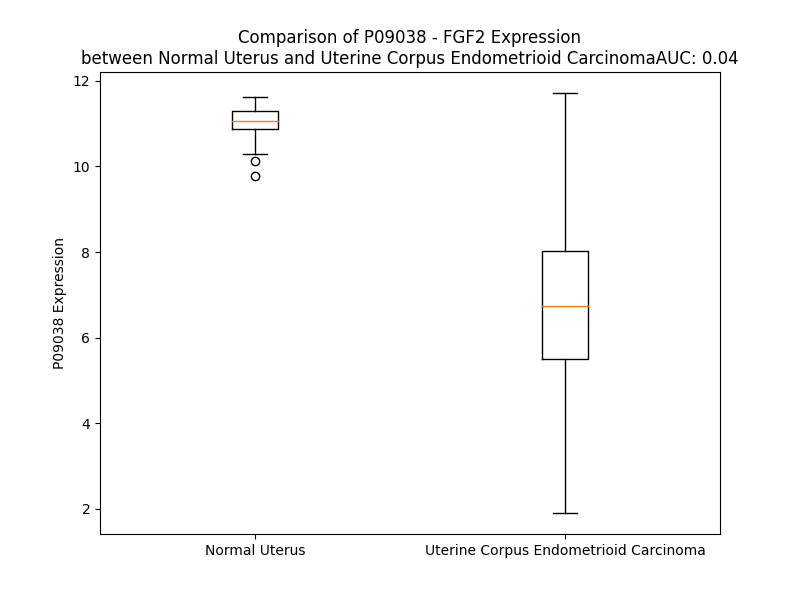

# Detailed Data for P09038

## Introduction to the Detailed Summary

### How to Interpret the Results

- **Summary & Metrics**: This section provides a quick reference to essential protein attributes, including expression changes, family classification, and biomarker applications. Regulation status (upregulated/downregulated) indicates the protein's behavior in a disease context. Some information comes from the original excel file with the proteins selected from literature, while others are derived from the analyses.
- **Expression Comparison**: A visual representation comparing protein expression between normal and disease states. It highlights significant changes in expression levels that might indicate diagnostic or therapeutic relevance. This is data coming from transcriptomics experiments and could not translate similarly to protein levels.
- **Isoform Alignment**: An interactive view of isoform alignments, revealing structural and functional differences between variants of the protein.
- **Interactors & Homologs**: Tables listing known interaction partners and homologous proteins, the more interactors and homologs, the more complex the protein is to design an antibody for.
- **Biological Assemblies**: Information about the structural arrangement of the protein in different assemblies, providing insights into its functional state but also the complexity of the protein to develop antibodies.
- **Combined Per-Residue Information**: A detailed table summarizing residue-level data. This includes predictions for epitope regions, aggregation tendencies, and modifications that might impact the protein's function. Each row corresponds to a residue in the protein, providing insights into specific sites that may be important for research or drug development.
## Summary & Metrics

- **UniProt Accession**: P09038
- **Gene Name**: FGF2
- **Protein Name**: Fibroblast growth factor 2
- **Swiss Prot**: FGF2_HUMAN
- **Family**: growth factor
- **Biomarker Application**: diagnosis,disease progression,efficacy,prognosis
- **Number of Isoforms**: 0
- **Regulation**: 1
- **(transcriptomics) AUC**: 0.04
- **(transcriptomics) Fold Change**: 1.59
- **(transcriptomics) Regulation**: Downregulated
- **Discotope Epitope Count**: 40
- **Max n_uniprots (Homo)**: 2
- **Max n_uniprots (Hetero)**: 8

## Expression Comparison

## Interactors

| preferredName_A   | preferredName_B   |   score |
|:------------------|:------------------|--------:|
| FGF2              | FGFR2             |   0.999 |
| FGF2              | FGFR4             |   0.999 |
| FGF2              | FGFR1             |   0.999 |
| FGF2              | FGFR3             |   0.999 |
| FGF2              | HSPG2             |   0.998 |
| FGF2              | KDR               |   0.998 |
| FGF2              | SDC1              |   0.997 |
| FGF2              | FGFBP1            |   0.995 |
| FGF2              | FLT1              |   0.993 |
| FGF2              | CD44              |   0.993 |
| FGF2              | SDC4              |   0.993 |
| FGF2              | GPC1              |   0.987 |
| FGF2              | S100B             |   0.986 |
| FGF2              | PDGFRA            |   0.982 |
| FGF2              | PTX3              |   0.982 |
| FGF2              | TGFB1             |   0.982 |
| FGF2              | CX3CL1            |   0.971 |
| FGF2              | EGF               |   0.969 |
| FGF2              | CCL11             |   0.968 |
| FGF2              | CSF2              |   0.965 |
| FGF2              | FN1               |   0.965 |
| FGF2              | FGF1              |   0.962 |
| FGF2              | CSF3              |   0.961 |
| FGF2              | NTRK1             |   0.959 |
| FGF2              | EGFR              |   0.957 |
| FGF2              | API5              |   0.955 |
| FGF2              | HGF               |   0.955 |
| FGF2              | PDGFB             |   0.953 |
| FGF2              | FGF17             |   0.953 |
| FGF2              | PDGFRB            |   0.953 |
| FGF2              | FLT4              |   0.942 |
| FGF2              | TEK               |   0.941 |
| FGF2              | BMP2              |   0.937 |
| FGF2              | NRP1              |   0.935 |
| FGF2              | SOX2              |   0.933 |
| FGF2              | POU5F1            |   0.931 |
| FGF2              | AKT1              |   0.926 |
| FGF2              | NANOG             |   0.924 |
| FGF2              | MMP9              |   0.919 |
| FGF2              | CXCL1             |   0.918 |
| FGF2              | FLT3LG            |   0.918 |
| FGF2              | NTRK2             |   0.908 |
| FGF2              | MET               |   0.905 |

## Homologs

| uniprot_id   | gene_id   |
|:-------------|:----------|
| O43320       | FGF16     |
| A0A7U3JVY0   | FGF5C     |
| P31371       | FGF9      |
| O60258       | FGF17     |
| A0A7U3JVZ2   | FGF2B     |
| D6RG33       | FGF10     |
| A0A087X1S5   | FGF8      |
| Q9HCT0       | FGF22     |
| Q9GZV9       | FGF23     |
| O76093       | FGF18     |
| H0YGZ9       | FGF6      |
| A0A7U3JVY2   | FGF5B     |
| A0A7U3L5M7   | FGF8C     |
| C9JUK8       | FGF12     |
| B1AJW0       | FGF13     |
| A0A7U3L4E7   | FGF8A     |
| I3L4N4       | FGF11     |
| A0A7U3L649   | FGF4A     |
| A0A7U3JW12   | FGF7A     |
| A0A9L9PX77   | FGF14     |
| H0Y9E2       | FGF5      |
| O43320       | FGF16     |
| A0A7U3JVY0   | FGF5C     |
| P31371       | FGF9      |
| O60258       | FGF17     |
| A0A7U3JVZ2   | FGF2B     |
| D6RG33       | FGF10     |
| A0A087X1S5   | FGF8      |
| Q9HCT0       | FGF22     |
| Q9GZV9       | FGF23     |
| O76093       | FGF18     |
| H0YGZ9       | FGF6      |
| A0A7U3JVY2   | FGF5B     |
| A0A7U3L5M7   | FGF8C     |
| C9JUK8       | FGF12     |
| D9ZGF5       | FGF2      |
| A0A7U3L4E7   | FGF8A     |
| I3L4N4       | FGF11     |
| A0A7U3L649   | FGF4A     |
| A0A7U3JW12   | FGF7A     |
| A0A9L9PX77   | FGF14     |
| H0Y9E2       | FGF5      |

## Biological Assemblies

|   Unnamed: 0 |   assembly |   n_uniprots | composition   | crystal_id   |
|-------------:|-----------:|-------------:|:--------------|:-------------|
|            0 |          1 |            1 | Homo          | 1fga         |
|            0 |          1 |            2 | Hetero        | 1ii4         |
|            1 |          2 |            2 | Hetero        | 1ii4         |
|            2 |          3 |            2 | Hetero        | 1ii4         |
|            3 |          4 |            2 | Hetero        | 1ii4         |
|            0 |          1 |            8 | Hetero        | 1ev2         |
|            0 |          1 |            1 | Homo          | 4fgf         |
|            0 |          1 |            1 | Homo          | 8om6         |
|            0 |          1 |            1 | Homo          | 1bfb         |
|            0 |          1 |            2 | Hetero        | 6l4o         |
|            0 |          1 |            1 | Homo          | 2bfh         |
|            0 |          1 |            1 | Homo          | 1bff         |
|            0 |          1 |            1 | Homo          | 2fgf         |
|            0 |          1 |            1 | Homo          | 1bla         |
|            0 |          1 |            1 | Homo          | 4oef         |
|            0 |          1 |            1 | Homo          | 1bas         |
|            0 |          1 |            1 | Homo          | 4oee         |
|            0 |          1 |            4 | Hetero        | 1fq9         |
|            0 |          1 |            2 | Hetero        | 1iil         |
|            1 |          2 |            2 | Hetero        | 1iil         |
|            2 |          3 |            2 | Hetero        | 1iil         |
|            3 |          4 |            2 | Hetero        | 1iil         |
|            0 |          1 |            4 | Hetero        | 1cvs         |
|            1 |          2 |            4 | Hetero        | 1cvs         |
|            0 |          1 |            1 | Homo          | 1bfc         |
|            0 |          1 |            1 | Homo          | 1bld         |
|            0 |          1 |            2 | Homo          | 5x1o         |
|            0 |          1 |            1 | Homo          | 1bfg         |
|            0 |          1 |            4 | Hetero        | 2m49         |
|            0 |          1 |            1 | Homo          | 4oeg         |

## Combined Per-Residue Information

|   res | aa   |   epitope_score | epitope   |   relative_surface_accessibility |   modeling_confidence |   Aggregation | modification                          |
|------:|:-----|----------------:|:----------|---------------------------------:|----------------------:|--------------:|:--------------------------------------|
|     1 | M    |         0.08781 | False     |                          1.2507  |                 45.12 |         0     | N/A                                   |
|     2 | V    |         0.07425 | False     |                          0.9125  |                 46.17 |         0     | N/A                                   |
|     3 | G    |         0.139   | False     |                          0.85297 |                 41    |         0     | N/A                                   |
|     4 | V    |         0.0902  | False     |                          1.08331 |                 56.44 |         0     | N/A                                   |
|     5 | G    |         0.10089 | False     |                          0.89239 |                 52.69 |         0     | N/A                                   |
|     6 | G    |         0.15804 | False     |                          1.07041 |                 45.38 |         0     | N/A                                   |
|     7 | G    |         0.18295 | False     |                          0.91011 |                 56.87 |         0     | N/A                                   |
|     8 | D    |         0.148   | False     |                          0.87785 |                 54.07 |         0     | N/A                                   |
|     9 | V    |         0.14802 | False     |                          1.04993 |                 61.76 |         0     | N/A                                   |
|    10 | E    |         0.1151  | False     |                          0.80867 |                 56.3  |         0     | N/A                                   |
|    11 | D    |         0.13087 | False     |                          0.77431 |                 46.46 |         0     | N/A                                   |
|    12 | V    |         0.12253 | False     |                          0.95893 |                 57.22 |         0     | N/A                                   |
|    13 | T    |         0.14675 | False     |                          0.72135 |                 60.1  |         0     | N/A                                   |
|    14 | P    |         0.11789 | False     |                          0.87272 |                 61.95 |         0     | N/A                                   |
|    15 | R    |         0.14779 | False     |                          0.91552 |                 55.37 |         0     | N/A                                   |
|    16 | P    |         0.09945 | False     |                          0.95586 |                 56.42 |         0     | N/A                                   |
|    17 | G    |         0.12229 | False     |                          0.92827 |                 53.95 |         0     | N/A                                   |
|    18 | G    |         0.11491 | False     |                          0.96726 |                 41.02 |         0     | N/A                                   |
|    19 | C    |         0.12866 | False     |                          0.83511 |                 46.25 |         0     | N/A                                   |
|    20 | Q    |         0.1563  | False     |                          0.91778 |                 44.81 |         0     | N/A                                   |
|    21 | I    |         0.13149 | False     |                          0.90828 |                 54.3  |         0     | N/A                                   |
|    22 | S    |         0.20114 | False     |                          0.89685 |                 47.17 |         0     | N/A                                   |
|    23 | G    |         0.18028 | False     |                          0.85518 |                 45.62 |         0     | N/A                                   |
|    24 | R    |         0.20818 | False     |                          0.98727 |                 51.1  |         0     | N/A                                   |
|    25 | G    |         0.16621 | False     |                          0.99933 |                 38.6  |         0     | N/A                                   |
|    26 | A    |         0.10759 | False     |                          1.02293 |                 50.11 |         0     | N/A                                   |
|    27 | R    |         0.12182 | False     |                          0.9917  |                 50.96 |         0     | N/A                                   |
|    28 | G    |         0.09126 | False     |                          0.83563 |                 39.8  |         0     | N/A                                   |
|    29 | C    |         0.12261 | False     |                          1.00687 |                 52.05 |         0     | N/A                                   |
|    30 | N    |         0.16231 | False     |                          0.99718 |                 49.45 |         0     | N/A                                   |
|    31 | G    |         0.19842 | False     |                          0.87816 |                 39.36 |         0     | N/A                                   |
|    32 | I    |         0.14953 | False     |                          1.00294 |                 54.81 |         0     | N/A                                   |
|    33 | P    |         0.16958 | False     |                          0.90683 |                 45.77 |         0     | N/A                                   |
|    34 | G    |         0.14312 | False     |                          0.83758 |                 37.25 |         0     | N/A                                   |
|    35 | A    |         0.09765 | False     |                          1.09987 |                 34.32 |         0     | N/A                                   |
|    36 | A    |         0.13947 | False     |                          0.93776 |                 42.09 |         0     | N/A                                   |
|    37 | A    |         0.12824 | False     |                          1.04198 |                 37.06 |         0     | N/A                                   |
|    38 | W    |         0.17736 | False     |                          0.98674 |                 40.87 |         0     | N/A                                   |
|    39 | E    |         0.18968 | False     |                          0.8447  |                 38.55 |         0     | N/A                                   |
|    40 | A    |         0.18778 | False     |                          0.83465 |                 40.76 |         0     | N/A                                   |
|    41 | A    |         0.11778 | False     |                          0.82275 |                 40.16 |         0     | N/A                                   |
|    42 | L    |         0.16604 | False     |                          1.02431 |                 53.7  |         0     | N/A                                   |
|    43 | P    |         0.12276 | False     |                          0.90299 |                 48.38 |         0     | N/A                                   |
|    44 | R    |         0.16288 | False     |                          0.94723 |                 39.39 |         0     | N/A                                   |
|    45 | R    |         0.22483 | False     |                          0.9646  |                 48.93 |         0     | N/A                                   |
|    46 | R    |         0.22118 | False     |                          0.92054 |                 53.75 |         0     | N/A                                   |
|    47 | P    |         0.14007 | False     |                          0.95689 |                 53.2  |         0     | N/A                                   |
|    48 | R    |         0.18948 | False     |                          0.96049 |                 53.7  |         0     | N/A                                   |
|    49 | R    |         0.16611 | False     |                          0.90417 |                 45.05 |         0     | N/A                                   |
|    50 | H    |         0.16126 | False     |                          0.99138 |                 52.8  |         0     | N/A                                   |
|    51 | P    |         0.10264 | False     |                          0.80343 |                 46.44 |         0     | N/A                                   |
|    52 | S    |         0.11912 | False     |                          0.82749 |                 41.25 |         0     | N/A                                   |
|    53 | V    |         0.11684 | False     |                          1.03479 |                 55.4  |         0     | N/A                                   |
|    54 | N    |         0.13418 | False     |                          0.84482 |                 45.98 |         0     | N/A                                   |
|    55 | P    |         0.16966 | False     |                          0.79669 |                 50.33 |         0     | N/A                                   |
|    56 | R    |         0.19503 | False     |                          0.88195 |                 45.77 |         0     | N/A                                   |
|    57 | S    |         0.19447 | False     |                          0.76324 |                 50.06 |         0     | N/A                                   |
|    58 | R    |         0.17395 | False     |                          0.94496 |                 46.05 |         0     | N/A                                   |
|    59 | A    |         0.20463 | False     |                          0.91779 |                 46.66 |         0     | N/A                                   |
|    60 | A    |         0.10907 | False     |                          1.08778 |                 48.63 |         0     | N/A                                   |
|    61 | G    |         0.19412 | False     |                          1.01826 |                 44.24 |         0     | N/A                                   |
|    62 | S    |         0.10926 | False     |                          0.83923 |                 44.78 |         0     | N/A                                   |
|    63 | P    |         0.15901 | False     |                          0.82668 |                 51.47 |         0     | N/A                                   |
|    64 | R    |         0.17491 | False     |                          0.88104 |                 44.73 |         0     | N/A                                   |
|    65 | T    |         0.15053 | False     |                          0.86148 |                 53.14 |         0     | N/A                                   |
|    66 | R    |         0.12721 | False     |                          0.97317 |                 47.49 |         0     | N/A                                   |
|    67 | G    |         0.17591 | False     |                          0.84555 |                 45.09 |         0     | N/A                                   |
|    68 | R    |         0.22764 | False     |                          0.86804 |                 52.25 |         0     | N/A                                   |
|    69 | R    |         0.13501 | False     |                          0.77753 |                 46.53 |         0     | N/A                                   |
|    70 | T    |         0.14451 | False     |                          0.8857  |                 49.63 |         0     | N/A                                   |
|    71 | E    |         0.22449 | False     |                          0.82109 |                 47.46 |         0     | N/A                                   |
|    72 | E    |         0.17273 | False     |                          0.70674 |                 46.47 |         0     | N/A                                   |
|    73 | R    |         0.24053 | True      |                          0.83551 |                 50.54 |         0     | N/A                                   |
|    74 | P    |         0.17562 | False     |                          0.82534 |                 55.4  |         0     | N/A                                   |
|    75 | S    |         0.28885 | True      |                          0.90213 |                 48.88 |         0     | N/A                                   |
|    76 | G    |         0.24714 | True      |                          1.01056 |                 46.45 |         0     | N/A                                   |
|    77 | S    |         0.14399 | False     |                          0.73183 |                 49.92 |         0     | N/A                                   |
|    78 | R    |         0.29681 | True      |                          0.84351 |                 52.88 |         0     | N/A                                   |
|    79 | L    |         0.23206 | False     |                          1.00491 |                 57.02 |         0     | N/A                                   |
|    80 | G    |         0.18012 | False     |                          0.91549 |                 48.55 |         0     | N/A                                   |
|    81 | D    |         0.1722  | False     |                          0.85217 |                 54.59 |         0     | N/A                                   |
|    82 | R    |         0.20523 | False     |                          0.92045 |                 50.66 |         0     | N/A                                   |
|    83 | G    |         0.16939 | False     |                          0.95369 |                 49.77 |         0     | N/A                                   |
|    84 | R    |         0.17898 | False     |                          1.01392 |                 52.6  |         0     | N/A                                   |
|    85 | G    |         0.17975 | False     |                          0.92047 |                 49.37 |         0     | N/A                                   |
|    86 | R    |         0.1868  | False     |                          0.99853 |                 52.35 |         0     | N/A                                   |
|    87 | A    |         0.10944 | False     |                          0.8442  |                 47.03 |         0     | N/A                                   |
|    88 | L    |         0.12549 | False     |                          1.10854 |                 61.46 |         0     | N/A                                   |
|    89 | P    |         0.16438 | False     |                          0.95409 |                 51.29 |         0     | N/A                                   |
|    90 | G    |         0.14816 | False     |                          0.97949 |                 49.95 |         0     | N/A                                   |
|    91 | G    |         0.11407 | False     |                          0.87481 |                 48.24 |         0     | N/A                                   |
|    92 | R    |         0.18533 | False     |                          0.90126 |                 51.92 |         0     | N/A                                   |
|    93 | L    |         0.23451 | False     |                          0.95619 |                 54.45 |         0     | N/A                                   |
|    94 | G    |         0.12674 | False     |                          0.92623 |                 50.81 |         0     | N/A                                   |
|    95 | G    |         0.08966 | False     |                          0.972   |                 51.22 |         0     | N/A                                   |
|    96 | R    |         0.12687 | False     |                          0.98937 |                 50.95 |         0     | N/A                                   |
|    97 | G    |         0.13292 | False     |                          0.9839  |                 52.53 |         0     | N/A                                   |
|    98 | R    |         0.15059 | False     |                          0.97156 |                 53.08 |         0     | N/A                                   |
|    99 | G    |         0.23299 | False     |                          0.87525 |                 51.05 |         0     | N/A                                   |
|   100 | R    |         0.10324 | False     |                          0.98868 |                 53.77 |         0     | N/A                                   |
|   101 | A    |         0.11346 | False     |                          0.94792 |                 47.28 |         0     | N/A                                   |
|   102 | P    |         0.1317  | False     |                          0.98707 |                 68.17 |         0     | N/A                                   |
|   103 | E    |         0.18404 | False     |                          0.84642 |                 50.08 |         0     | N/A                                   |
|   104 | R    |         0.12924 | False     |                          0.88422 |                 45.39 |         0     | N/A                                   |
|   105 | V    |         0.12037 | False     |                          1.05452 |                 58.62 |         0     | N/A                                   |
|   106 | G    |         0.27751 | True      |                          0.87365 |                 45.66 |         0     | N/A                                   |
|   107 | G    |         0.16956 | False     |                          0.99822 |                 48.11 |         0     | N/A                                   |
|   108 | R    |         0.14946 | False     |                          1.0001  |                 49.63 |         0     | Symmetric dimethylarginine; alternate |
|   108 | R    |         0.14946 | False     |                          1.0001  |                 49.63 |         0     | Omega-N-methylarginine; alternate     |
|   109 | G    |         0.19598 | False     |                          0.96937 |                 48.37 |         0     | N/A                                   |
|   110 | R    |         0.16665 | False     |                          0.9948  |                 51.79 |         0     | Omega-N-methylarginine; alternate     |
|   110 | R    |         0.16665 | False     |                          0.9948  |                 51.79 |         0     | Symmetric dimethylarginine; alternate |
|   111 | G    |         0.15837 | False     |                          0.79566 |                 47.81 |         0     | N/A                                   |
|   112 | R    |         0.1589  | False     |                          1.02041 |                 51.25 |         0     | Omega-N-methylarginine; alternate     |
|   112 | R    |         0.1589  | False     |                          1.02041 |                 51.25 |         0     | Symmetric dimethylarginine; alternate |
|   113 | G    |         0.21518 | False     |                          0.79891 |                 45.71 |         0     | N/A                                   |
|   114 | T    |         0.17401 | False     |                          1.01811 |                 49.41 |         0     | N/A                                   |
|   115 | A    |         0.16249 | False     |                          0.97426 |                 46.52 |         0     | N/A                                   |
|   116 | A    |         0.14449 | False     |                          0.89046 |                 46.3  |         0     | N/A                                   |
|   117 | P    |         0.19076 | False     |                          0.84737 |                 53    |         0     | N/A                                   |
|   118 | R    |         0.25609 | True      |                          0.91109 |                 46.18 |         0     | N/A                                   |
|   119 | A    |         0.21567 | False     |                          0.99433 |                 43.28 |         0     | N/A                                   |
|   120 | A    |         0.15876 | False     |                          0.89456 |                 42.85 |         0     | N/A                                   |
|   121 | P    |         0.19738 | False     |                          0.95408 |                 47.04 |         0     | N/A                                   |
|   122 | A    |         0.10158 | False     |                          0.96847 |                 42.86 |         0     | N/A                                   |
|   123 | A    |         0.21765 | False     |                          0.86923 |                 47.88 |         0     | N/A                                   |
|   124 | R    |         0.15414 | False     |                          0.97865 |                 47.69 |         0     | N/A                                   |
|   125 | G    |         0.19268 | False     |                          0.94692 |                 35.74 |         0     | N/A                                   |
|   126 | S    |         0.17927 | False     |                          0.90879 |                 44.59 |         0     | N/A                                   |
|   127 | R    |         0.17928 | False     |                          0.92874 |                 46.84 |         0     | N/A                                   |
|   128 | P    |         0.13561 | False     |                          1.00173 |                 39    |         0     | N/A                                   |
|   129 | G    |         0.24975 | True      |                          0.76245 |                 40.19 |         0     | N/A                                   |
|   130 | P    |         0.17727 | False     |                          1.01095 |                 41.16 |         0     | N/A                                   |
|   131 | A    |         0.19002 | False     |                          1.06904 |                 33.72 |         0     | N/A                                   |
|   132 | G    |         0.24807 | True      |                          0.75295 |                 34.87 |         0     | N/A                                   |
|   133 | T    |         0.18151 | False     |                          1.02756 |                 36.05 |         0     | N/A                                   |
|   134 | M    |         0.15911 | False     |                          0.86387 |                 36.8  |         0     | N/A                                   |
|   135 | A    |         0.14885 | False     |                          0.99446 |                 34.35 |         0     | N/A                                   |
|   136 | A    |         0.09096 | False     |                          0.7513  |                 33.9  |         0     | N/A                                   |
|   137 | G    |         0.11032 | False     |                          0.65793 |                 41.64 |         0     | N/A                                   |
|   138 | S    |         0.08934 | False     |                          0.50127 |                 41.08 |         0     | N/A                                   |
|   139 | I    |         0.08331 | False     |                          0.12618 |                 45.94 |         0     | N/A                                   |
|   140 | T    |         0.09114 | False     |                          0.37976 |                 53.63 |         0     | N/A                                   |
|   141 | T    |         0.02182 | False     |                          0.02095 |                 50.64 |         0     | N/A                                   |
|   142 | L    |         0.0768  | False     |                          0.15007 |                 41.23 |         0     | N/A                                   |
|   143 | P    |         0.12358 | False     |                          0.43955 |                 38.85 |         0     | N/A                                   |
|   144 | A    |         0.15547 | False     |                          0.83165 |                 41.68 |         0     | N/A                                   |
|   145 | L    |         0.15497 | False     |                          0.62311 |                 44.19 |         0     | N/A                                   |
|   146 | P    |         0.163   | False     |                          0.77262 |                 43.02 |         0     | N/A                                   |
|   147 | E    |         0.21338 | False     |                          0.94287 |                 54.89 |         0     | N/A                                   |
|   148 | D    |         0.15751 | False     |                          0.77949 |                 49.56 |         0     | N/A                                   |
|   149 | G    |         0.17586 | False     |                          1.00866 |                 44.28 |         0     | N/A                                   |
|   150 | G    |         0.14088 | False     |                          0.84531 |                 41.99 |         0     | N/A                                   |
|   151 | S    |         0.17418 | False     |                          0.9258  |                 47.25 |         0     | N/A                                   |
|   152 | G    |         0.16054 | False     |                          0.98593 |                 37.32 |         0     | N/A                                   |
|   153 | A    |         0.13394 | False     |                          0.80504 |                 44.22 |         0     | N/A                                   |
|   154 | F    |         0.17795 | False     |                          0.54898 |                 45.98 |         0     | N/A                                   |
|   155 | P    |         0.10216 | False     |                          0.33574 |                 44.1  |         0     | N/A                                   |
|   156 | P    |         0.16702 | False     |                          0.71229 |                 49.58 |         0     | N/A                                   |
|   157 | G    |         0.08631 | False     |                          0.38735 |                 48.37 |         0     | N/A                                   |
|   158 | H    |         0.05557 | False     |                          0.4622  |                 56.65 |         0     | N/A                                   |
|   159 | F    |         0.11597 | False     |                          0.15287 |                 63.64 |         0     | N/A                                   |
|   160 | K    |         0.14649 | False     |                          0.74847 |                 75.71 |         0     | N/A                                   |
|   161 | D    |         0.12308 | False     |                          0.30628 |                 87.76 |         0     | N/A                                   |
|   162 | P    |         0.12236 | False     |                          0.32606 |                 92.35 |         0     | N/A                                   |
|   163 | K    |         0.04533 | False     |                          0.09453 |                 93.91 |         0     | N/A                                   |
|   164 | R    |         0.14629 | False     |                          0.15286 |                 95.36 |         0     | N/A                                   |
|   165 | L    |         0.00395 | False     |                          0       |                 97.07 |         0     | N/A                                   |
|   166 | Y    |         0.15282 | False     |                          0.30036 |                 97.24 |         0     | N/A                                   |
|   167 | C    |         0.00583 | False     |                          0       |                 97.56 |         0     | N/A                                   |
|   168 | K    |         0.18042 | False     |                          0.38971 |                 95.65 |         0     | N/A                                   |
|   169 | N    |         0.15133 | False     |                          0.1324  |                 94.31 |         0     | N/A                                   |
|   170 | G    |         0.22884 | False     |                          0.38437 |                 93.86 |         0     | N/A                                   |
|   171 | G    |         0.11967 | False     |                          0.13083 |                 95.98 |         0     | N/A                                   |
|   172 | F    |         0.09454 | False     |                          0.09363 |                 97.94 |         0     | N/A                                   |
|   173 | F    |         0.04161 | False     |                          0.03057 |                 97.86 |         0     | N/A                                   |
|   174 | L    |         0.00379 | False     |                          0       |                 98.29 |         0     | N/A                                   |
|   175 | R    |         0.22085 | False     |                          0.18317 |                 98.03 |         0     | N/A                                   |
|   176 | I    |         0.00682 | False     |                          0.00118 |                 98.26 |         0     | N/A                                   |
|   177 | H    |         0.26689 | True      |                          0.1268  |                 97.62 |         0     | N/A                                   |
|   178 | P    |         0.22381 | False     |                          0.56692 |                 96.75 |         0     | N/A                                   |
|   179 | D    |         0.14581 | False     |                          0.5071  |                 96.4  |         0     | N/A                                   |
|   180 | G    |         0.06384 | False     |                          0.06702 |                 96.61 |         0     | N/A                                   |
|   181 | R    |         0.31089 | True      |                          0.55781 |                 97.55 |         0     | N/A                                   |
|   182 | V    |         0.0227  | False     |                          0.02532 |                 98.29 |         0     | N/A                                   |
|   183 | D    |         0.15093 | False     |                          0.10135 |                 97.72 |         0     | N/A                                   |
|   184 | G    |         0.13917 | False     |                          0.11064 |                 97.97 |         0     | N/A                                   |
|   185 | V    |         0.18716 | False     |                          0.18756 |                 97.81 |         0     | N/A                                   |
|   186 | R    |         0.39978 | True      |                          0.56367 |                 96.46 |         0     | N/A                                   |
|   187 | E    |         0.24426 | True      |                          0.45739 |                 95.4  |         0     | N/A                                   |
|   188 | K    |         0.23134 | False     |                          0.66005 |                 93.24 |         0     | N/A                                   |
|   189 | S    |         0.24202 | True      |                          0.70393 |                 92.55 |         0     | N/A                                   |
|   190 | D    |         0.18419 | False     |                          0.11908 |                 94.94 |         0     | N/A                                   |
|   191 | P    |         0.16378 | False     |                          0.48213 |                 95.01 |         0     | N/A                                   |
|   192 | H    |         0.13671 | False     |                          0.26149 |                 96.68 |         0     | N/A                                   |
|   193 | I    |         0.01628 | False     |                          0.0016  |                 97.09 |         0     | N/A                                   |
|   194 | K    |         0.08472 | False     |                          0.35573 |                 96.25 |         0     | N/A                                   |
|   195 | L    |         0.00383 | False     |                          0       |                 96.87 |         0     | N/A                                   |
|   196 | Q    |         0.10844 | False     |                          0.1689  |                 94.98 |         0     | N/A                                   |
|   197 | L    |         0.0064  | False     |                          0.00295 |                 94.47 |         0     | N/A                                   |
|   198 | Q    |         0.08171 | False     |                          0.35718 |                 92.49 |         0     | N/A                                   |
|   199 | A    |         0.07233 | False     |                          0.50166 |                 91.57 |         0     | N/A                                   |
|   200 | E    |         0.23909 | True      |                          0.39429 |                 91.79 |         0     | N/A                                   |
|   201 | E    |         0.25371 | True      |                          0.50951 |                 90.12 |         0     | N/A                                   |
|   202 | R    |         0.12231 | False     |                          0.76173 |                 88.51 |         0     | N/A                                   |
|   203 | G    |         0.02637 | False     |                          0.17883 |                 89.59 |         1.023 | N/A                                   |
|   204 | V    |         0.02774 | False     |                          0.01619 |                 94.69 |         1.023 | N/A                                   |
|   205 | V    |         0.00377 | False     |                          0       |                 95.52 |         1.023 | N/A                                   |
|   206 | S    |         0.01108 | False     |                          0       |                 96.45 |         1.023 | N/A                                   |
|   207 | I    |         0.00762 | False     |                          0       |                 97.37 |         1.023 | N/A                                   |
|   208 | K    |         0.11299 | False     |                          0.22987 |                 97.01 |         0     | N/A                                   |
|   209 | G    |         0.01902 | False     |                          0.01127 |                 97.19 |         0     | N/A                                   |
|   210 | V    |         0.11365 | False     |                          0.4615  |                 95.72 |         0     | N/A                                   |
|   211 | C    |         0.17111 | False     |                          0.49309 |                 95.14 |         0     | N/A                                   |
|   212 | A    |         0.06199 | False     |                          0.10408 |                 96.17 |         0     | N/A                                   |
|   213 | N    |         0.21014 | False     |                          0.61364 |                 96.92 |         0     | N/A                                   |
|   214 | R    |         0.27211 | True      |                          0.13939 |                 97.96 |         0     | N/A                                   |
|   215 | Y    |         0.09558 | False     |                          0.13186 |                 98    |         0     | Phosphotyrosine; by TEC               |
|   216 | L    |         0.00563 | False     |                          0       |                 98.4  |         0     | N/A                                   |
|   217 | A    |         0.09931 | False     |                          0.05357 |                 98.11 |         0     | N/A                                   |
|   218 | M    |         0.00799 | False     |                          0.00216 |                 98.25 |         0     | N/A                                   |
|   219 | K    |         0.30062 | True      |                          0.45803 |                 97.21 |         0     | N/A                                   |
|   220 | E    |         0.43622 | True      |                          0.69565 |                 97.08 |         0     | N/A                                   |
|   221 | D    |         0.2654  | True      |                          0.39277 |                 96.5  |         0     | N/A                                   |
|   222 | G    |         0.01066 | False     |                          0       |                 96.46 |         0     | N/A                                   |
|   223 | R    |         0.40978 | True      |                          0.4985  |                 97.75 |         0     | N/A                                   |
|   224 | L    |         0.00811 | False     |                          0.00143 |                 98.06 |         0     | N/A                                   |
|   225 | L    |         0.26633 | True      |                          0.33221 |                 97.63 |         0     | N/A                                   |
|   226 | A    |         0.06123 | False     |                          0.05089 |                 97.92 |         0     | N/A                                   |
|   227 | S    |         0.21912 | False     |                          0.24658 |                 97.07 |         0     | N/A                                   |
|   228 | K    |         0.35665 | True      |                          0.72943 |                 96.25 |         0     | N/A                                   |
|   229 | C    |         0.17179 | False     |                          0.64551 |                 95.31 |         0     | N/A                                   |
|   230 | V    |         0.18045 | False     |                          0.47299 |                 95.44 |         0     | N/A                                   |
|   231 | T    |         0.24405 | True      |                          0.40217 |                 96.29 |         0     | N/A                                   |
|   232 | D    |         0.15247 | False     |                          0.46175 |                 96.26 |         0     | N/A                                   |
|   233 | E    |         0.18319 | False     |                          0.15552 |                 97.39 |         0     | N/A                                   |
|   234 | C    |         0.00849 | False     |                          0       |                 97.68 |         0     | N/A                                   |
|   235 | F    |         0.08725 | False     |                          0.14332 |                 97.51 |         0     | N/A                                   |
|   236 | F    |         0.00548 | False     |                          0       |                 97.94 |         0     | N/A                                   |
|   237 | F    |         0.11872 | False     |                          0.32915 |                 96.28 |         0     | N/A                                   |
|   238 | E    |         0.03563 | False     |                          0.04482 |                 95.5  |         0     | N/A                                   |
|   239 | R    |         0.0713  | False     |                          0.40196 |                 93.49 |         0     | N/A                                   |
|   240 | L    |         0.09082 | False     |                          0.27125 |                 92.86 |         0     | N/A                                   |
|   241 | E    |         0.12953 | False     |                          0.21629 |                 92.61 |         0     | N/A                                   |
|   242 | S    |         0.14963 | False     |                          0.96639 |                 89.52 |         0     | N/A                                   |
|   243 | N    |         0.2254  | False     |                          0.41612 |                 89.83 |         0     | N/A                                   |
|   244 | N    |         0.17083 | False     |                          0.69665 |                 91.47 |         0     | N/A                                   |
|   245 | Y    |         0.16004 | False     |                          0.17335 |                 94.46 |         0     | N/A                                   |
|   246 | N    |         0.01018 | False     |                          0.00764 |                 95.39 |         0     | N/A                                   |
|   247 | T    |         0.0364  | False     |                          0.01684 |                 97.09 |         0     | N/A                                   |
|   248 | Y    |         0.00456 | False     |                          0       |                 97.67 |         0     | N/A                                   |
|   249 | R    |         0.21692 | False     |                          0.34803 |                 97.71 |         0     | N/A                                   |
|   250 | S    |         0.00961 | False     |                          0       |                 97.62 |         0     | N/A                                   |
|   251 | R    |         0.16958 | False     |                          0.28366 |                 96.52 |         0     | N/A                                   |
|   252 | K    |         0.15592 | False     |                          0.43482 |                 96.82 |         0     | N/A                                   |
|   253 | Y    |         0.24313 | True      |                          0.1987  |                 96.95 |         2.589 | N/A                                   |
|   254 | T    |         0.3433  | True      |                          0.55495 |                 94.92 |         3.549 | N/A                                   |
|   255 | S    |         0.2789  | True      |                          0.63976 |                 96.09 |         5.671 | N/A                                   |
|   256 | W    |         0.24821 | True      |                          0.23794 |                 98.17 |        16.849 | N/A                                   |
|   257 | Y    |         0.09516 | False     |                          0.10812 |                 98.34 |        16.849 | N/A                                   |
|   258 | V    |         0.00268 | False     |                          0.00095 |                 98.42 |        16.74  | N/A                                   |
|   259 | A    |         0.0072  | False     |                          0       |                 98.33 |        14.953 | N/A                                   |
|   260 | L    |         0.00674 | False     |                          0       |                 98.38 |        13.692 | N/A                                   |
|   261 | K    |         0.3198  | True      |                          0.40418 |                 97.92 |         0     | N/A                                   |
|   262 | R    |         0.45665 | True      |                          0.77148 |                 96.98 |         0     | N/A                                   |
|   263 | T    |         0.32935 | True      |                          0.72437 |                 97.11 |         0     | N/A                                   |
|   264 | G    |         0.02953 | False     |                          0.02872 |                 96.17 |         0     | N/A                                   |
|   265 | Q    |         0.33488 | True      |                          0.4602  |                 97.83 |         0     | N/A                                   |
|   266 | Y    |         0.17384 | False     |                          0.21825 |                 97.91 |         0     | N/A                                   |
|   267 | K    |         0.37555 | True      |                          0.23078 |                 97.82 |         0     | N/A                                   |
|   268 | L    |         0.32002 | True      |                          0.3301  |                 97.84 |         0     | N/A                                   |
|   269 | G    |         0.00705 | False     |                          0.00138 |                 97.31 |         0     | N/A                                   |
|   270 | S    |         0.35841 | True      |                          0.50312 |                 96.88 |         0     | N/A                                   |
|   271 | K    |         0.39535 | True      |                          0.64178 |                 97.23 |         0     | N/A                                   |
|   272 | T    |         0.19877 | False     |                          0.12386 |                 97.79 |         0     | N/A                                   |
|   273 | G    |         0.21286 | False     |                          0.12715 |                 94.84 |         0     | N/A                                   |
|   274 | P    |         0.30803 | True      |                          0.83043 |                 93.92 |         0     | N/A                                   |
|   275 | G    |         0.2833  | True      |                          0.91607 |                 92.63 |         0     | N/A                                   |
|   276 | Q    |         0.31765 | True      |                          0.28213 |                 96.7  |         0     | N/A                                   |
|   277 | K    |         0.23836 | True      |                          0.68588 |                 96.68 |         0     | N/A                                   |
|   278 | A    |         0.07705 | False     |                          0.06452 |                 97.61 |         1.026 | N/A                                   |
|   279 | I    |         0.06117 | False     |                          0.0232  |                 97.84 |         1.665 | N/A                                   |
|   280 | L    |         0.09487 | False     |                          0.07996 |                 97.58 |         1.665 | N/A                                   |
|   281 | F    |         0.00652 | False     |                          0       |                 97.99 |         1.665 | N/A                                   |
|   282 | L    |         0.1412  | False     |                          0.413   |                 95.12 |         1.665 | N/A                                   |
|   283 | P    |         0.11544 | False     |                          0.23604 |                 93.88 |         1.162 | N/A                                   |
|   284 | M    |         0.24019 | True      |                          0.41423 |                 93.04 |         0     | N/A                                   |
|   285 | S    |         0.12268 | False     |                          0.55373 |                 90.37 |         0     | N/A                                   |
|   286 | A    |         0.05547 | False     |                          0.06394 |                 86    |         0     | N/A                                   |
|   287 | K    |         0.12851 | False     |                          0.67769 |                 76.03 |         0     | N/A                                   |
|   288 | S    |         0.09499 | False     |                          1.24618 |                 58.4  |         0     | N/A                                   |

