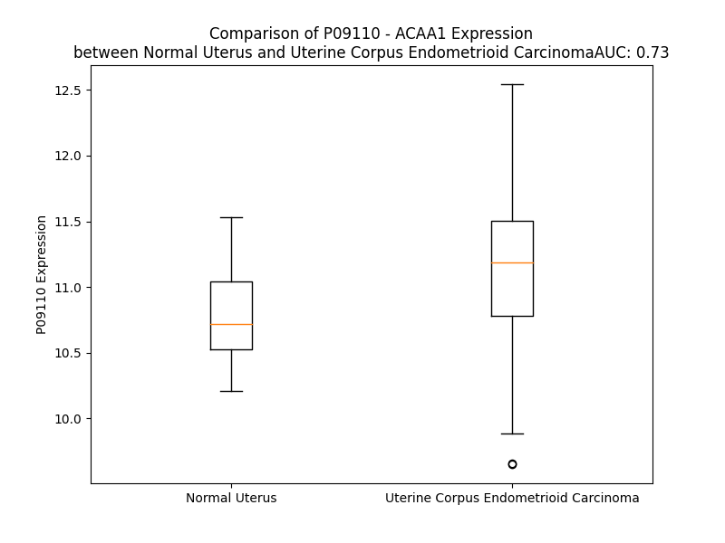

# Detailed Data for P09110

## Introduction to the Detailed Summary

### How to Interpret the Results

- **Summary & Metrics**: This section provides a quick reference to essential protein attributes, including expression changes, family classification, and biomarker applications. Regulation status (upregulated/downregulated) indicates the protein's behavior in a disease context. Some information comes from the original excel file with the proteins selected from literature, while others are derived from the analyses.
- **Expression Comparison**: A visual representation comparing protein expression between normal and disease states. It highlights significant changes in expression levels that might indicate diagnostic or therapeutic relevance. This is data coming from transcriptomics experiments and could not translate similarly to protein levels.
- **Isoform Alignment**: An interactive view of isoform alignments, revealing structural and functional differences between variants of the protein.
- **Interactors & Homologs**: Tables listing known interaction partners and homologous proteins, the more interactors and homologs, the more complex the protein is to design an antibody for.
- **Biological Assemblies**: Information about the structural arrangement of the protein in different assemblies, providing insights into its functional state but also the complexity of the protein to develop antibodies.
- **Combined Per-Residue Information**: A detailed table summarizing residue-level data. This includes predictions for epitope regions, aggregation tendencies, and modifications that might impact the protein's function. Each row corresponds to a residue in the protein, providing insights into specific sites that may be important for research or drug development.
## Summary & Metrics

- **UniProt Accession**: P09110
- **Gene Name**: ACAA1 
- **Protein Name**: acetyl-Coenzyme A acyltransferase 1 
- **Swiss Prot**: THIK_HUMAN
- **Family**: enzyme
- **Biomarker Application**: unspecified application
- **Number of Isoforms**: 2
- **Regulation**: 1
- **(transcriptomics) AUC**: 0.73
- **(transcriptomics) Fold Change**: 1.03
- **(transcriptomics) Regulation**: Upregulated
- **Discotope Epitope Count**: 86
- **Max n_uniprots (Homo)**: 2
- **Max n_uniprots (Hetero)**: N/A

## Expression Comparison

## Isoform Alignment

<pre style='font-size:14px; font-family:monospace;'>P09110-1 MQRLQVVLGHLRGPADSGWMPQAAPCLSGAPQASAADVVVVHGRRTAICRAGRGGFKDTTPDELLSAVMTAVLKDVNLRPEQLGDICVGNVLQPGAGAIMARIAQFLSDIPETVPLSTVNRQCSSGLQAVASIAGGIRNGSYDIGMACGVESMSLADRGNPGNITSRLMEKEKARDCLIPMGITSENVAERFGISREKQDTFALASQQKAARAQSKGCFQAEIVPVTTTVHDDKGTKRSITVTQDEGIRPSTTMEGLAKLKPAFKKDGSTTAGNSSQVSDGAAAILLARRSKAEELGLPILGVLRSYAVVGVPPDIMGIGPAYAIPVALQKAGLTVSDVDIFEINEAFASQAAYCVEKLRLPPEKVNPLGGAVALGHPLGCTGARQVITLLNELKRRGKRAYGVVSMCIGTGMGAAAVFEYPGN
P09110-2 MQRLQVVLGHLRGPADSGWMPQAAPCLSGAPQASAADVVVVHGRRTAICRAGRGGFKDTTPDELLSAVMTAVLKDVNLRPEQLGDICVGNVLQPGAGAIMARIAQFLSDIPETVPLSTVNRQCSSGLQAVASIAGGIRNGSYDIGMACGI---------------------------------TSENVAERFGISREKQDTFALASQQKAARAQSKGCFQAEIVPVTTTVHDDKGTKRSITVTQDEGIRPSTTMEGLAKLKPAFKKDGSTTA------------------------------------------------------------GLTVSDVDIFEINEAFASQAAYCVEKLRLPPEKVNPLGGAVALGHPLGCTGARQVITLLNELKRRGKRAYGVVSMCIGTGMGAAAVFEYPGN
</pre>

## Interactors

| preferredName_A   | preferredName_B   |   score |
|:------------------|:------------------|--------:|
| ACAA1             | HSD17B4           |   0.999 |
| ACAA1             | EHHADH            |   0.998 |
| ACAA1             | ACOX1             |   0.998 |
| ACAA1             | HADHA             |   0.997 |
| ACAA1             | PEX7              |   0.995 |
| ACAA1             | ACOX3             |   0.995 |
| ACAA1             | ACADS             |   0.992 |
| ACAA1             | ACADSB            |   0.991 |
| ACAA1             | HMGCS2            |   0.99  |
| ACAA1             | HMGCS1            |   0.989 |
| ACAA1             | ECI2              |   0.987 |
| ACAA1             | SCP2              |   0.982 |
| ACAA1             | ACADL             |   0.979 |
| ACAA1             | ACADVL            |   0.979 |
| ACAA1             | ECHS1             |   0.977 |
| ACAA1             | HSD17B10          |   0.969 |
| ACAA1             | HMGCL             |   0.965 |
| ACAA1             | TYSND1            |   0.956 |
| ACAA1             | HADH              |   0.955 |
| ACAA1             | PCCB              |   0.955 |
| ACAA1             | ECHDC1            |   0.954 |
| ACAA1             | HADHB             |   0.952 |
| ACAA1             | ALDH6A1           |   0.952 |
| ACAA1             | PEX5              |   0.951 |
| ACAA1             | ACOX2             |   0.949 |
| ACAA1             | PCCA              |   0.948 |
| ACAA1             | HMGCLL1           |   0.947 |
| ACAA1             | ACAT1             |   0.946 |
| ACAA1             | CS                |   0.942 |
| ACAA1             | OXCT1             |   0.942 |
| ACAA1             | ACAA2             |   0.935 |
| ACAA1             | CRYL1             |   0.933 |
| ACAA1             | OXCT2             |   0.926 |
| ACAA1             | ACAT2             |   0.923 |
| ACAA1             | ACSS2             |   0.918 |
| ACAA1             | HSDL2             |   0.916 |
| ACAA1             | HTD2              |   0.912 |
| ACAA1             | ACSS1             |   0.911 |
| ACAA1             | ACLY              |   0.91  |
| ACAA1             | SUCLG1            |   0.908 |

## Homologs

| uniprot_id   | gene_id   |
|:-------------|:----------|
| K7ER88       | ACAA2     |
| A0A5F9ZHH9   | ACAT1     |
| Q9BWD1       | ACAT2     |
| C9JE81       | HADHB     |

## Biological Assemblies

|   Unnamed: 0 |   assembly |   n_uniprots | composition   | crystal_id   |
|-------------:|-----------:|-------------:|:--------------|:-------------|
|            0 |          1 |            2 | Homo          | 2iik         |

## Combined Per-Residue Information

|   res | aa   |   epitope_score | epitope   |   relative_surface_accessibility |   modeling_confidence |   Aggregation | modification     |
|------:|:-----|----------------:|:----------|---------------------------------:|----------------------:|--------------:|:-----------------|
|     1 | M    |         0.13896 | False     |                          1.3211  |                 45.83 |         0     | N/A              |
|     2 | Q    |         0.15105 | False     |                          0.90302 |                 45.15 |         0     | N/A              |
|     3 | R    |         0.31972 | True      |                          0.93437 |                 41.23 |         0     | N/A              |
|     4 | L    |         0.26675 | True      |                          0.98824 |                 45.12 |         3.885 | N/A              |
|     5 | Q    |         0.23393 | True      |                          0.83901 |                 47.73 |         3.885 | N/A              |
|     6 | V    |         0.16557 | False     |                          0.90464 |                 45.75 |         3.885 | N/A              |
|     7 | V    |         0.2213  | True      |                          0.87864 |                 39.55 |         3.885 | N/A              |
|     8 | L    |         0.21699 | True      |                          0.82108 |                 42.66 |         3.885 | N/A              |
|     9 | G    |         0.22236 | True      |                          0.71716 |                 40.56 |         0.321 | N/A              |
|    10 | H    |         0.23014 | True      |                          0.92435 |                 37.7  |         0     | N/A              |
|    11 | L    |         0.25438 | True      |                          0.90565 |                 38.79 |         0     | N/A              |
|    12 | R    |         0.19115 | True      |                          0.92953 |                 38.53 |         0     | N/A              |
|    13 | G    |         0.25201 | True      |                          0.837   |                 38.03 |         0     | N/A              |
|    14 | P    |         0.18632 | True      |                          1.0192  |                 41.46 |         0     | N/A              |
|    15 | A    |         0.23473 | True      |                          0.97146 |                 45.91 |         0     | N/A              |
|    16 | D    |         0.18157 | False     |                          0.95136 |                 41.14 |         0     | N/A              |
|    17 | S    |         0.11467 | False     |                          0.81927 |                 46.84 |         0     | N/A              |
|    18 | G    |         0.2249  | True      |                          0.98233 |                 33.73 |         0     | N/A              |
|    19 | W    |         0.14974 | False     |                          1.02772 |                 34.97 |         0     | N/A              |
|    20 | M    |         0.152   | False     |                          0.93924 |                 38.5  |         0     | N/A              |
|    21 | P    |         0.11614 | False     |                          0.86688 |                 46.01 |         0     | N/A              |
|    22 | Q    |         0.14842 | False     |                          0.87884 |                 37.82 |         0     | N/A              |
|    23 | A    |         0.14733 | False     |                          0.9395  |                 42.16 |         0     | N/A              |
|    24 | A    |         0.08774 | False     |                          0.71375 |                 38.16 |         0     | N/A              |
|    25 | P    |         0.15011 | False     |                          0.95099 |                 36.41 |         0     | N/A              |
|    26 | C    |         0.11328 | False     |                          0.84388 |                 42.63 |         0     | N/A              |
|    27 | L    |         0.15895 | False     |                          0.94405 |                 49.92 |         0     | N/A              |
|    28 | S    |         0.11055 | False     |                          0.49786 |                 54.03 |         0     | N/A              |
|    29 | G    |         0.08827 | False     |                          0.23571 |                 60.44 |         0     | N/A              |
|    30 | A    |         0.11761 | False     |                          0.44717 |                 62.31 |         0     | N/A              |
|    31 | P    |         0.19597 | True      |                          0.79281 |                 67.05 |         0     | N/A              |
|    32 | Q    |         0.16854 | False     |                          0.67043 |                 73.23 |         0     | N/A              |
|    33 | A    |         0.17502 | False     |                          0.73944 |                 87.77 |         0     | N/A              |
|    34 | S    |         0.1093  | False     |                          0.4229  |                 95.93 |         0     | N/A              |
|    35 | A    |         0.14899 | False     |                          0.572   |                 97.48 |         0     | N/A              |
|    36 | A    |         0.12943 | False     |                          0.63007 |                 97.84 |         0     | N/A              |
|    37 | D    |         0.06578 | False     |                          0.12519 |                 98.3  |         0     | N/A              |
|    38 | V    |         0.00754 | False     |                          0.01063 |                 98.8  |        19.729 | N/A              |
|    39 | V    |         0.00256 | False     |                          0       |                 98.82 |        19.729 | N/A              |
|    40 | V    |         0.00398 | False     |                          0.01047 |                 98.89 |        19.729 | N/A              |
|    41 | V    |         0.01005 | False     |                          0.00915 |                 98.85 |        19.729 | N/A              |
|    42 | H    |         0.03619 | False     |                          0.20442 |                 98.76 |        19.729 | N/A              |
|    43 | G    |         0.01017 | False     |                          0.01078 |                 98.85 |         0.628 | N/A              |
|    44 | R    |         0.06702 | False     |                          0.11739 |                 98.92 |         0     | N/A              |
|    45 | R    |         0.01225 | False     |                          0.0021  |                 98.94 |         0     | N/A              |
|    46 | T    |         0.00394 | False     |                          0.00358 |                 98.94 |         0     | N/A              |
|    47 | A    |         0.00132 | False     |                          0       |                 98.87 |         0     | N/A              |
|    48 | I    |         0.01048 | False     |                          0.01158 |                 98.93 |         0     | N/A              |
|    49 | C    |         0.00291 | False     |                          0.00253 |                 98.84 |         0     | N/A              |
|    50 | R    |         0.08463 | False     |                          0.21832 |                 98.5  |         0     | N/A              |
|    51 | A    |         0.06141 | False     |                          0.21161 |                 98.04 |         0     | N/A              |
|    52 | G    |         0.25488 | True      |                          0.6703  |                 95.91 |         0     | N/A              |
|    53 | R    |         0.34069 | True      |                          0.67946 |                 95.7  |         0     | N/A              |
|    54 | G    |         0.02585 | False     |                          0.08748 |                 97.36 |         0     | N/A              |
|    55 | G    |         0.04679 | False     |                          0.10742 |                 98.08 |         0     | N/A              |
|    56 | F    |         0.00213 | False     |                          0       |                 98.61 |         0     | N/A              |
|    57 | K    |         0.10416 | False     |                          0.26292 |                 97.76 |         0     | N/A              |
|    58 | D    |         0.10958 | False     |                          0.30109 |                 97.76 |         0     | N/A              |
|    59 | T    |         0.01816 | False     |                          0.02761 |                 98.51 |         0     | Phosphothreonine |
|    60 | T    |         0.10928 | False     |                          0.42991 |                 98.69 |         0     | Phosphothreonine |
|    61 | P    |         0.01982 | False     |                          0.05766 |                 98.75 |         0     | N/A              |
|    62 | D    |         0.03696 | False     |                          0.14133 |                 98.81 |         0     | N/A              |
|    63 | E    |         0.10045 | False     |                          0.45448 |                 98.84 |         0     | N/A              |
|    64 | L    |         0.00145 | False     |                          0       |                 98.92 |        14.536 | N/A              |
|    65 | L    |         0.00177 | False     |                          0       |                 98.95 |        21.695 | N/A              |
|    66 | S    |         0.0252  | False     |                          0.06991 |                 98.92 |        24.115 | N/A              |
|    67 | A    |         0.02009 | False     |                          0.2311  |                 98.92 |        43.873 | N/A              |
|    68 | V    |         0.00152 | False     |                          0       |                 98.94 |        67.115 | N/A              |
|    69 | M    |         0.00377 | False     |                          0       |                 98.94 |        68.937 | N/A              |
|    70 | T    |         0.07188 | False     |                          0.41149 |                 98.9  |        68.777 | N/A              |
|    71 | A    |         0.02409 | False     |                          0.0789  |                 98.85 |        68.714 | N/A              |
|    72 | V    |         0.0021  | False     |                          0       |                 98.86 |        68.552 | N/A              |
|    73 | L    |         0.04032 | False     |                          0.05954 |                 98.79 |        60.414 | N/A              |
|    74 | K    |         0.17836 | False     |                          0.80178 |                 98.63 |         0.514 | N/A              |
|    75 | D    |         0.07427 | False     |                          0.45483 |                 98.67 |         0.514 | N/A              |
|    76 | V    |         0.07936 | False     |                          0.14229 |                 98.47 |         0.514 | N/A              |
|    77 | N    |         0.2919  | True      |                          0.87801 |                 98.34 |         0.157 | N/A              |
|    78 | L    |         0.05559 | False     |                          0.07333 |                 98.45 |         0.157 | N/A              |
|    79 | R    |         0.22277 | True      |                          0.58276 |                 98.33 |         0     | N/A              |
|    80 | P    |         0.05443 | False     |                          0.27635 |                 98.66 |         0     | N/A              |
|    81 | E    |         0.15557 | False     |                          0.47746 |                 98.45 |         0     | N/A              |
|    82 | Q    |         0.15206 | False     |                          0.23719 |                 98.6  |         0     | N/A              |
|    83 | L    |         0.0179  | False     |                          0.03307 |                 98.87 |         0     | N/A              |
|    84 | G    |         0.04938 | False     |                          0.29156 |                 98.83 |         0     | N/A              |
|    85 | D    |         0.04873 | False     |                          0.15055 |                 98.91 |         0     | N/A              |
|    86 | I    |         0.0025  | False     |                          0       |                 98.95 |         0     | N/A              |
|    87 | C    |         0.0159  | False     |                          0.01336 |                 98.94 |         0     | N/A              |
|    88 | V    |         0.00215 | False     |                          0       |                 98.96 |         0.151 | N/A              |
|    89 | G    |         0.0053  | False     |                          0       |                 98.91 |         0.151 | N/A              |
|    90 | N    |         0.00459 | False     |                          0       |                 98.83 |         0.151 | N/A              |
|    91 | V    |         0.04143 | False     |                          0.1316  |                 98.19 |         0.151 | N/A              |
|    92 | L    |         0.08107 | False     |                          0.24236 |                 97.57 |         0.151 | N/A              |
|    93 | Q    |         0.11248 | False     |                          0.17137 |                 97.03 |         0     | N/A              |
|    94 | P    |         0.21561 | True      |                          0.88196 |                 95.71 |         0     | N/A              |
|    95 | G    |         0.14966 | False     |                          0.80543 |                 95.97 |         0     | N/A              |
|    96 | A    |         0.08281 | False     |                          0.16245 |                 97.65 |         0     | N/A              |
|    97 | G    |         0.02775 | False     |                          0.0338  |                 98.22 |         0     | N/A              |
|    98 | A    |         0.07435 | False     |                          0.43227 |                 98.65 |         0     | N/A              |
|    99 | I    |         0.21067 | True      |                          0.83981 |                 98.7  |         0     | N/A              |
|   100 | M    |         0.09555 | False     |                          0.10624 |                 98.65 |         0     | N/A              |
|   101 | A    |         0.00208 | False     |                          0       |                 98.87 |         0     | N/A              |
|   102 | R    |         0.07705 | False     |                          0.24712 |                 98.85 |         0     | N/A              |
|   103 | I    |         0.12457 | False     |                          0.47438 |                 98.83 |         4.344 | N/A              |
|   104 | A    |         0.00331 | False     |                          0       |                 98.91 |         4.344 | N/A              |
|   105 | Q    |         0.00824 | False     |                          0       |                 98.89 |         4.344 | N/A              |
|   106 | F    |         0.15335 | False     |                          0.48891 |                 98.87 |         4.344 | N/A              |
|   107 | L    |         0.18457 | True      |                          0.55486 |                 98.78 |         4.344 | N/A              |
|   108 | S    |         0.09067 | False     |                          0.09098 |                 98.79 |         0.479 | N/A              |
|   109 | D    |         0.15895 | False     |                          0.77278 |                 98.63 |         0     | N/A              |
|   110 | I    |         0.0278  | False     |                          0.00659 |                 98.83 |         0     | N/A              |
|   111 | P    |         0.07056 | False     |                          0.33898 |                 98.74 |         0     | N/A              |
|   112 | E    |         0.24032 | True      |                          0.69157 |                 98.65 |         0     | N/A              |
|   113 | T    |         0.18808 | True      |                          0.76886 |                 98.75 |         0     | N/A              |
|   114 | V    |         0.01768 | False     |                          0.00857 |                 98.9  |         0     | N/A              |
|   115 | P    |         0.09703 | False     |                          0.47914 |                 98.86 |         0     | N/A              |
|   116 | L    |         0.07099 | False     |                          0.20423 |                 98.88 |         0     | N/A              |
|   117 | S    |         0.13768 | False     |                          0.37332 |                 98.9  |         0     | N/A              |
|   118 | T    |         0.0645  | False     |                          0.21896 |                 98.93 |         0     | N/A              |
|   119 | V    |         0.12969 | False     |                          0.22088 |                 98.82 |         0     | N/A              |
|   120 | N    |         0.1558  | False     |                          0.47651 |                 98.52 |         0     | N/A              |
|   121 | R    |         0.07348 | False     |                          0.31848 |                 98.53 |         0     | N/A              |
|   122 | Q    |         0.06873 | False     |                          0.29192 |                 97.74 |         0     | N/A              |
|   123 | C    |         0.01474 | False     |                          0.02604 |                 97.2  |         0     | N/A              |
|   124 | S    |         0.00177 | False     |                          0       |                 98.58 |         0     | N/A              |
|   125 | S    |         0.003   | False     |                          0       |                 98.79 |         0     | N/A              |
|   126 | G    |         0.00104 | False     |                          0       |                 98.81 |         0     | N/A              |
|   127 | L    |         0.00247 | False     |                          0.00473 |                 98.9  |         0.148 | N/A              |
|   128 | Q    |         0.01445 | False     |                          0.14082 |                 98.92 |         0.148 | N/A              |
|   129 | A    |         0.00132 | False     |                          0       |                 98.92 |         1.431 | N/A              |
|   130 | V    |         0.00207 | False     |                          0.00571 |                 98.94 |         2.128 | N/A              |
|   131 | A    |         0.0254  | False     |                          0.16153 |                 98.85 |         2.128 | N/A              |
|   132 | S    |         0.01969 | False     |                          0.28302 |                 98.89 |         2.128 | N/A              |
|   133 | I    |         0.00224 | False     |                          0.0016  |                 98.93 |         2.128 | N/A              |
|   134 | A    |         0.00569 | False     |                          0.0102  |                 98.88 |         1.285 | N/A              |
|   135 | G    |         0.06981 | False     |                          0.38057 |                 98.77 |         0     | N/A              |
|   136 | G    |         0.04513 | False     |                          0.08926 |                 98.86 |         0     | N/A              |
|   137 | I    |         0.01334 | False     |                          0.00894 |                 98.86 |         0     | N/A              |
|   138 | R    |         0.125   | False     |                          0.57775 |                 98.56 |         0     | N/A              |
|   139 | N    |         0.13704 | False     |                          0.69232 |                 98.44 |         0     | N/A              |
|   140 | G    |         0.10596 | False     |                          0.62509 |                 98.48 |         0     | N/A              |
|   141 | S    |         0.11877 | False     |                          0.59316 |                 98.73 |         0     | N/A              |
|   142 | Y    |         0.05248 | False     |                          0.15739 |                 98.8  |         0     | N/A              |
|   143 | D    |         0.10095 | False     |                          0.30939 |                 98.82 |         0     | N/A              |
|   144 | I    |         0.02185 | False     |                          0.01876 |                 98.9  |         0     | N/A              |
|   145 | G    |         0.00184 | False     |                          0       |                 98.9  |         0     | N/A              |
|   146 | M    |         0.00074 | False     |                          0       |                 98.95 |         0     | N/A              |
|   147 | A    |         0.0014  | False     |                          0       |                 98.96 |         0     | N/A              |
|   148 | C    |         0.00206 | False     |                          0       |                 98.94 |         0     | N/A              |
|   149 | G    |         0.00795 | False     |                          0       |                 98.91 |         0     | N/A              |
|   150 | V    |         0.00292 | False     |                          0       |                 98.93 |         0     | N/A              |
|   151 | E    |         0.01144 | False     |                          0       |                 98.76 |         0     | N/A              |
|   152 | S    |         0.00366 | False     |                          0       |                 98.62 |         0     | N/A              |
|   153 | M    |         0.04261 | False     |                          0.10795 |                 98.3  |         0     | N/A              |
|   154 | S    |         0.14428 | False     |                          0.25073 |                 97.85 |         0     | N/A              |
|   155 | L    |         0.18777 | True      |                          0.52752 |                 97.44 |         0     | N/A              |
|   156 | A    |         0.05882 | False     |                          0.14212 |                 94.83 |         0     | N/A              |
|   157 | D    |         0.31529 | True      |                          0.59535 |                 90.22 |         0     | N/A              |
|   158 | R    |         0.23748 | True      |                          0.59688 |                 87.63 |         0     | N/A              |
|   159 | G    |         0.38058 | True      |                          0.77816 |                 85.03 |         0     | N/A              |
|   160 | N    |         0.36495 | True      |                          0.67013 |                 88.31 |         0     | N/A              |
|   161 | P    |         0.21373 | True      |                          0.68305 |                 88.48 |         0     | N/A              |
|   162 | G    |         0.25087 | True      |                          0.52588 |                 92.26 |         0     | N/A              |
|   163 | N    |         0.41184 | True      |                          1.06446 |                 94.9  |         0     | N/A              |
|   164 | I    |         0.3249  | True      |                          0.43875 |                 95.5  |         0     | N/A              |
|   165 | T    |         0.34474 | True      |                          0.61576 |                 96.56 |         0     | N/A              |
|   166 | S    |         0.30191 | True      |                          0.87379 |                 95.62 |         0     | N/A              |
|   167 | R    |         0.31926 | True      |                          0.65615 |                 96.44 |         0     | N/A              |
|   168 | L    |         0.13928 | False     |                          0.11294 |                 95.39 |         0     | N/A              |
|   169 | M    |         0.32102 | True      |                          0.62948 |                 94.18 |         0     | N/A              |
|   170 | E    |         0.41654 | True      |                          0.6335  |                 97.54 |         0     | N/A              |
|   171 | K    |         0.31263 | True      |                          0.68043 |                 97.55 |         0     | N/A              |
|   172 | E    |         0.20608 | True      |                          0.58324 |                 97.34 |         0     | N/A              |
|   173 | K    |         0.1937  | True      |                          0.49719 |                 97.65 |         0     | N/A              |
|   174 | A    |         0.14348 | False     |                          0.35581 |                 97.41 |         0     | N/A              |
|   175 | R    |         0.33398 | True      |                          0.44206 |                 97.06 |         0     | N/A              |
|   176 | D    |         0.14767 | False     |                          0.11172 |                 97.98 |         0     | N/A              |
|   177 | C    |         0.15537 | False     |                          0.38324 |                 97.39 |         0     | N/A              |
|   178 | L    |         0.31385 | True      |                          0.50842 |                 96.34 |         0     | N/A              |
|   179 | I    |         0.17187 | False     |                          0.28018 |                 96.89 |         0     | N/A              |
|   180 | P    |         0.19436 | True      |                          0.60141 |                 96.86 |         0     | N/A              |
|   181 | M    |         0.14324 | False     |                          0.41289 |                 97.24 |         0     | N/A              |
|   182 | G    |         0.05206 | False     |                          0.02765 |                 97.49 |         0     | N/A              |
|   183 | I    |         0.22134 | True      |                          0.29439 |                 98.56 |         0     | N/A              |
|   184 | T    |         0.02385 | False     |                          0.02489 |                 98.47 |         0     | N/A              |
|   185 | S    |         0.02402 | False     |                          0.0156  |                 98.71 |         0     | N/A              |
|   186 | E    |         0.02732 | False     |                          0.01157 |                 98.73 |         0     | N/A              |
|   187 | N    |         0.07736 | False     |                          0.19799 |                 98.66 |         0     | N/A              |
|   188 | V    |         0.00306 | False     |                          0.0019  |                 98.79 |         0     | N/A              |
|   189 | A    |         0.04609 | False     |                          0.05855 |                 98.76 |         0     | N/A              |
|   190 | E    |         0.44652 | True      |                          0.53883 |                 98.49 |         0     | N/A              |
|   191 | R    |         0.45603 | True      |                          0.53636 |                 98.55 |         0     | N/A              |
|   192 | F    |         0.25914 | True      |                          0.37265 |                 98.57 |         0     | N/A              |
|   193 | G    |         0.21414 | True      |                          0.71011 |                 98.24 |         0     | N/A              |
|   194 | I    |         0.06097 | False     |                          0.04885 |                 98.69 |         0     | N/A              |
|   195 | S    |         0.13221 | False     |                          0.45858 |                 98.53 |         0     | N/A              |
|   196 | R    |         0.12162 | False     |                          0.24749 |                 98.54 |         0     | N/A              |
|   197 | E    |         0.17382 | False     |                          0.62878 |                 98.63 |         0     | N/A              |
|   198 | K    |         0.10233 | False     |                          0.38373 |                 98.55 |         0     | N/A              |
|   199 | Q    |         0.00663 | False     |                          0.00101 |                 98.84 |         0     | N/A              |
|   200 | D    |         0.01335 | False     |                          0.00378 |                 98.84 |         0     | N/A              |
|   201 | T    |         0.11718 | False     |                          0.5126  |                 98.75 |         0.633 | N/A              |
|   202 | F    |         0.03941 | False     |                          0.18802 |                 98.67 |         0.765 | N/A              |
|   203 | A    |         0.00214 | False     |                          0.00128 |                 98.82 |         0.765 | N/A              |
|   204 | L    |         0.11312 | False     |                          0.18383 |                 98.83 |         0.765 | N/A              |
|   205 | A    |         0.04432 | False     |                          0.39211 |                 98.75 |         0.765 | N/A              |
|   206 | S    |         0.01111 | False     |                          0.00491 |                 98.85 |         0.132 | N/A              |
|   207 | Q    |         0.03563 | False     |                          0.05999 |                 98.82 |         0     | N/A              |
|   208 | Q    |         0.27615 | True      |                          0.40857 |                 98.75 |         0     | N/A              |
|   209 | K    |         0.05272 | False     |                          0.18927 |                 98.84 |         0     | N/A              |
|   210 | A    |         0.00326 | False     |                          0       |                 98.86 |         0     | N/A              |
|   211 | A    |         0.05964 | False     |                          0.18939 |                 98.79 |         0     | N/A              |
|   212 | R    |         0.16922 | False     |                          0.50685 |                 98.76 |         0     | N/A              |
|   213 | A    |         0.0288  | False     |                          0.03244 |                 98.76 |         0     | N/A              |
|   214 | Q    |         0.10233 | False     |                          0.24372 |                 98.61 |         0     | N/A              |
|   215 | S    |         0.26448 | True      |                          0.75021 |                 98.4  |         0     | N/A              |
|   216 | K    |         0.22191 | True      |                          0.79222 |                 98.48 |         0     | N/A              |
|   217 | G    |         0.06465 | False     |                          0.22365 |                 98.36 |         0     | N/A              |
|   218 | C    |         0.08292 | False     |                          0.12556 |                 98.57 |         0     | N/A              |
|   219 | F    |         0.01421 | False     |                          0.02593 |                 98.76 |         0     | N/A              |
|   220 | Q    |         0.20422 | True      |                          0.73059 |                 98.27 |         0     | N/A              |
|   221 | A    |         0.08401 | False     |                          0.60932 |                 97.96 |         0     | N/A              |
|   222 | E    |         0.00917 | False     |                          0       |                 98.73 |         0     | N/A              |
|   223 | I    |         0.07057 | False     |                          0.06174 |                 98.9  |         0     | N/A              |
|   224 | V    |         0.07033 | False     |                          0.13329 |                 98.86 |         0     | N/A              |
|   225 | P    |         0.08077 | False     |                          0.54528 |                 98.73 |         0     | N/A              |
|   226 | V    |         0.04169 | False     |                          0.05236 |                 98.82 |         0.659 | N/A              |
|   227 | T    |         0.20126 | True      |                          0.67419 |                 98.56 |         0.659 | N/A              |
|   228 | T    |         0.11087 | False     |                          0.13339 |                 98.29 |         0.659 | N/A              |
|   229 | T    |         0.20215 | True      |                          0.45725 |                 97.18 |         0.659 | N/A              |
|   230 | V    |         0.07493 | False     |                          0.03142 |                 96.82 |         0.659 | N/A              |
|   231 | H    |         0.2893  | True      |                          0.35898 |                 94.88 |         0     | N/A              |
|   232 | D    |         0.18322 | False     |                          0.30263 |                 89.54 |         0     | N/A              |
|   233 | D    |         0.39409 | True      |                          0.99442 |                 88.31 |         0     | N/A              |
|   234 | K    |         0.24196 | True      |                          0.91813 |                 91.81 |         0     | N/A              |
|   235 | G    |         0.30513 | True      |                          0.60151 |                 89.68 |         0     | N/A              |
|   236 | T    |         0.20916 | True      |                          0.57082 |                 93.61 |         0     | N/A              |
|   237 | K    |         0.34262 | True      |                          0.68653 |                 95.55 |         0     | N/A              |
|   238 | R    |         0.30781 | True      |                          0.55659 |                 95.33 |         0     | N/A              |
|   239 | S    |         0.36179 | True      |                          0.64577 |                 97.5  |         0.348 | N/A              |
|   240 | I    |         0.21442 | True      |                          0.27106 |                 98.15 |         0.348 | N/A              |
|   241 | T    |         0.16247 | False     |                          0.54404 |                 98.62 |         0.348 | N/A              |
|   242 | V    |         0.02579 | False     |                          0.08569 |                 98.74 |         0.348 | N/A              |
|   243 | T    |         0.12183 | False     |                          0.48497 |                 98.6  |         0.348 | N/A              |
|   244 | Q    |         0.22943 | True      |                          0.53034 |                 98.58 |         0     | N/A              |
|   245 | D    |         0.01847 | False     |                          0.02514 |                 98.81 |         0     | N/A              |
|   246 | E    |         0.08743 | False     |                          0.25896 |                 98.15 |         0     | N/A              |
|   247 | G    |         0.01522 | False     |                          0.01564 |                 98.31 |         0     | N/A              |
|   248 | I    |         0.13995 | False     |                          0.07412 |                 98.7  |         0     | N/A              |
|   249 | R    |         0.32073 | True      |                          0.37152 |                 98.43 |         0     | N/A              |
|   250 | P    |         0.29024 | True      |                          0.77718 |                 97.72 |         0     | N/A              |
|   251 | S    |         0.21258 | True      |                          0.7287  |                 98.28 |         0     | N/A              |
|   252 | T    |         0.11774 | False     |                          0.19281 |                 98.41 |         0     | N/A              |
|   253 | T    |         0.22013 | True      |                          0.52097 |                 98.62 |         0     | N/A              |
|   254 | M    |         0.19728 | True      |                          0.3385  |                 98.57 |         0     | N/A              |
|   255 | E    |         0.30227 | True      |                          0.58403 |                 98.42 |         0     | N/A              |
|   256 | G    |         0.21923 | True      |                          0.41894 |                 98.58 |         0     | N/A              |
|   257 | L    |         0.0948  | False     |                          0.04629 |                 98.71 |         0     | N/A              |
|   258 | A    |         0.18242 | False     |                          0.57425 |                 98.42 |         0     | N/A              |
|   259 | K    |         0.28974 | True      |                          0.7275  |                 98.38 |         0     | N/A              |
|   260 | L    |         0.24086 | True      |                          0.41551 |                 98.52 |         0     | N/A              |
|   261 | K    |         0.22478 | True      |                          0.86172 |                 98.16 |         0     | N/A              |
|   262 | P    |         0.12481 | False     |                          0.35615 |                 98.57 |         0     | N/A              |
|   263 | A    |         0.2903  | True      |                          0.51067 |                 97.92 |         0     | N/A              |
|   264 | F    |         0.2609  | True      |                          0.45356 |                 97.1  |         0     | N/A              |
|   265 | K    |         0.45458 | True      |                          0.44826 |                 96.75 |         0     | N/A              |
|   266 | K    |         0.33329 | True      |                          0.92728 |                 96.12 |         0     | N/A              |
|   267 | D    |         0.23413 | True      |                          0.77987 |                 96.11 |         0     | N/A              |
|   268 | G    |         0.09769 | False     |                          0.13343 |                 97.93 |         0     | N/A              |
|   269 | S    |         0.07824 | False     |                          0.15489 |                 98.69 |         0     | N/A              |
|   270 | T    |         0.00661 | False     |                          0       |                 98.8  |         0     | N/A              |
|   271 | T    |         0.00825 | False     |                          0       |                 98.8  |         0     | N/A              |
|   272 | A    |         0.17067 | False     |                          0.73552 |                 98.23 |         0     | N/A              |
|   273 | G    |         0.08852 | False     |                          0.18983 |                 98.46 |         0     | N/A              |
|   274 | N    |         0.00805 | False     |                          0.00064 |                 98.74 |         0     | N/A              |
|   275 | S    |         0.09908 | False     |                          0.06651 |                 98.74 |         0     | N/A              |
|   276 | S    |         0.06285 | False     |                          0.18069 |                 98.42 |         0     | N/A              |
|   277 | Q    |         0.05865 | False     |                          0.08962 |                 98.52 |         0     | N/A              |
|   278 | V    |         0.11048 | False     |                          0.43626 |                 97.99 |         0     | N/A              |
|   279 | S    |         0.00777 | False     |                          0.00949 |                 98.72 |         0     | N/A              |
|   280 | D    |         0.02025 | False     |                          0       |                 98.8  |         0     | N/A              |
|   281 | G    |         0.01103 | False     |                          0.00161 |                 98.88 |         2.316 | N/A              |
|   282 | A    |         0.01897 | False     |                          0.00377 |                 98.95 |        28.534 | N/A              |
|   283 | A    |         0.00474 | False     |                          0       |                 98.96 |        32.614 | N/A              |
|   284 | A    |         0.00491 | False     |                          0       |                 98.95 |        33.756 | N/A              |
|   285 | I    |         0.00249 | False     |                          0       |                 98.95 |        33.756 | N/A              |
|   286 | L    |         0.00295 | False     |                          0       |                 98.93 |        33.756 | N/A              |
|   287 | L    |         0.00185 | False     |                          0       |                 98.93 |        33.274 | N/A              |
|   288 | A    |         0.00333 | False     |                          0       |                 98.91 |         8.727 | N/A              |
|   289 | R    |         0.06823 | False     |                          0.25622 |                 98.83 |         0     | N/A              |
|   290 | R    |         0.03714 | False     |                          0.10322 |                 98.72 |         0     | N/A              |
|   291 | S    |         0.13757 | False     |                          0.35562 |                 98.51 |         0     | N/A              |
|   292 | K    |         0.0856  | False     |                          0.22216 |                 98.73 |         0     | N/A              |
|   293 | A    |         0.00285 | False     |                          0       |                 98.6  |         0     | N/A              |
|   294 | E    |         0.18158 | False     |                          0.52608 |                 98.12 |         0     | N/A              |
|   295 | E    |         0.2587  | True      |                          0.63588 |                 98.36 |         0     | N/A              |
|   296 | L    |         0.21012 | True      |                          0.36552 |                 98.4  |         0     | N/A              |
|   297 | G    |         0.20098 | True      |                          0.81307 |                 98.15 |         0     | N/A              |
|   298 | L    |         0.06101 | False     |                          0.10763 |                 98.39 |         0     | N/A              |
|   299 | P    |         0.08317 | False     |                          0.56038 |                 97.78 |         0     | N/A              |
|   300 | I    |         0.07084 | False     |                          0.26573 |                 98.21 |         7.209 | N/A              |
|   301 | L    |         0.03217 | False     |                          0.07502 |                 98.56 |         7.209 | N/A              |
|   302 | G    |         0.00214 | False     |                          0       |                 98.55 |         7.209 | N/A              |
|   303 | V    |         0.00607 | False     |                          0.00857 |                 98.69 |         7.209 | N/A              |
|   304 | L    |         0.01644 | False     |                          0.03409 |                 98.77 |         7.209 | N/A              |
|   305 | R    |         0.05586 | False     |                          0.21241 |                 98.46 |         0     | N/A              |
|   306 | S    |         0.03885 | False     |                          0.04784 |                 98.72 |         1.036 | N/A              |
|   307 | Y    |         0.03019 | False     |                          0.20163 |                 98.89 |         1.839 | N/A              |
|   308 | A    |         0.05813 | False     |                          0.03444 |                 98.87 |         1.839 | N/A              |
|   309 | V    |         0.11626 | False     |                          0.38046 |                 98.85 |         1.839 | N/A              |
|   310 | V    |         0.14351 | False     |                          0.20775 |                 98.83 |         1.839 | N/A              |
|   311 | G    |         0.24032 | True      |                          0.77062 |                 98.7  |         0.803 | N/A              |
|   312 | V    |         0.04953 | False     |                          0.13667 |                 98.75 |         0     | N/A              |
|   313 | P    |         0.15748 | False     |                          0.40303 |                 98.56 |         0     | N/A              |
|   314 | P    |         0.07163 | False     |                          0.10269 |                 98.5  |         0     | N/A              |
|   315 | D    |         0.09557 | False     |                          0.12772 |                 98.41 |         0     | N/A              |
|   316 | I    |         0.08855 | False     |                          0.0768  |                 98.46 |         0     | N/A              |
|   317 | M    |         0.02667 | False     |                          0.01438 |                 98.4  |         0     | N/A              |
|   318 | G    |         0.01214 | False     |                          0.02414 |                 98.31 |         0     | N/A              |
|   319 | I    |         0.04499 | False     |                          0.0376  |                 98.77 |         0     | N/A              |
|   320 | G    |         0.00177 | False     |                          0       |                 98.82 |         0     | N/A              |
|   321 | P    |         0.00487 | False     |                          0.00895 |                 98.85 |         0     | N/A              |
|   322 | A    |         0.02436 | False     |                          0.07326 |                 98.81 |         0     | N/A              |
|   323 | Y    |         0.05725 | False     |                          0.46407 |                 98.8  |         0     | N/A              |
|   324 | A    |         0.00129 | False     |                          0       |                 98.89 |         0     | N/A              |
|   325 | I    |         0.00385 | False     |                          0       |                 98.9  |         0     | N/A              |
|   326 | P    |         0.0766  | False     |                          0.42248 |                 98.82 |         0     | N/A              |
|   327 | V    |         0.02532 | False     |                          0.35499 |                 98.84 |         0     | N/A              |
|   328 | A    |         0.00109 | False     |                          0       |                 98.81 |         0     | N/A              |
|   329 | L    |         0.01609 | False     |                          0.02968 |                 98.69 |         0     | N/A              |
|   330 | Q    |         0.1316  | False     |                          0.72172 |                 98.44 |         0     | N/A              |
|   331 | K    |         0.08903 | False     |                          0.64747 |                 98.3  |         0     | N/A              |
|   332 | A    |         0.03203 | False     |                          0.26378 |                 97.98 |         0.491 | N/A              |
|   333 | G    |         0.09192 | False     |                          0.53817 |                 97.38 |         0.491 | N/A              |
|   334 | L    |         0.02709 | False     |                          0.07633 |                 98.02 |         0.491 | N/A              |
|   335 | T    |         0.1489  | False     |                          0.51051 |                 98.19 |         0.491 | N/A              |
|   336 | V    |         0.04947 | False     |                          0.29397 |                 98.28 |         0.491 | N/A              |
|   337 | S    |         0.13126 | False     |                          0.71112 |                 97.61 |         0     | N/A              |
|   338 | D    |         0.06181 | False     |                          0.27195 |                 97.77 |         0     | N/A              |
|   339 | V    |         0.00627 | False     |                          0.00401 |                 98.65 |         0     | N/A              |
|   340 | D    |         0.10291 | False     |                          0.30984 |                 98.63 |         0     | N/A              |
|   341 | I    |         0.00495 | False     |                          0.0024  |                 98.83 |         0     | N/A              |
|   342 | F    |         0.00194 | False     |                          0       |                 98.92 |         0     | N/A              |
|   343 | E    |         0.00844 | False     |                          0.01247 |                 98.93 |         0     | N/A              |
|   344 | I    |         0.01801 | False     |                          0.01214 |                 98.88 |         0     | N/A              |
|   345 | N    |         0.00506 | False     |                          0.01284 |                 98.79 |         0     | N/A              |
|   346 | E    |         0.00566 | False     |                          0.00103 |                 98.76 |         0     | N/A              |
|   347 | A    |         0.03111 | False     |                          0.04209 |                 97.89 |         0     | N/A              |
|   348 | F    |         0.06293 | False     |                          0.09241 |                 98.79 |         0     | N/A              |
|   349 | A    |         0.00204 | False     |                          0.0011  |                 98.77 |         0     | N/A              |
|   350 | S    |         0.00667 | False     |                          0       |                 98.63 |         0     | N/A              |
|   351 | Q    |         0.01445 | False     |                          0.00956 |                 98.52 |         0     | N/A              |
|   352 | A    |         0.00595 | False     |                          0.00893 |                 98.64 |         0.929 | N/A              |
|   353 | A    |         0.03184 | False     |                          0.04974 |                 98.71 |         0.929 | N/A              |
|   354 | Y    |         0.11586 | False     |                          0.07365 |                 98.81 |         0.929 | N/A              |
|   355 | C    |         0.00194 | False     |                          0.00187 |                 98.78 |         0.929 | N/A              |
|   356 | V    |         0.03197 | False     |                          0.09802 |                 98.69 |         0.929 | N/A              |
|   357 | E    |         0.20333 | True      |                          0.43551 |                 98.56 |         0     | N/A              |
|   358 | K    |         0.20671 | True      |                          0.58208 |                 98.54 |         0     | N/A              |
|   359 | L    |         0.0783  | False     |                          0.13272 |                 98.55 |         0     | N/A              |
|   360 | R    |         0.33671 | True      |                          0.84624 |                 98.61 |         0     | N/A              |
|   361 | L    |         0.03963 | False     |                          0.04221 |                 98.54 |         0     | N/A              |
|   362 | P    |         0.0976  | False     |                          0.32989 |                 97.96 |         0     | N/A              |
|   363 | P    |         0.13095 | False     |                          0.72055 |                 97.21 |         0     | N/A              |
|   364 | E    |         0.14726 | False     |                          0.63795 |                 98.01 |         0     | N/A              |
|   365 | K    |         0.07448 | False     |                          0.25016 |                 98.71 |         0     | N/A              |
|   366 | V    |         0.01522 | False     |                          0.03092 |                 98.86 |         0     | N/A              |
|   367 | N    |         0.01456 | False     |                          0.00498 |                 98.84 |         0     | N/A              |
|   368 | P    |         0.05425 | False     |                          0.18936 |                 98.77 |         0     | N/A              |
|   369 | L    |         0.05943 | False     |                          0.07502 |                 98.82 |         0     | N/A              |
|   370 | G    |         0.00432 | False     |                          0       |                 98.75 |         0     | N/A              |
|   371 | G    |         0.0102  | False     |                          0.02575 |                 98.73 |         0.252 | N/A              |
|   372 | A    |         0.00415 | False     |                          0.00438 |                 98.77 |         0.503 | N/A              |
|   373 | V    |         0.00948 | False     |                          0.01743 |                 98.78 |         0.503 | N/A              |
|   374 | A    |         0.00154 | False     |                          0       |                 98.78 |         0.503 | N/A              |
|   375 | L    |         0.00621 | False     |                          0.00491 |                 98.69 |         0.503 | N/A              |
|   376 | G    |         0.00354 | False     |                          0       |                 98.69 |         0.251 | N/A              |
|   377 | H    |         0.07199 | False     |                          0.05055 |                 98.74 |         0     | N/A              |
|   378 | P    |         0.0025  | False     |                          0       |                 98.56 |         0     | N/A              |
|   379 | L    |         0.02305 | False     |                          0.06925 |                 98.28 |         0     | N/A              |
|   380 | G    |         0.00121 | False     |                          0       |                 98.5  |         0     | N/A              |
|   381 | C    |         0.004   | False     |                          0.00655 |                 98.87 |         0     | N/A              |
|   382 | T    |         0.00258 | False     |                          0.00072 |                 98.87 |         0     | N/A              |
|   383 | G    |         0.001   | False     |                          0       |                 98.86 |         0     | N/A              |
|   384 | A    |         0.00068 | False     |                          0       |                 98.91 |         0     | N/A              |
|   385 | R    |         0.00799 | False     |                          0.00382 |                 98.88 |         0     | N/A              |
|   386 | Q    |         0.0049  | False     |                          0.00469 |                 98.93 |         2.989 | N/A              |
|   387 | V    |         0.00177 | False     |                          0.0019  |                 98.94 |        77.562 | N/A              |
|   388 | I    |         0.01085 | False     |                          0.0112  |                 98.92 |        77.594 | N/A              |
|   389 | T    |         0.00232 | False     |                          0.00261 |                 98.92 |        77.594 | N/A              |
|   390 | L    |         0.00397 | False     |                          0.00495 |                 98.9  |        77.594 | N/A              |
|   391 | L    |         0.00294 | False     |                          0.00165 |                 98.83 |        77.525 | N/A              |
|   392 | N    |         0.03705 | False     |                          0.09766 |                 98.71 |         2.938 | N/A              |
|   393 | E    |         0.02789 | False     |                          0.09764 |                 98.71 |         0     | N/A              |
|   394 | L    |         0.00327 | False     |                          0       |                 98.51 |         0     | N/A              |
|   395 | K    |         0.07222 | False     |                          0.54362 |                 98.34 |         0     | N/A              |
|   396 | R    |         0.10915 | False     |                          0.40426 |                 97.82 |         0     | N/A              |
|   397 | R    |         0.1394  | False     |                          0.41779 |                 97.27 |         0     | N/A              |
|   398 | G    |         0.15211 | False     |                          0.32253 |                 96.57 |         0     | N/A              |
|   399 | K    |         0.16492 | False     |                          0.75988 |                 95.72 |         0     | N/A              |
|   400 | R    |         0.08358 | False     |                          0.36147 |                 97.07 |         0     | N/A              |
|   401 | A    |         0.03103 | False     |                          0.07652 |                 98.02 |         0.279 | N/A              |
|   402 | Y    |         0.02859 | False     |                          0.09942 |                 98.57 |         0.844 | N/A              |
|   403 | G    |         0.00194 | False     |                          0       |                 98.84 |         1.066 | N/A              |
|   404 | V    |         0.00196 | False     |                          0       |                 98.94 |         4.116 | N/A              |
|   405 | V    |         0.00335 | False     |                          0       |                 98.95 |         4.328 | N/A              |
|   406 | S    |         0.00357 | False     |                          0       |                 98.94 |         4.049 | N/A              |
|   407 | M    |         0.01208 | False     |                          0       |                 98.85 |         3.915 | N/A              |
|   408 | C    |         0.00426 | False     |                          0       |                 98.47 |         3.763 | N/A              |
|   409 | I    |         0.00845 | False     |                          0       |                 98.63 |         3.537 | N/A              |
|   410 | G    |         0.08143 | False     |                          0.06116 |                 96.15 |         0.354 | N/A              |
|   411 | T    |         0.11927 | False     |                          0.38554 |                 97.14 |         0.132 | N/A              |
|   412 | G    |         0.02637 | False     |                          0.0464  |                 98.43 |         0     | N/A              |
|   413 | M    |         0.05515 | False     |                          0.22461 |                 98.87 |         0.194 | N/A              |
|   414 | G    |         0.01383 | False     |                          0       |                 98.86 |         0.365 | N/A              |
|   415 | A    |         0.00527 | False     |                          0       |                 98.9  |         2.271 | N/A              |
|   416 | A    |         0.00815 | False     |                          0       |                 98.94 |         2.271 | N/A              |
|   417 | A    |         0.00414 | False     |                          0.0051  |                 98.94 |         2.271 | N/A              |
|   418 | V    |         0.00298 | False     |                          0       |                 98.87 |         2.271 | N/A              |
|   419 | F    |         0.00212 | False     |                          0       |                 98.84 |         2.271 | N/A              |
|   420 | E    |         0.02973 | False     |                          0.04864 |                 98.65 |         0     | N/A              |
|   421 | Y    |         0.0199  | False     |                          0.03182 |                 98.36 |         0     | N/A              |
|   422 | P    |         0.06406 | False     |                          0.4033  |                 92.84 |         0     | N/A              |
|   423 | G    |         0.05656 | False     |                          0.21693 |                 85.88 |         0     | N/A              |
|   424 | N    |         0.07127 | False     |                          1.13748 |                 70.66 |         0     | N/A              |

