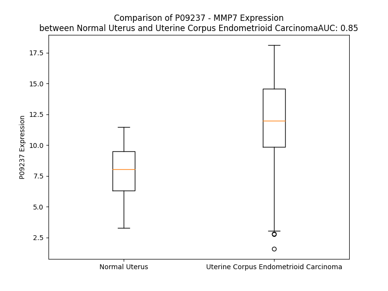

# Detailed Data for P09237

## Introduction to the Detailed Summary

### How to Interpret the Results

- **Summary & Metrics**: This section provides a quick reference to essential protein attributes, including expression changes, family classification, and biomarker applications. Regulation status (upregulated/downregulated) indicates the protein's behavior in a disease context. Some information comes from the original excel file with the proteins selected from literature, while others are derived from the analyses.
- **Expression Comparison**: A visual representation comparing protein expression between normal and disease states. It highlights significant changes in expression levels that might indicate diagnostic or therapeutic relevance. This is data coming from transcriptomics experiments and could not translate similarly to protein levels.
- **Isoform Alignment**: An interactive view of isoform alignments, revealing structural and functional differences between variants of the protein.
- **Interactors & Homologs**: Tables listing known interaction partners and homologous proteins, the more interactors and homologs, the more complex the protein is to design an antibody for.
- **Biological Assemblies**: Information about the structural arrangement of the protein in different assemblies, providing insights into its functional state but also the complexity of the protein to develop antibodies.
- **Combined Per-Residue Information**: A detailed table summarizing residue-level data. This includes predictions for epitope regions, aggregation tendencies, and modifications that might impact the protein's function. Each row corresponds to a residue in the protein, providing insights into specific sites that may be important for research or drug development.
## Summary & Metrics

- **UniProt Accession**: P09237
- **Gene Name**: MMP-7
- **Protein Name**: Matrilysin
- **Swiss Prot**: MMP7_HUMAN
- **Family**: peptidase
- **Biomarker Application**: diagnosis,efficacy,prognosis
- **Number of Isoforms**: 0
- **Regulation**: 1
- **(transcriptomics) AUC**: 0.85
- **(transcriptomics) Fold Change**: 1.50
- **(transcriptomics) Regulation**: Upregulated
- **Discotope Epitope Count**: 48
- **Max n_uniprots (Homo)**: 1
- **Max n_uniprots (Hetero)**: N/A

## Expression Comparison

## Interactors

| preferredName_A   | preferredName_B   |   score |
|:------------------|:------------------|--------:|
| MMP7              | CD44              |   0.973 |
| MMP7              | MMP2              |   0.961 |
| MMP7              | TIMP2             |   0.951 |
| MMP7              | SPP1              |   0.941 |
| MMP7              | TIMP1             |   0.925 |
| MMP7              | TIMP3             |   0.922 |

## Homologs

| uniprot_id   | gene_id   |
|:-------------|:----------|
| O60882       | MMP20     |
| P09238       | MMP10     |
| E5RJA7       | MMP16     |
| P39900       | MMP12     |
| E9PJB3       | MMP8      |
| G5E971       | MMP13     |
| P51511       | MMP15     |
| P14780       | MMP9      |
| P50281       | MMP14     |
| Q9NRE1       | MMP26     |
| B4DNP3       | MMP19     |
| A0A087WZS5   | MMP25     |
| Q9ULZ9       | MMP17     |
| B4DMZ6       | MMP23B    |
| Q9Y5R2       | MMP24     |
| P08253       | MMP2      |
| P02790       | HPX       |
| P03956       | MMP1      |
| E9PED7       | MMP11     |
| A0A087X1Y9   | MMP28     |
| Q8N119       | MMP21     |
| P08254       | MMP3      |
| Q9H306       | MMP27     |

## Biological Assemblies

|   Unnamed: 0 |   assembly |   n_uniprots | composition   | crystal_id   |
|-------------:|-----------:|-------------:|:--------------|:-------------|
|            0 |          1 |            1 | Homo          | 8jud         |
|            0 |          1 |            1 | Homo          | 8juf         |
|            0 |          1 |            1 | Homo          | 7wxx         |
|            0 |          1 |            1 | Homo          | 1mmp         |
|            1 |          2 |            1 | Homo          | 1mmp         |
|            0 |          1 |            1 | Homo          | 2mze         |
|            0 |          1 |            1 | Homo          | 2mzh         |
|            0 |          1 |            1 | Homo          | 5ue2         |
|            0 |          1 |            1 | Homo          | 1mmq         |
|            0 |          1 |            1 | Homo          | 5ue5         |
|            0 |          1 |            1 | Homo          | 2ddy         |
|            0 |          1 |            1 | Homo          | 8k4z         |
|            0 |          1 |            1 | Homo          | 8jug         |
|            0 |          1 |            1 | Homo          | 2mzi         |
|            0 |          1 |            1 | Homo          | 2y6d         |
|            0 |          1 |            1 | Homo          | 1mmr         |
|            0 |          1 |            1 | Homo          | 2y6c         |

## Combined Per-Residue Information

|   res | aa   |   epitope_score | epitope   |   relative_surface_accessibility |   modeling_confidence |   Aggregation | modification   |
|------:|:-----|----------------:|:----------|---------------------------------:|----------------------:|--------------:|:---------------|
|     1 | M    |         0.16323 | False     |                          1.26838 |                 48.22 |         0     | N/A            |
|     2 | R    |         0.24761 | False     |                          0.97675 |                 43.89 |         0     | N/A            |
|     3 | L    |         0.21322 | False     |                          1.05847 |                 44.44 |         9.099 | N/A            |
|     4 | T    |         0.18497 | False     |                          0.89581 |                 51.04 |        12.293 | N/A            |
|     5 | V    |         0.18968 | False     |                          0.93487 |                 56.96 |        25.518 | N/A            |
|     6 | L    |         0.14364 | False     |                          1.03046 |                 50.37 |        26.139 | N/A            |
|     7 | C    |         0.11353 | False     |                          0.83449 |                 48.79 |        26.235 | N/A            |
|     8 | A    |         0.11394 | False     |                          0.89788 |                 54.82 |        25.895 | N/A            |
|     9 | V    |         0.13815 | False     |                          0.87914 |                 58.84 |        25.435 | N/A            |
|    10 | C    |         0.13009 | False     |                          0.81059 |                 54.01 |        14.582 | N/A            |
|    11 | L    |         0.18396 | False     |                          1.00557 |                 54.03 |        12.452 | N/A            |
|    12 | L    |         0.13687 | False     |                          0.94091 |                 55.07 |         0.747 | N/A            |
|    13 | P    |         0.1348  | False     |                          0.90071 |                 51.37 |         0.381 | N/A            |
|    14 | G    |         0.17419 | False     |                          0.76313 |                 50.39 |         0     | N/A            |
|    15 | S    |         0.17526 | False     |                          0.82152 |                 55.18 |         0     | N/A            |
|    16 | L    |         0.15276 | False     |                          1.0035  |                 54.98 |         0     | N/A            |
|    17 | A    |         0.20354 | False     |                          0.89363 |                 66.99 |         0     | N/A            |
|    18 | L    |         0.24132 | False     |                          0.9401  |                 75.09 |         0     | N/A            |
|    19 | P    |         0.21949 | False     |                          0.89475 |                 83.98 |         0     | N/A            |
|    20 | L    |         0.26543 | True      |                          0.40732 |                 85.4  |         0     | N/A            |
|    21 | P    |         0.32895 | True      |                          0.45101 |                 88.12 |         0     | N/A            |
|    22 | Q    |         0.22604 | False     |                          0.76385 |                 89.54 |         0     | N/A            |
|    23 | E    |         0.21508 | False     |                          0.22331 |                 88.46 |         0     | N/A            |
|    24 | A    |         0.03786 | False     |                          0.01786 |                 89.94 |         0     | N/A            |
|    25 | G    |         0.20808 | False     |                          0.43608 |                 89.52 |         0     | N/A            |
|    26 | G    |         0.19641 | False     |                          0.93806 |                 89.12 |         0     | N/A            |
|    27 | M    |         0.16366 | False     |                          0.22834 |                 91.42 |         0     | N/A            |
|    28 | S    |         0.19194 | False     |                          0.45145 |                 92.65 |         0     | N/A            |
|    29 | E    |         0.16344 | False     |                          0.64724 |                 91.64 |         0     | N/A            |
|    30 | L    |         0.25548 | False     |                          0.6965  |                 92.47 |         0     | N/A            |
|    31 | Q    |         0.20204 | False     |                          0.2468  |                 93.02 |         0     | N/A            |
|    32 | W    |         0.11058 | False     |                          0.10986 |                 92.53 |         0     | N/A            |
|    33 | E    |         0.25609 | False     |                          0.51493 |                 91.72 |         0     | N/A            |
|    34 | Q    |         0.13992 | False     |                          0.40949 |                 91.36 |         0     | N/A            |
|    35 | A    |         0.00469 | False     |                          0.0011  |                 92.72 |         0     | N/A            |
|    36 | Q    |         0.26792 | True      |                          0.3529  |                 91.52 |         0     | N/A            |
|    37 | D    |         0.27427 | True      |                          0.54101 |                 90.13 |         0     | N/A            |
|    38 | Y    |         0.12388 | False     |                          0.06612 |                 93.12 |         0     | N/A            |
|    39 | L    |         0.03521 | False     |                          0.01258 |                 92.32 |         0     | N/A            |
|    40 | K    |         0.20005 | False     |                          0.80748 |                 87.93 |         0     | N/A            |
|    41 | R    |         0.25052 | False     |                          0.32547 |                 87.66 |         0     | N/A            |
|    42 | F    |         0.11103 | False     |                          0.04395 |                 91.82 |         0     | N/A            |
|    43 | Y    |         0.04197 | False     |                          0.01125 |                 89.36 |         0     | N/A            |
|    44 | L    |         0.18407 | False     |                          0.49099 |                 78.15 |         0     | N/A            |
|    45 | Y    |         0.31192 | True      |                          0.68639 |                 71.4  |         0     | N/A            |
|    46 | D    |         0.22983 | False     |                          0.36041 |                 64.72 |         0     | N/A            |
|    47 | S    |         0.31765 | True      |                          0.88097 |                 62.22 |         0     | N/A            |
|    48 | E    |         0.37761 | True      |                          0.78084 |                 60.55 |         0     | N/A            |
|    49 | T    |         0.52574 | True      |                          0.4917  |                 60.74 |         0     | N/A            |
|    50 | K    |         0.30561 | True      |                          0.88927 |                 62.96 |         0     | N/A            |
|    51 | N    |         0.40013 | True      |                          0.81494 |                 62.11 |         0     | N/A            |
|    52 | A    |         0.28477 | True      |                          0.29687 |                 62.04 |         0     | N/A            |
|    53 | N    |         0.18591 | False     |                          0.11449 |                 71.3  |         0     | N/A            |
|    54 | S    |         0.17301 | False     |                          0.36671 |                 83.09 |         0     | N/A            |
|    55 | L    |         0.13638 | False     |                          0.26448 |                 84.54 |         0     | N/A            |
|    56 | E    |         0.20107 | False     |                          0.32912 |                 90.16 |         0     | N/A            |
|    57 | A    |         0.11405 | False     |                          0.24168 |                 90.1  |         0     | N/A            |
|    58 | K    |         0.07314 | False     |                          0.07742 |                 91.24 |         0     | N/A            |
|    59 | L    |         0.00349 | False     |                          0       |                 93.46 |         0     | N/A            |
|    60 | K    |         0.18372 | False     |                          0.37989 |                 93.65 |         0     | N/A            |
|    61 | E    |         0.18235 | False     |                          0.32614 |                 92.22 |         0     | N/A            |
|    62 | M    |         0.00815 | False     |                          0       |                 94.5  |         0     | N/A            |
|    63 | Q    |         0.01252 | False     |                          0.00117 |                 95.58 |         0     | N/A            |
|    64 | K    |         0.3497  | True      |                          0.72848 |                 94.31 |         0     | N/A            |
|    65 | F    |         0.17047 | False     |                          0.14261 |                 93.8  |         0     | N/A            |
|    66 | F    |         0.10072 | False     |                          0.09241 |                 93.85 |         0     | N/A            |
|    67 | G    |         0.19781 | False     |                          0.82202 |                 93.25 |         0     | N/A            |
|    68 | L    |         0.16605 | False     |                          0.17626 |                 94.84 |         0     | N/A            |
|    69 | P    |         0.27604 | True      |                          0.75091 |                 96.11 |         0     | N/A            |
|    70 | I    |         0.38171 | True      |                          0.57409 |                 96.19 |         0.225 | N/A            |
|    71 | T    |         0.1925  | False     |                          0.39675 |                 95.43 |         0.225 | N/A            |
|    72 | G    |         0.01293 | False     |                          0.00238 |                 94.08 |         0.225 | N/A            |
|    73 | M    |         0.21639 | False     |                          0.39893 |                 94.98 |         0.225 | N/A            |
|    74 | L    |         0.03659 | False     |                          0.02255 |                 94.83 |         0.225 | N/A            |
|    75 | N    |         0.1317  | False     |                          0.35532 |                 94.12 |         0     | N/A            |
|    76 | S    |         0.16339 | False     |                          0.67856 |                 93.9  |         0     | N/A            |
|    77 | R    |         0.16847 | False     |                          0.50895 |                 94.08 |         0     | N/A            |
|    78 | V    |         0.00642 | False     |                          0.0019  |                 95.3  |         0     | N/A            |
|    79 | I    |         0.06141 | False     |                          0.048   |                 94.69 |         0     | N/A            |
|    80 | E    |         0.15903 | False     |                          0.36191 |                 93.5  |         0     | N/A            |
|    81 | I    |         0.11814 | False     |                          0.06619 |                 93.27 |         0     | N/A            |
|    82 | M    |         0.13473 | False     |                          0.09702 |                 94.06 |         0     | N/A            |
|    83 | Q    |         0.17907 | False     |                          0.5109  |                 92.34 |         0     | N/A            |
|    84 | K    |         0.11741 | False     |                          0.36653 |                 92.96 |         0     | N/A            |
|    85 | P    |         0.12197 | False     |                          0.39089 |                 93.5  |         0     | N/A            |
|    86 | R    |         0.0834  | False     |                          0.01145 |                 95.59 |         0     | N/A            |
|    87 | C    |         0.00556 | False     |                          0       |                 96.7  |         0     | N/A            |
|    88 | G    |         0.10114 | False     |                          0.11673 |                 95.29 |         0     | N/A            |
|    89 | V    |         0.14801 | False     |                          0.1171  |                 93.38 |         0     | N/A            |
|    90 | P    |         0.11877 | False     |                          0.18239 |                 91.42 |         0     | N/A            |
|    91 | D    |         0.11735 | False     |                          0.08605 |                 89.25 |         0     | N/A            |
|    92 | V    |         0.12329 | False     |                          0.34429 |                 67.76 |         0     | N/A            |
|    93 | A    |         0.09799 | False     |                          0.26583 |                 51.99 |         0     | N/A            |
|    94 | E    |         0.18733 | False     |                          0.66027 |                 43.12 |         0     | N/A            |
|    95 | Y    |         0.17274 | False     |                          0.31061 |                 41.37 |         0     | N/A            |
|    96 | S    |         0.17578 | False     |                          0.82954 |                 37.34 |         0     | N/A            |
|    97 | L    |         0.10354 | False     |                          0.48358 |                 39.03 |         0     | N/A            |
|    98 | F    |         0.15382 | False     |                          0.13305 |                 44.54 |         0     | N/A            |
|    99 | P    |         0.15224 | False     |                          0.63537 |                 44.52 |         0     | N/A            |
|   100 | N    |         0.26305 | True      |                          0.96446 |                 59.96 |         0     | N/A            |
|   101 | S    |         0.17631 | False     |                          0.23278 |                 64.28 |         0     | N/A            |
|   102 | P    |         0.26738 | True      |                          0.25396 |                 79.02 |         0     | N/A            |
|   103 | K    |         0.16139 | False     |                          0.45926 |                 91.26 |         0     | N/A            |
|   104 | W    |         0.10481 | False     |                          0.14181 |                 95.71 |         0     | N/A            |
|   105 | T    |         0.21071 | False     |                          0.95573 |                 92.94 |         0     | N/A            |
|   106 | S    |         0.13018 | False     |                          0.45627 |                 94.25 |         0     | N/A            |
|   107 | K    |         0.21488 | False     |                          0.74407 |                 95.46 |         0     | N/A            |
|   108 | V    |         0.15233 | False     |                          0.40345 |                 97.95 |         0     | N/A            |
|   109 | V    |         0.00975 | False     |                          0.00476 |                 98.41 |         0     | N/A            |
|   110 | T    |         0.08745 | False     |                          0.13148 |                 98.52 |         0     | N/A            |
|   111 | Y    |         0.07455 | False     |                          0.04701 |                 98.77 |         0     | N/A            |
|   112 | R    |         0.16993 | False     |                          0.26698 |                 98.51 |         0     | N/A            |
|   113 | I    |         0.07873 | False     |                          0.06703 |                 98.59 |         2.052 | N/A            |
|   114 | V    |         0.25612 | False     |                          0.54594 |                 97.58 |         2.052 | N/A            |
|   115 | S    |         0.1734  | False     |                          0.30372 |                 97.78 |         2.052 | N/A            |
|   116 | Y    |         0.12642 | False     |                          0.24636 |                 98.53 |         2.052 | N/A            |
|   117 | T    |         0.09902 | False     |                          0.02403 |                 98.32 |         2.052 | N/A            |
|   118 | R    |         0.53685 | True      |                          0.8542  |                 97.63 |         0     | N/A            |
|   119 | D    |         0.38735 | True      |                          0.43979 |                 97.83 |         0     | N/A            |
|   120 | L    |         0.1989  | False     |                          0.11386 |                 97.82 |         0     | N/A            |
|   121 | P    |         0.34707 | True      |                          0.62827 |                 98.13 |         0     | N/A            |
|   122 | H    |         0.22963 | False     |                          0.60348 |                 98.29 |         0     | N/A            |
|   123 | I    |         0.24333 | False     |                          0.77718 |                 98.18 |         0     | N/A            |
|   124 | T    |         0.14921 | False     |                          0.1389  |                 98.04 |         0     | N/A            |
|   125 | V    |         0.00374 | False     |                          0       |                 98.55 |         0     | N/A            |
|   126 | D    |         0.13785 | False     |                          0.19597 |                 98.52 |         0     | N/A            |
|   127 | R    |         0.28907 | True      |                          0.47889 |                 98.06 |         0     | N/A            |
|   128 | L    |         0.02148 | False     |                          0.00412 |                 97.31 |         0     | N/A            |
|   129 | V    |         0.00712 | False     |                          0.00381 |                 98.62 |         0     | N/A            |
|   130 | S    |         0.15916 | False     |                          0.38993 |                 98.34 |         0     | N/A            |
|   131 | K    |         0.31088 | True      |                          0.41318 |                 97.21 |         0     | N/A            |
|   132 | A    |         0.00389 | False     |                          0       |                 97.75 |         0     | N/A            |
|   133 | L    |         0.01484 | False     |                          0.00742 |                 98.51 |         0     | N/A            |
|   134 | N    |         0.16131 | False     |                          0.47377 |                 97.28 |         0     | N/A            |
|   135 | M    |         0.1767  | False     |                          0.11959 |                 96.99 |         0     | N/A            |
|   136 | W    |         0.01416 | False     |                          0       |                 98.13 |         0     | N/A            |
|   137 | G    |         0.07722 | False     |                          0.06184 |                 97.54 |         0     | N/A            |
|   138 | K    |         0.16004 | False     |                          0.62239 |                 97.11 |         0     | N/A            |
|   139 | E    |         0.13003 | False     |                          0.2507  |                 97.31 |         0     | N/A            |
|   140 | I    |         0.01695 | False     |                          0       |                 96.8  |         0     | N/A            |
|   141 | P    |         0.09801 | False     |                          0.33509 |                 96.92 |         0     | N/A            |
|   142 | L    |         0.09441 | False     |                          0.04136 |                 97.49 |         0     | N/A            |
|   143 | H    |         0.10192 | False     |                          0.50249 |                 97.59 |         0     | N/A            |
|   144 | F    |         0.06972 | False     |                          0.21531 |                 98.49 |         0     | N/A            |
|   145 | R    |         0.26298 | True      |                          0.56872 |                 98.34 |         0     | N/A            |
|   146 | K    |         0.08759 | False     |                          0.35438 |                 98.46 |         0.086 | N/A            |
|   147 | V    |         0.23387 | False     |                          0.23943 |                 98.14 |         3.017 | N/A            |
|   148 | V    |         0.22585 | False     |                          0.71453 |                 95.11 |         3.266 | N/A            |
|   149 | W    |         0.25184 | False     |                          0.90911 |                 95.82 |         3.266 | N/A            |
|   150 | G    |         0.21537 | False     |                          0.51542 |                 96.1  |         3.266 | N/A            |
|   151 | T    |         0.27408 | True      |                          0.85165 |                 96.6  |         3.266 | N/A            |
|   152 | A    |         0.09471 | False     |                          0.10672 |                 97.79 |         1.411 | N/A            |
|   153 | D    |         0.05671 | False     |                          0.30535 |                 98.11 |         0.086 | N/A            |
|   154 | I    |         0.00861 | False     |                          0       |                 98.6  |        31.362 | N/A            |
|   155 | M    |         0.08912 | False     |                          0.1959  |                 98.5  |        32.689 | N/A            |
|   156 | I    |         0.00937 | False     |                          0.0048  |                 98.77 |        32.689 | N/A            |
|   157 | G    |         0.10444 | False     |                          0.05379 |                 98.3  |        32.603 | N/A            |
|   158 | F    |         0.06406 | False     |                          0.06788 |                 98.66 |        32.603 | N/A            |
|   159 | A    |         0.18627 | False     |                          0.2334  |                 98.01 |        15.638 | N/A            |
|   160 | R    |         0.31789 | True      |                          0.49233 |                 97.73 |         0     | N/A            |
|   161 | G    |         0.2213  | False     |                          0.3111  |                 96.97 |         0     | N/A            |
|   162 | A    |         0.36613 | True      |                          0.89681 |                 96.66 |         0     | N/A            |
|   163 | H    |         0.33208 | True      |                          0.2124  |                 97.14 |         0     | N/A            |
|   164 | G    |         0.4762  | True      |                          0.95036 |                 92.56 |         0     | N/A            |
|   165 | D    |         0.50351 | True      |                          0.16357 |                 93.32 |         0     | N/A            |
|   166 | S    |         0.54204 | True      |                          0.76948 |                 91.32 |         0     | N/A            |
|   167 | Y    |         0.38064 | True      |                          0.5306  |                 91.39 |         0     | N/A            |
|   168 | P    |         0.29334 | True      |                          0.51701 |                 94.87 |         0     | N/A            |
|   169 | F    |         0.1298  | False     |                          0.05644 |                 96.61 |         0     | N/A            |
|   170 | D    |         0.44564 | True      |                          0.39069 |                 94.27 |         0     | N/A            |
|   171 | G    |         0.19109 | False     |                          0.14546 |                 94.37 |         0     | N/A            |
|   172 | P    |         0.24296 | False     |                          0.81745 |                 93.78 |         0     | N/A            |
|   173 | G    |         0.14523 | False     |                          0.23527 |                 90.54 |         0     | N/A            |
|   174 | N    |         0.18853 | False     |                          0.51925 |                 90.51 |         0     | N/A            |
|   175 | T    |         0.01473 | False     |                          0.00217 |                 94.71 |         0     | N/A            |
|   176 | L    |         0.02709 | False     |                          0.01237 |                 96.57 |         0     | N/A            |
|   177 | A    |         0.00738 | False     |                          0       |                 97.91 |         0     | N/A            |
|   178 | H    |         0.08816 | False     |                          0.04557 |                 96.87 |         0     | N/A            |
|   179 | A    |         0.07686 | False     |                          0.07919 |                 97.05 |         0     | N/A            |
|   180 | F    |         0.18052 | False     |                          0.17837 |                 94.74 |         0     | N/A            |
|   181 | A    |         0.08601 | False     |                          0.21352 |                 93.12 |         0     | N/A            |
|   182 | P    |         0.06294 | False     |                          0.07573 |                 95.42 |         0     | N/A            |
|   183 | G    |         0.22679 | False     |                          0.44811 |                 92.36 |         0     | N/A            |
|   184 | T    |         0.32712 | True      |                          0.94438 |                 90.58 |         0     | N/A            |
|   185 | G    |         0.33639 | True      |                          0.8969  |                 91.96 |         0     | N/A            |
|   186 | L    |         0.25498 | False     |                          0.47183 |                 93.58 |         0     | N/A            |
|   187 | G    |         0.07747 | False     |                          0.14939 |                 94.1  |         0     | N/A            |
|   188 | G    |         0.00317 | False     |                          0       |                 96.24 |         0     | N/A            |
|   189 | D    |         0.08466 | False     |                          0.06029 |                 98.05 |         0     | N/A            |
|   190 | A    |         0.00272 | False     |                          0       |                 98.55 |         0     | N/A            |
|   191 | H    |         0.11211 | False     |                          0.12868 |                 98.58 |         0     | N/A            |
|   192 | F    |         0.00504 | False     |                          0.00318 |                 98.6  |         0     | N/A            |
|   193 | D    |         0.00423 | False     |                          0       |                 98.28 |         0     | N/A            |
|   194 | E    |         0.11001 | False     |                          0.12903 |                 98.15 |         0     | N/A            |
|   195 | D    |         0.2772  | True      |                          0.29851 |                 97.7  |         0     | N/A            |
|   196 | E    |         0.11474 | False     |                          0.07858 |                 96.54 |         0     | N/A            |
|   197 | R    |         0.32419 | True      |                          0.57447 |                 95.83 |         0     | N/A            |
|   198 | W    |         0.05683 | False     |                          0.01145 |                 96.66 |         0     | N/A            |
|   199 | T    |         0.12956 | False     |                          0.06664 |                 95.16 |         0     | N/A            |
|   200 | D    |         0.26981 | True      |                          0.409   |                 92.92 |         0     | N/A            |
|   201 | G    |         0.17955 | False     |                          0.40902 |                 85.91 |         0     | N/A            |
|   202 | S    |         0.33292 | True      |                          0.43817 |                 86.39 |         0     | N/A            |
|   203 | S    |         0.30951 | True      |                          0.90694 |                 82.38 |         0.672 | N/A            |
|   204 | L    |         0.40913 | True      |                          0.72955 |                 86.54 |         7.148 | N/A            |
|   205 | G    |         0.22365 | False     |                          0.4231  |                 92    |         8.256 | N/A            |
|   206 | I    |         0.14339 | False     |                          0.20719 |                 93.43 |        20.031 | N/A            |
|   207 | N    |         0.06704 | False     |                          0.13153 |                 94.35 |        20.65  | N/A            |
|   208 | F    |         0.00303 | False     |                          0       |                 95.95 |        29.519 | N/A            |
|   209 | L    |         0.03503 | False     |                          0.02143 |                 95.68 |        29.535 | N/A            |
|   210 | Y    |         0.06442 | False     |                          0.10902 |                 95.49 |        28.808 | N/A            |
|   211 | A    |         0.00294 | False     |                          0       |                 96.2  |        21.7   | N/A            |
|   212 | A    |         0.00303 | False     |                          0.00255 |                 97.65 |        15.352 | N/A            |
|   213 | T    |         0.00292 | False     |                          0       |                 97.52 |         2.709 | N/A            |
|   214 | H    |         0.01215 | False     |                          0.00514 |                 97.38 |         0     | N/A            |
|   215 | E    |         0.01344 | False     |                          0       |                 98.12 |         0     | N/A            |
|   216 | L    |         0.00526 | False     |                          0.00412 |                 98.44 |         0     | N/A            |
|   217 | G    |         0.00425 | False     |                          0       |                 97.34 |         0     | N/A            |
|   218 | H    |         0.03741 | False     |                          0.02805 |                 96.36 |         0     | N/A            |
|   219 | S    |         0.0025  | False     |                          0       |                 97.54 |         0     | N/A            |
|   220 | L    |         0.00283 | False     |                          0       |                 96.73 |         0     | N/A            |
|   221 | G    |         0.03703 | False     |                          0.06067 |                 94.02 |         0     | N/A            |
|   222 | M    |         0.06611 | False     |                          0.08005 |                 94.26 |         0     | N/A            |
|   223 | G    |         0.07972 | False     |                          0.17378 |                 91.64 |         0     | N/A            |
|   224 | H    |         0.11801 | False     |                          0.1469  |                 94.4  |         0     | N/A            |
|   225 | S    |         0.07997 | False     |                          0.09331 |                 93.66 |         0     | N/A            |
|   226 | S    |         0.2152  | False     |                          0.5148  |                 92.85 |         0     | N/A            |
|   227 | D    |         0.21121 | False     |                          0.30109 |                 92.42 |         0     | N/A            |
|   228 | P    |         0.29323 | True      |                          0.71    |                 91.11 |         0     | N/A            |
|   229 | N    |         0.26411 | True      |                          0.76114 |                 90.44 |         0     | N/A            |
|   230 | A    |         0.06765 | False     |                          0.08524 |                 93.71 |         0     | N/A            |
|   231 | V    |         0.05988 | False     |                          0.11693 |                 94.79 |         0     | N/A            |
|   232 | M    |         0.01349 | False     |                          0.00503 |                 95.21 |         0     | N/A            |
|   233 | Y    |         0.15726 | False     |                          0.1404  |                 94.34 |         0     | N/A            |
|   234 | P    |         0.00517 | False     |                          0       |                 94.33 |         0     | N/A            |
|   235 | T    |         0.13051 | False     |                          0.14388 |                 91.07 |         0     | N/A            |
|   236 | Y    |         0.09727 | False     |                          0.12    |                 80.56 |         0     | N/A            |
|   237 | G    |         0.18253 | False     |                          0.46523 |                 70.23 |         0     | N/A            |
|   238 | N    |         0.27306 | True      |                          1.00389 |                 66.11 |         0     | N/A            |
|   239 | G    |         0.27584 | True      |                          0.47326 |                 66.71 |         0     | N/A            |
|   240 | D    |         0.31085 | True      |                          0.43955 |                 74.22 |         0     | N/A            |
|   241 | P    |         0.238   | False     |                          0.3054  |                 75    |         0     | N/A            |
|   242 | Q    |         0.34606 | True      |                          0.83925 |                 77.02 |         0     | N/A            |
|   243 | N    |         0.28837 | True      |                          0.71814 |                 83.26 |         0     | N/A            |
|   244 | F    |         0.15603 | False     |                          0.13176 |                 91.89 |         0     | N/A            |
|   245 | K    |         0.32468 | True      |                          0.77329 |                 94.02 |         0     | N/A            |
|   246 | L    |         0.12173 | False     |                          0.09566 |                 95.46 |         0     | N/A            |
|   247 | S    |         0.1157  | False     |                          0.13519 |                 94.6  |         0     | N/A            |
|   248 | Q    |         0.18019 | False     |                          0.53557 |                 96.1  |         0     | N/A            |
|   249 | D    |         0.20343 | False     |                          0.38152 |                 95.07 |         0     | N/A            |
|   250 | D    |         0.01701 | False     |                          0.0031  |                 96.09 |         0     | N/A            |
|   251 | I    |         0.17779 | False     |                          0.20239 |                 96.93 |         0     | N/A            |
|   252 | K    |         0.19842 | False     |                          0.64324 |                 95.06 |         0     | N/A            |
|   253 | G    |         0.13522 | False     |                          0.30136 |                 93.81 |         0     | N/A            |
|   254 | I    |         0.00741 | False     |                          0       |                 95.07 |         0     | N/A            |
|   255 | Q    |         0.1092  | False     |                          0.1573  |                 95.5  |         0     | N/A            |
|   256 | K    |         0.22887 | False     |                          0.69611 |                 92.91 |         0     | N/A            |
|   257 | L    |         0.1128  | False     |                          0.09588 |                 91.65 |         0     | N/A            |
|   258 | Y    |         0.13334 | False     |                          0.11153 |                 94.63 |         0     | N/A            |
|   259 | G    |         0.13003 | False     |                          0.39417 |                 93.96 |         0     | N/A            |
|   260 | K    |         0.20075 | False     |                          0.76361 |                 94.58 |         0     | N/A            |
|   261 | R    |         0.11619 | False     |                          0.38313 |                 90.07 |         0     | N/A            |
|   262 | S    |         0.10018 | False     |                          0.68884 |                 80.09 |         0     | N/A            |
|   263 | N    |         0.18653 | False     |                          0.92122 |                 59.71 |         0     | N/A            |
|   264 | S    |         0.20355 | False     |                          0.73898 |                 45.41 |         0     | N/A            |
|   265 | R    |         0.20584 | False     |                          0.94544 |                 42.18 |         0     | N/A            |
|   266 | K    |         0.15943 | False     |                          0.97169 |                 30.88 |         0     | N/A            |
|   267 | K    |         0.12211 | False     |                          1.30637 |                 33.55 |         0     | N/A            |

