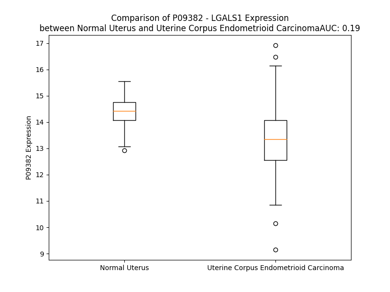

# Detailed Data for P09382

## Introduction to the Detailed Summary

### How to Interpret the Results

- **Summary & Metrics**: This section provides a quick reference to essential protein attributes, including expression changes, family classification, and biomarker applications. Regulation status (upregulated/downregulated) indicates the protein's behavior in a disease context. Some information comes from the original excel file with the proteins selected from literature, while others are derived from the analyses.
- **Expression Comparison**: A visual representation comparing protein expression between normal and disease states. It highlights significant changes in expression levels that might indicate diagnostic or therapeutic relevance. This is data coming from transcriptomics experiments and could not translate similarly to protein levels.
- **Isoform Alignment**: An interactive view of isoform alignments, revealing structural and functional differences between variants of the protein.
- **Interactors & Homologs**: Tables listing known interaction partners and homologous proteins, the more interactors and homologs, the more complex the protein is to design an antibody for.
- **Biological Assemblies**: Information about the structural arrangement of the protein in different assemblies, providing insights into its functional state but also the complexity of the protein to develop antibodies.
- **Combined Per-Residue Information**: A detailed table summarizing residue-level data. This includes predictions for epitope regions, aggregation tendencies, and modifications that might impact the protein's function. Each row corresponds to a residue in the protein, providing insights into specific sites that may be important for research or drug development.
## Summary & Metrics

- **UniProt Accession**: P09382
- **Gene Name**: LGALS1
- **Protein Name**: lectin, galactoside-binding, soluble, 1
- **Swiss Prot**: LEG1_HUMAN
- **Family**: other
- **Biomarker Application**: diagnosis,prognosis
- **Number of Isoforms**: 0
- **Regulation**: 1
- **(transcriptomics) AUC**: 0.19
- **(transcriptomics) Fold Change**: 1.08
- **(transcriptomics) Regulation**: Downregulated
- **Discotope Epitope Count**: 31
- **Max n_uniprots (Homo)**: 2
- **Max n_uniprots (Hetero)**: N/A

## Expression Comparison

## Interactors

| preferredName_A   | preferredName_B   |   score |
|:------------------|:------------------|--------:|
| LGALS1            | PTPRC             |   0.905 |
| LGALS1            | CSH1              |   0.901 |

## Homologs

| uniprot_id   | gene_id   |
|:-------------|:----------|
| P47929       | LGALS7    |
| M0R281       | LGALS7    |
| A0A6Q8JG94   | LGALS12   |
| Q05315       | CLC       |
| P05162       | LGALS2    |
| M0R1B2       | LGALS4    |
| J3QKS2       | LGALS9C   |
| J3KS82       | LGALS9    |
| Q3B8N2       | LGALS9B   |
| P17931       | LGALS3    |
| A8MUM7       | LGALS16   |
| Q8TCE9       | LGALS14   |
| Q9UHV8       | LGALS13   |
| E9PN19       | LGALS8    |
| B9A055       | LGALSL    |
| A4D1Z8       | GRIFIN    |

## Biological Assemblies

|   Unnamed: 0 |   assembly |   n_uniprots | composition   | crystal_id   |
|-------------:|-----------:|-------------:|:--------------|:-------------|
|            0 |          1 |            2 | Homo          | 1w6o         |
|            0 |          1 |            2 | Homo          | 4y20         |
|            0 |          1 |            2 | Homo          | 8r74         |
|            0 |          1 |            2 | Homo          | 4y24         |
|            0 |          1 |            2 | Homo          | 3oyw         |
|            0 |          1 |            2 | Homo          | 3oy8         |
|            0 |          1 |            2 | Homo          | 4q1p         |
|            1 |          2 |            1 | Homo          | 4q1p         |
|            2 |          3 |            1 | Homo          | 4q1p         |
|            0 |          1 |            2 | Homo          | 4q27         |
|            1 |          2 |            1 | Homo          | 4q27         |
|            2 |          3 |            1 | Homo          | 4q27         |
|            0 |          1 |            2 | Homo          | 1w6p         |
|            0 |          1 |            2 | Homo          | 7nml         |
|            0 |          1 |            2 | Homo          | 4y1x         |
|            0 |          1 |            2 | Homo          | 4y1z         |
|            0 |          1 |            2 | Homo          | 4q26         |
|            1 |          2 |            2 | Homo          | 4q26         |
|            2 |          3 |            1 | Homo          | 4q26         |
|            3 |          4 |            1 | Homo          | 4q26         |
|            4 |          5 |            1 | Homo          | 4q26         |
|            5 |          6 |            1 | Homo          | 4q26         |
|            0 |          1 |            2 | Homo          | 4y1v         |
|            0 |          1 |            2 | Homo          | 3t2t         |
|            0 |          1 |            2 | Homo          | 8ojp         |
|            0 |          1 |            2 | Homo          | 4y1u         |
|            0 |          1 |            2 | Homo          | 7lta         |
|            0 |          1 |            2 | Homo          | 1gzw         |
|            0 |          1 |            2 | Homo          | 8b0z         |
|            0 |          1 |            2 | Homo          | 6f83         |
|            0 |          1 |            2 | Homo          | 3w58         |
|            1 |          2 |            2 | Homo          | 3w58         |
|            0 |          1 |            2 | Homo          | 4q2f         |
|            1 |          2 |            1 | Homo          | 4q2f         |
|            2 |          3 |            1 | Homo          | 4q2f         |
|            0 |          1 |            2 | Homo          | 4y22         |
|            0 |          1 |            2 | Homo          | 4xbl         |
|            0 |          1 |            2 | Homo          | 8b0w         |
|            0 |          1 |            2 | Homo          | 2zkn         |
|            1 |          2 |            1 | Homo          | 2zkn         |
|            2 |          3 |            1 | Homo          | 2zkn         |
|            0 |          1 |            2 | Homo          | 4y1y         |
|            0 |          1 |            2 | Homo          | 5mwx         |
|            0 |          1 |            2 | Homo          | 5mwt         |
|            0 |          1 |            1 | Homo          | 6b94         |
|            1 |          2 |            1 | Homo          | 6b94         |
|            0 |          1 |            1 | Homo          | 6m5y         |
|            0 |          1 |            2 | Homo          | 1w6q         |
|            0 |          1 |            2 | Homo          | 3w59         |
|            1 |          2 |            2 | Homo          | 3w59         |
|            0 |          1 |            2 | Homo          | 1w6n         |
|            0 |          1 |            2 | Homo          | 1w6m         |
|            0 |          1 |            2 | Homo          | 2km2         |
|            0 |          1 |            2 | Homo          | 4q1r         |
|            1 |          2 |            1 | Homo          | 4q1r         |
|            2 |          3 |            1 | Homo          | 4q1r         |

## Combined Per-Residue Information

|   res | aa   |   epitope_score | epitope   |   relative_surface_accessibility |   modeling_confidence |   Aggregation | modification                 |
|------:|:-----|----------------:|:----------|---------------------------------:|----------------------:|--------------:|:-----------------------------|
|     1 | M    |         0.35013 | False     |                          1.25714 |                 45.25 |         0     | N/A                          |
|     2 | A    |         0.33606 | False     |                          0.93175 |                 52.04 |         0     | N-acetylalanine              |
|     3 | C    |         0.3264  | False     |                          0.96655 |                 59.86 |         0     | N/A                          |
|     4 | G    |         0.32066 | False     |                          0.41944 |                 82.92 |         0     | N/A                          |
|     5 | L    |         0.35953 | False     |                          0.4749  |                 93.53 |         0     | N/A                          |
|     6 | V    |         0.35362 | False     |                          0.66743 |                 96.46 |         0     | N/A                          |
|     7 | A    |         0.3356  | False     |                          0.24105 |                 96.16 |         0     | N/A                          |
|     8 | S    |         0.42227 | True      |                          0.57612 |                 96.85 |         0     | N/A                          |
|     9 | N    |         0.30707 | False     |                          0.84386 |                 96.35 |         0     | N/A                          |
|    10 | L    |         0.33923 | False     |                          0.22914 |                 96.54 |         0     | N/A                          |
|    11 | N    |         0.27297 | False     |                          0.48544 |                 96.46 |         0     | N/A                          |
|    12 | L    |         0.02271 | False     |                          0.00659 |                 97.21 |         0     | N/A                          |
|    13 | K    |         0.16665 | False     |                          0.42201 |                 97.22 |         0     | N6-acetyllysine              |
|    14 | P    |         0.25948 | False     |                          0.50967 |                 96.41 |         0     | N/A                          |
|    15 | G    |         0.1325  | False     |                          0.73298 |                 94.9  |         0     | N/A                          |
|    16 | E    |         0.1758  | False     |                          0.33791 |                 96.26 |         0     | N/A                          |
|    17 | C    |         0.08198 | False     |                          0.12581 |                 95.11 |         0     | N/A                          |
|    18 | L    |         0.00703 | False     |                          0       |                 97.91 |         0     | N/A                          |
|    19 | R    |         0.18567 | False     |                          0.35778 |                 97.93 |         0     | N/A                          |
|    20 | V    |         0.00655 | False     |                          0.00381 |                 97.79 |         0     | N/A                          |
|    21 | R    |         0.35887 | False     |                          0.4381  |                 97.87 |         0     | N/A                          |
|    22 | G    |         0.00814 | False     |                          0       |                 97.26 |         0     | N/A                          |
|    23 | E    |         0.19501 | False     |                          0.31843 |                 97.77 |         0     | N/A                          |
|    24 | V    |         0.00888 | False     |                          0.0019  |                 98.26 |         0     | N/A                          |
|    25 | A    |         0.15097 | False     |                          0.27003 |                 97.74 |         0     | N/A                          |
|    26 | P    |         0.41707 | True      |                          0.80415 |                 97.97 |         0     | N/A                          |
|    27 | D    |         0.4501  | True      |                          0.67545 |                 96.96 |         0     | N/A                          |
|    28 | A    |         0.19684 | False     |                          0.06365 |                 97.91 |         0     | N/A                          |
|    29 | K    |         0.48005 | True      |                          0.57412 |                 98.18 |         0     | N6-acetyllysine              |
|    30 | S    |         0.44224 | True      |                          0.16751 |                 98.24 |         0.166 | Phosphoserine; by FAM20C     |
|    31 | F    |         0.01378 | False     |                          0.00069 |                 97.96 |         2.386 | N/A                          |
|    32 | V    |         0.46628 | True      |                          0.16756 |                 98.14 |         2.583 | N/A                          |
|    33 | L    |         0.01517 | False     |                          0.00391 |                 98.21 |         2.583 | N/A                          |
|    34 | N    |         0.37298 | False     |                          0.15756 |                 98.52 |         2.583 | N/A                          |
|    35 | L    |         0.00826 | False     |                          0.0033  |                 98.56 |         2.583 | N/A                          |
|    36 | G    |         0.00912 | False     |                          0       |                 98.5  |         1.07  | N/A                          |
|    37 | K    |         0.29643 | False     |                          0.63185 |                 98.3  |         0     | N/A                          |
|    38 | D    |         0.26956 | False     |                          0.29878 |                 98.33 |         0     | N/A                          |
|    39 | S    |         0.27477 | False     |                          0.47814 |                 97.33 |         0     | N/A                          |
|    40 | N    |         0.53487 | True      |                          0.48637 |                 98.36 |         0     | N/A                          |
|    41 | N    |         0.27325 | False     |                          0.21079 |                 98.63 |         0     | N/A                          |
|    42 | L    |         0.05165 | False     |                          0.02061 |                 98.73 |         0.958 | N/A                          |
|    43 | C    |         0.01246 | False     |                          0.00762 |                 98.47 |         0.958 | N/A                          |
|    44 | L    |         0.00373 | False     |                          0.00082 |                 98.81 |         0.958 | N/A                          |
|    45 | H    |         0.37495 | False     |                          0.12938 |                 98.82 |         0.958 | N/A                          |
|    46 | F    |         0.0071  | False     |                          0       |                 98.79 |         0.958 | N/A                          |
|    47 | N    |         0.2705  | False     |                          0.04196 |                 98.64 |         0     | N/A                          |
|    48 | P    |         0.00496 | False     |                          0       |                 98.68 |         0     | N/A                          |
|    49 | R    |         0.41479 | True      |                          0.09225 |                 98.5  |         0     | N/A                          |
|    50 | F    |         0.22558 | False     |                          0.08516 |                 98.29 |         0     | N/A                          |
|    51 | N    |         0.66393 | True      |                          0.64787 |                 97.78 |         0     | N/A                          |
|    52 | A    |         0.48416 | True      |                          0.14667 |                 97.55 |         0     | N/A                          |
|    53 | H    |         0.72004 | True      |                          0.82598 |                 95.06 |         0     | N/A                          |
|    54 | G    |         0.65409 | True      |                          1.04327 |                 96.72 |         0     | N/A                          |
|    55 | D    |         0.49287 | True      |                          0.11125 |                 97.53 |         0     | N/A                          |
|    56 | A    |         0.48935 | True      |                          0.72111 |                 98.02 |         0     | N/A                          |
|    57 | N    |         0.38589 | False     |                          0.53186 |                 98.29 |         0     | N/A                          |
|    58 | T    |         0.3595  | False     |                          0.16064 |                 98.59 |         0     | N/A                          |
|    59 | I    |         0.00902 | False     |                          0       |                 98.78 |         0     | N/A                          |
|    60 | V    |         0.12547 | False     |                          0.00666 |                 98.76 |         0     | N/A                          |
|    61 | C    |         0.0069  | False     |                          0       |                 98.85 |         0     | N/A                          |
|    62 | N    |         0.32464 | False     |                          0.04978 |                 98.83 |         0     | N/A                          |
|    63 | S    |         0.13444 | False     |                          0.04744 |                 98.79 |         0     | N/A                          |
|    64 | K    |         0.53609 | True      |                          0.17002 |                 98.82 |         0     | N/A                          |
|    65 | D    |         0.3769  | False     |                          0.57432 |                 98.58 |         0     | N/A                          |
|    66 | G    |         0.44751 | True      |                          0.7824  |                 98.16 |         0     | N/A                          |
|    67 | G    |         0.635   | True      |                          0.37023 |                 98.24 |         0     | N/A                          |
|    68 | A    |         0.4739  | True      |                          0.62074 |                 98.6  |         0     | N/A                          |
|    69 | W    |         0.64783 | True      |                          0.58181 |                 98.7  |         0     | N/A                          |
|    70 | G    |         0.38463 | False     |                          0.45573 |                 98.64 |         0     | N/A                          |
|    71 | T    |         0.54237 | True      |                          0.75542 |                 98.51 |         0     | N/A                          |
|    72 | E    |         0.61803 | True      |                          0.3995  |                 98.65 |         0     | N/A                          |
|    73 | Q    |         0.48876 | True      |                          0.22666 |                 98.75 |         0     | N/A                          |
|    74 | R    |         0.64469 | True      |                          0.49679 |                 98.6  |         0     | N/A                          |
|    75 | E    |         0.33827 | False     |                          0.12164 |                 98.14 |         0     | N/A                          |
|    76 | A    |         0.46671 | True      |                          0.93442 |                 95.63 |         0     | N/A                          |
|    77 | V    |         0.35658 | False     |                          0.3437  |                 97.82 |         0     | N/A                          |
|    78 | F    |         0.3239  | False     |                          0.17253 |                 98.38 |         0     | N/A                          |
|    79 | P    |         0.2196  | False     |                          0.26077 |                 98.21 |         0     | N/A                          |
|    80 | F    |         0.08058 | False     |                          0.05322 |                 98.4  |         0     | N/A                          |
|    81 | Q    |         0.33386 | False     |                          0.5988  |                 98.04 |         0     | N/A                          |
|    82 | P    |         0.37916 | False     |                          0.33929 |                 98.12 |         0     | N/A                          |
|    83 | G    |         0.33009 | False     |                          0.50468 |                 98.04 |         0     | N/A                          |
|    84 | S    |         0.23099 | False     |                          0.34004 |                 98.23 |         0     | N/A                          |
|    85 | V    |         0.4202  | True      |                          0.55505 |                 98.2  |         0     | N/A                          |
|    86 | A    |         0.06428 | False     |                          0.05102 |                 98.11 |         0     | N/A                          |
|    87 | E    |         0.15101 | False     |                          0.33266 |                 98.18 |         0     | N/A                          |
|    88 | V    |         0.00768 | False     |                          0       |                 98.38 |         1.521 | N/A                          |
|    89 | C    |         0.14966 | False     |                          0.09818 |                 98.12 |         1.521 | N/A                          |
|    90 | I    |         0.02374 | False     |                          0.0032  |                 98.52 |         1.521 | N/A                          |
|    91 | T    |         0.2229  | False     |                          0.30279 |                 98.02 |         1.521 | N/A                          |
|    92 | F    |         0.08513 | False     |                          0.03255 |                 98.21 |         1.521 | N/A                          |
|    93 | D    |         0.16041 | False     |                          0.43032 |                 97.5  |         0     | N/A                          |
|    94 | Q    |         0.34281 | False     |                          0.79804 |                 96.42 |         0     | N/A                          |
|    95 | A    |         0.26018 | False     |                          0.59493 |                 97.71 |         0.209 | N/A                          |
|    96 | N    |         0.2969  | False     |                          0.24003 |                 98.52 |         0.209 | N/A                          |
|    97 | L    |         0.011   | False     |                          0.00247 |                 98.6  |         0.209 | N/A                          |
|    98 | T    |         0.17871 | False     |                          0.23321 |                 98.59 |         0.209 | N/A                          |
|    99 | V    |         0.01017 | False     |                          0       |                 98.67 |         0.209 | N/A                          |
|   100 | K    |         0.20828 | False     |                          0.41393 |                 98.5  |         0     | N/A                          |
|   101 | L    |         0.06141 | False     |                          0.02803 |                 98.59 |         0     | N/A                          |
|   102 | P    |         0.16359 | False     |                          0.42672 |                 98.19 |         0     | N/A                          |
|   103 | D    |         0.45187 | True      |                          0.53953 |                 97.5  |         0     | N/A                          |
|   104 | G    |         0.25084 | False     |                          0.44622 |                 97.77 |         0     | N/A                          |
|   105 | Y    |         0.38376 | False     |                          0.39369 |                 98.21 |         0     | N/A                          |
|   106 | E    |         0.40131 | False     |                          0.44859 |                 98.31 |         0     | N/A                          |
|   107 | F    |         0.31376 | False     |                          0.06794 |                 98.64 |         0     | N/A                          |
|   108 | K    |         0.50311 | True      |                          0.61503 |                 98.59 |         0     | N6-acetyllysine; alternate   |
|   108 | K    |         0.50311 | True      |                          0.61503 |                 98.59 |         0     | N6-succinyllysine; alternate |
|   109 | F    |         0.02538 | False     |                          0       |                 98.74 |         0     | N/A                          |
|   110 | P    |         0.27888 | False     |                          0.37377 |                 98.56 |         0     | N/A                          |
|   111 | N    |         0.09422 | False     |                          0.03484 |                 98.28 |         0     | N/A                          |
|   112 | R    |         0.43789 | True      |                          0.3447  |                 98.52 |         0     | N/A                          |
|   113 | L    |         0.43683 | True      |                          0.21457 |                 98.06 |         0     | N/A                          |
|   114 | N    |         0.46459 | True      |                          0.70006 |                 97.03 |         0     | N/A                          |
|   115 | L    |         0.18982 | False     |                          0.16591 |                 97.3  |         0     | N/A                          |
|   116 | E    |         0.29359 | False     |                          0.75172 |                 96.8  |         0     | N/A                          |
|   117 | A    |         0.18033 | False     |                          0.18673 |                 97.62 |         0     | N/A                          |
|   118 | I    |         0.00521 | False     |                          0.0016  |                 98.29 |         0     | N/A                          |
|   119 | N    |         0.19767 | False     |                          0.31892 |                 98.08 |         0     | N/A                          |
|   120 | Y    |         0.22107 | False     |                          0.118   |                 98.35 |         0     | N/A                          |
|   121 | M    |         0.02018 | False     |                          0.00431 |                 97.73 |         0     | N/A                          |
|   122 | A    |         0.26754 | False     |                          0.07727 |                 97.39 |         0     | N/A                          |
|   123 | A    |         0.04871 | False     |                          0.0249  |                 97.11 |         0     | N/A                          |
|   124 | D    |         0.41637 | True      |                          0.47647 |                 95.41 |         0     | N/A                          |
|   125 | G    |         0.17613 | False     |                          0.58592 |                 96.35 |         0     | N/A                          |
|   126 | D    |         0.21368 | False     |                          0.28225 |                 97.28 |         0     | N/A                          |
|   127 | F    |         0.07172 | False     |                          0.05853 |                 96.92 |         0     | N/A                          |
|   128 | K    |         0.26026 | False     |                          0.68345 |                 95.36 |         0     | N6-acetyllysine              |
|   129 | I    |         0.26706 | False     |                          0.20467 |                 96.22 |         0     | N/A                          |
|   130 | K    |         0.30473 | False     |                          0.49046 |                 95.94 |         0     | N/A                          |
|   131 | C    |         0.33391 | False     |                          0.45016 |                 96.14 |         0     | N/A                          |
|   132 | V    |         0.21561 | False     |                          0.30597 |                 96.72 |         0     | N/A                          |
|   133 | A    |         0.19853 | False     |                          0.31885 |                 96.16 |         0     | N/A                          |
|   134 | F    |         0.05979 | False     |                          0.4976  |                 93.06 |         0     | N/A                          |
|   135 | D    |         0.10668 | False     |                          0.66719 |                 87.61 |         0     | N/A                          |

