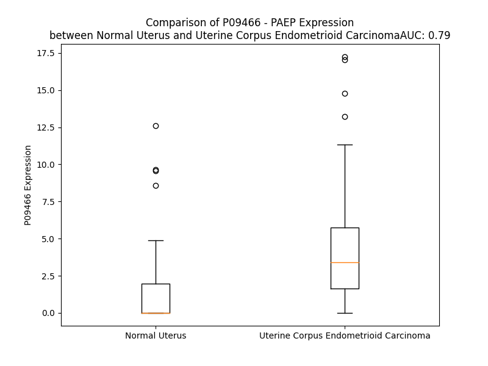

# Detailed Data for P09466

## Introduction to the Detailed Summary

### How to Interpret the Results

- **Summary & Metrics**: This section provides a quick reference to essential protein attributes, including expression changes, family classification, and biomarker applications. Regulation status (upregulated/downregulated) indicates the protein's behavior in a disease context. Some information comes from the original excel file with the proteins selected from literature, while others are derived from the analyses.
- **Expression Comparison**: A visual representation comparing protein expression between normal and disease states. It highlights significant changes in expression levels that might indicate diagnostic or therapeutic relevance. This is data coming from transcriptomics experiments and could not translate similarly to protein levels.
- **Isoform Alignment**: An interactive view of isoform alignments, revealing structural and functional differences between variants of the protein.
- **Interactors & Homologs**: Tables listing known interaction partners and homologous proteins, the more interactors and homologs, the more complex the protein is to design an antibody for.
- **Biological Assemblies**: Information about the structural arrangement of the protein in different assemblies, providing insights into its functional state but also the complexity of the protein to develop antibodies.
- **Combined Per-Residue Information**: A detailed table summarizing residue-level data. This includes predictions for epitope regions, aggregation tendencies, and modifications that might impact the protein's function. Each row corresponds to a residue in the protein, providing insights into specific sites that may be important for research or drug development.
## Summary & Metrics

- **UniProt Accession**: P09466
- **Gene Name**: PAEP
- **Protein Name**: progestagen-associated endometrial protein /glycodelin/ Placental protein 14
- **Swiss Prot**: PAEP_HUMAN
- **Family**: other
- **Biomarker Application**: diagnosis
- **Number of Isoforms**: 3
- **Regulation**: 2
- **(transcriptomics) AUC**: 0.75
- **(transcriptomics) Fold Change**: 2.24
- **(transcriptomics) Regulation**: Upregulated
- **Discotope Epitope Count**: 39
- **Max n_uniprots (Homo)**: 1
- **Max n_uniprots (Hetero)**: N/A

## Expression Comparison

## Isoform Alignment

<pre style='font-size:14px; font-family:monospace;'>P09466-1 MLCLLLTLGVALVCGVPAMDIPQTKQDLELPKLAGTWHSMAMATNNISLMATLKAPLRVHITSLLPTPEDNLEIVLHRWENNSCVEKKVLGEKTENPKKFKINYTVANEATLLDTDYDNFLFLCLQDTTTPIQSMMCQYLARVLVEDDEIMQGFIRAFRPLPRHLWYLLDLKQMEEPCRF
P09466-2 MLCLLLTLGVALVCGVPAMDIPQTKQDLELPK----------------------APLRVHITSLLPTPEDNLEIVLHRWENNSCVEKKVLGEKTENPKKFKINYTVANEATLLDTDYDNFLFLCLQDTTTPIQSMMCQYLARVLVEDDEIMQGFIRAFRPLPRHLWYLLDLKQMEEPCRF
P09466-3 MLCLLLTLGVALVCGVPAMDIPQTKQDLELPK----------------------------------------------------------------------------------------------DTTTPIQSMMCQYLARVLVEDDEIMQGFIRAFRPLPRHLWYLLDLKQMEEPCRF
</pre>

## Interactors

| preferredName_A   | preferredName_B   |   score |
|:------------------|:------------------|--------:|
| PAEP              | GDF5              |   0.906 |

## Biological Assemblies

|   Unnamed: 0 |   assembly |   n_uniprots | composition   | crystal_id   |
|-------------:|-----------:|-------------:|:--------------|:-------------|
|            0 |          1 |            1 | Homo          | 4r0b         |

## Combined Per-Residue Information

|   res | aa   |   epitope_score | epitope   |   relative_surface_accessibility |   modeling_confidence |   Aggregation | modification   | glycosylation                             |
|------:|:-----|----------------:|:----------|---------------------------------:|----------------------:|--------------:|:---------------|:------------------------------------------|
|     1 | M    |         0.28719 | False     |                          1.29062 |                 38.54 |         0.082 | N/A            | N/A                                       |
|     2 | L    |         0.40121 | True      |                          0.841   |                 43.18 |        54.719 | N/A            | N/A                                       |
|     3 | C    |         0.31662 | False     |                          0.95395 |                 48.64 |        58.667 | N/A            | N/A                                       |
|     4 | L    |         0.31972 | False     |                          0.85917 |                 55.16 |        90.881 | N/A            | N/A                                       |
|     5 | L    |         0.31831 | False     |                          0.96193 |                 55.79 |        96.698 | N/A            | N/A                                       |
|     6 | L    |         0.20239 | False     |                          1.04983 |                 54.71 |        97.841 | N/A            | N/A                                       |
|     7 | T    |         0.23963 | False     |                          0.9046  |                 60    |        97.857 | N/A            | N/A                                       |
|     8 | L    |         0.26357 | False     |                          0.96482 |                 56.33 |        98.078 | N/A            | N/A                                       |
|     9 | G    |         0.27051 | False     |                          0.87582 |                 54.39 |        97.036 | N/A            | N/A                                       |
|    10 | V    |         0.21194 | False     |                          0.8395  |                 58.87 |        97.052 | N/A            | N/A                                       |
|    11 | A    |         0.18053 | False     |                          0.82591 |                 57.34 |        95.784 | N/A            | N/A                                       |
|    12 | L    |         0.18882 | False     |                          0.88686 |                 53.42 |        94.71  | N/A            | N/A                                       |
|    13 | V    |         0.20546 | False     |                          0.93198 |                 53.07 |        88.485 | N/A            | N/A                                       |
|    14 | C    |         0.21456 | False     |                          0.80747 |                 52.14 |        15.148 | N/A            | N/A                                       |
|    15 | G    |         0.2729  | False     |                          0.62217 |                 53.17 |         1.405 | N/A            | N/A                                       |
|    16 | V    |         0.2464  | False     |                          0.90462 |                 50.27 |         0.168 | N/A            | N/A                                       |
|    17 | P    |         0.298   | False     |                          0.82759 |                 45.96 |         0.071 | N/A            | N/A                                       |
|    18 | A    |         0.17848 | False     |                          0.51441 |                 53.73 |         0     | N/A            | N/A                                       |
|    19 | M    |         0.20343 | False     |                          0.32671 |                 55.7  |         0     | N/A            | N/A                                       |
|    20 | D    |         0.33909 | False     |                          0.65649 |                 61.38 |         0     | N/A            | N/A                                       |
|    21 | I    |         0.11974 | False     |                          0.09955 |                 61.17 |         0     | N/A            | N/A                                       |
|    22 | P    |         0.27181 | False     |                          0.74993 |                 62.48 |         0     | N/A            | N/A                                       |
|    23 | Q    |         0.3074  | False     |                          0.3014  |                 57.64 |         0     | N/A            | N/A                                       |
|    24 | T    |         0.1955  | False     |                          0.46717 |                 62.22 |         0     | N/A            | N/A                                       |
|    25 | K    |         0.37791 | True      |                          1.03139 |                 54.47 |         0     | N/A            | N/A                                       |
|    26 | Q    |         0.27625 | False     |                          0.67322 |                 62.64 |         0     | N/A            | N/A                                       |
|    27 | D    |         0.32922 | False     |                          0.80022 |                 77.43 |         0     | N/A            | N/A                                       |
|    28 | L    |         0.22462 | False     |                          0.16636 |                 85.8  |         0     | N/A            | N/A                                       |
|    29 | E    |         0.31892 | False     |                          0.42177 |                 92.41 |         0     | N/A            | N/A                                       |
|    30 | L    |         0.13856 | False     |                          0.10117 |                 93.68 |         0     | N/A            | N/A                                       |
|    31 | P    |         0.36365 | True      |                          0.74826 |                 95.49 |         0     | N/A            | N/A                                       |
|    32 | K    |         0.25568 | False     |                          0.49904 |                 96.91 |         0     | N/A            | N/A                                       |
|    33 | L    |         0.00454 | False     |                          0       |                 97.36 |         0     | N/A            | N/A                                       |
|    34 | A    |         0.20338 | False     |                          0.44542 |                 98.06 |         0     | N/A            | N/A                                       |
|    35 | G    |         0.15049 | False     |                          0.35156 |                 97.09 |         0     | N/A            | N/A                                       |
|    36 | T    |         0.26446 | False     |                          0.5568  |                 97.44 |         0     | N/A            | N/A                                       |
|    37 | W    |         0.12506 | False     |                          0.0044  |                 97.4  |         0     | N/A            | N/A                                       |
|    38 | H    |         0.22876 | False     |                          0.16004 |                 95.43 |         0     | N/A            | N/A                                       |
|    39 | S    |         0.04909 | False     |                          0.01891 |                 95.16 |         0     | N/A            | N/A                                       |
|    40 | M    |         0.01508 | False     |                          0.00072 |                 94.39 |         0     | N/A            | N/A                                       |
|    41 | A    |         0.00474 | False     |                          0       |                 94.8  |         0     | N/A            | N/A                                       |
|    42 | M    |         0.01156 | False     |                          0       |                 95.23 |         0     | N/A            | N/A                                       |
|    43 | A    |         0.00672 | False     |                          0.00128 |                 94.93 |         0     | N/A            | N/A                                       |
|    44 | T    |         0.01838 | False     |                          0.00211 |                 94.22 |         0     | N/A            | N/A                                       |
|    45 | N    |         0.18251 | False     |                          0.19528 |                 91.48 |         0     | N/A            | N/A                                       |
|    46 | N    |         0.56909 | True      |                          0.32408 |                 91.51 |         0     | N/A            | N-linked (GlcNAc...) (complex) asparagine |
|    47 | I    |         0.41427 | True      |                          0.56493 |                 91.72 |         0.95  | N/A            | N/A                                       |
|    48 | S    |         0.47225 | True      |                          0.62991 |                 93.05 |         0.95  | N/A            | N/A                                       |
|    49 | L    |         0.27899 | False     |                          0.06512 |                 93.67 |         1.329 | N/A            | N/A                                       |
|    50 | M    |         0.02011 | False     |                          0       |                 93.18 |         1.329 | N/A            | N/A                                       |
|    51 | A    |         0.33377 | False     |                          0.42949 |                 90.49 |         1.329 | N/A            | N/A                                       |
|    52 | T    |         0.59059 | True      |                          0.62422 |                 92.13 |         0.894 | N/A            | N/A                                       |
|    53 | L    |         0.45381 | True      |                          0.43284 |                 91.12 |         0.894 | N/A            | N/A                                       |
|    54 | K    |         0.56506 | True      |                          0.74237 |                 92.48 |         0     | N/A            | N/A                                       |
|    55 | A    |         0.12087 | False     |                          0.06311 |                 95.04 |         0     | N/A            | N/A                                       |
|    56 | P    |         0.34281 | False     |                          0.27337 |                 95.51 |         0     | N/A            | N/A                                       |
|    57 | L    |         0.01936 | False     |                          0.00659 |                 96.05 |         0     | N/A            | N/A                                       |
|    58 | R    |         0.11782 | False     |                          0.03852 |                 95.56 |         0     | N/A            | N/A                                       |
|    59 | V    |         0.01681 | False     |                          0       |                 96.02 |         0     | N/A            | N/A                                       |
|    60 | H    |         0.04191 | False     |                          0.02646 |                 95.95 |         0     | N/A            | N/A                                       |
|    61 | I    |         0.02236 | False     |                          0.00355 |                 97.49 |         0     | N/A            | N/A                                       |
|    62 | T    |         0.17147 | False     |                          0.14379 |                 97.21 |         0     | N/A            | N/A                                       |
|    63 | S    |         0.27753 | False     |                          0.16109 |                 97.83 |         0     | N/A            | N/A                                       |
|    64 | L    |         0.00592 | False     |                          0       |                 98.58 |         0     | N/A            | N/A                                       |
|    65 | L    |         0.35308 | False     |                          0.45562 |                 97.91 |         0     | N/A            | N/A                                       |
|    66 | P    |         0.17904 | False     |                          0.25164 |                 97.56 |         0     | N/A            | N/A                                       |
|    67 | T    |         0.25423 | False     |                          0.25741 |                 96.66 |         0     | N/A            | N/A                                       |
|    68 | P    |         0.33803 | False     |                          0.96128 |                 95    |         0     | N/A            | N/A                                       |
|    69 | E    |         0.25313 | False     |                          0.53494 |                 95.75 |         0     | N/A            | N/A                                       |
|    70 | D    |         0.24101 | False     |                          0.46739 |                 94.32 |         0     | N/A            | N/A                                       |
|    71 | N    |         0.28395 | False     |                          0.18811 |                 97.75 |         0     | N/A            | N/A                                       |
|    72 | L    |         0.00576 | False     |                          0.00165 |                 98.36 |         0     | N/A            | N/A                                       |
|    73 | E    |         0.35855 | False     |                          0.20831 |                 98.52 |         0     | N/A            | N/A                                       |
|    74 | I    |         0.01286 | False     |                          0.0048  |                 98.58 |         0     | N/A            | N/A                                       |
|    75 | V    |         0.15781 | False     |                          0.06474 |                 98.42 |         0     | N/A            | N/A                                       |
|    76 | L    |         0.0422  | False     |                          0.00659 |                 97.78 |         0     | N/A            | N/A                                       |
|    77 | H    |         0.18224 | False     |                          0.16091 |                 97.16 |         0     | N/A            | N/A                                       |
|    78 | R    |         0.38337 | True      |                          0.15803 |                 95.23 |         0     | N/A            | N/A                                       |
|    79 | W    |         0.5698  | True      |                          0.29573 |                 95.15 |         0     | N/A            | N/A                                       |
|    80 | E    |         0.48951 | True      |                          0.26318 |                 93.68 |         0     | N/A            | N/A                                       |
|    81 | N    |         0.59973 | True      |                          0.85188 |                 92.09 |         0     | N/A            | N-linked (GlcNAc...) (complex) asparagine |
|    82 | N    |         0.5463  | True      |                          0.7624  |                 90.95 |         0     | N/A            | N/A                                       |
|    83 | S    |         0.3696  | True      |                          0.38773 |                 94.23 |         0     | N/A            | N/A                                       |
|    84 | C    |         0.42202 | True      |                          0.37617 |                 95.38 |         0     | N/A            | N/A                                       |
|    85 | V    |         0.47706 | True      |                          0.298   |                 95.91 |         0     | N/A            | N/A                                       |
|    86 | E    |         0.40849 | True      |                          0.4908  |                 97.23 |         0     | N/A            | N/A                                       |
|    87 | K    |         0.51114 | True      |                          0.32773 |                 97.52 |         0     | N/A            | N/A                                       |
|    88 | K    |         0.49735 | True      |                          0.61931 |                 98.15 |         0     | N/A            | N/A                                       |
|    89 | V    |         0.21219 | False     |                          0.06188 |                 98.39 |         0     | N/A            | N/A                                       |
|    90 | L    |         0.23857 | False     |                          0.5817  |                 98.54 |         0     | N/A            | N/A                                       |
|    91 | G    |         0.00833 | False     |                          0       |                 98.55 |         0     | N/A            | N/A                                       |
|    92 | E    |         0.24645 | False     |                          0.44398 |                 98.4  |         0     | N/A            | N/A                                       |
|    93 | K    |         0.19127 | False     |                          0.53458 |                 96.61 |         0     | N/A            | N/A                                       |
|    94 | T    |         0.31027 | False     |                          0.38985 |                 95.98 |         0     | N/A            | N/A                                       |
|    95 | E    |         0.36069 | False     |                          0.96626 |                 93.48 |         0     | N/A            | N/A                                       |
|    96 | N    |         0.23008 | False     |                          0.32559 |                 92.52 |         0     | N/A            | N/A                                       |
|    97 | P    |         0.31573 | False     |                          0.62359 |                 92.06 |         0     | N/A            | N/A                                       |
|    98 | K    |         0.12019 | False     |                          0.09174 |                 93.96 |         0     | N/A            | N/A                                       |
|    99 | K    |         0.2077  | False     |                          0.25196 |                 95.87 |         0     | N/A            | N/A                                       |
|   100 | F    |         0.0376  | False     |                          0.0172  |                 97.98 |         0     | N/A            | N/A                                       |
|   101 | K    |         0.35972 | False     |                          0.61783 |                 98.33 |         0     | N/A            | N/A                                       |
|   102 | I    |         0.16397 | False     |                          0.04767 |                 98.38 |         1.645 | N/A            | N/A                                       |
|   103 | N    |         0.4563  | True      |                          0.92185 |                 97.22 |         1.775 | N/A            | N/A                                       |
|   104 | Y    |         0.28677 | False     |                          0.09744 |                 97.12 |         1.775 | N/A            | N/A                                       |
|   105 | T    |         0.47592 | True      |                          0.53409 |                 94.51 |         1.775 | N/A            | N/A                                       |
|   106 | V    |         0.6375  | True      |                          0.5175  |                 93.73 |         1.775 | N/A            | N/A                                       |
|   107 | A    |         0.11762 | False     |                          0.03655 |                 96.31 |         1.55  | N/A            | N/A                                       |
|   108 | N    |         0.30833 | False     |                          0.2711  |                 96.85 |         0     | N/A            | N/A                                       |
|   109 | E    |         0.16952 | False     |                          0.12798 |                 97.68 |         0     | N/A            | N/A                                       |
|   110 | A    |         0.01349 | False     |                          0.01    |                 97.85 |         0     | N/A            | N/A                                       |
|   111 | T    |         0.04079 | False     |                          0.02367 |                 95.7  |         0     | N/A            | N/A                                       |
|   112 | L    |         0.02917 | False     |                          0.01627 |                 95.23 |         0     | N/A            | N/A                                       |
|   113 | L    |         0.08027 | False     |                          0.0432  |                 92.64 |         0     | N/A            | N/A                                       |
|   114 | D    |         0.21734 | False     |                          0.29542 |                 93.18 |         0     | N/A            | N/A                                       |
|   115 | T    |         0.17941 | False     |                          0.15985 |                 94.72 |         0     | N/A            | N/A                                       |
|   116 | D    |         0.21353 | False     |                          0.32793 |                 94.53 |         0     | N/A            | N/A                                       |
|   117 | Y    |         0.17593 | False     |                          0.12797 |                 95.19 |         0     | N/A            | N/A                                       |
|   118 | D    |         0.35089 | False     |                          0.69056 |                 95.04 |         0     | N/A            | N/A                                       |
|   119 | N    |         0.26668 | False     |                          0.51038 |                 95.45 |         3.358 | N/A            | N/A                                       |
|   120 | F    |         0.16531 | False     |                          0.14332 |                 95.98 |        38.038 | N/A            | N/A                                       |
|   121 | L    |         0.00238 | False     |                          0       |                 96.72 |        43.255 | N/A            | N/A                                       |
|   122 | F    |         0.04276 | False     |                          0.03249 |                 96.71 |        43.255 | N/A            | N/A                                       |
|   123 | L    |         0.0081  | False     |                          0.00247 |                 97.11 |        43.255 | N/A            | N/A                                       |
|   124 | C    |         0.00723 | False     |                          0       |                 96.4  |        41.197 | N/A            | N/A                                       |
|   125 | L    |         0.06143 | False     |                          0.01731 |                 97.1  |        29.486 | N/A            | N/A                                       |
|   126 | Q    |         0.20004 | False     |                          0.10247 |                 94.05 |         1.079 | N/A            | N/A                                       |
|   127 | D    |         0.21914 | False     |                          0.12976 |                 93.51 |         0     | N/A            | N/A                                       |
|   128 | T    |         0.45379 | True      |                          0.34963 |                 89.52 |         0     | N/A            | N/A                                       |
|   129 | T    |         0.49632 | True      |                          0.75865 |                 87.61 |         0     | N/A            | N/A                                       |
|   130 | T    |         0.47833 | True      |                          0.40826 |                 81.41 |         0     | N/A            | N/A                                       |
|   131 | P    |         0.37876 | True      |                          0.93228 |                 74.86 |         0     | N/A            | N/A                                       |
|   132 | I    |         0.57931 | True      |                          0.79013 |                 71.05 |         0     | N/A            | N/A                                       |
|   133 | Q    |         0.36353 | True      |                          0.21023 |                 80.61 |         0     | N/A            | N/A                                       |
|   134 | S    |         0.29586 | False     |                          0.13558 |                 89.83 |         0     | N/A            | N/A                                       |
|   135 | M    |         0.06235 | False     |                          0.02748 |                 92.1  |         0     | N/A            | N/A                                       |
|   136 | M    |         0.00474 | False     |                          0       |                 94.63 |         0     | N/A            | N/A                                       |
|   137 | C    |         0.00793 | False     |                          0       |                 96.25 |         0     | N/A            | N/A                                       |
|   138 | Q    |         0.00673 | False     |                          0       |                 96.45 |         0     | N/A            | N/A                                       |
|   139 | Y    |         0.02792 | False     |                          0.01826 |                 96.06 |         0     | N/A            | N/A                                       |
|   140 | L    |         0.00372 | False     |                          0       |                 96.67 |         0     | N/A            | N/A                                       |
|   141 | A    |         0.07546 | False     |                          0.03061 |                 96.63 |         0     | N/A            | N/A                                       |
|   142 | R    |         0.27114 | False     |                          0.23825 |                 95.93 |         0     | N/A            | N/A                                       |
|   143 | V    |         0.35094 | False     |                          0.64451 |                 92.91 |         0     | N/A            | N/A                                       |
|   144 | L    |         0.28964 | False     |                          0.62124 |                 87.31 |         0     | N/A            | N/A                                       |
|   145 | V    |         0.2615  | False     |                          0.68942 |                 85.38 |         0     | N/A            | N/A                                       |
|   146 | E    |         0.24861 | False     |                          0.63445 |                 78.16 |         0     | N/A            | N/A                                       |
|   147 | D    |         0.16253 | False     |                          0.34673 |                 89.44 |         0     | N/A            | N/A                                       |
|   148 | D    |         0.22895 | False     |                          0.59318 |                 91.94 |         0     | N/A            | N/A                                       |
|   149 | E    |         0.16324 | False     |                          0.68991 |                 94.41 |         0     | N/A            | N/A                                       |
|   150 | I    |         0.1766  | False     |                          0.14239 |                 94.47 |         0.357 | N/A            | N/A                                       |
|   151 | M    |         0.12904 | False     |                          0.14426 |                 94.22 |         0.357 | N/A            | N/A                                       |
|   152 | Q    |         0.36308 | False     |                          0.41146 |                 93.63 |         0.357 | N/A            | N/A                                       |
|   153 | G    |         0.13643 | False     |                          0.23009 |                 93.13 |         0.357 | N/A            | N/A                                       |
|   154 | F    |         0.00784 | False     |                          0.00064 |                 94.1  |         0.357 | N/A            | N/A                                       |
|   155 | I    |         0.18094 | False     |                          0.13279 |                 92.23 |         0.357 | N/A            | N/A                                       |
|   156 | R    |         0.34718 | False     |                          0.46911 |                 90.16 |         0     | N/A            | N/A                                       |
|   157 | A    |         0.18053 | False     |                          0.22561 |                 85.32 |         0     | N/A            | N/A                                       |
|   158 | F    |         0.0137  | False     |                          0       |                 81.18 |         0     | N/A            | N/A                                       |
|   159 | R    |         0.50513 | True      |                          0.60737 |                 78.02 |         0     | N/A            | N/A                                       |
|   160 | P    |         0.39412 | True      |                          0.64935 |                 78.78 |         0     | N/A            | N/A                                       |
|   161 | L    |         0.30121 | False     |                          0.11376 |                 71.91 |         0     | N/A            | N/A                                       |
|   162 | P    |         0.46909 | True      |                          0.49534 |                 74.61 |         0     | N/A            | N/A                                       |
|   163 | R    |         0.34242 | False     |                          0.75955 |                 70.91 |         0     | N/A            | N/A                                       |
|   164 | H    |         0.57644 | True      |                          0.84162 |                 75.13 |         1.077 | N/A            | N/A                                       |
|   165 | L    |         0.45084 | True      |                          0.49602 |                 82.74 |        88.306 | N/A            | N/A                                       |
|   166 | W    |         0.13065 | False     |                          0.12764 |                 88.56 |        88.358 | N/A            | N/A                                       |
|   167 | Y    |         0.42613 | True      |                          0.36294 |                 90.98 |        88.358 | N/A            | N/A                                       |
|   168 | L    |         0.25524 | False     |                          0.35153 |                 92.63 |        88.358 | N/A            | N/A                                       |
|   169 | L    |         0.294   | False     |                          0.10387 |                 92.2  |        88.191 | N/A            | N/A                                       |
|   170 | D    |         0.22083 | False     |                          0.1818  |                 91.09 |         0.203 | N/A            | N/A                                       |
|   171 | L    |         0.01783 | False     |                          0       |                 89.21 |         0.203 | N/A            | N/A                                       |
|   172 | K    |         0.30615 | False     |                          0.35696 |                 81.28 |         0.203 | N/A            | N/A                                       |
|   173 | Q    |         0.57593 | True      |                          0.75107 |                 80.56 |         0.048 | N/A            | N/A                                       |
|   174 | M    |         0.5623  | True      |                          0.38811 |                 79.67 |         0.018 | N/A            | N/A                                       |
|   175 | E    |         0.47301 | True      |                          0.91913 |                 78.66 |         0     | N/A            | N/A                                       |
|   176 | E    |         0.35947 | False     |                          0.11484 |                 82.25 |         0     | N/A            | N/A                                       |
|   177 | P    |         0.49163 | True      |                          0.3161  |                 84.61 |         0     | N/A            | N/A                                       |
|   178 | C    |         0.09097 | False     |                          0.04774 |                 86.19 |         0     | N/A            | N/A                                       |
|   179 | R    |         0.14626 | False     |                          0.22726 |                 78.21 |         0     | N/A            | N/A                                       |
|   180 | F    |         0.11623 | False     |                          0.69171 |                 65.94 |         0     | N/A            | N/A                                       |

