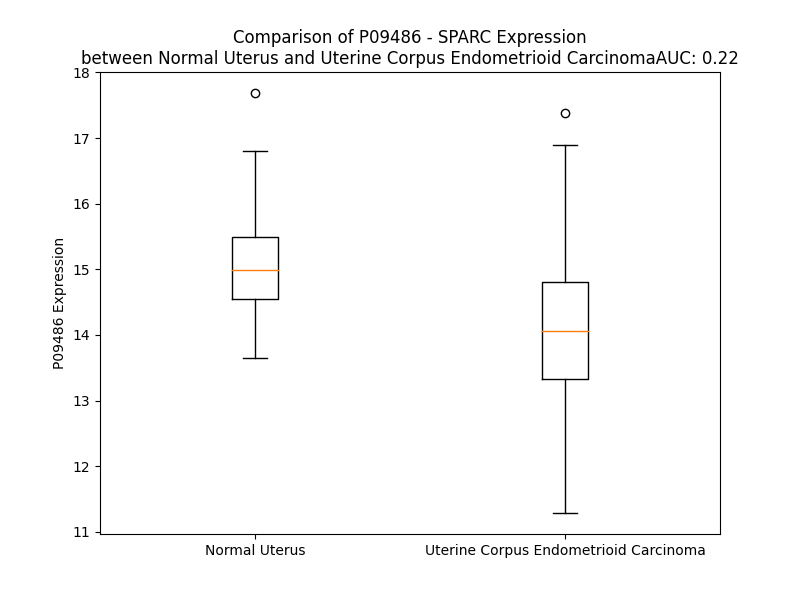

# Detailed Data for P09486

## Introduction to the Detailed Summary

### How to Interpret the Results

- **Summary & Metrics**: This section provides a quick reference to essential protein attributes, including expression changes, family classification, and biomarker applications. Regulation status (upregulated/downregulated) indicates the protein's behavior in a disease context. Some information comes from the original excel file with the proteins selected from literature, while others are derived from the analyses.
- **Expression Comparison**: A visual representation comparing protein expression between normal and disease states. It highlights significant changes in expression levels that might indicate diagnostic or therapeutic relevance. This is data coming from transcriptomics experiments and could not translate similarly to protein levels.
- **Isoform Alignment**: An interactive view of isoform alignments, revealing structural and functional differences between variants of the protein.
- **Interactors & Homologs**: Tables listing known interaction partners and homologous proteins, the more interactors and homologs, the more complex the protein is to design an antibody for.
- **Biological Assemblies**: Information about the structural arrangement of the protein in different assemblies, providing insights into its functional state but also the complexity of the protein to develop antibodies.
- **Combined Per-Residue Information**: A detailed table summarizing residue-level data. This includes predictions for epitope regions, aggregation tendencies, and modifications that might impact the protein's function. Each row corresponds to a residue in the protein, providing insights into specific sites that may be important for research or drug development.
## Summary & Metrics

- **UniProt Accession**: P09486
- **Gene Name**: SPARC
- **Protein Name**: SPARC / osteonectin
- **Swiss Prot**: SPRC_HUMAN
- **Family**: other
- **Biomarker Application**: disease progression,efficacy,prognosis
- **Number of Isoforms**: 0
- **Regulation**: -1
- **(transcriptomics) AUC**: 0.22
- **(transcriptomics) Fold Change**: 1.07
- **(transcriptomics) Regulation**: Downregulated
- **Discotope Epitope Count**: 44
- **Max n_uniprots (Homo)**: 2
- **Max n_uniprots (Hetero)**: 4

## Expression Comparison

## Interactors

| preferredName_A   | preferredName_B   |   score |
|:------------------|:------------------|--------:|
| SPARC             | BGLAP             |   0.991 |
| SPARC             | ALB               |   0.991 |
| SPARC             | SPP1              |   0.984 |
| SPARC             | FN1               |   0.969 |
| SPARC             | COL1A1            |   0.968 |
| SPARC             | VCAM1             |   0.965 |
| SPARC             | COL1A2            |   0.959 |
| SPARC             | LUM               |   0.954 |
| SPARC             | IBSP              |   0.931 |
| SPARC             | VTN               |   0.922 |
| SPARC             | COL3A1            |   0.911 |
| SPARC             | DCN               |   0.905 |

## Homologs

| uniprot_id   | gene_id   |
|:-------------|:----------|
| C9JJR8       | SPARCL1   |

## Biological Assemblies

|   Unnamed: 0 |   assembly |   n_uniprots | composition   | crystal_id   |
|-------------:|-----------:|-------------:|:--------------|:-------------|
|            0 |          1 |            2 | Homo          | 1bmo         |
|            0 |          1 |            1 | Homo          | 1nub         |
|            1 |          2 |            1 | Homo          | 1nub         |
|            0 |          1 |            1 | Homo          | 1sra         |
|            0 |          1 |            4 | Hetero        | 2v53         |

## Combined Per-Residue Information

|   res | aa   |   epitope_score | epitope   |   relative_surface_accessibility |   modeling_confidence |   Aggregation | modification   | glycosylation                   |
|------:|:-----|----------------:|:----------|---------------------------------:|----------------------:|--------------:|:---------------|:--------------------------------|
|     1 | M    |         0.1672  | False     |                          1.3191  |                 40.5  |         0     | N/A            | N/A                             |
|     2 | R    |         0.2169  | False     |                          0.95366 |                 39.18 |         0     | N/A            | N/A                             |
|     3 | A    |         0.23262 | False     |                          0.74268 |                 39.72 |        25.433 | N/A            | N/A                             |
|     4 | W    |         0.17201 | False     |                          0.95722 |                 38.8  |        87.116 | N/A            | N/A                             |
|     5 | I    |         0.18629 | False     |                          0.7953  |                 42.63 |        99.097 | N/A            | N/A                             |
|     6 | F    |         0.16127 | False     |                          0.9547  |                 43.53 |        99.794 | N/A            | N/A                             |
|     7 | F    |         0.1258  | False     |                          0.8772  |                 39.03 |        99.844 | N/A            | N/A                             |
|     8 | L    |         0.15328 | False     |                          1.04424 |                 47.99 |        99.748 | N/A            | N/A                             |
|     9 | L    |         0.15593 | False     |                          0.81688 |                 40.53 |        97.63  | N/A            | N/A                             |
|    10 | C    |         0.12549 | False     |                          0.91338 |                 40.41 |        81.707 | N/A            | N/A                             |
|    11 | L    |         0.19277 | False     |                          1.06647 |                 38.59 |        71.863 | N/A            | N/A                             |
|    12 | A    |         0.14018 | False     |                          1.04781 |                 49    |        18.067 | N/A            | N/A                             |
|    13 | G    |         0.21931 | False     |                          0.79699 |                 40.75 |         1.492 | N/A            | N/A                             |
|    14 | R    |         0.15945 | False     |                          1.00078 |                 44.06 |         0     | N/A            | N/A                             |
|    15 | A    |         0.20877 | False     |                          0.82309 |                 41.88 |         0     | N/A            | N/A                             |
|    16 | L    |         0.20205 | False     |                          1.1066  |                 46.01 |         0     | N/A            | N/A                             |
|    17 | A    |         0.21133 | False     |                          0.91987 |                 44.19 |         0     | N/A            | N/A                             |
|    18 | A    |         0.15062 | False     |                          0.90223 |                 42.97 |         0     | N/A            | N/A                             |
|    19 | P    |         0.16064 | False     |                          0.89229 |                 47.57 |         0     | N/A            | N/A                             |
|    20 | Q    |         0.23427 | False     |                          0.82873 |                 40.31 |         0     | N/A            | N/A                             |
|    21 | Q    |         0.25517 | True      |                          0.66823 |                 43.24 |         0     | N/A            | N/A                             |
|    22 | E    |         0.1955  | False     |                          0.78115 |                 43.17 |         0     | N/A            | N/A                             |
|    23 | A    |         0.18303 | False     |                          0.9363  |                 38.96 |         0     | N/A            | N/A                             |
|    24 | L    |         0.17163 | False     |                          0.99706 |                 37.24 |         0     | N/A            | N/A                             |
|    25 | P    |         0.22348 | False     |                          0.87107 |                 39.21 |         0     | N/A            | N/A                             |
|    26 | D    |         0.16877 | False     |                          0.75404 |                 35.58 |         0     | N/A            | N/A                             |
|    27 | E    |         0.23459 | False     |                          0.92036 |                 41.94 |         0     | N/A            | N/A                             |
|    28 | T    |         0.13789 | False     |                          0.89172 |                 35.36 |         0     | N/A            | N/A                             |
|    29 | E    |         0.19239 | False     |                          0.90704 |                 36.21 |         0     | N/A            | N/A                             |
|    30 | V    |         0.18348 | False     |                          0.89938 |                 32.34 |         0     | N/A            | N/A                             |
|    31 | V    |         0.23823 | True      |                          1.03644 |                 36.85 |         0     | N/A            | N/A                             |
|    32 | E    |         0.29345 | True      |                          0.83674 |                 31.13 |         0     | N/A            | N/A                             |
|    33 | E    |         0.24629 | True      |                          0.89288 |                 34.41 |         0     | N/A            | N/A                             |
|    34 | T    |         0.18503 | False     |                          0.87407 |                 31.94 |         0     | N/A            | N/A                             |
|    35 | V    |         0.17538 | False     |                          1.03248 |                 28.76 |         0     | N/A            | N/A                             |
|    36 | A    |         0.18395 | False     |                          0.83295 |                 32.64 |         0     | N/A            | N/A                             |
|    37 | E    |         0.20746 | False     |                          0.78924 |                 31.97 |         0     | N/A            | N/A                             |
|    38 | V    |         0.18801 | False     |                          1.00808 |                 32.64 |         0     | N/A            | N/A                             |
|    39 | T    |         0.19874 | False     |                          0.71777 |                 31.4  |         0     | N/A            | N/A                             |
|    40 | E    |         0.16646 | False     |                          0.87687 |                 33.77 |         0     | N/A            | N/A                             |
|    41 | V    |         0.1621  | False     |                          0.97893 |                 34.62 |         0     | N/A            | N/A                             |
|    42 | S    |         0.17229 | False     |                          0.80434 |                 38.83 |         0     | N/A            | N/A                             |
|    43 | V    |         0.12316 | False     |                          0.71058 |                 42.76 |         0     | N/A            | N/A                             |
|    44 | G    |         0.21101 | False     |                          0.32737 |                 39.75 |         0     | N/A            | N/A                             |
|    45 | A    |         0.16005 | False     |                          0.59273 |                 43.61 |         0     | N/A            | N/A                             |
|    46 | N    |         0.12593 | False     |                          0.15929 |                 48.69 |         0     | N/A            | N/A                             |
|    47 | P    |         0.1629  | False     |                          0.57753 |                 47.42 |         0     | N/A            | N/A                             |
|    48 | V    |         0.14077 | False     |                          0.4389  |                 47.8  |         0     | N/A            | N/A                             |
|    49 | Q    |         0.1652  | False     |                          0.37019 |                 44.87 |         0     | N/A            | N/A                             |
|    50 | V    |         0.19989 | False     |                          0.99649 |                 42.35 |         0     | N/A            | N/A                             |
|    51 | E    |         0.22464 | False     |                          0.75386 |                 42.09 |         0     | N/A            | N/A                             |
|    52 | V    |         0.23871 | True      |                          0.98909 |                 42.9  |         0     | N/A            | N/A                             |
|    53 | G    |         0.20233 | False     |                          0.60484 |                 35.7  |         0     | N/A            | N/A                             |
|    54 | E    |         0.28569 | True      |                          0.92822 |                 41.65 |         0     | N/A            | N/A                             |
|    55 | F    |         0.24122 | True      |                          0.97598 |                 45.2  |         0     | N/A            | N/A                             |
|    56 | D    |         0.2907  | True      |                          0.91884 |                 42.13 |         0     | N/A            | N/A                             |
|    57 | D    |         0.2573  | True      |                          0.8468  |                 49.96 |         0     | N/A            | N/A                             |
|    58 | G    |         0.19839 | False     |                          0.83719 |                 44.52 |         0     | N/A            | N/A                             |
|    59 | A    |         0.1966  | False     |                          1.04189 |                 43.41 |         0     | N/A            | N/A                             |
|    60 | E    |         0.1533  | False     |                          0.80342 |                 54.87 |         0     | N/A            | N/A                             |
|    61 | E    |         0.2695  | True      |                          0.96417 |                 48.76 |         0     | N/A            | N/A                             |
|    62 | T    |         0.18568 | False     |                          0.82827 |                 52.79 |         0     | N/A            | N/A                             |
|    63 | E    |         0.17268 | False     |                          0.89808 |                 52.97 |         0     | N/A            | N/A                             |
|    64 | E    |         0.24145 | True      |                          0.87681 |                 49.93 |         0     | N/A            | N/A                             |
|    65 | E    |         0.24006 | True      |                          0.78718 |                 52.62 |         0     | N/A            | N/A                             |
|    66 | V    |         0.2194  | False     |                          1.00145 |                 50.01 |         0     | N/A            | N/A                             |
|    67 | V    |         0.31943 | True      |                          0.82803 |                 60.56 |         0     | N/A            | N/A                             |
|    68 | A    |         0.19724 | False     |                          0.85764 |                 64.39 |         0     | N/A            | N/A                             |
|    69 | E    |         0.19834 | False     |                          0.6664  |                 79.06 |         0     | N/A            | N/A                             |
|    70 | N    |         0.19981 | False     |                          0.52339 |                 85.85 |         0     | N/A            | N/A                             |
|    71 | P    |         0.16468 | False     |                          0.4237  |                 90.86 |         0     | N/A            | N/A                             |
|    72 | C    |         0.1027  | False     |                          0.17445 |                 94.63 |         0     | N/A            | N/A                             |
|    73 | Q    |         0.26991 | True      |                          0.64075 |                 92.3  |         0     | N/A            | N/A                             |
|    74 | N    |         0.2269  | False     |                          0.73199 |                 90.55 |         0     | N/A            | N/A                             |
|    75 | H    |         0.18909 | False     |                          0.36289 |                 93.85 |         0     | N/A            | N/A                             |
|    76 | H    |         0.28571 | True      |                          0.92588 |                 93.21 |         0     | N/A            | N/A                             |
|    77 | C    |         0.15693 | False     |                          0.22502 |                 95.13 |         0     | N/A            | N/A                             |
|    78 | K    |         0.15586 | False     |                          0.70581 |                 93.65 |         0     | N/A            | N/A                             |
|    79 | H    |         0.21639 | False     |                          0.56605 |                 93.59 |         0     | N/A            | N/A                             |
|    80 | G    |         0.02222 | False     |                          0.1009  |                 96.16 |         0     | N/A            | N/A                             |
|    81 | K    |         0.09985 | False     |                          0.26021 |                 97.61 |         0     | N/A            | N/A                             |
|    82 | V    |         0.09532 | False     |                          0.37607 |                 97.45 |         0     | N/A            | N/A                             |
|    83 | C    |         0.04879 | False     |                          0.18971 |                 97.36 |         0     | N/A            | N/A                             |
|    84 | E    |         0.14689 | False     |                          0.48639 |                 95.77 |         0     | N/A            | N/A                             |
|    85 | L    |         0.18825 | False     |                          0.45862 |                 94.99 |         0     | N/A            | N/A                             |
|    86 | D    |         0.18922 | False     |                          0.2666  |                 93.19 |         0     | N/A            | N/A                             |
|    87 | E    |         0.29691 | True      |                          0.96237 |                 94.59 |         0     | N/A            | N/A                             |
|    88 | N    |         0.2264  | False     |                          0.75602 |                 93.14 |         0     | N/A            | N/A                             |
|    89 | N    |         0.19812 | False     |                          0.67536 |                 90.98 |         0     | N/A            | N/A                             |
|    90 | T    |         0.15111 | False     |                          0.51618 |                 93.98 |         0     | N/A            | N/A                             |
|    91 | P    |         0.12415 | False     |                          0.26776 |                 95.28 |         0     | N/A            | N/A                             |
|    92 | M    |         0.12235 | False     |                          0.47305 |                 96.28 |         0     | N/A            | N/A                             |
|    93 | C    |         0.12556 | False     |                          0.35162 |                 97.33 |         0     | N/A            | N/A                             |
|    94 | V    |         0.15227 | False     |                          0.35322 |                 97.14 |         0     | N/A            | N/A                             |
|    95 | C    |         0.1195  | False     |                          0.36013 |                 98.09 |         0     | N/A            | N/A                             |
|    96 | Q    |         0.12681 | False     |                          0.1623  |                 97.69 |         0     | N/A            | N/A                             |
|    97 | D    |         0.20421 | False     |                          0.50706 |                 96.81 |         0     | N/A            | N/A                             |
|    98 | P    |         0.12829 | False     |                          0.33276 |                 96.67 |         0     | N/A            | N/A                             |
|    99 | T    |         0.32292 | True      |                          0.89688 |                 95.85 |         0     | N/A            | N/A                             |
|   100 | S    |         0.22191 | False     |                          0.54173 |                 96.98 |         0     | N/A            | N/A                             |
|   101 | C    |         0.08527 | False     |                          0.08439 |                 97.55 |         0     | N/A            | N/A                             |
|   102 | P    |         0.29724 | True      |                          0.76832 |                 97.28 |         0     | N/A            | N/A                             |
|   103 | A    |         0.18365 | False     |                          0.81364 |                 96.07 |         0     | N/A            | N/A                             |
|   104 | P    |         0.17476 | False     |                          0.28955 |                 95.48 |         0     | N/A            | N/A                             |
|   105 | I    |         0.47467 | True      |                          0.89635 |                 94.92 |         0     | N/A            | N/A                             |
|   106 | G    |         0.33264 | True      |                          0.28089 |                 94.26 |         0     | N/A            | N/A                             |
|   107 | E    |         0.18556 | False     |                          0.51182 |                 95.38 |         0     | N/A            | N/A                             |
|   108 | F    |         0.3142  | True      |                          0.69316 |                 93.77 |         0     | N/A            | N/A                             |
|   109 | E    |         0.21106 | False     |                          0.28748 |                 96.38 |         0     | N/A            | N/A                             |
|   110 | K    |         0.13561 | False     |                          0.18441 |                 98.25 |         0     | N/A            | N/A                             |
|   111 | V    |         0.00241 | False     |                          0.00095 |                 98.47 |         0     | N/A            | N/A                             |
|   112 | C    |         0.01169 | False     |                          0.01122 |                 98.7  |         0     | N/A            | N/A                             |
|   113 | S    |         0.0213  | False     |                          0.00922 |                 98.53 |         0     | N/A            | N/A                             |
|   114 | N    |         0.10592 | False     |                          0.39404 |                 97.93 |         0     | N/A            | N/A                             |
|   115 | D    |         0.17447 | False     |                          0.40621 |                 97.08 |         0     | N/A            | N/A                             |
|   116 | N    |         0.17543 | False     |                          0.66788 |                 98.11 |         0     | N/A            | N-linked (GlcNAc...) asparagine |
|   117 | K    |         0.28434 | True      |                          0.5385  |                 98.43 |         0     | N/A            | N/A                             |
|   118 | T    |         0.2     | False     |                          0.44544 |                 98.36 |         0     | N/A            | N/A                             |
|   119 | F    |         0.19462 | False     |                          0.17816 |                 98.43 |         0     | N/A            | N/A                             |
|   120 | D    |         0.18508 | False     |                          0.43088 |                 98.08 |         0     | N/A            | N/A                             |
|   121 | S    |         0.10505 | False     |                          0.11402 |                 98.23 |         0     | N/A            | N/A                             |
|   122 | S    |         0.12756 | False     |                          0.32981 |                 97.77 |         0     | N/A            | N/A                             |
|   123 | C    |         0.09752 | False     |                          0.26045 |                 98.12 |         0     | N/A            | N/A                             |
|   124 | H    |         0.15171 | False     |                          0.1754  |                 98.49 |         0     | N/A            | N/A                             |
|   125 | F    |         0.00634 | False     |                          0       |                 98.49 |         0     | N/A            | N/A                             |
|   126 | F    |         0.0492  | False     |                          0.14972 |                 98.22 |         0     | N/A            | N/A                             |
|   127 | A    |         0.00317 | False     |                          0       |                 98    |         0     | N/A            | N/A                             |
|   128 | T    |         0.16901 | False     |                          0.29342 |                 97.46 |         0     | N/A            | N/A                             |
|   129 | K    |         0.07553 | False     |                          0.23952 |                 97.94 |         0     | N/A            | N/A                             |
|   130 | C    |         0.04735 | False     |                          0.08536 |                 97.82 |         0     | N/A            | N/A                             |
|   131 | T    |         0.24215 | True      |                          0.61806 |                 96.77 |         0     | N/A            | N/A                             |
|   132 | L    |         0.16025 | False     |                          0.1896  |                 96.34 |         0     | N/A            | N/A                             |
|   133 | E    |         0.30058 | True      |                          0.59965 |                 94.37 |         0     | N/A            | N/A                             |
|   134 | G    |         0.16519 | False     |                          0.79553 |                 94.19 |         0     | N/A            | N/A                             |
|   135 | T    |         0.26825 | True      |                          0.40353 |                 97.08 |         0     | N/A            | N/A                             |
|   136 | K    |         0.15155 | False     |                          0.91709 |                 95.65 |         0     | N/A            | N/A                             |
|   137 | K    |         0.14362 | False     |                          0.60933 |                 95.83 |         0     | N/A            | N/A                             |
|   138 | G    |         0.04655 | False     |                          0.04423 |                 95.92 |         0     | N/A            | N/A                             |
|   139 | H    |         0.20469 | False     |                          0.70153 |                 95.02 |         0     | N/A            | N/A                             |
|   140 | K    |         0.17206 | False     |                          0.76696 |                 96.12 |         0     | N/A            | N/A                             |
|   141 | L    |         0.05427 | False     |                          0.06831 |                 97.91 |         0     | N/A            | N/A                             |
|   142 | H    |         0.06103 | False     |                          0.14331 |                 98.22 |         0     | N/A            | N/A                             |
|   143 | L    |         0.06148 | False     |                          0.08326 |                 98.48 |         0     | N/A            | N/A                             |
|   144 | D    |         0.04347 | False     |                          0.14605 |                 98.41 |         0     | N/A            | N/A                             |
|   145 | Y    |         0.026   | False     |                          0.02921 |                 98.21 |         0     | N/A            | N/A                             |
|   146 | I    |         0.15676 | False     |                          0.54273 |                 97.58 |         0     | N/A            | N/A                             |
|   147 | G    |         0.06161 | False     |                          0.12692 |                 97.2  |         0     | N/A            | N/A                             |
|   148 | P    |         0.12883 | False     |                          0.37948 |                 97.95 |         0     | N/A            | N/A                             |
|   149 | C    |         0.0863  | False     |                          0.26414 |                 98.37 |         0     | N/A            | N/A                             |
|   150 | K    |         0.20897 | False     |                          0.38312 |                 97.41 |         0     | N/A            | N/A                             |
|   151 | Y    |         0.25173 | True      |                          0.8052  |                 97.67 |         0     | N/A            | N/A                             |
|   152 | I    |         0.11963 | False     |                          0.37893 |                 97.65 |         0     | N/A            | N/A                             |
|   153 | P    |         0.1432  | False     |                          0.4683  |                 97.56 |         0     | N/A            | N/A                             |
|   154 | P    |         0.11883 | False     |                          0.70445 |                 98    |         0     | N/A            | N/A                             |
|   155 | C    |         0.051   | False     |                          0.10247 |                 98.4  |         0     | N/A            | N/A                             |
|   156 | L    |         0.15954 | False     |                          0.64794 |                 98.41 |         0     | N/A            | N/A                             |
|   157 | D    |         0.17579 | False     |                          0.61403 |                 98.15 |         0     | N/A            | N/A                             |
|   158 | S    |         0.12349 | False     |                          0.53417 |                 97.11 |         0     | N/A            | N/A                             |
|   159 | E    |         0.10424 | False     |                          0.18134 |                 98.09 |         0     | N/A            | N/A                             |
|   160 | L    |         0.07658 | False     |                          0.18573 |                 97.92 |         0     | N/A            | N/A                             |
|   161 | T    |         0.11543 | False     |                          0.68881 |                 97.23 |         0     | N/A            | N/A                             |
|   162 | E    |         0.1273  | False     |                          0.21415 |                 97.52 |         0     | N/A            | N/A                             |
|   163 | F    |         0.00435 | False     |                          0       |                 98.04 |         0     | N/A            | N/A                             |
|   164 | P    |         0.07026 | False     |                          0.16203 |                 98.01 |         0     | N/A            | N/A                             |
|   165 | L    |         0.09726 | False     |                          0.16548 |                 97.84 |         0     | N/A            | N/A                             |
|   166 | R    |         0.15986 | False     |                          0.23416 |                 97.85 |         0     | N/A            | N/A                             |
|   167 | M    |         0.00401 | False     |                          0       |                 97.7  |         0     | N/A            | N/A                             |
|   168 | R    |         0.09747 | False     |                          0.07072 |                 97.16 |         0     | N/A            | N/A                             |
|   169 | D    |         0.02086 | False     |                          0.03796 |                 97.99 |         0.18  | N/A            | N/A                             |
|   170 | W    |         0.06628 | False     |                          0.13073 |                 97.89 |         1.694 | N/A            | N/A                             |
|   171 | L    |         0.00276 | False     |                          0       |                 97.68 |         1.717 | N/A            | N/A                             |
|   172 | K    |         0.00706 | False     |                          0.00244 |                 97.75 |         1.728 | N/A            | N/A                             |
|   173 | N    |         0.05559 | False     |                          0.10128 |                 97.47 |         4.763 | N/A            | N/A                             |
|   174 | V    |         0.02147 | False     |                          0.08025 |                 96.39 |        81.818 | N/A            | N/A                             |
|   175 | L    |         0.00492 | False     |                          0.00165 |                 96.48 |        91.813 | N/A            | N/A                             |
|   176 | V    |         0.02349 | False     |                          0.03903 |                 97.12 |        91.813 | N/A            | N/A                             |
|   177 | T    |         0.05819 | False     |                          0.22157 |                 96.48 |        91.813 | N/A            | N/A                             |
|   178 | L    |         0.02507 | False     |                          0.02944 |                 96.2  |        91.779 | N/A            | N/A                             |
|   179 | Y    |         0.15122 | False     |                          0.17249 |                 96.85 |        56.265 | N/A            | N/A                             |
|   180 | E    |         0.16521 | False     |                          0.51929 |                 96.36 |         1.583 | N/A            | N/A                             |
|   181 | R    |         0.21099 | False     |                          0.4695  |                 96.25 |         0.035 | N/A            | N/A                             |
|   182 | D    |         0.09903 | False     |                          0.07496 |                 95.04 |         0     | N/A            | N/A                             |
|   183 | E    |         0.29145 | True      |                          0.71279 |                 93.66 |         0     | N/A            | N/A                             |
|   184 | D    |         0.28041 | True      |                          0.90836 |                 91.81 |         0     | N/A            | N/A                             |
|   185 | N    |         0.25822 | True      |                          0.36056 |                 92    |         0     | N/A            | N/A                             |
|   186 | N    |         0.3058  | True      |                          0.53997 |                 93.2  |         0     | N/A            | N/A                             |
|   187 | L    |         0.12986 | False     |                          0.16742 |                 93.64 |         0     | N/A            | N/A                             |
|   188 | L    |         0.02359 | False     |                          0.00943 |                 94.8  |         0     | N/A            | N/A                             |
|   189 | T    |         0.18589 | False     |                          0.52488 |                 94.74 |         0     | N/A            | N/A                             |
|   190 | E    |         0.20068 | False     |                          0.59645 |                 94.76 |         0     | N/A            | N/A                             |
|   191 | K    |         0.09109 | False     |                          0.49488 |                 93.71 |         0     | N/A            | N/A                             |
|   192 | Q    |         0.08671 | False     |                          0.08858 |                 95.75 |         0     | N/A            | N/A                             |
|   193 | K    |         0.10266 | False     |                          0.23588 |                 95.45 |         0     | N/A            | N/A                             |
|   194 | L    |         0.13249 | False     |                          0.64124 |                 95.2  |         0     | N/A            | N/A                             |
|   195 | R    |         0.12035 | False     |                          0.1642  |                 95.88 |         0     | N/A            | N/A                             |
|   196 | V    |         0.00564 | False     |                          0       |                 96.48 |         0     | N/A            | N/A                             |
|   197 | K    |         0.21797 | False     |                          0.40023 |                 96.73 |         0     | N/A            | N/A                             |
|   198 | K    |         0.14353 | False     |                          0.63816 |                 96.31 |         0     | N/A            | N/A                             |
|   199 | I    |         0.11186 | False     |                          0.0576  |                 97.23 |         0     | N/A            | N/A                             |
|   200 | H    |         0.12614 | False     |                          0.2686  |                 96.75 |         0     | N/A            | N/A                             |
|   201 | E    |         0.15766 | False     |                          0.5784  |                 96.27 |         0     | N/A            | N/A                             |
|   202 | N    |         0.13811 | False     |                          0.35353 |                 96.64 |         0     | N/A            | N/A                             |
|   203 | E    |         0.12154 | False     |                          0.93589 |                 95.79 |         0     | N/A            | N/A                             |
|   204 | K    |         0.14071 | False     |                          0.72888 |                 96.16 |         0     | N/A            | N/A                             |
|   205 | R    |         0.11006 | False     |                          0.20522 |                 96.85 |         0     | N/A            | N/A                             |
|   206 | L    |         0.18042 | False     |                          0.18949 |                 97.07 |         0     | N/A            | N/A                             |
|   207 | E    |         0.19317 | False     |                          0.64995 |                 95.33 |         0     | N/A            | N/A                             |
|   208 | A    |         0.14674 | False     |                          0.59517 |                 95.6  |         0     | N/A            | N/A                             |
|   209 | G    |         0.23805 | True      |                          0.61014 |                 94.24 |         0     | N/A            | N/A                             |
|   210 | D    |         0.29812 | True      |                          0.84554 |                 94.57 |         0     | N/A            | N/A                             |
|   211 | H    |         0.29304 | True      |                          0.17209 |                 96.88 |         0     | N/A            | N/A                             |
|   212 | P    |         0.30899 | True      |                          0.59333 |                 97.53 |         0     | N/A            | N/A                             |
|   213 | V    |         0.20258 | False     |                          0.2854  |                 96.54 |         0     | N/A            | N/A                             |
|   214 | E    |         0.3165  | True      |                          0.62935 |                 97.27 |         0     | N/A            | N/A                             |
|   215 | L    |         0.30379 | True      |                          0.41136 |                 97.79 |         0     | N/A            | N/A                             |
|   216 | L    |         0.05722 | False     |                          0.04491 |                 98.13 |         0     | N/A            | N/A                             |
|   217 | A    |         0.16259 | False     |                          0.3759  |                 97.96 |         0     | N/A            | N/A                             |
|   218 | R    |         0.30504 | True      |                          0.6432  |                 98.03 |         0     | N/A            | N/A                             |
|   219 | D    |         0.05656 | False     |                          0.08283 |                 98.15 |         0     | N/A            | N/A                             |
|   220 | F    |         0.07488 | False     |                          0.13159 |                 98.22 |         0     | N/A            | N/A                             |
|   221 | E    |         0.15859 | False     |                          0.62321 |                 97.42 |         0     | N/A            | N/A                             |
|   222 | K    |         0.29554 | True      |                          0.70161 |                 97.56 |         0     | N/A            | N/A                             |
|   223 | N    |         0.06841 | False     |                          0.11648 |                 97.43 |         0     | N/A            | N/A                             |
|   224 | Y    |         0.10558 | False     |                          0.11225 |                 98.12 |         0.13  | N/A            | N/A                             |
|   225 | N    |         0.14817 | False     |                          0.75305 |                 97.28 |         0.13  | N/A            | N/A                             |
|   226 | M    |         0.06122 | False     |                          0.08034 |                 97.3  |         0.296 | N/A            | N/A                             |
|   227 | Y    |         0.0075  | False     |                          0.00381 |                 98.24 |         0.296 | N/A            | N/A                             |
|   228 | I    |         0.08876 | False     |                          0.16559 |                 98.09 |         0.296 | N/A            | N/A                             |
|   229 | F    |         0.05018 | False     |                          0.06505 |                 97.97 |         0.167 | N/A            | N/A                             |
|   230 | P    |         0.0035  | False     |                          0       |                 98.18 |         0.167 | N/A            | N/A                             |
|   231 | V    |         0.00243 | False     |                          0.00095 |                 98.35 |         0     | N/A            | N/A                             |
|   232 | H    |         0.00711 | False     |                          0.00073 |                 98.43 |         0     | N/A            | N/A                             |
|   233 | W    |         0.04139 | False     |                          0.02954 |                 97.91 |         0     | N/A            | N/A                             |
|   234 | Q    |         0.01783 | False     |                          0.04789 |                 98.02 |         0     | N/A            | N/A                             |
|   235 | F    |         0.00989 | False     |                          0.00701 |                 98.54 |         0     | N/A            | N/A                             |
|   236 | G    |         0.03931 | False     |                          0.08883 |                 97.53 |         0     | N/A            | N/A                             |
|   237 | Q    |         0.10024 | False     |                          0.27995 |                 96.78 |         0     | N/A            | N/A                             |
|   238 | L    |         0.01701 | False     |                          0.02939 |                 97.99 |         0     | N/A            | N/A                             |
|   239 | D    |         0.17137 | False     |                          0.04523 |                 97.91 |         0     | N/A            | N/A                             |
|   240 | Q    |         0.26526 | True      |                          0.39667 |                 95.56 |         0     | N/A            | N/A                             |
|   241 | H    |         0.18705 | False     |                          0.52317 |                 93.5  |         0     | N/A            | N/A                             |
|   242 | P    |         0.23311 | False     |                          0.40067 |                 94.95 |         0     | N/A            | N/A                             |
|   243 | I    |         0.23592 | False     |                          0.75921 |                 95.49 |         0     | N/A            | N/A                             |
|   244 | D    |         0.23075 | False     |                          0.50803 |                 96.44 |         0     | N/A            | N/A                             |
|   245 | G    |         0.11197 | False     |                          0.24326 |                 97.04 |         0     | N/A            | N/A                             |
|   246 | Y    |         0.1126  | False     |                          0.45837 |                 98.04 |         0     | N/A            | N/A                             |
|   247 | L    |         0.00476 | False     |                          0.00366 |                 98.48 |         0     | N/A            | N/A                             |
|   248 | S    |         0.08644 | False     |                          0.08442 |                 97.86 |         0     | N/A            | N/A                             |
|   249 | H    |         0.04837 | False     |                          0.21995 |                 98.24 |         0     | N/A            | N/A                             |
|   250 | T    |         0.07522 | False     |                          0.08881 |                 98.23 |         0     | N/A            | N/A                             |
|   251 | E    |         0.04869 | False     |                          0.04799 |                 98.16 |         0     | N/A            | N/A                             |
|   252 | L    |         0.04804 | False     |                          0.04616 |                 98.29 |         0     | N/A            | N/A                             |
|   253 | A    |         0.01815 | False     |                          0.01769 |                 98.12 |         0     | N/A            | N/A                             |
|   254 | P    |         0.15115 | False     |                          0.1932  |                 97.38 |         0     | N/A            | N/A                             |
|   255 | L    |         0.0098  | False     |                          0.00742 |                 98.06 |         0     | N/A            | N/A                             |
|   256 | R    |         0.05169 | False     |                          0.04777 |                 98.13 |         0     | N/A            | N/A                             |
|   257 | A    |         0.18899 | False     |                          0.18238 |                 96.55 |         0     | N/A            | N/A                             |
|   258 | P    |         0.43653 | True      |                          0.77487 |                 95.37 |         0     | N/A            | N/A                             |
|   259 | L    |         0.1988  | False     |                          0.65519 |                 93.83 |         0     | N/A            | N/A                             |
|   260 | I    |         0.06299 | False     |                          0.05817 |                 96.14 |         0     | N/A            | N/A                             |
|   261 | P    |         0.18863 | False     |                          0.26003 |                 95.82 |         0     | N/A            | N/A                             |
|   262 | M    |         0.11357 | False     |                          0.25568 |                 96.83 |         0     | N/A            | N/A                             |
|   263 | E    |         0.17854 | False     |                          0.17617 |                 97.4  |         0     | N/A            | N/A                             |
|   264 | H    |         0.08919 | False     |                          0.17293 |                 98.12 |         0     | N/A            | N/A                             |
|   265 | C    |         0.00833 | False     |                          0       |                 98.53 |         0     | N/A            | N/A                             |
|   266 | T    |         0.00415 | False     |                          0       |                 98.53 |         0     | N/A            | N/A                             |
|   267 | T    |         0.10155 | False     |                          0.2972  |                 98.21 |         0     | N/A            | N/A                             |
|   268 | R    |         0.23369 | False     |                          0.35193 |                 98.29 |         0     | N/A            | N/A                             |
|   269 | F    |         0.07417 | False     |                          0.04777 |                 98.56 |         0     | N/A            | N/A                             |
|   270 | F    |         0.01986 | False     |                          0.02395 |                 98.48 |         0     | N/A            | N/A                             |
|   271 | E    |         0.21782 | False     |                          0.57652 |                 97.89 |         0     | N/A            | N/A                             |
|   272 | T    |         0.2133  | False     |                          0.56399 |                 97.86 |         0     | N/A            | N/A                             |
|   273 | C    |         0.01776 | False     |                          0.00775 |                 98.16 |         0     | N/A            | N/A                             |
|   274 | D    |         0.17124 | False     |                          0.05437 |                 98.23 |         0     | N/A            | N/A                             |
|   275 | L    |         0.1984  | False     |                          0.8241  |                 97.61 |         0     | N/A            | N/A                             |
|   276 | D    |         0.1463  | False     |                          0.72347 |                 97.75 |         0     | N/A            | N/A                             |
|   277 | N    |         0.17508 | False     |                          0.56881 |                 97.33 |         0     | N/A            | N/A                             |
|   278 | D    |         0.1728  | False     |                          0.47799 |                 97.21 |         0     | N/A            | N/A                             |
|   279 | K    |         0.16152 | False     |                          0.57441 |                 97.32 |         0     | N/A            | N/A                             |
|   280 | Y    |         0.14531 | False     |                          0.42814 |                 98.1  |         0     | N/A            | N/A                             |
|   281 | I    |         0.02557 | False     |                          0.0304  |                 98.59 |         0     | N/A            | N/A                             |
|   282 | A    |         0.14617 | False     |                          0.18932 |                 98.35 |         0     | N/A            | N/A                             |
|   283 | L    |         0.03106 | False     |                          0.06502 |                 98.18 |         0     | N/A            | N/A                             |
|   284 | D    |         0.17768 | False     |                          0.4271  |                 98.03 |         0     | N/A            | N/A                             |
|   285 | E    |         0.07381 | False     |                          0.14307 |                 98.54 |         0     | N/A            | N/A                             |
|   286 | W    |         0.00815 | False     |                          0.00055 |                 98.59 |         0.208 | N/A            | N/A                             |
|   287 | A    |         0.00262 | False     |                          0       |                 98.39 |         0.208 | N/A            | N/A                             |
|   288 | G    |         0.14785 | False     |                          0.46473 |                 98.04 |         0.208 | N/A            | N/A                             |
|   289 | C    |         0.09284 | False     |                          0.26156 |                 97.94 |         0.208 | N/A            | N/A                             |
|   290 | F    |         0.0094  | False     |                          0.00578 |                 98.38 |         0.208 | N/A            | N/A                             |
|   291 | G    |         0.11567 | False     |                          0.41623 |                 97.92 |         0.208 | N/A            | N/A                             |
|   292 | I    |         0.05353 | False     |                          0.0408  |                 98.47 |         0.208 | N/A            | N/A                             |
|   293 | K    |         0.18644 | False     |                          0.48674 |                 98.17 |         0     | N/A            | N/A                             |
|   294 | Q    |         0.20584 | False     |                          0.63507 |                 97.3  |         0     | N/A            | N/A                             |
|   295 | K    |         0.30716 | True      |                          0.80487 |                 97.62 |         0     | N/A            | N/A                             |
|   296 | D    |         0.11992 | False     |                          0.17172 |                 98.03 |         0     | N/A            | N/A                             |
|   297 | I    |         0.23991 | True      |                          0.21391 |                 97.75 |         0     | N/A            | N/A                             |
|   298 | D    |         0.26915 | True      |                          0.36747 |                 96.48 |         0     | N/A            | N/A                             |
|   299 | K    |         0.2405  | True      |                          0.72983 |                 95.46 |         0     | N/A            | N/A                             |
|   300 | D    |         0.15705 | False     |                          0.52605 |                 94.33 |         0     | N/A            | N/A                             |
|   301 | L    |         0.07283 | False     |                          0.18415 |                 93.76 |         0     | N/A            | N/A                             |
|   302 | V    |         0.08084 | False     |                          0.22463 |                 91.96 |         0     | N/A            | N/A                             |
|   303 | I    |         0.07065 | False     |                          0.77395 |                 75    |         0     | N/A            | N/A                             |

