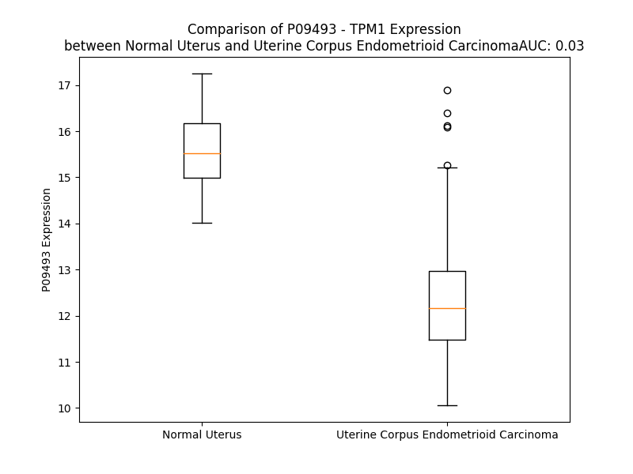

# Detailed Data for P09493

## Introduction to the Detailed Summary

### How to Interpret the Results

- **Summary & Metrics**: This section provides a quick reference to essential protein attributes, including expression changes, family classification, and biomarker applications. Regulation status (upregulated/downregulated) indicates the protein's behavior in a disease context. Some information comes from the original excel file with the proteins selected from literature, while others are derived from the analyses.
- **Expression Comparison**: A visual representation comparing protein expression between normal and disease states. It highlights significant changes in expression levels that might indicate diagnostic or therapeutic relevance. This is data coming from transcriptomics experiments and could not translate similarly to protein levels.
- **Isoform Alignment**: An interactive view of isoform alignments, revealing structural and functional differences between variants of the protein.
- **Interactors & Homologs**: Tables listing known interaction partners and homologous proteins, the more interactors and homologs, the more complex the protein is to design an antibody for.
- **Biological Assemblies**: Information about the structural arrangement of the protein in different assemblies, providing insights into its functional state but also the complexity of the protein to develop antibodies.
- **Combined Per-Residue Information**: A detailed table summarizing residue-level data. This includes predictions for epitope regions, aggregation tendencies, and modifications that might impact the protein's function. Each row corresponds to a residue in the protein, providing insights into specific sites that may be important for research or drug development.
## Summary & Metrics

- **UniProt Accession**: P09493
- **Gene Name**: TPM1
- **Protein Name**: human trypomyosin fibroblast isoform TM3
- **Swiss Prot**: TPM1_HUMAN
- **Family**: nan
- **Biomarker Application**: nan
- **Number of Isoforms**: 10
- **Regulation**: 2
- **(transcriptomics) AUC**: 0.03
- **(transcriptomics) Fold Change**: 1.20
- **(transcriptomics) Regulation**: Downregulated
- **Discotope Epitope Count**: 11
- **Max n_uniprots (Homo)**: 2.0
- **Max n_uniprots (Hetero)**: 8.0

## Expression Comparison

## Isoform Alignment

<pre style='font-size:14px; font-family:monospace;'>P09493-1  MDAIKKKMQMLKLDKENALDRAEQAEADKKAAEDRSKQLEDELVSLQKKLKGTEDELDKYSEALKDAQEKLELAEKKATDAEADVASLNRRIQLVEEELDRAQERLATALQKLEEAEKAADESERGMKVIESRAQKDEEKMEIQEIQLKEAKHIAEDADRKYEEVARKLVIIESDLERAEERAELSEGKCAELEEELKTVTNNLKSLEAQAEKYSQKEDRYEEEIKVLSDKLKEAETRAEFAERSVTKLEKSIDDLEDELYAQKLKYKAISEELDHALNDMTSI
P09493-2  --------------------------------------------------------MCRLRIFLRTASSEHLHERKLRETAEADVASLNRRIQLVEEELDRAQERLATALQKLEEAEKAADESERGMKVIESRAQKDEEKMEIQEIQLKEAKHIAEDADRKYEEVARKLVIIESDLERAEERAELSEGQVRQLEEQLRIMDSDLESINAAEDKYSQKEDRYEEEIKVLSDKLKEAETRAEFAERSVTKLEKSIDDLEEKVAHAKEENLSMHQMLDQTLLELNNM
P09493-3  MDAIKKKMQMLKLDKENALDRAEQAEADKKAAEDRSKQLEDELVSLQKKLKGTEDELDKYSEALKDAQEKLELAEKKATDAEADVASLNRRIQLVEEELDRAQERLATALQKLEEAEKAADESERGMKVIESRAQKDEEKMEIQEIQLKEAKHIAEDADRKYEEVARKLVIIESDLERAEERAELSEGQVRQLEEQLRIMDQTLKALMAAEDKYSQKEDRYEEEIKVLSDKLKEAETRAEFAERSVTKLEKSIDDLEEKVAHAKEENLSMHQMLDQTLLELNNM
P09493-4  MDAIKKKMQMLKLDKENALDRAEQAEADKKAAEDRSKQLEDELVSLQKKLKGTEDELDKYSEALKDAQEKLELAEKKATDAEADVASLNRRIQLVEEELDRAQERLATALQKLEEAEKAADESERGMKVIESRAQKDEEKMEIQEIQLKEAKHIAEDADRKYEEVARKLVIIESDLERAEERAELSEGQVRQLEEQLRIMDQTLKALMAAEDKYSQKEDRYEEEIKVLSDKLKEAETRAEFAERSVTKLEKSIDDLEDELYAQKLKYKAISEELDHALNDMTSI
P09493-5  ------------------------------------MAGSSSLEAVRRKIRSLQEQADAAEERAGTLQRELDHERKLRETAEADVASLNRRIQLVEEELDRAQERLATALQKLEEAEKAADESERGMKVIESRAQKDEEKMEIQEIQLKEAKHIAEDADRKYEEVARKLVIIESDLERAEERAELSEGKCAELEEELKTVTNNLKSLEAQAEKYSQKEDRYEEEIKVLSDKLKEAETRAEFAERSVTKLEKSIDDLEDQLYQQLEQNRRLTNELKLALNED---
P09493-6  MDAIKKKMQMLKLDKENALDRAEQAEADKKAAEDRSKQLEEDIAAKEKLLRVSEDERDRVLEELHKAEDSLLAAEEAAAKAEADVASLNRRIQLVEEELDRAQERLATALQKLEEAEKAADESERGMKVIESRAQKDEEKMEIQEIQLKEAKHIAEDADRKYEEVARKLVIIESDLERAEERAELSEGKCAELEEELKTVTNNLKSLEAQAEKYSQKEDRYEEEIKVLSDKLKEAETRAEFAERSVTKLEKSIDDLEDELYAQKLKYKAISEELDHALNDMTSI
P09493-7  MDAIKKKMQMLKLDKENALDRAEQAEADKKAAEDRSKQLEEDIAAKEKLLRVSEDERDRVLEELHKAEDSLLAAEEAAAKAEADVASLNRRIQLVEEELDRAQERLATALQKLEEAEKAADESERGMKVIESRAQKDEEKMEIQEIQLKEAKHIAEDADRKYEEVARKLVIIESDLERAEERAELSEGKCAELEEELKTVTNNLKSLEAQAEKYSQKEDRYEEEIKVLSDKLKEAETRAEFAERSVTKLEKSIDDLEEKVAHAKEENLSMHQMLDQTLLELNNM
P09493-8  MDAIKKKMQMLKLDKENALDRAEQAEADKKAAEDRSKQLEEDIAAKEKLLRVSEDERDRVLEELHKAEDSLLAAEEAAAKAEADVASLNRRIQLVEEELDRAQERLATALQKLEEAEKAADESERGMKVIESRAQKDEEKMEIQEIQLKEAKHIAEDADRKYEEVARKLVIIESDLERAEERAELSEGQVRQLEEQLRIMDQTLKALMAAEDKYSQKEDRYEEEIKVLSDKLKEAETRAEFAERSVTKLEKSIDDLEEKVAHAKEENLSMHQMLDQTLLELNNM
P09493-9  MDAIKKKMQMLKLDKENALDRAEQAEADKKAAEDRSKQLEDELVSLQKKLKGTEDELDKYSEALKDAQEKLELAEKKATDAEADVASLNRRIQLVEEELDRAQERLATALQKLEEAEKAADESERGMKVIESRAQKDEEKMEIQEIQLKEAKHIAEDADRKYEEVARKLVIIESDLERAEERAELSEGKCAELEEELKTVTNNLKSLEAQAEKYSQKEDRYEEEIKVLSDKLKEAETRAEFAERSVTKLEKSIDDLEEKVAHAKEENLSMHQMLDQTLLELNNM
P09493-10 MDAIKKKMQMLKLDKENALDRAEQAEADKKAAEDRSKQLEDELVSLQKKLKGTEDELDKYSEALKDAQEKLELAEKKATDAEADVASLNRRIQLVEEELDRAQERLATALQKLEEAEKAADESERGMKVIESRAQKDEEKMEIQEIQLKEAKHIAEDADRKYEEVARKLVIIESDLERAEERAELSEGQVRQLEEQLRIMDQTLKALMAAEDKYSQKEDRYEEEIKVLSDKLKEAETRAEFAERSVTKLEKSIDDLEDELYAQKLKYKAISEELDHALNDMTSM
</pre>

## Interactors

| preferredName_A   | preferredName_B   |   score |
|:------------------|:------------------|--------:|
| TPM1              | TNNT2             |   0.999 |
| TPM1              | TNNI3             |   0.999 |
| TPM1              | ACTC1             |   0.999 |
| TPM1              | TPM3              |   0.998 |
| TPM1              | TPM2              |   0.993 |
| TPM1              | MYH7              |   0.993 |
| TPM1              | TNNT1             |   0.99  |
| TPM1              | TPM4              |   0.982 |
| TPM1              | TNNC1             |   0.981 |
| TPM1              | ACTA1             |   0.976 |
| TPM1              | VCL               |   0.957 |
| TPM1              | MYL3              |   0.949 |
| TPM1              | MYH6              |   0.949 |
| TPM1              | MYL1              |   0.943 |
| TPM1              | MYBPC3            |   0.932 |
| TPM1              | MYL2              |   0.914 |
| TPM1              | TNNT3             |   0.91  |
| TPM1              | TNNI1             |   0.908 |
| TPM1              | MAPRE1            |   0.905 |
| TPM1              | ACTN2             |   0.904 |

## Homologs

| uniprot_id   | gene_id   |
|:-------------|:----------|
| A0A494C0P6   | TPM3      |
| U3KQK2       | TPM2      |
| A0A2R8Y5V9   | TPM4      |

## Biological Assemblies

|   Unnamed: 0 |   assembly |   n_uniprots | composition   | crystal_id   |
|-------------:|-----------:|-------------:|:--------------|:-------------|
|            0 |          1 |            8 | Hetero        | 8efh         |
|            0 |          1 |            8 | Hetero        | 6x5z         |
|            0 |          1 |            8 | Hetero        | 8efi         |
|            0 |          1 |            4 | Hetero        | 3mud         |
|            0 |          1 |            3 | Hetero        | 6ut2         |
|            0 |          1 |            2 | Homo          | 5kht         |
|            1 |          2 |            2 | Homo          | 5kht         |
|            0 |          1 |            8 | Hetero        | 8enc         |

## Combined Per-Residue Information

|   res | aa   |   epitope_score | epitope   |   relative_surface_accessibility |   modeling_confidence |   Aggregation | modification            |
|------:|:-----|----------------:|:----------|---------------------------------:|----------------------:|--------------:|:------------------------|
|     1 | M    |         0.1415  | False     |                          1.1496  |                 49.79 |         0     | N-acetylmethionine      |
|     2 | D    |         0.14366 | False     |                          0.73157 |                 54.78 |         0     | N/A                     |
|     3 | A    |         0.16498 | False     |                          0.77575 |                 57.88 |         0     | N/A                     |
|     4 | I    |         0.21964 | True      |                          0.76233 |                 55.63 |         0     | N/A                     |
|     5 | K    |         0.18263 | False     |                          0.71336 |                 62.43 |         0     | N/A                     |
|     6 | K    |         0.21566 | False     |                          0.76959 |                 69.06 |         0     | N/A                     |
|     7 | K    |         0.21962 | True      |                          0.72512 |                 67.95 |         0     | N/A                     |
|     8 | M    |         0.24059 | True      |                          0.69509 |                 73.98 |         0     | N/A                     |
|     9 | Q    |         0.14812 | False     |                          0.61576 |                 70.63 |         0     | N/A                     |
|    10 | M    |         0.15094 | False     |                          0.65929 |                 75.53 |         0     | N/A                     |
|    11 | L    |         0.20267 | False     |                          0.74142 |                 69.03 |         0     | N/A                     |
|    12 | K    |         0.16198 | False     |                          0.7359  |                 76.27 |         0     | N/A                     |
|    13 | L    |         0.18718 | False     |                          0.64548 |                 78.77 |         0     | N/A                     |
|    14 | D    |         0.13861 | False     |                          0.50621 |                 77.23 |         0     | N/A                     |
|    15 | K    |         0.17789 | False     |                          0.67625 |                 77.39 |         0     | N/A                     |
|    16 | E    |         0.13434 | False     |                          0.53733 |                 77.21 |         0     | N/A                     |
|    17 | N    |         0.12972 | False     |                          0.49125 |                 78.95 |         0     | N/A                     |
|    18 | A    |         0.11533 | False     |                          0.56833 |                 79.42 |         0     | N/A                     |
|    19 | L    |         0.20032 | False     |                          0.58353 |                 79.78 |         0     | N/A                     |
|    20 | D    |         0.12097 | False     |                          0.51182 |                 78.35 |         0     | N/A                     |
|    21 | R    |         0.19363 | False     |                          0.77644 |                 79.6  |         0     | N/A                     |
|    22 | A    |         0.09865 | False     |                          0.52727 |                 81.34 |         0     | N/A                     |
|    23 | E    |         0.12166 | False     |                          0.6     |                 81.45 |         0     | N/A                     |
|    24 | Q    |         0.12119 | False     |                          0.58157 |                 83.02 |         0     | N/A                     |
|    25 | A    |         0.09569 | False     |                          0.56986 |                 83.13 |         0     | N/A                     |
|    26 | E    |         0.16347 | False     |                          0.64982 |                 84.25 |         0     | N/A                     |
|    27 | A    |         0.08598 | False     |                          0.53049 |                 85.09 |         0     | N/A                     |
|    28 | D    |         0.08759 | False     |                          0.51662 |                 85.13 |         0     | N/A                     |
|    29 | K    |         0.12246 | False     |                          0.62206 |                 88.64 |         0     | N/A                     |
|    30 | K    |         0.17873 | False     |                          0.66876 |                 87.77 |         0     | N/A                     |
|    31 | A    |         0.15144 | False     |                          0.57945 |                 87.35 |         0     | Phosphoserine           |
|    32 | A    |         0.11849 | False     |                          0.58509 |                 86.41 |         0     | N/A                     |
|    33 | E    |         0.11256 | False     |                          0.48583 |                 88.78 |         0     | N/A                     |
|    34 | D    |         0.07163 | False     |                          0.46057 |                 88.17 |         0     | N/A                     |
|    35 | R    |         0.16088 | False     |                          0.68439 |                 88.34 |         0     | N/A                     |
|    36 | S    |         0.07409 | False     |                          0.4122  |                 88.39 |         0     | N/A                     |
|    37 | K    |         0.09898 | False     |                          0.66425 |                 90.93 |         0     | N/A                     |
|    38 | Q    |         0.13192 | False     |                          0.60606 |                 89.36 |         0     | N/A                     |
|    39 | L    |         0.11312 | False     |                          0.62758 |                 89.58 |         0     | N/A                     |
|    40 | E    |         0.13135 | False     |                          0.53741 |                 89.83 |         0     | N/A                     |
|    41 | D    |         0.14642 | False     |                          0.60427 |                 90.32 |         0     | N/A                     |
|    42 | E    |         0.13386 | False     |                          0.52829 |                 90.48 |         0     | N/A                     |
|    43 | L    |         0.1115  | False     |                          0.62215 |                 91.36 |         0.73  | N/A                     |
|    44 | V    |         0.11269 | False     |                          0.67614 |                 92.51 |         0.73  | N/A                     |
|    45 | S    |         0.11901 | False     |                          0.39483 |                 91.71 |         0.73  | Phosphoserine           |
|    46 | L    |         0.09121 | False     |                          0.68998 |                 92.97 |         0.73  | N/A                     |
|    47 | Q    |         0.11068 | False     |                          0.52826 |                 92.97 |         0.73  | N/A                     |
|    48 | K    |         0.17396 | False     |                          0.795   |                 93.34 |         0     | N/A                     |
|    49 | K    |         0.11803 | False     |                          0.69623 |                 93.46 |         0     | N/A                     |
|    50 | L    |         0.09593 | False     |                          0.64548 |                 93.6  |         0     | N/A                     |
|    51 | K    |         0.10696 | False     |                          0.64597 |                 93.86 |         0     | Phosphoserine           |
|    52 | G    |         0.09355 | False     |                          0.37555 |                 93.91 |         0     | N/A                     |
|    53 | T    |         0.1195  | False     |                          0.54972 |                 93.96 |         0     | N/A                     |
|    54 | E    |         0.09655 | False     |                          0.45514 |                 94.15 |         0     | N/A                     |
|    55 | D    |         0.12367 | False     |                          0.41061 |                 94.54 |         0     | N/A                     |
|    56 | E    |         0.09242 | False     |                          0.49002 |                 95.04 |         0     | N/A                     |
|    57 | L    |         0.08089 | False     |                          0.72485 |                 94.76 |         0     | N/A                     |
|    58 | D    |         0.10276 | False     |                          0.5471  |                 95.12 |         0     | N/A                     |
|    59 | K    |         0.1191  | False     |                          0.66333 |                 95.52 |         0     | N/A                     |
|    60 | Y    |         0.11753 | False     |                          0.71698 |                 94.87 |         0     | N/A                     |
|    61 | S    |         0.05762 | False     |                          0.43605 |                 95.14 |         0     | N/A                     |
|    62 | E    |         0.16215 | False     |                          0.6389  |                 95.78 |         0     | N/A                     |
|    63 | A    |         0.10446 | False     |                          0.54536 |                 96.14 |         0     | N/A                     |
|    64 | L    |         0.09331 | False     |                          0.65949 |                 95.87 |         0     | N/A                     |
|    65 | K    |         0.14337 | False     |                          0.62222 |                 96.07 |         0     | N/A                     |
|    66 | D    |         0.15586 | False     |                          0.47947 |                 95.99 |         0     | N/A                     |
|    67 | A    |         0.06245 | False     |                          0.51227 |                 96.3  |         0     | N/A                     |
|    68 | Q    |         0.11227 | False     |                          0.48628 |                 96.63 |         0     | N/A                     |
|    69 | E    |         0.10706 | False     |                          0.45708 |                 96.47 |         0     | N/A                     |
|    70 | K    |         0.18327 | False     |                          0.68757 |                 96.54 |         0     | N/A                     |
|    71 | L    |         0.09741 | False     |                          0.63429 |                 96.28 |         0     | N/A                     |
|    72 | E    |         0.12929 | False     |                          0.50165 |                 95.97 |         0     | N/A                     |
|    73 | L    |         0.16793 | False     |                          0.64174 |                 96.11 |         0     | N/A                     |
|    74 | A    |         0.09269 | False     |                          0.53215 |                 96.51 |         0     | N/A                     |
|    75 | E    |         0.10575 | False     |                          0.48692 |                 96.67 |         0     | N/A                     |
|    76 | K    |         0.17915 | False     |                          0.61473 |                 96.41 |         0     | N/A                     |
|    77 | K    |         0.14353 | False     |                          0.71584 |                 96.8  |         0     | N/A                     |
|    78 | A    |         0.07804 | False     |                          0.49169 |                 96.64 |         0     | N/A                     |
|    79 | T    |         0.12987 | False     |                          0.57388 |                 96.45 |         0     | N/A                     |
|    80 | D    |         0.09238 | False     |                          0.57555 |                 96.72 |         0     | N/A                     |
|    81 | A    |         0.07766 | False     |                          0.50368 |                 96.59 |         0     | N/A                     |
|    82 | E    |         0.13995 | False     |                          0.6266  |                 96.2  |         0     | N/A                     |
|    83 | A    |         0.13881 | False     |                          0.59336 |                 96.62 |         0     | N/A                     |
|    84 | D    |         0.09117 | False     |                          0.55493 |                 97.47 |         0     | N/A                     |
|    85 | V    |         0.08607 | False     |                          0.61098 |                 97.75 |         0     | N/A                     |
|    86 | A    |         0.11605 | False     |                          0.43845 |                 96.92 |         0     | N/A                     |
|    87 | S    |         0.17808 | False     |                          0.52462 |                 97.45 |         0     | N/A                     |
|    88 | L    |         0.08462 | False     |                          0.60013 |                 98.07 |         0     | N/A                     |
|    89 | N    |         0.09832 | False     |                          0.48934 |                 98.07 |         0     | N/A                     |
|    90 | R    |         0.23023 | True      |                          0.69445 |                 96.99 |         0     | N/A                     |
|    91 | R    |         0.19618 | False     |                          0.65307 |                 98.02 |         0     | N/A                     |
|    92 | I    |         0.11219 | False     |                          0.55017 |                 98.1  |         0     | N/A                     |
|    93 | Q    |         0.10027 | False     |                          0.56356 |                 97.81 |         0     | N/A                     |
|    94 | L    |         0.1203  | False     |                          0.68067 |                 97.79 |         0     | N/A                     |
|    95 | V    |         0.08965 | False     |                          0.59165 |                 98.27 |         0     | N/A                     |
|    96 | E    |         0.08427 | False     |                          0.48348 |                 98.12 |         0     | N/A                     |
|    97 | E    |         0.15945 | False     |                          0.46254 |                 97.56 |         0     | N/A                     |
|    98 | E    |         0.18355 | False     |                          0.59143 |                 98.13 |         0     | N/A                     |
|    99 | L    |         0.13187 | False     |                          0.59389 |                 98.23 |         0     | N/A                     |
|   100 | D    |         0.07697 | False     |                          0.50896 |                 98.07 |         0     | N/A                     |
|   101 | R    |         0.14957 | False     |                          0.55972 |                 97.65 |         0     | N/A                     |
|   102 | A    |         0.04812 | False     |                          0.50365 |                 98.2  |         0     | N/A                     |
|   103 | Q    |         0.08492 | False     |                          0.49937 |                 98.28 |         0     | N/A                     |
|   104 | E    |         0.13792 | False     |                          0.62631 |                 97.99 |         0     | N/A                     |
|   105 | R    |         0.22169 | True      |                          0.72757 |                 97.93 |         0     | N/A                     |
|   106 | L    |         0.09555 | False     |                          0.63923 |                 98.02 |         0.836 | N/A                     |
|   107 | A    |         0.11138 | False     |                          0.56962 |                 98.34 |         0.836 | N/A                     |
|   108 | T    |         0.13884 | False     |                          0.48964 |                 98.14 |         0.836 | N/A                     |
|   109 | A    |         0.07518 | False     |                          0.52555 |                 98.39 |         0.836 | N/A                     |
|   110 | L    |         0.07146 | False     |                          0.61858 |                 98.37 |         0.836 | N/A                     |
|   111 | Q    |         0.11901 | False     |                          0.54615 |                 98.41 |         0     | N/A                     |
|   112 | K    |         0.1482  | False     |                          0.65445 |                 98.4  |         0     | N/A                     |
|   113 | L    |         0.10844 | False     |                          0.59932 |                 98.21 |         0     | N/A                     |
|   114 | E    |         0.11812 | False     |                          0.45083 |                 98.19 |         0     | N/A                     |
|   115 | E    |         0.13237 | False     |                          0.4918  |                 97.97 |         0     | N/A                     |
|   116 | A    |         0.08926 | False     |                          0.53768 |                 98.21 |         0     | N/A                     |
|   117 | E    |         0.08813 | False     |                          0.50535 |                 98.31 |         0     | N/A                     |
|   118 | K    |         0.10982 | False     |                          0.55833 |                 98.18 |         0     | N/A                     |
|   119 | A    |         0.10156 | False     |                          0.54753 |                 97.84 |         0     | N/A                     |
|   120 | A    |         0.06304 | False     |                          0.56435 |                 98.11 |         0     | N/A                     |
|   121 | D    |         0.11577 | False     |                          0.48772 |                 97.96 |         0     | N/A                     |
|   122 | E    |         0.12133 | False     |                          0.62178 |                 97.94 |         0     | N/A                     |
|   123 | S    |         0.1003  | False     |                          0.58719 |                 97.88 |         0     | N/A                     |
|   124 | E    |         0.0782  | False     |                          0.41082 |                 98.21 |         0     | N/A                     |
|   125 | R    |         0.13589 | False     |                          0.67863 |                 98.03 |         0     | N/A                     |
|   126 | G    |         0.09496 | False     |                          0.38368 |                 98.03 |         0     | N/A                     |
|   127 | M    |         0.07989 | False     |                          0.61459 |                 98.09 |         0     | N/A                     |
|   128 | K    |         0.0908  | False     |                          0.55355 |                 98.22 |         0     | N/A                     |
|   129 | V    |         0.10482 | False     |                          0.53679 |                 98.36 |         0     | N/A                     |
|   130 | I    |         0.08907 | False     |                          0.70233 |                 97.73 |         0     | N/A                     |
|   131 | E    |         0.06523 | False     |                          0.46463 |                 97.95 |         0     | N/A                     |
|   132 | S    |         0.11519 | False     |                          0.37655 |                 98.09 |         0     | N/A                     |
|   133 | R    |         0.10293 | False     |                          0.62764 |                 98.42 |         0     | N/A                     |
|   134 | A    |         0.05731 | False     |                          0.52791 |                 98.29 |         0     | N/A                     |
|   135 | Q    |         0.08486 | False     |                          0.4987  |                 98.35 |         0     | N/A                     |
|   136 | K    |         0.11079 | False     |                          0.65603 |                 98.18 |         0     | N/A                     |
|   137 | D    |         0.10235 | False     |                          0.5849  |                 98.31 |         0     | N/A                     |
|   138 | E    |         0.09879 | False     |                          0.51666 |                 98.25 |         0     | N/A                     |
|   139 | E    |         0.13123 | False     |                          0.54606 |                 98.14 |         0     | N/A                     |
|   140 | K    |         0.10083 | False     |                          0.5915  |                 98.28 |         0     | N/A                     |
|   141 | M    |         0.08211 | False     |                          0.55799 |                 98.05 |         0     | N/A                     |
|   142 | E    |         0.12446 | False     |                          0.49979 |                 98.39 |         0     | N/A                     |
|   143 | I    |         0.1666  | False     |                          0.59097 |                 98.27 |         0     | N/A                     |
|   144 | Q    |         0.10157 | False     |                          0.48852 |                 98.05 |         0     | N/A                     |
|   145 | E    |         0.09307 | False     |                          0.42902 |                 98.39 |         0     | N/A                     |
|   146 | I    |         0.14477 | False     |                          0.59197 |                 98.38 |         0     | N/A                     |
|   147 | Q    |         0.11606 | False     |                          0.52454 |                 98.26 |         0     | N/A                     |
|   148 | L    |         0.09753 | False     |                          0.61356 |                 98.2  |         0     | N/A                     |
|   149 | K    |         0.14916 | False     |                          0.61034 |                 98.38 |         0     | N/A                     |
|   150 | E    |         0.0929  | False     |                          0.50661 |                 98    |         0     | N/A                     |
|   151 | A    |         0.07751 | False     |                          0.51306 |                 98.23 |         0     | N/A                     |
|   152 | K    |         0.07071 | False     |                          0.56415 |                 98.47 |         0     | N/A                     |
|   153 | H    |         0.13208 | False     |                          0.62133 |                 98.13 |         0     | N/A                     |
|   154 | I    |         0.12611 | False     |                          0.74295 |                 98.19 |         0     | N/A                     |
|   155 | A    |         0.10051 | False     |                          0.50082 |                 98.31 |         0     | N/A                     |
|   156 | E    |         0.10643 | False     |                          0.44408 |                 97.95 |         0     | N/A                     |
|   157 | D    |         0.21021 | False     |                          0.41715 |                 98.26 |         0     | N/A                     |
|   158 | A    |         0.05565 | False     |                          0.36318 |                 98.31 |         0     | N/A                     |
|   159 | D    |         0.09105 | False     |                          0.53841 |                 98.35 |         0     | N/A                     |
|   160 | R    |         0.19291 | False     |                          0.63757 |                 98.27 |         0     | N/A                     |
|   161 | K    |         0.12541 | False     |                          0.67854 |                 98.32 |         0     | N/A                     |
|   162 | Y    |         0.14617 | False     |                          0.72321 |                 97.94 |         0     | N/A                     |
|   163 | E    |         0.13573 | False     |                          0.50872 |                 97.98 |         0     | N/A                     |
|   164 | E    |         0.15071 | False     |                          0.45396 |                 98.29 |         0     | N/A                     |
|   165 | V    |         0.06701 | False     |                          0.66285 |                 98.35 |         0     | N/A                     |
|   166 | A    |         0.11861 | False     |                          0.50041 |                 98.23 |         0     | N/A                     |
|   167 | R    |         0.28685 | True      |                          0.66812 |                 98.19 |         0     | N/A                     |
|   168 | K    |         0.10196 | False     |                          0.53624 |                 98.49 |         2.584 | N/A                     |
|   169 | L    |         0.10678 | False     |                          0.57505 |                 98.2  |         2.584 | N/A                     |
|   170 | V    |         0.08343 | False     |                          0.68988 |                 98.63 |         2.584 | N/A                     |
|   171 | I    |         0.12897 | False     |                          0.64136 |                 98.3  |         2.584 | N/A                     |
|   172 | I    |         0.06709 | False     |                          0.65194 |                 98.29 |         2.584 | N/A                     |
|   173 | E    |         0.08787 | False     |                          0.46967 |                 98.32 |         2.584 | N/A                     |
|   174 | S    |         0.15706 | False     |                          0.3249  |                 98.38 |         0.285 | Phosphoserine           |
|   175 | D    |         0.14768 | False     |                          0.45372 |                 98.37 |         0     | N/A                     |
|   176 | L    |         0.10611 | False     |                          0.60921 |                 98.44 |         0     | N/A                     |
|   177 | E    |         0.10752 | False     |                          0.54709 |                 98.48 |         0     | N/A                     |
|   178 | R    |         0.16574 | False     |                          0.57715 |                 98.12 |         0     | N/A                     |
|   179 | A    |         0.07866 | False     |                          0.51775 |                 98.47 |         0     | N/A                     |
|   180 | E    |         0.0991  | False     |                          0.48828 |                 98.44 |         0     | N/A                     |
|   181 | E    |         0.16002 | False     |                          0.55519 |                 98.37 |         0     | N/A                     |
|   182 | R    |         0.20354 | False     |                          0.74229 |                 98.01 |         0     | N/A                     |
|   183 | A    |         0.12128 | False     |                          0.471   |                 97.91 |         0     | N/A                     |
|   184 | E    |         0.14011 | False     |                          0.63942 |                 98.03 |         0     | N/A                     |
|   185 | L    |         0.19597 | False     |                          0.68886 |                 98.15 |         0     | N/A                     |
|   186 | S    |         0.09517 | False     |                          0.45476 |                 97.39 |         0     | Phosphoserine           |
|   187 | E    |         0.10071 | False     |                          0.62714 |                 98.15 |         0     | N/A                     |
|   188 | G    |         0.15139 | False     |                          0.42881 |                 97.93 |         0     | N/A                     |
|   189 | K    |         0.10774 | False     |                          0.54904 |                 98.18 |         0     | N/A                     |
|   190 | C    |         0.08211 | False     |                          0.50188 |                 97.86 |         0     | N/A                     |
|   191 | A    |         0.15854 | False     |                          0.56006 |                 97.96 |         0     | N/A                     |
|   192 | E    |         0.1639  | False     |                          0.60141 |                 97.87 |         0     | N/A                     |
|   193 | L    |         0.14789 | False     |                          0.68484 |                 98.02 |         0     | N/A                     |
|   194 | E    |         0.15428 | False     |                          0.62745 |                 97.85 |         0     | N/A                     |
|   195 | E    |         0.17697 | False     |                          0.63873 |                 97.73 |         0     | N/A                     |
|   196 | E    |         0.10082 | False     |                          0.54688 |                 97.52 |         0     | N/A                     |
|   197 | L    |         0.09692 | False     |                          0.72249 |                 97.87 |         0     | N/A                     |
|   198 | K    |         0.21253 | False     |                          0.6962  |                 97.99 |         0     | N/A                     |
|   199 | T    |         0.21383 | False     |                          0.50294 |                 98.12 |         0     | N/A                     |
|   200 | V    |         0.08753 | False     |                          0.65403 |                 98.18 |         0     | N/A                     |
|   201 | T    |         0.14616 | False     |                          0.36954 |                 98.15 |         0     | N/A                     |
|   202 | N    |         0.16107 | False     |                          0.52638 |                 98.09 |         0     | N/A                     |
|   203 | N    |         0.08183 | False     |                          0.52191 |                 97.93 |         0     | N/A                     |
|   204 | L    |         0.11379 | False     |                          0.58966 |                 97.66 |         0     | N/A                     |
|   205 | K    |         0.18772 | False     |                          0.62112 |                 97.22 |         0     | N/A                     |
|   206 | S    |         0.20421 | False     |                          0.44586 |                 97    |         0     | Phosphoserine           |
|   207 | L    |         0.16326 | False     |                          0.67055 |                 96.94 |         0     | N/A                     |
|   208 | E    |         0.14526 | False     |                          0.51325 |                 96.59 |         0     | N/A                     |
|   209 | A    |         0.17169 | False     |                          0.51632 |                 96.47 |         0     | N/A                     |
|   210 | Q    |         0.1129  | False     |                          0.43545 |                 96.25 |         0     | N/A                     |
|   211 | A    |         0.09944 | False     |                          0.5767  |                 96.03 |         0     | N/A                     |
|   212 | E    |         0.20598 | False     |                          0.51217 |                 95.83 |         0     | N/A                     |
|   213 | K    |         0.24923 | True      |                          0.66439 |                 96.11 |         0     | N6-acetyllysine         |
|   213 | K    |         0.24923 | True      |                          0.66439 |                 96.11 |         0     | N6-acetyllysine         |
|   213 | K    |         0.24923 | True      |                          0.66439 |                 96.11 |         0     | N6-acetyllysine         |
|   213 | K    |         0.24923 | True      |                          0.66439 |                 96.11 |         0     | N6-acetyllysine         |
|   214 | Y    |         0.12135 | False     |                          0.63966 |                 95.54 |         0     | N/A                     |
|   215 | S    |         0.14843 | False     |                          0.40664 |                 96.12 |         0     | N/A                     |
|   216 | Q    |         0.16765 | False     |                          0.44681 |                 95.48 |         0     | N/A                     |
|   217 | K    |         0.10404 | False     |                          0.49918 |                 96.06 |         0     | N/A                     |
|   218 | E    |         0.15836 | False     |                          0.55898 |                 95.64 |         0     | N/A                     |
|   219 | D    |         0.15551 | False     |                          0.48417 |                 95.76 |         0     | N/A                     |
|   220 | R    |         0.24572 | True      |                          0.64626 |                 95.55 |         0     | N/A                     |
|   221 | Y    |         0.15337 | False     |                          0.58905 |                 94.93 |         0     | N/A                     |
|   222 | E    |         0.10466 | False     |                          0.55434 |                 96.03 |         0     | N/A                     |
|   223 | E    |         0.18407 | False     |                          0.61683 |                 95.85 |         0     | N/A                     |
|   224 | E    |         0.10496 | False     |                          0.51669 |                 96.42 |         0     | N/A                     |
|   225 | I    |         0.1023  | False     |                          0.65295 |                 96.35 |         0     | N/A                     |
|   226 | K    |         0.17018 | False     |                          0.68328 |                 96.28 |         0     | N/A                     |
|   227 | V    |         0.13387 | False     |                          0.54835 |                 96.52 |         0     | N/A                     |
|   228 | L    |         0.13296 | False     |                          0.68957 |                 96.22 |         0     | N/A                     |
|   229 | S    |         0.1319  | False     |                          0.44846 |                 96.48 |         0     | N/A                     |
|   230 | D    |         0.15133 | False     |                          0.52102 |                 96.38 |         0     | N/A                     |
|   231 | K    |         0.14937 | False     |                          0.61437 |                 96.08 |         0     | N/A                     |
|   232 | L    |         0.16236 | False     |                          0.67209 |                 95.35 |         0     | N/A                     |
|   233 | K    |         0.20746 | False     |                          0.6779  |                 95.75 |         0     | N/A                     |
|   234 | E    |         0.19185 | False     |                          0.61813 |                 94.96 |         0     | N/A                     |
|   235 | A    |         0.0839  | False     |                          0.54626 |                 94.91 |         0     | N/A                     |
|   236 | E    |         0.14848 | False     |                          0.51918 |                 94.6  |         0     | N/A                     |
|   237 | T    |         0.12512 | False     |                          0.53732 |                 94.2  |         0     | N/A                     |
|   238 | R    |         0.1688  | False     |                          0.74521 |                 94.34 |         0     | N/A                     |
|   239 | A    |         0.10578 | False     |                          0.48562 |                 94.08 |         0     | N/A                     |
|   240 | E    |         0.10076 | False     |                          0.43596 |                 93.26 |         0     | N/A                     |
|   241 | F    |         0.21079 | False     |                          0.75239 |                 93.89 |         0     | N/A                     |
|   242 | A    |         0.09868 | False     |                          0.48238 |                 93.03 |         0     | N/A                     |
|   243 | E    |         0.16872 | False     |                          0.60423 |                 91.94 |         0     | N/A                     |
|   244 | R    |         0.23234 | True      |                          0.62422 |                 90.61 |         0     | N/A                     |
|   245 | S    |         0.07666 | False     |                          0.28942 |                 93.2  |         0     | N/A                     |
|   246 | V    |         0.0975  | False     |                          0.55315 |                 93.03 |         0     | N/A                     |
|   247 | T    |         0.11344 | False     |                          0.61143 |                 90.43 |         0     | N/A                     |
|   248 | K    |         0.1922  | False     |                          0.75725 |                 92.63 |         0     | N/A                     |
|   249 | L    |         0.11801 | False     |                          0.70192 |                 91.6  |         0     | N/A                     |
|   250 | E    |         0.13807 | False     |                          0.48095 |                 90.77 |         0     | N/A                     |
|   251 | K    |         0.16823 | False     |                          0.68318 |                 90.97 |         0     | N/A                     |
|   252 | S    |         0.19774 | False     |                          0.41801 |                 90.53 |         0     | Phosphoserine           |
|   253 | I    |         0.12391 | False     |                          0.55678 |                 90.64 |         0     | N/A                     |
|   254 | D    |         0.10623 | False     |                          0.5269  |                 88.01 |         0     | N/A                     |
|   255 | D    |         0.14889 | False     |                          0.53851 |                 88.26 |         0     | N/A                     |
|   256 | L    |         0.15851 | False     |                          0.68546 |                 88.08 |         0     | N/A                     |
|   257 | E    |         0.08289 | False     |                          0.53789 |                 86.83 |         0     | N/A                     |
|   258 | D    |         0.17925 | False     |                          0.63451 |                 86.58 |         0     | N/A                     |
|   259 | E    |         0.15566 | False     |                          0.56674 |                 85.51 |         0     | N/A                     |
|   260 | L    |         0.08532 | False     |                          0.63441 |                 84.92 |         0     | N/A                     |
|   261 | Y    |         0.09067 | False     |                          0.6368  |                 84.62 |         0     | Phosphotyrosine         |
|   262 | A    |         0.13608 | False     |                          0.45765 |                 83.35 |         0     | N/A                     |
|   263 | Q    |         0.18919 | False     |                          0.5294  |                 80.61 |         0     | N/A                     |
|   264 | K    |         0.10409 | False     |                          0.64086 |                 81.67 |         0     | N/A                     |
|   265 | L    |         0.15294 | False     |                          0.57857 |                 79.76 |         0     | N/A                     |
|   266 | K    |         0.24886 | True      |                          0.64085 |                 79    |         0     | N/A                     |
|   267 | Y    |         0.13118 | False     |                          0.72427 |                 79.66 |         0     | N/A                     |
|   268 | K    |         0.10746 | False     |                          0.60598 |                 79.19 |         0     | N/A                     |
|   269 | A    |         0.1067  | False     |                          0.49265 |                 77.67 |         0     | N/A                     |
|   270 | I    |         0.16564 | False     |                          0.63371 |                 77    |         0     | N/A                     |
|   271 | S    |         0.1094  | False     |                          0.33868 |                 73.09 |         0     | Phosphoserine           |
|   272 | E    |         0.14663 | False     |                          0.50656 |                 73    |         0     | N/A                     |
|   273 | E    |         0.20657 | False     |                          0.6423  |                 72.91 |         0     | N/A                     |
|   274 | L    |         0.23752 | True      |                          0.68344 |                 67.58 |         0     | N/A                     |
|   275 | D    |         0.15979 | False     |                          0.50728 |                 69.68 |         0     | N/A                     |
|   276 | H    |         0.15333 | False     |                          0.69036 |                 65.73 |         0     | N/A                     |
|   277 | A    |         0.12055 | False     |                          0.41773 |                 66.05 |         0     | N/A                     |
|   278 | L    |         0.13315 | False     |                          0.6014  |                 59.1  |         0     | N/A                     |
|   279 | N    |         0.15105 | False     |                          0.59735 |                 58.56 |         0     | N/A                     |
|   280 | D    |         0.13506 | False     |                          0.59473 |                 57.6  |         0     | N/A                     |
|   281 | M    |         0.17884 | False     |                          0.79342 |                 56.12 |         0     | N/A                     |
|   282 | T    |         0.20134 | False     |                          0.80907 |                 54.18 |         0     | N/A                     |
|   283 | S    |         0.13389 | False     |                          0.68093 |                 51.03 |         0     | Phosphoserine; by DAPK1 |
|   284 | I    |         0.12566 | False     |                          1.25807 |                 36.26 |         0     | N/A                     |

