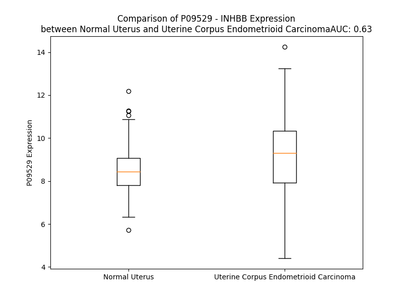

# Detailed Data for P09529

## Introduction to the Detailed Summary

### How to Interpret the Results

- **Summary & Metrics**: This section provides a quick reference to essential protein attributes, including expression changes, family classification, and biomarker applications. Regulation status (upregulated/downregulated) indicates the protein's behavior in a disease context. Some information comes from the original excel file with the proteins selected from literature, while others are derived from the analyses.
- **Expression Comparison**: A visual representation comparing protein expression between normal and disease states. It highlights significant changes in expression levels that might indicate diagnostic or therapeutic relevance. This is data coming from transcriptomics experiments and could not translate similarly to protein levels.
- **Isoform Alignment**: An interactive view of isoform alignments, revealing structural and functional differences between variants of the protein.
- **Interactors & Homologs**: Tables listing known interaction partners and homologous proteins, the more interactors and homologs, the more complex the protein is to design an antibody for.
- **Biological Assemblies**: Information about the structural arrangement of the protein in different assemblies, providing insights into its functional state but also the complexity of the protein to develop antibodies.
- **Combined Per-Residue Information**: A detailed table summarizing residue-level data. This includes predictions for epitope regions, aggregation tendencies, and modifications that might impact the protein's function. Each row corresponds to a residue in the protein, providing insights into specific sites that may be important for research or drug development.
## Summary & Metrics

- **UniProt Accession**: P09529
- **Gene Name**: INHBB
- **Protein Name**: Inhibin beta B chain
- **Swiss Prot**: INHBB_HUMAN
- **Family**: growth factor
- **Biomarker Application**:  
- **Number of Isoforms**: 0
- **Regulation**: -1
- **(transcriptomics) AUC**: 0.63
- **(transcriptomics) Fold Change**: 1.07
- **(transcriptomics) Regulation**: Upregulated
- **Discotope Epitope Count**: 98
- **Max n_uniprots (Homo)**: N/A
- **Max n_uniprots (Hetero)**: 2

## Expression Comparison

## Interactors

| preferredName_A   | preferredName_B   |   score |
|:------------------|:------------------|--------:|
| INHBB             | ACVR2A            |   0.995 |
| INHBB             | ACVR1C            |   0.991 |
| INHBB             | ACVR2B            |   0.987 |
| INHBB             | INHBA             |   0.986 |
| INHBB             | FST               |   0.98  |
| INHBB             | BMPR2             |   0.97  |
| INHBB             | ACVR1             |   0.95  |
| INHBB             | BMPR1B            |   0.948 |
| INHBB             | BMPR1A            |   0.941 |
| INHBB             | TGFB3             |   0.917 |
| INHBB             | TGFB1             |   0.912 |
| INHBB             | NODAL             |   0.91  |
| INHBB             | ACVR1B            |   0.902 |

## Homologs

| uniprot_id   | gene_id   |
|:-------------|:----------|
| Q9UK05       | GDF2      |
| P22004       | BMP6      |
| Q96S42       | NODAL     |
| Q7Z4P5       | GDF7      |
| C8C060       | BMP2      |
| P55103       | INHBC     |
| B4DXG3       | GDF9      |
| P34820       | BMP8B     |
| Q7Z5Y6       | BMP8A     |
| Q53S46       | GDF8      |
| A4D1W7       | INHBA     |
| P55107       | GDF10     |
| A0A499FJK2   | TGFB1     |
| P05111       | INHA      |
| A0A0S2A5D6   | GDF6      |
| Q99988       | GDF15     |
| P12645       | BMP3      |
| P27539       | GDF1      |
| P61812       | TGFB2     |
| O95390       | GDF11     |
| O95972       | BMP15     |
| V9GYF1       | BMP4      |
| F1T0J1       | GDF5      |
| Q9NR23       | GDF3      |
| P10600       | TGFB3     |
| O95393       | BMP10     |
| P18075       | BMP7      |
| M9VUD0       | BMP5      |
| O00292       | LEFTY2    |
| O75610       | LEFTY1    |
| P58166       | INHBE     |

## Biological Assemblies

|   Unnamed: 0 |   assembly |   n_uniprots | composition   | crystal_id   |
|-------------:|-----------:|-------------:|:--------------|:-------------|
|            0 |          1 |            2 | Hetero        | 7u5o         |
|            1 |          2 |            2 | Hetero        | 7u5o         |
|            2 |          3 |            2 | Hetero        | 7u5o         |

## Combined Per-Residue Information

|   res | aa   |   epitope_score | epitope   |   relative_surface_accessibility |   modeling_confidence |   Aggregation | modification   | glycosylation                   |
|------:|:-----|----------------:|:----------|---------------------------------:|----------------------:|--------------:|:---------------|:--------------------------------|
|     1 | M    |         0.11389 | False     |                          1.31548 |                 39.18 |         0     | N/A            | N/A                             |
|     2 | D    |         0.15722 | False     |                          0.92269 |                 41.03 |         0     | N/A            | N/A                             |
|     3 | G    |         0.18462 | True      |                          0.76689 |                 40.75 |         0     | N/A            | N/A                             |
|     4 | L    |         0.1544  | False     |                          1.06097 |                 56.56 |         0     | N/A            | N/A                             |
|     5 | P    |         0.0932  | False     |                          0.9684  |                 51.54 |         0     | N/A            | N/A                             |
|     6 | G    |         0.10001 | False     |                          0.99636 |                 58.92 |         0     | N/A            | N/A                             |
|     7 | R    |         0.14608 | False     |                          0.9253  |                 41.15 |         0     | N/A            | N/A                             |
|     8 | A    |         0.10101 | False     |                          1.04874 |                 51.43 |         1.967 | N/A            | N/A                             |
|     9 | L    |         0.15101 | False     |                          1.05016 |                 41.66 |         4.293 | N/A            | N/A                             |
|    10 | G    |         0.23038 | True      |                          0.88731 |                 39.39 |         5.462 | N/A            | N/A                             |
|    11 | A    |         0.13203 | False     |                          1.08572 |                 47.64 |        18.564 | N/A            | N/A                             |
|    12 | A    |         0.10908 | False     |                          0.94206 |                 40.01 |        34.011 | N/A            | N/A                             |
|    13 | C    |         0.08491 | False     |                          0.8672  |                 38.16 |        51.966 | N/A            | N/A                             |
|    14 | L    |         0.15335 | False     |                          1.0192  |                 44.94 |        79.336 | N/A            | N/A                             |
|    15 | L    |         0.09137 | False     |                          0.97074 |                 37.71 |        83.081 | N/A            | N/A                             |
|    16 | L    |         0.0916  | False     |                          1.08909 |                 48.69 |        83.548 | N/A            | N/A                             |
|    17 | L    |         0.10337 | False     |                          1.07758 |                 40.43 |        83.038 | N/A            | N/A                             |
|    18 | A    |         0.09811 | False     |                          1.03172 |                 53.91 |        78.1   | N/A            | N/A                             |
|    19 | A    |         0.1553  | False     |                          1.02499 |                 40.2  |        66.999 | N/A            | N/A                             |
|    20 | G    |         0.1481  | False     |                          0.81448 |                 40.28 |        56.541 | N/A            | N/A                             |
|    21 | W    |         0.13213 | False     |                          1.13235 |                 48.68 |        55.633 | N/A            | N/A                             |
|    22 | L    |         0.10262 | False     |                          1.13458 |                 39.56 |        47.034 | N/A            | N/A                             |
|    23 | G    |         0.22636 | True      |                          0.84555 |                 45.61 |         0     | N/A            | N/A                             |
|    24 | P    |         0.12152 | False     |                          0.92443 |                 45.45 |         0     | N/A            | N/A                             |
|    25 | E    |         0.11354 | False     |                          0.77209 |                 40.21 |         0     | N/A            | N/A                             |
|    26 | A    |         0.10483 | False     |                          1.02435 |                 43.55 |         0     | N/A            | N/A                             |
|    27 | W    |         0.14121 | False     |                          1.05804 |                 42.17 |         0     | N/A            | N/A                             |
|    28 | G    |         0.26814 | True      |                          0.86017 |                 41.05 |         0     | N/A            | N/A                             |
|    29 | S    |         0.14914 | False     |                          0.86765 |                 50.91 |         0     | N/A            | N/A                             |
|    30 | P    |         0.13194 | False     |                          0.97083 |                 46.53 |         0     | N/A            | N/A                             |
|    31 | T    |         0.20461 | True      |                          0.9258  |                 56    |         0     | N/A            | N/A                             |
|    32 | P    |         0.24234 | True      |                          0.84899 |                 61.27 |         0     | N/A            | N/A                             |
|    33 | P    |         0.20704 | True      |                          0.89586 |                 63.83 |         0     | N/A            | N/A                             |
|    34 | P    |         0.15646 | False     |                          0.95833 |                 62.45 |         0     | N/A            | N/A                             |
|    35 | T    |         0.18686 | True      |                          0.87119 |                 58.39 |         0     | N/A            | N/A                             |
|    36 | P    |         0.22634 | True      |                          0.95409 |                 57.21 |         0     | N/A            | N/A                             |
|    37 | A    |         0.24216 | True      |                          0.94083 |                 51.6  |         0     | N/A            | N/A                             |
|    38 | A    |         0.20514 | True      |                          0.82411 |                 57.64 |         0     | N/A            | N/A                             |
|    39 | P    |         0.20707 | True      |                          0.87285 |                 64.91 |         0     | N/A            | N/A                             |
|    40 | P    |         0.243   | True      |                          0.86563 |                 63.2  |         0     | N/A            | N/A                             |
|    41 | P    |         0.22847 | True      |                          0.84617 |                 65.12 |         0     | N/A            | N/A                             |
|    42 | P    |         0.21615 | True      |                          0.88554 |                 63.34 |         0     | N/A            | N/A                             |
|    43 | P    |         0.15731 | False     |                          0.8703  |                 57.16 |         0     | N/A            | N/A                             |
|    44 | P    |         0.1913  | True      |                          0.85746 |                 53.17 |         0     | N/A            | N/A                             |
|    45 | P    |         0.17252 | False     |                          1.05631 |                 41.53 |         0     | N/A            | N/A                             |
|    46 | G    |         0.22766 | True      |                          0.81091 |                 34.06 |         0     | N/A            | N/A                             |
|    47 | S    |         0.11934 | False     |                          0.80319 |                 35.18 |         0     | N/A            | N/A                             |
|    48 | P    |         0.10234 | False     |                          1.0217  |                 38.55 |         0     | N/A            | N/A                             |
|    49 | G    |         0.1299  | False     |                          0.88833 |                 31.06 |         0     | N/A            | N/A                             |
|    50 | G    |         0.14153 | False     |                          0.94726 |                 30.78 |         0     | N/A            | N/A                             |
|    51 | S    |         0.1198  | False     |                          0.69081 |                 41.76 |         0     | N/A            | N/A                             |
|    52 | Q    |         0.11849 | False     |                          0.8239  |                 40.67 |         0     | N/A            | N/A                             |
|    53 | D    |         0.13778 | False     |                          0.70637 |                 43.37 |         0     | N/A            | N/A                             |
|    54 | T    |         0.11394 | False     |                          0.72729 |                 40.57 |         0     | N/A            | N/A                             |
|    55 | C    |         0.08989 | False     |                          0.39691 |                 47.29 |         0     | N/A            | N/A                             |
|    56 | T    |         0.20559 | True      |                          1.05737 |                 53.63 |         0     | N/A            | N/A                             |
|    57 | S    |         0.20419 | True      |                          0.81938 |                 50.38 |         0     | N/A            | N/A                             |
|    58 | C    |         0.09246 | False     |                          0.56767 |                 59.78 |         0     | N/A            | N/A                             |
|    59 | G    |         0.16652 | False     |                          0.75011 |                 35.86 |         0     | N/A            | N/A                             |
|    60 | G    |         0.18412 | True      |                          0.68282 |                 40.1  |         0     | N/A            | N/A                             |
|    61 | F    |         0.11806 | False     |                          0.59857 |                 42.77 |         0     | N/A            | N/A                             |
|    62 | R    |         0.1579  | False     |                          0.86066 |                 43.08 |         0     | N/A            | N/A                             |
|    63 | R    |         0.20391 | True      |                          0.78593 |                 44.51 |         0     | N/A            | N/A                             |
|    64 | P    |         0.10263 | False     |                          0.76899 |                 43.52 |         0     | N/A            | N/A                             |
|    65 | E    |         0.14554 | False     |                          0.73827 |                 38.55 |         0     | N/A            | N/A                             |
|    66 | E    |         0.17483 | False     |                          0.75354 |                 37.84 |         0     | N/A            | N/A                             |
|    67 | L    |         0.17175 | False     |                          1.18684 |                 37.4  |         0     | N/A            | N/A                             |
|    68 | G    |         0.20343 | True      |                          0.94051 |                 47.74 |         0     | N/A            | N/A                             |
|    69 | R    |         0.11832 | False     |                          0.87953 |                 48.78 |         0     | N/A            | N/A                             |
|    70 | V    |         0.08159 | False     |                          0.53425 |                 59.08 |         0     | N/A            | N/A                             |
|    71 | D    |         0.0815  | False     |                          0.48578 |                 72.81 |         0     | N/A            | N/A                             |
|    72 | G    |         0.09683 | False     |                          0.59736 |                 83.31 |         0     | N/A            | N/A                             |
|    73 | D    |         0.07971 | False     |                          0.63717 |                 85.96 |         0     | N/A            | N/A                             |
|    74 | F    |         0.08694 | False     |                          0.21682 |                 84.41 |         0.264 | N/A            | N/A                             |
|    75 | L    |         0.11914 | False     |                          0.33716 |                 86.79 |         0.264 | N/A            | N/A                             |
|    76 | E    |         0.12137 | False     |                          0.3393  |                 89.96 |         0.264 | N/A            | N/A                             |
|    77 | A    |         0.10682 | False     |                          0.43545 |                 90.6  |         0.264 | N/A            | N/A                             |
|    78 | V    |         0.04233 | False     |                          0.10446 |                 90.13 |         0.264 | N/A            | N/A                             |
|    79 | K    |         0.05008 | False     |                          0.26455 |                 92.56 |         0.264 | N/A            | N/A                             |
|    80 | R    |         0.18732 | True      |                          0.60129 |                 92.57 |         0     | N/A            | N/A                             |
|    81 | H    |         0.1564  | False     |                          0.41057 |                 91.3  |         0     | N/A            | N/A                             |
|    82 | I    |         0.00469 | False     |                          0       |                 92.1  |         0     | N/A            | N/A                             |
|    83 | L    |         0.04853 | False     |                          0.14838 |                 92.74 |         0     | N/A            | N/A                             |
|    84 | S    |         0.09796 | False     |                          0.6145  |                 91.58 |         0     | N/A            | N/A                             |
|    85 | R    |         0.12087 | False     |                          0.29752 |                 89.66 |         0     | N/A            | N/A                             |
|    86 | L    |         0.00513 | False     |                          0       |                 89.21 |         0     | N/A            | N/A                             |
|    87 | Q    |         0.13234 | False     |                          0.42236 |                 87.69 |         0     | N/A            | N/A                             |
|    88 | M    |         0.03371 | False     |                          0.10318 |                 87.42 |         0     | N/A            | N/A                             |
|    89 | R    |         0.15396 | False     |                          0.99584 |                 86.89 |         0     | N/A            | N/A                             |
|    90 | G    |         0.09841 | False     |                          0.33478 |                 89.95 |         0     | N/A            | N/A                             |
|    91 | R    |         0.11023 | False     |                          0.46024 |                 89.67 |         0     | N/A            | N/A                             |
|    92 | P    |         0.01427 | False     |                          0.03384 |                 88.29 |         0     | N/A            | N/A                             |
|    93 | N    |         0.15015 | False     |                          0.66755 |                 83.31 |         0     | N/A            | N-linked (GlcNAc...) asparagine |
|    94 | I    |         0.11133 | False     |                          0.26489 |                 76.7  |         0     | N/A            | N/A                             |
|    95 | T    |         0.17738 | False     |                          0.58928 |                 67.81 |         0     | N/A            | N/A                             |
|    96 | H    |         0.21092 | True      |                          0.79639 |                 61.7  |         0     | N/A            | N/A                             |
|    97 | A    |         0.15536 | False     |                          0.63892 |                 64.07 |         0     | N/A            | N/A                             |
|    98 | V    |         0.06914 | False     |                          0.11147 |                 71.79 |         0     | N/A            | N/A                             |
|    99 | P    |         0.09327 | False     |                          0.22068 |                 78.87 |         0     | N/A            | N/A                             |
|   100 | K    |         0.17755 | False     |                          0.70526 |                 78.43 |         0     | N/A            | N/A                             |
|   101 | A    |         0.07726 | False     |                          0.46314 |                 81.65 |         0.13  | N/A            | N/A                             |
|   102 | A    |         0.01511 | False     |                          0.02379 |                 83.2  |         0.13  | N/A            | N/A                             |
|   103 | M    |         0.03274 | False     |                          0.15092 |                 81.82 |         0.437 | N/A            | N/A                             |
|   104 | V    |         0.03453 | False     |                          0.16661 |                 80.3  |         0.437 | N/A            | N/A                             |
|   105 | T    |         0.04918 | False     |                          0.18888 |                 83.96 |         0.437 | N/A            | N/A                             |
|   106 | A    |         0.00398 | False     |                          0       |                 82.02 |         0.307 | N/A            | N/A                             |
|   107 | L    |         0.00713 | False     |                          0.0033  |                 80.01 |         0.307 | N/A            | N/A                             |
|   108 | R    |         0.16639 | False     |                          0.58256 |                 78.21 |         0     | N/A            | N/A                             |
|   109 | K    |         0.14663 | False     |                          0.38541 |                 76.05 |         0     | N/A            | N/A                             |
|   110 | L    |         0.10595 | False     |                          0.17391 |                 67.2  |         0     | N/A            | N/A                             |
|   111 | H    |         0.19518 | True      |                          0.91169 |                 65.48 |         0     | N/A            | N/A                             |
|   112 | A    |         0.07803 | False     |                          0.06749 |                 54.65 |         0     | N/A            | N/A                             |
|   113 | G    |         0.03901 | False     |                          0.10209 |                 53.64 |         0     | N/A            | N/A                             |
|   114 | K    |         0.18482 | True      |                          0.7218  |                 58.39 |         0     | N/A            | N/A                             |
|   115 | V    |         0.10367 | False     |                          0.23233 |                 57.2  |         0     | N/A            | N/A                             |
|   116 | R    |         0.349   | True      |                          0.55303 |                 61.13 |         0     | N/A            | N/A                             |
|   117 | E    |         0.25207 | True      |                          1.00257 |                 57.08 |         0     | N/A            | N/A                             |
|   118 | D    |         0.25322 | True      |                          0.58363 |                 62.21 |         0     | N/A            | N/A                             |
|   119 | G    |         0.13109 | False     |                          0.38155 |                 56.18 |         0     | N/A            | N/A                             |
|   120 | R    |         0.3809  | True      |                          0.70949 |                 61.31 |         0     | N/A            | N/A                             |
|   121 | V    |         0.12999 | False     |                          0.28656 |                 58.09 |         0     | N/A            | N/A                             |
|   122 | E    |         0.21705 | True      |                          0.40771 |                 60.59 |         0     | N/A            | N/A                             |
|   123 | I    |         0.09533 | False     |                          0.07252 |                 61.13 |         0     | N/A            | N/A                             |
|   124 | P    |         0.14151 | False     |                          0.42837 |                 56.56 |         0     | N/A            | N/A                             |
|   125 | H    |         0.2107  | True      |                          0.73189 |                 59.55 |         0     | N/A            | N/A                             |
|   126 | L    |         0.06309 | False     |                          0.06179 |                 64.68 |         0     | N/A            | N/A                             |
|   127 | D    |         0.09767 | False     |                          0.65651 |                 69.5  |         0     | N/A            | N/A                             |
|   128 | G    |         0.02884 | False     |                          0.02906 |                 65.4  |         0     | N/A            | N/A                             |
|   129 | H    |         0.15734 | False     |                          0.65802 |                 74.9  |         0     | N/A            | N/A                             |
|   130 | A    |         0.05297 | False     |                          0.32654 |                 66.73 |         0     | N/A            | N/A                             |
|   131 | S    |         0.07758 | False     |                          0.23423 |                 63.11 |         0     | N/A            | N/A                             |
|   132 | P    |         0.12273 | False     |                          0.96626 |                 49.27 |         0     | N/A            | N/A                             |
|   133 | G    |         0.14641 | False     |                          0.46873 |                 49.99 |         0     | N/A            | N/A                             |
|   134 | A    |         0.07306 | False     |                          0.51929 |                 46.6  |         0     | N/A            | N/A                             |
|   135 | D    |         0.0781  | False     |                          0.67258 |                 45.32 |         0     | N/A            | N/A                             |
|   136 | G    |         0.19393 | True      |                          0.76487 |                 45.48 |         0     | N/A            | N/A                             |
|   137 | Q    |         0.12862 | False     |                          0.70989 |                 48.35 |         0     | N/A            | N/A                             |
|   138 | E    |         0.11584 | False     |                          0.49377 |                 55.32 |         0     | N/A            | N/A                             |
|   139 | R    |         0.1002  | False     |                          0.2293  |                 64.75 |         0     | N/A            | N/A                             |
|   140 | V    |         0.09539 | False     |                          0.32469 |                 69.49 |         0     | N/A            | N/A                             |
|   141 | S    |         0.03919 | False     |                          0.07783 |                 76.01 |         0     | N/A            | N/A                             |
|   142 | E    |         0.03052 | False     |                          0.11448 |                 83.13 |         0     | N/A            | N/A                             |
|   143 | I    |         0.01498 | False     |                          0.0288  |                 84.84 |         1.283 | N/A            | N/A                             |
|   144 | I    |         0.00966 | False     |                          0.0136  |                 88.98 |         1.283 | N/A            | N/A                             |
|   145 | S    |         0.00696 | False     |                          0.01221 |                 91.73 |         1.283 | N/A            | N/A                             |
|   146 | F    |         0.01725 | False     |                          0.08617 |                 91.88 |         1.283 | N/A            | N/A                             |
|   147 | A    |         0.00354 | False     |                          0       |                 92.47 |         1.283 | N/A            | N/A                             |
|   148 | E    |         0.07252 | False     |                          0.34938 |                 89.27 |         0     | N/A            | N/A                             |
|   149 | T    |         0.10427 | False     |                          0.28793 |                 83.98 |         0     | N/A            | N/A                             |
|   150 | D    |         0.31787 | True      |                          0.61673 |                 69.64 |         0     | N/A            | N/A                             |
|   151 | G    |         0.2309  | True      |                          0.48559 |                 62.92 |         0     | N/A            | N/A                             |
|   152 | L    |         0.22022 | True      |                          0.87448 |                 55.77 |         0     | N/A            | N/A                             |
|   153 | A    |         0.13303 | False     |                          0.92705 |                 44.73 |         0     | N/A            | N/A                             |
|   154 | S    |         0.11839 | False     |                          0.62172 |                 50.63 |         0     | N/A            | N/A                             |
|   155 | S    |         0.21726 | True      |                          0.87534 |                 59.67 |         0     | N/A            | N/A                             |
|   156 | R    |         0.21217 | True      |                          0.42829 |                 69.35 |         0     | N/A            | N/A                             |
|   157 | V    |         0.03404 | False     |                          0.11316 |                 80.9  |         0     | N/A            | N/A                             |
|   158 | R    |         0.1369  | False     |                          0.47503 |                 86.22 |         0     | N/A            | N/A                             |
|   159 | L    |         0.00307 | False     |                          0       |                 90.61 |        86.001 | N/A            | N/A                             |
|   160 | Y    |         0.09221 | False     |                          0.10957 |                 91.11 |        93.715 | N/A            | N/A                             |
|   161 | F    |         0.00405 | False     |                          0.00412 |                 91.54 |        93.726 | N/A            | N/A                             |
|   162 | F    |         0.07832 | False     |                          0.36065 |                 88.09 |        93.726 | N/A            | N/A                             |
|   163 | I    |         0.00594 | False     |                          0       |                 85.26 |        93.726 | N/A            | N/A                             |
|   164 | S    |         0.036   | False     |                          0.0436  |                 73.69 |        49.85  | N/A            | N/A                             |
|   165 | N    |         0.08691 | False     |                          0.20182 |                 68.99 |         1.88  | N/A            | N/A                             |
|   166 | E    |         0.0476  | False     |                          0.11222 |                 61.61 |         0     | N/A            | N/A                             |
|   167 | G    |         0.14505 | False     |                          0.77078 |                 55.48 |         0.002 | N/A            | N/A                             |
|   168 | N    |         0.12644 | False     |                          0.07742 |                 62.63 |         0.034 | N/A            | N/A                             |
|   169 | Q    |         0.23462 | True      |                          0.87369 |                 59.08 |         0.163 | N/A            | N/A                             |
|   170 | N    |         0.11396 | False     |                          0.60112 |                 62.08 |         3.511 | N/A            | N/A                             |
|   171 | L    |         0.08426 | False     |                          0.0908  |                 71.06 |        81.123 | N/A            | N/A                             |
|   172 | F    |         0.18275 | True      |                          0.65033 |                 77.33 |        95.278 | N/A            | N/A                             |
|   173 | V    |         0.0436  | False     |                          0.11131 |                 86.23 |        96.428 | N/A            | N/A                             |
|   174 | V    |         0.10842 | False     |                          0.46425 |                 85.8  |        96.524 | N/A            | N/A                             |
|   175 | Q    |         0.09052 | False     |                          0.4861  |                 91.47 |        96.192 | N/A            | N/A                             |
|   176 | A    |         0.00547 | False     |                          0.00349 |                 92.75 |        96.062 | N/A            | N/A                             |
|   177 | S    |         0.04498 | False     |                          0.08941 |                 95.05 |        95.965 | N/A            | N/A                             |
|   178 | L    |         0.00294 | False     |                          0       |                 95.23 |        97.531 | N/A            | N/A                             |
|   179 | W    |         0.07347 | False     |                          0.20129 |                 94.82 |        97.303 | N/A            | N/A                             |
|   180 | L    |         0.00226 | False     |                          0       |                 93.54 |        96.371 | N/A            | N/A                             |
|   181 | Y    |         0.08594 | False     |                          0.12929 |                 93.73 |        91.257 | N/A            | N/A                             |
|   182 | L    |         0.00317 | False     |                          0       |                 92.29 |        77.382 | N/A            | N/A                             |
|   183 | K    |         0.12716 | False     |                          0.36669 |                 91.03 |         0     | N/A            | N/A                             |
|   184 | L    |         0.10841 | False     |                          0.20412 |                 88.56 |         0     | N/A            | N/A                             |
|   185 | L    |         0.20485 | True      |                          0.40716 |                 86.91 |         0     | N/A            | N/A                             |
|   186 | P    |         0.24354 | True      |                          1.00616 |                 77.7  |         0     | N/A            | N/A                             |
|   187 | Y    |         0.30886 | True      |                          0.90556 |                 65.56 |         0     | N/A            | N/A                             |
|   188 | V    |         0.16243 | False     |                          0.48945 |                 60.17 |         0     | N/A            | N/A                             |
|   189 | L    |         0.23848 | True      |                          0.50787 |                 58.96 |         0     | N/A            | N/A                             |
|   190 | E    |         0.26908 | True      |                          0.77433 |                 63.33 |         0     | N/A            | N/A                             |
|   191 | K    |         0.30079 | True      |                          1.07202 |                 58.6  |         0     | N/A            | N/A                             |
|   192 | G    |         0.24058 | True      |                          0.83051 |                 62.12 |         0     | N/A            | N/A                             |
|   193 | S    |         0.20399 | True      |                          0.34613 |                 74.66 |         0     | N/A            | N/A                             |
|   194 | R    |         0.20822 | True      |                          0.51235 |                 81.56 |         0     | N/A            | N/A                             |
|   195 | R    |         0.18838 | True      |                          0.05533 |                 85.54 |         0     | N/A            | N/A                             |
|   196 | K    |         0.19143 | True      |                          0.71622 |                 90.89 |         0     | N/A            | N/A                             |
|   197 | V    |         0.02278 | False     |                          0.01832 |                 91.93 |         0     | N/A            | N/A                             |
|   198 | R    |         0.16919 | False     |                          0.44423 |                 93.69 |         0     | N/A            | N/A                             |
|   199 | V    |         0.00429 | False     |                          0       |                 92.99 |         0     | N/A            | N/A                             |
|   200 | K    |         0.09745 | False     |                          0.18584 |                 93.68 |         0     | N/A            | N/A                             |
|   201 | V    |         0.00424 | False     |                          0       |                 93.01 |         0     | N/A            | N/A                             |
|   202 | Y    |         0.12845 | False     |                          0.15955 |                 91.63 |         0     | N/A            | N/A                             |
|   203 | F    |         0.05616 | False     |                          0.10446 |                 89.74 |         0     | N/A            | N/A                             |
|   204 | Q    |         0.07098 | False     |                          0.20854 |                 79.47 |         0     | N/A            | N/A                             |
|   205 | E    |         0.05712 | False     |                          0.28535 |                 70.66 |         0     | N/A            | N/A                             |
|   206 | Q    |         0.18421 | True      |                          0.57972 |                 61.45 |         0     | N/A            | N/A                             |
|   207 | G    |         0.0964  | False     |                          0.7538  |                 54.57 |         0     | N/A            | N/A                             |
|   208 | H    |         0.19709 | True      |                          1.16141 |                 50.98 |         0     | N/A            | N/A                             |
|   209 | G    |         0.16142 | False     |                          0.49914 |                 56.36 |         0     | N/A            | N/A                             |
|   210 | D    |         0.25139 | True      |                          0.69364 |                 65.4  |         0     | N/A            | N/A                             |
|   211 | R    |         0.27325 | True      |                          0.60639 |                 75.06 |         0     | N/A            | N/A                             |
|   212 | W    |         0.25841 | True      |                          0.29584 |                 83.29 |         0     | N/A            | N/A                             |
|   213 | N    |         0.17419 | False     |                          0.31467 |                 88.39 |         0     | N/A            | N/A                             |
|   214 | M    |         0.22074 | True      |                          0.46157 |                 90.67 |         0     | N/A            | N/A                             |
|   215 | V    |         0.07224 | False     |                          0.20755 |                 93.12 |         0     | N/A            | N/A                             |
|   216 | E    |         0.15611 | False     |                          0.40886 |                 92.94 |         0     | N/A            | N/A                             |
|   217 | K    |         0.16898 | False     |                          0.33922 |                 93.37 |         0     | N/A            | N/A                             |
|   218 | R    |         0.28515 | True      |                          0.77697 |                 93.57 |         0     | N/A            | N/A                             |
|   219 | V    |         0.03766 | False     |                          0.03802 |                 92.13 |         0     | N/A            | N/A                             |
|   220 | D    |         0.14619 | False     |                          0.32904 |                 91.01 |         0     | N/A            | N/A                             |
|   221 | L    |         0.02818 | False     |                          0.01319 |                 88.22 |         0     | N/A            | N/A                             |
|   222 | K    |         0.16149 | False     |                          0.66888 |                 86.65 |         0     | N/A            | N/A                             |
|   223 | R    |         0.2133  | True      |                          0.78271 |                 88.18 |         0     | N/A            | N/A                             |
|   224 | S    |         0.15964 | False     |                          0.28489 |                 90.28 |         0     | N/A            | N/A                             |
|   225 | G    |         0.11129 | False     |                          0.21245 |                 92.05 |         0     | N/A            | N/A                             |
|   226 | W    |         0.08398 | False     |                          0.18704 |                 92.68 |         0     | N/A            | N/A                             |
|   227 | H    |         0.09766 | False     |                          0.19448 |                 93.58 |         0     | N/A            | N/A                             |
|   228 | T    |         0.05085 | False     |                          0.32522 |                 93.83 |         0     | N/A            | N/A                             |
|   229 | F    |         0.00516 | False     |                          0       |                 94.41 |         0     | N/A            | N/A                             |
|   230 | P    |         0.06115 | False     |                          0.57318 |                 94.42 |         0     | N/A            | N/A                             |
|   231 | L    |         0.02046 | False     |                          0.02226 |                 93.21 |         0     | N/A            | N/A                             |
|   232 | T    |         0.10162 | False     |                          0.29193 |                 91.82 |         0     | N/A            | N/A                             |
|   233 | E    |         0.12725 | False     |                          0.73407 |                 89.38 |         0     | N/A            | N/A                             |
|   234 | A    |         0.01773 | False     |                          0.04915 |                 90.99 |         1.25  | N/A            | N/A                             |
|   235 | I    |         0.00382 | False     |                          0       |                 90.25 |         2.728 | N/A            | N/A                             |
|   236 | Q    |         0.07733 | False     |                          0.20767 |                 87.36 |         2.728 | N/A            | N/A                             |
|   237 | A    |         0.06539 | False     |                          0.2775  |                 87.08 |         2.728 | N/A            | N/A                             |
|   238 | L    |         0.02048 | False     |                          0.01566 |                 87.97 |         2.728 | N/A            | N/A                             |
|   239 | F    |         0.05376 | False     |                          0.07933 |                 83.78 |         2.728 | N/A            | N/A                             |
|   240 | E    |         0.21507 | True      |                          0.66608 |                 80.19 |         0     | N/A            | N/A                             |
|   241 | R    |         0.24569 | True      |                          0.39364 |                 79.48 |         0     | N/A            | N/A                             |
|   242 | G    |         0.22368 | True      |                          0.6668  |                 75.39 |         0     | N/A            | N/A                             |
|   243 | E    |         0.23532 | True      |                          0.40838 |                 82.21 |         0     | N/A            | N/A                             |
|   244 | R    |         0.20837 | True      |                          0.53323 |                 83.97 |         0     | N/A            | N/A                             |
|   245 | R    |         0.2608  | True      |                          0.36179 |                 89.14 |         0     | N/A            | N/A                             |
|   246 | L    |         0.01626 | False     |                          0.04122 |                 89.99 |         0     | N/A            | N/A                             |
|   247 | N    |         0.13862 | False     |                          0.22975 |                 90.6  |         0     | N/A            | N/A                             |
|   248 | L    |         0.00499 | False     |                          0       |                 91.41 |         0     | N/A            | N/A                             |
|   249 | D    |         0.1718  | False     |                          0.05289 |                 89.75 |         0     | N/A            | N/A                             |
|   250 | V    |         0.01759 | False     |                          0.01995 |                 90.21 |         0     | N/A            | N/A                             |
|   251 | Q    |         0.19546 | True      |                          0.23384 |                 90.77 |         0     | N/A            | N/A                             |
|   252 | C    |         0.05277 | False     |                          0.20665 |                 90.74 |         0     | N/A            | N/A                             |
|   253 | D    |         0.13942 | False     |                          0.17805 |                 90.64 |         0     | N/A            | N/A                             |
|   254 | S    |         0.12065 | False     |                          0.38527 |                 85.27 |         0     | N/A            | N/A                             |
|   255 | C    |         0.04126 | False     |                          0.06052 |                 88.4  |         0     | N/A            | N/A                             |
|   256 | Q    |         0.29289 | True      |                          0.8688  |                 84.27 |         0     | N/A            | N/A                             |
|   257 | E    |         0.34324 | True      |                          0.68105 |                 85.21 |         0     | N/A            | N/A                             |
|   258 | L    |         0.11769 | False     |                          0.28605 |                 86.64 |         0     | N/A            | N/A                             |
|   259 | A    |         0.07832 | False     |                          0.04719 |                 87.87 |         0     | N/A            | N/A                             |
|   260 | V    |         0.01824 | False     |                          0.01196 |                 89.26 |         0     | N/A            | N/A                             |
|   261 | V    |         0.2397  | True      |                          0.44081 |                 89.64 |         0     | N/A            | N/A                             |
|   262 | P    |         0.07777 | False     |                          0.13973 |                 89.81 |         0     | N/A            | N/A                             |
|   263 | V    |         0.11014 | False     |                          0.06093 |                 87.54 |         0     | N/A            | N/A                             |
|   264 | F    |         0.03727 | False     |                          0.16317 |                 87.09 |         0     | N/A            | N/A                             |
|   265 | V    |         0.08567 | False     |                          0.28881 |                 85.23 |         0     | N/A            | N/A                             |
|   266 | D    |         0.31936 | True      |                          0.39741 |                 83.17 |         0     | N/A            | N/A                             |
|   267 | P    |         0.48848 | True      |                          0.87535 |                 79.27 |         0     | N/A            | N/A                             |
|   268 | G    |         0.44059 | True      |                          0.84104 |                 82.83 |         0     | N/A            | N/A                             |
|   269 | E    |         0.21404 | True      |                          0.17814 |                 84.02 |         0     | N/A            | N/A                             |
|   270 | E    |         0.13766 | False     |                          0.34621 |                 84.95 |         0     | N/A            | N/A                             |
|   271 | S    |         0.0899  | False     |                          0.31003 |                 87.11 |         0     | N/A            | N/A                             |
|   272 | H    |         0.09855 | False     |                          0.24706 |                 91.55 |         0     | N/A            | N/A                             |
|   273 | R    |         0.10286 | False     |                          0.18281 |                 92.67 |         0     | N/A            | N/A                             |
|   274 | P    |         0.0016  | False     |                          0       |                 93.52 |         4.31  | N/A            | N/A                             |
|   275 | F    |         0.01322 | False     |                          0.00892 |                 94.27 |        14.658 | N/A            | N/A                             |
|   276 | V    |         0.00175 | False     |                          0       |                 93.83 |        15.71  | N/A            | N/A                             |
|   277 | V    |         0.01684 | False     |                          0.07873 |                 92.37 |        15.71  | N/A            | N/A                             |
|   278 | V    |         0.00404 | False     |                          0.0019  |                 91.06 |        15.71  | N/A            | N/A                             |
|   279 | Q    |         0.08075 | False     |                          0.27828 |                 88.57 |        11.4   | N/A            | N/A                             |
|   280 | A    |         0.01151 | False     |                          0       |                 84.55 |         5.766 | N/A            | N/A                             |
|   281 | R    |         0.19597 | True      |                          0.34208 |                 77.39 |         0     | N/A            | N/A                             |
|   282 | L    |         0.11439 | False     |                          0.19324 |                 67.35 |         0     | N/A            | N/A                             |
|   283 | G    |         0.24052 | True      |                          0.58641 |                 53.69 |         0     | N/A            | N/A                             |
|   284 | D    |         0.14879 | False     |                          0.49864 |                 50.29 |         0     | N/A            | N/A                             |
|   285 | S    |         0.17749 | False     |                          0.65138 |                 44.8  |         0     | N/A            | N/A                             |
|   286 | R    |         0.38138 | True      |                          0.93078 |                 45.57 |         0     | N/A            | N/A                             |
|   287 | H    |         0.21645 | True      |                          0.88    |                 35.98 |         0     | N/A            | N/A                             |
|   288 | R    |         0.26359 | True      |                          0.72036 |                 41.51 |         0     | N/A            | N/A                             |
|   289 | I    |         0.20815 | True      |                          0.80528 |                 42.8  |         0     | N/A            | N/A                             |
|   290 | R    |         0.23176 | True      |                          0.77397 |                 42.67 |         0     | N/A            | N/A                             |
|   291 | K    |         0.09707 | False     |                          0.46771 |                 51.53 |         0     | N/A            | N/A                             |
|   292 | R    |         0.18406 | True      |                          0.92243 |                 58.02 |         0     | N/A            | N/A                             |
|   293 | G    |         0.10181 | False     |                          0.36187 |                 65.3  |         0     | N/A            | N/A                             |
|   294 | L    |         0.15382 | False     |                          0.60689 |                 77.52 |         0     | N/A            | N/A                             |
|   295 | E    |         0.0636  | False     |                          0.42457 |                 82.18 |         0     | N/A            | N/A                             |
|   296 | C    |         0.10003 | False     |                          0.27512 |                 84.44 |         0     | N/A            | N/A                             |
|   297 | D    |         0.23561 | True      |                          0.53913 |                 80.15 |         0     | N/A            | N/A                             |
|   298 | G    |         0.30603 | True      |                          0.96304 |                 77.5  |         0     | N/A            | N/A                             |
|   299 | R    |         0.38572 | True      |                          0.8416  |                 75.93 |         0     | N/A            | N/A                             |
|   300 | T    |         0.19543 | True      |                          0.51263 |                 75.67 |         0     | N/A            | N/A                             |
|   301 | N    |         0.20551 | True      |                          0.77461 |                 84.01 |         0     | N/A            | N/A                             |
|   302 | L    |         0.19771 | True      |                          0.29738 |                 85.28 |         0     | N/A            | N/A                             |
|   303 | C    |         0.0181  | False     |                          0.086   |                 88.03 |         0     | N/A            | N/A                             |
|   304 | C    |         0.02011 | False     |                          0.05444 |                 88.85 |         0     | N/A            | N/A                             |
|   305 | R    |         0.09864 | False     |                          0.15678 |                 89.29 |         0     | N/A            | N/A                             |
|   306 | Q    |         0.09271 | False     |                          0.30298 |                 89.68 |         0.252 | N/A            | N/A                             |
|   307 | Q    |         0.15186 | False     |                          0.52577 |                 87.48 |         1.584 | N/A            | N/A                             |
|   308 | F    |         0.07713 | False     |                          0.20923 |                 88.79 |        34.6   | N/A            | N/A                             |
|   309 | F    |         0.22317 | True      |                          0.49239 |                 89.37 |        37.251 | N/A            | N/A                             |
|   310 | I    |         0.03694 | False     |                          0.0616  |                 90.61 |        37.416 | N/A            | N/A                             |
|   311 | D    |         0.12532 | False     |                          0.11021 |                 88.91 |        37.163 | N/A            | N/A                             |
|   312 | F    |         0.00585 | False     |                          0.00343 |                 91.88 |        37.163 | N/A            | N/A                             |
|   313 | R    |         0.17952 | False     |                          0.59655 |                 89.83 |        37.163 | N/A            | N/A                             |
|   314 | L    |         0.17276 | False     |                          0.93433 |                 87.16 |        36.844 | N/A            | N/A                             |
|   315 | I    |         0.13223 | False     |                          0.10178 |                 89.34 |        34.404 | N/A            | N/A                             |
|   316 | G    |         0.12532 | False     |                          0.38997 |                 89.19 |         7.221 | N/A            | N/A                             |
|   317 | W    |         0.04794 | False     |                          0.04834 |                 92.11 |         4.821 | N/A            | N/A                             |
|   318 | N    |         0.12641 | False     |                          0.52608 |                 87.86 |         0.224 | N/A            | N/A                             |
|   319 | D    |         0.08883 | False     |                          0.36549 |                 87.11 |         0     | N/A            | N/A                             |
|   320 | W    |         0.01953 | False     |                          0       |                 90.58 |         0     | N/A            | N/A                             |
|   321 | I    |         0.02476 | False     |                          0.02306 |                 90.07 |         0     | N/A            | N/A                             |
|   322 | I    |         0.06612 | False     |                          0.28441 |                 87.37 |         0     | N/A            | N/A                             |
|   323 | A    |         0.03599 | False     |                          0.10969 |                 87.82 |         0     | N/A            | N/A                             |
|   324 | P    |         0.07082 | False     |                          0.03449 |                 89.6  |         0     | N/A            | N/A                             |
|   325 | T    |         0.12843 | False     |                          0.65697 |                 87.79 |         0     | N/A            | N/A                             |
|   326 | G    |         0.03402 | False     |                          0.02974 |                 89.3  |         0     | N/A            | N/A                             |
|   327 | Y    |         0.0163  | False     |                          0.00692 |                 91.92 |         0     | N/A            | N/A                             |
|   328 | Y    |         0.10805 | False     |                          0.42467 |                 87.99 |         0     | N/A            | N/A                             |
|   329 | G    |         0.04615 | False     |                          0.07341 |                 88.08 |         0     | N/A            | N/A                             |
|   330 | N    |         0.03677 | False     |                          0.08345 |                 91.85 |         0     | N/A            | N/A                             |
|   331 | Y    |         0.13415 | False     |                          0.32469 |                 92.32 |         0     | N/A            | N/A                             |
|   332 | C    |         0.04743 | False     |                          0.19288 |                 92    |         0     | N/A            | N/A                             |
|   333 | E    |         0.17498 | False     |                          0.45881 |                 90.7  |         0     | N/A            | N/A                             |
|   334 | G    |         0.03532 | False     |                          0.41546 |                 88.54 |         0     | N/A            | N/A                             |
|   335 | S    |         0.09748 | False     |                          0.43564 |                 86.95 |         0     | N/A            | N/A                             |
|   336 | C    |         0.03932 | False     |                          0.10509 |                 84.49 |         0     | N/A            | N/A                             |
|   337 | P    |         0.10606 | False     |                          0.22949 |                 78.74 |         0     | N/A            | N/A                             |
|   338 | A    |         0.11205 | False     |                          0.63858 |                 69.37 |         0     | N/A            | N/A                             |
|   339 | Y    |         0.21857 | True      |                          0.64346 |                 65.71 |         0     | N/A            | N/A                             |
|   340 | L    |         0.20292 | True      |                          0.21268 |                 65.36 |         0     | N/A            | N/A                             |
|   341 | A    |         0.02133 | False     |                          0.01913 |                 58.18 |         0     | N/A            | N/A                             |
|   342 | G    |         0.1651  | False     |                          0.22756 |                 52.86 |         0     | N/A            | N/A                             |
|   343 | V    |         0.17304 | False     |                          0.44938 |                 58.38 |         0     | N/A            | N/A                             |
|   344 | P    |         0.15656 | False     |                          0.89963 |                 52.34 |         0     | N/A            | N/A                             |
|   345 | G    |         0.09383 | False     |                          0.48109 |                 56.19 |         0     | N/A            | N/A                             |
|   346 | S    |         0.08935 | False     |                          0.15998 |                 64.3  |         0     | N/A            | N/A                             |
|   347 | A    |         0.02276 | False     |                          0.05513 |                 63.47 |         0     | N/A            | N/A                             |
|   348 | S    |         0.0711  | False     |                          0.17302 |                 67.08 |         0     | N/A            | N/A                             |
|   349 | S    |         0.04763 | False     |                          0.18484 |                 66.31 |         0     | N/A            | N/A                             |
|   350 | F    |         0.11446 | False     |                          0.80435 |                 68.61 |         0.395 | N/A            | N/A                             |
|   351 | H    |         0.15176 | False     |                          0.74486 |                 70.37 |         0.395 | N/A            | N/A                             |
|   352 | T    |         0.0483  | False     |                          0.11104 |                 69.97 |         0.552 | N/A            | N/A                             |
|   353 | A    |         0.09519 | False     |                          0.19624 |                 70.92 |         0.552 | N/A            | N/A                             |
|   354 | V    |         0.08499 | False     |                          0.38545 |                 73.39 |         0.552 | N/A            | N/A                             |
|   355 | V    |         0.06463 | False     |                          0.29229 |                 73.78 |         0.552 | N/A            | N/A                             |
|   356 | N    |         0.03473 | False     |                          0.01262 |                 72.13 |         0.156 | N/A            | N/A                             |
|   357 | Q    |         0.10654 | False     |                          0.41304 |                 72.58 |         0     | N/A            | N/A                             |
|   358 | Y    |         0.09672 | False     |                          0.57779 |                 73.9  |         0     | N/A            | N/A                             |
|   359 | R    |         0.12837 | False     |                          0.32445 |                 73.16 |         0     | N/A            | N/A                             |
|   360 | M    |         0.15641 | False     |                          0.48752 |                 69.43 |         0     | N/A            | N/A                             |
|   361 | R    |         0.20605 | True      |                          0.66133 |                 73.58 |         0     | N/A            | N/A                             |
|   362 | G    |         0.19601 | True      |                          0.7755  |                 67.2  |         0     | N/A            | N/A                             |
|   363 | L    |         0.2493  | True      |                          0.73977 |                 64.3  |         0     | N/A            | N/A                             |
|   364 | N    |         0.30855 | True      |                          0.49873 |                 62.63 |         0     | N/A            | N/A                             |
|   365 | P    |         0.26635 | True      |                          1.07213 |                 55.03 |         0     | N/A            | N/A                             |
|   366 | G    |         0.23456 | True      |                          0.49352 |                 59.18 |         0     | N/A            | N/A                             |
|   367 | T    |         0.23928 | True      |                          1.0117  |                 61.51 |         0     | N/A            | N/A                             |
|   368 | V    |         0.25719 | True      |                          0.63014 |                 64.15 |         0     | N/A            | N/A                             |
|   369 | N    |         0.1707  | False     |                          0.6668  |                 71.34 |         0     | N/A            | N/A                             |
|   370 | S    |         0.08243 | False     |                          0.1575  |                 78.72 |         0     | N/A            | N/A                             |
|   371 | C    |         0.06895 | False     |                          0.43659 |                 86.19 |         0     | N/A            | N/A                             |
|   372 | C    |         0.02507 | False     |                          0.18853 |                 89.24 |         0     | N/A            | N/A                             |
|   373 | I    |         0.06667 | False     |                          0.38398 |                 89.33 |         0     | N/A            | N/A                             |
|   374 | P    |         0.03656 | False     |                          0.4192  |                 89.27 |         0     | N/A            | N/A                             |
|   375 | T    |         0.05151 | False     |                          0.30774 |                 83.67 |         0     | N/A            | N/A                             |
|   376 | K    |         0.091   | False     |                          0.40293 |                 83.24 |         0     | N/A            | N/A                             |
|   377 | L    |         0.08186 | False     |                          0.36746 |                 87.26 |         1.117 | N/A            | N/A                             |
|   378 | S    |         0.03642 | False     |                          0.10816 |                 85.27 |         1.284 | N/A            | N/A                             |
|   379 | T    |         0.02823 | False     |                          0.1348  |                 88.21 |         1.464 | N/A            | N/A                             |
|   380 | M    |         0.00799 | False     |                          0.00791 |                 86.74 |         1.767 | N/A            | N/A                             |
|   381 | S    |         0.02567 | False     |                          0.04328 |                 87.26 |         2.033 | N/A            | N/A                             |
|   382 | M    |         0.00133 | False     |                          0       |                 89.35 |         2.033 | N/A            | N/A                             |
|   383 | L    |         0.00479 | False     |                          0.00165 |                 89.53 |         2.033 | N/A            | N/A                             |
|   384 | Y    |         0.00656 | False     |                          0       |                 90.17 |         2.033 | N/A            | N/A                             |
|   385 | F    |         0.02715 | False     |                          0.06306 |                 89.29 |         1.827 | N/A            | N/A                             |
|   386 | D    |         0.01005 | False     |                          0.01448 |                 87.93 |         0     | N/A            | N/A                             |
|   387 | D    |         0.11909 | False     |                          0.50948 |                 84.64 |         0     | N/A            | N/A                             |
|   388 | E    |         0.10334 | False     |                          0.18994 |                 82.1  |         0     | N/A            | N/A                             |
|   389 | Y    |         0.07485 | False     |                          0.29728 |                 82.28 |         0     | N/A            | N/A                             |
|   390 | N    |         0.00941 | False     |                          0.01846 |                 86.05 |         0     | N/A            | N/A                             |
|   391 | I    |         0.00531 | False     |                          0       |                 87.62 |         0     | N/A            | N/A                             |
|   392 | V    |         0.01015 | False     |                          0.01619 |                 88.25 |         0     | N/A            | N/A                             |
|   393 | K    |         0.09127 | False     |                          0.23089 |                 87.53 |         0     | N/A            | N/A                             |
|   394 | R    |         0.04069 | False     |                          0.05193 |                 85.5  |         0     | N/A            | N/A                             |
|   395 | D    |         0.04522 | False     |                          0.29879 |                 86.12 |         0     | N/A            | N/A                             |
|   396 | V    |         0.00318 | False     |                          0       |                 88.05 |         0     | N/A            | N/A                             |
|   397 | P    |         0.03329 | False     |                          0.18313 |                 86.44 |         0     | N/A            | N/A                             |
|   398 | N    |         0.06117 | False     |                          0.39382 |                 87.24 |         0     | N/A            | N/A                             |
|   399 | M    |         0.01072 | False     |                          0.01223 |                 90.66 |         0     | N/A            | N/A                             |
|   400 | I    |         0.04937 | False     |                          0.0592  |                 90.22 |         0     | N/A            | N/A                             |
|   401 | V    |         0.00975 | False     |                          0.0914  |                 90.17 |         0     | N/A            | N/A                             |
|   402 | E    |         0.06303 | False     |                          0.25207 |                 86.52 |         0     | N/A            | N/A                             |
|   403 | E    |         0.04828 | False     |                          0.10174 |                 84.91 |         0     | N/A            | N/A                             |
|   404 | C    |         0.02245 | False     |                          0.0627  |                 87.81 |         0     | N/A            | N/A                             |
|   405 | G    |         0.01091 | False     |                          0.03863 |                 84.37 |         0     | N/A            | N/A                             |
|   406 | C    |         0.02694 | False     |                          0.01497 |                 83.52 |         0     | N/A            | N/A                             |
|   407 | A    |         0.06504 | False     |                          0.41374 |                 77.71 |         0     | N/A            | N/A                             |

