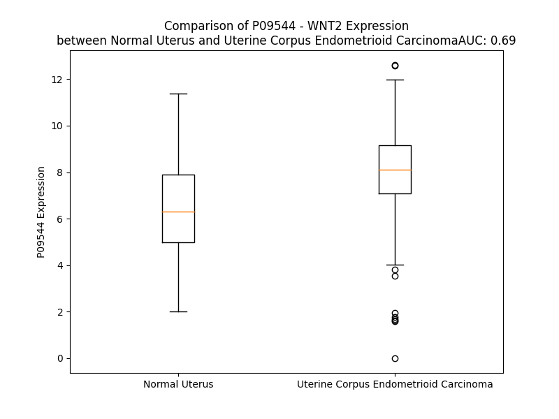

# Detailed Data for P09544

## Introduction to the Detailed Summary

### How to Interpret the Results

- **Summary & Metrics**: This section provides a quick reference to essential protein attributes, including expression changes, family classification, and biomarker applications. Regulation status (upregulated/downregulated) indicates the protein's behavior in a disease context. Some information comes from the original excel file with the proteins selected from literature, while others are derived from the analyses.
- **Expression Comparison**: A visual representation comparing protein expression between normal and disease states. It highlights significant changes in expression levels that might indicate diagnostic or therapeutic relevance. This is data coming from transcriptomics experiments and could not translate similarly to protein levels.
- **Isoform Alignment**: An interactive view of isoform alignments, revealing structural and functional differences between variants of the protein.
- **Interactors & Homologs**: Tables listing known interaction partners and homologous proteins, the more interactors and homologs, the more complex the protein is to design an antibody for.
- **Biological Assemblies**: Information about the structural arrangement of the protein in different assemblies, providing insights into its functional state but also the complexity of the protein to develop antibodies.
- **Combined Per-Residue Information**: A detailed table summarizing residue-level data. This includes predictions for epitope regions, aggregation tendencies, and modifications that might impact the protein's function. Each row corresponds to a residue in the protein, providing insights into specific sites that may be important for research or drug development.
## Summary & Metrics

- **UniProt Accession**: P09544
- **Gene Name**: WNT2 / IRP
- **Protein Name**: Protein Wnt-2
- **Swiss Prot**: WNT2_HUMAN
- **Family**: cytokine
- **Biomarker Application**:  
- **Number of Isoforms**: 0
- **Regulation**: 1
- **(transcriptomics) AUC**: 0.69
- **(transcriptomics) Fold Change**: 1.20
- **(transcriptomics) Regulation**: Upregulated
- **Discotope Epitope Count**: 79
- **Max n_uniprots (Homo)**: N/A
- **Max n_uniprots (Hetero)**: N/A

## Expression Comparison

## Interactors

| preferredName_A   | preferredName_B   |   score |
|:------------------|:------------------|--------:|
| WNT2              | LRP5              |   0.982 |
| WNT2              | LRP6              |   0.982 |
| WNT2              | FZD9              |   0.969 |
| WNT2              | PORCN             |   0.965 |
| WNT2              | WIF1              |   0.963 |
| WNT2              | FZD2              |   0.963 |
| WNT2              | FZD8              |   0.962 |
| WNT2              | FZD4              |   0.959 |
| WNT2              | FZD7              |   0.955 |
| WNT2              | FZD1              |   0.953 |
| WNT2              | NOTUM             |   0.93  |
| WNT2              | SFRP1             |   0.928 |
| WNT2              | GPC3              |   0.927 |
| WNT2              | FZD5              |   0.926 |
| WNT2              | FZD3              |   0.926 |
| WNT2              | FZD6              |   0.913 |
| WNT2              | CER1              |   0.911 |
| WNT2              | DKK1              |   0.909 |
| WNT2              | SFRP2             |   0.903 |
| WNT2              | FZD10             |   0.902 |

## Homologs

| uniprot_id   | gene_id   |
|:-------------|:----------|
| C9J3H3       | WNT10B    |
| O00755       | WNT7A     |
| Q93097       | WNT2B     |
| Q9UBV4       | WNT16     |
| O96014       | WNT11     |
| O14904       | WNT9A     |
| A0A9L9PXI5   | WNT3      |
| P41221       | WNT5A     |
| Q93098       | WNT8B     |
| Q9H1J7       | WNT5B     |
| Q9GZT5       | WNT10A    |
| D6RF47       | WNT8A     |
| P56705       | WNT4      |
| P04628       | WNT1      |
| P56704       | WNT3A     |
| E7EPC3       | WNT9B     |
| A8K0G1       | WNT7B     |
| Q9Y6F9       | WNT6      |

## Combined Per-Residue Information

|   res | aa   |   epitope_score | epitope   |   relative_surface_accessibility |   modeling_confidence |   Aggregation | modification   | glycosylation                   |
|------:|:-----|----------------:|:----------|---------------------------------:|----------------------:|--------------:|:---------------|:--------------------------------|
|     1 | M    |         0.15488 | False     |                          1.30178 |                 43.48 |         0     | N/A            | N/A                             |
|     2 | N    |         0.1846  | False     |                          1.03656 |                 39.22 |         0     | N/A            | N/A                             |
|     3 | A    |         0.15266 | False     |                          0.84924 |                 37.51 |         0     | N/A            | N/A                             |
|     4 | P    |         0.13852 | False     |                          0.98265 |                 49.25 |         0     | N/A            | N/A                             |
|     5 | L    |         0.12677 | False     |                          1.15916 |                 47.09 |         2.991 | N/A            | N/A                             |
|     6 | G    |         0.27658 | True      |                          0.9358  |                 43.38 |         3.43  | N/A            | N/A                             |
|     7 | G    |         0.21265 | True      |                          0.78867 |                 44.6  |         8.464 | N/A            | N/A                             |
|     8 | I    |         0.20169 | False     |                          0.88098 |                 53.2  |        10.138 | N/A            | N/A                             |
|     9 | W    |         0.25024 | True      |                          1.004   |                 49.69 |        10.213 | N/A            | N/A                             |
|    10 | L    |         0.16781 | False     |                          0.93591 |                 50.71 |        10.213 | N/A            | N/A                             |
|    11 | W    |         0.18304 | False     |                          0.78771 |                 50.08 |         9.622 | N/A            | N/A                             |
|    12 | L    |         0.15888 | False     |                          0.76653 |                 49.66 |         1.9   | N/A            | N/A                             |
|    13 | P    |         0.15887 | False     |                          0.65952 |                 47.52 |         1.623 | N/A            | N/A                             |
|    14 | L    |         0.15383 | False     |                          0.72678 |                 48.43 |        55.834 | N/A            | N/A                             |
|    15 | L    |         0.20765 | False     |                          0.74658 |                 48.11 |        64.436 | N/A            | N/A                             |
|    16 | L    |         0.19598 | False     |                          0.82484 |                 47.53 |        64.436 | N/A            | N/A                             |
|    17 | T    |         0.16784 | False     |                          0.68624 |                 48.28 |        64.436 | N/A            | N/A                             |
|    18 | W    |         0.26813 | True      |                          0.9793  |                 50.52 |        64.436 | N/A            | N/A                             |
|    19 | L    |         0.22732 | True      |                          0.86386 |                 46.47 |        55.813 | N/A            | N/A                             |
|    20 | T    |         0.14815 | False     |                          0.74097 |                 40.08 |         0.124 | N/A            | N/A                             |
|    21 | P    |         0.16999 | False     |                          0.81592 |                 45.1  |         0.054 | N/A            | N/A                             |
|    22 | E    |         0.15227 | False     |                          0.89235 |                 44.99 |         0     | N/A            | N/A                             |
|    23 | V    |         0.14431 | False     |                          0.6481  |                 47.72 |         0.319 | N/A            | N/A                             |
|    24 | N    |         0.18855 | False     |                          0.53178 |                 60.07 |         0.319 | N/A            | N/A                             |
|    25 | S    |         0.08331 | False     |                          0.03174 |                 57.43 |         0.319 | N/A            | N/A                             |
|    26 | S    |         0.12841 | False     |                          0.14767 |                 78.4  |         0.722 | N/A            | N/A                             |
|    27 | W    |         0.0512  | False     |                          0.06607 |                 85.05 |         0.722 | N/A            | N/A                             |
|    28 | W    |         0.03905 | False     |                          0.05638 |                 85.32 |         0.722 | N/A            | N/A                             |
|    29 | Y    |         0.08806 | False     |                          0.2355  |                 82.73 |         0.722 | N/A            | N/A                             |
|    30 | M    |         0.00702 | False     |                          0       |                 81.86 |         0.573 | N/A            | N/A                             |
|    31 | R    |         0.15986 | False     |                          0.33539 |                 74.79 |         0     | N/A            | N/A                             |
|    32 | A    |         0.13571 | False     |                          0.65452 |                 64.78 |         0     | N/A            | N/A                             |
|    33 | T    |         0.06824 | False     |                          0.24426 |                 64.7  |         0     | N/A            | N/A                             |
|    34 | G    |         0.14498 | False     |                          0.43741 |                 55.42 |         0     | N/A            | N/A                             |
|    35 | G    |         0.14033 | False     |                          0.96127 |                 51.55 |         0     | N/A            | N/A                             |
|    36 | S    |         0.10426 | False     |                          0.51337 |                 52.02 |         0     | N/A            | N/A                             |
|    37 | S    |         0.07998 | False     |                          0.82212 |                 54.74 |         0     | N/A            | N/A                             |
|    38 | R    |         0.10718 | False     |                          0.7658  |                 62.44 |         0     | N/A            | N/A                             |
|    39 | V    |         0.03782 | False     |                          0.14963 |                 65.3  |         0     | N/A            | N/A                             |
|    40 | M    |         0.129   | False     |                          0.59858 |                 75.96 |         0     | N/A            | N/A                             |
|    41 | C    |         0.0468  | False     |                          0.0538  |                 84.47 |         0     | N/A            | N/A                             |
|    42 | D    |         0.18131 | False     |                          0.48903 |                 84.16 |         0     | N/A            | N/A                             |
|    43 | N    |         0.12753 | False     |                          0.6242  |                 81.43 |         0     | N/A            | N/A                             |
|    44 | V    |         0.01867 | False     |                          0.00482 |                 82.67 |         0     | N/A            | N/A                             |
|    45 | P    |         0.14478 | False     |                          0.27635 |                 81.89 |         0     | N/A            | N/A                             |
|    46 | G    |         0.21415 | True      |                          0.37997 |                 82.42 |         0     | N/A            | N/A                             |
|    47 | L    |         0.06768 | False     |                          0.09715 |                 88.19 |         0     | N/A            | N/A                             |
|    48 | V    |         0.12214 | False     |                          0.32275 |                 91.05 |         0     | N/A            | N/A                             |
|    49 | S    |         0.15545 | False     |                          0.64575 |                 91.94 |         0     | N/A            | N/A                             |
|    50 | S    |         0.15306 | False     |                          0.37757 |                 92.4  |         0     | N/A            | N/A                             |
|    51 | Q    |         0.01808 | False     |                          0.00923 |                 93.72 |         0     | N/A            | N/A                             |
|    52 | R    |         0.2396  | True      |                          0.29757 |                 92.14 |         0     | N/A            | N/A                             |
|    53 | Q    |         0.21901 | True      |                          0.49088 |                 93.65 |         0     | N/A            | N/A                             |
|    54 | L    |         0.20797 | False     |                          0.20114 |                 93.29 |         0     | N/A            | N/A                             |
|    55 | C    |         0.00352 | False     |                          0       |                 92.2  |         0     | N/A            | N/A                             |
|    56 | H    |         0.23593 | True      |                          0.55603 |                 92.62 |         0     | N/A            | N/A                             |
|    57 | R    |         0.41576 | True      |                          0.68921 |                 93.63 |         0     | N/A            | N/A                             |
|    58 | H    |         0.11408 | False     |                          0.23459 |                 94.1  |         0     | N/A            | N/A                             |
|    59 | P    |         0.10152 | False     |                          0.57157 |                 91.29 |         0     | N/A            | N/A                             |
|    60 | D    |         0.04472 | False     |                          0.18278 |                 91.42 |         0     | N/A            | N/A                             |
|    61 | V    |         0.00299 | False     |                          0       |                 93.99 |         0     | N/A            | N/A                             |
|    62 | M    |         0.00551 | False     |                          0       |                 92.92 |         0     | N/A            | N/A                             |
|    63 | R    |         0.05755 | False     |                          0.43107 |                 90.49 |         0     | N/A            | N/A                             |
|    64 | A    |         0.02306 | False     |                          0.04568 |                 93.05 |         0     | N/A            | N/A                             |
|    65 | I    |         0.00432 | False     |                          0       |                 92.9  |         0     | N/A            | N/A                             |
|    66 | S    |         0.00574 | False     |                          0.02641 |                 88.79 |         0     | N/A            | N/A                             |
|    67 | Q    |         0.11062 | False     |                          0.45929 |                 86.67 |         0     | N/A            | N/A                             |
|    68 | G    |         0.0225  | False     |                          0.00873 |                 90.62 |         0     | N/A            | N/A                             |
|    69 | V    |         0.00524 | False     |                          0       |                 91.05 |         0     | N/A            | N/A                             |
|    70 | A    |         0.0786  | False     |                          0.41033 |                 88.74 |         0     | N/A            | N/A                             |
|    71 | E    |         0.11426 | False     |                          0.27724 |                 92.66 |         0     | N/A            | N/A                             |
|    72 | W    |         0.00676 | False     |                          0.00055 |                 95.34 |         0     | N/A            | N/A                             |
|    73 | T    |         0.00902 | False     |                          0       |                 93.08 |         0     | N/A            | N/A                             |
|    74 | A    |         0.10058 | False     |                          0.50401 |                 94.87 |         0     | N/A            | N/A                             |
|    75 | E    |         0.04902 | False     |                          0.04094 |                 98.19 |         0     | N/A            | N/A                             |
|    76 | C    |         0.0046  | False     |                          0       |                 97.4  |         0     | N/A            | N/A                             |
|    77 | Q    |         0.08848 | False     |                          0.29315 |                 95.92 |         0     | N/A            | N/A                             |
|    78 | H    |         0.18335 | False     |                          0.31144 |                 97.61 |         0     | N/A            | N/A                             |
|    79 | Q    |         0.11012 | False     |                          0.08398 |                 97.85 |         0     | N/A            | N/A                             |
|    80 | F    |         0.00669 | False     |                          0.0051  |                 96.63 |         0     | N/A            | N/A                             |
|    81 | R    |         0.30552 | True      |                          0.513   |                 94.4  |         0     | N/A            | N/A                             |
|    82 | Q    |         0.22575 | True      |                          0.40189 |                 93.42 |         0     | N/A            | N/A                             |
|    83 | H    |         0.11752 | False     |                          0.11962 |                 94.96 |         0     | N/A            | N/A                             |
|    84 | R    |         0.13336 | False     |                          0.33237 |                 94.99 |         0     | N/A            | N/A                             |
|    85 | W    |         0.03668 | False     |                          0.03724 |                 93.67 |         0     | N/A            | N/A                             |
|    86 | N    |         0.07765 | False     |                          0.31114 |                 92.57 |         0     | N/A            | N/A                             |
|    87 | C    |         0.00219 | False     |                          0       |                 92.84 |         0     | N/A            | N/A                             |
|    88 | N    |         0.16917 | False     |                          0.19431 |                 87.58 |         0     | N/A            | N/A                             |
|    89 | T    |         0.23832 | True      |                          0.20689 |                 83.38 |         0     | N/A            | N/A                             |
|    90 | L    |         0.22194 | True      |                          0.3392  |                 75.67 |         0     | N/A            | N/A                             |
|    91 | D    |         0.21019 | False     |                          0.83478 |                 62.85 |         0     | N/A            | N/A                             |
|    92 | R    |         0.36163 | True      |                          0.94102 |                 55.55 |         0     | N/A            | N/A                             |
|    93 | D    |         0.29944 | True      |                          0.37451 |                 56.65 |         0     | N/A            | N/A                             |
|    94 | H    |         0.21634 | True      |                          0.45609 |                 60.2  |         0     | N/A            | N/A                             |
|    95 | S    |         0.13062 | False     |                          0.17994 |                 64.53 |         0     | N/A            | N/A                             |
|    96 | L    |         0.05671 | False     |                          0.05853 |                 72.81 |         0     | N/A            | N/A                             |
|    97 | F    |         0.03192 | False     |                          0.02435 |                 75.42 |         0     | N/A            | N/A                             |
|    98 | G    |         0.09897 | False     |                          0.09265 |                 78.64 |         0     | N/A            | N/A                             |
|    99 | R    |         0.16072 | False     |                          0.53497 |                 80.27 |         0     | N/A            | N/A                             |
|   100 | V    |         0.02381 | False     |                          0.01238 |                 82.32 |         0     | N/A            | N/A                             |
|   101 | L    |         0.14874 | False     |                          0.09018 |                 85.53 |         0     | N/A            | N/A                             |
|   102 | L    |         0.26547 | True      |                          0.60399 |                 85.61 |         0     | N/A            | N/A                             |
|   103 | R    |         0.17478 | False     |                          0.35659 |                 90.57 |         0     | N/A            | N/A                             |
|   104 | S    |         0.09178 | False     |                          0.06479 |                 93.85 |         0     | N/A            | N/A                             |
|   105 | S    |         0.00576 | False     |                          0.00079 |                 95.89 |         0     | N/A            | N/A                             |
|   106 | R    |         0.08273 | False     |                          0.34066 |                 96.44 |         0.001 | N/A            | N/A                             |
|   107 | E    |         0.01654 | False     |                          0.02991 |                 95.59 |         0.001 | N/A            | N/A                             |
|   108 | S    |         0.00187 | False     |                          0       |                 95.47 |         4.871 | N/A            | N/A                             |
|   109 | A    |         0.00085 | False     |                          0       |                 97.77 |        78.706 | N/A            | N/A                             |
|   110 | F    |         0.00326 | False     |                          0       |                 98.06 |        95.533 | N/A            | N/A                             |
|   111 | V    |         0.00194 | False     |                          0       |                 96.56 |        96.816 | N/A            | N/A                             |
|   112 | Y    |         0.03998 | False     |                          0.13907 |                 97.15 |        96.924 | N/A            | N/A                             |
|   113 | A    |         0.00067 | False     |                          0       |                 98.62 |        96.921 | N/A            | N/A                             |
|   114 | I    |         0.00311 | False     |                          0       |                 98.18 |        96.899 | N/A            | N/A                             |
|   115 | S    |         0.00388 | False     |                          0.00237 |                 96.72 |        95.153 | N/A            | N/A                             |
|   116 | S    |         0.00358 | False     |                          0       |                 98.09 |        94.952 | N/A            | N/A                             |
|   117 | A    |         0.00099 | False     |                          0       |                 98.56 |        95.148 | N/A            | N/A                             |
|   118 | G    |         0.02084 | False     |                          0.03646 |                 98.08 |        95.352 | N/A            | N/A                             |
|   119 | V    |         0.00442 | False     |                          0.00286 |                 97.43 |        97.542 | N/A            | N/A                             |
|   120 | V    |         0.00133 | False     |                          0       |                 98.57 |        97.587 | N/A            | N/A                             |
|   121 | F    |         0.0476  | False     |                          0.0879  |                 98.51 |        97.295 | N/A            | N/A                             |
|   122 | A    |         0.00849 | False     |                          0.02085 |                 97.72 |        93.675 | N/A            | N/A                             |
|   123 | I    |         0.00393 | False     |                          0       |                 97.72 |        90.583 | N/A            | N/A                             |
|   124 | T    |         0.00337 | False     |                          0       |                 98.34 |        33.835 | N/A            | N/A                             |
|   125 | R    |         0.15738 | False     |                          0.29745 |                 97.93 |         0     | N/A            | N/A                             |
|   126 | A    |         0.01049 | False     |                          0.02788 |                 97.42 |         0     | N/A            | N/A                             |
|   127 | C    |         0.01437 | False     |                          0.01777 |                 98.08 |         0     | N/A            | N/A                             |
|   128 | S    |         0.06963 | False     |                          0.24476 |                 97.26 |         0     | N/A            | N/A                             |
|   129 | Q    |         0.12089 | False     |                          0.56157 |                 96.46 |         0     | N/A            | N/A                             |
|   130 | G    |         0.15423 | False     |                          0.7595  |                 96    |         0     | N/A            | N/A                             |
|   131 | E    |         0.15542 | False     |                          0.41109 |                 94.52 |         0     | N/A            | N/A                             |
|   132 | V    |         0.05251 | False     |                          0.02171 |                 94.64 |         0     | N/A            | N/A                             |
|   133 | K    |         0.19408 | False     |                          0.98541 |                 93.19 |         0     | N/A            | N/A                             |
|   134 | S    |         0.15686 | False     |                          0.37657 |                 93.77 |         0     | N/A            | N/A                             |
|   135 | C    |         0.03475 | False     |                          0.12958 |                 96.55 |         0     | N/A            | N/A                             |
|   136 | S    |         0.12236 | False     |                          0.51474 |                 96.57 |         0     | N/A            | N/A                             |
|   137 | C    |         0.06968 | False     |                          0.35219 |                 97.47 |         0     | N/A            | N/A                             |
|   138 | D    |         0.06426 | False     |                          0.13462 |                 97.92 |         0     | N/A            | N/A                             |
|   139 | P    |         0.22074 | True      |                          0.57396 |                 96.11 |         0     | N/A            | N/A                             |
|   140 | K    |         0.21291 | True      |                          0.75455 |                 96.21 |         0     | N/A            | N/A                             |
|   141 | K    |         0.25277 | True      |                          0.31684 |                 96.85 |         0     | N/A            | N/A                             |
|   142 | M    |         0.21858 | True      |                          0.74239 |                 95.51 |         0     | N/A            | N/A                             |
|   143 | G    |         0.16679 | False     |                          0.56536 |                 96.25 |         0     | N/A            | N/A                             |
|   144 | S    |         0.2001  | False     |                          0.63908 |                 97.04 |         0     | N/A            | N/A                             |
|   145 | A    |         0.15879 | False     |                          0.29281 |                 96.99 |         0     | N/A            | N/A                             |
|   146 | K    |         0.17608 | False     |                          0.79425 |                 95.79 |         0     | N/A            | N/A                             |
|   147 | D    |         0.18279 | False     |                          0.26757 |                 94.93 |         0     | N/A            | N/A                             |
|   148 | S    |         0.37068 | True      |                          0.94718 |                 95.04 |         0     | N/A            | N/A                             |
|   149 | K    |         0.41847 | True      |                          0.86676 |                 92.29 |         0     | N/A            | N/A                             |
|   150 | G    |         0.16    | False     |                          0.29641 |                 93.61 |         0     | N/A            | N/A                             |
|   151 | I    |         0.24514 | True      |                          0.72056 |                 95.5  |         0     | N/A            | N/A                             |
|   152 | F    |         0.07792 | False     |                          0.02342 |                 96.47 |         0     | N/A            | N/A                             |
|   153 | D    |         0.25837 | True      |                          0.31508 |                 97.66 |         0     | N/A            | N/A                             |
|   154 | W    |         0.09399 | False     |                          0.18033 |                 97.79 |         0     | N/A            | N/A                             |
|   155 | G    |         0.17378 | False     |                          0.24574 |                 95.12 |         0     | N/A            | N/A                             |
|   156 | G    |         0.17449 | False     |                          0.89885 |                 93.82 |         0     | N/A            | N/A                             |
|   157 | C    |         0.08468 | False     |                          0.28097 |                 97.02 |         0     | N/A            | N/A                             |
|   158 | S    |         0.05607 | False     |                          0.03223 |                 98.31 |         0     | N/A            | N/A                             |
|   159 | D    |         0.02649 | False     |                          0.08202 |                 98.39 |         0     | N/A            | N/A                             |
|   160 | N    |         0.04263 | False     |                          0.11961 |                 98.07 |         0     | N/A            | N/A                             |
|   161 | I    |         0.01838 | False     |                          0.04252 |                 98.12 |         0     | N/A            | N/A                             |
|   162 | D    |         0.12161 | False     |                          0.40508 |                 98.13 |         0     | N/A            | N/A                             |
|   163 | Y    |         0.16369 | False     |                          0.22826 |                 98.05 |         0     | N/A            | N/A                             |
|   164 | G    |         0.00214 | False     |                          0       |                 97.96 |         0     | N/A            | N/A                             |
|   165 | I    |         0.07282 | False     |                          0.21599 |                 98.54 |         0     | N/A            | N/A                             |
|   166 | K    |         0.18675 | False     |                          0.76818 |                 98.24 |         0     | N/A            | N/A                             |
|   167 | F    |         0.04699 | False     |                          0.07209 |                 97.91 |         0     | N/A            | N/A                             |
|   168 | A    |         0.00243 | False     |                          0       |                 97.88 |         0     | N/A            | N/A                             |
|   169 | R    |         0.20795 | False     |                          0.56315 |                 97.94 |         0     | N/A            | N/A                             |
|   170 | A    |         0.15392 | False     |                          0.48719 |                 97    |         0     | N/A            | N/A                             |
|   171 | F    |         0.00465 | False     |                          0       |                 95.93 |         0     | N/A            | N/A                             |
|   172 | V    |         0.03118 | False     |                          0.05121 |                 95.8  |         0     | N/A            | N/A                             |
|   173 | D    |         0.1298  | False     |                          0.10805 |                 95.68 |         0     | N/A            | N/A                             |
|   174 | A    |         0.08751 | False     |                          0.31049 |                 94.36 |         0     | N/A            | N/A                             |
|   175 | K    |         0.26844 | True      |                          0.42638 |                 90.62 |         0     | N/A            | N/A                             |
|   176 | E    |         0.26683 | True      |                          0.14476 |                 91.42 |         0     | N/A            | N/A                             |
|   177 | R    |         0.26082 | True      |                          0.81511 |                 78.25 |         0     | N/A            | N/A                             |
|   178 | K    |         0.26611 | True      |                          0.79437 |                 70.42 |         0     | N/A            | N/A                             |
|   179 | G    |         0.30429 | True      |                          0.56638 |                 75.31 |         0     | N/A            | N/A                             |
|   180 | K    |         0.13327 | False     |                          0.82752 |                 78.23 |         0     | N/A            | N/A                             |
|   181 | D    |         0.34541 | True      |                          0.41062 |                 89.58 |         0     | N/A            | N/A                             |
|   182 | A    |         0.12517 | False     |                          0.2925  |                 91.45 |         0     | N/A            | N/A                             |
|   183 | R    |         0.2061  | False     |                          0.20642 |                 92.12 |         0     | N/A            | N/A                             |
|   184 | A    |         0.03643 | False     |                          0.03171 |                 93.03 |         0     | N/A            | N/A                             |
|   185 | L    |         0.15899 | False     |                          0.21391 |                 94.28 |         0     | N/A            | N/A                             |
|   186 | M    |         0.01227 | False     |                          0.00216 |                 95.33 |         0     | N/A            | N/A                             |
|   187 | N    |         0.0406  | False     |                          0.03255 |                 95.83 |         0     | N/A            | N/A                             |
|   188 | L    |         0.07404 | False     |                          0.15165 |                 96.2  |         0     | N/A            | N/A                             |
|   189 | H    |         0.08103 | False     |                          0.16589 |                 97.01 |         0     | N/A            | N/A                             |
|   190 | N    |         0.00642 | False     |                          0.00148 |                 98.31 |         0     | N/A            | N/A                             |
|   191 | N    |         0.00553 | False     |                          0.00349 |                 98.28 |         0     | N/A            | N/A                             |
|   192 | R    |         0.13017 | False     |                          0.47306 |                 98.36 |         0     | N/A            | N/A                             |
|   193 | A    |         0.00941 | False     |                          0.01542 |                 98.71 |         0     | N/A            | N/A                             |
|   194 | G    |         0.00447 | False     |                          0       |                 98.7  |         0     | N/A            | N/A                             |
|   195 | R    |         0.0422  | False     |                          0.03284 |                 98.6  |         0     | N/A            | N/A                             |
|   196 | K    |         0.06485 | False     |                          0.31583 |                 98.51 |         0     | N/A            | N/A                             |
|   197 | A    |         0.01261 | False     |                          0.01367 |                 98.58 |         0     | N/A            | N/A                             |
|   198 | V    |         0.01626 | False     |                          0.02037 |                 98.41 |         0     | N/A            | N/A                             |
|   199 | K    |         0.13349 | False     |                          0.45745 |                 98.01 |         0     | N/A            | N/A                             |
|   200 | R    |         0.22752 | True      |                          0.59927 |                 98.03 |         0     | N/A            | N/A                             |
|   201 | F    |         0.14993 | False     |                          0.24031 |                 98.02 |         0     | N/A            | N/A                             |
|   202 | L    |         0.10953 | False     |                          0.23986 |                 97.01 |         0     | N/A            | N/A                             |
|   203 | K    |         0.22784 | True      |                          0.44728 |                 96.24 |         0     | N/A            | N/A                             |
|   204 | Q    |         0.22914 | True      |                          0.34949 |                 96.91 |         0     | N/A            | N/A                             |
|   205 | E    |         0.24492 | True      |                          0.28497 |                 96.51 |         0     | N/A            | N/A                             |
|   206 | C    |         0.08361 | False     |                          0.36803 |                 95.87 |         0     | N/A            | N/A                             |
|   207 | K    |         0.33678 | True      |                          0.64009 |                 94.18 |         0     | N/A            | N/A                             |
|   208 | C    |         0.18512 | False     |                          0.52006 |                 94.56 |         0     | N/A            | N/A                             |
|   209 | H    |         0.43001 | True      |                          0.43044 |                 90.63 |         0     | N/A            | N/A                             |
|   210 | G    |         0.2854  | True      |                          0.70501 |                 86.55 |         0     | N/A            | N/A                             |
|   211 | V    |         0.328   | True      |                          0.96112 |                 88.94 |         0     | N/A            | N/A                             |
|   212 | S    |         0.28017 | True      |                          0.9017  |                 79.77 |         0     | N/A            | N/A                             |
|   213 | G    |         0.34767 | True      |                          0.93496 |                 80.14 |         0     | N/A            | N/A                             |
|   214 | S    |         0.16177 | False     |                          0.34454 |                 87.03 |         0     | N/A            | N/A                             |
|   215 | C    |         0.25048 | True      |                          0.43139 |                 90.22 |         0     | N/A            | N/A                             |
|   216 | T    |         0.39712 | True      |                          0.89876 |                 88.33 |         0     | N/A            | N/A                             |
|   217 | L    |         0.25655 | True      |                          0.59189 |                 91.95 |         0     | N/A            | N/A                             |
|   218 | R    |         0.1715  | False     |                          0.03892 |                 95.47 |         0     | N/A            | N/A                             |
|   219 | T    |         0.26989 | True      |                          0.22694 |                 96.67 |         3.48  | N/A            | N/A                             |
|   220 | C    |         0.01262 | False     |                          0       |                 98.09 |         8.978 | N/A            | N/A                             |
|   221 | W    |         0.2053  | False     |                          0.19941 |                 98.13 |         9.332 | N/A            | N/A                             |
|   222 | L    |         0.1095  | False     |                          0.16053 |                 98.01 |         9.332 | N/A            | N/A                             |
|   223 | A    |         0.09561 | False     |                          0.1556  |                 98    |         9.332 | N/A            | N/A                             |
|   224 | M    |         0.0819  | False     |                          0.1274  |                 97.91 |         9.124 | N/A            | N/A                             |
|   225 | A    |         0.07713 | False     |                          0.08253 |                 97.53 |         4.371 | N/A            | N/A                             |
|   226 | D    |         0.28422 | True      |                          0.60323 |                 97.44 |         0     | N/A            | N/A                             |
|   227 | F    |         0.05146 | False     |                          0.05276 |                 98.02 |         0     | N/A            | N/A                             |
|   228 | R    |         0.27468 | True      |                          0.36489 |                 98.22 |         0     | N/A            | N/A                             |
|   229 | K    |         0.18764 | False     |                          0.55454 |                 98.34 |         0     | N/A            | N/A                             |
|   230 | T    |         0.01457 | False     |                          0.01954 |                 98.55 |         0     | N/A            | N/A                             |
|   231 | G    |         0.00593 | False     |                          0       |                 98.55 |         0     | N/A            | N/A                             |
|   232 | D    |         0.13549 | False     |                          0.3712  |                 98.67 |         0     | N/A            | N/A                             |
|   233 | Y    |         0.08424 | False     |                          0.08517 |                 98.76 |         0     | N/A            | N/A                             |
|   234 | L    |         0.00386 | False     |                          0.00247 |                 98.71 |         0     | N/A            | N/A                             |
|   235 | W    |         0.1119  | False     |                          0.18082 |                 98.08 |         0     | N/A            | N/A                             |
|   236 | R    |         0.25636 | True      |                          0.63844 |                 98.2  |         0     | N/A            | N/A                             |
|   237 | K    |         0.11265 | False     |                          0.23905 |                 98.38 |         0     | N/A            | N/A                             |
|   238 | Y    |         0.05247 | False     |                          0.07919 |                 98.1  |         0     | N/A            | N/A                             |
|   239 | N    |         0.11923 | False     |                          0.51168 |                 96.19 |         0     | N/A            | N/A                             |
|   240 | G    |         0.13556 | False     |                          0.58486 |                 95.49 |         0.491 | N/A            | N/A                             |
|   241 | A    |         0.08763 | False     |                          0.15227 |                 97.1  |         6.007 | N/A            | N/A                             |
|   242 | I    |         0.07981 | False     |                          0.15519 |                 96.33 |         9.518 | N/A            | N/A                             |
|   243 | Q    |         0.09246 | False     |                          0.31025 |                 96.76 |         9.518 | N/A            | N/A                             |
|   244 | V    |         0.02459 | False     |                          0.01408 |                 96.1  |         9.518 | N/A            | N/A                             |
|   245 | V    |         0.22184 | True      |                          0.56077 |                 93.64 |         9.518 | N/A            | N/A                             |
|   246 | M    |         0.26451 | True      |                          0.27308 |                 90.73 |         6.711 | N/A            | N/A                             |
|   247 | N    |         0.20938 | False     |                          0.26684 |                 88.82 |         0     | N/A            | N/A                             |
|   248 | Q    |         0.34226 | True      |                          0.96355 |                 85.44 |         0     | N/A            | N/A                             |
|   249 | D    |         0.28588 | True      |                          0.5461  |                 85.19 |         0     | N/A            | N/A                             |
|   250 | G    |         0.19595 | False     |                          0.12788 |                 83.81 |         0     | N/A            | N/A                             |
|   251 | T    |         0.28316 | True      |                          0.73305 |                 85.2  |         0     | N/A            | N/A                             |
|   252 | G    |         0.15481 | False     |                          0.19313 |                 89.87 |         0.139 | N/A            | N/A                             |
|   253 | F    |         0.13841 | False     |                          0.16264 |                 92.33 |         0.614 | N/A            | N/A                             |
|   254 | T    |         0.22728 | True      |                          0.43215 |                 90.58 |         0.614 | N/A            | N/A                             |
|   255 | V    |         0.21284 | True      |                          0.14917 |                 91.27 |         0.614 | N/A            | N/A                             |
|   256 | A    |         0.22448 | True      |                          0.45728 |                 89.22 |         0.614 | N/A            | N/A                             |
|   257 | N    |         0.24221 | True      |                          0.44149 |                 89.41 |         0.476 | N/A            | N/A                             |
|   258 | E    |         0.32539 | True      |                          0.84984 |                 84.26 |         0     | N/A            | N/A                             |
|   259 | R    |         0.43257 | True      |                          0.9141  |                 86.2  |         0     | N/A            | N/A                             |
|   260 | F    |         0.27887 | True      |                          0.6385  |                 85.75 |         0     | N/A            | N/A                             |
|   261 | K    |         0.15471 | False     |                          0.81044 |                 88.63 |         0     | N/A            | N/A                             |
|   262 | K    |         0.30831 | True      |                          0.72575 |                 90.97 |         0     | N/A            | N/A                             |
|   263 | P    |         0.16626 | False     |                          0.2089  |                 93.93 |         0     | N/A            | N/A                             |
|   264 | T    |         0.16562 | False     |                          0.45176 |                 95.11 |         0     | N/A            | N/A                             |
|   265 | K    |         0.19227 | False     |                          0.6591  |                 95.88 |         0     | N/A            | N/A                             |
|   266 | N    |         0.20632 | False     |                          0.31654 |                 97.38 |         0     | N/A            | N/A                             |
|   267 | D    |         0.07523 | False     |                          0.11223 |                 97.74 |         0     | N/A            | N/A                             |
|   268 | L    |         0.00272 | False     |                          0       |                 98.37 |         0     | N/A            | N/A                             |
|   269 | V    |         0.00383 | False     |                          0       |                 97.84 |         0     | N/A            | N/A                             |
|   270 | Y    |         0.09813 | False     |                          0.1034  |                 97.51 |         0     | N/A            | N/A                             |
|   271 | F    |         0.19771 | False     |                          0.19468 |                 95.91 |         0     | N/A            | N/A                             |
|   272 | E    |         0.13079 | False     |                          0.3165  |                 95.05 |         0     | N/A            | N/A                             |
|   273 | N    |         0.18437 | False     |                          0.61278 |                 94.81 |         0     | N/A            | N/A                             |
|   274 | S    |         0.0968  | False     |                          0.24765 |                 94.15 |         0     | N/A            | N/A                             |
|   275 | P    |         0.17274 | False     |                          0.16406 |                 92.32 |         0     | N/A            | N/A                             |
|   276 | D    |         0.16015 | False     |                          0.53975 |                 92.45 |         0     | N/A            | N/A                             |
|   277 | Y    |         0.06161 | False     |                          0.07007 |                 94.86 |         0     | N/A            | N/A                             |
|   278 | C    |         0.04739 | False     |                          0.07044 |                 94.81 |         0     | N/A            | N/A                             |
|   279 | I    |         0.13013 | False     |                          0.56175 |                 93.37 |         0     | N/A            | N/A                             |
|   280 | R    |         0.14483 | False     |                          0.6299  |                 91.18 |         0     | N/A            | N/A                             |
|   281 | D    |         0.11386 | False     |                          0.35735 |                 90.63 |         0     | N/A            | N/A                             |
|   282 | R    |         0.295   | True      |                          0.76174 |                 86.42 |         0     | N/A            | N/A                             |
|   283 | E    |         0.25351 | True      |                          0.72984 |                 86.22 |         0     | N/A            | N/A                             |
|   284 | A    |         0.0711  | False     |                          0.20803 |                 86.34 |         0     | N/A            | N/A                             |
|   285 | G    |         0.07225 | False     |                          0.18544 |                 84.75 |         0     | N/A            | N/A                             |
|   286 | S    |         0.02025 | False     |                          0.00977 |                 90.03 |         0     | N/A            | N/A                             |
|   287 | L    |         0.21105 | False     |                          0.52857 |                 90.04 |         0     | N/A            | N/A                             |
|   288 | G    |         0.07794 | False     |                          0.15164 |                 93.66 |         0     | N/A            | N/A                             |
|   289 | T    |         0.00701 | False     |                          0       |                 95.78 |         0     | N/A            | N/A                             |
|   290 | A    |         0.06045 | False     |                          0.48862 |                 95.91 |         0     | N/A            | N/A                             |
|   291 | G    |         0.1482  | False     |                          0.65931 |                 95.28 |         0     | N/A            | N/A                             |
|   292 | R    |         0.12083 | False     |                          0.16716 |                 95.6  |         0     | N/A            | N/A                             |
|   293 | V    |         0.10678 | False     |                          0.68374 |                 95.77 |         0     | N/A            | N/A                             |
|   294 | C    |         0.02534 | False     |                          0.05593 |                 96.67 |         0     | N/A            | N/A                             |
|   295 | N    |         0.12596 | False     |                          0.40314 |                 96.01 |         0     | N/A            | N-linked (GlcNAc...) asparagine |
|   296 | L    |         0.23823 | True      |                          0.55863 |                 94.78 |         0     | N/A            | N/A                             |
|   297 | T    |         0.27373 | True      |                          0.87731 |                 93.1  |         0     | N/A            | N/A                             |
|   298 | S    |         0.1787  | False     |                          0.21217 |                 95.26 |         0     | N/A            | N/A                             |
|   299 | R    |         0.46649 | True      |                          0.98547 |                 93.37 |         0     | N/A            | N/A                             |
|   300 | G    |         0.28346 | True      |                          0.42999 |                 93.38 |         0     | N/A            | N/A                             |
|   301 | M    |         0.1884  | False     |                          0.49134 |                 94.27 |         0     | N/A            | N/A                             |
|   302 | D    |         0.08714 | False     |                          0.11189 |                 95.68 |         0     | N/A            | N/A                             |
|   303 | S    |         0.0806  | False     |                          0.08108 |                 97.58 |         0     | N/A            | N/A                             |
|   304 | C    |         0.04548 | False     |                          0.02965 |                 97.26 |         0     | N/A            | N/A                             |
|   305 | E    |         0.22888 | True      |                          0.72598 |                 96.02 |         0     | N/A            | N/A                             |
|   306 | V    |         0.17293 | False     |                          0.39701 |                 96.27 |         0     | N/A            | N/A                             |
|   307 | M    |         0.01259 | False     |                          0.01079 |                 96.83 |         0     | N/A            | N/A                             |
|   308 | C    |         0.00419 | False     |                          0       |                 97.1  |         0     | N/A            | N/A                             |
|   309 | C    |         0.06301 | False     |                          0.2373  |                 96.15 |         0     | N/A            | N/A                             |
|   310 | G    |         0.29028 | True      |                          0.77507 |                 94.72 |         0     | N/A            | N/A                             |
|   311 | R    |         0.23967 | True      |                          0.20615 |                 95.09 |         0     | N/A            | N/A                             |
|   312 | G    |         0.1522  | False     |                          0.34354 |                 95.59 |         0     | N/A            | N/A                             |
|   313 | Y    |         0.19872 | False     |                          0.32006 |                 97.15 |         0     | N/A            | N/A                             |
|   314 | D    |         0.09289 | False     |                          0.46446 |                 96.7  |         0     | N/A            | N/A                             |
|   315 | T    |         0.10576 | False     |                          0.43787 |                 96.97 |         0     | N/A            | N/A                             |
|   316 | S    |         0.17988 | False     |                          0.40351 |                 94.91 |         0     | N/A            | N/A                             |
|   317 | H    |         0.12423 | False     |                          0.83324 |                 94.64 |         0     | N/A            | N/A                             |
|   318 | V    |         0.17403 | False     |                          0.47752 |                 93.23 |         0     | N/A            | N/A                             |
|   319 | T    |         0.15221 | False     |                          0.63478 |                 93.44 |         0     | N/A            | N/A                             |
|   320 | R    |         0.16957 | False     |                          0.64853 |                 91.42 |         0     | N/A            | N/A                             |
|   321 | M    |         0.18002 | False     |                          0.60597 |                 93.59 |         0     | N/A            | N/A                             |
|   322 | T    |         0.09794 | False     |                          0.34355 |                 94.4  |         0     | N/A            | N/A                             |
|   323 | K    |         0.21043 | False     |                          0.64182 |                 95.17 |         0     | N/A            | N/A                             |
|   324 | C    |         0.14063 | False     |                          0.20677 |                 94.95 |         0     | N/A            | N/A                             |
|   325 | G    |         0.11207 | False     |                          0.61476 |                 95.26 |         0     | N/A            | N/A                             |
|   326 | C    |         0.09088 | False     |                          0.49405 |                 96.12 |         0     | N/A            | N/A                             |
|   327 | K    |         0.16071 | False     |                          0.71559 |                 95.4  |         0     | N/A            | N/A                             |
|   328 | F    |         0.41396 | True      |                          0.67452 |                 95.09 |         0.537 | N/A            | N/A                             |
|   329 | H    |         0.15161 | False     |                          0.38831 |                 92.81 |         0.537 | N/A            | N/A                             |
|   330 | W    |         0.27405 | True      |                          1.02763 |                 87.02 |         0.705 | N/A            | N/A                             |
|   331 | C    |         0.19244 | False     |                          0.79107 |                 82.86 |         0.705 | N/A            | N/A                             |
|   332 | C    |         0.20772 | False     |                          0.82701 |                 86.67 |         0.705 | N/A            | N/A                             |
|   333 | A    |         0.14877 | False     |                          0.35329 |                 92.79 |         0.705 | N/A            | N/A                             |
|   334 | V    |         0.25572 | True      |                          0.65482 |                 94.81 |         0.705 | N/A            | N/A                             |
|   335 | R    |         0.25556 | True      |                          0.67447 |                 95.52 |         0     | N/A            | N/A                             |
|   336 | C    |         0.09116 | False     |                          0.32374 |                 97.15 |         0     | N/A            | N/A                             |
|   337 | Q    |         0.11951 | False     |                          0.61708 |                 96.9  |         0     | N/A            | N/A                             |
|   338 | D    |         0.21075 | False     |                          0.54814 |                 96.51 |         0     | N/A            | N/A                             |
|   339 | C    |         0.18378 | False     |                          0.35871 |                 95.93 |         0     | N/A            | N/A                             |
|   340 | L    |         0.15122 | False     |                          0.73376 |                 95.11 |         0     | N/A            | N/A                             |
|   341 | E    |         0.13778 | False     |                          0.38286 |                 93.38 |         0     | N/A            | N/A                             |
|   342 | A    |         0.12292 | False     |                          0.79279 |                 91.67 |         0     | N/A            | N/A                             |
|   343 | L    |         0.1559  | False     |                          0.4323  |                 91.59 |         0     | N/A            | N/A                             |
|   344 | D    |         0.10981 | False     |                          0.48755 |                 93.73 |         0     | N/A            | N/A                             |
|   345 | V    |         0.12376 | False     |                          0.3237  |                 95.56 |         0     | N/A            | N/A                             |
|   346 | H    |         0.13739 | False     |                          0.13399 |                 97.59 |         0     | N/A            | N/A                             |
|   347 | T    |         0.16423 | False     |                          0.265   |                 97.35 |         0     | N/A            | N/A                             |
|   348 | C    |         0.0369  | False     |                          0.02887 |                 97.62 |         0     | N/A            | N/A                             |
|   349 | K    |         0.08452 | False     |                          0.41564 |                 97.56 |         0     | N/A            | N/A                             |
|   350 | A    |         0.13268 | False     |                          0.64492 |                 94.49 |         0     | N/A            | N/A                             |
|   351 | P    |         0.10501 | False     |                          0.29092 |                 90.32 |         0     | N/A            | N/A                             |
|   352 | K    |         0.21404 | True      |                          1.0071  |                 83.84 |         0     | N/A            | N/A                             |
|   353 | N    |         0.25061 | True      |                          0.82587 |                 71.46 |         0     | N/A            | N/A                             |
|   354 | A    |         0.19139 | False     |                          0.82836 |                 57.1  |         0     | N/A            | N/A                             |
|   355 | D    |         0.2366  | True      |                          0.76799 |                 46.38 |         0     | N/A            | N/A                             |
|   356 | W    |         0.26661 | True      |                          1.03575 |                 41.58 |         0     | N/A            | N/A                             |
|   357 | T    |         0.10315 | False     |                          0.93296 |                 44.13 |         0     | N/A            | N/A                             |
|   358 | T    |         0.17016 | False     |                          0.99086 |                 40.99 |         0     | N/A            | N/A                             |
|   359 | A    |         0.08613 | False     |                          0.9369  |                 41.14 |         0     | N/A            | N/A                             |
|   360 | T    |         0.16695 | False     |                          1.38569 |                 37    |         0     | N/A            | N/A                             |

