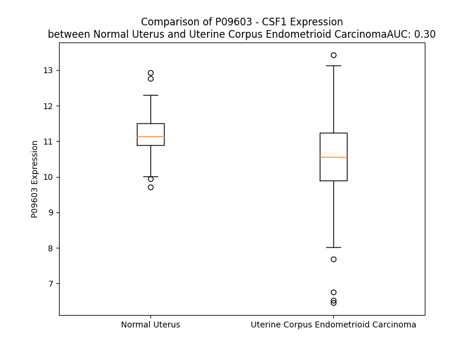

# Detailed Data for P09603

## Introduction to the Detailed Summary

### How to Interpret the Results

- **Summary & Metrics**: This section provides a quick reference to essential protein attributes, including expression changes, family classification, and biomarker applications. Regulation status (upregulated/downregulated) indicates the protein's behavior in a disease context. Some information comes from the original excel file with the proteins selected from literature, while others are derived from the analyses.
- **Expression Comparison**: A visual representation comparing protein expression between normal and disease states. It highlights significant changes in expression levels that might indicate diagnostic or therapeutic relevance. This is data coming from transcriptomics experiments and could not translate similarly to protein levels.
- **Isoform Alignment**: An interactive view of isoform alignments, revealing structural and functional differences between variants of the protein.
- **Interactors & Homologs**: Tables listing known interaction partners and homologous proteins, the more interactors and homologs, the more complex the protein is to design an antibody for.
- **Biological Assemblies**: Information about the structural arrangement of the protein in different assemblies, providing insights into its functional state but also the complexity of the protein to develop antibodies.
- **Combined Per-Residue Information**: A detailed table summarizing residue-level data. This includes predictions for epitope regions, aggregation tendencies, and modifications that might impact the protein's function. Each row corresponds to a residue in the protein, providing insights into specific sites that may be important for research or drug development.
## Summary & Metrics

- **UniProt Accession**: P09603
- **Gene Name**: M-CSF
- **Protein Name**: Macrophage colony-stimulating factor 1
- **Swiss Prot**: CSF1_HUMAN
- **Family**: cytokine
- **Biomarker Application**: diagnosis,disease progression,efficacy,prognosis,unspecified application
- **Number of Isoforms**: 3
- **Regulation**: 1
- **(transcriptomics) AUC**: 0.28
- **(transcriptomics) Fold Change**: 1.08
- **(transcriptomics) Regulation**: Downregulated
- **Discotope Epitope Count**: 95
- **Max n_uniprots (Homo)**: 3
- **Max n_uniprots (Hetero)**: 10

## Expression Comparison

## Isoform Alignment

<pre style='font-size:14px; font-family:monospace;'>P09603-1 MTAPGAAGRCPPTTWLGSLLLLVCLLASRSITEEVSEYCSHMIGSGHLQSLQRLIDSQMETSCQITFEFVDQEQLKDPVCYLKKAFLLVQDIMEDTMRFRDNTPNAIAIVQLQELSLRLKSCFTKDYEEHDKACVRTFYETPLQLLEKVKNVFNETKNLLDKDWNIFSKNCNNSFAECSSQDVVTKPDCNCLYPKAIPSSDPASVSPHQPLAPSMAPVAGLTWEDSEGTEGSSLLPGEQPLHTVDPGSAKQRPPRSTCQSFEPPETPVVKDSTIGGSPQPRPSVGAFNPGMEDILDSAMGTNWVPEEASGEASEIPVPQGTELSPSRPGGGSMQTEPARPSNFLSASSPLPASAKGQQPADVTGTALPRVGPVRPTGQDWNHTPQKTDHPSALLRDPPEPGSPRISSLRPQGLSNPSTLSAQPQLSRSHSSGSVLPLGELEGRRSTRDRRSPAEPEGGPASEGAARPLPRFNSVPLTDTGHERQSEGSFSPQLQESVFHLLVPSVILVLLAVGGLLFYRWRRRSHQEPQRADSPLEQPEGSPLTQDDRQVELPV
P09603-2 MTAPGAAGRCPPTTWLGSLLLLVCLLASRSITEEVSEYCSHMIGSGHLQSLQRLIDSQMETSCQITFEFVDQEQLKDPVCYLKKAFLLVQDIMEDTMRFRDNTPNAIAIVQLQELSLRLKSCFTKDYEEHDKACVRTFYETPLQLLEKVKNVFNETKNLLDKDWNIFSKNCNNSFAECSSQDVVTKPDCNCLYPKAIPSSDPASVSPHQPLAPSMAPVAGLTWEDSEGTEGSSLLPGEQPLHTVDPGSAKQRPPRSTCQSFEPPETPVVKDSTIGGSPQPRPSVGAFNPGMEDILDSAMGTNWVPEEASGEASEIPVPQGTELSPSRPGGGSMQTEPARPSNFLSASSPLPASAKGQQPADVT--------------------------------------------------------------------------------------------------------------------GHERQSEGSFSPQLQESVFHLLVPSVILVLLAVGGLLFYRWRRRSHQEPQRADSPLEQPEGSPLTQDDRQVELPV
P09603-3 MTAPGAAGRCPPTTWLGSLLLLVCLLASRSITEEVSEYCSHMIGSGHLQSLQRLIDSQMETSCQITFEFVDQEQLKDPVCYLKKAFLLVQDIMEDTMRFRDNTPNAIAIVQLQELSLRLKSCFTKDYEEHDKACVRTFYETPLQLLEKVKNVFNETKNLLDKDWNIFSKNCNNSFAECSSQ----------------------------------------------------------------------------------------------------------------------------------------------------------------------------------------------------------------------------------------------------------------------------------------------------------GHERQSEGSFSPQLQESVFHLLVPSVILVLLAVGGLLFYRWRRRSHQEPQRADSPLEQPEGSPLTQDDRQVELPV
</pre>

## Interactors

| preferredName_A   | preferredName_B   |   score |
|:------------------|:------------------|--------:|
| CSF1              | CSF1R             |   0.999 |
| CSF1              | IL34              |   0.997 |
| CSF1              | CSF2              |   0.964 |
| CSF1              | EGF               |   0.942 |
| CSF1              | EGFR              |   0.941 |
| CSF1              | CSF3              |   0.933 |
| CSF1              | KIT               |   0.918 |
| CSF1              | NTRK1             |   0.913 |
| CSF1              | TNFSF11           |   0.912 |
| CSF1              | SRC               |   0.91  |
| CSF1              | PDGFRB            |   0.909 |

## Homologs

| uniprot_id   | gene_id   |
|--------------|-----------|

## Biological Assemblies

|   Unnamed: 0 |   assembly |   n_uniprots | composition   | crystal_id   |
|-------------:|-----------:|-------------:|:--------------|:-------------|
|            0 |          1 |            6 | Hetero        | 4fa8         |
|            1 |          2 |            3 | Homo          | 4fa8         |
|            2 |          3 |            1 | Homo          | 4fa8         |
|            3 |          4 |            2 | Homo          | 4fa8         |
|            0 |          1 |            2 | Homo          | 1hmc         |
|            0 |          1 |            2 | Homo          | 3uf2         |
|            1 |          2 |            2 | Homo          | 3uf2         |
|            2 |          3 |            2 | Homo          | 3uf2         |
|            3 |          4 |            2 | Homo          | 3uf2         |
|            4 |          5 |            2 | Homo          | 3uf2         |
|            0 |          1 |            4 | Hetero        | 4wrl         |
|            0 |          1 |            2 | Hetero        | 4wrm         |
|            0 |          1 |           10 | Hetero        | 4adf         |
|            1 |          2 |           10 | Hetero        | 4adf         |
|            0 |          1 |            4 | Hetero        | 3uez         |
|            1 |          2 |            4 | Hetero        | 3uez         |
|            0 |          1 |            2 | Homo          | 5lxf         |

## Combined Per-Residue Information

|   res | aa   |   epitope_score | epitope   |   relative_surface_accessibility |   modeling_confidence |   Aggregation | modification                | glycosylation                                  |
|------:|:-----|----------------:|:----------|---------------------------------:|----------------------:|--------------:|:----------------------------|:-----------------------------------------------|
|     1 | M    |         0.07894 | False     |                          1.31064 |                 45.47 |         0     | N/A                         | N/A                                            |
|     2 | T    |         0.08616 | False     |                          0.95519 |                 45    |         0     | N/A                         | N/A                                            |
|     3 | A    |         0.06773 | False     |                          0.9892  |                 43.78 |         0     | N/A                         | N/A                                            |
|     4 | P    |         0.0949  | False     |                          0.94366 |                 47.78 |         0     | N/A                         | N/A                                            |
|     5 | G    |         0.07742 | False     |                          0.85525 |                 44.29 |         0     | N/A                         | N/A                                            |
|     6 | A    |         0.04708 | False     |                          1.08963 |                 42.54 |         0     | N/A                         | N/A                                            |
|     7 | A    |         0.0903  | False     |                          0.89249 |                 48.46 |         0     | N/A                         | N/A                                            |
|     8 | G    |         0.10272 | False     |                          0.86904 |                 44.16 |         0     | N/A                         | N/A                                            |
|     9 | R    |         0.14846 | True      |                          0.95165 |                 45    |         0     | N/A                         | N/A                                            |
|    10 | C    |         0.09521 | False     |                          0.81212 |                 55.1  |         0     | N/A                         | N/A                                            |
|    11 | P    |         0.10749 | False     |                          0.79987 |                 58.69 |         0     | N/A                         | N/A                                            |
|    12 | P    |         0.12193 | True      |                          0.71283 |                 53.06 |         0.129 | N/A                         | N/A                                            |
|    13 | T    |         0.08018 | False     |                          0.68554 |                 58.44 |        10.887 | N/A                         | N/A                                            |
|    14 | T    |         0.12047 | True      |                          0.6901  |                 55.78 |        28.97  | N/A                         | N/A                                            |
|    15 | W    |         0.06032 | False     |                          0.90381 |                 57.9  |        59.365 | N/A                         | N/A                                            |
|    16 | L    |         0.06894 | False     |                          0.7654  |                 63.8  |        61.128 | N/A                         | N/A                                            |
|    17 | G    |         0.04788 | False     |                          0.40476 |                 68.07 |        61.45  | N/A                         | N/A                                            |
|    18 | S    |         0.05208 | False     |                          0.54331 |                 69.05 |        65.031 | N/A                         | N/A                                            |
|    19 | L    |         0.0558  | False     |                          0.6469  |                 76.02 |        93.672 | N/A                         | N/A                                            |
|    20 | L    |         0.04987 | False     |                          0.72909 |                 76.01 |        98.433 | N/A                         | N/A                                            |
|    21 | L    |         0.06208 | False     |                          0.72261 |                 75.05 |        99.282 | N/A                         | N/A                                            |
|    22 | L    |         0.04994 | False     |                          0.60049 |                 77.44 |        99.395 | N/A                         | N/A                                            |
|    23 | V    |         0.02655 | False     |                          0.57642 |                 79.69 |        99.247 | N/A                         | N/A                                            |
|    24 | C    |         0.04397 | False     |                          0.51273 |                 76.29 |        94.78  | N/A                         | N/A                                            |
|    25 | L    |         0.0634  | False     |                          0.64501 |                 74.99 |        92.768 | N/A                         | N/A                                            |
|    26 | L    |         0.05245 | False     |                          0.65194 |                 75.06 |        81.681 | N/A                         | N/A                                            |
|    27 | A    |         0.0252  | False     |                          0.46291 |                 70.87 |        21.043 | N/A                         | N/A                                            |
|    28 | S    |         0.04412 | False     |                          0.41699 |                 66.5  |         2.322 | N/A                         | N/A                                            |
|    29 | R    |         0.09689 | False     |                          0.70418 |                 59.98 |         0     | N/A                         | N/A                                            |
|    30 | S    |         0.04049 | False     |                          0.38731 |                 53.25 |         0     | N/A                         | N/A                                            |
|    31 | I    |         0.0633  | False     |                          0.63816 |                 50.37 |         0     | N/A                         | N/A                                            |
|    32 | T    |         0.0722  | False     |                          0.70703 |                 45.44 |         0     | N/A                         | N/A                                            |
|    33 | E    |         0.0584  | False     |                          0.66774 |                 43.84 |         0     | N/A                         | N/A                                            |
|    34 | E    |         0.05833 | False     |                          0.62881 |                 48.36 |         0     | N/A                         | N/A                                            |
|    35 | V    |         0.05978 | False     |                          0.69083 |                 52.47 |         0     | N/A                         | N/A                                            |
|    36 | S    |         0.0356  | False     |                          0.15508 |                 57.99 |         0     | N/A                         | N/A                                            |
|    37 | E    |         0.13204 | True      |                          0.60809 |                 74.02 |         0     | N/A                         | N/A                                            |
|    38 | Y    |         0.07075 | False     |                          0.26121 |                 85.36 |         0     | N/A                         | N/A                                            |
|    39 | C    |         0.01126 | False     |                          0.03835 |                 91.79 |         0     | N/A                         | N/A                                            |
|    40 | S    |         0.05904 | False     |                          0.21663 |                 91.39 |         0     | N/A                         | N/A                                            |
|    41 | H    |         0.13613 | True      |                          0.73933 |                 90.89 |         0     | N/A                         | N/A                                            |
|    42 | M    |         0.04693 | False     |                          0.1139  |                 92.19 |         0     | N/A                         | N/A                                            |
|    43 | I    |         0.0095  | False     |                          0.00606 |                 94.91 |         0     | N/A                         | N/A                                            |
|    44 | G    |         0.09267 | False     |                          0.32994 |                 93.59 |         0     | N/A                         | N/A                                            |
|    45 | S    |         0.12789 | True      |                          0.6509  |                 94.84 |         0     | N/A                         | N/A                                            |
|    46 | G    |         0.07344 | False     |                          0.53409 |                 95.48 |         0     | N/A                         | N/A                                            |
|    47 | H    |         0.03779 | False     |                          0.22309 |                 96.66 |         0     | N/A                         | N/A                                            |
|    48 | L    |         0.04004 | False     |                          0.19667 |                 97.23 |         0     | N/A                         | N/A                                            |
|    49 | Q    |         0.10711 | False     |                          0.55807 |                 97.43 |         0     | N/A                         | N/A                                            |
|    50 | S    |         0.0482  | False     |                          0.0702  |                 96.57 |         0     | N/A                         | N/A                                            |
|    51 | L    |         0.0091  | False     |                          0.00391 |                 97.64 |         0     | N/A                         | N/A                                            |
|    52 | Q    |         0.11453 | False     |                          0.31261 |                 98.1  |         0     | N/A                         | N/A                                            |
|    53 | R    |         0.07124 | False     |                          0.45904 |                 97.3  |         0     | N/A                         | N/A                                            |
|    54 | L    |         0.01083 | False     |                          0.01072 |                 97    |         0     | N/A                         | N/A                                            |
|    55 | I    |         0.04035 | False     |                          0.11937 |                 97.37 |         0     | N/A                         | N/A                                            |
|    56 | D    |         0.11802 | False     |                          0.62842 |                 97.43 |         0     | N/A                         | N/A                                            |
|    57 | S    |         0.04462 | False     |                          0.52048 |                 95.99 |         0     | N/A                         | N/A                                            |
|    58 | Q    |         0.0208  | False     |                          0.25733 |                 94.08 |         0     | N/A                         | N/A                                            |
|    59 | M    |         0.05686 | False     |                          0.57423 |                 93.56 |         0     | N/A                         | N/A                                            |
|    60 | E    |         0.07196 | False     |                          0.7977  |                 93.56 |         0     | N/A                         | N/A                                            |
|    61 | T    |         0.03907 | False     |                          0.34225 |                 91.26 |         0     | N/A                         | N/A                                            |
|    62 | S    |         0.1032  | False     |                          0.83729 |                 93.87 |         0     | N/A                         | N/A                                            |
|    63 | C    |         0.02565 | False     |                          0.12895 |                 95.36 |         0     | N/A                         | N/A                                            |
|    64 | Q    |         0.06245 | False     |                          0.38998 |                 95.68 |         0     | N/A                         | N/A                                            |
|    65 | I    |         0.02542 | False     |                          0.20719 |                 95.23 |         0     | N/A                         | N/A                                            |
|    66 | T    |         0.04282 | False     |                          0.4291  |                 96.06 |         0     | N/A                         | N/A                                            |
|    67 | F    |         0.01972 | False     |                          0.05284 |                 95.53 |         0     | N/A                         | N/A                                            |
|    68 | E    |         0.04707 | False     |                          0.42557 |                 95.12 |         0     | N/A                         | N/A                                            |
|    69 | F    |         0.00597 | False     |                          0.00892 |                 96.83 |         0     | N/A                         | N/A                                            |
|    70 | V    |         0.00793 | False     |                          0.01056 |                 96.01 |         0     | N/A                         | N/A                                            |
|    71 | D    |         0.04076 | False     |                          0.05991 |                 94.59 |         0     | N/A                         | N/A                                            |
|    72 | Q    |         0.12258 | True      |                          0.6302  |                 93.28 |         0     | N/A                         | N/A                                            |
|    73 | E    |         0.11091 | False     |                          0.67549 |                 92.11 |         0     | N/A                         | N/A                                            |
|    74 | Q    |         0.06732 | False     |                          0.25211 |                 92.71 |         0     | N/A                         | N/A                                            |
|    75 | L    |         0.03045 | False     |                          0.01889 |                 94.92 |         0     | N/A                         | N/A                                            |
|    76 | K    |         0.28297 | True      |                          0.80227 |                 94.63 |         0     | N/A                         | N/A                                            |
|    77 | D    |         0.10899 | False     |                          0.26304 |                 95.7  |         0     | N/A                         | N/A                                            |
|    78 | P    |         0.08004 | False     |                          0.65708 |                 96.13 |         0     | N/A                         | N/A                                            |
|    79 | V    |         0.0354  | False     |                          0.12091 |                 96.44 |         0     | N/A                         | N/A                                            |
|    80 | C    |         0.00346 | False     |                          0       |                 96.04 |         0     | N/A                         | N/A                                            |
|    81 | Y    |         0.0229  | False     |                          0.14076 |                 97.08 |         0     | N/A                         | N/A                                            |
|    82 | L    |         0.02817 | False     |                          0.05606 |                 97.05 |         0     | N/A                         | N/A                                            |
|    83 | K    |         0.02342 | False     |                          0.02563 |                 95.17 |         0     | N/A                         | N/A                                            |
|    84 | K    |         0.02077 | False     |                          0.04304 |                 94.65 |         0.167 | N/A                         | N/A                                            |
|    85 | A    |         0.00128 | False     |                          0       |                 96.53 |        64.534 | N/A                         | N/A                                            |
|    86 | F    |         0.00349 | False     |                          0.00318 |                 95.45 |        72.391 | N/A                         | N/A                                            |
|    87 | L    |         0.06578 | False     |                          0.49881 |                 92.31 |        72.391 | N/A                         | N/A                                            |
|    88 | L    |         0.04486 | False     |                          0.12674 |                 94.26 |        72.391 | N/A                         | N/A                                            |
|    89 | V    |         0.00256 | False     |                          0       |                 96.35 |        72.391 | N/A                         | N/A                                            |
|    90 | Q    |         0.04146 | False     |                          0.16836 |                 93.35 |        10.45  | N/A                         | N/A                                            |
|    91 | D    |         0.10097 | False     |                          0.57028 |                 92.72 |         0.167 | N/A                         | N/A                                            |
|    92 | I    |         0.02102 | False     |                          0.06068 |                 96.37 |         0.167 | N/A                         | N/A                                            |
|    93 | M    |         0.01518 | False     |                          0.01401 |                 95.71 |         0.049 | N/A                         | N/A                                            |
|    94 | E    |         0.12629 | True      |                          0.50538 |                 93.87 |         0     | N/A                         | N/A                                            |
|    95 | D    |         0.08177 | False     |                          0.48033 |                 94.49 |         0     | N/A                         | N/A                                            |
|    96 | T    |         0.06874 | False     |                          0.36901 |                 94.73 |         0     | N/A                         | N/A                                            |
|    97 | M    |         0.01288 | False     |                          0.04619 |                 95.43 |         0     | N/A                         | N/A                                            |
|    98 | R    |         0.14665 | True      |                          0.63679 |                 95.35 |         0     | N/A                         | N/A                                            |
|    99 | F    |         0.02809 | False     |                          0.30997 |                 96.4  |         0     | N/A                         | N/A                                            |
|   100 | R    |         0.12316 | True      |                          0.78698 |                 95.65 |         0     | N/A                         | N/A                                            |
|   101 | D    |         0.15805 | True      |                          0.69398 |                 95.05 |         0     | N/A                         | N/A                                            |
|   102 | N    |         0.13973 | True      |                          0.85856 |                 93.95 |         0     | N/A                         | N/A                                            |
|   103 | T    |         0.07749 | False     |                          0.29263 |                 96.37 |         0     | N/A                         | N/A                                            |
|   104 | P    |         0.05438 | False     |                          0.80554 |                 96.69 |         0     | N/A                         | N/A                                            |
|   105 | N    |         0.02484 | False     |                          0.16984 |                 96.96 |         1.533 | N/A                         | N/A                                            |
|   106 | A    |         0.01924 | False     |                          0.13951 |                 97.03 |        39.45  | N/A                         | N/A                                            |
|   107 | I    |         0.08195 | False     |                          0.52745 |                 96.81 |        44.243 | N/A                         | N/A                                            |
|   108 | A    |         0.0161  | False     |                          0.04122 |                 97.26 |        44.527 | N/A                         | N/A                                            |
|   109 | I    |         0.01872 | False     |                          0.0672  |                 97.18 |        44.527 | N/A                         | N/A                                            |
|   110 | V    |         0.12059 | True      |                          0.65879 |                 96.27 |        44.415 | N/A                         | N/A                                            |
|   111 | Q    |         0.05075 | False     |                          0.43815 |                 95.69 |         9.232 | N/A                         | N/A                                            |
|   112 | L    |         0.00444 | False     |                          0.0033  |                 97.02 |         6.354 | N/A                         | N/A                                            |
|   113 | Q    |         0.03478 | False     |                          0.20915 |                 96.02 |         0.225 | N/A                         | N/A                                            |
|   114 | E    |         0.0769  | False     |                          0.42774 |                 95.24 |         0     | N/A                         | N/A                                            |
|   115 | L    |         0.00405 | False     |                          0       |                 95.38 |         0     | N/A                         | N/A                                            |
|   116 | S    |         0.01144 | False     |                          0.00911 |                 94.53 |         0     | N/A                         | N/A                                            |
|   117 | L    |         0.09281 | False     |                          0.75034 |                 92.5  |         0     | N/A                         | N/A                                            |
|   118 | R    |         0.08375 | False     |                          0.51241 |                 92.01 |         0     | N/A                         | N/A                                            |
|   119 | L    |         0.00303 | False     |                          0       |                 92.87 |         0     | N/A                         | N/A                                            |
|   120 | K    |         0.05561 | False     |                          0.57883 |                 90.17 |         0     | N/A                         | N/A                                            |
|   121 | S    |         0.065   | False     |                          0.67591 |                 89.18 |         0     | N/A                         | N/A                                            |
|   122 | C    |         0.02283 | False     |                          0.07709 |                 92.59 |         0     | N/A                         | N/A                                            |
|   123 | F    |         0.02203 | False     |                          0.10862 |                 92.96 |         0     | N/A                         | N/A                                            |
|   124 | T    |         0.06689 | False     |                          0.51708 |                 90.64 |         0     | N/A                         | N/A                                            |
|   125 | K    |         0.20249 | True      |                          0.76872 |                 85.36 |         0     | N/A                         | N/A                                            |
|   126 | D    |         0.08474 | False     |                          0.14981 |                 84.52 |         0     | N/A                         | N/A                                            |
|   127 | Y    |         0.2724  | True      |                          0.69981 |                 76.36 |         0     | N/A                         | N/A                                            |
|   128 | E    |         0.15439 | True      |                          0.57585 |                 72.97 |         0     | N/A                         | N/A                                            |
|   129 | E    |         0.2736  | True      |                          0.83334 |                 68.72 |         0     | N/A                         | N/A                                            |
|   130 | H    |         0.11718 | False     |                          0.18166 |                 72.84 |         0     | N/A                         | N/A                                            |
|   131 | D    |         0.21124 | True      |                          0.59141 |                 77.31 |         0     | N/A                         | N/A                                            |
|   132 | K    |         0.11626 | False     |                          0.74083 |                 85.06 |         0     | N/A                         | N/A                                            |
|   133 | A    |         0.04831 | False     |                          0.22855 |                 89.63 |         0     | N/A                         | N/A                                            |
|   134 | C    |         0.01414 | False     |                          0.02939 |                 93.04 |         0     | N/A                         | N/A                                            |
|   135 | V    |         0.03358 | False     |                          0.19724 |                 94.28 |         0     | N/A                         | N/A                                            |
|   136 | R    |         0.08581 | False     |                          0.36924 |                 93.71 |         0     | N/A                         | N/A                                            |
|   137 | T    |         0.09274 | False     |                          0.59416 |                 94.88 |         0     | N/A                         | N/A                                            |
|   138 | F    |         0.02405 | False     |                          0.09123 |                 96.07 |         0     | N/A                         | N/A                                            |
|   139 | Y    |         0.19603 | True      |                          0.59529 |                 96.77 |         0     | N/A                         | N/A                                            |
|   140 | E    |         0.02439 | False     |                          0.16601 |                 96.76 |         0     | N/A                         | N/A                                            |
|   141 | T    |         0.04078 | False     |                          0.15219 |                 96.92 |         0     | N/A                         | N/A                                            |
|   142 | P    |         0.01541 | False     |                          0.28007 |                 96.72 |         0     | N/A                         | N/A                                            |
|   143 | L    |         0.03326 | False     |                          0.2902  |                 96.9  |         0     | N/A                         | N/A                                            |
|   144 | Q    |         0.06245 | False     |                          0.40836 |                 96.96 |         0     | N/A                         | N/A                                            |
|   145 | L    |         0.00473 | False     |                          0.02308 |                 97.53 |         0     | N/A                         | N/A                                            |
|   146 | L    |         0.02487 | False     |                          0.05358 |                 97.67 |         0     | N/A                         | N/A                                            |
|   147 | E    |         0.05902 | False     |                          0.38413 |                 97.51 |         0     | N/A                         | N/A                                            |
|   148 | K    |         0.02865 | False     |                          0.22973 |                 97.79 |         0     | N/A                         | N/A                                            |
|   149 | V    |         0.0009  | False     |                          0       |                 97.89 |         0     | N/A                         | N/A                                            |
|   150 | K    |         0.03541 | False     |                          0.21582 |                 97.9  |         0     | N/A                         | N/A                                            |
|   151 | N    |         0.06336 | False     |                          0.44753 |                 97.7  |         0     | N/A                         | N/A                                            |
|   152 | V    |         0.00623 | False     |                          0.00762 |                 97.82 |         0     | N/A                         | N/A                                            |
|   153 | F    |         0.00173 | False     |                          0       |                 97.87 |         0     | N/A                         | N/A                                            |
|   154 | N    |         0.03689 | False     |                          0.32129 |                 97.69 |         0     | N/A                         | N-linked (GlcNAc...) asparagine                |
|   155 | E    |         0.037   | False     |                          0.3129  |                 97.6  |         0     | N/A                         | N/A                                            |
|   156 | T    |         0.00233 | False     |                          0       |                 96.67 |         0     | N/A                         | N/A                                            |
|   157 | K    |         0.03676 | False     |                          0.20224 |                 96.4  |         0     | N/A                         | N/A                                            |
|   158 | N    |         0.06438 | False     |                          0.3199  |                 96.57 |         0     | N/A                         | N/A                                            |
|   159 | L    |         0.04923 | False     |                          0.20609 |                 96.38 |         0     | N/A                         | N/A                                            |
|   160 | L    |         0.00696 | False     |                          0.01247 |                 95.46 |         0     | N/A                         | N/A                                            |
|   161 | D    |         0.11193 | False     |                          0.4647  |                 94    |         0     | N/A                         | N/A                                            |
|   162 | K    |         0.146   | True      |                          0.77772 |                 93.99 |         0     | N/A                         | N/A                                            |
|   163 | D    |         0.13997 | True      |                          0.37435 |                 93.94 |         0     | N/A                         | N/A                                            |
|   164 | W    |         0.12064 | True      |                          0.43403 |                 92.65 |         0.158 | N/A                         | N/A                                            |
|   165 | N    |         0.11805 | False     |                          0.40887 |                 92.43 |         0.158 | N/A                         | N/A                                            |
|   166 | I    |         0.15762 | True      |                          0.21585 |                 95    |         0.158 | N/A                         | N/A                                            |
|   167 | F    |         0.0013  | False     |                          0       |                 95.58 |         0.158 | N/A                         | N/A                                            |
|   168 | S    |         0.07619 | False     |                          0.35948 |                 92.85 |         0.158 | N/A                         | N/A                                            |
|   169 | K    |         0.10588 | False     |                          0.37767 |                 93.97 |         0     | N/A                         | N/A                                            |
|   170 | N    |         0.13369 | True      |                          0.61705 |                 93.66 |         0     | N/A                         | N/A                                            |
|   171 | C    |         0.00996 | False     |                          0.002   |                 94.85 |         0     | N/A                         | N/A                                            |
|   172 | N    |         0.06052 | False     |                          0.08401 |                 92.53 |         0     | N/A                         | N-linked (GlcNAc...) asparagine                |
|   173 | N    |         0.14507 | True      |                          0.74779 |                 92.05 |         0     | N/A                         | N/A                                            |
|   174 | S    |         0.10849 | False     |                          0.19199 |                 93.39 |         0     | N/A                         | N/A                                            |
|   175 | F    |         0.0102  | False     |                          0.03999 |                 93.48 |         0     | N/A                         | N/A                                            |
|   176 | A    |         0.25273 | True      |                          0.65838 |                 90.05 |         0     | N/A                         | N/A                                            |
|   177 | E    |         0.1577  | True      |                          0.75029 |                 90.5  |         0     | N/A                         | N/A                                            |
|   178 | C    |         0.06197 | False     |                          0.10214 |                 89.75 |         0     | N/A                         | N/A                                            |
|   179 | S    |         0.0746  | False     |                          0.58098 |                 73.3  |         0     | N/A                         | N/A                                            |
|   180 | S    |         0.13034 | True      |                          0.78681 |                 57.57 |         0     | N/A                         | N/A                                            |
|   181 | Q    |         0.16249 | True      |                          0.71703 |                 51.14 |         0     | N/A                         | N/A                                            |
|   182 | D    |         0.17747 | True      |                          0.87862 |                 48.9  |         0     | N/A                         | N/A                                            |
|   183 | V    |         0.11238 | False     |                          0.83411 |                 42.7  |         0     | N/A                         | N/A                                            |
|   184 | V    |         0.07063 | False     |                          0.80867 |                 42.74 |         0     | N/A                         | N/A                                            |
|   185 | T    |         0.11849 | False     |                          0.75618 |                 43.41 |         0     | N/A                         | N/A                                            |
|   186 | K    |         0.07379 | False     |                          0.79319 |                 40.23 |         0     | N/A                         | N/A                                            |
|   187 | P    |         0.06987 | False     |                          0.70428 |                 55.14 |         0     | N/A                         | N/A                                            |
|   188 | D    |         0.09053 | False     |                          0.82282 |                 42.03 |         0     | N/A                         | N/A                                            |
|   189 | C    |         0.11067 | False     |                          0.6662  |                 51.11 |         0     | N/A                         | N/A                                            |
|   190 | N    |         0.13155 | True      |                          0.79299 |                 52.59 |         0     | N/A                         | N/A                                            |
|   191 | C    |         0.1091  | False     |                          0.73713 |                 48.71 |         0     | N/A                         | N/A                                            |
|   192 | L    |         0.1372  | True      |                          1.00309 |                 51.46 |         0     | N/A                         | N/A                                            |
|   193 | Y    |         0.10195 | False     |                          0.89428 |                 42.11 |         0     | N/A                         | N/A                                            |
|   194 | P    |         0.10399 | False     |                          0.89774 |                 52.07 |         0     | N/A                         | N/A                                            |
|   195 | K    |         0.08798 | False     |                          0.92442 |                 41.43 |         0     | N/A                         | N/A                                            |
|   196 | A    |         0.08319 | False     |                          0.84924 |                 46.27 |         0     | N/A                         | N/A                                            |
|   197 | I    |         0.08363 | False     |                          0.966   |                 42.89 |         0     | N/A                         | N/A                                            |
|   198 | P    |         0.0987  | False     |                          0.81307 |                 48.85 |         0     | N/A                         | N/A                                            |
|   199 | S    |         0.1033  | False     |                          0.92122 |                 38.65 |         0     | N/A                         | N/A                                            |
|   200 | S    |         0.14824 | True      |                          0.74669 |                 46.57 |         0     | N/A                         | N/A                                            |
|   201 | D    |         0.12608 | True      |                          0.89861 |                 36.9  |         0     | N/A                         | N/A                                            |
|   202 | P    |         0.14139 | True      |                          0.95337 |                 46    |         0     | N/A                         | N/A                                            |
|   203 | A    |         0.15386 | True      |                          0.88364 |                 41.13 |         0     | N/A                         | N/A                                            |
|   204 | S    |         0.06017 | False     |                          0.77649 |                 39.45 |         0     | N/A                         | N/A                                            |
|   205 | V    |         0.08118 | False     |                          1.01366 |                 39.09 |         0     | N/A                         | N/A                                            |
|   206 | S    |         0.04905 | False     |                          0.69803 |                 35.91 |         0     | N/A                         | N/A                                            |
|   207 | P    |         0.11571 | False     |                          0.89597 |                 44.21 |         0     | N/A                         | N/A                                            |
|   208 | H    |         0.09231 | False     |                          0.90634 |                 41.73 |         0     | N/A                         | N/A                                            |
|   209 | Q    |         0.09538 | False     |                          0.82118 |                 41.1  |         0     | N/A                         | N/A                                            |
|   210 | P    |         0.08759 | False     |                          0.79616 |                 43.16 |         0     | N/A                         | N/A                                            |
|   211 | L    |         0.10042 | False     |                          1.14044 |                 40.43 |         0     | N/A                         | N/A                                            |
|   212 | A    |         0.04925 | False     |                          0.84943 |                 39.67 |         0     | N/A                         | N/A                                            |
|   213 | P    |         0.07267 | False     |                          0.92427 |                 45.51 |         0     | N/A                         | N/A                                            |
|   214 | S    |         0.10307 | False     |                          0.80037 |                 41.43 |         0     | N/A                         | N/A                                            |
|   215 | M    |         0.08869 | False     |                          1.00055 |                 44.31 |         0     | N/A                         | N/A                                            |
|   216 | A    |         0.05967 | False     |                          0.83551 |                 38.98 |         0     | N/A                         | N/A                                            |
|   217 | P    |         0.08649 | False     |                          0.88267 |                 51.03 |         0     | N/A                         | N/A                                            |
|   218 | V    |         0.07382 | False     |                          1.01916 |                 48.04 |         0     | N/A                         | N/A                                            |
|   219 | A    |         0.07974 | False     |                          0.98104 |                 42.93 |         0     | N/A                         | N/A                                            |
|   220 | G    |         0.15153 | True      |                          0.80892 |                 38.86 |         0     | N/A                         | N/A                                            |
|   221 | L    |         0.08156 | False     |                          1.04738 |                 40.64 |         0     | N/A                         | N/A                                            |
|   222 | T    |         0.08926 | False     |                          0.73586 |                 36.11 |         0     | N/A                         | N/A                                            |
|   223 | W    |         0.07273 | False     |                          0.9992  |                 44.16 |         0     | N/A                         | N/A                                            |
|   224 | E    |         0.06937 | False     |                          0.76363 |                 40.63 |         0     | N/A                         | N/A                                            |
|   225 | D    |         0.06913 | False     |                          0.82961 |                 39.11 |         0     | N/A                         | N/A                                            |
|   226 | S    |         0.05251 | False     |                          0.75542 |                 42.99 |         0     | N/A                         | N/A                                            |
|   227 | E    |         0.07237 | False     |                          0.85378 |                 43.38 |         0     | N/A                         | N/A                                            |
|   228 | G    |         0.08517 | False     |                          0.79531 |                 38.64 |         0     | N/A                         | N/A                                            |
|   229 | T    |         0.07161 | False     |                          1.00569 |                 40.16 |         0     | N/A                         | N/A                                            |
|   230 | E    |         0.04446 | False     |                          0.90174 |                 41.45 |         0     | N/A                         | N/A                                            |
|   231 | G    |         0.0664  | False     |                          1.00572 |                 40.64 |         0     | N/A                         | N/A                                            |
|   232 | S    |         0.06404 | False     |                          0.85005 |                 35.63 |         0     | N/A                         | N/A                                            |
|   233 | S    |         0.07154 | False     |                          0.74318 |                 38.75 |         0     | N/A                         | N/A                                            |
|   234 | L    |         0.06711 | False     |                          0.96    |                 36.88 |         0     | N/A                         | N/A                                            |
|   235 | L    |         0.07863 | False     |                          0.98153 |                 36.06 |         0     | N/A                         | N/A                                            |
|   236 | P    |         0.07543 | False     |                          0.92252 |                 40.71 |         0     | N/A                         | N/A                                            |
|   237 | G    |         0.11858 | False     |                          0.87403 |                 33.18 |         0     | N/A                         | N/A                                            |
|   238 | E    |         0.06116 | False     |                          0.96581 |                 37.86 |         0     | N/A                         | N/A                                            |
|   239 | Q    |         0.05757 | False     |                          0.86556 |                 35.49 |         0     | N/A                         | N/A                                            |
|   240 | P    |         0.05578 | False     |                          0.83443 |                 38.03 |         0     | N/A                         | N/A                                            |
|   241 | L    |         0.10269 | False     |                          0.98752 |                 34.82 |         0     | N/A                         | N/A                                            |
|   242 | H    |         0.08106 | False     |                          0.98526 |                 37.8  |         0     | N/A                         | N/A                                            |
|   243 | T    |         0.06382 | False     |                          0.86164 |                 29.14 |         0     | N/A                         | N/A                                            |
|   244 | V    |         0.11183 | False     |                          0.95843 |                 43.55 |         0     | N/A                         | N/A                                            |
|   245 | D    |         0.13423 | True      |                          0.68596 |                 35.45 |         0     | N/A                         | N/A                                            |
|   246 | P    |         0.09663 | False     |                          0.90685 |                 46.03 |         0     | N/A                         | N/A                                            |
|   247 | G    |         0.09342 | False     |                          0.60735 |                 35.09 |         0     | N/A                         | N/A                                            |
|   248 | S    |         0.16365 | True      |                          0.8786  |                 33.99 |         0     | N/A                         | N/A                                            |
|   249 | A    |         0.0941  | False     |                          0.85506 |                 40.32 |         0     | N/A                         | N/A                                            |
|   250 | K    |         0.11987 | True      |                          0.95777 |                 37.64 |         0     | N/A                         | N/A                                            |
|   251 | Q    |         0.16782 | True      |                          0.88485 |                 36.66 |         0     | N/A                         | N/A                                            |
|   252 | R    |         0.16361 | True      |                          0.85884 |                 37.26 |         0     | N/A                         | N/A                                            |
|   253 | P    |         0.14404 | True      |                          0.78359 |                 44.77 |         0     | N/A                         | N/A                                            |
|   254 | P    |         0.08727 | False     |                          0.76842 |                 45.4  |         0     | N/A                         | N/A                                            |
|   255 | R    |         0.23553 | True      |                          0.81784 |                 40.75 |         0     | N/A                         | N/A                                            |
|   256 | S    |         0.1149  | False     |                          0.58389 |                 48.15 |         0     | N/A                         | N/A                                            |
|   257 | T    |         0.13289 | True      |                          0.83623 |                 55.77 |         0     | N/A                         | N/A                                            |
|   258 | C    |         0.07834 | False     |                          0.49928 |                 54.18 |         0     | N/A                         | N/A                                            |
|   259 | Q    |         0.10418 | False     |                          0.75839 |                 51.96 |         0     | N/A                         | N/A                                            |
|   260 | S    |         0.15064 | True      |                          0.54747 |                 39.94 |         0     | N/A                         | N/A                                            |
|   261 | F    |         0.18532 | True      |                          0.88026 |                 45.06 |         0     | N/A                         | N/A                                            |
|   262 | E    |         0.17663 | True      |                          0.80559 |                 34.31 |         0     | N/A                         | N/A                                            |
|   263 | P    |         0.19886 | True      |                          0.73445 |                 40.98 |         0     | N/A                         | N/A                                            |
|   264 | P    |         0.1213  | True      |                          0.96266 |                 41.38 |         0     | N/A                         | N/A                                            |
|   265 | E    |         0.13123 | True      |                          0.8815  |                 35.95 |         0     | N/A                         | N/A                                            |
|   266 | T    |         0.10516 | False     |                          0.83158 |                 37.34 |         0     | Phosphothreonine; by FAM20C | N/A                                            |
|   267 | P    |         0.10627 | False     |                          0.861   |                 44.15 |         0     | N/A                         | N/A                                            |
|   268 | V    |         0.103   | False     |                          0.99862 |                 37.19 |         0     | N/A                         | N/A                                            |
|   269 | V    |         0.11171 | False     |                          0.98004 |                 36.33 |         0     | N/A                         | N/A                                            |
|   270 | K    |         0.11298 | False     |                          0.96121 |                 40.53 |         0     | N/A                         | N/A                                            |
|   271 | D    |         0.1766  | True      |                          0.77807 |                 33.46 |         0     | N/A                         | N/A                                            |
|   272 | S    |         0.1355  | True      |                          0.78935 |                 35.13 |         0     | N/A                         | N/A                                            |
|   273 | T    |         0.13714 | True      |                          0.83951 |                 36.75 |         0     | N/A                         | N/A                                            |
|   274 | I    |         0.12603 | True      |                          1.01975 |                 38.74 |         0     | N/A                         | N/A                                            |
|   275 | G    |         0.1224  | True      |                          0.90932 |                 34.76 |         0     | N/A                         | N/A                                            |
|   276 | G    |         0.12106 | True      |                          1.02401 |                 33.99 |         0     | N/A                         | N/A                                            |
|   277 | S    |         0.06837 | False     |                          0.83558 |                 32.09 |         0     | N/A                         | N/A                                            |
|   278 | P    |         0.08751 | False     |                          0.84743 |                 39.76 |         0     | N/A                         | N/A                                            |
|   279 | Q    |         0.05979 | False     |                          0.80299 |                 40.19 |         0     | N/A                         | N/A                                            |
|   280 | P    |         0.07355 | False     |                          0.96838 |                 41.69 |         0     | N/A                         | N/A                                            |
|   281 | R    |         0.07426 | False     |                          0.8931  |                 37.27 |         0     | N/A                         | N/A                                            |
|   282 | P    |         0.04268 | False     |                          0.89975 |                 35.47 |         0     | N/A                         | N/A                                            |
|   283 | S    |         0.07829 | False     |                          0.8087  |                 38.19 |         0     | N/A                         | N/A                                            |
|   284 | V    |         0.10054 | False     |                          1.03026 |                 33.8  |         0     | N/A                         | N/A                                            |
|   285 | G    |         0.08942 | False     |                          0.79162 |                 35.17 |         0     | N/A                         | N/A                                            |
|   286 | A    |         0.0302  | False     |                          0.95055 |                 32.55 |         0     | N/A                         | N/A                                            |
|   287 | F    |         0.07143 | False     |                          1.04293 |                 33.46 |         0     | N/A                         | N/A                                            |
|   288 | N    |         0.096   | False     |                          0.88294 |                 36.75 |         0     | N/A                         | N/A                                            |
|   289 | P    |         0.11673 | False     |                          0.98693 |                 35.96 |         0     | N/A                         | N/A                                            |
|   290 | G    |         0.11089 | False     |                          0.88622 |                 32.47 |         0     | N/A                         | N/A                                            |
|   291 | M    |         0.10388 | False     |                          0.86812 |                 38.35 |         0     | N/A                         | N/A                                            |
|   292 | E    |         0.10392 | False     |                          0.83894 |                 34.66 |         0     | N/A                         | N/A                                            |
|   293 | D    |         0.06802 | False     |                          0.81027 |                 35.11 |         0     | N/A                         | N/A                                            |
|   294 | I    |         0.07643 | False     |                          0.82504 |                 37.7  |         0     | N/A                         | N/A                                            |
|   295 | L    |         0.06866 | False     |                          1.1538  |                 37.93 |         0     | N/A                         | N/A                                            |
|   296 | D    |         0.06461 | False     |                          0.87135 |                 31.71 |         0     | N/A                         | N/A                                            |
|   297 | S    |         0.06278 | False     |                          0.90949 |                 32.4  |         0     | N/A                         | N/A                                            |
|   298 | A    |         0.06132 | False     |                          0.98907 |                 37.41 |         0     | N/A                         | N/A                                            |
|   299 | M    |         0.06778 | False     |                          1.01505 |                 31.86 |         0     | N/A                         | N/A                                            |
|   300 | G    |         0.11684 | False     |                          0.98492 |                 33.19 |         0     | N/A                         | N/A                                            |
|   301 | T    |         0.08138 | False     |                          0.90686 |                 31.2  |         0     | N/A                         | N/A                                            |
|   302 | N    |         0.13862 | True      |                          0.80105 |                 31.33 |         0     | N/A                         | N/A                                            |
|   303 | W    |         0.11856 | False     |                          1.11917 |                 36.57 |         0     | N/A                         | N/A                                            |
|   304 | V    |         0.07344 | False     |                          0.85867 |                 34.26 |         0     | N/A                         | N/A                                            |
|   305 | P    |         0.05258 | False     |                          0.87312 |                 41.29 |         0     | N/A                         | N/A                                            |
|   306 | E    |         0.05317 | False     |                          0.89492 |                 39.69 |         0     | N/A                         | N/A                                            |
|   307 | E    |         0.10902 | False     |                          0.81515 |                 39.25 |         0     | N/A                         | N/A                                            |
|   308 | A    |         0.08002 | False     |                          1.07145 |                 37.75 |         0     | N/A                         | N/A                                            |
|   309 | S    |         0.09033 | False     |                          0.84275 |                 40.22 |         0     | N/A                         | O-linked (Xyl...) (chondroitin sulfate) serine |
|   310 | G    |         0.1442  | True      |                          0.8869  |                 40.05 |         0     | N/A                         | N/A                                            |
|   311 | E    |         0.12087 | True      |                          0.93885 |                 34.55 |         0     | N/A                         | N/A                                            |
|   312 | A    |         0.04949 | False     |                          0.88911 |                 34.16 |         0     | N/A                         | N/A                                            |
|   313 | S    |         0.0649  | False     |                          0.90664 |                 37.54 |         0     | N/A                         | N/A                                            |
|   314 | E    |         0.06873 | False     |                          0.86883 |                 33.47 |         0     | N/A                         | N/A                                            |
|   315 | I    |         0.0817  | False     |                          0.97387 |                 33.1  |         0     | N/A                         | N/A                                            |
|   316 | P    |         0.0673  | False     |                          0.86111 |                 39.72 |         0     | N/A                         | N/A                                            |
|   317 | V    |         0.05879 | False     |                          0.9867  |                 34.31 |         0     | N/A                         | N/A                                            |
|   318 | P    |         0.07743 | False     |                          0.88577 |                 41.51 |         0     | N/A                         | N/A                                            |
|   319 | Q    |         0.09089 | False     |                          0.89853 |                 39.31 |         0     | N/A                         | N/A                                            |
|   320 | G    |         0.09349 | False     |                          0.85486 |                 32.9  |         0     | N/A                         | N/A                                            |
|   321 | T    |         0.09115 | False     |                          1.0196  |                 35.2  |         0     | N/A                         | N/A                                            |
|   322 | E    |         0.05789 | False     |                          0.77779 |                 34.22 |         0     | N/A                         | N/A                                            |
|   323 | L    |         0.0824  | False     |                          1.07945 |                 37.48 |         0     | N/A                         | N/A                                            |
|   324 | S    |         0.05282 | False     |                          0.76914 |                 31.11 |         0     | N/A                         | N/A                                            |
|   325 | P    |         0.07521 | False     |                          0.92095 |                 41.69 |         0     | N/A                         | N/A                                            |
|   326 | S    |         0.07255 | False     |                          0.91766 |                 39.17 |         0     | N/A                         | N/A                                            |
|   327 | R    |         0.07317 | False     |                          0.91966 |                 35.72 |         0     | N/A                         | N/A                                            |
|   328 | P    |         0.07884 | False     |                          0.8988  |                 47.52 |         0     | N/A                         | N/A                                            |
|   329 | G    |         0.05642 | False     |                          0.94349 |                 50.59 |         0     | N/A                         | N/A                                            |
|   330 | G    |         0.0728  | False     |                          0.98856 |                 45.95 |         0     | N/A                         | N/A                                            |
|   331 | G    |         0.0624  | False     |                          0.88592 |                 44.08 |         0     | N/A                         | N/A                                            |
|   332 | S    |         0.09541 | False     |                          0.78096 |                 39.28 |         0     | N/A                         | N/A                                            |
|   333 | M    |         0.09356 | False     |                          0.87521 |                 46.23 |         0     | N/A                         | N/A                                            |
|   334 | Q    |         0.08794 | False     |                          0.81014 |                 41.95 |         0     | N/A                         | N/A                                            |
|   335 | T    |         0.08544 | False     |                          0.7887  |                 39.7  |         0     | N/A                         | N/A                                            |
|   336 | E    |         0.09149 | False     |                          0.80981 |                 39.16 |         0     | N/A                         | N/A                                            |
|   337 | P    |         0.04551 | False     |                          0.92367 |                 39.02 |         0     | N/A                         | N/A                                            |
|   338 | A    |         0.04833 | False     |                          1.04373 |                 40.27 |         0     | N/A                         | N/A                                            |
|   339 | R    |         0.08341 | False     |                          0.94035 |                 35.75 |         0     | N/A                         | N/A                                            |
|   340 | P    |         0.05144 | False     |                          0.90245 |                 41.47 |         0     | N/A                         | N/A                                            |
|   341 | S    |         0.04951 | False     |                          0.84505 |                 42.6  |         0     | N/A                         | N/A                                            |
|   342 | N    |         0.06207 | False     |                          0.9012  |                 35.66 |         0     | N/A                         | N/A                                            |
|   343 | F    |         0.09796 | False     |                          1.06777 |                 41.38 |         0     | N/A                         | N/A                                            |
|   344 | L    |         0.07974 | False     |                          1.07897 |                 36.42 |         0     | N/A                         | N/A                                            |
|   345 | S    |         0.09997 | False     |                          0.9319  |                 40.55 |         0     | N/A                         | N/A                                            |
|   346 | A    |         0.08474 | False     |                          0.97375 |                 36.46 |         0     | N/A                         | N/A                                            |
|   347 | S    |         0.07858 | False     |                          0.91406 |                 40.58 |         0     | N/A                         | N/A                                            |
|   348 | S    |         0.05125 | False     |                          0.8192  |                 32.27 |         0     | N/A                         | N/A                                            |
|   349 | P    |         0.08291 | False     |                          0.90475 |                 46.66 |         0     | N/A                         | N/A                                            |
|   350 | L    |         0.04892 | False     |                          0.97735 |                 38.17 |         0     | N/A                         | N/A                                            |
|   351 | P    |         0.05767 | False     |                          0.89587 |                 43.6  |         0     | N/A                         | N/A                                            |
|   352 | A    |         0.06731 | False     |                          1.03467 |                 42.38 |         0     | N/A                         | N/A                                            |
|   353 | S    |         0.07306 | False     |                          0.90159 |                 37.74 |         0     | N/A                         | N/A                                            |
|   354 | A    |         0.05427 | False     |                          1.01421 |                 46.8  |         0     | N/A                         | N/A                                            |
|   355 | K    |         0.07765 | False     |                          1.04918 |                 37.66 |         0     | N/A                         | N/A                                            |
|   356 | G    |         0.08039 | False     |                          0.79989 |                 35.81 |         0     | N/A                         | N/A                                            |
|   357 | Q    |         0.06199 | False     |                          0.95206 |                 38.58 |         0     | N/A                         | N/A                                            |
|   358 | Q    |         0.07257 | False     |                          0.82872 |                 39.4  |         0     | N/A                         | N/A                                            |
|   359 | P    |         0.07335 | False     |                          0.80591 |                 47.4  |         0     | N/A                         | N/A                                            |
|   360 | A    |         0.0701  | False     |                          0.93899 |                 43.65 |         0     | N/A                         | N/A                                            |
|   361 | D    |         0.11534 | False     |                          0.84078 |                 36.68 |         0     | N/A                         | N/A                                            |
|   362 | V    |         0.04715 | False     |                          0.88306 |                 47.36 |         0     | N/A                         | N/A                                            |
|   363 | T    |         0.05952 | False     |                          0.91563 |                 44.66 |         0     | N/A                         | O-linked (GalNAc...) threonine                 |
|   364 | G    |         0.05523 | False     |                          0.77239 |                 37.93 |         0     | N/A                         | N/A                                            |
|   365 | T    |         0.09818 | False     |                          1.03597 |                 44.93 |         0     | N/A                         | O-linked (GalNAc...) threonine                 |
|   366 | A    |         0.04816 | False     |                          0.86602 |                 37.74 |         0     | N/A                         | N/A                                            |
|   367 | L    |         0.0988  | False     |                          1.09047 |                 45.54 |         0     | N/A                         | N/A                                            |
|   368 | P    |         0.05487 | False     |                          0.80839 |                 43.43 |         0     | N/A                         | N/A                                            |
|   369 | R    |         0.09317 | False     |                          0.93509 |                 36.89 |         0     | N/A                         | N/A                                            |
|   370 | V    |         0.07912 | False     |                          1.07305 |                 51.04 |         0     | N/A                         | N/A                                            |
|   371 | G    |         0.05397 | False     |                          0.64377 |                 41.8  |         0     | N/A                         | N/A                                            |
|   372 | P    |         0.04728 | False     |                          1.03336 |                 42.06 |         0     | N/A                         | N/A                                            |
|   373 | V    |         0.06721 | False     |                          1.0348  |                 51.22 |         0     | N/A                         | N/A                                            |
|   374 | R    |         0.04948 | False     |                          0.86193 |                 39.17 |         0     | N/A                         | N/A                                            |
|   375 | P    |         0.06332 | False     |                          0.88167 |                 49.66 |         0     | N/A                         | N/A                                            |
|   376 | T    |         0.09435 | False     |                          0.88347 |                 38.7  |         0     | N/A                         | N/A                                            |
|   377 | G    |         0.06817 | False     |                          0.86468 |                 39.54 |         0     | N/A                         | N/A                                            |
|   378 | Q    |         0.0955  | False     |                          0.91441 |                 38.53 |         0     | N/A                         | N/A                                            |
|   379 | D    |         0.06313 | False     |                          0.71945 |                 34.58 |         0     | N/A                         | N/A                                            |
|   380 | W    |         0.05921 | False     |                          1.01217 |                 40.85 |         0     | N/A                         | N/A                                            |
|   381 | N    |         0.05869 | False     |                          0.82744 |                 35.24 |         0     | N/A                         | N/A                                            |
|   382 | H    |         0.08182 | False     |                          0.93436 |                 39.97 |         0     | N/A                         | N/A                                            |
|   383 | T    |         0.07007 | False     |                          0.8545  |                 34.03 |         0     | N/A                         | N/A                                            |
|   384 | P    |         0.10121 | False     |                          0.84382 |                 44.85 |         0     | N/A                         | N/A                                            |
|   385 | Q    |         0.08269 | False     |                          0.92753 |                 39.04 |         0     | N/A                         | N/A                                            |
|   386 | K    |         0.07344 | False     |                          0.83617 |                 33.24 |         0     | N/A                         | N/A                                            |
|   387 | T    |         0.06367 | False     |                          0.77388 |                 38.48 |         0     | N/A                         | N/A                                            |
|   388 | D    |         0.09706 | False     |                          0.72949 |                 37.05 |         0     | N/A                         | N/A                                            |
|   389 | H    |         0.06279 | False     |                          0.96335 |                 35.72 |         0     | N/A                         | N/A                                            |
|   390 | P    |         0.07738 | False     |                          1.01422 |                 38.42 |         0     | N/A                         | N/A                                            |
|   391 | S    |         0.06784 | False     |                          0.86591 |                 35.45 |         0     | N/A                         | N/A                                            |
|   392 | A    |         0.0934  | False     |                          0.83226 |                 36.45 |         0     | N/A                         | N/A                                            |
|   393 | L    |         0.08257 | False     |                          1.00876 |                 36.22 |         0     | N/A                         | N/A                                            |
|   394 | L    |         0.06039 | False     |                          0.90131 |                 33.66 |         0     | N/A                         | N/A                                            |
|   395 | R    |         0.09389 | False     |                          0.95449 |                 35.22 |         0     | N/A                         | N/A                                            |
|   396 | D    |         0.06558 | False     |                          0.78875 |                 34.23 |         0     | N/A                         | N/A                                            |
|   397 | P    |         0.06609 | False     |                          0.8042  |                 53.05 |         0     | N/A                         | N/A                                            |
|   398 | P    |         0.09652 | False     |                          0.9303  |                 39.24 |         0     | N/A                         | N/A                                            |
|   399 | E    |         0.0577  | False     |                          0.77071 |                 40.15 |         0     | N/A                         | N/A                                            |
|   400 | P    |         0.08685 | False     |                          0.95399 |                 43.15 |         0     | N/A                         | N/A                                            |
|   401 | G    |         0.09565 | False     |                          0.77766 |                 35.87 |         0     | N/A                         | N/A                                            |
|   402 | S    |         0.05567 | False     |                          0.83267 |                 38.76 |         0     | N/A                         | N/A                                            |
|   403 | P    |         0.09022 | False     |                          0.89808 |                 43.82 |         0     | N/A                         | N/A                                            |
|   404 | R    |         0.08683 | False     |                          0.82193 |                 37.3  |         0     | N/A                         | N/A                                            |
|   405 | I    |         0.0984  | False     |                          0.90786 |                 36.54 |         0     | N/A                         | N/A                                            |
|   406 | S    |         0.07188 | False     |                          0.82275 |                 39.48 |         0     | N/A                         | N/A                                            |
|   407 | S    |         0.07037 | False     |                          0.78626 |                 37.34 |         0     | N/A                         | N/A                                            |
|   408 | L    |         0.06406 | False     |                          1.09421 |                 39.07 |         0     | N/A                         | N/A                                            |
|   409 | R    |         0.09378 | False     |                          0.89989 |                 37.67 |         0     | N/A                         | N/A                                            |
|   410 | P    |         0.06439 | False     |                          0.72032 |                 44.23 |         0     | N/A                         | N/A                                            |
|   411 | Q    |         0.10791 | False     |                          0.8781  |                 37.63 |         0     | N/A                         | N/A                                            |
|   412 | G    |         0.06059 | False     |                          0.71014 |                 31.81 |         0     | N/A                         | N/A                                            |
|   413 | L    |         0.06006 | False     |                          1.12493 |                 38.12 |         0     | N/A                         | N/A                                            |
|   414 | S    |         0.07643 | False     |                          0.79973 |                 37.47 |         0     | N/A                         | N/A                                            |
|   415 | N    |         0.07198 | False     |                          0.9099  |                 33.68 |         0     | N/A                         | N/A                                            |
|   416 | P    |         0.1042  | False     |                          0.86308 |                 42.85 |         0     | N/A                         | N/A                                            |
|   417 | S    |         0.09015 | False     |                          0.71818 |                 33.29 |         0     | N/A                         | N/A                                            |
|   418 | T    |         0.06343 | False     |                          0.88744 |                 31.75 |         0     | N/A                         | N/A                                            |
|   419 | L    |         0.05857 | False     |                          1.06969 |                 37.93 |         0     | N/A                         | N/A                                            |
|   420 | S    |         0.06235 | False     |                          0.83808 |                 33.06 |         0     | N/A                         | N/A                                            |
|   421 | A    |         0.06193 | False     |                          1.01313 |                 39.62 |         0     | N/A                         | N/A                                            |
|   422 | Q    |         0.04768 | False     |                          0.7591  |                 37.06 |         0     | N/A                         | N/A                                            |
|   423 | P    |         0.06991 | False     |                          0.97338 |                 41.99 |         0     | N/A                         | N/A                                            |
|   424 | Q    |         0.09129 | False     |                          0.72743 |                 33.65 |         0     | N/A                         | N/A                                            |
|   425 | L    |         0.10397 | False     |                          1.08631 |                 40.57 |         0     | N/A                         | N/A                                            |
|   426 | S    |         0.06841 | False     |                          0.6485  |                 34.04 |         0     | N/A                         | N/A                                            |
|   427 | R    |         0.15415 | True      |                          0.93691 |                 35.44 |         0     | N/A                         | N/A                                            |
|   428 | S    |         0.07201 | False     |                          0.63277 |                 39.07 |         0     | N/A                         | N/A                                            |
|   429 | H    |         0.07063 | False     |                          0.97616 |                 37.08 |         0     | N/A                         | N/A                                            |
|   430 | S    |         0.05725 | False     |                          0.91268 |                 39.15 |         0     | N/A                         | N/A                                            |
|   431 | S    |         0.06951 | False     |                          0.89877 |                 31.43 |         0     | N/A                         | N/A                                            |
|   432 | G    |         0.15318 | True      |                          0.87428 |                 36.47 |         0     | N/A                         | N/A                                            |
|   433 | S    |         0.07754 | False     |                          0.78116 |                 35.41 |         0     | N/A                         | N/A                                            |
|   434 | V    |         0.06026 | False     |                          0.97615 |                 34.14 |         0     | N/A                         | N/A                                            |
|   435 | L    |         0.09273 | False     |                          1.00422 |                 41.01 |         0     | N/A                         | N/A                                            |
|   436 | P    |         0.14165 | True      |                          0.8175  |                 35.64 |         0     | N/A                         | N/A                                            |
|   437 | L    |         0.09322 | False     |                          1.14595 |                 36.92 |         0     | N/A                         | N/A                                            |
|   438 | G    |         0.13609 | True      |                          0.78787 |                 37.41 |         0     | N/A                         | N/A                                            |
|   439 | E    |         0.11065 | False     |                          0.86826 |                 33.04 |         0     | N/A                         | N/A                                            |
|   440 | L    |         0.1117  | False     |                          1.07105 |                 42.4  |         0     | N/A                         | N/A                                            |
|   441 | E    |         0.0942  | False     |                          0.81263 |                 38.6  |         0     | N/A                         | N/A                                            |
|   442 | G    |         0.12095 | True      |                          0.90624 |                 32.73 |         0     | N/A                         | N/A                                            |
|   443 | R    |         0.13925 | True      |                          0.96161 |                 39.9  |         0     | N/A                         | N/A                                            |
|   444 | R    |         0.12404 | True      |                          0.92858 |                 34.89 |         0     | N/A                         | N/A                                            |
|   445 | S    |         0.10612 | False     |                          0.87146 |                 42.47 |         0     | N/A                         | N/A                                            |
|   446 | T    |         0.13988 | True      |                          0.83458 |                 36.75 |         0     | N/A                         | N/A                                            |
|   447 | R    |         0.17364 | True      |                          0.96847 |                 46.44 |         0     | N/A                         | N/A                                            |
|   448 | D    |         0.12191 | True      |                          0.83524 |                 41.43 |         0     | N/A                         | N/A                                            |
|   449 | R    |         0.19305 | True      |                          0.95524 |                 36.06 |         0     | N/A                         | N/A                                            |
|   450 | R    |         0.17627 | True      |                          0.96905 |                 39.5  |         0     | N/A                         | N/A                                            |
|   451 | S    |         0.13455 | True      |                          0.74457 |                 36.2  |         0     | N/A                         | N/A                                            |
|   452 | P    |         0.12304 | True      |                          0.99275 |                 42.26 |         0     | N/A                         | N/A                                            |
|   453 | A    |         0.13661 | True      |                          0.91643 |                 44.86 |         0     | N/A                         | N/A                                            |
|   454 | E    |         0.10002 | False     |                          0.90326 |                 38.48 |         0     | N/A                         | N/A                                            |
|   455 | P    |         0.12784 | True      |                          0.98184 |                 55.23 |         0     | N/A                         | N/A                                            |
|   456 | E    |         0.13211 | True      |                          0.90338 |                 42.26 |         0     | N/A                         | N/A                                            |
|   457 | G    |         0.11159 | False     |                          0.87766 |                 37.2  |         0     | N/A                         | N/A                                            |
|   458 | G    |         0.14064 | True      |                          0.88363 |                 37.54 |         0     | N/A                         | N/A                                            |
|   459 | P    |         0.09051 | False     |                          0.95037 |                 45.09 |         0     | N/A                         | N/A                                            |
|   460 | A    |         0.07025 | False     |                          0.95103 |                 39.89 |         0     | N/A                         | N/A                                            |
|   461 | S    |         0.07689 | False     |                          0.89332 |                 42.03 |         0     | N/A                         | N/A                                            |
|   462 | E    |         0.10543 | False     |                          0.94091 |                 42.2  |         0     | N/A                         | N/A                                            |
|   463 | G    |         0.11435 | False     |                          0.88272 |                 39.69 |         0     | N/A                         | N/A                                            |
|   464 | A    |         0.09351 | False     |                          1.0198  |                 40.99 |         0     | N/A                         | N/A                                            |
|   465 | A    |         0.09488 | False     |                          0.99702 |                 39.49 |         0     | N/A                         | N/A                                            |
|   466 | R    |         0.1382  | True      |                          0.9503  |                 42.19 |         0     | N/A                         | N/A                                            |
|   467 | P    |         0.09448 | False     |                          0.87222 |                 40.96 |         0     | N/A                         | N/A                                            |
|   468 | L    |         0.13271 | True      |                          1.03675 |                 37.92 |         0     | N/A                         | N/A                                            |
|   469 | P    |         0.1269  | True      |                          0.81259 |                 42.05 |         0     | N/A                         | N/A                                            |
|   470 | R    |         0.11643 | False     |                          0.90457 |                 33.93 |         0     | N/A                         | N/A                                            |
|   471 | F    |         0.14204 | True      |                          0.98337 |                 40.96 |         0     | N/A                         | N/A                                            |
|   472 | N    |         0.06049 | False     |                          0.90424 |                 37.19 |         0     | N/A                         | N/A                                            |
|   473 | S    |         0.07237 | False     |                          0.83425 |                 37.49 |         0     | N/A                         | N/A                                            |
|   474 | V    |         0.08916 | False     |                          0.88495 |                 42.17 |         0     | N/A                         | N/A                                            |
|   475 | P    |         0.07768 | False     |                          0.80897 |                 40.53 |         0     | N/A                         | N/A                                            |
|   476 | L    |         0.09096 | False     |                          1.05843 |                 43.02 |         0     | N/A                         | N/A                                            |
|   477 | T    |         0.10202 | False     |                          0.80341 |                 40.38 |         0     | N/A                         | N/A                                            |
|   478 | D    |         0.1005  | False     |                          0.83626 |                 33.6  |         0     | N/A                         | N/A                                            |
|   479 | T    |         0.12065 | True      |                          0.6856  |                 39.77 |         0     | N/A                         | N/A                                            |
|   480 | G    |         0.08939 | False     |                          0.79754 |                 33.08 |         0     | N/A                         | N/A                                            |
|   481 | H    |         0.09689 | False     |                          0.85041 |                 35.81 |         0     | N/A                         | N/A                                            |
|   482 | E    |         0.10192 | False     |                          0.77768 |                 34.22 |         0     | N/A                         | N/A                                            |
|   483 | R    |         0.11337 | False     |                          0.85842 |                 35.38 |         0     | N/A                         | N/A                                            |
|   484 | Q    |         0.12009 | True      |                          0.79903 |                 33.4  |         0     | N/A                         | N/A                                            |
|   485 | S    |         0.15039 | True      |                          0.87823 |                 29.67 |         0     | N/A                         | N/A                                            |
|   486 | E    |         0.13555 | True      |                          0.88522 |                 29.68 |         0     | N/A                         | N/A                                            |
|   487 | G    |         0.12455 | True      |                          0.71967 |                 30.69 |         0     | N/A                         | N/A                                            |
|   488 | S    |         0.0974  | False     |                          0.8099  |                 31.22 |         0     | N/A                         | N/A                                            |
|   489 | F    |         0.17485 | True      |                          0.9928  |                 33.45 |         0     | N/A                         | N/A                                            |
|   490 | S    |         0.16846 | True      |                          0.45563 |                 32.09 |         0     | N/A                         | N/A                                            |
|   491 | P    |         0.10014 | False     |                          0.73086 |                 46.31 |         0     | N/A                         | N/A                                            |
|   492 | Q    |         0.12443 | True      |                          0.69747 |                 46.45 |         0     | N/A                         | N/A                                            |
|   493 | L    |         0.09921 | False     |                          0.73712 |                 48.78 |         0     | N/A                         | N/A                                            |
|   494 | Q    |         0.05142 | False     |                          0.64389 |                 50.04 |         0     | N/A                         | N/A                                            |
|   495 | E    |         0.10079 | False     |                          0.49432 |                 53.63 |         0     | N/A                         | N/A                                            |
|   496 | S    |         0.08173 | False     |                          0.39484 |                 56.8  |         0     | N/A                         | N/A                                            |
|   497 | V    |         0.03195 | False     |                          0.51215 |                 62.04 |         0.046 | N/A                         | N/A                                            |
|   498 | F    |         0.03256 | False     |                          0.63153 |                 64.89 |         0.046 | N/A                         | N/A                                            |
|   499 | H    |         0.08236 | False     |                          0.73083 |                 67.16 |         0.046 | N/A                         | N/A                                            |
|   500 | L    |         0.05218 | False     |                          0.82811 |                 73.1  |         0.046 | N/A                         | N/A                                            |
|   501 | L    |         0.04344 | False     |                          0.62474 |                 77.01 |         0.046 | N/A                         | N/A                                            |
|   502 | V    |         0.01927 | False     |                          0.53862 |                 76.31 |         0     | N/A                         | N/A                                            |
|   503 | P    |         0.0702  | False     |                          0.48407 |                 80.23 |         0.125 | N/A                         | N/A                                            |
|   504 | S    |         0.05468 | False     |                          0.43704 |                 78.62 |        10.302 | N/A                         | N/A                                            |
|   505 | V    |         0.01632 | False     |                          0.54255 |                 83.31 |        92.295 | N/A                         | N/A                                            |
|   506 | I    |         0.027   | False     |                          0.52238 |                 83.86 |        99.242 | N/A                         | N/A                                            |
|   507 | L    |         0.03161 | False     |                          0.74323 |                 87.02 |        99.868 | N/A                         | N/A                                            |
|   508 | V    |         0.02297 | False     |                          0.62633 |                 87.57 |        99.981 | N/A                         | N/A                                            |
|   509 | L    |         0.02398 | False     |                          0.70873 |                 90.14 |        99.984 | N/A                         | N/A                                            |
|   510 | L    |         0.03267 | False     |                          0.73724 |                 90.84 |        99.719 | N/A                         | N/A                                            |
|   511 | A    |         0.029   | False     |                          0.63169 |                 89.41 |        98.154 | N/A                         | N/A                                            |
|   512 | V    |         0.02034 | False     |                          0.53386 |                 90.3  |        96.823 | N/A                         | N/A                                            |
|   513 | G    |         0.02416 | False     |                          0.40284 |                 89.37 |        81.138 | N/A                         | N/A                                            |
|   514 | G    |         0.02907 | False     |                          0.46583 |                 90.41 |        79.726 | N/A                         | N/A                                            |
|   515 | L    |         0.03325 | False     |                          0.58579 |                 90.29 |        79.599 | N/A                         | N/A                                            |
|   516 | L    |         0.02628 | False     |                          0.65806 |                 90.03 |        78.905 | N/A                         | N/A                                            |
|   517 | F    |         0.03063 | False     |                          0.58303 |                 87.9  |        75.154 | N/A                         | N/A                                            |
|   518 | Y    |         0.0493  | False     |                          0.62971 |                 86.73 |        57.865 | N/A                         | N/A                                            |
|   519 | R    |         0.03576 | False     |                          0.58801 |                 85.48 |         0     | N/A                         | N/A                                            |
|   520 | W    |         0.04866 | False     |                          0.72961 |                 83.07 |         0     | N/A                         | N/A                                            |
|   521 | R    |         0.0774  | False     |                          0.50805 |                 85.49 |         0     | N/A                         | N/A                                            |
|   522 | R    |         0.0599  | False     |                          0.60173 |                 81.23 |         0     | N/A                         | N/A                                            |
|   523 | R    |         0.0852  | False     |                          0.74172 |                 78.4  |         0     | N/A                         | N/A                                            |
|   524 | S    |         0.04459 | False     |                          0.46443 |                 70.56 |         0     | N/A                         | N/A                                            |
|   525 | H    |         0.12119 | True      |                          0.85662 |                 60.87 |         0     | N/A                         | N/A                                            |
|   526 | Q    |         0.08088 | False     |                          0.66981 |                 56.84 |         0     | N/A                         | N/A                                            |
|   527 | E    |         0.10848 | False     |                          0.78392 |                 44.09 |         0     | N/A                         | N/A                                            |
|   528 | P    |         0.1044  | False     |                          0.73614 |                 42.87 |         0     | N/A                         | N/A                                            |
|   529 | Q    |         0.07492 | False     |                          0.8734  |                 44.06 |         0     | N/A                         | N/A                                            |
|   530 | R    |         0.11025 | False     |                          0.95189 |                 36.25 |         0     | N/A                         | N/A                                            |
|   531 | A    |         0.06527 | False     |                          0.87138 |                 36.84 |         0     | N/A                         | N/A                                            |
|   532 | D    |         0.06519 | False     |                          0.81661 |                 37.54 |         0     | N/A                         | N/A                                            |
|   533 | S    |         0.15896 | True      |                          0.85071 |                 38.37 |         0     | N/A                         | N/A                                            |
|   534 | P    |         0.11342 | False     |                          0.94823 |                 43.88 |         0     | N/A                         | N/A                                            |
|   535 | L    |         0.08927 | False     |                          1.10353 |                 41.82 |         0     | N/A                         | N/A                                            |
|   536 | E    |         0.08611 | False     |                          0.88451 |                 40.61 |         0     | N/A                         | N/A                                            |
|   537 | Q    |         0.14946 | True      |                          0.76461 |                 42.93 |         0     | N/A                         | N/A                                            |
|   538 | P    |         0.07387 | False     |                          0.9278  |                 40.18 |         0     | N/A                         | N/A                                            |
|   539 | E    |         0.09298 | False     |                          0.84433 |                 39.77 |         0     | N/A                         | N/A                                            |
|   540 | G    |         0.13772 | True      |                          1.03908 |                 40.25 |         0     | N/A                         | N/A                                            |
|   541 | S    |         0.10759 | False     |                          0.82924 |                 36.91 |         0     | N/A                         | N/A                                            |
|   542 | P    |         0.08275 | False     |                          0.8012  |                 44.27 |         0     | N/A                         | N/A                                            |
|   543 | L    |         0.07776 | False     |                          0.93497 |                 43.8  |         0     | N/A                         | N/A                                            |
|   544 | T    |         0.08192 | False     |                          0.88949 |                 46.88 |         0     | N/A                         | N/A                                            |
|   545 | Q    |         0.07765 | False     |                          0.72164 |                 43.99 |         0     | N/A                         | N/A                                            |
|   546 | D    |         0.07482 | False     |                          0.75777 |                 45.92 |         0     | N/A                         | N/A                                            |
|   547 | D    |         0.08135 | False     |                          0.5875  |                 47.51 |         0     | N/A                         | N/A                                            |
|   548 | R    |         0.08499 | False     |                          0.77735 |                 47.91 |         0     | N/A                         | N/A                                            |
|   549 | Q    |         0.0908  | False     |                          0.72796 |                 48.12 |         0     | N/A                         | N/A                                            |
|   550 | V    |         0.04674 | False     |                          0.84544 |                 50.21 |         0     | N/A                         | N/A                                            |
|   551 | E    |         0.04859 | False     |                          0.73933 |                 49.77 |         0     | N/A                         | N/A                                            |
|   552 | L    |         0.08874 | False     |                          0.92968 |                 50.38 |         0     | N/A                         | N/A                                            |
|   553 | P    |         0.08525 | False     |                          0.84032 |                 51.45 |         0     | N/A                         | N/A                                            |
|   554 | V    |         0.10884 | False     |                          1.52838 |                 49.06 |         0     | N/A                         | N/A                                            |

