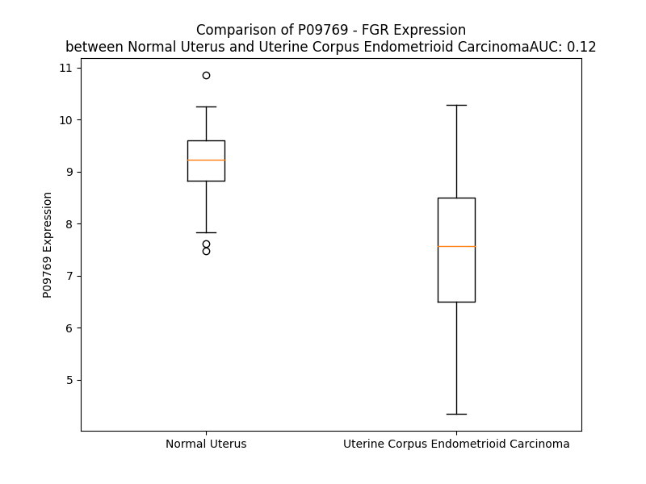

# Detailed Data for P09769

## Introduction to the Detailed Summary

### How to Interpret the Results

- **Summary & Metrics**: This section provides a quick reference to essential protein attributes, including expression changes, family classification, and biomarker applications. Regulation status (upregulated/downregulated) indicates the protein's behavior in a disease context. Some information comes from the original excel file with the proteins selected from literature, while others are derived from the analyses.
- **Expression Comparison**: A visual representation comparing protein expression between normal and disease states. It highlights significant changes in expression levels that might indicate diagnostic or therapeutic relevance. This is data coming from transcriptomics experiments and could not translate similarly to protein levels.
- **Isoform Alignment**: An interactive view of isoform alignments, revealing structural and functional differences between variants of the protein.
- **Interactors & Homologs**: Tables listing known interaction partners and homologous proteins, the more interactors and homologs, the more complex the protein is to design an antibody for.
- **Biological Assemblies**: Information about the structural arrangement of the protein in different assemblies, providing insights into its functional state but also the complexity of the protein to develop antibodies.
- **Combined Per-Residue Information**: A detailed table summarizing residue-level data. This includes predictions for epitope regions, aggregation tendencies, and modifications that might impact the protein's function. Each row corresponds to a residue in the protein, providing insights into specific sites that may be important for research or drug development.
## Summary & Metrics

- **UniProt Accession**: P09769
- **Gene Name**: FGR
- **Protein Name**: Tyrosine-protein kinase Fgr
- **Swiss Prot**: FGR_HUMAN
- **Family**: nan
- **Biomarker Application**: nan
- **Number of Isoforms**: 0
- **Regulation**: 2
- **(transcriptomics) AUC**: 0.06
- **(transcriptomics) Fold Change**: 1.34
- **(transcriptomics) Regulation**: Downregulated
- **Discotope Epitope Count**: 134
- **Max n_uniprots (Homo)**: 1
- **Max n_uniprots (Hetero)**: N/A

## Expression Comparison

## Interactors

| preferredName_A   | preferredName_B   |   score |
|:------------------|:------------------|--------:|
| FGR               | SHC1              |   0.954 |
| FGR               | PTK2B             |   0.949 |
| FGR               | PTK2              |   0.944 |
| FGR               | PIK3R5            |   0.941 |
| FGR               | DOCK2             |   0.936 |
| FGR               | PIK3CG            |   0.931 |
| FGR               | PIK3R6            |   0.924 |
| FGR               | ITK               |   0.918 |
| FGR               | SHC3              |   0.917 |
| FGR               | GNAI2             |   0.914 |
| FGR               | SHC2              |   0.912 |
| FGR               | GNAI1             |   0.91  |
| FGR               | GNAI3             |   0.909 |
| FGR               | SHC4              |   0.907 |
| FGR               | ELMO1             |   0.907 |

## Homologs

| uniprot_id   | gene_id   |
|:-------------|:----------|
| W0S0X4       | Pe1Fe3    |
| P52333       | JAK3      |
| E5RJ37       | LYN       |
| E5RH71       | FYN       |
| F8W6B9       | LCK       |
| A0A5F9ZHL4   | TNK2      |
| A0A8Q3SI35   | BTK       |
| Q9H3Y6       | SRMS      |
| E5RK84       | PTK2B     |
| H7C5P9       | HCK       |
| P43403       | ZAP70     |
| H0YB33       | PTK2      |
| P43405       | SYK       |
| A0A1B0GTR9   | JAK2      |
| P51451       | BLK       |
| P51813       | BMX       |
| E7EQN8       | TXK       |
| J3QRU1       | YES1      |
| E7ENM8       | FES       |
| A0A8V8TPH2   | TYK2      |
| F5H2I9       | STYK1     |
| P42680       | TEC       |
| I3L334       | TNK1      |
| E5RJY4       | ITK       |
| K7EKS5       | MATK      |
| A0A8V8TN56   | JAK1      |
| Q13882       | PTK6      |
| B2R6Q4       | CSK       |
| A0A8I5KYU4   | SRC       |
| P42685       | FRK       |
| P42684       | ABL2      |
| P00519       | ABL1      |

## Biological Assemblies

|   Unnamed: 0 |   assembly |   n_uniprots | composition   | crystal_id   |
|-------------:|-----------:|-------------:|:--------------|:-------------|
|            0 |          1 |            1 | Homo          | 7uy3         |
|            0 |          1 |            1 | Homo          | 7uy0         |
|            1 |          2 |            1 | Homo          | 7uy0         |
|            0 |          1 |            1 | Homo          | 7jt9         |

## Combined Per-Residue Information

|   res | aa   |   epitope_score | epitope   |   relative_surface_accessibility |   modeling_confidence |   Aggregation | modification            |
|------:|:-----|----------------:|:----------|---------------------------------:|----------------------:|--------------:|:------------------------|
|     1 | M    |         0.10139 | False     |                          1.36272 |                 31.55 |         0     | N/A                     |
|     2 | G    |         0.14591 | True      |                          0.83525 |                 26.98 |         0     | N/A                     |
|     3 | C    |         0.1169  | False     |                          0.96554 |                 28.29 |         0     | N/A                     |
|     4 | V    |         0.10832 | False     |                          0.93676 |                 29.53 |         0     | N/A                     |
|     5 | F    |         0.18871 | True      |                          1.00862 |                 33.64 |         0     | N/A                     |
|     6 | C    |         0.11813 | False     |                          0.96577 |                 28.83 |         0     | N/A                     |
|     7 | K    |         0.166   | True      |                          1.00067 |                 33.63 |         0     | N/A                     |
|     8 | K    |         0.11503 | False     |                          0.95637 |                 30.87 |         0     | N/A                     |
|     9 | L    |         0.10616 | False     |                          1.11655 |                 34.5  |         0     | N/A                     |
|    10 | E    |         0.09523 | False     |                          0.81326 |                 30.54 |         0     | N/A                     |
|    11 | P    |         0.10287 | False     |                          0.97736 |                 31.56 |         0     | N/A                     |
|    12 | V    |         0.12551 | False     |                          1.02083 |                 34.8  |         0     | N/A                     |
|    13 | A    |         0.13732 | False     |                          0.84041 |                 31    |         0     | N/A                     |
|    14 | T    |         0.13182 | False     |                          0.98985 |                 34.35 |         0     | N/A                     |
|    15 | A    |         0.09938 | False     |                          0.91611 |                 29.9  |         0     | N/A                     |
|    16 | K    |         0.13753 | False     |                          0.93343 |                 34.69 |         0     | N/A                     |
|    17 | E    |         0.09885 | False     |                          0.81322 |                 34.15 |         0     | N/A                     |
|    18 | D    |         0.10902 | False     |                          0.87934 |                 30.16 |         0     | N/A                     |
|    19 | A    |         0.12388 | False     |                          0.99345 |                 34.83 |         0     | N/A                     |
|    20 | G    |         0.11541 | False     |                          0.83657 |                 29.12 |         0     | N/A                     |
|    21 | L    |         0.13407 | False     |                          1.1343  |                 34.49 |         0     | N/A                     |
|    22 | E    |         0.11787 | False     |                          0.94144 |                 29.17 |         0     | N/A                     |
|    23 | G    |         0.15247 | True      |                          0.8689  |                 33.04 |         0     | N/A                     |
|    24 | D    |         0.17577 | True      |                          0.87977 |                 29.35 |         0     | N/A                     |
|    25 | F    |         0.15833 | True      |                          1.06887 |                 32.21 |         0     | N/A                     |
|    26 | R    |         0.19076 | True      |                          0.89582 |                 31.33 |         0     | N/A                     |
|    27 | S    |         0.12362 | False     |                          0.80115 |                 26.44 |         0     | N/A                     |
|    28 | Y    |         0.13556 | False     |                          0.97481 |                 30.2  |         0     | N/A                     |
|    29 | G    |         0.16924 | True      |                          0.83284 |                 27.43 |         0     | N/A                     |
|    30 | A    |         0.14106 | False     |                          1.03395 |                 27.05 |         0     | N/A                     |
|    31 | A    |         0.18438 | True      |                          0.77871 |                 28.16 |         0     | N/A                     |
|    32 | D    |         0.16829 | True      |                          0.85067 |                 31.14 |         0     | N/A                     |
|    33 | H    |         0.18403 | True      |                          0.8447  |                 33.58 |         0     | N/A                     |
|    34 | Y    |         0.15489 | True      |                          0.61178 |                 40.4  |         0     | Phosphotyrosine         |
|    35 | G    |         0.12758 | False     |                          0.72625 |                 39.24 |         0     | N/A                     |
|    36 | P    |         0.18964 | True      |                          0.99864 |                 39.82 |         0     | N/A                     |
|    37 | D    |         0.10171 | False     |                          0.14586 |                 46.67 |         0     | N/A                     |
|    38 | P    |         0.14371 | False     |                          0.70618 |                 41.19 |         0     | N/A                     |
|    39 | T    |         0.10993 | False     |                          0.25969 |                 47.95 |         0     | N/A                     |
|    40 | K    |         0.2078  | True      |                          0.73713 |                 44.04 |         0     | N/A                     |
|    41 | A    |         0.21734 | True      |                          0.78618 |                 40.06 |         0     | N/A                     |
|    42 | R    |         0.22172 | True      |                          0.62989 |                 36.8  |         0     | N/A                     |
|    43 | P    |         0.25085 | True      |                          0.70524 |                 31.89 |         0     | N/A                     |
|    44 | A    |         0.07412 | False     |                          0.74585 |                 36.71 |         0     | N/A                     |
|    45 | S    |         0.1583  | True      |                          0.61961 |                 33.84 |         0     | N/A                     |
|    46 | S    |         0.14172 | False     |                          0.44217 |                 34.39 |         0     | N/A                     |
|    47 | F    |         0.09397 | False     |                          0.20777 |                 36.24 |         0     | N/A                     |
|    48 | A    |         0.21756 | True      |                          0.79245 |                 31.28 |         0     | N/A                     |
|    49 | H    |         0.22377 | True      |                          0.99037 |                 30.92 |         0     | N/A                     |
|    50 | I    |         0.14129 | False     |                          0.34102 |                 28.29 |         0     | N/A                     |
|    51 | P    |         0.14415 | True      |                          0.67291 |                 24.55 |         0     | N/A                     |
|    52 | N    |         0.13437 | False     |                          0.41504 |                 30.76 |         0     | N/A                     |
|    53 | Y    |         0.13481 | False     |                          0.72898 |                 28.88 |         0     | N/A                     |
|    54 | S    |         0.07867 | False     |                          0.45577 |                 31.09 |         0     | N/A                     |
|    55 | N    |         0.13312 | False     |                          0.66587 |                 28.79 |         0     | N/A                     |
|    56 | F    |         0.12567 | False     |                          0.5374  |                 34.1  |         0     | N/A                     |
|    57 | S    |         0.14138 | False     |                          0.80635 |                 26.91 |         0     | N/A                     |
|    58 | S    |         0.1331  | False     |                          0.81404 |                 29.18 |         0     | N/A                     |
|    59 | Q    |         0.17312 | True      |                          0.85183 |                 26.5  |         0     | N/A                     |
|    60 | A    |         0.18543 | True      |                          0.97082 |                 24.97 |         0     | N/A                     |
|    61 | I    |         0.18303 | True      |                          0.97676 |                 28.2  |         0     | N/A                     |
|    62 | N    |         0.2054  | True      |                          0.90084 |                 24.85 |         0     | N/A                     |
|    63 | P    |         0.24179 | True      |                          0.92982 |                 31.95 |         0     | N/A                     |
|    64 | G    |         0.23062 | True      |                          0.79041 |                 26.69 |         0     | N/A                     |
|    65 | F    |         0.20282 | True      |                          0.98945 |                 29.73 |         0     | N/A                     |
|    66 | L    |         0.19934 | True      |                          1.0633  |                 33.08 |         0     | N/A                     |
|    67 | D    |         0.17608 | True      |                          0.77651 |                 27.41 |         0     | N/A                     |
|    68 | S    |         0.23753 | True      |                          0.82747 |                 31.45 |         0     | N/A                     |
|    69 | G    |         0.33122 | True      |                          0.85696 |                 30.29 |         0     | N/A                     |
|    70 | T    |         0.26428 | True      |                          0.83184 |                 28.77 |         0     | N/A                     |
|    71 | I    |         0.362   | True      |                          0.87871 |                 29.18 |         0.004 | N/A                     |
|    72 | R    |         0.21922 | True      |                          0.94222 |                 26.37 |         0.004 | N/A                     |
|    73 | G    |         0.22193 | True      |                          0.84296 |                 26.39 |         2.151 | N/A                     |
|    74 | V    |         0.13839 | False     |                          0.99291 |                 29.01 |        26.023 | N/A                     |
|    75 | S    |         0.16231 | True      |                          0.85251 |                 27.97 |        26.361 | N/A                     |
|    76 | G    |         0.24565 | True      |                          0.92342 |                 30.37 |        29.09  | N/A                     |
|    77 | I    |         0.15416 | True      |                          0.87443 |                 41.97 |        59.407 | N/A                     |
|    78 | G    |         0.1224  | False     |                          0.89008 |                 54.79 |        62.179 | N/A                     |
|    79 | V    |         0.13869 | False     |                          0.60609 |                 70.96 |        92.678 | N/A                     |
|    80 | T    |         0.06213 | False     |                          0.56141 |                 83.21 |        94.988 | N/A                     |
|    81 | L    |         0.10321 | False     |                          0.40996 |                 93.78 |        98.475 | N/A                     |
|    82 | F    |         0.0405  | False     |                          0.08854 |                 95.85 |        98.943 | N/A                     |
|    83 | I    |         0.03633 | False     |                          0.21279 |                 96.13 |        98.573 | N/A                     |
|    84 | A    |         0.01928 | False     |                          0.02263 |                 96.34 |        91.212 | N/A                     |
|    85 | L    |         0.02278 | False     |                          0.23344 |                 93.7  |        84.81  | N/A                     |
|    86 | Y    |         0.03227 | False     |                          0.17298 |                 93.37 |        65.711 | N/A                     |
|    87 | D    |         0.09335 | False     |                          0.47753 |                 94.88 |         0.004 | N/A                     |
|    88 | Y    |         0.01782 | False     |                          0.01124 |                 94.78 |         0.004 | N/A                     |
|    89 | E    |         0.09808 | False     |                          0.6997  |                 94.07 |         0     | N/A                     |
|    90 | A    |         0.05172 | False     |                          0.32768 |                 92.84 |         0     | N/A                     |
|    91 | R    |         0.07565 | False     |                          0.18428 |                 91.56 |         0     | N/A                     |
|    92 | T    |         0.08307 | False     |                          0.27273 |                 90.35 |         0     | N/A                     |
|    93 | E    |         0.11326 | False     |                          0.96043 |                 89.93 |         0     | N/A                     |
|    94 | D    |         0.10803 | False     |                          0.64711 |                 90.79 |         0     | N/A                     |
|    95 | D    |         0.02269 | False     |                          0.06989 |                 92.29 |         0     | N/A                     |
|    96 | L    |         0.03084 | False     |                          0.07419 |                 93.87 |         0     | N/A                     |
|    97 | T    |         0.1159  | False     |                          0.62231 |                 95.57 |         0     | N/A                     |
|    98 | F    |         0.02731 | False     |                          0.02611 |                 96.19 |         0     | N/A                     |
|    99 | T    |         0.08462 | False     |                          0.61458 |                 96.5  |         0     | N/A                     |
|   100 | K    |         0.06031 | False     |                          0.50702 |                 94.59 |         0     | N/A                     |
|   101 | G    |         0.03874 | False     |                          0.43886 |                 94.98 |         0     | N/A                     |
|   102 | E    |         0.06428 | False     |                          0.14454 |                 96.99 |         0     | N/A                     |
|   103 | K    |         0.06639 | False     |                          0.42203 |                 97.22 |         0     | N/A                     |
|   104 | F    |         0.0043  | False     |                          0.00127 |                 96.5  |         0     | N/A                     |
|   105 | H    |         0.09339 | False     |                          0.31757 |                 95.26 |         0     | N/A                     |
|   106 | I    |         0.07607 | False     |                          0.14756 |                 93.71 |         0     | N/A                     |
|   107 | L    |         0.1838  | True      |                          0.47811 |                 91.63 |         0     | N/A                     |
|   108 | N    |         0.17649 | True      |                          0.4129  |                 87.89 |         0     | N/A                     |
|   109 | N    |         0.20112 | True      |                          0.56584 |                 85.12 |         0     | N/A                     |
|   110 | T    |         0.24384 | True      |                          0.77322 |                 75.75 |         0     | N/A                     |
|   111 | E    |         0.18776 | True      |                          0.73312 |                 64.42 |         0     | N/A                     |
|   112 | G    |         0.10262 | False     |                          0.70742 |                 74.43 |         0     | N/A                     |
|   113 | D    |         0.03454 | False     |                          0.11662 |                 89.09 |         0     | N/A                     |
|   114 | W    |         0.04026 | False     |                          0.07697 |                 92.05 |         0     | N/A                     |
|   115 | W    |         0.04608 | False     |                          0.09031 |                 94.25 |         0     | N/A                     |
|   116 | E    |         0.14712 | True      |                          0.36754 |                 94.21 |         0     | N/A                     |
|   117 | A    |         0.0023  | False     |                          0       |                 95.15 |         0     | N/A                     |
|   118 | R    |         0.18108 | True      |                          0.4584  |                 96.55 |         0     | N/A                     |
|   119 | S    |         0.02158 | False     |                          0.02152 |                 96.79 |         0     | N/A                     |
|   120 | L    |         0.14433 | True      |                          0.56004 |                 94.95 |         0     | N/A                     |
|   121 | S    |         0.14235 | False     |                          0.71047 |                 94.51 |         0     | N/A                     |
|   122 | S    |         0.17195 | True      |                          0.50662 |                 93.95 |         0     | N/A                     |
|   123 | G    |         0.16895 | True      |                          0.59452 |                 94.54 |         0     | N/A                     |
|   124 | K    |         0.16703 | True      |                          0.67874 |                 95.87 |         0     | N/A                     |
|   125 | T    |         0.18272 | True      |                          0.48828 |                 95.41 |         0     | N/A                     |
|   126 | G    |         0.01797 | False     |                          0.12715 |                 94.79 |         0     | N/A                     |
|   127 | C    |         0.03629 | False     |                          0.08806 |                 94.28 |         0     | N/A                     |
|   128 | I    |         0.0023  | False     |                          0       |                 95.36 |         0     | N/A                     |
|   129 | P    |         0.0055  | False     |                          0.00497 |                 94.5  |         0     | N/A                     |
|   130 | S    |         0.02513 | False     |                          0.10058 |                 93.57 |         0     | N/A                     |
|   131 | N    |         0.03253 | False     |                          0.29973 |                 92.04 |         0     | N/A                     |
|   132 | Y    |         0.01824 | False     |                          0.01435 |                 94.44 |         0     | N/A                     |
|   133 | V    |         0.01704 | False     |                          0.04011 |                 94.55 |         0     | N/A                     |
|   134 | A    |         0.00542 | False     |                          0.01403 |                 94.57 |         0     | N/A                     |
|   135 | P    |         0.07182 | False     |                          0.19384 |                 94.99 |         0     | N/A                     |
|   136 | V    |         0.06726 | False     |                          0.26847 |                 92.74 |         0     | N/A                     |
|   137 | D    |         0.16648 | True      |                          0.88412 |                 87.83 |         0     | N/A                     |
|   138 | S    |         0.07472 | False     |                          0.17715 |                 91.97 |         0     | N/A                     |
|   139 | I    |         0.03652 | False     |                          0.13617 |                 92.51 |         0     | N/A                     |
|   140 | Q    |         0.04635 | False     |                          0.39014 |                 91.92 |         0     | N/A                     |
|   141 | A    |         0.02263 | False     |                          0.23101 |                 93.44 |         0     | N/A                     |
|   142 | E    |         0.05273 | False     |                          0.26796 |                 93.84 |         0     | N/A                     |
|   143 | E    |         0.04085 | False     |                          0.44087 |                 91.33 |         0.154 | N/A                     |
|   144 | W    |         0.07356 | False     |                          0.07975 |                 94.46 |         0.154 | N/A                     |
|   145 | Y    |         0.05038 | False     |                          0.10775 |                 95.14 |         0.154 | N/A                     |
|   146 | F    |         0.03312 | False     |                          0.18455 |                 93.58 |         0.154 | N/A                     |
|   147 | G    |         0.02418 | False     |                          0.18994 |                 92.78 |         0.154 | N/A                     |
|   148 | K    |         0.1239  | False     |                          0.59623 |                 91.61 |         0.154 | N/A                     |
|   149 | I    |         0.03476 | False     |                          0.18888 |                 91.11 |         0.154 | N/A                     |
|   150 | G    |         0.03127 | False     |                          0.22634 |                 91.65 |         0     | N/A                     |
|   151 | R    |         0.06337 | False     |                          0.20523 |                 92.45 |         0     | N/A                     |
|   152 | K    |         0.04471 | False     |                          0.14864 |                 90.78 |         0     | N/A                     |
|   153 | D    |         0.02962 | False     |                          0.1828  |                 91.41 |         0     | N/A                     |
|   154 | A    |         0.00135 | False     |                          0       |                 93.75 |         0     | N/A                     |
|   155 | E    |         0.03686 | False     |                          0.15005 |                 93.27 |         0     | N/A                     |
|   156 | R    |         0.03585 | False     |                          0.18454 |                 91.2  |         0     | N/A                     |
|   157 | Q    |         0.01904 | False     |                          0.20184 |                 92.21 |         0     | N/A                     |
|   158 | L    |         0.00356 | False     |                          0       |                 94.77 |         0     | N/A                     |
|   159 | L    |         0.04444 | False     |                          0.44426 |                 92.59 |         0     | N/A                     |
|   160 | S    |         0.01512 | False     |                          0.04665 |                 89.32 |         0     | N/A                     |
|   161 | P    |         0.18216 | True      |                          0.90386 |                 87.79 |         0     | N/A                     |
|   162 | G    |         0.11905 | False     |                          0.79193 |                 90    |         0     | N/A                     |
|   163 | N    |         0.08131 | False     |                          0.05591 |                 93.95 |         0     | N/A                     |
|   164 | P    |         0.14856 | True      |                          0.45657 |                 94.68 |         0     | N/A                     |
|   165 | Q    |         0.1155  | False     |                          0.40573 |                 95.55 |         0.334 | N/A                     |
|   166 | G    |         0.00534 | False     |                          0       |                 96.57 |         8.954 | N/A                     |
|   167 | A    |         0.00319 | False     |                          0       |                 97.74 |         8.954 | N/A                     |
|   168 | F    |         0.00418 | False     |                          0       |                 98.11 |         8.954 | N/A                     |
|   169 | L    |         0.00144 | False     |                          0       |                 97.6  |         8.954 | N/A                     |
|   170 | I    |         0.00258 | False     |                          0       |                 97.37 |         8.954 | N/A                     |
|   171 | R    |         0.00732 | False     |                          0.00328 |                 96.4  |         0     | N/A                     |
|   172 | E    |         0.05702 | False     |                          0.3222  |                 95.76 |         0     | N/A                     |
|   173 | S    |         0.05364 | False     |                          0.07964 |                 93.78 |         0     | N/A                     |
|   174 | E    |         0.13357 | False     |                          0.55151 |                 89.44 |         0     | N/A                     |
|   175 | T    |         0.30916 | True      |                          0.61228 |                 88.53 |         0     | N/A                     |
|   176 | T    |         0.16889 | True      |                          0.36076 |                 88.65 |         0     | N/A                     |
|   177 | K    |         0.26686 | True      |                          1.02926 |                 87.25 |         0     | N/A                     |
|   178 | G    |         0.13111 | False     |                          0.67604 |                 85.98 |         0     | N/A                     |
|   179 | A    |         0.04261 | False     |                          0.05903 |                 92.26 |         0.158 | N/A                     |
|   180 | Y    |         0.0321  | False     |                          0.158   |                 96.16 |         0.671 | N/A                     |
|   181 | S    |         0.00776 | False     |                          0       |                 97.33 |         0.671 | N/A                     |
|   182 | L    |         0.00261 | False     |                          0       |                 97.55 |         0.671 | N/A                     |
|   183 | S    |         0.00144 | False     |                          0       |                 97.61 |         0.671 | N/A                     |
|   184 | I    |         0.00197 | False     |                          0       |                 97.47 |         0.671 | N/A                     |
|   185 | R    |         0.08735 | False     |                          0.12971 |                 96.54 |         0     | N/A                     |
|   186 | D    |         0.04635 | False     |                          0.04933 |                 95.21 |         0     | N/A                     |
|   187 | W    |         0.13067 | False     |                          0.54767 |                 93.31 |         0     | N/A                     |
|   188 | D    |         0.17578 | True      |                          0.25557 |                 90.75 |         0     | N/A                     |
|   189 | Q    |         0.28515 | True      |                          0.83325 |                 90.05 |         0     | N/A                     |
|   190 | T    |         0.3072  | True      |                          0.92452 |                 86.48 |         0     | N/A                     |
|   191 | R    |         0.36256 | True      |                          0.4276  |                 83.18 |         0     | N/A                     |
|   192 | G    |         0.13166 | False     |                          0.28149 |                 90.29 |         0     | N/A                     |
|   193 | D    |         0.15704 | True      |                          0.44699 |                 91.57 |         0     | N/A                     |
|   194 | H    |         0.0351  | False     |                          0.05878 |                 91.69 |         0     | N/A                     |
|   195 | V    |         0.03026 | False     |                          0.10964 |                 94.23 |         0     | N/A                     |
|   196 | K    |         0.05277 | False     |                          0.21848 |                 94.53 |         0     | N/A                     |
|   197 | H    |         0.01765 | False     |                          0.01409 |                 95.46 |         0     | N/A                     |
|   198 | Y    |         0.06869 | False     |                          0.03346 |                 96.06 |         0     | N/A                     |
|   199 | K    |         0.05479 | False     |                          0.24568 |                 94.41 |         0     | N/A                     |
|   200 | I    |         0.00767 | False     |                          0.00059 |                 95.15 |         0     | N/A                     |
|   201 | R    |         0.14732 | True      |                          0.49357 |                 91.83 |         0     | N/A                     |
|   202 | K    |         0.17119 | True      |                          0.59097 |                 90.58 |         0     | N/A                     |
|   203 | L    |         0.23977 | True      |                          0.34236 |                 88.17 |         0     | N/A                     |
|   204 | D    |         0.29075 | True      |                          0.96059 |                 86.57 |         0     | N/A                     |
|   205 | M    |         0.24617 | True      |                          1.00548 |                 84.78 |         0     | N/A                     |
|   206 | G    |         0.16045 | True      |                          0.43016 |                 85.22 |         0     | N/A                     |
|   207 | G    |         0.09865 | False     |                          0.12568 |                 91.98 |         0.154 | N/A                     |
|   208 | Y    |         0.12215 | False     |                          0.14718 |                 95    |         1.175 | Phosphotyrosine         |
|   209 | Y    |         0.16302 | True      |                          0.10961 |                 94.14 |         1.175 | N/A                     |
|   210 | I    |         0.12095 | False     |                          0.09238 |                 92.73 |         1.175 | N/A                     |
|   211 | T    |         0.02931 | False     |                          0.06284 |                 88.79 |         1.175 | N/A                     |
|   212 | T    |         0.25421 | True      |                          0.66367 |                 86.24 |         1.021 | N/A                     |
|   213 | R    |         0.21116 | True      |                          0.66207 |                 89.21 |         0     | N/A                     |
|   214 | V    |         0.12243 | False     |                          0.29655 |                 90.53 |         0     | N/A                     |
|   215 | Q    |         0.22682 | True      |                          0.51976 |                 94.16 |         0     | N/A                     |
|   216 | F    |         0.12788 | False     |                          0.10521 |                 95.8  |         0     | N/A                     |
|   217 | N    |         0.2616  | True      |                          0.78024 |                 94.47 |         0     | N/A                     |
|   218 | S    |         0.16306 | True      |                          0.24557 |                 94.05 |         0     | Phosphoserine           |
|   219 | V    |         0.01448 | False     |                          0.02545 |                 95.42 |         0     | N/A                     |
|   220 | Q    |         0.08969 | False     |                          0.30868 |                 95.45 |         0     | N/A                     |
|   221 | E    |         0.13746 | False     |                          0.4009  |                 96.06 |         0     | N/A                     |
|   222 | L    |         0.00588 | False     |                          0       |                 96.79 |         0     | N/A                     |
|   223 | V    |         0.01712 | False     |                          0.0219  |                 96.81 |         0     | N/A                     |
|   224 | Q    |         0.1505  | True      |                          0.48782 |                 96.24 |         0     | N/A                     |
|   225 | H    |         0.19799 | True      |                          0.2552  |                 96.93 |         0     | N/A                     |
|   226 | Y    |         0.01077 | False     |                          0.00324 |                 97.13 |         0     | N/A                     |
|   227 | M    |         0.12507 | False     |                          0.37371 |                 96.62 |         0     | N/A                     |
|   228 | E    |         0.164   | True      |                          0.61621 |                 96.15 |         0     | N/A                     |
|   229 | V    |         0.17053 | True      |                          0.52459 |                 94.29 |         0     | N/A                     |
|   230 | N    |         0.19138 | True      |                          0.45393 |                 90.93 |         0     | N/A                     |
|   231 | D    |         0.18816 | True      |                          0.34589 |                 90.81 |         0     | N/A                     |
|   232 | G    |         0.03455 | False     |                          0.26398 |                 90.45 |         0     | N/A                     |
|   233 | L    |         0.02925 | False     |                          0.05157 |                 93.8  |         0.313 | N/A                     |
|   234 | C    |         0.10969 | False     |                          0.28871 |                 92.87 |         0.47  | N/A                     |
|   235 | N    |         0.04259 | False     |                          0.21769 |                 93.11 |         0.47  | N/A                     |
|   236 | L    |         0.07795 | False     |                          0.3326  |                 96.17 |         0.47  | N/A                     |
|   237 | L    |         0.02009 | False     |                          0.01219 |                 97.41 |         0.47  | N/A                     |
|   238 | I    |         0.17665 | True      |                          0.52336 |                 96.35 |         0.47  | N/A                     |
|   239 | A    |         0.07366 | False     |                          0.28059 |                 95.62 |         0     | N/A                     |
|   240 | P    |         0.06725 | False     |                          0.33177 |                 95.56 |         0     | N/A                     |
|   241 | C    |         0.00969 | False     |                          0.02073 |                 95.1  |         0     | N/A                     |
|   242 | T    |         0.07453 | False     |                          0.3825  |                 88.6  |         0     | N/A                     |
|   243 | I    |         0.12684 | False     |                          0.40635 |                 79.37 |         0     | N/A                     |
|   244 | M    |         0.06536 | False     |                          0.3797  |                 75.42 |         0     | N/A                     |
|   245 | K    |         0.08933 | False     |                          0.53655 |                 84.39 |         0     | N/A                     |
|   246 | P    |         0.03511 | False     |                          0.29978 |                 85.89 |         0     | N/A                     |
|   247 | Q    |         0.04075 | False     |                          0.38345 |                 85.86 |         0     | N/A                     |
|   248 | T    |         0.01372 | False     |                          0.00689 |                 89.3  |         0.229 | N/A                     |
|   249 | L    |         0.03779 | False     |                          0.25813 |                 85.67 |         0.229 | N/A                     |
|   250 | G    |         0.04207 | False     |                          0.18672 |                 87.18 |         0.229 | N/A                     |
|   251 | L    |         0.00895 | False     |                          0.00318 |                 87.92 |         0.229 | N/A                     |
|   252 | A    |         0.05806 | False     |                          0.08684 |                 88.16 |         0.229 | N/A                     |
|   253 | K    |         0.23358 | True      |                          0.54877 |                 85.73 |         0     | N/A                     |
|   254 | D    |         0.25484 | True      |                          0.79996 |                 83.49 |         0     | N/A                     |
|   255 | A    |         0.10956 | False     |                          0.19506 |                 88.42 |         0     | N/A                     |
|   256 | W    |         0.11238 | False     |                          0.14484 |                 91.73 |         0     | N/A                     |
|   257 | E    |         0.06926 | False     |                          0.5092  |                 94.29 |         0     | N/A                     |
|   258 | I    |         0.08515 | False     |                          0.12156 |                 94.74 |         0     | N/A                     |
|   259 | S    |         0.10934 | False     |                          0.54179 |                 94.76 |         0     | N/A                     |
|   260 | R    |         0.08539 | False     |                          0.28586 |                 96.24 |         0     | N/A                     |
|   261 | S    |         0.18809 | True      |                          0.81816 |                 96.05 |         0     | N/A                     |
|   262 | S    |         0.11398 | False     |                          0.1781  |                 95.83 |         0     | N/A                     |
|   263 | I    |         0.05336 | False     |                          0.09292 |                 97.32 |         0     | N/A                     |
|   264 | T    |         0.13467 | False     |                          0.57247 |                 97.52 |         0     | N/A                     |
|   265 | L    |         0.07357 | False     |                          0.36055 |                 97.09 |         0     | N/A                     |
|   266 | E    |         0.22228 | True      |                          0.49731 |                 96.18 |         0     | N/A                     |
|   267 | R    |         0.36761 | True      |                          0.57904 |                 95.92 |         0     | N/A                     |
|   268 | R    |         0.16862 | True      |                          0.5528  |                 95.79 |         0     | N/A                     |
|   269 | L    |         0.10189 | False     |                          0.4397  |                 93.05 |         0     | N/A                     |
|   270 | G    |         0.10606 | False     |                          0.36622 |                 87.77 |         0     | N/A                     |
|   271 | T    |         0.20656 | True      |                          0.69633 |                 85.89 |         0     | N/A                     |
|   272 | G    |         0.09375 | False     |                          0.46107 |                 76.62 |         0     | N/A                     |
|   273 | C    |         0.23923 | True      |                          0.42617 |                 71.59 |         0     | N/A                     |
|   274 | F    |         0.12918 | False     |                          0.18248 |                 76.85 |         0     | N/A                     |
|   275 | G    |         0.06324 | False     |                          0.06552 |                 84.86 |         0     | N/A                     |
|   276 | D    |         0.06715 | False     |                          0.20755 |                 92.91 |         0     | N/A                     |
|   277 | V    |         0.02876 | False     |                          0.32846 |                 95.17 |         1.604 | N/A                     |
|   278 | W    |         0.07264 | False     |                          0.27668 |                 97.49 |         1.604 | N/A                     |
|   279 | L    |         0.07389 | False     |                          0.12365 |                 97.23 |         1.604 | N/A                     |
|   280 | G    |         0.00406 | False     |                          0       |                 97.08 |         1.604 | N/A                     |
|   281 | T    |         0.10123 | False     |                          0.13291 |                 97.04 |         1.604 | N/A                     |
|   282 | W    |         0.03874 | False     |                          0.03591 |                 96.52 |         1.291 | N/A                     |
|   283 | N    |         0.05352 | False     |                          0.4516  |                 94.2  |         0     | N/A                     |
|   284 | G    |         0.19    | True      |                          0.83565 |                 92.26 |         0     | N/A                     |
|   285 | S    |         0.12693 | False     |                          0.50979 |                 88.81 |         0     | N/A                     |
|   286 | T    |         0.04095 | False     |                          0.11551 |                 92.85 |         0     | N/A                     |
|   287 | K    |         0.07264 | False     |                          0.60188 |                 95.03 |         0     | N/A                     |
|   288 | V    |         0.00219 | False     |                          0       |                 96.94 |         0     | N/A                     |
|   289 | A    |         0.01524 | False     |                          0.0778  |                 97.21 |         0     | N/A                     |
|   290 | V    |         0.00372 | False     |                          0       |                 96.96 |         0     | N/A                     |
|   291 | K    |         0.03059 | False     |                          0.18507 |                 94.8  |         0     | N/A                     |
|   292 | T    |         0.04491 | False     |                          0.12888 |                 93.96 |         0     | N/A                     |
|   293 | L    |         0.02912 | False     |                          0.03878 |                 90.39 |         0     | N/A                     |
|   294 | K    |         0.19196 | True      |                          0.57056 |                 87.36 |         0     | N/A                     |
|   295 | P    |         0.37006 | True      |                          0.68734 |                 89.28 |         0     | N/A                     |
|   296 | G    |         0.16965 | True      |                          0.42651 |                 85.01 |         0     | N/A                     |
|   297 | T    |         0.16738 | True      |                          0.13036 |                 81.78 |         0     | N/A                     |
|   298 | M    |         0.03669 | False     |                          0.02911 |                 83.53 |         0     | N/A                     |
|   299 | S    |         0.17775 | True      |                          0.39895 |                 86.2  |         0     | N/A                     |
|   300 | P    |         0.08024 | False     |                          0.39465 |                 89.19 |         0     | N/A                     |
|   301 | K    |         0.1815  | True      |                          0.73184 |                 90.04 |         0     | N/A                     |
|   302 | A    |         0.11498 | False     |                          0.32726 |                 86.73 |         0     | N/A                     |
|   303 | F    |         0.01159 | False     |                          0.00955 |                 89.6  |         0     | N/A                     |
|   304 | L    |         0.05678 | False     |                          0.24071 |                 90.11 |         0     | N/A                     |
|   305 | E    |         0.11954 | False     |                          0.4991  |                 88.99 |         0     | N/A                     |
|   306 | E    |         0.03929 | False     |                          0.07404 |                 86.07 |         0     | N/A                     |
|   307 | A    |         0.00877 | False     |                          0.00602 |                 89.77 |         0     | N/A                     |
|   308 | Q    |         0.12633 | False     |                          0.53178 |                 89.02 |         0     | N/A                     |
|   309 | V    |         0.05832 | False     |                          0.2542  |                 87.51 |         0     | N/A                     |
|   310 | M    |         0.02589 | False     |                          0.05674 |                 87.44 |         0     | N/A                     |
|   311 | K    |         0.05409 | False     |                          0.37889 |                 87.77 |         0     | N/A                     |
|   312 | L    |         0.08962 | False     |                          0.43669 |                 88.17 |         0     | N/A                     |
|   313 | L    |         0.0201  | False     |                          0.05283 |                 90.77 |         0     | N/A                     |
|   314 | R    |         0.064   | False     |                          0.42882 |                 90.73 |         0     | N/A                     |
|   315 | H    |         0.02508 | False     |                          0.24522 |                 93.53 |         0     | N/A                     |
|   316 | D    |         0.04834 | False     |                          0.55309 |                 92.83 |         0.171 | N/A                     |
|   317 | K    |         0.01555 | False     |                          0.02687 |                 96.87 |         0.171 | N/A                     |
|   318 | L    |         0.00574 | False     |                          0.01753 |                 96.46 |        57.53  | N/A                     |
|   319 | V    |         0.00376 | False     |                          0.05307 |                 95.83 |        80.531 | N/A                     |
|   320 | Q    |         0.01087 | False     |                          0.16163 |                 93.2  |        80.837 | N/A                     |
|   321 | L    |         0.01561 | False     |                          0.09353 |                 93.63 |        87.453 | N/A                     |
|   322 | Y    |         0.00826 | False     |                          0.08352 |                 93.39 |        87.505 | N/A                     |
|   323 | A    |         0.00092 | False     |                          0       |                 95.02 |        86.491 | N/A                     |
|   324 | V    |         0.00652 | False     |                          0       |                 95.56 |        85.613 | N/A                     |
|   325 | V    |         0.0259  | False     |                          0.03903 |                 96.12 |        75.222 | N/A                     |
|   326 | S    |         0.04882 | False     |                          0.15612 |                 92.04 |         3.298 | N/A                     |
|   327 | E    |         0.10417 | False     |                          0.68416 |                 91.43 |         0     | N/A                     |
|   328 | E    |         0.09598 | False     |                          0.40774 |                 90.99 |         0     | N/A                     |
|   329 | P    |         0.14652 | True      |                          0.37874 |                 92.29 |         0.147 | N/A                     |
|   330 | I    |         0.01997 | False     |                          0.02172 |                 93.59 |        19.698 | N/A                     |
|   331 | Y    |         0.04386 | False     |                          0.10067 |                 95.87 |        19.698 | N/A                     |
|   332 | I    |         0.01502 | False     |                          0.03419 |                 94.76 |        19.698 | N/A                     |
|   333 | V    |         0.00216 | False     |                          0       |                 96.09 |        19.698 | N/A                     |
|   334 | T    |         0.03417 | False     |                          0.17079 |                 95.8  |        19.55  | N/A                     |
|   335 | E    |         0.00523 | False     |                          0.00892 |                 94.42 |         0     | N/A                     |
|   336 | F    |         0.03988 | False     |                          0.23856 |                 95.21 |         0     | N/A                     |
|   337 | M    |         0.03136 | False     |                          0.06864 |                 95.78 |         0     | N/A                     |
|   338 | C    |         0.14545 | True      |                          0.46959 |                 93.76 |         0     | N/A                     |
|   339 | H    |         0.0681  | False     |                          0.36607 |                 95.67 |         0     | N/A                     |
|   340 | G    |         0.04756 | False     |                          0.36491 |                 95.93 |         0     | N/A                     |
|   341 | S    |         0.05812 | False     |                          0.12581 |                 97.12 |         0     | N/A                     |
|   342 | L    |         0.00224 | False     |                          0       |                 98.41 |         0.196 | N/A                     |
|   343 | L    |         0.03333 | False     |                          0.24813 |                 97.84 |         0.196 | N/A                     |
|   344 | D    |         0.13015 | False     |                          0.56347 |                 97.06 |         0.196 | N/A                     |
|   345 | F    |         0.01049 | False     |                          0.00333 |                 98.09 |         0.196 | N/A                     |
|   346 | L    |         0.00354 | False     |                          0       |                 98.19 |         0.196 | N/A                     |
|   347 | K    |         0.1224  | False     |                          0.54907 |                 97.43 |         0.196 | N/A                     |
|   348 | N    |         0.09011 | False     |                          0.3134  |                 96.29 |         0     | N/A                     |
|   349 | P    |         0.11553 | False     |                          0.82523 |                 96.97 |         0     | N/A                     |
|   350 | E    |         0.09616 | False     |                          0.44797 |                 95.56 |         0     | N/A                     |
|   351 | G    |         0.0028  | False     |                          0       |                 96.35 |         0     | N/A                     |
|   352 | Q    |         0.10953 | False     |                          0.44894 |                 96.59 |         0     | N/A                     |
|   353 | D    |         0.19164 | True      |                          0.71522 |                 96.33 |         0     | N/A                     |
|   354 | L    |         0.05167 | False     |                          0.08411 |                 95.69 |         0     | N/A                     |
|   355 | R    |         0.2684  | True      |                          0.73944 |                 94.17 |         0     | N/A                     |
|   356 | L    |         0.05978 | False     |                          0.29496 |                 93.9  |         0     | N/A                     |
|   357 | P    |         0.10554 | False     |                          0.53163 |                 91.52 |         0     | N/A                     |
|   358 | Q    |         0.04846 | False     |                          0.3398  |                 93.86 |         0     | N/A                     |
|   359 | L    |         0.01678 | False     |                          0.05004 |                 97.03 |         0     | N/A                     |
|   360 | V    |         0.00857 | False     |                          0.02652 |                 96.11 |         0     | N/A                     |
|   361 | D    |         0.01331 | False     |                          0.24492 |                 95.45 |         0     | N/A                     |
|   362 | M    |         0.0023  | False     |                          0.00348 |                 98.09 |         0     | N/A                     |
|   363 | A    |         0.00479 | False     |                          0.0153  |                 98.52 |         0     | N/A                     |
|   364 | A    |         0.00566 | False     |                          0.0135  |                 97.92 |         0     | N/A                     |
|   365 | Q    |         0.00456 | False     |                          0.01059 |                 98.21 |         0     | N/A                     |
|   366 | V    |         0.00133 | False     |                          0.00095 |                 98.71 |         0     | N/A                     |
|   367 | A    |         0.0013  | False     |                          0       |                 98.69 |         0     | N/A                     |
|   368 | E    |         0.01399 | False     |                          0.11718 |                 98.16 |         0     | N/A                     |
|   369 | G    |         0.00165 | False     |                          0       |                 98.19 |         0     | N/A                     |
|   370 | M    |         0.0017  | False     |                          0       |                 98.57 |         0     | N/A                     |
|   371 | A    |         0.00385 | False     |                          0.00316 |                 98.35 |         0     | N/A                     |
|   372 | Y    |         0.05201 | False     |                          0.07914 |                 97.6  |         0     | N/A                     |
|   373 | M    |         0.00164 | False     |                          0       |                 96.27 |         0     | N/A                     |
|   374 | E    |         0.05831 | False     |                          0.18387 |                 96.82 |         0     | N/A                     |
|   375 | R    |         0.08705 | False     |                          0.56148 |                 97.11 |         0     | N/A                     |
|   376 | M    |         0.03941 | False     |                          0.15451 |                 94.8  |         0     | N/A                     |
|   377 | N    |         0.11523 | False     |                          0.64599 |                 93.24 |         0     | N/A                     |
|   378 | Y    |         0.02466 | False     |                          0.03748 |                 93.11 |         0     | N/A                     |
|   379 | I    |         0.02797 | False     |                          0.09017 |                 93.56 |         0     | N/A                     |
|   380 | H    |         0.00334 | False     |                          0.00163 |                 94.26 |         0     | N/A                     |
|   381 | R    |         0.03405 | False     |                          0.13715 |                 92.96 |         0     | N/A                     |
|   382 | D    |         0.03123 | False     |                          0.10565 |                 92.37 |         0     | N/A                     |
|   383 | L    |         0.00542 | False     |                          0.00354 |                 96.97 |         0     | N/A                     |
|   384 | R    |         0.04608 | False     |                          0.23773 |                 97.05 |         0     | N/A                     |
|   385 | A    |         0.00246 | False     |                          0       |                 98.05 |         3.059 | N/A                     |
|   386 | A    |         0.04212 | False     |                          0.29018 |                 95.2  |         6.811 | N/A                     |
|   387 | N    |         0.0375  | False     |                          0.06875 |                 95.93 |         7.198 | N/A                     |
|   388 | I    |         0.00286 | False     |                          0       |                 98.33 |         7.198 | N/A                     |
|   389 | L    |         0.01704 | False     |                          0.22505 |                 98.21 |         7.198 | N/A                     |
|   390 | V    |         0.00328 | False     |                          0       |                 97.89 |         7.198 | N/A                     |
|   391 | G    |         0.02833 | False     |                          0.06599 |                 94.05 |         0.506 | N/A                     |
|   392 | E    |         0.11214 | False     |                          0.52591 |                 89.84 |         0     | N/A                     |
|   393 | R    |         0.08401 | False     |                          0.33446 |                 88.55 |         0     | N/A                     |
|   394 | L    |         0.04608 | False     |                          0.22071 |                 93.35 |         0     | N/A                     |
|   395 | A    |         0.04025 | False     |                          0.33161 |                 94.55 |         0     | N/A                     |
|   396 | C    |         0.00257 | False     |                          0.00148 |                 98.23 |         0     | N/A                     |
|   397 | K    |         0.01879 | False     |                          0.13093 |                 98.21 |         0     | N/A                     |
|   398 | I    |         0.00446 | False     |                          0.0016  |                 98.17 |         0     | N/A                     |
|   399 | A    |         0.01519 | False     |                          0.09183 |                 94.85 |         0     | N/A                     |
|   400 | D    |         0.04182 | False     |                          0.29459 |                 87.31 |         0     | N/A                     |
|   401 | F    |         0.01513 | False     |                          0.02038 |                 82.81 |         0     | N/A                     |
|   402 | G    |         0.02527 | False     |                          0.01288 |                 72.72 |         0     | N/A                     |
|   403 | L    |         0.04366 | False     |                          0.07172 |                 75.08 |         0     | N/A                     |
|   404 | A    |         0.04021 | False     |                          0.11423 |                 70.13 |         0     | N/A                     |
|   405 | R    |         0.07165 | False     |                          0.20175 |                 73.31 |         0     | N/A                     |
|   406 | L    |         0.14314 | False     |                          0.16212 |                 71.21 |         0     | N/A                     |
|   407 | I    |         0.15013 | True      |                          0.11057 |                 67.18 |         0     | N/A                     |
|   408 | K    |         0.24742 | True      |                          0.56471 |                 64.34 |         0     | N/A                     |
|   409 | D    |         0.15143 | True      |                          0.46532 |                 59.97 |         0     | N/A                     |
|   410 | D    |         0.36348 | True      |                          0.82883 |                 53.24 |         0     | N/A                     |
|   411 | E    |         0.27643 | True      |                          0.41942 |                 53.24 |         0     | N/A                     |
|   412 | Y    |         0.08632 | False     |                          0.10081 |                 54.3  |         0     | Phosphotyrosine         |
|   413 | N    |         0.1467  | True      |                          0.35636 |                 53.41 |         0     | N/A                     |
|   414 | P    |         0.05393 | False     |                          0.23339 |                 52.51 |         0     | N/A                     |
|   415 | C    |         0.23613 | True      |                          0.83173 |                 48.4  |         0     | N/A                     |
|   416 | Q    |         0.32142 | True      |                          0.77314 |                 48.97 |         0     | N/A                     |
|   417 | G    |         0.16481 | True      |                          0.14647 |                 55.32 |         0     | N/A                     |
|   418 | S    |         0.19776 | True      |                          0.76997 |                 56.37 |         0     | N/A                     |
|   419 | K    |         0.16323 | True      |                          0.41693 |                 69.01 |         0     | N/A                     |
|   420 | F    |         0.0283  | False     |                          0.01234 |                 77.92 |         0     | N/A                     |
|   421 | P    |         0.04264 | False     |                          0.09145 |                 89.48 |         0     | N/A                     |
|   422 | I    |         0.04019 | False     |                          0.06925 |                 92.16 |         0     | N/A                     |
|   423 | K    |         0.05347 | False     |                          0.09367 |                 95.88 |         0     | N/A                     |
|   424 | W    |         0.04675 | False     |                          0.15645 |                 96.88 |         0     | N/A                     |
|   425 | T    |         0.04191 | False     |                          0.09348 |                 95.01 |         0     | N/A                     |
|   426 | A    |         0.00463 | False     |                          0.00438 |                 96.11 |         0     | N/A                     |
|   427 | P    |         0.03951 | False     |                          0.08251 |                 94.09 |         0     | N/A                     |
|   428 | E    |         0.0469  | False     |                          0.10553 |                 94.01 |         0     | N/A                     |
|   429 | A    |         0.00474 | False     |                          0.00383 |                 93.22 |         0.666 | N/A                     |
|   430 | A    |         0.01665 | False     |                          0.03555 |                 90.57 |         0.666 | N/A                     |
|   431 | L    |         0.17911 | True      |                          0.39451 |                 88.54 |         0.666 | N/A                     |
|   432 | F    |         0.19054 | True      |                          0.63039 |                 88.66 |         0.666 | N/A                     |
|   433 | G    |         0.05151 | False     |                          0.28949 |                 86.87 |         0.666 | N/A                     |
|   434 | R    |         0.20861 | True      |                          0.64211 |                 91.3  |         0     | N/A                     |
|   435 | F    |         0.05311 | False     |                          0.13649 |                 92.35 |         4.896 | N/A                     |
|   436 | T    |         0.04989 | False     |                          0.35802 |                 95.57 |         5.29  | N/A                     |
|   437 | I    |         0.0422  | False     |                          0.20572 |                 97.09 |         5.29  | N/A                     |
|   438 | K    |         0.03184 | False     |                          0.1381  |                 98.46 |         5.29  | N/A                     |
|   439 | S    |         0.0077  | False     |                          0.02889 |                 97.46 |         5.29  | N/A                     |
|   440 | D    |         0.00905 | False     |                          0.00552 |                 98.08 |         5.29  | N/A                     |
|   441 | V    |         0.00207 | False     |                          0       |                 98.75 |        36.662 | N/A                     |
|   442 | W    |         0.00924 | False     |                          0.01881 |                 98.59 |        39.321 | N/A                     |
|   443 | S    |         0.03745 | False     |                          0.04374 |                 98.46 |        40.417 | N/A                     |
|   444 | F    |         0.00145 | False     |                          0       |                 98.79 |        47.382 | N/A                     |
|   445 | G    |         0.00273 | False     |                          0       |                 98.55 |        47.587 | N/A                     |
|   446 | I    |         0.0055  | False     |                          0       |                 98.51 |        47.711 | N/A                     |
|   447 | L    |         0.00175 | False     |                          0       |                 98.64 |        46.783 | N/A                     |
|   448 | L    |         0.00629 | False     |                          0.0171  |                 98.45 |        41.394 | N/A                     |
|   449 | T    |         0.0199  | False     |                          0.04277 |                 97.96 |        23.277 | N/A                     |
|   450 | E    |         0.01551 | False     |                          0.00824 |                 98.29 |        12.294 | N/A                     |
|   451 | L    |         0.00687 | False     |                          0.01072 |                 98.23 |        12.294 | N/A                     |
|   452 | I    |         0.03206 | False     |                          0.12007 |                 97.32 |        12.294 | N/A                     |
|   453 | T    |         0.03155 | False     |                          0.20195 |                 97.11 |        12.294 | N/A                     |
|   454 | K    |         0.06475 | False     |                          0.19848 |                 97.33 |        12.294 | N/A                     |
|   455 | G    |         0.013   | False     |                          0.02277 |                 96.95 |         0.98  | N/A                     |
|   456 | R    |         0.19074 | True      |                          0.67348 |                 96.72 |         0     | N/A                     |
|   457 | I    |         0.14315 | False     |                          0.62356 |                 95.78 |         0     | N/A                     |
|   458 | P    |         0.01531 | False     |                          0.02585 |                 97.18 |         0     | N/A                     |
|   459 | Y    |         0.02202 | False     |                          0.01752 |                 96.74 |         0     | N/A                     |
|   460 | P    |         0.2299  | True      |                          0.76387 |                 95.12 |         0     | N/A                     |
|   461 | G    |         0.23046 | True      |                          1.03742 |                 94.87 |         0     | N/A                     |
|   462 | M    |         0.18881 | True      |                          0.28309 |                 94.86 |         0     | N/A                     |
|   463 | N    |         0.22785 | True      |                          0.50757 |                 91.51 |         0     | N/A                     |
|   464 | K    |         0.09373 | False     |                          0.37315 |                 90.26 |         0     | N/A                     |
|   465 | R    |         0.31512 | True      |                          0.73461 |                 89.52 |         0     | N/A                     |
|   466 | E    |         0.2528  | True      |                          0.36838 |                 94.38 |         0     | N/A                     |
|   467 | V    |         0.0431  | False     |                          0.03142 |                 94.25 |         0     | N/A                     |
|   468 | L    |         0.05524 | False     |                          0.25308 |                 91.02 |         0     | N/A                     |
|   469 | E    |         0.13662 | False     |                          0.4463  |                 92.61 |         0     | N/A                     |
|   470 | Q    |         0.19351 | True      |                          0.35217 |                 95.44 |         0     | N/A                     |
|   471 | V    |         0.01377 | False     |                          0.04876 |                 94.53 |         0     | N/A                     |
|   472 | E    |         0.12124 | False     |                          0.52905 |                 90.66 |         0     | N/A                     |
|   473 | Q    |         0.19957 | True      |                          0.72619 |                 92.03 |         0     | N/A                     |
|   474 | G    |         0.06571 | False     |                          0.32426 |                 91.44 |         0     | N/A                     |
|   475 | Y    |         0.1794  | True      |                          0.34614 |                 94.99 |         0     | N/A                     |
|   476 | H    |         0.14739 | True      |                          0.41854 |                 92.88 |         0     | N/A                     |
|   477 | M    |         0.05266 | False     |                          0.07251 |                 96.4  |         0     | N/A                     |
|   478 | P    |         0.22509 | True      |                          0.69006 |                 96.3  |         0     | N/A                     |
|   479 | C    |         0.12243 | False     |                          0.41594 |                 97.19 |         0     | N/A                     |
|   480 | P    |         0.0417  | False     |                          0.0905  |                 95.04 |         0     | N/A                     |
|   481 | P    |         0.1277  | False     |                          0.90425 |                 92.66 |         0     | N/A                     |
|   482 | G    |         0.09324 | False     |                          0.90197 |                 89.29 |         0     | N/A                     |
|   483 | C    |         0.06496 | False     |                          0.11283 |                 95.19 |         0     | N/A                     |
|   484 | P    |         0.11434 | False     |                          0.28402 |                 95.26 |         0     | N/A                     |
|   485 | A    |         0.10013 | False     |                          0.77822 |                 95.47 |         0     | N/A                     |
|   486 | S    |         0.07835 | False     |                          0.4269  |                 94.88 |         0     | N/A                     |
|   487 | L    |         0.01455 | False     |                          0.01649 |                 96.02 |         0     | N/A                     |
|   488 | Y    |         0.03745 | False     |                          0.134   |                 97.68 |         0     | N/A                     |
|   489 | E    |         0.06864 | False     |                          0.52274 |                 97.24 |         0     | N/A                     |
|   490 | A    |         0.0265  | False     |                          0.03627 |                 96.97 |         0     | N/A                     |
|   491 | M    |         0.00349 | False     |                          0       |                 97.92 |         0     | N/A                     |
|   492 | E    |         0.03832 | False     |                          0.32128 |                 97.69 |         0     | N/A                     |
|   493 | Q    |         0.06633 | False     |                          0.24553 |                 97.83 |         0     | N/A                     |
|   494 | T    |         0.00761 | False     |                          0       |                 98.5  |         0     | N/A                     |
|   495 | W    |         0.02214 | False     |                          0.0153  |                 98.05 |         0     | N/A                     |
|   496 | R    |         0.04564 | False     |                          0.46426 |                 97.5  |         0     | N/A                     |
|   497 | L    |         0.09512 | False     |                          0.55552 |                 95.11 |         0     | N/A                     |
|   498 | D    |         0.15194 | True      |                          0.43151 |                 95.79 |         0     | N/A                     |
|   499 | P    |         0.06322 | False     |                          0.25249 |                 97.38 |         0     | N/A                     |
|   500 | E    |         0.21167 | True      |                          0.70986 |                 97.29 |         0     | N/A                     |
|   501 | E    |         0.13079 | False     |                          0.589   |                 98    |         0     | N/A                     |
|   502 | R    |         0.06664 | False     |                          0.01572 |                 98.56 |         0     | N/A                     |
|   503 | P    |         0.04785 | False     |                          0.14315 |                 98.46 |         0     | N/A                     |
|   504 | T    |         0.06171 | False     |                          0.41018 |                 98.64 |         0     | N/A                     |
|   505 | F    |         0.00265 | False     |                          0       |                 98.71 |         0     | N/A                     |
|   506 | E    |         0.06865 | False     |                          0.6018  |                 97.42 |         0     | N/A                     |
|   507 | Y    |         0.19852 | True      |                          0.48562 |                 97.83 |         0     | N/A                     |
|   508 | L    |         0.00465 | False     |                          0.0033  |                 98.19 |         0     | N/A                     |
|   509 | Q    |         0.03424 | False     |                          0.17108 |                 97.41 |         0     | N/A                     |
|   510 | S    |         0.02375 | False     |                          0.45856 |                 93.57 |         0     | N/A                     |
|   511 | F    |         0.05508 | False     |                          0.26842 |                 95.51 |         0     | N/A                     |
|   512 | L    |         0.01148 | False     |                          0.02893 |                 95.92 |         0     | N/A                     |
|   513 | E    |         0.0452  | False     |                          0.2255  |                 91.6  |         0     | N/A                     |
|   514 | D    |         0.05085 | False     |                          0.41571 |                 89.07 |         0     | N/A                     |
|   515 | Y    |         0.09721 | False     |                          0.16153 |                 90.57 |         0     | N/A                     |
|   516 | F    |         0.07869 | False     |                          0.57527 |                 84.59 |         0     | N/A                     |
|   517 | T    |         0.07892 | False     |                          0.29555 |                 73.23 |         0     | N/A                     |
|   518 | S    |         0.18664 | True      |                          0.81544 |                 60.2  |         0     | N/A                     |
|   519 | A    |         0.23014 | True      |                          0.9944  |                 49.6  |         0     | N/A                     |
|   520 | E    |         0.1579  | True      |                          0.40212 |                 58.02 |         0     | N/A                     |
|   521 | P    |         0.11979 | False     |                          0.6024  |                 63.87 |         0     | N/A                     |
|   522 | Q    |         0.16626 | True      |                          0.58612 |                 72.38 |         0     | N/A                     |
|   523 | Y    |         0.07607 | False     |                          0.1987  |                 77.95 |         0     | Phosphotyrosine; by SRC |
|   524 | Q    |         0.10251 | False     |                          0.17739 |                 79.89 |         0     | N/A                     |
|   525 | P    |         0.12905 | False     |                          0.56667 |                 73.7  |         0     | N/A                     |
|   526 | G    |         0.06086 | False     |                          0.30714 |                 58.38 |         0     | N/A                     |
|   527 | D    |         0.16971 | True      |                          0.56042 |                 58.68 |         0     | N/A                     |
|   528 | Q    |         0.11866 | False     |                          0.5063  |                 51.42 |         0     | N/A                     |
|   529 | T    |         0.06523 | False     |                          1.01295 |                 40.53 |         0     | N/A                     |

