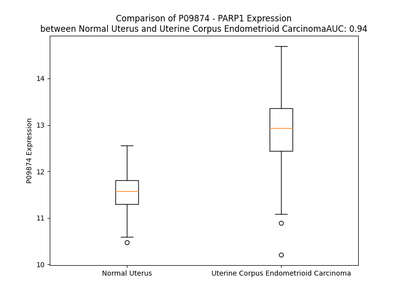

# Detailed Data for P09874

## Introduction to the Detailed Summary

### How to Interpret the Results

- **Summary & Metrics**: This section provides a quick reference to essential protein attributes, including expression changes, family classification, and biomarker applications. Regulation status (upregulated/downregulated) indicates the protein's behavior in a disease context. Some information comes from the original excel file with the proteins selected from literature, while others are derived from the analyses.
- **Expression Comparison**: A visual representation comparing protein expression between normal and disease states. It highlights significant changes in expression levels that might indicate diagnostic or therapeutic relevance. This is data coming from transcriptomics experiments and could not translate similarly to protein levels.
- **Isoform Alignment**: An interactive view of isoform alignments, revealing structural and functional differences between variants of the protein.
- **Interactors & Homologs**: Tables listing known interaction partners and homologous proteins, the more interactors and homologs, the more complex the protein is to design an antibody for.
- **Biological Assemblies**: Information about the structural arrangement of the protein in different assemblies, providing insights into its functional state but also the complexity of the protein to develop antibodies.
- **Combined Per-Residue Information**: A detailed table summarizing residue-level data. This includes predictions for epitope regions, aggregation tendencies, and modifications that might impact the protein's function. Each row corresponds to a residue in the protein, providing insights into specific sites that may be important for research or drug development.
## Summary & Metrics

- **UniProt Accession**: P09874
- **Gene Name**: PARP1
- **Protein Name**: Poly [ADP-ribose] polymerase 1
- **Swiss Prot**: PARP1_HUMAN
- **Family**: enzyme
- **Biomarker Application**: diagnosis,efficacy,prognosis
- **Number of Isoforms**: 0
- **Regulation**: 2
- **(transcriptomics) AUC**: 1.0
- **(transcriptomics) Fold Change**: 1.16
- **(transcriptomics) Regulation**: Upregulated
- **Discotope Epitope Count**: 241
- **Max n_uniprots (Homo)**: 6
- **Max n_uniprots (Hetero)**: 8

## Expression Comparison

## Interactors

| preferredName_A   | preferredName_B   |   score |
|:------------------|:------------------|--------:|
| PARP1             | CASP3             |   0.999 |
| PARP1             | XRCC1             |   0.999 |
| PARP1             | XRCC6             |   0.998 |
| PARP1             | POLB              |   0.996 |
| PARP1             | SMARCA4           |   0.996 |
| PARP1             | XRCC5             |   0.996 |
| PARP1             | CASP7             |   0.995 |
| PARP1             | PRKDC             |   0.993 |
| PARP1             | PARG              |   0.992 |
| PARP1             | CASP9             |   0.991 |
| PARP1             | TIMELESS          |   0.99  |
| PARP1             | LIG3              |   0.99  |
| PARP1             | BRCA2             |   0.985 |
| PARP1             | MACROH2A1         |   0.981 |
| PARP1             | HPF1              |   0.979 |
| PARP1             | CHD1L             |   0.977 |
| PARP1             | BRCA1             |   0.974 |
| PARP1             | TP53              |   0.972 |
| PARP1             | NPM1              |   0.97  |
| PARP1             | APEX1             |   0.967 |
| PARP1             | PARP2             |   0.965 |
| PARP1             | H2AX              |   0.964 |
| PARP1             | GZMB              |   0.955 |
| PARP1             | DNMT1             |   0.952 |
| PARP1             | FEN1              |   0.941 |
| PARP1             | RNF146            |   0.939 |
| PARP1             | TOP1              |   0.936 |
| PARP1             | XPC               |   0.928 |
| PARP1             | CTCF              |   0.924 |
| PARP1             | RPA2              |   0.922 |
| PARP1             | H4C6              |   0.919 |
| PARP1             | APLF              |   0.919 |
| PARP1             | APTX              |   0.917 |
| PARP1             | BCL2              |   0.917 |
| PARP1             | WRN               |   0.915 |
| PARP1             | PIAS4             |   0.911 |
| PARP1             | TDP1              |   0.909 |

## Homologs

| uniprot_id   | gene_id   |
|:-------------|:----------|
| Q9Y6F1       | PARP3     |
| G3V167       | PARP2     |

## Biological Assemblies

|   Unnamed: 0 |   assembly |   n_uniprots | composition   | crystal_id   |
|-------------:|-----------:|-------------:|:--------------|:-------------|
|            0 |          1 |            2 | Homo          | 4oqb         |
|            1 |          2 |            2 | Homo          | 4oqb         |
|            0 |          1 |            1 | Homo          | 5wtc         |
|            1 |          2 |            1 | Homo          | 5wtc         |
|            0 |          1 |            2 | Homo          | 4oqa         |
|            1 |          2 |            2 | Homo          | 4oqa         |
|            0 |          1 |            1 | Homo          | 8he7         |
|            1 |          2 |            1 | Homo          | 8he7         |
|            0 |          1 |            1 | Homo          | 6vkk         |
|            1 |          2 |            1 | Homo          | 6vkk         |
|            2 |          3 |            1 | Homo          | 6vkk         |
|            3 |          4 |            1 | Homo          | 6vkk         |
|            0 |          1 |            1 | Homo          | 7kk4         |
|            1 |          2 |            1 | Homo          | 7kk4         |
|            0 |          1 |            4 | Homo          | 4av1         |
|            0 |          1 |            1 | Homo          | 5wrq         |
|            1 |          2 |            1 | Homo          | 5wrq         |
|            0 |          1 |            1 | Homo          | 8u4w         |
|            1 |          2 |            1 | Homo          | 8u4w         |
|            2 |          3 |            1 | Homo          | 8u4w         |
|            3 |          4 |            1 | Homo          | 8u4w         |
|            0 |          1 |            1 | Homo          | 4rv6         |
|            1 |          2 |            1 | Homo          | 4rv6         |
|            2 |          3 |            1 | Homo          | 4rv6         |
|            3 |          4 |            1 | Homo          | 4rv6         |
|            0 |          1 |            1 | Homo          | 6xvw         |
|            1 |          2 |            1 | Homo          | 6xvw         |
|            0 |          1 |            2 | Homo          | 7s68         |
|            0 |          1 |            1 | Homo          | 6nri         |
|            0 |          1 |            1 | Homo          | 3l3l         |
|            1 |          2 |            1 | Homo          | 3l3l         |
|            0 |          1 |            2 | Hetero        | 6m3i         |
|            0 |          1 |            1 | Homo          | 5ds3         |
|            0 |          1 |            1 | Homo          | 7cmw         |
|            1 |          2 |            1 | Homo          | 7cmw         |
|            0 |          1 |            1 | Homo          | 5ws1         |
|            1 |          2 |            1 | Homo          | 5ws1         |
|            0 |          1 |            1 | Homo          | 1uk0         |
|            1 |          2 |            1 | Homo          | 1uk0         |
|            0 |          1 |            1 | Homo          | 2jvn         |
|            0 |          1 |            1 | Homo          | 7kk6         |
|            1 |          2 |            1 | Homo          | 7kk6         |
|            0 |          1 |            1 | Homo          | 8fz1         |
|            1 |          2 |            1 | Homo          | 8fz1         |
|            0 |          1 |            1 | Homo          | 6nrj         |
|            0 |          1 |            2 | Homo          | 7s6h         |
|            1 |          2 |            2 | Homo          | 7s6h         |
|            0 |          1 |            1 | Homo          | 3gn7         |
|            0 |          1 |            1 | Homo          | 2cok         |
|            0 |          1 |            1 | Homo          | 6nrg         |
|            0 |          1 |            1 | Homo          | 4hhy         |
|            1 |          2 |            1 | Homo          | 4hhy         |
|            2 |          3 |            1 | Homo          | 4hhy         |
|            3 |          4 |            1 | Homo          | 4hhy         |
|            0 |          1 |            1 | Homo          | 7aab         |
|            1 |          2 |            1 | Homo          | 7aab         |
|            0 |          1 |            1 | Homo          | 6bhv         |
|            1 |          2 |            1 | Homo          | 6bhv         |
|            2 |          3 |            1 | Homo          | 6bhv         |
|            3 |          4 |            1 | Homo          | 6bhv         |
|            0 |          1 |            1 | Homo          | 1uk1         |
|            1 |          2 |            1 | Homo          | 1uk1         |
|            0 |          1 |            1 | Homo          | 4l6s         |
|            1 |          2 |            1 | Homo          | 4l6s         |
|            0 |          1 |            1 | Homo          | 5wrz         |
|            1 |          2 |            1 | Homo          | 5wrz         |
|            0 |          1 |            1 | Homo          | 8hlr         |
|            1 |          2 |            1 | Homo          | 8hlr         |
|            0 |          1 |            1 | Homo          | 2riq         |
|            0 |          1 |            1 | Homo          | 6vko         |
|            1 |          2 |            1 | Homo          | 6vko         |
|            2 |          3 |            1 | Homo          | 6vko         |
|            3 |          4 |            1 | Homo          | 6vko         |
|            0 |          1 |            3 | Homo          | 4dqy         |
|            1 |          2 |            3 | Homo          | 4dqy         |
|            0 |          1 |            1 | Homo          | 4pjt         |
|            1 |          2 |            1 | Homo          | 4pjt         |
|            2 |          3 |            1 | Homo          | 4pjt         |
|            3 |          4 |            1 | Homo          | 4pjt         |
|            0 |          1 |            2 | Homo          | 8g0h         |
|            1 |          2 |            2 | Homo          | 8g0h         |
|            0 |          1 |            1 | Homo          | 2l31         |
|            0 |          1 |            1 | Homo          | 5a00         |
|            0 |          1 |            1 | Homo          | 7aac         |
|            1 |          2 |            1 | Homo          | 7aac         |
|            0 |          1 |            8 | Hetero        | 7scy         |
|            0 |          1 |            1 | Homo          | 7onr         |
|            1 |          2 |            1 | Homo          | 7onr         |
|            0 |          1 |            1 | Homo          | 3odc         |
|            1 |          2 |            1 | Homo          | 3odc         |
|            0 |          1 |            8 | Hetero        | 7scz         |
|            0 |          1 |            1 | Homo          | 5kpn         |
|            1 |          2 |            1 | Homo          | 5kpn         |
|            0 |          1 |            1 | Homo          | 5kpp         |
|            1 |          2 |            1 | Homo          | 5kpp         |
|            0 |          1 |            1 | Homo          | 3gjw         |
|            0 |          1 |            2 | Homo          | 7s6m         |
|            1 |          2 |            2 | Homo          | 7s6m         |
|            0 |          1 |            1 | Homo          | 5xsu         |
|            1 |          2 |            1 | Homo          | 5xsu         |
|            2 |          3 |            1 | Homo          | 5xsu         |
|            3 |          4 |            1 | Homo          | 5xsu         |
|            0 |          1 |            4 | Homo          | 1wok         |
|            0 |          1 |            1 | Homo          | 8fyz         |
|            1 |          2 |            1 | Homo          | 8fyz         |
|            0 |          1 |            2 | Hetero        | 4xhu         |
|            1 |          2 |            2 | Hetero        | 4xhu         |
|            0 |          1 |            1 | Homo          | 6ntu         |
|            0 |          1 |            1 | Homo          | 6nrf         |
|            0 |          1 |            2 | Homo          | 3oda         |
|            1 |          2 |            2 | Homo          | 3oda         |
|            2 |          3 |            2 | Homo          | 3oda         |
|            3 |          4 |            2 | Homo          | 3oda         |
|            0 |          1 |            1 | Homo          | 3l3m         |
|            0 |          1 |            1 | Homo          | 8fyy         |
|            0 |          1 |            1 | Homo          | 4und         |
|            1 |          2 |            1 | Homo          | 4und         |
|            0 |          1 |            1 | Homo          | 4hhz         |
|            1 |          2 |            1 | Homo          | 4hhz         |
|            2 |          3 |            1 | Homo          | 4hhz         |
|            3 |          4 |            1 | Homo          | 4hhz         |
|            0 |          1 |            1 | Homo          | 6vkq         |
|            1 |          2 |            1 | Homo          | 6vkq         |
|            2 |          3 |            1 | Homo          | 6vkq         |
|            3 |          4 |            1 | Homo          | 6vkq         |
|            0 |          1 |            1 | Homo          | 4uxb         |
|            1 |          2 |            1 | Homo          | 4uxb         |
|            0 |          1 |            1 | Homo          | 7kk5         |
|            1 |          2 |            1 | Homo          | 7kk5         |
|            2 |          3 |            1 | Homo          | 7kk5         |
|            3 |          4 |            1 | Homo          | 7kk5         |
|            0 |          1 |            1 | Homo          | 2cr9         |
|            0 |          1 |            1 | Homo          | 4gv7         |
|            1 |          2 |            1 | Homo          | 4gv7         |
|            2 |          3 |            1 | Homo          | 4gv7         |
|            3 |          4 |            1 | Homo          | 4gv7         |
|            0 |          1 |            1 | Homo          | 8jnz         |
|            1 |          2 |            1 | Homo          | 8jnz         |
|            0 |          1 |            0 | Hetero        | 2dmj         |
|            0 |          1 |            1 | Homo          | 7kk2         |
|            1 |          2 |            1 | Homo          | 7kk2         |
|            0 |          1 |            1 | Homo          | 7aad         |
|            1 |          2 |            1 | Homo          | 7aad         |
|            0 |          1 |            1 | Homo          | 7ons         |
|            1 |          2 |            1 | Homo          | 7ons         |
|            0 |          1 |            1 | Homo          | 3ode         |
|            1 |          2 |            1 | Homo          | 3ode         |
|            0 |          1 |            1 | Homo          | 4r5w         |
|            1 |          2 |            1 | Homo          | 4r5w         |
|            0 |          1 |            1 | Homo          | 2rcw         |
|            0 |          1 |            1 | Homo          | 4r6e         |
|            1 |          2 |            1 | Homo          | 4r6e         |
|            2 |          3 |            1 | Homo          | 4r6e         |
|            3 |          4 |            1 | Homo          | 4r6e         |
|            0 |          1 |            1 | Homo          | 7aaa         |
|            1 |          2 |            1 | Homo          | 7aaa         |
|            0 |          1 |            1 | Homo          | 2rd6         |
|            0 |          1 |            6 | Homo          | 7s81         |
|            1 |          2 |            6 | Homo          | 7s81         |
|            0 |          1 |            2 | Homo          | 3od8         |
|            1 |          2 |            2 | Homo          | 3od8         |
|            2 |          3 |            2 | Homo          | 3od8         |
|            3 |          4 |            2 | Homo          | 3od8         |
|            0 |          1 |            1 | Homo          | 2cs2         |
|            0 |          1 |            1 | Homo          | 2l30         |
|            0 |          1 |            1 | Homo          | 5xst         |
|            0 |          1 |            2 | Homo          | 5ha9         |
|            0 |          1 |            1 | Homo          | 6nrh         |
|            0 |          1 |            1 | Homo          | 5xsr         |
|            0 |          1 |            1 | Homo          | 5wry         |
|            1 |          2 |            1 | Homo          | 5wry         |
|            0 |          1 |            1 | Homo          | 7kk3         |
|            1 |          2 |            1 | Homo          | 7kk3         |
|            2 |          3 |            1 | Homo          | 7kk3         |
|            3 |          4 |            1 | Homo          | 7kk3         |
|            0 |          1 |            1 | Homo          | 2n8a         |
|            0 |          1 |            1 | Homo          | 5kpq         |
|            1 |          2 |            1 | Homo          | 5kpq         |
|            0 |          1 |            2 | Homo          | 4opx         |
|            1 |          2 |            2 | Homo          | 4opx         |
|            0 |          1 |            2 | Homo          | 4zzz         |
|            0 |          1 |            1 | Homo          | 5ws0         |
|            1 |          2 |            1 | Homo          | 5ws0         |
|            0 |          1 |            1 | Homo          | 7ont         |
|            1 |          2 |            1 | Homo          | 7ont         |
|            0 |          1 |            1 | Homo          | 5kpo         |
|            1 |          2 |            1 | Homo          | 5kpo         |
|            0 |          1 |            1 | Homo          | 6ghk         |
|            1 |          2 |            1 | Homo          | 6ghk         |

## Combined Per-Residue Information

|   res | aa   |   epitope_score | epitope   |   relative_surface_accessibility |   modeling_confidence |   Aggregation | modification                  |
|------:|:-----|----------------:|:----------|---------------------------------:|----------------------:|--------------:|:------------------------------|
|     1 | M    |         0.08419 | False     |                          1.20099 |                 24.08 |         0     | N/A                           |
|     2 | A    |         0.07857 | False     |                          0.6889  |                 27.2  |         0     | N-acetylalanine               |
|     3 | E    |         0.05579 | False     |                          0.29304 |                 42.45 |         0     | N/A                           |
|     4 | S    |         0.05542 | False     |                          0.37586 |                 41.66 |         0     | N/A                           |
|     5 | S    |         0.03985 | False     |                          0.28863 |                 53.73 |         0     | N/A                           |
|     6 | D    |         0.08308 | False     |                          0.51125 |                 66.02 |         0     | N/A                           |
|     7 | K    |         0.0465  | False     |                          0.25482 |                 79.81 |         0     | N/A                           |
|     8 | L    |         0.03219 | False     |                          0.39492 |                 84.14 |         0     | N/A                           |
|     9 | Y    |         0.00875 | False     |                          0.04905 |                 90.98 |         0     | N/A                           |
|    10 | R    |         0.03777 | False     |                          0.14862 |                 91.98 |         0     | N/A                           |
|    11 | V    |         0.01446 | False     |                          0.00774 |                 94.29 |         0     | N/A                           |
|    12 | E    |         0.03217 | False     |                          0.10657 |                 93.09 |         0     | N/A                           |
|    13 | Y    |         0.1117  | True      |                          0.22978 |                 93.99 |         0     | N/A                           |
|    14 | A    |         0.00893 | False     |                          0.00189 |                 92.89 |         0     | N/A                           |
|    15 | K    |         0.07084 | False     |                          0.64049 |                 88.79 |         0     | N/A                           |
|    16 | S    |         0.10326 | True      |                          0.27481 |                 89.18 |         0     | N/A                           |
|    17 | G    |         0.13736 | True      |                          0.4638  |                 90.55 |         0     | N/A                           |
|    18 | R    |         0.24741 | True      |                          0.88294 |                 90.98 |         0     | N/A                           |
|    19 | A    |         0.0813  | False     |                          0.19346 |                 89.77 |         0     | N/A                           |
|    20 | S    |         0.12404 | True      |                          0.45644 |                 92.86 |         0     | N/A                           |
|    21 | C    |         0.0454  | False     |                          0.01184 |                 94.39 |         0     | N/A                           |
|    22 | K    |         0.0848  | False     |                          0.5608  |                 90.05 |         0     | N/A                           |
|    23 | K    |         0.07225 | False     |                          0.43813 |                 88.05 |         0     | N/A                           |
|    24 | C    |         0.08549 | False     |                          0.38394 |                 92.28 |         0     | N/A                           |
|    25 | S    |         0.12294 | True      |                          0.71224 |                 91.01 |         0     | N/A                           |
|    26 | E    |         0.10722 | True      |                          0.59013 |                 94.44 |         0     | N/A                           |
|    27 | S    |         0.16604 | True      |                          0.5147  |                 94.71 |         0     | N/A                           |
|    28 | I    |         0.01182 | False     |                          0.0016  |                 94.54 |         0     | N/A                           |
|    29 | P    |         0.06303 | False     |                          0.5706  |                 95.04 |         0     | N/A                           |
|    30 | K    |         0.09745 | True      |                          0.62477 |                 92.15 |         0     | N/A                           |
|    31 | D    |         0.06489 | False     |                          0.4934  |                 90.04 |         0     | N/A                           |
|    32 | S    |         0.06515 | False     |                          0.27222 |                 94.61 |         0     | N/A                           |
|    33 | L    |         0.01734 | False     |                          0.12484 |                 95.19 |         0     | N/A                           |
|    34 | R    |         0.1034  | True      |                          0.0665  |                 94.94 |         0     | N/A                           |
|    35 | M    |         0.00527 | False     |                          0       |                 94.58 |         3.331 | N/A                           |
|    36 | A    |         0.00547 | False     |                          0.00094 |                 91.95 |         3.331 | N/A                           |
|    37 | I    |         0.02102 | False     |                          0.0312  |                 88.85 |         3.331 | N/A                           |
|    38 | M    |         0.0348  | False     |                          0.07942 |                 88.22 |         3.331 | N/A                           |
|    39 | V    |         0.05005 | False     |                          0.04951 |                 84.35 |         3.331 | N/A                           |
|    40 | Q    |         0.03965 | False     |                          0.09098 |                 85.03 |         0.126 | N/A                           |
|    41 | S    |         0.04281 | False     |                          0.03005 |                 86.24 |         0     | Phosphoserine                 |
|    42 | P    |         0.09981 | True      |                          0.5454  |                 85.73 |         0     | N/A                           |
|    43 | M    |         0.11722 | True      |                          0.5995  |                 86.59 |         0     | N/A                           |
|    44 | F    |         0.09652 | True      |                          0.35381 |                 86.31 |         0     | N/A                           |
|    45 | D    |         0.02575 | False     |                          0.1345  |                 86.43 |         0     | N/A                           |
|    46 | G    |         0.03929 | False     |                          0.26073 |                 84.63 |         0     | N/A                           |
|    47 | K    |         0.05398 | False     |                          0.3764  |                 84.54 |         0     | N/A                           |
|    48 | V    |         0.08014 | False     |                          0.29895 |                 87.5  |         0     | N/A                           |
|    49 | P    |         0.05789 | False     |                          0.35852 |                 90.52 |         0     | N/A                           |
|    50 | H    |         0.04031 | False     |                          0.30864 |                 90.58 |         0     | N/A                           |
|    51 | W    |         0.03989 | False     |                          0.13152 |                 94.06 |        10.564 | N/A                           |
|    52 | Y    |         0.01779 | False     |                          0.07526 |                 94.59 |        11.777 | N/A                           |
|    53 | H    |         0.07279 | False     |                          0.19097 |                 95.53 |        12.048 | N/A                           |
|    54 | F    |         0.0614  | False     |                          0.09396 |                 94.07 |        13.337 | N/A                           |
|    55 | S    |         0.03472 | False     |                          0.33173 |                 91.25 |        13.337 | N/A                           |
|    56 | C    |         0.03836 | False     |                          0.09541 |                 91.87 |        13.337 | N/A                           |
|    57 | F    |         0.00318 | False     |                          0       |                 90.11 |        13.066 | N/A                           |
|    58 | W    |         0.01423 | False     |                          0.07008 |                 86.48 |        11.851 | N/A                           |
|    59 | K    |         0.06474 | False     |                          0.54735 |                 82.48 |         0     | N/A                           |
|    60 | V    |         0.084   | False     |                          0.30931 |                 73.64 |         0     | N/A                           |
|    61 | G    |         0.02789 | False     |                          0.11221 |                 63.84 |         0     | N/A                           |
|    62 | H    |         0.02353 | False     |                          0.06277 |                 71.77 |         0     | N/A                           |
|    63 | S    |         0.05647 | False     |                          0.50324 |                 70.61 |         0     | N/A                           |
|    64 | I    |         0.02359 | False     |                          0.03979 |                 80.3  |         0     | N/A                           |
|    65 | R    |         0.08472 | False     |                          0.49965 |                 74.26 |         0     | N/A                           |
|    66 | H    |         0.07409 | False     |                          0.5556  |                 81.68 |         0     | N/A                           |
|    67 | P    |         0.01242 | False     |                          0.05269 |                 86.1  |         0     | N/A                           |
|    68 | D    |         0.02458 | False     |                          0.3442  |                 82.7  |         0     | N/A                           |
|    69 | V    |         0.08137 | False     |                          0.57356 |                 80.83 |         0     | N/A                           |
|    70 | E    |         0.02533 | False     |                          0.26393 |                 83.68 |         0     | N/A                           |
|    71 | V    |         0.01069 | False     |                          0.00845 |                 89.14 |         0     | N/A                           |
|    72 | D    |         0.02571 | False     |                          0.16691 |                 88.93 |         0     | N/A                           |
|    73 | G    |         0.03908 | False     |                          0.12989 |                 88.85 |         0     | N/A                           |
|    74 | F    |         0.02403 | False     |                          0.05371 |                 90.69 |         0     | N/A                           |
|    75 | S    |         0.0321  | False     |                          0.24771 |                 86.26 |         0     | N/A                           |
|    76 | E    |         0.03932 | False     |                          0.46212 |                 87.26 |         0     | N/A                           |
|    77 | L    |         0.00502 | False     |                          0.01072 |                 92.35 |         0     | N/A                           |
|    78 | R    |         0.11209 | True      |                          0.34142 |                 94.34 |         0     | N/A                           |
|    79 | W    |         0.04212 | False     |                          0.13297 |                 92.33 |         0     | N/A                           |
|    80 | D    |         0.11637 | True      |                          0.68619 |                 93.32 |         0     | N/A                           |
|    81 | D    |         0.08579 | False     |                          0.15794 |                 94.61 |         0     | N/A                           |
|    82 | Q    |         0.02307 | False     |                          0.07941 |                 92.9  |         0     | N/A                           |
|    83 | Q    |         0.06681 | False     |                          0.18646 |                 92.31 |         0     | N/A                           |
|    84 | K    |         0.09098 | False     |                          0.47624 |                 92.46 |         0     | N/A                           |
|    85 | V    |         0.002   | False     |                          0       |                 91    |         0     | N/A                           |
|    86 | K    |         0.04176 | False     |                          0.3121  |                 89.84 |         0     | N/A                           |
|    87 | K    |         0.1201  | True      |                          0.65733 |                 88.11 |         0     | N/A                           |
|    88 | T    |         0.04906 | False     |                          0.11037 |                 87.41 |         0     | N/A                           |
|    89 | A    |         0.02532 | False     |                          0.1199  |                 84.49 |         0     | N/A                           |
|    90 | E    |         0.0934  | False     |                          0.7516  |                 79.28 |         0     | N/A                           |
|    91 | A    |         0.04639 | False     |                          0.39475 |                 76.99 |         0     | N/A                           |
|    92 | G    |         0.03055 | False     |                          0.79898 |                 65.62 |         0     | N/A                           |
|    93 | G    |         0.02654 | False     |                          0.13769 |                 65.95 |         0     | N/A                           |
|    94 | V    |         0.05169 | False     |                          0.41181 |                 60.45 |         0     | N/A                           |
|    95 | T    |         0.07101 | False     |                          0.76943 |                 46.84 |         0     | N/A                           |
|    96 | G    |         0.07986 | False     |                          0.8094  |                 38.95 |         0     | N/A                           |
|    97 | K    |         0.1005  | True      |                          1.02895 |                 27.78 |         0     | N6-acetyllysine               |
|    98 | G    |         0.15168 | True      |                          0.82565 |                 29.15 |         0     | N/A                           |
|    99 | Q    |         0.20893 | True      |                          0.86563 |                 25.89 |         0     | N/A                           |
|   100 | D    |         0.21558 | True      |                          0.90819 |                 26.61 |         0     | N/A                           |
|   101 | G    |         0.16215 | True      |                          0.9334  |                 28.61 |         0     | N/A                           |
|   102 | I    |         0.17708 | True      |                          1.15045 |                 26.04 |         0     | N/A                           |
|   103 | G    |         0.17591 | True      |                          0.78791 |                 25.43 |         0     | N/A                           |
|   104 | S    |         0.14513 | True      |                          0.89288 |                 26.36 |         0     | N/A                           |
|   105 | K    |         0.13254 | True      |                          1.02892 |                 30.4  |         0     | N6-acetyllysine               |
|   106 | A    |         0.10072 | True      |                          0.90106 |                 37.7  |         0     | N/A                           |
|   107 | E    |         0.11921 | True      |                          0.58968 |                 54.59 |         0     | N/A                           |
|   108 | K    |         0.09331 | False     |                          0.57811 |                 62.89 |         0     | N/A                           |
|   109 | T    |         0.07356 | False     |                          0.60606 |                 75.38 |         0     | N/A                           |
|   110 | L    |         0.03667 | False     |                          0.15498 |                 77.34 |         0     | N/A                           |
|   111 | G    |         0.03012 | False     |                          0.35418 |                 69.4  |         0     | N/A                           |
|   112 | D    |         0.03797 | False     |                          0.06042 |                 78.69 |         0     | N/A                           |
|   113 | F    |         0.01766 | False     |                          0.05806 |                 89.38 |         0     | N/A                           |
|   114 | A    |         0.05849 | False     |                          0.13629 |                 91.03 |         0     | N/A                           |
|   115 | A    |         0.007   | False     |                          0.00754 |                 93.09 |         0     | N/A                           |
|   116 | E    |         0.0766  | False     |                          0.19639 |                 93.86 |         0     | N/A                           |
|   117 | Y    |         0.12984 | True      |                          0.331   |                 94.75 |         0     | N/A                           |
|   118 | A    |         0.02867 | False     |                          0.02357 |                 91.7  |         0     | N/A                           |
|   119 | K    |         0.19432 | True      |                          0.73991 |                 90.06 |         0     | N/A                           |
|   120 | S    |         0.18378 | True      |                          0.33386 |                 89.5  |         0     | N/A                           |
|   121 | N    |         0.13713 | True      |                          0.48202 |                 87.64 |         0     | N/A                           |
|   122 | R    |         0.29716 | True      |                          0.90439 |                 85.71 |         0     | N/A                           |
|   123 | S    |         0.06473 | False     |                          0.10948 |                 85.39 |         0     | N/A                           |
|   124 | T    |         0.13643 | True      |                          0.37515 |                 90.93 |         0     | N/A                           |
|   125 | C    |         0.02207 | False     |                          0       |                 94.11 |         0     | N/A                           |
|   126 | K    |         0.05197 | False     |                          0.42718 |                 89.72 |         0     | N/A                           |
|   127 | G    |         0.02836 | False     |                          0.1854  |                 86.43 |         0     | N/A                           |
|   128 | C    |         0.06017 | False     |                          0.26213 |                 91.8  |         0     | N/A                           |
|   129 | M    |         0.12518 | True      |                          0.7402  |                 90.32 |         0     | N/A                           |
|   130 | E    |         0.08605 | False     |                          0.57463 |                 90.9  |         0     | N/A                           |
|   131 | K    |         0.09189 | False     |                          0.58111 |                 92.12 |         0     | N6-acetyllysine               |
|   132 | I    |         0.00485 | False     |                          0       |                 91.64 |         0     | N/A                           |
|   133 | E    |         0.05456 | False     |                          0.50166 |                 92.05 |         0     | N/A                           |
|   134 | K    |         0.07703 | False     |                          0.70475 |                 92.07 |         0     | N/A                           |
|   135 | G    |         0.06426 | False     |                          0.53314 |                 90.89 |         0     | N/A                           |
|   136 | Q    |         0.06617 | False     |                          0.38244 |                 92.95 |         0     | N/A                           |
|   137 | V    |         0.02089 | False     |                          0.13158 |                 94.31 |         0     | N/A                           |
|   138 | R    |         0.05122 | False     |                          0.07633 |                 95.22 |         0     | N/A                           |
|   139 | L    |         0.00131 | False     |                          0       |                 95.58 |         0     | N/A                           |
|   140 | S    |         0.00519 | False     |                          0       |                 92.6  |         0     | N/A                           |
|   141 | K    |         0.03519 | False     |                          0.17865 |                 89.65 |         0     | N/A                           |
|   142 | K    |         0.0573  | False     |                          0.19665 |                 86.05 |         0     | N/A                           |
|   143 | M    |         0.0619  | False     |                          0.27449 |                 80.13 |         0     | N/A                           |
|   144 | V    |         0.03679 | False     |                          0.30006 |                 75.19 |         0     | N/A                           |
|   145 | D    |         0.07778 | False     |                          0.07504 |                 75.47 |         0     | N/A                           |
|   146 | P    |         0.09591 | True      |                          0.6766  |                 71.93 |         0     | N/A                           |
|   147 | E    |         0.15586 | True      |                          0.70797 |                 70.7  |         0     | N/A                           |
|   148 | K    |         0.13003 | True      |                          0.51416 |                 72.14 |         0     | N/A                           |
|   149 | P    |         0.04362 | False     |                          0.14284 |                 69.88 |         0     | N/A                           |
|   150 | Q    |         0.11071 | True      |                          0.30076 |                 70.73 |         0     | N/A                           |
|   151 | L    |         0.2383  | True      |                          0.637   |                 71.97 |         0     | N/A                           |
|   152 | G    |         0.03327 | False     |                          0.08968 |                 70.79 |         0     | N/A                           |
|   153 | M    |         0.05752 | False     |                          0.22401 |                 76.03 |         0     | N/A                           |
|   154 | I    |         0.09196 | False     |                          0.32639 |                 81.43 |         0     | N/A                           |
|   155 | D    |         0.09102 | False     |                          0.31612 |                 87.89 |         0     | N/A                           |
|   156 | R    |         0.10194 | True      |                          0.14234 |                 89.19 |         0     | N/A                           |
|   157 | W    |         0.03411 | False     |                          0.172   |                 94.44 |         0     | N/A                           |
|   158 | Y    |         0.01544 | False     |                          0.0646  |                 95.97 |         0     | N/A                           |
|   159 | H    |         0.06315 | False     |                          0.20064 |                 96.18 |         0     | N/A                           |
|   160 | P    |         0.02152 | False     |                          0.18092 |                 94.37 |         0     | N/A                           |
|   161 | G    |         0.07664 | False     |                          0.44606 |                 92.91 |         0     | N/A                           |
|   162 | C    |         0.03097 | False     |                          0.13746 |                 94.26 |         0     | N/A                           |
|   163 | F    |         0.00186 | False     |                          0       |                 94.39 |         0     | N/A                           |
|   164 | V    |         0.05134 | False     |                          0.22746 |                 92    |         0     | N/A                           |
|   165 | K    |         0.06862 | False     |                          0.85422 |                 90.52 |         0     | N/A                           |
|   166 | N    |         0.04593 | False     |                          0.23345 |                 87.49 |         0     | N/A                           |
|   167 | R    |         0.15036 | True      |                          0.43445 |                 87.04 |         0     | N/A                           |
|   168 | E    |         0.12315 | True      |                          0.76708 |                 79.57 |         0     | N/A                           |
|   169 | E    |         0.13075 | True      |                          0.65046 |                 81.82 |         0     | N/A                           |
|   170 | L    |         0.02404 | False     |                          0.04079 |                 84.44 |         0     | N/A                           |
|   171 | G    |         0.07633 | False     |                          0.17962 |                 79.19 |         0     | N/A                           |
|   172 | F    |         0.02633 | False     |                          0.05965 |                 84.06 |         0     | N/A                           |
|   173 | R    |         0.06586 | False     |                          0.39399 |                 78.71 |         0     | N/A                           |
|   174 | P    |         0.13186 | True      |                          0.69094 |                 77.43 |         0     | N/A                           |
|   175 | E    |         0.06973 | False     |                          0.49419 |                 79.58 |         0     | N/A                           |
|   176 | Y    |         0.05629 | False     |                          0.20112 |                 86.02 |         0     | N/A                           |
|   177 | S    |         0.02211 | False     |                          0.13046 |                 88.83 |         0     | Phosphoserine                 |
|   178 | A    |         0.00205 | False     |                          0       |                 88.35 |         0     | N/A                           |
|   179 | S    |         0.02428 | False     |                          0.28384 |                 88.11 |         0     | Phosphoserine                 |
|   180 | Q    |         0.03446 | False     |                          0.13529 |                 86.95 |         0     | N/A                           |
|   181 | L    |         0.00765 | False     |                          0.02194 |                 87.99 |         0     | N/A                           |
|   182 | K    |         0.09792 | True      |                          0.55736 |                 86.92 |         0     | N/A                           |
|   183 | G    |         0.07439 | False     |                          0.26318 |                 87.69 |         0.637 | N/A                           |
|   184 | F    |         0.05782 | False     |                          0.07414 |                 90.36 |         7.721 | N/A                           |
|   185 | S    |         0.08574 | False     |                          0.66877 |                 88.39 |         7.721 | Phosphoserine                 |
|   186 | L    |         0.16805 | True      |                          0.91887 |                 87.99 |         7.721 | N/A                           |
|   187 | L    |         0.02554 | False     |                          0.03854 |                 90.09 |         7.721 | N/A                           |
|   188 | A    |         0.0785  | False     |                          0.42985 |                 90.99 |         7.721 | N/A                           |
|   189 | T    |         0.11294 | True      |                          0.65204 |                 89.43 |         1.273 | N/A                           |
|   190 | E    |         0.10196 | True      |                          0.62817 |                 89.28 |         0     | N/A                           |
|   191 | D    |         0.11986 | True      |                          0.24965 |                 91.54 |         0     | N/A                           |
|   192 | K    |         0.03849 | False     |                          0.2392  |                 90.71 |         0     | N/A                           |
|   193 | E    |         0.14305 | True      |                          0.63973 |                 89.78 |         0     | N/A                           |
|   194 | A    |         0.07248 | False     |                          0.43651 |                 90.65 |         0     | N/A                           |
|   195 | L    |         0.00856 | False     |                          0.02226 |                 91.44 |         0     | N/A                           |
|   196 | K    |         0.09889 | True      |                          0.52279 |                 91.6  |         0     | N/A                           |
|   197 | K    |         0.32829 | True      |                          0.87772 |                 89.64 |         0     | N/A                           |
|   198 | Q    |         0.08584 | False     |                          0.37659 |                 88.07 |         0     | N/A                           |
|   199 | L    |         0.0366  | False     |                          0.0348  |                 87.91 |         0     | N/A                           |
|   200 | P    |         0.08482 | False     |                          0.60695 |                 83.49 |         0     | N/A                           |
|   201 | G    |         0.09821 | True      |                          0.41834 |                 70.71 |         0     | N/A                           |
|   202 | V    |         0.06872 | False     |                          0.65853 |                 63.38 |         0     | N/A                           |
|   203 | K    |         0.08193 | False     |                          0.8864  |                 49.51 |         0     | N/A                           |
|   204 | S    |         0.13386 | True      |                          0.81951 |                 38.31 |         0     | N/A                           |
|   205 | E    |         0.12691 | True      |                          0.82974 |                 36.8  |         0     | N/A                           |
|   206 | G    |         0.1517  | True      |                          0.78264 |                 35.08 |         0     | N/A                           |
|   207 | K    |         0.12714 | True      |                          1.02413 |                 29.54 |         0     | N/A                           |
|   208 | R    |         0.15717 | True      |                          0.94602 |                 34.03 |         0     | N/A                           |
|   209 | K    |         0.15729 | True      |                          0.98948 |                 35.72 |         0     | N/A                           |
|   210 | G    |         0.12264 | True      |                          0.91624 |                 31.95 |         0     | N/A                           |
|   211 | D    |         0.1367  | True      |                          0.88932 |                 38.33 |         0     | N/A                           |
|   212 | E    |         0.14821 | True      |                          0.88287 |                 33.3  |         0     | N/A                           |
|   213 | V    |         0.12921 | True      |                          1.0204  |                 38.45 |         0     | N/A                           |
|   214 | D    |         0.14246 | True      |                          0.90633 |                 35.36 |         0     | N/A                           |
|   215 | G    |         0.16861 | True      |                          0.72862 |                 35.78 |         0     | N/A                           |
|   216 | V    |         0.09116 | False     |                          1.08967 |                 41.03 |         0     | N/A                           |
|   217 | D    |         0.09225 | False     |                          0.49045 |                 43.36 |         0     | N/A                           |
|   218 | E    |         0.10758 | True      |                          0.63084 |                 40.51 |         0     | N/A                           |
|   219 | V    |         0.05724 | False     |                          0.82607 |                 44.15 |         0     | N/A                           |
|   220 | A    |         0.08955 | False     |                          0.60555 |                 44.58 |         0     | N/A                           |
|   221 | K    |         0.08966 | False     |                          0.66743 |                 43.63 |         0     | N/A                           |
|   222 | K    |         0.08112 | False     |                          0.69248 |                 40.87 |         0     | N/A                           |
|   223 | K    |         0.1293  | True      |                          0.71336 |                 41.85 |         0     | N/A                           |
|   224 | S    |         0.08276 | False     |                          0.4291  |                 56.82 |         0     | N/A                           |
|   225 | K    |         0.0824  | False     |                          0.72303 |                 52.51 |         0     | N/A                           |
|   226 | K    |         0.12902 | True      |                          0.66803 |                 55.55 |         0     | N/A                           |
|   227 | E    |         0.09675 | True      |                          0.55227 |                 58.93 |         0     | N/A                           |
|   228 | K    |         0.1374  | True      |                          0.77294 |                 59.78 |         0     | N/A                           |
|   229 | D    |         0.06752 | False     |                          0.47082 |                 68.83 |         0     | N/A                           |
|   230 | K    |         0.2281  | True      |                          0.61152 |                 71.91 |         0     | N/A                           |
|   231 | D    |         0.1475  | True      |                          0.54241 |                 71.45 |         0     | N/A                           |
|   232 | S    |         0.0903  | False     |                          0.38265 |                 78.25 |         0     | N/A                           |
|   233 | K    |         0.10246 | True      |                          0.72554 |                 85.03 |         0     | N/A                           |
|   234 | L    |         0.05471 | False     |                          0.30608 |                 85.24 |         0     | N/A                           |
|   235 | E    |         0.05484 | False     |                          0.45288 |                 85.33 |         0     | N/A                           |
|   236 | K    |         0.05626 | False     |                          0.7017  |                 89.14 |         0     | N/A                           |
|   237 | A    |         0.02492 | False     |                          0.30998 |                 90.4  |         0     | N/A                           |
|   238 | L    |         0.022   | False     |                          0.1801  |                 89.13 |         0     | N/A                           |
|   239 | K    |         0.05151 | False     |                          0.44415 |                 92.63 |         0     | N/A                           |
|   240 | A    |         0.04181 | False     |                          0.5857  |                 92.56 |         0     | N/A                           |
|   241 | Q    |         0.02778 | False     |                          0.08319 |                 92.76 |         0     | N/A                           |
|   242 | N    |         0.01358 | False     |                          0.10364 |                 93.18 |         0     | N/A                           |
|   243 | D    |         0.07033 | False     |                          0.34005 |                 93.56 |         0     | N/A                           |
|   244 | L    |         0.05322 | False     |                          0.32327 |                 92.59 |         6.266 | N/A                           |
|   245 | I    |         0.01149 | False     |                          0.13759 |                 92.47 |         6.266 | N/A                           |
|   246 | W    |         0.03059 | False     |                          0.13004 |                 93.56 |         6.266 | N/A                           |
|   247 | N    |         0.06059 | False     |                          0.56675 |                 92.82 |         6.266 | N/A                           |
|   248 | I    |         0.0074  | False     |                          0.0072  |                 92.28 |         6.266 | N/A                           |
|   249 | K    |         0.02964 | False     |                          0.07143 |                 92.68 |         0     | N/A                           |
|   250 | D    |         0.08126 | False     |                          0.25121 |                 92.8  |         0     | N/A                           |
|   251 | E    |         0.06663 | False     |                          0.26584 |                 92.42 |         0     | N/A                           |
|   252 | L    |         0.00254 | False     |                          0       |                 92.29 |         0     | N/A                           |
|   253 | K    |         0.10615 | True      |                          0.56411 |                 90.54 |         0     | N/A                           |
|   254 | K    |         0.15892 | True      |                          0.74159 |                 90.58 |         0     | N/A                           |
|   255 | V    |         0.13018 | True      |                          0.42298 |                 90.63 |         0     | N/A                           |
|   256 | C    |         0.04461 | False     |                          0.09695 |                 89.83 |         0     | N/A                           |
|   257 | S    |         0.11036 | True      |                          0.44358 |                 91.44 |         0     | N/A                           |
|   258 | T    |         0.05381 | False     |                          0.35767 |                 91.31 |         0     | N/A                           |
|   259 | N    |         0.09906 | True      |                          0.5808  |                 92.37 |         0     | N/A                           |
|   260 | D    |         0.08732 | False     |                          0.21678 |                 92.13 |         0     | N/A                           |
|   261 | L    |         0.01252 | False     |                          0.03133 |                 93.66 |         7.706 | N/A                           |
|   262 | K    |         0.0318  | False     |                          0.3422  |                 94.59 |         9.066 | N/A                           |
|   263 | E    |         0.15681 | True      |                          0.49422 |                 93.56 |         9.066 | N/A                           |
|   264 | L    |         0.00408 | False     |                          0.00247 |                 93.39 |        16.818 | N/A                           |
|   265 | L    |         0.00194 | False     |                          0       |                 94.84 |        16.818 | N/A                           |
|   266 | I    |         0.15531 | True      |                          0.65246 |                 94.5  |        16.818 | N/A                           |
|   267 | F    |         0.24017 | True      |                          0.54219 |                 94.14 |        16.818 | N/A                           |
|   268 | N    |         0.07397 | False     |                          0.01303 |                 94.32 |         8.041 | N/A                           |
|   269 | K    |         0.14299 | True      |                          0.84409 |                 94.49 |         0     | N/A                           |
|   270 | Q    |         0.02256 | False     |                          0.07654 |                 94.51 |         0     | N/A                           |
|   271 | Q    |         0.05786 | False     |                          0.51011 |                 93.16 |         0     | N/A                           |
|   272 | V    |         0.05886 | False     |                          0.42197 |                 93.83 |         0     | N/A                           |
|   273 | P    |         0.04396 | False     |                          0.12537 |                 91.72 |         0     | N/A                           |
|   274 | S    |         0.14535 | True      |                          0.84622 |                 87.52 |         0     | Phosphoserine                 |
|   275 | G    |         0.0984  | True      |                          0.56381 |                 86.61 |         0     | N/A                           |
|   276 | E    |         0.07402 | False     |                          0.48341 |                 87.99 |         0     | N/A                           |
|   277 | S    |         0.07213 | False     |                          0.43586 |                 86.8  |         0     | Phosphoserine                 |
|   278 | A    |         0.03209 | False     |                          0.34159 |                 89.12 |         0     | N/A                           |
|   279 | I    |         0.01695 | False     |                          0.0248  |                 93.8  |         0     | N/A                           |
|   280 | L    |         0.02637 | False     |                          0.08821 |                 92.98 |         0     | N/A                           |
|   281 | D    |         0.02771 | False     |                          0.30317 |                 91.09 |         0     | N/A                           |
|   282 | R    |         0.03548 | False     |                          0.18613 |                 93.19 |         0     | N/A                           |
|   283 | V    |         0.00133 | False     |                          0       |                 94.55 |         0     | N/A                           |
|   284 | A    |         0.00199 | False     |                          0       |                 93.45 |         0     | N/A                           |
|   285 | D    |         0.01174 | False     |                          0.08174 |                 93.42 |         0     | N/A                           |
|   286 | G    |         0.00897 | False     |                          0.05266 |                 93.43 |         0.137 | N/A                           |
|   287 | M    |         0.02424 | False     |                          0.10496 |                 91.76 |         1.931 | N/A                           |
|   288 | V    |         0.00658 | False     |                          0.01759 |                 91.94 |         5.698 | N/A                           |
|   289 | F    |         0.00879 | False     |                          0.0123  |                 93.31 |         5.698 | N/A                           |
|   290 | G    |         0.01757 | False     |                          0.09525 |                 93.11 |         5.698 | N/A                           |
|   291 | A    |         0.00346 | False     |                          0.00255 |                 93.31 |         5.698 | N/A                           |
|   292 | L    |         0.01448 | False     |                          0.09279 |                 94.57 |         5.42  | N/A                           |
|   293 | L    |         0.07539 | False     |                          0.44004 |                 94.87 |         0.127 | N/A                           |
|   294 | P    |         0.07276 | False     |                          0.61959 |                 93.99 |         0     | N/A                           |
|   295 | C    |         0.04647 | False     |                          0.02382 |                 92.46 |         0     | N/A                           |
|   296 | E    |         0.08849 | False     |                          0.79973 |                 90.88 |         0     | N/A                           |
|   297 | E    |         0.05195 | False     |                          0.44733 |                 86.43 |         0     | N/A                           |
|   298 | C    |         0.04713 | False     |                          0.23131 |                 89.07 |         0     | N/A                           |
|   299 | S    |         0.12366 | True      |                          0.68881 |                 91.91 |         0     | N/A                           |
|   300 | G    |         0.03251 | False     |                          0.07353 |                 91.21 |         0     | N/A                           |
|   301 | Q    |         0.02796 | False     |                          0.06042 |                 94.04 |         0     | N/A                           |
|   302 | L    |         0.01658 | False     |                          0.06258 |                 94.14 |         0     | N/A                           |
|   303 | V    |         0.02197 | False     |                          0.15804 |                 92.76 |         0     | N/A                           |
|   304 | F    |         0.02222 | False     |                          0.16931 |                 90.82 |         0     | N/A                           |
|   305 | K    |         0.04014 | False     |                          0.31877 |                 84.41 |         0     | N/A                           |
|   306 | S    |         0.03462 | False     |                          0.27106 |                 78.84 |         0     | N/A                           |
|   307 | D    |         0.10715 | True      |                          0.30293 |                 82.52 |         0     | N/A                           |
|   308 | A    |         0.00812 | False     |                          0.00128 |                 90.21 |         0     | N/A                           |
|   309 | Y    |         0.00291 | False     |                          0.00226 |                 92.69 |         0     | N/A                           |
|   310 | Y    |         0.04961 | False     |                          0.26703 |                 91.69 |         0     | N/A                           |
|   311 | C    |         0.02012 | False     |                          0.0101  |                 93    |         0     | N/A                           |
|   312 | T    |         0.05035 | False     |                          0.2273  |                 90.26 |         0     | N/A                           |
|   313 | G    |         0.03559 | False     |                          0.16555 |                 89.92 |         0     | N/A                           |
|   314 | D    |         0.10816 | True      |                          0.26077 |                 90.18 |         0     | N/A                           |
|   315 | V    |         0.07544 | False     |                          0.37629 |                 87.42 |         2.328 | N/A                           |
|   316 | T    |         0.14756 | True      |                          0.33403 |                 91.26 |         2.328 | N/A                           |
|   317 | A    |         0.03843 | False     |                          0.26559 |                 91.16 |         2.328 | N/A                           |
|   318 | W    |         0.02949 | False     |                          0.25127 |                 91.82 |         2.328 | N/A                           |
|   319 | T    |         0.01805 | False     |                          0.02216 |                 90.95 |         2.328 | N/A                           |
|   320 | K    |         0.04602 | False     |                          0.21273 |                 88.13 |         0     | N/A                           |
|   321 | C    |         0.03216 | False     |                          0.03479 |                 88.39 |         0     | N/A                           |
|   322 | M    |         0.13472 | True      |                          0.55626 |                 86.64 |         0     | N/A                           |
|   323 | V    |         0.05182 | False     |                          0.28811 |                 88.52 |         0     | N/A                           |
|   324 | K    |         0.16486 | True      |                          0.51347 |                 90.17 |         0     | N/A                           |
|   325 | T    |         0.08919 | False     |                          0.24063 |                 91.94 |         0     | N/A                           |
|   326 | Q    |         0.06606 | False     |                          0.33247 |                 92.22 |         0     | N/A                           |
|   327 | T    |         0.06231 | False     |                          0.84503 |                 91.21 |         0     | N/A                           |
|   328 | P    |         0.03181 | False     |                          0.1417  |                 92.35 |         0     | N/A                           |
|   329 | N    |         0.05692 | False     |                          0.5321  |                 92.69 |         0     | N/A                           |
|   330 | R    |         0.07355 | False     |                          0.18168 |                 92.52 |         0     | N/A                           |
|   331 | K    |         0.09991 | True      |                          0.3429  |                 92.79 |         0     | N/A                           |
|   332 | E    |         0.10336 | True      |                          0.7362  |                 90.56 |         0     | N/A                           |
|   333 | W    |         0.02217 | False     |                          0.13349 |                 91.48 |         0     | N/A                           |
|   334 | V    |         0.06133 | False     |                          0.53982 |                 90.16 |         0     | N/A                           |
|   335 | T    |         0.03385 | False     |                          0.27526 |                 87.27 |         0     | N/A                           |
|   336 | P    |         0.04222 | False     |                          0.06064 |                 86.45 |         0     | N/A                           |
|   337 | K    |         0.12171 | True      |                          0.74458 |                 83.55 |         0     | N/A                           |
|   338 | E    |         0.24125 | True      |                          0.67354 |                 83.34 |         0     | N/A                           |
|   339 | F    |         0.09693 | True      |                          0.09442 |                 84.05 |         0     | N/A                           |
|   340 | R    |         0.14824 | True      |                          0.55246 |                 72.14 |         0     | N/A                           |
|   341 | E    |         0.13708 | True      |                          0.83971 |                 74.88 |         0     | N/A                           |
|   342 | I    |         0.09554 | True      |                          0.19679 |                 81.24 |         0     | N/A                           |
|   343 | S    |         0.15942 | True      |                          0.55209 |                 79.35 |         0     | N/A                           |
|   344 | Y    |         0.15393 | True      |                          0.19869 |                 85.03 |         0     | N/A                           |
|   345 | L    |         0.0418  | False     |                          0.05911 |                 82.73 |         0     | N/A                           |
|   346 | K    |         0.08852 | False     |                          0.7311  |                 76.72 |         0     | N/A                           |
|   347 | K    |         0.12665 | True      |                          0.79055 |                 77.2  |         0     | N/A                           |
|   348 | L    |         0.16372 | True      |                          0.29974 |                 79.24 |         0     | N/A                           |
|   349 | K    |         0.13797 | True      |                          0.94234 |                 74.18 |         0     | N/A                           |
|   350 | V    |         0.04515 | False     |                          0.30866 |                 75.45 |         0     | N/A                           |
|   351 | K    |         0.10639 | True      |                          0.90227 |                 75.5  |         0     | N/A                           |
|   352 | K    |         0.11649 | True      |                          0.75921 |                 73.66 |         0     | N/A                           |
|   353 | Q    |         0.07647 | False     |                          0.35198 |                 83.7  |         0     | N/A                           |
|   354 | D    |         0.08937 | False     |                          0.76404 |                 85.97 |         0     | N/A                           |
|   355 | R    |         0.03319 | False     |                          0.15185 |                 90.42 |         0     | N/A                           |
|   356 | I    |         0.06263 | False     |                          0.37132 |                 89.07 |         0     | N/A                           |
|   357 | F    |         0.01616 | False     |                          0.13723 |                 85.58 |         0     | N/A                           |
|   358 | P    |         0.07678 | False     |                          0.46709 |                 74.16 |         0     | N/A                           |
|   359 | P    |         0.2538  | True      |                          0.67027 |                 66.53 |         0     | N/A                           |
|   360 | E    |         0.08893 | False     |                          0.72549 |                 55.62 |         0     | N/A                           |
|   361 | T    |         0.10369 | True      |                          0.76713 |                 38.94 |         0     | N/A                           |
|   362 | S    |         0.12028 | True      |                          0.8848  |                 27.93 |         0     | N/A                           |
|   363 | A    |         0.10771 | True      |                          0.93054 |                 28.26 |         0     | N/A                           |
|   364 | S    |         0.18541 | True      |                          0.81617 |                 25.76 |         0     | Phosphoserine                 |
|   365 | V    |         0.14259 | True      |                          1.01135 |                 28.03 |         0     | N/A                           |
|   366 | A    |         0.09883 | True      |                          0.99406 |                 28.29 |         0     | N/A                           |
|   367 | A    |         0.10343 | True      |                          0.92652 |                 30.22 |         0     | N/A                           |
|   368 | T    |         0.11327 | True      |                          0.87416 |                 30.11 |         0     | Phosphothreonine              |
|   369 | P    |         0.10576 | True      |                          0.86578 |                 30.88 |         0     | N/A                           |
|   370 | P    |         0.10201 | True      |                          0.89598 |                 34.77 |         0     | N/A                           |
|   371 | P    |         0.13604 | True      |                          0.94873 |                 31.69 |         0     | N/A                           |
|   372 | S    |         0.15461 | True      |                          0.85621 |                 31.08 |         0     | N/A                           |
|   373 | T    |         0.15199 | True      |                          0.9863  |                 34.63 |         0     | N/A                           |
|   374 | A    |         0.18433 | True      |                          0.92428 |                 31.42 |         0     | N/A                           |
|   375 | S    |         0.20339 | True      |                          0.83447 |                 33.3  |         0     | N/A                           |
|   376 | A    |         0.15783 | True      |                          0.95644 |                 33.47 |         0     | N/A                           |
|   377 | P    |         0.10145 | True      |                          0.97926 |                 31.64 |         0     | N/A                           |
|   378 | A    |         0.1043  | True      |                          0.94815 |                 28.91 |         0     | N/A                           |
|   379 | A    |         0.11694 | True      |                          0.92717 |                 28.27 |         0     | N/A                           |
|   380 | V    |         0.10463 | True      |                          1.02235 |                 27.95 |         0     | N/A                           |
|   381 | N    |         0.10638 | True      |                          0.92093 |                 26.14 |         0     | N/A                           |
|   382 | S    |         0.08396 | False     |                          0.83273 |                 31.37 |         0     | N/A                           |
|   383 | S    |         0.13509 | True      |                          0.88738 |                 27.6  |         0     | N/A                           |
|   384 | A    |         0.13219 | True      |                          0.87197 |                 31.97 |         0     | N/A                           |
|   385 | S    |         0.10099 | True      |                          0.93746 |                 31.79 |         0     | N/A                           |
|   386 | A    |         0.10242 | True      |                          0.8488  |                 42.23 |         0     | N/A                           |
|   387 | D    |         0.10118 | True      |                          0.79748 |                 60.77 |         0     | PolyADP-ribosyl aspartic acid |
|   388 | K    |         0.1095  | True      |                          0.50357 |                 76.56 |         0     | N/A                           |
|   389 | P    |         0.08013 | False     |                          0.45918 |                 81.65 |         0     | N/A                           |
|   390 | L    |         0.0048  | False     |                          0       |                 86.88 |         0     | N/A                           |
|   391 | S    |         0.05918 | False     |                          0.31766 |                 82.17 |         0     | N/A                           |
|   392 | N    |         0.11687 | True      |                          0.9999  |                 80.57 |         0     | N/A                           |
|   393 | M    |         0.03544 | False     |                          0.11961 |                 86.82 |         0     | N/A                           |
|   394 | K    |         0.0281  | False     |                          0.46412 |                 90.02 |         0     | N/A                           |
|   395 | I    |         0.00141 | False     |                          0       |                 91.46 |         0.15  | N/A                           |
|   396 | L    |         0.03015 | False     |                          0.05935 |                 92.52 |         0.15  | N/A                           |
|   397 | T    |         0.02503 | False     |                          0.2223  |                 92.14 |         0.15  | N/A                           |
|   398 | L    |         0.07883 | False     |                          0.06842 |                 88.75 |         0.15  | N/A                           |
|   399 | G    |         0.08279 | False     |                          0.44319 |                 83.13 |         0.15  | N/A                           |
|   400 | K    |         0.21072 | True      |                          0.96904 |                 81.47 |         0     | N/A                           |
|   401 | L    |         0.04152 | False     |                          0.20303 |                 85.12 |         0     | N/A                           |
|   402 | S    |         0.22254 | True      |                          0.82569 |                 82.9  |         0     | N/A                           |
|   403 | R    |         0.19843 | True      |                          0.2951  |                 84.43 |         0     | N/A                           |
|   404 | N    |         0.19735 | True      |                          0.52961 |                 83.21 |         0     | N/A                           |
|   405 | K    |         0.13807 | True      |                          0.85913 |                 80.47 |         0     | N/A                           |
|   406 | D    |         0.16468 | True      |                          0.693   |                 82.13 |         0     | N/A                           |
|   407 | E    |         0.10049 | True      |                          0.43016 |                 85.92 |         0.137 | PolyADP-ribosyl glutamic acid |
|   408 | V    |         0.01448 | False     |                          0.01523 |                 86.72 |         0.137 | N/A                           |
|   409 | K    |         0.04102 | False     |                          0.4402  |                 88.84 |         0.137 | N/A                           |
|   410 | A    |         0.11933 | True      |                          0.54921 |                 88.21 |         0.137 | N/A                           |
|   411 | M    |         0.05778 | False     |                          0.22932 |                 90.4  |         0.137 | N/A                           |
|   412 | I    |         0.00627 | False     |                          0.0008  |                 90.44 |         0.137 | N/A                           |
|   413 | E    |         0.11611 | True      |                          0.44643 |                 89.54 |         0     | PolyADP-ribosyl glutamic acid |
|   414 | K    |         0.22882 | True      |                          0.78115 |                 88.45 |         0     | N/A                           |
|   415 | L    |         0.03327 | False     |                          0.09563 |                 88.93 |         0     | N/A                           |
|   416 | G    |         0.03758 | False     |                          0.27894 |                 85.48 |         0     | N/A                           |
|   417 | G    |         0.01692 | False     |                          0.04486 |                 87.73 |         0     | N/A                           |
|   418 | K    |         0.04751 | False     |                          0.61305 |                 89.5  |         0     | N/A                           |
|   419 | L    |         0.0316  | False     |                          0.48261 |                 89.07 |         0     | N/A                           |
|   420 | T    |         0.06351 | False     |                          0.12114 |                 87.79 |         0     | N/A                           |
|   421 | G    |         0.09731 | True      |                          0.83534 |                 85.83 |         0     | N/A                           |
|   422 | T    |         0.07289 | False     |                          0.42366 |                 84.04 |         0     | N/A                           |
|   423 | A    |         0.01325 | False     |                          0.03704 |                 83.17 |         0     | N/A                           |
|   424 | N    |         0.09912 | True      |                          0.78177 |                 80.73 |         0     | N/A                           |
|   425 | K    |         0.08018 | False     |                          0.43641 |                 82.41 |         0     | N/A                           |
|   426 | A    |         0.02126 | False     |                          0.11285 |                 86.4  |         0     | N/A                           |
|   427 | S    |         0.02606 | False     |                          0.35631 |                 89.16 |         0     | N/A                           |
|   428 | L    |         0.0023  | False     |                          0.00577 |                 91.95 |         0     | N/A                           |
|   429 | C    |         0.00106 | False     |                          0       |                 93.27 |         0     | N/A                           |
|   430 | I    |         0.00189 | False     |                          0       |                 93.23 |         0     | N/A                           |
|   431 | S    |         0.01165 | False     |                          0.00307 |                 93.18 |         0     | N/A                           |
|   432 | T    |         0.06309 | False     |                          0.28689 |                 90.96 |         0     | N/A                           |
|   433 | K    |         0.09051 | False     |                          0.67954 |                 88.75 |         0     | N/A                           |
|   434 | K    |         0.1222  | True      |                          0.77033 |                 86.56 |         0     | N/A                           |
|   435 | E    |         0.03682 | False     |                          0.13206 |                 87.25 |         0     | PolyADP-ribosyl glutamic acid |
|   436 | V    |         0.01752 | False     |                          0.10924 |                 86.35 |         0     | N/A                           |
|   437 | E    |         0.12731 | True      |                          0.61491 |                 86.27 |         0     | PolyADP-ribosyl glutamic acid |
|   438 | K    |         0.15501 | True      |                          0.74061 |                 87.55 |         0     | N/A                           |
|   439 | M    |         0.10156 | True      |                          0.32106 |                 86.49 |         0     | N/A                           |
|   440 | N    |         0.19279 | True      |                          0.37126 |                 85.71 |         0     | N/A                           |
|   441 | K    |         0.16492 | True      |                          0.78061 |                 86.89 |         0     | N/A                           |
|   442 | K    |         0.09046 | False     |                          0.55185 |                 86.85 |         0     | N/A                           |
|   443 | M    |         0.00824 | False     |                          0       |                 91.59 |         0     | N/A                           |
|   444 | E    |         0.0908  | False     |                          0.4237  |                 88.47 |         0     | PolyADP-ribosyl glutamic acid |
|   445 | E    |         0.05322 | False     |                          0.35331 |                 90.01 |         0     | PolyADP-ribosyl glutamic acid |
|   446 | V    |         0.00423 | False     |                          0       |                 89.7  |         0     | N/A                           |
|   447 | K    |         0.05194 | False     |                          0.29991 |                 88.92 |         0     | N/A                           |
|   448 | E    |         0.10113 | True      |                          0.58848 |                 87.46 |         0     | PolyADP-ribosyl glutamic acid |
|   449 | A    |         0.01463 | False     |                          0.14963 |                 84.24 |         0     | N/A                           |
|   450 | N    |         0.02494 | False     |                          0.40322 |                 85.45 |         0     | N/A                           |
|   451 | I    |         0.01801 | False     |                          0.0504  |                 86.29 |         0     | N/A                           |
|   452 | R    |         0.01345 | False     |                          0.11891 |                 90.16 |         0     | N/A                           |
|   453 | V    |         0.00295 | False     |                          0       |                 93.11 |         0     | N/A                           |
|   454 | V    |         0.00306 | False     |                          0       |                 93.39 |         0     | N/A                           |
|   455 | S    |         0.02207 | False     |                          0.15155 |                 92.62 |         0     | N/A                           |
|   456 | E    |         0.03778 | False     |                          0.08357 |                 89.54 |         0     | PolyADP-ribosyl glutamic acid |
|   457 | D    |         0.04285 | False     |                          0.51893 |                 88.2  |         0     | N/A                           |
|   458 | F    |         0.00342 | False     |                          0       |                 90.53 |         0     | N/A                           |
|   459 | L    |         0.00887 | False     |                          0.00853 |                 87.74 |         0     | N/A                           |
|   460 | Q    |         0.13576 | True      |                          0.47533 |                 85.04 |         0     | N/A                           |
|   461 | D    |         0.10302 | True      |                          0.32778 |                 86.07 |         0     | N/A                           |
|   462 | V    |         0.04019 | False     |                          0.09418 |                 85.09 |         0     | N/A                           |
|   463 | S    |         0.1259  | True      |                          0.59769 |                 76.95 |         0     | N/A                           |
|   464 | A    |         0.12461 | True      |                          0.79799 |                 76.07 |         0     | N/A                           |
|   465 | S    |         0.14004 | True      |                          0.32025 |                 69.86 |         0     | N/A                           |
|   466 | T    |         0.20329 | True      |                          1.05338 |                 70.12 |         0     | N/A                           |
|   467 | K    |         0.23147 | True      |                          0.61064 |                 73.95 |         0     | N/A                           |
|   468 | S    |         0.07739 | False     |                          0.45283 |                 79.63 |         0     | N/A                           |
|   469 | L    |         0.03673 | False     |                          0.35599 |                 81.45 |         0     | N/A                           |
|   470 | Q    |         0.06644 | False     |                          0.69696 |                 77.29 |         0     | N/A                           |
|   471 | E    |         0.08189 | False     |                          0.46403 |                 79.52 |         0     | PolyADP-ribosyl glutamic acid |
|   472 | L    |         0.02505 | False     |                          0.04204 |                 85.04 |         3.222 | N/A                           |
|   473 | F    |         0.00993 | False     |                          0.04648 |                 86.2  |         3.722 | N/A                           |
|   474 | L    |         0.07922 | False     |                          0.8339  |                 81.83 |         3.834 | N/A                           |
|   475 | A    |         0.11532 | True      |                          0.68705 |                 85.01 |         3.834 | N/A                           |
|   476 | H    |         0.04566 | False     |                          0.10245 |                 89.57 |         3.834 | N/A                           |
|   477 | I    |         0.04117 | False     |                          0.43708 |                 89.91 |         3.834 | N/A                           |
|   478 | L    |         0.04037 | False     |                          0.27991 |                 89.44 |         3.334 | N/A                           |
|   479 | S    |         0.0298  | False     |                          0.03609 |                 85.26 |         0     | N/A                           |
|   480 | P    |         0.12155 | True      |                          0.95006 |                 78.23 |         0     | N/A                           |
|   481 | W    |         0.08751 | False     |                          0.15245 |                 81.61 |         0     | N/A                           |
|   482 | G    |         0.01653 | False     |                          0.04058 |                 64.49 |         0     | N/A                           |
|   483 | A    |         0.08413 | False     |                          0.8536  |                 55.84 |         0     | N/A                           |
|   484 | E    |         0.0655  | False     |                          0.6706  |                 45.84 |         0     | PolyADP-ribosyl glutamic acid |
|   485 | V    |         0.08917 | False     |                          0.74047 |                 38.41 |         0     | N/A                           |
|   486 | K    |         0.12158 | True      |                          0.77087 |                 34.05 |         0     | N/A                           |
|   487 | A    |         0.12095 | True      |                          0.85126 |                 31.14 |         0     | N/A                           |
|   488 | E    |         0.11979 | True      |                          0.8575  |                 29.34 |         0     | PolyADP-ribosyl glutamic acid |
|   489 | P    |         0.13433 | True      |                          0.8434  |                 31.17 |         0     | N/A                           |
|   490 | V    |         0.13776 | True      |                          0.96544 |                 29.94 |         0     | N/A                           |
|   491 | E    |         0.14438 | True      |                          0.7655  |                 30.13 |         0     | PolyADP-ribosyl glutamic acid |
|   492 | V    |         0.12701 | True      |                          0.93027 |                 29.81 |         0     | N/A                           |
|   493 | V    |         0.13545 | True      |                          0.8727  |                 32.17 |         0     | N/A                           |
|   494 | A    |         0.0745  | False     |                          0.77019 |                 28.93 |         0     | N/A                           |
|   495 | P    |         0.13935 | True      |                          0.78179 |                 33.05 |         0     | N/A                           |
|   496 | R    |         0.16701 | True      |                          0.99298 |                 31.23 |         0     | N/A                           |
|   497 | G    |         0.14505 | True      |                          0.94083 |                 30.34 |         0     | N/A                           |
|   498 | K    |         0.21552 | True      |                          1.03476 |                 35.11 |         0     | N/A                           |
|   499 | S    |         0.13991 | True      |                          0.92207 |                 30.41 |         0     | ADP-ribosylserine             |
|   500 | G    |         0.18354 | True      |                          0.91549 |                 33.25 |         0     | N/A                           |
|   501 | A    |         0.13283 | True      |                          0.97064 |                 33.43 |         0     | N/A                           |
|   502 | A    |         0.15872 | True      |                          0.84945 |                 31.66 |         0     | N/A                           |
|   503 | L    |         0.13097 | True      |                          1.05978 |                 35.79 |         0     | N/A                           |
|   504 | S    |         0.09995 | True      |                          0.66884 |                 35.5  |         0     | ADP-ribosylserine             |
|   505 | K    |         0.11935 | True      |                          0.85866 |                 35.94 |         0     | N/A                           |
|   506 | K    |         0.08469 | False     |                          0.92592 |                 32.86 |         0     | N/A                           |
|   507 | S    |         0.11188 | True      |                          0.77666 |                 38.07 |         0     | ADP-ribosylserine             |
|   508 | K    |         0.11784 | True      |                          1.04515 |                 32.88 |         0     | N/A                           |
|   509 | G    |         0.15898 | True      |                          0.97389 |                 31.93 |         0     | N/A                           |
|   510 | Q    |         0.16044 | True      |                          0.92248 |                 27.43 |         0     | N/A                           |
|   511 | V    |         0.09888 | True      |                          0.98216 |                 31.48 |         0     | N/A                           |
|   512 | K    |         0.11673 | True      |                          1.00929 |                 25.49 |         0     | N/A                           |
|   513 | E    |         0.12882 | True      |                          0.84893 |                 29.67 |         0     | PolyADP-ribosyl glutamic acid |
|   514 | E    |         0.10837 | True      |                          0.94677 |                 27.56 |         0     | PolyADP-ribosyl glutamic acid |
|   515 | G    |         0.09292 | False     |                          0.76956 |                 28    |         0     | N/A                           |
|   516 | I    |         0.10398 | True      |                          1.04966 |                 31.1  |         0     | N/A                           |
|   517 | N    |         0.11358 | True      |                          0.91658 |                 28.78 |         0     | N/A                           |
|   518 | K    |         0.07658 | False     |                          0.99941 |                 28.49 |         0     | N/A                           |
|   519 | S    |         0.09706 | True      |                          0.62067 |                 30.37 |         0     | ADP-ribosylserine             |
|   520 | E    |         0.13108 | True      |                          0.83776 |                 29.47 |         0     | PolyADP-ribosyl glutamic acid |
|   521 | K    |         0.11593 | True      |                          0.81174 |                 30.44 |         0     | N6-(ADP-ribosyl)lysine        |
|   522 | R    |         0.14964 | True      |                          0.97701 |                 30.61 |         0     | N/A                           |
|   523 | M    |         0.16135 | True      |                          0.57466 |                 35.85 |         0     | N/A                           |
|   524 | K    |         0.06647 | False     |                          0.54645 |                 33.29 |         0     | N/A                           |
|   525 | L    |         0.07446 | False     |                          0.32652 |                 42.34 |         0     | N/A                           |
|   526 | T    |         0.06105 | False     |                          0.1578  |                 39.69 |         0     | N/A                           |
|   527 | L    |         0.04735 | False     |                          0.34826 |                 47.66 |         0     | N/A                           |
|   528 | K    |         0.05643 | False     |                          0.4141  |                 51.63 |         0     | N/A                           |
|   529 | G    |         0.05686 | False     |                          0.45699 |                 48.87 |         0     | N/A                           |
|   530 | G    |         0.02723 | False     |                          0.36438 |                 55.85 |         0     | N/A                           |
|   531 | A    |         0.00649 | False     |                          0       |                 67.21 |         0     | N/A                           |
|   532 | A    |         0.06468 | False     |                          0.12349 |                 71.57 |         0     | N/A                           |
|   533 | V    |         0.00463 | False     |                          0       |                 82.21 |         0     | N/A                           |
|   534 | D    |         0.01755 | False     |                          0.0984  |                 83.44 |         0     | N/A                           |
|   535 | P    |         0.05166 | False     |                          0.21833 |                 81.42 |         0     | N/A                           |
|   536 | D    |         0.04352 | False     |                          0.41907 |                 85.69 |         0     | N/A                           |
|   537 | S    |         0.03849 | False     |                          0.08267 |                 89.87 |         0     | N/A                           |
|   538 | G    |         0.10332 | True      |                          0.70044 |                 90.34 |         0     | N/A                           |
|   539 | L    |         0.0432  | False     |                          0.19372 |                 89.26 |         0     | N/A                           |
|   540 | E    |         0.06209 | False     |                          0.1504  |                 82.1  |         0     | N/A                           |
|   541 | H    |         0.09565 | True      |                          0.54248 |                 83.21 |         0     | N/A                           |
|   542 | S    |         0.07694 | False     |                          0.40623 |                 89.11 |         0     | N/A                           |
|   543 | A    |         0.00875 | False     |                          0.00189 |                 89.13 |         0     | N/A                           |
|   544 | H    |         0.0426  | False     |                          0.24479 |                 88.38 |         0     | N/A                           |
|   545 | V    |         0.00132 | False     |                          0.00282 |                 89.41 |         0     | N/A                           |
|   546 | L    |         0.01313 | False     |                          0.02803 |                 91.31 |         0     | N/A                           |
|   547 | E    |         0.05993 | False     |                          0.445   |                 87.49 |         0     | N/A                           |
|   548 | K    |         0.15706 | True      |                          0.61103 |                 85.94 |         0     | N/A                           |
|   549 | G    |         0.13558 | True      |                          1.00164 |                 78.24 |         0     | N/A                           |
|   550 | G    |         0.08362 | False     |                          0.75558 |                 79    |         0     | N/A                           |
|   551 | K    |         0.03437 | False     |                          0.37086 |                 82.79 |         0.829 | N/A                           |
|   552 | V    |         0.02632 | False     |                          0.23885 |                 88.34 |        34.684 | N/A                           |
|   553 | F    |         0.01255 | False     |                          0.01083 |                 92.36 |        37.424 | N/A                           |
|   554 | S    |         0.01383 | False     |                          0.06611 |                 89.93 |        37.424 | N/A                           |
|   555 | A    |         0.01406 | False     |                          0.07525 |                 89.82 |        37.78  | N/A                           |
|   556 | T    |         0.01065 | False     |                          0.01715 |                 89.39 |        38.2   | N/A                           |
|   557 | L    |         0.00207 | False     |                          0       |                 92.54 |        38.331 | N/A                           |
|   558 | G    |         0.02509 | False     |                          0.06921 |                 92.57 |        37.642 | N/A                           |
|   559 | L    |         0.03521 | False     |                          0.17783 |                 94.38 |        38.166 | N/A                           |
|   560 | V    |         0.00663 | False     |                          0.03659 |                 94.07 |        35.525 | N/A                           |
|   561 | D    |         0.01947 | False     |                          0.14261 |                 93.36 |         2.817 | N/A                           |
|   562 | I    |         0.0572  | False     |                          0.07054 |                 92.17 |         2.817 | N/A                           |
|   563 | V    |         0.03925 | False     |                          0.44102 |                 88.18 |         2.817 | N/A                           |
|   564 | K    |         0.08296 | False     |                          0.3975  |                 85.76 |         1.989 | N/A                           |
|   565 | G    |         0.01283 | False     |                          0.07122 |                 88.52 |         0     | N/A                           |
|   566 | T    |         0.01735 | False     |                          0.17558 |                 90.46 |         0     | N/A                           |
|   567 | N    |         0.00494 | False     |                          0.01547 |                 92.56 |         0     | N/A                           |
|   568 | S    |         0.02317 | False     |                          0.08173 |                 93.05 |         0     | N/A                           |
|   569 | Y    |         0.02693 | False     |                          0.08492 |                 92.83 |         0     | N/A                           |
|   570 | Y    |         0.01819 | False     |                          0.05165 |                 93.29 |         0     | N/A                           |
|   571 | K    |         0.0131  | False     |                          0.09573 |                 91.99 |         0     | N/A                           |
|   572 | L    |         0.00266 | False     |                          0.00082 |                 94.31 |         0     | N/A                           |
|   573 | Q    |         0.00332 | False     |                          0       |                 93.69 |         0     | N/A                           |
|   574 | L    |         0.00372 | False     |                          0       |                 95.56 |         0     | N/A                           |
|   575 | L    |         0.00283 | False     |                          0       |                 94.52 |         0     | N/A                           |
|   576 | E    |         0.03641 | False     |                          0.1268  |                 93.98 |         0     | N/A                           |
|   577 | D    |         0.02469 | False     |                          0.07096 |                 93.24 |         0     | N/A                           |
|   578 | D    |         0.06439 | False     |                          0.32069 |                 89.4  |         0     | N/A                           |
|   579 | K    |         0.09979 | True      |                          0.9537  |                 88.64 |         0     | N/A                           |
|   580 | E    |         0.07508 | False     |                          0.44849 |                 87    |         0     | N/A                           |
|   581 | N    |         0.11931 | True      |                          0.89074 |                 88.41 |         0     | N/A                           |
|   582 | R    |         0.13809 | True      |                          0.35462 |                 93.95 |         0     | N/A                           |
|   583 | Y    |         0.02406 | False     |                          0.08346 |                 95.59 |         0     | N/A                           |
|   584 | W    |         0.0502  | False     |                          0.1045  |                 96.98 |         0     | N/A                           |
|   585 | I    |         0.00321 | False     |                          0       |                 97.26 |         0     | N/A                           |
|   586 | F    |         0.0031  | False     |                          0.00064 |                 96.17 |         0     | N/A                           |
|   587 | R    |         0.06462 | False     |                          0.11017 |                 96.26 |         0     | N/A                           |
|   588 | S    |         0.01414 | False     |                          0.02447 |                 92.91 |         0     | N/A                           |
|   589 | W    |         0.05838 | False     |                          0.29725 |                 94.39 |         0     | N/A                           |
|   590 | G    |         0.01604 | False     |                          0.03281 |                 91.83 |         0     | N/A                           |
|   591 | R    |         0.03557 | False     |                          0.03739 |                 91.52 |         0     | N/A                           |
|   592 | V    |         0.00347 | False     |                          0.03092 |                 88.57 |         2.027 | N/A                           |
|   593 | G    |         0.02569 | False     |                          0.40478 |                 82.46 |         2.027 | N/A                           |
|   594 | T    |         0.03972 | False     |                          0.26218 |                 86    |         2.027 | Phosphothreonine; by PRKDC    |
|   595 | V    |         0.09272 | False     |                          0.98661 |                 85.12 |         2.027 | N/A                           |
|   596 | I    |         0.02017 | False     |                          0.03003 |                 86.93 |         2.027 | N/A                           |
|   597 | G    |         0.03519 | False     |                          0.2271  |                 89.58 |         0.167 | N/A                           |
|   598 | S    |         0.04244 | False     |                          0.26851 |                 92.6  |         0     | N/A                           |
|   599 | N    |         0.07723 | False     |                          0.41982 |                 93.99 |         0     | N/A                           |
|   600 | K    |         0.11334 | True      |                          0.4437  |                 96.57 |         0     | N6-acetyllysine               |
|   601 | L    |         0.06666 | False     |                          0.39633 |                 96.52 |         0     | N/A                           |
|   602 | E    |         0.06015 | False     |                          0.26736 |                 96.22 |         0     | N/A                           |
|   603 | Q    |         0.16208 | True      |                          0.5306  |                 96.31 |         0     | N/A                           |
|   604 | M    |         0.03245 | False     |                          0.11129 |                 96.29 |         0     | N/A                           |
|   605 | P    |         0.10606 | True      |                          0.89857 |                 94.26 |         0     | N/A                           |
|   606 | S    |         0.04286 | False     |                          0.27622 |                 94.41 |         0     | N/A                           |
|   607 | K    |         0.06323 | False     |                          0.2976  |                 94.14 |         0     | N/A                           |
|   608 | E    |         0.10472 | True      |                          0.63475 |                 94.94 |         0     | N/A                           |
|   609 | D    |         0.03866 | False     |                          0.36478 |                 95.92 |         0     | N/A                           |
|   610 | A    |         0.00088 | False     |                          0       |                 95.99 |         0     | N/A                           |
|   611 | I    |         0.03074 | False     |                          0.11839 |                 95.57 |         0     | N/A                           |
|   612 | E    |         0.07704 | False     |                          0.62743 |                 96.05 |         0     | N/A                           |
|   613 | H    |         0.02008 | False     |                          0.30505 |                 96.65 |         0     | N/A                           |
|   614 | F    |         0.00184 | False     |                          0       |                 97.2  |         0     | N/A                           |
|   615 | M    |         0.0403  | False     |                          0.29142 |                 96.59 |         0     | N/A                           |
|   616 | K    |         0.11338 | True      |                          0.69211 |                 97.22 |         0     | N/A                           |
|   617 | L    |         0.02161 | False     |                          0.08079 |                 97.33 |         0     | N/A                           |
|   618 | Y    |         0.02632 | False     |                          0.05957 |                 96.86 |         0     | N/A                           |
|   619 | E    |         0.04875 | False     |                          0.47596 |                 97.24 |         0     | N/A                           |
|   620 | E    |         0.07298 | False     |                          0.45792 |                 97.13 |         0     | N/A                           |
|   621 | K    |         0.04439 | False     |                          0.25786 |                 96.56 |         0     | N6-acetyllysine               |
|   622 | T    |         0.01008 | False     |                          0       |                 96.35 |         0     | N/A                           |
|   623 | G    |         0.0411  | False     |                          0.32267 |                 95.7  |         0     | N/A                           |
|   624 | N    |         0.05498 | False     |                          0.0741  |                 96.29 |         0     | N/A                           |
|   625 | A    |         0.05323 | False     |                          0.57407 |                 95.38 |         0     | N/A                           |
|   626 | W    |         0.02777 | False     |                          0.14639 |                 93.17 |         0     | N/A                           |
|   627 | H    |         0.09941 | True      |                          0.59091 |                 90.31 |         0     | N/A                           |
|   628 | S    |         0.10527 | True      |                          0.40411 |                 87.44 |         0     | N/A                           |
|   629 | K    |         0.13686 | True      |                          1.00122 |                 81.94 |         0     | N/A                           |
|   630 | N    |         0.11007 | True      |                          0.7808  |                 86.56 |         0     | N/A                           |
|   631 | F    |         0.06165 | False     |                          0.3142  |                 91.36 |         0     | N/A                           |
|   632 | T    |         0.04073 | False     |                          0.53118 |                 93.47 |         0     | N/A                           |
|   633 | K    |         0.02338 | False     |                          0.08852 |                 94.88 |         0     | N/A                           |
|   634 | Y    |         0.05905 | False     |                          0.43835 |                 93.9  |         0     | N/A                           |
|   635 | P    |         0.05142 | False     |                          0.40827 |                 91.64 |         0     | N/A                           |
|   636 | K    |         0.08132 | False     |                          0.55708 |                 90.47 |         0     | N/A                           |
|   637 | K    |         0.08625 | False     |                          0.34021 |                 95.27 |         0     | N/A                           |
|   638 | F    |         0.02389 | False     |                          0.15032 |                 95.45 |         0     | N/A                           |
|   639 | Y    |         0.03708 | False     |                          0.2164  |                 94.03 |         0     | N/A                           |
|   640 | P    |         0.02624 | False     |                          0.20132 |                 91.42 |         0     | N/A                           |
|   641 | L    |         0.01785 | False     |                          0.09799 |                 86.78 |         0     | N/A                           |
|   642 | E    |         0.06596 | False     |                          0.45577 |                 74.49 |         0     | N/A                           |
|   643 | I    |         0.05675 | False     |                          0.17848 |                 68.24 |         0     | N/A                           |
|   644 | D    |         0.04082 | False     |                          0.44005 |                 57.46 |         0     | N/A                           |
|   645 | Y    |         0.05978 | False     |                          0.14034 |                 50.63 |         0     | N/A                           |
|   646 | G    |         0.06136 | False     |                          0.33814 |                 47.73 |         0     | N/A                           |
|   647 | Q    |         0.0679  | False     |                          0.59695 |                 46.76 |         0     | N/A                           |
|   648 | D    |         0.05675 | False     |                          0.31977 |                 53.29 |         0     | N/A                           |
|   649 | E    |         0.05165 | False     |                          0.29421 |                 53.12 |         0     | N/A                           |
|   650 | E    |         0.05182 | False     |                          0.39761 |                 52.54 |         0     | N/A                           |
|   651 | A    |         0.04919 | False     |                          0.16819 |                 54.67 |         0     | N/A                           |
|   652 | V    |         0.00973 | False     |                          0.04842 |                 61.62 |         0     | N/A                           |
|   653 | K    |         0.06605 | False     |                          0.49219 |                 61.35 |         0     | N/A                           |
|   654 | K    |         0.12726 | True      |                          0.60078 |                 58.62 |         0     | N/A                           |
|   655 | L    |         0.0439  | False     |                          0.1129  |                 59.56 |         0     | N/A                           |
|   656 | T    |         0.03568 | False     |                          0.29293 |                 61.99 |         0     | N/A                           |
|   657 | V    |         0.03308 | False     |                          0.24694 |                 62.15 |         0     | N/A                           |
|   658 | N    |         0.09203 | False     |                          0.6211  |                 60.27 |         0     | N/A                           |
|   659 | P    |         0.17111 | True      |                          1.03804 |                 56.94 |         0     | N/A                           |
|   660 | G    |         0.12808 | True      |                          0.87001 |                 65.65 |         0     | N/A                           |
|   661 | T    |         0.07576 | False     |                          0.3349  |                 73.79 |         0     | N/A                           |
|   662 | K    |         0.12613 | True      |                          0.91123 |                 83.89 |         0     | N/A                           |
|   663 | S    |         0.03683 | False     |                          0.11712 |                 87.96 |         0     | N/A                           |
|   664 | K    |         0.11208 | True      |                          1.00314 |                 91.55 |         0     | N/A                           |
|   665 | L    |         0.03091 | False     |                          0.22938 |                 93.37 |         0     | N/A                           |
|   666 | P    |         0.05988 | False     |                          0.47815 |                 95.1  |         0     | N/A                           |
|   667 | K    |         0.05515 | False     |                          0.58242 |                 93.69 |         0     | N/A                           |
|   668 | P    |         0.02807 | False     |                          0.26641 |                 95.42 |         0     | N/A                           |
|   669 | V    |         0.00378 | False     |                          0       |                 96.38 |         1.068 | N/A                           |
|   670 | Q    |         0.02681 | False     |                          0.07639 |                 93.92 |         1.068 | N/A                           |
|   671 | D    |         0.06514 | False     |                          0.24749 |                 93.5  |         1.378 | N/A                           |
|   672 | L    |         0.00165 | False     |                          0       |                 96.19 |         2.692 | N/A                           |
|   673 | I    |         0.00222 | False     |                          0       |                 94.26 |         2.933 | N/A                           |
|   674 | K    |         0.04449 | False     |                          0.31853 |                 91.72 |         2.933 | N/A                           |
|   675 | M    |         0.03015 | False     |                          0.25714 |                 92.52 |         2.933 | N/A                           |
|   676 | I    |         0.01155 | False     |                          0.00473 |                 94.16 |         2.933 | N/A                           |
|   677 | F    |         0.01505 | False     |                          0.03362 |                 90.48 |         2.933 | N/A                           |
|   678 | D    |         0.04279 | False     |                          0.32601 |                 87.95 |         1.555 | N/A                           |
|   679 | V    |         0.02076 | False     |                          0.08991 |                 84.9  |         1.555 | N/A                           |
|   680 | E    |         0.0549  | False     |                          0.57474 |                 82.87 |         0     | N/A                           |
|   681 | S    |         0.01998 | False     |                          0.33392 |                 85.43 |         0     | N/A                           |
|   682 | M    |         0.00474 | False     |                          0.00503 |                 85.67 |         0     | N/A                           |
|   683 | K    |         0.0225  | False     |                          0.30508 |                 83.25 |         0     | N/A                           |
|   684 | K    |         0.06554 | False     |                          0.5393  |                 84.27 |         0     | N/A                           |
|   685 | A    |         0.01709 | False     |                          0.06433 |                 85.55 |         0     | N/A                           |
|   686 | M    |         0.00427 | False     |                          0       |                 83.35 |         0     | N/A                           |
|   687 | V    |         0.05504 | False     |                          0.57878 |                 82.64 |         0     | N/A                           |
|   688 | E    |         0.07726 | False     |                          0.50477 |                 83.55 |         0     | N/A                           |
|   689 | Y    |         0.05624 | False     |                          0.12377 |                 83.03 |         0     | N/A                           |
|   690 | E    |         0.088   | False     |                          0.39402 |                 83.1  |         0     | N/A                           |
|   691 | I    |         0.00925 | False     |                          0.02602 |                 81.07 |         0     | N/A                           |
|   692 | D    |         0.02325 | False     |                          0.05582 |                 75.29 |         0     | N/A                           |
|   693 | L    |         0.04403 | False     |                          0.27602 |                 71.5  |         0     | N/A                           |
|   694 | Q    |         0.10665 | True      |                          0.6256  |                 67.12 |         0     | N/A                           |
|   695 | K    |         0.03962 | False     |                          0.15091 |                 68.4  |         0     | N/A                           |
|   696 | M    |         0.01967 | False     |                          0.03711 |                 69.78 |         0     | N/A                           |
|   697 | P    |         0.0523  | False     |                          0.32307 |                 66.33 |         0     | N/A                           |
|   698 | L    |         0.0193  | False     |                          0.04178 |                 64.96 |         0     | N/A                           |
|   699 | G    |         0.02035 | False     |                          0.12577 |                 62.26 |         0     | N/A                           |
|   700 | K    |         0.04268 | False     |                          0.14258 |                 66.9  |         0     | N/A                           |
|   701 | L    |         0.01936 | False     |                          0.03151 |                 70.92 |         0     | N/A                           |
|   702 | S    |         0.01299 | False     |                          0.15229 |                 78.93 |         0     | N/A                           |
|   703 | K    |         0.04682 | False     |                          0.55273 |                 82.92 |         0     | N/A                           |
|   704 | R    |         0.05741 | False     |                          0.73835 |                 85.85 |         0     | N/A                           |
|   705 | Q    |         0.01334 | False     |                          0.04126 |                 86.91 |         0     | N/A                           |
|   706 | I    |         0.00445 | False     |                          0.004   |                 89.31 |         1.506 | N/A                           |
|   707 | Q    |         0.02114 | False     |                          0.26687 |                 91.17 |         1.506 | N/A                           |
|   708 | A    |         0.02787 | False     |                          0.41296 |                 92.47 |         2.137 | N/A                           |
|   709 | A    |         0.00135 | False     |                          0       |                 93.75 |         2.635 | N/A                           |
|   710 | Y    |         0.00231 | False     |                          0.00149 |                 94.74 |         2.635 | N/A                           |
|   711 | S    |         0.02566 | False     |                          0.31823 |                 95.41 |         2.635 | N/A                           |
|   712 | I    |         0.02177 | False     |                          0.0736  |                 95.62 |         2.635 | N/A                           |
|   713 | L    |         0.00142 | False     |                          0       |                 95.38 |         2.424 | N/A                           |
|   714 | S    |         0.01824 | False     |                          0.31493 |                 93.59 |         0.166 | N/A                           |
|   715 | E    |         0.02748 | False     |                          0.33734 |                 95.1  |         0     | N/A                           |
|   716 | V    |         0.00227 | False     |                          0       |                 94.51 |         0     | N/A                           |
|   717 | Q    |         0.04989 | False     |                          0.14871 |                 91.47 |         0     | N/A                           |
|   718 | Q    |         0.04717 | False     |                          0.51814 |                 92.43 |         0     | N/A                           |
|   719 | A    |         0.00577 | False     |                          0.01094 |                 93.15 |         0     | N/A                           |
|   720 | V    |         0.04012 | False     |                          0.28327 |                 91.42 |         0     | N/A                           |
|   721 | S    |         0.07113 | False     |                          0.70762 |                 88.46 |         0     | N/A                           |
|   722 | Q    |         0.07627 | False     |                          0.63246 |                 90.75 |         0     | N/A                           |
|   723 | G    |         0.08536 | False     |                          0.80229 |                 87.47 |         0     | N/A                           |
|   724 | S    |         0.02792 | False     |                          0.20607 |                 88.22 |         0     | N/A                           |
|   725 | S    |         0.08385 | False     |                          0.54044 |                 85.68 |         0     | N/A                           |
|   726 | D    |         0.0555  | False     |                          0.69771 |                 86.73 |         0     | N/A                           |
|   727 | S    |         0.0278  | False     |                          0.11728 |                 86.53 |         0     | N/A                           |
|   728 | Q    |         0.04297 | False     |                          0.44579 |                 90.02 |         0     | N/A                           |
|   729 | I    |         0.02092 | False     |                          0.0848  |                 93.38 |         0     | N/A                           |
|   730 | L    |         0.01789 | False     |                          0.0338  |                 93.49 |         0     | N/A                           |
|   731 | D    |         0.03372 | False     |                          0.06763 |                 94.44 |         0     | N/A                           |
|   732 | L    |         0.01413 | False     |                          0.03215 |                 96.26 |         0     | N/A                           |
|   733 | S    |         0.00811 | False     |                          0       |                 96.73 |         0     | N/A                           |
|   734 | N    |         0.0062  | False     |                          0.01639 |                 95.73 |         0     | N/A                           |
|   735 | R    |         0.04064 | False     |                          0.22726 |                 95.48 |         0     | N/A                           |
|   736 | F    |         0.00234 | False     |                          0       |                 95.69 |         1.671 | N/A                           |
|   737 | Y    |         0.00539 | False     |                          0.00968 |                 94.53 |         1.671 | N/A                           |
|   738 | T    |         0.00698 | False     |                          0.01142 |                 92.75 |         1.671 | N/A                           |
|   739 | L    |         0.00797 | False     |                          0.07996 |                 90.98 |         1.671 | N/A                           |
|   740 | I    |         0.00344 | False     |                          0.0024  |                 90.62 |         1.671 | N/A                           |
|   741 | P    |         0.00688 | False     |                          0.04374 |                 90.18 |         1.436 | N/A                           |
|   742 | H    |         0.00705 | False     |                          0.00326 |                 90.81 |         0     | N/A                           |
|   743 | D    |         0.06384 | False     |                          0.31615 |                 89.18 |         0     | N/A                           |
|   744 | F    |         0.05346 | False     |                          0.09659 |                 89.59 |         0     | N/A                           |
|   745 | G    |         0.03124 | False     |                          0.3119  |                 87.23 |         0     | N/A                           |
|   746 | M    |         0.04979 | False     |                          0.2754  |                 83.87 |         0     | N/A                           |
|   747 | K    |         0.09507 | False     |                          0.79887 |                 86.59 |         0     | N/A                           |
|   748 | K    |         0.06442 | False     |                          0.44978 |                 89.87 |         0     | N/A                           |
|   749 | P    |         0.00809 | False     |                          0.02131 |                 92.6  |         0     | N/A                           |
|   750 | P    |         0.07674 | False     |                          0.52885 |                 94.16 |         0     | N/A                           |
|   751 | L    |         0.04428 | False     |                          0.42042 |                 94.59 |         0     | N/A                           |
|   752 | L    |         0.00684 | False     |                          0.01401 |                 94.88 |         0     | N/A                           |
|   753 | N    |         0.0687  | False     |                          0.50024 |                 92.38 |         0     | N/A                           |
|   754 | N    |         0.07034 | False     |                          0.41965 |                 90.62 |         0     | N/A                           |
|   755 | A    |         0.02488 | False     |                          0.49528 |                 88.83 |         0     | N/A                           |
|   756 | D    |         0.05433 | False     |                          0.66948 |                 89.19 |         0     | N/A                           |
|   757 | S    |         0.02747 | False     |                          0.19049 |                 91.06 |         0     | N/A                           |
|   758 | V    |         0.00317 | False     |                          0.00381 |                 91.86 |         0     | N/A                           |
|   759 | Q    |         0.02364 | False     |                          0.41329 |                 89.09 |         0     | N/A                           |
|   760 | A    |         0.03136 | False     |                          0.49904 |                 90.79 |         0     | N/A                           |
|   761 | K    |         0.01678 | False     |                          0.12136 |                 93.09 |         0     | N/A                           |
|   762 | V    |         0.00669 | False     |                          0.03047 |                 91.97 |         0     | N/A                           |
|   763 | E    |         0.03407 | False     |                          0.34057 |                 89.7  |         0     | N/A                           |
|   764 | M    |         0.00378 | False     |                          0.00211 |                 91.42 |         0     | N/A                           |
|   765 | L    |         0.00203 | False     |                          0       |                 92.1  |         0     | N/A                           |
|   766 | D    |         0.02553 | False     |                          0.25529 |                 89.27 |         0     | N/A                           |
|   767 | N    |         0.00924 | False     |                          0.04112 |                 88.86 |         0     | N/A                           |
|   768 | L    |         0.00166 | False     |                          0.00165 |                 89.23 |         0     | N/A                           |
|   769 | L    |         0.01123 | False     |                          0.14344 |                 89.42 |         0     | N/A                           |
|   770 | D    |         0.01277 | False     |                          0.11362 |                 89.79 |         0     | N/A                           |
|   771 | I    |         0.0048  | False     |                          0.0032  |                 87.4  |         0     | N/A                           |
|   772 | E    |         0.01876 | False     |                          0.11987 |                 86.92 |         0     | N/A                           |
|   773 | V    |         0.01327 | False     |                          0.08138 |                 88    |        20.437 | N/A                           |
|   774 | A    |         0.00155 | False     |                          0       |                 87.93 |        21.904 | N/A                           |
|   775 | Y    |         0.02393 | False     |                          0.06422 |                 83.58 |        21.904 | N/A                           |
|   776 | S    |         0.02331 | False     |                          0.32331 |                 84.04 |        21.904 | N/A                           |
|   777 | L    |         0.04387 | False     |                          0.22541 |                 86.45 |        21.904 | N/A                           |
|   778 | L    |         0.00628 | False     |                          0.00165 |                 83.47 |        18.731 | N/A                           |
|   779 | R    |         0.02239 | False     |                          0.20037 |                 77.46 |         0     | N/A                           |
|   780 | G    |         0.08869 | False     |                          0.46026 |                 70.74 |         0     | N/A                           |
|   781 | G    |         0.10535 | True      |                          0.78946 |                 67.81 |         0     | N/A                           |
|   782 | S    |         0.0881  | False     |                          0.7229  |                 63.63 |         0     | Phosphoserine                 |
|   783 | D    |         0.07591 | False     |                          0.58378 |                 65.42 |         0     | N/A                           |
|   784 | D    |         0.05211 | False     |                          0.3711  |                 69.09 |         0     | N/A                           |
|   785 | S    |         0.13429 | True      |                          0.89336 |                 70.38 |         0     | N/A                           |
|   786 | S    |         0.12961 | True      |                          0.74852 |                 78.7  |         0     | Phosphoserine                 |
|   787 | K    |         0.07235 | False     |                          0.4393  |                 83.56 |         0     | N/A                           |
|   788 | D    |         0.04218 | False     |                          0.12786 |                 87.07 |         0     | N/A                           |
|   789 | P    |         0.02645 | False     |                          0.30617 |                 86.01 |         0     | N/A                           |
|   790 | I    |         0.00927 | False     |                          0.0008  |                 89.61 |         0     | N/A                           |
|   791 | D    |         0.07005 | False     |                          0.19875 |                 91.48 |         0     | N/A                           |
|   792 | V    |         0.02256 | False     |                          0.10063 |                 90.02 |         0     | N/A                           |
|   793 | N    |         0.0064  | False     |                          0       |                 91    |         0     | N/A                           |
|   794 | Y    |         0.0659  | False     |                          0.14922 |                 94.07 |         0     | N/A                           |
|   795 | E    |         0.06154 | False     |                          0.46883 |                 93.29 |         0     | N/A                           |
|   796 | K    |         0.03049 | False     |                          0.13083 |                 92.43 |         0     | N/A                           |
|   797 | L    |         0.00263 | False     |                          0       |                 95.33 |         0     | N/A                           |
|   798 | K    |         0.07823 | False     |                          0.57889 |                 96.17 |         0     | N/A                           |
|   799 | T    |         0.01269 | False     |                          0.06062 |                 97.84 |         0     | N/A                           |
|   800 | D    |         0.03475 | False     |                          0.37157 |                 98.05 |         0.152 | N/A                           |
|   801 | I    |         0.01522 | False     |                          0.02188 |                 98.33 |         0.3   | N/A                           |
|   802 | K    |         0.06179 | False     |                          0.56902 |                 97.58 |         0.3   | N/A                           |
|   803 | V    |         0.022   | False     |                          0.4083  |                 97.93 |         0.3   | N/A                           |
|   804 | V    |         0.01694 | False     |                          0.06528 |                 97.44 |         0.3   | N/A                           |
|   805 | D    |         0.08596 | False     |                          0.59183 |                 96.03 |         0.148 | N/A                           |
|   806 | R    |         0.10732 | True      |                          0.60507 |                 93.57 |         0     | N/A                           |
|   807 | D    |         0.11043 | True      |                          0.80762 |                 94.4  |         0     | N/A                           |
|   808 | S    |         0.044   | False     |                          0.2386  |                 95.97 |         0     | N/A                           |
|   809 | E    |         0.04879 | False     |                          0.69689 |                 94.19 |         0     | N/A                           |
|   810 | E    |         0.03699 | False     |                          0.21729 |                 94.62 |         0     | N/A                           |
|   811 | A    |         0.0018  | False     |                          0       |                 96.15 |         0     | N/A                           |
|   812 | E    |         0.07414 | False     |                          0.52    |                 96.64 |         0     | N/A                           |
|   813 | I    |         0.03878 | False     |                          0.14457 |                 97.04 |         0     | N/A                           |
|   814 | I    |         0.0029  | False     |                          0.0024  |                 97.63 |         0     | N/A                           |
|   815 | R    |         0.04752 | False     |                          0.32873 |                 97.66 |         0     | N/A                           |
|   816 | K    |         0.04996 | False     |                          0.542   |                 97.37 |         0     | N/A                           |
|   817 | Y    |         0.00398 | False     |                          0.00226 |                 98.24 |         0     | N/A                           |
|   818 | V    |         0.00608 | False     |                          0.03659 |                 97.98 |         0     | N/A                           |
|   819 | K    |         0.06594 | False     |                          0.82838 |                 96.96 |         0     | N/A                           |
|   820 | N    |         0.03287 | False     |                          0.21038 |                 97.6  |         0     | N/A                           |
|   821 | T    |         0.00274 | False     |                          0       |                 97.69 |         0     | N/A                           |
|   822 | H    |         0.03016 | False     |                          0.25959 |                 97.17 |         0     | N/A                           |
|   823 | A    |         0.01207 | False     |                          0.01553 |                 93.57 |         0     | N/A                           |
|   824 | T    |         0.12799 | True      |                          0.873   |                 91.86 |         0     | N/A                           |
|   825 | T    |         0.14218 | True      |                          0.58129 |                 91.93 |         0     | N/A                           |
|   826 | H    |         0.04692 | False     |                          0.1932  |                 92.71 |         0     | N/A                           |
|   827 | N    |         0.18762 | True      |                          0.63222 |                 92.09 |         0     | N/A                           |
|   828 | A    |         0.08558 | False     |                          0.55714 |                 92.07 |         0     | N/A                           |
|   829 | Y    |         0.02284 | False     |                          0.06952 |                 94.93 |         0     | N/A                           |
|   830 | D    |         0.03567 | False     |                          0.38251 |                 95.15 |         0     | N/A                           |
|   831 | L    |         0.02882 | False     |                          0.17506 |                 97.43 |         0     | N/A                           |
|   832 | E    |         0.0408  | False     |                          0.40865 |                 97.55 |         0     | N/A                           |
|   833 | V    |         0.03199 | False     |                          0.21889 |                 97.94 |        16.288 | N/A                           |
|   834 | I    |         0.07334 | False     |                          0.24347 |                 97.41 |        17.656 | N/A                           |
|   835 | D    |         0.03406 | False     |                          0.13852 |                 97.64 |        17.997 | N/A                           |
|   836 | I    |         0.01496 | False     |                          0.05318 |                 98.48 |        18.191 | N/A                           |
|   837 | F    |         0.00176 | False     |                          0       |                 98.58 |        18.191 | N/A                           |
|   838 | K    |         0.05206 | False     |                          0.38467 |                 98.32 |        18.191 | N/A                           |
|   839 | I    |         0.01153 | False     |                          0.02631 |                 98.27 |        17.993 | N/A                           |
|   840 | E    |         0.05098 | False     |                          0.54799 |                 98.16 |         0.193 | N/A                           |
|   841 | R    |         0.01801 | False     |                          0.06971 |                 98.14 |         0     | N/A                           |
|   842 | E    |         0.08036 | False     |                          0.66324 |                 97.53 |         0     | N/A                           |
|   843 | G    |         0.0688  | False     |                          0.4391  |                 96.57 |         0     | N/A                           |
|   844 | E    |         0.0141  | False     |                          0.02443 |                 97.25 |         0     | N/A                           |
|   845 | C    |         0.05352 | False     |                          0.29928 |                 94.98 |         0     | N/A                           |
|   846 | Q    |         0.11931 | True      |                          0.66254 |                 96    |         0     | N/A                           |
|   847 | R    |         0.02519 | False     |                          0.27689 |                 95.98 |         0     | N/A                           |
|   848 | Y    |         0.00174 | False     |                          0       |                 97.66 |         0     | N/A                           |
|   849 | K    |         0.09092 | False     |                          0.72379 |                 96.01 |         0     | N/A                           |
|   850 | P    |         0.20319 | True      |                          0.71574 |                 95.87 |         0     | N/A                           |
|   851 | F    |         0.03747 | False     |                          0.18472 |                 96.76 |         0     | N/A                           |
|   852 | K    |         0.06893 | False     |                          0.48641 |                 94.16 |         0     | N/A                           |
|   853 | Q    |         0.09536 | True      |                          0.85236 |                 92.06 |         0     | N/A                           |
|   854 | L    |         0.05211 | False     |                          0.1862  |                 95.64 |         0     | N/A                           |
|   855 | H    |         0.05425 | False     |                          0.59118 |                 96.75 |         0     | N/A                           |
|   856 | N    |         0.0228  | False     |                          0.20656 |                 97.19 |         0     | N/A                           |
|   857 | R    |         0.02375 | False     |                          0.2291  |                 98.01 |         0     | N/A                           |
|   858 | R    |         0.03878 | False     |                          0.18456 |                 98.15 |         0     | N/A                           |
|   859 | L    |         0.00626 | False     |                          0.02391 |                 98.39 |         0     | N/A                           |
|   860 | L    |         0.00117 | False     |                          0       |                 98.72 |         0     | N/A                           |
|   861 | W    |         0.00306 | False     |                          0       |                 98.74 |         0     | N/A                           |
|   862 | H    |         0.01699 | False     |                          0.15877 |                 98.51 |         0     | N/A                           |
|   863 | G    |         0.01484 | False     |                          0.09549 |                 97.07 |         0     | N/A                           |
|   864 | S    |         0.0142  | False     |                          0.12978 |                 95.67 |         0     | N/A                           |
|   865 | R    |         0.03136 | False     |                          0.13355 |                 93.76 |         0     | N/A                           |
|   866 | T    |         0.00877 | False     |                          0.18862 |                 95.05 |         0     | N/A                           |
|   867 | T    |         0.01924 | False     |                          0.07902 |                 91.89 |         0     | N/A                           |
|   868 | N    |         0.0115  | False     |                          0.05178 |                 94.6  |         0.134 | N/A                           |
|   869 | F    |         0.00127 | False     |                          0       |                 97.04 |         4.004 | N/A                           |
|   870 | A    |         0.00062 | False     |                          0       |                 94.29 |         4.004 | N/A                           |
|   871 | G    |         0.00202 | False     |                          0       |                 93.68 |         4.004 | N/A                           |
|   872 | I    |         0.02465 | False     |                          0.0568  |                 96.87 |         4.004 | N/A                           |
|   873 | L    |         0.00156 | False     |                          0.00183 |                 97.58 |         4.004 | N/A                           |
|   874 | S    |         0.03609 | False     |                          0.14108 |                 95.85 |         0.427 | N/A                           |
|   875 | Q    |         0.05987 | False     |                          0.43101 |                 94.97 |         0     | N/A                           |
|   876 | G    |         0.00459 | False     |                          0.00714 |                 96.59 |         0     | N/A                           |
|   877 | L    |         0.01576 | False     |                          0.05506 |                 96.97 |         0     | N/A                           |
|   878 | R    |         0.04037 | False     |                          0.34431 |                 94.08 |         0     | N/A                           |
|   879 | I    |         0.03155 | False     |                          0.29397 |                 92.96 |         0     | N/A                           |
|   880 | A    |         0.01802 | False     |                          0.16507 |                 88.85 |         0     | N/A                           |
|   881 | P    |         0.0418  | False     |                          0.167   |                 89.43 |         0     | N/A                           |
|   882 | P    |         0.07209 | False     |                          0.87013 |                 88.95 |         0     | N/A                           |
|   883 | E    |         0.04035 | False     |                          0.28431 |                 90.81 |         0     | N/A                           |
|   884 | A    |         0.00664 | False     |                          0.03111 |                 88.96 |         0     | N/A                           |
|   885 | P    |         0.00799 | False     |                          0.00596 |                 86.98 |         0     | N/A                           |
|   886 | V    |         0.03131 | False     |                          0.29463 |                 84.83 |         0.86  | N/A                           |
|   887 | T    |         0.06261 | False     |                          0.14513 |                 72.84 |         0.86  | N/A                           |
|   888 | G    |         0.03866 | False     |                          0.41137 |                 71.83 |         0.86  | N/A                           |
|   889 | Y    |         0.01957 | False     |                          0.15561 |                 81.69 |         0.86  | N/A                           |
|   890 | M    |         0.06972 | False     |                          0.3561  |                 85.63 |         0.86  | N/A                           |
|   891 | F    |         0.00239 | False     |                          0       |                 91.68 |         0.703 | N/A                           |
|   892 | G    |         0.00269 | False     |                          0.00161 |                 90.61 |         0     | N/A                           |
|   893 | K    |         0.06229 | False     |                          0.22186 |                 92.06 |         0     | N/A                           |
|   894 | G    |         0.01139 | False     |                          0.09398 |                 93.71 |         5.746 | N/A                           |
|   895 | I    |         0.01099 | False     |                          0.0288  |                 96.4  |         5.746 | N/A                           |
|   896 | Y    |         0.05258 | False     |                          0.22769 |                 96.77 |         5.746 | N/A                           |
|   897 | F    |         0.00528 | False     |                          0.02239 |                 98.58 |         5.746 | N/A                           |
|   898 | A    |         0.00917 | False     |                          0.0328  |                 98.25 |         5.746 | N/A                           |
|   899 | D    |         0.00308 | False     |                          0.00441 |                 98.08 |         0     | N/A                           |
|   900 | M    |         0.00956 | False     |                          0.01726 |                 98.08 |         0     | N/A                           |
|   901 | V    |         0.00299 | False     |                          0       |                 98.31 |         0     | N/A                           |
|   902 | S    |         0.00296 | False     |                          0       |                 97.13 |         0     | N/A                           |
|   903 | K    |         0.02394 | False     |                          0.12316 |                 96.9  |         0     | N/A                           |
|   904 | S    |         0.00642 | False     |                          0.03741 |                 97.93 |         0     | N/A                           |
|   905 | A    |         0.00319 | False     |                          0.0066  |                 97.84 |         0     | N/A                           |
|   906 | N    |         0.06984 | False     |                          0.4219  |                 95.46 |         0     | N/A                           |
|   907 | Y    |         0.04466 | False     |                          0.55083 |                 94.32 |         0     | N/A                           |
|   908 | C    |         0.00847 | False     |                          0.0411  |                 95.91 |         0     | N/A                           |
|   909 | H    |         0.07962 | False     |                          0.4765  |                 92.09 |         0     | N/A                           |
|   910 | T    |         0.01619 | False     |                          0.18521 |                 93.93 |         0     | N/A                           |
|   911 | S    |         0.05398 | False     |                          0.34471 |                 91.83 |         0     | N/A                           |
|   912 | Q    |         0.04266 | False     |                          0.55501 |                 89.9  |         0     | N/A                           |
|   913 | G    |         0.09129 | False     |                          0.88096 |                 89.46 |         0     | N/A                           |
|   914 | D    |         0.05596 | False     |                          0.41944 |                 89.7  |         0     | N/A                           |
|   915 | P    |         0.04697 | False     |                          0.30021 |                 94.88 |         0.139 | N/A                           |
|   916 | I    |         0.03421 | False     |                          0.23923 |                 97.11 |        18.238 | N/A                           |
|   917 | G    |         0.00169 | False     |                          0.00271 |                 97.21 |        21.354 | N/A                           |
|   918 | L    |         0.00305 | False     |                          0       |                 98.48 |        24.213 | N/A                           |
|   919 | I    |         0.00411 | False     |                          0       |                 98.66 |        24.213 | N/A                           |
|   920 | L    |         0.002   | False     |                          0       |                 98.7  |        24.213 | N/A                           |
|   921 | L    |         0.00151 | False     |                          0       |                 98.52 |        18.513 | N/A                           |
|   922 | G    |         0.00603 | False     |                          0       |                 98.19 |         4.14  | N/A                           |
|   923 | E    |         0.02818 | False     |                          0.05983 |                 98.22 |         0     | N/A                           |
|   924 | V    |         0.00102 | False     |                          0       |                 98.51 |         0     | N/A                           |
|   925 | A    |         0.00138 | False     |                          0       |                 98.35 |         0     | N/A                           |
|   926 | L    |         0.00164 | False     |                          0       |                 98.37 |         0     | N/A                           |
|   927 | G    |         0.01071 | False     |                          0.01785 |                 97.9  |         0     | N/A                           |
|   928 | N    |         0.02676 | False     |                          0.38091 |                 97.84 |         0     | N/A                           |
|   929 | M    |         0.02093 | False     |                          0.15806 |                 98.03 |         0     | N/A                           |
|   930 | Y    |         0.09542 | True      |                          0.3158  |                 97.6  |         0     | N/A                           |
|   931 | E    |         0.03682 | False     |                          0.46392 |                 96.96 |         0     | N/A                           |
|   932 | L    |         0.03863 | False     |                          0.14674 |                 96.34 |         0     | N/A                           |
|   933 | K    |         0.05607 | False     |                          0.36561 |                 95.16 |         0     | N/A                           |
|   934 | H    |         0.07845 | False     |                          0.59166 |                 91.96 |         0     | N/A                           |
|   935 | A    |         0.1434  | True      |                          0.60253 |                 88.43 |         0     | N/A                           |
|   936 | S    |         0.07435 | False     |                          0.35781 |                 87.47 |         0     | N/A                           |
|   937 | H    |         0.07438 | False     |                          0.56688 |                 83.19 |         0     | N/A                           |
|   938 | I    |         0.04284 | False     |                          0.12073 |                 85.01 |         0     | N/A                           |
|   939 | S    |         0.05352 | False     |                          0.93528 |                 81.5  |         0     | N/A                           |
|   940 | K    |         0.08954 | False     |                          0.87541 |                 88.79 |         0     | N/A                           |
|   941 | L    |         0.02609 | False     |                          0.22898 |                 93.85 |         0     | N/A                           |
|   942 | P    |         0.11708 | True      |                          0.39706 |                 94.93 |         0     | N/A                           |
|   943 | K    |         0.08522 | False     |                          1.04612 |                 95.09 |         0     | N/A                           |
|   944 | G    |         0.04916 | False     |                          0.55318 |                 95.58 |         0     | N/A                           |
|   945 | K    |         0.07886 | False     |                          0.30204 |                 97.59 |         0     | N/A                           |
|   946 | H    |         0.03775 | False     |                          0.3251  |                 97.66 |         0     | N/A                           |
|   947 | S    |         0.0032  | False     |                          0       |                 98.16 |         0     | N/A                           |
|   948 | V    |         0.00274 | False     |                          0.0007  |                 98.12 |         0     | N/A                           |
|   949 | K    |         0.0219  | False     |                          0.14956 |                 98.01 |         0     | N/A                           |
|   950 | G    |         0.00259 | False     |                          0       |                 97.02 |         0     | N/A                           |
|   951 | L    |         0.03924 | False     |                          0.12365 |                 97.34 |         0     | N/A                           |
|   952 | G    |         0.0014  | False     |                          0       |                 96.36 |         0     | N/A                           |
|   953 | K    |         0.09081 | False     |                          0.41661 |                 96.06 |         0     | N/A                           |
|   954 | T    |         0.04563 | False     |                          0.25949 |                 96.33 |         0     | N/A                           |
|   955 | T    |         0.03349 | False     |                          0.14592 |                 97.16 |         0     | N/A                           |
|   956 | P    |         0.00509 | False     |                          0.0293  |                 97.48 |         0     | N/A                           |
|   957 | D    |         0.02534 | False     |                          0.21585 |                 97.15 |         0     | N/A                           |
|   958 | P    |         0.05176 | False     |                          0.61096 |                 94.46 |         0     | N/A                           |
|   959 | S    |         0.09278 | False     |                          0.80435 |                 95.19 |         0     | N/A                           |
|   960 | A    |         0.0461  | False     |                          0.38193 |                 95.82 |         0     | N/A                           |
|   961 | N    |         0.06393 | False     |                          0.34396 |                 94.46 |         0     | N/A                           |
|   962 | I    |         0.11864 | True      |                          0.36206 |                 96.11 |         0     | N/A                           |
|   963 | S    |         0.07048 | False     |                          0.5784  |                 93.91 |         0     | N/A                           |
|   964 | L    |         0.04036 | False     |                          0.15487 |                 92.29 |         0     | N/A                           |
|   965 | D    |         0.10188 | True      |                          0.74868 |                 89.84 |         0     | N/A                           |
|   966 | G    |         0.0482  | False     |                          0.5855  |                 91.07 |         0     | N/A                           |
|   967 | V    |         0.01748 | False     |                          0.05617 |                 95.91 |         0     | N/A                           |
|   968 | D    |         0.03833 | False     |                          0.35457 |                 96.68 |         0     | N/A                           |
|   969 | V    |         0.00176 | False     |                          0.00095 |                 97.92 |         0     | N/A                           |
|   970 | P    |         0.00874 | False     |                          0.02485 |                 97.31 |         0     | N/A                           |
|   971 | L    |         0.02334 | False     |                          0.01978 |                 97.03 |         0     | N/A                           |
|   972 | G    |         0.00692 | False     |                          0.01449 |                 96.89 |         0     | N/A                           |
|   973 | T    |         0.05493 | False     |                          0.56233 |                 96.59 |         0     | N/A                           |
|   974 | G    |         0.0369  | False     |                          0.44567 |                 95.13 |         0     | N/A                           |
|   975 | I    |         0.09614 | True      |                          0.4327  |                 96.32 |         0     | N/A                           |
|   976 | S    |         0.15598 | True      |                          0.65309 |                 95.11 |         0     | N/A                           |
|   977 | S    |         0.04495 | False     |                          0.2909  |                 93.5  |         0     | N/A                           |
|   978 | G    |         0.10696 | True      |                          0.77133 |                 92.99 |         0     | N/A                           |
|   979 | V    |         0.04128 | False     |                          0.1913  |                 91.67 |         0     | N/A                           |
|   980 | N    |         0.09709 | True      |                          0.72958 |                 86.51 |         0     | N/A                           |
|   981 | D    |         0.08291 | False     |                          0.51723 |                 92.71 |         0     | N/A                           |
|   982 | T    |         0.06479 | False     |                          0.08608 |                 92.57 |         0     | N/A                           |
|   983 | S    |         0.09904 | True      |                          0.57834 |                 90.51 |         0     | N/A                           |
|   984 | L    |         0.00995 | False     |                          0.05814 |                 92.52 |         0     | N/A                           |
|   985 | L    |         0.14878 | True      |                          0.59848 |                 94.49 |         0     | N/A                           |
|   986 | Y    |         0.04286 | False     |                          0.06159 |                 96.05 |         0     | N/A                           |
|   987 | N    |         0.006   | False     |                          0.01177 |                 97.46 |         0     | N/A                           |
|   988 | E    |         0.0129  | False     |                          0.08529 |                 97.37 |         0     | N/A                           |
|   989 | Y    |         0.00362 | False     |                          0.00709 |                 98.35 |        26.504 | N/A                           |
|   990 | I    |         0.00145 | False     |                          0       |                 97.8  |        34.162 | N/A                           |
|   991 | V    |         0.00166 | False     |                          0.00095 |                 97.72 |        34.244 | N/A                           |
|   992 | Y    |         0.07361 | False     |                          0.2257  |                 96.1  |        34.244 | N/A                           |
|   993 | D    |         0.05198 | False     |                          0.34512 |                 96.23 |        34.244 | N/A                           |
|   994 | I    |         0.05694 | False     |                          0.40458 |                 97.08 |        34.332 | N/A                           |
|   995 | A    |         0.02781 | False     |                          0.12721 |                 97.76 |        34.332 | N/A                           |
|   996 | Q    |         0.03051 | False     |                          0.0424  |                 98.16 |        34.332 | N/A                           |
|   997 | V    |         0.00682 | False     |                          0.01333 |                 98.38 |        34.332 | N/A                           |
|   998 | N    |         0.00959 | False     |                          0.02269 |                 98.15 |        34.332 | N/A                           |
|   999 | L    |         0.00565 | False     |                          0.01158 |                 98.38 |        34.332 | N/A                           |
|  1000 | K    |         0.0256  | False     |                          0.277   |                 98.09 |        34.244 | N/A                           |
|  1001 | Y    |         0.0103  | False     |                          0.01743 |                 98.49 |        34.244 | N/A                           |
|  1002 | L    |         0.00197 | False     |                          0       |                 98.67 |        34.144 | N/A                           |
|  1003 | L    |         0.00204 | False     |                          0       |                 98.63 |        28.871 | N/A                           |
|  1004 | K    |         0.02683 | False     |                          0.10948 |                 98.43 |         0     | N/A                           |
|  1005 | L    |         0.00153 | False     |                          0.00165 |                 98.31 |         0     | N/A                           |
|  1006 | K    |         0.04799 | False     |                          0.3663  |                 97.98 |         0     | N/A                           |
|  1007 | F    |         0.01421 | False     |                          0.02605 |                 97.35 |         0     | N/A                           |
|  1008 | N    |         0.05221 | False     |                          0.3477  |                 95.81 |         0     | N/A                           |
|  1009 | F    |         0.06242 | False     |                          0.25053 |                 91.62 |         0     | N/A                           |
|  1010 | K    |         0.07794 | False     |                          0.58685 |                 81.16 |         0     | N/A                           |
|  1011 | T    |         0.03837 | False     |                          0.49567 |                 60.15 |         0     | N/A                           |
|  1012 | S    |         0.06819 | False     |                          0.53344 |                 43.83 |         0     | N/A                           |
|  1013 | L    |         0.10118 | True      |                          1.04165 |                 29.91 |         0     | N/A                           |
|  1014 | W    |         0.04078 | False     |                          0.76723 |                 37.25 |         0     | N/A                           |

