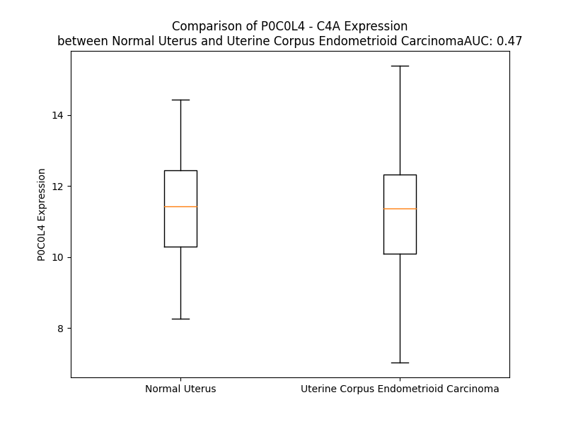

# Detailed Data for P0C0L4

## Introduction to the Detailed Summary

### How to Interpret the Results

- **Summary & Metrics**: This section provides a quick reference to essential protein attributes, including expression changes, family classification, and biomarker applications. Regulation status (upregulated/downregulated) indicates the protein's behavior in a disease context. Some information comes from the original excel file with the proteins selected from literature, while others are derived from the analyses.
- **Expression Comparison**: A visual representation comparing protein expression between normal and disease states. It highlights significant changes in expression levels that might indicate diagnostic or therapeutic relevance. This is data coming from transcriptomics experiments and could not translate similarly to protein levels.
- **Isoform Alignment**: An interactive view of isoform alignments, revealing structural and functional differences between variants of the protein.
- **Interactors & Homologs**: Tables listing known interaction partners and homologous proteins, the more interactors and homologs, the more complex the protein is to design an antibody for.
- **Biological Assemblies**: Information about the structural arrangement of the protein in different assemblies, providing insights into its functional state but also the complexity of the protein to develop antibodies.
- **Combined Per-Residue Information**: A detailed table summarizing residue-level data. This includes predictions for epitope regions, aggregation tendencies, and modifications that might impact the protein's function. Each row corresponds to a residue in the protein, providing insights into specific sites that may be important for research or drug development.
## Summary & Metrics

- **UniProt Accession**: P0C0L4
- **Gene Name**: C4A
- **Protein Name**: complement component 4A
- **Swiss Prot**: CO4A_HUMAN
- **Family**: other
- **Biomarker Application**: efficacy
- **Number of Isoforms**: 2
- **Regulation**: 1
- **(transcriptomics) AUC**: 0.41
- **(transcriptomics) Fold Change**: 1.05
- **(transcriptomics) Regulation**: Downregulated
- **Discotope Epitope Count**: 320
- **Max n_uniprots (Homo)**: 3
- **Max n_uniprots (Hetero)**: 5

## Expression Comparison

## Isoform Alignment

<pre style='font-size:14px; font-family:monospace;'>P0C0L4-1 MRLLWGLIWASSFFTLSLQKPRLLLFSPSVVHLGVPLSVGVQLQDVPRGQVVKGSVFLRNPSRNNVPCSPKVDFTLSSERDFALLSLQVPLKDAKSCGLHQLLRGPEVQLVAHSPWLKDSLSRTTNIQGINLLFSSRRGHLFLQTDQPIYNPGQRVRYRVFALDQKMRPSTDTITVMVENSHGLRVRKKEVYMPSSIFQDDFVIPDISEPGTWKISARFSDGLESNSSTQFEVKKYVLPNFEVKITPGKPYILTVPGHLDEMQLDIQARYIYGKPVQGVAYVRFGLLDEDGKKTFFRGLESQTKLVNGQSHISLSKAEFQDALEKLNMGITDLQGLRLYVAAAIIESPGGEMEEAELTSWYFVSSPFSLDLSKTKRHLVPGAPFLLQALVREMSGSPASGIPVKVSATVSSPGSVPEVQDIQQNTDGSGQVSIPIIIPQTISELQLSVSAGSPHPAIARLTVAAPPSGGPGFLSIERPDSRPPRVGDTLNLNLRAVGSGATFSHYYYMILSRGQIVFMNREPKRTLTSVSVFVDHHLAPSFYFVAFYYHGDHPVANSLRVDVQAGACEGKLELSVDGAKQYRNGESVKLHLETDSLALVALGALDTALYAAGSKSHKPLNMGKVFEAMNSYDLGCGPGGGDSALQVFQAAGLAFSDGDQWTLSRKRLSCPKEKTTRKKRNVNFQKAINEKLGQYASPTAKRCCQDGVTRLPMMRSCEQRAARVQQPDCREPFLSCCQFAESLRKKSRDKGQAGLQRALEILQEEDLIDEDDIPVRSFFPENWLWRVETVDRFQILTLWLPDSLTTWEIHGLSLSKTKGLCVATPVQLRVFREFHLHLRLPMSVRRFEQLELRPVLYNYLDKNLTVSVHVSPVEGLCLAGGGGLAQQVLVPAGSARPVAFSVVPTAAAAVSLKVVARGSFEFPVGDAVSKVLQIEKEGAIHREELVYELNPLDHRGRTLEIPGNSDPNMIPDGDFNSYVRVTASDPLDTLGSEGALSPGGVASLLRLPRGCGEQTMIYLAPTLAASRYLDKTEQWSTLPPETKDHAVDLIQKGYMRIQQFRKADGSYAAWLSRDSSTWLTAFVLKVLSLAQEQVGGSPEKLQETSNWLLSQQQADGSFQDPCPVLDRSMQGGLVGNDETVALTAFVTIALHHGLAVFQDEGAEPLKQRVEASISKANSFLGEKASAGLLGAHAAAITAYALTLTKAPVDLLGVAHNNLMAMAQETGDNLYWGSVTGSQSNAVSPTPAPRNPSDPMPQAPALWIETTAYALLHLLLHEGKAEMADQASAWLTRQGSFQGGFRSTQDTVIALDALSAYWIASHTTEERGLNVTLSSTGRNGFKSHALQLNNRQIRGLEEELQFSLGSKINVKVGGNSKGTLKVLRTYNVLDMKNTTCQDLQIEVTVKGHVEYTMEANEDYEDYEYDELPAKDDPDAPLQPVTPLQLFEGRRNRRRREAPKVVEEQESRVHYTVCIWRNGKVGLSGMAIADVTLLSGFHALRADLEKLTSLSDRYVSHFETEGPHVLLYFDSVPTSRECVGFEAVQEVPVGLVQPASATLYDYYNPERRCSVFYGAPSKSRLLATLCSAEVCQCAEGKCPRQRRALERGLQDEDGYRMKFACYYPRVEYGFQVKVLREDSRAAFRLFETKITQVLHFTKDVKAAANQMRNFLVRASCRLRLEPGKEYLIMGLDGATYDLEGHPQYLLDSNSWIEEMPSERLCRSTRQRAACAQLNDFLQEYGTQGCQV
P0C0L4-2 MRLLWGLIWASSFFTLSLQKPRLLLFSPSVVHLGVPLSVGVQLQDVPRGQVVKGSVFLRNPSRNNVPCSPKVDFTLSSERDFALLSLQVPLKDAKSCGLHQLLRGPEVQLVAHSPWLKDSLSRTTNIQGINLLFSSRRGHLFLQTDQPIYNPGQRVRYRVFALDQKMRPSTDTITVMVENSHGLRVRKKEVYMPSSIFQDDFVIPDISEPGTWKISARFSDGLESNSSTQFEVKKYVLPNFEVKITPGKPYILTVPGHLDEMQLDIQARYIYGKPVQGVAYVRFGLLDEDGKKTFFRGLESQTKLVNGQSHISLSKAEFQDALEKLNMGITDLQGLRLYVAAAIIESPGGEMEEAELTSWYFVSSPFSLDLSKTKRHLVPGAPFLLQALVREMSGSPASGIPVKVSATVSSPGSVPEVQDIQQNTDGSGQVSIPIIIPQTISELQLSVSAGSPHPAIARLTVAAPPSGGPGFLSIERPDSRPPRVGDTLNLNLRAVGSGATFSHYYYMILSRGQIVFMNREPKRTLTSVSVFVDHHLAPSFYFVAFYYHGDHPVANSLRVDVQAGACEGKLELSVDGAKQYRNGESVKLHLETDSLALVALGALDTALYAAGSKSHKPLNMGKVFEAMNSYDLGCGPGGGDSALQVFQAAGLAFSDGDQWTLSRKRLSCPKEKTTRKKRNVNFQKAINEKLGQYASPTAKRCCQDGVTRLPMMRSCEQRAARVQQPDCREPFLSCCQFAESLRKKSRDKGQAGLQRALEILQEEDLIDEDDIPVRSFFPENWLWRVETVDRFQILTLWLPDSLTTWEIHGLSLSKTKGLCVATPVQLRVFREFHLHLRLPMSVRRFEQLELRPVLYNYLDKNLTVSVHVSPVEGLCLAGGGGLAQQVLVPAGSARPVAFSVVPTAAAAVSLKVVARGSFEFPVGDAVSKVLQIEKEGAIHREELVYELNPLDHRGRTLEIPGNSDPNMIPDGDFNSYVRVTASDPLDTLGSEGALSPGGVASLLRLPRGCGEQTMIYLAPTLAASRYLDKTEQWSTLPPETKDHAVDLIQKGYMRIQQFRKADGSYAAWLSRDSSTWLTAFVLKVLSLAQEQVGGSPEKLQETSNWLLSQQQADGSFQDPCPVLDRSMQGGLVGNDETVALTAFVTIALHHGLAVFQDEGAEPLKQRVEASISKANSFLGEKASAGLLGAHAAAITAYALTLTKAPVDLLGVAHNNLMAMAQETGDNLYWGSVTGSQSNAVSPTPAPRNPSDPMPQAPALWIETTAYALLHLLLHEGKAEMADQASAWLTRQGSFQGGFRSTQDTVIALDALSAYWIASHTTEERGLNVTLSSTGRNGFKSHALQLNNRQIRGLEEELQFSLGSKINVKVGGNSKGTLKVLRTYNVLDMKNTTCQDLQIEVTVKGHVEYTMEANEDYEDYEYDELPAKDDPDAPLQPVTPLQLFEGRRNRRRREAPK----------------------------------------------LTSLSDRYVSHFETEGPHVLLYFDSVPTSRECVGFEAVQEVPVGLVQPASATLYDYYNPERRCSVFYGAPSKSRLLATLCSAEVCQCAEGKCPRQRRALERGLQDEDGYRMKFACYYPRVEYGFQVKVLREDSRAAFRLFETKITQVLHFTKDVKAAANQMRNFLVRASCRLRLEPGKEYLIMGLDGATYDLEGHPQYLLDSNSWIEEMPSERLCRSTRQRAACAQLNDFLQEYGTQGCQV
</pre>

## Interactors

| preferredName_A   | preferredName_B   |   score |
|:------------------|:------------------|--------:|
| C4A               | CR1               |   0.999 |
| C4A               | C4B               |   0.999 |
| C4A               | C4BPA             |   0.998 |
| C4A               | CD46              |   0.998 |
| C4A               | C3                |   0.998 |
| C4A               | MASP2             |   0.997 |
| C4A               | C4BPB             |   0.995 |
| C4A               | CD55              |   0.995 |
| C4A               | C1S               |   0.993 |
| C4A               | C1R               |   0.991 |
| C4A               | C3AR1             |   0.987 |
| C4A               | C1QA              |   0.983 |
| C4A               | MBL2              |   0.981 |
| C4A               | C5AR1             |   0.98  |
| C4A               | C1QB              |   0.973 |
| C4A               | C1QC              |   0.972 |
| C4A               | CFB               |   0.97  |
| C4A               | CFH               |   0.965 |
| C4A               | C2                |   0.953 |
| C4A               | PROS1             |   0.946 |
| C4A               | CFI               |   0.945 |
| C4A               | MASP1             |   0.942 |
| C4A               | CYP21A2           |   0.923 |
| C4A               | C5AR2             |   0.92  |
| C4A               | C8A               |   0.915 |

## Homologs

| uniprot_id   | gene_id   |
|:-------------|:----------|
| P0C0L4       | C4A       |
| P0C0L4       | C4A       |
| P0C0L4       | C4A       |
| F5GXS0       | C4B       |
| A0A8V8TN26   | C5        |
| P20742       | PZP       |
| A0A8Q3SI45   | C3        |
| Q6YHK3       | CD109     |
| F5H1E8       | A2M       |
| A8K2U0       | A2ML1     |
| Q8IZJ3       | CPAMD8    |

## Biological Assemblies

|   Unnamed: 0 |   assembly |   n_uniprots | composition   | crystal_id   |
|-------------:|-----------:|-------------:|:--------------|:-------------|
|            0 |          1 |            1 | Homo          | 1hzf         |
|            0 |          1 |            3 | Homo          | 5jtw         |
|            1 |          2 |            3 | Homo          | 5jtw         |
|            0 |          1 |            3 | Hetero        | 6ysq         |
|            1 |          2 |            3 | Hetero        | 6ysq         |
|            0 |          1 |            3 | Homo          | 5jpn         |
|            0 |          1 |            5 | Hetero        | 5jpm         |
|            1 |          2 |            5 | Hetero        | 5jpm         |

## Combined Per-Residue Information

|   res | aa   |   epitope_score | epitope   |   relative_surface_accessibility |   modeling_confidence |   Aggregation | modification             | glycosylation                             |
|------:|:-----|----------------:|:----------|---------------------------------:|----------------------:|--------------:|:-------------------------|:------------------------------------------|
|     1 | M    |         0.11859 | True      |                          1.14043 |                 45.29 |         0     | N/A                      | N/A                                       |
|     2 | R    |         0.19302 | True      |                          0.92015 |                 48.82 |         0     | N/A                      | N/A                                       |
|     3 | L    |         0.13933 | True      |                          0.9124  |                 46.64 |        41.925 | N/A                      | N/A                                       |
|     4 | L    |         0.20693 | True      |                          0.71325 |                 48.41 |        57.679 | N/A                      | N/A                                       |
|     5 | W    |         0.27377 | True      |                          0.88973 |                 50.33 |        65.433 | N/A                      | N/A                                       |
|     6 | G    |         0.14452 | True      |                          0.53418 |                 51.97 |        67.165 | N/A                      | N/A                                       |
|     7 | L    |         0.16841 | True      |                          0.76193 |                 51.41 |        85.253 | N/A                      | N/A                                       |
|     8 | I    |         0.10791 | True      |                          0.61396 |                 51.33 |        88.468 | N/A                      | N/A                                       |
|     9 | W    |         0.17538 | True      |                          0.81396 |                 48.31 |        87.769 | N/A                      | N/A                                       |
|    10 | A    |         0.11793 | True      |                          0.66852 |                 46.8  |        83.142 | N/A                      | N/A                                       |
|    11 | S    |         0.14673 | True      |                          0.51231 |                 43.23 |        79.148 | N/A                      | N/A                                       |
|    12 | S    |         0.14106 | True      |                          0.64924 |                 36.77 |        79.028 | N/A                      | N/A                                       |
|    13 | F    |         0.19686 | True      |                          0.7605  |                 37.31 |        80.198 | N/A                      | N/A                                       |
|    14 | F    |         0.16028 | True      |                          0.89227 |                 32.65 |        79.231 | N/A                      | N/A                                       |
|    15 | T    |         0.11217 | True      |                          0.81343 |                 34.7  |        66.516 | N/A                      | N/A                                       |
|    16 | L    |         0.14183 | True      |                          0.93158 |                 32.06 |        58.953 | N/A                      | N/A                                       |
|    17 | S    |         0.14502 | True      |                          0.74656 |                 41.6  |        17.187 | N/A                      | N/A                                       |
|    18 | L    |         0.11182 | True      |                          0.99596 |                 51.62 |        11.613 | N/A                      | N/A                                       |
|    19 | Q    |         0.07193 | False     |                          0.18967 |                 61.73 |         0.422 | N/A                      | N/A                                       |
|    20 | K    |         0.09094 | True      |                          0.48741 |                 74.08 |         0     | N/A                      | N/A                                       |
|    21 | P    |         0.04352 | False     |                          0.26615 |                 87.77 |         0     | N/A                      | N/A                                       |
|    22 | R    |         0.0258  | False     |                          0.02277 |                 90.53 |         0     | N/A                      | N/A                                       |
|    23 | L    |         0.00292 | False     |                          0.00082 |                 93.79 |         0     | N/A                      | N/A                                       |
|    24 | L    |         0.00245 | False     |                          0       |                 95.1  |         0     | N/A                      | N/A                                       |
|    25 | L    |         0.00221 | False     |                          0.00082 |                 96.89 |         0     | N/A                      | N/A                                       |
|    26 | F    |         0.00222 | False     |                          0.00064 |                 96.85 |         0     | N/A                      | N/A                                       |
|    27 | S    |         0.00172 | False     |                          0       |                 96.6  |         0     | N/A                      | N/A                                       |
|    28 | P    |         0.0041  | False     |                          0.02585 |                 95.65 |         0     | N/A                      | N/A                                       |
|    29 | S    |         0.02113 | False     |                          0.09342 |                 94.16 |         0     | N/A                      | N/A                                       |
|    30 | V    |         0.04215 | False     |                          0.11425 |                 93.71 |         0     | N/A                      | N/A                                       |
|    31 | V    |         0.00255 | False     |                          0.00381 |                 94.73 |         0     | N/A                      | N/A                                       |
|    32 | H    |         0.02548 | False     |                          0.07592 |                 94.05 |         0     | N/A                      | N/A                                       |
|    33 | L    |         0.00737 | False     |                          0.00742 |                 93.44 |         0     | N/A                      | N/A                                       |
|    34 | G    |         0.03639 | False     |                          0.46613 |                 92.03 |         0     | N/A                      | N/A                                       |
|    35 | V    |         0.03368 | False     |                          0.10138 |                 93.39 |         0     | N/A                      | N/A                                       |
|    36 | P    |         0.06228 | False     |                          0.37004 |                 94.6  |         0     | N/A                      | N/A                                       |
|    37 | L    |         0.00558 | False     |                          0.01649 |                 96.31 |         0.532 | N/A                      | N/A                                       |
|    38 | S    |         0.01495 | False     |                          0.089   |                 96.8  |         0.532 | N/A                      | N/A                                       |
|    39 | V    |         0.00169 | False     |                          0       |                 97.49 |         0.532 | N/A                      | N/A                                       |
|    40 | G    |         0.00332 | False     |                          0       |                 96.44 |         0.532 | N/A                      | N/A                                       |
|    41 | V    |         0.00316 | False     |                          0.00095 |                 96.22 |         0.532 | N/A                      | N/A                                       |
|    42 | Q    |         0.01098 | False     |                          0.00472 |                 95.32 |         0     | N/A                      | N/A                                       |
|    43 | L    |         0.01194 | False     |                          0.01069 |                 93.81 |         0     | N/A                      | N/A                                       |
|    44 | Q    |         0.02719 | False     |                          0.06255 |                 90.24 |         0     | N/A                      | N/A                                       |
|    45 | D    |         0.05498 | False     |                          0.35212 |                 86.28 |         0     | N/A                      | N/A                                       |
|    46 | V    |         0.03157 | False     |                          0.13889 |                 86.09 |         0     | N/A                      | N/A                                       |
|    47 | P    |         0.10427 | True      |                          0.59318 |                 84.3  |         0     | N/A                      | N/A                                       |
|    48 | R    |         0.17383 | True      |                          0.83099 |                 82.2  |         0     | N/A                      | N/A                                       |
|    49 | G    |         0.0923  | True      |                          0.8055  |                 84.77 |         0     | N/A                      | N/A                                       |
|    50 | Q    |         0.18426 | True      |                          0.32736 |                 89.51 |         0     | N/A                      | N/A                                       |
|    51 | V    |         0.09729 | True      |                          0.52237 |                 92.58 |         0     | N/A                      | N/A                                       |
|    52 | V    |         0.01613 | False     |                          0.01142 |                 93.56 |         0     | N/A                      | N/A                                       |
|    53 | K    |         0.08305 | False     |                          0.66122 |                 94.85 |         0     | N/A                      | N/A                                       |
|    54 | G    |         0.03071 | False     |                          0.14613 |                 94.88 |         0     | N/A                      | N/A                                       |
|    55 | S    |         0.06594 | False     |                          0.09101 |                 97.02 |         0     | N/A                      | N/A                                       |
|    56 | V    |         0.00596 | False     |                          0       |                 96.82 |         0     | N/A                      | N/A                                       |
|    57 | F    |         0.0517  | False     |                          0.1624  |                 97.36 |         0     | N/A                      | N/A                                       |
|    58 | L    |         0.00519 | False     |                          0.00824 |                 96.65 |         0     | N/A                      | N/A                                       |
|    59 | R    |         0.03597 | False     |                          0.01575 |                 94.29 |         0     | N/A                      | N/A                                       |
|    60 | N    |         0.00513 | False     |                          0.00635 |                 93.06 |         0     | N/A                      | N/A                                       |
|    61 | P    |         0.02422 | False     |                          0.10736 |                 87.9  |         0     | N/A                      | N/A                                       |
|    62 | S    |         0.05963 | False     |                          0.22825 |                 83.08 |         0     | N/A                      | N/A                                       |
|    63 | R    |         0.17335 | True      |                          0.50715 |                 87.26 |         0     | N/A                      | N/A                                       |
|    64 | N    |         0.08658 | False     |                          0.52789 |                 76.03 |         0     | N/A                      | N/A                                       |
|    65 | N    |         0.03082 | False     |                          0.28021 |                 82.76 |         0     | N/A                      | N/A                                       |
|    66 | V    |         0.09952 | True      |                          0.46271 |                 90.12 |         0     | N/A                      | N/A                                       |
|    67 | P    |         0.10331 | True      |                          0.49    |                 93.78 |         0     | N/A                      | N/A                                       |
|    68 | C    |         0.00243 | False     |                          0.001   |                 95.32 |         0     | N/A                      | N/A                                       |
|    69 | S    |         0.0367  | False     |                          0.03709 |                 96.18 |         0     | N/A                      | N/A                                       |
|    70 | P    |         0.14391 | True      |                          0.48204 |                 95.25 |         0     | N/A                      | N/A                                       |
|    71 | K    |         0.10946 | True      |                          0.60677 |                 95.31 |         0     | N/A                      | N/A                                       |
|    72 | V    |         0.10654 | True      |                          0.31799 |                 95.65 |         0     | N/A                      | N/A                                       |
|    73 | D    |         0.20132 | True      |                          0.54493 |                 96.59 |         0     | N/A                      | N/A                                       |
|    74 | F    |         0.04681 | False     |                          0.04193 |                 95.68 |         0     | N/A                      | N/A                                       |
|    75 | T    |         0.10994 | True      |                          0.57766 |                 95.82 |         0     | N/A                      | N/A                                       |
|    76 | L    |         0.0125  | False     |                          0.01801 |                 94.45 |         0     | N/A                      | N/A                                       |
|    77 | S    |         0.09168 | True      |                          0.25441 |                 91.67 |         0     | N/A                      | N/A                                       |
|    78 | S    |         0.0607  | False     |                          0.22181 |                 86.96 |         0     | N/A                      | N/A                                       |
|    79 | E    |         0.09078 | True      |                          0.52666 |                 86.38 |         0     | N/A                      | N/A                                       |
|    80 | R    |         0.14218 | True      |                          0.79049 |                 90.92 |         0     | N/A                      | N/A                                       |
|    81 | D    |         0.03505 | False     |                          0.05573 |                 92.88 |         0     | N/A                      | N/A                                       |
|    82 | F    |         0.03115 | False     |                          0.28164 |                 94.14 |        30.363 | N/A                      | N/A                                       |
|    83 | A    |         0.05236 | False     |                          0.23085 |                 94.93 |        30.634 | N/A                      | N/A                                       |
|    84 | L    |         0.05784 | False     |                          0.41641 |                 96.35 |        30.634 | N/A                      | N/A                                       |
|    85 | L    |         0.03718 | False     |                          0.15005 |                 95.99 |        30.634 | N/A                      | N/A                                       |
|    86 | S    |         0.06468 | False     |                          0.51072 |                 95.15 |        30.634 | N/A                      | N/A                                       |
|    87 | L    |         0.00703 | False     |                          0.00577 |                 96.85 |        26.084 | N/A                      | N/A                                       |
|    88 | Q    |         0.0611  | False     |                          0.47894 |                 95.78 |         0.973 | N/A                      | N/A                                       |
|    89 | V    |         0.02356 | False     |                          0.03136 |                 94.78 |         0     | N/A                      | N/A                                       |
|    90 | P    |         0.09237 | True      |                          0.33742 |                 93.9  |         0     | N/A                      | N/A                                       |
|    91 | L    |         0.06969 | False     |                          0.23095 |                 90.86 |         0     | N/A                      | N/A                                       |
|    92 | K    |         0.0981  | True      |                          0.81519 |                 92.02 |         0     | N/A                      | N/A                                       |
|    93 | D    |         0.08443 | False     |                          0.24416 |                 93.63 |         0     | N/A                      | N/A                                       |
|    94 | A    |         0.00225 | False     |                          0       |                 92.13 |         0     | N/A                      | N/A                                       |
|    95 | K    |         0.11431 | True      |                          0.67692 |                 90.98 |         0     | N/A                      | N/A                                       |
|    96 | S    |         0.1636  | True      |                          0.69492 |                 91.67 |         0     | N/A                      | N/A                                       |
|    97 | C    |         0.01386 | False     |                          0.01276 |                 92.8  |         0     | N/A                      | N/A                                       |
|    98 | G    |         0.03805 | False     |                          0.06207 |                 91.54 |         0     | N/A                      | N/A                                       |
|    99 | L    |         0.04013 | False     |                          0.03853 |                 91.25 |         0     | N/A                      | N/A                                       |
|   100 | H    |         0.10939 | True      |                          0.43629 |                 86.01 |         0     | N/A                      | N/A                                       |
|   101 | Q    |         0.11396 | True      |                          0.59228 |                 86.1  |         0     | N/A                      | N/A                                       |
|   102 | L    |         0.03583 | False     |                          0.24524 |                 86.31 |         0     | N/A                      | N/A                                       |
|   103 | L    |         0.05024 | False     |                          0.39025 |                 81.14 |         0     | N/A                      | N/A                                       |
|   104 | R    |         0.12896 | True      |                          0.38159 |                 79.05 |         0     | N/A                      | N/A                                       |
|   105 | G    |         0.10242 | True      |                          0.31894 |                 78.08 |         0     | N/A                      | N/A                                       |
|   106 | P    |         0.03377 | False     |                          0.44592 |                 89.28 |         0     | N/A                      | N/A                                       |
|   107 | E    |         0.05392 | False     |                          0.22032 |                 90.96 |         0     | N/A                      | N/A                                       |
|   108 | V    |         0.02248 | False     |                          0.0216  |                 94.34 |         0.577 | N/A                      | N/A                                       |
|   109 | Q    |         0.00841 | False     |                          0.01142 |                 95.64 |         0.577 | N/A                      | N/A                                       |
|   110 | L    |         0.00211 | False     |                          0       |                 96.85 |         0.577 | N/A                      | N/A                                       |
|   111 | V    |         0.0057  | False     |                          0.00286 |                 96.33 |         0.577 | N/A                      | N/A                                       |
|   112 | A    |         0.0045  | False     |                          0.00128 |                 96.3  |         0.577 | N/A                      | N/A                                       |
|   113 | H    |         0.06117 | False     |                          0.31804 |                 96.26 |         0     | N/A                      | N/A                                       |
|   114 | S    |         0.01223 | False     |                          0.00079 |                 95.54 |         0     | N/A                      | N/A                                       |
|   115 | P    |         0.08006 | False     |                          0.46324 |                 93.95 |         0     | N/A                      | N/A                                       |
|   116 | W    |         0.12697 | True      |                          0.09183 |                 93.71 |         0     | N/A                      | N/A                                       |
|   117 | L    |         0.00448 | False     |                          0       |                 93.29 |         0     | N/A                      | N/A                                       |
|   118 | K    |         0.09565 | True      |                          0.39614 |                 91.67 |         0     | N/A                      | N/A                                       |
|   119 | D    |         0.19426 | True      |                          0.68879 |                 92.27 |         0     | N/A                      | N/A                                       |
|   120 | S    |         0.13013 | True      |                          0.52553 |                 89.14 |         0     | N/A                      | N/A                                       |
|   121 | L    |         0.07068 | False     |                          0.18699 |                 89.12 |         0     | N/A                      | N/A                                       |
|   122 | S    |         0.15046 | True      |                          0.79659 |                 89.71 |         0     | N/A                      | N/A                                       |
|   123 | R    |         0.1181  | True      |                          0.16801 |                 89.25 |         0     | N/A                      | N/A                                       |
|   124 | T    |         0.10243 | True      |                          0.60915 |                 88.02 |         0     | N/A                      | N/A                                       |
|   125 | T    |         0.02546 | False     |                          0.02548 |                 92.02 |         0     | N/A                      | N/A                                       |
|   126 | N    |         0.04245 | False     |                          0.30113 |                 93.62 |         0     | N/A                      | N/A                                       |
|   127 | I    |         0.03995 | False     |                          0.0824  |                 93.6  |         0.339 | N/A                      | N/A                                       |
|   128 | Q    |         0.00438 | False     |                          0       |                 94.61 |         0.339 | N/A                      | N/A                                       |
|   129 | G    |         0.00612 | False     |                          0.02379 |                 94.12 |         1.132 | N/A                      | N/A                                       |
|   130 | I    |         0.01169 | False     |                          0.0176  |                 94.98 |        10.349 | N/A                      | N/A                                       |
|   131 | N    |         0.01642 | False     |                          0.06849 |                 94.65 |        10.349 | N/A                      | N/A                                       |
|   132 | L    |         0.00289 | False     |                          0.0076  |                 94.32 |        10.349 | N/A                      | N/A                                       |
|   133 | L    |         0.07212 | False     |                          0.18101 |                 93.81 |        10.349 | N/A                      | N/A                                       |
|   134 | F    |         0.02473 | False     |                          0.10431 |                 93.23 |        10.349 | N/A                      | N/A                                       |
|   135 | S    |         0.04696 | False     |                          0.11803 |                 92.25 |         0.399 | N/A                      | N/A                                       |
|   136 | S    |         0.01973 | False     |                          0.08545 |                 91.93 |         0     | N/A                      | N/A                                       |
|   137 | R    |         0.05227 | False     |                          0.27966 |                 92.88 |         0     | N/A                      | N/A                                       |
|   138 | R    |         0.03389 | False     |                          0.09718 |                 93.08 |         0     | N/A                      | N/A                                       |
|   139 | G    |         0.01848 | False     |                          0.11572 |                 91.76 |         0     | N/A                      | N/A                                       |
|   140 | H    |         0.01562 | False     |                          0.05515 |                 94.14 |         0     | N/A                      | N/A                                       |
|   141 | L    |         0.01731 | False     |                          0.07519 |                 95.72 |         0.246 | N/A                      | N/A                                       |
|   142 | F    |         0.02068 | False     |                          0.07478 |                 96.14 |         0.246 | N/A                      | N/A                                       |
|   143 | L    |         0.01638 | False     |                          0.08124 |                 94.59 |         0.246 | N/A                      | N/A                                       |
|   144 | Q    |         0.01559 | False     |                          0.12849 |                 94.06 |         0.246 | N/A                      | N/A                                       |
|   145 | T    |         0.02586 | False     |                          0.09865 |                 95.23 |         0.246 | N/A                      | N/A                                       |
|   146 | D    |         0.0067  | False     |                          0.01727 |                 92.25 |         0     | N/A                      | N/A                                       |
|   147 | Q    |         0.01242 | False     |                          0.03987 |                 93.92 |         0     | N/A                      | N/A                                       |
|   148 | P    |         0.02274 | False     |                          0.10082 |                 93.03 |         0     | N/A                      | N/A                                       |
|   149 | I    |         0.02044 | False     |                          0.0144  |                 92.97 |         0     | N/A                      | N/A                                       |
|   150 | Y    |         0.00276 | False     |                          0       |                 93.56 |         0     | N/A                      | N/A                                       |
|   151 | N    |         0.03427 | False     |                          0.1934  |                 89.1  |         0     | N/A                      | N/A                                       |
|   152 | P    |         0.04529 | False     |                          0.18223 |                 87.82 |         0     | N/A                      | N/A                                       |
|   153 | G    |         0.02811 | False     |                          0.35083 |                 87.44 |         0     | N/A                      | N/A                                       |
|   154 | Q    |         0.04504 | False     |                          0.20642 |                 90.48 |         0     | N/A                      | N/A                                       |
|   155 | R    |         0.14949 | True      |                          0.57007 |                 95.71 |         0     | N/A                      | N/A                                       |
|   156 | V    |         0.00164 | False     |                          0       |                 96.64 |         0     | N/A                      | N/A                                       |
|   157 | R    |         0.12182 | True      |                          0.29815 |                 97.49 |         0     | N/A                      | N/A                                       |
|   158 | Y    |         0.00659 | False     |                          0.00797 |                 96.85 |         0     | N/A                      | N/A                                       |
|   159 | R    |         0.00503 | False     |                          0       |                 96.4  |         0     | N/A                      | N/A                                       |
|   160 | V    |         0.00101 | False     |                          0       |                 96.33 |         0     | N/A                      | N/A                                       |
|   161 | F    |         0.00235 | False     |                          0       |                 97.02 |         0     | N/A                      | N/A                                       |
|   162 | A    |         0.00174 | False     |                          0       |                 96.44 |         0     | N/A                      | N/A                                       |
|   163 | L    |         0.00353 | False     |                          0.00061 |                 95.65 |         0     | N/A                      | N/A                                       |
|   164 | D    |         0.03494 | False     |                          0.28099 |                 92.65 |         0     | N/A                      | N/A                                       |
|   165 | Q    |         0.04581 | False     |                          0.20316 |                 89.58 |         0     | N/A                      | N/A                                       |
|   166 | K    |         0.07101 | False     |                          0.69139 |                 89.94 |         0     | N/A                      | N/A                                       |
|   167 | M    |         0.01433 | False     |                          0.02517 |                 92.43 |         0     | N/A                      | N/A                                       |
|   168 | R    |         0.06387 | False     |                          0.23109 |                 94.52 |         0     | N/A                      | N/A                                       |
|   169 | P    |         0.02491 | False     |                          0.23556 |                 95.75 |         0     | N/A                      | N/A                                       |
|   170 | S    |         0.01402 | False     |                          0.0882  |                 94.32 |         0     | N/A                      | N/A                                       |
|   171 | T    |         0.09757 | True      |                          0.47716 |                 95.08 |         0     | N/A                      | N/A                                       |
|   172 | D    |         0.0269  | False     |                          0.28795 |                 93.32 |         0     | N/A                      | N/A                                       |
|   173 | T    |         0.05689 | False     |                          0.36443 |                 94.92 |         4.856 | N/A                      | N/A                                       |
|   174 | I    |         0.0057  | False     |                          0       |                 94.53 |        12.398 | N/A                      | N/A                                       |
|   175 | T    |         0.02716 | False     |                          0.01444 |                 94.19 |        12.398 | N/A                      | N/A                                       |
|   176 | V    |         0.01245 | False     |                          0.01401 |                 94.33 |        12.398 | N/A                      | N/A                                       |
|   177 | M    |         0.04205 | False     |                          0.11887 |                 93    |        12.398 | N/A                      | N/A                                       |
|   178 | V    |         0.01167 | False     |                          0.00857 |                 94.71 |        12.016 | N/A                      | N/A                                       |
|   179 | E    |         0.03903 | False     |                          0.12615 |                 93    |         0     | N/A                      | N/A                                       |
|   180 | N    |         0.01079 | False     |                          0.06489 |                 88.96 |         0     | N/A                      | N/A                                       |
|   181 | S    |         0.03432 | False     |                          0.29752 |                 89.63 |         0     | N/A                      | N/A                                       |
|   182 | H    |         0.04011 | False     |                          0.41361 |                 85.37 |         0     | N/A                      | N/A                                       |
|   183 | G    |         0.04582 | False     |                          0.11494 |                 85.7  |         0     | N/A                      | N/A                                       |
|   184 | L    |         0.03061 | False     |                          0.12942 |                 86.77 |         0     | N/A                      | N/A                                       |
|   185 | R    |         0.06372 | False     |                          0.1979  |                 90.75 |         0     | N/A                      | N/A                                       |
|   186 | V    |         0.0811  | False     |                          0.37524 |                 90.29 |         0     | N/A                      | N/A                                       |
|   187 | R    |         0.05955 | False     |                          0.27262 |                 91.09 |         0     | N/A                      | N/A                                       |
|   188 | K    |         0.13464 | True      |                          0.4589  |                 90.45 |         0     | N/A                      | N/A                                       |
|   189 | K    |         0.12215 | True      |                          0.4188  |                 91.92 |         0     | N/A                      | N/A                                       |
|   190 | E    |         0.116   | True      |                          0.48288 |                 92.12 |         0     | N/A                      | N/A                                       |
|   191 | V    |         0.04632 | False     |                          0.25611 |                 92.71 |         0     | N/A                      | N/A                                       |
|   192 | Y    |         0.09378 | True      |                          0.61639 |                 94.23 |         0     | N/A                      | N/A                                       |
|   193 | M    |         0.00588 | False     |                          0.00547 |                 92.63 |         0     | N/A                      | N/A                                       |
|   194 | P    |         0.1227  | True      |                          0.71663 |                 91.56 |         0     | N/A                      | N/A                                       |
|   195 | S    |         0.08457 | False     |                          0.39164 |                 91.68 |         0     | N/A                      | N/A                                       |
|   196 | S    |         0.00892 | False     |                          0.02318 |                 95.94 |         0     | N/A                      | N/A                                       |
|   197 | I    |         0.02988 | False     |                          0.12118 |                 95.38 |         0     | N/A                      | N/A                                       |
|   198 | F    |         0.07594 | False     |                          0.14577 |                 95.61 |         0     | N/A                      | N/A                                       |
|   199 | Q    |         0.06771 | False     |                          0.43373 |                 95.62 |         0     | N/A                      | N/A                                       |
|   200 | D    |         0.05897 | False     |                          0.15571 |                 95.82 |         0     | N/A                      | N/A                                       |
|   201 | D    |         0.14481 | True      |                          0.2977  |                 95.25 |         0     | N/A                      | N/A                                       |
|   202 | F    |         0.04622 | False     |                          0.08788 |                 94.03 |         0     | N/A                      | N/A                                       |
|   203 | V    |         0.07095 | False     |                          0.60188 |                 93.86 |         0     | N/A                      | N/A                                       |
|   204 | I    |         0.00493 | False     |                          0.00177 |                 90.52 |         0     | N/A                      | N/A                                       |
|   205 | P    |         0.04121 | False     |                          0.27635 |                 87.44 |         0     | N/A                      | N/A                                       |
|   206 | D    |         0.07011 | False     |                          0.58554 |                 82.03 |         0     | N/A                      | N/A                                       |
|   207 | I    |         0.04021 | False     |                          0.1022  |                 81.14 |         0     | N/A                      | N/A                                       |
|   208 | S    |         0.04761 | False     |                          0.15921 |                 83.59 |         0     | N/A                      | N/A                                       |
|   209 | E    |         0.04459 | False     |                          0.40336 |                 82.72 |         0     | N/A                      | N/A                                       |
|   210 | P    |         0.101   | True      |                          0.65352 |                 85.5  |         0     | N/A                      | N/A                                       |
|   211 | G    |         0.03347 | False     |                          0.30031 |                 85.49 |         0     | N/A                      | N/A                                       |
|   212 | T    |         0.07807 | False     |                          0.57871 |                 92.05 |         0     | N/A                      | N/A                                       |
|   213 | W    |         0.01441 | False     |                          0.03483 |                 94.8  |         0     | N/A                      | N/A                                       |
|   214 | K    |         0.07769 | False     |                          0.3244  |                 94.95 |         0     | N/A                      | N/A                                       |
|   215 | I    |         0.00642 | False     |                          0       |                 95.85 |         0     | N/A                      | N/A                                       |
|   216 | S    |         0.05602 | False     |                          0.1032  |                 94.26 |         0     | N/A                      | N/A                                       |
|   217 | A    |         0.00166 | False     |                          0.00107 |                 95    |         0     | N/A                      | N/A                                       |
|   218 | R    |         0.0641  | False     |                          0.12335 |                 93.51 |         0     | N/A                      | N/A                                       |
|   219 | F    |         0.00665 | False     |                          0.00446 |                 92.94 |         0     | N/A                      | N/A                                       |
|   220 | S    |         0.07764 | False     |                          0.27867 |                 90.21 |         0     | N/A                      | N/A                                       |
|   221 | D    |         0.05137 | False     |                          0.36775 |                 87.65 |         0     | N/A                      | N/A                                       |
|   222 | G    |         0.00592 | False     |                          0       |                 84.9  |         0     | N/A                      | N/A                                       |
|   223 | L    |         0.12589 | True      |                          0.49244 |                 83.87 |         0     | N/A                      | N/A                                       |
|   224 | E    |         0.09929 | True      |                          0.434   |                 86.58 |         0     | N/A                      | N/A                                       |
|   225 | S    |         0.02027 | False     |                          0.06219 |                 82.91 |         0     | N/A                      | N/A                                       |
|   226 | N    |         0.18713 | True      |                          0.65211 |                 80.98 |         0     | N/A                      | N-linked (GlcNAc...) asparagine           |
|   227 | S    |         0.05051 | False     |                          0.25609 |                 90.79 |         0     | N/A                      | N/A                                       |
|   228 | S    |         0.16043 | True      |                          0.45626 |                 92.74 |         0     | N/A                      | N/A                                       |
|   229 | T    |         0.09568 | True      |                          0.16791 |                 92.97 |         0     | N/A                      | N/A                                       |
|   230 | Q    |         0.13622 | True      |                          0.45716 |                 93.72 |         0     | N/A                      | N/A                                       |
|   231 | F    |         0.00978 | False     |                          0.01224 |                 94.29 |         0     | N/A                      | N/A                                       |
|   232 | E    |         0.06517 | False     |                          0.19628 |                 93.39 |         0     | N/A                      | N/A                                       |
|   233 | V    |         0.00326 | False     |                          0.00282 |                 90.28 |         0     | N/A                      | N/A                                       |
|   234 | K    |         0.09878 | True      |                          0.28375 |                 86.24 |         0     | N/A                      | N/A                                       |
|   235 | K    |         0.12006 | True      |                          0.5734  |                 81.17 |         0     | N/A                      | N/A                                       |
|   236 | Y    |         0.0565  | False     |                          0.06048 |                 85.16 |         0     | N/A                      | N/A                                       |
|   237 | V    |         0.04395 | False     |                          0.28235 |                 84.49 |         0     | N/A                      | N/A                                       |
|   238 | L    |         0.01408 | False     |                          0.28016 |                 87.37 |         0     | N/A                      | N/A                                       |
|   239 | P    |         0.01701 | False     |                          0.02994 |                 88.84 |         0     | N/A                      | N/A                                       |
|   240 | N    |         0.01404 | False     |                          0.05539 |                 91.76 |         0     | N/A                      | N/A                                       |
|   241 | F    |         0.00382 | False     |                          0.00101 |                 93.01 |         0.241 | N/A                      | N/A                                       |
|   242 | E    |         0.01892 | False     |                          0.26314 |                 93.1  |         0.241 | N/A                      | N/A                                       |
|   243 | V    |         0.01406 | False     |                          0.10507 |                 92.15 |         0.241 | N/A                      | N/A                                       |
|   244 | K    |         0.0374  | False     |                          0.49987 |                 92.37 |         0.241 | N/A                      | N/A                                       |
|   245 | I    |         0.05443 | False     |                          0.12032 |                 93.41 |         0.241 | N/A                      | N/A                                       |
|   246 | T    |         0.06755 | False     |                          0.54412 |                 93.19 |         0     | N/A                      | N/A                                       |
|   247 | P    |         0.0363  | False     |                          0.17107 |                 92.41 |         0     | N/A                      | N/A                                       |
|   248 | G    |         0.12094 | True      |                          0.69582 |                 87.87 |         0     | N/A                      | N/A                                       |
|   249 | K    |         0.06509 | False     |                          0.3308  |                 89.53 |         0     | N/A                      | N/A                                       |
|   250 | P    |         0.0362  | False     |                          0.41397 |                 88.93 |         0     | N/A                      | N/A                                       |
|   251 | Y    |         0.01613 | False     |                          0.11984 |                 89.99 |         0.379 | N/A                      | N/A                                       |
|   252 | I    |         0.00301 | False     |                          0       |                 90.9  |         0.509 | N/A                      | N/A                                       |
|   253 | L    |         0.0271  | False     |                          0.07666 |                 89.59 |         0.509 | N/A                      | N/A                                       |
|   254 | T    |         0.04947 | False     |                          0.0671  |                 86.78 |         0.509 | N/A                      | N/A                                       |
|   255 | V    |         0.1254  | True      |                          0.2239  |                 82.49 |         0.509 | N/A                      | N/A                                       |
|   256 | P    |         0.15958 | True      |                          0.91421 |                 78.28 |         0.29  | N/A                      | N/A                                       |
|   257 | G    |         0.13762 | True      |                          1.11307 |                 81.78 |         0     | N/A                      | N/A                                       |
|   258 | H    |         0.15271 | True      |                          0.45771 |                 85.17 |         0     | N/A                      | N/A                                       |
|   259 | L    |         0.04628 | False     |                          0.13654 |                 86.78 |         0     | N/A                      | N/A                                       |
|   260 | D    |         0.0181  | False     |                          0.01677 |                 87.4  |         0     | N/A                      | N/A                                       |
|   261 | E    |         0.07205 | False     |                          0.38867 |                 88.01 |         0     | N/A                      | N/A                                       |
|   262 | M    |         0.01409 | False     |                          0.01016 |                 92.25 |         0     | N/A                      | N/A                                       |
|   263 | Q    |         0.09789 | True      |                          0.30743 |                 93.24 |         0     | N/A                      | N/A                                       |
|   264 | L    |         0.00747 | False     |                          0.00495 |                 93.61 |         0     | N/A                      | N/A                                       |
|   265 | D    |         0.04726 | False     |                          0.35806 |                 94.75 |         0     | N/A                      | N/A                                       |
|   266 | I    |         0.00366 | False     |                          0       |                 94.57 |         0     | N/A                      | N/A                                       |
|   267 | Q    |         0.04925 | False     |                          0.28876 |                 94.88 |         0     | N/A                      | N/A                                       |
|   268 | A    |         0.00188 | False     |                          0       |                 94.33 |         0     | N/A                      | N/A                                       |
|   269 | R    |         0.09911 | True      |                          0.41575 |                 94.47 |         0     | N/A                      | N/A                                       |
|   270 | Y    |         0.02283 | False     |                          0.04372 |                 93.51 |         0     | N/A                      | N/A                                       |
|   271 | I    |         0.02707 | False     |                          0.11175 |                 93.46 |         0     | N/A                      | N/A                                       |
|   272 | Y    |         0.02012 | False     |                          0.02131 |                 92.14 |         0     | N/A                      | N/A                                       |
|   273 | G    |         0.0371  | False     |                          0.17128 |                 89.5  |         0     | N/A                      | N/A                                       |
|   274 | K    |         0.05491 | False     |                          0.32742 |                 92.75 |         0     | N/A                      | N/A                                       |
|   275 | P    |         0.03312 | False     |                          0.40649 |                 94.18 |         0     | N/A                      | N/A                                       |
|   276 | V    |         0.00547 | False     |                          0.01245 |                 93.21 |         0.138 | N/A                      | N/A                                       |
|   277 | Q    |         0.02703 | False     |                          0.36009 |                 91.01 |         0.138 | N/A                      | N/A                                       |
|   278 | G    |         0.00113 | False     |                          0       |                 91.08 |         0.964 | N/A                      | N/A                                       |
|   279 | V    |         0.00341 | False     |                          0       |                 90.07 |         0.964 | N/A                      | N/A                                       |
|   280 | A    |         0.00115 | False     |                          0       |                 91.75 |         0.964 | N/A                      | N/A                                       |
|   281 | Y    |         0.00544 | False     |                          0.02718 |                 90.95 |         0.964 | N/A                      | N/A                                       |
|   282 | V    |         0.00178 | False     |                          0       |                 91.72 |         0.964 | N/A                      | N/A                                       |
|   283 | R    |         0.02703 | False     |                          0.09479 |                 89.98 |         0     | N/A                      | N/A                                       |
|   284 | F    |         0.00739 | False     |                          0.02357 |                 92.36 |         0     | N/A                      | N/A                                       |
|   285 | G    |         0.0035  | False     |                          0.00322 |                 92.54 |         0     | N/A                      | N/A                                       |
|   286 | L    |         0.03148 | False     |                          0.0617  |                 93.05 |         0     | N/A                      | N/A                                       |
|   287 | L    |         0.03567 | False     |                          0.04699 |                 91.53 |         0     | N/A                      | N/A                                       |
|   288 | D    |         0.0549  | False     |                          0.1787  |                 87.6  |         0     | N/A                      | N/A                                       |
|   289 | E    |         0.09343 | True      |                          0.3562  |                 83.89 |         0     | N/A                      | N/A                                       |
|   290 | D    |         0.09581 | True      |                          0.88467 |                 82.22 |         0     | N/A                      | N/A                                       |
|   291 | G    |         0.09027 | True      |                          0.45474 |                 79.49 |         0     | N/A                      | N/A                                       |
|   292 | K    |         0.16733 | True      |                          0.71397 |                 82.67 |         0     | N/A                      | N/A                                       |
|   293 | K    |         0.13575 | True      |                          0.41473 |                 88.33 |         0     | N/A                      | N/A                                       |
|   294 | T    |         0.06538 | False     |                          0.33189 |                 88.52 |         0     | N/A                      | N/A                                       |
|   295 | F    |         0.03542 | False     |                          0.26008 |                 87.22 |         0     | N/A                      | N/A                                       |
|   296 | F    |         0.00743 | False     |                          0.01018 |                 87.35 |         0     | N/A                      | N/A                                       |
|   297 | R    |         0.08067 | False     |                          0.46955 |                 79.67 |         0     | N/A                      | N/A                                       |
|   298 | G    |         0.09012 | True      |                          0.70187 |                 74.77 |         0     | N/A                      | N/A                                       |
|   299 | L    |         0.03504 | False     |                          0.10232 |                 83.69 |         0     | N/A                      | N/A                                       |
|   300 | E    |         0.02455 | False     |                          0.1284  |                 83.38 |         0     | N/A                      | N/A                                       |
|   301 | S    |         0.04479 | False     |                          0.15955 |                 86.07 |         0     | N/A                      | N/A                                       |
|   302 | Q    |         0.03448 | False     |                          0.21856 |                 86.1  |         0     | N/A                      | N/A                                       |
|   303 | T    |         0.06225 | False     |                          0.27039 |                 89.98 |         0     | N/A                      | N/A                                       |
|   304 | K    |         0.04348 | False     |                          0.35219 |                 90.66 |         0     | N/A                      | N/A                                       |
|   305 | L    |         0.00453 | False     |                          0.00244 |                 91.25 |         0     | N/A                      | N/A                                       |
|   306 | V    |         0.04456 | False     |                          0.75479 |                 88.36 |         0     | N/A                      | N/A                                       |
|   307 | N    |         0.09924 | True      |                          0.77759 |                 89.25 |         0     | N/A                      | N/A                                       |
|   308 | G    |         0.00745 | False     |                          0.0119  |                 89.7  |         0     | N/A                      | N/A                                       |
|   309 | Q    |         0.14124 | True      |                          0.47194 |                 93.14 |         0     | N/A                      | N/A                                       |
|   310 | S    |         0.02838 | False     |                          0.06878 |                 92.67 |         0     | N/A                      | N/A                                       |
|   311 | H    |         0.11288 | True      |                          0.58836 |                 94.1  |         0     | N/A                      | N/A                                       |
|   312 | I    |         0.05349 | False     |                          0.06097 |                 91.83 |         0     | N/A                      | N/A                                       |
|   313 | S    |         0.11663 | True      |                          0.55909 |                 91.61 |         0     | N/A                      | N/A                                       |
|   314 | L    |         0.04254 | False     |                          0.06401 |                 89.76 |         0     | N/A                      | N/A                                       |
|   315 | S    |         0.03194 | False     |                          0.32299 |                 88.33 |         0     | N/A                      | N/A                                       |
|   316 | K    |         0.06323 | False     |                          0.41952 |                 86.96 |         0     | N/A                      | N/A                                       |
|   317 | A    |         0.02446 | False     |                          0.51787 |                 87.77 |         0     | N/A                      | N/A                                       |
|   318 | E    |         0.02689 | False     |                          0.4162  |                 89.33 |         0     | N/A                      | N/A                                       |
|   319 | F    |         0.0043  | False     |                          0.00318 |                 88.93 |         0     | N/A                      | N/A                                       |
|   320 | Q    |         0.00842 | False     |                          0.13186 |                 88.22 |         0     | N/A                      | N/A                                       |
|   321 | D    |         0.01092 | False     |                          0.09728 |                 89.21 |         0     | N/A                      | N/A                                       |
|   322 | A    |         0.00945 | False     |                          0.0239  |                 89    |         0     | N/A                      | N/A                                       |
|   323 | L    |         0.00369 | False     |                          0.00165 |                 89.01 |         0     | N/A                      | N/A                                       |
|   324 | E    |         0.02415 | False     |                          0.42209 |                 88.47 |         0     | N/A                      | N/A                                       |
|   325 | K    |         0.04471 | False     |                          0.60662 |                 87.47 |         0     | N/A                      | N/A                                       |
|   326 | L    |         0.0323  | False     |                          0.34215 |                 87.23 |         0     | N/A                      | N/A                                       |
|   327 | N    |         0.07569 | False     |                          0.86849 |                 89.24 |         0     | N/A                      | N/A                                       |
|   328 | M    |         0.02039 | False     |                          0.46142 |                 87.22 |         0     | N/A                      | N/A                                       |
|   329 | G    |         0.0193  | False     |                          0.29187 |                 85.72 |         0     | N/A                      | N/A                                       |
|   330 | I    |         0.02133 | False     |                          0.34036 |                 83.88 |         0.004 | N/A                      | N/A                                       |
|   331 | T    |         0.07781 | False     |                          0.85334 |                 80.83 |         0.004 | N/A                      | N/A                                       |
|   332 | D    |         0.01561 | False     |                          0.2547  |                 86.14 |         0.004 | N/A                      | N/A                                       |
|   333 | L    |         0.00869 | False     |                          0.01879 |                 86.86 |         0.004 | N/A                      | N/A                                       |
|   334 | Q    |         0.03386 | False     |                          0.54248 |                 77.45 |         0.004 | N/A                      | N/A                                       |
|   335 | G    |         0.01968 | False     |                          0.22094 |                 80.34 |         0.014 | N/A                      | N/A                                       |
|   336 | L    |         0.02119 | False     |                          0.04452 |                 91.32 |         0.136 | N/A                      | N/A                                       |
|   337 | R    |         0.07701 | False     |                          0.14805 |                 92.68 |         0.158 | N/A                      | N/A                                       |
|   338 | L    |         0.00288 | False     |                          0       |                 93.92 |        81.68  | N/A                      | N/A                                       |
|   339 | Y    |         0.01348 | False     |                          0.00643 |                 93.75 |        96.594 | N/A                      | N/A                                       |
|   340 | V    |         0.00111 | False     |                          0       |                 93.73 |        97.173 | N/A                      | N/A                                       |
|   341 | A    |         0.00532 | False     |                          0       |                 91.14 |        97.218 | N/A                      | N/A                                       |
|   342 | A    |         0.00189 | False     |                          0       |                 91.45 |        97.218 | N/A                      | N/A                                       |
|   343 | A    |         0.01099 | False     |                          0.05193 |                 90.74 |        97.119 | N/A                      | N/A                                       |
|   344 | I    |         0.00124 | False     |                          0       |                 92.01 |        97.02  | N/A                      | N/A                                       |
|   345 | I    |         0.00375 | False     |                          0.0024  |                 90.41 |        88.899 | N/A                      | N/A                                       |
|   346 | E    |         0.00319 | False     |                          0.00053 |                 91.06 |         0.154 | N/A                      | N/A                                       |
|   347 | S    |         0.00378 | False     |                          0.01352 |                 85.93 |         0     | N/A                      | N/A                                       |
|   348 | P    |         0.00718 | False     |                          0.02783 |                 82.35 |         0     | N/A                      | N/A                                       |
|   349 | G    |         0.01972 | False     |                          0.03968 |                 80.33 |         0     | N/A                      | N/A                                       |
|   350 | G    |         0.00989 | False     |                          0.17026 |                 82.97 |         0     | N/A                      | N/A                                       |
|   351 | E    |         0.0147  | False     |                          0.10317 |                 88.4  |         0     | N/A                      | N/A                                       |
|   352 | M    |         0.02208 | False     |                          0.18874 |                 88.35 |         0     | N/A                      | N/A                                       |
|   353 | E    |         0.02513 | False     |                          0.14873 |                 89.85 |         0     | N/A                      | N/A                                       |
|   354 | E    |         0.03843 | False     |                          0.37508 |                 88.19 |         0     | N/A                      | N/A                                       |
|   355 | A    |         0.01017 | False     |                          0.16453 |                 89.18 |         0     | N/A                      | N/A                                       |
|   356 | E    |         0.08081 | False     |                          0.44739 |                 90.61 |         0     | N/A                      | N/A                                       |
|   357 | L    |         0.02724 | False     |                          0.13355 |                 90.35 |        21.437 | N/A                      | N/A                                       |
|   358 | T    |         0.05801 | False     |                          0.36994 |                 89.3  |        25.342 | N/A                      | N/A                                       |
|   359 | S    |         0.03735 | False     |                          0.47358 |                 86.43 |        42.026 | N/A                      | N/A                                       |
|   360 | W    |         0.02903 | False     |                          0.01029 |                 92.03 |        56.868 | N/A                      | N/A                                       |
|   361 | Y    |         0.09177 | True      |                          0.27964 |                 91.36 |        56.868 | N/A                      | N/A                                       |
|   362 | F    |         0.00402 | False     |                          0.0071  |                 91.5  |        56.746 | N/A                      | N/A                                       |
|   363 | V    |         0.02856 | False     |                          0.12758 |                 88.64 |        54.972 | N/A                      | N/A                                       |
|   364 | S    |         0.06487 | False     |                          0.55152 |                 87.23 |        19.271 | N/A                      | N/A                                       |
|   365 | S    |         0.01757 | False     |                          0.11084 |                 90.43 |         0     | N/A                      | N/A                                       |
|   366 | P    |         0.0324  | False     |                          0.09742 |                 90.88 |         0     | N/A                      | N/A                                       |
|   367 | F    |         0.04176 | False     |                          0.14267 |                 92.14 |         0     | N/A                      | N/A                                       |
|   368 | S    |         0.0262  | False     |                          0.34072 |                 91.01 |         0     | N/A                      | N/A                                       |
|   369 | L    |         0.02355 | False     |                          0.19477 |                 90.9  |         0     | N/A                      | N/A                                       |
|   370 | D    |         0.03632 | False     |                          0.19167 |                 90.15 |         0     | N/A                      | N/A                                       |
|   371 | L    |         0.04501 | False     |                          0.14888 |                 91.48 |         0     | N/A                      | N/A                                       |
|   372 | S    |         0.11001 | True      |                          0.47593 |                 84.2  |         0     | N/A                      | N/A                                       |
|   373 | K    |         0.04916 | False     |                          0.27253 |                 86.23 |         0     | N/A                      | N/A                                       |
|   374 | T    |         0.00246 | False     |                          0       |                 89.35 |         0     | N/A                      | N/A                                       |
|   375 | K    |         0.01184 | False     |                          0.15179 |                 85.38 |         0     | N/A                      | N/A                                       |
|   376 | R    |         0.10897 | True      |                          0.40256 |                 84.9  |         0     | N/A                      | N/A                                       |
|   377 | H    |         0.06728 | False     |                          0.32307 |                 84.03 |         0     | N/A                      | N/A                                       |
|   378 | L    |         0.01692 | False     |                          0.03581 |                 83.61 |         0     | N/A                      | N/A                                       |
|   379 | V    |         0.01281 | False     |                          0.16407 |                 89.66 |         0     | N/A                      | N/A                                       |
|   380 | P    |         0.02104 | False     |                          0.07663 |                 87.97 |         0     | N/A                      | N/A                                       |
|   381 | G    |         0.02947 | False     |                          0.37631 |                 88.97 |         0     | N/A                      | N/A                                       |
|   382 | A    |         0.01204 | False     |                          0.04131 |                 89.24 |         0     | N/A                      | N/A                                       |
|   383 | P    |         0.04696 | False     |                          0.37305 |                 91.13 |         0.652 | N/A                      | N/A                                       |
|   384 | F    |         0.01479 | False     |                          0.04783 |                 91.66 |        54.71  | N/A                      | N/A                                       |
|   385 | L    |         0.03159 | False     |                          0.35504 |                 90.79 |        59.058 | N/A                      | N/A                                       |
|   386 | L    |         0.00183 | False     |                          0       |                 92.28 |        59.854 | N/A                      | N/A                                       |
|   387 | Q    |         0.02542 | False     |                          0.13527 |                 90.35 |        59.854 | N/A                      | N/A                                       |
|   388 | A    |         0.00254 | False     |                          0       |                 91.71 |        59.854 | N/A                      | N/A                                       |
|   389 | L    |         0.02467 | False     |                          0.09563 |                 91.47 |        59.551 | N/A                      | N/A                                       |
|   390 | V    |         0.00273 | False     |                          0       |                 93.54 |        58.946 | N/A                      | N/A                                       |
|   391 | R    |         0.18723 | True      |                          0.32139 |                 90.71 |         0     | N/A                      | N/A                                       |
|   392 | E    |         0.04041 | False     |                          0.28138 |                 89.02 |         0     | N/A                      | N/A                                       |
|   393 | M    |         0.03849 | False     |                          0.26611 |                 84.78 |         0     | N/A                      | N/A                                       |
|   394 | S    |         0.09791 | True      |                          0.5338  |                 76.11 |         0     | N/A                      | N/A                                       |
|   395 | G    |         0.10206 | True      |                          0.44553 |                 76.72 |         0     | N/A                      | N/A                                       |
|   396 | S    |         0.13573 | True      |                          0.56818 |                 84.62 |         0     | N/A                      | N/A                                       |
|   397 | P    |         0.07496 | False     |                          0.47738 |                 87.03 |         0     | N/A                      | N/A                                       |
|   398 | A    |         0.03028 | False     |                          0.04847 |                 88.2  |         0     | N/A                      | N/A                                       |
|   399 | S    |         0.09979 | True      |                          0.46243 |                 90.49 |         0     | N/A                      | N/A                                       |
|   400 | G    |         0.04931 | False     |                          0.52538 |                 92.82 |         0     | N/A                      | N/A                                       |
|   401 | I    |         0.05363 | False     |                          0.17039 |                 93.71 |         0     | N/A                      | N/A                                       |
|   402 | P    |         0.08581 | False     |                          0.3395  |                 96.03 |         0     | N/A                      | N/A                                       |
|   403 | V    |         0.00123 | False     |                          0       |                 95.77 |         0     | N/A                      | N/A                                       |
|   404 | K    |         0.04383 | False     |                          0.43452 |                 95.95 |         0     | N/A                      | N/A                                       |
|   405 | V    |         0.00319 | False     |                          0.00286 |                 95.06 |         0.194 | N/A                      | N/A                                       |
|   406 | S    |         0.05039 | False     |                          0.26974 |                 95.61 |         0.194 | N/A                      | N/A                                       |
|   407 | A    |         0.00244 | False     |                          0.00255 |                 94.19 |         0.194 | N/A                      | N/A                                       |
|   408 | T    |         0.0526  | False     |                          0.34856 |                 93.62 |         0.194 | N/A                      | N/A                                       |
|   409 | V    |         0.01354 | False     |                          0.0161  |                 91.19 |         0.194 | N/A                      | N/A                                       |
|   410 | S    |         0.05469 | False     |                          0.20582 |                 88.19 |         0     | N/A                      | N/A                                       |
|   411 | S    |         0.07316 | False     |                          0.18141 |                 81.21 |         0     | N/A                      | N/A                                       |
|   412 | P    |         0.18278 | True      |                          0.72012 |                 79.13 |         0     | N/A                      | N/A                                       |
|   413 | G    |         0.13731 | True      |                          1.08176 |                 80.07 |         0     | N/A                      | N/A                                       |
|   414 | S    |         0.15767 | True      |                          0.54966 |                 79.95 |         0     | N/A                      | N/A                                       |
|   415 | V    |         0.16138 | True      |                          0.92859 |                 85.51 |         0     | N/A                      | N/A                                       |
|   416 | P    |         0.11111 | True      |                          0.59451 |                 85.87 |         0     | N/A                      | N/A                                       |
|   417 | E    |         0.05618 | False     |                          0.54694 |                 88.39 |         0     | N/A                      | N/A                                       |
|   418 | V    |         0.13541 | True      |                          0.65058 |                 91.6  |         0     | N/A                      | N/A                                       |
|   419 | Q    |         0.04935 | False     |                          0.16683 |                 91.73 |         0     | N/A                      | N/A                                       |
|   420 | D    |         0.11471 | True      |                          0.52368 |                 93.28 |         0     | N/A                      | N/A                                       |
|   421 | I    |         0.04603 | False     |                          0.31093 |                 94.79 |         0     | N/A                      | N/A                                       |
|   422 | Q    |         0.09059 | True      |                          0.5882  |                 93.3  |         0     | N/A                      | N/A                                       |
|   423 | Q    |         0.06679 | False     |                          0.40337 |                 93.94 |         0     | N/A                      | N/A                                       |
|   424 | N    |         0.0899  | False     |                          0.54664 |                 94.27 |         0     | N/A                      | N/A                                       |
|   425 | T    |         0.03057 | False     |                          0.06132 |                 92.61 |         0     | N/A                      | N/A                                       |
|   426 | D    |         0.04412 | False     |                          0.32834 |                 87.69 |         0     | N/A                      | N/A                                       |
|   427 | G    |         0.1039  | True      |                          0.91907 |                 77.72 |         0     | N/A                      | N/A                                       |
|   428 | S    |         0.07618 | False     |                          0.36537 |                 78.69 |         0     | N/A                      | N/A                                       |
|   429 | G    |         0.00389 | False     |                          0       |                 86.7  |         0     | N/A                      | N/A                                       |
|   430 | Q    |         0.02031 | False     |                          0.07891 |                 88.98 |         0     | N/A                      | N/A                                       |
|   431 | V    |         0.0194  | False     |                          0.02856 |                 92.68 |         0     | N/A                      | N/A                                       |
|   432 | S    |         0.03132 | False     |                          0.15168 |                 91.78 |         0     | N/A                      | N/A                                       |
|   433 | I    |         0.00976 | False     |                          0.0048  |                 92.86 |         0     | N/A                      | N/A                                       |
|   434 | P    |         0.08868 | False     |                          0.52133 |                 92.14 |         0     | N/A                      | N/A                                       |
|   435 | I    |         0.0048  | False     |                          0.0008  |                 92.69 |         0     | N/A                      | N/A                                       |
|   436 | I    |         0.04486 | False     |                          0.66894 |                 92.83 |         0     | N/A                      | N/A                                       |
|   437 | I    |         0.0118  | False     |                          0.03745 |                 90.95 |         0     | N/A                      | N/A                                       |
|   438 | P    |         0.10111 | True      |                          0.36071 |                 89.54 |         0     | N/A                      | N/A                                       |
|   439 | Q    |         0.11861 | True      |                          0.72362 |                 84.06 |         0     | N/A                      | N/A                                       |
|   440 | T    |         0.07264 | False     |                          0.66823 |                 82.84 |         0     | N/A                      | N/A                                       |
|   441 | I    |         0.04684 | False     |                          0.08061 |                 87.42 |         0     | N/A                      | N/A                                       |
|   442 | S    |         0.06463 | False     |                          0.3896  |                 86.06 |         0     | N/A                      | N/A                                       |
|   443 | E    |         0.09595 | True      |                          0.26443 |                 89.95 |         0     | N/A                      | N/A                                       |
|   444 | L    |         0.00243 | False     |                          0       |                 91.93 |         0     | N/A                      | N/A                                       |
|   445 | Q    |         0.08574 | False     |                          0.41414 |                 93.74 |         0     | N/A                      | N/A                                       |
|   446 | L    |         0.00933 | False     |                          0.02594 |                 93.55 |         0     | N/A                      | N/A                                       |
|   447 | S    |         0.08459 | False     |                          0.42537 |                 94.57 |         0     | N/A                      | N/A                                       |
|   448 | V    |         0.00745 | False     |                          0.01005 |                 95.09 |         0     | N/A                      | N/A                                       |
|   449 | S    |         0.10327 | True      |                          0.27784 |                 95.95 |         0     | N/A                      | N/A                                       |
|   450 | A    |         0.00276 | False     |                          0       |                 94.05 |         0     | N/A                      | N/A                                       |
|   451 | G    |         0.03292 | False     |                          0.09328 |                 90.61 |         0     | N/A                      | N/A                                       |
|   452 | S    |         0.24103 | True      |                          0.70304 |                 88.78 |         0     | N/A                      | N/A                                       |
|   453 | P    |         0.37024 | True      |                          0.73181 |                 87.29 |         0     | N/A                      | N/A                                       |
|   454 | H    |         0.07052 | False     |                          0.27887 |                 89.52 |         0     | N/A                      | N/A                                       |
|   455 | P    |         0.04729 | False     |                          0.42167 |                 92.54 |         0     | N/A                      | N/A                                       |
|   456 | A    |         0.01599 | False     |                          0.06887 |                 92.06 |         0     | N/A                      | N/A                                       |
|   457 | I    |         0.05799 | False     |                          0.82758 |                 92.95 |         0     | N/A                      | N/A                                       |
|   458 | A    |         0.04958 | False     |                          0.19919 |                 92.7  |         0     | N/A                      | N/A                                       |
|   459 | R    |         0.19911 | True      |                          0.86589 |                 92.63 |         0     | N/A                      | N/A                                       |
|   460 | L    |         0.04262 | False     |                          0.20566 |                 91.38 |         0     | N/A                      | N/A                                       |
|   461 | T    |         0.11214 | True      |                          0.60269 |                 90.53 |         0     | N/A                      | N/A                                       |
|   462 | V    |         0.01362 | False     |                          0.01999 |                 89.28 |         0     | N/A                      | N/A                                       |
|   463 | A    |         0.04734 | False     |                          0.62926 |                 87.15 |         0     | N/A                      | N/A                                       |
|   464 | A    |         0.0251  | False     |                          0.18178 |                 85.02 |         0     | N/A                      | N/A                                       |
|   465 | P    |         0.01855 | False     |                          0.09345 |                 82.73 |         0     | N/A                      | N/A                                       |
|   466 | P    |         0.10857 | True      |                          0.75282 |                 79.69 |         0     | N/A                      | N/A                                       |
|   467 | S    |         0.09607 | True      |                          0.99863 |                 65.66 |         0     | N/A                      | N/A                                       |
|   468 | G    |         0.19087 | True      |                          0.90042 |                 69.57 |         0     | N/A                      | N/A                                       |
|   469 | G    |         0.13421 | True      |                          0.4557  |                 65.72 |         0     | N/A                      | N/A                                       |
|   470 | P    |         0.08775 | False     |                          0.38811 |                 74.67 |         0     | N/A                      | N/A                                       |
|   471 | G    |         0.01318 | False     |                          0.07171 |                 86.08 |         1.343 | N/A                      | N/A                                       |
|   472 | F    |         0.02298 | False     |                          0.2078  |                 90.25 |         1.343 | N/A                      | N/A                                       |
|   473 | L    |         0.00248 | False     |                          0.00769 |                 92.74 |         1.343 | N/A                      | N/A                                       |
|   474 | S    |         0.02486 | False     |                          0.04577 |                 92.84 |         1.343 | N/A                      | N/A                                       |
|   475 | I    |         0.02283 | False     |                          0.07724 |                 93.78 |         1.343 | N/A                      | N/A                                       |
|   476 | E    |         0.02501 | False     |                          0.21963 |                 90.79 |         0     | N/A                      | N/A                                       |
|   477 | R    |         0.06311 | False     |                          0.13249 |                 90.01 |         0     | N/A                      | N/A                                       |
|   478 | P    |         0.0939  | True      |                          0.68513 |                 87.96 |         0     | N/A                      | N/A                                       |
|   479 | D    |         0.0522  | False     |                          0.34244 |                 86.98 |         0     | N/A                      | N/A                                       |
|   480 | S    |         0.06495 | False     |                          0.33247 |                 83.18 |         0     | N/A                      | N/A                                       |
|   481 | R    |         0.12123 | True      |                          0.6604  |                 84.3  |         0     | N/A                      | N/A                                       |
|   482 | P    |         0.08192 | False     |                          0.29615 |                 85.15 |         0     | N/A                      | N/A                                       |
|   483 | P    |         0.01638 | False     |                          0.06859 |                 89.59 |         0     | N/A                      | N/A                                       |
|   484 | R    |         0.14693 | True      |                          0.58116 |                 88.87 |         0     | N/A                      | N/A                                       |
|   485 | V    |         0.05947 | False     |                          0.50792 |                 86.9  |         0     | N/A                      | N/A                                       |
|   486 | G    |         0.03804 | False     |                          0.5134  |                 88.53 |         0     | N/A                      | N/A                                       |
|   487 | D    |         0.10291 | True      |                          0.26396 |                 91.82 |         0     | N/A                      | N/A                                       |
|   488 | T    |         0.06436 | False     |                          0.55826 |                 94.61 |         0     | N/A                      | N/A                                       |
|   489 | L    |         0.01677 | False     |                          0.05276 |                 93.45 |         0     | N/A                      | N/A                                       |
|   490 | N    |         0.10479 | True      |                          0.46011 |                 95.49 |         0     | N/A                      | N/A                                       |
|   491 | L    |         0.00143 | False     |                          0       |                 95.24 |         0     | N/A                      | N/A                                       |
|   492 | N    |         0.07552 | False     |                          0.31252 |                 95.21 |         0     | N/A                      | N/A                                       |
|   493 | L    |         0.00851 | False     |                          0.01523 |                 94.91 |         0     | N/A                      | N/A                                       |
|   494 | R    |         0.06412 | False     |                          0.36262 |                 91.91 |         0     | N/A                      | N/A                                       |
|   495 | A    |         0.03096 | False     |                          0.3432  |                 91.8  |         0     | N/A                      | N/A                                       |
|   496 | V    |         0.03339 | False     |                          0.17804 |                 88.08 |         0     | N/A                      | N/A                                       |
|   497 | G    |         0.06177 | False     |                          0.92347 |                 81.77 |         0     | N/A                      | N/A                                       |
|   498 | S    |         0.06039 | False     |                          0.19843 |                 78.43 |         0     | N/A                      | N/A                                       |
|   499 | G    |         0.09161 | True      |                          0.51548 |                 71.85 |         0.206 | N/A                      | N/A                                       |
|   500 | A    |         0.0839  | False     |                          0.75487 |                 67.73 |         2.816 | N/A                      | N/A                                       |
|   501 | T    |         0.08105 | False     |                          0.60245 |                 82.63 |         5.909 | N/A                      | N/A                                       |
|   502 | F    |         0.06131 | False     |                          0.09269 |                 88.59 |        11.132 | N/A                      | N/A                                       |
|   503 | S    |         0.05704 | False     |                          0.59829 |                 87.67 |        11.506 | N/A                      | N/A                                       |
|   504 | H    |         0.07792 | False     |                          0.27991 |                 92.48 |        14.875 | N/A                      | N/A                                       |
|   505 | Y    |         0.00876 | False     |                          0.03241 |                 94.66 |        51.624 | N/A                      | N/A                                       |
|   506 | Y    |         0.02956 | False     |                          0.11532 |                 96.43 |        59.219 | N/A                      | N/A                                       |
|   507 | Y    |         0.01469 | False     |                          0.05151 |                 96.76 |        59.499 | N/A                      | N/A                                       |
|   508 | M    |         0.00242 | False     |                          0.00144 |                 96.61 |        59.242 | N/A                      | N/A                                       |
|   509 | I    |         0.01579 | False     |                          0.0512  |                 96.94 |        58.856 | N/A                      | N/A                                       |
|   510 | L    |         0.01531 | False     |                          0.0663  |                 95.38 |        43.116 | N/A                      | N/A                                       |
|   511 | S    |         0.00914 | False     |                          0.0408  |                 93.3  |         4.965 | N/A                      | N/A                                       |
|   512 | R    |         0.04781 | False     |                          0.13461 |                 90.48 |         0     | N/A                      | N/A                                       |
|   513 | G    |         0.01655 | False     |                          0.10475 |                 89.47 |         0     | N/A                      | N/A                                       |
|   514 | Q    |         0.03674 | False     |                          0.1884  |                 93.03 |         0.68  | N/A                      | N/A                                       |
|   515 | I    |         0.01146 | False     |                          0.03075 |                 96.18 |        11.398 | N/A                      | N/A                                       |
|   516 | V    |         0.03559 | False     |                          0.39085 |                 94.18 |        11.398 | N/A                      | N/A                                       |
|   517 | F    |         0.05435 | False     |                          0.47545 |                 95.42 |        11.398 | N/A                      | N/A                                       |
|   518 | M    |         0.00764 | False     |                          0.05992 |                 95.09 |        11.398 | N/A                      | N/A                                       |
|   519 | N    |         0.05401 | False     |                          0.28422 |                 95.76 |        10.871 | N/A                      | N/A                                       |
|   520 | R    |         0.04926 | False     |                          0.26257 |                 94.54 |         0     | N/A                      | N/A                                       |
|   521 | E    |         0.05402 | False     |                          0.14668 |                 94.97 |         0     | N/A                      | N/A                                       |
|   522 | P    |         0.05185 | False     |                          0.44236 |                 93.76 |         0     | N/A                      | N/A                                       |
|   523 | K    |         0.0846  | False     |                          0.31244 |                 91.94 |         0     | N/A                      | N/A                                       |
|   524 | R    |         0.08315 | False     |                          0.51151 |                 90.65 |         0     | N/A                      | N/A                                       |
|   525 | T    |         0.06636 | False     |                          1.01877 |                 85.88 |        10.246 | N/A                      | N/A                                       |
|   526 | L    |         0.04874 | False     |                          0.88814 |                 88.16 |        57.396 | N/A                      | N/A                                       |
|   527 | T    |         0.00957 | False     |                          0.01448 |                 93.11 |        58.55  | N/A                      | N/A                                       |
|   528 | S    |         0.06538 | False     |                          0.39617 |                 93.99 |        60.492 | N/A                      | N/A                                       |
|   529 | V    |         0.01649 | False     |                          0.03903 |                 94.98 |        74.921 | N/A                      | N/A                                       |
|   530 | S    |         0.06249 | False     |                          0.56337 |                 94.77 |        74.921 | N/A                      | N/A                                       |
|   531 | V    |         0.00419 | False     |                          0.02856 |                 94.47 |        74.921 | N/A                      | N/A                                       |
|   532 | F    |         0.04562 | False     |                          0.61434 |                 95.33 |        74.881 | N/A                      | N/A                                       |
|   533 | V    |         0.0032  | False     |                          0       |                 92.15 |        70.146 | N/A                      | N/A                                       |
|   534 | D    |         0.0571  | False     |                          0.23452 |                 87.6  |         0     | N/A                      | N/A                                       |
|   535 | H    |         0.08004 | False     |                          0.32897 |                 86.49 |         0     | N/A                      | N/A                                       |
|   536 | H    |         0.045   | False     |                          0.48112 |                 88.34 |         0     | N/A                      | N/A                                       |
|   537 | L    |         0.00858 | False     |                          0.04534 |                 91.46 |         0     | N/A                      | N/A                                       |
|   538 | A    |         0.02219 | False     |                          0.05229 |                 83.88 |         0     | N/A                      | N/A                                       |
|   539 | P    |         0.08392 | False     |                          0.1342  |                 86.69 |         0.124 | N/A                      | N/A                                       |
|   540 | S    |         0.04239 | False     |                          0.06965 |                 90.36 |        10.248 | N/A                      | N/A                                       |
|   541 | F    |         0.00597 | False     |                          0.00332 |                 94.48 |        91.391 | N/A                      | N/A                                       |
|   542 | Y    |         0.0154  | False     |                          0.0239  |                 95.44 |        97.977 | N/A                      | N/A                                       |
|   543 | F    |         0.00238 | False     |                          0       |                 96.74 |        99.759 | N/A                      | N/A                                       |
|   544 | V    |         0.00082 | False     |                          0       |                 97.05 |        99.872 | N/A                      | N/A                                       |
|   545 | A    |         0.00115 | False     |                          0       |                 97    |        99.813 | N/A                      | N/A                                       |
|   546 | F    |         0.00552 | False     |                          0.01147 |                 95.29 |        99.365 | N/A                      | N/A                                       |
|   547 | Y    |         0.00668 | False     |                          0.00731 |                 93.87 |        93.533 | N/A                      | N/A                                       |
|   548 | Y    |         0.00988 | False     |                          0.03403 |                 90.83 |        73.033 | N/A                      | N/A                                       |
|   549 | H    |         0.02824 | False     |                          0.26481 |                 87.62 |         2.234 | N/A                      | N/A                                       |
|   550 | G    |         0.04134 | False     |                          0.32108 |                 82.83 |         0.184 | N/A                      | N/A                                       |
|   551 | D    |         0.04568 | False     |                          0.34199 |                 83.67 |         0     | N/A                      | N/A                                       |
|   552 | H    |         0.06608 | False     |                          0.49447 |                 88.11 |         0     | N/A                      | N/A                                       |
|   553 | P    |         0.01814 | False     |                          0.06682 |                 91.26 |         0     | N/A                      | N/A                                       |
|   554 | V    |         0.01237 | False     |                          0.04094 |                 92.49 |         0     | N/A                      | N/A                                       |
|   555 | A    |         0.01044 | False     |                          0.1167  |                 94.17 |         0     | N/A                      | N/A                                       |
|   556 | N    |         0.01053 | False     |                          0.06335 |                 94.54 |         0     | N/A                      | N/A                                       |
|   557 | S    |         0.00178 | False     |                          0       |                 94.8  |         0     | N/A                      | N/A                                       |
|   558 | L    |         0.02262 | False     |                          0.10552 |                 93.08 |         0     | N/A                      | N/A                                       |
|   559 | R    |         0.04463 | False     |                          0.27228 |                 93.03 |         0     | N/A                      | N/A                                       |
|   560 | V    |         0.00165 | False     |                          0.00095 |                 91.69 |         0     | N/A                      | N/A                                       |
|   561 | D    |         0.04165 | False     |                          0.23348 |                 89.09 |         0     | N/A                      | N/A                                       |
|   562 | V    |         0.01776 | False     |                          0.07569 |                 87.28 |         0     | N/A                      | N/A                                       |
|   563 | Q    |         0.10476 | True      |                          0.6141  |                 77.86 |         0     | N/A                      | N/A                                       |
|   564 | A    |         0.02295 | False     |                          0.16724 |                 61.84 |         0     | N/A                      | N/A                                       |
|   565 | G    |         0.18231 | True      |                          0.86148 |                 62.54 |         0     | N/A                      | N/A                                       |
|   566 | A    |         0.11023 | True      |                          0.74357 |                 76.34 |         0     | N/A                      | N/A                                       |
|   567 | C    |         0.02065 | False     |                          0.19464 |                 87.27 |         0     | N/A                      | N/A                                       |
|   568 | E    |         0.05607 | False     |                          0.27318 |                 88.28 |         0     | N/A                      | N/A                                       |
|   569 | G    |         0.03667 | False     |                          0.19532 |                 88.13 |         0     | N/A                      | N/A                                       |
|   570 | K    |         0.12753 | True      |                          0.33083 |                 92.25 |         0     | N/A                      | N/A                                       |
|   571 | L    |         0.01049 | False     |                          0.05359 |                 95.31 |         0     | N/A                      | N/A                                       |
|   572 | E    |         0.05417 | False     |                          0.43887 |                 95.95 |         0     | N/A                      | N/A                                       |
|   573 | L    |         0.03104 | False     |                          0.09919 |                 95.84 |         0     | N/A                      | N/A                                       |
|   574 | S    |         0.03706 | False     |                          0.38682 |                 94.41 |         0     | N/A                      | N/A                                       |
|   575 | V    |         0.02847 | False     |                          0.13155 |                 91.55 |         0     | N/A                      | N/A                                       |
|   576 | D    |         0.16823 | True      |                          0.61835 |                 78.74 |         0     | N/A                      | N/A                                       |
|   577 | G    |         0.08495 | False     |                          0.6336  |                 71.91 |         0     | N/A                      | N/A                                       |
|   578 | A    |         0.12703 | True      |                          0.95254 |                 67.74 |         0     | N/A                      | N/A                                       |
|   579 | K    |         0.06733 | False     |                          0.60639 |                 75.42 |         0     | N/A                      | N/A                                       |
|   580 | Q    |         0.07484 | False     |                          0.57576 |                 79.3  |         0     | N/A                      | N/A                                       |
|   581 | Y    |         0.02519 | False     |                          0.13188 |                 91.77 |         0     | N/A                      | N/A                                       |
|   582 | R    |         0.07419 | False     |                          0.42757 |                 91.95 |         0     | N/A                      | N/A                                       |
|   583 | N    |         0.0354  | False     |                          0.16626 |                 92.72 |         0     | N/A                      | N/A                                       |
|   584 | G    |         0.02355 | False     |                          0.38689 |                 90.66 |         0     | N/A                      | N/A                                       |
|   585 | E    |         0.0744  | False     |                          0.32897 |                 91.65 |         0     | N/A                      | N/A                                       |
|   586 | S    |         0.08547 | False     |                          0.50781 |                 91.42 |         0     | N/A                      | N/A                                       |
|   587 | V    |         0.01096 | False     |                          0.02951 |                 91.83 |         0     | N/A                      | N/A                                       |
|   588 | K    |         0.09661 | True      |                          0.56943 |                 93.99 |         0     | N/A                      | N/A                                       |
|   589 | L    |         0.00459 | False     |                          0.00495 |                 95.25 |         0     | N/A                      | N/A                                       |
|   590 | H    |         0.04154 | False     |                          0.14707 |                 96.51 |         0     | N/A                      | N/A                                       |
|   591 | L    |         0.0031  | False     |                          0.00082 |                 97.18 |         0     | N/A                      | N/A                                       |
|   592 | E    |         0.04048 | False     |                          0.3257  |                 97    |         0     | N/A                      | N/A                                       |
|   593 | T    |         0.02009 | False     |                          0.06399 |                 95.77 |         0     | N/A                      | N/A                                       |
|   594 | D    |         0.10754 | True      |                          0.39299 |                 93.59 |         0     | N/A                      | N/A                                       |
|   595 | S    |         0.06519 | False     |                          0.18608 |                 93.19 |         3.496 | N/A                      | N/A                                       |
|   596 | L    |         0.07181 | False     |                          0.63104 |                 96.41 |        28.436 | N/A                      | N/A                                       |
|   597 | A    |         0.01088 | False     |                          0.02665 |                 96.26 |        39.356 | N/A                      | N/A                                       |
|   598 | L    |         0.02546 | False     |                          0.27322 |                 97.23 |        42.086 | N/A                      | N/A                                       |
|   599 | V    |         0.00109 | False     |                          0       |                 97.57 |        42.367 | N/A                      | N/A                                       |
|   600 | A    |         0.00588 | False     |                          0       |                 97.27 |        41.905 | N/A                      | N/A                                       |
|   601 | L    |         0.0041  | False     |                          0       |                 97.57 |        38.365 | N/A                      | N/A                                       |
|   602 | G    |         0.00271 | False     |                          0       |                 96.14 |        10.435 | N/A                      | N/A                                       |
|   603 | A    |         0.00294 | False     |                          0       |                 96.81 |         7.006 | N/A                      | N/A                                       |
|   604 | L    |         0.01615 | False     |                          0.07089 |                 95.55 |         6.01  | N/A                      | N/A                                       |
|   605 | D    |         0.00256 | False     |                          0.00063 |                 95.47 |         0     | N/A                      | N/A                                       |
|   606 | T    |         0.03489 | False     |                          0.18136 |                 93.39 |         0.296 | N/A                      | N/A                                       |
|   607 | A    |         0.00477 | False     |                          0.01786 |                 92.37 |         0.717 | N/A                      | N/A                                       |
|   608 | L    |         0.00445 | False     |                          0.00792 |                 92.2  |         0.717 | N/A                      | N/A                                       |
|   609 | Y    |         0.02947 | False     |                          0.20581 |                 89.13 |         0.717 | N/A                      | N/A                                       |
|   610 | A    |         0.04599 | False     |                          0.34758 |                 85.39 |         0.717 | N/A                      | N/A                                       |
|   611 | A    |         0.02042 | False     |                          0.1276  |                 83.03 |         0.556 | N/A                      | N/A                                       |
|   612 | G    |         0.02776 | False     |                          0.13156 |                 73.76 |         0.169 | N/A                      | N/A                                       |
|   613 | S    |         0.13502 | True      |                          0.68158 |                 68.06 |         0     | N/A                      | N/A                                       |
|   614 | K    |         0.13474 | True      |                          0.88949 |                 70.09 |         0     | N/A                      | N/A                                       |
|   615 | S    |         0.09504 | True      |                          0.55408 |                 67.97 |         0     | N/A                      | N/A                                       |
|   616 | H    |         0.06218 | False     |                          0.36031 |                 79.39 |         0     | N/A                      | N/A                                       |
|   617 | K    |         0.073   | False     |                          0.7958  |                 80.24 |         0     | N/A                      | N/A                                       |
|   618 | P    |         0.03637 | False     |                          0.47069 |                 87.62 |         0     | N/A                      | N/A                                       |
|   619 | L    |         0.02982 | False     |                          0.22646 |                 88.35 |         0     | N/A                      | N/A                                       |
|   620 | N    |         0.04442 | False     |                          0.50611 |                 90.51 |         0     | N/A                      | N/A                                       |
|   621 | M    |         0.03609 | False     |                          0.15681 |                 90.31 |         0     | N/A                      | N/A                                       |
|   622 | G    |         0.04692 | False     |                          0.45013 |                 85.72 |         0     | N/A                      | N/A                                       |
|   623 | K    |         0.06411 | False     |                          0.38089 |                 89.05 |         0     | N/A                      | N/A                                       |
|   624 | V    |         0.00262 | False     |                          0.0019  |                 90.78 |         0     | N/A                      | N/A                                       |
|   625 | F    |         0.03208 | False     |                          0.11873 |                 88.71 |         0     | N/A                      | N/A                                       |
|   626 | E    |         0.0713  | False     |                          0.62713 |                 84.9  |         0     | N/A                      | N/A                                       |
|   627 | A    |         0.02099 | False     |                          0.2438  |                 87.6  |         0     | N/A                      | N/A                                       |
|   628 | M    |         0.02487 | False     |                          0.06794 |                 88.11 |         0     | N/A                      | N/A                                       |
|   629 | N    |         0.04865 | False     |                          0.26879 |                 86.85 |         0     | N/A                      | N/A                                       |
|   630 | S    |         0.06309 | False     |                          0.44392 |                 87.06 |         0     | N/A                      | N/A                                       |
|   631 | Y    |         0.01631 | False     |                          0.01784 |                 90.96 |         0     | N/A                      | N/A                                       |
|   632 | D    |         0.08209 | False     |                          0.23255 |                 89.89 |         0     | N/A                      | N/A                                       |
|   633 | L    |         0.02558 | False     |                          0.1191  |                 91.23 |         0     | N/A                      | N/A                                       |
|   634 | G    |         0.03489 | False     |                          0.16913 |                 86.01 |         0     | N/A                      | N/A                                       |
|   635 | C    |         0.03412 | False     |                          0.52615 |                 83.47 |         0     | N/A                      | N/A                                       |
|   636 | G    |         0.0735  | False     |                          0.52085 |                 82.86 |         0     | N/A                      | N/A                                       |
|   637 | P    |         0.0152  | False     |                          0.09761 |                 85.34 |         0     | N/A                      | N/A                                       |
|   638 | G    |         0.01401 | False     |                          0.06192 |                 84.59 |         0     | N/A                      | N/A                                       |
|   639 | G    |         0.00906 | False     |                          0.03079 |                 86.47 |         0     | N/A                      | N/A                                       |
|   640 | G    |         0.02742 | False     |                          0.20071 |                 84.85 |         0     | N/A                      | N/A                                       |
|   641 | D    |         0.10337 | True      |                          0.29928 |                 84.83 |         0     | N/A                      | N/A                                       |
|   642 | S    |         0.07267 | False     |                          0.41347 |                 85.51 |         0     | N/A                      | N/A                                       |
|   643 | A    |         0.01051 | False     |                          0.09455 |                 90.16 |         0.589 | N/A                      | N/A                                       |
|   644 | L    |         0.0241  | False     |                          0.26874 |                 91.32 |         0.589 | N/A                      | N/A                                       |
|   645 | Q    |         0.0714  | False     |                          0.4115  |                 89.41 |         0.589 | N/A                      | N/A                                       |
|   646 | V    |         0.00132 | False     |                          0.00286 |                 92.18 |         1.303 | N/A                      | N/A                                       |
|   647 | F    |         0.00286 | False     |                          0.00318 |                 94.34 |         1.303 | N/A                      | N/A                                       |
|   648 | Q    |         0.04893 | False     |                          0.34782 |                 89.8  |         0.714 | N/A                      | N/A                                       |
|   649 | A    |         0.023   | False     |                          0.27806 |                 87.95 |         0.714 | N/A                      | N/A                                       |
|   650 | A    |         0.00626 | False     |                          0.03677 |                 91.77 |         0.714 | N/A                      | N/A                                       |
|   651 | G    |         0.00584 | False     |                          0.02164 |                 92.06 |         0.461 | N/A                      | N/A                                       |
|   652 | L    |         0.00789 | False     |                          0.01459 |                 94.63 |         0.461 | N/A                      | N/A                                       |
|   653 | A    |         0.0089  | False     |                          0.03316 |                 94.3  |         0.461 | N/A                      | N/A                                       |
|   654 | F    |         0.00531 | False     |                          0.00382 |                 95.54 |         0.461 | N/A                      | N/A                                       |
|   655 | S    |         0.00979 | False     |                          0.01107 |                 94.19 |         0     | N/A                      | N/A                                       |
|   656 | D    |         0.01096 | False     |                          0.007   |                 92.38 |         0     | N/A                      | N/A                                       |
|   657 | G    |         0.01998 | False     |                          0.20364 |                 88.89 |         0     | N/A                      | N/A                                       |
|   658 | D    |         0.0594  | False     |                          0.44373 |                 88.11 |         0     | N/A                      | N/A                                       |
|   659 | Q    |         0.05546 | False     |                          0.28971 |                 90.57 |         0     | N/A                      | N/A                                       |
|   660 | W    |         0.0578  | False     |                          0.42964 |                 91.54 |         0     | N/A                      | N/A                                       |
|   661 | T    |         0.01637 | False     |                          0.02877 |                 90.11 |         0     | N/A                      | N/A                                       |
|   662 | L    |         0.16235 | True      |                          0.70636 |                 84.37 |         0     | N/A                      | N/A                                       |
|   663 | S    |         0.05063 | False     |                          0.30818 |                 80.17 |         0     | N/A                      | N/A                                       |
|   664 | R    |         0.05886 | False     |                          0.20622 |                 79.93 |         0     | N/A                      | N/A                                       |
|   665 | K    |         0.11162 | True      |                          1.01089 |                 72.91 |         0     | N/A                      | N/A                                       |
|   666 | R    |         0.16966 | True      |                          0.81589 |                 72.34 |         0     | N/A                      | N/A                                       |
|   667 | L    |         0.10054 | True      |                          0.79487 |                 72.05 |         0     | N/A                      | N/A                                       |
|   668 | S    |         0.06797 | False     |                          0.90437 |                 49.16 |         0     | N/A                      | N/A                                       |
|   669 | C    |         0.1494  | True      |                          0.98785 |                 45.96 |         0     | N/A                      | N/A                                       |
|   670 | P    |         0.16586 | True      |                          0.88226 |                 35.54 |         0     | N/A                      | N/A                                       |
|   671 | K    |         0.19928 | True      |                          0.91864 |                 29.28 |         0     | N/A                      | N/A                                       |
|   672 | E    |         0.11379 | True      |                          0.70949 |                 29.53 |         0     | N/A                      | N/A                                       |
|   673 | K    |         0.06794 | False     |                          0.75789 |                 36.43 |         0     | N/A                      | N/A                                       |
|   674 | T    |         0.03657 | False     |                          0.50891 |                 33.39 |         0     | N/A                      | N/A                                       |
|   675 | T    |         0.02465 | False     |                          0.22038 |                 35.06 |         0     | N/A                      | N/A                                       |
|   676 | R    |         0.01488 | False     |                          0.00624 |                 31.3  |         0     | N/A                      | N/A                                       |
|   677 | K    |         0.0129  | False     |                          0.0033  |                 31.98 |         0     | N/A                      | N/A                                       |
|   678 | K    |         0.0437  | False     |                          0.26459 |                 32.67 |         0     | N/A                      | N/A                                       |
|   679 | R    |         0.09687 | True      |                          0.39711 |                 32.31 |         0     | N/A                      | N/A                                       |
|   680 | N    |         0.04213 | False     |                          0.68025 |                 31.52 |         0     | N/A                      | N/A                                       |
|   681 | V    |         0.06657 | False     |                          0.86654 |                 29.32 |         0     | N/A                      | N/A                                       |
|   682 | N    |         0.09284 | True      |                          0.76841 |                 28.3  |         0     | N/A                      | N/A                                       |
|   683 | F    |         0.0523  | False     |                          0.65695 |                 27.59 |         0     | N/A                      | N/A                                       |
|   684 | Q    |         0.01913 | False     |                          0.05357 |                 33.97 |         0     | N/A                      | N/A                                       |
|   685 | K    |         0.03359 | False     |                          0.666   |                 37.94 |         0     | N/A                      | N/A                                       |
|   686 | A    |         0.0387  | False     |                          0.50238 |                 41.98 |         0     | N/A                      | N/A                                       |
|   687 | I    |         0.0163  | False     |                          0.02042 |                 53.07 |         0     | N/A                      | N/A                                       |
|   688 | N    |         0.04968 | False     |                          0.5408  |                 45.84 |         0     | N/A                      | N/A                                       |
|   689 | E    |         0.06334 | False     |                          0.65091 |                 45.39 |         0     | N/A                      | N/A                                       |
|   690 | K    |         0.02109 | False     |                          0.2001  |                 51.86 |         0     | N/A                      | N/A                                       |
|   691 | L    |         0.03393 | False     |                          0.09046 |                 53.37 |         0     | N/A                      | N/A                                       |
|   692 | G    |         0.03586 | False     |                          0.54547 |                 52.27 |         0     | N/A                      | N/A                                       |
|   693 | Q    |         0.10224 | True      |                          0.69843 |                 57.58 |         0     | N/A                      | N/A                                       |
|   694 | Y    |         0.0461  | False     |                          0.24912 |                 55.54 |         0     | N/A                      | N/A                                       |
|   695 | A    |         0.04728 | False     |                          1.03508 |                 58.26 |         0     | N/A                      | N/A                                       |
|   696 | S    |         0.02446 | False     |                          0.36886 |                 68.16 |         0     | N/A                      | N/A                                       |
|   697 | P    |         0.07107 | False     |                          0.8512  |                 65.55 |         0     | N/A                      | N/A                                       |
|   698 | T    |         0.05221 | False     |                          0.64256 |                 63.72 |         0     | N/A                      | N/A                                       |
|   699 | A    |         0.01635 | False     |                          0.06366 |                 71.94 |         0     | N/A                      | N/A                                       |
|   700 | K    |         0.0102  | False     |                          0.09694 |                 70.71 |         0     | N/A                      | N/A                                       |
|   701 | R    |         0.02565 | False     |                          0.48155 |                 73.63 |         0     | N/A                      | N/A                                       |
|   702 | C    |         0.01332 | False     |                          0.00374 |                 76.97 |         0     | N/A                      | N/A                                       |
|   703 | C    |         0.00588 | False     |                          0       |                 73.15 |         0     | N/A                      | N/A                                       |
|   704 | Q    |         0.05301 | False     |                          0.45956 |                 73.46 |         0     | N/A                      | N/A                                       |
|   705 | D    |         0.03108 | False     |                          0.03823 |                 76.31 |         0     | N/A                      | N/A                                       |
|   706 | G    |         0.00484 | False     |                          0       |                 75.64 |         0     | N/A                      | N/A                                       |
|   707 | V    |         0.04071 | False     |                          0.41621 |                 68.99 |         0     | N/A                      | N/A                                       |
|   708 | T    |         0.04663 | False     |                          0.37078 |                 66.16 |         0     | N/A                      | N/A                                       |
|   709 | R    |         0.05791 | False     |                          0.57762 |                 66.74 |         0     | N/A                      | N/A                                       |
|   710 | L    |         0.05443 | False     |                          0.0669  |                 65.98 |         0     | N/A                      | N/A                                       |
|   711 | P    |         0.03976 | False     |                          0.33799 |                 59.34 |         0     | N/A                      | N/A                                       |
|   712 | M    |         0.10303 | True      |                          0.19298 |                 70.32 |         0     | N/A                      | N/A                                       |
|   713 | M    |         0.10321 | True      |                          1.03917 |                 64.4  |         0     | N/A                      | N/A                                       |
|   714 | R    |         0.10141 | True      |                          0.38269 |                 72.77 |         0     | N/A                      | N/A                                       |
|   715 | S    |         0.0594  | False     |                          0.35263 |                 78.93 |         0     | N/A                      | N/A                                       |
|   716 | C    |         0.03484 | False     |                          0.03123 |                 79.31 |         0     | N/A                      | N/A                                       |
|   717 | E    |         0.05787 | False     |                          0.51012 |                 82.29 |         0     | N/A                      | N/A                                       |
|   718 | Q    |         0.0589  | False     |                          0.4844  |                 78.47 |         0     | N/A                      | N/A                                       |
|   719 | R    |         0.02426 | False     |                          0.03856 |                 80.35 |         0     | N/A                      | N/A                                       |
|   720 | A    |         0.01351 | False     |                          0.03189 |                 80.75 |         0     | N/A                      | N/A                                       |
|   721 | A    |         0.05654 | False     |                          0.61845 |                 81.03 |         0     | N/A                      | N/A                                       |
|   722 | R    |         0.11525 | True      |                          0.36389 |                 74.58 |         0     | N/A                      | N/A                                       |
|   723 | V    |         0.02154 | False     |                          0.06279 |                 75.04 |         0     | N/A                      | N/A                                       |
|   724 | Q    |         0.15132 | True      |                          0.882   |                 68.8  |         0     | N/A                      | N/A                                       |
|   725 | Q    |         0.06463 | False     |                          0.36434 |                 70.87 |         0     | N/A                      | N/A                                       |
|   726 | P    |         0.08734 | False     |                          0.80202 |                 69.89 |         0     | N/A                      | N/A                                       |
|   727 | D    |         0.06347 | False     |                          0.43948 |                 69.89 |         0     | N/A                      | N/A                                       |
|   728 | C    |         0.00985 | False     |                          0.029   |                 77.28 |         0     | N/A                      | N/A                                       |
|   729 | R    |         0.06882 | False     |                          0.47566 |                 77.25 |         0     | N/A                      | N/A                                       |
|   730 | E    |         0.07461 | False     |                          0.63885 |                 78.55 |         0     | N/A                      | N/A                                       |
|   731 | P    |         0.02285 | False     |                          0.1173  |                 79.02 |         0     | N/A                      | N/A                                       |
|   732 | F    |         0.0052  | False     |                          0       |                 85.11 |         0     | N/A                      | N/A                                       |
|   733 | L    |         0.04747 | False     |                          0.32397 |                 82.8  |         0     | N/A                      | N/A                                       |
|   734 | S    |         0.10497 | True      |                          0.26532 |                 80.23 |         0     | N/A                      | N/A                                       |
|   735 | C    |         0.00513 | False     |                          0       |                 77.59 |         0     | N/A                      | N/A                                       |
|   736 | C    |         0.00375 | False     |                          0       |                 82.29 |         0     | N/A                      | N/A                                       |
|   737 | Q    |         0.037   | False     |                          0.43989 |                 80.41 |         0     | N/A                      | N/A                                       |
|   738 | F    |         0.03422 | False     |                          0.35036 |                 65.67 |         0     | N/A                      | N/A                                       |
|   739 | A    |         0.00888 | False     |                          0.00893 |                 60.69 |         0     | N/A                      | N/A                                       |
|   740 | E    |         0.03529 | False     |                          0.23319 |                 68.16 |         0     | N/A                      | N/A                                       |
|   741 | S    |         0.03309 | False     |                          0.32484 |                 59.48 |         0     | N/A                      | N/A                                       |
|   742 | L    |         0.11132 | True      |                          0.51528 |                 47.17 |         0     | N/A                      | N/A                                       |
|   743 | R    |         0.08321 | False     |                          0.21931 |                 52.93 |         0     | N/A                      | N/A                                       |
|   744 | K    |         0.10135 | True      |                          0.74027 |                 52.38 |         0     | N/A                      | N/A                                       |
|   745 | K    |         0.09275 | True      |                          0.90124 |                 43.51 |         0     | N/A                      | N/A                                       |
|   746 | S    |         0.07707 | False     |                          0.67361 |                 37.8  |         0     | N/A                      | N/A                                       |
|   747 | R    |         0.06928 | False     |                          0.70978 |                 36.58 |         0     | N/A                      | N/A                                       |
|   748 | D    |         0.07362 | False     |                          0.87871 |                 29.75 |         0     | N/A                      | N/A                                       |
|   749 | K    |         0.05867 | False     |                          1.04707 |                 29.27 |         0     | N/A                      | N/A                                       |
|   750 | G    |         0.11282 | True      |                          0.97494 |                 28.09 |         0     | N/A                      | N/A                                       |
|   751 | Q    |         0.07497 | False     |                          0.93452 |                 29.27 |         0     | N/A                      | N/A                                       |
|   752 | A    |         0.06177 | False     |                          0.97967 |                 26.83 |         0     | N/A                      | N/A                                       |
|   753 | G    |         0.1022  | True      |                          0.91155 |                 28.12 |         0     | N/A                      | N/A                                       |
|   754 | L    |         0.06187 | False     |                          0.91925 |                 27.98 |         0     | N/A                      | N/A                                       |
|   755 | Q    |         0.11064 | True      |                          0.88467 |                 27.77 |         0     | N/A                      | N/A                                       |
|   756 | R    |         0.09815 | True      |                          0.81642 |                 29.63 |         0     | N/A                      | N/A                                       |
|   757 | A    |         0.06901 | False     |                          0.98068 |                 29.01 |         0     | N/A                      | N/A                                       |
|   758 | L    |         0.06394 | False     |                          1.11923 |                 28.6  |         0     | N/A                      | N/A                                       |
|   759 | E    |         0.05207 | False     |                          0.80402 |                 31.13 |         0     | N/A                      | N/A                                       |
|   760 | I    |         0.07746 | False     |                          0.85209 |                 29.84 |         0     | N/A                      | N/A                                       |
|   761 | L    |         0.08754 | False     |                          1.10457 |                 31.45 |         0     | N/A                      | N/A                                       |
|   762 | Q    |         0.08179 | False     |                          0.85214 |                 41.01 |         0     | N/A                      | N/A                                       |
|   763 | E    |         0.07703 | False     |                          0.51036 |                 48.47 |         0     | N/A                      | N/A                                       |
|   764 | E    |         0.07083 | False     |                          0.86408 |                 56.43 |         0     | N/A                      | N/A                                       |
|   765 | D    |         0.11592 | True      |                          0.64753 |                 65.56 |         0     | N/A                      | N/A                                       |
|   766 | L    |         0.05897 | False     |                          0.30541 |                 73.47 |         0     | N/A                      | N/A                                       |
|   767 | I    |         0.04618 | False     |                          0.08678 |                 79.95 |         0     | N/A                      | N/A                                       |
|   768 | D    |         0.09972 | True      |                          0.53906 |                 81.17 |         0     | N/A                      | N/A                                       |
|   769 | E    |         0.03276 | False     |                          0.23462 |                 82.7  |         0     | N/A                      | N/A                                       |
|   770 | D    |         0.10633 | True      |                          0.87802 |                 82.37 |         0     | N/A                      | N/A                                       |
|   771 | D    |         0.18011 | True      |                          0.71914 |                 84.49 |         0     | N/A                      | N/A                                       |
|   772 | I    |         0.01669 | False     |                          0.03552 |                 86.73 |         0     | N/A                      | N/A                                       |
|   773 | P    |         0.06681 | False     |                          0.76041 |                 87.5  |         0     | N/A                      | N/A                                       |
|   774 | V    |         0.02718 | False     |                          0.4385  |                 89.55 |         0     | N/A                      | N/A                                       |
|   775 | R    |         0.02365 | False     |                          0.04796 |                 94.16 |         0     | N/A                      | N/A                                       |
|   776 | S    |         0.06427 | False     |                          0.52593 |                 92.96 |         0     | N/A                      | N/A                                       |
|   777 | F    |         0.04801 | False     |                          0.63403 |                 93.61 |         0     | N/A                      | N/A                                       |
|   778 | F    |         0.03752 | False     |                          0.30579 |                 92.94 |         0     | N/A                      | N/A                                       |
|   779 | P    |         0.06004 | False     |                          0.17327 |                 94.62 |         0     | N/A                      | N/A                                       |
|   780 | E    |         0.02519 | False     |                          0.17896 |                 94.65 |         0     | N/A                      | N/A                                       |
|   781 | N    |         0.01087 | False     |                          0.06467 |                 96.39 |         0     | N/A                      | N/A                                       |
|   782 | W    |         0.0647  | False     |                          0.13711 |                 96.07 |         0.382 | N/A                      | N/A                                       |
|   783 | L    |         0.01775 | False     |                          0.06816 |                 96.04 |         0.634 | N/A                      | N/A                                       |
|   784 | W    |         0.01515 | False     |                          0.16824 |                 95.65 |         0.634 | N/A                      | N/A                                       |
|   785 | R    |         0.11667 | True      |                          0.41179 |                 94.77 |         0.634 | N/A                      | N/A                                       |
|   786 | V    |         0.02671 | False     |                          0.34301 |                 96.68 |         0.634 | N/A                      | N/A                                       |
|   787 | E    |         0.03632 | False     |                          0.17758 |                 96.77 |         0.634 | N/A                      | N/A                                       |
|   788 | T    |         0.05578 | False     |                          0.62061 |                 97.14 |         0.634 | N/A                      | N/A                                       |
|   789 | V    |         0.00458 | False     |                          0.00476 |                 96.77 |         0.634 | N/A                      | N/A                                       |
|   790 | D    |         0.05497 | False     |                          0.59078 |                 96.14 |         0     | N/A                      | N/A                                       |
|   791 | R    |         0.15099 | True      |                          0.65875 |                 94.18 |         0     | N/A                      | N/A                                       |
|   792 | F    |         0.11298 | True      |                          0.54204 |                 96.39 |        36.114 | N/A                      | N/A                                       |
|   793 | Q    |         0.02616 | False     |                          0.33748 |                 95.74 |        36.658 | N/A                      | N/A                                       |
|   794 | I    |         0.11019 | True      |                          0.41786 |                 95.9  |        58.189 | N/A                      | N/A                                       |
|   795 | L    |         0.03543 | False     |                          0.09315 |                 95.29 |        58.189 | N/A                      | N/A                                       |
|   796 | T    |         0.10175 | True      |                          0.58953 |                 94.86 |        58.189 | N/A                      | N/A                                       |
|   797 | L    |         0.05298 | False     |                          0.10786 |                 93.49 |        56.967 | N/A                      | N/A                                       |
|   798 | W    |         0.06584 | False     |                          0.80524 |                 94.22 |        50.243 | N/A                      | N/A                                       |
|   799 | L    |         0.0114  | False     |                          0.04839 |                 95.19 |         1.528 | N/A                      | N/A                                       |
|   800 | P    |         0.02412 | False     |                          0.0402  |                 96.14 |         0.78  | N/A                      | N/A                                       |
|   801 | D    |         0.02471 | False     |                          0.12126 |                 95.67 |         0     | N/A                      | N/A                                       |
|   802 | S    |         0.02083 | False     |                          0.10703 |                 93.94 |         0     | N/A                      | N/A                                       |
|   803 | L    |         0.0228  | False     |                          0.1486  |                 94.47 |         0     | N/A                      | N/A                                       |
|   804 | T    |         0.02119 | False     |                          0.02666 |                 93.89 |         0     | N/A                      | N/A                                       |
|   805 | T    |         0.03054 | False     |                          0.08436 |                 94.8  |         0     | N/A                      | N/A                                       |
|   806 | W    |         0.00394 | False     |                          0       |                 95.42 |         0     | N/A                      | N/A                                       |
|   807 | E    |         0.05825 | False     |                          0.12041 |                 95.35 |         0     | N/A                      | N/A                                       |
|   808 | I    |         0.00614 | False     |                          0.0064  |                 96.44 |         0     | N/A                      | N/A                                       |
|   809 | H    |         0.03975 | False     |                          0.14204 |                 95.97 |         0     | N/A                      | N/A                                       |
|   810 | G    |         0.00665 | False     |                          0.01549 |                 95.75 |         0     | N/A                      | N/A                                       |
|   811 | L    |         0.00501 | False     |                          0.02473 |                 96.47 |         0     | N/A                      | N/A                                       |
|   812 | S    |         0.00573 | False     |                          0.02713 |                 96.71 |         0     | N/A                      | N/A                                       |
|   813 | L    |         0.00812 | False     |                          0.03075 |                 96.63 |         0     | N/A                      | N/A                                       |
|   814 | S    |         0.01526 | False     |                          0.02638 |                 96.17 |         0     | N/A                      | N/A                                       |
|   815 | K    |         0.06815 | False     |                          0.82613 |                 94    |         0     | N/A                      | N/A                                       |
|   816 | T    |         0.08305 | False     |                          0.56978 |                 92.48 |         0     | N/A                      | N/A                                       |
|   817 | K    |         0.09777 | True      |                          0.36265 |                 92.59 |         0     | N/A                      | N/A                                       |
|   818 | G    |         0.01076 | False     |                          0.02743 |                 92.52 |         0     | N/A                      | N/A                                       |
|   819 | L    |         0.01316 | False     |                          0.04374 |                 94.09 |         0     | N/A                      | N/A                                       |
|   820 | C    |         0.01082 | False     |                          0.07086 |                 95.42 |         0     | N/A                      | N/A                                       |
|   821 | V    |         0.02571 | False     |                          0.1732  |                 94.43 |         0     | N/A                      | N/A                                       |
|   822 | A    |         0.00676 | False     |                          0.0533  |                 95.25 |         0     | N/A                      | N/A                                       |
|   823 | T    |         0.05657 | False     |                          0.8053  |                 94.01 |         0     | N/A                      | N/A                                       |
|   824 | P    |         0.0412  | False     |                          0.45478 |                 94.7  |         0     | N/A                      | N/A                                       |
|   825 | V    |         0.02274 | False     |                          0.15519 |                 94.33 |         0     | N/A                      | N/A                                       |
|   826 | Q    |         0.06545 | False     |                          0.44459 |                 93.2  |         0     | N/A                      | N/A                                       |
|   827 | L    |         0.0145  | False     |                          0.01072 |                 93.32 |         0     | N/A                      | N/A                                       |
|   828 | R    |         0.03981 | False     |                          0.38688 |                 93.79 |         0     | N/A                      | N/A                                       |
|   829 | V    |         0.00212 | False     |                          0       |                 94.2  |         0     | N/A                      | N/A                                       |
|   830 | F    |         0.01583 | False     |                          0.0574  |                 93.52 |         0     | N/A                      | N/A                                       |
|   831 | R    |         0.03812 | False     |                          0.23185 |                 91.92 |         0     | N/A                      | N/A                                       |
|   832 | E    |         0.04819 | False     |                          0.28937 |                 90.95 |         0     | N/A                      | N/A                                       |
|   833 | F    |         0.00744 | False     |                          0.02074 |                 95.03 |         0     | N/A                      | N/A                                       |
|   834 | H    |         0.01629 | False     |                          0.01422 |                 95.65 |         0     | N/A                      | N/A                                       |
|   835 | L    |         0.00904 | False     |                          0.00914 |                 94.47 |         0     | N/A                      | N/A                                       |
|   836 | H    |         0.01595 | False     |                          0.24513 |                 94.11 |         0     | N/A                      | N/A                                       |
|   837 | L    |         0.00632 | False     |                          0.00921 |                 93.12 |         0     | N/A                      | N/A                                       |
|   838 | R    |         0.02462 | False     |                          0.29235 |                 88.23 |         0     | N/A                      | N/A                                       |
|   839 | L    |         0.02377 | False     |                          0.16239 |                 87.99 |         0     | N/A                      | N/A                                       |
|   840 | P    |         0.04209 | False     |                          0.41495 |                 86.75 |         0     | N/A                      | N/A                                       |
|   841 | M    |         0.07372 | False     |                          0.46761 |                 78.02 |         0     | N/A                      | N/A                                       |
|   842 | S    |         0.03805 | False     |                          0.3679  |                 82.76 |         0     | N/A                      | N/A                                       |
|   843 | V    |         0.01319 | False     |                          0.04856 |                 87.85 |         0     | N/A                      | N/A                                       |
|   844 | R    |         0.05844 | False     |                          0.31558 |                 86.07 |         0     | N/A                      | N/A                                       |
|   845 | R    |         0.03878 | False     |                          0.2603  |                 85.75 |         0     | N/A                      | N/A                                       |
|   846 | F    |         0.03361 | False     |                          0.23913 |                 88.85 |         0     | N/A                      | N/A                                       |
|   847 | E    |         0.04494 | False     |                          0.4284  |                 87.86 |         0     | N/A                      | N/A                                       |
|   848 | Q    |         0.02363 | False     |                          0.15152 |                 90.44 |         0     | N/A                      | N/A                                       |
|   849 | L    |         0.02875 | False     |                          0.1014  |                 91.06 |         0     | N/A                      | N/A                                       |
|   850 | E    |         0.02057 | False     |                          0.15325 |                 89.77 |         0     | N/A                      | N/A                                       |
|   851 | L    |         0.00459 | False     |                          0.00742 |                 91.08 |         0     | N/A                      | N/A                                       |
|   852 | R    |         0.02412 | False     |                          0.198   |                 89.95 |         0     | N/A                      | N/A                                       |
|   853 | P    |         0.00185 | False     |                          0.00199 |                 93.08 |         0     | N/A                      | N/A                                       |
|   854 | V    |         0.00902 | False     |                          0.06474 |                 93.28 |        12.499 | N/A                      | N/A                                       |
|   855 | L    |         0.00151 | False     |                          0.00082 |                 94.62 |        14.434 | N/A                      | N/A                                       |
|   856 | Y    |         0.00733 | False     |                          0.01955 |                 95.12 |        14.434 | N/A                      | N/A                                       |
|   857 | N    |         0.01794 | False     |                          0.00346 |                 94.92 |        14.434 | N/A                      | N/A                                       |
|   858 | Y    |         0.03441 | False     |                          0.22508 |                 93.41 |        14.434 | N/A                      | N/A                                       |
|   859 | L    |         0.10418 | True      |                          0.24373 |                 93.65 |        10.262 | N/A                      | N/A                                       |
|   860 | D    |         0.11249 | True      |                          0.86602 |                 92.04 |         0     | N/A                      | N/A                                       |
|   861 | K    |         0.09723 | True      |                          0.37139 |                 89.2  |         0     | N/A                      | N/A                                       |
|   862 | N    |         0.06249 | False     |                          0.5393  |                 89.05 |         0.358 | N/A                      | N-linked (GlcNAc...) asparagine           |
|   863 | L    |         0.01366 | False     |                          0.03545 |                 88.68 |         1.588 | N/A                      | N/A                                       |
|   864 | T    |         0.04161 | False     |                          0.47553 |                 86.5  |         1.588 | N/A                      | N/A                                       |
|   865 | V    |         0.00446 | False     |                          0.00095 |                 89.48 |         1.588 | N/A                      | N/A                                       |
|   866 | S    |         0.02324 | False     |                          0.02765 |                 89.22 |         1.588 | N/A                      | N/A                                       |
|   867 | V    |         0.00098 | False     |                          0       |                 91.16 |         1.588 | N/A                      | N/A                                       |
|   868 | H    |         0.02907 | False     |                          0.11737 |                 90.49 |         0     | N/A                      | N/A                                       |
|   869 | V    |         0.0148  | False     |                          0.0303  |                 92.4  |         0     | N/A                      | N/A                                       |
|   870 | S    |         0.01855 | False     |                          0.13478 |                 91.69 |         0     | N/A                      | N/A                                       |
|   871 | P    |         0.03496 | False     |                          0.65758 |                 89.05 |         0     | N/A                      | N/A                                       |
|   872 | V    |         0.05386 | False     |                          0.31375 |                 89.9  |         0     | N/A                      | N/A                                       |
|   873 | E    |         0.06903 | False     |                          0.8345  |                 87.33 |         0     | N/A                      | N/A                                       |
|   874 | G    |         0.01743 | False     |                          0.06694 |                 89.35 |         0     | N/A                      | N/A                                       |
|   875 | L    |         0.01879 | False     |                          0.11596 |                 90.84 |         0     | N/A                      | N/A                                       |
|   876 | C    |         0.00144 | False     |                          0.001   |                 90.97 |         0     | N/A                      | N/A                                       |
|   877 | L    |         0.00808 | False     |                          0.05254 |                 88.88 |         0     | N/A                      | N/A                                       |
|   878 | A    |         0.01073 | False     |                          0.11144 |                 80.14 |         0     | N/A                      | N/A                                       |
|   879 | G    |         0.03847 | False     |                          0.34837 |                 75.35 |         0     | N/A                      | N/A                                       |
|   880 | G    |         0.06256 | False     |                          0.41871 |                 76.3  |         0     | N/A                      | N/A                                       |
|   881 | G    |         0.02076 | False     |                          0.07607 |                 79.18 |         0     | N/A                      | N/A                                       |
|   882 | G    |         0.12031 | True      |                          0.85075 |                 72.74 |         0     | N/A                      | N/A                                       |
|   883 | L    |         0.07696 | False     |                          0.28851 |                 78.11 |         0     | N/A                      | N/A                                       |
|   884 | A    |         0.02567 | False     |                          0.25659 |                 82.47 |         0     | N/A                      | N/A                                       |
|   885 | Q    |         0.02394 | False     |                          0.01181 |                 82.48 |         0     | N/A                      | N/A                                       |
|   886 | Q    |         0.02408 | False     |                          0.26258 |                 82.28 |         0     | N/A                      | N/A                                       |
|   887 | V    |         0.01452 | False     |                          0.08255 |                 84.87 |         0     | N/A                      | N/A                                       |
|   888 | L    |         0.03537 | False     |                          0.45347 |                 86.13 |         0     | N/A                      | N/A                                       |
|   889 | V    |         0.00162 | False     |                          0       |                 88.51 |         0     | N/A                      | N/A                                       |
|   890 | P    |         0.03184 | False     |                          0.27039 |                 89.16 |         0     | N/A                      | N/A                                       |
|   891 | A    |         0.04273 | False     |                          0.36035 |                 91.51 |         0     | N/A                      | N/A                                       |
|   892 | G    |         0.07015 | False     |                          0.7016  |                 89.78 |         0     | N/A                      | N/A                                       |
|   893 | S    |         0.02555 | False     |                          0.26932 |                 89.13 |         0     | N/A                      | N/A                                       |
|   894 | A    |         0.01676 | False     |                          0.09409 |                 91.21 |         0     | N/A                      | N/A                                       |
|   895 | R    |         0.01964 | False     |                          0.07804 |                 89.16 |         0     | N/A                      | N/A                                       |
|   896 | P    |         0.00675 | False     |                          0.06492 |                 90.01 |         0     | N/A                      | N/A                                       |
|   897 | V    |         0.00657 | False     |                          0.03047 |                 88.91 |         4.498 | N/A                      | N/A                                       |
|   898 | A    |         0.00497 | False     |                          0.08753 |                 87.81 |         4.498 | N/A                      | N/A                                       |
|   899 | F    |         0.00887 | False     |                          0.06292 |                 90.08 |         4.498 | N/A                      | N/A                                       |
|   900 | S    |         0.00304 | False     |                          0.01652 |                 89.85 |         4.498 | N/A                      | N/A                                       |
|   901 | V    |         0.00161 | False     |                          0.00095 |                 91.44 |         4.498 | N/A                      | N/A                                       |
|   902 | V    |         0.01275 | False     |                          0.06379 |                 92.25 |         0.547 | N/A                      | N/A                                       |
|   903 | P    |         0.00187 | False     |                          0       |                 92.18 |         0.231 | N/A                      | N/A                                       |
|   904 | T    |         0.01774 | False     |                          0.23453 |                 88.61 |         0.222 | N/A                      | N/A                                       |
|   905 | A    |         0.0267  | False     |                          0.27641 |                 88.31 |         0.596 | N/A                      | N/A                                       |
|   906 | A    |         0.04794 | False     |                          0.58395 |                 83.47 |         0.596 | N/A                      | N/A                                       |
|   907 | A    |         0.05029 | False     |                          0.6591  |                 81.75 |         0.726 | N/A                      | N/A                                       |
|   908 | A    |         0.02912 | False     |                          0.47944 |                 87.18 |         0.726 | N/A                      | N/A                                       |
|   909 | V    |         0.0126  | False     |                          0.07331 |                 90.54 |         0.726 | N/A                      | N/A                                       |
|   910 | S    |         0.06164 | False     |                          0.4863  |                 92.88 |         0.13  | N/A                      | N/A                                       |
|   911 | L    |         0.00156 | False     |                          0       |                 93.05 |         0.13  | N/A                      | N/A                                       |
|   912 | K    |         0.01973 | False     |                          0.25514 |                 94.5  |         0     | N/A                      | N/A                                       |
|   913 | V    |         0.00138 | False     |                          0.00095 |                 95.04 |         0     | N/A                      | N/A                                       |
|   914 | V    |         0.00313 | False     |                          0       |                 94.9  |         0     | N/A                      | N/A                                       |
|   915 | A    |         0.00084 | False     |                          0       |                 93.74 |         0     | N/A                      | N/A                                       |
|   916 | R    |         0.04895 | False     |                          0.25053 |                 90.63 |         0     | N/A                      | N/A                                       |
|   917 | G    |         0.00406 | False     |                          0.00161 |                 85.47 |         0     | N/A                      | N/A                                       |
|   918 | S    |         0.06702 | False     |                          0.18719 |                 83.2  |         0     | Phosphoserine; by FAM20C | N/A                                       |
|   919 | F    |         0.13848 | True      |                          0.66297 |                 79.92 |         0     | N/A                      | N/A                                       |
|   920 | E    |         0.10212 | True      |                          0.73813 |                 78.16 |         0     | N/A                      | N/A                                       |
|   921 | F    |         0.08153 | False     |                          0.42777 |                 83.91 |         0     | N/A                      | N/A                                       |
|   922 | P    |         0.13414 | True      |                          0.70435 |                 86.35 |         0     | N/A                      | N/A                                       |
|   923 | V    |         0.03684 | False     |                          0.07902 |                 90.35 |         0     | N/A                      | N/A                                       |
|   924 | G    |         0.03236 | False     |                          0.09884 |                 90.67 |         0     | N/A                      | N/A                                       |
|   925 | D    |         0.01193 | False     |                          0.02279 |                 95.72 |         0     | N/A                      | N/A                                       |
|   926 | A    |         0.00183 | False     |                          0.00255 |                 95.31 |         0     | N/A                      | N/A                                       |
|   927 | V    |         0.0046  | False     |                          0.01047 |                 96.26 |         0     | N/A                      | N/A                                       |
|   928 | S    |         0.04143 | False     |                          0.20816 |                 95.41 |         0     | N/A                      | N/A                                       |
|   929 | K    |         0.03268 | False     |                          0.22628 |                 92.96 |         0     | N/A                      | N/A                                       |
|   930 | V    |         0.06087 | False     |                          0.55584 |                 91.95 |         0     | N/A                      | N/A                                       |
|   931 | L    |         0.00445 | False     |                          0.00659 |                 90.87 |         0     | N/A                      | N/A                                       |
|   932 | Q    |         0.03619 | False     |                          0.51693 |                 89.52 |         0     | N/A                      | N/A                                       |
|   933 | I    |         0.02412 | False     |                          0.1051  |                 88.69 |         0     | N/A                      | N/A                                       |
|   934 | E    |         0.07708 | False     |                          0.29181 |                 84.4  |         0     | N/A                      | N/A                                       |
|   935 | K    |         0.03514 | False     |                          0.35665 |                 82.77 |         0     | N/A                      | N/A                                       |
|   936 | E    |         0.04406 | False     |                          0.30712 |                 83.01 |         0     | N/A                      | N/A                                       |
|   937 | G    |         0.02845 | False     |                          0.06038 |                 82.12 |         0     | N/A                      | N/A                                       |
|   938 | A    |         0.04419 | False     |                          0.3941  |                 80.38 |         0     | N/A                      | N/A                                       |
|   939 | I    |         0.0649  | False     |                          0.33865 |                 81.45 |         0     | N/A                      | N/A                                       |
|   940 | H    |         0.08158 | False     |                          0.38645 |                 84.2  |         0     | N/A                      | N/A                                       |
|   941 | R    |         0.04882 | False     |                          0.40988 |                 83.01 |         0     | N/A                      | N/A                                       |
|   942 | E    |         0.02585 | False     |                          0.20465 |                 82.83 |         0     | N/A                      | N/A                                       |
|   943 | E    |         0.05719 | False     |                          0.40925 |                 84.29 |         0     | N/A                      | N/A                                       |
|   944 | L    |         0.03487 | False     |                          0.2506  |                 85.56 |         0     | N/A                      | N/A                                       |
|   945 | V    |         0.06383 | False     |                          0.58076 |                 87.41 |         0     | N/A                      | N/A                                       |
|   946 | Y    |         0.04371 | False     |                          0.27314 |                 86.8  |         0     | N/A                      | N/A                                       |
|   947 | E    |         0.0738  | False     |                          0.59592 |                 84.42 |         0     | N/A                      | N/A                                       |
|   948 | L    |         0.00826 | False     |                          0.00885 |                 82.98 |         0     | N/A                      | N/A                                       |
|   949 | N    |         0.05268 | False     |                          0.3389  |                 81.26 |         0     | N/A                      | N/A                                       |
|   950 | P    |         0.02796 | False     |                          0.04841 |                 79.01 |         0     | N/A                      | N/A                                       |
|   951 | L    |         0.10703 | True      |                          0.66315 |                 73.37 |         0     | N/A                      | N/A                                       |
|   952 | D    |         0.08157 | False     |                          0.33918 |                 71.54 |         0     | N/A                      | N/A                                       |
|   953 | H    |         0.15992 | True      |                          0.73149 |                 71.95 |         0     | N/A                      | N/A                                       |
|   954 | R    |         0.16846 | True      |                          0.78986 |                 60.8  |         0     | N/A                      | N/A                                       |
|   955 | G    |         0.05209 | False     |                          0.16744 |                 67.5  |         0     | N/A                      | N/A                                       |
|   956 | R    |         0.11805 | True      |                          0.48649 |                 80.66 |         0     | N/A                      | N/A                                       |
|   957 | T    |         0.06919 | False     |                          0.62213 |                 83.88 |         0     | N/A                      | N/A                                       |
|   958 | L    |         0.04553 | False     |                          0.24397 |                 86.35 |         0     | N/A                      | N/A                                       |
|   959 | E    |         0.07503 | False     |                          0.45134 |                 87.14 |         0     | N/A                      | N/A                                       |
|   960 | I    |         0.00305 | False     |                          0       |                 86.3  |         0     | N/A                      | N/A                                       |
|   961 | P    |         0.07757 | False     |                          0.61084 |                 84.47 |         0     | N/A                      | N/A                                       |
|   962 | G    |         0.04702 | False     |                          0.33198 |                 77.82 |         0     | N/A                      | N/A                                       |
|   963 | N    |         0.04312 | False     |                          0.15334 |                 74.21 |         0     | N/A                      | N/A                                       |
|   964 | S    |         0.10249 | True      |                          0.72553 |                 71.7  |         0     | N/A                      | N/A                                       |
|   965 | D    |         0.10785 | True      |                          0.20735 |                 78.31 |         0     | N/A                      | N/A                                       |
|   966 | P    |         0.13943 | True      |                          0.93701 |                 80.51 |         0     | N/A                      | N/A                                       |
|   967 | N    |         0.06934 | False     |                          0.30489 |                 81.4  |         0     | N/A                      | N/A                                       |
|   968 | M    |         0.03866 | False     |                          0.29865 |                 81.04 |         0     | N/A                      | N/A                                       |
|   969 | I    |         0.03637 | False     |                          0.16278 |                 82.35 |         0     | N/A                      | N/A                                       |
|   970 | P    |         0.10513 | True      |                          0.83347 |                 77.58 |         0     | N/A                      | N/A                                       |
|   971 | D    |         0.10688 | True      |                          0.74401 |                 76.96 |         0     | N/A                      | N/A                                       |
|   972 | G    |         0.02823 | False     |                          0.00805 |                 74.35 |         0     | N/A                      | N/A                                       |
|   973 | D    |         0.05282 | False     |                          0.30775 |                 77.91 |         0     | N/A                      | N/A                                       |
|   974 | F    |         0.03472 | False     |                          0.25911 |                 81.13 |         0.401 | N/A                      | N/A                                       |
|   975 | N    |         0.06965 | False     |                          0.45511 |                 82.18 |         0.401 | N/A                      | N/A                                       |
|   976 | S    |         0.01242 | False     |                          0.04035 |                 84.47 |         0.401 | N/A                      | N/A                                       |
|   977 | Y    |         0.03188 | False     |                          0.11694 |                 87.35 |         0.401 | N/A                      | N/A                                       |
|   978 | V    |         0.00211 | False     |                          0.00141 |                 88.27 |         0.401 | N/A                      | N/A                                       |
|   979 | R    |         0.05809 | False     |                          0.1193  |                 88.11 |         0     | N/A                      | N/A                                       |
|   980 | V    |         0.00397 | False     |                          0.00286 |                 86.85 |         0     | N/A                      | N/A                                       |
|   981 | T    |         0.04074 | False     |                          0.27698 |                 83.72 |         0     | N/A                      | N/A                                       |
|   982 | A    |         0.04507 | False     |                          0.26957 |                 77.11 |         0     | N/A                      | N/A                                       |
|   983 | S    |         0.13747 | True      |                          0.65922 |                 65.14 |         0     | N/A                      | N/A                                       |
|   984 | D    |         0.06164 | False     |                          0.41466 |                 66.21 |         0     | N/A                      | N/A                                       |
|   985 | P    |         0.11117 | True      |                          0.88045 |                 62.67 |         0     | N/A                      | N/A                                       |
|   986 | L    |         0.08207 | False     |                          0.71454 |                 59.61 |         0     | N/A                      | N/A                                       |
|   987 | D    |         0.08834 | False     |                          0.60583 |                 58.79 |         0     | N/A                      | N/A                                       |
|   988 | T    |         0.09101 | True      |                          0.82962 |                 60.06 |         0     | N/A                      | N/A                                       |
|   989 | L    |         0.12801 | True      |                          0.84305 |                 45.92 |         0     | N/A                      | N/A                                       |
|   990 | G    |         0.07399 | False     |                          0.44799 |                 56.09 |         0     | N/A                      | N/A                                       |
|   991 | S    |         0.03181 | False     |                          0.18311 |                 63.34 |         0     | N/A                      | N/A                                       |
|   992 | E    |         0.07437 | False     |                          0.8985  |                 60.24 |         0     | N/A                      | N/A                                       |
|   993 | G    |         0.03973 | False     |                          0.30536 |                 61.52 |         0     | N/A                      | N/A                                       |
|   994 | A    |         0.02534 | False     |                          0.32937 |                 63.52 |         0     | N/A                      | N/A                                       |
|   995 | L    |         0.02696 | False     |                          0.04466 |                 73.49 |         0     | N/A                      | N/A                                       |
|   996 | S    |         0.07637 | False     |                          0.52911 |                 74.43 |         0     | N/A                      | N/A                                       |
|   997 | P    |         0.02782 | False     |                          0.25448 |                 78.22 |         0     | N/A                      | N/A                                       |
|   998 | G    |         0.07477 | False     |                          0.57037 |                 73.81 |         0     | N/A                      | N/A                                       |
|   999 | G    |         0.0899  | False     |                          0.45701 |                 77    |         0     | N/A                      | N/A                                       |
|  1000 | V    |         0.00613 | False     |                          0.02884 |                 85.58 |         0.823 | N/A                      | N/A                                       |
|  1001 | A    |         0.01925 | False     |                          0.23085 |                 86.5  |         0.823 | N/A                      | N/A                                       |
|  1002 | S    |         0.11731 | True      |                          0.4913  |                 87.6  |         0.823 | N/A                      | N/A                                       |
|  1003 | L    |         0.02379 | False     |                          0.09727 |                 90.03 |         0.823 | N/A                      | N/A                                       |
|  1004 | L    |         0.02366 | False     |                          0.12079 |                 91.66 |         0.823 | N/A                      | N/A                                       |
|  1005 | R    |         0.08614 | False     |                          0.4031  |                 91    |         0     | N/A                      | N/A                                       |
|  1006 | L    |         0.07219 | False     |                          0.58381 |                 90.23 |         0     | N/A                      | N/A                                       |
|  1007 | P    |         0.01406 | False     |                          0.05991 |                 88.58 |         0     | N/A                      | N/A                                       |
|  1008 | R    |         0.13203 | True      |                          0.64362 |                 86.07 |         0     | N/A                      | N/A                                       |
|  1009 | G    |         0.06827 | False     |                          0.44002 |                 89.15 |         0     | N/A                      | N/A                                       |
|  1010 | C    |         0.03947 | False     |                          0.07575 |                 90.16 |         0     | N/A                      | N/A                                       |
|  1011 | G    |         0.0029  | False     |                          0.00161 |                 89.15 |         0     | N/A                      | N/A                                       |
|  1012 | E    |         0.032   | False     |                          0.02997 |                 88.55 |         0     | N/A                      | N/A                                       |
|  1013 | Q    |         0.06184 | False     |                          0.4312  |                 88.32 |         0     | N/A                      | N/A                                       |
|  1014 | T    |         0.00416 | False     |                          0       |                 92.22 |         3.071 | N/A                      | N/A                                       |
|  1015 | M    |         0.00689 | False     |                          0.00341 |                 92.62 |         3.071 | N/A                      | N/A                                       |
|  1016 | I    |         0.09918 | True      |                          0.26257 |                 90.05 |         3.071 | N/A                      | N/A                                       |
|  1017 | Y    |         0.04055 | False     |                          0.31309 |                 92.55 |         3.071 | N/A                      | N/A                                       |
|  1018 | L    |         0.00399 | False     |                          0.01649 |                 94.08 |         3.071 | N/A                      | N/A                                       |
|  1019 | A    |         0.00542 | False     |                          0.01608 |                 94.05 |         0     | N/A                      | N/A                                       |
|  1020 | P    |         0.01499 | False     |                          0.05467 |                 93.47 |         0     | N/A                      | N/A                                       |
|  1021 | T    |         0.00149 | False     |                          0       |                 94.33 |         0     | N/A                      | N/A                                       |
|  1022 | L    |         0.01019 | False     |                          0.03545 |                 94.53 |         0     | N/A                      | N/A                                       |
|  1023 | A    |         0.00966 | False     |                          0.05651 |                 93.54 |         0     | N/A                      | N/A                                       |
|  1024 | A    |         0.00134 | False     |                          0       |                 93.07 |         0     | N/A                      | N/A                                       |
|  1025 | S    |         0.00309 | False     |                          0       |                 93.85 |         0     | N/A                      | N/A                                       |
|  1026 | R    |         0.03418 | False     |                          0.17189 |                 93.3  |         0     | N/A                      | N/A                                       |
|  1027 | Y    |         0.01403 | False     |                          0.01057 |                 92.82 |         0     | N/A                      | N/A                                       |
|  1028 | L    |         0.00242 | False     |                          0       |                 92.49 |         0     | N/A                      | N/A                                       |
|  1029 | D    |         0.08209 | False     |                          0.08708 |                 92.05 |         0     | N/A                      | N/A                                       |
|  1030 | K    |         0.03282 | False     |                          0.3125  |                 91.22 |         0     | N/A                      | N/A                                       |
|  1031 | T    |         0.0022  | False     |                          0       |                 90.13 |         0     | N/A                      | N/A                                       |
|  1032 | E    |         0.03712 | False     |                          0.11759 |                 90.9  |         0     | N/A                      | N/A                                       |
|  1033 | Q    |         0.01928 | False     |                          0.05725 |                 90.38 |         0     | N/A                      | N/A                                       |
|  1034 | W    |         0.00604 | False     |                          0.00856 |                 92.09 |         0     | N/A                      | N/A                                       |
|  1035 | S    |         0.06308 | False     |                          0.08643 |                 86.91 |         0     | N/A                      | N/A                                       |
|  1036 | T    |         0.11633 | True      |                          0.49611 |                 87.12 |         0     | N/A                      | N/A                                       |
|  1037 | L    |         0.01804 | False     |                          0.12725 |                 90.44 |         0     | N/A                      | N/A                                       |
|  1038 | P    |         0.03681 | False     |                          0.19631 |                 92    |         0     | N/A                      | N/A                                       |
|  1039 | P    |         0.00496 | False     |                          0.01591 |                 92.61 |         0     | N/A                      | N/A                                       |
|  1040 | E    |         0.03748 | False     |                          0.1297  |                 93.61 |         0     | N/A                      | N/A                                       |
|  1041 | T    |         0.0203  | False     |                          0.19203 |                 92.99 |         0     | N/A                      | N/A                                       |
|  1042 | K    |         0.00432 | False     |                          0.00575 |                 93.12 |         0     | N/A                      | N/A                                       |
|  1043 | D    |         0.02973 | False     |                          0.14223 |                 91.86 |         0     | N/A                      | N/A                                       |
|  1044 | H    |         0.0377  | False     |                          0.29465 |                 92.89 |         0     | N/A                      | N/A                                       |
|  1045 | A    |         0.00131 | False     |                          0       |                 92.41 |         0     | N/A                      | N/A                                       |
|  1046 | V    |         0.01995 | False     |                          0.28347 |                 91.35 |         0     | N/A                      | N/A                                       |
|  1047 | D    |         0.03584 | False     |                          0.24316 |                 91.73 |         0     | N/A                      | N/A                                       |
|  1048 | L    |         0.01621 | False     |                          0.04204 |                 93.77 |         0     | N/A                      | N/A                                       |
|  1049 | I    |         0.00335 | False     |                          0.00379 |                 92.35 |         0     | N/A                      | N/A                                       |
|  1050 | Q    |         0.03073 | False     |                          0.36106 |                 90.37 |         0     | N/A                      | N/A                                       |
|  1051 | K    |         0.04306 | False     |                          0.51659 |                 91.59 |         0     | N/A                      | N/A                                       |
|  1052 | G    |         0.00209 | False     |                          0       |                 91.61 |         0     | N/A                      | N/A                                       |
|  1053 | Y    |         0.01111 | False     |                          0.03832 |                 90.71 |         0     | N/A                      | N/A                                       |
|  1054 | M    |         0.07293 | False     |                          0.65947 |                 88.79 |         0     | N/A                      | N/A                                       |
|  1055 | R    |         0.04354 | False     |                          0.25747 |                 91.23 |         0     | N/A                      | N/A                                       |
|  1056 | I    |         0.00754 | False     |                          0.004   |                 91.29 |         0     | N/A                      | N/A                                       |
|  1057 | Q    |         0.03028 | False     |                          0.23337 |                 88.36 |         0     | N/A                      | N/A                                       |
|  1058 | Q    |         0.1632  | True      |                          0.69146 |                 90.58 |         0     | N/A                      | N/A                                       |
|  1059 | F    |         0.04167 | False     |                          0.15503 |                 92.83 |         0     | N/A                      | N/A                                       |
|  1060 | R    |         0.08944 | False     |                          0.13114 |                 92.72 |         0     | N/A                      | N/A                                       |
|  1061 | K    |         0.04544 | False     |                          0.20875 |                 93.91 |         0     | N/A                      | N/A                                       |
|  1062 | A    |         0.0764  | False     |                          1.00684 |                 91.56 |         0     | N/A                      | N/A                                       |
|  1063 | D    |         0.07489 | False     |                          0.42329 |                 91.95 |         0     | N/A                      | N/A                                       |
|  1064 | G    |         0.00246 | False     |                          0       |                 92.39 |         0.2   | N/A                      | N/A                                       |
|  1065 | S    |         0.0064  | False     |                          0.00395 |                 95.54 |         2.418 | N/A                      | N/A                                       |
|  1066 | Y    |         0.00196 | False     |                          0.00122 |                 95.93 |         6.973 | N/A                      | N/A                                       |
|  1067 | A    |         0.00751 | False     |                          0.01203 |                 92.74 |         7.271 | N/A                      | N/A                                       |
|  1068 | A    |         0.01923 | False     |                          0.01898 |                 90.95 |         7.271 | N/A                      | N/A                                       |
|  1069 | W    |         0.1793  | True      |                          0.54271 |                 89.96 |         7.271 | N/A                      | N/A                                       |
|  1070 | L    |         0.05205 | False     |                          0.69986 |                 89.69 |         7.271 | N/A                      | N/A                                       |
|  1071 | S    |         0.11302 | True      |                          0.88268 |                 90.88 |         2.461 | N/A                      | N/A                                       |
|  1072 | R    |         0.1237  | True      |                          0.2633  |                 92.35 |         0     | N/A                      | N/A                                       |
|  1073 | D    |         0.1092  | True      |                          0.61078 |                 93.74 |         0.16  | N/A                      | N/A                                       |
|  1074 | S    |         0.01628 | False     |                          0.08733 |                 95.19 |         1.023 | N/A                      | N/A                                       |
|  1075 | S    |         0.01535 | False     |                          0.02392 |                 95.78 |        19.453 | N/A                      | N/A                                       |
|  1076 | T    |         0.0019  | False     |                          0       |                 96.4  |        40.33  | N/A                      | N/A                                       |
|  1077 | W    |         0.00322 | False     |                          0.00162 |                 95.9  |        75.393 | N/A                      | N/A                                       |
|  1078 | L    |         0.00351 | False     |                          0.00495 |                 95.54 |        83.585 | N/A                      | N/A                                       |
|  1079 | T    |         0.0018  | False     |                          0       |                 96.79 |        84.839 | N/A                      | N/A                                       |
|  1080 | A    |         0.00076 | False     |                          0       |                 96.65 |        84.86  | N/A                      | N/A                                       |
|  1081 | F    |         0.00156 | False     |                          0       |                 96.12 |        84.826 | N/A                      | N/A                                       |
|  1082 | V    |         0.00138 | False     |                          0       |                 95.52 |        82.83  | N/A                      | N/A                                       |
|  1083 | L    |         0.00186 | False     |                          0.00247 |                 95.37 |        70.253 | N/A                      | N/A                                       |
|  1084 | K    |         0.01314 | False     |                          0.04948 |                 94.73 |         0.954 | N/A                      | N/A                                       |
|  1085 | V    |         0.00683 | False     |                          0.02475 |                 94.23 |         2.012 | N/A                      | N/A                                       |
|  1086 | L    |         0.00357 | False     |                          0.00412 |                 93.62 |         2.012 | N/A                      | N/A                                       |
|  1087 | S    |         0.01041 | False     |                          0.08129 |                 92.31 |         1.985 | N/A                      | N/A                                       |
|  1088 | L    |         0.01811 | False     |                          0.22318 |                 91.65 |         1.985 | N/A                      | N/A                                       |
|  1089 | A    |         0.00628 | False     |                          0.02423 |                 91.41 |         1.967 | N/A                      | N/A                                       |
|  1090 | Q    |         0.04581 | False     |                          0.2044  |                 86.95 |         0.835 | N/A                      | N/A                                       |
|  1091 | E    |         0.05589 | False     |                          0.51182 |                 83.2  |         0.795 | N/A                      | N/A                                       |
|  1092 | Q    |         0.02812 | False     |                          0.15281 |                 81.7  |         0.236 | N/A                      | N/A                                       |
|  1093 | V    |         0.01902 | False     |                          0.04434 |                 82.45 |         0.236 | N/A                      | N/A                                       |
|  1094 | G    |         0.09505 | True      |                          0.99717 |                 77.63 |         0     | N/A                      | N/A                                       |
|  1095 | G    |         0.06331 | False     |                          0.24799 |                 79.64 |         0     | N/A                      | N/A                                       |
|  1096 | S    |         0.03828 | False     |                          0.2909  |                 85.9  |         0     | N/A                      | N/A                                       |
|  1097 | P    |         0.05935 | False     |                          0.34693 |                 87.12 |         0     | N/A                      | N/A                                       |
|  1098 | E    |         0.07958 | False     |                          0.60229 |                 87.48 |         0     | N/A                      | N/A                                       |
|  1099 | K    |         0.08846 | False     |                          0.42385 |                 90.37 |         0     | N/A                      | N/A                                       |
|  1100 | L    |         0.0043  | False     |                          0.00469 |                 91.17 |         0     | N/A                      | N/A                                       |
|  1101 | Q    |         0.03041 | False     |                          0.0973  |                 90.98 |         0     | N/A                      | N/A                                       |
|  1102 | E    |         0.03782 | False     |                          0.34933 |                 91.7  |         0     | N/A                      | N/A                                       |
|  1103 | T    |         0.00196 | False     |                          0       |                 94.34 |         0     | N/A                      | N/A                                       |
|  1104 | S    |         0.00586 | False     |                          0.01128 |                 93.19 |         0     | N/A                      | N/A                                       |
|  1105 | N    |         0.05666 | False     |                          0.39222 |                 93.11 |         0     | N/A                      | N/A                                       |
|  1106 | W    |         0.05063 | False     |                          0.14605 |                 95.26 |         0     | N/A                      | N/A                                       |
|  1107 | L    |         0.00161 | False     |                          0       |                 95.57 |         0     | N/A                      | N/A                                       |
|  1108 | L    |         0.05911 | False     |                          0.13264 |                 94.45 |         0     | N/A                      | N/A                                       |
|  1109 | S    |         0.11795 | True      |                          0.57988 |                 94.17 |         0     | N/A                      | N/A                                       |
|  1110 | Q    |         0.03963 | False     |                          0.21048 |                 94.26 |         0     | N/A                      | N/A                                       |
|  1111 | Q    |         0.04319 | False     |                          0.17089 |                 93.47 |         0     | N/A                      | N/A                                       |
|  1112 | Q    |         0.05792 | False     |                          0.37991 |                 95.13 |         0     | N/A                      | N/A                                       |
|  1113 | A    |         0.09511 | True      |                          0.96381 |                 91.73 |         0     | N/A                      | N/A                                       |
|  1114 | D    |         0.05796 | False     |                          0.49889 |                 91.49 |         0     | N/A                      | N/A                                       |
|  1115 | G    |         0.00267 | False     |                          0       |                 92.74 |         0     | N/A                      | N/A                                       |
|  1116 | S    |         0.04665 | False     |                          0.05372 |                 95.29 |         0     | N/A                      | N/A                                       |
|  1117 | F    |         0.00332 | False     |                          0.00242 |                 96.35 |         0     | N/A                      | N/A                                       |
|  1118 | Q    |         0.03812 | False     |                          0.4458  |                 94.1  |         0     | N/A                      | N/A                                       |
|  1119 | D    |         0.04379 | False     |                          0.08367 |                 93.45 |         0     | N/A                      | N/A                                       |
|  1120 | P    |         0.11281 | True      |                          0.64841 |                 91.03 |         0     | N/A                      | N/A                                       |
|  1121 | C    |         0.05099 | False     |                          0.19141 |                 90.71 |         0     | N/A                      | N/A                                       |
|  1122 | P    |         0.05007 | False     |                          0.284   |                 90.2  |         0     | N/A                      | N/A                                       |
|  1123 | V    |         0.02429 | False     |                          0.03771 |                 90.84 |         0     | N/A                      | N/A                                       |
|  1124 | L    |         0.10559 | True      |                          0.64949 |                 87.78 |         0     | N/A                      | N/A                                       |
|  1125 | D    |         0.07234 | False     |                          0.34726 |                 86.98 |         0     | N/A                      | N/A                                       |
|  1126 | R    |         0.12753 | True      |                          0.31225 |                 87.92 |         0     | N/A                      | N/A                                       |
|  1127 | S    |         0.05764 | False     |                          0.59728 |                 84.35 |         0     | N/A                      | N/A                                       |
|  1128 | M    |         0.01776 | False     |                          0.00288 |                 88.66 |         0     | N/A                      | N/A                                       |
|  1129 | Q    |         0.02707 | False     |                          0.01788 |                 88.11 |         0     | N/A                      | N/A                                       |
|  1130 | G    |         0.01874 | False     |                          0.24878 |                 86.55 |         0     | N/A                      | N/A                                       |
|  1131 | G    |         0.01577 | False     |                          0.17213 |                 82.24 |         0     | N/A                      | N/A                                       |
|  1132 | L    |         0.01101 | False     |                          0.03305 |                 86.23 |         0     | N/A                      | N/A                                       |
|  1133 | V    |         0.08223 | False     |                          0.50502 |                 84.51 |         0     | N/A                      | N/A                                       |
|  1134 | G    |         0.07489 | False     |                          0.53773 |                 82.53 |         0     | N/A                      | N/A                                       |
|  1135 | N    |         0.09858 | True      |                          1.00278 |                 84.48 |         0     | N/A                      | N/A                                       |
|  1136 | D    |         0.07308 | False     |                          0.23281 |                 88.2  |         0     | N/A                      | N/A                                       |
|  1137 | E    |         0.04652 | False     |                          0.2579  |                 90.37 |         0     | N/A                      | N/A                                       |
|  1138 | T    |         0.03995 | False     |                          0.40118 |                 93.38 |        11.052 | N/A                      | N/A                                       |
|  1139 | V    |         0.01271 | False     |                          0.03808 |                 94    |        61.904 | N/A                      | N/A                                       |
|  1140 | A    |         0.00578 | False     |                          0.02041 |                 93.31 |        73.713 | N/A                      | N/A                                       |
|  1141 | L    |         0.00749 | False     |                          0.0371  |                 95.57 |        87.656 | N/A                      | N/A                                       |
|  1142 | T    |         0.00258 | False     |                          0       |                 96.68 |        90.151 | N/A                      | N/A                                       |
|  1143 | A    |         0.00057 | False     |                          0       |                 96.39 |        94.285 | N/A                      | N/A                                       |
|  1144 | F    |         0.0092  | False     |                          0.03973 |                 96.61 |        98.415 | N/A                      | N/A                                       |
|  1145 | V    |         0.00087 | False     |                          0       |                 96.77 |        98.558 | N/A                      | N/A                                       |
|  1146 | T    |         0.00093 | False     |                          0.00168 |                 96.47 |        96.562 | N/A                      | N/A                                       |
|  1147 | I    |         0.00818 | False     |                          0.02    |                 96.15 |        95.34  | N/A                      | N/A                                       |
|  1148 | A    |         0.00345 | False     |                          0.00857 |                 95.88 |        81.356 | N/A                      | N/A                                       |
|  1149 | L    |         0.00385 | False     |                          0.00656 |                 95.58 |        68.897 | N/A                      | N/A                                       |
|  1150 | H    |         0.03466 | False     |                          0.29493 |                 94.36 |         0.596 | N/A                      | N/A                                       |
|  1151 | H    |         0.02399 | False     |                          0.19487 |                 92.43 |         0.09  | N/A                      | N/A                                       |
|  1152 | G    |         0.0037  | False     |                          0.00441 |                 91.06 |         1.531 | N/A                      | N/A                                       |
|  1153 | L    |         0.03896 | False     |                          0.26564 |                 89.87 |         1.78  | N/A                      | N/A                                       |
|  1154 | A    |         0.06347 | False     |                          0.71166 |                 85.14 |         1.78  | N/A                      | N/A                                       |
|  1155 | V    |         0.00659 | False     |                          0.02095 |                 87.82 |         1.78  | N/A                      | N/A                                       |
|  1156 | F    |         0.03663 | False     |                          0.09845 |                 86.94 |         1.764 | N/A                      | N/A                                       |
|  1157 | Q    |         0.08531 | False     |                          0.5501  |                 73.39 |         0.249 | N/A                      | N/A                                       |
|  1158 | D    |         0.1063  | True      |                          0.7926  |                 77.18 |         0     | N/A                      | N/A                                       |
|  1159 | E    |         0.13502 | True      |                          0.7755  |                 76.47 |         0     | N/A                      | N/A                                       |
|  1160 | G    |         0.1612  | True      |                          0.886   |                 78.14 |         0     | N/A                      | N/A                                       |
|  1161 | A    |         0.02527 | False     |                          0.03301 |                 78.76 |         0     | N/A                      | N/A                                       |
|  1162 | E    |         0.08417 | False     |                          0.51221 |                 82.6  |         0     | N/A                      | N/A                                       |
|  1163 | P    |         0.075   | False     |                          0.69958 |                 86.02 |         0     | N/A                      | N/A                                       |
|  1164 | L    |         0.04601 | False     |                          0.36436 |                 87.07 |         0     | N/A                      | N/A                                       |
|  1165 | K    |         0.02878 | False     |                          0.30862 |                 89.22 |         0     | N/A                      | N/A                                       |
|  1166 | Q    |         0.06248 | False     |                          0.64426 |                 89.32 |         0     | N/A                      | N/A                                       |
|  1167 | R    |         0.0552  | False     |                          0.44487 |                 92    |         0     | N/A                      | N/A                                       |
|  1168 | V    |         0.00384 | False     |                          0.00476 |                 91.95 |         0     | N/A                      | N/A                                       |
|  1169 | E    |         0.0455  | False     |                          0.34305 |                 90.78 |         0     | N/A                      | N/A                                       |
|  1170 | A    |         0.03988 | False     |                          0.56956 |                 92.39 |         0     | N/A                      | N/A                                       |
|  1171 | S    |         0.01569 | False     |                          0.10171 |                 93.87 |         0     | N/A                      | N/A                                       |
|  1172 | I    |         0.01052 | False     |                          0.0696  |                 94.04 |         0     | N/A                      | N/A                                       |
|  1173 | S    |         0.03607 | False     |                          0.54082 |                 91.95 |         0     | N/A                      | N/A                                       |
|  1174 | K    |         0.03185 | False     |                          0.37368 |                 94.02 |         0     | N/A                      | N/A                                       |
|  1175 | A    |         0.00108 | False     |                          0.00128 |                 94.33 |         0     | N/A                      | N/A                                       |
|  1176 | N    |         0.01354 | False     |                          0.05308 |                 93.42 |         0     | N/A                      | N/A                                       |
|  1177 | S    |         0.04628 | False     |                          0.5177  |                 92.53 |         0     | N/A                      | N/A                                       |
|  1178 | F    |         0.03325 | False     |                          0.12603 |                 94.55 |         0     | N/A                      | N/A                                       |
|  1179 | L    |         0.0012  | False     |                          0       |                 94.01 |         0     | N/A                      | N/A                                       |
|  1180 | G    |         0.00209 | False     |                          0       |                 91.55 |         0     | N/A                      | N/A                                       |
|  1181 | E    |         0.06232 | False     |                          0.63836 |                 91.76 |         0     | N/A                      | N/A                                       |
|  1182 | K    |         0.0351  | False     |                          0.36291 |                 91.93 |         0     | N/A                      | N/A                                       |
|  1183 | A    |         0.00746 | False     |                          0.03993 |                 89.43 |         0     | N/A                      | N/A                                       |
|  1184 | S    |         0.04939 | False     |                          0.50216 |                 88.28 |         0     | N/A                      | N/A                                       |
|  1185 | A    |         0.06885 | False     |                          0.69328 |                 86.33 |         0     | N/A                      | N/A                                       |
|  1186 | G    |         0.04992 | False     |                          0.39877 |                 75.96 |         0     | N/A                      | N/A                                       |
|  1187 | L    |         0.06177 | False     |                          1.055   |                 74.49 |         0.191 | N/A                      | N/A                                       |
|  1188 | L    |         0.01913 | False     |                          0.09451 |                 84.52 |         0.191 | N/A                      | N/A                                       |
|  1189 | G    |         0.06332 | False     |                          0.43486 |                 84.19 |         0.191 | N/A                      | N/A                                       |
|  1190 | A    |         0.01782 | False     |                          0.16561 |                 87.23 |         0.191 | N/A                      | N/A                                       |
|  1191 | H    |         0.01369 | False     |                          0.09336 |                 91.11 |         0.191 | N/A                      | N/A                                       |
|  1192 | A    |         0.00503 | False     |                          0.03937 |                 91.65 |         7.154 | N/A                      | N/A                                       |
|  1193 | A    |         0.00579 | False     |                          0.05468 |                 92.65 |        15.241 | N/A                      | N/A                                       |
|  1194 | A    |         0.00139 | False     |                          0       |                 93.71 |        25.783 | N/A                      | N/A                                       |
|  1195 | I    |         0.00839 | False     |                          0.0112  |                 94.95 |        37.567 | N/A                      | N/A                                       |
|  1196 | T    |         0.00216 | False     |                          0.00476 |                 94.96 |        38.592 | N/A                      | N/A                                       |
|  1197 | A    |         0.0028  | False     |                          0.00365 |                 94.63 |        39.69  | N/A                      | N/A                                       |
|  1198 | Y    |         0.01967 | False     |                          0.05972 |                 95.56 |        40.553 | N/A                      | N/A                                       |
|  1199 | A    |         0.00072 | False     |                          0       |                 95.25 |        39.272 | N/A                      | N/A                                       |
|  1200 | L    |         0.00244 | False     |                          0       |                 94.83 |        37.496 | N/A                      | N/A                                       |
|  1201 | T    |         0.0163  | False     |                          0.12005 |                 92.96 |        27.421 | N/A                      | N/A                                       |
|  1202 | L    |         0.01935 | False     |                          0.15498 |                 91.64 |        21.186 | N/A                      | N/A                                       |
|  1203 | T    |         0.01644 | False     |                          0.16523 |                 90.14 |         7.941 | N/A                      | N/A                                       |
|  1204 | K    |         0.10292 | True      |                          0.87193 |                 86.15 |         0     | N/A                      | N/A                                       |
|  1205 | A    |         0.01391 | False     |                          0.05141 |                 87.55 |         0     | N/A                      | N/A                                       |
|  1206 | P    |         0.08101 | False     |                          0.56052 |                 88.61 |         0     | N/A                      | N/A                                       |
|  1207 | V    |         0.16786 | True      |                          0.92672 |                 85.14 |         0     | N/A                      | N/A                                       |
|  1208 | D    |         0.07018 | False     |                          0.59425 |                 87.3  |         0     | N/A                      | N/A                                       |
|  1209 | L    |         0.03619 | False     |                          0.26792 |                 87.38 |         0.616 | N/A                      | N/A                                       |
|  1210 | L    |         0.01501 | False     |                          0.13849 |                 87.33 |         0.616 | N/A                      | N/A                                       |
|  1211 | G    |         0.03096 | False     |                          0.28335 |                 86.18 |         0.616 | N/A                      | N/A                                       |
|  1212 | V    |         0.06835 | False     |                          0.45609 |                 89.87 |         0.616 | N/A                      | N/A                                       |
|  1213 | A    |         0.0053  | False     |                          0.04536 |                 90.87 |         0.616 | N/A                      | N/A                                       |
|  1214 | H    |         0.02273 | False     |                          0.10007 |                 91.3  |         0     | N/A                      | N/A                                       |
|  1215 | N    |         0.07879 | False     |                          0.6299  |                 89.95 |         0     | N/A                      | N/A                                       |
|  1216 | N    |         0.02721 | False     |                          0.20519 |                 88.68 |         0     | N/A                      | N/A                                       |
|  1217 | L    |         0.00128 | False     |                          0.00165 |                 91.42 |         0     | N/A                      | N/A                                       |
|  1218 | M    |         0.04894 | False     |                          0.21106 |                 89.96 |         0     | N/A                      | N/A                                       |
|  1219 | A    |         0.06033 | False     |                          0.83678 |                 87.57 |         0     | N/A                      | N/A                                       |
|  1220 | M    |         0.0311  | False     |                          0.14386 |                 88.19 |         0     | N/A                      | N/A                                       |
|  1221 | A    |         0.01839 | False     |                          0.33103 |                 88.1  |         0     | N/A                      | N/A                                       |
|  1222 | Q    |         0.05679 | False     |                          0.21696 |                 83.72 |         0     | N/A                      | N/A                                       |
|  1223 | E    |         0.0604  | False     |                          0.61655 |                 77.23 |         0     | N/A                      | N/A                                       |
|  1224 | T    |         0.12118 | True      |                          0.44342 |                 74.25 |         0     | N/A                      | N/A                                       |
|  1225 | G    |         0.09101 | True      |                          0.70385 |                 71.43 |         0     | N/A                      | N/A                                       |
|  1226 | D    |         0.0588  | False     |                          0.72409 |                 73.67 |         0     | N/A                      | N/A                                       |
|  1227 | N    |         0.05715 | False     |                          0.12328 |                 80.34 |         0     | N/A                      | N/A                                       |
|  1228 | L    |         0.02704 | False     |                          0.04781 |                 87.98 |         0.768 | N/A                      | N/A                                       |
|  1229 | Y    |         0.02758 | False     |                          0.15936 |                 89.22 |         1.152 | N/A                      | N/A                                       |
|  1230 | W    |         0.00483 | False     |                          0.00055 |                 89.25 |         1.152 | N/A                      | N/A                                       |
|  1231 | G    |         0.05104 | False     |                          0.02177 |                 75.68 |         1.152 | N/A                      | N/A                                       |
|  1232 | S    |         0.07402 | False     |                          0.6197  |                 61.82 |         1.152 | N/A                      | N/A                                       |
|  1233 | V    |         0.05288 | False     |                          0.725   |                 52.74 |         1.152 | N/A                      | N/A                                       |
|  1234 | T    |         0.08982 | False     |                          0.96884 |                 43.54 |         0.428 | N/A                      | N/A                                       |
|  1235 | G    |         0.15883 | True      |                          0.75312 |                 39.51 |         0     | N/A                      | N/A                                       |
|  1236 | S    |         0.07826 | False     |                          0.7395  |                 42.85 |         0     | N/A                      | N/A                                       |
|  1237 | Q    |         0.1234  | True      |                          0.94177 |                 31.74 |         0     | N/A                      | N/A                                       |
|  1238 | S    |         0.11904 | True      |                          0.58495 |                 33.41 |         0     | N/A                      | N/A                                       |
|  1239 | N    |         0.09924 | True      |                          0.86025 |                 33.34 |         0     | N/A                      | N/A                                       |
|  1240 | A    |         0.12077 | True      |                          1.08252 |                 29.32 |         0     | N/A                      | N/A                                       |
|  1241 | V    |         0.05559 | False     |                          0.95378 |                 40.24 |         0     | N/A                      | N/A                                       |
|  1242 | S    |         0.09998 | True      |                          0.76775 |                 31.1  |         0     | N/A                      | N/A                                       |
|  1243 | P    |         0.08901 | False     |                          0.84285 |                 40.87 |         0     | N/A                      | N/A                                       |
|  1244 | T    |         0.07074 | False     |                          0.57702 |                 44.4  |         0     | N/A                      | O-linked (GalNAc...) threonine            |
|  1245 | P    |         0.17657 | True      |                          0.82776 |                 42.07 |         0     | N/A                      | N/A                                       |
|  1246 | A    |         0.12694 | True      |                          0.69392 |                 46.41 |         0     | N/A                      | N/A                                       |
|  1247 | P    |         0.05244 | False     |                          0.39111 |                 48.84 |         0     | N/A                      | N/A                                       |
|  1248 | R    |         0.1643  | True      |                          0.91522 |                 50.41 |         0     | N/A                      | N/A                                       |
|  1249 | N    |         0.13182 | True      |                          0.54836 |                 44.34 |         0     | N/A                      | N/A                                       |
|  1250 | P    |         0.13845 | True      |                          1.09024 |                 48.45 |         0     | N/A                      | N/A                                       |
|  1251 | S    |         0.10385 | True      |                          0.76756 |                 45.11 |         0     | N/A                      | N/A                                       |
|  1252 | D    |         0.13129 | True      |                          0.35854 |                 48.88 |         0     | N/A                      | N/A                                       |
|  1253 | P    |         0.07209 | False     |                          0.93154 |                 52.89 |         0     | N/A                      | N/A                                       |
|  1254 | M    |         0.05019 | False     |                          0.27362 |                 58.69 |         0     | N/A                      | N/A                                       |
|  1255 | P    |         0.05564 | False     |                          0.40537 |                 62.37 |         0     | N/A                      | N/A                                       |
|  1256 | Q    |         0.04549 | False     |                          0.23379 |                 65.61 |         0     | N/A                      | N/A                                       |
|  1257 | A    |         0.02663 | False     |                          0.06505 |                 68.99 |         0     | N/A                      | N/A                                       |
|  1258 | P    |         0.05625 | False     |                          0.38059 |                 76.34 |         0     | N/A                      | N/A                                       |
|  1259 | A    |         0.03938 | False     |                          0.22362 |                 81.62 |         0     | N/A                      | N/A                                       |
|  1260 | L    |         0.06244 | False     |                          0.47794 |                 85.43 |         0     | N/A                      | N/A                                       |
|  1261 | W    |         0.06323 | False     |                          0.28568 |                 90.85 |         0     | N/A                      | N/A                                       |
|  1262 | I    |         0.00177 | False     |                          0.0008  |                 91.09 |         0     | N/A                      | N/A                                       |
|  1263 | E    |         0.00849 | False     |                          0.01772 |                 93.5  |         0     | N/A                      | N/A                                       |
|  1264 | T    |         0.00432 | False     |                          0.01928 |                 93.55 |         1.272 | N/A                      | N/A                                       |
|  1265 | T    |         0.00353 | False     |                          0       |                 93.88 |         3.544 | N/A                      | N/A                                       |
|  1266 | A    |         0.00062 | False     |                          0       |                 94.75 |        13.023 | N/A                      | N/A                                       |
|  1267 | Y    |         0.00592 | False     |                          0.02391 |                 95.69 |        20.251 | N/A                      | N/A                                       |
|  1268 | A    |         0.00112 | False     |                          0.00128 |                 94.81 |        20.986 | N/A                      | N/A                                       |
|  1269 | L    |         0.00131 | False     |                          0       |                 94.63 |        21.856 | N/A                      | N/A                                       |
|  1270 | L    |         0.01389 | False     |                          0.09849 |                 95.22 |        21.831 | N/A                      | N/A                                       |
|  1271 | H    |         0.00184 | False     |                          0.00068 |                 94.53 |        17.294 | N/A                      | N/A                                       |
|  1272 | L    |         0.00382 | False     |                          0.00165 |                 93.62 |        17.294 | N/A                      | N/A                                       |
|  1273 | L    |         0.01318 | False     |                          0.13671 |                 92.16 |        16.491 | N/A                      | N/A                                       |
|  1274 | L    |         0.03251 | False     |                          0.60826 |                 90.42 |        11.243 | N/A                      | N/A                                       |
|  1275 | H    |         0.08796 | False     |                          0.4804  |                 86.95 |         0     | N/A                      | N/A                                       |
|  1276 | E    |         0.13365 | True      |                          0.45844 |                 82.96 |         0     | N/A                      | N/A                                       |
|  1277 | G    |         0.0562  | False     |                          0.31279 |                 79.9  |         0     | N/A                      | N/A                                       |
|  1278 | K    |         0.05902 | False     |                          0.37645 |                 76.15 |         0     | N/A                      | N/A                                       |
|  1279 | A    |         0.03437 | False     |                          0.21751 |                 74.26 |         0     | N/A                      | N/A                                       |
|  1280 | E    |         0.06609 | False     |                          0.81601 |                 81.83 |         0     | N/A                      | N/A                                       |
|  1281 | M    |         0.06507 | False     |                          0.5022  |                 87.38 |         0     | N/A                      | N/A                                       |
|  1282 | A    |         0.00135 | False     |                          0       |                 89.23 |         0     | N/A                      | N/A                                       |
|  1283 | D    |         0.03312 | False     |                          0.26681 |                 86.34 |         0     | N/A                      | N/A                                       |
|  1284 | Q    |         0.01999 | False     |                          0.23088 |                 86.95 |         0     | N/A                      | N/A                                       |
|  1285 | A    |         0.00125 | False     |                          0       |                 90.24 |         0.542 | N/A                      | N/A                                       |
|  1286 | S    |         0.00431 | False     |                          0.0293  |                 90.22 |         0.542 | N/A                      | N/A                                       |
|  1287 | A    |         0.01905 | False     |                          0.36882 |                 87.12 |         0.542 | N/A                      | N/A                                       |
|  1288 | W    |         0.00956 | False     |                          0.01725 |                 89.14 |         0.542 | N/A                      | N/A                                       |
|  1289 | L    |         0.00217 | False     |                          0       |                 88.63 |         0.542 | N/A                      | N/A                                       |
|  1290 | T    |         0.01547 | False     |                          0.11285 |                 87.19 |         0.202 | N/A                      | N/A                                       |
|  1291 | R    |         0.06732 | False     |                          0.44437 |                 84.38 |         0     | N/A                      | N/A                                       |
|  1292 | Q    |         0.01205 | False     |                          0.00293 |                 86.21 |         0     | N/A                      | N/A                                       |
|  1293 | G    |         0.03003 | False     |                          0.13324 |                 81.9  |         0     | N/A                      | N/A                                       |
|  1294 | S    |         0.06184 | False     |                          0.55314 |                 77.02 |         0     | N/A                      | N/A                                       |
|  1295 | F    |         0.09962 | True      |                          0.3866  |                 76.71 |         0     | N/A                      | N/A                                       |
|  1296 | Q    |         0.13415 | True      |                          0.97714 |                 68.85 |         0     | N/A                      | N/A                                       |
|  1297 | G    |         0.11687 | True      |                          0.76716 |                 67.02 |         0     | N/A                      | N/A                                       |
|  1298 | G    |         0.0409  | False     |                          0.2273  |                 77.87 |         0     | N/A                      | N/A                                       |
|  1299 | F    |         0.01789 | False     |                          0.08365 |                 85.35 |         0     | N/A                      | N/A                                       |
|  1300 | R    |         0.12221 | True      |                          0.54911 |                 81.64 |         0     | N/A                      | N/A                                       |
|  1301 | S    |         0.0386  | False     |                          0.27929 |                 86.46 |         0     | N/A                      | N/A                                       |
|  1302 | T    |         0.03326 | False     |                          0.07157 |                 89.11 |         0     | N/A                      | N/A                                       |
|  1303 | Q    |         0.00575 | False     |                          0.00956 |                 91.37 |         0     | N/A                      | N/A                                       |
|  1304 | D    |         0.002   | False     |                          0       |                 91.14 |         0     | N/A                      | N/A                                       |
|  1305 | T    |         0.01111 | False     |                          0.02453 |                 91.11 |         2.62  | N/A                      | N/A                                       |
|  1306 | V    |         0.00557 | False     |                          0.03047 |                 94.45 |         2.62  | N/A                      | N/A                                       |
|  1307 | I    |         0.00899 | False     |                          0.0112  |                 94.88 |         2.62  | N/A                      | N/A                                       |
|  1308 | A    |         0.00086 | False     |                          0       |                 93.17 |         2.62  | N/A                      | N/A                                       |
|  1309 | L    |         0.0032  | False     |                          0.00638 |                 94.01 |         2.62  | N/A                      | N/A                                       |
|  1310 | D    |         0.01626 | False     |                          0.1577  |                 93.92 |         0     | N/A                      | N/A                                       |
|  1311 | A    |         0.00102 | False     |                          0       |                 93.73 |         5.169 | N/A                      | N/A                                       |
|  1312 | L    |         0.01041 | False     |                          0.03885 |                 93.29 |        11.411 | N/A                      | N/A                                       |
|  1313 | S    |         0.0041  | False     |                          0.00915 |                 91.91 |        14.397 | N/A                      | N/A                                       |
|  1314 | A    |         0.01479 | False     |                          0.29501 |                 92    |        26.125 | N/A                      | N/A                                       |
|  1315 | Y    |         0.01409 | False     |                          0.03871 |                 91.32 |        27.654 | N/A                      | N/A                                       |
|  1316 | W    |         0.02238 | False     |                          0.08679 |                 88.92 |        27.654 | N/A                      | N/A                                       |
|  1317 | I    |         0.03992 | False     |                          0.36638 |                 88.55 |        27.142 | N/A                      | N/A                                       |
|  1318 | A    |         0.02416 | False     |                          0.39198 |                 86.36 |        20.021 | N/A                      | N/A                                       |
|  1319 | S    |         0.03332 | False     |                          0.20841 |                 82.61 |         3.568 | N/A                      | N/A                                       |
|  1320 | H    |         0.03947 | False     |                          0.26698 |                 79.39 |         0     | N/A                      | N/A                                       |
|  1321 | T    |         0.08319 | False     |                          0.44274 |                 73.68 |         0     | N/A                      | N/A                                       |
|  1322 | T    |         0.04894 | False     |                          0.32965 |                 66.55 |         0     | N/A                      | N/A                                       |
|  1323 | E    |         0.15497 | True      |                          0.4737  |                 63.7  |         0     | N/A                      | N/A                                       |
|  1324 | E    |         0.06555 | False     |                          0.30553 |                 67.9  |         0     | N/A                      | N/A                                       |
|  1325 | R    |         0.05976 | False     |                          0.57474 |                 68.73 |         0     | N/A                      | N/A                                       |
|  1326 | G    |         0.03702 | False     |                          0.18831 |                 70.07 |         0     | N/A                      | N/A                                       |
|  1327 | L    |         0.0023  | False     |                          0.00334 |                 82.12 |         0.186 | N/A                      | N/A                                       |
|  1328 | N    |         0.04625 | False     |                          0.41591 |                 85.56 |         0.186 | N/A                      | N-linked (GlcNAc...) (complex) asparagine |
|  1329 | V    |         0.00245 | False     |                          0.0071  |                 88.69 |         0.186 | N/A                      | N/A                                       |
|  1330 | T    |         0.05263 | False     |                          0.34348 |                 91.63 |         0.186 | N/A                      | N/A                                       |
|  1331 | L    |         0.00352 | False     |                          0       |                 90.96 |         0.186 | N/A                      | N/A                                       |
|  1332 | S    |         0.0399  | False     |                          0.15668 |                 91.52 |         0     | N/A                      | N/A                                       |
|  1333 | S    |         0.01013 | False     |                          0.05501 |                 89.92 |         0     | N/A                      | N/A                                       |
|  1334 | T    |         0.10532 | True      |                          0.65121 |                 85.58 |         0     | N/A                      | N/A                                       |
|  1335 | G    |         0.04996 | False     |                          0.4367  |                 82.84 |         0     | N/A                      | N/A                                       |
|  1336 | R    |         0.21351 | True      |                          0.79007 |                 79.15 |         0     | N/A                      | N/A                                       |
|  1337 | N    |         0.07151 | False     |                          0.48371 |                 79.03 |         0     | N/A                      | N/A                                       |
|  1338 | G    |         0.10073 | True      |                          0.47168 |                 84.35 |         0     | N/A                      | N/A                                       |
|  1339 | F    |         0.12173 | True      |                          0.71801 |                 88.28 |         0     | N/A                      | N/A                                       |
|  1340 | K    |         0.06412 | False     |                          0.32642 |                 87.95 |         0     | N/A                      | N/A                                       |
|  1341 | S    |         0.08572 | False     |                          0.47264 |                 88.52 |         0     | N/A                      | N/A                                       |
|  1342 | H    |         0.02712 | False     |                          0.21412 |                 85.69 |         0     | N/A                      | N/A                                       |
|  1343 | A    |         0.07953 | False     |                          0.73631 |                 85.71 |         0     | N/A                      | N/A                                       |
|  1344 | L    |         0.01309 | False     |                          0.03204 |                 79.27 |         0     | N/A                      | N/A                                       |
|  1345 | Q    |         0.0983  | True      |                          0.64884 |                 74.68 |         0     | N/A                      | N/A                                       |
|  1346 | L    |         0.0143  | False     |                          0.05005 |                 71.61 |         0     | N/A                      | N/A                                       |
|  1347 | N    |         0.04539 | False     |                          0.30046 |                 59.01 |         0     | N/A                      | N/A                                       |
|  1348 | N    |         0.12557 | True      |                          0.46332 |                 61.87 |         0     | N/A                      | N/A                                       |
|  1349 | R    |         0.08848 | False     |                          0.58602 |                 67.41 |         0     | N/A                      | N/A                                       |
|  1350 | Q    |         0.10386 | True      |                          0.51573 |                 68.77 |         0     | N/A                      | N/A                                       |
|  1351 | I    |         0.03732 | False     |                          0.18775 |                 74.77 |         0     | N/A                      | N/A                                       |
|  1352 | R    |         0.06465 | False     |                          0.61499 |                 78    |         0     | N/A                      | N/A                                       |
|  1353 | G    |         0.0054  | False     |                          0       |                 82.8  |         0     | N/A                      | N/A                                       |
|  1354 | L    |         0.00751 | False     |                          0.02409 |                 87.09 |         0     | N/A                      | N/A                                       |
|  1355 | E    |         0.01282 | False     |                          0.06897 |                 88.01 |         0     | N/A                      | N/A                                       |
|  1356 | E    |         0.04944 | False     |                          0.3391  |                 86.51 |         0     | N/A                      | N/A                                       |
|  1357 | E    |         0.0348  | False     |                          0.32834 |                 85.33 |         0     | N/A                      | N/A                                       |
|  1358 | L    |         0.00701 | False     |                          0.00548 |                 79.96 |         0     | N/A                      | N/A                                       |
|  1359 | Q    |         0.03308 | False     |                          0.39498 |                 80.72 |         0     | N/A                      | N/A                                       |
|  1360 | F    |         0.01932 | False     |                          0.09447 |                 83.52 |         0     | N/A                      | N/A                                       |
|  1361 | S    |         0.07575 | False     |                          0.20638 |                 74.54 |         0     | N/A                      | N/A                                       |
|  1362 | L    |         0.03505 | False     |                          0.09873 |                 72.15 |         0     | N/A                      | N/A                                       |
|  1363 | G    |         0.12581 | True      |                          0.62696 |                 69.67 |         0     | N/A                      | N/A                                       |
|  1364 | S    |         0.0379  | False     |                          0.12231 |                 75.07 |         0     | N/A                      | N/A                                       |
|  1365 | K    |         0.09229 | True      |                          0.64994 |                 83.75 |         0     | N/A                      | N/A                                       |
|  1366 | I    |         0.00641 | False     |                          0.0264  |                 87.61 |         0     | N/A                      | N/A                                       |
|  1367 | N    |         0.04749 | False     |                          0.54229 |                 90.67 |         0     | N/A                      | N/A                                       |
|  1368 | V    |         0.00242 | False     |                          0       |                 90.28 |         0     | N/A                      | N/A                                       |
|  1369 | K    |         0.06279 | False     |                          0.71242 |                 90.78 |         0     | N/A                      | N/A                                       |
|  1370 | V    |         0.0095  | False     |                          0.06357 |                 88.12 |         0     | N/A                      | N/A                                       |
|  1371 | G    |         0.09944 | True      |                          0.29158 |                 86.17 |         0     | N/A                      | N/A                                       |
|  1372 | G    |         0.0506  | False     |                          0.50867 |                 82.24 |         0     | N/A                      | N/A                                       |
|  1373 | N    |         0.14306 | True      |                          0.35504 |                 79.31 |         0     | N/A                      | N/A                                       |
|  1374 | S    |         0.01966 | False     |                          0.05069 |                 77.25 |         0     | N/A                      | N/A                                       |
|  1375 | K    |         0.06104 | False     |                          0.47794 |                 80.65 |         0     | N/A                      | N/A                                       |
|  1376 | G    |         0.01061 | False     |                          0.02736 |                 80.34 |         0     | N/A                      | N/A                                       |
|  1377 | T    |         0.03835 | False     |                          0.25956 |                 86.26 |         0     | N/A                      | N/A                                       |
|  1378 | L    |         0.00278 | False     |                          0       |                 87.27 |         0     | N/A                      | N/A                                       |
|  1379 | K    |         0.04977 | False     |                          0.32972 |                 87.06 |         0     | N/A                      | N/A                                       |
|  1380 | V    |         0.00227 | False     |                          0       |                 87.36 |         0     | N/A                      | N/A                                       |
|  1381 | L    |         0.045   | False     |                          0.08903 |                 85.94 |         0     | N/A                      | N/A                                       |
|  1382 | R    |         0.0132  | False     |                          0.02302 |                 85.93 |         0     | N/A                      | N/A                                       |
|  1383 | T    |         0.00507 | False     |                          0       |                 84.32 |         0.86  | N/A                      | N/A                                       |
|  1384 | Y    |         0.02294 | False     |                          0.02124 |                 86.3  |         0.86  | N/A                      | N/A                                       |
|  1385 | N    |         0.01165 | False     |                          0.00444 |                 84.91 |         0.86  | N/A                      | N/A                                       |
|  1386 | V    |         0.09507 | True      |                          0.19803 |                 83.51 |         0.86  | N/A                      | N/A                                       |
|  1387 | L    |         0.1985  | True      |                          0.60293 |                 76.72 |         0.86  | N/A                      | N/A                                       |
|  1388 | D    |         0.11583 | True      |                          0.4359  |                 64.86 |         0     | N/A                      | N/A                                       |
|  1389 | M    |         0.20073 | True      |                          0.83402 |                 62.9  |         0     | N/A                      | N/A                                       |
|  1390 | K    |         0.15758 | True      |                          0.79346 |                 69.34 |         0     | N/A                      | N/A                                       |
|  1391 | N    |         0.10033 | True      |                          0.88189 |                 69.77 |         0     | N/A                      | N-linked (GlcNAc...) asparagine           |
|  1392 | T    |         0.08799 | False     |                          0.71174 |                 69.72 |         0     | N/A                      | N/A                                       |
|  1393 | T    |         0.1177  | True      |                          0.71405 |                 73.82 |         0     | N/A                      | N/A                                       |
|  1394 | C    |         0.03269 | False     |                          0.16817 |                 80.01 |         0     | N/A                      | N/A                                       |
|  1395 | Q    |         0.12765 | True      |                          0.58468 |                 80.06 |         0     | N/A                      | N/A                                       |
|  1396 | D    |         0.11903 | True      |                          0.36452 |                 82.12 |         0     | N/A                      | N/A                                       |
|  1397 | L    |         0.01561 | False     |                          0.07468 |                 86.46 |         0     | N/A                      | N/A                                       |
|  1398 | Q    |         0.04162 | False     |                          0.19303 |                 89.58 |         0     | N/A                      | N/A                                       |
|  1399 | I    |         0.00577 | False     |                          0.01518 |                 92.14 |         0.142 | N/A                      | N/A                                       |
|  1400 | E    |         0.04152 | False     |                          0.34821 |                 91.93 |         0.142 | N/A                      | N/A                                       |
|  1401 | V    |         0.01706 | False     |                          0.11957 |                 91.55 |         0.142 | N/A                      | N/A                                       |
|  1402 | T    |         0.03079 | False     |                          0.45242 |                 90.86 |         0.142 | N/A                      | N/A                                       |
|  1403 | V    |         0.0196  | False     |                          0.06187 |                 88.1  |         0.142 | N/A                      | N/A                                       |
|  1404 | K    |         0.04028 | False     |                          0.67519 |                 85.79 |         0.142 | N/A                      | N/A                                       |
|  1405 | G    |         0.0617  | False     |                          0.54435 |                 80.2  |         0     | N/A                      | N/A                                       |
|  1406 | H    |         0.07287 | False     |                          0.68323 |                 74.22 |         0     | N/A                      | N/A                                       |
|  1407 | V    |         0.02211 | False     |                          0.06093 |                 75    |         0     | N/A                      | N/A                                       |
|  1408 | E    |         0.04407 | False     |                          0.50861 |                 73.76 |         0     | N/A                      | N/A                                       |
|  1409 | Y    |         0.04158 | False     |                          0.27673 |                 70.14 |         0     | N/A                      | N/A                                       |
|  1410 | T    |         0.05291 | False     |                          0.42514 |                 65.87 |         0     | N/A                      | N/A                                       |
|  1411 | M    |         0.06392 | False     |                          0.62868 |                 60.49 |         0     | N/A                      | N/A                                       |
|  1412 | E    |         0.09562 | True      |                          0.40024 |                 55.76 |         0     | N/A                      | N/A                                       |
|  1413 | A    |         0.07795 | False     |                          0.72045 |                 49.24 |         0     | N/A                      | N/A                                       |
|  1414 | N    |         0.14717 | True      |                          0.84897 |                 48.34 |         0     | N/A                      | N/A                                       |
|  1415 | E    |         0.0533  | False     |                          0.77128 |                 37.11 |         0     | N/A                      | N/A                                       |
|  1416 | D    |         0.05741 | False     |                          0.56324 |                 34.09 |         0     | N/A                      | N/A                                       |
|  1417 | Y    |         0.1781  | True      |                          0.90204 |                 35.04 |         0     | Sulfotyrosine            | N/A                                       |
|  1418 | E    |         0.10848 | True      |                          0.80576 |                 30.82 |         0     | N/A                      | N/A                                       |
|  1419 | D    |         0.09062 | True      |                          0.66603 |                 35    |         0     | N/A                      | N/A                                       |
|  1420 | Y    |         0.1024  | True      |                          0.94187 |                 32.32 |         0     | Sulfotyrosine            | N/A                                       |
|  1421 | E    |         0.06079 | False     |                          0.79808 |                 35.77 |         0     | N/A                      | N/A                                       |
|  1422 | Y    |         0.09224 | True      |                          0.95013 |                 33.34 |         0     | Sulfotyrosine            | N/A                                       |
|  1423 | D    |         0.10073 | True      |                          0.8525  |                 39.88 |         0     | N/A                      | N/A                                       |
|  1424 | E    |         0.14509 | True      |                          0.84245 |                 34.84 |         0     | N/A                      | N/A                                       |
|  1425 | L    |         0.14314 | True      |                          1.0443  |                 35.36 |         0     | N/A                      | N/A                                       |
|  1426 | P    |         0.09329 | True      |                          0.88992 |                 39.43 |         0     | N/A                      | N/A                                       |
|  1427 | A    |         0.10886 | True      |                          0.91296 |                 32.59 |         0     | N/A                      | N/A                                       |
|  1428 | K    |         0.07285 | False     |                          0.97439 |                 42.76 |         0     | N/A                      | N/A                                       |
|  1429 | D    |         0.18707 | True      |                          0.82163 |                 37.12 |         0     | N/A                      | N/A                                       |
|  1430 | D    |         0.09706 | True      |                          0.87181 |                 44.18 |         0     | N/A                      | N/A                                       |
|  1431 | P    |         0.12038 | True      |                          0.83037 |                 35.61 |         0     | N/A                      | N/A                                       |
|  1432 | D    |         0.10039 | True      |                          0.9179  |                 41.83 |         0     | N/A                      | N/A                                       |
|  1433 | A    |         0.07082 | False     |                          0.89961 |                 39.48 |         0     | N/A                      | N/A                                       |
|  1434 | P    |         0.08633 | False     |                          1.0298  |                 38.37 |         0     | N/A                      | N/A                                       |
|  1435 | L    |         0.08681 | False     |                          1.05726 |                 32.47 |         0     | N/A                      | N/A                                       |
|  1436 | Q    |         0.10441 | True      |                          0.86168 |                 43.68 |         0     | N/A                      | N/A                                       |
|  1437 | P    |         0.08753 | False     |                          0.88823 |                 42.29 |         0     | N/A                      | N/A                                       |
|  1438 | V    |         0.08574 | False     |                          0.74799 |                 44.46 |         0     | N/A                      | N/A                                       |
|  1439 | T    |         0.08344 | False     |                          0.5347  |                 46    |         0     | N/A                      | N/A                                       |
|  1440 | P    |         0.12428 | True      |                          0.79234 |                 46.04 |         0     | N/A                      | N/A                                       |
|  1441 | L    |         0.09561 | True      |                          0.81126 |                 41.49 |         0     | N/A                      | N/A                                       |
|  1442 | Q    |         0.10096 | True      |                          0.57394 |                 52.23 |         0     | N/A                      | N/A                                       |
|  1443 | L    |         0.07458 | False     |                          0.69639 |                 47.6  |         0     | N/A                      | N/A                                       |
|  1444 | F    |         0.08712 | False     |                          0.74744 |                 42.59 |         0     | N/A                      | N/A                                       |
|  1445 | E    |         0.16425 | True      |                          0.594   |                 46.29 |         0     | N/A                      | N/A                                       |
|  1446 | G    |         0.11606 | True      |                          0.82984 |                 45.39 |         0     | N/A                      | N/A                                       |
|  1447 | R    |         0.11261 | True      |                          0.79239 |                 47.45 |         0     | N/A                      | N/A                                       |
|  1448 | R    |         0.15139 | True      |                          0.83404 |                 41.11 |         0     | N/A                      | N/A                                       |
|  1449 | N    |         0.12599 | True      |                          0.85878 |                 38.77 |         0     | N/A                      | N/A                                       |
|  1450 | R    |         0.11308 | True      |                          0.97126 |                 39.38 |         0     | N/A                      | N/A                                       |
|  1451 | R    |         0.06894 | False     |                          0.96499 |                 33.83 |         0     | N/A                      | N/A                                       |
|  1452 | R    |         0.12288 | True      |                          0.99037 |                 38.41 |         0     | N/A                      | N/A                                       |
|  1453 | R    |         0.13067 | True      |                          0.96447 |                 32.32 |         0     | N/A                      | N/A                                       |
|  1454 | E    |         0.07781 | False     |                          0.90518 |                 35.76 |         0     | N/A                      | N/A                                       |
|  1455 | A    |         0.08583 | False     |                          0.82602 |                 33.32 |         0     | N/A                      | N/A                                       |
|  1456 | P    |         0.08513 | False     |                          0.98231 |                 36.14 |         0     | N/A                      | N/A                                       |
|  1457 | K    |         0.0545  | False     |                          0.88704 |                 33.7  |         0     | N/A                      | N/A                                       |
|  1458 | V    |         0.08414 | False     |                          1.04564 |                 30.63 |         0     | N/A                      | N/A                                       |
|  1459 | V    |         0.05754 | False     |                          0.92068 |                 34.79 |         0     | N/A                      | N/A                                       |
|  1460 | E    |         0.07092 | False     |                          0.83802 |                 34.78 |         0     | N/A                      | N/A                                       |
|  1461 | E    |         0.08908 | False     |                          0.89268 |                 44.32 |         0     | N/A                      | N/A                                       |
|  1462 | Q    |         0.08706 | False     |                          0.84651 |                 48.43 |         0     | N/A                      | N/A                                       |
|  1463 | E    |         0.1177  | True      |                          0.49226 |                 59.17 |         0     | N/A                      | N/A                                       |
|  1464 | S    |         0.05796 | False     |                          0.43194 |                 66.73 |         0     | N/A                      | N/A                                       |
|  1465 | R    |         0.08251 | False     |                          0.46922 |                 77.31 |         0     | N/A                      | N/A                                       |
|  1466 | V    |         0.0062  | False     |                          0.02641 |                 84.99 |        17.501 | N/A                      | N/A                                       |
|  1467 | H    |         0.05023 | False     |                          0.42271 |                 89.36 |        18.887 | N/A                      | N/A                                       |
|  1468 | Y    |         0.00299 | False     |                          0       |                 90.87 |        31.566 | N/A                      | N/A                                       |
|  1469 | T    |         0.02181 | False     |                          0.29502 |                 92.05 |        35.163 | N/A                      | N/A                                       |
|  1470 | V    |         0.00439 | False     |                          0.01693 |                 91.86 |        35.163 | N/A                      | N/A                                       |
|  1471 | C    |         0.02058 | False     |                          0.06174 |                 92.28 |        35.067 | N/A                      | N/A                                       |
|  1472 | I    |         0.00609 | False     |                          0.0136  |                 91.01 |        34.84  | N/A                      | N/A                                       |
|  1473 | W    |         0.05029 | False     |                          0.15031 |                 89.27 |        33.326 | N/A                      | N/A                                       |
|  1474 | R    |         0.0765  | False     |                          0.20687 |                 86.44 |         0     | N/A                      | N/A                                       |
|  1475 | N    |         0.15944 | True      |                          0.56362 |                 77.34 |         0     | N/A                      | N/A                                       |
|  1476 | G    |         0.09072 | True      |                          0.21277 |                 61.49 |         0     | N/A                      | N/A                                       |
|  1477 | K    |         0.07556 | False     |                          0.9101  |                 60.44 |         0     | N/A                      | N/A                                       |
|  1478 | V    |         0.09358 | True      |                          0.95342 |                 55.48 |         0     | N/A                      | N/A                                       |
|  1479 | G    |         0.10254 | True      |                          0.49708 |                 55.29 |         0     | N/A                      | N/A                                       |
|  1480 | L    |         0.05598 | False     |                          0.19372 |                 59.26 |         0     | N/A                      | N/A                                       |
|  1481 | S    |         0.05417 | False     |                          0.44633 |                 59.81 |         0     | N/A                      | N/A                                       |
|  1482 | G    |         0.02884 | False     |                          0.29568 |                 66.04 |         0     | N/A                      | N/A                                       |
|  1483 | M    |         0.01605 | False     |                          0.13437 |                 82.39 |         0     | N/A                      | N/A                                       |
|  1484 | A    |         0.00139 | False     |                          0.00255 |                 88.31 |         0     | N/A                      | N/A                                       |
|  1485 | I    |         0.00641 | False     |                          0.016   |                 89.71 |         0     | N/A                      | N/A                                       |
|  1486 | A    |         0.00106 | False     |                          0       |                 91.86 |         0     | N/A                      | N/A                                       |
|  1487 | D    |         0.00896 | False     |                          0.0479  |                 91.75 |         0     | N/A                      | N/A                                       |
|  1488 | V    |         0.0011  | False     |                          0       |                 91.35 |         1.394 | N/A                      | N/A                                       |
|  1489 | T    |         0.00544 | False     |                          0.02814 |                 89.3  |         1.394 | N/A                      | N/A                                       |
|  1490 | L    |         0.00349 | False     |                          0.01706 |                 88.57 |         1.646 | N/A                      | N/A                                       |
|  1491 | L    |         0.00967 | False     |                          0.05606 |                 82.51 |         1.646 | N/A                      | N/A                                       |
|  1492 | S    |         0.01592 | False     |                          0.13007 |                 75.18 |         1.646 | N/A                      | N/A                                       |
|  1493 | G    |         0.01635 | False     |                          0.10522 |                 73.01 |         1.059 | N/A                      | N/A                                       |
|  1494 | F    |         0.0107  | False     |                          0.00782 |                 84.89 |         1.059 | N/A                      | N/A                                       |
|  1495 | H    |         0.06915 | False     |                          0.37249 |                 85.17 |         0.163 | N/A                      | N/A                                       |
|  1496 | A    |         0.01236 | False     |                          0.06095 |                 89.36 |         0.163 | N/A                      | N/A                                       |
|  1497 | L    |         0.04449 | False     |                          0.21268 |                 87.27 |         0.163 | N/A                      | N/A                                       |
|  1498 | R    |         0.05851 | False     |                          0.38913 |                 84.29 |         0     | N/A                      | N/A                                       |
|  1499 | A    |         0.05955 | False     |                          0.47789 |                 82.91 |         0     | N/A                      | N/A                                       |
|  1500 | D    |         0.04615 | False     |                          0.08009 |                 85.26 |         0     | N/A                      | N/A                                       |
|  1501 | L    |         0.00348 | False     |                          0.00595 |                 85.62 |         0     | N/A                      | N/A                                       |
|  1502 | E    |         0.05762 | False     |                          0.42899 |                 83.22 |         0     | N/A                      | N/A                                       |
|  1503 | K    |         0.04086 | False     |                          0.3463  |                 77.15 |         0     | N/A                      | N/A                                       |
|  1504 | L    |         0.00628 | False     |                          0.00495 |                 81.57 |         0     | N/A                      | N/A                                       |
|  1505 | T    |         0.06341 | False     |                          0.23082 |                 79.27 |         0     | N/A                      | N/A                                       |
|  1506 | S    |         0.12851 | True      |                          0.43681 |                 73.59 |         0     | N/A                      | N/A                                       |
|  1507 | L    |         0.02013 | False     |                          0.0304  |                 70.04 |         0     | N/A                      | N/A                                       |
|  1508 | S    |         0.03533 | False     |                          0.24265 |                 69.01 |         0     | N/A                      | N/A                                       |
|  1509 | D    |         0.04442 | False     |                          0.00249 |                 73.41 |         0     | N/A                      | N/A                                       |
|  1510 | R    |         0.12151 | True      |                          0.44669 |                 74.78 |         0     | N/A                      | N/A                                       |
|  1511 | Y    |         0.04819 | False     |                          0.08212 |                 75.95 |         0     | N/A                      | N/A                                       |
|  1512 | V    |         0.00733 | False     |                          0.00797 |                 82.85 |         0     | N/A                      | N/A                                       |
|  1513 | S    |         0.02336 | False     |                          0.12835 |                 81.32 |         0     | N/A                      | N/A                                       |
|  1514 | H    |         0.02248 | False     |                          0.2022  |                 85.07 |         0     | N/A                      | N/A                                       |
|  1515 | F    |         0.02488 | False     |                          0.11993 |                 87.51 |         0     | N/A                      | N/A                                       |
|  1516 | E    |         0.00901 | False     |                          0.05393 |                 84.96 |         0     | N/A                      | N/A                                       |
|  1517 | T    |         0.02637 | False     |                          0.08678 |                 84.66 |         0     | N/A                      | N/A                                       |
|  1518 | E    |         0.02156 | False     |                          0.22679 |                 78.59 |         0     | N/A                      | N/A                                       |
|  1519 | G    |         0.02014 | False     |                          0.1011  |                 77.4  |         0     | N/A                      | N/A                                       |
|  1520 | P    |         0.00869 | False     |                          0.09742 |                 84.9  |         0     | N/A                      | N/A                                       |
|  1521 | H    |         0.00531 | False     |                          0.00341 |                 86.1  |         1.381 | N/A                      | N/A                                       |
|  1522 | V    |         0.00156 | False     |                          0       |                 90.32 |        81.237 | N/A                      | N/A                                       |
|  1523 | L    |         0.00337 | False     |                          0.00664 |                 88.48 |        81.237 | N/A                      | N/A                                       |
|  1524 | L    |         0.00162 | False     |                          0.00165 |                 90.34 |        81.237 | N/A                      | N/A                                       |
|  1525 | Y    |         0.0079  | False     |                          0.03055 |                 87.48 |        81.237 | N/A                      | N/A                                       |
|  1526 | F    |         0.00383 | False     |                          0.0148  |                 87.32 |        81.133 | N/A                      | N/A                                       |
|  1527 | D    |         0.05183 | False     |                          0.34553 |                 79.69 |         0     | N/A                      | N/A                                       |
|  1528 | S    |         0.04138 | False     |                          0.52938 |                 78.46 |         0     | N/A                      | N/A                                       |
|  1529 | V    |         0.01091 | False     |                          0.06256 |                 82.78 |         0     | N/A                      | N/A                                       |
|  1530 | P    |         0.0594  | False     |                          0.27011 |                 81.68 |         0     | N/A                      | N/A                                       |
|  1531 | T    |         0.11296 | True      |                          0.56571 |                 82.9  |         0     | N/A                      | N/A                                       |
|  1532 | S    |         0.06242 | False     |                          0.59043 |                 84.85 |         0     | N/A                      | N/A                                       |
|  1533 | R    |         0.12378 | True      |                          0.50059 |                 86.04 |         0     | N/A                      | N/A                                       |
|  1534 | E    |         0.01608 | False     |                          0.09871 |                 85.69 |         0     | N/A                      | N/A                                       |
|  1535 | C    |         0.02787 | False     |                          0.24671 |                 88.75 |         0     | N/A                      | N/A                                       |
|  1536 | V    |         0.00762 | False     |                          0.02195 |                 87.84 |         0     | N/A                      | N/A                                       |
|  1537 | G    |         0.03311 | False     |                          0.10914 |                 88.25 |         0     | N/A                      | N/A                                       |
|  1538 | F    |         0.00234 | False     |                          0.00069 |                 90.57 |         0     | N/A                      | N/A                                       |
|  1539 | E    |         0.05853 | False     |                          0.29974 |                 88.5  |         0     | N/A                      | N/A                                       |
|  1540 | A    |         0.00228 | False     |                          0       |                 87.95 |         0     | N/A                      | N/A                                       |
|  1541 | V    |         0.04148 | False     |                          0.05903 |                 85.43 |         0     | N/A                      | N/A                                       |
|  1542 | Q    |         0.02458 | False     |                          0.16373 |                 81.5  |         0     | N/A                      | N/A                                       |
|  1543 | E    |         0.05537 | False     |                          0.37152 |                 76.59 |         0     | N/A                      | N/A                                       |
|  1544 | V    |         0.05057 | False     |                          0.22632 |                 74.44 |         0     | N/A                      | N/A                                       |
|  1545 | P    |         0.05413 | False     |                          0.45944 |                 72.97 |         0     | N/A                      | N/A                                       |
|  1546 | V    |         0.01088 | False     |                          0.06872 |                 73.21 |         0     | N/A                      | N/A                                       |
|  1547 | G    |         0.02238 | False     |                          0.08602 |                 65.47 |         0     | N/A                      | N/A                                       |
|  1548 | L    |         0.01937 | False     |                          0.02555 |                 73.35 |         0     | N/A                      | N/A                                       |
|  1549 | V    |         0.09344 | True      |                          0.30128 |                 68.08 |         0     | N/A                      | N/A                                       |
|  1550 | Q    |         0.02883 | False     |                          0.07031 |                 76.83 |         0     | N/A                      | N/A                                       |
|  1551 | P    |         0.00556 | False     |                          0.03565 |                 85.17 |         0     | N/A                      | N/A                                       |
|  1552 | A    |         0.00851 | False     |                          0.03061 |                 85.92 |         0     | N/A                      | N/A                                       |
|  1553 | S    |         0.02373 | False     |                          0.08209 |                 89.65 |         0     | N/A                      | N/A                                       |
|  1554 | A    |         0.00242 | False     |                          0.00893 |                 91.76 |         0     | N/A                      | N/A                                       |
|  1555 | T    |         0.0261  | False     |                          0.09405 |                 91.25 |         0     | N/A                      | N/A                                       |
|  1556 | L    |         0.00243 | False     |                          0       |                 91.47 |         0     | N/A                      | N/A                                       |
|  1557 | Y    |         0.01575 | False     |                          0.06721 |                 88.99 |         0     | N/A                      | N/A                                       |
|  1558 | D    |         0.01259 | False     |                          0.02841 |                 87.86 |         0     | N/A                      | N/A                                       |
|  1559 | Y    |         0.00851 | False     |                          0.03404 |                 83.71 |         0     | N/A                      | N/A                                       |
|  1560 | Y    |         0.02286 | False     |                          0.06698 |                 79.57 |         0     | N/A                      | N/A                                       |
|  1561 | N    |         0.11955 | True      |                          0.38264 |                 79.07 |         0     | N/A                      | N/A                                       |
|  1562 | P    |         0.01922 | False     |                          0.09175 |                 82.19 |         0     | N/A                      | N/A                                       |
|  1563 | E    |         0.11266 | True      |                          0.84953 |                 78.43 |         0     | N/A                      | N/A                                       |
|  1564 | R    |         0.08336 | False     |                          0.41697 |                 82.79 |         0     | N/A                      | N/A                                       |
|  1565 | R    |         0.07715 | False     |                          0.58138 |                 88.61 |         0     | N/A                      | N/A                                       |
|  1566 | C    |         0.00703 | False     |                          0.01983 |                 89.98 |         0     | N/A                      | N/A                                       |
|  1567 | S    |         0.056   | False     |                          0.48497 |                 90.6  |         0.146 | N/A                      | N/A                                       |
|  1568 | V    |         0.02577 | False     |                          0.22655 |                 91.42 |         0.146 | N/A                      | N/A                                       |
|  1569 | F    |         0.02247 | False     |                          0.19748 |                 90.8  |         0.146 | N/A                      | N/A                                       |
|  1570 | Y    |         0.03392 | False     |                          0.04071 |                 89.43 |         0.146 | N/A                      | N/A                                       |
|  1571 | G    |         0.01549 | False     |                          0.19826 |                 84.02 |         0.146 | N/A                      | N/A                                       |
|  1572 | A    |         0.02655 | False     |                          0.08036 |                 78.45 |         0     | N/A                      | N/A                                       |
|  1573 | P    |         0.05206 | False     |                          0.43158 |                 76.32 |         0     | N/A                      | N/A                                       |
|  1574 | S    |         0.06314 | False     |                          0.67524 |                 72.16 |         0     | N/A                      | N/A                                       |
|  1575 | K    |         0.07421 | False     |                          0.38948 |                 73.78 |         0     | N/A                      | N/A                                       |
|  1576 | S    |         0.08089 | False     |                          0.54144 |                 76.05 |         0     | N/A                      | N/A                                       |
|  1577 | R    |         0.10475 | True      |                          0.55453 |                 80.27 |         0     | N/A                      | N/A                                       |
|  1578 | L    |         0.06184 | False     |                          0.54274 |                 83.91 |         3.083 | N/A                      | N/A                                       |
|  1579 | L    |         0.01255 | False     |                          0.10269 |                 83.56 |         3.083 | N/A                      | N/A                                       |
|  1580 | A    |         0.0092  | False     |                          0.06742 |                 84.86 |         3.083 | N/A                      | N/A                                       |
|  1581 | T    |         0.0199  | False     |                          0.25231 |                 87.15 |         3.083 | N/A                      | N/A                                       |
|  1582 | L    |         0.00731 | False     |                          0.03297 |                 88.81 |         3.083 | N/A                      | N/A                                       |
|  1583 | C    |         0.04576 | False     |                          0.52928 |                 87.54 |         0.968 | N/A                      | N/A                                       |
|  1584 | S    |         0.04529 | False     |                          0.19359 |                 83.39 |         0.611 | N/A                      | N/A                                       |
|  1585 | A    |         0.0905  | True      |                          0.91644 |                 78.36 |         0.28  | N/A                      | N/A                                       |
|  1586 | E    |         0.1062  | True      |                          0.68255 |                 77.42 |         0     | N/A                      | N/A                                       |
|  1587 | V    |         0.03695 | False     |                          0.25925 |                 83.23 |         0     | N/A                      | N/A                                       |
|  1588 | C    |         0.01991 | False     |                          0.14637 |                 86.97 |         0     | N/A                      | N/A                                       |
|  1589 | Q    |         0.0326  | False     |                          0.18255 |                 88.66 |         0     | N/A                      | N/A                                       |
|  1590 | C    |         0.02054 | False     |                          0.27456 |                 88.76 |         0     | N/A                      | N/A                                       |
|  1591 | A    |         0.00857 | False     |                          0.10149 |                 87.85 |         0     | N/A                      | N/A                                       |
|  1592 | E    |         0.03941 | False     |                          0.18306 |                 83.08 |         0     | N/A                      | N/A                                       |
|  1593 | G    |         0.04353 | False     |                          0.39217 |                 76.24 |         0     | N/A                      | N/A                                       |
|  1594 | K    |         0.10084 | True      |                          0.73062 |                 79.74 |         0     | N/A                      | N/A                                       |
|  1595 | C    |         0.06655 | False     |                          0.33144 |                 83.97 |         0     | N/A                      | N/A                                       |
|  1596 | P    |         0.00944 | False     |                          0.05135 |                 88.38 |         0     | N/A                      | N/A                                       |
|  1597 | R    |         0.08032 | False     |                          0.53333 |                 84.28 |         0     | N/A                      | N/A                                       |
|  1598 | Q    |         0.03856 | False     |                          0.28325 |                 85.54 |         0     | N/A                      | N/A                                       |
|  1599 | R    |         0.11648 | True      |                          0.33675 |                 83.94 |         0     | N/A                      | N/A                                       |
|  1600 | R    |         0.1992  | True      |                          0.56026 |                 75.96 |         0     | N/A                      | N/A                                       |
|  1601 | A    |         0.04303 | False     |                          0.1753  |                 68.33 |         0     | N/A                      | N/A                                       |
|  1602 | L    |         0.04959 | False     |                          0.16322 |                 67.57 |         0     | N/A                      | N/A                                       |
|  1603 | E    |         0.07627 | False     |                          0.60113 |                 63.23 |         0     | N/A                      | N/A                                       |
|  1604 | R    |         0.19486 | True      |                          0.66683 |                 59.4  |         0     | N/A                      | N/A                                       |
|  1605 | G    |         0.13064 | True      |                          0.63855 |                 51.33 |         0     | N/A                      | N/A                                       |
|  1606 | L    |         0.12798 | True      |                          0.68607 |                 53.66 |         0     | N/A                      | N/A                                       |
|  1607 | Q    |         0.10159 | True      |                          0.6214  |                 50.02 |         0     | N/A                      | N/A                                       |
|  1608 | D    |         0.04422 | False     |                          0.14547 |                 58.25 |         0     | N/A                      | N/A                                       |
|  1609 | E    |         0.07811 | False     |                          0.69261 |                 50.4  |         0     | N/A                      | N/A                                       |
|  1610 | D    |         0.11574 | True      |                          0.71449 |                 54.88 |         0     | N/A                      | N/A                                       |
|  1611 | G    |         0.06928 | False     |                          0.37446 |                 66.08 |         0     | N/A                      | N/A                                       |
|  1612 | Y    |         0.13499 | True      |                          0.50498 |                 75.22 |         0     | N/A                      | N/A                                       |
|  1613 | R    |         0.01977 | False     |                          0.05233 |                 87.57 |         0     | N/A                      | N/A                                       |
|  1614 | M    |         0.03095 | False     |                          0.24334 |                 87.07 |         0     | N/A                      | N/A                                       |
|  1615 | K    |         0.0547  | False     |                          0.46946 |                 86.53 |         0     | N/A                      | N/A                                       |
|  1616 | F    |         0.02879 | False     |                          0.13138 |                 88.64 |         0     | N/A                      | N/A                                       |
|  1617 | A    |         0.00396 | False     |                          0.00566 |                 90.23 |         0     | N/A                      | N/A                                       |
|  1618 | C    |         0.04689 | False     |                          0.09638 |                 88.75 |         0     | N/A                      | N/A                                       |
|  1619 | Y    |         0.165   | True      |                          0.72378 |                 85.99 |         0     | N/A                      | N/A                                       |
|  1620 | Y    |         0.14828 | True      |                          0.83581 |                 80.82 |         0     | N/A                      | N/A                                       |
|  1621 | P    |         0.12417 | True      |                          0.23358 |                 84.42 |         0     | N/A                      | N/A                                       |
|  1622 | R    |         0.08234 | False     |                          0.54672 |                 86.96 |         0     | N/A                      | N/A                                       |
|  1623 | V    |         0.01348 | False     |                          0.05419 |                 90.46 |         0.206 | N/A                      | N/A                                       |
|  1624 | E    |         0.04827 | False     |                          0.26944 |                 91.9  |         0.206 | N/A                      | N/A                                       |
|  1625 | Y    |         0.00252 | False     |                          0.00235 |                 93.52 |         0.505 | N/A                      | N/A                                       |
|  1626 | G    |         0.00314 | False     |                          0       |                 93.88 |         0.505 | N/A                      | N/A                                       |
|  1627 | F    |         0.00307 | False     |                          0       |                 94.97 |         0.505 | N/A                      | N/A                                       |
|  1628 | Q    |         0.01763 | False     |                          0.10229 |                 95.28 |         0.505 | N/A                      | N/A                                       |
|  1629 | V    |         0.00268 | False     |                          0       |                 95.47 |         0.505 | N/A                      | N/A                                       |
|  1630 | K    |         0.06639 | False     |                          0.42755 |                 96.23 |         0.206 | N/A                      | N/A                                       |
|  1631 | V    |         0.00393 | False     |                          0.00095 |                 95.35 |         0.206 | N/A                      | N/A                                       |
|  1632 | L    |         0.04806 | False     |                          0.45129 |                 93.17 |         0.206 | N/A                      | N/A                                       |
|  1633 | R    |         0.15034 | True      |                          0.51307 |                 91.3  |         0     | N/A                      | N/A                                       |
|  1634 | E    |         0.033   | False     |                          0.35564 |                 92.18 |         0     | N/A                      | N/A                                       |
|  1635 | D    |         0.05053 | False     |                          0.14208 |                 88.82 |         0     | N/A                      | N/A                                       |
|  1636 | S    |         0.0654  | False     |                          0.73863 |                 85.29 |         0     | N/A                      | N/A                                       |
|  1637 | R    |         0.09036 | True      |                          0.4385  |                 81.73 |         0     | N/A                      | N/A                                       |
|  1638 | A    |         0.13547 | True      |                          1.10885 |                 79.77 |         0     | N/A                      | N/A                                       |
|  1639 | A    |         0.05553 | False     |                          0.48405 |                 81.78 |         0     | N/A                      | N/A                                       |
|  1640 | F    |         0.01452 | False     |                          0.07262 |                 87.09 |         0     | N/A                      | N/A                                       |
|  1641 | R    |         0.06278 | False     |                          0.16317 |                 90.55 |         0     | N/A                      | N/A                                       |
|  1642 | L    |         0.02372 | False     |                          0.03874 |                 91.49 |         0     | N/A                      | N/A                                       |
|  1643 | F    |         0.00379 | False     |                          0       |                 93.15 |         0     | N/A                      | N/A                                       |
|  1644 | E    |         0.05567 | False     |                          0.21848 |                 93.22 |         0     | N/A                      | N/A                                       |
|  1645 | T    |         0.00308 | False     |                          0.00356 |                 93.61 |         0     | N/A                      | N/A                                       |
|  1646 | K    |         0.09966 | True      |                          0.35017 |                 94.38 |         0     | N/A                      | N/A                                       |
|  1647 | I    |         0.00594 | False     |                          0.00473 |                 94.57 |         0.376 | N/A                      | N/A                                       |
|  1648 | T    |         0.03778 | False     |                          0.44904 |                 93.49 |         0.376 | N/A                      | N/A                                       |
|  1649 | Q    |         0.08406 | False     |                          0.35729 |                 93.4  |         0.376 | N/A                      | N/A                                       |
|  1650 | V    |         0.03059 | False     |                          0.25705 |                 93.57 |         0.957 | N/A                      | N/A                                       |
|  1651 | L    |         0.01983 | False     |                          0.07373 |                 91.88 |         0.957 | N/A                      | N/A                                       |
|  1652 | H    |         0.02654 | False     |                          0.32275 |                 91.77 |         0.581 | N/A                      | N/A                                       |
|  1653 | F    |         0.06659 | False     |                          0.46551 |                 90.58 |         0.581 | N/A                      | N/A                                       |
|  1654 | T    |         0.04786 | False     |                          0.4861  |                 89.9  |         0.581 | N/A                      | N/A                                       |
|  1655 | K    |         0.0622  | False     |                          0.54849 |                 86.53 |         0     | N/A                      | N/A                                       |
|  1656 | D    |         0.03644 | False     |                          0.03623 |                 89.3  |         0     | N/A                      | N/A                                       |
|  1657 | V    |         0.10099 | True      |                          0.63789 |                 88.93 |         0     | N/A                      | N/A                                       |
|  1658 | K    |         0.05429 | False     |                          0.79214 |                 88.09 |         0     | N/A                      | N/A                                       |
|  1659 | A    |         0.01517 | False     |                          0.17143 |                 89.69 |         0     | N/A                      | N/A                                       |
|  1660 | A    |         0.06701 | False     |                          0.41068 |                 90.4  |         0     | N/A                      | N/A                                       |
|  1661 | A    |         0.02654 | False     |                          0.52173 |                 90.81 |         0     | N/A                      | N/A                                       |
|  1662 | N    |         0.08007 | False     |                          0.67997 |                 89.89 |         0     | N/A                      | N/A                                       |
|  1663 | Q    |         0.08171 | False     |                          0.262   |                 90.08 |         0     | N/A                      | N/A                                       |
|  1664 | M    |         0.06927 | False     |                          0.43582 |                 90.91 |         0     | N/A                      | N/A                                       |
|  1665 | R    |         0.03321 | False     |                          0.01262 |                 91.81 |         0     | N/A                      | N/A                                       |
|  1666 | N    |         0.02563 | False     |                          0.14445 |                 92.19 |         0     | N/A                      | N/A                                       |
|  1667 | F    |         0.00116 | False     |                          0.00069 |                 94.06 |         0     | N/A                      | N/A                                       |
|  1668 | L    |         0.01786 | False     |                          0.05358 |                 92.06 |         0     | N/A                      | N/A                                       |
|  1669 | V    |         0.00266 | False     |                          0       |                 91.69 |         0     | N/A                      | N/A                                       |
|  1670 | R    |         0.0577  | False     |                          0.22927 |                 87.34 |         0     | N/A                      | N/A                                       |
|  1671 | A    |         0.05666 | False     |                          0.41288 |                 85    |         0     | N/A                      | N/A                                       |
|  1672 | S    |         0.08003 | False     |                          0.74136 |                 80.42 |         0     | N/A                      | N/A                                       |
|  1673 | C    |         0.03904 | False     |                          0.04959 |                 84.31 |         0     | N/A                      | N/A                                       |
|  1674 | R    |         0.07099 | False     |                          0.79493 |                 84.99 |         0     | N/A                      | N/A                                       |
|  1675 | L    |         0.0185  | False     |                          0.0377  |                 87.75 |         0     | N/A                      | N/A                                       |
|  1676 | R    |         0.12524 | True      |                          0.77333 |                 86.06 |         0     | N/A                      | N/A                                       |
|  1677 | L    |         0.00556 | False     |                          0.00992 |                 89.27 |         0     | N/A                      | N/A                                       |
|  1678 | E    |         0.04454 | False     |                          0.43255 |                 89.8  |         0     | N/A                      | N/A                                       |
|  1679 | P    |         0.06644 | False     |                          0.5278  |                 91.27 |         0     | N/A                      | N/A                                       |
|  1680 | G    |         0.04919 | False     |                          0.53481 |                 89.07 |         0     | N/A                      | N/A                                       |
|  1681 | K    |         0.04108 | False     |                          0.40937 |                 91.22 |         0     | N/A                      | N/A                                       |
|  1682 | E    |         0.03033 | False     |                          0.23036 |                 93.44 |         0     | N/A                      | N/A                                       |
|  1683 | Y    |         0.01091 | False     |                          0.00602 |                 94.35 |         7.662 | N/A                      | N/A                                       |
|  1684 | L    |         0.0055  | False     |                          0       |                 94.17 |         7.917 | N/A                      | N/A                                       |
|  1685 | I    |         0.00158 | False     |                          0.0008  |                 95.38 |         7.917 | N/A                      | N/A                                       |
|  1686 | M    |         0.00622 | False     |                          0.00969 |                 94.42 |         7.917 | N/A                      | N/A                                       |
|  1687 | G    |         0.00206 | False     |                          0.00322 |                 92.81 |         7.917 | N/A                      | N/A                                       |
|  1688 | L    |         0.03273 | False     |                          0.42438 |                 92.09 |         6.729 | N/A                      | N/A                                       |
|  1689 | D    |         0.05968 | False     |                          0.07086 |                 90.6  |         0     | N/A                      | N/A                                       |
|  1690 | G    |         0.01304 | False     |                          0.10614 |                 84.97 |         0     | N/A                      | N/A                                       |
|  1691 | A    |         0.03456 | False     |                          0.50198 |                 85.98 |         0     | N/A                      | N/A                                       |
|  1692 | T    |         0.01057 | False     |                          0.01979 |                 89.94 |         0     | N/A                      | N/A                                       |
|  1693 | Y    |         0.15054 | True      |                          0.51783 |                 87.92 |         0     | N/A                      | N/A                                       |
|  1694 | D    |         0.02512 | False     |                          0.11744 |                 85.15 |         0     | N/A                      | N/A                                       |
|  1695 | L    |         0.0938  | True      |                          0.99864 |                 80.45 |         0     | N/A                      | N/A                                       |
|  1696 | E    |         0.06184 | False     |                          0.63039 |                 83.18 |         0     | N/A                      | N/A                                       |
|  1697 | G    |         0.09193 | True      |                          0.61791 |                 81.45 |         0     | N/A                      | N/A                                       |
|  1698 | H    |         0.0388  | False     |                          0.32869 |                 87.99 |         0     | N/A                      | N/A                                       |
|  1699 | P    |         0.02903 | False     |                          0.19384 |                 89.9  |         0     | N/A                      | N/A                                       |
|  1700 | Q    |         0.02062 | False     |                          0.03991 |                 89.61 |         0     | N/A                      | N/A                                       |
|  1701 | Y    |         0.00267 | False     |                          0.00324 |                 92.62 |         0     | N/A                      | N/A                                       |
|  1702 | L    |         0.01241 | False     |                          0.13733 |                 91.72 |         0     | N/A                      | N/A                                       |
|  1703 | L    |         0.00476 | False     |                          0.02194 |                 92.56 |         0     | N/A                      | N/A                                       |
|  1704 | D    |         0.02451 | False     |                          0.25952 |                 87.37 |         0     | N/A                      | N/A                                       |
|  1705 | S    |         0.06712 | False     |                          0.48757 |                 83.32 |         0     | N/A                      | N/A                                       |
|  1706 | N    |         0.05305 | False     |                          0.38847 |                 87.13 |         0     | N/A                      | N/A                                       |
|  1707 | S    |         0.0091  | False     |                          0.06631 |                 90.65 |         0     | N/A                      | N/A                                       |
|  1708 | W    |         0.01597 | False     |                          0.03262 |                 92.15 |         0     | N/A                      | N/A                                       |
|  1709 | I    |         0.00214 | False     |                          0.00069 |                 92.95 |         0     | N/A                      | N/A                                       |
|  1710 | E    |         0.02684 | False     |                          0.02821 |                 90.79 |         0     | N/A                      | N/A                                       |
|  1711 | E    |         0.02264 | False     |                          0.25942 |                 90.8  |         0     | N/A                      | N/A                                       |
|  1712 | M    |         0.03089 | False     |                          0.16801 |                 89.3  |         0     | N/A                      | N/A                                       |
|  1713 | P    |         0.02525 | False     |                          0.15889 |                 86.58 |         0     | N/A                      | N/A                                       |
|  1714 | S    |         0.04893 | False     |                          0.46298 |                 84.54 |         0     | N/A                      | N/A                                       |
|  1715 | E    |         0.0707  | False     |                          0.55663 |                 84.02 |         0     | N/A                      | N/A                                       |
|  1716 | R    |         0.13042 | True      |                          0.74545 |                 84.59 |         0     | N/A                      | N/A                                       |
|  1717 | L    |         0.05358 | False     |                          0.35035 |                 84.06 |         0     | N/A                      | N/A                                       |
|  1718 | C    |         0.03048 | False     |                          0.21809 |                 84.17 |         0     | N/A                      | N/A                                       |
|  1719 | R    |         0.14447 | True      |                          0.73776 |                 85.13 |         0     | N/A                      | N/A                                       |
|  1720 | S    |         0.05767 | False     |                          0.33129 |                 81.28 |         0     | N/A                      | N/A                                       |
|  1721 | T    |         0.10172 | True      |                          0.79188 |                 80.9  |         0     | N/A                      | N/A                                       |
|  1722 | R    |         0.15504 | True      |                          0.71404 |                 79.19 |         0     | N/A                      | N/A                                       |
|  1723 | Q    |         0.04093 | False     |                          0.08321 |                 78.86 |         0     | N/A                      | N/A                                       |
|  1724 | R    |         0.1108  | True      |                          0.60691 |                 80.27 |         0     | N/A                      | N/A                                       |
|  1725 | A    |         0.05181 | False     |                          0.72096 |                 80.5  |         0     | N/A                      | N/A                                       |
|  1726 | A    |         0.03141 | False     |                          0.15672 |                 78.3  |         0     | N/A                      | N/A                                       |
|  1727 | C    |         0.02068 | False     |                          0.03779 |                 85.19 |         0     | N/A                      | N/A                                       |
|  1728 | A    |         0.04601 | False     |                          0.42473 |                 85.18 |         0     | N/A                      | N/A                                       |
|  1729 | Q    |         0.06146 | False     |                          0.29064 |                 83.56 |         0     | N/A                      | N/A                                       |
|  1730 | L    |         0.00626 | False     |                          0.01566 |                 86.74 |         0     | N/A                      | N/A                                       |
|  1731 | N    |         0.08323 | False     |                          0.54762 |                 87.59 |         0     | N/A                      | N/A                                       |
|  1732 | D    |         0.08514 | False     |                          0.5065  |                 88.09 |         0     | N/A                      | N/A                                       |
|  1733 | F    |         0.03329 | False     |                          0.05638 |                 90.94 |         0     | N/A                      | N/A                                       |
|  1734 | L    |         0.01248 | False     |                          0.08422 |                 91.19 |         0     | N/A                      | N/A                                       |
|  1735 | Q    |         0.0447  | False     |                          0.64379 |                 89.5  |         0     | N/A                      | N/A                                       |
|  1736 | E    |         0.05983 | False     |                          0.48113 |                 89.31 |         0     | N/A                      | N/A                                       |
|  1737 | Y    |         0.01153 | False     |                          0.00373 |                 91.19 |         0     | N/A                      | N/A                                       |
|  1738 | G    |         0.03468 | False     |                          0.2798  |                 89.1  |         0     | N/A                      | N/A                                       |
|  1739 | T    |         0.09356 | True      |                          0.74137 |                 86.94 |         0     | N/A                      | N/A                                       |
|  1740 | Q    |         0.11777 | True      |                          0.78076 |                 86.15 |         0     | N/A                      | N/A                                       |
|  1741 | G    |         0.04837 | False     |                          0.19047 |                 85.29 |         0     | N/A                      | N/A                                       |
|  1742 | C    |         0.04671 | False     |                          0.24182 |                 85.08 |         0     | N/A                      | N/A                                       |
|  1743 | Q    |         0.1075  | True      |                          0.87782 |                 67.96 |         0     | N/A                      | N/A                                       |
|  1744 | V    |         0.07146 | False     |                          1.09148 |                 54.75 |         0     | N/A                      | N/A                                       |

