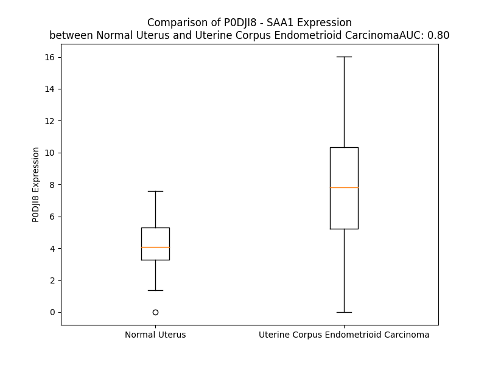

# Detailed Data for P0DJI8

## Introduction to the Detailed Summary

### How to Interpret the Results

- **Summary & Metrics**: This section provides a quick reference to essential protein attributes, including expression changes, family classification, and biomarker applications. Regulation status (upregulated/downregulated) indicates the protein's behavior in a disease context. Some information comes from the original excel file with the proteins selected from literature, while others are derived from the analyses.
- **Expression Comparison**: A visual representation comparing protein expression between normal and disease states. It highlights significant changes in expression levels that might indicate diagnostic or therapeutic relevance. This is data coming from transcriptomics experiments and could not translate similarly to protein levels.
- **Isoform Alignment**: An interactive view of isoform alignments, revealing structural and functional differences between variants of the protein.
- **Interactors & Homologs**: Tables listing known interaction partners and homologous proteins, the more interactors and homologs, the more complex the protein is to design an antibody for.
- **Biological Assemblies**: Information about the structural arrangement of the protein in different assemblies, providing insights into its functional state but also the complexity of the protein to develop antibodies.
- **Combined Per-Residue Information**: A detailed table summarizing residue-level data. This includes predictions for epitope regions, aggregation tendencies, and modifications that might impact the protein's function. Each row corresponds to a residue in the protein, providing insights into specific sites that may be important for research or drug development.
## Summary & Metrics

- **UniProt Accession**: P0DJI8
- **Gene Name**: SAA1
- **Protein Name**: Serum amyloid A-1 protein
- **Swiss Prot**: SAA1_HUMAN
- **Family**: transporter
- **Biomarker Application**: diagnosis,unspecified application
- **Number of Isoforms**: 0
- **Regulation**: 1
- **(transcriptomics) AUC**: 0.68
- **(transcriptomics) Fold Change**: 1.37
- **(transcriptomics) Regulation**: Upregulated
- **Discotope Epitope Count**: 21
- **Max n_uniprots (Homo)**: 11
- **Max n_uniprots (Hetero)**: N/A

## Expression Comparison

## Interactors

| preferredName_A   | preferredName_B   |   score |
|:------------------|:------------------|--------:|
| SAA1              | SAA2              |   0.975 |
| SAA1              | APCS              |   0.917 |
| SAA1              | IL6               |   0.905 |

## Homologs

| uniprot_id   | gene_id   |
|:-------------|:----------|
| A0A3B3ISW8   | SAA1      |
| P0DJI9       | SAA2      |
| P35542       | SAA4      |
| E9PRZ1       | SAAL1     |

## Biological Assemblies

|   Unnamed: 0 |   assembly |   n_uniprots | composition   | crystal_id   |
|-------------:|-----------:|-------------:|:--------------|:-------------|
|            0 |          1 |           11 | Homo          | 6mst         |
|            0 |          1 |            2 | Homo          | 4ip9         |
|            0 |          1 |           11 | Homo          | 7zky         |
|            0 |          1 |            4 | Homo          | 4ip8         |

## Combined Per-Residue Information

|   res | aa   |   epitope_score | epitope   |   relative_surface_accessibility |   modeling_confidence |   Aggregation | modification             |
|------:|:-----|----------------:|:----------|---------------------------------:|----------------------:|--------------:|:-------------------------|
|     1 | M    |         0.22714 | False     |                          1.12052 |                 63.51 |         0     | N/A                      |
|     2 | K    |         0.26272 | False     |                          0.93884 |                 76.31 |         0     | N/A                      |
|     3 | L    |         0.29008 | False     |                          0.94436 |                 77.38 |        15.999 | N/A                      |
|     4 | L    |         0.2466  | False     |                          0.76644 |                 80.54 |        22.051 | N/A                      |
|     5 | T    |         0.18522 | False     |                          0.65786 |                 81.3  |        25.055 | N/A                      |
|     6 | G    |         0.16585 | False     |                          0.40539 |                 79.8  |        29.882 | N/A                      |
|     7 | L    |         0.17941 | False     |                          0.72594 |                 82.4  |        83.011 | N/A                      |
|     8 | V    |         0.12928 | False     |                          0.57048 |                 81.8  |        92.72  | N/A                      |
|     9 | F    |         0.13902 | False     |                          0.68657 |                 79.74 |        93.441 | N/A                      |
|    10 | C    |         0.18399 | False     |                          0.50528 |                 77.88 |        92.195 | N/A                      |
|    11 | S    |         0.23017 | False     |                          0.5609  |                 77.39 |        92.087 | N/A                      |
|    12 | L    |         0.15895 | False     |                          0.67404 |                 74.5  |        93.219 | N/A                      |
|    13 | V    |         0.1699  | False     |                          0.51109 |                 72.08 |        92.642 | N/A                      |
|    14 | L    |         0.26801 | False     |                          0.76975 |                 72.5  |        85.654 | N/A                      |
|    15 | G    |         0.16279 | False     |                          0.40792 |                 71.51 |        47.43  | N/A                      |
|    16 | V    |         0.17447 | False     |                          0.73123 |                 71.38 |        43.977 | N/A                      |
|    17 | S    |         0.14871 | False     |                          0.46337 |                 78.47 |         2.135 | N/A                      |
|    18 | S    |         0.0905  | False     |                          0.37409 |                 78.71 |         0.229 | N/A                      |
|    19 | R    |         0.22986 | False     |                          0.78305 |                 84.53 |         0     | N/A                      |
|    20 | S    |         0.14113 | False     |                          0.5145  |                 90.2  |         8.106 | N/A                      |
|    21 | F    |         0.11385 | False     |                          0.59779 |                 89.73 |        72.752 | N/A                      |
|    22 | F    |         0.26156 | False     |                          0.6969  |                 92.59 |        72.81  | N/A                      |
|    23 | S    |         0.11946 | False     |                          0.43027 |                 95.55 |        72.81  | N/A                      |
|    24 | F    |         0.132   | False     |                          0.36922 |                 96.88 |        72.81  | N/A                      |
|    25 | L    |         0.06645 | False     |                          0.37734 |                 95.83 |        72.632 | N/A                      |
|    26 | G    |         0.20728 | False     |                          0.43466 |                 97.61 |         6.054 | N/A                      |
|    27 | E    |         0.14788 | False     |                          0.17294 |                 98.6  |         0     | N/A                      |
|    28 | A    |         0.03298 | False     |                          0.08589 |                 98.15 |         0     | N/A                      |
|    29 | F    |         0.10454 | False     |                          0.75685 |                 98.06 |         0     | N/A                      |
|    30 | D    |         0.20654 | False     |                          0.26015 |                 98.69 |         0     | N/A                      |
|    31 | G    |         0.00429 | False     |                          0       |                 98.76 |         0     | N/A                      |
|    32 | A    |         0.06835 | False     |                          0.33439 |                 98.57 |         0     | N/A                      |
|    33 | R    |         0.24026 | False     |                          0.52918 |                 98.7  |         0     | N/A                      |
|    34 | D    |         0.04577 | False     |                          0.01536 |                 98.83 |         0     | N/A                      |
|    35 | M    |         0.08395 | False     |                          0.11325 |                 98.65 |         0     | N/A                      |
|    36 | W    |         0.2737  | False     |                          0.75229 |                 98.32 |         0     | N/A                      |
|    37 | R    |         0.44158 | True      |                          0.41734 |                 98.67 |         0     | N/A                      |
|    38 | A    |         0.07058 | False     |                          0.05428 |                 98.62 |         0     | N/A                      |
|    39 | Y    |         0.39783 | False     |                          0.40016 |                 97.36 |         0     | N/A                      |
|    40 | S    |         0.32094 | False     |                          0.32347 |                 98.27 |         0     | N/A                      |
|    41 | D    |         0.26422 | False     |                          0.15253 |                 98.58 |         0     | N/A                      |
|    42 | M    |         0.29768 | False     |                          0.21245 |                 97.93 |         0     | N/A                      |
|    43 | R    |         0.48225 | True      |                          0.65688 |                 97.62 |         0     | N/A                      |
|    44 | E    |         0.55753 | True      |                          0.57399 |                 98.4  |         0     | N/A                      |
|    45 | A    |         0.18497 | False     |                          0.17596 |                 98.17 |         0     | N/A                      |
|    46 | N    |         0.32279 | False     |                          0.84602 |                 97.79 |         0     | N/A                      |
|    47 | Y    |         0.43694 | True      |                          0.35369 |                 98.01 |         0     | N/A                      |
|    48 | I    |         0.46454 | True      |                          0.99083 |                 97.17 |         0     | N/A                      |
|    49 | G    |         0.35323 | False     |                          0.68602 |                 96.27 |         0     | N/A                      |
|    50 | S    |         0.02965 | False     |                          0.01354 |                 98.03 |         0     | N/A                      |
|    51 | D    |         0.30944 | False     |                          0.26046 |                 96.72 |         0     | N/A                      |
|    52 | K    |         0.20182 | False     |                          0.25408 |                 98.26 |         0     | N/A                      |
|    53 | Y    |         0.10946 | False     |                          0.03956 |                 98.63 |         0     | N/A                      |
|    54 | F    |         0.06105 | False     |                          0.02339 |                 98.65 |         0     | N/A                      |
|    55 | H    |         0.17469 | False     |                          0.08814 |                 98.48 |         0     | N/A                      |
|    56 | A    |         0.00277 | False     |                          0       |                 98.8  |         0     | N/A                      |
|    57 | R    |         0.08471 | False     |                          0.08088 |                 98.81 |         0     | N/A                      |
|    58 | G    |         0.0253  | False     |                          0.01449 |                 98.79 |         0     | N/A                      |
|    59 | N    |         0.00318 | False     |                          0.00074 |                 98.84 |         0     | N/A                      |
|    60 | Y    |         0.19947 | False     |                          0.20987 |                 98.87 |         0     | N/A                      |
|    61 | D    |         0.13609 | False     |                          0.17178 |                 98.82 |         0     | N/A                      |
|    62 | A    |         0.00271 | False     |                          0       |                 98.79 |         0     | N/A                      |
|    63 | A    |         0.0785  | False     |                          0.17427 |                 98.67 |         0     | N/A                      |
|    64 | K    |         0.28979 | False     |                          0.67425 |                 98.6  |         0     | N/A                      |
|    65 | R    |         0.29868 | False     |                          0.37721 |                 98.24 |         0     | N/A                      |
|    66 | G    |         0.16779 | False     |                          0.21355 |                 98.01 |         0     | N/A                      |
|    67 | P    |         0.25699 | False     |                          0.72461 |                 97.72 |         0     | N/A                      |
|    68 | G    |         0.00479 | False     |                          0       |                 97.88 |         0     | N/A                      |
|    69 | G    |         0.00333 | False     |                          0       |                 98.59 |         0     | N/A                      |
|    70 | V    |         0.12855 | False     |                          0.33894 |                 98.7  |         0     | N/A                      |
|    71 | W    |         0.19081 | False     |                          0.61457 |                 98.29 |         0     | N/A                      |
|    72 | A    |         0.04931 | False     |                          0.04081 |                 98.2  |         0     | N/A                      |
|    73 | A    |         0.00382 | False     |                          0       |                 98.64 |         0     | N/A                      |
|    74 | E    |         0.31706 | False     |                          0.38351 |                 98.01 |         0     | N/A                      |
|    75 | A    |         0.22385 | False     |                          0.43351 |                 97.47 |         0     | N/A                      |
|    76 | I    |         0.18333 | False     |                          0.38795 |                 97.65 |         0     | N/A                      |
|    77 | S    |         0.09829 | False     |                          0.02846 |                 97.37 |         0     | N/A                      |
|    78 | D    |         0.42589 | True      |                          0.4077  |                 95.11 |         0     | N/A                      |
|    79 | A    |         0.16184 | False     |                          0.46834 |                 94.64 |         0     | N/A                      |
|    80 | R    |         0.41244 | True      |                          0.24571 |                 93.48 |         0     | N/A                      |
|    81 | E    |         0.28818 | False     |                          0.07676 |                 92.4  |         0     | N/A                      |
|    82 | N    |         0.36133 | False     |                          0.59333 |                 91.58 |         0     | N/A                      |
|    83 | I    |         0.46574 | True      |                          0.61426 |                 91.94 |         0     | N/A                      |
|    84 | Q    |         0.52697 | True      |                          0.16706 |                 90.97 |         0     | N/A                      |
|    85 | R    |         0.54448 | True      |                          0.44705 |                 90.65 |         0     | N/A                      |
|    86 | F    |         0.4733  | True      |                          0.8495  |                 93.01 |         0     | N/A                      |
|    87 | F    |         0.47622 | True      |                          0.80768 |                 93.98 |         0     | N/A                      |
|    88 | G    |         0.49546 | True      |                          0.79271 |                 91.58 |         0     | N/A                      |
|    89 | H    |         0.53985 | True      |                          0.33203 |                 89.37 |         0     | N/A                      |
|    90 | G    |         0.34067 | False     |                          0.40591 |                 91.32 |         0     | N/A                      |
|    91 | A    |         0.44639 | True      |                          0.68641 |                 91.15 |         0     | N/A                      |
|    92 | E    |         0.50487 | True      |                          0.77242 |                 91.88 |         0     | N/A                      |
|    93 | D    |         0.6744  | True      |                          0.43593 |                 92.2  |         0     | N/A                      |
|    94 | S    |         0.02162 | False     |                          0.00416 |                 92.63 |         0     | N/A                      |
|    95 | L    |         0.36688 | False     |                          0.72265 |                 94.39 |         0     | N/A                      |
|    96 | A    |         0.5264  | True      |                          0.42294 |                 96.12 |         0     | N/A                      |
|    97 | D    |         0.11548 | False     |                          0.01911 |                 96.25 |         0     | N/A                      |
|    98 | Q    |         0.27692 | False     |                          0.19368 |                 96.58 |         0     | N/A                      |
|    99 | A    |         0.28296 | False     |                          0.54074 |                 98.01 |         0     | N/A                      |
|   100 | A    |         0.00621 | False     |                          0       |                 98.53 |         0     | N/A                      |
|   101 | N    |         0.03518 | False     |                          0.02505 |                 98.53 |         0     | N4,N4-dimethylasparagine |
|   102 | E    |         0.27235 | False     |                          0.52454 |                 98.56 |         0     | N/A                      |
|   103 | W    |         0.21588 | False     |                          0.32012 |                 98.8  |         0     | N/A                      |
|   104 | G    |         0.00817 | False     |                          0       |                 98.77 |         0     | N/A                      |
|   105 | R    |         0.25145 | False     |                          0.1496  |                 98.62 |         0     | N/A                      |
|   106 | S    |         0.3331  | False     |                          0.57855 |                 98.5  |         0     | N/A                      |
|   107 | G    |         0.2291  | False     |                          0.58168 |                 98.5  |         0     | N/A                      |
|   108 | K    |         0.37036 | False     |                          0.50232 |                 98.71 |         0     | N/A                      |
|   109 | D    |         0.28535 | False     |                          0.49755 |                 98.6  |         0     | N/A                      |
|   110 | P    |         0.08713 | False     |                          0.0676  |                 98.73 |         0     | N/A                      |
|   111 | N    |         0.48947 | True      |                          0.49804 |                 98.57 |         0     | N/A                      |
|   112 | H    |         0.40242 | False     |                          0.63571 |                 98.39 |         0     | N/A                      |
|   113 | F    |         0.24693 | False     |                          0.28611 |                 98.45 |         0     | N/A                      |
|   114 | R    |         0.28003 | False     |                          0.27049 |                 98.56 |         0     | N/A                      |
|   115 | P    |         0.27381 | False     |                          0.19968 |                 98.35 |         0     | N/A                      |
|   116 | A    |         0.50221 | True      |                          0.94709 |                 98    |         0     | N/A                      |
|   117 | G    |         0.70747 | True      |                          0.753   |                 98    |         0     | N/A                      |
|   118 | L    |         0.15871 | False     |                          0.046   |                 98.38 |         0     | N/A                      |
|   119 | P    |         0.35319 | False     |                          0.45628 |                 98.41 |         0     | N/A                      |
|   120 | E    |         0.40904 | False     |                          0.88458 |                 97.62 |         0     | N/A                      |
|   121 | K    |         0.36722 | False     |                          0.68522 |                 97.97 |         0     | N/A                      |
|   122 | Y    |         0.19017 | False     |                          0.09583 |                 97.4  |         0     | N/A                      |

