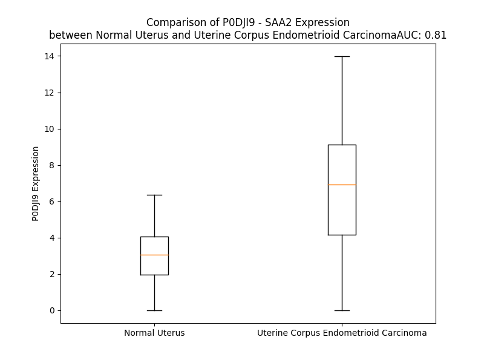

# Detailed Data for P0DJI9

## Introduction to the Detailed Summary

### How to Interpret the Results

- **Summary & Metrics**: This section provides a quick reference to essential protein attributes, including expression changes, family classification, and biomarker applications. Regulation status (upregulated/downregulated) indicates the protein's behavior in a disease context. Some information comes from the original excel file with the proteins selected from literature, while others are derived from the analyses.
- **Expression Comparison**: A visual representation comparing protein expression between normal and disease states. It highlights significant changes in expression levels that might indicate diagnostic or therapeutic relevance. This is data coming from transcriptomics experiments and could not translate similarly to protein levels.
- **Isoform Alignment**: An interactive view of isoform alignments, revealing structural and functional differences between variants of the protein.
- **Interactors & Homologs**: Tables listing known interaction partners and homologous proteins, the more interactors and homologs, the more complex the protein is to design an antibody for.
- **Biological Assemblies**: Information about the structural arrangement of the protein in different assemblies, providing insights into its functional state but also the complexity of the protein to develop antibodies.
- **Combined Per-Residue Information**: A detailed table summarizing residue-level data. This includes predictions for epitope regions, aggregation tendencies, and modifications that might impact the protein's function. Each row corresponds to a residue in the protein, providing insights into specific sites that may be important for research or drug development.
## Summary & Metrics

- **UniProt Accession**: P0DJI9
- **Gene Name**: SAA2
- **Protein Name**: Serum amyloid A-2 protein
- **Swiss Prot**: SAA2_HUMAN
- **Family**: other
- **Biomarker Application**:  
- **Number of Isoforms**: 2
- **Regulation**: 1
- **(transcriptomics) AUC**: 0.81
- **(transcriptomics) Fold Change**: 2.11
- **(transcriptomics) Regulation**: Upregulated
- **Discotope Epitope Count**: 22
- **Max n_uniprots (Homo)**: N/A
- **Max n_uniprots (Hetero)**: N/A

## Expression Comparison

## Isoform Alignment

<pre style='font-size:14px; font-family:monospace;'>P0DJI9-1 MKLLTGLVFCSLVLSVSSRSFFSFLGEAFDGARDMWRAYSDMREANYIGSDKYFHARGNYDAAKRGPGGAWAAEVISNARENIQRLTGRGAEDSLADQAANKWGRSGRDPNHFRPAGLPEKY
P0DJI9-2 MKLLTGLVFCSLVLSVSSRSFFSFLGEAFDGARDMWRAYSDMREANYIGSDKYFHARGNYDAAKRGPGGAWAAEVISLFSAEL---------------------------------------
</pre>

## Interactors

| preferredName_A   | preferredName_B   |   score |
|:------------------|:------------------|--------:|
| SAA2              | SAA1              |   0.975 |
| SAA2              | SAA4              |   0.935 |

## Homologs

| uniprot_id   | gene_id   |
|:-------------|:----------|
| A0A3B3ISW8   | SAA1      |
| P35542       | SAA4      |
| E9PRZ1       | SAAL1     |

## Combined Per-Residue Information

|   res | aa   |   epitope_score | epitope   |   relative_surface_accessibility |   modeling_confidence |   Aggregation | modification   |
|------:|:-----|----------------:|:----------|---------------------------------:|----------------------:|--------------:|:---------------|
|     1 | M    |         0.24488 | False     |                          1.11938 |                 63.45 |         0     | N/A            |
|     2 | K    |         0.27189 | False     |                          0.93678 |                 77.92 |         0     | N/A            |
|     3 | L    |         0.31799 | False     |                          0.95076 |                 78.78 |        16.157 | N/A            |
|     4 | L    |         0.2445  | False     |                          0.77127 |                 82.56 |        22.229 | N/A            |
|     5 | T    |         0.17266 | False     |                          0.65441 |                 83.09 |        25.223 | N/A            |
|     6 | G    |         0.16227 | False     |                          0.39912 |                 82.49 |        30.067 | N/A            |
|     7 | L    |         0.21627 | False     |                          0.72945 |                 84.7  |        83.464 | N/A            |
|     8 | V    |         0.11107 | False     |                          0.56229 |                 84.91 |        93.224 | N/A            |
|     9 | F    |         0.16576 | False     |                          0.68079 |                 82.33 |        93.963 | N/A            |
|    10 | C    |         0.1659  | False     |                          0.51772 |                 80.94 |        92.904 | N/A            |
|    11 | S    |         0.14811 | False     |                          0.46867 |                 80.23 |        92.862 | N/A            |
|    12 | L    |         0.20358 | False     |                          0.64758 |                 78.45 |        94.207 | N/A            |
|    13 | V    |         0.19219 | False     |                          0.51109 |                 76.57 |        93.721 | N/A            |
|    14 | L    |         0.2443  | False     |                          0.76699 |                 78.86 |        87.799 | N/A            |
|    15 | S    |         0.12885 | False     |                          0.49212 |                 78.46 |        55.41  | N/A            |
|    16 | V    |         0.13951 | False     |                          0.72671 |                 75.43 |        51.378 | N/A            |
|    17 | S    |         0.14528 | False     |                          0.4525  |                 79.52 |         2.516 | N/A            |
|    18 | S    |         0.09727 | False     |                          0.36371 |                 79.54 |         0.27  | N/A            |
|    19 | R    |         0.22268 | False     |                          0.77866 |                 84.12 |         0     | N/A            |
|    20 | S    |         0.16174 | False     |                          0.50776 |                 90.34 |         8.048 | N/A            |
|    21 | F    |         0.10159 | False     |                          0.5978  |                 90.18 |        72.553 | N/A            |
|    22 | F    |         0.28197 | False     |                          0.70538 |                 92.8  |        72.612 | N/A            |
|    23 | S    |         0.10729 | False     |                          0.43372 |                 95.49 |        72.612 | N/A            |
|    24 | F    |         0.14595 | False     |                          0.35554 |                 97.2  |        72.612 | N/A            |
|    25 | L    |         0.0861  | False     |                          0.51831 |                 96.07 |        72.433 | N/A            |
|    26 | G    |         0.18279 | False     |                          0.44624 |                 97.69 |         6.036 | N/A            |
|    27 | E    |         0.1234  | False     |                          0.1655  |                 98.61 |         0     | N/A            |
|    28 | A    |         0.0294  | False     |                          0.0967  |                 98.35 |         0     | N/A            |
|    29 | F    |         0.07472 | False     |                          0.74162 |                 98.14 |         0     | N/A            |
|    30 | D    |         0.17468 | False     |                          0.23467 |                 98.69 |         0     | N/A            |
|    31 | G    |         0.00403 | False     |                          0       |                 98.79 |         0     | N/A            |
|    32 | A    |         0.06856 | False     |                          0.33822 |                 98.62 |         0     | N/A            |
|    33 | R    |         0.19969 | False     |                          0.49033 |                 98.72 |         0     | N/A            |
|    34 | D    |         0.05953 | False     |                          0.01659 |                 98.81 |         0     | N/A            |
|    35 | M    |         0.10838 | False     |                          0.12643 |                 98.64 |         0     | N/A            |
|    36 | W    |         0.23253 | False     |                          0.74767 |                 98.29 |         0     | N/A            |
|    37 | R    |         0.4912  | True      |                          0.41347 |                 98.65 |         0     | N/A            |
|    38 | A    |         0.08259 | False     |                          0.05791 |                 98.6  |         0     | N/A            |
|    39 | Y    |         0.45779 | True      |                          0.39709 |                 97.26 |         0     | N/A            |
|    40 | S    |         0.28932 | False     |                          0.32186 |                 98.19 |         0     | N/A            |
|    41 | D    |         0.26029 | False     |                          0.14922 |                 98.54 |         0     | N/A            |
|    42 | M    |         0.2792  | False     |                          0.21774 |                 97.84 |         0     | N/A            |
|    43 | R    |         0.48306 | True      |                          0.65676 |                 97.53 |         0     | N/A            |
|    44 | E    |         0.58303 | True      |                          0.5671  |                 98.34 |         0     | N/A            |
|    45 | A    |         0.20507 | False     |                          0.17441 |                 98.07 |         0     | N/A            |
|    46 | N    |         0.35489 | False     |                          0.84371 |                 97.64 |         0     | N/A            |
|    47 | Y    |         0.44704 | True      |                          0.35393 |                 97.85 |         0     | N/A            |
|    48 | I    |         0.45953 | True      |                          0.99225 |                 96.89 |         0     | N/A            |
|    49 | G    |         0.37673 | False     |                          0.6837  |                 96.07 |         0     | N/A            |
|    50 | S    |         0.0367  | False     |                          0.01602 |                 97.86 |         0     | N/A            |
|    51 | D    |         0.32789 | False     |                          0.21375 |                 96.36 |         0     | N/A            |
|    52 | K    |         0.19054 | False     |                          0.21691 |                 98.08 |         0     | N/A            |
|    53 | Y    |         0.09257 | False     |                          0.0355  |                 98.56 |         0     | N/A            |
|    54 | F    |         0.06815 | False     |                          0.02376 |                 98.61 |         0     | N/A            |
|    55 | H    |         0.14216 | False     |                          0.09366 |                 98.41 |         0     | N/A            |
|    56 | A    |         0.00252 | False     |                          0       |                 98.76 |         0     | N/A            |
|    57 | R    |         0.10889 | False     |                          0.07097 |                 98.78 |         0     | N/A            |
|    58 | G    |         0.02506 | False     |                          0.01127 |                 98.79 |         0     | N/A            |
|    59 | N    |         0.0029  | False     |                          0       |                 98.83 |         0     | N/A            |
|    60 | Y    |         0.20152 | False     |                          0.20974 |                 98.86 |         0     | N/A            |
|    61 | D    |         0.15366 | False     |                          0.17118 |                 98.81 |         0     | N/A            |
|    62 | A    |         0.00291 | False     |                          0       |                 98.81 |         0     | N/A            |
|    63 | A    |         0.08038 | False     |                          0.21616 |                 98.68 |         0     | N/A            |
|    64 | K    |         0.34181 | False     |                          0.67154 |                 98.56 |         0     | N/A            |
|    65 | R    |         0.30906 | False     |                          0.38839 |                 98.25 |         0     | N/A            |
|    66 | G    |         0.17364 | False     |                          0.22549 |                 98    |         0     | N/A            |
|    67 | P    |         0.25709 | False     |                          0.74759 |                 97.65 |         0     | N/A            |
|    68 | G    |         0.00377 | False     |                          0       |                 97.99 |         0     | N/A            |
|    69 | G    |         0.00354 | False     |                          0       |                 98.68 |         0     | N/A            |
|    70 | A    |         0.12566 | False     |                          0.28075 |                 98.72 |         0     | N/A            |
|    71 | W    |         0.22676 | False     |                          0.57829 |                 98.44 |         0     | N/A            |
|    72 | A    |         0.0422  | False     |                          0.04974 |                 98.38 |         0     | N/A            |
|    73 | A    |         0.00465 | False     |                          0       |                 98.7  |         0     | N/A            |
|    74 | E    |         0.29471 | False     |                          0.37958 |                 98.29 |         0     | N/A            |
|    75 | V    |         0.23168 | False     |                          0.49992 |                 97.74 |         0     | N/A            |
|    76 | I    |         0.21877 | False     |                          0.37595 |                 97.65 |         0     | N/A            |
|    77 | S    |         0.0796  | False     |                          0.02742 |                 97.49 |         0     | N/A            |
|    78 | N    |         0.31469 | False     |                          0.36963 |                 95.46 |         0     | N/A            |
|    79 | A    |         0.18617 | False     |                          0.44363 |                 93.89 |         0     | N/A            |
|    80 | R    |         0.32143 | False     |                          0.23845 |                 92    |         0     | N/A            |
|    81 | E    |         0.32179 | False     |                          0.09802 |                 90.83 |         0     | N/A            |
|    82 | N    |         0.26276 | False     |                          0.5283  |                 89.62 |         0     | N/A            |
|    83 | I    |         0.4267  | True      |                          0.64637 |                 89.23 |         0     | N/A            |
|    84 | Q    |         0.4914  | True      |                          0.16296 |                 88.31 |         0     | N/A            |
|    85 | R    |         0.46879 | True      |                          0.50061 |                 87.39 |         0     | N/A            |
|    86 | L    |         0.49883 | True      |                          0.95637 |                 89.34 |         0     | N/A            |
|    87 | T    |         0.44275 | True      |                          0.76502 |                 89.83 |         0     | N/A            |
|    88 | G    |         0.49918 | True      |                          0.80396 |                 84.96 |         0     | N/A            |
|    89 | R    |         0.6055  | True      |                          0.26576 |                 82.88 |         0     | N/A            |
|    90 | G    |         0.36267 | False     |                          0.50762 |                 84.15 |         0     | N/A            |
|    91 | A    |         0.41919 | True      |                          0.69598 |                 85.21 |         0     | N/A            |
|    92 | E    |         0.48527 | True      |                          0.7653  |                 84.43 |         0     | N/A            |
|    93 | D    |         0.58541 | True      |                          0.39899 |                 89.45 |         0     | N/A            |
|    94 | S    |         0.04382 | False     |                          0.00782 |                 90.4  |         0     | N/A            |
|    95 | L    |         0.34257 | False     |                          0.72795 |                 92.97 |         0     | N/A            |
|    96 | A    |         0.45121 | True      |                          0.42506 |                 95.18 |         0     | N/A            |
|    97 | D    |         0.13136 | False     |                          0.02322 |                 95.62 |         0     | N/A            |
|    98 | Q    |         0.18694 | False     |                          0.10608 |                 96.31 |         0     | N/A            |
|    99 | A    |         0.25224 | False     |                          0.55227 |                 97.72 |         0     | N/A            |
|   100 | A    |         0.00572 | False     |                          0       |                 98.44 |         0     | N/A            |
|   101 | N    |         0.03215 | False     |                          0.02198 |                 98.48 |         0     | N/A            |
|   102 | K    |         0.28767 | False     |                          0.59941 |                 98.53 |         0     | N/A            |
|   103 | W    |         0.24964 | False     |                          0.32501 |                 98.78 |         0     | N/A            |
|   104 | G    |         0.00982 | False     |                          0       |                 98.76 |         0     | N/A            |
|   105 | R    |         0.27293 | False     |                          0.19926 |                 98.63 |         0     | N/A            |
|   106 | S    |         0.36477 | False     |                          0.49944 |                 98.48 |         0     | N/A            |
|   107 | G    |         0.2705  | False     |                          0.58232 |                 98.47 |         0     | N/A            |
|   108 | R    |         0.38905 | False     |                          0.49679 |                 98.6  |         0     | N/A            |
|   109 | D    |         0.29676 | False     |                          0.49459 |                 98.52 |         0     | N/A            |
|   110 | P    |         0.09479 | False     |                          0.0666  |                 98.69 |         0     | N/A            |
|   111 | N    |         0.48353 | True      |                          0.50216 |                 98.51 |         0     | N/A            |
|   112 | H    |         0.41454 | True      |                          0.62634 |                 98.28 |         0     | N/A            |
|   113 | F    |         0.24894 | False     |                          0.27345 |                 98.32 |         0     | N/A            |
|   114 | R    |         0.27482 | False     |                          0.27241 |                 98.49 |         0     | N/A            |
|   115 | P    |         0.27689 | False     |                          0.20151 |                 98.27 |         0     | N/A            |
|   116 | A    |         0.54241 | True      |                          0.9432  |                 97.9  |         0     | N/A            |
|   117 | G    |         0.72784 | True      |                          0.75631 |                 97.88 |         0     | N/A            |
|   118 | L    |         0.16974 | False     |                          0.04529 |                 98.3  |         0     | N/A            |
|   119 | P    |         0.38526 | False     |                          0.46324 |                 98.33 |         0     | N/A            |
|   120 | E    |         0.43546 | True      |                          0.88754 |                 97.35 |         0     | N/A            |
|   121 | K    |         0.39485 | False     |                          0.68736 |                 97.75 |         0     | N/A            |
|   122 | Y    |         0.20391 | False     |                          0.11187 |                 97.23 |         0     | N/A            |

