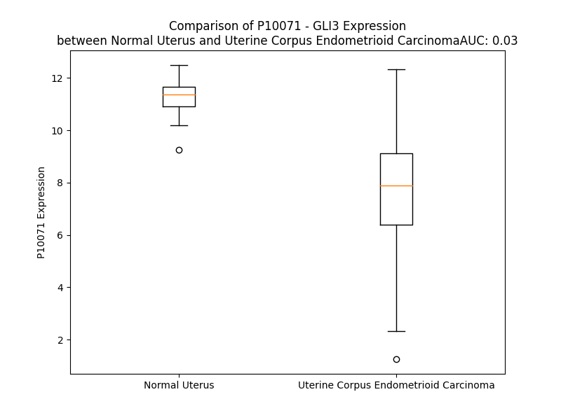

# Detailed Data for P10071

## Introduction to the Detailed Summary

### How to Interpret the Results

- **Summary & Metrics**: This section provides a quick reference to essential protein attributes, including expression changes, family classification, and biomarker applications. Regulation status (upregulated/downregulated) indicates the protein's behavior in a disease context. Some information comes from the original excel file with the proteins selected from literature, while others are derived from the analyses.
- **Expression Comparison**: A visual representation comparing protein expression between normal and disease states. It highlights significant changes in expression levels that might indicate diagnostic or therapeutic relevance. This is data coming from transcriptomics experiments and could not translate similarly to protein levels.
- **Isoform Alignment**: An interactive view of isoform alignments, revealing structural and functional differences between variants of the protein.
- **Interactors & Homologs**: Tables listing known interaction partners and homologous proteins, the more interactors and homologs, the more complex the protein is to design an antibody for.
- **Biological Assemblies**: Information about the structural arrangement of the protein in different assemblies, providing insights into its functional state but also the complexity of the protein to develop antibodies.
- **Combined Per-Residue Information**: A detailed table summarizing residue-level data. This includes predictions for epitope regions, aggregation tendencies, and modifications that might impact the protein's function. Each row corresponds to a residue in the protein, providing insights into specific sites that may be important for research or drug development.
## Summary & Metrics

- **UniProt Accession**: P10071
- **Gene Name**: Gli-3
- **Protein Name**: Transcriptional activator GLI3
- **Swiss Prot**: GLI3_HUMAN
- **Family**: transcription regulator
- **Biomarker Application**: efficacy
- **Number of Isoforms**: 0
- **Regulation**: 1
- **(transcriptomics) AUC**: 0.24
- **(transcriptomics) Fold Change**: 1.12
- **(transcriptomics) Regulation**: Downregulated
- **Discotope Epitope Count**: 323
- **Max n_uniprots (Homo)**: N/A
- **Max n_uniprots (Hetero)**: 3

## Expression Comparison

## Interactors

| preferredName_A   | preferredName_B   |   score |
|:------------------|:------------------|--------:|
| GLI3              | SUFU              |   0.999 |
| GLI3              | KIF7              |   0.995 |
| GLI3              | SPOP              |   0.994 |
| GLI3              | BTRC              |   0.991 |
| GLI3              | PTCH1             |   0.989 |
| GLI3              | SMO               |   0.975 |
| GLI3              | SHH               |   0.966 |
| GLI3              | PRKACB            |   0.963 |
| GLI3              | PRKACG            |   0.963 |
| GLI3              | PRKACA            |   0.963 |
| GLI3              | FBXW11            |   0.96  |
| GLI3              | GSK3B             |   0.953 |
| GLI3              | SPOPL             |   0.951 |
| GLI3              | CUL3              |   0.941 |
| GLI3              | GLI2              |   0.941 |
| GLI3              | CUL1              |   0.935 |
| GLI3              | STK36             |   0.927 |
| GLI3              | GLI1              |   0.923 |
| GLI3              | ARRB2             |   0.921 |
| GLI3              | ARRB1             |   0.919 |

## Homologs

| uniprot_id   | gene_id   |
|:-------------|:----------|
| O60481       | ZIC3      |
| A0A6Q8PH00   | GLI2      |
| P98168       | ZXDA      |
| P98169       | ZXDB      |
| P08151       | GLI1      |
| A0A669KBC9   | AEBP2     |
| Q9BZE0       | GLIS2     |
| F8WEV9       | GLIS3     |
| Q96T25       | ZIC5      |
| C9J6T3       | ZIC4      |
| Q2QGD7       | ZXDC      |
| Q15915       | ZIC1      |
| O95409       | ZIC2      |
| A0A0D9SEX9   | GLIS1     |

## Biological Assemblies

|   Unnamed: 0 |   assembly |   n_uniprots | composition   | crystal_id   |
|-------------:|-----------:|-------------:|:--------------|:-------------|
|            0 |          1 |            3 | Hetero        | 4bld         |
|            1 |          2 |            3 | Hetero        | 4bld         |
|            2 |          3 |            3 | Hetero        | 4bld         |
|            3 |          4 |            3 | Hetero        | 4bld         |

## Combined Per-Residue Information

|   res | aa   |   epitope_score | epitope   |   relative_surface_accessibility |   modeling_confidence |   Aggregation | modification           |
|------:|:-----|----------------:|:----------|---------------------------------:|----------------------:|--------------:|:-----------------------|
|     1 | M    |         0.11169 | True      |                          1.18972 |                 42.09 |         0     | N-acetylmethionine     |
|     2 | E    |         0.16338 | True      |                          0.82946 |                 40    |         0     | N/A                    |
|     3 | A    |         0.10825 | True      |                          0.84834 |                 38.13 |         0     | N/A                    |
|     4 | Q    |         0.09044 | True      |                          0.81672 |                 38.14 |         0     | N/A                    |
|     5 | S    |         0.09991 | True      |                          0.58615 |                 34.27 |         0     | N/A                    |
|     6 | H    |         0.09621 | True      |                          0.86759 |                 37.06 |         0     | N/A                    |
|     7 | S    |         0.07315 | False     |                          0.83445 |                 35.1  |         0     | N/A                    |
|     8 | S    |         0.10396 | True      |                          0.82917 |                 34.52 |         0     | N/A                    |
|     9 | T    |         0.11377 | True      |                          0.99483 |                 34.94 |         0     | N/A                    |
|    10 | T    |         0.15133 | True      |                          0.92939 |                 34.63 |         0     | N/A                    |
|    11 | T    |         0.10353 | True      |                          0.88958 |                 31.31 |         0     | N/A                    |
|    12 | E    |         0.17045 | True      |                          0.75487 |                 33.66 |         0     | N/A                    |
|    13 | K    |         0.15369 | True      |                          0.8533  |                 32.46 |         0     | N/A                    |
|    14 | K    |         0.14367 | True      |                          0.96839 |                 38.31 |         0     | N/A                    |
|    15 | K    |         0.09412 | True      |                          0.78258 |                 30.86 |         0     | N/A                    |
|    16 | V    |         0.13874 | True      |                          0.99457 |                 38.53 |         0     | N/A                    |
|    17 | E    |         0.09136 | True      |                          0.55459 |                 35.49 |         0     | N/A                    |
|    18 | N    |         0.12388 | True      |                          0.82375 |                 34.03 |         0     | N/A                    |
|    19 | S    |         0.10415 | True      |                          0.60994 |                 37.75 |         0     | N/A                    |
|    20 | I    |         0.12333 | True      |                          0.94896 |                 38.06 |         0     | N/A                    |
|    21 | V    |         0.11226 | True      |                          0.85665 |                 38.2  |         0     | N/A                    |
|    22 | K    |         0.1059  | True      |                          0.88549 |                 36.8  |         0     | N/A                    |
|    23 | C    |         0.04664 | False     |                          0.7027  |                 33.27 |         0     | N/A                    |
|    24 | S    |         0.06653 | False     |                          0.68752 |                 35.84 |         0     | N/A                    |
|    25 | T    |         0.07564 | False     |                          0.81764 |                 36.44 |         0     | N/A                    |
|    26 | R    |         0.13733 | True      |                          0.76517 |                 40.28 |         0     | N/A                    |
|    27 | T    |         0.09128 | True      |                          0.67446 |                 38.05 |         0     | N/A                    |
|    28 | D    |         0.10018 | True      |                          0.60802 |                 36.72 |         0     | N/A                    |
|    29 | V    |         0.11631 | True      |                          0.95936 |                 41.1  |         0     | N/A                    |
|    30 | S    |         0.10778 | True      |                          0.64527 |                 35.28 |         0     | N/A                    |
|    31 | E    |         0.16046 | True      |                          0.85202 |                 38.23 |         0     | N/A                    |
|    32 | K    |         0.11601 | True      |                          0.97199 |                 36.73 |         0     | N/A                    |
|    33 | A    |         0.1118  | True      |                          0.79426 |                 34.16 |         0     | N/A                    |
|    34 | V    |         0.09718 | True      |                          1.07463 |                 36.49 |         0     | N/A                    |
|    35 | A    |         0.13976 | True      |                          0.8253  |                 32.81 |         0     | N/A                    |
|    36 | S    |         0.12935 | True      |                          0.77474 |                 31.57 |         0     | N/A                    |
|    37 | S    |         0.10713 | True      |                          0.751   |                 32.86 |         0     | N/A                    |
|    38 | T    |         0.11854 | True      |                          0.83293 |                 31.98 |         0     | N/A                    |
|    39 | T    |         0.10925 | True      |                          0.899   |                 31.99 |         0     | N/A                    |
|    40 | S    |         0.08993 | True      |                          0.66956 |                 34.66 |         0     | N/A                    |
|    41 | N    |         0.11036 | True      |                          0.75532 |                 32.64 |         0     | N/A                    |
|    42 | E    |         0.07681 | False     |                          0.79422 |                 37.91 |         0     | N/A                    |
|    43 | D    |         0.07515 | False     |                          0.79206 |                 35.46 |         0     | N/A                    |
|    44 | E    |         0.09388 | True      |                          0.67604 |                 33.53 |         0     | N/A                    |
|    45 | S    |         0.08941 | True      |                          0.79943 |                 36.54 |         0     | N/A                    |
|    46 | P    |         0.0763  | False     |                          0.75537 |                 35.27 |         0     | N/A                    |
|    47 | G    |         0.12418 | True      |                          0.94027 |                 36.53 |         0     | N/A                    |
|    48 | Q    |         0.07423 | False     |                          0.64411 |                 31.43 |         0     | N/A                    |
|    49 | T    |         0.11148 | True      |                          0.70132 |                 35.39 |         0     | N/A                    |
|    50 | Y    |         0.06823 | False     |                          0.66923 |                 33.69 |         0     | N/A                    |
|    51 | H    |         0.09923 | True      |                          1.01541 |                 33.96 |         0     | N/A                    |
|    52 | R    |         0.12124 | True      |                          0.6346  |                 34.65 |         0     | N/A                    |
|    53 | E    |         0.08354 | False     |                          0.82275 |                 36.63 |         0     | N/A                    |
|    54 | R    |         0.1185  | True      |                          0.64224 |                 34.65 |         0     | N/A                    |
|    55 | R    |         0.10153 | True      |                          0.78876 |                 35.81 |         0     | N/A                    |
|    56 | N    |         0.07754 | False     |                          0.85453 |                 32.74 |         0     | N/A                    |
|    57 | A    |         0.05861 | False     |                          0.86768 |                 35.89 |         0     | N/A                    |
|    58 | I    |         0.04374 | False     |                          0.96737 |                 35.77 |         0     | N/A                    |
|    59 | T    |         0.03863 | False     |                          0.7311  |                 33.64 |         0     | N/A                    |
|    60 | M    |         0.03908 | False     |                          0.64023 |                 31.49 |         0     | N/A                    |
|    61 | Q    |         0.02873 | False     |                          0.43146 |                 32.37 |         0     | N/A                    |
|    62 | P    |         0.04452 | False     |                          0.68317 |                 35.51 |         0     | N/A                    |
|    63 | Q    |         0.02174 | False     |                          0.24927 |                 33.16 |         0     | N/A                    |
|    64 | N    |         0.05643 | False     |                          0.90608 |                 34.44 |         0     | N/A                    |
|    65 | V    |         0.04529 | False     |                          0.57325 |                 36.91 |         0     | N/A                    |
|    66 | Q    |         0.05816 | False     |                          0.9111  |                 36.48 |         0     | N/A                    |
|    67 | G    |         0.05603 | False     |                          0.89066 |                 37.62 |         0     | N/A                    |
|    68 | L    |         0.11801 | True      |                          1.05887 |                 36.28 |         0     | N/A                    |
|    69 | S    |         0.06204 | False     |                          0.70596 |                 34.6  |         0     | N/A                    |
|    70 | K    |         0.04663 | False     |                          0.92594 |                 36.29 |         0     | N/A                    |
|    71 | V    |         0.08152 | False     |                          0.9489  |                 37.18 |         0     | N/A                    |
|    72 | S    |         0.0583  | False     |                          0.63955 |                 33.23 |         0     | N/A                    |
|    73 | E    |         0.05558 | False     |                          0.75348 |                 36.2  |         0     | N/A                    |
|    74 | E    |         0.04286 | False     |                          0.32831 |                 39.6  |         0     | N/A                    |
|    75 | P    |         0.05987 | False     |                          0.65214 |                 40.48 |         0     | N/A                    |
|    76 | S    |         0.06267 | False     |                          0.57982 |                 35.63 |         0     | N/A                    |
|    77 | T    |         0.05969 | False     |                          0.84914 |                 35.99 |         0     | N/A                    |
|    78 | S    |         0.08092 | False     |                          0.86174 |                 35.24 |         0     | N/A                    |
|    79 | S    |         0.08294 | False     |                          0.83384 |                 37.82 |         0     | N/A                    |
|    80 | D    |         0.07179 | False     |                          0.83585 |                 36.65 |         0     | N/A                    |
|    81 | E    |         0.12285 | True      |                          0.65488 |                 39.05 |         0     | N/A                    |
|    82 | R    |         0.13249 | True      |                          0.85471 |                 38.08 |         0     | N/A                    |
|    83 | A    |         0.05853 | False     |                          0.77553 |                 36.36 |         0     | N/A                    |
|    84 | S    |         0.11321 | True      |                          0.80808 |                 37.19 |         0     | N/A                    |
|    85 | L    |         0.06791 | False     |                          0.95655 |                 40.15 |         0     | N/A                    |
|    86 | I    |         0.08496 | False     |                          0.92753 |                 40.3  |         0     | N/A                    |
|    87 | K    |         0.07724 | False     |                          0.81817 |                 41.14 |         0     | N/A                    |
|    88 | K    |         0.11285 | True      |                          0.82042 |                 46.37 |         0     | N/A                    |
|    89 | E    |         0.08398 | False     |                          0.623   |                 40.15 |         0     | N/A                    |
|    90 | I    |         0.10726 | True      |                          0.95597 |                 48.1  |         0     | N/A                    |
|    91 | H    |         0.07642 | False     |                          0.97814 |                 39.92 |         0     | N/A                    |
|    92 | G    |         0.13072 | True      |                          0.87474 |                 42.51 |         0     | N/A                    |
|    93 | S    |         0.0927  | True      |                          0.81636 |                 35.94 |         0     | N/A                    |
|    94 | L    |         0.09003 | True      |                          1.0885  |                 36.92 |         0     | N/A                    |
|    95 | P    |         0.07925 | False     |                          0.87086 |                 45.54 |         0     | N/A                    |
|    96 | H    |         0.16931 | True      |                          0.95357 |                 38.73 |         0     | N/A                    |
|    97 | V    |         0.09571 | True      |                          0.91592 |                 38.68 |         0     | N/A                    |
|    98 | A    |         0.09677 | True      |                          0.85401 |                 35.93 |         0     | N/A                    |
|    99 | E    |         0.15603 | True      |                          0.88047 |                 38.13 |         0     | N/A                    |
|   100 | P    |         0.0803  | False     |                          0.83333 |                 47.95 |         0     | N/A                    |
|   101 | S    |         0.12386 | True      |                          0.79933 |                 36.09 |         0     | N/A                    |
|   102 | V    |         0.07626 | False     |                          1.03075 |                 41.12 |         0     | N/A                    |
|   103 | P    |         0.08553 | True      |                          0.90389 |                 49.49 |         0     | N/A                    |
|   104 | Y    |         0.09406 | True      |                          0.87447 |                 35.12 |         0     | N/A                    |
|   105 | R    |         0.09048 | True      |                          0.74853 |                 40.06 |         0     | N/A                    |
|   106 | G    |         0.14039 | True      |                          0.85409 |                 40.22 |         2.012 | N/A                    |
|   107 | T    |         0.07068 | False     |                          0.71773 |                 39.91 |        14.004 | N/A                    |
|   108 | V    |         0.08092 | False     |                          0.83525 |                 37.48 |        14.004 | N/A                    |
|   109 | F    |         0.10738 | True      |                          0.948   |                 34.73 |        14.004 | N/A                    |
|   110 | A    |         0.13013 | True      |                          0.85929 |                 38.24 |        14.004 | N/A                    |
|   111 | M    |         0.09921 | True      |                          0.94327 |                 37.88 |        13.061 | N/A                    |
|   112 | D    |         0.05062 | False     |                          0.69138 |                 38.15 |         0     | N/A                    |
|   113 | P    |         0.0915  | True      |                          0.97731 |                 43.76 |         0     | N/A                    |
|   114 | R    |         0.12741 | True      |                          0.83197 |                 40.26 |         0     | N/A                    |
|   115 | N    |         0.1322  | True      |                          0.98951 |                 39.27 |         0     | N/A                    |
|   116 | G    |         0.07815 | False     |                          0.85423 |                 37.48 |         0     | N/A                    |
|   117 | Y    |         0.17415 | True      |                          0.9546  |                 35.24 |         0     | N/A                    |
|   118 | M    |         0.11301 | True      |                          1.02222 |                 38.29 |         0     | N/A                    |
|   119 | E    |         0.13272 | True      |                          0.78281 |                 34.34 |         0     | N/A                    |
|   120 | P    |         0.12554 | True      |                          0.63353 |                 41.09 |         0     | N/A                    |
|   121 | H    |         0.14461 | True      |                          0.87056 |                 35.07 |         0     | N/A                    |
|   122 | Y    |         0.13715 | True      |                          1.02248 |                 35.59 |         0     | N/A                    |
|   123 | H    |         0.09315 | True      |                          0.94604 |                 36.61 |         0     | N/A                    |
|   124 | P    |         0.06092 | False     |                          0.85517 |                 51.13 |         0     | N/A                    |
|   125 | P    |         0.06064 | False     |                          0.86815 |                 51.75 |         0     | N/A                    |
|   126 | H    |         0.10677 | True      |                          0.95506 |                 36.58 |         0     | N/A                    |
|   127 | L    |         0.08567 | True      |                          0.99737 |                 40.57 |         0     | N/A                    |
|   128 | F    |         0.05077 | False     |                          0.96497 |                 36.04 |         0     | N/A                    |
|   129 | P    |         0.07886 | False     |                          0.79207 |                 52.42 |         0     | N/A                    |
|   130 | A    |         0.07508 | False     |                          0.71726 |                 40.17 |         0     | N/A                    |
|   131 | F    |         0.08257 | False     |                          0.92724 |                 37.9  |         0     | N/A                    |
|   132 | H    |         0.08697 | True      |                          0.9803  |                 43.37 |         0     | N/A                    |
|   133 | P    |         0.05791 | False     |                          0.61627 |                 48.65 |         0     | N/A                    |
|   134 | P    |         0.05188 | False     |                          0.91955 |                 61.35 |         0     | N/A                    |
|   135 | V    |         0.08002 | False     |                          0.87939 |                 42.7  |         0     | N/A                    |
|   136 | P    |         0.06327 | False     |                          0.8754  |                 45.69 |         0     | N/A                    |
|   137 | I    |         0.06529 | False     |                          0.98018 |                 47.71 |         0     | N/A                    |
|   138 | D    |         0.0641  | False     |                          0.74542 |                 40.75 |         0     | N/A                    |
|   139 | A    |         0.06834 | False     |                          0.88218 |                 41.11 |         0     | N/A                    |
|   140 | R    |         0.09457 | True      |                          0.76786 |                 39.36 |         0     | N/A                    |
|   141 | H    |         0.08061 | False     |                          1.01787 |                 40.94 |         0     | N/A                    |
|   142 | H    |         0.09894 | True      |                          0.76659 |                 43.48 |         0     | N/A                    |
|   143 | E    |         0.11925 | True      |                          0.91933 |                 41.26 |         0     | N/A                    |
|   144 | G    |         0.08268 | False     |                          0.82749 |                 38.43 |         0     | N/A                    |
|   145 | R    |         0.07797 | False     |                          0.85752 |                 39.54 |         0     | N/A                    |
|   146 | Y    |         0.08025 | False     |                          1.03114 |                 36.09 |         0     | N/A                    |
|   147 | H    |         0.07726 | False     |                          0.76473 |                 38.92 |         0     | N/A                    |
|   148 | Y    |         0.09748 | True      |                          1.00997 |                 35.03 |         0     | N/A                    |
|   149 | D    |         0.08139 | False     |                          0.73875 |                 37.39 |         0     | N/A                    |
|   150 | P    |         0.07204 | False     |                          0.85646 |                 38.52 |         0     | N/A                    |
|   151 | S    |         0.06623 | False     |                          0.79438 |                 34.02 |         0     | N/A                    |
|   152 | P    |         0.06915 | False     |                          0.91431 |                 40.31 |         0     | N/A                    |
|   153 | I    |         0.05853 | False     |                          0.94405 |                 38.36 |         0     | N/A                    |
|   154 | P    |         0.1032  | True      |                          0.82692 |                 37.57 |         0     | N/A                    |
|   155 | P    |         0.07878 | False     |                          0.73696 |                 40.35 |         0     | N/A                    |
|   156 | L    |         0.10903 | True      |                          0.98728 |                 32.89 |         0     | N/A                    |
|   157 | H    |         0.08874 | True      |                          0.86394 |                 35.84 |         0     | N/A                    |
|   158 | M    |         0.07615 | False     |                          0.77204 |                 33.3  |         0     | N/A                    |
|   159 | T    |         0.06071 | False     |                          0.76783 |                 33.29 |         0     | N/A                    |
|   160 | S    |         0.04783 | False     |                          0.83974 |                 34.55 |         0     | N/A                    |
|   161 | A    |         0.04718 | False     |                          0.78356 |                 34.2  |         0     | N/A                    |
|   162 | L    |         0.09953 | True      |                          1.07218 |                 40.06 |         0     | N/A                    |
|   163 | S    |         0.07123 | False     |                          0.74351 |                 33.22 |         0     | N/A                    |
|   164 | S    |         0.10032 | True      |                          0.85874 |                 34.93 |         0     | N/A                    |
|   165 | S    |         0.10219 | True      |                          0.79521 |                 34.1  |         0     | N/A                    |
|   166 | P    |         0.11171 | True      |                          0.91201 |                 40.53 |         0     | N/A                    |
|   167 | T    |         0.07529 | False     |                          0.86841 |                 38.85 |         0     | N/A                    |
|   168 | Y    |         0.10027 | True      |                          0.89825 |                 36.33 |         0     | N/A                    |
|   169 | P    |         0.12182 | True      |                          0.81047 |                 39.92 |         0     | N/A                    |
|   170 | D    |         0.08451 | False     |                          0.72534 |                 37.2  |         0     | N/A                    |
|   171 | L    |         0.08473 | False     |                          0.88095 |                 38.52 |         0     | N/A                    |
|   172 | P    |         0.0775  | False     |                          0.86602 |                 39.81 |         0     | N/A                    |
|   173 | F    |         0.06353 | False     |                          0.88396 |                 36.39 |         0     | N/A                    |
|   174 | I    |         0.10863 | True      |                          0.93689 |                 39.92 |         0     | N/A                    |
|   175 | R    |         0.12128 | True      |                          0.81066 |                 34.72 |         0     | Omega-N-methylarginine |
|   176 | I    |         0.07781 | False     |                          0.95285 |                 36.3  |         0     | N/A                    |
|   177 | S    |         0.05726 | False     |                          0.85137 |                 32.72 |         0     | N/A                    |
|   178 | P    |         0.04939 | False     |                          0.86813 |                 37.83 |         0     | N/A                    |
|   179 | H    |         0.07651 | False     |                          0.87335 |                 38.96 |         0     | N/A                    |
|   180 | R    |         0.08246 | False     |                          0.82493 |                 38.05 |         0     | N/A                    |
|   181 | N    |         0.11063 | True      |                          0.83578 |                 34.4  |         0     | N/A                    |
|   182 | P    |         0.09178 | True      |                          0.70281 |                 40.25 |         0     | N/A                    |
|   183 | T    |         0.10806 | True      |                          0.89464 |                 37.51 |         0     | N/A                    |
|   184 | A    |         0.09003 | True      |                          0.89081 |                 36.4  |         0     | N/A                    |
|   185 | A    |         0.05892 | False     |                          0.95558 |                 35.49 |         0     | N/A                    |
|   186 | S    |         0.05748 | False     |                          0.75145 |                 39.03 |         0     | N/A                    |
|   187 | E    |         0.08189 | False     |                          0.8425  |                 38.27 |         0     | N/A                    |
|   188 | S    |         0.07535 | False     |                          0.76698 |                 37.59 |         0     | N/A                    |
|   189 | P    |         0.10363 | True      |                          0.84386 |                 44.07 |         0     | N/A                    |
|   190 | F    |         0.10766 | True      |                          1.10691 |                 39.97 |         0     | N/A                    |
|   191 | S    |         0.13717 | True      |                          0.71352 |                 43.97 |         0     | N/A                    |
|   192 | P    |         0.07706 | False     |                          0.72513 |                 48.59 |         0     | N/A                    |
|   193 | P    |         0.05884 | False     |                          0.84633 |                 36.53 |         0     | N/A                    |
|   194 | H    |         0.06048 | False     |                          0.90521 |                 38.41 |         0     | N/A                    |
|   195 | P    |         0.07784 | False     |                          0.81874 |                 34.14 |         0     | N/A                    |
|   196 | Y    |         0.08595 | True      |                          0.97751 |                 32.27 |         0     | N/A                    |
|   197 | I    |         0.05696 | False     |                          1.02157 |                 38.05 |         0     | N/A                    |
|   198 | N    |         0.0688  | False     |                          0.69717 |                 33.44 |         0     | N/A                    |
|   199 | P    |         0.10513 | True      |                          0.9511  |                 40.03 |         0     | N/A                    |
|   200 | Y    |         0.06819 | False     |                          0.49591 |                 32.74 |         0     | N/A                    |
|   201 | M    |         0.05823 | False     |                          0.71088 |                 38.36 |         0     | N/A                    |
|   202 | D    |         0.04138 | False     |                          0.63053 |                 43.16 |         0     | N/A                    |
|   203 | Y    |         0.03611 | False     |                          0.55315 |                 34.59 |         0     | N/A                    |
|   204 | I    |         0.07506 | False     |                          0.53347 |                 40.59 |         0     | N/A                    |
|   205 | R    |         0.06802 | False     |                          0.79984 |                 40.12 |         0     | N/A                    |
|   206 | S    |         0.03419 | False     |                          0.51908 |                 38.91 |         0     | N/A                    |
|   207 | L    |         0.07834 | False     |                          0.68548 |                 38.63 |         0     | N/A                    |
|   208 | H    |         0.10004 | True      |                          0.94752 |                 38.09 |         0     | N/A                    |
|   209 | S    |         0.07242 | False     |                          0.53244 |                 33.09 |         0     | N/A                    |
|   210 | S    |         0.04537 | False     |                          0.74471 |                 35.06 |         0     | N/A                    |
|   211 | P    |         0.04906 | False     |                          0.96436 |                 39.13 |         0     | N/A                    |
|   212 | S    |         0.05961 | False     |                          0.78888 |                 34.9  |         0     | N/A                    |
|   213 | L    |         0.09701 | True      |                          0.99399 |                 37.05 |         0     | N/A                    |
|   214 | S    |         0.0628  | False     |                          0.67747 |                 31.13 |         0     | N/A                    |
|   215 | M    |         0.11052 | True      |                          0.89018 |                 42.27 |         0     | N/A                    |
|   216 | I    |         0.07597 | False     |                          0.91247 |                 37.77 |         0     | N/A                    |
|   217 | S    |         0.06323 | False     |                          0.72687 |                 30.02 |         0     | N/A                    |
|   218 | A    |         0.0802  | False     |                          0.90067 |                 37.27 |         0     | N/A                    |
|   219 | T    |         0.06601 | False     |                          0.73346 |                 35.86 |         0     | N/A                    |
|   220 | R    |         0.09141 | True      |                          0.91912 |                 34.76 |         0     | N/A                    |
|   221 | G    |         0.07564 | False     |                          0.8304  |                 37.96 |         0     | N/A                    |
|   222 | L    |         0.06987 | False     |                          1.10198 |                 42.4  |         0     | N/A                    |
|   223 | S    |         0.04468 | False     |                          0.78547 |                 35.73 |         0     | N/A                    |
|   224 | P    |         0.096   | True      |                          0.8734  |                 43.11 |         0     | N/A                    |
|   225 | T    |         0.06134 | False     |                          0.7323  |                 36.94 |         0     | N/A                    |
|   226 | D    |         0.06352 | False     |                          0.81987 |                 34.09 |         0     | N/A                    |
|   227 | A    |         0.07793 | False     |                          0.79523 |                 37.09 |         0     | N/A                    |
|   228 | P    |         0.09148 | True      |                          0.80781 |                 36.45 |         0     | N/A                    |
|   229 | H    |         0.06008 | False     |                          0.98537 |                 37.2  |         0     | N/A                    |
|   230 | A    |         0.08367 | False     |                          0.97794 |                 37.57 |         0     | N/A                    |
|   231 | G    |         0.09797 | True      |                          0.96024 |                 33.76 |         0     | N/A                    |
|   232 | V    |         0.0513  | False     |                          0.84145 |                 45.26 |         0     | N/A                    |
|   233 | S    |         0.06172 | False     |                          0.40177 |                 44.55 |         0     | N/A                    |
|   234 | P    |         0.07916 | False     |                          0.83896 |                 49.04 |         0     | N/A                    |
|   235 | A    |         0.04713 | False     |                          0.67463 |                 48.28 |         0     | N/A                    |
|   236 | E    |         0.04586 | False     |                          0.47052 |                 47.65 |         0     | N/A                    |
|   237 | Y    |         0.06276 | False     |                          0.58048 |                 46.21 |         0     | N/A                    |
|   238 | Y    |         0.07053 | False     |                          0.76256 |                 52.96 |         0     | N/A                    |
|   239 | H    |         0.06796 | False     |                          0.73245 |                 56.09 |         0     | N/A                    |
|   240 | Q    |         0.03144 | False     |                          0.57721 |                 52.79 |         0     | N/A                    |
|   241 | M    |         0.09334 | True      |                          0.5894  |                 54.77 |         0.938 | N/A                    |
|   242 | A    |         0.0567  | False     |                          0.63529 |                 53.2  |         0.938 | N/A                    |
|   243 | L    |         0.03905 | False     |                          0.85497 |                 48.77 |         0.938 | N/A                    |
|   244 | L    |         0.05462 | False     |                          0.86319 |                 43.55 |         0.938 | N/A                    |
|   245 | T    |         0.06729 | False     |                          0.90111 |                 39.37 |         0.938 | N/A                    |
|   246 | G    |         0.06729 | False     |                          0.65693 |                 32.6  |         0     | N/A                    |
|   247 | Q    |         0.07772 | False     |                          0.86102 |                 38.14 |         0     | N/A                    |
|   248 | R    |         0.06866 | False     |                          0.91055 |                 39.01 |         0     | N/A                    |
|   249 | S    |         0.0658  | False     |                          0.81778 |                 34.35 |         0     | N/A                    |
|   250 | P    |         0.0477  | False     |                          0.85162 |                 35.36 |         0     | N/A                    |
|   251 | Y    |         0.08389 | False     |                          0.95331 |                 33.5  |         0     | N/A                    |
|   252 | A    |         0.05157 | False     |                          0.79648 |                 35.26 |         0     | N/A                    |
|   253 | D    |         0.08884 | True      |                          0.74319 |                 33.38 |         0     | N/A                    |
|   254 | I    |         0.05993 | False     |                          0.78296 |                 36.36 |         0     | N/A                    |
|   255 | I    |         0.12397 | True      |                          0.87769 |                 37.53 |         0     | N/A                    |
|   256 | P    |         0.1209  | True      |                          0.79214 |                 38.42 |         0     | N/A                    |
|   257 | S    |         0.12348 | True      |                          0.81708 |                 30.56 |         0     | N/A                    |
|   258 | A    |         0.08856 | True      |                          0.863   |                 30.98 |         0     | N/A                    |
|   259 | A    |         0.08175 | False     |                          0.81484 |                 30.98 |         0     | N/A                    |
|   260 | T    |         0.09561 | True      |                          0.95057 |                 35.62 |         0     | N/A                    |
|   261 | A    |         0.09404 | True      |                          0.91227 |                 34.92 |         0     | N/A                    |
|   262 | G    |         0.07962 | False     |                          0.77167 |                 35.16 |         0     | N/A                    |
|   263 | T    |         0.05628 | False     |                          1.02908 |                 32.97 |         0     | N/A                    |
|   264 | G    |         0.07351 | False     |                          0.90925 |                 36.68 |         0     | N/A                    |
|   265 | A    |         0.0516  | False     |                          0.67712 |                 36.52 |         0     | N/A                    |
|   266 | I    |         0.05913 | False     |                          0.71844 |                 35.1  |         0     | N/A                    |
|   267 | H    |         0.05501 | False     |                          0.40738 |                 34.38 |         0     | N/A                    |
|   268 | M    |         0.10034 | True      |                          0.78097 |                 33.58 |         0     | N/A                    |
|   269 | E    |         0.06798 | False     |                          0.61641 |                 32.24 |         0     | N/A                    |
|   270 | Y    |         0.10707 | True      |                          0.82709 |                 30.81 |         0     | N/A                    |
|   271 | L    |         0.09837 | True      |                          0.6501  |                 34.58 |         0     | N/A                    |
|   272 | H    |         0.0964  | True      |                          0.87245 |                 33.27 |         0     | N/A                    |
|   273 | A    |         0.08931 | True      |                          0.76125 |                 30.74 |         0     | N/A                    |
|   274 | M    |         0.07463 | False     |                          0.8721  |                 28.3  |         0     | N/A                    |
|   275 | D    |         0.09352 | True      |                          0.76674 |                 27.04 |         0     | N/A                    |
|   276 | S    |         0.08124 | False     |                          0.65226 |                 27.95 |         0     | N/A                    |
|   277 | T    |         0.10041 | True      |                          0.7574  |                 28.2  |         0     | N/A                    |
|   278 | R    |         0.13983 | True      |                          0.81394 |                 28.7  |         0     | N/A                    |
|   279 | F    |         0.09574 | True      |                          0.95418 |                 32.45 |         0     | N/A                    |
|   280 | S    |         0.07898 | False     |                          0.77112 |                 29.17 |         0     | N/A                    |
|   281 | S    |         0.08303 | False     |                          0.71369 |                 33.84 |         0     | N/A                    |
|   282 | P    |         0.10652 | True      |                          0.92201 |                 35.3  |         0     | N/A                    |
|   283 | R    |         0.10973 | True      |                          0.81664 |                 30.76 |         0     | N/A                    |
|   284 | L    |         0.09715 | True      |                          1.0335  |                 38.39 |         0     | N/A                    |
|   285 | S    |         0.07648 | False     |                          0.79116 |                 33.77 |         0     | N/A                    |
|   286 | A    |         0.06269 | False     |                          0.82941 |                 34.38 |         0     | N/A                    |
|   287 | R    |         0.09498 | True      |                          0.95584 |                 35.63 |         0     | N/A                    |
|   288 | P    |         0.08022 | False     |                          0.85948 |                 40.32 |         0     | N/A                    |
|   289 | S    |         0.10145 | True      |                          0.80656 |                 31.78 |         0     | N/A                    |
|   290 | R    |         0.1156  | True      |                          0.94725 |                 43.95 |         0     | N/A                    |
|   291 | K    |         0.05922 | False     |                          0.87943 |                 36.26 |         0     | N/A                    |
|   292 | R    |         0.1141  | True      |                          0.96318 |                 38.59 |         0     | N/A                    |
|   293 | T    |         0.05756 | False     |                          0.75421 |                 32.25 |         0     | N/A                    |
|   294 | L    |         0.08853 | True      |                          1.00461 |                 39.54 |         0     | N/A                    |
|   295 | S    |         0.07557 | False     |                          0.84268 |                 32.53 |         0     | N/A                    |
|   296 | I    |         0.06402 | False     |                          0.83175 |                 39.57 |         0     | N/A                    |
|   297 | S    |         0.04989 | False     |                          0.68077 |                 34.14 |         0     | N/A                    |
|   298 | P    |         0.07156 | False     |                          0.9433  |                 36.45 |         0     | N/A                    |
|   299 | L    |         0.06314 | False     |                          0.95879 |                 33.64 |         0     | N/A                    |
|   300 | S    |         0.09953 | True      |                          0.79004 |                 34.43 |         0     | N/A                    |
|   301 | D    |         0.07904 | False     |                          0.88033 |                 36.29 |         0     | N/A                    |
|   302 | H    |         0.07668 | False     |                          0.87974 |                 42.31 |         0     | N/A                    |
|   303 | S    |         0.10387 | True      |                          0.86493 |                 43.33 |         0     | N/A                    |
|   304 | F    |         0.04785 | False     |                          0.74262 |                 56.99 |         0     | N/A                    |
|   305 | D    |         0.05971 | False     |                          0.46768 |                 74.09 |         0     | N/A                    |
|   306 | L    |         0.02707 | False     |                          0.56671 |                 76.62 |         0.255 | N/A                    |
|   307 | Q    |         0.05638 | False     |                          0.54892 |                 75.23 |         0.255 | N/A                    |
|   308 | T    |         0.04766 | False     |                          0.48638 |                 79.57 |         0.255 | N/A                    |
|   309 | M    |         0.01632 | False     |                          0.16486 |                 75.9  |         0.255 | N/A                    |
|   310 | I    |         0.04475 | False     |                          0.52516 |                 75.63 |         0.255 | N/A                    |
|   311 | R    |         0.10076 | True      |                          0.76153 |                 77.06 |         0     | N/A                    |
|   312 | T    |         0.0914  | True      |                          0.71809 |                 77.12 |         0     | N/A                    |
|   313 | S    |         0.05973 | False     |                          0.32587 |                 78.81 |         0     | N/A                    |
|   314 | P    |         0.04075 | False     |                          0.56652 |                 74.11 |         0     | N/A                    |
|   315 | N    |         0.08433 | False     |                          0.79139 |                 76.4  |         0.245 | N/A                    |
|   316 | S    |         0.03077 | False     |                          0.33817 |                 72.71 |         7.978 | N/A                    |
|   317 | L    |         0.01069 | False     |                          0.20609 |                 71.49 |        60.975 | N/A                    |
|   318 | V    |         0.04337 | False     |                          0.69687 |                 76.06 |        61.338 | N/A                    |
|   319 | T    |         0.05148 | False     |                          0.62212 |                 73.25 |        61.338 | N/A                    |
|   320 | I    |         0.03397 | False     |                          0.43236 |                 73.16 |        61.338 | N/A                    |
|   321 | L    |         0.03377 | False     |                          0.65254 |                 72.7  |        60.179 | N/A                    |
|   322 | N    |         0.03649 | False     |                          0.67527 |                 64.63 |         2.592 | N/A                    |
|   323 | N    |         0.03717 | False     |                          0.72212 |                 61.03 |         0     | N/A                    |
|   324 | S    |         0.04561 | False     |                          0.64753 |                 54.82 |         0     | N/A                    |
|   325 | R    |         0.09064 | True      |                          0.83502 |                 44.61 |         0     | N/A                    |
|   326 | S    |         0.06634 | False     |                          0.65841 |                 37.45 |         0     | N/A                    |
|   327 | S    |         0.08825 | True      |                          0.78293 |                 37.13 |         0     | N/A                    |
|   328 | S    |         0.06495 | False     |                          0.87521 |                 34.03 |         0     | N/A                    |
|   329 | S    |         0.08361 | False     |                          0.81863 |                 37.12 |         0     | N/A                    |
|   330 | A    |         0.06309 | False     |                          1.07569 |                 32.68 |         0     | N/A                    |
|   331 | S    |         0.09487 | True      |                          0.87347 |                 33.49 |         0     | N/A                    |
|   332 | G    |         0.09785 | True      |                          0.93371 |                 35.49 |         0     | N/A                    |
|   333 | S    |         0.10299 | True      |                          0.96467 |                 37.81 |         0     | N/A                    |
|   334 | Y    |         0.10594 | True      |                          0.95837 |                 33.27 |         0     | N/A                    |
|   335 | G    |         0.08476 | False     |                          0.64061 |                 41.73 |         0     | N/A                    |
|   336 | H    |         0.09505 | True      |                          1.03283 |                 48.04 |         0     | N/A                    |
|   337 | L    |         0.06128 | False     |                          0.99172 |                 35.14 |         0     | N/A                    |
|   338 | S    |         0.08692 | True      |                          0.88361 |                 36.88 |         0     | N/A                    |
|   339 | A    |         0.11027 | True      |                          0.84929 |                 31.37 |         0     | N/A                    |
|   340 | S    |         0.1107  | True      |                          0.82449 |                 31.22 |         0     | N/A                    |
|   341 | A    |         0.05565 | False     |                          0.93234 |                 31.23 |         0     | N/A                    |
|   342 | I    |         0.09533 | True      |                          1.0122  |                 35.73 |         0     | N/A                    |
|   343 | S    |         0.0458  | False     |                          0.7774  |                 34.96 |         0     | N/A                    |
|   344 | P    |         0.1042  | True      |                          0.80646 |                 37.72 |         0     | N/A                    |
|   345 | A    |         0.10493 | True      |                          0.82676 |                 33.75 |         1.121 | N/A                    |
|   346 | L    |         0.07277 | False     |                          0.91764 |                 33.43 |         2.277 | N/A                    |
|   347 | S    |         0.10452 | True      |                          0.77256 |                 34.82 |         2.277 | N/A                    |
|   348 | F    |         0.07367 | False     |                          0.88162 |                 30.9  |         2.277 | N/A                    |
|   349 | T    |         0.07661 | False     |                          0.74929 |                 34.15 |         2.277 | N/A                    |
|   350 | Y    |         0.11027 | True      |                          0.94721 |                 33.39 |         2.025 | N/A                    |
|   351 | S    |         0.09406 | True      |                          0.78829 |                 33.06 |         0.128 | N/A                    |
|   352 | S    |         0.08645 | True      |                          0.89513 |                 30.02 |         0     | N/A                    |
|   353 | A    |         0.07937 | False     |                          0.93848 |                 34.63 |         0     | N/A                    |
|   354 | P    |         0.07002 | False     |                          0.92139 |                 45.32 |         0     | N/A                    |
|   355 | V    |         0.08198 | False     |                          0.96339 |                 35.84 |         0     | N/A                    |
|   356 | S    |         0.08389 | False     |                          0.72444 |                 37.41 |         0     | N/A                    |
|   357 | L    |         0.09384 | True      |                          0.99668 |                 39.32 |         0     | N/A                    |
|   358 | H    |         0.0984  | True      |                          0.84206 |                 43.77 |         0     | N/A                    |
|   359 | M    |         0.10804 | True      |                          0.89247 |                 38.83 |         0     | N/A                    |
|   360 | H    |         0.08026 | False     |                          0.7724  |                 37.61 |         0     | N/A                    |
|   361 | Q    |         0.06136 | False     |                          0.66141 |                 40.73 |         0     | N/A                    |
|   362 | Q    |         0.09434 | True      |                          0.74571 |                 38.84 |         0     | N/A                    |
|   363 | I    |         0.1032  | True      |                          0.8218  |                 36.09 |         0     | N/A                    |
|   364 | L    |         0.12057 | True      |                          0.95295 |                 37.11 |         0     | N/A                    |
|   365 | S    |         0.09374 | True      |                          0.7079  |                 31.98 |         0     | N/A                    |
|   366 | R    |         0.10097 | True      |                          0.77873 |                 35.3  |         0     | N/A                    |
|   367 | Q    |         0.07889 | False     |                          0.68762 |                 34.22 |         0     | N/A                    |
|   368 | Q    |         0.08315 | False     |                          0.7284  |                 38.86 |         0     | N/A                    |
|   369 | S    |         0.08504 | False     |                          0.6793  |                 31.6  |         0     | N/A                    |
|   370 | L    |         0.12553 | True      |                          1.095   |                 40.55 |         0     | N/A                    |
|   371 | G    |         0.09183 | True      |                          0.76296 |                 37.72 |         0     | N/A                    |
|   372 | S    |         0.08463 | False     |                          0.91495 |                 36.53 |         0     | N/A                    |
|   373 | A    |         0.0985  | True      |                          0.66767 |                 39.49 |         0     | N/A                    |
|   374 | F    |         0.18487 | True      |                          1.01903 |                 37.18 |         0     | N/A                    |
|   375 | G    |         0.08304 | False     |                          0.74115 |                 35.81 |         0     | N/A                    |
|   376 | H    |         0.06385 | False     |                          1.00532 |                 39.92 |         0     | N/A                    |
|   377 | S    |         0.05594 | False     |                          0.81859 |                 30.25 |         0     | N/A                    |
|   378 | P    |         0.06899 | False     |                          0.85976 |                 44.82 |         0     | N/A                    |
|   379 | P    |         0.09605 | True      |                          0.87127 |                 44.36 |         0     | N/A                    |
|   380 | L    |         0.05759 | False     |                          1.05076 |                 36.13 |         0     | N/A                    |
|   381 | I    |         0.07939 | False     |                          0.98365 |                 40.3  |         0     | N/A                    |
|   382 | H    |         0.07354 | False     |                          0.91047 |                 34.36 |         0     | N/A                    |
|   383 | P    |         0.09088 | True      |                          0.87712 |                 39.65 |         0     | N/A                    |
|   384 | A    |         0.07261 | False     |                          0.80972 |                 31.49 |         0     | N/A                    |
|   385 | P    |         0.13837 | True      |                          0.87489 |                 39.42 |         0     | N/A                    |
|   386 | T    |         0.06416 | False     |                          0.88312 |                 35.71 |         0     | N/A                    |
|   387 | F    |         0.0881  | True      |                          0.98506 |                 28.27 |         0     | N/A                    |
|   388 | P    |         0.134   | True      |                          0.85612 |                 38.04 |         0     | N/A                    |
|   389 | T    |         0.06765 | False     |                          0.78956 |                 31.08 |         0     | N/A                    |
|   390 | Q    |         0.07593 | False     |                          0.77733 |                 33.82 |         0     | N/A                    |
|   391 | R    |         0.10479 | True      |                          0.82576 |                 42.42 |         0     | N/A                    |
|   392 | P    |         0.09514 | True      |                          0.85142 |                 40.56 |         0     | N/A                    |
|   393 | I    |         0.17006 | True      |                          0.90834 |                 47.1  |         0     | N/A                    |
|   394 | P    |         0.08863 | True      |                          0.96822 |                 41.74 |         0     | N/A                    |
|   395 | G    |         0.052   | False     |                          0.84443 |                 40.61 |         0     | N/A                    |
|   396 | I    |         0.11157 | True      |                          0.99854 |                 46.74 |         0     | N/A                    |
|   397 | P    |         0.14642 | True      |                          0.90112 |                 38.65 |         0     | N/A                    |
|   398 | T    |         0.05678 | False     |                          0.81938 |                 37.11 |         0     | N/A                    |
|   399 | V    |         0.06754 | False     |                          0.90176 |                 37.84 |         0     | N/A                    |
|   400 | L    |         0.12824 | True      |                          0.90382 |                 34.55 |         0     | N/A                    |
|   401 | N    |         0.07037 | False     |                          0.87396 |                 29.56 |         0     | N/A                    |
|   402 | P    |         0.08407 | False     |                          0.76312 |                 40.11 |         0     | N/A                    |
|   403 | V    |         0.07961 | False     |                          0.91612 |                 28.65 |         0     | N/A                    |
|   404 | Q    |         0.06186 | False     |                          0.81534 |                 32.45 |         0     | N/A                    |
|   405 | V    |         0.04171 | False     |                          0.89018 |                 31.69 |         0     | N/A                    |
|   406 | S    |         0.08066 | False     |                          0.75452 |                 31.65 |         0     | N/A                    |
|   407 | S    |         0.1047  | True      |                          0.84636 |                 34.17 |         0     | N/A                    |
|   408 | G    |         0.08735 | True      |                          0.82132 |                 30.08 |         0     | N/A                    |
|   409 | P    |         0.10247 | True      |                          0.96067 |                 39.72 |         0     | N/A                    |
|   410 | S    |         0.05813 | False     |                          0.68838 |                 30.4  |         0     | N/A                    |
|   411 | E    |         0.07573 | False     |                          0.79238 |                 29.28 |         0     | N/A                    |
|   412 | S    |         0.0708  | False     |                          0.82296 |                 33.77 |         0     | N/A                    |
|   413 | S    |         0.06157 | False     |                          0.76273 |                 30.34 |         0     | N/A                    |
|   414 | Q    |         0.13138 | True      |                          0.80155 |                 35.71 |         0     | N/A                    |
|   415 | N    |         0.0497  | False     |                          0.76849 |                 33.27 |         0     | N/A                    |
|   416 | K    |         0.07922 | False     |                          0.8997  |                 34.89 |         0     | N/A                    |
|   417 | P    |         0.10208 | True      |                          0.83864 |                 41.78 |         0     | N/A                    |
|   418 | T    |         0.08407 | False     |                          0.78291 |                 36.4  |         0     | N/A                    |
|   419 | S    |         0.05896 | False     |                          0.71867 |                 36.66 |         0     | N/A                    |
|   420 | E    |         0.08483 | False     |                          0.78571 |                 37.62 |         0     | N/A                    |
|   421 | S    |         0.07423 | False     |                          0.79864 |                 34.7  |         0     | N/A                    |
|   422 | A    |         0.04482 | False     |                          0.79101 |                 39.46 |         0     | N/A                    |
|   423 | V    |         0.06653 | False     |                          0.92956 |                 30.29 |         0     | N/A                    |
|   424 | S    |         0.06451 | False     |                          0.83613 |                 29.62 |         0     | N/A                    |
|   425 | S    |         0.06157 | False     |                          0.71963 |                 35.55 |         0     | N/A                    |
|   426 | T    |         0.07801 | False     |                          0.99307 |                 31.35 |         0     | N/A                    |
|   427 | G    |         0.1008  | True      |                          0.80009 |                 31.75 |         0     | N/A                    |
|   428 | D    |         0.08093 | False     |                          0.91894 |                 39.3  |         0     | N/A                    |
|   429 | P    |         0.0658  | False     |                          0.91933 |                 39.09 |         0     | N/A                    |
|   430 | M    |         0.083   | False     |                          0.87774 |                 33.57 |         0     | N/A                    |
|   431 | H    |         0.07216 | False     |                          0.72382 |                 35.18 |         0     | N/A                    |
|   432 | N    |         0.06482 | False     |                          0.73993 |                 31.38 |         0     | N/A                    |
|   433 | K    |         0.09521 | True      |                          0.81437 |                 34.58 |         0     | N/A                    |
|   434 | R    |         0.09361 | True      |                          0.86163 |                 33.8  |         0     | N/A                    |
|   435 | S    |         0.07965 | False     |                          0.86095 |                 35.18 |         0     | N/A                    |
|   436 | K    |         0.07989 | False     |                          0.81864 |                 32.07 |         0     | N/A                    |
|   437 | I    |         0.07907 | False     |                          1.03543 |                 42.1  |         0     | N/A                    |
|   438 | K    |         0.08415 | False     |                          0.7326  |                 37.83 |         0     | N/A                    |
|   439 | P    |         0.0456  | False     |                          0.94766 |                 38.06 |         0     | N/A                    |
|   440 | D    |         0.08055 | False     |                          0.59386 |                 41.04 |         0     | N/A                    |
|   441 | E    |         0.10126 | True      |                          0.80138 |                 36.49 |         0     | N/A                    |
|   442 | D    |         0.07466 | False     |                          0.89393 |                 39.94 |         0     | N/A                    |
|   443 | L    |         0.07412 | False     |                          0.8697  |                 36.34 |         0     | N/A                    |
|   444 | P    |         0.09498 | True      |                          0.98483 |                 39.58 |         0     | N/A                    |
|   445 | S    |         0.06277 | False     |                          0.70392 |                 31.22 |         0     | N/A                    |
|   446 | P    |         0.06445 | False     |                          1.00199 |                 36.84 |         0     | N/A                    |
|   447 | G    |         0.07705 | False     |                          0.92719 |                 33.23 |         0     | N/A                    |
|   448 | A    |         0.07595 | False     |                          1.00215 |                 29.64 |         0     | N/A                    |
|   449 | R    |         0.07447 | False     |                          0.97901 |                 32.83 |         0     | N/A                    |
|   450 | G    |         0.07125 | False     |                          0.73708 |                 29.4  |         0     | N/A                    |
|   451 | Q    |         0.06742 | False     |                          0.88991 |                 31.17 |         0     | N/A                    |
|   452 | Q    |         0.0658  | False     |                          0.71348 |                 32.06 |         0     | N/A                    |
|   453 | E    |         0.069   | False     |                          0.70558 |                 32.75 |         0     | N/A                    |
|   454 | Q    |         0.08444 | False     |                          0.78739 |                 31.65 |         0     | N/A                    |
|   455 | P    |         0.08823 | True      |                          0.77733 |                 42.27 |         0     | N/A                    |
|   456 | E    |         0.06047 | False     |                          0.88245 |                 34.07 |         0     | N/A                    |
|   457 | G    |         0.07567 | False     |                          0.80386 |                 37.99 |         0     | N/A                    |
|   458 | T    |         0.04797 | False     |                          0.91012 |                 45.94 |         0     | N/A                    |
|   459 | T    |         0.04304 | False     |                          0.84988 |                 36.71 |         0     | N/A                    |
|   460 | L    |         0.08053 | False     |                          0.94877 |                 33.05 |         0     | N/A                    |
|   461 | V    |         0.0419  | False     |                          0.94613 |                 40.17 |         0     | N/A                    |
|   462 | K    |         0.08841 | True      |                          0.91867 |                 39.2  |         0     | N/A                    |
|   463 | E    |         0.06022 | False     |                          0.77529 |                 41.03 |         0     | N/A                    |
|   464 | E    |         0.07034 | False     |                          0.75933 |                 36.38 |         0     | N/A                    |
|   465 | G    |         0.07444 | False     |                          0.98225 |                 39.82 |         0     | N/A                    |
|   466 | D    |         0.06933 | False     |                          0.73562 |                 44.1  |         0     | N/A                    |
|   467 | K    |         0.09418 | True      |                          0.76119 |                 47.72 |         0     | N/A                    |
|   468 | D    |         0.07858 | False     |                          0.68838 |                 39.65 |         0     | N/A                    |
|   469 | E    |         0.06047 | False     |                          0.64041 |                 36.9  |         0     | N/A                    |
|   470 | S    |         0.03942 | False     |                          0.72906 |                 35.93 |         0     | N/A                    |
|   471 | K    |         0.08928 | True      |                          0.89579 |                 39.26 |         0     | N/A                    |
|   472 | Q    |         0.05224 | False     |                          0.76444 |                 36.84 |         0     | N/A                    |
|   473 | E    |         0.03626 | False     |                          0.52956 |                 36.68 |         0     | N/A                    |
|   474 | P    |         0.07596 | False     |                          0.8199  |                 37.6  |         0     | N/A                    |
|   475 | E    |         0.04438 | False     |                          0.74723 |                 43.16 |         0     | N/A                    |
|   476 | V    |         0.04566 | False     |                          0.52939 |                 55.01 |         0     | N/A                    |
|   477 | I    |         0.09092 | True      |                          0.96306 |                 60.04 |         0     | N/A                    |
|   478 | Y    |         0.04831 | False     |                          0.32084 |                 66.24 |         0     | N/A                    |
|   479 | E    |         0.03558 | False     |                          0.47157 |                 79.05 |         0     | N/A                    |
|   480 | T    |         0.01928 | False     |                          0.23375 |                 86.93 |         0     | N/A                    |
|   481 | N    |         0.02688 | False     |                          0.31478 |                 89.31 |         0     | N/A                    |
|   482 | C    |         0.0153  | False     |                          0.00518 |                 91.57 |         0     | N/A                    |
|   483 | H    |         0.02846 | False     |                          0.30788 |                 88.86 |         0     | N/A                    |
|   484 | W    |         0.02048 | False     |                          0.06642 |                 88.97 |         0     | N/A                    |
|   485 | E    |         0.04245 | False     |                          0.38987 |                 87.97 |         0     | N/A                    |
|   486 | G    |         0.06937 | False     |                          1.05736 |                 83.72 |         0     | N/A                    |
|   487 | C    |         0.0305  | False     |                          0.16603 |                 89.67 |         0     | N/A                    |
|   488 | A    |         0.02846 | False     |                          0.86396 |                 87.8  |         0     | N/A                    |
|   489 | R    |         0.0984  | True      |                          0.47257 |                 90.02 |         0     | N/A                    |
|   490 | E    |         0.04569 | False     |                          0.72137 |                 89.1  |         0     | N/A                    |
|   491 | F    |         0.03949 | False     |                          0.14132 |                 89    |         0     | N/A                    |
|   492 | D    |         0.06395 | False     |                          0.80156 |                 86.16 |         0     | N/A                    |
|   493 | T    |         0.03973 | False     |                          0.41119 |                 87.25 |         0     | N/A                    |
|   494 | Q    |         0.01925 | False     |                          0.08372 |                 85.73 |         0     | N/A                    |
|   495 | E    |         0.04505 | False     |                          0.62639 |                 87.05 |         0     | N/A                    |
|   496 | Q    |         0.02911 | False     |                          0.3779  |                 89.37 |         0     | N/A                    |
|   497 | L    |         0.0013  | False     |                          0       |                 90.99 |         0     | N/A                    |
|   498 | V    |         0.01364 | False     |                          0.24394 |                 88.39 |         0     | N/A                    |
|   499 | H    |         0.03279 | False     |                          0.68232 |                 88.55 |         0     | N/A                    |
|   500 | H    |         0.01414 | False     |                          0.04545 |                 91.14 |         0     | N/A                    |
|   501 | I    |         0.00729 | False     |                          0.0184  |                 88.96 |         0     | N/A                    |
|   502 | N    |         0.03471 | False     |                          0.30915 |                 87.06 |         0     | N/A                    |
|   503 | N    |         0.04702 | False     |                          0.45737 |                 87.53 |         0     | N/A                    |
|   504 | D    |         0.06765 | False     |                          0.48672 |                 87.4  |         0     | N/A                    |
|   505 | H    |         0.02769 | False     |                          0.20484 |                 87.49 |         0     | N/A                    |
|   506 | I    |         0.03025 | False     |                          0.09663 |                 84.69 |         0     | N/A                    |
|   507 | H    |         0.14919 | True      |                          0.60491 |                 77.46 |         0     | N/A                    |
|   508 | G    |         0.06401 | False     |                          0.52686 |                 67.21 |         0     | N/A                    |
|   509 | E    |         0.08905 | True      |                          0.69798 |                 59.53 |         0     | N/A                    |
|   510 | K    |         0.05413 | False     |                          0.78376 |                 60.96 |         0     | N/A                    |
|   511 | K    |         0.12839 | True      |                          0.95737 |                 66.55 |         0     | N/A                    |
|   512 | E    |         0.04401 | False     |                          0.67473 |                 75.29 |         0.167 | N/A                    |
|   513 | F    |         0.04553 | False     |                          0.28904 |                 84.62 |         0.403 | N/A                    |
|   514 | V    |         0.03152 | False     |                          0.11744 |                 87.41 |         0.403 | N/A                    |
|   515 | C    |         0.02189 | False     |                          0.02591 |                 90.29 |         0.403 | N/A                    |
|   516 | R    |         0.04318 | False     |                          0.42551 |                 88.6  |         0.403 | N/A                    |
|   517 | W    |         0.01453 | False     |                          0.08701 |                 89.61 |         0.403 | N/A                    |
|   518 | L    |         0.06242 | False     |                          0.56641 |                 86.91 |         0.403 | N/A                    |
|   519 | D    |         0.04015 | False     |                          0.73194 |                 85.06 |         0.236 | N/A                    |
|   520 | C    |         0.01198 | False     |                          0.16649 |                 87.97 |         0     | N/A                    |
|   521 | S    |         0.05991 | False     |                          0.9258  |                 80.84 |         0     | N/A                    |
|   522 | R    |         0.10651 | True      |                          0.30842 |                 77.3  |         0     | N/A                    |
|   523 | E    |         0.07943 | False     |                          0.64895 |                 58.9  |         0     | N/A                    |
|   524 | Q    |         0.08564 | True      |                          0.58879 |                 68.97 |         0     | N/A                    |
|   525 | K    |         0.07534 | False     |                          0.70976 |                 79.44 |         0     | N/A                    |
|   526 | P    |         0.10673 | True      |                          0.64546 |                 83.81 |         0     | N/A                    |
|   527 | F    |         0.02105 | False     |                          0.13858 |                 85.79 |         0     | N/A                    |
|   528 | K    |         0.0457  | False     |                          0.96084 |                 85.8  |         0     | N/A                    |
|   529 | A    |         0.02354 | False     |                          0.22702 |                 86.05 |         0.831 | N/A                    |
|   530 | Q    |         0.03449 | False     |                          0.27145 |                 88.2  |         1.813 | N/A                    |
|   531 | Y    |         0.08008 | False     |                          0.66213 |                 87.83 |        65.721 | N/A                    |
|   532 | M    |         0.02864 | False     |                          0.32798 |                 88.96 |        65.772 | N/A                    |
|   533 | L    |         0.00465 | False     |                          0.01649 |                 90.67 |        65.772 | N/A                    |
|   534 | V    |         0.02094 | False     |                          0.33244 |                 88.46 |        65.772 | N/A                    |
|   535 | V    |         0.02815 | False     |                          0.37173 |                 87.15 |        65.63  | N/A                    |
|   536 | H    |         0.01965 | False     |                          0.15165 |                 90    |         0.706 | N/A                    |
|   537 | M    |         0.0079  | False     |                          0.03009 |                 89.09 |         0.193 | N/A                    |
|   538 | R    |         0.03113 | False     |                          0.24216 |                 87.9  |         0     | N/A                    |
|   539 | R    |         0.06158 | False     |                          0.79639 |                 86.6  |         0     | N/A                    |
|   540 | H    |         0.02065 | False     |                          0.18128 |                 87.46 |         0     | N/A                    |
|   541 | T    |         0.00885 | False     |                          0.03783 |                 85.73 |         0     | N/A                    |
|   542 | G    |         0.02524 | False     |                          0.28914 |                 82.54 |         0     | N/A                    |
|   543 | E    |         0.0382  | False     |                          0.19825 |                 81.5  |         0     | N/A                    |
|   544 | K    |         0.08986 | True      |                          0.43633 |                 85.26 |         0     | N/A                    |
|   545 | P    |         0.05364 | False     |                          0.51414 |                 82.94 |         0     | N/A                    |
|   546 | H    |         0.0534  | False     |                          0.24547 |                 85.21 |         0     | N/A                    |
|   547 | K    |         0.0594  | False     |                          0.72827 |                 88.16 |         0     | N/A                    |
|   548 | C    |         0.02741 | False     |                          0.10103 |                 90.49 |         0     | N/A                    |
|   549 | T    |         0.0516  | False     |                          0.4641  |                 87.75 |         0     | N/A                    |
|   550 | F    |         0.03385 | False     |                          0.37306 |                 83.33 |         0     | N/A                    |
|   551 | E    |         0.06675 | False     |                          0.6566  |                 85.17 |         0     | N/A                    |
|   552 | G    |         0.08775 | True      |                          1.07505 |                 84.79 |         0     | N/A                    |
|   553 | C    |         0.0247  | False     |                          0.10705 |                 87.26 |         0     | N/A                    |
|   554 | T    |         0.06208 | False     |                          0.61593 |                 86.07 |         0     | N/A                    |
|   555 | K    |         0.05957 | False     |                          0.58678 |                 88.26 |         0     | N/A                    |
|   556 | A    |         0.02311 | False     |                          0.28575 |                 88.59 |         0     | N/A                    |
|   557 | Y    |         0.02449 | False     |                          0.25526 |                 87.06 |         0     | N/A                    |
|   558 | S    |         0.03777 | False     |                          0.28525 |                 84.98 |         0     | N/A                    |
|   559 | R    |         0.05662 | False     |                          0.43153 |                 85.44 |         0     | N/A                    |
|   560 | L    |         0.03839 | False     |                          0.54188 |                 87.14 |         0     | N/A                    |
|   561 | E    |         0.04886 | False     |                          0.5087  |                 85.64 |         0     | N/A                    |
|   562 | N    |         0.03153 | False     |                          0.38207 |                 87.77 |         0     | N/A                    |
|   563 | L    |         0.01434 | False     |                          0.04781 |                 91.27 |         0     | N/A                    |
|   564 | K    |         0.03087 | False     |                          0.38565 |                 88.44 |         0     | N/A                    |
|   565 | T    |         0.01992 | False     |                          0.28297 |                 86.79 |         0     | N/A                    |
|   566 | H    |         0.01373 | False     |                          0.12084 |                 89.58 |         0     | N/A                    |
|   567 | L    |         0.02708 | False     |                          0.05272 |                 88.19 |         0     | N/A                    |
|   568 | R    |         0.0418  | False     |                          0.13395 |                 86.23 |         0     | N/A                    |
|   569 | S    |         0.05964 | False     |                          0.60116 |                 85.82 |         0     | N/A                    |
|   570 | H    |         0.02946 | False     |                          0.27177 |                 86.29 |         0     | N/A                    |
|   571 | T    |         0.03473 | False     |                          0.18479 |                 84.28 |         0     | N/A                    |
|   572 | G    |         0.05285 | False     |                          0.55983 |                 82.73 |         0     | N/A                    |
|   573 | E    |         0.0445  | False     |                          0.3288  |                 84.07 |         0     | N/A                    |
|   574 | K    |         0.11541 | True      |                          0.6046  |                 87.08 |         0     | N/A                    |
|   575 | P    |         0.04496 | False     |                          0.60749 |                 86.74 |         0     | N/A                    |
|   576 | Y    |         0.07412 | False     |                          0.31224 |                 86.98 |         0     | N/A                    |
|   577 | V    |         0.0463  | False     |                          0.57708 |                 88.58 |         0     | N/A                    |
|   578 | C    |         0.02399 | False     |                          0.06958 |                 90.51 |         0     | N/A                    |
|   579 | E    |         0.09918 | True      |                          0.59641 |                 87.2  |         0     | N/A                    |
|   580 | H    |         0.03736 | False     |                          0.42866 |                 82.41 |         0     | N/A                    |
|   581 | E    |         0.07583 | False     |                          0.81487 |                 82.55 |         0     | N/A                    |
|   582 | G    |         0.09362 | True      |                          0.99304 |                 79.86 |         0     | N/A                    |
|   583 | C    |         0.02163 | False     |                          0.06494 |                 86.24 |         0     | N/A                    |
|   584 | N    |         0.04999 | False     |                          0.91547 |                 83.27 |         0     | N/A                    |
|   585 | K    |         0.06099 | False     |                          0.5843  |                 86.89 |         0     | N/A                    |
|   586 | A    |         0.02298 | False     |                          0.3416  |                 88.65 |         0     | N/A                    |
|   587 | F    |         0.02067 | False     |                          0.23652 |                 86.07 |         0     | N/A                    |
|   588 | S    |         0.05494 | False     |                          0.25194 |                 85.02 |         0     | N/A                    |
|   589 | N    |         0.03644 | False     |                          0.23424 |                 86.4  |         0     | N/A                    |
|   590 | A    |         0.03502 | False     |                          0.44581 |                 88.53 |         0     | N/A                    |
|   591 | S    |         0.03635 | False     |                          0.37571 |                 85.9  |         0     | N/A                    |
|   592 | D    |         0.02407 | False     |                          0.32374 |                 87.15 |         0     | N/A                    |
|   593 | R    |         0.04202 | False     |                          0.2031  |                 91.07 |         0     | N/A                    |
|   594 | A    |         0.02936 | False     |                          0.36289 |                 86.74 |         0     | N/A                    |
|   595 | K    |         0.04041 | False     |                          0.45878 |                 85.32 |         0     | N/A                    |
|   596 | H    |         0.02182 | False     |                          0.11518 |                 87.38 |         0     | N/A                    |
|   597 | Q    |         0.03824 | False     |                          0.2563  |                 84.67 |         0     | N/A                    |
|   598 | N    |         0.05421 | False     |                          0.63551 |                 82.81 |         0     | N/A                    |
|   599 | R    |         0.08311 | False     |                          0.50885 |                 78.14 |         0     | N/A                    |
|   600 | T    |         0.05342 | False     |                          0.54231 |                 78.97 |         0     | N/A                    |
|   601 | H    |         0.03505 | False     |                          0.22624 |                 79.81 |         0     | N/A                    |
|   602 | S    |         0.05016 | False     |                          0.31575 |                 70.99 |         0     | N/A                    |
|   603 | N    |         0.10069 | True      |                          0.86582 |                 58.66 |         0     | N/A                    |
|   604 | E    |         0.07477 | False     |                          0.50078 |                 67.73 |         0     | N/A                    |
|   605 | K    |         0.11454 | True      |                          0.45923 |                 74.08 |         0     | N/A                    |
|   606 | P    |         0.06656 | False     |                          0.50037 |                 78.36 |         0     | N/A                    |
|   607 | Y    |         0.07691 | False     |                          0.37945 |                 81.39 |         0     | N/A                    |
|   608 | V    |         0.03513 | False     |                          0.4508  |                 82.13 |         0     | N/A                    |
|   609 | C    |         0.03483 | False     |                          0.0459  |                 88.79 |         0     | N/A                    |
|   610 | K    |         0.05465 | False     |                          0.77093 |                 83.15 |         0     | N/A                    |
|   611 | I    |         0.02902 | False     |                          0.17659 |                 81.47 |         0     | N/A                    |
|   612 | P    |         0.06937 | False     |                          0.96127 |                 77.7  |         0     | N/A                    |
|   613 | G    |         0.10243 | True      |                          1.06531 |                 77.5  |         0     | N/A                    |
|   614 | C    |         0.02315 | False     |                          0.16543 |                 84.4  |         0     | N/A                    |
|   615 | T    |         0.06818 | False     |                          0.8347  |                 84.61 |         0     | N/A                    |
|   616 | K    |         0.06688 | False     |                          0.46966 |                 83.54 |         0     | N/A                    |
|   617 | R    |         0.05049 | False     |                          0.50051 |                 85.01 |         0     | N/A                    |
|   618 | Y    |         0.03111 | False     |                          0.20561 |                 84.13 |         0     | N/A                    |
|   619 | T    |         0.02708 | False     |                          0.27597 |                 81.03 |         0     | N/A                    |
|   620 | D    |         0.02028 | False     |                          0.0871  |                 81.28 |         0     | N/A                    |
|   621 | P    |         0.05246 | False     |                          0.49658 |                 85.23 |         0     | N/A                    |
|   622 | S    |         0.03599 | False     |                          0.44842 |                 85.6  |         0     | N/A                    |
|   623 | S    |         0.02168 | False     |                          0.35358 |                 86.15 |         0     | N/A                    |
|   624 | L    |         0.01426 | False     |                          0.18383 |                 88.7  |         0     | N/A                    |
|   625 | R    |         0.04716 | False     |                          0.68792 |                 86.92 |         0     | N/A                    |
|   626 | K    |         0.05304 | False     |                          0.72133 |                 86.13 |         0     | N/A                    |
|   627 | H    |         0.01967 | False     |                          0.07152 |                 88.89 |         0     | N/A                    |
|   628 | V    |         0.00998 | False     |                          0.05046 |                 88.17 |         0     | N/A                    |
|   629 | K    |         0.07148 | False     |                          0.67608 |                 85.42 |         0     | N/A                    |
|   630 | T    |         0.04127 | False     |                          0.77389 |                 87.55 |         0     | N/A                    |
|   631 | V    |         0.04138 | False     |                          0.70943 |                 82.23 |         0     | N/A                    |
|   632 | H    |         0.05038 | False     |                          0.25765 |                 81.55 |         0     | N/A                    |
|   633 | G    |         0.04766 | False     |                          0.24148 |                 73.29 |         0     | N/A                    |
|   634 | P    |         0.08387 | False     |                          0.74878 |                 66.59 |         0     | N/A                    |
|   635 | E    |         0.13605 | True      |                          0.85376 |                 56.97 |         0     | N/A                    |
|   636 | A    |         0.02578 | False     |                          0.20901 |                 57.42 |         0     | N/A                    |
|   637 | H    |         0.07202 | False     |                          0.51898 |                 54.19 |         0     | N/A                    |
|   638 | V    |         0.05646 | False     |                          0.57996 |                 49.27 |         0     | N/A                    |
|   639 | T    |         0.08669 | True      |                          0.59373 |                 47.31 |         0     | N/A                    |
|   640 | K    |         0.07568 | False     |                          0.8736  |                 48.1  |         0     | N/A                    |
|   641 | K    |         0.07134 | False     |                          1.00164 |                 46.79 |         0     | N/A                    |
|   642 | Q    |         0.0726  | False     |                          0.70718 |                 42.53 |         0     | N/A                    |
|   643 | R    |         0.10066 | True      |                          0.88433 |                 34.01 |         0     | N/A                    |
|   644 | G    |         0.0503  | False     |                          0.80523 |                 36.77 |         0     | N/A                    |
|   645 | D    |         0.07174 | False     |                          0.78224 |                 36.86 |         0     | N/A                    |
|   646 | I    |         0.06262 | False     |                          0.97287 |                 41.71 |         0     | N/A                    |
|   647 | H    |         0.06798 | False     |                          0.88073 |                 39.51 |         0     | N/A                    |
|   648 | P    |         0.07141 | False     |                          0.93834 |                 39.97 |         0     | N/A                    |
|   649 | R    |         0.08938 | True      |                          0.86246 |                 30.73 |         0     | N/A                    |
|   650 | P    |         0.07631 | False     |                          0.76669 |                 42.18 |         0     | N/A                    |
|   651 | P    |         0.06987 | False     |                          0.84397 |                 44.71 |         0     | N/A                    |
|   652 | P    |         0.06713 | False     |                          0.80714 |                 44.5  |         0     | N/A                    |
|   653 | P    |         0.06843 | False     |                          0.93582 |                 47.46 |         0     | N/A                    |
|   654 | R    |         0.06627 | False     |                          0.91958 |                 35.56 |         0     | N/A                    |
|   655 | D    |         0.07127 | False     |                          0.90603 |                 30.86 |         0     | N/A                    |
|   656 | S    |         0.10617 | True      |                          0.81633 |                 37.93 |         0     | N/A                    |
|   657 | G    |         0.055   | False     |                          0.91213 |                 33.07 |         0     | N/A                    |
|   658 | S    |         0.0399  | False     |                          0.68462 |                 33.17 |         0     | N/A                    |
|   659 | H    |         0.05539 | False     |                          0.94507 |                 34.56 |         0     | N/A                    |
|   660 | S    |         0.06058 | False     |                          0.6839  |                 32.21 |         0     | N/A                    |
|   661 | Q    |         0.05476 | False     |                          0.8419  |                 37.87 |         0     | N/A                    |
|   662 | S    |         0.07287 | False     |                          0.73749 |                 34.49 |         0     | N/A                    |
|   663 | R    |         0.0842  | False     |                          0.85752 |                 39.75 |         0     | N/A                    |
|   664 | S    |         0.03881 | False     |                          0.8199  |                 37.06 |         0     | Phosphoserine          |
|   665 | P    |         0.06783 | False     |                          0.99563 |                 41.16 |         0     | N/A                    |
|   666 | G    |         0.07729 | False     |                          0.8774  |                 36.1  |         0     | N/A                    |
|   667 | R    |         0.07217 | False     |                          0.96714 |                 34.07 |         0     | N/A                    |
|   668 | P    |         0.07909 | False     |                          0.78279 |                 45.55 |         0     | N/A                    |
|   669 | T    |         0.07061 | False     |                          0.80724 |                 33.05 |         0     | N/A                    |
|   670 | Q    |         0.05326 | False     |                          0.82499 |                 35.9  |         0     | N/A                    |
|   671 | G    |         0.06207 | False     |                          0.83675 |                 34.18 |         0     | N/A                    |
|   672 | A    |         0.04959 | False     |                          0.93612 |                 36.06 |         0     | N/A                    |
|   673 | L    |         0.03443 | False     |                          1.12144 |                 35.78 |         0     | N/A                    |
|   674 | G    |         0.03437 | False     |                          0.65894 |                 36.24 |         0     | N/A                    |
|   675 | E    |         0.03818 | False     |                          0.72704 |                 38.62 |         0     | N/A                    |
|   676 | Q    |         0.05794 | False     |                          0.65693 |                 34.75 |         0     | N/A                    |
|   677 | Q    |         0.0618  | False     |                          0.69    |                 35.62 |         0     | N/A                    |
|   678 | D    |         0.04714 | False     |                          0.6282  |                 34.34 |         0     | N/A                    |
|   679 | L    |         0.07689 | False     |                          0.92863 |                 39.35 |         0     | N/A                    |
|   680 | S    |         0.0462  | False     |                          0.63698 |                 30.9  |         0     | N/A                    |
|   681 | N    |         0.06194 | False     |                          0.85778 |                 29.01 |         0     | N/A                    |
|   682 | T    |         0.06118 | False     |                          0.87512 |                 30.8  |         0     | N/A                    |
|   683 | T    |         0.05206 | False     |                          0.92795 |                 30.24 |         0     | N/A                    |
|   684 | S    |         0.05932 | False     |                          0.84944 |                 31.56 |         0     | N/A                    |
|   685 | K    |         0.04364 | False     |                          0.92407 |                 35.01 |         0     | N/A                    |
|   686 | R    |         0.05981 | False     |                          0.89883 |                 35.57 |         0     | N/A                    |
|   687 | E    |         0.06094 | False     |                          0.71997 |                 35.55 |         0     | N/A                    |
|   688 | E    |         0.06285 | False     |                          0.7732  |                 34.93 |         0     | N/A                    |
|   689 | C    |         0.03743 | False     |                          0.71099 |                 30.44 |         0     | N/A                    |
|   690 | L    |         0.08229 | False     |                          0.80341 |                 35.75 |         0     | N/A                    |
|   691 | Q    |         0.06788 | False     |                          0.74586 |                 37.73 |         0     | N/A                    |
|   692 | V    |         0.08702 | True      |                          0.84061 |                 37.97 |         0     | N/A                    |
|   693 | K    |         0.04738 | False     |                          0.88101 |                 37.09 |         0     | N/A                    |
|   694 | T    |         0.04193 | False     |                          0.82983 |                 39.05 |         0     | N/A                    |
|   695 | V    |         0.05964 | False     |                          0.9288  |                 40.35 |         0     | N/A                    |
|   696 | K    |         0.05764 | False     |                          0.78893 |                 34.33 |         0     | N/A                    |
|   697 | A    |         0.03661 | False     |                          0.85279 |                 35.48 |         0     | N/A                    |
|   698 | E    |         0.05217 | False     |                          0.63848 |                 35.98 |         0     | N/A                    |
|   699 | K    |         0.08351 | False     |                          0.74217 |                 31.89 |         0     | N/A                    |
|   700 | P    |         0.04948 | False     |                          0.89431 |                 41.32 |         0     | N/A                    |
|   701 | M    |         0.06142 | False     |                          0.87557 |                 29.32 |         0     | N/A                    |
|   702 | T    |         0.08118 | False     |                          0.86841 |                 30.5  |         0     | N/A                    |
|   703 | S    |         0.06412 | False     |                          0.73105 |                 28.44 |         0     | N/A                    |
|   704 | Q    |         0.06734 | False     |                          0.8329  |                 29.77 |         0     | N/A                    |
|   705 | P    |         0.06625 | False     |                          0.86757 |                 33.88 |         0     | N/A                    |
|   706 | S    |         0.05536 | False     |                          0.81259 |                 43.6  |         0     | N/A                    |
|   707 | P    |         0.03776 | False     |                          0.92704 |                 36.91 |         0     | N/A                    |
|   708 | G    |         0.02685 | False     |                          0.73139 |                 32.05 |         0     | N/A                    |
|   709 | G    |         0.02742 | False     |                          0.66585 |                 36.99 |         0     | N/A                    |
|   710 | Q    |         0.04548 | False     |                          0.48047 |                 34.91 |         0     | N/A                    |
|   711 | S    |         0.04035 | False     |                          0.4312  |                 31.4  |         0     | N/A                    |
|   712 | S    |         0.04337 | False     |                          0.58571 |                 35.61 |         0     | N/A                    |
|   713 | C    |         0.03934 | False     |                          0.52307 |                 31.81 |         0     | N/A                    |
|   714 | S    |         0.05964 | False     |                          0.87338 |                 35.19 |         0     | N/A                    |
|   715 | S    |         0.0666  | False     |                          0.75103 |                 36.79 |         0     | N/A                    |
|   716 | Q    |         0.06031 | False     |                          0.76433 |                 32.61 |         0     | N/A                    |
|   717 | Q    |         0.0671  | False     |                          0.85209 |                 33.15 |         0     | N/A                    |
|   718 | S    |         0.05994 | False     |                          0.77806 |                 32.98 |         0     | N/A                    |
|   719 | P    |         0.07409 | False     |                          0.85818 |                 39.3  |         0     | N/A                    |
|   720 | I    |         0.06005 | False     |                          0.89738 |                 33.78 |         0     | N/A                    |
|   721 | S    |         0.06622 | False     |                          0.71755 |                 29.5  |         0     | N/A                    |
|   722 | N    |         0.03473 | False     |                          0.68932 |                 31.08 |         0     | N/A                    |
|   723 | Y    |         0.08063 | False     |                          0.89687 |                 32.22 |         0     | N/A                    |
|   724 | S    |         0.05018 | False     |                          0.6065  |                 33.46 |         0     | N/A                    |
|   725 | N    |         0.05975 | False     |                          0.8469  |                 30.53 |         0     | N/A                    |
|   726 | S    |         0.04179 | False     |                          0.87631 |                 30.22 |         0     | N/A                    |
|   727 | G    |         0.06769 | False     |                          0.7283  |                 33.52 |         0     | N/A                    |
|   728 | L    |         0.05203 | False     |                          1.06003 |                 36.45 |         0     | N/A                    |
|   729 | E    |         0.0566  | False     |                          0.75593 |                 30.69 |         0     | N/A                    |
|   730 | L    |         0.05948 | False     |                          0.94711 |                 41.3  |         0     | N/A                    |
|   731 | P    |         0.07589 | False     |                          0.74301 |                 36.8  |         0     | N/A                    |
|   732 | L    |         0.06939 | False     |                          0.9484  |                 31.35 |         0     | N/A                    |
|   733 | T    |         0.07158 | False     |                          0.7418  |                 30.07 |         0     | N/A                    |
|   734 | D    |         0.08691 | True      |                          0.91232 |                 30.57 |         0     | N/A                    |
|   735 | G    |         0.07052 | False     |                          0.8738  |                 33.46 |         0     | N/A                    |
|   736 | G    |         0.0625  | False     |                          0.85859 |                 30.93 |         0     | N/A                    |
|   737 | S    |         0.0613  | False     |                          0.85366 |                 31.84 |         0     | N/A                    |
|   738 | I    |         0.10944 | True      |                          0.97435 |                 35.83 |         0     | N/A                    |
|   739 | G    |         0.06692 | False     |                          0.78407 |                 39.09 |         0     | N/A                    |
|   740 | D    |         0.07302 | False     |                          0.77106 |                 34.18 |         0     | N/A                    |
|   741 | L    |         0.09353 | True      |                          0.96904 |                 35.49 |         0     | N/A                    |
|   742 | S    |         0.09145 | True      |                          0.72969 |                 32.32 |         0     | N/A                    |
|   743 | A    |         0.05128 | False     |                          0.79074 |                 31.71 |         0     | N/A                    |
|   744 | I    |         0.104   | True      |                          0.89912 |                 34.11 |         0     | N/A                    |
|   745 | D    |         0.05596 | False     |                          0.72172 |                 30.75 |         0     | N/A                    |
|   746 | E    |         0.0808  | False     |                          0.72583 |                 30.58 |         0     | N/A                    |
|   747 | T    |         0.05871 | False     |                          0.76761 |                 33.76 |         0     | N/A                    |
|   748 | P    |         0.07908 | False     |                          0.74447 |                 37.38 |         0     | N/A                    |
|   749 | I    |         0.04873 | False     |                          0.9068  |                 28.89 |         0     | N/A                    |
|   750 | M    |         0.05374 | False     |                          0.85573 |                 31.33 |         0     | N/A                    |
|   751 | D    |         0.06044 | False     |                          0.71921 |                 27.85 |         0     | N/A                    |
|   752 | S    |         0.05395 | False     |                          0.76122 |                 29.78 |         0     | N/A                    |
|   753 | T    |         0.04931 | False     |                          0.78367 |                 30.15 |         0     | N/A                    |
|   754 | I    |         0.04984 | False     |                          0.85629 |                 26.38 |         0.274 | N/A                    |
|   755 | S    |         0.05641 | False     |                          0.79218 |                 28.7  |         0.274 | N/A                    |
|   756 | T    |         0.05167 | False     |                          0.80009 |                 27.62 |         0.476 | N/A                    |
|   757 | A    |         0.0488  | False     |                          0.80617 |                 29.36 |         0.817 | N/A                    |
|   758 | T    |         0.06077 | False     |                          0.84251 |                 30.88 |         1.219 | N/A                    |
|   759 | T    |         0.06248 | False     |                          0.90273 |                 31.44 |         1.896 | N/A                    |
|   760 | A    |         0.10967 | True      |                          0.68735 |                 35.56 |         1.896 | N/A                    |
|   761 | L    |         0.05656 | False     |                          1.01099 |                 35.4  |         1.896 | N/A                    |
|   762 | A    |         0.04085 | False     |                          0.77163 |                 33.17 |         1.896 | N/A                    |
|   763 | L    |         0.06807 | False     |                          0.9912  |                 39.37 |         1.896 | N/A                    |
|   764 | Q    |         0.06479 | False     |                          0.82609 |                 36.75 |         0     | N/A                    |
|   765 | A    |         0.08688 | True      |                          0.81558 |                 34.87 |         0     | N/A                    |
|   766 | R    |         0.06436 | False     |                          0.91898 |                 31.31 |         0     | N/A                    |
|   767 | R    |         0.07481 | False     |                          0.95164 |                 39.15 |         0     | N/A                    |
|   768 | N    |         0.06417 | False     |                          0.84809 |                 33.25 |         0     | N/A                    |
|   769 | P    |         0.07326 | False     |                          0.96581 |                 40.79 |         0     | N/A                    |
|   770 | A    |         0.05347 | False     |                          0.97203 |                 34.46 |         0     | N/A                    |
|   771 | G    |         0.0694  | False     |                          0.93858 |                 35.09 |         0     | N/A                    |
|   772 | T    |         0.0654  | False     |                          0.92978 |                 43.41 |         0     | N/A                    |
|   773 | K    |         0.07877 | False     |                          0.89596 |                 41.98 |         0     | N/A                    |
|   774 | W    |         0.09059 | True      |                          0.89621 |                 41.51 |         0     | N/A                    |
|   775 | M    |         0.07188 | False     |                          0.79187 |                 44.03 |         0     | N/A                    |
|   776 | E    |         0.0583  | False     |                          0.69635 |                 47.87 |         0     | N/A                    |
|   777 | H    |         0.04659 | False     |                          0.66741 |                 44.35 |         0     | N/A                    |
|   778 | V    |         0.03805 | False     |                          0.4339  |                 52.31 |         0     | N/A                    |
|   779 | K    |         0.08329 | False     |                          0.66513 |                 48.51 |         0     | N/A                    |
|   780 | L    |         0.06776 | False     |                          0.79113 |                 53.12 |         0     | N/A                    |
|   781 | E    |         0.03171 | False     |                          0.34121 |                 42.75 |         0     | N/A                    |
|   782 | R    |         0.09209 | True      |                          0.72601 |                 39.26 |         0     | N/A                    |
|   783 | L    |         0.06677 | False     |                          0.97705 |                 42.25 |         0     | N/A                    |
|   784 | K    |         0.06171 | False     |                          0.84225 |                 41.58 |         0     | N/A                    |
|   785 | Q    |         0.07589 | False     |                          0.66545 |                 39.32 |         0     | N/A                    |
|   786 | V    |         0.09041 | True      |                          0.9011  |                 35.4  |         0     | N/A                    |
|   787 | N    |         0.07343 | False     |                          0.97548 |                 31.04 |         0     | N/A                    |
|   788 | G    |         0.07491 | False     |                          0.69806 |                 29.42 |         0     | N/A                    |
|   789 | M    |         0.04939 | False     |                          0.90597 |                 30.54 |         0     | N/A                    |
|   790 | F    |         0.05098 | False     |                          0.86291 |                 34.01 |         0     | N/A                    |
|   791 | P    |         0.07363 | False     |                          1.00956 |                 34.96 |         0     | N/A                    |
|   792 | R    |         0.07356 | False     |                          0.84343 |                 32.08 |         0     | N/A                    |
|   793 | L    |         0.0714  | False     |                          1.02199 |                 32.1  |         0     | N/A                    |
|   794 | N    |         0.07906 | False     |                          0.91333 |                 30.16 |         0     | N/A                    |
|   795 | P    |         0.05778 | False     |                          0.94373 |                 31.58 |         0     | N/A                    |
|   796 | I    |         0.05177 | False     |                          1.03455 |                 30.81 |         0     | N/A                    |
|   797 | L    |         0.06215 | False     |                          0.84592 |                 28.7  |         0     | N/A                    |
|   798 | P    |         0.08892 | True      |                          0.96209 |                 39.93 |         0     | N/A                    |
|   799 | P    |         0.0597  | False     |                          0.68283 |                 39.23 |         0     | N/A                    |
|   800 | K    |         0.07916 | False     |                          0.96251 |                 31.68 |         0     | N/A                    |
|   801 | A    |         0.08482 | False     |                          0.82182 |                 32.38 |         0     | N/A                    |
|   802 | P    |         0.08263 | False     |                          0.91292 |                 36.51 |         0     | N/A                    |
|   803 | A    |         0.05716 | False     |                          0.83673 |                 29.73 |         0     | N/A                    |
|   804 | V    |         0.05861 | False     |                          1.07262 |                 34.14 |         0     | N/A                    |
|   805 | S    |         0.04704 | False     |                          0.78603 |                 28.95 |         0     | N/A                    |
|   806 | P    |         0.08427 | False     |                          0.808   |                 39.27 |         0     | N/A                    |
|   807 | L    |         0.06196 | False     |                          0.90439 |                 30.19 |         0     | N/A                    |
|   808 | I    |         0.0679  | False     |                          0.92517 |                 29.7  |         0     | N/A                    |
|   809 | G    |         0.05323 | False     |                          0.773   |                 30.09 |         0     | N/A                    |
|   810 | N    |         0.05769 | False     |                          0.9801  |                 27.97 |         0     | N/A                    |
|   811 | G    |         0.069   | False     |                          0.83494 |                 29.18 |         0     | N/A                    |
|   812 | T    |         0.10318 | True      |                          0.8729  |                 30.5  |         0     | N/A                    |
|   813 | Q    |         0.06776 | False     |                          0.85678 |                 31.21 |         0     | N/A                    |
|   814 | S    |         0.08083 | False     |                          0.65642 |                 31.02 |         0     | N/A                    |
|   815 | N    |         0.07043 | False     |                          0.85179 |                 34.28 |         0     | N/A                    |
|   816 | N    |         0.10904 | True      |                          0.80387 |                 34.2  |         0     | N/A                    |
|   817 | T    |         0.05768 | False     |                          0.77833 |                 34.93 |         0     | N/A                    |
|   818 | C    |         0.05554 | False     |                          0.81077 |                 30.7  |         0     | N/A                    |
|   819 | S    |         0.04482 | False     |                          0.72253 |                 32.03 |         0     | N/A                    |
|   820 | L    |         0.06245 | False     |                          1.06633 |                 31.9  |         0     | N/A                    |
|   821 | G    |         0.06152 | False     |                          0.89654 |                 32.73 |         0     | N/A                    |
|   822 | G    |         0.09182 | True      |                          0.92804 |                 31.18 |         0     | N/A                    |
|   823 | P    |         0.06465 | False     |                          0.85819 |                 41.43 |         0     | N/A                    |
|   824 | M    |         0.06587 | False     |                          0.84824 |                 28.2  |         0     | N/A                    |
|   825 | T    |         0.05232 | False     |                          0.74871 |                 27.78 |         0     | N/A                    |
|   826 | L    |         0.05856 | False     |                          0.96776 |                 30.2  |         0     | N/A                    |
|   827 | L    |         0.07821 | False     |                          0.92123 |                 32.28 |         0     | N/A                    |
|   828 | P    |         0.06838 | False     |                          0.93057 |                 36.85 |         0     | N/A                    |
|   829 | G    |         0.05267 | False     |                          0.86673 |                 29.75 |         0     | N/A                    |
|   830 | R    |         0.09783 | True      |                          0.91582 |                 30.79 |         0     | N/A                    |
|   831 | S    |         0.05912 | False     |                          0.69847 |                 30.47 |         0     | N/A                    |
|   832 | D    |         0.06909 | False     |                          0.74296 |                 33.51 |         0     | N/A                    |
|   833 | L    |         0.07113 | False     |                          0.99258 |                 36.64 |         0     | N/A                    |
|   834 | S    |         0.05639 | False     |                          0.84423 |                 33.54 |         0     | N/A                    |
|   835 | G    |         0.05509 | False     |                          0.81886 |                 40.26 |         0     | N/A                    |
|   836 | V    |         0.04789 | False     |                          1.00349 |                 36.15 |         0     | N/A                    |
|   837 | D    |         0.06317 | False     |                          0.78241 |                 33.08 |         0     | N/A                    |
|   838 | V    |         0.05553 | False     |                          0.98275 |                 33.93 |         1.708 | N/A                    |
|   839 | T    |         0.08075 | False     |                          0.70317 |                 35.4  |         1.853 | N/A                    |
|   840 | M    |         0.05403 | False     |                          0.88393 |                 36.53 |         1.853 | N/A                    |
|   841 | L    |         0.0728  | False     |                          1.02893 |                 30.68 |         1.853 | N/A                    |
|   842 | N    |         0.10478 | True      |                          0.87063 |                 31.95 |         1.853 | N/A                    |
|   843 | M    |         0.1022  | True      |                          0.80755 |                 37.11 |         1.853 | N/A                    |
|   844 | L    |         0.05049 | False     |                          0.85367 |                 34.64 |         1.853 | N/A                    |
|   845 | N    |         0.04486 | False     |                          0.60903 |                 35.68 |         0     | N/A                    |
|   846 | R    |         0.04922 | False     |                          0.65975 |                 33.73 |         0     | N/A                    |
|   847 | R    |         0.06342 | False     |                          0.60526 |                 38.86 |         0     | N/A                    |
|   848 | D    |         0.0443  | False     |                          0.67889 |                 43.95 |         0     | N/A                    |
|   849 | S    |         0.05766 | False     |                          0.79286 |                 35.44 |         0     | Phosphoserine; by PKA  |
|   850 | S    |         0.04634 | False     |                          0.82693 |                 34.82 |         0     | N/A                    |
|   851 | A    |         0.04958 | False     |                          0.92238 |                 37.3  |         0     | N/A                    |
|   852 | S    |         0.065   | False     |                          0.78429 |                 39.21 |         0     | N/A                    |
|   853 | T    |         0.10451 | True      |                          0.90557 |                 37.3  |         0     | N/A                    |
|   854 | I    |         0.07116 | False     |                          0.91524 |                 44.29 |         0.163 | N/A                    |
|   855 | S    |         0.05073 | False     |                          0.75278 |                 30.08 |         0.163 | N/A                    |
|   856 | S    |         0.05467 | False     |                          0.85078 |                 33.33 |         0.163 | N/A                    |
|   857 | A    |         0.04653 | False     |                          0.81515 |                 29.53 |         0.163 | N/A                    |
|   858 | Y    |         0.07826 | False     |                          0.85628 |                 34.06 |         0.163 | N/A                    |
|   859 | L    |         0.0588  | False     |                          0.98128 |                 34.9  |         0.163 | N/A                    |
|   860 | S    |         0.04166 | False     |                          0.81718 |                 35.23 |         0     | N/A                    |
|   861 | S    |         0.03939 | False     |                          0.75244 |                 34.08 |         0     | N/A                    |
|   862 | R    |         0.06227 | False     |                          0.98153 |                 38.64 |         0     | N/A                    |
|   863 | R    |         0.06969 | False     |                          0.87839 |                 39.57 |         0     | N/A                    |
|   864 | S    |         0.0513  | False     |                          0.75323 |                 41.73 |         0     | N/A                    |
|   865 | S    |         0.06382 | False     |                          0.95138 |                 32.79 |         0     | Phosphoserine; by PKA  |
|   866 | G    |         0.0794  | False     |                          0.72748 |                 30.5  |         0     | N/A                    |
|   867 | I    |         0.08396 | False     |                          1.08148 |                 27.87 |         0     | N/A                    |
|   868 | S    |         0.04714 | False     |                          0.62387 |                 29.79 |         0     | N/A                    |
|   869 | P    |         0.06701 | False     |                          0.99344 |                 32.7  |         0     | N/A                    |
|   870 | C    |         0.03494 | False     |                          0.76211 |                 29.23 |         0     | N/A                    |
|   871 | F    |         0.05625 | False     |                          0.99067 |                 27.79 |         0     | N/A                    |
|   872 | S    |         0.06123 | False     |                          0.92763 |                 31.41 |         0     | N/A                    |
|   873 | S    |         0.07701 | False     |                          0.87738 |                 31.92 |         0     | N/A                    |
|   874 | R    |         0.07034 | False     |                          0.88254 |                 29.95 |         0     | N/A                    |
|   875 | R    |         0.06795 | False     |                          0.7479  |                 31.01 |         0     | N/A                    |
|   876 | S    |         0.04385 | False     |                          0.66363 |                 32.22 |         0     | N/A                    |
|   877 | S    |         0.07056 | False     |                          0.75078 |                 36.85 |         0     | Phosphoserine; by PKA  |
|   878 | E    |         0.05323 | False     |                          0.75144 |                 32.66 |         0     | N/A                    |
|   879 | A    |         0.07707 | False     |                          0.93138 |                 34.24 |         0     | N/A                    |
|   880 | S    |         0.05986 | False     |                          0.7819  |                 32.86 |         0     | N/A                    |
|   881 | Q    |         0.07125 | False     |                          0.86541 |                 28.88 |         0     | N/A                    |
|   882 | A    |         0.07553 | False     |                          0.87627 |                 32.21 |         0     | N/A                    |
|   883 | E    |         0.10081 | True      |                          0.87485 |                 31.64 |         0     | N/A                    |
|   884 | G    |         0.08601 | True      |                          0.8305  |                 32.42 |         0     | N/A                    |
|   885 | R    |         0.10473 | True      |                          0.82161 |                 34.85 |         0     | N/A                    |
|   886 | P    |         0.05611 | False     |                          0.82859 |                 46.27 |         0     | N/A                    |
|   887 | Q    |         0.057   | False     |                          0.7851  |                 35.06 |         0     | N/A                    |
|   888 | N    |         0.0588  | False     |                          0.7875  |                 32.4  |         0     | N/A                    |
|   889 | V    |         0.05099 | False     |                          0.96636 |                 37.45 |         0     | N/A                    |
|   890 | S    |         0.06543 | False     |                          0.68409 |                 35.38 |         0     | N/A                    |
|   891 | V    |         0.0537  | False     |                          0.96007 |                 41.24 |         0     | N/A                    |
|   892 | A    |         0.07203 | False     |                          0.79087 |                 35.23 |         0     | N/A                    |
|   893 | D    |         0.09469 | True      |                          0.85807 |                 35.67 |         0     | N/A                    |
|   894 | S    |         0.06842 | False     |                          0.63507 |                 32.51 |         0     | N/A                    |
|   895 | Y    |         0.07576 | False     |                          0.95629 |                 30.19 |         0     | N/A                    |
|   896 | D    |         0.05419 | False     |                          0.57053 |                 35.93 |         0     | N/A                    |
|   897 | P    |         0.08372 | False     |                          0.99483 |                 34.39 |         0     | N/A                    |
|   898 | I    |         0.06662 | False     |                          0.69382 |                 29.7  |         0     | N/A                    |
|   899 | S    |         0.04462 | False     |                          0.814   |                 36.91 |         0     | N/A                    |
|   900 | T    |         0.08338 | False     |                          1.01487 |                 33.8  |         0     | N/A                    |
|   901 | D    |         0.05164 | False     |                          0.69382 |                 33.05 |         0     | N/A                    |
|   902 | A    |         0.07659 | False     |                          0.77666 |                 32.11 |         0     | N/A                    |
|   903 | S    |         0.05644 | False     |                          0.67424 |                 34.35 |         0     | N/A                    |
|   904 | R    |         0.08571 | True      |                          0.69367 |                 35.93 |         0     | N/A                    |
|   905 | R    |         0.06348 | False     |                          0.62586 |                 37.1  |         0     | N/A                    |
|   906 | S    |         0.05673 | False     |                          0.87959 |                 28.69 |         0     | N/A                    |
|   907 | S    |         0.06377 | False     |                          0.67265 |                 32.29 |         0     | Phosphoserine; by PKA  |
|   908 | E    |         0.06353 | False     |                          0.62207 |                 31    |         0     | N/A                    |
|   909 | A    |         0.05319 | False     |                          0.84768 |                 30.62 |         0     | N/A                    |
|   910 | S    |         0.03938 | False     |                          0.89655 |                 29.36 |         0     | N/A                    |
|   911 | Q    |         0.06106 | False     |                          0.83084 |                 32.91 |         0     | N/A                    |
|   912 | S    |         0.08192 | False     |                          0.75444 |                 30.87 |         0     | N/A                    |
|   913 | D    |         0.06518 | False     |                          0.88768 |                 32.28 |         0     | N/A                    |
|   914 | G    |         0.0636  | False     |                          0.87656 |                 29.59 |         0     | N/A                    |
|   915 | L    |         0.05662 | False     |                          1.03528 |                 34.75 |         0     | N/A                    |
|   916 | P    |         0.0813  | False     |                          0.8002  |                 39.5  |         0     | N/A                    |
|   917 | S    |         0.07165 | False     |                          0.71256 |                 37.63 |         0.156 | N/A                    |
|   918 | L    |         0.09811 | True      |                          1.03844 |                 43.41 |         0.156 | N/A                    |
|   919 | L    |         0.07087 | False     |                          1.03699 |                 55.57 |         0.156 | N/A                    |
|   920 | S    |         0.05562 | False     |                          0.71096 |                 58.44 |         0.156 | N/A                    |
|   921 | L    |         0.05849 | False     |                          0.5328  |                 75.05 |         0.156 | N/A                    |
|   922 | T    |         0.04326 | False     |                          0.50137 |                 86.49 |         0     | N/A                    |
|   923 | P    |         0.04633 | False     |                          0.68323 |                 85.37 |         0     | N/A                    |
|   924 | A    |         0.0181  | False     |                          0.12228 |                 85.36 |         0     | N/A                    |
|   925 | Q    |         0.02662 | False     |                          0.42369 |                 88.03 |         0     | N/A                    |
|   926 | Q    |         0.03321 | False     |                          0.54238 |                 84.77 |         0     | N/A                    |
|   927 | Y    |         0.06965 | False     |                          0.18098 |                 88.99 |         0     | N/A                    |
|   928 | R    |         0.0659  | False     |                          0.51693 |                 86.16 |         0     | N/A                    |
|   929 | L    |         0.03046 | False     |                          0.114   |                 85.78 |         0     | N/A                    |
|   930 | K    |         0.02855 | False     |                          0.4599  |                 86.12 |         0     | N/A                    |
|   931 | A    |         0.02142 | False     |                          0.26551 |                 88.21 |         0     | N/A                    |
|   932 | K    |         0.03802 | False     |                          0.46239 |                 85.97 |         0     | N/A                    |
|   933 | Y    |         0.03875 | False     |                          0.16853 |                 85.1  |         0     | N/A                    |
|   934 | A    |         0.01336 | False     |                          0.06505 |                 87.91 |         0     | N/A                    |
|   935 | A    |         0.05    | False     |                          0.81624 |                 85.53 |         0     | N/A                    |
|   936 | A    |         0.02068 | False     |                          0.21823 |                 80.34 |         0     | N/A                    |
|   937 | T    |         0.04114 | False     |                          0.17131 |                 79.13 |         0     | N/A                    |
|   938 | G    |         0.06869 | False     |                          0.9207  |                 81.55 |         0     | N/A                    |
|   939 | G    |         0.04529 | False     |                          0.3595  |                 80.6  |         0     | N/A                    |
|   940 | P    |         0.07179 | False     |                          0.89176 |                 82.78 |         0     | N/A                    |
|   941 | P    |         0.06604 | False     |                          0.74574 |                 80.96 |         0     | N/A                    |
|   942 | P    |         0.04277 | False     |                          0.21941 |                 84.93 |         0     | N/A                    |
|   943 | T    |         0.0551  | False     |                          0.82552 |                 86.71 |         0     | N/A                    |
|   944 | P    |         0.05948 | False     |                          0.64369 |                 81.11 |         0     | N/A                    |
|   945 | L    |         0.05195 | False     |                          0.40472 |                 77.22 |         0     | N/A                    |
|   946 | P    |         0.07865 | False     |                          0.9152  |                 69.41 |         0     | N/A                    |
|   947 | N    |         0.07889 | False     |                          0.64273 |                 59.4  |         0     | N/A                    |
|   948 | M    |         0.05608 | False     |                          0.33086 |                 61.62 |         0     | N/A                    |
|   949 | E    |         0.0868  | True      |                          0.8793  |                 57.88 |         0     | N/A                    |
|   950 | R    |         0.09795 | True      |                          0.75477 |                 52.45 |         0     | N/A                    |
|   951 | M    |         0.0729  | False     |                          0.39045 |                 47.9  |         0     | N/A                    |
|   952 | S    |         0.0637  | False     |                          0.44439 |                 45.47 |         0     | N/A                    |
|   953 | L    |         0.09119 | True      |                          0.85218 |                 51.11 |         0     | N/A                    |
|   954 | K    |         0.08292 | False     |                          0.78597 |                 50.47 |         0     | N/A                    |
|   955 | T    |         0.04217 | False     |                          0.46762 |                 58.54 |         0     | N/A                    |
|   956 | R    |         0.06911 | False     |                          0.70656 |                 44.49 |         0     | N/A                    |
|   957 | L    |         0.07607 | False     |                          0.7192  |                 54.49 |         1.844 | N/A                    |
|   958 | A    |         0.08199 | False     |                          0.72096 |                 53.52 |         1.844 | N/A                    |
|   959 | L    |         0.08008 | False     |                          0.94058 |                 51.04 |         1.844 | N/A                    |
|   960 | L    |         0.12156 | True      |                          0.91392 |                 50.24 |         1.844 | N/A                    |
|   961 | G    |         0.10275 | True      |                          0.71563 |                 38.06 |         1.844 | N/A                    |
|   962 | D    |         0.0685  | False     |                          0.94526 |                 37.19 |         0     | N/A                    |
|   963 | A    |         0.04528 | False     |                          0.83792 |                 33.86 |         0     | N/A                    |
|   964 | L    |         0.05644 | False     |                          0.94971 |                 35.89 |         0     | N/A                    |
|   965 | E    |         0.07775 | False     |                          0.89935 |                 33.62 |         0     | N/A                    |
|   966 | P    |         0.06844 | False     |                          0.817   |                 34.58 |         0     | N/A                    |
|   967 | G    |         0.06387 | False     |                          0.84719 |                 35.37 |         0     | N/A                    |
|   968 | V    |         0.07317 | False     |                          1.03985 |                 38.48 |         0     | N/A                    |
|   969 | A    |         0.05441 | False     |                          0.93259 |                 32.38 |         0     | N/A                    |
|   970 | L    |         0.07668 | False     |                          0.92909 |                 35.97 |         0     | N/A                    |
|   971 | P    |         0.09209 | True      |                          0.92705 |                 33.66 |         0     | N/A                    |
|   972 | P    |         0.05811 | False     |                          0.80756 |                 35.06 |         0     | N/A                    |
|   973 | V    |         0.05211 | False     |                          0.9606  |                 36.78 |         0     | N/A                    |
|   974 | H    |         0.06382 | False     |                          0.92172 |                 29.97 |         0     | N/A                    |
|   975 | A    |         0.06378 | False     |                          0.88827 |                 34.51 |         0     | N/A                    |
|   976 | P    |         0.07064 | False     |                          0.84675 |                 37.66 |         0     | N/A                    |
|   977 | R    |         0.08516 | False     |                          0.96623 |                 31.37 |         0     | N/A                    |
|   978 | R    |         0.09373 | True      |                          0.89762 |                 29.3  |         0     | N/A                    |
|   979 | C    |         0.04024 | False     |                          0.99412 |                 32.98 |         0     | N/A                    |
|   980 | S    |         0.07566 | False     |                          0.82844 |                 29.67 |         0     | Phosphoserine; by PKA  |
|   981 | D    |         0.07699 | False     |                          0.96142 |                 31.33 |         0     | N/A                    |
|   982 | G    |         0.09459 | True      |                          0.85065 |                 28.88 |         0     | N/A                    |
|   983 | G    |         0.08513 | False     |                          0.92682 |                 30.52 |         0     | N/A                    |
|   984 | A    |         0.05525 | False     |                          0.77916 |                 33.36 |         0     | N/A                    |
|   985 | H    |         0.06627 | False     |                          0.89026 |                 31.54 |         0     | N/A                    |
|   986 | G    |         0.07223 | False     |                          0.91009 |                 36.11 |         0     | N/A                    |
|   987 | Y    |         0.09775 | True      |                          0.87635 |                 37.24 |         0     | N/A                    |
|   988 | G    |         0.07297 | False     |                          0.86712 |                 38.81 |         0     | N/A                    |
|   989 | R    |         0.11807 | True      |                          0.71227 |                 33.74 |         0     | N/A                    |
|   990 | R    |         0.07482 | False     |                          0.70437 |                 32.08 |         0     | N/A                    |
|   991 | H    |         0.08465 | False     |                          0.71846 |                 32.8  |         0     | N/A                    |
|   992 | L    |         0.05785 | False     |                          0.86178 |                 33.59 |         0     | N/A                    |
|   993 | Q    |         0.05203 | False     |                          0.47502 |                 30.52 |         0     | N/A                    |
|   994 | P    |         0.05082 | False     |                          0.55867 |                 37.31 |         0     | N/A                    |
|   995 | H    |         0.04378 | False     |                          0.77569 |                 32.78 |         0     | N/A                    |
|   996 | D    |         0.05873 | False     |                          0.74261 |                 31.47 |         0     | N/A                    |
|   997 | A    |         0.06049 | False     |                          0.84352 |                 39.16 |         0     | N/A                    |
|   998 | P    |         0.04907 | False     |                          1.01847 |                 38.31 |         0     | N/A                    |
|   999 | G    |         0.06527 | False     |                          0.87981 |                 38.64 |         0     | N/A                    |
|  1000 | H    |         0.06862 | False     |                          1.03589 |                 35.48 |         0     | N/A                    |
|  1001 | G    |         0.04454 | False     |                          0.69183 |                 36.32 |         0     | N/A                    |
|  1002 | V    |         0.06549 | False     |                          0.98899 |                 34.15 |         0     | N/A                    |
|  1003 | R    |         0.07195 | False     |                          0.8782  |                 37.06 |         0     | N/A                    |
|  1004 | R    |         0.04957 | False     |                          0.44755 |                 36.7  |         0     | N/A                    |
|  1005 | A    |         0.08087 | False     |                          0.89347 |                 29.59 |         0     | N/A                    |
|  1006 | S    |         0.05628 | False     |                          0.78577 |                 32.89 |         0     | Phosphoserine; by PKA  |
|  1007 | D    |         0.04528 | False     |                          0.66967 |                 33.33 |         0     | N/A                    |
|  1008 | P    |         0.05761 | False     |                          0.95061 |                 33.52 |         0     | N/A                    |
|  1009 | V    |         0.06016 | False     |                          0.72097 |                 34.08 |         0     | N/A                    |
|  1010 | R    |         0.07267 | False     |                          0.93093 |                 31.51 |         0     | N/A                    |
|  1011 | T    |         0.05493 | False     |                          0.89731 |                 36.14 |         0     | N/A                    |
|  1012 | G    |         0.0623  | False     |                          0.83147 |                 32.64 |         0     | N/A                    |
|  1013 | S    |         0.06234 | False     |                          0.79952 |                 32.97 |         0     | N/A                    |
|  1014 | E    |         0.05175 | False     |                          0.8726  |                 32.63 |         0     | N/A                    |
|  1015 | G    |         0.06899 | False     |                          0.74015 |                 32.13 |         0     | N/A                    |
|  1016 | L    |         0.06723 | False     |                          0.7339  |                 34.14 |         0     | N/A                    |
|  1017 | A    |         0.05275 | False     |                          0.77526 |                 32    |         0     | N/A                    |
|  1018 | L    |         0.0537  | False     |                          0.53207 |                 36.15 |         0     | N/A                    |
|  1019 | P    |         0.03578 | False     |                          0.44149 |                 39.86 |         0     | N/A                    |
|  1020 | R    |         0.0553  | False     |                          0.58026 |                 38.33 |         0     | N/A                    |
|  1021 | V    |         0.04192 | False     |                          0.76286 |                 37.28 |         0     | N/A                    |
|  1022 | P    |         0.03832 | False     |                          0.56119 |                 35.78 |         0     | N/A                    |
|  1023 | R    |         0.05746 | False     |                          0.50625 |                 33.63 |         0     | N/A                    |
|  1024 | F    |         0.06745 | False     |                          0.89009 |                 32.39 |         0     | N/A                    |
|  1025 | S    |         0.05552 | False     |                          0.73652 |                 31.69 |         0     | N/A                    |
|  1026 | S    |         0.05942 | False     |                          0.64488 |                 31.21 |         0     | N/A                    |
|  1027 | L    |         0.06068 | False     |                          1.07131 |                 32.58 |         0     | N/A                    |
|  1028 | S    |         0.07945 | False     |                          0.83274 |                 33.09 |         0     | N/A                    |
|  1029 | S    |         0.05446 | False     |                          0.71923 |                 27.54 |         0     | N/A                    |
|  1030 | C    |         0.03882 | False     |                          0.84569 |                 28.23 |         0     | N/A                    |
|  1031 | N    |         0.05541 | False     |                          0.89021 |                 26.26 |         0     | N/A                    |
|  1032 | P    |         0.08738 | True      |                          0.87267 |                 46.67 |         0     | N/A                    |
|  1033 | P    |         0.0751  | False     |                          0.96909 |                 37.01 |         0     | N/A                    |
|  1034 | A    |         0.07409 | False     |                          0.80206 |                 27.71 |         0     | N/A                    |
|  1035 | M    |         0.0674  | False     |                          0.99384 |                 27.55 |         0     | N/A                    |
|  1036 | A    |         0.03796 | False     |                          0.66314 |                 25.96 |         0     | N/A                    |
|  1037 | T    |         0.05744 | False     |                          0.90712 |                 25.2  |         0     | N/A                    |
|  1038 | S    |         0.07342 | False     |                          0.85435 |                 28.21 |         0     | N/A                    |
|  1039 | A    |         0.06804 | False     |                          0.76768 |                 30.53 |         0     | N/A                    |
|  1040 | E    |         0.07598 | False     |                          0.62928 |                 30.98 |         0     | N/A                    |
|  1041 | K    |         0.11166 | True      |                          0.74374 |                 41.53 |         0     | N/A                    |
|  1042 | R    |         0.0824  | False     |                          0.74666 |                 33.29 |         0     | N/A                    |
|  1043 | S    |         0.07844 | False     |                          0.72703 |                 29.06 |         0     | N/A                    |
|  1044 | L    |         0.05862 | False     |                          0.94751 |                 32.8  |         0     | N/A                    |
|  1045 | V    |         0.05365 | False     |                          0.88545 |                 31.93 |         0     | N/A                    |
|  1046 | L    |         0.08129 | False     |                          0.96368 |                 33.81 |         0     | N/A                    |
|  1047 | Q    |         0.06839 | False     |                          0.82795 |                 32.63 |         0     | N/A                    |
|  1048 | N    |         0.07631 | False     |                          0.89741 |                 29.42 |         0     | N/A                    |
|  1049 | Y    |         0.07937 | False     |                          0.98203 |                 29.09 |         0     | N/A                    |
|  1050 | T    |         0.05958 | False     |                          0.83722 |                 31.19 |         0     | N/A                    |
|  1051 | R    |         0.08012 | False     |                          0.90718 |                 31.64 |         0     | N/A                    |
|  1052 | P    |         0.0462  | False     |                          0.69914 |                 34.61 |         0     | N/A                    |
|  1053 | E    |         0.07167 | False     |                          0.90543 |                 29.1  |         0     | N/A                    |
|  1054 | G    |         0.08126 | False     |                          0.86351 |                 32.01 |         0     | N/A                    |
|  1055 | G    |         0.06192 | False     |                          0.88947 |                 36.51 |         0     | N/A                    |
|  1056 | Q    |         0.06375 | False     |                          0.97911 |                 27.99 |         0     | N/A                    |
|  1057 | S    |         0.0366  | False     |                          0.74102 |                 26.8  |         0     | N/A                    |
|  1058 | R    |         0.09222 | True      |                          0.87477 |                 28.15 |         0     | N/A                    |
|  1059 | N    |         0.06076 | False     |                          1.0087  |                 29.44 |         0     | N/A                    |
|  1060 | F    |         0.07444 | False     |                          0.86981 |                 27.19 |         0     | N/A                    |
|  1061 | H    |         0.05609 | False     |                          0.78579 |                 28.95 |         0     | N/A                    |
|  1062 | S    |         0.06882 | False     |                          0.95604 |                 29.01 |         0     | N/A                    |
|  1063 | S    |         0.0584  | False     |                          0.74542 |                 30.38 |         0     | N/A                    |
|  1064 | P    |         0.06574 | False     |                          1.01884 |                 39.81 |         0     | N/A                    |
|  1065 | C    |         0.05662 | False     |                          0.81589 |                 36.01 |         0     | N/A                    |
|  1066 | P    |         0.07619 | False     |                          0.87516 |                 39.34 |         0     | N/A                    |
|  1067 | P    |         0.05521 | False     |                          0.83538 |                 42.17 |         0     | N/A                    |
|  1068 | S    |         0.06392 | False     |                          0.85345 |                 33.53 |         0     | N/A                    |
|  1069 | I    |         0.05335 | False     |                          0.94511 |                 35.68 |         0     | N/A                    |
|  1070 | T    |         0.06437 | False     |                          0.78633 |                 43.12 |         0     | N/A                    |
|  1071 | E    |         0.07749 | False     |                          0.7432  |                 37.28 |         0     | N/A                    |
|  1072 | N    |         0.08012 | False     |                          0.8935  |                 38.61 |         0     | N/A                    |
|  1073 | V    |         0.07287 | False     |                          0.98541 |                 37.2  |         0     | N/A                    |
|  1074 | T    |         0.07034 | False     |                          0.91123 |                 37.53 |         0     | N/A                    |
|  1075 | L    |         0.08908 | True      |                          0.82455 |                 39.95 |         0     | N/A                    |
|  1076 | E    |         0.06854 | False     |                          0.75683 |                 37.9  |         0     | N/A                    |
|  1077 | S    |         0.04699 | False     |                          0.63348 |                 31.68 |         0     | N/A                    |
|  1078 | L    |         0.06568 | False     |                          1.05321 |                 35.57 |         0     | N/A                    |
|  1079 | T    |         0.07865 | False     |                          0.79518 |                 33.4  |         0     | N/A                    |
|  1080 | M    |         0.06472 | False     |                          0.86292 |                 36.91 |         0     | N/A                    |
|  1081 | D    |         0.0727  | False     |                          0.7745  |                 34.36 |         0     | N/A                    |
|  1082 | A    |         0.05576 | False     |                          0.96743 |                 36.47 |         0     | N/A                    |
|  1083 | D    |         0.08436 | False     |                          0.93296 |                 33.12 |         0     | N/A                    |
|  1084 | A    |         0.06801 | False     |                          0.94166 |                 35.22 |         0     | N/A                    |
|  1085 | N    |         0.0912  | True      |                          0.89958 |                 30.24 |         0     | N/A                    |
|  1086 | L    |         0.06491 | False     |                          1.04194 |                 38.96 |         0     | N/A                    |
|  1087 | N    |         0.07573 | False     |                          0.81308 |                 32.7  |         0     | N/A                    |
|  1088 | D    |         0.05998 | False     |                          0.89935 |                 39.2  |         0     | N/A                    |
|  1089 | E    |         0.07305 | False     |                          0.7081  |                 36.22 |         0     | N/A                    |
|  1090 | D    |         0.04464 | False     |                          0.69074 |                 45.14 |         0     | N/A                    |
|  1091 | F    |         0.07505 | False     |                          1.01392 |                 43.17 |         0     | N/A                    |
|  1092 | L    |         0.06562 | False     |                          0.58659 |                 54.93 |         0     | N/A                    |
|  1093 | P    |         0.08635 | True      |                          0.62557 |                 66.85 |         0     | N/A                    |
|  1094 | D    |         0.07335 | False     |                          0.74452 |                 60.3  |         0     | N/A                    |
|  1095 | D    |         0.12058 | True      |                          0.71199 |                 68.88 |         0     | N/A                    |
|  1096 | V    |         0.02705 | False     |                          0.42938 |                 72.31 |         0.819 | N/A                    |
|  1097 | V    |         0.03614 | False     |                          0.38464 |                 69.01 |         0.819 | N/A                    |
|  1098 | Q    |         0.04202 | False     |                          0.68189 |                 66.92 |         0.819 | N/A                    |
|  1099 | Y    |         0.05526 | False     |                          0.61552 |                 59.41 |         0.819 | N/A                    |
|  1100 | L    |         0.03672 | False     |                          0.62164 |                 68.48 |         0.819 | N/A                    |
|  1101 | N    |         0.04919 | False     |                          0.66752 |                 60.87 |         0     | N/A                    |
|  1102 | S    |         0.05211 | False     |                          0.64223 |                 54.94 |         0     | N/A                    |
|  1103 | Q    |         0.05056 | False     |                          0.6383  |                 53.63 |         0     | N/A                    |
|  1104 | N    |         0.0702  | False     |                          0.85094 |                 48.13 |         0     | N/A                    |
|  1105 | Q    |         0.06871 | False     |                          0.84395 |                 41.96 |         0     | N/A                    |
|  1106 | A    |         0.05003 | False     |                          1.0404  |                 34.75 |         0     | N/A                    |
|  1107 | G    |         0.05802 | False     |                          0.97896 |                 31.83 |         0     | N/A                    |
|  1108 | Y    |         0.07157 | False     |                          0.99041 |                 34.22 |         0     | N/A                    |
|  1109 | E    |         0.05391 | False     |                          0.76824 |                 34.96 |         0     | N/A                    |
|  1110 | Q    |         0.05634 | False     |                          0.61059 |                 34.3  |         0     | N/A                    |
|  1111 | H    |         0.08097 | False     |                          0.91228 |                 34.23 |         0     | N/A                    |
|  1112 | F    |         0.05888 | False     |                          0.82499 |                 30.95 |         0     | N/A                    |
|  1113 | P    |         0.07638 | False     |                          0.8504  |                 38.12 |         0     | N/A                    |
|  1114 | S    |         0.05585 | False     |                          0.86227 |                 30.51 |         0     | N/A                    |
|  1115 | A    |         0.04848 | False     |                          0.99364 |                 34.94 |         0     | N/A                    |
|  1116 | L    |         0.07957 | False     |                          1.03902 |                 34.74 |         0     | N/A                    |
|  1117 | P    |         0.09002 | True      |                          0.84555 |                 42.39 |         0     | N/A                    |
|  1118 | D    |         0.06429 | False     |                          0.81702 |                 36.69 |         0     | N/A                    |
|  1119 | D    |         0.05442 | False     |                          0.76618 |                 36.78 |         0     | N/A                    |
|  1120 | S    |         0.04944 | False     |                          0.71251 |                 37.48 |         0     | N/A                    |
|  1121 | K    |         0.08175 | False     |                          0.94307 |                 37.54 |         0     | N/A                    |
|  1122 | V    |         0.04526 | False     |                          0.90308 |                 39.22 |         0     | N/A                    |
|  1123 | P    |         0.07536 | False     |                          0.68526 |                 41.3  |         0     | N/A                    |
|  1124 | H    |         0.06448 | False     |                          0.94502 |                 35.17 |         0     | N/A                    |
|  1125 | G    |         0.06471 | False     |                          0.82589 |                 34.89 |         0     | N/A                    |
|  1126 | P    |         0.08783 | True      |                          1.05496 |                 38.93 |         0     | N/A                    |
|  1127 | G    |         0.07493 | False     |                          0.75792 |                 31.46 |         0     | N/A                    |
|  1128 | D    |         0.06664 | False     |                          0.84111 |                 33.3  |         0     | N/A                    |
|  1129 | F    |         0.06514 | False     |                          0.91837 |                 38.63 |         0     | N/A                    |
|  1130 | D    |         0.04958 | False     |                          0.76181 |                 39.43 |         0     | N/A                    |
|  1131 | A    |         0.04522 | False     |                          0.95459 |                 40.03 |         0     | N/A                    |
|  1132 | P    |         0.05415 | False     |                          0.98062 |                 39.74 |         0     | N/A                    |
|  1133 | G    |         0.05187 | False     |                          0.90716 |                 39.1  |         0     | N/A                    |
|  1134 | L    |         0.06512 | False     |                          1.03757 |                 38.07 |         0     | N/A                    |
|  1135 | P    |         0.07396 | False     |                          0.73613 |                 43.97 |         0     | N/A                    |
|  1136 | D    |         0.06831 | False     |                          0.78458 |                 35.76 |         0     | N/A                    |
|  1137 | S    |         0.05533 | False     |                          0.55643 |                 31.08 |         0     | N/A                    |
|  1138 | H    |         0.05884 | False     |                          0.9231  |                 31.82 |         0     | N/A                    |
|  1139 | A    |         0.04353 | False     |                          1.00795 |                 31.06 |         0     | N/A                    |
|  1140 | G    |         0.08521 | False     |                          0.71991 |                 29.75 |         0     | N/A                    |
|  1141 | Q    |         0.08573 | True      |                          0.81628 |                 29.31 |         0     | N/A                    |
|  1142 | Q    |         0.06451 | False     |                          0.67008 |                 26.88 |         0     | N/A                    |
|  1143 | F    |         0.06248 | False     |                          0.78582 |                 25.53 |         0     | N/A                    |
|  1144 | H    |         0.06517 | False     |                          0.90683 |                 26.24 |         0     | N/A                    |
|  1145 | A    |         0.05865 | False     |                          0.70658 |                 26.75 |         0     | N/A                    |
|  1146 | L    |         0.07698 | False     |                          0.92477 |                 27.4  |         0     | N/A                    |
|  1147 | E    |         0.06049 | False     |                          0.63147 |                 27.56 |         0     | N/A                    |
|  1148 | Q    |         0.06585 | False     |                          0.73292 |                 29.08 |         0     | N/A                    |
|  1149 | P    |         0.0771  | False     |                          0.85374 |                 27.36 |         0     | N/A                    |
|  1150 | C    |         0.05803 | False     |                          0.78339 |                 23.72 |         0     | N/A                    |
|  1151 | P    |         0.07656 | False     |                          0.88565 |                 31.84 |         0     | N/A                    |
|  1152 | E    |         0.04786 | False     |                          0.8575  |                 28.4  |         0     | N/A                    |
|  1153 | G    |         0.05097 | False     |                          0.96381 |                 32.3  |         0     | N/A                    |
|  1154 | S    |         0.06247 | False     |                          0.8742  |                 30.89 |         0     | N/A                    |
|  1155 | K    |         0.06768 | False     |                          0.98445 |                 29.84 |         0     | N/A                    |
|  1156 | T    |         0.0563  | False     |                          0.88898 |                 33.92 |         0     | N/A                    |
|  1157 | D    |         0.06107 | False     |                          0.75877 |                 33.6  |         0     | N/A                    |
|  1158 | L    |         0.05443 | False     |                          0.97107 |                 37.21 |         0     | N/A                    |
|  1159 | P    |         0.07409 | False     |                          0.82113 |                 36.4  |         0     | N/A                    |
|  1160 | I    |         0.05213 | False     |                          0.97015 |                 34.35 |         0     | N/A                    |
|  1161 | Q    |         0.05555 | False     |                          0.70295 |                 35.25 |         0     | N/A                    |
|  1162 | W    |         0.0733  | False     |                          1.15731 |                 31.21 |         0     | N/A                    |
|  1163 | N    |         0.05466 | False     |                          0.63565 |                 35    |         0     | N/A                    |
|  1164 | E    |         0.05578 | False     |                          0.7829  |                 34.49 |         0     | N/A                    |
|  1165 | V    |         0.04467 | False     |                          0.98333 |                 33.63 |         0     | N/A                    |
|  1166 | S    |         0.04122 | False     |                          0.7547  |                 35.42 |         0     | N/A                    |
|  1167 | S    |         0.06651 | False     |                          0.90649 |                 35.88 |         0     | N/A                    |
|  1168 | G    |         0.08539 | False     |                          0.89115 |                 36.58 |         0     | N/A                    |
|  1169 | S    |         0.07781 | False     |                          0.9141  |                 35.16 |         0     | N/A                    |
|  1170 | A    |         0.03658 | False     |                          0.78303 |                 37.17 |         0     | N/A                    |
|  1171 | D    |         0.08296 | False     |                          0.75296 |                 36.91 |         0     | N/A                    |
|  1172 | L    |         0.03962 | False     |                          0.80986 |                 36.65 |         0     | N/A                    |
|  1173 | S    |         0.03038 | False     |                          0.33376 |                 32.96 |         0     | N/A                    |
|  1174 | S    |         0.03816 | False     |                          0.36011 |                 30.73 |         0     | N/A                    |
|  1175 | S    |         0.03892 | False     |                          0.67047 |                 33.3  |         0     | N/A                    |
|  1176 | K    |         0.06761 | False     |                          0.92082 |                 34.86 |         0     | N/A                    |
|  1177 | L    |         0.08991 | True      |                          0.95472 |                 33.42 |         0     | N/A                    |
|  1178 | K    |         0.05636 | False     |                          0.94802 |                 33.53 |         0     | N/A                    |
|  1179 | C    |         0.04667 | False     |                          0.91452 |                 28.22 |         0     | N/A                    |
|  1180 | G    |         0.05472 | False     |                          0.80805 |                 33.02 |         0     | N/A                    |
|  1181 | P    |         0.08409 | False     |                          1.01393 |                 38.38 |         0     | N/A                    |
|  1182 | R    |         0.07151 | False     |                          0.89532 |                 38    |         0     | N/A                    |
|  1183 | P    |         0.06279 | False     |                          0.9386  |                 39.67 |         0     | N/A                    |
|  1184 | A    |         0.05391 | False     |                          0.79402 |                 35.96 |         0     | N/A                    |
|  1185 | V    |         0.06423 | False     |                          1.04407 |                 35.65 |         0     | N/A                    |
|  1186 | P    |         0.08016 | False     |                          0.7782  |                 37.55 |         0     | N/A                    |
|  1187 | Q    |         0.08058 | False     |                          0.83839 |                 31.95 |         0     | N/A                    |
|  1188 | T    |         0.05002 | False     |                          0.84089 |                 32.99 |         0     | N/A                    |
|  1189 | R    |         0.06804 | False     |                          0.90559 |                 28.83 |         0     | N/A                    |
|  1190 | A    |         0.03828 | False     |                          0.7701  |                 29.26 |         0     | N/A                    |
|  1191 | F    |         0.0873  | True      |                          1.0417  |                 27.94 |         0     | N/A                    |
|  1192 | G    |         0.07177 | False     |                          0.82015 |                 30.65 |         0     | N/A                    |
|  1193 | F    |         0.04828 | False     |                          0.97833 |                 33.44 |         0     | N/A                    |
|  1194 | C    |         0.04305 | False     |                          0.81196 |                 31.4  |         0     | N/A                    |
|  1195 | N    |         0.09688 | True      |                          1.01266 |                 34.04 |         0     | N/A                    |
|  1196 | G    |         0.0956  | True      |                          0.84141 |                 39.04 |         0     | N/A                    |
|  1197 | M    |         0.11508 | True      |                          0.92309 |                 39.13 |         0     | N/A                    |
|  1198 | V    |         0.07329 | False     |                          0.88342 |                 37.96 |         0     | N/A                    |
|  1199 | V    |         0.07786 | False     |                          0.88077 |                 38.24 |         0     | N/A                    |
|  1200 | H    |         0.09076 | True      |                          0.88789 |                 36.61 |         0     | N/A                    |
|  1201 | P    |         0.09564 | True      |                          0.75642 |                 44.95 |         0     | N/A                    |
|  1202 | Q    |         0.08107 | False     |                          0.80068 |                 39.18 |         0     | N/A                    |
|  1203 | N    |         0.07152 | False     |                          0.79206 |                 33.59 |         0     | N/A                    |
|  1204 | P    |         0.07309 | False     |                          0.73155 |                 44.45 |         0     | N/A                    |
|  1205 | L    |         0.06498 | False     |                          0.95969 |                 31.75 |         0     | N/A                    |
|  1206 | R    |         0.06954 | False     |                          0.83626 |                 35.63 |         0     | N/A                    |
|  1207 | S    |         0.05128 | False     |                          0.74632 |                 32.44 |         0     | N/A                    |
|  1208 | G    |         0.07723 | False     |                          0.89861 |                 35.1  |         0     | N/A                    |
|  1209 | P    |         0.06985 | False     |                          1.00303 |                 47.31 |         0     | N/A                    |
|  1210 | A    |         0.08672 | True      |                          1.0242  |                 34.53 |         0     | N/A                    |
|  1211 | G    |         0.07684 | False     |                          0.99486 |                 35.36 |         0     | N/A                    |
|  1212 | G    |         0.08234 | False     |                          0.6972  |                 37.69 |         0     | N/A                    |
|  1213 | Y    |         0.08938 | True      |                          0.97644 |                 38.7  |         0     | N/A                    |
|  1214 | Q    |         0.07531 | False     |                          0.79227 |                 39.46 |         0     | N/A                    |
|  1215 | T    |         0.08029 | False     |                          0.78847 |                 38.88 |         0     | N/A                    |
|  1216 | L    |         0.06893 | False     |                          0.94854 |                 37.1  |         0     | N/A                    |
|  1217 | G    |         0.09818 | True      |                          0.74128 |                 40.38 |         0     | N/A                    |
|  1218 | E    |         0.07124 | False     |                          0.76108 |                 36.96 |         0     | N/A                    |
|  1219 | N    |         0.06845 | False     |                          0.73125 |                 34.46 |         0     | N/A                    |
|  1220 | S    |         0.05674 | False     |                          0.71499 |                 34.22 |         0     | N/A                    |
|  1221 | N    |         0.07173 | False     |                          0.92229 |                 29.51 |         0     | N/A                    |
|  1222 | P    |         0.06765 | False     |                          0.77674 |                 42.94 |         0     | N/A                    |
|  1223 | Y    |         0.10486 | True      |                          1.0047  |                 30    |         0     | N/A                    |
|  1224 | G    |         0.07644 | False     |                          0.90518 |                 37.68 |         0     | N/A                    |
|  1225 | G    |         0.07615 | False     |                          0.8531  |                 37.78 |         0     | N/A                    |
|  1226 | P    |         0.0806  | False     |                          0.88892 |                 40.92 |         0     | N/A                    |
|  1227 | E    |         0.06124 | False     |                          0.81168 |                 30.52 |         0     | N/A                    |
|  1228 | H    |         0.05906 | False     |                          0.79009 |                 34.95 |         0     | N/A                    |
|  1229 | L    |         0.07745 | False     |                          0.82946 |                 32.16 |         0     | N/A                    |
|  1230 | M    |         0.06998 | False     |                          0.70728 |                 37.66 |         0     | N/A                    |
|  1231 | L    |         0.06631 | False     |                          0.84453 |                 30.49 |         0     | N/A                    |
|  1232 | H    |         0.07328 | False     |                          0.84412 |                 31.72 |         0     | N/A                    |
|  1233 | N    |         0.05309 | False     |                          0.79249 |                 34.28 |         0     | N/A                    |
|  1234 | S    |         0.0771  | False     |                          0.78865 |                 32.5  |         0     | N/A                    |
|  1235 | P    |         0.0636  | False     |                          1.01533 |                 41.04 |         0     | N/A                    |
|  1236 | G    |         0.07382 | False     |                          0.8254  |                 36.94 |         0     | N/A                    |
|  1237 | S    |         0.06341 | False     |                          0.96556 |                 36.51 |         0     | N/A                    |
|  1238 | G    |         0.05435 | False     |                          0.73554 |                 36.36 |         0     | N/A                    |
|  1239 | T    |         0.06719 | False     |                          1.01577 |                 35.08 |         0     | N/A                    |
|  1240 | S    |         0.05708 | False     |                          0.79114 |                 33.59 |         0     | N/A                    |
|  1241 | G    |         0.07196 | False     |                          0.742   |                 31.16 |         0     | N/A                    |
|  1242 | N    |         0.05173 | False     |                          0.94855 |                 31.16 |         0     | N/A                    |
|  1243 | A    |         0.06009 | False     |                          0.64265 |                 28.84 |         0     | N/A                    |
|  1244 | F    |         0.05642 | False     |                          0.54468 |                 28    |         0     | N/A                    |
|  1245 | H    |         0.0468  | False     |                          0.54075 |                 25.94 |         0     | N/A                    |
|  1246 | E    |         0.05527 | False     |                          0.7599  |                 24.92 |         0     | N/A                    |
|  1247 | Q    |         0.10057 | True      |                          0.81104 |                 30.59 |         0     | N/A                    |
|  1248 | P    |         0.06891 | False     |                          0.89495 |                 31.71 |         0     | N/A                    |
|  1249 | C    |         0.05648 | False     |                          0.69148 |                 25.49 |         0     | N/A                    |
|  1250 | K    |         0.07855 | False     |                          0.91296 |                 30.21 |         0     | N/A                    |
|  1251 | A    |         0.03053 | False     |                          0.55518 |                 33.04 |         0     | N/A                    |
|  1252 | P    |         0.07212 | False     |                          0.55979 |                 32.07 |         0     | N/A                    |
|  1253 | Q    |         0.06267 | False     |                          0.53178 |                 29.3  |         0     | N/A                    |
|  1254 | Y    |         0.05797 | False     |                          0.57333 |                 29.5  |         0     | N/A                    |
|  1255 | G    |         0.03339 | False     |                          0.62854 |                 31.7  |         0     | N/A                    |
|  1256 | N    |         0.0364  | False     |                          0.45088 |                 31.3  |         0     | N/A                    |
|  1257 | C    |         0.02981 | False     |                          0.36643 |                 31.3  |         0     | N/A                    |
|  1258 | L    |         0.04748 | False     |                          0.61908 |                 33.56 |         0     | N/A                    |
|  1259 | N    |         0.05744 | False     |                          0.58173 |                 31.75 |         0     | N/A                    |
|  1260 | R    |         0.06908 | False     |                          0.80938 |                 32.49 |         0     | N/A                    |
|  1261 | Q    |         0.06241 | False     |                          0.77447 |                 32.94 |         0     | N/A                    |
|  1262 | P    |         0.06623 | False     |                          0.80073 |                 39.21 |         0     | N/A                    |
|  1263 | V    |         0.04706 | False     |                          1.03052 |                 32.78 |         0     | N/A                    |
|  1264 | A    |         0.04749 | False     |                          0.84777 |                 34.92 |         0     | N/A                    |
|  1265 | P    |         0.07145 | False     |                          0.93876 |                 39.14 |         0     | N/A                    |
|  1266 | G    |         0.06233 | False     |                          0.88445 |                 29.99 |         0     | N/A                    |
|  1267 | A    |         0.05133 | False     |                          0.83532 |                 30.51 |         0     | N/A                    |
|  1268 | L    |         0.07081 | False     |                          1.03012 |                 32.7  |         0     | N/A                    |
|  1269 | D    |         0.0707  | False     |                          0.8148  |                 28.07 |         0     | N/A                    |
|  1270 | G    |         0.05725 | False     |                          0.78238 |                 34.14 |         0     | N/A                    |
|  1271 | A    |         0.06159 | False     |                          0.92332 |                 29.67 |         0     | N/A                    |
|  1272 | C    |         0.05579 | False     |                          1.00763 |                 26.56 |         0     | N/A                    |
|  1273 | G    |         0.06754 | False     |                          0.83356 |                 30.49 |         0     | N/A                    |
|  1274 | A    |         0.05927 | False     |                          1.02938 |                 30.79 |         0     | N/A                    |
|  1275 | G    |         0.07452 | False     |                          0.79134 |                 32.63 |         0     | N/A                    |
|  1276 | I    |         0.06736 | False     |                          0.87543 |                 33.94 |         0     | N/A                    |
|  1277 | Q    |         0.06088 | False     |                          0.82209 |                 32.1  |         0     | N/A                    |
|  1278 | A    |         0.05393 | False     |                          0.79829 |                 33.28 |         0     | N/A                    |
|  1279 | S    |         0.04435 | False     |                          0.69633 |                 35.96 |         0     | N/A                    |
|  1280 | K    |         0.07916 | False     |                          0.8699  |                 37.3  |         0     | N/A                    |
|  1281 | L    |         0.10508 | True      |                          0.85171 |                 39.76 |         0     | N/A                    |
|  1282 | K    |         0.1021  | True      |                          0.81645 |                 35.57 |         0     | N/A                    |
|  1283 | S    |         0.05875 | False     |                          0.60878 |                 32.36 |         0     | N/A                    |
|  1284 | T    |         0.08688 | True      |                          0.82557 |                 33.84 |         0     | N/A                    |
|  1285 | P    |         0.08289 | False     |                          0.69537 |                 41.03 |         0     | N/A                    |
|  1286 | M    |         0.06734 | False     |                          0.81445 |                 34.87 |         0     | N/A                    |
|  1287 | Q    |         0.09831 | True      |                          0.85143 |                 32.77 |         0     | N/A                    |
|  1288 | G    |         0.07202 | False     |                          0.78912 |                 38.71 |         0     | N/A                    |
|  1289 | S    |         0.05192 | False     |                          0.97265 |                 31.93 |         0     | N/A                    |
|  1290 | G    |         0.06806 | False     |                          0.87729 |                 35.49 |         0     | N/A                    |
|  1291 | G    |         0.067   | False     |                          0.91372 |                 33.51 |         0     | N/A                    |
|  1292 | Q    |         0.05417 | False     |                          0.76417 |                 34.65 |         0     | N/A                    |
|  1293 | L    |         0.07236 | False     |                          0.90369 |                 28.1  |         0     | N/A                    |
|  1294 | N    |         0.0616  | False     |                          0.73204 |                 28.69 |         0     | N/A                    |
|  1295 | F    |         0.05931 | False     |                          1.05501 |                 28.03 |         0     | N/A                    |
|  1296 | G    |         0.07901 | False     |                          0.89006 |                 27.67 |         0     | N/A                    |
|  1297 | L    |         0.11745 | True      |                          1.09828 |                 42.33 |         0     | N/A                    |
|  1298 | P    |         0.07199 | False     |                          0.81585 |                 32.67 |         0     | N/A                    |
|  1299 | V    |         0.04448 | False     |                          0.97239 |                 26.34 |         0     | N/A                    |
|  1300 | A    |         0.07146 | False     |                          0.78874 |                 42.69 |         0     | N/A                    |
|  1301 | P    |         0.11327 | True      |                          0.87411 |                 34.58 |         0     | N/A                    |
|  1302 | N    |         0.06273 | False     |                          0.80622 |                 31.73 |         0     | N/A                    |
|  1303 | E    |         0.06768 | False     |                          0.75249 |                 29.31 |         0     | N/A                    |
|  1304 | S    |         0.05303 | False     |                          0.6786  |                 31.83 |         0     | N/A                    |
|  1305 | A    |         0.05153 | False     |                          1.00686 |                 30.48 |         0     | N/A                    |
|  1306 | G    |         0.06884 | False     |                          0.91936 |                 31.14 |         0     | N/A                    |
|  1307 | S    |         0.09151 | True      |                          0.69386 |                 30.4  |         0     | N/A                    |
|  1308 | M    |         0.06574 | False     |                          0.89404 |                 31.95 |         0     | N/A                    |
|  1309 | V    |         0.07071 | False     |                          0.80953 |                 32.81 |         0     | N/A                    |
|  1310 | N    |         0.04876 | False     |                          0.78688 |                 30.15 |         0     | N/A                    |
|  1311 | G    |         0.072   | False     |                          0.84441 |                 31.75 |         0     | N/A                    |
|  1312 | M    |         0.05899 | False     |                          0.77774 |                 32.83 |         0     | N/A                    |
|  1313 | Q    |         0.06562 | False     |                          0.75192 |                 30.97 |         0     | N/A                    |
|  1314 | N    |         0.04562 | False     |                          0.70714 |                 30.02 |         0     | N/A                    |
|  1315 | Q    |         0.05995 | False     |                          0.72305 |                 30.52 |         0     | N/A                    |
|  1316 | D    |         0.07158 | False     |                          0.80473 |                 41.25 |         0     | N/A                    |
|  1317 | P    |         0.05812 | False     |                          0.75627 |                 34.4  |         0     | N/A                    |
|  1318 | V    |         0.08628 | True      |                          0.97716 |                 29.32 |         0     | N/A                    |
|  1319 | G    |         0.0889  | True      |                          0.76546 |                 29.39 |         0     | N/A                    |
|  1320 | Q    |         0.07192 | False     |                          0.82309 |                 28.41 |         0     | N/A                    |
|  1321 | G    |         0.05646 | False     |                          0.77622 |                 29.17 |         0     | N/A                    |
|  1322 | Y    |         0.08063 | False     |                          0.84799 |                 29.33 |         0     | N/A                    |
|  1323 | L    |         0.07975 | False     |                          0.8973  |                 33.02 |         0     | N/A                    |
|  1324 | A    |         0.07916 | False     |                          0.74437 |                 33.01 |         0     | N/A                    |
|  1325 | H    |         0.1001  | True      |                          0.76853 |                 33.3  |         0     | N/A                    |
|  1326 | Q    |         0.11289 | True      |                          0.79473 |                 36.68 |         0     | N/A                    |
|  1327 | L    |         0.07072 | False     |                          0.82956 |                 35.04 |         0     | N/A                    |
|  1328 | L    |         0.08594 | True      |                          0.95412 |                 37.09 |         0     | N/A                    |
|  1329 | G    |         0.12421 | True      |                          0.77879 |                 35.36 |         0     | N/A                    |
|  1330 | D    |         0.07497 | False     |                          0.75937 |                 35.6  |         0     | N/A                    |
|  1331 | S    |         0.03822 | False     |                          0.69493 |                 31.78 |         0     | N/A                    |
|  1332 | M    |         0.09082 | True      |                          0.82273 |                 33.22 |         0     | N/A                    |
|  1333 | Q    |         0.05691 | False     |                          0.6973  |                 32.94 |         0     | N/A                    |
|  1334 | H    |         0.06313 | False     |                          0.92317 |                 32.29 |         0     | N/A                    |
|  1335 | P    |         0.07334 | False     |                          0.91995 |                 41.6  |         0     | N/A                    |
|  1336 | G    |         0.09162 | True      |                          0.89828 |                 33.62 |         0     | N/A                    |
|  1337 | A    |         0.06372 | False     |                          1.08574 |                 31.25 |         0     | N/A                    |
|  1338 | G    |         0.0965  | True      |                          0.96883 |                 36.65 |         0     | N/A                    |
|  1339 | R    |         0.06897 | False     |                          0.9606  |                 34.83 |         0     | N/A                    |
|  1340 | P    |         0.08562 | True      |                          0.93111 |                 36.52 |         0     | N/A                    |
|  1341 | G    |         0.04921 | False     |                          0.81973 |                 31.29 |         0     | N/A                    |
|  1342 | Q    |         0.0883  | True      |                          0.78721 |                 31.28 |         0     | N/A                    |
|  1343 | Q    |         0.05966 | False     |                          0.71895 |                 30.63 |         0     | N/A                    |
|  1344 | M    |         0.09444 | True      |                          0.79024 |                 31.18 |         0     | N/A                    |
|  1345 | L    |         0.08059 | False     |                          0.91902 |                 29.17 |         0     | N/A                    |
|  1346 | G    |         0.09375 | True      |                          0.82465 |                 32.07 |         0     | N/A                    |
|  1347 | Q    |         0.05668 | False     |                          0.75158 |                 28.99 |         0     | N/A                    |
|  1348 | I    |         0.05402 | False     |                          0.82607 |                 27.04 |         0     | N/A                    |
|  1349 | S    |         0.05512 | False     |                          0.81954 |                 26.73 |         0     | N/A                    |
|  1350 | A    |         0.08344 | False     |                          0.78336 |                 28.78 |         0     | N/A                    |
|  1351 | T    |         0.05029 | False     |                          0.8849  |                 28.88 |         0     | N/A                    |
|  1352 | S    |         0.05321 | False     |                          0.63168 |                 29.53 |         0     | N/A                    |
|  1353 | H    |         0.08858 | True      |                          0.81864 |                 31.56 |         0     | N/A                    |
|  1354 | I    |         0.08797 | True      |                          0.76287 |                 30.88 |         0     | N/A                    |
|  1355 | N    |         0.09356 | True      |                          0.79005 |                 31.8  |         0     | N/A                    |
|  1356 | I    |         0.0592  | False     |                          0.67402 |                 31.29 |         0     | N/A                    |
|  1357 | Y    |         0.06137 | False     |                          0.88727 |                 33.04 |         0     | N/A                    |
|  1358 | Q    |         0.08446 | False     |                          0.73955 |                 31.1  |         0     | N/A                    |
|  1359 | G    |         0.09705 | True      |                          0.81387 |                 31.87 |         0     | N/A                    |
|  1360 | P    |         0.06503 | False     |                          0.90852 |                 41.2  |         0     | N/A                    |
|  1361 | E    |         0.06918 | False     |                          0.83568 |                 33.2  |         0     | N/A                    |
|  1362 | S    |         0.05791 | False     |                          0.82019 |                 30.55 |         0     | N/A                    |
|  1363 | C    |         0.08116 | False     |                          0.77474 |                 26.59 |         0     | N/A                    |
|  1364 | L    |         0.06598 | False     |                          0.9614  |                 29.68 |         0     | N/A                    |
|  1365 | P    |         0.08478 | False     |                          0.97074 |                 38.36 |         0     | N/A                    |
|  1366 | G    |         0.06543 | False     |                          0.85423 |                 33.91 |         0     | N/A                    |
|  1367 | A    |         0.06219 | False     |                          0.74388 |                 29.29 |         0     | N/A                    |
|  1368 | H    |         0.0971  | True      |                          1.03894 |                 33.41 |         0     | N/A                    |
|  1369 | G    |         0.09393 | True      |                          0.75368 |                 32.23 |         0     | N/A                    |
|  1370 | M    |         0.08956 | True      |                          1.09308 |                 31.4  |         0     | N/A                    |
|  1371 | G    |         0.09961 | True      |                          0.82804 |                 30.41 |         0     | N/A                    |
|  1372 | S    |         0.05625 | False     |                          0.82011 |                 29.34 |         0     | N/A                    |
|  1373 | Q    |         0.07552 | False     |                          0.81323 |                 34.47 |         0     | N/A                    |
|  1374 | P    |         0.06738 | False     |                          0.76426 |                 40.49 |         0     | N/A                    |
|  1375 | S    |         0.04712 | False     |                          0.77719 |                 31.4  |         0.217 | N/A                    |
|  1376 | S    |         0.06965 | False     |                          0.71335 |                 29.17 |         1.974 | N/A                    |
|  1377 | L    |         0.10835 | True      |                          1.00523 |                 33.16 |         1.974 | N/A                    |
|  1378 | A    |         0.0727  | False     |                          0.72564 |                 29.41 |         1.974 | N/A                    |
|  1379 | V    |         0.06644 | False     |                          1.02054 |                 30.87 |         1.974 | N/A                    |
|  1380 | V    |         0.06231 | False     |                          0.9416  |                 28.94 |         1.974 | N/A                    |
|  1381 | R    |         0.10246 | True      |                          0.95775 |                 31.2  |         0     | N/A                    |
|  1382 | G    |         0.08469 | False     |                          0.69281 |                 28.3  |         0     | N/A                    |
|  1383 | Y    |         0.06061 | False     |                          0.95959 |                 30.7  |         0     | N/A                    |
|  1384 | Q    |         0.07774 | False     |                          0.71616 |                 28.93 |         0     | N/A                    |
|  1385 | P    |         0.05985 | False     |                          0.84021 |                 30.97 |         0     | N/A                    |
|  1386 | C    |         0.05562 | False     |                          0.90549 |                 29.92 |         0     | N/A                    |
|  1387 | A    |         0.08968 | True      |                          0.87794 |                 28.38 |         0     | N/A                    |
|  1388 | S    |         0.06849 | False     |                          0.67579 |                 25.62 |         0     | N/A                    |
|  1389 | F    |         0.06523 | False     |                          1.0215  |                 30.8  |         0     | N/A                    |
|  1390 | G    |         0.07528 | False     |                          0.53106 |                 28.22 |         0     | N/A                    |
|  1391 | G    |         0.06185 | False     |                          0.90033 |                 27.93 |         0     | N/A                    |
|  1392 | S    |         0.06262 | False     |                          0.8497  |                 31.15 |         0     | N/A                    |
|  1393 | R    |         0.0842  | False     |                          0.84004 |                 29.81 |         0     | N/A                    |
|  1394 | R    |         0.10942 | True      |                          0.86822 |                 28.46 |         0     | N/A                    |
|  1395 | Q    |         0.0701  | False     |                          0.76367 |                 28.44 |         0     | N/A                    |
|  1396 | A    |         0.07083 | False     |                          0.95975 |                 27.49 |         0     | N/A                    |
|  1397 | M    |         0.07419 | False     |                          0.86831 |                 28.73 |         0     | N/A                    |
|  1398 | P    |         0.05034 | False     |                          0.97964 |                 37    |         0     | N/A                    |
|  1399 | R    |         0.08767 | True      |                          0.85934 |                 31.62 |         0     | N/A                    |
|  1400 | D    |         0.04766 | False     |                          0.68394 |                 32.53 |         0     | N/A                    |
|  1401 | S    |         0.03757 | False     |                          0.7995  |                 31.93 |         0     | N/A                    |
|  1402 | L    |         0.08228 | False     |                          1.1033  |                 27.82 |         0     | N/A                    |
|  1403 | A    |         0.07054 | False     |                          0.87926 |                 28.3  |         0     | N/A                    |
|  1404 | L    |         0.10777 | True      |                          0.93359 |                 28.37 |         0     | N/A                    |
|  1405 | Q    |         0.07515 | False     |                          0.80458 |                 28.05 |         0     | N/A                    |
|  1406 | S    |         0.06216 | False     |                          0.87775 |                 26.87 |         0     | N/A                    |
|  1407 | G    |         0.09081 | True      |                          0.76509 |                 28.57 |         0     | N/A                    |
|  1408 | Q    |         0.08182 | False     |                          0.8519  |                 29.34 |         0     | N/A                    |
|  1409 | L    |         0.07093 | False     |                          0.9223  |                 31.32 |         0     | N/A                    |
|  1410 | S    |         0.06806 | False     |                          0.65783 |                 31.73 |         0     | N/A                    |
|  1411 | D    |         0.08221 | False     |                          0.77061 |                 31.84 |         0     | N/A                    |
|  1412 | T    |         0.08771 | True      |                          0.84721 |                 33.83 |         0     | N/A                    |
|  1413 | S    |         0.04666 | False     |                          0.55909 |                 29.31 |         0     | N/A                    |
|  1414 | Q    |         0.04341 | False     |                          0.80226 |                 32.12 |         0     | N/A                    |
|  1415 | T    |         0.03861 | False     |                          0.6936  |                 31.39 |         0     | N/A                    |
|  1416 | C    |         0.02577 | False     |                          0.36547 |                 26.83 |         0     | N/A                    |
|  1417 | R    |         0.08541 | False     |                          0.91289 |                 32.35 |         0     | N/A                    |
|  1418 | V    |         0.04517 | False     |                          0.91568 |                 31.47 |         0     | N/A                    |
|  1419 | N    |         0.05128 | False     |                          0.94158 |                 27.37 |         0     | N/A                    |
|  1420 | G    |         0.05506 | False     |                          0.91178 |                 29.5  |         0     | N/A                    |
|  1421 | I    |         0.05844 | False     |                          0.98458 |                 32.04 |         0     | N/A                    |
|  1422 | K    |         0.0508  | False     |                          0.89187 |                 29.47 |         0     | N/A                    |
|  1423 | M    |         0.05661 | False     |                          0.70486 |                 32.05 |         0     | N/A                    |
|  1424 | E    |         0.07075 | False     |                          0.87904 |                 29.03 |         0     | N/A                    |
|  1425 | M    |         0.06804 | False     |                          0.68762 |                 32.6  |         0     | N/A                    |
|  1426 | K    |         0.06542 | False     |                          1.03254 |                 30.42 |         0     | N/A                    |
|  1427 | G    |         0.03816 | False     |                          0.8551  |                 29.39 |         0     | N/A                    |
|  1428 | Q    |         0.04436 | False     |                          0.89283 |                 29.41 |         0     | N/A                    |
|  1429 | P    |         0.0642  | False     |                          0.71579 |                 34.72 |         0     | N/A                    |
|  1430 | H    |         0.07886 | False     |                          0.87943 |                 32.5  |         0     | N/A                    |
|  1431 | P    |         0.05879 | False     |                          0.71315 |                 36.6  |         0     | N/A                    |
|  1432 | L    |         0.07801 | False     |                          0.96711 |                 35.08 |         0     | N/A                    |
|  1433 | C    |         0.05641 | False     |                          0.74066 |                 34.65 |         0     | N/A                    |
|  1434 | S    |         0.04049 | False     |                          0.72563 |                 31.2  |         0     | N/A                    |
|  1435 | N    |         0.05186 | False     |                          0.88332 |                 28.12 |         0     | N/A                    |
|  1436 | L    |         0.05069 | False     |                          0.97137 |                 33.89 |         0     | N/A                    |
|  1437 | Q    |         0.06232 | False     |                          0.78904 |                 28.38 |         0     | N/A                    |
|  1438 | N    |         0.06488 | False     |                          0.8032  |                 27.61 |         0     | N/A                    |
|  1439 | Y    |         0.05256 | False     |                          0.89796 |                 27.77 |         0     | N/A                    |
|  1440 | S    |         0.02816 | False     |                          0.3288  |                 27.7  |         0     | N/A                    |
|  1441 | G    |         0.03869 | False     |                          0.53208 |                 29.29 |         0     | N/A                    |
|  1442 | Q    |         0.04138 | False     |                          0.38019 |                 28.56 |         0     | N/A                    |
|  1443 | F    |         0.04767 | False     |                          0.94083 |                 27.72 |         0     | N/A                    |
|  1444 | Y    |         0.05093 | False     |                          0.80733 |                 28.16 |         0     | N/A                    |
|  1445 | D    |         0.07218 | False     |                          0.80511 |                 27.41 |         0     | N/A                    |
|  1446 | Q    |         0.10121 | True      |                          0.69465 |                 28.87 |         0     | N/A                    |
|  1447 | T    |         0.03756 | False     |                          0.69699 |                 29.11 |         0     | N/A                    |
|  1448 | V    |         0.05323 | False     |                          1.08493 |                 26.33 |         0     | N/A                    |
|  1449 | G    |         0.05791 | False     |                          0.85749 |                 28.49 |         0     | N/A                    |
|  1450 | F    |         0.06171 | False     |                          1.04425 |                 26.73 |         0     | N/A                    |
|  1451 | S    |         0.04779 | False     |                          0.69549 |                 25.39 |         0     | N/A                    |
|  1452 | Q    |         0.05817 | False     |                          0.73941 |                 27.11 |         0     | N/A                    |
|  1453 | Q    |         0.08457 | False     |                          0.72333 |                 26.62 |         0     | N/A                    |
|  1454 | D    |         0.10163 | True      |                          0.80145 |                 33.91 |         0     | N/A                    |
|  1455 | T    |         0.0459  | False     |                          0.67244 |                 29.37 |         0     | N/A                    |
|  1456 | K    |         0.06885 | False     |                          0.98169 |                 34.43 |         0     | N/A                    |
|  1457 | A    |         0.05916 | False     |                          0.9785  |                 34.19 |         0     | N/A                    |
|  1458 | G    |         0.05629 | False     |                          0.88061 |                 39.73 |         0     | N/A                    |
|  1459 | S    |         0.04578 | False     |                          0.64677 |                 31.09 |         0     | N/A                    |
|  1460 | F    |         0.06885 | False     |                          0.97385 |                 31.85 |         0     | N/A                    |
|  1461 | S    |         0.04974 | False     |                          0.68697 |                 32.86 |         0     | N/A                    |
|  1462 | I    |         0.06471 | False     |                          0.99876 |                 32.8  |         0     | N/A                    |
|  1463 | S    |         0.06496 | False     |                          0.67057 |                 35.01 |         0     | N/A                    |
|  1464 | D    |         0.08371 | False     |                          0.82423 |                 37.64 |         0     | N/A                    |
|  1465 | A    |         0.09934 | True      |                          0.79856 |                 36.75 |         0     | N/A                    |
|  1466 | S    |         0.06373 | False     |                          0.76815 |                 37.38 |         0     | N/A                    |
|  1467 | C    |         0.04881 | False     |                          0.84791 |                 28.47 |         0     | N/A                    |
|  1468 | L    |         0.07235 | False     |                          0.86721 |                 36.55 |         0     | N/A                    |
|  1469 | L    |         0.06261 | False     |                          0.9127  |                 36.57 |         0     | N/A                    |
|  1470 | Q    |         0.09137 | True      |                          0.85246 |                 32.29 |         0     | N/A                    |
|  1471 | G    |         0.07343 | False     |                          0.73509 |                 34.09 |         0     | N/A                    |
|  1472 | T    |         0.05268 | False     |                          0.94246 |                 33.28 |         0     | N/A                    |
|  1473 | S    |         0.05859 | False     |                          0.85522 |                 30.7  |         0     | N/A                    |
|  1474 | A    |         0.05084 | False     |                          0.81548 |                 37.28 |         0     | N/A                    |
|  1475 | K    |         0.0578  | False     |                          0.8894  |                 35.63 |         0     | N/A                    |
|  1476 | N    |         0.05336 | False     |                          0.89068 |                 31.09 |         0     | N/A                    |
|  1477 | S    |         0.05732 | False     |                          0.70088 |                 33.05 |         0     | N/A                    |
|  1478 | E    |         0.06136 | False     |                          0.74549 |                 33.58 |         0     | N/A                    |
|  1479 | L    |         0.05581 | False     |                          0.99563 |                 31.15 |         0     | N/A                    |
|  1480 | L    |         0.08055 | False     |                          1.09848 |                 32.45 |         0     | N/A                    |
|  1481 | S    |         0.06131 | False     |                          0.82205 |                 41.45 |         0     | N/A                    |
|  1482 | P    |         0.07721 | False     |                          0.98638 |                 42.09 |         0     | N/A                    |
|  1483 | G    |         0.11669 | True      |                          0.89472 |                 40.52 |         0     | N/A                    |
|  1484 | A    |         0.06658 | False     |                          0.89199 |                 45.48 |         0     | N/A                    |
|  1485 | N    |         0.06314 | False     |                          0.84924 |                 37.84 |         0     | N/A                    |
|  1486 | Q    |         0.07244 | False     |                          0.8605  |                 38    |         0     | N/A                    |
|  1487 | V    |         0.07742 | False     |                          0.95603 |                 35.16 |         0.137 | N/A                    |
|  1488 | T    |         0.07745 | False     |                          0.89965 |                 30.25 |         0.137 | N/A                    |
|  1489 | S    |         0.09471 | True      |                          0.76318 |                 36.06 |         0.137 | N/A                    |
|  1490 | T    |         0.08059 | False     |                          0.89098 |                 33.82 |         0.137 | N/A                    |
|  1491 | V    |         0.08022 | False     |                          0.89623 |                 35.59 |         0.137 | N/A                    |
|  1492 | D    |         0.06678 | False     |                          0.7221  |                 30.69 |         0     | N/A                    |
|  1493 | S    |         0.05442 | False     |                          0.74236 |                 29.78 |         0     | N/A                    |
|  1494 | L    |         0.0655  | False     |                          0.99196 |                 30.29 |         0     | N/A                    |
|  1495 | D    |         0.08759 | True      |                          0.70277 |                 30.67 |         0     | N/A                    |
|  1496 | S    |         0.03984 | False     |                          0.57726 |                 35.46 |         0     | N/A                    |
|  1497 | H    |         0.06028 | False     |                          0.88467 |                 39.68 |         0     | N/A                    |
|  1498 | D    |         0.05908 | False     |                          0.64019 |                 38.75 |         0     | N/A                    |
|  1499 | L    |         0.06984 | False     |                          0.91076 |                 40.69 |         0     | N/A                    |
|  1500 | E    |         0.09256 | True      |                          0.76961 |                 36.31 |         0     | N/A                    |
|  1501 | G    |         0.0552  | False     |                          0.8989  |                 35.23 |         0     | N/A                    |
|  1502 | V    |         0.05149 | False     |                          0.9365  |                 35.09 |         0     | N/A                    |
|  1503 | Q    |         0.04695 | False     |                          0.76637 |                 30.72 |         0     | N/A                    |
|  1504 | I    |         0.07012 | False     |                          0.88013 |                 35.85 |         0     | N/A                    |
|  1505 | D    |         0.05679 | False     |                          0.59406 |                 34.94 |         0     | N/A                    |
|  1506 | F    |         0.05959 | False     |                          1.03744 |                 38.06 |         0     | N/A                    |
|  1507 | D    |         0.06449 | False     |                          0.78082 |                 36.33 |         0     | N/A                    |
|  1508 | A    |         0.05512 | False     |                          0.79171 |                 42.66 |         0     | N/A                    |
|  1509 | I    |         0.07432 | False     |                          0.91428 |                 42.83 |         0     | N/A                    |
|  1510 | I    |         0.05319 | False     |                          0.83405 |                 48.81 |         0     | N/A                    |
|  1511 | D    |         0.05076 | False     |                          0.83806 |                 43.35 |         0     | N/A                    |
|  1512 | D    |         0.06512 | False     |                          0.86824 |                 43.35 |         0     | N/A                    |
|  1513 | G    |         0.05577 | False     |                          0.72724 |                 40.63 |         0     | N/A                    |
|  1514 | D    |         0.05496 | False     |                          0.83875 |                 40.27 |         0     | N/A                    |
|  1515 | H    |         0.10517 | True      |                          0.9732  |                 43.36 |         0     | N/A                    |
|  1516 | S    |         0.05168 | False     |                          0.76957 |                 39.19 |         0     | N/A                    |
|  1517 | S    |         0.07111 | False     |                          0.67244 |                 37.7  |         0     | N/A                    |
|  1518 | L    |         0.07003 | False     |                          0.94994 |                 44.1  |         0     | N/A                    |
|  1519 | M    |         0.06725 | False     |                          0.82394 |                 42.55 |         0     | N/A                    |
|  1520 | S    |         0.06537 | False     |                          0.83794 |                 37.88 |         0     | N/A                    |
|  1521 | G    |         0.07241 | False     |                          0.90064 |                 39.07 |         0     | N/A                    |
|  1522 | A    |         0.04602 | False     |                          0.91566 |                 41.93 |         0     | N/A                    |
|  1523 | L    |         0.0749  | False     |                          1.08385 |                 37.87 |         0     | N/A                    |
|  1524 | S    |         0.05802 | False     |                          0.79436 |                 33.49 |         0     | N/A                    |
|  1525 | P    |         0.08407 | False     |                          0.88937 |                 43.2  |         0     | N/A                    |
|  1526 | S    |         0.06229 | False     |                          0.72009 |                 34.23 |         0     | N/A                    |
|  1527 | I    |         0.06987 | False     |                          0.87435 |                 41.94 |         0     | N/A                    |
|  1528 | I    |         0.05161 | False     |                          0.75923 |                 45.8  |         0     | N/A                    |
|  1529 | Q    |         0.04814 | False     |                          0.73366 |                 37.91 |         0     | N/A                    |
|  1530 | N    |         0.04248 | False     |                          0.7918  |                 35.82 |         0     | N/A                    |
|  1531 | L    |         0.04765 | False     |                          0.95071 |                 38.27 |         0     | N/A                    |
|  1532 | S    |         0.05231 | False     |                          0.5862  |                 32.39 |         0     | N/A                    |
|  1533 | H    |         0.05166 | False     |                          0.90232 |                 32.37 |         0     | N/A                    |
|  1534 | S    |         0.04635 | False     |                          0.80531 |                 27.96 |         0     | N/A                    |
|  1535 | S    |         0.05658 | False     |                          0.78753 |                 33.46 |         0     | N/A                    |
|  1536 | S    |         0.04215 | False     |                          0.79531 |                 33.22 |         0     | N/A                    |
|  1537 | R    |         0.10035 | True      |                          0.91765 |                 36.31 |         0     | N/A                    |
|  1538 | L    |         0.02719 | False     |                          1.03204 |                 39.87 |         0     | N/A                    |
|  1539 | T    |         0.05262 | False     |                          0.89265 |                 39.32 |         0     | N/A                    |
|  1540 | T    |         0.02146 | False     |                          0.23179 |                 37.45 |         0     | N/A                    |
|  1541 | P    |         0.05235 | False     |                          0.85273 |                 41.54 |         0     | N/A                    |
|  1542 | R    |         0.06465 | False     |                          0.74214 |                 39.07 |         0     | N/A                    |
|  1543 | A    |         0.04373 | False     |                          0.90109 |                 34.91 |         0     | N/A                    |
|  1544 | S    |         0.07669 | False     |                          0.86327 |                 36.94 |         0     | N/A                    |
|  1545 | L    |         0.07259 | False     |                          1.06191 |                 43.32 |         0     | N/A                    |
|  1546 | P    |         0.0692  | False     |                          0.8445  |                 37.92 |         0     | N/A                    |
|  1547 | F    |         0.07579 | False     |                          1.04818 |                 33.74 |         0     | N/A                    |
|  1548 | P    |         0.05972 | False     |                          0.88258 |                 36.03 |         0     | N/A                    |
|  1549 | A    |         0.06449 | False     |                          0.99093 |                 38.29 |         0     | N/A                    |
|  1550 | L    |         0.08032 | False     |                          1.06422 |                 38.2  |         0     | N/A                    |
|  1551 | S    |         0.07328 | False     |                          0.76939 |                 29.76 |         0     | N/A                    |
|  1552 | M    |         0.10636 | True      |                          1.01999 |                 36.21 |         0     | N/A                    |
|  1553 | S    |         0.07068 | False     |                          0.75873 |                 34.49 |         0     | N/A                    |
|  1554 | T    |         0.11485 | True      |                          0.9112  |                 40.49 |         0     | N/A                    |
|  1555 | T    |         0.0713  | False     |                          0.86214 |                 34.79 |         0     | N/A                    |
|  1556 | N    |         0.07805 | False     |                          0.88968 |                 41.42 |         0     | N/A                    |
|  1557 | M    |         0.10454 | True      |                          1.02866 |                 35.72 |         0     | N/A                    |
|  1558 | A    |         0.05327 | False     |                          0.81193 |                 47.46 |         0     | N/A                    |
|  1559 | I    |         0.07512 | False     |                          1.00619 |                 47.99 |         0     | N/A                    |
|  1560 | G    |         0.05758 | False     |                          0.87164 |                 52.76 |         0     | N/A                    |
|  1561 | D    |         0.04768 | False     |                          0.49115 |                 59.63 |         0     | N/A                    |
|  1562 | M    |         0.05109 | False     |                          0.81027 |                 66.1  |         0     | N/A                    |
|  1563 | S    |         0.05662 | False     |                          0.53177 |                 75.59 |         0     | N/A                    |
|  1564 | S    |         0.03309 | False     |                          0.4939  |                 70.43 |         0     | N/A                    |
|  1565 | L    |         0.03796 | False     |                          0.71967 |                 73.78 |         0.268 | N/A                    |
|  1566 | L    |         0.03806 | False     |                          0.7154  |                 76.37 |         0.268 | N/A                    |
|  1567 | T    |         0.04058 | False     |                          0.51394 |                 81.55 |         0.268 | N/A                    |
|  1568 | S    |         0.03498 | False     |                          0.47422 |                 79.31 |         0.268 | N/A                    |
|  1569 | L    |         0.03467 | False     |                          0.5435  |                 75.9  |         0.268 | N/A                    |
|  1570 | A    |         0.04435 | False     |                          0.56906 |                 78.86 |         0     | N/A                    |
|  1571 | E    |         0.03707 | False     |                          0.54876 |                 80.01 |         0     | N/A                    |
|  1572 | E    |         0.04397 | False     |                          0.52053 |                 73.44 |         0     | N/A                    |
|  1573 | S    |         0.03347 | False     |                          0.5031  |                 74.32 |         0     | N/A                    |
|  1574 | K    |         0.04548 | False     |                          0.7158  |                 77.2  |         0     | N/A                    |
|  1575 | F    |         0.0517  | False     |                          0.70801 |                 70.13 |        76.49  | N/A                    |
|  1576 | L    |         0.0389  | False     |                          0.58716 |                 69.4  |        76.49  | N/A                    |
|  1577 | A    |         0.07305 | False     |                          0.67633 |                 73.11 |        76.49  | N/A                    |
|  1578 | V    |         0.13517 | True      |                          0.83063 |                 78.89 |        76.49  | N/A                    |
|  1579 | M    |         0.09087 | True      |                          0.61288 |                 71.23 |        76.49  | N/A                    |
|  1580 | Q    |         0.07046 | False     |                          1.03089 |                 57.09 |         0     | N/A                    |

