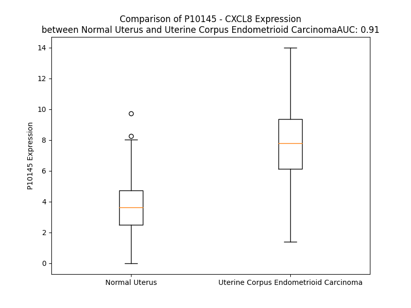

# Detailed Data for P10145

## Introduction to the Detailed Summary

### How to Interpret the Results

- **Summary & Metrics**: This section provides a quick reference to essential protein attributes, including expression changes, family classification, and biomarker applications. Regulation status (upregulated/downregulated) indicates the protein's behavior in a disease context. Some information comes from the original excel file with the proteins selected from literature, while others are derived from the analyses.
- **Expression Comparison**: A visual representation comparing protein expression between normal and disease states. It highlights significant changes in expression levels that might indicate diagnostic or therapeutic relevance. This is data coming from transcriptomics experiments and could not translate similarly to protein levels.
- **Isoform Alignment**: An interactive view of isoform alignments, revealing structural and functional differences between variants of the protein.
- **Interactors & Homologs**: Tables listing known interaction partners and homologous proteins, the more interactors and homologs, the more complex the protein is to design an antibody for.
- **Biological Assemblies**: Information about the structural arrangement of the protein in different assemblies, providing insights into its functional state but also the complexity of the protein to develop antibodies.
- **Combined Per-Residue Information**: A detailed table summarizing residue-level data. This includes predictions for epitope regions, aggregation tendencies, and modifications that might impact the protein's function. Each row corresponds to a residue in the protein, providing insights into specific sites that may be important for research or drug development.
## Summary & Metrics

- **UniProt Accession**: P10145
- **Gene Name**: IL8
- **Protein Name**: Interleukin-8
- **Swiss Prot**: IL8_HUMAN
- **Family**: cytokine
- **Biomarker Application**: diagnosis,disease progression,efficacy,prognosis,response to therapy,safety,unspecified application
- **Number of Isoforms**: 0
- **Regulation**: 2
- **(transcriptomics) AUC**: 0.88
- **(transcriptomics) Fold Change**: 1.89
- **(transcriptomics) Regulation**: Upregulated
- **Discotope Epitope Count**: 15
- **Max n_uniprots (Homo)**: 4
- **Max n_uniprots (Hetero)**: 6

## Expression Comparison

## Interactors

| preferredName_A   | preferredName_B   |   score |
|:------------------|:------------------|--------:|
| CXCL8             | CXCR2             |   0.999 |
| CXCL8             | CCL2              |   0.999 |
| CXCL8             | CXCR1             |   0.999 |
| CXCL8             | PF4               |   0.999 |
| CXCL8             | ACKR1             |   0.999 |
| CXCL8             | CCL8              |   0.998 |
| CXCL8             | CCR2              |   0.998 |
| CXCL8             | IL4               |   0.997 |
| CXCL8             | CXCR4             |   0.997 |
| CXCL8             | CXCR3             |   0.997 |
| CXCL8             | CCR1              |   0.997 |
| CXCL8             | RELA              |   0.995 |
| CXCL8             | IL1B              |   0.994 |
| CXCL8             | IL6               |   0.991 |
| CXCL8             | CCL4              |   0.988 |
| CXCL8             | NFKB1             |   0.988 |
| CXCL8             | JUN               |   0.987 |
| CXCL8             | CCR3              |   0.986 |
| CXCL8             | IL2               |   0.985 |
| CXCL8             | TNF               |   0.983 |
| CXCL8             | CXCL2             |   0.982 |
| CXCL8             | CCL5              |   0.98  |
| CXCL8             | CCL3              |   0.977 |
| CXCL8             | PTGS2             |   0.975 |
| CXCL8             | CXCL10            |   0.975 |
| CXCL8             | IL1A              |   0.974 |
| CXCL8             | CSF2              |   0.972 |
| CXCL8             | CCR5              |   0.971 |
| CXCL8             | CSF3              |   0.971 |
| CXCL8             | IL10              |   0.97  |
| CXCL8             | VWF               |   0.962 |
| CXCL8             | IFNG              |   0.961 |
| CXCL8             | CXCL9             |   0.959 |
| CXCL8             | CXCL1             |   0.957 |
| CXCL8             | CXCL12            |   0.951 |
| CXCL8             | CXCL5             |   0.951 |
| CXCL8             | CXCL11            |   0.946 |
| CXCL8             | ICAM1             |   0.943 |
| CXCL8             | CCL20             |   0.941 |
| CXCL8             | IL13              |   0.94  |
| CXCL8             | TLR4              |   0.933 |
| CXCL8             | TNFAIP6           |   0.933 |
| CXCL8             | IL5               |   0.932 |
| CXCL8             | CCL11             |   0.929 |
| CXCL8             | IL1RN             |   0.926 |
| CXCL8             | IL18              |   0.926 |
| CXCL8             | CCL19             |   0.925 |
| CXCL8             | IL17A             |   0.924 |
| CXCL8             | CX3CR1            |   0.914 |
| CXCL8             | CCL7              |   0.907 |

## Homologs

| uniprot_id   | gene_id   |
|:-------------|:----------|
| O14625       | CXCL11    |
| P09341       | CXCL1     |
| P02776       | PF4       |
| P10720       | PF4V1     |
| P19876       | CXCL3     |
| P19875       | CXCL2     |
| P02775       | PPBP      |
| P80162       | CXCL6     |
| Q53X90       | CXCL13    |
| Q07325       | CXCL9     |
| P02778       | CXCL10    |
| Q6I9S7       | CXCL5     |

## Biological Assemblies

|   Unnamed: 0 |   assembly |   n_uniprots | composition   | crystal_id   |
|-------------:|-----------:|-------------:|:--------------|:-------------|
|            0 |          1 |            5 | Hetero        | 6lfo         |
|            0 |          1 |            1 | Homo          | 5wdz         |
|            0 |          1 |            1 | Homo          | 4xdx         |
|            0 |          1 |            2 | Homo          | 1rod         |
|            0 |          1 |            2 | Homo          | 6wzm         |
|            0 |          1 |            1 | Homo          | 3il8         |
|            0 |          1 |            2 | Homo          | 2il8         |
|            0 |          1 |            1 | Homo          | 6n2u         |
|            0 |          1 |            2 | Hetero        | 6xmn         |
|            0 |          1 |            5 | Hetero        | 8ic0         |
|            0 |          1 |            1 | Homo          | 5d14         |
|            0 |          1 |            3 | Hetero        | 1ilp         |
|            0 |          1 |            1 | Homo          | 1ikm         |
|            0 |          1 |            3 | Hetero        | 1ilq         |
|            0 |          1 |            1 | Homo          | 1ikl         |
|            0 |          1 |            2 | Homo          | 1il8         |
|            0 |          1 |            2 | Homo          | 1qe6         |
|            1 |          2 |            2 | Homo          | 1qe6         |
|            2 |          3 |            4 | Homo          | 1qe6         |
|            0 |          1 |            6 | Hetero        | 6lfm         |
|            0 |          1 |            2 | Homo          | 1icw         |

## Combined Per-Residue Information

|   res | aa   |   epitope_score | epitope   |   relative_surface_accessibility |   modeling_confidence |   Aggregation | modification   |
|------:|:-----|----------------:|:----------|---------------------------------:|----------------------:|--------------:|:---------------|
|     1 | M    |         0.22936 | False     |                          1.1507  |                 63.96 |         0     | N/A            |
|     2 | T    |         0.32905 | False     |                          0.79072 |                 75.36 |         0     | N/A            |
|     3 | S    |         0.1541  | False     |                          0.60401 |                 82.02 |         0     | N/A            |
|     4 | K    |         0.25919 | False     |                          0.83726 |                 85.09 |         0.009 | N/A            |
|     5 | L    |         0.18201 | False     |                          0.73446 |                 88.4  |        71.699 | N/A            |
|     6 | A    |         0.12182 | False     |                          0.48286 |                 88.4  |        84.809 | N/A            |
|     7 | V    |         0.17983 | False     |                          0.69257 |                 89.57 |        97.314 | N/A            |
|     8 | A    |         0.13763 | False     |                          0.56474 |                 90.24 |        98.374 | N/A            |
|     9 | L    |         0.19427 | False     |                          0.79292 |                 91.37 |        99.625 | N/A            |
|    10 | L    |         0.18083 | False     |                          0.7093  |                 90.81 |        99.847 | N/A            |
|    11 | A    |         0.12038 | False     |                          0.43843 |                 90.38 |        99.856 | N/A            |
|    12 | A    |         0.1307  | False     |                          0.54636 |                 89.54 |        99.835 | N/A            |
|    13 | F    |         0.21482 | False     |                          0.76867 |                 87.91 |        99.816 | N/A            |
|    14 | L    |         0.20806 | False     |                          0.70976 |                 86.89 |        99.406 | N/A            |
|    15 | I    |         0.12865 | False     |                          0.64466 |                 85.21 |        97.145 | N/A            |
|    16 | S    |         0.14357 | False     |                          0.40842 |                 82.24 |        72.383 | N/A            |
|    17 | A    |         0.19459 | False     |                          0.44279 |                 78.84 |        69.303 | N/A            |
|    18 | A    |         0.22037 | False     |                          0.63439 |                 77.25 |        66.692 | N/A            |
|    19 | L    |         0.3392  | False     |                          0.84586 |                 70.52 |        64.322 | N/A            |
|    20 | C    |         0.27202 | False     |                          0.8133  |                 66.3  |        11.214 | N/A            |
|    21 | E    |         0.3725  | False     |                          0.77703 |                 63.69 |         0.009 | N/A            |
|    22 | G    |         0.47386 | True      |                          0.78064 |                 59.75 |         0     | N/A            |
|    23 | A    |         0.35849 | False     |                          0.77463 |                 59.5  |         0     | N/A            |
|    24 | V    |         0.41268 | False     |                          1.00261 |                 57.12 |         0     | N/A            |
|    25 | L    |         0.37699 | False     |                          0.87962 |                 58.94 |         0     | N/A            |
|    26 | P    |         0.27005 | False     |                          0.85556 |                 56.21 |         0     | N/A            |
|    27 | R    |         0.31461 | False     |                          0.92588 |                 54.36 |         0     | Citrulline     |
|    28 | S    |         0.31077 | False     |                          0.49984 |                 57.59 |         0     | N/A            |
|    29 | A    |         0.3797  | False     |                          0.8539  |                 54.18 |         0     | N/A            |
|    30 | K    |         0.47597 | True      |                          0.73658 |                 58.27 |         0     | N/A            |
|    31 | E    |         0.39064 | False     |                          0.51217 |                 61.11 |         0     | N/A            |
|    32 | L    |         0.41469 | False     |                          0.813   |                 76.22 |         0     | N/A            |
|    33 | R    |         0.44338 | False     |                          0.69998 |                 87.13 |         0     | N/A            |
|    34 | C    |         0.4295  | False     |                          0.28666 |                 92.41 |         0     | N/A            |
|    35 | Q    |         0.4783  | True      |                          0.56154 |                 93.29 |         0     | N/A            |
|    36 | C    |         0.25998 | False     |                          0.20506 |                 95.25 |         0     | N/A            |
|    37 | I    |         0.52729 | True      |                          1.05144 |                 93.86 |         0     | N/A            |
|    38 | K    |         0.53972 | True      |                          0.83902 |                 95.29 |         0     | N/A            |
|    39 | T    |         0.31461 | False     |                          0.48308 |                 96.94 |         0     | N/A            |
|    40 | Y    |         0.40407 | False     |                          0.34328 |                 97.53 |         0     | N/A            |
|    41 | S    |         0.47505 | True      |                          0.69814 |                 96.01 |         0     | N/A            |
|    42 | K    |         0.56732 | True      |                          0.70984 |                 96.45 |         0     | N/A            |
|    43 | P    |         0.45386 | False     |                          0.70599 |                 96.47 |         0     | N/A            |
|    44 | F    |         0.4372  | False     |                          0.18465 |                 95.82 |         0     | N/A            |
|    45 | H    |         0.38406 | False     |                          0.61706 |                 95.31 |         0     | N/A            |
|    46 | P    |         0.16399 | False     |                          0.13209 |                 95.32 |         0     | N/A            |
|    47 | K    |         0.30691 | False     |                          0.71656 |                 95.24 |         0     | N/A            |
|    48 | F    |         0.31168 | False     |                          0.53604 |                 96.2  |         0     | N/A            |
|    49 | I    |         0.08758 | False     |                          0.0343  |                 97.29 |         0     | N/A            |
|    50 | K    |         0.22456 | False     |                          0.60981 |                 96.35 |         0     | N/A            |
|    51 | E    |         0.31864 | False     |                          0.34328 |                 96.97 |         0     | N/A            |
|    52 | L    |         0.31382 | False     |                          0.19266 |                 97.04 |         0     | N/A            |
|    53 | R    |         0.43996 | False     |                          0.62265 |                 96.4  |         0     | N/A            |
|    54 | V    |         0.352   | False     |                          0.54909 |                 96.35 |         0     | N/A            |
|    55 | I    |         0.31191 | False     |                          0.30719 |                 94.48 |         0     | N/A            |
|    56 | E    |         0.29363 | False     |                          0.71935 |                 94.34 |         0     | N/A            |
|    57 | S    |         0.24991 | False     |                          0.48115 |                 92.91 |         0     | N/A            |
|    58 | G    |         0.39496 | False     |                          0.41271 |                 90.75 |         0     | N/A            |
|    59 | P    |         0.52467 | True      |                          0.89494 |                 89.25 |         0     | N/A            |
|    60 | H    |         0.51434 | True      |                          0.5535  |                 87.31 |         0     | N/A            |
|    61 | C    |         0.31632 | False     |                          0.10818 |                 91.59 |         0     | N/A            |
|    62 | A    |         0.41036 | False     |                          0.84068 |                 92.13 |         0     | N/A            |
|    63 | N    |         0.52053 | True      |                          0.59958 |                 93.52 |         0     | N/A            |
|    64 | T    |         0.29593 | False     |                          0.36551 |                 95.52 |         0.387 | N/A            |
|    65 | E    |         0.08855 | False     |                          0.04452 |                 96.57 |         1.036 | N/A            |
|    66 | I    |         0.12023 | False     |                          0.068   |                 97.84 |         1.295 | N/A            |
|    67 | I    |         0.19495 | False     |                          0.07228 |                 98.01 |         1.295 | N/A            |
|    68 | V    |         0.0069  | False     |                          0       |                 98    |         1.295 | N/A            |
|    69 | K    |         0.26669 | False     |                          0.39943 |                 98.09 |         1.295 | N/A            |
|    70 | L    |         0.142   | False     |                          0.05684 |                 97.54 |         0.946 | N/A            |
|    71 | S    |         0.26446 | False     |                          0.39853 |                 96.43 |         0.259 | N/A            |
|    72 | D    |         0.3721  | False     |                          0.56599 |                 95.73 |         0.259 | N/A            |
|    73 | G    |         0.49246 | True      |                          0.60542 |                 95.84 |         0     | N/A            |
|    74 | R    |         0.62262 | True      |                          0.5398  |                 96.68 |         0     | N/A            |
|    75 | E    |         0.49789 | True      |                          0.62644 |                 97.36 |         0     | N/A            |
|    76 | L    |         0.39725 | False     |                          0.15992 |                 98    |         0     | N/A            |
|    77 | C    |         0.26651 | False     |                          0.14499 |                 98.01 |         0     | N/A            |
|    78 | L    |         0.03506 | False     |                          0.01523 |                 98.09 |         0     | N/A            |
|    79 | D    |         0.17018 | False     |                          0.25802 |                 96.84 |         0     | N/A            |
|    80 | P    |         0.31443 | False     |                          0.27624 |                 96.05 |         0     | N/A            |
|    81 | K    |         0.59246 | True      |                          0.88187 |                 95.6  |         0     | N/A            |
|    82 | E    |         0.29325 | False     |                          0.41278 |                 96.7  |         0     | N/A            |
|    83 | N    |         0.25429 | False     |                          0.68609 |                 96.78 |         0     | N/A            |
|    84 | W    |         0.27601 | False     |                          0.1123  |                 96.77 |         0     | N/A            |
|    85 | V    |         0.00961 | False     |                          0.00095 |                 97.66 |         0     | N/A            |
|    86 | Q    |         0.36282 | False     |                          0.49024 |                 97    |         0     | N/A            |
|    87 | R    |         0.37752 | False     |                          0.59157 |                 96.84 |         0     | N/A            |
|    88 | V    |         0.11778 | False     |                          0.06664 |                 96.77 |         0     | N/A            |
|    89 | V    |         0.16534 | False     |                          0.13615 |                 96.05 |         0     | N/A            |
|    90 | E    |         0.48376 | True      |                          0.43607 |                 96.39 |         0     | N/A            |
|    91 | K    |         0.35477 | False     |                          0.60696 |                 96.62 |         0     | N/A            |
|    92 | F    |         0.18198 | False     |                          0.17568 |                 95.58 |         0     | N/A            |
|    93 | L    |         0.22168 | False     |                          0.53622 |                 93.95 |         0     | N/A            |
|    94 | K    |         0.25152 | False     |                          0.52987 |                 96    |         0     | N/A            |
|    95 | R    |         0.30278 | False     |                          0.58769 |                 93.83 |         0     | N/A            |
|    96 | A    |         0.20128 | False     |                          0.51076 |                 91.57 |         0     | N/A            |
|    97 | E    |         0.34531 | False     |                          0.73332 |                 92.23 |         0     | N/A            |
|    98 | N    |         0.20157 | False     |                          0.84374 |                 90.25 |         0     | N/A            |
|    99 | S    |         0.19317 | False     |                          1.04668 |                 75.93 |         0     | N/A            |

