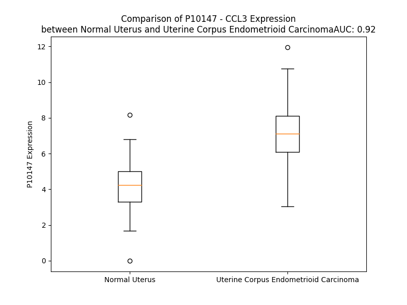

# Detailed Data for P10147

## Introduction to the Detailed Summary

### How to Interpret the Results

- **Summary & Metrics**: This section provides a quick reference to essential protein attributes, including expression changes, family classification, and biomarker applications. Regulation status (upregulated/downregulated) indicates the protein's behavior in a disease context. Some information comes from the original excel file with the proteins selected from literature, while others are derived from the analyses.
- **Expression Comparison**: A visual representation comparing protein expression between normal and disease states. It highlights significant changes in expression levels that might indicate diagnostic or therapeutic relevance. This is data coming from transcriptomics experiments and could not translate similarly to protein levels.
- **Isoform Alignment**: An interactive view of isoform alignments, revealing structural and functional differences between variants of the protein.
- **Interactors & Homologs**: Tables listing known interaction partners and homologous proteins, the more interactors and homologs, the more complex the protein is to design an antibody for.
- **Biological Assemblies**: Information about the structural arrangement of the protein in different assemblies, providing insights into its functional state but also the complexity of the protein to develop antibodies.
- **Combined Per-Residue Information**: A detailed table summarizing residue-level data. This includes predictions for epitope regions, aggregation tendencies, and modifications that might impact the protein's function. Each row corresponds to a residue in the protein, providing insights into specific sites that may be important for research or drug development.
## Summary & Metrics

- **UniProt Accession**: P10147
- **Gene Name**: CCL3 (MIP1A)
- **Protein Name**: C-C motif chemokine 3
- **Swiss Prot**: CCL3_HUMAN
- **Family**: cytokine
- **Biomarker Application**: diagnosis,efficacy,prognosis
- **Number of Isoforms**: 0
- **Regulation**: 1
- **(transcriptomics) AUC**: 0.92
- **(transcriptomics) Fold Change**: 1.61
- **(transcriptomics) Regulation**: Upregulated
- **Discotope Epitope Count**: 17
- **Max n_uniprots (Homo)**: 7
- **Max n_uniprots (Hetero)**: 4

## Expression Comparison

## Interactors

| preferredName_A   | preferredName_B   |   score |
|:------------------|:------------------|--------:|
| CCL3              | CCR5              |   0.999 |
| CCL3              | CCR1              |   0.999 |
| CCL3              | CCR2              |   0.999 |
| CCL3              | CCR3              |   0.998 |
| CCL3              | CCL4              |   0.997 |
| CCL3              | CXCR3             |   0.997 |
| CCL3              | CXCR4             |   0.993 |
| CCL3              | CCL3L1            |   0.992 |
| CCL3              | TNF               |   0.988 |
| CCL3              | CXCR2             |   0.984 |
| CCL3              | ACKR2             |   0.982 |
| CCL3              | CXCR1             |   0.981 |
| CCL3              | CXCL8             |   0.977 |
| CCL3              | CCR6              |   0.973 |
| CCL3              | IL10              |   0.972 |
| CCL3              | IL1B              |   0.972 |
| CCL3              | CCL20             |   0.97  |
| CCL3              | CX3CR1            |   0.97  |
| CCL3              | IL6               |   0.962 |
| CCL3              | CCR7              |   0.953 |
| CCL3              | IDE               |   0.953 |
| CCL3              | CCRL2             |   0.951 |
| CCL3              | CXCL10            |   0.951 |
| CCL3              | CXCL1             |   0.948 |
| CCL3              | IFNG              |   0.947 |
| CCL3              | CCR9              |   0.946 |
| CCL3              | CXCL2             |   0.939 |
| CCL3              | CSF2              |   0.935 |
| CCL3              | CXCR6             |   0.934 |
| CCL3              | CSF3              |   0.929 |
| CCL3              | IL1A              |   0.923 |
| CCL3              | CCL5              |   0.913 |
| CCL3              | CXCR5             |   0.906 |
| CCL3              | XCR1              |   0.901 |

## Homologs

| uniprot_id   | gene_id   |
|:-------------|:----------|
| A0N0R1       | CCL3      |
| A0N0R1       | CCL3      |
| P16619       | CCL3L1    |
| P55774       | CCL18     |
| A0A0B4J2G5   | CCL14     |
| Q16663       | CCL15     |
| P55773       | CCL23     |
| O00626       | CCL22     |
| Q8NHW4       | CCL4L1    |
| P13236       | CCL4      |
| A0A494C1Q1   | CCL5      |
| Q9Y258       | CCL26     |
| O00175       | CCL24     |
| O15467       | CCL16     |
| P22362       | CCL1      |
| Q92583       | CCL17     |
| A0A7P0TBH2   | CCL25     |
| A8MVH1       | CCL7      |
| Q6IBD6       | CCL19     |
| P80075       | CCL8      |
| P47992       | XCL1      |
| Q9UBD3       | XCL2      |
| A0N0N7       | CX3CL1    |
| A0A2R8Y806   | CCL20     |
| J3KRT7       | CCL2      |
| Q99616       | CCL13     |
| Q5VZ73       | CCL21     |
| Q6I9T4       | CCL11     |

## Biological Assemblies

|   Unnamed: 0 |   assembly |   n_uniprots | composition   | crystal_id   |
|-------------:|-----------:|-------------:|:--------------|:-------------|
|            0 |          1 |            2 | Hetero        | 3fpu         |
|            0 |          1 |            7 | Homo          | 5d65         |
|            0 |          1 |            1 | Homo          | 7f1t         |
|            0 |          1 |            4 | Hetero        | 7f1q         |
|            0 |          1 |            2 | Homo          | 1b53         |
|            0 |          1 |            1 | Homo          | 4ra8         |
|            1 |          2 |            2 | Homo          | 4ra8         |
|            2 |          3 |            2 | Homo          | 4ra8         |
|            0 |          1 |            2 | Homo          | 2x69         |
|            1 |          2 |            1 | Homo          | 2x69         |
|            2 |          3 |            2 | Homo          | 2x69         |
|            0 |          1 |            2 | Homo          | 1b50         |
|            0 |          1 |            1 | Homo          | 3kbx         |
|            1 |          2 |            2 | Homo          | 3kbx         |
|            2 |          3 |            2 | Homo          | 3kbx         |
|            0 |          1 |            4 | Hetero        | 4zkb         |
|            0 |          1 |            2 | Homo          | 2x6g         |
|            1 |          2 |            2 | Homo          | 2x6g         |
|            2 |          3 |            2 | Homo          | 2x6g         |
|            3 |          4 |            2 | Homo          | 2x6g         |
|            4 |          5 |            2 | Homo          | 2x6g         |
|            5 |          6 |            2 | Homo          | 2x6g         |
|            6 |          7 |            2 | Homo          | 2x6g         |
|            7 |          8 |            2 | Homo          | 2x6g         |
|            8 |          9 |            2 | Homo          | 2x6g         |
|            0 |          1 |            5 | Homo          | 5cor         |
|            1 |          2 |            5 | Homo          | 5cor         |
|            0 |          1 |            4 | Hetero        | 3h44         |
|            1 |          2 |            4 | Hetero        | 3h44         |
|            2 |          3 |            2 | Hetero        | 3h44         |
|            3 |          4 |            2 | Hetero        | 3h44         |

## Combined Per-Residue Information

|   res | aa   |   epitope_score | epitope   |   relative_surface_accessibility |   modeling_confidence |   Aggregation | modification   |
|------:|:-----|----------------:|:----------|---------------------------------:|----------------------:|--------------:|:---------------|
|     1 | M    |         0.22929 | False     |                          1.21087 |                 58.21 |         0     | N/A            |
|     2 | Q    |         0.36544 | False     |                          0.79676 |                 61.46 |         0.876 | N/A            |
|     3 | V    |         0.24921 | False     |                          0.92221 |                 63.36 |         9.851 | N/A            |
|     4 | S    |         0.21531 | False     |                          0.54853 |                 76.19 |        11.18  | N/A            |
|     5 | T    |         0.23251 | False     |                          0.65127 |                 76.22 |        21.907 | N/A            |
|     6 | A    |         0.19666 | False     |                          0.56615 |                 80.71 |        39.94  | N/A            |
|     7 | A    |         0.22312 | False     |                          0.59311 |                 82.17 |        60.952 | N/A            |
|     8 | L    |         0.29255 | False     |                          0.63323 |                 83.29 |        83.987 | N/A            |
|     9 | A    |         0.20948 | False     |                          0.4971  |                 85.04 |        86.392 | N/A            |
|    10 | V    |         0.24692 | False     |                          0.69773 |                 86.35 |        88.786 | N/A            |
|    11 | L    |         0.28645 | False     |                          0.698   |                 85.68 |        88.436 | N/A            |
|    12 | L    |         0.24794 | False     |                          0.65015 |                 84.5  |        84.045 | N/A            |
|    13 | C    |         0.2049  | False     |                          0.53701 |                 83.59 |        50.121 | N/A            |
|    14 | T    |         0.26986 | False     |                          0.50413 |                 78.75 |        42.757 | N/A            |
|    15 | M    |         0.30211 | False     |                          0.65097 |                 79.1  |        38.106 | N/A            |
|    16 | A    |         0.20951 | False     |                          0.53489 |                 79.74 |        32.77  | N/A            |
|    17 | L    |         0.28328 | False     |                          0.71955 |                 74.79 |        28.487 | N/A            |
|    18 | C    |         0.29325 | False     |                          0.65713 |                 71.42 |         5.057 | N/A            |
|    19 | N    |         0.3466  | False     |                          0.78369 |                 62.8  |         0.225 | N/A            |
|    20 | Q    |         0.28857 | False     |                          0.72477 |                 61.14 |         0.061 | N/A            |
|    21 | F    |         0.35824 | False     |                          0.81246 |                 58.14 |         0.061 | N/A            |
|    22 | S    |         0.43813 | False     |                          0.71452 |                 58.97 |         0     | N/A            |
|    23 | A    |         0.48448 | True      |                          0.80471 |                 59.44 |         0     | N/A            |
|    24 | S    |         0.34896 | False     |                          0.53731 |                 58.34 |         0     | N/A            |
|    25 | L    |         0.47552 | True      |                          0.82126 |                 58.08 |         0     | N/A            |
|    26 | A    |         0.46314 | False     |                          0.79993 |                 59.75 |         0     | N/A            |
|    27 | A    |         0.4272  | False     |                          0.83823 |                 64.79 |         0     | N/A            |
|    28 | D    |         0.52037 | True      |                          0.79322 |                 73.4  |         0     | N/A            |
|    29 | T    |         0.40648 | False     |                          0.6169  |                 80.49 |         0     | N/A            |
|    30 | P    |         0.43934 | False     |                          0.99555 |                 86.22 |         0     | N/A            |
|    31 | T    |         0.5006  | True      |                          0.44894 |                 89.52 |         0     | N/A            |
|    32 | A    |         0.49004 | True      |                          0.59302 |                 94.53 |         0     | N/A            |
|    33 | C    |         0.41087 | False     |                          0.29383 |                 97.49 |         0     | N/A            |
|    34 | C    |         0.09014 | False     |                          0.01733 |                 98.19 |         0     | N/A            |
|    35 | F    |         0.43451 | False     |                          0.83474 |                 97.27 |         0     | N/A            |
|    36 | S    |         0.51343 | True      |                          0.63042 |                 98.07 |         0     | N/A            |
|    37 | Y    |         0.29409 | False     |                          0.24822 |                 98.62 |         0     | N/A            |
|    38 | T    |         0.2849  | False     |                          0.24076 |                 98.35 |         0     | N/A            |
|    39 | S    |         0.52489 | True      |                          0.90728 |                 97.83 |         0     | N/A            |
|    40 | R    |         0.57213 | True      |                          0.78728 |                 97.52 |         0     | N/A            |
|    41 | Q    |         0.36061 | False     |                          0.51703 |                 98.22 |         0     | N/A            |
|    42 | I    |         0.31905 | False     |                          0.1112  |                 97.7  |         0     | N/A            |
|    43 | P    |         0.37291 | False     |                          0.50996 |                 98.12 |         0     | N/A            |
|    44 | Q    |         0.28502 | False     |                          0.39482 |                 97.31 |         0     | N/A            |
|    45 | N    |         0.42051 | False     |                          0.62309 |                 97.61 |         0     | N/A            |
|    46 | F    |         0.47361 | True      |                          0.54708 |                 98.3  |         0     | N/A            |
|    47 | I    |         0.17808 | False     |                          0.06744 |                 98.22 |         0     | N/A            |
|    48 | A    |         0.23555 | False     |                          0.47103 |                 97.73 |         0     | N/A            |
|    49 | D    |         0.2928  | False     |                          0.36622 |                 98.26 |         0     | N/A            |
|    50 | Y    |         0.39566 | False     |                          0.20749 |                 98.35 |         0     | N/A            |
|    51 | F    |         0.3151  | False     |                          0.52459 |                 97.43 |         0     | N/A            |
|    52 | E    |         0.4308  | False     |                          0.67934 |                 97.61 |         0     | N/A            |
|    53 | T    |         0.19438 | False     |                          0.12727 |                 97.65 |         0     | N/A            |
|    54 | S    |         0.35346 | False     |                          0.29511 |                 94.9  |         0     | N/A            |
|    55 | S    |         0.50319 | True      |                          0.92323 |                 94.84 |         0     | N/A            |
|    56 | Q    |         0.64097 | True      |                          0.7879  |                 93.79 |         0     | N/A            |
|    57 | C    |         0.23859 | False     |                          0.13302 |                 96.42 |         0     | N/A            |
|    58 | S    |         0.45852 | False     |                          0.78923 |                 96.65 |         0     | N/A            |
|    59 | K    |         0.45547 | False     |                          0.37695 |                 97.01 |         0     | N/A            |
|    60 | P    |         0.36115 | False     |                          0.68735 |                 97.92 |         0     | N/A            |
|    61 | G    |         0.12692 | False     |                          0.06138 |                 98.33 |         5.05  | N/A            |
|    62 | V    |         0.10232 | False     |                          0.04856 |                 98.65 |        32.501 | N/A            |
|    63 | I    |         0.18826 | False     |                          0.0816  |                 98.67 |        32.501 | N/A            |
|    64 | F    |         0.01002 | False     |                          0       |                 98.69 |        32.501 | N/A            |
|    65 | L    |         0.20914 | False     |                          0.28935 |                 98.54 |        32.501 | N/A            |
|    66 | T    |         0.27278 | False     |                          0.10049 |                 98.33 |        28.345 | N/A            |
|    67 | K    |         0.63191 | True      |                          0.68698 |                 98.14 |         0     | N/A            |
|    68 | R    |         0.52834 | True      |                          0.84751 |                 98.19 |         0     | N/A            |
|    69 | S    |         0.48204 | True      |                          0.71702 |                 97.94 |         0     | N/A            |
|    70 | R    |         0.60956 | True      |                          0.67327 |                 98.17 |         0     | N/A            |
|    71 | Q    |         0.43376 | False     |                          0.65383 |                 98.22 |         0     | N/A            |
|    72 | V    |         0.40474 | False     |                          0.26277 |                 98.47 |         0     | N/A            |
|    73 | C    |         0.20457 | False     |                          0.24312 |                 98.73 |         0     | N/A            |
|    74 | A    |         0.01355 | False     |                          0.00128 |                 98.75 |         0     | N/A            |
|    75 | D    |         0.13288 | False     |                          0.18905 |                 98.66 |         0     | N/A            |
|    76 | P    |         0.3469  | False     |                          0.27809 |                 98.49 |         0     | N/A            |
|    77 | S    |         0.51669 | True      |                          0.65581 |                 98.24 |         0     | N/A            |
|    78 | E    |         0.26991 | False     |                          0.35245 |                 98.54 |         0     | N/A            |
|    79 | E    |         0.316   | False     |                          0.78306 |                 98.45 |         0     | N/A            |
|    80 | W    |         0.24177 | False     |                          0.12086 |                 98.49 |         0     | N/A            |
|    81 | V    |         0.02037 | False     |                          0.00666 |                 98.7  |         0     | N/A            |
|    82 | Q    |         0.33344 | False     |                          0.49541 |                 98.64 |         0     | N/A            |
|    83 | K    |         0.4866  | True      |                          0.56446 |                 98.47 |         0     | N/A            |
|    84 | Y    |         0.17862 | False     |                          0.03945 |                 98.39 |         0     | N/A            |
|    85 | V    |         0.16332 | False     |                          0.14376 |                 98.45 |         0     | N/A            |
|    86 | S    |         0.39184 | False     |                          0.36499 |                 98.2  |         0     | N/A            |
|    87 | D    |         0.39148 | False     |                          0.26895 |                 97.86 |         0     | N/A            |
|    88 | L    |         0.21958 | False     |                          0.23495 |                 97.57 |         0     | N/A            |
|    89 | E    |         0.37443 | False     |                          0.52937 |                 96.74 |         0     | N/A            |
|    90 | L    |         0.39413 | False     |                          0.92595 |                 95.64 |         0     | N/A            |
|    91 | S    |         0.25396 | False     |                          0.68541 |                 88.97 |         0     | N/A            |
|    92 | A    |         0.17791 | False     |                          1.31943 |                 82.17 |         0     | N/A            |

