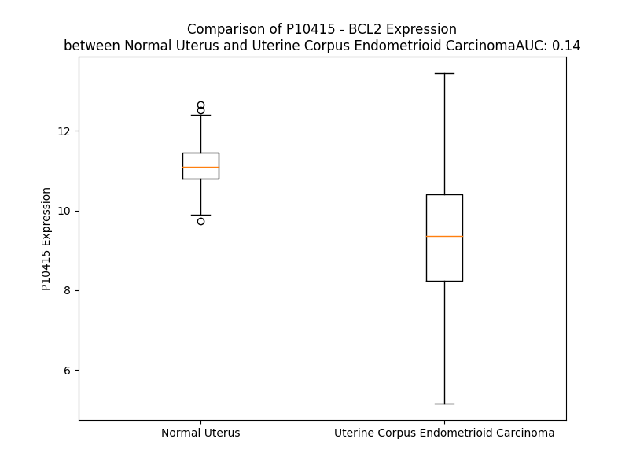

# Detailed Data for P10415

## Introduction to the Detailed Summary

### How to Interpret the Results

- **Summary & Metrics**: This section provides a quick reference to essential protein attributes, including expression changes, family classification, and biomarker applications. Regulation status (upregulated/downregulated) indicates the protein's behavior in a disease context. Some information comes from the original excel file with the proteins selected from literature, while others are derived from the analyses.
- **Expression Comparison**: A visual representation comparing protein expression between normal and disease states. It highlights significant changes in expression levels that might indicate diagnostic or therapeutic relevance. This is data coming from transcriptomics experiments and could not translate similarly to protein levels.
- **Isoform Alignment**: An interactive view of isoform alignments, revealing structural and functional differences between variants of the protein.
- **Interactors & Homologs**: Tables listing known interaction partners and homologous proteins, the more interactors and homologs, the more complex the protein is to design an antibody for.
- **Biological Assemblies**: Information about the structural arrangement of the protein in different assemblies, providing insights into its functional state but also the complexity of the protein to develop antibodies.
- **Combined Per-Residue Information**: A detailed table summarizing residue-level data. This includes predictions for epitope regions, aggregation tendencies, and modifications that might impact the protein's function. Each row corresponds to a residue in the protein, providing insights into specific sites that may be important for research or drug development.
## Summary & Metrics

- **UniProt Accession**: P10415
- **Gene Name**: Bcl2
- **Protein Name**: Apoptosis regulator Bcl-2
- **Swiss Prot**: BCL2_HUMAN
- **Family**: transporter
- **Biomarker Application**: diagnosis,disease progression,efficacy,prognosis
- **Number of Isoforms**: 2
- **Regulation**: 2
- **(transcriptomics) AUC**: 0.14
- **(transcriptomics) Fold Change**: 1.20
- **(transcriptomics) Regulation**: Downregulated
- **Discotope Epitope Count**: 54
- **Max n_uniprots (Homo)**: 1
- **Max n_uniprots (Hetero)**: 4

## Expression Comparison

## Isoform Alignment

<pre style='font-size:14px; font-family:monospace;'>P10415-1 MAHAGRTGYDNREIVMKYIHYKLSQRGYEWDAGDVGAAPPGAAPAPGIFSSQPGHTPHPAASRDPVARTSPLQTPAAPGAAAGPALSPVPPVVHLTLRQAGDDFSRRYRRDFAEMSSQLHLTPFTARGRFATVVEELFRDGVNWGRIVAFFEFGGVMCVESVNREMSPLVDNIALWMTEYLNRHLHTWIQDNGGWDAFVELYGPSMRPLFDFSWLSLKTLLSLALVGACITLGAYLGHK
P10415-2 MAHAGRTGYDNREIVMKYIHYKLSQRGYEWDAGDVGAAPPGAAPAPGIFSSQPGHTPHPAASRDPVARTSPLQTPAAPGAAAGPALSPVPPVVHLTLRQAGDDFSRRYRRDFAEMSSQLHLTPFTARGRFATVVEELFRDGVNWGRIVAFFEFGGVMCVESVNREMSPLVDNIALWMTEYLNRHLHTWIQDNGGWVGALGDVSLG----------------------------------
</pre>

## Interactors

| preferredName_A   | preferredName_B   |   score |
|:------------------|:------------------|--------:|
| BCL2              | BIK               |   0.999 |
| BCL2              | BECN1             |   0.999 |
| BCL2              | BNIP3             |   0.999 |
| BCL2              | BCL2L1            |   0.999 |
| BCL2              | NLRP1             |   0.999 |
| BCL2              | BECN2             |   0.999 |
| BCL2              | TP53              |   0.999 |
| BCL2              | PMAIP1            |   0.999 |
| BCL2              | NR4A1             |   0.999 |
| BCL2              | BCL2L11           |   0.999 |
| BCL2              | BAK1              |   0.999 |
| BCL2              | BAD               |   0.999 |
| BCL2              | BBC3              |   0.999 |
| BCL2              | BAX               |   0.999 |
| BCL2              | SOD1              |   0.998 |
| BCL2              | BID               |   0.998 |
| BCL2              | VDAC1             |   0.998 |
| BCL2              | BMF               |   0.998 |
| BCL2              | CYCS              |   0.997 |
| BCL2              | HRK               |   0.997 |
| BCL2              | FKBP8             |   0.996 |
| BCL2              | BAG1              |   0.996 |
| BCL2              | ITPR1             |   0.996 |
| BCL2              | BNIP3L            |   0.995 |
| BCL2              | ITPR3             |   0.993 |
| BCL2              | AKT1              |   0.993 |
| BCL2              | APAF1             |   0.993 |
| BCL2              | RTL10             |   0.991 |
| BCL2              | TP53BP2           |   0.99  |
| BCL2              | ATG12             |   0.989 |
| BCL2              | HSPB3             |   0.988 |
| BCL2              | CASP3             |   0.987 |
| BCL2              | BAG3              |   0.986 |
| BCL2              | MAPK3             |   0.985 |
| BCL2              | CASP8             |   0.984 |
| BCL2              | BNIP2             |   0.982 |
| BCL2              | MAPK8             |   0.979 |
| BCL2              | PIK3C3            |   0.976 |
| BCL2              | UVRAG             |   0.974 |
| BCL2              | DDIT3             |   0.972 |
| BCL2              | MAPK1             |   0.969 |
| BCL2              | PPP2R5A           |   0.964 |
| BCL2              | PPP2CA            |   0.962 |
| BCL2              | PPIF              |   0.961 |
| BCL2              | STAT3             |   0.959 |
| BCL2              | CCND1             |   0.958 |
| BCL2              | MAPK9             |   0.957 |
| BCL2              | MYC               |   0.955 |
| BCL2              | AMBRA1            |   0.954 |
| BCL2              | MDM2              |   0.953 |

## Homologs

| uniprot_id   | gene_id   |
|:-------------|:----------|
| G3V3B7       | BCL2L2    |
| Q5TE63       | BCL2L1    |
| Q16611       | BAK1      |
| Q07812       | BAX       |
| A0A024R4A8   | BOK       |
| B4E1X9       | BCL2A1    |
| Q9HD36       | BCL2L10   |
| A0A087WT64   | MCL1      |

## Biological Assemblies

|   Unnamed: 0 |   assembly |   n_uniprots | composition   | crystal_id   |
|-------------:|-----------:|-------------:|:--------------|:-------------|
|            0 |          1 |            4 | Hetero        | 8fy2         |
|            0 |          1 |            1 | Homo          | 4ieh         |
|            0 |          1 |            0 | Hetero        | 8hog         |
|            0 |          1 |            1 | Homo          | 7lhb         |
|            1 |          2 |            1 | Homo          | 7lhb         |
|            2 |          3 |            1 | Homo          | 7lhb         |
|            0 |          1 |            1 | Homo          | 1gjh         |
|            0 |          1 |            0 | Hetero        | 8hoi         |
|            1 |          2 |            0 | Hetero        | 8hoi         |
|            2 |          3 |            0 | Hetero        | 8hoi         |
|            3 |          4 |            0 | Hetero        | 8hoi         |
|            0 |          1 |            2 | Hetero        | 5agw         |
|            1 |          2 |            2 | Hetero        | 5agw         |
|            0 |          1 |            1 | Homo          | 6gl8         |
|            0 |          1 |            1 | Homo          | 5fcg         |
|            0 |          1 |            1 | Homo          | 1g5m         |
|            0 |          1 |            1 | Homo          | 7y90         |
|            0 |          1 |            1 | Homo          | 6o0p         |
|            0 |          1 |            1 | Homo          | 4lvt         |
|            1 |          2 |            1 | Homo          | 4lvt         |
|            0 |          1 |            0 | Hetero        | 8hoh         |
|            0 |          1 |            1 | Homo          | 1ysw         |
|            0 |          1 |            1 | Homo          | 6o0k         |
|            0 |          1 |            2 | Hetero        | 5vay         |
|            1 |          2 |            2 | Hetero        | 5vay         |
|            2 |          3 |            2 | Hetero        | 5vay         |
|            3 |          4 |            2 | Hetero        | 5vay         |
|            0 |          1 |            1 | Homo          | 4lxd         |
|            0 |          1 |            2 | Hetero        | 6iwb         |
|            1 |          2 |            2 | Hetero        | 6iwb         |
|            0 |          1 |            1 | Homo          | 4aq3         |
|            1 |          2 |            1 | Homo          | 4aq3         |
|            2 |          3 |            1 | Homo          | 4aq3         |
|            3 |          4 |            1 | Homo          | 4aq3         |
|            4 |          5 |            1 | Homo          | 4aq3         |
|            5 |          6 |            1 | Homo          | 4aq3         |
|            0 |          1 |            1 | Homo          | 2o2f         |
|            0 |          1 |            1 | Homo          | 6o0l         |
|            1 |          2 |            1 | Homo          | 6o0l         |
|            0 |          1 |            1 | Homo          | 6o0m         |
|            0 |          1 |            2 | Hetero        | 8hll         |
|            0 |          1 |            1 | Homo          | 8u27         |
|            0 |          1 |            2 | Hetero        | 2xa0         |
|            1 |          2 |            2 | Hetero        | 2xa0         |
|            0 |          1 |            2 | Hetero        | 5vau         |
|            1 |          2 |            2 | Hetero        | 5vau         |
|            2 |          3 |            2 | Hetero        | 5vau         |
|            3 |          4 |            2 | Hetero        | 5vau         |
|            0 |          1 |            1 | Homo          | 5jsn         |
|            1 |          2 |            1 | Homo          | 5jsn         |
|            0 |          1 |            1 | Homo          | 6o0o         |
|            1 |          2 |            1 | Homo          | 6o0o         |
|            0 |          1 |            1 | Homo          | 8iql         |
|            1 |          2 |            1 | Homo          | 8iql         |
|            0 |          1 |            1 | Homo          | 2o21         |
|            0 |          1 |            2 | Hetero        | 8hln         |
|            0 |          1 |            2 | Hetero        | 5agx         |
|            1 |          2 |            2 | Hetero        | 5agx         |
|            0 |          1 |            1 | Homo          | 2w3l         |
|            1 |          2 |            1 | Homo          | 2w3l         |
|            0 |          1 |            1 | Homo          | 2o22         |
|            0 |          1 |            1 | Homo          | 4man         |
|            1 |          2 |            1 | Homo          | 4man         |
|            0 |          1 |            2 | Hetero        | 5vax         |
|            1 |          2 |            2 | Hetero        | 5vax         |
|            2 |          3 |            2 | Hetero        | 5vax         |
|            3 |          4 |            2 | Hetero        | 5vax         |
|            0 |          1 |            4 | Hetero        | 8fy1         |
|            0 |          1 |            1 | Homo          | 7ya5         |
|            0 |          1 |            2 | Hetero        | 8hlm         |

## Combined Per-Residue Information

|   res | aa   |   epitope_score | epitope   |   relative_surface_accessibility |   modeling_confidence |   Aggregation | modification                    |
|------:|:-----|----------------:|:----------|---------------------------------:|----------------------:|--------------:|:--------------------------------|
|     1 | M    |         0.19291 | False     |                          1.29862 |                 34.47 |         0     | N/A                             |
|     2 | A    |         0.19512 | False     |                          1.01814 |                 35.51 |         0     | N/A                             |
|     3 | H    |         0.24427 | False     |                          1.00776 |                 38.9  |         0     | N/A                             |
|     4 | A    |         0.21522 | False     |                          0.92577 |                 44.66 |         0     | N/A                             |
|     5 | G    |         0.20816 | False     |                          0.61355 |                 44.75 |         0     | N/A                             |
|     6 | R    |         0.3521  | True      |                          0.80887 |                 55.33 |         0     | N/A                             |
|     7 | T    |         0.26609 | False     |                          0.31474 |                 58.5  |         0     | N/A                             |
|     8 | G    |         0.30055 | True      |                          0.26033 |                 73.72 |         0     | N/A                             |
|     9 | Y    |         0.13944 | False     |                          0.08434 |                 88.52 |         0     | N/A                             |
|    10 | D    |         0.19768 | False     |                          0.26403 |                 91.05 |         0     | N/A                             |
|    11 | N    |         0.08284 | False     |                          0.03207 |                 94.35 |         0     | N/A                             |
|    12 | R    |         0.35864 | True      |                          0.47472 |                 94.95 |         0     | N/A                             |
|    13 | E    |         0.25511 | False     |                          0.24942 |                 94.56 |         0.309 | N/A                             |
|    14 | I    |         0.00703 | False     |                          0.00059 |                 96.72 |         0.309 | N/A                             |
|    15 | V    |         0.00934 | False     |                          0       |                 97.7  |         0.309 | N/A                             |
|    16 | M    |         0.14684 | False     |                          0.16156 |                 96.23 |         0.309 | N/A                             |
|    17 | K    |         0.13861 | False     |                          0.39613 |                 96.01 |         0.309 | N/A                             |
|    18 | Y    |         0.06673 | False     |                          0.01314 |                 97.87 |         0.309 | N/A                             |
|    19 | I    |         0.00785 | False     |                          0       |                 97.68 |         0.309 | N/A                             |
|    20 | H    |         0.27321 | False     |                          0.51426 |                 96.55 |         0     | N/A                             |
|    21 | Y    |         0.43247 | True      |                          0.20678 |                 97.25 |         0     | N/A                             |
|    22 | K    |         0.08865 | False     |                          0.08127 |                 95.68 |         0     | N/A                             |
|    23 | L    |         0.01204 | False     |                          0.0033  |                 96.16 |         0     | N/A                             |
|    24 | S    |         0.15291 | False     |                          0.4393  |                 95.56 |         0     | N/A                             |
|    25 | Q    |         0.37599 | True      |                          0.45237 |                 93.51 |         0     | N/A                             |
|    26 | R    |         0.3865  | True      |                          0.58541 |                 91.67 |         0     | N/A                             |
|    27 | G    |         0.3728  | True      |                          0.80464 |                 93.19 |         0     | N/A                             |
|    28 | Y    |         0.30455 | True      |                          0.32633 |                 91.95 |         0     | N/A                             |
|    29 | E    |         0.35967 | True      |                          0.92755 |                 90.5  |         0     | N/A                             |
|    30 | W    |         0.22155 | False     |                          0.13473 |                 90.58 |         0     | N/A                             |
|    31 | D    |         0.27464 | False     |                          0.84669 |                 83.18 |         0     | N/A                             |
|    32 | A    |         0.30124 | True      |                          0.42511 |                 70.52 |         0     | N/A                             |
|    33 | G    |         0.21378 | False     |                          0.39934 |                 60.28 |         0     | N/A                             |
|    34 | D    |         0.31332 | True      |                          0.75418 |                 46.99 |         0     | N/A                             |
|    35 | V    |         0.22476 | False     |                          0.58144 |                 49.95 |         0     | N/A                             |
|    36 | G    |         0.36479 | True      |                          0.84533 |                 37.31 |         0     | N/A                             |
|    37 | A    |         0.29106 | True      |                          0.77376 |                 35.2  |         0     | N/A                             |
|    38 | A    |         0.19388 | False     |                          0.68483 |                 37.7  |         0     | N/A                             |
|    39 | P    |         0.23983 | False     |                          0.7373  |                 38.46 |         0     | N/A                             |
|    40 | P    |         0.20259 | False     |                          1.08503 |                 40.03 |         0     | N/A                             |
|    41 | G    |         0.29013 | False     |                          0.89386 |                 42.39 |         0     | N/A                             |
|    42 | A    |         0.23484 | False     |                          0.70893 |                 42.36 |         0     | N/A                             |
|    43 | A    |         0.19076 | False     |                          0.83961 |                 40.08 |         0     | N/A                             |
|    44 | P    |         0.33025 | True      |                          0.9353  |                 46.38 |         0     | N/A                             |
|    45 | A    |         0.18084 | False     |                          0.55595 |                 48.97 |         0     | N/A                             |
|    46 | P    |         0.23475 | False     |                          0.92026 |                 49.88 |         0     | N/A                             |
|    47 | G    |         0.33239 | True      |                          0.31221 |                 46.22 |         0     | N/A                             |
|    48 | I    |         0.2455  | False     |                          0.45337 |                 55.23 |         0     | N/A                             |
|    49 | F    |         0.21647 | False     |                          0.31253 |                 51.28 |         0     | N/A                             |
|    50 | S    |         0.30273 | True      |                          0.70302 |                 47.41 |         0     | N/A                             |
|    51 | S    |         0.28287 | False     |                          0.81046 |                 42.03 |         0     | N/A                             |
|    52 | Q    |         0.24427 | False     |                          0.89651 |                 38.86 |         0     | N/A                             |
|    53 | P    |         0.19208 | False     |                          0.95884 |                 39.93 |         0     | N/A                             |
|    54 | G    |         0.25966 | False     |                          0.85047 |                 38.86 |         0     | N/A                             |
|    55 | H    |         0.2218  | False     |                          0.95805 |                 45.38 |         0     | N/A                             |
|    56 | T    |         0.2489  | False     |                          0.90169 |                 46.03 |         0     | N/A                             |
|    57 | P    |         0.18667 | False     |                          0.90124 |                 39.55 |         0     | N/A                             |
|    58 | H    |         0.27835 | False     |                          0.98563 |                 45.52 |         0     | N/A                             |
|    59 | P    |         0.23852 | False     |                          0.76549 |                 47.68 |         0     | N/A                             |
|    60 | A    |         0.12126 | False     |                          0.93999 |                 37.31 |         0     | N/A                             |
|    61 | A    |         0.22753 | False     |                          0.90056 |                 44.01 |         0     | N/A                             |
|    62 | S    |         0.17921 | False     |                          0.76654 |                 47.62 |         0     | N/A                             |
|    63 | R    |         0.27593 | False     |                          0.9138  |                 44.99 |         0     | N/A                             |
|    64 | D    |         0.2825  | False     |                          0.84104 |                 45.25 |         0     | N/A                             |
|    65 | P    |         0.1834  | False     |                          0.90794 |                 47.97 |         0     | N/A                             |
|    66 | V    |         0.30423 | True      |                          1.03407 |                 50.69 |         0     | N/A                             |
|    67 | A    |         0.18881 | False     |                          0.8146  |                 46.94 |         0     | N/A                             |
|    68 | R    |         0.41905 | True      |                          0.9045  |                 44.76 |         0     | N/A                             |
|    69 | T    |         0.22254 | False     |                          0.86917 |                 47.95 |         0     | Phosphothreonine; by MAPK8      |
|    70 | S    |         0.31297 | True      |                          0.86056 |                 50.79 |         0     | Phosphoserine; by MAPK8 and PKC |
|    71 | P    |         0.25507 | False     |                          0.85252 |                 44.83 |         0     | N/A                             |
|    72 | L    |         0.23991 | False     |                          1.03686 |                 44.14 |         0     | N/A                             |
|    73 | Q    |         0.32554 | True      |                          0.93227 |                 46.69 |         0     | N/A                             |
|    74 | T    |         0.20418 | False     |                          0.83132 |                 53.32 |         0     | N/A                             |
|    75 | P    |         0.2832  | False     |                          0.96622 |                 51.5  |         0     | N/A                             |
|    76 | A    |         0.23528 | False     |                          0.88011 |                 47.09 |         0     | N/A                             |
|    77 | A    |         0.18574 | False     |                          0.87205 |                 54.05 |         0     | N/A                             |
|    78 | P    |         0.26727 | False     |                          0.93539 |                 50.66 |         0     | N/A                             |
|    79 | G    |         0.18956 | False     |                          0.78368 |                 44.58 |         0     | N/A                             |
|    80 | A    |         0.16273 | False     |                          0.99496 |                 44.51 |         0     | N/A                             |
|    81 | A    |         0.26386 | False     |                          0.92571 |                 42.95 |         0     | N/A                             |
|    82 | A    |         0.24408 | False     |                          0.93622 |                 49.44 |         0     | N/A                             |
|    83 | G    |         0.22053 | False     |                          0.6167  |                 52.96 |         0     | N/A                             |
|    84 | P    |         0.28471 | False     |                          1.01058 |                 58.89 |         0     | N/A                             |
|    85 | A    |         0.25722 | False     |                          0.91449 |                 61.62 |         0     | N/A                             |
|    86 | L    |         0.46728 | True      |                          0.69462 |                 71.44 |         0     | N/A                             |
|    87 | S    |         0.20513 | False     |                          0.38347 |                 76.96 |         0     | Phosphoserine; by MAPK8         |
|    88 | P    |         0.2999  | True      |                          0.85599 |                 84.29 |         0     | N/A                             |
|    89 | V    |         0.11562 | False     |                          0.05149 |                 90.71 |         0     | N/A                             |
|    90 | P    |         0.35904 | True      |                          0.3012  |                 92.18 |         0     | N/A                             |
|    91 | P    |         0.34527 | True      |                          0.82966 |                 93.64 |         0     | N/A                             |
|    92 | V    |         0.33585 | True      |                          0.48885 |                 94.41 |         0.412 | N/A                             |
|    93 | V    |         0.01686 | False     |                          0.00286 |                 95.4  |         0.412 | N/A                             |
|    94 | H    |         0.1197  | False     |                          0.06633 |                 96.3  |         0.412 | N/A                             |
|    95 | L    |         0.3551  | True      |                          0.58483 |                 95.7  |         0.412 | N/A                             |
|    96 | T    |         0.05885 | False     |                          0.02097 |                 95.05 |         0.412 | N/A                             |
|    97 | L    |         0.00807 | False     |                          0.00577 |                 95.96 |         0.412 | N/A                             |
|    98 | R    |         0.32254 | True      |                          0.27271 |                 95.87 |         0     | N/A                             |
|    99 | Q    |         0.28989 | False     |                          0.41901 |                 94.07 |         0     | N/A                             |
|   100 | A    |         0.04322 | False     |                          0.05231 |                 92.25 |         0     | N/A                             |
|   101 | G    |         0.00515 | False     |                          0       |                 92.55 |         0     | N/A                             |
|   102 | D    |         0.1655  | False     |                          0.15054 |                 92.22 |         0     | N/A                             |
|   103 | D    |         0.12639 | False     |                          0.28954 |                 89.21 |         0     | N/A                             |
|   104 | F    |         0.0108  | False     |                          0.00318 |                 85.43 |         0     | N/A                             |
|   105 | S    |         0.10494 | False     |                          0.23712 |                 85.47 |         0     | N/A                             |
|   106 | R    |         0.36286 | True      |                          0.61113 |                 87.1  |         0     | N/A                             |
|   107 | R    |         0.27773 | False     |                          0.38599 |                 80.8  |         0     | N/A                             |
|   108 | Y    |         0.24975 | False     |                          0.12478 |                 73.45 |         0     | N/A                             |
|   109 | R    |         0.39078 | True      |                          0.75016 |                 79.7  |         0     | N/A                             |
|   110 | R    |         0.4589  | True      |                          0.8564  |                 77.74 |         0     | N/A                             |
|   111 | D    |         0.28687 | False     |                          0.16671 |                 71.62 |         0     | N/A                             |
|   112 | F    |         0.08937 | False     |                          0.07343 |                 72    |         0     | N/A                             |
|   113 | A    |         0.22243 | False     |                          0.55739 |                 76.81 |         0     | N/A                             |
|   114 | E    |         0.44514 | True      |                          0.49867 |                 74.08 |         0     | N/A                             |
|   115 | M    |         0.09188 | False     |                          0.04973 |                 69.32 |         0     | N/A                             |
|   116 | S    |         0.15813 | False     |                          0.21614 |                 73.51 |         0     | N/A                             |
|   117 | S    |         0.23407 | False     |                          0.61223 |                 74.89 |         0     | N/A                             |
|   118 | Q    |         0.171   | False     |                          0.3223  |                 71.17 |         0     | N/A                             |
|   119 | L    |         0.03934 | False     |                          0.01297 |                 72.56 |         0     | N/A                             |
|   120 | H    |         0.17276 | False     |                          0.6406  |                 73.09 |         0     | N/A                             |
|   121 | L    |         0.05214 | False     |                          0.02439 |                 77.83 |         0     | N/A                             |
|   122 | T    |         0.20773 | False     |                          0.36743 |                 80.58 |         0     | N/A                             |
|   123 | P    |         0.25281 | False     |                          0.53723 |                 80.12 |         0     | N/A                             |
|   124 | F    |         0.33502 | True      |                          0.97565 |                 84.25 |         0     | N/A                             |
|   125 | T    |         0.1804  | False     |                          0.37483 |                 86.71 |         0     | N/A                             |
|   126 | A    |         0.00445 | False     |                          0       |                 89.78 |         0     | N/A                             |
|   127 | R    |         0.24663 | False     |                          0.3168  |                 91.75 |         0     | N/A                             |
|   128 | G    |         0.16509 | False     |                          0.46292 |                 90.41 |         0     | N/A                             |
|   129 | R    |         0.08611 | False     |                          0.10325 |                 87.25 |         0     | N/A                             |
|   130 | F    |         0.02756 | False     |                          0.01847 |                 91.07 |        34.523 | N/A                             |
|   131 | A    |         0.09432 | False     |                          0.05867 |                 91.64 |        34.523 | N/A                             |
|   132 | T    |         0.13881 | False     |                          0.35951 |                 87.1  |        34.523 | N/A                             |
|   133 | V    |         0.0233  | False     |                          0.0409  |                 86.62 |        34.523 | N/A                             |
|   134 | V    |         0.00678 | False     |                          0       |                 90.43 |        34.523 | N/A                             |
|   135 | E    |         0.23823 | False     |                          0.42833 |                 90.32 |         0     | N/A                             |
|   136 | E    |         0.24801 | False     |                          0.20895 |                 85.6  |         0     | N/A                             |
|   137 | L    |         0.02264 | False     |                          0.01297 |                 86.48 |         0     | N/A                             |
|   138 | F    |         0.10513 | False     |                          0.08999 |                 90.83 |         0     | N/A                             |
|   139 | R    |         0.42434 | True      |                          0.67008 |                 90.67 |         0     | N/A                             |
|   140 | D    |         0.34957 | True      |                          0.65502 |                 87.05 |         0     | N/A                             |
|   141 | G    |         0.32562 | True      |                          0.40927 |                 90.32 |         0.014 | N/A                             |
|   142 | V    |         0.21974 | False     |                          0.25617 |                 92.64 |         0.045 | N/A                             |
|   143 | N    |         0.26416 | False     |                          0.3937  |                 90.81 |         0.05  | N/A                             |
|   144 | W    |         0.06676 | False     |                          0.08199 |                 93.39 |         0.282 | N/A                             |
|   145 | G    |         0.04775 | False     |                          0.09434 |                 89.62 |         0.313 | N/A                             |
|   146 | R    |         0.08567 | False     |                          0.09269 |                 91.64 |         0.812 | N/A                             |
|   147 | I    |         0.00637 | False     |                          0       |                 94.44 |        96.352 | N/A                             |
|   148 | V    |         0.00441 | False     |                          0.00095 |                 93.18 |        96.352 | N/A                             |
|   149 | A    |         0.00656 | False     |                          0.00887 |                 90.02 |        96.352 | N/A                             |
|   150 | F    |         0.00686 | False     |                          0       |                 94.22 |        96.352 | N/A                             |
|   151 | F    |         0.00224 | False     |                          0.00069 |                 96.25 |        96.352 | N/A                             |
|   152 | E    |         0.0206  | False     |                          0.01531 |                 92.47 |         0.812 | N/A                             |
|   153 | F    |         0.01854 | False     |                          0.01304 |                 91.34 |         0.774 | N/A                             |
|   154 | G    |         0.00221 | False     |                          0       |                 94.66 |         0.231 | N/A                             |
|   155 | G    |         0.0262  | False     |                          0.01677 |                 94.49 |         0.189 | N/A                             |
|   156 | V    |         0.0662  | False     |                          0.17245 |                 90.57 |         0.189 | N/A                             |
|   157 | M    |         0.00202 | False     |                          0       |                 92.03 |         0.147 | N/A                             |
|   158 | C    |         0.00525 | False     |                          0       |                 94.64 |         0.099 | N/A                             |
|   159 | V    |         0.07399 | False     |                          0.07426 |                 92.73 |         0.095 | N/A                             |
|   160 | E    |         0.13766 | False     |                          0.09712 |                 89.6  |         0     | N/A                             |
|   161 | S    |         0.00605 | False     |                          0       |                 91.98 |         0     | N/A                             |
|   162 | V    |         0.20535 | False     |                          0.19671 |                 92.94 |         0     | N/A                             |
|   163 | N    |         0.30684 | True      |                          0.46391 |                 89.55 |         0     | N/A                             |
|   164 | R    |         0.32757 | True      |                          0.3968  |                 88.79 |         0     | N/A                             |
|   165 | E    |         0.48308 | True      |                          0.84275 |                 90.06 |         0     | N/A                             |
|   166 | M    |         0.19301 | False     |                          0.25744 |                 88.96 |         0     | N/A                             |
|   167 | S    |         0.22345 | False     |                          0.41296 |                 90    |         0     | N/A                             |
|   168 | P    |         0.31656 | True      |                          0.73633 |                 90.88 |         0     | N/A                             |
|   169 | L    |         0.11756 | False     |                          0.07996 |                 92.27 |         0     | N/A                             |
|   170 | V    |         0.00784 | False     |                          0.00476 |                 95.66 |         0     | N/A                             |
|   171 | D    |         0.22273 | False     |                          0.21004 |                 95.21 |         0     | N/A                             |
|   172 | N    |         0.28815 | False     |                          0.37262 |                 95.55 |         0.161 | N/A                             |
|   173 | I    |         0.00329 | False     |                          0       |                 95.89 |         2.897 | N/A                             |
|   174 | A    |         0.0416  | False     |                          0.0345  |                 97.49 |         3.151 | N/A                             |
|   175 | L    |         0.36633 | True      |                          0.48379 |                 97.08 |         3.151 | N/A                             |
|   176 | W    |         0.25318 | False     |                          0.12733 |                 97.61 |         3.151 | N/A                             |
|   177 | M    |         0.00432 | False     |                          0       |                 98.27 |         2.99  | N/A                             |
|   178 | T    |         0.1693  | False     |                          0.09437 |                 97.89 |         1.268 | N/A                             |
|   179 | E    |         0.28761 | False     |                          0.32423 |                 97.33 |         0     | N/A                             |
|   180 | Y    |         0.09348 | False     |                          0.05378 |                 97.29 |         0     | N/A                             |
|   181 | L    |         0.0104  | False     |                          0       |                 96.95 |         0     | N/A                             |
|   182 | N    |         0.40875 | True      |                          0.48788 |                 95.88 |         0     | N/A                             |
|   183 | R    |         0.44532 | True      |                          0.60312 |                 95.44 |         0     | N/A                             |
|   184 | H    |         0.44275 | True      |                          0.39128 |                 95.14 |         0     | N/A                             |
|   185 | L    |         0.02177 | False     |                          0.0033  |                 96.24 |         0.15  | N/A                             |
|   186 | H    |         0.35312 | True      |                          0.35159 |                 94.61 |         0.15  | N/A                             |
|   187 | T    |         0.39263 | True      |                          0.62504 |                 94.57 |         0.15  | N/A                             |
|   188 | W    |         0.27648 | False     |                          0.25136 |                 95.78 |         0.15  | N/A                             |
|   189 | I    |         0.06106 | False     |                          0.0104  |                 95.7  |         0.15  | N/A                             |
|   190 | Q    |         0.24516 | False     |                          0.13697 |                 94.68 |         0     | N/A                             |
|   191 | D    |         0.37127 | True      |                          0.65323 |                 95    |         0     | N/A                             |
|   192 | N    |         0.40926 | True      |                          0.39085 |                 94.37 |         0     | N/A                             |
|   193 | G    |         0.14747 | False     |                          0.53711 |                 93.2  |         0     | N/A                             |
|   194 | G    |         0.07489 | False     |                          0.03887 |                 94.54 |         0     | N/A                             |
|   195 | W    |         0.0181  | False     |                          0.01128 |                 95.31 |         0     | N/A                             |
|   196 | D    |         0.26084 | False     |                          0.345   |                 92.85 |         0     | N/A                             |
|   197 | A    |         0.17152 | False     |                          0.24165 |                 92.69 |         0     | N/A                             |
|   198 | F    |         0.00608 | False     |                          0       |                 93.57 |         0     | N/A                             |
|   199 | V    |         0.20743 | False     |                          0.18524 |                 93.42 |         0     | N/A                             |
|   200 | E    |         0.50264 | True      |                          0.67737 |                 91.42 |         0     | N/A                             |
|   201 | L    |         0.24116 | False     |                          0.30702 |                 88.31 |         0     | N/A                             |
|   202 | Y    |         0.17369 | False     |                          0.13468 |                 86.23 |         0     | N/A                             |
|   203 | G    |         0.19337 | False     |                          0.10469 |                 78.99 |         0     | N/A                             |
|   204 | P    |         0.26111 | False     |                          1.03921 |                 68.45 |         0     | N/A                             |
|   205 | S    |         0.3148  | True      |                          0.862   |                 60.11 |         0     | N/A                             |
|   206 | M    |         0.26416 | False     |                          0.60021 |                 52.83 |         0     | N/A                             |
|   207 | R    |         0.32995 | True      |                          0.87264 |                 55.84 |         0     | N/A                             |
|   208 | P    |         0.23918 | False     |                          0.45097 |                 53.74 |         0     | N/A                             |
|   209 | L    |         0.14584 | False     |                          0.75886 |                 55.42 |         9.685 | N/A                             |
|   210 | F    |         0.05385 | False     |                          0.01367 |                 57.46 |        14.886 | N/A                             |
|   211 | D    |         0.26168 | False     |                          0.65104 |                 53.68 |        15.259 | N/A                             |
|   212 | F    |         0.3426  | True      |                          0.94669 |                 54.29 |        17.142 | N/A                             |
|   213 | S    |         0.14023 | False     |                          0.14008 |                 58.17 |        17.268 | N/A                             |
|   214 | W    |         0.06633 | False     |                          0.02479 |                 61.21 |        17.268 | N/A                             |
|   215 | L    |         0.27461 | False     |                          0.77649 |                 62.37 |        17.268 | N/A                             |
|   216 | S    |         0.19612 | False     |                          0.28823 |                 62.64 |        17.268 | N/A                             |
|   217 | L    |         0.06182 | False     |                          0.02709 |                 60.57 |        16.923 | N/A                             |
|   218 | K    |         0.44757 | True      |                          0.38476 |                 63.05 |        15.259 | N/A                             |
|   219 | T    |         0.45972 | True      |                          0.53877 |                 66.67 |        25.463 | N/A                             |
|   220 | L    |         0.29078 | False     |                          0.12079 |                 61.77 |        43.694 | N/A                             |
|   221 | L    |         0.0957  | False     |                          0.07147 |                 61.66 |        53.025 | N/A                             |
|   222 | S    |         0.24547 | False     |                          0.44121 |                 67.79 |        54.288 | N/A                             |
|   223 | L    |         0.41342 | True      |                          0.69825 |                 64.54 |        63.584 | N/A                             |
|   224 | A    |         0.12187 | False     |                          0.07645 |                 59.67 |        64.927 | N/A                             |
|   225 | L    |         0.12095 | False     |                          0.10613 |                 60.97 |        66.479 | N/A                             |
|   226 | V    |         0.21753 | False     |                          0.6198  |                 58.43 |        64.615 | N/A                             |
|   227 | G    |         0.25649 | False     |                          0.37386 |                 51.77 |        39.312 | N/A                             |
|   228 | A    |         0.09479 | False     |                          0.28854 |                 49.18 |        37.606 | N/A                             |
|   229 | C    |         0.09149 | False     |                          0.5123  |                 44.76 |        36.492 | N/A                             |
|   230 | I    |         0.25192 | False     |                          0.69802 |                 48.9  |        37.812 | N/A                             |
|   231 | T    |         0.11522 | False     |                          0.69751 |                 49.29 |        34.988 | N/A                             |
|   232 | L    |         0.09904 | False     |                          0.70997 |                 43.48 |        33.429 | N/A                             |
|   233 | G    |         0.15955 | False     |                          0.58554 |                 38.12 |        23.753 | N/A                             |
|   234 | A    |         0.12854 | False     |                          0.77339 |                 41.67 |        22.918 | N/A                             |
|   235 | Y    |         0.16636 | False     |                          0.88123 |                 40.85 |        22.156 | N/A                             |
|   236 | L    |         0.1623  | False     |                          0.8531  |                 51.25 |        19.495 | N/A                             |
|   237 | G    |         0.13784 | False     |                          0.8036  |                 39.64 |         4.23  | N/A                             |
|   238 | H    |         0.13672 | False     |                          0.92245 |                 42.3  |         1.192 | N/A                             |
|   239 | K    |         0.12359 | False     |                          1.27974 |                 36.88 |         0     | N/A                             |

