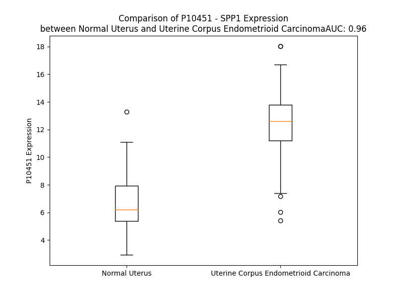

# Detailed Data for P10451

## Introduction to the Detailed Summary

### How to Interpret the Results

- **Summary & Metrics**: This section provides a quick reference to essential protein attributes, including expression changes, family classification, and biomarker applications. Regulation status (upregulated/downregulated) indicates the protein's behavior in a disease context. Some information comes from the original excel file with the proteins selected from literature, while others are derived from the analyses.
- **Expression Comparison**: A visual representation comparing protein expression between normal and disease states. It highlights significant changes in expression levels that might indicate diagnostic or therapeutic relevance. This is data coming from transcriptomics experiments and could not translate similarly to protein levels.
- **Isoform Alignment**: An interactive view of isoform alignments, revealing structural and functional differences between variants of the protein.
- **Interactors & Homologs**: Tables listing known interaction partners and homologous proteins, the more interactors and homologs, the more complex the protein is to design an antibody for.
- **Biological Assemblies**: Information about the structural arrangement of the protein in different assemblies, providing insights into its functional state but also the complexity of the protein to develop antibodies.
- **Combined Per-Residue Information**: A detailed table summarizing residue-level data. This includes predictions for epitope regions, aggregation tendencies, and modifications that might impact the protein's function. Each row corresponds to a residue in the protein, providing insights into specific sites that may be important for research or drug development.
## Summary & Metrics

- **UniProt Accession**: P10451
- **Gene Name**: SPP1
- **Protein Name**: Osteopontin
- **Swiss Prot**: OSTP_HUMAN
- **Family**: cytokine
- **Biomarker Application**: diagnosis,disease progression,efficacy,response to therapy,unspecified application
- **Number of Isoforms**: 4
- **Regulation**: 1
- **(transcriptomics) AUC**: 0.98
- **(transcriptomics) Fold Change**: 1.84
- **(transcriptomics) Regulation**: Upregulated
- **Discotope Epitope Count**: 6
- **Max n_uniprots (Homo)**: 4
- **Max n_uniprots (Hetero)**: N/A

## Expression Comparison

## Isoform Alignment

<pre style='font-size:14px; font-family:monospace;'>P10451-1 MRIAVICFCLLGITCAIPVKQADSGSSEEKQLYNKYPDAVATWLNPDPSQKQNLLAPQNAVSSEETNDFKQETLPSKSNESHDHMDDMDDEDDDDHVDSQDSIDSNDSDDVDDTDDSHQSDESHHSDESDELVTDFPTDLPATEVFTPVVPTVDTYDGRGDSVVYGLRSKSKKFRRPDIQYPDATDEDITSHMESEELNGAYKAIPVAQDLNAPSDWDSRGKDSYETSQLDDQSAETHSHKQSRLYKRKANDESNEHSDVIDSQELSKVSREFHSHEFHSHEDMLVVDPKSKEEDKHLKFRISHELDSASSEVN
P10451-3 MRIAVICFCLLGITCAIPVKQADSGSSEEK---------------------------QNAVSSEETNDFKQETLPSKSNESHDHMDDMDDEDDDDHVDSQDSIDSNDSDDVDDTDDSHQSDESHHSDESDELVTDFPTDLPATEVFTPVVPTVDTYDGRGDSVVYGLRSKSKKFRRPDIQYPDATDEDITSHMESEELNGAYKAIPVAQDLNAPSDWDSRGKDSYETSQLDDQSAETHSHKQSRLYKRKANDESNEHSDVIDSQELSKVSREFHSHEFHSHEDMLVVDPKSKEEDKHLKFRISHELDSASSEVN
P10451-4 MRIAVICFCLLGITCAIPVKQADSGSSEEKQLYNKYPDAVATWLNPDPSQKQNLLAPQNAVSSEETNDFKQETLPSKSNESHDHMDDMDDEDD----------------------DSHQSDESHHSDESDELVTDFPTDLPATEVFTPVVPTVDTYDGRGDSVVYGLRSKSKKFRRPDIQYPDATDEDITSHMESEELNGAYKAIPVAQDLNAPSDWDSRGKDSYETSQLDDQSAETHSHKQSRLYKRKANDESNEHSDVIDSQELSKVSREFHSHEFHSHEDMLVVDPKSKEEDKHLKFRISHELDSASSEVN
P10451-5 MRIAVICFCLLGITCAIPVKQADSGSSEEKQLYNKYPDAVATWLNPDPSQKQNLLAPQ--------------TLPSKSNESHDHMDDMDDEDDDDHVDSQDSIDSNDSDDVDDTDDSHQSDESHHSDESDELVTDFPTDLPATEVFTPVVPTVDTYDGRGDSVVYGLRSKSKKFRRPDIQYPDATDEDITSHMESEELNGAYKAIPVAQDLNAPSDWDSRGKDSYETSQLDDQSAETHSHKQSRLYKRKANDESNEHSDVIDSQELSKVSREFHSHEFHSHEDMLVVDPKSKEEDKHLKFRISHELDSASSEVN
</pre>

## Interactors

| preferredName_A   | preferredName_B   |   score |
|:------------------|:------------------|--------:|
| SPP1              | ITGAV             |   0.999 |
| SPP1              | CD44              |   0.999 |
| SPP1              | MMP3              |   0.997 |
| SPP1              | ITGB1             |   0.996 |
| SPP1              | FN1               |   0.996 |
| SPP1              | ITGB3             |   0.994 |
| SPP1              | BGLAP             |   0.994 |
| SPP1              | IBSP              |   0.991 |
| SPP1              | SPARC             |   0.984 |
| SPP1              | GSTM1             |   0.981 |
| SPP1              | ITGA9             |   0.979 |
| SPP1              | ITGA4             |   0.973 |
| SPP1              | ITGB5             |   0.968 |
| SPP1              | VTN               |   0.964 |
| SPP1              | MMP9              |   0.947 |
| SPP1              | AP4M1             |   0.946 |
| SPP1              | MMP7              |   0.941 |
| SPP1              | IRF7              |   0.925 |
| SPP1              | MGP               |   0.924 |
| SPP1              | DMP1              |   0.922 |
| SPP1              | MEPE              |   0.922 |
| SPP1              | BMP2              |   0.921 |
| SPP1              | ITGA8             |   0.904 |
| SPP1              | RUNX2             |   0.901 |

## Homologs

| uniprot_id   | gene_id   |
|:-------------|:----------|
| A0A8I5KR98   | TAF3      |

## Biological Assemblies

|   Unnamed: 0 |   assembly |   n_uniprots | composition   | crystal_id   |
|-------------:|-----------:|-------------:|:--------------|:-------------|
|            0 |          1 |            4 | Homo          | 3dsf         |
|            0 |          1 |            4 | Homo          | 3cxd         |

## Combined Per-Residue Information

|   res | aa   |   epitope_score | epitope   |   relative_surface_accessibility |   modeling_confidence |   Aggregation | modification                | glycosylation                                  |
|------:|:-----|----------------:|:----------|---------------------------------:|----------------------:|--------------:|:----------------------------|:-----------------------------------------------|
|     1 | M    |         0.10725 | False     |                          1.1328  |                 72.64 |         0     | N/A                         | N/A                                            |
|     2 | R    |         0.09404 | False     |                          0.83926 |                 82.62 |         0     | N/A                         | N/A                                            |
|     3 | I    |         0.10093 | False     |                          0.82351 |                 81.27 |        52.339 | N/A                         | N/A                                            |
|     4 | A    |         0.09929 | False     |                          0.64426 |                 81.75 |        62.147 | N/A                         | N/A                                            |
|     5 | V    |         0.11955 | False     |                          0.66251 |                 83.16 |        88.958 | N/A                         | N/A                                            |
|     6 | I    |         0.11578 | False     |                          0.60477 |                 86.44 |        91.202 | N/A                         | N/A                                            |
|     7 | C    |         0.09559 | False     |                          0.52796 |                 84.54 |        91.374 | N/A                         | N/A                                            |
|     8 | F    |         0.10665 | False     |                          0.80076 |                 85.53 |        91.718 | N/A                         | N/A                                            |
|     9 | C    |         0.13355 | False     |                          0.50537 |                 84.48 |        88.288 | N/A                         | N/A                                            |
|    10 | L    |         0.1248  | False     |                          0.66006 |                 85.95 |        87.506 | N/A                         | N/A                                            |
|    11 | L    |         0.14459 | False     |                          0.71374 |                 82.46 |        82.524 | N/A                         | N/A                                            |
|    12 | G    |         0.11882 | False     |                          0.41409 |                 83.14 |        55.247 | N/A                         | N/A                                            |
|    13 | I    |         0.12134 | False     |                          0.65385 |                 79.18 |        52.768 | N/A                         | N/A                                            |
|    14 | T    |         0.11713 | False     |                          0.61069 |                 76.81 |        23.555 | N/A                         | N/A                                            |
|    15 | C    |         0.10123 | False     |                          0.76681 |                 69.81 |         6.097 | N/A                         | N/A                                            |
|    16 | A    |         0.0603  | False     |                          0.7341  |                 71.17 |         2.925 | N/A                         | N/A                                            |
|    17 | I    |         0.14189 | False     |                          0.65957 |                 67.36 |         0.244 | N/A                         | N/A                                            |
|    18 | P    |         0.09741 | False     |                          0.7118  |                 63.28 |         0.051 | N/A                         | N/A                                            |
|    19 | V    |         0.09053 | False     |                          0.92812 |                 61.65 |         0     | N/A                         | N/A                                            |
|    20 | K    |         0.0965  | False     |                          0.85534 |                 54.03 |         0     | N/A                         | N/A                                            |
|    21 | Q    |         0.11434 | False     |                          0.79703 |                 52.22 |         0     | N/A                         | N/A                                            |
|    22 | A    |         0.08751 | False     |                          0.81196 |                 51.58 |         0     | N/A                         | N/A                                            |
|    23 | D    |         0.073   | False     |                          0.7776  |                 46.14 |         0     | N/A                         | N/A                                            |
|    24 | S    |         0.12973 | False     |                          0.97403 |                 46.65 |         0     | Phosphoserine               | N/A                                            |
|    25 | G    |         0.1101  | False     |                          0.74515 |                 44.33 |         0     | N/A                         | N/A                                            |
|    26 | S    |         0.06817 | False     |                          0.71785 |                 44.05 |         0     | Phosphoserine; by FAM20C    | N/A                                            |
|    27 | S    |         0.08225 | False     |                          0.79299 |                 47.83 |         0     | Phosphoserine; by FAM20C    | N/A                                            |
|    28 | E    |         0.10908 | False     |                          0.81461 |                 47.65 |         0     | N/A                         | N/A                                            |
|    29 | E    |         0.15084 | False     |                          0.56326 |                 50.66 |         0     | N/A                         | N/A                                            |
|    30 | K    |         0.10837 | False     |                          0.72819 |                 52.48 |         0     | N/A                         | N/A                                            |
|    31 | Q    |         0.13186 | False     |                          0.86926 |                 49.14 |         0     | N/A                         | N/A                                            |
|    32 | L    |         0.12129 | False     |                          1.00933 |                 47.73 |         0     | N/A                         | N/A                                            |
|    33 | Y    |         0.16331 | False     |                          0.90674 |                 44.79 |         0     | N/A                         | N/A                                            |
|    34 | N    |         0.14898 | False     |                          0.87772 |                 51.13 |         0     | N/A                         | N/A                                            |
|    35 | K    |         0.10443 | False     |                          0.83907 |                 50.32 |         0     | N/A                         | N/A                                            |
|    36 | Y    |         0.23175 | True      |                          0.7478  |                 49.65 |         0     | N/A                         | N/A                                            |
|    37 | P    |         0.14639 | False     |                          0.9125  |                 53.1  |         0     | N/A                         | N/A                                            |
|    38 | D    |         0.13023 | False     |                          0.64821 |                 54.29 |         0     | N/A                         | N/A                                            |
|    39 | A    |         0.07415 | False     |                          0.44387 |                 56.32 |         2.867 | N/A                         | N/A                                            |
|    40 | V    |         0.11107 | False     |                          0.71863 |                 57.42 |         5.732 | N/A                         | N/A                                            |
|    41 | A    |         0.08975 | False     |                          0.51874 |                 56.07 |         5.732 | N/A                         | N/A                                            |
|    42 | T    |         0.13041 | False     |                          0.70169 |                 57.95 |         5.732 | N/A                         | N/A                                            |
|    43 | W    |         0.1582  | False     |                          0.98435 |                 57.04 |         5.732 | N/A                         | N/A                                            |
|    44 | L    |         0.1008  | False     |                          0.87834 |                 61.38 |         5.288 | N/A                         | N/A                                            |
|    45 | N    |         0.156   | False     |                          0.71896 |                 57.55 |         0     | N/A                         | N/A                                            |
|    46 | P    |         0.11538 | False     |                          0.62917 |                 58.74 |         0     | N/A                         | N/A                                            |
|    47 | D    |         0.15747 | False     |                          0.43144 |                 54.35 |         0     | N/A                         | N/A                                            |
|    48 | P    |         0.12863 | False     |                          0.86767 |                 59.02 |         0     | N/A                         | N/A                                            |
|    49 | S    |         0.0857  | False     |                          0.47523 |                 60.73 |         0     | N/A                         | N/A                                            |
|    50 | Q    |         0.11338 | False     |                          0.56372 |                 56.23 |         0     | N/A                         | N/A                                            |
|    51 | K    |         0.13501 | False     |                          0.61486 |                 50.5  |         0     | N/A                         | N/A                                            |
|    52 | Q    |         0.1282  | False     |                          0.73323 |                 56.36 |         0     | N/A                         | N/A                                            |
|    53 | N    |         0.18323 | False     |                          0.83891 |                 53.49 |         0     | N/A                         | N/A                                            |
|    54 | L    |         0.13571 | False     |                          0.88768 |                 52.16 |         0     | N/A                         | N/A                                            |
|    55 | L    |         0.13982 | False     |                          0.92923 |                 50.97 |         0     | N/A                         | N/A                                            |
|    56 | A    |         0.08173 | False     |                          0.61547 |                 45.05 |         0     | N/A                         | N/A                                            |
|    57 | P    |         0.12108 | False     |                          0.96895 |                 41.21 |         0     | N/A                         | N/A                                            |
|    58 | Q    |         0.11843 | False     |                          0.72804 |                 50.87 |         0     | N/A                         | N/A                                            |
|    59 | N    |         0.13044 | False     |                          1.04177 |                 43.6  |         0     | N/A                         | N/A                                            |
|    60 | A    |         0.11806 | False     |                          0.78633 |                 44.58 |         0     | N/A                         | N/A                                            |
|    61 | V    |         0.08004 | False     |                          1.05299 |                 48.07 |         0     | N/A                         | N/A                                            |
|    62 | S    |         0.1019  | False     |                          0.85546 |                 46.45 |         0     | Phosphoserine; by FAM20C    | N/A                                            |
|    63 | S    |         0.07824 | False     |                          0.83088 |                 48.56 |         0     | Phosphoserine; by FAM20C    | N/A                                            |
|    64 | E    |         0.13544 | False     |                          0.8972  |                 53.82 |         0     | N/A                         | N/A                                            |
|    65 | E    |         0.13543 | False     |                          0.80571 |                 48.12 |         0     | N/A                         | N/A                                            |
|    66 | T    |         0.12806 | False     |                          0.87793 |                 48.76 |         0     | Phosphothreonine            | N/A                                            |
|    67 | N    |         0.12039 | False     |                          0.80791 |                 54.44 |         0     | N/A                         | N/A                                            |
|    68 | D    |         0.16418 | False     |                          0.72684 |                 53.27 |         0     | N/A                         | N/A                                            |
|    69 | F    |         0.13856 | False     |                          0.98574 |                 51.43 |         0     | N/A                         | N/A                                            |
|    70 | K    |         0.14089 | False     |                          0.73473 |                 50.04 |         0     | N/A                         | N/A                                            |
|    71 | Q    |         0.11722 | False     |                          0.88418 |                 47.53 |         0     | N/A                         | N/A                                            |
|    72 | E    |         0.11471 | False     |                          0.82978 |                 44.06 |         0     | N/A                         | N/A                                            |
|    73 | T    |         0.17127 | False     |                          0.85716 |                 51.85 |         0     | N/A                         | N/A                                            |
|    74 | L    |         0.17014 | False     |                          0.91429 |                 60.63 |         0     | N/A                         | N/A                                            |
|    75 | P    |         0.12457 | False     |                          0.90059 |                 48.03 |         0     | N/A                         | N/A                                            |
|    76 | S    |         0.10347 | False     |                          0.84344 |                 48.26 |         0     | Phosphoserine               | N/A                                            |
|    77 | K    |         0.14905 | False     |                          0.88811 |                 44.54 |         0     | N/A                         | N/A                                            |
|    78 | S    |         0.15258 | False     |                          0.85576 |                 43.82 |         0     | Phosphoserine               | N/A                                            |
|    79 | N    |         0.12926 | False     |                          0.8769  |                 52.21 |         0     | N/A                         | N/A                                            |
|    80 | E    |         0.12791 | False     |                          0.82511 |                 50.16 |         0     | N/A                         | N/A                                            |
|    81 | S    |         0.08907 | False     |                          0.87498 |                 56.6  |         0     | Phosphoserine               | N/A                                            |
|    82 | H    |         0.13455 | False     |                          0.86627 |                 56.31 |         0     | N/A                         | N/A                                            |
|    83 | D    |         0.19239 | False     |                          0.75867 |                 56.18 |         0     | N/A                         | N/A                                            |
|    84 | H    |         0.15112 | False     |                          0.75513 |                 60.23 |         0     | N/A                         | N/A                                            |
|    85 | M    |         0.16776 | False     |                          0.74242 |                 61.54 |         0     | N/A                         | N/A                                            |
|    86 | D    |         0.09501 | False     |                          0.70599 |                 58.97 |         0     | N/A                         | N/A                                            |
|    87 | D    |         0.11681 | False     |                          0.65496 |                 57.47 |         0     | N/A                         | N/A                                            |
|    88 | M    |         0.20814 | True      |                          0.85135 |                 63.69 |         0     | N/A                         | N/A                                            |
|    89 | D    |         0.12205 | False     |                          0.79066 |                 60.04 |         0     | N/A                         | N/A                                            |
|    90 | D    |         0.13214 | False     |                          0.73483 |                 59.93 |         0     | N/A                         | N/A                                            |
|    91 | E    |         0.18266 | False     |                          0.84982 |                 60.27 |         0     | N/A                         | N/A                                            |
|    92 | D    |         0.11303 | False     |                          0.92355 |                 60.01 |         0     | N/A                         | N/A                                            |
|    93 | D    |         0.12737 | False     |                          0.78953 |                 61.87 |         0     | N/A                         | N/A                                            |
|    94 | D    |         0.10164 | False     |                          0.85444 |                 55.45 |         0     | N/A                         | N/A                                            |
|    95 | D    |         0.13104 | False     |                          0.60852 |                 62    |         0     | N/A                         | N/A                                            |
|    96 | H    |         0.13011 | False     |                          0.81149 |                 58.22 |         0     | N/A                         | N/A                                            |
|    97 | V    |         0.08129 | False     |                          0.78793 |                 61.78 |         0     | N/A                         | N/A                                            |
|    98 | D    |         0.11509 | False     |                          0.80367 |                 57.45 |         0     | N/A                         | N/A                                            |
|    99 | S    |         0.09551 | False     |                          0.66347 |                 57.04 |         0     | Phosphoserine               | N/A                                            |
|   100 | Q    |         0.14176 | False     |                          0.8374  |                 55.56 |         0     | N/A                         | N/A                                            |
|   101 | D    |         0.07773 | False     |                          0.74392 |                 56.82 |         0     | N/A                         | N/A                                            |
|   102 | S    |         0.10536 | False     |                          0.76163 |                 56.16 |         0     | Phosphoserine               | N/A                                            |
|   103 | I    |         0.07225 | False     |                          0.88841 |                 60.18 |         0     | N/A                         | N/A                                            |
|   104 | D    |         0.09248 | False     |                          0.75639 |                 59.1  |         0     | N/A                         | N/A                                            |
|   105 | S    |         0.05455 | False     |                          0.77262 |                 52.68 |         0     | Phosphoserine               | N/A                                            |
|   106 | N    |         0.12476 | False     |                          0.85742 |                 58.83 |         0     | N/A                         | N/A                                            |
|   107 | D    |         0.07061 | False     |                          0.70494 |                 53.55 |         0     | N/A                         | N/A                                            |
|   108 | S    |         0.0905  | False     |                          0.65961 |                 58.72 |         0     | Phosphoserine               | N/A                                            |
|   109 | D    |         0.08549 | False     |                          0.74962 |                 58.85 |         0     | N/A                         | N/A                                            |
|   110 | D    |         0.08303 | False     |                          0.75274 |                 54.3  |         0     | N/A                         | N/A                                            |
|   111 | V    |         0.04962 | False     |                          0.96786 |                 62.98 |         0     | N/A                         | N/A                                            |
|   112 | D    |         0.11059 | False     |                          0.82881 |                 59.62 |         0     | N/A                         | N/A                                            |
|   113 | D    |         0.12246 | False     |                          0.9013  |                 57.77 |         0     | N/A                         | N/A                                            |
|   114 | T    |         0.11572 | False     |                          0.82843 |                 58.75 |         0     | N/A                         | N/A                                            |
|   115 | D    |         0.09332 | False     |                          0.72643 |                 59.71 |         0     | N/A                         | N/A                                            |
|   116 | D    |         0.1133  | False     |                          0.84395 |                 61.36 |         0     | N/A                         | N/A                                            |
|   117 | S    |         0.11734 | False     |                          0.53001 |                 60.09 |         0     | Phosphoserine               | N/A                                            |
|   118 | H    |         0.17152 | False     |                          0.8575  |                 61.56 |         0     | N/A                         | N/A                                            |
|   119 | Q    |         0.13027 | False     |                          0.89172 |                 61.66 |         0     | N/A                         | N/A                                            |
|   120 | S    |         0.09642 | False     |                          0.78441 |                 55.74 |         0     | Phosphoserine               | N/A                                            |
|   121 | D    |         0.10246 | False     |                          0.85584 |                 65.38 |         0     | N/A                         | N/A                                            |
|   122 | E    |         0.18599 | False     |                          0.72583 |                 54.51 |         0     | N/A                         | N/A                                            |
|   123 | S    |         0.09022 | False     |                          0.82752 |                 63.27 |         0     | Phosphoserine               | N/A                                            |
|   124 | H    |         0.09612 | False     |                          0.95432 |                 61.18 |         0     | N/A                         | N/A                                            |
|   125 | H    |         0.09049 | False     |                          1.00451 |                 69.28 |         0     | N/A                         | N/A                                            |
|   126 | S    |         0.08711 | False     |                          0.80236 |                 63.23 |         0     | Phosphoserine               | N/A                                            |
|   127 | D    |         0.08285 | False     |                          0.8682  |                 71.75 |         0     | N/A                         | N/A                                            |
|   128 | E    |         0.08602 | False     |                          0.81147 |                 54.79 |         0     | N/A                         | N/A                                            |
|   129 | S    |         0.09559 | False     |                          0.6894  |                 64.65 |         0     | Phosphoserine               | N/A                                            |
|   130 | D    |         0.10696 | False     |                          0.76002 |                 59.4  |         0     | N/A                         | N/A                                            |
|   131 | E    |         0.065   | False     |                          0.67817 |                 56.83 |         0     | N/A                         | N/A                                            |
|   132 | L    |         0.14624 | False     |                          0.93524 |                 61.43 |         0     | N/A                         | N/A                                            |
|   133 | V    |         0.05188 | False     |                          0.82197 |                 58.55 |         0     | N/A                         | N/A                                            |
|   134 | T    |         0.06311 | False     |                          0.80691 |                 54.38 |         0     | N/A                         | O-linked (GalNAc...) threonine                 |
|   135 | D    |         0.1176  | False     |                          0.74716 |                 52.6  |         0     | N/A                         | N/A                                            |
|   136 | F    |         0.08906 | False     |                          1.08272 |                 47.5  |         0     | N/A                         | N/A                                            |
|   137 | P    |         0.10532 | False     |                          0.87007 |                 50.85 |         0     | N/A                         | N/A                                            |
|   138 | T    |         0.11765 | False     |                          0.95539 |                 56.68 |         0     | N/A                         | O-linked (GalNAc...) threonine                 |
|   139 | D    |         0.09575 | False     |                          0.87018 |                 47.45 |         0     | N/A                         | N/A                                            |
|   140 | L    |         0.17604 | False     |                          0.97299 |                 42.16 |         0     | N/A                         | N/A                                            |
|   141 | P    |         0.14516 | False     |                          0.90324 |                 45.25 |         0     | N/A                         | N/A                                            |
|   142 | A    |         0.1264  | False     |                          0.95028 |                 50.66 |         0     | N/A                         | N/A                                            |
|   143 | T    |         0.1119  | False     |                          0.83594 |                 47.54 |         0     | N/A                         | O-linked (GalNAc...) threonine                 |
|   144 | E    |         0.10731 | False     |                          0.80701 |                 43.69 |         0     | N/A                         | N/A                                            |
|   145 | V    |         0.08005 | False     |                          0.85827 |                 48.52 |         0     | N/A                         | N/A                                            |
|   146 | F    |         0.11484 | False     |                          1.08214 |                 45.69 |         0     | N/A                         | N/A                                            |
|   147 | T    |         0.14763 | False     |                          0.73667 |                 54.97 |         0     | N/A                         | O-linked (GalNAc...) threonine                 |
|   148 | P    |         0.12267 | False     |                          0.92092 |                 54.87 |         0     | N/A                         | N/A                                            |
|   149 | V    |         0.04231 | False     |                          0.71859 |                 55.78 |         0     | N/A                         | N/A                                            |
|   150 | V    |         0.06506 | False     |                          0.72544 |                 55.44 |         0     | N/A                         | N/A                                            |
|   151 | P    |         0.07734 | False     |                          0.44332 |                 52.6  |         0     | N/A                         | N/A                                            |
|   152 | T    |         0.0914  | False     |                          0.76147 |                 54.71 |         0     | N/A                         | O-linked (GalNAc...) threonine                 |
|   153 | V    |         0.11741 | False     |                          0.78322 |                 51.69 |         0     | N/A                         | N/A                                            |
|   154 | D    |         0.14639 | False     |                          0.75535 |                 47.5  |         0     | N/A                         | N/A                                            |
|   155 | T    |         0.14636 | False     |                          0.93506 |                 53.15 |         0     | N/A                         | N/A                                            |
|   156 | Y    |         0.16766 | False     |                          0.93481 |                 54.86 |         0     | N/A                         | N/A                                            |
|   157 | D    |         0.13076 | False     |                          0.86956 |                 51.33 |         0     | N/A                         | N/A                                            |
|   158 | G    |         0.11901 | False     |                          0.85197 |                 52.29 |         0     | N/A                         | N/A                                            |
|   159 | R    |         0.15372 | False     |                          1.00279 |                 47.18 |         0     | N/A                         | N/A                                            |
|   160 | G    |         0.11869 | False     |                          0.9368  |                 53.34 |         0     | N/A                         | N/A                                            |
|   161 | D    |         0.08509 | False     |                          0.94867 |                 49.57 |         0     | N/A                         | N/A                                            |
|   162 | S    |         0.06049 | False     |                          0.60703 |                 54.46 |         3.953 | N/A                         | N/A                                            |
|   163 | V    |         0.07499 | False     |                          0.53851 |                 53.76 |        30.922 | N/A                         | N/A                                            |
|   164 | V    |         0.07339 | False     |                          0.98723 |                 50.02 |        30.922 | N/A                         | N/A                                            |
|   165 | Y    |         0.07939 | False     |                          0.85436 |                 50.05 |        30.922 | N/A                         | N/A                                            |
|   166 | G    |         0.10454 | False     |                          0.7253  |                 51.78 |        30.922 | N/A                         | N/A                                            |
|   167 | L    |         0.13401 | False     |                          1.07898 |                 52.2  |        30.307 | N/A                         | N/A                                            |
|   168 | R    |         0.11998 | False     |                          0.92514 |                 54.32 |         0     | N/A                         | N/A                                            |
|   169 | S    |         0.0897  | False     |                          0.75542 |                 52.19 |         0     | N/A                         | N/A                                            |
|   170 | K    |         0.08643 | False     |                          0.90636 |                 60.49 |         0     | N/A                         | N/A                                            |
|   171 | S    |         0.0725  | False     |                          0.86714 |                 52.37 |         0     | N/A                         | N/A                                            |
|   172 | K    |         0.11485 | False     |                          0.83729 |                 60.64 |         0     | N/A                         | N/A                                            |
|   173 | K    |         0.1033  | False     |                          0.9898  |                 64.47 |         0     | N/A                         | N/A                                            |
|   174 | F    |         0.10379 | False     |                          0.91379 |                 49.21 |         0     | N/A                         | N/A                                            |
|   175 | R    |         0.1838  | False     |                          0.97013 |                 56.2  |         0     | N/A                         | N/A                                            |
|   176 | R    |         0.1539  | False     |                          0.85243 |                 49.68 |         0     | N/A                         | N/A                                            |
|   177 | P    |         0.11136 | False     |                          0.89549 |                 55.79 |         0     | N/A                         | N/A                                            |
|   178 | D    |         0.06615 | False     |                          0.80083 |                 58.01 |         0     | N/A                         | N/A                                            |
|   179 | I    |         0.09707 | False     |                          0.90411 |                 52.09 |         0     | N/A                         | N/A                                            |
|   180 | Q    |         0.11838 | False     |                          0.91761 |                 57.68 |         0     | N/A                         | N/A                                            |
|   181 | Y    |         0.16682 | False     |                          0.84181 |                 54.12 |         0     | N/A                         | N/A                                            |
|   182 | P    |         0.10664 | False     |                          0.8876  |                 48.89 |         0     | N/A                         | N/A                                            |
|   183 | D    |         0.09237 | False     |                          0.87161 |                 46.42 |         0     | N/A                         | N/A                                            |
|   184 | A    |         0.14183 | False     |                          0.8728  |                 49.14 |         0     | N/A                         | N/A                                            |
|   185 | T    |         0.12325 | False     |                          0.78624 |                 57.01 |         0     | Phosphothreonine            | N/A                                            |
|   186 | D    |         0.09279 | False     |                          0.66307 |                 55.79 |         0     | N/A                         | N/A                                            |
|   187 | E    |         0.08741 | False     |                          0.86266 |                 56.39 |         0     | N/A                         | N/A                                            |
|   188 | D    |         0.11406 | False     |                          0.77329 |                 53.94 |         0     | N/A                         | N/A                                            |
|   189 | I    |         0.06871 | False     |                          1.0782  |                 59.38 |         0     | N/A                         | N/A                                            |
|   190 | T    |         0.10535 | False     |                          0.87785 |                 52.87 |         0     | Phosphothreonine; by FAM20C | N/A                                            |
|   191 | S    |         0.08374 | False     |                          0.81335 |                 51.47 |         0     | Phosphoserine; by FAM20C    | N/A                                            |
|   192 | H    |         0.08053 | False     |                          0.93924 |                 45.52 |         0     | N/A                         | N/A                                            |
|   193 | M    |         0.07214 | False     |                          0.9544  |                 52.85 |         0     | N/A                         | N/A                                            |
|   194 | E    |         0.09675 | False     |                          0.83207 |                 47    |         0     | N/A                         | N/A                                            |
|   195 | S    |         0.07581 | False     |                          0.78398 |                 50.84 |         0     | Phosphoserine; by FAM20C    | N/A                                            |
|   196 | E    |         0.12556 | False     |                          0.91339 |                 44.45 |         0     | N/A                         | N/A                                            |
|   197 | E    |         0.13661 | False     |                          0.7583  |                 47.42 |         0     | N/A                         | N/A                                            |
|   198 | L    |         0.11352 | False     |                          0.88761 |                 50.9  |         0     | N/A                         | N/A                                            |
|   199 | N    |         0.21783 | True      |                          0.95838 |                 43.84 |         0     | N/A                         | N/A                                            |
|   200 | G    |         0.12072 | False     |                          0.61834 |                 46.34 |         0     | N/A                         | N/A                                            |
|   201 | A    |         0.16627 | False     |                          0.91389 |                 43.75 |         0     | N/A                         | N/A                                            |
|   202 | Y    |         0.10028 | False     |                          0.94057 |                 48.51 |         0     | N/A                         | N/A                                            |
|   203 | K    |         0.13153 | False     |                          0.93197 |                 50.3  |         0     | N/A                         | N/A                                            |
|   204 | A    |         0.07066 | False     |                          0.76831 |                 48    |         0     | N/A                         | N/A                                            |
|   205 | I    |         0.16531 | False     |                          0.9087  |                 53.68 |         0     | N/A                         | N/A                                            |
|   206 | P    |         0.07937 | False     |                          0.82156 |                 49.3  |         0     | N/A                         | N/A                                            |
|   207 | V    |         0.12522 | False     |                          0.94277 |                 44.74 |         0     | N/A                         | N/A                                            |
|   208 | A    |         0.10808 | False     |                          0.8468  |                 41.63 |         0     | N/A                         | N/A                                            |
|   209 | Q    |         0.19978 | True      |                          0.81373 |                 43.28 |         0     | N/A                         | N/A                                            |
|   210 | D    |         0.10506 | False     |                          0.84477 |                 46.34 |         0     | N/A                         | N/A                                            |
|   211 | L    |         0.14534 | False     |                          0.98377 |                 44.61 |         0     | N/A                         | N/A                                            |
|   212 | N    |         0.19129 | False     |                          0.88006 |                 42.81 |         0     | N/A                         | N/A                                            |
|   213 | A    |         0.10207 | False     |                          0.93729 |                 45.32 |         0     | N/A                         | N/A                                            |
|   214 | P    |         0.06788 | False     |                          0.95633 |                 44.11 |         0     | N/A                         | N/A                                            |
|   215 | S    |         0.1078  | False     |                          0.78484 |                 45.68 |         0     | Phosphoserine; by FAM20C    | N/A                                            |
|   216 | D    |         0.08088 | False     |                          0.83189 |                 45.55 |         0     | N/A                         | N/A                                            |
|   217 | W    |         0.0995  | False     |                          1.05218 |                 52.61 |         0     | N/A                         | N/A                                            |
|   218 | D    |         0.12256 | False     |                          0.52498 |                 47.27 |         0     | N/A                         | N/A                                            |
|   219 | S    |         0.15017 | False     |                          0.75082 |                 50.93 |         0     | Phosphoserine; by FAM20C    | N/A                                            |
|   220 | R    |         0.20908 | True      |                          0.75664 |                 46.75 |         0     | N/A                         | N/A                                            |
|   221 | G    |         0.12967 | False     |                          0.91033 |                 50.29 |         0     | N/A                         | N/A                                            |
|   222 | K    |         0.15717 | False     |                          0.86682 |                 51.99 |         0     | N/A                         | N/A                                            |
|   223 | D    |         0.09721 | False     |                          0.87887 |                 53.05 |         0     | N/A                         | N/A                                            |
|   224 | S    |         0.06683 | False     |                          0.53791 |                 50.29 |         0     | Phosphoserine; by FAM20C    | N/A                                            |
|   225 | Y    |         0.10729 | False     |                          0.80739 |                 52.79 |         0     | Phosphotyrosine             | N/A                                            |
|   226 | E    |         0.1202  | False     |                          0.86113 |                 47.35 |         0     | N/A                         | N/A                                            |
|   227 | T    |         0.10343 | False     |                          0.77765 |                 49.91 |         0     | N/A                         | N/A                                            |
|   228 | S    |         0.0969  | False     |                          0.6271  |                 49.75 |         0     | Phosphoserine; by FAM20C    | N/A                                            |
|   229 | Q    |         0.18473 | False     |                          0.8031  |                 49.95 |         0     | N/A                         | N/A                                            |
|   230 | L    |         0.09722 | False     |                          0.89986 |                 50.63 |         0     | N/A                         | N/A                                            |
|   231 | D    |         0.13434 | False     |                          0.76502 |                 52.37 |         0     | N/A                         | N/A                                            |
|   232 | D    |         0.09988 | False     |                          0.79548 |                 50.43 |         0     | N/A                         | N/A                                            |
|   233 | Q    |         0.09412 | False     |                          0.91903 |                 47.97 |         0     | N/A                         | N/A                                            |
|   234 | S    |         0.12693 | False     |                          0.86659 |                 48.14 |         0     | Phosphoserine; by FAM20C    | O-linked (Xyl...) (chondroitin sulfate) serine |
|   235 | A    |         0.07043 | False     |                          1.00848 |                 54.13 |         0     | N/A                         | N/A                                            |
|   236 | E    |         0.12708 | False     |                          0.83707 |                 48.08 |         0     | N/A                         | N/A                                            |
|   237 | T    |         0.14475 | False     |                          0.68732 |                 50.51 |         0     | Phosphothreonine; by FAM20C | N/A                                            |
|   238 | H    |         0.15476 | False     |                          0.94396 |                 48.91 |         0     | N/A                         | N/A                                            |
|   239 | S    |         0.07643 | False     |                          0.80093 |                 41.76 |         0     | Phosphoserine; by FAM20C    | N/A                                            |
|   240 | H    |         0.13675 | False     |                          0.89241 |                 44.16 |         0     | N/A                         | N/A                                            |
|   241 | K    |         0.13369 | False     |                          0.98848 |                 45.81 |         0     | N/A                         | N/A                                            |
|   242 | Q    |         0.18695 | False     |                          0.80166 |                 49.08 |         0     | N/A                         | N/A                                            |
|   243 | S    |         0.09429 | False     |                          0.88632 |                 47.35 |         0     | Phosphoserine; by FAM20C    | N/A                                            |
|   244 | R    |         0.12889 | False     |                          0.96125 |                 50.53 |         0     | N/A                         | N/A                                            |
|   245 | L    |         0.09001 | False     |                          0.99925 |                 44.36 |         0     | N/A                         | N/A                                            |
|   246 | Y    |         0.15897 | False     |                          0.83971 |                 44.48 |         0     | N/A                         | N/A                                            |
|   247 | K    |         0.11593 | False     |                          0.96088 |                 49.73 |         0     | N/A                         | N/A                                            |
|   248 | R    |         0.10931 | False     |                          0.81895 |                 50.96 |         0     | N/A                         | N/A                                            |
|   249 | K    |         0.17257 | False     |                          0.9672  |                 47.42 |         0     | N/A                         | N/A                                            |
|   250 | A    |         0.08361 | False     |                          0.85204 |                 50.26 |         0     | N/A                         | N/A                                            |
|   251 | N    |         0.20274 | True      |                          0.96579 |                 48.37 |         0     | N/A                         | N/A                                            |
|   252 | D    |         0.1134  | False     |                          0.80876 |                 47.48 |         0     | N/A                         | N/A                                            |
|   253 | E    |         0.14758 | False     |                          0.78486 |                 50.59 |         0     | N/A                         | N/A                                            |
|   254 | S    |         0.1155  | False     |                          0.77564 |                 49.68 |         0     | Phosphoserine; by FAM20C    | N/A                                            |
|   255 | N    |         0.14788 | False     |                          0.82289 |                 48.56 |         0     | N/A                         | N/A                                            |
|   256 | E    |         0.09818 | False     |                          0.58958 |                 50.37 |         0     | N/A                         | N/A                                            |
|   257 | H    |         0.16282 | False     |                          0.85028 |                 48.89 |         0     | N/A                         | N/A                                            |
|   258 | S    |         0.08571 | False     |                          0.69531 |                 52.36 |         0     | Phosphoserine; by FAM20C    | N/A                                            |
|   259 | D    |         0.14151 | False     |                          0.83081 |                 48.01 |         0     | N/A                         | N/A                                            |
|   260 | V    |         0.08874 | False     |                          0.79651 |                 49.11 |         0     | N/A                         | N/A                                            |
|   261 | I    |         0.10275 | False     |                          0.89779 |                 50.59 |         0     | N/A                         | N/A                                            |
|   262 | D    |         0.10191 | False     |                          0.7199  |                 50.24 |         0     | N/A                         | N/A                                            |
|   263 | S    |         0.0938  | False     |                          0.68735 |                 48.35 |         0     | Phosphoserine; by FAM20C    | N/A                                            |
|   264 | Q    |         0.1167  | False     |                          0.81712 |                 44.42 |         0     | N/A                         | N/A                                            |
|   265 | E    |         0.08696 | False     |                          0.78511 |                 41.72 |         0     | N/A                         | N/A                                            |
|   266 | L    |         0.07798 | False     |                          1.13733 |                 47.49 |         0     | N/A                         | N/A                                            |
|   267 | S    |         0.09383 | False     |                          0.70301 |                 40.18 |         0     | Phosphoserine; by FAM20C    | N/A                                            |
|   268 | K    |         0.16175 | False     |                          0.90504 |                 49.31 |         0     | N/A                         | N/A                                            |
|   269 | V    |         0.10303 | False     |                          0.87323 |                 43.55 |         0     | N/A                         | N/A                                            |
|   270 | S    |         0.06342 | False     |                          0.77835 |                 43.89 |         0     | Phosphoserine; by FAM20C    | N/A                                            |
|   271 | R    |         0.16366 | False     |                          0.78709 |                 42.24 |         0     | N/A                         | N/A                                            |
|   272 | E    |         0.10153 | False     |                          0.52669 |                 43.89 |         0     | N/A                         | N/A                                            |
|   273 | F    |         0.07631 | False     |                          0.7576  |                 44.15 |         0     | N/A                         | N/A                                            |
|   274 | H    |         0.09673 | False     |                          0.88957 |                 38.78 |         0     | N/A                         | N/A                                            |
|   275 | S    |         0.09812 | False     |                          0.8442  |                 41.58 |         0     | Phosphoserine; by FAM20C    | N/A                                            |
|   276 | H    |         0.05711 | False     |                          0.88153 |                 37.03 |         0     | N/A                         | N/A                                            |
|   277 | E    |         0.10427 | False     |                          0.65188 |                 39.96 |         0     | N/A                         | N/A                                            |
|   278 | F    |         0.07224 | False     |                          0.88137 |                 44.71 |         0     | N/A                         | N/A                                            |
|   279 | H    |         0.10451 | False     |                          0.83187 |                 41.57 |         0     | N/A                         | N/A                                            |
|   280 | S    |         0.07992 | False     |                          0.71789 |                 41.91 |         0     | Phosphoserine; by FAM20C    | N/A                                            |
|   281 | H    |         0.11297 | False     |                          0.82583 |                 39.4  |         0     | N/A                         | N/A                                            |
|   282 | E    |         0.07866 | False     |                          0.73702 |                 40.03 |         0     | N/A                         | N/A                                            |
|   283 | D    |         0.12867 | False     |                          0.84923 |                 42.41 |         0     | N/A                         | N/A                                            |
|   284 | M    |         0.07095 | False     |                          0.87211 |                 45.9  |         0     | N/A                         | N/A                                            |
|   285 | L    |         0.11729 | False     |                          0.88718 |                 44.22 |         0     | N/A                         | N/A                                            |
|   286 | V    |         0.08227 | False     |                          0.84034 |                 45.67 |         0     | N/A                         | N/A                                            |
|   287 | V    |         0.08152 | False     |                          0.95996 |                 45.89 |         0     | N/A                         | N/A                                            |
|   288 | D    |         0.08547 | False     |                          0.74659 |                 40.71 |         0     | N/A                         | N/A                                            |
|   289 | P    |         0.10957 | False     |                          0.73426 |                 48.77 |         0     | N/A                         | N/A                                            |
|   290 | K    |         0.1148  | False     |                          0.93741 |                 45.19 |         0     | N/A                         | N/A                                            |
|   291 | S    |         0.10058 | False     |                          0.70802 |                 49.53 |         0     | Phosphoserine; by FAM20C    | N/A                                            |
|   292 | K    |         0.13047 | False     |                          0.82959 |                 46.53 |         0     | N/A                         | N/A                                            |
|   293 | E    |         0.08042 | False     |                          0.54269 |                 49.9  |         0     | N/A                         | N/A                                            |
|   294 | E    |         0.1372  | False     |                          0.70367 |                 49.27 |         0     | N/A                         | N/A                                            |
|   295 | D    |         0.08606 | False     |                          0.59003 |                 51.19 |         0     | N/A                         | N/A                                            |
|   296 | K    |         0.12131 | False     |                          0.75362 |                 48.1  |         0     | N/A                         | N/A                                            |
|   297 | H    |         0.1054  | False     |                          0.85879 |                 51.63 |         0     | N/A                         | N/A                                            |
|   298 | L    |         0.13632 | False     |                          0.9445  |                 51.31 |         0     | N/A                         | N/A                                            |
|   299 | K    |         0.09966 | False     |                          0.85334 |                 55.7  |         0     | N/A                         | N/A                                            |
|   300 | F    |         0.11149 | False     |                          0.84193 |                 62.2  |         0     | N/A                         | N/A                                            |
|   301 | R    |         0.15074 | False     |                          0.82849 |                 54.68 |         0     | N/A                         | N/A                                            |
|   302 | I    |         0.12675 | False     |                          0.95438 |                 54.64 |         0     | N/A                         | N/A                                            |
|   303 | S    |         0.11357 | False     |                          0.79055 |                 50.01 |         0     | Phosphoserine; by FAM20C    | N/A                                            |
|   304 | H    |         0.11709 | False     |                          0.84492 |                 50.72 |         0     | N/A                         | N/A                                            |
|   305 | E    |         0.11669 | False     |                          0.81318 |                 54.4  |         0     | N/A                         | N/A                                            |
|   306 | L    |         0.10436 | False     |                          0.97123 |                 60.81 |         0     | N/A                         | N/A                                            |
|   307 | D    |         0.12178 | False     |                          0.86406 |                 52.23 |         0     | N/A                         | N/A                                            |
|   308 | S    |         0.10941 | False     |                          0.90691 |                 54.29 |         0     | Phosphoserine; by FAM20C    | O-linked (Xyl...) (chondroitin sulfate) serine |
|   309 | A    |         0.13416 | False     |                          0.86592 |                 55.13 |         0     | N/A                         | N/A                                            |
|   310 | S    |         0.14787 | False     |                          0.83022 |                 53.39 |         0     | Phosphoserine; by FAM20C    | N/A                                            |
|   311 | S    |         0.08466 | False     |                          0.81024 |                 58.75 |         0     | Phosphoserine; by FAM20C    | N/A                                            |
|   312 | E    |         0.10433 | False     |                          0.84323 |                 66.1  |         0     | N/A                         | N/A                                            |
|   313 | V    |         0.0531  | False     |                          1.03363 |                 60.57 |         0     | N/A                         | N/A                                            |
|   314 | N    |         0.07581 | False     |                          1.32708 |                 50.08 |         0     | N/A                         | N/A                                            |

