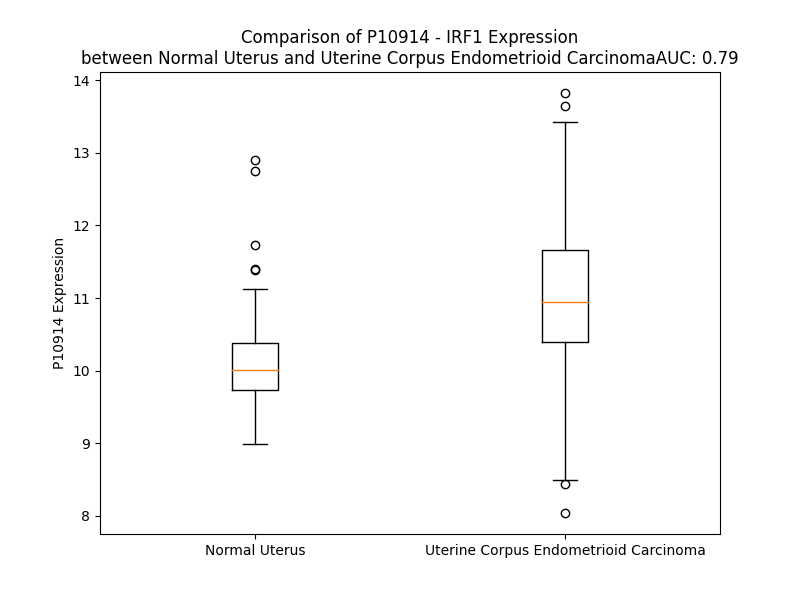

# Detailed Data for P10914

## Introduction to the Detailed Summary

### How to Interpret the Results

- **Summary & Metrics**: This section provides a quick reference to essential protein attributes, including expression changes, family classification, and biomarker applications. Regulation status (upregulated/downregulated) indicates the protein's behavior in a disease context. Some information comes from the original excel file with the proteins selected from literature, while others are derived from the analyses.
- **Expression Comparison**: A visual representation comparing protein expression between normal and disease states. It highlights significant changes in expression levels that might indicate diagnostic or therapeutic relevance. This is data coming from transcriptomics experiments and could not translate similarly to protein levels.
- **Isoform Alignment**: An interactive view of isoform alignments, revealing structural and functional differences between variants of the protein.
- **Interactors & Homologs**: Tables listing known interaction partners and homologous proteins, the more interactors and homologs, the more complex the protein is to design an antibody for.
- **Biological Assemblies**: Information about the structural arrangement of the protein in different assemblies, providing insights into its functional state but also the complexity of the protein to develop antibodies.
- **Combined Per-Residue Information**: A detailed table summarizing residue-level data. This includes predictions for epitope regions, aggregation tendencies, and modifications that might impact the protein's function. Each row corresponds to a residue in the protein, providing insights into specific sites that may be important for research or drug development.
## Summary & Metrics

- **UniProt Accession**: P10914
- **Gene Name**: IRF-1
- **Protein Name**: Interferon regulatory factor 1
- **Swiss Prot**: IRF1_HUMAN
- **Family**: nan
- **Biomarker Application**: nan
- **Number of Isoforms**: 0
- **Regulation**: -1
- **(transcriptomics) AUC**: 0.79
- **(transcriptomics) Fold Change**: 1.08
- **(transcriptomics) Regulation**: Upregulated
- **Discotope Epitope Count**: 40
- **Max n_uniprots (Homo)**: N/A
- **Max n_uniprots (Hetero)**: N/A

## Expression Comparison

## Interactors

| preferredName_A   | preferredName_B   |   score |
|:------------------|:------------------|--------:|
| IRF1              | STAT1             |   0.999 |
| IRF1              | HDAC1             |   0.985 |
| IRF1              | EP300             |   0.984 |
| IRF1              | IRF8              |   0.983 |
| IRF1              | IRF2              |   0.982 |
| IRF1              | SPI1              |   0.974 |
| IRF1              | MDM2              |   0.97  |
| IRF1              | MYD88             |   0.965 |
| IRF1              | STAT2             |   0.961 |
| IRF1              | IFNB1             |   0.934 |
| IRF1              | HDAC2             |   0.927 |
| IRF1              | JUN               |   0.919 |
| IRF1              | IFNG              |   0.917 |
| IRF1              | CHD4              |   0.91  |
| IRF1              | IFNA1             |   0.91  |

## Homologs

| uniprot_id   | gene_id   |
|:-------------|:----------|
| A0A8V8TMP0   | IRF9      |
| E9PIA7       | IRF7      |
| P14316       | IRF2      |
| A0A8Q3SJ00   | IRF8      |
| Q15306       | IRF4      |
| O14896       | IRF6      |
| M0R205       | IRF3      |
| C9J7M2       | IRF5      |

## Combined Per-Residue Information

|   res | aa   |   epitope_score | epitope   |   relative_surface_accessibility |   modeling_confidence |   Aggregation | modification    |
|------:|:-----|----------------:|:----------|---------------------------------:|----------------------:|--------------:|:----------------|
|     1 | M    |         0.10093 | False     |                          1.2305  |                 42.43 |         0     | N/A             |
|     2 | P    |         0.13774 | False     |                          0.9203  |                 68.85 |         0     | N/A             |
|     3 | I    |         0.1043  | False     |                          0.94311 |                 69.04 |         0     | N/A             |
|     4 | T    |         0.12171 | False     |                          0.96693 |                 80.9  |         0     | N/A             |
|     5 | R    |         0.16697 | False     |                          0.61552 |                 87.43 |         0     | N/A             |
|     6 | M    |         0.15367 | False     |                          0.35331 |                 92.68 |         0     | N/A             |
|     7 | R    |         0.10916 | False     |                          0.79374 |                 93.29 |         0     | N/A             |
|     8 | M    |         0.04965 | False     |                          0.05876 |                 94.92 |         0     | N/A             |
|     9 | R    |         0.07957 | False     |                          0.14895 |                 94.01 |         0     | N/A             |
|    10 | P    |         0.13374 | False     |                          0.43402 |                 94.43 |         0     | N/A             |
|    11 | W    |         0.0202  | False     |                          0.02409 |                 95.98 |         0     | N/A             |
|    12 | L    |         0.0029  | False     |                          0       |                 96.19 |         0     | N/A             |
|    13 | E    |         0.07981 | False     |                          0.31236 |                 95    |         0     | N/A             |
|    14 | M    |         0.17466 | False     |                          0.52515 |                 95.77 |         0     | N/A             |
|    15 | Q    |         0.11815 | False     |                          0.11987 |                 96.12 |         0     | N/A             |
|    16 | I    |         0.01244 | False     |                          0       |                 96.22 |         0     | N/A             |
|    17 | N    |         0.15603 | False     |                          0.48231 |                 95.38 |         0     | N/A             |
|    18 | S    |         0.1264  | False     |                          0.33942 |                 94.74 |         0     | N/A             |
|    19 | N    |         0.26264 | True      |                          0.66582 |                 93.45 |         0     | N/A             |
|    20 | Q    |         0.28222 | True      |                          0.70957 |                 91.95 |         0     | N/A             |
|    21 | I    |         0.07825 | False     |                          0.05801 |                 92.59 |         0     | N/A             |
|    22 | P    |         0.28161 | True      |                          0.614   |                 92.33 |         0     | N/A             |
|    23 | G    |         0.19161 | False     |                          0.36675 |                 91.97 |         5.8   | N/A             |
|    24 | L    |         0.01799 | False     |                          0.00695 |                 95.91 |        20.333 | N/A             |
|    25 | I    |         0.18539 | False     |                          0.45838 |                 95.37 |        20.333 | N/A             |
|    26 | W    |         0.16029 | False     |                          0.19251 |                 96.64 |        20.333 | N/A             |
|    27 | I    |         0.23034 | True      |                          0.47858 |                 95.52 |        20.333 | N/A             |
|    28 | N    |         0.2283  | True      |                          0.28838 |                 94.72 |        15.841 | N/A             |
|    29 | K    |         0.1746  | False     |                          0.56768 |                 93.86 |         0     | N/A             |
|    30 | E    |         0.26857 | True      |                          0.79226 |                 93.86 |         0     | N/A             |
|    31 | E    |         0.21029 | True      |                          0.46914 |                 92.77 |         0     | N/A             |
|    32 | M    |         0.10509 | False     |                          0.34577 |                 94.82 |         0     | N/A             |
|    33 | I    |         0.043   | False     |                          0.0704  |                 96.54 |         0     | N/A             |
|    34 | F    |         0.00742 | False     |                          0       |                 97.01 |         0     | N/A             |
|    35 | Q    |         0.08563 | False     |                          0.17276 |                 96.47 |         0     | N/A             |
|    36 | I    |         0.00997 | False     |                          0.004   |                 96.27 |         0     | N/A             |
|    37 | P    |         0.06003 | False     |                          0.21677 |                 94.23 |         0     | N/A             |
|    38 | W    |         0.10512 | False     |                          0.13249 |                 94.4  |         0     | N/A             |
|    39 | K    |         0.15441 | False     |                          0.12851 |                 93.49 |         0     | N/A             |
|    40 | H    |         0.30859 | True      |                          0.63761 |                 93.29 |         0     | N/A             |
|    41 | A    |         0.25297 | True      |                          0.5281  |                 92.33 |         0     | N/A             |
|    42 | A    |         0.29665 | True      |                          0.85936 |                 91.94 |         0     | N/A             |
|    43 | K    |         0.37462 | True      |                          0.54363 |                 92.47 |         0     | N/A             |
|    44 | H    |         0.42003 | True      |                          0.97615 |                 92.3  |         0     | N/A             |
|    45 | G    |         0.35256 | True      |                          0.64999 |                 90.74 |         0     | N/A             |
|    46 | W    |         0.19452 | False     |                          0.25033 |                 93.81 |         0     | N/A             |
|    47 | D    |         0.21621 | True      |                          0.2967  |                 93.57 |         0     | N/A             |
|    48 | I    |         0.29124 | True      |                          0.31846 |                 92.49 |         0     | N/A             |
|    49 | N    |         0.3197  | True      |                          0.64267 |                 91.99 |         0     | N/A             |
|    50 | K    |         0.35628 | True      |                          0.69044 |                 92.33 |         0     | N/A             |
|    51 | D    |         0.15425 | False     |                          0.18668 |                 92.84 |         0     | N/A             |
|    52 | A    |         0.0125  | False     |                          0.0051  |                 94.28 |         0     | N/A             |
|    53 | C    |         0.08759 | False     |                          0.27934 |                 94.58 |         0     | N/A             |
|    54 | L    |         0.01633 | False     |                          0.03168 |                 95.83 |         0     | N/A             |
|    55 | F    |         0.01467 | False     |                          0.03414 |                 96.27 |         0     | N/A             |
|    56 | R    |         0.25786 | True      |                          0.36936 |                 95.29 |         0     | N/A             |
|    57 | S    |         0.08185 | False     |                          0.26086 |                 95.27 |         0     | N/A             |
|    58 | W    |         0.06724 | False     |                          0.09794 |                 96.12 |         0     | N/A             |
|    59 | A    |         0.02486 | False     |                          0.04081 |                 96    |         0     | N/A             |
|    60 | I    |         0.20678 | True      |                          0.50548 |                 94.45 |         0     | N/A             |
|    61 | H    |         0.12472 | False     |                          0.3053  |                 93.96 |         0     | N/A             |
|    62 | T    |         0.07622 | False     |                          0.21022 |                 93.6  |         0     | N/A             |
|    63 | G    |         0.0892  | False     |                          0.53189 |                 92.41 |         0     | N/A             |
|    64 | R    |         0.19437 | False     |                          0.68928 |                 92.38 |         0     | N/A             |
|    65 | Y    |         0.11696 | False     |                          0.06751 |                 94.02 |         0     | N/A             |
|    66 | K    |         0.17193 | False     |                          0.58188 |                 92.1  |         0     | N/A             |
|    67 | A    |         0.30286 | True      |                          0.68168 |                 90.43 |         0     | N/A             |
|    68 | G    |         0.26045 | True      |                          1.04361 |                 89.12 |         0     | N/A             |
|    69 | E    |         0.33521 | True      |                          0.64395 |                 90.94 |         0     | N/A             |
|    70 | K    |         0.25784 | True      |                          0.574   |                 89.64 |         0     | N/A             |
|    71 | E    |         0.36718 | True      |                          0.80022 |                 92.4  |         0     | N/A             |
|    72 | P    |         0.40054 | True      |                          0.55997 |                 93.9  |         0     | N/A             |
|    73 | D    |         0.2085  | True      |                          0.39158 |                 94.29 |         0     | N/A             |
|    74 | P    |         0.16781 | False     |                          0.21722 |                 94.57 |         0     | N/A             |
|    75 | K    |         0.32327 | True      |                          0.83985 |                 94.52 |         0     | N/A             |
|    76 | T    |         0.17136 | False     |                          0.44821 |                 95.66 |         0     | N/A             |
|    77 | W    |         0.072   | False     |                          0.04693 |                 96.01 |         0     | N/A             |
|    78 | K    |         0.08838 | False     |                          0.18105 |                 96.06 |         0     | N6-acetyllysine |
|    79 | A    |         0.20448 | False     |                          0.44384 |                 96.6  |         0     | N/A             |
|    80 | N    |         0.13012 | False     |                          0.4157  |                 97.09 |         0     | N/A             |
|    81 | F    |         0.00303 | False     |                          0       |                 97.31 |         0     | N/A             |
|    82 | R    |         0.2955  | True      |                          0.45786 |                 96.54 |         0     | N/A             |
|    83 | C    |         0.24432 | True      |                          0.52442 |                 96.76 |         0     | N/A             |
|    84 | A    |         0.06004 | False     |                          0.22349 |                 96.4  |         0     | N/A             |
|    85 | M    |         0.01509 | False     |                          0.01886 |                 95.95 |         0     | N/A             |
|    86 | N    |         0.20072 | False     |                          0.64815 |                 95.35 |         0     | N/A             |
|    87 | S    |         0.10391 | False     |                          0.64448 |                 94.09 |         0     | N/A             |
|    88 | L    |         0.06116 | False     |                          0.21056 |                 93.75 |         0     | N/A             |
|    89 | P    |         0.14049 | False     |                          0.73595 |                 93.1  |         0     | N/A             |
|    90 | D    |         0.08049 | False     |                          0.21137 |                 93.07 |         0     | N/A             |
|    91 | I    |         0.06246 | False     |                          0.08007 |                 95.33 |         0     | N/A             |
|    92 | E    |         0.08737 | False     |                          0.35349 |                 94.5  |         0     | N/A             |
|    93 | E    |         0.11737 | False     |                          0.30775 |                 95.93 |         0     | N/A             |
|    94 | V    |         0.10528 | False     |                          0.21898 |                 95.53 |         0     | N/A             |
|    95 | K    |         0.3568  | True      |                          0.74564 |                 94.25 |         0     | N/A             |
|    96 | D    |         0.23782 | True      |                          0.87825 |                 94.44 |         0     | N/A             |
|    97 | Q    |         0.15768 | False     |                          0.47098 |                 92.31 |         0     | N/A             |
|    98 | S    |         0.17971 | False     |                          0.2561  |                 93.68 |         0     | N/A             |
|    99 | R    |         0.28157 | True      |                          0.47071 |                 93.45 |         0     | N/A             |
|   100 | N    |         0.36044 | True      |                          0.81423 |                 89.08 |         0     | N/A             |
|   101 | K    |         0.29002 | True      |                          0.79876 |                 87.48 |         0     | N/A             |
|   102 | G    |         0.27434 | True      |                          0.54201 |                 86.32 |         0     | N/A             |
|   103 | S    |         0.28995 | True      |                          0.60481 |                 85.79 |         0     | N/A             |
|   104 | S    |         0.16095 | False     |                          0.42605 |                 88.2  |         0     | N/A             |
|   105 | A    |         0.05503 | False     |                          0.0951  |                 93.9  |         0     | N/A             |
|   106 | V    |         0.10123 | False     |                          0.14467 |                 95.6  |         0     | N/A             |
|   107 | R    |         0.10578 | False     |                          0.24758 |                 96.56 |         0     | N/A             |
|   108 | V    |         0.01915 | False     |                          0.01619 |                 97.22 |         0     | N/A             |
|   109 | Y    |         0.03017 | False     |                          0.02462 |                 97.31 |         0     | N/A             |
|   110 | R    |         0.14073 | False     |                          0.34172 |                 96.38 |         0     | N/A             |
|   111 | M    |         0.04068 | False     |                          0.02098 |                 95.27 |         0     | N/A             |
|   112 | L    |         0.1384  | False     |                          0.21268 |                 92.85 |         0     | N/A             |
|   113 | P    |         0.13677 | False     |                          0.69181 |                 88.45 |         0     | N/A             |
|   114 | P    |         0.18013 | False     |                          0.79492 |                 78.95 |         0     | N/A             |
|   115 | L    |         0.19481 | False     |                          0.49077 |                 64.6  |         0     | N/A             |
|   116 | T    |         0.1868  | False     |                          0.72633 |                 63.09 |         0     | N/A             |
|   117 | K    |         0.19543 | False     |                          0.943   |                 61.39 |         0     | N/A             |
|   118 | N    |         0.22601 | True      |                          0.8331  |                 57.91 |         0     | N/A             |
|   119 | Q    |         0.13225 | False     |                          0.50809 |                 58.6  |         0     | N/A             |
|   120 | R    |         0.15479 | False     |                          0.7875  |                 57.05 |         0     | N/A             |
|   121 | K    |         0.16151 | False     |                          0.8333  |                 57.79 |         0     | N/A             |
|   122 | E    |         0.14758 | False     |                          0.65889 |                 57.23 |         0     | N/A             |
|   123 | R    |         0.16868 | False     |                          0.63835 |                 57.29 |         0     | N/A             |
|   124 | K    |         0.13788 | False     |                          0.79777 |                 54.24 |         0     | N/A             |
|   125 | S    |         0.12658 | False     |                          0.44538 |                 52.06 |         0     | N/A             |
|   126 | K    |         0.09684 | False     |                          0.80376 |                 54.11 |         0     | N/A             |
|   127 | S    |         0.11431 | False     |                          0.65229 |                 53.79 |         0     | N/A             |
|   128 | S    |         0.12026 | False     |                          0.49665 |                 54.68 |         0     | N/A             |
|   129 | R    |         0.11517 | False     |                          0.76957 |                 52.34 |         0     | N/A             |
|   130 | D    |         0.13947 | False     |                          0.71767 |                 55.71 |         0     | N/A             |
|   131 | A    |         0.12478 | False     |                          0.75494 |                 56.63 |         0     | N/A             |
|   132 | K    |         0.13595 | False     |                          0.83579 |                 53.59 |         0     | N/A             |
|   133 | S    |         0.13544 | False     |                          0.74229 |                 54.48 |         0     | N/A             |
|   134 | K    |         0.15345 | False     |                          0.95266 |                 56.42 |         0     | N/A             |
|   135 | A    |         0.09697 | False     |                          0.8632  |                 56.21 |         0     | N/A             |
|   136 | K    |         0.11615 | False     |                          0.94836 |                 52.1  |         0     | N/A             |
|   137 | R    |         0.15071 | False     |                          0.95397 |                 49.54 |         0     | N/A             |
|   138 | K    |         0.09944 | False     |                          1.02518 |                 47.88 |         0     | N/A             |
|   139 | S    |         0.06766 | False     |                          0.94212 |                 37.65 |         0     | N/A             |
|   140 | C    |         0.08148 | False     |                          1.01974 |                 41.01 |         0     | N/A             |
|   141 | G    |         0.0656  | False     |                          0.83424 |                 47.66 |         0     | N/A             |
|   142 | D    |         0.1188  | False     |                          0.88013 |                 39.52 |         0     | N/A             |
|   143 | S    |         0.06358 | False     |                          0.74904 |                 48.74 |         0     | N/A             |
|   144 | S    |         0.10521 | False     |                          0.85557 |                 45.01 |         0     | N/A             |
|   145 | P    |         0.08172 | False     |                          0.86957 |                 47.48 |         0     | N/A             |
|   146 | D    |         0.12834 | False     |                          0.87181 |                 45.57 |         0     | N/A             |
|   147 | T    |         0.08599 | False     |                          0.91019 |                 52.24 |         0     | N/A             |
|   148 | F    |         0.08409 | False     |                          0.97072 |                 47.01 |         0     | N/A             |
|   149 | S    |         0.09444 | False     |                          0.73667 |                 44.95 |         0     | N/A             |
|   150 | D    |         0.17682 | False     |                          0.8921  |                 43.47 |         0     | N/A             |
|   151 | G    |         0.13273 | False     |                          0.81558 |                 50.79 |         0     | N/A             |
|   152 | L    |         0.1224  | False     |                          1.06505 |                 51.75 |         0     | N/A             |
|   153 | S    |         0.08005 | False     |                          0.89545 |                 47.05 |         0     | N/A             |
|   154 | S    |         0.07976 | False     |                          0.86516 |                 42.1  |         0     | N/A             |
|   155 | S    |         0.14682 | False     |                          0.72247 |                 43.89 |         0     | N/A             |
|   156 | T    |         0.07042 | False     |                          0.83227 |                 46.9  |         0     | N/A             |
|   157 | L    |         0.06293 | False     |                          0.99071 |                 54.61 |         0     | N/A             |
|   158 | P    |         0.04056 | False     |                          0.84995 |                 47.97 |         0     | N/A             |
|   159 | D    |         0.04425 | False     |                          0.80635 |                 61.86 |         0     | N/A             |
|   160 | D    |         0.0701  | False     |                          0.77193 |                 56.63 |         0     | N/A             |
|   161 | H    |         0.06607 | False     |                          0.95528 |                 53.79 |         0     | N/A             |
|   162 | S    |         0.12054 | False     |                          0.7703  |                 48.36 |         0     | N/A             |
|   163 | S    |         0.09058 | False     |                          0.8436  |                 45.65 |         0     | N/A             |
|   164 | Y    |         0.12057 | False     |                          0.89221 |                 56.8  |         0     | N/A             |
|   165 | T    |         0.07627 | False     |                          0.86606 |                 59.35 |         0     | N/A             |
|   166 | V    |         0.06069 | False     |                          0.81322 |                 53.35 |         0     | N/A             |
|   167 | P    |         0.06356 | False     |                          0.89701 |                 49.93 |         0     | N/A             |
|   168 | G    |         0.08019 | False     |                          0.88449 |                 43.71 |         0     | N/A             |
|   169 | Y    |         0.0937  | False     |                          0.9511  |                 50.74 |         0     | N/A             |
|   170 | M    |         0.11007 | False     |                          0.97461 |                 46.75 |         0     | N/A             |
|   171 | Q    |         0.08016 | False     |                          0.8943  |                 51.26 |         0     | N/A             |
|   172 | D    |         0.09681 | False     |                          0.76345 |                 43.08 |         0     | N/A             |
|   173 | L    |         0.12826 | False     |                          1.08964 |                 59.92 |         0     | N/A             |
|   174 | E    |         0.0999  | False     |                          0.86385 |                 45.12 |         0     | N/A             |
|   175 | V    |         0.11489 | False     |                          1.00774 |                 52.03 |         0     | N/A             |
|   176 | E    |         0.0887  | False     |                          0.76724 |                 42.67 |         0     | N/A             |
|   177 | Q    |         0.1412  | False     |                          0.87309 |                 47    |         0     | N/A             |
|   178 | A    |         0.05632 | False     |                          0.77605 |                 40.23 |         0     | N/A             |
|   179 | L    |         0.10245 | False     |                          1.08532 |                 51.01 |         0     | N/A             |
|   180 | T    |         0.10079 | False     |                          0.87032 |                 44.72 |         0     | N/A             |
|   181 | P    |         0.07452 | False     |                          0.96997 |                 42.69 |         0     | N/A             |
|   182 | A    |         0.09031 | False     |                          0.99491 |                 48.77 |         0     | N/A             |
|   183 | L    |         0.11463 | False     |                          1.10192 |                 47.03 |         0     | N/A             |
|   184 | S    |         0.07744 | False     |                          0.79125 |                 59.97 |         0     | N/A             |
|   185 | P    |         0.06926 | False     |                          0.90741 |                 45.32 |         0     | N/A             |
|   186 | C    |         0.08319 | False     |                          0.90969 |                 48.98 |         0     | N/A             |
|   187 | A    |         0.07412 | False     |                          0.98858 |                 49    |         0     | N/A             |
|   188 | V    |         0.06998 | False     |                          0.98327 |                 38.06 |         0     | N/A             |
|   189 | S    |         0.09995 | False     |                          0.84174 |                 49.56 |         0     | N/A             |
|   190 | S    |         0.10868 | False     |                          0.79212 |                 39.93 |         0     | N/A             |
|   191 | T    |         0.09482 | False     |                          0.91514 |                 47.8  |         0     | N/A             |
|   192 | L    |         0.06043 | False     |                          1.01906 |                 46.14 |         0     | N/A             |
|   193 | P    |         0.064   | False     |                          0.75049 |                 48.53 |         0     | N/A             |
|   194 | D    |         0.0754  | False     |                          0.71732 |                 39.66 |         0     | N/A             |
|   195 | W    |         0.06037 | False     |                          0.93011 |                 48.93 |         0     | N/A             |
|   196 | H    |         0.08511 | False     |                          0.88054 |                 44.71 |         0     | N/A             |
|   197 | I    |         0.07425 | False     |                          0.85067 |                 57.52 |         0     | N/A             |
|   198 | P    |         0.12668 | False     |                          0.77267 |                 42.67 |         0     | N/A             |
|   199 | V    |         0.09559 | False     |                          0.89713 |                 54.85 |         0     | N/A             |
|   200 | E    |         0.07041 | False     |                          0.82263 |                 44.55 |         0     | N/A             |
|   201 | V    |         0.06324 | False     |                          1.06818 |                 54.88 |         0     | N/A             |
|   202 | V    |         0.07439 | False     |                          0.86161 |                 58.86 |         0     | N/A             |
|   203 | P    |         0.0528  | False     |                          0.96468 |                 51.8  |         0     | N/A             |
|   204 | D    |         0.08819 | False     |                          0.87803 |                 54.38 |         0     | N/A             |
|   205 | S    |         0.09418 | False     |                          0.73326 |                 47.04 |         0     | N/A             |
|   206 | T    |         0.09701 | False     |                          0.88687 |                 54.54 |         0     | N/A             |
|   207 | S    |         0.07162 | False     |                          0.86247 |                 43.27 |         0     | N/A             |
|   208 | D    |         0.08234 | False     |                          0.70565 |                 51.32 |         0     | N/A             |
|   209 | L    |         0.085   | False     |                          1.01    |                 42.42 |         0     | N/A             |
|   210 | Y    |         0.1136  | False     |                          0.82863 |                 52.71 |         0     | N/A             |
|   211 | N    |         0.06448 | False     |                          0.82591 |                 41.88 |         0     | N/A             |
|   212 | F    |         0.08314 | False     |                          0.9802  |                 49.38 |         0     | N/A             |
|   213 | Q    |         0.11732 | False     |                          0.888   |                 53.84 |         0     | N/A             |
|   214 | V    |         0.09809 | False     |                          1.02905 |                 56.47 |         0     | N/A             |
|   215 | S    |         0.15737 | False     |                          0.81723 |                 59.72 |         0     | N/A             |
|   216 | P    |         0.14858 | False     |                          0.94875 |                 53.92 |         0     | N/A             |
|   217 | M    |         0.14553 | False     |                          0.93397 |                 49.29 |         0     | N/A             |
|   218 | P    |         0.10332 | False     |                          0.89938 |                 57.36 |         0     | N/A             |
|   219 | S    |         0.13835 | False     |                          0.8474  |                 55.87 |         0     | N/A             |
|   220 | T    |         0.08608 | False     |                          0.91574 |                 41.04 |         0     | N/A             |
|   221 | S    |         0.11342 | False     |                          0.78019 |                 58.99 |         0     | N/A             |
|   222 | E    |         0.11239 | False     |                          0.87225 |                 43.87 |         0     | N/A             |
|   223 | A    |         0.06894 | False     |                          0.96384 |                 53.53 |         0     | N/A             |
|   224 | T    |         0.09638 | False     |                          0.87869 |                 45.3  |         0     | N/A             |
|   225 | T    |         0.07869 | False     |                          0.90928 |                 53.67 |         0     | N/A             |
|   226 | D    |         0.16955 | False     |                          0.70973 |                 49.52 |         0     | N/A             |
|   227 | E    |         0.09394 | False     |                          0.71232 |                 53.31 |         0     | N/A             |
|   228 | D    |         0.13875 | False     |                          0.75894 |                 52.05 |         0     | N/A             |
|   229 | E    |         0.13703 | False     |                          0.85144 |                 58.22 |         0     | N/A             |
|   230 | E    |         0.15014 | False     |                          0.89841 |                 50.05 |         0     | N/A             |
|   231 | G    |         0.15291 | False     |                          0.81205 |                 45.17 |         0     | N/A             |
|   232 | K    |         0.15486 | False     |                          0.94258 |                 52.88 |         0     | N/A             |
|   233 | L    |         0.10169 | False     |                          0.85609 |                 54.22 |         0     | N/A             |
|   234 | P    |         0.09793 | False     |                          0.57805 |                 56.35 |         0     | N/A             |
|   235 | E    |         0.11904 | False     |                          0.59566 |                 61.06 |         0     | N/A             |
|   236 | D    |         0.09643 | False     |                          0.70575 |                 62.26 |         0     | N/A             |
|   237 | I    |         0.07071 | False     |                          0.60394 |                 65.81 |         0     | N/A             |
|   238 | M    |         0.08975 | False     |                          0.71335 |                 63.89 |         0     | N/A             |
|   239 | K    |         0.14298 | False     |                          0.66198 |                 66.23 |         0     | N/A             |
|   240 | L    |         0.11822 | False     |                          0.78752 |                 59.06 |         0     | N/A             |
|   241 | L    |         0.07846 | False     |                          0.81852 |                 60.29 |         0     | N/A             |
|   242 | E    |         0.20488 | False     |                          0.78417 |                 60.03 |         0     | N/A             |
|   243 | Q    |         0.14899 | False     |                          0.68445 |                 58.76 |         0     | N/A             |
|   244 | S    |         0.05203 | False     |                          0.37859 |                 55.16 |         0     | N/A             |
|   245 | E    |         0.09364 | False     |                          0.71219 |                 54.5  |         0     | N/A             |
|   246 | W    |         0.12532 | False     |                          0.59342 |                 56.38 |         0     | N/A             |
|   247 | Q    |         0.08479 | False     |                          0.54654 |                 56.99 |         0     | N/A             |
|   248 | P    |         0.13019 | False     |                          0.7679  |                 68.28 |         0     | N/A             |
|   249 | T    |         0.10553 | False     |                          0.42478 |                 65.74 |         0     | N/A             |
|   250 | N    |         0.21049 | True      |                          0.67912 |                 70.54 |         0     | N/A             |
|   251 | V    |         0.15959 | False     |                          0.65502 |                 71.67 |         0     | N/A             |
|   252 | D    |         0.17616 | False     |                          0.79273 |                 70.24 |         0     | N/A             |
|   253 | G    |         0.14064 | False     |                          0.85748 |                 77.46 |         0     | N/A             |
|   254 | K    |         0.10056 | False     |                          0.48399 |                 74.31 |         0     | N/A             |
|   255 | G    |         0.12915 | False     |                          0.7506  |                 75.72 |         0     | N/A             |
|   256 | Y    |         0.08066 | False     |                          0.50737 |                 74.96 |         0     | N/A             |
|   257 | L    |         0.10316 | False     |                          0.70431 |                 72.26 |         0     | N/A             |
|   258 | L    |         0.14596 | False     |                          0.60311 |                 70.24 |         0     | N/A             |
|   259 | N    |         0.15647 | False     |                          0.53087 |                 66.36 |         0     | N/A             |
|   260 | E    |         0.12575 | False     |                          0.70375 |                 64.39 |         0     | N/A             |
|   261 | P    |         0.15744 | False     |                          0.7988  |                 56.89 |         0     | N/A             |
|   262 | G    |         0.12801 | False     |                          0.93788 |                 42.03 |         0     | N/A             |
|   263 | V    |         0.16415 | False     |                          1.0074  |                 48.77 |         0     | N/A             |
|   264 | Q    |         0.14618 | False     |                          0.81686 |                 42.06 |         0     | N/A             |
|   265 | P    |         0.14678 | False     |                          0.94304 |                 42.29 |         0     | N/A             |
|   266 | T    |         0.16141 | False     |                          0.91397 |                 39.11 |         0     | N/A             |
|   267 | S    |         0.10604 | False     |                          0.7198  |                 38.57 |         0     | N/A             |
|   268 | V    |         0.10558 | False     |                          1.07757 |                 41.09 |         0     | N/A             |
|   269 | Y    |         0.13323 | False     |                          0.99392 |                 41.28 |         0     | N/A             |
|   270 | G    |         0.12181 | False     |                          0.72964 |                 35.04 |         0     | N/A             |
|   271 | D    |         0.10505 | False     |                          0.80277 |                 39.68 |         0     | N/A             |
|   272 | F    |         0.10491 | False     |                          0.98201 |                 37.63 |         0     | N/A             |
|   273 | S    |         0.10535 | False     |                          0.83621 |                 39.7  |         0     | N/A             |
|   274 | C    |         0.08112 | False     |                          0.94922 |                 35.44 |         0     | N/A             |
|   275 | K    |         0.10792 | False     |                          0.97471 |                 45.4  |         0     | N/A             |
|   276 | E    |         0.1184  | False     |                          0.83806 |                 45.25 |         0     | N/A             |
|   277 | E    |         0.13706 | False     |                          0.74707 |                 48.47 |         0     | N/A             |
|   278 | P    |         0.17622 | False     |                          0.75676 |                 47.43 |         0     | N/A             |
|   279 | E    |         0.13851 | False     |                          0.7908  |                 39.42 |         0     | N/A             |
|   280 | I    |         0.13289 | False     |                          0.96538 |                 53.52 |         0     | N/A             |
|   281 | D    |         0.13747 | False     |                          0.78448 |                 46.44 |         0     | N/A             |
|   282 | S    |         0.11463 | False     |                          0.76632 |                 55.26 |         0     | N/A             |
|   283 | P    |         0.11633 | False     |                          0.98276 |                 44.7  |         0     | N/A             |
|   284 | G    |         0.18302 | False     |                          1.01318 |                 43.79 |         0     | N/A             |
|   285 | G    |         0.1801  | False     |                          1.01475 |                 47.79 |         0     | N/A             |
|   286 | D    |         0.10677 | False     |                          0.85671 |                 42.1  |         0     | N/A             |
|   287 | I    |         0.14247 | False     |                          1.02554 |                 50.92 |         0.616 | N/A             |
|   288 | G    |         0.13134 | False     |                          0.8291  |                 40.54 |         0.616 | N/A             |
|   289 | L    |         0.12755 | False     |                          1.13881 |                 52.68 |         0.616 | N/A             |
|   290 | S    |         0.09942 | False     |                          0.80647 |                 41.38 |         0.616 | N/A             |
|   291 | L    |         0.09876 | False     |                          1.12714 |                 50.52 |         0.616 | N/A             |
|   292 | Q    |         0.14658 | False     |                          0.66276 |                 42.97 |         0     | N/A             |
|   293 | R    |         0.1581  | False     |                          0.80357 |                 42.68 |         0     | N/A             |
|   294 | V    |         0.09029 | False     |                          0.85085 |                 42.16 |         0     | N/A             |
|   295 | F    |         0.06888 | False     |                          1.01007 |                 35.9  |         0     | N/A             |
|   296 | T    |         0.07961 | False     |                          0.968   |                 42.5  |         0     | N/A             |
|   297 | D    |         0.09938 | False     |                          0.83465 |                 41.47 |         0     | N/A             |
|   298 | L    |         0.11493 | False     |                          1.03626 |                 40.38 |         0     | N/A             |
|   299 | K    |         0.1275  | False     |                          1.01889 |                 47.22 |         0     | N/A             |
|   300 | N    |         0.14665 | False     |                          0.77708 |                 42.7  |         0     | N/A             |
|   301 | M    |         0.1755  | False     |                          0.95122 |                 47.76 |         0     | N/A             |
|   302 | D    |         0.11322 | False     |                          0.62405 |                 43.69 |         0     | N/A             |
|   303 | A    |         0.17021 | False     |                          1.04051 |                 43.91 |         0     | N/A             |
|   304 | T    |         0.12791 | False     |                          0.67196 |                 51.37 |         0     | N/A             |
|   305 | W    |         0.22393 | True      |                          1.03122 |                 49.57 |         0     | N/A             |
|   306 | L    |         0.24415 | True      |                          1.12143 |                 49.76 |         0     | N/A             |
|   307 | D    |         0.12714 | False     |                          0.66588 |                 46.75 |         0     | N/A             |
|   308 | S    |         0.13103 | False     |                          0.71994 |                 50.59 |         0     | N/A             |
|   309 | L    |         0.20459 | False     |                          1.06253 |                 46.15 |         0     | N/A             |
|   310 | L    |         0.1618  | False     |                          0.9319  |                 45.88 |         0     | N/A             |
|   311 | T    |         0.1038  | False     |                          0.90005 |                 47.99 |         0     | N/A             |
|   312 | P    |         0.10678 | False     |                          0.893   |                 52.67 |         0     | N/A             |
|   313 | V    |         0.13913 | False     |                          1.01261 |                 50.68 |         0     | N/A             |
|   314 | R    |         0.177   | False     |                          0.92678 |                 45.94 |         0     | N/A             |
|   315 | L    |         0.12932 | False     |                          0.97621 |                 50.11 |         0     | N/A             |
|   316 | P    |         0.1318  | False     |                          0.80672 |                 58.65 |         0     | N/A             |
|   317 | S    |         0.13065 | False     |                          0.77201 |                 55.93 |         0     | N/A             |
|   318 | I    |         0.10481 | False     |                          0.94057 |                 58.27 |         0     | N/A             |
|   319 | Q    |         0.12021 | False     |                          0.79904 |                 57.06 |         0     | N/A             |
|   320 | A    |         0.11976 | False     |                          0.89257 |                 63.18 |         0     | N/A             |
|   321 | I    |         0.11432 | False     |                          0.93649 |                 64.6  |         0     | N/A             |
|   322 | P    |         0.11533 | False     |                          0.89323 |                 73.09 |         0     | N/A             |
|   323 | C    |         0.08879 | False     |                          0.93888 |                 65.38 |         0     | N/A             |
|   324 | A    |         0.09288 | False     |                          0.86806 |                 68.16 |         0     | N/A             |
|   325 | P    |         0.07757 | False     |                          1.44173 |                 70.15 |         0     | N/A             |

