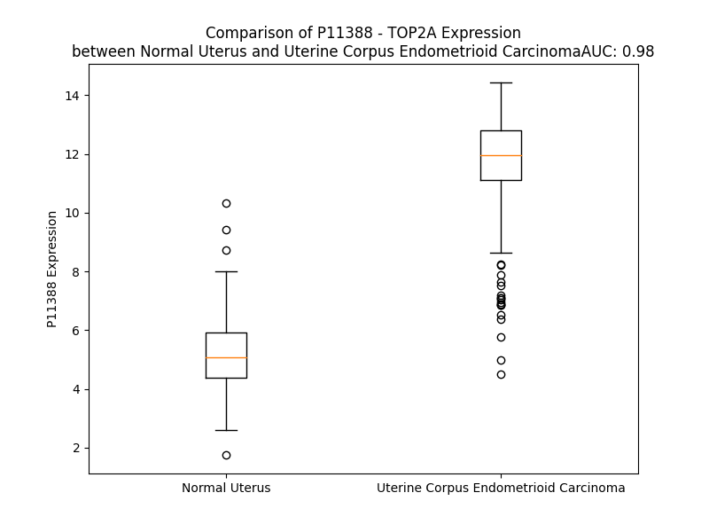

# Detailed Data for P11388

## Introduction to the Detailed Summary

### How to Interpret the Results

- **Summary & Metrics**: This section provides a quick reference to essential protein attributes, including expression changes, family classification, and biomarker applications. Regulation status (upregulated/downregulated) indicates the protein's behavior in a disease context. Some information comes from the original excel file with the proteins selected from literature, while others are derived from the analyses.
- **Expression Comparison**: A visual representation comparing protein expression between normal and disease states. It highlights significant changes in expression levels that might indicate diagnostic or therapeutic relevance. This is data coming from transcriptomics experiments and could not translate similarly to protein levels.
- **Isoform Alignment**: An interactive view of isoform alignments, revealing structural and functional differences between variants of the protein.
- **Interactors & Homologs**: Tables listing known interaction partners and homologous proteins, the more interactors and homologs, the more complex the protein is to design an antibody for.
- **Biological Assemblies**: Information about the structural arrangement of the protein in different assemblies, providing insights into its functional state but also the complexity of the protein to develop antibodies.
- **Combined Per-Residue Information**: A detailed table summarizing residue-level data. This includes predictions for epitope regions, aggregation tendencies, and modifications that might impact the protein's function. Each row corresponds to a residue in the protein, providing insights into specific sites that may be important for research or drug development.
## Summary & Metrics

- **UniProt Accession**: P11388
- **Gene Name**: TOP2A
- **Protein Name**: topoisomerase (DNA) II alpha 170kDa
- **Swiss Prot**: TOP2A_HUMAN
- **Family**: enzyme
- **Biomarker Application**: diagnosis,efficacy,response to therapy
- **Number of Isoforms**: 4
- **Regulation**: 1
- **(transcriptomics) AUC**: 1.0
- **(transcriptomics) Fold Change**: 2.42
- **(transcriptomics) Regulation**: Upregulated
- **Discotope Epitope Count**: 306
- **Max n_uniprots (Homo)**: 2
- **Max n_uniprots (Hetero)**: N/A

## Expression Comparison

## Isoform Alignment

<pre style='font-size:14px; font-family:monospace;'>P11388-1 MEVSPLQPVNENMQVNKIKKNEDAKKRLSVERIYQKKTQLEHILLRPDTYIGSVELVTQQMWVYDEDVGINYREVTFVPGLYKIFDEILVNAADNKQRDPKMSCIRVTIDPENNLISIWNNGKGIPVVEHKVEKMYVPALIFGQLLTSSNYDDDEKKVTGGRNGYGAKLCNIFSTKFTVETASREYKKMFKQTWMDNMGRAGEMELKPFNGEDYTCITFQPDLSKFKMQSLDKDIVALMVRRAYDIAGSTKDVKVFLNGNKLPVKGFRSYVDMYLKDKLDETGNSLKVIHEQVNHRWEVCLTMSEKGFQQISFVNSIATS------------------------------------KGGRHVDYVADQIVTKLVDVVKKKNKGGVAVKAHQ---------------------------------------------------------------------------------VKNHMWIFVNALIENPTFDSQTKENMTLQPKSFGSTCQLSEKFIK--------------------------AAIGCGIVESILNWVKFKAQVQLNKKCSAVKHNRIKGIPKLDDANDAGGRNSTECTLILTEGDSAKTLAVSGLGVVGRDKYGVFPLRGKILNVREASHKQIMENAEINNIIKIVGLQYKKNYEDEDSLKTLRYGKIMIMTDQDQDGSHIKGLLINFIHHNWPSLLRHRFLEEFITPIVKVSKNKQEMAFYSLPEFEEWKSSTPNHKKWKVKYYKGLGTSTSKEAKEYFADMKRHRIQFKYSGPEDDAAISLAFSKKQIDDRKEWLTNFMEDRRQRKLLGLPEDYLYGQTTTYLTYNDFINKELILFSNSDNERSIPSMVDGLKPGQRKVLFTCFKRNDKREVKVAQLAGSVAEMSSYHHGEMSLMMTIINLAQNFVGSNNLNLLQPIGQFGTRLHGGKDSASPRYIFTMLSSLARLLFPPKDDHTLKFLYDDNQRVEPEWYIPIIPMVLINGAEGIGTGWSCKIPNFDVREIVNNIRRLMDGEEPLPMLPSYKNFKGTIEELAPNQYVISGEVAILNSTTIEISELPVRTWTQTYKEQVLEPMLNGTEKTPPLITDYREYHTDTTVKFVVKMTEEKLAEAERVGLHKVFKLQTSLTCNSMVLFDHVGCLKKYDTVLDILRDFFELRLKYYGLRKEWLLGMLGAESAKLNNQARFILEKIDGKIIIENKPKKELIKVLIQRGYDSDPVKAWKEAQQKVPDEEENEESDNEKETEKSDSVTDSGPTFNYLLDMPLWYLTKEKKDELCRLRNEKEQELDTLKRKSPSDLWKEDLATFIEELEAVEAKEKQDEQVGLPGKGGKAKGKKTQMAEVLPSPRGQRVIPRITIEMKAEAEKKNKKKIKNENTEGSPQEDGVELEGLKQRLEKKQKREPGTKTKKQTTLAFKPIKKGKKRNPWSDSESDRSSDESNFDVPPRETEPRRAATKTKFTMDLDSDEDFSDFDEKTDDEDFVPSDASPPKTKTSPKLSNKELKPQKSVVSDLEADDVKGSVPLSSSPPATHFPDETEITNPVPKKNVTVKKTAAKSQSSTSTTGAKKRAAPKGTKRDPALNSGVSQKPDPAKTKNRRKRKPSTSDDSDSNFEKIVSKAVTSKKSKGESDDFHMDFDSAVAPRAKSVRAKKPIKYLEESDEDDLF
P11388-2 MEVSPLQPVNENMQVNKIKKNEDAKKRLSVERIYQKKTQLEHILLRPDTYIGSVELVTQQMWVYDEDVGINYREVTFVPGLYKIFDEILVNAADNKQRDPKMSCIRVTIDPENNLISIWNNGKGIPVVEHKVEKMYVPALIFGQLLTSSNYDDDEKKVTGGRNGYGAKLCNIFSTKFTVETASREYKKMFKQTWMDNMGRAGEMELKPFNGEDYTCITFQPDLSKFKMQSLDKDIVALMVRRAYDIAGSTKDVKVFLNGNKLPVKGFRSYVDMYLKDKLDETGNSLKVIHEQVNHRWEVCLTMSEKGFQQISFVNSIATS------------------------------------KGGRHVDYVADQIVTKLVDVVKKKNKGGVAVKAHQ---------------------------------------------------------------------------------VKNHMWIFVNALIENPTFDSQTKENMTLQPKSFGSTCQLSEKFIKAHLYSRFLIDPFFPNMIPNMIFSFSKAAIGCGIVESILNWVKFKAQVQLNKKCSAVKHNRIKGIPKLDDANDAGGRNSTECTLILTEGDSAKTLAVSGLGVVGRDKYGVFPLRGKILNVREASHKQIMENAEINNIIKIVGLQYKKNYEDEDSLKTLRYGKIMIMTDQDQDGSHIKGLLINFIHHNWPSLLRHRFLEEFITPIVKVSKNKQEMAFYSLPEFEEWKSSTPNHKKWKVKYYKGLGTSTSKEAKEYFADMKRHRIQFKYSGPEDDAAISLAFSKKQIDDRKEWLTNFMEDRRQRKLLGLPEDYLYGQTTTYLTYNDFINKELILFSNSDNERSIPSMVDGLKPGQRKVLFTCFKRNDKREVKVAQLAGSVAEMSSYHHGEMSLMMTIINLAQNFVGSNNLNLLQPIGQFGTRLHGGKDSASPRYIFTMLSSLARLLFPPKDDHTLKFLYDDNQRVEPEWYIPIIPMVLINGAEGIGTGWSCKIPNFDVREIVNNIRRLMDGEEPLPMLPSYKNFKGTIEELAPNQYVISGEVAILNSTTIEISELPVRTWTQTYKEQVLEPMLNGTEKTPPLITDYREYHTDTTVKFVVKMTEEKLAEAERVGLHKVFKLQTSLTCNSMVLFDHVGCLKKYDTVLDILRDFFELRLKYYGLRKEWLLGMLGAESAKLNNQARFILEKIDGKIIIENKPKKELIKVLIQRGYDSDPVKAWKEAQQKVPDEEENEESDNEKETEKSDSVTDSGPTFNYLLDMPLWYLTKEKKDELCRLRNEKEQELDTLKRKSPSDLWKEDLATFIEELEAVEAKEKQDEQVGLPGKGGKAKGKKTQMAEVLPSPRGQRVIPRITIEMKAEAEKKNKKKIKNENTEGSPQEDGVELEGLKQRLEKKQKREPGTKTKKQTTLAFKPIKKGKKRNPWSDSESDRSSDESNFDVPPRETEPRRAATKTKFTMDLDSDEDFSDFDEKTDDEDFVPSDASPPKTKTSPKLSNKELKPQKSVVSDLEADDVKGSVPLSSSPPATHFPDETEITNPVPKKNVTVKKTAAKSQSSTSTTGAKKRAAPKGTKRDPALNSGVSQKPDPAKTKNRRKRKPSTSDDSDSNFEKIVSKAVTSKKSKGESDDFHMDFDSAVAPRAKSVRAKKPIKYLEESDEDDLF
P11388-3 MEVSPLQPVNENMQVNKIKKNEDAKKRLSVERIYQKKTQLEHILLRPDTYIGSVELVTQQMWVYDEDVGINYREVTFVPGLYKIFDEILVNAADNKQRDPKMSCIRVTIDPENNLISIWNNGKGIPVVEHKVEKMYVPALIFGQLLTSSNYDDDEKKVTGGRNGYGAKLCNIFSTKFTVETASREYKKMFKQTWMDNMGRAGEMELKPFNGEDYTCITFQPDLSKFKMQSLDKDIVALMVRRAYDIAGSTKDVKVFLNGNKLPVKGFRSYVDMYLKDKLDETGNSLKVIHEQVNHRWEVCLTMSEKGFQQISFVNSIATSKSSKYWSSRKSKQHILLNFFVLFKFINDAFFGICPFKGGRHVDYVADQIVTKLVDVVKKKNKGGVAVKAHQ---------------------------------------------------------------------------------VKNHMWIFVNALIENPTFDSQTKENMTLQPKSFGSTCQLSEKFIK--------------------------AAIGCGIVESILNWVKFKAQVQLNKKCSAVKHNRIKGIPKLDDANDAGGRNSTECTLILTEGDSAKTLAVSGLGVVGRDKYGVFPLRGKILNVREASHKQIMENAEINNIIKIVGLQYKKNYEDEDSLKTLRYGKIMIMTDQDQDGSHIKGLLINFIHHNWPSLLRHRFLEEFITPIVKVSKNKQEMAFYSLPEFEEWKSSTPNHKKWKVKYYKGLGTSTSKEAKEYFADMKRHRIQFKYSGPEDDAAISLAFSKKQIDDRKEWLTNFMEDRRQRKLLGLPEDYLYGQTTTYLTYNDFINKELILFSNSDNERSIPSMVDGLKPGQRKVLFTCFKRNDKREVKVAQLAGSVAEMSSYHHGEMSLMMTIINLAQNFVGSNNLNLLQPIGQFGTRLHGGKDSASPRYIFTMLSSLARLLFPPKDDHTLKFLYDDNQRVEPEWYIPIIPMVLINGAEGIGTGWSCKIPNFDVREIVNNIRRLMDGEEPLPMLPSYKNFKGTIEELAPNQYVISGEVAILNSTTIEISELPVRTWTQTYKEQVLEPMLNGTEKTPPLITDYREYHTDTTVKFVVKMTEEKLAEAERVGLHKVFKLQTSLTCNSMVLFDHVGCLKKYDTVLDILRDFFELRLKYYGLRKEWLLGMLGAESAKLNNQARFILEKIDGKIIIENKPKKELIKVLIQRGYDSDPVKAWKEAQQKVPDEEENEESDNEKETEKSDSVTDSGPTFNYLLDMPLWYLTKEKKDELCRLRNEKEQELDTLKRKSPSDLWKEDLATFIEELEAVEAKEKQDEQVGLPGKGGKAKGKKTQMAEVLPSPRGQRVIPRITIEMKAEAEKKNKKKIKNENTEGSPQEDGVELEGLKQRLEKKQKREPGTKTKKQTTLAFKPIKKGKKRNPWSDSESDRSSDESNFDVPPRETEPRRAATKTKFTMDLDSDEDFSDFDEKTDDEDFVPSDASPPKTKTSPKLSNKELKPQKSVVSDLEADDVKGSVPLSSSPPATHFPDETEITNPVPKKNVTVKKTAAKSQSSTSTTGAKKRAAPKGTKRDPALNSGVSQKPDPAKTKNRRKRKPSTSDDSDSNFEKIVSKAVTSKKSKGESDDFHMDFDSAVAPRAKSVRAKKPIKYLEESDEDDLF
P11388-4 MEVSPLQPVNENMQVNKIKKNEDAKKRLSVERIYQKKTQLEHILLRPDTYIGSVELVTQQMWVYDEDVGINYREVTFVPGLYKIFDEILVNAADNKQRDPKMSCIRVTIDPENNLISIWNNGKGIPVVEHKVEKMYVPALIFGQLLTSSNYDDDEKKVTGGRNGYGAKLCNIFSTKFTVETASREYKKMFKQTWMDNMGRAGEMELKPFNGEDYTCITFQPDLSKFKMQSLDKDIVALMVRRAYDIAGSTKDVKVFLNGNKLPVKGFRSYVDMYLKDKLDETGNSLKVIHEQVNHRWEVCLTMSEKGFQQISFVNSIATS------------------------------------KGGRHVDYVADQIVTKLVDVVKKKNKGGVAVKAHQRELCNGAILAHCNLRLMGSSDSPASASRVAGIAGGCHHTQLIFVFLVETGFHHVGQAGLERLTSGDPPASASQSSGITDVKVKNHMWIFVNALIENPTFDSQTKENMTLQPKSFGSTCQLSEKFIK--------------------------AAIGCGIVESILNWVKFKAQVQLNKKCSAVKHNRIKGIPKLDDANDAGGRNSTECTLILTEGDSAKTLAVSGLGVVGRDKYGVFPLRGKILNVREASHKQIMENAEINNIIKIVGLQYKKNYEDEDSLKTLRYGKIMIMTDQDQDGSHIKGLLINFIHHNWPSLLRHRFLEEFITPIVKVSKNKQEMAFYSLPEFEEWKSSTPNHKKWKVKYYKGLGTSTSKEAKEYFADMKRHRIQFKYSGPEDDAAISLAFSKKQIDDRKEWLTNFMEDRRQRKLLGLPEDYLYGQTTTYLTYNDFINKELILFSNSDNERSIPSMVDGLKPGQRKVLFTCFKRNDKREVKVAQLAGSVAEMSSYHHGEMSLMMTIINLAQNFVGSNNLNLLQPIGQFGTRLHGGKDSASPRYIFTMLSSLARLLFPPKDDHTLKFLYDDNQRVEPEWYIPIIPMVLINGAEGIGTGWSCKIPNFDVREIVNNIRRLMDGEEPLPMLPSYKNFKGTIEELAPNQYVISGEVAILNSTTIEISELPVRTWTQTYKEQVLEPMLNGTEKTPPLITDYREYHTDTTVKFVVKMTEEKLAEAERVGLHKVFKLQTSLTCNSMVLFDHVGCLKKYDTVLDILRDFFELRLKYYGLRKEWLLGMLGAESAKLNNQARFILEKIDGKIIIENKPKKELIKVLIQRGYDSDPVKAWKEAQQKVPDEEENEESDNEKETEKSDSVTDSGPTFNYLLDMPLWYLTKEKKDELCRLRNEKEQELDTLKRKSPSDLWKEDLATFIEELEAVEAKEKQDEQVGLPGKGGKAKGKKTQMAEVLPSPRGQRVIPRITIEMKAEAEKKNKKKIKNENTEGSPQEDGVELEGLKQRLEKKQKREPGTKTKKQTTLAFKPIKKGKKRNPWSDSESDRSSDESNFDVPPRETEPRRAATKTKFTMDLDSDEDFSDFDEKTDDEDFVPSDASPPKTKTSPKLSNKELKPQKSVVSDLEADDVKGSVPLSSSPPATHFPDETEITNPVPKKNVTVKKTAAKSQSSTSTTGAKKRAAPKGTKRDPALNSGVSQKPDPAKTKNRRKRKPSTSDDSDSNFEKIVSKAVTSKKSKGESDDFHMDFDSAVAPRAKSVRAKKPIKYLEESDEDDLF
</pre>

## Interactors

| preferredName_A   | preferredName_B   |   score |
|:------------------|:------------------|--------:|
| TOP2A             | NUSAP1            |   0.999 |
| TOP2A             | CDK1              |   0.997 |
| TOP2A             | ASPM              |   0.996 |
| TOP2A             | TOP1              |   0.994 |
| TOP2A             | MKI67             |   0.993 |
| TOP2A             | CCNB1             |   0.989 |
| TOP2A             | BUB1              |   0.982 |
| TOP2A             | CCNA2             |   0.982 |
| TOP2A             | BUB1B             |   0.98  |
| TOP2A             | CDC20             |   0.98  |
| TOP2A             | DLGAP5            |   0.978 |
| TOP2A             | BIRC5             |   0.976 |
| TOP2A             | KIF11             |   0.975 |
| TOP2A             | CCNB2             |   0.975 |
| TOP2A             | CENPF             |   0.974 |
| TOP2A             | KIF20A            |   0.974 |
| TOP2A             | TOP2B             |   0.973 |
| TOP2A             | UBE2C             |   0.973 |
| TOP2A             | AURKB             |   0.97  |
| TOP2A             | NCAPG             |   0.967 |
| TOP2A             | TOP1MT            |   0.964 |
| TOP2A             | AURKA             |   0.963 |
| TOP2A             | TYMS              |   0.96  |
| TOP2A             | PBK               |   0.958 |
| TOP2A             | TTK               |   0.958 |
| TOP2A             | RRM2              |   0.956 |
| TOP2A             | KIF15             |   0.955 |
| TOP2A             | MELK              |   0.955 |
| TOP2A             | PTTG1             |   0.942 |
| TOP2A             | TPX2              |   0.942 |
| TOP2A             | SPAG5             |   0.941 |
| TOP2A             | KIF2C             |   0.937 |
| TOP2A             | NUF2              |   0.936 |
| TOP2A             | PRC1              |   0.932 |
| TOP2A             | PLK1              |   0.931 |
| TOP2A             | NEK2              |   0.928 |
| TOP2A             | CEP55             |   0.928 |
| TOP2A             | SMC2              |   0.928 |
| TOP2A             | KIF14             |   0.927 |
| TOP2A             | FOXM1             |   0.927 |
| TOP2A             | KIF23             |   0.927 |
| TOP2A             | CENPE             |   0.926 |
| TOP2A             | PCLAF             |   0.92  |
| TOP2A             | CDCA8             |   0.92  |
| TOP2A             | CENPA             |   0.919 |
| TOP2A             | CDC45             |   0.917 |
| TOP2A             | TOP3A             |   0.917 |
| TOP2A             | CDCA5             |   0.917 |
| TOP2A             | KIF4A             |   0.915 |
| TOP2A             | HJURP             |   0.911 |

## Homologs

| uniprot_id   | gene_id   |
|:-------------|:----------|
| A0A8V8TP20   | TOP2B     |

## Biological Assemblies

|   Unnamed: 0 |   assembly |   n_uniprots | composition   | crystal_id   |
|-------------:|-----------:|-------------:|:--------------|:-------------|
|            0 |          1 |            2 | Homo          | 4r1f         |
|            1 |          2 |            2 | Homo          | 4r1f         |
|            0 |          1 |            2 | Homo          | 1zxm         |
|            0 |          1 |            2 | Homo          | 6zy7         |
|            0 |          1 |            2 | Homo          | 6zy6         |
|            0 |          1 |            2 | Homo          | 6zy8         |
|            0 |          1 |            1 | Homo          | 5nne         |
|            0 |          1 |            2 | Homo          | 6zy5         |
|            0 |          1 |            2 | Homo          | 1zxn         |
|            1 |          2 |            2 | Homo          | 1zxn         |
|            0 |          1 |            2 | Homo          | 5gwk         |
|            0 |          1 |            1 | Homo          | 4fm9         |

## Combined Per-Residue Information

|   res | aa   |   epitope_score | epitope   |   relative_surface_accessibility |   modeling_confidence |   Aggregation | modification               |
|------:|:-----|----------------:|:----------|---------------------------------:|----------------------:|--------------:|:---------------------------|
|     1 | M    |         0.09157 | True      |                          1.19256 |                 34.22 |         0     | N-acetylmethionine         |
|     2 | E    |         0.10852 | True      |                          0.80821 |                 35.63 |         0     | N/A                        |
|     3 | V    |         0.11379 | True      |                          1.04057 |                 37    |         0     | N/A                        |
|     4 | S    |         0.13204 | True      |                          0.74427 |                 34.64 |         0     | Phosphoserine              |
|     5 | P    |         0.11816 | True      |                          0.78835 |                 44.52 |         0     | N/A                        |
|     6 | L    |         0.09268 | True      |                          0.99508 |                 33.17 |         0     | N/A                        |
|     7 | Q    |         0.14575 | True      |                          0.78876 |                 34.16 |         0     | N/A                        |
|     8 | P    |         0.14586 | True      |                          0.81383 |                 37.01 |         0     | N/A                        |
|     9 | V    |         0.12223 | True      |                          1.06794 |                 38.3  |         0     | N/A                        |
|    10 | N    |         0.09174 | True      |                          0.88749 |                 28.85 |         0     | N/A                        |
|    11 | E    |         0.1417  | True      |                          0.78532 |                 34.79 |         0     | N/A                        |
|    12 | N    |         0.1385  | True      |                          0.78098 |                 31.52 |         0     | N/A                        |
|    13 | M    |         0.10331 | True      |                          1.01341 |                 34.52 |         0     | N/A                        |
|    14 | Q    |         0.05997 | False     |                          0.84365 |                 30.3  |         0     | N/A                        |
|    15 | V    |         0.04784 | False     |                          0.94836 |                 33.75 |         0     | N/A                        |
|    16 | N    |         0.0508  | False     |                          0.86091 |                 31.18 |         0     | N/A                        |
|    17 | K    |         0.05764 | False     |                          0.93062 |                 30.69 |         0     | N/A                        |
|    18 | I    |         0.08613 | False     |                          0.96874 |                 36.11 |         0     | N/A                        |
|    19 | K    |         0.06388 | False     |                          0.87505 |                 34.59 |         0     | N/A                        |
|    20 | K    |         0.07033 | False     |                          0.90804 |                 33.31 |         0     | N/A                        |
|    21 | N    |         0.08845 | False     |                          0.71916 |                 35.61 |         0     | N/A                        |
|    22 | E    |         0.10234 | True      |                          0.77977 |                 40.8  |         0     | N/A                        |
|    23 | D    |         0.16633 | True      |                          0.92507 |                 37.99 |         0     | N/A                        |
|    24 | A    |         0.14206 | True      |                          0.67188 |                 44.32 |         0     | N/A                        |
|    25 | K    |         0.14749 | True      |                          1.03607 |                 47.06 |         0     | N/A                        |
|    26 | K    |         0.1665  | True      |                          0.91735 |                 53.89 |         0     | N/A                        |
|    27 | R    |         0.18094 | True      |                          0.96473 |                 51.81 |         0     | N/A                        |
|    28 | L    |         0.09725 | True      |                          0.67763 |                 68.66 |         0     | N/A                        |
|    29 | S    |         0.11577 | True      |                          0.41583 |                 76.25 |         0     | N/A                        |
|    30 | V    |         0.10719 | True      |                          0.69299 |                 75.49 |         0     | N/A                        |
|    31 | E    |         0.18056 | True      |                          0.64794 |                 82.35 |         0     | N/A                        |
|    32 | R    |         0.20453 | True      |                          0.67293 |                 78.83 |         0     | N/A                        |
|    33 | I    |         0.13236 | True      |                          0.56044 |                 79.67 |         0     | N/A                        |
|    34 | Y    |         0.19817 | True      |                          0.76005 |                 82.34 |         0     | N/A                        |
|    35 | Q    |         0.10337 | True      |                          0.5355  |                 82.97 |         0     | N/A                        |
|    36 | K    |         0.13166 | True      |                          0.9826  |                 87.4  |         0     | N/A                        |
|    37 | K    |         0.12529 | True      |                          0.40181 |                 86.49 |         0     | N/A                        |
|    38 | T    |         0.09752 | True      |                          0.59432 |                 90.11 |         0     | N/A                        |
|    39 | Q    |         0.1223  | True      |                          0.33338 |                 87.89 |         0     | N/A                        |
|    40 | L    |         0.04659 | False     |                          0.32139 |                 89.3  |         0     | N/A                        |
|    41 | E    |         0.09704 | True      |                          0.38868 |                 87.9  |         0     | N/A                        |
|    42 | H    |         0.09151 | True      |                          0.39981 |                 91.21 |         0     | N/A                        |
|    43 | I    |         0.00926 | False     |                          0       |                 90.55 |         0     | N/A                        |
|    44 | L    |         0.06086 | False     |                          0.32138 |                 90.09 |         0     | N/A                        |
|    45 | L    |         0.12055 | True      |                          0.63588 |                 87.53 |         0     | N/A                        |
|    46 | R    |         0.18681 | True      |                          0.59662 |                 88.12 |         0     | N/A                        |
|    47 | P    |         0.04006 | False     |                          0.11332 |                 87.87 |         0     | N/A                        |
|    48 | D    |         0.17986 | True      |                          0.57327 |                 83.71 |         0     | N/A                        |
|    49 | T    |         0.28274 | True      |                          0.73306 |                 81.64 |         0     | N/A                        |
|    50 | Y    |         0.09346 | True      |                          0.14927 |                 84.43 |         0     | N/A                        |
|    51 | I    |         0.01661 | False     |                          0.01036 |                 87.3  |         0     | N/A                        |
|    52 | G    |         0.0409  | False     |                          0.09543 |                 86.82 |         0     | N/A                        |
|    53 | S    |         0.06217 | False     |                          0.23196 |                 89.44 |         0     | N/A                        |
|    54 | V    |         0.04044 | False     |                          0.16459 |                 92.71 |         0     | N/A                        |
|    55 | E    |         0.06628 | False     |                          0.42496 |                 92.26 |         0     | N/A                        |
|    56 | L    |         0.06394 | False     |                          0.57484 |                 92.08 |         0     | N/A                        |
|    57 | V    |         0.05256 | False     |                          0.35988 |                 92.69 |         0     | N/A                        |
|    58 | T    |         0.08856 | False     |                          0.5297  |                 93.35 |         0     | N/A                        |
|    59 | Q    |         0.13852 | True      |                          0.39314 |                 90.97 |         0     | N/A                        |
|    60 | Q    |         0.11895 | True      |                          0.53029 |                 90.44 |         0.138 | N/A                        |
|    61 | M    |         0.06524 | False     |                          0.17259 |                 91.01 |         0.138 | N/A                        |
|    62 | W    |         0.0353  | False     |                          0.21068 |                 92.07 |         0.138 | N/A                        |
|    63 | V    |         0.0067  | False     |                          0       |                 93.77 |         0.138 | N/A                        |
|    64 | Y    |         0.04765 | False     |                          0.16371 |                 93.95 |         0.138 | N/A                        |
|    65 | D    |         0.08167 | False     |                          0.21157 |                 90.2  |         0     | N/A                        |
|    66 | E    |         0.14771 | True      |                          0.8106  |                 84.3  |         0     | N/A                        |
|    67 | D    |         0.17603 | True      |                          0.92693 |                 84.26 |         0     | N/A                        |
|    68 | V    |         0.1863  | True      |                          0.65626 |                 85.47 |         0     | N/A                        |
|    69 | G    |         0.03429 | False     |                          0.20077 |                 88.81 |         0     | N/A                        |
|    70 | I    |         0.04171 | False     |                          0.1169  |                 91.62 |         0     | N/A                        |
|    71 | N    |         0.09893 | True      |                          0.16656 |                 90.36 |         0     | N/A                        |
|    72 | Y    |         0.13678 | True      |                          0.50257 |                 89.84 |         0     | N/A                        |
|    73 | R    |         0.18833 | True      |                          0.2678  |                 92.99 |         0     | N/A                        |
|    74 | E    |         0.1456  | True      |                          0.53432 |                 93.36 |         0     | N/A                        |
|    75 | V    |         0.00685 | False     |                          0.00286 |                 92.87 |         0.9   | N/A                        |
|    76 | T    |         0.08826 | False     |                          0.37081 |                 94.25 |         0.9   | N/A                        |
|    77 | F    |         0.03501 | False     |                          0.03121 |                 94.46 |         0.9   | N/A                        |
|    78 | V    |         0.00391 | False     |                          0       |                 94.9  |         0.9   | N/A                        |
|    79 | P    |         0.03109 | False     |                          0.21308 |                 92.08 |         0.9   | N/A                        |
|    80 | G    |         0.0018  | False     |                          0       |                 91.84 |         0     | N/A                        |
|    81 | L    |         0.00097 | False     |                          0       |                 95.15 |         0     | N/A                        |
|    82 | Y    |         0.01842 | False     |                          0.13768 |                 94.13 |         0     | N/A                        |
|    83 | K    |         0.01323 | False     |                          0.0505  |                 90.84 |         0     | N/A                        |
|    84 | I    |         0.00604 | False     |                          0.004   |                 93.02 |         0     | N/A                        |
|    85 | F    |         0.00242 | False     |                          0       |                 95.36 |         0     | N/A                        |
|    86 | D    |         0.02411 | False     |                          0.04597 |                 92.57 |         0     | N/A                        |
|    87 | E    |         0.02019 | False     |                          0.05306 |                 89.22 |         0     | N/A                        |
|    88 | I    |         0.0059  | False     |                          0.01892 |                 93.82 |         0     | N/A                        |
|    89 | L    |         0.00119 | False     |                          0       |                 94.27 |         0     | N/A                        |
|    90 | V    |         0.00429 | False     |                          0.0219  |                 91.61 |         0     | N/A                        |
|    91 | N    |         0.02532 | False     |                          0.3618  |                 90.34 |         0     | N/A                        |
|    92 | A    |         0.00458 | False     |                          0.04667 |                 93.43 |         0     | N/A                        |
|    93 | A    |         0.00302 | False     |                          0.02583 |                 92.78 |         0     | N/A                        |
|    94 | D    |         0.02471 | False     |                          0.01779 |                 90.01 |         0     | N/A                        |
|    95 | N    |         0.02854 | False     |                          0.09569 |                 91.51 |         0     | N/A                        |
|    96 | K    |         0.07527 | False     |                          0.15399 |                 91.54 |         0     | N/A                        |
|    97 | Q    |         0.06481 | False     |                          0.36505 |                 87.83 |         0     | N/A                        |
|    98 | R    |         0.16827 | True      |                          0.50104 |                 85.69 |         0     | N/A                        |
|    99 | D    |         0.0983  | True      |                          0.12885 |                 90.07 |         0     | N/A                        |
|   100 | P    |         0.07852 | False     |                          0.74492 |                 89.22 |         0     | N/A                        |
|   101 | K    |         0.1039  | True      |                          0.86487 |                 90.69 |         0     | N/A                        |
|   102 | M    |         0.00324 | False     |                          0.00106 |                 94.26 |         0     | N/A                        |
|   103 | S    |         0.03863 | False     |                          0.31898 |                 94.07 |         0     | N/A                        |
|   104 | C    |         0.05597 | False     |                          0.13524 |                 96.09 |         0     | N/A                        |
|   105 | I    |         0.00143 | False     |                          0       |                 97.65 |         0     | N/A                        |
|   106 | R    |         0.10237 | True      |                          0.50229 |                 98.12 |         0     | N/A                        |
|   107 | V    |         0.00514 | False     |                          0.00704 |                 98.1  |         0     | N/A                        |
|   108 | T    |         0.07044 | False     |                          0.39529 |                 97.93 |         0     | N/A                        |
|   109 | I    |         0.02491 | False     |                          0.02737 |                 96.74 |         0     | N/A                        |
|   110 | D    |         0.04851 | False     |                          0.22736 |                 95.84 |         0     | N/A                        |
|   111 | P    |         0.08137 | False     |                          0.3901  |                 93.42 |         0     | N/A                        |
|   112 | E    |         0.06464 | False     |                          0.84988 |                 91.13 |         0     | N/A                        |
|   113 | N    |         0.07562 | False     |                          0.56194 |                 94.37 |         0     | N/A                        |
|   114 | N    |         0.0409  | False     |                          0.21428 |                 95.24 |         0.245 | N/A                        |
|   115 | L    |         0.02331 | False     |                          0.30006 |                 96.9  |        18.134 | N/A                        |
|   116 | I    |         0.00133 | False     |                          0       |                 98.16 |        18.257 | N/A                        |
|   117 | S    |         0.01969 | False     |                          0.14006 |                 98.03 |        18.257 | N/A                        |
|   118 | I    |         0.00834 | False     |                          0.01687 |                 98.25 |        18.257 | N/A                        |
|   119 | W    |         0.06877 | False     |                          0.26871 |                 97.8  |        18.257 | N/A                        |
|   120 | N    |         0.0277  | False     |                          0.05144 |                 97.1  |         0.792 | N/A                        |
|   121 | N    |         0.03812 | False     |                          0.16182 |                 95.27 |         0     | N/A                        |
|   122 | G    |         0.02088 | False     |                          0.14104 |                 92.66 |         0     | N/A                        |
|   123 | K    |         0.11612 | True      |                          0.46643 |                 91.6  |         0     | N/A                        |
|   124 | G    |         0.01814 | False     |                          0.07329 |                 89.07 |         0     | N/A                        |
|   125 | I    |         0.04542 | False     |                          0.11337 |                 92.26 |         0     | N/A                        |
|   126 | P    |         0.05673 | False     |                          0.32804 |                 92.65 |         0     | N/A                        |
|   127 | V    |         0.01227 | False     |                          0.01267 |                 93.13 |         0     | N/A                        |
|   128 | V    |         0.17507 | True      |                          0.41796 |                 93.32 |         0     | N/A                        |
|   129 | E    |         0.12568 | True      |                          0.44383 |                 92.56 |         0     | N/A                        |
|   130 | H    |         0.2003  | True      |                          0.35395 |                 91.58 |         0     | N/A                        |
|   131 | K    |         0.21826 | True      |                          0.88616 |                 90.48 |         0     | N/A                        |
|   132 | V    |         0.2637  | True      |                          0.77839 |                 89.25 |         0     | N/A                        |
|   133 | E    |         0.22309 | True      |                          0.42483 |                 89.54 |         0     | N/A                        |
|   134 | K    |         0.11628 | True      |                          0.72896 |                 90.33 |         0     | N/A                        |
|   135 | M    |         0.11691 | True      |                          0.26733 |                 90.23 |         0     | N/A                        |
|   136 | Y    |         0.10265 | True      |                          0.20043 |                 93.57 |         0     | N/A                        |
|   137 | V    |         0.07239 | False     |                          0.16756 |                 93.38 |         0     | N/A                        |
|   138 | P    |         0.00209 | False     |                          0       |                 93.16 |         0.402 | N/A                        |
|   139 | A    |         0.02968 | False     |                          0.08002 |                 93.09 |         9.824 | N/A                        |
|   140 | L    |         0.04629 | False     |                          0.08491 |                 91.34 |        17.449 | N/A                        |
|   141 | I    |         0.11017 | True      |                          0.3106  |                 91.1  |        18.766 | N/A                        |
|   142 | F    |         0.02328 | False     |                          0.0879  |                 92.53 |        18.766 | N/A                        |
|   143 | G    |         0.0192  | False     |                          0.20231 |                 89.64 |        18.364 | N/A                        |
|   144 | Q    |         0.09253 | True      |                          0.38046 |                 88.63 |        15.389 | N/A                        |
|   145 | L    |         0.06078 | False     |                          0.19221 |                 87.56 |        15.135 | N/A                        |
|   146 | L    |         0.11946 | True      |                          0.57447 |                 85.45 |        13.611 | N/A                        |
|   147 | T    |         0.05554 | False     |                          0.15482 |                 82.87 |         5.419 | N/A                        |
|   148 | S    |         0.0893  | False     |                          0.30074 |                 82.21 |         0.546 | N/A                        |
|   149 | S    |         0.1093  | True      |                          0.51983 |                 79.64 |         0     | N/A                        |
|   150 | N    |         0.07672 | False     |                          0.0654  |                 75.95 |         0     | N/A                        |
|   151 | Y    |         0.1667  | True      |                          0.52408 |                 77.95 |         0     | N/A                        |
|   152 | D    |         0.07629 | False     |                          0.48076 |                 80.25 |         0     | N/A                        |
|   153 | D    |         0.07892 | False     |                          0.37893 |                 76.93 |         0     | N/A                        |
|   154 | D    |         0.16663 | True      |                          0.79529 |                 78.61 |         0     | N/A                        |
|   155 | E    |         0.11526 | True      |                          0.52965 |                 76.34 |         0     | N/A                        |
|   156 | K    |         0.13567 | True      |                          0.57886 |                 82.39 |         0     | N/A                        |
|   157 | K    |         0.05931 | False     |                          0.15962 |                 84.21 |         0     | N/A                        |
|   158 | V    |         0.04229 | False     |                          0.19158 |                 87.03 |         0     | N/A                        |
|   159 | T    |         0.02152 | False     |                          0.08167 |                 82.54 |         0     | N/A                        |
|   160 | G    |         0.00664 | False     |                          0.00161 |                 75.2  |         0     | N/A                        |
|   161 | G    |         0.03285 | False     |                          0.22043 |                 75.1  |         0     | N/A                        |
|   162 | R    |         0.03643 | False     |                          0.20534 |                 74.11 |         0     | N/A                        |
|   163 | N    |         0.06086 | False     |                          0.48279 |                 75.67 |         0     | N/A                        |
|   164 | G    |         0.04599 | False     |                          0.14061 |                 77.78 |         0     | N/A                        |
|   165 | Y    |         0.07423 | False     |                          0.18318 |                 79.92 |         0     | N/A                        |
|   166 | G    |         0.015   | False     |                          0.10531 |                 82.21 |         0     | N/A                        |
|   167 | A    |         0.01756 | False     |                          0.09515 |                 88.09 |         0     | N/A                        |
|   168 | K    |         0.00725 | False     |                          0.03116 |                 91.57 |         0     | N/A                        |
|   169 | L    |         0.00389 | False     |                          0.00824 |                 91.01 |         0.133 | N/A                        |
|   170 | C    |         0.00072 | False     |                          0       |                 94.71 |         0.133 | N/A                        |
|   171 | N    |         0.00241 | False     |                          0.00637 |                 95.6  |         0.133 | N/A                        |
|   172 | I    |         0.00482 | False     |                          0       |                 95.21 |         0.26  | N/A                        |
|   173 | F    |         0.00236 | False     |                          0.00573 |                 95.71 |         0.26  | N/A                        |
|   174 | S    |         0.00962 | False     |                          0.00873 |                 96.41 |         0.127 | N/A                        |
|   175 | T    |         0.03496 | False     |                          0.47723 |                 96.35 |         0.127 | N/A                        |
|   176 | K    |         0.06388 | False     |                          0.47025 |                 97.35 |         0.127 | N/A                        |
|   177 | F    |         0.00515 | False     |                          0.00461 |                 97.84 |         0.127 | N/A                        |
|   178 | T    |         0.02143 | False     |                          0.12078 |                 97.72 |         0.127 | N/A                        |
|   179 | V    |         0.00304 | False     |                          0       |                 97.22 |         0.127 | N/A                        |
|   180 | E    |         0.03965 | False     |                          0.19171 |                 96.91 |         0.127 | N/A                        |
|   181 | T    |         0.00635 | False     |                          0       |                 96.72 |         0     | N/A                        |
|   182 | A    |         0.00226 | False     |                          0       |                 94.31 |         0     | N/A                        |
|   183 | S    |         0.00833 | False     |                          0.00158 |                 91.81 |         0     | N/A                        |
|   184 | R    |         0.16526 | True      |                          0.65732 |                 89.44 |         0     | N/A                        |
|   185 | E    |         0.25187 | True      |                          0.52583 |                 89.28 |         0     | N/A                        |
|   186 | Y    |         0.19618 | True      |                          0.32198 |                 91.54 |         0     | N/A                        |
|   187 | K    |         0.24369 | True      |                          0.67108 |                 92.26 |         0     | N/A                        |
|   188 | K    |         0.14895 | True      |                          0.36945 |                 94.23 |         0     | N/A                        |
|   189 | M    |         0.06409 | False     |                          0.12656 |                 95.37 |         0     | N/A                        |
|   190 | F    |         0.01101 | False     |                          0       |                 96.77 |         0     | N/A                        |
|   191 | K    |         0.0424  | False     |                          0.30026 |                 97.24 |         0     | N/A                        |
|   192 | Q    |         0.06987 | False     |                          0.09308 |                 96.54 |         0     | N/A                        |
|   193 | T    |         0.03256 | False     |                          0.20295 |                 96.87 |         0     | N/A                        |
|   194 | W    |         0.02025 | False     |                          0.04175 |                 97.29 |         0     | N/A                        |
|   195 | M    |         0.097   | True      |                          0.37443 |                 95.9  |         0     | N/A                        |
|   196 | D    |         0.08383 | False     |                          0.44968 |                 93.72 |         0     | N/A                        |
|   197 | N    |         0.05639 | False     |                          0.1441  |                 94.92 |         0     | N/A                        |
|   198 | M    |         0.02761 | False     |                          0.11503 |                 93.43 |         0     | N/A                        |
|   199 | G    |         0.12115 | True      |                          0.73669 |                 89.8  |         0     | N/A                        |
|   200 | R    |         0.18037 | True      |                          0.5833  |                 91.44 |         0     | N/A                        |
|   201 | A    |         0.16934 | True      |                          0.59411 |                 91.42 |         0     | N/A                        |
|   202 | G    |         0.08902 | False     |                          0.23232 |                 90.45 |         0     | N/A                        |
|   203 | E    |         0.21443 | True      |                          0.86571 |                 91.33 |         0     | N/A                        |
|   204 | M    |         0.1506  | True      |                          0.39638 |                 93.17 |         0     | N/A                        |
|   205 | E    |         0.11533 | True      |                          0.37792 |                 93.52 |         0     | N/A                        |
|   206 | L    |         0.16707 | True      |                          0.37925 |                 93.79 |         0     | N/A                        |
|   207 | K    |         0.14965 | True      |                          0.47035 |                 93.24 |         0     | N/A                        |
|   208 | P    |         0.2458  | True      |                          0.95443 |                 92.87 |         0     | N/A                        |
|   209 | F    |         0.1716  | True      |                          0.21843 |                 90.7  |         0     | N/A                        |
|   210 | N    |         0.23982 | True      |                          0.9033  |                 88.52 |         0     | N/A                        |
|   211 | G    |         0.08162 | False     |                          0.40542 |                 90.71 |         0     | N/A                        |
|   212 | E    |         0.13076 | True      |                          0.70733 |                 92.51 |         0     | N/A                        |
|   213 | D    |         0.07084 | False     |                          0.13642 |                 94.64 |         0     | N/A                        |
|   214 | Y    |         0.05757 | False     |                          0.17213 |                 96.31 |         0.266 | N/A                        |
|   215 | T    |         0.02413 | False     |                          0.10544 |                 96.56 |         0.484 | N/A                        |
|   216 | C    |         0.01729 | False     |                          0.16097 |                 97.41 |         0.484 | N/A                        |
|   217 | I    |         0.01449 | False     |                          0.0512  |                 97.83 |         0.484 | N/A                        |
|   218 | T    |         0.02634 | False     |                          0.23457 |                 98.09 |         0.484 | N/A                        |
|   219 | F    |         0.00507 | False     |                          0.00549 |                 97.75 |         0.484 | N/A                        |
|   220 | Q    |         0.04291 | False     |                          0.23782 |                 97.5  |         0     | N/A                        |
|   221 | P    |         0.01466 | False     |                          0.04409 |                 96.77 |         0     | N/A                        |
|   222 | D    |         0.03752 | False     |                          0.06764 |                 96    |         0     | N/A                        |
|   223 | L    |         0.04155 | False     |                          0.0827  |                 94.58 |         0     | N/A                        |
|   224 | S    |         0.08414 | False     |                          0.68604 |                 93.8  |         0     | N/A                        |
|   225 | K    |         0.09703 | True      |                          0.27996 |                 93.28 |         0     | N/A                        |
|   226 | F    |         0.00272 | False     |                          0       |                 94.23 |         0     | N/A                        |
|   227 | K    |         0.13164 | True      |                          0.6313  |                 92.19 |         0     | N/A                        |
|   228 | M    |         0.07913 | False     |                          0.09055 |                 92.44 |         0     | N/A                        |
|   229 | Q    |         0.12227 | True      |                          0.87519 |                 90.62 |         0     | N/A                        |
|   230 | S    |         0.08048 | False     |                          0.42271 |                 93.48 |         0     | N/A                        |
|   231 | L    |         0.02524 | False     |                          0.04387 |                 94.43 |         0     | N/A                        |
|   232 | D    |         0.05326 | False     |                          0.32233 |                 92.65 |         0     | N/A                        |
|   233 | K    |         0.09464 | True      |                          0.8845  |                 92.91 |         0.265 | N/A                        |
|   234 | D    |         0.08027 | False     |                          0.17653 |                 94.46 |         0.334 | N/A                        |
|   235 | I    |         0.00226 | False     |                          0       |                 94.94 |        59.911 | N/A                        |
|   236 | V    |         0.04048 | False     |                          0.2066  |                 95.47 |        72.032 | N/A                        |
|   237 | A    |         0.01475 | False     |                          0.05466 |                 95.28 |        72.032 | N/A                        |
|   238 | L    |         0.00249 | False     |                          0       |                 94.51 |        72.032 | N/A                        |
|   239 | M    |         0.00182 | False     |                          0       |                 96.07 |        72.032 | N/A                        |
|   240 | V    |         0.02336 | False     |                          0.1133  |                 95.97 |        60.746 | N/A                        |
|   241 | R    |         0.02706 | False     |                          0.06455 |                 95.32 |         0.069 | N/A                        |
|   242 | R    |         0.00371 | False     |                          0.00094 |                 95.46 |         0     | N/A                        |
|   243 | A    |         0.00092 | False     |                          0       |                 95.68 |         0     | N/A                        |
|   244 | Y    |         0.03135 | False     |                          0.04846 |                 95.71 |         0     | N/A                        |
|   245 | D    |         0.00604 | False     |                          0.0113  |                 95.49 |         0     | N/A                        |
|   246 | I    |         0.00164 | False     |                          0       |                 95.33 |         0     | N/A                        |
|   247 | A    |         0.00858 | False     |                          0.06449 |                 94.79 |         0     | N/A                        |
|   248 | G    |         0.00652 | False     |                          0.0226  |                 93.72 |         0     | N/A                        |
|   249 | S    |         0.00528 | False     |                          0.06073 |                 93.57 |         0     | N/A                        |
|   250 | T    |         0.024   | False     |                          0.04373 |                 91.63 |         0     | N/A                        |
|   251 | K    |         0.08755 | False     |                          0.55379 |                 86.83 |         0     | N/A                        |
|   252 | D    |         0.09014 | False     |                          0.65918 |                 88.83 |         0.35  | N/A                        |
|   253 | V    |         0.01943 | False     |                          0.09793 |                 92.98 |         0.35  | N/A                        |
|   254 | K    |         0.07534 | False     |                          0.58546 |                 94.68 |         0.35  | N/A                        |
|   255 | V    |         0.00809 | False     |                          0.01963 |                 96.58 |         0.35  | N/A                        |
|   256 | F    |         0.06787 | False     |                          0.24739 |                 97.4  |         0.35  | N/A                        |
|   257 | L    |         0.03155 | False     |                          0.12247 |                 96.51 |         0.35  | N/A                        |
|   258 | N    |         0.08821 | False     |                          0.53186 |                 95.17 |         0     | N/A                        |
|   259 | G    |         0.11521 | True      |                          0.78403 |                 92.85 |         0     | N/A                        |
|   260 | N    |         0.12931 | True      |                          0.70536 |                 94.55 |         0     | N/A                        |
|   261 | K    |         0.11238 | True      |                          0.5581  |                 95.07 |         0     | N/A                        |
|   262 | L    |         0.03659 | False     |                          0.05753 |                 94.08 |         0     | N/A                        |
|   263 | P    |         0.18459 | True      |                          0.7014  |                 90.91 |         0     | N/A                        |
|   264 | V    |         0.06269 | False     |                          0.10478 |                 91.73 |         0     | N/A                        |
|   265 | K    |         0.11345 | True      |                          0.93414 |                 86.91 |         0     | N/A                        |
|   266 | G    |         0.02578 | False     |                          0.27538 |                 90.18 |         0     | N/A                        |
|   267 | F    |         0.00764 | False     |                          0.02298 |                 94.44 |         0     | N/A                        |
|   268 | R    |         0.05316 | False     |                          0.29154 |                 93.53 |         0     | N/A                        |
|   269 | S    |         0.06347 | False     |                          0.26877 |                 92.91 |         0     | N/A                        |
|   270 | Y    |         0.00395 | False     |                          0.00509 |                 94.72 |         0     | N/A                        |
|   271 | V    |         0.00345 | False     |                          0       |                 94.33 |         0     | N/A                        |
|   272 | D    |         0.05801 | False     |                          0.35283 |                 91.79 |         0     | N/A                        |
|   273 | M    |         0.05209 | False     |                          0.21296 |                 91.57 |         0     | N/A                        |
|   274 | Y    |         0.01905 | False     |                          0.02337 |                 91.25 |         0     | N/A                        |
|   275 | L    |         0.03649 | False     |                          0.08686 |                 87.46 |         0     | N/A                        |
|   276 | K    |         0.11338 | True      |                          0.66594 |                 79.85 |         0     | N/A                        |
|   277 | D    |         0.13014 | True      |                          0.71888 |                 76.35 |         0     | N/A                        |
|   278 | K    |         0.10365 | True      |                          0.46138 |                 79.46 |         0     | N/A                        |
|   279 | L    |         0.20495 | True      |                          0.59524 |                 76.64 |         0     | N/A                        |
|   280 | D    |         0.05946 | False     |                          0.24208 |                 70.07 |         0     | N/A                        |
|   281 | E    |         0.18085 | True      |                          0.61147 |                 66.09 |         0     | N/A                        |
|   282 | T    |         0.12301 | True      |                          0.74037 |                 66.14 |         0     | Phosphothreonine           |
|   283 | G    |         0.13181 | True      |                          0.56439 |                 71.01 |         0     | N/A                        |
|   284 | N    |         0.13866 | True      |                          0.56252 |                 73.84 |         0     | N/A                        |
|   285 | S    |         0.06763 | False     |                          0.67315 |                 77.49 |         0     | N/A                        |
|   286 | L    |         0.03346 | False     |                          0.14717 |                 84.27 |         0     | N/A                        |
|   287 | K    |         0.0447  | False     |                          0.5755  |                 87.69 |         0     | N/A                        |
|   288 | V    |         0.03072 | False     |                          0.17977 |                 91.76 |         0     | N/A                        |
|   289 | I    |         0.04583 | False     |                          0.084   |                 93.85 |         0     | N/A                        |
|   290 | H    |         0.07678 | False     |                          0.41044 |                 95.4  |         0     | N/A                        |
|   291 | E    |         0.12232 | True      |                          0.17393 |                 94.86 |         0     | N/A                        |
|   292 | Q    |         0.07589 | False     |                          0.44155 |                 94.55 |         0     | N/A                        |
|   293 | V    |         0.06127 | False     |                          0.23815 |                 93.27 |         0     | N/A                        |
|   294 | N    |         0.04307 | False     |                          0.31922 |                 92.64 |         0     | N/A                        |
|   295 | H    |         0.08457 | False     |                          0.8022  |                 89.87 |         0     | N/A                        |
|   296 | R    |         0.08585 | False     |                          0.17463 |                 93.64 |         0     | N/A                        |
|   297 | W    |         0.00945 | False     |                          0.00782 |                 96.47 |         0     | N/A                        |
|   298 | E    |         0.02875 | False     |                          0.12898 |                 96.83 |         0     | N/A                        |
|   299 | V    |         0.0024  | False     |                          0       |                 97.63 |         0     | N/A                        |
|   300 | C    |         0.00201 | False     |                          0       |                 96.92 |         0     | N/A                        |
|   301 | L    |         0.00211 | False     |                          0       |                 95.95 |         0     | N/A                        |
|   302 | T    |         0.00313 | False     |                          0.00072 |                 94.04 |         0     | N/A                        |
|   303 | M    |         0.01899 | False     |                          0.05662 |                 91.64 |         0     | N/A                        |
|   304 | S    |         0.00787 | False     |                          0.02433 |                 90.07 |         0     | N/A                        |
|   305 | E    |         0.03781 | False     |                          0.5697  |                 80.31 |         0     | N/A                        |
|   306 | K    |         0.1293  | True      |                          0.86479 |                 82.31 |         0     | N/A                        |
|   307 | G    |         0.03707 | False     |                          0.35427 |                 89.63 |         0     | N/A                        |
|   308 | F    |         0.03698 | False     |                          0.33356 |                 94.37 |         0     | N/A                        |
|   309 | Q    |         0.01587 | False     |                          0.19675 |                 93.84 |         0     | N/A                        |
|   310 | Q    |         0.02797 | False     |                          0.18125 |                 95.55 |         0.483 | N/A                        |
|   311 | I    |         0.02527 | False     |                          0.11028 |                 95.84 |         2.178 | N/A                        |
|   312 | S    |         0.01578 | False     |                          0.02884 |                 96.59 |         2.178 | N/A                        |
|   313 | F    |         0.00744 | False     |                          0.01784 |                 96.22 |         3.07  | N/A                        |
|   314 | V    |         0.00283 | False     |                          0       |                 95.4  |         3.07  | N/A                        |
|   315 | N    |         0.0186  | False     |                          0.0274  |                 93.37 |         2.587 | N/A                        |
|   316 | S    |         0.01186 | False     |                          0.08285 |                 93.28 |         2.101 | N/A                        |
|   317 | I    |         0.00587 | False     |                          0.0112  |                 92.12 |         2.101 | N/A                        |
|   318 | A    |         0.02107 | False     |                          0.23203 |                 93.02 |         0.96  | N/A                        |
|   319 | T    |         0.0065  | False     |                          0.00313 |                 94.09 |         0     | N/A                        |
|   320 | S    |         0.11975 | True      |                          0.5053  |                 89.65 |         0     | N/A                        |
|   321 | K    |         0.17155 | True      |                          0.69424 |                 90.91 |         0     | N/A                        |
|   322 | G    |         0.01712 | False     |                          0.01127 |                 94.49 |         0     | N/A                        |
|   323 | G    |         0.0317  | False     |                          0.18595 |                 95.07 |         0     | N/A                        |
|   324 | R    |         0.06404 | False     |                          0.44669 |                 96.29 |         0     | N/A                        |
|   325 | H    |         0.00469 | False     |                          0       |                 96.23 |         0     | N/A                        |
|   326 | V    |         0.00967 | False     |                          0.02571 |                 97.57 |         0     | N/A                        |
|   327 | D    |         0.09643 | True      |                          0.32333 |                 95.86 |         0     | N/A                        |
|   328 | Y    |         0.03237 | False     |                          0.22725 |                 96.44 |         0.08  | N/A                        |
|   329 | V    |         0.00145 | False     |                          0       |                 96.53 |         0.08  | N/A                        |
|   330 | A    |         0.002   | False     |                          0       |                 96.28 |         0.08  | N/A                        |
|   331 | D    |         0.09206 | True      |                          0.42609 |                 95.03 |         0.08  | N/A                        |
|   332 | Q    |         0.02832 | False     |                          0.28004 |                 94.42 |         1.863 | N/A                        |
|   333 | I    |         0.00379 | False     |                          0.00219 |                 95.09 |        47.499 | N/A                        |
|   334 | V    |         0.01298 | False     |                          0.04284 |                 95.35 |        48.057 | N/A                        |
|   335 | T    |         0.04229 | False     |                          0.5772  |                 93.25 |        48.057 | N/A                        |
|   336 | K    |         0.06247 | False     |                          0.53794 |                 92.22 |        48.057 | N/A                        |
|   337 | L    |         0.00256 | False     |                          0.00247 |                 91.71 |        48.057 | N/A                        |
|   338 | V    |         0.02507 | False     |                          0.11781 |                 90.71 |        48.057 | N/A                        |
|   339 | D    |         0.07401 | False     |                          0.42227 |                 88.51 |        48.057 | N/A                        |
|   340 | V    |         0.04052 | False     |                          0.22278 |                 89.62 |        47.959 | N/A                        |
|   341 | V    |         0.00331 | False     |                          0.00286 |                 87.73 |        38.933 | N/A                        |
|   342 | K    |         0.06731 | False     |                          0.59495 |                 83.85 |         0.08  | N/A                        |
|   343 | K    |         0.10716 | True      |                          0.75263 |                 85.17 |         0     | N/A                        |
|   344 | K    |         0.13877 | True      |                          0.53319 |                 82.75 |         0     | N/A                        |
|   345 | N    |         0.08908 | False     |                          0.19484 |                 79.29 |         0     | N/A                        |
|   346 | K    |         0.12558 | True      |                          0.89163 |                 68.18 |         0     | N/A                        |
|   347 | G    |         0.1194  | True      |                          0.60398 |                 59.57 |         0     | N/A                        |
|   348 | G    |         0.08936 | False     |                          0.3794  |                 64.25 |         0     | N/A                        |
|   349 | V    |         0.06671 | False     |                          0.2073  |                 71.97 |         0     | N/A                        |
|   350 | A    |         0.05473 | False     |                          0.86047 |                 73.18 |         0     | N/A                        |
|   351 | V    |         0.02075 | False     |                          0.10628 |                 81.56 |         0     | N/A                        |
|   352 | K    |         0.08912 | False     |                          0.73848 |                 87.53 |         0     | N/A                        |
|   353 | A    |         0.07118 | False     |                          0.54284 |                 89.64 |         0     | N/A                        |
|   354 | H    |         0.06162 | False     |                          0.66504 |                 89.35 |         0     | N/A                        |
|   355 | Q    |         0.0315  | False     |                          0.17972 |                 89.34 |         0     | N/A                        |
|   356 | V    |         0.00199 | False     |                          0       |                 91.57 |         0     | N/A                        |
|   357 | K    |         0.02742 | False     |                          0.16198 |                 93.68 |         0     | N/A                        |
|   358 | N    |         0.03242 | False     |                          0.29148 |                 92.67 |         0.047 | N/A                        |
|   359 | H    |         0.02743 | False     |                          0.11306 |                 92.89 |         1.443 | N/A                        |
|   360 | M    |         0.00199 | False     |                          0       |                 94.93 |        60.25  | N/A                        |
|   361 | W    |         0.00987 | False     |                          0.05116 |                 95.32 |        88.05  | N/A                        |
|   362 | I    |         0.00512 | False     |                          0.00317 |                 96.31 |        93.304 | N/A                        |
|   363 | F    |         0.00059 | False     |                          0       |                 97.36 |        93.766 | N/A                        |
|   364 | V    |         0.00253 | False     |                          0.0019  |                 97.53 |        93.8   | N/A                        |
|   365 | N    |         0.00852 | False     |                          0.12343 |                 96.84 |        66.625 | N/A                        |
|   366 | A    |         0.00442 | False     |                          0.00709 |                 95.95 |        64.645 | N/A                        |
|   367 | L    |         0.03532 | False     |                          0.23577 |                 94.33 |        62.758 | N/A                        |
|   368 | I    |         0.0034  | False     |                          0       |                 94.61 |        57.502 | N/A                        |
|   369 | E    |         0.03228 | False     |                          0.15019 |                 92.76 |         0     | N/A                        |
|   370 | N    |         0.04863 | False     |                          0.13125 |                 89.38 |         0     | N/A                        |
|   371 | P    |         0.01202 | False     |                          0.01349 |                 90.93 |         0     | N/A                        |
|   372 | T    |         0.06391 | False     |                          0.37273 |                 90.16 |         0     | N/A                        |
|   373 | F    |         0.02916 | False     |                          0.17809 |                 89.19 |         0     | N/A                        |
|   374 | D    |         0.23102 | True      |                          0.51544 |                 84.59 |         0     | N/A                        |
|   375 | S    |         0.18675 | True      |                          0.3997  |                 81.24 |         0     | N/A                        |
|   376 | Q    |         0.06171 | False     |                          0.17428 |                 75.65 |         0     | N/A                        |
|   377 | T    |         0.05879 | False     |                          0.24829 |                 75.75 |         0     | N/A                        |
|   378 | K    |         0.01806 | False     |                          0.03647 |                 85.45 |         0     | N/A                        |
|   379 | E    |         0.0879  | False     |                          0.23693 |                 87.55 |         0     | N/A                        |
|   380 | N    |         0.10262 | True      |                          0.24267 |                 92.47 |         0     | N/A                        |
|   381 | M    |         0.01362 | False     |                          0.00266 |                 94.58 |         0     | N/A                        |
|   382 | T    |         0.12305 | True      |                          0.37845 |                 95.11 |         0     | N/A                        |
|   383 | L    |         0.10184 | True      |                          0.17311 |                 94.32 |         0     | N/A                        |
|   384 | Q    |         0.26086 | True      |                          0.44241 |                 94.22 |         0     | N/A                        |
|   385 | P    |         0.08613 | False     |                          0.34827 |                 91.98 |         0     | N/A                        |
|   386 | K    |         0.16128 | True      |                          1.02392 |                 92.25 |         0     | N/A                        |
|   387 | S    |         0.1588  | True      |                          0.45088 |                 92.63 |         0     | N/A                        |
|   388 | F    |         0.00895 | False     |                          0.00236 |                 94.45 |         0     | N/A                        |
|   389 | G    |         0.13793 | True      |                          0.53012 |                 91.46 |         0     | N/A                        |
|   390 | S    |         0.07473 | False     |                          0.20567 |                 92.95 |         0     | N/A                        |
|   391 | T    |         0.10439 | True      |                          0.58547 |                 93.11 |         0     | N/A                        |
|   392 | C    |         0.00267 | False     |                          0       |                 93.71 |         0     | N/A                        |
|   393 | Q    |         0.0836  | False     |                          0.69567 |                 92.79 |         0     | N/A                        |
|   394 | L    |         0.02003 | False     |                          0.13451 |                 93.36 |         0     | N/A                        |
|   395 | S    |         0.09442 | True      |                          0.32917 |                 93.7  |         0     | N/A                        |
|   396 | E    |         0.11174 | True      |                          0.81262 |                 91.58 |         0     | N/A                        |
|   397 | K    |         0.07287 | False     |                          0.84065 |                 92.55 |         0     | N/A                        |
|   398 | F    |         0.00871 | False     |                          0.01946 |                 94.67 |         2.426 | N/A                        |
|   399 | I    |         0.03208 | False     |                          0.14239 |                 92.96 |         2.426 | N/A                        |
|   400 | K    |         0.09413 | True      |                          0.79269 |                 91.64 |         2.426 | N/A                        |
|   401 | A    |         0.0315  | False     |                          0.30119 |                 92.76 |         2.677 | N/A                        |
|   402 | A    |         0.00179 | False     |                          0.00128 |                 92.22 |         2.974 | N/A                        |
|   403 | I    |         0.0647  | False     |                          0.30374 |                 90.29 |         2.974 | N/A                        |
|   404 | G    |         0.05275 | False     |                          0.46759 |                 87.8  |         2.974 | N/A                        |
|   405 | C    |         0.04931 | False     |                          0.07331 |                 87.18 |         2.974 | N/A                        |
|   406 | G    |         0.04633 | False     |                          0.31007 |                 86.3  |         3.078 | N/A                        |
|   407 | I    |         0.00296 | False     |                          0       |                 90.49 |         4.234 | N/A                        |
|   408 | V    |         0.00305 | False     |                          0       |                 89.2  |         4.234 | N/A                        |
|   409 | E    |         0.07017 | False     |                          0.38353 |                 87.06 |         3.685 | N/A                        |
|   410 | S    |         0.02479 | False     |                          0.08424 |                 85.31 |         5.744 | N/A                        |
|   411 | I    |         0.00672 | False     |                          0.0032  |                 87.8  |        21.11  | N/A                        |
|   412 | L    |         0.03194 | False     |                          0.1558  |                 84.02 |        21.013 | N/A                        |
|   413 | N    |         0.08385 | False     |                          0.44661 |                 82.45 |        20.485 | N/A                        |
|   414 | W    |         0.03268 | False     |                          0.35302 |                 83.42 |        20.485 | N/A                        |
|   415 | V    |         0.01219 | False     |                          0.01714 |                 81.33 |        20.182 | N/A                        |
|   416 | K    |         0.08093 | False     |                          0.66449 |                 76.32 |         1.26  | N/A                        |
|   417 | F    |         0.11554 | True      |                          0.65998 |                 77.86 |         1.26  | N/A                        |
|   418 | K    |         0.03831 | False     |                          0.34826 |                 78.72 |         0     | N/A                        |
|   419 | A    |         0.05979 | False     |                          0.13519 |                 72.9  |         0     | N/A                        |
|   420 | Q    |         0.06149 | False     |                          0.14499 |                 72.87 |         0     | N/A                        |
|   421 | V    |         0.07422 | False     |                          0.37131 |                 76.92 |         0     | N/A                        |
|   422 | Q    |         0.07579 | False     |                          0.33103 |                 76.13 |         0     | N/A                        |
|   423 | L    |         0.05588 | False     |                          0.12118 |                 71.93 |         0     | N/A                        |
|   424 | N    |         0.07716 | False     |                          0.40195 |                 75.05 |         0     | N/A                        |
|   425 | K    |         0.07165 | False     |                          0.82636 |                 75.4  |         0     | N/A                        |
|   426 | K    |         0.06479 | False     |                          0.44723 |                 71.53 |         0     | N/A                        |
|   427 | C    |         0.02194 | False     |                          0.09143 |                 69.56 |         0     | N/A                        |
|   428 | S    |         0.02889 | False     |                          0.26426 |                 65.57 |         0     | N/A                        |
|   429 | A    |         0.07974 | False     |                          0.87548 |                 64.97 |         0     | N/A                        |
|   430 | V    |         0.07978 | False     |                          0.67653 |                 69.95 |         0     | N/A                        |
|   431 | K    |         0.11146 | True      |                          0.33586 |                 79.2  |         0     | N/A                        |
|   432 | H    |         0.10385 | True      |                          0.48211 |                 80.49 |         0     | N/A                        |
|   433 | N    |         0.14741 | True      |                          0.60933 |                 81.83 |         0     | N/A                        |
|   434 | R    |         0.14785 | True      |                          0.71107 |                 83.26 |         0     | N/A                        |
|   435 | I    |         0.0548  | False     |                          0.16538 |                 84.96 |         0     | N/A                        |
|   436 | K    |         0.19298 | True      |                          0.90095 |                 78.89 |         0     | N/A                        |
|   437 | G    |         0.24383 | True      |                          0.87155 |                 80.76 |         0     | N/A                        |
|   438 | I    |         0.13075 | True      |                          0.10253 |                 87.25 |         0     | N/A                        |
|   439 | P    |         0.31057 | True      |                          0.78018 |                 80.15 |         0     | N/A                        |
|   440 | K    |         0.14892 | True      |                          0.57121 |                 89.99 |         0     | N/A                        |
|   441 | L    |         0.05746 | False     |                          0.18074 |                 94.47 |         0     | N/A                        |
|   442 | D    |         0.06528 | False     |                          0.33834 |                 93.88 |         0     | N/A                        |
|   443 | D    |         0.0535  | False     |                          0.26797 |                 94.55 |         0     | N/A                        |
|   444 | A    |         0.00595 | False     |                          0.03144 |                 95.1  |         0     | N/A                        |
|   445 | N    |         0.10245 | True      |                          0.50734 |                 94.13 |         0     | N/A                        |
|   446 | D    |         0.07324 | False     |                          0.24355 |                 94.56 |         0     | N/A                        |
|   447 | A    |         0.0115  | False     |                          0.00471 |                 92.87 |         0     | N/A                        |
|   448 | G    |         0.01716 | False     |                          0.03807 |                 89.26 |         0     | N/A                        |
|   449 | G    |         0.07613 | False     |                          0.19842 |                 90.61 |         0     | N/A                        |
|   450 | R    |         0.18998 | True      |                          0.955   |                 89.18 |         0     | N/A                        |
|   451 | N    |         0.08291 | False     |                          0.37326 |                 91.85 |         0     | N/A                        |
|   452 | S    |         0.00796 | False     |                          0.00712 |                 92.22 |         0     | N/A                        |
|   453 | T    |         0.05207 | False     |                          0.43164 |                 91.63 |         0     | N/A                        |
|   454 | E    |         0.09099 | True      |                          0.52511 |                 93.1  |         0     | N/A                        |
|   455 | C    |         0.00239 | False     |                          0       |                 96.32 |         0.511 | N/A                        |
|   456 | T    |         0.00953 | False     |                          0.03185 |                 96.99 |         1.414 | N/A                        |
|   457 | L    |         0.00075 | False     |                          0       |                 97.26 |         1.414 | N/A                        |
|   458 | I    |         0.00173 | False     |                          0       |                 97.31 |         1.414 | N/A                        |
|   459 | L    |         0.00222 | False     |                          0.00122 |                 96.89 |         1.414 | N/A                        |
|   460 | T    |         0.00301 | False     |                          0       |                 94.61 |         1.093 | N/A                        |
|   461 | E    |         0.09467 | True      |                          0.20778 |                 91.05 |         0     | N/A                        |
|   462 | G    |         0.09309 | True      |                          0.30076 |                 89.01 |         0     | N/A                        |
|   463 | D    |         0.1638  | True      |                          0.42821 |                 87.93 |         0     | N/A                        |
|   464 | S    |         0.09012 | False     |                          0.51428 |                 84.44 |         0     | N/A                        |
|   465 | A    |         0.00667 | False     |                          0.00347 |                 86.95 |         0     | N/A                        |
|   466 | K    |         0.02803 | False     |                          0.14574 |                 90.94 |         0     | N/A                        |
|   467 | T    |         0.09848 | True      |                          0.63623 |                 89.39 |         0.343 | N/A                        |
|   468 | L    |         0.02356 | False     |                          0.05784 |                 89.93 |         0.919 | N/A                        |
|   469 | A    |         0.00244 | False     |                          0       |                 91.17 |         1.093 | N/A                        |
|   470 | V    |         0.04716 | False     |                          0.33004 |                 91.01 |         1.435 | N/A                        |
|   471 | S    |         0.06196 | False     |                          0.18168 |                 89.4  |         1.435 | N/A                        |
|   472 | G    |         0.00374 | False     |                          0       |                 88.5  |         1.577 | N/A                        |
|   473 | L    |         0.01856 | False     |                          0.03355 |                 89.1  |         2.634 | N/A                        |
|   474 | G    |         0.18693 | True      |                          0.72483 |                 87.09 |         2.634 | N/A                        |
|   475 | V    |         0.15192 | True      |                          0.47677 |                 90.79 |         2.634 | N/A                        |
|   476 | V    |         0.05565 | False     |                          0.29756 |                 90.74 |         2.634 | N/A                        |
|   477 | G    |         0.05344 | False     |                          0.35825 |                 90.34 |         1.563 | N/A                        |
|   478 | R    |         0.16306 | True      |                          0.53714 |                 93.6  |         0     | N/A                        |
|   479 | D    |         0.16016 | True      |                          0.45613 |                 94.16 |         0     | N/A                        |
|   480 | K    |         0.04738 | False     |                          0.40978 |                 95.35 |         0     | N/A                        |
|   481 | Y    |         0.01992 | False     |                          0.16189 |                 96.06 |         0     | N/A                        |
|   482 | G    |         0.00163 | False     |                          0.00322 |                 95.5  |         0     | N/A                        |
|   483 | V    |         0.0017  | False     |                          0       |                 96.28 |         0     | N/A                        |
|   484 | F    |         0.02891 | False     |                          0.02994 |                 96.18 |         0     | N/A                        |
|   485 | P    |         0.01812 | False     |                          0.04582 |                 95.44 |         0     | N/A                        |
|   486 | L    |         0.00613 | False     |                          0.00966 |                 94.04 |         0     | N/A                        |
|   487 | R    |         0.15308 | True      |                          0.80677 |                 85.01 |         0     | N/A                        |
|   488 | G    |         0.11117 | True      |                          0.35602 |                 84.64 |         0     | N/A                        |
|   489 | K    |         0.15616 | True      |                          0.57794 |                 87.84 |         0     | N/A                        |
|   490 | I    |         0.02986 | False     |                          0.0462  |                 90.75 |         0     | N/A                        |
|   491 | L    |         0.02865 | False     |                          0.30778 |                 91.85 |         0     | N/A                        |
|   492 | N    |         0.03006 | False     |                          0.26191 |                 92.54 |         0     | N/A                        |
|   493 | V    |         0.0077  | False     |                          0.02557 |                 89.28 |         0     | N/A                        |
|   494 | R    |         0.07264 | False     |                          0.16844 |                 87.25 |         0     | N/A                        |
|   495 | E    |         0.06755 | False     |                          0.31923 |                 77.49 |         0     | N/A                        |
|   496 | A    |         0.02549 | False     |                          0.22291 |                 81.92 |         0     | N/A                        |
|   497 | S    |         0.16234 | True      |                          0.28071 |                 78.31 |         0     | N/A                        |
|   498 | H    |         0.05928 | False     |                          0.16739 |                 72.83 |         0     | N/A                        |
|   499 | K    |         0.06134 | False     |                          0.65045 |                 77.77 |         0     | N/A                        |
|   500 | Q    |         0.07241 | False     |                          0.35932 |                 85.1  |         0     | N/A                        |
|   501 | I    |         0.02184 | False     |                          0.14093 |                 84.56 |         0     | N/A                        |
|   502 | M    |         0.03464 | False     |                          0.21977 |                 79.09 |         0     | N/A                        |
|   503 | E    |         0.06001 | False     |                          0.5546  |                 85.6  |         0     | N/A                        |
|   504 | N    |         0.03033 | False     |                          0.24853 |                 89.61 |         0     | N/A                        |
|   505 | A    |         0.05838 | False     |                          0.46127 |                 88.91 |         0     | N/A                        |
|   506 | E    |         0.03043 | False     |                          0.08978 |                 90.41 |         0     | N/A                        |
|   507 | I    |         0.01012 | False     |                          0.004   |                 91.31 |         0.352 | N/A                        |
|   508 | N    |         0.02889 | False     |                          0.15157 |                 89.83 |         0.352 | N/A                        |
|   509 | N    |         0.02259 | False     |                          0.18225 |                 92.09 |         0.352 | N/A                        |
|   510 | I    |         0.00201 | False     |                          0.0008  |                 93.61 |         0.352 | N/A                        |
|   511 | I    |         0.00889 | False     |                          0.00977 |                 91.93 |         0.352 | N/A                        |
|   512 | K    |         0.01949 | False     |                          0.34335 |                 90.55 |         0     | N/A                        |
|   513 | I    |         0.00226 | False     |                          0       |                 93.75 |         0     | N/A                        |
|   514 | V    |         0.00238 | False     |                          0       |                 94.16 |         0     | N/A                        |
|   515 | G    |         0.01377 | False     |                          0.12645 |                 90.93 |         0     | N/A                        |
|   516 | L    |         0.00169 | False     |                          0       |                 91.91 |         0     | N/A                        |
|   517 | Q    |         0.02336 | False     |                          0.19324 |                 87.78 |         0     | N/A                        |
|   518 | Y    |         0.05832 | False     |                          0.09375 |                 83.84 |         0     | N/A                        |
|   519 | K    |         0.17315 | True      |                          0.76283 |                 76.76 |         0     | N/A                        |
|   520 | K    |         0.05951 | False     |                          0.26771 |                 84.11 |         0     | N/A                        |
|   521 | N    |         0.06454 | False     |                          0.51912 |                 86.6  |         0     | N/A                        |
|   522 | Y    |         0.00528 | False     |                          0       |                 90.81 |         0     | N/A                        |
|   523 | E    |         0.06146 | False     |                          0.42565 |                 89.11 |         0     | N/A                        |
|   524 | D    |         0.12037 | True      |                          0.44394 |                 89.65 |         0     | N/A                        |
|   525 | E    |         0.10414 | True      |                          0.61097 |                 86.57 |         0     | N/A                        |
|   526 | D    |         0.11013 | True      |                          0.57654 |                 88.19 |         0     | N/A                        |
|   527 | S    |         0.02941 | False     |                          0.10468 |                 87.92 |         0     | N/A                        |
|   528 | L    |         0.02794 | False     |                          0.19018 |                 89.86 |         0     | N/A                        |
|   529 | K    |         0.05744 | False     |                          0.46018 |                 90.21 |         0     | N/A                        |
|   530 | T    |         0.05631 | False     |                          0.34072 |                 90.58 |         0     | N/A                        |
|   531 | L    |         0.00328 | False     |                          0.00513 |                 93.47 |         0     | N/A                        |
|   532 | R    |         0.01665 | False     |                          0.01853 |                 94.67 |         0     | N/A                        |
|   533 | Y    |         0.01175 | False     |                          0       |                 95.63 |         0     | N/A                        |
|   534 | G    |         0.03599 | False     |                          0.20567 |                 93.87 |         0     | N/A                        |
|   535 | K    |         0.02206 | False     |                          0.23639 |                 96.16 |         0     | N/A                        |
|   536 | I    |         0.00457 | False     |                          0.0048  |                 97.38 |        13.463 | N/A                        |
|   537 | M    |         0.00676 | False     |                          0.00283 |                 97.09 |        13.463 | N/A                        |
|   538 | I    |         0.00213 | False     |                          0       |                 96.2  |        13.463 | N/A                        |
|   539 | M    |         0.00348 | False     |                          0       |                 93.75 |        13.463 | N/A                        |
|   540 | T    |         0.00672 | False     |                          0.00164 |                 91.28 |        13.463 | N/A                        |
|   541 | D    |         0.07975 | False     |                          0.23181 |                 86.2  |         0     | N/A                        |
|   542 | Q    |         0.02683 | False     |                          0.10366 |                 83.87 |         0     | N/A                        |
|   543 | D    |         0.04995 | False     |                          0.30483 |                 84.06 |         0     | N/A                        |
|   544 | Q    |         0.06124 | False     |                          0.29624 |                 84.9  |         0     | N/A                        |
|   545 | D    |         0.04249 | False     |                          0.15738 |                 87.64 |         0     | N/A                        |
|   546 | G    |         0.00339 | False     |                          0       |                 90.42 |         0     | N/A                        |
|   547 | S    |         0.00926 | False     |                          0.05822 |                 92    |         0     | N/A                        |
|   548 | H    |         0.02468 | False     |                          0.18933 |                 93.29 |         0     | N/A                        |
|   549 | I    |         0.00909 | False     |                          0.0104  |                 94.04 |         0     | N/A                        |
|   550 | K    |         0.00493 | False     |                          0.0068  |                 95.05 |         0     | N/A                        |
|   551 | G    |         0.00153 | False     |                          0       |                 95.33 |         2.373 | N/A                        |
|   552 | L    |         0.01168 | False     |                          0.04563 |                 95.59 |        28.938 | N/A                        |
|   553 | L    |         0.00414 | False     |                          0.00907 |                 95.9  |        41.131 | N/A                        |
|   554 | I    |         0.00103 | False     |                          0       |                 96.5  |        41.131 | N/A                        |
|   555 | N    |         0.00222 | False     |                          0.00222 |                 96    |        41.131 | N/A                        |
|   556 | F    |         0.00315 | False     |                          0.00397 |                 95.22 |        41.131 | N/A                        |
|   557 | I    |         0.00315 | False     |                          0.0048  |                 95.5  |        38.72  | N/A                        |
|   558 | H    |         0.02373 | False     |                          0.11601 |                 95.1  |         0.268 | N/A                        |
|   559 | H    |         0.06549 | False     |                          0.4353  |                 92.83 |         0     | N/A                        |
|   560 | N    |         0.02962 | False     |                          0.22297 |                 91.11 |         0     | N/A                        |
|   561 | W    |         0.01132 | False     |                          0.00834 |                 93.88 |         0     | N/A                        |
|   562 | P    |         0.10003 | True      |                          0.52143 |                 92.55 |         0     | N/A                        |
|   563 | S    |         0.03643 | False     |                          0.05773 |                 93.13 |         0     | N/A                        |
|   564 | L    |         0.00143 | False     |                          0       |                 94.66 |         0     | N/A                        |
|   565 | L    |         0.00305 | False     |                          0.00473 |                 94.24 |         0     | N/A                        |
|   566 | R    |         0.11443 | True      |                          0.52404 |                 92.76 |         0     | N/A                        |
|   567 | H    |         0.06292 | False     |                          0.39191 |                 90.51 |         0     | N/A                        |
|   568 | R    |         0.07814 | False     |                          0.4142  |                 91.56 |         0     | N/A                        |
|   569 | F    |         0.00861 | False     |                          0.00789 |                 94.84 |         0     | N/A                        |
|   570 | L    |         0.00237 | False     |                          0.00247 |                 96.89 |         0     | N/A                        |
|   571 | E    |         0.00297 | False     |                          0.00053 |                 95.89 |         0     | N/A                        |
|   572 | E    |         0.00132 | False     |                          0.00139 |                 94.3  |         0     | N/A                        |
|   573 | F    |         0.00221 | False     |                          0.00114 |                 92.85 |         0     | N/A                        |
|   574 | I    |         0.01353 | False     |                          0.0184  |                 90.35 |         0     | N/A                        |
|   575 | T    |         0.01481 | False     |                          0.03861 |                 88.53 |         0     | N/A                        |
|   576 | P    |         0.00852 | False     |                          0.0124  |                 87.06 |         0     | N/A                        |
|   577 | I    |         0.01776 | False     |                          0.17999 |                 84.74 |         0     | N/A                        |
|   578 | V    |         0.00653 | False     |                          0       |                 86.53 |         0     | N/A                        |
|   579 | K    |         0.04207 | False     |                          0.14903 |                 88.44 |         0     | N/A                        |
|   580 | V    |         0.00542 | False     |                          0       |                 90.04 |         0     | N/A                        |
|   581 | S    |         0.06086 | False     |                          0.30344 |                 89.78 |         0     | N/A                        |
|   582 | K    |         0.07035 | False     |                          0.32857 |                 88.79 |         0     | N/A                        |
|   583 | N    |         0.14698 | True      |                          1.00473 |                 86.6  |         0     | N/A                        |
|   584 | K    |         0.15888 | True      |                          0.99039 |                 84.99 |         0     | N/A                        |
|   585 | Q    |         0.07538 | False     |                          0.58277 |                 87.05 |         0     | N/A                        |
|   586 | E    |         0.05695 | False     |                          0.70391 |                 87.82 |         0     | N/A                        |
|   587 | M    |         0.07892 | False     |                          0.36203 |                 88.44 |         0     | N/A                        |
|   588 | A    |         0.0428  | False     |                          0.39518 |                 88.26 |         0     | N/A                        |
|   589 | F    |         0.01854 | False     |                          0.0758  |                 87.62 |         0     | N/A                        |
|   590 | Y    |         0.01871 | False     |                          0.09511 |                 84.3  |         0     | N/A                        |
|   591 | S    |         0.02162 | False     |                          0.06656 |                 79.88 |         0     | N/A                        |
|   592 | L    |         0.1181  | True      |                          0.52619 |                 79.27 |         0     | N/A                        |
|   593 | P    |         0.04532 | False     |                          0.22611 |                 77.78 |         0     | N/A                        |
|   594 | E    |         0.04977 | False     |                          0.09405 |                 79.99 |         0     | N/A                        |
|   595 | F    |         0.01255 | False     |                          0.00955 |                 84.78 |         0     | N/A                        |
|   596 | E    |         0.08298 | False     |                          0.42107 |                 80.9  |         0     | N/A                        |
|   597 | E    |         0.05975 | False     |                          0.57905 |                 81.88 |         0     | N/A                        |
|   598 | W    |         0.05148 | False     |                          0.16037 |                 86.9  |         0     | N/A                        |
|   599 | K    |         0.0255  | False     |                          0.21409 |                 84.81 |         0     | N/A                        |
|   600 | S    |         0.06979 | False     |                          0.75421 |                 82.8  |         0     | N/A                        |
|   601 | S    |         0.05584 | False     |                          0.63325 |                 84.66 |         0     | N/A                        |
|   602 | T    |         0.04411 | False     |                          0.18769 |                 83.83 |         0     | N/A                        |
|   603 | P    |         0.05956 | False     |                          0.8312  |                 80.62 |         0     | N/A                        |
|   604 | N    |         0.06604 | False     |                          0.58324 |                 81.07 |         0     | N/A                        |
|   605 | H    |         0.05919 | False     |                          0.23    |                 78.48 |         0     | N/A                        |
|   606 | K    |         0.0871  | False     |                          0.67221 |                 75.96 |         0     | N/A                        |
|   607 | K    |         0.20447 | True      |                          0.72351 |                 83.89 |         0     | N/A                        |
|   608 | W    |         0.11917 | True      |                          0.1401  |                 87.12 |         0     | N/A                        |
|   609 | K    |         0.06907 | False     |                          0.76521 |                 85.86 |         0     | N/A                        |
|   610 | V    |         0.02451 | False     |                          0.26335 |                 86    |         0     | N/A                        |
|   611 | K    |         0.0353  | False     |                          0.39005 |                 83.72 |         0     | N/A                        |
|   612 | Y    |         0.03451 | False     |                          0.15948 |                 80.16 |         0     | N/A                        |
|   613 | Y    |         0.04964 | False     |                          0.08105 |                 78.35 |         0     | N/A                        |
|   614 | K    |         0.04962 | False     |                          0.23618 |                 69.69 |         0     | N/A                        |
|   615 | G    |         0.05727 | False     |                          0.22242 |                 70.66 |         0     | N/A                        |
|   616 | L    |         0.00844 | False     |                          0.01497 |                 76.1  |         0     | N/A                        |
|   617 | G    |         0.15248 | True      |                          0.60582 |                 72.27 |         0     | N/A                        |
|   618 | T    |         0.07881 | False     |                          0.42243 |                 75.12 |         0     | N/A                        |
|   619 | S    |         0.01596 | False     |                          0.08177 |                 83.95 |         0     | N/A                        |
|   620 | T    |         0.04554 | False     |                          0.52591 |                 86.15 |         0     | N/A                        |
|   621 | S    |         0.05416 | False     |                          0.49614 |                 86.07 |         0     | N/A                        |
|   622 | K    |         0.058   | False     |                          0.68296 |                 88.82 |         0     | N/A                        |
|   623 | E    |         0.03073 | False     |                          0.09698 |                 88.19 |         0     | N/A                        |
|   624 | A    |         0.00236 | False     |                          0.00255 |                 87.34 |         0     | N/A                        |
|   625 | K    |         0.06599 | False     |                          0.50072 |                 90.48 |         0     | N/A                        |
|   626 | E    |         0.05039 | False     |                          0.4109  |                 90.82 |         0     | N/A                        |
|   627 | Y    |         0.01573 | False     |                          0.04445 |                 91.74 |         0     | N/A                        |
|   628 | F    |         0.00586 | False     |                          0.01497 |                 91.02 |         0     | N/A                        |
|   629 | A    |         0.0303  | False     |                          0.68821 |                 92.21 |         0     | N/A                        |
|   630 | D    |         0.06466 | False     |                          0.41223 |                 90.65 |         0     | N/A                        |
|   631 | M    |         0.02538 | False     |                          0.15302 |                 89.1  |         0     | N/A                        |
|   632 | K    |         0.0467  | False     |                          0.85172 |                 87.67 |         0     | N/A                        |
|   633 | R    |         0.06319 | False     |                          0.16626 |                 89.08 |         0     | N/A                        |
|   634 | H    |         0.01569 | False     |                          0.0561  |                 90.66 |         0     | N/A                        |
|   635 | R    |         0.02177 | False     |                          0.25871 |                 92.41 |         0     | N/A                        |
|   636 | I    |         0.00264 | False     |                          0.0008  |                 93.36 |         0     | N/A                        |
|   637 | Q    |         0.03666 | False     |                          0.19824 |                 94.34 |         0     | N/A                        |
|   638 | F    |         0.00117 | False     |                          0       |                 95.61 |         0     | N/A                        |
|   639 | K    |         0.04034 | False     |                          0.38665 |                 94.31 |         0     | N/A                        |
|   640 | Y    |         0.04369 | False     |                          0.21217 |                 95.08 |         0     | N/A                        |
|   641 | S    |         0.08649 | False     |                          0.47533 |                 92.47 |         0     | N/A                        |
|   642 | G    |         0.05576 | False     |                          0.08691 |                 92.58 |         0     | N/A                        |
|   643 | P    |         0.06009 | False     |                          0.75043 |                 92.76 |         0     | N/A                        |
|   644 | E    |         0.05074 | False     |                          0.40961 |                 94.23 |         0     | N/A                        |
|   645 | D    |         0.00282 | False     |                          0       |                 95.72 |         0     | N/A                        |
|   646 | D    |         0.02836 | False     |                          0.26748 |                 94.94 |         0     | N/A                        |
|   647 | A    |         0.05143 | False     |                          0.56408 |                 94.38 |         5.533 | N/A                        |
|   648 | A    |         0.01384 | False     |                          0.05759 |                 95.24 |        15.276 | N/A                        |
|   649 | I    |         0.00198 | False     |                          0       |                 95.49 |        16.759 | N/A                        |
|   650 | S    |         0.01686 | False     |                          0.19009 |                 93.32 |        16.759 | N/A                        |
|   651 | L    |         0.04554 | False     |                          0.18878 |                 93.63 |        16.759 | N/A                        |
|   652 | A    |         0.01198 | False     |                          0.10997 |                 92.28 |        16.759 | N/A                        |
|   653 | F    |         0.0279  | False     |                          0.06369 |                 92.8  |        16.759 | N/A                        |
|   654 | S    |         0.04223 | False     |                          0.07445 |                 90.41 |         3.085 | N/A                        |
|   655 | K    |         0.11218 | True      |                          0.64423 |                 83.25 |         0     | N/A                        |
|   656 | K    |         0.11836 | True      |                          0.78317 |                 86.35 |         0     | N/A                        |
|   657 | Q    |         0.04939 | False     |                          0.25854 |                 88.82 |         0     | N/A                        |
|   658 | I    |         0.02458 | False     |                          0.44547 |                 86.29 |         0     | N/A                        |
|   659 | D    |         0.0455  | False     |                          0.578   |                 87.12 |         0     | N/A                        |
|   660 | D    |         0.04001 | False     |                          0.39799 |                 90.85 |         0     | N/A                        |
|   661 | R    |         0.0144  | False     |                          0.10013 |                 90.79 |         0     | N/A                        |
|   662 | K    |         0.0284  | False     |                          0.27989 |                 88.4  |         0     | N/A                        |
|   663 | E    |         0.03677 | False     |                          0.58077 |                 89.9  |         0     | N/A                        |
|   664 | W    |         0.04089 | False     |                          0.13183 |                 92.15 |         0.562 | N/A                        |
|   665 | L    |         0.00429 | False     |                          0.00659 |                 89.97 |         0.562 | N/A                        |
|   666 | T    |         0.02294 | False     |                          0.30262 |                 87.54 |         0.562 | N/A                        |
|   667 | N    |         0.05579 | False     |                          0.50949 |                 89.28 |         0.562 | N/A                        |
|   668 | F    |         0.03077 | False     |                          0.20851 |                 88.98 |         0.562 | N/A                        |
|   669 | M    |         0.01602 | False     |                          0.04561 |                 85.33 |         0.162 | N/A                        |
|   670 | E    |         0.05099 | False     |                          0.42067 |                 84.67 |         0     | N/A                        |
|   671 | D    |         0.03387 | False     |                          0.37693 |                 85.65 |         0     | N/A                        |
|   672 | R    |         0.0403  | False     |                          0.38211 |                 82    |         0     | N/A                        |
|   673 | R    |         0.06447 | False     |                          0.29663 |                 80.54 |         0     | N/A                        |
|   674 | Q    |         0.07263 | False     |                          0.52021 |                 84.15 |         0     | N/A                        |
|   675 | R    |         0.04079 | False     |                          0.25718 |                 82.92 |         0     | N/A                        |
|   676 | K    |         0.07165 | False     |                          0.7124  |                 74.54 |         0     | N/A                        |
|   677 | L    |         0.09077 | True      |                          0.86403 |                 76.99 |         0     | N/A                        |
|   678 | L    |         0.08352 | False     |                          0.7889  |                 83.95 |         0     | N/A                        |
|   679 | G    |         0.07308 | False     |                          0.83643 |                 77.12 |         0     | N/A                        |
|   680 | L    |         0.07601 | False     |                          0.59902 |                 77.85 |         0     | N/A                        |
|   681 | P    |         0.11236 | True      |                          0.7348  |                 70.23 |         0     | N/A                        |
|   682 | E    |         0.07483 | False     |                          0.42043 |                 71.9  |         0     | N/A                        |
|   683 | D    |         0.07141 | False     |                          0.53253 |                 73.82 |         0     | N/A                        |
|   684 | Y    |         0.10421 | True      |                          0.38858 |                 74.51 |         0     | N/A                        |
|   685 | L    |         0.03939 | False     |                          0.15702 |                 80.36 |         0     | N/A                        |
|   686 | Y    |         0.01401 | False     |                          0.08019 |                 79.44 |         0     | N/A                        |
|   687 | G    |         0.05563 | False     |                          0.23711 |                 75.38 |         0     | N/A                        |
|   688 | Q    |         0.07244 | False     |                          0.73185 |                 72.48 |         0     | N/A                        |
|   689 | T    |         0.08671 | False     |                          0.88843 |                 78.57 |         0.588 | N/A                        |
|   690 | T    |         0.03028 | False     |                          0.19465 |                 85.42 |         1.155 | N/A                        |
|   691 | T    |         0.07403 | False     |                          0.4949  |                 86.72 |         1.688 | N/A                        |
|   692 | Y    |         0.10532 | True      |                          0.5213  |                 91.4  |         1.688 | N/A                        |
|   693 | L    |         0.00673 | False     |                          0.03297 |                 92.44 |         1.688 | N/A                        |
|   694 | T    |         0.01977 | False     |                          0.15426 |                 94.95 |         1.437 | N/A                        |
|   695 | Y    |         0.00109 | False     |                          0       |                 95.73 |         1.037 | N/A                        |
|   696 | N    |         0.01129 | False     |                          0.27123 |                 94.98 |         0     | N/A                        |
|   697 | D    |         0.03821 | False     |                          0.24746 |                 93.15 |         0     | N/A                        |
|   698 | F    |         0.00108 | False     |                          0       |                 94.04 |         0.717 | N/A                        |
|   699 | I    |         0.00135 | False     |                          0       |                 94.49 |         0.717 | N/A                        |
|   700 | N    |         0.06168 | False     |                          0.32014 |                 92.38 |         0.717 | N/A                        |
|   701 | K    |         0.03855 | False     |                          0.3962  |                 88.6  |         1.052 | N/A                        |
|   702 | E    |         0.02574 | False     |                          0.06292 |                 89.33 |         1.052 | N/A                        |
|   703 | L    |         0.01134 | False     |                          0.02968 |                 92.19 |        46.583 | N/A                        |
|   704 | I    |         0.01362 | False     |                          0.0304  |                 91.57 |        46.583 | N/A                        |
|   705 | L    |         0.02686 | False     |                          0.45107 |                 89.32 |        46.583 | N/A                        |
|   706 | F    |         0.04236 | False     |                          0.06879 |                 90.27 |        46.583 | N/A                        |
|   707 | S    |         0.00847 | False     |                          0.02926 |                 90.09 |        45.61  | N/A                        |
|   708 | N    |         0.01516 | False     |                          0.0641  |                 89.55 |         0.717 | N/A                        |
|   709 | S    |         0.03641 | False     |                          0.07324 |                 87.8  |         0.079 | N/A                        |
|   710 | D    |         0.02499 | False     |                          0.21844 |                 89.83 |         0     | N/A                        |
|   711 | N    |         0.00526 | False     |                          0.01416 |                 91.77 |         0     | N/A                        |
|   712 | E    |         0.02999 | False     |                          0.29489 |                 90.07 |         0     | N/A                        |
|   713 | R    |         0.03985 | False     |                          0.30037 |                 89.92 |         0     | N/A                        |
|   714 | S    |         0.0151  | False     |                          0.17493 |                 91.52 |         0     | N/A                        |
|   715 | I    |         0.00374 | False     |                          0.0071  |                 94.29 |         0     | N/A                        |
|   716 | P    |         0.00588 | False     |                          0.01193 |                 95.49 |         0     | N/A                        |
|   717 | S    |         0.01462 | False     |                          0.07353 |                 95.59 |         0     | N/A                        |
|   718 | M    |         0.00595 | False     |                          0.00754 |                 96.28 |         0     | N/A                        |
|   719 | V    |         0.0024  | False     |                          0       |                 96.75 |         0     | N/A                        |
|   720 | D    |         0.00443 | False     |                          0       |                 96.76 |         0     | N/A                        |
|   721 | G    |         0.01219 | False     |                          0.14659 |                 96.02 |         0     | N/A                        |
|   722 | L    |         0.00673 | False     |                          0.04609 |                 96.21 |         0     | N/A                        |
|   723 | K    |         0.02666 | False     |                          0.23696 |                 95.29 |         0     | N/A                        |
|   724 | P    |         0.03506 | False     |                          0.28431 |                 92.82 |         0     | N/A                        |
|   725 | G    |         0.01826 | False     |                          0.19652 |                 93.24 |         0     | N/A                        |
|   726 | Q    |         0.02618 | False     |                          0.21598 |                 95.96 |         0     | N/A                        |
|   727 | R    |         0.01914 | False     |                          0.05666 |                 96.36 |         0     | N/A                        |
|   728 | K    |         0.01588 | False     |                          0.11084 |                 95.87 |         0     | N/A                        |
|   729 | V    |         0.00102 | False     |                          0       |                 95.91 |         1.593 | N/A                        |
|   730 | L    |         0.00112 | False     |                          0       |                 95.63 |         1.895 | N/A                        |
|   731 | F    |         0.01142 | False     |                          0.07108 |                 95.56 |         1.895 | N/A                        |
|   732 | T    |         0.00172 | False     |                          0       |                 94.95 |         1.895 | N/A                        |
|   733 | C    |         0.01507 | False     |                          0.08882 |                 94.96 |         1.895 | N/A                        |
|   734 | F    |         0.00728 | False     |                          0.12097 |                 94.29 |         1.604 | N/A                        |
|   735 | K    |         0.06395 | False     |                          0.53035 |                 91.6  |         0     | N/A                        |
|   736 | R    |         0.07204 | False     |                          0.36022 |                 90.27 |         0     | N/A                        |
|   737 | N    |         0.03887 | False     |                          0.56492 |                 86    |         0     | N/A                        |
|   738 | D    |         0.03228 | False     |                          0.24345 |                 82.84 |         0     | N/A                        |
|   739 | K    |         0.04844 | False     |                          0.73089 |                 84.91 |         0     | N/A                        |
|   740 | R    |         0.08929 | False     |                          0.70938 |                 91.05 |         0     | N/A                        |
|   741 | E    |         0.12161 | True      |                          0.47989 |                 93.64 |         0     | N/A                        |
|   742 | V    |         0.03024 | False     |                          0.18185 |                 94.87 |         0     | N/A                        |
|   743 | K    |         0.05466 | False     |                          0.31885 |                 95.81 |         0     | N/A                        |
|   744 | V    |         0.00094 | False     |                          0       |                 96.39 |         0     | N/A                        |
|   745 | A    |         0.0233  | False     |                          0.22354 |                 95.34 |         0     | N/A                        |
|   746 | Q    |         0.05254 | False     |                          0.5556  |                 94.88 |         0     | N/A                        |
|   747 | L    |         0.00438 | False     |                          0.02391 |                 95.45 |         0     | N/A                        |
|   748 | A    |         0.00114 | False     |                          0       |                 95.62 |         0     | N/A                        |
|   749 | G    |         0.04522 | False     |                          0.27267 |                 93.92 |         0     | N/A                        |
|   750 | S    |         0.01138 | False     |                          0.09092 |                 93.99 |         0     | N/A                        |
|   751 | V    |         0.00138 | False     |                          0       |                 94.58 |         0     | N/A                        |
|   752 | A    |         0.04139 | False     |                          0.24533 |                 91.44 |         0     | N/A                        |
|   753 | E    |         0.07568 | False     |                          0.62017 |                 88.97 |         0     | N/A                        |
|   754 | M    |         0.02787 | False     |                          0.26704 |                 90.29 |         0     | N/A                        |
|   755 | S    |         0.01409 | False     |                          0       |                 89.69 |         0     | N/A                        |
|   756 | S    |         0.01073 | False     |                          0.06972 |                 86.18 |         0     | N/A                        |
|   757 | Y    |         0.0344  | False     |                          0.16266 |                 85.81 |         0     | N/A                        |
|   758 | H    |         0.08085 | False     |                          0.47751 |                 78.42 |         0     | N/A                        |
|   759 | H    |         0.09286 | True      |                          0.37807 |                 80.7  |         0     | N/A                        |
|   760 | G    |         0.09377 | True      |                          0.62204 |                 78.26 |         0     | N/A                        |
|   761 | E    |         0.05427 | False     |                          0.38387 |                 86.97 |         0     | N/A                        |
|   762 | M    |         0.05976 | False     |                          0.75771 |                 88.92 |         1.473 | N/A                        |
|   763 | S    |         0.04875 | False     |                          0.45334 |                 90.57 |         2.765 | N/A                        |
|   764 | L    |         0.00255 | False     |                          0       |                 93.33 |        32.969 | N/A                        |
|   765 | M    |         0.03393 | False     |                          0.14423 |                 95.7  |        38.162 | N/A                        |
|   766 | M    |         0.06106 | False     |                          0.44905 |                 94.67 |        39.617 | N/A                        |
|   767 | T    |         0.01449 | False     |                          0.19696 |                 95.64 |        40.787 | N/A                        |
|   768 | I    |         0.00275 | False     |                          0       |                 96.92 |        41.785 | N/A                        |
|   769 | I    |         0.00259 | False     |                          0.0056  |                 97.09 |        39.853 | N/A                        |
|   770 | N    |         0.04553 | False     |                          0.48224 |                 95.66 |        15.2   | N/A                        |
|   771 | L    |         0.00763 | False     |                          0.04222 |                 96.86 |        14.193 | N/A                        |
|   772 | A    |         0.00081 | False     |                          0       |                 96.95 |         7.722 | N/A                        |
|   773 | Q    |         0.02002 | False     |                          0.07297 |                 95.71 |         1.431 | N/A                        |
|   774 | N    |         0.0384  | False     |                          0.3646  |                 93.88 |         1.295 | N/A                        |
|   775 | F    |         0.05151 | False     |                          0.10012 |                 93.26 |         1.295 | N/A                        |
|   776 | V    |         0.01424 | False     |                          0.04263 |                 93.77 |         1.295 | N/A                        |
|   777 | G    |         0.01794 | False     |                          0.13234 |                 92.11 |         0     | N/A                        |
|   778 | S    |         0.0235  | False     |                          0.1692  |                 94.6  |         0     | N/A                        |
|   779 | N    |         0.01501 | False     |                          0.11709 |                 95.94 |         0     | N/A                        |
|   780 | N    |         0.02041 | False     |                          0.09426 |                 96.16 |         0     | N/A                        |
|   781 | L    |         0.01334 | False     |                          0.02308 |                 95.98 |         0     | N/A                        |
|   782 | N    |         0.00698 | False     |                          0.10408 |                 95.52 |         0     | N/A                        |
|   783 | L    |         0.00301 | False     |                          0.01002 |                 96.26 |         0     | N/A                        |
|   784 | L    |         0.00165 | False     |                          0.00082 |                 96.25 |         0     | N/A                        |
|   785 | Q    |         0.02817 | False     |                          0.28343 |                 94.77 |         0     | N/A                        |
|   786 | P    |         0.02314 | False     |                          0.27653 |                 94.67 |         0     | N/A                        |
|   787 | I    |         0.07878 | False     |                          0.3444  |                 94.35 |         0     | N/A                        |
|   788 | G    |         0.03487 | False     |                          0.64025 |                 93.08 |         0     | N/A                        |
|   789 | Q    |         0.04582 | False     |                          0.40723 |                 94.37 |         0     | N/A                        |
|   790 | F    |         0.01447 | False     |                          0.02669 |                 96.12 |         0     | N/A                        |
|   791 | G    |         0.03467 | False     |                          0.12611 |                 93.9  |         0     | N/A                        |
|   792 | T    |         0.03048 | False     |                          0.07617 |                 94.39 |         0     | N/A                        |
|   793 | R    |         0.00696 | False     |                          0.02832 |                 93.14 |         0     | N/A                        |
|   794 | L    |         0.04368 | False     |                          0.24978 |                 93.27 |         0     | N/A                        |
|   795 | H    |         0.05992 | False     |                          0.39456 |                 93.16 |         0     | N/A                        |
|   796 | G    |         0.02447 | False     |                          0.24906 |                 92.52 |         0     | N/A                        |
|   797 | G    |         0.01452 | False     |                          0.03704 |                 92.64 |         0     | N/A                        |
|   798 | K    |         0.10624 | True      |                          0.72067 |                 91.95 |         0     | N/A                        |
|   799 | D    |         0.07565 | False     |                          0.26355 |                 93.7  |         0     | N/A                        |
|   800 | S    |         0.02183 | False     |                          0.20465 |                 94.93 |         0     | N/A                        |
|   801 | A    |         0.06033 | False     |                          0.31852 |                 95.07 |         0     | N/A                        |
|   802 | S    |         0.0617  | False     |                          0.32273 |                 94.86 |         0     | N/A                        |
|   803 | P    |         0.02553 | False     |                          0.15905 |                 93.73 |         0     | N/A                        |
|   804 | R    |         0.11077 | True      |                          0.65589 |                 93.41 |         0     | N/A                        |
|   805 | Y    |         0.12932 | True      |                          0.71193 |                 93.22 |        31.013 | N/A                        |
|   806 | I    |         0.01682 | False     |                          0.0232  |                 96.25 |        39.024 | N/A                        |
|   807 | F    |         0.07411 | False     |                          0.30447 |                 97.02 |        39.226 | N/A                        |
|   808 | T    |         0.0054  | False     |                          0       |                 96.06 |        39.226 | N/A                        |
|   809 | M    |         0.05113 | False     |                          0.27251 |                 95    |        39.226 | N/A                        |
|   810 | L    |         0.01495 | False     |                          0.15251 |                 94.83 |        35.023 | N/A                        |
|   811 | S    |         0.01044 | False     |                          0.04632 |                 93.91 |         5.906 | N/A                        |
|   812 | S    |         0.05068 | False     |                          0.43214 |                 92.14 |         2.096 | N/A                        |
|   813 | L    |         0.01201 | False     |                          0.03874 |                 94.97 |         1.648 | N/A                        |
|   814 | A    |         0.00063 | False     |                          0       |                 95.08 |         0.755 | N/A                        |
|   815 | R    |         0.03506 | False     |                          0.23115 |                 93.6  |         0     | N/A                        |
|   816 | L    |         0.04188 | False     |                          0.32365 |                 96    |         0     | N/A                        |
|   817 | L    |         0.00184 | False     |                          0       |                 96.59 |         0     | N/A                        |
|   818 | F    |         0.00992 | False     |                          0.01868 |                 96.72 |         0     | N/A                        |
|   819 | P    |         0.01496 | False     |                          0.07745 |                 95.67 |         0     | N/A                        |
|   820 | P    |         0.06345 | False     |                          0.52754 |                 93.32 |         0     | N/A                        |
|   821 | K    |         0.03743 | False     |                          0.49322 |                 92.18 |         0     | N/A                        |
|   822 | D    |         0.00921 | False     |                          0.02236 |                 94    |         0     | N/A                        |
|   823 | D    |         0.03462 | False     |                          0.22121 |                 91.84 |         0     | N/A                        |
|   824 | H    |         0.07147 | False     |                          0.61417 |                 87.71 |         0     | N/A                        |
|   825 | T    |         0.05738 | False     |                          0.18605 |                 90.83 |         0     | N/A                        |
|   826 | L    |         0.01194 | False     |                          0.09486 |                 92.78 |         0     | N/A                        |
|   827 | K    |         0.04246 | False     |                          0.57952 |                 90.94 |         0     | N/A                        |
|   828 | F    |         0.01687 | False     |                          0.22788 |                 91.22 |         0     | N/A                        |
|   829 | L    |         0.04261 | False     |                          0.42866 |                 88.78 |         0     | N/A                        |
|   830 | Y    |         0.07048 | False     |                          0.37944 |                 82.72 |         0     | N/A                        |
|   831 | D    |         0.0563  | False     |                          0.2269  |                 78.37 |         0     | N/A                        |
|   832 | D    |         0.06579 | False     |                          0.31122 |                 75.23 |         0     | N/A                        |
|   833 | N    |         0.11756 | True      |                          0.45427 |                 73.78 |         0     | N/A                        |
|   834 | Q    |         0.06994 | False     |                          0.38452 |                 79.49 |         0     | N/A                        |
|   835 | R    |         0.03815 | False     |                          0.38249 |                 86.7  |         0     | N/A                        |
|   836 | V    |         0.0152  | False     |                          0.01238 |                 90.73 |         0     | N/A                        |
|   837 | E    |         0.02097 | False     |                          0.03094 |                 93.65 |         0     | N/A                        |
|   838 | P    |         0.00295 | False     |                          0.00173 |                 94.23 |         0     | N/A                        |
|   839 | E    |         0.03677 | False     |                          0.30778 |                 91.54 |         0     | N/A                        |
|   840 | W    |         0.01658 | False     |                          0.13399 |                 95.02 |         0     | N/A                        |
|   841 | Y    |         0.00746 | False     |                          0.03244 |                 96.43 |         0     | N/A                        |
|   842 | I    |         0.01219 | False     |                          0.01419 |                 96.92 |         0     | N/A                        |
|   843 | P    |         0.00272 | False     |                          0       |                 97.43 |         0     | N/A                        |
|   844 | I    |         0.00194 | False     |                          0       |                 97.83 |         0     | N/A                        |
|   845 | I    |         0.00337 | False     |                          0       |                 97.49 |         0     | N/A                        |
|   846 | P    |         0.00122 | False     |                          0.00099 |                 97.33 |         0.616 | N/A                        |
|   847 | M    |         0.00319 | False     |                          0.03324 |                 97.18 |         2.567 | N/A                        |
|   848 | V    |         0.00204 | False     |                          0.00272 |                 96.71 |         2.567 | N/A                        |
|   849 | L    |         0.0009  | False     |                          0       |                 97.21 |         2.567 | N/A                        |
|   850 | I    |         0.00295 | False     |                          0       |                 97.58 |         2.567 | N/A                        |
|   851 | N    |         0.03999 | False     |                          0.20681 |                 96.38 |         1.951 | N/A                        |
|   852 | G    |         0.03432 | False     |                          0.12452 |                 94.03 |         0     | N/A                        |
|   853 | A    |         0.00896 | False     |                          0.11043 |                 92.75 |         0     | N/A                        |
|   854 | E    |         0.03714 | False     |                          0.34477 |                 91.28 |         0     | N/A                        |
|   855 | G    |         0.01839 | False     |                          0.14544 |                 88.24 |         0     | N/A                        |
|   856 | I    |         0.10012 | True      |                          0.87041 |                 87.11 |         0     | N/A                        |
|   857 | G    |         0.01175 | False     |                          0.09796 |                 85.18 |         0     | N/A                        |
|   858 | T    |         0.01286 | False     |                          0.18579 |                 84.58 |         0     | N/A                        |
|   859 | G    |         0.02099 | False     |                          0.16588 |                 82.13 |         0     | N/A                        |
|   860 | W    |         0.01223 | False     |                          0.167   |                 86.96 |         0     | N/A                        |
|   861 | S    |         0.04977 | False     |                          0.33121 |                 89.22 |         0     | N/A                        |
|   862 | C    |         0.00487 | False     |                          0.02517 |                 92.77 |         0     | N/A                        |
|   863 | K    |         0.01837 | False     |                          0.34966 |                 93.87 |         0     | N/A                        |
|   864 | I    |         0.00565 | False     |                          0.02847 |                 94.92 |         0     | N/A                        |
|   865 | P    |         0.01612 | False     |                          0.05028 |                 94.74 |         0     | N/A                        |
|   866 | N    |         0.01145 | False     |                          0.05866 |                 96.08 |         0     | N/A                        |
|   867 | F    |         0.003   | False     |                          0.00127 |                 96.98 |         0     | N/A                        |
|   868 | D    |         0.0213  | False     |                          0.25151 |                 96.37 |         0     | N/A                        |
|   869 | V    |         0.01253 | False     |                          0.0676  |                 96.59 |         0     | N/A                        |
|   870 | R    |         0.06887 | False     |                          0.30452 |                 96.05 |         0     | N/A                        |
|   871 | E    |         0.03639 | False     |                          0.39135 |                 96.58 |         0     | N/A                        |
|   872 | I    |         0.00266 | False     |                          0       |                 97.34 |         0     | N/A                        |
|   873 | V    |         0.00354 | False     |                          0.00666 |                 97.5  |         0     | N/A                        |
|   874 | N    |         0.0265  | False     |                          0.48979 |                 97.13 |         0     | N/A                        |
|   875 | N    |         0.0142  | False     |                          0.02463 |                 97.65 |         0     | N/A                        |
|   876 | I    |         0.0011  | False     |                          0       |                 97.43 |         0     | N/A                        |
|   877 | R    |         0.04321 | False     |                          0.32322 |                 97.02 |         0     | N/A                        |
|   878 | R    |         0.07276 | False     |                          0.28962 |                 97.16 |         0     | N/A                        |
|   879 | L    |         0.02936 | False     |                          0.17638 |                 96.49 |         0     | N/A                        |
|   880 | M    |         0.03573 | False     |                          0.13292 |                 95.18 |         0     | N/A                        |
|   881 | D    |         0.06279 | False     |                          0.55973 |                 94.65 |         0     | N/A                        |
|   882 | G    |         0.08176 | False     |                          0.88693 |                 93.23 |         0     | N/A                        |
|   883 | E    |         0.07176 | False     |                          0.43908 |                 95.5  |         0     | N/A                        |
|   884 | E    |         0.07701 | False     |                          0.60323 |                 94.4  |         0     | N/A                        |
|   885 | P    |         0.0175  | False     |                          0.0708  |                 95.53 |         0     | N/A                        |
|   886 | L    |         0.0701  | False     |                          0.6331  |                 95.2  |         0     | N/A                        |
|   887 | P    |         0.04989 | False     |                          0.86558 |                 92.8  |         0     | N/A                        |
|   888 | M    |         0.02785 | False     |                          0.0712  |                 93.98 |         0     | N/A                        |
|   889 | L    |         0.03411 | False     |                          0.51832 |                 93.72 |         0     | N/A                        |
|   890 | P    |         0.00465 | False     |                          0.02719 |                 95.67 |         0     | N/A                        |
|   891 | S    |         0.03957 | False     |                          0.30641 |                 96.16 |         0     | N/A                        |
|   892 | Y    |         0.02341 | False     |                          0.08023 |                 95.84 |         0     | N/A                        |
|   893 | K    |         0.02519 | False     |                          0.22771 |                 93.15 |         0     | N/A                        |
|   894 | N    |         0.08877 | False     |                          0.53888 |                 91.62 |         0     | N/A                        |
|   895 | F    |         0.01858 | False     |                          0.16615 |                 94.85 |         0     | N/A                        |
|   896 | K    |         0.03992 | False     |                          0.56127 |                 92.26 |         0     | N/A                        |
|   897 | G    |         0.0206  | False     |                          0.21295 |                 93.02 |         0     | N/A                        |
|   898 | T    |         0.04011 | False     |                          0.24992 |                 93.91 |         0     | N/A                        |
|   899 | I    |         0.01206 | False     |                          0.13763 |                 94.73 |         0     | N/A                        |
|   900 | E    |         0.04136 | False     |                          0.31837 |                 91.98 |         0     | N/A                        |
|   901 | E    |         0.03179 | False     |                          0.37216 |                 90.68 |         0     | N/A                        |
|   902 | L    |         0.02838 | False     |                          0.12316 |                 88.46 |         0     | N/A                        |
|   903 | A    |         0.03695 | False     |                          0.08163 |                 86.85 |         0     | N/A                        |
|   904 | P    |         0.05561 | False     |                          0.72507 |                 86.75 |         0     | N/A                        |
|   905 | N    |         0.01668 | False     |                          0.16759 |                 88.55 |         0     | N/A                        |
|   906 | Q    |         0.02617 | False     |                          0.07178 |                 91.99 |         0     | N/A                        |
|   907 | Y    |         0.01244 | False     |                          0.06264 |                 93.2  |         0     | N/A                        |
|   908 | V    |         0.01318 | False     |                          0.02687 |                 93.91 |         0     | N/A                        |
|   909 | I    |         0.00672 | False     |                          0.0456  |                 94.93 |         0     | N/A                        |
|   910 | S    |         0.00233 | False     |                          0.00657 |                 95.61 |         0     | N/A                        |
|   911 | G    |         0.00147 | False     |                          0.00119 |                 94.79 |         0     | N/A                        |
|   912 | E    |         0.01437 | False     |                          0.0833  |                 94.97 |         0     | N/A                        |
|   913 | V    |         0.0081  | False     |                          0.00564 |                 95.13 |         0.555 | N/A                        |
|   914 | A    |         0.01381 | False     |                          0.10713 |                 94.32 |         0.555 | N/A                        |
|   915 | I    |         0.04426 | False     |                          0.2097  |                 92.84 |         0.555 | N/A                        |
|   916 | L    |         0.04337 | False     |                          0.34746 |                 91.25 |         0.555 | N/A                        |
|   917 | N    |         0.08928 | False     |                          0.47287 |                 91.2  |         0.555 | N/A                        |
|   918 | S    |         0.05711 | False     |                          0.46605 |                 88.6  |         0     | N/A                        |
|   919 | T    |         0.03968 | False     |                          0.37348 |                 92.13 |         0     | N/A                        |
|   920 | T    |         0.02948 | False     |                          0.07355 |                 93.86 |         0     | N/A                        |
|   921 | I    |         0.00555 | False     |                          0       |                 95.07 |         0     | N/A                        |
|   922 | E    |         0.01536 | False     |                          0.01251 |                 95.05 |         0     | N/A                        |
|   923 | I    |         0.0033  | False     |                          0       |                 95.71 |         0     | N/A                        |
|   924 | S    |         0.01527 | False     |                          0.12276 |                 94.61 |         0     | N/A                        |
|   925 | E    |         0.00903 | False     |                          0.01218 |                 95.08 |         0     | N/A                        |
|   926 | L    |         0.00171 | False     |                          0.00082 |                 95.91 |         0     | N/A                        |
|   927 | P    |         0.00091 | False     |                          0       |                 95.29 |         0     | N/A                        |
|   928 | V    |         0.00668 | False     |                          0.05874 |                 94.26 |         0     | N/A                        |
|   929 | R    |         0.06936 | False     |                          0.49526 |                 91.67 |         0     | N/A                        |
|   930 | T    |         0.0247  | False     |                          0.21177 |                 94.03 |         0     | N/A                        |
|   931 | W    |         0.03752 | False     |                          0.24779 |                 94.63 |         0     | N/A                        |
|   932 | T    |         0.00671 | False     |                          0.00651 |                 94.45 |         0     | N/A                        |
|   933 | Q    |         0.10281 | True      |                          0.26151 |                 93.69 |         0     | N/A                        |
|   934 | T    |         0.05862 | False     |                          0.33858 |                 93.51 |         0     | N/A                        |
|   935 | Y    |         0.01818 | False     |                          0.01418 |                 95.89 |         0     | N/A                        |
|   936 | K    |         0.06121 | False     |                          0.18761 |                 94.49 |         0     | N/A                        |
|   937 | E    |         0.0818  | False     |                          0.41567 |                 93.84 |         0     | N/A                        |
|   938 | Q    |         0.09103 | True      |                          0.57148 |                 92.85 |         0     | N/A                        |
|   939 | V    |         0.02072 | False     |                          0.07041 |                 93.59 |         0     | N/A                        |
|   940 | L    |         0.0018  | False     |                          0       |                 94.12 |         0     | N/A                        |
|   941 | E    |         0.06802 | False     |                          0.30314 |                 93.15 |         0     | N/A                        |
|   942 | P    |         0.05779 | False     |                          0.3545  |                 91.77 |         0     | N/A                        |
|   943 | M    |         0.03217 | False     |                          0.13951 |                 92.89 |         0     | N/A                        |
|   944 | L    |         0.03656 | False     |                          0.34566 |                 92.2  |         0     | N/A                        |
|   945 | N    |         0.12369 | True      |                          0.73103 |                 89.52 |         0     | N/A                        |
|   946 | G    |         0.05048 | False     |                          0.15714 |                 82.43 |         0     | N/A                        |
|   947 | T    |         0.05547 | False     |                          0.53785 |                 82.21 |         0     | N/A                        |
|   948 | E    |         0.12342 | True      |                          0.90008 |                 74.59 |         0     | N/A                        |
|   949 | K    |         0.10725 | True      |                          0.85538 |                 76.28 |         0     | N/A                        |
|   950 | T    |         0.05433 | False     |                          0.51152 |                 77.4  |         0     | N/A                        |
|   951 | P    |         0.09462 | True      |                          0.81545 |                 83.85 |         0     | N/A                        |
|   952 | P    |         0.03507 | False     |                          0.54972 |                 86.26 |         0     | N/A                        |
|   953 | L    |         0.02852 | False     |                          0.269   |                 89.7  |         0     | N/A                        |
|   954 | I    |         0.01895 | False     |                          0.02433 |                 91.81 |         0     | N/A                        |
|   955 | T    |         0.05681 | False     |                          0.55508 |                 91.17 |         0     | N/A                        |
|   956 | D    |         0.05835 | False     |                          0.29818 |                 93.93 |         0     | N/A                        |
|   957 | Y    |         0.0497  | False     |                          0.1423  |                 94.65 |         0     | N/A                        |
|   958 | R    |         0.09295 | True      |                          0.50373 |                 93.57 |         0     | N/A                        |
|   959 | E    |         0.06702 | False     |                          0.36823 |                 92.56 |         0     | N/A                        |
|   960 | Y    |         0.04638 | False     |                          0.25586 |                 92.7  |         0     | N/A                        |
|   961 | H    |         0.10401 | True      |                          0.24037 |                 89.98 |         0     | N/A                        |
|   962 | T    |         0.04417 | False     |                          0.32932 |                 89.87 |         0.15  | N/A                        |
|   963 | D    |         0.0895  | False     |                          0.43782 |                 85.46 |         0.396 | N/A                        |
|   964 | T    |         0.06763 | False     |                          0.52818 |                 84.73 |         0.396 | N/A                        |
|   965 | T    |         0.03473 | False     |                          0.29052 |                 88.76 |         0.396 | N/A                        |
|   966 | V    |         0.00772 | False     |                          0.04805 |                 92.52 |         0.396 | N/A                        |
|   967 | K    |         0.01203 | False     |                          0.04776 |                 94.2  |         0.396 | N/A                        |
|   968 | F    |         0.00178 | False     |                          0       |                 95.52 |         0.581 | N/A                        |
|   969 | V    |         0.04339 | False     |                          0.14869 |                 95.07 |         0.581 | N/A                        |
|   970 | V    |         0.00228 | False     |                          0       |                 95.29 |         0.581 | N/A                        |
|   971 | K    |         0.03439 | False     |                          0.35564 |                 94.46 |         0.184 | N/A                        |
|   972 | M    |         0.01163 | False     |                          0.03136 |                 92.86 |         0.184 | N/A                        |
|   973 | T    |         0.06321 | False     |                          0.51036 |                 91.6  |         0.184 | N/A                        |
|   974 | E    |         0.08644 | False     |                          0.53703 |                 90.44 |         0.184 | N/A                        |
|   975 | E    |         0.07793 | False     |                          0.73173 |                 89.39 |         0     | N/A                        |
|   976 | K    |         0.06911 | False     |                          0.35122 |                 88.69 |         0     | N/A                        |
|   977 | L    |         0.00513 | False     |                          0.01814 |                 89.91 |         0     | N/A                        |
|   978 | A    |         0.03631 | False     |                          0.57789 |                 88.65 |         0     | N/A                        |
|   979 | E    |         0.06025 | False     |                          0.3357  |                 88.58 |         0     | N/A                        |
|   980 | A    |         0.0076  | False     |                          0.02423 |                 87.87 |         0     | N/A                        |
|   981 | E    |         0.02271 | False     |                          0.38408 |                 88.47 |         0     | N/A                        |
|   982 | R    |         0.06987 | False     |                          0.7423  |                 86.75 |         0     | N/A                        |
|   983 | V    |         0.04617 | False     |                          0.56145 |                 85.83 |         0     | N/A                        |
|   984 | G    |         0.02655 | False     |                          0.3019  |                 89.7  |         0     | N/A                        |
|   985 | L    |         0.00373 | False     |                          0.0099  |                 92.26 |         0     | N/A                        |
|   986 | H    |         0.01527 | False     |                          0.04414 |                 93.08 |         0     | N/A                        |
|   987 | K    |         0.04595 | False     |                          0.68024 |                 90.23 |         0     | N/A                        |
|   988 | V    |         0.01502 | False     |                          0.18433 |                 91.26 |         0     | N/A                        |
|   989 | F    |         0.00123 | False     |                          0       |                 94.08 |         0     | N/A                        |
|   990 | K    |         0.06174 | False     |                          0.52397 |                 93.7  |         0     | N/A                        |
|   991 | L    |         0.00129 | False     |                          0       |                 95.13 |         0     | N/A                        |
|   992 | Q    |         0.03182 | False     |                          0.1997  |                 93.24 |         0     | N/A                        |
|   993 | T    |         0.03259 | False     |                          0.3675  |                 92.56 |         0     | N/A                        |
|   994 | S    |         0.08407 | False     |                          0.70101 |                 91.24 |         0     | N/A                        |
|   995 | L    |         0.01723 | False     |                          0.11804 |                 90.67 |         0     | N/A                        |
|   996 | T    |         0.05323 | False     |                          0.41728 |                 89.57 |         0     | N/A                        |
|   997 | C    |         0.00579 | False     |                          0.01202 |                 87.08 |         0     | N/A                        |
|   998 | N    |         0.03561 | False     |                          0.30678 |                 84.48 |         0     | N/A                        |
|   999 | S    |         0.02027 | False     |                          0.24597 |                 86.89 |         2.43  | N/A                        |
|  1000 | M    |         0.00589 | False     |                          0.00617 |                 92.57 |         2.43  | N/A                        |
|  1001 | V    |         0.01207 | False     |                          0.03523 |                 93.7  |         2.43  | N/A                        |
|  1002 | L    |         0.00113 | False     |                          0       |                 95.35 |         2.43  | N/A                        |
|  1003 | F    |         0.01467 | False     |                          0.0817  |                 93.4  |         2.43  | N/A                        |
|  1004 | D    |         0.01958 | False     |                          0.13464 |                 91.83 |         0     | N/A                        |
|  1005 | H    |         0.0375  | False     |                          0.48474 |                 89.73 |         0     | N/A                        |
|  1006 | V    |         0.04133 | False     |                          0.55994 |                 85.71 |         0     | N/A                        |
|  1007 | G    |         0.05856 | False     |                          0.4972  |                 84.44 |         0     | N/A                        |
|  1008 | C    |         0.03119 | False     |                          0.10844 |                 88.19 |         0     | N/A                        |
|  1009 | L    |         0.01109 | False     |                          0.10989 |                 90.12 |         0     | N/A                        |
|  1010 | K    |         0.02539 | False     |                          0.39983 |                 90.09 |         0     | N/A                        |
|  1011 | K    |         0.03846 | False     |                          0.50307 |                 91.53 |         0     | N/A                        |
|  1012 | Y    |         0.00806 | False     |                          0.03166 |                 93.86 |         0     | N/A                        |
|  1013 | D    |         0.05631 | False     |                          0.57785 |                 91.69 |         0     | N/A                        |
|  1014 | T    |         0.04949 | False     |                          0.40901 |                 92.61 |         0     | N/A                        |
|  1015 | V    |         0.00938 | False     |                          0.09875 |                 93.89 |         0     | N/A                        |
|  1016 | L    |         0.02702 | False     |                          0.17971 |                 94.57 |         0     | N/A                        |
|  1017 | D    |         0.04231 | False     |                          0.26883 |                 94.51 |         0     | N/A                        |
|  1018 | I    |         0.00154 | False     |                          0       |                 96.52 |         0     | N/A                        |
|  1019 | L    |         0.00075 | False     |                          0       |                 97.09 |         0     | N/A                        |
|  1020 | R    |         0.04238 | False     |                          0.33947 |                 96.33 |         0     | N/A                        |
|  1021 | D    |         0.02431 | False     |                          0.23577 |                 95.49 |         0     | N/A                        |
|  1022 | F    |         0.00147 | False     |                          0       |                 97.71 |         0.221 | N/A                        |
|  1023 | F    |         0.0244  | False     |                          0.11784 |                 97.53 |         0.221 | N/A                        |
|  1024 | E    |         0.05511 | False     |                          0.63423 |                 96.2  |         0.221 | N/A                        |
|  1025 | L    |         0.02182 | False     |                          0.08609 |                 96.2  |         0.221 | N/A                        |
|  1026 | R    |         0.00212 | False     |                          0       |                 97.35 |         0.221 | N/A                        |
|  1027 | L    |         0.0217  | False     |                          0.3372  |                 96.35 |         0.221 | N/A                        |
|  1028 | K    |         0.04268 | False     |                          0.66998 |                 96.41 |         0     | N/A                        |
|  1029 | Y    |         0.03064 | False     |                          0.1381  |                 96.48 |         0     | N/A                        |
|  1030 | Y    |         0.00348 | False     |                          0       |                 96.8  |         0     | N/A                        |
|  1031 | G    |         0.02898 | False     |                          0.22101 |                 95.86 |         0     | N/A                        |
|  1032 | L    |         0.02642 | False     |                          0.42762 |                 95.19 |         0     | N/A                        |
|  1033 | R    |         0.01065 | False     |                          0.00702 |                 94.86 |         0     | N/A                        |
|  1034 | K    |         0.04089 | False     |                          0.16472 |                 95.23 |         0     | N/A                        |
|  1035 | E    |         0.04679 | False     |                          0.58884 |                 93.99 |         0     | N/A                        |
|  1036 | W    |         0.02065 | False     |                          0.17299 |                 92.88 |        13.098 | N/A                        |
|  1037 | L    |         0.01984 | False     |                          0.20813 |                 92.85 |        13.439 | N/A                        |
|  1038 | L    |         0.02781 | False     |                          0.27938 |                 93.76 |        13.439 | N/A                        |
|  1039 | G    |         0.02128 | False     |                          0.18492 |                 92.48 |        13.439 | N/A                        |
|  1040 | M    |         0.01817 | False     |                          0.11277 |                 92.13 |        13.439 | N/A                        |
|  1041 | L    |         0.01144 | False     |                          0.09127 |                 91.92 |        11.508 | N/A                        |
|  1042 | G    |         0.02324 | False     |                          0.26744 |                 93.26 |         0.637 | N/A                        |
|  1043 | A    |         0.00681 | False     |                          0.08768 |                 92.07 |         0.291 | N/A                        |
|  1044 | E    |         0.02614 | False     |                          0.30099 |                 91.79 |         0     | N/A                        |
|  1045 | S    |         0.02002 | False     |                          0.06288 |                 92.29 |         0     | N/A                        |
|  1046 | A    |         0.01389 | False     |                          0.3671  |                 91.6  |         0     | N/A                        |
|  1047 | K    |         0.03149 | False     |                          0.23219 |                 91.76 |         0     | N/A                        |
|  1048 | L    |         0.01959 | False     |                          0.18053 |                 91.44 |         0     | N/A                        |
|  1049 | N    |         0.03626 | False     |                          0.34993 |                 91.85 |         0     | N/A                        |
|  1050 | N    |         0.02586 | False     |                          0.08168 |                 91.35 |         0     | N/A                        |
|  1051 | Q    |         0.01924 | False     |                          0.1402  |                 90.58 |         0     | N/A                        |
|  1052 | A    |         0.00986 | False     |                          0.01525 |                 89.56 |         0     | N/A                        |
|  1053 | R    |         0.06487 | False     |                          0.31287 |                 90.95 |         0     | N/A                        |
|  1054 | F    |         0.01399 | False     |                          0.03249 |                 90.2  |         4.309 | N/A                        |
|  1055 | I    |         0.01013 | False     |                          0.0264  |                 88.31 |         4.583 | N/A                        |
|  1056 | L    |         0.04302 | False     |                          0.3248  |                 88.22 |         4.583 | N/A                        |
|  1057 | E    |         0.07228 | False     |                          0.12802 |                 90.25 |         4.583 | N/A                        |
|  1058 | K    |         0.0198  | False     |                          0.14853 |                 87.01 |         4.583 | N/A                        |
|  1059 | I    |         0.06963 | False     |                          0.45227 |                 85.74 |         4.403 | N/A                        |
|  1060 | D    |         0.08867 | False     |                          0.47995 |                 85.26 |         0.765 | N/A                        |
|  1061 | G    |         0.06704 | False     |                          0.55777 |                 80.96 |         0.765 | N/A                        |
|  1062 | K    |         0.06187 | False     |                          0.5619  |                 83.36 |         1.337 | N/A                        |
|  1063 | I    |         0.00803 | False     |                          0.01019 |                 82.01 |         1.337 | N/A                        |
|  1064 | I    |         0.05018 | False     |                          0.60447 |                 80.12 |         1.337 | N/A                        |
|  1065 | I    |         0.06089 | False     |                          0.34308 |                 79.75 |         1.337 | N/A                        |
|  1066 | E    |         0.12985 | True      |                          0.54193 |                 80.01 |         0.572 | N/A                        |
|  1067 | N    |         0.10052 | True      |                          1.03265 |                 79.85 |         0     | N/A                        |
|  1068 | K    |         0.05634 | False     |                          0.39613 |                 81.12 |         0     | N/A                        |
|  1069 | P    |         0.08687 | False     |                          0.62244 |                 83.51 |         0     | N/A                        |
|  1070 | K    |         0.05438 | False     |                          0.51529 |                 81.52 |         0     | N/A                        |
|  1071 | K    |         0.06524 | False     |                          0.86353 |                 82.15 |         0     | N/A                        |
|  1072 | E    |         0.07297 | False     |                          0.34124 |                 82.47 |         0.331 | N/A                        |
|  1073 | L    |         0.01549 | False     |                          0.0676  |                 80.95 |         0.331 | N/A                        |
|  1074 | I    |         0.02946 | False     |                          0.25119 |                 83.64 |         0.331 | N/A                        |
|  1075 | K    |         0.08298 | False     |                          0.66878 |                 82.64 |         0.331 | N/A                        |
|  1076 | V    |         0.03128 | False     |                          0.23802 |                 83.82 |         0.331 | N/A                        |
|  1077 | L    |         0.00487 | False     |                          0.00742 |                 85.93 |         0.331 | N/A                        |
|  1078 | I    |         0.07627 | False     |                          0.53177 |                 84.66 |         0.331 | N/A                        |
|  1079 | Q    |         0.11515 | True      |                          0.77796 |                 85.41 |         0     | N/A                        |
|  1080 | R    |         0.08382 | False     |                          0.37977 |                 84.56 |         0     | N/A                        |
|  1081 | G    |         0.05369 | False     |                          0.62686 |                 85.5  |         0     | N/A                        |
|  1082 | Y    |         0.02132 | False     |                          0.04353 |                 87.28 |         0     | N/A                        |
|  1083 | D    |         0.05447 | False     |                          0.45805 |                 84.3  |         0     | N/A                        |
|  1084 | S    |         0.04401 | False     |                          0.29368 |                 83.9  |         0     | N/A                        |
|  1085 | D    |         0.02589 | False     |                          0.10471 |                 88.45 |         0     | N/A                        |
|  1086 | P    |         0.01036 | False     |                          0.12525 |                 87.86 |         0     | N/A                        |
|  1087 | V    |         0.01661 | False     |                          0.17613 |                 88.09 |         0     | N/A                        |
|  1088 | K    |         0.03673 | False     |                          0.42226 |                 86.46 |         0     | N/A                        |
|  1089 | A    |         0.02527 | False     |                          0.42625 |                 85.71 |         0     | N/A                        |
|  1090 | W    |         0.0361  | False     |                          0.35525 |                 86.69 |         0     | N/A                        |
|  1091 | K    |         0.0404  | False     |                          0.51575 |                 83.37 |         0     | N/A                        |
|  1092 | E    |         0.03348 | False     |                          0.39374 |                 81.76 |         0     | N/A                        |
|  1093 | A    |         0.03018 | False     |                          0.52005 |                 80.63 |         0     | N/A                        |
|  1094 | Q    |         0.06512 | False     |                          0.40601 |                 75.32 |         0     | N/A                        |
|  1095 | Q    |         0.07338 | False     |                          0.51165 |                 64.48 |         0     | N/A                        |
|  1096 | K    |         0.1078  | True      |                          0.86235 |                 49.42 |         0     | N/A                        |
|  1097 | V    |         0.06127 | False     |                          0.82952 |                 41.78 |         0     | N/A                        |
|  1098 | P    |         0.07713 | False     |                          0.86387 |                 41.01 |         0     | N/A                        |
|  1099 | D    |         0.0463  | False     |                          0.43872 |                 36.69 |         0     | N/A                        |
|  1100 | E    |         0.09195 | True      |                          0.33414 |                 42.72 |         0     | N/A                        |
|  1101 | E    |         0.12202 | True      |                          0.80013 |                 39.61 |         0     | N/A                        |
|  1102 | E    |         0.06847 | False     |                          0.67144 |                 35.47 |         0     | N/A                        |
|  1103 | N    |         0.06875 | False     |                          0.71351 |                 34.48 |         0     | N/A                        |
|  1104 | E    |         0.11346 | True      |                          0.90334 |                 28.59 |         0     | N/A                        |
|  1105 | E    |         0.09315 | True      |                          0.7535  |                 29.4  |         0     | N/A                        |
|  1106 | S    |         0.10031 | True      |                          0.87601 |                 27.48 |         0     | Phosphoserine; by CK1      |
|  1107 | D    |         0.03922 | False     |                          0.84397 |                 25.42 |         0     | N/A                        |
|  1108 | N    |         0.09665 | True      |                          0.95345 |                 26.01 |         0     | N/A                        |
|  1109 | E    |         0.05198 | False     |                          0.81801 |                 26.19 |         0     | N/A                        |
|  1110 | K    |         0.04699 | False     |                          0.98184 |                 25.04 |         0     | N/A                        |
|  1111 | E    |         0.09426 | True      |                          0.905   |                 24.9  |         0     | N/A                        |
|  1112 | T    |         0.12    | True      |                          0.91997 |                 24.68 |         0     | N/A                        |
|  1113 | E    |         0.06567 | False     |                          0.76226 |                 24.58 |         0     | N/A                        |
|  1114 | K    |         0.06131 | False     |                          0.9326  |                 29.18 |         0     | N/A                        |
|  1115 | S    |         0.06094 | False     |                          0.74877 |                 23.69 |         0     | N/A                        |
|  1116 | D    |         0.05748 | False     |                          0.93998 |                 25.41 |         0     | N/A                        |
|  1117 | S    |         0.05733 | False     |                          0.88032 |                 26.88 |         0     | N/A                        |
|  1118 | V    |         0.05398 | False     |                          0.99243 |                 27.06 |         0     | N/A                        |
|  1119 | T    |         0.04357 | False     |                          0.81766 |                 31.42 |         0     | N/A                        |
|  1120 | D    |         0.10614 | True      |                          0.72988 |                 40.9  |         0     | N/A                        |
|  1121 | S    |         0.07725 | False     |                          0.84425 |                 46.96 |         0     | N/A                        |
|  1122 | G    |         0.06767 | False     |                          0.51828 |                 56.87 |         0     | N/A                        |
|  1123 | P    |         0.08317 | False     |                          0.53313 |                 62.94 |         0     | N/A                        |
|  1124 | T    |         0.03569 | False     |                          0.21314 |                 76.53 |         0.677 | N/A                        |
|  1125 | F    |         0.00894 | False     |                          0.01771 |                 85.42 |         1.817 | N/A                        |
|  1126 | N    |         0.08192 | False     |                          0.46024 |                 83.94 |         1.817 | N/A                        |
|  1127 | Y    |         0.06649 | False     |                          0.09737 |                 87.07 |         1.817 | N/A                        |
|  1128 | L    |         0.00331 | False     |                          0.00792 |                 87.19 |         1.817 | N/A                        |
|  1129 | L    |         0.03413 | False     |                          0.22775 |                 84.3  |         1.817 | N/A                        |
|  1130 | D    |         0.07399 | False     |                          0.58232 |                 86.08 |         0     | N/A                        |
|  1131 | M    |         0.02457 | False     |                          0.15529 |                 85.73 |         0     | N/A                        |
|  1132 | P    |         0.07996 | False     |                          0.50715 |                 85.19 |         1.191 | N/A                        |
|  1133 | L    |         0.06855 | False     |                          0.90931 |                 82.38 |        48.589 | N/A                        |
|  1134 | W    |         0.17159 | True      |                          0.6177  |                 86.12 |        48.589 | N/A                        |
|  1135 | Y    |         0.0562  | False     |                          0.23292 |                 84.32 |        48.589 | N/A                        |
|  1136 | L    |         0.05007 | False     |                          0.34435 |                 85    |        48.589 | N/A                        |
|  1137 | T    |         0.07426 | False     |                          0.46553 |                 87.69 |        47.611 | N/A                        |
|  1138 | K    |         0.09838 | True      |                          0.76598 |                 87.48 |         0     | N/A                        |
|  1139 | E    |         0.06121 | False     |                          0.75927 |                 89.53 |         0     | N/A                        |
|  1140 | K    |         0.05133 | False     |                          0.18473 |                 88.04 |         0     | N/A                        |
|  1141 | K    |         0.02803 | False     |                          0.27341 |                 87.19 |         0     | N/A                        |
|  1142 | D    |         0.05329 | False     |                          0.39267 |                 90.69 |         0     | N/A                        |
|  1143 | E    |         0.04473 | False     |                          0.31525 |                 91.3  |         0     | N/A                        |
|  1144 | L    |         0.01183 | False     |                          0.06677 |                 89.32 |         0     | N/A                        |
|  1145 | C    |         0.02165 | False     |                          0.2117  |                 89.44 |         0     | N/A                        |
|  1146 | R    |         0.08461 | False     |                          0.53865 |                 92.8  |         0     | N/A                        |
|  1147 | L    |         0.02418 | False     |                          0.37981 |                 91.89 |         0     | N/A                        |
|  1148 | R    |         0.06495 | False     |                          0.22894 |                 90.4  |         0     | N/A                        |
|  1149 | N    |         0.03689 | False     |                          0.48316 |                 92.02 |         0     | N/A                        |
|  1150 | E    |         0.055   | False     |                          0.40816 |                 93.56 |         0     | N/A                        |
|  1151 | K    |         0.01934 | False     |                          0.26352 |                 91.28 |         0     | N/A                        |
|  1152 | E    |         0.02782 | False     |                          0.30975 |                 90.86 |         0     | N/A                        |
|  1153 | Q    |         0.05519 | False     |                          0.66519 |                 93.76 |         0     | N/A                        |
|  1154 | E    |         0.02985 | False     |                          0.43695 |                 92.64 |         0     | N/A                        |
|  1155 | L    |         0.01965 | False     |                          0.13355 |                 92.2  |         0     | N/A                        |
|  1156 | D    |         0.04732 | False     |                          0.38746 |                 93.46 |         0     | N/A                        |
|  1157 | T    |         0.0444  | False     |                          0.4632  |                 93.93 |         0     | N/A                        |
|  1158 | L    |         0.01749 | False     |                          0.10847 |                 92.85 |         0     | N/A                        |
|  1159 | K    |         0.10014 | True      |                          0.52141 |                 93.06 |         0     | N/A                        |
|  1160 | R    |         0.07929 | False     |                          0.81979 |                 94.3  |         0     | N/A                        |
|  1161 | K    |         0.03942 | False     |                          0.27926 |                 94.08 |         0     | N/A                        |
|  1162 | S    |         0.04741 | False     |                          0.33431 |                 94.22 |         0     | N/A                        |
|  1163 | P    |         0.03064 | False     |                          0.31413 |                 94.57 |         0     | N/A                        |
|  1164 | S    |         0.02909 | False     |                          0.19386 |                 95.03 |         0     | N/A                        |
|  1165 | D    |         0.05309 | False     |                          0.3572  |                 95.07 |         0     | N/A                        |
|  1166 | L    |         0.02074 | False     |                          0.09842 |                 95.74 |         0     | N/A                        |
|  1167 | W    |         0.01194 | False     |                          0       |                 97.05 |         0     | N/A                        |
|  1168 | K    |         0.0793  | False     |                          0.34926 |                 96.3  |         0     | N/A                        |
|  1169 | E    |         0.05658 | False     |                          0.41464 |                 95.88 |         0     | N/A                        |
|  1170 | D    |         0.0234  | False     |                          0.15544 |                 97.28 |         0     | N/A                        |
|  1171 | L    |         0.00183 | False     |                          0       |                 97.23 |         0.425 | N/A                        |
|  1172 | A    |         0.03558 | False     |                          0.47927 |                 96.56 |         0.425 | N/A                        |
|  1173 | T    |         0.03415 | False     |                          0.5007  |                 96.98 |         0.425 | N/A                        |
|  1174 | F    |         0.0022  | False     |                          0       |                 97.57 |         0.425 | N/A                        |
|  1175 | I    |         0.03627 | False     |                          0.16879 |                 96.97 |         0.425 | N/A                        |
|  1176 | E    |         0.04195 | False     |                          0.67273 |                 96.75 |         0     | N/A                        |
|  1177 | E    |         0.0301  | False     |                          0.28419 |                 96.65 |         0     | N/A                        |
|  1178 | L    |         0.01267 | False     |                          0.0577  |                 95.89 |         0     | N/A                        |
|  1179 | E    |         0.05526 | False     |                          0.44277 |                 95.23 |         0     | N/A                        |
|  1180 | A    |         0.06756 | False     |                          0.54329 |                 95.35 |         0     | N/A                        |
|  1181 | V    |         0.02585 | False     |                          0.24609 |                 92.42 |         0     | N/A                        |
|  1182 | E    |         0.02424 | False     |                          0.16279 |                 91.11 |         0     | N/A                        |
|  1183 | A    |         0.02206 | False     |                          0.44801 |                 91.42 |         0     | N/A                        |
|  1184 | K    |         0.06059 | False     |                          0.64283 |                 90.25 |         0     | N/A                        |
|  1185 | E    |         0.0213  | False     |                          0.26487 |                 86.5  |         0     | N/A                        |
|  1186 | K    |         0.0389  | False     |                          0.53915 |                 84.28 |         0     | N/A                        |
|  1187 | Q    |         0.0435  | False     |                          0.55721 |                 84.62 |         0     | N/A                        |
|  1188 | D    |         0.05148 | False     |                          0.50306 |                 80.95 |         0     | N/A                        |
|  1189 | E    |         0.05821 | False     |                          0.59416 |                 73.01 |         0     | N/A                        |
|  1190 | Q    |         0.04367 | False     |                          0.60605 |                 68.43 |         0     | N/A                        |
|  1191 | V    |         0.06203 | False     |                          0.80936 |                 55.27 |         0     | N/A                        |
|  1192 | G    |         0.09571 | True      |                          0.68584 |                 49.25 |         0     | N/A                        |
|  1193 | L    |         0.03918 | False     |                          0.51336 |                 34.5  |         0     | N/A                        |
|  1194 | P    |         0.07638 | False     |                          0.83231 |                 31.48 |         0     | N/A                        |
|  1195 | G    |         0.10986 | True      |                          0.70815 |                 32.57 |         0     | N/A                        |
|  1196 | K    |         0.08971 | False     |                          1.1171  |                 29.42 |         0     | N/A                        |
|  1197 | G    |         0.06552 | False     |                          0.93798 |                 31.8  |         0     | N/A                        |
|  1198 | G    |         0.07936 | False     |                          0.7319  |                 32.87 |         0     | N/A                        |
|  1199 | K    |         0.05703 | False     |                          1.10044 |                 33.02 |         0     | N/A                        |
|  1200 | A    |         0.08713 | False     |                          0.59412 |                 33.07 |         0     | N/A                        |
|  1201 | K    |         0.08886 | False     |                          1.02039 |                 41.32 |         0     | N/A                        |
|  1202 | G    |         0.09874 | True      |                          0.71907 |                 39.37 |         0     | N/A                        |
|  1203 | K    |         0.13498 | True      |                          0.64142 |                 35.88 |         0     | N/A                        |
|  1204 | K    |         0.11048 | True      |                          0.8806  |                 40.11 |         0     | N/A                        |
|  1205 | T    |         0.08932 | False     |                          0.65513 |                 42.77 |         0     | Phosphothreonine           |
|  1206 | Q    |         0.09029 | True      |                          0.58739 |                 46.71 |         0     | N/A                        |
|  1207 | M    |         0.07019 | False     |                          0.50516 |                 50.5  |         0     | N/A                        |
|  1208 | A    |         0.06933 | False     |                          0.61132 |                 60.47 |         0     | N/A                        |
|  1209 | E    |         0.0975  | True      |                          0.43394 |                 73.13 |         0     | N/A                        |
|  1210 | V    |         0.11603 | True      |                          0.30028 |                 74.71 |         0     | N/A                        |
|  1211 | L    |         0.07052 | False     |                          0.68214 |                 76.17 |         0     | N/A                        |
|  1212 | P    |         0.033   | False     |                          0.49523 |                 76.67 |         0     | N/A                        |
|  1213 | S    |         0.04455 | False     |                          0.2777  |                 78.1  |         0     | Phosphoserine              |
|  1214 | P    |         0.09846 | True      |                          1.02333 |                 76.46 |         0     | N/A                        |
|  1215 | R    |         0.10827 | True      |                          0.90635 |                 76.57 |         0     | N/A                        |
|  1216 | G    |         0.03192 | False     |                          0.25518 |                 78.64 |         0     | N/A                        |
|  1217 | Q    |         0.08352 | False     |                          0.66823 |                 88.28 |         0     | N/A                        |
|  1218 | R    |         0.07956 | False     |                          0.50033 |                 90.72 |         0     | N/A                        |
|  1219 | V    |         0.03506 | False     |                          0.24754 |                 88.27 |         0     | N/A                        |
|  1220 | I    |         0.07317 | False     |                          0.75479 |                 87.51 |         0     | N/A                        |
|  1221 | P    |         0.00843 | False     |                          0.06998 |                 81.94 |         0     | N/A                        |
|  1222 | R    |         0.07895 | False     |                          0.80025 |                 76.28 |         0     | N/A                        |
|  1223 | I    |         0.09282 | True      |                          0.29601 |                 74.21 |         0     | N/A                        |
|  1224 | T    |         0.0926  | True      |                          0.3608  |                 74.32 |         0     | N/A                        |
|  1225 | I    |         0.10089 | True      |                          0.93558 |                 73.14 |         0     | N/A                        |
|  1226 | E    |         0.09186 | True      |                          0.63096 |                 72.08 |         0     | N/A                        |
|  1227 | M    |         0.04742 | False     |                          0.30679 |                 75.01 |         0     | N/A                        |
|  1228 | K    |         0.0677  | False     |                          0.40399 |                 77.06 |         0     | N/A                        |
|  1229 | A    |         0.0377  | False     |                          0.4689  |                 75.06 |         0     | N/A                        |
|  1230 | E    |         0.08843 | False     |                          0.55373 |                 75.66 |         0     | N/A                        |
|  1231 | A    |         0.01071 | False     |                          0.02826 |                 71    |         0     | N/A                        |
|  1232 | E    |         0.0272  | False     |                          0.39912 |                 75.73 |         0     | N/A                        |
|  1233 | K    |         0.07392 | False     |                          0.76485 |                 73.51 |         0     | N/A                        |
|  1234 | K    |         0.09167 | True      |                          0.6245  |                 65.58 |         0     | N/A                        |
|  1235 | N    |         0.02449 | False     |                          0.11992 |                 64.23 |         0     | N/A                        |
|  1236 | K    |         0.04857 | False     |                          0.639   |                 59.98 |         0     | N/A                        |
|  1237 | K    |         0.09232 | True      |                          0.80029 |                 56.1  |         0     | N/A                        |
|  1238 | K    |         0.09094 | True      |                          0.54041 |                 51.96 |         0     | N/A                        |
|  1239 | I    |         0.0725  | False     |                          0.54638 |                 52.29 |         0     | N/A                        |
|  1240 | K    |         0.16233 | True      |                          0.835   |                 39.79 |         0     | N/A                        |
|  1241 | N    |         0.05368 | False     |                          0.76447 |                 39.69 |         0     | N/A                        |
|  1242 | E    |         0.05644 | False     |                          0.50371 |                 40.07 |         0     | N/A                        |
|  1243 | N    |         0.14932 | True      |                          0.73399 |                 34.16 |         0     | N/A                        |
|  1244 | T    |         0.09444 | True      |                          0.80816 |                 33.56 |         0     | Phosphothreonine           |
|  1245 | E    |         0.05148 | False     |                          0.77208 |                 30.42 |         0     | N/A                        |
|  1246 | G    |         0.06422 | False     |                          0.85317 |                 28.22 |         0     | N/A                        |
|  1247 | S    |         0.09238 | True      |                          0.84858 |                 26.55 |         0     | Phosphoserine              |
|  1248 | P    |         0.10394 | True      |                          0.95026 |                 29.56 |         0     | N/A                        |
|  1249 | Q    |         0.04937 | False     |                          0.88468 |                 30.57 |         0     | N/A                        |
|  1250 | E    |         0.08164 | False     |                          0.8411  |                 26.22 |         0     | N/A                        |
|  1251 | D    |         0.09748 | True      |                          0.9104  |                 31.59 |         0     | N/A                        |
|  1252 | G    |         0.03936 | False     |                          0.9024  |                 29.7  |         0     | N/A                        |
|  1253 | V    |         0.04496 | False     |                          1.01686 |                 27.86 |         0     | N/A                        |
|  1254 | E    |         0.06768 | False     |                          0.88104 |                 27.3  |         0     | N/A                        |
|  1255 | L    |         0.10208 | True      |                          0.9794  |                 29.71 |         0     | N/A                        |
|  1256 | E    |         0.14798 | True      |                          0.93626 |                 31.69 |         0     | N/A                        |
|  1257 | G    |         0.04904 | False     |                          0.62381 |                 32.77 |         0     | N/A                        |
|  1258 | L    |         0.06477 | False     |                          1.06863 |                 32.39 |         0     | N/A                        |
|  1259 | K    |         0.07801 | False     |                          0.91542 |                 33.67 |         0     | N/A                        |
|  1260 | Q    |         0.06979 | False     |                          0.84637 |                 34.91 |         0     | N/A                        |
|  1261 | R    |         0.10535 | True      |                          0.93252 |                 34.7  |         0     | N/A                        |
|  1262 | L    |         0.06707 | False     |                          0.98401 |                 31.76 |         0     | N/A                        |
|  1263 | E    |         0.07255 | False     |                          0.80049 |                 26.97 |         0     | N/A                        |
|  1264 | K    |         0.09864 | True      |                          0.99466 |                 28.71 |         0     | N/A                        |
|  1265 | K    |         0.04424 | False     |                          0.97619 |                 26.99 |         0     | N/A                        |
|  1266 | Q    |         0.06897 | False     |                          0.7996  |                 29.5  |         0     | N/A                        |
|  1267 | K    |         0.05124 | False     |                          0.89326 |                 27.13 |         0     | N/A                        |
|  1268 | R    |         0.07871 | False     |                          0.95269 |                 28.69 |         0     | N/A                        |
|  1269 | E    |         0.06268 | False     |                          0.83036 |                 27.87 |         0     | N/A                        |
|  1270 | P    |         0.06483 | False     |                          0.87457 |                 38.26 |         0     | N/A                        |
|  1271 | G    |         0.043   | False     |                          0.80352 |                 29.99 |         0     | N/A                        |
|  1272 | T    |         0.07828 | False     |                          0.89474 |                 29.6  |         0     | N/A                        |
|  1273 | K    |         0.06137 | False     |                          0.9096  |                 32.23 |         0     | N/A                        |
|  1274 | T    |         0.06655 | False     |                          0.80447 |                 29.21 |         0     | N/A                        |
|  1275 | K    |         0.07609 | False     |                          0.9541  |                 32.12 |         0     | N/A                        |
|  1276 | K    |         0.06561 | False     |                          0.90772 |                 31.38 |         0     | N/A                        |
|  1277 | Q    |         0.04534 | False     |                          0.82182 |                 27.1  |         0     | N/A                        |
|  1278 | T    |         0.05316 | False     |                          0.99998 |                 30.45 |         0.177 | N/A                        |
|  1279 | T    |         0.06987 | False     |                          0.83469 |                 29.51 |         0.177 | N/A                        |
|  1280 | L    |         0.06708 | False     |                          1.0688  |                 29.35 |         0.177 | N/A                        |
|  1281 | A    |         0.07448 | False     |                          0.9256  |                 24.79 |         0.177 | N/A                        |
|  1282 | F    |         0.05596 | False     |                          0.88817 |                 26.25 |         0.177 | N/A                        |
|  1283 | K    |         0.05062 | False     |                          0.87111 |                 27.35 |         0     | N/A                        |
|  1284 | P    |         0.12384 | True      |                          0.80152 |                 32.04 |         0     | N/A                        |
|  1285 | I    |         0.05298 | False     |                          0.87668 |                 27.7  |         0     | N/A                        |
|  1286 | K    |         0.09002 | False     |                          0.89731 |                 29.85 |         0     | N/A                        |
|  1287 | K    |         0.04411 | False     |                          1.01022 |                 24.53 |         0     | N/A                        |
|  1288 | G    |         0.04818 | False     |                          0.90702 |                 28.79 |         0     | N/A                        |
|  1289 | K    |         0.11242 | True      |                          0.99536 |                 30.52 |         0     | N/A                        |
|  1290 | K    |         0.0568  | False     |                          1.03487 |                 26.89 |         0     | N/A                        |
|  1291 | R    |         0.0867  | False     |                          0.92198 |                 29.78 |         0     | N/A                        |
|  1292 | N    |         0.06359 | False     |                          0.82348 |                 29.17 |         0     | N/A                        |
|  1293 | P    |         0.07374 | False     |                          0.94012 |                 27.04 |         0     | N/A                        |
|  1294 | W    |         0.09568 | True      |                          1.09333 |                 23.36 |         0     | N/A                        |
|  1295 | S    |         0.05189 | False     |                          0.81204 |                 27.89 |         0     | Phosphoserine              |
|  1296 | D    |         0.08142 | False     |                          0.97339 |                 28.06 |         0     | N/A                        |
|  1297 | S    |         0.05533 | False     |                          0.84113 |                 30.62 |         0     | Phosphoserine              |
|  1298 | E    |         0.06711 | False     |                          0.86702 |                 29.28 |         0     | N/A                        |
|  1299 | S    |         0.07219 | False     |                          0.75967 |                 28.74 |         0     | Phosphoserine              |
|  1300 | D    |         0.10645 | True      |                          0.64478 |                 29.31 |         0     | N/A                        |
|  1301 | R    |         0.08431 | False     |                          0.90494 |                 30.12 |         0     | N/A                        |
|  1302 | S    |         0.08272 | False     |                          0.84705 |                 24.4  |         0     | Phosphoserine              |
|  1303 | S    |         0.05805 | False     |                          0.80447 |                 30.6  |         0     | N/A                        |
|  1304 | D    |         0.04321 | False     |                          0.85782 |                 28.38 |         0     | N/A                        |
|  1305 | E    |         0.05319 | False     |                          0.80378 |                 28.4  |         0     | N/A                        |
|  1306 | S    |         0.0453  | False     |                          0.71614 |                 26.82 |         0     | N/A                        |
|  1307 | N    |         0.05496 | False     |                          0.80808 |                 28.04 |         0     | N/A                        |
|  1308 | F    |         0.09346 | True      |                          0.93882 |                 23.32 |         0     | N/A                        |
|  1309 | D    |         0.09594 | True      |                          0.80084 |                 27.41 |         0     | N/A                        |
|  1310 | V    |         0.05996 | False     |                          0.87859 |                 27.74 |         0     | N/A                        |
|  1311 | P    |         0.0612  | False     |                          0.82998 |                 34.35 |         0     | N/A                        |
|  1312 | P    |         0.1154  | True      |                          0.86177 |                 35.35 |         0     | N/A                        |
|  1313 | R    |         0.08309 | False     |                          0.88363 |                 25.26 |         0     | N/A                        |
|  1314 | E    |         0.1121  | True      |                          0.86501 |                 28.34 |         0     | N/A                        |
|  1315 | T    |         0.05548 | False     |                          0.80313 |                 28.78 |         0     | N/A                        |
|  1316 | E    |         0.10929 | True      |                          0.73561 |                 22.59 |         0     | N/A                        |
|  1317 | P    |         0.12417 | True      |                          0.89101 |                 29.33 |         0     | N/A                        |
|  1318 | R    |         0.08911 | False     |                          0.80653 |                 21.92 |         0     | N/A                        |
|  1319 | R    |         0.11888 | True      |                          0.93513 |                 22.11 |         0     | N/A                        |
|  1320 | A    |         0.05237 | False     |                          0.96916 |                 22.54 |         0     | N/A                        |
|  1321 | A    |         0.05985 | False     |                          1.01033 |                 24.68 |         0     | N/A                        |
|  1322 | T    |         0.04768 | False     |                          0.96876 |                 21.19 |         0     | N/A                        |
|  1323 | K    |         0.06403 | False     |                          1.00449 |                 28.96 |         0     | N/A                        |
|  1324 | T    |         0.06502 | False     |                          0.94448 |                 21.46 |         0     | N/A                        |
|  1325 | K    |         0.05427 | False     |                          0.97742 |                 27.09 |         0     | N/A                        |
|  1326 | F    |         0.05706 | False     |                          1.00145 |                 21.24 |         0     | N/A                        |
|  1327 | T    |         0.05761 | False     |                          0.77556 |                 23.83 |         0     | Phosphothreonine           |
|  1328 | M    |         0.08999 | False     |                          0.89454 |                 24.3  |         0     | N/A                        |
|  1329 | D    |         0.05508 | False     |                          0.79747 |                 23.17 |         0     | N/A                        |
|  1330 | L    |         0.13789 | True      |                          0.97198 |                 23.63 |         0     | N/A                        |
|  1331 | D    |         0.05283 | False     |                          0.73523 |                 23.65 |         0     | N/A                        |
|  1332 | S    |         0.07086 | False     |                          0.7609  |                 26.59 |         0     | Phosphoserine              |
|  1333 | D    |         0.05585 | False     |                          0.76866 |                 25.84 |         0     | N/A                        |
|  1334 | E    |         0.07146 | False     |                          0.6183  |                 26.44 |         0     | N/A                        |
|  1335 | D    |         0.0766  | False     |                          0.84096 |                 26    |         0     | N/A                        |
|  1336 | F    |         0.09457 | True      |                          1.01034 |                 22.8  |         0     | N/A                        |
|  1337 | S    |         0.04535 | False     |                          0.79998 |                 26.01 |         0     | Phosphoserine              |
|  1338 | D    |         0.10848 | True      |                          0.85701 |                 25.11 |         0     | N/A                        |
|  1339 | F    |         0.0811  | False     |                          0.94629 |                 23.46 |         0     | N/A                        |
|  1340 | D    |         0.04794 | False     |                          0.75079 |                 26.28 |         0     | N/A                        |
|  1341 | E    |         0.06842 | False     |                          0.75997 |                 24.7  |         0     | N/A                        |
|  1342 | K    |         0.06085 | False     |                          0.82483 |                 26.79 |         0     | N/A                        |
|  1343 | T    |         0.06941 | False     |                          0.91329 |                 24.88 |         0     | Phosphothreonine; by PLK3  |
|  1344 | D    |         0.0499  | False     |                          0.81017 |                 27.99 |         0     | N/A                        |
|  1345 | D    |         0.09428 | True      |                          0.83299 |                 26.04 |         0     | N/A                        |
|  1346 | E    |         0.10982 | True      |                          0.86005 |                 29.61 |         0     | N/A                        |
|  1347 | D    |         0.07103 | False     |                          0.79754 |                 28.42 |         0     | N/A                        |
|  1348 | F    |         0.07905 | False     |                          1.01326 |                 25.25 |         0     | N/A                        |
|  1349 | V    |         0.0514  | False     |                          0.85651 |                 25.54 |         0     | N/A                        |
|  1350 | P    |         0.09582 | True      |                          0.82826 |                 29.27 |         0     | N/A                        |
|  1351 | S    |         0.09125 | True      |                          0.8348  |                 28.61 |         0     | Phosphoserine              |
|  1352 | D    |         0.15453 | True      |                          0.88307 |                 29.69 |         0     | N/A                        |
|  1353 | A    |         0.06815 | False     |                          0.82035 |                 31.24 |         0     | N/A                        |
|  1354 | S    |         0.06555 | False     |                          0.80458 |                 27.9  |         0     | Phosphoserine              |
|  1355 | P    |         0.12878 | True      |                          0.90249 |                 28.76 |         0     | N/A                        |
|  1356 | P    |         0.11851 | True      |                          0.88428 |                 33.3  |         0     | N/A                        |
|  1357 | K    |         0.06613 | False     |                          1.02511 |                 28.98 |         0     | N/A                        |
|  1358 | T    |         0.08914 | False     |                          0.95737 |                 25.68 |         0     | N/A                        |
|  1359 | K    |         0.07569 | False     |                          0.94027 |                 30.8  |         0     | N/A                        |
|  1360 | T    |         0.0707  | False     |                          0.89622 |                 29.55 |         0     | N/A                        |
|  1361 | S    |         0.12052 | True      |                          0.76759 |                 25.03 |         0     | N/A                        |
|  1362 | P    |         0.10153 | True      |                          0.79791 |                 35.13 |         0     | N/A                        |
|  1363 | K    |         0.07202 | False     |                          0.94528 |                 27.28 |         0     | N/A                        |
|  1364 | L    |         0.10526 | True      |                          0.93653 |                 30.39 |         0     | N/A                        |
|  1365 | S    |         0.0742  | False     |                          0.69267 |                 30.14 |         0     | N/A                        |
|  1366 | N    |         0.11851 | True      |                          0.88008 |                 30.28 |         0     | N/A                        |
|  1367 | K    |         0.12036 | True      |                          0.9592  |                 30.27 |         0     | N/A                        |
|  1368 | E    |         0.09599 | True      |                          0.7099  |                 29.92 |         0     | N/A                        |
|  1369 | L    |         0.10468 | True      |                          0.94613 |                 27.69 |         0     | N/A                        |
|  1370 | K    |         0.06058 | False     |                          0.99376 |                 27.9  |         0     | N/A                        |
|  1371 | P    |         0.06679 | False     |                          0.91903 |                 32.03 |         0     | N/A                        |
|  1372 | Q    |         0.08041 | False     |                          0.9179  |                 29.05 |         0     | N/A                        |
|  1373 | K    |         0.07729 | False     |                          1.01043 |                 28.76 |         0     | N/A                        |
|  1374 | S    |         0.07638 | False     |                          0.72891 |                 28.54 |         0     | Phosphoserine              |
|  1375 | V    |         0.04951 | False     |                          0.88356 |                 32.66 |         0     | N/A                        |
|  1376 | V    |         0.05466 | False     |                          0.86144 |                 31.93 |         0     | N/A                        |
|  1377 | S    |         0.06489 | False     |                          0.79826 |                 31.6  |         0     | Phosphoserine              |
|  1378 | D    |         0.06362 | False     |                          0.742   |                 29.57 |         0     | N/A                        |
|  1379 | L    |         0.06931 | False     |                          0.98129 |                 31.57 |         0     | N/A                        |
|  1380 | E    |         0.07905 | False     |                          0.84548 |                 32.19 |         0     | N/A                        |
|  1381 | A    |         0.07365 | False     |                          0.85897 |                 31.12 |         0     | N/A                        |
|  1382 | D    |         0.1176  | True      |                          0.85281 |                 32.68 |         0     | N/A                        |
|  1383 | D    |         0.05516 | False     |                          0.7625  |                 33.07 |         0     | N/A                        |
|  1384 | V    |         0.08506 | False     |                          0.80704 |                 33.94 |         0     | N/A                        |
|  1385 | K    |         0.04529 | False     |                          0.98271 |                 30.96 |         0     | N/A                        |
|  1386 | G    |         0.12012 | True      |                          0.74962 |                 29.67 |         0     | N/A                        |
|  1387 | S    |         0.07879 | False     |                          0.82911 |                 29.62 |         0     | Phosphoserine              |
|  1388 | V    |         0.05217 | False     |                          0.94637 |                 31.19 |         0     | N/A                        |
|  1389 | P    |         0.08531 | False     |                          0.88479 |                 37.7  |         0     | N/A                        |
|  1390 | L    |         0.11726 | True      |                          1.03238 |                 28.13 |         0     | N/A                        |
|  1391 | S    |         0.03613 | False     |                          0.69664 |                 26.68 |         0     | Phosphoserine              |
|  1392 | S    |         0.05582 | False     |                          0.73301 |                 26.77 |         0     | Phosphoserine              |
|  1393 | S    |         0.05342 | False     |                          0.78514 |                 28.73 |         0     | Phosphoserine              |
|  1394 | P    |         0.07879 | False     |                          0.80633 |                 34.73 |         0     | N/A                        |
|  1395 | P    |         0.10207 | True      |                          0.92429 |                 32.16 |         0     | N/A                        |
|  1396 | A    |         0.05547 | False     |                          0.81629 |                 32.82 |         0     | N/A                        |
|  1397 | T    |         0.07869 | False     |                          0.90448 |                 27.47 |         0     | N/A                        |
|  1398 | H    |         0.09059 | True      |                          0.89375 |                 30.48 |         0     | N/A                        |
|  1399 | F    |         0.2112  | True      |                          1.02031 |                 27.16 |         0     | N/A                        |
|  1400 | P    |         0.1089  | True      |                          0.63008 |                 37.54 |         0     | N/A                        |
|  1401 | D    |         0.09716 | True      |                          0.79425 |                 31.22 |         0     | N/A                        |
|  1402 | E    |         0.07012 | False     |                          0.79344 |                 33.39 |         0     | N/A                        |
|  1403 | T    |         0.05931 | False     |                          0.91374 |                 32.65 |         0     | N/A                        |
|  1404 | E    |         0.09309 | True      |                          0.74612 |                 30.98 |         0     | N/A                        |
|  1405 | I    |         0.13792 | True      |                          0.83023 |                 32.74 |         0     | N/A                        |
|  1406 | T    |         0.08381 | False     |                          0.82341 |                 31.56 |         0     | N/A                        |
|  1407 | N    |         0.11738 | True      |                          0.88374 |                 28.15 |         0     | N/A                        |
|  1408 | P    |         0.04618 | False     |                          0.90155 |                 43.25 |         0     | N/A                        |
|  1409 | V    |         0.03193 | False     |                          1.01752 |                 30.78 |         0     | N/A                        |
|  1410 | P    |         0.06515 | False     |                          0.85435 |                 43.87 |         0     | N/A                        |
|  1411 | K    |         0.07526 | False     |                          0.95844 |                 28.18 |         0     | N/A                        |
|  1412 | K    |         0.08759 | False     |                          0.86846 |                 28.16 |         0     | N/A                        |
|  1413 | N    |         0.14619 | True      |                          0.85283 |                 26.61 |         0     | N/A                        |
|  1414 | V    |         0.0834  | False     |                          0.99417 |                 30.12 |         0     | N/A                        |
|  1415 | T    |         0.06311 | False     |                          0.82233 |                 29.63 |         0     | N/A                        |
|  1416 | V    |         0.10616 | True      |                          0.82979 |                 29.7  |         0     | N/A                        |
|  1417 | K    |         0.04921 | False     |                          0.82348 |                 29.34 |         0     | N/A                        |
|  1418 | K    |         0.09481 | True      |                          0.90352 |                 31.44 |         0     | N/A                        |
|  1419 | T    |         0.12371 | True      |                          0.94279 |                 32.32 |         0     | N/A                        |
|  1420 | A    |         0.0602  | False     |                          0.9565  |                 36.51 |         0     | N/A                        |
|  1421 | A    |         0.04522 | False     |                          0.99007 |                 34.19 |         0     | N/A                        |
|  1422 | K    |         0.05726 | False     |                          1.02146 |                 35.58 |         0     | N6-acetyllysine; alternate |
|  1423 | S    |         0.0472  | False     |                          0.75336 |                 35.3  |         0     | N/A                        |
|  1424 | Q    |         0.1067  | True      |                          0.91005 |                 36.51 |         0     | N/A                        |
|  1425 | S    |         0.05544 | False     |                          0.7807  |                 36.65 |         0     | N/A                        |
|  1426 | S    |         0.07389 | False     |                          0.72199 |                 37.01 |         0     | N/A                        |
|  1427 | T    |         0.05799 | False     |                          0.88401 |                 38.07 |         0     | N/A                        |
|  1428 | S    |         0.084   | False     |                          0.72608 |                 36.51 |         0     | N/A                        |
|  1429 | T    |         0.05425 | False     |                          0.81591 |                 34.74 |         0     | N/A                        |
|  1430 | T    |         0.13536 | True      |                          0.96187 |                 34.86 |         0     | N/A                        |
|  1431 | G    |         0.10689 | True      |                          0.95961 |                 29.52 |         0     | N/A                        |
|  1432 | A    |         0.07352 | False     |                          0.92191 |                 33.25 |         0     | N/A                        |
|  1433 | K    |         0.0556  | False     |                          0.88493 |                 33.93 |         0     | N/A                        |
|  1434 | K    |         0.04467 | False     |                          0.89069 |                 33.74 |         0     | N/A                        |
|  1435 | R    |         0.1106  | True      |                          0.90573 |                 31.86 |         0     | N/A                        |
|  1436 | A    |         0.03248 | False     |                          1.03298 |                 32.71 |         0     | N/A                        |
|  1437 | A    |         0.04382 | False     |                          0.92803 |                 28.84 |         0     | N/A                        |
|  1438 | P    |         0.09515 | True      |                          0.86263 |                 45.94 |         0     | N/A                        |
|  1439 | K    |         0.08997 | False     |                          0.97984 |                 33.59 |         0     | N/A                        |
|  1440 | G    |         0.10249 | True      |                          0.77826 |                 26.29 |         0     | N/A                        |
|  1441 | T    |         0.06933 | False     |                          0.92765 |                 34.22 |         0     | N/A                        |
|  1442 | K    |         0.11485 | True      |                          0.82127 |                 32.83 |         0     | N6-acetyllysine; alternate |
|  1443 | R    |         0.06474 | False     |                          0.81783 |                 31.6  |         0     | N/A                        |
|  1444 | D    |         0.15199 | True      |                          0.71053 |                 33.9  |         0     | N/A                        |
|  1445 | P    |         0.11952 | True      |                          0.93157 |                 42.2  |         0     | N/A                        |
|  1446 | A    |         0.11559 | True      |                          0.87396 |                 30.47 |         0     | N/A                        |
|  1447 | L    |         0.08136 | False     |                          0.97689 |                 33.25 |         0     | N/A                        |
|  1448 | N    |         0.07428 | False     |                          0.89129 |                 32.12 |         0     | N/A                        |
|  1449 | S    |         0.12493 | True      |                          0.88248 |                 33.29 |         0     | Phosphoserine              |
|  1450 | G    |         0.06925 | False     |                          0.93965 |                 29.59 |         0     | N/A                        |
|  1451 | V    |         0.13706 | True      |                          1.0481  |                 36.34 |         0     | N/A                        |
|  1452 | S    |         0.07545 | False     |                          0.69518 |                 33.65 |         0     | N/A                        |
|  1453 | Q    |         0.05238 | False     |                          0.90765 |                 28.96 |         0     | N/A                        |
|  1454 | K    |         0.03818 | False     |                          0.93226 |                 43.6  |         0     | N/A                        |
|  1455 | P    |         0.05058 | False     |                          0.92438 |                 34.09 |         0     | N/A                        |
|  1456 | D    |         0.08746 | False     |                          0.77367 |                 29.46 |         0     | N/A                        |
|  1457 | P    |         0.05689 | False     |                          0.88283 |                 48.45 |         0     | N/A                        |
|  1458 | A    |         0.06693 | False     |                          0.85099 |                 33.22 |         0     | N/A                        |
|  1459 | K    |         0.11713 | True      |                          0.91419 |                 34.45 |         0     | N/A                        |
|  1460 | T    |         0.05267 | False     |                          0.76536 |                 35.59 |         0     | N/A                        |
|  1461 | K    |         0.08305 | False     |                          0.87254 |                 35.8  |         0     | N/A                        |
|  1462 | N    |         0.06605 | False     |                          0.81988 |                 33.71 |         0     | N/A                        |
|  1463 | R    |         0.08826 | False     |                          0.78826 |                 34.72 |         0     | N/A                        |
|  1464 | R    |         0.08013 | False     |                          0.85756 |                 35.7  |         0     | N/A                        |
|  1465 | K    |         0.1178  | True      |                          0.80761 |                 33.98 |         0     | N/A                        |
|  1466 | R    |         0.08096 | False     |                          0.88394 |                 33.25 |         0     | N/A                        |
|  1467 | K    |         0.10905 | True      |                          0.90573 |                 35.57 |         0     | N/A                        |
|  1468 | P    |         0.04646 | False     |                          0.84311 |                 41.85 |         0     | N/A                        |
|  1469 | S    |         0.07176 | False     |                          0.75987 |                 34.19 |         0     | Phosphoserine; by CK2      |
|  1470 | T    |         0.06157 | False     |                          0.94193 |                 33.69 |         0     | Phosphothreonine           |
|  1471 | S    |         0.06487 | False     |                          0.84688 |                 35.03 |         0     | Phosphoserine              |
|  1472 | D    |         0.11978 | True      |                          0.83997 |                 34.43 |         0     | N/A                        |
|  1473 | D    |         0.08647 | False     |                          0.85436 |                 35.56 |         0     | N/A                        |
|  1474 | S    |         0.06711 | False     |                          0.92593 |                 30.34 |         0     | Phosphoserine              |
|  1475 | D    |         0.10436 | True      |                          0.8464  |                 33.7  |         0     | N/A                        |
|  1476 | S    |         0.0662  | False     |                          0.87709 |                 36.04 |         0     | Phosphoserine              |
|  1477 | N    |         0.09963 | True      |                          0.84272 |                 34.4  |         0     | N/A                        |
|  1478 | F    |         0.19262 | True      |                          0.88176 |                 32.88 |         0     | N/A                        |
|  1479 | E    |         0.05309 | False     |                          0.66694 |                 33.25 |         0     | N/A                        |
|  1480 | K    |         0.03947 | False     |                          0.98135 |                 28.1  |         0     | N/A                        |
|  1481 | I    |         0.0367  | False     |                          0.95378 |                 35.5  |         0     | N/A                        |
|  1482 | V    |         0.11379 | True      |                          0.87004 |                 32.77 |         0     | N/A                        |
|  1483 | S    |         0.03967 | False     |                          0.70726 |                 30.84 |         0     | N/A                        |
|  1484 | K    |         0.10997 | True      |                          0.98029 |                 31.88 |         0     | N/A                        |
|  1485 | A    |         0.08329 | False     |                          0.79335 |                 32.55 |         0     | N/A                        |
|  1486 | V    |         0.06989 | False     |                          1.00482 |                 33.44 |         0     | N/A                        |
|  1487 | T    |         0.0885  | False     |                          0.86531 |                 31.84 |         0     | N/A                        |
|  1488 | S    |         0.07852 | False     |                          0.63422 |                 31.43 |         0     | N/A                        |
|  1489 | K    |         0.05771 | False     |                          0.91836 |                 32.05 |         0     | N/A                        |
|  1490 | K    |         0.10329 | True      |                          0.88979 |                 32.04 |         0     | N/A                        |
|  1491 | S    |         0.0631  | False     |                          0.68463 |                 33.9  |         0     | N/A                        |
|  1492 | K    |         0.0941  | True      |                          1.05573 |                 33.46 |         0     | N/A                        |
|  1493 | G    |         0.08023 | False     |                          0.92737 |                 29.78 |         0     | N/A                        |
|  1494 | E    |         0.03527 | False     |                          0.91161 |                 29.31 |         0     | N/A                        |
|  1495 | S    |         0.0437  | False     |                          0.75885 |                 28.3  |         0     | Phosphoserine              |
|  1496 | D    |         0.08025 | False     |                          0.85331 |                 27.06 |         0     | N/A                        |
|  1497 | D    |         0.06399 | False     |                          0.8295  |                 28.84 |         0     | N/A                        |
|  1498 | F    |         0.11962 | True      |                          0.94328 |                 28.42 |         0     | N/A                        |
|  1499 | H    |         0.10043 | True      |                          0.78775 |                 28.43 |         0     | N/A                        |
|  1500 | M    |         0.09631 | True      |                          0.80206 |                 31.36 |         0     | N/A                        |
|  1501 | D    |         0.07327 | False     |                          0.64332 |                 33.07 |         0     | N/A                        |
|  1502 | F    |         0.09222 | True      |                          1.01702 |                 28.57 |         0     | N/A                        |
|  1503 | D    |         0.04785 | False     |                          0.82374 |                 32.02 |         0     | N/A                        |
|  1504 | S    |         0.10857 | True      |                          0.82557 |                 37.61 |         0     | Phosphoserine              |
|  1505 | A    |         0.12472 | True      |                          0.86871 |                 41.22 |         0     | N/A                        |
|  1506 | V    |         0.17142 | True      |                          0.95348 |                 33.71 |         0     | N/A                        |
|  1507 | A    |         0.07307 | False     |                          0.81404 |                 37.12 |         0     | N/A                        |
|  1508 | P    |         0.13784 | True      |                          0.82092 |                 40.62 |         0     | N/A                        |
|  1509 | R    |         0.08238 | False     |                          0.94195 |                 31.4  |         0     | N/A                        |
|  1510 | A    |         0.04798 | False     |                          1.03281 |                 33.81 |         0     | N/A                        |
|  1511 | K    |         0.06277 | False     |                          0.97428 |                 32.13 |         0     | N/A                        |
|  1512 | S    |         0.07996 | False     |                          0.79506 |                 32.54 |         0     | N/A                        |
|  1513 | V    |         0.05009 | False     |                          0.94055 |                 31.99 |         0     | N/A                        |
|  1514 | R    |         0.08178 | False     |                          0.91477 |                 31.08 |         0     | N/A                        |
|  1515 | A    |         0.0607  | False     |                          0.85086 |                 31.36 |         0     | N/A                        |
|  1516 | K    |         0.08018 | False     |                          0.97285 |                 31.36 |         0     | N/A                        |
|  1517 | K    |         0.08898 | False     |                          0.85156 |                 30.42 |         0     | N/A                        |
|  1518 | P    |         0.09932 | True      |                          0.90984 |                 31.34 |         0     | N/A                        |
|  1519 | I    |         0.0639  | False     |                          0.68876 |                 27.31 |         0     | N/A                        |
|  1520 | K    |         0.0455  | False     |                          0.95198 |                 31.4  |         0     | N/A                        |
|  1521 | Y    |         0.0797  | False     |                          0.83476 |                 26.75 |         0     | N/A                        |
|  1522 | L    |         0.06227 | False     |                          0.94598 |                 32.25 |         0     | N/A                        |
|  1523 | E    |         0.06032 | False     |                          0.83648 |                 29.94 |         0     | N/A                        |
|  1524 | E    |         0.05433 | False     |                          0.86971 |                 30.24 |         0     | N/A                        |
|  1525 | S    |         0.05094 | False     |                          0.76581 |                 32.66 |         0     | Phosphoserine              |
|  1526 | D    |         0.11074 | True      |                          0.87308 |                 29.43 |         0     | N/A                        |
|  1527 | E    |         0.10932 | True      |                          0.85957 |                 31.9  |         0     | N/A                        |
|  1528 | D    |         0.07992 | False     |                          0.92445 |                 34.67 |         0     | N/A                        |
|  1529 | D    |         0.05549 | False     |                          0.75614 |                 30.8  |         0     | N/A                        |
|  1530 | L    |         0.06242 | False     |                          1.15453 |                 35.4  |         0     | N/A                        |
|  1531 | F    |         0.08465 | False     |                          1.19723 |                 28.12 |         0     | N/A                        |

