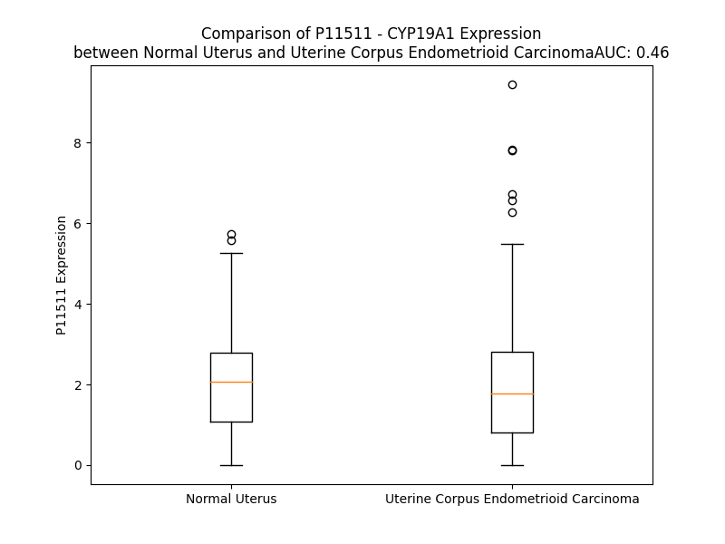

# Detailed Data for P11511

## Introduction to the Detailed Summary

### How to Interpret the Results

- **Summary & Metrics**: This section provides a quick reference to essential protein attributes, including expression changes, family classification, and biomarker applications. Regulation status (upregulated/downregulated) indicates the protein's behavior in a disease context. Some information comes from the original excel file with the proteins selected from literature, while others are derived from the analyses.
- **Expression Comparison**: A visual representation comparing protein expression between normal and disease states. It highlights significant changes in expression levels that might indicate diagnostic or therapeutic relevance. This is data coming from transcriptomics experiments and could not translate similarly to protein levels.
- **Isoform Alignment**: An interactive view of isoform alignments, revealing structural and functional differences between variants of the protein.
- **Interactors & Homologs**: Tables listing known interaction partners and homologous proteins, the more interactors and homologs, the more complex the protein is to design an antibody for.
- **Biological Assemblies**: Information about the structural arrangement of the protein in different assemblies, providing insights into its functional state but also the complexity of the protein to develop antibodies.
- **Combined Per-Residue Information**: A detailed table summarizing residue-level data. This includes predictions for epitope regions, aggregation tendencies, and modifications that might impact the protein's function. Each row corresponds to a residue in the protein, providing insights into specific sites that may be important for research or drug development.
## Summary & Metrics

- **UniProt Accession**: P11511
- **Gene Name**: CYP19A1
- **Protein Name**: Cytochrome P450 19A1 / aromatase
- **Swiss Prot**: CP19A_HUMAN
- **Family**: enzyme
- **Biomarker Application**: diagnosis,efficacy,unspecified application
- **Number of Isoforms**: 2
- **Regulation**: 2
- **(transcriptomics) AUC**: 0.46
- **(transcriptomics) Fold Change**: 1.05
- **(transcriptomics) Regulation**: Downregulated
- **Discotope Epitope Count**: 93
- **Max n_uniprots (Homo)**: 1
- **Max n_uniprots (Hetero)**: N/A

## Expression Comparison

## Isoform Alignment

<pre style='font-size:14px; font-family:monospace;'>P11511-1 MVLEMLNPIHYNITSIVPEAMPAATMPVLLLTGLFLLVWNYEGTSSIPGPGYCMGIGPLISHGRFLWMGIGSACNYYNRVYGEFMRVWISGEETLIISKSSSMFHIMKHNHYSSRFGSKLGLQCIGMHEKGIIFNNNPELWKTTRPFFMKALSGPGLVRMVTVCAESLKTHLDRLEEVTNESGYVDVLTLLRRVMLDTSNTLFLRIPLDESAIVVKIQGYFDAWQALLIKPDIFFKISWLYKKYEKSVKDLKDAIEVLIAEKRRRISTEEKLEECMDFATELILAEKRGDLTRENVNQCILEMLIAAPDTMSVSLFFMLFLIAKHPNVEEAIIKEIQTVIGERDIKIDDIQKLKVMENFIYESMRYQPVVDLVMRKALEDDVIDGYPVKKGTNIILNIGRMHRLEFFPKPNEFTLENFAKNVPYRYFQPFGFGPRGCAGKYIAMVMMKAILVTLLRRFHVKTLQGQCVESIQKIHDLSLHPDETKNMLEMIFTPRNSDRCLEH
P11511-2 MVLEMLNPIHYNITSIVPEAMPAATMPVLLLTGLFLLVWNYEGTSSIPGPGYCMGIGPLISHGRFLWMGIGSACNYYNRVYGEFMRVWISGEETLIISKSSSMFHIMKHNHYSSRFGSKLGLQCIGMHEKGIIFNNNPELWKTTRPFFMKALSGPGLVRMVTVCAESLKTHLDRLEEVTNESGYVDVLTLLRRVMLDTSNTLFLRIPLDGTEIFTLTS---------------------------------------------------------------------------------------------------------------------------------------------------------------------------------------------------------------------------------------------------------------------------------------------
</pre>

## Interactors

| preferredName_A   | preferredName_B   |   score |
|:------------------|:------------------|--------:|
| CYP19A1           | HSD3B1            |   0.988 |
| CYP19A1           | HSD17B1           |   0.984 |
| CYP19A1           | HSD3B2            |   0.979 |
| CYP19A1           | HSD17B3           |   0.972 |
| CYP19A1           | SRD5A1            |   0.972 |
| CYP19A1           | CYP17A1           |   0.971 |
| CYP19A1           | HSD17B2           |   0.966 |
| CYP19A1           | HSD17B7           |   0.961 |
| CYP19A1           | SRD5A2            |   0.961 |
| CYP19A1           | SULT1E1           |   0.959 |
| CYP19A1           | HSD17B12          |   0.956 |
| CYP19A1           | AKR1C3            |   0.956 |
| CYP19A1           | CYP1A1            |   0.953 |
| CYP19A1           | CYP3A4            |   0.95  |
| CYP19A1           | CYP11B1           |   0.949 |
| CYP19A1           | CYP11B2           |   0.947 |
| CYP19A1           | UGT1A7            |   0.945 |
| CYP19A1           | CYP3A5            |   0.944 |
| CYP19A1           | UGT1A4            |   0.941 |
| CYP19A1           | UGT1A8            |   0.941 |
| CYP19A1           | UGT1A1            |   0.94  |
| CYP19A1           | UGT1A10           |   0.939 |
| CYP19A1           | UGT1A6            |   0.939 |
| CYP19A1           | UGT2B17           |   0.937 |
| CYP19A1           | UGT2B15           |   0.936 |
| CYP19A1           | HSD17B6           |   0.936 |
| CYP19A1           | UGT2B7            |   0.935 |
| CYP19A1           | HSD17B8           |   0.932 |
| CYP19A1           | UGT2B4            |   0.929 |
| CYP19A1           | SRD5A3            |   0.928 |
| CYP19A1           | ESR1              |   0.927 |
| CYP19A1           | UGT2A2            |   0.926 |
| CYP19A1           | UGT1A3            |   0.926 |
| CYP19A1           | UGT1A9            |   0.926 |
| CYP19A1           | UGT1A5            |   0.926 |
| CYP19A1           | ESR2              |   0.925 |
| CYP19A1           | UGT2B11           |   0.925 |
| CYP19A1           | UGT2B28           |   0.925 |
| CYP19A1           | UGT2B10           |   0.925 |
| CYP19A1           | UGT2A3            |   0.923 |
| CYP19A1           | AKR1D1            |   0.922 |

## Homologs

| uniprot_id   | gene_id   |
|:-------------|:----------|
| F8VZP1       | CYP4F12   |
| K7EJZ8       | CYP4F3    |
| F5H5Q6       | CYP4B1    |
| A0A087WUC9   | CYP4F8    |
| V9GYK4       | CYP4A11   |
| Q5TCH5       | CYP4A22   |
| Q6NT55       | CYP4F22   |
| K7EK90       | CYP4F2    |
| Q6ZWL3       | CYP4V2    |
| Q8N118       | CYP4X1    |
| Q86W10       | CYP4Z1    |
| F8W978       | CYP4F11   |

## Biological Assemblies

|   Unnamed: 0 |   assembly |   n_uniprots | composition   | crystal_id   |
|-------------:|-----------:|-------------:|:--------------|:-------------|
|            0 |          1 |            1 | Homo          | 3s79         |
|            0 |          1 |            1 | Homo          | 4gl5         |
|            0 |          1 |            1 | Homo          | 5jl7         |
|            0 |          1 |            1 | Homo          | 5jkw         |
|            0 |          1 |            1 | Homo          | 5jl9         |
|            0 |          1 |            1 | Homo          | 5jkv         |
|            0 |          1 |            1 | Homo          | 5jl6         |
|            0 |          1 |            1 | Homo          | 4kq8         |
|            0 |          1 |            1 | Homo          | 4gl7         |
|            0 |          1 |            1 | Homo          | 3s7s         |
|            0 |          1 |            1 | Homo          | 3eqm         |

## Combined Per-Residue Information

|   res | aa   |   epitope_score | epitope   |   relative_surface_accessibility |   modeling_confidence |   Aggregation | modification   |
|------:|:-----|----------------:|:----------|---------------------------------:|----------------------:|--------------:|:---------------|
|     1 | M    |         0.09088 | False     |                          1.26827 |                 40.21 |         0     | N/A            |
|     2 | V    |         0.10394 | False     |                          0.85931 |                 39.67 |         0     | N/A            |
|     3 | L    |         0.12095 | False     |                          1.08337 |                 31.47 |         0     | N/A            |
|     4 | E    |         0.1619  | True      |                          0.74229 |                 42.89 |         0     | N/A            |
|     5 | M    |         0.13869 | False     |                          0.87251 |                 42.41 |         0     | N/A            |
|     6 | L    |         0.12989 | False     |                          1.01798 |                 33.22 |         0     | N/A            |
|     7 | N    |         0.10495 | False     |                          0.86122 |                 36.86 |         0     | N/A            |
|     8 | P    |         0.08387 | False     |                          0.82739 |                 40.19 |         0     | N/A            |
|     9 | I    |         0.11752 | False     |                          0.96184 |                 42.02 |         0     | N/A            |
|    10 | H    |         0.18303 | True      |                          0.88672 |                 35.14 |         0     | N/A            |
|    11 | Y    |         0.23915 | True      |                          0.86627 |                 39.63 |         0     | N/A            |
|    12 | N    |         0.12706 | False     |                          0.74496 |                 33.69 |         0     | N/A            |
|    13 | I    |         0.168   | True      |                          0.97625 |                 40.51 |         0     | N/A            |
|    14 | T    |         0.17659 | True      |                          0.99329 |                 32.64 |         0     | N/A            |
|    15 | S    |         0.13398 | False     |                          0.69096 |                 33.59 |         0     | N/A            |
|    16 | I    |         0.18237 | True      |                          1.03711 |                 38.78 |         0     | N/A            |
|    17 | V    |         0.10654 | False     |                          0.78922 |                 42.15 |         0     | N/A            |
|    18 | P    |         0.18566 | True      |                          0.85723 |                 41.3  |         0     | N/A            |
|    19 | E    |         0.21808 | True      |                          0.73044 |                 45.46 |         0     | N/A            |
|    20 | A    |         0.11582 | False     |                          0.87628 |                 49    |         0     | N/A            |
|    21 | M    |         0.102   | False     |                          0.65117 |                 56.68 |         0     | N/A            |
|    22 | P    |         0.12238 | False     |                          0.63487 |                 60.55 |         0     | N/A            |
|    23 | A    |         0.12723 | False     |                          0.93598 |                 62.19 |         0     | N/A            |
|    24 | A    |         0.08694 | False     |                          0.60771 |                 67.23 |         0     | N/A            |
|    25 | T    |         0.05183 | False     |                          0.27111 |                 72.86 |         0     | N/A            |
|    26 | M    |         0.0744  | False     |                          0.65209 |                 71.4  |         0     | N/A            |
|    27 | P    |         0.05514 | False     |                          0.4667  |                 77.56 |         1.088 | N/A            |
|    28 | V    |         0.02545 | False     |                          0.596   |                 80.71 |        89.728 | N/A            |
|    29 | L    |         0.0386  | False     |                          0.64277 |                 80.26 |        97.258 | N/A            |
|    30 | L    |         0.04373 | False     |                          0.76619 |                 80.61 |        98.637 | N/A            |
|    31 | L    |         0.04922 | False     |                          0.60732 |                 80.95 |        98.89  | N/A            |
|    32 | T    |         0.04562 | False     |                          0.47024 |                 79.22 |        98.936 | N/A            |
|    33 | G    |         0.04057 | False     |                          0.30776 |                 78.67 |        99.006 | N/A            |
|    34 | L    |         0.07036 | False     |                          0.67563 |                 78.1  |        99.853 | N/A            |
|    35 | F    |         0.04539 | False     |                          0.70249 |                 75.43 |        99.976 | N/A            |
|    36 | L    |         0.04438 | False     |                          0.40398 |                 66.75 |        99.928 | N/A            |
|    37 | L    |         0.10399 | False     |                          0.78169 |                 69.26 |        99.657 | N/A            |
|    38 | V    |         0.07238 | False     |                          0.49685 |                 67.39 |        98.177 | N/A            |
|    39 | W    |         0.07075 | False     |                          0.78253 |                 64.86 |        80.607 | N/A            |
|    40 | N    |         0.0488  | False     |                          0.18144 |                 63.15 |         8.6   | N/A            |
|    41 | Y    |         0.09145 | False     |                          0.73947 |                 58.14 |         7.575 | N/A            |
|    42 | E    |         0.07517 | False     |                          0.66909 |                 55.4  |         0     | N/A            |
|    43 | G    |         0.06469 | False     |                          0.52637 |                 54.15 |         0     | N/A            |
|    44 | T    |         0.05627 | False     |                          0.32987 |                 52.97 |         0     | N/A            |
|    45 | S    |         0.12592 | False     |                          0.63449 |                 52.1  |         0     | N/A            |
|    46 | S    |         0.07889 | False     |                          0.46783 |                 79.73 |         0     | N/A            |
|    47 | I    |         0.07405 | False     |                          0.1286  |                 90.87 |         0     | N/A            |
|    48 | P    |         0.04348 | False     |                          0.36043 |                 94.25 |         0     | N/A            |
|    49 | G    |         0.03372 | False     |                          0.16942 |                 94.62 |         0     | N/A            |
|    50 | P    |         0.0642  | False     |                          0.15706 |                 93.36 |         0     | N/A            |
|    51 | G    |         0.08925 | False     |                          0.33471 |                 90.14 |         0     | N/A            |
|    52 | Y    |         0.08226 | False     |                          0.35886 |                 87.94 |         0     | N/A            |
|    53 | C    |         0.05398 | False     |                          0.40354 |                 87.79 |         0     | N/A            |
|    54 | M    |         0.11844 | False     |                          0.83614 |                 84.72 |         0     | N/A            |
|    55 | G    |         0.11564 | False     |                          0.36006 |                 87.77 |         0     | N/A            |
|    56 | I    |         0.12732 | False     |                          0.58157 |                 91.71 |         0     | N/A            |
|    57 | G    |         0.02609 | False     |                          0.07711 |                 91.5  |         0     | N/A            |
|    58 | P    |         0.03408 | False     |                          0.12162 |                 94.64 |         0     | N/A            |
|    59 | L    |         0.13304 | False     |                          0.76471 |                 94.39 |         0     | N/A            |
|    60 | I    |         0.07465 | False     |                          0.63684 |                 95.17 |         0     | N/A            |
|    61 | S    |         0.01075 | False     |                          0.00892 |                 96.53 |         0     | N/A            |
|    62 | H    |         0.05449 | False     |                          0.08827 |                 97.04 |         0     | N/A            |
|    63 | G    |         0.12938 | False     |                          0.38219 |                 96.97 |         0     | N/A            |
|    64 | R    |         0.06545 | False     |                          0.28443 |                 97.78 |         0     | N/A            |
|    65 | F    |         0.00447 | False     |                          0.00609 |                 97.93 |         7.746 | N/A            |
|    66 | L    |         0.09809 | False     |                          0.39688 |                 96.49 |         8.281 | N/A            |
|    67 | W    |         0.24823 | True      |                          0.95628 |                 97.09 |         8.281 | N/A            |
|    68 | M    |         0.13747 | False     |                          0.32216 |                 97.32 |         8.281 | N/A            |
|    69 | G    |         0.02572 | False     |                          0.11594 |                 96.66 |         8.281 | N/A            |
|    70 | I    |         0.00818 | False     |                          0.004   |                 97.9  |         7.68  | N/A            |
|    71 | G    |         0.00306 | False     |                          0.00322 |                 97.52 |         0.59  | N/A            |
|    72 | S    |         0.03912 | False     |                          0.24836 |                 97.99 |         0     | N/A            |
|    73 | A    |         0.00149 | False     |                          0       |                 98.35 |         0     | N/A            |
|    74 | C    |         0.00287 | False     |                          0.003   |                 98.53 |         0     | N/A            |
|    75 | N    |         0.02481 | False     |                          0.20413 |                 98.24 |         0     | N/A            |
|    76 | Y    |         0.12597 | False     |                          0.28177 |                 98.47 |         0     | N/A            |
|    77 | Y    |         0.01641 | False     |                          0.03306 |                 98.41 |         0     | N/A            |
|    78 | N    |         0.00644 | False     |                          0.00573 |                 98.19 |         0     | N/A            |
|    79 | R    |         0.11198 | False     |                          0.64869 |                 97.79 |         0     | N/A            |
|    80 | V    |         0.1451  | True      |                          0.55461 |                 97.43 |         2.002 | N/A            |
|    81 | Y    |         0.05294 | False     |                          0.35113 |                 96.56 |         2.002 | N/A            |
|    82 | G    |         0.08868 | False     |                          0.34632 |                 96.36 |         2.002 | N/A            |
|    83 | E    |         0.06269 | False     |                          0.2218  |                 97.58 |         2.36  | N/A            |
|    84 | F    |         0.03567 | False     |                          0.03165 |                 97.92 |         2.36  | N/A            |
|    85 | M    |         0.00198 | False     |                          0       |                 97.81 |         2.36  | N/A            |
|    86 | R    |         0.05635 | False     |                          0.09739 |                 97.62 |         2.36  | N/A            |
|    87 | V    |         0.0016  | False     |                          0       |                 97.73 |         2.722 | N/A            |
|    88 | W    |         0.02651 | False     |                          0.04738 |                 97.69 |         2.722 | N/A            |
|    89 | I    |         0.01473 | False     |                          0.02831 |                 96.3  |         2.722 | N/A            |
|    90 | S    |         0.06393 | False     |                          0.4739  |                 89.95 |         1.324 | N/A            |
|    91 | G    |         0.1281  | False     |                          0.67807 |                 87.42 |         0.362 | N/A            |
|    92 | E    |         0.04938 | False     |                          0.43089 |                 93.7  |         0     | N/A            |
|    93 | E    |         0.02731 | False     |                          0.30512 |                 96.1  |         0     | N/A            |
|    94 | T    |         0.00211 | False     |                          0       |                 98.41 |         2.899 | N/A            |
|    95 | L    |         0.00517 | False     |                          0.00989 |                 98.5  |         2.899 | N/A            |
|    96 | I    |         0.00164 | False     |                          0       |                 98.64 |         2.899 | N/A            |
|    97 | I    |         0.00547 | False     |                          0.00532 |                 98.56 |         2.899 | N/A            |
|    98 | S    |         0.00585 | False     |                          0.01239 |                 98.2  |         2.899 | N/A            |
|    99 | K    |         0.08128 | False     |                          0.37251 |                 97.52 |         0     | N/A            |
|   100 | S    |         0.02737 | False     |                          0.02303 |                 97.47 |         0     | N/A            |
|   101 | S    |         0.04562 | False     |                          0.34031 |                 97.4  |         0     | N/A            |
|   102 | S    |         0.00377 | False     |                          0       |                 97.88 |         0     | N/A            |
|   103 | M    |         0.01137 | False     |                          0.00647 |                 97.96 |         0     | N/A            |
|   104 | F    |         0.05604 | False     |                          0.23759 |                 97.75 |         0     | N/A            |
|   105 | H    |         0.17173 | True      |                          0.25265 |                 98.1  |         0     | N/A            |
|   106 | I    |         0.00439 | False     |                          0       |                 98.45 |         0     | N/A            |
|   107 | M    |         0.00495 | False     |                          0.00139 |                 97.68 |         0     | N/A            |
|   108 | K    |         0.16412 | True      |                          0.55676 |                 97.53 |         0     | N/A            |
|   109 | H    |         0.13707 | False     |                          0.35524 |                 97.9  |         0     | N/A            |
|   110 | N    |         0.17112 | True      |                          0.69255 |                 97.15 |         0     | N/A            |
|   111 | H    |         0.16744 | True      |                          0.16506 |                 97.7  |         0     | N/A            |
|   112 | Y    |         0.00439 | False     |                          0       |                 98.24 |         0     | N/A            |
|   113 | S    |         0.04906 | False     |                          0.07094 |                 97.57 |         0     | N/A            |
|   114 | S    |         0.02745 | False     |                          0.01552 |                 98.15 |         0     | N/A            |
|   115 | R    |         0.06853 | False     |                          0.1902  |                 98.11 |         0     | N/A            |
|   116 | F    |         0.04488 | False     |                          0.05391 |                 98.05 |         0     | N/A            |
|   117 | G    |         0.0362  | False     |                          0.30812 |                 97.1  |         0     | N/A            |
|   118 | S    |         0.06957 | False     |                          0.08012 |                 96.9  |         0     | N/A            |
|   119 | K    |         0.08903 | False     |                          0.60041 |                 97.05 |         0     | N/A            |
|   120 | L    |         0.20077 | True      |                          0.43418 |                 96.68 |         0     | N/A            |
|   121 | G    |         0.00452 | False     |                          0       |                 97.39 |         0     | N/A            |
|   122 | L    |         0.01118 | False     |                          0.02143 |                 98.09 |         0     | N/A            |
|   123 | Q    |         0.16426 | True      |                          0.43233 |                 97.59 |         0     | N/A            |
|   124 | C    |         0.08958 | False     |                          0.21385 |                 96.6  |         0     | N/A            |
|   125 | I    |         0.00789 | False     |                          0       |                 97.13 |         0     | N/A            |
|   126 | G    |         0.02778 | False     |                          0.03541 |                 96.94 |         0     | N/A            |
|   127 | M    |         0.00356 | False     |                          0       |                 98.29 |         0     | N/A            |
|   128 | H    |         0.05777 | False     |                          0.25727 |                 98.15 |         0     | N/A            |
|   129 | E    |         0.05476 | False     |                          0.35805 |                 97.69 |         0     | N/A            |
|   130 | K    |         0.07001 | False     |                          0.26317 |                 98.12 |         0     | N/A            |
|   131 | G    |         0.00201 | False     |                          0       |                 97.75 |         0.882 | N/A            |
|   132 | I    |         0.05291 | False     |                          0.09464 |                 98.15 |         0.882 | N/A            |
|   133 | I    |         0.04136 | False     |                          0.23175 |                 97.72 |         0.882 | N/A            |
|   134 | F    |         0.02048 | False     |                          0.03656 |                 97.99 |         0.882 | N/A            |
|   135 | N    |         0.00286 | False     |                          0       |                 98.06 |         0.882 | N/A            |
|   136 | N    |         0.02586 | False     |                          0.25016 |                 96.48 |         0     | N/A            |
|   137 | N    |         0.06798 | False     |                          0.2421  |                 97.11 |         0     | N/A            |
|   138 | P    |         0.09845 | False     |                          0.44643 |                 94.75 |         0     | N/A            |
|   139 | E    |         0.18017 | True      |                          0.64032 |                 95.96 |         0     | N/A            |
|   140 | L    |         0.08351 | False     |                          0.44256 |                 96.99 |         0     | N/A            |
|   141 | W    |         0.04539 | False     |                          0.0771  |                 98.12 |         0     | N/A            |
|   142 | K    |         0.11455 | False     |                          0.70755 |                 96.8  |         0     | N/A            |
|   143 | T    |         0.1596  | True      |                          0.55014 |                 96.89 |         0     | N/A            |
|   144 | T    |         0.00455 | False     |                          0       |                 98.17 |         0     | N/A            |
|   145 | R    |         0.0448  | False     |                          0.11526 |                 97.97 |         0     | N/A            |
|   146 | P    |         0.13185 | False     |                          0.53001 |                 97.43 |         0     | N/A            |
|   147 | F    |         0.07326 | False     |                          0.18385 |                 97.26 |         0     | N/A            |
|   148 | F    |         0.01883 | False     |                          0.03503 |                 97.71 |         0     | N/A            |
|   149 | M    |         0.05302 | False     |                          0.38304 |                 96.28 |         0     | N/A            |
|   150 | K    |         0.19825 | True      |                          0.64619 |                 94.98 |         0     | N/A            |
|   151 | A    |         0.02938 | False     |                          0.16237 |                 95.05 |         0     | N/A            |
|   152 | L    |         0.02512 | False     |                          0.09983 |                 95.36 |         0     | N/A            |
|   153 | S    |         0.07489 | False     |                          0.33962 |                 91.47 |         0     | N/A            |
|   154 | G    |         0.11066 | False     |                          0.5433  |                 88.91 |         0     | N/A            |
|   155 | P    |         0.15287 | True      |                          0.70375 |                 87.86 |         0     | N/A            |
|   156 | G    |         0.04097 | False     |                          0.09967 |                 86.83 |         0     | N/A            |
|   157 | L    |         0.03098 | False     |                          0.19043 |                 90.57 |         0     | N/A            |
|   158 | V    |         0.12595 | False     |                          0.52571 |                 92.22 |         0     | N/A            |
|   159 | R    |         0.0747  | False     |                          0.43317 |                 91.5  |         0     | N/A            |
|   160 | M    |         0.00366 | False     |                          0.00719 |                 92.69 |         5.422 | N/A            |
|   161 | V    |         0.00673 | False     |                          0.00571 |                 93.6  |         7.572 | N/A            |
|   162 | T    |         0.10348 | False     |                          0.5547  |                 93.46 |         7.572 | N/A            |
|   163 | V    |         0.02538 | False     |                          0.20892 |                 95.54 |         7.572 | N/A            |
|   164 | C    |         0.00163 | False     |                          0       |                 95.74 |         7.572 | N/A            |
|   165 | A    |         0.00711 | False     |                          0.04209 |                 96.13 |         4.604 | N/A            |
|   166 | E    |         0.05631 | False     |                          0.42344 |                 96.76 |         0     | N/A            |
|   167 | S    |         0.01949 | False     |                          0.0587  |                 97.4  |         0     | N/A            |
|   168 | L    |         0.00139 | False     |                          0       |                 97.94 |         0     | N/A            |
|   169 | K    |         0.05378 | False     |                          0.26034 |                 97.02 |         0     | N/A            |
|   170 | T    |         0.07484 | False     |                          0.50522 |                 97.48 |         0     | N/A            |
|   171 | H    |         0.03736 | False     |                          0.0563  |                 98.03 |         0     | N/A            |
|   172 | L    |         0.01974 | False     |                          0.03014 |                 97.11 |         0     | N/A            |
|   173 | D    |         0.09829 | False     |                          0.55801 |                 96.99 |         0     | N/A            |
|   174 | R    |         0.09636 | False     |                          0.35437 |                 96.14 |         0     | N/A            |
|   175 | L    |         0.05929 | False     |                          0.17936 |                 95.21 |         0     | N/A            |
|   176 | E    |         0.22524 | True      |                          0.65288 |                 94.98 |         0     | N/A            |
|   177 | E    |         0.12286 | False     |                          0.46761 |                 95.74 |         0     | N/A            |
|   178 | V    |         0.04485 | False     |                          0.10813 |                 95.86 |         0     | N/A            |
|   179 | T    |         0.09122 | False     |                          0.2985  |                 96.34 |         0     | N/A            |
|   180 | N    |         0.06395 | False     |                          0.44521 |                 93.99 |         0     | N/A            |
|   181 | E    |         0.15787 | True      |                          0.98965 |                 92.97 |         0     | N/A            |
|   182 | S    |         0.16056 | True      |                          0.58606 |                 92.96 |         0     | N/A            |
|   183 | G    |         0.09341 | False     |                          0.3839  |                 93.78 |         0.163 | N/A            |
|   184 | Y    |         0.11183 | False     |                          0.3227  |                 96.13 |         0.406 | N/A            |
|   185 | V    |         0.01219 | False     |                          0.01142 |                 97.44 |         0.478 | N/A            |
|   186 | D    |         0.06002 | False     |                          0.3376  |                 96.87 |         0.478 | N/A            |
|   187 | V    |         0.00331 | False     |                          0.00504 |                 97.13 |        32.499 | N/A            |
|   188 | L    |         0.01371 | False     |                          0.03722 |                 96.91 |        32.499 | N/A            |
|   189 | T    |         0.02107 | False     |                          0.23863 |                 96.91 |        32.499 | N/A            |
|   190 | L    |         0.00666 | False     |                          0.01237 |                 98.07 |        32.499 | N/A            |
|   191 | L    |         0.00137 | False     |                          0.00082 |                 98.4  |        32.499 | N/A            |
|   192 | R    |         0.01081 | False     |                          0.07247 |                 98.29 |         0.478 | N/A            |
|   193 | R    |         0.026   | False     |                          0.12953 |                 98.18 |         0     | N/A            |
|   194 | V    |         0.00196 | False     |                          0       |                 98.1  |         0     | N/A            |
|   195 | M    |         0.00177 | False     |                          0.00139 |                 98.14 |         0     | N/A            |
|   196 | L    |         0.00072 | False     |                          0       |                 98.25 |         0     | N/A            |
|   197 | D    |         0.02494 | False     |                          0.18297 |                 98.13 |         0     | N/A            |
|   198 | T    |         0.00156 | False     |                          0.0019  |                 96.73 |         0     | N/A            |
|   199 | S    |         0.00861 | False     |                          0.00949 |                 96.62 |         0.171 | N/A            |
|   200 | N    |         0.02779 | False     |                          0.09246 |                 97.49 |         0.366 | N/A            |
|   201 | T    |         0.03898 | False     |                          0.40576 |                 95.61 |         0.366 | N/A            |
|   202 | L    |         0.01114 | False     |                          0.04312 |                 94.18 |         0.366 | N/A            |
|   203 | F    |         0.01091 | False     |                          0.06016 |                 96.33 |         0.366 | N/A            |
|   204 | L    |         0.00435 | False     |                          0.00165 |                 96.03 |         0.366 | N/A            |
|   205 | R    |         0.09346 | False     |                          0.35544 |                 94.17 |         0     | N/A            |
|   206 | I    |         0.06517 | False     |                          0.027   |                 96.38 |         0     | N/A            |
|   207 | P    |         0.18913 | True      |                          0.76378 |                 96.22 |         0     | N/A            |
|   208 | L    |         0.06107 | False     |                          0.21077 |                 96.8  |         0     | N/A            |
|   209 | D    |         0.11973 | False     |                          0.53141 |                 96.26 |         0     | N/A            |
|   210 | E    |         0.02824 | False     |                          0.20778 |                 95.49 |         0     | N/A            |
|   211 | S    |         0.06744 | False     |                          0.37529 |                 95.2  |         5.791 | N/A            |
|   212 | A    |         0.09518 | False     |                          0.37739 |                 97.38 |        32.237 | N/A            |
|   213 | I    |         0.03636 | False     |                          0.0544  |                 97.92 |        37.761 | N/A            |
|   214 | V    |         0.0259  | False     |                          0.06565 |                 97.66 |        38.197 | N/A            |
|   215 | V    |         0.15001 | True      |                          0.77441 |                 97.15 |        38.197 | N/A            |
|   216 | K    |         0.11563 | False     |                          0.29381 |                 98.02 |        32.505 | N/A            |
|   217 | I    |         0.03312 | False     |                          0.0168  |                 97.76 |        32.656 | N/A            |
|   218 | Q    |         0.02233 | False     |                          0.22264 |                 95.94 |        32.656 | N/A            |
|   219 | G    |         0.05427 | False     |                          0.20822 |                 96.75 |        32.656 | N/A            |
|   220 | Y    |         0.00409 | False     |                          0.00113 |                 98    |        32.656 | N/A            |
|   221 | F    |         0.02738 | False     |                          0.08222 |                 96.22 |        32.656 | N/A            |
|   222 | D    |         0.10654 | False     |                          0.40267 |                 95.31 |        32.505 | N/A            |
|   223 | A    |         0.00481 | False     |                          0       |                 96.91 |        36.281 | N/A            |
|   224 | W    |         0.03901 | False     |                          0.10116 |                 96.98 |        40.798 | N/A            |
|   225 | Q    |         0.04056 | False     |                          0.10764 |                 95.15 |        39.579 | N/A            |
|   226 | A    |         0.06157 | False     |                          0.17612 |                 95.08 |        39.579 | N/A            |
|   227 | L    |         0.0074  | False     |                          0       |                 96.69 |        39.579 | N/A            |
|   228 | L    |         0.00479 | False     |                          0.00082 |                 96.94 |        39.404 | N/A            |
|   229 | I    |         0.03734 | False     |                          0.0504  |                 96.32 |        36.05  | N/A            |
|   230 | K    |         0.14628 | True      |                          0.20904 |                 95.99 |         0     | N/A            |
|   231 | P    |         0.18696 | True      |                          0.25349 |                 95.44 |         0     | N/A            |
|   232 | D    |         0.27085 | True      |                          0.53598 |                 94.56 |         3.353 | N/A            |
|   233 | I    |         0.34534 | True      |                          0.71019 |                 93.25 |         3.353 | N/A            |
|   234 | F    |         0.18906 | True      |                          0.15464 |                 94.38 |         3.353 | N/A            |
|   235 | F    |         0.0767  | False     |                          0.14621 |                 94.6  |         3.353 | N/A            |
|   236 | K    |         0.37981 | True      |                          0.85169 |                 92.6  |         3.353 | N/A            |
|   237 | I    |         0.18851 | True      |                          0.33679 |                 93.11 |         4.02  | N/A            |
|   238 | S    |         0.33378 | True      |                          0.31271 |                 89.24 |         3.387 | N/A            |
|   239 | W    |         0.31283 | True      |                          0.86847 |                 90.54 |         3.387 | N/A            |
|   240 | L    |         0.23304 | True      |                          0.48755 |                 90.21 |         3.055 | N/A            |
|   241 | Y    |         0.10778 | False     |                          0.18468 |                 91.66 |         2.395 | N/A            |
|   242 | K    |         0.31164 | True      |                          0.5353  |                 91.27 |         0     | N/A            |
|   243 | K    |         0.18155 | True      |                          0.76115 |                 92.43 |         0     | N/A            |
|   244 | Y    |         0.13956 | False     |                          0.2413  |                 95.23 |         0     | N/A            |
|   245 | E    |         0.27051 | True      |                          0.39864 |                 95.01 |         0     | N/A            |
|   246 | K    |         0.23012 | True      |                          0.67706 |                 96.55 |         0     | N/A            |
|   247 | S    |         0.0654  | False     |                          0.21404 |                 96.82 |         0     | N/A            |
|   248 | V    |         0.02362 | False     |                          0.03618 |                 97.64 |         0     | N/A            |
|   249 | K    |         0.14071 | False     |                          0.59274 |                 97.67 |         0     | N/A            |
|   250 | D    |         0.06708 | False     |                          0.31369 |                 97.87 |         0     | N/A            |
|   251 | L    |         0.0013  | False     |                          0       |                 98.06 |         0     | N/A            |
|   252 | K    |         0.03391 | False     |                          0.3119  |                 97.94 |         0     | N/A            |
|   253 | D    |         0.08367 | False     |                          0.41796 |                 97.97 |         0     | N/A            |
|   254 | A    |         0.02799 | False     |                          0.1908  |                 98.03 |         0     | N/A            |
|   255 | I    |         0.02086 | False     |                          0.02    |                 97.26 |         0     | N/A            |
|   256 | E    |         0.0855  | False     |                          0.30558 |                 97.29 |         0     | N/A            |
|   257 | V    |         0.10221 | False     |                          0.72204 |                 98.04 |         0     | N/A            |
|   258 | L    |         0.05405 | False     |                          0.08903 |                 97.97 |         0     | N/A            |
|   259 | I    |         0.00379 | False     |                          0.0024  |                 97.18 |         0     | N/A            |
|   260 | A    |         0.08594 | False     |                          0.35756 |                 97.33 |         0     | N/A            |
|   261 | E    |         0.09058 | False     |                          0.19009 |                 96.45 |         0     | N/A            |
|   262 | K    |         0.04072 | False     |                          0.05795 |                 95.8  |         0     | N/A            |
|   263 | R    |         0.09883 | False     |                          0.13789 |                 95.23 |         0     | N/A            |
|   264 | R    |         0.33015 | True      |                          0.59734 |                 94.36 |         0     | N/A            |
|   265 | R    |         0.12679 | False     |                          0.41776 |                 93.27 |         0     | N/A            |
|   266 | I    |         0.11779 | False     |                          0.04537 |                 91.82 |         0     | N/A            |
|   267 | S    |         0.24662 | True      |                          0.62097 |                 88.21 |         0     | N/A            |
|   268 | T    |         0.16912 | True      |                          0.79012 |                 87.76 |         0     | N/A            |
|   269 | E    |         0.14959 | True      |                          0.44451 |                 82.76 |         0     | N/A            |
|   270 | E    |         0.21106 | True      |                          0.89351 |                 68.25 |         0     | N/A            |
|   271 | K    |         0.19113 | True      |                          0.62917 |                 74.78 |         0     | N/A            |
|   272 | L    |         0.19288 | True      |                          0.36346 |                 74.04 |         0     | N/A            |
|   273 | E    |         0.27253 | True      |                          0.82186 |                 69.24 |         0     | N/A            |
|   274 | E    |         0.17438 | True      |                          0.68314 |                 66.1  |         0     | N/A            |
|   275 | C    |         0.08068 | False     |                          0.21005 |                 63.14 |         0     | N/A            |
|   276 | M    |         0.149   | True      |                          0.40021 |                 84.3  |         0     | N/A            |
|   277 | D    |         0.03886 | False     |                          0.04168 |                 93.12 |         0     | N/A            |
|   278 | F    |         0.02069 | False     |                          0.02199 |                 96.38 |         0     | N/A            |
|   279 | A    |         0.00128 | False     |                          0       |                 97.12 |         0     | N/A            |
|   280 | T    |         0.0042  | False     |                          0       |                 95.67 |         0     | N/A            |
|   281 | E    |         0.08117 | False     |                          0.119   |                 95.22 |         0     | N/A            |
|   282 | L    |         0.004   | False     |                          0       |                 97.45 |         0     | N/A            |
|   283 | I    |         0.02254 | False     |                          0.0136  |                 96.74 |         0     | N/A            |
|   284 | L    |         0.07595 | False     |                          0.20315 |                 94.44 |         0     | N/A            |
|   285 | A    |         0.0081  | False     |                          0       |                 95.9  |         0     | N/A            |
|   286 | E    |         0.13991 | False     |                          0.19611 |                 96.38 |         0     | N/A            |
|   287 | K    |         0.18665 | True      |                          0.63577 |                 94.31 |         0     | N/A            |
|   288 | R    |         0.24662 | True      |                          0.60204 |                 95.05 |         0     | N/A            |
|   289 | G    |         0.1761  | True      |                          0.76832 |                 94.99 |         0     | N/A            |
|   290 | D    |         0.24998 | True      |                          0.53101 |                 95.15 |         0     | N/A            |
|   291 | L    |         0.05302 | False     |                          0.07406 |                 96.48 |         0     | N/A            |
|   292 | T    |         0.20966 | True      |                          0.64428 |                 97.57 |         0     | N/A            |
|   293 | R    |         0.15309 | True      |                          0.43937 |                 97.45 |         0     | N/A            |
|   294 | E    |         0.06927 | False     |                          0.56983 |                 97.4  |         0     | N/A            |
|   295 | N    |         0.01669 | False     |                          0.03964 |                 97.79 |         0     | N/A            |
|   296 | V    |         0.00212 | False     |                          0       |                 98.28 |         0     | N/A            |
|   297 | N    |         0.03806 | False     |                          0.15064 |                 98.29 |         0     | N/A            |
|   298 | Q    |         0.01642 | False     |                          0.04156 |                 98.45 |         0     | N/A            |
|   299 | C    |         0.003   | False     |                          0       |                 98.67 |         0     | N/A            |
|   300 | I    |         0.00958 | False     |                          0.0112  |                 98.49 |         0     | N/A            |
|   301 | L    |         0.01139 | False     |                          0.02226 |                 98.49 |         0     | N/A            |
|   302 | E    |         0.00847 | False     |                          0.00585 |                 98.57 |         0     | N/A            |
|   303 | M    |         0.00823 | False     |                          0.04619 |                 98.18 |         0     | N/A            |
|   304 | L    |         0.0019  | False     |                          0.0033  |                 97.88 |         0     | N/A            |
|   305 | I    |         0.01656 | False     |                          0.0112  |                 97.65 |         0     | N/A            |
|   306 | A    |         0.03083 | False     |                          0.41138 |                 97.49 |         0     | N/A            |
|   307 | A    |         0.01499 | False     |                          0.0953  |                 96.91 |         0     | N/A            |
|   308 | P    |         0.01248 | False     |                          0.00911 |                 97.57 |         0     | N/A            |
|   309 | D    |         0.03141 | False     |                          0.09477 |                 93.41 |         0.004 | N/A            |
|   310 | T    |         0.03343 | False     |                          0.35354 |                 97.19 |        15.611 | N/A            |
|   311 | M    |         0.02223 | False     |                          0.0543  |                 97.65 |        41.842 | N/A            |
|   312 | S    |         0.00245 | False     |                          0       |                 98.19 |        45.396 | N/A            |
|   313 | V    |         0.00727 | False     |                          0.04189 |                 98.27 |        74.045 | N/A            |
|   314 | S    |         0.0129  | False     |                          0.09478 |                 98.64 |        76.479 | N/A            |
|   315 | L    |         0.00333 | False     |                          0.00247 |                 98.71 |        96.088 | N/A            |
|   316 | F    |         0.00235 | False     |                          0.00064 |                 98.41 |        99.672 | N/A            |
|   317 | F    |         0.00429 | False     |                          0.00686 |                 98.53 |        99.958 | N/A            |
|   318 | M    |         0.01132 | False     |                          0.01007 |                 98.74 |        99.969 | N/A            |
|   319 | L    |         0.00383 | False     |                          0.00742 |                 98.38 |        99.966 | N/A            |
|   320 | F    |         0.00244 | False     |                          0.00101 |                 97.62 |        99.867 | N/A            |
|   321 | L    |         0.00785 | False     |                          0.01649 |                 98.2  |        98.581 | N/A            |
|   322 | I    |         0.00403 | False     |                          0.00278 |                 98.05 |        91.522 | N/A            |
|   323 | A    |         0.01242 | False     |                          0.2358  |                 96.91 |        41.938 | N/A            |
|   324 | K    |         0.05625 | False     |                          0.38624 |                 95.95 |         0.004 | N/A            |
|   325 | H    |         0.06307 | False     |                          0.27117 |                 97.23 |         0     | N/A            |
|   326 | P    |         0.11387 | False     |                          0.60686 |                 95.91 |         0     | N/A            |
|   327 | N    |         0.07989 | False     |                          0.66202 |                 97.43 |         0     | N/A            |
|   328 | V    |         0.01413 | False     |                          0.07712 |                 98.17 |         0     | N/A            |
|   329 | E    |         0.01544 | False     |                          0.0488  |                 98.04 |         0     | N/A            |
|   330 | E    |         0.08938 | False     |                          0.64295 |                 97.9  |         0     | N/A            |
|   331 | A    |         0.04256 | False     |                          0.37071 |                 98.29 |         0     | N/A            |
|   332 | I    |         0.00433 | False     |                          0       |                 98.47 |         0     | N/A            |
|   333 | I    |         0.04828 | False     |                          0.14799 |                 98.08 |         0     | N/A            |
|   334 | K    |         0.1115  | False     |                          0.71766 |                 98.14 |         0     | N/A            |
|   335 | E    |         0.06217 | False     |                          0.10028 |                 98.38 |         0     | N/A            |
|   336 | I    |         0.01633 | False     |                          0.0216  |                 98.08 |         3.304 | N/A            |
|   337 | Q    |         0.12856 | False     |                          0.60212 |                 97.37 |         3.304 | N/A            |
|   338 | T    |         0.2195  | True      |                          0.7864  |                 97.78 |         3.304 | N/A            |
|   339 | V    |         0.08635 | False     |                          0.26064 |                 97.88 |         3.304 | N/A            |
|   340 | I    |         0.06912 | False     |                          0.05054 |                 97.04 |         3.304 | N/A            |
|   341 | G    |         0.05249 | False     |                          0.24166 |                 94.2  |         1.328 | N/A            |
|   342 | E    |         0.14319 | True      |                          0.83827 |                 91.45 |         0     | N/A            |
|   343 | R    |         0.21    | True      |                          0.53495 |                 93.65 |         0     | N/A            |
|   344 | D    |         0.10713 | False     |                          0.47395 |                 91.15 |         0     | N/A            |
|   345 | I    |         0.03103 | False     |                          0.05959 |                 94.98 |         0     | N/A            |
|   346 | K    |         0.10261 | False     |                          0.53855 |                 94.9  |         0     | N/A            |
|   347 | I    |         0.11092 | False     |                          0.21522 |                 94.18 |         0     | N/A            |
|   348 | D    |         0.16074 | True      |                          0.57251 |                 94.99 |         0     | N/A            |
|   349 | D    |         0.03248 | False     |                          0.07429 |                 96.65 |         0     | N/A            |
|   350 | I    |         0.05606 | False     |                          0.0496  |                 95.6  |         0     | N/A            |
|   351 | Q    |         0.18669 | True      |                          0.61861 |                 95.16 |         0     | N/A            |
|   352 | K    |         0.17339 | True      |                          0.59184 |                 97.84 |         0     | N/A            |
|   353 | L    |         0.00279 | False     |                          0       |                 97.98 |         0.677 | N/A            |
|   354 | K    |         0.0957  | False     |                          0.52412 |                 97.42 |         0.677 | N/A            |
|   355 | V    |         0.03587 | False     |                          0.33037 |                 98.35 |         0.677 | N/A            |
|   356 | M    |         0.00128 | False     |                          0.00072 |                 98.46 |         0.677 | N/A            |
|   357 | E    |         0.03586 | False     |                          0.17482 |                 98.22 |         0.677 | N/A            |
|   358 | N    |         0.04162 | False     |                          0.13296 |                 98.09 |         0.677 | N/A            |
|   359 | F    |         0.00187 | False     |                          0       |                 98.72 |         0.677 | N/A            |
|   360 | I    |         0.00282 | False     |                          0       |                 98.7  |         0.677 | N/A            |
|   361 | Y    |         0.02023 | False     |                          0.25281 |                 98.41 |         0.525 | N/A            |
|   362 | E    |         0.00331 | False     |                          0       |                 98.55 |         0     | N/A            |
|   363 | S    |         0.00851 | False     |                          0.01648 |                 98.7  |         0     | N/A            |
|   364 | M    |         0.01836 | False     |                          0.14729 |                 98.5  |         0     | N/A            |
|   365 | R    |         0.00635 | False     |                          0.00161 |                 98.39 |         0     | N/A            |
|   366 | Y    |         0.04805 | False     |                          0.11355 |                 98.38 |         0     | N/A            |
|   367 | Q    |         0.03218 | False     |                          0.09034 |                 98.17 |         0     | N/A            |
|   368 | P    |         0.01105 | False     |                          0.12625 |                 98.24 |         0     | N/A            |
|   369 | V    |         0.00946 | False     |                          0.04618 |                 98.38 |         0     | N/A            |
|   370 | V    |         0.04848 | False     |                          0.44618 |                 97.83 |         0     | N/A            |
|   371 | D    |         0.01277 | False     |                          0.02496 |                 97.86 |         0     | N/A            |
|   372 | L    |         0.02173 | False     |                          0.04695 |                 98.2  |         0     | N/A            |
|   373 | V    |         0.0257  | False     |                          0.11806 |                 98.4  |         0     | N/A            |
|   374 | M    |         0.01504 | False     |                          0.01769 |                 98.51 |         0     | N/A            |
|   375 | R    |         0.02523 | False     |                          0.00421 |                 98.55 |         0     | N/A            |
|   376 | K    |         0.02859 | False     |                          0.20871 |                 98.5  |         0     | N/A            |
|   377 | A    |         0.01014 | False     |                          0.00943 |                 98.65 |         0     | N/A            |
|   378 | L    |         0.07436 | False     |                          0.28713 |                 98.16 |         0     | N/A            |
|   379 | E    |         0.13772 | False     |                          0.53482 |                 98.36 |         0     | N/A            |
|   380 | D    |         0.13451 | False     |                          0.66529 |                 98.17 |         0     | N/A            |
|   381 | D    |         0.07759 | False     |                          0.23538 |                 97.93 |         0     | N/A            |
|   382 | V    |         0.12233 | False     |                          0.66627 |                 97.37 |         0     | N/A            |
|   383 | I    |         0.01057 | False     |                          0.0048  |                 97.19 |         0     | N/A            |
|   384 | D    |         0.06769 | False     |                          0.38317 |                 95.78 |         0     | N/A            |
|   385 | G    |         0.16419 | True      |                          0.7618  |                 94.91 |         0     | N/A            |
|   386 | Y    |         0.10898 | False     |                          0.22517 |                 96    |         0     | N/A            |
|   387 | P    |         0.17915 | True      |                          0.52327 |                 95.48 |         0     | N/A            |
|   388 | V    |         0.01419 | False     |                          0.02047 |                 97.5  |         0     | N/A            |
|   389 | K    |         0.11136 | False     |                          0.71682 |                 97.32 |         0     | N/A            |
|   390 | K    |         0.07837 | False     |                          0.70291 |                 98.1  |         0     | N/A            |
|   391 | G    |         0.05834 | False     |                          0.33571 |                 97.21 |         0     | N/A            |
|   392 | T    |         0.0251  | False     |                          0.06773 |                 98.35 |         0.325 | N/A            |
|   393 | N    |         0.01033 | False     |                          0.00962 |                 98.63 |         0.558 | N/A            |
|   394 | I    |         0.00338 | False     |                          0       |                 98.8  |         7.066 | N/A            |
|   395 | I    |         0.00164 | False     |                          0.0024  |                 98.75 |         7.066 | N/A            |
|   396 | L    |         0.00207 | False     |                          0.00165 |                 98.7  |         7.066 | N/A            |
|   397 | N    |         0.00372 | False     |                          0.00682 |                 98.34 |         6.741 | N/A            |
|   398 | I    |         0.01424 | False     |                          0.0168  |                 98.12 |         6.741 | N/A            |
|   399 | G    |         0.01452 | False     |                          0.0852  |                 97.7  |         0.537 | N/A            |
|   400 | R    |         0.04549 | False     |                          0.17259 |                 97.94 |         0     | N/A            |
|   401 | M    |         0.00493 | False     |                          0.00345 |                 98.06 |         0     | N/A            |
|   402 | H    |         0.0073  | False     |                          0.01091 |                 98.04 |         0     | N/A            |
|   403 | R    |         0.08098 | False     |                          0.24395 |                 97.49 |         0     | N/A            |
|   404 | L    |         0.14723 | True      |                          0.54902 |                 96.83 |         0     | N/A            |
|   405 | E    |         0.11708 | False     |                          0.25322 |                 93.75 |         0     | N/A            |
|   406 | F    |         0.33871 | True      |                          0.4685  |                 96.16 |         0     | N/A            |
|   407 | F    |         0.04634 | False     |                          0.05732 |                 97.54 |         0     | N/A            |
|   408 | P    |         0.25015 | True      |                          0.71704 |                 96.77 |         0     | N/A            |
|   409 | K    |         0.14191 | False     |                          0.38517 |                 97.58 |         0     | N/A            |
|   410 | P    |         0.10478 | False     |                          0.25846 |                 97.2  |         0     | N/A            |
|   411 | N    |         0.12846 | False     |                          0.69518 |                 97.17 |         0     | N/A            |
|   412 | E    |         0.17348 | True      |                          0.51308 |                 97.05 |         0     | N/A            |
|   413 | F    |         0.03126 | False     |                          0.09203 |                 98.36 |         0     | N/A            |
|   414 | T    |         0.13507 | False     |                          0.16298 |                 97.9  |         0     | N/A            |
|   415 | L    |         0.06094 | False     |                          0.22755 |                 97.92 |         0     | N/A            |
|   416 | E    |         0.17869 | True      |                          0.48863 |                 97.18 |         0     | N/A            |
|   417 | N    |         0.03398 | False     |                          0.02419 |                 97.57 |         0     | N/A            |
|   418 | F    |         0.03824 | False     |                          0.07765 |                 97.58 |         0     | N/A            |
|   419 | A    |         0.17991 | True      |                          0.77165 |                 94.82 |         0     | N/A            |
|   420 | K    |         0.19665 | True      |                          0.85627 |                 93.65 |         0     | N/A            |
|   421 | N    |         0.18554 | True      |                          0.91388 |                 91.56 |         0     | N/A            |
|   422 | V    |         0.07906 | False     |                          0.13673 |                 92.33 |         0     | N/A            |
|   423 | P    |         0.21966 | True      |                          0.38471 |                 94.37 |         0     | N/A            |
|   424 | Y    |         0.18522 | True      |                          0.58597 |                 89.15 |         0     | N/A            |
|   425 | R    |         0.23635 | True      |                          0.37832 |                 92.94 |         0     | N/A            |
|   426 | Y    |         0.09732 | False     |                          0.25026 |                 96.05 |         0     | N/A            |
|   427 | F    |         0.04042 | False     |                          0.08033 |                 97.95 |         0     | N/A            |
|   428 | Q    |         0.06816 | False     |                          0.04892 |                 97.5  |         0     | N/A            |
|   429 | P    |         0.03176 | False     |                          0.12863 |                 97.31 |         0     | N/A            |
|   430 | F    |         0.05712 | False     |                          0.19619 |                 97.85 |         0     | N/A            |
|   431 | G    |         0.0383  | False     |                          0.08004 |                 96.03 |         0     | N/A            |
|   432 | F    |         0.12035 | False     |                          0.15227 |                 96.55 |         0     | N/A            |
|   433 | G    |         0.14031 | False     |                          0.46949 |                 94.9  |         0     | N/A            |
|   434 | P    |         0.15707 | True      |                          0.30311 |                 96.23 |         0     | N/A            |
|   435 | R    |         0.14343 | True      |                          0.03666 |                 97.73 |         0     | N/A            |
|   436 | G    |         0.07445 | False     |                          0.07766 |                 96.97 |         0     | N/A            |
|   437 | C    |         0.04658 | False     |                          0.40615 |                 97.92 |         0     | N/A            |
|   438 | A    |         0.07719 | False     |                          0.13816 |                 97.26 |         0     | N/A            |
|   439 | G    |         0.04158 | False     |                          0.14652 |                 96.02 |         0     | N/A            |
|   440 | K    |         0.02888 | False     |                          0.28438 |                 95.67 |         0     | N/A            |
|   441 | Y    |         0.12876 | False     |                          0.58561 |                 95    |        13.32  | N/A            |
|   442 | I    |         0.03003 | False     |                          0.0176  |                 96.02 |        15.019 | N/A            |
|   443 | A    |         0.01574 | False     |                          0.08673 |                 97.34 |        15.208 | N/A            |
|   444 | M    |         0.01615 | False     |                          0.10499 |                 97.48 |        15.208 | N/A            |
|   445 | V    |         0.03609 | False     |                          0.07807 |                 96.85 |        15.208 | N/A            |
|   446 | M    |         0.01954 | False     |                          0.0537  |                 97.27 |         7.574 | N/A            |
|   447 | M    |         0.00599 | False     |                          0.00556 |                 98.43 |         3.451 | N/A            |
|   448 | K    |         0.0174  | False     |                          0.01641 |                 98.21 |         0     | N/A            |
|   449 | A    |         0.00149 | False     |                          0       |                 97.65 |        23.889 | N/A            |
|   450 | I    |         0.00662 | False     |                          0.004   |                 98.01 |        48.77  | N/A            |
|   451 | L    |         0.0025  | False     |                          0.00412 |                 98.51 |        52.926 | N/A            |
|   452 | V    |         0.00947 | False     |                          0.01047 |                 97.85 |        52.926 | N/A            |
|   453 | T    |         0.02682 | False     |                          0.06442 |                 96.5  |        52.926 | N/A            |
|   454 | L    |         0.00857 | False     |                          0.0033  |                 97.76 |        49.494 | N/A            |
|   455 | L    |         0.00305 | False     |                          0       |                 97.44 |        34.342 | N/A            |
|   456 | R    |         0.08761 | False     |                          0.26821 |                 95.14 |         0     | N/A            |
|   457 | R    |         0.09562 | False     |                          0.39935 |                 95.44 |         0     | N/A            |
|   458 | F    |         0.05067 | False     |                          0.06816 |                 97.29 |         0     | N/A            |
|   459 | H    |         0.0467  | False     |                          0.27593 |                 96.87 |         0     | N/A            |
|   460 | V    |         0.00378 | False     |                          0.00282 |                 96.46 |         0     | N/A            |
|   461 | K    |         0.08205 | False     |                          0.49187 |                 95.67 |         0     | N/A            |
|   462 | T    |         0.02348 | False     |                          0.12692 |                 94.89 |         0     | N/A            |
|   463 | L    |         0.08073 | False     |                          0.07089 |                 93.07 |         0     | N/A            |
|   464 | Q    |         0.33773 | True      |                          0.81086 |                 87.43 |         0     | N/A            |
|   465 | G    |         0.08072 | False     |                          0.5515  |                 80.64 |         0     | N/A            |
|   466 | Q    |         0.13682 | False     |                          0.22107 |                 90.84 |         0     | N/A            |
|   467 | C    |         0.09363 | False     |                          0.23261 |                 93.27 |         0     | N/A            |
|   468 | V    |         0.00704 | False     |                          0.01673 |                 94.97 |         0     | N/A            |
|   469 | E    |         0.1182  | False     |                          0.49327 |                 93.89 |         0     | N/A            |
|   470 | S    |         0.14452 | True      |                          0.50399 |                 92.75 |         0     | N/A            |
|   471 | I    |         0.05323 | False     |                          0.0633  |                 93.49 |         0     | N/A            |
|   472 | Q    |         0.15965 | True      |                          0.53796 |                 94.71 |         0     | N/A            |
|   473 | K    |         0.05892 | False     |                          0.32566 |                 96.42 |         0     | N/A            |
|   474 | I    |         0.08538 | False     |                          0.40638 |                 96.39 |         0     | N/A            |
|   475 | H    |         0.05289 | False     |                          0.19296 |                 96.58 |         0     | N/A            |
|   476 | D    |         0.11374 | False     |                          0.15714 |                 93.9  |         0     | N/A            |
|   477 | L    |         0.04194 | False     |                          0.11724 |                 94.16 |         0     | N/A            |
|   478 | S    |         0.04674 | False     |                          0.06178 |                 96.08 |         0     | N/A            |
|   479 | L    |         0.03906 | False     |                          0.11788 |                 97.41 |         0     | N/A            |
|   480 | H    |         0.08877 | False     |                          0.07911 |                 96.66 |         0     | N/A            |
|   481 | P    |         0.01368 | False     |                          0.01163 |                 96.78 |         0     | N/A            |
|   482 | D    |         0.10125 | False     |                          0.13165 |                 95.37 |         0     | N/A            |
|   483 | E    |         0.18912 | True      |                          0.38931 |                 93.85 |         0     | N/A            |
|   484 | T    |         0.23225 | True      |                          0.83692 |                 91.15 |         0     | N/A            |
|   485 | K    |         0.2274  | True      |                          0.46467 |                 89.91 |         0     | N/A            |
|   486 | N    |         0.19283 | True      |                          0.77727 |                 82.95 |         0     | N/A            |
|   487 | M    |         0.15169 | True      |                          0.2475  |                 88.3  |         0     | N/A            |
|   488 | L    |         0.05141 | False     |                          0.13293 |                 94.07 |         0     | N/A            |
|   489 | E    |         0.06337 | False     |                          0.25622 |                 96.15 |         0     | N/A            |
|   490 | M    |         0.00277 | False     |                          0       |                 97.05 |         0     | N/A            |
|   491 | I    |         0.09696 | False     |                          0.33039 |                 96.56 |         0     | N/A            |
|   492 | F    |         0.02444 | False     |                          0.09072 |                 96.78 |         0     | N/A            |
|   493 | T    |         0.07164 | False     |                          0.32284 |                 95.33 |         0     | N/A            |
|   494 | P    |         0.06962 | False     |                          0.55664 |                 95.01 |         0     | N/A            |
|   495 | R    |         0.1686  | True      |                          0.30257 |                 92.11 |         0     | N/A            |
|   496 | N    |         0.19317 | True      |                          0.70428 |                 76.16 |         0     | N/A            |
|   497 | S    |         0.14846 | True      |                          0.46889 |                 51.61 |         0     | N/A            |
|   498 | D    |         0.14819 | True      |                          0.66883 |                 42.15 |         0     | N/A            |
|   499 | R    |         0.27874 | True      |                          0.79684 |                 39.33 |         0     | N/A            |
|   500 | C    |         0.17979 | True      |                          0.77478 |                 34.93 |         0     | N/A            |
|   501 | L    |         0.22508 | True      |                          0.93709 |                 40.2  |         0     | N/A            |
|   502 | E    |         0.21102 | True      |                          0.79963 |                 37.04 |         0     | N/A            |
|   503 | H    |         0.14338 | True      |                          1.25204 |                 35.77 |         0     | N/A            |

