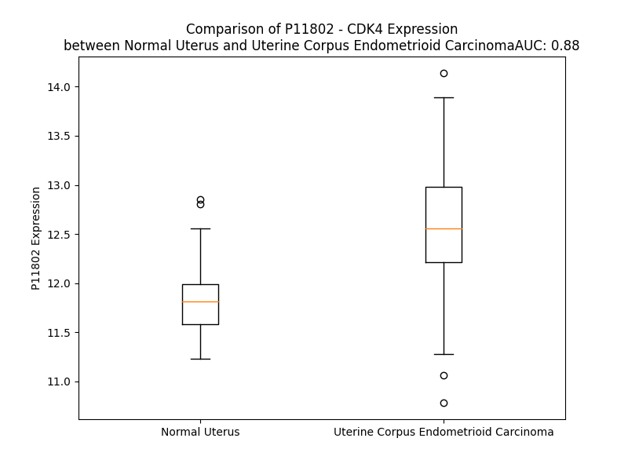

# Detailed Data for P11802

## Introduction to the Detailed Summary

### How to Interpret the Results

- **Summary & Metrics**: This section provides a quick reference to essential protein attributes, including expression changes, family classification, and biomarker applications. Regulation status (upregulated/downregulated) indicates the protein's behavior in a disease context. Some information comes from the original excel file with the proteins selected from literature, while others are derived from the analyses.
- **Expression Comparison**: A visual representation comparing protein expression between normal and disease states. It highlights significant changes in expression levels that might indicate diagnostic or therapeutic relevance. This is data coming from transcriptomics experiments and could not translate similarly to protein levels.
- **Isoform Alignment**: An interactive view of isoform alignments, revealing structural and functional differences between variants of the protein.
- **Interactors & Homologs**: Tables listing known interaction partners and homologous proteins, the more interactors and homologs, the more complex the protein is to design an antibody for.
- **Biological Assemblies**: Information about the structural arrangement of the protein in different assemblies, providing insights into its functional state but also the complexity of the protein to develop antibodies.
- **Combined Per-Residue Information**: A detailed table summarizing residue-level data. This includes predictions for epitope regions, aggregation tendencies, and modifications that might impact the protein's function. Each row corresponds to a residue in the protein, providing insights into specific sites that may be important for research or drug development.
## Summary & Metrics

- **UniProt Accession**: P11802
- **Gene Name**: CDK4
- **Protein Name**: cyclin-dependent kinase 4
- **Swiss Prot**: CDK4_HUMAN
- **Family**: kinase
- **Biomarker Application**: diagnosis,prognosis
- **Number of Isoforms**: 2
- **Regulation**: 1
- **(transcriptomics) AUC**: 0.88
- **(transcriptomics) Fold Change**: 1.06
- **(transcriptomics) Regulation**: Upregulated
- **Discotope Epitope Count**: 48
- **Max n_uniprots (Homo)**: N/A
- **Max n_uniprots (Hetero)**: 4

## Expression Comparison

## Isoform Alignment

<pre style='font-size:14px; font-family:monospace;'>P11802-1 MATSRYEPVAEIGVGAYGTVYKARDPHSGHFVALKSVRVPNGGGGGGGLPISTVREVALLRRLEAFEHPNVVRLMDVCATSRTDREIKVTLVFEHVDQDLRTYLDKAPPPGLPAETIKDLMRQFLRGLDFLHANCIVHRDLKPENILVTSGGTVKLADFGLARIYSYQMALTPVVVTLWYRAPEVLLQSTYATPVDMWSVGCIFAEMFRRKPLFCGNSEADQLGKIFDLIGLPPEDDWPRDVSLPRGAFPPRGPRPVQSVVPEMEESGAQLLLEMLTFNPHKRISAFRALQHSYLHKDEGNPE
P11802-2 ------------------------------------------------------------------------------------------------------------------------MRQFLRGLDFLHANCIVHRDLKPENILVTSGGTVKLADFGLARIYSYQMALTPVVVTLWYRAPEVLLQSTYATPVDMWSVGCIFAEMFRRKPLFCGNSEADQLGKIFDLIGLPPEDDWPRDVSLPRGAFPPRGPRPVQSVVPEMEESGAQLLLEMLTFNPHKRISAFRALQHSYLHKDEGNPE
</pre>

## Interactors

| preferredName_A   | preferredName_B   |   score |
|:------------------|:------------------|--------:|
| CDK4              | CCNL2             |   0.999 |
| CDK4              | CDKN2D            |   0.999 |
| CDK4              | RB1               |   0.999 |
| CDK4              | CCND1             |   0.999 |
| CDK4              | CDKN2A            |   0.999 |
| CDK4              | CCNA2             |   0.999 |
| CDK4              | CDKN1B            |   0.999 |
| CDK4              | CCND2             |   0.999 |
| CDK4              | CCND3             |   0.999 |
| CDK4              | CDKN1A            |   0.999 |
| CDK4              | CDKN2C            |   0.999 |
| CDK4              | CDK6              |   0.999 |
| CDK4              | CDKN2B            |   0.999 |
| CDK4              | CDC37             |   0.999 |
| CDK4              | CCNE1             |   0.999 |
| CDK4              | HSP90AB1          |   0.999 |
| CDK4              | CDK2              |   0.998 |
| CDK4              | HSP90AA1          |   0.998 |
| CDK4              | PCNA              |   0.996 |
| CDK4              | CDKN1C            |   0.994 |
| CDK4              | CEBPA             |   0.991 |
| CDK4              | CCNA1             |   0.988 |
| CDK4              | CCNE2             |   0.988 |
| CDK4              | RBL2              |   0.986 |
| CDK4              | CDC25A            |   0.979 |
| CDK4              | PSMD10            |   0.972 |
| CDK4              | BRCA1             |   0.972 |
| CDK4              | MYC               |   0.966 |
| CDK4              | TP53              |   0.966 |
| CDK4              | YBX3              |   0.964 |
| CDK4              | E2F1              |   0.958 |
| CDK4              | BRCA2             |   0.943 |
| CDK4              | RBL1              |   0.941 |
| CDK4              | CCNB1             |   0.94  |
| CDK4              | ATM               |   0.937 |
| CDK4              | PRMT5             |   0.933 |
| CDK4              | RAD51             |   0.913 |
| CDK4              | SYMPK             |   0.908 |

## Homologs

| uniprot_id   | gene_id   |
|:-------------|:----------|
| Q00537       | CDK17     |
| P06493       | CDK1      |
| Q00526       | CDK3      |
| X6RE90       | CDK9      |
| A0A0S2Z5B6   | CDK20     |
| Q9UHL7       | CDK10     |
| H0YDJ3       | PRPF4B    |
| Q9NYV4       | CDK12     |
| F8WDP7       | CDK15     |
| A0A0A0MSJ6   | CDK18     |
| D6REC6       | CDK7      |
| H7BZI6       | CDKL4     |
| A0A087WYI9   | CDK11B    |
| Q5QPR3       | CDK11A    |
| H0YAZ9       | CDK16     |
| Q5JQZ9       | CDK19     |
| B4DX41       | CDKL3     |
| C9IYJ9       | CDK14     |
| Q00534       | CDK6      |
| A0A2R8Y4Z0   | CDK13     |
| Q92772       | CDKL2     |
| A0A9S7JKS7   | CDKL1     |
| Q00535       | CDK5      |
| A0A096LPG3   | CDKL5     |
| F5H6D4       | CDK8      |
| G3V5T9       | CDK2      |

## Biological Assemblies

|   Unnamed: 0 |   assembly |   n_uniprots | composition   | crystal_id   |
|-------------:|-----------:|-------------:|:--------------|:-------------|
|            0 |          1 |            2 | Hetero        | 2w9f         |
|            0 |          1 |            2 | Hetero        | 2w9z         |
|            0 |          1 |            2 | Hetero        | 7sj3         |
|            0 |          1 |            4 | Hetero        | 5fwp         |
|            0 |          1 |            4 | Hetero        | 3g33         |
|            0 |          1 |            3 | Hetero        | 6p8h         |
|            0 |          1 |            3 | Hetero        | 6p8e         |
|            0 |          1 |            3 | Hetero        | 6p8g         |
|            0 |          1 |            2 | Hetero        | 2w99         |
|            0 |          1 |            4 | Hetero        | 5fwl         |
|            0 |          1 |            3 | Hetero        | 6p8f         |
|            0 |          1 |            4 | Hetero        | 5fwm         |
|            0 |          1 |            2 | Hetero        | 2w96         |
|            0 |          1 |            4 | Hetero        | 5fwk         |

## Combined Per-Residue Information

|   res | aa   |   epitope_score | epitope   |   relative_surface_accessibility |   modeling_confidence |   Aggregation | modification     |
|------:|:-----|----------------:|:----------|---------------------------------:|----------------------:|--------------:|:-----------------|
|     1 | M    |         0.20626 | False     |                          1.29088 |                 26.43 |         0     | N/A              |
|     2 | A    |         0.16367 | False     |                          0.96492 |                 33.03 |         0     | N-acetylalanine  |
|     3 | T    |         0.24532 | True      |                          0.93426 |                 47.62 |         0     | N/A              |
|     4 | S    |         0.12944 | False     |                          0.52404 |                 65.18 |         0     | N/A              |
|     5 | R    |         0.18138 | False     |                          0.57802 |                 84.55 |         0     | N/A              |
|     6 | Y    |         0.05673 | False     |                          0.04057 |                 90.84 |         0     | N/A              |
|     7 | E    |         0.17332 | False     |                          0.48923 |                 91.29 |         0     | N/A              |
|     8 | P    |         0.10136 | False     |                          0.64591 |                 90.31 |         0     | N/A              |
|     9 | V    |         0.21536 | False     |                          0.62345 |                 92.65 |         0     | N/A              |
|    10 | A    |         0.18432 | False     |                          0.43147 |                 92.76 |         0     | N/A              |
|    11 | E    |         0.16189 | False     |                          0.49504 |                 90.19 |         0     | N/A              |
|    12 | I    |         0.22417 | False     |                          0.47884 |                 86.67 |         1.414 | N/A              |
|    13 | G    |         0.13367 | False     |                          0.34261 |                 76.6  |         1.414 | N/A              |
|    14 | V    |         0.23215 | False     |                          0.7969  |                 73.84 |         1.563 | N/A              |
|    15 | G    |         0.17121 | False     |                          0.46277 |                 63.81 |         1.563 | N/A              |
|    16 | A    |         0.13455 | False     |                          0.17806 |                 55.15 |         1.704 | N/A              |
|    17 | Y    |         0.09816 | False     |                          0.09534 |                 62.79 |         1.871 | N/A              |
|    18 | G    |         0.12511 | False     |                          0.28541 |                 70.71 |         1.871 | N/A              |
|    19 | T    |         0.12461 | False     |                          0.23366 |                 81.02 |         1.871 | N/A              |
|    20 | V    |         0.04085 | False     |                          0.20946 |                 88.02 |         1.871 | N/A              |
|    21 | Y    |         0.13171 | False     |                          0.34847 |                 91.53 |         1.553 | N/A              |
|    22 | K    |         0.10924 | False     |                          0.182   |                 93.71 |         0     | N/A              |
|    23 | A    |         0.00253 | False     |                          0       |                 94.69 |         0     | N/A              |
|    24 | R    |         0.21388 | False     |                          0.4775  |                 95.18 |         0     | N/A              |
|    25 | D    |         0.07591 | False     |                          0.05814 |                 93.71 |         0     | N/A              |
|    26 | P    |         0.16481 | False     |                          0.5516  |                 90.76 |         0     | N/A              |
|    27 | H    |         0.20071 | False     |                          0.92459 |                 89.22 |         0     | N/A              |
|    28 | S    |         0.17027 | False     |                          0.41463 |                 91.05 |         0     | N/A              |
|    29 | G    |         0.1379  | False     |                          0.38731 |                 91.04 |         0     | N/A              |
|    30 | H    |         0.24012 | True      |                          0.68814 |                 93.26 |         0     | N/A              |
|    31 | F    |         0.12208 | False     |                          0.46677 |                 95    |         0     | N/A              |
|    32 | V    |         0.00468 | False     |                          0.0019  |                 94.97 |         0     | N/A              |
|    33 | A    |         0.04    | False     |                          0.11096 |                 93.94 |         0     | N/A              |
|    34 | L    |         0.05042 | False     |                          0.08079 |                 92.14 |         0     | N/A              |
|    35 | K    |         0.01544 | False     |                          0.02347 |                 88.06 |         0     | N/A              |
|    36 | S    |         0.06552 | False     |                          0.16785 |                 83.29 |         0     | N/A              |
|    37 | V    |         0.02455 | False     |                          0.01523 |                 77.3  |         0     | N/A              |
|    38 | R    |         0.15132 | False     |                          0.53146 |                 77.47 |         0     | N/A              |
|    39 | V    |         0.03474 | False     |                          0.01047 |                 76.91 |         0     | N/A              |
|    40 | P    |         0.17997 | False     |                          0.2853  |                 74.47 |         0     | N/A              |
|    41 | N    |         0.07205 | False     |                          0.11925 |                 73.82 |         0     | N/A              |
|    42 | G    |         0.21183 | False     |                          0.41426 |                 61.65 |         0     | N/A              |
|    43 | G    |         0.26979 | True      |                          1.06834 |                 51.25 |         0     | N/A              |
|    44 | G    |         0.18652 | False     |                          0.7271  |                 49.71 |         0     | N/A              |
|    45 | G    |         0.27065 | True      |                          1.22833 |                 44.07 |         0     | N/A              |
|    46 | G    |         0.18606 | False     |                          0.82824 |                 52.57 |         0     | N/A              |
|    47 | G    |         0.19555 | False     |                          0.40486 |                 56.96 |         0     | N/A              |
|    48 | G    |         0.17263 | False     |                          0.31109 |                 71.12 |         0     | N/A              |
|    49 | L    |         0.19419 | False     |                          0.33509 |                 74.87 |         0     | N/A              |
|    50 | P    |         0.16968 | False     |                          0.26244 |                 74.88 |         0     | N/A              |
|    51 | I    |         0.20935 | False     |                          0.73397 |                 78    |         0     | N/A              |
|    52 | S    |         0.14839 | False     |                          0.31169 |                 74.62 |         0     | N/A              |
|    53 | T    |         0.03944 | False     |                          0.02571 |                 77.27 |         0     | N/A              |
|    54 | V    |         0.23396 | False     |                          0.51689 |                 81.3  |         0     | N/A              |
|    55 | R    |         0.29065 | True      |                          0.66415 |                 81.69 |         0     | N/A              |
|    56 | E    |         0.05331 | False     |                          0.08814 |                 79.15 |         0     | N/A              |
|    57 | V    |         0.09962 | False     |                          0.13329 |                 82.24 |         0     | N/A              |
|    58 | A    |         0.1675  | False     |                          0.52568 |                 85.97 |         0     | N/A              |
|    59 | L    |         0.15259 | False     |                          0.34636 |                 84.5  |         0     | N/A              |
|    60 | L    |         0.02662 | False     |                          0.03298 |                 85.66 |         0     | N/A              |
|    61 | R    |         0.17499 | False     |                          0.32003 |                 87.16 |         0     | N/A              |
|    62 | R    |         0.23245 | False     |                          0.63728 |                 87.97 |         0     | N/A              |
|    63 | L    |         0.06488 | False     |                          0.04806 |                 89.29 |         0     | N/A              |
|    64 | E    |         0.10844 | False     |                          0.2563  |                 89.52 |         0     | N/A              |
|    65 | A    |         0.18853 | False     |                          0.83799 |                 90.79 |         0     | N/A              |
|    66 | F    |         0.31879 | True      |                          0.56357 |                 93.08 |         0     | N/A              |
|    67 | E    |         0.16704 | False     |                          0.61118 |                 93.32 |         0     | N/A              |
|    68 | H    |         0.11669 | False     |                          0.19926 |                 96.57 |         0     | N/A              |
|    69 | P    |         0.10102 | False     |                          0.60215 |                 97.43 |         0     | N/A              |
|    70 | N    |         0.08089 | False     |                          0.02997 |                 98.06 |         0     | N/A              |
|    71 | V    |         0.02126 | False     |                          0.05203 |                 95.64 |         0.309 | N/A              |
|    72 | V    |         0.01536 | False     |                          0.06185 |                 94.57 |         0.309 | N/A              |
|    73 | R    |         0.11356 | False     |                          0.38952 |                 92.58 |         0.309 | N/A              |
|    74 | L    |         0.02736 | False     |                          0.02404 |                 91.54 |         0.309 | N/A              |
|    75 | M    |         0.111   | False     |                          0.40011 |                 90.75 |         0.309 | N/A              |
|    76 | D    |         0.11166 | False     |                          0.13893 |                 89.42 |         0.309 | N/A              |
|    77 | V    |         0.07823 | False     |                          0.29532 |                 87.5  |         0.309 | N/A              |
|    78 | C    |         0.06402 | False     |                          0.24531 |                 85.17 |         0     | N/A              |
|    79 | A    |         0.18123 | False     |                          0.76832 |                 78.06 |         0     | N/A              |
|    80 | T    |         0.21364 | False     |                          0.42246 |                 70.59 |         0     | N/A              |
|    81 | S    |         0.20765 | False     |                          0.43592 |                 74.93 |         0     | N/A              |
|    82 | R    |         0.27321 | True      |                          0.58877 |                 79.17 |         0     | N/A              |
|    83 | T    |         0.19768 | False     |                          0.48896 |                 79.91 |         0     | N/A              |
|    84 | D    |         0.30184 | True      |                          0.83374 |                 78.63 |         0     | N/A              |
|    85 | R    |         0.35446 | True      |                          0.83482 |                 78.89 |         0     | N/A              |
|    86 | E    |         0.18249 | False     |                          0.28353 |                 81.68 |         0.966 | N/A              |
|    87 | I    |         0.06624 | False     |                          0.0528  |                 82.29 |         3.436 | N/A              |
|    88 | K    |         0.06594 | False     |                          0.35923 |                 83.89 |         3.466 | N/A              |
|    89 | V    |         0.03198 | False     |                          0.02285 |                 83.25 |        90.829 | N/A              |
|    90 | T    |         0.03045 | False     |                          0.07522 |                 88.06 |        90.829 | N/A              |
|    91 | L    |         0.01096 | False     |                          0.00742 |                 88.47 |        90.829 | N/A              |
|    92 | V    |         0.0032  | False     |                          0.00095 |                 92.19 |        90.812 | N/A              |
|    93 | F    |         0.0649  | False     |                          0.07186 |                 93.07 |        90.741 | N/A              |
|    94 | E    |         0.04695 | False     |                          0.08637 |                 93.39 |         2.5   | N/A              |
|    95 | H    |         0.06846 | False     |                          0.1979  |                 94.3  |         0.076 | N/A              |
|    96 | V    |         0.08752 | False     |                          0.10953 |                 94.48 |         0.076 | N/A              |
|    97 | D    |         0.23337 | False     |                          0.63988 |                 88.02 |         0     | N/A              |
|    98 | Q    |         0.09341 | False     |                          0.15641 |                 94.12 |         0     | N/A              |
|    99 | D    |         0.0859  | False     |                          0.20613 |                 95.8  |         0     | N/A              |
|   100 | L    |         0.01213 | False     |                          0.01896 |                 97.49 |         0     | N/A              |
|   101 | R    |         0.2023  | False     |                          0.20573 |                 95.74 |         0     | N/A              |
|   102 | T    |         0.16667 | False     |                          0.3171  |                 95.37 |         0     | N/A              |
|   103 | Y    |         0.18458 | False     |                          0.21942 |                 96.62 |         0     | N/A              |
|   104 | L    |         0.03304 | False     |                          0.01742 |                 96.52 |         0     | N/A              |
|   105 | D    |         0.178   | False     |                          0.63012 |                 95.17 |         0     | N/A              |
|   106 | K    |         0.23128 | False     |                          0.67379 |                 94.96 |         0     | N/A              |
|   107 | A    |         0.06169 | False     |                          0.10082 |                 94.64 |         0     | N/A              |
|   108 | P    |         0.15741 | False     |                          0.7038  |                 93.78 |         0     | N/A              |
|   109 | P    |         0.46282 | True      |                          0.87285 |                 92.69 |         0     | N/A              |
|   110 | P    |         0.311   | True      |                          0.86336 |                 92.25 |         0     | N/A              |
|   111 | G    |         0.14549 | False     |                          0.17665 |                 94.98 |         0     | N/A              |
|   112 | L    |         0.13445 | False     |                          0.14522 |                 95.53 |         0     | N/A              |
|   113 | P    |         0.16734 | False     |                          0.64104 |                 95.25 |         0     | N/A              |
|   114 | A    |         0.09439 | False     |                          0.48482 |                 94.49 |         0     | N/A              |
|   115 | E    |         0.11907 | False     |                          0.53576 |                 94.51 |         0     | N/A              |
|   116 | T    |         0.08769 | False     |                          0.29446 |                 96.14 |         0     | N/A              |
|   117 | I    |         0.01564 | False     |                          0.0088  |                 97.18 |         0     | N/A              |
|   118 | K    |         0.05955 | False     |                          0.16629 |                 97.29 |         0     | N/A              |
|   119 | D    |         0.10857 | False     |                          0.35105 |                 97.32 |         0     | N/A              |
|   120 | L    |         0.02972 | False     |                          0.03137 |                 97.95 |         0     | N/A              |
|   121 | M    |         0.00286 | False     |                          0       |                 98.38 |         0     | N/A              |
|   122 | R    |         0.07293 | False     |                          0.12483 |                 98.11 |         0     | N/A              |
|   123 | Q    |         0.05251 | False     |                          0.11144 |                 98.45 |         0     | N/A              |
|   124 | F    |         0.01317 | False     |                          0.01333 |                 98.54 |         0     | N/A              |
|   125 | L    |         0.0026  | False     |                          0       |                 98.7  |         0     | N/A              |
|   126 | R    |         0.11943 | False     |                          0.4768  |                 98.37 |         0     | N/A              |
|   127 | G    |         0.00295 | False     |                          0       |                 98.04 |         0     | N/A              |
|   128 | L    |         0.00222 | False     |                          0       |                 97.85 |         0     | N/A              |
|   129 | D    |         0.11582 | False     |                          0.20809 |                 97.88 |         0     | N/A              |
|   130 | F    |         0.08697 | False     |                          0.13531 |                 97.12 |         2.075 | N/A              |
|   131 | L    |         0.00323 | False     |                          0       |                 94.97 |         2.244 | N/A              |
|   132 | H    |         0.07131 | False     |                          0.16248 |                 94    |         2.244 | N/A              |
|   133 | A    |         0.15638 | False     |                          0.78483 |                 93.79 |         2.244 | N/A              |
|   134 | N    |         0.20204 | False     |                          0.22711 |                 90.24 |         2.244 | N/A              |
|   135 | C    |         0.18113 | False     |                          0.87617 |                 88.09 |         2.244 | N/A              |
|   136 | I    |         0.05158 | False     |                          0.0328  |                 88.89 |         2.244 | N/A              |
|   137 | V    |         0.0463  | False     |                          0.15757 |                 89.47 |         2.244 | N/A              |
|   138 | H    |         0.02305 | False     |                          0.02661 |                 91.44 |         0     | N/A              |
|   139 | R    |         0.08908 | False     |                          0.4534  |                 88.24 |         0     | N/A              |
|   140 | D    |         0.08037 | False     |                          0.20271 |                 87.75 |         0     | N/A              |
|   141 | L    |         0.02482 | False     |                          0.01644 |                 94.16 |         0     | N/A              |
|   142 | K    |         0.07346 | False     |                          0.19261 |                 94.19 |         0     | N/A              |
|   143 | P    |         0.0056  | False     |                          0       |                 95.75 |         0     | N/A              |
|   144 | E    |         0.08612 | False     |                          0.349   |                 92.44 |         0     | N/A              |
|   145 | N    |         0.08592 | False     |                          0.05459 |                 93.58 |         0.371 | N/A              |
|   146 | I    |         0.00892 | False     |                          0.008   |                 96.81 |         2.047 | N/A              |
|   147 | L    |         0.02296 | False     |                          0.18548 |                 97.44 |         2.047 | N/A              |
|   148 | V    |         0.00309 | False     |                          0       |                 97.62 |         2.047 | N/A              |
|   149 | T    |         0.10438 | False     |                          0.23223 |                 96.01 |         2.047 | N/A              |
|   150 | S    |         0.18134 | False     |                          0.83192 |                 92.36 |         1.676 | N/A              |
|   151 | G    |         0.14471 | False     |                          0.87258 |                 93.6  |         0.495 | N/A              |
|   152 | G    |         0.08086 | False     |                          0.2683  |                 94.65 |         0.495 | N/A              |
|   153 | T    |         0.05136 | False     |                          0.31037 |                 97.84 |         0.495 | N/A              |
|   154 | V    |         0.00871 | False     |                          0.00952 |                 98.38 |         0.495 | N/A              |
|   155 | K    |         0.04609 | False     |                          0.11945 |                 97.89 |         0     | N/A              |
|   156 | L    |         0.00193 | False     |                          0       |                 96.62 |         0     | N/A              |
|   157 | A    |         0.0265  | False     |                          0.10458 |                 92.56 |         0     | N/A              |
|   158 | D    |         0.07522 | False     |                          0.19949 |                 85.08 |         0     | N/A              |
|   159 | F    |         0.01703 | False     |                          0.02856 |                 80.43 |         0     | N/A              |
|   160 | G    |         0.06554 | False     |                          0.1142  |                 66.71 |         0     | N/A              |
|   161 | L    |         0.02138 | False     |                          0.00849 |                 64.14 |         0     | N/A              |
|   162 | A    |         0.11088 | False     |                          0.31974 |                 59.81 |         0     | N/A              |
|   163 | R    |         0.16469 | False     |                          0.62248 |                 59    |         0     | N/A              |
|   164 | I    |         0.03331 | False     |                          0.02518 |                 57.5  |         0     | N/A              |
|   165 | Y    |         0.06144 | False     |                          0.02931 |                 59.53 |         0     | N/A              |
|   166 | S    |         0.12592 | False     |                          0.5212  |                 56.79 |         0     | N/A              |
|   167 | Y    |         0.31256 | True      |                          0.37609 |                 59.4  |         0     | N/A              |
|   168 | Q    |         0.08846 | False     |                          0.11301 |                 55.18 |         0     | N/A              |
|   169 | M    |         0.21775 | False     |                          0.39519 |                 53.72 |         0     | N/A              |
|   170 | A    |         0.22537 | False     |                          0.81968 |                 54.88 |         0     | N/A              |
|   171 | L    |         0.3221  | True      |                          0.70151 |                 51.18 |         0     | N/A              |
|   172 | T    |         0.197   | False     |                          0.49663 |                 45.49 |         0     | Phosphothreonine |
|   173 | P    |         0.29374 | True      |                          1.05295 |                 47.63 |         1.111 | N/A              |
|   174 | V    |         0.20973 | False     |                          0.34049 |                 49.39 |        90.489 | N/A              |
|   175 | V    |         0.21285 | False     |                          1.03256 |                 53.94 |        97.527 | N/A              |
|   176 | V    |         0.15998 | False     |                          0.34961 |                 66.4  |        98.052 | N/A              |
|   177 | T    |         0.08061 | False     |                          0.40429 |                 79.57 |        98.052 | N/A              |
|   178 | L    |         0.10124 | False     |                          0.12838 |                 92.61 |        98.037 | N/A              |
|   179 | W    |         0.1243  | False     |                          0.36751 |                 96.88 |        91.428 | N/A              |
|   180 | Y    |         0.09503 | False     |                          0.05003 |                 96.84 |        80.312 | N/A              |
|   181 | R    |         0.08573 | False     |                          0.27149 |                 95.35 |         0     | N/A              |
|   182 | A    |         0.01112 | False     |                          0.00986 |                 96.13 |         0     | N/A              |
|   183 | P    |         0.00461 | False     |                          0.00398 |                 96.73 |         0     | N/A              |
|   184 | E    |         0.06241 | False     |                          0.04659 |                 93.4  |         0     | N/A              |
|   185 | V    |         0.14773 | False     |                          0.33331 |                 92.96 |         0     | N/A              |
|   186 | L    |         0.0076  | False     |                          0.00513 |                 94.72 |         0     | N/A              |
|   187 | L    |         0.00975 | False     |                          0.0033  |                 93.57 |         0     | N/A              |
|   188 | Q    |         0.35002 | True      |                          0.69733 |                 89.23 |         0     | N/A              |
|   189 | S    |         0.30166 | True      |                          0.22401 |                 85.05 |         0     | N/A              |
|   190 | T    |         0.39848 | True      |                          0.90631 |                 81.91 |         0     | N/A              |
|   191 | Y    |         0.3716  | True      |                          0.51371 |                 81.78 |         0     | N/A              |
|   192 | A    |         0.21792 | False     |                          0.54503 |                 86.59 |         0     | N/A              |
|   193 | T    |         0.09618 | False     |                          0.32912 |                 88.3  |         0     | N/A              |
|   194 | P    |         0.07208 | False     |                          0.21955 |                 94.19 |         0     | N/A              |
|   195 | V    |         0.01696 | False     |                          0.04491 |                 94.68 |         0     | N/A              |
|   196 | D    |         0.00897 | False     |                          0.00328 |                 95.95 |         0     | N/A              |
|   197 | M    |         0.01033 | False     |                          0.01079 |                 98.47 |         1.201 | N/A              |
|   198 | W    |         0.00287 | False     |                          0       |                 98.52 |         2.139 | N/A              |
|   199 | S    |         0.04896 | False     |                          0.06404 |                 98.03 |         2.139 | N/A              |
|   200 | V    |         0.00239 | False     |                          0       |                 98.72 |         3.246 | N/A              |
|   201 | G    |         0.00406 | False     |                          0       |                 98.65 |         3.246 | N/A              |
|   202 | C    |         0.00983 | False     |                          0.003   |                 98.69 |         3.246 | N/A              |
|   203 | I    |         0.01239 | False     |                          0       |                 98.58 |         3.246 | N/A              |
|   204 | F    |         0.0034  | False     |                          0       |                 98.65 |         3.116 | N/A              |
|   205 | A    |         0.00392 | False     |                          0       |                 98.4  |         1.428 | N/A              |
|   206 | E    |         0.00461 | False     |                          0       |                 98.08 |         0     | N/A              |
|   207 | M    |         0.02203 | False     |                          0.0139  |                 98.21 |         0     | N/A              |
|   208 | F    |         0.07941 | False     |                          0.12043 |                 97.28 |         0     | N/A              |
|   209 | R    |         0.28654 | True      |                          0.33581 |                 95.29 |         0     | N/A              |
|   210 | R    |         0.19623 | False     |                          0.38389 |                 94.17 |         0     | N/A              |
|   211 | K    |         0.29008 | True      |                          0.70579 |                 94.91 |         0     | N/A              |
|   212 | P    |         0.07895 | False     |                          0.15369 |                 97.25 |         0     | N/A              |
|   213 | L    |         0.08116 | False     |                          0.09104 |                 98.05 |         0     | N/A              |
|   214 | F    |         0.05954 | False     |                          0.03553 |                 97.99 |         0     | N/A              |
|   215 | C    |         0.14501 | False     |                          0.40152 |                 96.61 |         0     | N/A              |
|   216 | G    |         0.08333 | False     |                          0.04045 |                 96.18 |         0     | N/A              |
|   217 | N    |         0.37592 | True      |                          0.87141 |                 93.47 |         0     | N/A              |
|   218 | S    |         0.31239 | True      |                          0.37496 |                 93.88 |         0     | N/A              |
|   219 | E    |         0.24792 | True      |                          0.34419 |                 93.83 |         0     | N/A              |
|   220 | A    |         0.30456 | True      |                          0.42723 |                 96.31 |         0     | N/A              |
|   221 | D    |         0.22845 | False     |                          0.30392 |                 96.79 |         0     | N/A              |
|   222 | Q    |         0.00573 | False     |                          0       |                 97.85 |         0     | N/A              |
|   223 | L    |         0.00645 | False     |                          0       |                 97.88 |         0.144 | N/A              |
|   224 | G    |         0.17685 | False     |                          0.16501 |                 97.71 |         0.144 | N/A              |
|   225 | K    |         0.19967 | False     |                          0.33388 |                 97.74 |         0.946 | N/A              |
|   226 | I    |         0.0054  | False     |                          0       |                 98.29 |         0.946 | N/A              |
|   227 | F    |         0.00791 | False     |                          0       |                 98.15 |         0.946 | N/A              |
|   228 | D    |         0.28443 | True      |                          0.37606 |                 97.06 |         0.946 | N/A              |
|   229 | L    |         0.05257 | False     |                          0.03676 |                 97.4  |         0.946 | N/A              |
|   230 | I    |         0.25019 | True      |                          0.18139 |                 97.76 |         0.946 | N/A              |
|   231 | G    |         0.03838 | False     |                          0.03856 |                 97.95 |         0     | N/A              |
|   232 | L    |         0.1706  | False     |                          0.14188 |                 98.09 |         0     | N/A              |
|   233 | P    |         0.06452 | False     |                          0.06362 |                 97.58 |         0     | N/A              |
|   234 | P    |         0.25464 | True      |                          0.57912 |                 95.77 |         0     | N/A              |
|   235 | E    |         0.24506 | True      |                          0.70873 |                 95.12 |         0     | N/A              |
|   236 | D    |         0.35592 | True      |                          0.888   |                 95.47 |         0     | N/A              |
|   237 | D    |         0.17949 | False     |                          0.15617 |                 95.71 |         0     | N/A              |
|   238 | W    |         0.11384 | False     |                          0.12245 |                 95.78 |         0     | N/A              |
|   239 | P    |         0.2929  | True      |                          0.29109 |                 92.9  |         0     | N/A              |
|   240 | R    |         0.39596 | True      |                          0.88399 |                 91.08 |         0     | N/A              |
|   241 | D    |         0.33708 | True      |                          0.96241 |                 88.25 |         0     | N/A              |
|   242 | V    |         0.26476 | True      |                          0.19954 |                 90.45 |         0     | N/A              |
|   243 | S    |         0.42351 | True      |                          0.4589  |                 91.24 |         0     | N/A              |
|   244 | L    |         0.49651 | True      |                          0.23906 |                 94.31 |         0     | N/A              |
|   245 | P    |         0.36908 | True      |                          0.62328 |                 95.13 |         0     | N/A              |
|   246 | R    |         0.21232 | False     |                          0.32492 |                 96.17 |         0     | N/A              |
|   247 | G    |         0.35904 | True      |                          0.93287 |                 95.05 |         0     | N/A              |
|   248 | A    |         0.31703 | True      |                          0.56412 |                 95.14 |         0     | N/A              |
|   249 | F    |         0.29    | True      |                          0.06948 |                 97.27 |         0     | N/A              |
|   250 | P    |         0.19086 | False     |                          0.57431 |                 95.85 |         0     | N/A              |
|   251 | P    |         0.28871 | True      |                          0.91972 |                 94.55 |         0     | N/A              |
|   252 | R    |         0.21666 | False     |                          0.29585 |                 94.43 |         0     | N/A              |
|   253 | G    |         0.30691 | True      |                          0.58786 |                 96.09 |         0     | N/A              |
|   254 | P    |         0.21845 | False     |                          0.77916 |                 96.72 |         0     | N/A              |
|   255 | R    |         0.34294 | True      |                          0.58295 |                 96.61 |         0     | N/A              |
|   256 | P    |         0.33656 | True      |                          0.69402 |                 96.7  |         0     | N/A              |
|   257 | V    |         0.03475 | False     |                          0.01526 |                 97.09 |         0     | N/A              |
|   258 | Q    |         0.19129 | False     |                          0.35671 |                 97.05 |         0     | N/A              |
|   259 | S    |         0.33194 | True      |                          0.54296 |                 96.35 |         0     | N/A              |
|   260 | V    |         0.16683 | False     |                          0.30905 |                 96.31 |         0     | N/A              |
|   261 | V    |         0.03344 | False     |                          0.01047 |                 96.43 |         0     | N/A              |
|   262 | P    |         0.2367  | False     |                          0.79338 |                 95.73 |         0     | N/A              |
|   263 | E    |         0.21816 | False     |                          0.65414 |                 93.98 |         0     | N/A              |
|   264 | M    |         0.07064 | False     |                          0.0285  |                 95.41 |         0     | N/A              |
|   265 | E    |         0.13253 | False     |                          0.4248  |                 94.99 |         0     | N/A              |
|   266 | E    |         0.12457 | False     |                          0.76681 |                 95.97 |         0     | N/A              |
|   267 | S    |         0.09682 | False     |                          0.23757 |                 96.61 |         0     | N/A              |
|   268 | G    |         0.01002 | False     |                          0       |                 97.55 |         0     | N/A              |
|   269 | A    |         0.02114 | False     |                          0.0727  |                 97.91 |         0     | N/A              |
|   270 | Q    |         0.21605 | False     |                          0.48827 |                 97.73 |         0     | N/A              |
|   271 | L    |         0.00275 | False     |                          0       |                 98.41 |         0     | N/A              |
|   272 | L    |         0.00237 | False     |                          0       |                 98.56 |         0     | N/A              |
|   273 | L    |         0.128   | False     |                          0.44943 |                 98.19 |         0     | N/A              |
|   274 | E    |         0.10537 | False     |                          0.26383 |                 98.49 |         0     | N/A              |
|   275 | M    |         0.01476 | False     |                          0       |                 98.66 |         0     | N/A              |
|   276 | L    |         0.00552 | False     |                          0.01036 |                 98.6  |         0     | N/A              |
|   277 | T    |         0.0727  | False     |                          0.2574  |                 98.43 |         0     | N/A              |
|   278 | F    |         0.08272 | False     |                          0.08259 |                 98.16 |         0     | N/A              |
|   279 | N    |         0.12156 | False     |                          0.1293  |                 95.85 |         0     | N/A              |
|   280 | P    |         0.09981 | False     |                          0.27982 |                 94.79 |         0     | N/A              |
|   281 | H    |         0.29998 | True      |                          0.93587 |                 94.37 |         0     | N/A              |
|   282 | K    |         0.1892  | False     |                          0.64631 |                 97.09 |         0     | N/A              |
|   283 | R    |         0.17821 | False     |                          0.06004 |                 98.17 |         0     | N/A              |
|   284 | I    |         0.17696 | False     |                          0.1274  |                 98.59 |         0     | N/A              |
|   285 | S    |         0.15016 | False     |                          0.39463 |                 98.19 |         0     | N/A              |
|   286 | A    |         0.01252 | False     |                          0.01058 |                 98.09 |         0     | N/A              |
|   287 | F    |         0.20994 | False     |                          0.58963 |                 97.87 |         0     | N/A              |
|   288 | R    |         0.2744  | True      |                          0.66754 |                 98.01 |         0     | N/A              |
|   289 | A    |         0.00526 | False     |                          0       |                 98.47 |         0     | N/A              |
|   290 | L    |         0.09382 | False     |                          0.2348  |                 97.61 |         0     | N/A              |
|   291 | Q    |         0.18952 | False     |                          0.50737 |                 96.68 |         0     | N/A              |
|   292 | H    |         0.0997  | False     |                          0.10691 |                 97.72 |         0     | N/A              |
|   293 | S    |         0.07256 | False     |                          0.58438 |                 95.74 |         0     | N/A              |
|   294 | Y    |         0.02568 | False     |                          0.02911 |                 96.23 |         0     | N/A              |
|   295 | L    |         0.04244 | False     |                          0.0335  |                 94.38 |         0     | N/A              |
|   296 | H    |         0.1238  | False     |                          0.59097 |                 83.91 |         0     | N/A              |
|   297 | K    |         0.19923 | False     |                          0.748   |                 62.32 |         0     | N/A              |
|   298 | D    |         0.23444 | False     |                          0.83789 |                 55.85 |         0     | N/A              |
|   299 | E    |         0.27162 | True      |                          0.96913 |                 45.41 |         0     | N/A              |
|   300 | G    |         0.31096 | True      |                          0.75138 |                 39.67 |         0     | N/A              |
|   301 | N    |         0.22232 | False     |                          0.85176 |                 33.35 |         0     | N/A              |
|   302 | P    |         0.23664 | False     |                          0.89675 |                 32.42 |         0     | N/A              |
|   303 | E    |         0.23013 | False     |                          1.20511 |                 36.8  |         0     | N/A              |

