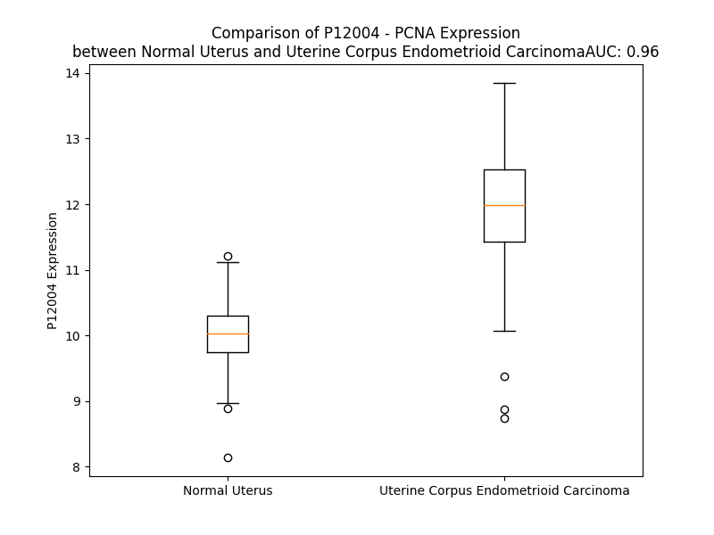

# Detailed Data for P12004

## Introduction to the Detailed Summary

### How to Interpret the Results

- **Summary & Metrics**: This section provides a quick reference to essential protein attributes, including expression changes, family classification, and biomarker applications. Regulation status (upregulated/downregulated) indicates the protein's behavior in a disease context. Some information comes from the original excel file with the proteins selected from literature, while others are derived from the analyses.
- **Expression Comparison**: A visual representation comparing protein expression between normal and disease states. It highlights significant changes in expression levels that might indicate diagnostic or therapeutic relevance. This is data coming from transcriptomics experiments and could not translate similarly to protein levels.
- **Isoform Alignment**: An interactive view of isoform alignments, revealing structural and functional differences between variants of the protein.
- **Interactors & Homologs**: Tables listing known interaction partners and homologous proteins, the more interactors and homologs, the more complex the protein is to design an antibody for.
- **Biological Assemblies**: Information about the structural arrangement of the protein in different assemblies, providing insights into its functional state but also the complexity of the protein to develop antibodies.
- **Combined Per-Residue Information**: A detailed table summarizing residue-level data. This includes predictions for epitope regions, aggregation tendencies, and modifications that might impact the protein's function. Each row corresponds to a residue in the protein, providing insights into specific sites that may be important for research or drug development.
## Summary & Metrics

- **UniProt Accession**: P12004
- **Gene Name**: PCNA
- **Protein Name**: Proliferating cell nuclear antigen
- **Swiss Prot**: PCNA_HUMAN
- **Family**: enzyme
- **Biomarker Application**: diagnosis,disease progression,efficacy,prognosis,response to therapy
- **Number of Isoforms**: 0
- **Regulation**: 1
- **(transcriptomics) AUC**: 0.99
- **(transcriptomics) Fold Change**: 1.21
- **(transcriptomics) Regulation**: Upregulated
- **Discotope Epitope Count**: 47
- **Max n_uniprots (Homo)**: 3.0
- **Max n_uniprots (Hetero)**: 10.0

## Expression Comparison

## Interactors

| preferredName_A   | preferredName_B   |   score |
|:------------------|:------------------|--------:|
| PCNA              | POLH              |   0.999 |
| PCNA              | POLD1             |   0.999 |
| PCNA              | FEN1              |   0.999 |
| PCNA              | CDKN1A            |   0.999 |
| PCNA              | RFC3              |   0.999 |
| PCNA              | RFC2              |   0.999 |
| PCNA              | RFC4              |   0.999 |
| PCNA              | LIG1              |   0.999 |
| PCNA              | RFC5              |   0.999 |
| PCNA              | RFC1              |   0.999 |
| PCNA              | POLI              |   0.998 |
| PCNA              | MSH6              |   0.998 |
| PCNA              | POLD2             |   0.998 |
| PCNA              | POLK              |   0.998 |
| PCNA              | POLD3             |   0.998 |
| PCNA              | RAD18             |   0.998 |
| PCNA              | PCLAF             |   0.997 |
| PCNA              | CDK4              |   0.996 |
| PCNA              | CDT1              |   0.995 |
| PCNA              | DTL               |   0.995 |
| PCNA              | SPRTN             |   0.992 |
| PCNA              | DNMT1             |   0.991 |
| PCNA              | POLD4             |   0.99  |
| PCNA              | CCND1             |   0.989 |
| PCNA              | POLE              |   0.988 |
| PCNA              | POLA1             |   0.987 |
| PCNA              | GADD45A           |   0.987 |
| PCNA              | MCM7              |   0.985 |
| PCNA              | RPS27A            |   0.983 |
| PCNA              | RPA1              |   0.982 |
| PCNA              | CDK6              |   0.981 |
| PCNA              | CCND3             |   0.978 |
| PCNA              | REV1              |   0.978 |
| PCNA              | MCM3              |   0.975 |
| PCNA              | HLTF              |   0.973 |
| PCNA              | MSH2              |   0.972 |
| PCNA              | CCND2             |   0.971 |
| PCNA              | UHRF2             |   0.97  |
| PCNA              | MCM4              |   0.965 |
| PCNA              | UBA52             |   0.961 |
| PCNA              | UBC               |   0.961 |
| PCNA              | EXO1              |   0.96  |
| PCNA              | GADD45G           |   0.96  |
| PCNA              | UBB               |   0.959 |
| PCNA              | MSH3              |   0.958 |
| PCNA              | ZRANB3            |   0.954 |
| PCNA              | PRIM2             |   0.954 |
| PCNA              | CDK2              |   0.951 |
| PCNA              | CHTF18            |   0.95  |
| PCNA              | PRIM1             |   0.947 |

## Homologs

| uniprot_id   | gene_id   |
|--------------|-----------|

## Biological Assemblies

|   Unnamed: 0 |   assembly |   n_uniprots | composition   | crystal_id   |
|-------------:|-----------:|-------------:|:--------------|:-------------|
|            0 |          1 |            3 | Homo          | 3ja9         |
|            0 |          1 |            3 | Homo          | 4d2g         |
|            0 |          1 |            3 | Homo          | 2zvm         |
|            0 |          1 |            3 | Homo          | 5mom         |
|            0 |          1 |            3 | Homo          | 6fcn         |
|            0 |          1 |            3 | Homo          | 7m5m         |
|            0 |          1 |            5 | Hetero        | 3tbl         |
|            0 |          1 |            2 | Hetero        | 5e0v         |
|            1 |          2 |            2 | Hetero        | 5e0v         |
|            0 |          1 |            3 | Homo          | 5iy4         |
|            0 |          1 |            6 | Hetero        | 5mav         |
|            1 |          2 |            6 | Hetero        | 5mav         |
|            0 |          1 |            3 | Homo          | 5mlw         |
|            1 |          2 |            0 | Hetero        | 5mlw         |
|            2 |          3 |            0 | Hetero        | 5mlw         |
|            3 |          4 |            0 | Hetero        | 5mlw         |
|            0 |          1 |            6 | Hetero        | 1u76         |
|            0 |          1 |            8 | Hetero        | 6vvo         |
|            0 |          1 |            1 | Homo          | 1w60         |
|            1 |          2 |            1 | Homo          | 1w60         |
|            0 |          1 |            6 | Hetero        | 8f5q         |
|            0 |          1 |            8 | Hetero        | 8umy         |
|            0 |          1 |            3 | Homo          | 5e0t         |
|            1 |          2 |            3 | Homo          | 5e0t         |
|            0 |          1 |            3 | Homo          | 2zvl         |
|            1 |          2 |            3 | Homo          | 2zvl         |
|            0 |          1 |            6 | Hetero        | 6qcg         |
|            1 |          2 |            6 | Hetero        | 6qcg         |
|            0 |          1 |            3 | Homo          | 1vyj         |
|            1 |          2 |            3 | Homo          | 1vyj         |
|            0 |          1 |            3 | Homo          | 4ztd         |
|            0 |          1 |            2 | Hetero        | 1u7b         |
|            0 |          1 |            3 | Homo          | 5mlo         |
|            1 |          2 |            0 | Hetero        | 5mlo         |
|            2 |          3 |            0 | Hetero        | 5mlo         |
|            3 |          4 |            0 | Hetero        | 5mlo         |
|            0 |          1 |            7 | Hetero        | 6s1o         |
|            0 |          1 |            3 | Homo          | 2zvk         |
|            0 |          1 |            6 | Hetero        | 6hvo         |
|            0 |          1 |            8 | Hetero        | 6tnz         |
|            0 |          1 |            3 | Homo          | 7kq1         |
|            0 |          1 |            4 | Hetero        | 8b8t         |
|            0 |          1 |            3 | Homo          | 8gcj         |
|            1 |          2 |            3 | Homo          | 8gcj         |
|            0 |          1 |            3 | Homo          | 8gl9         |
|            1 |          2 |            1 | Homo          | 8gl9         |
|            0 |          1 |            6 | Hetero        | 3p87         |
|            1 |          2 |            6 | Hetero        | 3p87         |
|            2 |          3 |           10 | Hetero        | 3p87         |
|            0 |          1 |            6 | Hetero        | 1ul1         |
|            0 |          1 |            7 | Hetero        | 8ui8         |
|            0 |          1 |            8 | Hetero        | 8umt         |
|            0 |          1 |            8 | Hetero        | 8ui9         |
|            0 |          1 |            7 | Hetero        | 6s1m         |
|            0 |          1 |            1 | Homo          | 3wgw         |
|            1 |          2 |            1 | Homo          | 3wgw         |
|            0 |          1 |            1 | Homo          | 8e84         |
|            1 |          2 |            1 | Homo          | 8e84         |
|            2 |          3 |            1 | Homo          | 8e84         |
|            0 |          1 |            4 | Hetero        | 7nv1         |
|            0 |          1 |            6 | Hetero        | 6qc0         |
|            0 |          1 |            4 | Hetero        | 7qnz         |
|            0 |          1 |            4 | Hetero        | 7nv0         |
|            0 |          1 |            3 | Homo          | 7m5l         |
|            0 |          1 |            5 | Hetero        | 7qo1         |
|            0 |          1 |            3 | Homo          | 8cob         |
|            0 |          1 |            5 | Hetero        | 6eht         |
|            0 |          1 |            3 | Homo          | 6fcm         |
|            0 |          1 |            3 | Homo          | 8gla         |
|            1 |          2 |            1 | Homo          | 8gla         |
|            0 |          1 |            1 | Homo          | 7kq0         |
|            1 |          2 |            1 | Homo          | 7kq0         |
|            2 |          3 |            1 | Homo          | 7kq0         |
|            0 |          1 |            2 | Hetero        | 7efa         |
|            0 |          1 |            2 | Hetero        | 4rjf         |
|            1 |          2 |            2 | Hetero        | 4rjf         |
|            2 |          3 |            2 | Hetero        | 4rjf         |
|            0 |          1 |            7 | Hetero        | 6tny         |
|            0 |          1 |            2 | Hetero        | 5yd8         |
|            1 |          2 |            2 | Hetero        | 5yd8         |
|            2 |          3 |            2 | Hetero        | 5yd8         |
|            0 |          1 |            6 | Hetero        | 6gws         |
|            0 |          1 |            8 | Hetero        | 8un0         |
|            0 |          1 |            3 | Homo          | 7m5n         |
|            0 |          1 |            8 | Hetero        | 8ui7         |
|            0 |          1 |            2 | Hetero        | 5e0u         |
|            1 |          2 |            2 | Hetero        | 5e0u         |
|            2 |          3 |            2 | Hetero        | 5e0u         |
|            0 |          1 |            6 | Hetero        | 1axc         |
|            0 |          1 |            3 | Homo          | 1vym         |
|            0 |          1 |            1 | Homo          | 3vkx         |
|            0 |          1 |            8 | Hetero        | 8uii         |
|            0 |          1 |            4 | Hetero        | 5yco         |
|            1 |          2 |            2 | Hetero        | 5yco         |
|            0 |          1 |            3 | Homo          | 6gis         |
|            0 |          1 |            3 | Homo          | 6cbi         |
|            1 |          2 |            3 | Homo          | 6cbi         |
|            0 |          1 |            7 | Hetero        | 6s1n         |
|            0 |          1 |            8 | Hetero        | 8umu         |
|            0 |          1 |            6 | Hetero        | 6k3a         |

## Combined Per-Residue Information

|   res | aa   |   epitope_score | epitope   |   relative_surface_accessibility |   modeling_confidence |   Aggregation | modification             |
|------:|:-----|----------------:|:----------|---------------------------------:|----------------------:|--------------:|:-------------------------|
|     1 | M    |         0.11622 | False     |                          0.37397 |                 91.95 |         0     | N/A                      |
|     2 | F    |         0.03146 | False     |                          0.01236 |                 96.89 |         0     | N/A                      |
|     3 | E    |         0.06313 | False     |                          0.17575 |                 98.01 |         0     | N/A                      |
|     4 | A    |         0.00525 | False     |                          0.0066  |                 98.08 |         0     | N/A                      |
|     5 | R    |         0.14358 | False     |                          0.22806 |                 97.76 |         0     | N/A                      |
|     6 | L    |         0.07872 | False     |                          0.04946 |                 96.16 |         0     | N/A                      |
|     7 | V    |         0.17945 | False     |                          0.53942 |                 94.97 |         0     | N/A                      |
|     8 | Q    |         0.34335 | True      |                          0.5766  |                 91.22 |         0     | N/A                      |
|     9 | G    |         0.00832 | False     |                          0       |                 92.86 |         0     | N/A                      |
|    10 | S    |         0.1664  | False     |                          0.19487 |                 95.2  |         0     | N/A                      |
|    11 | I    |         0.18836 | False     |                          0.1088  |                 95.9  |         0     | N/A                      |
|    12 | L    |         0.07053 | False     |                          0.03133 |                 95.22 |         0     | N/A                      |
|    13 | K    |         0.16758 | False     |                          0.17758 |                 95.83 |         0     | N/A                      |
|    14 | K    |         0.20719 | False     |                          0.37625 |                 96.59 |         0     | N6-acetyllysine          |
|    15 | V    |         0.00424 | False     |                          0       |                 97.05 |         0     | N/A                      |
|    16 | L    |         0.02525 | False     |                          0.00412 |                 96.26 |         0     | N/A                      |
|    17 | E    |         0.17721 | False     |                          0.33376 |                 95.14 |         0     | N/A                      |
|    18 | A    |         0.02648 | False     |                          0.02747 |                 97.05 |         0     | N/A                      |
|    19 | L    |         0.00418 | False     |                          0       |                 96.87 |         0     | N/A                      |
|    20 | K    |         0.15455 | False     |                          0.18436 |                 92.79 |         0     | N/A                      |
|    21 | D    |         0.23896 | False     |                          0.42011 |                 91.58 |         0     | N/A                      |
|    22 | L    |         0.10498 | False     |                          0.0995  |                 94.1  |         0     | N/A                      |
|    23 | I    |         0.05605 | False     |                          0.04515 |                 94.47 |         0     | N/A                      |
|    24 | N    |         0.23415 | False     |                          0.68185 |                 92.32 |         0     | N/A                      |
|    25 | E    |         0.1354  | False     |                          0.38642 |                 94.18 |         0     | N/A                      |
|    26 | A    |         0.01444 | False     |                          0.03444 |                 95.17 |         0     | N/A                      |
|    27 | C    |         0.03954 | False     |                          0.04706 |                 95.59 |         0     | N/A                      |
|    28 | W    |         0.01367 | False     |                          0.00985 |                 95.76 |         0     | N/A                      |
|    29 | D    |         0.0763  | False     |                          0.21068 |                 95.2  |         0     | N/A                      |
|    30 | I    |         0.04027 | False     |                          0.0152  |                 96.35 |         0     | N/A                      |
|    31 | S    |         0.14885 | False     |                          0.19224 |                 96.34 |         0     | N/A                      |
|    32 | S    |         0.23757 | False     |                          0.70366 |                 96.36 |         0     | N/A                      |
|    33 | S    |         0.26028 | False     |                          0.5392  |                 96.61 |         0     | N/A                      |
|    34 | G    |         0.01402 | False     |                          0.00805 |                 97.5  |         0     | N/A                      |
|    35 | V    |         0.01187 | False     |                          0.00843 |                 97.57 |         0     | N/A                      |
|    36 | N    |         0.06583 | False     |                          0.30538 |                 96.91 |         0     | N/A                      |
|    37 | L    |         0.00605 | False     |                          0.00756 |                 96.4  |         0     | N/A                      |
|    38 | Q    |         0.09034 | False     |                          0.11864 |                 95.97 |         0     | N/A                      |
|    39 | S    |         0.10448 | False     |                          0.1764  |                 95.13 |         0     | N/A                      |
|    40 | M    |         0.21588 | False     |                          0.36086 |                 94.4  |         0     | N/A                      |
|    41 | D    |         0.07595 | False     |                          0.04344 |                 94.12 |         0     | N/A                      |
|    42 | S    |         0.21126 | False     |                          0.87373 |                 91.48 |         0     | N/A                      |
|    43 | S    |         0.22133 | False     |                          0.50388 |                 93.35 |         0     | N/A                      |
|    44 | H    |         0.2821  | True      |                          0.71103 |                 91.53 |         0     | N/A                      |
|    45 | V    |         0.2099  | False     |                          0.38578 |                 93.81 |         2.722 | N/A                      |
|    46 | S    |         0.03936 | False     |                          0.0247  |                 95.85 |         2.722 | N/A                      |
|    47 | L    |         0.05953 | False     |                          0.12403 |                 96.11 |         3.868 | N/A                      |
|    48 | V    |         0.00425 | False     |                          0.00082 |                 96.88 |         4.045 | N/A                      |
|    49 | Q    |         0.0505  | False     |                          0.23401 |                 96.98 |         4.045 | N/A                      |
|    50 | L    |         0.0033  | False     |                          0.00061 |                 98.06 |         3.851 | N/A                      |
|    51 | T    |         0.08475 | False     |                          0.19199 |                 97.93 |         2.793 | N/A                      |
|    52 | L    |         0.0221  | False     |                          0.01459 |                 98.12 |         2.386 | N/A                      |
|    53 | R    |         0.21753 | False     |                          0.37813 |                 97.94 |         0     | N/A                      |
|    54 | S    |         0.10758 | False     |                          0.13459 |                 97.54 |         0     | N/A                      |
|    55 | E    |         0.28548 | True      |                          0.74678 |                 96.12 |         0     | N/A                      |
|    56 | G    |         0.18242 | False     |                          0.33277 |                 95.18 |         0     | N/A                      |
|    57 | F    |         0.06224 | False     |                          0.09962 |                 96.78 |         0     | N/A                      |
|    58 | D    |         0.37976 | True      |                          0.56191 |                 96.07 |         0     | N/A                      |
|    59 | T    |         0.16005 | False     |                          0.43371 |                 96.36 |         0     | N/A                      |
|    60 | Y    |         0.12079 | False     |                          0.19869 |                 97.83 |         0     | N/A                      |
|    61 | R    |         0.12066 | False     |                          0.482   |                 97.52 |         0     | N/A                      |
|    62 | C    |         0.18872 | False     |                          0.17225 |                 96.7  |         0     | N/A                      |
|    63 | D    |         0.21118 | False     |                          0.44512 |                 94.49 |         0     | N/A                      |
|    64 | R    |         0.30815 | True      |                          0.68065 |                 93.71 |         0     | N/A                      |
|    65 | N    |         0.35873 | True      |                          0.78675 |                 94.36 |         0     | N/A                      |
|    66 | L    |         0.20664 | False     |                          0.13812 |                 93.59 |         0     | N/A                      |
|    67 | A    |         0.1173  | False     |                          0.70603 |                 93.42 |         0     | N/A                      |
|    68 | M    |         0.0127  | False     |                          0.00791 |                 95.03 |         0     | N/A                      |
|    69 | G    |         0.02738 | False     |                          0.0417  |                 96.46 |         0     | N/A                      |
|    70 | V    |         0.00775 | False     |                          0.00381 |                 96.34 |         0     | N/A                      |
|    71 | N    |         0.13219 | False     |                          0.21758 |                 95.58 |         0     | N/A                      |
|    72 | L    |         0.00425 | False     |                          0       |                 96.04 |         0     | N/A                      |
|    73 | T    |         0.18605 | False     |                          0.38631 |                 94.09 |         0     | N/A                      |
|    74 | S    |         0.17336 | False     |                          0.35066 |                 95.62 |         0     | N/A                      |
|    75 | M    |         0.00641 | False     |                          0       |                 97.12 |         0     | N/A                      |
|    76 | S    |         0.06433 | False     |                          0.04095 |                 95.65 |         0     | N/A                      |
|    77 | K    |         0.28581 | True      |                          0.65343 |                 95.62 |         0     | N6-acetyllysine          |
|    78 | I    |         0.29    | True      |                          0.18159 |                 97.23 |         0     | N/A                      |
|    79 | L    |         0.02431 | False     |                          0.01072 |                 96.4  |         0     | N/A                      |
|    80 | K    |         0.25562 | False     |                          0.64101 |                 95.61 |         0     | N6-acetyllysine          |
|    81 | C    |         0.28791 | True      |                          0.46888 |                 96.13 |         0     | N/A                      |
|    82 | A    |         0.05689 | False     |                          0.04308 |                 96.2  |         0     | N/A                      |
|    83 | G    |         0.16343 | False     |                          0.38359 |                 94.37 |         0     | N/A                      |
|    84 | N    |         0.24805 | False     |                          0.64924 |                 93.09 |         0     | N/A                      |
|    85 | E    |         0.3388  | True      |                          0.67488 |                 95.15 |         0     | N/A                      |
|    86 | D    |         0.13245 | False     |                          0.09844 |                 97.13 |         0     | N/A                      |
|    87 | I    |         0.09177 | False     |                          0.1     |                 98    |         0     | N/A                      |
|    88 | I    |         0.00684 | False     |                          0.00477 |                 98.02 |         0     | N/A                      |
|    89 | T    |         0.03742 | False     |                          0.01725 |                 98.23 |         0     | N/A                      |
|    90 | L    |         0.04967 | False     |                          0.03957 |                 98.06 |         0     | N/A                      |
|    91 | R    |         0.13825 | False     |                          0.44222 |                 97.77 |         0     | N/A                      |
|    92 | A    |         0.05976 | False     |                          0.06171 |                 97.39 |         0     | N/A                      |
|    93 | E    |         0.20645 | False     |                          0.52173 |                 95.01 |         0     | N/A                      |
|    94 | D    |         0.17584 | False     |                          0.33009 |                 87.51 |         0     | N/A                      |
|    95 | N    |         0.25036 | False     |                          0.92645 |                 85.86 |         0     | N/A                      |
|    96 | A    |         0.1511  | False     |                          0.23513 |                 85.66 |         0     | N/A                      |
|    97 | D    |         0.18257 | False     |                          0.72975 |                 93.62 |         0     | N/A                      |
|    98 | T    |         0.13955 | False     |                          0.30237 |                 96.78 |        12.431 | N/A                      |
|    99 | L    |         0.01097 | False     |                          0.00495 |                 97.78 |        31.753 | N/A                      |
|   100 | A    |         0.07799 | False     |                          0.32543 |                 97.97 |        31.753 | N/A                      |
|   101 | L    |         0.00638 | False     |                          0       |                 98.29 |        31.753 | N/A                      |
|   102 | V    |         0.08411 | False     |                          0.12472 |                 98.17 |        31.753 | N/A                      |
|   103 | F    |         0.06035 | False     |                          0.01602 |                 97.97 |        30.812 | N/A                      |
|   104 | E    |         0.15297 | False     |                          0.21624 |                 97.9  |         0     | N/A                      |
|   105 | A    |         0.13789 | False     |                          0.15653 |                 96.08 |         0     | N/A                      |
|   106 | P    |         0.20896 | False     |                          0.6176  |                 93.71 |         0     | N/A                      |
|   107 | N    |         0.43194 | True      |                          0.58695 |                 93.54 |         0     | N/A                      |
|   108 | Q    |         0.55182 | True      |                          0.73071 |                 88.95 |         0     | N/A                      |
|   109 | E    |         0.3915  | True      |                          0.77796 |                 93.95 |         0     | N/A                      |
|   110 | K    |         0.38491 | True      |                          0.57495 |                 95.61 |         0     | N/A                      |
|   111 | V    |         0.3102  | True      |                          0.58306 |                 97.15 |         0     | N/A                      |
|   112 | S    |         0.22044 | False     |                          0.15523 |                 97.69 |         0     | N/A                      |
|   113 | D    |         0.17079 | False     |                          0.65447 |                 97.47 |         0     | N/A                      |
|   114 | Y    |         0.25089 | False     |                          0.35438 |                 98.13 |         0     | N/A                      |
|   115 | E    |         0.26355 | False     |                          0.59852 |                 97.2  |         0     | N/A                      |
|   116 | M    |         0.28221 | True      |                          0.07263 |                 97.42 |         0     | N/A                      |
|   117 | K    |         0.22701 | False     |                          0.83299 |                 97.01 |         0     | N/A                      |
|   118 | L    |         0.15212 | False     |                          0.19103 |                 96.79 |         0     | N/A                      |
|   119 | M    |         0.21082 | False     |                          0.33794 |                 94.63 |         0     | N/A                      |
|   120 | D    |         0.2818  | True      |                          0.94469 |                 91    |         0     | N/A                      |
|   121 | L    |         0.17374 | False     |                          0.34157 |                 90.91 |         0     | N/A                      |
|   122 | D    |         0.297   | True      |                          1.00003 |                 81.26 |         0     | N/A                      |
|   123 | V    |         0.23552 | False     |                          0.43118 |                 74.85 |         0     | N/A                      |
|   124 | E    |         0.23451 | False     |                          0.73462 |                 77.05 |         0     | N/A                      |
|   125 | Q    |         0.26823 | True      |                          0.6354  |                 79.91 |         0     | N/A                      |
|   126 | L    |         0.25442 | False     |                          0.43698 |                 86.42 |         0     | N/A                      |
|   127 | G    |         0.40952 | True      |                          0.93662 |                 87.63 |         0     | N/A                      |
|   128 | I    |         0.24088 | False     |                          0.33132 |                 89.36 |         0     | N/A                      |
|   129 | P    |         0.24842 | False     |                          0.69147 |                 88.17 |         0     | N/A                      |
|   130 | E    |         0.45382 | True      |                          0.9433  |                 86.63 |         0     | N/A                      |
|   131 | Q    |         0.35446 | True      |                          0.32698 |                 89.71 |         0     | N/A                      |
|   132 | E    |         0.53298 | True      |                          0.83772 |                 91.92 |         0     | N/A                      |
|   133 | Y    |         0.14185 | False     |                          0.2066  |                 96.16 |         1.903 | N/A                      |
|   134 | S    |         0.15588 | False     |                          0.14647 |                 96.7  |         1.903 | N/A                      |
|   135 | C    |         0.00373 | False     |                          0.002   |                 97.42 |         1.903 | N/A                      |
|   136 | V    |         0.0585  | False     |                          0.31393 |                 97.66 |         1.903 | N/A                      |
|   137 | V    |         0.00155 | False     |                          0       |                 98.08 |         1.903 | N/A                      |
|   138 | K    |         0.07682 | False     |                          0.38684 |                 98.23 |         0     | N/A                      |
|   139 | M    |         0.00591 | False     |                          0       |                 98.33 |         0     | N/A                      |
|   140 | P    |         0.13375 | False     |                          0.21373 |                 98.25 |         0     | N/A                      |
|   141 | S    |         0.03231 | False     |                          0.02451 |                 98.62 |         0     | N/A                      |
|   142 | G    |         0.25926 | False     |                          0.49622 |                 98.5  |         0     | N/A                      |
|   143 | E    |         0.27674 | True      |                          0.29534 |                 98.29 |         0     | N/A                      |
|   144 | F    |         0.0054  | False     |                          0       |                 98.8  |         0     | N/A                      |
|   145 | A    |         0.09909 | False     |                          0.21604 |                 98.77 |         0     | N/A                      |
|   146 | R    |         0.42432 | True      |                          0.53648 |                 98.7  |         0     | N/A                      |
|   147 | I    |         0.02833 | False     |                          0.0072  |                 98.77 |         0     | N/A                      |
|   148 | C    |         0.01934 | False     |                          0.01223 |                 98.73 |         0     | N/A                      |
|   149 | R    |         0.28098 | True      |                          0.52552 |                 98.44 |         0     | N/A                      |
|   150 | D    |         0.19948 | False     |                          0.36177 |                 98.4  |         0     | N/A                      |
|   151 | L    |         0.02537 | False     |                          0.02061 |                 98.57 |         0     | N/A                      |
|   152 | S    |         0.24036 | False     |                          0.36078 |                 97.77 |         0     | N/A                      |
|   153 | H    |         0.33785 | True      |                          0.6687  |                 97.28 |         0     | N/A                      |
|   154 | I    |         0.26751 | True      |                          0.28822 |                 98.09 |         0     | N/A                      |
|   155 | G    |         0.09169 | False     |                          0.13642 |                 97.4  |         0     | N/A                      |
|   156 | D    |         0.18729 | False     |                          0.7439  |                 97.21 |         0     | N/A                      |
|   157 | A    |         0.08645 | False     |                          0.24399 |                 97.83 |         8.472 | N/A                      |
|   158 | V    |         0.0141  | False     |                          0.00857 |                 98.47 |        15.196 | N/A                      |
|   159 | V    |         0.03603 | False     |                          0.28608 |                 98.16 |        15.566 | N/A                      |
|   160 | I    |         0.00284 | False     |                          0       |                 98.18 |        15.566 | N/A                      |
|   161 | S    |         0.06667 | False     |                          0.17957 |                 97.48 |        15.566 | N/A                      |
|   162 | C    |         0.00797 | False     |                          0.00888 |                 97.62 |        12.779 | N/A                      |
|   163 | A    |         0.07685 | False     |                          0.36549 |                 94.51 |         3.301 | N/A                      |
|   164 | K    |         0.27945 | True      |                          0.94112 |                 88.95 |         0     | N/A                      |
|   165 | D    |         0.30803 | True      |                          0.54632 |                 87.46 |         0     | N/A                      |
|   166 | G    |         0.08895 | False     |                          0.05694 |                 95.52 |         0     | N/A                      |
|   167 | V    |         0.00714 | False     |                          0       |                 98.14 |         0     | N/A                      |
|   168 | K    |         0.09769 | False     |                          0.40772 |                 98.44 |         0     | N/A                      |
|   169 | F    |         0.00912 | False     |                          0.00637 |                 98.7  |         0     | N/A                      |
|   170 | S    |         0.09193 | False     |                          0.16105 |                 98.55 |         0     | N/A                      |
|   171 | A    |         0.06756 | False     |                          0.03002 |                 98.41 |         0     | N/A                      |
|   172 | S    |         0.15772 | False     |                          0.62709 |                 97.65 |         0     | N/A                      |
|   173 | G    |         0.23897 | False     |                          0.43798 |                 96.46 |         0     | N/A                      |
|   174 | E    |         0.2935  | True      |                          0.96612 |                 95.1  |         0     | N/A                      |
|   175 | L    |         0.53895 | True      |                          0.92272 |                 93.83 |         0     | N/A                      |
|   176 | G    |         0.40593 | True      |                          0.34603 |                 96.43 |         0     | N/A                      |
|   177 | N    |         0.24792 | False     |                          0.72617 |                 97.67 |         0     | N/A                      |
|   178 | G    |         0.21908 | False     |                          0.14842 |                 98    |         0     | N/A                      |
|   179 | N    |         0.1389  | False     |                          0.56857 |                 97.93 |         0     | N/A                      |
|   180 | I    |         0.2581  | False     |                          0.28959 |                 98.32 |         0     | N/A                      |
|   181 | K    |         0.08705 | False     |                          0.49009 |                 98    |         0     | N/A                      |
|   182 | L    |         0.16706 | False     |                          0.1591  |                 97.36 |         0     | N/A                      |
|   183 | S    |         0.29699 | True      |                          0.49899 |                 95.72 |         0     | N/A                      |
|   184 | Q    |         0.19191 | False     |                          0.50305 |                 93.86 |         0     | N/A                      |
|   185 | T    |         0.27026 | True      |                          0.3778  |                 91.21 |         0     | N/A                      |
|   186 | S    |         0.33748 | True      |                          0.85151 |                 83.17 |         0     | N/A                      |
|   187 | N    |         0.48538 | True      |                          0.89807 |                 83.1  |         0     | N/A                      |
|   188 | V    |         0.48327 | True      |                          0.41209 |                 85.78 |         0     | N/A                      |
|   189 | D    |         0.38974 | True      |                          0.93914 |                 87.98 |         0     | N/A                      |
|   190 | K    |         0.43366 | True      |                          0.55011 |                 89.24 |         0     | N/A                      |
|   191 | E    |         0.35909 | True      |                          0.77438 |                 89.11 |         0     | N/A                      |
|   192 | E    |         0.36416 | True      |                          0.38736 |                 91.33 |         0     | N/A                      |
|   193 | E    |         0.2551  | False     |                          0.45784 |                 93.66 |         0     | N/A                      |
|   194 | A    |         0.21502 | False     |                          0.16409 |                 95.4  |         0     | N/A                      |
|   195 | V    |         0.09852 | False     |                          0.09227 |                 97.2  |         0     | N/A                      |
|   196 | T    |         0.06065 | False     |                          0.36027 |                 96.27 |         0     | N/A                      |
|   197 | I    |         0.23727 | False     |                          0.1599  |                 96.55 |         0     | N/A                      |
|   198 | E    |         0.08016 | False     |                          0.59323 |                 95.6  |         0     | N/A                      |
|   199 | M    |         0.23135 | False     |                          0.27759 |                 94.76 |         0     | N/A                      |
|   200 | N    |         0.21916 | False     |                          0.76174 |                 94.19 |         0     | N/A                      |
|   201 | E    |         0.19301 | False     |                          0.57995 |                 95.21 |         0     | N/A                      |
|   202 | P    |         0.22003 | False     |                          0.70552 |                 96.44 |         0.14  | N/A                      |
|   203 | V    |         0.05354 | False     |                          0.07844 |                 96.5  |        13.998 | N/A                      |
|   204 | Q    |         0.06948 | False     |                          0.64021 |                 96.68 |        14.131 | N/A                      |
|   205 | L    |         0.14619 | False     |                          0.14509 |                 97.07 |        17.531 | N/A                      |
|   206 | T    |         0.06917 | False     |                          0.14397 |                 97.83 |        17.531 | N/A                      |
|   207 | F    |         0.00747 | False     |                          0       |                 97.92 |        17.531 | N/A                      |
|   208 | A    |         0.11174 | False     |                          0.166   |                 97.65 |        17.193 | N/A                      |
|   209 | L    |         0.0423  | False     |                          0.01072 |                 98.14 |        15.064 | N/A                      |
|   210 | R    |         0.20322 | False     |                          0.70354 |                 97.41 |         0     | N/A                      |
|   211 | Y    |         0.15816 | False     |                          0.13035 |                 98.2  |         1.168 | Phosphotyrosine; by EGFR |
|   212 | L    |         0.00689 | False     |                          0.00412 |                 98.53 |         1.321 | N/A                      |
|   213 | N    |         0.26544 | True      |                          0.24815 |                 98.38 |         1.321 | N/A                      |
|   214 | F    |         0.14478 | False     |                          0.23187 |                 97.61 |         1.321 | N/A                      |
|   215 | F    |         0.00304 | False     |                          0       |                 98.53 |         1.321 | N/A                      |
|   216 | T    |         0.09815 | False     |                          0.1123  |                 98.63 |         0.589 | N/A                      |
|   217 | K    |         0.13107 | False     |                          0.38881 |                 98.13 |         0     | N/A                      |
|   218 | A    |         0.00339 | False     |                          0       |                 98.46 |         0     | N/A                      |
|   219 | T    |         0.18109 | False     |                          0.22734 |                 98.56 |         0     | N/A                      |
|   220 | P    |         0.34522 | True      |                          0.58635 |                 97.48 |         0     | N/A                      |
|   221 | L    |         0.1262  | False     |                          0.11893 |                 97.35 |         0     | N/A                      |
|   222 | S    |         0.22616 | False     |                          0.1408  |                 97.92 |         0     | N/A                      |
|   223 | S    |         0.22412 | False     |                          0.48223 |                 97.54 |         0.174 | N/A                      |
|   224 | T    |         0.14732 | False     |                          0.12246 |                 98.38 |         0.539 | N/A                      |
|   225 | V    |         0.0117  | False     |                          0.00476 |                 98.82 |         0.867 | N/A                      |
|   226 | T    |         0.07339 | False     |                          0.20272 |                 98.75 |         0.867 | N/A                      |
|   227 | L    |         0.00403 | False     |                          0       |                 98.65 |         0.867 | N/A                      |
|   228 | S    |         0.06446 | False     |                          0.09118 |                 98.31 |         0.692 | N/A                      |
|   229 | M    |         0.00325 | False     |                          0       |                 97.33 |         0.522 | N/A                      |
|   230 | S    |         0.18017 | False     |                          0.1459  |                 95.64 |         0     | N/A                      |
|   231 | A    |         0.21167 | False     |                          0.54839 |                 91.87 |         0     | N/A                      |
|   232 | D    |         0.41089 | True      |                          0.89048 |                 87.08 |         0     | N/A                      |
|   233 | V    |         0.25709 | False     |                          0.23287 |                 92.69 |         0     | N/A                      |
|   234 | P    |         0.13752 | False     |                          0.41842 |                 95.65 |         0     | N/A                      |
|   235 | L    |         0.00314 | False     |                          0.00082 |                 97.84 |         3.18  | N/A                      |
|   236 | V    |         0.04502 | False     |                          0.05046 |                 98.44 |         3.703 | N/A                      |
|   237 | V    |         0.00176 | False     |                          0       |                 98.78 |         3.703 | N/A                      |
|   238 | E    |         0.06197 | False     |                          0.18436 |                 98.75 |         3.703 | N/A                      |
|   239 | Y    |         0.00248 | False     |                          0       |                 98.79 |         3.703 | N/A                      |
|   240 | K    |         0.19339 | False     |                          0.61617 |                 97.99 |         3.703 | N/A                      |
|   241 | I    |         0.0318  | False     |                          0.0088  |                 97.45 |         3.319 | N/A                      |
|   242 | A    |         0.22611 | False     |                          0.62296 |                 90.47 |         1.52  | N/A                      |
|   243 | D    |         0.5351  | True      |                          0.84201 |                 91.06 |         0     | N/A                      |
|   244 | M    |         0.12481 | False     |                          0.03375 |                 95.12 |         0     | N/A                      |
|   245 | G    |         0.06544 | False     |                          0.04521 |                 97.69 |         0     | N/A                      |
|   246 | H    |         0.09279 | False     |                          0.19018 |                 98.28 |         0     | N/A                      |
|   247 | L    |         0.00344 | False     |                          0       |                 98.5  |         0     | N/A                      |
|   248 | K    |         0.0564  | False     |                          0.23329 |                 98.37 |         0     | N6-acetyllysine          |
|   249 | Y    |         0.00303 | False     |                          0.00113 |                 98.4  |         0     | N/A                      |
|   250 | Y    |         0.05208 | False     |                          0.10155 |                 97.6  |         0     | N/A                      |
|   251 | L    |         0.01304 | False     |                          0.0033  |                 97.76 |         0     | N/A                      |
|   252 | A    |         0.17547 | False     |                          0.40502 |                 96.02 |         0     | N/A                      |
|   253 | P    |         0.10142 | False     |                          0.25368 |                 95.89 |         0     | N/A                      |
|   254 | K    |         0.19052 | False     |                          0.46184 |                 93.25 |         0     | N/A                      |
|   255 | I    |         0.22558 | False     |                          0.91531 |                 83.32 |         0     | N/A                      |
|   256 | E    |         0.19325 | False     |                          0.69526 |                 69.53 |         0     | N/A                      |
|   257 | D    |         0.1854  | False     |                          0.80706 |                 53.93 |         0     | N/A                      |
|   258 | E    |         0.15773 | False     |                          0.87952 |                 44.68 |         0     | N/A                      |
|   259 | E    |         0.22923 | False     |                          0.86831 |                 38.64 |         0     | N/A                      |
|   260 | G    |         0.27393 | True      |                          0.93337 |                 34.74 |         0     | N/A                      |
|   261 | S    |         0.21451 | False     |                          1.37622 |                 33.57 |         0     | N/A                      |

