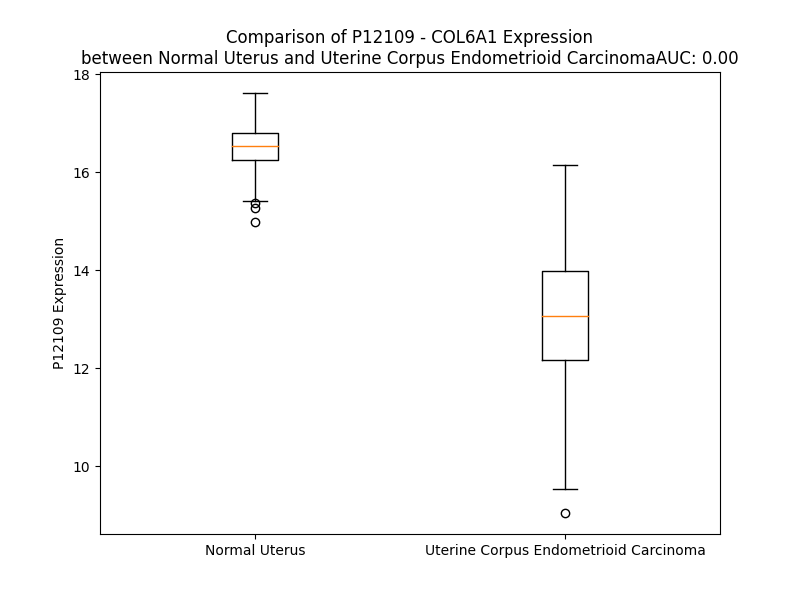

# Detailed Data for P12109

## Introduction to the Detailed Summary

### How to Interpret the Results

- **Summary & Metrics**: This section provides a quick reference to essential protein attributes, including expression changes, family classification, and biomarker applications. Regulation status (upregulated/downregulated) indicates the protein's behavior in a disease context. Some information comes from the original excel file with the proteins selected from literature, while others are derived from the analyses.
- **Expression Comparison**: A visual representation comparing protein expression between normal and disease states. It highlights significant changes in expression levels that might indicate diagnostic or therapeutic relevance. This is data coming from transcriptomics experiments and could not translate similarly to protein levels.
- **Isoform Alignment**: An interactive view of isoform alignments, revealing structural and functional differences between variants of the protein.
- **Interactors & Homologs**: Tables listing known interaction partners and homologous proteins, the more interactors and homologs, the more complex the protein is to design an antibody for.
- **Biological Assemblies**: Information about the structural arrangement of the protein in different assemblies, providing insights into its functional state but also the complexity of the protein to develop antibodies.
- **Combined Per-Residue Information**: A detailed table summarizing residue-level data. This includes predictions for epitope regions, aggregation tendencies, and modifications that might impact the protein's function. Each row corresponds to a residue in the protein, providing insights into specific sites that may be important for research or drug development.
## Summary & Metrics

- **UniProt Accession**: P12109
- **Gene Name**: COL6A1
- **Protein Name**: Collagen alpha-1(VI) chain
- **Swiss Prot**: CO6A1_HUMAN
- **Family**: other
- **Biomarker Application**:  
- **Number of Isoforms**: 0
- **Regulation**: 2
- **(transcriptomics) AUC**: 0.06
- **(transcriptomics) Fold Change**: 1.13
- **(transcriptomics) Regulation**: Downregulated
- **Discotope Epitope Count**: 321
- **Max n_uniprots (Homo)**: N/A
- **Max n_uniprots (Hetero)**: N/A

## Expression Comparison

## Interactors

| preferredName_A   | preferredName_B   |   score |
|:------------------|:------------------|--------:|
| COL6A1            | COL6A2            |   0.998 |
| COL6A1            | COL6A3            |   0.994 |
| COL6A1            | COL1A1            |   0.969 |
| COL6A1            | GP6               |   0.931 |
| COL6A1            | COL3A1            |   0.926 |
| COL6A1            | CD44              |   0.926 |
| COL6A1            | ITGA5             |   0.922 |
| COL6A1            | COL5A2            |   0.904 |

## Homologs

| uniprot_id   | gene_id   |
|:-------------|:----------|
| Q02388       | COL7A1    |
| A0A669KB28   | COL13A1   |
| A0A2R8YG47   | COL9A1    |
| P39059       | COL15A1   |
| Q8IZC6       | COL27A1   |
| A0A2R8Y760   | COL25A1   |
| Q9UMD9       | COL17A1   |
| P02458       | COL2A1    |
| A0A3B3ITQ8   | COL4A2    |
| H7C435       | COL3A1    |
| H7BXV5       | COL18A1   |
| Q49AM6       | COL4A5    |
| D6RA95       | EDA       |
| Q07092       | COL16A1   |
| F8WDX7       | EMID1     |
| P08123       | COL1A2    |
| P02452       | COL1A1    |
| A0A804HI71   | COL4A4    |
| A8MXH5       | COL4A6    |
| A6PVD9       | COL21A1   |
| P20908       | COL5A1    |
| Q14055       | COL9A2    |
| C9JMN2       | COL11A1   |
| F8WDM8       | COL24A1   |
| H7C0M5       | COL6A2    |
| Q96A83       | COL26A1   |
| P25940       | COL5A3    |
| L8EAS4       | COL23A1   |
| Q9P218       | COL20A1   |
| Q8NFW1       | COL22A1   |
| Q9Y215       | COLQ      |
| A0A0C4DFS1   | COL11A2   |
| A0A0C4DG66   | COL28A1   |
| A0A3B3IRH9   | COL5A2    |
| H7BXM4       | COL4A3    |
| Q14050       | COL9A3    |
| P02462       | COL4A1    |

## Combined Per-Residue Information

|   res | aa   |   epitope_score | epitope   |   relative_surface_accessibility |   modeling_confidence |   Aggregation | modification   | glycosylation                   |
|------:|:-----|----------------:|:----------|---------------------------------:|----------------------:|--------------:|:---------------|:--------------------------------|
|     1 | M    |         0.09308 | False     |                          1.22259 |                 49.26 |         0     | N/A            | N/A                             |
|     2 | R    |         0.15611 | True      |                          0.95352 |                 50.53 |         0     | N/A            | N/A                             |
|     3 | A    |         0.10758 | True      |                          0.8164  |                 51.16 |         0     | N/A            | N/A                             |
|     4 | A    |         0.09658 | False     |                          0.73288 |                 52.1  |         0     | N/A            | N/A                             |
|     5 | R    |         0.18643 | True      |                          0.86217 |                 53.55 |         0     | N/A            | N/A                             |
|     6 | A    |         0.10097 | False     |                          0.68312 |                 56.11 |         0     | N/A            | N/A                             |
|     7 | L    |         0.13946 | True      |                          0.69693 |                 51.43 |         0     | N/A            | N/A                             |
|     8 | L    |         0.06473 | False     |                          0.72815 |                 52.49 |         0     | N/A            | N/A                             |
|     9 | P    |         0.09347 | False     |                          0.60745 |                 52.46 |         0     | N/A            | N/A                             |
|    10 | L    |         0.16252 | True      |                          0.75095 |                 53.32 |         3.048 | N/A            | N/A                             |
|    11 | L    |         0.16964 | True      |                          0.73638 |                 52.08 |         3.403 | N/A            | N/A                             |
|    12 | L    |         0.09776 | False     |                          0.64329 |                 51.19 |         3.403 | N/A            | N/A                             |
|    13 | Q    |         0.09784 | False     |                          0.68848 |                 50.38 |         3.403 | N/A            | N/A                             |
|    14 | A    |         0.07397 | False     |                          0.56776 |                 47.3  |         3.403 | N/A            | N/A                             |
|    15 | C    |         0.081   | False     |                          0.64484 |                 42.25 |         3.095 | N/A            | N/A                             |
|    16 | W    |         0.14912 | True      |                          0.89233 |                 39.12 |         3.095 | N/A            | N/A                             |
|    17 | T    |         0.14838 | True      |                          0.78801 |                 42.03 |         1.655 | N/A            | N/A                             |
|    18 | A    |         0.12648 | True      |                          0.81291 |                 38.18 |         0.8   | N/A            | N/A                             |
|    19 | A    |         0.11082 | True      |                          0.73619 |                 36.85 |         0.189 | N/A            | N/A                             |
|    20 | Q    |         0.10659 | True      |                          0.8233  |                 35.15 |         0     | N/A            | N/A                             |
|    21 | D    |         0.12152 | True      |                          0.85272 |                 34.81 |         0     | N/A            | N/A                             |
|    22 | E    |         0.07155 | False     |                          0.81424 |                 30.05 |         0     | N/A            | N/A                             |
|    23 | P    |         0.05367 | False     |                          0.80878 |                 35.94 |         0     | N/A            | N/A                             |
|    24 | E    |         0.05289 | False     |                          0.89958 |                 34.05 |         0     | N/A            | N/A                             |
|    25 | T    |         0.04491 | False     |                          0.78175 |                 33.38 |         0     | N/A            | N/A                             |
|    26 | P    |         0.07091 | False     |                          0.90561 |                 38.43 |         0     | N/A            | N/A                             |
|    27 | R    |         0.07578 | False     |                          0.9272  |                 39.51 |         0     | N/A            | N/A                             |
|    28 | A    |         0.06141 | False     |                          0.86715 |                 41.31 |         0.643 | N/A            | N/A                             |
|    29 | V    |         0.06856 | False     |                          0.58655 |                 46.96 |         0.643 | N/A            | N/A                             |
|    30 | A    |         0.06851 | False     |                          0.48579 |                 51.61 |         0.643 | N/A            | N/A                             |
|    31 | F    |         0.11946 | True      |                          0.82436 |                 61.85 |         0.643 | N/A            | N/A                             |
|    32 | Q    |         0.1396  | True      |                          0.51865 |                 73.55 |         0.643 | N/A            | N/A                             |
|    33 | D    |         0.05769 | False     |                          0.17434 |                 85.9  |         0     | N/A            | N/A                             |
|    34 | C    |         0.01415 | False     |                          0.03087 |                 90.19 |         0     | N/A            | N/A                             |
|    35 | P    |         0.01441 | False     |                          0.04076 |                 93.06 |         0     | N/A            | N/A                             |
|    36 | V    |         0.00224 | False     |                          0       |                 96.13 |         0     | N/A            | N/A                             |
|    37 | D    |         0.00318 | False     |                          0       |                 97.53 |         0     | N/A            | N/A                             |
|    38 | L    |         0.0023  | False     |                          0       |                 97.86 |        81.585 | N/A            | N/A                             |
|    39 | F    |         0.00389 | False     |                          0       |                 98.33 |        81.585 | N/A            | N/A                             |
|    40 | F    |         0.00251 | False     |                          0       |                 98.57 |        81.585 | N/A            | N/A                             |
|    41 | V    |         0.00186 | False     |                          0       |                 98.06 |        81.585 | N/A            | N/A                             |
|    42 | L    |         0.00631 | False     |                          0.01319 |                 97.17 |        81.585 | N/A            | N/A                             |
|    43 | D    |         0.00227 | False     |                          0       |                 94.06 |         0     | N/A            | N/A                             |
|    44 | T    |         0.0034  | False     |                          0.01142 |                 92.2  |         0     | N/A            | N/A                             |
|    45 | S    |         0.00705 | False     |                          0       |                 90.07 |         0     | N/A            | N/A                             |
|    46 | E    |         0.00886 | False     |                          0.01648 |                 83.99 |         0     | N/A            | N/A                             |
|    47 | S    |         0.01125 | False     |                          0.0104  |                 84.63 |         0     | N/A            | N/A                             |
|    48 | V    |         0.00691 | False     |                          0.00807 |                 87.36 |         0     | N/A            | N/A                             |
|    49 | A    |         0.00573 | False     |                          0.00566 |                 86.23 |         0     | N/A            | N/A                             |
|    50 | L    |         0.01453 | False     |                          0.01154 |                 79.82 |         0     | N/A            | N/A                             |
|    51 | R    |         0.06447 | False     |                          0.08528 |                 78.18 |         0     | N/A            | N/A                             |
|    52 | L    |         0.08317 | False     |                          0.31188 |                 76.77 |         0     | N/A            | N/A                             |
|    53 | K    |         0.20787 | True      |                          0.56731 |                 71.06 |         0     | N/A            | N/A                             |
|    54 | P    |         0.29626 | True      |                          0.71617 |                 78.77 |         0     | N/A            | N/A                             |
|    55 | Y    |         0.05261 | False     |                          0.09148 |                 80.74 |         0.967 | N/A            | N/A                             |
|    56 | G    |         0.02499 | False     |                          0.07726 |                 83.1  |         0.967 | N/A            | N/A                             |
|    57 | A    |         0.02911 | False     |                          0.2114  |                 85.97 |         0.967 | N/A            | N/A                             |
|    58 | L    |         0.03129 | False     |                          0.00931 |                 87.1  |         0.967 | N/A            | N/A                             |
|    59 | V    |         0.00431 | False     |                          0.01333 |                 91.19 |         0.967 | N/A            | N/A                             |
|    60 | D    |         0.12945 | True      |                          0.4947  |                 91.41 |         0     | N/A            | N/A                             |
|    61 | K    |         0.04133 | False     |                          0.29769 |                 90.6  |         0     | N/A            | N/A                             |
|    62 | V    |         0.00594 | False     |                          0.00952 |                 92.93 |         0     | N/A            | N/A                             |
|    63 | K    |         0.04207 | False     |                          0.13369 |                 95.32 |         0     | N/A            | N/A                             |
|    64 | S    |         0.04959 | False     |                          0.47506 |                 93.91 |         0     | N/A            | N/A                             |
|    65 | F    |         0.01053 | False     |                          0.01815 |                 95.2  |         0     | N/A            | N/A                             |
|    66 | T    |         0.00242 | False     |                          0       |                 97.33 |         0     | N/A            | N/A                             |
|    67 | K    |         0.03131 | False     |                          0.25852 |                 96.77 |         0     | N/A            | N/A                             |
|    68 | R    |         0.14311 | True      |                          0.37863 |                 95.03 |         0     | N/A            | N/A                             |
|    69 | F    |         0.00158 | False     |                          0       |                 97.55 |         0     | N/A            | N/A                             |
|    70 | I    |         0.00231 | False     |                          0       |                 97.12 |         0     | N/A            | N/A                             |
|    71 | D    |         0.06    | False     |                          0.29661 |                 95.51 |         0     | N/A            | N/A                             |
|    72 | N    |         0.06219 | False     |                          0.26995 |                 95.17 |         0     | N/A            | N/A                             |
|    73 | L    |         0.01519 | False     |                          0.01401 |                 95.53 |         0     | N/A            | N/A                             |
|    74 | R    |         0.11107 | True      |                          0.64865 |                 93.25 |         0     | N/A            | N/A                             |
|    75 | D    |         0.07354 | False     |                          0.48895 |                 91.2  |         0     | N/A            | N/A                             |
|    76 | R    |         0.12159 | True      |                          0.36523 |                 91.65 |         0     | N/A            | N/A                             |
|    77 | Y    |         0.09761 | False     |                          0.61713 |                 90.69 |         0     | N/A            | N/A                             |
|    78 | Y    |         0.0424  | False     |                          0.01409 |                 88.23 |         0     | N/A            | N/A                             |
|    79 | R    |         0.18539 | True      |                          0.93014 |                 84.41 |         0     | N/A            | N/A                             |
|    80 | C    |         0.05063 | False     |                          0.3667  |                 84.72 |         0     | N/A            | N/A                             |
|    81 | D    |         0.16602 | True      |                          0.56942 |                 84.84 |         0     | N/A            | N/A                             |
|    82 | R    |         0.15904 | True      |                          0.20572 |                 86.45 |         0     | N/A            | N/A                             |
|    83 | N    |         0.07695 | False     |                          0.3289  |                 90.69 |         0     | N/A            | N/A                             |
|    84 | L    |         0.01365 | False     |                          0       |                 93.37 |         0.199 | N/A            | N/A                             |
|    85 | V    |         0.04445 | False     |                          0.03999 |                 94.07 |         0.199 | N/A            | N/A                             |
|    86 | W    |         0.00382 | False     |                          0       |                 96.39 |         0.199 | N/A            | N/A                             |
|    87 | N    |         0.02642 | False     |                          0.14735 |                 96.38 |         0.199 | N/A            | N/A                             |
|    88 | A    |         0.00142 | False     |                          0       |                 97.64 |         0.199 | N/A            | N/A                             |
|    89 | G    |         0.00238 | False     |                          0       |                 97.64 |         0     | N/A            | N/A                             |
|    90 | A    |         0.00134 | False     |                          0       |                 98.34 |         0     | N/A            | N/A                             |
|    91 | L    |         0.00324 | False     |                          0       |                 97.89 |         0     | N/A            | N/A                             |
|    92 | H    |         0.01831 | False     |                          0.02156 |                 96.56 |         0     | N/A            | N/A                             |
|    93 | Y    |         0.00386 | False     |                          0       |                 94.83 |         0     | N/A            | N/A                             |
|    94 | S    |         0.00791 | False     |                          0       |                 90.58 |         0     | N/A            | N/A                             |
|    95 | D    |         0.05836 | False     |                          0.24677 |                 84.73 |         0     | N/A            | N/A                             |
|    96 | E    |         0.13135 | True      |                          0.55971 |                 88.04 |         0     | N/A            | N/A                             |
|    97 | V    |         0.06558 | False     |                          0.31177 |                 93.49 |         0     | N/A            | N/A                             |
|    98 | E    |         0.09152 | False     |                          0.45791 |                 95.02 |         0     | N/A            | N/A                             |
|    99 | I    |         0.07445 | False     |                          0.37737 |                 95.26 |         0.628 | N/A            | N/A                             |
|   100 | I    |         0.04084 | False     |                          0.15868 |                 94.7  |         0.628 | N/A            | N/A                             |
|   101 | Q    |         0.03616 | False     |                          0.23094 |                 96.37 |         0.628 | N/A            | N/A                             |
|   102 | G    |         0.0327  | False     |                          0.34327 |                 93.95 |         0.628 | N/A            | N/A                             |
|   103 | L    |         0.04064 | False     |                          0.21744 |                 94.78 |         0.628 | N/A            | N/A                             |
|   104 | T    |         0.03847 | False     |                          0.2523  |                 93.56 |         0.233 | N/A            | N/A                             |
|   105 | R    |         0.07662 | False     |                          0.45951 |                 92.93 |         0     | N/A            | N/A                             |
|   106 | M    |         0.01601 | False     |                          0.0222  |                 93.45 |         0     | N/A            | N/A                             |
|   107 | P    |         0.14839 | True      |                          0.69241 |                 90.41 |         0     | N/A            | N/A                             |
|   108 | G    |         0.15364 | True      |                          0.9166  |                 90.06 |         0     | N/A            | N/A                             |
|   109 | G    |         0.01872 | False     |                          0.13709 |                 93.33 |         0     | N/A            | N/A                             |
|   110 | R    |         0.06228 | False     |                          0.17695 |                 96.24 |         0     | N/A            | N/A                             |
|   111 | D    |         0.15845 | True      |                          0.6777  |                 96    |         0     | N/A            | N/A                             |
|   112 | A    |         0.05746 | False     |                          0.4902  |                 96.6  |         0     | N/A            | N/A                             |
|   113 | L    |         0.00186 | False     |                          0       |                 97.48 |         0     | N/A            | N/A                             |
|   114 | K    |         0.0622  | False     |                          0.23092 |                 97.98 |         0     | N/A            | N/A                             |
|   115 | S    |         0.10143 | False     |                          0.55656 |                 97.52 |         0     | N/A            | N/A                             |
|   116 | S    |         0.03372 | False     |                          0.20135 |                 97.83 |         0     | N/A            | N/A                             |
|   117 | V    |         0.00183 | False     |                          0       |                 97.16 |         0.179 | N/A            | N/A                             |
|   118 | D    |         0.12081 | True      |                          0.44088 |                 96.09 |         0.179 | N/A            | N/A                             |
|   119 | A    |         0.08069 | False     |                          0.68009 |                 95.65 |         0.179 | N/A            | N/A                             |
|   120 | V    |         0.03938 | False     |                          0.06373 |                 93.19 |         0.179 | N/A            | N/A                             |
|   121 | K    |         0.11305 | True      |                          0.83704 |                 85.97 |         0.179 | N/A            | N/A                             |
|   122 | Y    |         0.06815 | False     |                          0.17504 |                 84.37 |         0.179 | N/A            | N/A                             |
|   123 | F    |         0.0551  | False     |                          0.23959 |                 73.97 |         0.179 | N/A            | N/A                             |
|   124 | G    |         0.01263 | False     |                          0       |                 71.37 |         0     | N/A            | N/A                             |
|   125 | K    |         0.11549 | True      |                          0.26332 |                 75.06 |         0     | N/A            | N/A                             |
|   126 | G    |         0.05186 | False     |                          0.06209 |                 79.95 |         0     | N/A            | N/A                             |
|   127 | T    |         0.06069 | False     |                          0.0372  |                 87.71 |         0     | N/A            | N/A                             |
|   128 | Y    |         0.0357  | False     |                          0.19888 |                 89.93 |         0     | N/A            | N/A                             |
|   129 | T    |         0.0062  | False     |                          0.01751 |                 91.46 |         0     | N/A            | N/A                             |
|   130 | D    |         0.0067  | False     |                          0.00275 |                 92.51 |         0     | N/A            | N/A                             |
|   131 | C    |         0.0244  | False     |                          0.11174 |                 93.93 |         0     | N/A            | N/A                             |
|   132 | A    |         0.00128 | False     |                          0       |                 95.76 |         0     | N/A            | N/A                             |
|   133 | I    |         0.0014  | False     |                          0       |                 96.38 |         0     | N/A            | N/A                             |
|   134 | K    |         0.04533 | False     |                          0.26609 |                 95.85 |         0     | N/A            | N/A                             |
|   135 | K    |         0.01778 | False     |                          0.33754 |                 96.28 |         0     | N/A            | N/A                             |
|   136 | G    |         0.00085 | False     |                          0       |                 96.49 |         0     | N/A            | N/A                             |
|   137 | L    |         0.01619 | False     |                          0.01978 |                 95.62 |         0     | N/A            | N/A                             |
|   138 | E    |         0.08715 | False     |                          0.3847  |                 94.02 |         0     | N/A            | N/A                             |
|   139 | Q    |         0.01742 | False     |                          0.17841 |                 94.54 |         0     | N/A            | N/A                             |
|   140 | L    |         0.00158 | False     |                          0       |                 94.44 |         0     | N/A            | N/A                             |
|   141 | L    |         0.06408 | False     |                          0.4406  |                 90.52 |         0     | N/A            | N/A                             |
|   142 | V    |         0.10845 | True      |                          0.88974 |                 87.93 |         0     | N/A            | N/A                             |
|   143 | G    |         0.08791 | False     |                          0.62938 |                 81.3  |         0     | N/A            | N/A                             |
|   144 | G    |         0.01543 | False     |                          0.24037 |                 85.81 |         0     | N/A            | N/A                             |
|   145 | S    |         0.04    | False     |                          0.17272 |                 87.98 |         0     | N/A            | N/A                             |
|   146 | H    |         0.08787 | False     |                          0.71484 |                 82.4  |         0     | N/A            | N/A                             |
|   147 | L    |         0.03777 | False     |                          0.26956 |                 84.69 |         0     | N/A            | N/A                             |
|   148 | K    |         0.04747 | False     |                          0.71355 |                 82.49 |         0     | N/A            | N/A                             |
|   149 | E    |         0.04866 | False     |                          0.47934 |                 86.59 |         0.009 | N/A            | N/A                             |
|   150 | N    |         0.00213 | False     |                          0.00127 |                 94.09 |         0.011 | N/A            | N/A                             |
|   151 | K    |         0.01282 | False     |                          0.03361 |                 97.09 |         0.018 | N/A            | N/A                             |
|   152 | Y    |         0.00645 | False     |                          0.00741 |                 98.23 |        89.208 | N/A            | N/A                             |
|   153 | L    |         0.00207 | False     |                          0       |                 98.34 |        98.856 | N/A            | N/A                             |
|   154 | I    |         0.00324 | False     |                          0       |                 98.27 |        98.856 | N/A            | N/A                             |
|   155 | V    |         0.00107 | False     |                          0       |                 97.62 |        98.856 | N/A            | N/A                             |
|   156 | V    |         0.00079 | False     |                          0       |                 96.14 |        98.856 | N/A            | N/A                             |
|   157 | T    |         0.00547 | False     |                          0       |                 93.45 |        42.929 | N/A            | N/A                             |
|   158 | D    |         0.00885 | False     |                          0.00664 |                 87.55 |         0.009 | N/A            | N/A                             |
|   159 | G    |         0.00825 | False     |                          0.00966 |                 83.12 |         0     | N/A            | N/A                             |
|   160 | H    |         0.13091 | True      |                          0.07626 |                 82.67 |         0     | N/A            | N/A                             |
|   161 | P    |         0.08064 | False     |                          0.07373 |                 70.43 |         0     | N/A            | N/A                             |
|   162 | L    |         0.18459 | True      |                          0.55643 |                 64.53 |         0     | N/A            | N/A                             |
|   163 | E    |         0.26295 | True      |                          0.59752 |                 62.66 |         0     | N/A            | N/A                             |
|   164 | G    |         0.1231  | True      |                          0.55936 |                 56.38 |         0     | N/A            | N/A                             |
|   165 | Y    |         0.13983 | True      |                          0.26995 |                 63.78 |         0     | N/A            | N/A                             |
|   166 | K    |         0.1532  | True      |                          0.91639 |                 66.73 |         0     | N/A            | N/A                             |
|   167 | E    |         0.09673 | False     |                          0.18297 |                 79    |         0     | N/A            | N/A                             |
|   168 | P    |         0.07311 | False     |                          0.53029 |                 82.44 |         0     | N/A            | N/A                             |
|   169 | C    |         0.07674 | False     |                          0.34772 |                 89    |         0     | N/A            | N/A                             |
|   170 | G    |         0.10888 | True      |                          0.708   |                 85.49 |         0     | N/A            | N/A                             |
|   171 | G    |         0.03625 | False     |                          0.16072 |                 88.81 |         0     | N/A            | N/A                             |
|   172 | L    |         0.01606 | False     |                          0.02933 |                 89.63 |         0     | N/A            | N/A                             |
|   173 | E    |         0.07101 | False     |                          0.55287 |                 89.91 |         0     | N/A            | N/A                             |
|   174 | D    |         0.07714 | False     |                          0.43268 |                 92.34 |         0     | N/A            | N/A                             |
|   175 | A    |         0.00144 | False     |                          0       |                 93.59 |         0     | N/A            | N/A                             |
|   176 | V    |         0.01165 | False     |                          0.01428 |                 94.24 |         0     | N/A            | N/A                             |
|   177 | N    |         0.11824 | True      |                          0.50452 |                 94.58 |         0     | N/A            | N/A                             |
|   178 | E    |         0.05079 | False     |                          0.37531 |                 94.89 |         0     | N/A            | N/A                             |
|   179 | A    |         0.00179 | False     |                          0       |                 95.59 |         0     | N/A            | N/A                             |
|   180 | K    |         0.1112  | True      |                          0.49204 |                 93.6  |         0     | N/A            | N/A                             |
|   181 | H    |         0.12834 | True      |                          0.90184 |                 93.09 |         0     | N/A            | N/A                             |
|   182 | L    |         0.05449 | False     |                          0.36485 |                 92.54 |         0     | N/A            | N/A                             |
|   183 | G    |         0.06111 | False     |                          0.303   |                 91.51 |         0     | N/A            | N/A                             |
|   184 | V    |         0.02674 | False     |                          0.01759 |                 95.71 |         0     | N/A            | N/A                             |
|   185 | K    |         0.03091 | False     |                          0.20764 |                 96.76 |         0     | N/A            | N/A                             |
|   186 | V    |         0.00285 | False     |                          0       |                 97.82 |        33.131 | N/A            | N/A                             |
|   187 | F    |         0.002   | False     |                          0       |                 98.1  |        35.591 | N/A            | N/A                             |
|   188 | S    |         0.00297 | False     |                          0       |                 96.13 |        35.591 | N/A            | N/A                             |
|   189 | V    |         0.0032  | False     |                          0       |                 95.58 |        35.591 | N/A            | N/A                             |
|   190 | A    |         0.00441 | False     |                          0.00255 |                 93    |        35.591 | N/A            | N/A                             |
|   191 | I    |         0.01028 | False     |                          0.004   |                 89.64 |        32.944 | N/A            | N/A                             |
|   192 | T    |         0.0213  | False     |                          0       |                 82.68 |         1.574 | N/A            | N/A                             |
|   193 | P    |         0.11139 | True      |                          0.51857 |                 73.45 |         0.69  | N/A            | N/A                             |
|   194 | D    |         0.17212 | True      |                          0.60105 |                 67.27 |         0     | N/A            | N/A                             |
|   195 | H    |         0.07791 | False     |                          0.12771 |                 68.76 |         0     | N/A            | N/A                             |
|   196 | L    |         0.10782 | True      |                          0.24401 |                 67.8  |         0     | N/A            | N/A                             |
|   197 | E    |         0.10849 | True      |                          0.35499 |                 78.95 |         0     | N/A            | N/A                             |
|   198 | P    |         0.15568 | True      |                          0.67297 |                 82.43 |         0     | N/A            | N/A                             |
|   199 | R    |         0.06761 | False     |                          0.12051 |                 85.81 |         0     | N/A            | N/A                             |
|   200 | L    |         0.00588 | False     |                          0.00082 |                 89.56 |        15.808 | N/A            | N/A                             |
|   201 | S    |         0.03905 | False     |                          0.41911 |                 90.34 |        16.888 | N/A            | N/A                             |
|   202 | I    |         0.08669 | False     |                          0.42359 |                 90.27 |        16.888 | N/A            | N/A                             |
|   203 | I    |         0.00516 | False     |                          0.0048  |                 92.74 |        16.888 | N/A            | N/A                             |
|   204 | A    |         0.0121  | False     |                          0.04686 |                 94.93 |        16.888 | N/A            | N/A                             |
|   205 | T    |         0.02442 | False     |                          0.12714 |                 94.7  |         6.977 | N/A            | N/A                             |
|   206 | D    |         0.07898 | False     |                          0.32354 |                 92.45 |         0     | N/A            | N/A                             |
|   207 | H    |         0.08956 | False     |                          0.79693 |                 89.29 |         0     | N/A            | N/A                             |
|   208 | T    |         0.04276 | False     |                          0.26607 |                 92.21 |         0     | N/A            | N/A                             |
|   209 | Y    |         0.03064 | False     |                          0.1026  |                 95.11 |         0     | N/A            | N/A                             |
|   210 | R    |         0.09904 | False     |                          0.09425 |                 93.06 |         0     | N/A            | N/A                             |
|   211 | R    |         0.11983 | True      |                          0.54003 |                 86.65 |         0     | N/A            | N/A                             |
|   212 | N    |         0.12827 | True      |                          0.72328 |                 85.47 |         0     | N/A            | N-linked (GlcNAc...) asparagine |
|   213 | F    |         0.02598 | False     |                          0.0389  |                 92.23 |         0     | N/A            | N/A                             |
|   214 | T    |         0.04713 | False     |                          0.11736 |                 91.26 |         0     | N/A            | N/A                             |
|   215 | A    |         0.00615 | False     |                          0.01603 |                 89.18 |         0     | N/A            | N/A                             |
|   216 | A    |         0.01141 | False     |                          0.01727 |                 81.85 |         0     | N/A            | N/A                             |
|   217 | D    |         0.08915 | False     |                          0.23921 |                 74.9  |         0     | N/A            | N/A                             |
|   218 | W    |         0.20702 | True      |                          0.40631 |                 65.38 |         0     | N/A            | N/A                             |
|   219 | G    |         0.14984 | True      |                          0.44995 |                 58.93 |         0     | N/A            | N/A                             |
|   220 | Q    |         0.22448 | True      |                          0.97683 |                 58.27 |         0     | N/A            | N/A                             |
|   221 | S    |         0.11036 | True      |                          0.35632 |                 62.66 |         0     | N/A            | N/A                             |
|   222 | R    |         0.22846 | True      |                          0.85119 |                 67.23 |         0     | N/A            | N/A                             |
|   223 | D    |         0.13294 | True      |                          0.68164 |                 74.21 |         0     | N/A            | N/A                             |
|   224 | A    |         0.04933 | False     |                          0.07417 |                 75.41 |         0     | N/A            | N/A                             |
|   225 | E    |         0.11256 | True      |                          0.57597 |                 82.67 |         0     | N/A            | N/A                             |
|   226 | E    |         0.12262 | True      |                          0.51707 |                 84.98 |         0     | N/A            | N/A                             |
|   227 | A    |         0.03704 | False     |                          0.42138 |                 85.85 |         0     | N/A            | N/A                             |
|   228 | I    |         0.032   | False     |                          0.14799 |                 89.51 |         0     | N/A            | N/A                             |
|   229 | S    |         0.05511 | False     |                          0.18608 |                 91.34 |         0     | N/A            | N/A                             |
|   230 | Q    |         0.14576 | True      |                          0.50183 |                 91.31 |         0     | N/A            | N/A                             |
|   231 | T    |         0.02275 | False     |                          0.07932 |                 93.46 |         0     | N/A            | N/A                             |
|   232 | I    |         0.00827 | False     |                          0.0008  |                 96.59 |         0     | N/A            | N/A                             |
|   233 | D    |         0.06014 | False     |                          0.427   |                 96.33 |         0     | N/A            | N/A                             |
|   234 | T    |         0.05825 | False     |                          0.37135 |                 96.51 |         0     | N/A            | N/A                             |
|   235 | I    |         0.00232 | False     |                          0       |                 97.58 |         0     | N/A            | N/A                             |
|   236 | V    |         0.01731 | False     |                          0.03523 |                 97.21 |         0     | N/A            | N/A                             |
|   237 | D    |         0.10733 | True      |                          0.42643 |                 95.98 |         0     | N/A            | N/A                             |
|   238 | M    |         0.05811 | False     |                          0.14588 |                 95.24 |         0     | N/A            | N/A                             |
|   239 | I    |         0.00203 | False     |                          0       |                 96.3  |         0     | N/A            | N/A                             |
|   240 | K    |         0.02299 | False     |                          0.13831 |                 95.15 |         0     | N/A            | N/A                             |
|   241 | N    |         0.14547 | True      |                          0.48881 |                 92.55 |         0     | N/A            | N/A                             |
|   242 | N    |         0.05439 | False     |                          0.294   |                 92.37 |         0     | N/A            | N/A                             |
|   243 | V    |         0.00205 | False     |                          0.00095 |                 92.06 |         0     | N/A            | N/A                             |
|   244 | E    |         0.05669 | False     |                          0.27952 |                 90.63 |         0     | N/A            | N/A                             |
|   245 | Q    |         0.1153  | True      |                          0.69825 |                 87.45 |         0     | N/A            | N/A                             |
|   246 | V    |         0.03354 | False     |                          0.29825 |                 86.37 |         0     | N/A            | N/A                             |
|   247 | C    |         0.01463 | False     |                          0.11918 |                 85.23 |         0     | N/A            | N/A                             |
|   248 | C    |         0.07722 | False     |                          0.25523 |                 83.82 |         0     | N/A            | N/A                             |
|   249 | S    |         0.12661 | True      |                          0.53625 |                 77.77 |         0     | N/A            | N/A                             |
|   250 | F    |         0.08622 | False     |                          0.99258 |                 64.08 |         0     | N/A            | N/A                             |
|   251 | E    |         0.08358 | False     |                          0.78054 |                 53.53 |         0     | N/A            | N/A                             |
|   252 | C    |         0.08254 | False     |                          0.88722 |                 47.31 |         0     | N/A            | N/A                             |
|   253 | Q    |         0.09035 | False     |                          0.73327 |                 47.65 |         0     | N/A            | N/A                             |
|   254 | P    |         0.13806 | True      |                          0.854   |                 47.49 |         0     | N/A            | N/A                             |
|   255 | A    |         0.07678 | False     |                          0.91592 |                 45.33 |         0     | N/A            | N/A                             |
|   256 | R    |         0.12087 | True      |                          0.95156 |                 46.34 |         0     | N/A            | N/A                             |
|   257 | G    |         0.15679 | True      |                          0.55883 |                 50.16 |         0     | N/A            | N/A                             |
|   258 | P    |         0.12938 | True      |                          0.89428 |                 51.52 |         0     | N/A            | N/A                             |
|   259 | P    |         0.09961 | False     |                          0.97403 |                 47.6  |         0     | N/A            | N/A                             |
|   260 | G    |         0.11766 | True      |                          0.80196 |                 52.22 |         0     | N/A            | N/A                             |
|   261 | L    |         0.09592 | False     |                          1.07794 |                 49.22 |         0     | N/A            | N/A                             |
|   262 | R    |         0.09832 | False     |                          0.96457 |                 48.59 |         0     | N/A            | N/A                             |
|   263 | G    |         0.11315 | True      |                          0.76077 |                 52.08 |         0     | N/A            | N/A                             |
|   264 | D    |         0.10152 | False     |                          0.80669 |                 54.36 |         0     | N/A            | N/A                             |
|   265 | P    |         0.10467 | True      |                          0.9388  |                 53.49 |         0     | N/A            | N/A                             |
|   266 | G    |         0.09697 | False     |                          0.83597 |                 49.76 |         0     | N/A            | N/A                             |
|   267 | F    |         0.08938 | False     |                          1.01956 |                 51.95 |         0     | N/A            | N/A                             |
|   268 | E    |         0.12986 | True      |                          0.89253 |                 47.28 |         0     | N/A            | N/A                             |
|   269 | G    |         0.09017 | False     |                          0.80916 |                 48.84 |         0     | N/A            | N/A                             |
|   270 | E    |         0.0936  | False     |                          0.81304 |                 50.46 |         0     | N/A            | N/A                             |
|   271 | R    |         0.13533 | True      |                          0.92652 |                 49.87 |         0     | N/A            | N/A                             |
|   272 | G    |         0.09078 | False     |                          0.81325 |                 48.81 |         0     | N/A            | N/A                             |
|   273 | K    |         0.08139 | False     |                          0.87045 |                 48.1  |         0     | N/A            | N/A                             |
|   274 | P    |         0.12685 | True      |                          0.91844 |                 48.65 |         0     | N/A            | N/A                             |
|   275 | G    |         0.12585 | True      |                          0.80972 |                 46.58 |         0     | N/A            | N/A                             |
|   276 | L    |         0.0697  | False     |                          1.02552 |                 44.15 |         0     | N/A            | N/A                             |
|   277 | P    |         0.11416 | True      |                          0.89856 |                 50.24 |         0     | N/A            | N/A                             |
|   278 | G    |         0.09592 | False     |                          0.82921 |                 49.98 |         0     | N/A            | N/A                             |
|   279 | E    |         0.09612 | False     |                          0.88346 |                 49.07 |         0     | N/A            | N/A                             |
|   280 | K    |         0.07323 | False     |                          0.94476 |                 46.36 |         0     | N/A            | N/A                             |
|   281 | G    |         0.09092 | False     |                          0.75366 |                 49.43 |         0     | N/A            | N/A                             |
|   282 | E    |         0.08953 | False     |                          0.86156 |                 49.78 |         0     | N/A            | N/A                             |
|   283 | A    |         0.06892 | False     |                          0.86349 |                 49.33 |         0     | N/A            | N/A                             |
|   284 | G    |         0.09838 | False     |                          0.81673 |                 48.26 |         0     | N/A            | N/A                             |
|   285 | D    |         0.07118 | False     |                          0.82829 |                 49.77 |         0     | N/A            | N/A                             |
|   286 | P    |         0.10176 | False     |                          0.85568 |                 52.72 |         0     | N/A            | N/A                             |
|   287 | G    |         0.10555 | True      |                          0.82702 |                 51.04 |         0     | N/A            | N/A                             |
|   288 | R    |         0.08538 | False     |                          0.90762 |                 50.35 |         0     | N/A            | N/A                             |
|   289 | P    |         0.11171 | True      |                          0.90215 |                 49.61 |         0     | N/A            | N/A                             |
|   290 | G    |         0.11692 | True      |                          0.83339 |                 48.16 |         0     | N/A            | N/A                             |
|   291 | D    |         0.11439 | True      |                          0.86825 |                 47.89 |         0     | N/A            | N/A                             |
|   292 | L    |         0.09176 | False     |                          0.983   |                 45.5  |         0     | N/A            | N/A                             |
|   293 | G    |         0.10305 | True      |                          0.67102 |                 45.32 |         0     | N/A            | N/A                             |
|   294 | P    |         0.08319 | False     |                          0.93361 |                 44.93 |         0     | N/A            | N/A                             |
|   295 | V    |         0.0761  | False     |                          0.82299 |                 49.21 |         0     | N/A            | N/A                             |
|   296 | G    |         0.0898  | False     |                          0.78448 |                 45.12 |         0     | N/A            | N/A                             |
|   297 | Y    |         0.13207 | True      |                          0.95616 |                 43.66 |         0     | N/A            | N/A                             |
|   298 | Q    |         0.11942 | True      |                          0.87452 |                 40.93 |         0     | N/A            | N/A                             |
|   299 | G    |         0.07508 | False     |                          0.81449 |                 46.31 |         0     | N/A            | N/A                             |
|   300 | M    |         0.12553 | True      |                          0.96803 |                 38.18 |         0     | N/A            | N/A                             |
|   301 | K    |         0.12007 | True      |                          0.93511 |                 42.09 |         0     | N/A            | N/A                             |
|   302 | G    |         0.06217 | False     |                          0.78896 |                 48.02 |         0     | N/A            | N/A                             |
|   303 | E    |         0.14031 | True      |                          0.85498 |                 42.83 |         0     | N/A            | N/A                             |
|   304 | K    |         0.0861  | False     |                          0.96952 |                 45.17 |         0     | N/A            | N/A                             |
|   305 | G    |         0.09658 | False     |                          0.80884 |                 47.75 |         0     | N/A            | N/A                             |
|   306 | S    |         0.08754 | False     |                          0.86699 |                 45.21 |         0     | N/A            | N/A                             |
|   307 | R    |         0.08637 | False     |                          0.88887 |                 44.66 |         0     | N/A            | N/A                             |
|   308 | G    |         0.07815 | False     |                          0.90742 |                 45.23 |         0     | N/A            | N/A                             |
|   309 | E    |         0.13015 | True      |                          0.85741 |                 52.04 |         0     | N/A            | N/A                             |
|   310 | K    |         0.10155 | False     |                          0.9709  |                 41.26 |         0     | N/A            | N/A                             |
|   311 | G    |         0.11666 | True      |                          0.93379 |                 43.16 |         0     | N/A            | N/A                             |
|   312 | S    |         0.1223  | True      |                          0.83389 |                 47.6  |         0     | N/A            | N/A                             |
|   313 | R    |         0.17891 | True      |                          0.9448  |                 45.62 |         0     | N/A            | N/A                             |
|   314 | G    |         0.08407 | False     |                          0.72318 |                 43.62 |         0     | N/A            | N/A                             |
|   315 | P    |         0.11316 | True      |                          0.85833 |                 47.83 |         0     | N/A            | N/A                             |
|   316 | K    |         0.07828 | False     |                          0.95025 |                 45.26 |         0     | N/A            | N/A                             |
|   317 | G    |         0.09096 | False     |                          0.87866 |                 43.61 |         0     | N/A            | N/A                             |
|   318 | Y    |         0.10725 | True      |                          0.90344 |                 45.36 |         0     | N/A            | N/A                             |
|   319 | K    |         0.08927 | False     |                          0.97821 |                 47.32 |         0     | N/A            | N/A                             |
|   320 | G    |         0.11347 | True      |                          0.8113  |                 45.5  |         0     | N/A            | N/A                             |
|   321 | E    |         0.12062 | True      |                          0.86663 |                 43.51 |         0     | N/A            | N/A                             |
|   322 | K    |         0.11387 | True      |                          0.98045 |                 45.98 |         0     | N/A            | N/A                             |
|   323 | G    |         0.11807 | True      |                          0.86079 |                 48.38 |         0     | N/A            | N/A                             |
|   324 | K    |         0.09508 | False     |                          0.977   |                 45.7  |         0     | N/A            | N/A                             |
|   325 | R    |         0.21532 | True      |                          0.92681 |                 49.87 |         0     | N/A            | N/A                             |
|   326 | G    |         0.10434 | True      |                          0.80986 |                 50.86 |         0     | N/A            | N/A                             |
|   327 | I    |         0.10357 | True      |                          0.9876  |                 43.07 |         0     | N/A            | N/A                             |
|   328 | D    |         0.12019 | True      |                          0.80951 |                 48.97 |         0     | N/A            | N/A                             |
|   329 | G    |         0.10129 | False     |                          0.86664 |                 48.49 |         0     | N/A            | N/A                             |
|   330 | V    |         0.0555  | False     |                          1.00203 |                 42.91 |         0     | N/A            | N/A                             |
|   331 | D    |         0.08798 | False     |                          0.82717 |                 49.68 |         0     | N/A            | N/A                             |
|   332 | G    |         0.13264 | True      |                          0.88457 |                 45.13 |         0     | N/A            | N/A                             |
|   333 | V    |         0.0988  | False     |                          1.01682 |                 49.59 |         0     | N/A            | N/A                             |
|   334 | K    |         0.10204 | False     |                          0.93955 |                 49.81 |         0     | N/A            | N/A                             |
|   335 | G    |         0.09626 | False     |                          0.7956  |                 44.58 |         0     | N/A            | N/A                             |
|   336 | E    |         0.102   | False     |                          0.81227 |                 47.5  |         0     | N/A            | N/A                             |
|   337 | M    |         0.10567 | True      |                          0.97497 |                 43.39 |         0     | N/A            | N/A                             |
|   338 | G    |         0.12795 | True      |                          0.7419  |                 40.96 |         0     | N/A            | N/A                             |
|   339 | Y    |         0.13523 | True      |                          0.91265 |                 45.34 |         0     | N/A            | N/A                             |
|   340 | P    |         0.14048 | True      |                          0.87864 |                 50.86 |         0     | N/A            | N/A                             |
|   341 | G    |         0.12557 | True      |                          0.83321 |                 40.85 |         0     | N/A            | N/A                             |
|   342 | L    |         0.09773 | False     |                          1.04651 |                 39.03 |         0     | N/A            | N/A                             |
|   343 | P    |         0.14621 | True      |                          0.91291 |                 53.06 |         0     | N/A            | N/A                             |
|   344 | G    |         0.1374  | True      |                          0.87678 |                 41.38 |         0     | N/A            | N/A                             |
|   345 | C    |         0.0944  | False     |                          0.96835 |                 35.39 |         0     | N/A            | N/A                             |
|   346 | K    |         0.1408  | True      |                          0.97293 |                 43.7  |         0     | N/A            | N/A                             |
|   347 | G    |         0.16216 | True      |                          0.75505 |                 40.68 |         0     | N/A            | N/A                             |
|   348 | S    |         0.09237 | False     |                          0.79273 |                 38.92 |         0     | N/A            | N/A                             |
|   349 | P    |         0.1413  | True      |                          0.91282 |                 47.2  |         0     | N/A            | N/A                             |
|   350 | G    |         0.12087 | True      |                          0.77684 |                 42.48 |         0     | N/A            | N/A                             |
|   351 | F    |         0.11488 | True      |                          1.03889 |                 40.53 |         0     | N/A            | N/A                             |
|   352 | D    |         0.14672 | True      |                          0.83926 |                 47.87 |         0     | N/A            | N/A                             |
|   353 | G    |         0.15052 | True      |                          0.87433 |                 43.03 |         0     | N/A            | N/A                             |
|   354 | I    |         0.1644  | True      |                          0.99921 |                 44.98 |         0     | N/A            | N/A                             |
|   355 | Q    |         0.14011 | True      |                          0.86398 |                 44.18 |         0     | N/A            | N/A                             |
|   356 | G    |         0.20505 | True      |                          0.59644 |                 44.24 |         0     | N/A            | N/A                             |
|   357 | P    |         0.18586 | True      |                          0.91593 |                 45.2  |         0     | N/A            | N/A                             |
|   358 | P    |         0.19652 | True      |                          0.9567  |                 49.85 |         0     | N/A            | N/A                             |
|   359 | G    |         0.2175  | True      |                          0.71948 |                 46.9  |         0     | N/A            | N/A                             |
|   360 | P    |         0.18989 | True      |                          0.99434 |                 50.06 |         0     | N/A            | N/A                             |
|   361 | K    |         0.12373 | True      |                          0.95177 |                 46.54 |         0     | N/A            | N/A                             |
|   362 | G    |         0.14543 | True      |                          0.7833  |                 47.47 |         0     | N/A            | N/A                             |
|   363 | D    |         0.15807 | True      |                          0.82522 |                 47.06 |         0     | N/A            | N/A                             |
|   364 | P    |         0.14596 | True      |                          0.95021 |                 49.14 |         0     | N/A            | N/A                             |
|   365 | G    |         0.16837 | True      |                          0.85883 |                 48.16 |         0     | N/A            | N/A                             |
|   366 | A    |         0.09938 | False     |                          0.94304 |                 38.09 |         0     | N/A            | N/A                             |
|   367 | F    |         0.10204 | False     |                          1.03791 |                 43.88 |         0     | N/A            | N/A                             |
|   368 | G    |         0.08871 | False     |                          0.87152 |                 43.72 |         0     | N/A            | N/A                             |
|   369 | L    |         0.09836 | False     |                          1.07645 |                 40.06 |         0     | N/A            | N/A                             |
|   370 | K    |         0.09344 | False     |                          0.97965 |                 45.87 |         0     | N/A            | N/A                             |
|   371 | G    |         0.08201 | False     |                          0.79033 |                 47.44 |         0     | N/A            | N/A                             |
|   372 | E    |         0.12969 | True      |                          0.90093 |                 43.78 |         0     | N/A            | N/A                             |
|   373 | K    |         0.09443 | False     |                          0.98748 |                 49.97 |         0     | N/A            | N/A                             |
|   374 | G    |         0.12065 | True      |                          0.77659 |                 46.93 |         0     | N/A            | N/A                             |
|   375 | E    |         0.11079 | True      |                          0.84184 |                 45.29 |         0     | N/A            | N/A                             |
|   376 | P    |         0.15137 | True      |                          1.00009 |                 53.71 |         0     | N/A            | N/A                             |
|   377 | G    |         0.11731 | True      |                          0.84523 |                 48.27 |         0     | N/A            | N/A                             |
|   378 | A    |         0.13795 | True      |                          0.98275 |                 42.8  |         0     | N/A            | N/A                             |
|   379 | D    |         0.13647 | True      |                          0.90458 |                 46.07 |         0     | N/A            | N/A                             |
|   380 | G    |         0.11262 | True      |                          0.90404 |                 44.36 |         0     | N/A            | N/A                             |
|   381 | E    |         0.09827 | False     |                          0.89827 |                 43.08 |         0     | N/A            | N/A                             |
|   382 | A    |         0.11112 | True      |                          0.98676 |                 44.67 |         0     | N/A            | N/A                             |
|   383 | G    |         0.13019 | True      |                          0.85409 |                 43.85 |         0     | N/A            | N/A                             |
|   384 | R    |         0.15317 | True      |                          0.9346  |                 40.53 |         0     | N/A            | N/A                             |
|   385 | P    |         0.1261  | True      |                          0.97848 |                 49.25 |         0     | N/A            | N/A                             |
|   386 | G    |         0.11948 | True      |                          0.9004  |                 47.92 |         0     | N/A            | N/A                             |
|   387 | S    |         0.09333 | False     |                          0.87798 |                 38.28 |         0     | N/A            | N/A                             |
|   388 | S    |         0.15107 | True      |                          0.90495 |                 42.32 |         0     | N/A            | N/A                             |
|   389 | G    |         0.17863 | True      |                          0.77163 |                 43.37 |         0     | N/A            | N/A                             |
|   390 | P    |         0.16254 | True      |                          0.99613 |                 41.74 |         0     | N/A            | N/A                             |
|   391 | S    |         0.10953 | True      |                          0.8857  |                 46.78 |         0     | N/A            | N/A                             |
|   392 | G    |         0.11289 | True      |                          0.87033 |                 42.46 |         0     | N/A            | N/A                             |
|   393 | D    |         0.15065 | True      |                          0.92824 |                 37.1  |         0     | N/A            | N/A                             |
|   394 | E    |         0.17749 | True      |                          0.90558 |                 45.49 |         0     | N/A            | N/A                             |
|   395 | G    |         0.18943 | True      |                          0.80728 |                 42.89 |         0     | N/A            | N/A                             |
|   396 | Q    |         0.19162 | True      |                          0.87873 |                 43.26 |         0     | N/A            | N/A                             |
|   397 | P    |         0.18307 | True      |                          0.96625 |                 55.64 |         0     | N/A            | N/A                             |
|   398 | G    |         0.25746 | True      |                          0.82747 |                 47.48 |         0     | N/A            | N/A                             |
|   399 | E    |         0.21418 | True      |                          0.87692 |                 46.08 |         0     | N/A            | N/A                             |
|   400 | P    |         0.21608 | True      |                          0.95812 |                 57.77 |         0     | N/A            | N/A                             |
|   401 | G    |         0.30034 | True      |                          0.7242  |                 50.78 |         0     | N/A            | N/A                             |
|   402 | P    |         0.25139 | True      |                          0.92051 |                 49.37 |         0     | N/A            | N/A                             |
|   403 | P    |         0.15432 | True      |                          0.96538 |                 58.04 |         0     | N/A            | N/A                             |
|   404 | G    |         0.18604 | True      |                          0.87733 |                 46.97 |         0     | N/A            | N/A                             |
|   405 | E    |         0.15625 | True      |                          0.91154 |                 40.65 |         0     | N/A            | N/A                             |
|   406 | K    |         0.09868 | False     |                          0.96951 |                 46.29 |         0     | N/A            | N/A                             |
|   407 | G    |         0.12793 | True      |                          0.81203 |                 47.51 |         0     | N/A            | N/A                             |
|   408 | E    |         0.1399  | True      |                          0.9029  |                 44.23 |         0     | N/A            | N/A                             |
|   409 | A    |         0.13176 | True      |                          0.94562 |                 45.01 |         0     | N/A            | N/A                             |
|   410 | G    |         0.15717 | True      |                          0.91492 |                 49.18 |         0     | N/A            | N/A                             |
|   411 | D    |         0.1484  | True      |                          0.87206 |                 48.19 |         0     | N/A            | N/A                             |
|   412 | E    |         0.10206 | True      |                          0.88934 |                 40.57 |         0     | N/A            | N/A                             |
|   413 | G    |         0.15358 | True      |                          0.81148 |                 47.05 |         0     | N/A            | N/A                             |
|   414 | N    |         0.10759 | True      |                          0.89863 |                 41.15 |         0     | N/A            | N/A                             |
|   415 | P    |         0.16579 | True      |                          0.95376 |                 50.51 |         0     | N/A            | N/A                             |
|   416 | G    |         0.14966 | True      |                          0.74982 |                 44.11 |         0     | N/A            | N/A                             |
|   417 | P    |         0.16693 | True      |                          0.96482 |                 46.07 |         0     | N/A            | N/A                             |
|   418 | D    |         0.09562 | False     |                          0.9137  |                 47.46 |         0     | N/A            | N/A                             |
|   419 | G    |         0.15428 | True      |                          0.84641 |                 41.78 |         0     | N/A            | N/A                             |
|   420 | A    |         0.09836 | False     |                          0.86528 |                 40.69 |         0     | N/A            | N/A                             |
|   421 | P    |         0.1308  | True      |                          0.97822 |                 48.59 |         0     | N/A            | N/A                             |
|   422 | G    |         0.1368  | True      |                          0.87014 |                 44.02 |         0     | N/A            | N/A                             |
|   423 | E    |         0.12401 | True      |                          0.8977  |                 38.53 |         0     | N/A            | N/A                             |
|   424 | R    |         0.11511 | True      |                          0.949   |                 42.79 |         0     | N/A            | N/A                             |
|   425 | G    |         0.11377 | True      |                          0.81168 |                 43.93 |         0     | N/A            | N/A                             |
|   426 | G    |         0.13113 | True      |                          0.73871 |                 38.13 |         0     | N/A            | N/A                             |
|   427 | P    |         0.10714 | True      |                          1.04347 |                 46.32 |         0     | N/A            | N/A                             |
|   428 | G    |         0.09102 | False     |                          0.86119 |                 42.58 |         0     | N/A            | N/A                             |
|   429 | E    |         0.1084  | True      |                          0.91943 |                 37.38 |         0     | N/A            | N/A                             |
|   430 | R    |         0.15838 | True      |                          0.95591 |                 41.16 |         0     | N/A            | N/A                             |
|   431 | G    |         0.14082 | True      |                          0.68813 |                 41.79 |         0     | N/A            | N/A                             |
|   432 | P    |         0.1571  | True      |                          0.99564 |                 40.16 |         0     | N/A            | N/A                             |
|   433 | R    |         0.10271 | True      |                          0.90652 |                 38.62 |         0     | N/A            | N/A                             |
|   434 | G    |         0.1044  | True      |                          0.77303 |                 38.9  |         0     | N/A            | N/A                             |
|   435 | T    |         0.07648 | False     |                          0.89055 |                 38.73 |         0     | N/A            | N/A                             |
|   436 | P    |         0.10459 | True      |                          0.86331 |                 39.51 |         0     | N/A            | N/A                             |
|   437 | G    |         0.09848 | False     |                          0.84569 |                 40.53 |         0     | N/A            | N/A                             |
|   438 | T    |         0.06683 | False     |                          0.94749 |                 36.03 |         0     | N/A            | N/A                             |
|   439 | R    |         0.10891 | True      |                          0.87508 |                 38.43 |         0     | N/A            | N/A                             |
|   440 | G    |         0.09366 | False     |                          0.63488 |                 41.73 |         0     | N/A            | N/A                             |
|   441 | P    |         0.1352  | True      |                          0.93094 |                 42.42 |         0     | N/A            | N/A                             |
|   442 | R    |         0.08355 | False     |                          0.77294 |                 42.6  |         0     | N/A            | N/A                             |
|   443 | G    |         0.11695 | True      |                          0.8073  |                 40.49 |         0     | N/A            | N/A                             |
|   444 | D    |         0.07618 | False     |                          0.77439 |                 45.2  |         0     | N/A            | N/A                             |
|   445 | P    |         0.12335 | True      |                          0.7759  |                 46.9  |         0     | N/A            | N/A                             |
|   446 | G    |         0.10814 | True      |                          0.9008  |                 40.59 |         0     | N/A            | N/A                             |
|   447 | E    |         0.1068  | True      |                          0.87583 |                 43.94 |         0     | N/A            | N/A                             |
|   448 | A    |         0.09234 | False     |                          0.92859 |                 45.91 |         0     | N/A            | N/A                             |
|   449 | G    |         0.14256 | True      |                          0.75339 |                 40.36 |         0     | N/A            | N/A                             |
|   450 | P    |         0.12004 | True      |                          0.96404 |                 42.21 |         0     | N/A            | N/A                             |
|   451 | Q    |         0.08739 | False     |                          0.87826 |                 48.95 |         0     | N/A            | N/A                             |
|   452 | G    |         0.09992 | False     |                          0.7924  |                 42.27 |         0     | N/A            | N/A                             |
|   453 | D    |         0.09021 | False     |                          0.87014 |                 41.68 |         0     | N/A            | N/A                             |
|   454 | Q    |         0.11832 | True      |                          0.88146 |                 43.25 |         0     | N/A            | N/A                             |
|   455 | G    |         0.09901 | False     |                          0.80554 |                 45.75 |         0     | N/A            | N/A                             |
|   456 | R    |         0.10842 | True      |                          0.93765 |                 40.81 |         0     | N/A            | N/A                             |
|   457 | E    |         0.09555 | False     |                          0.88257 |                 44.54 |         0     | N/A            | N/A                             |
|   458 | G    |         0.08573 | False     |                          0.72403 |                 43.49 |         0     | N/A            | N/A                             |
|   459 | P    |         0.1142  | True      |                          0.96093 |                 44.85 |         0     | N/A            | N/A                             |
|   460 | V    |         0.08742 | False     |                          1.03187 |                 47.87 |         0     | N/A            | N/A                             |
|   461 | G    |         0.08392 | False     |                          0.70247 |                 42.74 |         0     | N/A            | N/A                             |
|   462 | V    |         0.07532 | False     |                          1.02047 |                 42.59 |         0     | N/A            | N/A                             |
|   463 | P    |         0.13054 | True      |                          0.88434 |                 49.66 |         0     | N/A            | N/A                             |
|   464 | G    |         0.09173 | False     |                          0.82007 |                 47.06 |         0     | N/A            | N/A                             |
|   465 | D    |         0.07658 | False     |                          0.8771  |                 41.56 |         0     | N/A            | N/A                             |
|   466 | P    |         0.12553 | True      |                          0.92843 |                 51.52 |         0     | N/A            | N/A                             |
|   467 | G    |         0.09977 | False     |                          0.86537 |                 50.95 |         0     | N/A            | N/A                             |
|   468 | E    |         0.1203  | True      |                          0.93335 |                 41.46 |         0     | N/A            | N/A                             |
|   469 | A    |         0.08533 | False     |                          0.96572 |                 45.87 |         0     | N/A            | N/A                             |
|   470 | G    |         0.11779 | True      |                          0.71034 |                 47.7  |         0     | N/A            | N/A                             |
|   471 | P    |         0.12035 | True      |                          0.9978  |                 45.28 |         0     | N/A            | N/A                             |
|   472 | I    |         0.12281 | True      |                          1.03202 |                 43.77 |         0     | N/A            | N/A                             |
|   473 | G    |         0.11821 | True      |                          0.65392 |                 46.49 |         0     | N/A            | N/A                             |
|   474 | P    |         0.1366  | True      |                          0.97714 |                 40.38 |         0     | N/A            | N/A                             |
|   475 | K    |         0.12287 | True      |                          1.01017 |                 37.61 |         0     | N/A            | N/A                             |
|   476 | G    |         0.11018 | True      |                          0.84064 |                 43.53 |         0     | N/A            | N/A                             |
|   477 | Y    |         0.13848 | True      |                          1.00549 |                 34.51 |         0     | N/A            | N/A                             |
|   478 | R    |         0.095   | False     |                          0.90234 |                 35.96 |         0     | N/A            | N/A                             |
|   479 | G    |         0.12821 | True      |                          0.84616 |                 47.71 |         0     | N/A            | N/A                             |
|   480 | D    |         0.12167 | True      |                          0.82291 |                 36.12 |         0     | N/A            | N/A                             |
|   481 | E    |         0.13824 | True      |                          0.86116 |                 38.73 |         0     | N/A            | N/A                             |
|   482 | G    |         0.10352 | True      |                          0.72712 |                 42.49 |         0     | N/A            | N/A                             |
|   483 | P    |         0.17179 | True      |                          0.89083 |                 41.77 |         0     | N/A            | N/A                             |
|   484 | P    |         0.13238 | True      |                          0.93967 |                 44.28 |         0     | N/A            | N/A                             |
|   485 | G    |         0.08413 | False     |                          0.87861 |                 46.68 |         0     | N/A            | N/A                             |
|   486 | S    |         0.10382 | True      |                          0.85468 |                 41.11 |         0     | N/A            | N/A                             |
|   487 | E    |         0.09337 | False     |                          0.8921  |                 45.6  |         0     | N/A            | N/A                             |
|   488 | G    |         0.11275 | True      |                          0.78636 |                 46.58 |         0     | N/A            | N/A                             |
|   489 | A    |         0.09407 | False     |                          0.95976 |                 41.72 |         0     | N/A            | N/A                             |
|   490 | R    |         0.1269  | True      |                          0.94595 |                 47.44 |         0     | N/A            | N/A                             |
|   491 | G    |         0.12186 | True      |                          0.76656 |                 44.4  |         0     | N/A            | N/A                             |
|   492 | A    |         0.08045 | False     |                          0.86212 |                 41.65 |         0     | N/A            | N/A                             |
|   493 | P    |         0.18298 | True      |                          0.94498 |                 51.1  |         0     | N/A            | N/A                             |
|   494 | G    |         0.15213 | True      |                          0.71757 |                 49.06 |         0     | N/A            | N/A                             |
|   495 | P    |         0.16239 | True      |                          0.98145 |                 44.43 |         0     | N/A            | N/A                             |
|   496 | A    |         0.09425 | False     |                          0.9386  |                 49.29 |         0     | N/A            | N/A                             |
|   497 | G    |         0.12465 | True      |                          0.68414 |                 47.49 |         0     | N/A            | N/A                             |
|   498 | P    |         0.15709 | True      |                          0.91273 |                 49.9  |         0     | N/A            | N/A                             |
|   499 | P    |         0.14299 | True      |                          0.93258 |                 54.19 |         0     | N/A            | N/A                             |
|   500 | G    |         0.14289 | True      |                          0.80654 |                 46.15 |         0     | N/A            | N/A                             |
|   501 | D    |         0.09933 | False     |                          0.84074 |                 45.74 |         0     | N/A            | N/A                             |
|   502 | P    |         0.10738 | True      |                          0.93275 |                 47.18 |         0     | N/A            | N/A                             |
|   503 | G    |         0.09624 | False     |                          0.83775 |                 44.15 |         0     | N/A            | N/A                             |
|   504 | L    |         0.10924 | True      |                          1.09429 |                 39.29 |         0     | N/A            | N/A                             |
|   505 | M    |         0.09875 | False     |                          0.97777 |                 43.04 |         0     | N/A            | N/A                             |
|   506 | G    |         0.10205 | True      |                          0.75383 |                 48.07 |         0     | N/A            | N/A                             |
|   507 | E    |         0.08231 | False     |                          0.89931 |                 44.61 |         0     | N/A            | N/A                             |
|   508 | R    |         0.08439 | False     |                          0.85495 |                 48.64 |         0     | N/A            | N/A                             |
|   509 | G    |         0.11145 | True      |                          0.71112 |                 53.24 |         0     | N/A            | N/A                             |
|   510 | E    |         0.09495 | False     |                          0.89837 |                 50.48 |         0     | N/A            | N/A                             |
|   511 | D    |         0.09792 | False     |                          0.79538 |                 47.22 |         0     | N/A            | N/A                             |
|   512 | G    |         0.09952 | False     |                          0.68644 |                 49.83 |         0     | N/A            | N/A                             |
|   513 | P    |         0.12544 | True      |                          1.00039 |                 45.53 |         0     | N/A            | N/A                             |
|   514 | A    |         0.08696 | False     |                          1.05505 |                 40.27 |         0     | N/A            | N/A                             |
|   515 | G    |         0.05182 | False     |                          0.84377 |                 47.6  |         0     | N/A            | N/A                             |
|   516 | N    |         0.08092 | False     |                          1.05077 |                 42.8  |         0     | N/A            | N-linked (GlcNAc...) asparagine |
|   517 | G    |         0.11819 | True      |                          0.81207 |                 37.7  |         0     | N/A            | N/A                             |
|   518 | T    |         0.07413 | False     |                          0.96184 |                 40.09 |         0     | N/A            | N/A                             |
|   519 | E    |         0.11604 | True      |                          0.93922 |                 41.5  |         0     | N/A            | N/A                             |
|   520 | G    |         0.13422 | True      |                          0.82958 |                 47.51 |         0     | N/A            | N/A                             |
|   521 | F    |         0.1207  | True      |                          1.0161  |                 39.42 |         0     | N/A            | N/A                             |
|   522 | P    |         0.11941 | True      |                          0.90314 |                 43.45 |         0     | N/A            | N/A                             |
|   523 | G    |         0.0764  | False     |                          0.84943 |                 44.75 |         0     | N/A            | N/A                             |
|   524 | F    |         0.14484 | True      |                          1.01674 |                 38.95 |         0     | N/A            | N/A                             |
|   525 | P    |         0.13329 | True      |                          0.87954 |                 48.49 |         0     | N/A            | N/A                             |
|   526 | G    |         0.07217 | False     |                          0.84534 |                 44.24 |         0     | N/A            | N/A                             |
|   527 | Y    |         0.16201 | True      |                          0.95822 |                 45.49 |         0     | N/A            | N/A                             |
|   528 | P    |         0.11422 | True      |                          0.92532 |                 48.38 |         0     | N/A            | N/A                             |
|   529 | G    |         0.07256 | False     |                          0.85872 |                 49.83 |         0     | N/A            | N/A                             |
|   530 | N    |         0.08449 | False     |                          0.99081 |                 43.74 |         0     | N/A            | N/A                             |
|   531 | R    |         0.12761 | True      |                          0.94666 |                 47.8  |         0     | N/A            | N/A                             |
|   532 | G    |         0.07605 | False     |                          0.70695 |                 46.82 |         0     | N/A            | N/A                             |
|   533 | A    |         0.08521 | False     |                          0.90052 |                 46.76 |         0     | N/A            | N/A                             |
|   534 | P    |         0.16608 | True      |                          0.96132 |                 48.89 |         0     | N/A            | N/A                             |
|   535 | G    |         0.13279 | True      |                          0.80265 |                 48.06 |         0     | N/A            | N/A                             |
|   536 | I    |         0.10973 | True      |                          1.05289 |                 48.61 |         0     | N/A            | N/A                             |
|   537 | N    |         0.08634 | False     |                          0.91432 |                 43.56 |         0     | N/A            | N-linked (GlcNAc...) asparagine |
|   538 | G    |         0.11012 | True      |                          0.83852 |                 49.42 |         0     | N/A            | N/A                             |
|   539 | T    |         0.06958 | False     |                          0.90492 |                 47.79 |         0     | N/A            | N/A                             |
|   540 | K    |         0.10801 | True      |                          0.99907 |                 47.4  |         0     | N/A            | N/A                             |
|   541 | G    |         0.12442 | True      |                          0.58621 |                 49.57 |         0     | N/A            | N/A                             |
|   542 | Y    |         0.12395 | True      |                          0.91578 |                 49.46 |         0     | N/A            | N/A                             |
|   543 | P    |         0.12027 | True      |                          0.95289 |                 50.56 |         0     | N/A            | N/A                             |
|   544 | G    |         0.05034 | False     |                          0.47996 |                 53.11 |         0     | N/A            | N/A                             |
|   545 | L    |         0.09285 | False     |                          1.03512 |                 53.17 |         0     | N/A            | N/A                             |
|   546 | K    |         0.08376 | False     |                          0.89469 |                 55.42 |         0     | N/A            | N/A                             |
|   547 | G    |         0.03952 | False     |                          0.34249 |                 57.59 |         0     | N/A            | N/A                             |
|   548 | D    |         0.09442 | False     |                          0.79129 |                 60.73 |         0     | N/A            | N/A                             |
|   549 | E    |         0.0876  | False     |                          0.7958  |                 58.29 |         0     | N/A            | N/A                             |
|   550 | G    |         0.10101 | False     |                          0.49991 |                 57.16 |         0     | N/A            | N/A                             |
|   551 | E    |         0.07651 | False     |                          0.79421 |                 61.77 |         0     | N/A            | N/A                             |
|   552 | A    |         0.06008 | False     |                          0.94578 |                 55.76 |         0     | N/A            | N/A                             |
|   553 | G    |         0.09165 | False     |                          0.54928 |                 57.48 |         0     | N/A            | N/A                             |
|   554 | D    |         0.09088 | False     |                          0.81288 |                 59.26 |         0     | N/A            | N/A                             |
|   555 | P    |         0.14045 | True      |                          0.95505 |                 53.39 |         0     | N/A            | N/A                             |
|   556 | G    |         0.05125 | False     |                          0.69833 |                 55.96 |         0     | N/A            | N/A                             |
|   557 | D    |         0.08172 | False     |                          0.89579 |                 54.75 |         0     | N/A            | N/A                             |
|   558 | D    |         0.0629  | False     |                          0.90629 |                 48.39 |         0     | N/A            | N/A                             |
|   559 | N    |         0.08457 | False     |                          0.83654 |                 52.09 |         0     | N/A            | N/A                             |
|   560 | N    |         0.11785 | True      |                          1.03429 |                 52.42 |         0     | N/A            | N/A                             |
|   561 | D    |         0.10468 | True      |                          0.82621 |                 51.77 |         0     | N/A            | N/A                             |
|   562 | I    |         0.12392 | True      |                          1.05603 |                 48.09 |         0     | N/A            | N/A                             |
|   563 | A    |         0.05831 | False     |                          0.51834 |                 51.62 |         0     | N/A            | N/A                             |
|   564 | P    |         0.10855 | True      |                          0.93949 |                 52.84 |         0     | N/A            | N/A                             |
|   565 | R    |         0.10883 | True      |                          0.95169 |                 54.34 |         0     | N/A            | N/A                             |
|   566 | G    |         0.07447 | False     |                          0.44937 |                 56.29 |         0     | N/A            | N/A                             |
|   567 | V    |         0.08229 | False     |                          0.91526 |                 60.08 |         0     | N/A            | N/A                             |
|   568 | K    |         0.0875  | False     |                          0.98021 |                 53.94 |         0     | N/A            | N/A                             |
|   569 | G    |         0.039   | False     |                          0.38222 |                 55.41 |         0     | N/A            | N/A                             |
|   570 | A    |         0.04355 | False     |                          0.74816 |                 55.54 |         0     | N/A            | N/A                             |
|   571 | K    |         0.11043 | True      |                          0.94884 |                 58.55 |         0     | N/A            | N/A                             |
|   572 | G    |         0.05901 | False     |                          0.42161 |                 54.57 |         0     | N/A            | N/A                             |
|   573 | Y    |         0.09684 | False     |                          0.87325 |                 57.26 |         0     | N/A            | N/A                             |
|   574 | R    |         0.14021 | True      |                          0.84468 |                 59.69 |         0     | N/A            | N/A                             |
|   575 | G    |         0.041   | False     |                          0.26436 |                 57.28 |         0     | N/A            | N/A                             |
|   576 | P    |         0.15017 | True      |                          0.94553 |                 58.26 |         0     | N/A            | N/A                             |
|   577 | E    |         0.14753 | True      |                          0.72866 |                 60.42 |         0     | N/A            | N/A                             |
|   578 | G    |         0.08383 | False     |                          0.55113 |                 57.93 |         0     | N/A            | N/A                             |
|   579 | P    |         0.13804 | True      |                          0.98144 |                 56.61 |         0     | N/A            | N/A                             |
|   580 | Q    |         0.13983 | True      |                          0.92393 |                 58.09 |         0     | N/A            | N/A                             |
|   581 | G    |         0.0884  | False     |                          0.66779 |                 53.02 |         0     | N/A            | N/A                             |
|   582 | P    |         0.17318 | True      |                          0.9301  |                 60.73 |         0     | N/A            | N/A                             |
|   583 | P    |         0.16517 | True      |                          0.96871 |                 59.86 |         0     | N/A            | N/A                             |
|   584 | G    |         0.17504 | True      |                          0.78552 |                 50.04 |         0     | N/A            | N/A                             |
|   585 | H    |         0.0869  | False     |                          0.97381 |                 52.22 |         0     | N/A            | N/A                             |
|   586 | Q    |         0.08949 | False     |                          0.90414 |                 52.63 |         0     | N/A            | N/A                             |
|   587 | G    |         0.1294  | True      |                          0.64575 |                 49.63 |         0     | N/A            | N/A                             |
|   588 | P    |         0.07072 | False     |                          0.92655 |                 55.03 |         0     | N/A            | N/A                             |
|   589 | P    |         0.09179 | False     |                          0.9675  |                 59.09 |         0     | N/A            | N/A                             |
|   590 | G    |         0.16184 | True      |                          0.70512 |                 62.51 |         0     | N/A            | N/A                             |
|   591 | P    |         0.1597  | True      |                          0.54842 |                 66.64 |         0     | N/A            | N/A                             |
|   592 | D    |         0.08101 | False     |                          0.3403  |                 68.85 |         0     | N/A            | N/A                             |
|   593 | E    |         0.14747 | True      |                          0.80373 |                 69.72 |         0     | N/A            | N/A                             |
|   594 | C    |         0.0621  | False     |                          0.19843 |                 72.53 |         0     | N/A            | N/A                             |
|   595 | E    |         0.05076 | False     |                          0.24632 |                 69.06 |         0     | N/A            | N/A                             |
|   596 | I    |         0.06901 | False     |                          0.45998 |                 73.18 |         0.531 | N/A            | N/A                             |
|   597 | L    |         0.15252 | True      |                          0.3898  |                 69.44 |         0.531 | N/A            | N/A                             |
|   598 | D    |         0.03692 | False     |                          0.09533 |                 67.43 |         0.531 | N/A            | N/A                             |
|   599 | I    |         0.10474 | True      |                          0.50958 |                 68.95 |         0.531 | N/A            | N/A                             |
|   600 | I    |         0.14647 | True      |                          0.48318 |                 68.11 |         0.531 | N/A            | N/A                             |
|   601 | M    |         0.03934 | False     |                          0.19686 |                 64.08 |         0.531 | N/A            | N/A                             |
|   602 | K    |         0.10583 | True      |                          0.81777 |                 64.47 |         0.531 | N/A            | N/A                             |
|   603 | M    |         0.12962 | True      |                          0.83509 |                 64.96 |         0.283 | N/A            | N/A                             |
|   604 | C    |         0.10228 | True      |                          0.48513 |                 62.4  |         0     | N/A            | N/A                             |
|   605 | S    |         0.07293 | False     |                          0.52898 |                 54.3  |         0     | N/A            | N/A                             |
|   606 | C    |         0.1052  | True      |                          0.59491 |                 54.39 |         0     | N/A            | N/A                             |
|   607 | C    |         0.07468 | False     |                          0.23359 |                 52.44 |         0     | N/A            | N/A                             |
|   608 | E    |         0.10816 | True      |                          0.65471 |                 58.56 |         0     | N/A            | N/A                             |
|   609 | C    |         0.03503 | False     |                          0.24834 |                 65.81 |         0     | N/A            | N/A                             |
|   610 | K    |         0.09682 | False     |                          0.48455 |                 69.47 |         0     | N/A            | N/A                             |
|   611 | C    |         0.0198  | False     |                          0.11988 |                 80.34 |         0     | N/A            | N/A                             |
|   612 | G    |         0.05707 | False     |                          0.14198 |                 77.76 |         0     | N/A            | N/A                             |
|   613 | P    |         0.06944 | False     |                          0.41145 |                 86.15 |         0     | N/A            | N/A                             |
|   614 | I    |         0.01136 | False     |                          0.0152  |                 89.54 |         0     | N/A            | N/A                             |
|   615 | D    |         0.01188 | False     |                          0.02017 |                 91.3  |         0     | N/A            | N/A                             |
|   616 | L    |         0.00276 | False     |                          0       |                 93.31 |        66.263 | N/A            | N/A                             |
|   617 | L    |         0.01131 | False     |                          0.03792 |                 94.6  |        66.263 | N/A            | N/A                             |
|   618 | F    |         0.00219 | False     |                          0       |                 96.8  |        66.263 | N/A            | N/A                             |
|   619 | V    |         0.00102 | False     |                          0       |                 96.48 |        66.263 | N/A            | N/A                             |
|   620 | L    |         0.00208 | False     |                          0.00082 |                 96.6  |        66.263 | N/A            | N/A                             |
|   621 | D    |         0.00503 | False     |                          0.01675 |                 94.3  |         0     | N/A            | N/A                             |
|   622 | S    |         0.00479 | False     |                          0       |                 92.03 |         0     | N/A            | N/A                             |
|   623 | S    |         0.00525 | False     |                          0       |                 89.82 |         0     | N/A            | N/A                             |
|   624 | E    |         0.01238 | False     |                          0.03263 |                 85.21 |         0     | N/A            | N/A                             |
|   625 | S    |         0.00716 | False     |                          0.00283 |                 86.22 |         0     | N/A            | N/A                             |
|   626 | I    |         0.00358 | False     |                          0.0008  |                 89.34 |         0     | N/A            | N/A                             |
|   627 | G    |         0.02841 | False     |                          0.14485 |                 86.76 |         0     | N/A            | N/A                             |
|   628 | L    |         0.04911 | False     |                          0.32814 |                 87.55 |         0.08  | N/A            | N/A                             |
|   629 | Q    |         0.13875 | True      |                          0.6046  |                 89.46 |         0.08  | N/A            | N/A                             |
|   630 | N    |         0.02157 | False     |                          0.18675 |                 92.07 |         0.455 | N/A            | N/A                             |
|   631 | F    |         0.00185 | False     |                          0       |                 93.34 |        10.21  | N/A            | N/A                             |
|   632 | E    |         0.05082 | False     |                          0.38542 |                 94.23 |        10.996 | N/A            | N/A                             |
|   633 | I    |         0.03642 | False     |                          0.25828 |                 95.41 |        14.144 | N/A            | N/A                             |
|   634 | A    |         0.00379 | False     |                          0.01275 |                 96.7  |        14.367 | N/A            | N/A                             |
|   635 | K    |         0.01176 | False     |                          0.02981 |                 96.73 |        14.367 | N/A            | N/A                             |
|   636 | D    |         0.05053 | False     |                          0.3762  |                 97.12 |        29.838 | N/A            | N/A                             |
|   637 | F    |         0.00229 | False     |                          0       |                 97.37 |        42.209 | N/A            | N/A                             |
|   638 | V    |         0.00093 | False     |                          0       |                 97.26 |        44.969 | N/A            | N/A                             |
|   639 | V    |         0.01504 | False     |                          0.08188 |                 96.79 |        44.763 | N/A            | N/A                             |
|   640 | K    |         0.06697 | False     |                          0.41648 |                 96.51 |        42.106 | N/A            | N/A                             |
|   641 | V    |         0.00191 | False     |                          0       |                 96.32 |        42.106 | N/A            | N/A                             |
|   642 | I    |         0.00229 | False     |                          0       |                 94.68 |        38.89  | N/A            | N/A                             |
|   643 | D    |         0.06054 | False     |                          0.29387 |                 94.68 |        15.638 | N/A            | N/A                             |
|   644 | R    |         0.03668 | False     |                          0.11813 |                 93.5  |         0     | N/A            | N/A                             |
|   645 | L    |         0.00181 | False     |                          0       |                 92    |         0     | N/A            | N/A                             |
|   646 | S    |         0.06156 | False     |                          0.30854 |                 90.73 |         0     | N/A            | N/A                             |
|   647 | R    |         0.18204 | True      |                          0.64346 |                 87.16 |         0     | N/A            | N/A                             |
|   648 | D    |         0.11166 | True      |                          0.4109  |                 81.89 |         0     | N/A            | N/A                             |
|   649 | E    |         0.05421 | False     |                          0.14583 |                 79.98 |         0     | N/A            | N/A                             |
|   650 | L    |         0.07592 | False     |                          0.67904 |                 78.71 |         0     | N/A            | N/A                             |
|   651 | V    |         0.01337 | False     |                          0.04794 |                 88.1  |         0     | N/A            | N/A                             |
|   652 | K    |         0.0954  | False     |                          0.61243 |                 87.28 |         0     | N/A            | N/A                             |
|   653 | F    |         0.0129  | False     |                          0.0492  |                 89.74 |         0     | N/A            | N/A                             |
|   654 | E    |         0.09112 | False     |                          0.47221 |                 85.35 |         0     | N/A            | N/A                             |
|   655 | P    |         0.11189 | True      |                          0.74453 |                 79.31 |         0     | N/A            | N/A                             |
|   656 | G    |         0.1223  | True      |                          0.79841 |                 76.76 |         0     | N/A            | N/A                             |
|   657 | Q    |         0.07289 | False     |                          0.37069 |                 84.92 |         0     | N/A            | N/A                             |
|   658 | S    |         0.0449  | False     |                          0.01814 |                 90.39 |         0.269 | N/A            | N/A                             |
|   659 | Y    |         0.03367 | False     |                          0.21652 |                 90.82 |         2.725 | N/A            | N/A                             |
|   660 | A    |         0.00199 | False     |                          0.00215 |                 93.22 |         2.725 | N/A            | N/A                             |
|   661 | G    |         0.00139 | False     |                          0       |                 92.9  |         2.725 | N/A            | N/A                             |
|   662 | V    |         0.00187 | False     |                          0.00166 |                 95.62 |         2.866 | N/A            | N/A                             |
|   663 | V    |         0.00442 | False     |                          0.00095 |                 94.81 |         2.866 | N/A            | N/A                             |
|   664 | Q    |         0.00448 | False     |                          0.00059 |                 95.13 |         0.433 | N/A            | N/A                             |
|   665 | Y    |         0.00512 | False     |                          0.00487 |                 93.86 |         0.433 | N/A            | N/A                             |
|   666 | S    |         0.00665 | False     |                          0.00312 |                 87.7  |         0.141 | N/A            | N/A                             |
|   667 | H    |         0.06713 | False     |                          0.19473 |                 84.76 |         0     | N/A            | N/A                             |
|   668 | S    |         0.05322 | False     |                          0.27088 |                 81.43 |         0     | N/A            | N/A                             |
|   669 | Q    |         0.14563 | True      |                          0.77553 |                 77.24 |         0     | N/A            | N/A                             |
|   670 | M    |         0.0808  | False     |                          0.40925 |                 77.71 |         0     | N/A            | N/A                             |
|   671 | Q    |         0.08562 | False     |                          0.15444 |                 81.02 |         0     | N/A            | N/A                             |
|   672 | E    |         0.08201 | False     |                          0.38957 |                 86.35 |         0     | N/A            | N/A                             |
|   673 | H    |         0.06169 | False     |                          0.36852 |                 88.33 |         0     | N/A            | N/A                             |
|   674 | V    |         0.02611 | False     |                          0.08949 |                 87.93 |         0     | N/A            | N/A                             |
|   675 | S    |         0.01213 | False     |                          0.02259 |                 88.64 |         0     | N/A            | N/A                             |
|   676 | L    |         0.04924 | False     |                          0.09362 |                 85.14 |         0     | N/A            | N/A                             |
|   677 | R    |         0.05401 | False     |                          0.33855 |                 84.7  |         0     | N/A            | N/A                             |
|   678 | S    |         0.05439 | False     |                          0.16721 |                 85.8  |         0     | N/A            | N/A                             |
|   679 | P    |         0.10765 | True      |                          1.01151 |                 83.38 |         0     | N/A            | N/A                             |
|   680 | S    |         0.08116 | False     |                          0.71447 |                 84.56 |         0     | N/A            | N/A                             |
|   681 | I    |         0.05128 | False     |                          0.10494 |                 87.11 |         0     | N/A            | N/A                             |
|   682 | R    |         0.12007 | True      |                          0.788   |                 84.45 |         0     | N/A            | N/A                             |
|   683 | N    |         0.07656 | False     |                          0.40566 |                 88.98 |         0     | N/A            | N/A                             |
|   684 | V    |         0.0404  | False     |                          0.27979 |                 90.3  |         0     | N/A            | N/A                             |
|   685 | Q    |         0.06217 | False     |                          0.49115 |                 92.15 |         0     | N/A            | N/A                             |
|   686 | E    |         0.04831 | False     |                          0.28449 |                 94.04 |         0     | N/A            | N/A                             |
|   687 | L    |         0.00192 | False     |                          0       |                 93.46 |         0     | N/A            | N/A                             |
|   688 | K    |         0.04364 | False     |                          0.13219 |                 94.72 |         0     | N/A            | N/A                             |
|   689 | E    |         0.06978 | False     |                          0.50355 |                 94.65 |         0     | N/A            | N/A                             |
|   690 | A    |         0.0216  | False     |                          0.24443 |                 94.27 |         0     | N/A            | N/A                             |
|   691 | I    |         0.00262 | False     |                          0       |                 95.06 |         0     | N/A            | N/A                             |
|   692 | K    |         0.12474 | True      |                          0.54375 |                 94.25 |         0     | N/A            | N/A                             |
|   693 | S    |         0.07687 | False     |                          0.62744 |                 93.27 |         0     | N/A            | N/A                             |
|   694 | L    |         0.00867 | False     |                          0.04695 |                 92.3  |         0     | N/A            | N/A                             |
|   695 | Q    |         0.0835  | False     |                          0.74053 |                 88.88 |         0     | N/A            | N/A                             |
|   696 | W    |         0.03958 | False     |                          0.11816 |                 88.73 |         0     | N/A            | N/A                             |
|   697 | M    |         0.04339 | False     |                          0.20722 |                 84.46 |         0     | N/A            | N/A                             |
|   698 | A    |         0.01013 | False     |                          0.04203 |                 78.25 |         0     | N/A            | N/A                             |
|   699 | G    |         0.02508 | False     |                          0.03863 |                 81.19 |         0     | N/A            | N/A                             |
|   700 | G    |         0.00599 | False     |                          0       |                 83.05 |         0     | N/A            | N/A                             |
|   701 | T    |         0.00724 | False     |                          0       |                 87.02 |         0     | N/A            | N/A                             |
|   702 | F    |         0.02638 | False     |                          0.04216 |                 90.26 |         0     | N/A            | N/A                             |
|   703 | T    |         0.00195 | False     |                          0       |                 92.16 |         0     | N/A            | N/A                             |
|   704 | G    |         0.00159 | False     |                          0       |                 92.02 |         0     | N/A            | N/A                             |
|   705 | E    |         0.08055 | False     |                          0.18545 |                 92.9  |         0     | N/A            | N/A                             |
|   706 | A    |         0.00115 | False     |                          0       |                 92.42 |         0     | N/A            | N/A                             |
|   707 | L    |         0.00249 | False     |                          0.0033  |                 94.67 |         0     | N/A            | N/A                             |
|   708 | Q    |         0.04816 | False     |                          0.35716 |                 92.64 |         0     | N/A            | N/A                             |
|   709 | Y    |         0.08168 | False     |                          0.27082 |                 92.12 |         0     | N/A            | N/A                             |
|   710 | T    |         0.00128 | False     |                          0       |                 91.98 |         0     | N/A            | N/A                             |
|   711 | R    |         0.076   | False     |                          0.39166 |                 90.14 |         0     | N/A            | N/A                             |
|   712 | D    |         0.10519 | True      |                          0.51806 |                 87.79 |         0     | N/A            | N/A                             |
|   713 | Q    |         0.08605 | False     |                          0.54712 |                 82.66 |         0     | N/A            | N/A                             |
|   714 | L    |         0.02238 | False     |                          0.04176 |                 82.32 |         0     | N/A            | N/A                             |
|   715 | L    |         0.02616 | False     |                          0.05452 |                 81.9  |         0     | N/A            | N/A                             |
|   716 | P    |         0.08066 | False     |                          0.408   |                 79.17 |         0     | N/A            | N/A                             |
|   717 | P    |         0.14081 | True      |                          0.96364 |                 80.02 |         0     | N/A            | N/A                             |
|   718 | S    |         0.05467 | False     |                          0.23236 |                 81.88 |         0     | N/A            | N/A                             |
|   719 | P    |         0.08962 | False     |                          1.06062 |                 78.7  |         0     | N/A            | N/A                             |
|   720 | N    |         0.05841 | False     |                          0.16547 |                 83.59 |         0     | N/A            | N/A                             |
|   721 | N    |         0.02901 | False     |                          0.23525 |                 83.94 |         0     | N/A            | N/A                             |
|   722 | R    |         0.03463 | False     |                          0.15313 |                 89.72 |         0     | N/A            | N/A                             |
|   723 | I    |         0.00255 | False     |                          0.0024  |                 91.33 |        91.415 | N/A            | N/A                             |
|   724 | A    |         0.00114 | False     |                          0       |                 93.85 |        94.547 | N/A            | N/A                             |
|   725 | L    |         0.00198 | False     |                          0.00247 |                 95.71 |        94.547 | N/A            | N/A                             |
|   726 | V    |         0.00112 | False     |                          0       |                 95.98 |        94.547 | N/A            | N/A                             |
|   727 | I    |         0.00458 | False     |                          0.00859 |                 96.07 |        94.547 | N/A            | N/A                             |
|   728 | T    |         0.00324 | False     |                          0.00072 |                 93.95 |        37.228 | N/A            | N/A                             |
|   729 | D    |         0.01675 | False     |                          0.01973 |                 88.37 |         0     | N/A            | N/A                             |
|   730 | G    |         0.00496 | False     |                          0.01638 |                 84.6  |         0     | N/A            | N/A                             |
|   731 | R    |         0.03754 | False     |                          0.09345 |                 82.25 |         0     | N/A            | N/A                             |
|   732 | S    |         0.00777 | False     |                          0.01055 |                 85.46 |         0     | N/A            | N/A                             |
|   733 | D    |         0.01    | False     |                          0.00142 |                 81.04 |         0     | N/A            | N/A                             |
|   734 | T    |         0.08101 | False     |                          0.4849  |                 81    |         0     | N/A            | N/A                             |
|   735 | Q    |         0.13004 | True      |                          0.58662 |                 79.35 |         0     | N/A            | N/A                             |
|   736 | R    |         0.07474 | False     |                          0.34825 |                 82.39 |         0     | N/A            | N/A                             |
|   737 | D    |         0.04524 | False     |                          0.02132 |                 87.16 |         0     | N/A            | N/A                             |
|   738 | T    |         0.09861 | False     |                          0.85259 |                 87.88 |         0     | N/A            | N/A                             |
|   739 | T    |         0.02857 | False     |                          0.14826 |                 92.15 |         0     | N/A            | N/A                             |
|   740 | P    |         0.06082 | False     |                          0.58253 |                 91.67 |         0     | N/A            | N/A                             |
|   741 | L    |         0.01526 | False     |                          0.09213 |                 91.59 |         0.168 | N/A            | N/A                             |
|   742 | N    |         0.06381 | False     |                          0.38124 |                 90.99 |         0.168 | N/A            | N/A                             |
|   743 | V    |         0.05294 | False     |                          0.16177 |                 92.13 |         0.168 | N/A            | N/A                             |
|   744 | L    |         0.00585 | False     |                          0.00811 |                 91.72 |         0.168 | N/A            | N/A                             |
|   745 | C    |         0.03055 | False     |                          0.15151 |                 90.84 |         0.168 | N/A            | N/A                             |
|   746 | S    |         0.06535 | False     |                          0.2452  |                 86.21 |         0     | N/A            | N/A                             |
|   747 | P    |         0.10677 | True      |                          0.63426 |                 76.77 |         0     | N/A            | N/A                             |
|   748 | G    |         0.06014 | False     |                          0.44506 |                 81.99 |         1.308 | N/A            | N/A                             |
|   749 | I    |         0.02302 | False     |                          0.03558 |                 88.36 |        14.232 | N/A            | N/A                             |
|   750 | Q    |         0.0231  | False     |                          0.05824 |                 88.64 |        15.353 | N/A            | N/A                             |
|   751 | V    |         0.00211 | False     |                          0.00095 |                 92.46 |        37.127 | N/A            | N/A                             |
|   752 | V    |         0.00556 | False     |                          0.02856 |                 92.78 |        38.916 | N/A            | N/A                             |
|   753 | S    |         0.00055 | False     |                          0       |                 93.85 |        38.71  | N/A            | N/A                             |
|   754 | V    |         0.00163 | False     |                          0       |                 94.75 |        38.428 | N/A            | N/A                             |
|   755 | G    |         0.00129 | False     |                          0       |                 92.91 |        34.499 | N/A            | N/A                             |
|   756 | I    |         0.00176 | False     |                          0       |                 93.5  |        34.134 | N/A            | N/A                             |
|   757 | K    |         0.13457 | True      |                          0.21784 |                 88.58 |         0.936 | N/A            | N/A                             |
|   758 | D    |         0.03221 | False     |                          0.04751 |                 83.75 |         0.936 | N/A            | N/A                             |
|   759 | V    |         0.09929 | False     |                          0.45847 |                 79.87 |         0.936 | N/A            | N/A                             |
|   760 | F    |         0.10473 | True      |                          0.11542 |                 76.35 |         0.936 | N/A            | N/A                             |
|   761 | D    |         0.07402 | False     |                          0.70804 |                 75.43 |         0     | N/A            | N/A                             |
|   762 | F    |         0.09512 | False     |                          0.33687 |                 76.16 |         0     | N/A            | N/A                             |
|   763 | I    |         0.09913 | False     |                          0.73578 |                 77.17 |         0     | N/A            | N/A                             |
|   764 | P    |         0.00834 | False     |                          0.04953 |                 79.97 |         0     | N/A            | N/A                             |
|   765 | G    |         0.06751 | False     |                          0.33714 |                 72.1  |         0     | N/A            | N/A                             |
|   766 | S    |         0.05435 | False     |                          0.50723 |                 75.35 |         0     | N/A            | N/A                             |
|   767 | D    |         0.08747 | False     |                          0.70368 |                 80.64 |         0     | N/A            | N/A                             |
|   768 | Q    |         0.03458 | False     |                          0.11121 |                 84.87 |         0     | N/A            | N/A                             |
|   769 | L    |         0.00321 | False     |                          0.00082 |                 89.39 |         0     | N/A            | N/A                             |
|   770 | N    |         0.04399 | False     |                          0.31214 |                 89.35 |         0     | N/A            | N/A                             |
|   771 | V    |         0.02671 | False     |                          0.48443 |                 89.25 |         0     | N/A            | N/A                             |
|   772 | I    |         0.00724 | False     |                          0.01635 |                 91.78 |         0     | N/A            | N/A                             |
|   773 | S    |         0.00307 | False     |                          0       |                 91.07 |         0     | N/A            | N/A                             |
|   774 | C    |         0.01183 | False     |                          0.01576 |                 90.22 |         0     | N/A            | N/A                             |
|   775 | Q    |         0.0712  | False     |                          0.39021 |                 83.15 |         0     | N/A            | N/A                             |
|   776 | G    |         0.1035  | True      |                          1.05921 |                 75.62 |         0     | N/A            | N/A                             |
|   777 | L    |         0.07634 | False     |                          0.35267 |                 75.72 |         0     | N/A            | N/A                             |
|   778 | A    |         0.14584 | True      |                          0.44555 |                 67.95 |         0     | N/A            | N/A                             |
|   779 | P    |         0.12631 | True      |                          0.87252 |                 62.75 |         0     | N/A            | N/A                             |
|   780 | S    |         0.17859 | True      |                          0.73334 |                 63.33 |         0     | N/A            | N/A                             |
|   781 | Q    |         0.13165 | True      |                          0.54329 |                 65.94 |         0     | N/A            | N/A                             |
|   782 | G    |         0.03864 | False     |                          0.01325 |                 65.6  |         0     | N/A            | N/A                             |
|   783 | R    |         0.05914 | False     |                          0.26809 |                 73.65 |         0     | N/A            | N/A                             |
|   784 | P    |         0.10409 | True      |                          0.71548 |                 74.15 |         0     | N/A            | N/A                             |
|   785 | G    |         0.01925 | False     |                          0.18122 |                 83.33 |         0.245 | N/A            | N/A                             |
|   786 | L    |         0.05445 | False     |                          0.34211 |                 85.83 |         0.245 | N/A            | N/A                             |
|   787 | S    |         0.0273  | False     |                          0.2033  |                 89.26 |         0.245 | N/A            | N/A                             |
|   788 | L    |         0.03585 | False     |                          0.17229 |                 90.31 |         0.245 | N/A            | N/A                             |
|   789 | V    |         0.04548 | False     |                          0.51574 |                 90.82 |         0.245 | N/A            | N/A                             |
|   790 | K    |         0.03602 | False     |                          0.19181 |                 91.28 |         0     | N/A            | N/A                             |
|   791 | E    |         0.05071 | False     |                          0.50157 |                 87.82 |         0     | N/A            | N/A                             |
|   792 | N    |         0.13484 | True      |                          0.5088  |                 89.3  |         0     | N/A            | N/A                             |
|   793 | Y    |         0.00886 | False     |                          0.01318 |                 92.24 |         0     | N/A            | N/A                             |
|   794 | A    |         0.08742 | False     |                          0.51826 |                 92.49 |         0     | N/A            | N/A                             |
|   795 | E    |         0.07123 | False     |                          0.19701 |                 93.19 |         0     | N/A            | N/A                             |
|   796 | L    |         0.00352 | False     |                          0       |                 94.43 |         0     | N/A            | N/A                             |
|   797 | L    |         0.05742 | False     |                          0.29058 |                 95.99 |         0     | N/A            | N/A                             |
|   798 | E    |         0.08663 | False     |                          0.44673 |                 95.59 |         0     | N/A            | N/A                             |
|   799 | D    |         0.0828  | False     |                          0.57106 |                 91.68 |         0     | N/A            | N/A                             |
|   800 | A    |         0.08544 | False     |                          0.73187 |                 90.32 |         0     | N/A            | N/A                             |
|   801 | F    |         0.041   | False     |                          0.06985 |                 92.19 |         0     | N/A            | N/A                             |
|   802 | L    |         0.01717 | False     |                          0.06183 |                 92.43 |         0     | N/A            | N/A                             |
|   803 | K    |         0.05969 | False     |                          0.62075 |                 86.95 |         0     | N/A            | N/A                             |
|   804 | N    |         0.0793  | False     |                          0.43095 |                 87.18 |         0     | N/A            | N-linked (GlcNAc...) asparagine |
|   805 | V    |         0.00543 | False     |                          0.0226  |                 89.95 |         0.333 | N/A            | N/A                             |
|   806 | T    |         0.00856 | False     |                          0.02461 |                 88.72 |         0.333 | N/A            | N/A                             |
|   807 | A    |         0.04422 | False     |                          0.46556 |                 83.01 |         0.465 | N/A            | N/A                             |
|   808 | Q    |         0.026   | False     |                          0.28377 |                 82.88 |         0.465 | N/A            | N/A                             |
|   809 | I    |         0.00518 | False     |                          0.01759 |                 86.57 |         0.465 | N/A            | N/A                             |
|   810 | C    |         0.00994 | False     |                          0.01968 |                 81.82 |         0.465 | N/A            | N/A                             |
|   811 | I    |         0.09229 | False     |                          0.51501 |                 70.16 |         0.465 | N/A            | N/A                             |
|   812 | D    |         0.06258 | False     |                          0.46071 |                 66.22 |         0     | N/A            | N/A                             |
|   813 | K    |         0.12763 | True      |                          0.37179 |                 68.44 |         0     | N/A            | N/A                             |
|   814 | K    |         0.14921 | True      |                          0.7187  |                 62.63 |         0     | N/A            | N/A                             |
|   815 | C    |         0.03705 | False     |                          0.34598 |                 64.18 |         0     | N/A            | N/A                             |
|   816 | P    |         0.13502 | True      |                          0.39061 |                 58.98 |         0     | N/A            | N/A                             |
|   817 | D    |         0.10995 | True      |                          0.79192 |                 55.39 |         0     | N/A            | N/A                             |
|   818 | Y    |         0.1082  | True      |                          0.18875 |                 65.12 |         0     | N/A            | N/A                             |
|   819 | T    |         0.06006 | False     |                          0.6867  |                 63.67 |         0     | N/A            | N/A                             |
|   820 | C    |         0.01775 | False     |                          0.03268 |                 73.68 |         0     | N/A            | N/A                             |
|   821 | P    |         0.10065 | False     |                          0.83917 |                 76.94 |         0     | N/A            | N/A                             |
|   822 | I    |         0.03014 | False     |                          0.05774 |                 84.77 |         0     | N/A            | N/A                             |
|   823 | T    |         0.13246 | True      |                          0.58927 |                 85.23 |         0     | N/A            | N/A                             |
|   824 | F    |         0.00618 | False     |                          0.0121  |                 88.7  |         0     | N/A            | N/A                             |
|   825 | S    |         0.05386 | False     |                          0.46554 |                 86.26 |         0     | N/A            | N/A                             |
|   826 | S    |         0.06331 | False     |                          0.18328 |                 88.5  |         0     | N/A            | N/A                             |
|   827 | P    |         0.03516 | False     |                          0.24255 |                 90.5  |         0     | N/A            | N/A                             |
|   828 | A    |         0.00888 | False     |                          0.00893 |                 92.57 |         0     | N/A            | N/A                             |
|   829 | D    |         0.00597 | False     |                          0.01042 |                 94.2  |         0     | N/A            | N/A                             |
|   830 | I    |         0.00114 | False     |                          0       |                 94.47 |        15.091 | N/A            | N/A                             |
|   831 | T    |         0.0009  | False     |                          0       |                 93.36 |        15.091 | N/A            | N/A                             |
|   832 | I    |         0.00086 | False     |                          0       |                 94.6  |        15.091 | N/A            | N/A                             |
|   833 | L    |         0.00094 | False     |                          0.00165 |                 92.76 |        15.091 | N/A            | N/A                             |
|   834 | L    |         0.00242 | False     |                          0       |                 93.04 |        15.091 | N/A            | N/A                             |
|   835 | D    |         0.01297 | False     |                          0.03994 |                 90.63 |         0     | N/A            | N/A                             |
|   836 | G    |         0.0025  | False     |                          0       |                 88.26 |         0     | N/A            | N/A                             |
|   837 | S    |         0.01129 | False     |                          0.00312 |                 88.87 |         0     | N/A            | N/A                             |
|   838 | A    |         0.10577 | True      |                          0.55708 |                 84.8  |         0     | N/A            | N/A                             |
|   839 | S    |         0.0805  | False     |                          0.61186 |                 83.55 |         0     | N/A            | N/A                             |
|   840 | V    |         0.0153  | False     |                          0.07308 |                 85.99 |         0     | N/A            | N/A                             |
|   841 | G    |         0.07684 | False     |                          0.29131 |                 85.56 |         0     | N/A            | N/A                             |
|   842 | S    |         0.06075 | False     |                          0.51559 |                 85.92 |         0     | N/A            | N/A                             |
|   843 | H    |         0.08997 | False     |                          0.64658 |                 86.02 |         0     | N/A            | N/A                             |
|   844 | N    |         0.03349 | False     |                          0.2853  |                 89.37 |         0     | N/A            | N/A                             |
|   845 | F    |         0.00838 | False     |                          0.02166 |                 90.59 |         0     | N/A            | N/A                             |
|   846 | D    |         0.09546 | False     |                          0.37323 |                 90.59 |         0     | N/A            | N/A                             |
|   847 | T    |         0.00508 | False     |                          0.00072 |                 89.48 |         0     | N/A            | N/A                             |
|   848 | T    |         0.00644 | False     |                          0.01836 |                 92.31 |         0     | N/A            | N/A                             |
|   849 | K    |         0.02534 | False     |                          0.07424 |                 93.4  |         0     | N/A            | N/A                             |
|   850 | R    |         0.05597 | False     |                          0.38164 |                 92.72 |         0     | N/A            | N/A                             |
|   851 | F    |         0.0017  | False     |                          0       |                 93.74 |         0     | N/A            | N/A                             |
|   852 | A    |         0.00179 | False     |                          0       |                 93.47 |         0     | N/A            | N/A                             |
|   853 | K    |         0.06276 | False     |                          0.19229 |                 93.51 |         0     | N/A            | N/A                             |
|   854 | R    |         0.03973 | False     |                          0.40487 |                 91.01 |         0     | N/A            | N/A                             |
|   855 | L    |         0.00145 | False     |                          0       |                 93.1  |         0     | N/A            | N/A                             |
|   856 | A    |         0.00085 | False     |                          0       |                 92.51 |         0     | N/A            | N/A                             |
|   857 | E    |         0.04292 | False     |                          0.38279 |                 92.11 |         0     | N/A            | N/A                             |
|   858 | R    |         0.03871 | False     |                          0.14648 |                 90.92 |         0     | N/A            | N/A                             |
|   859 | F    |         0.00191 | False     |                          0.00152 |                 93.45 |         0.19  | N/A            | N/A                             |
|   860 | L    |         0.02408 | False     |                          0.10511 |                 91.4  |         0.19  | N/A            | N/A                             |
|   861 | T    |         0.08972 | False     |                          0.73387 |                 87.74 |         0.19  | N/A            | N/A                             |
|   862 | A    |         0.01372 | False     |                          0.07015 |                 88.92 |         0.19  | N/A            | N/A                             |
|   863 | G    |         0.05967 | False     |                          0.40249 |                 85.45 |         0.19  | N/A            | N/A                             |
|   864 | R    |         0.09343 | False     |                          0.3893  |                 85.81 |         0     | N/A            | N/A                             |
|   865 | T    |         0.07804 | False     |                          0.66739 |                 82.35 |         0     | N/A            | N/A                             |
|   866 | D    |         0.10705 | True      |                          0.38648 |                 81.03 |         0     | N/A            | N/A                             |
|   867 | P    |         0.11504 | True      |                          0.88815 |                 79.89 |         0     | N/A            | N/A                             |
|   868 | A    |         0.12699 | True      |                          0.75911 |                 79.69 |         0     | N/A            | N/A                             |
|   869 | H    |         0.08042 | False     |                          0.20097 |                 83.38 |         0     | N/A            | N/A                             |
|   870 | D    |         0.05358 | False     |                          0.4699  |                 86.26 |         0.456 | N/A            | N/A                             |
|   871 | V    |         0.00667 | False     |                          0.00554 |                 90.69 |         0.456 | N/A            | N/A                             |
|   872 | R    |         0.06832 | False     |                          0.23078 |                 92.64 |         0.456 | N/A            | N/A                             |
|   873 | V    |         0.00186 | False     |                          0       |                 93.33 |         6.102 | N/A            | N/A                             |
|   874 | A    |         0.00436 | False     |                          0.01148 |                 91.54 |         6.439 | N/A            | N/A                             |
|   875 | V    |         0.00801 | False     |                          0.05733 |                 91.15 |         6.574 | N/A            | N/A                             |
|   876 | V    |         0.01317 | False     |                          0.10949 |                 89.28 |         6.574 | N/A            | N/A                             |
|   877 | Q    |         0.00921 | False     |                          0.01724 |                 89.52 |         6.118 | N/A            | N/A                             |
|   878 | Y    |         0.00642 | False     |                          0       |                 89.72 |         4.93  | N/A            | N/A                             |
|   879 | S    |         0.00289 | False     |                          0       |                 86.39 |         0.627 | N/A            | N/A                             |
|   880 | G    |         0.03999 | False     |                          0.07082 |                 79.38 |         0     | N/A            | N/A                             |
|   881 | T    |         0.14924 | True      |                          0.70296 |                 70.43 |         0     | N/A            | N/A                             |
|   882 | G    |         0.11881 | True      |                          0.75599 |                 64.53 |         0     | N/A            | N/A                             |
|   883 | Q    |         0.11187 | True      |                          0.28549 |                 63.7  |         0     | N/A            | N/A                             |
|   884 | Q    |         0.0424  | False     |                          0.09661 |                 60.74 |         0     | N/A            | N/A                             |
|   885 | R    |         0.0465  | False     |                          0.58144 |                 58.62 |         0     | N/A            | N/A                             |
|   886 | P    |         0.04626 | False     |                          0.45231 |                 52.11 |         0     | N/A            | N/A                             |
|   887 | E    |         0.03874 | False     |                          0.31341 |                 47.29 |         0     | N/A            | N/A                             |
|   888 | R    |         0.11423 | True      |                          1.00623 |                 46.41 |         0     | N/A            | N/A                             |
|   889 | A    |         0.05076 | False     |                          0.8126  |                 40.66 |         0.256 | N/A            | N/A                             |
|   890 | S    |         0.02303 | False     |                          0.12182 |                 43.52 |         0.256 | N/A            | N/A                             |
|   891 | L    |         0.05656 | False     |                          0.62621 |                 54.15 |         0.256 | N/A            | N/A                             |
|   892 | Q    |         0.07535 | False     |                          0.62123 |                 74.28 |         0.256 | N/A            | N/A                             |
|   893 | F    |         0.02145 | False     |                          0.0769  |                 86.32 |         0.256 | N/A            | N/A                             |
|   894 | L    |         0.02453 | False     |                          0.18878 |                 88.89 |         0.256 | N/A            | N/A                             |
|   895 | Q    |         0.06479 | False     |                          0.49707 |                 87.94 |         0     | N/A            | N/A                             |
|   896 | N    |         0.079   | False     |                          0.56823 |                 89.51 |         0     | N/A            | N-linked (GlcNAc...) asparagine |
|   897 | Y    |         0.052   | False     |                          0.33017 |                 90.73 |         0.715 | N/A            | N/A                             |
|   898 | T    |         0.09128 | False     |                          0.70837 |                 89.73 |         0.715 | N/A            | N/A                             |
|   899 | A    |         0.02226 | False     |                          0.44958 |                 88.89 |         0.715 | N/A            | N/A                             |
|   900 | L    |         0.00491 | False     |                          0.01731 |                 89.1  |         0.846 | N/A            | N/A                             |
|   901 | A    |         0.01482 | False     |                          0.12372 |                 89.65 |         0.846 | N/A            | N/A                             |
|   902 | S    |         0.04856 | False     |                          0.5533  |                 87.73 |         0.353 | N/A            | N/A                             |
|   903 | A    |         0.01099 | False     |                          0.13829 |                 84.66 |         0.353 | N/A            | N/A                             |
|   904 | V    |         0.00157 | False     |                          0       |                 89.13 |         0.353 | N/A            | N/A                             |
|   905 | D    |         0.0911  | False     |                          0.4878  |                 88.8  |         0     | N/A            | N/A                             |
|   906 | A    |         0.02301 | False     |                          0.52669 |                 87.17 |         0     | N/A            | N/A                             |
|   907 | M    |         0.01446 | False     |                          0.05988 |                 86.52 |         0     | N/A            | N/A                             |
|   908 | D    |         0.0567  | False     |                          0.64783 |                 86.77 |         0     | N/A            | N/A                             |
|   909 | F    |         0.07841 | False     |                          0.26706 |                 86.86 |         0     | N/A            | N/A                             |
|   910 | I    |         0.04675 | False     |                          0.21795 |                 83.51 |         0     | N/A            | N/A                             |
|   911 | N    |         0.10289 | True      |                          0.60961 |                 83.05 |         0     | N/A            | N/A                             |
|   912 | D    |         0.08089 | False     |                          0.34687 |                 83.18 |         0     | N/A            | N/A                             |
|   913 | A    |         0.07427 | False     |                          0.28668 |                 83.94 |         0     | N/A            | N/A                             |
|   914 | T    |         0.03813 | False     |                          0.09209 |                 85.46 |         0     | N/A            | N/A                             |
|   915 | D    |         0.01637 | False     |                          0.09912 |                 88.79 |         0     | N/A            | N/A                             |
|   916 | V    |         0.00558 | False     |                          0.00571 |                 89.42 |         0     | N/A            | N/A                             |
|   917 | N    |         0.03923 | False     |                          0.18956 |                 89.48 |         0     | N/A            | N/A                             |
|   918 | D    |         0.05504 | False     |                          0.29198 |                 87.6  |         0     | N/A            | N/A                             |
|   919 | A    |         0.00124 | False     |                          0       |                 89.34 |         4.198 | N/A            | N/A                             |
|   920 | L    |         0.00223 | False     |                          0.00487 |                 90.97 |         6.05  | N/A            | N/A                             |
|   921 | G    |         0.03461 | False     |                          0.37296 |                 89.89 |         6.05  | N/A            | N/A                             |
|   922 | Y    |         0.04663 | False     |                          0.19998 |                 88.59 |         6.05  | N/A            | N/A                             |
|   923 | V    |         0.00276 | False     |                          0.00476 |                 89.67 |         6.05  | N/A            | N/A                             |
|   924 | T    |         0.01511 | False     |                          0.02415 |                 90.79 |         3.418 | N/A            | N/A                             |
|   925 | R    |         0.08364 | False     |                          0.53162 |                 89.63 |         0     | N/A            | N/A                             |
|   926 | F    |         0.02427 | False     |                          0.08748 |                 88.05 |         0     | N/A            | N/A                             |
|   927 | Y    |         0.00226 | False     |                          0.0009  |                 90.57 |         0     | N/A            | N/A                             |
|   928 | R    |         0.08492 | False     |                          0.54836 |                 88.07 |         0     | N/A            | N/A                             |
|   929 | E    |         0.11545 | True      |                          0.69928 |                 86.53 |         0     | N/A            | N/A                             |
|   930 | A    |         0.03887 | False     |                          0.34487 |                 85.53 |         0     | N/A            | N/A                             |
|   931 | S    |         0.01663 | False     |                          0.13209 |                 84.37 |         0     | N/A            | N/A                             |
|   932 | S    |         0.08266 | False     |                          0.45518 |                 75.2  |         0     | N/A            | N/A                             |
|   933 | G    |         0.11463 | True      |                          1.03493 |                 75.92 |         0     | N/A            | N/A                             |
|   934 | A    |         0.07231 | False     |                          0.78022 |                 80.69 |         0     | N/A            | N/A                             |
|   935 | A    |         0.06135 | False     |                          0.11327 |                 87.34 |         0     | N/A            | N/A                             |
|   936 | K    |         0.05109 | False     |                          0.37577 |                 91.6  |         0     | N/A            | N/A                             |
|   937 | K    |         0.03852 | False     |                          0.15169 |                 93.96 |         0     | N/A            | N/A                             |
|   938 | R    |         0.0125  | False     |                          0.01186 |                 93.87 |         0     | N/A            | N/A                             |
|   939 | L    |         0.00379 | False     |                          0.00564 |                 94.98 |        12.928 | N/A            | N/A                             |
|   940 | L    |         0.00142 | False     |                          0.00071 |                 95.67 |        12.928 | N/A            | N/A                             |
|   941 | L    |         0.00133 | False     |                          0       |                 95.22 |        12.928 | N/A            | N/A                             |
|   942 | F    |         0.00769 | False     |                          0.03269 |                 94.03 |        12.928 | N/A            | N/A                             |
|   943 | S    |         0.01696 | False     |                          0.04234 |                 91.56 |        12.928 | N/A            | N/A                             |
|   944 | D    |         0.0348  | False     |                          0.15196 |                 83.86 |         0     | N/A            | N/A                             |
|   945 | G    |         0.00505 | False     |                          0.01036 |                 83.12 |         0     | N/A            | N/A                             |
|   946 | N    |         0.09172 | False     |                          0.41102 |                 84.91 |         0     | N/A            | N/A                             |
|   947 | S    |         0.03855 | False     |                          0.16991 |                 83    |         0     | N/A            | N/A                             |
|   948 | Q    |         0.09558 | False     |                          0.58985 |                 73.58 |         0     | N/A            | N/A                             |
|   949 | G    |         0.15273 | True      |                          0.81183 |                 68.87 |         0     | N/A            | N/A                             |
|   950 | A    |         0.03173 | False     |                          0.15158 |                 72.53 |         0     | N/A            | N/A                             |
|   951 | T    |         0.11207 | True      |                          0.53943 |                 81.87 |         0     | N/A            | N/A                             |
|   952 | P    |         0.03962 | False     |                          0.39564 |                 80.85 |         0     | N/A            | N/A                             |
|   953 | A    |         0.05846 | False     |                          0.65597 |                 85.54 |         0     | N/A            | N/A                             |
|   954 | A    |         0.03114 | False     |                          0.34634 |                 87.52 |         0     | N/A            | N/A                             |
|   955 | I    |         0.00527 | False     |                          0.004   |                 89.42 |         0     | N/A            | N/A                             |
|   956 | E    |         0.04376 | False     |                          0.17523 |                 89.51 |         0     | N/A            | N/A                             |
|   957 | K    |         0.06912 | False     |                          0.74257 |                 90.17 |         0     | N/A            | N/A                             |
|   958 | A    |         0.01728 | False     |                          0.15438 |                 90.44 |         0     | N/A            | N/A                             |
|   959 | V    |         0.00187 | False     |                          0.00095 |                 91.79 |         0     | N/A            | N/A                             |
|   960 | Q    |         0.05117 | False     |                          0.27918 |                 91.7  |         0     | N/A            | N/A                             |
|   961 | E    |         0.0209  | False     |                          0.39843 |                 92.44 |         0     | N/A            | N/A                             |
|   962 | A    |         0.00246 | False     |                          0.00638 |                 92.53 |         0.002 | N/A            | N/A                             |
|   963 | Q    |         0.05183 | False     |                          0.32128 |                 91.23 |         0.004 | N/A            | N/A                             |
|   964 | R    |         0.10717 | True      |                          0.81932 |                 89.71 |         0.014 | N/A            | N/A                             |
|   965 | A    |         0.06798 | False     |                          0.18805 |                 89.94 |         0.017 | N/A            | N/A                             |
|   966 | G    |         0.07043 | False     |                          0.59549 |                 90.19 |         0.021 | N/A            | N/A                             |
|   967 | I    |         0.01846 | False     |                          0.01595 |                 92.92 |         0.05  | N/A            | N/A                             |
|   968 | E    |         0.03262 | False     |                          0.28272 |                 93.19 |         0.053 | N/A            | N/A                             |
|   969 | I    |         0.00714 | False     |                          0.00824 |                 94.18 |        91.675 | N/A            | N/A                             |
|   970 | F    |         0.00701 | False     |                          0.01847 |                 95.5  |        99.974 | N/A            | N/A                             |
|   971 | V    |         0.00106 | False     |                          0       |                 95.09 |        99.981 | N/A            | N/A                             |
|   972 | V    |         0.0038  | False     |                          0.00211 |                 95.1  |        99.981 | N/A            | N/A                             |
|   973 | V    |         0.00974 | False     |                          0.01519 |                 92.49 |        99.981 | N/A            | N/A                             |
|   974 | V    |         0.0198  | False     |                          0.08691 |                 89.14 |        99.032 | N/A            | N/A                             |
|   975 | G    |         0.06055 | False     |                          0.348   |                 80.95 |         8.218 | N/A            | N/A                             |
|   976 | R    |         0.16953 | True      |                          0.88294 |                 75    |         0.038 | N/A            | N/A                             |
|   977 | Q    |         0.14914 | True      |                          0.83803 |                 77.63 |         0.011 | N/A            | N/A                             |
|   978 | V    |         0.02781 | False     |                          0.25721 |                 83.4  |         0.01  | N/A            | N/A                             |
|   979 | N    |         0.03876 | False     |                          0.26251 |                 86.97 |         0     | N/A            | N/A                             |
|   980 | E    |         0.10699 | True      |                          0.29463 |                 85.79 |         0     | N/A            | N/A                             |
|   981 | P    |         0.07772 | False     |                          0.60344 |                 84.75 |         0     | N/A            | N/A                             |
|   982 | H    |         0.01015 | False     |                          0.10222 |                 89.05 |         0     | N/A            | N/A                             |
|   983 | I    |         0.00231 | False     |                          0       |                 88.86 |         0     | N/A            | N/A                             |
|   984 | R    |         0.08098 | False     |                          0.45926 |                 87.1  |         0     | N/A            | N/A                             |
|   985 | V    |         0.01641 | False     |                          0.04665 |                 88.51 |         0.343 | N/A            | N/A                             |
|   986 | L    |         0.00295 | False     |                          0.00412 |                 88.77 |         0.343 | N/A            | N/A                             |
|   987 | V    |         0.00277 | False     |                          0.00211 |                 88.61 |         0.343 | N/A            | N/A                             |
|   988 | T    |         0.02579 | False     |                          0.07389 |                 84.58 |         0.343 | N/A            | N/A                             |
|   989 | G    |         0.0045  | False     |                          0.0119  |                 85.17 |         0.343 | N/A            | N/A                             |
|   990 | K    |         0.09827 | False     |                          0.55975 |                 81.23 |         0     | N/A            | N/A                             |
|   991 | T    |         0.11631 | True      |                          0.5052  |                 69.57 |         0     | N/A            | N/A                             |
|   992 | A    |         0.13395 | True      |                          0.95719 |                 68.57 |         0     | N/A            | N/A                             |
|   993 | E    |         0.20042 | True      |                          0.66939 |                 69.94 |         0     | N/A            | N/A                             |
|   994 | Y    |         0.07492 | False     |                          0.31031 |                 68.95 |         0     | N/A            | N/A                             |
|   995 | D    |         0.07075 | False     |                          0.46021 |                 77.04 |         0     | N/A            | N/A                             |
|   996 | V    |         0.14796 | True      |                          0.64786 |                 75.24 |         0     | N/A            | N/A                             |
|   997 | A    |         0.0842  | False     |                          0.73926 |                 75.47 |         0     | N/A            | N/A                             |
|   998 | Y    |         0.05606 | False     |                          0.30729 |                 80.51 |         0     | N/A            | N/A                             |
|   999 | G    |         0.00867 | False     |                          0.00271 |                 80.37 |         0     | N/A            | N/A                             |
|  1000 | E    |         0.19841 | True      |                          0.62723 |                 78.03 |         0     | N/A            | N/A                             |
|  1001 | S    |         0.02405 | False     |                          0.31397 |                 82    |         0     | N/A            | N/A                             |
|  1002 | H    |         0.01993 | False     |                          0.07481 |                 89.94 |         0     | N/A            | N/A                             |
|  1003 | L    |         0.04708 | False     |                          0.14187 |                 91.27 |         0     | N/A            | N/A                             |
|  1004 | F    |         0.01017 | False     |                          0.04704 |                 91.22 |         0     | N/A            | N/A                             |
|  1005 | R    |         0.06116 | False     |                          0.45559 |                 89.48 |         0     | N/A            | N/A                             |
|  1006 | V    |         0.01356 | False     |                          0.04498 |                 85.8  |         0     | N/A            | N/A                             |
|  1007 | P    |         0.09147 | False     |                          0.66823 |                 81.9  |         0     | N/A            | N/A                             |
|  1008 | S    |         0.08256 | False     |                          0.3869  |                 83.5  |         0     | N/A            | N/A                             |
|  1009 | Y    |         0.03555 | False     |                          0.17868 |                 83.66 |         0     | N/A            | N/A                             |
|  1010 | Q    |         0.07849 | False     |                          0.41923 |                 78.36 |         0     | N/A            | N/A                             |
|  1011 | A    |         0.03961 | False     |                          0.23586 |                 80.73 |         0     | N/A            | N/A                             |
|  1012 | L    |         0.00411 | False     |                          0.00122 |                 84.7  |         0     | N/A            | N/A                             |
|  1013 | L    |         0.04857 | False     |                          0.20944 |                 81.2  |         0     | N/A            | N/A                             |
|  1014 | R    |         0.09085 | False     |                          0.63781 |                 71.9  |         0     | N/A            | N/A                             |
|  1015 | G    |         0.0714  | False     |                          0.35997 |                 68.7  |         0     | N/A            | N/A                             |
|  1016 | V    |         0.10186 | False     |                          0.26104 |                 73.75 |         0     | N/A            | N/A                             |
|  1017 | F    |         0.02337 | False     |                          0.19758 |                 81.44 |         0     | N/A            | N/A                             |
|  1018 | H    |         0.02151 | False     |                          0.15234 |                 85.08 |         0     | N/A            | N/A                             |
|  1019 | Q    |         0.02643 | False     |                          0.03703 |                 81.11 |         0     | N/A            | N/A                             |
|  1020 | T    |         0.04633 | False     |                          0.17571 |                 80.74 |         0     | N/A            | N/A                             |
|  1021 | V    |         0.00119 | False     |                          0       |                 89.53 |         0     | N/A            | N/A                             |
|  1022 | S    |         0.00179 | False     |                          0       |                 89.98 |         0     | N/A            | N/A                             |
|  1023 | R    |         0.0463  | False     |                          0.05565 |                 84.98 |         0     | N/A            | N/A                             |
|  1024 | K    |         0.03042 | False     |                          0.23271 |                 86.43 |         0     | N/A            | N/A                             |
|  1025 | V    |         0.00168 | False     |                          0       |                 89.75 |         0     | N/A            | N/A                             |
|  1026 | A    |         0.00753 | False     |                          0.03765 |                 85.29 |         0     | N/A            | N/A                             |
|  1027 | L    |         0.1031  | True      |                          0.52745 |                 75.43 |         0     | N/A            | N/A                             |
|  1028 | G    |         0.05076 | False     |                          0.87262 |                 60.81 |         0     | N/A            | N/A                             |

