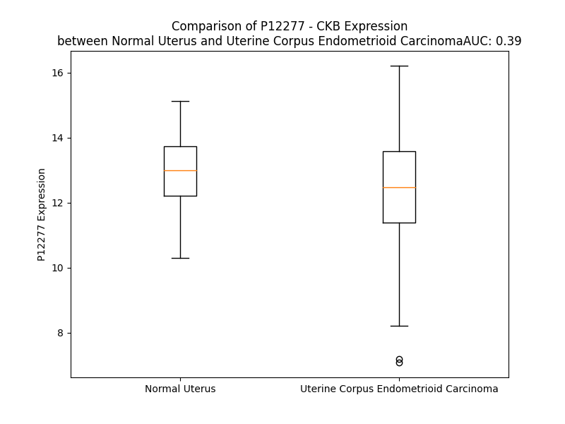

# Detailed Data for P12277

## Introduction to the Detailed Summary

### How to Interpret the Results

- **Summary & Metrics**: This section provides a quick reference to essential protein attributes, including expression changes, family classification, and biomarker applications. Regulation status (upregulated/downregulated) indicates the protein's behavior in a disease context. Some information comes from the original excel file with the proteins selected from literature, while others are derived from the analyses.
- **Expression Comparison**: A visual representation comparing protein expression between normal and disease states. It highlights significant changes in expression levels that might indicate diagnostic or therapeutic relevance. This is data coming from transcriptomics experiments and could not translate similarly to protein levels.
- **Isoform Alignment**: An interactive view of isoform alignments, revealing structural and functional differences between variants of the protein.
- **Interactors & Homologs**: Tables listing known interaction partners and homologous proteins, the more interactors and homologs, the more complex the protein is to design an antibody for.
- **Biological Assemblies**: Information about the structural arrangement of the protein in different assemblies, providing insights into its functional state but also the complexity of the protein to develop antibodies.
- **Combined Per-Residue Information**: A detailed table summarizing residue-level data. This includes predictions for epitope regions, aggregation tendencies, and modifications that might impact the protein's function. Each row corresponds to a residue in the protein, providing insights into specific sites that may be important for research or drug development.
## Summary & Metrics

- **UniProt Accession**: P12277
- **Gene Name**: CKB
- **Protein Name**: creatine kinase, brain
- **Swiss Prot**: KCRB_HUMAN
- **Family**: kinase
- **Biomarker Application**: safety
- **Number of Isoforms**: 0
- **Regulation**: -1
- **(transcriptomics) AUC**: 0.39
- **(transcriptomics) Fold Change**: 1.04
- **(transcriptomics) Regulation**: Downregulated
- **Discotope Epitope Count**: 75
- **Max n_uniprots (Homo)**: 2.0
- **Max n_uniprots (Hetero)**: 5.0

## Expression Comparison

## Interactors

| preferredName_A   | preferredName_B   |   score |
|:------------------|:------------------|--------:|
| CKB               | ASB9              |   0.997 |
| CKB               | CKM               |   0.996 |
| CKB               | GAMT              |   0.944 |

## Homologs

| uniprot_id   | gene_id   |
|:-------------|:----------|
| P06732       | CKM       |
| C9JT96       | CKMT1A    |
| D6RHV3       | CKMT2     |
| C9JSQ1       | CKMT1B    |

## Biological Assemblies

|   Unnamed: 0 | crystal_id   |   assembly |   n_uniprots | composition   |
|-------------:|:-------------|-----------:|-------------:|:--------------|
|            0 | 6v9h         |          1 |            5 | Hetero        |
|            0 | 7tun         |          1 |            1 | Homo          |
|            1 | 7tun         |          2 |            1 | Homo          |
|            0 | 3dre         |          1 |            2 | Homo          |
|            0 | 3b6r         |          1 |            2 | Homo          |
|            0 | 3drb         |          1 |            2 | Homo          |

## Combined Per-Residue Information

|   res | aa   |   epitope_score | epitope   |   relative_surface_accessibility |   modeling_confidence |   Aggregation | modification     |
|------:|:-----|----------------:|:----------|---------------------------------:|----------------------:|--------------:|:-----------------|
|     1 | M    |         0.21206 | True      |                          1.18426 |                 44.54 |         0     | N/A              |
|     2 | P    |         0.21827 | True      |                          0.89261 |                 69.94 |         0     | N/A              |
|     3 | F    |         0.19322 | False     |                          1.1076  |                 69.49 |         0     | N/A              |
|     4 | S    |         0.16704 | False     |                          0.57285 |                 75.2  |         0     | Phosphoserine    |
|     5 | N    |         0.13369 | False     |                          0.37823 |                 81.53 |         0     | N/A              |
|     6 | S    |         0.23367 | True      |                          0.52862 |                 83.81 |         0     | N/A              |
|     7 | H    |         0.18024 | False     |                          0.63588 |                 88.65 |         0     | N/A              |
|     8 | N    |         0.08184 | False     |                          0.09226 |                 92.05 |         0     | N/A              |
|     9 | A    |         0.15019 | False     |                          0.51635 |                 91.69 |         0     | N/A              |
|    10 | L    |         0.20652 | True      |                          0.51722 |                 94.33 |         0     | N/A              |
|    11 | K    |         0.1065  | False     |                          0.2179  |                 95.49 |         0     | N/A              |
|    12 | L    |         0.23798 | True      |                          0.47233 |                 94.97 |         0     | N/A              |
|    13 | R    |         0.3716  | True      |                          0.72981 |                 96.55 |         0     | N/A              |
|    14 | F    |         0.18894 | False     |                          0.58076 |                 96.78 |         0     | N/A              |
|    15 | P    |         0.20612 | True      |                          0.50373 |                 96.87 |         0     | N/A              |
|    16 | A    |         0.11282 | False     |                          0.21158 |                 97.62 |         0     | N/A              |
|    17 | E    |         0.16515 | False     |                          0.66987 |                 97.31 |         0     | N/A              |
|    18 | D    |         0.21158 | True      |                          0.59303 |                 97.43 |         0     | N/A              |
|    19 | E    |         0.17114 | False     |                          0.28468 |                 98.11 |         0     | N/A              |
|    20 | F    |         0.13915 | False     |                          0.27983 |                 98.39 |         0     | N/A              |
|    21 | P    |         0.0806  | False     |                          0.12523 |                 98.27 |         0     | N/A              |
|    22 | D    |         0.22114 | True      |                          0.67887 |                 98.2  |         0     | N/A              |
|    23 | L    |         0.11646 | False     |                          0.15636 |                 97.79 |         0     | N/A              |
|    24 | S    |         0.27493 | True      |                          0.83205 |                 96.21 |         0     | N/A              |
|    25 | A    |         0.14278 | False     |                          0.80159 |                 95.06 |         0     | N/A              |
|    26 | H    |         0.17295 | False     |                          0.22854 |                 97.36 |         0     | N/A              |
|    27 | N    |         0.19925 | False     |                          0.52498 |                 96.2  |         0     | N/A              |
|    28 | N    |         0.01157 | False     |                          0       |                 97.44 |         0     | N/A              |
|    29 | H    |         0.06113 | False     |                          0.05958 |                 98.12 |         0     | N/A              |
|    30 | M    |         0.0079  | False     |                          0       |                 98.63 |         0     | N/A              |
|    31 | A    |         0.06714 | False     |                          0.19804 |                 98.38 |         0     | N/A              |
|    32 | K    |         0.27413 | True      |                          0.56425 |                 97.83 |         0     | N/A              |
|    33 | V    |         0.10416 | False     |                          0.18182 |                 98.51 |         0     | N/A              |
|    34 | L    |         0.06423 | False     |                          0.0719  |                 98.69 |         0     | N/A              |
|    35 | T    |         0.1466  | False     |                          0.41458 |                 98.48 |         0     | Phosphothreonine |
|    36 | P    |         0.12606 | False     |                          0.54194 |                 98.32 |         0     | N/A              |
|    37 | E    |         0.18731 | False     |                          0.6414  |                 98.33 |         0     | N/A              |
|    38 | L    |         0.11653 | False     |                          0.15428 |                 98.49 |         0     | N/A              |
|    39 | Y    |         0.0129  | False     |                          0.0053  |                 98.78 |         0     | N/A              |
|    40 | A    |         0.16363 | False     |                          0.47056 |                 98.33 |         0     | N/A              |
|    41 | E    |         0.28907 | True      |                          0.56074 |                 98.02 |         0     | N/A              |
|    42 | L    |         0.00785 | False     |                          0.00082 |                 98.4  |         0     | N/A              |
|    43 | R    |         0.1258  | False     |                          0.0722  |                 97.67 |         0     | N/A              |
|    44 | A    |         0.13485 | False     |                          0.61179 |                 97.26 |         0     | N/A              |
|    45 | K    |         0.11175 | False     |                          0.37482 |                 97.72 |         0     | N/A              |
|    46 | S    |         0.10848 | False     |                          0.41334 |                 97.85 |         0     | N/A              |
|    47 | T    |         0.03386 | False     |                          0.03619 |                 98.34 |         0     | N/A              |
|    48 | P    |         0.24062 | True      |                          0.84636 |                 97.62 |         0     | N/A              |
|    49 | S    |         0.07382 | False     |                          0.36728 |                 97.52 |         0     | N/A              |
|    50 | G    |         0.07291 | False     |                          0.26483 |                 97.62 |         0     | N/A              |
|    51 | F    |         0.04189 | False     |                          0.02675 |                 98.25 |         0     | N/A              |
|    52 | T    |         0.0563  | False     |                          0.05851 |                 98.51 |         0     | N/A              |
|    53 | L    |         0.00386 | False     |                          0.00247 |                 98.67 |         0     | N/A              |
|    54 | D    |         0.12224 | False     |                          0.12696 |                 98.58 |         0     | N/A              |
|    55 | D    |         0.14578 | False     |                          0.35753 |                 98.59 |         0     | N/A              |
|    56 | V    |         0.00364 | False     |                          0       |                 98.84 |         0     | N/A              |
|    57 | I    |         0.0452  | False     |                          0.0224  |                 98.71 |         0     | N/A              |
|    58 | Q    |         0.22115 | True      |                          0.37662 |                 98.68 |         0     | N/A              |
|    59 | T    |         0.07215 | False     |                          0.0384  |                 98.03 |         0     | N/A              |
|    60 | G    |         0.00272 | False     |                          0       |                 98.32 |         0     | N/A              |
|    61 | V    |         0.1599  | False     |                          0.28078 |                 98.36 |         0     | N/A              |
|    62 | D    |         0.25022 | True      |                          0.48319 |                 97.64 |         0     | N/A              |
|    63 | N    |         0.27171 | True      |                          0.07557 |                 96.3  |         0     | N/A              |
|    64 | P    |         0.16424 | False     |                          0.45752 |                 95.45 |         0     | N/A              |
|    65 | G    |         0.33036 | True      |                          0.36615 |                 88.77 |         0     | N/A              |
|    66 | H    |         0.26496 | True      |                          0.22048 |                 80.91 |         0     | N/A              |
|    67 | P    |         0.34053 | True      |                          0.8415  |                 75.57 |         0.181 | N/A              |
|    68 | Y    |         0.45809 | True      |                          0.66252 |                 71.36 |        20.231 | N/A              |
|    69 | I    |         0.43859 | True      |                          0.44435 |                 79.1  |        21.738 | N/A              |
|    70 | M    |         0.24965 | True      |                          0.42138 |                 88.72 |        21.738 | N/A              |
|    71 | T    |         0.15364 | False     |                          0.0374  |                 93.02 |        21.738 | N/A              |
|    72 | V    |         0.08424 | False     |                          0.06833 |                 97.07 |        21.738 | N/A              |
|    73 | G    |         0.01493 | False     |                          0.05068 |                 97.75 |         6.808 | N/A              |
|    74 | C    |         0.02315 | False     |                          0.01332 |                 98.65 |         5.126 | N/A              |
|    75 | V    |         0.06557 | False     |                          0.06855 |                 98.84 |         4.903 | N/A              |
|    76 | A    |         0.00402 | False     |                          0       |                 98.9  |         1.405 | N/A              |
|    77 | G    |         0.00516 | False     |                          0       |                 98.77 |         0     | N/A              |
|    78 | D    |         0.02914 | False     |                          0.03361 |                 98.87 |         0     | N/A              |
|    79 | E    |         0.03027 | False     |                          0.19447 |                 98.8  |         0     | N/A              |
|    80 | E    |         0.14314 | False     |                          0.39182 |                 98.77 |         0     | N/A              |
|    81 | S    |         0.00428 | False     |                          0       |                 98.9  |         0     | N/A              |
|    82 | Y    |         0.03981 | False     |                          0.04813 |                 98.83 |         0     | N/A              |
|    83 | E    |         0.206   | True      |                          0.57524 |                 98.66 |         0     | N/A              |
|    84 | V    |         0.10349 | False     |                          0.2607  |                 98.7  |         0.132 | N/A              |
|    85 | F    |         0.00278 | False     |                          0       |                 98.82 |         0.132 | N/A              |
|    86 | K    |         0.09867 | False     |                          0.38296 |                 98.62 |         0.132 | N/A              |
|    87 | D    |         0.16887 | False     |                          0.3914  |                 98.55 |         0.132 | N/A              |
|    88 | L    |         0.00313 | False     |                          0       |                 98.84 |         0.132 | N/A              |
|    89 | F    |         0.00217 | False     |                          0.00069 |                 98.87 |         0.132 | N/A              |
|    90 | D    |         0.08396 | False     |                          0.13912 |                 98.7  |         0     | N/A              |
|    91 | P    |         0.16946 | False     |                          0.40967 |                 98.54 |         0     | N/A              |
|    92 | I    |         0.00496 | False     |                          0       |                 98.62 |         0     | N/A              |
|    93 | I    |         0.019   | False     |                          0.0128  |                 98.49 |         0     | N/A              |
|    94 | E    |         0.1189  | False     |                          0.2675  |                 98    |         0     | N/A              |
|    95 | D    |         0.20652 | True      |                          0.45164 |                 96.12 |         0     | N/A              |
|    96 | R    |         0.26163 | True      |                          0.26408 |                 94.72 |         0     | N/A              |
|    97 | H    |         0.06535 | False     |                          0.07591 |                 95.03 |         0     | N/A              |
|    98 | G    |         0.25405 | True      |                          0.8189  |                 90.95 |         0     | N/A              |
|    99 | G    |         0.21662 | True      |                          0.41935 |                 95.46 |         0     | N/A              |
|   100 | Y    |         0.06547 | False     |                          0.07263 |                 97.7  |         0     | N/A              |
|   101 | K    |         0.21303 | True      |                          0.49851 |                 98.23 |         0     | N/A              |
|   102 | P    |         0.10266 | False     |                          0.55573 |                 97.97 |         0     | N/A              |
|   103 | S    |         0.15048 | False     |                          0.73855 |                 97.85 |         0     | N/A              |
|   104 | D    |         0.26248 | True      |                          0.30832 |                 98.32 |         0     | N/A              |
|   105 | E    |         0.17096 | False     |                          0.6621  |                 98.08 |         0     | N/A              |
|   106 | H    |         0.05516 | False     |                          0.06843 |                 98.51 |         0     | N/A              |
|   107 | K    |         0.10793 | False     |                          0.62222 |                 96.23 |         0     | N/A              |
|   108 | T    |         0.11869 | False     |                          0.39897 |                 98.13 |         0     | N/A              |
|   109 | D    |         0.09186 | False     |                          0.22343 |                 98.4  |         0     | N/A              |
|   110 | L    |         0.07838 | False     |                          0.21277 |                 97.85 |         0     | N/A              |
|   111 | N    |         0.09196 | False     |                          0.41487 |                 98.31 |         0     | N/A              |
|   112 | P    |         0.0692  | False     |                          0.16188 |                 97.92 |         0     | N/A              |
|   113 | D    |         0.25043 | True      |                          0.69815 |                 98.24 |         0     | N/A              |
|   114 | N    |         0.12329 | False     |                          0.44064 |                 98.6  |         0     | N/A              |
|   115 | L    |         0.01162 | False     |                          0.00487 |                 98.6  |         0     | N/A              |
|   116 | Q    |         0.18436 | False     |                          0.62716 |                 98.54 |         0     | N/A              |
|   117 | G    |         0.09377 | False     |                          0.37965 |                 97.94 |         0     | N/A              |
|   118 | G    |         0.00486 | False     |                          0       |                 97.97 |         0     | N/A              |
|   119 | D    |         0.13524 | False     |                          0.52144 |                 98.32 |         0     | N/A              |
|   120 | D    |         0.15446 | False     |                          0.54907 |                 98.42 |         0     | N/A              |
|   121 | L    |         0.01409 | False     |                          0.01713 |                 98.57 |         0     | N/A              |
|   122 | D    |         0.14704 | False     |                          0.22003 |                 98.44 |         0     | N/A              |
|   123 | P    |         0.21756 | True      |                          0.69097 |                 97.54 |         0     | N/A              |
|   124 | N    |         0.18844 | False     |                          0.67179 |                 97.76 |         0.174 | N/A              |
|   125 | Y    |         0.08782 | False     |                          0.10935 |                 98.36 |         0.174 | Phosphotyrosine  |
|   126 | V    |         0.0033  | False     |                          0.00282 |                 98.25 |         0.174 | N/A              |
|   127 | L    |         0.16283 | False     |                          0.46225 |                 96.42 |         0.174 | N/A              |
|   128 | S    |         0.13044 | False     |                          0.12819 |                 96.64 |         0.174 | N/A              |
|   129 | S    |         0.0063  | False     |                          0       |                 98.28 |         0     | N/A              |
|   130 | R    |         0.1592  | False     |                          0.20205 |                 98.12 |         0     | N/A              |
|   131 | V    |         0.00238 | False     |                          0       |                 98.5  |         0     | N/A              |
|   132 | R    |         0.14788 | False     |                          0.19303 |                 97.73 |         0     | N/A              |
|   133 | T    |         0.00642 | False     |                          0.00286 |                 98.56 |         0     | N/A              |
|   134 | G    |         0.00568 | False     |                          0.00277 |                 98.38 |         0     | N/A              |
|   135 | R    |         0.01127 | False     |                          0.00421 |                 98.7  |         0     | N/A              |
|   136 | S    |         0.00577 | False     |                          0.00447 |                 98.88 |         0     | N/A              |
|   137 | I    |         0.00481 | False     |                          0.0008  |                 98.69 |         0     | N/A              |
|   138 | R    |         0.06274 | False     |                          0.32374 |                 98.7  |         0     | N/A              |
|   139 | G    |         0.13159 | False     |                          0.87256 |                 98.16 |         0     | N/A              |
|   140 | F    |         0.05258 | False     |                          0.13894 |                 98.74 |         0     | N/A              |
|   141 | C    |         0.06285 | False     |                          0.10768 |                 98.84 |         0     | N/A              |
|   142 | L    |         0.00291 | False     |                          0       |                 98.89 |         0     | N/A              |
|   143 | P    |         0.01645 | False     |                          0.01889 |                 98.7  |         0     | N/A              |
|   144 | P    |         0.05121 | False     |                          0.07802 |                 98.54 |         0     | N/A              |
|   145 | H    |         0.13004 | False     |                          0.31773 |                 98.64 |         0     | N/A              |
|   146 | C    |         0.02164 | False     |                          0.01684 |                 98.61 |         0     | N/A              |
|   147 | S    |         0.16774 | False     |                          0.41294 |                 98.58 |         0     | N/A              |
|   148 | R    |         0.22121 | True      |                          0.53168 |                 98.7  |         0     | N/A              |
|   149 | G    |         0.18365 | False     |                          0.55372 |                 98.68 |         0     | N/A              |
|   150 | E    |         0.10058 | False     |                          0.22431 |                 98.75 |         0     | N/A              |
|   151 | R    |         0.01652 | False     |                          0.00335 |                 98.83 |         0     | N/A              |
|   152 | R    |         0.16134 | False     |                          0.47694 |                 98.84 |         0     | N/A              |
|   153 | A    |         0.09212 | False     |                          0.30484 |                 98.66 |         0     | N/A              |
|   154 | I    |         0.00304 | False     |                          0       |                 98.77 |         0.256 | N/A              |
|   155 | E    |         0.05554 | False     |                          0.10724 |                 98.78 |         0.256 | N/A              |
|   156 | K    |         0.1691  | False     |                          0.70799 |                 98.49 |         0.256 | N/A              |
|   157 | L    |         0.06513 | False     |                          0.11803 |                 97.88 |         0.256 | N/A              |
|   158 | A    |         0.00272 | False     |                          0.00128 |                 98.37 |         0.256 | N/A              |
|   159 | V    |         0.04961 | False     |                          0.26753 |                 98.25 |         0.256 | N/A              |
|   160 | E    |         0.13019 | False     |                          0.4275  |                 97.9  |         0     | N/A              |
|   161 | A    |         0.02263 | False     |                          0.0153  |                 97.98 |         0     | N/A              |
|   162 | L    |         0.00804 | False     |                          0.00842 |                 98.26 |         0     | N/A              |
|   163 | S    |         0.17833 | False     |                          0.58076 |                 97.51 |         0     | N/A              |
|   164 | S    |         0.14691 | False     |                          0.49416 |                 97.57 |         0     | N/A              |
|   165 | L    |         0.07072 | False     |                          0.0604  |                 97.64 |         0     | N/A              |
|   166 | D    |         0.17994 | False     |                          0.61672 |                 96.16 |         0     | N/A              |
|   167 | G    |         0.20431 | False     |                          0.78056 |                 96.71 |         0     | N/A              |
|   168 | D    |         0.13987 | False     |                          0.52474 |                 96.25 |         0     | N/A              |
|   169 | L    |         0.01129 | False     |                          0.00907 |                 98.07 |         0     | N/A              |
|   170 | A    |         0.07944 | False     |                          0.32889 |                 98.26 |         0     | N/A              |
|   171 | G    |         0.06593 | False     |                          0.33482 |                 97.44 |         0     | N/A              |
|   172 | R    |         0.22841 | True      |                          0.54529 |                 96.79 |         0     | N/A              |
|   173 | Y    |         0.11259 | False     |                          0.1705  |                 97.67 |         0     | N/A              |
|   174 | Y    |         0.1587  | False     |                          0.16086 |                 96.48 |         0     | N/A              |
|   175 | A    |         0.05747 | False     |                          0.15599 |                 97.11 |         0     | N/A              |
|   176 | L    |         0.09727 | False     |                          0.16391 |                 95.52 |         0     | N/A              |
|   177 | K    |         0.27432 | True      |                          0.66741 |                 94.23 |         0     | N/A              |
|   178 | S    |         0.26952 | True      |                          0.6244  |                 93.51 |         0     | N/A              |
|   179 | M    |         0.12654 | False     |                          0.16317 |                 92.38 |         0     | N/A              |
|   180 | T    |         0.20131 | False     |                          0.53134 |                 93.49 |         0     | N/A              |
|   181 | E    |         0.29159 | True      |                          0.80047 |                 90.05 |         0     | N/A              |
|   182 | A    |         0.18578 | False     |                          0.72958 |                 92.86 |         0     | N/A              |
|   183 | E    |         0.16816 | False     |                          0.21836 |                 92.03 |         0     | N/A              |
|   184 | Q    |         0.27177 | True      |                          0.37024 |                 89.02 |         0     | N/A              |
|   185 | Q    |         0.28368 | True      |                          0.47099 |                 87.64 |         0     | N/A              |
|   186 | Q    |         0.19151 | False     |                          0.42156 |                 89.39 |         0     | N/A              |
|   187 | L    |         0.03172 | False     |                          0.02555 |                 89.5  |         0     | N/A              |
|   188 | I    |         0.55147 | True      |                          0.44165 |                 83.4  |         0     | N/A              |
|   189 | D    |         0.31341 | True      |                          0.54506 |                 81.56 |         0     | N/A              |
|   190 | D    |         0.20534 | True      |                          0.19285 |                 84.01 |         0     | N/A              |
|   191 | H    |         0.26726 | True      |                          0.79503 |                 83.08 |         0     | N/A              |
|   192 | F    |         0.08203 | False     |                          0.0419  |                 87.68 |         0     | N/A              |
|   193 | L    |         0.18529 | False     |                          0.17053 |                 85    |         0     | N/A              |
|   194 | F    |         0.13333 | False     |                          0.04813 |                 84.82 |         0     | N/A              |
|   195 | D    |         0.46871 | True      |                          0.56883 |                 76.13 |         0     | N/A              |
|   196 | K    |         0.32797 | True      |                          0.54636 |                 79.78 |         0     | N/A              |
|   197 | P    |         0.13089 | False     |                          0.07801 |                 83.11 |         0     | N/A              |
|   198 | V    |         0.36623 | True      |                          0.93966 |                 86.73 |         0     | N/A              |
|   199 | S    |         0.29625 | True      |                          0.21553 |                 87.24 |         0     | Phosphoserine    |
|   200 | P    |         0.2818  | True      |                          0.51657 |                 90.74 |         0     | N/A              |
|   201 | L    |         0.22853 | True      |                          0.24083 |                 91.32 |         1.306 | N/A              |
|   202 | L    |         0.22313 | True      |                          0.18878 |                 92.54 |         1.306 | N/A              |
|   203 | L    |         0.27334 | True      |                          0.52676 |                 95.16 |         1.306 | N/A              |
|   204 | A    |         0.10432 | False     |                          0.24123 |                 96.85 |         1.306 | N/A              |
|   205 | S    |         0.08918 | False     |                          0.07051 |                 97.33 |         1.306 | N/A              |
|   206 | G    |         0.10469 | False     |                          0.255   |                 97.38 |         0.25  | N/A              |
|   207 | M    |         0.09572 | False     |                          0.02736 |                 97.48 |         0.25  | N/A              |
|   208 | A    |         0.16601 | False     |                          0.13604 |                 97.07 |         0.25  | N/A              |
|   209 | R    |         0.4473  | True      |                          0.36287 |                 97.75 |         0     | N/A              |
|   210 | D    |         0.3241  | True      |                          0.30973 |                 97.46 |         0     | N/A              |
|   211 | W    |         0.30579 | True      |                          0.24033 |                 96.36 |         0     | N/A              |
|   212 | P    |         0.33449 | True      |                          0.35761 |                 96.2  |         0     | N/A              |
|   213 | D    |         0.20572 | True      |                          0.19042 |                 98.26 |         0     | N/A              |
|   214 | A    |         0.0129  | False     |                          0.01588 |                 98.39 |         0     | N/A              |
|   215 | R    |         0.02496 | False     |                          0.00797 |                 98.39 |         0     | N/A              |
|   216 | G    |         0.00392 | False     |                          0       |                 97.48 |         0     | N/A              |
|   217 | I    |         0.0037  | False     |                          0       |                 97.4  |         0     | N/A              |
|   218 | W    |         0.00914 | False     |                          0.00166 |                 97.98 |         0     | N/A              |
|   219 | H    |         0.08678 | False     |                          0.08973 |                 97.74 |         0     | N/A              |
|   220 | N    |         0.00503 | False     |                          0       |                 97.93 |         0     | N/A              |
|   221 | D    |         0.16518 | False     |                          0.69825 |                 96.68 |         0     | N/A              |
|   222 | N    |         0.11892 | False     |                          0.60672 |                 96.45 |         0     | N/A              |
|   223 | K    |         0.16353 | False     |                          0.38934 |                 96.08 |         0     | N/A              |
|   224 | T    |         0.12006 | False     |                          0.13744 |                 97.72 |        37.21  | N/A              |
|   225 | F    |         0.00255 | False     |                          0       |                 98.49 |        99.053 | N/A              |
|   226 | L    |         0.01723 | False     |                          0.00824 |                 97.91 |        99.062 | N/A              |
|   227 | V    |         0.00355 | False     |                          0       |                 98.4  |        99.062 | N/A              |
|   228 | W    |         0.10183 | False     |                          0.17964 |                 98.26 |        99.062 | N/A              |
|   229 | V    |         0.00247 | False     |                          0       |                 98.65 |        98.65  | N/A              |
|   230 | N    |         0.01624 | False     |                          0.0207  |                 98.53 |         1.396 | N/A              |
|   231 | E    |         0.08399 | False     |                          0.12719 |                 96.27 |         0     | N/A              |
|   232 | E    |         0.11279 | False     |                          0.18573 |                 95.98 |         0     | N/A              |
|   233 | D    |         0.01092 | False     |                          0.0031  |                 98.55 |         0     | N/A              |
|   234 | H    |         0.01276 | False     |                          0.00273 |                 98.78 |         0     | N/A              |
|   235 | L    |         0.00446 | False     |                          0.00165 |                 98.73 |         0     | N/A              |
|   236 | R    |         0.1138  | False     |                          0.1526  |                 98.31 |         0     | N/A              |
|   237 | V    |         0.00596 | False     |                          0       |                 98.49 |         0     | N/A              |
|   238 | I    |         0.05875 | False     |                          0.0424  |                 98.37 |         0     | N/A              |
|   239 | S    |         0.0056  | False     |                          0       |                 98.57 |         0     | N/A              |
|   240 | M    |         0.13404 | False     |                          0.19222 |                 97.72 |         0     | N/A              |
|   241 | Q    |         0.1288  | False     |                          0.16852 |                 96.81 |         0     | N/A              |
|   242 | K    |         0.31044 | True      |                          0.83127 |                 96.15 |         0     | N/A              |
|   243 | G    |         0.06754 | False     |                          0.19202 |                 97.02 |         0     | N/A              |
|   244 | G    |         0.03176 | False     |                          0.07174 |                 97.82 |         0     | N/A              |
|   245 | N    |         0.07583 | False     |                          0.28348 |                 98.63 |         0     | N/A              |
|   246 | M    |         0.00211 | False     |                          0       |                 98.73 |         0     | N/A              |
|   247 | K    |         0.09141 | False     |                          0.30241 |                 98.73 |         0     | N/A              |
|   248 | E    |         0.1305  | False     |                          0.40745 |                 98.67 |         0     | N/A              |
|   249 | V    |         0.00275 | False     |                          0       |                 98.76 |         0     | N/A              |
|   250 | F    |         0.00512 | False     |                          0       |                 98.8  |         0     | N/A              |
|   251 | T    |         0.10352 | False     |                          0.38648 |                 98.76 |         0     | N/A              |
|   252 | R    |         0.05191 | False     |                          0.11268 |                 98.7  |         0     | N/A              |
|   253 | F    |         0.00584 | False     |                          0.00127 |                 98.7  |         0     | N/A              |
|   254 | C    |         0.02014 | False     |                          0.01471 |                 98.42 |         0     | N/A              |
|   255 | T    |         0.16098 | False     |                          0.40707 |                 98.08 |         0     | N/A              |
|   256 | G    |         0.0038  | False     |                          0       |                 98.08 |         0     | N/A              |
|   257 | L    |         0.01679 | False     |                          0.01732 |                 97.31 |         0     | N/A              |
|   258 | T    |         0.14696 | False     |                          0.52275 |                 97.15 |         0     | N/A              |
|   259 | Q    |         0.07082 | False     |                          0.30722 |                 97.86 |         0     | N/A              |
|   260 | I    |         0.00348 | False     |                          0.0008  |                 97.79 |         0     | N/A              |
|   261 | E    |         0.10918 | False     |                          0.17983 |                 97.4  |         0     | N/A              |
|   262 | T    |         0.22997 | True      |                          0.57999 |                 97.96 |         0     | N/A              |
|   263 | L    |         0.15985 | False     |                          0.27304 |                 97.6  |         0     | N/A              |
|   264 | F    |         0.03122 | False     |                          0.01103 |                 97.65 |         0     | N/A              |
|   265 | K    |         0.15531 | False     |                          0.56811 |                 97.43 |         0     | N/A              |
|   266 | S    |         0.25704 | True      |                          0.66179 |                 97.29 |         0     | N/A              |
|   267 | K    |         0.25197 | True      |                          0.3602  |                 96.24 |         0     | N/A              |
|   268 | D    |         0.21603 | True      |                          0.88909 |                 97.36 |         0     | N/A              |
|   269 | Y    |         0.25199 | True      |                          0.31603 |                 98.3  |         0     | 3'-nitrotyrosine |
|   270 | E    |         0.17945 | False     |                          0.37994 |                 98.04 |         0     | N/A              |
|   271 | F    |         0.02439 | False     |                          0.04081 |                 98.62 |         0     | N/A              |
|   272 | M    |         0.01879 | False     |                          0.01166 |                 98.77 |         0     | N/A              |
|   273 | W    |         0.13739 | False     |                          0.41205 |                 98.69 |         0     | N/A              |
|   274 | N    |         0.16388 | False     |                          0.30161 |                 98.56 |         0     | N/A              |
|   275 | P    |         0.15589 | False     |                          0.55171 |                 98.33 |         0     | N/A              |
|   276 | H    |         0.10405 | False     |                          0.24067 |                 98.56 |         0     | N/A              |
|   277 | L    |         0.06146 | False     |                          0.05358 |                 98.72 |         9.317 | N/A              |
|   278 | G    |         0.00266 | False     |                          0       |                 98.7  |         9.952 | N/A              |
|   279 | Y    |         0.03009 | False     |                          0.06088 |                 98.77 |         9.952 | N/A              |
|   280 | I    |         0.00707 | False     |                          0.0032  |                 98.89 |         9.952 | N/A              |
|   281 | L    |         0.00475 | False     |                          0.00247 |                 98.86 |         9.952 | N/A              |
|   282 | T    |         0.00602 | False     |                          0.00381 |                 98.81 |         4.105 | N/A              |
|   283 | C    |         0.12235 | False     |                          0.16559 |                 98.19 |         0     | N/A              |
|   284 | P    |         0.0049  | False     |                          0       |                 98.28 |         0     | N/A              |
|   285 | S    |         0.08736 | False     |                          0.14016 |                 96.09 |         0     | N/A              |
|   286 | N    |         0.07713 | False     |                          0.14427 |                 97.61 |         0     | N/A              |
|   287 | L    |         0.00488 | False     |                          0       |                 98.57 |         0     | N/A              |
|   288 | G    |         0.00281 | False     |                          0       |                 98.61 |         0     | N/A              |
|   289 | T    |         0.00368 | False     |                          0       |                 98.6  |         0     | N/A              |
|   290 | G    |         0.02455 | False     |                          0.05948 |                 97.73 |         0     | N/A              |
|   291 | L    |         0.00997 | False     |                          0       |                 98.36 |         0     | N/A              |
|   292 | R    |         0.09542 | False     |                          0.0694  |                 97.22 |         0     | N/A              |
|   293 | A    |         0.00343 | False     |                          0       |                 98.38 |         0     | N/A              |
|   294 | G    |         0.09908 | False     |                          0.0884  |                 97.68 |         0     | N/A              |
|   295 | V    |         0.0078  | False     |                          0.01872 |                 97.94 |         0     | N/A              |
|   296 | H    |         0.1045  | False     |                          0.21741 |                 96.26 |         0     | N/A              |
|   297 | I    |         0.0101  | False     |                          0       |                 97.78 |         0     | N/A              |
|   298 | K    |         0.17298 | False     |                          0.40634 |                 97.47 |         0     | N/A              |
|   299 | L    |         0.00551 | False     |                          0.00061 |                 97.41 |         0     | N/A              |
|   300 | P    |         0.15426 | False     |                          0.35903 |                 96.46 |         0     | N/A              |
|   301 | N    |         0.11345 | False     |                          0.35717 |                 97.89 |         0     | N/A              |
|   302 | L    |         0.00853 | False     |                          0       |                 97.57 |         0     | N/A              |
|   303 | G    |         0.05946 | False     |                          0.28283 |                 94.9  |         0     | N/A              |
|   304 | K    |         0.21161 | True      |                          0.87092 |                 94.79 |         0     | N/A              |
|   305 | H    |         0.14953 | False     |                          0.27916 |                 96.86 |         0     | N/A              |
|   306 | E    |         0.18625 | False     |                          0.80361 |                 96.3  |         0     | N/A              |
|   307 | K    |         0.16568 | False     |                          0.30126 |                 96.56 |         0     | N/A              |
|   308 | F    |         0.02726 | False     |                          0.02661 |                 96.42 |         0     | N/A              |
|   309 | S    |         0.16841 | False     |                          0.56552 |                 94.59 |         0     | Phosphoserine    |
|   310 | E    |         0.14721 | False     |                          0.3325  |                 96.81 |         0     | N/A              |
|   311 | V    |         0.01027 | False     |                          0       |                 98.2  |         0     | N/A              |
|   312 | L    |         0.03309 | False     |                          0.03627 |                 97.08 |         0     | N/A              |
|   313 | K    |         0.15586 | False     |                          0.66395 |                 95.08 |         0     | N/A              |
|   314 | R    |         0.17723 | False     |                          0.28879 |                 97.39 |         0     | N/A              |
|   315 | L    |         0.01873 | False     |                          0.02473 |                 97.62 |         0     | N/A              |
|   316 | R    |         0.0676  | False     |                          0.23298 |                 95.77 |         0     | N/A              |
|   317 | L    |         0.03069 | False     |                          0.05179 |                 96.53 |         0     | N/A              |
|   318 | Q    |         0.18046 | False     |                          0.23385 |                 91.84 |         0     | N/A              |
|   319 | K    |         0.17168 | False     |                          0.4672  |                 90.48 |         0     | N/A              |
|   320 | R    |         0.42026 | True      |                          0.27477 |                 84.96 |         0     | N/A              |
|   321 | G    |         0.06935 | False     |                          0.07003 |                 76.49 |         0     | N/A              |
|   322 | T    |         0.23725 | True      |                          0.30741 |                 72.81 |         0     | Phosphothreonine |
|   323 | G    |         0.47748 | True      |                          0.76608 |                 67.44 |         0     | N/A              |
|   324 | G    |         0.29965 | True      |                          0.21179 |                 64.25 |         0     | N/A              |
|   325 | V    |         0.39818 | True      |                          0.32916 |                 60.2  |         0     | N/A              |
|   326 | D    |         0.37866 | True      |                          0.48786 |                 60.79 |         0     | N/A              |
|   327 | T    |         0.34055 | True      |                          0.44277 |                 63.88 |         0     | N/A              |
|   328 | A    |         0.32786 | True      |                          0.75368 |                 74.24 |         0     | N/A              |
|   329 | A    |         0.2342  | True      |                          0.40215 |                 74.46 |         0.264 | N/A              |
|   330 | V    |         0.23368 | True      |                          0.75429 |                 79.56 |         0.576 | N/A              |
|   331 | G    |         0.2335  | True      |                          0.84347 |                 83.2  |         0.576 | N/A              |
|   332 | G    |         0.06615 | False     |                          0.23016 |                 91.26 |         0.576 | N/A              |
|   333 | V    |         0.12613 | False     |                          0.14091 |                 94.29 |         0.576 | N/A              |
|   334 | F    |         0.04682 | False     |                          0.09937 |                 93.22 |         0.576 | N/A              |
|   335 | D    |         0.03803 | False     |                          0.02142 |                 94.01 |         0     | N/A              |
|   336 | V    |         0.00399 | False     |                          0       |                 96.2  |         0     | N/A              |
|   337 | S    |         0.01293 | False     |                          0.00104 |                 97.1  |         0     | N/A              |
|   338 | N    |         0.00688 | False     |                          0       |                 97    |         0     | N/A              |
|   339 | A    |         0.09423 | False     |                          0.30152 |                 91.97 |         0     | N/A              |
|   340 | D    |         0.06259 | False     |                          0.0984  |                 93.93 |         0     | N/A              |
|   341 | R    |         0.07039 | False     |                          0.04917 |                 96.96 |         0     | N/A              |
|   342 | L    |         0.02943 | False     |                          0.0195  |                 98.24 |         0     | N/A              |
|   343 | G    |         0.11413 | False     |                          0.30756 |                 97.6  |         0     | N/A              |
|   344 | F    |         0.13047 | False     |                          0.29746 |                 97.81 |         0     | N/A              |
|   345 | S    |         0.03129 | False     |                          0.0476  |                 98.52 |         0     | N/A              |
|   346 | E    |         0.00792 | False     |                          0.00418 |                 98.71 |         0     | N/A              |
|   347 | V    |         0.03791 | False     |                          0.09235 |                 98.76 |         0     | N/A              |
|   348 | E    |         0.06996 | False     |                          0.3629  |                 98.52 |         0     | N/A              |
|   349 | L    |         0.00314 | False     |                          0       |                 98.52 |         4.767 | N/A              |
|   350 | V    |         0.00162 | False     |                          0       |                 98.71 |         5.57  | N/A              |
|   351 | Q    |         0.0816  | False     |                          0.18095 |                 98.73 |         5.57  | N/A              |
|   352 | M    |         0.045   | False     |                          0.09944 |                 98.14 |         7.431 | N/A              |
|   353 | V    |         0.00234 | False     |                          0       |                 98.67 |         9.064 | N/A              |
|   354 | V    |         0.00701 | False     |                          0.00857 |                 98.75 |         8.954 | N/A              |
|   355 | D    |         0.06634 | False     |                          0.37465 |                 98.64 |         5.623 | N/A              |
|   356 | G    |         0.00349 | False     |                          0       |                 98.6  |         5.623 | N/A              |
|   357 | V    |         0.00223 | False     |                          0       |                 98.67 |         5.623 | N/A              |
|   358 | K    |         0.05563 | False     |                          0.3818  |                 98.7  |         5.623 | N/A              |
|   359 | L    |         0.11917 | False     |                          0.20775 |                 98.66 |         5.623 | N/A              |
|   360 | L    |         0.00315 | False     |                          0       |                 98.67 |         5.623 | N/A              |
|   361 | I    |         0.04488 | False     |                          0.0616  |                 98.68 |         5.186 | N/A              |
|   362 | E    |         0.14992 | False     |                          0.37671 |                 98.61 |         0     | N/A              |
|   363 | M    |         0.00929 | False     |                          0       |                 98.7  |         0     | N/A              |
|   364 | E    |         0.01796 | False     |                          0       |                 98.63 |         0     | N/A              |
|   365 | Q    |         0.12855 | False     |                          0.31232 |                 98.54 |         0     | N/A              |
|   366 | R    |         0.18311 | False     |                          0.23937 |                 98.32 |         0     | N/A              |
|   367 | L    |         0.13389 | False     |                          0.21505 |                 98.35 |         0     | N/A              |
|   368 | E    |         0.13467 | False     |                          0.47769 |                 97.88 |         0     | N/A              |
|   369 | Q    |         0.17327 | False     |                          0.63139 |                 97.91 |         0     | N/A              |
|   370 | G    |         0.16346 | False     |                          0.88104 |                 97.31 |         0     | N/A              |
|   371 | Q    |         0.2538  | True      |                          0.43512 |                 98.07 |         0     | N/A              |
|   372 | A    |         0.11107 | False     |                          0.63097 |                 97.23 |         0     | N/A              |
|   373 | I    |         0.0356  | False     |                          0.00984 |                 98.1  |         0     | N/A              |
|   374 | D    |         0.15802 | False     |                          0.52867 |                 96.68 |         0     | N/A              |
|   375 | D    |         0.28232 | True      |                          0.64388 |                 97.47 |         0     | N/A              |
|   376 | L    |         0.12733 | False     |                          0.15429 |                 97.76 |         0     | N/A              |
|   377 | M    |         0.12046 | False     |                          0.27118 |                 97.51 |         0     | N/A              |
|   378 | P    |         0.15474 | False     |                          0.13028 |                 97.26 |         0     | N/A              |
|   379 | A    |         0.09525 | False     |                          0.78042 |                 96.72 |         0     | N/A              |
|   380 | Q    |         0.13215 | False     |                          0.48881 |                 94.78 |         0     | N/A              |
|   381 | K    |         0.08398 | False     |                          0.48755 |                 89.26 |         0     | N/A              |

