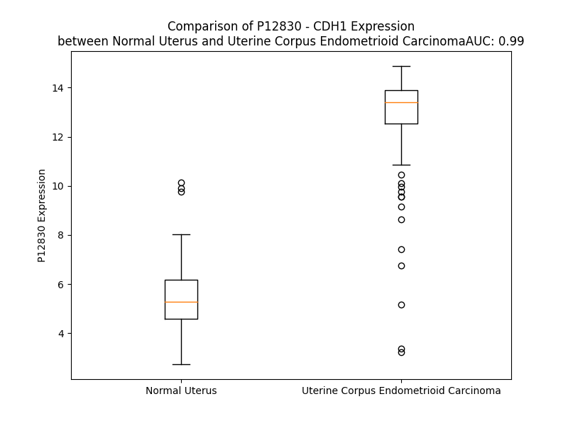

# Detailed Data for P12830

## Introduction to the Detailed Summary

### How to Interpret the Results

- **Summary & Metrics**: This section provides a quick reference to essential protein attributes, including expression changes, family classification, and biomarker applications. Regulation status (upregulated/downregulated) indicates the protein's behavior in a disease context. Some information comes from the original excel file with the proteins selected from literature, while others are derived from the analyses.
- **Expression Comparison**: A visual representation comparing protein expression between normal and disease states. It highlights significant changes in expression levels that might indicate diagnostic or therapeutic relevance. This is data coming from transcriptomics experiments and could not translate similarly to protein levels.
- **Isoform Alignment**: An interactive view of isoform alignments, revealing structural and functional differences between variants of the protein.
- **Interactors & Homologs**: Tables listing known interaction partners and homologous proteins, the more interactors and homologs, the more complex the protein is to design an antibody for.
- **Biological Assemblies**: Information about the structural arrangement of the protein in different assemblies, providing insights into its functional state but also the complexity of the protein to develop antibodies.
- **Combined Per-Residue Information**: A detailed table summarizing residue-level data. This includes predictions for epitope regions, aggregation tendencies, and modifications that might impact the protein's function. Each row corresponds to a residue in the protein, providing insights into specific sites that may be important for research or drug development.
## Summary & Metrics

- **UniProt Accession**: P12830
- **Gene Name**: CDH1
- **Protein Name**: Cadherin-1 / E-cadherin
- **Swiss Prot**: CADH1_HUMAN
- **Family**: other
- **Biomarker Application**: diagnosis,disease progression,efficacy,prognosis
- **Number of Isoforms**: 2
- **Regulation**: -1
- **(transcriptomics) AUC**: 0.99
- **(transcriptomics) Fold Change**: 2.32
- **(transcriptomics) Regulation**: Upregulated
- **Discotope Epitope Count**: 257
- **Max n_uniprots (Homo)**: 2.0
- **Max n_uniprots (Hetero)**: 4.0

## Expression Comparison

## Isoform Alignment

<pre style='font-size:14px; font-family:monospace;'>P12830-1 MGPWSRSLSALLLLLQVSSWLCQEPEPCHPGFDAESYTFTVPRRHLERGRVLGRVNFEDCTGRQRTAYFSLDTRFKVGTDGVITVKRPLRFHNPQIHFLVYAWDSTYRKFSTKVTLNTVGHHHRPPPHQASVSGIQAELLTFPNSSPGLRRQKRDWVIPPISCPENEKGPFPKNLVQIKSNKDKEGKVFYSITGQGADTPPVGVFIIERETGWLKVTEPLDRERIATYTLFSHAVSSNGNAVEDPMEILITVTDQNDNKPEFTQEVFKGSVMEGALPGTSVMEVTATDADDDVNTYNAAIAYTILSQDPELPDKNMFTINRNTGVISVVTTGLDRESFPTYTLVVQAADLQGEGLSTTATAVITVTDTNDNPPIFNPTTYKGQVPENEANVVITTLKVTDADAPNTPAWEAVYTILNDDGGQFVVTTNPVNNDGILKTAKGLDFEAKQQYILHVAVTNVVPFEVSLTTSTATVTVDVLDVNEAPIFVPPEKRVEVSEDFGVGQEITSYTAQEPDTFMEQKITYRIWRDTANWLEINPDTGAISTRAELDREDFEHVKNSTYTALIIATDNGSPVATGTGTLLLILSDVNDNAPIPEPRTIFFCERNPKPQVINIIDADLPPNTSPFTAELTHGASANWTIQYNDPTQESIILKPKMALEVGDYKINLKLMDNQNKDQVTTLEVSVCDCEGAAGVCRKAQPVEAGLQIPAILGILGGILALLILILLLLLFLRRRAVVKEPLLPPEDDTRDNVYYYDEEGGGEEDQDFDLSQLHRGLDARPEVTRNDVAPTLMSVPRYLPRPANPDEIGNFIDENLKAADTDPTAPPYDSLLVFDYEGSGSEAASLSSLNSSESDKDQDYDYLNEWGNRFKKLADMYGGGEDD
P12830-2 MGPWSRSLSALLLLLQVSSWLCQEPEPCHPGFDAESYTFTVPRRHLERGRVLGRVNFEDCTGRQRTAYFSLDTRFKVGTDGVITVKRPLRFHNPQIHFLVYAWDSTYRKFSTKVTLNTVGHHHRPPPHQASVSGIQAELLTFPNSSPGLRRQKRDWVIPPISCPENEKGPFPKNLVQIKSNKDKEGKVFYSITGQGADTPPVGVFIIERETGWLKVTEPLDRERIATYTLFSHAVSSNGNAVEDPMEILITVTDQNDNKPEFTQEVFKGSVMEGALPGTSVMEVTATDADDDVNTYNAAIAYTILSQDPELPDKNMFTINRNTGVISVVTTGLDRESFPTYTLVVQAADLQGEGLSTTATAVITVTDTNDNPPIFNPT-------------------------------------------------------------TGLDFEAKQQYILHVAVTNVVPFEVSLTTSTATVTVDVLDVNEAPIFVPPEKRVEVSEDFGVGQEITSYTAQEPDTFMEQKITYRIWRDTANWLEINPDTGAISTRAELDREDFEHVKNSTYTALIIATDNGSPVATGTGTLLLILSDVNDNAPIPEPRTIFFCERNPKPQVINIIDADLPPNTSPFTAELTHGASANWTIQYNDPTQESIILKPKMALEVGDYKINLKLMDNQNKDQVTTLEVSVCDCEGAAGVCRKAQPVEAGLQIPAILGILGGILALLILILLLLLFLRRRAVVKEPLLPPEDDTRDNVYYYDEEGGGEEDQDFDLSQLHRGLDARPEVTRNDVAPTLMSVPRYLPRPANPDEIGNFIDENLKAADTDPTAPPYDSLLVFDYEGSGSEAASLSSLNSSESDKDQDYDYLNEWGNRFKKLADMYGGGEDD
</pre>

## Interactors

| preferredName_A   | preferredName_B   |   score |
|:------------------|:------------------|--------:|
| CDH1              | KLRG1             |   0.999 |
| CDH1              | CTNNB1            |   0.999 |
| CDH1              | CTNNA1            |   0.999 |
| CDH1              | JUP               |   0.999 |
| CDH1              | CTNND1            |   0.999 |
| CDH1              | EGFR              |   0.999 |
| CDH1              | IQGAP1            |   0.997 |
| CDH1              | ITGAE             |   0.997 |
| CDH1              | VCL               |   0.996 |
| CDH1              | CDH2              |   0.995 |
| CDH1              | CBLL1             |   0.993 |
| CDH1              | OCLN              |   0.993 |
| CDH1              | SRC               |   0.988 |
| CDH1              | TJP1              |   0.987 |
| CDH1              | SLCO6A1           |   0.987 |
| CDH1              | CDH5              |   0.985 |
| CDH1              | CTNNA3            |   0.981 |
| CDH1              | PSEN1             |   0.98  |
| CDH1              | ERBB2             |   0.97  |
| CDH1              | CTNNA2            |   0.969 |
| CDH1              | CDH3              |   0.967 |
| CDH1              | SNAI1             |   0.965 |
| CDH1              | AJAP1             |   0.965 |
| CDH1              | ZEB1              |   0.961 |
| CDH1              | MET               |   0.959 |
| CDH1              | MMP9              |   0.957 |
| CDH1              | CASP3             |   0.956 |
| CDH1              | ZEB2              |   0.954 |
| CDH1              | FLOT2             |   0.951 |
| CDH1              | S100A8            |   0.944 |
| CDH1              | RAPGEF1           |   0.944 |
| CDH1              | NECTIN1           |   0.939 |
| CDH1              | ERVW-1            |   0.932 |
| CDH1              | ERVFRD-1          |   0.932 |
| CDH1              | PTEN              |   0.93  |
| CDH1              | SNAI2             |   0.929 |
| CDH1              | ERV3-1            |   0.929 |
| CDH1              | SKP2              |   0.927 |
| CDH1              | CD44              |   0.927 |
| CDH1              | FLOT1             |   0.926 |
| CDH1              | MDM2              |   0.925 |
| CDH1              | CLDN7             |   0.923 |
| CDH1              | F11R              |   0.921 |
| CDH1              | APC               |   0.92  |
| CDH1              | SCRIB             |   0.916 |
| CDH1              | TRIM21            |   0.913 |
| CDH1              | EPCAM             |   0.905 |
| CDH1              | RPS27A            |   0.904 |
| CDH1              | AKT1              |   0.903 |
| CDH1              | SLC6A3            |   0.901 |

## Homologs

| uniprot_id   | gene_id   |
|:-------------|:----------|
| Q96JQ0       | DCHS1     |
| P55291       | CDH15     |
| A0A8V8TP37   | PCDH11Y   |
| Q9BZA7       | PCDH11X   |
| H3BUU9       | CDH11     |
| J3QKW5       | CDH8      |
| Q9ULB5       | CDH7      |
| F8WF00       | CDHR3     |
| H3BRL7       | CDH13     |
| E7EN24       | CDH17     |
| P55285       | CDH6      |
| E7EPN0       | CDH9      |
| Q8N5B3       | CDH23     |
| D6RBG2       | PCDH1     |
| A0A0A0MRC0   | DCHS2     |
| P55283       | CDH4      |
| Q5VT82       | PCDH9     |
| D6RJG0       | CDH10     |
| P55289       | CDH12     |
| E9PLX6       | CDHR5     |
| A0A8V8TM73   | PCDH7     |
| Q8N6Y1       | PCDH20    |
| D6RER2       | CDH18     |
| F1T0L2       | CDHR1     |
| Q9BYE9       | CDHR2     |
| P22223       | CDH3      |
| Q86UP0       | CDH24     |
| J3QS15       | CDH19     |
| Q9UJ99       | CDH22     |
| Q8IXH8       | CDH26     |
| H3BR11       | CDH5      |
| P19022       | CDH2      |
| Q9HBT6       | CDH20     |
| Q12834       | CDC20     |
| Q86Y33       | CDC20B    |

## Biological Assemblies

|   Unnamed: 0 |   assembly |   n_uniprots | composition   | crystal_id   |
|-------------:|-----------:|-------------:|:--------------|:-------------|
|            0 |          1 |            1 | Homo          | 6cxy         |
|            0 |          1 |            4 | Hetero        | 3ff8         |
|            0 |          1 |            2 | Homo          | 4zt1         |
|            0 |          1 |            1 | Homo          | 2o72         |
|            0 |          1 |            2 | Hetero        | 2omu         |
|            0 |          1 |            1 | Homo          | 6vel         |
|            0 |          1 |            2 | Homo          | 4zte         |
|            0 |          1 |            2 | Hetero        | 2omv         |
|            0 |          1 |            2 | Hetero        | 1o6s         |
|            0 |          1 |            4 | Hetero        | 3ff7         |
|            0 |          1 |            1 | Homo          | 3l6y         |
|            1 |          2 |            1 | Homo          | 3l6y         |
|            2 |          3 |            1 | Homo          | 3l6y         |
|            0 |          1 |            2 | Hetero        | 8h62         |
|            0 |          1 |            2 | Hetero        | 2omx         |
|            0 |          1 |            2 | Hetero        | 2omz         |
|            0 |          1 |            2 | Hetero        | 2omt         |
|            0 |          1 |            2 | Hetero        | 2omy         |
|            0 |          1 |            1 | Homo          | 3l6x         |
|            0 |          1 |            2 | Homo          | 7stz         |

## Combined Per-Residue Information

|   res | aa   |   epitope_score | epitope   |   relative_surface_accessibility |   modeling_confidence |   Aggregation | modification            | glycosylation                   |
|------:|:-----|----------------:|:----------|---------------------------------:|----------------------:|--------------:|:------------------------|:--------------------------------|
|     1 | M    |         0.10969 | True      |                          1.33323 |                 39.93 |         0     | N/A                     | N/A                             |
|     2 | G    |         0.20845 | True      |                          0.90627 |                 46.46 |         0     | N/A                     | N/A                             |
|     3 | P    |         0.12437 | True      |                          0.87097 |                 52.9  |         0     | N/A                     | N/A                             |
|     4 | W    |         0.15661 | True      |                          1.07902 |                 44.21 |         0     | N/A                     | N/A                             |
|     5 | S    |         0.15368 | True      |                          0.77343 |                 41.4  |         0     | N/A                     | N/A                             |
|     6 | R    |         0.16249 | True      |                          0.93901 |                 39.93 |         0     | N/A                     | N/A                             |
|     7 | S    |         0.13524 | True      |                          0.80526 |                 35.91 |         1.599 | N/A                     | N/A                             |
|     8 | L    |         0.1175  | True      |                          1.09602 |                 38.61 |        14.548 | N/A                     | N/A                             |
|     9 | S    |         0.12038 | True      |                          0.78969 |                 36.44 |        18.746 | N/A                     | N/A                             |
|    10 | A    |         0.14227 | True      |                          0.75599 |                 36.25 |        52.061 | N/A                     | N/A                             |
|    11 | L    |         0.21173 | True      |                          0.93894 |                 34.86 |        87.83  | N/A                     | N/A                             |
|    12 | L    |         0.19632 | True      |                          0.81387 |                 32.82 |        90.722 | N/A                     | N/A                             |
|    13 | L    |         0.22552 | True      |                          0.81165 |                 32.01 |        91.196 | N/A                     | N/A                             |
|    14 | L    |         0.21635 | True      |                          0.83418 |                 32.75 |        90.987 | N/A                     | N/A                             |
|    15 | L    |         0.24642 | True      |                          0.90521 |                 31.69 |        86.659 | N/A                     | N/A                             |
|    16 | Q    |         0.15808 | True      |                          0.74419 |                 35.64 |        43.095 | N/A                     | N/A                             |
|    17 | V    |         0.16689 | True      |                          1.18842 |                 36.35 |        41.263 | N/A                     | N/A                             |
|    18 | S    |         0.12773 | True      |                          0.57857 |                 34.66 |        19.196 | N/A                     | N/A                             |
|    19 | S    |         0.1905  | True      |                          0.69778 |                 33.32 |        16.459 | N/A                     | N/A                             |
|    20 | W    |         0.1481  | True      |                          1.00237 |                 32.71 |        16.127 | N/A                     | N/A                             |
|    21 | L    |         0.19635 | True      |                          0.97122 |                 35.01 |        14.793 | N/A                     | N/A                             |
|    22 | C    |         0.07803 | False     |                          0.95226 |                 30.17 |         7.472 | N/A                     | N/A                             |
|    23 | Q    |         0.16065 | True      |                          0.88243 |                 37.05 |         0.269 | N/A                     | N/A                             |
|    24 | E    |         0.1066  | True      |                          0.77765 |                 36.53 |         0     | N/A                     | N/A                             |
|    25 | P    |         0.10757 | True      |                          0.87362 |                 48.19 |         0     | N/A                     | N/A                             |
|    26 | E    |         0.09482 | False     |                          0.83516 |                 58.22 |         0     | N/A                     | N/A                             |
|    27 | P    |         0.07589 | False     |                          0.71949 |                 64.94 |         0     | N/A                     | N/A                             |
|    28 | C    |         0.08544 | False     |                          0.52712 |                 73.22 |         0     | N/A                     | N/A                             |
|    29 | H    |         0.14058 | True      |                          0.77136 |                 78.33 |         0     | N/A                     | N/A                             |
|    30 | P    |         0.04811 | False     |                          0.3134  |                 82.63 |         0     | N/A                     | N/A                             |
|    31 | G    |         0.05188 | False     |                          0.20347 |                 85.79 |         0     | N/A                     | N/A                             |
|    32 | F    |         0.04799 | False     |                          0.16446 |                 89.39 |         0     | N/A                     | N/A                             |
|    33 | D    |         0.1303  | True      |                          0.63414 |                 87.89 |         0     | N/A                     | N/A                             |
|    34 | A    |         0.0725  | False     |                          0.31458 |                 85.58 |         0     | N/A                     | N/A                             |
|    35 | E    |         0.10356 | True      |                          0.89421 |                 83.93 |         0     | N/A                     | N/A                             |
|    36 | S    |         0.09743 | False     |                          0.48361 |                 89.1  |         0     | N/A                     | N/A                             |
|    37 | Y    |         0.07316 | False     |                          0.11259 |                 89.27 |         0.202 | N/A                     | N/A                             |
|    38 | T    |         0.1507  | True      |                          0.58558 |                 90.66 |         0.202 | N/A                     | N/A                             |
|    39 | F    |         0.04195 | False     |                          0.16974 |                 87.86 |         0.202 | N/A                     | N/A                             |
|    40 | T    |         0.0585  | False     |                          0.64208 |                 86.2  |         0.202 | N/A                     | N/A                             |
|    41 | V    |         0.02753 | False     |                          0.02936 |                 82.97 |         0.202 | N/A                     | N/A                             |
|    42 | P    |         0.10019 | False     |                          0.64001 |                 72.75 |         0     | N/A                     | N/A                             |
|    43 | R    |         0.19367 | True      |                          0.72979 |                 73.3  |         0     | N/A                     | N/A                             |
|    44 | R    |         0.09834 | False     |                          0.57369 |                 76.44 |         0     | N/A                     | N/A                             |
|    45 | H    |         0.22324 | True      |                          0.51727 |                 82.38 |         0     | N/A                     | N/A                             |
|    46 | L    |         0.02204 | False     |                          0.03297 |                 82.41 |         0     | N/A                     | N/A                             |
|    47 | E    |         0.13399 | True      |                          0.6016  |                 79.49 |         0     | N/A                     | N/A                             |
|    48 | R    |         0.1544  | True      |                          0.71852 |                 86.6  |         0     | N/A                     | N/A                             |
|    49 | G    |         0.08484 | False     |                          0.5264  |                 76.32 |         0     | N/A                     | N/A                             |
|    50 | R    |         0.15505 | True      |                          0.51573 |                 85.48 |         0     | N/A                     | N/A                             |
|    51 | V    |         0.15367 | True      |                          0.58488 |                 88.69 |         0     | N/A                     | N/A                             |
|    52 | L    |         0.03941 | False     |                          0.08657 |                 84.35 |         0     | N/A                     | N/A                             |
|    53 | G    |         0.0498  | False     |                          0.18915 |                 87.75 |         0     | N/A                     | N/A                             |
|    54 | R    |         0.24963 | True      |                          0.57433 |                 90.57 |         0     | N/A                     | N/A                             |
|    55 | V    |         0.0036  | False     |                          0       |                 88.72 |         0     | N/A                     | N/A                             |
|    56 | N    |         0.06393 | False     |                          0.40471 |                 89.46 |         0     | N/A                     | N/A                             |
|    57 | F    |         0.04375 | False     |                          0.05029 |                 87.48 |         0     | N/A                     | N/A                             |
|    58 | E    |         0.10673 | True      |                          0.54849 |                 85.3  |         0     | N/A                     | N/A                             |
|    59 | D    |         0.02734 | False     |                          0.09813 |                 81.72 |         0     | N/A                     | N/A                             |
|    60 | C    |         0.0896  | False     |                          0.38451 |                 79.46 |         0     | N/A                     | N/A                             |
|    61 | T    |         0.22643 | True      |                          0.48863 |                 77.26 |         0     | N/A                     | N/A                             |
|    62 | G    |         0.18276 | True      |                          0.90169 |                 69.01 |         0     | N/A                     | N/A                             |
|    63 | R    |         0.29425 | True      |                          0.71837 |                 67.1  |         0     | N/A                     | N/A                             |
|    64 | Q    |         0.18164 | True      |                          0.90643 |                 62.83 |         0     | N/A                     | N/A                             |
|    65 | R    |         0.26517 | True      |                          0.73531 |                 67.71 |         0     | N/A                     | N/A                             |
|    66 | T    |         0.05948 | False     |                          0.0937  |                 74.96 |         2.592 | N/A                     | N/A                             |
|    67 | A    |         0.12877 | True      |                          0.64495 |                 82.95 |         6.286 | N/A                     | N/A                             |
|    68 | Y    |         0.06819 | False     |                          0.11007 |                 86.74 |         6.286 | N/A                     | N/A                             |
|    69 | F    |         0.15484 | True      |                          0.53698 |                 86.35 |         6.286 | N/A                     | N/A                             |
|    70 | S    |         0.05403 | False     |                          0.11257 |                 86.49 |         6.286 | N/A                     | N/A                             |
|    71 | L    |         0.20933 | True      |                          0.71762 |                 84.6  |         5.885 | N/A                     | N/A                             |
|    72 | D    |         0.05247 | False     |                          0.16823 |                 85.99 |         0     | N/A                     | N/A                             |
|    73 | T    |         0.11773 | True      |                          0.55976 |                 85.64 |         0     | N/A                     | N/A                             |
|    74 | R    |         0.16512 | True      |                          0.35208 |                 87.19 |         0     | N/A                     | N/A                             |
|    75 | F    |         0.01068 | False     |                          0.02283 |                 89.23 |         0     | N/A                     | N/A                             |
|    76 | K    |         0.15066 | True      |                          0.62194 |                 89.3  |         0     | N/A                     | N/A                             |
|    77 | V    |         0.03686 | False     |                          0.09797 |                 90.62 |         0     | N/A                     | N/A                             |
|    78 | G    |         0.08801 | False     |                          0.26188 |                 84.21 |         0     | N/A                     | N/A                             |
|    79 | T    |         0.19374 | True      |                          0.50528 |                 85.42 |         0     | N/A                     | N/A                             |
|    80 | D    |         0.08276 | False     |                          0.41906 |                 83.34 |         0     | N/A                     | N/A                             |
|    81 | G    |         0.01299 | False     |                          0       |                 84.28 |         4.709 | N/A                     | N/A                             |
|    82 | V    |         0.08847 | False     |                          0.24344 |                 89.8  |         4.709 | N/A                     | N/A                             |
|    83 | I    |         0.01397 | False     |                          0       |                 89.78 |         4.709 | N/A                     | N/A                             |
|    84 | T    |         0.06687 | False     |                          0.21785 |                 87.53 |         4.709 | N/A                     | N/A                             |
|    85 | V    |         0.04855 | False     |                          0.01619 |                 87.64 |         4.709 | N/A                     | N/A                             |
|    86 | K    |         0.11479 | True      |                          0.48409 |                 85.98 |         0     | N/A                     | N/A                             |
|    87 | R    |         0.15166 | True      |                          0.56422 |                 81.31 |         0     | N/A                     | N/A                             |
|    88 | P    |         0.2305  | True      |                          0.63037 |                 80.85 |         0     | N/A                     | N/A                             |
|    89 | L    |         0.07388 | False     |                          0.06348 |                 78.74 |         0     | N/A                     | N/A                             |
|    90 | R    |         0.22812 | True      |                          0.74513 |                 80.15 |         0     | N/A                     | N/A                             |
|    91 | F    |         0.04755 | False     |                          0.03145 |                 70.67 |         0     | N/A                     | N/A                             |
|    92 | H    |         0.20701 | True      |                          0.9063  |                 69.91 |         0     | N/A                     | N/A                             |
|    93 | N    |         0.13611 | True      |                          0.63065 |                 72.91 |         0     | N/A                     | N/A                             |
|    94 | P    |         0.09167 | False     |                          0.59264 |                 77.13 |         0     | N/A                     | N/A                             |
|    95 | Q    |         0.09881 | False     |                          0.43265 |                 83.26 |         0.43  | N/A                     | N/A                             |
|    96 | I    |         0.07466 | False     |                          0.12479 |                 84.67 |        11.415 | N/A                     | N/A                             |
|    97 | H    |         0.14791 | True      |                          0.50581 |                 90.36 |        12.38  | N/A                     | N/A                             |
|    98 | F    |         0.04709 | False     |                          0.06292 |                 89.7  |        83.5   | N/A                     | N/A                             |
|    99 | L    |         0.14362 | True      |                          0.4823  |                 92.74 |        88.713 | N/A                     | N/A                             |
|   100 | V    |         0.00495 | False     |                          0       |                 89.99 |        88.713 | N/A                     | N/A                             |
|   101 | Y    |         0.05702 | False     |                          0.09209 |                 92.55 |        88.259 | N/A                     | N/A                             |
|   102 | A    |         0.00335 | False     |                          0       |                 88.84 |        83.645 | N/A                     | N/A                             |
|   103 | W    |         0.15978 | True      |                          0.39399 |                 87.15 |        74.998 | N/A                     | N/A                             |
|   104 | D    |         0.05917 | False     |                          0.07323 |                 83.78 |         0     | N/A                     | N/A                             |
|   105 | S    |         0.16787 | True      |                          0.48878 |                 78.78 |         0     | N/A                     | N/A                             |
|   106 | T    |         0.19449 | True      |                          0.75584 |                 81.48 |         0     | N/A                     | N/A                             |
|   107 | Y    |         0.1959  | True      |                          0.86879 |                 78.75 |         0     | N/A                     | N/A                             |
|   108 | R    |         0.24222 | True      |                          0.65313 |                 84.94 |         0     | N/A                     | N/A                             |
|   109 | K    |         0.23159 | True      |                          0.55835 |                 88.04 |         0     | N/A                     | N/A                             |
|   110 | F    |         0.09186 | False     |                          0.22975 |                 89.37 |         0     | N/A                     | N/A                             |
|   111 | S    |         0.12681 | True      |                          0.50688 |                 92.07 |         0     | N/A                     | N/A                             |
|   112 | T    |         0.04077 | False     |                          0.01619 |                 91.77 |         0     | N/A                     | N/A                             |
|   113 | K    |         0.10117 | False     |                          0.45821 |                 92.31 |         0     | N/A                     | N/A                             |
|   114 | V    |         0.00723 | False     |                          0       |                 91.07 |         0.235 | N/A                     | N/A                             |
|   115 | T    |         0.06443 | False     |                          0.10657 |                 90.65 |         0.235 | N/A                     | N/A                             |
|   116 | L    |         0.00899 | False     |                          0       |                 87.61 |         0.235 | N/A                     | N/A                             |
|   117 | N    |         0.08469 | False     |                          0.24374 |                 83.41 |         0.235 | N/A                     | N/A                             |
|   118 | T    |         0.05144 | False     |                          0.22167 |                 78.8  |         0.235 | N/A                     | N/A                             |
|   119 | V    |         0.13796 | True      |                          0.50859 |                 63.24 |         0.235 | N/A                     | N/A                             |
|   120 | G    |         0.14313 | True      |                          0.89006 |                 54.89 |         0     | N/A                     | N/A                             |
|   121 | H    |         0.13577 | True      |                          0.86662 |                 47.42 |         0     | N/A                     | N/A                             |
|   122 | H    |         0.19882 | True      |                          1.03893 |                 40.03 |         0     | N/A                     | N/A                             |
|   123 | H    |         0.30495 | True      |                          0.98281 |                 40.26 |         0     | N/A                     | N/A                             |
|   124 | R    |         0.23639 | True      |                          0.96543 |                 30.18 |         0     | N/A                     | N/A                             |
|   125 | P    |         0.1624  | True      |                          0.81625 |                 41.24 |         0     | N/A                     | N/A                             |
|   126 | P    |         0.11636 | True      |                          0.93221 |                 38.09 |         0     | N/A                     | N/A                             |
|   127 | P    |         0.14938 | True      |                          0.87566 |                 36.95 |         0     | N/A                     | N/A                             |
|   128 | H    |         0.22664 | True      |                          0.93729 |                 39.02 |         0     | N/A                     | N/A                             |
|   129 | Q    |         0.2551  | True      |                          0.80883 |                 37.83 |         0     | N/A                     | N/A                             |
|   130 | A    |         0.26976 | True      |                          0.92082 |                 36.36 |         0     | N/A                     | N/A                             |
|   131 | S    |         0.20306 | True      |                          0.81819 |                 36.19 |         0     | N/A                     | N/A                             |
|   132 | V    |         0.14681 | True      |                          1.04712 |                 34.8  |         0     | N/A                     | N/A                             |
|   133 | S    |         0.12137 | True      |                          0.86642 |                 36.01 |         0     | N/A                     | N/A                             |
|   134 | G    |         0.17335 | True      |                          0.91328 |                 35.89 |         0     | N/A                     | N/A                             |
|   135 | I    |         0.112   | True      |                          1.05374 |                 38.28 |         0     | N/A                     | N/A                             |
|   136 | Q    |         0.1076  | True      |                          0.823   |                 40.63 |         0     | N/A                     | N/A                             |
|   137 | A    |         0.1073  | True      |                          1.02457 |                 35    |         0     | N/A                     | N/A                             |
|   138 | E    |         0.0966  | False     |                          0.82556 |                 43.8  |         0     | N/A                     | N/A                             |
|   139 | L    |         0.12069 | True      |                          0.93889 |                 39.75 |         0     | N/A                     | N/A                             |
|   140 | L    |         0.11327 | True      |                          0.97557 |                 41.2  |         0     | N/A                     | N/A                             |
|   141 | T    |         0.11063 | True      |                          0.76318 |                 46.04 |         0     | N/A                     | N/A                             |
|   142 | F    |         0.15552 | True      |                          0.94043 |                 45.19 |         0     | N/A                     | N/A                             |
|   143 | P    |         0.08276 | False     |                          0.90414 |                 52.52 |         0     | N/A                     | N/A                             |
|   144 | N    |         0.15562 | True      |                          0.95099 |                 50.11 |         0     | N/A                     | N/A                             |
|   145 | S    |         0.10484 | True      |                          0.88976 |                 47.93 |         0     | N/A                     | N/A                             |
|   146 | S    |         0.09252 | False     |                          0.54643 |                 53.4  |         0     | N/A                     | N/A                             |
|   147 | P    |         0.11589 | True      |                          1.06374 |                 47.76 |         0     | N/A                     | N/A                             |
|   148 | G    |         0.18149 | True      |                          0.83523 |                 53.2  |         0     | N/A                     | N/A                             |
|   149 | L    |         0.11676 | True      |                          1.01338 |                 49.3  |         0     | N/A                     | N/A                             |
|   150 | R    |         0.16954 | True      |                          0.949   |                 47.37 |         0     | N/A                     | N/A                             |
|   151 | R    |         0.18415 | True      |                          0.99193 |                 43.58 |         0     | N/A                     | N/A                             |
|   152 | Q    |         0.13085 | True      |                          0.89265 |                 49.54 |         0     | N/A                     | N/A                             |
|   153 | K    |         0.09125 | False     |                          0.68724 |                 50.87 |         0     | N/A                     | N/A                             |
|   154 | R    |         0.1121  | True      |                          0.89607 |                 52.57 |         0     | N/A                     | N/A                             |
|   155 | D    |         0.0885  | False     |                          0.83216 |                 59.51 |         0     | N/A                     | N/A                             |
|   156 | W    |         0.11583 | True      |                          0.91648 |                 56.84 |         0     | N/A                     | N/A                             |
|   157 | V    |         0.12485 | True      |                          0.87327 |                 65.39 |         0     | N/A                     | N/A                             |
|   158 | I    |         0.05586 | False     |                          0.18459 |                 75.23 |         0     | N/A                     | N/A                             |
|   159 | P    |         0.11422 | True      |                          0.74901 |                 74    |         0     | N/A                     | N/A                             |
|   160 | P    |         0.10954 | True      |                          0.72599 |                 76.81 |         0     | N/A                     | N/A                             |
|   161 | I    |         0.0237  | False     |                          0.11759 |                 90.54 |         0     | N/A                     | N/A                             |
|   162 | S    |         0.04977 | False     |                          0.54668 |                 91.49 |         0     | N/A                     | N/A                             |
|   163 | C    |         0.01254 | False     |                          0.03807 |                 92.97 |         0     | N/A                     | N/A                             |
|   164 | P    |         0.07393 | False     |                          0.41142 |                 92.98 |         0     | N/A                     | N/A                             |
|   165 | E    |         0.03523 | False     |                          0.01186 |                 95.31 |         0     | N/A                     | N/A                             |
|   166 | N    |         0.06524 | False     |                          0.36955 |                 92.72 |         0     | N/A                     | N/A                             |
|   167 | E    |         0.13257 | True      |                          0.29569 |                 91.23 |         0     | N/A                     | N/A                             |
|   168 | K    |         0.17049 | True      |                          0.92841 |                 88.39 |         0     | N/A                     | N/A                             |
|   169 | G    |         0.10834 | True      |                          0.52407 |                 88.32 |         0     | N/A                     | N/A                             |
|   170 | P    |         0.18591 | True      |                          0.88318 |                 92.62 |         0     | N/A                     | N/A                             |
|   171 | F    |         0.18863 | True      |                          0.29744 |                 91.4  |         0     | N/A                     | N/A                             |
|   172 | P    |         0.23322 | True      |                          0.53184 |                 93.62 |         0     | N/A                     | N/A                             |
|   173 | K    |         0.04791 | False     |                          0.17723 |                 92.76 |         0     | N/A                     | N/A                             |
|   174 | N    |         0.09722 | False     |                          0.54592 |                 92.53 |         0     | N/A                     | N/A                             |
|   175 | L    |         0.05247 | False     |                          0.288   |                 92.29 |         0     | N/A                     | N/A                             |
|   176 | V    |         0.07839 | False     |                          0.28943 |                 91.87 |         0     | N/A                     | N/A                             |
|   177 | Q    |         0.10479 | True      |                          0.42407 |                 90.97 |         0     | N/A                     | N/A                             |
|   178 | I    |         0.02642 | False     |                          0.06219 |                 88.74 |         0     | N/A                     | N/A                             |
|   179 | K    |         0.0862  | False     |                          0.72059 |                 88.07 |         0     | N/A                     | N/A                             |
|   180 | S    |         0.04501 | False     |                          0.05885 |                 86.11 |         0     | N/A                     | N/A                             |
|   181 | N    |         0.10161 | False     |                          0.60048 |                 83.95 |         0     | N/A                     | N/A                             |
|   182 | K    |         0.10483 | True      |                          0.40737 |                 81.44 |         0     | N/A                     | N/A                             |
|   183 | D    |         0.12655 | True      |                          0.27933 |                 79.59 |         0     | N/A                     | N/A                             |
|   184 | K    |         0.2155  | True      |                          0.90826 |                 77.48 |         0     | N/A                     | N/A                             |
|   185 | E    |         0.22127 | True      |                          0.79032 |                 79.78 |         0     | N/A                     | N/A                             |
|   186 | G    |         0.19433 | True      |                          0.45505 |                 80.16 |         0     | N/A                     | N/A                             |
|   187 | K    |         0.0822  | False     |                          0.54609 |                 86.42 |         0     | N/A                     | N/A                             |
|   188 | V    |         0.03261 | False     |                          0.067   |                 88.54 |        19.521 | N/A                     | N/A                             |
|   189 | F    |         0.06078 | False     |                          0.17383 |                 92.25 |        20.124 | N/A                     | N/A                             |
|   190 | Y    |         0.04057 | False     |                          0.0506  |                 93.3  |        20.124 | N/A                     | N/A                             |
|   191 | S    |         0.03886 | False     |                          0.38166 |                 94.26 |        20.124 | N/A                     | N/A                             |
|   192 | I    |         0.07701 | False     |                          0.11266 |                 95.19 |        20.124 | N/A                     | N/A                             |
|   193 | T    |         0.08404 | False     |                          0.3222  |                 95.68 |         8.276 | N/A                     | N/A                             |
|   194 | G    |         0.03181 | False     |                          0.1803  |                 93.9  |         0.632 | N/A                     | N/A                             |
|   195 | Q    |         0.08774 | False     |                          0.37449 |                 93.84 |         0     | N/A                     | N/A                             |
|   196 | G    |         0.00237 | False     |                          0       |                 92.92 |         0     | N/A                     | N/A                             |
|   197 | A    |         0.05269 | False     |                          0.10161 |                 93.85 |         0     | N/A                     | N/A                             |
|   198 | D    |         0.19414 | True      |                          0.50259 |                 93.32 |         0     | N/A                     | N/A                             |
|   199 | T    |         0.0978  | False     |                          0.45411 |                 92.56 |         0     | N/A                     | N/A                             |
|   200 | P    |         0.35752 | True      |                          0.75791 |                 91.99 |         0     | N/A                     | N/A                             |
|   201 | P    |         0.16701 | True      |                          0.21728 |                 92.7  |         1.087 | N/A                     | N/A                             |
|   202 | V    |         0.16623 | True      |                          0.71264 |                 92.88 |        89.718 | N/A                     | N/A                             |
|   203 | G    |         0.06249 | False     |                          0.33527 |                 92.89 |        97.157 | N/A                     | N/A                             |
|   204 | V    |         0.03419 | False     |                          0.01565 |                 95.83 |        97.166 | N/A                     | N/A                             |
|   205 | F    |         0.01551 | False     |                          0.01167 |                 96.17 |        97.166 | N/A                     | N/A                             |
|   206 | I    |         0.09139 | False     |                          0.41518 |                 96.07 |        97.166 | N/A                     | N/A                             |
|   207 | I    |         0.05127 | False     |                          0.15064 |                 95.52 |        96.079 | N/A                     | N/A                             |
|   208 | E    |         0.08164 | False     |                          0.32546 |                 94.98 |         0.018 | N/A                     | N/A                             |
|   209 | R    |         0.16083 | True      |                          0.57561 |                 92.79 |         0.018 | N/A                     | N/A                             |
|   210 | E    |         0.09587 | False     |                          0.55434 |                 90.65 |         0     | N/A                     | N/A                             |
|   211 | T    |         0.07743 | False     |                          0.42769 |                 91.27 |         0     | N/A                     | N/A                             |
|   212 | G    |         0.00383 | False     |                          0       |                 90.53 |         0     | N/A                     | N/A                             |
|   213 | W    |         0.09003 | False     |                          0.37561 |                 94.14 |         0     | N/A                     | N/A                             |
|   214 | L    |         0.00326 | False     |                          0       |                 94.46 |         0     | N/A                     | N/A                             |
|   215 | K    |         0.08182 | False     |                          0.16332 |                 94.9  |         0     | N/A                     | N/A                             |
|   216 | V    |         0.02252 | False     |                          0.02285 |                 95.63 |         0     | N/A                     | N/A                             |
|   217 | T    |         0.07711 | False     |                          0.28247 |                 95.08 |         0     | N/A                     | N/A                             |
|   218 | E    |         0.12264 | True      |                          0.35462 |                 93.37 |         0     | N/A                     | N/A                             |
|   219 | P    |         0.0885  | False     |                          0.50901 |                 94.45 |         0     | N/A                     | N/A                             |
|   220 | L    |         0.01558 | False     |                          0.02329 |                 95.11 |         0     | N/A                     | N/A                             |
|   221 | D    |         0.06885 | False     |                          0.29713 |                 95.72 |         0     | N/A                     | N/A                             |
|   222 | R    |         0.0728  | False     |                          0.16929 |                 95.28 |         0     | N/A                     | N/A                             |
|   223 | E    |         0.07752 | False     |                          0.33881 |                 94.51 |         0     | N/A                     | N/A                             |
|   224 | R    |         0.21206 | True      |                          0.50539 |                 93.18 |         0     | N/A                     | N/A                             |
|   225 | I    |         0.06946 | False     |                          0.18079 |                 94.25 |        58.925 | N/A                     | N/A                             |
|   226 | A    |         0.04405 | False     |                          0.40133 |                 93.29 |        59.573 | N/A                     | N/A                             |
|   227 | T    |         0.07156 | False     |                          0.52183 |                 94.25 |        61.673 | N/A                     | N/A                             |
|   228 | Y    |         0.00206 | False     |                          0.00093 |                 94.47 |        62.138 | N/A                     | N/A                             |
|   229 | T    |         0.04729 | False     |                          0.38097 |                 93.42 |        62.138 | N/A                     | N/A                             |
|   230 | L    |         0.00445 | False     |                          0       |                 93.97 |        61.435 | N/A                     | N/A                             |
|   231 | F    |         0.07368 | False     |                          0.42273 |                 93.27 |        57.597 | N/A                     | N/A                             |
|   232 | S    |         0.02666 | False     |                          0.03489 |                 92.71 |         8.097 | N/A                     | N/A                             |
|   233 | H    |         0.06074 | False     |                          0.27193 |                 92.77 |         1.568 | N/A                     | N/A                             |
|   234 | A    |         0.01975 | False     |                          0.07972 |                 91.3  |         1.451 | N/A                     | N/A                             |
|   235 | V    |         0.06467 | False     |                          0.30276 |                 91.53 |         1.354 | N/A                     | N/A                             |
|   236 | S    |         0.06091 | False     |                          0.19148 |                 87.88 |         0.141 | N/A                     | N/A                             |
|   237 | S    |         0.23679 | True      |                          0.57025 |                 83.61 |         0     | N/A                     | N/A                             |
|   238 | N    |         0.15099 | True      |                          0.79025 |                 80.32 |         0     | N/A                     | N/A                             |
|   239 | G    |         0.12103 | True      |                          0.66945 |                 81.15 |         0     | N/A                     | N/A                             |
|   240 | N    |         0.12473 | True      |                          0.6422  |                 86.18 |         0     | N/A                     | N/A                             |
|   241 | A    |         0.10889 | True      |                          0.80634 |                 88.03 |         0     | N/A                     | N/A                             |
|   242 | V    |         0.0798  | False     |                          0.14067 |                 85.48 |         0     | N/A                     | N/A                             |
|   243 | E    |         0.1004  | False     |                          0.30327 |                 86.15 |         0     | N/A                     | N/A                             |
|   244 | D    |         0.11259 | True      |                          0.79398 |                 87.79 |         0     | N/A                     | N/A                             |
|   245 | P    |         0.09613 | False     |                          0.56931 |                 90.46 |         0     | N/A                     | N/A                             |
|   246 | M    |         0.05918 | False     |                          0.2982  |                 88.71 |         0     | N/A                     | N/A                             |
|   247 | E    |         0.08344 | False     |                          0.51012 |                 91.35 |         0     | N/A                     | N/A                             |
|   248 | I    |         0.01047 | False     |                          0.0104  |                 91.46 |        36.483 | N/A                     | N/A                             |
|   249 | L    |         0.05515 | False     |                          0.45764 |                 92.34 |        37.728 | N/A                     | N/A                             |
|   250 | I    |         0.00415 | False     |                          0       |                 93.87 |        37.728 | N/A                     | N/A                             |
|   251 | T    |         0.03536 | False     |                          0.27379 |                 93.86 |        37.728 | N/A                     | N/A                             |
|   252 | V    |         0.01823 | False     |                          0.07319 |                 94.75 |        37.728 | N/A                     | N/A                             |
|   253 | T    |         0.07112 | False     |                          0.39239 |                 94.22 |        14.849 | N/A                     | N/A                             |
|   254 | D    |         0.03534 | False     |                          0.08455 |                 95.1  |         0     | N/A                     | N/A                             |
|   255 | Q    |         0.11127 | True      |                          0.4127  |                 93.82 |         0     | N/A                     | N/A                             |
|   256 | N    |         0.11822 | True      |                          0.28927 |                 94.57 |         0     | N/A                     | N/A                             |
|   257 | D    |         0.12405 | True      |                          0.45466 |                 94.14 |         0     | N/A                     | N/A                             |
|   258 | N    |         0.09973 | False     |                          0.27397 |                 95.02 |         0     | N/A                     | N/A                             |
|   259 | K    |         0.06621 | False     |                          0.61415 |                 94.83 |         0     | N/A                     | N/A                             |
|   260 | P    |         0.00192 | False     |                          0.00073 |                 96.76 |         0     | N/A                     | N/A                             |
|   261 | E    |         0.05174 | False     |                          0.6428  |                 96.84 |         0     | N/A                     | N/A                             |
|   262 | F    |         0.03272 | False     |                          0.11209 |                 97.44 |         0     | N/A                     | N/A                             |
|   263 | T    |         0.12888 | True      |                          0.56815 |                 96.73 |         0     | N/A                     | N/A                             |
|   264 | Q    |         0.08501 | False     |                          0.49468 |                 95.91 |         0     | N/A                     | N/A                             |
|   265 | E    |         0.14964 | True      |                          0.79746 |                 94.96 |         0     | N/A                     | N/A                             |
|   266 | V    |         0.16042 | True      |                          0.49208 |                 97.16 |         0     | N/A                     | N/A                             |
|   267 | F    |         0.02564 | False     |                          0.06757 |                 97.7  |         0     | N/A                     | N/A                             |
|   268 | K    |         0.15576 | True      |                          0.84939 |                 97.45 |         0     | N/A                     | N/A                             |
|   269 | G    |         0.04464 | False     |                          0.17897 |                 96.21 |         0     | N/A                     | N/A                             |
|   270 | S    |         0.08489 | False     |                          0.49643 |                 96.94 |         0     | N/A                     | N/A                             |
|   271 | V    |         0.0284  | False     |                          0.06664 |                 96.4  |         0     | N/A                     | N/A                             |
|   272 | M    |         0.10014 | False     |                          0.60253 |                 94.35 |         0     | N/A                     | N/A                             |
|   273 | E    |         0.03229 | False     |                          0.03236 |                 94.87 |         0     | N/A                     | N/A                             |
|   274 | G    |         0.19347 | True      |                          0.70133 |                 90.59 |         0     | N/A                     | N/A                             |
|   275 | A    |         0.02362 | False     |                          0.14451 |                 92.9  |         0     | N/A                     | N/A                             |
|   276 | L    |         0.08704 | False     |                          0.8265  |                 93.31 |         0     | N/A                     | N/A                             |
|   277 | P    |         0.10023 | False     |                          0.49973 |                 94.42 |         0     | N/A                     | N/A                             |
|   278 | G    |         0.04537 | False     |                          0.71892 |                 94.07 |         0     | N/A                     | N/A                             |
|   279 | T    |         0.04524 | False     |                          0.37678 |                 95.88 |         0     | N/A                     | N/A                             |
|   280 | S    |         0.05924 | False     |                          0.58889 |                 96.25 |         0     | N/A                     | O-linked (Man...) serine        |
|   281 | V    |         0.02541 | False     |                          0.13469 |                 96.53 |         0     | N/A                     | N/A                             |
|   282 | M    |         0.02806 | False     |                          0.12204 |                 96.25 |         0     | N/A                     | N/A                             |
|   283 | E    |         0.06937 | False     |                          0.51263 |                 96.78 |         0     | N/A                     | N/A                             |
|   284 | V    |         0.00193 | False     |                          0       |                 97.18 |         0     | N/A                     | N/A                             |
|   285 | T    |         0.04108 | False     |                          0.37197 |                 97.25 |         0     | N/A                     | O-linked (Man...) threonine     |
|   286 | A    |         0.01595 | False     |                          0.10559 |                 96.72 |         0     | N/A                     | N/A                             |
|   287 | T    |         0.0482  | False     |                          0.62159 |                 96.23 |         0     | N/A                     | N/A                             |
|   288 | D    |         0.03147 | False     |                          0.14624 |                 96.51 |         0     | N/A                     | N/A                             |
|   289 | A    |         0.07087 | False     |                          0.56448 |                 95.56 |         0     | N/A                     | N/A                             |
|   290 | D    |         0.04624 | False     |                          0.04721 |                 96.21 |         0     | N/A                     | N/A                             |
|   291 | D    |         0.06295 | False     |                          0.12256 |                 92.13 |         0     | N/A                     | N/A                             |
|   292 | D    |         0.11096 | True      |                          0.60663 |                 89.89 |         0     | N/A                     | N/A                             |
|   293 | V    |         0.13791 | True      |                          0.95208 |                 88.17 |         0.068 | N/A                     | N/A                             |
|   294 | N    |         0.1761  | True      |                          0.78402 |                 88.01 |         0.068 | N/A                     | N/A                             |
|   295 | T    |         0.13018 | True      |                          0.32333 |                 90.66 |         1.461 | N/A                     | N/A                             |
|   296 | Y    |         0.2956  | True      |                          0.63276 |                 92.6  |         3.863 | N/A                     | N/A                             |
|   297 | N    |         0.04784 | False     |                          0.10201 |                 93.67 |         4.519 | N/A                     | N/A                             |
|   298 | A    |         0.02677 | False     |                          0.1022  |                 93.51 |        22.664 | N/A                     | N/A                             |
|   299 | A    |         0.05802 | False     |                          0.18856 |                 93.97 |        43.862 | N/A                     | N/A                             |
|   300 | I    |         0.03502 | False     |                          0.17978 |                 96.03 |        68.615 | N/A                     | N/A                             |
|   301 | A    |         0.0241  | False     |                          0.03338 |                 96.71 |        70.542 | N/A                     | N/A                             |
|   302 | Y    |         0.03444 | False     |                          0.07063 |                 98.09 |        70.641 | N/A                     | N/A                             |
|   303 | T    |         0.0391  | False     |                          0.41724 |                 97.71 |        70.186 | N/A                     | N/A                             |
|   304 | I    |         0.05335 | False     |                          0.27514 |                 97.36 |        69.661 | N/A                     | N/A                             |
|   305 | L    |         0.16459 | True      |                          0.59819 |                 96.44 |        59.584 | N/A                     | N/A                             |
|   306 | S    |         0.09156 | False     |                          0.44801 |                 96.73 |         2.651 | N/A                     | N/A                             |
|   307 | Q    |         0.06934 | False     |                          0.06379 |                 97.1  |         0     | N/A                     | N/A                             |
|   308 | D    |         0.12599 | True      |                          0.61017 |                 96.75 |         0     | N/A                     | N/A                             |
|   309 | P    |         0.11416 | True      |                          0.23758 |                 96.36 |         0     | N/A                     | N/A                             |
|   310 | E    |         0.11003 | True      |                          0.49574 |                 94.3  |         0     | N/A                     | N/A                             |
|   311 | L    |         0.1718  | True      |                          0.66443 |                 93.48 |         0     | N/A                     | N/A                             |
|   312 | P    |         0.21668 | True      |                          0.4847  |                 94.33 |         0     | N/A                     | N/A                             |
|   313 | D    |         0.12234 | True      |                          0.36092 |                 93.19 |         0     | N/A                     | N/A                             |
|   314 | K    |         0.17835 | True      |                          0.66031 |                 92.99 |         0     | N/A                     | N/A                             |
|   315 | N    |         0.15117 | True      |                          0.62348 |                 92.74 |         0.211 | N/A                     | N/A                             |
|   316 | M    |         0.00577 | False     |                          0       |                 96.13 |         0.211 | N/A                     | N/A                             |
|   317 | F    |         0.01691 | False     |                          0.05058 |                 97.23 |         0.211 | N/A                     | N/A                             |
|   318 | T    |         0.09781 | False     |                          0.45372 |                 96.82 |         0.211 | N/A                     | N/A                             |
|   319 | I    |         0.04351 | False     |                          0.1142  |                 97.85 |         0.211 | N/A                     | N/A                             |
|   320 | N    |         0.10411 | True      |                          0.46957 |                 96.97 |         0     | N/A                     | N/A                             |
|   321 | R    |         0.11448 | True      |                          0.51248 |                 96.86 |         0     | N/A                     | N/A                             |
|   322 | N    |         0.11232 | True      |                          0.7643  |                 94.15 |         0     | N/A                     | N/A                             |
|   323 | T    |         0.05721 | False     |                          0.47692 |                 95.22 |         1.484 | N/A                     | N/A                             |
|   324 | G    |         0.0018  | False     |                          0       |                 96.16 |         7.754 | N/A                     | N/A                             |
|   325 | V    |         0.08321 | False     |                          0.29556 |                 97.91 |        75.102 | N/A                     | N/A                             |
|   326 | I    |         0.00364 | False     |                          0       |                 98.01 |        78.483 | N/A                     | N/A                             |
|   327 | S    |         0.07245 | False     |                          0.16398 |                 97.38 |        78.662 | N/A                     | N/A                             |
|   328 | V    |         0.01607 | False     |                          0.01408 |                 97.18 |        79.487 | N/A                     | N/A                             |
|   329 | V    |         0.1262  | True      |                          0.44897 |                 94.71 |        79.299 | N/A                     | N/A                             |
|   330 | T    |         0.11132 | True      |                          0.26277 |                 92.18 |        48.606 | N/A                     | N/A                             |
|   331 | T    |         0.17711 | True      |                          0.68916 |                 91.14 |        28.951 | N/A                     | N/A                             |
|   332 | G    |         0.07021 | False     |                          0.40881 |                 90.68 |        17.182 | N/A                     | N/A                             |
|   333 | L    |         0.01787 | False     |                          0.04556 |                 94.56 |        16.675 | N/A                     | N/A                             |
|   334 | D    |         0.06693 | False     |                          0.27615 |                 95    |         0     | N/A                     | N/A                             |
|   335 | R    |         0.04469 | False     |                          0.20454 |                 95.71 |         0     | N/A                     | N/A                             |
|   336 | E    |         0.11561 | True      |                          0.29156 |                 94.73 |         0     | N/A                     | N/A                             |
|   337 | S    |         0.07845 | False     |                          0.46842 |                 94.15 |         0     | N/A                     | N/A                             |
|   338 | F    |         0.07588 | False     |                          0.26425 |                 95.03 |         0     | N/A                     | N/A                             |
|   339 | P    |         0.04318 | False     |                          0.47305 |                 95.77 |         0.257 | N/A                     | N/A                             |
|   340 | T    |         0.07266 | False     |                          0.4859  |                 97.06 |        24.324 | N/A                     | N/A                             |
|   341 | Y    |         0.00191 | False     |                          0       |                 97.24 |        61.798 | N/A                     | N/A                             |
|   342 | T    |         0.03686 | False     |                          0.34096 |                 97.75 |        62.427 | N/A                     | N/A                             |
|   343 | L    |         0.00294 | False     |                          0.00165 |                 97.8  |        62.811 | N/A                     | N/A                             |
|   344 | V    |         0.08429 | False     |                          0.36179 |                 97.68 |        62.811 | N/A                     | N/A                             |
|   345 | V    |         0.0016  | False     |                          0       |                 97.86 |        61.025 | N/A                     | N/A                             |
|   346 | Q    |         0.06646 | False     |                          0.19513 |                 97.8  |         4.473 | N/A                     | N/A                             |
|   347 | A    |         0.00162 | False     |                          0       |                 97.91 |         1.868 | N/A                     | N/A                             |
|   348 | A    |         0.02469 | False     |                          0.05739 |                 97.13 |         0.855 | N/A                     | N/A                             |
|   349 | D    |         0.00442 | False     |                          0       |                 95.49 |         0     | N/A                     | N/A                             |
|   350 | L    |         0.10228 | False     |                          0.40666 |                 94.14 |         0     | N/A                     | N/A                             |
|   351 | Q    |         0.15453 | True      |                          0.45194 |                 92.26 |         0     | N/A                     | N/A                             |
|   352 | G    |         0.05624 | False     |                          0.35711 |                 92.66 |         0     | N/A                     | N/A                             |
|   353 | E    |         0.25851 | True      |                          0.77038 |                 94.13 |         0     | N/A                     | N/A                             |
|   354 | G    |         0.11155 | True      |                          0.36696 |                 94.02 |         0     | N/A                     | N/A                             |
|   355 | L    |         0.1425  | True      |                          0.48967 |                 95.06 |         0.844 | N/A                     | N/A                             |
|   356 | S    |         0.07769 | False     |                          0.40113 |                 96.06 |         1.223 | N/A                     | N/A                             |
|   357 | T    |         0.03994 | False     |                          0.17137 |                 97.14 |         4.638 | N/A                     | N/A                             |
|   358 | T    |         0.14343 | True      |                          0.55999 |                 97.5  |        10.48  | N/A                     | O-linked (Man...) threonine     |
|   359 | A    |         0.01959 | False     |                          0.07256 |                 97.54 |        20.147 | N/A                     | N/A                             |
|   360 | T    |         0.05267 | False     |                          0.29707 |                 97.81 |        29.559 | N/A                     | N/A                             |
|   361 | A    |         0.00147 | False     |                          0       |                 97.85 |        43.362 | N/A                     | N/A                             |
|   362 | V    |         0.05975 | False     |                          0.26298 |                 97.86 |        49.451 | N/A                     | N/A                             |
|   363 | I    |         0.00304 | False     |                          0       |                 97.69 |        49.358 | N/A                     | N/A                             |
|   364 | T    |         0.02719 | False     |                          0.41216 |                 97.44 |        45.803 | N/A                     | N/A                             |
|   365 | V    |         0.02192 | False     |                          0.06686 |                 96.39 |        42.53  | N/A                     | N/A                             |
|   366 | T    |         0.0568  | False     |                          0.39066 |                 95.35 |        19.677 | N/A                     | N/A                             |
|   367 | D    |         0.04437 | False     |                          0.21969 |                 94.9  |         0     | N/A                     | N/A                             |
|   368 | T    |         0.06412 | False     |                          0.13528 |                 92.8  |         0     | N/A                     | N/A                             |
|   369 | N    |         0.01405 | False     |                          0.02993 |                 94.05 |         0     | N/A                     | N/A                             |
|   370 | D    |         0.08601 | False     |                          0.28398 |                 93.01 |         0     | N/A                     | N/A                             |
|   371 | N    |         0.06791 | False     |                          0.25476 |                 93.14 |         0     | N/A                     | N/A                             |
|   372 | P    |         0.03929 | False     |                          0.16039 |                 93.03 |         0     | N/A                     | N/A                             |
|   373 | P    |         0.00454 | False     |                          0.00073 |                 95.17 |         0     | N/A                     | N/A                             |
|   374 | I    |         0.05024 | False     |                          0.55838 |                 94.88 |         0     | N/A                     | N/A                             |
|   375 | F    |         0.01168 | False     |                          0.02232 |                 96.04 |         0     | N/A                     | N/A                             |
|   376 | N    |         0.14532 | True      |                          0.63032 |                 90.79 |         0     | N/A                     | N/A                             |
|   377 | P    |         0.13648 | True      |                          0.49405 |                 95.33 |         0     | N/A                     | N/A                             |
|   378 | T    |         0.08591 | False     |                          0.55808 |                 94.45 |         0     | N/A                     | N/A                             |
|   379 | T    |         0.11461 | True      |                          0.67207 |                 96.39 |         0     | N/A                     | N/A                             |
|   380 | Y    |         0.03642 | False     |                          0.08591 |                 97.1  |         0     | N/A                     | N/A                             |
|   381 | K    |         0.12839 | True      |                          0.806   |                 96.17 |         0     | N/A                     | N/A                             |
|   382 | G    |         0.02705 | False     |                          0.10248 |                 95.42 |         0     | N/A                     | N/A                             |
|   383 | Q    |         0.11657 | True      |                          0.57292 |                 95.74 |         0     | N/A                     | N/A                             |
|   384 | V    |         0.00322 | False     |                          0       |                 95.36 |         0     | N/A                     | N/A                             |
|   385 | P    |         0.07926 | False     |                          0.25747 |                 94.04 |         0     | N/A                     | N/A                             |
|   386 | E    |         0.04439 | False     |                          0.01713 |                 93.98 |         0     | N/A                     | N/A                             |
|   387 | N    |         0.13197 | True      |                          0.58521 |                 92.12 |         0     | N/A                     | N/A                             |
|   388 | E    |         0.07934 | False     |                          0.44582 |                 91.27 |         0     | N/A                     | N/A                             |
|   389 | A    |         0.05531 | False     |                          0.52176 |                 91.54 |         9.149 | N/A                     | N/A                             |
|   390 | N    |         0.06434 | False     |                          0.46528 |                 92.4  |        19.391 | N/A                     | N/A                             |
|   391 | V    |         0.05789 | False     |                          0.26658 |                 93.63 |        54.028 | N/A                     | N/A                             |
|   392 | V    |         0.06399 | False     |                          0.58614 |                 95.56 |        56.473 | N/A                     | N/A                             |
|   393 | I    |         0.03139 | False     |                          0.09469 |                 95.55 |        56.473 | N/A                     | N/A                             |
|   394 | T    |         0.049   | False     |                          0.16684 |                 95.66 |        55.983 | N/A                     | N/A                             |
|   395 | T    |         0.0465  | False     |                          0.38373 |                 96.29 |        55.346 | N/A                     | N/A                             |
|   396 | L    |         0.00111 | False     |                          0       |                 96.6  |        47.247 | N/A                     | N/A                             |
|   397 | K    |         0.07133 | False     |                          0.54626 |                 96.34 |         0.591 | N/A                     | N/A                             |
|   398 | V    |         0.0257  | False     |                          0.09414 |                 95.12 |         0.591 | N/A                     | N/A                             |
|   399 | T    |         0.05425 | False     |                          0.6052  |                 94.22 |         0.591 | N/A                     | N/A                             |
|   400 | D    |         0.03171 | False     |                          0.12422 |                 94.79 |         0.591 | N/A                     | N/A                             |
|   401 | A    |         0.09442 | False     |                          0.52616 |                 94.01 |         0.271 | N/A                     | N/A                             |
|   402 | D    |         0.01854 | False     |                          0.0049  |                 95.01 |         0     | N/A                     | N/A                             |
|   403 | A    |         0.03819 | False     |                          0.17983 |                 93.22 |         0     | N/A                     | N/A                             |
|   404 | P    |         0.12512 | True      |                          0.64456 |                 92.95 |         0     | N/A                     | N/A                             |
|   405 | N    |         0.13094 | True      |                          0.79825 |                 90.69 |         0     | N/A                     | N/A                             |
|   406 | T    |         0.09415 | False     |                          0.29063 |                 93.42 |         0     | N/A                     | N/A                             |
|   407 | P    |         0.15586 | True      |                          0.50897 |                 94.45 |         0     | N/A                     | N/A                             |
|   408 | A    |         0.02472 | False     |                          0.08055 |                 93.34 |         0     | N/A                     | N/A                             |
|   409 | W    |         0.05307 | False     |                          0.15288 |                 94.58 |         0     | N/A                     | N/A                             |
|   410 | E    |         0.08283 | False     |                          0.43699 |                 94.94 |         0     | N/A                     | N/A                             |
|   411 | A    |         0.01241 | False     |                          0.02263 |                 95.63 |        11.389 | N/A                     | N/A                             |
|   412 | V    |         0.04845 | False     |                          0.40558 |                 95.6  |        20.393 | N/A                     | N/A                             |
|   413 | Y    |         0.0507  | False     |                          0.08349 |                 96.44 |        20.393 | N/A                     | N/A                             |
|   414 | T    |         0.03082 | False     |                          0.43728 |                 95.63 |        20.393 | N/A                     | N/A                             |
|   415 | I    |         0.04691 | False     |                          0.22733 |                 96.46 |        20.393 | N/A                     | N/A                             |
|   416 | L    |         0.17831 | True      |                          0.67954 |                 94.33 |        16.617 | N/A                     | N/A                             |
|   417 | N    |         0.12941 | True      |                          0.4058  |                 93.1  |         0.23  | N/A                     | N/A                             |
|   418 | D    |         0.12903 | True      |                          0.18227 |                 91.06 |         0     | N/A                     | N/A                             |
|   419 | D    |         0.12194 | True      |                          0.98375 |                 84.23 |         0     | N/A                     | N/A                             |
|   420 | G    |         0.18551 | True      |                          0.54226 |                 85.58 |         0     | N/A                     | N/A                             |
|   421 | G    |         0.09457 | False     |                          0.442   |                 92.16 |         0.091 | N/A                     | N/A                             |
|   422 | Q    |         0.09546 | False     |                          0.25431 |                 93.71 |         2.711 | N/A                     | N/A                             |
|   423 | F    |         0.0205  | False     |                          0.05632 |                 96.59 |        28.624 | N/A                     | N/A                             |
|   424 | V    |         0.04238 | False     |                          0.41605 |                 95.68 |        28.624 | N/A                     | N/A                             |
|   425 | V    |         0.03843 | False     |                          0.15225 |                 96.6  |        28.624 | N/A                     | N/A                             |
|   426 | T    |         0.03674 | False     |                          0.40608 |                 94.91 |        28.533 | N/A                     | N/A                             |
|   427 | T    |         0.03784 | False     |                          0.32696 |                 95.46 |        26.89  | N/A                     | N/A                             |
|   428 | N    |         0.03511 | False     |                          0.25735 |                 93.28 |         0     | N/A                     | N/A                             |
|   429 | P    |         0.09979 | False     |                          0.86284 |                 89.69 |         0     | N/A                     | N/A                             |
|   430 | V    |         0.0976  | False     |                          0.89351 |                 88.08 |         0     | N/A                     | N/A                             |
|   431 | N    |         0.09636 | False     |                          0.44084 |                 90.85 |         0     | N/A                     | N/A                             |
|   432 | N    |         0.03256 | False     |                          0.02208 |                 92.55 |         0     | N/A                     | N/A                             |
|   433 | D    |         0.0397  | False     |                          0.08803 |                 95.6  |         0     | N/A                     | N/A                             |
|   434 | G    |         0.00158 | False     |                          0       |                 95.99 |         0     | N/A                     | N/A                             |
|   435 | I    |         0.06535 | False     |                          0.25839 |                 96.55 |         0     | N/A                     | N/A                             |
|   436 | L    |         0.00222 | False     |                          0       |                 97.02 |         0     | N/A                     | N/A                             |
|   437 | K    |         0.0682  | False     |                          0.29572 |                 96.23 |         0     | N/A                     | N/A                             |
|   438 | T    |         0.004   | False     |                          0       |                 95.76 |         0     | N/A                     | N/A                             |
|   439 | A    |         0.04805 | False     |                          0.39012 |                 93.67 |         0     | N/A                     | N/A                             |
|   440 | K    |         0.08387 | False     |                          0.58321 |                 91.65 |         0     | N/A                     | N/A                             |
|   441 | G    |         0.05786 | False     |                          0.44556 |                 90.32 |         0     | N/A                     | N/A                             |
|   442 | L    |         0.01006 | False     |                          0.01543 |                 93.62 |         0     | N/A                     | N/A                             |
|   443 | D    |         0.05386 | False     |                          0.42328 |                 93.41 |         0     | N/A                     | N/A                             |
|   444 | F    |         0.04864 | False     |                          0.12357 |                 94.32 |         0     | N/A                     | N/A                             |
|   445 | E    |         0.07391 | False     |                          0.22262 |                 92.7  |         0     | N/A                     | N/A                             |
|   446 | A    |         0.10674 | True      |                          0.74267 |                 92.3  |         0     | N/A                     | N/A                             |
|   447 | K    |         0.149   | True      |                          0.48393 |                 91.93 |         0     | N/A                     | N/A                             |
|   448 | Q    |         0.09645 | False     |                          0.38263 |                 92.46 |         0     | N/A                     | N/A                             |
|   449 | Q    |         0.09987 | False     |                          0.42082 |                 94.57 |         0.384 | N/A                     | N/A                             |
|   450 | Y    |         0.02871 | False     |                          0.0496  |                 94.85 |        35.81  | N/A                     | N/A                             |
|   451 | I    |         0.07668 | False     |                          0.54381 |                 96    |        39.355 | N/A                     | N/A                             |
|   452 | L    |         0.00921 | False     |                          0.02226 |                 96.09 |        39.622 | N/A                     | N/A                             |
|   453 | H    |         0.08351 | False     |                          0.41528 |                 96.27 |        39.622 | N/A                     | N/A                             |
|   454 | V    |         0.00227 | False     |                          0       |                 96.84 |        40.823 | N/A                     | N/A                             |
|   455 | A    |         0.03095 | False     |                          0.05612 |                 95.96 |        39.219 | N/A                     | N/A                             |
|   456 | V    |         0.00884 | False     |                          0.00352 |                 95.81 |        37.634 | N/A                     | N/A                             |
|   457 | T    |         0.04854 | False     |                          0.30774 |                 95.06 |        18.574 | N/A                     | N/A                             |
|   458 | N    |         0.03427 | False     |                          0.06534 |                 94.62 |         7.236 | N/A                     | N/A                             |
|   459 | V    |         0.11958 | True      |                          0.57196 |                 93.98 |         6.759 | N/A                     | N/A                             |
|   460 | V    |         0.17148 | True      |                          0.38654 |                 92.66 |         0.554 | N/A                     | N/A                             |
|   461 | P    |         0.16403 | True      |                          0.85302 |                 91.7  |         0.099 | N/A                     | N/A                             |
|   462 | F    |         0.04169 | False     |                          0.25335 |                 89.67 |         0     | N/A                     | N/A                             |
|   463 | E    |         0.16515 | True      |                          0.68175 |                 84.1  |         0     | N/A                     | N/A                             |
|   464 | V    |         0.1641  | True      |                          0.51866 |                 82.59 |         0     | N/A                     | N/A                             |
|   465 | S    |         0.12873 | True      |                          0.98769 |                 83.13 |         0     | N/A                     | N/A                             |
|   466 | L    |         0.16659 | True      |                          0.37582 |                 83.53 |         0.132 | N/A                     | N/A                             |
|   467 | T    |         0.14329 | True      |                          0.85779 |                 83.81 |         0.132 | N/A                     | N/A                             |
|   468 | T    |         0.08379 | False     |                          0.42274 |                 88.96 |         0.132 | N/A                     | N/A                             |
|   469 | S    |         0.03204 | False     |                          0.15264 |                 93.13 |         0.132 | N/A                     | N/A                             |
|   470 | T    |         0.07079 | False     |                          0.50037 |                 95.45 |         0.684 | N/A                     | O-linked (Man...) threonine     |
|   471 | A    |         0.00551 | False     |                          0.00799 |                 96.66 |         1.611 | N/A                     | N/A                             |
|   472 | T    |         0.04326 | False     |                          0.31271 |                 97.16 |         1.611 | N/A                     | O-linked (Man...) threonine     |
|   473 | V    |         0.00296 | False     |                          0       |                 97.09 |         1.611 | N/A                     | N/A                             |
|   474 | T    |         0.04058 | False     |                          0.17485 |                 96.87 |         1.611 | N/A                     | N/A                             |
|   475 | V    |         0.00288 | False     |                          0       |                 96.02 |         1.611 | N/A                     | N/A                             |
|   476 | D    |         0.01814 | False     |                          0.26307 |                 95.93 |         0     | N/A                     | N/A                             |
|   477 | V    |         0.00771 | False     |                          0.04223 |                 95.17 |         0     | N/A                     | N/A                             |
|   478 | L    |         0.0612  | False     |                          0.47565 |                 93.44 |         0     | N/A                     | N/A                             |
|   479 | D    |         0.0624  | False     |                          0.2369  |                 93.2  |         0     | N/A                     | N/A                             |
|   480 | V    |         0.04809 | False     |                          0.41415 |                 92.25 |         0     | N/A                     | N/A                             |
|   481 | N    |         0.03233 | False     |                          0.07349 |                 93.27 |         0     | N/A                     | N/A                             |
|   482 | E    |         0.04872 | False     |                          0.27727 |                 92.54 |         0     | N/A                     | N/A                             |
|   483 | A    |         0.03236 | False     |                          0.38686 |                 93.37 |         0     | N/A                     | N/A                             |
|   484 | P    |         0.00499 | False     |                          0.01323 |                 95.43 |         0     | N/A                     | N/A                             |
|   485 | I    |         0.066   | False     |                          0.59437 |                 94.78 |         0     | N/A                     | N/A                             |
|   486 | F    |         0.01097 | False     |                          0.02238 |                 96.03 |         0     | N/A                     | N/A                             |
|   487 | V    |         0.07974 | False     |                          0.57998 |                 90.96 |         0     | N/A                     | N/A                             |
|   488 | P    |         0.0838  | False     |                          0.46125 |                 95.44 |         0     | N/A                     | N/A                             |
|   489 | P    |         0.05146 | False     |                          0.68885 |                 93.52 |         0     | N/A                     | N/A                             |
|   490 | E    |         0.18174 | True      |                          0.48003 |                 95.65 |         0     | N/A                     | N/A                             |
|   491 | K    |         0.03488 | False     |                          0.20519 |                 95.96 |         0     | N/A                     | N/A                             |
|   492 | R    |         0.18999 | True      |                          0.63518 |                 96.31 |         0     | N/A                     | N/A                             |
|   493 | V    |         0.05338 | False     |                          0.17314 |                 95.28 |         0     | N/A                     | N/A                             |
|   494 | E    |         0.12846 | True      |                          0.72405 |                 95.37 |         0     | N/A                     | N/A                             |
|   495 | V    |         0.02807 | False     |                          0.07534 |                 94.62 |         0     | N/A                     | N/A                             |
|   496 | S    |         0.04715 | False     |                          0.26787 |                 93.8  |         0     | N/A                     | N/A                             |
|   497 | E    |         0.04111 | False     |                          0.05167 |                 93.72 |         0     | N/A                     | N/A                             |
|   498 | D    |         0.09798 | False     |                          0.62699 |                 91.71 |         0     | N/A                     | N/A                             |
|   499 | F    |         0.05615 | False     |                          0.27624 |                 92.94 |         0     | N/A                     | N/A                             |
|   500 | G    |         0.07093 | False     |                          0.3353  |                 91.27 |         0     | N/A                     | N/A                             |
|   501 | V    |         0.07505 | False     |                          0.5896  |                 93.27 |         0     | N/A                     | N/A                             |
|   502 | G    |         0.04699 | False     |                          0.67903 |                 91.35 |         0     | N/A                     | N/A                             |
|   503 | Q    |         0.07847 | False     |                          0.47537 |                 92.75 |         0     | N/A                     | N/A                             |
|   504 | E    |         0.07839 | False     |                          0.51297 |                 94.81 |         0     | N/A                     | N/A                             |
|   505 | I    |         0.03145 | False     |                          0.13565 |                 94.09 |         0     | N/A                     | N/A                             |
|   506 | T    |         0.04234 | False     |                          0.1486  |                 94.4  |         0     | N/A                     | N/A                             |
|   507 | S    |         0.06881 | False     |                          0.41496 |                 93.88 |         0     | N/A                     | N/A                             |
|   508 | Y    |         0.00706 | False     |                          0.00461 |                 95.21 |         0     | N/A                     | N/A                             |
|   509 | T    |         0.05153 | False     |                          0.43343 |                 94.58 |         0     | N/A                     | O-linked (Man...) threonine     |
|   510 | A    |         0.0147  | False     |                          0.09535 |                 94.3  |         0     | N/A                     | N/A                             |
|   511 | Q    |         0.10749 | True      |                          0.56669 |                 92.74 |         0     | N/A                     | N/A                             |
|   512 | E    |         0.03949 | False     |                          0.22642 |                 91.44 |         0     | N/A                     | N/A                             |
|   513 | P    |         0.04774 | False     |                          0.2032  |                 92.03 |         0     | N/A                     | N/A                             |
|   514 | D    |         0.05589 | False     |                          0.02146 |                 92.43 |         0     | N/A                     | N/A                             |
|   515 | T    |         0.11661 | True      |                          0.72    |                 87.42 |         0     | N/A                     | N/A                             |
|   516 | F    |         0.07583 | False     |                          0.57934 |                 84.46 |         0     | N/A                     | N/A                             |
|   517 | M    |         0.13281 | True      |                          0.30908 |                 84.87 |         0     | N/A                     | N/A                             |
|   518 | E    |         0.12219 | True      |                          0.95259 |                 84.4  |         0     | N/A                     | N/A                             |
|   519 | Q    |         0.0773  | False     |                          0.18659 |                 87.76 |         0     | N/A                     | N/A                             |
|   520 | K    |         0.05945 | False     |                          0.57945 |                 91.79 |         0     | N/A                     | N/A                             |
|   521 | I    |         0.03127 | False     |                          0.16169 |                 94.06 |         0     | N/A                     | N/A                             |
|   522 | T    |         0.0418  | False     |                          0.37775 |                 95.66 |         0     | N/A                     | N/A                             |
|   523 | Y    |         0.03497 | False     |                          0.06078 |                 96.59 |         0     | N/A                     | N/A                             |
|   524 | R    |         0.04872 | False     |                          0.47198 |                 95.95 |         0     | N/A                     | N/A                             |
|   525 | I    |         0.03648 | False     |                          0.27556 |                 96.1  |         0     | N/A                     | N/A                             |
|   526 | W    |         0.16586 | True      |                          0.77042 |                 94.69 |         0     | N/A                     | N/A                             |
|   527 | R    |         0.07696 | False     |                          0.18079 |                 94.53 |         0     | N/A                     | N/A                             |
|   528 | D    |         0.06225 | False     |                          0.11367 |                 93.94 |         0     | N/A                     | N/A                             |
|   529 | T    |         0.03708 | False     |                          0.32457 |                 93.58 |         0     | N/A                     | N/A                             |
|   530 | A    |         0.02072 | False     |                          0.18053 |                 93.24 |         0     | N/A                     | N/A                             |
|   531 | N    |         0.07127 | False     |                          0.60525 |                 93.94 |         0     | N/A                     | N/A                             |
|   532 | W    |         0.0387  | False     |                          0.07142 |                 95.11 |         0     | N/A                     | N/A                             |
|   533 | L    |         0.01837 | False     |                          0.04129 |                 96.44 |         0     | N/A                     | N/A                             |
|   534 | E    |         0.05856 | False     |                          0.51341 |                 95.59 |         0     | N/A                     | N/A                             |
|   535 | I    |         0.03364 | False     |                          0.11194 |                 96.5  |         0     | N/A                     | N/A                             |
|   536 | N    |         0.07291 | False     |                          0.42102 |                 96.1  |         0     | N/A                     | N/A                             |
|   537 | P    |         0.08823 | False     |                          0.49479 |                 95.47 |         0     | N/A                     | N/A                             |
|   538 | D    |         0.06203 | False     |                          0.54042 |                 93.88 |         0     | N/A                     | N/A                             |
|   539 | T    |         0.06577 | False     |                          0.53539 |                 93.91 |         0     | N/A                     | N/A                             |
|   540 | G    |         0.00179 | False     |                          0       |                 93.72 |         0     | N/A                     | N/A                             |
|   541 | A    |         0.03921 | False     |                          0.18632 |                 96.01 |         0     | N/A                     | N/A                             |
|   542 | I    |         0.00299 | False     |                          0.0016  |                 96.34 |         0     | N/A                     | N/A                             |
|   543 | S    |         0.06486 | False     |                          0.20363 |                 95.58 |         0     | N/A                     | N/A                             |
|   544 | T    |         0.02246 | False     |                          0.01619 |                 95.45 |         0     | N/A                     | N/A                             |
|   545 | R    |         0.06775 | False     |                          0.6178  |                 93.62 |         0     | N/A                     | N/A                             |
|   546 | A    |         0.02554 | False     |                          0.34054 |                 93.56 |         0     | N/A                     | N/A                             |
|   547 | E    |         0.07969 | False     |                          0.70808 |                 92.63 |         0     | N/A                     | N/A                             |
|   548 | L    |         0.0129  | False     |                          0.0524  |                 94.08 |         0     | N/A                     | N/A                             |
|   549 | D    |         0.04177 | False     |                          0.35176 |                 94.31 |         0     | N/A                     | N/A                             |
|   550 | R    |         0.03925 | False     |                          0.0541  |                 95.13 |         0     | N/A                     | N/A                             |
|   551 | E    |         0.03203 | False     |                          0.08966 |                 92.89 |         0     | N/A                     | N/A                             |
|   552 | D    |         0.03907 | False     |                          0.20348 |                 92.76 |         0     | N/A                     | N/A                             |
|   553 | F    |         0.14566 | True      |                          0.76387 |                 87.68 |         0     | N/A                     | N/A                             |
|   554 | E    |         0.08049 | False     |                          0.72739 |                 91.58 |         0     | N/A                     | N/A                             |
|   555 | H    |         0.05025 | False     |                          0.28668 |                 92.23 |         0     | N/A                     | N/A                             |
|   556 | V    |         0.01494 | False     |                          0.05241 |                 92.9  |         0     | N/A                     | N/A                             |
|   557 | K    |         0.04523 | False     |                          0.70313 |                 91.24 |         0     | N/A                     | N/A                             |
|   558 | N    |         0.10155 | False     |                          0.94834 |                 89.46 |         0.207 | N/A                     | N-linked (GlcNAc...) asparagine |
|   559 | S    |         0.02653 | False     |                          0.23051 |                 91.81 |         6.087 | N/A                     | N/A                             |
|   560 | T    |         0.03496 | False     |                          0.22018 |                 94.46 |        24.653 | N/A                     | N/A                             |
|   561 | Y    |         0.00897 | False     |                          0.00102 |                 95.44 |        55.768 | N/A                     | N/A                             |
|   562 | T    |         0.05146 | False     |                          0.41678 |                 95.93 |        64.294 | N/A                     | N/A                             |
|   563 | A    |         0.00302 | False     |                          0.00362 |                 95.89 |        69.014 | N/A                     | N/A                             |
|   564 | L    |         0.04497 | False     |                          0.22175 |                 96.68 |        71.118 | N/A                     | N/A                             |
|   565 | I    |         0.00176 | False     |                          0.0024  |                 96.5  |        71.02  | N/A                     | N/A                             |
|   566 | I    |         0.05855 | False     |                          0.0624  |                 96.7  |        68.1   | N/A                     | N/A                             |
|   567 | A    |         0.00142 | False     |                          0       |                 95.92 |        30.527 | N/A                     | N/A                             |
|   568 | T    |         0.02386 | False     |                          0.05148 |                 94.81 |        12.706 | N/A                     | N/A                             |
|   569 | D    |         0.01063 | False     |                          0.04799 |                 93.36 |         0     | N/A                     | N/A                             |
|   570 | N    |         0.14691 | True      |                          0.60535 |                 91.55 |         0     | N/A                     | N-linked (GlcNAc...) asparagine |
|   571 | G    |         0.03734 | False     |                          0.14691 |                 87.36 |         0     | N/A                     | N/A                             |
|   572 | S    |         0.11092 | True      |                          0.81941 |                 84.91 |         0     | N/A                     | N/A                             |
|   573 | P    |         0.25551 | True      |                          0.71376 |                 89.06 |         0     | N/A                     | N/A                             |
|   574 | V    |         0.05519 | False     |                          0.68543 |                 91.5  |         1.024 | N/A                     | N/A                             |
|   575 | A    |         0.02704 | False     |                          0.1505  |                 92.98 |         1.103 | N/A                     | N/A                             |
|   576 | T    |         0.05206 | False     |                          0.46506 |                 95.02 |         1.195 | N/A                     | O-linked (Man...) threonine     |
|   577 | G    |         0.0212  | False     |                          0.07243 |                 94.86 |         1.351 | N/A                     | N/A                             |
|   578 | T    |         0.07161 | False     |                          0.57701 |                 96.3  |         3.279 | N/A                     | O-linked (Man...) threonine     |
|   579 | G    |         0.006   | False     |                          0.00805 |                 95.83 |         6.52  | N/A                     | N/A                             |
|   580 | T    |         0.03112 | False     |                          0.25091 |                 97.03 |        41.549 | N/A                     | O-linked (Man...) threonine     |
|   581 | L    |         0.00141 | False     |                          0.00082 |                 96.42 |        82.272 | N/A                     | N/A                             |
|   582 | L    |         0.04902 | False     |                          0.12365 |                 96.23 |        83.095 | N/A                     | N/A                             |
|   583 | L    |         0.0029  | False     |                          0.0033  |                 95.26 |        83.095 | N/A                     | N/A                             |
|   584 | I    |         0.03912 | False     |                          0.32277 |                 95.42 |        82.925 | N/A                     | N/A                             |
|   585 | L    |         0.00728 | False     |                          0.02255 |                 94.89 |        70.151 | N/A                     | N/A                             |
|   586 | S    |         0.03159 | False     |                          0.42883 |                 93.19 |         8.449 | N/A                     | N/A                             |
|   587 | D    |         0.03443 | False     |                          0.23124 |                 93.53 |         0     | N/A                     | N/A                             |
|   588 | V    |         0.02827 | False     |                          0.30181 |                 92    |         0     | N/A                     | N/A                             |
|   589 | N    |         0.03474 | False     |                          0.21284 |                 92.67 |         0     | N/A                     | N/A                             |
|   590 | D    |         0.06136 | False     |                          0.46741 |                 91.49 |         0     | N/A                     | N/A                             |
|   591 | N    |         0.03599 | False     |                          0.28043 |                 91.94 |         0     | N/A                     | N/A                             |
|   592 | A    |         0.05774 | False     |                          0.19307 |                 91.21 |         0     | N/A                     | N/A                             |
|   593 | P    |         0.0016  | False     |                          0       |                 93.18 |         0     | N/A                     | N/A                             |
|   594 | I    |         0.04667 | False     |                          0.32399 |                 91.64 |         0     | N/A                     | N/A                             |
|   595 | P    |         0.00776 | False     |                          0.02014 |                 91.29 |         0     | N/A                     | N/A                             |
|   596 | E    |         0.06532 | False     |                          0.47062 |                 89.7  |         0     | N/A                     | N/A                             |
|   597 | P    |         0.08633 | False     |                          0.48312 |                 87.98 |         0     | N/A                     | N/A                             |
|   598 | R    |         0.07911 | False     |                          0.57381 |                 87.65 |         0     | N/A                     | N/A                             |
|   599 | T    |         0.07233 | False     |                          0.50042 |                 88.26 |        10.563 | N/A                     | N/A                             |
|   600 | I    |         0.01229 | False     |                          0.03692 |                 88.32 |        10.563 | N/A                     | N/A                             |
|   601 | F    |         0.0341  | False     |                          0.26186 |                 88.15 |        10.563 | N/A                     | N/A                             |
|   602 | F    |         0.00679 | False     |                          0.01431 |                 88.04 |        10.563 | N/A                     | N/A                             |
|   603 | C    |         0.01803 | False     |                          0.01489 |                 84.97 |        10.563 | N/A                     | N/A                             |
|   604 | E    |         0.06179 | False     |                          0.30505 |                 83.39 |         0     | N/A                     | N/A                             |
|   605 | R    |         0.13547 | True      |                          0.59846 |                 79.4  |         0     | N/A                     | N/A                             |
|   606 | N    |         0.13934 | True      |                          0.72769 |                 82.74 |         0     | N/A                     | N/A                             |
|   607 | P    |         0.03681 | False     |                          0.32887 |                 84.15 |         0     | N/A                     | N/A                             |
|   608 | K    |         0.07986 | False     |                          0.57867 |                 86.11 |         0     | N/A                     | N/A                             |
|   609 | P    |         0.0442  | False     |                          0.49788 |                 87.6  |         0     | N/A                     | N/A                             |
|   610 | Q    |         0.04431 | False     |                          0.21242 |                 88.96 |         3.603 | N/A                     | N/A                             |
|   611 | V    |         0.0482  | False     |                          0.51548 |                 89.97 |        14.896 | N/A                     | N/A                             |
|   612 | I    |         0.003   | False     |                          0.0008  |                 90.41 |        14.896 | N/A                     | N/A                             |
|   613 | N    |         0.07857 | False     |                          0.47362 |                 91.91 |        14.896 | N/A                     | N/A                             |
|   614 | I    |         0.02444 | False     |                          0.06918 |                 91.12 |        14.896 | N/A                     | N/A                             |
|   615 | I    |         0.05383 | False     |                          0.45097 |                 91.14 |        14.594 | N/A                     | N/A                             |
|   616 | D    |         0.02034 | False     |                          0.12961 |                 92.27 |         0     | N/A                     | N/A                             |
|   617 | A    |         0.03116 | False     |                          0.37494 |                 90.78 |         0     | N/A                     | N/A                             |
|   618 | D    |         0.03215 | False     |                          0.03985 |                 93.18 |         0     | N/A                     | N/A                             |
|   619 | L    |         0.09085 | False     |                          0.46741 |                 91.12 |         0     | N/A                     | N/A                             |
|   620 | P    |         0.21891 | True      |                          0.7841  |                 89.18 |         0     | N/A                     | N/A                             |
|   621 | P    |         0.19192 | True      |                          0.60539 |                 89.62 |         0     | N/A                     | N/A                             |
|   622 | N    |         0.02789 | False     |                          0.09807 |                 90.61 |         0     | N/A                     | N-linked (GlcNAc...) asparagine |
|   623 | T    |         0.05195 | False     |                          0.10894 |                 89.5  |         0     | N/A                     | N/A                             |
|   624 | S    |         0.06072 | False     |                          0.27735 |                 86.25 |         0     | N/A                     | N/A                             |
|   625 | P    |         0.17527 | True      |                          0.44725 |                 91.18 |         0     | N/A                     | N/A                             |
|   626 | F    |         0.01212 | False     |                          0.03503 |                 91.97 |         0     | N/A                     | N/A                             |
|   627 | T    |         0.02901 | False     |                          0.347   |                 91.49 |         0     | N/A                     | N/A                             |
|   628 | A    |         0.02524 | False     |                          0.09649 |                 91.51 |         0     | N/A                     | N/A                             |
|   629 | E    |         0.05899 | False     |                          0.43193 |                 91.21 |         0     | N/A                     | N/A                             |
|   630 | L    |         0.02825 | False     |                          0.17758 |                 90.51 |         0     | N/A                     | N/A                             |
|   631 | T    |         0.08162 | False     |                          0.22754 |                 88.66 |         0     | N/A                     | N/A                             |
|   632 | H    |         0.14792 | True      |                          0.78933 |                 86.16 |         0     | N/A                     | N/A                             |
|   633 | G    |         0.08895 | False     |                          0.65119 |                 80.5  |         0     | N/A                     | N/A                             |
|   634 | A    |         0.02062 | False     |                          0.10805 |                 83.22 |         0     | N/A                     | N/A                             |
|   635 | S    |         0.07583 | False     |                          0.44628 |                 81.35 |         0     | N/A                     | N/A                             |
|   636 | A    |         0.12602 | True      |                          0.59142 |                 81.71 |         0     | N/A                     | N/A                             |
|   637 | N    |         0.07535 | False     |                          0.30806 |                 82.94 |         0     | N/A                     | N-linked (GlcNAc...) asparagine |
|   638 | W    |         0.0125  | False     |                          0.03186 |                 88    |         0.17  | N/A                     | N/A                             |
|   639 | T    |         0.09015 | False     |                          0.31302 |                 90.24 |         0.17  | N/A                     | N/A                             |
|   640 | I    |         0.06725 | False     |                          0.25059 |                 91.34 |         0.17  | N/A                     | N/A                             |
|   641 | Q    |         0.04573 | False     |                          0.48881 |                 91.29 |         0.17  | N/A                     | N/A                             |
|   642 | Y    |         0.07132 | False     |                          0.38669 |                 92.33 |         0.17  | N/A                     | N/A                             |
|   643 | N    |         0.1115  | True      |                          0.47351 |                 89.75 |         0     | N/A                     | N/A                             |
|   644 | D    |         0.09244 | False     |                          0.19911 |                 86.58 |         0     | N/A                     | N/A                             |
|   645 | P    |         0.15551 | True      |                          1.00847 |                 86.96 |         0     | N/A                     | N/A                             |
|   646 | T    |         0.05688 | False     |                          0.50138 |                 86.23 |         0     | N/A                     | N/A                             |
|   647 | Q    |         0.10776 | True      |                          0.2933  |                 88.54 |         0     | N/A                     | N/A                             |
|   648 | E    |         0.08426 | False     |                          0.44943 |                 89.38 |         0     | N/A                     | N/A                             |
|   649 | S    |         0.04233 | False     |                          0.07069 |                 92.12 |         0     | N/A                     | N/A                             |
|   650 | I    |         0.01928 | False     |                          0.008   |                 92.39 |         0     | N/A                     | N/A                             |
|   651 | I    |         0.04565 | False     |                          0.18218 |                 91.64 |         0     | N/A                     | N/A                             |
|   652 | L    |         0.00605 | False     |                          0.0033  |                 91.2  |         0     | N/A                     | N/A                             |
|   653 | K    |         0.02753 | False     |                          0.30888 |                 88.8  |         0     | N/A                     | N/A                             |
|   654 | P    |         0.03474 | False     |                          0.19601 |                 87.35 |         0     | N/A                     | N/A                             |
|   655 | K    |         0.08812 | False     |                          0.55842 |                 84.39 |         0     | N/A                     | N/A                             |
|   656 | M    |         0.18633 | True      |                          0.53625 |                 80.51 |         0     | N/A                     | N/A                             |
|   657 | A    |         0.0972  | False     |                          0.92513 |                 76.77 |         0     | N/A                     | N/A                             |
|   658 | L    |         0.02813 | False     |                          0.09611 |                 75.75 |         0     | N/A                     | N/A                             |
|   659 | E    |         0.08193 | False     |                          0.71764 |                 81.39 |         0     | N/A                     | N/A                             |
|   660 | V    |         0.0869  | False     |                          0.58546 |                 83.72 |         0     | N/A                     | N/A                             |
|   661 | G    |         0.05272 | False     |                          0.34604 |                 84.19 |         0     | N/A                     | N/A                             |
|   662 | D    |         0.05842 | False     |                          0.57623 |                 87.87 |         0     | N/A                     | N/A                             |
|   663 | Y    |         0.06189 | False     |                          0.24275 |                 87.2  |         0     | N/A                     | N/A                             |
|   664 | K    |         0.07745 | False     |                          0.75435 |                 89.67 |         0     | N/A                     | N/A                             |
|   665 | I    |         0.00397 | False     |                          0.0024  |                 89.42 |         0     | N/A                     | N/A                             |
|   666 | N    |         0.04794 | False     |                          0.20009 |                 90.82 |         0     | N/A                     | N/A                             |
|   667 | L    |         0.00443 | False     |                          0.00247 |                 90.97 |         0     | N/A                     | N/A                             |
|   668 | K    |         0.04136 | False     |                          0.21887 |                 92.51 |         0     | N/A                     | N/A                             |
|   669 | L    |         0.00349 | False     |                          0       |                 92.36 |         0     | N/A                     | N/A                             |
|   670 | M    |         0.069   | False     |                          0.18572 |                 92.89 |         0     | N/A                     | N/A                             |
|   671 | D    |         0.01475 | False     |                          0.03065 |                 92.36 |         0     | N/A                     | N/A                             |
|   672 | N    |         0.02513 | False     |                          0.39728 |                 90.03 |         0     | N/A                     | N/A                             |
|   673 | Q    |         0.1053  | True      |                          0.46721 |                 87.96 |         0     | N/A                     | N/A                             |
|   674 | N    |         0.0674  | False     |                          0.74275 |                 85.97 |         0     | N/A                     | N/A                             |
|   675 | K    |         0.04802 | False     |                          0.3257  |                 88.74 |         0     | N/A                     | N/A                             |
|   676 | D    |         0.09278 | False     |                          0.43804 |                 90.13 |         0     | N/A                     | N/A                             |
|   677 | Q    |         0.05027 | False     |                          0.36215 |                 89.45 |         0     | N/A                     | N/A                             |
|   678 | V    |         0.07867 | False     |                          0.51433 |                 90.35 |         0     | N/A                     | N/A                             |
|   679 | T    |         0.02836 | False     |                          0.09997 |                 88.24 |         0     | N/A                     | N/A                             |
|   680 | T    |         0.06689 | False     |                          0.57102 |                 89.46 |         0     | N/A                     | N/A                             |
|   681 | L    |         0.00219 | False     |                          0.00247 |                 89.84 |         0     | N/A                     | N/A                             |
|   682 | E    |         0.04077 | False     |                          0.44837 |                 90.07 |         0     | N/A                     | N/A                             |
|   683 | V    |         0.00353 | False     |                          0.00734 |                 88.19 |         0     | N/A                     | N/A                             |
|   684 | S    |         0.0338  | False     |                          0.14287 |                 88.3  |         0     | N/A                     | N/A                             |
|   685 | V    |         0.01022 | False     |                          0.02964 |                 86.85 |         0     | N/A                     | N/A                             |
|   686 | C    |         0.01951 | False     |                          0.18991 |                 84.97 |         0     | N/A                     | N/A                             |
|   687 | D    |         0.10777 | True      |                          0.64048 |                 83.84 |         0     | N/A                     | N/A                             |
|   688 | C    |         0.02621 | False     |                          0.3097  |                 82.82 |         0     | N/A                     | N/A                             |
|   689 | E    |         0.09171 | False     |                          0.66795 |                 82.21 |         0     | N/A                     | N/A                             |
|   690 | G    |         0.04909 | False     |                          0.12743 |                 79.41 |         0     | N/A                     | N/A                             |
|   691 | A    |         0.10234 | False     |                          0.65192 |                 76.39 |         0     | N/A                     | N/A                             |
|   692 | A    |         0.0261  | False     |                          0.14328 |                 66.1  |         0     | N/A                     | N/A                             |
|   693 | G    |         0.16643 | True      |                          0.74308 |                 68.22 |         0     | N/A                     | N/A                             |
|   694 | V    |         0.12849 | True      |                          0.81504 |                 74.4  |         0     | N/A                     | N/A                             |
|   695 | C    |         0.02199 | False     |                          0.12377 |                 68.61 |         0     | N/A                     | N/A                             |
|   696 | R    |         0.08749 | False     |                          0.94814 |                 63.36 |         0     | N/A                     | N/A                             |
|   697 | K    |         0.11291 | True      |                          0.72361 |                 55.15 |         0     | N/A                     | N/A                             |
|   698 | A    |         0.09048 | False     |                          0.94687 |                 41.66 |         0     | N/A                     | N/A                             |
|   699 | Q    |         0.07913 | False     |                          0.82044 |                 41.11 |         0     | N/A                     | N/A                             |
|   700 | P    |         0.06018 | False     |                          0.89416 |                 43.01 |         0     | N/A                     | N/A                             |
|   701 | V    |         0.11505 | True      |                          0.99017 |                 32.33 |         0     | N/A                     | N/A                             |
|   702 | E    |         0.12045 | True      |                          0.8523  |                 39.86 |         0     | N/A                     | N/A                             |
|   703 | A    |         0.08025 | False     |                          0.976   |                 36.26 |         0     | N/A                     | N/A                             |
|   704 | G    |         0.07751 | False     |                          0.78512 |                 41.72 |         0     | N/A                     | N/A                             |
|   705 | L    |         0.06657 | False     |                          0.70016 |                 43.23 |         0     | N/A                     | N/A                             |
|   706 | Q    |         0.07608 | False     |                          0.70973 |                 55.38 |         0     | N/A                     | N/A                             |
|   707 | I    |         0.15031 | True      |                          0.7833  |                 58.76 |         0     | N/A                     | N/A                             |
|   708 | P    |         0.11928 | True      |                          0.72019 |                 62.16 |         0     | N/A                     | N/A                             |
|   709 | A    |         0.05427 | False     |                          0.40322 |                 60.16 |         0.076 | N/A                     | N/A                             |
|   710 | I    |         0.0483  | False     |                          0.45337 |                 65.37 |         0.568 | N/A                     | N/A                             |
|   711 | L    |         0.12794 | True      |                          0.72822 |                 71.1  |         0.814 | N/A                     | N/A                             |
|   712 | G    |         0.12552 | True      |                          0.58181 |                 74.56 |         1.06  | N/A                     | N/A                             |
|   713 | I    |         0.04134 | False     |                          0.59518 |                 76.38 |        13.794 | N/A                     | N/A                             |
|   714 | L    |         0.06494 | False     |                          0.65253 |                 81.2  |        16.784 | N/A                     | N/A                             |
|   715 | G    |         0.06576 | False     |                          0.44266 |                 84.29 |        17.332 | N/A                     | N/A                             |
|   716 | G    |         0.08521 | False     |                          0.5003  |                 85.45 |        23.417 | N/A                     | N/A                             |
|   717 | I    |         0.04618 | False     |                          0.54661 |                 85.57 |        91.039 | N/A                     | N/A                             |
|   718 | L    |         0.07086 | False     |                          0.66514 |                 88.55 |        97.227 | N/A                     | N/A                             |
|   719 | A    |         0.05503 | False     |                          0.5493  |                 86.45 |        98.361 | N/A                     | N/A                             |
|   720 | L    |         0.03582 | False     |                          0.68152 |                 86.53 |        99.702 | N/A                     | N/A                             |
|   721 | L    |         0.06884 | False     |                          0.61788 |                 88.31 |        99.947 | N/A                     | N/A                             |
|   722 | I    |         0.04309 | False     |                          0.55106 |                 88.89 |        99.992 | N/A                     | N/A                             |
|   723 | L    |         0.06478 | False     |                          0.70084 |                 86.15 |        99.996 | N/A                     | N/A                             |
|   724 | I    |         0.03536 | False     |                          0.45118 |                 83.92 |        99.996 | N/A                     | N/A                             |
|   725 | L    |         0.06862 | False     |                          0.67091 |                 85.2  |        99.99  | N/A                     | N/A                             |
|   726 | L    |         0.05048 | False     |                          0.67095 |                 84    |        99.954 | N/A                     | N/A                             |
|   727 | L    |         0.04383 | False     |                          0.61392 |                 78.55 |        99.76  | N/A                     | N/A                             |
|   728 | L    |         0.08184 | False     |                          0.61607 |                 77.54 |        99.042 | N/A                     | N/A                             |
|   729 | L    |         0.07198 | False     |                          0.53949 |                 79.14 |        97.315 | N/A                     | N/A                             |
|   730 | F    |         0.08449 | False     |                          0.63006 |                 71.75 |        88.987 | N/A                     | N/A                             |
|   731 | L    |         0.0455  | False     |                          0.65759 |                 66.9  |        52.603 | N/A                     | N/A                             |
|   732 | R    |         0.13997 | True      |                          0.86334 |                 66.04 |         0     | N/A                     | N/A                             |
|   733 | R    |         0.15345 | True      |                          0.85546 |                 62.08 |         0     | N/A                     | N/A                             |
|   734 | R    |         0.0839  | False     |                          0.73937 |                 52.01 |         0     | N/A                     | N/A                             |
|   735 | A    |         0.06096 | False     |                          0.81906 |                 41    |         0     | N/A                     | N/A                             |
|   736 | V    |         0.07711 | False     |                          0.9517  |                 35.6  |         0     | N/A                     | N/A                             |
|   737 | V    |         0.07154 | False     |                          0.98921 |                 37.99 |         0     | N/A                     | N/A                             |
|   738 | K    |         0.07736 | False     |                          0.96234 |                 32.58 |         0     | N/A                     | N/A                             |
|   739 | E    |         0.05204 | False     |                          0.75264 |                 39.91 |         0     | N/A                     | N/A                             |
|   740 | P    |         0.06153 | False     |                          0.98047 |                 39.79 |         0     | N/A                     | N/A                             |
|   741 | L    |         0.07775 | False     |                          1.03983 |                 37.8  |         0     | N/A                     | N/A                             |
|   742 | L    |         0.0669  | False     |                          1.01196 |                 44.59 |         0     | N/A                     | N/A                             |
|   743 | P    |         0.0802  | False     |                          0.78124 |                 49.28 |         0     | N/A                     | N/A                             |
|   744 | P    |         0.08107 | False     |                          0.9645  |                 45.67 |         0     | N/A                     | N/A                             |
|   745 | E    |         0.12107 | True      |                          0.7925  |                 43.32 |         0     | N/A                     | N/A                             |
|   746 | D    |         0.05009 | False     |                          0.85169 |                 44.39 |         0     | N/A                     | N/A                             |
|   747 | D    |         0.05479 | False     |                          0.58628 |                 42.75 |         0     | N/A                     | N/A                             |
|   748 | T    |         0.07503 | False     |                          0.96712 |                 44.8  |         0     | N/A                     | N/A                             |
|   749 | R    |         0.10369 | True      |                          0.6452  |                 45.61 |         0     | N/A                     | N/A                             |
|   750 | D    |         0.06218 | False     |                          0.61649 |                 41.87 |         0     | N/A                     | N/A                             |
|   751 | N    |         0.08819 | False     |                          0.87765 |                 40.9  |         0.407 | N/A                     | N/A                             |
|   752 | V    |         0.05719 | False     |                          0.97297 |                 44.22 |         0.407 | N/A                     | N/A                             |
|   753 | Y    |         0.08775 | False     |                          0.79902 |                 44.93 |         0.407 | Phosphotyrosine; by SRC | N/A                             |
|   754 | Y    |         0.07167 | False     |                          0.82946 |                 40.58 |         0.407 | Phosphotyrosine; by SRC | N/A                             |
|   755 | Y    |         0.08855 | False     |                          0.95354 |                 34.47 |         0.407 | Phosphotyrosine; by SRC | N/A                             |
|   756 | D    |         0.05819 | False     |                          0.78311 |                 36.28 |         0     | N/A                     | N/A                             |
|   757 | E    |         0.07238 | False     |                          0.89552 |                 42.64 |         0     | N/A                     | N/A                             |
|   758 | E    |         0.07556 | False     |                          0.85835 |                 44.81 |         0     | N/A                     | N/A                             |
|   759 | G    |         0.0759  | False     |                          1.05929 |                 36.33 |         0     | N/A                     | N/A                             |
|   760 | G    |         0.06856 | False     |                          0.77789 |                 37.53 |         0     | N/A                     | N/A                             |
|   761 | G    |         0.07439 | False     |                          0.92031 |                 36.55 |         0     | N/A                     | N/A                             |
|   762 | E    |         0.07641 | False     |                          0.91117 |                 31.88 |         0     | N/A                     | N/A                             |
|   763 | E    |         0.06563 | False     |                          0.84448 |                 33.61 |         0     | N/A                     | N/A                             |
|   764 | D    |         0.05943 | False     |                          0.78362 |                 36.71 |         0     | N/A                     | N/A                             |
|   765 | Q    |         0.09156 | False     |                          0.90821 |                 43.22 |         0     | N/A                     | N/A                             |
|   766 | D    |         0.07722 | False     |                          0.86431 |                 40.36 |         0     | N/A                     | N/A                             |
|   767 | F    |         0.07276 | False     |                          1.00586 |                 45.92 |         0     | N/A                     | N/A                             |
|   768 | D    |         0.06176 | False     |                          0.58853 |                 43.97 |         0     | N/A                     | N/A                             |
|   769 | L    |         0.09774 | False     |                          0.80721 |                 47.37 |         0     | N/A                     | N/A                             |
|   770 | S    |         0.0784  | False     |                          0.47469 |                 48.95 |         0     | Phosphoserine           | N/A                             |
|   771 | Q    |         0.11356 | True      |                          0.50185 |                 46.84 |         0     | N/A                     | N/A                             |
|   772 | L    |         0.13008 | True      |                          0.90777 |                 42.64 |         0     | N/A                     | N/A                             |
|   773 | H    |         0.1108  | True      |                          0.75585 |                 43.69 |         0     | N/A                     | N/A                             |
|   774 | R    |         0.23671 | True      |                          0.73057 |                 43.17 |         0     | N/A                     | N/A                             |
|   775 | G    |         0.12913 | True      |                          0.90679 |                 45.27 |         0     | N/A                     | N/A                             |
|   776 | L    |         0.14324 | True      |                          0.9985  |                 43.14 |         0     | N/A                     | N/A                             |
|   777 | D    |         0.09564 | False     |                          0.74231 |                 41.56 |         0     | N/A                     | N/A                             |
|   778 | A    |         0.10426 | True      |                          0.95716 |                 39.85 |         0     | N/A                     | N/A                             |
|   779 | R    |         0.11488 | True      |                          0.76909 |                 44.48 |         0     | N/A                     | N/A                             |
|   780 | P    |         0.13346 | True      |                          0.95225 |                 49.34 |         0     | N/A                     | N/A                             |
|   781 | E    |         0.17848 | True      |                          0.83238 |                 48.03 |         0     | N/A                     | N/A                             |
|   782 | V    |         0.09782 | False     |                          0.84849 |                 44.76 |         0     | N/A                     | N/A                             |
|   783 | T    |         0.05886 | False     |                          0.76708 |                 46.26 |         0     | N/A                     | N/A                             |
|   784 | R    |         0.06789 | False     |                          0.48898 |                 45.11 |         0     | N/A                     | N/A                             |
|   785 | N    |         0.08908 | False     |                          0.97667 |                 52.26 |         0     | N/A                     | N/A                             |
|   786 | D    |         0.10142 | False     |                          0.61281 |                 47.51 |         0     | N/A                     | N/A                             |
|   787 | V    |         0.0405  | False     |                          0.46499 |                 49.58 |         0     | N/A                     | N/A                             |
|   788 | A    |         0.06686 | False     |                          0.79147 |                 50.31 |         0     | N/A                     | N/A                             |
|   789 | P    |         0.08682 | False     |                          0.98198 |                 52.17 |         0     | N/A                     | N/A                             |
|   790 | T    |         0.04283 | False     |                          0.52186 |                 53.06 |         0     | N/A                     | N/A                             |
|   791 | L    |         0.10555 | True      |                          1.17639 |                 54.47 |         0     | N/A                     | N/A                             |
|   792 | M    |         0.0633  | False     |                          0.78728 |                 55.5  |         0     | N/A                     | N/A                             |
|   793 | S    |         0.10705 | True      |                          0.8277  |                 57.89 |         0     | Phosphoserine           | N/A                             |
|   794 | V    |         0.04406 | False     |                          0.80916 |                 57.56 |         0     | N/A                     | N/A                             |
|   795 | P    |         0.03788 | False     |                          0.20353 |                 59.79 |         0     | N/A                     | N/A                             |
|   796 | R    |         0.1131  | True      |                          0.89497 |                 65.12 |         0     | N/A                     | N/A                             |
|   797 | Y    |         0.07332 | False     |                          0.5419  |                 66.93 |         0     | N/A                     | N/A                             |
|   798 | L    |         0.05964 | False     |                          0.57032 |                 68.41 |         0     | N/A                     | N/A                             |
|   799 | P    |         0.10945 | True      |                          0.83351 |                 70.79 |         0     | N/A                     | N/A                             |
|   800 | R    |         0.11563 | True      |                          0.79194 |                 67.57 |         0     | N/A                     | N/A                             |
|   801 | P    |         0.04148 | False     |                          0.25003 |                 68.53 |         0     | N/A                     | N/A                             |
|   802 | A    |         0.06872 | False     |                          1.09111 |                 69.64 |         0     | N/A                     | N/A                             |
|   803 | N    |         0.08969 | False     |                          0.42009 |                 67.58 |         0     | N/A                     | N/A                             |
|   804 | P    |         0.14919 | True      |                          0.73739 |                 66.04 |         0     | N/A                     | N/A                             |
|   805 | D    |         0.15117 | True      |                          0.79406 |                 66.79 |         0     | N/A                     | N/A                             |
|   806 | E    |         0.06553 | False     |                          0.43618 |                 65.01 |         0     | N/A                     | N/A                             |
|   807 | I    |         0.16996 | True      |                          0.45838 |                 69.78 |         0     | N/A                     | N/A                             |
|   808 | G    |         0.09431 | False     |                          0.52199 |                 73.95 |         0     | N/A                     | N/A                             |
|   809 | N    |         0.0837  | False     |                          0.65757 |                 76.55 |         0     | N/A                     | N/A                             |
|   810 | F    |         0.06604 | False     |                          0.26981 |                 76.71 |         0     | N/A                     | N/A                             |
|   811 | I    |         0.06478 | False     |                          0.5685  |                 72.44 |         0     | N/A                     | N/A                             |
|   812 | D    |         0.0879  | False     |                          0.56762 |                 76.54 |         0     | N/A                     | N/A                             |
|   813 | E    |         0.06003 | False     |                          0.49532 |                 75.85 |         0     | N/A                     | N/A                             |
|   814 | N    |         0.07794 | False     |                          0.14319 |                 74.76 |         0     | N/A                     | N/A                             |
|   815 | L    |         0.07256 | False     |                          0.65009 |                 74.72 |         0     | N/A                     | N/A                             |
|   816 | K    |         0.07716 | False     |                          0.70419 |                 76.36 |         0     | N/A                     | N/A                             |
|   817 | A    |         0.01887 | False     |                          0.13812 |                 75.07 |         0     | N/A                     | N/A                             |
|   818 | A    |         0.06128 | False     |                          0.37429 |                 67.72 |         0     | N/A                     | N/A                             |
|   819 | D    |         0.11678 | True      |                          0.70146 |                 67.37 |         0     | N/A                     | N/A                             |
|   820 | T    |         0.05926 | False     |                          0.64295 |                 69.16 |         0     | N/A                     | N/A                             |
|   821 | D    |         0.0574  | False     |                          0.1287  |                 70    |         0     | N/A                     | N/A                             |
|   822 | P    |         0.05369 | False     |                          0.43477 |                 61.64 |         0     | N/A                     | N/A                             |
|   823 | T    |         0.09575 | False     |                          0.60777 |                 63.7  |         0     | N/A                     | N/A                             |
|   824 | A    |         0.04994 | False     |                          0.37964 |                 57.89 |         0     | N/A                     | N/A                             |
|   825 | P    |         0.05807 | False     |                          0.75451 |                 54.12 |         0     | N/A                     | N/A                             |
|   826 | P    |         0.06442 | False     |                          0.65437 |                 47.37 |         0     | N/A                     | N/A                             |
|   827 | Y    |         0.11162 | True      |                          0.91634 |                 44.62 |         0     | N/A                     | N/A                             |
|   828 | D    |         0.08614 | False     |                          0.89995 |                 41.93 |         0     | N/A                     | N/A                             |
|   829 | S    |         0.05026 | False     |                          0.47427 |                 41.5  |         4.11  | N/A                     | N/A                             |
|   830 | L    |         0.09792 | False     |                          0.94585 |                 42.58 |         4.11  | N/A                     | N/A                             |
|   831 | L    |         0.16551 | True      |                          1.01503 |                 44.57 |         4.11  | N/A                     | N/A                             |
|   832 | V    |         0.0786  | False     |                          0.87569 |                 44.28 |         4.11  | N/A                     | N/A                             |
|   833 | F    |         0.06616 | False     |                          0.78155 |                 39.27 |         4.11  | N/A                     | N/A                             |
|   834 | D    |         0.13427 | True      |                          0.90256 |                 41.11 |         0     | N/A                     | N/A                             |
|   835 | Y    |         0.15413 | True      |                          0.94001 |                 39.96 |         0     | N/A                     | N/A                             |
|   836 | E    |         0.05378 | False     |                          0.70701 |                 41.73 |         0     | N/A                     | N/A                             |
|   837 | G    |         0.08384 | False     |                          0.58507 |                 41.86 |         0     | N/A                     | N/A                             |
|   838 | S    |         0.12099 | True      |                          0.98807 |                 35.69 |         0     | Phosphoserine           | N/A                             |
|   839 | G    |         0.10624 | True      |                          0.93577 |                 45.09 |         0     | N/A                     | N/A                             |
|   840 | S    |         0.08548 | False     |                          0.66169 |                 38.03 |         0     | Phosphoserine           | N/A                             |
|   841 | E    |         0.10815 | True      |                          0.98465 |                 44    |         0     | N/A                     | N/A                             |
|   842 | A    |         0.1043  | True      |                          0.71736 |                 44.36 |         0     | N/A                     | N/A                             |
|   843 | A    |         0.04865 | False     |                          0.93284 |                 42.28 |         0     | N/A                     | N/A                             |
|   844 | S    |         0.04332 | False     |                          0.55594 |                 41.43 |         0     | N/A                     | N/A                             |
|   845 | L    |         0.08526 | False     |                          1.00173 |                 39.83 |         0     | N/A                     | N/A                             |
|   846 | S    |         0.09967 | False     |                          0.74193 |                 40.51 |         0     | Phosphoserine           | N/A                             |
|   847 | S    |         0.06302 | False     |                          0.67031 |                 40.5  |         0     | N/A                     | N/A                             |
|   848 | L    |         0.09    | False     |                          0.83311 |                 35.5  |         0     | N/A                     | N/A                             |
|   849 | N    |         0.06059 | False     |                          0.96377 |                 43.19 |         0     | N/A                     | N/A                             |
|   850 | S    |         0.09273 | False     |                          0.72671 |                 34.98 |         0     | N/A                     | N/A                             |
|   851 | S    |         0.11276 | True      |                          0.63716 |                 38.91 |         0     | N/A                     | N/A                             |
|   852 | E    |         0.07743 | False     |                          0.83532 |                 47.07 |         0     | N/A                     | N/A                             |
|   853 | S    |         0.1008  | False     |                          0.69555 |                 47.66 |         0     | N/A                     | N/A                             |
|   854 | D    |         0.08043 | False     |                          0.60999 |                 45.04 |         0     | N/A                     | N/A                             |
|   855 | K    |         0.07389 | False     |                          1.00541 |                 52.1  |         0     | N/A                     | N/A                             |
|   856 | D    |         0.10623 | True      |                          0.8739  |                 53.63 |         0     | N/A                     | N/A                             |
|   857 | Q    |         0.06607 | False     |                          0.53037 |                 54.74 |         0     | N/A                     | N/A                             |
|   858 | D    |         0.07165 | False     |                          0.63216 |                 60.8  |         0     | N/A                     | N/A                             |
|   859 | Y    |         0.043   | False     |                          0.29677 |                 66.6  |         0     | N/A                     | N/A                             |
|   860 | D    |         0.09782 | False     |                          0.53294 |                 67.38 |         0     | N/A                     | N/A                             |
|   861 | Y    |         0.22718 | True      |                          0.49826 |                 73.78 |         0     | N/A                     | N/A                             |
|   862 | L    |         0.02874 | False     |                          0.12777 |                 70.69 |         0     | N/A                     | N/A                             |
|   863 | N    |         0.08223 | False     |                          0.54964 |                 71.39 |         0     | N/A                     | N/A                             |
|   864 | E    |         0.13798 | True      |                          0.77992 |                 73.71 |         0     | N/A                     | N/A                             |
|   865 | W    |         0.13219 | True      |                          0.69307 |                 71.26 |         0     | N/A                     | N/A                             |
|   866 | G    |         0.06198 | False     |                          0.41594 |                 75.83 |         0     | N/A                     | N/A                             |
|   867 | N    |         0.10612 | True      |                          0.95109 |                 77.11 |         0     | N/A                     | N/A                             |
|   868 | R    |         0.15935 | True      |                          0.8883  |                 78.67 |         0     | N/A                     | N/A                             |
|   869 | F    |         0.07771 | False     |                          0.34906 |                 73.71 |         0     | N/A                     | N/A                             |
|   870 | K    |         0.10607 | True      |                          0.59933 |                 72.61 |         0     | N/A                     | N/A                             |
|   871 | K    |         0.27475 | True      |                          0.76984 |                 73.27 |         0     | N/A                     | N/A                             |
|   872 | L    |         0.05255 | False     |                          0.44185 |                 70.36 |         0     | N/A                     | N/A                             |
|   873 | A    |         0.01662 | False     |                          0.05055 |                 72.63 |         0     | N/A                     | N/A                             |
|   874 | D    |         0.10086 | False     |                          0.59634 |                 72.69 |         0     | N/A                     | N/A                             |
|   875 | M    |         0.07191 | False     |                          0.64376 |                 68.11 |         0     | N/A                     | N/A                             |
|   876 | Y    |         0.0644  | False     |                          0.43047 |                 66.06 |         0     | N/A                     | N/A                             |
|   877 | G    |         0.06169 | False     |                          0.18036 |                 60.67 |         0     | N/A                     | N/A                             |
|   878 | G    |         0.06547 | False     |                          0.99497 |                 52.64 |         0     | N/A                     | N/A                             |
|   879 | G    |         0.09656 | False     |                          0.719   |                 44.07 |         0     | N/A                     | N/A                             |
|   880 | E    |         0.10123 | False     |                          0.96014 |                 48.46 |         0     | N/A                     | N/A                             |
|   881 | D    |         0.12306 | True      |                          0.84663 |                 43.79 |         0     | N/A                     | N/A                             |
|   882 | D    |         0.0791  | False     |                          1.33289 |                 36.31 |         0     | N/A                     | N/A                             |

