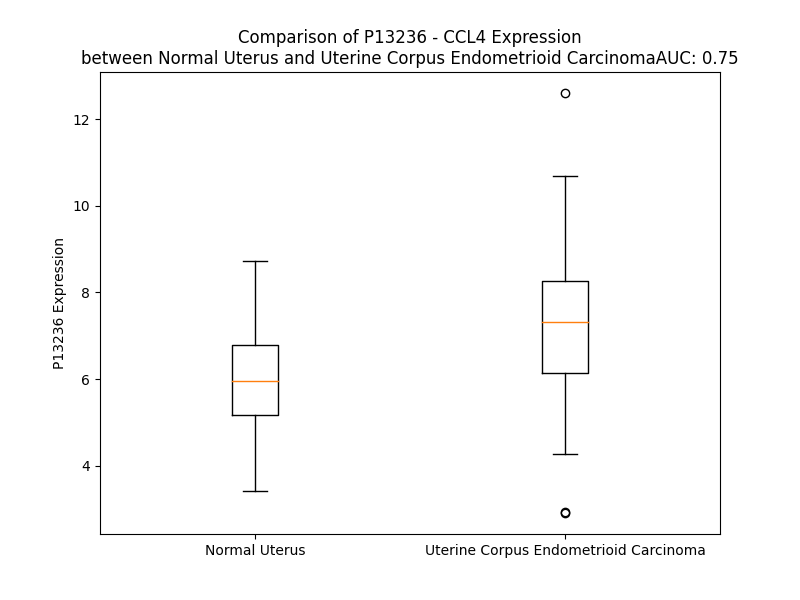

# Detailed Data for P13236

## Introduction to the Detailed Summary

### How to Interpret the Results

- **Summary & Metrics**: This section provides a quick reference to essential protein attributes, including expression changes, family classification, and biomarker applications. Regulation status (upregulated/downregulated) indicates the protein's behavior in a disease context. Some information comes from the original excel file with the proteins selected from literature, while others are derived from the analyses.
- **Expression Comparison**: A visual representation comparing protein expression between normal and disease states. It highlights significant changes in expression levels that might indicate diagnostic or therapeutic relevance. This is data coming from transcriptomics experiments and could not translate similarly to protein levels.
- **Isoform Alignment**: An interactive view of isoform alignments, revealing structural and functional differences between variants of the protein.
- **Interactors & Homologs**: Tables listing known interaction partners and homologous proteins, the more interactors and homologs, the more complex the protein is to design an antibody for.
- **Biological Assemblies**: Information about the structural arrangement of the protein in different assemblies, providing insights into its functional state but also the complexity of the protein to develop antibodies.
- **Combined Per-Residue Information**: A detailed table summarizing residue-level data. This includes predictions for epitope regions, aggregation tendencies, and modifications that might impact the protein's function. Each row corresponds to a residue in the protein, providing insights into specific sites that may be important for research or drug development.
## Summary & Metrics

- **UniProt Accession**: P13236
- **Gene Name**: CCL4 (MIP1B)
- **Protein Name**: C-C motif chemokine 4
- **Swiss Prot**: CCL4_HUMAN
- **Family**: cytokine
- **Biomarker Application**: diagnosis,efficacy,prognosis,unspecified application
- **Number of Isoforms**: 0
- **Regulation**: 1
- **(transcriptomics) AUC**: 0.75
- **(transcriptomics) Fold Change**: 1.21
- **(transcriptomics) Regulation**: Upregulated
- **Discotope Epitope Count**: 18
- **Max n_uniprots (Homo)**: 5
- **Max n_uniprots (Hetero)**: 2

## Expression Comparison

## Interactors

| preferredName_A   | preferredName_B   |   score |
|:------------------|:------------------|--------:|
| CCL4              | CCR2              |   0.999 |
| CCL4              | CCR5              |   0.999 |
| CCL4              | CCR1              |   0.999 |
| CCL4              | CCR3              |   0.998 |
| CCL4              | CCL3              |   0.997 |
| CCL4              | CCR7              |   0.996 |
| CCL4              | CXCR4             |   0.995 |
| CCL4              | CXCR3             |   0.995 |
| CCL4              | CXCL8             |   0.988 |
| CCL4              | CCR8              |   0.983 |
| CCL4              | CXCR2             |   0.977 |
| CCL4              | TNF               |   0.967 |
| CCL4              | CCR6              |   0.965 |
| CCL4              | CXCL9             |   0.959 |
| CCL4              | CXCL10            |   0.959 |
| CCL4              | CCL4L2            |   0.956 |
| CCL4              | CCL5              |   0.953 |
| CCL4              | CXCL13            |   0.949 |
| CCL4              | CXCL12            |   0.948 |
| CCL4              | CCL17             |   0.943 |
| CCL4              | IFNG              |   0.942 |
| CCL4              | CXCL1             |   0.941 |
| CCL4              | CCL20             |   0.94  |
| CCL4              | IL1B              |   0.94  |
| CCL4              | CD4               |   0.939 |
| CCL4              | IL10              |   0.936 |
| CCL4              | IRF5              |   0.934 |
| CCL4              | IL6               |   0.933 |
| CCL4              | IDE               |   0.932 |
| CCL4              | ACKR2             |   0.93  |
| CCL4              | CCRL2             |   0.925 |
| CCL4              | CSF2              |   0.924 |
| CCL4              | IL1A              |   0.921 |
| CCL4              | CXCL11            |   0.917 |
| CCL4              | CSF3              |   0.909 |
| CCL4              | CX3CL1            |   0.904 |

## Homologs

| uniprot_id   | gene_id   |
|:-------------|:----------|
| P13236       | CCL4      |
| P13236       | CCL4      |
| Q8NHW4       | CCL4L1    |
| P16619       | CCL3L1    |
| O00626       | CCL22     |
| A0A0B4J2G5   | CCL14     |
| A0N0R1       | CCL3      |
| P55774       | CCL18     |
| Q16663       | CCL15     |
| P55773       | CCL23     |
| A0A494C1Q1   | CCL5      |
| Q9Y258       | CCL26     |
| O00175       | CCL24     |
| O15467       | CCL16     |
| P22362       | CCL1      |
| Q92583       | CCL17     |
| A0A7P0TBH2   | CCL25     |
| A8MVH1       | CCL7      |
| Q6IBD6       | CCL19     |
| P80075       | CCL8      |
| P47992       | XCL1      |
| Q9UBD3       | XCL2      |
| A0N0N7       | CX3CL1    |
| A0A2R8Y806   | CCL20     |
| J3KRT7       | CCL2      |
| Q99616       | CCL13     |
| Q5VZ73       | CCL21     |
| Q6I9T4       | CCL11     |

## Biological Assemblies

|   Unnamed: 0 |   assembly |   n_uniprots | composition   | crystal_id   |
|-------------:|-----------:|-------------:|:--------------|:-------------|
|            0 |          1 |            1 | Homo          | 2ffk         |
|            0 |          1 |            1 | Homo          | 2fin         |
|            0 |          1 |            2 | Homo          | 1hum         |
|            0 |          1 |            5 | Homo          | 2x6l         |
|            1 |          2 |            2 | Homo          | 2x6l         |
|            2 |          3 |            2 | Homo          | 2x6l         |
|            3 |          4 |            1 | Homo          | 2x6l         |
|            0 |          1 |            2 | Homo          | 1hun         |
|            0 |          1 |            1 | Homo          | 1je4         |
|            0 |          1 |            1 | Homo          | 3tn2         |
|            1 |          2 |            1 | Homo          | 3tn2         |
|            0 |          1 |            2 | Hetero        | 4ral         |
|            1 |          2 |            2 | Hetero        | 4ral         |

## Combined Per-Residue Information

|   res | aa   |   epitope_score | epitope   |   relative_surface_accessibility |   modeling_confidence |   Aggregation | modification   |
|------:|:-----|----------------:|:----------|---------------------------------:|----------------------:|--------------:|:---------------|
|     1 | M    |         0.25978 | False     |                          1.10468 |                 62.08 |         0     | N/A            |
|     2 | K    |         0.31995 | False     |                          0.89076 |                 72.11 |         0.002 | N/A            |
|     3 | L    |         0.25365 | False     |                          0.87404 |                 76.46 |        14.728 | N/A            |
|     4 | C    |         0.17605 | False     |                          0.60813 |                 81.97 |        20.313 | N/A            |
|     5 | V    |         0.15843 | False     |                          0.70851 |                 80.7  |        82.652 | N/A            |
|     6 | T    |         0.21348 | False     |                          0.58863 |                 82.22 |        87.943 | N/A            |
|     7 | V    |         0.2043  | False     |                          0.59049 |                 84.49 |        97.509 | N/A            |
|     8 | L    |         0.25371 | False     |                          0.68066 |                 84.24 |        98.32  | N/A            |
|     9 | S    |         0.24271 | False     |                          0.50614 |                 84.21 |        98.463 | N/A            |
|    10 | L    |         0.30015 | False     |                          0.73227 |                 84.83 |        99.646 | N/A            |
|    11 | L    |         0.2011  | False     |                          0.67667 |                 84.08 |        99.828 | N/A            |
|    12 | M    |         0.27328 | False     |                          0.75284 |                 81.39 |        99.759 | N/A            |
|    13 | L    |         0.26817 | False     |                          0.62804 |                 82.33 |        99.669 | N/A            |
|    14 | V    |         0.22351 | False     |                          0.62121 |                 81.17 |        99.022 | N/A            |
|    15 | A    |         0.25015 | False     |                          0.61835 |                 79.67 |        91.301 | N/A            |
|    16 | A    |         0.23275 | False     |                          0.70621 |                 78.27 |        84.753 | N/A            |
|    17 | F    |         0.29909 | False     |                          0.84425 |                 76.62 |        79.375 | N/A            |
|    18 | C    |         0.25842 | False     |                          0.66123 |                 73.02 |        13.359 | N/A            |
|    19 | S    |         0.31597 | False     |                          0.61332 |                 69.03 |         0.021 | N/A            |
|    20 | P    |         0.37017 | False     |                          0.92503 |                 67.02 |         0.01  | N/A            |
|    21 | A    |         0.30134 | False     |                          0.88652 |                 63.45 |         0     | N/A            |
|    22 | L    |         0.42081 | False     |                          1.0241  |                 60.34 |         0     | N/A            |
|    23 | S    |         0.45349 | False     |                          0.83192 |                 60.69 |         0     | N/A            |
|    24 | A    |         0.35544 | False     |                          0.74548 |                 62.74 |         0     | N/A            |
|    25 | P    |         0.35804 | False     |                          0.95696 |                 59.89 |         0     | N/A            |
|    26 | M    |         0.4343  | False     |                          1.05362 |                 55.95 |         0     | N/A            |
|    27 | G    |         0.37264 | False     |                          0.64229 |                 56.95 |         0     | N/A            |
|    28 | S    |         0.55716 | True      |                          0.84397 |                 59.83 |         0     | N/A            |
|    29 | D    |         0.57235 | True      |                          0.64967 |                 59.66 |         0     | N/A            |
|    30 | P    |         0.48516 | True      |                          0.73609 |                 60    |         0     | N/A            |
|    31 | P    |         0.48522 | True      |                          1.04196 |                 65.67 |         0     | N/A            |
|    32 | T    |         0.42926 | False     |                          0.35947 |                 78.34 |         0     | N/A            |
|    33 | A    |         0.57086 | True      |                          0.56867 |                 86.76 |         0     | N/A            |
|    34 | C    |         0.36208 | False     |                          0.33006 |                 95.59 |         0     | N/A            |
|    35 | C    |         0.1889  | False     |                          0.03952 |                 97.04 |         0     | N/A            |
|    36 | F    |         0.55765 | True      |                          0.89497 |                 96.13 |         0     | N/A            |
|    37 | S    |         0.5701  | True      |                          0.62503 |                 97.4  |         0     | N/A            |
|    38 | Y    |         0.32112 | False     |                          0.31445 |                 98.23 |         0     | N/A            |
|    39 | T    |         0.3792  | False     |                          0.29417 |                 97.84 |         0     | N/A            |
|    40 | A    |         0.54303 | True      |                          1.04574 |                 97.66 |         0     | N/A            |
|    41 | R    |         0.63469 | True      |                          0.80651 |                 96.57 |         0     | N/A            |
|    42 | K    |         0.39456 | False     |                          0.529   |                 97.53 |         0     | N/A            |
|    43 | L    |         0.31853 | False     |                          0.1604  |                 96.79 |         0     | N/A            |
|    44 | P    |         0.39193 | False     |                          0.49988 |                 97.23 |         0     | N/A            |
|    45 | R    |         0.29506 | False     |                          0.30803 |                 96.48 |         0     | N/A            |
|    46 | N    |         0.43739 | False     |                          0.58111 |                 96.6  |         0     | N/A            |
|    47 | F    |         0.45833 | False     |                          0.52939 |                 97.2  |         0     | N/A            |
|    48 | V    |         0.12863 | False     |                          0.03519 |                 98.03 |         0     | N/A            |
|    49 | V    |         0.21133 | False     |                          0.45841 |                 97.48 |         0     | N/A            |
|    50 | D    |         0.33166 | False     |                          0.45452 |                 97.33 |         0     | N/A            |
|    51 | Y    |         0.32967 | False     |                          0.21399 |                 97.24 |         0     | N/A            |
|    52 | Y    |         0.56169 | True      |                          0.37459 |                 96.4  |         0     | N/A            |
|    53 | E    |         0.36176 | False     |                          0.64745 |                 96.04 |         0     | N/A            |
|    54 | T    |         0.14989 | False     |                          0.11585 |                 96.15 |         0     | N/A            |
|    55 | S    |         0.33614 | False     |                          0.326   |                 93.18 |         0     | N/A            |
|    56 | S    |         0.38976 | False     |                          0.89752 |                 92.83 |         0     | N/A            |
|    57 | L    |         0.5086  | True      |                          0.82166 |                 92.76 |         0     | N/A            |
|    58 | C    |         0.29169 | False     |                          0.1231  |                 94.28 |         0     | N/A            |
|    59 | S    |         0.5196  | True      |                          0.82799 |                 94.69 |         0     | N/A            |
|    60 | Q    |         0.52389 | True      |                          0.24586 |                 95.52 |         0     | N/A            |
|    61 | P    |         0.36616 | False     |                          0.68777 |                 97.07 |         1.065 | N/A            |
|    62 | A    |         0.10307 | False     |                          0.03536 |                 98.06 |         2.558 | N/A            |
|    63 | V    |         0.0995  | False     |                          0.0438  |                 97.87 |         2.87  | N/A            |
|    64 | V    |         0.07312 | False     |                          0.03523 |                 98.18 |         2.87  | N/A            |
|    65 | F    |         0.00898 | False     |                          0       |                 98.23 |         2.87  | N/A            |
|    66 | Q    |         0.23864 | False     |                          0.36451 |                 97.75 |         1.805 | N/A            |
|    67 | T    |         0.27783 | False     |                          0.09576 |                 97.69 |         0.576 | N/A            |
|    68 | K    |         0.48916 | True      |                          0.67383 |                 97.43 |         0     | N/A            |
|    69 | R    |         0.5726  | True      |                          0.83595 |                 97.32 |         0     | N/A            |
|    70 | S    |         0.44578 | False     |                          0.71757 |                 95.15 |         0     | N/A            |
|    71 | K    |         0.52773 | True      |                          0.64878 |                 97.08 |         0     | N/A            |
|    72 | Q    |         0.49889 | True      |                          0.57832 |                 97.23 |         0     | N/A            |
|    73 | V    |         0.43296 | False     |                          0.22469 |                 97.78 |         0     | N/A            |
|    74 | C    |         0.26246 | False     |                          0.24818 |                 98.34 |         0     | N/A            |
|    75 | A    |         0.01598 | False     |                          0.00128 |                 98.44 |         0     | N/A            |
|    76 | D    |         0.16113 | False     |                          0.2379  |                 98.42 |         0     | N/A            |
|    77 | P    |         0.36994 | False     |                          0.29801 |                 98.07 |         0     | N/A            |
|    78 | S    |         0.59117 | True      |                          0.67668 |                 97.69 |         0     | N/A            |
|    79 | E    |         0.31403 | False     |                          0.44334 |                 98.2  |         0     | N/A            |
|    80 | S    |         0.28766 | False     |                          0.69346 |                 97.93 |         0     | N/A            |
|    81 | W    |         0.271   | False     |                          0.10525 |                 98.23 |         0     | N/A            |
|    82 | V    |         0.01693 | False     |                          0.00571 |                 98.46 |         0     | N/A            |
|    83 | Q    |         0.4246  | False     |                          0.51608 |                 98.21 |         0     | N/A            |
|    84 | E    |         0.33057 | False     |                          0.5151  |                 97.78 |         0     | N/A            |
|    85 | Y    |         0.17614 | False     |                          0.05625 |                 98.09 |         0     | N/A            |
|    86 | V    |         0.17733 | False     |                          0.15328 |                 98.04 |         0     | N/A            |
|    87 | Y    |         0.43668 | False     |                          0.62502 |                 97.47 |         0     | N/A            |
|    88 | D    |         0.25198 | False     |                          0.38281 |                 96.54 |         0     | N/A            |
|    89 | L    |         0.2356  | False     |                          0.1747  |                 96.81 |         0     | N/A            |
|    90 | E    |         0.40641 | False     |                          0.58167 |                 94.97 |         0     | N/A            |
|    91 | L    |         0.22641 | False     |                          0.76388 |                 92.16 |         0     | N/A            |
|    92 | N    |         0.20221 | False     |                          1.09101 |                 75.33 |         0     | N/A            |

