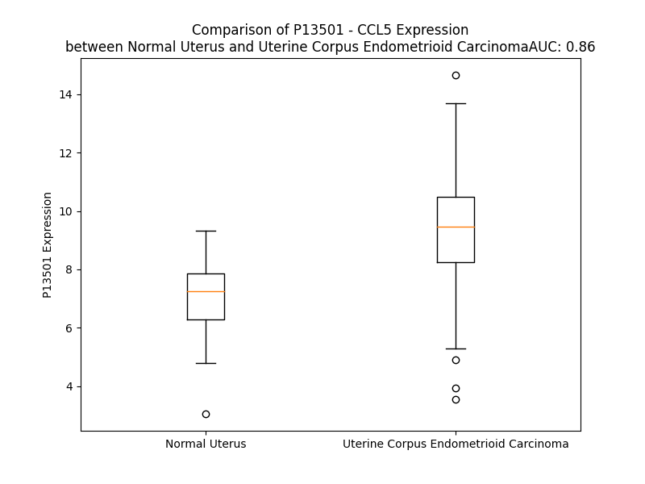

# Detailed Data for P13501

## Introduction to the Detailed Summary

### How to Interpret the Results

- **Summary & Metrics**: This section provides a quick reference to essential protein attributes, including expression changes, family classification, and biomarker applications. Regulation status (upregulated/downregulated) indicates the protein's behavior in a disease context. Some information comes from the original excel file with the proteins selected from literature, while others are derived from the analyses.
- **Expression Comparison**: A visual representation comparing protein expression between normal and disease states. It highlights significant changes in expression levels that might indicate diagnostic or therapeutic relevance. This is data coming from transcriptomics experiments and could not translate similarly to protein levels.
- **Isoform Alignment**: An interactive view of isoform alignments, revealing structural and functional differences between variants of the protein.
- **Interactors & Homologs**: Tables listing known interaction partners and homologous proteins, the more interactors and homologs, the more complex the protein is to design an antibody for.
- **Biological Assemblies**: Information about the structural arrangement of the protein in different assemblies, providing insights into its functional state but also the complexity of the protein to develop antibodies.
- **Combined Per-Residue Information**: A detailed table summarizing residue-level data. This includes predictions for epitope regions, aggregation tendencies, and modifications that might impact the protein's function. Each row corresponds to a residue in the protein, providing insights into specific sites that may be important for research or drug development.
## Summary & Metrics

- **UniProt Accession**: P13501
- **Gene Name**: CCL5
- **Protein Name**: C-C motif chemokine 5
- **Swiss Prot**: CCL5_HUMAN
- **Family**: cytokine
- **Biomarker Application**: diagnosis,efficacy,unspecified application
- **Number of Isoforms**: 0
- **Regulation**: 2
- **(transcriptomics) AUC**: 0.65
- **(transcriptomics) Fold Change**: 1.13
- **(transcriptomics) Regulation**: Upregulated
- **Discotope Epitope Count**: 18
- **Max n_uniprots (Homo)**: 11
- **Max n_uniprots (Hetero)**: 7

## Expression Comparison

## Interactors

| preferredName_A   | preferredName_B   |   score |
|:------------------|:------------------|--------:|
| CCL5              | CCR1              |   0.999 |
| CCL5              | PF4               |   0.999 |
| CCL5              | CXCR3             |   0.999 |
| CCL5              | CCR2              |   0.999 |
| CCL5              | CCR3              |   0.999 |
| CCL5              | CXCL9             |   0.999 |
| CCL5              | CXCL2             |   0.999 |
| CCL5              | CXCL10            |   0.999 |
| CCL5              | CXCL6             |   0.999 |
| CCL5              | CCL2              |   0.999 |
| CCL5              | CXCL11            |   0.999 |
| CCL5              | CCL21             |   0.999 |
| CCL5              | CCL17             |   0.999 |
| CCL5              | CCR5              |   0.999 |
| CCL5              | CXCL12            |   0.999 |
| CCL5              | CCL27             |   0.999 |
| CCL5              | CCL20             |   0.999 |
| CCL5              | CXCR4             |   0.998 |
| CCL5              | CCL16             |   0.998 |
| CCL5              | CCL25             |   0.998 |
| CCL5              | CCL13             |   0.998 |
| CCL5              | PPBP              |   0.998 |
| CCL5              | CXCL17            |   0.997 |
| CCL5              | CXCR2             |   0.997 |
| CCL5              | CCL28             |   0.997 |
| CCL5              | CXCL14            |   0.996 |
| CCL5              | XCL1              |   0.996 |
| CCL5              | XCL2              |   0.996 |
| CCL5              | CCL24             |   0.995 |
| CCL5              | CCL8              |   0.995 |
| CCL5              | CCL26             |   0.995 |
| CCL5              | CCL11             |   0.995 |
| CCL5              | CCR7              |   0.994 |
| CCL5              | ACKR1             |   0.993 |
| CCL5              | CX3CR1            |   0.993 |
| CCL5              | ACKR2             |   0.985 |
| CCL5              | CXCL8             |   0.98  |
| CCL5              | CCR4              |   0.977 |
| CCL5              | NFKB1             |   0.975 |
| CCL5              | CXCR1             |   0.971 |
| CCL5              | CX3CL1            |   0.971 |
| CCL5              | CCR6              |   0.965 |
| CCL5              | CCRL2             |   0.963 |
| CCL5              | CXCR5             |   0.962 |
| CCL5              | TNF               |   0.96  |
| CCL5              | CD8A              |   0.959 |
| CCL5              | CXCL1             |   0.958 |
| CCL5              | CXCL13            |   0.956 |
| CCL5              | CXCR6             |   0.955 |
| CCL5              | JUN               |   0.953 |

## Homologs

| uniprot_id   | gene_id   |
|:-------------|:----------|
| A0A494C1Q1   | CCL5      |
| P16619       | CCL3L1    |
| O00626       | CCL22     |
| A0A0B4J2G5   | CCL14     |
| Q8NHW4       | CCL4L1    |
| A0N0R1       | CCL3      |
| P55774       | CCL18     |
| P13236       | CCL4      |
| Q16663       | CCL15     |
| P55773       | CCL23     |
| Q9Y258       | CCL26     |
| O00175       | CCL24     |
| O15467       | CCL16     |
| P22362       | CCL1      |
| Q92583       | CCL17     |
| A0A7P0TBH2   | CCL25     |
| A8MVH1       | CCL7      |
| Q6IBD6       | CCL19     |
| P80075       | CCL8      |
| P47992       | XCL1      |
| Q9UBD3       | XCL2      |
| A0N0N7       | CX3CL1    |
| A0A2R8Y806   | CCL20     |
| J3KRT7       | CCL2      |
| Q99616       | CCL13     |
| Q5VZ73       | CCL21     |
| Q6I9T4       | CCL11     |

## Biological Assemblies

|   Unnamed: 0 |   assembly |   n_uniprots | composition   | crystal_id   |
|-------------:|-----------:|-------------:|:--------------|:-------------|
|            0 |          1 |            2 | Homo          | 1rto         |
|            0 |          1 |            3 | Homo          | 6aez         |
|            0 |          1 |            2 | Homo          | 6stk         |
|            0 |          1 |           11 | Homo          | 6c6d         |
|            0 |          1 |            7 | Hetero        | 7o7f         |
|            0 |          1 |            4 | Homo          | 2vxw         |
|            0 |          1 |            2 | Homo          | 1hrj         |
|            0 |          1 |            2 | Homo          | 1u4p         |
|            0 |          1 |            3 | Homo          | 5coy         |
|            0 |          1 |            3 | Homo          | 1u4l         |
|            0 |          1 |            2 | Hetero        | 6fgp         |
|            0 |          1 |            6 | Homo          | 5l2u         |
|            1 |          2 |            3 | Homo          | 5l2u         |
|            0 |          1 |            2 | Hetero        | 5uiw         |
|            0 |          1 |            2 | Homo          | 1rtn         |
|            0 |          1 |            1 | Homo          | 6log         |
|            0 |          1 |            2 | Homo          | 1eqt         |
|            0 |          1 |            4 | Homo          | 2l9h         |
|            0 |          1 |            4 | Hetero        | 7f1r         |
|            0 |          1 |            1 | Homo          | 1b3a         |
|            1 |          2 |            1 | Homo          | 1b3a         |
|            0 |          1 |            3 | Homo          | 1u4m         |
|            0 |          1 |           11 | Homo          | 5dnf         |
|            0 |          1 |            2 | Homo          | 1u4r         |
|            1 |          2 |            2 | Homo          | 1u4r         |
|            0 |          1 |            6 | Homo          | 5cmd         |

## Combined Per-Residue Information

|   res | aa   |   epitope_score | epitope   |   relative_surface_accessibility |   modeling_confidence |   Aggregation | modification         | glycosylation                        |
|------:|:-----|----------------:|:----------|---------------------------------:|----------------------:|--------------:|:---------------------|:-------------------------------------|
|     1 | M    |         0.39767 | False     |                          1.27081 |                 49.75 |         0     | N/A                  | N/A                                  |
|     2 | K    |         0.49984 | True      |                          1.03795 |                 59.56 |         0     | N/A                  | N/A                                  |
|     3 | V    |         0.35011 | False     |                          0.66046 |                 62.89 |         4.703 | N/A                  | N/A                                  |
|     4 | S    |         0.34231 | False     |                          0.53213 |                 76.97 |         5.523 | N/A                  | N/A                                  |
|     5 | A    |         0.36723 | False     |                          0.77495 |                 78.3  |        21.703 | N/A                  | N/A                                  |
|     6 | A    |         0.33567 | False     |                          0.63293 |                 78.78 |        40.824 | N/A                  | N/A                                  |
|     7 | A    |         0.20312 | False     |                          0.40442 |                 81.21 |        63.414 | N/A                  | N/A                                  |
|     8 | L    |         0.27454 | False     |                          0.58898 |                 81.05 |        90.031 | N/A                  | N/A                                  |
|     9 | A    |         0.22689 | False     |                          0.43769 |                 82.93 |        94.82  | N/A                  | N/A                                  |
|    10 | V    |         0.25628 | False     |                          0.70445 |                 83.17 |        99.426 | N/A                  | N/A                                  |
|    11 | I    |         0.17819 | False     |                          0.60717 |                 82.85 |        99.73  | N/A                  | N/A                                  |
|    12 | L    |         0.25967 | False     |                          0.74531 |                 82.24 |        99.563 | N/A                  | N/A                                  |
|    13 | I    |         0.2124  | False     |                          0.61816 |                 80.75 |        98.072 | N/A                  | N/A                                  |
|    14 | A    |         0.17937 | False     |                          0.48181 |                 80.69 |        80.832 | N/A                  | N/A                                  |
|    15 | T    |         0.34908 | False     |                          0.62456 |                 76.09 |        65.354 | N/A                  | N/A                                  |
|    16 | A    |         0.28163 | False     |                          0.7191  |                 77.22 |        56.092 | N/A                  | N/A                                  |
|    17 | L    |         0.29781 | False     |                          0.86699 |                 75.39 |        48.73  | N/A                  | N/A                                  |
|    18 | C    |         0.32728 | False     |                          0.76078 |                 69.43 |         8.493 | N/A                  | N/A                                  |
|    19 | A    |         0.33767 | False     |                          0.64343 |                 68.58 |         0.109 | N/A                  | N/A                                  |
|    20 | P    |         0.35436 | False     |                          0.8878  |                 68.68 |         0.061 | N/A                  | N/A                                  |
|    21 | A    |         0.35214 | False     |                          0.96793 |                 66.79 |         0     | N/A                  | N/A                                  |
|    22 | S    |         0.45319 | False     |                          0.78094 |                 64.83 |         0     | N/A                  | N/A                                  |
|    23 | A    |         0.44403 | False     |                          0.92303 |                 62.51 |         0     | N/A                  | N/A                                  |
|    24 | S    |         0.39737 | False     |                          0.50927 |                 59.55 |         0     | N/A                  | N/A                                  |
|    25 | P    |         0.42525 | False     |                          0.95503 |                 57.13 |         0     | N/A                  | N/A                                  |
|    26 | Y    |         0.42026 | False     |                          0.9136  |                 51.36 |         0     | N/A                  | N/A                                  |
|    27 | S    |         0.41343 | False     |                          0.64837 |                 51.39 |         0     | N/A                  | O-linked (GalNAc...) serine; partial |
|    28 | S    |         0.3491  | False     |                          0.62707 |                 56.19 |         0     | N/A                  | O-linked (GalNAc...) serine; partial |
|    29 | D    |         0.50058 | True      |                          0.91114 |                 64.13 |         0     | N/A                  | N/A                                  |
|    30 | T    |         0.47186 | False     |                          0.71779 |                 81.94 |         0     | N/A                  | N/A                                  |
|    31 | T    |         0.49187 | True      |                          0.35845 |                 87.19 |         0     | N/A                  | N/A                                  |
|    32 | P    |         0.50202 | True      |                          0.53664 |                 93.1  |         0     | N/A                  | N/A                                  |
|    33 | C    |         0.37333 | False     |                          0.33491 |                 96.89 |         0.536 | N/A                  | N/A                                  |
|    34 | C    |         0.1218  | False     |                          0.02662 |                 98.2  |         3.715 | N/A                  | N/A                                  |
|    35 | F    |         0.57643 | True      |                          0.83304 |                 97.53 |        12.341 | N/A                  | N/A                                  |
|    36 | A    |         0.55648 | True      |                          0.69677 |                 98.19 |        12.341 | N/A                  | N/A                                  |
|    37 | Y    |         0.33386 | False     |                          0.36281 |                 98.56 |        12.341 | N/A                  | N/A                                  |
|    38 | I    |         0.51258 | True      |                          0.34768 |                 98.22 |        12.341 | N/A                  | N/A                                  |
|    39 | A    |         0.5654  | True      |                          0.96573 |                 97.64 |        10.329 | N/A                  | N/A                                  |
|    40 | R    |         0.65362 | True      |                          0.77846 |                 97.25 |         0     | N/A                  | N/A                                  |
|    41 | P    |         0.43289 | False     |                          0.55678 |                 97.39 |         0     | N/A                  | N/A                                  |
|    42 | L    |         0.37476 | False     |                          0.15539 |                 95.6  |         0     | N/A                  | N/A                                  |
|    43 | P    |         0.46195 | False     |                          0.55825 |                 97.22 |         0     | N/A                  | N/A                                  |
|    44 | R    |         0.246   | False     |                          0.27872 |                 96.52 |         0     | N/A                  | N/A                                  |
|    45 | A    |         0.42314 | False     |                          0.7175  |                 96.92 |         0     | N/A                  | N/A                                  |
|    46 | H    |         0.4161  | False     |                          0.5604  |                 97.75 |         0     | N/A                  | N/A                                  |
|    47 | I    |         0.11413 | False     |                          0.01478 |                 98.01 |         0.21  | N/A                  | N/A                                  |
|    48 | K    |         0.26998 | False     |                          0.49735 |                 97.43 |         0.21  | N/A                  | N/A                                  |
|    49 | E    |         0.31475 | False     |                          0.37472 |                 98.17 |         0.21  | N/A                  | N/A                                  |
|    50 | Y    |         0.33163 | False     |                          0.21147 |                 98.44 |         0.84  | N/A                  | N/A                                  |
|    51 | F    |         0.3843  | False     |                          0.34809 |                 98.15 |         0.84  | N/A                  | N/A                                  |
|    52 | Y    |         0.42314 | False     |                          0.5974  |                 98.14 |         0.84  | N/A                  | N/A                                  |
|    53 | T    |         0.1297  | False     |                          0.10438 |                 97.69 |         0.63  | N/A                  | N/A                                  |
|    54 | S    |         0.31001 | False     |                          0.33697 |                 95.81 |         0.63  | N/A                  | N/A                                  |
|    55 | G    |         0.54798 | True      |                          1.00497 |                 95.74 |         0     | N/A                  | N/A                                  |
|    56 | K    |         0.57352 | True      |                          0.8767  |                 95.31 |         0     | N/A                  | N/A                                  |
|    57 | C    |         0.25528 | False     |                          0.11494 |                 96.41 |         0     | N/A                  | N/A                                  |
|    58 | S    |         0.52985 | True      |                          0.749   |                 96.76 |         0     | N/A                  | N/A                                  |
|    59 | N    |         0.48162 | True      |                          0.29559 |                 97.46 |         0     | N/A                  | N/A                                  |
|    60 | P    |         0.32541 | False     |                          0.69402 |                 97.96 |         1.012 | N/A                  | N/A                                  |
|    61 | A    |         0.10149 | False     |                          0.03402 |                 98.53 |        70.281 | N/A                  | N/A                                  |
|    62 | V    |         0.01275 | False     |                          0       |                 98.53 |        84.923 | N/A                  | N/A                                  |
|    63 | V    |         0.07659 | False     |                          0.03523 |                 98.66 |        84.923 | N/A                  | N/A                                  |
|    64 | F    |         0.00962 | False     |                          0       |                 98.65 |        84.923 | N/A                  | N/A                                  |
|    65 | V    |         0.08444 | False     |                          0.09997 |                 98.37 |        84.76  | N/A                  | N/A                                  |
|    66 | T    |         0.23651 | False     |                          0.09307 |                 98.32 |        27.181 | N/A                  | N/A                                  |
|    67 | R    |         0.61354 | True      |                          0.68688 |                 97.71 |         0     | N/A                  | N/A                                  |
|    68 | K    |         0.48471 | True      |                          0.82741 |                 97.91 |         0     | N/A                  | N/A                                  |
|    69 | N    |         0.53344 | True      |                          0.71914 |                 97.4  |         0     | N/A                  | N/A                                  |
|    70 | R    |         0.66631 | True      |                          0.66729 |                 97.82 |         0     | N/A                  | N/A                                  |
|    71 | Q    |         0.43729 | False     |                          0.60248 |                 97.99 |         0     | N/A                  | N/A                                  |
|    72 | V    |         0.33896 | False     |                          0.19599 |                 98.37 |         0     | N/A                  | N/A                                  |
|    73 | C    |         0.32291 | False     |                          0.27177 |                 98.73 |         0     | N/A                  | N/A                                  |
|    74 | A    |         0.01176 | False     |                          0       |                 98.7  |         0     | N/A                  | N/A                                  |
|    75 | N    |         0.1754  | False     |                          0.1766  |                 98.59 |         0     | N/A                  | N/A                                  |
|    76 | P    |         0.36086 | False     |                          0.21978 |                 98.32 |         0     | N/A                  | N/A                                  |
|    77 | E    |         0.65325 | True      |                          0.68597 |                 97.98 |         0     | N/A                  | N/A                                  |
|    78 | K    |         0.35376 | False     |                          0.55618 |                 98.28 |         0     | N/A                  | N/A                                  |
|    79 | K    |         0.41756 | False     |                          0.71239 |                 97.97 |         0     | N/A                  | N/A                                  |
|    80 | W    |         0.43215 | False     |                          0.15024 |                 98.08 |         0     | N/A                  | N/A                                  |
|    81 | V    |         0.00879 | False     |                          0       |                 98.47 |         0     | N/A                  | N/A                                  |
|    82 | R    |         0.41936 | False     |                          0.53971 |                 98.2  |         0     | N/A                  | N/A                                  |
|    83 | E    |         0.33162 | False     |                          0.40299 |                 97.67 |         0     | N/A                  | N/A                                  |
|    84 | Y    |         0.20317 | False     |                          0.16236 |                 98.08 |         0     | N/A                  | N/A                                  |
|    85 | I    |         0.20096 | False     |                          0.096   |                 98.22 |         0     | N/A                  | N/A                                  |
|    86 | N    |         0.41153 | False     |                          0.47104 |                 97.5  |         0     | N/A                  | N/A                                  |
|    87 | S    |         0.22352 | False     |                          0.36165 |                 96.45 |         0     | N/A                  | N/A                                  |
|    88 | L    |         0.1779  | False     |                          0.17363 |                 97.17 |         0     | N/A                  | N/A                                  |
|    89 | E    |         0.37186 | False     |                          0.60917 |                 96.3  |         0     | N/A                  | N/A                                  |
|    90 | M    |         0.2231  | False     |                          0.88104 |                 93.84 |         0     | Methionine sulfoxide | N/A                                  |
|    91 | S    |         0.1749  | False     |                          1.00863 |                 79    |         0     | N/A                  | N/A                                  |

