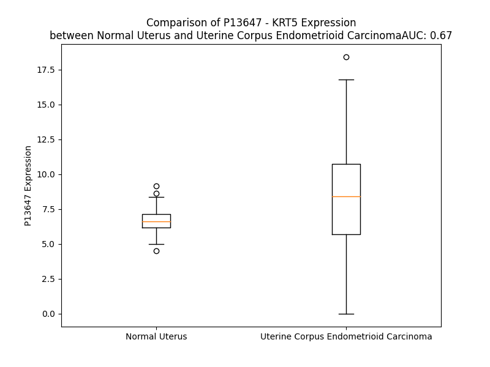

# Detailed Data for P13647

## Introduction to the Detailed Summary

### How to Interpret the Results

- **Summary & Metrics**: This section provides a quick reference to essential protein attributes, including expression changes, family classification, and biomarker applications. Regulation status (upregulated/downregulated) indicates the protein's behavior in a disease context. Some information comes from the original excel file with the proteins selected from literature, while others are derived from the analyses.
- **Expression Comparison**: A visual representation comparing protein expression between normal and disease states. It highlights significant changes in expression levels that might indicate diagnostic or therapeutic relevance. This is data coming from transcriptomics experiments and could not translate similarly to protein levels.
- **Isoform Alignment**: An interactive view of isoform alignments, revealing structural and functional differences between variants of the protein.
- **Interactors & Homologs**: Tables listing known interaction partners and homologous proteins, the more interactors and homologs, the more complex the protein is to design an antibody for.
- **Biological Assemblies**: Information about the structural arrangement of the protein in different assemblies, providing insights into its functional state but also the complexity of the protein to develop antibodies.
- **Combined Per-Residue Information**: A detailed table summarizing residue-level data. This includes predictions for epitope regions, aggregation tendencies, and modifications that might impact the protein's function. Each row corresponds to a residue in the protein, providing insights into specific sites that may be important for research or drug development.
## Summary & Metrics

- **UniProt Accession**: P13647
- **Gene Name**: KRT5
- **Protein Name**: Keratin, type II cytoskeletal 5
- **Swiss Prot**: K2C5_HUMAN
- **Family**: other
- **Biomarker Application**: diagnosis,efficacy,unspecified application
- **Number of Isoforms**: 0
- **Regulation**: 2
- **(transcriptomics) AUC**: 0.67
- **(transcriptomics) Fold Change**: 1.24
- **(transcriptomics) Regulation**: Upregulated
- **Discotope Epitope Count**: 131
- **Max n_uniprots (Homo)**: N/A
- **Max n_uniprots (Hetero)**: 2

## Expression Comparison

## Interactors

| preferredName_A   | preferredName_B   |   score |
|:------------------|:------------------|--------:|
| KRT5              | KRT14             |   0.999 |
| KRT5              | KRT1              |   0.923 |
| KRT5              | KRT6A             |   0.915 |

## Homologs

| uniprot_id   | gene_id      |
|:-------------|:-------------|
| P05783       | KRT18        |
| Q7RTS7       | KRT74        |
| A0A1B0GVI3   | KRT10        |
| Q7Z3Z0       | KRT25        |
| P08727       | KRT19        |
| P19012       | KRT15        |
| Q03252       | LMNB2        |
| Q2M2I5       | KRT24        |
| P35908       | KRT2         |
| P02533       | KRT14        |
| P08779       | KRT16        |
| A0A0D9SFE5   | LMNB1        |
| Q7Z3Y7       | KRT28        |
| P35527       | KRT9         |
| H0YFE3       | LMNTD1       |
| Q8N1A0       | KRT222       |
| Q14CN4       | KRT72        |
| O76013       | KRT36        |
| Q92764       | KRT35        |
| Q5XKE5       | KRT79        |
| P78386       | KRT85        |
| F8VUG2       | KRT8         |
| O76009       | KRT33A       |
| A0A1X7SCE1   | GFAP         |
| O76011       | KRT34        |
| Q7Z3Y9       | KRT26        |
| P08729       | KRT7         |
| B0YJC4       | VIM          |
| O76015       | KRT38        |
| O76014       | KRT37        |
| O43790       | KRT86        |
| P78385       | KRT83        |
| Q14533       | KRT81        |
| Q7Z3Y8       | KRT27        |
| E7ESP9       | NEFM         |
| Q16352       | INA          |
| P04259       | KRT6B        |
| A0A0S2Z428   | KRT6A        |
| P48668       | KRT6C        |
| Q6KB66       | KRT80        |
| P48681       | NES          |
| P35900       | KRT20        |
| K7EMJ2       | KRT13        |
| O95678       | KRT75        |
| Q04695       | KRT17        |
| Q13515       | BFSP2        |
| J3QR55       | KRT23        |
| Q53SB5       | tmp_locus_29 |
| Q01546       | KRT76        |
| Q7Z794       | KRT77        |
| Q9NSB2       | KRT84        |
| Q9NSB4       | KRT82        |
| P04264       | KRT1         |
| P07196       | NEFL         |
| Q14532       | KRT32        |
| Q6A162       | KRT40        |
| O15061       | SYNM         |
| Q8N1N4       | KRT78        |
| Q6A163       | KRT39        |
| F8VZR6       | KRT4         |
| Q3SY84       | KRT71        |
| Q14525       | KRT33B       |
| Q15323       | KRT31        |
| A0A6Q8PHQ9   | LMNA         |
| Q99456       | KRT12        |
| P12035       | KRT3         |
| Q86Y46       | KRT73        |
| P41219       | PRPH         |

## Biological Assemblies

|   Unnamed: 0 |   assembly |   n_uniprots | composition   | crystal_id   |
|-------------:|-----------:|-------------:|:--------------|:-------------|
|            0 |          1 |            2 | Hetero        | 3tnu         |
|            1 |          2 |            2 | Hetero        | 3tnu         |
|            0 |          1 |            2 | Hetero        | 6jfv         |
|            1 |          2 |            2 | Hetero        | 6jfv         |

## Combined Per-Residue Information

|   res | aa   |   epitope_score | epitope   |   relative_surface_accessibility |   modeling_confidence |   Aggregation | modification              |
|------:|:-----|----------------:|:----------|---------------------------------:|----------------------:|--------------:|:--------------------------|
|     1 | M    |         0.10908 | False     |                          1.34671 |                 41.69 |         0     | N/A                       |
|     2 | S    |         0.08946 | False     |                          0.82428 |                 37.07 |         0     | N/A                       |
|     3 | R    |         0.12292 | True      |                          0.95605 |                 45.04 |         0     | N/A                       |
|     4 | Q    |         0.1127  | False     |                          0.88303 |                 36.68 |         0     | N/A                       |
|     5 | S    |         0.1278  | True      |                          0.86436 |                 46.72 |         0     | Phosphoserine             |
|     6 | S    |         0.12181 | True      |                          0.85669 |                 37.19 |         0     | N/A                       |
|     7 | V    |         0.13386 | True      |                          1.01653 |                 44.11 |         0     | N/A                       |
|     8 | S    |         0.08292 | False     |                          0.77572 |                 40.2  |         0     | Phosphoserine             |
|     9 | F    |         0.10837 | False     |                          1.05245 |                 32.91 |         0     | N/A                       |
|    10 | R    |         0.09856 | False     |                          0.98523 |                 41.78 |         0     | N/A                       |
|    11 | S    |         0.08868 | False     |                          0.92943 |                 34.28 |         0     | N/A                       |
|    12 | G    |         0.13506 | True      |                          0.9762  |                 38.82 |         0     | N/A                       |
|    13 | G    |         0.11338 | False     |                          0.9903  |                 39.71 |         0     | N/A                       |
|    14 | S    |         0.08799 | False     |                          0.84083 |                 39.71 |         0     | N/A                       |
|    15 | R    |         0.12921 | True      |                          0.97363 |                 41.98 |         0     | N/A                       |
|    16 | S    |         0.07117 | False     |                          0.65083 |                 32.71 |         0     | Phosphoserine             |
|    17 | F    |         0.07746 | False     |                          1.01893 |                 39.95 |         0     | N/A                       |
|    18 | S    |         0.09044 | False     |                          0.76609 |                 32.83 |         0     | N/A                       |
|    19 | T    |         0.11434 | True      |                          0.91864 |                 37.49 |         0     | N/A                       |
|    20 | A    |         0.07214 | False     |                          0.94105 |                 35.07 |         0     | N/A                       |
|    21 | S    |         0.10606 | False     |                          0.76476 |                 37.25 |         0     | Phosphoserine             |
|    22 | A    |         0.07127 | False     |                          0.93092 |                 34.27 |         0     | N/A                       |
|    23 | I    |         0.1156  | True      |                          0.94728 |                 38.49 |         0     | N/A                       |
|    24 | T    |         0.09273 | False     |                          0.87518 |                 36.37 |         0     | Phosphothreonine; by CDK1 |
|    25 | P    |         0.10535 | False     |                          0.90827 |                 41.84 |         0     | N/A                       |
|    26 | S    |         0.0842  | False     |                          0.74386 |                 33.02 |         0     | Phosphoserine             |
|    27 | V    |         0.13669 | True      |                          0.92998 |                 38.77 |         0     | N/A                       |
|    28 | S    |         0.10144 | False     |                          0.80576 |                 39.82 |         0     | N/A                       |
|    29 | R    |         0.1244  | True      |                          0.91055 |                 34.26 |         0     | N/A                       |
|    30 | T    |         0.09828 | False     |                          0.82659 |                 34.11 |         0     | N/A                       |
|    31 | S    |         0.10441 | False     |                          0.76348 |                 32.95 |         0     | N/A                       |
|    32 | F    |         0.16009 | True      |                          1.04612 |                 31.14 |         0     | N/A                       |
|    33 | T    |         0.10173 | False     |                          0.91495 |                 33.54 |         0     | N/A                       |
|    34 | S    |         0.14351 | True      |                          0.78111 |                 28.85 |         0     | N/A                       |
|    35 | V    |         0.09809 | False     |                          0.96094 |                 34.71 |         0     | N/A                       |
|    36 | S    |         0.09762 | False     |                          0.82497 |                 29.15 |         0     | Phosphoserine             |
|    37 | R    |         0.16474 | True      |                          0.94795 |                 32.7  |         0     | N/A                       |
|    38 | S    |         0.09037 | False     |                          0.88526 |                 32.14 |         0     | N/A                       |
|    39 | G    |         0.10817 | False     |                          1.0092  |                 33.7  |         0     | N/A                       |
|    40 | G    |         0.11785 | True      |                          1.00422 |                 34.76 |         0     | N/A                       |
|    41 | G    |         0.12786 | True      |                          0.99171 |                 39.16 |         0     | N/A                       |
|    42 | G    |         0.14617 | True      |                          1.05398 |                 38.74 |         0     | N/A                       |
|    43 | G    |         0.12943 | True      |                          1.00335 |                 34.91 |         0     | N/A                       |
|    44 | G    |         0.08398 | False     |                          1.02217 |                 39    |         0     | N/A                       |
|    45 | G    |         0.1281  | True      |                          0.78601 |                 35.34 |         0     | N/A                       |
|    46 | F    |         0.09295 | False     |                          1.14824 |                 35.96 |         0     | N/A                       |
|    47 | G    |         0.12709 | True      |                          0.94979 |                 36.7  |         0     | N/A                       |
|    48 | R    |         0.17672 | True      |                          0.95745 |                 35.97 |         0     | N/A                       |
|    49 | V    |         0.08085 | False     |                          1.03488 |                 36.36 |         0     | N/A                       |
|    50 | S    |         0.0643  | False     |                          0.78636 |                 29.71 |         0     | Phosphoserine             |
|    51 | L    |         0.12469 | True      |                          1.0984  |                 32.97 |         0     | N/A                       |
|    52 | A    |         0.0516  | False     |                          0.93099 |                 34.58 |         0     | N/A                       |
|    53 | G    |         0.08681 | False     |                          0.8871  |                 32.37 |         0     | N/A                       |
|    54 | A    |         0.10711 | False     |                          0.88985 |                 34.6  |         0     | N/A                       |
|    55 | C    |         0.06269 | False     |                          0.97429 |                 29.72 |         0     | N/A                       |
|    56 | G    |         0.11124 | False     |                          0.81603 |                 32.53 |         0     | N/A                       |
|    57 | V    |         0.08802 | False     |                          1.15307 |                 29.75 |         0     | N/A                       |
|    58 | G    |         0.1142  | True      |                          0.87154 |                 31.47 |         0     | N/A                       |
|    59 | G    |         0.10261 | False     |                          0.83294 |                 28.07 |         0     | N/A                       |
|    60 | Y    |         0.12738 | True      |                          1.04877 |                 32.46 |         0     | N/A                       |
|    61 | G    |         0.15971 | True      |                          0.81725 |                 28.93 |         0     | N/A                       |
|    62 | S    |         0.11954 | True      |                          0.81639 |                 29.46 |         0     | N/A                       |
|    63 | R    |         0.10588 | False     |                          0.95437 |                 35.01 |         0     | N/A                       |
|    64 | S    |         0.08245 | False     |                          0.49981 |                 31.11 |         0     | Phosphoserine             |
|    65 | L    |         0.11532 | True      |                          1.03432 |                 34.6  |         0     | N/A                       |
|    66 | Y    |         0.10488 | False     |                          0.79103 |                 33.71 |         0     | N/A                       |
|    67 | N    |         0.09196 | False     |                          0.81492 |                 29.23 |         0     | N/A                       |
|    68 | L    |         0.09013 | False     |                          1.01963 |                 38.17 |         0     | N/A                       |
|    69 | G    |         0.11444 | True      |                          0.90975 |                 34.46 |         0     | N/A                       |
|    70 | G    |         0.13586 | True      |                          0.99503 |                 32.15 |         0     | N/A                       |
|    71 | S    |         0.12431 | True      |                          0.91998 |                 41.56 |         0     | Phosphoserine             |
|    72 | K    |         0.15669 | True      |                          1.00136 |                 36.1  |         0     | N/A                       |
|    73 | R    |         0.1683  | True      |                          0.92934 |                 32.45 |         0     | N/A                       |
|    74 | I    |         0.13152 | True      |                          1.07409 |                 33.65 |         0     | N/A                       |
|    75 | S    |         0.13498 | True      |                          0.79396 |                 33.12 |         0     | Phosphoserine             |
|    76 | I    |         0.18725 | True      |                          1.05604 |                 35.67 |         0     | N/A                       |
|    77 | S    |         0.09901 | False     |                          0.67618 |                 27.55 |         0     | N/A                       |
|    78 | T    |         0.10746 | False     |                          0.91008 |                 33.36 |         0     | N/A                       |
|    79 | S    |         0.15236 | True      |                          0.86686 |                 31.13 |         0     | N/A                       |
|    80 | G    |         0.14495 | True      |                          1.02908 |                 28.54 |         0     | N/A                       |
|    81 | G    |         0.14575 | True      |                          1.01589 |                 30.88 |         0     | N/A                       |
|    82 | S    |         0.08875 | False     |                          0.73414 |                 31.08 |         0     | Phosphoserine             |
|    83 | F    |         0.15723 | True      |                          1.10908 |                 31.8  |         0     | N/A                       |
|    84 | R    |         0.13015 | True      |                          0.90225 |                 36.31 |         0     | N/A                       |
|    85 | N    |         0.09115 | False     |                          0.84452 |                 33.65 |         0     | N/A                       |
|    86 | R    |         0.10411 | False     |                          0.76609 |                 35.29 |         0     | N/A                       |
|    87 | F    |         0.11734 | True      |                          0.85871 |                 33.21 |         0     | N/A                       |
|    88 | G    |         0.10203 | False     |                          0.8407  |                 32.52 |         0     | N/A                       |
|    89 | A    |         0.10341 | False     |                          1.05096 |                 36.3  |         0     | N/A                       |
|    90 | G    |         0.08309 | False     |                          0.91717 |                 35.37 |         0     | N/A                       |
|    91 | A    |         0.08707 | False     |                          1.01969 |                 35.08 |         0     | N/A                       |
|    92 | G    |         0.08704 | False     |                          0.97836 |                 33.24 |         0     | N/A                       |
|    93 | G    |         0.11858 | True      |                          1.04168 |                 30.33 |         0     | N/A                       |
|    94 | G    |         0.09749 | False     |                          0.97385 |                 31.77 |         0     | N/A                       |
|    95 | Y    |         0.11269 | False     |                          1.0601  |                 28.9  |         0     | N/A                       |
|    96 | G    |         0.10911 | False     |                          0.81544 |                 31.09 |         0     | N/A                       |
|    97 | F    |         0.09737 | False     |                          1.1063  |                 33.17 |         0     | N/A                       |
|    98 | G    |         0.12532 | True      |                          0.82443 |                 32.54 |         0     | N/A                       |
|    99 | G    |         0.06624 | False     |                          0.99742 |                 32.2  |         0     | N/A                       |
|   100 | G    |         0.10263 | False     |                          0.9563  |                 33.79 |         0     | N/A                       |
|   101 | A    |         0.12427 | True      |                          1.14806 |                 34.33 |         0     | N/A                       |
|   102 | G    |         0.12002 | True      |                          0.95882 |                 34.06 |         0     | N/A                       |
|   103 | S    |         0.12154 | True      |                          0.9213  |                 29.29 |         0     | N/A                       |
|   104 | G    |         0.10438 | False     |                          0.74376 |                 30.37 |         0     | N/A                       |
|   105 | F    |         0.10435 | False     |                          1.08153 |                 32.41 |         0     | N/A                       |
|   106 | G    |         0.10526 | False     |                          0.83754 |                 29.77 |         0     | N/A                       |
|   107 | F    |         0.1361  | True      |                          1.1367  |                 33.85 |         0     | N/A                       |
|   108 | G    |         0.18904 | True      |                          0.90773 |                 34.76 |         0     | N/A                       |
|   109 | G    |         0.11744 | True      |                          1.02361 |                 34.35 |         0     | N/A                       |
|   110 | G    |         0.14127 | True      |                          1.0347  |                 33.78 |         0     | N/A                       |
|   111 | A    |         0.10179 | False     |                          1.05938 |                 29.82 |         0     | N/A                       |
|   112 | G    |         0.1375  | True      |                          0.97159 |                 31.45 |         0     | N/A                       |
|   113 | G    |         0.08639 | False     |                          1.02582 |                 33.66 |         0     | N/A                       |
|   114 | G    |         0.1063  | False     |                          0.9262  |                 36.17 |         0     | N/A                       |
|   115 | F    |         0.08395 | False     |                          1.1307  |                 27.36 |         0     | N/A                       |
|   116 | G    |         0.12797 | True      |                          0.94683 |                 31.35 |         0     | N/A                       |
|   117 | L    |         0.10317 | False     |                          1.10822 |                 30.75 |         0     | N/A                       |
|   118 | G    |         0.15085 | True      |                          0.97823 |                 29.22 |         0     | N/A                       |
|   119 | G    |         0.11337 | False     |                          0.98042 |                 30.62 |         0     | N/A                       |
|   120 | G    |         0.08874 | False     |                          0.91682 |                 33.39 |         0     | N/A                       |
|   121 | A    |         0.14309 | True      |                          1.08697 |                 28.59 |         0     | N/A                       |
|   122 | G    |         0.1082  | False     |                          0.8082  |                 33.55 |         0     | N/A                       |
|   123 | F    |         0.08379 | False     |                          1.12574 |                 29.31 |         0     | N/A                       |
|   124 | G    |         0.07094 | False     |                          0.92193 |                 34.13 |         0     | N/A                       |
|   125 | G    |         0.09738 | False     |                          1.01414 |                 28.91 |         0     | N/A                       |
|   126 | G    |         0.05167 | False     |                          0.81753 |                 36.81 |         0     | N/A                       |
|   127 | F    |         0.11374 | False     |                          1.10261 |                 32.73 |         0     | N/A                       |
|   128 | G    |         0.09845 | False     |                          1.01843 |                 30.36 |         0     | N/A                       |
|   129 | G    |         0.12675 | True      |                          0.89768 |                 45.4  |         0     | N/A                       |
|   130 | P    |         0.07166 | False     |                          1.01611 |                 46.23 |         0     | N/A                       |
|   131 | G    |         0.09582 | False     |                          0.74373 |                 32.92 |         0     | N/A                       |
|   132 | F    |         0.10441 | False     |                          0.95585 |                 32.72 |         0     | N/A                       |
|   133 | P    |         0.11039 | False     |                          0.85841 |                 45.77 |         0     | N/A                       |
|   134 | V    |         0.13861 | True      |                          0.89377 |                 36.86 |         0     | N/A                       |
|   135 | C    |         0.06921 | False     |                          0.69886 |                 37.27 |         0     | N/A                       |
|   136 | P    |         0.10498 | False     |                          0.88177 |                 49.13 |         0     | N/A                       |
|   137 | P    |         0.08901 | False     |                          0.99677 |                 37.67 |         0     | N/A                       |
|   138 | G    |         0.09852 | False     |                          0.9448  |                 37.56 |         0     | N/A                       |
|   139 | G    |         0.12465 | True      |                          0.89617 |                 37.29 |         0     | N/A                       |
|   140 | I    |         0.15318 | True      |                          1.10699 |                 37.43 |         0     | N/A                       |
|   141 | Q    |         0.12434 | True      |                          0.78675 |                 35.09 |         0     | N/A                       |
|   142 | E    |         0.14188 | True      |                          0.85406 |                 44.28 |         0     | N/A                       |
|   143 | V    |         0.11107 | False     |                          0.9379  |                 40.96 |         0     | N/A                       |
|   144 | T    |         0.07706 | False     |                          0.85523 |                 45.05 |         0     | N/A                       |
|   145 | V    |         0.10047 | False     |                          0.78629 |                 42.61 |         0     | N/A                       |
|   146 | N    |         0.09706 | False     |                          0.5983  |                 39.67 |         0     | N/A                       |
|   147 | Q    |         0.16148 | True      |                          0.74216 |                 53.26 |         0     | N/A                       |
|   148 | S    |         0.11193 | False     |                          0.64076 |                 55.19 |         0     | N/A                       |
|   149 | L    |         0.1243  | True      |                          0.92945 |                 46.86 |         0     | N/A                       |
|   150 | L    |         0.14413 | True      |                          0.83725 |                 45.07 |         0     | N/A                       |
|   151 | T    |         0.06381 | False     |                          0.63538 |                 48.98 |         0     | Phosphothreonine; by CDK1 |
|   152 | P    |         0.12671 | True      |                          0.9472  |                 45.71 |         0     | N/A                       |
|   153 | L    |         0.07614 | False     |                          0.87701 |                 38.03 |         0     | N/A                       |
|   154 | N    |         0.08294 | False     |                          0.86072 |                 48.08 |         0     | N/A                       |
|   155 | L    |         0.09924 | False     |                          0.8112  |                 49.03 |         0     | N/A                       |
|   156 | Q    |         0.08388 | False     |                          0.84663 |                 46.35 |         0     | N/A                       |
|   157 | I    |         0.05034 | False     |                          0.39978 |                 50.67 |         0     | N/A                       |
|   158 | D    |         0.13882 | True      |                          0.42467 |                 52.45 |         0     | N/A                       |
|   159 | P    |         0.07792 | False     |                          0.76603 |                 63.9  |         0     | N/A                       |
|   160 | S    |         0.05812 | False     |                          0.47827 |                 66.56 |         0     | N/A                       |
|   161 | I    |         0.05308 | False     |                          0.53044 |                 63.8  |         0     | N/A                       |
|   162 | Q    |         0.08748 | False     |                          0.4706  |                 65.8  |         0     | N/A                       |
|   163 | R    |         0.09798 | False     |                          0.62696 |                 71.73 |         0     | N/A                       |
|   164 | V    |         0.04598 | False     |                          0.56077 |                 75.48 |         0     | N/A                       |
|   165 | R    |         0.11972 | True      |                          0.55284 |                 71.89 |         0     | N/A                       |
|   166 | T    |         0.0766  | False     |                          0.54428 |                 74.27 |         0     | N/A                       |
|   167 | E    |         0.05479 | False     |                          0.43361 |                 78.66 |         0     | N/A                       |
|   168 | E    |         0.02903 | False     |                          0.45835 |                 79.12 |         0     | N/A                       |
|   169 | R    |         0.06517 | False     |                          0.66346 |                 79.64 |         0     | N/A                       |
|   170 | E    |         0.056   | False     |                          0.58673 |                 78.21 |         0     | N/A                       |
|   171 | Q    |         0.04056 | False     |                          0.62487 |                 77.54 |         0     | N/A                       |
|   172 | I    |         0.03292 | False     |                          0.59917 |                 77.99 |         0     | N/A                       |
|   173 | K    |         0.06186 | False     |                          0.58346 |                 81.43 |         0     | N/A                       |
|   174 | T    |         0.05201 | False     |                          0.47154 |                 81.14 |         0     | N/A                       |
|   175 | L    |         0.03581 | False     |                          0.57658 |                 80.89 |         0     | N/A                       |
|   176 | N    |         0.05711 | False     |                          0.52979 |                 84.01 |         0     | N/A                       |
|   177 | N    |         0.05131 | False     |                          0.65957 |                 84.84 |         0     | N/A                       |
|   178 | K    |         0.03316 | False     |                          0.5518  |                 85.44 |         0     | N/A                       |
|   179 | F    |         0.03732 | False     |                          0.56019 |                 87.15 |         9.636 | N/A                       |
|   180 | A    |         0.03258 | False     |                          0.46904 |                 83.19 |         9.636 | N/A                       |
|   181 | S    |         0.04002 | False     |                          0.49222 |                 85.95 |         9.636 | N/A                       |
|   182 | F    |         0.03181 | False     |                          0.65444 |                 89.24 |         9.636 | N/A                       |
|   183 | I    |         0.03499 | False     |                          0.60904 |                 87.24 |         9.636 | N/A                       |
|   184 | D    |         0.04353 | False     |                          0.56206 |                 88.21 |         0     | N/A                       |
|   185 | K    |         0.03595 | False     |                          0.52913 |                 90.1  |         0     | N/A                       |
|   186 | V    |         0.02658 | False     |                          0.57505 |                 91.68 |         0     | N/A                       |
|   187 | R    |         0.06538 | False     |                          0.64908 |                 89.12 |         0     | N/A                       |
|   188 | F    |         0.04061 | False     |                          0.53854 |                 91.9  |         0     | N/A                       |
|   189 | L    |         0.03704 | False     |                          0.48554 |                 91.1  |         0     | N/A                       |
|   190 | E    |         0.05432 | False     |                          0.53465 |                 89.67 |         0     | N/A                       |
|   191 | Q    |         0.0569  | False     |                          0.63616 |                 92.47 |         0     | N/A                       |
|   192 | Q    |         0.0337  | False     |                          0.41257 |                 93.1  |         0     | N/A                       |
|   193 | N    |         0.04085 | False     |                          0.55643 |                 91.31 |         0     | N/A                       |
|   194 | K    |         0.06015 | False     |                          0.72603 |                 93.71 |         0     | N/A                       |
|   195 | V    |         0.03802 | False     |                          0.65614 |                 92.24 |         0.778 | N/A                       |
|   196 | L    |         0.03317 | False     |                          0.65593 |                 92.3  |         0.778 | N/A                       |
|   197 | D    |         0.05104 | False     |                          0.56732 |                 91.61 |         0.778 | N/A                       |
|   198 | T    |         0.05866 | False     |                          0.5385  |                 90.69 |         0.778 | N/A                       |
|   199 | K    |         0.04566 | False     |                          0.58604 |                 89.49 |         0.778 | N/A                       |
|   200 | W    |         0.07415 | False     |                          0.73239 |                 85.74 |         1.27  | N/A                       |
|   201 | T    |         0.04492 | False     |                          0.51924 |                 87.1  |         1.27  | N/A                       |
|   202 | L    |         0.0466  | False     |                          0.7301  |                 85.85 |         1.27  | N/A                       |
|   203 | L    |         0.04966 | False     |                          0.58675 |                 82.25 |         1.27  | N/A                       |
|   204 | Q    |         0.05362 | False     |                          0.53125 |                 79.08 |         0.492 | N/A                       |
|   205 | E    |         0.04707 | False     |                          0.37026 |                 77.8  |         0     | N/A                       |
|   206 | Q    |         0.09263 | False     |                          0.57957 |                 70.35 |         0     | N/A                       |
|   207 | G    |         0.09246 | False     |                          0.60204 |                 61.22 |         0     | N/A                       |
|   208 | T    |         0.11042 | False     |                          0.68342 |                 59.89 |         0     | N/A                       |
|   209 | K    |         0.10579 | False     |                          0.72046 |                 56.98 |         0     | N/A                       |
|   210 | T    |         0.14041 | True      |                          0.65241 |                 54.84 |         0     | N/A                       |
|   211 | V    |         0.0711  | False     |                          0.80719 |                 53.8  |         0     | N/A                       |
|   212 | R    |         0.10009 | False     |                          0.87503 |                 56.03 |         0     | N/A                       |
|   213 | Q    |         0.08345 | False     |                          0.8046  |                 62.44 |         0     | N/A                       |
|   214 | N    |         0.09515 | False     |                          0.54365 |                 70.02 |         0     | N/A                       |
|   215 | L    |         0.09008 | False     |                          0.56247 |                 81.42 |         0     | N/A                       |
|   216 | E    |         0.0588  | False     |                          0.53867 |                 85.06 |         0     | N/A                       |
|   217 | P    |         0.10036 | False     |                          0.55685 |                 88.68 |         0     | N/A                       |
|   218 | L    |         0.04274 | False     |                          0.68583 |                 90    |         0     | N/A                       |
|   219 | F    |         0.02871 | False     |                          0.61752 |                 91.56 |         0     | N/A                       |
|   220 | E    |         0.05375 | False     |                          0.49976 |                 93.83 |         0     | N/A                       |
|   221 | Q    |         0.08164 | False     |                          0.63473 |                 95.38 |         0     | N/A                       |
|   222 | Y    |         0.07706 | False     |                          0.63128 |                 94.71 |         0     | N/A                       |
|   223 | I    |         0.04457 | False     |                          0.47577 |                 96.06 |         0     | N/A                       |
|   224 | N    |         0.07557 | False     |                          0.43108 |                 96.9  |         0     | N/A                       |
|   225 | N    |         0.05085 | False     |                          0.49999 |                 96.91 |         0     | N/A                       |
|   226 | L    |         0.05731 | False     |                          0.49217 |                 96.63 |         0     | N/A                       |
|   227 | R    |         0.16947 | True      |                          0.58941 |                 97.09 |         0     | N/A                       |
|   228 | R    |         0.07564 | False     |                          0.7464  |                 96.92 |         0     | N/A                       |
|   229 | Q    |         0.0613  | False     |                          0.47981 |                 97.54 |         0     | N/A                       |
|   230 | L    |         0.05248 | False     |                          0.66538 |                 97.11 |         0     | N/A                       |
|   231 | D    |         0.06396 | False     |                          0.58096 |                 96.93 |         0     | N/A                       |
|   232 | S    |         0.04406 | False     |                          0.58361 |                 97.36 |         0     | N/A                       |
|   233 | I    |         0.04528 | False     |                          0.68908 |                 96.85 |         0     | N/A                       |
|   234 | V    |         0.05689 | False     |                          0.63586 |                 97.64 |         0     | N/A                       |
|   235 | G    |         0.05188 | False     |                          0.5399  |                 97.06 |         0     | N/A                       |
|   236 | E    |         0.04031 | False     |                          0.4774  |                 97.52 |         0     | N/A                       |
|   237 | R    |         0.06663 | False     |                          0.63866 |                 97.36 |         0     | N/A                       |
|   238 | G    |         0.05431 | False     |                          0.47974 |                 96.01 |         0     | N/A                       |
|   239 | R    |         0.06842 | False     |                          0.49506 |                 97.39 |         0     | N/A                       |
|   240 | L    |         0.02807 | False     |                          0.53231 |                 96.86 |         0     | N/A                       |
|   241 | D    |         0.06098 | False     |                          0.30241 |                 97.14 |         0     | N/A                       |
|   242 | S    |         0.05102 | False     |                          0.41479 |                 96.26 |         0     | N/A                       |
|   243 | E    |         0.04398 | False     |                          0.4222  |                 97.43 |         0     | N/A                       |
|   244 | L    |         0.05196 | False     |                          0.6224  |                 97.12 |         0     | N/A                       |
|   245 | R    |         0.06526 | False     |                          0.65621 |                 97.35 |         0     | N/A                       |
|   246 | N    |         0.03453 | False     |                          0.60018 |                 97.19 |         0     | N/A                       |
|   247 | M    |         0.03336 | False     |                          0.56006 |                 97.47 |         0     | N/A                       |
|   248 | Q    |         0.04919 | False     |                          0.51549 |                 97.53 |         0     | N/A                       |
|   249 | D    |         0.06932 | False     |                          0.58522 |                 97.1  |         0     | N/A                       |
|   250 | L    |         0.03673 | False     |                          0.47001 |                 97.83 |         0     | N/A                       |
|   251 | V    |         0.03297 | False     |                          0.7025  |                 97.97 |         0     | N/A                       |
|   252 | E    |         0.0351  | False     |                          0.41064 |                 97.36 |         0     | N/A                       |
|   253 | D    |         0.07846 | False     |                          0.41808 |                 97.35 |         0     | N/A                       |
|   254 | F    |         0.0331  | False     |                          0.52148 |                 96.89 |         0     | N/A                       |
|   255 | K    |         0.05748 | False     |                          0.44767 |                 97.47 |         0     | N/A                       |
|   256 | N    |         0.04366 | False     |                          0.45108 |                 96.34 |         0     | N/A                       |
|   257 | K    |         0.05021 | False     |                          0.50661 |                 97.69 |         0     | N/A                       |
|   258 | Y    |         0.05763 | False     |                          0.66969 |                 97.39 |         0     | N/A                       |
|   259 | E    |         0.03558 | False     |                          0.40689 |                 96.82 |         0     | N/A                       |
|   260 | D    |         0.08678 | False     |                          0.48026 |                 95.79 |         0     | N/A                       |
|   261 | E    |         0.03682 | False     |                          0.50243 |                 96.31 |         0     | N/A                       |
|   262 | I    |         0.07419 | False     |                          0.65165 |                 96.08 |         0     | N/A                       |
|   263 | N    |         0.07849 | False     |                          0.58489 |                 95.32 |         0     | N/A                       |
|   264 | K    |         0.05346 | False     |                          0.57067 |                 96.39 |         0     | N/A                       |
|   265 | R    |         0.06876 | False     |                          0.66286 |                 97.28 |         0     | N/A                       |
|   266 | T    |         0.05392 | False     |                          0.5188  |                 95.39 |         0     | N/A                       |
|   267 | T    |         0.04517 | False     |                          0.52863 |                 95.93 |         0     | N/A                       |
|   268 | A    |         0.0322  | False     |                          0.54489 |                 93.56 |         0     | N/A                       |
|   269 | E    |         0.04957 | False     |                          0.45638 |                 95.57 |         0     | N/A                       |
|   270 | N    |         0.03351 | False     |                          0.57235 |                 95.25 |         0     | N/A                       |
|   271 | E    |         0.05255 | False     |                          0.57885 |                 96.83 |         0.14  | N/A                       |
|   272 | F    |         0.04641 | False     |                          0.68296 |                 96.85 |         0.14  | N/A                       |
|   273 | V    |         0.05232 | False     |                          0.53188 |                 97.62 |         0.14  | N/A                       |
|   274 | M    |         0.04066 | False     |                          0.54458 |                 95.42 |         0.14  | N/A                       |
|   275 | L    |         0.04408 | False     |                          0.67422 |                 96.58 |         0.14  | N/A                       |
|   276 | K    |         0.05556 | False     |                          0.57051 |                 97.55 |         0.14  | N/A                       |
|   277 | K    |         0.04043 | False     |                          0.55288 |                 97.49 |         0     | N/A                       |
|   278 | D    |         0.06043 | False     |                          0.50938 |                 96.71 |         0     | N/A                       |
|   279 | V    |         0.02982 | False     |                          0.62434 |                 98.17 |         0     | N/A                       |
|   280 | D    |         0.04503 | False     |                          0.43667 |                 97.85 |         0     | N/A                       |
|   281 | A    |         0.04239 | False     |                          0.48613 |                 96.75 |         0     | N/A                       |
|   282 | A    |         0.03533 | False     |                          0.59291 |                 97.02 |         0     | N/A                       |
|   283 | Y    |         0.06131 | False     |                          0.59987 |                 97.61 |         0     | N/A                       |
|   284 | M    |         0.04649 | False     |                          0.61856 |                 97.35 |         0     | N/A                       |
|   285 | N    |         0.0277  | False     |                          0.56611 |                 97.22 |         0     | N/A                       |
|   286 | K    |         0.05412 | False     |                          0.50038 |                 98.08 |         0     | N/A                       |
|   287 | V    |         0.04262 | False     |                          0.44598 |                 98.19 |         0     | N/A                       |
|   288 | E    |         0.04118 | False     |                          0.44955 |                 97.42 |         0     | N/A                       |
|   289 | L    |         0.05064 | False     |                          0.67068 |                 97.33 |         0     | N/A                       |
|   290 | E    |         0.04493 | False     |                          0.40768 |                 97.71 |         0     | N/A                       |
|   291 | A    |         0.05076 | False     |                          0.56823 |                 97.53 |         0     | N/A                       |
|   292 | K    |         0.0385  | False     |                          0.52555 |                 97.58 |         0     | N/A                       |
|   293 | V    |         0.04241 | False     |                          0.52981 |                 98.21 |         0     | N/A                       |
|   294 | D    |         0.06025 | False     |                          0.5391  |                 97.75 |         0     | N/A                       |
|   295 | A    |         0.02121 | False     |                          0.58508 |                 97.44 |         0     | N/A                       |
|   296 | L    |         0.04159 | False     |                          0.61085 |                 97.77 |         0     | N/A                       |
|   297 | M    |         0.04414 | False     |                          0.60271 |                 97.72 |         0     | N/A                       |
|   298 | D    |         0.05011 | False     |                          0.61455 |                 97.43 |         0     | N/A                       |
|   299 | E    |         0.03568 | False     |                          0.47639 |                 97.1  |         0     | N/A                       |
|   300 | I    |         0.06524 | False     |                          0.54975 |                 96.71 |         0     | N/A                       |
|   301 | N    |         0.06079 | False     |                          0.47864 |                 97.15 |         0     | N/A                       |
|   302 | F    |         0.05868 | False     |                          0.68908 |                 97.61 |         0     | N/A                       |
|   303 | M    |         0.04273 | False     |                          0.45869 |                 97.44 |         0     | N/A                       |
|   304 | K    |         0.04786 | False     |                          0.56662 |                 96.89 |         0     | N/A                       |
|   305 | M    |         0.07772 | False     |                          0.78749 |                 96.51 |         0     | N/A                       |
|   306 | F    |         0.06878 | False     |                          0.54157 |                 96.11 |         0     | N/A                       |
|   307 | F    |         0.05672 | False     |                          0.54191 |                 95.41 |         0     | N/A                       |
|   308 | D    |         0.04427 | False     |                          0.58814 |                 95.6  |         0     | N/A                       |
|   309 | A    |         0.0451  | False     |                          0.58611 |                 93.38 |         0     | N/A                       |
|   310 | E    |         0.0391  | False     |                          0.41447 |                 92.61 |         0     | N/A                       |
|   311 | L    |         0.06335 | False     |                          0.69129 |                 90.8  |         0     | N/A                       |
|   312 | S    |         0.05716 | False     |                          0.50968 |                 90.79 |         0     | N/A                       |
|   313 | Q    |         0.0367  | False     |                          0.57562 |                 88.63 |         0     | N/A                       |
|   314 | M    |         0.06732 | False     |                          0.61242 |                 87.27 |         0     | N/A                       |
|   315 | Q    |         0.11524 | True      |                          0.66181 |                 84.81 |         0     | N/A                       |
|   316 | T    |         0.08514 | False     |                          0.52989 |                 81.01 |         0     | N/A                       |
|   317 | H    |         0.05232 | False     |                          0.59025 |                 78.01 |         0     | N/A                       |
|   318 | V    |         0.07741 | False     |                          0.66591 |                 71.08 |         0     | N/A                       |
|   319 | S    |         0.08447 | False     |                          0.5665  |                 64.53 |         0     | N/A                       |
|   320 | D    |         0.10725 | False     |                          0.67893 |                 57.23 |         0     | N/A                       |
|   321 | T    |         0.08318 | False     |                          0.77012 |                 59.05 |         1.234 | N/A                       |
|   322 | S    |         0.17542 | True      |                          0.65207 |                 43.82 |         1.234 | N/A                       |
|   323 | V    |         0.09865 | False     |                          0.73153 |                 52.66 |         3.58  | N/A                       |
|   324 | V    |         0.16389 | True      |                          1.05768 |                 47.05 |         3.58  | N/A                       |
|   325 | L    |         0.13061 | True      |                          0.74027 |                 45.59 |         3.58  | N/A                       |
|   326 | S    |         0.12215 | True      |                          0.88204 |                 40.79 |         2.346 | N/A                       |
|   327 | M    |         0.12402 | True      |                          0.71132 |                 49.81 |         2.346 | N/A                       |
|   328 | D    |         0.14673 | True      |                          0.96029 |                 35.77 |         0     | N/A                       |
|   329 | N    |         0.11315 | False     |                          0.88331 |                 49.69 |         0     | N/A                       |
|   330 | N    |         0.16153 | True      |                          0.94444 |                 48.12 |         0     | N/A                       |
|   331 | R    |         0.14882 | True      |                          0.81899 |                 53.54 |         0     | N/A                       |
|   332 | N    |         0.11827 | True      |                          0.97748 |                 60.03 |         0     | N/A                       |
|   333 | L    |         0.10049 | False     |                          0.74671 |                 63.62 |         0     | N/A                       |
|   334 | D    |         0.07972 | False     |                          0.56813 |                 71.68 |         0     | N/A                       |
|   335 | L    |         0.14441 | True      |                          0.70086 |                 75.85 |         0     | N/A                       |
|   336 | D    |         0.09256 | False     |                          0.70214 |                 85.38 |         0     | N/A                       |
|   337 | S    |         0.04282 | False     |                          0.50071 |                 85.84 |         0     | N/A                       |
|   338 | I    |         0.04628 | False     |                          0.43507 |                 84.02 |         0     | N/A                       |
|   339 | I    |         0.1271  | True      |                          0.50116 |                 87.28 |         0     | N/A                       |
|   340 | A    |         0.07687 | False     |                          0.54612 |                 92.08 |         0     | N/A                       |
|   341 | E    |         0.04811 | False     |                          0.59729 |                 91.32 |         0     | N/A                       |
|   342 | V    |         0.07036 | False     |                          0.52364 |                 92.55 |         0     | N/A                       |
|   343 | K    |         0.08248 | False     |                          0.65335 |                 91.83 |         0     | N/A                       |
|   344 | A    |         0.04361 | False     |                          0.54623 |                 93.48 |         0     | N/A                       |
|   345 | Q    |         0.07364 | False     |                          0.53791 |                 91.97 |         0     | N/A                       |
|   346 | Y    |         0.0993  | False     |                          0.69701 |                 92.02 |         0     | N/A                       |
|   347 | E    |         0.09879 | False     |                          0.58954 |                 94.11 |         0     | N/A                       |
|   348 | E    |         0.03057 | False     |                          0.45785 |                 94.16 |         0     | N/A                       |
|   349 | I    |         0.05863 | False     |                          0.59072 |                 92.13 |         0     | N/A                       |
|   350 | A    |         0.05513 | False     |                          0.49629 |                 91.81 |         0     | N/A                       |
|   351 | N    |         0.02748 | False     |                          0.38644 |                 94.04 |         0     | N/A                       |
|   352 | R    |         0.05306 | False     |                          0.4917  |                 94.55 |         0     | N/A                       |
|   353 | S    |         0.08416 | False     |                          0.47899 |                 92.66 |         0     | N/A                       |
|   354 | R    |         0.08308 | False     |                          0.50906 |                 93.5  |         0     | N/A                       |
|   355 | T    |         0.04699 | False     |                          0.56009 |                 94.13 |         0     | N/A                       |
|   356 | E    |         0.03467 | False     |                          0.51185 |                 93.44 |         0     | N/A                       |
|   357 | A    |         0.04252 | False     |                          0.4333  |                 92.43 |         0     | N/A                       |
|   358 | E    |         0.0487  | False     |                          0.50779 |                 94.47 |         0     | N/A                       |
|   359 | S    |         0.02704 | False     |                          0.48984 |                 93.09 |         0     | N/A                       |
|   360 | W    |         0.05193 | False     |                          0.65202 |                 93.68 |         0     | N/A                       |
|   361 | Y    |         0.07141 | False     |                          0.67092 |                 94.1  |         0     | N/A                       |
|   362 | Q    |         0.03594 | False     |                          0.51068 |                 95.86 |         0     | N/A                       |
|   363 | T    |         0.0263  | False     |                          0.61298 |                 95.82 |         0     | N/A                       |
|   364 | K    |         0.08895 | False     |                          0.43325 |                 94.05 |         0     | N/A                       |
|   365 | Y    |         0.08297 | False     |                          0.66421 |                 94.22 |         0     | N/A                       |
|   366 | E    |         0.04623 | False     |                          0.42012 |                 95.7  |         0     | N/A                       |
|   367 | E    |         0.03486 | False     |                          0.42968 |                 94.78 |         0     | N/A                       |
|   368 | L    |         0.07545 | False     |                          0.78089 |                 93.9  |         0     | N/A                       |
|   369 | Q    |         0.04822 | False     |                          0.58619 |                 94.19 |         0     | N/A                       |
|   370 | Q    |         0.03689 | False     |                          0.53575 |                 94.35 |         0     | N/A                       |
|   371 | T    |         0.05611 | False     |                          0.42918 |                 93.67 |         0     | N/A                       |
|   372 | A    |         0.07388 | False     |                          0.62202 |                 92.9  |         0     | N/A                       |
|   373 | G    |         0.04642 | False     |                          0.45962 |                 93.43 |         0     | N/A                       |
|   374 | R    |         0.04783 | False     |                          0.62414 |                 93.96 |         0     | N/A                       |
|   375 | H    |         0.09343 | False     |                          0.70904 |                 94.49 |         0     | N/A                       |
|   376 | G    |         0.08096 | False     |                          0.48701 |                 95.31 |         0     | N/A                       |
|   377 | D    |         0.02652 | False     |                          0.38554 |                 94.87 |         0     | N/A                       |
|   378 | D    |         0.05755 | False     |                          0.47933 |                 95.87 |         0     | N/A                       |
|   379 | L    |         0.05271 | False     |                          0.7997  |                 96.4  |         0     | N/A                       |
|   380 | R    |         0.06895 | False     |                          0.54736 |                 96.01 |         0     | N/A                       |
|   381 | N    |         0.04583 | False     |                          0.47768 |                 96.42 |         0     | N/A                       |
|   382 | T    |         0.06097 | False     |                          0.44103 |                 94.95 |         0     | N/A                       |
|   383 | K    |         0.06874 | False     |                          0.71224 |                 97.63 |         0     | N/A                       |
|   384 | H    |         0.04428 | False     |                          0.59107 |                 96.05 |         0     | N/A                       |
|   385 | E    |         0.05549 | False     |                          0.51222 |                 95.97 |         0     | N/A                       |
|   386 | I    |         0.05898 | False     |                          0.58237 |                 96.6  |         0     | N/A                       |
|   387 | S    |         0.06346 | False     |                          0.32806 |                 97.18 |         0     | N/A                       |
|   388 | E    |         0.08472 | False     |                          0.54156 |                 96.27 |         0     | N/A                       |
|   389 | M    |         0.09575 | False     |                          0.57329 |                 95.84 |         0     | N/A                       |
|   390 | N    |         0.07952 | False     |                          0.50371 |                 97.17 |         0     | N/A                       |
|   391 | R    |         0.11539 | True      |                          0.59941 |                 96.73 |         0     | N/A                       |
|   392 | M    |         0.0624  | False     |                          0.61818 |                 96.75 |         0     | N/A                       |
|   393 | I    |         0.05982 | False     |                          0.47497 |                 96.96 |         0     | N/A                       |
|   394 | Q    |         0.07797 | False     |                          0.58012 |                 96.65 |         0     | N/A                       |
|   395 | R    |         0.05619 | False     |                          0.71046 |                 96.89 |         0     | N/A                       |
|   396 | L    |         0.07121 | False     |                          0.54612 |                 96.22 |         0     | N/A                       |
|   397 | R    |         0.0603  | False     |                          0.58663 |                 97.04 |         0     | N/A                       |
|   398 | A    |         0.05535 | False     |                          0.63046 |                 96.37 |         0     | N/A                       |
|   399 | E    |         0.03835 | False     |                          0.52848 |                 96.66 |         0     | N/A                       |
|   400 | I    |         0.0571  | False     |                          0.55973 |                 96.55 |         0     | N/A                       |
|   401 | D    |         0.10639 | False     |                          0.39776 |                 97.06 |         0     | N/A                       |
|   402 | N    |         0.04418 | False     |                          0.48232 |                 96.49 |         0     | N/A                       |
|   403 | V    |         0.05013 | False     |                          0.52173 |                 95.61 |         0     | N/A                       |
|   404 | K    |         0.11034 | False     |                          0.59619 |                 96.94 |         0     | N/A                       |
|   405 | K    |         0.04426 | False     |                          0.66863 |                 96.58 |         0     | N/A                       |
|   406 | Q    |         0.0397  | False     |                          0.4825  |                 96.35 |         0     | N/A                       |
|   407 | C    |         0.04691 | False     |                          0.47855 |                 95.22 |         0     | N/A                       |
|   408 | A    |         0.04926 | False     |                          0.4393  |                 96.26 |         0     | N/A                       |
|   409 | N    |         0.07398 | False     |                          0.63062 |                 96.41 |         0     | N/A                       |
|   410 | L    |         0.08188 | False     |                          0.69884 |                 94.94 |         0     | N/A                       |
|   411 | Q    |         0.11386 | False     |                          0.63325 |                 96.29 |         0     | N/A                       |
|   412 | N    |         0.06078 | False     |                          0.60306 |                 96.37 |         0     | N/A                       |
|   413 | A    |         0.04581 | False     |                          0.50497 |                 94.81 |         0     | N/A                       |
|   414 | I    |         0.07682 | False     |                          0.59197 |                 93.78 |         0     | N/A                       |
|   415 | A    |         0.06649 | False     |                          0.50696 |                 96.07 |         0     | N/A                       |
|   416 | D    |         0.10127 | False     |                          0.47518 |                 96.22 |         0     | N/A                       |
|   417 | A    |         0.04616 | False     |                          0.45953 |                 92.15 |         0     | N/A                       |
|   418 | E    |         0.05182 | False     |                          0.60602 |                 94.59 |         0     | N/A                       |
|   419 | Q    |         0.07158 | False     |                          0.57208 |                 97.06 |         0     | N/A                       |
|   420 | R    |         0.07665 | False     |                          0.59122 |                 94.77 |         0     | N/A                       |
|   421 | G    |         0.06245 | False     |                          0.38661 |                 92.41 |         0     | N/A                       |
|   422 | E    |         0.1117  | False     |                          0.43925 |                 96.36 |         0     | N/A                       |
|   423 | L    |         0.05137 | False     |                          0.61508 |                 96.05 |         0     | N/A                       |
|   424 | A    |         0.05023 | False     |                          0.5937  |                 94.62 |         0     | N/A                       |
|   425 | L    |         0.10659 | False     |                          0.62113 |                 95.38 |         0     | N/A                       |
|   426 | K    |         0.07646 | False     |                          0.45158 |                 97.48 |         0     | N/A                       |
|   427 | D    |         0.0536  | False     |                          0.59468 |                 96.53 |         0     | N/A                       |
|   428 | A    |         0.06907 | False     |                          0.55045 |                 95.16 |         0     | N/A                       |
|   429 | R    |         0.07546 | False     |                          0.61514 |                 96.55 |         0     | N/A                       |
|   430 | N    |         0.07009 | False     |                          0.59987 |                 97.2  |         0     | N/A                       |
|   431 | K    |         0.13527 | True      |                          0.56248 |                 96.43 |         0     | N/A                       |
|   432 | L    |         0.06815 | False     |                          0.62949 |                 95.58 |         0     | N/A                       |
|   433 | A    |         0.07469 | False     |                          0.527   |                 96.99 |         0     | N/A                       |
|   434 | E    |         0.12491 | True      |                          0.48804 |                 97.15 |         0     | N/A                       |
|   435 | L    |         0.09301 | False     |                          0.70667 |                 96.12 |         0     | N/A                       |
|   436 | E    |         0.06069 | False     |                          0.53368 |                 96.78 |         0     | N/A                       |
|   437 | E    |         0.04883 | False     |                          0.66565 |                 97.17 |         0     | N/A                       |
|   438 | A    |         0.06876 | False     |                          0.53655 |                 96.55 |         0     | N/A                       |
|   439 | L    |         0.0667  | False     |                          0.60022 |                 96.19 |         0     | N/A                       |
|   440 | Q    |         0.0823  | False     |                          0.48105 |                 97.42 |         0     | N/A                       |
|   441 | K    |         0.09324 | False     |                          0.66453 |                 97.41 |         0     | N/A                       |
|   442 | A    |         0.0645  | False     |                          0.59689 |                 96.2  |         0     | N/A                       |
|   443 | K    |         0.07402 | False     |                          0.56285 |                 96.6  |         0     | N/A                       |
|   444 | Q    |         0.06616 | False     |                          0.62382 |                 97.63 |         0     | N/A                       |
|   445 | D    |         0.07954 | False     |                          0.37033 |                 97.27 |         0     | N/A                       |
|   446 | M    |         0.05276 | False     |                          0.61329 |                 95.84 |         0     | N/A                       |
|   447 | A    |         0.05678 | False     |                          0.50011 |                 96.08 |         0     | N/A                       |
|   448 | R    |         0.09344 | False     |                          0.44548 |                 97.21 |         0     | N/A                       |
|   449 | L    |         0.06671 | False     |                          0.50533 |                 96    |         0     | N/A                       |
|   450 | L    |         0.0624  | False     |                          0.69535 |                 96.76 |         0     | N/A                       |
|   451 | R    |         0.04189 | False     |                          0.54079 |                 96.29 |         0     | N/A                       |
|   452 | E    |         0.04007 | False     |                          0.37717 |                 96.65 |         0     | N/A                       |
|   453 | Y    |         0.11444 | True      |                          0.62085 |                 96.08 |         0     | N/A                       |
|   454 | Q    |         0.05781 | False     |                          0.50724 |                 95.7  |         0     | N/A                       |
|   455 | E    |         0.05644 | False     |                          0.50249 |                 96.03 |         0     | N/A                       |
|   456 | L    |         0.09138 | False     |                          0.69777 |                 96.79 |         0     | N/A                       |
|   457 | M    |         0.06772 | False     |                          0.54603 |                 95.68 |         0     | N/A                       |
|   458 | N    |         0.06164 | False     |                          0.51242 |                 95.05 |         0     | N/A                       |
|   459 | T    |         0.06365 | False     |                          0.5327  |                 96.13 |         0     | N/A                       |
|   460 | K    |         0.09272 | False     |                          0.53089 |                 96.38 |         0     | N/A                       |
|   461 | L    |         0.10571 | False     |                          0.58752 |                 96.22 |         0     | N/A                       |
|   462 | A    |         0.04394 | False     |                          0.50905 |                 95.61 |         0     | N/A                       |
|   463 | L    |         0.08958 | False     |                          0.6059  |                 96.47 |         0     | N/A                       |
|   464 | D    |         0.07421 | False     |                          0.32475 |                 95.81 |         0     | N/A                       |
|   465 | V    |         0.04476 | False     |                          0.67407 |                 93.87 |         0     | N/A                       |
|   466 | E    |         0.04769 | False     |                          0.43605 |                 94.21 |         0     | N/A                       |
|   467 | I    |         0.1005  | False     |                          0.52196 |                 93.53 |         0     | N/A                       |
|   468 | A    |         0.0632  | False     |                          0.53334 |                 93.59 |         0     | N/A                       |
|   469 | T    |         0.06394 | False     |                          0.49771 |                 90.28 |         0     | N/A                       |
|   470 | Y    |         0.07244 | False     |                          0.62122 |                 94.23 |         0     | N/A                       |
|   471 | R    |         0.10406 | False     |                          0.61689 |                 91.45 |         0     | N/A                       |
|   472 | K    |         0.05869 | False     |                          0.74962 |                 89.25 |         0     | N/A                       |
|   473 | L    |         0.04554 | False     |                          0.74365 |                 87.96 |         0     | N/A                       |
|   474 | L    |         0.05863 | False     |                          0.67409 |                 85.26 |         0     | N/A                       |
|   475 | E    |         0.0529  | False     |                          0.50456 |                 83.04 |         0     | N/A                       |
|   476 | G    |         0.05908 | False     |                          0.42901 |                 73.83 |         0     | N/A                       |
|   477 | E    |         0.08663 | False     |                          0.39724 |                 69.4  |         0     | N/A                       |
|   478 | E    |         0.08805 | False     |                          0.54124 |                 64.61 |         0     | N/A                       |
|   479 | C    |         0.0806  | False     |                          0.68047 |                 56.95 |         0     | N/A                       |
|   480 | R    |         0.12576 | True      |                          0.71519 |                 58.7  |         0     | N/A                       |
|   481 | L    |         0.09701 | False     |                          0.84104 |                 56.51 |         0     | N/A                       |
|   482 | S    |         0.09846 | False     |                          0.6861  |                 52.34 |         0     | N/A                       |
|   483 | G    |         0.11506 | True      |                          0.79948 |                 48.15 |         0     | N/A                       |
|   484 | E    |         0.12818 | True      |                          0.84985 |                 44.41 |         0     | N/A                       |
|   485 | G    |         0.09767 | False     |                          0.72275 |                 43.06 |         0     | N/A                       |
|   486 | V    |         0.08815 | False     |                          1.02114 |                 39.52 |         0     | N/A                       |
|   487 | G    |         0.10373 | False     |                          0.70365 |                 51.13 |         0     | N/A                       |
|   488 | P    |         0.11604 | True      |                          0.97451 |                 46.11 |         0     | N/A                       |
|   489 | V    |         0.11891 | True      |                          0.89207 |                 40.16 |         8.41  | N/A                       |
|   490 | N    |         0.15443 | True      |                          0.83815 |                 41.75 |         9.023 | N/A                       |
|   491 | I    |         0.13336 | True      |                          0.92476 |                 35.79 |        16.797 | N/A                       |
|   492 | S    |         0.09717 | False     |                          0.74503 |                 43.16 |        16.797 | N/A                       |
|   493 | V    |         0.05646 | False     |                          0.9282  |                 37.54 |        17.577 | N/A                       |
|   494 | V    |         0.11555 | True      |                          0.95867 |                 42.38 |        17.192 | N/A                       |
|   495 | T    |         0.09947 | False     |                          0.74868 |                 37.23 |        12.286 | N/A                       |
|   496 | S    |         0.14003 | True      |                          0.84383 |                 38    |         3.51  | N/A                       |
|   497 | S    |         0.12481 | True      |                          0.7152  |                 39.75 |         2.452 | N/A                       |
|   498 | V    |         0.09414 | False     |                          1.08145 |                 35.41 |         2.452 | N/A                       |
|   499 | S    |         0.14487 | True      |                          0.733   |                 39.74 |         0.131 | N/A                       |
|   500 | S    |         0.09839 | False     |                          0.70912 |                 38.26 |         0     | N/A                       |
|   501 | G    |         0.0885  | False     |                          1.04918 |                 32.2  |         0     | N/A                       |
|   502 | Y    |         0.18495 | True      |                          0.88624 |                 38.55 |         0     | N/A                       |
|   503 | G    |         0.08976 | False     |                          1.08633 |                 32.84 |         0     | N/A                       |
|   504 | S    |         0.1399  | True      |                          0.92404 |                 40.78 |         0     | N/A                       |
|   505 | G    |         0.11356 | False     |                          0.87742 |                 38.22 |         0     | N/A                       |
|   506 | S    |         0.13055 | True      |                          1.00714 |                 36.89 |         0     | N/A                       |
|   507 | G    |         0.18898 | True      |                          0.75833 |                 36.47 |         0     | N/A                       |
|   508 | Y    |         0.19411 | True      |                          1.04783 |                 32.2  |         0     | N/A                       |
|   509 | G    |         0.13635 | True      |                          0.94794 |                 34.11 |         0     | N/A                       |
|   510 | G    |         0.12606 | True      |                          1.0843  |                 33.69 |         0     | N/A                       |
|   511 | G    |         0.17341 | True      |                          0.89435 |                 34.01 |         0     | N/A                       |
|   512 | L    |         0.13072 | True      |                          1.21233 |                 32.23 |         0     | N/A                       |
|   513 | G    |         0.06069 | False     |                          0.87688 |                 35.76 |         0     | N/A                       |
|   514 | G    |         0.1122  | False     |                          1.05884 |                 34.28 |         0     | N/A                       |
|   515 | G    |         0.04029 | False     |                          0.79988 |                 35.5  |         0     | N/A                       |
|   516 | L    |         0.12297 | True      |                          1.17993 |                 31.98 |         0     | N/A                       |
|   517 | G    |         0.08163 | False     |                          0.95651 |                 35.07 |         0     | N/A                       |
|   518 | G    |         0.13328 | True      |                          1.05968 |                 32.2  |         0     | N/A                       |
|   519 | G    |         0.13396 | True      |                          0.95446 |                 35.61 |         0     | N/A                       |
|   520 | L    |         0.14364 | True      |                          1.19627 |                 30.08 |         0     | N/A                       |
|   521 | G    |         0.21323 | True      |                          0.94606 |                 36.65 |         0     | N/A                       |
|   522 | G    |         0.14072 | True      |                          1.08002 |                 33.65 |         0     | N/A                       |
|   523 | G    |         0.14916 | True      |                          0.92703 |                 35.1  |         0     | N/A                       |
|   524 | L    |         0.14724 | True      |                          1.11829 |                 32.82 |         0     | N/A                       |
|   525 | A    |         0.0472  | False     |                          1.01904 |                 35.98 |         0     | N/A                       |
|   526 | G    |         0.07295 | False     |                          0.97168 |                 32.58 |         0     | N/A                       |
|   527 | G    |         0.15583 | True      |                          0.98848 |                 34    |         0     | N/A                       |
|   528 | S    |         0.09257 | False     |                          0.82969 |                 36.14 |         0     | N/A                       |
|   529 | S    |         0.06312 | False     |                          0.91377 |                 32.82 |         0     | N/A                       |
|   530 | G    |         0.06799 | False     |                          0.88879 |                 34.75 |         0     | N/A                       |
|   531 | S    |         0.05408 | False     |                          0.68922 |                 35.44 |         0     | N/A                       |
|   532 | Y    |         0.11602 | True      |                          0.81153 |                 30.22 |         0     | N/A                       |
|   533 | Y    |         0.12022 | True      |                          0.91461 |                 34.8  |         0     | N/A                       |
|   534 | S    |         0.11005 | False     |                          0.8689  |                 31.16 |         0     | N/A                       |
|   535 | S    |         0.15318 | True      |                          0.84749 |                 36.86 |         0     | N/A                       |
|   536 | S    |         0.0381  | False     |                          0.80147 |                 33.66 |         0     | N/A                       |
|   537 | S    |         0.09282 | False     |                          0.84063 |                 34.2  |         0     | N/A                       |
|   538 | G    |         0.10454 | False     |                          0.9697  |                 30.8  |         0     | N/A                       |
|   539 | G    |         0.09388 | False     |                          0.9355  |                 28.54 |         0     | N/A                       |
|   540 | V    |         0.14106 | True      |                          1.13842 |                 33.84 |         0     | N/A                       |
|   541 | G    |         0.14546 | True      |                          0.83933 |                 27.51 |         0     | N/A                       |
|   542 | L    |         0.09258 | False     |                          1.15534 |                 34.37 |         0     | N/A                       |
|   543 | G    |         0.09744 | False     |                          0.89953 |                 28.6  |         0     | N/A                       |
|   544 | G    |         0.06251 | False     |                          1.00856 |                 30.87 |         0     | N/A                       |
|   545 | G    |         0.10487 | False     |                          0.96787 |                 30.35 |         0     | N/A                       |
|   546 | L    |         0.1036  | False     |                          1.12897 |                 28.39 |         0     | N/A                       |
|   547 | S    |         0.04561 | False     |                          0.79066 |                 32.55 |         0     | N/A                       |
|   548 | V    |         0.10883 | False     |                          1.10995 |                 29.88 |         0     | N/A                       |
|   549 | G    |         0.09996 | False     |                          0.94782 |                 30.52 |         0     | N/A                       |
|   550 | G    |         0.07573 | False     |                          1.02266 |                 29.33 |         0     | N/A                       |
|   551 | S    |         0.05377 | False     |                          0.76769 |                 36.26 |         0     | N/A                       |
|   552 | G    |         0.03902 | False     |                          0.62497 |                 33.23 |         0     | N/A                       |
|   553 | F    |         0.0873  | False     |                          1.02031 |                 32.02 |         0     | N/A                       |
|   554 | S    |         0.12242 | True      |                          0.94427 |                 32.55 |         0     | N/A                       |
|   555 | A    |         0.07941 | False     |                          0.88983 |                 35.98 |         0     | N/A                       |
|   556 | S    |         0.07566 | False     |                          0.8391  |                 32.06 |         0     | N/A                       |
|   557 | S    |         0.08753 | False     |                          0.92743 |                 37.21 |         0     | N/A                       |
|   558 | G    |         0.06557 | False     |                          0.88081 |                 31.7  |         0     | N/A                       |
|   559 | R    |         0.21629 | True      |                          1.00351 |                 36.06 |         0     | N/A                       |
|   560 | G    |         0.12718 | True      |                          0.92794 |                 29.03 |         0     | N/A                       |
|   561 | L    |         0.07649 | False     |                          1.07563 |                 35.18 |         0.142 | N/A                       |
|   562 | G    |         0.12048 | True      |                          0.81272 |                 29.91 |         0.142 | N/A                       |
|   563 | V    |         0.06733 | False     |                          0.99847 |                 33.78 |         0.142 | N/A                       |
|   564 | G    |         0.10439 | False     |                          0.81948 |                 29.59 |         0.142 | N/A                       |
|   565 | F    |         0.13184 | True      |                          1.08375 |                 35.31 |         0.142 | N/A                       |
|   566 | G    |         0.11642 | True      |                          0.84087 |                 32.17 |         0     | N/A                       |
|   567 | S    |         0.05296 | False     |                          0.96926 |                 32.59 |         0     | N/A                       |
|   568 | G    |         0.04845 | False     |                          0.93873 |                 32.94 |         0     | N/A                       |
|   569 | G    |         0.07204 | False     |                          0.95752 |                 31.99 |         0     | N/A                       |
|   570 | G    |         0.10264 | False     |                          0.97259 |                 29.47 |         0     | N/A                       |
|   571 | S    |         0.0858  | False     |                          0.92484 |                 36.01 |         0     | N/A                       |
|   572 | S    |         0.10262 | False     |                          0.86569 |                 34.07 |         0     | N/A                       |
|   573 | S    |         0.10226 | False     |                          0.84396 |                 38.41 |         0     | N/A                       |
|   574 | S    |         0.09529 | False     |                          0.72142 |                 35.05 |         0     | N/A                       |
|   575 | V    |         0.09765 | False     |                          0.98929 |                 39.32 |         0     | N/A                       |
|   576 | K    |         0.14704 | True      |                          0.84318 |                 35.37 |         0     | N/A                       |
|   577 | F    |         0.12239 | True      |                          1.02155 |                 31.25 |         0.145 | N/A                       |
|   578 | V    |         0.13417 | True      |                          0.91929 |                 39.57 |         0.145 | N/A                       |
|   579 | S    |         0.11152 | False     |                          0.72003 |                 34.63 |         0.145 | N/A                       |
|   580 | T    |         0.11446 | True      |                          0.87632 |                 40.7  |         0.145 | N/A                       |
|   581 | T    |         0.13674 | True      |                          0.88199 |                 37.1  |         0.145 | N/A                       |
|   582 | S    |         0.09608 | False     |                          0.86254 |                 37.83 |         0     | N/A                       |
|   583 | S    |         0.08269 | False     |                          0.84087 |                 37.92 |         0     | N/A                       |
|   584 | S    |         0.13563 | True      |                          0.84433 |                 42.93 |         0     | N/A                       |
|   585 | R    |         0.1648  | True      |                          0.92684 |                 39.62 |         0     | N/A                       |
|   586 | K    |         0.06035 | False     |                          0.96807 |                 45.15 |         0     | N/A                       |
|   587 | S    |         0.0908  | False     |                          0.75546 |                 47.28 |         0     | N/A                       |
|   588 | F    |         0.0791  | False     |                          1.12235 |                 45.14 |         0     | N/A                       |
|   589 | K    |         0.134   | True      |                          0.92686 |                 58.89 |         0     | N/A                       |
|   590 | S    |         0.07446 | False     |                          1.35433 |                 49.93 |         0     | N/A                       |

