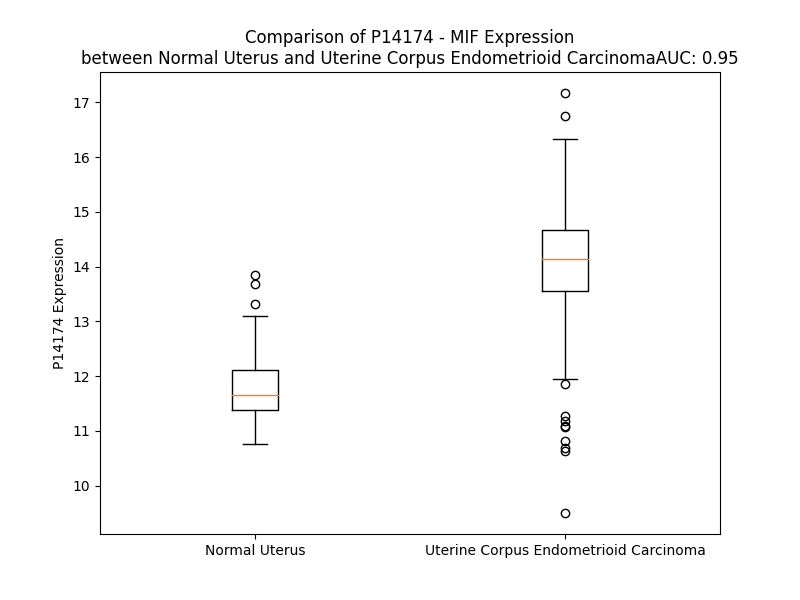

# Detailed Data for P14174

## Introduction to the Detailed Summary

### How to Interpret the Results

- **Summary & Metrics**: This section provides a quick reference to essential protein attributes, including expression changes, family classification, and biomarker applications. Regulation status (upregulated/downregulated) indicates the protein's behavior in a disease context. Some information comes from the original excel file with the proteins selected from literature, while others are derived from the analyses.
- **Expression Comparison**: A visual representation comparing protein expression between normal and disease states. It highlights significant changes in expression levels that might indicate diagnostic or therapeutic relevance. This is data coming from transcriptomics experiments and could not translate similarly to protein levels.
- **Isoform Alignment**: An interactive view of isoform alignments, revealing structural and functional differences between variants of the protein.
- **Interactors & Homologs**: Tables listing known interaction partners and homologous proteins, the more interactors and homologs, the more complex the protein is to design an antibody for.
- **Biological Assemblies**: Information about the structural arrangement of the protein in different assemblies, providing insights into its functional state but also the complexity of the protein to develop antibodies.
- **Combined Per-Residue Information**: A detailed table summarizing residue-level data. This includes predictions for epitope regions, aggregation tendencies, and modifications that might impact the protein's function. Each row corresponds to a residue in the protein, providing insights into specific sites that may be important for research or drug development.
## Summary & Metrics

- **UniProt Accession**: P14174
- **Gene Name**: MIF
- **Protein Name**: macrophage migration inhibitory factor (glycosylation-inhibiting factor)
- **Swiss Prot**: MIF_HUMAN
- **Family**: cytokine
- **Biomarker Application**: diagnosis,prognosis,response to therapy
- **Number of Isoforms**: 0
- **Regulation**: 1
- **(transcriptomics) AUC**: 0.95
- **(transcriptomics) Fold Change**: 1.19
- **(transcriptomics) Regulation**: Upregulated
- **Discotope Epitope Count**: 27
- **Max n_uniprots (Homo)**: 3
- **Max n_uniprots (Hetero)**: N/A

## Expression Comparison

## Interactors

| preferredName_A   | preferredName_B   |   score |
|:------------------|:------------------|--------:|
| MIF               | CD74              |   0.999 |
| MIF               | CXCR2             |   0.993 |
| MIF               | CXCR4             |   0.991 |
| MIF               | COPS5             |   0.976 |
| MIF               | GOT2              |   0.929 |
| MIF               | GOT1              |   0.915 |
| MIF               | TAT               |   0.91  |
| MIF               | HPD               |   0.909 |
| MIF               | GOT1L1            |   0.907 |
| MIF               | IL4I1             |   0.902 |

## Homologs

| uniprot_id   | gene_id   |
|:-------------|:----------|
| I4AY87       | MIF       |
| B5MC82       | DDT       |
| A6NHG4       | DDTL      |
| P23297       | S100A1    |
| P33764       | S100A3    |
| P25815       | S100P     |
| P29377       | S100G     |
| P33763       | S100A5    |
| Q9HCY8       | S100A14   |
| P80511       | S100A12   |
| P26447       | S100A4    |
| P60903       | S100A10   |
| Q96FQ6       | S100A16   |
| P05109       | S100A8    |
| P06703       | S100A6    |
| C9JRU3       | SNTN      |
| P31949       | S100A11   |
| P29034       | S100A2    |
| Q99584       | S100A13   |
| Q8WXG8       | S100Z     |
| P04271       | S100B     |
| P31151       | S100A7    |
| Q86SG5       | S100A7A   |
| Q9UBG3       | CRNN      |

## Biological Assemblies

|   Unnamed: 0 |   assembly |   n_uniprots | composition   | crystal_id   |
|-------------:|-----------:|-------------:|:--------------|:-------------|
|            0 |          1 |            3 | Homo          | 2ooz         |
|            0 |          1 |            3 | Homo          | 5hvs         |
|            0 |          1 |            3 | Homo          | 8spn         |
|            0 |          1 |            3 | Homo          | 4wrb         |
|            0 |          1 |            3 | Homo          | 4gru         |
|            0 |          1 |            3 | Homo          | 4trf         |
|            0 |          1 |            3 | Homo          | 2oow         |
|            0 |          1 |            3 | Homo          | 3l5s         |
|            0 |          1 |            3 | Homo          | 4etg         |
|            0 |          1 |            3 | Homo          | 4grn         |
|            0 |          1 |            3 | Homo          | 6oyb         |
|            0 |          1 |            3 | Homo          | 6oyg         |
|            0 |          1 |            3 | Homo          | 3ce4         |
|            0 |          1 |            3 | Homo          | 7xvx         |
|            0 |          1 |            3 | Homo          | 4z15         |
|            0 |          1 |            3 | Homo          | 4xx7         |
|            0 |          1 |            3 | Homo          | 4grq         |
|            0 |          1 |            3 | Homo          | 6fvh         |
|            0 |          1 |            3 | Homo          | 5bsi         |
|            1 |          2 |            3 | Homo          | 5bsi         |
|            2 |          3 |            1 | Homo          | 5bsi         |
|            3 |          4 |            1 | Homo          | 5bsi         |
|            0 |          1 |            3 | Homo          | 5xej         |
|            0 |          1 |            3 | Homo          | 4gum         |
|            1 |          2 |            3 | Homo          | 4gum         |
|            2 |          3 |            3 | Homo          | 4gum         |
|            0 |          1 |            3 | Homo          | 5v70         |
|            0 |          1 |            3 | Homo          | 5b4o         |
|            0 |          1 |            3 | Homo          | 4grp         |
|            0 |          1 |            3 | Homo          | 6bg6         |
|            0 |          1 |            3 | Homo          | 7kqx         |
|            0 |          1 |            3 | Homo          | 4z1u         |
|            1 |          2 |            3 | Homo          | 4z1u         |
|            0 |          1 |            3 | Homo          | 7e4b         |
|            0 |          1 |            3 | Homo          | 1ca7         |
|            0 |          1 |            3 | Homo          | 6b1k         |
|            0 |          1 |            3 | Homo          | 3l5r         |
|            0 |          1 |            3 | Homo          | 6cbh         |
|            0 |          1 |            3 | Homo          | 7e49         |
|            0 |          1 |            3 | Homo          | 6cbg         |
|            0 |          1 |            3 | Homo          | 5umj         |
|            0 |          1 |            3 | Homo          | 5j7p         |
|            0 |          1 |            3 | Homo          | 6bg7         |
|            0 |          1 |            3 | Homo          | 7e4c         |
|            0 |          1 |            3 | Homo          | 3wnt         |
|            0 |          1 |            3 | Homo          | 7xtx         |
|            0 |          1 |            3 | Homo          | 1ljt         |
|            0 |          1 |            3 | Homo          | 2ooh         |
|            0 |          1 |            3 | Homo          | 5bsc         |
|            0 |          1 |            3 | Homo          | 5hvv         |
|            0 |          1 |            3 | Homo          | 1mif         |
|            0 |          1 |            3 | Homo          | 4p0h         |
|            0 |          1 |            3 | Homo          | 6oy8         |
|            0 |          1 |            3 | Homo          | 8imr         |
|            0 |          1 |            3 | Homo          | 8ca0         |
|            0 |          1 |            3 | Homo          | 1gif         |
|            0 |          1 |            3 | Homo          | 6b2c         |
|            0 |          1 |            3 | Homo          | 3l5v         |
|            0 |          1 |            3 | Homo          | 3wns         |
|            0 |          1 |            3 | Homo          | 3ijj         |
|            0 |          1 |            3 | Homo          | 5bsj         |
|            0 |          1 |            3 | Homo          | 4osf         |
|            0 |          1 |            3 | Homo          | 7e45         |
|            0 |          1 |            3 | Homo          | 5j7q         |
|            0 |          1 |            3 | Homo          | 1p1g         |
|            0 |          1 |            3 | Homo          | 4pkk         |
|            0 |          1 |            3 | Homo          | 3jsg         |
|            0 |          1 |            3 | Homo          | 5uzy         |
|            0 |          1 |            3 | Homo          | 3l5t         |
|            0 |          1 |            3 | Homo          | 4plu         |
|            0 |          1 |            3 | Homo          | 4z1t         |
|            0 |          1 |            3 | Homo          | 4oyq         |
|            0 |          1 |            3 | Homo          | 3hof         |
|            0 |          1 |            3 | Homo          | 3djh         |
|            0 |          1 |            3 | Homo          | 4eui         |
|            0 |          1 |            3 | Homo          | 3wnr         |
|            0 |          1 |            3 | Homo          | 3dji         |
|            1 |          2 |            3 | Homo          | 3dji         |
|            0 |          1 |            3 | Homo          | 6cb5         |
|            0 |          1 |            3 | Homo          | 3b9s         |
|            0 |          1 |            3 | Homo          | 5eiz         |
|            0 |          1 |            3 | Homo          | 5hvt         |
|            0 |          1 |            3 | Homo          | 3smb         |
|            0 |          1 |            3 | Homo          | 4xx8         |
|            0 |          1 |            3 | Homo          | 5umk         |
|            0 |          1 |            3 | Homo          | 6oye         |
|            0 |          1 |            3 | Homo          | 7e47         |
|            0 |          1 |            3 | Homo          | 5bs9         |
|            0 |          1 |            3 | Homo          | 4p01         |
|            0 |          1 |            3 | Homo          | 7e4a         |
|            0 |          1 |            3 | Homo          | 1cgq         |
|            0 |          1 |            3 | Homo          | 6peg         |
|            0 |          1 |            3 | Homo          | 1gd0         |
|            0 |          1 |            3 | Homo          | 4k9g         |
|            0 |          1 |            3 | Homo          | 4evg         |
|            0 |          1 |            3 | Homo          | 3u18         |
|            0 |          1 |            3 | Homo          | 3l5u         |
|            0 |          1 |            3 | Homo          | 4pkz         |
|            0 |          1 |            3 | Homo          | 1gcz         |
|            0 |          1 |            3 | Homo          | 4grr         |
|            0 |          1 |            3 | Homo          | 3ijg         |
|            0 |          1 |            3 | Homo          | 8son         |
|            0 |          1 |            3 | Homo          | 6b1c         |
|            0 |          1 |            3 | Homo          | 4tru         |
|            0 |          1 |            3 | Homo          | 3smc         |
|            0 |          1 |            3 | Homo          | 3jtu         |
|            0 |          1 |            3 | Homo          | 4wr8         |
|            1 |          2 |            3 | Homo          | 4wr8         |
|            2 |          3 |            3 | Homo          | 4wr8         |
|            3 |          4 |            3 | Homo          | 4wr8         |
|            4 |          5 |            3 | Homo          | 4wr8         |
|            5 |          6 |            3 | Homo          | 4wr8         |
|            0 |          1 |            3 | Homo          | 6cbf         |
|            0 |          1 |            3 | Homo          | 3jsf         |
|            0 |          1 |            3 | Homo          | 3l5p         |
|            0 |          1 |            1 | Homo          | 4gro         |
|            1 |          2 |            3 | Homo          | 4gro         |
|            2 |          3 |            3 | Homo          | 4gro         |
|            3 |          4 |            1 | Homo          | 4gro         |
|            0 |          1 |            3 | Homo          | 4f2k         |
|            0 |          1 |            3 | Homo          | 6fve         |
|            0 |          1 |            3 | Homo          | 5v73         |

## Combined Per-Residue Information

|   res | aa   |   epitope_score | epitope   |   relative_surface_accessibility |   modeling_confidence |   Aggregation | modification                 |
|------:|:-----|----------------:|:----------|---------------------------------:|----------------------:|--------------:|:-----------------------------|
|     1 | M    |         0.12501 | False     |                          0.17662 |                 95.46 |         0     | N/A                          |
|     2 | P    |         0.01274 | False     |                          0       |                 97.78 |         1.547 | N/A                          |
|     3 | M    |         0.40641 | False     |                          0.41707 |                 98.76 |         4.652 | N/A                          |
|     4 | F    |         0.02044 | False     |                          0       |                 98.89 |         6.738 | N/A                          |
|     5 | I    |         0.27652 | False     |                          0.21759 |                 98.91 |         6.738 | N/A                          |
|     6 | V    |         0.00839 | False     |                          0       |                 98.93 |         6.738 | N/A                          |
|     7 | N    |         0.2233  | False     |                          0.30933 |                 98.95 |         5.191 | N/A                          |
|     8 | T    |         0.01418 | False     |                          0       |                 98.94 |         3.244 | N/A                          |
|     9 | N    |         0.20878 | False     |                          0.17834 |                 98.84 |         0     | N/A                          |
|    10 | V    |         0.21598 | False     |                          0.0695  |                 98.78 |         0     | N/A                          |
|    11 | P    |         0.30523 | False     |                          0.50101 |                 98.68 |         0     | N/A                          |
|    12 | R    |         0.51741 | True      |                          0.48468 |                 98.67 |         0     | N/A                          |
|    13 | A    |         0.41284 | False     |                          0.98077 |                 98.35 |         0     | N/A                          |
|    14 | S    |         0.33779 | False     |                          0.44068 |                 98.35 |         0     | N/A                          |
|    15 | V    |         0.14253 | False     |                          0.09225 |                 98.72 |         0     | N/A                          |
|    16 | P    |         0.33479 | False     |                          0.38715 |                 98.52 |         0     | N/A                          |
|    17 | D    |         0.47481 | True      |                          0.79117 |                 97.99 |         0     | N/A                          |
|    18 | G    |         0.54024 | True      |                          0.53242 |                 98.25 |         0     | N/A                          |
|    19 | F    |         0.05768 | False     |                          0.00333 |                 98.61 |         0     | N/A                          |
|    20 | L    |         0.26528 | False     |                          0.53214 |                 98.76 |         0     | N/A                          |
|    21 | S    |         0.30583 | False     |                          0.56739 |                 98.57 |         0     | N/A                          |
|    22 | E    |         0.40473 | False     |                          0.22072 |                 98.71 |         0     | N/A                          |
|    23 | L    |         0.00761 | False     |                          0.00082 |                 98.77 |         0     | N/A                          |
|    24 | T    |         0.17552 | False     |                          0.1928  |                 98.82 |         0     | N/A                          |
|    25 | Q    |         0.53446 | True      |                          0.46279 |                 98.75 |         0     | N/A                          |
|    26 | Q    |         0.40761 | False     |                          0.28708 |                 98.73 |         0     | N/A                          |
|    27 | L    |         0.01106 | False     |                          0       |                 98.71 |         0     | N/A                          |
|    28 | A    |         0.22413 | False     |                          0.08407 |                 98.62 |         0     | N/A                          |
|    29 | Q    |         0.60154 | True      |                          0.67877 |                 98.51 |         0     | N/A                          |
|    30 | A    |         0.41801 | False     |                          0.40625 |                 98.42 |         0     | N/A                          |
|    31 | T    |         0.11348 | False     |                          0.02393 |                 98.35 |         0     | N/A                          |
|    32 | G    |         0.49596 | True      |                          0.67941 |                 98.48 |         0     | N/A                          |
|    33 | K    |         0.39601 | False     |                          0.16619 |                 98.35 |         0     | N/A                          |
|    34 | P    |         0.46747 | True      |                          0.50741 |                 98.37 |         0     | N/A                          |
|    35 | P    |         0.40378 | False     |                          0.42544 |                 98.29 |         0     | N/A                          |
|    36 | Q    |         0.57422 | True      |                          0.72199 |                 98.03 |         1.022 | N/A                          |
|    37 | Y    |         0.61203 | True      |                          0.34981 |                 98.34 |         6.552 | N/A                          |
|    38 | I    |         0.21519 | False     |                          0.11311 |                 98.72 |         7.084 | N/A                          |
|    39 | A    |         0.37567 | False     |                          0.43601 |                 98.79 |         7.084 | N/A                          |
|    40 | V    |         0.32977 | False     |                          0.21146 |                 98.81 |         7.084 | N/A                          |
|    41 | H    |         0.45168 | True      |                          0.52621 |                 98.85 |         6.256 | N/A                          |
|    42 | V    |         0.28964 | False     |                          0.16643 |                 98.81 |         5.834 | N/A                          |
|    43 | V    |         0.38216 | False     |                          0.23707 |                 98.88 |         0.145 | N/A                          |
|    44 | P    |         0.32515 | False     |                          0.16813 |                 98.86 |         0     | N/A                          |
|    45 | D    |         0.46065 | True      |                          0.53642 |                 98.76 |         0     | N/A                          |
|    46 | Q    |         0.48928 | True      |                          0.33883 |                 98.9  |         0     | N/A                          |
|    47 | L    |         0.64486 | True      |                          1.14127 |                 98.76 |         0     | N/A                          |
|    48 | M    |         0.49349 | True      |                          0.17086 |                 98.71 |         0     | N/A                          |
|    49 | A    |         0.52618 | True      |                          0.61963 |                 98.68 |         0     | N/A                          |
|    50 | F    |         0.40852 | False     |                          0.19388 |                 98.7  |         0     | N/A                          |
|    51 | G    |         0.45722 | True      |                          0.9891  |                 98.42 |         0     | N/A                          |
|    52 | G    |         0.63092 | True      |                          0.94625 |                 98.36 |         0     | N/A                          |
|    53 | S    |         0.40326 | False     |                          0.32831 |                 98.66 |         0     | N/A                          |
|    54 | S    |         0.58156 | True      |                          0.65307 |                 98.56 |         0     | N/A                          |
|    55 | E    |         0.43214 | False     |                          0.56294 |                 98.71 |         0     | N/A                          |
|    56 | P    |         0.23451 | False     |                          0.35297 |                 98.88 |         0     | N/A                          |
|    57 | C    |         0.02838 | False     |                          0.01042 |                 98.93 |         0     | N/A                          |
|    58 | A    |         0.00398 | False     |                          0.00107 |                 98.94 |         0     | N/A                          |
|    59 | L    |         0.30443 | False     |                          0.50759 |                 98.93 |         0     | N/A                          |
|    60 | C    |         0.10644 | False     |                          0.04863 |                 98.93 |         0     | N/A                          |
|    61 | S    |         0.21918 | False     |                          0.12515 |                 98.87 |         0     | N/A                          |
|    62 | L    |         0.01207 | False     |                          0.00082 |                 98.88 |         0     | N/A                          |
|    63 | H    |         0.2815  | False     |                          0.24175 |                 98.85 |         0     | N/A                          |
|    64 | S    |         0.01779 | False     |                          0.00208 |                 98.85 |         0     | N/A                          |
|    65 | I    |         0.38238 | False     |                          0.22754 |                 98.59 |         0     | N/A                          |
|    66 | G    |         0.24202 | False     |                          0.32907 |                 98.36 |         0     | N/A                          |
|    67 | K    |         0.37317 | False     |                          0.47402 |                 98.48 |         0     | N/A                          |
|    68 | I    |         0.28904 | False     |                          0.17715 |                 98.72 |         0     | N/A                          |
|    69 | G    |         0.41407 | False     |                          0.27844 |                 98.35 |         0     | N/A                          |
|    70 | G    |         0.34633 | False     |                          0.60379 |                 98.45 |         0     | N/A                          |
|    71 | A    |         0.40438 | False     |                          0.6091  |                 98.4  |         0     | N/A                          |
|    72 | Q    |         0.24485 | False     |                          0.41412 |                 98.48 |         0     | N/A                          |
|    73 | N    |         0.29974 | False     |                          0.18893 |                 98.82 |         0     | N/A                          |
|    74 | R    |         0.32045 | False     |                          0.68709 |                 98.73 |         0     | N/A                          |
|    75 | S    |         0.38363 | False     |                          0.53597 |                 98.59 |         0     | N/A                          |
|    76 | Y    |         0.087   | False     |                          0.0313  |                 98.8  |         0     | N/A                          |
|    77 | S    |         0.21845 | False     |                          0.29202 |                 98.84 |         0     | N/A                          |
|    78 | K    |         0.41726 | False     |                          0.84949 |                 98.74 |         0     | N6-acetyllysine; alternate   |
|    78 | K    |         0.41726 | False     |                          0.84949 |                 98.74 |         0     | N6-succinyllysine; alternate |
|    79 | L    |         0.52031 | True      |                          0.29217 |                 98.75 |         3.174 | N/A                          |
|    80 | L    |         0.00887 | False     |                          0       |                 98.84 |         3.755 | N/A                          |
|    81 | C    |         0.14957 | False     |                          0.13506 |                 98.79 |         3.755 | N/A                          |
|    82 | G    |         0.35478 | False     |                          0.43524 |                 98.78 |         3.755 | N/A                          |
|    83 | L    |         0.25271 | False     |                          0.09105 |                 98.76 |         3.755 | N/A                          |
|    84 | L    |         0.01223 | False     |                          0.00082 |                 98.86 |         3.755 | N/A                          |
|    85 | A    |         0.30505 | False     |                          0.33103 |                 98.75 |         0.885 | N/A                          |
|    86 | E    |         0.69007 | True      |                          0.59532 |                 98.64 |         0     | N/A                          |
|    87 | R    |         0.53735 | True      |                          0.33412 |                 98.57 |         0     | N/A                          |
|    88 | L    |         0.08044 | False     |                          0.01478 |                 98.7  |         0     | N/A                          |
|    89 | R    |         0.5383  | True      |                          0.84691 |                 98.7  |         0     | N/A                          |
|    90 | I    |         0.03786 | False     |                          0.00767 |                 98.88 |         0     | N/A                          |
|    91 | S    |         0.20665 | False     |                          0.3923  |                 98.75 |         0     | N/A                          |
|    92 | P    |         0.31843 | False     |                          0.55685 |                 98.77 |         0     | N/A                          |
|    93 | D    |         0.40401 | False     |                          0.67054 |                 98.71 |         0     | N/A                          |
|    94 | R    |         0.19184 | False     |                          0.13897 |                 98.82 |         0     | N/A                          |
|    95 | V    |         0.13413 | False     |                          0.10088 |                 98.94 |        12.072 | N/A                          |
|    96 | Y    |         0.41777 | False     |                          0.6249  |                 98.89 |        14.264 | N/A                          |
|    97 | I    |         0.3297  | False     |                          0.1446  |                 98.92 |        14.264 | N/A                          |
|    98 | N    |         0.32358 | False     |                          0.49641 |                 98.88 |        14.264 | N/A                          |
|    99 | Y    |         0.37097 | False     |                          0.20538 |                 98.84 |        14.264 | N/A                          |
|   100 | Y    |         0.47543 | True      |                          0.41074 |                 98.84 |        11.551 | N/A                          |
|   101 | D    |         0.25182 | False     |                          0.53605 |                 98.7  |         0     | N/A                          |
|   102 | M    |         0.43259 | False     |                          0.2867  |                 98.62 |         0     | N/A                          |
|   103 | N    |         0.43475 | False     |                          0.6843  |                 98.42 |         0     | N/A                          |
|   104 | A    |         0.27576 | False     |                          0.29217 |                 98.52 |         0     | N/A                          |
|   105 | A    |         0.42017 | False     |                          0.57597 |                 98.44 |         0     | N/A                          |
|   106 | N    |         0.63248 | True      |                          0.67101 |                 98.56 |         0     | N/A                          |
|   107 | V    |         0.36332 | False     |                          0.1322  |                 98.62 |         0     | N/A                          |
|   108 | G    |         0.49767 | True      |                          0.73804 |                 98.49 |         0     | N/A                          |
|   109 | W    |         0.41793 | False     |                          0.5975  |                 98.19 |         0     | N/A                          |
|   110 | N    |         0.45004 | True      |                          0.68302 |                 97.63 |         0     | N/A                          |
|   111 | N    |         0.48638 | True      |                          1.03556 |                 97.95 |         0     | N/A                          |
|   112 | S    |         0.20446 | False     |                          0.57322 |                 98.5  |         0     | N/A                          |
|   113 | T    |         0.39168 | False     |                          0.40566 |                 98.13 |         0     | N/A                          |
|   114 | F    |         0.3206  | False     |                          0.31534 |                 97.93 |         0     | N/A                          |
|   115 | A    |         0.16993 | False     |                          1.02985 |                 95.73 |         0     | N/A                          |

