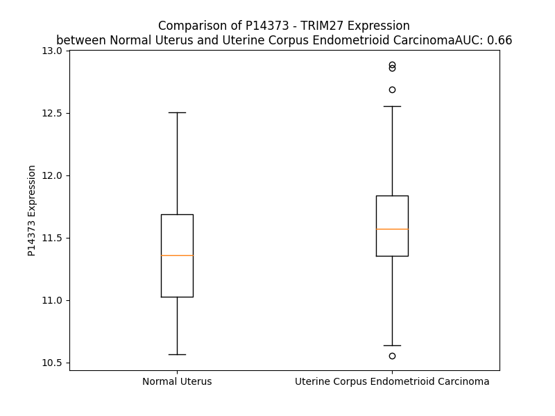

# Detailed Data for P14373

## Introduction to the Detailed Summary

### How to Interpret the Results

- **Summary & Metrics**: This section provides a quick reference to essential protein attributes, including expression changes, family classification, and biomarker applications. Regulation status (upregulated/downregulated) indicates the protein's behavior in a disease context. Some information comes from the original excel file with the proteins selected from literature, while others are derived from the analyses.
- **Expression Comparison**: A visual representation comparing protein expression between normal and disease states. It highlights significant changes in expression levels that might indicate diagnostic or therapeutic relevance. This is data coming from transcriptomics experiments and could not translate similarly to protein levels.
- **Isoform Alignment**: An interactive view of isoform alignments, revealing structural and functional differences between variants of the protein.
- **Interactors & Homologs**: Tables listing known interaction partners and homologous proteins, the more interactors and homologs, the more complex the protein is to design an antibody for.
- **Biological Assemblies**: Information about the structural arrangement of the protein in different assemblies, providing insights into its functional state but also the complexity of the protein to develop antibodies.
- **Combined Per-Residue Information**: A detailed table summarizing residue-level data. This includes predictions for epitope regions, aggregation tendencies, and modifications that might impact the protein's function. Each row corresponds to a residue in the protein, providing insights into specific sites that may be important for research or drug development.
## Summary & Metrics

- **UniProt Accession**: P14373
- **Gene Name**: TRIM27 (RFP)
- **Protein Name**: Zinc finger protein RFP / ret finger protein
- **Swiss Prot**: TRI27_HUMAN
- **Family**: transcription regulator
- **Biomarker Application**:  
- **Number of Isoforms**: 2
- **Regulation**: 1
- **(transcriptomics) AUC**: 0.66
- **(transcriptomics) Fold Change**: 1.02
- **(transcriptomics) Regulation**: Upregulated
- **Discotope Epitope Count**: 140
- **Max n_uniprots (Homo)**: N/A
- **Max n_uniprots (Hetero)**: N/A

## Expression Comparison

## Isoform Alignment

<pre style='font-size:14px; font-family:monospace;'>P14373-1 MASGSVAECLQQETTCPVCLQYFAEPMMLDCGHNICCACLARCWGTAETNVSCPQCRETFPQRHMRPNRHLANVTQLVKQLRTERPSGPGGEMGVCEKHREPLKLYCEEDQMPICVVCDRSREHRGHSVLPLEEAVEGFKEQIQNQLDHLKRVKDLKKRRRAQGEQARAELLSLTQMEREKIVWEFEQLYHSLKEHEYRLLARLEELDLAIYNSINGAITQFSCNISHLSSLIAQLEEKQQQPTRELLQDIGDTLSRAERIRIPEPWITPPDLQEKIHIFAQKCLFLTESLKQFTEKMQSDMEKIQELREAQLYSVDVTLDPDTAYPSLILSDNLRQVRYSYLQQDLPDNPERFNLFPCVLGSPCFIAGRHYWEVEVGDKAKWTIGVCEDSVCRKGGVTSAPQNGFWAVSLWYGKEYWALTSPMTALPLRTPLQRVGIFLDYDAGEVSFYNVTERCHTFTFSHATFCGPVRPYFSLSYSGGKSAAPLIICPMSGIDGFSGHVGNHGHSMETSP
P14373-2 MASGSVAECLQQETTCPVCLQYFAEPMMLDCGHNICCACLARCWGTAETNVSCPQCRETFPQRHMRPNRHLANVTQLVKQLRTERPSGPGGEMGVCEKHREPLKLYCEEDQMPICVVCDRSREHRGHSVLPLEEAVEGFKEQIQNQLDHLKRVKDLKKRRRAQGEQARAELLSLTQMEREKIVWEFEQLYHSLKEHEYRLLARLEELDLAIYNSINGAITQFSCNISHLSSLIAQLEEKQQQPTRELLQDIGDTLSRAERIRIPEPWITPPDLQEKIHIFAQKCLFLTESLKQFTEKMQSDMEKIQELREAQLYSVDVTLDPDTAYPSLILSDNLRQVRYSYLQQDLPDNPERSPSTT-----------------------------------------------------------------------------------------------------------------------------------------------------------
</pre>

## Interactors

| preferredName_A   | preferredName_B   |   score |
|:------------------|:------------------|--------:|
| TRIM27            | MAGEL2            |   0.979 |
| TRIM27            | USP7              |   0.97  |
| TRIM27            | PTEN              |   0.963 |
| TRIM27            | CHD4              |   0.903 |

## Homologs

| uniprot_id   | gene_id   |
|:-------------|:----------|
| P14373       | TRIM27    |
| P14373       | TRIM27    |
| P14373       | TRIM27    |
| P14373       | TRIM27    |
| P14373       | TRIM27    |
| P14373       | TRIM27    |
| A0A3B3IUA7   | TRIM25    |
| Q8WV44       | TRIM41    |
| A0A8I5KXP2   | TRIM52    |
| R4GNC3       | TRIM11    |
| C9J1S8       | TRIM49D1  |
| A0A087WVN7   | TRIM49D1  |
| Q8IWZ4       | TRIM48    |
| P19474       | TRIM21    |
| Q14142       | TRIM14    |
| J3KS72       | TRIM37    |
| A6NK02       | TRIM75    |
| O60858       | TRIM13    |
| Q5VT61       | TRIM46    |
| H7C2K0       | TRIM22    |
| A2AE50       | TRIM26    |
| O15164       | TRIM24    |
| Q969Q1       | TRIM63    |
| A0A140T8Y9   | RNF39     |
| Q6AZZ1       | TRIM68    |
| Q9UPQ4       | TRIM35    |
| Q9BRZ2       | TRIM56    |
| Q96BQ3       | TRIM43    |
| A6NCK2       | TRIM43B   |
| Q86UV6       | TRIM74    |
| I3L0H3       | TRIM73    |
| A0A6Q8PFI4   | TRIM2     |
| A0A140T9D5   | TRIM40    |
| J3KNI5       | TRIML2    |
| E9PJD4       | TRIM29    |
| A2AAZ5       | TRIM39    |
| Q13049       | TRIM32    |
| Q96DX7       | TRIM44    |
| Q6PJ69       | TRIM65    |
| S4R407       | TRIM45    |
| Q96LD4       | TRIM47    |
| Q9UPN9       | TRIM33    |
| E9PFM0       | TRIM6     |
| Q9BYV2       | TRIM54    |
| Q9BYV6       | TRIM55    |
| I1YAP6       | TRIM77    |
| H0YKB8       | TRIM69    |
| Q9BVG3       | TRIM62    |
| Q6ZMU5       | TRIM72    |
| A0A6Q8PGA5   | MID1      |
| Q8IWZ5       | TRIM42    |
| P0CI26       | TRIM49C   |
| E9PK69       | TRIM49    |
| A6NDI0       | TRIM49B   |
| Q9C035       | TRIM5     |
| Q9NQ86       | TRIM36    |
| A0A8Z5E822   | TRIM66    |
| Q9BSJ1       | TRIM51    |
| A0A3B3IT33   | TRIM51G   |
| Q2Q1W2       | TRIM71    |
| Q8N9V2       | TRIML1    |
| O75382       | TRIM3     |
| J3KNZ3       | TRIM17    |
| Q2L6J1       | TRIM31    |
| K7ENN8       | TRIM16    |
| Q6ZTA4       | TRIM67    |
| Q9C026       | TRIM9     |
| Q8NG06       | TRIM58    |
| Q5W0U4       | BSPRY     |
| A0A2R8YFP1   | TRIM8     |
| P29590       | PML       |
| Q9UJV3       | MID2      |
| Q495X7       | TRIM60    |
| A0A494C0U7   | TRIM61    |
| Q86XT4       | TRIM50    |
| Q9BYJ4       | TRIM34    |
| O00635       | TRIM38    |
| F8W6Z2       | MEFV      |
| Q9C029       | TRIM7     |
| A0A0G2JJP1   | TRIM15    |
| A6NI03       | TRIM64B   |
| A6NGJ6       | TRIM64    |
| A6NLI5       | TRIM64C   |
| Q9UDY6       | TRIM10    |
| Q13263       | TRIM28    |
| Q9C037       | TRIM4     |

## Combined Per-Residue Information

|   res | aa   |   epitope_score | epitope   |   relative_surface_accessibility |   modeling_confidence |   Aggregation | modification   |
|------:|:-----|----------------:|:----------|---------------------------------:|----------------------:|--------------:|:---------------|
|     1 | M    |         0.09456 | False     |                          1.3353  |                 31.5  |         0     | N/A            |
|     2 | A    |         0.14259 | True      |                          0.9581  |                 48.3  |         0     | N/A            |
|     3 | S    |         0.15731 | True      |                          0.92401 |                 47.93 |         0     | N/A            |
|     4 | G    |         0.17249 | True      |                          0.51748 |                 54.46 |         0     | N/A            |
|     5 | S    |         0.09935 | False     |                          0.46273 |                 74.47 |         0     | N/A            |
|     6 | V    |         0.11977 | False     |                          0.9329  |                 78.85 |         0     | N/A            |
|     7 | A    |         0.08353 | False     |                          0.57866 |                 76.74 |         0     | N/A            |
|     8 | E    |         0.08619 | False     |                          0.47513 |                 76.48 |         0     | N/A            |
|     9 | C    |         0.07057 | False     |                          0.48071 |                 83.58 |         0     | N/A            |
|    10 | L    |         0.03941 | False     |                          0.44445 |                 84.99 |         0     | N/A            |
|    11 | Q    |         0.05551 | False     |                          0.33299 |                 84.08 |         0     | N/A            |
|    12 | Q    |         0.1063  | False     |                          0.68145 |                 86.19 |         0     | N/A            |
|    13 | E    |         0.12782 | False     |                          0.65049 |                 90.37 |         0     | N/A            |
|    14 | T    |         0.0138  | False     |                          0.00666 |                 91.51 |         0     | N/A            |
|    15 | T    |         0.05322 | False     |                          0.21756 |                 93.16 |         0     | N/A            |
|    16 | C    |         0.02115 | False     |                          0       |                 94.46 |         0     | N/A            |
|    17 | P    |         0.1077  | False     |                          0.38502 |                 92.4  |         0     | N/A            |
|    18 | V    |         0.07307 | False     |                          0.29089 |                 92.37 |         0.817 | N/A            |
|    19 | C    |         0.10379 | False     |                          0.32976 |                 93.5  |         0.817 | N/A            |
|    20 | L    |         0.1729  | True      |                          0.81601 |                 90.87 |         0.979 | N/A            |
|    21 | Q    |         0.17602 | True      |                          0.59992 |                 91.73 |         0.979 | N/A            |
|    22 | Y    |         0.04357 | False     |                          0.20867 |                 91.32 |         0.979 | N/A            |
|    23 | F    |         0.04282 | False     |                          0.0694  |                 93.76 |         0.979 | N/A            |
|    24 | A    |         0.07414 | False     |                          0.61703 |                 91.13 |         0.537 | N/A            |
|    25 | E    |         0.12811 | False     |                          0.68458 |                 92.38 |         0     | N/A            |
|    26 | P    |         0.01458 | False     |                          0.01608 |                 94.72 |         0     | N/A            |
|    27 | M    |         0.10137 | False     |                          0.1124  |                 94.57 |         0     | N/A            |
|    28 | M    |         0.08109 | False     |                          0.41593 |                 95.42 |         0     | N/A            |
|    29 | L    |         0.02807 | False     |                          0.02331 |                 93.29 |         0     | N/A            |
|    30 | D    |         0.20118 | True      |                          0.59434 |                 91.17 |         0     | N/A            |
|    31 | C    |         0.09859 | False     |                          0.25523 |                 93.58 |         0     | N/A            |
|    32 | G    |         0.08707 | False     |                          0.46612 |                 92.64 |         0     | N/A            |
|    33 | H    |         0.15039 | True      |                          0.29865 |                 94.87 |         0     | N/A            |
|    34 | N    |         0.05845 | False     |                          0.18114 |                 95.5  |         0     | N/A            |
|    35 | I    |         0.01364 | False     |                          0       |                 95.31 |         0     | N/A            |
|    36 | C    |         0.07586 | False     |                          0.03813 |                 95.76 |         0     | N/A            |
|    37 | C    |         0.13397 | False     |                          0.3609  |                 93.38 |         0     | N/A            |
|    38 | A    |         0.11042 | False     |                          0.73072 |                 92.94 |         0     | N/A            |
|    39 | C    |         0.11018 | False     |                          0.07603 |                 94.51 |         0     | N/A            |
|    40 | L    |         0.01461 | False     |                          0.00577 |                 91.84 |         0     | N/A            |
|    41 | A    |         0.15961 | True      |                          0.55121 |                 90.28 |         0     | N/A            |
|    42 | R    |         0.2619  | True      |                          0.68581 |                 90.83 |         0     | N/A            |
|    43 | C    |         0.06789 | False     |                          0.4649  |                 88.2  |         0     | N/A            |
|    44 | W    |         0.11745 | False     |                          0.0681  |                 90.02 |         0     | N/A            |
|    45 | G    |         0.15771 | True      |                          0.50237 |                 85.2  |         0     | N/A            |
|    46 | T    |         0.19295 | True      |                          0.94558 |                 83    |         0     | N/A            |
|    47 | A    |         0.22686 | True      |                          0.49161 |                 81.16 |         0     | N/A            |
|    48 | E    |         0.24865 | True      |                          0.7076  |                 78.84 |         0     | N/A            |
|    49 | T    |         0.13998 | False     |                          0.61335 |                 84.16 |         0     | N/A            |
|    50 | N    |         0.13279 | False     |                          0.7629  |                 85.85 |         0     | N/A            |
|    51 | V    |         0.10263 | False     |                          0.03523 |                 90.36 |         0     | N/A            |
|    52 | S    |         0.11274 | False     |                          0.37175 |                 91.7  |         0     | N/A            |
|    53 | C    |         0.02932 | False     |                          0.00518 |                 93.97 |         0     | N/A            |
|    54 | P    |         0.11548 | False     |                          0.36535 |                 91.39 |         0     | N/A            |
|    55 | Q    |         0.16876 | True      |                          0.45505 |                 91.64 |         0     | N/A            |
|    56 | C    |         0.1624  | True      |                          0.42156 |                 93.8  |         0     | N/A            |
|    57 | R    |         0.18702 | True      |                          0.80948 |                 91.49 |         0     | N/A            |
|    58 | E    |         0.21879 | True      |                          0.46637 |                 92.75 |         0     | N/A            |
|    59 | T    |         0.22627 | True      |                          0.65746 |                 90.87 |         0     | N/A            |
|    60 | F    |         0.13491 | False     |                          0.07999 |                 87.99 |         0     | N/A            |
|    61 | P    |         0.17842 | True      |                          0.75013 |                 86.55 |         0     | N/A            |
|    62 | Q    |         0.20143 | True      |                          0.51065 |                 85.4  |         0     | N/A            |
|    63 | R    |         0.25864 | True      |                          0.30103 |                 84.77 |         0     | N/A            |
|    64 | H    |         0.26784 | True      |                          0.56648 |                 85.3  |         0     | N/A            |
|    65 | M    |         0.1871  | True      |                          0.34182 |                 89    |         0     | N/A            |
|    66 | R    |         0.37599 | True      |                          0.78206 |                 93.28 |         0     | N/A            |
|    67 | P    |         0.15704 | True      |                          0.65847 |                 93.92 |         0     | N/A            |
|    68 | N    |         0.1007  | False     |                          0.15586 |                 95.14 |         0     | N/A            |
|    69 | R    |         0.23513 | True      |                          0.75856 |                 93.52 |         0     | N/A            |
|    70 | H    |         0.23665 | True      |                          0.81388 |                 93.54 |         0     | N/A            |
|    71 | L    |         0.0479  | False     |                          0.1557  |                 94.31 |         0     | N/A            |
|    72 | A    |         0.05345 | False     |                          0.3257  |                 92.24 |         0     | N/A            |
|    73 | N    |         0.19292 | True      |                          0.54032 |                 92.01 |         0     | N/A            |
|    74 | V    |         0.0787  | False     |                          0.44271 |                 92.08 |         0.4   | N/A            |
|    75 | T    |         0.01858 | False     |                          0.01047 |                 91.3  |         0.4   | N/A            |
|    76 | Q    |         0.09926 | False     |                          0.53333 |                 87.38 |         0.4   | N/A            |
|    77 | L    |         0.12889 | False     |                          0.62031 |                 86.56 |         0.4   | N/A            |
|    78 | V    |         0.02727 | False     |                          0.06735 |                 86.67 |         0.4   | N/A            |
|    79 | K    |         0.07378 | False     |                          0.43586 |                 81.77 |         0     | N/A            |
|    80 | Q    |         0.08411 | False     |                          0.3737  |                 74.78 |         0     | N/A            |
|    81 | L    |         0.0833  | False     |                          0.73135 |                 71.63 |         0     | N/A            |
|    82 | R    |         0.08581 | False     |                          0.51803 |                 63.07 |         0     | N/A            |
|    83 | T    |         0.09685 | False     |                          0.76855 |                 58.27 |         0     | N/A            |
|    84 | E    |         0.10969 | False     |                          0.6301  |                 39.95 |         0     | N/A            |
|    85 | R    |         0.11427 | False     |                          0.78059 |                 36.06 |         0     | N/A            |
|    86 | P    |         0.10388 | False     |                          0.9764  |                 36.86 |         0     | N/A            |
|    87 | S    |         0.10708 | False     |                          0.54993 |                 37.23 |         0     | N/A            |
|    88 | G    |         0.18261 | True      |                          0.51987 |                 30.59 |         0     | N/A            |
|    89 | P    |         0.21489 | True      |                          1.15956 |                 44.98 |         0     | N/A            |
|    90 | G    |         0.16731 | True      |                          0.79885 |                 38.69 |         0     | N/A            |
|    91 | G    |         0.14467 | True      |                          0.76151 |                 41.26 |         0     | N/A            |
|    92 | E    |         0.10485 | False     |                          0.79589 |                 46.45 |         0     | N/A            |
|    93 | M    |         0.11368 | False     |                          0.38853 |                 54.34 |         0     | N/A            |
|    94 | G    |         0.09388 | False     |                          0.46446 |                 72.04 |         0     | N/A            |
|    95 | V    |         0.16266 | True      |                          0.64036 |                 84.18 |         0     | N/A            |
|    96 | C    |         0.08732 | False     |                          0.06447 |                 86.24 |         0     | N/A            |
|    97 | E    |         0.1951  | True      |                          0.88815 |                 85.05 |         0     | N/A            |
|    98 | K    |         0.30295 | True      |                          0.67688 |                 82.19 |         0     | N/A            |
|    99 | H    |         0.15778 | True      |                          0.33678 |                 84.15 |         0     | N/A            |
|   100 | R    |         0.1811  | True      |                          0.83296 |                 83.09 |         0     | N/A            |
|   101 | E    |         0.19938 | True      |                          0.36281 |                 85.7  |         0     | N/A            |
|   102 | P    |         0.0941  | False     |                          0.33414 |                 87.62 |         0     | N/A            |
|   103 | L    |         0.03867 | False     |                          0.18648 |                 90.24 |         0     | N/A            |
|   104 | K    |         0.06281 | False     |                          0.47962 |                 90.71 |         0     | N/A            |
|   105 | L    |         0.12273 | False     |                          0.19702 |                 92.28 |         0     | N/A            |
|   106 | Y    |         0.10508 | False     |                          0.09797 |                 93.51 |         0     | N/A            |
|   107 | C    |         0.0107  | False     |                          0       |                 93.17 |         0     | N/A            |
|   108 | E    |         0.12927 | False     |                          0.4098  |                 91.75 |         0     | N/A            |
|   109 | E    |         0.16578 | True      |                          0.4877  |                 90.32 |         0     | N/A            |
|   110 | D    |         0.18607 | True      |                          0.37925 |                 88.95 |         0     | N/A            |
|   111 | Q    |         0.2078  | True      |                          0.70715 |                 91.26 |         0     | N/A            |
|   112 | M    |         0.22262 | True      |                          0.49049 |                 90.66 |         0     | N/A            |
|   113 | P    |         0.05208 | False     |                          0.3895  |                 91.64 |         0     | N/A            |
|   114 | I    |         0.02109 | False     |                          0.0096  |                 92.39 |         8.978 | N/A            |
|   115 | C    |         0.01405 | False     |                          0       |                 92.89 |         8.978 | N/A            |
|   116 | V    |         0.1024  | False     |                          0.56574 |                 91.12 |         8.978 | N/A            |
|   117 | V    |         0.129   | False     |                          0.44619 |                 90.6  |         8.978 | N/A            |
|   118 | C    |         0.12093 | False     |                          0.06641 |                 91.62 |         8.978 | N/A            |
|   119 | D    |         0.16802 | True      |                          0.30647 |                 91.48 |         0     | N/A            |
|   120 | R    |         0.21137 | True      |                          0.85737 |                 89.75 |         0     | N/A            |
|   121 | S    |         0.25486 | True      |                          0.2067  |                 89.8  |         0     | N/A            |
|   122 | R    |         0.38371 | True      |                          0.91192 |                 87.37 |         0     | N/A            |
|   123 | E    |         0.33894 | True      |                          0.52952 |                 86.08 |         0     | N/A            |
|   124 | H    |         0.06954 | False     |                          0.07313 |                 88.86 |         0     | N/A            |
|   125 | R    |         0.25782 | True      |                          0.78317 |                 89.43 |         0     | N/A            |
|   126 | G    |         0.11707 | False     |                          0.94344 |                 87.56 |         0     | N/A            |
|   127 | H    |         0.07965 | False     |                          0.33059 |                 93.56 |         0     | N/A            |
|   128 | S    |         0.06918 | False     |                          0.36991 |                 91.91 |         0     | N/A            |
|   129 | V    |         0.09047 | False     |                          0.26515 |                 92.87 |         0     | N/A            |
|   130 | L    |         0.17547 | True      |                          0.33799 |                 91.96 |         0     | N/A            |
|   131 | P    |         0.12202 | False     |                          0.45827 |                 93.41 |         0     | N/A            |
|   132 | L    |         0.04872 | False     |                          0.2234  |                 89.76 |         0     | N/A            |
|   133 | E    |         0.15245 | True      |                          0.48791 |                 89.08 |         0     | N/A            |
|   134 | E    |         0.17534 | True      |                          0.48758 |                 92.52 |         0     | N/A            |
|   135 | A    |         0.0343  | False     |                          0.0707  |                 90.87 |         0     | N/A            |
|   136 | V    |         0.06128 | False     |                          0.42152 |                 90.82 |         0     | N/A            |
|   137 | E    |         0.18098 | True      |                          0.61468 |                 92.7  |         0     | N/A            |
|   138 | G    |         0.12584 | False     |                          0.37527 |                 90.94 |         0     | N/A            |
|   139 | F    |         0.13842 | False     |                          0.42721 |                 91.62 |         0     | N/A            |
|   140 | K    |         0.1186  | False     |                          0.62997 |                 95.1  |         0     | N/A            |
|   141 | E    |         0.12627 | False     |                          0.59206 |                 95    |         0     | N/A            |
|   142 | Q    |         0.12877 | False     |                          0.547   |                 95.26 |         0     | N/A            |
|   143 | I    |         0.07817 | False     |                          0.61586 |                 96.83 |         0     | N/A            |
|   144 | Q    |         0.06941 | False     |                          0.42899 |                 97.29 |         0     | N/A            |
|   145 | N    |         0.07865 | False     |                          0.54272 |                 97.29 |         0     | N/A            |
|   146 | Q    |         0.11898 | False     |                          0.54761 |                 97.71 |         0     | N/A            |
|   147 | L    |         0.07315 | False     |                          0.48511 |                 98.19 |         0     | N/A            |
|   148 | D    |         0.13756 | False     |                          0.28899 |                 97.79 |         0     | N/A            |
|   149 | H    |         0.09993 | False     |                          0.48145 |                 97.83 |         0     | N/A            |
|   150 | L    |         0.17602 | True      |                          0.64385 |                 98.17 |         0     | N/A            |
|   151 | K    |         0.08945 | False     |                          0.54631 |                 98.3  |         0     | N/A            |
|   152 | R    |         0.11103 | False     |                          0.61868 |                 98.11 |         0     | N/A            |
|   153 | V    |         0.03872 | False     |                          0.34655 |                 98.05 |         0     | N/A            |
|   154 | K    |         0.08389 | False     |                          0.61761 |                 98.06 |         0     | N/A            |
|   155 | D    |         0.10995 | False     |                          0.42836 |                 97.97 |         0     | N/A            |
|   156 | L    |         0.05659 | False     |                          0.55045 |                 98.16 |         0     | N/A            |
|   157 | K    |         0.1125  | False     |                          0.70014 |                 97.97 |         0     | N/A            |
|   158 | K    |         0.07886 | False     |                          0.59116 |                 98.26 |         0     | N/A            |
|   159 | R    |         0.06834 | False     |                          0.69099 |                 98.07 |         0     | N/A            |
|   160 | R    |         0.11542 | False     |                          0.64592 |                 97.83 |         0     | N/A            |
|   161 | R    |         0.06911 | False     |                          0.69804 |                 98.05 |         0     | N/A            |
|   162 | A    |         0.10332 | False     |                          0.52672 |                 97.8  |         0     | N/A            |
|   163 | Q    |         0.08687 | False     |                          0.61091 |                 97.6  |         0     | N/A            |
|   164 | G    |         0.05645 | False     |                          0.48696 |                 97.6  |         0     | N/A            |
|   165 | E    |         0.07678 | False     |                          0.47776 |                 97.73 |         0     | N/A            |
|   166 | Q    |         0.06655 | False     |                          0.51867 |                 97.74 |         0     | N/A            |
|   167 | A    |         0.03141 | False     |                          0.42894 |                 96.74 |         0     | N/A            |
|   168 | R    |         0.07445 | False     |                          0.67411 |                 97.64 |         0     | N/A            |
|   169 | A    |         0.03525 | False     |                          0.52141 |                 97.46 |         0     | N/A            |
|   170 | E    |         0.05186 | False     |                          0.5105  |                 96.76 |         0     | N/A            |
|   171 | L    |         0.03721 | False     |                          0.58002 |                 96.56 |         0.255 | N/A            |
|   172 | L    |         0.03862 | False     |                          0.59764 |                 98    |         0.255 | N/A            |
|   173 | S    |         0.03188 | False     |                          0.55425 |                 97.76 |         0.255 | N/A            |
|   174 | L    |         0.03831 | False     |                          0.37568 |                 97.19 |         0.255 | N/A            |
|   175 | T    |         0.05611 | False     |                          0.41978 |                 96.61 |         0.255 | N/A            |
|   176 | Q    |         0.05274 | False     |                          0.41664 |                 98.13 |         0     | N/A            |
|   177 | M    |         0.04056 | False     |                          0.46342 |                 97.9  |         0     | N/A            |
|   178 | E    |         0.04929 | False     |                          0.36661 |                 96.58 |         0     | N/A            |
|   179 | R    |         0.06    | False     |                          0.52233 |                 98.25 |         0     | N/A            |
|   180 | E    |         0.06864 | False     |                          0.51887 |                 98.18 |         0     | N/A            |
|   181 | K    |         0.05344 | False     |                          0.48159 |                 97.68 |         0.979 | N/A            |
|   182 | I    |         0.08809 | False     |                          0.60786 |                 96.52 |         0.979 | N/A            |
|   183 | V    |         0.06504 | False     |                          0.58954 |                 98.38 |         0.979 | N/A            |
|   184 | W    |         0.1323  | False     |                          0.63569 |                 98.44 |         0.979 | N/A            |
|   185 | E    |         0.05272 | False     |                          0.5282  |                 96.87 |         0.979 | N/A            |
|   186 | F    |         0.11564 | False     |                          0.45005 |                 97.16 |         0.979 | N/A            |
|   187 | E    |         0.06281 | False     |                          0.49261 |                 98.1  |         0     | N/A            |
|   188 | Q    |         0.0583  | False     |                          0.4229  |                 97.77 |         0     | N/A            |
|   189 | L    |         0.07124 | False     |                          0.29419 |                 95.55 |         0     | N/A            |
|   190 | Y    |         0.15885 | True      |                          0.62486 |                 96.93 |         0     | N/A            |
|   191 | H    |         0.1036  | False     |                          0.60922 |                 97.56 |         0     | N/A            |
|   192 | S    |         0.04686 | False     |                          0.34937 |                 95.5  |         0     | N/A            |
|   193 | L    |         0.06992 | False     |                          0.452   |                 94.81 |         0     | N/A            |
|   194 | K    |         0.09476 | False     |                          0.62358 |                 97.16 |         0     | N/A            |
|   195 | E    |         0.07501 | False     |                          0.37129 |                 97.04 |         0     | N/A            |
|   196 | H    |         0.05893 | False     |                          0.50017 |                 93.7  |         0     | N/A            |
|   197 | E    |         0.08836 | False     |                          0.40143 |                 96.18 |         0     | N/A            |
|   198 | Y    |         0.16661 | True      |                          0.69405 |                 97.63 |         0     | N/A            |
|   199 | R    |         0.15705 | True      |                          0.47385 |                 95.86 |         0     | N/A            |
|   200 | L    |         0.04199 | False     |                          0.3487  |                 95.09 |         0     | N/A            |
|   201 | L    |         0.11921 | False     |                          0.56751 |                 96.85 |         0     | N/A            |
|   202 | A    |         0.05344 | False     |                          0.30389 |                 97.51 |         0     | N/A            |
|   203 | R    |         0.15047 | True      |                          0.54562 |                 95.13 |         0     | N/A            |
|   204 | L    |         0.08371 | False     |                          0.36684 |                 96.07 |         0     | N/A            |
|   205 | E    |         0.16666 | True      |                          0.62161 |                 97.56 |         0     | N/A            |
|   206 | E    |         0.12856 | False     |                          0.48862 |                 96.4  |         0     | N/A            |
|   207 | L    |         0.03732 | False     |                          0.11188 |                 96.09 |         0     | N/A            |
|   208 | D    |         0.17285 | True      |                          0.5354  |                 97.26 |         0     | N/A            |
|   209 | L    |         0.14628 | True      |                          0.6569  |                 97.63 |         0.348 | N/A            |
|   210 | A    |         0.07822 | False     |                          0.35443 |                 96.14 |         0.348 | N/A            |
|   211 | I    |         0.08536 | False     |                          0.30799 |                 96.02 |         0.348 | N/A            |
|   212 | Y    |         0.14313 | True      |                          0.62999 |                 96.42 |         0.348 | N/A            |
|   213 | N    |         0.18037 | True      |                          0.53816 |                 96.45 |         0.348 | N/A            |
|   214 | S    |         0.07719 | False     |                          0.23338 |                 94.79 |         0.2   | N/A            |
|   215 | I    |         0.07849 | False     |                          0.40158 |                 94.73 |         0.2   | N/A            |
|   216 | N    |         0.1203  | False     |                          0.31474 |                 96.49 |         0     | N/A            |
|   217 | G    |         0.09092 | False     |                          0.50374 |                 94.86 |         0     | N/A            |
|   218 | A    |         0.05413 | False     |                          0.13451 |                 93.82 |         0.149 | N/A            |
|   219 | I    |         0.12753 | False     |                          0.56714 |                 95.65 |         0.149 | N/A            |
|   220 | T    |         0.1189  | False     |                          0.58513 |                 96.17 |         0.149 | N/A            |
|   221 | Q    |         0.12506 | False     |                          0.58039 |                 93.98 |         0.149 | N/A            |
|   222 | F    |         0.05484 | False     |                          0.32588 |                 94.4  |         0.149 | N/A            |
|   223 | S    |         0.08261 | False     |                          0.434   |                 95.72 |         0     | N/A            |
|   224 | C    |         0.10884 | False     |                          0.59156 |                 94.13 |         0     | N/A            |
|   225 | N    |         0.04953 | False     |                          0.30309 |                 92.69 |         0     | N/A            |
|   226 | I    |         0.11668 | False     |                          0.65176 |                 94.47 |         0     | N/A            |
|   227 | S    |         0.11134 | False     |                          0.54846 |                 95.79 |         0     | N/A            |
|   228 | H    |         0.15982 | True      |                          0.59688 |                 93.03 |         0     | N/A            |
|   229 | L    |         0.06729 | False     |                          0.34931 |                 93.8  |         0.511 | N/A            |
|   230 | S    |         0.10605 | False     |                          0.4645  |                 95.77 |         0.511 | N/A            |
|   231 | S    |         0.10567 | False     |                          0.43643 |                 95.21 |         0.511 | N/A            |
|   232 | L    |         0.07983 | False     |                          0.06666 |                 94.19 |         0.511 | N/A            |
|   233 | I    |         0.18518 | True      |                          0.55817 |                 95.23 |         0.511 | N/A            |
|   234 | A    |         0.13458 | False     |                          0.50504 |                 95.58 |         0.234 | N/A            |
|   235 | Q    |         0.08034 | False     |                          0.30721 |                 93.46 |         0     | N/A            |
|   236 | L    |         0.08638 | False     |                          0.34533 |                 93.84 |         0     | N/A            |
|   237 | E    |         0.09623 | False     |                          0.53775 |                 95.4  |         0     | N/A            |
|   238 | E    |         0.21171 | True      |                          0.56073 |                 94.26 |         0     | N/A            |
|   239 | K    |         0.07232 | False     |                          0.1249  |                 92.21 |         0     | N/A            |
|   240 | Q    |         0.10272 | False     |                          0.7081  |                 91.52 |         0     | N/A            |
|   241 | Q    |         0.18275 | True      |                          0.74886 |                 93.74 |         0     | N/A            |
|   242 | Q    |         0.15377 | True      |                          0.25895 |                 93.4  |         0     | N/A            |
|   243 | P    |         0.15566 | True      |                          0.67257 |                 93.24 |         0     | N/A            |
|   244 | T    |         0.16241 | True      |                          0.74115 |                 91.15 |         0     | N/A            |
|   245 | R    |         0.22691 | True      |                          0.82943 |                 91.73 |         0     | N/A            |
|   246 | E    |         0.14637 | True      |                          0.38573 |                 90.18 |         0     | N/A            |
|   247 | L    |         0.16326 | True      |                          0.35942 |                 90.59 |         0     | N/A            |
|   248 | L    |         0.16524 | True      |                          0.74469 |                 91.31 |         0     | N/A            |
|   249 | Q    |         0.20991 | True      |                          0.62046 |                 90.41 |         0     | N/A            |
|   250 | D    |         0.09629 | False     |                          0.44458 |                 89.26 |         0     | N/A            |
|   251 | I    |         0.14091 | False     |                          0.26754 |                 90.46 |         0     | N/A            |
|   252 | G    |         0.14664 | True      |                          0.58218 |                 92.8  |         0     | N/A            |
|   253 | D    |         0.17244 | True      |                          0.61119 |                 93.28 |         0     | N/A            |
|   254 | T    |         0.02808 | False     |                          0.01105 |                 92.27 |         0     | N/A            |
|   255 | L    |         0.11116 | False     |                          0.52182 |                 94.64 |         0     | N/A            |
|   256 | S    |         0.09124 | False     |                          0.24972 |                 95.04 |         0     | N/A            |
|   257 | R    |         0.13141 | False     |                          0.42645 |                 93.28 |         0     | N/A            |
|   258 | A    |         0.04889 | False     |                          0.28274 |                 91.66 |         0     | N/A            |
|   259 | E    |         0.1797  | True      |                          0.76564 |                 93.25 |         0     | N/A            |
|   260 | R    |         0.17668 | True      |                          0.71538 |                 92.92 |         0     | N/A            |
|   261 | I    |         0.0693  | False     |                          0.39036 |                 90.15 |         0     | N/A            |
|   262 | R    |         0.27183 | True      |                          0.84338 |                 88.13 |         0     | N/A            |
|   263 | I    |         0.15938 | True      |                          0.99533 |                 83.77 |         0     | N/A            |
|   264 | P    |         0.13585 | False     |                          0.40857 |                 84.57 |         0     | N/A            |
|   265 | E    |         0.08907 | False     |                          0.77616 |                 86.83 |         0     | N/A            |
|   266 | P    |         0.23141 | True      |                          0.76608 |                 89.33 |         0     | N/A            |
|   267 | W    |         0.17257 | True      |                          0.45834 |                 89.93 |         0     | N/A            |
|   268 | I    |         0.16759 | True      |                          0.77829 |                 91.96 |         0     | N/A            |
|   269 | T    |         0.11773 | False     |                          0.34413 |                 92.32 |         0     | N/A            |
|   270 | P    |         0.05408 | False     |                          0.32407 |                 94.15 |         0     | N/A            |
|   271 | P    |         0.11714 | False     |                          0.8087  |                 94.88 |         0     | N/A            |
|   272 | D    |         0.13793 | False     |                          0.48445 |                 95.11 |         0     | N/A            |
|   273 | L    |         0.04201 | False     |                          0.08656 |                 95.19 |         0     | N/A            |
|   274 | Q    |         0.14415 | True      |                          0.57841 |                 95.27 |         0     | N/A            |
|   275 | E    |         0.1227  | False     |                          0.55035 |                 96.71 |         0     | N/A            |
|   276 | K    |         0.08137 | False     |                          0.40351 |                 95.94 |         0     | N/A            |
|   277 | I    |         0.10983 | False     |                          0.47052 |                 94.91 |         0.748 | N/A            |
|   278 | H    |         0.09993 | False     |                          0.57349 |                 96.26 |         0.748 | N/A            |
|   279 | I    |         0.08926 | False     |                          0.45316 |                 95.81 |         0.748 | N/A            |
|   280 | F    |         0.04239 | False     |                          0.10501 |                 95.73 |         0.748 | N/A            |
|   281 | A    |         0.07925 | False     |                          0.47734 |                 95.23 |         0.748 | N/A            |
|   282 | Q    |         0.08808 | False     |                          0.48951 |                 96.67 |         0.18  | N/A            |
|   283 | K    |         0.07843 | False     |                          0.52025 |                 94.36 |         0.18  | N/A            |
|   284 | C    |         0.08965 | False     |                          0.43873 |                 93.52 |         6.865 | N/A            |
|   285 | L    |         0.09213 | False     |                          0.81028 |                 94.85 |         6.865 | N/A            |
|   286 | F    |         0.07937 | False     |                          0.7689  |                 95.22 |         6.865 | N/A            |
|   287 | L    |         0.0445  | False     |                          0.43773 |                 93.65 |         6.865 | N/A            |
|   288 | T    |         0.11765 | False     |                          0.66112 |                 94.51 |         6.865 | N/A            |
|   289 | E    |         0.097   | False     |                          0.42005 |                 96    |         0.18  | N/A            |
|   290 | S    |         0.04642 | False     |                          0.29435 |                 94.42 |         0     | N/A            |
|   291 | L    |         0.06049 | False     |                          0.46578 |                 93.67 |         0     | N/A            |
|   292 | K    |         0.10277 | False     |                          0.56521 |                 95.09 |         0     | N/A            |
|   293 | Q    |         0.04551 | False     |                          0.49644 |                 95.47 |         0     | N/A            |
|   294 | F    |         0.08895 | False     |                          0.43468 |                 94.3  |         0     | N/A            |
|   295 | T    |         0.10675 | False     |                          0.44804 |                 92.22 |         0     | N/A            |
|   296 | E    |         0.06488 | False     |                          0.46357 |                 94.27 |         0     | N/A            |
|   297 | K    |         0.06635 | False     |                          0.66727 |                 91.89 |         0     | N/A            |
|   298 | M    |         0.05048 | False     |                          0.3656  |                 89.6  |         0     | N/A            |
|   299 | Q    |         0.07692 | False     |                          0.55058 |                 89.8  |         0     | N/A            |
|   300 | S    |         0.0443  | False     |                          0.31754 |                 87.35 |         0     | N/A            |
|   301 | D    |         0.05458 | False     |                          0.29749 |                 86.58 |         0     | N/A            |
|   302 | M    |         0.09361 | False     |                          0.74612 |                 86.22 |         0     | N/A            |
|   303 | E    |         0.03772 | False     |                          0.57197 |                 86.11 |         0     | N/A            |
|   304 | K    |         0.035   | False     |                          0.32831 |                 83.68 |         0     | N/A            |
|   305 | I    |         0.03806 | False     |                          0.43076 |                 83.12 |         0     | N/A            |
|   306 | Q    |         0.07317 | False     |                          0.54749 |                 86.67 |         0     | N/A            |
|   307 | E    |         0.06289 | False     |                          0.42878 |                 87.61 |         0     | N/A            |
|   308 | L    |         0.00917 | False     |                          0.01484 |                 90.41 |         0     | N/A            |
|   309 | R    |         0.07329 | False     |                          0.49038 |                 90.14 |         0     | N/A            |
|   310 | E    |         0.07063 | False     |                          0.43173 |                 91.35 |         0     | N/A            |
|   311 | A    |         0.01178 | False     |                          0.03154 |                 92.03 |         0     | N/A            |
|   312 | Q    |         0.03294 | False     |                          0.1761  |                 93.06 |         0     | N/A            |
|   313 | L    |         0.15952 | True      |                          0.73145 |                 92.84 |         0     | N/A            |
|   314 | Y    |         0.11184 | False     |                          0.36791 |                 94.79 |         0     | N/A            |
|   315 | S    |         0.02016 | False     |                          0.30457 |                 95.39 |         0     | N/A            |
|   316 | V    |         0.08597 | False     |                          0.26571 |                 95.46 |         0     | N/A            |
|   317 | D    |         0.05919 | False     |                          0.43796 |                 94.69 |         0     | N/A            |
|   318 | V    |         0.00442 | False     |                          0.00818 |                 96.27 |         0     | N/A            |
|   319 | T    |         0.02796 | False     |                          0.25051 |                 97.28 |         0     | N/A            |
|   320 | L    |         0.0027  | False     |                          0       |                 97.91 |         0     | N/A            |
|   321 | D    |         0.02538 | False     |                          0.14068 |                 97.22 |         0     | N/A            |
|   322 | P    |         0.06614 | False     |                          0.44798 |                 96.51 |         0     | N/A            |
|   323 | D    |         0.07092 | False     |                          0.51581 |                 95.84 |         0     | N/A            |
|   324 | T    |         0.01913 | False     |                          0.01523 |                 95.91 |         0     | N/A            |
|   325 | A    |         0.00862 | False     |                          0.02551 |                 95.36 |         0     | N/A            |
|   326 | Y    |         0.09509 | False     |                          0.1306  |                 94.42 |         0     | N/A            |
|   327 | P    |         0.05585 | False     |                          0.10935 |                 94.25 |         0     | N/A            |
|   328 | S    |         0.09159 | False     |                          0.05506 |                 92.55 |         0     | N/A            |
|   329 | L    |         0.00908 | False     |                          0.00792 |                 93.71 |         0     | N/A            |
|   330 | I    |         0.06922 | False     |                          0.25867 |                 93.4  |         0     | N/A            |
|   331 | L    |         0.05966 | False     |                          0.22274 |                 95.07 |         0     | N/A            |
|   332 | S    |         0.0454  | False     |                          0.25286 |                 95.09 |         0     | N/A            |
|   333 | D    |         0.13405 | False     |                          0.96279 |                 94.72 |         0     | N/A            |
|   334 | N    |         0.0752  | False     |                          0.54762 |                 94.7  |         0     | N/A            |
|   335 | L    |         0.07671 | False     |                          0.32974 |                 96.86 |         0     | N/A            |
|   336 | R    |         0.06849 | False     |                          0.17358 |                 96.07 |         0     | N/A            |
|   337 | Q    |         0.11228 | False     |                          0.32754 |                 95.27 |         0     | N/A            |
|   338 | V    |         0.01456 | False     |                          0.00952 |                 94.57 |         0     | N/A            |
|   339 | R    |         0.20432 | True      |                          0.42295 |                 92.31 |         0     | N/A            |
|   340 | Y    |         0.11175 | False     |                          0.13958 |                 90.7  |         0     | N/A            |
|   341 | S    |         0.11485 | False     |                          0.1304  |                 88.96 |         0     | N/A            |
|   342 | Y    |         0.26113 | True      |                          0.72146 |                 86    |         0     | N/A            |
|   343 | L    |         0.21808 | True      |                          0.88389 |                 87.18 |         0     | N/A            |
|   344 | Q    |         0.2868  | True      |                          0.63121 |                 86.11 |         0     | N/A            |
|   345 | Q    |         0.1183  | False     |                          0.34118 |                 88.9  |         0     | N/A            |
|   346 | D    |         0.29785 | True      |                          0.94285 |                 91.72 |         0     | N/A            |
|   347 | L    |         0.14522 | True      |                          0.43726 |                 90.9  |         0     | N/A            |
|   348 | P    |         0.19011 | True      |                          0.68366 |                 90.13 |         0     | N/A            |
|   349 | D    |         0.18622 | True      |                          0.68701 |                 90.16 |         0     | N/A            |
|   350 | N    |         0.12317 | False     |                          0.1982  |                 93.26 |         0     | N/A            |
|   351 | P    |         0.23573 | True      |                          0.75512 |                 93.22 |         0     | N/A            |
|   352 | E    |         0.10457 | False     |                          0.44428 |                 93.31 |         0     | N/A            |
|   353 | R    |         0.09853 | False     |                          0.02956 |                 94.54 |         0     | N/A            |
|   354 | F    |         0.02818 | False     |                          0.06375 |                 93.01 |         0     | N/A            |
|   355 | N    |         0.19581 | True      |                          0.43058 |                 90.6  |         0     | N/A            |
|   356 | L    |         0.24857 | True      |                          0.49574 |                 88.05 |         0     | N/A            |
|   357 | F    |         0.23568 | True      |                          0.4268  |                 88.96 |         0     | N/A            |
|   358 | P    |         0.01772 | False     |                          0.01789 |                 92.14 |         0     | N/A            |
|   359 | C    |         0.06303 | False     |                          0.02338 |                 94.27 |         0     | N/A            |
|   360 | V    |         0.00424 | False     |                          0       |                 96.39 |         0     | N/A            |
|   361 | L    |         0.00433 | False     |                          0       |                 97.8  |         0     | N/A            |
|   362 | G    |         0.00183 | False     |                          0       |                 97.48 |         0     | N/A            |
|   363 | S    |         0.04404 | False     |                          0.38169 |                 96.9  |         0     | N/A            |
|   364 | P    |         0.04737 | False     |                          0.22068 |                 96.15 |         0     | N/A            |
|   365 | C    |         0.07077 | False     |                          0.47497 |                 96.62 |         0     | N/A            |
|   366 | F    |         0.01766 | False     |                          0.07223 |                 97.62 |         0     | N/A            |
|   367 | I    |         0.08596 | False     |                          0.70876 |                 96.95 |         0     | N/A            |
|   368 | A    |         0.06825 | False     |                          0.51269 |                 96.44 |         0     | N/A            |
|   369 | G    |         0.03176 | False     |                          0.29591 |                 96.13 |         0     | N/A            |
|   370 | R    |         0.05856 | False     |                          0.4683  |                 97.28 |         0     | N/A            |
|   371 | H    |         0.05159 | False     |                          0.16872 |                 97.54 |         0     | N/A            |
|   372 | Y    |         0.00562 | False     |                          0.01571 |                 97.41 |         0     | N/A            |
|   373 | W    |         0.01798 | False     |                          0.0314  |                 97.62 |         0     | N/A            |
|   374 | E    |         0.01359 | False     |                          0.11668 |                 97.18 |         0     | N/A            |
|   375 | V    |         0.002   | False     |                          0       |                 96.96 |         0     | N/A            |
|   376 | E    |         0.05746 | False     |                          0.31853 |                 96.05 |         0     | N/A            |
|   377 | V    |         0.00528 | False     |                          0.00461 |                 93.84 |         0     | N/A            |
|   378 | G    |         0.03782 | False     |                          0.26336 |                 88.31 |         0     | N/A            |
|   379 | D    |         0.13673 | False     |                          0.76139 |                 85.64 |         0     | N/A            |
|   380 | K    |         0.03672 | False     |                          0.0223  |                 85.68 |         0     | N/A            |
|   381 | A    |         0.14479 | True      |                          0.39797 |                 86.97 |         0     | N/A            |
|   382 | K    |         0.14363 | True      |                          0.43637 |                 91.18 |         0     | N/A            |
|   383 | W    |         0.00696 | False     |                          0.00688 |                 93.62 |         5.716 | N/A            |
|   384 | T    |         0.05147 | False     |                          0.10682 |                 95.49 |         5.716 | N/A            |
|   385 | I    |         0.00425 | False     |                          0.0008  |                 97.53 |         5.716 | N/A            |
|   386 | G    |         0.01951 | False     |                          0.00672 |                 97.82 |         5.716 | N/A            |
|   387 | V    |         0.00193 | False     |                          0       |                 97.93 |         5.716 | N/A            |
|   388 | C    |         0.00732 | False     |                          0       |                 96.68 |         1.47  | N/A            |
|   389 | E    |         0.03425 | False     |                          0.10636 |                 96.68 |         0     | N/A            |
|   390 | D    |         0.04554 | False     |                          0.33918 |                 95.11 |         0     | N/A            |
|   391 | S    |         0.16699 | True      |                          0.72849 |                 93.94 |         0     | N/A            |
|   392 | V    |         0.05697 | False     |                          0.07195 |                 93.97 |         0     | N/A            |
|   393 | C    |         0.16799 | True      |                          0.50914 |                 91.92 |         0     | N/A            |
|   394 | R    |         0.09747 | False     |                          0.08896 |                 91.44 |         0     | N/A            |
|   395 | K    |         0.15613 | True      |                          0.33669 |                 89.17 |         0     | N/A            |
|   396 | G    |         0.18458 | True      |                          0.42286 |                 83.5  |         0     | N/A            |
|   397 | G    |         0.42501 | True      |                          0.67796 |                 80.95 |         0     | N/A            |
|   398 | V    |         0.19431 | True      |                          0.36626 |                 81.43 |         0     | N/A            |
|   399 | T    |         0.36942 | True      |                          0.67119 |                 87.37 |         0     | N/A            |
|   400 | S    |         0.15675 | True      |                          0.22569 |                 90.11 |         0     | N/A            |
|   401 | A    |         0.05251 | False     |                          0.03954 |                 93.2  |         0     | N/A            |
|   402 | P    |         0.04756 | False     |                          0.2921  |                 93.87 |         0     | N/A            |
|   403 | Q    |         0.19782 | True      |                          0.61045 |                 92.41 |         0     | N/A            |
|   404 | N    |         0.06723 | False     |                          0.35291 |                 93.44 |         0.22  | N/A            |
|   405 | G    |         0.02129 | False     |                          0.05732 |                 94.85 |         7.001 | N/A            |
|   406 | F    |         0.0402  | False     |                          0.02994 |                 95.95 |        78.387 | N/A            |
|   407 | W    |         0.02623 | False     |                          0.03691 |                 97.82 |        84.157 | N/A            |
|   408 | A    |         0.01307 | False     |                          0       |                 97.76 |        85.479 | N/A            |
|   409 | V    |         0.01096 | False     |                          0.02095 |                 97.36 |        86.777 | N/A            |
|   410 | S    |         0.06102 | False     |                          0.00682 |                 95.7  |        86.449 | N/A            |
|   411 | L    |         0.03719 | False     |                          0.03297 |                 94.59 |        85.96  | N/A            |
|   412 | W    |         0.19978 | True      |                          0.31859 |                 91.3  |        82.734 | N/A            |
|   413 | Y    |         0.23343 | True      |                          0.74441 |                 88.58 |        69.137 | N/A            |
|   414 | G    |         0.13408 | False     |                          0.44997 |                 88.19 |        31.714 | N/A            |
|   415 | K    |         0.24769 | True      |                          0.75568 |                 90.3  |         6.507 | N/A            |
|   416 | E    |         0.1723  | True      |                          0.32513 |                 93.75 |         6.507 | N/A            |
|   417 | Y    |         0.05552 | False     |                          0.07606 |                 96.51 |        15.115 | N/A            |
|   418 | W    |         0.2777  | True      |                          0.26022 |                 97.45 |        14.978 | N/A            |
|   419 | A    |         0.00444 | False     |                          0       |                 97.29 |        14.315 | N/A            |
|   420 | L    |         0.04601 | False     |                          0.05892 |                 96.4  |        13.754 | N/A            |
|   421 | T    |         0.09883 | False     |                          0.21157 |                 95.66 |        10.539 | N/A            |
|   422 | S    |         0.23482 | True      |                          0.54196 |                 92.8  |         0     | N/A            |
|   423 | P    |         0.5124  | True      |                          0.90446 |                 94.05 |         0     | N/A            |
|   424 | M    |         0.26761 | True      |                          0.4521  |                 95.91 |         0     | N/A            |
|   425 | T    |         0.197   | True      |                          0.40484 |                 96.78 |         0     | N/A            |
|   426 | A    |         0.21331 | True      |                          0.57017 |                 97.06 |         0     | N/A            |
|   427 | L    |         0.08949 | False     |                          0.09469 |                 95.18 |         0     | N/A            |
|   428 | P    |         0.24088 | True      |                          0.94603 |                 89.69 |         0     | N/A            |
|   429 | L    |         0.06631 | False     |                          0.3282  |                 89.3  |         0     | N/A            |
|   430 | R    |         0.151   | True      |                          0.97736 |                 83.12 |         0     | N/A            |
|   431 | T    |         0.05499 | False     |                          0.37462 |                 87.81 |         0     | N/A            |
|   432 | P    |         0.10343 | False     |                          0.68272 |                 90.06 |         0     | N/A            |
|   433 | L    |         0.02009 | False     |                          0.02294 |                 92.83 |         0     | N/A            |
|   434 | Q    |         0.04364 | False     |                          0.33027 |                 93.37 |         0     | N/A            |
|   435 | R    |         0.04317 | False     |                          0.33899 |                 94.92 |         0     | N/A            |
|   436 | V    |         0.00437 | False     |                          0.00286 |                 96.52 |        56.825 | N/A            |
|   437 | G    |         0.00148 | False     |                          0       |                 96.83 |        56.825 | N/A            |
|   438 | I    |         0.00267 | False     |                          0.0024  |                 98.08 |        56.825 | N/A            |
|   439 | F    |         0.02529 | False     |                          0.11848 |                 97.7  |        56.825 | N/A            |
|   440 | L    |         0.00619 | False     |                          0       |                 98.14 |        56.825 | N/A            |
|   441 | D    |         0.02029 | False     |                          0.05201 |                 97.34 |         0     | N/A            |
|   442 | Y    |         0.07164 | False     |                          0.19175 |                 97.23 |         0     | N/A            |
|   443 | D    |         0.12298 | False     |                          0.66627 |                 95.45 |         0     | N/A            |
|   444 | A    |         0.1116  | False     |                          0.53592 |                 95.73 |         0     | N/A            |
|   445 | G    |         0.02588 | False     |                          0.08555 |                 96.13 |         0     | N/A            |
|   446 | E    |         0.09869 | False     |                          0.32316 |                 97.22 |         0     | N/A            |
|   447 | V    |         0.00231 | False     |                          0       |                 97.95 |         1.232 | N/A            |
|   448 | S    |         0.0305  | False     |                          0.05298 |                 97.44 |         1.232 | N/A            |
|   449 | F    |         0.0023  | False     |                          0       |                 97.22 |         3.132 | N/A            |
|   450 | Y    |         0.02308 | False     |                          0.07151 |                 94.79 |         3.132 | N/A            |
|   451 | N    |         0.01421 | False     |                          0.03746 |                 93.2  |         3.132 | N/A            |
|   452 | V    |         0.01455 | False     |                          0.15457 |                 92.75 |         3.132 | N/A            |
|   453 | T    |         0.06605 | False     |                          0.57703 |                 90.19 |         2.906 | N/A            |
|   454 | E    |         0.12806 | False     |                          0.47369 |                 87.66 |         0     | N/A            |
|   455 | R    |         0.09146 | False     |                          0.50095 |                 87.85 |         0     | N/A            |
|   456 | C    |         0.11592 | False     |                          0.25249 |                 87.71 |         0.397 | N/A            |
|   457 | H    |         0.09139 | False     |                          0.4247  |                 91.58 |         0.397 | N/A            |
|   458 | T    |         0.0536  | False     |                          0.13288 |                 92.89 |         0.825 | N/A            |
|   459 | F    |         0.07107 | False     |                          0.18458 |                 95.48 |         0.993 | N/A            |
|   460 | T    |         0.06137 | False     |                          0.27876 |                 96.65 |         0.993 | N/A            |
|   461 | F    |         0.04155 | False     |                          0.05151 |                 97.54 |         0.993 | N/A            |
|   462 | S    |         0.09207 | False     |                          0.48494 |                 93.64 |         0.596 | N/A            |
|   463 | H    |         0.168   | True      |                          0.86977 |                 90.14 |         0.168 | N/A            |
|   464 | A    |         0.09037 | False     |                          0.1118  |                 90.58 |         0.168 | N/A            |
|   465 | T    |         0.22522 | True      |                          0.75146 |                 90.44 |         0.168 | N/A            |
|   466 | F    |         0.07657 | False     |                          0.14313 |                 92.44 |         0.168 | N/A            |
|   467 | C    |         0.25368 | True      |                          0.81507 |                 90.18 |         0.168 | N/A            |
|   468 | G    |         0.14146 | False     |                          0.23156 |                 94.3  |         0     | N/A            |
|   469 | P    |         0.10477 | False     |                          0.40154 |                 97.02 |         0     | N/A            |
|   470 | V    |         0.00289 | False     |                          0       |                 97.83 |         0     | N/A            |
|   471 | R    |         0.0736  | False     |                          0.10357 |                 97.98 |         0     | N/A            |
|   472 | P    |         0.00062 | False     |                          0       |                 98.07 |         0     | N/A            |
|   473 | Y    |         0.06747 | False     |                          0.03575 |                 97.79 |         0.271 | N/A            |
|   474 | F    |         0.00342 | False     |                          0.00637 |                 96.84 |         0.486 | N/A            |
|   475 | S    |         0.06934 | False     |                          0.10686 |                 94.13 |         0.486 | N/A            |
|   476 | L    |         0.04434 | False     |                          0.0523  |                 91.34 |         0.486 | N/A            |
|   477 | S    |         0.12372 | False     |                          0.09024 |                 84.09 |         0.486 | N/A            |
|   478 | Y    |         0.27648 | True      |                          0.48418 |                 79.09 |         0.486 | N/A            |
|   479 | S    |         0.23525 | True      |                          0.35001 |                 67.1  |         0     | N/A            |
|   480 | G    |         0.25889 | True      |                          0.3403  |                 54.41 |         0     | N/A            |
|   481 | G    |         0.25343 | True      |                          0.66023 |                 60.15 |         0     | N/A            |
|   482 | K    |         0.19584 | True      |                          0.98971 |                 51.8  |         0     | N/A            |
|   483 | S    |         0.10159 | False     |                          0.08444 |                 56.26 |         0     | N/A            |
|   484 | A    |         0.24475 | True      |                          0.39035 |                 68.2  |         0     | N/A            |
|   485 | A    |         0.07492 | False     |                          0.42008 |                 82.74 |         0     | N/A            |
|   486 | P    |         0.09256 | False     |                          0.3009  |                 90.27 |         0     | N/A            |
|   487 | L    |         0.00617 | False     |                          0.00556 |                 94.01 |         0     | N/A            |
|   488 | I    |         0.07536 | False     |                          0.30159 |                 95.68 |         0     | N/A            |
|   489 | I    |         0.0148  | False     |                          0.01179 |                 96.7  |         0     | N/A            |
|   490 | C    |         0.0275  | False     |                          0.16239 |                 94.42 |         0     | N/A            |
|   491 | P    |         0.07903 | False     |                          0.63219 |                 87.56 |         0     | N/A            |
|   492 | M    |         0.06764 | False     |                          0.52553 |                 77.35 |         0     | N/A            |
|   493 | S    |         0.09454 | False     |                          0.58975 |                 59.18 |         0     | N/A            |
|   494 | G    |         0.09805 | False     |                          0.69641 |                 47.9  |         0     | N/A            |
|   495 | I    |         0.13533 | False     |                          0.57523 |                 46.19 |         0     | N/A            |
|   496 | D    |         0.10662 | False     |                          0.79654 |                 37.92 |         0     | N/A            |
|   497 | G    |         0.19023 | True      |                          0.58648 |                 36.76 |         0     | N/A            |
|   498 | F    |         0.2362  | True      |                          0.728   |                 36.78 |         0     | N/A            |
|   499 | S    |         0.12782 | False     |                          0.64517 |                 31.04 |         0     | N/A            |
|   500 | G    |         0.14635 | True      |                          0.87501 |                 28.39 |         0     | N/A            |
|   501 | H    |         0.16028 | True      |                          0.94801 |                 28.56 |         0     | N/A            |
|   502 | V    |         0.19777 | True      |                          1.02381 |                 37.06 |         0     | N/A            |
|   503 | G    |         0.19367 | True      |                          0.57225 |                 31.62 |         0     | N/A            |
|   504 | N    |         0.20803 | True      |                          1.01388 |                 29.37 |         0     | N/A            |
|   505 | H    |         0.12625 | False     |                          0.8827  |                 33.85 |         0     | N/A            |
|   506 | G    |         0.12864 | False     |                          0.84195 |                 33.19 |         0     | N/A            |
|   507 | H    |         0.1203  | False     |                          0.90407 |                 34.31 |         0     | N/A            |
|   508 | S    |         0.11693 | False     |                          0.80785 |                 36.08 |         0     | N/A            |
|   509 | M    |         0.1473  | True      |                          0.96045 |                 34.97 |         0     | N/A            |
|   510 | E    |         0.14579 | True      |                          0.8307  |                 37.36 |         0     | N/A            |
|   511 | T    |         0.17403 | True      |                          0.95999 |                 38.45 |         0     | N/A            |
|   512 | S    |         0.19373 | True      |                          0.75499 |                 33.93 |         0     | N/A            |
|   513 | P    |         0.12856 | False     |                          1.44153 |                 47.51 |         0     | N/A            |

