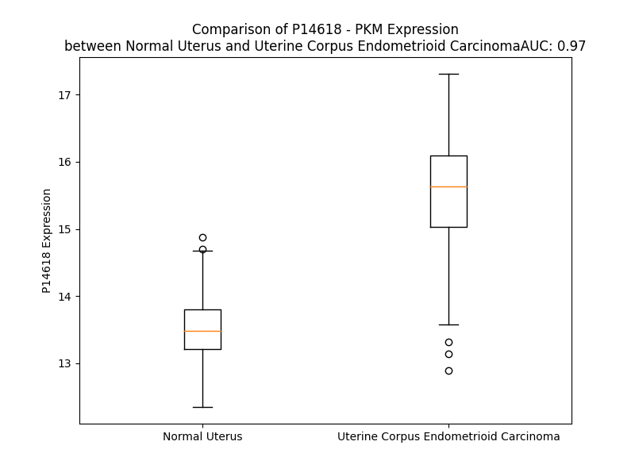

# Detailed Data for P14618

## Introduction to the Detailed Summary

### How to Interpret the Results

- **Summary & Metrics**: This section provides a quick reference to essential protein attributes, including expression changes, family classification, and biomarker applications. Regulation status (upregulated/downregulated) indicates the protein's behavior in a disease context. Some information comes from the original excel file with the proteins selected from literature, while others are derived from the analyses.
- **Expression Comparison**: A visual representation comparing protein expression between normal and disease states. It highlights significant changes in expression levels that might indicate diagnostic or therapeutic relevance. This is data coming from transcriptomics experiments and could not translate similarly to protein levels.
- **Isoform Alignment**: An interactive view of isoform alignments, revealing structural and functional differences between variants of the protein.
- **Interactors & Homologs**: Tables listing known interaction partners and homologous proteins, the more interactors and homologs, the more complex the protein is to design an antibody for.
- **Biological Assemblies**: Information about the structural arrangement of the protein in different assemblies, providing insights into its functional state but also the complexity of the protein to develop antibodies.
- **Combined Per-Residue Information**: A detailed table summarizing residue-level data. This includes predictions for epitope regions, aggregation tendencies, and modifications that might impact the protein's function. Each row corresponds to a residue in the protein, providing insights into specific sites that may be important for research or drug development.
## Summary & Metrics

- **UniProt Accession**: P14618
- **Gene Name**: PKM
- **Protein Name**: pyruvate kinase, muscle (PKM2)
- **Swiss Prot**: KPY1_HUMAN
- **Family**: kinase
- **Biomarker Application**: diagnosis,disease progression,unspecified application
- **Number of Isoforms**: 4
- **Regulation**: 1
- **(transcriptomics) AUC**: 0.99
- **(transcriptomics) Fold Change**: 1.15
- **(transcriptomics) Regulation**: Upregulated
- **Discotope Epitope Count**: 98
- **Max n_uniprots (Homo)**: 4
- **Max n_uniprots (Hetero)**: N/A

## Expression Comparison

## Isoform Alignment

<pre style='font-size:14px; font-family:monospace;'>P14618-1 MSKPHSEAGTAFIQTQQLHAAMADTFLEHMCRLDIDSPPITARNTGIICTIGPASRSVETLKEMIKSGMNVARLNFSHGTHEYHAETIKNVRTATESFASDPILYRPVAVALDTKGPEIRTGLIKGSGTAEVELKKGATLKITLDNAYMEKCDENILWLDYKNICKVVEVGSKIYVDDGLISLQVKQKGADFLVTEVENGGSLGSKKGVNLPGAAVDLPAVSEKDIQDLKFGVEQDVDMVFASFIRKASDVHEVRKVLGEKGKNIKIISKIENHEGVRRFDEILEASDGIMVARGDLGIEIPAEKVFLAQKMMIGRCNRAGKPVICATQMLESMIKKPRPTRAEGSDVANAVLDGADCIMLSGETAKGDYPLEAVRMQHLIAREAEAAIYHLQLFEELRRLAPITSDPTEATAVGAVEASFKCCSGAIIVLTKSGRSAHQVARYRPRAPIIAVTRNPQTARQAHLYRGIFPVLCKDPVQEAWAEDVDLRVNFAMNVGKARGFFKKGDVVIVLTGWRPGSGFTNTMRVVPVP
P14618-2 MSKPHSEAGTAFIQTQQLHAAMADTFLEHMCRLDIDSPPITARNTGIICTIGPASRSVETLKEMIKSGMNVARLNFSHGTHEYHAETIKNVRTATESFASDPILYRPVAVALDTKGPEIRTGLIKGSGTAEVELKKGATLKITLDNAYMEKCDENILWLDYKNICKVVEVGSKIYVDDGLISLQVKQKGADFLVTEVENGGSLGSKKGVNLPGAAVDLPAVSEKDIQDLKFGVEQDVDMVFASFIRKASDVHEVRKVLGEKGKNIKIISKIENHEGVRRFDEILEASDGIMVARGDLGIEIPAEKVFLAQKMMIGRCNRAGKPVICATQMLESMIKKPRPTRAEGSDVANAVLDGADCIMLSGETAKGDYPLEAVRMQHLIAREAEAAMFHRKLFEELVRASSHSTDLMEAMAMGSVEASYKCLAAALIVLTESGRSAHQVARYRPRAPIIAVTRNPQTARQAHLYRGIFPVLCKDPVQEAWAEDVDLRVNFAMNVGKARGFFKKGDVVIVLTGWRPGSGFTNTMRVVPVP
P14786-1 MSKPHSEAGTAFIQTQQLHAAMADTFLEHMCRLDIDSPPITARNTGIICTIGPASRSVETLKEMIKSGMNVARLNFSHGTHEYHAETIKNVRTATESFASDPILYRPVAVALDTKGPEIRTGLIKGSGTAEVELKKGATLKITLDNAYMEKCDENILWLDYKNICKVVEVGSKIYVDDGLISLQVKQKGADFLVTEVENGGSLGSKKGVNLPGAAVDLPAVSEKDIQDLKFGVEQDVDMVFASFIRKASDVHEVRKVLGEKGKNIKIISKIENHEGVRRFDEILEASDGIMVARGDLGIEIPAEKVFLAQKMMIGRCNRAGKPVICATQMLESMIKKPRPTRAEGSDVANAVLDGADCIMLSGETAKGDYPLEAVRMQHLIAREAEAAIYHLQLFEELRRLAPITSDPTEATAVGAVEASFKCCSGAIIVLTKSGRSAHQVARYRPRAPIIAVTRNPQTARQAHLYRGIFPVLCKDPVQEAWAEDVDLRVNFAMNVGKARGFFKKGDVVIVLTGWRPGSGFTNTMRVVPVP
P14618-3 --------------MSPEAQPQRTKGPQQPCRSPIVKPGLPSFRP-SSCTQPWLTHSWSTCAAWTLIHHPSQPGTLASSVPLYHAETIKNVRTATESFASDPILYRPVAVALDTKGPEIRTGLIKGSGTAEVELKKGATLKITLDNAYMEKCDENILWLDYKNICKVVEVGSKIYVDDGLISLQVKQKGADFLVTEVENGGSLGSKKGVNLPGAAVDLPAVSEKDIQDLKFGVEQDVDMVFASFIRKASDVHEVRKVLGEKGKNIKIISKIENHEGVRRFDEILEASDGIMVARGDLGIEIPAEKVFLAQKMMIGRCNRAGKPVICATQMLESMIKKPRPTRAEGSDVANAVLDGADCIMLSGETAKGDYPLEAVRMQHLIAREAEAAIYHLQLFEELRRLAPITSDPTEATAVGAVEASFKCCSGAIIVLTKSGRSAHQVARYRPRAPIIAVTRNPQTARQAHLYRGIFPVLCKDPVQEAWAEDVDLRVNFAMNVGKARGFFKKGDVVIVLTGWRPGSGFTNTMRVVPVP
</pre>

## Interactors

| preferredName_A   | preferredName_B   |   score |
|:------------------|:------------------|--------:|
| PKM               | LDHA              |   0.997 |
| PKM               | ENO1              |   0.997 |
| PKM               | CTNNB1            |   0.996 |
| PKM               | HIF1A             |   0.996 |
| PKM               | ENO2              |   0.989 |
| PKM               | ENO3              |   0.989 |
| PKM               | GPI               |   0.986 |
| PKM               | LDHAL6A           |   0.986 |
| PKM               | ALDOA             |   0.983 |
| PKM               | LDHC              |   0.983 |
| PKM               | PDHB              |   0.983 |
| PKM               | LDHAL6B           |   0.982 |
| PKM               | ENO4              |   0.979 |
| PKM               | PGAM1             |   0.975 |
| PKM               | ME1               |   0.974 |
| PKM               | POU5F1            |   0.969 |
| PKM               | PC                |   0.967 |
| PKM               | CD44              |   0.965 |
| PKM               | ME3               |   0.963 |
| PKM               | TPI1              |   0.963 |
| PKM               | ME2               |   0.962 |
| PKM               | H6PD              |   0.958 |
| PKM               | GAPDH             |   0.956 |
| PKM               | PCK2              |   0.953 |
| PKM               | PCK1              |   0.951 |
| PKM               | TKT               |   0.951 |
| PKM               | PGAM4             |   0.949 |
| PKM               | LDHD              |   0.946 |
| PKM               | PDHA2             |   0.945 |
| PKM               | AK2               |   0.944 |
| PKM               | ALDOC             |   0.943 |
| PKM               | G6PD              |   0.941 |
| PKM               | PFKM              |   0.938 |
| PKM               | AK1               |   0.938 |
| PKM               | PGK1              |   0.936 |
| PKM               | AK3               |   0.934 |
| PKM               | TKTL2             |   0.934 |
| PKM               | TKTL1             |   0.934 |
| PKM               | FGFR1             |   0.932 |
| PKM               | RRM1              |   0.928 |
| PKM               | AK4               |   0.928 |
| PKM               | PRKACA            |   0.927 |
| PKM               | PFKP              |   0.927 |
| PKM               | ITPA              |   0.926 |
| PKM               | PRKACB            |   0.926 |
| PKM               | TALDO1            |   0.925 |
| PKM               | PRKACG            |   0.925 |
| PKM               | NME2              |   0.925 |
| PKM               | PGAM2             |   0.924 |
| PKM               | RRM2              |   0.924 |

## Homologs

| uniprot_id   | gene_id   |
|:-------------|:----------|
| F8W6W2       | PKLR      |

## Biological Assemblies

|   Unnamed: 0 |   assembly |   n_uniprots | composition   | crystal_id   |
|-------------:|-----------:|-------------:|:--------------|:-------------|
|            0 |          1 |            4 | Homo          | 6v74         |
|            0 |          1 |            4 | Homo          | 4b2d         |
|            0 |          1 |            4 | Homo          | 3g2g         |
|            1 |          2 |            2 | Homo          | 3g2g         |
|            2 |          3 |            2 | Homo          | 3g2g         |
|            0 |          1 |            4 | Homo          | 3h6o         |
|            0 |          1 |            4 | Homo          | 8hmq         |
|            0 |          1 |            2 | Homo          | 6wp6         |
|            0 |          1 |            4 | Homo          | 7l21         |
|            0 |          1 |            4 | Homo          | 6wp4         |
|            0 |          1 |            4 | Homo          | 4qg8         |
|            0 |          1 |            4 | Homo          | 4qg9         |
|            0 |          1 |            4 | Homo          | 4fxj         |
|            0 |          1 |            4 | Homo          | 6ttf         |
|            0 |          1 |            2 | Homo          | 6b6u         |
|            0 |          1 |            2 | Homo          | 8hgf         |
|            1 |          2 |            2 | Homo          | 8hgf         |
|            0 |          1 |            4 | Homo          | 6tti         |
|            0 |          1 |            4 | Homo          | 6gg4         |
|            0 |          1 |            1 | Homo          | 1zjh         |
|            0 |          1 |            4 | Homo          | 6tth         |
|            0 |          1 |            4 | Homo          | 6ttq         |
|            0 |          1 |            4 | Homo          | 3srd         |
|            0 |          1 |            4 | Homo          | 4rpp         |
|            0 |          1 |            4 | Homo          | 6v76         |
|            0 |          1 |            4 | Homo          | 3gqy         |
|            0 |          1 |            4 | Homo          | 5x0i         |
|            0 |          1 |            4 | Homo          | 3bjf         |
|            0 |          1 |            4 | Homo          | 1t5a         |
|            1 |          2 |            4 | Homo          | 1t5a         |
|            0 |          1 |            4 | Homo          | 4wj8         |
|            0 |          1 |            2 | Homo          | 6nub         |
|            0 |          1 |            4 | Homo          | 3srh         |
|            0 |          1 |            2 | Homo          | 6nu5         |
|            0 |          1 |            4 | Homo          | 6nu1         |
|            1 |          2 |            2 | Homo          | 6nu1         |
|            2 |          3 |            2 | Homo          | 6nu1         |
|            3 |          4 |            2 | Homo          | 6nu1         |
|            4 |          5 |            2 | Homo          | 6nu1         |
|            0 |          1 |            4 | Homo          | 3bjt         |
|            0 |          1 |            2 | Homo          | 6wp3         |
|            0 |          1 |            4 | Homo          | 6wp5         |
|            0 |          1 |            4 | Homo          | 8hmu         |
|            0 |          1 |            4 | Homo          | 8hms         |
|            0 |          1 |            4 | Homo          | 5x1v         |
|            0 |          1 |            4 | Homo          | 4qgc         |
|            0 |          1 |            4 | Homo          | 6v75         |
|            0 |          1 |            4 | Homo          | 4qg6         |
|            0 |          1 |            4 | Homo          | 8hmr         |
|            0 |          1 |            4 | Homo          | 4yj5         |
|            0 |          1 |            4 | Homo          | 6gg3         |
|            1 |          2 |            4 | Homo          | 6gg3         |
|            2 |          3 |            4 | Homo          | 6gg3         |
|            0 |          1 |            4 | Homo          | 4fxf         |
|            0 |          1 |            4 | Homo          | 3me3         |
|            0 |          1 |            2 | Homo          | 3srf         |
|            1 |          2 |            4 | Homo          | 3srf         |
|            2 |          3 |            2 | Homo          | 3srf         |
|            0 |          1 |            4 | Homo          | 6gg5         |
|            0 |          1 |            4 | Homo          | 3u2z         |
|            0 |          1 |            4 | Homo          | 5x1w         |
|            0 |          1 |            4 | Homo          | 4g1n         |
|            0 |          1 |            4 | Homo          | 6jfb         |
|            0 |          1 |            4 | Homo          | 3gr4         |
|            0 |          1 |            1 | Homo          | 8g2e         |
|            0 |          1 |            4 | Homo          | 4jpg         |
|            0 |          1 |            4 | Homo          | 6gg6         |
|            1 |          2 |            4 | Homo          | 6gg6         |

## Combined Per-Residue Information

|   res | aa   |   epitope_score | epitope   |   relative_surface_accessibility |   modeling_confidence |   Aggregation | modification                 |
|------:|:-----|----------------:|:----------|---------------------------------:|----------------------:|--------------:|:-----------------------------|
|     1 | M    |         0.14627 | True      |                          1.31365 |                 34.61 |         0     | N/A                          |
|     2 | S    |         0.1849  | True      |                          0.88424 |                 35.62 |         0     | N-acetylserine               |
|     3 | K    |         0.19746 | True      |                          0.73806 |                 32.81 |         0     | N6,N6,N6-trimethyllysine     |
|     4 | P    |         0.16171 | True      |                          0.71435 |                 45.04 |         0     | N/A                          |
|     5 | H    |         0.18374 | True      |                          0.82911 |                 54.14 |         0     | N/A                          |
|     6 | S    |         0.25307 | True      |                          0.76588 |                 53.66 |         0     | N/A                          |
|     7 | E    |         0.22743 | True      |                          0.63272 |                 59.45 |         0     | N/A                          |
|     8 | A    |         0.11952 | False     |                          0.55225 |                 68.04 |         0     | N/A                          |
|     9 | G    |         0.18173 | True      |                          0.59009 |                 84.38 |         0.142 | N/A                          |
|    10 | T    |         0.15477 | True      |                          1.07207 |                 84.07 |         0.312 | N/A                          |
|    11 | A    |         0.1274  | False     |                          0.76329 |                 84.97 |         0.481 | N/A                          |
|    12 | F    |         0.26535 | True      |                          0.52491 |                 87.29 |         0.481 | N/A                          |
|    13 | I    |         0.11802 | False     |                          0.42048 |                 87.29 |         0.481 | N/A                          |
|    14 | Q    |         0.14283 | True      |                          0.40193 |                 88.62 |         0.339 | N/A                          |
|    15 | T    |         0.10417 | False     |                          0.37329 |                 94.73 |         0.17  | N/A                          |
|    16 | Q    |         0.03229 | False     |                          0.19771 |                 95.26 |         0     | N/A                          |
|    17 | Q    |         0.0543  | False     |                          0.06817 |                 98.23 |         0     | N/A                          |
|    18 | L    |         0.06994 | False     |                          0.23741 |                 97.04 |         0     | N/A                          |
|    19 | H    |         0.09661 | False     |                          0.53323 |                 97.76 |         0     | N/A                          |
|    20 | A    |         0.00567 | False     |                          0.00329 |                 98.26 |         0     | N/A                          |
|    21 | A    |         0.01702 | False     |                          0.0432  |                 97.73 |         0     | N/A                          |
|    22 | M    |         0.1393  | True      |                          0.65396 |                 97.67 |         0     | N/A                          |
|    23 | A    |         0.03166 | False     |                          0.01148 |                 98.03 |         0     | N/A                          |
|    24 | D    |         0.16782 | True      |                          0.82588 |                 98.28 |         0     | N/A                          |
|    25 | T    |         0.16074 | True      |                          0.53417 |                 98.5  |         0     | N/A                          |
|    26 | F    |         0.12061 | False     |                          0.54992 |                 98.73 |         0     | N/A                          |
|    27 | L    |         0.17172 | True      |                          0.79118 |                 98.7  |         0     | N/A                          |
|    28 | E    |         0.14158 | True      |                          0.3331  |                 98.77 |         0     | N/A                          |
|    29 | H    |         0.04996 | False     |                          0.01555 |                 98.79 |         0     | N/A                          |
|    30 | M    |         0.14929 | True      |                          0.54995 |                 98.72 |         0     | N/A                          |
|    31 | C    |         0.17506 | True      |                          0.68552 |                 98.65 |         0     | N/A                          |
|    32 | R    |         0.17542 | True      |                          0.27999 |                 98.58 |         0     | N/A                          |
|    33 | L    |         0.14232 | True      |                          0.47746 |                 98.54 |         0     | N/A                          |
|    34 | D    |         0.11064 | False     |                          0.31128 |                 98.38 |         0     | N/A                          |
|    35 | I    |         0.15725 | True      |                          1.05435 |                 98.21 |         0     | N/A                          |
|    36 | D    |         0.12178 | False     |                          0.59728 |                 97.57 |         0     | N/A                          |
|    37 | S    |         0.03118 | False     |                          0.02669 |                 97.78 |         0     | Phosphoserine                |
|    38 | P    |         0.17864 | True      |                          0.52296 |                 97.59 |         0     | N/A                          |
|    39 | P    |         0.03538 | False     |                          0.1791  |                 98.22 |         0     | N/A                          |
|    40 | I    |         0.08001 | False     |                          0.34718 |                 97.93 |         0     | N/A                          |
|    41 | T    |         0.08743 | False     |                          0.50416 |                 98.09 |         0     | Phosphothreonine             |
|    42 | A    |         0.0272  | False     |                          0.03968 |                 97.77 |         0     | N/A                          |
|    43 | R    |         0.05874 | False     |                          0.14881 |                 98.76 |         0     | N/A                          |
|    44 | N    |         0.02213 | False     |                          0.06715 |                 98.81 |         0     | N/A                          |
|    45 | T    |         0.00375 | False     |                          0       |                 98.91 |         0.173 | N/A                          |
|    46 | G    |         0.00522 | False     |                          0.03357 |                 98.82 |         0.968 | N/A                          |
|    47 | I    |         0.00147 | False     |                          0       |                 98.95 |         9.803 | N/A                          |
|    48 | I    |         0.00661 | False     |                          0       |                 98.95 |         9.803 | N/A                          |
|    49 | C    |         0.00086 | False     |                          0       |                 98.93 |         9.803 | N/A                          |
|    50 | T    |         0.01836 | False     |                          0.03903 |                 98.88 |         9.803 | N/A                          |
|    51 | I    |         0.01698 | False     |                          0.05144 |                 98.83 |         9.803 | N/A                          |
|    52 | G    |         0.02846 | False     |                          0.04989 |                 98.33 |         0     | N/A                          |
|    53 | P    |         0.15208 | True      |                          0.81945 |                 98.1  |         0     | N/A                          |
|    54 | A    |         0.05971 | False     |                          0.33897 |                 98.1  |         0     | N/A                          |
|    55 | S    |         0.00296 | False     |                          0.00208 |                 98.62 |         0     | N/A                          |
|    56 | R    |         0.09132 | False     |                          0.18934 |                 98.42 |         0     | N/A                          |
|    57 | S    |         0.05813 | False     |                          0.42179 |                 98.73 |         0     | N/A                          |
|    58 | V    |         0.06041 | False     |                          0.25657 |                 98.87 |         0     | N/A                          |
|    59 | E    |         0.11917 | False     |                          0.57306 |                 98.77 |         0     | N/A                          |
|    60 | T    |         0.06024 | False     |                          0.22433 |                 98.77 |         0     | N/A                          |
|    61 | L    |         0.00314 | False     |                          0.00082 |                 98.92 |         0     | N/A                          |
|    62 | K    |         0.0355  | False     |                          0.24567 |                 98.89 |         0     | N6-acetyllysine              |
|    63 | E    |         0.09832 | False     |                          0.29533 |                 98.87 |         0     | N/A                          |
|    64 | M    |         0.00198 | False     |                          0       |                 98.91 |         0     | N/A                          |
|    65 | I    |         0.00875 | False     |                          0.0048  |                 98.86 |         0     | N/A                          |
|    66 | K    |         0.07927 | False     |                          0.53668 |                 98.68 |         0     | N6-succinyllysine            |
|    67 | S    |         0.03582 | False     |                          0.11296 |                 98.73 |         0     | N/A                          |
|    68 | G    |         0.02738 | False     |                          0.13749 |                 98.57 |         0     | N/A                          |
|    69 | M    |         0.01725 | False     |                          0.01667 |                 98.88 |         0     | N/A                          |
|    70 | N    |         0.02035 | False     |                          0.12143 |                 98.93 |         0     | N/A                          |
|    71 | V    |         0.00417 | False     |                          0       |                 98.97 |         0     | N/A                          |
|    72 | A    |         0.00093 | False     |                          0       |                 98.96 |         0     | N/A                          |
|    73 | R    |         0.06503 | False     |                          0.06884 |                 98.91 |         0     | N/A                          |
|    74 | L    |         0.0063  | False     |                          0.00659 |                 98.85 |         0     | N/A                          |
|    75 | N    |         0.07096 | False     |                          0.22606 |                 98.03 |         0     | N/A                          |
|    76 | F    |         0.02243 | False     |                          0.07569 |                 97.39 |         0     | N/A                          |
|    77 | S    |         0.10296 | False     |                          0.15366 |                 92.39 |         0     | N/A                          |
|    78 | H    |         0.22483 | True      |                          0.58501 |                 91.54 |         0     | N/A                          |
|    79 | G    |         0.16341 | True      |                          0.644   |                 93.05 |         0     | N/A                          |
|    80 | T    |         0.13431 | False     |                          0.63289 |                 96.77 |         0     | N/A                          |
|    81 | H    |         0.11737 | False     |                          0.3101  |                 98.56 |         0     | N/A                          |
|    82 | E    |         0.17785 | True      |                          0.70688 |                 98.58 |         0     | N/A                          |
|    83 | Y    |         0.10302 | False     |                          0.28071 |                 98.53 |         0     | N/A                          |
|    84 | H    |         0.02015 | False     |                          0.03458 |                 98.7  |         0     | N/A                          |
|    85 | A    |         0.07554 | False     |                          0.25371 |                 98.84 |         0     | N/A                          |
|    86 | E    |         0.12991 | False     |                          0.39695 |                 98.81 |         0     | N/A                          |
|    87 | T    |         0.00454 | False     |                          0.00476 |                 98.83 |         0     | N/A                          |
|    88 | I    |         0.02296 | False     |                          0.0128  |                 98.9  |         0     | N/A                          |
|    89 | K    |         0.13175 | False     |                          0.68906 |                 98.89 |         0     | N6-acetyllysine              |
|    90 | N    |         0.0224  | False     |                          0.14404 |                 98.92 |         0     | N/A                          |
|    91 | V    |         0.00619 | False     |                          0.01428 |                 98.91 |         0     | N/A                          |
|    92 | R    |         0.12675 | False     |                          0.36832 |                 98.83 |         0     | N/A                          |
|    93 | T    |         0.06447 | False     |                          0.47738 |                 98.89 |         0     | N/A                          |
|    94 | A    |         0.00466 | False     |                          0       |                 98.87 |         0     | N/A                          |
|    95 | T    |         0.03183 | False     |                          0.04977 |                 98.84 |         0     | N/A                          |
|    96 | E    |         0.1063  | False     |                          0.45454 |                 98.65 |         0     | N/A                          |
|    97 | S    |         0.11264 | False     |                          0.42831 |                 98.64 |         0     | Phosphoserine                |
|    98 | F    |         0.08131 | False     |                          0.26607 |                 98.47 |         0     | N/A                          |
|    99 | A    |         0.112   | False     |                          0.27837 |                 97.67 |         0     | N/A                          |
|   100 | S    |         0.13901 | True      |                          0.86568 |                 97.38 |         0     | Phosphoserine                |
|   101 | D    |         0.13219 | False     |                          0.32641 |                 98.13 |         0     | N/A                          |
|   102 | P    |         0.07285 | False     |                          0.33695 |                 97.64 |         0     | N/A                          |
|   103 | I    |         0.13858 | True      |                          0.24809 |                 98.3  |         0     | N/A                          |
|   104 | L    |         0.10612 | False     |                          0.47038 |                 98.01 |         0     | N/A                          |
|   105 | Y    |         0.08354 | False     |                          0.08132 |                 98.64 |         0     | Phosphotyrosine              |
|   106 | R    |         0.04897 | False     |                          0.22921 |                 98.47 |         0     | N/A                          |
|   107 | P    |         0.00873 | False     |                          0.02649 |                 98.78 |         0.696 | N/A                          |
|   108 | V    |         0.01559 | False     |                          0.03178 |                 98.92 |        49.084 | N/A                          |
|   109 | A    |         0.00171 | False     |                          0       |                 98.95 |        49.084 | N/A                          |
|   110 | V    |         0.01287 | False     |                          0.03713 |                 98.95 |        49.084 | N/A                          |
|   111 | A    |         0.01159 | False     |                          0       |                 98.94 |        49.084 | N/A                          |
|   112 | L    |         0.00303 | False     |                          0.00165 |                 98.86 |        48.977 | N/A                          |
|   113 | D    |         0.00895 | False     |                          0.00676 |                 98.74 |         0     | N/A                          |
|   114 | T    |         0.01117 | False     |                          0.04155 |                 98.13 |         0     | N/A                          |
|   115 | K    |         0.04494 | False     |                          0.24387 |                 95.6  |         0     | N/A                          |
|   116 | G    |         0.01628 | False     |                          0.06781 |                 93.49 |         0     | N/A                          |
|   117 | P    |         0.02539 | False     |                          0.11315 |                 94.64 |         0     | N/A                          |
|   118 | E    |         0.06268 | False     |                          0.19833 |                 90.57 |         0     | N/A                          |
|   119 | I    |         0.02901 | False     |                          0.04494 |                 95.72 |         0     | N/A                          |
|   120 | R    |         0.1536  | True      |                          0.15463 |                 95.51 |         0     | N/A                          |
|   121 | T    |         0.02305 | False     |                          0.02327 |                 97.01 |         0     | N/A                          |
|   122 | G    |         0.01572 | False     |                          0.02855 |                 95.53 |         0     | N/A                          |
|   123 | L    |         0.22039 | True      |                          0.29136 |                 95.78 |         0     | N/A                          |
|   124 | I    |         0.03724 | False     |                          0.01294 |                 95.7  |         0     | N/A                          |
|   125 | K    |         0.21335 | True      |                          0.46159 |                 91.8  |         0     | N/A                          |
|   126 | G    |         0.24433 | True      |                          0.93907 |                 87.9  |         0     | N/A                          |
|   127 | S    |         0.25306 | True      |                          0.68348 |                 80.1  |         0     | Phosphoserine                |
|   128 | G    |         0.21727 | True      |                          0.15855 |                 78.76 |         0     | N/A                          |
|   129 | T    |         0.34784 | True      |                          0.83912 |                 84.51 |         0     | N/A                          |
|   130 | A    |         0.2797  | True      |                          0.44335 |                 88.44 |         0     | N/A                          |
|   131 | E    |         0.2421  | True      |                          0.55032 |                 92.28 |         0     | N/A                          |
|   132 | V    |         0.09274 | False     |                          0.11761 |                 95.05 |         0     | N/A                          |
|   133 | E    |         0.13332 | False     |                          0.59735 |                 97.22 |         0     | N/A                          |
|   134 | L    |         0.02656 | False     |                          0.03172 |                 97.69 |         0     | N/A                          |
|   135 | K    |         0.06655 | False     |                          0.63551 |                 97.79 |         0     | N/A                          |
|   136 | K    |         0.0709  | False     |                          0.8041  |                 98.02 |         0     | N/A                          |
|   137 | G    |         0.08185 | False     |                          0.54945 |                 97.88 |         0     | N/A                          |
|   138 | A    |         0.07013 | False     |                          0.38429 |                 98.23 |         0     | N/A                          |
|   139 | T    |         0.06274 | False     |                          0.60331 |                 98.6  |         0     | N/A                          |
|   140 | L    |         0.00415 | False     |                          0.00082 |                 98.68 |         0     | N/A                          |
|   141 | K    |         0.05022 | False     |                          0.38018 |                 98.67 |         0     | N/A                          |
|   142 | I    |         0.00601 | False     |                          0.0064  |                 98.66 |         0     | N/A                          |
|   143 | T    |         0.0534  | False     |                          0.04198 |                 98.32 |         0     | N/A                          |
|   144 | L    |         0.09567 | False     |                          0.13188 |                 97.68 |         0     | N/A                          |
|   145 | D    |         0.18768 | True      |                          0.39846 |                 97.69 |         0     | N/A                          |
|   146 | N    |         0.21702 | True      |                          0.51971 |                 97.27 |         0     | N/A                          |
|   147 | A    |         0.1499  | True      |                          0.56928 |                 96.91 |         0     | N/A                          |
|   148 | Y    |         0.15961 | True      |                          0.36275 |                 96.8  |         0     | Phosphotyrosine              |
|   149 | M    |         0.26207 | True      |                          0.40212 |                 95.95 |         0     | N/A                          |
|   150 | E    |         0.30343 | True      |                          0.565   |                 95.83 |         0     | N/A                          |
|   151 | K    |         0.15179 | True      |                          0.60613 |                 96.2  |         0     | N/A                          |
|   152 | C    |         0.00723 | False     |                          0.001   |                 97.27 |         0     | N/A                          |
|   153 | D    |         0.06654 | False     |                          0.11347 |                 96.68 |         0     | N/A                          |
|   154 | E    |         0.12121 | False     |                          0.37113 |                 96.58 |         0     | N/A                          |
|   155 | N    |         0.17556 | True      |                          0.56184 |                 97.8  |         0.154 | N/A                          |
|   156 | I    |         0.11752 | False     |                          0.14079 |                 97.95 |         2.45  | N/A                          |
|   157 | L    |         0.00453 | False     |                          0.00659 |                 98.37 |         2.45  | N/A                          |
|   158 | W    |         0.0747  | False     |                          0.09508 |                 98.46 |         2.45  | N/A                          |
|   159 | L    |         0.01648 | False     |                          0.00165 |                 97.57 |         2.45  | N/A                          |
|   160 | D    |         0.09636 | False     |                          0.33043 |                 96.3  |         2.296 | N/A                          |
|   161 | Y    |         0.06372 | False     |                          0.02322 |                 97.05 |         2.296 | N/A                          |
|   162 | K    |         0.15985 | True      |                          0.521   |                 95.8  |         2.296 | N/A                          |
|   163 | N    |         0.09943 | False     |                          0.30392 |                 96.26 |         1.938 | N/A                          |
|   164 | I    |         0.01517 | False     |                          0.0024  |                 97.51 |         2.133 | N/A                          |
|   165 | C    |         0.0555  | False     |                          0.0939  |                 96.74 |         1.08  | N/A                          |
|   166 | K    |         0.24886 | True      |                          0.7322  |                 96.41 |         0.851 | N6-succinyllysine; alternate |
|   166 | K    |         0.24886 | True      |                          0.7322  |                 96.41 |         0.851 | N6-acetyllysine; alternate   |
|   167 | V    |         0.10238 | False     |                          0.18474 |                 96.21 |         2.256 | N/A                          |
|   168 | V    |         0.01169 | False     |                          0.00666 |                 96.83 |         2.256 | N/A                          |
|   169 | E    |         0.1273  | False     |                          0.51357 |                 97.01 |         2.256 | N/A                          |
|   170 | V    |         0.12787 | False     |                          0.66185 |                 98.18 |         2.256 | N/A                          |
|   171 | G    |         0.05755 | False     |                          0.42811 |                 97.47 |         1.575 | N/A                          |
|   172 | S    |         0.06036 | False     |                          0.27579 |                 97.5  |         1.405 | N/A                          |
|   173 | K    |         0.04662 | False     |                          0.35562 |                 97.57 |         1.405 | N/A                          |
|   174 | I    |         0.00307 | False     |                          0.0024  |                 98.3  |         1.405 | N/A                          |
|   175 | Y    |         0.0382  | False     |                          0.26626 |                 98.3  |         1.405 | Phosphotyrosine              |
|   176 | V    |         0.01132 | False     |                          0.01047 |                 97.43 |         1.14  | N/A                          |
|   177 | D    |         0.06904 | False     |                          0.12598 |                 93.88 |         0     | N/A                          |
|   178 | D    |         0.07409 | False     |                          0.65742 |                 90.03 |         0     | N/A                          |
|   179 | G    |         0.03512 | False     |                          0.23696 |                 93.13 |         0     | N/A                          |
|   180 | L    |         0.11393 | False     |                          0.79379 |                 94.32 |         3.322 | N/A                          |
|   181 | I    |         0.01651 | False     |                          0.012   |                 97.76 |         3.322 | N/A                          |
|   182 | S    |         0.02017 | False     |                          0.0332  |                 98.08 |         3.322 | N/A                          |
|   183 | L    |         0.00268 | False     |                          0       |                 98.59 |         3.322 | N/A                          |
|   184 | Q    |         0.064   | False     |                          0.18712 |                 98.59 |         3.322 | N/A                          |
|   185 | V    |         0.00572 | False     |                          0.00211 |                 98.59 |         3.061 | N/A                          |
|   186 | K    |         0.09337 | False     |                          0.44841 |                 98.59 |         0     | N/A                          |
|   187 | Q    |         0.16271 | True      |                          0.5217  |                 98.28 |         0     | N/A                          |
|   188 | K    |         0.1558  | True      |                          0.35355 |                 98.04 |         0     | N/A                          |
|   189 | G    |         0.09006 | False     |                          0.23671 |                 95.66 |         0     | N/A                          |
|   190 | A    |         0.16614 | True      |                          0.96914 |                 94.31 |         0     | N/A                          |
|   191 | D    |         0.11994 | False     |                          0.43608 |                 95.23 |         0     | N/A                          |
|   192 | F    |         0.1081  | False     |                          0.28679 |                 98.12 |         0     | N/A                          |
|   193 | L    |         0.00416 | False     |                          0.00082 |                 98.5  |         0     | N/A                          |
|   194 | V    |         0.04578 | False     |                          0.22754 |                 98.72 |         0     | N/A                          |
|   195 | T    |         0.00988 | False     |                          0.00512 |                 98.81 |         0     | Phosphothreonine             |
|   196 | E    |         0.08832 | False     |                          0.30659 |                 98.7  |         0     | N/A                          |
|   197 | V    |         0.00861 | False     |                          0.00331 |                 98.71 |         0     | N/A                          |
|   198 | E    |         0.08634 | False     |                          0.23797 |                 97.87 |         0     | N/A                          |
|   199 | N    |         0.14301 | True      |                          0.53091 |                 97.1  |         0     | N/A                          |
|   200 | G    |         0.10436 | False     |                          0.35886 |                 96.65 |         0     | N/A                          |
|   201 | G    |         0.07509 | False     |                          0.33551 |                 96.39 |         0     | N/A                          |
|   202 | S    |         0.20301 | True      |                          0.48711 |                 96.14 |         0     | N/A                          |
|   203 | L    |         0.00633 | False     |                          0.00165 |                 96    |         0     | N/A                          |
|   204 | G    |         0.06285 | False     |                          0.04235 |                 94.47 |         0     | N/A                          |
|   205 | S    |         0.17003 | True      |                          0.19556 |                 94.01 |         0     | N/A                          |
|   206 | K    |         0.25078 | True      |                          0.57248 |                 93.14 |         0     | N/A                          |
|   207 | K    |         0.16423 | True      |                          0.27477 |                 93.8  |         0     | N/A                          |
|   208 | G    |         0.10704 | False     |                          0.33457 |                 94.21 |         0     | N/A                          |
|   209 | V    |         0.03517 | False     |                          0.05939 |                 97.47 |         0     | N/A                          |
|   210 | N    |         0.03852 | False     |                          0.05778 |                 97.58 |         0     | N/A                          |
|   211 | L    |         0.03526 | False     |                          0.01504 |                 97.18 |         0     | N/A                          |
|   212 | P    |         0.09439 | False     |                          0.30001 |                 94.15 |         0     | N/A                          |
|   213 | G    |         0.11875 | False     |                          0.93987 |                 90.59 |         0     | N/A                          |
|   214 | A    |         0.04958 | False     |                          0.25218 |                 93.06 |         0     | N/A                          |
|   215 | A    |         0.08668 | False     |                          0.7984  |                 92.35 |         0     | N/A                          |
|   216 | V    |         0.06177 | False     |                          0.24029 |                 92.75 |         0     | N/A                          |
|   217 | D    |         0.24582 | True      |                          0.48656 |                 93.63 |         0     | N/A                          |
|   218 | L    |         0.10757 | False     |                          0.26684 |                 93.46 |         0     | N/A                          |
|   219 | P    |         0.14464 | True      |                          0.52483 |                 93.64 |         0     | N/A                          |
|   220 | A    |         0.02236 | False     |                          0.07848 |                 90.66 |         0     | N/A                          |
|   221 | V    |         0.03168 | False     |                          0.10858 |                 95.06 |         0     | N/A                          |
|   222 | S    |         0.06303 | False     |                          0.26283 |                 95    |         0     | N/A                          |
|   223 | E    |         0.18372 | True      |                          0.7694  |                 95.73 |         0     | N/A                          |
|   224 | K    |         0.161   | True      |                          0.54187 |                 93.92 |         0     | N/A                          |
|   225 | D    |         0.02051 | False     |                          0.01452 |                 97.06 |         0     | N/A                          |
|   226 | I    |         0.11151 | False     |                          0.29439 |                 98.23 |         0     | N/A                          |
|   227 | Q    |         0.25817 | True      |                          0.47591 |                 98.3  |         0     | N/A                          |
|   228 | D    |         0.01393 | False     |                          0.00694 |                 98.53 |         0     | N/A                          |
|   229 | L    |         0.00625 | False     |                          0.00452 |                 98.69 |         0     | N/A                          |
|   230 | K    |         0.16201 | True      |                          0.47761 |                 98.62 |         0     | N/A                          |
|   231 | F    |         0.06948 | False     |                          0.10085 |                 98.79 |         0     | N/A                          |
|   232 | G    |         0.01059 | False     |                          0.00805 |                 98.75 |         0     | N/A                          |
|   233 | V    |         0.04895 | False     |                          0.10676 |                 98.75 |         0     | N/A                          |
|   234 | E    |         0.19851 | True      |                          0.62969 |                 98.66 |         0     | N/A                          |
|   235 | Q    |         0.06617 | False     |                          0.22543 |                 98.79 |         0     | N/A                          |
|   236 | D    |         0.08378 | False     |                          0.4306  |                 98.69 |         0     | N/A                          |
|   237 | V    |         0.00962 | False     |                          0.00952 |                 98.89 |         0.549 | N/A                          |
|   238 | D    |         0.00571 | False     |                          0.00378 |                 98.93 |         0.595 | N/A                          |
|   239 | M    |         0.00374 | False     |                          0       |                 98.92 |        41.64  | N/A                          |
|   240 | V    |         0.00225 | False     |                          0.00381 |                 98.94 |        77.544 | N/A                          |
|   241 | F    |         0.005   | False     |                          0       |                 98.87 |        77.871 | N/A                          |
|   242 | A    |         0.00542 | False     |                          0.01786 |                 98.69 |        77.871 | N/A                          |
|   243 | S    |         0.01039 | False     |                          0.01518 |                 98.09 |        77.871 | N/A                          |
|   244 | F    |         0.02152 | False     |                          0.11309 |                 97.28 |        77.781 | N/A                          |
|   245 | I    |         0.00978 | False     |                          0.004   |                 98.46 |        62.397 | N/A                          |
|   246 | R    |         0.0557  | False     |                          0.12289 |                 98.02 |         0.595 | N/A                          |
|   247 | K    |         0.11278 | False     |                          0.37505 |                 98.13 |         0     | N/A                          |
|   248 | A    |         0.03617 | False     |                          0.19368 |                 98.7  |         0     | N/A                          |
|   249 | S    |         0.13423 | False     |                          0.39053 |                 98.5  |         0     | N/A                          |
|   250 | D    |         0.03234 | False     |                          0.02698 |                 98.54 |         0     | N/A                          |
|   251 | V    |         0.00248 | False     |                          0       |                 98.73 |         0     | N/A                          |
|   252 | H    |         0.19005 | True      |                          0.53466 |                 98.59 |         0     | N/A                          |
|   253 | E    |         0.13681 | False     |                          0.40704 |                 98.14 |         0     | N/A                          |
|   254 | V    |         0.01307 | False     |                          0.01809 |                 98.62 |         0     | N/A                          |
|   255 | R    |         0.08948 | False     |                          0.3304  |                 98.53 |         0     | N/A                          |
|   256 | K    |         0.3569  | True      |                          0.86032 |                 98.13 |         0     | N/A                          |
|   257 | V    |         0.10177 | False     |                          0.27089 |                 97.61 |         0     | N/A                          |
|   258 | L    |         0.06492 | False     |                          0.04427 |                 98.44 |         0     | N/A                          |
|   259 | G    |         0.2329  | True      |                          0.42457 |                 98.02 |         0     | N/A                          |
|   260 | E    |         0.13214 | False     |                          0.65999 |                 98.32 |         0     | N/A                          |
|   261 | K    |         0.20059 | True      |                          0.77362 |                 97.97 |         0     | N/A                          |
|   262 | G    |         0.013   | False     |                          0.00518 |                 98.47 |         0     | N/A                          |
|   263 | K    |         0.32438 | True      |                          0.57713 |                 98.36 |         0     | N/A                          |
|   264 | N    |         0.12992 | False     |                          0.53931 |                 98.49 |         0     | N/A                          |
|   265 | I    |         0.07484 | False     |                          0.04369 |                 98.84 |         0     | N/A                          |
|   266 | K    |         0.04832 | False     |                          0.2365  |                 98.88 |         0     | N6-acetyllysine; alternate   |
|   267 | I    |         0.00302 | False     |                          0       |                 98.92 |         0     | N/A                          |
|   268 | I    |         0.00741 | False     |                          0.0024  |                 98.95 |         0     | N/A                          |
|   269 | S    |         0.00179 | False     |                          0       |                 98.91 |         0     | N/A                          |
|   270 | K    |         0.0278  | False     |                          0.09532 |                 98.88 |         0     | N6-acetyllysine; alternate   |
|   271 | I    |         0.00255 | False     |                          0       |                 98.81 |         0     | N/A                          |
|   272 | E    |         0.01727 | False     |                          0.01113 |                 98.13 |         0     | N/A                          |
|   273 | N    |         0.04233 | False     |                          0.09349 |                 96.98 |         0     | N/A                          |
|   274 | H    |         0.09184 | False     |                          0.50898 |                 97.06 |         0     | N/A                          |
|   275 | E    |         0.09308 | False     |                          0.34175 |                 97.53 |         0     | N/A                          |
|   276 | G    |         0.00232 | False     |                          0       |                 98.19 |         0     | N/A                          |
|   277 | V    |         0.03732 | False     |                          0.21807 |                 98.59 |         0     | N/A                          |
|   278 | R    |         0.24832 | True      |                          0.77656 |                 98.39 |         0     | N/A                          |
|   279 | R    |         0.04957 | False     |                          0.37987 |                 98.56 |         0     | N/A                          |
|   280 | F    |         0.02433 | False     |                          0.00638 |                 98.91 |         0     | N/A                          |
|   281 | D    |         0.12456 | False     |                          0.47245 |                 98.85 |         0     | N/A                          |
|   282 | E    |         0.13226 | False     |                          0.3657  |                 98.82 |         0     | N/A                          |
|   283 | I    |         0.00326 | False     |                          0       |                 98.9  |         0     | N/A                          |
|   284 | L    |         0.02191 | False     |                          0.07254 |                 98.87 |         0     | N/A                          |
|   285 | E    |         0.11784 | False     |                          0.72825 |                 98.78 |         0     | N/A                          |
|   286 | A    |         0.03314 | False     |                          0.16542 |                 98.79 |         0     | N/A                          |
|   287 | S    |         0.01323 | False     |                          0.02481 |                 98.88 |         0     | N/A                          |
|   288 | D    |         0.0475  | False     |                          0.17963 |                 98.88 |         0     | N/A                          |
|   289 | G    |         0.00167 | False     |                          0       |                 98.9  |         1.894 | N/A                          |
|   290 | I    |         0.00165 | False     |                          0.00059 |                 98.95 |         1.894 | N/A                          |
|   291 | M    |         0.01182 | False     |                          0.00336 |                 98.92 |         1.894 | N/A                          |
|   292 | V    |         0.0019  | False     |                          0       |                 98.89 |         1.894 | N/A                          |
|   293 | A    |         0.0251  | False     |                          0.04719 |                 98.31 |         1.894 | N/A                          |
|   294 | R    |         0.06149 | False     |                          0.13779 |                 98.34 |         0     | N/A                          |
|   295 | G    |         0.03937 | False     |                          0.29996 |                 94.11 |         0     | N/A                          |
|   296 | D    |         0.04772 | False     |                          0.27184 |                 95.71 |         0     | N/A                          |
|   297 | L    |         0.00317 | False     |                          0       |                 97.67 |         0     | N/A                          |
|   298 | G    |         0.0817  | False     |                          0.24331 |                 97.35 |         0     | N/A                          |
|   299 | I    |         0.10741 | False     |                          0.15694 |                 96.67 |         0     | N/A                          |
|   300 | E    |         0.02997 | False     |                          0.14193 |                 96.03 |         0     | N/A                          |
|   301 | I    |         0.13838 | False     |                          0.0928  |                 97.48 |         0     | N/A                          |
|   302 | P    |         0.12755 | False     |                          0.51508 |                 96.41 |         0     | N/A                          |
|   303 | A    |         0.1385  | True      |                          0.67012 |                 96.58 |         0     | N/A                          |
|   304 | E    |         0.19722 | True      |                          0.61445 |                 98.14 |         0     | N/A                          |
|   305 | K    |         0.11064 | False     |                          0.48414 |                 98.51 |         0     | N6-acetyllysine              |
|   306 | V    |         0.02855 | False     |                          0.12663 |                 98.66 |         1.648 | N/A                          |
|   307 | F    |         0.14467 | True      |                          0.56749 |                 98.73 |         1.648 | N/A                          |
|   308 | L    |         0.1428  | True      |                          0.60346 |                 98.85 |         1.648 | N/A                          |
|   309 | A    |         0.02633 | False     |                          0.0605  |                 98.81 |         1.648 | N/A                          |
|   310 | Q    |         0.02081 | False     |                          0.06534 |                 98.87 |         1.648 | N/A                          |
|   311 | K    |         0.07482 | False     |                          0.45983 |                 98.88 |         0     | N/A                          |
|   312 | M    |         0.0646  | False     |                          0.26347 |                 98.88 |         0     | N/A                          |
|   313 | M    |         0.00169 | False     |                          0       |                 98.9  |         0     | N/A                          |
|   314 | I    |         0.00324 | False     |                          0.0016  |                 98.92 |         0     | N/A                          |
|   315 | G    |         0.05195 | False     |                          0.4528  |                 98.84 |         0     | N/A                          |
|   316 | R    |         0.08987 | False     |                          0.31738 |                 98.88 |         0     | N/A                          |
|   317 | C    |         0.00173 | False     |                          0       |                 98.92 |         0     | N/A                          |
|   318 | N    |         0.02893 | False     |                          0.10276 |                 98.85 |         0     | N/A                          |
|   319 | R    |         0.13021 | False     |                          0.50664 |                 98.64 |         0     | N/A                          |
|   320 | A    |         0.04942 | False     |                          0.36781 |                 98.57 |         0     | N/A                          |
|   321 | G    |         0.02388 | False     |                          0.23778 |                 98.53 |         0     | N/A                          |
|   322 | K    |         0.06078 | False     |                          0.25264 |                 98.88 |         0     | N6-acetyllysine; alternate   |
|   322 | K    |         0.06078 | False     |                          0.25264 |                 98.88 |         0     | N6-succinyllysine; alternate |
|   323 | P    |         0.00564 | False     |                          0.01278 |                 98.91 |         0     | N/A                          |
|   324 | V    |         0.00182 | False     |                          0       |                 98.94 |         0.812 | N/A                          |
|   325 | I    |         0.00567 | False     |                          0.0008  |                 98.96 |         0.812 | N/A                          |
|   326 | C    |         0.00128 | False     |                          0       |                 98.87 |         0.812 | N/A                          |
|   327 | A    |         0.00533 | False     |                          0.00128 |                 97.99 |         0.812 | N/A                          |
|   328 | T    |         0.0313  | False     |                          0.22239 |                 93.68 |         0.812 | N/A                          |
|   329 | Q    |         0.04686 | False     |                          0.49886 |                 95.14 |         0.523 | N/A                          |
|   330 | M    |         0.00278 | False     |                          0       |                 98.21 |         0.523 | N/A                          |
|   331 | L    |         0.00295 | False     |                          0       |                 98.57 |         0.523 | N/A                          |
|   332 | E    |         0.08346 | False     |                          0.30258 |                 98.16 |         0     | N/A                          |
|   333 | S    |         0.07411 | False     |                          0.19367 |                 98.42 |         0     | N/A                          |
|   334 | M    |         0.00635 | False     |                          0.00216 |                 98.64 |         0     | N/A                          |
|   335 | I    |         0.1397  | True      |                          0.112   |                 98.44 |         0     | N/A                          |
|   336 | K    |         0.26262 | True      |                          0.66871 |                 98.41 |         0     | N/A                          |
|   337 | K    |         0.18506 | True      |                          0.56712 |                 98.15 |         0     | N/A                          |
|   338 | P    |         0.13614 | False     |                          0.50413 |                 98.29 |         0     | N/A                          |
|   339 | R    |         0.19282 | True      |                          0.64241 |                 98.22 |         0     | N/A                          |
|   340 | P    |         0.05728 | False     |                          0.11549 |                 98.64 |         0     | N/A                          |
|   341 | T    |         0.1376  | False     |                          0.41104 |                 98.61 |         0     | N/A                          |
|   342 | R    |         0.25641 | True      |                          0.82986 |                 98.43 |         0     | N/A                          |
|   343 | A    |         0.10557 | False     |                          0.71095 |                 98.48 |         0     | N/A                          |
|   344 | E    |         0.0491  | False     |                          0.09352 |                 98.81 |         0     | N/A                          |
|   345 | G    |         0.03569 | False     |                          0.22668 |                 98.62 |         0     | N/A                          |
|   346 | S    |         0.09081 | False     |                          0.43201 |                 98.8  |         0     | N/A                          |
|   347 | D    |         0.02466 | False     |                          0.23045 |                 98.83 |         0     | N/A                          |
|   348 | V    |         0.00122 | False     |                          0       |                 98.87 |         0.176 | N/A                          |
|   349 | A    |         0.01647 | False     |                          0.22065 |                 98.83 |         0.176 | N/A                          |
|   350 | N    |         0.09421 | False     |                          0.41038 |                 98.88 |         0.176 | N/A                          |
|   351 | A    |         0.00137 | False     |                          0       |                 98.83 |         0.176 | N/A                          |
|   352 | V    |         0.00119 | False     |                          0       |                 98.88 |         0.176 | N/A                          |
|   353 | L    |         0.06255 | False     |                          0.47659 |                 98.87 |         0.176 | N/A                          |
|   354 | D    |         0.02604 | False     |                          0.2403  |                 98.87 |         0     | N/A                          |
|   355 | G    |         0.01115 | False     |                          0.03702 |                 98.84 |         0     | N/A                          |
|   356 | A    |         0.00265 | False     |                          0       |                 98.89 |         0     | N/A                          |
|   357 | D    |         0.01168 | False     |                          0.04565 |                 98.93 |         0     | N/A                          |
|   358 | C    |         0.00202 | False     |                          0       |                 98.95 |         0     | N/A                          |
|   359 | I    |         0.00128 | False     |                          0       |                 98.92 |         0     | N/A                          |
|   360 | M    |         0.00951 | False     |                          0.02067 |                 98.87 |         0     | N/A                          |
|   361 | L    |         0.00141 | False     |                          0       |                 98.73 |         0     | N/A                          |
|   362 | S    |         0.0163  | False     |                          0.16686 |                 97.46 |         0     | N/A                          |
|   363 | G    |         0.03841 | False     |                          0.12009 |                 96.58 |         0     | N/A                          |
|   364 | E    |         0.00856 | False     |                          0       |                 98.68 |         0     | N/A                          |
|   365 | T    |         0.00386 | False     |                          0       |                 98.76 |         0     | N/A                          |
|   366 | A    |         0.06692 | False     |                          0.14667 |                 98.17 |         0     | N/A                          |
|   367 | K    |         0.30883 | True      |                          0.6634  |                 97.63 |         0     | N/A                          |
|   368 | G    |         0.03599 | False     |                          0.04283 |                 97.64 |         0     | N/A                          |
|   369 | D    |         0.21441 | True      |                          0.51233 |                 98.63 |         0     | N/A                          |
|   370 | Y    |         0.07616 | False     |                          0.31286 |                 98.69 |         0     | N/A                          |
|   371 | P    |         0.02168 | False     |                          0.11034 |                 98.75 |         0     | N/A                          |
|   372 | L    |         0.04729 | False     |                          0.21186 |                 98.81 |         0     | N/A                          |
|   373 | E    |         0.07314 | False     |                          0.29331 |                 98.86 |         0     | N/A                          |
|   374 | A    |         0.00113 | False     |                          0       |                 98.83 |         0     | N/A                          |
|   375 | V    |         0.00227 | False     |                          0       |                 98.87 |         0     | N/A                          |
|   376 | R    |         0.07901 | False     |                          0.38888 |                 98.9  |         0     | N/A                          |
|   377 | M    |         0.02133 | False     |                          0.10075 |                 98.88 |         0     | N/A                          |
|   378 | Q    |         0.00264 | False     |                          0       |                 98.78 |         0     | N/A                          |
|   379 | H    |         0.0178  | False     |                          0.23777 |                 98.84 |         0     | N/A                          |
|   380 | L    |         0.08705 | False     |                          0.59198 |                 98.86 |         0     | N/A                          |
|   381 | I    |         0.04789 | False     |                          0.14838 |                 98.88 |         0     | N/A                          |
|   382 | A    |         0.00156 | False     |                          0       |                 98.88 |         0     | N/A                          |
|   383 | R    |         0.05082 | False     |                          0.18823 |                 98.78 |         0     | N/A                          |
|   384 | E    |         0.09002 | False     |                          0.43859 |                 98.84 |         0     | N/A                          |
|   385 | A    |         0.01044 | False     |                          0.05085 |                 98.8  |         0     | N/A                          |
|   386 | E    |         0.03992 | False     |                          0.065   |                 98.86 |         0     | N/A                          |
|   387 | A    |         0.02424 | False     |                          0.06103 |                 98.61 |         0     | N/A                          |
|   388 | A    |         0.05303 | False     |                          0.17135 |                 98.75 |         0     | N/A                          |
|   389 | I    |         0.01711 | False     |                          0.05419 |                 98.81 |         0     | N/A                          |
|   390 | Y    |         0.05758 | False     |                          0.08355 |                 98.79 |         0     | N/A                          |
|   391 | H    |         0.03798 | False     |                          0.03509 |                 98.74 |         0     | N/A                          |
|   392 | L    |         0.11739 | False     |                          0.64833 |                 98.39 |         0     | N/A                          |
|   393 | Q    |         0.17319 | True      |                          0.3809  |                 98.77 |         0     | N/A                          |
|   394 | L    |         0.05956 | False     |                          0.25756 |                 98.73 |         0     | N/A                          |
|   395 | F    |         0.07514 | False     |                          0.07336 |                 98.79 |         0     | N/A                          |
|   396 | E    |         0.08837 | False     |                          0.39786 |                 98.77 |         0     | N/A                          |
|   397 | E    |         0.06994 | False     |                          0.40576 |                 98.82 |         0     | N/A                          |
|   398 | L    |         0.02967 | False     |                          0.10325 |                 98.79 |         0     | N/A                          |
|   399 | R    |         0.10428 | False     |                          0.43711 |                 98.55 |         0     | N/A                          |
|   400 | R    |         0.19285 | True      |                          0.7547  |                 98.54 |         0     | N/A                          |
|   401 | L    |         0.08777 | False     |                          0.70224 |                 98.46 |         0     | N/A                          |
|   402 | A    |         0.06498 | False     |                          0.23272 |                 98.14 |         0     | N/A                          |
|   403 | P    |         0.15226 | True      |                          0.68122 |                 97.56 |         0     | 4-hydroxyproline             |
|   404 | I    |         0.21423 | True      |                          1.06991 |                 98.27 |         0     | N/A                          |
|   405 | T    |         0.21647 | True      |                          0.52461 |                 97.5  |         0     | N/A                          |
|   406 | S    |         0.22954 | True      |                          0.89016 |                 97.08 |         0     | N/A                          |
|   407 | D    |         0.15075 | True      |                          0.24892 |                 97.02 |         0     | N/A                          |
|   408 | P    |         0.15858 | True      |                          0.60876 |                 96.83 |         0     | 4-hydroxyproline             |
|   409 | T    |         0.02787 | False     |                          0.0561  |                 97.12 |         0     | N/A                          |
|   410 | E    |         0.05136 | False     |                          0.1174  |                 97.78 |         0     | N/A                          |
|   411 | A    |         0.12231 | False     |                          0.60069 |                 98.18 |         0     | N/A                          |
|   412 | T    |         0.01466 | False     |                          0.12598 |                 98.58 |         0     | N/A                          |
|   413 | A    |         0.01005 | False     |                          0.01112 |                 98.69 |         0.209 | N/A                          |
|   414 | V    |         0.04845 | False     |                          0.28086 |                 98.77 |         0.209 | N/A                          |
|   415 | G    |         0.08328 | False     |                          0.34953 |                 98.75 |         0.209 | N/A                          |
|   416 | A    |         0.00301 | False     |                          0       |                 98.87 |         0.209 | N/A                          |
|   417 | V    |         0.00209 | False     |                          0       |                 98.9  |         0.209 | N/A                          |
|   418 | E    |         0.05467 | False     |                          0.38277 |                 98.87 |         0     | N/A                          |
|   419 | A    |         0.02703 | False     |                          0.18112 |                 98.86 |         0     | N/A                          |
|   420 | S    |         0.00832 | False     |                          0.03378 |                 98.82 |         0     | N/A                          |
|   421 | F    |         0.05199 | False     |                          0.2474  |                 98.56 |         0     | N/A                          |
|   422 | K    |         0.15269 | True      |                          0.87732 |                 98.46 |         0     | N/A                          |
|   423 | C    |         0.12852 | False     |                          0.39166 |                 98.02 |         0     | S-nitrosocysteine            |
|   424 | C    |         0.08709 | False     |                          0.68273 |                 97.57 |         0.029 | S-nitrosocysteine            |
|   425 | S    |         0.03796 | False     |                          0.07498 |                 98.34 |         0.929 | N/A                          |
|   426 | G    |         0.02403 | False     |                          0.22605 |                 98.23 |         7.444 | N/A                          |
|   427 | A    |         0.0004  | False     |                          0       |                 98.86 |        57.338 | N/A                          |
|   428 | I    |         0.00109 | False     |                          0       |                 98.94 |        79.334 | N/A                          |
|   429 | I    |         0.00128 | False     |                          0       |                 98.91 |        79.334 | N/A                          |
|   430 | V    |         0.00198 | False     |                          0       |                 98.8  |        79.334 | N/A                          |
|   431 | L    |         0.02772 | False     |                          0.08548 |                 98.33 |        77.873 | N/A                          |
|   432 | T    |         0.04585 | False     |                          0.0847  |                 98.17 |        42.815 | N/A                          |
|   433 | K    |         0.12545 | False     |                          0.6602  |                 96.78 |         0     | N6-acetyllysine              |
|   434 | S    |         0.0755  | False     |                          0.45324 |                 96.89 |         0     | N/A                          |
|   435 | G    |         0.00791 | False     |                          0.00644 |                 98.22 |         0     | N/A                          |
|   436 | R    |         0.19531 | True      |                          0.56404 |                 97.88 |         0     | N/A                          |
|   437 | S    |         0.02081 | False     |                          0.0791  |                 98.16 |         0     | N/A                          |
|   438 | A    |         0.00336 | False     |                          0.00128 |                 98.71 |         0     | N/A                          |
|   439 | H    |         0.03041 | False     |                          0.13781 |                 98.69 |         0     | N/A                          |
|   440 | Q    |         0.01902 | False     |                          0.09157 |                 98.57 |         0     | N/A                          |
|   441 | V    |         0.00232 | False     |                          0       |                 98.87 |         0     | N/A                          |
|   442 | A    |         0.00567 | False     |                          0.01949 |                 98.83 |         0     | N/A                          |
|   443 | R    |         0.06939 | False     |                          0.24156 |                 98.72 |         0     | N/A                          |
|   444 | Y    |         0.0157  | False     |                          0.03384 |                 98.89 |         0     | N/A                          |
|   445 | R    |         0.02505 | False     |                          0.04799 |                 98.84 |         0     | N/A                          |
|   446 | P    |         0.01282 | False     |                          0.04028 |                 98.85 |         0     | N/A                          |
|   447 | R    |         0.03791 | False     |                          0.13225 |                 98.66 |         0     | N/A                          |
|   448 | A    |         0.01422 | False     |                          0.09023 |                 98.66 |         0     | N/A                          |
|   449 | P    |         0.01259 | False     |                          0.02883 |                 98.86 |         0     | N/A                          |
|   450 | I    |         0.00164 | False     |                          0       |                 98.95 |        14.095 | N/A                          |
|   451 | I    |         0.00126 | False     |                          0       |                 98.93 |        14.095 | N/A                          |
|   452 | A    |         0.008   | False     |                          0.01148 |                 98.87 |        14.095 | N/A                          |
|   453 | V    |         0.00285 | False     |                          0.00211 |                 98.81 |        14.095 | N/A                          |
|   454 | T    |         0.03    | False     |                          0.01904 |                 98.56 |        14.095 | N/A                          |
|   455 | R    |         0.0746  | False     |                          0.27265 |                 97.92 |         0     | N/A                          |
|   456 | N    |         0.05571 | False     |                          0.35067 |                 98.28 |         0     | N/A                          |
|   457 | P    |         0.06874 | False     |                          0.46942 |                 98.63 |         0     | N/A                          |
|   458 | Q    |         0.02441 | False     |                          0.16797 |                 98.75 |         0     | N/A                          |
|   459 | T    |         0.01695 | False     |                          0.05826 |                 98.74 |         0     | N/A                          |
|   460 | A    |         0.00213 | False     |                          0.00128 |                 98.82 |         0     | N/A                          |
|   461 | R    |         0.02472 | False     |                          0.18779 |                 98.9  |         0     | N/A                          |
|   462 | Q    |         0.02427 | False     |                          0.07176 |                 98.91 |         0     | N/A                          |
|   463 | A    |         0.00538 | False     |                          0.0226  |                 98.85 |         0     | N/A                          |
|   464 | H    |         0.02027 | False     |                          0.05863 |                 98.88 |         0     | N/A                          |
|   465 | L    |         0.00679 | False     |                          0.01237 |                 98.89 |         0     | N/A                          |
|   466 | Y    |         0.03743 | False     |                          0.11613 |                 98.94 |         0     | N/A                          |
|   467 | R    |         0.01884 | False     |                          0.03559 |                 98.86 |         0     | N/A                          |
|   468 | G    |         0.01096 | False     |                          0.03325 |                 98.71 |         0     | N/A                          |
|   469 | I    |         0.02968 | False     |                          0.0625  |                 98.93 |         0     | N/A                          |
|   470 | F    |         0.02345 | False     |                          0.20791 |                 98.93 |         0     | N/A                          |
|   471 | P    |         0.00704 | False     |                          0.01776 |                 98.88 |         0     | N/A                          |
|   472 | V    |         0.0175  | False     |                          0.03047 |                 98.8  |         0     | N/A                          |
|   473 | L    |         0.02649 | False     |                          0.04988 |                 98.77 |         0     | N/A                          |
|   474 | C    |         0.0171  | False     |                          0.02443 |                 98.38 |         0     | N/A                          |
|   475 | K    |         0.10914 | False     |                          0.56293 |                 97.56 |         0     | N6-acetyllysine              |
|   476 | D    |         0.12019 | False     |                          0.35053 |                 96.89 |         0     | N/A                          |
|   477 | P    |         0.184   | True      |                          0.75748 |                 96.26 |         0     | N/A                          |
|   478 | V    |         0.2585  | True      |                          0.76343 |                 96.34 |         0     | N/A                          |
|   479 | Q    |         0.083   | False     |                          0.29022 |                 95.97 |         0     | N/A                          |
|   480 | E    |         0.15001 | True      |                          0.96774 |                 94.24 |         0     | N/A                          |
|   481 | A    |         0.09511 | False     |                          0.43222 |                 95.47 |         0     | N/A                          |
|   482 | W    |         0.12453 | False     |                          0.38583 |                 93.27 |         0     | N/A                          |
|   483 | A    |         0.10239 | False     |                          0.60927 |                 94.66 |         0     | N/A                          |
|   484 | E    |         0.12685 | False     |                          0.54992 |                 96.22 |         0     | N/A                          |
|   485 | D    |         0.02779 | False     |                          0.03817 |                 96.98 |         0     | N/A                          |
|   486 | V    |         0.03977 | False     |                          0.07141 |                 97    |         0     | N/A                          |
|   487 | D    |         0.14723 | True      |                          0.44009 |                 97.12 |         0     | N/A                          |
|   488 | L    |         0.07842 | False     |                          0.2906  |                 98.19 |         0     | N/A                          |
|   489 | R    |         0.0495  | False     |                          0.14843 |                 98.33 |         0     | N/A                          |
|   490 | V    |         0.04882 | False     |                          0.13424 |                 98.48 |         0     | N/A                          |
|   491 | N    |         0.11497 | False     |                          0.47811 |                 98.46 |         0     | N/A                          |
|   492 | F    |         0.05567 | False     |                          0.08121 |                 98.65 |         0     | N/A                          |
|   493 | A    |         0.00142 | False     |                          0       |                 98.78 |         0     | N/A                          |
|   494 | M    |         0.01695 | False     |                          0.03308 |                 98.54 |         0     | N/A                          |
|   495 | N    |         0.10504 | False     |                          0.43745 |                 98.69 |         0     | N/A                          |
|   496 | V    |         0.00545 | False     |                          0.00381 |                 98.68 |         0     | N/A                          |
|   497 | G    |         0.00736 | False     |                          0       |                 98.63 |         0     | N/A                          |
|   498 | K    |         0.0817  | False     |                          0.37297 |                 98.69 |         0     | N6-succinyllysine            |
|   499 | A    |         0.0905  | False     |                          0.56314 |                 98.44 |         0     | N/A                          |
|   500 | R    |         0.07329 | False     |                          0.21642 |                 98.09 |         0     | N/A                          |
|   501 | G    |         0.07387 | False     |                          0.51117 |                 98.01 |         0     | N/A                          |
|   502 | F    |         0.06751 | False     |                          0.16155 |                 98.29 |         0     | N/A                          |
|   503 | F    |         0.02921 | False     |                          0.0351  |                 98.39 |         0     | N/A                          |
|   504 | K    |         0.09651 | False     |                          0.75115 |                 97.42 |         0     | N/A                          |
|   505 | K    |         0.08838 | False     |                          0.7744  |                 97.31 |         0.006 | N/A                          |
|   506 | G    |         0.04079 | False     |                          0.62227 |                 97.52 |         0.006 | N/A                          |
|   507 | D    |         0.11174 | False     |                          0.35    |                 98.22 |         0.006 | N/A                          |
|   508 | V    |         0.07884 | False     |                          0.36879 |                 98.66 |        93.069 | N/A                          |
|   509 | V    |         0.00348 | False     |                          0       |                 98.85 |        98.81  | N/A                          |
|   510 | I    |         0.00247 | False     |                          0       |                 98.89 |        98.86  | N/A                          |
|   511 | V    |         0.00917 | False     |                          0.02616 |                 98.79 |        98.864 | N/A                          |
|   512 | L    |         0.00913 | False     |                          0.00907 |                 98.67 |        98.864 | N/A                          |
|   513 | T    |         0.01821 | False     |                          0.02617 |                 96.95 |        73.358 | N/A                          |
|   514 | G    |         0.06411 | False     |                          0.18936 |                 92.58 |        56.894 | N/A                          |
|   515 | W    |         0.23435 | True      |                          0.60427 |                 88.85 |        45.81  | N/A                          |
|   516 | R    |         0.19207 | True      |                          0.40528 |                 88.59 |         0     | N/A                          |
|   517 | P    |         0.16179 | True      |                          0.64117 |                 84.71 |         0     | N/A                          |
|   518 | G    |         0.12399 | False     |                          0.63672 |                 83.14 |         0     | N/A                          |
|   519 | S    |         0.19327 | True      |                          0.45256 |                 83.28 |         0     | N/A                          |
|   520 | G    |         0.11537 | False     |                          0.60382 |                 85.67 |         0     | N/A                          |
|   521 | F    |         0.10173 | False     |                          0.32581 |                 91.61 |         0     | N/A                          |
|   522 | T    |         0.02617 | False     |                          0.06597 |                 95.03 |         0     | N/A                          |
|   523 | N    |         0.06407 | False     |                          0.42096 |                 95.68 |         0     | N/A                          |
|   524 | T    |         0.06258 | False     |                          0.27957 |                 97.67 |         0     | N/A                          |
|   525 | M    |         0.06817 | False     |                          0.4232  |                 98.46 |         0     | N/A                          |
|   526 | R    |         0.23046 | True      |                          0.46849 |                 98.49 |         0     | N/A                          |
|   527 | V    |         0.11851 | False     |                          0.54785 |                 98.72 |         0     | N/A                          |
|   528 | V    |         0.08391 | False     |                          0.2988  |                 98.31 |         0     | N/A                          |
|   529 | P    |         0.10621 | False     |                          0.67105 |                 98.24 |         0     | N/A                          |
|   530 | V    |         0.00962 | False     |                          0.02322 |                 98.25 |         0     | N/A                          |
|   531 | P    |         0.10052 | False     |                          0.58598 |                 96.1  |         0     | N/A                          |

