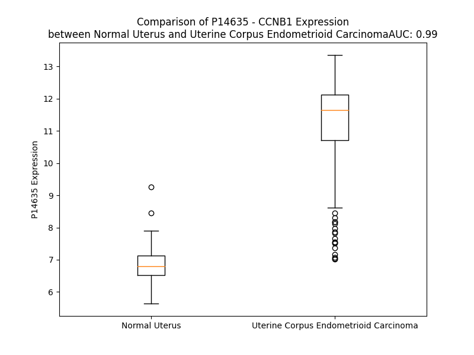

# Detailed Data for P14635

## Introduction to the Detailed Summary

### How to Interpret the Results

- **Summary & Metrics**: This section provides a quick reference to essential protein attributes, including expression changes, family classification, and biomarker applications. Regulation status (upregulated/downregulated) indicates the protein's behavior in a disease context. Some information comes from the original excel file with the proteins selected from literature, while others are derived from the analyses.
- **Expression Comparison**: A visual representation comparing protein expression between normal and disease states. It highlights significant changes in expression levels that might indicate diagnostic or therapeutic relevance. This is data coming from transcriptomics experiments and could not translate similarly to protein levels.
- **Isoform Alignment**: An interactive view of isoform alignments, revealing structural and functional differences between variants of the protein.
- **Interactors & Homologs**: Tables listing known interaction partners and homologous proteins, the more interactors and homologs, the more complex the protein is to design an antibody for.
- **Biological Assemblies**: Information about the structural arrangement of the protein in different assemblies, providing insights into its functional state but also the complexity of the protein to develop antibodies.
- **Combined Per-Residue Information**: A detailed table summarizing residue-level data. This includes predictions for epitope regions, aggregation tendencies, and modifications that might impact the protein's function. Each row corresponds to a residue in the protein, providing insights into specific sites that may be important for research or drug development.
## Summary & Metrics

- **UniProt Accession**: P14635
- **Gene Name**: CCNB1
- **Protein Name**: cyclin B1
- **Swiss Prot**: CCNB1_HUMAN
- **Family**: kinase
- **Biomarker Application**: diagnosis,disease progression,efficacy,prognosis
- **Number of Isoforms**: 2
- **Regulation**: 2
- **(transcriptomics) AUC**: 0.99
- **(transcriptomics) Fold Change**: 1.63
- **(transcriptomics) Regulation**: Upregulated
- **Discotope Epitope Count**: 66
- **Max n_uniprots (Homo)**: 1
- **Max n_uniprots (Hetero)**: 10

## Expression Comparison

## Isoform Alignment

<pre style='font-size:14px; font-family:monospace;'>P14635-1 MALRVTRNSKINAENKAKINMAGAKRVPTAPAATSKPGLRPRTALGDIGNKVSEQLQAKMPMKKEAKPSATGKVIDKKLPKPLEKVPMLVPVPVSEPVPEPEPEPEPEPVKEEKLSPEPILVDTASPSPMETSGCAPAEEDLCQAFSDVILAVNDVDAEDGADPNLCSEYVKDIYAYLRQLEEEQAVRPKYLLGREVTGNMRAILIDWLVQVQMKFRLLQETMYMTVSIIDRFMQNNCVPKKMLQLVGVTAMFIASKYEEMYPPEIGDFAFVTDNTYTKHQIRQMEMKILRALNFGLGRPLPLHFLRRASKIGEVDVEQHTLAKYLMELTMLDYDMVHFPPSQIAAGAFCLALKILDNGEWTPTLQHYLSYTEESLLPVMQHLAKNVVMVNQGLTKHMTVKNKYATSKHAKISTLPQLNSALVQDLAKAVAKV
P14635-2 MALRVTRNSKINAENKAKINMAGAKRVPTAPAATSKPGLRPRTALGDIGNKVSEQLQAKMPMKKEAKPSATGKVIDKKLPKPLEKVPMLVPVPVSEPVPEPEPEPEPEPVKEEKLSPEPILVDTASPSPMETSGCAPAEEDLCQAFSDVILAVNDVDAEDGADPNLCSEYVKDIYAYLRQLEEEQAVRPKYLLGREVTGNMRAILIDWLVQVQMKFRLLQETMYMTVSIIDRFMQNNCVPKKMLQLVGVTAMFIASKYEEMYPPEIGDFAFVTDNTYTKHQIRQMEMKILRALNFGLGRPLPLHFLRRASKIGEVDVEQHTLAKYLMELTMLDYDMVHFPPSQIAAGAFCLALKILDNGEWT-------------------------------------VKNKYATSKHAKISTLPQLNSALVQDLAKAVAKV
</pre>

## Interactors

| preferredName_A   | preferredName_B   |   score |
|:------------------|:------------------|--------:|
| CCNB1             | ESPL1             |   0.999 |
| CCNB1             | CKS2              |   0.999 |
| CCNB1             | ANAPC4            |   0.999 |
| CCNB1             | CDC20             |   0.999 |
| CCNB1             | PLK1              |   0.999 |
| CCNB1             | CDK2              |   0.999 |
| CCNB1             | CDK1              |   0.999 |
| CCNB1             | CDC27             |   0.999 |
| CCNB1             | ANAPC10           |   0.999 |
| CCNB1             | CCNB2             |   0.998 |
| CCNB1             | CKS1B             |   0.998 |
| CCNB1             | BUB1B             |   0.998 |
| CCNB1             | FZR1              |   0.998 |
| CCNB1             | CDC25A            |   0.995 |
| CCNB1             | CCNA2             |   0.995 |
| CCNB1             | BIRC5             |   0.993 |
| CCNB1             | BUB1              |   0.992 |
| CCNB1             | CDC25C            |   0.991 |
| CCNB1             | WEE1              |   0.99  |
| CCNB1             | UBE2C             |   0.99  |
| CCNB1             | TOP2A             |   0.989 |
| CCNB1             | CENPF             |   0.988 |
| CCNB1             | FOXM1             |   0.988 |
| CCNB1             | MAD2L1            |   0.988 |
| CCNB1             | CDCA8             |   0.987 |
| CCNB1             | GADD45G           |   0.986 |
| CCNB1             | PTTG1             |   0.984 |
| CCNB1             | GADD45A           |   0.983 |
| CCNB1             | NDC80             |   0.981 |
| CCNB1             | AURKA             |   0.979 |
| CCNB1             | CDKN1A            |   0.977 |
| CCNB1             | CDC16             |   0.975 |
| CCNB1             | H2AX              |   0.974 |
| CCNB1             | CDC23             |   0.974 |
| CCNB1             | MELK              |   0.972 |
| CCNB1             | CDKN1B            |   0.972 |
| CCNB1             | GADD45B           |   0.97  |
| CCNB1             | PKMYT1            |   0.97  |
| CCNB1             | NUF2              |   0.967 |
| CCNB1             | CENPE             |   0.967 |
| CCNB1             | KIF2C             |   0.966 |
| CCNB1             | KIF11             |   0.966 |
| CCNB1             | SFN               |   0.965 |
| CCNB1             | DLGAP5            |   0.965 |
| CCNB1             | PTCH1             |   0.964 |
| CCNB1             | AURKB             |   0.962 |
| CCNB1             | PBK               |   0.962 |
| CCNB1             | NCAPG             |   0.962 |
| CCNB1             | KIF20A            |   0.954 |
| CCNB1             | CENPA             |   0.953 |

## Homologs

| uniprot_id   | gene_id   |
|:-------------|:----------|
| P20248       | CCNA2     |
| C9J2U0       | CCNE1     |
| Q6FI00       | CCND1     |
| H1UBN3       | CCNB2     |
| Q14094       | CCNI      |
| nan          | nan       |
| P41002       | CCNF      |
| D6RI00       | CCND3     |
| Q8WWL7       | CCNB3     |
| Q6ZMN8       | CCNI2     |
| A0A2R8Y754   | CCNJL     |
| P51959       | CCNG1     |
| M0QZM5       | CCNP      |
| Q8WUE3       | CCNE2     |
| Q5T5M9       | CCNJ      |
| P30279       | CCND2     |
| Q16589       | CCNG2     |
| P22674       | CCNO      |

## Biological Assemblies

|   Unnamed: 0 |   assembly |   n_uniprots | composition   | crystal_id   |
|-------------:|-----------:|-------------:|:--------------|:-------------|
|            0 |          1 |            3 | Hetero        | 4y72         |
|            0 |          1 |            1 | Homo          | 2b9r         |
|            1 |          2 |            1 | Homo          | 2b9r         |
|            0 |          1 |            3 | Hetero        | 6gu3         |
|            0 |          1 |            3 | Hetero        | 5lqf         |
|            1 |          2 |            3 | Hetero        | 5lqf         |
|            0 |          1 |           10 | Hetero        | 8tau         |
|            0 |          1 |            3 | Hetero        | 6gu2         |
|            0 |          1 |            3 | Hetero        | 5hq0         |
|            0 |          1 |            3 | Hetero        | 4yc3         |
|            0 |          1 |            2 | Hetero        | 2jgz         |
|            0 |          1 |            4 | Hetero        | 7nj0         |
|            0 |          1 |           10 | Hetero        | 8tar         |
|            0 |          1 |            3 | Hetero        | 6gu4         |

## Combined Per-Residue Information

|   res | aa   |   epitope_score | epitope   |   relative_surface_accessibility |   modeling_confidence |   Aggregation | modification           |
|------:|:-----|----------------:|:----------|---------------------------------:|----------------------:|--------------:|:-----------------------|
|     1 | M    |         0.08729 | False     |                          1.31053 |                 30.93 |         0     | N/A                    |
|     2 | A    |         0.1006  | False     |                          0.87531 |                 32.65 |         0     | N/A                    |
|     3 | L    |         0.13082 | False     |                          0.76333 |                 35.34 |         0     | N/A                    |
|     4 | R    |         0.12891 | False     |                          0.44067 |                 40.18 |         0     | N/A                    |
|     5 | V    |         0.10894 | False     |                          0.9554  |                 38.64 |         0     | N/A                    |
|     6 | T    |         0.10285 | False     |                          0.5459  |                 41.63 |         0     | N/A                    |
|     7 | R    |         0.18517 | True      |                          0.53768 |                 42.01 |         0     | N/A                    |
|     8 | N    |         0.08095 | False     |                          0.52457 |                 43.58 |         0     | N/A                    |
|     9 | S    |         0.10499 | False     |                          0.59686 |                 41.03 |         0     | N/A                    |
|    10 | K    |         0.14625 | False     |                          0.72859 |                 41.54 |         0     | N/A                    |
|    11 | I    |         0.09048 | False     |                          0.64237 |                 44.52 |         0     | N/A                    |
|    12 | N    |         0.09308 | False     |                          0.64535 |                 41.66 |         0     | N/A                    |
|    13 | A    |         0.09312 | False     |                          0.55562 |                 40.16 |         0     | N/A                    |
|    14 | E    |         0.12021 | False     |                          0.51979 |                 41.54 |         0     | N/A                    |
|    15 | N    |         0.0626  | False     |                          0.56571 |                 40.27 |         0     | N/A                    |
|    16 | K    |         0.08695 | False     |                          0.76906 |                 42.56 |         0     | N/A                    |
|    17 | A    |         0.08412 | False     |                          0.58154 |                 42.65 |         0     | N/A                    |
|    18 | K    |         0.10535 | False     |                          0.84318 |                 45.52 |         0     | N/A                    |
|    19 | I    |         0.11298 | False     |                          0.82623 |                 44.23 |         0     | N/A                    |
|    20 | N    |         0.09752 | False     |                          0.82968 |                 38.07 |         0     | N/A                    |
|    21 | M    |         0.11831 | False     |                          0.95055 |                 39.57 |         0     | N/A                    |
|    22 | A    |         0.10875 | False     |                          0.95494 |                 37.01 |         0     | N/A                    |
|    23 | G    |         0.10194 | False     |                          0.89887 |                 29.63 |         0     | N/A                    |
|    24 | A    |         0.10173 | False     |                          0.91071 |                 33.11 |         0     | N/A                    |
|    25 | K    |         0.11477 | False     |                          1.0154  |                 35.99 |         0     | N/A                    |
|    26 | R    |         0.11389 | False     |                          0.9508  |                 29.63 |         0     | N/A                    |
|    27 | V    |         0.08971 | False     |                          1.00589 |                 37.43 |         0     | N/A                    |
|    28 | P    |         0.10831 | False     |                          0.88373 |                 31.48 |         0     | N/A                    |
|    29 | T    |         0.15768 | False     |                          1.00574 |                 37.53 |         0     | N/A                    |
|    30 | A    |         0.10637 | False     |                          0.88153 |                 38.6  |         0     | N/A                    |
|    31 | P    |         0.13514 | False     |                          1.012   |                 30.78 |         0     | N/A                    |
|    32 | A    |         0.08867 | False     |                          0.85874 |                 32.82 |         0     | N/A                    |
|    33 | A    |         0.0887  | False     |                          1.0602  |                 28.96 |         0     | N/A                    |
|    34 | T    |         0.11045 | False     |                          0.89397 |                 32.35 |         0     | N/A                    |
|    35 | S    |         0.08603 | False     |                          0.84925 |                 31.37 |         0     | N/A                    |
|    36 | K    |         0.06747 | False     |                          0.95278 |                 31.19 |         0     | N/A                    |
|    37 | P    |         0.08045 | False     |                          0.8814  |                 36.05 |         0     | N/A                    |
|    38 | G    |         0.13538 | False     |                          0.8255  |                 30.98 |         0     | N/A                    |
|    39 | L    |         0.11851 | False     |                          1.00459 |                 38.73 |         0     | N/A                    |
|    40 | R    |         0.14999 | False     |                          0.83658 |                 40.93 |         0     | N/A                    |
|    41 | P    |         0.18938 | True      |                          0.77244 |                 42    |         0     | N/A                    |
|    42 | R    |         0.16776 | True      |                          0.79922 |                 44.4  |         0     | N/A                    |
|    43 | T    |         0.07734 | False     |                          0.40201 |                 45.78 |         0     | N/A                    |
|    44 | A    |         0.05217 | False     |                          0.14768 |                 49.04 |         0     | N/A                    |
|    45 | L    |         0.0851  | False     |                          0.19004 |                 47.6  |         0     | N/A                    |
|    46 | G    |         0.15506 | False     |                          0.57106 |                 47.18 |         0     | N/A                    |
|    47 | D    |         0.18171 | True      |                          0.94272 |                 44.63 |         0     | N/A                    |
|    48 | I    |         0.11278 | False     |                          0.54995 |                 44.9  |         0     | N/A                    |
|    49 | G    |         0.13644 | False     |                          0.38313 |                 30.41 |         0     | N/A                    |
|    50 | N    |         0.11315 | False     |                          0.80734 |                 31.84 |         0     | N/A                    |
|    51 | K    |         0.16787 | True      |                          1.03374 |                 31.93 |         0     | N/A                    |
|    52 | V    |         0.10781 | False     |                          0.88973 |                 30.89 |         0     | N/A                    |
|    53 | S    |         0.1227  | False     |                          0.79704 |                 28.01 |         0     | N/A                    |
|    54 | E    |         0.13078 | False     |                          0.89747 |                 30.48 |         0     | N/A                    |
|    55 | Q    |         0.10943 | False     |                          0.89106 |                 32.31 |         0     | N/A                    |
|    56 | L    |         0.13968 | False     |                          1.02987 |                 30.47 |         0     | N/A                    |
|    57 | Q    |         0.09872 | False     |                          0.86178 |                 30.23 |         0     | N/A                    |
|    58 | A    |         0.08618 | False     |                          1.0268  |                 32.76 |         0     | N/A                    |
|    59 | K    |         0.09632 | False     |                          1.02075 |                 35.7  |         0     | N/A                    |
|    60 | M    |         0.18075 | True      |                          0.9619  |                 28.78 |         0     | N/A                    |
|    61 | P    |         0.14648 | False     |                          0.83422 |                 34.02 |         0     | N/A                    |
|    62 | M    |         0.1629  | False     |                          1.01005 |                 37.3  |         0     | N/A                    |
|    63 | K    |         0.12971 | False     |                          0.96963 |                 31.8  |         0     | N/A                    |
|    64 | K    |         0.13695 | False     |                          1.02039 |                 38.59 |         0     | N/A                    |
|    65 | E    |         0.14313 | False     |                          0.88073 |                 33.37 |         0     | N/A                    |
|    66 | A    |         0.15661 | False     |                          0.91059 |                 36.1  |         0     | N/A                    |
|    67 | K    |         0.15353 | False     |                          1.00948 |                 41.33 |         0     | N/A                    |
|    68 | P    |         0.09451 | False     |                          0.91568 |                 36.73 |         0     | N/A                    |
|    69 | S    |         0.09671 | False     |                          0.86759 |                 37.4  |         0     | N/A                    |
|    70 | A    |         0.13564 | False     |                          0.77102 |                 40.63 |         0     | N/A                    |
|    71 | T    |         0.12758 | False     |                          1.04351 |                 37.12 |         0     | N/A                    |
|    72 | G    |         0.15418 | False     |                          0.87948 |                 36.73 |         0     | N/A                    |
|    73 | K    |         0.11252 | False     |                          0.94809 |                 40.25 |         0     | N6-acetyllysine        |
|    74 | V    |         0.10759 | False     |                          0.85137 |                 35.87 |         0     | N/A                    |
|    75 | I    |         0.13984 | False     |                          0.99116 |                 41.25 |         0     | N/A                    |
|    76 | D    |         0.12407 | False     |                          0.72826 |                 37.86 |         0     | N/A                    |
|    77 | K    |         0.13726 | False     |                          1.03248 |                 39.47 |         0     | N/A                    |
|    78 | K    |         0.10488 | False     |                          0.97144 |                 36.26 |         0     | N/A                    |
|    79 | L    |         0.09732 | False     |                          0.96262 |                 38.39 |         0     | N/A                    |
|    80 | P    |         0.13259 | False     |                          0.8969  |                 41.09 |         0     | N/A                    |
|    81 | K    |         0.09331 | False     |                          0.89618 |                 36.06 |         0     | N/A                    |
|    82 | P    |         0.13248 | False     |                          0.96107 |                 40.16 |         0     | N/A                    |
|    83 | L    |         0.16228 | False     |                          1.05366 |                 37.38 |         0     | N/A                    |
|    84 | E    |         0.18673 | True      |                          0.74327 |                 37.04 |         0     | N/A                    |
|    85 | K    |         0.1417  | False     |                          0.89323 |                 37.98 |         0     | N/A                    |
|    86 | V    |         0.08959 | False     |                          0.9234  |                 36.72 |         0     | N/A                    |
|    87 | P    |         0.11551 | False     |                          0.94775 |                 51.01 |         0     | N/A                    |
|    88 | M    |         0.13889 | False     |                          0.85084 |                 37.68 |         0     | N/A                    |
|    89 | L    |         0.1578  | False     |                          0.91295 |                 40.2  |         0     | N/A                    |
|    90 | V    |         0.10801 | False     |                          1.06474 |                 53.36 |         0     | N/A                    |
|    91 | P    |         0.14146 | False     |                          0.73927 |                 39.26 |         0     | N/A                    |
|    92 | V    |         0.10569 | False     |                          0.93935 |                 46.3  |         0     | N/A                    |
|    93 | P    |         0.15218 | False     |                          0.90876 |                 39.84 |         0     | N/A                    |
|    94 | V    |         0.10187 | False     |                          0.99706 |                 43.81 |         0     | N/A                    |
|    95 | S    |         0.13277 | False     |                          0.81707 |                 49.43 |         0     | N/A                    |
|    96 | E    |         0.19193 | True      |                          0.81851 |                 46.65 |         0     | N/A                    |
|    97 | P    |         0.15003 | False     |                          0.92809 |                 46.2  |         0     | N/A                    |
|    98 | V    |         0.12894 | False     |                          0.97591 |                 52.95 |         0     | N/A                    |
|    99 | P    |         0.17847 | True      |                          0.84546 |                 54.47 |         0     | N/A                    |
|   100 | E    |         0.17756 | True      |                          0.84202 |                 49.92 |         0     | N/A                    |
|   101 | P    |         0.17238 | True      |                          0.94543 |                 56.46 |         0     | N/A                    |
|   102 | E    |         0.19543 | True      |                          0.81901 |                 51.69 |         0     | N/A                    |
|   103 | P    |         0.14857 | False     |                          0.93222 |                 49.55 |         0     | N/A                    |
|   104 | E    |         0.14495 | False     |                          0.86081 |                 48.16 |         0     | N/A                    |
|   105 | P    |         0.12292 | False     |                          0.91368 |                 51.09 |         0     | N/A                    |
|   106 | E    |         0.14592 | False     |                          0.84828 |                 43.78 |         0     | N/A                    |
|   107 | P    |         0.14824 | False     |                          0.94373 |                 53.82 |         0     | N/A                    |
|   108 | E    |         0.13355 | False     |                          0.81582 |                 46.32 |         0     | N/A                    |
|   109 | P    |         0.08577 | False     |                          0.88164 |                 38.72 |         0     | N/A                    |
|   110 | V    |         0.10613 | False     |                          0.89885 |                 43.84 |         0     | N/A                    |
|   111 | K    |         0.10054 | False     |                          0.96048 |                 37.52 |         0     | N/A                    |
|   112 | E    |         0.15876 | False     |                          0.80738 |                 41.76 |         0     | N/A                    |
|   113 | E    |         0.08787 | False     |                          0.83342 |                 39.11 |         0     | N/A                    |
|   114 | K    |         0.10709 | False     |                          0.94105 |                 33.5  |         0     | N/A                    |
|   115 | L    |         0.1089  | False     |                          1.06527 |                 39.11 |         0     | N/A                    |
|   116 | S    |         0.09686 | False     |                          0.7346  |                 35.19 |         0     | N/A                    |
|   117 | P    |         0.12757 | False     |                          0.94233 |                 42.13 |         0     | N/A                    |
|   118 | E    |         0.16917 | True      |                          0.84033 |                 45.4  |         0     | N/A                    |
|   119 | P    |         0.12433 | False     |                          0.89353 |                 39.83 |         0     | N/A                    |
|   120 | I    |         0.13569 | False     |                          0.95183 |                 48.78 |         0     | N/A                    |
|   121 | L    |         0.10941 | False     |                          0.97834 |                 42.65 |         0     | N/A                    |
|   122 | V    |         0.14238 | False     |                          0.85587 |                 50.75 |         0     | N/A                    |
|   123 | D    |         0.13779 | False     |                          0.85214 |                 41.99 |         0     | N/A                    |
|   124 | T    |         0.15315 | False     |                          0.90968 |                 46.28 |         0     | N/A                    |
|   125 | A    |         0.16097 | False     |                          0.96364 |                 43.13 |         0     | N/A                    |
|   126 | S    |         0.0995  | False     |                          0.82424 |                 47.36 |         0     | Phosphoserine; by CDK1 |
|   127 | P    |         0.1286  | False     |                          0.86188 |                 44.55 |         0     | N/A                    |
|   128 | S    |         0.0868  | False     |                          0.88147 |                 43.91 |         0     | Phosphoserine          |
|   129 | P    |         0.14678 | False     |                          0.91615 |                 59.91 |         0     | N/A                    |
|   130 | M    |         0.14745 | False     |                          0.84871 |                 58.34 |         0     | N/A                    |
|   131 | E    |         0.09555 | False     |                          0.92507 |                 44.6  |         0     | N/A                    |
|   132 | T    |         0.11804 | False     |                          0.75503 |                 49.6  |         0     | N/A                    |
|   133 | S    |         0.18757 | True      |                          0.98683 |                 48.43 |         0     | Phosphoserine; by PLK1 |
|   134 | G    |         0.22314 | True      |                          0.77499 |                 44.11 |         0     | N/A                    |
|   135 | C    |         0.12718 | False     |                          0.96068 |                 45.93 |         0     | N/A                    |
|   136 | A    |         0.17424 | True      |                          0.88394 |                 44.56 |         0     | N/A                    |
|   137 | P    |         0.10407 | False     |                          0.56028 |                 49.52 |         0     | N/A                    |
|   138 | A    |         0.16975 | True      |                          0.52596 |                 50.41 |         0     | N/A                    |
|   139 | E    |         0.10146 | False     |                          0.72984 |                 53.62 |         0     | N/A                    |
|   140 | E    |         0.15271 | False     |                          0.71822 |                 49.74 |         0     | N/A                    |
|   141 | D    |         0.1311  | False     |                          0.58609 |                 53    |         0     | N/A                    |
|   142 | L    |         0.08707 | False     |                          0.5144  |                 47.19 |         0     | N/A                    |
|   143 | C    |         0.06958 | False     |                          0.63899 |                 54.85 |         0     | N/A                    |
|   144 | Q    |         0.10269 | False     |                          0.6004  |                 53.04 |         0     | N/A                    |
|   145 | A    |         0.06712 | False     |                          0.53591 |                 48.65 |         0     | N/A                    |
|   146 | F    |         0.12563 | False     |                          0.68319 |                 46.74 |         0     | N/A                    |
|   147 | S    |         0.07557 | False     |                          0.37743 |                 56.3  |         0     | Phosphoserine          |
|   148 | D    |         0.07104 | False     |                          0.45588 |                 51.29 |         0     | N/A                    |
|   149 | V    |         0.09665 | False     |                          0.88333 |                 52.37 |        38.025 | N/A                    |
|   150 | I    |         0.10716 | False     |                          0.78717 |                 55.34 |        38.146 | N/A                    |
|   151 | L    |         0.16877 | True      |                          0.56633 |                 58.04 |        38.146 | N/A                    |
|   152 | A    |         0.0916  | False     |                          1.04746 |                 67.11 |        38.146 | N/A                    |
|   153 | V    |         0.10005 | False     |                          0.20892 |                 76.08 |        38.146 | N/A                    |
|   154 | N    |         0.08654 | False     |                          0.76978 |                 81.92 |         1.547 | N/A                    |
|   155 | D    |         0.14003 | False     |                          0.47945 |                 85.19 |         0     | N/A                    |
|   156 | V    |         0.0898  | False     |                          0.23839 |                 87.25 |         0     | N/A                    |
|   157 | D    |         0.07114 | False     |                          0.07847 |                 87.75 |         0     | N/A                    |
|   158 | A    |         0.16714 | True      |                          0.72159 |                 85.69 |         0     | N/A                    |
|   159 | E    |         0.23506 | True      |                          0.87511 |                 84.72 |         0     | N/A                    |
|   160 | D    |         0.16156 | False     |                          0.10202 |                 87.07 |         0     | N/A                    |
|   161 | G    |         0.2999  | True      |                          0.81273 |                 82.52 |         0     | N/A                    |
|   162 | A    |         0.30463 | True      |                          0.93194 |                 86.36 |         0     | N/A                    |
|   163 | D    |         0.2074  | True      |                          0.27268 |                 86.44 |         0     | N/A                    |
|   164 | P    |         0.17656 | True      |                          0.81893 |                 85.21 |         0     | N/A                    |
|   165 | N    |         0.14701 | False     |                          0.48445 |                 83.33 |         0     | N/A                    |
|   166 | L    |         0.10188 | False     |                          0.25649 |                 84.59 |         0     | N/A                    |
|   167 | C    |         0.08974 | False     |                          0.09744 |                 83.7  |         0     | N/A                    |
|   168 | S    |         0.10817 | False     |                          0.21682 |                 85.77 |         0     | N/A                    |
|   169 | E    |         0.27602 | True      |                          0.66386 |                 87.47 |         0     | N/A                    |
|   170 | Y    |         0.14172 | False     |                          0.56288 |                 90.96 |         5.253 | N/A                    |
|   171 | V    |         0.04055 | False     |                          0.10092 |                 91.11 |         6.779 | N/A                    |
|   172 | K    |         0.18291 | True      |                          0.62766 |                 89.28 |         6.779 | N/A                    |
|   173 | D    |         0.20509 | True      |                          0.5546  |                 93.39 |         6.779 | N/A                    |
|   174 | I    |         0.10526 | False     |                          0.37438 |                 94.25 |        31.63  | N/A                    |
|   175 | Y    |         0.0368  | False     |                          0.22616 |                 94.09 |        31.63  | N/A                    |
|   176 | A    |         0.11782 | False     |                          0.61106 |                 94.48 |        31.63  | N/A                    |
|   177 | Y    |         0.09576 | False     |                          0.57911 |                 96.68 |        31.63  | N/A                    |
|   178 | L    |         0.04338 | False     |                          0.15251 |                 97.08 |        30.581 | N/A                    |
|   179 | R    |         0.0526  | False     |                          0.22865 |                 96.15 |         0     | N/A                    |
|   180 | Q    |         0.07116 | False     |                          0.51326 |                 97.01 |         0     | N/A                    |
|   181 | L    |         0.03514 | False     |                          0.11788 |                 97.14 |         0     | N/A                    |
|   182 | E    |         0.02242 | False     |                          0.01409 |                 97.22 |         0     | N/A                    |
|   183 | E    |         0.16726 | True      |                          0.62098 |                 96.27 |         0     | N/A                    |
|   184 | E    |         0.13584 | False     |                          0.57898 |                 96.73 |         0     | N/A                    |
|   185 | Q    |         0.04304 | False     |                          0.11523 |                 96.46 |         0     | N/A                    |
|   186 | A    |         0.05854 | False     |                          0.52851 |                 97.67 |         0     | N/A                    |
|   187 | V    |         0.01688 | False     |                          0.05134 |                 98.35 |         0     | N/A                    |
|   188 | R    |         0.16864 | True      |                          0.48699 |                 98.28 |         0     | N/A                    |
|   189 | P    |         0.16323 | True      |                          0.5917  |                 98.06 |         0     | N/A                    |
|   190 | K    |         0.20187 | True      |                          0.69567 |                 97.53 |         0     | N/A                    |
|   191 | Y    |         0.08014 | False     |                          0.034   |                 98.32 |         0     | N/A                    |
|   192 | L    |         0.03942 | False     |                          0.06633 |                 98.01 |         0     | N/A                    |
|   193 | L    |         0.32174 | True      |                          0.89694 |                 96.83 |         0     | N/A                    |
|   194 | G    |         0.27665 | True      |                          1.00945 |                 95.27 |         0     | N/A                    |
|   195 | R    |         0.27575 | True      |                          0.35475 |                 95.43 |         0     | N/A                    |
|   196 | E    |         0.22512 | True      |                          0.54189 |                 95.11 |         0     | N/A                    |
|   197 | V    |         0.02598 | False     |                          0.0127  |                 97.53 |         0.431 | N/A                    |
|   198 | T    |         0.12735 | False     |                          0.46622 |                 97.67 |         0.431 | N/A                    |
|   199 | G    |         0.02303 | False     |                          0.16441 |                 97.7  |         0.431 | N/A                    |
|   200 | N    |         0.11139 | False     |                          0.55805 |                 97.48 |         0.603 | N/A                    |
|   201 | M    |         0.1     | False     |                          0.15964 |                 98.34 |         7.598 | N/A                    |
|   202 | R    |         0.01036 | False     |                          0.01241 |                 98.54 |        13.729 | N/A                    |
|   203 | A    |         0.00684 | False     |                          0.07015 |                 98.5  |        14.135 | N/A                    |
|   204 | I    |         0.07028 | False     |                          0.30447 |                 98.48 |        14.622 | N/A                    |
|   205 | L    |         0.00276 | False     |                          0.00082 |                 98.63 |        14.744 | N/A                    |
|   206 | I    |         0.0028  | False     |                          0       |                 98.79 |        14.744 | N/A                    |
|   207 | D    |         0.02694 | False     |                          0.07915 |                 98.68 |        14.744 | N/A                    |
|   208 | W    |         0.03976 | False     |                          0.09324 |                 98.51 |        18.49  | N/A                    |
|   209 | L    |         0.00264 | False     |                          0       |                 98.79 |        18.839 | N/A                    |
|   210 | V    |         0.00338 | False     |                          0       |                 98.63 |        18.135 | N/A                    |
|   211 | Q    |         0.0603  | False     |                          0.44732 |                 98.35 |         9.387 | N/A                    |
|   212 | V    |         0.01667 | False     |                          0.02081 |                 98.34 |         9.063 | N/A                    |
|   213 | Q    |         0.01682 | False     |                          0.02972 |                 98.53 |         2.806 | N/A                    |
|   214 | M    |         0.10164 | False     |                          0.4846  |                 97.68 |         1.968 | N/A                    |
|   215 | K    |         0.16809 | True      |                          0.58752 |                 97.06 |         1.015 | N/A                    |
|   216 | F    |         0.07379 | False     |                          0.23865 |                 97.43 |         1.091 | N/A                    |
|   217 | R    |         0.26863 | True      |                          0.87155 |                 97.5  |         0.077 | N/A                    |
|   218 | L    |         0.02764 | False     |                          0.10219 |                 98.23 |         0.077 | N/A                    |
|   219 | L    |         0.07138 | False     |                          0.38662 |                 98    |         0.077 | N/A                    |
|   220 | Q    |         0.02223 | False     |                          0.09666 |                 97.6  |         0.077 | N/A                    |
|   221 | E    |         0.02676 | False     |                          0.0875  |                 97.95 |         0.077 | N/A                    |
|   222 | T    |         0.00159 | False     |                          0.00095 |                 98.51 |         7.015 | N/A                    |
|   223 | M    |         0.00252 | False     |                          0       |                 98.56 |        18.676 | N/A                    |
|   224 | Y    |         0.01817 | False     |                          0.04992 |                 98.52 |        46.206 | N/A                    |
|   225 | M    |         0.00992 | False     |                          0.02733 |                 98.52 |        54.132 | N/A                    |
|   226 | T    |         0.00136 | False     |                          0       |                 98.83 |        60.996 | N/A                    |
|   227 | V    |         0.00765 | False     |                          0.08854 |                 98.7  |        60.996 | N/A                    |
|   228 | S    |         0.01273 | False     |                          0.08933 |                 98.3  |        60.552 | N/A                    |
|   229 | I    |         0.00467 | False     |                          0.0056  |                 98.75 |        60.469 | N/A                    |
|   230 | I    |         0.00397 | False     |                          0.0016  |                 98.76 |        59.824 | N/A                    |
|   231 | D    |         0.02129 | False     |                          0.04032 |                 98.64 |         0.136 | N/A                    |
|   232 | R    |         0.06947 | False     |                          0.09562 |                 98.47 |         0.136 | N/A                    |
|   233 | F    |         0.02458 | False     |                          0.01029 |                 98.59 |         0.136 | N/A                    |
|   234 | M    |         0.01726 | False     |                          0.02087 |                 98.54 |         0.073 | N/A                    |
|   235 | Q    |         0.04471 | False     |                          0.07578 |                 97.97 |         0     | N/A                    |
|   236 | N    |         0.2087  | True      |                          0.67971 |                 97.67 |         0     | N/A                    |
|   237 | N    |         0.07373 | False     |                          0.17388 |                 97.84 |         0     | N/A                    |
|   238 | C    |         0.2317  | True      |                          0.68016 |                 95.63 |         0     | N/A                    |
|   239 | V    |         0.03759 | False     |                          0.11092 |                 96.98 |         0     | N/A                    |
|   240 | P    |         0.12261 | False     |                          0.54604 |                 96.21 |         0     | N/A                    |
|   241 | K    |         0.08713 | False     |                          0.32594 |                 96.16 |         0     | N/A                    |
|   242 | K    |         0.10314 | False     |                          0.55045 |                 96    |         0     | N/A                    |
|   243 | M    |         0.09457 | False     |                          0.39471 |                 97.35 |         1.866 | N/A                    |
|   244 | L    |         0.00233 | False     |                          0.00165 |                 98.3  |         6.398 | N/A                    |
|   245 | Q    |         0.01638 | False     |                          0.03161 |                 98.45 |         8.628 | N/A                    |
|   246 | L    |         0.01089 | False     |                          0.04039 |                 98.72 |        65.899 | N/A                    |
|   247 | V    |         0.0012  | False     |                          0       |                 98.78 |        76.331 | N/A                    |
|   248 | G    |         0.00165 | False     |                          0       |                 98.77 |        77.193 | N/A                    |
|   249 | V    |         0.0019  | False     |                          0.00095 |                 98.71 |        86.945 | N/A                    |
|   250 | T    |         0.00251 | False     |                          0       |                 98.87 |        87.644 | N/A                    |
|   251 | A    |         0.0026  | False     |                          0       |                 98.88 |        87.653 | N/A                    |
|   252 | M    |         0.00132 | False     |                          0.00139 |                 98.83 |        87.373 | N/A                    |
|   253 | F    |         0.04738 | False     |                          0.08344 |                 98.81 |        87.004 | N/A                    |
|   254 | I    |         0.04433 | False     |                          0.03109 |                 98.83 |        81.535 | N/A                    |
|   255 | A    |         0.00294 | False     |                          0       |                 98.72 |        21.327 | N/A                    |
|   256 | S    |         0.00283 | False     |                          0       |                 98.61 |         2.454 | N/A                    |
|   257 | K    |         0.11672 | False     |                          0.49214 |                 98.49 |         0.021 | N/A                    |
|   258 | Y    |         0.16009 | False     |                          0.49397 |                 98.13 |         0.021 | N/A                    |
|   259 | E    |         0.03464 | False     |                          0.04894 |                 97.29 |         0.021 | N/A                    |
|   260 | E    |         0.05823 | False     |                          0.16017 |                 97.95 |         0     | N/A                    |
|   261 | M    |         0.18246 | True      |                          0.85341 |                 97.33 |         0     | N/A                    |
|   262 | Y    |         0.18324 | True      |                          0.80268 |                 96.98 |         0     | N/A                    |
|   263 | P    |         0.09743 | False     |                          0.38467 |                 97.64 |         0     | N/A                    |
|   264 | P    |         0.05439 | False     |                          0.15292 |                 97.99 |         0     | N/A                    |
|   265 | E    |         0.30476 | True      |                          0.64973 |                 98.01 |         0     | N/A                    |
|   266 | I    |         0.09381 | False     |                          0.19499 |                 98.3  |         0     | N/A                    |
|   267 | G    |         0.11901 | False     |                          0.19956 |                 98.15 |         0     | N/A                    |
|   268 | D    |         0.11481 | False     |                          0.32596 |                 98.15 |         0     | N/A                    |
|   269 | F    |         0.0021  | False     |                          0       |                 98.4  |         6.661 | N/A                    |
|   270 | A    |         0.04561 | False     |                          0.04847 |                 98.02 |         6.661 | N/A                    |
|   271 | F    |         0.30557 | True      |                          0.63292 |                 97.67 |         6.661 | N/A                    |
|   272 | V    |         0.07436 | False     |                          0.14563 |                 97.24 |         6.661 | N/A                    |
|   273 | T    |         0.01    | False     |                          0.0019  |                 95.81 |         6.661 | N/A                    |
|   274 | D    |         0.09308 | False     |                          0.40496 |                 96.09 |         0     | N/A                    |
|   275 | N    |         0.36639 | True      |                          0.62431 |                 95.16 |         0     | N/A                    |
|   276 | T    |         0.15591 | False     |                          0.53699 |                 97.17 |         0     | N/A                    |
|   277 | Y    |         0.0409  | False     |                          0.05759 |                 97.73 |         0     | N/A                    |
|   278 | T    |         0.2767  | True      |                          0.55156 |                 98.24 |         0     | N/A                    |
|   279 | K    |         0.1691  | True      |                          0.49216 |                 98.56 |         0     | N/A                    |
|   280 | H    |         0.18934 | True      |                          0.55514 |                 98.56 |         0     | N/A                    |
|   281 | Q    |         0.1694  | True      |                          0.32826 |                 98.56 |         0     | N/A                    |
|   282 | I    |         0.00375 | False     |                          0       |                 98.73 |         0     | N/A                    |
|   283 | R    |         0.15433 | False     |                          0.46686 |                 98.75 |         0     | N/A                    |
|   284 | Q    |         0.13397 | False     |                          0.52477 |                 98.7  |         0     | N/A                    |
|   285 | M    |         0.03431 | False     |                          0.12719 |                 98.72 |         0     | N/A                    |
|   286 | E    |         0.03151 | False     |                          0.0913  |                 98.79 |         0     | N/A                    |
|   287 | M    |         0.09683 | False     |                          0.40534 |                 98.6  |         0     | N/A                    |
|   288 | K    |         0.11458 | False     |                          0.47846 |                 98.69 |         0     | N/A                    |
|   289 | I    |         0.00409 | False     |                          0       |                 98.81 |         0     | N/A                    |
|   290 | L    |         0.05185 | False     |                          0.14756 |                 98.75 |         0     | N/A                    |
|   291 | R    |         0.27062 | True      |                          0.60157 |                 98.46 |         0     | N/A                    |
|   292 | A    |         0.1069  | False     |                          0.43306 |                 98.45 |         0     | N/A                    |
|   293 | L    |         0.04347 | False     |                          0.08229 |                 98.3  |         0     | N/A                    |
|   294 | N    |         0.20696 | True      |                          0.8464  |                 97.85 |         0     | N/A                    |
|   295 | F    |         0.25759 | True      |                          0.62651 |                 98.01 |         0     | N/A                    |
|   296 | G    |         0.08345 | False     |                          0.35063 |                 96.77 |         0     | N/A                    |
|   297 | L    |         0.05518 | False     |                          0.12313 |                 96.39 |         0     | N/A                    |
|   298 | G    |         0.13977 | False     |                          0.38736 |                 92.32 |         0     | N/A                    |
|   299 | R    |         0.03577 | False     |                          0.10777 |                 90.86 |         0     | N/A                    |
|   300 | P    |         0.02266 | False     |                          0.02896 |                 94.16 |         0     | N/A                    |
|   301 | L    |         0.03009 | False     |                          0.02226 |                 95.35 |         0     | N/A                    |
|   302 | P    |         0.01771 | False     |                          0.11432 |                 96.83 |         0     | N/A                    |
|   303 | L    |         0.03048 | False     |                          0.03853 |                 96.62 |         0     | N/A                    |
|   304 | H    |         0.04229 | False     |                          0.28452 |                 95.06 |         0     | N/A                    |
|   305 | F    |         0.01589 | False     |                          0.0481  |                 97.39 |         0     | N/A                    |
|   306 | L    |         0.0038  | False     |                          0.00412 |                 97.43 |         0     | N/A                    |
|   307 | R    |         0.06664 | False     |                          0.43066 |                 94.76 |         0     | N/A                    |
|   308 | R    |         0.0531  | False     |                          0.05934 |                 94.21 |         0     | N/A                    |
|   309 | A    |         0.00183 | False     |                          0.00128 |                 95.56 |         0     | N/A                    |
|   310 | S    |         0.02111 | False     |                          0.12137 |                 94.54 |         0     | N/A                    |
|   311 | K    |         0.09038 | False     |                          0.34334 |                 92.13 |         0     | N/A                    |
|   312 | I    |         0.04965 | False     |                          0.07155 |                 92.01 |         0     | N/A                    |
|   313 | G    |         0.04948 | False     |                          0.33884 |                 90.52 |         0     | N/A                    |
|   314 | E    |         0.19778 | True      |                          0.84815 |                 88.17 |         0     | N/A                    |
|   315 | V    |         0.05523 | False     |                          0.22321 |                 87.32 |         0     | N/A                    |
|   316 | D    |         0.07399 | False     |                          0.44061 |                 90.96 |         0     | N/A                    |
|   317 | V    |         0.08923 | False     |                          0.87348 |                 93.43 |         0     | N/A                    |
|   318 | E    |         0.07132 | False     |                          0.37711 |                 95.5  |         0     | N/A                    |
|   319 | Q    |         0.00861 | False     |                          0.00757 |                 95.62 |         0     | N/A                    |
|   320 | H    |         0.02144 | False     |                          0.29056 |                 96.91 |         0     | N/A                    |
|   321 | T    |         0.02    | False     |                          0.13633 |                 97.69 |         0     | Phosphothreonine       |
|   322 | L    |         0.00214 | False     |                          0       |                 98.32 |         0.143 | N/A                    |
|   323 | A    |         0.00264 | False     |                          0       |                 98.29 |         0.143 | N/A                    |
|   324 | K    |         0.01585 | False     |                          0.25249 |                 98.26 |         0.143 | N/A                    |
|   325 | Y    |         0.00262 | False     |                          0       |                 98.58 |         0.143 | N/A                    |
|   326 | L    |         0.00201 | False     |                          0       |                 98.65 |         0.143 | N/A                    |
|   327 | M    |         0.00179 | False     |                          0       |                 98.56 |         0.143 | N/A                    |
|   328 | E    |         0.0018  | False     |                          0       |                 98.5  |         0.143 | N/A                    |
|   329 | L    |         0.00774 | False     |                          0.04455 |                 98.54 |         0.143 | N/A                    |
|   330 | T    |         0.01061 | False     |                          0.08523 |                 98.48 |         0.143 | N/A                    |
|   331 | M    |         0.01009 | False     |                          0.04243 |                 98.5  |         0.143 | N/A                    |
|   332 | L    |         0.01673 | False     |                          0.104   |                 98.37 |         0.143 | N/A                    |
|   333 | D    |         0.02766 | False     |                          0.082   |                 97.96 |         0     | N/A                    |
|   334 | Y    |         0.0392  | False     |                          0.18653 |                 98.34 |         0     | N/A                    |
|   335 | D    |         0.05237 | False     |                          0.2284  |                 97.81 |         0     | N/A                    |
|   336 | M    |         0.01158 | False     |                          0.02034 |                 98.22 |         0     | N/A                    |
|   337 | V    |         0.01613 | False     |                          0.12031 |                 98.11 |         0     | N/A                    |
|   338 | H    |         0.0667  | False     |                          0.37541 |                 98.14 |         0     | N/A                    |
|   339 | F    |         0.06289 | False     |                          0.13777 |                 98.23 |         0     | N/A                    |
|   340 | P    |         0.03996 | False     |                          0.28232 |                 98.02 |         0     | N/A                    |
|   341 | P    |         0.00448 | False     |                          0.01889 |                 98.21 |         0     | N/A                    |
|   342 | S    |         0.01105 | False     |                          0.03522 |                 98.08 |         0     | N/A                    |
|   343 | Q    |         0.0134  | False     |                          0.126   |                 98.41 |         0     | N/A                    |
|   344 | I    |         0.00499 | False     |                          0.0544  |                 98.6  |         1.984 | N/A                    |
|   345 | A    |         0.00144 | False     |                          0.00255 |                 98.5  |         1.984 | N/A                    |
|   346 | A    |         0.00286 | False     |                          0.0155  |                 98.3  |         1.984 | N/A                    |
|   347 | G    |         0.00192 | False     |                          0       |                 98.28 |         1.984 | N/A                    |
|   348 | A    |         0.00081 | False     |                          0       |                 98.56 |         3.585 | N/A                    |
|   349 | F    |         0.00063 | False     |                          0       |                 98.12 |         5.238 | N/A                    |
|   350 | C    |         0.00255 | False     |                          0.00187 |                 97.6  |         4.836 | N/A                    |
|   351 | L    |         0.00228 | False     |                          0       |                 97.86 |         4.968 | N/A                    |
|   352 | A    |         0.00128 | False     |                          0       |                 97.83 |         4.506 | N/A                    |
|   353 | L    |         0.01722 | False     |                          0.05749 |                 96.01 |         4.159 | N/A                    |
|   354 | K    |         0.03512 | False     |                          0.23965 |                 96.09 |         0.954 | N/A                    |
|   355 | I    |         0.0237  | False     |                          0.04021 |                 96.98 |         0.954 | N/A                    |
|   356 | L    |         0.04641 | False     |                          0.19229 |                 95.84 |         0.954 | N/A                    |
|   357 | D    |         0.13591 | False     |                          0.8237  |                 91.44 |         0.954 | N/A                    |
|   358 | N    |         0.15898 | False     |                          0.46224 |                 88.38 |         0     | N/A                    |
|   359 | G    |         0.15715 | False     |                          0.5078  |                 86.61 |         0     | N/A                    |
|   360 | E    |         0.15704 | False     |                          0.64516 |                 90.3  |         0     | N/A                    |
|   361 | W    |         0.06031 | False     |                          0.11582 |                 93.94 |         0     | N/A                    |
|   362 | T    |         0.0552  | False     |                          0.40506 |                 92.85 |         0     | N/A                    |
|   363 | P    |         0.10507 | False     |                          0.73818 |                 92.19 |         0     | N/A                    |
|   364 | T    |         0.04582 | False     |                          0.22623 |                 92.18 |         0     | N/A                    |
|   365 | L    |         0.01128 | False     |                          0.01978 |                 93.51 |         0     | N/A                    |
|   366 | Q    |         0.09856 | False     |                          0.39427 |                 93.99 |         0     | N/A                    |
|   367 | H    |         0.09995 | False     |                          0.39019 |                 92.29 |         0     | N/A                    |
|   368 | Y    |         0.0695  | False     |                          0.17765 |                 91.81 |         0     | N/A                    |
|   369 | L    |         0.02006 | False     |                          0.07014 |                 93.53 |         0     | N/A                    |
|   370 | S    |         0.10688 | False     |                          0.54547 |                 94.45 |         0     | N/A                    |
|   371 | Y    |         0.03376 | False     |                          0.14618 |                 96.36 |         0     | N/A                    |
|   372 | T    |         0.17254 | True      |                          0.41825 |                 96.61 |         0     | N/A                    |
|   373 | E    |         0.03388 | False     |                          0.3118  |                 95.24 |         0     | N/A                    |
|   374 | E    |         0.20361 | True      |                          0.75816 |                 96.33 |         0     | N/A                    |
|   375 | S    |         0.16643 | True      |                          0.32965 |                 96.7  |         0     | N/A                    |
|   376 | L    |         0.00278 | False     |                          0       |                 97.76 |         0     | N/A                    |
|   377 | L    |         0.0906  | False     |                          0.44515 |                 97.68 |         0     | N/A                    |
|   378 | P    |         0.13874 | False     |                          0.4364  |                 97.74 |         0     | N/A                    |
|   379 | V    |         0.00332 | False     |                          0       |                 98.41 |         0     | N/A                    |
|   380 | M    |         0.01641 | False     |                          0.01582 |                 98.29 |         0     | N/A                    |
|   381 | Q    |         0.0567  | False     |                          0.18443 |                 98.29 |         0     | N/A                    |
|   382 | H    |         0.01926 | False     |                          0.15842 |                 98.38 |         0     | N/A                    |
|   383 | L    |         0.00132 | False     |                          0       |                 98.47 |         0     | N/A                    |
|   384 | A    |         0.00243 | False     |                          0       |                 98.33 |         0     | N/A                    |
|   385 | K    |         0.01684 | False     |                          0.03511 |                 97.99 |         0     | N/A                    |
|   386 | N    |         0.02463 | False     |                          0.09795 |                 98.13 |         1.648 | N/A                    |
|   387 | V    |         0.00284 | False     |                          0       |                 98.21 |         3.295 | N/A                    |
|   388 | V    |         0.01443 | False     |                          0.0438  |                 97.43 |         3.295 | N/A                    |
|   389 | M    |         0.05585 | False     |                          0.29122 |                 96.89 |         3.295 | N/A                    |
|   390 | V    |         0.02332 | False     |                          0.05133 |                 97.55 |         3.295 | N/A                    |
|   391 | N    |         0.07835 | False     |                          0.23664 |                 96.95 |         1.648 | N/A                    |
|   392 | Q    |         0.21875 | True      |                          0.55746 |                 95.64 |         0     | N/A                    |
|   393 | G    |         0.09283 | False     |                          0.61536 |                 94.36 |         0     | N/A                    |
|   394 | L    |         0.17587 | True      |                          0.62294 |                 94.95 |         0     | N/A                    |
|   395 | T    |         0.09018 | False     |                          0.15975 |                 95.36 |         0     | N/A                    |
|   396 | K    |         0.18869 | True      |                          0.94673 |                 96.66 |         0     | N/A                    |
|   397 | H    |         0.04488 | False     |                          0.1625  |                 96.72 |         0     | N/A                    |
|   398 | M    |         0.06942 | False     |                          0.28971 |                 98    |         0     | N/A                    |
|   399 | T    |         0.05498 | False     |                          0.1215  |                 98.27 |         0     | N/A                    |
|   400 | V    |         0.00312 | False     |                          0.00286 |                 98.45 |         0     | N/A                    |
|   401 | K    |         0.01808 | False     |                          0.17326 |                 98.33 |         0     | N/A                    |
|   402 | N    |         0.17686 | True      |                          0.55426 |                 98.18 |         0     | N/A                    |
|   403 | K    |         0.04723 | False     |                          0.07329 |                 98.2  |         0     | N/A                    |
|   404 | Y    |         0.00367 | False     |                          0.00046 |                 98.38 |         0     | N/A                    |
|   405 | A    |         0.05776 | False     |                          0.33291 |                 98.13 |         0     | N/A                    |
|   406 | T    |         0.10039 | False     |                          0.43514 |                 97.19 |         0     | N/A                    |
|   407 | S    |         0.20324 | True      |                          0.72322 |                 96.11 |         0     | N/A                    |
|   408 | K    |         0.23134 | True      |                          0.87547 |                 94.56 |         0     | N/A                    |
|   409 | H    |         0.07382 | False     |                          0.13694 |                 95.42 |         0     | N/A                    |
|   410 | A    |         0.23039 | True      |                          0.69026 |                 95.72 |         0     | N/A                    |
|   411 | K    |         0.19332 | True      |                          0.56458 |                 97.47 |         0     | N/A                    |
|   412 | I    |         0.02049 | False     |                          0.0104  |                 97.96 |         0     | N/A                    |
|   413 | S    |         0.00516 | False     |                          0.00615 |                 97.94 |         0     | N/A                    |
|   414 | T    |         0.10989 | False     |                          0.56883 |                 97.57 |         0     | N/A                    |
|   415 | L    |         0.10746 | False     |                          0.17766 |                 97.06 |         0     | N/A                    |
|   416 | P    |         0.19113 | True      |                          0.76931 |                 96.93 |         0     | N/A                    |
|   417 | Q    |         0.15254 | False     |                          0.37921 |                 96.77 |         0     | N/A                    |
|   418 | L    |         0.00911 | False     |                          0.00591 |                 97.39 |         0     | N/A                    |
|   419 | N    |         0.14288 | False     |                          0.50137 |                 95.97 |         0     | N/A                    |
|   420 | S    |         0.09424 | False     |                          0.31186 |                 96.44 |         0     | N/A                    |
|   421 | A    |         0.14299 | False     |                          0.65334 |                 96.19 |         0     | N/A                    |
|   422 | L    |         0.1324  | False     |                          0.4078  |                 96.19 |         0     | N/A                    |
|   423 | V    |         0.00401 | False     |                          0       |                 96.79 |         0     | N/A                    |
|   424 | Q    |         0.1558  | False     |                          0.33703 |                 95.89 |         0     | N/A                    |
|   425 | D    |         0.15103 | False     |                          0.47055 |                 96.38 |         0     | N/A                    |
|   426 | L    |         0.04066 | False     |                          0.17736 |                 96.71 |         0     | N/A                    |
|   427 | A    |         0.00368 | False     |                          0.00128 |                 96.34 |         0     | N/A                    |
|   428 | K    |         0.19461 | True      |                          0.63323 |                 94.54 |         0     | N/A                    |
|   429 | A    |         0.07228 | False     |                          0.59255 |                 92.07 |         0     | N/A                    |
|   430 | V    |         0.05014 | False     |                          0.12919 |                 89.2  |         0     | N/A                    |
|   431 | A    |         0.13311 | False     |                          1.0222  |                 62.12 |         0     | N/A                    |
|   432 | K    |         0.17064 | True      |                          0.64263 |                 59.11 |         0     | N/A                    |
|   433 | V    |         0.05308 | False     |                          0.57608 |                 48.78 |         0     | N/A                    |

