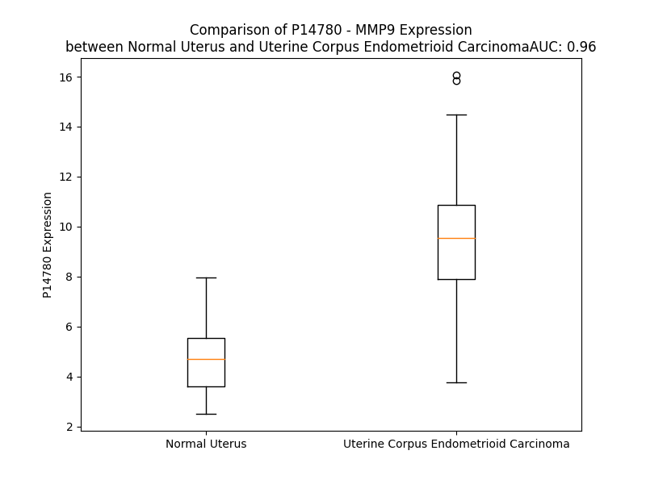

# Detailed Data for P14780

## Introduction to the Detailed Summary

### How to Interpret the Results

- **Summary & Metrics**: This section provides a quick reference to essential protein attributes, including expression changes, family classification, and biomarker applications. Regulation status (upregulated/downregulated) indicates the protein's behavior in a disease context. Some information comes from the original excel file with the proteins selected from literature, while others are derived from the analyses.
- **Expression Comparison**: A visual representation comparing protein expression between normal and disease states. It highlights significant changes in expression levels that might indicate diagnostic or therapeutic relevance. This is data coming from transcriptomics experiments and could not translate similarly to protein levels.
- **Isoform Alignment**: An interactive view of isoform alignments, revealing structural and functional differences between variants of the protein.
- **Interactors & Homologs**: Tables listing known interaction partners and homologous proteins, the more interactors and homologs, the more complex the protein is to design an antibody for.
- **Biological Assemblies**: Information about the structural arrangement of the protein in different assemblies, providing insights into its functional state but also the complexity of the protein to develop antibodies.
- **Combined Per-Residue Information**: A detailed table summarizing residue-level data. This includes predictions for epitope regions, aggregation tendencies, and modifications that might impact the protein's function. Each row corresponds to a residue in the protein, providing insights into specific sites that may be important for research or drug development.
## Summary & Metrics

- **UniProt Accession**: P14780
- **Gene Name**: MMP9
- **Protein Name**: metalloproteinases 9
- **Swiss Prot**: MMP9_HUMAN
- **Family**: peptidase
- **Biomarker Application**: diagnosis,disease progression,efficacy,prognosis,unspecified application
- **Number of Isoforms**: 0
- **Regulation**: 2
- **(transcriptomics) AUC**: 0.96
- **(transcriptomics) Fold Change**: 1.99
- **(transcriptomics) Regulation**: Upregulated
- **Discotope Epitope Count**: 177
- **Max n_uniprots (Homo)**: 2
- **Max n_uniprots (Hetero)**: N/A

## Expression Comparison

## Interactors

| preferredName_A   | preferredName_B   |   score |
|:------------------|:------------------|--------:|
| MMP9              | TIMP1             |   0.999 |
| MMP9              | CD44              |   0.998 |
| MMP9              | TIMP2             |   0.998 |
| MMP9              | LCN2              |   0.998 |
| MMP9              | THBS1             |   0.997 |
| MMP9              | TIMP3             |   0.995 |
| MMP9              | CTSG              |   0.992 |
| MMP9              | DMP1              |   0.982 |
| MMP9              | ELN               |   0.979 |
| MMP9              | MMP1              |   0.974 |
| MMP9              | ELANE             |   0.973 |
| MMP9              | SRC               |   0.97  |
| MMP9              | MPO               |   0.969 |
| MMP9              | TGFB1             |   0.968 |
| MMP9              | SDC1              |   0.968 |
| MMP9              | THBS2             |   0.968 |
| MMP9              | EDN1              |   0.963 |
| MMP9              | CYBB              |   0.963 |
| MMP9              | IL6               |   0.959 |
| MMP9              | CDH1              |   0.957 |
| MMP9              | MMP3              |   0.956 |
| MMP9              | HBEGF             |   0.95  |
| MMP9              | NCF1              |   0.95  |
| MMP9              | IL1B              |   0.949 |
| MMP9              | SPP1              |   0.947 |
| MMP9              | NCF2              |   0.941 |
| MMP9              | CYBA              |   0.941 |
| MMP9              | NCF4              |   0.936 |
| MMP9              | TLR4              |   0.934 |
| MMP9              | TNF               |   0.93  |
| MMP9              | IBSP              |   0.928 |
| MMP9              | KITLG             |   0.921 |
| MMP9              | COL18A1           |   0.92  |
| MMP9              | FGF2              |   0.919 |
| MMP9              | MMP2              |   0.918 |
| MMP9              | COL1A2            |   0.904 |

## Homologs

| uniprot_id   | gene_id   |
|:-------------|:----------|
| O60882       | MMP20     |
| P09238       | MMP10     |
| P09237       | MMP7      |
| E5RJA7       | MMP16     |
| P39900       | MMP12     |
| E9PJB3       | MMP8      |
| G5E971       | MMP13     |
| P51511       | MMP15     |
| P50281       | MMP14     |
| Q9NRE1       | MMP26     |
| B4DNP3       | MMP19     |
| A0A087WZS5   | MMP25     |
| Q9ULZ9       | MMP17     |
| B4DMZ6       | MMP23B    |
| Q9Y5R2       | MMP24     |
| P08253       | MMP2      |
| P02790       | HPX       |
| P03956       | MMP1      |
| E9PED7       | MMP11     |
| A0A087X1Y9   | MMP28     |
| Q8N119       | MMP21     |
| P08254       | MMP3      |
| Q9H306       | MMP27     |

## Biological Assemblies

|   Unnamed: 0 |   assembly |   n_uniprots | composition   | crystal_id   |
|-------------:|-----------:|-------------:|:--------------|:-------------|
|            0 |          1 |            1 | Homo          | 5ue3         |
|            1 |          2 |            1 | Homo          | 5ue3         |
|            2 |          3 |            2 | Homo          | 5ue3         |
|            0 |          1 |            1 | Homo          | 4jqg         |
|            1 |          2 |            1 | Homo          | 4jqg         |
|            2 |          3 |            2 | Homo          | 4jqg         |
|            0 |          1 |            1 | Homo          | 4jij         |
|            1 |          2 |            1 | Homo          | 4jij         |
|            0 |          1 |            1 | Homo          | 4h2e         |
|            1 |          2 |            1 | Homo          | 4h2e         |
|            0 |          1 |            1 | Homo          | 8k5x         |
|            1 |          2 |            1 | Homo          | 8k5x         |
|            0 |          1 |            1 | Homo          | 1gkc         |
|            1 |          2 |            1 | Homo          | 1gkc         |
|            0 |          1 |            1 | Homo          | 6esm         |
|            0 |          1 |            2 | Homo          | 1itv         |
|            0 |          1 |            1 | Homo          | 1l6j         |
|            0 |          1 |            1 | Homo          | 2ow1         |
|            1 |          2 |            1 | Homo          | 2ow1         |
|            2 |          3 |            2 | Homo          | 2ow1         |
|            0 |          1 |            1 | Homo          | 4wzv         |
|            1 |          2 |            1 | Homo          | 4wzv         |
|            0 |          1 |            2 | Homo          | 4h82         |
|            1 |          2 |            2 | Homo          | 4h82         |
|            0 |          1 |            1 | Homo          | 2ow0         |
|            1 |          2 |            1 | Homo          | 2ow0         |
|            2 |          3 |            2 | Homo          | 2ow0         |
|            3 |          4 |            2 | Homo          | 2ow0         |
|            4 |          5 |            2 | Homo          | 2ow0         |
|            0 |          1 |            1 | Homo          | 2ow2         |
|            1 |          2 |            1 | Homo          | 2ow2         |
|            2 |          3 |            2 | Homo          | 2ow2         |
|            0 |          1 |            1 | Homo          | 2ovx         |
|            1 |          2 |            1 | Homo          | 2ovx         |
|            2 |          3 |            2 | Homo          | 2ovx         |
|            0 |          1 |            2 | Homo          | 4hma         |
|            0 |          1 |            1 | Homo          | 4h3x         |
|            1 |          2 |            1 | Homo          | 4h3x         |
|            0 |          1 |            1 | Homo          | 8k5w         |
|            1 |          2 |            1 | Homo          | 8k5w         |
|            0 |          1 |            1 | Homo          | 5ue4         |
|            1 |          2 |            1 | Homo          | 5ue4         |
|            2 |          3 |            2 | Homo          | 5ue4         |
|            0 |          1 |            1 | Homo          | 4h1q         |
|            1 |          2 |            1 | Homo          | 4h1q         |
|            0 |          1 |            1 | Homo          | 2ovz         |
|            1 |          2 |            1 | Homo          | 2ovz         |
|            2 |          3 |            2 | Homo          | 2ovz         |
|            0 |          1 |            1 | Homo          | 5cuh         |
|            1 |          2 |            1 | Homo          | 5cuh         |
|            0 |          1 |            1 | Homo          | 5i12         |
|            0 |          1 |            1 | Homo          | 8k5y         |
|            1 |          2 |            1 | Homo          | 8k5y         |
|            0 |          1 |            1 | Homo          | 5th9         |
|            1 |          2 |            1 | Homo          | 5th9         |
|            2 |          3 |            1 | Homo          | 5th9         |
|            0 |          1 |            1 | Homo          | 5th6         |
|            1 |          2 |            1 | Homo          | 5th6         |
|            2 |          3 |            1 | Homo          | 5th6         |
|            3 |          4 |            1 | Homo          | 5th6         |
|            0 |          1 |            2 | Homo          | 1gkd         |
|            0 |          1 |            1 | Homo          | 4xct         |
|            0 |          1 |            1 | Homo          | 8k5v         |
|            1 |          2 |            1 | Homo          | 8k5v         |

## Combined Per-Residue Information

|   res | aa   |   epitope_score | epitope   |   relative_surface_accessibility |   modeling_confidence |   Aggregation | modification   | glycosylation                   |
|------:|:-----|----------------:|:----------|---------------------------------:|----------------------:|--------------:|:---------------|:--------------------------------|
|     1 | M    |         0.07347 | False     |                          1.36485 |                 42.79 |         0     | N/A            | N/A                             |
|     2 | S    |         0.13724 | True      |                          0.83583 |                 48.09 |         0     | N/A            | N/A                             |
|     3 | L    |         0.10689 | False     |                          1.00332 |                 51.74 |         0     | N/A            | N/A                             |
|     4 | W    |         0.18856 | True      |                          0.95433 |                 42.86 |         0     | N/A            | N/A                             |
|     5 | Q    |         0.24798 | True      |                          0.76095 |                 42.63 |         0     | N/A            | N/A                             |
|     6 | P    |         0.16041 | True      |                          0.73039 |                 51.36 |         1.012 | N/A            | N/A                             |
|     7 | L    |         0.22539 | True      |                          0.93536 |                 46.25 |        83.454 | N/A            | N/A                             |
|     8 | V    |         0.10694 | False     |                          0.86956 |                 42.83 |        98.52  | N/A            | N/A                             |
|     9 | L    |         0.17615 | True      |                          0.90096 |                 42.14 |        99.785 | N/A            | N/A                             |
|    10 | V    |         0.09312 | False     |                          0.98938 |                 43.73 |        99.983 | N/A            | N/A                             |
|    11 | L    |         0.13033 | True      |                          0.98538 |                 43.11 |        99.986 | N/A            | N/A                             |
|    12 | L    |         0.14465 | True      |                          1.02464 |                 42.24 |        99.804 | N/A            | N/A                             |
|    13 | V    |         0.11151 | False     |                          0.92638 |                 44.83 |        98.629 | N/A            | N/A                             |
|    14 | L    |         0.15807 | True      |                          1.02105 |                 46.52 |        84.626 | N/A            | N/A                             |
|    15 | G    |         0.0909  | False     |                          0.87626 |                 39.49 |        13.458 | N/A            | N/A                             |
|    16 | C    |         0.07894 | False     |                          0.72086 |                 44.95 |         7.509 | N/A            | N/A                             |
|    17 | C    |         0.08735 | False     |                          0.96272 |                 41.14 |         6.255 | N/A            | N/A                             |
|    18 | F    |         0.14166 | True      |                          0.99646 |                 44.81 |         5.991 | N/A            | N/A                             |
|    19 | A    |         0.10313 | False     |                          0.92573 |                 43.81 |         2.752 | N/A            | N/A                             |
|    20 | A    |         0.10067 | False     |                          0.78267 |                 45.69 |         0.013 | N/A            | N/A                             |
|    21 | P    |         0.10097 | False     |                          0.94956 |                 38.68 |         0.007 | N/A            | N/A                             |
|    22 | R    |         0.11687 | False     |                          0.93024 |                 34.03 |         0     | N/A            | N/A                             |
|    23 | Q    |         0.09794 | False     |                          0.87988 |                 35.01 |         0     | N/A            | N/A                             |
|    24 | R    |         0.13686 | True      |                          0.91246 |                 39.69 |         0     | N/A            | N/A                             |
|    25 | Q    |         0.13099 | True      |                          0.86652 |                 39.33 |         0     | N/A            | N/A                             |
|    26 | S    |         0.11525 | False     |                          0.78754 |                 51.45 |         0.834 | N/A            | N/A                             |
|    27 | T    |         0.09665 | False     |                          0.58723 |                 61.27 |         2.178 | N/A            | N/A                             |
|    28 | L    |         0.0761  | False     |                          0.8205  |                 69.09 |         2.662 | N/A            | N/A                             |
|    29 | V    |         0.15088 | True      |                          0.26239 |                 74.33 |         2.662 | N/A            | N/A                             |
|    30 | L    |         0.16337 | True      |                          0.73428 |                 72.9  |         2.662 | N/A            | N/A                             |
|    31 | F    |         0.03875 | False     |                          0.02432 |                 79.06 |         2.094 | N/A            | N/A                             |
|    32 | P    |         0.14441 | True      |                          0.3955  |                 73.78 |         1.037 | N/A            | N/A                             |
|    33 | G    |         0.16778 | True      |                          0.66419 |                 64.6  |         0     | N/A            | N/A                             |
|    34 | D    |         0.08862 | False     |                          0.14675 |                 65.83 |         0     | N/A            | N/A                             |
|    35 | L    |         0.23518 | True      |                          0.94764 |                 53.01 |         0     | N/A            | N/A                             |
|    36 | R    |         0.10597 | False     |                          0.39827 |                 55.46 |         0     | N/A            | N/A                             |
|    37 | T    |         0.1576  | True      |                          0.52512 |                 55.25 |         0     | N/A            | N/A                             |
|    38 | N    |         0.14114 | True      |                          0.59561 |                 61.01 |         0     | N/A            | N-linked (GlcNAc...) asparagine |
|    39 | L    |         0.16528 | True      |                          0.3481  |                 69.88 |         0     | N/A            | N/A                             |
|    40 | T    |         0.14581 | True      |                          0.56706 |                 83.3  |         0     | N/A            | N/A                             |
|    41 | D    |         0.05545 | False     |                          0.37787 |                 87.99 |         0     | N/A            | N/A                             |
|    42 | R    |         0.10056 | False     |                          0.42283 |                 87.34 |         0     | N/A            | N/A                             |
|    43 | Q    |         0.10949 | False     |                          0.43381 |                 84.35 |         0     | N/A            | N/A                             |
|    44 | L    |         0.02359 | False     |                          0.16982 |                 85.88 |         0     | N/A            | N/A                             |
|    45 | A    |         0.00329 | False     |                          0       |                 90.13 |         0     | N/A            | N/A                             |
|    46 | E    |         0.03185 | False     |                          0.1802  |                 85.43 |         0     | N/A            | N/A                             |
|    47 | E    |         0.07435 | False     |                          0.35955 |                 79.7  |         0     | N/A            | N/A                             |
|    48 | Y    |         0.02539 | False     |                          0.0605  |                 88.17 |         0     | N/A            | N/A                             |
|    49 | L    |         0.00222 | False     |                          0       |                 88.87 |         0     | N/A            | N/A                             |
|    50 | Y    |         0.03355 | False     |                          0.32813 |                 81.42 |         0     | N/A            | N/A                             |
|    51 | R    |         0.05888 | False     |                          0.28289 |                 80.98 |         0     | N/A            | N/A                             |
|    52 | Y    |         0.0173  | False     |                          0.03487 |                 87.49 |         0     | N/A            | N/A                             |
|    53 | G    |         0.04023 | False     |                          0.39678 |                 82.15 |         0     | N/A            | N/A                             |
|    54 | Y    |         0.03076 | False     |                          0.05706 |                 85.84 |         0     | N/A            | N/A                             |
|    55 | T    |         0.06379 | False     |                          0.12708 |                 76.13 |         0     | N/A            | N/A                             |
|    56 | R    |         0.12111 | False     |                          0.74715 |                 68.14 |         0     | N/A            | N/A                             |
|    57 | V    |         0.03066 | False     |                          0.15524 |                 57.97 |         0     | N/A            | N/A                             |
|    58 | A    |         0.02844 | False     |                          0.38163 |                 49.93 |         0     | N/A            | N/A                             |
|    59 | E    |         0.0602  | False     |                          0.37919 |                 56.52 |         0     | N/A            | N/A                             |
|    60 | M    |         0.10855 | False     |                          0.27124 |                 51.57 |         0     | N/A            | N/A                             |
|    61 | R    |         0.13561 | True      |                          0.6118  |                 52.61 |         0     | N/A            | N/A                             |
|    62 | G    |         0.06345 | False     |                          0.23628 |                 51.68 |         0     | N/A            | N/A                             |
|    63 | E    |         0.13606 | True      |                          0.92843 |                 52.03 |         0     | N/A            | N/A                             |
|    64 | S    |         0.16538 | True      |                          0.88907 |                 54.25 |         0     | N/A            | N/A                             |
|    65 | K    |         0.21332 | True      |                          0.59482 |                 63.15 |         0     | N/A            | N/A                             |
|    66 | S    |         0.20575 | True      |                          0.69663 |                 76.11 |         0     | N/A            | N/A                             |
|    67 | L    |         0.05729 | False     |                          0.16033 |                 85.53 |         0     | N/A            | N/A                             |
|    68 | G    |         0.0831  | False     |                          0.14119 |                 88.56 |         0     | N/A            | N/A                             |
|    69 | P    |         0.12851 | True      |                          0.67456 |                 89.78 |         0.168 | N/A            | N/A                             |
|    70 | A    |         0.02555 | False     |                          0.07016 |                 89.96 |        14.501 | N/A            | N/A                             |
|    71 | L    |         0.01121 | False     |                          0.03297 |                 93.68 |        15.14  | N/A            | N/A                             |
|    72 | L    |         0.07641 | False     |                          0.44581 |                 94.31 |        15.14  | N/A            | N/A                             |
|    73 | L    |         0.05424 | False     |                          0.53762 |                 92.34 |        15.14  | N/A            | N/A                             |
|    74 | L    |         0.00318 | False     |                          0       |                 94.36 |        15.14  | N/A            | N/A                             |
|    75 | Q    |         0.01045 | False     |                          0       |                 96.7  |         1.18  | N/A            | N/A                             |
|    76 | K    |         0.11321 | False     |                          0.64737 |                 94.73 |         0     | N/A            | N/A                             |
|    77 | Q    |         0.04542 | False     |                          0.14934 |                 93.55 |         0     | N/A            | N/A                             |
|    78 | L    |         0.00869 | False     |                          0.01384 |                 94.92 |         0     | N/A            | N/A                             |
|    79 | S    |         0.08062 | False     |                          0.50629 |                 94.53 |         0     | N/A            | N/A                             |
|    80 | L    |         0.07846 | False     |                          0.23474 |                 95.02 |         0     | N/A            | N/A                             |
|    81 | P    |         0.11053 | False     |                          0.64328 |                 95.45 |         0     | N/A            | N/A                             |
|    82 | E    |         0.24534 | True      |                          0.54138 |                 95.83 |         0     | N/A            | N/A                             |
|    83 | T    |         0.10023 | False     |                          0.50229 |                 96.08 |         0     | N/A            | N/A                             |
|    84 | G    |         0.07102 | False     |                          0.10399 |                 92.91 |         0     | N/A            | N/A                             |
|    85 | E    |         0.12802 | True      |                          0.60579 |                 93.81 |         0     | N/A            | N/A                             |
|    86 | L    |         0.07287 | False     |                          0.28312 |                 91.98 |         0     | N/A            | N/A                             |
|    87 | D    |         0.12267 | False     |                          0.25338 |                 94.25 |         0     | N/A            | N/A                             |
|    88 | S    |         0.12143 | False     |                          0.73502 |                 93.61 |         0     | N/A            | N/A                             |
|    89 | A    |         0.05438 | False     |                          0.4065  |                 94.76 |         0     | N/A            | N/A                             |
|    90 | T    |         0.00991 | False     |                          0.00362 |                 95.55 |         0     | N/A            | N/A                             |
|    91 | L    |         0.03279 | False     |                          0.17229 |                 92.87 |         0     | N/A            | N/A                             |
|    92 | K    |         0.05448 | False     |                          0.75885 |                 91.46 |         0     | N/A            | N/A                             |
|    93 | A    |         0.01708 | False     |                          0.07198 |                 93.17 |         0     | N/A            | N/A                             |
|    94 | M    |         0.02653 | False     |                          0.05209 |                 91.79 |         0     | N/A            | N/A                             |
|    95 | R    |         0.09044 | False     |                          0.54653 |                 89.01 |         0     | N/A            | N/A                             |
|    96 | T    |         0.03997 | False     |                          0.27166 |                 91.38 |         0     | N/A            | N/A                             |
|    97 | P    |         0.03417 | False     |                          0.18689 |                 93.91 |         0     | N/A            | N/A                             |
|    98 | R    |         0.02344 | False     |                          0.01036 |                 95.87 |         0     | N/A            | N/A                             |
|    99 | C    |         0.01604 | False     |                          0.04941 |                 95.99 |         0     | N/A            | N/A                             |
|   100 | G    |         0.0139  | False     |                          0.14157 |                 92.64 |         0     | N/A            | N/A                             |
|   101 | V    |         0.01932 | False     |                          0.07521 |                 91.54 |         0     | N/A            | N/A                             |
|   102 | P    |         0.02145 | False     |                          0.33479 |                 88    |         0     | N/A            | N/A                             |
|   103 | D    |         0.03586 | False     |                          0.09871 |                 88.67 |         0     | N/A            | N/A                             |
|   104 | L    |         0.0889  | False     |                          0.34619 |                 76.02 |         0     | N/A            | N/A                             |
|   105 | G    |         0.12863 | True      |                          0.54395 |                 59.52 |         0     | N/A            | N/A                             |
|   106 | R    |         0.09664 | False     |                          0.63833 |                 53.79 |         0     | N/A            | N/A                             |
|   107 | F    |         0.04121 | False     |                          0.06171 |                 51.55 |         0     | N/A            | N/A                             |
|   108 | Q    |         0.08194 | False     |                          0.50598 |                 47.93 |         0     | N/A            | N/A                             |
|   109 | T    |         0.07464 | False     |                          0.07769 |                 52.25 |         0     | N/A            | N/A                             |
|   110 | F    |         0.04281 | False     |                          0.07039 |                 55.1  |         0     | N/A            | N/A                             |
|   111 | E    |         0.11367 | False     |                          0.49817 |                 49.67 |         0     | N/A            | N/A                             |
|   112 | G    |         0.06891 | False     |                          0.7645  |                 59.93 |         0     | N/A            | N/A                             |
|   113 | D    |         0.13277 | True      |                          0.69156 |                 66.62 |         0     | N/A            | N/A                             |
|   114 | L    |         0.04322 | False     |                          0.26723 |                 82.29 |         0     | N/A            | N/A                             |
|   115 | K    |         0.09376 | False     |                          0.30696 |                 90.16 |         0     | N/A            | N/A                             |
|   116 | W    |         0.06591 | False     |                          0.10501 |                 94.48 |         0     | N/A            | N/A                             |
|   117 | H    |         0.15742 | True      |                          0.85661 |                 92.58 |         0     | N/A            | N/A                             |
|   118 | H    |         0.12184 | False     |                          0.40171 |                 94.1  |         0     | N/A            | N/A                             |
|   119 | H    |         0.13527 | True      |                          0.52481 |                 94.68 |         0     | N/A            | N/A                             |
|   120 | N    |         0.09206 | False     |                          0.4533  |                 96.88 |         2.054 | N/A            | N-linked (GlcNAc...) asparagine |
|   121 | I    |         0.00199 | False     |                          0       |                 97.73 |        56.658 | N/A            | N/A                             |
|   122 | T    |         0.03449 | False     |                          0.21061 |                 97.39 |        56.865 | N/A            | N/A                             |
|   123 | Y    |         0.05033 | False     |                          0.06455 |                 97.17 |        56.865 | N/A            | N/A                             |
|   124 | W    |         0.03995 | False     |                          0.18562 |                 91.89 |        56.865 | N/A            | N/A                             |
|   125 | I    |         0.02387 | False     |                          0.04904 |                 87.63 |        56.698 | N/A            | N/A                             |
|   126 | Q    |         0.05271 | False     |                          0.36001 |                 83.41 |         2.734 | N/A            | N/A                             |
|   127 | N    |         0.07683 | False     |                          0.33996 |                 79.11 |         0.372 | N/A            | N-linked (GlcNAc...) asparagine |
|   128 | Y    |         0.07124 | False     |                          0.14763 |                 80.38 |         0.291 | N/A            | N/A                             |
|   129 | S    |         0.04259 | False     |                          0.02723 |                 81.09 |         0     | N/A            | N/A                             |
|   130 | E    |         0.08887 | False     |                          0.41496 |                 72.96 |         0     | N/A            | N/A                             |
|   131 | D    |         0.05785 | False     |                          0.14088 |                 78.3  |         0     | N/A            | N/A                             |
|   132 | L    |         0.02173 | False     |                          0.03879 |                 78.11 |         0     | N/A            | N/A                             |
|   133 | P    |         0.09264 | False     |                          0.35987 |                 73.75 |         0     | N/A            | N/A                             |
|   134 | R    |         0.09076 | False     |                          0.46419 |                 76.55 |         0     | N/A            | N/A                             |
|   135 | A    |         0.07631 | False     |                          0.71142 |                 74.38 |         0     | N/A            | N/A                             |
|   136 | V    |         0.0347  | False     |                          0.23992 |                 84.12 |         0     | N/A            | N/A                             |
|   137 | I    |         0.0057  | False     |                          0       |                 87.04 |         0     | N/A            | N/A                             |
|   138 | D    |         0.04207 | False     |                          0.21743 |                 86.22 |         0     | N/A            | N/A                             |
|   139 | D    |         0.06969 | False     |                          0.36896 |                 88.4  |         0     | N/A            | N/A                             |
|   140 | A    |         0.00219 | False     |                          0       |                 94.48 |         0     | N/A            | N/A                             |
|   141 | F    |         0.00144 | False     |                          0       |                 95.88 |         0     | N/A            | N/A                             |
|   142 | A    |         0.02609 | False     |                          0.44367 |                 94.13 |         0     | N/A            | N/A                             |
|   143 | R    |         0.10609 | False     |                          0.39679 |                 95.32 |         0     | N/A            | N/A                             |
|   144 | A    |         0.00144 | False     |                          0       |                 97.75 |         7.847 | N/A            | N/A                             |
|   145 | F    |         0.01292 | False     |                          0.01716 |                 97.79 |        13.361 | N/A            | N/A                             |
|   146 | A    |         0.02046 | False     |                          0.48538 |                 95.88 |        14.406 | N/A            | N/A                             |
|   147 | L    |         0.04406 | False     |                          0.19268 |                 95.94 |        15.659 | N/A            | N/A                             |
|   148 | W    |         0.0052  | False     |                          0       |                 97.85 |        15.659 | N/A            | N/A                             |
|   149 | S    |         0.04663 | False     |                          0.13926 |                 96.43 |        12.473 | N/A            | N/A                             |
|   150 | A    |         0.06961 | False     |                          0.54065 |                 95.68 |        11.611 | N/A            | N/A                             |
|   151 | V    |         0.03983 | False     |                          0.16376 |                 96.15 |        10.881 | N/A            | N/A                             |
|   152 | T    |         0.01917 | False     |                          0.00493 |                 96.82 |         0     | N/A            | N/A                             |
|   153 | P    |         0.06769 | False     |                          0.22536 |                 96.8  |         0     | N/A            | N/A                             |
|   154 | L    |         0.0134  | False     |                          0.01584 |                 97.44 |         0     | N/A            | N/A                             |
|   155 | T    |         0.05111 | False     |                          0.52892 |                 97.66 |         0     | N/A            | N/A                             |
|   156 | F    |         0.03132 | False     |                          0.18863 |                 97.7  |         0     | N/A            | N/A                             |
|   157 | T    |         0.09389 | False     |                          0.4129  |                 96.76 |         0     | N/A            | N/A                             |
|   158 | R    |         0.05085 | False     |                          0.29319 |                 92.28 |         0     | N/A            | N/A                             |
|   159 | V    |         0.06593 | False     |                          0.27991 |                 91.15 |         0     | N/A            | N/A                             |
|   160 | Y    |         0.11408 | False     |                          0.77446 |                 83.04 |         0     | N/A            | N/A                             |
|   161 | S    |         0.11935 | False     |                          0.35055 |                 78.87 |         0     | N/A            | N/A                             |
|   162 | R    |         0.16505 | True      |                          0.72948 |                 74.84 |         0     | N/A            | N/A                             |
|   163 | D    |         0.131   | True      |                          0.82379 |                 83.37 |         0     | N/A            | N/A                             |
|   164 | A    |         0.0276  | False     |                          0.09719 |                 90.64 |         0     | N/A            | N/A                             |
|   165 | D    |         0.02985 | False     |                          0.1685  |                 95.84 |         0     | N/A            | N/A                             |
|   166 | I    |         0.00321 | False     |                          0       |                 96.71 |        21.129 | N/A            | N/A                             |
|   167 | V    |         0.01966 | False     |                          0.08854 |                 92.17 |        21.897 | N/A            | N/A                             |
|   168 | I    |         0.00268 | False     |                          0       |                 94.31 |        21.897 | N/A            | N/A                             |
|   169 | Q    |         0.04463 | False     |                          0.19566 |                 89.67 |        21.897 | N/A            | N/A                             |
|   170 | F    |         0.01257 | False     |                          0.01877 |                 87.27 |        21.897 | N/A            | N/A                             |
|   171 | G    |         0.04695 | False     |                          0.09795 |                 78.81 |        10.125 | N/A            | N/A                             |
|   172 | V    |         0.13068 | True      |                          0.5421  |                 72.71 |         9.068 | N/A            | N/A                             |
|   173 | A    |         0.1203  | False     |                          0.46935 |                 75.99 |         4.099 | N/A            | N/A                             |
|   174 | E    |         0.10393 | False     |                          0.45604 |                 79.99 |         0     | N/A            | N/A                             |
|   175 | H    |         0.05589 | False     |                          0.13988 |                 74.24 |         0     | N/A            | N/A                             |
|   176 | G    |         0.12403 | False     |                          0.63771 |                 68.11 |         0     | N/A            | N/A                             |
|   177 | D    |         0.01916 | False     |                          0.00332 |                 76.26 |         0     | N/A            | N/A                             |
|   178 | G    |         0.0615  | False     |                          0.32179 |                 71.35 |         0     | N/A            | N/A                             |
|   179 | Y    |         0.04133 | False     |                          0.29596 |                 77.72 |         0     | N/A            | N/A                             |
|   180 | P    |         0.07686 | False     |                          0.49864 |                 77.87 |         0     | N/A            | N/A                             |
|   181 | F    |         0.02815 | False     |                          0.04768 |                 84.95 |         0     | N/A            | N/A                             |
|   182 | D    |         0.09296 | False     |                          0.1904  |                 81.85 |         0     | N/A            | N/A                             |
|   183 | G    |         0.0711  | False     |                          0.21088 |                 79.19 |         0     | N/A            | N/A                             |
|   184 | K    |         0.02429 | False     |                          0.11211 |                 81.69 |         0     | N/A            | N/A                             |
|   185 | D    |         0.05958 | False     |                          0.09133 |                 85.4  |         0     | N/A            | N/A                             |
|   186 | G    |         0.03755 | False     |                          0.22689 |                 88.72 |         0     | N/A            | N/A                             |
|   187 | L    |         0.02504 | False     |                          0.04193 |                 91.56 |         0     | N/A            | N/A                             |
|   188 | L    |         0.01176 | False     |                          0.01649 |                 96.09 |         0     | N/A            | N/A                             |
|   189 | A    |         0.00298 | False     |                          0       |                 97.46 |         0     | N/A            | N/A                             |
|   190 | H    |         0.01274 | False     |                          0.0514  |                 95.24 |         0     | N/A            | N/A                             |
|   191 | A    |         0.00387 | False     |                          0.02923 |                 94.77 |         0     | N/A            | N/A                             |
|   192 | F    |         0.00735 | False     |                          0.05542 |                 91.1  |         0     | N/A            | N/A                             |
|   193 | P    |         0.00413 | False     |                          0       |                 91.03 |         0     | N/A            | N/A                             |
|   194 | P    |         0.00993 | False     |                          0.04112 |                 92.66 |         0     | N/A            | N/A                             |
|   195 | G    |         0.02533 | False     |                          0.25233 |                 86.72 |         0     | N/A            | N/A                             |
|   196 | P    |         0.0517  | False     |                          0.72678 |                 79.7  |         0     | N/A            | N/A                             |
|   197 | G    |         0.04503 | False     |                          0.68774 |                 81.73 |         0     | N/A            | N/A                             |
|   198 | I    |         0.03183 | False     |                          0.15362 |                 81.51 |         0     | N/A            | N/A                             |
|   199 | Q    |         0.02285 | False     |                          0.03095 |                 86.36 |         0     | N/A            | N/A                             |
|   200 | G    |         0.0016  | False     |                          0       |                 91.58 |         0     | N/A            | N/A                             |
|   201 | D    |         0.03565 | False     |                          0.08191 |                 94.56 |         0     | N/A            | N/A                             |
|   202 | A    |         0.00088 | False     |                          0       |                 97.13 |         0     | N/A            | N/A                             |
|   203 | H    |         0.01    | False     |                          0.04124 |                 96.01 |         0     | N/A            | N/A                             |
|   204 | F    |         0.00215 | False     |                          0       |                 96.61 |         0     | N/A            | N/A                             |
|   205 | D    |         0.00298 | False     |                          0       |                 92.03 |         0     | N/A            | N/A                             |
|   206 | D    |         0.06676 | False     |                          0.34333 |                 86.38 |         0     | N/A            | N/A                             |
|   207 | D    |         0.04496 | False     |                          0.23043 |                 81.57 |         0     | N/A            | N/A                             |
|   208 | E    |         0.0068  | False     |                          0.00515 |                 88.18 |         0     | N/A            | N/A                             |
|   209 | L    |         0.00844 | False     |                          0.00577 |                 87.83 |         0     | N/A            | N/A                             |
|   210 | W    |         0.01489 | False     |                          0.00088 |                 90.11 |         0     | N/A            | N/A                             |
|   211 | S    |         0.00692 | False     |                          0       |                 91.63 |         0     | N/A            | N/A                             |
|   212 | L    |         0.04569 | False     |                          0.39544 |                 89.81 |         0     | N/A            | N/A                             |
|   213 | G    |         0.03453 | False     |                          0.08328 |                 89    |         0     | N/A            | N/A                             |
|   214 | K    |         0.14616 | True      |                          0.63596 |                 85.72 |         0     | N/A            | N/A                             |
|   215 | G    |         0.03362 | False     |                          0.08824 |                 85.42 |         0     | N/A            | N/A                             |
|   216 | V    |         0.01558 | False     |                          0.10567 |                 84.44 |         0     | N/A            | N/A                             |
|   217 | V    |         0.03737 | False     |                          0.25093 |                 82.03 |         0     | N/A            | N/A                             |
|   218 | V    |         0.01397 | False     |                          0.03332 |                 87.12 |         0     | N/A            | N/A                             |
|   219 | P    |         0.07992 | False     |                          0.23832 |                 87.51 |         0     | N/A            | N/A                             |
|   220 | T    |         0.00732 | False     |                          0       |                 91.83 |         0     | N/A            | N/A                             |
|   221 | R    |         0.08285 | False     |                          0.35691 |                 89.05 |         0     | N/A            | N/A                             |
|   222 | F    |         0.25187 | True      |                          0.59401 |                 90.55 |         0     | N/A            | N/A                             |
|   223 | G    |         0.123   | False     |                          0.44463 |                 91.65 |         0     | N/A            | N/A                             |
|   224 | N    |         0.2588  | True      |                          0.45888 |                 95.15 |         0     | N/A            | N/A                             |
|   225 | A    |         0.03157 | False     |                          0.04209 |                 94.35 |         0     | N/A            | N/A                             |
|   226 | D    |         0.16808 | True      |                          0.58146 |                 91.93 |         0     | N/A            | N/A                             |
|   227 | G    |         0.05618 | False     |                          0.6093  |                 87.35 |         0     | N/A            | N/A                             |
|   228 | A    |         0.10033 | False     |                          0.38119 |                 91.46 |         0     | N/A            | N/A                             |
|   229 | A    |         0.06047 | False     |                          0.48262 |                 90    |         0     | N/A            | N/A                             |
|   230 | C    |         0.02228 | False     |                          0.08513 |                 91.74 |         0     | N/A            | N/A                             |
|   231 | H    |         0.11329 | False     |                          0.41986 |                 91.6  |         0     | N/A            | N/A                             |
|   232 | F    |         0.04245 | False     |                          0.23171 |                 86.5  |         0     | N/A            | N/A                             |
|   233 | P    |         0.29544 | True      |                          0.55523 |                 87.98 |         0     | N/A            | N/A                             |
|   234 | F    |         0.01363 | False     |                          0.00275 |                 92.41 |         0     | N/A            | N/A                             |
|   235 | I    |         0.18476 | True      |                          0.40478 |                 93.4  |         0     | N/A            | N/A                             |
|   236 | F    |         0.14499 | True      |                          0.09809 |                 95.23 |         0     | N/A            | N/A                             |
|   237 | E    |         0.16117 | True      |                          0.68128 |                 94.13 |         0     | N/A            | N/A                             |
|   238 | G    |         0.22429 | True      |                          0.79834 |                 90.21 |         0     | N/A            | N/A                             |
|   239 | R    |         0.29454 | True      |                          0.64449 |                 89.14 |         0     | N/A            | N/A                             |
|   240 | S    |         0.18848 | True      |                          0.60651 |                 88.65 |         0     | N/A            | N/A                             |
|   241 | Y    |         0.10687 | False     |                          0.14382 |                 84.66 |         0     | N/A            | N/A                             |
|   242 | S    |         0.08955 | False     |                          0.63235 |                 82.3  |         0     | N/A            | N/A                             |
|   243 | A    |         0.0252  | False     |                          0.27495 |                 85.87 |         0     | N/A            | N/A                             |
|   244 | C    |         0.01662 | False     |                          0.18027 |                 89.66 |         0     | N/A            | N/A                             |
|   245 | T    |         0.09361 | False     |                          0.08932 |                 89.49 |         0     | N/A            | N/A                             |
|   246 | T    |         0.12529 | False     |                          0.42831 |                 90.52 |         0     | N/A            | N/A                             |
|   247 | D    |         0.18876 | True      |                          0.35648 |                 90.21 |         0     | N/A            | N/A                             |
|   248 | G    |         0.36017 | True      |                          0.85093 |                 90.56 |         0     | N/A            | N/A                             |
|   249 | R    |         0.2605  | True      |                          0.34246 |                 91.48 |         0     | N/A            | N/A                             |
|   250 | S    |         0.29858 | True      |                          0.98614 |                 89.84 |         0     | N/A            | N/A                             |
|   251 | D    |         0.1652  | True      |                          0.41197 |                 88.83 |         0     | N/A            | N/A                             |
|   252 | G    |         0.11768 | False     |                          0.37515 |                 84.77 |         0     | N/A            | N/A                             |
|   253 | L    |         0.09487 | False     |                          0.1657  |                 90.07 |         0     | N/A            | N/A                             |
|   254 | P    |         0.01433 | False     |                          0.05567 |                 92.05 |         0     | N/A            | N/A                             |
|   255 | W    |         0.07576 | False     |                          0.04538 |                 94.67 |         0     | N/A            | N/A                             |
|   256 | C    |         0.00166 | False     |                          0       |                 94.99 |         0     | N/A            | N/A                             |
|   257 | S    |         0.00478 | False     |                          0       |                 96.35 |         0     | N/A            | N/A                             |
|   258 | T    |         0.03074 | False     |                          0.16869 |                 95.58 |         0     | N/A            | N/A                             |
|   259 | T    |         0.05591 | False     |                          0.24563 |                 95.28 |         0     | N/A            | N/A                             |
|   260 | A    |         0.08708 | False     |                          0.51572 |                 94.01 |         0     | N/A            | N/A                             |
|   261 | N    |         0.07042 | False     |                          0.25379 |                 95.15 |         0     | N/A            | N/A                             |
|   262 | Y    |         0.15212 | True      |                          0.20907 |                 95.89 |         0     | N/A            | N/A                             |
|   263 | D    |         0.20693 | True      |                          0.46761 |                 93.51 |         0     | N/A            | N/A                             |
|   264 | T    |         0.2586  | True      |                          0.7117  |                 95.09 |         0     | N/A            | N/A                             |
|   265 | D    |         0.16468 | True      |                          0.41872 |                 95.64 |         0     | N/A            | N/A                             |
|   266 | D    |         0.31841 | True      |                          0.4722  |                 94.26 |         0     | N/A            | N/A                             |
|   267 | R    |         0.15003 | True      |                          0.40814 |                 97.19 |         0     | N/A            | N/A                             |
|   268 | F    |         0.24251 | True      |                          0.21338 |                 96.74 |         0     | N/A            | N/A                             |
|   269 | G    |         0.0053  | False     |                          0       |                 96.07 |         0     | N/A            | N/A                             |
|   270 | F    |         0.06028 | False     |                          0.13058 |                 94.85 |         0     | N/A            | N/A                             |
|   271 | C    |         0.023   | False     |                          0.01903 |                 92.25 |         0     | N/A            | N/A                             |
|   272 | P    |         0.01212 | False     |                          0.09094 |                 88.45 |         0     | N/A            | N/A                             |
|   273 | S    |         0.00852 | False     |                          0.00158 |                 89.92 |         0     | N/A            | N/A                             |
|   274 | E    |         0.01974 | False     |                          0.10389 |                 88.84 |         0     | N/A            | N/A                             |
|   275 | R    |         0.18505 | True      |                          0.53087 |                 91.32 |         0     | N/A            | N/A                             |
|   276 | L    |         0.10996 | False     |                          0.21617 |                 91.26 |         0     | N/A            | N/A                             |
|   277 | Y    |         0.074   | False     |                          0.14768 |                 91.42 |         0     | N/A            | N/A                             |
|   278 | T    |         0.01874 | False     |                          0.03448 |                 91.83 |         0     | N/A            | N/A                             |
|   279 | Q    |         0.08282 | False     |                          0.40104 |                 86.18 |         0     | N/A            | N/A                             |
|   280 | D    |         0.2239  | True      |                          0.64221 |                 86.12 |         0     | N/A            | N/A                             |
|   281 | G    |         0.0987  | False     |                          0.44827 |                 88.77 |         0     | N/A            | N/A                             |
|   282 | N    |         0.206   | True      |                          0.46392 |                 94.23 |         0     | N/A            | N/A                             |
|   283 | A    |         0.04041 | False     |                          0.02786 |                 93.34 |         0     | N/A            | N/A                             |
|   284 | D    |         0.19709 | True      |                          0.86731 |                 92.1  |         0     | N/A            | N/A                             |
|   285 | G    |         0.09402 | False     |                          0.35265 |                 90.83 |         0     | N/A            | N/A                             |
|   286 | K    |         0.15083 | True      |                          0.55126 |                 94.92 |         0     | N/A            | N/A                             |
|   287 | P    |         0.07116 | False     |                          0.44496 |                 95.62 |         0     | N/A            | N/A                             |
|   288 | C    |         0.01872 | False     |                          0.10596 |                 96.04 |         0     | N/A            | N/A                             |
|   289 | Q    |         0.12918 | True      |                          0.39622 |                 97.05 |         0     | N/A            | N/A                             |
|   290 | F    |         0.10648 | False     |                          0.24702 |                 94.2  |         0     | N/A            | N/A                             |
|   291 | P    |         0.2998  | True      |                          0.60973 |                 96.13 |         0     | N/A            | N/A                             |
|   292 | F    |         0.0079  | False     |                          0.00069 |                 97.3  |         0.362 | N/A            | N/A                             |
|   293 | I    |         0.15662 | True      |                          0.39438 |                 97.16 |         0.362 | N/A            | N/A                             |
|   294 | F    |         0.09717 | False     |                          0.09491 |                 96.04 |         0.362 | N/A            | N/A                             |
|   295 | Q    |         0.24412 | True      |                          0.69695 |                 94.36 |         0.362 | N/A            | N/A                             |
|   296 | G    |         0.19943 | True      |                          0.79923 |                 91.58 |         0.362 | N/A            | N/A                             |
|   297 | Q    |         0.29491 | True      |                          0.58688 |                 93.3  |         0     | N/A            | N/A                             |
|   298 | S    |         0.20452 | True      |                          0.61006 |                 96    |         0     | N/A            | N/A                             |
|   299 | Y    |         0.12716 | False     |                          0.14586 |                 91.37 |         0     | N/A            | N/A                             |
|   300 | S    |         0.19912 | True      |                          0.70542 |                 92.04 |         0     | N/A            | N/A                             |
|   301 | A    |         0.09839 | False     |                          0.53647 |                 89.18 |         0     | N/A            | N/A                             |
|   302 | C    |         0.01618 | False     |                          0.19    |                 88.24 |         0     | N/A            | N/A                             |
|   303 | T    |         0.1464  | True      |                          0.10894 |                 84.47 |         0     | N/A            | N/A                             |
|   304 | T    |         0.22651 | True      |                          0.41707 |                 78.86 |         0     | N/A            | N/A                             |
|   305 | D    |         0.26327 | True      |                          0.40674 |                 85.68 |         0     | N/A            | N/A                             |
|   306 | G    |         0.42684 | True      |                          0.83638 |                 81.11 |         0     | N/A            | N/A                             |
|   307 | R    |         0.20771 | True      |                          0.35902 |                 74.83 |         0     | N/A            | N/A                             |
|   308 | S    |         0.31856 | True      |                          0.97201 |                 53.64 |         0     | N/A            | N/A                             |
|   309 | D    |         0.12556 | False     |                          0.46579 |                 52.17 |         0     | N/A            | N/A                             |
|   310 | G    |         0.14279 | True      |                          0.61499 |                 52.01 |         0     | N/A            | N/A                             |
|   311 | Y    |         0.13003 | True      |                          0.29807 |                 64.19 |         0     | N/A            | N/A                             |
|   312 | R    |         0.07297 | False     |                          0.26836 |                 78.87 |         0     | N/A            | N/A                             |
|   313 | W    |         0.08792 | False     |                          0.03968 |                 91.08 |         0     | N/A            | N/A                             |
|   314 | C    |         0.00361 | False     |                          0       |                 96.21 |         0     | N/A            | N/A                             |
|   315 | A    |         0.00527 | False     |                          0       |                 97.13 |         0     | N/A            | N/A                             |
|   316 | T    |         0.04528 | False     |                          0.12105 |                 97.02 |         0     | N/A            | N/A                             |
|   317 | T    |         0.08566 | False     |                          0.19517 |                 97.1  |         0     | N/A            | N/A                             |
|   318 | A    |         0.12229 | False     |                          0.5376  |                 97.02 |         0     | N/A            | N/A                             |
|   319 | N    |         0.09304 | False     |                          0.22296 |                 96.85 |         0     | N/A            | N/A                             |
|   320 | Y    |         0.14935 | True      |                          0.18966 |                 96.28 |         0     | N/A            | N/A                             |
|   321 | D    |         0.13841 | True      |                          0.31918 |                 93.91 |         0     | N/A            | N/A                             |
|   322 | R    |         0.2856  | True      |                          0.69056 |                 96    |         0     | N/A            | N/A                             |
|   323 | D    |         0.12508 | False     |                          0.29197 |                 96.28 |         0     | N/A            | N/A                             |
|   324 | K    |         0.30451 | True      |                          0.50556 |                 95.52 |         0     | N/A            | N/A                             |
|   325 | L    |         0.11727 | False     |                          0.3553  |                 97.02 |         0     | N/A            | N/A                             |
|   326 | F    |         0.18807 | True      |                          0.21402 |                 96.01 |         0     | N/A            | N/A                             |
|   327 | G    |         0.00419 | False     |                          0       |                 94.12 |         0     | N/A            | N/A                             |
|   328 | F    |         0.05642 | False     |                          0.16268 |                 89.55 |         0     | N/A            | N/A                             |
|   329 | C    |         0.0214  | False     |                          0.06849 |                 88.04 |         0     | N/A            | N/A                             |
|   330 | P    |         0.01289 | False     |                          0.01794 |                 82.47 |         0     | N/A            | N/A                             |
|   331 | T    |         0.05537 | False     |                          0.20849 |                 71.71 |         0     | N/A            | N/A                             |
|   332 | R    |         0.07219 | False     |                          0.21211 |                 77.19 |         0     | N/A            | N/A                             |
|   333 | A    |         0.02299 | False     |                          0.08457 |                 71.84 |         0     | N/A            | N/A                             |
|   334 | D    |         0.03914 | False     |                          0.05741 |                 75.31 |         0     | N/A            | N/A                             |
|   335 | S    |         0.04793 | False     |                          0.23413 |                 76.15 |         0     | N/A            | N/A                             |
|   336 | T    |         0.05729 | False     |                          0.10135 |                 80.64 |         0     | N/A            | N/A                             |
|   337 | V    |         0.00795 | False     |                          0.00563 |                 82.72 |         0     | N/A            | N/A                             |
|   338 | M    |         0.03921 | False     |                          0.10192 |                 76.59 |         0     | N/A            | N/A                             |
|   339 | G    |         0.09218 | False     |                          0.16557 |                 75.33 |         0     | N/A            | N/A                             |
|   340 | G    |         0.07039 | False     |                          0.33535 |                 77.36 |         0     | N/A            | N/A                             |
|   341 | N    |         0.18063 | True      |                          0.43985 |                 80.37 |         0     | N/A            | N/A                             |
|   342 | S    |         0.03796 | False     |                          0.06739 |                 84.17 |         0     | N/A            | N/A                             |
|   343 | A    |         0.09076 | False     |                          0.56054 |                 72.99 |         0     | N/A            | N/A                             |
|   344 | G    |         0.074   | False     |                          0.42451 |                 70.17 |         0     | N/A            | N/A                             |
|   345 | E    |         0.11469 | False     |                          0.52743 |                 81.02 |         0     | N/A            | N/A                             |
|   346 | L    |         0.05603 | False     |                          0.44391 |                 84.68 |         0     | N/A            | N/A                             |
|   347 | C    |         0.02771 | False     |                          0.1526  |                 88.23 |         0     | N/A            | N/A                             |
|   348 | V    |         0.06524 | False     |                          0.37892 |                 89.9  |         0     | N/A            | N/A                             |
|   349 | F    |         0.05846 | False     |                          0.45395 |                 86.34 |         0     | N/A            | N/A                             |
|   350 | P    |         0.18317 | True      |                          0.51006 |                 90.67 |         0.128 | N/A            | N/A                             |
|   351 | F    |         0.01634 | False     |                          0.0048  |                 93.72 |         7.141 | N/A            | N/A                             |
|   352 | T    |         0.1055  | False     |                          0.26409 |                 95.24 |         7.141 | N/A            | N/A                             |
|   353 | F    |         0.01363 | False     |                          0.00318 |                 94.45 |         7.141 | N/A            | N/A                             |
|   354 | L    |         0.11592 | False     |                          0.56779 |                 91.34 |         7.141 | N/A            | N/A                             |
|   355 | G    |         0.12139 | False     |                          0.81277 |                 90.4  |         7.013 | N/A            | N/A                             |
|   356 | K    |         0.14177 | True      |                          0.49707 |                 93.12 |         0     | N/A            | N/A                             |
|   357 | E    |         0.22282 | True      |                          0.62628 |                 93.73 |         0     | N/A            | N/A                             |
|   358 | Y    |         0.07829 | False     |                          0.07988 |                 88.59 |         0     | N/A            | N/A                             |
|   359 | S    |         0.13576 | True      |                          0.62029 |                 86.83 |         0     | N/A            | N/A                             |
|   360 | T    |         0.10459 | False     |                          0.64557 |                 86.63 |         0     | N/A            | N/A                             |
|   361 | C    |         0.01992 | False     |                          0.2797  |                 90.15 |         0     | N/A            | N/A                             |
|   362 | T    |         0.07016 | False     |                          0.11229 |                 90.6  |         0     | N/A            | N/A                             |
|   363 | S    |         0.12539 | False     |                          0.33972 |                 90.56 |         0     | N/A            | N/A                             |
|   364 | E    |         0.15535 | True      |                          0.33648 |                 91.38 |         0     | N/A            | N/A                             |
|   365 | G    |         0.02482 | False     |                          0.02921 |                 85.35 |         0     | N/A            | N/A                             |
|   366 | R    |         0.08951 | False     |                          0.10731 |                 84.07 |         0     | N/A            | N/A                             |
|   367 | G    |         0.18416 | True      |                          0.83089 |                 74.72 |         0     | N/A            | N/A                             |
|   368 | D    |         0.11766 | False     |                          0.41894 |                 75.21 |         0     | N/A            | N/A                             |
|   369 | G    |         0.12097 | False     |                          0.57009 |                 81.11 |         0     | N/A            | N/A                             |
|   370 | R    |         0.0903  | False     |                          0.326   |                 83.74 |         0     | N/A            | N/A                             |
|   371 | L    |         0.05008 | False     |                          0.5634  |                 89.93 |         0.361 | N/A            | N/A                             |
|   372 | W    |         0.0178  | False     |                          0       |                 91.62 |         0.361 | N/A            | N/A                             |
|   373 | C    |         0.00233 | False     |                          0       |                 92.85 |         0.361 | N/A            | N/A                             |
|   374 | A    |         0.00474 | False     |                          0       |                 93.85 |         0.361 | N/A            | N/A                             |
|   375 | T    |         0.03566 | False     |                          0.12051 |                 91.64 |         0.361 | N/A            | N/A                             |
|   376 | T    |         0.06546 | False     |                          0.18089 |                 92.98 |         0.134 | N/A            | N/A                             |
|   377 | S    |         0.0807  | False     |                          0.5767  |                 93.84 |         0     | N/A            | N/A                             |
|   378 | N    |         0.0828  | False     |                          0.32605 |                 93.91 |         0     | N/A            | N/A                             |
|   379 | F    |         0.04144 | False     |                          0.01847 |                 93.73 |         0     | N/A            | N/A                             |
|   380 | D    |         0.12563 | False     |                          0.29281 |                 89.34 |         0     | N/A            | N/A                             |
|   381 | S    |         0.24361 | True      |                          0.60127 |                 90.55 |         0     | N/A            | N/A                             |
|   382 | D    |         0.17447 | True      |                          0.42196 |                 92.4  |         0     | N/A            | N/A                             |
|   383 | K    |         0.1676  | True      |                          0.42111 |                 90.55 |         0     | N/A            | N/A                             |
|   384 | K    |         0.08773 | False     |                          0.52696 |                 91.48 |         0     | N/A            | N/A                             |
|   385 | W    |         0.02845 | False     |                          0.00332 |                 92.06 |         0     | N/A            | N/A                             |
|   386 | G    |         0.00398 | False     |                          0       |                 87    |         0     | N/A            | N/A                             |
|   387 | F    |         0.0321  | False     |                          0.0806  |                 86.6  |         0     | N/A            | N/A                             |
|   388 | C    |         0.01246 | False     |                          0.05809 |                 87.9  |         0     | N/A            | N/A                             |
|   389 | P    |         0.02026 | False     |                          0.23254 |                 84.2  |         0     | N/A            | N/A                             |
|   390 | D    |         0.0884  | False     |                          0.44469 |                 85.32 |         0     | N/A            | N/A                             |
|   391 | Q    |         0.13559 | True      |                          0.57441 |                 86.66 |         0.02  | N/A            | N/A                             |
|   392 | G    |         0.03983 | False     |                          0.11313 |                 89.89 |         1.134 | N/A            | N/A                             |
|   393 | Y    |         0.02263 | False     |                          0.07124 |                 94.12 |        35.056 | N/A            | N/A                             |
|   394 | S    |         0.01959 | False     |                          0.02372 |                 96.22 |        44.511 | N/A            | N/A                             |
|   395 | L    |         0.00193 | False     |                          0       |                 96.53 |        84.631 | N/A            | N/A                             |
|   396 | F    |         0.04687 | False     |                          0.19335 |                 96.89 |        86.381 | N/A            | N/A                             |
|   397 | L    |         0.02611 | False     |                          0.05902 |                 97.76 |        86.381 | N/A            | N/A                             |
|   398 | V    |         0.00899 | False     |                          0.05903 |                 98.38 |        85.026 | N/A            | N/A                             |
|   399 | A    |         0.00084 | False     |                          0       |                 98.51 |        64.568 | N/A            | N/A                             |
|   400 | A    |         0.00111 | False     |                          0       |                 98.4  |        16.704 | N/A            | N/A                             |
|   401 | H    |         0.00695 | False     |                          0.06806 |                 98.38 |         0.151 | N/A            | N/A                             |
|   402 | E    |         0.00855 | False     |                          0.00309 |                 98.37 |         0     | N/A            | N/A                             |
|   403 | F    |         0.00149 | False     |                          0       |                 98.29 |         0     | N/A            | N/A                             |
|   404 | G    |         0.00142 | False     |                          0       |                 97.55 |         0     | N/A            | N/A                             |
|   405 | H    |         0.0023  | False     |                          0       |                 96.05 |         0     | N/A            | N/A                             |
|   406 | A    |         0.00059 | False     |                          0       |                 96.23 |         0     | N/A            | N/A                             |
|   407 | L    |         0.00109 | False     |                          0       |                 96.39 |         0     | N/A            | N/A                             |
|   408 | G    |         0.03811 | False     |                          0.15109 |                 93.18 |         0     | N/A            | N/A                             |
|   409 | L    |         0.02066 | False     |                          0.08738 |                 93.98 |         0     | N/A            | N/A                             |
|   410 | D    |         0.05622 | False     |                          0.3518  |                 91.6  |         0     | N/A            | N/A                             |
|   411 | H    |         0.04523 | False     |                          0.10992 |                 94.24 |         0     | N/A            | N/A                             |
|   412 | S    |         0.02383 | False     |                          0.09813 |                 94.41 |         0     | N/A            | N/A                             |
|   413 | S    |         0.06885 | False     |                          0.39415 |                 93.77 |         0     | N/A            | N/A                             |
|   414 | V    |         0.05699 | False     |                          0.32846 |                 95.43 |         0     | N/A            | N/A                             |
|   415 | P    |         0.09619 | False     |                          0.39042 |                 93.85 |         0     | N/A            | N/A                             |
|   416 | E    |         0.0922  | False     |                          0.5073  |                 93.44 |         0     | N/A            | N/A                             |
|   417 | A    |         0.02409 | False     |                          0.06518 |                 96.59 |         0     | N/A            | N/A                             |
|   418 | L    |         0.02153 | False     |                          0.13706 |                 97.37 |         0     | N/A            | N/A                             |
|   419 | M    |         0.02086 | False     |                          0.02157 |                 97.05 |         0     | N/A            | N/A                             |
|   420 | Y    |         0.05084 | False     |                          0.11484 |                 96.53 |         0     | N/A            | N/A                             |
|   421 | P    |         0.01274 | False     |                          0.01764 |                 95.52 |         0     | N/A            | N/A                             |
|   422 | M    |         0.09236 | False     |                          0.14008 |                 94.54 |         0     | N/A            | N/A                             |
|   423 | Y    |         0.09282 | False     |                          0.19879 |                 95.32 |         0     | N/A            | N/A                             |
|   424 | R    |         0.17375 | True      |                          0.60387 |                 92.36 |         0     | N/A            | N/A                             |
|   425 | F    |         0.14612 | True      |                          0.37417 |                 92.45 |         0     | N/A            | N/A                             |
|   426 | T    |         0.1607  | True      |                          0.33209 |                 91.64 |         0     | N/A            | N/A                             |
|   427 | E    |         0.31112 | True      |                          0.70022 |                 85.91 |         0     | N/A            | N/A                             |
|   428 | G    |         0.18822 | True      |                          0.43499 |                 85.82 |         0     | N/A            | N/A                             |
|   429 | P    |         0.23133 | True      |                          0.9481  |                 89.66 |         0     | N/A            | N/A                             |
|   430 | P    |         0.08926 | False     |                          0.15115 |                 90.68 |         0     | N/A            | N/A                             |
|   431 | L    |         0.0847  | False     |                          0.20613 |                 95.82 |         0     | N/A            | N/A                             |
|   432 | H    |         0.05185 | False     |                          0.35213 |                 96.63 |         0     | N/A            | N/A                             |
|   433 | K    |         0.12981 | True      |                          0.74541 |                 96.92 |         0     | N/A            | N/A                             |
|   434 | D    |         0.07665 | False     |                          0.33387 |                 97.06 |         0     | N/A            | N/A                             |
|   435 | D    |         0.02812 | False     |                          0.02301 |                 97.98 |         0     | N/A            | N/A                             |
|   436 | V    |         0.06845 | False     |                          0.1847  |                 97.59 |         0     | N/A            | N/A                             |
|   437 | N    |         0.10542 | False     |                          0.52157 |                 96.56 |         0     | N/A            | N/A                             |
|   438 | G    |         0.091   | False     |                          0.31334 |                 95.26 |         0     | N/A            | N/A                             |
|   439 | I    |         0.00556 | False     |                          0       |                 96.45 |         0     | N/A            | N/A                             |
|   440 | R    |         0.12794 | True      |                          0.38871 |                 96.09 |         0     | N/A            | N/A                             |
|   441 | H    |         0.19916 | True      |                          0.86346 |                 94.05 |         0     | N/A            | N/A                             |
|   442 | L    |         0.08645 | False     |                          0.26971 |                 93.32 |         0     | N/A            | N/A                             |
|   443 | Y    |         0.05953 | False     |                          0.0472  |                 95.97 |         0     | N/A            | N/A                             |
|   444 | G    |         0.06743 | False     |                          0.27324 |                 93.79 |         0     | N/A            | N/A                             |
|   445 | P    |         0.13459 | True      |                          0.62342 |                 94.08 |         0     | N/A            | N/A                             |
|   446 | R    |         0.10499 | False     |                          0.55261 |                 88.58 |         0     | N/A            | N/A                             |
|   447 | P    |         0.18324 | True      |                          0.70999 |                 81.23 |         0     | N/A            | N/A                             |
|   448 | E    |         0.14999 | True      |                          0.81482 |                 72.29 |         0     | N/A            | N/A                             |
|   449 | P    |         0.22511 | True      |                          0.86251 |                 64.87 |         0     | N/A            | N/A                             |
|   450 | E    |         0.14762 | True      |                          0.80748 |                 51.16 |         0     | N/A            | N/A                             |
|   451 | P    |         0.23043 | True      |                          0.94144 |                 51.11 |         0     | N/A            | N/A                             |
|   452 | R    |         0.20588 | True      |                          0.89612 |                 51.21 |         0     | N/A            | N/A                             |
|   453 | P    |         0.15438 | True      |                          0.80611 |                 44.54 |         0     | N/A            | N/A                             |
|   454 | P    |         0.1302  | True      |                          0.9503  |                 44.17 |         0     | N/A            | N/A                             |
|   455 | T    |         0.14984 | True      |                          0.83844 |                 41.32 |         0     | N/A            | N/A                             |
|   456 | T    |         0.14623 | True      |                          0.95773 |                 34.21 |         0     | N/A            | N/A                             |
|   457 | T    |         0.14177 | True      |                          0.84253 |                 43.46 |         0     | N/A            | N/A                             |
|   458 | T    |         0.19664 | True      |                          0.88635 |                 42.8  |         0     | N/A            | N/A                             |
|   459 | P    |         0.11385 | False     |                          0.95291 |                 39.36 |         0     | N/A            | N/A                             |
|   460 | Q    |         0.19589 | True      |                          0.87123 |                 41.28 |         0     | N/A            | N/A                             |
|   461 | P    |         0.16677 | True      |                          0.92411 |                 43.83 |         0     | N/A            | N/A                             |
|   462 | T    |         0.17091 | True      |                          0.96449 |                 38.07 |         0     | N/A            | N/A                             |
|   463 | A    |         0.19836 | True      |                          0.86393 |                 39.58 |         0     | N/A            | N/A                             |
|   464 | P    |         0.20527 | True      |                          0.87089 |                 41.34 |         0     | N/A            | N/A                             |
|   465 | P    |         0.0837  | False     |                          0.93412 |                 34.73 |         0     | N/A            | N/A                             |
|   466 | T    |         0.14708 | True      |                          0.9953  |                 35.61 |         0     | N/A            | N/A                             |
|   467 | V    |         0.19263 | True      |                          0.94599 |                 36.65 |         0     | N/A            | N/A                             |
|   468 | C    |         0.149   | True      |                          0.83843 |                 26.75 |         0     | N/A            | N/A                             |
|   469 | P    |         0.15748 | True      |                          0.84125 |                 35.11 |         0     | N/A            | N/A                             |
|   470 | T    |         0.09255 | False     |                          0.97905 |                 30.23 |         0     | N/A            | N/A                             |
|   471 | G    |         0.14825 | True      |                          0.75849 |                 30.05 |         0     | N/A            | N/A                             |
|   472 | P    |         0.09225 | False     |                          1.00975 |                 41.08 |         0     | N/A            | N/A                             |
|   473 | P    |         0.11012 | False     |                          0.84193 |                 37.48 |         0     | N/A            | N/A                             |
|   474 | T    |         0.15079 | True      |                          0.98387 |                 32.94 |         0     | N/A            | N/A                             |
|   475 | V    |         0.12823 | True      |                          0.89633 |                 37.41 |         0     | N/A            | N/A                             |
|   476 | H    |         0.1226  | False     |                          0.95258 |                 36.45 |         0     | N/A            | N/A                             |
|   477 | P    |         0.16477 | True      |                          0.95687 |                 43.3  |         0     | N/A            | N/A                             |
|   478 | S    |         0.15836 | True      |                          0.78561 |                 37.32 |         0     | N/A            | N/A                             |
|   479 | E    |         0.12029 | False     |                          0.8644  |                 36.56 |         0     | N/A            | N/A                             |
|   480 | R    |         0.20981 | True      |                          0.90889 |                 35.32 |         0     | N/A            | N/A                             |
|   481 | P    |         0.08964 | False     |                          0.95859 |                 39.52 |         0     | N/A            | N/A                             |
|   482 | T    |         0.1689  | True      |                          0.94418 |                 43.46 |         0     | N/A            | N/A                             |
|   483 | A    |         0.13801 | True      |                          1.01732 |                 34.46 |         0     | N/A            | N/A                             |
|   484 | G    |         0.1194  | False     |                          0.62685 |                 39.55 |         0     | N/A            | N/A                             |
|   485 | P    |         0.12059 | False     |                          1.04235 |                 40.44 |         0     | N/A            | N/A                             |
|   486 | T    |         0.18029 | True      |                          0.96176 |                 33.68 |         0     | N/A            | N/A                             |
|   487 | G    |         0.2158  | True      |                          0.72574 |                 38.57 |         0     | N/A            | N/A                             |
|   488 | P    |         0.22261 | True      |                          0.87691 |                 38.87 |         0     | N/A            | N/A                             |
|   489 | P    |         0.16155 | True      |                          0.93748 |                 38.13 |         0     | N/A            | N/A                             |
|   490 | S    |         0.21531 | True      |                          0.89516 |                 34.88 |         0     | N/A            | N/A                             |
|   491 | A    |         0.17418 | True      |                          0.92146 |                 35.75 |         0     | N/A            | N/A                             |
|   492 | G    |         0.18816 | True      |                          0.6604  |                 35.26 |         0     | N/A            | N/A                             |
|   493 | P    |         0.1889  | True      |                          1.03765 |                 40.41 |         0     | N/A            | N/A                             |
|   494 | T    |         0.28601 | True      |                          1.02148 |                 33.81 |         0     | N/A            | N/A                             |
|   495 | G    |         0.25516 | True      |                          0.7357  |                 37.76 |         0     | N/A            | N/A                             |
|   496 | P    |         0.27323 | True      |                          0.86807 |                 32.56 |         0     | N/A            | N/A                             |
|   497 | P    |         0.23133 | True      |                          1.02377 |                 32.65 |         0     | N/A            | N/A                             |
|   498 | T    |         0.29782 | True      |                          0.90898 |                 37.66 |         0     | N/A            | N/A                             |
|   499 | A    |         0.20965 | True      |                          0.9721  |                 29.23 |         0     | N/A            | N/A                             |
|   500 | G    |         0.18568 | True      |                          0.75041 |                 33.41 |         0     | N/A            | N/A                             |
|   501 | P    |         0.11345 | False     |                          0.97638 |                 34.94 |         0     | N/A            | N/A                             |
|   502 | S    |         0.13855 | True      |                          0.86497 |                 33.14 |         0     | N/A            | N/A                             |
|   503 | T    |         0.20295 | True      |                          0.92257 |                 31.95 |         0     | N/A            | N/A                             |
|   504 | A    |         0.25391 | True      |                          0.9082  |                 33.62 |         0     | N/A            | N/A                             |
|   505 | T    |         0.26587 | True      |                          0.90806 |                 30.72 |         0     | N/A            | N/A                             |
|   506 | T    |         0.27271 | True      |                          0.84397 |                 34.16 |         0     | N/A            | N/A                             |
|   507 | V    |         0.17903 | True      |                          0.82706 |                 41.13 |         0     | N/A            | N/A                             |
|   508 | P    |         0.18246 | True      |                          0.90626 |                 40.58 |         0     | N/A            | N/A                             |
|   509 | L    |         0.14332 | True      |                          0.5997  |                 51.72 |         0     | N/A            | N/A                             |
|   510 | S    |         0.15115 | True      |                          0.4017  |                 53.81 |         0     | N/A            | N/A                             |
|   511 | P    |         0.08942 | False     |                          0.76886 |                 58.35 |         0     | N/A            | N/A                             |
|   512 | V    |         0.17037 | True      |                          0.89023 |                 59.66 |         0     | N/A            | N/A                             |
|   513 | D    |         0.07872 | False     |                          0.18499 |                 70.35 |         0     | N/A            | N/A                             |
|   514 | D    |         0.05551 | False     |                          0.33642 |                 83.28 |         0     | N/A            | N/A                             |
|   515 | A    |         0.00438 | False     |                          0.01022 |                 86.51 |         0     | N/A            | N/A                             |
|   516 | C    |         0.03095 | False     |                          0.26212 |                 88    |         0     | N/A            | N/A                             |
|   517 | N    |         0.09887 | False     |                          0.58348 |                 86.77 |         0     | N/A            | N/A                             |
|   518 | V    |         0.0508  | False     |                          0.12703 |                 86.79 |         0     | N/A            | N/A                             |
|   519 | N    |         0.16548 | True      |                          0.55847 |                 85.02 |         0     | N/A            | N/A                             |
|   520 | I    |         0.10419 | False     |                          0.40453 |                 91.38 |         0     | N/A            | N/A                             |
|   521 | F    |         0.01434 | False     |                          0.03288 |                 93.9  |         0     | N/A            | N/A                             |
|   522 | D    |         0.03809 | False     |                          0.08285 |                 93.93 |         0     | N/A            | N/A                             |
|   523 | A    |         0.00059 | False     |                          0       |                 96.07 |         0     | N/A            | N/A                             |
|   524 | I    |         0.00998 | False     |                          0.01857 |                 96.73 |         0     | N/A            | N/A                             |
|   525 | A    |         0.00301 | False     |                          0.01403 |                 96.06 |         0     | N/A            | N/A                             |
|   526 | E    |         0.01987 | False     |                          0.14091 |                 94.51 |         0     | N/A            | N/A                             |
|   527 | I    |         0.02399 | False     |                          0.0897  |                 92.99 |         0     | N/A            | N/A                             |
|   528 | G    |         0.06756 | False     |                          0.57671 |                 87.13 |         0     | N/A            | N/A                             |
|   529 | N    |         0.04798 | False     |                          0.80441 |                 84.86 |         0.291 | N/A            | N/A                             |
|   530 | Q    |         0.06206 | False     |                          0.27499 |                 91.06 |         7.754 | N/A            | N/A                             |
|   531 | L    |         0.00272 | False     |                          0.00142 |                 94.04 |         7.754 | N/A            | N/A                             |
|   532 | Y    |         0.04302 | False     |                          0.05278 |                 95.85 |         7.754 | N/A            | N/A                             |
|   533 | L    |         0.00499 | False     |                          0       |                 95.56 |         7.754 | N/A            | N/A                             |
|   534 | F    |         0.00163 | False     |                          0.0048  |                 95.72 |         7.754 | N/A            | N/A                             |
|   535 | K    |         0.04249 | False     |                          0.24619 |                 93.94 |         0     | N/A            | N/A                             |
|   536 | D    |         0.11931 | False     |                          0.55294 |                 89.8  |         0     | N/A            | N/A                             |
|   537 | G    |         0.01573 | False     |                          0.1282  |                 90.93 |         0     | N/A            | N/A                             |
|   538 | K    |         0.06955 | False     |                          0.31792 |                 94.15 |         0     | N/A            | N/A                             |
|   539 | Y    |         0.03736 | False     |                          0.06019 |                 94.77 |         0     | N/A            | N/A                             |
|   540 | W    |         0.05019 | False     |                          0.02922 |                 94.94 |         0     | N/A            | N/A                             |
|   541 | R    |         0.08614 | False     |                          0.27809 |                 93.8  |         0     | N/A            | N/A                             |
|   542 | F    |         0.01317 | False     |                          0.01265 |                 92.04 |         0     | N/A            | N/A                             |
|   543 | S    |         0.05233 | False     |                          0.36626 |                 87.19 |         0     | N/A            | N/A                             |
|   544 | E    |         0.10964 | False     |                          0.45591 |                 78.17 |         0     | N/A            | N/A                             |
|   545 | G    |         0.09633 | False     |                          0.44819 |                 73.05 |         0     | N/A            | N/A                             |
|   546 | R    |         0.23383 | True      |                          1.04031 |                 59.27 |         0     | N/A            | N/A                             |
|   547 | G    |         0.10317 | False     |                          0.92796 |                 65.99 |         0     | N/A            | N/A                             |
|   548 | S    |         0.13241 | True      |                          0.15277 |                 75.84 |         0     | N/A            | N/A                             |
|   549 | R    |         0.12336 | False     |                          0.72251 |                 82.12 |         0     | N/A            | N/A                             |
|   550 | P    |         0.02429 | False     |                          0.16178 |                 86.94 |         0     | N/A            | N/A                             |
|   551 | Q    |         0.09699 | False     |                          0.48699 |                 88.33 |         0     | N/A            | N/A                             |
|   552 | G    |         0.03963 | False     |                          0.21188 |                 85.56 |         0     | N/A            | N/A                             |
|   553 | P    |         0.12546 | False     |                          0.2675  |                 89.43 |         1.282 | N/A            | N/A                             |
|   554 | F    |         0.05029 | False     |                          0.36912 |                 92.19 |         1.282 | N/A            | N/A                             |
|   555 | L    |         0.1126  | False     |                          0.56841 |                 90.98 |         1.282 | N/A            | N/A                             |
|   556 | I    |         0.00952 | False     |                          0.0168  |                 92.38 |         1.282 | N/A            | N/A                             |
|   557 | A    |         0.07186 | False     |                          0.5743  |                 89.01 |         1.282 | N/A            | N/A                             |
|   558 | D    |         0.08121 | False     |                          0.70619 |                 88.42 |         0     | N/A            | N/A                             |
|   559 | K    |         0.13669 | True      |                          0.46213 |                 89.28 |         0     | N/A            | N/A                             |
|   560 | W    |         0.01466 | False     |                          0.02169 |                 92.23 |         0     | N/A            | N/A                             |
|   561 | P    |         0.10848 | False     |                          0.77659 |                 88.04 |         0     | N/A            | N/A                             |
|   562 | A    |         0.03392 | False     |                          0.42238 |                 84.19 |         0     | N/A            | N/A                             |
|   563 | L    |         0.01157 | False     |                          0.10027 |                 92.68 |         0     | N/A            | N/A                             |
|   564 | P    |         0.0804  | False     |                          0.32595 |                 91.45 |         0     | N/A            | N/A                             |
|   565 | R    |         0.13549 | True      |                          0.78308 |                 91.9  |         0     | N/A            | N/A                             |
|   566 | K    |         0.05055 | False     |                          0.59077 |                 93.1  |         0     | N/A            | N/A                             |
|   567 | L    |         0.00585 | False     |                          0.00488 |                 96.07 |         0     | N/A            | N/A                             |
|   568 | D    |         0.02225 | False     |                          0.09828 |                 95.89 |         0     | N/A            | N/A                             |
|   569 | S    |         0.00301 | False     |                          0.00807 |                 96.77 |         0     | N/A            | N/A                             |
|   570 | V    |         0.01129 | False     |                          0.03692 |                 97.19 |         0     | N/A            | N/A                             |
|   571 | F    |         0.02571 | False     |                          0.05412 |                 95.08 |         0     | N/A            | N/A                             |
|   572 | E    |         0.01751 | False     |                          0.14693 |                 93.8  |         0     | N/A            | N/A                             |
|   573 | E    |         0.03194 | False     |                          0.07092 |                 88.64 |         0     | N/A            | N/A                             |
|   574 | R    |         0.0489  | False     |                          0.38131 |                 83.28 |         0     | N/A            | N/A                             |
|   575 | L    |         0.09409 | False     |                          0.81246 |                 78.64 |         0     | N/A            | N/A                             |
|   576 | S    |         0.05483 | False     |                          0.40743 |                 80.89 |         0     | N/A            | N/A                             |
|   577 | K    |         0.05948 | False     |                          0.56273 |                 88.08 |         0     | N/A            | N/A                             |
|   578 | K    |         0.02421 | False     |                          0.20429 |                 88.87 |         0     | N/A            | N/A                             |
|   579 | L    |         0.0189  | False     |                          0.1286  |                 93.98 |         3.91  | N/A            | N/A                             |
|   580 | F    |         0.00231 | False     |                          0       |                 94.63 |         4.063 | N/A            | N/A                             |
|   581 | F    |         0.00062 | False     |                          0       |                 96.45 |         4.063 | N/A            | N/A                             |
|   582 | F    |         0.00113 | False     |                          0       |                 96.25 |         4.063 | N/A            | N/A                             |
|   583 | S    |         0.02536 | False     |                          0.14406 |                 94.92 |         4.063 | N/A            | N/A                             |
|   584 | G    |         0.06256 | False     |                          0.3774  |                 92.18 |         0.454 | N/A            | N/A                             |
|   585 | R    |         0.04239 | False     |                          0.26787 |                 88.86 |         0     | N/A            | N/A                             |
|   586 | Q    |         0.07131 | False     |                          0.20688 |                 88.77 |         3.468 | N/A            | N/A                             |
|   587 | V    |         0.00183 | False     |                          0       |                 91.4  |        50.58  | N/A            | N/A                             |
|   588 | W    |         0.08245 | False     |                          0.0293  |                 91.99 |        55.697 | N/A            | N/A                             |
|   589 | V    |         0.00912 | False     |                          0.02935 |                 90.29 |        56.166 | N/A            | N/A                             |
|   590 | Y    |         0.02608 | False     |                          0.01434 |                 88.96 |        56.166 | N/A            | N/A                             |
|   591 | T    |         0.04389 | False     |                          0.43297 |                 83.73 |        54.529 | N/A            | N/A                             |
|   592 | G    |         0.10143 | False     |                          0.82254 |                 79.7  |        28.631 | N/A            | N/A                             |
|   593 | A    |         0.15342 | True      |                          0.96956 |                 75.48 |        25.778 | N/A            | N/A                             |
|   594 | S    |         0.06096 | False     |                          0.58497 |                 71.77 |        23.365 | N/A            | N/A                             |
|   595 | V    |         0.02492 | False     |                          0.19719 |                 82.48 |        23.13  | N/A            | N/A                             |
|   596 | L    |         0.03937 | False     |                          0.06208 |                 74.04 |        19.549 | N/A            | N/A                             |
|   597 | G    |         0.02535 | False     |                          0.06181 |                 70.94 |         0     | N/A            | N/A                             |
|   598 | P    |         0.09336 | False     |                          0.21459 |                 80.64 |         0     | N/A            | N/A                             |
|   599 | R    |         0.04747 | False     |                          0.04783 |                 80.06 |         0     | N/A            | N/A                             |
|   600 | R    |         0.08288 | False     |                          0.27251 |                 77.29 |         0     | N/A            | N/A                             |
|   601 | L    |         0.00565 | False     |                          0       |                 83.59 |         0     | N/A            | N/A                             |
|   602 | D    |         0.09528 | False     |                          0.30078 |                 77.89 |         0     | N/A            | N/A                             |
|   603 | K    |         0.09233 | False     |                          0.34822 |                 66.37 |         0     | N/A            | N/A                             |
|   604 | L    |         0.00985 | False     |                          0       |                 79.72 |         0     | N/A            | N/A                             |
|   605 | G    |         0.02848 | False     |                          0.32677 |                 73.18 |         0     | N/A            | N/A                             |
|   606 | L    |         0.00872 | False     |                          0.03484 |                 82.77 |         0     | N/A            | N/A                             |
|   607 | G    |         0.07994 | False     |                          0.42345 |                 78.66 |         0     | N/A            | N/A                             |
|   608 | A    |         0.16185 | True      |                          0.72934 |                 78.17 |         0     | N/A            | N/A                             |
|   609 | D    |         0.12192 | False     |                          0.61796 |                 85.42 |         0     | N/A            | N/A                             |
|   610 | V    |         0.02379 | False     |                          0.04936 |                 89.36 |         0.19  | N/A            | N/A                             |
|   611 | A    |         0.07433 | False     |                          0.64836 |                 90.65 |         0.19  | N/A            | N/A                             |
|   612 | Q    |         0.04349 | False     |                          0.36045 |                 93.98 |         0.19  | N/A            | N/A                             |
|   613 | V    |         0.00519 | False     |                          0.00762 |                 95.27 |         0.19  | N/A            | N/A                             |
|   614 | T    |         0.01242 | False     |                          0.03763 |                 95.21 |         0.19  | N/A            | N/A                             |
|   615 | G    |         0.00214 | False     |                          0.00483 |                 94.81 |         0.19  | N/A            | N/A                             |
|   616 | A    |         0.00333 | False     |                          0.03884 |                 95.14 |         0.19  | N/A            | N/A                             |
|   617 | L    |         0.01183 | False     |                          0.03874 |                 94.07 |         0.19  | N/A            | N/A                             |
|   618 | R    |         0.05307 | False     |                          0.36052 |                 90.93 |         0     | N/A            | N/A                             |
|   619 | S    |         0.07808 | False     |                          0.42196 |                 86.15 |         0     | N/A            | N/A                             |
|   620 | G    |         0.03411 | False     |                          0.37421 |                 80.92 |         0     | N/A            | N/A                             |
|   621 | R    |         0.10076 | False     |                          0.89295 |                 77.27 |         0     | N/A            | N/A                             |
|   622 | G    |         0.03228 | False     |                          0.26521 |                 80.23 |         0     | N/A            | N/A                             |
|   623 | K    |         0.10009 | False     |                          0.47364 |                 87.55 |         0     | N/A            | N/A                             |
|   624 | M    |         0.01753 | False     |                          0.05593 |                 92.5  |         0.424 | N/A            | N/A                             |
|   625 | L    |         0.03354 | False     |                          0.05523 |                 94.22 |         0.424 | N/A            | N/A                             |
|   626 | L    |         0.00343 | False     |                          0.00412 |                 95.01 |         0.424 | N/A            | N/A                             |
|   627 | F    |         0.00519 | False     |                          0.00765 |                 95.47 |         0.424 | N/A            | N/A                             |
|   628 | S    |         0.02619 | False     |                          0.15211 |                 93.41 |         0.424 | N/A            | N/A                             |
|   629 | G    |         0.03818 | False     |                          0.3406  |                 87.34 |         0     | N/A            | N/A                             |
|   630 | R    |         0.10552 | False     |                          0.63715 |                 91    |         0     | N/A            | N/A                             |
|   631 | R    |         0.18511 | True      |                          0.49049 |                 92.83 |         0     | N/A            | N/A                             |
|   632 | L    |         0.01529 | False     |                          0.00659 |                 94.06 |         0     | N/A            | N/A                             |
|   633 | W    |         0.05308 | False     |                          0.07514 |                 94.16 |         0     | N/A            | N/A                             |
|   634 | R    |         0.0566  | False     |                          0.49009 |                 92.12 |         0     | N/A            | N/A                             |
|   635 | F    |         0.00475 | False     |                          0.00397 |                 90.4  |         0     | N/A            | N/A                             |
|   636 | D    |         0.02014 | False     |                          0.23845 |                 84.55 |         0     | N/A            | N/A                             |
|   637 | V    |         0.01273 | False     |                          0.076   |                 84.98 |         0     | N/A            | N/A                             |
|   638 | K    |         0.14553 | True      |                          0.9744  |                 74.88 |         0     | N/A            | N/A                             |
|   639 | A    |         0.09071 | False     |                          0.55109 |                 73.79 |         0     | N/A            | N/A                             |
|   640 | Q    |         0.02009 | False     |                          0.06037 |                 80.54 |         0     | N/A            | N/A                             |
|   641 | M    |         0.06378 | False     |                          0.19424 |                 80.17 |         0     | N/A            | N/A                             |
|   642 | V    |         0.03255 | False     |                          0.02105 |                 87.08 |         0     | N/A            | N/A                             |
|   643 | D    |         0.03458 | False     |                          0.25959 |                 82.64 |         0     | N/A            | N/A                             |
|   644 | P    |         0.07265 | False     |                          0.33494 |                 74.8  |         0     | N/A            | N/A                             |
|   645 | R    |         0.1398  | True      |                          0.59706 |                 77.33 |         0     | N/A            | N/A                             |
|   646 | S    |         0.05658 | False     |                          0.18165 |                 84.48 |         0     | N/A            | N/A                             |
|   647 | A    |         0.14756 | True      |                          0.47516 |                 88.35 |         0     | N/A            | N/A                             |
|   648 | S    |         0.04666 | False     |                          0.07393 |                 90.39 |         0     | N/A            | N/A                             |
|   649 | E    |         0.15709 | True      |                          0.60793 |                 91.91 |         0     | N/A            | N/A                             |
|   650 | V    |         0.0062  | False     |                          0.02652 |                 91.9  |         0     | N/A            | N/A                             |
|   651 | D    |         0.06473 | False     |                          0.45101 |                 90.36 |         0     | N/A            | N/A                             |
|   652 | R    |         0.14476 | True      |                          0.74404 |                 88.93 |         0     | N/A            | N/A                             |
|   653 | M    |         0.06608 | False     |                          0.3046  |                 87.88 |         0     | N/A            | N/A                             |
|   654 | F    |         0.01334 | False     |                          0.04851 |                 90.39 |         0     | N/A            | N/A                             |
|   655 | P    |         0.12441 | False     |                          0.53673 |                 88.11 |         0     | N/A            | N/A                             |
|   656 | G    |         0.08512 | False     |                          0.65618 |                 87.95 |         0     | N/A            | N/A                             |
|   657 | V    |         0.03352 | False     |                          0.06363 |                 92.71 |         0     | N/A            | N/A                             |
|   658 | P    |         0.08647 | False     |                          0.1399  |                 88.47 |         0     | N/A            | N/A                             |
|   659 | L    |         0.10083 | False     |                          0.37535 |                 86.37 |         0     | N/A            | N/A                             |
|   660 | D    |         0.09056 | False     |                          0.58648 |                 85.54 |         0     | N/A            | N/A                             |
|   661 | T    |         0.02145 | False     |                          0.06199 |                 89.8  |         0     | N/A            | N/A                             |
|   662 | H    |         0.05348 | False     |                          0.29995 |                 90.09 |         0     | N/A            | N/A                             |
|   663 | D    |         0.00575 | False     |                          0.00885 |                 93.69 |         0     | N/A            | N/A                             |
|   664 | V    |         0.00696 | False     |                          0.01908 |                 96.15 |         0     | N/A            | N/A                             |
|   665 | F    |         0.01437 | False     |                          0.01922 |                 95.26 |         0     | N/A            | N/A                             |
|   666 | Q    |         0.01892 | False     |                          0.17052 |                 92.85 |         0     | N/A            | N/A                             |
|   667 | Y    |         0.03151 | False     |                          0.08507 |                 91.64 |         0     | N/A            | N/A                             |
|   668 | R    |         0.09562 | False     |                          0.4945  |                 87.61 |         0     | N/A            | N/A                             |
|   669 | E    |         0.07514 | False     |                          0.5253  |                 85.77 |         0     | N/A            | N/A                             |
|   670 | K    |         0.04451 | False     |                          0.33349 |                 91.52 |         0     | N/A            | N/A                             |
|   671 | A    |         0.01357 | False     |                          0.11448 |                 93.86 |         0     | N/A            | N/A                             |
|   672 | Y    |         0.02568 | False     |                          0.07027 |                 95.87 |         0     | N/A            | N/A                             |
|   673 | F    |         0.00321 | False     |                          0.00255 |                 95.43 |         0     | N/A            | N/A                             |
|   674 | C    |         0.00299 | False     |                          0.00501 |                 94.23 |         0     | N/A            | N/A                             |
|   675 | Q    |         0.02656 | False     |                          0.27404 |                 91.51 |         0     | N/A            | N/A                             |
|   676 | D    |         0.08304 | False     |                          0.4268  |                 87.63 |         0     | N/A            | N/A                             |
|   677 | R    |         0.09675 | False     |                          0.39256 |                 89.76 |         0     | N/A            | N/A                             |
|   678 | F    |         0.10629 | False     |                          0.34396 |                 92.38 |         0     | N/A            | N/A                             |
|   679 | Y    |         0.01652 | False     |                          0.01945 |                 94.45 |         0     | N/A            | N/A                             |
|   680 | W    |         0.08295 | False     |                          0.21478 |                 94.64 |         0     | N/A            | N/A                             |
|   681 | R    |         0.05057 | False     |                          0.17139 |                 95.37 |         0     | N/A            | N/A                             |
|   682 | V    |         0.03451 | False     |                          0.03096 |                 92.46 |         0     | N/A            | N/A                             |
|   683 | S    |         0.0252  | False     |                          0.12022 |                 88.2  |         0     | N/A            | N/A                             |
|   684 | S    |         0.08629 | False     |                          0.60977 |                 78.5  |         0     | N/A            | N/A                             |
|   685 | R    |         0.11731 | False     |                          0.6751  |                 64.71 |         0     | N/A            | N/A                             |
|   686 | S    |         0.2187  | True      |                          0.84045 |                 56.43 |         0     | N/A            | N/A                             |
|   687 | E    |         0.17364 | True      |                          0.89223 |                 63.26 |         0     | N/A            | N/A                             |
|   688 | L    |         0.10726 | False     |                          0.81382 |                 73.96 |         0     | N/A            | N/A                             |
|   689 | N    |         0.01502 | False     |                          0.217   |                 84.78 |         0     | N/A            | N/A                             |
|   690 | Q    |         0.1081  | False     |                          0.5771  |                 86    |         0     | N/A            | N/A                             |
|   691 | V    |         0.03267 | False     |                          0.26279 |                 90.19 |         0     | N/A            | N/A                             |
|   692 | D    |         0.07089 | False     |                          0.345   |                 91.19 |         0     | N/A            | N/A                             |
|   693 | Q    |         0.06776 | False     |                          0.30579 |                 91.49 |         0     | N/A            | N/A                             |
|   694 | V    |         0.13454 | True      |                          0.56792 |                 92.58 |         0.929 | N/A            | N/A                             |
|   695 | G    |         0.03212 | False     |                          0.09174 |                 91.05 |         1.096 | N/A            | N/A                             |
|   696 | Y    |         0.0759  | False     |                          0.34939 |                 90.31 |         1.096 | N/A            | N/A                             |
|   697 | V    |         0.0061  | False     |                          0.05236 |                 90.19 |         1.096 | N/A            | N/A                             |
|   698 | T    |         0.02563 | False     |                          0.0928  |                 88.49 |         1.096 | N/A            | N/A                             |
|   699 | Y    |         0.09453 | False     |                          0.27202 |                 85.61 |         0.887 | N/A            | N/A                             |
|   700 | D    |         0.09635 | False     |                          0.4484  |                 88.35 |         0     | N/A            | N/A                             |
|   701 | I    |         0.0195  | False     |                          0.08348 |                 88.97 |         0     | N/A            | N/A                             |
|   702 | L    |         0.00952 | False     |                          0.00548 |                 88.08 |         0     | N/A            | N/A                             |
|   703 | Q    |         0.05423 | False     |                          0.44048 |                 86.84 |         0     | N/A            | N/A                             |
|   704 | C    |         0.03104 | False     |                          0.07524 |                 86.09 |         0     | N/A            | N/A                             |
|   705 | P    |         0.11566 | False     |                          0.69766 |                 80.87 |         0     | N/A            | N/A                             |
|   706 | E    |         0.15644 | True      |                          0.74581 |                 69.74 |         0     | N/A            | N/A                             |
|   707 | D    |         0.12142 | False     |                          1.19295 |                 58.65 |         0     | N/A            | N/A                             |

